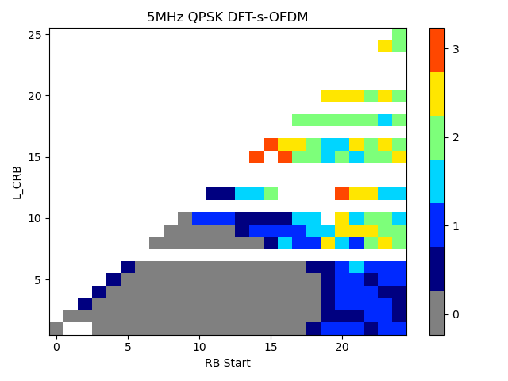
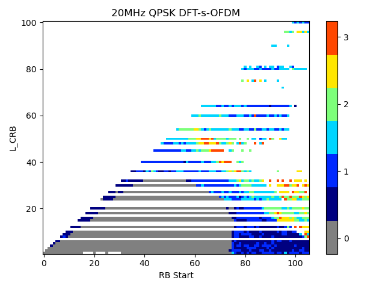

######## Annex A (normative): Measurement channels

A.1 General
===========

A.1.1 Throughput definition
---------------------------

The throughput values defined in the measurement channels specified in
Annex A, are calculated and are valid per codeword. For multi-codeword
transmissions, the throughput referenced in the minimum requirements is
the sum of throughputs of all codewords.

A.1.2 TDD UL-DL configurations for FR1
--------------------------------------

TDD UL-DL configurations for performance requirements are provided in
Tables A.1.2-1, A.1.2-2, and A.1.2-3.

Table A.1.2-1: TDD UL-DL configuration for SCS 15 kHz

+--------------------+--------------------+--------------------+----+
| Parameter          | Unit               | UL-DL pattern      |    |
+====================+====================+====================+====+
|                    |                    | FR1.15-1           |    |
+--------------------+--------------------+--------------------+----+
| TDD Slot           |                    | DDDSU              |    |
| Configuration      |                    |                    |    |
| pattern (Note 1)   |                    |                    |    |
+--------------------+--------------------+--------------------+----+
| Special Slot       |                    | 10D+2G+2U          |    |
| Configuration      |                    |                    |    |
| (Note 2)           |                    |                    |    |
+--------------------+--------------------+--------------------+----+
| *reference         | kHz                | 15                 |    |
| SubcarrierSpacing* |                    |                    |    |
+--------------------+--------------------+--------------------+----+
| pattern1           | *dl-UL-Transm      | ms                 | 5  |
|                    | issionPeriodicity* |                    |    |
+--------------------+--------------------+--------------------+----+
|                    | *                  |                    | 3  |
|                    | nrofDownlinkSlots* |                    |    |
+--------------------+--------------------+--------------------+----+
|                    | *nr                |                    | 10 |
|                    | ofDownlinkSymbols* |                    |    |
+--------------------+--------------------+--------------------+----+
|                    | *nrofUplinkSlot*   |                    | 1  |
+--------------------+--------------------+--------------------+----+
|                    | *                  |                    | 2  |
|                    | nrofUplinkSymbols* |                    |    |
+--------------------+--------------------+--------------------+----+
| The number of      |                    | 4 if mod(i,5) = 0\ |    |
| slots between      |                    | 3 if mod(i,5) = 1\ |    |
| PDSCH and          |                    | 2 if mod(i,5) = 2\ |    |
| corresponding      |                    | 6 if mod(i,5) = 3  |    |
| HARQ-ACK           |                    |                    |    |
| information (Note  |                    |                    |    |
| 3)                 |                    |                    |    |
+--------------------+--------------------+--------------------+----+
| Note 1: D denotes  |                    |                    |    |
| a slot with all DL |                    |                    |    |
| symbols; S denotes |                    |                    |    |
| a slot with a mix  |                    |                    |    |
| of DL, UL and      |                    |                    |    |
| guard symbols; U   |                    |                    |    |
| denotes a slot     |                    |                    |    |
| with all UL        |                    |                    |    |
| symbols. The field |                    |                    |    |
| is for             |                    |                    |    |
| information.       |                    |                    |    |
|                    |                    |                    |    |
| Note 2: D, G, U    |                    |                    |    |
| denote DL, guard   |                    |                    |    |
| and UL symbols,    |                    |                    |    |
| respectively. The  |                    |                    |    |
| field is for       |                    |                    |    |
| information.       |                    |                    |    |
|                    |                    |                    |    |
| Note 3: i is the   |                    |                    |    |
| slot index per     |                    |                    |    |
| frame; i =         |                    |                    |    |
| {0,...,9}.         |                    |                    |    |
+--------------------+--------------------+--------------------+----+

Table A.1.2-2: TDD UL-DL configuration for SCS 30 kHz

+-------+-------+-------+-------+-------+-------+-------+-------+----+
| Para  | Unit  | UL-DL |       |       |       |       |       |    |
| meter |       | pa    |       |       |       |       |       |    |
|       |       | ttern |       |       |       |       |       |    |
+=======+=======+=======+=======+=======+=======+=======+=======+====+
|       |       | FR1   | FR1   | FR1   | FR1   | FR1   | FR1   |    |
|       |       | .30-1 | .30-2 | .30-3 | .30-4 | .30-5 | .30-6 |    |
+-------+-------+-------+-------+-------+-------+-------+-------+----+
| TDD   |       | 7DS2U | DDDSU | DDDSU | DDDSU | DSUU  | DS~1~ |    |
| Slot  |       |       |       | DDSUU | UDDDD |       | S~2~U |    |
| Con   |       |       |       |       |       |       |       |    |
| figur |       |       |       |       |       |       |       |    |
| ation |       |       |       |       |       |       |       |    |
| pa    |       |       |       |       |       |       |       |    |
| ttern |       |       |       |       |       |       |       |    |
| (Note |       |       |       |       |       |       |       |    |
| 1)    |       |       |       |       |       |       |       |    |
+-------+-------+-------+-------+-------+-------+-------+-------+----+
| Sp    |       | 6D+   | 10D+  | 10D+  | 6D+   | 1     | S1:   |    |
| ecial |       | 4G+4U | 2G+2U | 2G+2U | 4G+4U | 2D+2G | 10D+2 |    |
| Slot  |       |       |       |       |       |       | G+2U\ |    |
| Con   |       |       |       |       |       |       | S2:   |    |
| figur |       |       |       |       |       |       | 12D+  |    |
| ation |       |       |       |       |       |       | 2G+0U |    |
| (Note |       |       |       |       |       |       |       |    |
| 2)    |       |       |       |       |       |       |       |    |
+-------+-------+-------+-------+-------+-------+-------+-------+----+
| *re   | kHz   | 30    | 30    | 30    | 30    | 30    | 30    |    |
| feren |       |       |       |       |       |       |       |    |
| ceSub |       |       |       |       |       |       |       |    |
| carri |       |       |       |       |       |       |       |    |
| erSpa |       |       |       |       |       |       |       |    |
| cing* |       |       |       |       |       |       |       |    |
+-------+-------+-------+-------+-------+-------+-------+-------+----+
| pat   |       |       |       |       |       |       |       |    |
| tern1 |       |       |       |       |       |       |       |    |
+-------+-------+-------+-------+-------+-------+-------+-------+----+
|       | *     | ms    | 5     | 2.5   | 2.5   | 3     | 2     | 1  |
|       | dl-UL |       |       |       |       |       |       |    |
|       | -Tran |       |       |       |       |       |       |    |
|       | smiss |       |       |       |       |       |       |    |
|       | ionPe |       |       |       |       |       |       |    |
|       | riodi |       |       |       |       |       |       |    |
|       | city* |       |       |       |       |       |       |    |
+-------+-------+-------+-------+-------+-------+-------+-------+----+
|       | *nro  |       | 7     | 3     | 3     | 3     | 1     | 1  |
|       | fDown |       |       |       |       |       |       |    |
|       | linkS |       |       |       |       |       |       |    |
|       | lots* |       |       |       |       |       |       |    |
+-------+-------+-------+-------+-------+-------+-------+-------+----+
|       | *     |       | 6     | 10    | 10    | 6     | 12    | 10 |
|       | nrofD |       |       |       |       |       |       |    |
|       | ownli |       |       |       |       |       |       |    |
|       | nkSym |       |       |       |       |       |       |    |
|       | bols* |       |       |       |       |       |       |    |
+-------+-------+-------+-------+-------+-------+-------+-------+----+
|       | *     |       | 2     | 1     | 1     | 2     | 2     | 0  |
|       | nrofU |       |       |       |       |       |       |    |
|       | plink |       |       |       |       |       |       |    |
|       | Slot* |       |       |       |       |       |       |    |
+-------+-------+-------+-------+-------+-------+-------+-------+----+
|       | *nro  |       | 4     | 2     | 2     | 4     | 0     | 2  |
|       | fUpli |       |       |       |       |       |       |    |
|       | nkSym |       |       |       |       |       |       |    |
|       | bols* |       |       |       |       |       |       |    |
+-------+-------+-------+-------+-------+-------+-------+-------+----+
| pat   |       |       |       |       |       |       |       |    |
| tern2 |       |       |       |       |       |       |       |    |
+-------+-------+-------+-------+-------+-------+-------+-------+----+
|       | *     | ms    | N/A   | N/A   | 2.5   | 2     | N/A   | 1  |
|       | dl-UL |       |       |       |       |       |       |    |
|       | -Tran |       |       |       |       |       |       |    |
|       | smiss |       |       |       |       |       |       |    |
|       | ionPe |       |       |       |       |       |       |    |
|       | riodi |       |       |       |       |       |       |    |
|       | city* |       |       |       |       |       |       |    |
+-------+-------+-------+-------+-------+-------+-------+-------+----+
|       | *nro  |       | N/A   | N/A   | 2     | 4     | N/A   | 0  |
|       | fDown |       |       |       |       |       |       |    |
|       | linkS |       |       |       |       |       |       |    |
|       | lots* |       |       |       |       |       |       |    |
+-------+-------+-------+-------+-------+-------+-------+-------+----+
|       | *     |       | N/A   | N/A   | 10    | 0     | N/A   | 12 |
|       | nrofD |       |       |       |       |       |       |    |
|       | ownli |       |       |       |       |       |       |    |
|       | nkSym |       |       |       |       |       |       |    |
|       | bols* |       |       |       |       |       |       |    |
+-------+-------+-------+-------+-------+-------+-------+-------+----+
|       | *     |       | N/A   | N/A   | 2     | 0     | N/A   | 1  |
|       | nrofU |       |       |       |       |       |       |    |
|       | plink |       |       |       |       |       |       |    |
|       | Slot* |       |       |       |       |       |       |    |
+-------+-------+-------+-------+-------+-------+-------+-------+----+
|       | *nro  |       | N/A   | N/A   | 2     | 0     | N/A   | 0  |
|       | fUpli |       |       |       |       |       |       |    |
|       | nkSym |       |       |       |       |       |       |    |
|       | bols* |       |       |       |       |       |       |    |
+-------+-------+-------+-------+-------+-------+-------+-------+----+
| The   |       | 8 if  | 4 if  | 4 if  | 5 if  | 3 if  | 3 if  |    |
| n     |       | mod(  | mod   | mod(  | mod(  | mod   | mod   |    |
| umber |       | i,10) | (i,5) | i,10) | i,10) | (i,4) | (i,4) |    |
| of    |       | = 0\  | = 0\  | = 0\  | = 0\  | = 0\  | = 0\  |    |
| slots |       | 7 if  | 3 if  | 3 if  | 4 if  | 2 if  | 2 if  |    |
| be    |       | mod(  | mod   | mod(  | mod(  | mod   | mod   |    |
| tween |       | i,10) | (i,5) | i,10) | i,10) | (i,4) | (i,4) |    |
| PDSCH |       | = 1\  | = 1\  | = 1\  | = 1\  | = 1   | = 1\  |    |
| and   |       | 6 if  | 2 if  | 2 if  | 3 if  |       | 3 if  |    |
| cor   |       | mod(  | mod   | mod(  | mod(  |       | mod   |    |
| respo |       | i,10) | (i,5) | i,10) | i,10) |       | (i,4) |    |
| nding |       | = 2\  | = 2\  | = 2\  | = 2\  |       | = 2   |    |
| HAR   |       | 5 if  | 6 if  | 5 if  | 2 if  |       |       |    |
| Q-ACK |       | mod(  | mod   | mod(  | mod(  |       |       |    |
| i     |       | i,10) | (i,5) | i,10) | i,10) |       |       |    |
| nform |       | = 3\  | = 3   | = 3\  | = 3\  |       |       |    |
| ation |       | 5 if  |       | 3 if  | 8 if  |       |       |    |
| (Note |       | mod(  |       | mod(  | mod(  |       |       |    |
| 3)    |       | i,10) |       | i,10) | i,10) |       |       |    |
|       |       | = 4\  |       | = 5\  | = 6\  |       |       |    |
|       |       | 4 if  |       | 3 if  | 7 if  |       |       |    |
|       |       | mod(  |       | mod(  | mod(  |       |       |    |
|       |       | i,10) |       | i,10) | i,10) |       |       |    |
|       |       | = 5\  |       | = 6\  | = 7\  |       |       |    |
|       |       | 3 if  |       | 2 if  | 6 if  |       |       |    |
|       |       | mod(  |       | mod(  | mod(  |       |       |    |
|       |       | i,10) |       | i,10) | i,10) |       |       |    |
|       |       | = 6\  |       | = 7   | = 8\  |       |       |    |
|       |       | 2 if  |       |       | 5 if  |       |       |    |
|       |       | mod(  |       |       | mod(  |       |       |    |
|       |       | i,10) |       |       | i,10) |       |       |    |
|       |       | = 7   |       |       | = 9   |       |       |    |
+-------+-------+-------+-------+-------+-------+-------+-------+----+
| Note  |       |       |       |       |       |       |       |    |
| 1: D  |       |       |       |       |       |       |       |    |
| de    |       |       |       |       |       |       |       |    |
| notes |       |       |       |       |       |       |       |    |
| a     |       |       |       |       |       |       |       |    |
| slot  |       |       |       |       |       |       |       |    |
| with  |       |       |       |       |       |       |       |    |
| all   |       |       |       |       |       |       |       |    |
| DL    |       |       |       |       |       |       |       |    |
| sym   |       |       |       |       |       |       |       |    |
| bols; |       |       |       |       |       |       |       |    |
| S     |       |       |       |       |       |       |       |    |
| de    |       |       |       |       |       |       |       |    |
| notes |       |       |       |       |       |       |       |    |
| a     |       |       |       |       |       |       |       |    |
| slot  |       |       |       |       |       |       |       |    |
| with  |       |       |       |       |       |       |       |    |
| a mix |       |       |       |       |       |       |       |    |
| of    |       |       |       |       |       |       |       |    |
| DL,   |       |       |       |       |       |       |       |    |
| UL    |       |       |       |       |       |       |       |    |
| and   |       |       |       |       |       |       |       |    |
| guard |       |       |       |       |       |       |       |    |
| sym   |       |       |       |       |       |       |       |    |
| bols; |       |       |       |       |       |       |       |    |
| U     |       |       |       |       |       |       |       |    |
| de    |       |       |       |       |       |       |       |    |
| notes |       |       |       |       |       |       |       |    |
| a     |       |       |       |       |       |       |       |    |
| slot  |       |       |       |       |       |       |       |    |
| with  |       |       |       |       |       |       |       |    |
| all   |       |       |       |       |       |       |       |    |
| UL    |       |       |       |       |       |       |       |    |
| sym   |       |       |       |       |       |       |       |    |
| bols. |       |       |       |       |       |       |       |    |
| The   |       |       |       |       |       |       |       |    |
| field |       |       |       |       |       |       |       |    |
| is    |       |       |       |       |       |       |       |    |
| for   |       |       |       |       |       |       |       |    |
| in    |       |       |       |       |       |       |       |    |
| forma |       |       |       |       |       |       |       |    |
| tion. |       |       |       |       |       |       |       |    |
|       |       |       |       |       |       |       |       |    |
| Note  |       |       |       |       |       |       |       |    |
| 2: D, |       |       |       |       |       |       |       |    |
| G, U  |       |       |       |       |       |       |       |    |
| d     |       |       |       |       |       |       |       |    |
| enote |       |       |       |       |       |       |       |    |
| DL,   |       |       |       |       |       |       |       |    |
| guard |       |       |       |       |       |       |       |    |
| and   |       |       |       |       |       |       |       |    |
| UL    |       |       |       |       |       |       |       |    |
| sym   |       |       |       |       |       |       |       |    |
| bols, |       |       |       |       |       |       |       |    |
| res   |       |       |       |       |       |       |       |    |
| pecti |       |       |       |       |       |       |       |    |
| vely. |       |       |       |       |       |       |       |    |
| The   |       |       |       |       |       |       |       |    |
| field |       |       |       |       |       |       |       |    |
| is    |       |       |       |       |       |       |       |    |
| for   |       |       |       |       |       |       |       |    |
| in    |       |       |       |       |       |       |       |    |
| forma |       |       |       |       |       |       |       |    |
| tion. |       |       |       |       |       |       |       |    |
|       |       |       |       |       |       |       |       |    |
| Note  |       |       |       |       |       |       |       |    |
| 3: i  |       |       |       |       |       |       |       |    |
| is    |       |       |       |       |       |       |       |    |
| the   |       |       |       |       |       |       |       |    |
| slot  |       |       |       |       |       |       |       |    |
| index |       |       |       |       |       |       |       |    |
| per   |       |       |       |       |       |       |       |    |
| f     |       |       |       |       |       |       |       |    |
| rame; |       |       |       |       |       |       |       |    |
| i =   |       |       |       |       |       |       |       |    |
| {0,.. |       |       |       |       |       |       |       |    |
| .,19} |       |       |       |       |       |       |       |    |
+-------+-------+-------+-------+-------+-------+-------+-------+----+

Table A.1.2-2a: TDD UL-DL configuration for SCS 30 kHz for DCI-based
dynamic UL/DL detection

+----------------+----------------+----------------+----------------+
| Parameter      | Unit           | UL-DL pattern  |                |
+================+================+================+================+
|                |                | FR1.30-1A      |                |
+----------------+----------------+----------------+----------------+
| TDD Slot       |                | 7DS2U          |                |
| Configuration  |                |                |                |
| pattern (Note  |                |                |                |
| 1)             |                |                |                |
+----------------+----------------+----------------+----------------+
| Special Slot   |                | 6D+4G+4U       |                |
| Configuration  |                |                |                |
| (Note 2)       |                |                |                |
+----------------+----------------+----------------+----------------+
| *referenceSubc | kHz            | N/A            |                |
| arrierSpacing* |                |                |                |
+----------------+----------------+----------------+----------------+
| pattern1 (Note |                |                |                |
| 4)             |                |                |                |
+----------------+----------------+----------------+----------------+
|                | *dl            | ms             | N/A            |
|                | -UL-Transmissi |                |                |
|                | onPeriodicity* |                |                |
+----------------+----------------+----------------+----------------+
|                | *nrof          |                | N/A            |
|                | DownlinkSlots* |                |                |
+----------------+----------------+----------------+----------------+
|                | *nrofDo        |                | N/A            |
|                | wnlinkSymbols* |                |                |
+----------------+----------------+----------------+----------------+
|                | *n             |                | N/A            |
|                | rofUplinkSlot* |                |                |
+----------------+----------------+----------------+----------------+
|                | *nrof          |                | N/A            |
|                | UplinkSymbols* |                |                |
+----------------+----------------+----------------+----------------+
|                |                |                |                |
+----------------+----------------+----------------+----------------+
|                |                |                |                |
+----------------+----------------+----------------+----------------+
|                |                |                |                |
+----------------+----------------+----------------+----------------+
|                |                |                |                |
+----------------+----------------+----------------+----------------+
|                |                |                |                |
+----------------+----------------+----------------+----------------+
|                |                |                |                |
+----------------+----------------+----------------+----------------+
| PDCCH DCI      | DCI Format     |                | 1-1 for slot   |
| Configuration  |                |                | indices with   |
|                |                |                | mod(i,10) =    |
|                |                |                | 0              |
|                |                |                | ,1,2,3,4,5,6,7 |
+----------------+----------------+----------------+----------------+
|                | Scheduled      |                | Symbol 2-13    |
|                | Grant          |                | for slot       |
|                |                |                | indices with   |
|                |                |                | mod(i,10) =    |
|                |                |                | 0,1,2,3,4,5,6  |
|                |                |                | and Symbol 2-5 |
|                |                |                | for slot       |
|                |                |                | indices with   |
|                |                |                | mod(i,10) = 7  |
+----------------+----------------+----------------+----------------+
| The number of  |                | 8 if mod(i,10) |                |
| slots between  |                | = 0\           |                |
| PDSCH and      |                | 7 if mod(i,10) |                |
| corresponding  |                | = 1\           |                |
| HARQ-ACK       |                | 6 if mod(i,10) |                |
| information    |                | = 2\           |                |
| (Note 3)\      |                | 5 if mod(i,10) |                |
| (PDS           |                | = 3\           |                |
| CH-to-HARQ-tim |                | 5 if mod(i,10) |                |
| ing-indicator) |                | = 4\           |                |
|                |                | 4 if mod(i,10) |                |
|                |                | = 5\           |                |
|                |                | 3 if mod(i,10) |                |
|                |                | = 6\           |                |
|                |                | 2 if mod(i,10) |                |
|                |                | = 7            |                |
+----------------+----------------+----------------+----------------+
| Note 1: D      |                |                |                |
| denotes a slot |                |                |                |
| with all DL    |                |                |                |
| symbols; S     |                |                |                |
| denotes a slot |                |                |                |
| with a mix of  |                |                |                |
| DL, UL and     |                |                |                |
| guard symbols; |                |                |                |
| U denotes a    |                |                |                |
| slot with all  |                |                |                |
| UL symbols.    |                |                |                |
| The field is   |                |                |                |
| for            |                |                |                |
| information.   |                |                |                |
|                |                |                |                |
| Note 2: D, G   |                |                |                |
| and U denote   |                |                |                |
| DL, guard and  |                |                |                |
| UL symbols,    |                |                |                |
| respectively.  |                |                |                |
| The field is   |                |                |                |
| for            |                |                |                |
| information.   |                |                |                |
|                |                |                |                |
| Note 3: i is   |                |                |                |
| the slot index |                |                |                |
| per frame; i = |                |                |                |
| {0,...,19}     |                |                |                |
|                |                |                |                |
| Note 4: Do not |                |                |                |
| configure      |                |                |                |
| *td            |                |                |                |
| d-UL-DL-Config |                |                |                |
| urationCommon* |                |                |                |
| using RRC      |                |                |                |
| configuration. |                |                |                |
+----------------+----------------+----------------+----------------+

Table A.1.2-2b: TDD UL-DL configuration for SCS 30 kHz for PDSCH on band
with shared spectrum access

+-------------------+-------------------+-------------------+-----+
| Parameter         | Unit              | UL-DL pattern     |     |
+===================+===================+===================+=====+
|                   |                   | FR1.30-7          |     |
+-------------------+-------------------+-------------------+-----+
| TDD Slot          |                   | 7DS2U             |     |
| Configuration     |                   |                   |     |
| pattern (Note 1)  |                   |                   |     |
+-------------------+-------------------+-------------------+-----+
| Special Slot      |                   | 6D+4G+4U          |     |
| Configuration     |                   |                   |     |
| (Note 2)          |                   |                   |     |
+-------------------+-------------------+-------------------+-----+
| *referenceS       | kHz               | 30                |     |
| ubcarrierSpacing* |                   |                   |     |
+-------------------+-------------------+-------------------+-----+
| *Pattern 1*       | *dl-UL-Transmi    | ms                | 5   |
|                   | ssionPeriodicity* |                   |     |
+-------------------+-------------------+-------------------+-----+
|                   | *n                | slot              | 7   |
|                   | rofDownlinkSlots* |                   |     |
+-------------------+-------------------+-------------------+-----+
|                   | *nro              | symbol            | 6   |
|                   | fDownlinkSymbols* |                   |     |
+-------------------+-------------------+-------------------+-----+
|                   | *nrofUplinkSlot*  | slot              | 2   |
+-------------------+-------------------+-------------------+-----+
|                   | *n                | symbol            | 4   |
|                   | rofUplinkSymbols* |                   |     |
+-------------------+-------------------+-------------------+-----+
| *Pattern 2*       | *dl-UL-Transmi    | ms                | N/A |
|                   | ssionPeriodicity* |                   |     |
+-------------------+-------------------+-------------------+-----+
|                   | *n                |                   | N/A |
|                   | rofDownlinkSlots* |                   |     |
+-------------------+-------------------+-------------------+-----+
|                   | *nro              |                   | N/A |
|                   | fDownlinkSymbols* |                   |     |
+-------------------+-------------------+-------------------+-----+
|                   | *nrofUplinkSlot*  |                   | N/A |
+-------------------+-------------------+-------------------+-----+
|                   | *n                |                   | N/A |
|                   | rofUplinkSymbols* |                   |     |
+-------------------+-------------------+-------------------+-----+
| The number of     |                   | 8 if mod(i,10) =  |     |
| slots between     |                   | 0\                |     |
| PDSCH and         |                   | 7 if mod(i,10) =  |     |
| corresponding     |                   | 1\                |     |
| HARQ-ACK          |                   | 6 if mod(i,10) =  |     |
| information (Note |                   | 2\                |     |
| 3)                |                   | 5 if mod(i,10) =  |     |
|                   |                   | 3\                |     |
|                   |                   | 4 if mod(i,10) =  |     |
|                   |                   | 4\                |     |
|                   |                   | 3 if mod(i,10) =  |     |
|                   |                   | 5\                |     |
|                   |                   | 2 if mod(i,10) =  |     |
|                   |                   | 6                 |     |
+-------------------+-------------------+-------------------+-----+
| Note 1: D denotes |                   |                   |     |
| a slot with all   |                   |                   |     |
| DL symbols; S     |                   |                   |     |
| denotes a slot    |                   |                   |     |
| with a mix of DL, |                   |                   |     |
| UL and guard      |                   |                   |     |
| symbols; U        |                   |                   |     |
| denotes a slot    |                   |                   |     |
| with all UL       |                   |                   |     |
| symbols. The      |                   |                   |     |
| field is for      |                   |                   |     |
| information.      |                   |                   |     |
|                   |                   |                   |     |
| Note 2: D, G, U   |                   |                   |     |
| denote DL, guard  |                   |                   |     |
| and UL symbols,   |                   |                   |     |
| respectively. The |                   |                   |     |
| field is for      |                   |                   |     |
| information.      |                   |                   |     |
|                   |                   |                   |     |
| Note 3: i is the  |                   |                   |     |
| slot index of all |                   |                   |     |
| slots in every    |                   |                   |     |
| 5ms i =           |                   |                   |     |
| {0,...,9}Note 4:  |                   |                   |     |
| The slot i, mod   |                   |                   |     |
| (i,10)=9 is idle  |                   |                   |     |
| slot with no UL   |                   |                   |     |
| transmission.     |                   |                   |     |
+-------------------+-------------------+-------------------+-----+

A.1.3 TDD UL-DL configurations for FR2
--------------------------------------

TDD UL-DL configurations for performance requirements are provided in
Tables A.1.3-1, A.1.3-2.

Table A.1.3-1: TDD UL-DL configuration for SCS 60 kHz

+--------------------+--------------------+--------------------+----+
| Parameter          | Unit               | UL-DL pattern      |    |
+====================+====================+====================+====+
|                    |                    | FR2.60-1           |    |
+--------------------+--------------------+--------------------+----+
| TDD Slot           |                    | DDSU               |    |
| Configuration      |                    |                    |    |
| pattern (Note 1)   |                    |                    |    |
+--------------------+--------------------+--------------------+----+
| Special Slot       |                    | 11D+3G+0U          |    |
| Configuration      |                    |                    |    |
| (Note 2)           |                    |                    |    |
+--------------------+--------------------+--------------------+----+
| *reference         | kHz                | 60                 |    |
| SubcarrierSpacing* |                    |                    |    |
+--------------------+--------------------+--------------------+----+
| pattern1           | *dl-UL-Transm      | ms                 | 1  |
|                    | issionPeriodicity* |                    |    |
+--------------------+--------------------+--------------------+----+
|                    | *                  |                    | 2  |
|                    | nrofDownlinkSlots* |                    |    |
+--------------------+--------------------+--------------------+----+
|                    | *nr                |                    | 11 |
|                    | ofDownlinkSymbols* |                    |    |
+--------------------+--------------------+--------------------+----+
|                    | *nrofUplinkSlot*   |                    | 1  |
+--------------------+--------------------+--------------------+----+
|                    | *                  |                    | 0  |
|                    | nrofUplinkSymbols* |                    |    |
+--------------------+--------------------+--------------------+----+
| The number of      |                    | 3 if mod(i,4) = 0\ |    |
| slots between      |                    | 2 if mod(i,4) = 1\ |    |
| PDSCH and          |                    | 5 if mod(i,4) = 2  |    |
| corresponding      |                    |                    |    |
| HARQ-ACK           |                    |                    |    |
| information (Note  |                    |                    |    |
| 3)                 |                    |                    |    |
+--------------------+--------------------+--------------------+----+
| Note 1: D denotes  |                    |                    |    |
| a slot with all DL |                    |                    |    |
| symbols; S denotes |                    |                    |    |
| a slot with a mix  |                    |                    |    |
| of DL, UL and      |                    |                    |    |
| guard symbols; U   |                    |                    |    |
| denotes a slot     |                    |                    |    |
| with all UL        |                    |                    |    |
| symbols. The field |                    |                    |    |
| is for             |                    |                    |    |
| information.       |                    |                    |    |
|                    |                    |                    |    |
| Note 2: D, G, U    |                    |                    |    |
| denote DL, guard   |                    |                    |    |
| and UL symbols,    |                    |                    |    |
| respectively. The  |                    |                    |    |
| field is for       |                    |                    |    |
| information.       |                    |                    |    |
|                    |                    |                    |    |
| Note 3: i is the   |                    |                    |    |
| slot index per     |                    |                    |    |
| frame; i =         |                    |                    |    |
| {0,...,39}         |                    |                    |    |
+--------------------+--------------------+--------------------+----+

Table A.1.3-2: TDD UL-DL configuration for SCS 120 kHz

+---------------+---------------+---------------+---------------+-----+
| Parameter     | Unit          | UL-DL pattern |               |     |
+===============+===============+===============+===============+=====+
|               |               | FR2.120-1     | FR2.120-2     |     |
+---------------+---------------+---------------+---------------+-----+
| TDD Slot      |               | DDDSU         | DDSU          |     |
| Configuration |               |               |               |     |
| pattern (Note |               |               |               |     |
| 1)            |               |               |               |     |
+---------------+---------------+---------------+---------------+-----+
| Special Slot  |               | 10D+2G+2U     | 11D+3G+0U     |     |
| Configuration |               |               |               |     |
| (Note 2)      |               |               |               |     |
+---------------+---------------+---------------+---------------+-----+
| *r            | kHz           | 120           | 120           |     |
| eferenceSubca |               |               |               |     |
| rrierSpacing* |               |               |               |     |
+---------------+---------------+---------------+---------------+-----+
| pattern1      | *dl-U         | ms            | 0.625         | 0.5 |
|               | L-Transmissio |               |               |     |
|               | nPeriodicity* |               |               |     |
+---------------+---------------+---------------+---------------+-----+
|               | *nrofD        |               | 3             | 2   |
|               | ownlinkSlots* |               |               |     |
+---------------+---------------+---------------+---------------+-----+
|               | *nrofDow      |               | 10            | 11  |
|               | nlinkSymbols* |               |               |     |
+---------------+---------------+---------------+---------------+-----+
|               | *nr           |               | 1             | 1   |
|               | ofUplinkSlot* |               |               |     |
+---------------+---------------+---------------+---------------+-----+
|               | *nrofU        |               | 2             | 0   |
|               | plinkSymbols* |               |               |     |
+---------------+---------------+---------------+---------------+-----+
| The number of |               | 4 if mod(i,5) | 3 if mod(i,4) |     |
| slots between |               | = 0\          | = 0\          |     |
| PDSCH and     |               | 3 if mod(i,5) | 2 if mod(i,4) |     |
| corresponding |               | = 1\          | = 1\          |     |
| HARQ-ACK      |               | 2 if mod(i,5) | 5 if mod(i,4) |     |
| inf           |               | = 2\          | = 2           |     |
| ormation(Note |               | 6 if mod(i,5) |               |     |
| 3)            |               | = 3           |               |     |
+---------------+---------------+---------------+---------------+-----+
| Note 1: D     |               |               |               |     |
| denotes a     |               |               |               |     |
| slot with all |               |               |               |     |
| DL symbols; S |               |               |               |     |
| denotes a     |               |               |               |     |
| slot with a   |               |               |               |     |
| mix of DL, UL |               |               |               |     |
| and guard     |               |               |               |     |
| symbols; U    |               |               |               |     |
| denotes a     |               |               |               |     |
| slot with all |               |               |               |     |
| UL symbols.   |               |               |               |     |
| The field is  |               |               |               |     |
| for           |               |               |               |     |
| information.  |               |               |               |     |
|               |               |               |               |     |
| Note 2: D, G, |               |               |               |     |
| U denote DL,  |               |               |               |     |
| guard and UL  |               |               |               |     |
| symbols,      |               |               |               |     |
| respectively. |               |               |               |     |
| The field is  |               |               |               |     |
| for           |               |               |               |     |
| information.  |               |               |               |     |
|               |               |               |               |     |
| Note 3: i is  |               |               |               |     |
| the slot      |               |               |               |     |
| index per     |               |               |               |     |
| frame; i =    |               |               |               |     |
| {0,...,79}    |               |               |               |     |
+---------------+---------------+---------------+---------------+-----+

Table A.1.3-2a: TDD UL-DL configuration for SCS 120 kHz for DCI-based
dynamic UL/DL detection

+----------------+----------------+----------------+----------------+
| Parameter      | Unit           | UL-DL pattern  |                |
+================+================+================+================+
|                |                | FR2.120-1A     |                |
+----------------+----------------+----------------+----------------+
| TDD Slot       |                | DDDSU          |                |
| Configuration  |                |                |                |
| pattern (Note  |                |                |                |
| 1)             |                |                |                |
+----------------+----------------+----------------+----------------+
| Special Slot   |                | 10D+2G+2U      |                |
| Configuration  |                |                |                |
| (Note 2)       |                |                |                |
+----------------+----------------+----------------+----------------+
| *referenceSubc | kHz            | N/A            |                |
| arrierSpacing* |                |                |                |
+----------------+----------------+----------------+----------------+
| pattern1 (Note | *dl            | ms             | N/A            |
| 4)             | -UL-Transmissi |                |                |
|                | onPeriodicity* |                |                |
+----------------+----------------+----------------+----------------+
|                | *nrof          |                | N/A            |
|                | DownlinkSlots* |                |                |
+----------------+----------------+----------------+----------------+
|                | *nrofDo        |                | N/A            |
|                | wnlinkSymbols* |                |                |
+----------------+----------------+----------------+----------------+
|                | *n             |                | N/A            |
|                | rofUplinkSlot* |                |                |
+----------------+----------------+----------------+----------------+
|                | *nrof          |                | N/A            |
|                | UplinkSymbols* |                |                |
+----------------+----------------+----------------+----------------+
|                |                |                |                |
+----------------+----------------+----------------+----------------+
|                |                |                |                |
+----------------+----------------+----------------+----------------+
|                |                |                |                |
+----------------+----------------+----------------+----------------+
|                |                |                |                |
+----------------+----------------+----------------+----------------+
|                |                |                |                |
+----------------+----------------+----------------+----------------+
|                |                |                |                |
+----------------+----------------+----------------+----------------+
| PDCCH DCI      | DCI Format     |                | 1-1 for slot   |
| Configuration  |                |                | indices with   |
|                |                |                | mod(i,5) =     |
|                |                |                | 0,1,2,3        |
+----------------+----------------+----------------+----------------+
|                | Scheduled      |                | Symbol 1-13    |
|                | Grant          |                | for slot       |
|                |                |                | indices with   |
|                |                |                | mod(i,5) =     |
|                |                |                | 0,1,2 and      |
|                |                |                | Symbol 1-9 for |
|                |                |                | slot indices   |
|                |                |                | with mod(i,5)  |
|                |                |                | = 3            |
+----------------+----------------+----------------+----------------+
| The number of  |                | 4 if mod(i,5)  |                |
| slots between  |                | = 0\           |                |
| PDSCH and      |                | 3 if mod(i,5)  |                |
| corresponding  |                | = 1\           |                |
| HARQ-ACK       |                | 2 if mod(i,5)  |                |
| in             |                | = 2\           |                |
| formation(Note |                | 6 if mod(i,5)  |                |
| 3)             |                | = 3            |                |
+----------------+----------------+----------------+----------------+
| Note 1: D      |                |                |                |
| denotes a slot |                |                |                |
| with all DL    |                |                |                |
| symbols; S     |                |                |                |
| denotes a slot |                |                |                |
| with a mix of  |                |                |                |
| DL, UL and     |                |                |                |
| guard symbols; |                |                |                |
| U denotes a    |                |                |                |
| slot with all  |                |                |                |
| UL symbols.    |                |                |                |
| The field is   |                |                |                |
| for            |                |                |                |
| information.   |                |                |                |
|                |                |                |                |
| Note 2: D, G   |                |                |                |
| and U denote   |                |                |                |
| DL, guard and  |                |                |                |
| UL symbols,    |                |                |                |
| respectively.  |                |                |                |
| The field is   |                |                |                |
| for            |                |                |                |
| information.   |                |                |                |
|                |                |                |                |
| Note 3: i is   |                |                |                |
| the slot index |                |                |                |
| per frame; i = |                |                |                |
| {0,...,79}     |                |                |                |
|                |                |                |                |
| Note 4: Do not |                |                |                |
| configure      |                |                |                |
| *td            |                |                |                |
| d-UL-DL-Config |                |                |                |
| urationCommon* |                |                |                |
| using RRC      |                |                |                |
| configuration. |                |                |                |
+----------------+----------------+----------------+----------------+

A.2 UL Reference measurement channels
=====================================

A.2.1 General
-------------

The measurement channels in the following subclauses are defined to test
the performance requirements where PUSCH is required. The measurement
channels represent example configurations of physical channels for
different data rates.

A.2.2 Reference measurement channels for FDD
--------------------------------------------

### A.2.2.1 RMC for Sustained downlink data rate

#### A.2.2.1.1 CP-OFDM 64QAM

Table A.2.2.1.1-1: Reference Channels for CP-OFDM 64QAM for 15kHz SCS

<table>
<thead>
<tr class="header">
<th>Parameter</th>
<th>Channel bandwidth</th>
<th>Subcarrier Spacing</th>
<th>Allocated resource blocks</th>
<th>CP-OFDM Symbols per slot (Note 1)</th>
<th>Modulation</th>
<th>MCS Index (Note 2)</th>
<th>Target Coding Rate</th>
<th>Payload size</th>
<th>Transport block CRC</th>
<th>LDPC Base Graph</th>
<th>Number of code blocks per slot (Note 3)</th>
<th>Total number of bits per slot</th>
<th>Total modulated symbols per slot</th>
</tr>
</thead>
<tbody>
<tr class="odd">
<td>Unit</td>
<td>MHz</td>
<td>KHz</td>
<td></td>
<td></td>
<td></td>
<td></td>
<td></td>
<td>Bits</td>
<td>Bits</td>
<td></td>
<td></td>
<td>Bits</td>
<td></td>
</tr>
<tr class="even">
<td></td>
<td>5</td>
<td>15</td>
<td>25</td>
<td>11</td>
<td>64QAM</td>
<td>19</td>
<td>1/2</td>
<td>9992</td>
<td>24</td>
<td>1</td>
<td>2</td>
<td>19800</td>
<td>3300</td>
</tr>
<tr class="odd">
<td></td>
<td>10</td>
<td>15</td>
<td>52</td>
<td>11</td>
<td>64QAM</td>
<td>19</td>
<td>1/2</td>
<td>21000</td>
<td>24</td>
<td>1</td>
<td>3</td>
<td>41184</td>
<td>6864</td>
</tr>
<tr class="even">
<td></td>
<td>15</td>
<td>15</td>
<td>79</td>
<td>11</td>
<td>64QAM</td>
<td>19</td>
<td>1/2</td>
<td>31752</td>
<td>24</td>
<td>1</td>
<td>4</td>
<td>62568</td>
<td>10428</td>
</tr>
<tr class="odd">
<td></td>
<td>20</td>
<td>15</td>
<td>106</td>
<td>11</td>
<td>64QAM</td>
<td>19</td>
<td>1/2</td>
<td>42016</td>
<td>24</td>
<td>1</td>
<td>5</td>
<td>83952</td>
<td>13992</td>
</tr>
<tr class="even">
<td></td>
<td>25</td>
<td>15</td>
<td>133</td>
<td>11</td>
<td>64QAM</td>
<td>19</td>
<td>1/2</td>
<td>53288</td>
<td>24</td>
<td>1</td>
<td>7</td>
<td>105336</td>
<td>17556</td>
</tr>
<tr class="odd">
<td></td>
<td>30</td>
<td>15</td>
<td>160</td>
<td>11</td>
<td>64QAM</td>
<td>19</td>
<td>1/2</td>
<td>63528</td>
<td>24</td>
<td>1</td>
<td>8</td>
<td>126720</td>
<td>21120</td>
</tr>
<tr class="even">
<td></td>
<td>40</td>
<td>15</td>
<td>216</td>
<td>11</td>
<td>64QAM</td>
<td>19</td>
<td>1/2</td>
<td>86040</td>
<td>24</td>
<td>1</td>
<td>11</td>
<td>171072</td>
<td>28512</td>
</tr>
<tr class="odd">
<td></td>
<td>50</td>
<td>15</td>
<td>270</td>
<td>11</td>
<td>64QAM</td>
<td>19</td>
<td>1/2</td>
<td>108552</td>
<td>24</td>
<td>1</td>
<td>13</td>
<td>213840</td>
<td>35640</td>
</tr>
<tr class="even">
<td>
Note 1: PUSCH mapping Type-A and single-symbol DM-RS configuration Type-1 with 2 additional DM-RS symbols, such that the DM-RS positions are set to symbols 2, 7, 11. DMRS is [TDMed] with PUSCH data.

Note 2: MCS Index is based on MCS table 5.1.3.1-1 defined in TS 38.214 [12].

Note 3: If more than one Code Block is present, an additional CRC sequence of L = 24 Bits is attached to each Code Block (otherwise L = 0 Bit)
</td>
<td></td>
<td></td>
<td></td>
<td></td>
<td></td>
<td></td>
<td></td>
<td></td>
<td></td>
<td></td>
<td></td>
<td></td>
<td></td>
</tr>
</tbody>
</table>

Table A.2.2.1.1-2: Reference Channels for CP-OFDM 64QAM for 30kHz SCS

<table>
<thead>
<tr class="header">
<th>Parameter</th>
<th>Channel bandwidth</th>
<th>Subcarrier Spacing</th>
<th>Allocated resource blocks</th>
<th>CP-OFDM Symbols per slot (Note 1)</th>
<th>Modulation</th>
<th>MCS Index (Note 2)</th>
<th>Target Coding Rate</th>
<th>Payload size</th>
<th>Transport block CRC</th>
<th>LDPC Base Graph</th>
<th>Number of code blocks per slot (Note 3)</th>
<th>Total number of bits per slot</th>
<th>Total modulated symbols per slot</th>
</tr>
</thead>
<tbody>
<tr class="odd">
<td>Unit</td>
<td>MHz</td>
<td>KHz</td>
<td></td>
<td></td>
<td></td>
<td></td>
<td></td>
<td>Bits</td>
<td>Bits</td>
<td></td>
<td></td>
<td>Bits</td>
<td></td>
</tr>
<tr class="even">
<td></td>
<td>5</td>
<td>30</td>
<td>11</td>
<td>11</td>
<td>64QAM</td>
<td>19</td>
<td>1/2</td>
<td>4352</td>
<td>24</td>
<td>1</td>
<td>1</td>
<td>8712</td>
<td>1452</td>
</tr>
<tr class="odd">
<td></td>
<td>10</td>
<td>30</td>
<td>24</td>
<td>11</td>
<td>64QAM</td>
<td>19</td>
<td>1/2</td>
<td>9480</td>
<td>24</td>
<td>1</td>
<td>2</td>
<td>19008</td>
<td>3168</td>
</tr>
<tr class="even">
<td></td>
<td>15</td>
<td>30</td>
<td>38</td>
<td>11</td>
<td>64QAM</td>
<td>19</td>
<td>1/2</td>
<td>15112</td>
<td>24</td>
<td>1</td>
<td>2</td>
<td>30096</td>
<td>5016</td>
</tr>
<tr class="odd">
<td></td>
<td>20</td>
<td>30</td>
<td>51</td>
<td>11</td>
<td>64QAM</td>
<td>19</td>
<td>1/2</td>
<td>20496</td>
<td>24</td>
<td>1</td>
<td>3</td>
<td>40392</td>
<td>6732</td>
</tr>
<tr class="even">
<td></td>
<td>25</td>
<td>30</td>
<td>65</td>
<td>11</td>
<td>64QAM</td>
<td>19</td>
<td>1/2</td>
<td>26120</td>
<td>24</td>
<td>1</td>
<td>4</td>
<td>51480</td>
<td>8580</td>
</tr>
<tr class="odd">
<td></td>
<td>30</td>
<td>30</td>
<td>78</td>
<td>11</td>
<td>64QAM</td>
<td>19</td>
<td>1/2</td>
<td>31240</td>
<td>24</td>
<td>1</td>
<td>4</td>
<td>61776</td>
<td>10296</td>
</tr>
<tr class="even">
<td></td>
<td>40</td>
<td>30</td>
<td>106</td>
<td>11</td>
<td>64QAM</td>
<td>19</td>
<td>1/2</td>
<td>42016</td>
<td>24</td>
<td>1</td>
<td>5</td>
<td>83952</td>
<td>13992</td>
</tr>
<tr class="odd">
<td></td>
<td>50</td>
<td>30</td>
<td>133</td>
<td>11</td>
<td>64QAM</td>
<td>19</td>
<td>1/2</td>
<td>53288</td>
<td>24</td>
<td>1</td>
<td>7</td>
<td>105336</td>
<td>17556</td>
</tr>
<tr class="even">
<td></td>
<td>60</td>
<td>30</td>
<td>162</td>
<td>11</td>
<td>64QAM</td>
<td>19</td>
<td>1/2</td>
<td>64552</td>
<td>24</td>
<td>1</td>
<td>8</td>
<td>128304</td>
<td>21384</td>
</tr>
<tr class="odd">
<td></td>
<td>80</td>
<td>30</td>
<td>217</td>
<td>11</td>
<td>64QAM</td>
<td>19</td>
<td>1/2</td>
<td>86040</td>
<td>24</td>
<td>1</td>
<td>11</td>
<td>171864</td>
<td>28644</td>
</tr>
<tr class="even">
<td></td>
<td>90</td>
<td>30</td>
<td>245</td>
<td>11</td>
<td>64QAM</td>
<td>19</td>
<td>1/2</td>
<td>98376</td>
<td>24</td>
<td>1</td>
<td>12</td>
<td>194040</td>
<td>32340</td>
</tr>
<tr class="odd">
<td></td>
<td>100</td>
<td>30</td>
<td>273</td>
<td>11</td>
<td>64QAM</td>
<td>19</td>
<td>1/2</td>
<td>108552</td>
<td>24</td>
<td>1</td>
<td>13</td>
<td>216216</td>
<td>36036</td>
</tr>
<tr class="even">
<td>
Note 1: PUSCH mapping Type-A and single-symbol DM-RS configuration Type-1 with 2 additional DM-RS symbols, such that the DM-RS positions are set to symbols 2, 7, 11. DMRS is [TDMed] with PUSCH data.

Note 2: MCS Index is based on MCS table 5.1.3.1-1 defined in TS 38.214 [12].

Note 3: If more than one Code Block is present, an additional CRC sequence of L = 24 Bits is attached to each Code Block (otherwise L = 0 Bit)
</td>
<td></td>
<td></td>
<td></td>
<td></td>
<td></td>
<td></td>
<td></td>
<td></td>
<td></td>
<td></td>
<td></td>
<td></td>
<td></td>
</tr>
</tbody>
</table>

A.2.3 Reference measurement channels for TDD
--------------------------------------------

### A.2.3.1 RMC for Sustained downlink data rate

#### A.2.3.1.1 CP-OFDM 16QAM

Table A.2.3.1.1-1: Reference Channels for CP-OFDM 16QAM for 15kHz SCS

<table>
<thead>
<tr class="header">
<th>Parameter</th>
<th>Channel bandwidth</th>
<th>Subcarrier Spacing</th>
<th>Allocated resource blocks</th>
<th>CP-OFDM Symbols per slot (Note 1)</th>
<th>Modulation</th>
<th>MCS Index (Note 2)</th>
<th>Target Coding Rate</th>
<th>Payload size for slots 4 and 9</th>
<th>Transport block CRC</th>
<th>LDPC Base Graph</th>
<th>Number of code blocks per slot for slots 4 and 9 (Note 3)</th>
<th>Total number of bits per slot for slots 4 and 9</th>
<th>Total modulated symbols per slot for slots 4 and 9</th>
</tr>
</thead>
<tbody>
<tr class="odd">
<td>Unit</td>
<td>MHz</td>
<td>KHz</td>
<td></td>
<td></td>
<td></td>
<td></td>
<td></td>
<td>Bits</td>
<td>Bits</td>
<td></td>
<td></td>
<td>Bits</td>
<td></td>
</tr>
<tr class="even">
<td></td>
<td>5-50</td>
<td>15</td>
<td>1</td>
<td>11</td>
<td>16QAM</td>
<td>10</td>
<td>1/3</td>
<td>176</td>
<td>16</td>
<td>2</td>
<td>1</td>
<td>528</td>
<td>132</td>
</tr>
<tr class="odd">
<td></td>
<td>5</td>
<td>15</td>
<td>13</td>
<td>11</td>
<td>16QAM</td>
<td>10</td>
<td>1/3</td>
<td>2280</td>
<td>16</td>
<td>2</td>
<td>1</td>
<td>6864</td>
<td>1716</td>
</tr>
<tr class="even">
<td></td>
<td>5</td>
<td>15</td>
<td>25</td>
<td>11</td>
<td>16QAM</td>
<td>10</td>
<td>1/3</td>
<td>4352</td>
<td>24</td>
<td>1</td>
<td>1</td>
<td>13200</td>
<td>3300</td>
</tr>
<tr class="odd">
<td></td>
<td>10</td>
<td>15</td>
<td>26</td>
<td>11</td>
<td>16QAM</td>
<td>10</td>
<td>1/3</td>
<td>4480</td>
<td>24</td>
<td>1</td>
<td>1</td>
<td>13728</td>
<td>3432</td>
</tr>
<tr class="even">
<td></td>
<td>10</td>
<td>15</td>
<td>52</td>
<td>11</td>
<td>16QAM</td>
<td>10</td>
<td>1/3</td>
<td>9224</td>
<td>24</td>
<td>1</td>
<td>2</td>
<td>27456</td>
<td>6864</td>
</tr>
<tr class="odd">
<td></td>
<td>15</td>
<td>15</td>
<td>40</td>
<td>11</td>
<td>16QAM</td>
<td>10</td>
<td>1/3</td>
<td>7040</td>
<td>24</td>
<td>1</td>
<td>1</td>
<td>21120</td>
<td>5280</td>
</tr>
<tr class="even">
<td></td>
<td>15</td>
<td>15</td>
<td>79</td>
<td>11</td>
<td>16QAM</td>
<td>10</td>
<td>1/3</td>
<td>13832</td>
<td>24</td>
<td>1</td>
<td>2</td>
<td>41712</td>
<td>10428</td>
</tr>
<tr class="odd">
<td></td>
<td>20</td>
<td>15</td>
<td>53</td>
<td>11</td>
<td>16QAM</td>
<td>10</td>
<td>1/3</td>
<td>9224</td>
<td>24</td>
<td>1</td>
<td>2</td>
<td>27984</td>
<td>6996</td>
</tr>
<tr class="even">
<td></td>
<td>20</td>
<td>15</td>
<td>106</td>
<td>11</td>
<td>16QAM</td>
<td>10</td>
<td>1/3</td>
<td>18432</td>
<td>24</td>
<td>1</td>
<td>3</td>
<td>55968</td>
<td>13992</td>
</tr>
<tr class="odd">
<td></td>
<td>25</td>
<td>15</td>
<td>67</td>
<td>11</td>
<td>16QAM</td>
<td>10</td>
<td>1/3</td>
<td>11784</td>
<td>24</td>
<td>1</td>
<td>2</td>
<td>35376</td>
<td>8844</td>
</tr>
<tr class="even">
<td></td>
<td>25</td>
<td>15</td>
<td>133</td>
<td>11</td>
<td>16QAM</td>
<td>10</td>
<td>1/3</td>
<td>23040</td>
<td>24</td>
<td>1</td>
<td>3</td>
<td>70224</td>
<td>17556</td>
</tr>
<tr class="odd">
<td></td>
<td>30</td>
<td>15</td>
<td>80</td>
<td>11</td>
<td>16QAM</td>
<td>10</td>
<td>1/3</td>
<td>14088</td>
<td>24</td>
<td>1</td>
<td>2</td>
<td>42240</td>
<td>10560</td>
</tr>
<tr class="even">
<td></td>
<td>30</td>
<td>15</td>
<td>160</td>
<td>11</td>
<td>16QAM</td>
<td>10</td>
<td>1/3</td>
<td>28168</td>
<td>24</td>
<td>1</td>
<td>4</td>
<td>84480</td>
<td>21120</td>
</tr>
<tr class="odd">
<td></td>
<td>40</td>
<td>15</td>
<td>108</td>
<td>11</td>
<td>16QAM</td>
<td>10</td>
<td>1/3</td>
<td>18960</td>
<td>24</td>
<td>1</td>
<td>3</td>
<td>57024</td>
<td>14256</td>
</tr>
<tr class="even">
<td></td>
<td>40</td>
<td>15</td>
<td>216</td>
<td>11</td>
<td>16QAM</td>
<td>10</td>
<td>1/3</td>
<td>37896</td>
<td>24</td>
<td>1</td>
<td>5</td>
<td>114048</td>
<td>28512</td>
</tr>
<tr class="odd">
<td></td>
<td>50</td>
<td>15</td>
<td>135</td>
<td>11</td>
<td>16QAM</td>
<td>10</td>
<td>1/3</td>
<td>23568</td>
<td>24</td>
<td>1</td>
<td>3</td>
<td>71280</td>
<td>17820</td>
</tr>
<tr class="even">
<td></td>
<td>50</td>
<td>15</td>
<td>270</td>
<td>11</td>
<td>16QAM</td>
<td>10</td>
<td>1/3</td>
<td>47112</td>
<td>24</td>
<td>1</td>
<td>6</td>
<td>142560</td>
<td>35640</td>
</tr>
<tr class="odd">
<td>
Note 1: PUSCH mapping Type-A and single-symbol DM-RS configuration Type-1 with 2 additional DM-RS symbols, such that the DM-RS positions are set to symbols 2, 7, 11. DMRS is [TDMed] with PUSCH data.

Note 2: MCS Index is based on MCS table 5.1.3.1-1 defined in TS 38.214 [12].

Note 3: If more than one Code Block is present, an additional CRC sequence of L = 24 Bits is attached to each Code Block (otherwise L = 0 Bit)
</td>
<td></td>
<td></td>
<td></td>
<td></td>
<td></td>
<td></td>
<td></td>
<td></td>
<td></td>
<td></td>
<td></td>
<td></td>
<td></td>
</tr>
</tbody>
</table>

Table A.2.3.1.1-2: Reference Channels for CP-OFDM 16QAM for 30kHz SCS

<table>
<thead>
<tr class="header">
<th>Parameter</th>
<th>Channel bandwidth</th>
<th>Subcarrier Spacing</th>
<th>Allocated resource blocks</th>
<th>CP-OFDM Symbols per slot (Note 1)</th>
<th>Modulation</th>
<th>MCS Index (Note 2)</th>
<th>Target Coding Rate</th>
<th>Payload size for slots 8, 9, 18 and 19</th>
<th>Transport block CRC</th>
<th>LDPC Base Graph</th>
<th>Number of code blocks per slot for slots 8, 9, 18 and 19 (Note 3)</th>
<th>Total number of bits per slot for slots 8, 9, 18 and 19</th>
<th>Total modulated symbols per slot for slots 8, 9, 18 and 19</th>
</tr>
</thead>
<tbody>
<tr class="odd">
<td>Unit</td>
<td>MHz</td>
<td>KHz</td>
<td></td>
<td></td>
<td></td>
<td></td>
<td></td>
<td>Bits</td>
<td>Bits</td>
<td></td>
<td></td>
<td>Bits</td>
<td></td>
</tr>
<tr class="even">
<td></td>
<td>5-50</td>
<td>30</td>
<td>1</td>
<td>11</td>
<td>16QAM</td>
<td>10</td>
<td>1/3</td>
<td>176</td>
<td>16</td>
<td>2</td>
<td>1</td>
<td>528</td>
<td>132</td>
</tr>
<tr class="odd">
<td></td>
<td>5</td>
<td>30</td>
<td>6</td>
<td>11</td>
<td>16QAM</td>
<td>10</td>
<td>1/3</td>
<td>1064</td>
<td>16</td>
<td>2</td>
<td>1</td>
<td>3168</td>
<td>792</td>
</tr>
<tr class="even">
<td></td>
<td>5</td>
<td>30</td>
<td>11</td>
<td>11</td>
<td>16QAM</td>
<td>10</td>
<td>1/3</td>
<td>1928</td>
<td>16</td>
<td>2</td>
<td>1</td>
<td>5808</td>
<td>1452</td>
</tr>
<tr class="odd">
<td></td>
<td>10</td>
<td>30</td>
<td>12</td>
<td>11</td>
<td>16QAM</td>
<td>10</td>
<td>1/3</td>
<td>2088</td>
<td>16</td>
<td>2</td>
<td>1</td>
<td>6336</td>
<td>1584</td>
</tr>
<tr class="even">
<td></td>
<td>10</td>
<td>30</td>
<td>24</td>
<td>11</td>
<td>16QAM</td>
<td>10</td>
<td>1/3</td>
<td>4224</td>
<td>24</td>
<td>1</td>
<td>1</td>
<td>12672</td>
<td>3168</td>
</tr>
<tr class="odd">
<td></td>
<td>15</td>
<td>30</td>
<td>19</td>
<td>11</td>
<td>16QAM</td>
<td>10</td>
<td>1/3</td>
<td>3368</td>
<td>16</td>
<td>2</td>
<td>1</td>
<td>10032</td>
<td>2508</td>
</tr>
<tr class="even">
<td></td>
<td>15</td>
<td>30</td>
<td>38</td>
<td>11</td>
<td>16QAM</td>
<td>10</td>
<td>1/3</td>
<td>6656</td>
<td>24</td>
<td>1</td>
<td>1</td>
<td>20064</td>
<td>5016</td>
</tr>
<tr class="odd">
<td></td>
<td>20</td>
<td>30</td>
<td>26</td>
<td>11</td>
<td>16QAM</td>
<td>10</td>
<td>1/3</td>
<td>4480</td>
<td>24</td>
<td>1</td>
<td>1</td>
<td>13728</td>
<td>3432</td>
</tr>
<tr class="even">
<td></td>
<td>20</td>
<td>30</td>
<td>51</td>
<td>11</td>
<td>16QAM</td>
<td>10</td>
<td>1/3</td>
<td>8968</td>
<td>24</td>
<td>1</td>
<td>2</td>
<td>26928</td>
<td>6732</td>
</tr>
<tr class="odd">
<td></td>
<td>25</td>
<td>30</td>
<td>33</td>
<td>11</td>
<td>16QAM</td>
<td>10</td>
<td>1/3</td>
<td>5760</td>
<td>24</td>
<td>1</td>
<td>1</td>
<td>17424</td>
<td>4356</td>
</tr>
<tr class="even">
<td></td>
<td>25</td>
<td>30</td>
<td>65</td>
<td>11</td>
<td>16QAM</td>
<td>10</td>
<td>1/3</td>
<td>11272</td>
<td>24</td>
<td>1</td>
<td>2</td>
<td>34320</td>
<td>8580</td>
</tr>
<tr class="odd">
<td></td>
<td>30</td>
<td>30</td>
<td>39</td>
<td>11</td>
<td>16QAM</td>
<td>10</td>
<td>1/3</td>
<td>6784</td>
<td>24</td>
<td>1</td>
<td>1</td>
<td>20592</td>
<td>5148</td>
</tr>
<tr class="even">
<td></td>
<td>30</td>
<td>30</td>
<td>78</td>
<td>11</td>
<td>16QAM</td>
<td>10</td>
<td>1/3</td>
<td>13576</td>
<td>24</td>
<td>1</td>
<td>2</td>
<td>41184</td>
<td>10296</td>
</tr>
<tr class="odd">
<td></td>
<td>40</td>
<td>30</td>
<td>53</td>
<td>11</td>
<td>16QAM</td>
<td>10</td>
<td>1/3</td>
<td>9224</td>
<td>24</td>
<td>1</td>
<td>2</td>
<td>27984</td>
<td>6996</td>
</tr>
<tr class="even">
<td></td>
<td>40</td>
<td>30</td>
<td>106</td>
<td>11</td>
<td>16QAM</td>
<td>10</td>
<td>1/3</td>
<td>18432</td>
<td>24</td>
<td>1</td>
<td>3</td>
<td>55968</td>
<td>13992</td>
</tr>
<tr class="odd">
<td></td>
<td>50</td>
<td>30</td>
<td>67</td>
<td>11</td>
<td>16QAM</td>
<td>10</td>
<td>1/3</td>
<td>11784</td>
<td>24</td>
<td>1</td>
<td>2</td>
<td>35376</td>
<td>8844</td>
</tr>
<tr class="even">
<td></td>
<td>50</td>
<td>30</td>
<td>133</td>
<td>11</td>
<td>16QAM</td>
<td>10</td>
<td>1/3</td>
<td>23040</td>
<td>24</td>
<td>1</td>
<td>3</td>
<td>70224</td>
<td>17556</td>
</tr>
<tr class="odd">
<td></td>
<td>60</td>
<td>30</td>
<td>81</td>
<td>11</td>
<td>16QAM</td>
<td>10</td>
<td>1/3</td>
<td>14088</td>
<td>24</td>
<td>1</td>
<td>2</td>
<td>42768</td>
<td>10692</td>
</tr>
<tr class="even">
<td></td>
<td>60</td>
<td>30</td>
<td>162</td>
<td>11</td>
<td>16QAM</td>
<td>10</td>
<td>1/3</td>
<td>28168</td>
<td>24</td>
<td>1</td>
<td>4</td>
<td>85536</td>
<td>21384</td>
</tr>
<tr class="odd">
<td></td>
<td>80</td>
<td>30</td>
<td>109</td>
<td>11</td>
<td>16QAM</td>
<td>10</td>
<td>1/3</td>
<td>18960</td>
<td>24</td>
<td>1</td>
<td>3</td>
<td>57552</td>
<td>14388</td>
</tr>
<tr class="even">
<td></td>
<td>80</td>
<td>30</td>
<td>217</td>
<td>11</td>
<td>16QAM</td>
<td>10</td>
<td>1/3</td>
<td>37896</td>
<td>24</td>
<td>1</td>
<td>5</td>
<td>114576</td>
<td>28644</td>
</tr>
<tr class="odd">
<td></td>
<td>90</td>
<td>30</td>
<td>123</td>
<td>11</td>
<td>16QAM</td>
<td>10</td>
<td>1/3</td>
<td>21504</td>
<td>24</td>
<td>1</td>
<td>3</td>
<td>64944</td>
<td>16236</td>
</tr>
<tr class="even">
<td></td>
<td>90</td>
<td>30</td>
<td>245</td>
<td>11</td>
<td>16QAM</td>
<td>10</td>
<td>1/3</td>
<td>43032</td>
<td>24</td>
<td>1</td>
<td>6</td>
<td>129360</td>
<td>32340</td>
</tr>
<tr class="odd">
<td></td>
<td>100</td>
<td>30</td>
<td>137</td>
<td>11</td>
<td>16QAM</td>
<td>10</td>
<td>1/3</td>
<td>24072</td>
<td>24</td>
<td>1</td>
<td>3</td>
<td>72336</td>
<td>18084</td>
</tr>
<tr class="even">
<td></td>
<td>100</td>
<td>30</td>
<td>273</td>
<td>11</td>
<td>16QAM</td>
<td>10</td>
<td>1/3</td>
<td>48168</td>
<td>24</td>
<td>1</td>
<td>6</td>
<td>144144</td>
<td>36036</td>
</tr>
<tr class="odd">
<td>
Note 1: PUSCH mapping Type-A and single-symbol DM-RS configuration Type-1 with 2 additional DM-RS symbols, such that the DM-RS positions are set to symbols 2, 7, 11. DMRS is [TDMed] with PUSCH data.

Note 2: MCS Index is based on MCS table 5.1.3.1-1 defined in TS 38.214 [12].

Note 3: If more than one Code Block is present, an additional CRC sequence of L = 24 Bits is attached to each Code Block (otherwise L = 0 Bit)
</td>
<td></td>
<td></td>
<td></td>
<td></td>
<td></td>
<td></td>
<td></td>
<td></td>
<td></td>
<td></td>
<td></td>
<td></td>
<td></td>
</tr>
</tbody>
</table>

A.3 DL reference measurement channels
=====================================

A.3.1 General
-------------

The transport block size (TBS) determination procedure is described in
clause 5.1.3.2 of TS 38.214 \[12\].

Unless otherwise stated, no user data is scheduled on slot \#0 within 20
ms in order to avoid SSB and PDSCH transmissions in one slot and
simplify test configuration.

Unless otherwise stated, SIB1 transmission shall only be scheduled
during call setup to avoid SIB1 and PDSCH transmissions in the same
slot.

A.3.2 Reference measurement channels for PDSCH performance requirements
-----------------------------------------------------------------------

For PDSCH reference channels if more than one Code Block is present, an
additional CRC sequence of L = 24 Bits is attached to each Code Block
(otherwise L = 0 Bit).

### A.3.2.1 FDD

#### A.3.2.1.1 Reference measurement channels for SCS 15 kHz FR1

Table A.3.2.1.1-1: PDSCH Reference Channel for FDD (QPSK)

+---------+-------+---------+---------+---------+---------+---------+
| Pa      | Unit  | Value   |         |         |         |         |
| rameter |       |         |         |         |         |         |
+=========+=======+=========+=========+=========+=========+=========+
| Re      |       | R.PDSC  | R.PDSC  | R.PDSC  | R.PDSC  | R.PDSC  |
| ference |       | H.1-1.1 | H.1-1.2 | H.1-1.3 | H.1-1.4 | H.1-1.5 |
| channel |       | FDD     | FDD     | FDD     | FDD     | FDD     |
+---------+-------+---------+---------+---------+---------+---------+
| Channel | MHz   | 10      | 10      | 10      | 10      | 10      |
| ba      |       |         |         |         |         |         |
| ndwidth |       |         |         |         |         |         |
+---------+-------+---------+---------+---------+---------+---------+
| Sub     | kHz   | 15      | 15      | 15      | 15      | 15      |
| carrier |       |         |         |         |         |         |
| spacing |       |         |         |         |         |         |
+---------+-------+---------+---------+---------+---------+---------+
| Number  | PRBs  | 52      | 6       | 52      | 52      | 25      |
| of      |       |         |         |         |         |         |
| al      |       |         |         |         |         |         |
| located |       |         |         |         |         |         |
| r       |       |         |         |         |         |         |
| esource |       |         |         |         |         |         |
| blocks  |       |         |         |         |         |         |
+---------+-------+---------+---------+---------+---------+---------+
| Number  |       | 12      | 12      | 7       | 12      | 12      |
| of      |       |         |         |         |         |         |
| cons    |       |         |         |         |         |         |
| ecutive |       |         |         |         |         |         |
| PDSCH   |       |         |         |         |         |         |
| symbols |       |         |         |         |         |         |
+---------+-------+---------+---------+---------+---------+---------+
| Al      | Slots | 19      | 19      | 19      | 19      | 19      |
| located |       |         |         |         |         |         |
| slots   |       |         |         |         |         |         |
| per 2   |       |         |         |         |         |         |
| frames  |       |         |         |         |         |         |
+---------+-------+---------+---------+---------+---------+---------+
| MCS     |       | 64QAM   | 64QAM   | 64QAM   | 64Q     | 64QAM   |
| table   |       |         |         |         | AMLowSE |         |
+---------+-------+---------+---------+---------+---------+---------+
| MCS     |       | 4       | 4       | 4       | 14      | 4       |
| index   |       |         |         |         |         |         |
+---------+-------+---------+---------+---------+---------+---------+
| Mod     |       | QPSK    | QPSK    | QPSK    | QPSK    | QPSK    |
| ulation |       |         |         |         |         |         |
+---------+-------+---------+---------+---------+---------+---------+
| Target  |       | 0.30    | 0.30    | 0.30    | 0.59    | 0.30    |
| Coding  |       |         |         |         |         |         |
| Rate    |       |         |         |         |         |         |
+---------+-------+---------+---------+---------+---------+---------+
| Number  |       | 1       | 1       | 1       | 1       | 1       |
| of MIMO |       |         |         |         |         |         |
| layers  |       |         |         |         |         |         |
+---------+-------+---------+---------+---------+---------+---------+
| Number  |       | 18      | 12      | 12      | 12      | 18      |
| of DMRS |       |         |         |         |         |         |
| REs     |       |         |         |         |         |         |
+---------+-------+---------+---------+---------+---------+---------+
| O       |       | 0       | 0       | 0       | 0       | 0       |
| verhead |       |         |         |         |         |         |
| for TBS |       |         |         |         |         |         |
| determ  |       |         |         |         |         |         |
| ination |       |         |         |         |         |         |
+---------+-------+---------+---------+---------+---------+---------+
| Info    |       |         |         |         |         |         |
| rmation |       |         |         |         |         |         |
| Bit     |       |         |         |         |         |         |
| Payload |       |         |         |         |         |         |
| per     |       |         |         |         |         |         |
| Slot    |       |         |         |         |         |         |
+---------+-------+---------+---------+---------+---------+---------+
| For     | Bits  | N/A     | N/A     | N/A     | N/A     | N/A     |
| Slot i  |       |         |         |         |         |         |
| = 0     |       |         |         |         |         |         |
+---------+-------+---------+---------+---------+---------+---------+
| For     | Bits  | 3904    | 480     | 2280    | 8064    | 1928    |
| Slots i |       |         |         |         |         |         |
| =       |       |         |         |         |         |         |
| 1,...,  |       |         |         |         |         |         |
| 19      |       |         |         |         |         |         |
+---------+-------+---------+---------+---------+---------+---------+
| Tr      |       |         |         |         |         |         |
| ansport |       |         |         |         |         |         |
| block   |       |         |         |         |         |         |
| CRC per |       |         |         |         |         |         |
| Slot    |       |         |         |         |         |         |
+---------+-------+---------+---------+---------+---------+---------+
| For     | Bits  | N/A     | N/A     | N/A     | N/A     | N/A     |
| Slot i  |       |         |         |         |         |         |
| = 0     |       |         |         |         |         |         |
+---------+-------+---------+---------+---------+---------+---------+
| For     | Bits  | 24      | 16      | 16      | 24      | 16      |
| Slots i |       |         |         |         |         |         |
| =       |       |         |         |         |         |         |
| 1,...,  |       |         |         |         |         |         |
| 19      |       |         |         |         |         |         |
+---------+-------+---------+---------+---------+---------+---------+
| Number  |       |         |         |         |         |         |
| of Code |       |         |         |         |         |         |
| Blocks  |       |         |         |         |         |         |
| per     |       |         |         |         |         |         |
| Slot    |       |         |         |         |         |         |
+---------+-------+---------+---------+---------+---------+---------+
| For     | CBs   | N/A     | N/A     | N/A     | N/A     | N/A     |
| Slot i  |       |         |         |         |         |         |
| = 0     |       |         |         |         |         |         |
+---------+-------+---------+---------+---------+---------+---------+
| For     | CBs   | 1       | 1       | 1       | 1       | 1       |
| Slots i |       |         |         |         |         |         |
| =       |       |         |         |         |         |         |
| 1,...,  |       |         |         |         |         |         |
| 19      |       |         |         |         |         |         |
+---------+-------+---------+---------+---------+---------+---------+
| Binary  |       |         |         |         |         |         |
| Channel |       |         |         |         |         |         |
| Bits    |       |         |         |         |         |         |
| Per     |       |         |         |         |         |         |
| Slot    |       |         |         |         |         |         |
+---------+-------+---------+---------+---------+---------+---------+
| For     | Bits  | N/A     | N/A     | N/A     | N/A     | N/A     |
| Slot i  |       |         |         |         |         |         |
| = 0     |       |         |         |         |         |         |
+---------+-------+---------+---------+---------+---------+---------+
| For     | Bits  | 12480   | 1512    | 6864    | 13104   | 6000    |
| Slots i |       |         |         |         |         |         |
| = 10,   |       |         |         |         |         |         |
| 11      |       |         |         |         |         |         |
+---------+-------+---------+---------+---------+---------+---------+
| For     | Bits  | 13104   | 1584    | 7488    | 13728   | 6300    |
| Slots i |       |         |         |         |         |         |
| =       |       |         |         |         |         |         |
| 1,...,  |       |         |         |         |         |         |
| 9, 12,  |       |         |         |         |         |         |
| ..., 19 |       |         |         |         |         |         |
+---------+-------+---------+---------+---------+---------+---------+
| Max.    | Mbps  | 3.709   | 0.456   | 2.166   | 7.661   | 1.832   |
| Thr     |       |         |         |         |         |         |
| oughput |       |         |         |         |         |         |
| a       |       |         |         |         |         |         |
| veraged |       |         |         |         |         |         |
| over 2  |       |         |         |         |         |         |
| frames  |       |         |         |         |         |         |
+---------+-------+---------+---------+---------+---------+---------+
| Note 1: |       |         |         |         |         |         |
| SS/PBCH |       |         |         |         |         |         |
| block   |       |         |         |         |         |         |
| is      |       |         |         |         |         |         |
| tran    |       |         |         |         |         |         |
| smitted |       |         |         |         |         |         |
| in slot |       |         |         |         |         |         |
| \#0     |       |         |         |         |         |         |
| with    |       |         |         |         |         |         |
| peri    |       |         |         |         |         |         |
| odicity |       |         |         |         |         |         |
| 20 ms.  |       |         |         |         |         |         |
|         |       |         |         |         |         |         |
| Note 2: |       |         |         |         |         |         |
| Slot i  |       |         |         |         |         |         |
| is slot |       |         |         |         |         |         |
| index   |       |         |         |         |         |         |
| per 2   |       |         |         |         |         |         |
| frames. |       |         |         |         |         |         |
+---------+-------+---------+---------+---------+---------+---------+

Table A.3.2.1.1-2: PDSCH Reference Channel for FDD (16QAM)

+-------+-------+-------+-------+-------+-------+-------+-------+
| Para  | Unit  | Value |       |       |       |       |       |
| meter |       |       |       |       |       |       |       |
+=======+=======+=======+=======+=======+=======+=======+=======+
| Refe  |       | R.P   | R.P   | R.P   | R.P   | R.P   | R.P   |
| rence |       | DSCH. | DSCH. | DSCH. | DSCH. | DSCH. | DSCH. |
| ch    |       | 1-2.1 | 1-2.2 | 1-2.3 | 1-2.4 | 1-2.5 | 1-2.6 |
| annel |       | FDD   | FDD   | FDD   | FDD   | FDD   | FDD   |
+-------+-------+-------+-------+-------+-------+-------+-------+
| Ch    | MHz   | 10    | 10    | 10    | 10    | 10    | 10    |
| annel |       |       |       |       |       |       |       |
| band  |       |       |       |       |       |       |       |
| width |       |       |       |       |       |       |       |
+-------+-------+-------+-------+-------+-------+-------+-------+
| Subca | kHz   | 15    | 15    | 15    | 15    | 15    | 15    |
| rrier |       |       |       |       |       |       |       |
| sp    |       |       |       |       |       |       |       |
| acing |       |       |       |       |       |       |       |
+-------+-------+-------+-------+-------+-------+-------+-------+
| N     | PRBs  | 52    | 52    | 52    | 52    | 52    | 52    |
| umber |       |       |       |       |       |       |       |
| of    |       |       |       |       |       |       |       |
| allo  |       |       |       |       |       |       |       |
| cated |       |       |       |       |       |       |       |
| res   |       |       |       |       |       |       |       |
| ource |       |       |       |       |       |       |       |
| b     |       |       |       |       |       |       |       |
| locks |       |       |       |       |       |       |       |
+-------+-------+-------+-------+-------+-------+-------+-------+
| N     |       | 12    | 12    | 12    | 12    | 12    | 12    |
| umber |       |       |       |       |       |       |       |
| of    |       |       |       |       |       |       |       |
| c     |       |       |       |       |       |       |       |
| onsec |       |       |       |       |       |       |       |
| utive |       |       |       |       |       |       |       |
| PDSCH |       |       |       |       |       |       |       |
| sy    |       |       |       |       |       |       |       |
| mbols |       |       |       |       |       |       |       |
+-------+-------+-------+-------+-------+-------+-------+-------+
| Allo  | Slots | 19    | 19    | 19    | 19    | 19    | 19    |
| cated |       |       |       |       |       |       |       |
| slots |       |       |       |       |       |       |       |
| per 2 |       |       |       |       |       |       |       |
| f     |       |       |       |       |       |       |       |
| rames |       |       |       |       |       |       |       |
+-------+-------+-------+-------+-------+-------+-------+-------+
| MCS   |       | 64QAM | 64QAM | 64QAM | 64QAM | 64QAM | 64QAM |
| table |       |       |       |       |       | LowSE |       |
+-------+-------+-------+-------+-------+-------+-------+-------+
| MCS   |       | 13    | 13    | 13    | 13    | 19    | 16    |
| index |       |       |       |       |       |       |       |
+-------+-------+-------+-------+-------+-------+-------+-------+
| Modul |       | 16QAM | 16QAM | 16QAM | 16QAM | 16QAM | 16QAM |
| ation |       |       |       |       |       |       |       |
+-------+-------+-------+-------+-------+-------+-------+-------+
| T     |       | 0.48  | 0.48  | 0.48  | 0.48  | 0.54  | 0.64  |
| arget |       |       |       |       |       |       |       |
| C     |       |       |       |       |       |       |       |
| oding |       |       |       |       |       |       |       |
| Rate  |       |       |       |       |       |       |       |
+-------+-------+-------+-------+-------+-------+-------+-------+
| N     |       | 1     | 2     | 3     | 4     | 2     | 1     |
| umber |       |       |       |       |       |       |       |
| of    |       |       |       |       |       |       |       |
| MIMO  |       |       |       |       |       |       |       |
| l     |       |       |       |       |       |       |       |
| ayers |       |       |       |       |       |       |       |
+-------+-------+-------+-------+-------+-------+-------+-------+
| N     |       | 12    | 12    | 24    | 24    | 12    | 12    |
| umber |       |       |       |       |       |       |       |
| of    |       |       |       |       |       |       |       |
| DMRS  |       |       |       |       |       |       |       |
| REs   |       |       |       |       |       |       |       |
+-------+-------+-------+-------+-------+-------+-------+-------+
| Ove   |       | 0     | 0     | 0     | 0     | 0     | 0     |
| rhead |       |       |       |       |       |       |       |
| for   |       |       |       |       |       |       |       |
| TBS   |       |       |       |       |       |       |       |
| det   |       |       |       |       |       |       |       |
| ermin |       |       |       |       |       |       |       |
| ation |       |       |       |       |       |       |       |
+-------+-------+-------+-------+-------+-------+-------+-------+
| I     |       |       |       |       |       |       |       |
| nform |       |       |       |       |       |       |       |
| ation |       |       |       |       |       |       |       |
| Bit   |       |       |       |       |       |       |       |
| Pa    |       |       |       |       |       |       |       |
| yload |       |       |       |       |       |       |       |
| per   |       |       |       |       |       |       |       |
| Slot  |       |       |       |       |       |       |       |
+-------+-------+-------+-------+-------+-------+-------+-------+
| For   | Bits  | N/A   | N/A   | N/A   | N/A   | N/A   | N/A   |
| Slot  |       |       |       |       |       |       |       |
| i = 0 |       |       |       |       |       |       |       |
+-------+-------+-------+-------+-------+-------+-------+-------+
| For   | Bits  | 13064 | 26120 | 35856 | 48168 | 29704 | 17424 |
| Slots |       |       |       |       |       |       |       |
| i =   |       |       |       |       |       |       |       |
| 1     |       |       |       |       |       |       |       |
| ,..., |       |       |       |       |       |       |       |
| 19    |       |       |       |       |       |       |       |
+-------+-------+-------+-------+-------+-------+-------+-------+
| Tran  |       |       |       |       |       |       |       |
| sport |       |       |       |       |       |       |       |
| block |       |       |       |       |       |       |       |
| CRC   |       |       |       |       |       |       |       |
| per   |       |       |       |       |       |       |       |
| Slot  |       |       |       |       |       |       |       |
+-------+-------+-------+-------+-------+-------+-------+-------+
| For   | Bits  | N/A   | N/A   | N/A   | N/A   | N/A   | N/A   |
| Slot  |       |       |       |       |       |       |       |
| i = 0 |       |       |       |       |       |       |       |
+-------+-------+-------+-------+-------+-------+-------+-------+
| For   | Bits  | 24    | 24    | 24    | 24    | 24    | 24    |
| Slots |       |       |       |       |       |       |       |
| i =   |       |       |       |       |       |       |       |
| 1     |       |       |       |       |       |       |       |
| ,..., |       |       |       |       |       |       |       |
| 19    |       |       |       |       |       |       |       |
+-------+-------+-------+-------+-------+-------+-------+-------+
| N     |       |       |       |       |       |       |       |
| umber |       |       |       |       |       |       |       |
| of    |       |       |       |       |       |       |       |
| Code  |       |       |       |       |       |       |       |
| B     |       |       |       |       |       |       |       |
| locks |       |       |       |       |       |       |       |
| per   |       |       |       |       |       |       |       |
| Slot  |       |       |       |       |       |       |       |
+-------+-------+-------+-------+-------+-------+-------+-------+
| For   | CBs   | N/A   | N/A   | N/A   | N/A   | N/A   | N/A   |
| Slot  |       |       |       |       |       |       |       |
| i = 0 |       |       |       |       |       |       |       |
+-------+-------+-------+-------+-------+-------+-------+-------+
| For   | CBs   | 2     | 4     | 5     | 6     | 4     | 3     |
| Slots |       |       |       |       |       |       |       |
| i =   |       |       |       |       |       |       |       |
| 1     |       |       |       |       |       |       |       |
| ,..., |       |       |       |       |       |       |       |
| 19    |       |       |       |       |       |       |       |
+-------+-------+-------+-------+-------+-------+-------+-------+
| B     |       |       |       |       |       |       |       |
| inary |       |       |       |       |       |       |       |
| Ch    |       |       |       |       |       |       |       |
| annel |       |       |       |       |       |       |       |
| Bits  |       |       |       |       |       |       |       |
| Per   |       |       |       |       |       |       |       |
| Slot  |       |       |       |       |       |       |       |
+-------+-------+-------+-------+-------+-------+-------+-------+
| For   | Bits  | N/A   | N/A   | N/A   | N/A   | N/A   | N/A   |
| Slot  |       |       |       |       |       |       |       |
| i = 0 |       |       |       |       |       |       |       |
+-------+-------+-------+-------+-------+-------+-------+-------+
| For   | Bits  | 26208 | 52416 | 71136 | 94848 | 49920 | 26208 |
| Slots |       |       |       |       |       |       |       |
| i =   |       |       |       |       |       |       |       |
| 10,   |       |       |       |       |       |       |       |
| 11    |       |       |       |       |       |       |       |
+-------+-------+-------+-------+-------+-------+-------+-------+
| For   | Bits  | 27456 | 54912 | 74880 | 99840 | 54912 | 27456 |
| Slots |       |       |       |       |       |       |       |
| i =   |       |       |       |       |       |       |       |
| 1     |       |       |       |       |       |       |       |
| ,..., |       |       |       |       |       |       |       |
| 9,    |       |       |       |       |       |       |       |
| 12,   |       |       |       |       |       |       |       |
| ...,  |       |       |       |       |       |       |       |
| 19    |       |       |       |       |       |       |       |
+-------+-------+-------+-------+-------+-------+-------+-------+
| Max.  | Mbps  | 1     | 2     | 3     | 4     | 2     | 1     |
| Throu |       | 2.411 | 4.814 | 4.063 | 5.760 | 8.219 | 6.553 |
| ghput |       |       |       |       |       |       |       |
| ave   |       |       |       |       |       |       |       |
| raged |       |       |       |       |       |       |       |
| over  |       |       |       |       |       |       |       |
| 2     |       |       |       |       |       |       |       |
| f     |       |       |       |       |       |       |       |
| rames |       |       |       |       |       |       |       |
+-------+-------+-------+-------+-------+-------+-------+-------+
| NOTE  |       |       |       |       |       |       |       |
| 1:    |       |       |       |       |       |       |       |
| SS    |       |       |       |       |       |       |       |
| /PBCH |       |       |       |       |       |       |       |
| block |       |       |       |       |       |       |       |
| is    |       |       |       |       |       |       |       |
| t     |       |       |       |       |       |       |       |
| ransm |       |       |       |       |       |       |       |
| itted |       |       |       |       |       |       |       |
| in    |       |       |       |       |       |       |       |
| slot  |       |       |       |       |       |       |       |
| \#0   |       |       |       |       |       |       |       |
| with  |       |       |       |       |       |       |       |
| p     |       |       |       |       |       |       |       |
| eriod |       |       |       |       |       |       |       |
| icity |       |       |       |       |       |       |       |
| 20    |       |       |       |       |       |       |       |
| ms.   |       |       |       |       |       |       |       |
|       |       |       |       |       |       |       |       |
| NOTE  |       |       |       |       |       |       |       |
| 2:    |       |       |       |       |       |       |       |
| Slot  |       |       |       |       |       |       |       |
| i is  |       |       |       |       |       |       |       |
| slot  |       |       |       |       |       |       |       |
| index |       |       |       |       |       |       |       |
| per 2 |       |       |       |       |       |       |       |
| fr    |       |       |       |       |       |       |       |
| ames. |       |       |       |       |       |       |       |
+-------+-------+-------+-------+-------+-------+-------+-------+

Table A.3.2.1.1-3: PDSCH Reference Channel for FDD (64QAM)

+-------+-------+-------+-------+-------+-------+-------+-------+-------+
| Para  | Unit  | Value |       |       |       |       |       |       |
| meter |       |       |       |       |       |       |       |       |
+=======+=======+=======+=======+=======+=======+=======+=======+=======+
| Refe  |       | R.P   | R.P   | R.P   | R.P   | R.P   | R.P   | R.P   |
| rence |       | DSCH. | DSCH. | DSCH. | DSCH. | DSCH. | DSCH. | DSCH. |
| ch    |       | 1-3.1 | 1-3.2 | 1-3.3 | 1-3.4 | 1-3.5 | 1-3.7 | 1-3.8 |
| annel |       | FDD   | FDD   | FDD   | FDD   | FDD   | FDD   | FDD   |
|       |       |       |       |       |       |       |       | (Note |
|       |       |       |       |       |       |       |       | 5)    |
+-------+-------+-------+-------+-------+-------+-------+-------+-------+
| Ch    | MHz   | 10    | 10    | 10    | 10    | 10    | 10    | 10    |
| annel |       |       |       |       |       |       |       |       |
| band  |       |       |       |       |       |       |       |       |
| width |       |       |       |       |       |       |       |       |
+-------+-------+-------+-------+-------+-------+-------+-------+-------+
| Subca | kHz   | 15    | 15    | 15    | 15    | 15    | 15    | 15    |
| rrier |       |       |       |       |       |       |       |       |
| sp    |       |       |       |       |       |       |       |       |
| acing |       |       |       |       |       |       |       |       |
+-------+-------+-------+-------+-------+-------+-------+-------+-------+
| N     | PRBs  | 52    | 52    | 26    | 26    | 52    | 52    | 52    |
| umber |       |       |       | (Note | (Note |       |       |       |
| of    |       |       |       | 3)    | 4)    |       |       |       |
| allo  |       |       |       |       |       |       |       |       |
| cated |       |       |       |       |       |       |       |       |
| res   |       |       |       |       |       |       |       |       |
| ource |       |       |       |       |       |       |       |       |
| b     |       |       |       |       |       |       |       |       |
| locks |       |       |       |       |       |       |       |       |
+-------+-------+-------+-------+-------+-------+-------+-------+-------+
| N     |       | 12    | 12    | 12    | 12    | 12    | 12    | 12    |
| umber |       |       |       |       |       |       |       |       |
| of    |       |       |       |       |       |       |       |       |
| c     |       |       |       |       |       |       |       |       |
| onsec |       |       |       |       |       |       |       |       |
| utive |       |       |       |       |       |       |       |       |
| PDSCH |       |       |       |       |       |       |       |       |
| sy    |       |       |       |       |       |       |       |       |
| mbols |       |       |       |       |       |       |       |       |
+-------+-------+-------+-------+-------+-------+-------+-------+-------+
| Allo  | Slots | 19    | 19    | 19    | 19    | 19    | 19    | 19    |
| cated |       |       |       |       |       |       |       |       |
| slots |       |       |       |       |       |       |       |       |
| per 2 |       |       |       |       |       |       |       |       |
| f     |       |       |       |       |       |       |       |       |
| rames |       |       |       |       |       |       |       |       |
+-------+-------+-------+-------+-------+-------+-------+-------+-------+
| MCS   |       | 64QAM | 64QAM | 64QAM | 64QAM | 64QAM | 64QAM | 64QAM |
| table |       |       |       |       |       |       |       |       |
+-------+-------+-------+-------+-------+-------+-------+-------+-------+
| MCS   |       | 19    | 19    | 19    | 19    | 19    | 17    | 17    |
| index |       |       |       |       |       |       |       |       |
+-------+-------+-------+-------+-------+-------+-------+-------+-------+
| Modul |       | 64QAM | 64QAM | 64QAM | 64QAM | 64QAM | 64QAM | 64QAM |
| ation |       |       |       |       |       |       |       |       |
+-------+-------+-------+-------+-------+-------+-------+-------+-------+
| T     |       | 0.51  | 0.51  | 0.51  | 0.51  | 0.51  | 0.43  | 0.43  |
| arget |       |       |       |       |       |       |       |       |
| C     |       |       |       |       |       |       |       |       |
| oding |       |       |       |       |       |       |       |       |
| Rate  |       |       |       |       |       |       |       |       |
+-------+-------+-------+-------+-------+-------+-------+-------+-------+
| N     |       | 2     | 2     | 2     | 2     | 1     | 4     | 4     |
| umber |       |       |       |       |       |       |       |       |
| of    |       |       |       |       |       |       |       |       |
| MIMO  |       |       |       |       |       |       |       |       |
| l     |       |       |       |       |       |       |       |       |
| ayers |       |       |       |       |       |       |       |       |
+-------+-------+-------+-------+-------+-------+-------+-------+-------+
| N     |       | 12    | 24    | 24    | 24    | 12    | 24    | 48    |
| umber |       |       |       |       |       |       |       |       |
| of    |       |       |       |       |       |       |       |       |
| DMRS  |       |       |       |       |       |       |       |       |
| REs   |       |       |       |       |       |       |       |       |
+-------+-------+-------+-------+-------+-------+-------+-------+-------+
| Ove   |       | 0     | 0     | 0     | 0     | 0     | 0     | 0     |
| rhead |       |       |       |       |       |       |       |       |
| for   |       |       |       |       |       |       |       |       |
| TBS   |       |       |       |       |       |       |       |       |
| det   |       |       |       |       |       |       |       |       |
| ermin |       |       |       |       |       |       |       |       |
| ation |       |       |       |       |       |       |       |       |
+-------+-------+-------+-------+-------+-------+-------+-------+-------+
| I     |       |       |       |       |       |       |       |       |
| nform |       |       |       |       |       |       |       |       |
| ation |       |       |       |       |       |       |       |       |
| Bit   |       |       |       |       |       |       |       |       |
| Pa    |       |       |       |       |       |       |       |       |
| yload |       |       |       |       |       |       |       |       |
| per   |       |       |       |       |       |       |       |       |
| Slot  |       |       |       |       |       |       |       |       |
+-------+-------+-------+-------+-------+-------+-------+-------+-------+
| For   | Bits  | N/A   | N/A   | N/A   | N/A   | N/A   | N/A   | N/A   |
| Slot  |       |       |       |       |       |       |       |       |
| i = 0 |       |       |       |       |       |       |       |       |
+-------+-------+-------+-------+-------+-------+-------+-------+-------+
| For   | Bits  | 42016 | 37896 | 18960 | 18960 | 21000 | 64552 | 51216 |
| Slots |       |       |       |       |       |       |       |       |
| i =   |       |       |       |       |       |       |       |       |
| 1     |       |       |       |       |       |       |       |       |
| ,..., |       |       |       |       |       |       |       |       |
| 19    |       |       |       |       |       |       |       |       |
+-------+-------+-------+-------+-------+-------+-------+-------+-------+
| Tran  |       |       |       |       |       |       |       |       |
| sport |       |       |       |       |       |       |       |       |
| block |       |       |       |       |       |       |       |       |
| CRC   |       |       |       |       |       |       |       |       |
| per   |       |       |       |       |       |       |       |       |
| Slot  |       |       |       |       |       |       |       |       |
+-------+-------+-------+-------+-------+-------+-------+-------+-------+
| For   | Bits  | N/A   | N/A   | N/A   | N/A   | N/A   | N/A   | N/A   |
| Slot  |       |       |       |       |       |       |       |       |
| i = 0 |       |       |       |       |       |       |       |       |
+-------+-------+-------+-------+-------+-------+-------+-------+-------+
| For   | Bits  | 24    | 24    | 24    | 24    | 24    | 24    | 24    |
| Slots |       |       |       |       |       |       |       |       |
| i =   |       |       |       |       |       |       |       |       |
| 1     |       |       |       |       |       |       |       |       |
| ,..., |       |       |       |       |       |       |       |       |
| 19    |       |       |       |       |       |       |       |       |
+-------+-------+-------+-------+-------+-------+-------+-------+-------+
| N     |       |       |       |       |       |       |       |       |
| umber |       |       |       |       |       |       |       |       |
| of    |       |       |       |       |       |       |       |       |
| Code  |       |       |       |       |       |       |       |       |
| B     |       |       |       |       |       |       |       |       |
| locks |       |       |       |       |       |       |       |       |
| per   |       |       |       |       |       |       |       |       |
| Slot  |       |       |       |       |       |       |       |       |
+-------+-------+-------+-------+-------+-------+-------+-------+-------+
| For   | CBs   | N/A   | N/A   | N/A   | N/A   | N/A   | N/A   | N/A   |
| Slot  |       |       |       |       |       |       |       |       |
| i = 0 |       |       |       |       |       |       |       |       |
+-------+-------+-------+-------+-------+-------+-------+-------+-------+
| For   | CBs   | 5     | 5     | 3     | 3     | 3     | 8     | 7     |
| Slots |       |       |       |       |       |       |       |       |
| i =   |       |       |       |       |       |       |       |       |
| 1     |       |       |       |       |       |       |       |       |
| ,..., |       |       |       |       |       |       |       |       |
| 19    |       |       |       |       |       |       |       |       |
+-------+-------+-------+-------+-------+-------+-------+-------+-------+
| B     |       |       |       |       |       |       |       |       |
| inary |       |       |       |       |       |       |       |       |
| Ch    |       |       |       |       |       |       |       |       |
| annel |       |       |       |       |       |       |       |       |
| Bits  |       |       |       |       |       |       |       |       |
| Per   |       |       |       |       |       |       |       |       |
| Slot  |       |       |       |       |       |       |       |       |
+-------+-------+-------+-------+-------+-------+-------+-------+-------+
| For   | Bits  | N/A   | N/A   | N/A   | N/A   | N/A   | N/A   | N/A   |
| Slot  |       |       |       |       |       |       |       |       |
| i = 0 |       |       |       |       |       |       |       |       |
+-------+-------+-------+-------+-------+-------+-------+-------+-------+
| For   | Bits  | 78624 | 67392 | 33696 | 33696 | 39312 | 1     | 1     |
| Slots |       |       |       |       |       |       | 42272 | 12320 |
| i =   |       |       |       |       |       |       |       |       |
| 10,   |       |       |       |       |       |       |       |       |
| 11    |       |       |       |       |       |       |       |       |
+-------+-------+-------+-------+-------+-------+-------+-------+-------+
| For   | Bits  | 82368 | 74880 | 37440 | 37440 | 41184 | 1     | 1     |
| Slots |       |       |       |       |       |       | 49760 | 19808 |
| i =   |       |       |       |       |       |       |       |       |
| 1     |       |       |       |       |       |       |       |       |
| ,..., |       |       |       |       |       |       |       |       |
| 9,    |       |       |       |       |       |       |       |       |
| 12,   |       |       |       |       |       |       |       |       |
| ...,  |       |       |       |       |       |       |       |       |
| 19    |       |       |       |       |       |       |       |       |
+-------+-------+-------+-------+-------+-------+-------+-------+-------+
| Max.  | Mbps  | 3     | 3     | 1     | 1     | 1     | 61.32 | 48.66 |
| Throu |       | 9.915 | 6.001 | 8.012 | 8.012 | 9.950 |       |       |
| ghput |       |       |       |       |       |       |       |       |
| ave   |       |       |       |       |       |       |       |       |
| raged |       |       |       |       |       |       |       |       |
| over  |       |       |       |       |       |       |       |       |
| 2     |       |       |       |       |       |       |       |       |
| f     |       |       |       |       |       |       |       |       |
| rames |       |       |       |       |       |       |       |       |
+-------+-------+-------+-------+-------+-------+-------+-------+-------+
| Note  |       |       |       |       |       |       |       |       |
| 1:    |       |       |       |       |       |       |       |       |
| SS    |       |       |       |       |       |       |       |       |
| /PBCH |       |       |       |       |       |       |       |       |
| block |       |       |       |       |       |       |       |       |
| is    |       |       |       |       |       |       |       |       |
| t     |       |       |       |       |       |       |       |       |
| ransm |       |       |       |       |       |       |       |       |
| itted |       |       |       |       |       |       |       |       |
| in    |       |       |       |       |       |       |       |       |
| slot  |       |       |       |       |       |       |       |       |
| \#0   |       |       |       |       |       |       |       |       |
| with  |       |       |       |       |       |       |       |       |
| p     |       |       |       |       |       |       |       |       |
| eriod |       |       |       |       |       |       |       |       |
| icity |       |       |       |       |       |       |       |       |
| 20    |       |       |       |       |       |       |       |       |
| ms.   |       |       |       |       |       |       |       |       |
|       |       |       |       |       |       |       |       |       |
| Note  |       |       |       |       |       |       |       |       |
| 2:    |       |       |       |       |       |       |       |       |
| Slot  |       |       |       |       |       |       |       |       |
| i is  |       |       |       |       |       |       |       |       |
| slot  |       |       |       |       |       |       |       |       |
| index |       |       |       |       |       |       |       |       |
| per 2 |       |       |       |       |       |       |       |       |
| fr    |       |       |       |       |       |       |       |       |
| ames. |       |       |       |       |       |       |       |       |
|       |       |       |       |       |       |       |       |       |
| Note  |       |       |       |       |       |       |       |       |
| 3:    |       |       |       |       |       |       |       |       |
| PDSCH |       |       |       |       |       |       |       |       |
| is    |       |       |       |       |       |       |       |       |
| sche  |       |       |       |       |       |       |       |       |
| duled |       |       |       |       |       |       |       |       |
| in    |       |       |       |       |       |       |       |       |
| PRB   |       |       |       |       |       |       |       |       |
| nu    |       |       |       |       |       |       |       |       |
| mbers |       |       |       |       |       |       |       |       |
| from  |       |       |       |       |       |       |       |       |
| 0 to  |       |       |       |       |       |       |       |       |
| 25.   |       |       |       |       |       |       |       |       |
|       |       |       |       |       |       |       |       |       |
| Note  |       |       |       |       |       |       |       |       |
| 4:    |       |       |       |       |       |       |       |       |
| PDSCH |       |       |       |       |       |       |       |       |
| is    |       |       |       |       |       |       |       |       |
| sche  |       |       |       |       |       |       |       |       |
| duled |       |       |       |       |       |       |       |       |
| in    |       |       |       |       |       |       |       |       |
| PRB   |       |       |       |       |       |       |       |       |
| nu    |       |       |       |       |       |       |       |       |
| mbers |       |       |       |       |       |       |       |       |
| from  |       |       |       |       |       |       |       |       |
| 26 to |       |       |       |       |       |       |       |       |
| 51.   |       |       |       |       |       |       |       |       |
|       |       |       |       |       |       |       |       |       |
| Note  |       |       |       |       |       |       |       |       |
| 5:    |       |       |       |       |       |       |       |       |
| Two   |       |       |       |       |       |       |       |       |
| code  |       |       |       |       |       |       |       |       |
| words |       |       |       |       |       |       |       |       |
| and   |       |       |       |       |       |       |       |       |
| given |       |       |       |       |       |       |       |       |
| per   |       |       |       |       |       |       |       |       |
| cod   |       |       |       |       |       |       |       |       |
| eword |       |       |       |       |       |       |       |       |
+-------+-------+-------+-------+-------+-------+-------+-------+-------+

Table A.3.2.1.1-4: PDSCH Reference Channel for FDD (256QAM)

+---------------+-------+---------------+---------------+---+---+---+
| Parameter     | Unit  | Value         |               |   |   |   |
+===============+=======+===============+===============+===+===+===+
| Reference     |       | R.PDSCH.1-4.1 | R.PDSCH.1-4.2 |   |   |   |
| channel       |       | FDD           | FDD           |   |   |   |
+---------------+-------+---------------+---------------+---+---+---+
| Channel       | MHz   | 10            | 10            |   |   |   |
| bandwidth     |       |               |               |   |   |   |
+---------------+-------+---------------+---------------+---+---+---+
| Subcarrier    | kHz   | 15            | 15            |   |   |   |
| spacing       |       |               |               |   |   |   |
+---------------+-------+---------------+---------------+---+---+---+
| Number of     | PRBs  | 52            | 52            |   |   |   |
| allocated     |       |               |               |   |   |   |
| resource      |       |               |               |   |   |   |
| blocks        |       |               |               |   |   |   |
+---------------+-------+---------------+---------------+---+---+---+
| Number of     |       | 12            | 12            |   |   |   |
| consecutive   |       |               |               |   |   |   |
| PDSCH symbols |       |               |               |   |   |   |
+---------------+-------+---------------+---------------+---+---+---+
| Allocated     | Slots | 19            | 19            |   |   |   |
| slots per 2   |       |               |               |   |   |   |
| frames        |       |               |               |   |   |   |
+---------------+-------+---------------+---------------+---+---+---+
| MCS table     |       | 256QAM        | 256QAM        |   |   |   |
+---------------+-------+---------------+---------------+---+---+---+
| MCS index     |       | 24            | 20            |   |   |   |
+---------------+-------+---------------+---------------+---+---+---+
| Modulation    |       | 256QAM        | 256QAM        |   |   |   |
+---------------+-------+---------------+---------------+---+---+---+
| Target Coding |       | 0.82          | 0.67          |   |   |   |
| Rate          |       |               |               |   |   |   |
+---------------+-------+---------------+---------------+---+---+---+
| Number of     |       | 1             | 1             |   |   |   |
| MIMO layers   |       |               |               |   |   |   |
+---------------+-------+---------------+---------------+---+---+---+
| Number of     |       | 12            | 12            |   |   |   |
| DMRS REs      |       |               |               |   |   |   |
+---------------+-------+---------------+---------------+---+---+---+
| Overhead for  |       | 0             | 0             |   |   |   |
| TBS           |       |               |               |   |   |   |
| determination |       |               |               |   |   |   |
+---------------+-------+---------------+---------------+---+---+---+
| Information   |       |               |               |   |   |   |
| Bit Payload   |       |               |               |   |   |   |
| per Slot      |       |               |               |   |   |   |
+---------------+-------+---------------+---------------+---+---+---+
| For Slot i =  | Bits  | N/A           | N/A           |   |   |   |
| 0             |       |               |               |   |   |   |
+---------------+-------+---------------+---------------+---+---+---+
| For Slots i = | Bits  | 45096         | 36896         |   |   |   |
| 1,..., 19     |       |               |               |   |   |   |
+---------------+-------+---------------+---------------+---+---+---+
| Transport     |       |               |               |   |   |   |
| block CRC per |       |               |               |   |   |   |
| Slot          |       |               |               |   |   |   |
+---------------+-------+---------------+---------------+---+---+---+
| For Slot i =  | Bits  | N/A           | N/A           |   |   |   |
| 0             |       |               |               |   |   |   |
+---------------+-------+---------------+---------------+---+---+---+
| For Slots i = | Bits  | 24            | 24            |   |   |   |
| 1,..., 19     |       |               |               |   |   |   |
+---------------+-------+---------------+---------------+---+---+---+
| Number of     |       |               |               |   |   |   |
| Code Blocks   |       |               |               |   |   |   |
| per Slot      |       |               |               |   |   |   |
+---------------+-------+---------------+---------------+---+---+---+
| For Slot i =  | CBs   | N/A           | N/A           |   |   |   |
| 0             |       |               |               |   |   |   |
+---------------+-------+---------------+---------------+---+---+---+
| For Slots i = | CBs   | 6             | 5             |   |   |   |
| 1,..., 19     |       |               |               |   |   |   |
+---------------+-------+---------------+---------------+---+---+---+
| Binary        |       |               |               |   |   |   |
| Channel Bits  |       |               |               |   |   |   |
| Per Slot      |       |               |               |   |   |   |
+---------------+-------+---------------+---------------+---+---+---+
| For Slot i =  | Bits  | N/A           | N/A           |   |   |   |
| 0             |       |               |               |   |   |   |
+---------------+-------+---------------+---------------+---+---+---+
| For Slots i = | Bits  | 52416         | 52416         |   |   |   |
| 10, 11        |       |               |               |   |   |   |
+---------------+-------+---------------+---------------+---+---+---+
| For Slots i = | Bits  | 54912         | 54912         |   |   |   |
| 1,..., 9, 12, |       |               |               |   |   |   |
| ..., 19       |       |               |               |   |   |   |
+---------------+-------+---------------+---------------+---+---+---+
| Max.          | Mbps  | 42.841        | 35.051        |   |   |   |
| Throughput    |       |               |               |   |   |   |
| averaged over |       |               |               |   |   |   |
| 2 frames      |       |               |               |   |   |   |
+---------------+-------+---------------+---------------+---+---+---+
| Note 1:       |       |               |               |   |   |   |
| SS/PBCH block |       |               |               |   |   |   |
| is            |       |               |               |   |   |   |
| transmitted   |       |               |               |   |   |   |
| in slot \#0   |       |               |               |   |   |   |
| with          |       |               |               |   |   |   |
| periodicity   |       |               |               |   |   |   |
| 20 ms.        |       |               |               |   |   |   |
|               |       |               |               |   |   |   |
| Note 2: Slot  |       |               |               |   |   |   |
| i is slot     |       |               |               |   |   |   |
| index per 2   |       |               |               |   |   |   |
| frames.       |       |               |               |   |   |   |
+---------------+-------+---------------+---------------+---+---+---+

Table A.3.2.1.1-5: PDSCH Reference Channel for FDD and CSI-RS overlapped
with PDSCH

+----------------------+-------+-------------------+---+---+---+---+
| Parameter            | Unit  | Value             |   |   |   |   |
+======================+=======+===================+===+===+===+===+
| Reference channel    |       | R.PDSCH.1-5.1 FDD |   |   |   |   |
+----------------------+-------+-------------------+---+---+---+---+
| Channel bandwidth    | MHz   | 10                |   |   |   |   |
+----------------------+-------+-------------------+---+---+---+---+
| Subcarrier spacing   | kHz   | 15                |   |   |   |   |
+----------------------+-------+-------------------+---+---+---+---+
| Number of allocated  | PRBs  | 52                |   |   |   |   |
| resource blocks      |       |                   |   |   |   |   |
+----------------------+-------+-------------------+---+---+---+---+
| Number of            |       | 12                |   |   |   |   |
| consecutive PDSCH    |       |                   |   |   |   |   |
| symbols              |       |                   |   |   |   |   |
+----------------------+-------+-------------------+---+---+---+---+
| Allocated slots per  | Slots | 19                |   |   |   |   |
| 2 frames             |       |                   |   |   |   |   |
+----------------------+-------+-------------------+---+---+---+---+
| MCS table            |       | 64QAM             |   |   |   |   |
+----------------------+-------+-------------------+---+---+---+---+
| MCS index            |       | 13                |   |   |   |   |
+----------------------+-------+-------------------+---+---+---+---+
| Modulation           |       | 16QAM             |   |   |   |   |
+----------------------+-------+-------------------+---+---+---+---+
| Target Coding Rate   |       | 0.48              |   |   |   |   |
+----------------------+-------+-------------------+---+---+---+---+
| Number of MIMO       |       | 2                 |   |   |   |   |
| layers               |       |                   |   |   |   |   |
+----------------------+-------+-------------------+---+---+---+---+
| Number of DMRS REs   |       | 12                |   |   |   |   |
+----------------------+-------+-------------------+---+---+---+---+
| Overhead for TBS     |       | 0                 |   |   |   |   |
| determination        |       |                   |   |   |   |   |
+----------------------+-------+-------------------+---+---+---+---+
| Information Bit      |       |                   |   |   |   |   |
| Payload per Slot     |       |                   |   |   |   |   |
+----------------------+-------+-------------------+---+---+---+---+
| For Slot i = 0       | Bits  | N/A               |   |   |   |   |
+----------------------+-------+-------------------+---+---+---+---+
| For Slots i = 1,..., | Bits  | 26120             |   |   |   |   |
| 19                   |       |                   |   |   |   |   |
+----------------------+-------+-------------------+---+---+---+---+
| Transport block CRC  |       |                   |   |   |   |   |
| per Slot             |       |                   |   |   |   |   |
+----------------------+-------+-------------------+---+---+---+---+
| For Slot i = 0       | Bits  | N/A               |   |   |   |   |
+----------------------+-------+-------------------+---+---+---+---+
| For Slots i = 1,..., | Bits  | 24                |   |   |   |   |
| 19                   |       |                   |   |   |   |   |
+----------------------+-------+-------------------+---+---+---+---+
| Number of Code       |       |                   |   |   |   |   |
| Blocks per Slot      |       |                   |   |   |   |   |
+----------------------+-------+-------------------+---+---+---+---+
| For Slot i = 0       | CBs   | N/A               |   |   |   |   |
+----------------------+-------+-------------------+---+---+---+---+
| For Slots i = 1,..., | CBs   | 4                 |   |   |   |   |
| 19                   |       |                   |   |   |   |   |
+----------------------+-------+-------------------+---+---+---+---+
| Binary Channel Bits  |       |                   |   |   |   |   |
| Per Slot             |       |                   |   |   |   |   |
+----------------------+-------+-------------------+---+---+---+---+
| For Slot i = 0       | Bits  | N/A               |   |   |   |   |
+----------------------+-------+-------------------+---+---+---+---+
| For Slots i = 5, 15  | Bits  | 50752             |   |   |   |   |
+----------------------+-------+-------------------+---+---+---+---+
| For Slots i = 10     | Bits  | 48256             |   |   |   |   |
+----------------------+-------+-------------------+---+---+---+---+
| For Slots i = 11     | Bits  | 52416             |   |   |   |   |
+----------------------+-------+-------------------+---+---+---+---+
| For Slots i =        | Bits  | 54912             |   |   |   |   |
| 1,...,4,6,...,       |       |                   |   |   |   |   |
| 9,12,...14,16,...,19 |       |                   |   |   |   |   |
+----------------------+-------+-------------------+---+---+---+---+
| Max. Throughput      | Mbps  | 24.814            |   |   |   |   |
| averaged over 2      |       |                   |   |   |   |   |
| frames               |       |                   |   |   |   |   |
+----------------------+-------+-------------------+---+---+---+---+
| Note 1: SS/PBCH      |       |                   |   |   |   |   |
| block is transmitted |       |                   |   |   |   |   |
| in slot \#0 with     |       |                   |   |   |   |   |
| periodicity 20 ms.   |       |                   |   |   |   |   |
|                      |       |                   |   |   |   |   |
| Note 2: Slot i is    |       |                   |   |   |   |   |
| slot index per 2     |       |                   |   |   |   |   |
| frames.              |       |                   |   |   |   |   |
+----------------------+-------+-------------------+---+---+---+---+

Table A.3.2.1.1-6: PDSCH Reference Channel for FDD PMI reporting
requirements

+---------+-------+---------+---------+---------+---------+---------+
| Pa      | Unit  | Value   |         |         |         |         |
| rameter |       |         |         |         |         |         |
+=========+=======+=========+=========+=========+=========+=========+
| Re      |       | R.PDSC  | R.PDSC  | R.PDSC  | R.PDSC  | R.PDSC  |
| ference |       | H.1-6.1 | H.1-6.2 | H.1-6.3 | H.1-6.4 | H.1-6.5 |
| channel |       | FDD     | FDD     | FDD     | FDD     | FDD     |
+---------+-------+---------+---------+---------+---------+---------+
| Channel | MHz   | 10      | 10      | 10      | 10      | 10      |
| ba      |       |         |         |         |         |         |
| ndwidth |       |         |         |         |         |         |
+---------+-------+---------+---------+---------+---------+---------+
| Sub     | kHz   | 15      | 15      | 15      | 15      | 15      |
| carrier |       |         |         |         |         |         |
| spacing |       |         |         |         |         |         |
+---------+-------+---------+---------+---------+---------+---------+
| Number  | PRBs  | 52      | 52      | 52      | 52      | 25      |
| of      |       |         |         |         |         |         |
| al      |       |         |         |         |         |         |
| located |       |         |         |         |         |         |
| r       |       |         |         |         |         |         |
| esource |       |         |         |         |         |         |
| blocks  |       |         |         |         |         |         |
+---------+-------+---------+---------+---------+---------+---------+
| Number  |       | 12      | 12      | 12      | 12      | 12      |
| of      |       |         |         |         |         |         |
| cons    |       |         |         |         |         |         |
| ecutive |       |         |         |         |         |         |
| PDSCH   |       |         |         |         |         |         |
| symbols |       |         |         |         |         |         |
+---------+-------+---------+---------+---------+---------+---------+
| Al      | Slots | 15      | 15      | 15      | 15      | 15      |
| located |       |         |         |         |         |         |
| slots   |       |         |         |         |         |         |
| per 2   |       |         |         |         |         |         |
| frames  |       |         |         |         |         |         |
+---------+-------+---------+---------+---------+---------+---------+
| MCS     |       | 64QAM   | 64QAM   | 64QAM   | 64QAM   | 64QAM   |
| table   |       |         |         |         |         |         |
+---------+-------+---------+---------+---------+---------+---------+
| MCS     |       | 13      | 13      | 20      | 13      | 13      |
| index   |       |         |         |         |         |         |
+---------+-------+---------+---------+---------+---------+---------+
| Mod     |       | 16QAM   | 16QAM   | 64QAM   | 16QAM   | 16QAM   |
| ulation |       |         |         |         |         |         |
+---------+-------+---------+---------+---------+---------+---------+
| Target  |       | 0.48    | 0.48    | 0.55    | 0.48    | 0.48    |
| Coding  |       |         |         |         |         |         |
| Rate    |       |         |         |         |         |         |
+---------+-------+---------+---------+---------+---------+---------+
| Number  |       | 1       | 2       | 2       | 2       | 1       |
| of MIMO |       |         |         |         |         |         |
| layer   |       |         |         |         |         |         |
+---------+-------+---------+---------+---------+---------+---------+
| Number  |       | 24      | 24      | 24      | 24      | 24      |
| of DMRS |       |         |         |         |         |         |
| REs     |       |         |         |         |         |         |
| (Note   |       |         |         |         |         |         |
| 3)      |       |         |         |         |         |         |
+---------+-------+---------+---------+---------+---------+---------+
| O       |       | 0       | 0       | 0       | 0       | 0       |
| verhead |       |         |         |         |         |         |
| for TBS |       |         |         |         |         |         |
| determ  |       |         |         |         |         |         |
| ination |       |         |         |         |         |         |
+---------+-------+---------+---------+---------+---------+---------+
| Info    |       |         |         |         |         |         |
| rmation |       |         |         |         |         |         |
| Bit     |       |         |         |         |         |         |
| Payload |       |         |         |         |         |         |
| per     |       |         |         |         |         |         |
| Slot    |       |         |         |         |         |         |
+---------+-------+---------+---------+---------+---------+---------+
| For     | Bits  | N/A     | N/A     | N/A     | N/A     | N/A     |
| Slot i  |       |         |         |         |         |         |
| = 0     |       |         |         |         |         |         |
+---------+-------+---------+---------+---------+---------+---------+
| For CSI |       | N/A     | N/A     | N/A     | N/A     | N/A     |
| Slots   |       |         |         |         |         |         |
| i, if   |       |         |         |         |         |         |
| mod     |       |         |         |         |         |         |
| (i,5)   |       |         |         |         |         |         |
| =1,     |       |         |         |         |         |         |
| i={0,   |       |         |         |         |         |         |
| ...,19} |       |         |         |         |         |         |
+---------+-------+---------+---------+---------+---------+---------+
| For Non | Bits  | 12040   | 24072   | 40976   | 24072   | 5760    |
| CSI-RS  |       |         |         |         |         |         |
| Slot i, |       |         |         |         |         |         |
| if mod  |       |         |         |         |         |         |
| (i,5)   |       |         |         |         |         |         |
| ={0,    |       |         |         |         |         |         |
| 2,3,4}, |       |         |         |         |         |         |
| i={     |       |         |         |         |         |         |
| 1,..19} |       |         |         |         |         |         |
+---------+-------+---------+---------+---------+---------+---------+
| Tr      |       |         |         |         |         |         |
| ansport |       |         |         |         |         |         |
| block   |       |         |         |         |         |         |
| CRC per |       |         |         |         |         |         |
| Slot    |       |         |         |         |         |         |
+---------+-------+---------+---------+---------+---------+---------+
| For     | Bits  | N/A     | N/A     | N/A     | N/A     | N/A     |
| Slot i  |       |         |         |         |         |         |
| = 0     |       |         |         |         |         |         |
+---------+-------+---------+---------+---------+---------+---------+
| For CSI |       | N/A     | N/A     | N/A     | N/A     | N/A     |
| Slots   |       |         |         |         |         |         |
| i, if   |       |         |         |         |         |         |
| mod     |       |         |         |         |         |         |
| (i,5)   |       |         |         |         |         |         |
| =1,     |       |         |         |         |         |         |
| i={0,   |       |         |         |         |         |         |
| ...,19} |       |         |         |         |         |         |
+---------+-------+---------+---------+---------+---------+---------+
| For Non | Bits  | 24      | 24      | 24      | 24      | 24      |
| CSI-RS  |       |         |         |         |         |         |
| Slot i, |       |         |         |         |         |         |
| if mod  |       |         |         |         |         |         |
| (i,5)   |       |         |         |         |         |         |
| ={0,    |       |         |         |         |         |         |
| 2,3,4}, |       |         |         |         |         |         |
| i={     |       |         |         |         |         |         |
| 1,..19} |       |         |         |         |         |         |
+---------+-------+---------+---------+---------+---------+---------+
| Number  |       |         |         |         |         |         |
| of Code |       |         |         |         |         |         |
| Blocks  |       |         |         |         |         |         |
| per     |       |         |         |         |         |         |
| Slot    |       |         |         |         |         |         |
+---------+-------+---------+---------+---------+---------+---------+
| For     | CBs   | N/A     | N/A     | N/A     | N/A     | N/A     |
| Slot i  |       |         |         |         |         |         |
| = 0     |       |         |         |         |         |         |
+---------+-------+---------+---------+---------+---------+---------+
| For CSI |       | N/A     | N/A     | N/A     | N/A     | N/A     |
| Slots   |       |         |         |         |         |         |
| i, if   |       |         |         |         |         |         |
| mod     |       |         |         |         |         |         |
| (i,5)   |       |         |         |         |         |         |
| =1,     |       |         |         |         |         |         |
| i={0,   |       |         |         |         |         |         |
| ...,19} |       |         |         |         |         |         |
+---------+-------+---------+---------+---------+---------+---------+
| For Non | CBs   | 2       | 3       | 5       | 3       | 1       |
| CSI-RS  |       |         |         |         |         |         |
| Slot i, |       |         |         |         |         |         |
| if mod  |       |         |         |         |         |         |
| (i,5)   |       |         |         |         |         |         |
| ={0,    |       |         |         |         |         |         |
| 2,3,4}, |       |         |         |         |         |         |
| i={1    |       |         |         |         |         |         |
| ,..,19} |       |         |         |         |         |         |
+---------+-------+---------+---------+---------+---------+---------+
| Binary  |       |         |         |         |         |         |
| Channel |       |         |         |         |         |         |
| Bits    |       |         |         |         |         |         |
| Per     |       |         |         |         |         |         |
| Slot    |       |         |         |         |         |         |
+---------+-------+---------+---------+---------+---------+---------+
| For     | Bits  | N/A     | N/A     | N/A     | N/A     | N/A     |
| Slot i  |       |         |         |         |         |         |
| = 0     |       |         |         |         |         |         |
+---------+-------+---------+---------+---------+---------+---------+
| For CSI |       | N/A     | N/A     | N/A     | N/A     | N/A     |
| Slots   |       |         |         |         |         |         |
| i, if   |       |         |         |         |         |         |
| mod     |       |         |         |         |         |         |
| (i,5)   |       |         |         |         |         |         |
| =1,     |       |         |         |         |         |         |
| i={0,   |       |         |         |         |         |         |
| ...,19} |       |         |         |         |         |         |
+---------+-------+---------+---------+---------+---------+---------+
| For     | Bits  | 23712   | 47424   | 71136   | 44928   | 11400   |
| Slots i |       |         |         |         |         |         |
| = 10    |       |         |         |         |         |         |
+---------+-------+---------+---------+---------+---------+---------+
| For Non | Bits  | 24960   | 49920   | 74880   | 49920   | 12000   |
| CSI-RS  |       |         |         |         |         |         |
| Slot i, |       |         |         |         |         |         |
| if mod  |       |         |         |         |         |         |
| (i,5)   |       |         |         |         |         |         |
| ={0,    |       |         |         |         |         |         |
| 2,3,4}, |       |         |         |         |         |         |
| i={1,   |       |         |         |         |         |         |
| ..9,11, |       |         |         |         |         |         |
| ...,19} |       |         |         |         |         |         |
+---------+-------+---------+---------+---------+---------+---------+
| Max.    | Mbps  | 9.030   | 18.054  | 30.732  | 18.054  | 4.320   |
| Thr     |       |         |         |         |         |         |
| oughput |       |         |         |         |         |         |
| a       |       |         |         |         |         |         |
| veraged |       |         |         |         |         |         |
| over 2  |       |         |         |         |         |         |
| frames  |       |         |         |         |         |         |
+---------+-------+---------+---------+---------+---------+---------+
| Note 1: |       |         |         |         |         |         |
| SS/PBCH |       |         |         |         |         |         |
| block   |       |         |         |         |         |         |
| is      |       |         |         |         |         |         |
| tran    |       |         |         |         |         |         |
| smitted |       |         |         |         |         |         |
| in slot |       |         |         |         |         |         |
| \#0     |       |         |         |         |         |         |
| with    |       |         |         |         |         |         |
| peri    |       |         |         |         |         |         |
| odicity |       |         |         |         |         |         |
| 20 ms.  |       |         |         |         |         |         |
|         |       |         |         |         |         |         |
| Note 2: |       |         |         |         |         |         |
| Slot i  |       |         |         |         |         |         |
| is slot |       |         |         |         |         |         |
| index   |       |         |         |         |         |         |
| per 2   |       |         |         |         |         |         |
| frames. |       |         |         |         |         |         |
|         |       |         |         |         |         |         |
| Note 3: |       |         |         |         |         |         |
| Number  |       |         |         |         |         |         |
| of DMRS |       |         |         |         |         |         |
| REs     |       |         |         |         |         |         |
| i       |       |         |         |         |         |         |
| ncludes |       |         |         |         |         |         |
| the     |       |         |         |         |         |         |
| o       |       |         |         |         |         |         |
| verhead |       |         |         |         |         |         |
| of the  |       |         |         |         |         |         |
| DM-RS   |       |         |         |         |         |         |
| CDM     |       |         |         |         |         |         |
| groups  |       |         |         |         |         |         |
| without |       |         |         |         |         |         |
| data.   |       |         |         |         |         |         |
|         |       |         |         |         |         |         |
| Note 4: |       |         |         |         |         |         |
| PDSCH   |       |         |         |         |         |         |
| is not  |       |         |         |         |         |         |
| sc      |       |         |         |         |         |         |
| heduled |       |         |         |         |         |         |
| on      |       |         |         |         |         |         |
| slots   |       |         |         |         |         |         |
| con     |       |         |         |         |         |         |
| taining |       |         |         |         |         |         |
| CSI-RS  |       |         |         |         |         |         |
| for CSI |       |         |         |         |         |         |
| acqui   |       |         |         |         |         |         |
| sition. |       |         |         |         |         |         |
| No      |       |         |         |         |         |         |
| change  |       |         |         |         |         |         |
| to      |       |         |         |         |         |         |
| PDSCH   |       |         |         |         |         |         |
| sch     |       |         |         |         |         |         |
| eduling |       |         |         |         |         |         |
| for     |       |         |         |         |         |         |
| other   |       |         |         |         |         |         |
| type of |       |         |         |         |         |         |
| CSI-RS  |       |         |         |         |         |         |
| slots.  |       |         |         |         |         |         |
+---------+-------+---------+---------+---------+---------+---------+

Table A.3.2.1.1-7: PDSCH Reference Channel for FDD LTE-NR coexistence
scenario

+------------+-------+------------+------------+------------+---+---+
| Parameter  | Unit  | Value      |            |            |   |   |
+============+=======+============+============+============+===+===+
| Reference  |       | R.P        | R.P        | R.P        |   |   |
| channel    |       | DSCH.1-7.1 | DSCH.1-7.2 | DSCH.1-7.3 |   |   |
|            |       | FDD        | FDD        | FDD        |   |   |
+------------+-------+------------+------------+------------+---+---+
| Channel    | MHz   | 10         | 10         | 10         |   |   |
| bandwidth  |       |            |            |            |   |   |
+------------+-------+------------+------------+------------+---+---+
| Subcarrier | kHz   | 15         | 15         | 15         |   |   |
| spacing    |       |            |            |            |   |   |
+------------+-------+------------+------------+------------+---+---+
| Number of  | PRBs  | 52         | 52         | 52         |   |   |
| allocated  |       |            |            |            |   |   |
| resource   |       |            |            |            |   |   |
| blocks     |       |            |            |            |   |   |
+------------+-------+------------+------------+------------+---+---+
| Number of  |       | 9          | 11         | 9          |   |   |
| c          |       |            |            |            |   |   |
| onsecutive |       |            |            |            |   |   |
| PDSCH      |       |            |            |            |   |   |
| symbols    |       |            |            |            |   |   |
+------------+-------+------------+------------+------------+---+---+
| Allocated  | Slots | 16         | 16         | 16         |   |   |
| slots per  |       |            |            |            |   |   |
| 2 frames   |       |            |            |            |   |   |
+------------+-------+------------+------------+------------+---+---+
| MCS table  |       | 64QAM      | 64QAM      | 64QAM      |   |   |
+------------+-------+------------+------------+------------+---+---+
| MCS index  |       | 4          | 4          | 13         |   |   |
+------------+-------+------------+------------+------------+---+---+
| Modulation |       | QPSK       | QPSK       | 16QAM      |   |   |
+------------+-------+------------+------------+------------+---+---+
| Target     |       | 0.30       | 0.30       | 0.48       |   |   |
| Coding     |       |            |            |            |   |   |
| Rate       |       |            |            |            |   |   |
+------------+-------+------------+------------+------------+---+---+
| Number of  |       | 1          | 1          | 1          |   |   |
| MIMO       |       |            |            |            |   |   |
| layers     |       |            |            |            |   |   |
+------------+-------+------------+------------+------------+---+---+
| Number of  |       | 12         | 12         | 12         |   |   |
| DMRS REs   |       |            |            |            |   |   |
+------------+-------+------------+------------+------------+---+---+
| Overhead   |       | 18         | 18         | 12         |   |   |
| for TBS    |       |            |            |            |   |   |
| det        |       |            |            |            |   |   |
| ermination |       |            |            |            |   |   |
+------------+-------+------------+------------+------------+---+---+
| I          |       |            |            |            |   |   |
| nformation |       |            |            |            |   |   |
| Bit        |       |            |            |            |   |   |
| Payload    |       |            |            |            |   |   |
| per Slot   |       |            |            |            |   |   |
+------------+-------+------------+------------+------------+---+---+
| For Slots  | Bits  | N/A        | N/A        | N/A        |   |   |
| i =        |       |            |            |            |   |   |
| 0,5,10,15  |       |            |            |            |   |   |
+------------+-------+------------+------------+------------+---+---+
| For Slots  | Bits  | 2472       | 3240       | 8456       |   |   |
| i, if      |       |            |            |            |   |   |
| mod(i, 5)  |       |            |            |            |   |   |
| =          |       |            |            |            |   |   |
| {1,2,3,4}  |       |            |            |            |   |   |
| for i from |       |            |            |            |   |   |
| {0,...,19} |       |            |            |            |   |   |
+------------+-------+------------+------------+------------+---+---+
| Transport  |       |            |            |            |   |   |
| block CRC  |       |            |            |            |   |   |
| per Slot   |       |            |            |            |   |   |
+------------+-------+------------+------------+------------+---+---+
| For Slots  | Bits  | N/A        | N/A        | N/A        |   |   |
| i =        |       |            |            |            |   |   |
| 0,5,10,15  |       |            |            |            |   |   |
+------------+-------+------------+------------+------------+---+---+
| For Slots  | Bits  | 16         | 16         | 24         |   |   |
| i, if      |       |            |            |            |   |   |
| mod(i, 5)  |       |            |            |            |   |   |
| =          |       |            |            |            |   |   |
| {1,2,3,4}  |       |            |            |            |   |   |
| for i from |       |            |            |            |   |   |
| {0,...,19} |       |            |            |            |   |   |
+------------+-------+------------+------------+------------+---+---+
| Number of  |       |            |            |            |   |   |
| Code       |       |            |            |            |   |   |
| Blocks per |       |            |            |            |   |   |
| Slot       |       |            |            |            |   |   |
+------------+-------+------------+------------+------------+---+---+
| For Slots  | CBs   | N/A        | N/A        | N/A        |   |   |
| i =        |       |            |            |            |   |   |
| 0,5,10,15  |       |            |            |            |   |   |
+------------+-------+------------+------------+------------+---+---+
| For Slots  | CBs   | 1          | 1          | 2          |   |   |
| i, if      |       |            |            |            |   |   |
| mod(i, 5)  |       |            |            |            |   |   |
| =          |       |            |            |            |   |   |
| {1,2,3,4}  |       |            |            |            |   |   |
| for i from |       |            |            |            |   |   |
| {0,...,19} |       |            |            |            |   |   |
+------------+-------+------------+------------+------------+---+---+
| Binary     |       |            |            |            |   |   |
| Channel    |       |            |            |            |   |   |
| Bits Per   |       |            |            |            |   |   |
| Slot       |       |            |            |            |   |   |
+------------+-------+------------+------------+------------+---+---+
| For Slots  | Bits  | N/A        | N/A        | N/A        |   |   |
| i =        |       |            |            |            |   |   |
| 0,5,10,15  |       |            |            |            |   |   |
+------------+-------+------------+------------+------------+---+---+
| For Slots  | Bits  | 7760       | 10256      | 16224      |   |   |
| i = 11     |       |            |            |            |   |   |
+------------+-------+------------+------------+------------+---+---+
| For Slots  | Bits  | 8384       | 10880      | 17472      |   |   |
| i, if      |       |            |            |            |   |   |
| mod(i, 5)  |       |            |            |            |   |   |
| =          |       |            |            |            |   |   |
| {1,2,3,4}  |       |            |            |            |   |   |
| for i from |       |            |            |            |   |   |
| {1,..., 9, |       |            |            |            |   |   |
| 12, ...,   |       |            |            |            |   |   |
| 19}        |       |            |            |            |   |   |
+------------+-------+------------+------------+------------+---+---+
| Max.       | Mbps  | 1.978      | 2.592      | 6.764      |   |   |
| Throughput |       |            |            |            |   |   |
| averaged   |       |            |            |            |   |   |
| over 2     |       |            |            |            |   |   |
| frames     |       |            |            |            |   |   |
+------------+-------+------------+------------+------------+---+---+
| Note 1:    |       |            |            |            |   |   |
| SS/PBCH    |       |            |            |            |   |   |
| block is   |       |            |            |            |   |   |
| t          |       |            |            |            |   |   |
| ransmitted |       |            |            |            |   |   |
| in slot    |       |            |            |            |   |   |
| \#0 with   |       |            |            |            |   |   |
| p          |       |            |            |            |   |   |
| eriodicity |       |            |            |            |   |   |
| 20 ms      |       |            |            |            |   |   |
|            |       |            |            |            |   |   |
| Note 2:    |       |            |            |            |   |   |
| Slot i is  |       |            |            |            |   |   |
| slot index |       |            |            |            |   |   |
| per 2      |       |            |            |            |   |   |
| frames     |       |            |            |            |   |   |
|            |       |            |            |            |   |   |
| Note 3: No |       |            |            |            |   |   |
| user data  |       |            |            |            |   |   |
| is         |       |            |            |            |   |   |
| scheduled  |       |            |            |            |   |   |
| on slots   |       |            |            |            |   |   |
| with LTE   |       |            |            |            |   |   |
| PB         |       |            |            |            |   |   |
| CH/PSS/SSS |       |            |            |            |   |   |
+------------+-------+------------+------------+------------+---+---+

Table A.3.2.1.1-8: PDSCH Reference Channel for FDD HST scenario

+---------+-------+---------+---------+---------+---------+---------+
| Pa      | Unit  | Value   |         |         |         |         |
| rameter |       |         |         |         |         |         |
+=========+=======+=========+=========+=========+=========+=========+
| Re      |       | R.PDSC  | R.PDSC  | R.PDSC  | R.PDSC  | R.PDSC  |
| ference |       | H.1-8.1 | H.1-8.2 | H.1-8.3 | H.1-8.4 | H.1-8.5 |
| channel |       | FDD     | FDD     | FDD     | FDD     | FDD     |
+---------+-------+---------+---------+---------+---------+---------+
| Channel | MHz   | 10      | 10      | 10      | 10      | 10      |
| ba      |       |         |         |         |         |         |
| ndwidth |       |         |         |         |         |         |
+---------+-------+---------+---------+---------+---------+---------+
| Sub     | kHz   | 15      | 15      | 15      | 15      | 15      |
| carrier |       |         |         |         |         |         |
| spacing |       |         |         |         |         |         |
+---------+-------+---------+---------+---------+---------+---------+
| Number  | PRBs  | 52      | 52      | 52      | 52      | 52      |
| of      |       |         |         |         |         |         |
| al      |       |         |         |         |         |         |
| located |       |         |         |         |         |         |
| r       |       |         |         |         |         |         |
| esource |       |         |         |         |         |         |
| blocks  |       |         |         |         |         |         |
+---------+-------+---------+---------+---------+---------+---------+
| Number  |       | 12      | 12      | 12      | 12      | 12      |
| of      |       |         |         |         |         |         |
| cons    |       |         |         |         |         |         |
| ecutive |       |         |         |         |         |         |
| PDSCH   |       |         |         |         |         |         |
| symbols |       |         |         |         |         |         |
+---------+-------+---------+---------+---------+---------+---------+
| Al      | Slots | 19      | 19      | 19      | 19      | 19      |
| located |       |         |         |         |         |         |
| slots   |       |         |         |         |         |         |
| per 2   |       |         |         |         |         |         |
| frames  |       |         |         |         |         |         |
+---------+-------+---------+---------+---------+---------+---------+
| MCS     |       | 64QAM   | 64QAM   | 64QAM   | 64QAM   | 64QAM   |
| table   |       |         |         |         |         |         |
+---------+-------+---------+---------+---------+---------+---------+
| MCS     |       | 13      | 17      | 13      | 17      | 13      |
| index   |       |         |         |         |         |         |
+---------+-------+---------+---------+---------+---------+---------+
| Mod     |       | 16QAM   | 64QAM   | 16QAM   | 64QAM   | 16QAM   |
| ulation |       |         |         |         |         |         |
+---------+-------+---------+---------+---------+---------+---------+
| Target  |       | 0.48    | 0.43    | 0.48    | 0.43    | 0.48    |
| Coding  |       |         |         |         |         |         |
| Rate    |       |         |         |         |         |         |
+---------+-------+---------+---------+---------+---------+---------+
| Number  |       | 1       | 1       | 2       | 2       | 2       |
| of MIMO |       |         |         |         |         |         |
| layers  |       |         |         |         |         |         |
+---------+-------+---------+---------+---------+---------+---------+
| Number  |       | 18      | 18      | 18      | 18      | 18      |
| of DMRS |       |         |         |         |         |         |
| REs     |       |         |         |         |         |         |
+---------+-------+---------+---------+---------+---------+---------+
| O       |       | 0       | 0       | 0       | 0       | 0       |
| verhead |       |         |         |         |         |         |
| for TBS |       |         |         |         |         |         |
| determ  |       |         |         |         |         |         |
| ination |       |         |         |         |         |         |
+---------+-------+---------+---------+---------+---------+---------+
| Info    |       |         |         |         |         |         |
| rmation |       |         |         |         |         |         |
| Bit     |       |         |         |         |         |         |
| Payload |       |         |         |         |         |         |
| per     |       |         |         |         |         |         |
| Slot    |       |         |         |         |         |         |
+---------+-------+---------+---------+---------+---------+---------+
| For     | Bits  | N/A     | N/A     | N/A     | N/A     | N/A     |
| Slot i  |       |         |         |         |         |         |
| = 0     |       |         |         |         |         |         |
+---------+-------+---------+---------+---------+---------+---------+
| For     | Bits  | 12552   | 16896   | 25104   | 33816   | 25104   |
| Slots i |       |         |         |         |         |         |
| =       |       |         |         |         |         |         |
| 1,...,  |       |         |         |         |         |         |
| 19      |       |         |         |         |         |         |
+---------+-------+---------+---------+---------+---------+---------+
| Tr      |       |         |         |         |         |         |
| ansport |       |         |         |         |         |         |
| block   |       |         |         |         |         |         |
| CRC per |       |         |         |         |         |         |
| Slot    |       |         |         |         |         |         |
+---------+-------+---------+---------+---------+---------+---------+
| For     | Bits  | N/A     | N/A     | N/A     | N/A     | N/A     |
| Slot i  |       |         |         |         |         |         |
| = 0     |       |         |         |         |         |         |
+---------+-------+---------+---------+---------+---------+---------+
| For     | Bits  | 24      | 24      | 24      | 24      | 24      |
| Slots i |       |         |         |         |         |         |
| =       |       |         |         |         |         |         |
| 1,...,  |       |         |         |         |         |         |
| 19      |       |         |         |         |         |         |
+---------+-------+---------+---------+---------+---------+---------+
| Number  |       |         |         |         |         |         |
| of Code |       |         |         |         |         |         |
| Blocks  |       |         |         |         |         |         |
| per     |       |         |         |         |         |         |
| Slot    |       |         |         |         |         |         |
+---------+-------+---------+---------+---------+---------+---------+
| For     | CBs   | N/A     | N/A     | N/A     | N/A     | N/A     |
| Slot i  |       |         |         |         |         |         |
| = 0     |       |         |         |         |         |         |
+---------+-------+---------+---------+---------+---------+---------+
| For     | CBs   | 2       | 3       | 3       | 5       | 5       |
| Slots i |       |         |         |         |         |         |
| =       |       |         |         |         |         |         |
| 1,...,  |       |         |         |         |         |         |
| 19      |       |         |         |         |         |         |
+---------+-------+---------+---------+---------+---------+---------+
| Binary  |       |         |         |         |         |         |
| Channel |       |         |         |         |         |         |
| Bits    |       |         |         |         |         |         |
| Per     |       |         |         |         |         |         |
| Slot    |       |         |         |         |         |         |
+---------+-------+---------+---------+---------+---------+---------+
| For     | Bits  | N/A     | N/A     | N/A     | N/A     | N/A     |
| Slot i  |       |         |         |         |         |         |
| = 0     |       |         |         |         |         |         |
+---------+-------+---------+---------+---------+---------+---------+
| For     | Bits  | 24960   | 37440   | 49920   | 74880   | 47424   |
| Slots i |       |         |         |         |         |         |
| =       |       |         |         |         |         |         |
| 1,      |       |         |         |         |         |         |
| 2,11,12 |       |         |         |         |         |         |
+---------+-------+---------+---------+---------+---------+---------+
| For     | Bits  | 26208   | 39312   | 52416   | 78624   | 52416   |
| Slots i |       |         |         |         |         |         |
| =       |       |         |         |         |         |         |
| 3,...,  |       |         |         |         |         |         |
| 10, 13, |       |         |         |         |         |         |
| ..., 19 |       |         |         |         |         |         |
+---------+-------+---------+---------+---------+---------+---------+
| Max.    | Mbps  | 11.924  | 16.0512 | 23.8488 | 32.1252 | 23.8488 |
| Thr     |       |         |         |         |         |         |
| oughput |       |         |         |         |         |         |
| a       |       |         |         |         |         |         |
| veraged |       |         |         |         |         |         |
| over 2  |       |         |         |         |         |         |
| frames  |       |         |         |         |         |         |
+---------+-------+---------+---------+---------+---------+---------+
| Note 1: |       |         |         |         |         |         |
| SS/PBCH |       |         |         |         |         |         |
| block   |       |         |         |         |         |         |
| is      |       |         |         |         |         |         |
| tran    |       |         |         |         |         |         |
| smitted |       |         |         |         |         |         |
| in slot |       |         |         |         |         |         |
| \#0     |       |         |         |         |         |         |
| with    |       |         |         |         |         |         |
| peri    |       |         |         |         |         |         |
| odicity |       |         |         |         |         |         |
| 20 ms   |       |         |         |         |         |         |
|         |       |         |         |         |         |         |
| Note 2: |       |         |         |         |         |         |
| Slot i  |       |         |         |         |         |         |
| is slot |       |         |         |         |         |         |
| index   |       |         |         |         |         |         |
| per 2   |       |         |         |         |         |         |
| frames  |       |         |         |         |         |         |
+---------+-------+---------+---------+---------+---------+---------+

Table A.3.2.1.1-9: PDSCH Reference Channel for FDD CC and CA scenario

+---------+-------+---------+---------+---------+---------+---------+
| Pa      | Unit  | Value   |         |         |         |         |
| rameter |       |         |         |         |         |         |
+=========+=======+=========+=========+=========+=========+=========+
| Re      |       | R.PDSC  | R.PDSC  | R.PDSC  | R.PDSC  | R.PDSC  |
| ference |       | H.1-9.1 | H.1-9.2 | H.1-9.3 | H.1-9.4 | H.1-9.5 |
| channel |       | FDD     | FDD     | FDD     | FDD     | FDD     |
+---------+-------+---------+---------+---------+---------+---------+
| Channel | MHz   | 5       | 15      | 20      | 25      | 30      |
| ba      |       |         |         |         |         |         |
| ndwidth |       |         |         |         |         |         |
+---------+-------+---------+---------+---------+---------+---------+
| Sub     | kHz   | 15      | 15      | 15      | 15      | 15      |
| carrier |       |         |         |         |         |         |
| spacing |       |         |         |         |         |         |
+---------+-------+---------+---------+---------+---------+---------+
| Number  | PRBs  | 25      | 79      | 106     | 133     | 160     |
| of      |       |         |         |         |         |         |
| al      |       |         |         |         |         |         |
| located |       |         |         |         |         |         |
| r       |       |         |         |         |         |         |
| esource |       |         |         |         |         |         |
| blocks  |       |         |         |         |         |         |
+---------+-------+---------+---------+---------+---------+---------+
| Number  |       | 12      | 12      | 12      | 12      | 12      |
| of      |       |         |         |         |         |         |
| cons    |       |         |         |         |         |         |
| ecutive |       |         |         |         |         |         |
| PDSCH   |       |         |         |         |         |         |
| symbols |       |         |         |         |         |         |
+---------+-------+---------+---------+---------+---------+---------+
| Al      | Slots | 19      | 19      | 19      | 19      | 19      |
| located |       |         |         |         |         |         |
| slots   |       |         |         |         |         |         |
| per 2   |       |         |         |         |         |         |
| frames  |       |         |         |         |         |         |
+---------+-------+---------+---------+---------+---------+---------+
| MCS     |       | 64QAM   | 64QAM   | 64QAM   | 64QAM   | 64QAM   |
| table   |       |         |         |         |         |         |
+---------+-------+---------+---------+---------+---------+---------+
| MCS     |       | 13      | 13      | 13      | 13      | 13      |
| index   |       |         |         |         |         |         |
+---------+-------+---------+---------+---------+---------+---------+
| Mod     |       | 16QAM   | 16QAM   | 16QAM   | 16QAM   | 16QAM   |
| ulation |       |         |         |         |         |         |
+---------+-------+---------+---------+---------+---------+---------+
| Target  |       | 0.48    | 0.48    | 0.48    | 0.48    | 0.48    |
| Coding  |       |         |         |         |         |         |
| Rate    |       |         |         |         |         |         |
+---------+-------+---------+---------+---------+---------+---------+
| Number  |       | 2       | 2       | 2       | 2       | 2       |
| of MIMO |       |         |         |         |         |         |
| layers  |       |         |         |         |         |         |
+---------+-------+---------+---------+---------+---------+---------+
| Number  |       | 12      | 12      | 12      | 12      | 12      |
| of DMRS |       |         |         |         |         |         |
| REs     |       |         |         |         |         |         |
+---------+-------+---------+---------+---------+---------+---------+
| O       |       | 0       | 0       | 0       | 0       | 0       |
| verhead |       |         |         |         |         |         |
| for TBS |       |         |         |         |         |         |
| determ  |       |         |         |         |         |         |
| ination |       |         |         |         |         |         |
+---------+-------+---------+---------+---------+---------+---------+
| Info    |       |         |         |         |         |         |
| rmation |       |         |         |         |         |         |
| Bit     |       |         |         |         |         |         |
| Payload |       |         |         |         |         |         |
| per     |       |         |         |         |         |         |
| Slot    |       |         |         |         |         |         |
+---------+-------+---------+---------+---------+---------+---------+
| For     | Bits  | N/A     | N/A     | N/A     | N/A     | N/A     |
| Slot i  |       |         |         |         |         |         |
| = 0     |       |         |         |         |         |         |
+---------+-------+---------+---------+---------+---------+---------+
| For     | Bits  | 12552   | 39936   | 53288   | 67584   | 79896   |
| Slots i |       |         |         |         |         |         |
| =       |       |         |         |         |         |         |
| 1,...,  |       |         |         |         |         |         |
| 19      |       |         |         |         |         |         |
+---------+-------+---------+---------+---------+---------+---------+
| Tr      |       |         |         |         |         |         |
| ansport |       |         |         |         |         |         |
| block   |       |         |         |         |         |         |
| CRC per |       |         |         |         |         |         |
| Slot    |       |         |         |         |         |         |
+---------+-------+---------+---------+---------+---------+---------+
| For     | Bits  | N/A     | N/A     | N/A     | N/A     | N/A     |
| Slot i  |       |         |         |         |         |         |
| = 0     |       |         |         |         |         |         |
+---------+-------+---------+---------+---------+---------+---------+
| For     | Bits  | 24      | 24      | 24      | 24      | 24      |
| Slots i |       |         |         |         |         |         |
| =       |       |         |         |         |         |         |
| 1,...,  |       |         |         |         |         |         |
| 19      |       |         |         |         |         |         |
+---------+-------+---------+---------+---------+---------+---------+
| Number  |       |         |         |         |         |         |
| of Code |       |         |         |         |         |         |
| Blocks  |       |         |         |         |         |         |
| per     |       |         |         |         |         |         |
| Slot    |       |         |         |         |         |         |
+---------+-------+---------+---------+---------+---------+---------+
| For     | CBs   | N/A     | N/A     | N/A     | N/A     | N/A     |
| Slot i  |       |         |         |         |         |         |
| = 0     |       |         |         |         |         |         |
+---------+-------+---------+---------+---------+---------+---------+
| For     | CBs   | 2       | 5       | 7       | 9       | 10      |
| Slots i |       |         |         |         |         |         |
| =       |       |         |         |         |         |         |
| 1,...,  |       |         |         |         |         |         |
| 19      |       |         |         |         |         |         |
+---------+-------+---------+---------+---------+---------+---------+
| Binary  |       |         |         |         |         |         |
| Channel |       |         |         |         |         |         |
| Bits    |       |         |         |         |         |         |
| Per     |       |         |         |         |         |         |
| Slot    |       |         |         |         |         |         |
+---------+-------+---------+---------+---------+---------+---------+
| For     | Bits  | N/A     | N/A     | N/A     | N/A     | N/A     |
| Slot i  |       |         |         |         |         |         |
| = 0     |       |         |         |         |         |         |
+---------+-------+---------+---------+---------+---------+---------+
| For     | Bits  | 25200   | 79632   | 106848  | 134064  | 161280  |
| Slots i |       |         |         |         |         |         |
| = 10,   |       |         |         |         |         |         |
| 11      |       |         |         |         |         |         |
+---------+-------+---------+---------+---------+---------+---------+
| For     | Bits  | 26400   | 83424   | 111936  | 140448  | 168960  |
| Slots i |       |         |         |         |         |         |
| =1,..., |       |         |         |         |         |         |
| 9, 12,  |       |         |         |         |         |         |
| ..., 19 |       |         |         |         |         |         |
+---------+-------+---------+---------+---------+---------+---------+
| Max.    | Mbps  | 11.924  | 37.939  | 50.624  | 64.205  | 75.901  |
| Thr     |       |         |         |         |         |         |
| oughput |       |         |         |         |         |         |
| a       |       |         |         |         |         |         |
| veraged |       |         |         |         |         |         |
| over 2  |       |         |         |         |         |         |
| frames  |       |         |         |         |         |         |
+---------+-------+---------+---------+---------+---------+---------+
| Note 1: |       |         |         |         |         |         |
| SS/PBCH |       |         |         |         |         |         |
| block   |       |         |         |         |         |         |
| is      |       |         |         |         |         |         |
| tran    |       |         |         |         |         |         |
| smitted |       |         |         |         |         |         |
| in slot |       |         |         |         |         |         |
| \#0     |       |         |         |         |         |         |
| with    |       |         |         |         |         |         |
| peri    |       |         |         |         |         |         |
| odicity |       |         |         |         |         |         |
| 20 ms   |       |         |         |         |         |         |
|         |       |         |         |         |         |         |
| Note 2: |       |         |         |         |         |         |
| Slot i  |       |         |         |         |         |         |
| is slot |       |         |         |         |         |         |
| index   |       |         |         |         |         |         |
| per 2   |       |         |         |         |         |         |
| frames  |       |         |         |         |         |         |
+---------+-------+---------+---------+---------+---------+---------+

Table A.3.2.1.1-10: PDSCH Reference Channel for FDD CC and CA scenario

+----------+----------+----------+----------+----------+----------+---+
| **Par    | **Unit** | *        |          |          |          |   |
| ameter** |          | *Value** |          |          |          |   |
+==========+==========+==========+==========+==========+==========+===+
| R        |          | R.PDSC   | R.PDSC   | R.PDSC   | R.PDSC   |   |
| eference |          | H.1-10.1 | H.1-10.2 | H.1-10.3 | H.1-10.4 |   |
| channel  |          | FDD      | FDD      | FDD      | FDD      |   |
+----------+----------+----------+----------+----------+----------+---+
| Channel  | MHz      | 40       | 50       | 35       | 45       |   |
| b        |          |          |          |          |          |   |
| andwidth |          |          |          |          |          |   |
+----------+----------+----------+----------+----------+----------+---+
| Su       | kHz      | 15       | 15       | 15       | 15       |   |
| bcarrier |          |          |          |          |          |   |
| spacing  |          |          |          |          |          |   |
+----------+----------+----------+----------+----------+----------+---+
| Number   | PRBs     | 216      | 270      | 188      | 242      |   |
| of       |          |          |          |          |          |   |
| a        |          |          |          |          |          |   |
| llocated |          |          |          |          |          |   |
| resource |          |          |          |          |          |   |
| blocks   |          |          |          |          |          |   |
+----------+----------+----------+----------+----------+----------+---+
| Number   |          | 12       | 12       | 12       | 12       |   |
| of       |          |          |          |          |          |   |
| con      |          |          |          |          |          |   |
| secutive |          |          |          |          |          |   |
| PDSCH    |          |          |          |          |          |   |
| symbols  |          |          |          |          |          |   |
+----------+----------+----------+----------+----------+----------+---+
| A        | Slots    | 19       | 19       | 19       | 19       |   |
| llocated |          |          |          |          |          |   |
| slots    |          |          |          |          |          |   |
| per 2    |          |          |          |          |          |   |
| frames   |          |          |          |          |          |   |
+----------+----------+----------+----------+----------+----------+---+
| MCS      |          | 64QAM    | 64QAM    | 64QAM    | 64QAM    |   |
| table    |          |          |          |          |          |   |
+----------+----------+----------+----------+----------+----------+---+
| MCS      |          | 13       | 13       | 13       | 13       |   |
| index    |          |          |          |          |          |   |
+----------+----------+----------+----------+----------+----------+---+
| Mo       |          | 16QAM    | 16QAM    | 16QAM    | 16QAM    |   |
| dulation |          |          |          |          |          |   |
+----------+----------+----------+----------+----------+----------+---+
| Target   |          | 0.48     | 0.48     | 0.48     | 0.48     |   |
| Coding   |          |          |          |          |          |   |
| Rate     |          |          |          |          |          |   |
+----------+----------+----------+----------+----------+----------+---+
| Number   |          | 2        | 2        | 2        | 2        |   |
| of MIMO  |          |          |          |          |          |   |
| layers   |          |          |          |          |          |   |
+----------+----------+----------+----------+----------+----------+---+
| Number   |          | 12       | 12       | 12       | 12       |   |
| of DMRS  |          |          |          |          |          |   |
| REs      |          |          |          |          |          |   |
+----------+----------+----------+----------+----------+----------+---+
| Overhead |          | 0        | 0        | 0        | 0        |   |
| for TBS  |          |          |          |          |          |   |
| deter    |          |          |          |          |          |   |
| mination |          |          |          |          |          |   |
+----------+----------+----------+----------+----------+----------+---+
| Inf      |          |          |          |          |          |   |
| ormation |          |          |          |          |          |   |
| Bit      |          |          |          |          |          |   |
| Payload  |          |          |          |          |          |   |
| per Slot |          |          |          |          |          |   |
+----------+----------+----------+----------+----------+----------+---+
| For Slot | Bits     | N/A      | N/A      | N/A      | N/A      |   |
| i = 0    |          |          |          |          |          |   |
+----------+----------+----------+----------+----------+----------+---+
| For      | Bits     | 108552   | 135296   | 94248    | 122976   |   |
| Slots i  |          |          |          |          |          |   |
| = 1,..., |          |          |          |          |          |   |
| 19       |          |          |          |          |          |   |
+----------+----------+----------+----------+----------+----------+---+
| T        |          |          |          |          |          |   |
| ransport |          |          |          |          |          |   |
| block    |          |          |          |          |          |   |
| CRC per  |          |          |          |          |          |   |
| Slot     |          |          |          |          |          |   |
+----------+----------+----------+----------+----------+----------+---+
| For Slot | Bits     | N/A      | N/A      | N/A      | N/A      |   |
| i = 0    |          |          |          |          |          |   |
+----------+----------+----------+----------+----------+----------+---+
| For      | Bits     | 24       | 24       | 24       | 24       |   |
| Slots i  |          |          |          |          |          |   |
| = 1,..., |          |          |          |          |          |   |
| 19       |          |          |          |          |          |   |
+----------+----------+----------+----------+----------+----------+---+
| Number   |          |          |          |          |          |   |
| of Code  |          |          |          |          |          |   |
| Blocks   |          |          |          |          |          |   |
| per Slot |          |          |          |          |          |   |
+----------+----------+----------+----------+----------+----------+---+
| For Slot | CBs      | N/A      | N/A      | N/A      | N/A      |   |
| i = 0    |          |          |          |          |          |   |
+----------+----------+----------+----------+----------+----------+---+
| For      | CBs      | 13       | 17       | 12       | 15       |   |
| Slots i  |          |          |          |          |          |   |
| = 1,..., |          |          |          |          |          |   |
| 19       |          |          |          |          |          |   |
+----------+----------+----------+----------+----------+----------+---+
| Binary   |          |          |          |          |          |   |
| Channel  |          |          |          |          |          |   |
| Bits Per |          |          |          |          |          |   |
| Slot     |          |          |          |          |          |   |
+----------+----------+----------+----------+----------+----------+---+
| For Slot | Bits     | N/A      | N/A      | N/A      | N/A      |   |
| i = 0    |          |          |          |          |          |   |
+----------+----------+----------+----------+----------+----------+---+
| For      | Bits     | 217728   | 272160   | 189504   | 243936   |   |
| Slots i  |          |          |          |          |          |   |
| = 10, 11 |          |          |          |          |          |   |
+----------+----------+----------+----------+----------+----------+---+
| For      | Bits     | 228096   | 285120   | 198528   | 255552   |   |
| Slots i  |          |          |          |          |          |   |
| =1,...,  |          |          |          |          |          |   |
| 9, 12,   |          |          |          |          |          |   |
| ..., 19  |          |          |          |          |          |   |
+----------+----------+----------+----------+----------+----------+---+
| Max.     | Mbps     | 103.124  | 128.531  | 89.536   | 116.827  |   |
| Th       |          |          |          |          |          |   |
| roughput |          |          |          |          |          |   |
| averaged |          |          |          |          |          |   |
| over 2   |          |          |          |          |          |   |
| frames   |          |          |          |          |          |   |
+----------+----------+----------+----------+----------+----------+---+
| Note 1:  |          |          |          |          |          |   |
| SS/PBCH  |          |          |          |          |          |   |
| block is |          |          |          |          |          |   |
| tra      |          |          |          |          |          |   |
| nsmitted |          |          |          |          |          |   |
| in slot  |          |          |          |          |          |   |
| \#0 with |          |          |          |          |          |   |
| per      |          |          |          |          |          |   |
| iodicity |          |          |          |          |          |   |
| 20 ms    |          |          |          |          |          |   |
|          |          |          |          |          |          |   |
| Note 2:  |          |          |          |          |          |   |
| Slot i   |          |          |          |          |          |   |
| is slot  |          |          |          |          |          |   |
| index    |          |          |          |          |          |   |
| per 2    |          |          |          |          |          |   |
| frames   |          |          |          |          |          |   |
+----------+----------+----------+----------+----------+----------+---+

Table A.3.2.1.1-11: PDSCH Reference Channel for FDD

+-------------+----------+-------------+-------------+---+---+---+
| **          | **Unit** | **Value**   |             |   |   |   |
| Parameter** |          |             |             |   |   |   |
+=============+==========+=============+=============+===+===+===+
| Reference   |          | R.P         | R.P         |   |   |   |
| channel     |          | DSCH.1-11.1 | DSCH.1-11.2 |   |   |   |
|             |          | FDD         | FDD         |   |   |   |
+-------------+----------+-------------+-------------+---+---+---+
| Channel     | MHz      | 10          | 10          |   |   |   |
| bandwidth   |          |             |             |   |   |   |
+-------------+----------+-------------+-------------+---+---+---+
| Subcarrier  | kHz      | 15          | 15          |   |   |   |
| spacing     |          |             |             |   |   |   |
+-------------+----------+-------------+-------------+---+---+---+
| Number of   | PRBs     | 52          | 52          |   |   |   |
| allocated   |          |             |             |   |   |   |
| resource    |          |             |             |   |   |   |
| blocks      |          |             |             |   |   |   |
+-------------+----------+-------------+-------------+---+---+---+
| Number of   |          | 12          | 12          |   |   |   |
| consecutive |          |             |             |   |   |   |
| PDSCH       |          |             |             |   |   |   |
| symbols     |          |             |             |   |   |   |
+-------------+----------+-------------+-------------+---+---+---+
| Allocated   | Slots    | 18          | 18          |   |   |   |
| slots per 2 |          |             |             |   |   |   |
| frames      |          |             |             |   |   |   |
+-------------+----------+-------------+-------------+---+---+---+
| MCS table   |          | 64QAMLowSE  | 64QAMLowSE  |   |   |   |
+-------------+----------+-------------+-------------+---+---+---+
| MCS index   |          | 19          | 19          |   |   |   |
+-------------+----------+-------------+-------------+---+---+---+
| Modulation  |          | 16QAM       | 16QAM       |   |   |   |
+-------------+----------+-------------+-------------+---+---+---+
| Target      |          | 0.54        | 0.54        |   |   |   |
| Coding Rate |          |             |             |   |   |   |
+-------------+----------+-------------+-------------+---+---+---+
| Number of   |          | 1           | 1           |   |   |   |
| MIMO layers |          |             |             |   |   |   |
+-------------+----------+-------------+-------------+---+---+---+
| Number of   |          | 12          | 12          |   |   |   |
| DMRS REs    |          |             |             |   |   |   |
+-------------+----------+-------------+-------------+---+---+---+
| Overhead    |          | 0           | 0           |   |   |   |
| for TBS     |          |             |             |   |   |   |
| de          |          |             |             |   |   |   |
| termination |          |             |             |   |   |   |
+-------------+----------+-------------+-------------+---+---+---+
| Information |          |             |             |   |   |   |
| Bit Payload |          |             |             |   |   |   |
| per Slot    |          |             |             |   |   |   |
+-------------+----------+-------------+-------------+---+---+---+
| For Slot i  | Bits     | N/A         | N/A         |   |   |   |
| = 0,1       |          |             |             |   |   |   |
+-------------+----------+-------------+-------------+---+---+---+
| For Slots i | Bits     | 14856       | 14856       |   |   |   |
| = 2,..., 19 |          |             |             |   |   |   |
+-------------+----------+-------------+-------------+---+---+---+
| Transport   |          |             |             |   |   |   |
| block CRC   |          |             |             |   |   |   |
| per Slot    |          |             |             |   |   |   |
+-------------+----------+-------------+-------------+---+---+---+
| For Slot i  | Bits     | N/A         | N/A         |   |   |   |
| = 0,1       |          |             |             |   |   |   |
+-------------+----------+-------------+-------------+---+---+---+
| For Slots i | Bits     | 24          | 24          |   |   |   |
| = 2,..., 19 |          |             |             |   |   |   |
+-------------+----------+-------------+-------------+---+---+---+
| Number of   |          |             |             |   |   |   |
| Code Blocks |          |             |             |   |   |   |
| per Slot    |          |             |             |   |   |   |
+-------------+----------+-------------+-------------+---+---+---+
| For Slot i  | CBs      | N/A         | N/A         |   |   |   |
| = 0,1       |          |             |             |   |   |   |
+-------------+----------+-------------+-------------+---+---+---+
| For Slots i | CBs      | 2           | 2           |   |   |   |
| = 2,..., 19 |          |             |             |   |   |   |
+-------------+----------+-------------+-------------+---+---+---+
| Binary      |          |             |             |   |   |   |
| Channel     |          |             |             |   |   |   |
| Bits Per    |          |             |             |   |   |   |
| Slot        |          |             |             |   |   |   |
+-------------+----------+-------------+-------------+---+---+---+
| For Slot i  | Bits     | N/A         | N/A         |   |   |   |
| = 0,1       |          |             |             |   |   |   |
+-------------+----------+-------------+-------------+---+---+---+
| For Slots i | Bits     | 26208       | 24960       |   |   |   |
| = 10, 11    |          |             |             |   |   |   |
+-------------+----------+-------------+-------------+---+---+---+
| For Slots i | Bits     | 27456       | 27456       |   |   |   |
| =2,..., 9,  |          |             |             |   |   |   |
| 12, ..., 19 |          |             |             |   |   |   |
+-------------+----------+-------------+-------------+---+---+---+
| Max.        | Mbps     | 6.685\      | 6.685\      |   |   |   |
| Throughput  |          | (NOTE 3)    | (NOTE 4)    |   |   |   |
| averaged    |          |             |             |   |   |   |
| over 2      |          |             |             |   |   |   |
| frames      |          |             |             |   |   |   |
+-------------+----------+-------------+-------------+---+---+---+
| Note 1:     |          |             |             |   |   |   |
| SS/PBCH     |          |             |             |   |   |   |
| block is    |          |             |             |   |   |   |
| transmitted |          |             |             |   |   |   |
| in slot \#0 |          |             |             |   |   |   |
| with        |          |             |             |   |   |   |
| periodicity |          |             |             |   |   |   |
| 20 ms       |          |             |             |   |   |   |
|             |          |             |             |   |   |   |
| Note 2:     |          |             |             |   |   |   |
| Slot i is   |          |             |             |   |   |   |
| slot index  |          |             |             |   |   |   |
| per 2       |          |             |             |   |   |   |
| frames      |          |             |             |   |   |   |
|             |          |             |             |   |   |   |
| Note 3:     |          |             |             |   |   |   |
| Throughput  |          |             |             |   |   |   |
| is          |          |             |             |   |   |   |
| calculated  |          |             |             |   |   |   |
| under       |          |             |             |   |   |   |
| assumption  |          |             |             |   |   |   |
| of          |          |             |             |   |   |   |
| aggregation |          |             |             |   |   |   |
| factor 2.   |          |             |             |   |   |   |
|             |          |             |             |   |   |   |
| Note 4:     |          |             |             |   |   |   |
| Throughput  |          |             |             |   |   |   |
| is          |          |             |             |   |   |   |
| calculated  |          |             |             |   |   |   |
| under       |          |             |             |   |   |   |
| assumption  |          |             |             |   |   |   |
| of          |          |             |             |   |   |   |
| repetition  |          |             |             |   |   |   |
| number 2.   |          |             |             |   |   |   |
+-------------+----------+-------------+-------------+---+---+---+

Table A.3.2.1.1-12: PDSCH Reference Channel for FDD

+---------+---------+---------+---------+---------+---------+---------+
| **Para  | *       | **      |         |         |         |         |
| meter** | *Unit** | Value** |         |         |         |         |
+=========+=========+=========+=========+=========+=========+=========+
| Re      |         | R.PDSCH | R.PDSCH | R.PDSCH | R.PDSCH | R.PDSCH |
| ference |         | .1-12.1 | .1-12.2 | .1-12.3 | .1-12.4 | .1-12.5 |
| channel |         | FDD     | FDD     | FDD     | FDD     | FDD     |
+---------+---------+---------+---------+---------+---------+---------+
| Channel | MHz     | 10      | 10      | 10      | 10      | 10      |
| ba      |         |         |         |         |         |         |
| ndwidth |         |         |         |         |         |         |
+---------+---------+---------+---------+---------+---------+---------+
| Sub     | kHz     | 15      | 15      | 15      | 15      | 15      |
| carrier |         |         |         |         |         |         |
| spacing |         |         |         |         |         |         |
+---------+---------+---------+---------+---------+---------+---------+
| Number  | PRBs    | 52      | 52      | 40      | 25      | 12      |
| of      |         |         |         |         |         |         |
| al      |         |         |         |         |         |         |
| located |         |         |         |         |         |         |
| r       |         |         |         |         |         |         |
| esource |         |         |         |         |         |         |
| blocks  |         |         |         |         |         |         |
+---------+---------+---------+---------+---------+---------+---------+
| Number  |         | 2       | 12      | 12      | 12      | 12      |
| of      |         |         |         |         |         |         |
| cons    |         |         |         |         |         |         |
| ecutive |         |         |         |         |         |         |
| PDSCH   |         |         |         |         |         |         |
| symbols |         |         |         |         |         |         |
+---------+---------+---------+---------+---------+---------+---------+
| Al      | Slots   | 19      | 19      | 19      | 19      | 19      |
| located |         |         |         |         |         |         |
| slots   |         |         |         |         |         |         |
| per 2   |         |         |         |         |         |         |
| frames  |         |         |         |         |         |         |
+---------+---------+---------+---------+---------+---------+---------+
| MCS     |         | 64QAM   | 64QAM   | 64QAM   | 64QAM   | 64QAM   |
| table   |         |         |         |         |         |         |
+---------+---------+---------+---------+---------+---------+---------+
| MCS     |         | 4       | 13      | 13      | 19      | 19      |
| index   |         |         |         |         |         |         |
+---------+---------+---------+---------+---------+---------+---------+
| Mod     |         | QPSK    | 16QAM   | 16QAM   | 64QAM   | 64QAM   |
| ulation |         |         |         |         |         |         |
+---------+---------+---------+---------+---------+---------+---------+
| Target  |         | 0.3     | 0.48    | 0.48    | 0.51    | 0.51    |
| Coding  |         |         |         |         |         |         |
| Rate    |         |         |         |         |         |         |
+---------+---------+---------+---------+---------+---------+---------+
| Number  |         | 1       | 4       | 1       | 1       | 2       |
| of MIMO |         |         |         |         |         |         |
| layers  |         |         |         |         |         |         |
+---------+---------+---------+---------+---------+---------+---------+
| Number  |         | 6       | 12      | 12      | 12      | 12      |
| of DMRS |         |         |         |         |         |         |
| REs     |         |         |         |         |         |         |
+---------+---------+---------+---------+---------+---------+---------+
| O       |         | 0       | 0       | 0       | 0       | 0       |
| verhead |         |         |         |         |         |         |
| for TBS |         |         |         |         |         |         |
| determ  |         |         |         |         |         |         |
| ination |         |         |         |         |         |         |
+---------+---------+---------+---------+---------+---------+---------+
| Info    |         |         |         |         |         | R4      |
| rmation |         |         |         |         |         |         |
| Bit     |         |         |         |         |         |         |
| Payload |         |         |         |         |         |         |
| per     |         |         |         |         |         |         |
| Slot    |         |         |         |         |         |         |
+---------+---------+---------+---------+---------+---------+---------+
| For     | Bits    | N/A     | N/A     | N/A     | N/A     | N/A     |
| Slot i  |         |         |         |         |         |         |
| = 0     |         |         |         |         |         |         |
+---------+---------+---------+---------+---------+---------+---------+
| For     | Bits    | 576     | 52224   | 9992    | 9992    | 9480    |
| Slots i |         |         |         |         |         |         |
| =       |         |         |         |         |         |         |
| 1,...,  |         |         |         |         |         |         |
| 19      |         |         |         |         |         |         |
+---------+---------+---------+---------+---------+---------+---------+
| Tr      |         |         |         |         |         |         |
| ansport |         |         |         |         |         |         |
| block   |         |         |         |         |         |         |
| CRC per |         |         |         |         |         |         |
| Slot    |         |         |         |         |         |         |
+---------+---------+---------+---------+---------+---------+---------+
| For     | Bits    | N/A     | N/A     | N/A     | N/A     | N/A     |
| Slot i  |         |         |         |         |         |         |
| = 0     |         |         |         |         |         |         |
+---------+---------+---------+---------+---------+---------+---------+
| For     | Bits    | 16      | 24      | 24      | 24      | 24      |
| Slots i |         |         |         |         |         |         |
| =       |         |         |         |         |         |         |
| 1,...,  |         |         |         |         |         |         |
| 19      |         |         |         |         |         |         |
+---------+---------+---------+---------+---------+---------+---------+
| Number  |         |         |         |         |         |         |
| of Code |         |         |         |         |         |         |
| Blocks  |         |         |         |         |         |         |
| per     |         |         |         |         |         |         |
| Slot    |         |         |         |         |         |         |
+---------+---------+---------+---------+---------+---------+---------+
| For     | CBs     | N/A     | N/A     | N/A     | N/A     | N/A     |
| Slot i  |         |         |         |         |         |         |
| = 0     |         |         |         |         |         |         |
+---------+---------+---------+---------+---------+---------+---------+
| For     | CBs     | 1       | 7       | 2       | 2       | 2       |
| Slots i |         |         |         |         |         |         |
| =       |         |         |         |         |         |         |
| 1,...,  |         |         |         |         |         |         |
| 19      |         |         |         |         |         |         |
+---------+---------+---------+---------+---------+---------+---------+
| Binary  |         |         |         |         |         |         |
| Channel |         |         |         |         |         |         |
| Bits    |         |         |         |         |         |         |
| Per     |         |         |         |         |         |         |
| Slot    |         |         |         |         |         |         |
+---------+---------+---------+---------+---------+---------+---------+
| For     | Bits    | N/A     | N/A     | N/A     | N/A     | N/A     |
| Slot i  |         |         |         |         |         |         |
| = 0     |         |         |         |         |         |         |
+---------+---------+---------+---------+---------+---------+---------+
| For     | Bits    | 1872    | 104832  | 20160   | 18900   | 18144   |
| Slots i |         |         |         |         |         |         |
| = 10,   |         |         |         |         |         |         |
| 11      |         |         |         |         |         |         |
+---------+---------+---------+---------+---------+---------+---------+
| For     | Bits    | 1872    | 109824  | 21120   | 19800   | 19008   |
| Slots i |         |         |         |         |         |         |
| =1,..., |         |         |         |         |         |         |
| 9, 12,  |         |         |         |         |         |         |
| ..., 19 |         |         |         |         |         |         |
+---------+---------+---------+---------+---------+---------+---------+
| Max.    | Mbps    | 0.547   | 49.613  | 9.492   | 9.492   | 9.006   |
| Thr     |         |         |         |         |         |         |
| oughput |         |         |         |         |         |         |
| a       |         |         |         |         |         |         |
| veraged |         |         |         |         |         |         |
| over 2  |         |         |         |         |         |         |
| frames  |         |         |         |         |         |         |
+---------+---------+---------+---------+---------+---------+---------+
| Note 1: |         |         |         |         |         |         |
| SS/PBCH |         |         |         |         |         |         |
| block   |         |         |         |         |         |         |
| is      |         |         |         |         |         |         |
| tran    |         |         |         |         |         |         |
| smitted |         |         |         |         |         |         |
| in slot |         |         |         |         |         |         |
| \#0     |         |         |         |         |         |         |
| with    |         |         |         |         |         |         |
| peri    |         |         |         |         |         |         |
| odicity |         |         |         |         |         |         |
| 20 ms   |         |         |         |         |         |         |
|         |         |         |         |         |         |         |
| Note 2: |         |         |         |         |         |         |
| Slot i  |         |         |         |         |         |         |
| is slot |         |         |         |         |         |         |
| index   |         |         |         |         |         |         |
| per 2   |         |         |         |         |         |         |
| frames  |         |         |         |         |         |         |
+---------+---------+---------+---------+---------+---------+---------+

Table A.3.2.1.1-13: PDSCH Reference Channel for FDD HST-SFN with CA
scenario

+---------+---------+---------+---------+---------+---------+---------+
| **Para  | *       | **V     |         |         |         |         |
| meter** | *Unit** | alues** |         |         |         |         |
+=========+=========+=========+=========+=========+=========+=========+
| Re      |         | R.PDSCH | R.PDSCH | R.PDSCH | R.PDSCH | R.PDSCH |
| ference |         | .1-13.1 | .1-13.2 | .1-13.3 | .1-13.4 | .1-13.5 |
| channel |         | FDD     | FDD     | FDD     | FDD     | FDD     |
+---------+---------+---------+---------+---------+---------+---------+
| Channel | MHz     | 5       | 15      | 20      | 25      | 30      |
| ba      |         |         |         |         |         |         |
| ndwidth |         |         |         |         |         |         |
+---------+---------+---------+---------+---------+---------+---------+
| Sub     | kHz     | 15      | 15      | 15      | 15      | 15      |
| carrier |         |         |         |         |         |         |
| spacing |         |         |         |         |         |         |
+---------+---------+---------+---------+---------+---------+---------+
| Number  | PRBs    | 25      | 79      | 106     | 133     | 160     |
| of      |         |         |         |         |         |         |
| al      |         |         |         |         |         |         |
| located |         |         |         |         |         |         |
| r       |         |         |         |         |         |         |
| esource |         |         |         |         |         |         |
| blocks  |         |         |         |         |         |         |
+---------+---------+---------+---------+---------+---------+---------+
| Number  |         | 12      | 12      | 12      | 12      | 12      |
| of      |         |         |         |         |         |         |
| cons    |         |         |         |         |         |         |
| ecutive |         |         |         |         |         |         |
| PDSCH   |         |         |         |         |         |         |
| symbols |         |         |         |         |         |         |
+---------+---------+---------+---------+---------+---------+---------+
| Al      | Slots   | 19      | 19      | 19      | 19      | 19      |
| located |         |         |         |         |         |         |
| slots   |         |         |         |         |         |         |
| per 2   |         |         |         |         |         |         |
| frames  |         |         |         |         |         |         |
+---------+---------+---------+---------+---------+---------+---------+
| MCS     |         | 64QAM   | 64QAM   | 64QAM   | 64QAM   | 64QAM   |
| table   |         |         |         |         |         |         |
+---------+---------+---------+---------+---------+---------+---------+
| MCS     |         | 13      | 13      | 13      | 13      | 13      |
| index   |         |         |         |         |         |         |
+---------+---------+---------+---------+---------+---------+---------+
| Mod     |         | 16QAM   | 16QAM   | 16QAM   | 16QAM   | 16QAM   |
| ulation |         |         |         |         |         |         |
+---------+---------+---------+---------+---------+---------+---------+
| Target  |         | 0.48    | 0.48    | 0.48    | 0.48    | 0.48    |
| Coding  |         |         |         |         |         |         |
| Rate    |         |         |         |         |         |         |
+---------+---------+---------+---------+---------+---------+---------+
| Number  |         | 2       | 2       | 2       | 2       | 2       |
| of MIMO |         |         |         |         |         |         |
| layers  |         |         |         |         |         |         |
+---------+---------+---------+---------+---------+---------+---------+
| Number  |         | 18      | 18      | 18      | 18      | 18      |
| of DMRS |         |         |         |         |         |         |
| REs     |         |         |         |         |         |         |
+---------+---------+---------+---------+---------+---------+---------+
| O       |         | 0       | 0       | 0       | 0       | 0       |
| verhead |         |         |         |         |         |         |
| for TBS |         |         |         |         |         |         |
| determ  |         |         |         |         |         |         |
| ination |         |         |         |         |         |         |
+---------+---------+---------+---------+---------+---------+---------+
| Info    |         |         |         |         |         |         |
| rmation |         |         |         |         |         |         |
| Bit     |         |         |         |         |         |         |
| Payload |         |         |         |         |         |         |
| per     |         |         |         |         |         |         |
| Slot    |         |         |         |         |         |         |
+---------+---------+---------+---------+---------+---------+---------+
| For     | Bits    | N/A     | N/A     | N/A     | N/A     | N/A     |
| Slot i  |         |         |         |         |         |         |
| = 0     |         |         |         |         |         |         |
+---------+---------+---------+---------+---------+---------+---------+
| For     | Bits    | 12040   | 37896   | 51216   | 64552   | 77896   |
| Slots i |         |         |         |         |         |         |
| =       |         |         |         |         |         |         |
| 1,...,  |         |         |         |         |         |         |
| 19      |         |         |         |         |         |         |
+---------+---------+---------+---------+---------+---------+---------+
| Tr      |         |         |         |         |         |         |
| ansport |         |         |         |         |         |         |
| block   |         |         |         |         |         |         |
| CRC per |         |         |         |         |         |         |
| Slot    |         |         |         |         |         |         |
+---------+---------+---------+---------+---------+---------+---------+
| For     | Bits    | N/A     | N/A     | N/A     | N/A     | N/A     |
| Slot i  |         |         |         |         |         |         |
| = 0     |         |         |         |         |         |         |
+---------+---------+---------+---------+---------+---------+---------+
| For     | Bits    | 24      | 24      | 24      | 24      | 24      |
| Slots i |         |         |         |         |         |         |
| =       |         |         |         |         |         |         |
| 1,...,  |         |         |         |         |         |         |
| 19      |         |         |         |         |         |         |
+---------+---------+---------+---------+---------+---------+---------+
| Number  |         |         |         |         |         |         |
| of Code |         |         |         |         |         |         |
| Blocks  |         |         |         |         |         |         |
| per     |         |         |         |         |         |         |
| Slot    |         |         |         |         |         |         |
+---------+---------+---------+---------+---------+---------+---------+
| For     | CBs     | N/A     | N/A     | N/A     | N/A     | N/A     |
| Slot i  |         |         |         |         |         |         |
| = 0     |         |         |         |         |         |         |
+---------+---------+---------+---------+---------+---------+---------+
| For     | CBs     | 2       | 5       | 7       | 8       | 10      |
| Slots i |         |         |         |         |         |         |
| =       |         |         |         |         |         |         |
| 1,...,  |         |         |         |         |         |         |
| 19      |         |         |         |         |         |         |
+---------+---------+---------+---------+---------+---------+---------+
| Binary  |         |         |         |         |         |         |
| Channel |         |         |         |         |         |         |
| Bits    |         |         |         |         |         |         |
| Per     |         |         |         |         |         |         |
| Slot    |         |         |         |         |         |         |
+---------+---------+---------+---------+---------+---------+---------+
| For     | Bits    | N/A     | N/A     | N/A     | N/A     | N/A     |
| Slot i  |         |         |         |         |         |         |
| = 0     |         |         |         |         |         |         |
+---------+---------+---------+---------+---------+---------+---------+
| For     | Bits    | 24000   | 77136   | 104352  | 131568  | 158784  |
| Slots i |         |         |         |         |         |         |
| =       |         |         |         |         |         |         |
| 1,      |         |         |         |         |         |         |
| 2,11,12 |         |         |         |         |         |         |
| (Note   |         |         |         |         |         |         |
| 3)      |         |         |         |         |         |         |
+---------+---------+---------+---------+---------+---------+---------+
| For     | Bits    | 25200   | 79632   | 106848  | 134064  | 161280  |
| Slots i |         |         |         |         |         |         |
| =       |         |         |         |         |         |         |
| 3,...,  |         |         |         |         |         |         |
| 10, 13, |         |         |         |         |         |         |
| ..., 19 |         |         |         |         |         |         |
+---------+---------+---------+---------+---------+---------+---------+
| Max.    | Mbps    | 11.438  | 36.001  | 48.655  | 61.324  | 74.001  |
| Thr     |         |         |         |         |         |         |
| oughput |         |         |         |         |         |         |
| a       |         |         |         |         |         |         |
| veraged |         |         |         |         |         |         |
| over 2  |         |         |         |         |         |         |
| frames  |         |         |         |         |         |         |
+---------+---------+---------+---------+---------+---------+---------+
| Note 1: |         |         |         |         |         |         |
| SS/PBCH |         |         |         |         |         |         |
| block   |         |         |         |         |         |         |
| is      |         |         |         |         |         |         |
| tran    |         |         |         |         |         |         |
| smitted |         |         |         |         |         |         |
| in slot |         |         |         |         |         |         |
| \#0     |         |         |         |         |         |         |
| with    |         |         |         |         |         |         |
| peri    |         |         |         |         |         |         |
| odicity |         |         |         |         |         |         |
| 20 ms.  |         |         |         |         |         |         |
|         |         |         |         |         |         |         |
| Note 2: |         |         |         |         |         |         |
| Slot i  |         |         |         |         |         |         |
| is slot |         |         |         |         |         |         |
| index   |         |         |         |         |         |         |
| per 2   |         |         |         |         |         |         |
| frames. |         |         |         |         |         |         |
|         |         |         |         |         |         |         |
| Note 3: |         |         |         |         |         |         |
| Binary  |         |         |         |         |         |         |
| Channel |         |         |         |         |         |         |
| Bits    |         |         |         |         |         |         |
| are     |         |         |         |         |         |         |
| cal     |         |         |         |         |         |         |
| culated |         |         |         |         |         |         |
| under   |         |         |         |         |         |         |
| ass     |         |         |         |         |         |         |
| umption |         |         |         |         |         |         |
| of 52   |         |         |         |         |         |         |
| PRBs    |         |         |         |         |         |         |
| TRS     |         |         |         |         |         |         |
| all     |         |         |         |         |         |         |
| ocation |         |         |         |         |         |         |
| when    |         |         |         |         |         |         |
| the     |         |         |         |         |         |         |
| number  |         |         |         |         |         |         |
| of      |         |         |         |         |         |         |
| al      |         |         |         |         |         |         |
| located |         |         |         |         |         |         |
| r       |         |         |         |         |         |         |
| esource |         |         |         |         |         |         |
| blocks  |         |         |         |         |         |         |
| are     |         |         |         |         |         |         |
| more    |         |         |         |         |         |         |
| than    |         |         |         |         |         |         |
| 52.     |         |         |         |         |         |         |
+---------+---------+---------+---------+---------+---------+---------+

Table A.3.2.1.1-14: PDSCH Reference Channel for FDD HST-SFN with CA
scenario

+----------+----------+----------+----------+----------+----------+---+
| **Par    | **Unit** | **       |          |          |          |   |
| ameter** |          | Values** |          |          |          |   |
+==========+==========+==========+==========+==========+==========+===+
| R        |          | R.PDSC   | R.PDSC   | R.PDSC   | R.PDSC   |   |
| eference |          | H.1-14.1 | H.1-14.2 | H.1-14.3 | H.1-14.4 |   |
| channel  |          | FDD      | FDD      | FDD      | FDD      |   |
+----------+----------+----------+----------+----------+----------+---+
| Channel  | MHz      | 40       | 50       | 35       | 45       |   |
| b        |          |          |          |          |          |   |
| andwidth |          |          |          |          |          |   |
+----------+----------+----------+----------+----------+----------+---+
| Su       | kHz      | 15       | 15       | 15       | 15       |   |
| bcarrier |          |          |          |          |          |   |
| spacing  |          |          |          |          |          |   |
+----------+----------+----------+----------+----------+----------+---+
| Number   | PRBs     | 216      | 270      | 188      | 242      |   |
| of       |          |          |          |          |          |   |
| a        |          |          |          |          |          |   |
| llocated |          |          |          |          |          |   |
| resource |          |          |          |          |          |   |
| blocks   |          |          |          |          |          |   |
+----------+----------+----------+----------+----------+----------+---+
| Number   |          | 12       | 12       | 12       | 12       |   |
| of       |          |          |          |          |          |   |
| con      |          |          |          |          |          |   |
| secutive |          |          |          |          |          |   |
| PDSCH    |          |          |          |          |          |   |
| symbols  |          |          |          |          |          |   |
+----------+----------+----------+----------+----------+----------+---+
| A        | Slots    | 19       | 19       | 19       | 19       |   |
| llocated |          |          |          |          |          |   |
| slots    |          |          |          |          |          |   |
| per 2    |          |          |          |          |          |   |
| frames   |          |          |          |          |          |   |
+----------+----------+----------+----------+----------+----------+---+
| MCS      |          | 64QAM    | 64QAM    | 64QAM    | 64QAM    |   |
| table    |          |          |          |          |          |   |
+----------+----------+----------+----------+----------+----------+---+
| MCS      |          | 13       | 13       | 13       | 13       |   |
| index    |          |          |          |          |          |   |
+----------+----------+----------+----------+----------+----------+---+
| Mo       |          | 16QAM    | 16QAM    | 16QAM    | 16QAM    |   |
| dulation |          |          |          |          |          |   |
+----------+----------+----------+----------+----------+----------+---+
| Target   |          | 0.48     | 0.48     | 0.48     | 0.48     |   |
| Coding   |          |          |          |          |          |   |
| Rate     |          |          |          |          |          |   |
+----------+----------+----------+----------+----------+----------+---+
| Number   |          | 2        | 2        | 2        | 2        |   |
| of MIMO  |          |          |          |          |          |   |
| layers   |          |          |          |          |          |   |
+----------+----------+----------+----------+----------+----------+---+
| Number   |          | 18       | 18       | 18       | 18       |   |
| of DMRS  |          |          |          |          |          |   |
| REs      |          |          |          |          |          |   |
+----------+----------+----------+----------+----------+----------+---+
| Overhead |          | 0        | 0        | 0        | 0        |   |
| for TBS  |          |          |          |          |          |   |
| deter    |          |          |          |          |          |   |
| mination |          |          |          |          |          |   |
+----------+----------+----------+----------+----------+----------+---+
| Inf      |          |          |          |          |          |   |
| ormation |          |          |          |          |          |   |
| Bit      |          |          |          |          |          |   |
| Payload  |          |          |          |          |          |   |
| per Slot |          |          |          |          |          |   |
+----------+----------+----------+----------+----------+----------+---+
| For Slot | Bits     | N/A      | N/A      | N/A      | N/A      |   |
| i = 0    |          |          |          |          |          |   |
+----------+----------+----------+----------+----------+----------+---+
| For      | Bits     | 104496   | 131176   | 90176    | 116792   |   |
| Slots i  |          |          |          |          |          |   |
| = 1,..., |          |          |          |          |          |   |
| 19       |          |          |          |          |          |   |
+----------+----------+----------+----------+----------+----------+---+
| T        |          |          |          |          |          |   |
| ransport |          |          |          |          |          |   |
| block    |          |          |          |          |          |   |
| CRC per  |          |          |          |          |          |   |
| Slot     |          |          |          |          |          |   |
+----------+----------+----------+----------+----------+----------+---+
| For Slot | Bits     | N/A      | N/A      | N/A      | N/A      |   |
| i = 0    |          |          |          |          |          |   |
+----------+----------+----------+----------+----------+----------+---+
| For      | Bits     | 24       | 24       | 24       | 24       |   |
| Slots i  |          |          |          |          |          |   |
| = 1,..., |          |          |          |          |          |   |
| 19       |          |          |          |          |          |   |
+----------+----------+----------+----------+----------+----------+---+
| Number   |          |          |          |          |          |   |
| of Code  |          |          |          |          |          |   |
| Blocks   |          |          |          |          |          |   |
| per Slot |          |          |          |          |          |   |
+----------+----------+----------+----------+----------+----------+---+
| For Slot | CBs      | N/A      | N/A      | N/A      | N/A      |   |
| i = 0    |          |          |          |          |          |   |
+----------+----------+----------+----------+----------+----------+---+
| For      | CBs      | 13       | 16       | 11       | 14       |   |
| Slots i  |          |          |          |          |          |   |
| = 1,..., |          |          |          |          |          |   |
| 19       |          |          |          |          |          |   |
+----------+----------+----------+----------+----------+----------+---+
| Binary   |          |          |          |          |          |   |
| Channel  |          |          |          |          |          |   |
| Bits Per |          |          |          |          |          |   |
| Slot     |          |          |          |          |          |   |
+----------+----------+----------+----------+----------+----------+---+
| For Slot | Bits     | N/A      | N/A      | N/A      | N/A      |   |
| i = 0    |          |          |          |          |          |   |
+----------+----------+----------+----------+----------+----------+---+
| For      | Bits     | 215232   | 269664   | 187008   | 241440   |   |
| Slots i  |          |          |          |          |          |   |
| =        |          |          |          |          |          |   |
| 1        |          |          |          |          |          |   |
| ,2,11,12 |          |          |          |          |          |   |
| (Note 3) |          |          |          |          |          |   |
+----------+----------+----------+----------+----------+----------+---+
| For      | Bits     | 217728   | 272160   | 189504   | 243936   |   |
| Slots i  |          |          |          |          |          |   |
| = 3,..., |          |          |          |          |          |   |
| 10, 13,  |          |          |          |          |          |   |
| ..., 19  |          |          |          |          |          |   |
+----------+----------+----------+----------+----------+----------+---+
| Max.     | Mbps     | 99.271   | 124.617  | 85.667   | 110.952  |   |
| Th       |          |          |          |          |          |   |
| roughput |          |          |          |          |          |   |
| averaged |          |          |          |          |          |   |
| over 2   |          |          |          |          |          |   |
| frames   |          |          |          |          |          |   |
+----------+----------+----------+----------+----------+----------+---+
| Note 1:  |          |          |          |          |          |   |
| SS/PBCH  |          |          |          |          |          |   |
| block is |          |          |          |          |          |   |
| tra      |          |          |          |          |          |   |
| nsmitted |          |          |          |          |          |   |
| in slot  |          |          |          |          |          |   |
| \#0 with |          |          |          |          |          |   |
| per      |          |          |          |          |          |   |
| iodicity |          |          |          |          |          |   |
| 20 ms.   |          |          |          |          |          |   |
|          |          |          |          |          |          |   |
| Note 2:  |          |          |          |          |          |   |
| Slot i   |          |          |          |          |          |   |
| is slot  |          |          |          |          |          |   |
| index    |          |          |          |          |          |   |
| per 2    |          |          |          |          |          |   |
| frames.  |          |          |          |          |          |   |
|          |          |          |          |          |          |   |
| Note 3:  |          |          |          |          |          |   |
| Binary   |          |          |          |          |          |   |
| Channel  |          |          |          |          |          |   |
| Bits are |          |          |          |          |          |   |
| ca       |          |          |          |          |          |   |
| lculated |          |          |          |          |          |   |
| under    |          |          |          |          |          |   |
| as       |          |          |          |          |          |   |
| sumption |          |          |          |          |          |   |
| of 52    |          |          |          |          |          |   |
| PRBs TRS |          |          |          |          |          |   |
| al       |          |          |          |          |          |   |
| location |          |          |          |          |          |   |
| when the |          |          |          |          |          |   |
| number   |          |          |          |          |          |   |
| of       |          |          |          |          |          |   |
| a        |          |          |          |          |          |   |
| llocated |          |          |          |          |          |   |
| resource |          |          |          |          |          |   |
| blocks   |          |          |          |          |          |   |
| are more |          |          |          |          |          |   |
| than 52. |          |          |          |          |          |   |
+----------+----------+----------+----------+----------+----------+---+

Table A.3.2.1.1-15: PDSCH Reference Channel for FDD HST-DPS with CA
scenario

+---------+---------+---------+---------+---------+---------+---------+
| **Para  | *       | **V     |         |         |         |         |
| meter** | *Unit** | alues** |         |         |         |         |
+=========+=========+=========+=========+=========+=========+=========+
| Re      |         | R.PDSCH | R.PDSCH | R.PDSCH | R.PDSCH | R.PDSCH |
| ference |         | .1-15.1 | .1-15.2 | .1-15.3 | .1-15.4 | .1-15.5 |
| channel |         | FDD     | FDD     | FDD     | FDD     | FDD     |
+---------+---------+---------+---------+---------+---------+---------+
| Channel | MHz     | 5       | 15      | 20      | 25      | 30      |
| ba      |         |         |         |         |         |         |
| ndwidth |         |         |         |         |         |         |
+---------+---------+---------+---------+---------+---------+---------+
| Sub     | kHz     | 15      | 15      | 15      | 15      | 15      |
| carrier |         |         |         |         |         |         |
| spacing |         |         |         |         |         |         |
+---------+---------+---------+---------+---------+---------+---------+
| Number  | PRBs    | 25      | 79      | 106     | 133     | 160     |
| of      |         |         |         |         |         |         |
| al      |         |         |         |         |         |         |
| located |         |         |         |         |         |         |
| r       |         |         |         |         |         |         |
| esource |         |         |         |         |         |         |
| blocks  |         |         |         |         |         |         |
+---------+---------+---------+---------+---------+---------+---------+
| Number  |         | 12      | 12      | 12      | 12      | 12      |
| of      |         |         |         |         |         |         |
| cons    |         |         |         |         |         |         |
| ecutive |         |         |         |         |         |         |
| PDSCH   |         |         |         |         |         |         |
| symbols |         |         |         |         |         |         |
+---------+---------+---------+---------+---------+---------+---------+
| Al      | Slots   | 19      | 19      | 19      | 19      | 19      |
| located |         |         |         |         |         |         |
| slots   |         |         |         |         |         |         |
| per 2   |         |         |         |         |         |         |
| frames  |         |         |         |         |         |         |
+---------+---------+---------+---------+---------+---------+---------+
| MCS     |         | 64QAM   | 64QAM   | 64QAM   | 64QAM   | 64QAM   |
| table   |         |         |         |         |         |         |
+---------+---------+---------+---------+---------+---------+---------+
| MCS     |         | 17      | 17      | 17      | 17      | 17      |
| index   |         |         |         |         |         |         |
+---------+---------+---------+---------+---------+---------+---------+
| Mod     |         | 64QAM   | 64QAM   | 64QAM   | 64QAM   | 64QAM   |
| ulation |         |         |         |         |         |         |
+---------+---------+---------+---------+---------+---------+---------+
| Target  |         | 0.43    | 0.43    | 0.43    | 0.43    | 0.43    |
| Coding  |         |         |         |         |         |         |
| Rate    |         |         |         |         |         |         |
+---------+---------+---------+---------+---------+---------+---------+
| Number  |         | 2       | 2       | 2       | 2       | 2       |
| of MIMO |         |         |         |         |         |         |
| layers  |         |         |         |         |         |         |
+---------+---------+---------+---------+---------+---------+---------+
| Number  |         | 18      | 18      | 18      | 18      | 18      |
| of DMRS |         |         |         |         |         |         |
| REs     |         |         |         |         |         |         |
+---------+---------+---------+---------+---------+---------+---------+
| O       |         | 0       | 0       | 0       | 0       | 0       |
| verhead |         |         |         |         |         |         |
| for TBS |         |         |         |         |         |         |
| determ  |         |         |         |         |         |         |
| ination |         |         |         |         |         |         |
+---------+---------+---------+---------+---------+---------+---------+
| Info    |         |         |         |         |         |         |
| rmation |         |         |         |         |         |         |
| Bit     |         |         |         |         |         |         |
| Payload |         |         |         |         |         |         |
| per     |         |         |         |         |         |         |
| Slot    |         |         |         |         |         |         |
+---------+---------+---------+---------+---------+---------+---------+
| For     | Bits    | N/A     | N/A     | N/A     | N/A     | N/A     |
| Slot i  |         |         |         |         |         |         |
| = 0     |         |         |         |         |         |         |
+---------+---------+---------+---------+---------+---------+---------+
| For     | Bits    | 16136   | 51216   | 67584   | 86040   | 104496  |
| Slots i |         |         |         |         |         |         |
| =       |         |         |         |         |         |         |
| 1,...,  |         |         |         |         |         |         |
| 19      |         |         |         |         |         |         |
+---------+---------+---------+---------+---------+---------+---------+
| Tr      |         |         |         |         |         |         |
| ansport |         |         |         |         |         |         |
| block   |         |         |         |         |         |         |
| CRC per |         |         |         |         |         |         |
| Slot    |         |         |         |         |         |         |
+---------+---------+---------+---------+---------+---------+---------+
| For     | Bits    | N/A     | N/A     | N/A     | N/A     | N/A     |
| Slot i  |         |         |         |         |         |         |
| = 0     |         |         |         |         |         |         |
+---------+---------+---------+---------+---------+---------+---------+
| For     | Bits    | 24      | 24      | 24      | 24      | 24      |
| Slots i |         |         |         |         |         |         |
| =       |         |         |         |         |         |         |
| 1,...,  |         |         |         |         |         |         |
| 19      |         |         |         |         |         |         |
+---------+---------+---------+---------+---------+---------+---------+
| Number  |         |         |         |         |         |         |
| of Code |         |         |         |         |         |         |
| Blocks  |         |         |         |         |         |         |
| per     |         |         |         |         |         |         |
| Slot    |         |         |         |         |         |         |
+---------+---------+---------+---------+---------+---------+---------+
| For     | CBs     | N/A     | N/A     | N/A     | N/A     | N/A     |
| Slot i  |         |         |         |         |         |         |
| = 0     |         |         |         |         |         |         |
+---------+---------+---------+---------+---------+---------+---------+
| For     | CBs     | 2       | 7       | 9       | 11      | 13      |
| Slots i |         |         |         |         |         |         |
| =       |         |         |         |         |         |         |
| 1,...,  |         |         |         |         |         |         |
| 19      |         |         |         |         |         |         |
+---------+---------+---------+---------+---------+---------+---------+
| Binary  |         |         |         |         |         |         |
| Channel |         |         |         |         |         |         |
| Bits    |         |         |         |         |         |         |
| Per     |         |         |         |         |         |         |
| Slot    |         |         |         |         |         |         |
+---------+---------+---------+---------+---------+---------+---------+
| For     | Bits    | N/A     | N/A     | N/A     | N/A     | N/A     |
| Slot i  |         |         |         |         |         |         |
| = 0     |         |         |         |         |         |         |
+---------+---------+---------+---------+---------+---------+---------+
| For     | Bits    | 36000   | 115704  | 156528  | 197352  | 238176  |
| Slots i |         |         |         |         |         |         |
| =       |         |         |         |         |         |         |
| 1,      |         |         |         |         |         |         |
| 2,11,12 |         |         |         |         |         |         |
| (Note   |         |         |         |         |         |         |
| 3)      |         |         |         |         |         |         |
+---------+---------+---------+---------+---------+---------+---------+
| For     | Bits    | 37800   | 119448  | 160272  | 201096  | 241920  |
| Slots i |         |         |         |         |         |         |
| =       |         |         |         |         |         |         |
| 3,...,  |         |         |         |         |         |         |
| 10, 13, |         |         |         |         |         |         |
| ..., 19 |         |         |         |         |         |         |
+---------+---------+---------+---------+---------+---------+---------+
| Max.    | Mbps    | 15.3292 | 48.655  | 64.2048 | 81.738  | 99.2712 |
| Thr     |         |         |         |         |         |         |
| oughput |         |         |         |         |         |         |
| a       |         |         |         |         |         |         |
| veraged |         |         |         |         |         |         |
| over 2  |         |         |         |         |         |         |
| frames  |         |         |         |         |         |         |
+---------+---------+---------+---------+---------+---------+---------+
| Note 1: |         |         |         |         |         |         |
| SS/PBCH |         |         |         |         |         |         |
| block   |         |         |         |         |         |         |
| is      |         |         |         |         |         |         |
| tran    |         |         |         |         |         |         |
| smitted |         |         |         |         |         |         |
| in slot |         |         |         |         |         |         |
| \#0     |         |         |         |         |         |         |
| with    |         |         |         |         |         |         |
| peri    |         |         |         |         |         |         |
| odicity |         |         |         |         |         |         |
| 20 ms.  |         |         |         |         |         |         |
|         |         |         |         |         |         |         |
| Note 2: |         |         |         |         |         |         |
| Slot i  |         |         |         |         |         |         |
| is slot |         |         |         |         |         |         |
| index   |         |         |         |         |         |         |
| per 2   |         |         |         |         |         |         |
| frames. |         |         |         |         |         |         |
|         |         |         |         |         |         |         |
| Note 3: |         |         |         |         |         |         |
| Binary  |         |         |         |         |         |         |
| Channel |         |         |         |         |         |         |
| Bits    |         |         |         |         |         |         |
| are     |         |         |         |         |         |         |
| cal     |         |         |         |         |         |         |
| culated |         |         |         |         |         |         |
| under   |         |         |         |         |         |         |
| ass     |         |         |         |         |         |         |
| umption |         |         |         |         |         |         |
| of 52   |         |         |         |         |         |         |
| PRBs    |         |         |         |         |         |         |
| TRS     |         |         |         |         |         |         |
| all     |         |         |         |         |         |         |
| ocation |         |         |         |         |         |         |
| when    |         |         |         |         |         |         |
| the     |         |         |         |         |         |         |
| number  |         |         |         |         |         |         |
| of      |         |         |         |         |         |         |
| al      |         |         |         |         |         |         |
| located |         |         |         |         |         |         |
| r       |         |         |         |         |         |         |
| esource |         |         |         |         |         |         |
| blocks  |         |         |         |         |         |         |
| are     |         |         |         |         |         |         |
| more    |         |         |         |         |         |         |
| than    |         |         |         |         |         |         |
| 52.     |         |         |         |         |         |         |
+---------+---------+---------+---------+---------+---------+---------+

Table A.3.2.1.1-16: PDSCH Reference Channel for FDD HST-DPS with CA
scenario

+----------+----------+----------+----------+----------+----------+---+
| **Par    | **Unit** | **       |          |          |          |   |
| ameter** |          | Values** |          |          |          |   |
+==========+==========+==========+==========+==========+==========+===+
| R        |          | R.PDSC   | R.PDSC   | R.PDSC   | R.PDSC   |   |
| eference |          | H.1-16.1 | H.1-16.2 | H.1-16.3 | H.1-16.4 |   |
| channel  |          | FDD      | FDD      | FDD      | FDD      |   |
+----------+----------+----------+----------+----------+----------+---+
| Channel  | MHz      | 40       | 50       | 35       | 45       |   |
| b        |          |          |          |          |          |   |
| andwidth |          |          |          |          |          |   |
+----------+----------+----------+----------+----------+----------+---+
| Su       | kHz      | 15       | 15       | 15       | 15       |   |
| bcarrier |          |          |          |          |          |   |
| spacing  |          |          |          |          |          |   |
+----------+----------+----------+----------+----------+----------+---+
| Number   | PRBs     | 216      | 270      | 188      | 242      |   |
| of       |          |          |          |          |          |   |
| a        |          |          |          |          |          |   |
| llocated |          |          |          |          |          |   |
| resource |          |          |          |          |          |   |
| blocks   |          |          |          |          |          |   |
+----------+----------+----------+----------+----------+----------+---+
| Number   |          | 12       | 12       | 12       | 12       |   |
| of       |          |          |          |          |          |   |
| con      |          |          |          |          |          |   |
| secutive |          |          |          |          |          |   |
| PDSCH    |          |          |          |          |          |   |
| symbols  |          |          |          |          |          |   |
+----------+----------+----------+----------+----------+----------+---+
| A        | Slots    | 19       | 19       | 19       | 19       |   |
| llocated |          |          |          |          |          |   |
| slots    |          |          |          |          |          |   |
| per 2    |          |          |          |          |          |   |
| frames   |          |          |          |          |          |   |
+----------+----------+----------+----------+----------+----------+---+
| MCS      |          | 64QAM    | 64QAM    | 64QAM    | 64QAM    |   |
| table    |          |          |          |          |          |   |
+----------+----------+----------+----------+----------+----------+---+
| MCS      |          | 17       | 17       | 17       | 17       |   |
| index    |          |          |          |          |          |   |
+----------+----------+----------+----------+----------+----------+---+
| Mo       |          | 64QAM    | 64QAM    | 64QAM    | 64QAM    |   |
| dulation |          |          |          |          |          |   |
+----------+----------+----------+----------+----------+----------+---+
| Target   |          | 0.43     | 0.43     | 0.43     | 0.43     |   |
| Coding   |          |          |          |          |          |   |
| Rate     |          |          |          |          |          |   |
+----------+----------+----------+----------+----------+----------+---+
| Number   |          | 2        | 2        | 2        | 2        |   |
| of MIMO  |          |          |          |          |          |   |
| layers   |          |          |          |          |          |   |
+----------+----------+----------+----------+----------+----------+---+
| Number   |          | 18       | 18       | 18       | 18       |   |
| of DMRS  |          |          |          |          |          |   |
| REs      |          |          |          |          |          |   |
+----------+----------+----------+----------+----------+----------+---+
| Overhead |          | 0        | 0        | 0        | 0        |   |
| for TBS  |          |          |          |          |          |   |
| deter    |          |          |          |          |          |   |
| mination |          |          |          |          |          |   |
+----------+----------+----------+----------+----------+----------+---+
| Inf      |          |          |          |          |          |   |
| ormation |          |          |          |          |          |   |
| Bit      |          |          |          |          |          |   |
| Payload  |          |          |          |          |          |   |
| per Slot |          |          |          |          |          |   |
+----------+----------+----------+----------+----------+----------+---+
| For Slot | Bits     | N/A      | N/A      | N/A      | N/A      |   |
| i = 0    |          |          |          |          |          |   |
+----------+----------+----------+----------+----------+----------+---+
| For      | Bits     | 139376   | 176208   | 120936   | 155776   |   |
| Slots i  |          |          |          |          |          |   |
| = 1,..., |          |          |          |          |          |   |
| 19       |          |          |          |          |          |   |
+----------+----------+----------+----------+----------+----------+---+
| T        |          |          |          |          |          |   |
| ransport |          |          |          |          |          |   |
| block    |          |          |          |          |          |   |
| CRC per  |          |          |          |          |          |   |
| Slot     |          |          |          |          |          |   |
+----------+----------+----------+----------+----------+----------+---+
| For Slot | Bits     | N/A      | N/A      | N/A      | N/A      |   |
| i = 0    |          |          |          |          |          |   |
+----------+----------+----------+----------+----------+----------+---+
| For      | Bits     | 24       | 24       | 24       | 24       |   |
| Slots i  |          |          |          |          |          |   |
| = 1,..., |          |          |          |          |          |   |
| 19       |          |          |          |          |          |   |
+----------+----------+----------+----------+----------+----------+---+
| Number   |          |          |          |          |          |   |
| of Code  |          |          |          |          |          |   |
| Blocks   |          |          |          |          |          |   |
| per Slot |          |          |          |          |          |   |
+----------+----------+----------+----------+----------+----------+---+
| For Slot | CBs      | N/A      | N/A      | N/A      | N/A      |   |
| i = 0    |          |          |          |          |          |   |
+----------+----------+----------+----------+----------+----------+---+
| For      | CBs      | 17       | 21       | 15       | 19       |   |
| Slots i  |          |          |          |          |          |   |
| = 1,..., |          |          |          |          |          |   |
| 19       |          |          |          |          |          |   |
+----------+----------+----------+----------+----------+----------+---+
| Binary   |          |          |          |          |          |   |
| Channel  |          |          |          |          |          |   |
| Bits Per |          |          |          |          |          |   |
| Slot     |          |          |          |          |          |   |
+----------+----------+----------+----------+----------+----------+---+
| For Slot | Bits     | N/A      | N/A      | N/A      | N/A      |   |
| i = 0    |          |          |          |          |          |   |
+----------+----------+----------+----------+----------+----------+---+
| For      | Bits     | 322848   | 404496   | 280512   | 362160   |   |
| Slots i  |          |          |          |          |          |   |
| =        |          |          |          |          |          |   |
| 1        |          |          |          |          |          |   |
| ,2,11,12 |          |          |          |          |          |   |
| (Note 3) |          |          |          |          |          |   |
+----------+----------+----------+----------+----------+----------+---+
| For      | Bits     | 326592   | 408240   | 284256   | 365904   |   |
| Slots i  |          |          |          |          |          |   |
| = 3,..., |          |          |          |          |          |   |
| 10, 13,  |          |          |          |          |          |   |
| ..., 19  |          |          |          |          |          |   |
+----------+----------+----------+----------+----------+----------+---+
| Max.     | Mbps     | 132.407  | 167.3976 | 114.8892 | 147.9872 |   |
| Th       |          |          |          |          |          |   |
| roughput |          |          |          |          |          |   |
| averaged |          |          |          |          |          |   |
| over 2   |          |          |          |          |          |   |
| frames   |          |          |          |          |          |   |
+----------+----------+----------+----------+----------+----------+---+
| Note 1:  |          |          |          |          |          |   |
| SS/PBCH  |          |          |          |          |          |   |
| block is |          |          |          |          |          |   |
| tra      |          |          |          |          |          |   |
| nsmitted |          |          |          |          |          |   |
| in slot  |          |          |          |          |          |   |
| \#0 with |          |          |          |          |          |   |
| per      |          |          |          |          |          |   |
| iodicity |          |          |          |          |          |   |
| 20 ms.   |          |          |          |          |          |   |
|          |          |          |          |          |          |   |
| Note 2:  |          |          |          |          |          |   |
| Slot i   |          |          |          |          |          |   |
| is slot  |          |          |          |          |          |   |
| index    |          |          |          |          |          |   |
| per 2    |          |          |          |          |          |   |
| frames.  |          |          |          |          |          |   |
|          |          |          |          |          |          |   |
| Note 3:  |          |          |          |          |          |   |
| Binary   |          |          |          |          |          |   |
| Channel  |          |          |          |          |          |   |
| Bits are |          |          |          |          |          |   |
| ca       |          |          |          |          |          |   |
| lculated |          |          |          |          |          |   |
| under    |          |          |          |          |          |   |
| as       |          |          |          |          |          |   |
| sumption |          |          |          |          |          |   |
| of 52    |          |          |          |          |          |   |
| PRBs TRS |          |          |          |          |          |   |
| al       |          |          |          |          |          |   |
| location |          |          |          |          |          |   |
| when the |          |          |          |          |          |   |
| number   |          |          |          |          |          |   |
| of       |          |          |          |          |          |   |
| a        |          |          |          |          |          |   |
| llocated |          |          |          |          |          |   |
| resource |          |          |          |          |          |   |
| blocks   |          |          |          |          |          |   |
| are more |          |          |          |          |          |   |
| than 52. |          |          |          |          |          |   |
+----------+----------+----------+----------+----------+----------+---+

Table A.3.2.1.1-17: PDSCH Reference Channel for FDD (1024QAM)

+-----------------+----------+-----------------+---+---+---+---+
| **Parameter**   | **Unit** | **Value**       |   |   |   |   |
+=================+==========+=================+===+===+===+===+
| Reference       |          | R.PDSCH.1-17.1  |   |   |   |   |
| channel         |          | FDD             |   |   |   |   |
+-----------------+----------+-----------------+---+---+---+---+
| Channel         | MHz      | 10              |   |   |   |   |
| bandwidth       |          |                 |   |   |   |   |
+-----------------+----------+-----------------+---+---+---+---+
| Subcarrier      | kHz      | 15              |   |   |   |   |
| spacing         |          |                 |   |   |   |   |
+-----------------+----------+-----------------+---+---+---+---+
| Number of       | PRBs     | 52              |   |   |   |   |
| allocated       |          |                 |   |   |   |   |
| resource blocks |          |                 |   |   |   |   |
+-----------------+----------+-----------------+---+---+---+---+
| Number of       |          | 12              |   |   |   |   |
| consecutive     |          |                 |   |   |   |   |
| PDSCH symbols   |          |                 |   |   |   |   |
+-----------------+----------+-----------------+---+---+---+---+
| Allocated slots | Slots    | 19              |   |   |   |   |
| per 2 frames    |          |                 |   |   |   |   |
+-----------------+----------+-----------------+---+---+---+---+
| MCS table       |          | 1024QAM         |   |   |   |   |
+-----------------+----------+-----------------+---+---+---+---+
| MCS index       |          | 23              |   |   |   |   |
+-----------------+----------+-----------------+---+---+---+---+
| Modulation      |          | 1024QAM         |   |   |   |   |
+-----------------+----------+-----------------+---+---+---+---+
| Target Coding   |          | 0.79            |   |   |   |   |
| Rate            |          |                 |   |   |   |   |
+-----------------+----------+-----------------+---+---+---+---+
| Number of MIMO  |          | 1               |   |   |   |   |
| layers          |          |                 |   |   |   |   |
+-----------------+----------+-----------------+---+---+---+---+
| Number of DMRS  |          | 12              |   |   |   |   |
| REs             |          |                 |   |   |   |   |
+-----------------+----------+-----------------+---+---+---+---+
| Overhead for    |          | 0               |   |   |   |   |
| TBS             |          |                 |   |   |   |   |
| determination   |          |                 |   |   |   |   |
+-----------------+----------+-----------------+---+---+---+---+
| Information Bit |          |                 |   |   |   |   |
| Payload per     |          |                 |   |   |   |   |
| Slot            |          |                 |   |   |   |   |
+-----------------+----------+-----------------+---+---+---+---+
| For Slot i = 0  | Bits     | N/A             |   |   |   |   |
+-----------------+----------+-----------------+---+---+---+---+
| For Slots i =   | Bits     | 54296           |   |   |   |   |
| 1,..., 19       |          |                 |   |   |   |   |
+-----------------+----------+-----------------+---+---+---+---+
| Transport block |          |                 |   |   |   |   |
| CRC per Slot    |          |                 |   |   |   |   |
+-----------------+----------+-----------------+---+---+---+---+
| For Slot i = 0  | Bits     | N/A             |   |   |   |   |
+-----------------+----------+-----------------+---+---+---+---+
| For Slots i =   | Bits     | 24              |   |   |   |   |
| 1,..., 19       |          |                 |   |   |   |   |
+-----------------+----------+-----------------+---+---+---+---+
| Number of Code  |          |                 |   |   |   |   |
| Blocks per Slot |          |                 |   |   |   |   |
+-----------------+----------+-----------------+---+---+---+---+
| For Slot i = 0  | CBs      | N/A             |   |   |   |   |
+-----------------+----------+-----------------+---+---+---+---+
| For Slots i =   | CBs      | 7               |   |   |   |   |
| 1,..., 19       |          |                 |   |   |   |   |
+-----------------+----------+-----------------+---+---+---+---+
| Binary Channel  |          |                 |   |   |   |   |
| Bits Per Slot   |          |                 |   |   |   |   |
+-----------------+----------+-----------------+---+---+---+---+
| For Slot i = 0  | Bits     | N/A             |   |   |   |   |
+-----------------+----------+-----------------+---+---+---+---+
| For Slots i =   | Bits     | 65520           |   |   |   |   |
| 10, 11          |          |                 |   |   |   |   |
+-----------------+----------+-----------------+---+---+---+---+
| For Slots i     | Bits     | 68640           |   |   |   |   |
| =1,..., 9, 12,  |          |                 |   |   |   |   |
| ..., 19         |          |                 |   |   |   |   |
+-----------------+----------+-----------------+---+---+---+---+
| Max. Throughput | Mbps     | 51.581          |   |   |   |   |
| averaged over 2 |          |                 |   |   |   |   |
| frames          |          |                 |   |   |   |   |
+-----------------+----------+-----------------+---+---+---+---+
| Note 1: SS/PBCH |          |                 |   |   |   |   |
| block is        |          |                 |   |   |   |   |
| transmitted in  |          |                 |   |   |   |   |
| slot \#0 with   |          |                 |   |   |   |   |
| periodicity 20  |          |                 |   |   |   |   |
| ms              |          |                 |   |   |   |   |
|                 |          |                 |   |   |   |   |
| Note 2: Slot i  |          |                 |   |   |   |   |
| is slot index   |          |                 |   |   |   |   |
| per 2 frames    |          |                 |   |   |   |   |
+-----------------+----------+-----------------+---+---+---+---+

Table A.3.2.1.1-18: PDSCH Reference Channel for FDD CRS interference
mitigation for NR scenario

+----------------------+-------+--------------------+---+---+---+---+
| Parameter            | Unit  | Value              |   |   |   |   |
+======================+=======+====================+===+===+===+===+
| Reference channel    |       | R.PDSCH.1-18.1 FDD |   |   |   |   |
+----------------------+-------+--------------------+---+---+---+---+
| Channel bandwidth    | MHz   | 10                 |   |   |   |   |
+----------------------+-------+--------------------+---+---+---+---+
| Subcarrier spacing   | kHz   | 15                 |   |   |   |   |
+----------------------+-------+--------------------+---+---+---+---+
| Number of allocated  | PRBs  | 52                 |   |   |   |   |
| resource blocks      |       |                    |   |   |   |   |
+----------------------+-------+--------------------+---+---+---+---+
| Number of            |       | 12                 |   |   |   |   |
| consecutive PDSCH    |       |                    |   |   |   |   |
| symbols              |       |                    |   |   |   |   |
+----------------------+-------+--------------------+---+---+---+---+
| Allocated slots per  | Slots | 16                 |   |   |   |   |
| 2 frames             |       |                    |   |   |   |   |
+----------------------+-------+--------------------+---+---+---+---+
| MCS table            |       | 64QAM              |   |   |   |   |
+----------------------+-------+--------------------+---+---+---+---+
| MCS index            |       | 13                 |   |   |   |   |
+----------------------+-------+--------------------+---+---+---+---+
| Modulation           |       | 16QAM              |   |   |   |   |
+----------------------+-------+--------------------+---+---+---+---+
| Target Coding Rate   |       | 0.48               |   |   |   |   |
+----------------------+-------+--------------------+---+---+---+---+
| Number of MIMO       |       | 1                  |   |   |   |   |
| layers               |       |                    |   |   |   |   |
+----------------------+-------+--------------------+---+---+---+---+
| Number of DMRS REs   |       | 12                 |   |   |   |   |
+----------------------+-------+--------------------+---+---+---+---+
| Overhead for TBS     |       | 0                  |   |   |   |   |
| determination        |       |                    |   |   |   |   |
+----------------------+-------+--------------------+---+---+---+---+
| Information Bit      |       |                    |   |   |   |   |
| Payload per Slot     |       |                    |   |   |   |   |
+----------------------+-------+--------------------+---+---+---+---+
| For Slots i =        | Bits  | N/A                |   |   |   |   |
| 0,5,10,15            |       |                    |   |   |   |   |
+----------------------+-------+--------------------+---+---+---+---+
| For Slots i, if      | Bits  | 13064              |   |   |   |   |
| mod(i, 5) =          |       |                    |   |   |   |   |
| {1,2,3,4} for i from |       |                    |   |   |   |   |
| {0,...,19}           |       |                    |   |   |   |   |
+----------------------+-------+--------------------+---+---+---+---+
| Transport block CRC  |       |                    |   |   |   |   |
| per Slot             |       |                    |   |   |   |   |
+----------------------+-------+--------------------+---+---+---+---+
| For Slots i =        | Bits  | N/A                |   |   |   |   |
| 0,5,10,15            |       |                    |   |   |   |   |
+----------------------+-------+--------------------+---+---+---+---+
| For Slots i, if      | Bits  | 24                 |   |   |   |   |
| mod(i, 5) =          |       |                    |   |   |   |   |
| {1,2,3,4} for i from |       |                    |   |   |   |   |
| {0,...,19}           |       |                    |   |   |   |   |
+----------------------+-------+--------------------+---+---+---+---+
| Number of Code       |       |                    |   |   |   |   |
| Blocks per Slot      |       |                    |   |   |   |   |
+----------------------+-------+--------------------+---+---+---+---+
| For Slots i =        | CBs   | N/A                |   |   |   |   |
| 0,5,10,15            |       |                    |   |   |   |   |
+----------------------+-------+--------------------+---+---+---+---+
| For Slots i, if      | CBs   | 2                  |   |   |   |   |
| mod(i, 5) =          |       |                    |   |   |   |   |
| {1,2,3,4} for i from |       |                    |   |   |   |   |
| {0,...,19}           |       |                    |   |   |   |   |
+----------------------+-------+--------------------+---+---+---+---+
| Binary Channel Bits  |       |                    |   |   |   |   |
| Per Slot             |       |                    |   |   |   |   |
+----------------------+-------+--------------------+---+---+---+---+
| For Slots i =        | Bits  | N/A                |   |   |   |   |
| 0,5,10,15            |       |                    |   |   |   |   |
+----------------------+-------+--------------------+---+---+---+---+
| For Slots i = 11     | Bits  | 22880              |   |   |   |   |
+----------------------+-------+--------------------+---+---+---+---+
| For Slots i, if      | Bits  | 24128              |   |   |   |   |
| mod(i, 5) =          |       |                    |   |   |   |   |
| {1,2,3,4} for i from |       |                    |   |   |   |   |
| {1,..., 9, 12, ...,  |       |                    |   |   |   |   |
| 19}                  |       |                    |   |   |   |   |
+----------------------+-------+--------------------+---+---+---+---+
| Max. Throughput      | Mbps  | 10.4512            |   |   |   |   |
| averaged over 2      |       |                    |   |   |   |   |
| frames               |       |                    |   |   |   |   |
+----------------------+-------+--------------------+---+---+---+---+
| Note 1: SS/PBCH      |       |                    |   |   |   |   |
| block is transmitted |       |                    |   |   |   |   |
| in slot \#0 with     |       |                    |   |   |   |   |
| periodicity 20 ms    |       |                    |   |   |   |   |
|                      |       |                    |   |   |   |   |
| Note 2: Slot i is    |       |                    |   |   |   |   |
| slot index per 2     |       |                    |   |   |   |   |
| frames               |       |                    |   |   |   |   |
|                      |       |                    |   |   |   |   |
| Note 3: No user data |       |                    |   |   |   |   |
| is scheduled on      |       |                    |   |   |   |   |
| slots with           |       |                    |   |   |   |   |
| PBCH/PSS/SSS on the  |       |                    |   |   |   |   |
| interference LTE     |       |                    |   |   |   |   |
| cell                 |       |                    |   |   |   |   |
+----------------------+-------+--------------------+---+---+---+---+

Table A.3.2.1.1-19: PDSCH Reference Channel for FDD CRS interference
mitigation for NR scenario for inter-RAT measurement enabled

+----------------------+-------+--------------------+---+---+---+---+
| Parameter            | Unit  | Value              |   |   |   |   |
+======================+=======+====================+===+===+===+===+
| Reference channel    |       | R.PDSCH.1-17.2 FDD |   |   |   |   |
+----------------------+-------+--------------------+---+---+---+---+
| Channel bandwidth    | MHz   | 10                 |   |   |   |   |
+----------------------+-------+--------------------+---+---+---+---+
| Subcarrier spacing   | kHz   | 15                 |   |   |   |   |
+----------------------+-------+--------------------+---+---+---+---+
| Number of allocated  | PRBs  | 52                 |   |   |   |   |
| resource blocks      |       |                    |   |   |   |   |
+----------------------+-------+--------------------+---+---+---+---+
| Number of            |       | 12                 |   |   |   |   |
| consecutive PDSCH    |       |                    |   |   |   |   |
| symbols              |       |                    |   |   |   |   |
+----------------------+-------+--------------------+---+---+---+---+
| Allocated slots per  | Slots | 26                 |   |   |   |   |
| 4 frames             |       |                    |   |   |   |   |
+----------------------+-------+--------------------+---+---+---+---+
| MCS table            |       | 64QAM              |   |   |   |   |
+----------------------+-------+--------------------+---+---+---+---+
| MCS index            |       | 13                 |   |   |   |   |
+----------------------+-------+--------------------+---+---+---+---+
| Modulation           |       | 16QAM              |   |   |   |   |
+----------------------+-------+--------------------+---+---+---+---+
| Target Coding Rate   |       | 0.48               |   |   |   |   |
+----------------------+-------+--------------------+---+---+---+---+
| Number of MIMO       |       | 1                  |   |   |   |   |
| layers               |       |                    |   |   |   |   |
+----------------------+-------+--------------------+---+---+---+---+
| Number of DMRS REs   |       | 12                 |   |   |   |   |
+----------------------+-------+--------------------+---+---+---+---+
| For Slots i =        |       | N/A                |   |   |   |   |
| 0                    |       |                    |   |   |   |   |
| ,5,10,15,20,25,30,35 |       |                    |   |   |   |   |
+----------------------+-------+--------------------+---+---+---+---+
| For Slots in         |       | N/A                |   |   |   |   |
| meauresment gao i=   |       |                    |   |   |   |   |
| 7,8,9,10,11,12       |       |                    |   |   |   |   |
+----------------------+-------+--------------------+---+---+---+---+
| For Slots i, if      |       | 12                 |   |   |   |   |
| mod(i, 5) =          |       |                    |   |   |   |   |
| {1,2,3,4} and        |       |                    |   |   |   |   |
| i7,8,9,11,12        |       |                    |   |   |   |   |
+----------------------+-------+--------------------+---+---+---+---+
| Overhead for TBS     |       | 0                  |   |   |   |   |
| determination        |       |                    |   |   |   |   |
+----------------------+-------+--------------------+---+---+---+---+
| Information Bit      |       |                    |   |   |   |   |
| Payload per Slot     |       |                    |   |   |   |   |
+----------------------+-------+--------------------+---+---+---+---+
| For Slots i =        | Bits  | N/A                |   |   |   |   |
| 0                    |       |                    |   |   |   |   |
| ,5,10,15,20,25,30,35 |       |                    |   |   |   |   |
+----------------------+-------+--------------------+---+---+---+---+
| For Slots in         | Bits  | N/A                |   |   |   |   |
| meauresment gao i=   |       |                    |   |   |   |   |
| 7,8,9,10,11,12       |       |                    |   |   |   |   |
+----------------------+-------+--------------------+---+---+---+---+
| For Slots i, if      | Bits  | 13064              |   |   |   |   |
| mod(i, 5) =          |       |                    |   |   |   |   |
| {1,2,3,4} and        |       |                    |   |   |   |   |
| i7,8,9,11,12        |       |                    |   |   |   |   |
+----------------------+-------+--------------------+---+---+---+---+
| Transport block CRC  |       |                    |   |   |   |   |
| per Slot             |       |                    |   |   |   |   |
+----------------------+-------+--------------------+---+---+---+---+
| For Slots i =        | Bits  | N/A                |   |   |   |   |
| 0                    |       |                    |   |   |   |   |
| ,5,10,15,20,25,30,35 |       |                    |   |   |   |   |
+----------------------+-------+--------------------+---+---+---+---+
| For Slots in         | Bits  | N/A                |   |   |   |   |
| meauresment gao i=   |       |                    |   |   |   |   |
| 7,8,9,10,11,12       |       |                    |   |   |   |   |
+----------------------+-------+--------------------+---+---+---+---+
| For Slots i, if      | Bits  | 24                 |   |   |   |   |
| mod(i, 5) =          |       |                    |   |   |   |   |
| {1,2,3,4} and        |       |                    |   |   |   |   |
| i7,8,9,11,12        |       |                    |   |   |   |   |
+----------------------+-------+--------------------+---+---+---+---+
| Number of Code       |       |                    |   |   |   |   |
| Blocks per Slot      |       |                    |   |   |   |   |
+----------------------+-------+--------------------+---+---+---+---+
| For Slots i =        | CBs   | N/A                |   |   |   |   |
| 0                    |       |                    |   |   |   |   |
| ,5,10,15,20,25,30,35 |       |                    |   |   |   |   |
+----------------------+-------+--------------------+---+---+---+---+
| For Slots in         | CBs   | N/A                |   |   |   |   |
| meauresment gao i=   |       |                    |   |   |   |   |
| 7,8,9,10,11,12       |       |                    |   |   |   |   |
+----------------------+-------+--------------------+---+---+---+---+
| For Slots i, if      | CBs   | 2                  |   |   |   |   |
| mod(i, 5) =          |       |                    |   |   |   |   |
| {1,2,3,4} and        |       |                    |   |   |   |   |
| i7,8,9,11,12        |       |                    |   |   |   |   |
+----------------------+-------+--------------------+---+---+---+---+
| Binary Channel Bits  |       |                    |   |   |   |   |
| Per Slot             |       |                    |   |   |   |   |
+----------------------+-------+--------------------+---+---+---+---+
| For Slots i =        | Bits  | N/A                |   |   |   |   |
| 0                    |       |                    |   |   |   |   |
| ,5,10,15,20,25,30,35 |       |                    |   |   |   |   |
+----------------------+-------+--------------------+---+---+---+---+
| For Slots in         |       | N/A                |   |   |   |   |
| meauresment gao i=   |       |                    |   |   |   |   |
| 7,8,9,10,11,12       |       |                    |   |   |   |   |
+----------------------+-------+--------------------+---+---+---+---+
| For Slots i = {11,   |       | 22880              |   |   |   |   |
| 31}                  |       |                    |   |   |   |   |
+----------------------+-------+--------------------+---+---+---+---+
| For Slots i, if      | Bits  | 24128              |   |   |   |   |
| mod(i, 5) =          |       |                    |   |   |   |   |
| {1,2,3,4} and        |       |                    |   |   |   |   |
| i7,8,9,11,12,31     |       |                    |   |   |   |   |
+----------------------+-------+--------------------+---+---+---+---+
| Max. Throughput      | Mbps  | 8.4916             |   |   |   |   |
| averaged over 4      |       |                    |   |   |   |   |
| frames               |       |                    |   |   |   |   |
+----------------------+-------+--------------------+---+---+---+---+
| Note 1: SS/PBCH      |       |                    |   |   |   |   |
| block is transmitted |       |                    |   |   |   |   |
| in slot \#0 with     |       |                    |   |   |   |   |
| periodicity 20 ms    |       |                    |   |   |   |   |
|                      |       |                    |   |   |   |   |
| Note 2: Slot i is    |       |                    |   |   |   |   |
| slot index per 4     |       |                    |   |   |   |   |
| frames               |       |                    |   |   |   |   |
|                      |       |                    |   |   |   |   |
| Note 3: No user data |       |                    |   |   |   |   |
| is scheduled on      |       |                    |   |   |   |   |
| slots with           |       |                    |   |   |   |   |
| PBCH/PSS/SSS on the  |       |                    |   |   |   |   |
| interference LTE     |       |                    |   |   |   |   |
| cell                 |       |                    |   |   |   |   |
|                      |       |                    |   |   |   |   |
| Note 4: No user data |       |                    |   |   |   |   |
| is scheduled on      |       |                    |   |   |   |   |
| slots used for       |       |                    |   |   |   |   |
| measurement          |       |                    |   |   |   |   |
+----------------------+-------+--------------------+---+---+---+---+

**Table A.3.2.1.1-20: PDSCH Reference Channel for FDD CC and CA
scenario**

+----------+----------+----------+----------+----------+----------+
| **Par    | **Unit** | *        |          |          |          |
| ameter** |          | *Value** |          |          |          |
+==========+==========+==========+==========+==========+==========+
| R        |          | R.PDSC   | R.PDSC   | R.PDSC   | R.PDSC   |
| eference |          | H.1-20.1 | H.1-20.2 | H.1-20.3 | H.1-20.4 |
| channel  |          | FDD      | FDD      | FDD      | FDD      |
+----------+----------+----------+----------+----------+----------+
| Channel  | MHz      | 5        | 15       | 20       | 25       |
| b        |          |          |          |          |          |
| andwidth |          |          |          |          |          |
+----------+----------+----------+----------+----------+----------+
| Su       | kHz      | 15       | 15       | 15       | 15       |
| bcarrier |          |          |          |          |          |
| spacing  |          |          |          |          |          |
+----------+----------+----------+----------+----------+----------+
| Number   | PRBs     | 25       | 79       | 106      | 133      |
| of       |          |          |          |          |          |
| a        |          |          |          |          |          |
| llocated |          |          |          |          |          |
| resource |          |          |          |          |          |
| blocks   |          |          |          |          |          |
+----------+----------+----------+----------+----------+----------+
| Number   |          | 12       | 12       | 12       | 12       |
| of       |          |          |          |          |          |
| con      |          |          |          |          |          |
| secutive |          |          |          |          |          |
| PDSCH    |          |          |          |          |          |
| symbols  |          |          |          |          |          |
+----------+----------+----------+----------+----------+----------+
| A        | Slots    | 19       | 19       | 19       | 19       |
| llocated |          |          |          |          |          |
| slots    |          |          |          |          |          |
| per 2    |          |          |          |          |          |
| frames   |          |          |          |          |          |
+----------+----------+----------+----------+----------+----------+
| MCS      |          | 64QAM    | 64QAM    | 64QAM    | 64QAM    |
| table    |          |          |          |          |          |
+----------+----------+----------+----------+----------+----------+
| MCS      |          | 17       | 17       | 17       | 17       |
| index    |          |          |          |          |          |
+----------+----------+----------+----------+----------+----------+
| Mo       |          | 64QAM    | 64QAM    | 64QAM    | 64QAM    |
| dulation |          |          |          |          |          |
+----------+----------+----------+----------+----------+----------+
| Target   |          | 0.43     | 0.43     | 0.43     | 0.43     |
| Coding   |          |          |          |          |          |
| Rate     |          |          |          |          |          |
+----------+----------+----------+----------+----------+----------+
| Number   |          | 4        | 4        | 4        | 4        |
| of MIMO  |          |          |          |          |          |
| layers   |          |          |          |          |          |
+----------+----------+----------+----------+----------+----------+
| Number   |          | 48       | 48       | 48       | 48       |
| of DMRS  |          |          |          |          |          |
| REs      |          |          |          |          |          |
+----------+----------+----------+----------+----------+----------+
| Overhead |          | 0        | 0        | 0        | 0        |
| for TBS  |          |          |          |          |          |
| deter    |          |          |          |          |          |
| mination |          |          |          |          |          |
+----------+----------+----------+----------+----------+----------+
| Inf      |          |          |          |          |          |
| ormation |          |          |          |          |          |
| Bit      |          |          |          |          |          |
| Payload  |          |          |          |          |          |
| per Slot |          |          |          |          |          |
+----------+----------+----------+----------+----------+----------+
| For Slot | Bits     | N/A      | N/A      | N/A      | N/A      |
| i = 0    |          |          |          |          |          |
+----------+----------+----------+----------+----------+----------+
| For      | Bits     | 24576    | 77896    | 104496   | 131176   |
| Slots i  |          |          |          |          |          |
| = 1,..., |          |          |          |          |          |
| 19       |          |          |          |          |          |
+----------+----------+----------+----------+----------+----------+
| T        |          |          |          |          |          |
| ransport |          |          |          |          |          |
| block    |          |          |          |          |          |
| CRC per  |          |          |          |          |          |
| Slot     |          |          |          |          |          |
+----------+----------+----------+----------+----------+----------+
| For Slot | Bits     | N/A      | N/A      | N/A      | N/A      |
| i = 0    |          |          |          |          |          |
+----------+----------+----------+----------+----------+----------+
| For      | Bits     | 24       | 24       | 24       | 24       |
| Slots i  |          |          |          |          |          |
| = 1,..., |          |          |          |          |          |
| 19       |          |          |          |          |          |
+----------+----------+----------+----------+----------+----------+
| Number   |          |          |          |          |          |
| of Code  |          |          |          |          |          |
| Blocks   |          |          |          |          |          |
| per Slot |          |          |          |          |          |
+----------+----------+----------+----------+----------+----------+
| For Slot | CBs      | N/A      | N/A      | N/A      | N/A      |
| i = 0    |          |          |          |          |          |
+----------+----------+----------+----------+----------+----------+
| For      | CBs      | 3        | 10       | 13       | 16       |
| Slots i  |          |          |          |          |          |
| = 1,..., |          |          |          |          |          |
| 19       |          |          |          |          |          |
+----------+----------+----------+----------+----------+----------+
| Binary   |          |          |          |          |          |
| Channel  |          |          |          |          |          |
| Bits Per |          |          |          |          |          |
| Slot     |          |          |          |          |          |
+----------+----------+----------+----------+----------+----------+
| For Slot | Bits     | N/A      | N/A      | N/A      | N/A      |
| i = 0    |          |          |          |          |          |
+----------+----------+----------+----------+----------+----------+
| For      | Bits     | 54144    | 171072   | 229248   | 287424   |
| Slots i  |          |          |          |          |          |
| = 10, 11 |          |          |          |          |          |
+----------+----------+----------+----------+----------+----------+
| For      | Bits     | 57600    | 182016   | 244224   | 306432   |
| Slots i  |          |          |          |          |          |
| =1,...,  |          |          |          |          |          |
| 9, 12,   |          |          |          |          |          |
| ..., 19  |          |          |          |          |          |
+----------+----------+----------+----------+----------+----------+
| Max.     | Mbps     | 23.347   | 74.001   | 99.271   | 124.617  |
| Th       |          |          |          |          |          |
| roughput |          |          |          |          |          |
| averaged |          |          |          |          |          |
| over 2   |          |          |          |          |          |
| frames   |          |          |          |          |          |
+----------+----------+----------+----------+----------+----------+
| Note 1:  |          |          |          |          |          |
| SS/PBCH  |          |          |          |          |          |
| block is |          |          |          |          |          |
| tra      |          |          |          |          |          |
| nsmitted |          |          |          |          |          |
| in slot  |          |          |          |          |          |
| \#0 with |          |          |          |          |          |
| per      |          |          |          |          |          |
| iodicity |          |          |          |          |          |
| 20 ms    |          |          |          |          |          |
|          |          |          |          |          |          |
| Note 2:  |          |          |          |          |          |
| Slot i   |          |          |          |          |          |
| is slot  |          |          |          |          |          |
| index    |          |          |          |          |          |
| per 2    |          |          |          |          |          |
| frames   |          |          |          |          |          |
|          |          |          |          |          |          |
| Note 3:  |          |          |          |          |          |
| Two      |          |          |          |          |          |
| c        |          |          |          |          |          |
| odewords |          |          |          |          |          |
| and      |          |          |          |          |          |
| given    |          |          |          |          |          |
| per      |          |          |          |          |          |
| codeword |          |          |          |          |          |
+----------+----------+----------+----------+----------+----------+

**Table A.3.2.1.1-21: PDSCH Reference Channel for FDD CC and CA
scenario**

+---------+---------+---------+---------+---------+---------+---------+
| **Para  | *       | **      |         |         |         |         |
| meter** | *Unit** | Value** |         |         |         |         |
+=========+=========+=========+=========+=========+=========+=========+
| Re      |         | R.PDSCH | R.PDSCH | R.PDSCH | R.PDSCH | R.PDSCH |
| ference |         | .1-21.1 | .1-21.2 | .1-21.3 | .1-21.4 | .1-21.5 |
| channel |         | FDD     | FDD     | FDD     | FDD     | FDD     |
+---------+---------+---------+---------+---------+---------+---------+
| Channel | MHz     | 30      | 35      | 40      | 45      | 50      |
| ba      |         |         |         |         |         |         |
| ndwidth |         |         |         |         |         |         |
+---------+---------+---------+---------+---------+---------+---------+
| Sub     | kHz     | 15      | 15      | 15      | 15      | 15      |
| carrier |         |         |         |         |         |         |
| spacing |         |         |         |         |         |         |
+---------+---------+---------+---------+---------+---------+---------+
| Number  | PRBs    | 160     | 188     | 216     | 242     | 270     |
| of      |         |         |         |         |         |         |
| al      |         |         |         |         |         |         |
| located |         |         |         |         |         |         |
| r       |         |         |         |         |         |         |
| esource |         |         |         |         |         |         |
| blocks  |         |         |         |         |         |         |
+---------+---------+---------+---------+---------+---------+---------+
| Number  |         | 12      | 12      | 12      | 12      | 12      |
| of      |         |         |         |         |         |         |
| cons    |         |         |         |         |         |         |
| ecutive |         |         |         |         |         |         |
| PDSCH   |         |         |         |         |         |         |
| symbols |         |         |         |         |         |         |
+---------+---------+---------+---------+---------+---------+---------+
| Al      | Slots   | 19      | 19      | 19      | 19      | 19      |
| located |         |         |         |         |         |         |
| slots   |         |         |         |         |         |         |
| per 2   |         |         |         |         |         |         |
| frames  |         |         |         |         |         |         |
+---------+---------+---------+---------+---------+---------+---------+
| MCS     |         | 64QAM   | 64QAM   | 64QAM   | 64QAM   | 64QAM   |
| table   |         |         |         |         |         |         |
+---------+---------+---------+---------+---------+---------+---------+
| MCS     |         | 17      | 17      | 17      | 17      | 17      |
| index   |         |         |         |         |         |         |
+---------+---------+---------+---------+---------+---------+---------+
| Mod     |         | 64QAM   | 64QAM   | 64QAM   | 64QAM   | 64QAM   |
| ulation |         |         |         |         |         |         |
+---------+---------+---------+---------+---------+---------+---------+
| Target  |         | 0.43    | 0.43    | 0.43    | 0.43    | 0.43    |
| Coding  |         |         |         |         |         |         |
| Rate    |         |         |         |         |         |         |
+---------+---------+---------+---------+---------+---------+---------+
| Number  |         | 4       | 4       | 4       | 4       | 4       |
| of MIMO |         |         |         |         |         |         |
| layers  |         |         |         |         |         |         |
+---------+---------+---------+---------+---------+---------+---------+
| Number  |         | 24      | 24      | 24      | 24      | 24      |
| of DMRS |         |         |         |         |         |         |
| REs     |         |         |         |         |         |         |
+---------+---------+---------+---------+---------+---------+---------+
| O       |         | 0       | 0       | 0       | 0       | 0       |
| verhead |         |         |         |         |         |         |
| for TBS |         |         |         |         |         |         |
| determ  |         |         |         |         |         |         |
| ination |         |         |         |         |         |         |
+---------+---------+---------+---------+---------+---------+---------+
| Info    |         |         |         |         |         |         |
| rmation |         |         |         |         |         |         |
| Bit     |         |         |         |         |         |         |
| Payload |         |         |         |         |         |         |
| per     |         |         |         |         |         |         |
| Slot    |         |         |         |         |         |         |
+---------+---------+---------+---------+---------+---------+---------+
| For     | Bits    | N/A     | N/A     | N/A     | N/A     | N/A     |
| Slot i  |         |         |         |         |         |         |
| = 0     |         |         |         |         |         |         |
+---------+---------+---------+---------+---------+---------+---------+
| For     | Bits    | 196776  | 233608  | 262376  | 295176  | 335976  |
| Slots i |         |         |         |         |         |         |
| =       |         |         |         |         |         |         |
| 1,...,  |         |         |         |         |         |         |
| 19      |         |         |         |         |         |         |
+---------+---------+---------+---------+---------+---------+---------+
| Tr      |         |         |         |         |         |         |
| ansport |         |         |         |         |         |         |
| block   |         |         |         |         |         |         |
| CRC per |         |         |         |         |         |         |
| Slot    |         |         |         |         |         |         |
+---------+---------+---------+---------+---------+---------+---------+
| For     | Bits    | N/A     | N/A     | N/A     | N/A     | N/A     |
| Slot i  |         |         |         |         |         |         |
| = 0     |         |         |         |         |         |         |
+---------+---------+---------+---------+---------+---------+---------+
| For     | Bits    | 24      | 24      | 24      | 24      | 24      |
| Slots i |         |         |         |         |         |         |
| =       |         |         |         |         |         |         |
| 1,...,  |         |         |         |         |         |         |
| 19      |         |         |         |         |         |         |
+---------+---------+---------+---------+---------+---------+---------+
| Number  |         |         |         |         |         |         |
| of Code |         |         |         |         |         |         |
| Blocks  |         |         |         |         |         |         |
| per     |         |         |         |         |         |         |
| Slot    |         |         |         |         |         |         |
+---------+---------+---------+---------+---------+---------+---------+
| For     | CBs     | N/A     | N/A     | N/A     | N/A     | N/A     |
| Slot i  |         |         |         |         |         |         |
| = 0     |         |         |         |         |         |         |
+---------+---------+---------+---------+---------+---------+---------+
| For     | CBs     | 24      | 28      | 32      | 36      | 40      |
| Slots i |         |         |         |         |         |         |
| =       |         |         |         |         |         |         |
| 1,...,  |         |         |         |         |         |         |
| 19      |         |         |         |         |         |         |
+---------+---------+---------+---------+---------+---------+---------+
| Binary  |         |         |         |         |         |         |
| Channel |         |         |         |         |         |         |
| Bits    |         |         |         |         |         |         |
| Per     |         |         |         |         |         |         |
| Slot    |         |         |         |         |         |         |
+---------+---------+---------+---------+---------+---------+---------+
| For     | Bits    | N/A     | N/A     | N/A     | N/A     | N/A     |
| Slot i  |         |         |         |         |         |         |
| = 0     |         |         |         |         |         |         |
+---------+---------+---------+---------+---------+---------+---------+
| For     | Bits    | 437760  | 514368  | 590976  | 662112  | 738720  |
| Slots i |         |         |         |         |         |         |
| = 10,   |         |         |         |         |         |         |
| 11      |         |         |         |         |         |         |
+---------+---------+---------+---------+---------+---------+---------+
| For     | Bits    | 460800  | 541440  | 622080  | 696960  | 777600  |
| Slots i |         |         |         |         |         |         |
| =1,..., |         |         |         |         |         |         |
| 9, 12,  |         |         |         |         |         |         |
| ..., 19 |         |         |         |         |         |         |
+---------+---------+---------+---------+---------+---------+---------+
| Max.    | Mbps    | 186.937 | 221.928 | 249.257 | 280.417 | 319.177 |
| Thr     |         |         |         |         |         |         |
| oughput |         |         |         |         |         |         |
| a       |         |         |         |         |         |         |
| veraged |         |         |         |         |         |         |
| over 2  |         |         |         |         |         |         |
| frames  |         |         |         |         |         |         |
+---------+---------+---------+---------+---------+---------+---------+
| Note 1: |         |         |         |         |         |         |
| SS/PBCH |         |         |         |         |         |         |
| block   |         |         |         |         |         |         |
| is      |         |         |         |         |         |         |
| tran    |         |         |         |         |         |         |
| smitted |         |         |         |         |         |         |
| in slot |         |         |         |         |         |         |
| \#0     |         |         |         |         |         |         |
| with    |         |         |         |         |         |         |
| peri    |         |         |         |         |         |         |
| odicity |         |         |         |         |         |         |
| 20 ms   |         |         |         |         |         |         |
|         |         |         |         |         |         |         |
| Note 2: |         |         |         |         |         |         |
| Slot i  |         |         |         |         |         |         |
| is slot |         |         |         |         |         |         |
| index   |         |         |         |         |         |         |
| per 2   |         |         |         |         |         |         |
| frames  |         |         |         |         |         |         |
|         |         |         |         |         |         |         |
| Note 3: |         |         |         |         |         |         |
| Two     |         |         |         |         |         |         |
| co      |         |         |         |         |         |         |
| dewords |         |         |         |         |         |         |
| and     |         |         |         |         |         |         |
| given   |         |         |         |         |         |         |
| per     |         |         |         |         |         |         |
| c       |         |         |         |         |         |         |
| odeword |         |         |         |         |         |         |
+---------+---------+---------+---------+---------+---------+---------+

**Table A.3.2.1.1-22: PDSCH Reference Channel for FDD CC and CA
scenario**

  **Parameter**                            **Unit**   **Value**                                                      
  ---------------------------------------- ---------- -------------------- -------------------- -------------------- -------------------
  Reference channel                                   R.PDSCH.1-22.1 FDD   R.PDSCH.1-22.2 FDD   R.PDSCH.1-22.3 FDD   R.PDSCH.1-22. FDD
  Channel bandwidth                        MHz        5                    15                   20                   25
  Subcarrier spacing                       kHz        15                   15                   15                   15
  Number of allocated resource blocks      PRBs       25                   79                   106                  133
  Number of consecutive PDSCH symbols                 12                   12                   12                   12
  Allocated slots per 2 frames             Slots      19                   19                   19                   19
  MCS table                                           64QAM                64QAM                64QAM                64QAM
  MCS index                                           19                   19                   19                   19
  Modulation                                          64QAM                64QAM                64QAM                64QAM
  Target Coding Rate                                  0.50                 0.50                 0.50                 0.50
  Number of MIMO layers                               2                    2                    2                    2
  Number of DMRS REs                                  12                   12                   12                   12
  Overhead for TBS determination                      0                    0                    0                    0
  Information Bit Payload per Slot                                                                                   
  For Slot i = 0                           Bits       N/A                  N/A                  N/A                  N/A
  For Slots i = 1,..., 19                  Bits       19968                63528                83976                106576
  Transport block CRC per Slot                                                                                       
  For Slot i = 0                           Bits       N/A                  N/A                  N/A                  N/A
  For Slots i = 1,..., 19                  Bits       24                   24                   24                   24
  Number of Code Blocks per Slot                                                                                     
  For Slot i = 0                           CBs        N/A                  N/A                  N/A                  N/A
  For Slots i = 1,..., 19                  CBs        3                    8                    10                   13
  Binary Channel Bits Per Slot                                                                                       
  For Slot i = 0                           Bits       N/A                  N/A                  N/A                  N/A
  For Slots i = 10, 11                     Bits       37800                119448               160272               201096
  For Slots i =1,..., 9, 12, ..., 19       Bits       29600                125136               167904               210672
  Max. Throughput averaged over 2 frames   Mbps       18.970               60.352               79.777               101.247

**Table A.3.2.1.1-23: PDSCH Reference Channel for FDD CC and CA
scenario**

+---------+---------+---------+---------+---------+---------+---------+
| **Para  | *       | **      |         |         |         |         |
| meter** | *Unit** | Value** |         |         |         |         |
+=========+=========+=========+=========+=========+=========+=========+
| Re      |         | R.PDSCH | R.PDSCH | R.PDSCH | R.PDSCH | R.PDSCH |
| ference |         | .1-23.1 | .1-23.2 | .1-23.3 | .1-23.4 | .1-23.5 |
| channel |         | FDD     | FDD     | FDD     | FDD     | FDD     |
+---------+---------+---------+---------+---------+---------+---------+
| Channel | MHz     | 30      | 35      | 40      | 45      | 50      |
| ba      |         |         |         |         |         |         |
| ndwidth |         |         |         |         |         |         |
+---------+---------+---------+---------+---------+---------+---------+
| Sub     | kHz     | 15      | 15      | 15      | 15      | 15      |
| carrier |         |         |         |         |         |         |
| spacing |         |         |         |         |         |         |
+---------+---------+---------+---------+---------+---------+---------+
| Number  | PRBs    | 160     | 188     | 216     | 242     | 270     |
| of      |         |         |         |         |         |         |
| al      |         |         |         |         |         |         |
| located |         |         |         |         |         |         |
| r       |         |         |         |         |         |         |
| esource |         |         |         |         |         |         |
| blocks  |         |         |         |         |         |         |
+---------+---------+---------+---------+---------+---------+---------+
| Number  |         | 12      | 12      | 12      | 12      | 12      |
| of      |         |         |         |         |         |         |
| cons    |         |         |         |         |         |         |
| ecutive |         |         |         |         |         |         |
| PDSCH   |         |         |         |         |         |         |
| symbols |         |         |         |         |         |         |
+---------+---------+---------+---------+---------+---------+---------+
| Al      | Slots   | 19      | 19      | 19      | 19      | 19      |
| located |         |         |         |         |         |         |
| slots   |         |         |         |         |         |         |
| per 2   |         |         |         |         |         |         |
| frames  |         |         |         |         |         |         |
+---------+---------+---------+---------+---------+---------+---------+
| MCS     |         | 64QAM   | 64QAM   | 64QAM   | 64QAM   | 64QAM   |
| table   |         |         |         |         |         |         |
+---------+---------+---------+---------+---------+---------+---------+
| MCS     |         | 19      | 19      | 19      | 19      | 19      |
| index   |         |         |         |         |         |         |
+---------+---------+---------+---------+---------+---------+---------+
| Mod     |         | 64QAM   | 64QAM   | 64QAM   | 64QAM   | 64QAM   |
| ulation |         |         |         |         |         |         |
+---------+---------+---------+---------+---------+---------+---------+
| Target  |         | 0.51    | 0.51    | 0.51    | 0.51    | 0.51    |
| Coding  |         |         |         |         |         |         |
| Rate    |         |         |         |         |         |         |
+---------+---------+---------+---------+---------+---------+---------+
| Number  |         | 2       | 2       | 2       | 2       | 2       |
| of MIMO |         |         |         |         |         |         |
| layers  |         |         |         |         |         |         |
+---------+---------+---------+---------+---------+---------+---------+
| Number  |         | 12      | 12      | 12      | 12      | 12      |
| of DMRS |         |         |         |         |         |         |
| REs     |         |         |         |         |         |         |
+---------+---------+---------+---------+---------+---------+---------+
| O       |         | 0       | 0       | 0       | 0       | 0       |
| verhead |         |         |         |         |         |         |
| for TBS |         |         |         |         |         |         |
| determ  |         |         |         |         |         |         |
| ination |         |         |         |         |         |         |
+---------+---------+---------+---------+---------+---------+---------+
| Info    |         | 127080  | 151608  | 172176  | 192624  | 217128  |
| rmation |         |         |         |         |         |         |
| Bit     |         |         |         |         |         |         |
| Payload |         |         |         |         |         |         |
| per     |         |         |         |         |         |         |
| Slot    |         |         |         |         |         |         |
+---------+---------+---------+---------+---------+---------+---------+
| For     | Bits    | N/A     | N/A     | N/A     | N/A     | N/A     |
| Slot i  |         |         |         |         |         |         |
| = 0     |         |         |         |         |         |         |
+---------+---------+---------+---------+---------+---------+---------+
| For     | Bits    |         |         |         |         |         |
| Slots i |         |         |         |         |         |         |
| =       |         |         |         |         |         |         |
| 1,...,  |         |         |         |         |         |         |
| 19      |         |         |         |         |         |         |
+---------+---------+---------+---------+---------+---------+---------+
| Tr      |         |         |         |         |         |         |
| ansport |         |         |         |         |         |         |
| block   |         |         |         |         |         |         |
| CRC per |         |         |         |         |         |         |
| Slot    |         |         |         |         |         |         |
+---------+---------+---------+---------+---------+---------+---------+
| For     | Bits    | N/A     | N/A     | N/A     | N/A     | N/A     |
| Slot i  |         |         |         |         |         |         |
| = 0     |         |         |         |         |         |         |
+---------+---------+---------+---------+---------+---------+---------+
| For     | Bits    | 24      | 24      | 24      | 24      | 24      |
| Slots i |         |         |         |         |         |         |
| =       |         |         |         |         |         |         |
| 1,...,  |         |         |         |         |         |         |
| 19      |         |         |         |         |         |         |
+---------+---------+---------+---------+---------+---------+---------+
| Number  |         |         |         |         |         |         |
| of Code |         |         |         |         |         |         |
| Blocks  |         |         |         |         |         |         |
| per     |         |         |         |         |         |         |
| Slot    |         |         |         |         |         |         |
+---------+---------+---------+---------+---------+---------+---------+
| For     | CBs     | N/A     | N/A     | N/A     | N/A     | N/A     |
| Slot i  |         |         |         |         |         |         |
| = 0     |         |         |         |         |         |         |
+---------+---------+---------+---------+---------+---------+---------+
| For     | CBs     | 16      | 18      | 21      | 23      | 26      |
| Slots i |         |         |         |         |         |         |
| =       |         |         |         |         |         |         |
| 1,...,  |         |         |         |         |         |         |
| 19      |         |         |         |         |         |         |
+---------+---------+---------+---------+---------+---------+---------+
| Binary  |         |         |         |         |         |         |
| Channel |         |         |         |         |         |         |
| Bits    |         |         |         |         |         |         |
| Per     |         |         |         |         |         |         |
| Slot    |         |         |         |         |         |         |
+---------+---------+---------+---------+---------+---------+---------+
| For     | Bits    | N/A     | N/A     | N/A     | N/A     | N/A     |
| Slot i  |         |         |         |         |         |         |
| = 0     |         |         |         |         |         |         |
+---------+---------+---------+---------+---------+---------+---------+
| For     | Bits    | 241920  | 284256  | 326592  | 366048  | 408384  |
| Slots i |         |         |         |         |         |         |
| = 10,   |         |         |         |         |         |         |
| 11      |         |         |         |         |         |         |
+---------+---------+---------+---------+---------+---------+---------+
| For     | Bits    | 253440  | 297792  | 342144  | 383328  | 427680  |
| Slots i |         |         |         |         |         |         |
| =1,..., |         |         |         |         |         |         |
| 9, 12,  |         |         |         |         |         |         |
| ..., 19 |         |         |         |         |         |         |
+---------+---------+---------+---------+---------+---------+---------+
| Max.    | Mbps    | 120.726 | 144.027 | 163.567 | 182.992 | 206.271 |
| Thr     |         |         |         |         |         |         |
| oughput |         |         |         |         |         |         |
| a       |         |         |         |         |         |         |
| veraged |         |         |         |         |         |         |
| over 2  |         |         |         |         |         |         |
| frames  |         |         |         |         |         |         |
+---------+---------+---------+---------+---------+---------+---------+
| Note 1: |         |         |         |         |         |         |
| SS/PBCH |         |         |         |         |         |         |
| block   |         |         |         |         |         |         |
| is      |         |         |         |         |         |         |
| tran    |         |         |         |         |         |         |
| smitted |         |         |         |         |         |         |
| in slot |         |         |         |         |         |         |
| \#0     |         |         |         |         |         |         |
| with    |         |         |         |         |         |         |
| peri    |         |         |         |         |         |         |
| odicity |         |         |         |         |         |         |
| 20 ms   |         |         |         |         |         |         |
|         |         |         |         |         |         |         |
| Note 2: |         |         |         |         |         |         |
| Slot i  |         |         |         |         |         |         |
| is slot |         |         |         |         |         |         |
| index   |         |         |         |         |         |         |
| per 2   |         |         |         |         |         |         |
| frames  |         |         |         |         |         |         |
+---------+---------+---------+---------+---------+---------+---------+

Table A.3.2.1.1-24: PDSCH Reference Channel for FDD PMI reporting
requirements

+----------------------+-------+-------------------+---+---+---+---+
| Parameter            | Unit  | Value             |   |   |   |   |
+======================+=======+===================+===+===+===+===+
| Reference channel    |       | R.PDSCH.1-X.1 FDD |   |   |   |   |
+----------------------+-------+-------------------+---+---+---+---+
| Channel bandwidth    | MHz   | 10                |   |   |   |   |
+----------------------+-------+-------------------+---+---+---+---+
| Subcarrier spacing   | kHz   | 15                |   |   |   |   |
+----------------------+-------+-------------------+---+---+---+---+
| Number of allocated  | PRBs  | 52                |   |   |   |   |
| resource blocks      |       |                   |   |   |   |   |
+----------------------+-------+-------------------+---+---+---+---+
| Number of            |       | 12                |   |   |   |   |
| consecutive PDSCH    |       |                   |   |   |   |   |
| symbols              |       |                   |   |   |   |   |
+----------------------+-------+-------------------+---+---+---+---+
| Allocated slots per  | Slots | 12                |   |   |   |   |
| 2 frames             |       |                   |   |   |   |   |
+----------------------+-------+-------------------+---+---+---+---+
| MCS table            |       | 64QAM             |   |   |   |   |
+----------------------+-------+-------------------+---+---+---+---+
| MCS index            |       | 13                |   |   |   |   |
+----------------------+-------+-------------------+---+---+---+---+
| Modulation           |       | 16QAM             |   |   |   |   |
+----------------------+-------+-------------------+---+---+---+---+
| Target Coding Rate   |       | 0.48              |   |   |   |   |
+----------------------+-------+-------------------+---+---+---+---+
| Number of MIMO layer |       | 2                 |   |   |   |   |
+----------------------+-------+-------------------+---+---+---+---+
| Number of DMRS REs   |       | 24                |   |   |   |   |
| (Note 3)             |       |                   |   |   |   |   |
+----------------------+-------+-------------------+---+---+---+---+
| Overhead for TBS     |       | 0                 |   |   |   |   |
| determination        |       |                   |   |   |   |   |
+----------------------+-------+-------------------+---+---+---+---+
| Information Bit      |       |                   |   |   |   |   |
| Payload per Slot     |       |                   |   |   |   |   |
+----------------------+-------+-------------------+---+---+---+---+
| For CSI Slots i, if  |       | N/A               |   |   |   |   |
| mod (i, 10) =        |       |                   |   |   |   |   |
| {0,2,4,6},           |       |                   |   |   |   |   |
| i={0,...,19}         |       |                   |   |   |   |   |
+----------------------+-------+-------------------+---+---+---+---+
| For Non CSI-RS Slot  | Bits  | 24072             |   |   |   |   |
| i, if mod (i, 10)    |       |                   |   |   |   |   |
| ={1,3,5,7,8,9},      |       |                   |   |   |   |   |
| i={1,..19}           |       |                   |   |   |   |   |
+----------------------+-------+-------------------+---+---+---+---+
| Transport block CRC  |       |                   |   |   |   |   |
| per Slot             |       |                   |   |   |   |   |
+----------------------+-------+-------------------+---+---+---+---+
| For CSI Slots i, if  |       | N/A               |   |   |   |   |
| mod (i, 10) =        |       |                   |   |   |   |   |
| {0,2,4,6},           |       |                   |   |   |   |   |
| i={0,...,19}         |       |                   |   |   |   |   |
+----------------------+-------+-------------------+---+---+---+---+
| For Non CSI-RS Slot  | Bits  | 24                |   |   |   |   |
| i, if mod (i, 10)    |       |                   |   |   |   |   |
| ={1,3,5,7,8,9},      |       |                   |   |   |   |   |
| i={1,..19}           |       |                   |   |   |   |   |
+----------------------+-------+-------------------+---+---+---+---+
| Number of Code       |       |                   |   |   |   |   |
| Blocks per Slot      |       |                   |   |   |   |   |
+----------------------+-------+-------------------+---+---+---+---+
| For CSI Slots i, if  |       | N/A               |   |   |   |   |
| mod (i, 10) =        |       |                   |   |   |   |   |
| {0,2,4,6},           |       |                   |   |   |   |   |
| i={0,...,19}         |       |                   |   |   |   |   |
+----------------------+-------+-------------------+---+---+---+---+
| For Non CSI-RS Slot  | CBs   | 3                 |   |   |   |   |
| i, if mod (i, 10)    |       |                   |   |   |   |   |
| ={1,3,5,7,8,9},      |       |                   |   |   |   |   |
| i={1,..19}           |       |                   |   |   |   |   |
+----------------------+-------+-------------------+---+---+---+---+
| Binary Channel Bits  |       |                   |   |   |   |   |
| Per Slot             |       |                   |   |   |   |   |
+----------------------+-------+-------------------+---+---+---+---+
| For Slot i = 0       | Bits  | N/A               |   |   |   |   |
+----------------------+-------+-------------------+---+---+---+---+
| For CSI Slots i, if  |       | N/A               |   |   |   |   |
| mod (i, 10) =        |       |                   |   |   |   |   |
| {0,2,4,6},           |       |                   |   |   |   |   |
| i={0,...,19}         |       |                   |   |   |   |   |
+----------------------+-------+-------------------+---+---+---+---+
| For Slots i = 11     | Bits  | 47424             |   |   |   |   |
+----------------------+-------+-------------------+---+---+---+---+
| For Non CSI-RS Slot  | Bits  | 49920             |   |   |   |   |
| i, if mod (i, 10) =  |       |                   |   |   |   |   |
| {1,3,5,7,8,9},       |       |                   |   |   |   |   |
| i={0,..10,12,...,19} |       |                   |   |   |   |   |
+----------------------+-------+-------------------+---+---+---+---+
| Max. Throughput      | Mbps  | 14.443            |   |   |   |   |
| averaged over 2      |       |                   |   |   |   |   |
| frames               |       |                   |   |   |   |   |
+----------------------+-------+-------------------+---+---+---+---+
| Note 1: SS/PBCH      |       |                   |   |   |   |   |
| block is transmitted |       |                   |   |   |   |   |
| in slot \#0 with     |       |                   |   |   |   |   |
| periodicity 20 ms    |       |                   |   |   |   |   |
|                      |       |                   |   |   |   |   |
| Note 2: Slot i is    |       |                   |   |   |   |   |
| slot index per 2     |       |                   |   |   |   |   |
| frames               |       |                   |   |   |   |   |
|                      |       |                   |   |   |   |   |
| Note 3: Number of    |       |                   |   |   |   |   |
| DMRS REs includes    |       |                   |   |   |   |   |
| the overhead of the  |       |                   |   |   |   |   |
| DM-RS CDM groups     |       |                   |   |   |   |   |
| without data         |       |                   |   |   |   |   |
+----------------------+-------+-------------------+---+---+---+---+

#### A.3.2.1.2 Reference measurement channels for SCS 30 kHz FR1

Table A.3.2.1.2-1: PDSCH Reference Channel for FDD (64QAM)

+----------------------+-------+-------------------+---+---+---+---+
| Parameter            | Unit  | Value             |   |   |   |   |
+======================+=======+===================+===+===+===+===+
| Reference channel    |       | R.PDSCH.2-1.1 FDD |   |   |   |   |
+----------------------+-------+-------------------+---+---+---+---+
| Channel bandwidth    | MHz   | 20                |   |   |   |   |
+----------------------+-------+-------------------+---+---+---+---+
| Subcarrier spacing   | kHz   | 30                |   |   |   |   |
+----------------------+-------+-------------------+---+---+---+---+
| Number of allocated  | PRBs  | 51                |   |   |   |   |
| resource blocks      |       |                   |   |   |   |   |
+----------------------+-------+-------------------+---+---+---+---+
| Number of            |       | 12                |   |   |   |   |
| consecutive PDSCH    |       |                   |   |   |   |   |
| symbols              |       |                   |   |   |   |   |
+----------------------+-------+-------------------+---+---+---+---+
| Allocated slots per  | Slots | 39                |   |   |   |   |
| 2 frames             |       |                   |   |   |   |   |
+----------------------+-------+-------------------+---+---+---+---+
| MCS table            |       | 64QAM             |   |   |   |   |
+----------------------+-------+-------------------+---+---+---+---+
| MCS index            |       | 19                |   |   |   |   |
+----------------------+-------+-------------------+---+---+---+---+
| Modulation           |       | 64QAM             |   |   |   |   |
+----------------------+-------+-------------------+---+---+---+---+
| Target Coding Rate   |       | 0.51              |   |   |   |   |
+----------------------+-------+-------------------+---+---+---+---+
| Number of MIMO       |       | 2                 |   |   |   |   |
| layers               |       |                   |   |   |   |   |
+----------------------+-------+-------------------+---+---+---+---+
| Number of DMRS REs   |       | 12                |   |   |   |   |
+----------------------+-------+-------------------+---+---+---+---+
| Overhead for TBS     |       | 0                 |   |   |   |   |
| determination        |       |                   |   |   |   |   |
+----------------------+-------+-------------------+---+---+---+---+
| Information Bit      |       |                   |   |   |   |   |
| Payload per Slot     |       |                   |   |   |   |   |
+----------------------+-------+-------------------+---+---+---+---+
| For Slot i = 0       | Bits  | N/A               |   |   |   |   |
+----------------------+-------+-------------------+---+---+---+---+
| For Slots i = 1,..., | Bits  | 40976             |   |   |   |   |
| 39                   |       |                   |   |   |   |   |
+----------------------+-------+-------------------+---+---+---+---+
| Transport block CRC  |       |                   |   |   |   |   |
| per Slot             |       |                   |   |   |   |   |
+----------------------+-------+-------------------+---+---+---+---+
| For Slot i = 0       | Bits  | N/A               |   |   |   |   |
+----------------------+-------+-------------------+---+---+---+---+
| For Slots i = 1,..., | Bits  | 24                |   |   |   |   |
| 39                   |       |                   |   |   |   |   |
+----------------------+-------+-------------------+---+---+---+---+
| Number of Code       |       |                   |   |   |   |   |
| Blocks per Slot      |       |                   |   |   |   |   |
+----------------------+-------+-------------------+---+---+---+---+
| For Slot i = 0       | CBs   | N/A               |   |   |   |   |
+----------------------+-------+-------------------+---+---+---+---+
| For Slots i = 1,..., | CBs   | 5                 |   |   |   |   |
| 39                   |       |                   |   |   |   |   |
+----------------------+-------+-------------------+---+---+---+---+
| Binary Channel Bits  |       |                   |   |   |   |   |
| Per Slot             |       |                   |   |   |   |   |
+----------------------+-------+-------------------+---+---+---+---+
| For Slot i = 0       | Bits  | N/A               |   |   |   |   |
+----------------------+-------+-------------------+---+---+---+---+
| For Slots i = 20, 21 | Bits  | 77112             |   |   |   |   |
+----------------------+-------+-------------------+---+---+---+---+
| For Slots i = 1,..., | Bits  | 80784             |   |   |   |   |
| 19, 22, ..., 39      |       |                   |   |   |   |   |
+----------------------+-------+-------------------+---+---+---+---+
| Max. Throughput      | Mbps  | 79.903            |   |   |   |   |
| averaged over 2      |       |                   |   |   |   |   |
| frames               |       |                   |   |   |   |   |
+----------------------+-------+-------------------+---+---+---+---+
| Note 1: SS/PBCH      |       |                   |   |   |   |   |
| block is transmitted |       |                   |   |   |   |   |
| in slot \#0 with     |       |                   |   |   |   |   |
| periodicity 20 ms.   |       |                   |   |   |   |   |
|                      |       |                   |   |   |   |   |
| Note 2: Slot i is    |       |                   |   |   |   |   |
| slot index per 2     |       |                   |   |   |   |   |
| frames.              |       |                   |   |   |   |   |
+----------------------+-------+-------------------+---+---+---+---+

#### A.3.2.1.3 Reference measurement channels for SCS 60 kHz FR1

#### A.3.2.1.4 Reference measurement channels for E-UTRA

Table A.3.2.1.4-1: PDSCH Reference Channel for sustained data-rate test
(64QAM, 2 MIMO layers)

+----------+------+----------+----------+----------+----------+
| P        | Unit | Value    |          |          |          |
| arameter |      |          |          |          |          |
+==========+======+==========+==========+==========+==========+
| R        |      | R.PDS    | R.PDS    | R.PDS    | R.PDS    |
| eference |      | CH.4-1.1 | CH.4-1.2 | CH.4-1.3 | CH.4-1.4 |
| channel  |      | FDD      | FDD      | FDD      | FDD      |
+----------+------+----------+----------+----------+----------+
| Channel  | MHz  | 5        | 10       | 15       | 20       |
| b        |      |          |          |          |          |
| andwidth |      |          |          |          |          |
+----------+------+----------+----------+----------+----------+
| A        |      | Note 6   | Note 7   | Note 8   | Note 9   |
| llocated |      |          |          |          |          |
| resource |      |          |          |          |          |
| blocks   |      |          |          |          |          |
+----------+------+----------+----------+----------+----------+
| A        |      | 9        | 10       | 10       | 10       |
| llocated |      |          |          |          |          |
| s        |      |          |          |          |          |
| ubframes |      |          |          |          |          |
| per      |      |          |          |          |          |
| Radio    |      |          |          |          |          |
| Frame    |      |          |          |          |          |
+----------+------+----------+----------+----------+----------+
| Mo       |      | 64QAM    | 64QAM    | 64QAM    | 64QAM    |
| dulation |      |          |          |          |          |
+----------+------+----------+----------+----------+----------+
| Coding   |      |          |          |          |          |
| Rate     |      |          |          |          |          |
+----------+------+----------+----------+----------+----------+
| For      |      | 0.85     | 0.85     | 0.85     | 0.88     |
| Su       |      |          |          |          |          |
| b-Frames |      |          |          |          |          |
| 1,2,3,4, |      |          |          |          |          |
| 6,7,8,9, |      |          |          |          |          |
+----------+------+----------+----------+----------+----------+
| For      |      | N/A      | 0.89     | 0.91     | 0.87     |
| S        |      |          |          |          |          |
| ub-Frame |      |          |          |          |          |
| 5        |      |          |          |          |          |
+----------+------+----------+----------+----------+----------+
| For      |      | 0.83     | 0.90     | 0.88     | 0.90     |
| S        |      |          |          |          |          |
| ub-Frame |      |          |          |          |          |
| 0        |      |          |          |          |          |
+----------+------+----------+----------+----------+----------+
| Inf      |      |          |          |          |          |
| ormation |      |          |          |          |          |
| Bit      |      |          |          |          |          |
| Payload  |      |          |          |          |          |
| (Note 3) |      |          |          |          |          |
+----------+------+----------+----------+----------+----------+
| For      | Bits | 18336    | 36696    | 55056    | 75376    |
| Su       |      |          |          |          |          |
| b-Frames |      |          |          |          |          |
| 1,2,3,4  |      |          |          |          |          |
| ,6,7,8,9 |      |          |          |          |          |
+----------+------+----------+----------+----------+----------+
| For      | Bits | N/A      | 35160    | 52752    | 71112    |
| S        |      |          |          |          |          |
| ub-Frame |      |          |          |          |          |
| 5        |      |          |          |          |          |
+----------+------+----------+----------+----------+----------+
| For      | Bits | 15840    | 36696    | 55056    | 75376    |
| S        |      |          |          |          |          |
| ub-Frame |      |          |          |          |          |
| 0        |      |          |          |          |          |
+----------+------+----------+----------+----------+----------+
| Number   |      |          |          |          |          |
| of Code  |      |          |          |          |          |
| Blocks\  |      |          |          |          |          |
| (Notes 3 |      |          |          |          |          |
| and 4)   |      |          |          |          |          |
+----------+------+----------+----------+----------+----------+
| For      | CBs  | 3        | 6        | 9        | 13       |
| Su       |      |          |          |          |          |
| b-Frames |      |          |          |          |          |
| 1,2,3,4  |      |          |          |          |          |
| ,6,7,8,9 |      |          |          |          |          |
+----------+------+----------+----------+----------+----------+
| For      | CBs  | N/A      | 6        | 9        | 12       |
| S        |      |          |          |          |          |
| ub-Frame |      |          |          |          |          |
| 5        |      |          |          |          |          |
+----------+------+----------+----------+----------+----------+
| For      | CBs  | 3        | 6        | 9        | 13       |
| S        |      |          |          |          |          |
| ub-Frame |      |          |          |          |          |
| 0        |      |          |          |          |          |
+----------+------+----------+----------+----------+----------+
| Binary   |      |          |          |          |          |
| Channel  |      |          |          |          |          |
| Bits     |      |          |          |          |          |
| (Note 3) |      |          |          |          |          |
+----------+------+----------+----------+----------+----------+
| For      | Bits | 21600    | 43200    | 64800    | 86400    |
| Su       |      |          |          |          |          |
| b-Frames |      |          |          |          |          |
| 1,2,3,4  |      |          |          |          |          |
| ,6,7,8,9 |      |          |          |          |          |
+----------+------+----------+----------+----------+----------+
| For      | Bits | N/A      | 39744    | 60480    | 82080    |
| S        |      |          |          |          |          |
| ub-Frame |      |          |          |          |          |
| 5        |      |          |          |          |          |
+----------+------+----------+----------+----------+----------+
| For      | Bits | 19152    | 40752    | 62352    | 83952    |
| S        |      |          |          |          |          |
| ub-Frame |      |          |          |          |          |
| 0        |      |          |          |          |          |
+----------+------+----------+----------+----------+----------+
| Number   |      | 2        | 2        | 2        | 2        |
| of       |      |          |          |          |          |
| layers   |      |          |          |          |          |
+----------+------+----------+----------+----------+----------+
| Max.     | Mbps | 16.253   | 36.542   | 54.826   | 74.950   |
| Th       |      |          |          |          |          |
| roughput |      |          |          |          |          |
| averaged |      |          |          |          |          |
| over 1   |      |          |          |          |          |
| frame    |      |          |          |          |          |
| (Note 3) |      |          |          |          |          |
+----------+------+----------+----------+----------+----------+
| Note 1:  |      |          |          |          |          |
| 1 symbol |      |          |          |          |          |
| a        |      |          |          |          |          |
| llocated |      |          |          |          |          |
| to PDCCH |      |          |          |          |          |
| for all  |      |          |          |          |          |
| tests.   |      |          |          |          |          |
|          |      |          |          |          |          |
| Note 2:  |      |          |          |          |          |
| R        |      |          |          |          |          |
| eference |      |          |          |          |          |
| signal,  |      |          |          |          |          |
| synchro  |      |          |          |          |          |
| nization |      |          |          |          |          |
| signals  |      |          |          |          |          |
| and PBCH |      |          |          |          |          |
| a        |      |          |          |          |          |
| llocated |      |          |          |          |          |
| as per   |      |          |          |          |          |
| TS       |      |          |          |          |          |
| 36.211   |      |          |          |          |          |
| \[17\].  |      |          |          |          |          |
|          |      |          |          |          |          |
| Note 3:  |      |          |          |          |          |
| Given    |      |          |          |          |          |
| per      |      |          |          |          |          |
| c        |      |          |          |          |          |
| omponent |      |          |          |          |          |
| carrier  |      |          |          |          |          |
| per      |      |          |          |          |          |
| c        |      |          |          |          |          |
| odeword. |      |          |          |          |          |
|          |      |          |          |          |          |
| Note 4:  |      |          |          |          |          |
| If more  |      |          |          |          |          |
| than one |      |          |          |          |          |
| Code     |      |          |          |          |          |
| Block is |      |          |          |          |          |
| present, |      |          |          |          |          |
| an       |      |          |          |          |          |
| ad       |      |          |          |          |          |
| ditional |      |          |          |          |          |
| CRC      |      |          |          |          |          |
| sequence |      |          |          |          |          |
| of L =   |      |          |          |          |          |
| 24 Bits  |      |          |          |          |          |
| is       |      |          |          |          |          |
| attached |      |          |          |          |          |
| to each  |      |          |          |          |          |
| Code     |      |          |          |          |          |
| Block    |      |          |          |          |          |
| (o       |      |          |          |          |          |
| therwise |      |          |          |          |          |
| L = 0    |      |          |          |          |          |
| Bit).    |      |          |          |          |          |
|          |      |          |          |          |          |
| Note 5:  |      |          |          |          |          |
| Resource |      |          |          |          |          |
| blocks   |      |          |          |          |          |
| n~PRB~ = |      |          |          |          |          |
| 0..2 are |      |          |          |          |          |
| a        |      |          |          |          |          |
| llocated |      |          |          |          |          |
| for SIB  |      |          |          |          |          |
| trans    |      |          |          |          |          |
| missions |      |          |          |          |          |
| in       |      |          |          |          |          |
| s        |      |          |          |          |          |
| ub-frame |      |          |          |          |          |
| 5 for    |      |          |          |          |          |
| all      |      |          |          |          |          |
| ban      |      |          |          |          |          |
| dwidths. |      |          |          |          |          |
|          |      |          |          |          |          |
| Note 6:  |      |          |          |          |          |
| Resource |      |          |          |          |          |
| blocks   |      |          |          |          |          |
| n~PRB~ = |      |          |          |          |          |
| 0..24 in |      |          |          |          |          |
| su       |      |          |          |          |          |
| b-frames |      |          |          |          |          |
| 0,       |      |          |          |          |          |
| 1,2,3,4, |      |          |          |          |          |
| 6,7,8,9. |      |          |          |          |          |
|          |      |          |          |          |          |
| Note 7:  |      |          |          |          |          |
| Resource |      |          |          |          |          |
| blocks   |      |          |          |          |          |
| n~PRB~ = |      |          |          |          |          |
| 3..49    |      |          |          |          |          |
| are      |      |          |          |          |          |
| a        |      |          |          |          |          |
| llocated |      |          |          |          |          |
| for the  |      |          |          |          |          |
| user     |      |          |          |          |          |
| data in  |      |          |          |          |          |
| s        |      |          |          |          |          |
| ub-frame |      |          |          |          |          |
| 5, and   |      |          |          |          |          |
| resource |      |          |          |          |          |
| blocks   |      |          |          |          |          |
| n~PRB~ = |      |          |          |          |          |
| 0..49 in |      |          |          |          |          |
| su       |      |          |          |          |          |
| b-frames |      |          |          |          |          |
| 0,       |      |          |          |          |          |
| 1,2,3,4, |      |          |          |          |          |
| 6,7,8,9. |      |          |          |          |          |
|          |      |          |          |          |          |
| Note 8:  |      |          |          |          |          |
| Resource |      |          |          |          |          |
| blocks   |      |          |          |          |          |
| nPRB =   |      |          |          |          |          |
| 4..74    |      |          |          |          |          |
| are      |      |          |          |          |          |
| a        |      |          |          |          |          |
| llocated |      |          |          |          |          |
| for the  |      |          |          |          |          |
| user     |      |          |          |          |          |
| data in  |      |          |          |          |          |
| s        |      |          |          |          |          |
| ub-frame |      |          |          |          |          |
| 5, and   |      |          |          |          |          |
| resource |      |          |          |          |          |
| blocks   |      |          |          |          |          |
| nPRB =   |      |          |          |          |          |
| 0..74 in |      |          |          |          |          |
| su       |      |          |          |          |          |
| b-frames |      |          |          |          |          |
| 0,       |      |          |          |          |          |
| 1,2,3,4, |      |          |          |          |          |
| 6,7,8,9. |      |          |          |          |          |
|          |      |          |          |          |          |
| Note 9:  |      |          |          |          |          |
| Resource |      |          |          |          |          |
| blocks   |      |          |          |          |          |
| n~PRB~ = |      |          |          |          |          |
| 4..99    |      |          |          |          |          |
| are      |      |          |          |          |          |
| a        |      |          |          |          |          |
| llocated |      |          |          |          |          |
| for the  |      |          |          |          |          |
| user     |      |          |          |          |          |
| data in  |      |          |          |          |          |
| s        |      |          |          |          |          |
| ub-frame |      |          |          |          |          |
| 5, and   |      |          |          |          |          |
| resource |      |          |          |          |          |
| blocks   |      |          |          |          |          |
| n~PRB~ = |      |          |          |          |          |
| 0..99 in |      |          |          |          |          |
| su       |      |          |          |          |          |
| b-frames |      |          |          |          |          |
| 0,       |      |          |          |          |          |
| 1,2,3,4, |      |          |          |          |          |
| 6,7,8,9. |      |          |          |          |          |
+----------+------+----------+----------+----------+----------+

Table A.3.2.1.4-2: PDSCH Reference Channel for sustained data-rate test
(64QAM, 4 MIMO layers)

+----------+------+----------+----------+----------+----------+
| P        | Unit | Value    |          |          |          |
| arameter |      |          |          |          |          |
+==========+======+==========+==========+==========+==========+
| R        |      | R.PDS    | R.PDS    | R.PDS    | R.PDS    |
| eference |      | CH.4-2.1 | CH.4-2.2 | CH.4-2.3 | CH.4-2.4 |
| channel  |      | FDD      | FDD      | FDD      | FDD      |
+----------+------+----------+----------+----------+----------+
| Channel  | MHz  | 5        | 10       | 15       | 20       |
| b        |      |          |          |          |          |
| andwidth |      |          |          |          |          |
+----------+------+----------+----------+----------+----------+
| A        |      | Note 6   | Note 7   | Note 8   | Note 9   |
| llocated |      |          |          |          |          |
| resource |      |          |          |          |          |
| blocks   |      |          |          |          |          |
+----------+------+----------+----------+----------+----------+
| A        |      | 9        | 10       | 10       | 10       |
| llocated |      |          |          |          |          |
| s        |      |          |          |          |          |
| ubframes |      |          |          |          |          |
| per      |      |          |          |          |          |
| Radio    |      |          |          |          |          |
| Frame    |      |          |          |          |          |
+----------+------+----------+----------+----------+----------+
| Mo       |      | 64QAM    | 64QAM    | 64QAM    | 64QAM    |
| dulation |      |          |          |          |          |
+----------+------+----------+----------+----------+----------+
| Coding   |      |          |          |          |          |
| Rate     |      |          |          |          |          |
+----------+------+----------+----------+----------+----------+
| For      |      | 0.78     | 0.78     | 0.77     | 0.79     |
| Su       |      |          |          |          |          |
| b-Frames |      |          |          |          |          |
| 1,2,3,4, |      |          |          |          |          |
| 6,7,8,9, |      |          |          |          |          |
+----------+------+----------+----------+----------+----------+
| For      |      | N/A      | 0.80     | 0.79     | 0.81     |
| S        |      |          |          |          |          |
| ub-Frame |      |          |          |          |          |
| 5        |      |          |          |          |          |
+----------+------+----------+----------+----------+----------+
| For      |      | 0.85     | 0.83     | 0.8      | 0.81     |
| S        |      |          |          |          |          |
| ub-Frame |      |          |          |          |          |
| 0        |      |          |          |          |          |
+----------+------+----------+----------+----------+----------+
| Inf      |      |          |          |          |          |
| ormation |      |          |          |          |          |
| Bit      |      |          |          |          |          |
| Payload  |      |          |          |          |          |
| (Note 3) |      |          |          |          |          |
+----------+------+----------+----------+----------+----------+
| For      | Bits | 31704    | 63776    | 93800    | 128496   |
| Su       |      |          |          |          |          |
| b-Frames |      |          |          |          |          |
| 1,2,3,4  |      |          |          |          |          |
| ,6,7,8,9 |      |          |          |          |          |
+----------+------+----------+----------+----------+----------+
| For      | Bits | N/A      | 59256    | 90816    | 124464   |
| S        |      |          |          |          |          |
| ub-Frame |      |          |          |          |          |
| 5        |      |          |          |          |          |
+----------+------+----------+----------+----------+----------+
| For      | Bits | 30576    | 63776    | 93800    | 128496   |
| S        |      |          |          |          |          |
| ub-Frame |      |          |          |          |          |
| 0        |      |          |          |          |          |
+----------+------+----------+----------+----------+----------+
| Number   |      |          |          |          |          |
| of Code  |      |          |          |          |          |
| Blocks\  |      |          |          |          |          |
| (Notes 3 |      |          |          |          |          |
| and 4)   |      |          |          |          |          |
+----------+------+----------+----------+----------+----------+
| For      | CBs  | 6        | 11       | 16       | 21       |
| Su       |      |          |          |          |          |
| b-Frames |      |          |          |          |          |
| 1,2,3,4  |      |          |          |          |          |
| ,6,7,8,9 |      |          |          |          |          |
+----------+------+----------+----------+----------+----------+
| For      | CBs  | N/A      | 10       | 15       | 21       |
| S        |      |          |          |          |          |
| ub-Frame |      |          |          |          |          |
| 5        |      |          |          |          |          |
+----------+------+----------+----------+----------+----------+
| For      | CBs  | 5        | 11       | 16       | 21       |
| S        |      |          |          |          |          |
| ub-Frame |      |          |          |          |          |
| 0        |      |          |          |          |          |
+----------+------+----------+----------+----------+----------+
| Binary   |      |          |          |          |          |
| Channel  |      |          |          |          |          |
| Bits     |      |          |          |          |          |
| (Note 3) |      |          |          |          |          |
+----------+------+----------+----------+----------+----------+
| For      | Bits | 40800    | 81600    | 122400   | 163200   |
| Su       |      |          |          |          |          |
| b-Frames |      |          |          |          |          |
| 1,2,3,4  |      |          |          |          |          |
| ,6,7,8,9 |      |          |          |          |          |
+----------+------+----------+----------+----------+----------+
| For      | Bits | N/A      | 74976    | 114144   | 154944   |
| S        |      |          |          |          |          |
| ub-Frame |      |          |          |          |          |
| 5        |      |          |          |          |          |
+----------+------+----------+----------+----------+----------+
| For      | Bits | 36192    | 76992    | 117792   | 158592   |
| S        |      |          |          |          |          |
| ub-Frame |      |          |          |          |          |
| 0        |      |          |          |          |          |
+----------+------+----------+----------+----------+----------+
| Number   |      | 4        | 4        | 4        | 4        |
| of       |      |          |          |          |          |
| layers   |      |          |          |          |          |
+----------+------+----------+----------+----------+----------+
| Max.     | Mbps | 28.421   | 63.324   | 93.502   | 128.093  |
| Th       |      |          |          |          |          |
| roughput |      |          |          |          |          |
| averaged |      |          |          |          |          |
| over 1   |      |          |          |          |          |
| frame    |      |          |          |          |          |
| (Note 3) |      |          |          |          |          |
+----------+------+----------+----------+----------+----------+
| Note 1:  |      |          |          |          |          |
| 1 symbol |      |          |          |          |          |
| a        |      |          |          |          |          |
| llocated |      |          |          |          |          |
| to PDCCH |      |          |          |          |          |
| for all  |      |          |          |          |          |
| tests.   |      |          |          |          |          |
|          |      |          |          |          |          |
| Note 2:  |      |          |          |          |          |
| R        |      |          |          |          |          |
| eference |      |          |          |          |          |
| signal,  |      |          |          |          |          |
| synchro  |      |          |          |          |          |
| nization |      |          |          |          |          |
| signals  |      |          |          |          |          |
| and PBCH |      |          |          |          |          |
| a        |      |          |          |          |          |
| llocated |      |          |          |          |          |
| as per   |      |          |          |          |          |
| TS       |      |          |          |          |          |
| 36.211   |      |          |          |          |          |
| \[17\].  |      |          |          |          |          |
|          |      |          |          |          |          |
| Note 3:  |      |          |          |          |          |
| Given    |      |          |          |          |          |
| per      |      |          |          |          |          |
| c        |      |          |          |          |          |
| omponent |      |          |          |          |          |
| carrier  |      |          |          |          |          |
| per      |      |          |          |          |          |
| c        |      |          |          |          |          |
| odeword. |      |          |          |          |          |
|          |      |          |          |          |          |
| Note 4:  |      |          |          |          |          |
| If more  |      |          |          |          |          |
| than one |      |          |          |          |          |
| Code     |      |          |          |          |          |
| Block is |      |          |          |          |          |
| present, |      |          |          |          |          |
| an       |      |          |          |          |          |
| ad       |      |          |          |          |          |
| ditional |      |          |          |          |          |
| CRC      |      |          |          |          |          |
| sequence |      |          |          |          |          |
| of L =   |      |          |          |          |          |
| 24 Bits  |      |          |          |          |          |
| is       |      |          |          |          |          |
| attached |      |          |          |          |          |
| to each  |      |          |          |          |          |
| Code     |      |          |          |          |          |
| Block    |      |          |          |          |          |
| (o       |      |          |          |          |          |
| therwise |      |          |          |          |          |
| L = 0    |      |          |          |          |          |
| Bit).    |      |          |          |          |          |
|          |      |          |          |          |          |
| Note 5:  |      |          |          |          |          |
| Resource |      |          |          |          |          |
| blocks   |      |          |          |          |          |
| n~PRB~ = |      |          |          |          |          |
| 0..2 are |      |          |          |          |          |
| a        |      |          |          |          |          |
| llocated |      |          |          |          |          |
| for SIB  |      |          |          |          |          |
| trans    |      |          |          |          |          |
| missions |      |          |          |          |          |
| in       |      |          |          |          |          |
| s        |      |          |          |          |          |
| ub-frame |      |          |          |          |          |
| 5 for    |      |          |          |          |          |
| all      |      |          |          |          |          |
| ban      |      |          |          |          |          |
| dwidths. |      |          |          |          |          |
|          |      |          |          |          |          |
| Note 6:  |      |          |          |          |          |
| Resource |      |          |          |          |          |
| blocks   |      |          |          |          |          |
| n~PRB~ = |      |          |          |          |          |
| 0..24 in |      |          |          |          |          |
| su       |      |          |          |          |          |
| b-frames |      |          |          |          |          |
| 0,       |      |          |          |          |          |
| 1,2,3,4, |      |          |          |          |          |
| 6,7,8,9. |      |          |          |          |          |
|          |      |          |          |          |          |
| Note 7:  |      |          |          |          |          |
| Resource |      |          |          |          |          |
| blocks   |      |          |          |          |          |
| n~PRB~ = |      |          |          |          |          |
| 3..49    |      |          |          |          |          |
| are      |      |          |          |          |          |
| a        |      |          |          |          |          |
| llocated |      |          |          |          |          |
| for the  |      |          |          |          |          |
| user     |      |          |          |          |          |
| data in  |      |          |          |          |          |
| s        |      |          |          |          |          |
| ub-frame |      |          |          |          |          |
| 5, and   |      |          |          |          |          |
| resource |      |          |          |          |          |
| blocks   |      |          |          |          |          |
| n~PRB~ = |      |          |          |          |          |
| 0..49 in |      |          |          |          |          |
| su       |      |          |          |          |          |
| b-frames |      |          |          |          |          |
| 0,       |      |          |          |          |          |
| 1,2,3,4, |      |          |          |          |          |
| 6,7,8,9. |      |          |          |          |          |
|          |      |          |          |          |          |
| Note 8:  |      |          |          |          |          |
| Resource |      |          |          |          |          |
| blocks   |      |          |          |          |          |
| nPRB =   |      |          |          |          |          |
| 4..74    |      |          |          |          |          |
| are      |      |          |          |          |          |
| a        |      |          |          |          |          |
| llocated |      |          |          |          |          |
| for the  |      |          |          |          |          |
| user     |      |          |          |          |          |
| data in  |      |          |          |          |          |
| s        |      |          |          |          |          |
| ub-frame |      |          |          |          |          |
| 5, and   |      |          |          |          |          |
| resource |      |          |          |          |          |
| blocks   |      |          |          |          |          |
| nPRB =   |      |          |          |          |          |
| 0..74 in |      |          |          |          |          |
| su       |      |          |          |          |          |
| b-frames |      |          |          |          |          |
| 0,       |      |          |          |          |          |
| 1,2,3,4, |      |          |          |          |          |
| 6,7,8,9. |      |          |          |          |          |
|          |      |          |          |          |          |
| Note 9:  |      |          |          |          |          |
| Resource |      |          |          |          |          |
| blocks   |      |          |          |          |          |
| n~PRB~ = |      |          |          |          |          |
| 4..99    |      |          |          |          |          |
| are      |      |          |          |          |          |
| a        |      |          |          |          |          |
| llocated |      |          |          |          |          |
| for the  |      |          |          |          |          |
| user     |      |          |          |          |          |
| data in  |      |          |          |          |          |
| s        |      |          |          |          |          |
| ub-frame |      |          |          |          |          |
| 5, and   |      |          |          |          |          |
| resource |      |          |          |          |          |
| blocks   |      |          |          |          |          |
| n~PRB~ = |      |          |          |          |          |
| 0..99 in |      |          |          |          |          |
| su       |      |          |          |          |          |
| b-frames |      |          |          |          |          |
| 0,       |      |          |          |          |          |
| 1,2,3,4, |      |          |          |          |          |
| 6,7,8,9. |      |          |          |          |          |
+----------+------+----------+----------+----------+----------+

Table A.3.2.1.4-3: PDSCH Reference Channel for sustained data-rate test
(256QAM, 2 MIMO layers)

+----------+------+----------+----------+----------+----------+
| P        | Unit | Value    |          |          |          |
| arameter |      |          |          |          |          |
+==========+======+==========+==========+==========+==========+
| R        |      | R.PDS    | R.PDS    | R.PDS    | R.PDS    |
| eference |      | CH.4-3.1 | CH.4-3.2 | CH.4-3.3 | CH.4-3.4 |
| channel  |      | FDD      | FDD      | FDD      | FDD      |
+----------+------+----------+----------+----------+----------+
| Channel  | MHz  | 5        | 10       | 15       | 20       |
| b        |      |          |          |          |          |
| andwidth |      |          |          |          |          |
+----------+------+----------+----------+----------+----------+
| A        |      | Note 6   | Note 7   | Note 8   | Note 9   |
| llocated |      |          |          |          |          |
| resource |      |          |          |          |          |
| blocks   |      |          |          |          |          |
+----------+------+----------+----------+----------+----------+
| A        |      | 10       | 10       | 10       | 10       |
| llocated |      |          |          |          |          |
| s        |      |          |          |          |          |
| ubframes |      |          |          |          |          |
| per      |      |          |          |          |          |
| Radio    |      |          |          |          |          |
| Frame    |      |          |          |          |          |
+----------+------+----------+----------+----------+----------+
| Mo       |      | 256QAM   | 256QAM   | 256QAM   | 256QAM   |
| dulation |      |          |          |          |          |
+----------+------+----------+----------+----------+----------+
| Coding   |      |          |          |          |          |
| Rate     |      |          |          |          |          |
+----------+------+----------+----------+----------+----------+
| For      |      | 0.85     | 0.85     | 0.88     | 0.85     |
| Su       |      |          |          |          |          |
| b-Frames |      |          |          |          |          |
| 3,4,8,9  |      |          |          |          |          |
+----------+------+----------+----------+----------+----------+
| For      |      | 0.77     | 0.74     | 0.74     | 0.74     |
| Su       |      |          |          |          |          |
| b-Frames |      |          |          |          |          |
| 1,2,6,7  |      |          |          |          |          |
+----------+------+----------+----------+----------+----------+
| For      |      | 0.79     | 0.77     | 0.77     | 0.75     |
| S        |      |          |          |          |          |
| ub-Frame |      |          |          |          |          |
| 5        |      |          |          |          |          |
+----------+------+----------+----------+----------+----------+
| For      |      | 0.84     | 0.78     | 0.77     | 0.76     |
| S        |      |          |          |          |          |
| ub-Frame |      |          |          |          |          |
| 0        |      |          |          |          |          |
+----------+------+----------+----------+----------+----------+
| Inf      |      |          |          |          |          |
| ormation |      |          |          |          |          |
| Bit      |      |          |          |          |          |
| Payload  |      |          |          |          |          |
| (Note 3) |      |          |          |          |          |
+----------+------+----------+----------+----------+----------+
| For      | Bits | 24496    | 48936    | 75376    | 97896    |
| Su       |      |          |          |          |          |
| b-Frames |      |          |          |          |          |
| 3,4,8,9  |      |          |          |          |          |
+----------+------+----------+----------+----------+----------+
| For      | Bits | 21384    | 42368    | 63776    | 84760    |
| Su       |      |          |          |          |          |
| b-Frames |      |          |          |          |          |
| 1,2,6,7  |      |          |          |          |          |
+----------+------+----------+----------+----------+----------+
| For      | Bits | 19848    | 40576    | 61664    | 81176    |
| S        |      |          |          |          |          |
| ub-Frame |      |          |          |          |          |
| 5        |      |          |          |          |          |
+----------+------+----------+----------+----------+----------+
| For      | Bits | 21384    | 42368    | 63776    | 84760    |
| S        |      |          |          |          |          |
| ub-Frame |      |          |          |          |          |
| 0        |      |          |          |          |          |
+----------+------+----------+----------+----------+----------+
| Number   |      |          |          |          |          |
| of Code  |      |          |          |          |          |
| Blocks\  |      |          |          |          |          |
| (Notes 3 |      |          |          |          |          |
| and 4)   |      |          |          |          |          |
+----------+------+----------+----------+----------+----------+
| For      | CBs  | 4        | 8        | 13       | 16       |
| Su       |      |          |          |          |          |
| b-Frames |      |          |          |          |          |
| 3,4,8,9  |      |          |          |          |          |
+----------+------+----------+----------+----------+----------+
| For      | CBs  | 4        | 7        | 11       | 14       |
| Su       |      |          |          |          |          |
| b-Frames |      |          |          |          |          |
| 1,2,6,7  |      |          |          |          |          |
+----------+------+----------+----------+----------+----------+
| For      | CBs  | 4        | 7        | 11       | 14       |
| S        |      |          |          |          |          |
| ub-Frame |      |          |          |          |          |
| 5        |      |          |          |          |          |
+----------+------+----------+----------+----------+----------+
| For      | CBs  | 4        | 7        | 11       | 14       |
| S        |      |          |          |          |          |
| ub-Frame |      |          |          |          |          |
| 0        |      |          |          |          |          |
+----------+------+----------+----------+----------+----------+
| Binary   |      |          |          |          |          |
| Channel  |      |          |          |          |          |
| Bits     |      |          |          |          |          |
| (Note 3) |      |          |          |          |          |
+----------+------+----------+----------+----------+----------+
| For      | Bits | 28800    | 57600    | 86400    | 115200   |
| Su       |      |          |          |          |          |
| b-Frames |      |          |          |          |          |
| 3,4,8,9  |      |          |          |          |          |
+----------+------+----------+----------+----------+----------+
| For      | Bits | 28800    | 57600    | 86400    | 115200   |
| Su       |      |          |          |          |          |
| b-Frames |      |          |          |          |          |
| 1,2,6,7  |      |          |          |          |          |
+----------+------+----------+----------+----------+----------+
| For      | Bits | 25344    | 52992    | 80640    | 109440   |
| S        |      |          |          |          |          |
| ub-Frame |      |          |          |          |          |
| 5        |      |          |          |          |          |
+----------+------+----------+----------+----------+----------+
| For      | Bits | 25536    | 54336    | 83136    | 111936   |
| S        |      |          |          |          |          |
| ub-Frame |      |          |          |          |          |
| 0        |      |          |          |          |          |
+----------+------+----------+----------+----------+----------+
| Number   |      | 2        | 2        | 2        | 2        |
| of       |      |          |          |          |          |
| layers   |      |          |          |          |          |
+----------+------+----------+----------+----------+----------+
| Max.     | Mbps | 22.475   | 44.816   | 68.205   | 89.656   |
| Th       |      |          |          |          |          |
| roughput |      |          |          |          |          |
| averaged |      |          |          |          |          |
| over 1   |      |          |          |          |          |
| frame    |      |          |          |          |          |
| (Note 3) |      |          |          |          |          |
+----------+------+----------+----------+----------+----------+
| Note 1:  |      |          |          |          |          |
| 1 symbol |      |          |          |          |          |
| a        |      |          |          |          |          |
| llocated |      |          |          |          |          |
| to PDCCH |      |          |          |          |          |
| for all  |      |          |          |          |          |
| tests.   |      |          |          |          |          |
|          |      |          |          |          |          |
| Note 2:  |      |          |          |          |          |
| R        |      |          |          |          |          |
| eference |      |          |          |          |          |
| signal,  |      |          |          |          |          |
| synchro  |      |          |          |          |          |
| nization |      |          |          |          |          |
| signals  |      |          |          |          |          |
| and PBCH |      |          |          |          |          |
| a        |      |          |          |          |          |
| llocated |      |          |          |          |          |
| as per   |      |          |          |          |          |
| TS       |      |          |          |          |          |
| 36.211   |      |          |          |          |          |
| \[17\].  |      |          |          |          |          |
|          |      |          |          |          |          |
| Note 3:  |      |          |          |          |          |
| Given    |      |          |          |          |          |
| per      |      |          |          |          |          |
| c        |      |          |          |          |          |
| omponent |      |          |          |          |          |
| carrier  |      |          |          |          |          |
| per      |      |          |          |          |          |
| c        |      |          |          |          |          |
| odeword. |      |          |          |          |          |
|          |      |          |          |          |          |
| Note 4:  |      |          |          |          |          |
| If more  |      |          |          |          |          |
| than one |      |          |          |          |          |
| Code     |      |          |          |          |          |
| Block is |      |          |          |          |          |
| present, |      |          |          |          |          |
| an       |      |          |          |          |          |
| ad       |      |          |          |          |          |
| ditional |      |          |          |          |          |
| CRC      |      |          |          |          |          |
| sequence |      |          |          |          |          |
| of L =   |      |          |          |          |          |
| 24 Bits  |      |          |          |          |          |
| is       |      |          |          |          |          |
| attached |      |          |          |          |          |
| to each  |      |          |          |          |          |
| Code     |      |          |          |          |          |
| Block    |      |          |          |          |          |
| (o       |      |          |          |          |          |
| therwise |      |          |          |          |          |
| L = 0    |      |          |          |          |          |
| Bit).    |      |          |          |          |          |
|          |      |          |          |          |          |
| Note 5:  |      |          |          |          |          |
| Resource |      |          |          |          |          |
| blocks   |      |          |          |          |          |
| n~PRB~ = |      |          |          |          |          |
| 0..2 are |      |          |          |          |          |
| a        |      |          |          |          |          |
| llocated |      |          |          |          |          |
| for SIB  |      |          |          |          |          |
| trans    |      |          |          |          |          |
| missions |      |          |          |          |          |
| in       |      |          |          |          |          |
| s        |      |          |          |          |          |
| ub-frame |      |          |          |          |          |
| 5 for    |      |          |          |          |          |
| all      |      |          |          |          |          |
| ban      |      |          |          |          |          |
| dwidths. |      |          |          |          |          |
|          |      |          |          |          |          |
| Note 6:  |      |          |          |          |          |
| Resource |      |          |          |          |          |
| blocks   |      |          |          |          |          |
| n~PRB~ = |      |          |          |          |          |
| 2..24    |      |          |          |          |          |
| are      |      |          |          |          |          |
| a        |      |          |          |          |          |
| llocated |      |          |          |          |          |
| for the  |      |          |          |          |          |
| user     |      |          |          |          |          |
| data in  |      |          |          |          |          |
| s        |      |          |          |          |          |
| ub-frame |      |          |          |          |          |
| 5, and   |      |          |          |          |          |
| resource |      |          |          |          |          |
| blocks   |      |          |          |          |          |
| n~PRB~ = |      |          |          |          |          |
| 0..24 in |      |          |          |          |          |
| su       |      |          |          |          |          |
| b-frames |      |          |          |          |          |
| 0,       |      |          |          |          |          |
| 1,2,3,4, |      |          |          |          |          |
| 6,7,8,9. |      |          |          |          |          |
|          |      |          |          |          |          |
| Note 7:  |      |          |          |          |          |
| Resource |      |          |          |          |          |
| blocks   |      |          |          |          |          |
| n~PRB~ = |      |          |          |          |          |
| 3..49    |      |          |          |          |          |
| are      |      |          |          |          |          |
| a        |      |          |          |          |          |
| llocated |      |          |          |          |          |
| for the  |      |          |          |          |          |
| user     |      |          |          |          |          |
| data in  |      |          |          |          |          |
| s        |      |          |          |          |          |
| ub-frame |      |          |          |          |          |
| 5, and   |      |          |          |          |          |
| resource |      |          |          |          |          |
| blocks   |      |          |          |          |          |
| n~PRB~ = |      |          |          |          |          |
| 0..49 in |      |          |          |          |          |
| su       |      |          |          |          |          |
| b-frames |      |          |          |          |          |
| 0,       |      |          |          |          |          |
| 1,2,3,4, |      |          |          |          |          |
| 6,7,8,9. |      |          |          |          |          |
|          |      |          |          |          |          |
| Note 8:  |      |          |          |          |          |
| Resource |      |          |          |          |          |
| blocks   |      |          |          |          |          |
| nPRB =   |      |          |          |          |          |
| 4..74    |      |          |          |          |          |
| are      |      |          |          |          |          |
| a        |      |          |          |          |          |
| llocated |      |          |          |          |          |
| for the  |      |          |          |          |          |
| user     |      |          |          |          |          |
| data in  |      |          |          |          |          |
| s        |      |          |          |          |          |
| ub-frame |      |          |          |          |          |
| 5, and   |      |          |          |          |          |
| resource |      |          |          |          |          |
| blocks   |      |          |          |          |          |
| nPRB =   |      |          |          |          |          |
| 0..74 in |      |          |          |          |          |
| su       |      |          |          |          |          |
| b-frames |      |          |          |          |          |
| 0,       |      |          |          |          |          |
| 1,2,3,4, |      |          |          |          |          |
| 6,7,8,9. |      |          |          |          |          |
|          |      |          |          |          |          |
| Note 9:  |      |          |          |          |          |
| Resource |      |          |          |          |          |
| blocks   |      |          |          |          |          |
| n~PRB~ = |      |          |          |          |          |
| 4..99    |      |          |          |          |          |
| are      |      |          |          |          |          |
| a        |      |          |          |          |          |
| llocated |      |          |          |          |          |
| for the  |      |          |          |          |          |
| user     |      |          |          |          |          |
| data in  |      |          |          |          |          |
| s        |      |          |          |          |          |
| ub-frame |      |          |          |          |          |
| 5, and   |      |          |          |          |          |
| resource |      |          |          |          |          |
| blocks   |      |          |          |          |          |
| n~PRB~ = |      |          |          |          |          |
| 0..99 in |      |          |          |          |          |
| su       |      |          |          |          |          |
| b-frames |      |          |          |          |          |
| 0,       |      |          |          |          |          |
| 1,2,3,4, |      |          |          |          |          |
| 6,7,8,9. |      |          |          |          |          |
+----------+------+----------+----------+----------+----------+

Table A.3.2.1.4-4: PDSCH Reference Channel for sustained data-rate test
(256QAM, 4 MIMO layers)

+----------+------+----------+----------+----------+----------+
| P        | Unit | Value    |          |          |          |
| arameter |      |          |          |          |          |
+==========+======+==========+==========+==========+==========+
| R        |      | R.PDS    | R.PDS    | R.PDS    | R.PDS    |
| eference |      | CH.4-4.1 | CH.4-4.2 | CH.4-4.3 | CH.4-4.4 |
| channel  |      | FDD      | FDD      | FDD      | FDD      |
+----------+------+----------+----------+----------+----------+
| Channel  | MHz  | 5        | 10       | 15       | 20       |
| b        |      |          |          |          |          |
| andwidth |      |          |          |          |          |
+----------+------+----------+----------+----------+----------+
| A        |      | Note 6   | Note 7   | Note 8   | Note 9   |
| llocated |      |          |          |          |          |
| resource |      |          |          |          |          |
| blocks   |      |          |          |          |          |
+----------+------+----------+----------+----------+----------+
| A        |      | 10       | 10       | 10       | 10       |
| llocated |      |          |          |          |          |
| s        |      |          |          |          |          |
| ubframes |      |          |          |          |          |
| per      |      |          |          |          |          |
| Radio    |      |          |          |          |          |
| Frame    |      |          |          |          |          |
+----------+------+----------+----------+----------+----------+
| Mo       |      | 256QAM   | 256QAM   | 256QAM   | 256QAM   |
| dulation |      |          |          |          |          |
+----------+------+----------+----------+----------+----------+
| Coding   |      |          |          |          |          |
| Rate     |      |          |          |          |          |
+----------+------+----------+----------+----------+----------+
| For      |      | 0.85     | 0.78     | 0.79     | 0.78     |
| Su       |      |          |          |          |          |
| b-Frames |      |          |          |          |          |
| 3,4,8,9  |      |          |          |          |          |
+----------+------+----------+----------+----------+----------+
| For      |      | 0.77     | 0.78     | 0.79     | 0.78     |
| Su       |      |          |          |          |          |
| b-Frames |      |          |          |          |          |
| 1,2,6,7  |      |          |          |          |          |
+----------+------+----------+----------+----------+----------+
| For      |      | 0.79     | 0.82     | 0.82     | 0.786    |
| S        |      |          |          |          |          |
| ub-Frame |      |          |          |          |          |
| 5        |      |          |          |          |          |
+----------+------+----------+----------+----------+----------+
| For      |      | 0.84     | 0.83     | 0.82     | 0.80     |
| S        |      |          |          |          |          |
| ub-Frame |      |          |          |          |          |
| 0        |      |          |          |          |          |
+----------+------+----------+----------+----------+----------+
| Inf      |      |          |          |          |          |
| ormation |      |          |          |          |          |
| Bit      |      |          |          |          |          |
| Payload  |      |          |          |          |          |
| (Note 3) |      |          |          |          |          |
+----------+------+----------+----------+----------+----------+
| For      | Bits | 42368    | 84760    | 128496   | 169544   |
| Su       |      |          |          |          |          |
| b-Frames |      |          |          |          |          |
| 3,4,8,9  |      |          |          |          |          |
+----------+------+----------+----------+----------+----------+
| For      | Bits | 42368    | 84760    | 128496   | 169544   |
| Su       |      |          |          |          |          |
| b-Frames |      |          |          |          |          |
| 1,2,6,7  |      |          |          |          |          |
+----------+------+----------+----------+----------+----------+
| For      | Bits | 39232    | 81176    | 124464   | 161760   |
| S        |      |          |          |          |          |
| ub-Frame |      |          |          |          |          |
| 5        |      |          |          |          |          |
+----------+------+----------+----------+----------+----------+
| For      | Bits | 39232    | 84760    | 128496   | 169544   |
| S        |      |          |          |          |          |
| ub-Frame |      |          |          |          |          |
| 0        |      |          |          |          |          |
+----------+------+----------+----------+----------+----------+
| Number   |      |          |          |          |          |
| of Code  |      |          |          |          |          |
| Blocks\  |      |          |          |          |          |
| (Notes 3 |      |          |          |          |          |
| and 4)   |      |          |          |          |          |
+----------+------+----------+----------+----------+----------+
| For      | CBs  | 7        | 14       | 21       | 28       |
| Su       |      |          |          |          |          |
| b-Frames |      |          |          |          |          |
| 3,4,8,9  |      |          |          |          |          |
+----------+------+----------+----------+----------+----------+
| For      | CBs  | 7        | 14       | 21       | 28       |
| Su       |      |          |          |          |          |
| b-Frames |      |          |          |          |          |
| 1,2,6,7  |      |          |          |          |          |
+----------+------+----------+----------+----------+----------+
| For      | CBs  | 7        | 14       | 21       | 27       |
| S        |      |          |          |          |          |
| ub-Frame |      |          |          |          |          |
| 5        |      |          |          |          |          |
+----------+------+----------+----------+----------+----------+
| For      | CBs  | 7        | 14       | 21       | 28       |
| S        |      |          |          |          |          |
| ub-Frame |      |          |          |          |          |
| 0        |      |          |          |          |          |
+----------+------+----------+----------+----------+----------+
| Binary   |      |          |          |          |          |
| Channel  |      |          |          |          |          |
| Bits     |      |          |          |          |          |
| (Note 3) |      |          |          |          |          |
+----------+------+----------+----------+----------+----------+
| For      | Bits | 54400    | 108800   | 163200   | 217600   |
| Su       |      |          |          |          |          |
| b-Frames |      |          |          |          |          |
| 3,4,8,9  |      |          |          |          |          |
+----------+------+----------+----------+----------+----------+
| For      | Bits | 54400    | 108800   | 163200   | 217600   |
| Su       |      |          |          |          |          |
| b-Frames |      |          |          |          |          |
| 1,2,6,7  |      |          |          |          |          |
+----------+------+----------+----------+----------+----------+
| For      | Bits | 47744    | 99968    | 152192   | 206592   |
| S        |      |          |          |          |          |
| ub-Frame |      |          |          |          |          |
| 5        |      |          |          |          |          |
+----------+------+----------+----------+----------+----------+
| For      | Bits | 48256    | 102656   | 157056   | 211456   |
| S        |      |          |          |          |          |
| ub-Frame |      |          |          |          |          |
| 0        |      |          |          |          |          |
+----------+------+----------+----------+----------+----------+
| Number   |      | 4        | 4        | 4        | 4        |
| of       |      |          |          |          |          |
| layers   |      |          |          |          |          |
+----------+------+----------+----------+----------+----------+
| Max.     | Mbps | 41.741   | 84.4016  | 128.093  | 168.766  |
| Th       |      |          |          |          |          |
| roughput |      |          |          |          |          |
| averaged |      |          |          |          |          |
| over 1   |      |          |          |          |          |
| frame    |      |          |          |          |          |
| (Note 3) |      |          |          |          |          |
+----------+------+----------+----------+----------+----------+
| Note 1:  |      |          |          |          |          |
| 1 symbol |      |          |          |          |          |
| a        |      |          |          |          |          |
| llocated |      |          |          |          |          |
| to PDCCH |      |          |          |          |          |
| for all  |      |          |          |          |          |
| tests.   |      |          |          |          |          |
|          |      |          |          |          |          |
| Note 2:  |      |          |          |          |          |
| R        |      |          |          |          |          |
| eference |      |          |          |          |          |
| signal,  |      |          |          |          |          |
| synchro  |      |          |          |          |          |
| nization |      |          |          |          |          |
| signals  |      |          |          |          |          |
| and PBCH |      |          |          |          |          |
| a        |      |          |          |          |          |
| llocated |      |          |          |          |          |
| as per   |      |          |          |          |          |
| TS       |      |          |          |          |          |
| 36.211   |      |          |          |          |          |
| \[17\].  |      |          |          |          |          |
|          |      |          |          |          |          |
| Note 3:  |      |          |          |          |          |
| Given    |      |          |          |          |          |
| per      |      |          |          |          |          |
| c        |      |          |          |          |          |
| omponent |      |          |          |          |          |
| carrier  |      |          |          |          |          |
| per      |      |          |          |          |          |
| c        |      |          |          |          |          |
| odeword. |      |          |          |          |          |
|          |      |          |          |          |          |
| Note 4:  |      |          |          |          |          |
| If more  |      |          |          |          |          |
| than one |      |          |          |          |          |
| Code     |      |          |          |          |          |
| Block is |      |          |          |          |          |
| present, |      |          |          |          |          |
| an       |      |          |          |          |          |
| ad       |      |          |          |          |          |
| ditional |      |          |          |          |          |
| CRC      |      |          |          |          |          |
| sequence |      |          |          |          |          |
| of L =   |      |          |          |          |          |
| 24 Bits  |      |          |          |          |          |
| is       |      |          |          |          |          |
| attached |      |          |          |          |          |
| to each  |      |          |          |          |          |
| Code     |      |          |          |          |          |
| Block    |      |          |          |          |          |
| (o       |      |          |          |          |          |
| therwise |      |          |          |          |          |
| L = 0    |      |          |          |          |          |
| Bit).    |      |          |          |          |          |
|          |      |          |          |          |          |
| Note 5:  |      |          |          |          |          |
| Resource |      |          |          |          |          |
| blocks   |      |          |          |          |          |
| n~PRB~ = |      |          |          |          |          |
| 0..2 are |      |          |          |          |          |
| a        |      |          |          |          |          |
| llocated |      |          |          |          |          |
| for SIB  |      |          |          |          |          |
| trans    |      |          |          |          |          |
| missions |      |          |          |          |          |
| in       |      |          |          |          |          |
| s        |      |          |          |          |          |
| ub-frame |      |          |          |          |          |
| 5 for    |      |          |          |          |          |
| all      |      |          |          |          |          |
| ban      |      |          |          |          |          |
| dwidths. |      |          |          |          |          |
|          |      |          |          |          |          |
| Note 6:  |      |          |          |          |          |
| Resource |      |          |          |          |          |
| blocks   |      |          |          |          |          |
| n~PRB~ = |      |          |          |          |          |
| 2..24    |      |          |          |          |          |
| are      |      |          |          |          |          |
| a        |      |          |          |          |          |
| llocated |      |          |          |          |          |
| for the  |      |          |          |          |          |
| user     |      |          |          |          |          |
| data in  |      |          |          |          |          |
| s        |      |          |          |          |          |
| ub-frame |      |          |          |          |          |
| 5, and   |      |          |          |          |          |
| resource |      |          |          |          |          |
| blocks   |      |          |          |          |          |
| n~PRB~ = |      |          |          |          |          |
| 0..24 in |      |          |          |          |          |
| su       |      |          |          |          |          |
| b-frames |      |          |          |          |          |
| 0,       |      |          |          |          |          |
| 1,2,3,4, |      |          |          |          |          |
| 6,7,8,9. |      |          |          |          |          |
|          |      |          |          |          |          |
| Note 7:  |      |          |          |          |          |
| Resource |      |          |          |          |          |
| blocks   |      |          |          |          |          |
| n~PRB~ = |      |          |          |          |          |
| 3..49    |      |          |          |          |          |
| are      |      |          |          |          |          |
| a        |      |          |          |          |          |
| llocated |      |          |          |          |          |
| for the  |      |          |          |          |          |
| user     |      |          |          |          |          |
| data in  |      |          |          |          |          |
| s        |      |          |          |          |          |
| ub-frame |      |          |          |          |          |
| 5, and   |      |          |          |          |          |
| resource |      |          |          |          |          |
| blocks   |      |          |          |          |          |
| n~PRB~ = |      |          |          |          |          |
| 0..49 in |      |          |          |          |          |
| su       |      |          |          |          |          |
| b-frames |      |          |          |          |          |
| 0,       |      |          |          |          |          |
| 1,2,3,4, |      |          |          |          |          |
| 6,7,8,9. |      |          |          |          |          |
|          |      |          |          |          |          |
| Note 8:  |      |          |          |          |          |
| Resource |      |          |          |          |          |
| blocks   |      |          |          |          |          |
| nPRB =   |      |          |          |          |          |
| 4..74    |      |          |          |          |          |
| are      |      |          |          |          |          |
| a        |      |          |          |          |          |
| llocated |      |          |          |          |          |
| for the  |      |          |          |          |          |
| user     |      |          |          |          |          |
| data in  |      |          |          |          |          |
| s        |      |          |          |          |          |
| ub-frame |      |          |          |          |          |
| 5, and   |      |          |          |          |          |
| resource |      |          |          |          |          |
| blocks   |      |          |          |          |          |
| nPRB =   |      |          |          |          |          |
| 0..74 in |      |          |          |          |          |
| su       |      |          |          |          |          |
| b-frames |      |          |          |          |          |
| 0,       |      |          |          |          |          |
| 1,2,3,4, |      |          |          |          |          |
| 6,7,8,9. |      |          |          |          |          |
|          |      |          |          |          |          |
| Note 9:  |      |          |          |          |          |
| Resource |      |          |          |          |          |
| blocks   |      |          |          |          |          |
| n~PRB~ = |      |          |          |          |          |
| 4..99    |      |          |          |          |          |
| are      |      |          |          |          |          |
| a        |      |          |          |          |          |
| llocated |      |          |          |          |          |
| for the  |      |          |          |          |          |
| user     |      |          |          |          |          |
| data in  |      |          |          |          |          |
| s        |      |          |          |          |          |
| ub-frame |      |          |          |          |          |
| 5, and   |      |          |          |          |          |
| resource |      |          |          |          |          |
| blocks   |      |          |          |          |          |
| n~PRB~ = |      |          |          |          |          |
| 0..99 in |      |          |          |          |          |
| su       |      |          |          |          |          |
| b-frames |      |          |          |          |          |
| 0,       |      |          |          |          |          |
| 1,2,3,4, |      |          |          |          |          |
| 6,7,8,9. |      |          |          |          |          |
+----------+------+----------+----------+----------+----------+

Table A.3.2.1.4-5: PDSCH Reference Channel for sustained data-rate test
(1024QAM, 2 MIMO layers)

+----------+------+----------+----------+----------+----------+
| P        | Unit | Value    |          |          |          |
| arameter |      |          |          |          |          |
+==========+======+==========+==========+==========+==========+
| R        |      | R.PDS    | R.PDS    | R.PDS    | R.PDS    |
| eference |      | CH.4-5.1 | CH.4-5.2 | CH.4-5.3 | CH.4-5.4 |
| channel  |      | FDD      | FDD      | FDD      | FDD      |
+----------+------+----------+----------+----------+----------+
| Channel  | MHz  | 5        | 10       | 15       | 20       |
| b        |      |          |          |          |          |
| andwidth |      |          |          |          |          |
+----------+------+----------+----------+----------+----------+
| A        |      | Note 6   | Note 7   | Note 8   | Note 9   |
| llocated |      |          |          |          |          |
| resource |      |          |          |          |          |
| blocks   |      |          |          |          |          |
+----------+------+----------+----------+----------+----------+
| A        |      | 10       | 10       | 10       | 10       |
| llocated |      |          |          |          |          |
| s        |      |          |          |          |          |
| ubframes |      |          |          |          |          |
| per      |      |          |          |          |          |
| Radio    |      |          |          |          |          |
| Frame    |      |          |          |          |          |
+----------+------+----------+----------+----------+----------+
| Mo       |      | 1024QAM  | 1024QAM  | 1024QAM  | 1024QAM  |
| dulation |      |          |          |          |          |
+----------+------+----------+----------+----------+----------+
| Coding   |      |          |          |          |          |
| Rate     |      |          |          |          |          |
+----------+------+----------+----------+----------+----------+
| For      |      | 0.76     | 0.73     | 0.75     | 0.76     |
| Su       |      |          |          |          |          |
| b-Frames |      |          |          |          |          |
| 3,4,8,9  |      |          |          |          |          |
+----------+------+----------+----------+----------+----------+
| For      |      | 0.76     | 0.73     | 0.75     | 0.76     |
| Su       |      |          |          |          |          |
| b-Frames |      |          |          |          |          |
| 1,2,6,7  |      |          |          |          |          |
+----------+------+----------+----------+----------+----------+
| For      |      | 0.80     | 0.77     | 0.78     | 0.77     |
| S        |      |          |          |          |          |
| ub-Frame |      |          |          |          |          |
| 5        |      |          |          |          |          |
+----------+------+----------+----------+----------+----------+
| For      |      | 0.86     | 0.78     | 0.78     | 0.79     |
| S        |      |          |          |          |          |
| ub-Frame |      |          |          |          |          |
| 0        |      |          |          |          |          |
+----------+------+----------+----------+----------+----------+
| Inf      |      |          |          |          |          |
| ormation |      |          |          |          |          |
| Bit      |      |          |          |          |          |
| Payload  |      |          |          |          |          |
| (Note 3) |      |          |          |          |          |
+----------+------+----------+----------+----------+----------+
| For      | Bits | 27376    | 52752    | 81176    | 110136   |
| Su       |      |          |          |          |          |
| b-Frames |      |          |          |          |          |
| 3,4,8,9  |      |          |          |          |          |
+----------+------+----------+----------+----------+----------+
| For      | Bits | 27376    | 52752    | 81176    | 110136   |
| Su       |      |          |          |          |          |
| b-Frames |      |          |          |          |          |
| 1,2,6,7  |      |          |          |          |          |
+----------+------+----------+----------+----------+----------+
| For      | Bits | 25456    | 51024    | 78704    | 105528   |
| S        |      |          |          |          |          |
| ub-Frame |      |          |          |          |          |
| 5        |      |          |          |          |          |
+----------+------+----------+----------+----------+----------+
| For      | Bits | 27376    | 52752    | 81176    | 110136   |
| S        |      |          |          |          |          |
| ub-Frame |      |          |          |          |          |
| 0        |      |          |          |          |          |
+----------+------+----------+----------+----------+----------+
| Number   |      |          |          |          |          |
| of Code  |      |          |          |          |          |
| Blocks\  |      |          |          |          |          |
| (Notes 3 |      |          |          |          |          |
| and 4)   |      |          |          |          |          |
+----------+------+----------+----------+----------+----------+
| For      | CBs  | 5        | 9        | 14       | 18       |
| Su       |      |          |          |          |          |
| b-Frames |      |          |          |          |          |
| 3,4,8,9  |      |          |          |          |          |
+----------+------+----------+----------+----------+----------+
| For      | CBs  | 5        | 9        | 14       | 18       |
| Su       |      |          |          |          |          |
| b-Frames |      |          |          |          |          |
| 1,2,6,7  |      |          |          |          |          |
+----------+------+----------+----------+----------+----------+
| For      | CBs  | 5        | 9        | 13       | 18       |
| S        |      |          |          |          |          |
| ub-Frame |      |          |          |          |          |
| 5        |      |          |          |          |          |
+----------+------+----------+----------+----------+----------+
| For      | CBs  | 5        | 9        | 14       | 18       |
| S        |      |          |          |          |          |
| ub-Frame |      |          |          |          |          |
| 0        |      |          |          |          |          |
+----------+------+----------+----------+----------+----------+
| Binary   |      |          |          |          |          |
| Channel  |      |          |          |          |          |
| Bits     |      |          |          |          |          |
| (Note 3) |      |          |          |          |          |
+----------+------+----------+----------+----------+----------+
| For      | Bits | 36000    | 72000    | 108000   | 144000   |
| Su       |      |          |          |          |          |
| b-Frames |      |          |          |          |          |
| 3,4,8,9  |      |          |          |          |          |
+----------+------+----------+----------+----------+----------+
| For      | Bits | 36000    | 72000    | 108000   | 144000   |
| Su       |      |          |          |          |          |
| b-Frames |      |          |          |          |          |
| 1,2,6,7  |      |          |          |          |          |
+----------+------+----------+----------+----------+----------+
| For      | Bits | 31680    | 66240    | 100800   | 136800   |
| S        |      |          |          |          |          |
| ub-Frame |      |          |          |          |          |
| 5        |      |          |          |          |          |
+----------+------+----------+----------+----------+----------+
| For      | Bits | 31920    | 67920    | 103920   | 139920   |
| S        |      |          |          |          |          |
| ub-Frame |      |          |          |          |          |
| 0        |      |          |          |          |          |
+----------+------+----------+----------+----------+----------+
| Number   |      | 2        | 2        | 2        | 2        |
| of       |      |          |          |          |          |
| layers   |      |          |          |          |          |
+----------+------+----------+----------+----------+----------+
| Max.     | Mbps | 27.18    | 52.58    | 80.93    | 109.68   |
| Th       |      |          |          |          |          |
| roughput |      |          |          |          |          |
| averaged |      |          |          |          |          |
| over 1   |      |          |          |          |          |
| frame    |      |          |          |          |          |
| (Note 3) |      |          |          |          |          |
+----------+------+----------+----------+----------+----------+
| Note 1:  |      |          |          |          |          |
| 1 symbol |      |          |          |          |          |
| a        |      |          |          |          |          |
| llocated |      |          |          |          |          |
| to PDCCH |      |          |          |          |          |
| for all  |      |          |          |          |          |
| tests.   |      |          |          |          |          |
|          |      |          |          |          |          |
| Note 2:  |      |          |          |          |          |
| R        |      |          |          |          |          |
| eference |      |          |          |          |          |
| signal,  |      |          |          |          |          |
| synchro  |      |          |          |          |          |
| nization |      |          |          |          |          |
| signals  |      |          |          |          |          |
| and PBCH |      |          |          |          |          |
| a        |      |          |          |          |          |
| llocated |      |          |          |          |          |
| as per   |      |          |          |          |          |
| TS       |      |          |          |          |          |
| 36.211   |      |          |          |          |          |
| \[17\].  |      |          |          |          |          |
|          |      |          |          |          |          |
| Note 3:  |      |          |          |          |          |
| Given    |      |          |          |          |          |
| per      |      |          |          |          |          |
| c        |      |          |          |          |          |
| omponent |      |          |          |          |          |
| carrier  |      |          |          |          |          |
| per      |      |          |          |          |          |
| c        |      |          |          |          |          |
| odeword. |      |          |          |          |          |
|          |      |          |          |          |          |
| Note 4:  |      |          |          |          |          |
| If more  |      |          |          |          |          |
| than one |      |          |          |          |          |
| Code     |      |          |          |          |          |
| Block is |      |          |          |          |          |
| present, |      |          |          |          |          |
| an       |      |          |          |          |          |
| ad       |      |          |          |          |          |
| ditional |      |          |          |          |          |
| CRC      |      |          |          |          |          |
| sequence |      |          |          |          |          |
| of L =   |      |          |          |          |          |
| 24 Bits  |      |          |          |          |          |
| is       |      |          |          |          |          |
| attached |      |          |          |          |          |
| to each  |      |          |          |          |          |
| Code     |      |          |          |          |          |
| Block    |      |          |          |          |          |
| (o       |      |          |          |          |          |
| therwise |      |          |          |          |          |
| L = 0    |      |          |          |          |          |
| Bit).    |      |          |          |          |          |
|          |      |          |          |          |          |
| Note 5:  |      |          |          |          |          |
| Resource |      |          |          |          |          |
| blocks   |      |          |          |          |          |
| n~PRB~ = |      |          |          |          |          |
| 0..2 are |      |          |          |          |          |
| a        |      |          |          |          |          |
| llocated |      |          |          |          |          |
| for SIB  |      |          |          |          |          |
| trans    |      |          |          |          |          |
| missions |      |          |          |          |          |
| in       |      |          |          |          |          |
| s        |      |          |          |          |          |
| ub-frame |      |          |          |          |          |
| 5 for    |      |          |          |          |          |
| all      |      |          |          |          |          |
| ban      |      |          |          |          |          |
| dwidths. |      |          |          |          |          |
|          |      |          |          |          |          |
| Note 6:  |      |          |          |          |          |
| Resource |      |          |          |          |          |
| blocks   |      |          |          |          |          |
| n~PRB~ = |      |          |          |          |          |
| 2..24    |      |          |          |          |          |
| are      |      |          |          |          |          |
| a        |      |          |          |          |          |
| llocated |      |          |          |          |          |
| for the  |      |          |          |          |          |
| user     |      |          |          |          |          |
| data in  |      |          |          |          |          |
| s        |      |          |          |          |          |
| ub-frame |      |          |          |          |          |
| 5, and   |      |          |          |          |          |
| resource |      |          |          |          |          |
| blocks   |      |          |          |          |          |
| n~PRB~ = |      |          |          |          |          |
| 0..24 in |      |          |          |          |          |
| su       |      |          |          |          |          |
| b-frames |      |          |          |          |          |
| 0,       |      |          |          |          |          |
| 1,2,3,4, |      |          |          |          |          |
| 6,7,8,9. |      |          |          |          |          |
|          |      |          |          |          |          |
| Note 7:  |      |          |          |          |          |
| Resource |      |          |          |          |          |
| blocks   |      |          |          |          |          |
| n~PRB~ = |      |          |          |          |          |
| 3..49    |      |          |          |          |          |
| are      |      |          |          |          |          |
| a        |      |          |          |          |          |
| llocated |      |          |          |          |          |
| for the  |      |          |          |          |          |
| user     |      |          |          |          |          |
| data in  |      |          |          |          |          |
| s        |      |          |          |          |          |
| ub-frame |      |          |          |          |          |
| 5, and   |      |          |          |          |          |
| resource |      |          |          |          |          |
| blocks   |      |          |          |          |          |
| n~PRB~ = |      |          |          |          |          |
| 0..49 in |      |          |          |          |          |
| su       |      |          |          |          |          |
| b-frames |      |          |          |          |          |
| 0,       |      |          |          |          |          |
| 1,2,3,4, |      |          |          |          |          |
| 6,7,8,9. |      |          |          |          |          |
|          |      |          |          |          |          |
| Note 8:  |      |          |          |          |          |
| Resource |      |          |          |          |          |
| blocks   |      |          |          |          |          |
| nPRB =   |      |          |          |          |          |
| 4..74    |      |          |          |          |          |
| are      |      |          |          |          |          |
| a        |      |          |          |          |          |
| llocated |      |          |          |          |          |
| for the  |      |          |          |          |          |
| user     |      |          |          |          |          |
| data in  |      |          |          |          |          |
| s        |      |          |          |          |          |
| ub-frame |      |          |          |          |          |
| 5, and   |      |          |          |          |          |
| resource |      |          |          |          |          |
| blocks   |      |          |          |          |          |
| nPRB =   |      |          |          |          |          |
| 0..74 in |      |          |          |          |          |
| su       |      |          |          |          |          |
| b-frames |      |          |          |          |          |
| 0,       |      |          |          |          |          |
| 1,2,3,4, |      |          |          |          |          |
| 6,7,8,9. |      |          |          |          |          |
|          |      |          |          |          |          |
| Note 9:  |      |          |          |          |          |
| Resource |      |          |          |          |          |
| blocks   |      |          |          |          |          |
| n~PRB~ = |      |          |          |          |          |
| 4..99    |      |          |          |          |          |
| are      |      |          |          |          |          |
| a        |      |          |          |          |          |
| llocated |      |          |          |          |          |
| for the  |      |          |          |          |          |
| user     |      |          |          |          |          |
| data in  |      |          |          |          |          |
| s        |      |          |          |          |          |
| ub-frame |      |          |          |          |          |
| 5, and   |      |          |          |          |          |
| resource |      |          |          |          |          |
| blocks   |      |          |          |          |          |
| n~PRB~ = |      |          |          |          |          |
| 0..99 in |      |          |          |          |          |
| su       |      |          |          |          |          |
| b-frames |      |          |          |          |          |
| 0,       |      |          |          |          |          |
| 1,2,3,4, |      |          |          |          |          |
| 6,7,8,9. |      |          |          |          |          |
+----------+------+----------+----------+----------+----------+

Table A.3.2.1.4-6: PDSCH Reference Channel for sustained data-rate test
(1024QAM, 4 MIMO layers)

+----------+------+----------+----------+----------+----------+
| P        | Unit | Value    |          |          |          |
| arameter |      |          |          |          |          |
+==========+======+==========+==========+==========+==========+
| R        |      | R.PDS    | R.PDS    | R.PDS    | R.PDS    |
| eference |      | CH.4-6.1 | CH.4-6.2 | CH.4-6.3 | CH.4-6.4 |
| channel  |      | FDD      | FDD      | FDD      | FDD      |
+----------+------+----------+----------+----------+----------+
| Channel  | MHz  | 5        | 10       | 15       | 20       |
| b        |      |          |          |          |          |
| andwidth |      |          |          |          |          |
+----------+------+----------+----------+----------+----------+
| A        |      | Note 6   | Note 7   | Note 8   | Note 9   |
| llocated |      |          |          |          |          |
| resource |      |          |          |          |          |
| blocks   |      |          |          |          |          |
+----------+------+----------+----------+----------+----------+
| A        |      | 10       | 10       | 10       | 10       |
| llocated |      |          |          |          |          |
| s        |      |          |          |          |          |
| ubframes |      |          |          |          |          |
| per      |      |          |          |          |          |
| Radio    |      |          |          |          |          |
| Frame    |      |          |          |          |          |
+----------+------+----------+----------+----------+----------+
| Mo       |      | 1024QAM  | 1024QAM  | 1024QAM  | 1024QAM  |
| dulation |      |          |          |          |          |
+----------+------+----------+----------+----------+----------+
| Coding   |      |          |          |          |          |
| Rate     |      |          |          |          |          |
+----------+------+----------+----------+----------+----------+
| For      |      | 0.78     | 0.81     | 0.79     | 0.81     |
| Su       |      |          |          |          |          |
| b-Frames |      |          |          |          |          |
| 3,4,8,9  |      |          |          |          |          |
+----------+------+----------+----------+----------+----------+
| For      |      | 0.78     | 0.81     | 0.79     | 0.81     |
| Su       |      |          |          |          |          |
| b-Frames |      |          |          |          |          |
| 1,2,6,7  |      |          |          |          |          |
+----------+------+----------+----------+----------+----------+
| For      |      | 0.82     | 0.81     | 0.83     | 0.82     |
| S        |      |          |          |          |          |
| ub-Frame |      |          |          |          |          |
| 5        |      |          |          |          |          |
+----------+------+----------+----------+----------+----------+
| For      |      | 0.87     | 0.86     | 0.82     | 0.83     |
| S        |      |          |          |          |          |
| ub-Frame |      |          |          |          |          |
| 0        |      |          |          |          |          |
+----------+------+----------+----------+----------+----------+
| Inf      |      |          |          |          |          |
| ormation |      |          |          |          |          |
| Bit      |      |          |          |          |          |
| Payload  |      |          |          |          |          |
| (Note 3) |      |          |          |          |          |
+----------+------+----------+----------+----------+----------+
| For      | Bits | 52752    | 110136   | 161760   | 220296   |
| Su       |      |          |          |          |          |
| b-Frames |      |          |          |          |          |
| 3,4,8,9  |      |          |          |          |          |
+----------+------+----------+----------+----------+----------+
| For      | Bits | 52752    | 110136   | 161760   | 220296   |
| Su       |      |          |          |          |          |
| b-Frames |      |          |          |          |          |
| 1,2,6,7  |      |          |          |          |          |
+----------+------+----------+----------+----------+----------+
| For      | Bits | 48936    | 101840   | 157432   | 211936   |
| S        |      |          |          |          |          |
| ub-Frame |      |          |          |          |          |
| 5        |      |          |          |          |          |
+----------+------+----------+----------+----------+----------+
| For      | Bits | 52752    | 110136   | 161760   | 220296   |
| S        |      |          |          |          |          |
| ub-Frame |      |          |          |          |          |
| 0        |      |          |          |          |          |
+----------+------+----------+----------+----------+----------+
| Number   |      |          |          |          |          |
| of Code  |      |          |          |          |          |
| Blocks\  |      |          |          |          |          |
| (Notes 3 |      |          |          |          |          |
| and 4)   |      |          |          |          |          |
+----------+------+----------+----------+----------+----------+
| For      | CBs  | 9        | 18       | 27       | 36       |
| Su       |      |          |          |          |          |
| b-Frames |      |          |          |          |          |
| 3,4,8,9  |      |          |          |          |          |
+----------+------+----------+----------+----------+----------+
| For      | CBs  | 9        | 18       | 27       | 36       |
| Su       |      |          |          |          |          |
| b-Frames |      |          |          |          |          |
| 1,2,6,7  |      |          |          |          |          |
+----------+------+----------+----------+----------+----------+
| For      | CBs  | 8        | 17       | 26       | 35       |
| S        |      |          |          |          |          |
| ub-Frame |      |          |          |          |          |
| 5        |      |          |          |          |          |
+----------+------+----------+----------+----------+----------+
| For      | CBs  | 9        | 18       | 27       | 36       |
| S        |      |          |          |          |          |
| ub-Frame |      |          |          |          |          |
| 0        |      |          |          |          |          |
+----------+------+----------+----------+----------+----------+
| Binary   |      |          |          |          |          |
| Channel  |      |          |          |          |          |
| Bits     |      |          |          |          |          |
| (Note 3) |      |          |          |          |          |
+----------+------+----------+----------+----------+----------+
| For      | Bits | 68000    | 136000   | 204000   | 272000   |
| Su       |      |          |          |          |          |
| b-Frames |      |          |          |          |          |
| 3,4,8,9  |      |          |          |          |          |
+----------+------+----------+----------+----------+----------+
| For      | Bits | 68000    | 136000   | 204000   | 272000   |
| Su       |      |          |          |          |          |
| b-Frames |      |          |          |          |          |
| 1,2,6,7  |      |          |          |          |          |
+----------+------+----------+----------+----------+----------+
| For      | Bits | 59680    | 124960   | 190240   | 258240   |
| S        |      |          |          |          |          |
| ub-Frame |      |          |          |          |          |
| 5        |      |          |          |          |          |
+----------+------+----------+----------+----------+----------+
| For      | Bits | 60320    | 128320   | 196320   | 264320   |
| S        |      |          |          |          |          |
| ub-Frame |      |          |          |          |          |
| 0        |      |          |          |          |          |
+----------+------+----------+----------+----------+----------+
| Number   |      | 4        | 4        | 4        | 4        |
| of       |      |          |          |          |          |
| layers   |      |          |          |          |          |
+----------+------+----------+----------+----------+----------+
| Max.     | Mbps | 52.37    | 109.31   | 161.33   | 219.46   |
| Th       |      |          |          |          |          |
| roughput |      |          |          |          |          |
| averaged |      |          |          |          |          |
| over 1   |      |          |          |          |          |
| frame    |      |          |          |          |          |
| (Note 3) |      |          |          |          |          |
+----------+------+----------+----------+----------+----------+
| Note 1:  |      |          |          |          |          |
| 1 symbol |      |          |          |          |          |
| a        |      |          |          |          |          |
| llocated |      |          |          |          |          |
| to PDCCH |      |          |          |          |          |
| for all  |      |          |          |          |          |
| tests.   |      |          |          |          |          |
|          |      |          |          |          |          |
| Note 2:  |      |          |          |          |          |
| R        |      |          |          |          |          |
| eference |      |          |          |          |          |
| signal,  |      |          |          |          |          |
| synchro  |      |          |          |          |          |
| nization |      |          |          |          |          |
| signals  |      |          |          |          |          |
| and PBCH |      |          |          |          |          |
| a        |      |          |          |          |          |
| llocated |      |          |          |          |          |
| as per   |      |          |          |          |          |
| TS       |      |          |          |          |          |
| 36.211   |      |          |          |          |          |
| \[17\].  |      |          |          |          |          |
|          |      |          |          |          |          |
| Note 3:  |      |          |          |          |          |
| Given    |      |          |          |          |          |
| per      |      |          |          |          |          |
| c        |      |          |          |          |          |
| omponent |      |          |          |          |          |
| carrier  |      |          |          |          |          |
| per      |      |          |          |          |          |
| c        |      |          |          |          |          |
| odeword. |      |          |          |          |          |
|          |      |          |          |          |          |
| Note 4:  |      |          |          |          |          |
| If more  |      |          |          |          |          |
| than one |      |          |          |          |          |
| Code     |      |          |          |          |          |
| Block is |      |          |          |          |          |
| present, |      |          |          |          |          |
| an       |      |          |          |          |          |
| ad       |      |          |          |          |          |
| ditional |      |          |          |          |          |
| CRC      |      |          |          |          |          |
| sequence |      |          |          |          |          |
| of L =   |      |          |          |          |          |
| 24 Bits  |      |          |          |          |          |
| is       |      |          |          |          |          |
| attached |      |          |          |          |          |
| to each  |      |          |          |          |          |
| Code     |      |          |          |          |          |
| Block    |      |          |          |          |          |
| (o       |      |          |          |          |          |
| therwise |      |          |          |          |          |
| L = 0    |      |          |          |          |          |
| Bit).    |      |          |          |          |          |
|          |      |          |          |          |          |
| Note 5:  |      |          |          |          |          |
| Resource |      |          |          |          |          |
| blocks   |      |          |          |          |          |
| n~PRB~ = |      |          |          |          |          |
| 0..2 are |      |          |          |          |          |
| a        |      |          |          |          |          |
| llocated |      |          |          |          |          |
| for SIB  |      |          |          |          |          |
| trans    |      |          |          |          |          |
| missions |      |          |          |          |          |
| in       |      |          |          |          |          |
| s        |      |          |          |          |          |
| ub-frame |      |          |          |          |          |
| 5 for    |      |          |          |          |          |
| all      |      |          |          |          |          |
| ban      |      |          |          |          |          |
| dwidths. |      |          |          |          |          |
|          |      |          |          |          |          |
| Note 6:  |      |          |          |          |          |
| Resource |      |          |          |          |          |
| blocks   |      |          |          |          |          |
| n~PRB~ = |      |          |          |          |          |
| 2..24    |      |          |          |          |          |
| are      |      |          |          |          |          |
| a        |      |          |          |          |          |
| llocated |      |          |          |          |          |
| for the  |      |          |          |          |          |
| user     |      |          |          |          |          |
| data in  |      |          |          |          |          |
| s        |      |          |          |          |          |
| ub-frame |      |          |          |          |          |
| 5, and   |      |          |          |          |          |
| resource |      |          |          |          |          |
| blocks   |      |          |          |          |          |
| n~PRB~ = |      |          |          |          |          |
| 0..24 in |      |          |          |          |          |
| su       |      |          |          |          |          |
| b-frames |      |          |          |          |          |
| 0,       |      |          |          |          |          |
| 1,2,3,4, |      |          |          |          |          |
| 6,7,8,9. |      |          |          |          |          |
|          |      |          |          |          |          |
| Note 7:  |      |          |          |          |          |
| Resource |      |          |          |          |          |
| blocks   |      |          |          |          |          |
| n~PRB~ = |      |          |          |          |          |
| 3..49    |      |          |          |          |          |
| are      |      |          |          |          |          |
| a        |      |          |          |          |          |
| llocated |      |          |          |          |          |
| for the  |      |          |          |          |          |
| user     |      |          |          |          |          |
| data in  |      |          |          |          |          |
| s        |      |          |          |          |          |
| ub-frame |      |          |          |          |          |
| 5, and   |      |          |          |          |          |
| resource |      |          |          |          |          |
| blocks   |      |          |          |          |          |
| n~PRB~ = |      |          |          |          |          |
| 0..49 in |      |          |          |          |          |
| su       |      |          |          |          |          |
| b-frames |      |          |          |          |          |
| 0,       |      |          |          |          |          |
| 1,2,3,4, |      |          |          |          |          |
| 6,7,8,9. |      |          |          |          |          |
|          |      |          |          |          |          |
| Note 8:  |      |          |          |          |          |
| Resource |      |          |          |          |          |
| blocks   |      |          |          |          |          |
| nPRB =   |      |          |          |          |          |
| 4..74    |      |          |          |          |          |
| are      |      |          |          |          |          |
| a        |      |          |          |          |          |
| llocated |      |          |          |          |          |
| for the  |      |          |          |          |          |
| user     |      |          |          |          |          |
| data in  |      |          |          |          |          |
| s        |      |          |          |          |          |
| ub-frame |      |          |          |          |          |
| 5, and   |      |          |          |          |          |
| resource |      |          |          |          |          |
| blocks   |      |          |          |          |          |
| nPRB =   |      |          |          |          |          |
| 0..74 in |      |          |          |          |          |
| su       |      |          |          |          |          |
| b-frames |      |          |          |          |          |
| 0,       |      |          |          |          |          |
| 1,2,3,4, |      |          |          |          |          |
| 6,7,8,9. |      |          |          |          |          |
|          |      |          |          |          |          |
| Note 9:  |      |          |          |          |          |
| Resource |      |          |          |          |          |
| blocks   |      |          |          |          |          |
| n~PRB~ = |      |          |          |          |          |
| 4..99    |      |          |          |          |          |
| are      |      |          |          |          |          |
| a        |      |          |          |          |          |
| llocated |      |          |          |          |          |
| for the  |      |          |          |          |          |
| user     |      |          |          |          |          |
| data in  |      |          |          |          |          |
| s        |      |          |          |          |          |
| ub-frame |      |          |          |          |          |
| 5, and   |      |          |          |          |          |
| resource |      |          |          |          |          |
| blocks   |      |          |          |          |          |
| n~PRB~ = |      |          |          |          |          |
| 0..99 in |      |          |          |          |          |
| su       |      |          |          |          |          |
| b-frames |      |          |          |          |          |
| 0,       |      |          |          |          |          |
| 1,2,3,4, |      |          |          |          |          |
| 6,7,8,9. |      |          |          |          |          |
+----------+------+----------+----------+----------+----------+

#### A.3.2.1.5 Reference measurement channels for Intra-cell Inter-UE interference scenario

Table A.3.2.1.5-1: PDSCH Reference Channel for FDD Intra-cell Inter-UE
interference scenario

+----------+-------+----------+----------+----------+----------+---+
| P        | Unit  | Value    |          |          |          |   |
| arameter |       |          |          |          |          |   |
+==========+=======+==========+==========+==========+==========+===+
| R        |       | R.PDS    | R.PDS    | R.PDS    | R.PDS    |   |
| eference |       | CH.5-1.1 | CH.5-1.2 | CH.5-1.3 | CH.5-1.4 |   |
| channel  |       | FDD      | FDD      | FDD      | FDD      |   |
+----------+-------+----------+----------+----------+----------+---+
| Channel  | MHz   | 10       | 10       | 10       | 10       |   |
| b        |       |          |          |          |          |   |
| andwidth |       |          |          |          |          |   |
+----------+-------+----------+----------+----------+----------+---+
| Su       | kHz   | 15       | 15       | 15       | 15       |   |
| bcarrier |       |          |          |          |          |   |
| spacing  |       |          |          |          |          |   |
+----------+-------+----------+----------+----------+----------+---+
| Number   | PRBs  | 52       | 52       | 52       | 52       |   |
| of       |       |          |          |          |          |   |
| a        |       |          |          |          |          |   |
| llocated |       |          |          |          |          |   |
| resource |       |          |          |          |          |   |
| blocks   |       |          |          |          |          |   |
+----------+-------+----------+----------+----------+----------+---+
| Number   |       | 12       | 12       | 12       | 12       |   |
| of       |       |          |          |          |          |   |
| con      |       |          |          |          |          |   |
| secutive |       |          |          |          |          |   |
| PDSCH    |       |          |          |          |          |   |
| symbols  |       |          |          |          |          |   |
+----------+-------+----------+----------+----------+----------+---+
| A        | Slots | 19       | 19       | 19       | 19       |   |
| llocated |       |          |          |          |          |   |
| slots    |       |          |          |          |          |   |
| per 2    |       |          |          |          |          |   |
| frames   |       |          |          |          |          |   |
+----------+-------+----------+----------+----------+----------+---+
| MCS      |       | 64QAM    | 64QAM    | 64QAM    | 64QAM    |   |
| table    |       |          |          |          |          |   |
+----------+-------+----------+----------+----------+----------+---+
| MCS      |       | 13       | 13       | 17       | 17       |   |
| index    |       |          |          |          |          |   |
+----------+-------+----------+----------+----------+----------+---+
| Mo       |       | 16QAM    | 16QAM    | 64QAM    | 64QAM    |   |
| dulation |       |          |          |          |          |   |
+----------+-------+----------+----------+----------+----------+---+
| Target   |       | 0.48     | 0.48     | 0.43     | 0.43     |   |
| Coding   |       |          |          |          |          |   |
| Rate     |       |          |          |          |          |   |
+----------+-------+----------+----------+----------+----------+---+
| Number   |       | 1        | 2        | 1        | 2        |   |
| of MIMO  |       |          |          |          |          |   |
| layers   |       |          |          |          |          |   |
+----------+-------+----------+----------+----------+----------+---+
| Number   |       | 12       | 24       | 12       | 24       |   |
| of DMRS  |       |          |          |          |          |   |
| REs      |       |          |          |          |          |   |
+----------+-------+----------+----------+----------+----------+---+
| Overhead |       | 0        | 0        | 0        | 0        |   |
| for TBS  |       |          |          |          |          |   |
| deter    |       |          |          |          |          |   |
| mination |       |          |          |          |          |   |
+----------+-------+----------+----------+----------+----------+---+
| Inf      |       |          |          |          |          |   |
| ormation |       |          |          |          |          |   |
| Bit      |       |          |          |          |          |   |
| Payload  |       |          |          |          |          |   |
| per Slot |       |          |          |          |          |   |
+----------+-------+----------+----------+----------+----------+---+
| For Slot | Bits  | N/A      | N/A      | N/A      | N/A      |   |
| i = 0    |       |          |          |          |          |   |
+----------+-------+----------+----------+----------+----------+---+
| For      | Bits  | 13064    | 24072    | 17424    | 32264    |   |
| Slots i  |       |          |          |          |          |   |
| = 1,..., |       |          |          |          |          |   |
| 19       |       |          |          |          |          |   |
+----------+-------+----------+----------+----------+----------+---+
| T        |       |          |          |          |          |   |
| ransport |       |          |          |          |          |   |
| block    |       |          |          |          |          |   |
| CRC per  |       |          |          |          |          |   |
| Slot     |       |          |          |          |          |   |
+----------+-------+----------+----------+----------+----------+---+
| For Slot | Bits  | N/A      | N/A      | N/A      | N/A      |   |
| i = 0    |       |          |          |          |          |   |
+----------+-------+----------+----------+----------+----------+---+
| For      | Bits  | 24       | 24       | 24       | 24       |   |
| Slots i  |       |          |          |          |          |   |
| = 1,..., |       |          |          |          |          |   |
| 19       |       |          |          |          |          |   |
+----------+-------+----------+----------+----------+----------+---+
| Number   |       |          |          |          |          |   |
| of Code  |       |          |          |          |          |   |
| Blocks   |       |          |          |          |          |   |
| per Slot |       |          |          |          |          |   |
+----------+-------+----------+----------+----------+----------+---+
| For Slot | CBs   | N/A      | N/A      | N/A      | N/A      |   |
| i = 0    |       |          |          |          |          |   |
+----------+-------+----------+----------+----------+----------+---+
| For      | CBs   | 2        | 3        | 3        | 4        |   |
| Slots i  |       |          |          |          |          |   |
| = 1,..., |       |          |          |          |          |   |
| 19       |       |          |          |          |          |   |
+----------+-------+----------+----------+----------+----------+---+
| Binary   |       |          |          |          |          |   |
| Channel  |       |          |          |          |          |   |
| Bits Per |       |          |          |          |          |   |
| Slot     |       |          |          |          |          |   |
+----------+-------+----------+----------+----------+----------+---+
| For Slot | Bits  | N/A      | N/A      | N/A      | N/A      |   |
| i = 0    |       |          |          |          |          |   |
+----------+-------+----------+----------+----------+----------+---+
| For      | Bits  | 26208    | 47424    | 39312    | 71136    |   |
| Slots i  |       |          |          |          |          |   |
| = 10, 11 |       |          |          |          |          |   |
+----------+-------+----------+----------+----------+----------+---+
| For      | Bits  | 27456    | 49920    | 41184    | 74880    |   |
| Slots i  |       |          |          |          |          |   |
| = 1,..., |       |          |          |          |          |   |
| 9, 12,   |       |          |          |          |          |   |
| ..., 19  |       |          |          |          |          |   |
+----------+-------+----------+----------+----------+----------+---+
| Max.     | Mbps  | 12.411   | 22.868   | 16.553   | 30.651   |   |
| Th       |       |          |          |          |          |   |
| roughput |       |          |          |          |          |   |
| averaged |       |          |          |          |          |   |
| over 2   |       |          |          |          |          |   |
| frames   |       |          |          |          |          |   |
+----------+-------+----------+----------+----------+----------+---+
| Note 1:  |       |          |          |          |          |   |
| SS/PBCH  |       |          |          |          |          |   |
| block is |       |          |          |          |          |   |
| tra      |       |          |          |          |          |   |
| nsmitted |       |          |          |          |          |   |
| in slot  |       |          |          |          |          |   |
| \#0 with |       |          |          |          |          |   |
| per      |       |          |          |          |          |   |
| iodicity |       |          |          |          |          |   |
| 20 ms    |       |          |          |          |          |   |
|          |       |          |          |          |          |   |
| Note 2:  |       |          |          |          |          |   |
| Slot i   |       |          |          |          |          |   |
| is slot  |       |          |          |          |          |   |
| index    |       |          |          |          |          |   |
| per 2    |       |          |          |          |          |   |
| frames   |       |          |          |          |          |   |
+----------+-------+----------+----------+----------+----------+---+

### A.3.2.2 TDD

#### A.3.2.2.1 Reference measurement channels for SCS 15 kHz FR1

Table A.3.2.2.1-1: PDSCH Reference Channel for TDD UL-DL pattern
FR1.15-1 and LTE-NR coexistence scenario

+------------+------+------------+------------+------------+---+---+
| Parameter  | Unit | Value      |            |            |   |   |
+============+======+============+============+============+===+===+
| Reference  |      | R.P        | R.P        | R.P        |   |   |
| channel    |      | DSCH.1-1.1 | DSCH.1-1.2 | DSCH.1-1.3 |   |   |
|            |      | TDD        | TDD        | TDD        |   |   |
+------------+------+------------+------------+------------+---+---+
| Channel    | MHz  | 10         | 10         | 20         |   |   |
| bandwidth  |      |            |            |            |   |   |
+------------+------+------------+------------+------------+---+---+
| Subcarrier | kHz  | 15         | 15         | 15         |   |   |
| spacing    |      |            |            |            |   |   |
+------------+------+------------+------------+------------+---+---+
| Allocated  | PRBs | 52         | 52         | 106        |   |   |
| resource   |      |            |            |            |   |   |
| blocks     |      |            |            |            |   |   |
+------------+------+------------+------------+------------+---+---+
| Number of  |      |            |            |            |   |   |
| c          |      |            |            |            |   |   |
| onsecutive |      |            |            |            |   |   |
| PDSCH      |      |            |            |            |   |   |
| symbols    |      |            |            |            |   |   |
+------------+------+------------+------------+------------+---+---+
| For Slots  |      | N/A        | N/A        | N/A        |   |   |
| 0 and Slot |      |            |            |            |   |   |
| i, if      |      |            |            |            |   |   |
| mod(i, 5)  |      |            |            |            |   |   |
| = {2,3,4}  |      |            |            |            |   |   |
| for i from |      |            |            |            |   |   |
| {0,...,19} |      |            |            |            |   |   |
+------------+------+------------+------------+------------+---+---+
| For Slot   |      | 9          | 11         | 9          |   |   |
| i, if      |      |            |            |            |   |   |
| mod(i, 5)  |      |            |            |            |   |   |
| = {0,1}    |      |            |            |            |   |   |
| for i from |      |            |            |            |   |   |
| {1,...,19} |      |            |            |            |   |   |
+------------+------+------------+------------+------------+---+---+
| Allocated  |      | 7          | 7          | 7          |   |   |
| slots per  |      |            |            |            |   |   |
| 2 frames   |      |            |            |            |   |   |
+------------+------+------------+------------+------------+---+---+
| MCS table  |      | 64QAM      | 64QAM      | 64QAM      |   |   |
+------------+------+------------+------------+------------+---+---+
| MCS index  |      | 4          | 4          | 13         |   |   |
+------------+------+------------+------------+------------+---+---+
| Modulation |      | QPSK       | QPSK       | 16QAM      |   |   |
+------------+------+------------+------------+------------+---+---+
| Target     |      | 0.30       | 0.30       | 0.48       |   |   |
| Coding     |      |            |            |            |   |   |
| Rate       |      |            |            |            |   |   |
+------------+------+------------+------------+------------+---+---+
| Number of  |      | 1          | 1          | 1          |   |   |
| MIMO       |      |            |            |            |   |   |
| layers     |      |            |            |            |   |   |
+------------+------+------------+------------+------------+---+---+
| Number of  |      |            |            |            |   |   |
| DMRS REs   |      |            |            |            |   |   |
+------------+------+------------+------------+------------+---+---+
| For Slots  |      | N/A        | N/A        | N/A        |   |   |
| 0 and Slot |      |            |            |            |   |   |
| i, if      |      |            |            |            |   |   |
| mod(i, 5)  |      |            |            |            |   |   |
| = {2,3,4}  |      |            |            |            |   |   |
| for i from |      |            |            |            |   |   |
| {0,...,19} |      |            |            |            |   |   |
+------------+------+------------+------------+------------+---+---+
| For Slot   |      | 12         | 12         | 12         |   |   |
| i, if      |      |            |            |            |   |   |
| mod(i, 5)  |      |            |            |            |   |   |
| = {0,1}    |      |            |            |            |   |   |
| for i from |      |            |            |            |   |   |
| {1,...,19} |      |            |            |            |   |   |
+------------+------+------------+------------+------------+---+---+
| Overhead   |      | 18         | 18         | 18         |   |   |
| for TBS    |      |            |            |            |   |   |
| det        |      |            |            |            |   |   |
| ermination |      |            |            |            |   |   |
+------------+------+------------+------------+------------+---+---+
| I          |      |            |            |            |   |   |
| nformation |      |            |            |            |   |   |
| Bit        |      |            |            |            |   |   |
| Payload    |      |            |            |            |   |   |
| per Slot   |      |            |            |            |   |   |
+------------+------+------------+------------+------------+---+---+
| For Slot 0 | Bits | N/A        | N/A        | N/A        |   |   |
| and Slot   |      |            |            |            |   |   |
| i, if      |      |            |            |            |   |   |
| mod(i, 5)  |      |            |            |            |   |   |
| = {2,3,4}  |      |            |            |            |   |   |
| for i from |      |            |            |            |   |   |
| {0,...,19} |      |            |            |            |   |   |
+------------+------+------------+------------+------------+---+---+
| For Slot   | Bits | 2472       | 3240       | 15880      |   |   |
| i, if      |      |            |            |            |   |   |
| mod(i, 5)  |      |            |            |            |   |   |
| = {0,1}    |      |            |            |            |   |   |
| for i from |      |            |            |            |   |   |
| {1,...,19} |      |            |            |            |   |   |
+------------+------+------------+------------+------------+---+---+
| Transport  |      |            |            |            |   |   |
| block CRC  |      |            |            |            |   |   |
| per Slot   |      |            |            |            |   |   |
+------------+------+------------+------------+------------+---+---+
| For Slot 0 | Bits | N/A        | N/A        | N/A        |   |   |
| and Slot   |      |            |            |            |   |   |
| i, if      |      |            |            |            |   |   |
| mod(i, 5)  |      |            |            |            |   |   |
| = {2,3,4}  |      |            |            |            |   |   |
| for i from |      |            |            |            |   |   |
| {0,...,19} |      |            |            |            |   |   |
+------------+------+------------+------------+------------+---+---+
| For Slot   | Bits | 16         | 16         | 24         |   |   |
| i, if      |      |            |            |            |   |   |
| mod(i, 5)  |      |            |            |            |   |   |
| = {0,1}    |      |            |            |            |   |   |
| for i from |      |            |            |            |   |   |
| {1,...,19} |      |            |            |            |   |   |
+------------+------+------------+------------+------------+---+---+
| Number of  |      |            |            |            |   |   |
| Code       |      |            |            |            |   |   |
| Blocks per |      |            |            |            |   |   |
| Slot       |      |            |            |            |   |   |
+------------+------+------------+------------+------------+---+---+
| For Slot 0 | CBs  | N/A        | N/A        | N/A        |   |   |
| and Slot   |      |            |            |            |   |   |
| i, if      |      |            |            |            |   |   |
| mod(i, 5)  |      |            |            |            |   |   |
| = {2,3,4}  |      |            |            |            |   |   |
| for i from |      |            |            |            |   |   |
| {0,...,19} |      |            |            |            |   |   |
+------------+------+------------+------------+------------+---+---+
| For Slot   | CBs  | 1          | 1          | 2          |   |   |
| i, if      |      |            |            |            |   |   |
| mod(i, 5)  |      |            |            |            |   |   |
| = {0,1}    |      |            |            |            |   |   |
| for i from |      |            |            |            |   |   |
| {1,...,19} |      |            |            |            |   |   |
+------------+------+------------+------------+------------+---+---+
| Binary     |      |            |            |            |   |   |
| Channel    |      |            |            |            |   |   |
| Bits Per   |      |            |            |            |   |   |
| Slot       |      |            |            |            |   |   |
+------------+------+------------+------------+------------+---+---+
| For Slot 0 | Bits | N/A        | N/A        | N/A        |   |   |
| and Slot   |      |            |            |            |   |   |
| i, if      |      |            |            |            |   |   |
| mod(i, 5)  |      |            |            |            |   |   |
| = {2,3,4}  |      |            |            |            |   |   |
| for i from |      |            |            |            |   |   |
| {0,...,19} |      |            |            |            |   |   |
+------------+------+------------+------------+------------+---+---+
| For Slots  | Bits | 7760       | 10256      | 32672      |   |   |
| i = 10, 11 |      |            |            |            |   |   |
+------------+------+------------+------------+------------+---+---+
| For Slot   | Bits | 8384       | 10880      | 33920      |   |   |
| i, if      |      |            |            |            |   |   |
| mod(i, 5)  |      |            |            |            |   |   |
| = {0,1}    |      |            |            |            |   |   |
| for i from |      |            |            |            |   |   |
| {1,...,9,  |      |            |            |            |   |   |
| 12,...,19} |      |            |            |            |   |   |
+------------+------+------------+------------+------------+---+---+
| Max.       | Mbps | 0.865      | 1.134      | 5.558      |   |   |
| Throughput |      |            |            |            |   |   |
| averaged   |      |            |            |            |   |   |
| over 2     |      |            |            |            |   |   |
| frames     |      |            |            |            |   |   |
+------------+------+------------+------------+------------+---+---+
| Note 1:    |      |            |            |            |   |   |
| SS/PBCH    |      |            |            |            |   |   |
| block is   |      |            |            |            |   |   |
| t          |      |            |            |            |   |   |
| ransmitted |      |            |            |            |   |   |
| in slot    |      |            |            |            |   |   |
| \#0 with   |      |            |            |            |   |   |
| p          |      |            |            |            |   |   |
| eriodicity |      |            |            |            |   |   |
| 20 ms      |      |            |            |            |   |   |
|            |      |            |            |            |   |   |
| Note 2:    |      |            |            |            |   |   |
| Slot i is  |      |            |            |            |   |   |
| slot index |      |            |            |            |   |   |
| per 2      |      |            |            |            |   |   |
| frames     |      |            |            |            |   |   |
|            |      |            |            |            |   |   |
| Note 3: No |      |            |            |            |   |   |
| user data  |      |            |            |            |   |   |
| is         |      |            |            |            |   |   |
| scheduled  |      |            |            |            |   |   |
| on slots   |      |            |            |            |   |   |
| with LTE   |      |            |            |            |   |   |
| PB         |      |            |            |            |   |   |
| CH/PSS/SSS |      |            |            |            |   |   |
+------------+------+------------+------------+------------+---+---+

Table A.3.2.2.1-2: PDSCH Reference Channel for TDD CC with UL-DL pattern
FR1.15-1 and CA scenario

+---------+-------+---------+---------+---------+---------+---------+
| Pa      | Unit  | Value   |         |         |         |         |
| rameter |       |         |         |         |         |         |
+=========+=======+=========+=========+=========+=========+=========+
| Re      |       | R.PDSC  | R.PDSC  | R.PDSC  | R.PDSC  | R.PDSC  |
| ference |       | H.1-2.1 | H.1-2.2 | H.1-2.3 | H.1-2.4 | H.1-2.5 |
| channel |       | TDD     | TDD     | TDD     | TDD     | TDD     |
+---------+-------+---------+---------+---------+---------+---------+
| Channel | MHz   | 5       | 10      | 15      | 20      | 25      |
| ba      |       |         |         |         |         |         |
| ndwidth |       |         |         |         |         |         |
+---------+-------+---------+---------+---------+---------+---------+
| Sub     | kHz   | 15      | 15      | 15      | 15      | 15      |
| carrier |       |         |         |         |         |         |
| spacing |       |         |         |         |         |         |
+---------+-------+---------+---------+---------+---------+---------+
| Number  | PRBs  | 25      | 52      | 79      | 106     | 133     |
| of      |       |         |         |         |         |         |
| al      |       |         |         |         |         |         |
| located |       |         |         |         |         |         |
| r       |       |         |         |         |         |         |
| esource |       |         |         |         |         |         |
| blocks  |       |         |         |         |         |         |
+---------+-------+---------+---------+---------+---------+---------+
| Number  |       |         |         |         |         |         |
| of      |       |         |         |         |         |         |
| cons    |       |         |         |         |         |         |
| ecutive |       |         |         |         |         |         |
| PDSCH   |       |         |         |         |         |         |
| symbols |       |         |         |         |         |         |
+---------+-------+---------+---------+---------+---------+---------+
| For     |       | 8       | 8       | 8       | 8       | 8       |
| Slot i, |       |         |         |         |         |         |
| if      |       |         |         |         |         |         |
| mod(i,  |       |         |         |         |         |         |
| 5) = 3  |       |         |         |         |         |         |
| for i   |       |         |         |         |         |         |
| from    |       |         |         |         |         |         |
| {0,     |       |         |         |         |         |         |
| ...,19} |       |         |         |         |         |         |
+---------+-------+---------+---------+---------+---------+---------+
| For     |       | 12      | 12      | 12      | 12      | 12      |
| Slot i, |       |         |         |         |         |         |
| if      |       |         |         |         |         |         |
| mod(i,  |       |         |         |         |         |         |
| 5) =    |       |         |         |         |         |         |
| {0,1,2} |       |         |         |         |         |         |
| for i   |       |         |         |         |         |         |
| from    |       |         |         |         |         |         |
| {1,     |       |         |         |         |         |         |
| ...,19} |       |         |         |         |         |         |
+---------+-------+---------+---------+---------+---------+---------+
| Al      | Slots | 15      | 15      | 15      | 15      | 15      |
| located |       |         |         |         |         |         |
| slots   |       |         |         |         |         |         |
| per 2   |       |         |         |         |         |         |
| frames  |       |         |         |         |         |         |
+---------+-------+---------+---------+---------+---------+---------+
| MCS     |       | 64QAM   | 64QAM   | 64QAM   | 64QAM   | 64QAM   |
| table   |       |         |         |         |         |         |
+---------+-------+---------+---------+---------+---------+---------+
| MCS     |       | 13      | 13      | 13      | 13      | 13      |
| index   |       |         |         |         |         |         |
+---------+-------+---------+---------+---------+---------+---------+
| Mod     |       | 16QAM   | 16QAM   | 16QAM   | 16QAM   | 16QAM   |
| ulation |       |         |         |         |         |         |
+---------+-------+---------+---------+---------+---------+---------+
| Target  |       | 0.48    | 0.48    | 0.48    | 0.48    | 0.48    |
| Coding  |       |         |         |         |         |         |
| Rate    |       |         |         |         |         |         |
+---------+-------+---------+---------+---------+---------+---------+
| Number  |       | 2       | 2       | 2       | 2       | 2       |
| of MIMO |       |         |         |         |         |         |
| layers  |       |         |         |         |         |         |
+---------+-------+---------+---------+---------+---------+---------+
| Number  |       |         |         |         |         |         |
| of DMRS |       |         |         |         |         |         |
| REs     |       |         |         |         |         |         |
+---------+-------+---------+---------+---------+---------+---------+
| For     |       | 12      | 12      | 12      | 12      | 12      |
| Slot i, |       |         |         |         |         |         |
| if      |       |         |         |         |         |         |
| mod(i,  |       |         |         |         |         |         |
| 5) = 3  |       |         |         |         |         |         |
| for i   |       |         |         |         |         |         |
| from    |       |         |         |         |         |         |
| {0,     |       |         |         |         |         |         |
| ...,19} |       |         |         |         |         |         |
+---------+-------+---------+---------+---------+---------+---------+
| For     |       | 12      | 12      | 12      | 12      | 12      |
| Slot i, |       |         |         |         |         |         |
| if      |       |         |         |         |         |         |
| mod(i,  |       |         |         |         |         |         |
| 5) =    |       |         |         |         |         |         |
| {0,1,2} |       |         |         |         |         |         |
| for i   |       |         |         |         |         |         |
| from    |       |         |         |         |         |         |
| {1,     |       |         |         |         |         |         |
| ...,19} |       |         |         |         |         |         |
+---------+-------+---------+---------+---------+---------+---------+
| O       |       | 0       | 0       | 0       | 0       | 0       |
| verhead |       |         |         |         |         |         |
| for TBS |       |         |         |         |         |         |
| determ  |       |         |         |         |         |         |
| ination |       |         |         |         |         |         |
+---------+-------+---------+---------+---------+---------+---------+
| Info    |       |         |         |         |         |         |
| rmation |       |         |         |         |         |         |
| Bit     |       |         |         |         |         |         |
| Payload |       |         |         |         |         |         |
| per     |       |         |         |         |         |         |
| Slot    |       |         |         |         |         |         |
+---------+-------+---------+---------+---------+---------+---------+
| For     | Bits  | N/A     | N/A     | N/A     | N/A     | N/A     |
| Slot i  |       |         |         |         |         |         |
| = 0     |       |         |         |         |         |         |
+---------+-------+---------+---------+---------+---------+---------+
| For     | Bits  | 8064    | 16896   | 25608   | 33816   | 43032   |
| Slot i, |       |         |         |         |         |         |
| if      |       |         |         |         |         |         |
| mod(i,  |       |         |         |         |         |         |
| 5) = 3  |       |         |         |         |         |         |
| for i   |       |         |         |         |         |         |
| from    |       |         |         |         |         |         |
| {0,     |       |         |         |         |         |         |
| ...,19} |       |         |         |         |         |         |
+---------+-------+---------+---------+---------+---------+---------+
| For     | Bits  | 12552   | 26120   | 39936   | 53288   | 67584   |
| Slot i, |       |         |         |         |         |         |
| if      |       |         |         |         |         |         |
| mod(i,  |       |         |         |         |         |         |
| 5) =    |       |         |         |         |         |         |
| {0,1,2} |       |         |         |         |         |         |
| for i   |       |         |         |         |         |         |
| from    |       |         |         |         |         |         |
| {1,     |       |         |         |         |         |         |
| ...,19} |       |         |         |         |         |         |
+---------+-------+---------+---------+---------+---------+---------+
| Tr      |       |         |         |         |         |         |
| ansport |       |         |         |         |         |         |
| block   |       |         |         |         |         |         |
| CRC per |       |         |         |         |         |         |
| Slot    |       |         |         |         |         |         |
+---------+-------+---------+---------+---------+---------+---------+
| For     | Bits  | N/A     | N/A     | N/A     | N/A     | N/A     |
| Slot i  |       |         |         |         |         |         |
| = 0     |       |         |         |         |         |         |
+---------+-------+---------+---------+---------+---------+---------+
| For     | Bits  | 24      | 24      | 24      | 24      | 24      |
| Slot i, |       |         |         |         |         |         |
| if      |       |         |         |         |         |         |
| mod(i,  |       |         |         |         |         |         |
| 5) = 3  |       |         |         |         |         |         |
| for i   |       |         |         |         |         |         |
| from    |       |         |         |         |         |         |
| {0,     |       |         |         |         |         |         |
| ...,19} |       |         |         |         |         |         |
+---------+-------+---------+---------+---------+---------+---------+
| For     | Bits  | 24      | 24      | 24      | 24      | 24      |
| Slot i, |       |         |         |         |         |         |
| if      |       |         |         |         |         |         |
| mod(i,  |       |         |         |         |         |         |
| 5) =    |       |         |         |         |         |         |
| {0,1,2} |       |         |         |         |         |         |
| for i   |       |         |         |         |         |         |
| from    |       |         |         |         |         |         |
| {1,     |       |         |         |         |         |         |
| ...,19} |       |         |         |         |         |         |
+---------+-------+---------+---------+---------+---------+---------+
| Number  |       |         |         |         |         |         |
| of Code |       |         |         |         |         |         |
| Blocks  |       |         |         |         |         |         |
| per     |       |         |         |         |         |         |
| Slot    |       |         |         |         |         |         |
+---------+-------+---------+---------+---------+---------+---------+
| For     | CBs   | N/A     | N/A     | N/A     | N/A     | N/A     |
| Slot i  |       |         |         |         |         |         |
| = 0     |       |         |         |         |         |         |
+---------+-------+---------+---------+---------+---------+---------+
| For     | CBs   | 1       | 3       | 4       | 5       | 6       |
| Slot i, |       |         |         |         |         |         |
| if      |       |         |         |         |         |         |
| mod(i,  |       |         |         |         |         |         |
| 5) = 3  |       |         |         |         |         |         |
| for i   |       |         |         |         |         |         |
| from    |       |         |         |         |         |         |
| {0,     |       |         |         |         |         |         |
| ...,19} |       |         |         |         |         |         |
+---------+-------+---------+---------+---------+---------+---------+
| For     | CBs   | 2       | 4       | 5       | 7       | 9       |
| Slot i, |       |         |         |         |         |         |
| if      |       |         |         |         |         |         |
| mod(i,  |       |         |         |         |         |         |
| 5) =    |       |         |         |         |         |         |
| {0,1,2} |       |         |         |         |         |         |
| for i   |       |         |         |         |         |         |
| from    |       |         |         |         |         |         |
| {1,     |       |         |         |         |         |         |
| ...,19} |       |         |         |         |         |         |
+---------+-------+---------+---------+---------+---------+---------+
| Binary  |       |         |         |         |         |         |
| Channel |       |         |         |         |         |         |
| Bits    |       |         |         |         |         |         |
| Per     |       |         |         |         |         |         |
| Slot    |       |         |         |         |         |         |
+---------+-------+---------+---------+---------+---------+---------+
| For     | Bits  | N/A     | N/A     | N/A     | N/A     | N/A     |
| Slot i  |       |         |         |         |         |         |
| = 0     |       |         |         |         |         |         |
+---------+-------+---------+---------+---------+---------+---------+
| For     | Bits  | 25200   | 52416   | 79632   | 106848  | 134064  |
| Slots i |       |         |         |         |         |         |
| = 10,   |       |         |         |         |         |         |
| 11      |       |         |         |         |         |         |
+---------+-------+---------+---------+---------+---------+---------+
| For     | Bits  | 16800   | 34944   | 53088   | 71232   | 89376   |
| Slot i, |       |         |         |         |         |         |
| if      |       |         |         |         |         |         |
| mod(i,  |       |         |         |         |         |         |
| 5) = 3  |       |         |         |         |         |         |
| for i   |       |         |         |         |         |         |
| from    |       |         |         |         |         |         |
| {0,     |       |         |         |         |         |         |
| ...,19} |       |         |         |         |         |         |
+---------+-------+---------+---------+---------+---------+---------+
| For     | Bits  | 26400   | 54912   | 83424   | 111936  | 140448  |
| Slot i, |       |         |         |         |         |         |
| if      |       |         |         |         |         |         |
| mod(i,  |       |         |         |         |         |         |
| 5) =    |       |         |         |         |         |         |
| {0,1,2} |       |         |         |         |         |         |
| for i   |       |         |         |         |         |         |
| from    |       |         |         |         |         |         |
| {1,..   |       |         |         |         |         |         |
| .,9,12, |       |         |         |         |         |         |
| ...,19} |       |         |         |         |         |         |
+---------+-------+---------+---------+---------+---------+---------+
| Max.    | Mbps  | 8.516   | 17.745  | 27.086  | 36.072  | 45.778  |
| Thr     |       |         |         |         |         |         |
| oughput |       |         |         |         |         |         |
| a       |       |         |         |         |         |         |
| veraged |       |         |         |         |         |         |
| over 2  |       |         |         |         |         |         |
| frames  |       |         |         |         |         |         |
+---------+-------+---------+---------+---------+---------+---------+
| Note 1: |       |         |         |         |         |         |
| SS/PBCH |       |         |         |         |         |         |
| block   |       |         |         |         |         |         |
| is      |       |         |         |         |         |         |
| tran    |       |         |         |         |         |         |
| smitted |       |         |         |         |         |         |
| in slot |       |         |         |         |         |         |
| \#0     |       |         |         |         |         |         |
| with    |       |         |         |         |         |         |
| peri    |       |         |         |         |         |         |
| odicity |       |         |         |         |         |         |
| 20 ms   |       |         |         |         |         |         |
|         |       |         |         |         |         |         |
| Note 2: |       |         |         |         |         |         |
| Slot i  |       |         |         |         |         |         |
| is slot |       |         |         |         |         |         |
| index   |       |         |         |         |         |         |
| per 2   |       |         |         |         |         |         |
| frames  |       |         |         |         |         |         |
+---------+-------+---------+---------+---------+---------+---------+

Table A.3.2.2.1-3: PDSCH Reference Channel for TDD CC with UL-DL pattern
FR1.15-1 and CA scenario

+------------+-------+------------+------------+------------+---+---+
| Parameter  | Unit  | Value      |            |            |   |   |
+============+=======+============+============+============+===+===+
| Reference  |       | R.P        | R.P        | R.P        |   |   |
| channel    |       | DSCH.1-3.1 | DSCH.1-3.2 | DSCH.1-3.3 |   |   |
|            |       | TDD        | TDD        | TDD        |   |   |
+------------+-------+------------+------------+------------+---+---+
| Channel    | MHz   | 30         | 40         | 50         |   |   |
| bandwidth  |       |            |            |            |   |   |
+------------+-------+------------+------------+------------+---+---+
| Subcarrier | kHz   | 15         | 15         | 15         |   |   |
| spacing    |       |            |            |            |   |   |
+------------+-------+------------+------------+------------+---+---+
| Number of  | PRBs  | 160        | 216        | 270        |   |   |
| allocated  |       |            |            |            |   |   |
| resource   |       |            |            |            |   |   |
| blocks     |       |            |            |            |   |   |
+------------+-------+------------+------------+------------+---+---+
| Number of  |       |            |            |            |   |   |
| c          |       |            |            |            |   |   |
| onsecutive |       |            |            |            |   |   |
| PDSCH      |       |            |            |            |   |   |
| symbols    |       |            |            |            |   |   |
+------------+-------+------------+------------+------------+---+---+
| For Slot   |       | 8          | 8          | 8          |   |   |
| i, if      |       |            |            |            |   |   |
| mod(i, 5)  |       |            |            |            |   |   |
| = 3 for i  |       |            |            |            |   |   |
| from       |       |            |            |            |   |   |
| {0,...,19} |       |            |            |            |   |   |
+------------+-------+------------+------------+------------+---+---+
| For Slot   |       | 12         | 12         | 12         |   |   |
| i, if      |       |            |            |            |   |   |
| mod(i, 5)  |       |            |            |            |   |   |
| = {0,1,2}  |       |            |            |            |   |   |
| for i from |       |            |            |            |   |   |
| {1,...,19} |       |            |            |            |   |   |
+------------+-------+------------+------------+------------+---+---+
| Allocated  | Slots | 15         | 15         | 15         |   |   |
| slots per  |       |            |            |            |   |   |
| 2 frames   |       |            |            |            |   |   |
+------------+-------+------------+------------+------------+---+---+
| MCS table  |       | 64QAM      | 64QAM      | 64QAM      |   |   |
+------------+-------+------------+------------+------------+---+---+
| MCS index  |       | 13         | 13         | 13         |   |   |
+------------+-------+------------+------------+------------+---+---+
| Modulation |       | 16QAM      | 16QAM      | 16QAM      |   |   |
+------------+-------+------------+------------+------------+---+---+
| Target     |       | 0.48       | 0.48       | 0.48       |   |   |
| Coding     |       |            |            |            |   |   |
| Rate       |       |            |            |            |   |   |
+------------+-------+------------+------------+------------+---+---+
| Number of  |       | 2          | 2          | 2          |   |   |
| MIMO       |       |            |            |            |   |   |
| layers     |       |            |            |            |   |   |
+------------+-------+------------+------------+------------+---+---+
| Number of  |       |            |            |            |   |   |
| DMRS REs   |       |            |            |            |   |   |
+------------+-------+------------+------------+------------+---+---+
| For Slot   |       | 12         | 12         | 12         |   |   |
| i, if      |       |            |            |            |   |   |
| mod(i, 5)  |       |            |            |            |   |   |
| = 3 for i  |       |            |            |            |   |   |
| from       |       |            |            |            |   |   |
| {0,...,19} |       |            |            |            |   |   |
+------------+-------+------------+------------+------------+---+---+
| For Slot   |       | 12         | 12         | 12         |   |   |
| i, if      |       |            |            |            |   |   |
| mod(i, 5)  |       |            |            |            |   |   |
| = {0,1,2}  |       |            |            |            |   |   |
| for i from |       |            |            |            |   |   |
| {1,...,19} |       |            |            |            |   |   |
+------------+-------+------------+------------+------------+---+---+
| Overhead   |       | 0          | 0          | 0          |   |   |
| for TBS    |       |            |            |            |   |   |
| det        |       |            |            |            |   |   |
| ermination |       |            |            |            |   |   |
+------------+-------+------------+------------+------------+---+---+
| I          |       |            |            |            |   |   |
| nformation |       |            |            |            |   |   |
| Bit        |       |            |            |            |   |   |
| Payload    |       |            |            |            |   |   |
| per Slot   |       |            |            |            |   |   |
+------------+-------+------------+------------+------------+---+---+
| For Slot i | Bits  | N/A        | N/A        | N/A        |   |   |
| = 0        |       |            |            |            |   |   |
+------------+-------+------------+------------+------------+---+---+
| For Slot   | Bits  | 51216      | 69672      | 86040      |   |   |
| i, if      |       |            |            |            |   |   |
| mod(i, 5)  |       |            |            |            |   |   |
| = 3 for i  |       |            |            |            |   |   |
| from       |       |            |            |            |   |   |
| {0,...,19} |       |            |            |            |   |   |
+------------+-------+------------+------------+------------+---+---+
| For Slot   | Bits  | 79896      | 108552     | 135296     |   |   |
| i, if      |       |            |            |            |   |   |
| mod(i, 5)  |       |            |            |            |   |   |
| = {0,1,2}  |       |            |            |            |   |   |
| for i from |       |            |            |            |   |   |
| {1,...,19} |       |            |            |            |   |   |
+------------+-------+------------+------------+------------+---+---+
| Transport  |       |            |            |            |   |   |
| block CRC  |       |            |            |            |   |   |
| per Slot   |       |            |            |            |   |   |
+------------+-------+------------+------------+------------+---+---+
| For Slot i | Bits  | N/A        | N/A        | N/A        |   |   |
| = 0        |       |            |            |            |   |   |
+------------+-------+------------+------------+------------+---+---+
| For Slot   | Bits  | 24         | 24         | 24         |   |   |
| i, if      |       |            |            |            |   |   |
| mod(i, 5)  |       |            |            |            |   |   |
| = 3 for i  |       |            |            |            |   |   |
| from       |       |            |            |            |   |   |
| {0,...,19} |       |            |            |            |   |   |
+------------+-------+------------+------------+------------+---+---+
| For Slot   | Bits  | 24         | 24         | 24         |   |   |
| i, if      |       |            |            |            |   |   |
| mod(i, 5)  |       |            |            |            |   |   |
| = {0,1,2}  |       |            |            |            |   |   |
| for i from |       |            |            |            |   |   |
| {1,...,19} |       |            |            |            |   |   |
+------------+-------+------------+------------+------------+---+---+
| Number of  |       |            |            |            |   |   |
| Code       |       |            |            |            |   |   |
| Blocks per |       |            |            |            |   |   |
| Slot       |       |            |            |            |   |   |
+------------+-------+------------+------------+------------+---+---+
| For Slot i | CBs   | N/A        | N/A        | N/A        |   |   |
| = 0        |       |            |            |            |   |   |
+------------+-------+------------+------------+------------+---+---+
| For Slot   | CBs   | 7          | 9          | 11         |   |   |
| i, if      |       |            |            |            |   |   |
| mod(i, 5)  |       |            |            |            |   |   |
| = 3 for i  |       |            |            |            |   |   |
| from       |       |            |            |            |   |   |
| {0,...,19} |       |            |            |            |   |   |
+------------+-------+------------+------------+------------+---+---+
| For Slot   | CBs   | 10         | 13         | 17         |   |   |
| i, if      |       |            |            |            |   |   |
| mod(i, 5)  |       |            |            |            |   |   |
| = {0,1,2}  |       |            |            |            |   |   |
| for i from |       |            |            |            |   |   |
| {1,...,19} |       |            |            |            |   |   |
+------------+-------+------------+------------+------------+---+---+
| Binary     |       |            |            |            |   |   |
| Channel    |       |            |            |            |   |   |
| Bits Per   |       |            |            |            |   |   |
| Slot       |       |            |            |            |   |   |
+------------+-------+------------+------------+------------+---+---+
| For Slot i | Bits  | N/A        | N/A        | N/A        |   |   |
| = 0        |       |            |            |            |   |   |
+------------+-------+------------+------------+------------+---+---+
| For Slots  | Bits  | 161280     | 217728     | 272160     |   |   |
| i = 10, 11 |       |            |            |            |   |   |
+------------+-------+------------+------------+------------+---+---+
| For Slot   | Bits  | 107520     | 145152     | 181440     |   |   |
| i, if      |       |            |            |            |   |   |
| mod(i, 5)  |       |            |            |            |   |   |
| = 3 for i  |       |            |            |            |   |   |
| from       |       |            |            |            |   |   |
| {0,...,19} |       |            |            |            |   |   |
+------------+-------+------------+------------+------------+---+---+
| For Slot   | Bits  | 168960     | 228096     | 285120     |   |   |
| i, if      |       |            |            |            |   |   |
| mod(i, 5)  |       |            |            |            |   |   |
| = {0,1,2}  |       |            |            |            |   |   |
| for i from |       |            |            |            |   |   |
| {1,...,9,  |       |            |            |            |   |   |
| 12,...,19} |       |            |            |            |   |   |
+------------+-------+------------+------------+------------+---+---+
| Max.       | Mbps  | 54.186     | 73.638     | 91.621     |   |   |
| Throughput |       |            |            |            |   |   |
| averaged   |       |            |            |            |   |   |
| over 2     |       |            |            |            |   |   |
| frames     |       |            |            |            |   |   |
+------------+-------+------------+------------+------------+---+---+
| Note 1:    |       |            |            |            |   |   |
| SS/PBCH    |       |            |            |            |   |   |
| block is   |       |            |            |            |   |   |
| t          |       |            |            |            |   |   |
| ransmitted |       |            |            |            |   |   |
| in slot    |       |            |            |            |   |   |
| \#0 with   |       |            |            |            |   |   |
| p          |       |            |            |            |   |   |
| eriodicity |       |            |            |            |   |   |
| 20 ms      |       |            |            |            |   |   |
|            |       |            |            |            |   |   |
| Note 2:    |       |            |            |            |   |   |
| Slot i is  |       |            |            |            |   |   |
| slot index |       |            |            |            |   |   |
| per 2      |       |            |            |            |   |   |
| frames     |       |            |            |            |   |   |
+------------+-------+------------+------------+------------+---+---+

Table A.3.2.2.1-4: PDSCH Reference Channel for TDD CRS interference
mitigation for NR scenario

+----------------------+------+-------------------+---+---+---+---+
| Parameter            | Unit | Value             |   |   |   |   |
+======================+======+===================+===+===+===+===+
| Reference channel    |      | R.PDSCH.1-4.1 TDD |   |   |   |   |
+----------------------+------+-------------------+---+---+---+---+
| Channel bandwidth    | MHz  | 20                |   |   |   |   |
+----------------------+------+-------------------+---+---+---+---+
| Subcarrier spacing   | kHz  | 15                |   |   |   |   |
+----------------------+------+-------------------+---+---+---+---+
| Allocated resource   | PRBs | 106               |   |   |   |   |
| blocks               |      |                   |   |   |   |   |
+----------------------+------+-------------------+---+---+---+---+
| Number of            |      |                   |   |   |   |   |
| consecutive PDSCH    |      |                   |   |   |   |   |
| symbols              |      |                   |   |   |   |   |
+----------------------+------+-------------------+---+---+---+---+
| For Slot 0 and Slot  |      | N/A               |   |   |   |   |
| i, if mod(i, 5) =    |      |                   |   |   |   |   |
| {2,3,4} for i from   |      |                   |   |   |   |   |
| {0,...,19}           |      |                   |   |   |   |   |
+----------------------+------+-------------------+---+---+---+---+
| For Slot i, if       |      | 12                |   |   |   |   |
| mod(i, 5) = {0,1,2}  |      |                   |   |   |   |   |
| for i from           |      |                   |   |   |   |   |
| {1,...,19}           |      |                   |   |   |   |   |
+----------------------+------+-------------------+---+---+---+---+
| Allocated slots per  |      | 7                 |   |   |   |   |
| 2 frames             |      |                   |   |   |   |   |
+----------------------+------+-------------------+---+---+---+---+
| MCS table            |      | 64QAM             |   |   |   |   |
+----------------------+------+-------------------+---+---+---+---+
| MCS index            |      | 13                |   |   |   |   |
+----------------------+------+-------------------+---+---+---+---+
| Modulation           |      | 16QAM             |   |   |   |   |
+----------------------+------+-------------------+---+---+---+---+
| Target Coding Rate   |      | 0.48              |   |   |   |   |
+----------------------+------+-------------------+---+---+---+---+
| Number of MIMO       |      | 1                 |   |   |   |   |
| layers               |      |                   |   |   |   |   |
+----------------------+------+-------------------+---+---+---+---+
| Number of DMRS REs   |      |                   |   |   |   |   |
+----------------------+------+-------------------+---+---+---+---+
| For Slot 0 and Slot  |      | N/A               |   |   |   |   |
| i, if mod(i, 5) =    |      |                   |   |   |   |   |
| {2,3,4} for i from   |      |                   |   |   |   |   |
| {0,...,19}           |      |                   |   |   |   |   |
+----------------------+------+-------------------+---+---+---+---+
| For Slot i, if       |      | 12                |   |   |   |   |
| mod(i, 5) = {0,1}    |      |                   |   |   |   |   |
| for i from           |      |                   |   |   |   |   |
| {1,...,19}           |      |                   |   |   |   |   |
+----------------------+------+-------------------+---+---+---+---+
| Overhead for TBS     |      | 0                 |   |   |   |   |
| determination        |      |                   |   |   |   |   |
+----------------------+------+-------------------+---+---+---+---+
| Information Bit      |      |                   |   |   |   |   |
| Payload per Slot     |      |                   |   |   |   |   |
+----------------------+------+-------------------+---+---+---+---+
| For Slot 0 and Slot  | Bits | N/A               |   |   |   |   |
| i, if mod(i, 5) =    |      |                   |   |   |   |   |
| {2,3,4} for i from   |      |                   |   |   |   |   |
| {0,...,19}           |      |                   |   |   |   |   |
+----------------------+------+-------------------+---+---+---+---+
| For Slot i, if       | Bits | 26632             |   |   |   |   |
| mod(i, 5) = {0,1}    |      |                   |   |   |   |   |
| for i from           |      |                   |   |   |   |   |
| {1,...,19}           |      |                   |   |   |   |   |
+----------------------+------+-------------------+---+---+---+---+
| Transport block CRC  |      |                   |   |   |   |   |
| per Slot             |      |                   |   |   |   |   |
+----------------------+------+-------------------+---+---+---+---+
| For Slot 0 and Slot  | Bits | N/A               |   |   |   |   |
| i, if mod(i, 5) =    |      |                   |   |   |   |   |
| {2,3,4} for i from   |      |                   |   |   |   |   |
| {0,...,19}           |      |                   |   |   |   |   |
+----------------------+------+-------------------+---+---+---+---+
| For Slot i, if       | Bits | 24                |   |   |   |   |
| mod(i, 5) = {0,1}    |      |                   |   |   |   |   |
| for i from           |      |                   |   |   |   |   |
| {1,...,19}           |      |                   |   |   |   |   |
+----------------------+------+-------------------+---+---+---+---+
| Number of Code       |      |                   |   |   |   |   |
| Blocks per Slot      |      |                   |   |   |   |   |
+----------------------+------+-------------------+---+---+---+---+
| For Slot 0 and Slot  | CBs  | N/A               |   |   |   |   |
| i, if mod(i, 5) =    |      |                   |   |   |   |   |
| {2,3,4} for i from   |      |                   |   |   |   |   |
| {0,...,19}           |      |                   |   |   |   |   |
+----------------------+------+-------------------+---+---+---+---+
| For Slot i, if       | CBs  | 4                 |   |   |   |   |
| mod(i, 5) = {0,1}    |      |                   |   |   |   |   |
| for i from           |      |                   |   |   |   |   |
| {1,...,19}           |      |                   |   |   |   |   |
+----------------------+------+-------------------+---+---+---+---+
| Binary Channel Bits  |      |                   |   |   |   |   |
| Per Slot             |      |                   |   |   |   |   |
+----------------------+------+-------------------+---+---+---+---+
| For Slot 0 and Slot  | Bits | N/A               |   |   |   |   |
| i, if mod(i, 5) =    |      |                   |   |   |   |   |
| {2,3,4} for i from   |      |                   |   |   |   |   |
| {0,...,19}           |      |                   |   |   |   |   |
+----------------------+------+-------------------+---+---+---+---+
| For Slots i = 10, 11 | Bits | 47936             |   |   |   |   |
+----------------------+------+-------------------+---+---+---+---+
| For Slot i, if       | Bits | 49184             |   |   |   |   |
| mod(i, 5) = {0,1}    |      |                   |   |   |   |   |
| for i from           |      |                   |   |   |   |   |
| {1,...,9,12,...,19}  |      |                   |   |   |   |   |
+----------------------+------+-------------------+---+---+---+---+
| Max. Throughput      | Mbps | 9.3212            |   |   |   |   |
| averaged over 2      |      |                   |   |   |   |   |
| frames               |      |                   |   |   |   |   |
+----------------------+------+-------------------+---+---+---+---+
| Note 1: SS/PBCH      |      |                   |   |   |   |   |
| block is transmitted |      |                   |   |   |   |   |
| in slot \#0 with     |      |                   |   |   |   |   |
| periodicity 20 ms    |      |                   |   |   |   |   |
|                      |      |                   |   |   |   |   |
| Note 2: Slot i is    |      |                   |   |   |   |   |
| slot index per 2     |      |                   |   |   |   |   |
| frames               |      |                   |   |   |   |   |
|                      |      |                   |   |   |   |   |
| Note 3: No user data |      |                   |   |   |   |   |
| is scheduled on      |      |                   |   |   |   |   |
| slots with           |      |                   |   |   |   |   |
| PBCH/PSS/SSS on the  |      |                   |   |   |   |   |
| interference LTE     |      |                   |   |   |   |   |
| cell                 |      |                   |   |   |   |   |
+----------------------+------+-------------------+---+---+---+---+

Table A.3.2.2.1-5: PDSCH Reference Channel for TDD CRS interference
mitigation for NR scenario for inter-RAT measurement enabled

+----------------------+------+-------------------+---+---+---+---+
| Parameter            | Unit | Value             |   |   |   |   |
+======================+======+===================+===+===+===+===+
| Reference channel    |      | R.PDSCH.1-4.2 TDD |   |   |   |   |
+----------------------+------+-------------------+---+---+---+---+
| Channel bandwidth    | MHz  | 20                |   |   |   |   |
+----------------------+------+-------------------+---+---+---+---+
| Subcarrier spacing   | kHz  | 15                |   |   |   |   |
+----------------------+------+-------------------+---+---+---+---+
| Allocated resource   | PRBs | 106               |   |   |   |   |
| blocks               |      |                   |   |   |   |   |
+----------------------+------+-------------------+---+---+---+---+
| Number of            |      |                   |   |   |   |   |
| consecutive PDSCH    |      |                   |   |   |   |   |
| symbols              |      |                   |   |   |   |   |
+----------------------+------+-------------------+---+---+---+---+
| For Slots i =        |      | N/A               |   |   |   |   |
| {2,12,22,32}         |      |                   |   |   |   |   |
+----------------------+------+-------------------+---+---+---+---+
| For Slots i= {0,20}  |      | N/A               |   |   |   |   |
+----------------------+------+-------------------+---+---+---+---+
| For Slots in         |      | N/A               |   |   |   |   |
| meauresment gao i=   |      |                   |   |   |   |   |
| {1,2,3,4,5,6}        |      |                   |   |   |   |   |
+----------------------+------+-------------------+---+---+---+---+
| For Slots i, if      |      | N/A               |   |   |   |   |
| mod(i, 5) = {3,4}    |      |                   |   |   |   |   |
+----------------------+------+-------------------+---+---+---+---+
| For Slots i, if      |      | 12                |   |   |   |   |
| mod(i, 5) = {0,1,2}  |      |                   |   |   |   |   |
| and i{0,1,2,20}     |      |                   |   |   |   |   |
+----------------------+------+-------------------+---+---+---+---+
| Allocated slots per  |      | 16                |   |   |   |   |
| 4 frames             |      |                   |   |   |   |   |
+----------------------+------+-------------------+---+---+---+---+
| MCS table            |      | 64QAM             |   |   |   |   |
+----------------------+------+-------------------+---+---+---+---+
| MCS index            |      | 13                |   |   |   |   |
+----------------------+------+-------------------+---+---+---+---+
| Modulation           |      | 16QAM             |   |   |   |   |
+----------------------+------+-------------------+---+---+---+---+
| Target Coding Rate   |      | 0.48              |   |   |   |   |
+----------------------+------+-------------------+---+---+---+---+
| Number of MIMO       |      | 1                 |   |   |   |   |
| layers               |      |                   |   |   |   |   |
+----------------------+------+-------------------+---+---+---+---+
| Number of DMRS REs   |      |                   |   |   |   |   |
+----------------------+------+-------------------+---+---+---+---+
| For Slots i =        |      | N/A               |   |   |   |   |
| {2,12,22,32}         |      |                   |   |   |   |   |
+----------------------+------+-------------------+---+---+---+---+
| For Slots i= {0,20}  |      | N/A               |   |   |   |   |
+----------------------+------+-------------------+---+---+---+---+
| For Slots in         |      | N/A               |   |   |   |   |
| meauresment gao i=   |      |                   |   |   |   |   |
| {1,2,3,4,5,6}        |      |                   |   |   |   |   |
+----------------------+------+-------------------+---+---+---+---+
| For Slots i, if      |      | N/A               |   |   |   |   |
| mod(i, 5) = {3,4}    |      |                   |   |   |   |   |
+----------------------+------+-------------------+---+---+---+---+
| For Slots i, if      |      | 12                |   |   |   |   |
| mod(i, 5) = {0,1,2}  |      |                   |   |   |   |   |
| and i{0,1,2,20}     |      |                   |   |   |   |   |
+----------------------+------+-------------------+---+---+---+---+
| Overhead for TBS     |      | 0                 |   |   |   |   |
| determination        |      |                   |   |   |   |   |
+----------------------+------+-------------------+---+---+---+---+
| Information Bit      |      |                   |   |   |   |   |
| Payload per Slot     |      |                   |   |   |   |   |
+----------------------+------+-------------------+---+---+---+---+
| For Slots i =        | Bits | N/A               |   |   |   |   |
| {2,12,22,32}         |      |                   |   |   |   |   |
+----------------------+------+-------------------+---+---+---+---+
| For Slots i= {0,20}  | Bits | N/A               |   |   |   |   |
+----------------------+------+-------------------+---+---+---+---+
| For Slots in         | Bits | N/A               |   |   |   |   |
| meauresment gao i=   |      |                   |   |   |   |   |
| {1,2,3,4,5,6}        |      |                   |   |   |   |   |
+----------------------+------+-------------------+---+---+---+---+
| For Slots i, if      | Bits | N/A               |   |   |   |   |
| mod(i, 5) = {3,4}    |      |                   |   |   |   |   |
+----------------------+------+-------------------+---+---+---+---+
| For Slots i, if      |      | 26632             |   |   |   |   |
| mod(i, 5) = {0,1,2}  |      |                   |   |   |   |   |
| and i{0,1,2,20}     |      |                   |   |   |   |   |
+----------------------+------+-------------------+---+---+---+---+
| Transport block CRC  |      |                   |   |   |   |   |
| per Slot             |      |                   |   |   |   |   |
+----------------------+------+-------------------+---+---+---+---+
| For Slots i =        | Bits | N/A               |   |   |   |   |
| {2,12,22,32}         |      |                   |   |   |   |   |
+----------------------+------+-------------------+---+---+---+---+
| For Slots i= {0,20}  | Bits | N/A               |   |   |   |   |
+----------------------+------+-------------------+---+---+---+---+
| For Slots in         | Bits | N/A               |   |   |   |   |
| meauresment gao i=   |      |                   |   |   |   |   |
| {1,2,3,4,5,6}        |      |                   |   |   |   |   |
+----------------------+------+-------------------+---+---+---+---+
| For Slots i, if      | Bits | N/A               |   |   |   |   |
| mod(i, 5) = {3,4}    |      |                   |   |   |   |   |
+----------------------+------+-------------------+---+---+---+---+
| For Slots i, if      |      | 24                |   |   |   |   |
| mod(i, 5) = {0,1,2}  |      |                   |   |   |   |   |
| and i{0,1,2,20}     |      |                   |   |   |   |   |
+----------------------+------+-------------------+---+---+---+---+
| Number of Code       |      |                   |   |   |   |   |
| Blocks per Slot      |      |                   |   |   |   |   |
+----------------------+------+-------------------+---+---+---+---+
| For Slots i =        | CBs  | N/A               |   |   |   |   |
| {2,12,22,32}         |      |                   |   |   |   |   |
+----------------------+------+-------------------+---+---+---+---+
| For Slots i= {0,20}  | CBs  | N/A               |   |   |   |   |
+----------------------+------+-------------------+---+---+---+---+
| For Slots in         | CBs  | N/A               |   |   |   |   |
| meauresment gao i=   |      |                   |   |   |   |   |
| {1,2,3,4,5,6}        |      |                   |   |   |   |   |
+----------------------+------+-------------------+---+---+---+---+
| For Slots i, if      | CBs  | N/A               |   |   |   |   |
| mod(i, 5) = {3,4}    |      |                   |   |   |   |   |
+----------------------+------+-------------------+---+---+---+---+
| For Slots i, if      |      | 4                 |   |   |   |   |
| mod(i, 5) = {0,1,2}  |      |                   |   |   |   |   |
| and i{0,1,2,20}     |      |                   |   |   |   |   |
+----------------------+------+-------------------+---+---+---+---+
| Binary Channel Bits  |      |                   |   |   |   |   |
| Per Slot             |      |                   |   |   |   |   |
+----------------------+------+-------------------+---+---+---+---+
| For Slots i =        | Bits | N/A               |   |   |   |   |
| {2,12,22,32}         |      |                   |   |   |   |   |
+----------------------+------+-------------------+---+---+---+---+
| For Slots i= {0,20}  | Bits | N/A               |   |   |   |   |
+----------------------+------+-------------------+---+---+---+---+
| For Slots in         | Bits | N/A               |   |   |   |   |
| meauresment gao i=   |      |                   |   |   |   |   |
| {1,2,3,4,5,6}        |      |                   |   |   |   |   |
+----------------------+------+-------------------+---+---+---+---+
| For Slots i, if      | Bits | N/A               |   |   |   |   |
| mod(i, 5) = {3,4}    |      |                   |   |   |   |   |
+----------------------+------+-------------------+---+---+---+---+
| For Slots i =        | Bits | 47936             |   |   |   |   |
| {10,11,30,31}        |      |                   |   |   |   |   |
+----------------------+------+-------------------+---+---+---+---+
| For Slots i, if      | Bits | 49184             |   |   |   |   |
| mod(i, 5) = {0,1,2}  |      |                   |   |   |   |   |
| and                  |      |                   |   |   |   |   |
| i{0,1,2,11,20,31}   |      |                   |   |   |   |   |
+----------------------+------+-------------------+---+---+---+---+
| Max. Throughput      | Mbps | 11.9844           |   |   |   |   |
| averaged over        |      |                   |   |   |   |   |
| 4frames              |      |                   |   |   |   |   |
+----------------------+------+-------------------+---+---+---+---+
| Note 1: SS/PBCH      |      |                   |   |   |   |   |
| block is transmitted |      |                   |   |   |   |   |
| in slot \#0 with     |      |                   |   |   |   |   |
| periodicity 20 ms    |      |                   |   |   |   |   |
|                      |      |                   |   |   |   |   |
| Note 2: Slot i is    |      |                   |   |   |   |   |
| slot index per 4     |      |                   |   |   |   |   |
| frames               |      |                   |   |   |   |   |
|                      |      |                   |   |   |   |   |
| Note 3: No user data |      |                   |   |   |   |   |
| is scheduled on      |      |                   |   |   |   |   |
| slots with           |      |                   |   |   |   |   |
| PBCH/PSS/SSS on the  |      |                   |   |   |   |   |
| interference LTE     |      |                   |   |   |   |   |
| cell                 |      |                   |   |   |   |   |
|                      |      |                   |   |   |   |   |
| Note 4: No user data |      |                   |   |   |   |   |
| is scheduled on      |      |                   |   |   |   |   |
| slots used for       |      |                   |   |   |   |   |
| measurement          |      |                   |   |   |   |   |
+----------------------+------+-------------------+---+---+---+---+

#### A.3.2.2.2 Reference measurement channels for SCS 30 kHz FR1

Table A.3.2.2.2-1: PDSCH Reference Channel for TDD UL-DL pattern
FR1.30-1 and FR1.30-1A (QPSK)

+---------+------+---------+---------+---------+---------+---------+
| Pa      | Unit | Value   |         |         |         |         |
| rameter |      |         |         |         |         |         |
+=========+======+=========+=========+=========+=========+=========+
| Re      |      | R.PDSC  | R.PDSC  | R.PDSC  | R.PDSC  | R.PDSC  |
| ference |      | H.2-1.1 | H.2-1.2 | H.2-1.3 | H.2-1.4 | H.2-1.5 |
| channel |      | TDD     | TDD     | TDD     | TDD     | TDD     |
+---------+------+---------+---------+---------+---------+---------+
| Channel | MHz  | 40      | 40      | 40      | 40      | 20      |
| ba      |      |         |         |         |         |         |
| ndwidth |      |         |         |         |         |         |
+---------+------+---------+---------+---------+---------+---------+
| Sub     | kHz  | 30      | 30      | 30      | 30      | 30      |
| carrier |      |         |         |         |         |         |
| spacing |      |         |         |         |         |         |
+---------+------+---------+---------+---------+---------+---------+
| Al      | PRBs | 106     | 6       | 106     | 106     | 51      |
| located |      |         |         |         |         |         |
| r       |      |         |         |         |         |         |
| esource |      |         |         |         |         |         |
| blocks  |      |         |         |         |         |         |
+---------+------+---------+---------+---------+---------+---------+
| Number  |      |         |         |         |         |         |
| of      |      |         |         |         |         |         |
| cons    |      |         |         |         |         |         |
| ecutive |      |         |         |         |         |         |
| PDSCH   |      |         |         |         |         |         |
| symbols |      |         |         |         |         |         |
+---------+------+---------+---------+---------+---------+---------+
| For     |      | N/A     | N/A     | N/A     | N/A     | N/A     |
| Slots 0 |      |         |         |         |         |         |
| and     |      |         |         |         |         |         |
| Slot i, |      |         |         |         |         |         |
| if      |      |         |         |         |         |         |
| mod(i,  |      |         |         |         |         |         |
| 10) =   |      |         |         |         |         |         |
| {8,9}   |      |         |         |         |         |         |
| for i   |      |         |         |         |         |         |
| from    |      |         |         |         |         |         |
| {0,     |      |         |         |         |         |         |
| ...,39} |      |         |         |         |         |         |
+---------+------+---------+---------+---------+---------+---------+
| For     |      | 4       | 4       | N/A     | N/A     | 4       |
| Slot i, |      |         |         |         |         |         |
| if      |      |         |         |         |         |         |
| mod(i,  |      |         |         |         |         |         |
| 10) = 7 |      |         |         |         |         |         |
| for i   |      |         |         |         |         |         |
| from    |      |         |         |         |         |         |
| {0,     |      |         |         |         |         |         |
| ...,39} |      |         |         |         |         |         |
+---------+------+---------+---------+---------+---------+---------+
| For     |      | 12      | 12      | 7       | 12      | 12      |
| Slot i, |      |         |         |         |         |         |
| if      |      |         |         |         |         |         |
| mod(i,  |      |         |         |         |         |         |
| 10) =   |      |         |         |         |         |         |
| {       |      |         |         |         |         |         |
| 0,1,2,3 |      |         |         |         |         |         |
| ,4,5,6} |      |         |         |         |         |         |
| for i   |      |         |         |         |         |         |
| from    |      |         |         |         |         |         |
| {1,     |      |         |         |         |         |         |
| ...,39} |      |         |         |         |         |         |
+---------+------+---------+---------+---------+---------+---------+
| Al      |      | 31      | 31      | 27      | 27      | 31      |
| located |      |         |         |         |         |         |
| slots   |      |         |         |         |         |         |
| per 2   |      |         |         |         |         |         |
| frames  |      |         |         |         |         |         |
+---------+------+---------+---------+---------+---------+---------+
| MCS     |      | 64QAM   | 64QAM   | 64QAM   | 64Q     | 64QAM   |
| table   |      |         |         |         | AMLowSE |         |
+---------+------+---------+---------+---------+---------+---------+
| MCS     |      | 4       | 4       | 4       | 14      | 4       |
| index   |      |         |         |         |         |         |
+---------+------+---------+---------+---------+---------+---------+
| Mod     |      | QPSK    | QPSK    | QPSK    | QPSK    | QPSK    |
| ulation |      |         |         |         |         |         |
+---------+------+---------+---------+---------+---------+---------+
| Target  |      | 0.30    | 0.30    | 0.30    | 0.59    | 0.30    |
| Coding  |      |         |         |         |         |         |
| Rate    |      |         |         |         |         |         |
+---------+------+---------+---------+---------+---------+---------+
| Number  |      | 1       | 1       | 1       | 1       | 1       |
| of MIMO |      |         |         |         |         |         |
| layers  |      |         |         |         |         |         |
+---------+------+---------+---------+---------+---------+---------+
| Number  |      |         |         |         |         |         |
| of DMRS |      |         |         |         |         |         |
| REs     |      |         |         |         |         |         |
+---------+------+---------+---------+---------+---------+---------+
| For     |      | N/A     | N/A     | N/A     | N/A     | N/A     |
| Slots 0 |      |         |         |         |         |         |
| and     |      |         |         |         |         |         |
| Slot i, |      |         |         |         |         |         |
| if      |      |         |         |         |         |         |
| mod(i,  |      |         |         |         |         |         |
| 10) =   |      |         |         |         |         |         |
| {8,9}   |      |         |         |         |         |         |
| for i   |      |         |         |         |         |         |
| from    |      |         |         |         |         |         |
| {0,     |      |         |         |         |         |         |
| ...,39} |      |         |         |         |         |         |
+---------+------+---------+---------+---------+---------+---------+
| For     |      | 6       | 6       | N/A     | N/A     | 6       |
| Slot i, |      |         |         |         |         |         |
| if      |      |         |         |         |         |         |
| mod(i,  |      |         |         |         |         |         |
| 10) = 7 |      |         |         |         |         |         |
| for i   |      |         |         |         |         |         |
| from    |      |         |         |         |         |         |
| {0,     |      |         |         |         |         |         |
| ...,39} |      |         |         |         |         |         |
+---------+------+---------+---------+---------+---------+---------+
| For     |      | 18      | 12      | 12      | 12      | 18      |
| Slot i, |      |         |         |         |         |         |
| if      |      |         |         |         |         |         |
| mod(i,  |      |         |         |         |         |         |
| 10) =   |      |         |         |         |         |         |
| {       |      |         |         |         |         |         |
| 0,1,2,3 |      |         |         |         |         |         |
| ,4,5,6} |      |         |         |         |         |         |
| for i   |      |         |         |         |         |         |
| from    |      |         |         |         |         |         |
| {1,     |      |         |         |         |         |         |
| ...,39} |      |         |         |         |         |         |
+---------+------+---------+---------+---------+---------+---------+
| O       |      | 0       | 0       | 0       | 0       | 0       |
| verhead |      |         |         |         |         |         |
| for TBS |      |         |         |         |         |         |
| determ  |      |         |         |         |         |         |
| ination |      |         |         |         |         |         |
+---------+------+---------+---------+---------+---------+---------+
| Info    |      |         |         |         |         |         |
| rmation |      |         |         |         |         |         |
| Bit     |      |         |         |         |         |         |
| Payload |      |         |         |         |         |         |
| per     |      |         |         |         |         |         |
| Slot    |      |         |         |         |         |         |
+---------+------+---------+---------+---------+---------+---------+
| For     | Bits | N/A     | N/A     | N/A     | N/A     | N/A     |
| Slots 0 |      |         |         |         |         |         |
| and     |      |         |         |         |         |         |
| Slot i, |      |         |         |         |         |         |
| if      |      |         |         |         |         |         |
| mod(i,  |      |         |         |         |         |         |
| 10) =   |      |         |         |         |         |         |
| {8,9}   |      |         |         |         |         |         |
| for i   |      |         |         |         |         |         |
| from    |      |         |         |         |         |         |
| {0,     |      |         |         |         |         |         |
| ...,39} |      |         |         |         |         |         |
+---------+------+---------+---------+---------+---------+---------+
| For     | Bits | 2664    | 144     | N/A     | N/A     | 1288    |
| Slot i, |      |         |         |         |         |         |
| if      |      |         |         |         |         |         |
| mod(i,  |      |         |         |         |         |         |
| 10) = 7 |      |         |         |         |         |         |
| for i   |      |         |         |         |         |         |
| from    |      |         |         |         |         |         |
| {0,     |      |         |         |         |         |         |
| ...,39} |      |         |         |         |         |         |
+---------+------+---------+---------+---------+---------+---------+
| For     | Bits | 8064    | 480     | 4608    | 16392   | 3840    |
| Slot i, |      |         |         |         |         |         |
| if      |      |         |         |         |         |         |
| mod(i,  |      |         |         |         |         |         |
| 10) =   |      |         |         |         |         |         |
| {       |      |         |         |         |         |         |
| 0,1,2,3 |      |         |         |         |         |         |
| ,4,5,6} |      |         |         |         |         |         |
| for i   |      |         |         |         |         |         |
| from    |      |         |         |         |         |         |
| {1,     |      |         |         |         |         |         |
| ...,39} |      |         |         |         |         |         |
+---------+------+---------+---------+---------+---------+---------+
| Tr      |      |         |         |         |         |         |
| ansport |      |         |         |         |         |         |
| block   |      |         |         |         |         |         |
| CRC per |      |         |         |         |         |         |
| Slot    |      |         |         |         |         |         |
+---------+------+---------+---------+---------+---------+---------+
| For     | Bits | N/A     | N/A     | N/A     | N/A     | N/A     |
| Slots 0 |      |         |         |         |         |         |
| and     |      |         |         |         |         |         |
| Slot i, |      |         |         |         |         |         |
| if      |      |         |         |         |         |         |
| mod(i,  |      |         |         |         |         |         |
| 10) =   |      |         |         |         |         |         |
| {8,9}   |      |         |         |         |         |         |
| for i   |      |         |         |         |         |         |
| from    |      |         |         |         |         |         |
| {0,     |      |         |         |         |         |         |
| ...,39} |      |         |         |         |         |         |
+---------+------+---------+---------+---------+---------+---------+
| For     | Bits | 16      | 16      | N/A     | N/A     | 16      |
| Slot i, |      |         |         |         |         |         |
| if      |      |         |         |         |         |         |
| mod(i,  |      |         |         |         |         |         |
| 10) = 7 |      |         |         |         |         |         |
| for i   |      |         |         |         |         |         |
| from    |      |         |         |         |         |         |
| {0,     |      |         |         |         |         |         |
| ...,39} |      |         |         |         |         |         |
+---------+------+---------+---------+---------+---------+---------+
| For     | Bits | 24      | 16      | 24      | 24      | 24      |
| Slot i, |      |         |         |         |         |         |
| if      |      |         |         |         |         |         |
| mod(i,  |      |         |         |         |         |         |
| 10) =   |      |         |         |         |         |         |
| {       |      |         |         |         |         |         |
| 0,1,2,3 |      |         |         |         |         |         |
| ,4,5,6} |      |         |         |         |         |         |
| for i   |      |         |         |         |         |         |
| from    |      |         |         |         |         |         |
| {1,     |      |         |         |         |         |         |
| ...,39} |      |         |         |         |         |         |
+---------+------+---------+---------+---------+---------+---------+
| Number  |      |         |         |         |         |         |
| of Code |      |         |         |         |         |         |
| Blocks  |      |         |         |         |         |         |
| per     |      |         |         |         |         |         |
| Slot    |      |         |         |         |         |         |
+---------+------+---------+---------+---------+---------+---------+
| For     | CBs  | N/A     | N/A     | N/A     | N/A     | N/A     |
| Slots 0 |      |         |         |         |         |         |
| and     |      |         |         |         |         |         |
| Slot i, |      |         |         |         |         |         |
| if      |      |         |         |         |         |         |
| mod(i,  |      |         |         |         |         |         |
| 10) =   |      |         |         |         |         |         |
| {8,9}   |      |         |         |         |         |         |
| for i   |      |         |         |         |         |         |
| from    |      |         |         |         |         |         |
| {0,     |      |         |         |         |         |         |
| ...,39} |      |         |         |         |         |         |
+---------+------+---------+---------+---------+---------+---------+
| For     | CBs  | 1       | 1       | N/A     | N/A     | 1       |
| Slot i, |      |         |         |         |         |         |
| if      |      |         |         |         |         |         |
| mod(i,  |      |         |         |         |         |         |
| 10) = 7 |      |         |         |         |         |         |
| for i   |      |         |         |         |         |         |
| from    |      |         |         |         |         |         |
| {0,     |      |         |         |         |         |         |
| ...,39} |      |         |         |         |         |         |
+---------+------+---------+---------+---------+---------+---------+
| For     | CBs  | 1       | 1       | 1       | 2       | 1       |
| Slot i, |      |         |         |         |         |         |
| if      |      |         |         |         |         |         |
| mod(i,  |      |         |         |         |         |         |
| 10) =   |      |         |         |         |         |         |
| {       |      |         |         |         |         |         |
| 0,1,2,3 |      |         |         |         |         |         |
| ,4,5,6} |      |         |         |         |         |         |
| for i   |      |         |         |         |         |         |
| from    |      |         |         |         |         |         |
| {1,     |      |         |         |         |         |         |
| ...,39} |      |         |         |         |         |         |
+---------+------+---------+---------+---------+---------+---------+
| Binary  |      |         |         |         |         |         |
| Channel |      |         |         |         |         |         |
| Bits    |      |         |         |         |         |         |
| Per     |      |         |         |         |         |         |
| Slot    |      |         |         |         |         |         |
+---------+------+---------+---------+---------+---------+---------+
| For     | Bits | N/A     | N/A     | N/A     | N/A     | N/A     |
| Slots 0 |      |         |         |         |         |         |
| and     |      |         |         |         |         |         |
| Slot i, |      |         |         |         |         |         |
| if      |      |         |         |         |         |         |
| mod(i,  |      |         |         |         |         |         |
| 10) =   |      |         |         |         |         |         |
| {8,9}   |      |         |         |         |         |         |
| for i   |      |         |         |         |         |         |
| from    |      |         |         |         |         |         |
| {0,     |      |         |         |         |         |         |
| ...,39} |      |         |         |         |         |         |
+---------+------+---------+---------+---------+---------+---------+
| For     | Bits | 25440   | 1512    | 13992   | 26712   | 12240   |
| Slots i |      |         |         |         |         |         |
| = 20,   |      |         |         |         |         |         |
| 21      |      |         |         |         |         |         |
+---------+------+---------+---------+---------+---------+---------+
| For     | Bits | 8904    | 504     | N/A     | N/A     | 4284    |
| Slot i, |      |         |         |         |         |         |
| if      |      |         |         |         |         |         |
| mod(i,  |      |         |         |         |         |         |
| 10) = 7 |      |         |         |         |         |         |
| for i   |      |         |         |         |         |         |
| from    |      |         |         |         |         |         |
| {0,     |      |         |         |         |         |         |
| ...,39} |      |         |         |         |         |         |
+---------+------+---------+---------+---------+---------+---------+
| For     | Bits | 26712   | 1584    | 15264   | 27984   | 12852   |
| Slot i, |      |         |         |         |         |         |
| if      |      |         |         |         |         |         |
| mod(i,  |      |         |         |         |         |         |
| 10) =   |      |         |         |         |         |         |
| {       |      |         |         |         |         |         |
| 0,1,2,3 |      |         |         |         |         |         |
| ,4,5,6} |      |         |         |         |         |         |
| for i   |      |         |         |         |         |         |
| from    |      |         |         |         |         |         |
| {1,...  |      |         |         |         |         |         |
| ,19,22, |      |         |         |         |         |         |
| ...,39} |      |         |         |         |         |         |
+---------+------+---------+---------+---------+---------+---------+
| Max.    | Mbps | 11.419  | 0.677   | 6.221   | 22.129  | 5.442   |
| Thr     |      |         |         |         |         |         |
| oughput |      |         |         |         |         |         |
| a       |      |         |         |         |         |         |
| veraged |      |         |         |         |         |         |
| over 2  |      |         |         |         |         |         |
| frames  |      |         |         |         |         |         |
+---------+------+---------+---------+---------+---------+---------+
| Note 1: |      |         |         |         |         |         |
| SS/PBCH |      |         |         |         |         |         |
| block   |      |         |         |         |         |         |
| is      |      |         |         |         |         |         |
| tran    |      |         |         |         |         |         |
| smitted |      |         |         |         |         |         |
| in slot |      |         |         |         |         |         |
| \#0     |      |         |         |         |         |         |
| with    |      |         |         |         |         |         |
| peri    |      |         |         |         |         |         |
| odicity |      |         |         |         |         |         |
| 20 ms.  |      |         |         |         |         |         |
|         |      |         |         |         |         |         |
| Note 2: |      |         |         |         |         |         |
| Slot i  |      |         |         |         |         |         |
| is slot |      |         |         |         |         |         |
| index   |      |         |         |         |         |         |
| per 2   |      |         |         |         |         |         |
| frames. |      |         |         |         |         |         |
+---------+------+---------+---------+---------+---------+---------+

Table A.3.2.2.2-2: PDSCH Reference Channel for TDD UL-DL pattern
FR1.30-1 (16QAM)

+-------+------+-------+-------+-------+-------+-------+-------+
| Para  | Unit | Value |       |       |       |       |       |
| meter |      |       |       |       |       |       |       |
+=======+======+=======+=======+=======+=======+=======+=======+
| Refe  |      | R.P   | R.P   | R.P   | R.P   | R.P   | R.P   |
| rence |      | DSCH. | DSCH. | DSCH. | DSCH. | DSCH. | DSCH. |
| ch    |      | 2-2.1 | 2-2.2 | 2-2.3 | 2-2.4 | 2-2.5 | 2-2.6 |
| annel |      | TDD   | TDD   | TDD   | TDD   | TDD   | TDD   |
+-------+------+-------+-------+-------+-------+-------+-------+
| Ch    | MHz  | 40    | 40    | 40    | 40    | 40    | 40    |
| annel |      |       |       |       |       |       |       |
| band  |      |       |       |       |       |       |       |
| width |      |       |       |       |       |       |       |
+-------+------+-------+-------+-------+-------+-------+-------+
| Subca | kHz  | 30    | 30    | 30    | 30    | 30    | 30    |
| rrier |      |       |       |       |       |       |       |
| sp    |      |       |       |       |       |       |       |
| acing |      |       |       |       |       |       |       |
+-------+------+-------+-------+-------+-------+-------+-------+
| Allo  | PRBs | 106   | 106   | 106   | 106   | 106   | 106   |
| cated |      |       |       |       |       |       |       |
| res   |      |       |       |       |       |       |       |
| ource |      |       |       |       |       |       |       |
| b     |      |       |       |       |       |       |       |
| locks |      |       |       |       |       |       |       |
+-------+------+-------+-------+-------+-------+-------+-------+
| N     |      |       |       |       |       |       |       |
| umber |      |       |       |       |       |       |       |
| of    |      |       |       |       |       |       |       |
| c     |      |       |       |       |       |       |       |
| onsec |      |       |       |       |       |       |       |
| utive |      |       |       |       |       |       |       |
| PDSCH |      |       |       |       |       |       |       |
| sy    |      |       |       |       |       |       |       |
| mbols |      |       |       |       |       |       |       |
+-------+------+-------+-------+-------+-------+-------+-------+
| For   |      | N/A   | N/A   | N/A   | N/A   | N/A   | N/A   |
| Slots |      |       |       |       |       |       |       |
| 0 and |      |       |       |       |       |       |       |
| Slot  |      |       |       |       |       |       |       |
| i, if |      |       |       |       |       |       |       |
| m     |      |       |       |       |       |       |       |
| od(i, |      |       |       |       |       |       |       |
| 10) = |      |       |       |       |       |       |       |
| {8,9} |      |       |       |       |       |       |       |
| for i |      |       |       |       |       |       |       |
| from  |      |       |       |       |       |       |       |
| {0,.. |      |       |       |       |       |       |       |
| .,39} |      |       |       |       |       |       |       |
+-------+------+-------+-------+-------+-------+-------+-------+
| For   |      | 4     | 4     | 4     | 4     | 4     | 4     |
| Slot  |      |       |       |       |       |       |       |
| i, if |      |       |       |       |       |       |       |
| m     |      |       |       |       |       |       |       |
| od(i, |      |       |       |       |       |       |       |
| 10) = |      |       |       |       |       |       |       |
| 7 for |      |       |       |       |       |       |       |
| i     |      |       |       |       |       |       |       |
| from  |      |       |       |       |       |       |       |
| {0,.. |      |       |       |       |       |       |       |
| .,39} |      |       |       |       |       |       |       |
+-------+------+-------+-------+-------+-------+-------+-------+
| For   |      | 12    | 12    | 12    | 12    | 12    | 12    |
| Slot  |      |       |       |       |       |       |       |
| i, if |      |       |       |       |       |       |       |
| m     |      |       |       |       |       |       |       |
| od(i, |      |       |       |       |       |       |       |
| 10) = |      |       |       |       |       |       |       |
| {0,1, |      |       |       |       |       |       |       |
| 2,3,4 |      |       |       |       |       |       |       |
| ,5,6} |      |       |       |       |       |       |       |
| for i |      |       |       |       |       |       |       |
| from  |      |       |       |       |       |       |       |
| {1,.. |      |       |       |       |       |       |       |
| .,39} |      |       |       |       |       |       |       |
+-------+------+-------+-------+-------+-------+-------+-------+
| Allo  |      | 31    | 31    | 31    | 31    | 31    | 31    |
| cated |      |       |       |       |       |       |       |
| slots |      |       |       |       |       |       |       |
| per 2 |      |       |       |       |       |       |       |
| f     |      |       |       |       |       |       |       |
| rames |      |       |       |       |       |       |       |
+-------+------+-------+-------+-------+-------+-------+-------+
| MCS   |      | 64QAM | 64QAM | 64QAM | 64QAM | 64QAM | 64QAM |
| table |      |       |       |       |       | LowSE |       |
+-------+------+-------+-------+-------+-------+-------+-------+
| MCS   |      | 13    | 13    | 13    | 13    | 19    | 16    |
| index |      |       |       |       |       |       |       |
+-------+------+-------+-------+-------+-------+-------+-------+
| Modul |      | 16QAM | 16QAM | 16QAM | 16QAM | 16QAM | 16QAM |
| ation |      |       |       |       |       |       |       |
+-------+------+-------+-------+-------+-------+-------+-------+
| T     |      | 0.48  | 0.48  | 0.48  | 0.48  | 0.54  | 0.64  |
| arget |      |       |       |       |       |       |       |
| C     |      |       |       |       |       |       |       |
| oding |      |       |       |       |       |       |       |
| Rate  |      |       |       |       |       |       |       |
+-------+------+-------+-------+-------+-------+-------+-------+
| N     |      | 1     | 2     | 3     | 4     | 2     | 1     |
| umber |      |       |       |       |       |       |       |
| of    |      |       |       |       |       |       |       |
| MIMO  |      |       |       |       |       |       |       |
| l     |      |       |       |       |       |       |       |
| ayers |      |       |       |       |       |       |       |
+-------+------+-------+-------+-------+-------+-------+-------+
| N     |      |       |       |       |       |       |       |
| umber |      |       |       |       |       |       |       |
| of    |      |       |       |       |       |       |       |
| DMRS  |      |       |       |       |       |       |       |
| REs   |      |       |       |       |       |       |       |
+-------+------+-------+-------+-------+-------+-------+-------+
| For   |      | N/A   | N/A   | N/A   | N/A   | N/A   | N/A   |
| Slots |      |       |       |       |       |       |       |
| 0 and |      |       |       |       |       |       |       |
| Slot  |      |       |       |       |       |       |       |
| i, if |      |       |       |       |       |       |       |
| m     |      |       |       |       |       |       |       |
| od(i, |      |       |       |       |       |       |       |
| 10) = |      |       |       |       |       |       |       |
| {8,9} |      |       |       |       |       |       |       |
| for i |      |       |       |       |       |       |       |
| from  |      |       |       |       |       |       |       |
| {0,.. |      |       |       |       |       |       |       |
| .,39} |      |       |       |       |       |       |       |
+-------+------+-------+-------+-------+-------+-------+-------+
| For   |      | 6     | 6     | 12    | 12    | 6     | 6     |
| Slot  |      |       |       |       |       |       |       |
| i, if |      |       |       |       |       |       |       |
| m     |      |       |       |       |       |       |       |
| od(i, |      |       |       |       |       |       |       |
| 10) = |      |       |       |       |       |       |       |
| 7 for |      |       |       |       |       |       |       |
| i     |      |       |       |       |       |       |       |
| from  |      |       |       |       |       |       |       |
| {0,.. |      |       |       |       |       |       |       |
| .,39} |      |       |       |       |       |       |       |
+-------+------+-------+-------+-------+-------+-------+-------+
| For   |      | 12    | 12    | 24    | 24    | 12    | 12    |
| Slot  |      |       |       |       |       |       |       |
| i, if |      |       |       |       |       |       |       |
| m     |      |       |       |       |       |       |       |
| od(i, |      |       |       |       |       |       |       |
| 10) = |      |       |       |       |       |       |       |
| {0,1, |      |       |       |       |       |       |       |
| 2,3,4 |      |       |       |       |       |       |       |
| ,5,6} |      |       |       |       |       |       |       |
| for i |      |       |       |       |       |       |       |
| from  |      |       |       |       |       |       |       |
| {1,.. |      |       |       |       |       |       |       |
| .,39} |      |       |       |       |       |       |       |
+-------+------+-------+-------+-------+-------+-------+-------+
| Ove   |      | 0     | 0     | 0     | 0     | 0     | 0     |
| rhead |      |       |       |       |       |       |       |
| for   |      |       |       |       |       |       |       |
| TBS   |      |       |       |       |       |       |       |
| det   |      |       |       |       |       |       |       |
| ermin |      |       |       |       |       |       |       |
| ation |      |       |       |       |       |       |       |
+-------+------+-------+-------+-------+-------+-------+-------+
| I     |      |       |       |       |       |       |       |
| nform |      |       |       |       |       |       |       |
| ation |      |       |       |       |       |       |       |
| Bit   |      |       |       |       |       |       |       |
| Pa    |      |       |       |       |       |       |       |
| yload |      |       |       |       |       |       |       |
| per   |      |       |       |       |       |       |       |
| Slot  |      |       |       |       |       |       |       |
+-------+------+-------+-------+-------+-------+-------+-------+
| For   | Bits | N/A   | N/A   | N/A   | N/A   | N/A   | N/A   |
| Slots |      |       |       |       |       |       |       |
| 0 and |      |       |       |       |       |       |       |
| Slot  |      |       |       |       |       |       |       |
| i, if |      |       |       |       |       |       |       |
| m     |      |       |       |       |       |       |       |
| od(i, |      |       |       |       |       |       |       |
| 10) = |      |       |       |       |       |       |       |
| {8,9} |      |       |       |       |       |       |       |
| for i |      |       |       |       |       |       |       |
| from  |      |       |       |       |       |       |       |
| {0,.. |      |       |       |       |       |       |       |
| .,39} |      |       |       |       |       |       |       |
+-------+------+-------+-------+-------+-------+-------+-------+
| For   | Bits | 8456  | 16896 | 22032 | 29192 | 19464 | 11528 |
| Slot  |      |       |       |       |       |       |       |
| i, if |      |       |       |       |       |       |       |
| m     |      |       |       |       |       |       |       |
| od(i, |      |       |       |       |       |       |       |
| 10) = |      |       |       |       |       |       |       |
| 7 for |      |       |       |       |       |       |       |
| i     |      |       |       |       |       |       |       |
| from  |      |       |       |       |       |       |       |
| {0,.. |      |       |       |       |       |       |       |
| .,39} |      |       |       |       |       |       |       |
+-------+------+-------+-------+-------+-------+-------+-------+
| For   | Bits | 26632 | 53288 | 73776 | 98376 | 60456 | 35856 |
| Slot  |      |       |       |       |       |       |       |
| i, if |      |       |       |       |       |       |       |
| m     |      |       |       |       |       |       |       |
| od(i, |      |       |       |       |       |       |       |
| 10) = |      |       |       |       |       |       |       |
| {0,1, |      |       |       |       |       |       |       |
| 2,3,4 |      |       |       |       |       |       |       |
| ,5,6} |      |       |       |       |       |       |       |
| for i |      |       |       |       |       |       |       |
| from  |      |       |       |       |       |       |       |
| {1,.. |      |       |       |       |       |       |       |
| .,39} |      |       |       |       |       |       |       |
+-------+------+-------+-------+-------+-------+-------+-------+
| Tran  |      |       |       |       |       |       |       |
| sport |      |       |       |       |       |       |       |
| block |      |       |       |       |       |       |       |
| CRC   |      |       |       |       |       |       |       |
| per   |      |       |       |       |       |       |       |
| Slot  |      |       |       |       |       |       |       |
+-------+------+-------+-------+-------+-------+-------+-------+
| For   | Bits | N/A   | N/A   | N/A   | N/A   | N/A   | N/A   |
| Slots |      |       |       |       |       |       |       |
| 0 and |      |       |       |       |       |       |       |
| Slot  |      |       |       |       |       |       |       |
| i, if |      |       |       |       |       |       |       |
| m     |      |       |       |       |       |       |       |
| od(i, |      |       |       |       |       |       |       |
| 10) = |      |       |       |       |       |       |       |
| {8,9} |      |       |       |       |       |       |       |
| for i |      |       |       |       |       |       |       |
| from  |      |       |       |       |       |       |       |
| {0,.. |      |       |       |       |       |       |       |
| .,39} |      |       |       |       |       |       |       |
+-------+------+-------+-------+-------+-------+-------+-------+
| For   | Bits | 24    | 24    | 24    | 24    | 24    | 24    |
| Slot  |      |       |       |       |       |       |       |
| i, if |      |       |       |       |       |       |       |
| m     |      |       |       |       |       |       |       |
| od(i, |      |       |       |       |       |       |       |
| 10) = |      |       |       |       |       |       |       |
| 7 for |      |       |       |       |       |       |       |
| i     |      |       |       |       |       |       |       |
| from  |      |       |       |       |       |       |       |
| {0,.. |      |       |       |       |       |       |       |
| .,39} |      |       |       |       |       |       |       |
+-------+------+-------+-------+-------+-------+-------+-------+
| For   | Bits | 24    | 24    | 24    | 24    | 24    | 24    |
| Slot  |      |       |       |       |       |       |       |
| i, if |      |       |       |       |       |       |       |
| m     |      |       |       |       |       |       |       |
| od(i, |      |       |       |       |       |       |       |
| 10) = |      |       |       |       |       |       |       |
| {0,   |      |       |       |       |       |       |       |
| 1,2,3 |      |       |       |       |       |       |       |
| ,4,5, |      |       |       |       |       |       |       |
| 6}for |      |       |       |       |       |       |       |
| i     |      |       |       |       |       |       |       |
| from  |      |       |       |       |       |       |       |
| {1,.. |      |       |       |       |       |       |       |
| .,39} |      |       |       |       |       |       |       |
+-------+------+-------+-------+-------+-------+-------+-------+
| N     |      |       |       |       |       |       |       |
| umber |      |       |       |       |       |       |       |
| of    |      |       |       |       |       |       |       |
| Code  |      |       |       |       |       |       |       |
| B     |      |       |       |       |       |       |       |
| locks |      |       |       |       |       |       |       |
| per   |      |       |       |       |       |       |       |
| Slot  |      |       |       |       |       |       |       |
+-------+------+-------+-------+-------+-------+-------+-------+
| For   | CBs  | N/A   | N/A   | N/A   | N/A   | N/A   | N/A   |
| Slots |      |       |       |       |       |       |       |
| 0 and |      |       |       |       |       |       |       |
| Slot  |      |       |       |       |       |       |       |
| i, if |      |       |       |       |       |       |       |
| m     |      |       |       |       |       |       |       |
| od(i, |      |       |       |       |       |       |       |
| 10) = |      |       |       |       |       |       |       |
| {8,9} |      |       |       |       |       |       |       |
| for i |      |       |       |       |       |       |       |
| from  |      |       |       |       |       |       |       |
| {0,.. |      |       |       |       |       |       |       |
| .,39} |      |       |       |       |       |       |       |
+-------+------+-------+-------+-------+-------+-------+-------+
| For   | CBs  | 2     | 3     | 3     | 4     | 3     | 2     |
| Slot  |      |       |       |       |       |       |       |
| i, if |      |       |       |       |       |       |       |
| m     |      |       |       |       |       |       |       |
| od(i, |      |       |       |       |       |       |       |
| 10) = |      |       |       |       |       |       |       |
| 7 for |      |       |       |       |       |       |       |
| i     |      |       |       |       |       |       |       |
| from  |      |       |       |       |       |       |       |
| {0,.. |      |       |       |       |       |       |       |
| .,39} |      |       |       |       |       |       |       |
+-------+------+-------+-------+-------+-------+-------+-------+
| For   | CBs  | 4     | 7     | 9     | 12    | 8     | 5     |
| Slot  |      |       |       |       |       |       |       |
| i, if |      |       |       |       |       |       |       |
| m     |      |       |       |       |       |       |       |
| od(i, |      |       |       |       |       |       |       |
| 10) = |      |       |       |       |       |       |       |
| {0,1, |      |       |       |       |       |       |       |
| 2,3,4 |      |       |       |       |       |       |       |
| ,5,6} |      |       |       |       |       |       |       |
| for i |      |       |       |       |       |       |       |
| from  |      |       |       |       |       |       |       |
| {1,.. |      |       |       |       |       |       |       |
| .,39} |      |       |       |       |       |       |       |
+-------+------+-------+-------+-------+-------+-------+-------+
| B     |      |       |       |       |       |       |       |
| inary |      |       |       |       |       |       |       |
| Ch    |      |       |       |       |       |       |       |
| annel |      |       |       |       |       |       |       |
| Bits  |      |       |       |       |       |       |       |
| Per   |      |       |       |       |       |       |       |
| Slot  |      |       |       |       |       |       |       |
+-------+------+-------+-------+-------+-------+-------+-------+
| For   | Bits | N/A   | N/A   | N/A   | N/A   | N/A   | N/A   |
| Slots |      |       |       |       |       |       |       |
| 0 and |      |       |       |       |       |       |       |
| Slot  |      |       |       |       |       |       |       |
| i, if |      |       |       |       |       |       |       |
| m     |      |       |       |       |       |       |       |
| od(i, |      |       |       |       |       |       |       |
| 10) = |      |       |       |       |       |       |       |
| {8,9} |      |       |       |       |       |       |       |
| for i |      |       |       |       |       |       |       |
| from  |      |       |       |       |       |       |       |
| {0,.. |      |       |       |       |       |       |       |
| .,39} |      |       |       |       |       |       |       |
+-------+------+-------+-------+-------+-------+-------+-------+
| For   | Bits | 53424 | 1     | 1     | 1     | 1     | 53424 |
| Slots |      |       | 06848 | 44008 | 93344 | 01760 |       |
| i =   |      |       |       |       |       |       |       |
| 20,   |      |       |       |       |       |       |       |
| 21    |      |       |       |       |       |       |       |
+-------+------+-------+-------+-------+-------+-------+-------+
| For   | Bits | 17808 | 35616 | 45792 | 61056 | 35616 | 17808 |
| Slot  |      |       |       |       |       |       |       |
| i, if |      |       |       |       |       |       |       |
| m     |      |       |       |       |       |       |       |
| od(i, |      |       |       |       |       |       |       |
| 10) = |      |       |       |       |       |       |       |
| 7 for |      |       |       |       |       |       |       |
| i     |      |       |       |       |       |       |       |
| from  |      |       |       |       |       |       |       |
| {0,.. |      |       |       |       |       |       |       |
| .,39} |      |       |       |       |       |       |       |
+-------+------+-------+-------+-------+-------+-------+-------+
| For   | Bits | 55968 | 1     | 1     | 2     | 1     | 55968 |
| Slot  |      |       | 11936 | 52640 | 03520 | 11936 |       |
| i, if |      |       |       |       |       |       |       |
| m     |      |       |       |       |       |       |       |
| od(i, |      |       |       |       |       |       |       |
| 10) = |      |       |       |       |       |       |       |
| {0,1, |      |       |       |       |       |       |       |
| 2,3,4 |      |       |       |       |       |       |       |
| ,5,6} |      |       |       |       |       |       |       |
| for i |      |       |       |       |       |       |       |
| from  |      |       |       |       |       |       |       |
| {1,.. |      |       |       |       |       |       |       |
| .,19, |      |       |       |       |       |       |       |
| 22,.. |      |       |       |       |       |       |       |
| .,39} |      |       |       |       |       |       |       |
+-------+------+-------+-------+-------+-------+-------+-------+
| Max.  | Mbps | 3     | 7     | 10    | 13    | 8     | 5     |
| Throu |      | 7.644 | 5.318 | 4.004 | 8.646 | 5.508 | 0.711 |
| ghput |      |       |       |       |       |       |       |
| ave   |      |       |       |       |       |       |       |
| raged |      |       |       |       |       |       |       |
| over  |      |       |       |       |       |       |       |
| 2     |      |       |       |       |       |       |       |
| f     |      |       |       |       |       |       |       |
| rames |      |       |       |       |       |       |       |
+-------+------+-------+-------+-------+-------+-------+-------+
| NOTE  |      |       |       |       |       |       |       |
| 1:    |      |       |       |       |       |       |       |
| SS    |      |       |       |       |       |       |       |
| /PBCH |      |       |       |       |       |       |       |
| block |      |       |       |       |       |       |       |
| is    |      |       |       |       |       |       |       |
| t     |      |       |       |       |       |       |       |
| ransm |      |       |       |       |       |       |       |
| itted |      |       |       |       |       |       |       |
| in    |      |       |       |       |       |       |       |
| slot  |      |       |       |       |       |       |       |
| \#0   |      |       |       |       |       |       |       |
| with  |      |       |       |       |       |       |       |
| p     |      |       |       |       |       |       |       |
| eriod |      |       |       |       |       |       |       |
| icity |      |       |       |       |       |       |       |
| 20    |      |       |       |       |       |       |       |
| ms.   |      |       |       |       |       |       |       |
|       |      |       |       |       |       |       |       |
| NOTE  |      |       |       |       |       |       |       |
| 2:    |      |       |       |       |       |       |       |
| Slot  |      |       |       |       |       |       |       |
| i is  |      |       |       |       |       |       |       |
| slot  |      |       |       |       |       |       |       |
| index |      |       |       |       |       |       |       |
| per 2 |      |       |       |       |       |       |       |
| fr    |      |       |       |       |       |       |       |
| ames. |      |       |       |       |       |       |       |
+-------+------+-------+-------+-------+-------+-------+-------+

Table A.3.2.2.2-3: PDSCH Reference Channel for TDD UL-DL pattern
FR1.30-1 (64QAM)

+-------+-------+-------+-------+-------+-------+-------+-------+-------+
| Para  | Unit  |       | Value |       |       |       |       |       |
| meter |       |       |       |       |       |       |       |       |
+=======+=======+=======+=======+=======+=======+=======+=======+=======+
| Refe  |       | R.P   | R.P   | R.P   | R.P   | R.P   | R.P   | R.P   |
| rence |       | DSCH. | DSCH. | DSCH. | DSCH. | DSCH. | DSCH. | DSCH. |
| ch    |       | 2-3.1 | 2-3.2 | 2-3.3 | 2-3.4 | 2-3.5 | 2-3.7 | 2-3.8 |
| annel |       | TDD   | TDD   | TDD   | TDD   | TDD   | TDD   | TDD   |
|       |       |       |       |       |       |       |       | (Note |
|       |       |       |       |       |       |       |       | 5)    |
+-------+-------+-------+-------+-------+-------+-------+-------+-------+
| Ch    | MHz   | 40    | 40    | 40    | 40    | 20    | 40    | 40    |
| annel |       |       |       |       |       |       |       |       |
| band  |       |       |       |       |       |       |       |       |
| width |       |       |       |       |       |       |       |       |
+-------+-------+-------+-------+-------+-------+-------+-------+-------+
| Subca | kHz   | 30    | 30    | 30    | 30    | 30    | 30    | 30    |
| rrier |       |       |       |       |       |       |       |       |
| sp    |       |       |       |       |       |       |       |       |
| acing |       |       |       |       |       |       |       |       |
+-------+-------+-------+-------+-------+-------+-------+-------+-------+
| Allo  | PRBs  | 106   | 106   | 53    | 53    | 51    | 106   | 106   |
| cated |       |       |       | (Note | (Note |       |       |       |
| res   |       |       |       | 3)    | 4)    |       |       |       |
| ource |       |       |       |       |       |       |       |       |
| b     |       |       |       |       |       |       |       |       |
| locks |       |       |       |       |       |       |       |       |
+-------+-------+-------+-------+-------+-------+-------+-------+-------+
| N     |       |       |       |       |       |       |       |       |
| umber |       |       |       |       |       |       |       |       |
| of    |       |       |       |       |       |       |       |       |
| c     |       |       |       |       |       |       |       |       |
| onsec |       |       |       |       |       |       |       |       |
| utive |       |       |       |       |       |       |       |       |
| PDSCH |       |       |       |       |       |       |       |       |
| sy    |       |       |       |       |       |       |       |       |
| mbols |       |       |       |       |       |       |       |       |
+-------+-------+-------+-------+-------+-------+-------+-------+-------+
| For   |       | N/A   | N/A   | N/A   | N/A   | N/A   | N/A   | N/A   |
| Slots |       |       |       |       |       |       |       |       |
| 0 and |       |       |       |       |       |       |       |       |
| Slot  |       |       |       |       |       |       |       |       |
| i, if |       |       |       |       |       |       |       |       |
| m     |       |       |       |       |       |       |       |       |
| od(i, |       |       |       |       |       |       |       |       |
| 10) = |       |       |       |       |       |       |       |       |
| {8,9} |       |       |       |       |       |       |       |       |
| for i |       |       |       |       |       |       |       |       |
| from  |       |       |       |       |       |       |       |       |
| {0,.. |       |       |       |       |       |       |       |       |
| .,39} |       |       |       |       |       |       |       |       |
+-------+-------+-------+-------+-------+-------+-------+-------+-------+
| For   |       | 4     | 4     | 4     | 4     | 4     | 4     | NA    |
| Slot  |       |       |       |       |       |       |       |       |
| i, if |       |       |       |       |       |       |       |       |
| m     |       |       |       |       |       |       |       |       |
| od(i, |       |       |       |       |       |       |       |       |
| 10) = |       |       |       |       |       |       |       |       |
| 7 for |       |       |       |       |       |       |       |       |
| i     |       |       |       |       |       |       |       |       |
| from  |       |       |       |       |       |       |       |       |
| {0,.. |       |       |       |       |       |       |       |       |
| .,39} |       |       |       |       |       |       |       |       |
+-------+-------+-------+-------+-------+-------+-------+-------+-------+
| For   |       | 12    | 12    | 12    | 12    | 12    | 12    | 12    |
| Slot  |       |       |       |       |       |       |       |       |
| i, if |       |       |       |       |       |       |       |       |
| m     |       |       |       |       |       |       |       |       |
| od(i, |       |       |       |       |       |       |       |       |
| 10) = |       |       |       |       |       |       |       |       |
| {0,1, |       |       |       |       |       |       |       |       |
| 2,3,4 |       |       |       |       |       |       |       |       |
| ,5,6} |       |       |       |       |       |       |       |       |
| for i |       |       |       |       |       |       |       |       |
| from  |       |       |       |       |       |       |       |       |
| {1,.. |       |       |       |       |       |       |       |       |
| .,39} |       |       |       |       |       |       |       |       |
+-------+-------+-------+-------+-------+-------+-------+-------+-------+
| Allo  |       | 31    | 31    | 31    | 31    | 31    | 31    | 27    |
| cated |       |       |       |       |       |       |       |       |
| slots |       |       |       |       |       |       |       |       |
| per 2 |       |       |       |       |       |       |       |       |
| f     |       |       |       |       |       |       |       |       |
| rames |       |       |       |       |       |       |       |       |
+-------+-------+-------+-------+-------+-------+-------+-------+-------+
| MCS   |       | 64QAM | 64QAM | 64QAM | 64QAM | 64QAM | 64QAM | 64QAM |
| table |       |       |       |       |       |       |       |       |
+-------+-------+-------+-------+-------+-------+-------+-------+-------+
| MCS   |       | 19    | 19    | 19    | 19    | 19    | 17    | 17    |
| index |       |       |       |       |       |       |       |       |
+-------+-------+-------+-------+-------+-------+-------+-------+-------+
| Modul |       | 64QAM | 64QAM | 64QAM | 64QAM | 64QAM | 64QAM | 64QAM |
| ation |       |       |       |       |       |       |       |       |
+-------+-------+-------+-------+-------+-------+-------+-------+-------+
| T     |       | 0.51  | 0.51  | 0.51  | 0.51  | 0.51  | 0.43  | 0.43  |
| arget |       |       |       |       |       |       |       |       |
| C     |       |       |       |       |       |       |       |       |
| oding |       |       |       |       |       |       |       |       |
| Rate  |       |       |       |       |       |       |       |       |
+-------+-------+-------+-------+-------+-------+-------+-------+-------+
| N     |       | 2     | 2     | 2     | 2     | 1     | 4     | 4     |
| umber |       |       |       |       |       |       |       |       |
| of    |       |       |       |       |       |       |       |       |
| MIMO  |       |       |       |       |       |       |       |       |
| l     |       |       |       |       |       |       |       |       |
| ayers |       |       |       |       |       |       |       |       |
+-------+-------+-------+-------+-------+-------+-------+-------+-------+
| N     |       |       |       |       |       |       |       |       |
| umber |       |       |       |       |       |       |       |       |
| of    |       |       |       |       |       |       |       |       |
| DMRS  |       |       |       |       |       |       |       |       |
| REs   |       |       |       |       |       |       |       |       |
+-------+-------+-------+-------+-------+-------+-------+-------+-------+
| For   |       | N/A   | N/A   | N/A   | N/A   | N/A   | N/A   | N/A   |
| Slots |       |       |       |       |       |       |       |       |
| 0 and |       |       |       |       |       |       |       |       |
| Slot  |       |       |       |       |       |       |       |       |
| i, if |       |       |       |       |       |       |       |       |
| m     |       |       |       |       |       |       |       |       |
| od(i, |       |       |       |       |       |       |       |       |
| 10) = |       |       |       |       |       |       |       |       |
| {8,9} |       |       |       |       |       |       |       |       |
| for i |       |       |       |       |       |       |       |       |
| from  |       |       |       |       |       |       |       |       |
| {0,.. |       |       |       |       |       |       |       |       |
| .,39} |       |       |       |       |       |       |       |       |
+-------+-------+-------+-------+-------+-------+-------+-------+-------+
| For   |       | 6     | 12    | 12    | 12    | 6     | 12    | N/A   |
| Slot  |       |       |       |       |       |       |       |       |
| i, if |       |       |       |       |       |       |       |       |
| m     |       |       |       |       |       |       |       |       |
| od(i, |       |       |       |       |       |       |       |       |
| 10) = |       |       |       |       |       |       |       |       |
| 7 for |       |       |       |       |       |       |       |       |
| i     |       |       |       |       |       |       |       |       |
| from  |       |       |       |       |       |       |       |       |
| {0,.. |       |       |       |       |       |       |       |       |
| .,39} |       |       |       |       |       |       |       |       |
+-------+-------+-------+-------+-------+-------+-------+-------+-------+
| For   |       | 12    | 24    | 24    | 24    | 12    | 24    | 48    |
| Slot  |       |       |       |       |       |       |       |       |
| i, if |       |       |       |       |       |       |       |       |
| m     |       |       |       |       |       |       |       |       |
| od(i, |       |       |       |       |       |       |       |       |
| 10) = |       |       |       |       |       |       |       |       |
| {0,1, |       |       |       |       |       |       |       |       |
| 2,3,4 |       |       |       |       |       |       |       |       |
| ,5,6} |       |       |       |       |       |       |       |       |
| for i |       |       |       |       |       |       |       |       |
| from  |       |       |       |       |       |       |       |       |
| {1,.. |       |       |       |       |       |       |       |       |
| .,39} |       |       |       |       |       |       |       |       |
+-------+-------+-------+-------+-------+-------+-------+-------+-------+
| Ove   |       | 0     | 0     | 0     | 0     | 0     | 0     | 0     |
| rhead |       |       |       |       |       |       |       |       |
| for   |       |       |       |       |       |       |       |       |
| TBS   |       |       |       |       |       |       |       |       |
| det   |       |       |       |       |       |       |       |       |
| ermin |       |       |       |       |       |       |       |       |
| ation |       |       |       |       |       |       |       |       |
+-------+-------+-------+-------+-------+-------+-------+-------+-------+
| I     |       |       |       |       |       |       |       |       |
| nform |       |       |       |       |       |       |       |       |
| ation |       |       |       |       |       |       |       |       |
| Bit   |       |       |       |       |       |       |       |       |
| Pa    |       |       |       |       |       |       |       |       |
| yload |       |       |       |       |       |       |       |       |
| per   |       |       |       |       |       |       |       |       |
| Slot  |       |       |       |       |       |       |       |       |
+-------+-------+-------+-------+-------+-------+-------+-------+-------+
| For   | Bits  | N/A   | N/A   | N/A   | N/A   | N/A   | N/A   | N/A   |
| Slots |       |       |       |       |       |       |       |       |
| 0 and |       |       |       |       |       |       |       |       |
| Slot  |       |       |       |       |       |       |       |       |
| i, if |       |       |       |       |       |       |       |       |
| m     |       |       |       |       |       |       |       |       |
| od(i, |       |       |       |       |       |       |       |       |
| 10) = |       |       |       |       |       |       |       |       |
| {8,9} |       |       |       |       |       |       |       |       |
| for i |       |       |       |       |       |       |       |       |
| from  |       |       |       |       |       |       |       |       |
| {0,.. |       |       |       |       |       |       |       |       |
| .,39} |       |       |       |       |       |       |       |       |
+-------+-------+-------+-------+-------+-------+-------+-------+-------+
| For   | Bits  | 27144 | 23040 | 11528 | 11528 | 6528  | 38936 | N/A   |
| Slot  |       |       |       |       |       |       |       |       |
| i, if |       |       |       |       |       |       |       |       |
| m     |       |       |       |       |       |       |       |       |
| od(i, |       |       |       |       |       |       |       |       |
| 10) = |       |       |       |       |       |       |       |       |
| 7 for |       |       |       |       |       |       |       |       |
| i     |       |       |       |       |       |       |       |       |
| from  |       |       |       |       |       |       |       |       |
| {0,.. |       |       |       |       |       |       |       |       |
| .,39} |       |       |       |       |       |       |       |       |
+-------+-------+-------+-------+-------+-------+-------+-------+-------+
| For   | Bits  | 83976 | 77896 | 38936 | 38936 | 20496 | 1     | 1     |
| Slot  |       |       |       |       |       |       | 31176 | 04496 |
| i, if |       |       |       |       |       |       |       |       |
| m     |       |       |       |       |       |       |       |       |
| od(i, |       |       |       |       |       |       |       |       |
| 10) = |       |       |       |       |       |       |       |       |
| {0,1, |       |       |       |       |       |       |       |       |
| 2,3,4 |       |       |       |       |       |       |       |       |
| ,5,6} |       |       |       |       |       |       |       |       |
| for i |       |       |       |       |       |       |       |       |
| from  |       |       |       |       |       |       |       |       |
| {1,.. |       |       |       |       |       |       |       |       |
| .,39} |       |       |       |       |       |       |       |       |
+-------+-------+-------+-------+-------+-------+-------+-------+-------+
| Tran  |       |       |       |       |       |       |       |       |
| sport |       |       |       |       |       |       |       |       |
| block |       |       |       |       |       |       |       |       |
| CRC   |       |       |       |       |       |       |       |       |
| per   |       |       |       |       |       |       |       |       |
| Slot  |       |       |       |       |       |       |       |       |
+-------+-------+-------+-------+-------+-------+-------+-------+-------+
| For   | Bits  | N/A   | N/A   | N/A   | N/A   | N/A   | N/A   | N/A   |
| Slots |       |       |       |       |       |       |       |       |
| 0 and |       |       |       |       |       |       |       |       |
| Slot  |       |       |       |       |       |       |       |       |
| i, if |       |       |       |       |       |       |       |       |
| m     |       |       |       |       |       |       |       |       |
| od(i, |       |       |       |       |       |       |       |       |
| 10) = |       |       |       |       |       |       |       |       |
| {8,9} |       |       |       |       |       |       |       |       |
| for i |       |       |       |       |       |       |       |       |
| from  |       |       |       |       |       |       |       |       |
| {0,.. |       |       |       |       |       |       |       |       |
| .,39} |       |       |       |       |       |       |       |       |
+-------+-------+-------+-------+-------+-------+-------+-------+-------+
| For   | Bits  | 24    | 24    | 24    | 24    | 24    | 24    | N/A   |
| Slot  |       |       |       |       |       |       |       |       |
| i, if |       |       |       |       |       |       |       |       |
| m     |       |       |       |       |       |       |       |       |
| od(i, |       |       |       |       |       |       |       |       |
| 10) = |       |       |       |       |       |       |       |       |
| 7 for |       |       |       |       |       |       |       |       |
| i     |       |       |       |       |       |       |       |       |
| from  |       |       |       |       |       |       |       |       |
| {0,.. |       |       |       |       |       |       |       |       |
| .,39} |       |       |       |       |       |       |       |       |
+-------+-------+-------+-------+-------+-------+-------+-------+-------+
| For   | Bits  | 24    | 24    | 24    | 24    | 24    | 24    | 24    |
| Slot  |       |       |       |       |       |       |       |       |
| i, if |       |       |       |       |       |       |       |       |
| m     |       |       |       |       |       |       |       |       |
| od(i, |       |       |       |       |       |       |       |       |
| 10) = |       |       |       |       |       |       |       |       |
| {0,1, |       |       |       |       |       |       |       |       |
| 2,3,4 |       |       |       |       |       |       |       |       |
| ,5,6} |       |       |       |       |       |       |       |       |
| for i |       |       |       |       |       |       |       |       |
| from  |       |       |       |       |       |       |       |       |
| {1,.. |       |       |       |       |       |       |       |       |
| .,39} |       |       |       |       |       |       |       |       |
+-------+-------+-------+-------+-------+-------+-------+-------+-------+
| N     |       |       |       |       |       |       |       |       |
| umber |       |       |       |       |       |       |       |       |
| of    |       |       |       |       |       |       |       |       |
| Code  |       |       |       |       |       |       |       |       |
| B     |       |       |       |       |       |       |       |       |
| locks |       |       |       |       |       |       |       |       |
| per   |       |       |       |       |       |       |       |       |
| Slot  |       |       |       |       |       |       |       |       |
+-------+-------+-------+-------+-------+-------+-------+-------+-------+
| For   | CBs   | N/A   | N/A   | N/A   | N/A   | N/A   | N/A   | N/A   |
| Slots |       |       |       |       |       |       |       |       |
| 0 and |       |       |       |       |       |       |       |       |
| Slot  |       |       |       |       |       |       |       |       |
| i, if |       |       |       |       |       |       |       |       |
| m     |       |       |       |       |       |       |       |       |
| od(i, |       |       |       |       |       |       |       |       |
| 10) = |       |       |       |       |       |       |       |       |
| {8,9} |       |       |       |       |       |       |       |       |
| for i |       |       |       |       |       |       |       |       |
| from  |       |       |       |       |       |       |       |       |
| {0,.. |       |       |       |       |       |       |       |       |
| .,39} |       |       |       |       |       |       |       |       |
+-------+-------+-------+-------+-------+-------+-------+-------+-------+
| For   | CBs   | 4     | 3     | 2     | 2     | 1     | 5     | N/A   |
| Slot  |       |       |       |       |       |       |       |       |
| i, if |       |       |       |       |       |       |       |       |
| m     |       |       |       |       |       |       |       |       |
| od(i, |       |       |       |       |       |       |       |       |
| 10) = |       |       |       |       |       |       |       |       |
| 7 for |       |       |       |       |       |       |       |       |
| i     |       |       |       |       |       |       |       |       |
| from  |       |       |       |       |       |       |       |       |
| {0,.. |       |       |       |       |       |       |       |       |
| .,39} |       |       |       |       |       |       |       |       |
+-------+-------+-------+-------+-------+-------+-------+-------+-------+
| For   | CBs   | 10    | 10    | 5     | 5     | 3     | 16    | 13    |
| Slot  |       |       |       |       |       |       |       |       |
| i, if |       |       |       |       |       |       |       |       |
| m     |       |       |       |       |       |       |       |       |
| od(i, |       |       |       |       |       |       |       |       |
| 10) = |       |       |       |       |       |       |       |       |
| {0,1, |       |       |       |       |       |       |       |       |
| 2,3,4 |       |       |       |       |       |       |       |       |
| ,5,6} |       |       |       |       |       |       |       |       |
| for i |       |       |       |       |       |       |       |       |
| from  |       |       |       |       |       |       |       |       |
| {1,.. |       |       |       |       |       |       |       |       |
| .,39} |       |       |       |       |       |       |       |       |
+-------+-------+-------+-------+-------+-------+-------+-------+-------+
| B     |       |       |       |       |       |       |       |       |
| inary |       |       |       |       |       |       |       |       |
| Ch    |       |       |       |       |       |       |       |       |
| annel |       |       |       |       |       |       |       |       |
| Bits  |       |       |       |       |       |       |       |       |
| Per   |       |       |       |       |       |       |       |       |
| Slot  |       |       |       |       |       |       |       |       |
+-------+-------+-------+-------+-------+-------+-------+-------+-------+
| For   | Bits  | N/A   | N/A   | N/A   | N/A   | N/A   | N/A   | N/A   |
| Slots |       |       |       |       |       |       |       |       |
| 0 and |       |       |       |       |       |       |       |       |
| Slot  |       |       |       |       |       |       |       |       |
| i, if |       |       |       |       |       |       |       |       |
| m     |       |       |       |       |       |       |       |       |
| od(i, |       |       |       |       |       |       |       |       |
| 10) = |       |       |       |       |       |       |       |       |
| {8,9} |       |       |       |       |       |       |       |       |
| for i |       |       |       |       |       |       |       |       |
| from  |       |       |       |       |       |       |       |       |
| {0,.. |       |       |       |       |       |       |       |       |
| .,39} |       |       |       |       |       |       |       |       |
+-------+-------+-------+-------+-------+-------+-------+-------+-------+
| For   | Bits  | 1     | 1     | 68688 | 68688 | 38556 | 2     | 2     |
| Slots |       | 60272 | 37376 |       |       |       | 90016 | 28960 |
| i =   |       |       |       |       |       |       |       |       |
| 20,   |       |       |       |       |       |       |       |       |
| 21    |       |       |       |       |       |       |       |       |
+-------+-------+-------+-------+-------+-------+-------+-------+-------+
| For   | Bits  | 53424 | 45792 | 22896 | 22896 | 12852 | 91584 | NA    |
| Slot  |       |       |       |       |       |       |       |       |
| i, if |       |       |       |       |       |       |       |       |
| m     |       |       |       |       |       |       |       |       |
| od(i, |       |       |       |       |       |       |       |       |
| 10) = |       |       |       |       |       |       |       |       |
| 7 for |       |       |       |       |       |       |       |       |
| i     |       |       |       |       |       |       |       |       |
| from  |       |       |       |       |       |       |       |       |
| {0,.. |       |       |       |       |       |       |       |       |
| .,39} |       |       |       |       |       |       |       |       |
+-------+-------+-------+-------+-------+-------+-------+-------+-------+
| For   | Bits  | 1     | 1     | 76320 | 76320 | 40392 | 3     | 2     |
| Slot  |       | 67904 | 52640 |       |       |       | 05280 | 44224 |
| i, if |       |       |       |       |       |       |       |       |
| m     |       |       |       |       |       |       |       |       |
| od(i, |       |       |       |       |       |       |       |       |
| 10) = |       |       |       |       |       |       |       |       |
| {0,1, |       |       |       |       |       |       |       |       |
| 2,3,4 |       |       |       |       |       |       |       |       |
| ,5,6} |       |       |       |       |       |       |       |       |
| for i |       |       |       |       |       |       |       |       |
| from  |       |       |       |       |       |       |       |       |
| {1,.. |       |       |       |       |       |       |       |       |
| .,19, |       |       |       |       |       |       |       |       |
| 22,.. |       |       |       |       |       |       |       |       |
| .,39} |       |       |       |       |       |       |       |       |
+-------+-------+-------+-------+-------+-------+-------+-------+-------+
| Max.  | Mbps  | 11    | 10    | 5     | 5     | 2     | 1     | 1     |
| Throu |       | 8.796 | 9.768 | 4.869 | 4.869 | 8.975 | 84.88 | 41.07 |
| ghput |       |       |       |       |       |       |       |       |
| ave   |       |       |       |       |       |       |       |       |
| raged |       |       |       |       |       |       |       |       |
| over  |       |       |       |       |       |       |       |       |
| 2     |       |       |       |       |       |       |       |       |
| f     |       |       |       |       |       |       |       |       |
| rames |       |       |       |       |       |       |       |       |
+-------+-------+-------+-------+-------+-------+-------+-------+-------+
|       | Note  |       |       |       |       |       |       |       |
|       | 1:    |       |       |       |       |       |       |       |
|       | SS    |       |       |       |       |       |       |       |
|       | /PBCH |       |       |       |       |       |       |       |
|       | block |       |       |       |       |       |       |       |
|       | is    |       |       |       |       |       |       |       |
|       | t     |       |       |       |       |       |       |       |
|       | ransm |       |       |       |       |       |       |       |
|       | itted |       |       |       |       |       |       |       |
|       | in    |       |       |       |       |       |       |       |
|       | slot  |       |       |       |       |       |       |       |
|       | \#0   |       |       |       |       |       |       |       |
|       | with  |       |       |       |       |       |       |       |
|       | p     |       |       |       |       |       |       |       |
|       | eriod |       |       |       |       |       |       |       |
|       | icity |       |       |       |       |       |       |       |
|       | 20    |       |       |       |       |       |       |       |
|       | ms.   |       |       |       |       |       |       |       |
|       |       |       |       |       |       |       |       |       |
|       | Note  |       |       |       |       |       |       |       |
|       | 2:    |       |       |       |       |       |       |       |
|       | Slot  |       |       |       |       |       |       |       |
|       | i is  |       |       |       |       |       |       |       |
|       | slot  |       |       |       |       |       |       |       |
|       | index |       |       |       |       |       |       |       |
|       | per 2 |       |       |       |       |       |       |       |
|       | fr    |       |       |       |       |       |       |       |
|       | ames. |       |       |       |       |       |       |       |
|       |       |       |       |       |       |       |       |       |
|       | Note  |       |       |       |       |       |       |       |
|       | 3:    |       |       |       |       |       |       |       |
|       | PDSCH |       |       |       |       |       |       |       |
|       | is    |       |       |       |       |       |       |       |
|       | sche  |       |       |       |       |       |       |       |
|       | duled |       |       |       |       |       |       |       |
|       | in    |       |       |       |       |       |       |       |
|       | PRB   |       |       |       |       |       |       |       |
|       | nu    |       |       |       |       |       |       |       |
|       | mbers |       |       |       |       |       |       |       |
|       | from  |       |       |       |       |       |       |       |
|       | 0 to  |       |       |       |       |       |       |       |
|       | 52.   |       |       |       |       |       |       |       |
|       |       |       |       |       |       |       |       |       |
|       | Note  |       |       |       |       |       |       |       |
|       | 4:    |       |       |       |       |       |       |       |
|       | PDSCH |       |       |       |       |       |       |       |
|       | is    |       |       |       |       |       |       |       |
|       | sche  |       |       |       |       |       |       |       |
|       | duled |       |       |       |       |       |       |       |
|       | in    |       |       |       |       |       |       |       |
|       | PRB   |       |       |       |       |       |       |       |
|       | nu    |       |       |       |       |       |       |       |
|       | mbers |       |       |       |       |       |       |       |
|       | from  |       |       |       |       |       |       |       |
|       | 53 to |       |       |       |       |       |       |       |
|       | 105.  |       |       |       |       |       |       |       |
|       |       |       |       |       |       |       |       |       |
|       | Note  |       |       |       |       |       |       |       |
|       | 5:    |       |       |       |       |       |       |       |
|       | Two   |       |       |       |       |       |       |       |
|       | code  |       |       |       |       |       |       |       |
|       | words |       |       |       |       |       |       |       |
|       | and   |       |       |       |       |       |       |       |
|       | given |       |       |       |       |       |       |       |
|       | per   |       |       |       |       |       |       |       |
|       | cod   |       |       |       |       |       |       |       |
|       | eword |       |       |       |       |       |       |       |
+-------+-------+-------+-------+-------+-------+-------+-------+-------+

Table A.3.2.2.2-4: PDSCH Reference Channel for TDD UL-DL pattern
FR1.30-1 (256QAM)

+------------+------+------------+------------+------------+---+---+
| Parameter  | Unit | Value      |            |            |   |   |
+============+======+============+============+============+===+===+
| Reference  |      | R.P        | R.P        | R.P        |   |   |
| channel    |      | DSCH.2-4.1 | DSCH.2-4.2 | DSCH.2-4.3 |   |   |
|            |      | TDD        | TDD        | TDD        |   |   |
+------------+------+------------+------------+------------+---+---+
| Channel    | MHz  | 40         | 20         | 20         |   |   |
| bandwidth  |      |            |            |            |   |   |
+------------+------+------------+------------+------------+---+---+
| Subcarrier | kHz  | 30         | 30         | 30         |   |   |
| spacing    |      |            |            |            |   |   |
+------------+------+------------+------------+------------+---+---+
| Allocated  | PRBs | 106        | 51         | 51         |   |   |
| resource   |      |            |            |            |   |   |
| blocks     |      |            |            |            |   |   |
+------------+------+------------+------------+------------+---+---+
| Number of  |      |            |            |            |   |   |
| c          |      |            |            |            |   |   |
| onsecutive |      |            |            |            |   |   |
| PDSCH      |      |            |            |            |   |   |
| symbols    |      |            |            |            |   |   |
+------------+------+------------+------------+------------+---+---+
| For Slots  |      | N/A        | N/A        | N/A        |   |   |
| 0 and Slot |      |            |            |            |   |   |
| i, if      |      |            |            |            |   |   |
| mod(i, 10) |      |            |            |            |   |   |
| = {8,9}    |      |            |            |            |   |   |
| for i from |      |            |            |            |   |   |
| {0,...,39} |      |            |            |            |   |   |
+------------+------+------------+------------+------------+---+---+
| For Slot   |      | 4          | 4          | 4          |   |   |
| i, if      |      |            |            |            |   |   |
| mod(i, 10) |      |            |            |            |   |   |
| = 7 for i  |      |            |            |            |   |   |
| from       |      |            |            |            |   |   |
| {0,...,39} |      |            |            |            |   |   |
+------------+------+------------+------------+------------+---+---+
| For Slot   |      | 12         | 12         | 12         |   |   |
| i, if      |      |            |            |            |   |   |
| mod(i, 10) |      |            |            |            |   |   |
| =          |      |            |            |            |   |   |
| {0,1,      |      |            |            |            |   |   |
| 2,3,4,5,6} |      |            |            |            |   |   |
| for i from |      |            |            |            |   |   |
| {1,...,39} |      |            |            |            |   |   |
+------------+------+------------+------------+------------+---+---+
| Allocated  |      | 31         | 31         | 31         |   |   |
| slots per  |      |            |            |            |   |   |
| 2 frames   |      |            |            |            |   |   |
+------------+------+------------+------------+------------+---+---+
| MCS table  |      | 256QAM     | 256QAM     | 256QAM     |   |   |
+------------+------+------------+------------+------------+---+---+
| MCS index  |      | 24         | 24         | 20         |   |   |
+------------+------+------------+------------+------------+---+---+
| Modulation |      | 256QAM     | 256QAM     | 256QAM     |   |   |
+------------+------+------------+------------+------------+---+---+
| Target     |      | 0.82       | 0.82       | 0.67       |   |   |
| Coding     |      |            |            |            |   |   |
| Rate       |      |            |            |            |   |   |
+------------+------+------------+------------+------------+---+---+
| Number of  |      | 1          | 1          | 1          |   |   |
| MIMO       |      |            |            |            |   |   |
| layers     |      |            |            |            |   |   |
+------------+------+------------+------------+------------+---+---+
| Number of  |      |            |            |            |   |   |
| DMRS REs   |      |            |            |            |   |   |
+------------+------+------------+------------+------------+---+---+
| For Slots  |      | N/A        | N/A        | N/A        |   |   |
| 0 and Slot |      |            |            |            |   |   |
| i, if      |      |            |            |            |   |   |
| mod(i, 10) |      |            |            |            |   |   |
| = {8,9}    |      |            |            |            |   |   |
| for i from |      |            |            |            |   |   |
| {0,...,39} |      |            |            |            |   |   |
+------------+------+------------+------------+------------+---+---+
| For Slot   |      | 6          | 6          | 6          |   |   |
| i, if      |      |            |            |            |   |   |
| mod(i, 10) |      |            |            |            |   |   |
| = 7 for i  |      |            |            |            |   |   |
| from       |      |            |            |            |   |   |
| {0,...,39} |      |            |            |            |   |   |
+------------+------+------------+------------+------------+---+---+
| For Slot   |      | 12         | 12         | 12         |   |   |
| i, if      |      |            |            |            |   |   |
| mod(i, 10) |      |            |            |            |   |   |
| =          |      |            |            |            |   |   |
| {0,1,      |      |            |            |            |   |   |
| 2,3,4,5,6} |      |            |            |            |   |   |
| for i from |      |            |            |            |   |   |
| {1,...,39} |      |            |            |            |   |   |
+------------+------+------------+------------+------------+---+---+
| Overhead   |      | 0          | 0          | 0          |   |   |
| for TBS    |      |            |            |            |   |   |
| det        |      |            |            |            |   |   |
| ermination |      |            |            |            |   |   |
+------------+------+------------+------------+------------+---+---+
| I          |      |            |            |            |   |   |
| nformation |      |            |            |            |   |   |
| Bit        |      |            |            |            |   |   |
| Payload    |      |            |            |            |   |   |
| per Slot   |      |            |            |            |   |   |
+------------+------+------------+------------+------------+---+---+
| For Slots  | Bits | N/A        | N/A        | N/A        |   |   |
| 0 and Slot |      |            |            |            |   |   |
| i, if      |      |            |            |            |   |   |
| mod(i, 10) |      |            |            |            |   |   |
| = {8,9}    |      |            |            |            |   |   |
| for i from |      |            |            |            |   |   |
| {0,...,39} |      |            |            |            |   |   |
+------------+------+------------+------------+------------+---+---+
| For Slot   | Bits | 29192      | 14088      | 11528      |   |   |
| i, if      |      |            |            |            |   |   |
| mod(i, 10) |      |            |            |            |   |   |
| = 7 for i  |      |            |            |            |   |   |
| from       |      |            |            |            |   |   |
| {0,...,39} |      |            |            |            |   |   |
+------------+------+------------+------------+------------+---+---+
| For Slot   | Bits | 92200      | 44040      | 35856      |   |   |
| i, if      |      |            |            |            |   |   |
| mod(i, 10) |      |            |            |            |   |   |
| =          |      |            |            |            |   |   |
| {0,1,      |      |            |            |            |   |   |
| 2,3,4,5,6} |      |            |            |            |   |   |
| for i from |      |            |            |            |   |   |
| {1,...,39} |      |            |            |            |   |   |
+------------+------+------------+------------+------------+---+---+
| Transport  |      |            |            |            |   |   |
| block CRC  |      |            |            |            |   |   |
| per Slot   |      |            |            |            |   |   |
+------------+------+------------+------------+------------+---+---+
| For Slots  | Bits | N/A        | N/A        | N/A        |   |   |
| 0 and Slot |      |            |            |            |   |   |
| i, if      |      |            |            |            |   |   |
| mod(i, 10) |      |            |            |            |   |   |
| = {8,9}    |      |            |            |            |   |   |
| for i from |      |            |            |            |   |   |
| {0,...,39} |      |            |            |            |   |   |
+------------+------+------------+------------+------------+---+---+
| For Slot   | Bits | 24         | 24         | 24         |   |   |
| i, if      |      |            |            |            |   |   |
| mod(i, 10) |      |            |            |            |   |   |
| = 7 for i  |      |            |            |            |   |   |
| from       |      |            |            |            |   |   |
| {0,...,39} |      |            |            |            |   |   |
+------------+------+------------+------------+------------+---+---+
| For Slot   | Bits | 24         | 24         | 24         |   |   |
| i, if      |      |            |            |            |   |   |
| mod(i, 10) |      |            |            |            |   |   |
| =          |      |            |            |            |   |   |
| {0,1,      |      |            |            |            |   |   |
| 2,3,4,5,6} |      |            |            |            |   |   |
| for i from |      |            |            |            |   |   |
| {1,...,39} |      |            |            |            |   |   |
+------------+------+------------+------------+------------+---+---+
| Number of  |      |            |            |            |   |   |
| Code       |      |            |            |            |   |   |
| Blocks per |      |            |            |            |   |   |
| Slot       |      |            |            |            |   |   |
+------------+------+------------+------------+------------+---+---+
| For Slots  | CBs  | N/A        | N/A        | N/A        |   |   |
| 0 and Slot |      |            |            |            |   |   |
| i, if      |      |            |            |            |   |   |
| mod(i, 10) |      |            |            |            |   |   |
| = {8,9}    |      |            |            |            |   |   |
| for i from |      |            |            |            |   |   |
| {0,...,39} |      |            |            |            |   |   |
+------------+------+------------+------------+------------+---+---+
| For Slot   | CBs  | 4          | 2          | 2          |   |   |
| i, if      |      |            |            |            |   |   |
| mod(i, 10) |      |            |            |            |   |   |
| = 7 for i  |      |            |            |            |   |   |
| from       |      |            |            |            |   |   |
| {0,...,39} |      |            |            |            |   |   |
+------------+------+------------+------------+------------+---+---+
| For Slot   | CBs  | 11         | 6          | 5          |   |   |
| i, if      |      |            |            |            |   |   |
| mod(i, 10) |      |            |            |            |   |   |
| =          |      |            |            |            |   |   |
| {0,1,      |      |            |            |            |   |   |
| 2,3,4,5,6} |      |            |            |            |   |   |
| for i from |      |            |            |            |   |   |
| {1,...,39} |      |            |            |            |   |   |
+------------+------+------------+------------+------------+---+---+
| Binary     |      |            |            |            |   |   |
| Channel    |      |            |            |            |   |   |
| Bits Per   |      |            |            |            |   |   |
| Slot       |      |            |            |            |   |   |
+------------+------+------------+------------+------------+---+---+
| For Slots  | Bits | N/A        | N/A        | N/A        |   |   |
| 0 and Slot |      |            |            |            |   |   |
| i, if      |      |            |            |            |   |   |
| mod(i, 10) |      |            |            |            |   |   |
| = {8,9}    |      |            |            |            |   |   |
| for i from |      |            |            |            |   |   |
| {0,...,39} |      |            |            |            |   |   |
+------------+------+------------+------------+------------+---+---+
| For Slots  | Bits | 106848     | 51408      | 51408      |   |   |
| i = 20, 21 |      |            |            |            |   |   |
+------------+------+------------+------------+------------+---+---+
| For Slot   | Bits | 35616      | 17136      | 17136      |   |   |
| i, if      |      |            |            |            |   |   |
| mod(i, 10) |      |            |            |            |   |   |
| = 7 for i  |      |            |            |            |   |   |
| from       |      |            |            |            |   |   |
| {0,...,39} |      |            |            |            |   |   |
+------------+------+------------+------------+------------+---+---+
| For Slot   | Bits | 111936     | 53856      | 53856      |   |   |
| i, if      |      |            |            |            |   |   |
| mod(i, 10) |      |            |            |            |   |   |
| =          |      |            |            |            |   |   |
| {0,1,      |      |            |            |            |   |   |
| 2,3,4,5,6} |      |            |            |            |   |   |
| for i from |      |            |            |            |   |   |
| {1,...,19, |      |            |            |            |   |   |
| 22,...,39} |      |            |            |            |   |   |
+------------+------+------------+------------+------------+---+---+
| Max.       | Mbps | 130.308    | 62.272     | 50.711     |   |   |
| Throughput |      |            |            |            |   |   |
| averaged   |      |            |            |            |   |   |
| over 2     |      |            |            |            |   |   |
| frames     |      |            |            |            |   |   |
+------------+------+------------+------------+------------+---+---+
| Note 1:    |      |            |            |            |   |   |
| SS/PBCH    |      |            |            |            |   |   |
| block is   |      |            |            |            |   |   |
| t          |      |            |            |            |   |   |
| ransmitted |      |            |            |            |   |   |
| in slot    |      |            |            |            |   |   |
| \#0 with   |      |            |            |            |   |   |
| p          |      |            |            |            |   |   |
| eriodicity |      |            |            |            |   |   |
| 20 ms.     |      |            |            |            |   |   |
|            |      |            |            |            |   |   |
| Note 2:    |      |            |            |            |   |   |
| Slot i is  |      |            |            |            |   |   |
| slot index |      |            |            |            |   |   |
| per 2      |      |            |            |            |   |   |
| frames.    |      |            |            |            |   |   |
+------------+------+------------+------------+------------+---+---+

Table A.3.2.2.2-5: PDSCH Reference Channel for TDD UL-DL pattern
FR1.30-2

+----------------------+------+-------------------+---+---+---+---+
| Parameter            | Unit | Value             |   |   |   |   |
+======================+======+===================+===+===+===+===+
| Reference channel    |      | R.PDSCH.2-5.1 TDD |   |   |   |   |
+----------------------+------+-------------------+---+---+---+---+
| Channel bandwidth    | MHz  | 40                |   |   |   |   |
+----------------------+------+-------------------+---+---+---+---+
| Subcarrier spacing   | kHz  | 30                |   |   |   |   |
+----------------------+------+-------------------+---+---+---+---+
| Allocated resource   | PRBs | 106               |   |   |   |   |
| blocks               |      |                   |   |   |   |   |
+----------------------+------+-------------------+---+---+---+---+
| Number of            |      |                   |   |   |   |   |
| consecutive PDSCH    |      |                   |   |   |   |   |
| symbols              |      |                   |   |   |   |   |
+----------------------+------+-------------------+---+---+---+---+
| For Slot 0 and Slot  |      | N/A               |   |   |   |   |
| i, if mod(i, 5) = 4  |      |                   |   |   |   |   |
| for i from           |      |                   |   |   |   |   |
| {0,...,39}           |      |                   |   |   |   |   |
+----------------------+------+-------------------+---+---+---+---+
| For Slot i, if       |      | 8                 |   |   |   |   |
| mod(i, 5) = 3 for i  |      |                   |   |   |   |   |
| from {0,...,39}      |      |                   |   |   |   |   |
+----------------------+------+-------------------+---+---+---+---+
| For Slot i, if       |      | 12                |   |   |   |   |
| mod(i, 5) = {0,1,2}  |      |                   |   |   |   |   |
| for i from           |      |                   |   |   |   |   |
| {1,...,39}           |      |                   |   |   |   |   |
+----------------------+------+-------------------+---+---+---+---+
| Allocated slots per  |      | 31                |   |   |   |   |
| 2 frames             |      |                   |   |   |   |   |
+----------------------+------+-------------------+---+---+---+---+
| MCS table            |      | 64QAM             |   |   |   |   |
+----------------------+------+-------------------+---+---+---+---+
| MCS index            |      | 4                 |   |   |   |   |
+----------------------+------+-------------------+---+---+---+---+
| Modulation           |      | QPSK              |   |   |   |   |
+----------------------+------+-------------------+---+---+---+---+
| Target Coding Rate   |      | 0.30              |   |   |   |   |
+----------------------+------+-------------------+---+---+---+---+
| Number of MIMO       |      | 1                 |   |   |   |   |
| layers               |      |                   |   |   |   |   |
+----------------------+------+-------------------+---+---+---+---+
| Number of DMRS REs   |      |                   |   |   |   |   |
+----------------------+------+-------------------+---+---+---+---+
| For Slot 0 and Slot  |      | N/A               |   |   |   |   |
| i, if mod(i, 5) = 4  |      |                   |   |   |   |   |
| for i from           |      |                   |   |   |   |   |
| {0,...,39}           |      |                   |   |   |   |   |
+----------------------+------+-------------------+---+---+---+---+
| For Slot i, if       |      | 12                |   |   |   |   |
| mod(i, 5) = 3 for i  |      |                   |   |   |   |   |
| from {0,...,39}      |      |                   |   |   |   |   |
+----------------------+------+-------------------+---+---+---+---+
| For Slot i, if       |      | 12                |   |   |   |   |
| mod(i, 5) = {0,1,2}  |      |                   |   |   |   |   |
| for i from           |      |                   |   |   |   |   |
| {1,...,39}           |      |                   |   |   |   |   |
+----------------------+------+-------------------+---+---+---+---+
| Overhead for TBS     |      | 0                 |   |   |   |   |
| determination        |      |                   |   |   |   |   |
+----------------------+------+-------------------+---+---+---+---+
| Information Bit      |      |                   |   |   |   |   |
| Payload per Slot     |      |                   |   |   |   |   |
+----------------------+------+-------------------+---+---+---+---+
| For Slot 0 and Slot  | Bits | N/A               |   |   |   |   |
| i, if mod(i, 5) = 4  |      |                   |   |   |   |   |
| for i from           |      |                   |   |   |   |   |
| {0,...,39}           |      |                   |   |   |   |   |
+----------------------+------+-------------------+---+---+---+---+
| For Slot i, if       | Bits | 5376              |   |   |   |   |
| mod(i, 5) = 3 for i  |      |                   |   |   |   |   |
| from {0,...,39}      |      |                   |   |   |   |   |
+----------------------+------+-------------------+---+---+---+---+
| For Slot i, if       | Bits | 8456              |   |   |   |   |
| mod(i, 5) = {0,1,2}  |      |                   |   |   |   |   |
| for i from           |      |                   |   |   |   |   |
| {1,...,39}           |      |                   |   |   |   |   |
+----------------------+------+-------------------+---+---+---+---+
| Transport block CRC  |      |                   |   |   |   |   |
| per Slot             |      |                   |   |   |   |   |
+----------------------+------+-------------------+---+---+---+---+
| For Slot 0 and Slot  | Bits | N/A               |   |   |   |   |
| i, if mod(i, 5) = 4  |      |                   |   |   |   |   |
| for i from           |      |                   |   |   |   |   |
| {0,...,39}           |      |                   |   |   |   |   |
+----------------------+------+-------------------+---+---+---+---+
| For Slot i, if       | Bits | 24                |   |   |   |   |
| mod(i, 5) = 3 for i  |      |                   |   |   |   |   |
| from {0,...,39}      |      |                   |   |   |   |   |
+----------------------+------+-------------------+---+---+---+---+
| For Slot i, if       | Bits | 24                |   |   |   |   |
| mod(i, 5) = {0,1,2}  |      |                   |   |   |   |   |
| for i from           |      |                   |   |   |   |   |
| {1,...,39}           |      |                   |   |   |   |   |
+----------------------+------+-------------------+---+---+---+---+
| Number of Code       |      |                   |   |   |   |   |
| Blocks per Slot      |      |                   |   |   |   |   |
+----------------------+------+-------------------+---+---+---+---+
| For Slot 0 and Slot  | CBs  | N/A               |   |   |   |   |
| i, if mod(i, 5) = 4  |      |                   |   |   |   |   |
| for i from           |      |                   |   |   |   |   |
| {0,...,39}           |      |                   |   |   |   |   |
+----------------------+------+-------------------+---+---+---+---+
| For Slot i, if       | CBs  | 1                 |   |   |   |   |
| mod(i, 5) = 3 for i  |      |                   |   |   |   |   |
| from {0,...,39}      |      |                   |   |   |   |   |
+----------------------+------+-------------------+---+---+---+---+
| For Slot i, if       | CBs  | 2                 |   |   |   |   |
| mod(i, 5) = {0,1,2}  |      |                   |   |   |   |   |
| for i from           |      |                   |   |   |   |   |
| {1,...,39}           |      |                   |   |   |   |   |
+----------------------+------+-------------------+---+---+---+---+
| Binary Channel Bits  |      |                   |   |   |   |   |
| Per Slot             |      |                   |   |   |   |   |
+----------------------+------+-------------------+---+---+---+---+
| For Slot 0 and Slot  | Bits | N/A               |   |   |   |   |
| i, if mod(i, 5) = 4  |      |                   |   |   |   |   |
| for i from           |      |                   |   |   |   |   |
| {0,...,39}           |      |                   |   |   |   |   |
+----------------------+------+-------------------+---+---+---+---+
| For Slot i = 20, 21  | Bits | 26712             |   |   |   |   |
+----------------------+------+-------------------+---+---+---+---+
| For Slot i, if       | Bits | 17808             |   |   |   |   |
| mod(i, 5) = 3 for i  |      |                   |   |   |   |   |
| from {0,...,39}      |      |                   |   |   |   |   |
+----------------------+------+-------------------+---+---+---+---+
| For Slot i, if       | Bits | 27984             |   |   |   |   |
| mod(i, 5) = {0,1,2}  |      |                   |   |   |   |   |
| for i from           |      |                   |   |   |   |   |
| {1,...,19,22,...,39} |      |                   |   |   |   |   |
+----------------------+------+-------------------+---+---+---+---+
| Max. Throughput      | Mbps | 11.875            |   |   |   |   |
| averaged over 2      |      |                   |   |   |   |   |
| frames               |      |                   |   |   |   |   |
+----------------------+------+-------------------+---+---+---+---+
| Note 1: SS/PBCH      |      |                   |   |   |   |   |
| block is transmitted |      |                   |   |   |   |   |
| in slot \#0 with     |      |                   |   |   |   |   |
| periodicity 20 ms.   |      |                   |   |   |   |   |
|                      |      |                   |   |   |   |   |
| Note 2: Slot i is    |      |                   |   |   |   |   |
| slot index per 2     |      |                   |   |   |   |   |
| frames.              |      |                   |   |   |   |   |
+----------------------+------+-------------------+---+---+---+---+

Table A.3.2.2.2-6: PDSCH Reference Channel for TDD UL-DL pattern
FR1.30-3

+----------------------+------+-------------------+---+---+---+---+
| Parameter            | Unit | Value             |   |   |   |   |
+======================+======+===================+===+===+===+===+
| Reference channel    |      | R.PDSCH.2-6.1 TDD |   |   |   |   |
+----------------------+------+-------------------+---+---+---+---+
| Channel bandwidth    | MHz  | 40                |   |   |   |   |
+----------------------+------+-------------------+---+---+---+---+
| Subcarrier spacing   | kHz  | 30                |   |   |   |   |
+----------------------+------+-------------------+---+---+---+---+
| Allocated resource   | PRBs | 106               |   |   |   |   |
| blocks               |      |                   |   |   |   |   |
+----------------------+------+-------------------+---+---+---+---+
| Number of            |      |                   |   |   |   |   |
| consecutive PDSCH    |      |                   |   |   |   |   |
| symbols              |      |                   |   |   |   |   |
+----------------------+------+-------------------+---+---+---+---+
| For Slot 0 and Slot  |      | N/A               |   |   |   |   |
| i, if mod(i, 10) =   |      |                   |   |   |   |   |
| {4,8,9} for i from   |      |                   |   |   |   |   |
| {0,...,39}           |      |                   |   |   |   |   |
+----------------------+------+-------------------+---+---+---+---+
| For Slot i, if       |      | 8                 |   |   |   |   |
| mod(i, 10) = {3,7}   |      |                   |   |   |   |   |
| for i from           |      |                   |   |   |   |   |
| {0,...,39}           |      |                   |   |   |   |   |
+----------------------+------+-------------------+---+---+---+---+
| For Slot i, if       |      | 12                |   |   |   |   |
| mod(i, 10) =         |      |                   |   |   |   |   |
| {0,1,2,5,6} for i    |      |                   |   |   |   |   |
| from {1,...,39}      |      |                   |   |   |   |   |
+----------------------+------+-------------------+---+---+---+---+
| Allocated slots per  |      | 27                |   |   |   |   |
| 2 frames             |      |                   |   |   |   |   |
+----------------------+------+-------------------+---+---+---+---+
| MCS table            |      | 64QAM             |   |   |   |   |
+----------------------+------+-------------------+---+---+---+---+
| MCS index            |      | 4                 |   |   |   |   |
+----------------------+------+-------------------+---+---+---+---+
| Modulation           |      | QPSK              |   |   |   |   |
+----------------------+------+-------------------+---+---+---+---+
| Target Coding Rate   |      | 0.30              |   |   |   |   |
+----------------------+------+-------------------+---+---+---+---+
| Number of MIMO       |      | 1                 |   |   |   |   |
| layers               |      |                   |   |   |   |   |
+----------------------+------+-------------------+---+---+---+---+
| Number of DMRS REs   |      |                   |   |   |   |   |
+----------------------+------+-------------------+---+---+---+---+
| For Slot 0 and Slot  |      | N/A               |   |   |   |   |
| i, if mod(i, 10) =   |      |                   |   |   |   |   |
| {4,8,9} for i from   |      |                   |   |   |   |   |
| {0,...,39}           |      |                   |   |   |   |   |
+----------------------+------+-------------------+---+---+---+---+
| For Slot i, if       |      | 12                |   |   |   |   |
| mod(i, 10) = {3,7}   |      |                   |   |   |   |   |
| for i from           |      |                   |   |   |   |   |
| {0,...,39}           |      |                   |   |   |   |   |
+----------------------+------+-------------------+---+---+---+---+
| For Slot i, if       |      | 12                |   |   |   |   |
| mod(i, 10) =         |      |                   |   |   |   |   |
| {0,1,2,5,6} for i    |      |                   |   |   |   |   |
| from {1,...,39}      |      |                   |   |   |   |   |
+----------------------+------+-------------------+---+---+---+---+
| Overhead for TBS     |      | 0                 |   |   |   |   |
| determination        |      |                   |   |   |   |   |
+----------------------+------+-------------------+---+---+---+---+
| Information Bit      |      |                   |   |   |   |   |
| Payload per Slot     |      |                   |   |   |   |   |
+----------------------+------+-------------------+---+---+---+---+
| For Slot 0 and Slot  | Bits | N/A               |   |   |   |   |
| i, if mod(i, 10) =   |      |                   |   |   |   |   |
| {4,8,9} for i from   |      |                   |   |   |   |   |
| {0,...,39}           |      |                   |   |   |   |   |
+----------------------+------+-------------------+---+---+---+---+
| For Slot i, if       | Bits | 5376              |   |   |   |   |
| mod(i, 10) = {3,7}   |      |                   |   |   |   |   |
| for i from           |      |                   |   |   |   |   |
| {0,...,39}           |      |                   |   |   |   |   |
+----------------------+------+-------------------+---+---+---+---+
| For Slot i, if       | Bits | 8456              |   |   |   |   |
| mod(i, 10) =         |      |                   |   |   |   |   |
| {0,1,2,5,6} for i    |      |                   |   |   |   |   |
| from {1,...,39}      |      |                   |   |   |   |   |
+----------------------+------+-------------------+---+---+---+---+
| Transport block CRC  |      |                   |   |   |   |   |
| per Slot             |      |                   |   |   |   |   |
+----------------------+------+-------------------+---+---+---+---+
| For Slot 0 and Slot  | Bits | N/A               |   |   |   |   |
| i, if mod(i, 10) =   |      |                   |   |   |   |   |
| {4,8,9} for i from   |      |                   |   |   |   |   |
| {0,...,39}           |      |                   |   |   |   |   |
+----------------------+------+-------------------+---+---+---+---+
| For Slot i, if       | Bits | 24                |   |   |   |   |
| mod(i, 10) = {3,7}   |      |                   |   |   |   |   |
| for i from           |      |                   |   |   |   |   |
| {0,...,39}           |      |                   |   |   |   |   |
+----------------------+------+-------------------+---+---+---+---+
| For Slot i, if       | Bits | 24                |   |   |   |   |
| mod(i, 10) =         |      |                   |   |   |   |   |
| {0,1,2,5,6} for i    |      |                   |   |   |   |   |
| from {1,...,39}      |      |                   |   |   |   |   |
+----------------------+------+-------------------+---+---+---+---+
| Number of Code       |      |                   |   |   |   |   |
| Blocks per Slot      |      |                   |   |   |   |   |
+----------------------+------+-------------------+---+---+---+---+
| For Slot 0 and Slot  | CBs  | N/A               |   |   |   |   |
| i, if mod(i, 10) =   |      |                   |   |   |   |   |
| {4,8,9} for i from   |      |                   |   |   |   |   |
| {0,...,39}           |      |                   |   |   |   |   |
+----------------------+------+-------------------+---+---+---+---+
| For Slot i, if       | CBs  | 1                 |   |   |   |   |
| mod(i, 10) = {3,7}   |      |                   |   |   |   |   |
| for i from           |      |                   |   |   |   |   |
| {0,...,39}           |      |                   |   |   |   |   |
+----------------------+------+-------------------+---+---+---+---+
| For Slot i, if       | CBs  | 2                 |   |   |   |   |
| mod(i, 10) =         |      |                   |   |   |   |   |
| {0,1,2,5,6} for i    |      |                   |   |   |   |   |
| from {1,...,39}      |      |                   |   |   |   |   |
+----------------------+------+-------------------+---+---+---+---+
| Binary Channel Bits  |      |                   |   |   |   |   |
| Per Slot             |      |                   |   |   |   |   |
+----------------------+------+-------------------+---+---+---+---+
| For Slot 0 and Slot  | Bits | N/A               |   |   |   |   |
| i, if mod(i, 10) =   |      |                   |   |   |   |   |
| {4,8,9} for i from   |      |                   |   |   |   |   |
| {0,...,39}           |      |                   |   |   |   |   |
+----------------------+------+-------------------+---+---+---+---+
| For Slot i = 20, 21  | Bits | 26712             |   |   |   |   |
+----------------------+------+-------------------+---+---+---+---+
| For Slot i, if       | Bits | 17808             |   |   |   |   |
| mod(i, 10) = {3,7}   |      |                   |   |   |   |   |
| for i from           |      |                   |   |   |   |   |
| {0,...,39}           |      |                   |   |   |   |   |
+----------------------+------+-------------------+---+---+---+---+
| For Slot i, if       | Bits | 27984             |   |   |   |   |
| mod(i, 10) =         |      |                   |   |   |   |   |
| {0,1,2,5,6} for i    |      |                   |   |   |   |   |
| from                 |      |                   |   |   |   |   |
| {1,...,19,22,...,39} |      |                   |   |   |   |   |
+----------------------+------+-------------------+---+---+---+---+
| Max. Throughput      | Mbps | 10.184            |   |   |   |   |
| averaged over 2      |      |                   |   |   |   |   |
| frames               |      |                   |   |   |   |   |
+----------------------+------+-------------------+---+---+---+---+
| Note 1: SS/PBCH      |      |                   |   |   |   |   |
| block is transmitted |      |                   |   |   |   |   |
| in slot \#0 with     |      |                   |   |   |   |   |
| periodicity 20 ms.   |      |                   |   |   |   |   |
|                      |      |                   |   |   |   |   |
| Note 2: Slot i is    |      |                   |   |   |   |   |
| slot index per 2     |      |                   |   |   |   |   |
| frames.              |      |                   |   |   |   |   |
+----------------------+------+-------------------+---+---+---+---+

Table A.3.2.2.2-7: PDSCH Reference Channel for TDD UL-DL pattern
FR1.30-1 and CSI-RS overlapped with PDSCH

+----------------------+------+-------------------+---+---+---+---+
| Parameter            | Unit | Value             |   |   |   |   |
+======================+======+===================+===+===+===+===+
| Reference channel    |      | R.PDSCH.2-7.1 TDD |   |   |   |   |
+----------------------+------+-------------------+---+---+---+---+
| Channel bandwidth    | MHz  | 40                |   |   |   |   |
+----------------------+------+-------------------+---+---+---+---+
| Subcarrier spacing   | kHz  | 30                |   |   |   |   |
+----------------------+------+-------------------+---+---+---+---+
| Allocated resource   | PRBs | 106               |   |   |   |   |
| blocks               |      |                   |   |   |   |   |
+----------------------+------+-------------------+---+---+---+---+
| Number of            |      |                   |   |   |   |   |
| consecutive PDSCH    |      |                   |   |   |   |   |
| symbols              |      |                   |   |   |   |   |
+----------------------+------+-------------------+---+---+---+---+
| For Slots 0 and Slot |      | N/A               |   |   |   |   |
| i, if mod(i, 10) =   |      |                   |   |   |   |   |
| {8,9} for i from     |      |                   |   |   |   |   |
| {0,...,39}           |      |                   |   |   |   |   |
+----------------------+------+-------------------+---+---+---+---+
| For Slot i, if       |      | 4                 |   |   |   |   |
| mod(i, 10) = 7 for i |      |                   |   |   |   |   |
| from {0,...,39}      |      |                   |   |   |   |   |
+----------------------+------+-------------------+---+---+---+---+
| For Slot i, if       |      | 12                |   |   |   |   |
| mod(i, 10) =         |      |                   |   |   |   |   |
| {0,1,2,3,4,5,6} for  |      |                   |   |   |   |   |
| i from {1,...,39}    |      |                   |   |   |   |   |
+----------------------+------+-------------------+---+---+---+---+
| Allocated slots per  |      | 31                |   |   |   |   |
| 2 frames             |      |                   |   |   |   |   |
+----------------------+------+-------------------+---+---+---+---+
| MCS table            |      | 64QAM             |   |   |   |   |
+----------------------+------+-------------------+---+---+---+---+
| MCS index            |      | 13                |   |   |   |   |
+----------------------+------+-------------------+---+---+---+---+
| Modulation           |      | 16QAM             |   |   |   |   |
+----------------------+------+-------------------+---+---+---+---+
| Target Coding Rate   |      | 0.48              |   |   |   |   |
+----------------------+------+-------------------+---+---+---+---+
| Number of MIMO       |      | 2                 |   |   |   |   |
| layers               |      |                   |   |   |   |   |
+----------------------+------+-------------------+---+---+---+---+
| Number of DMRS REs   |      |                   |   |   |   |   |
+----------------------+------+-------------------+---+---+---+---+
| For Slots 0 and Slot |      | N/A               |   |   |   |   |
| i, if mod(i, 10) =   |      |                   |   |   |   |   |
| {8,9} for i from     |      |                   |   |   |   |   |
| {0,...,39}           |      |                   |   |   |   |   |
+----------------------+------+-------------------+---+---+---+---+
| For Slot i, if       |      | 6                 |   |   |   |   |
| mod(i, 10) = 7 for i |      |                   |   |   |   |   |
| from {0,...,39}      |      |                   |   |   |   |   |
+----------------------+------+-------------------+---+---+---+---+
| For Slot i, if       |      | 12                |   |   |   |   |
| mod(i, 10) =         |      |                   |   |   |   |   |
| {0,1,2,3,4,5,6} for  |      |                   |   |   |   |   |
| i from {1,...,39}    |      |                   |   |   |   |   |
+----------------------+------+-------------------+---+---+---+---+
| Overhead for TBS     |      | 0                 |   |   |   |   |
| determination        |      |                   |   |   |   |   |
+----------------------+------+-------------------+---+---+---+---+
| Information Bit      |      |                   |   |   |   |   |
| Payload per Slot     |      |                   |   |   |   |   |
+----------------------+------+-------------------+---+---+---+---+
| For Slots 0 and Slot | Bits | N/A               |   |   |   |   |
| i, if mod(i, 10) =   |      |                   |   |   |   |   |
| {8,9} for i from     |      |                   |   |   |   |   |
| {0,...,39}           |      |                   |   |   |   |   |
+----------------------+------+-------------------+---+---+---+---+
| For Slot i, if       | Bits | 16896             |   |   |   |   |
| mod(i, 10) = 7 for i |      |                   |   |   |   |   |
| from {0,...,39}      |      |                   |   |   |   |   |
+----------------------+------+-------------------+---+---+---+---+
| For Slot i, if       | Bits | 53288             |   |   |   |   |
| mod(i, 10) =         |      |                   |   |   |   |   |
| {0,1,2,3,4,5,6} for  |      |                   |   |   |   |   |
| i from {1,...,39}    |      |                   |   |   |   |   |
+----------------------+------+-------------------+---+---+---+---+
| Transport block CRC  |      |                   |   |   |   |   |
| per Slot             |      |                   |   |   |   |   |
+----------------------+------+-------------------+---+---+---+---+
| For Slots 0 and Slot | Bits | N/A               |   |   |   |   |
| i, if mod(i, 10) =   |      |                   |   |   |   |   |
| {8,9} for i from     |      |                   |   |   |   |   |
| {0,...,39}           |      |                   |   |   |   |   |
+----------------------+------+-------------------+---+---+---+---+
| For Slot i, if       | Bits | 24                |   |   |   |   |
| mod(i, 10) = 7 for i |      |                   |   |   |   |   |
| from {0,...,39}      |      |                   |   |   |   |   |
+----------------------+------+-------------------+---+---+---+---+
| For Slot i, if       | Bits | 24                |   |   |   |   |
| mod(i, 10) =         |      |                   |   |   |   |   |
| {0,1,2,3,4,5,6} for  |      |                   |   |   |   |   |
| i from {1,...,39}    |      |                   |   |   |   |   |
+----------------------+------+-------------------+---+---+---+---+
| Number of Code       |      |                   |   |   |   |   |
| Blocks per Slot      |      |                   |   |   |   |   |
+----------------------+------+-------------------+---+---+---+---+
| For Slots 0 and Slot | CBs  | N/A               |   |   |   |   |
| i, if mod(i, 10) =   |      |                   |   |   |   |   |
| {8,9} for i from     |      |                   |   |   |   |   |
| {0,...,39}           |      |                   |   |   |   |   |
+----------------------+------+-------------------+---+---+---+---+
| For Slot i, if       | CBs  | 3                 |   |   |   |   |
| mod(i, 10) = 7 for i |      |                   |   |   |   |   |
| from {0,...,39}      |      |                   |   |   |   |   |
+----------------------+------+-------------------+---+---+---+---+
| For Slot i, if       | CBs  | 7                 |   |   |   |   |
| mod(i, 10) =         |      |                   |   |   |   |   |
| {0,1,2,3,4,5,6} for  |      |                   |   |   |   |   |
| i from {1,...,39}    |      |                   |   |   |   |   |
+----------------------+------+-------------------+---+---+---+---+
| Binary Channel Bits  |      |                   |   |   |   |   |
| Per Slot             |      |                   |   |   |   |   |
+----------------------+------+-------------------+---+---+---+---+
| For Slots 0 and Slot | Bits | N/A               |   |   |   |   |
| i, if mod(i, 10) =   |      |                   |   |   |   |   |
| {8,9} for i from     |      |                   |   |   |   |   |
| {0,...,39}           |      |                   |   |   |   |   |
+----------------------+------+-------------------+---+---+---+---+
| For Slot i, if       | Bits | 103456            |   |   |   |   |
| mod(i, 10) = {0,5}   |      |                   |   |   |   |   |
| for i from           |      |                   |   |   |   |   |
| {1,...,19,22,...,39} |      |                   |   |   |   |   |
+----------------------+------+-------------------+---+---+---+---+
| For Slots i = 20     | Bits | 98368             |   |   |   |   |
+----------------------+------+-------------------+---+---+---+---+
| For Slots i = 21     | Bits | 106848            |   |   |   |   |
+----------------------+------+-------------------+---+---+---+---+
| For Slot i, if       | Bits | 35616             |   |   |   |   |
| mod(i, 10) = 7 for i |      |                   |   |   |   |   |
| from {0,...,39}      |      |                   |   |   |   |   |
+----------------------+------+-------------------+---+---+---+---+
| For Slot i, if       | Bits | 111936            |   |   |   |   |
| mod(i, 10) =         |      |                   |   |   |   |   |
| {1,2,3,4,6} for i    |      |                   |   |   |   |   |
| from                 |      |                   |   |   |   |   |
| {1,...,19,22,...,39} |      |                   |   |   |   |   |
+----------------------+------+-------------------+---+---+---+---+
| Max. Throughput      | Mbps | 75.318            |   |   |   |   |
| averaged over 2      |      |                   |   |   |   |   |
| frames               |      |                   |   |   |   |   |
+----------------------+------+-------------------+---+---+---+---+
| Note 1: SS/PBCH      |      |                   |   |   |   |   |
| block is transmitted |      |                   |   |   |   |   |
| in slot \#0 with     |      |                   |   |   |   |   |
| periodicity 20 ms.   |      |                   |   |   |   |   |
|                      |      |                   |   |   |   |   |
| Note 2: Slot i is    |      |                   |   |   |   |   |
| slot index per 2     |      |                   |   |   |   |   |
| frames.              |      |                   |   |   |   |   |
+----------------------+------+-------------------+---+---+---+---+

Table A.3.2.2.2-8: PDSCH Reference Channel for TDD PMI reporting
requirements with UL-DL pattern FR1.30-1 (16QAM)

+---------+------+---------+---------+---------+---------+---------+
| Pa      | Unit | Value   |         |         |         |         |
| rameter |      |         |         |         |         |         |
+=========+======+=========+=========+=========+=========+=========+
| Re      |      | R.PDSC  | R.PDSC  | R.PDSC  | R.PDSC  | R.PDSC  |
| ference |      | H.2-8.1 | H.2-8.2 | H.2-8.3 | H.2-8.4 | H.2-8.5 |
| channel |      | TDD     | TDD     | TDD     | TDD     | TDD     |
+---------+------+---------+---------+---------+---------+---------+
| Channel | MHz  | 40      | 40      | 40      | 20      | 40      |
| ba      |      |         |         |         |         |         |
| ndwidth |      |         |         |         |         |         |
+---------+------+---------+---------+---------+---------+---------+
| Sub     | kHz  | 30      | 30      | 30      | 30      | 30      |
| carrier |      |         |         |         |         |         |
| spacing |      |         |         |         |         |         |
+---------+------+---------+---------+---------+---------+---------+
| Al      | PRBs | 106     | 106     | 106     | 51      | 106     |
| located |      |         |         |         |         |         |
| r       |      |         |         |         |         |         |
| esource |      |         |         |         |         |         |
| blocks  |      |         |         |         |         |         |
+---------+------+---------+---------+---------+---------+---------+
| Number  |      | 12      | 12      | 12      | 12      | 12      |
| of      |      |         |         |         |         |         |
| cons    |      |         |         |         |         |         |
| ecutive |      |         |         |         |         |         |
| PDSCH   |      |         |         |         |         |         |
| symbols |      |         |         |         |         |         |
+---------+------+---------+---------+---------+---------+---------+
| Al      |      | 23      | 23      | 23      | 23      | 23      |
| located |      |         |         |         |         |         |
| slots   |      |         |         |         |         |         |
| per 2   |      |         |         |         |         |         |
| frames  |      |         |         |         |         |         |
+---------+------+---------+---------+---------+---------+---------+
| MCS     |      | 64QAM   | 64QAM   | 64QAM   | 64QAM   | 64QAM   |
| table   |      |         |         |         |         |         |
+---------+------+---------+---------+---------+---------+---------+
| MCS     |      | 13      | 13      | 20      | 13      | 13      |
| index   |      |         |         |         |         |         |
+---------+------+---------+---------+---------+---------+---------+
| Mod     |      | 16QAM   | 16QAM   | 64QAM   | 16QAM   | 16QAM   |
| ulation |      |         |         |         |         |         |
+---------+------+---------+---------+---------+---------+---------+
| Target  |      | 0.48    | 0.48    | 0.55    | 0.48    | 0.48    |
| Coding  |      |         |         |         |         |         |
| Rate    |      |         |         |         |         |         |
+---------+------+---------+---------+---------+---------+---------+
| Number  |      | 1       | 2       | 2       | 1       | 2       |
| of MIMO |      |         |         |         |         |         |
| layers  |      |         |         |         |         |         |
+---------+------+---------+---------+---------+---------+---------+
| Number  |      | 24      | 24      | 24      | 24      | 24      |
| of DMRS |      |         |         |         |         |         |
| REs     |      |         |         |         |         |         |
| (Note   |      |         |         |         |         |         |
| 3)      |      |         |         |         |         |         |
+---------+------+---------+---------+---------+---------+---------+
| O       |      | 0       | 0       | 0       | 0       | 0       |
| verhead |      |         |         |         |         |         |
| for TBS |      |         |         |         |         |         |
| determ  |      |         |         |         |         |         |
| ination |      |         |         |         |         |         |
+---------+------+---------+---------+---------+---------+---------+
| Info    |      |         |         |         |         |         |
| rmation |      |         |         |         |         |         |
| Bit     |      |         |         |         |         |         |
| Payload |      |         |         |         |         |         |
| per     |      |         |         |         |         |         |
| Slot    |      |         |         |         |         |         |
+---------+------+---------+---------+---------+---------+---------+
| For     | Bits | N/A     | N/A     | N/A     | N/A     | N/A     |
| Slots 0 |      |         |         |         |         |         |
| and     |      |         |         |         |         |         |
| Slot i, |      |         |         |         |         |         |
| if      |      |         |         |         |         |         |
| mod(i,  |      |         |         |         |         |         |
| 10) =   |      |         |         |         |         |         |
| {7,8,9} |      |         |         |         |         |         |
| for i   |      |         |         |         |         |         |
| from    |      |         |         |         |         |         |
| {0,     |      |         |         |         |         |         |
| ...,39} |      |         |         |         |         |         |
+---------+------+---------+---------+---------+---------+---------+
| For     | Bits | N/A     | N/A     | N/A     | N/A     | N/A     |
| CSI-RS  |      |         |         |         |         |         |
| Slot i, |      |         |         |         |         |         |
| if      |      |         |         |         |         |         |
| mo      |      |         |         |         |         |         |
| d(i,10) |      |         |         |         |         |         |
| =1 for  |      |         |         |         |         |         |
| i from  |      |         |         |         |         |         |
| {0,     |      |         |         |         |         |         |
| ...,39} |      |         |         |         |         |         |
+---------+------+---------+---------+---------+---------+---------+
| For     | Bits | 24576   | 49176   | 83976   | 11784   | 49176   |
| Slot i  |      |         |         |         |         |         |
| = 20    |      |         |         |         |         |         |
+---------+------+---------+---------+---------+---------+---------+
| For     | Bits | 24576   | 49176   | 83976   | 11784   | 49176   |
| Slot i, |      |         |         |         |         |         |
| if      |      |         |         |         |         |         |
| mod(i,  |      |         |         |         |         |         |
| 10) =   |      |         |         |         |         |         |
| {0,2,3  |      |         |         |         |         |         |
| ,4,5,6} |      |         |         |         |         |         |
| for i   |      |         |         |         |         |         |
| from    |      |         |         |         |         |         |
| {1,...  |      |         |         |         |         |         |
| ,19,22, |      |         |         |         |         |         |
| ...,39} |      |         |         |         |         |         |
+---------+------+---------+---------+---------+---------+---------+
| Tr      |      |         |         |         |         |         |
| ansport |      |         |         |         |         |         |
| block   |      |         |         |         |         |         |
| CRC per |      |         |         |         |         |         |
| Slot    |      |         |         |         |         |         |
+---------+------+---------+---------+---------+---------+---------+
| For     | Bits | N/A     | N/A     | N/A     | N/A     | N/A     |
| Slots 0 |      |         |         |         |         |         |
| and     |      |         |         |         |         |         |
| Slot i, |      |         |         |         |         |         |
| if      |      |         |         |         |         |         |
| mod(i,  |      |         |         |         |         |         |
| 10) =   |      |         |         |         |         |         |
| {7,8,9} |      |         |         |         |         |         |
| for i   |      |         |         |         |         |         |
| from    |      |         |         |         |         |         |
| {0,     |      |         |         |         |         |         |
| ...,39} |      |         |         |         |         |         |
+---------+------+---------+---------+---------+---------+---------+
| For     | Bits | N/A     | N/A     | N/A     | N/A     | N/A     |
| CSI-RS  |      |         |         |         |         |         |
| Slot i, |      |         |         |         |         |         |
| if      |      |         |         |         |         |         |
| mo      |      |         |         |         |         |         |
| d(i,10) |      |         |         |         |         |         |
| =1 for  |      |         |         |         |         |         |
| i from  |      |         |         |         |         |         |
| {0,     |      |         |         |         |         |         |
| ...,39} |      |         |         |         |         |         |
+---------+------+---------+---------+---------+---------+---------+
| For     | Bits | 24      | 24      | 24      | 24      | 24      |
| Slot i  |      |         |         |         |         |         |
| = 20    |      |         |         |         |         |         |
+---------+------+---------+---------+---------+---------+---------+
| For     | Bits | 24      | 24      | 24      | 24      | 24      |
| Slot i, |      |         |         |         |         |         |
| if      |      |         |         |         |         |         |
| mod(i,  |      |         |         |         |         |         |
| 10) =   |      |         |         |         |         |         |
| {0,2,3  |      |         |         |         |         |         |
| ,4,5,6} |      |         |         |         |         |         |
| for i   |      |         |         |         |         |         |
| from    |      |         |         |         |         |         |
| {1,...  |      |         |         |         |         |         |
| ,19,22, |      |         |         |         |         |         |
| ...,39} |      |         |         |         |         |         |
+---------+------+---------+---------+---------+---------+---------+
| Number  |      |         |         |         |         |         |
| of Code |      |         |         |         |         |         |
| Blocks  |      |         |         |         |         |         |
| per     |      |         |         |         |         |         |
| Slot    |      |         |         |         |         |         |
+---------+------+---------+---------+---------+---------+---------+
| For     | CBs  | N/A     | N/A     | N/A     | N/A     | N/A     |
| Slots 0 |      |         |         |         |         |         |
| and     |      |         |         |         |         |         |
| Slot i, |      |         |         |         |         |         |
| if      |      |         |         |         |         |         |
| mod(i,  |      |         |         |         |         |         |
| 10) =   |      |         |         |         |         |         |
| {7,8,9} |      |         |         |         |         |         |
| for i   |      |         |         |         |         |         |
| from    |      |         |         |         |         |         |
| {0,     |      |         |         |         |         |         |
| ...,39} |      |         |         |         |         |         |
+---------+------+---------+---------+---------+---------+---------+
| For     | CBs  | N/A     | N/A     | N/A     | N/A     | N/A     |
| CSI-RS  |      |         |         |         |         |         |
| Slot i, |      |         |         |         |         |         |
| if      |      |         |         |         |         |         |
| mo      |      |         |         |         |         |         |
| d(i,10) |      |         |         |         |         |         |
| =1 for  |      |         |         |         |         |         |
| i from  |      |         |         |         |         |         |
| {0,     |      |         |         |         |         |         |
| ...,39} |      |         |         |         |         |         |
+---------+------+---------+---------+---------+---------+---------+
| For     | CBs  | 3       | 6       | 10      | 2       | 6       |
| Slot i  |      |         |         |         |         |         |
| = 20    |      |         |         |         |         |         |
+---------+------+---------+---------+---------+---------+---------+
| For     | CBs  | 3       | 6       | 10      | 2       | 6       |
| Slot i, |      |         |         |         |         |         |
| if      |      |         |         |         |         |         |
| mod(i,  |      |         |         |         |         |         |
| 10) =   |      |         |         |         |         |         |
| {0,2,3  |      |         |         |         |         |         |
| ,4,5,6} |      |         |         |         |         |         |
| for i   |      |         |         |         |         |         |
| from    |      |         |         |         |         |         |
| {1,...  |      |         |         |         |         |         |
| ,19,22, |      |         |         |         |         |         |
| ...,39} |      |         |         |         |         |         |
+---------+------+---------+---------+---------+---------+---------+
| Binary  |      |         |         |         |         |         |
| Channel |      |         |         |         |         |         |
| Bits    |      |         |         |         |         |         |
| Per     |      |         |         |         |         |         |
| Slot    |      |         |         |         |         |         |
+---------+------+---------+---------+---------+---------+---------+
| For     | Bits | N/A     | N/A     | N/A     | N/A     | N/A     |
| Slots 0 |      |         |         |         |         |         |
| and     |      |         |         |         |         |         |
| Slot i, |      |         |         |         |         |         |
| if      |      |         |         |         |         |         |
| mod(i,  |      |         |         |         |         |         |
| 10) =   |      |         |         |         |         |         |
| {7,8,9} |      |         |         |         |         |         |
| for i   |      |         |         |         |         |         |
| from    |      |         |         |         |         |         |
| {0,     |      |         |         |         |         |         |
| ...,39} |      |         |         |         |         |         |
+---------+------+---------+---------+---------+---------+---------+
| For     | Bits | N/A     | N/A     | N/A     | N/A     | N/A     |
| CSI-RS  |      |         |         |         |         |         |
| Slot i, |      |         |         |         |         |         |
| if      |      |         |         |         |         |         |
| mo      |      |         |         |         |         |         |
| d(i,10) |      |         |         |         |         |         |
| =1 for  |      |         |         |         |         |         |
| i from  |      |         |         |         |         |         |
| {0,     |      |         |         |         |         |         |
| ...,39} |      |         |         |         |         |         |
+---------+------+---------+---------+---------+---------+---------+
| For     | Bits | 48336   | 96672   | 145008  | 23256   | 91584   |
| Slot i  |      |         |         |         |         |         |
| = 20    |      |         |         |         |         |         |
+---------+------+---------+---------+---------+---------+---------+
| For     | Bits | 50880   | 101760  | 152640  | 24480   | 101760  |
| Slot i, |      |         |         |         |         |         |
| if      |      |         |         |         |         |         |
| mod(i,  |      |         |         |         |         |         |
| 10) =   |      |         |         |         |         |         |
| {0,2,3  |      |         |         |         |         |         |
| ,4,5,6} |      |         |         |         |         |         |
| for i   |      |         |         |         |         |         |
| from    |      |         |         |         |         |         |
| {1,...  |      |         |         |         |         |         |
| ,19,22, |      |         |         |         |         |         |
| ...,39} |      |         |         |         |         |         |
+---------+------+---------+---------+---------+---------+---------+
| Max.    | Mbps | 28.2624 | 56.5524 | 96.5724 | 13.5516 | 56.5524 |
| Thr     |      |         |         |         |         |         |
| oughput |      |         |         |         |         |         |
| a       |      |         |         |         |         |         |
| veraged |      |         |         |         |         |         |
| over 2  |      |         |         |         |         |         |
| frames  |      |         |         |         |         |         |
+---------+------+---------+---------+---------+---------+---------+
| Note 1: |      |         |         |         |         |         |
| SS/PBCH |      |         |         |         |         |         |
| block   |      |         |         |         |         |         |
| is      |      |         |         |         |         |         |
| tran    |      |         |         |         |         |         |
| smitted |      |         |         |         |         |         |
| in slot |      |         |         |         |         |         |
| \#0     |      |         |         |         |         |         |
| with    |      |         |         |         |         |         |
| peri    |      |         |         |         |         |         |
| odicity |      |         |         |         |         |         |
| 20 ms.  |      |         |         |         |         |         |
|         |      |         |         |         |         |         |
| Note 2: |      |         |         |         |         |         |
| Slot i  |      |         |         |         |         |         |
| is slot |      |         |         |         |         |         |
| index   |      |         |         |         |         |         |
| per 2   |      |         |         |         |         |         |
| frames. |      |         |         |         |         |         |
|         |      |         |         |         |         |         |
| Note 3: |      |         |         |         |         |         |
| Number  |      |         |         |         |         |         |
| of DMRS |      |         |         |         |         |         |
| REs     |      |         |         |         |         |         |
| i       |      |         |         |         |         |         |
| ncludes |      |         |         |         |         |         |
| the     |      |         |         |         |         |         |
| o       |      |         |         |         |         |         |
| verhead |      |         |         |         |         |         |
| of the  |      |         |         |         |         |         |
| DM-RS   |      |         |         |         |         |         |
| CDM     |      |         |         |         |         |         |
| groups  |      |         |         |         |         |         |
| without |      |         |         |         |         |         |
| data.   |      |         |         |         |         |         |
|         |      |         |         |         |         |         |
| Note 4: |      |         |         |         |         |         |
| PDSCH   |      |         |         |         |         |         |
| is not  |      |         |         |         |         |         |
| sc      |      |         |         |         |         |         |
| heduled |      |         |         |         |         |         |
| on      |      |         |         |         |         |         |
| slots   |      |         |         |         |         |         |
| con     |      |         |         |         |         |         |
| taining |      |         |         |         |         |         |
| CSI-RS  |      |         |         |         |         |         |
| for CSI |      |         |         |         |         |         |
| acqui   |      |         |         |         |         |         |
| sition. |      |         |         |         |         |         |
| No      |      |         |         |         |         |         |
| change  |      |         |         |         |         |         |
| to      |      |         |         |         |         |         |
| PDSCH   |      |         |         |         |         |         |
| sch     |      |         |         |         |         |         |
| eduling |      |         |         |         |         |         |
| for     |      |         |         |         |         |         |
| other   |      |         |         |         |         |         |
| type of |      |         |         |         |         |         |
| CSI-RS  |      |         |         |         |         |         |
| slots.  |      |         |         |         |         |         |
+---------+------+---------+---------+---------+---------+---------+

Table A.3.2.2.2-9: PDSCH Reference Channel for TDD UL-DL pattern
FR1.30-4 (64QAM)

+----------------------+------+-------------------+---+---+---+---+
| Parameter            | Unit | Value             |   |   |   |   |
+======================+======+===================+===+===+===+===+
| Reference channel    |      | R.PDSCH.2-9.1 TDD |   |   |   |   |
+----------------------+------+-------------------+---+---+---+---+
| Channel bandwidth    | MHz  | 20                |   |   |   |   |
+----------------------+------+-------------------+---+---+---+---+
| Subcarrier spacing   | kHz  | 30                |   |   |   |   |
+----------------------+------+-------------------+---+---+---+---+
| Allocated resource   | PRBs | 51                |   |   |   |   |
| blocks               |      |                   |   |   |   |   |
+----------------------+------+-------------------+---+---+---+---+
| Number of            |      |                   |   |   |   |   |
| consecutive PDSCH    |      |                   |   |   |   |   |
| symbols              |      |                   |   |   |   |   |
+----------------------+------+-------------------+---+---+---+---+
| For Slots 0 and Slot |      | N/A               |   |   |   |   |
| i, if mod(i, 10) =   |      |                   |   |   |   |   |
| {4,5} for i from     |      |                   |   |   |   |   |
| {0,...,39}           |      |                   |   |   |   |   |
+----------------------+------+-------------------+---+---+---+---+
| For Slot i, if       |      | 4                 |   |   |   |   |
| mod(i, 10) = 3 for i |      |                   |   |   |   |   |
| from {0,...,39}      |      |                   |   |   |   |   |
+----------------------+------+-------------------+---+---+---+---+
| For Slot i, if       |      | 12                |   |   |   |   |
| mod(i, 10) =         |      |                   |   |   |   |   |
| {0,1,2,6,7,8,9} for  |      |                   |   |   |   |   |
| i from {1,...,39}    |      |                   |   |   |   |   |
+----------------------+------+-------------------+---+---+---+---+
| Allocated slots per  |      | 31                |   |   |   |   |
| 2 frames             |      |                   |   |   |   |   |
+----------------------+------+-------------------+---+---+---+---+
| MCS table            |      | 64QAM             |   |   |   |   |
+----------------------+------+-------------------+---+---+---+---+
| MCS index            |      | 19                |   |   |   |   |
+----------------------+------+-------------------+---+---+---+---+
| Modulation           |      | 64QAM             |   |   |   |   |
+----------------------+------+-------------------+---+---+---+---+
| Target Coding Rate   |      | 0.51              |   |   |   |   |
+----------------------+------+-------------------+---+---+---+---+
| Number of MIMO       |      | 2                 |   |   |   |   |
| layers               |      |                   |   |   |   |   |
+----------------------+------+-------------------+---+---+---+---+
| Number of DMRS REs   |      |                   |   |   |   |   |
+----------------------+------+-------------------+---+---+---+---+
| For Slots 0 and Slot |      | N/A               |   |   |   |   |
| i, if mod(i, 10) =   |      |                   |   |   |   |   |
| {4,5} for i from     |      |                   |   |   |   |   |
| {0,...,39}           |      |                   |   |   |   |   |
+----------------------+------+-------------------+---+---+---+---+
| For Slot i, if       |      | 6                 |   |   |   |   |
| mod(i, 10) = 3 for i |      |                   |   |   |   |   |
| from {0,...,39}      |      |                   |   |   |   |   |
+----------------------+------+-------------------+---+---+---+---+
| For Slot i, if       |      | 12                |   |   |   |   |
| mod(i, 10) =         |      |                   |   |   |   |   |
| {0,1,2,6,7,8,9} for  |      |                   |   |   |   |   |
| i from {1,...,39}    |      |                   |   |   |   |   |
+----------------------+------+-------------------+---+---+---+---+
| Overhead for TBS     |      | 0                 |   |   |   |   |
| determination        |      |                   |   |   |   |   |
+----------------------+------+-------------------+---+---+---+---+
| Information Bit      |      |                   |   |   |   |   |
| Payload per Slot     |      |                   |   |   |   |   |
+----------------------+------+-------------------+---+---+---+---+
| For Slots 0 and Slot | Bits | N/A               |   |   |   |   |
| i, if mod(i, 10) =   |      |                   |   |   |   |   |
| {4,5} for i from     |      |                   |   |   |   |   |
| {0,...,39}           |      |                   |   |   |   |   |
+----------------------+------+-------------------+---+---+---+---+
| For Slot i, if       | Bits | 13064             |   |   |   |   |
| mod(i, 10) = 3 for i |      |                   |   |   |   |   |
| from {0,...,39}      |      |                   |   |   |   |   |
+----------------------+------+-------------------+---+---+---+---+
| For Slot i, if       | Bits | 40976             |   |   |   |   |
| mod(i, 10) =         |      |                   |   |   |   |   |
| {0,1,2,6,7,8,9} for  |      |                   |   |   |   |   |
| i from {1,...,39}    |      |                   |   |   |   |   |
+----------------------+------+-------------------+---+---+---+---+
| Transport block CRC  |      |                   |   |   |   |   |
| per Slot             |      |                   |   |   |   |   |
+----------------------+------+-------------------+---+---+---+---+
| For Slots 0 and Slot | Bits | N/A               |   |   |   |   |
| i, if mod(i, 10) =   |      |                   |   |   |   |   |
| {4,5} for i from     |      |                   |   |   |   |   |
| {0,...,39}           |      |                   |   |   |   |   |
+----------------------+------+-------------------+---+---+---+---+
| For Slot i, if       | Bits | 24                |   |   |   |   |
| mod(i, 10) = 3 for i |      |                   |   |   |   |   |
| from {0,...,39}      |      |                   |   |   |   |   |
+----------------------+------+-------------------+---+---+---+---+
| For Slot i, if       | Bits | 24                |   |   |   |   |
| mod(i, 10) =         |      |                   |   |   |   |   |
| {0,1,2,6,7,8,9} for  |      |                   |   |   |   |   |
| i from {1,...,39}    |      |                   |   |   |   |   |
+----------------------+------+-------------------+---+---+---+---+
| Number of Code       |      |                   |   |   |   |   |
| Blocks per Slot      |      |                   |   |   |   |   |
+----------------------+------+-------------------+---+---+---+---+
| For Slots 0 and Slot | CBs  | N/A               |   |   |   |   |
| i, if mod(i, 10) =   |      |                   |   |   |   |   |
| {4,5} for i from     |      |                   |   |   |   |   |
| {0,...,39}           |      |                   |   |   |   |   |
+----------------------+------+-------------------+---+---+---+---+
| For Slot i, if       | CBs  | 2                 |   |   |   |   |
| mod(i, 10) = 3 for i |      |                   |   |   |   |   |
| from {0,...,39}      |      |                   |   |   |   |   |
+----------------------+------+-------------------+---+---+---+---+
| For Slot i, if       | CBs  | 5                 |   |   |   |   |
| mod(i, 10) =         |      |                   |   |   |   |   |
| {0,1,2,6,7,8,9} for  |      |                   |   |   |   |   |
| i from {1,...,39}    |      |                   |   |   |   |   |
+----------------------+------+-------------------+---+---+---+---+
| Binary Channel Bits  |      |                   |   |   |   |   |
| Per Slot             |      |                   |   |   |   |   |
+----------------------+------+-------------------+---+---+---+---+
| For Slots 0 and Slot | Bits | N/A               |   |   |   |   |
| i, if mod(i, 10) =   |      |                   |   |   |   |   |
| {4,5} for i from     |      |                   |   |   |   |   |
| {0,...,39}           |      |                   |   |   |   |   |
+----------------------+------+-------------------+---+---+---+---+
| For Slots i = 20, 21 | Bits | 77112             |   |   |   |   |
+----------------------+------+-------------------+---+---+---+---+
| For Slot i, if       | Bits | 25704             |   |   |   |   |
| mod(i, 10) = 3 for i |      |                   |   |   |   |   |
| from {0,...,39}      |      |                   |   |   |   |   |
+----------------------+------+-------------------+---+---+---+---+
| For Slot i, if       | Bits | 80784             |   |   |   |   |
| mod(i, 10) =         |      |                   |   |   |   |   |
| {0,1,2,6,7,8,9} for  |      |                   |   |   |   |   |
| i from               |      |                   |   |   |   |   |
| {1,...,19,22,...,39} |      |                   |   |   |   |   |
+----------------------+------+-------------------+---+---+---+---+
| Max. Throughput      | Mbps | 57.930            |   |   |   |   |
| averaged over 2      |      |                   |   |   |   |   |
| frames               |      |                   |   |   |   |   |
+----------------------+------+-------------------+---+---+---+---+
| Note 1: SS/PBCH      |      |                   |   |   |   |   |
| block is transmitted |      |                   |   |   |   |   |
| in slot \#0 with     |      |                   |   |   |   |   |
| periodicity 20 ms    |      |                   |   |   |   |   |
|                      |      |                   |   |   |   |   |
| Note 2: Slot i is    |      |                   |   |   |   |   |
| slot index per 2     |      |                   |   |   |   |   |
| frames               |      |                   |   |   |   |   |
+----------------------+------+-------------------+---+---+---+---+

Table A.3.2.2.2-10: PDSCH Reference Channel for TDD UL-DL pattern
FR1.30-1 and HST scenario

+---------+------+---------+---------+---------+---------+---------+
| Pa      | Unit | Value   |         |         |         |         |
| rameter |      |         |         |         |         |         |
+=========+======+=========+=========+=========+=========+=========+
| Re      |      | R.PDSCH | R.PDSCH | R.PDSCH | R.PDSCH | R.PDSCH |
| ference |      | .2-10.1 | .2-10.2 | .2-10.3 | .2-10.4 | .2-10.5 |
| channel |      | TDD     | TDD     | TDD     | TDD     | TDD     |
+---------+------+---------+---------+---------+---------+---------+
| Channel | MHz  | 40      | 40      | 40      | 40      | 40      |
| ba      |      |         |         |         |         |         |
| ndwidth |      |         |         |         |         |         |
+---------+------+---------+---------+---------+---------+---------+
| Sub     | kHz  | 30      | 30      | 30      | 30      | 30      |
| carrier |      |         |         |         |         |         |
| spacing |      |         |         |         |         |         |
+---------+------+---------+---------+---------+---------+---------+
| Al      | PRBs | 106     | 106     | 106     | 106     | 106     |
| located |      |         |         |         |         |         |
| r       |      |         |         |         |         |         |
| esource |      |         |         |         |         |         |
| blocks  |      |         |         |         |         |         |
+---------+------+---------+---------+---------+---------+---------+
| Number  |      |         |         |         |         |         |
| of      |      |         |         |         |         |         |
| cons    |      |         |         |         |         |         |
| ecutive |      |         |         |         |         |         |
| PDSCH   |      |         |         |         |         |         |
| symbols |      |         |         |         |         |         |
+---------+------+---------+---------+---------+---------+---------+
| For     |      | N/A     | N/A     | N/A     | N/A     | N/A     |
| Slots 0 |      |         |         |         |         |         |
| and     |      |         |         |         |         |         |
| Slot i, |      |         |         |         |         |         |
| if      |      |         |         |         |         |         |
| mod(i,  |      |         |         |         |         |         |
| 10) =   |      |         |         |         |         |         |
| {8,9}   |      |         |         |         |         |         |
| for i   |      |         |         |         |         |         |
| from    |      |         |         |         |         |         |
| {0,     |      |         |         |         |         |         |
| ...,39} |      |         |         |         |         |         |
+---------+------+---------+---------+---------+---------+---------+
| For     |      | 4       | N/A     | 4       | N/A     | 4       |
| Slot i, |      |         |         |         |         |         |
| if      |      |         |         |         |         |         |
| mod(i,  |      |         |         |         |         |         |
| 10) = 7 |      |         |         |         |         |         |
| for i   |      |         |         |         |         |         |
| from    |      |         |         |         |         |         |
| {0,     |      |         |         |         |         |         |
| ...,39} |      |         |         |         |         |         |
+---------+------+---------+---------+---------+---------+---------+
| For     |      | 12      | 12      | 12      | 12      | 12      |
| Slot i, |      |         |         |         |         |         |
| if      |      |         |         |         |         |         |
| mod(i,  |      |         |         |         |         |         |
| 10) =   |      |         |         |         |         |         |
| {       |      |         |         |         |         |         |
| 0,1,2,3 |      |         |         |         |         |         |
| ,4,5,6} |      |         |         |         |         |         |
| for i   |      |         |         |         |         |         |
| from    |      |         |         |         |         |         |
| {1,     |      |         |         |         |         |         |
| ...,39} |      |         |         |         |         |         |
+---------+------+---------+---------+---------+---------+---------+
| Al      |      | 31      | 27      | 31      | 27      | 31      |
| located |      |         |         |         |         |         |
| slots   |      |         |         |         |         |         |
| per 2   |      |         |         |         |         |         |
| frames  |      |         |         |         |         |         |
+---------+------+---------+---------+---------+---------+---------+
| MCS     |      | 64QAM   | 64QAM   | 64QAM   | 64QAM   | 64QAM   |
| table   |      |         |         |         |         |         |
+---------+------+---------+---------+---------+---------+---------+
| MCS     |      | 13      | 13      | 17      | 13      | 17      |
| index   |      |         |         |         |         |         |
+---------+------+---------+---------+---------+---------+---------+
| Mod     |      | 16QAM   | 16QAM   | 64QAM   | 16QAM   | 64QAM   |
| ulation |      |         |         |         |         |         |
+---------+------+---------+---------+---------+---------+---------+
| Target  |      | 0.48    | 0.48    | 0.43    | 0.48    | 0.43    |
| Coding  |      |         |         |         |         |         |
| Rate    |      |         |         |         |         |         |
+---------+------+---------+---------+---------+---------+---------+
| Number  |      | 1       | 1       | 1       | 2       | 2       |
| of MIMO |      |         |         |         |         |         |
| layers  |      |         |         |         |         |         |
+---------+------+---------+---------+---------+---------+---------+
| Number  |      |         |         |         |         |         |
| of DMRS |      |         |         |         |         |         |
| REs     |      |         |         |         |         |         |
+---------+------+---------+---------+---------+---------+---------+
| For     |      | N/A     | N/A     | N/A     | N/A     | N/A     |
| Slots 0 |      |         |         |         |         |         |
| and     |      |         |         |         |         |         |
| Slot i, |      |         |         |         |         |         |
| if      |      |         |         |         |         |         |
| mod(i,  |      |         |         |         |         |         |
| 10) =   |      |         |         |         |         |         |
| {8,9}   |      |         |         |         |         |         |
| for i   |      |         |         |         |         |         |
| from    |      |         |         |         |         |         |
| {0,     |      |         |         |         |         |         |
| ...,39} |      |         |         |         |         |         |
+---------+------+---------+---------+---------+---------+---------+
| For     |      | 6       | N/A     | 6       | N/A     | 6       |
| Slot i, |      |         |         |         |         |         |
| if      |      |         |         |         |         |         |
| mod(i,  |      |         |         |         |         |         |
| 10) = 7 |      |         |         |         |         |         |
| for i   |      |         |         |         |         |         |
| from    |      |         |         |         |         |         |
| {0,     |      |         |         |         |         |         |
| ...,39} |      |         |         |         |         |         |
+---------+------+---------+---------+---------+---------+---------+
| For     |      | 18      | 18      | 18      | 18      | 18      |
| Slot i, |      |         |         |         |         |         |
| if      |      |         |         |         |         |         |
| mod(i,  |      |         |         |         |         |         |
| 10) =   |      |         |         |         |         |         |
| {       |      |         |         |         |         |         |
| 0,1,2,3 |      |         |         |         |         |         |
| ,4,5,6} |      |         |         |         |         |         |
| for i   |      |         |         |         |         |         |
| from    |      |         |         |         |         |         |
| {1,     |      |         |         |         |         |         |
| ...,39} |      |         |         |         |         |         |
+---------+------+---------+---------+---------+---------+---------+
| O       |      | 0       | 0       | 0       | 0       | 0       |
| verhead |      |         |         |         |         |         |
| for TBS |      |         |         |         |         |         |
| determ  |      |         |         |         |         |         |
| ination |      |         |         |         |         |         |
+---------+------+---------+---------+---------+---------+---------+
| Info    |      |         |         |         |         |         |
| rmation |      |         |         |         |         |         |
| Bit     |      |         |         |         |         |         |
| Payload |      |         |         |         |         |         |
| per     |      |         |         |         |         |         |
| Slot    |      |         |         |         |         |         |
+---------+------+---------+---------+---------+---------+---------+
| For     | Bits | N/A     | N/A     | N/A     | N/A     | N/A     |
| Slots 0 |      |         |         |         |         |         |
| and     |      |         |         |         |         |         |
| Slot i, |      |         |         |         |         |         |
| if      |      |         |         |         |         |         |
| mod(i,  |      |         |         |         |         |         |
| 10) =   |      |         |         |         |         |         |
| {8,9}   |      |         |         |         |         |         |
| for i   |      |         |         |         |         |         |
| from    |      |         |         |         |         |         |
| {0,     |      |         |         |         |         |         |
| ...,39} |      |         |         |         |         |         |
+---------+------+---------+---------+---------+---------+---------+
| For     | Bits | 8456    | N/A     | 11528   | N/A     | 23040   |
| Slot i, |      |         |         |         |         |         |
| if      |      |         |         |         |         |         |
| mod(i,  |      |         |         |         |         |         |
| 10) = 7 |      |         |         |         |         |         |
| for i   |      |         |         |         |         |         |
| from    |      |         |         |         |         |         |
| {0,     |      |         |         |         |         |         |
| ...,39} |      |         |         |         |         |         |
+---------+------+---------+---------+---------+---------+---------+
| For     | Bits | 25608   | 25608   | 33816   | 51216   | 67584   |
| Slot i, |      |         |         |         |         |         |
| if      |      |         |         |         |         |         |
| mod(i,  |      |         |         |         |         |         |
| 10) =   |      |         |         |         |         |         |
| {       |      |         |         |         |         |         |
| 0,1,2,3 |      |         |         |         |         |         |
| ,4,5,6} |      |         |         |         |         |         |
| for i   |      |         |         |         |         |         |
| from    |      |         |         |         |         |         |
| {1,     |      |         |         |         |         |         |
| ...,39} |      |         |         |         |         |         |
+---------+------+---------+---------+---------+---------+---------+
| Tr      |      |         |         |         |         |         |
| ansport |      |         |         |         |         |         |
| block   |      |         |         |         |         |         |
| CRC per |      |         |         |         |         |         |
| Slot    |      |         |         |         |         |         |
+---------+------+---------+---------+---------+---------+---------+
| For     | Bits | N/A     | N/A     | N/A     | N/A     | N/A     |
| Slots 0 |      |         |         |         |         |         |
| and     |      |         |         |         |         |         |
| Slot i, |      |         |         |         |         |         |
| if      |      |         |         |         |         |         |
| mod(i,  |      |         |         |         |         |         |
| 10) =   |      |         |         |         |         |         |
| {8,9}   |      |         |         |         |         |         |
| for i   |      |         |         |         |         |         |
| from    |      |         |         |         |         |         |
| {0,     |      |         |         |         |         |         |
| ...,39} |      |         |         |         |         |         |
+---------+------+---------+---------+---------+---------+---------+
| For     | Bits | 24      | N/A     | 24      | N/A     | 24      |
| Slot i, |      |         |         |         |         |         |
| if      |      |         |         |         |         |         |
| mod(i,  |      |         |         |         |         |         |
| 10) = 7 |      |         |         |         |         |         |
| for i   |      |         |         |         |         |         |
| from    |      |         |         |         |         |         |
| {0,     |      |         |         |         |         |         |
| ...,39} |      |         |         |         |         |         |
+---------+------+---------+---------+---------+---------+---------+
| For     | Bits | 24      | 24      | 24      | 24      | 24      |
| Slot i, |      |         |         |         |         |         |
| if      |      |         |         |         |         |         |
| mod(i,  |      |         |         |         |         |         |
| 10) =   |      |         |         |         |         |         |
| {       |      |         |         |         |         |         |
| 0,1,2,3 |      |         |         |         |         |         |
| ,4,5,6} |      |         |         |         |         |         |
| for i   |      |         |         |         |         |         |
| from    |      |         |         |         |         |         |
| {1,     |      |         |         |         |         |         |
| ...,39} |      |         |         |         |         |         |
+---------+------+---------+---------+---------+---------+---------+
| Number  |      |         |         |         |         |         |
| of Code |      |         |         |         |         |         |
| Blocks  |      |         |         |         |         |         |
| per     |      |         |         |         |         |         |
| Slot    |      |         |         |         |         |         |
+---------+------+---------+---------+---------+---------+---------+
| For     | CBs  | N/A     | N/A     | N/A     | N/A     | N/A     |
| Slots 0 |      |         |         |         |         |         |
| and     |      |         |         |         |         |         |
| Slot i, |      |         |         |         |         |         |
| if      |      |         |         |         |         |         |
| mod(i,  |      |         |         |         |         |         |
| 10) =   |      |         |         |         |         |         |
| {8,9}   |      |         |         |         |         |         |
| for i   |      |         |         |         |         |         |
| from    |      |         |         |         |         |         |
| {0,     |      |         |         |         |         |         |
| ...,39} |      |         |         |         |         |         |
+---------+------+---------+---------+---------+---------+---------+
| For     | CBs  | 2       | N/A     | 2       | N/A     | 3       |
| Slot i, |      |         |         |         |         |         |
| if      |      |         |         |         |         |         |
| mod(i,  |      |         |         |         |         |         |
| 10) = 7 |      |         |         |         |         |         |
| for i   |      |         |         |         |         |         |
| from    |      |         |         |         |         |         |
| {0,     |      |         |         |         |         |         |
| ...,39} |      |         |         |         |         |         |
+---------+------+---------+---------+---------+---------+---------+
| For     | CBs  | 4       | 4       | 5       | 7       | 9       |
| Slot i, |      |         |         |         |         |         |
| if      |      |         |         |         |         |         |
| mod(i,  |      |         |         |         |         |         |
| 10) =   |      |         |         |         |         |         |
| {       |      |         |         |         |         |         |
| 0,1,2,3 |      |         |         |         |         |         |
| ,4,5,6} |      |         |         |         |         |         |
| for i   |      |         |         |         |         |         |
| from    |      |         |         |         |         |         |
| {1,     |      |         |         |         |         |         |
| ...,39} |      |         |         |         |         |         |
+---------+------+---------+---------+---------+---------+---------+
| Binary  |      |         |         |         |         |         |
| Channel |      |         |         |         |         |         |
| Bits    |      |         |         |         |         |         |
| Per     |      |         |         |         |         |         |
| Slot    |      |         |         |         |         |         |
+---------+------+---------+---------+---------+---------+---------+
| For     | Bits | N/A     | N/A     | N/A     | N/A     | N/A     |
| Slots 0 |      |         |         |         |         |         |
| and     |      |         |         |         |         |         |
| Slot i, |      |         |         |         |         |         |
| if      |      |         |         |         |         |         |
| mod(i,  |      |         |         |         |         |         |
| 10) =   |      |         |         |         |         |         |
| {8,9}   |      |         |         |         |         |         |
| for i   |      |         |         |         |         |         |
| from    |      |         |         |         |         |         |
| {0,     |      |         |         |         |         |         |
| ...,39} |      |         |         |         |         |         |
+---------+------+---------+---------+---------+---------+---------+
| For     | Bits | 52176   | 52176   | 78264   | 104352  | 156528  |
| Slots i |      |         |         |         |         |         |
| =       |      |         |         |         |         |         |
| 1,      |      |         |         |         |         |         |
| 2,21,22 |      |         |         |         |         |         |
+---------+------+---------+---------+---------+---------+---------+
| For     | Bits | 17808   | N/A     | 26712   | N/A     | 53424   |
| Slot i, |      |         |         |         |         |         |
| if      |      |         |         |         |         |         |
| mod(i,  |      |         |         |         |         |         |
| 10) = 7 |      |         |         |         |         |         |
| for i   |      |         |         |         |         |         |
| from    |      |         |         |         |         |         |
| {0,     |      |         |         |         |         |         |
| ...,39} |      |         |         |         |         |         |
+---------+------+---------+---------+---------+---------+---------+
| For     | Bits | 53424   | 53424   | 80136   | 106848  | 160272  |
| Slot i, |      |         |         |         |         |         |
| if      |      |         |         |         |         |         |
| mod(i,  |      |         |         |         |         |         |
| 10) =   |      |         |         |         |         |         |
| {       |      |         |         |         |         |         |
| 0,1,2,3 |      |         |         |         |         |         |
| ,4,5,6} |      |         |         |         |         |         |
| for i   |      |         |         |         |         |         |
| from    |      |         |         |         |         |         |
| {3,...  |      |         |         |         |         |         |
| ,20,23, |      |         |         |         |         |         |
| ...,39} |      |         |         |         |         |         |
+---------+------+---------+---------+---------+---------+---------+
| Max.    | Mbps | 36.262  | 34.5708 | 47.9572 | 69.1416 | 95.8464 |
| Thr     |      |         |         |         |         |         |
| oughput |      |         |         |         |         |         |
| a       |      |         |         |         |         |         |
| veraged |      |         |         |         |         |         |
| over 2  |      |         |         |         |         |         |
| frames  |      |         |         |         |         |         |
+---------+------+---------+---------+---------+---------+---------+
| Note 1: |      |         |         |         |         |         |
| SS/PBCH |      |         |         |         |         |         |
| block   |      |         |         |         |         |         |
| is      |      |         |         |         |         |         |
| tran    |      |         |         |         |         |         |
| smitted |      |         |         |         |         |         |
| in slot |      |         |         |         |         |         |
| \#0     |      |         |         |         |         |         |
| with    |      |         |         |         |         |         |
| peri    |      |         |         |         |         |         |
| odicity |      |         |         |         |         |         |
| 20 ms.  |      |         |         |         |         |         |
|         |      |         |         |         |         |         |
| Note 2: |      |         |         |         |         |         |
| Slot i  |      |         |         |         |         |         |
| is slot |      |         |         |         |         |         |
| index   |      |         |         |         |         |         |
| per 2   |      |         |         |         |         |         |
| frames. |      |         |         |         |         |         |
|         |      |         |         |         |         |         |
| Note 3: |      |         |         |         |         |         |
| Binary  |      |         |         |         |         |         |
| Channel |      |         |         |         |         |         |
| Bits    |      |         |         |         |         |         |
| are     |      |         |         |         |         |         |
| cal     |      |         |         |         |         |         |
| culated |      |         |         |         |         |         |
| under   |      |         |         |         |         |         |
| ass     |      |         |         |         |         |         |
| umption |      |         |         |         |         |         |
| of 52   |      |         |         |         |         |         |
| PRBs    |      |         |         |         |         |         |
| TRS     |      |         |         |         |         |         |
| allo    |      |         |         |         |         |         |
| cation. |      |         |         |         |         |         |
+---------+------+---------+---------+---------+---------+---------+

Table A.3.2.2.2-11: PDSCH Reference Channel for TDD UL-DL pattern
FR1.30-5

+----------------------+------+--------------------+---+---+---+---+
| Parameter            | Unit | Value              |   |   |   |   |
+======================+======+====================+===+===+===+===+
| Reference channel    |      | R.PDSCH.2-11.1 TDD |   |   |   |   |
+----------------------+------+--------------------+---+---+---+---+
| Channel bandwidth    | MHz  | 40                 |   |   |   |   |
+----------------------+------+--------------------+---+---+---+---+
| Subcarrier spacing   | kHz  | 30                 |   |   |   |   |
+----------------------+------+--------------------+---+---+---+---+
| Allocated resource   | PRBs | 106                |   |   |   |   |
| blocks               |      |                    |   |   |   |   |
+----------------------+------+--------------------+---+---+---+---+
| Number of            |      |                    |   |   |   |   |
| consecutive PDSCH    |      |                    |   |   |   |   |
| symbols              |      |                    |   |   |   |   |
+----------------------+------+--------------------+---+---+---+---+
| For Slot 0 and Slot  |      | N/A                |   |   |   |   |
| i, if mod(i, 4) =    |      |                    |   |   |   |   |
| {2,3} for i from     |      |                    |   |   |   |   |
| {0,...,39}           |      |                    |   |   |   |   |
+----------------------+------+--------------------+---+---+---+---+
| For Slot i, if       |      | 12                 |   |   |   |   |
| mod(i, 4) = 0 for i  |      |                    |   |   |   |   |
| from {1,...,39}      |      |                    |   |   |   |   |
+----------------------+------+--------------------+---+---+---+---+
| For Slot i, if       |      | 10                 |   |   |   |   |
| mod(i, 4) = 1 for i  |      |                    |   |   |   |   |
| from {0,...,39}      |      |                    |   |   |   |   |
+----------------------+------+--------------------+---+---+---+---+
| Allocated slots per  |      | 31                 |   |   |   |   |
| 2 frames             |      |                    |   |   |   |   |
+----------------------+------+--------------------+---+---+---+---+
| MCS table            |      | 64QAM              |   |   |   |   |
+----------------------+------+--------------------+---+---+---+---+
| MCS index            |      | 4                  |   |   |   |   |
+----------------------+------+--------------------+---+---+---+---+
| Modulation           |      | QPSK               |   |   |   |   |
+----------------------+------+--------------------+---+---+---+---+
| Target Coding Rate   |      | 0.30               |   |   |   |   |
+----------------------+------+--------------------+---+---+---+---+
| Number of MIMO       |      | 1                  |   |   |   |   |
| layers               |      |                    |   |   |   |   |
+----------------------+------+--------------------+---+---+---+---+
| Number of DMRS REs   |      |                    |   |   |   |   |
+----------------------+------+--------------------+---+---+---+---+
| For Slot 0 and Slot  |      | N/A                |   |   |   |   |
| i, if mod(i, 4) =    |      |                    |   |   |   |   |
| {2,3} for i from     |      |                    |   |   |   |   |
| {0,...,39}           |      |                    |   |   |   |   |
+----------------------+------+--------------------+---+---+---+---+
| For Slot i, if       |      | 18                 |   |   |   |   |
| mod(i, 4) = 0 for i  |      |                    |   |   |   |   |
| from {1,...,39}      |      |                    |   |   |   |   |
+----------------------+------+--------------------+---+---+---+---+
| For Slot i, if       |      | 18                 |   |   |   |   |
| mod(i, 4) = 1 for i  |      |                    |   |   |   |   |
| from {0,...,39}      |      |                    |   |   |   |   |
+----------------------+------+--------------------+---+---+---+---+
| Overhead for TBS     |      | 0                  |   |   |   |   |
| determination        |      |                    |   |   |   |   |
+----------------------+------+--------------------+---+---+---+---+
| Information Bit      |      |                    |   |   |   |   |
| Payload per Slot     |      |                    |   |   |   |   |
+----------------------+------+--------------------+---+---+---+---+
| For Slot 0 and Slot  | Bits | N/A                |   |   |   |   |
| i, if mod(i, 4) =    |      |                    |   |   |   |   |
| {2,3} for i from     |      |                    |   |   |   |   |
| {0,...,39}           |      |                    |   |   |   |   |
+----------------------+------+--------------------+---+---+---+---+
| For Slot i, if       | Bits | 8064               |   |   |   |   |
| mod(i, 4) = 0 for i  |      |                    |   |   |   |   |
| from {1,...,39}      |      |                    |   |   |   |   |
+----------------------+------+--------------------+---+---+---+---+
| For Slot i, if       | Bits | 6528               |   |   |   |   |
| mod(i, 4) = 1 for i  |      |                    |   |   |   |   |
| from {0,...,39}      |      |                    |   |   |   |   |
+----------------------+------+--------------------+---+---+---+---+
| Transport block CRC  |      |                    |   |   |   |   |
| per Slot             |      |                    |   |   |   |   |
+----------------------+------+--------------------+---+---+---+---+
| For Slot 0 and Slot  | Bits | N/A                |   |   |   |   |
| i, if mod(i, 4) =    |      |                    |   |   |   |   |
| {2,3} for i from     |      |                    |   |   |   |   |
| {0,...,39}           |      |                    |   |   |   |   |
+----------------------+------+--------------------+---+---+---+---+
| For Slot i, if       | Bits | 24                 |   |   |   |   |
| mod(i, 4) = 0 for i  |      |                    |   |   |   |   |
| from {1,...,39}      |      |                    |   |   |   |   |
+----------------------+------+--------------------+---+---+---+---+
| For Slot i, if       | Bits | 24                 |   |   |   |   |
| mod(i, 4) = 1 for i  |      |                    |   |   |   |   |
| from {0,...,39}      |      |                    |   |   |   |   |
+----------------------+------+--------------------+---+---+---+---+
| Number of Code       |      |                    |   |   |   |   |
| Blocks per Slot      |      |                    |   |   |   |   |
+----------------------+------+--------------------+---+---+---+---+
| For Slot 0 and Slot  | CBs  | N/A                |   |   |   |   |
| i, if mod(i, 4) =    |      |                    |   |   |   |   |
| {2,3} for i from     |      |                    |   |   |   |   |
| {0,...,39}           |      |                    |   |   |   |   |
+----------------------+------+--------------------+---+---+---+---+
| For Slot i, if       | CBs  | 1                  |   |   |   |   |
| mod(i, 4) = 0 for i  |      |                    |   |   |   |   |
| from {1,...,39}      |      |                    |   |   |   |   |
+----------------------+------+--------------------+---+---+---+---+
| For Slot i, if       | CBs  | 1                  |   |   |   |   |
| mod(i, 4) = 1 for i  |      |                    |   |   |   |   |
| from {0,...,39}      |      |                    |   |   |   |   |
+----------------------+------+--------------------+---+---+---+---+
| Binary Channel Bits  |      |                    |   |   |   |   |
| Per Slot             |      |                    |   |   |   |   |
+----------------------+------+--------------------+---+---+---+---+
| For Slot 0 and Slot  | Bits | N/A                |   |   |   |   |
| i, if mod(i, 4) =    |      |                    |   |   |   |   |
| {2,3} for i from     |      |                    |   |   |   |   |
| {0,...,39}           |      |                    |   |   |   |   |
+----------------------+------+--------------------+---+---+---+---+
| For Slot i = 20      | Bits | 25440              |   |   |   |   |
+----------------------+------+--------------------+---+---+---+---+
| For Slot i = 21      | Bits | 20352              |   |   |   |   |
+----------------------+------+--------------------+---+---+---+---+
| For Slot i, if       | Bits | 26712              |   |   |   |   |
| mod(i, 4) = 0 for i  |      |                    |   |   |   |   |
| from                 |      |                    |   |   |   |   |
| {1,...,19,22,...,39} |      |                    |   |   |   |   |
+----------------------+------+--------------------+---+---+---+---+
| For Slot i, if       | Bits | 21624              |   |   |   |   |
| mod(i, 4) = 1 for i  |      |                    |   |   |   |   |
| from                 |      |                    |   |   |   |   |
| {0,...,19,22,...,39} |      |                    |   |   |   |   |
+----------------------+------+--------------------+---+---+---+---+
| Max. Throughput      | Mbps | 6.893              |   |   |   |   |
| averaged over 2      |      |                    |   |   |   |   |
| frames               |      |                    |   |   |   |   |
+----------------------+------+--------------------+---+---+---+---+
| Note 1: SS/PBCH      |      |                    |   |   |   |   |
| block is transmitted |      |                    |   |   |   |   |
| in slot \#0 with     |      |                    |   |   |   |   |
| periodicity 20 ms    |      |                    |   |   |   |   |
|                      |      |                    |   |   |   |   |
| Note 2: Slot i is    |      |                    |   |   |   |   |
| slot index per 2     |      |                    |   |   |   |   |
| frames               |      |                    |   |   |   |   |
+----------------------+------+--------------------+---+---+---+---+

Table A.3.2.2.2-12: PDSCH Reference Channel for TDD UL-DL pattern
FR1.30-6

+----------------------+------+--------------------+---+---+---+---+
| Parameter            | Unit | Value              |   |   |   |   |
+======================+======+====================+===+===+===+===+
| Reference channel    |      | R.PDSCH.2-12.1 TDD |   |   |   |   |
+----------------------+------+--------------------+---+---+---+---+
| Channel bandwidth    | MHz  | 40                 |   |   |   |   |
+----------------------+------+--------------------+---+---+---+---+
| Subcarrier spacing   | kHz  | 30                 |   |   |   |   |
+----------------------+------+--------------------+---+---+---+---+
| Allocated resource   | PRBs | 106                |   |   |   |   |
| blocks               |      |                    |   |   |   |   |
+----------------------+------+--------------------+---+---+---+---+
| Number of            |      |                    |   |   |   |   |
| consecutive PDSCH    |      |                    |   |   |   |   |
| symbols              |      |                    |   |   |   |   |
+----------------------+------+--------------------+---+---+---+---+
| For Slot 0 and Slot  |      | N/A                |   |   |   |   |
| i, if mod(i, 4) = 3  |      |                    |   |   |   |   |
| for i from           |      |                    |   |   |   |   |
| {0,...,39}           |      |                    |   |   |   |   |
+----------------------+------+--------------------+---+---+---+---+
| For Slot i, if       |      | 12                 |   |   |   |   |
| mod(i, 4) = 0 for i  |      |                    |   |   |   |   |
| from {1,...,39}      |      |                    |   |   |   |   |
+----------------------+------+--------------------+---+---+---+---+
| For Slot i, if       |      | 8                  |   |   |   |   |
| mod(i, 4) = 1 for i  |      |                    |   |   |   |   |
| from {0,...,39}      |      |                    |   |   |   |   |
+----------------------+------+--------------------+---+---+---+---+
| For Slot i, if       |      | 10                 |   |   |   |   |
| mod(i, 4) = 2 for i  |      |                    |   |   |   |   |
| from {0,...,39}      |      |                    |   |   |   |   |
+----------------------+------+--------------------+---+---+---+---+
| Allocated slots per  |      | 31                 |   |   |   |   |
| 2 frames             |      |                    |   |   |   |   |
+----------------------+------+--------------------+---+---+---+---+
| MCS table            |      | 64QAM              |   |   |   |   |
+----------------------+------+--------------------+---+---+---+---+
| MCS index            |      | 4                  |   |   |   |   |
+----------------------+------+--------------------+---+---+---+---+
| Modulation           |      | QPSK               |   |   |   |   |
+----------------------+------+--------------------+---+---+---+---+
| Target Coding Rate   |      | 0.30               |   |   |   |   |
+----------------------+------+--------------------+---+---+---+---+
| Number of MIMO       |      | 1                  |   |   |   |   |
| layers               |      |                    |   |   |   |   |
+----------------------+------+--------------------+---+---+---+---+
| Number of DMRS REs   |      |                    |   |   |   |   |
+----------------------+------+--------------------+---+---+---+---+
| For Slot 0 and Slot  |      | N/A                |   |   |   |   |
| i, if mod(i, 4) = 3  |      |                    |   |   |   |   |
| for i from           |      |                    |   |   |   |   |
| {0,...,39}           |      |                    |   |   |   |   |
+----------------------+------+--------------------+---+---+---+---+
| For Slot i, if       |      | 18                 |   |   |   |   |
| mod(i, 4) = 0 for i  |      |                    |   |   |   |   |
| from {1,...,39}      |      |                    |   |   |   |   |
+----------------------+------+--------------------+---+---+---+---+
| For Slot i, if       |      | 18                 |   |   |   |   |
| mod(i, 4) = 1 for i  |      |                    |   |   |   |   |
| from {0,...,39}      |      |                    |   |   |   |   |
+----------------------+------+--------------------+---+---+---+---+
| For Slot i, if       |      | 18                 |   |   |   |   |
| mod(i, 4) = 2 for i  |      |                    |   |   |   |   |
| from {0,...,39}      |      |                    |   |   |   |   |
+----------------------+------+--------------------+---+---+---+---+
| Overhead for TBS     |      | 0                  |   |   |   |   |
| determination        |      |                    |   |   |   |   |
+----------------------+------+--------------------+---+---+---+---+
| Information Bit      |      |                    |   |   |   |   |
| Payload per Slot     |      |                    |   |   |   |   |
+----------------------+------+--------------------+---+---+---+---+
| For Slot 0 and Slot  | Bits | N/A                |   |   |   |   |
| i, if mod(i, 4) = 3  |      |                    |   |   |   |   |
| for i from           |      |                    |   |   |   |   |
| {0,...,39}           |      |                    |   |   |   |   |
+----------------------+------+--------------------+---+---+---+---+
| For Slot i, if       | Bits | 8064               |   |   |   |   |
| mod(i, 4) = 0 for i  |      |                    |   |   |   |   |
| from {1,...,39}      |      |                    |   |   |   |   |
+----------------------+------+--------------------+---+---+---+---+
| For Slot i, if       | Bits | 4992               |   |   |   |   |
| mod(i, 4) = 1 for i  |      |                    |   |   |   |   |
| from {0,...,39}      |      |                    |   |   |   |   |
+----------------------+------+--------------------+---+---+---+---+
| For Slot i, if       | Bits | 6528               |   |   |   |   |
| mod(i, 4) = 2 for i  |      |                    |   |   |   |   |
| from {0,...,39}      |      |                    |   |   |   |   |
+----------------------+------+--------------------+---+---+---+---+
| Transport block CRC  |      |                    |   |   |   |   |
| per Slot             |      |                    |   |   |   |   |
+----------------------+------+--------------------+---+---+---+---+
| For Slot 0 and Slot  | Bits | N/A                |   |   |   |   |
| i, if mod(i, 4) = 3  |      |                    |   |   |   |   |
| for i from           |      |                    |   |   |   |   |
| {0,...,39}           |      |                    |   |   |   |   |
+----------------------+------+--------------------+---+---+---+---+
| For Slot i, if       | Bits | 24                 |   |   |   |   |
| mod(i, 4) = 0 for i  |      |                    |   |   |   |   |
| from {1,...,39}      |      |                    |   |   |   |   |
+----------------------+------+--------------------+---+---+---+---+
| For Slot i, if       | Bits | 24                 |   |   |   |   |
| mod(i, 4) = 1 for i  |      |                    |   |   |   |   |
| from {0,...,39}      |      |                    |   |   |   |   |
+----------------------+------+--------------------+---+---+---+---+
| For Slot i, if       | Bits | 24                 |   |   |   |   |
| mod(i, 4) = 2 for i  |      |                    |   |   |   |   |
| from {0,...,39}      |      |                    |   |   |   |   |
+----------------------+------+--------------------+---+---+---+---+
| Number of Code       |      |                    |   |   |   |   |
| Blocks per Slot      |      |                    |   |   |   |   |
+----------------------+------+--------------------+---+---+---+---+
| For Slot 0 and Slot  | CBs  | N/A                |   |   |   |   |
| i, if mod(i, 4) = 3  |      |                    |   |   |   |   |
| for i from           |      |                    |   |   |   |   |
| {0,...,39}           |      |                    |   |   |   |   |
+----------------------+------+--------------------+---+---+---+---+
| For Slot i, if       | CBs  | 1                  |   |   |   |   |
| mod(i, 4) = 0 for i  |      |                    |   |   |   |   |
| from {1,...,39}      |      |                    |   |   |   |   |
+----------------------+------+--------------------+---+---+---+---+
| For Slot i, if       | CBs  | 1                  |   |   |   |   |
| mod(i, 4) = 1 for i  |      |                    |   |   |   |   |
| from {0,...,39}      |      |                    |   |   |   |   |
+----------------------+------+--------------------+---+---+---+---+
| For Slot i, if       | CBs  | 1                  |   |   |   |   |
| mod(i, 4) = 2 for i  |      |                    |   |   |   |   |
| from {0,...,39}      |      |                    |   |   |   |   |
+----------------------+------+--------------------+---+---+---+---+
| Binary Channel Bits  |      |                    |   |   |   |   |
| Per Slot             |      |                    |   |   |   |   |
+----------------------+------+--------------------+---+---+---+---+
| For Slot 0 and Slot  | Bits | N/A                |   |   |   |   |
| i, if mod(i, 4) = 3  |      |                    |   |   |   |   |
| for i from           |      |                    |   |   |   |   |
| {0,...,39}           |      |                    |   |   |   |   |
+----------------------+------+--------------------+---+---+---+---+
| For Slot i = 20      | Bits | 25440              |   |   |   |   |
+----------------------+------+--------------------+---+---+---+---+
| For Slot i = 21      | Bits | 15264              |   |   |   |   |
+----------------------+------+--------------------+---+---+---+---+
| For Slot i, if       | Bits | 26712              |   |   |   |   |
| mod(i, 4) = 0 for i  |      |                    |   |   |   |   |
| from                 |      |                    |   |   |   |   |
| {1,...,19,22,...,39} |      |                    |   |   |   |   |
+----------------------+------+--------------------+---+---+---+---+
| For Slot i, if       | Bits | 16536              |   |   |   |   |
| mod(i, 4) = 1 for i  |      |                    |   |   |   |   |
| from                 |      |                    |   |   |   |   |
| {1,...,19,22,...,39} |      |                    |   |   |   |   |
+----------------------+------+--------------------+---+---+---+---+
| For Slot i, if       | Bits | 21624              |   |   |   |   |
| mod(i, 4) = 2 for i  |      |                    |   |   |   |   |
| from {0,...,39}      |      |                    |   |   |   |   |
+----------------------+------+--------------------+---+---+---+---+
| Max. Throughput      | Mbps | 9.389              |   |   |   |   |
| averaged over 2      |      |                    |   |   |   |   |
| frames               |      |                    |   |   |   |   |
+----------------------+------+--------------------+---+---+---+---+
| Note 1: SS/PBCH      |      |                    |   |   |   |   |
| block is transmitted |      |                    |   |   |   |   |
| in slot \#0 with     |      |                    |   |   |   |   |
| periodicity 20 ms    |      |                    |   |   |   |   |
|                      |      |                    |   |   |   |   |
| Note 2: Slot i is    |      |                    |   |   |   |   |
| slot index per 2     |      |                    |   |   |   |   |
| frames               |      |                    |   |   |   |   |
+----------------------+------+--------------------+---+---+---+---+

Table A.3.2.2.2-13: PDSCH Reference Channel for TDD CC with UL-DL
pattern FR1.30-1 and CA scenario

+---------+------+---------+---------+---------+---------+---------+
| Pa      | Unit | Value   |         |         |         |         |
| rameter |      |         |         |         |         |         |
+=========+======+=========+=========+=========+=========+=========+
| Re      |      | R.PDSCH | R.PDSCH | R.PDSCH | R.PDSCH | R.PDSCH |
| ference |      | .2-13.1 | .2-13.2 | .2-13.3 | .2-13.4 | .2-13.5 |
| channel |      | TDD     | TDD     | TDD     | TDD     | TDD     |
+---------+------+---------+---------+---------+---------+---------+
| Channel | MHz  | 5       | 10      | 15      | 20      | 25      |
| ba      |      |         |         |         |         |         |
| ndwidth |      |         |         |         |         |         |
+---------+------+---------+---------+---------+---------+---------+
| Sub     | kHz  | 30      | 30      | 30      | 30      | 30      |
| carrier |      |         |         |         |         |         |
| spacing |      |         |         |         |         |         |
+---------+------+---------+---------+---------+---------+---------+
| Al      | PRBs | 11      | 24      | 38      | 51      | 65      |
| located |      |         |         |         |         |         |
| r       |      |         |         |         |         |         |
| esource |      |         |         |         |         |         |
| blocks  |      |         |         |         |         |         |
+---------+------+---------+---------+---------+---------+---------+
| Number  |      |         |         |         |         |         |
| of      |      |         |         |         |         |         |
| cons    |      |         |         |         |         |         |
| ecutive |      |         |         |         |         |         |
| PDSCH   |      |         |         |         |         |         |
| symbols |      |         |         |         |         |         |
+---------+------+---------+---------+---------+---------+---------+
| For     |      | 4       | 4       | 4       | 4       | 4       |
| Slot i, |      |         |         |         |         |         |
| if      |      |         |         |         |         |         |
| mod(i,  |      |         |         |         |         |         |
| 10) = 7 |      |         |         |         |         |         |
| for i   |      |         |         |         |         |         |
| from    |      |         |         |         |         |         |
| {0,     |      |         |         |         |         |         |
| ...,39} |      |         |         |         |         |         |
+---------+------+---------+---------+---------+---------+---------+
| For     |      | 12      | 12      | 12      | 12      | 12      |
| Slot i, |      |         |         |         |         |         |
| if      |      |         |         |         |         |         |
| mod(i,  |      |         |         |         |         |         |
| 10) =   |      |         |         |         |         |         |
| {       |      |         |         |         |         |         |
| 0,1,2,3 |      |         |         |         |         |         |
| ,4,5,6} |      |         |         |         |         |         |
| for i   |      |         |         |         |         |         |
| from    |      |         |         |         |         |         |
| {1,     |      |         |         |         |         |         |
| ...,39} |      |         |         |         |         |         |
+---------+------+---------+---------+---------+---------+---------+
| Al      |      | 31      | 31      | 31      | 31      | 31      |
| located |      |         |         |         |         |         |
| slots   |      |         |         |         |         |         |
| per 2   |      |         |         |         |         |         |
| frames  |      |         |         |         |         |         |
+---------+------+---------+---------+---------+---------+---------+
| MCS     |      | 64QAM   | 64QAM   | 64QAM   | 64QAM   | 64QAM   |
| table   |      |         |         |         |         |         |
+---------+------+---------+---------+---------+---------+---------+
| MCS     |      | 13      | 13      | 13      | 13      | 13      |
| index   |      |         |         |         |         |         |
+---------+------+---------+---------+---------+---------+---------+
| Mod     |      | 16QAM   | 16QAM   | 16QAM   | 16QAM   | 16QAM   |
| ulation |      |         |         |         |         |         |
+---------+------+---------+---------+---------+---------+---------+
| Target  |      | 0.48    | 0.48    | 0.48    | 0.48    | 0.48    |
| Coding  |      |         |         |         |         |         |
| Rate    |      |         |         |         |         |         |
+---------+------+---------+---------+---------+---------+---------+
| Number  |      | 2       | 2       | 2       | 2       | 2       |
| of MIMO |      |         |         |         |         |         |
| layers  |      |         |         |         |         |         |
+---------+------+---------+---------+---------+---------+---------+
| Number  |      |         |         |         |         |         |
| of DMRS |      |         |         |         |         |         |
| REs     |      |         |         |         |         |         |
+---------+------+---------+---------+---------+---------+---------+
| For     |      | 6       | 6       | 6       | 6       | 6       |
| Slot i, |      |         |         |         |         |         |
| if      |      |         |         |         |         |         |
| mod(i,  |      |         |         |         |         |         |
| 10) = 7 |      |         |         |         |         |         |
| for i   |      |         |         |         |         |         |
| from    |      |         |         |         |         |         |
| {0,     |      |         |         |         |         |         |
| ...,39} |      |         |         |         |         |         |
+---------+------+---------+---------+---------+---------+---------+
| For     |      | 12      | 12      | 12      | 12      | 12      |
| Slot i, |      |         |         |         |         |         |
| if      |      |         |         |         |         |         |
| mod(i,  |      |         |         |         |         |         |
| 10) =   |      |         |         |         |         |         |
| {       |      |         |         |         |         |         |
| 0,1,2,3 |      |         |         |         |         |         |
| ,4,5,6} |      |         |         |         |         |         |
| for i   |      |         |         |         |         |         |
| from    |      |         |         |         |         |         |
| {1,     |      |         |         |         |         |         |
| ...,39} |      |         |         |         |         |         |
+---------+------+---------+---------+---------+---------+---------+
| O       |      | 0       | 0       | 0       | 0       | 0       |
| verhead |      |         |         |         |         |         |
| for TBS |      |         |         |         |         |         |
| determ  |      |         |         |         |         |         |
| ination |      |         |         |         |         |         |
+---------+------+---------+---------+---------+---------+---------+
| Info    |      |         |         |         |         |         |
| rmation |      |         |         |         |         |         |
| Bit     |      |         |         |         |         |         |
| Payload |      |         |         |         |         |         |
| per     |      |         |         |         |         |         |
| Slot    |      |         |         |         |         |         |
+---------+------+---------+---------+---------+---------+---------+
| For     | Bits | N/A     | N/A     | N/A     | N/A     | N/A     |
| Slots 0 |      |         |         |         |         |         |
| and     |      |         |         |         |         |         |
| Slot i, |      |         |         |         |         |         |
| if      |      |         |         |         |         |         |
| mod(i,  |      |         |         |         |         |         |
| 10) =   |      |         |         |         |         |         |
| {8,9}   |      |         |         |         |         |         |
| for i   |      |         |         |         |         |         |
| from    |      |         |         |         |         |         |
| {0,     |      |         |         |         |         |         |
| ...,39} |      |         |         |         |         |         |
+---------+------+---------+---------+---------+---------+---------+
| For     | Bits | 1800    | 3840    | 6144    | 8192    | 10504   |
| Slot i, |      |         |         |         |         |         |
| if      |      |         |         |         |         |         |
| mod(i,  |      |         |         |         |         |         |
| 10) = 7 |      |         |         |         |         |         |
| for i   |      |         |         |         |         |         |
| from    |      |         |         |         |         |         |
| {0,     |      |         |         |         |         |         |
| ...,39} |      |         |         |         |         |         |
+---------+------+---------+---------+---------+---------+---------+
| For     | Bits | 5504    | 12040   | 18960   | 25608   | 32776   |
| Slot i, |      |         |         |         |         |         |
| if      |      |         |         |         |         |         |
| mod(i,  |      |         |         |         |         |         |
| 10) =   |      |         |         |         |         |         |
| {       |      |         |         |         |         |         |
| 0,1,2,3 |      |         |         |         |         |         |
| ,4,5,6} |      |         |         |         |         |         |
| for i   |      |         |         |         |         |         |
| from    |      |         |         |         |         |         |
| {1,     |      |         |         |         |         |         |
| ...,39} |      |         |         |         |         |         |
+---------+------+---------+---------+---------+---------+---------+
| Tr      |      |         |         |         |         |         |
| ansport |      |         |         |         |         |         |
| block   |      |         |         |         |         |         |
| CRC per |      |         |         |         |         |         |
| Slot    |      |         |         |         |         |         |
+---------+------+---------+---------+---------+---------+---------+
| For     | Bits | N/A     | N/A     | N/A     | N/A     | N/A     |
| Slots 0 |      |         |         |         |         |         |
| and     |      |         |         |         |         |         |
| Slot i, |      |         |         |         |         |         |
| if      |      |         |         |         |         |         |
| mod(i,  |      |         |         |         |         |         |
| 10) =   |      |         |         |         |         |         |
| {8,9}   |      |         |         |         |         |         |
| for i   |      |         |         |         |         |         |
| from    |      |         |         |         |         |         |
| {0,     |      |         |         |         |         |         |
| ...,39} |      |         |         |         |         |         |
+---------+------+---------+---------+---------+---------+---------+
| For     | Bits | 16      | 24      | 24      | 24      | 24      |
| Slot i, |      |         |         |         |         |         |
| if      |      |         |         |         |         |         |
| mod(i,  |      |         |         |         |         |         |
| 10) = 7 |      |         |         |         |         |         |
| for i   |      |         |         |         |         |         |
| from    |      |         |         |         |         |         |
| {0,     |      |         |         |         |         |         |
| ...,39} |      |         |         |         |         |         |
+---------+------+---------+---------+---------+---------+---------+
| For     | Bits | 24      | 24      | 24      | 24      | 24      |
| Slot i, |      |         |         |         |         |         |
| if      |      |         |         |         |         |         |
| mod(i,  |      |         |         |         |         |         |
| 10) =   |      |         |         |         |         |         |
| {       |      |         |         |         |         |         |
| 0,1,2,3 |      |         |         |         |         |         |
| ,4,5,6} |      |         |         |         |         |         |
| for i   |      |         |         |         |         |         |
| from    |      |         |         |         |         |         |
| {1,     |      |         |         |         |         |         |
| ...,39} |      |         |         |         |         |         |
+---------+------+---------+---------+---------+---------+---------+
| Number  |      |         |         |         |         |         |
| of Code |      |         |         |         |         |         |
| Blocks  |      |         |         |         |         |         |
| per     |      |         |         |         |         |         |
| Slot    |      |         |         |         |         |         |
+---------+------+---------+---------+---------+---------+---------+
| For     | CBs  | N/A     | N/A     | N/A     | N/A     | N/A     |
| Slots 0 |      |         |         |         |         |         |
| and     |      |         |         |         |         |         |
| Slot i, |      |         |         |         |         |         |
| if      |      |         |         |         |         |         |
| mod(i,  |      |         |         |         |         |         |
| 10) =   |      |         |         |         |         |         |
| {8,9}   |      |         |         |         |         |         |
| for i   |      |         |         |         |         |         |
| from    |      |         |         |         |         |         |
| {0,     |      |         |         |         |         |         |
| ...,39} |      |         |         |         |         |         |
+---------+------+---------+---------+---------+---------+---------+
| For     | CBs  | 1       | 1       | 1       | 1       | 2       |
| Slot i, |      |         |         |         |         |         |
| if      |      |         |         |         |         |         |
| mod(i,  |      |         |         |         |         |         |
| 10) = 7 |      |         |         |         |         |         |
| for i   |      |         |         |         |         |         |
| from    |      |         |         |         |         |         |
| {0,     |      |         |         |         |         |         |
| ...,39} |      |         |         |         |         |         |
+---------+------+---------+---------+---------+---------+---------+
| For     | CBs  | 1       | 2       | 3       | 4       | 4       |
| Slot i, |      |         |         |         |         |         |
| if      |      |         |         |         |         |         |
| mod(i,  |      |         |         |         |         |         |
| 10) =   |      |         |         |         |         |         |
| {       |      |         |         |         |         |         |
| 0,1,2,3 |      |         |         |         |         |         |
| ,4,5,6} |      |         |         |         |         |         |
| for i   |      |         |         |         |         |         |
| from    |      |         |         |         |         |         |
| {1,     |      |         |         |         |         |         |
| ...,39} |      |         |         |         |         |         |
+---------+------+---------+---------+---------+---------+---------+
| Binary  |      |         |         |         |         |         |
| Channel |      |         |         |         |         |         |
| Bits    |      |         |         |         |         |         |
| Per     |      |         |         |         |         |         |
| Slot    |      |         |         |         |         |         |
+---------+------+---------+---------+---------+---------+---------+
| For     | Bits | N/A     | N/A     | N/A     | N/A     | N/A     |
| Slots 0 |      |         |         |         |         |         |
| and     |      |         |         |         |         |         |
| Slot i, |      |         |         |         |         |         |
| if      |      |         |         |         |         |         |
| mod(i,  |      |         |         |         |         |         |
| 10) =   |      |         |         |         |         |         |
| {8,9}   |      |         |         |         |         |         |
| for i   |      |         |         |         |         |         |
| from    |      |         |         |         |         |         |
| {0,     |      |         |         |         |         |         |
| ...,39} |      |         |         |         |         |         |
+---------+------+---------+---------+---------+---------+---------+
| For     | Bits | 11088   | 24192   | 38304   | 51408   | 65520   |
| Slots i |      |         |         |         |         |         |
| = 20,   |      |         |         |         |         |         |
| 21      |      |         |         |         |         |         |
+---------+------+---------+---------+---------+---------+---------+
| For     | Bits | 3696    | 8064    | 12768   | 17136   | 21840   |
| Slot i, |      |         |         |         |         |         |
| if      |      |         |         |         |         |         |
| mod(i,  |      |         |         |         |         |         |
| 10) = 7 |      |         |         |         |         |         |
| for i   |      |         |         |         |         |         |
| from    |      |         |         |         |         |         |
| {0,     |      |         |         |         |         |         |
| ...,39} |      |         |         |         |         |         |
+---------+------+---------+---------+---------+---------+---------+
| For     | Bits | 11616   | 25344   | 40128   | 53856   | 68640   |
| Slot i, |      |         |         |         |         |         |
| if      |      |         |         |         |         |         |
| mod(i,  |      |         |         |         |         |         |
| 10) =   |      |         |         |         |         |         |
| {       |      |         |         |         |         |         |
| 0,1,2,3 |      |         |         |         |         |         |
| ,4,5,6} |      |         |         |         |         |         |
| for i   |      |         |         |         |         |         |
| from    |      |         |         |         |         |         |
| {1,...  |      |         |         |         |         |         |
| ,19,22, |      |         |         |         |         |         |
| ...,39} |      |         |         |         |         |         |
+---------+------+---------+---------+---------+---------+---------+
| Max.    | Mbps | 7.790   | 17.022  | 26.825  | 36.209  | 46.348  |
| Thr     |      |         |         |         |         |         |
| oughput |      |         |         |         |         |         |
| a       |      |         |         |         |         |         |
| veraged |      |         |         |         |         |         |
| over 2  |      |         |         |         |         |         |
| frames  |      |         |         |         |         |         |
+---------+------+---------+---------+---------+---------+---------+
| Note 1: |      |         |         |         |         |         |
| SS/PBCH |      |         |         |         |         |         |
| block   |      |         |         |         |         |         |
| is      |      |         |         |         |         |         |
| tran    |      |         |         |         |         |         |
| smitted |      |         |         |         |         |         |
| in slot |      |         |         |         |         |         |
| \#0     |      |         |         |         |         |         |
| with    |      |         |         |         |         |         |
| peri    |      |         |         |         |         |         |
| odicity |      |         |         |         |         |         |
| 20 ms   |      |         |         |         |         |         |
|         |      |         |         |         |         |         |
| Note 2: |      |         |         |         |         |         |
| Slot i  |      |         |         |         |         |         |
| is slot |      |         |         |         |         |         |
| index   |      |         |         |         |         |         |
| per 2   |      |         |         |         |         |         |
| frames  |      |         |         |         |         |         |
+---------+------+---------+---------+---------+---------+---------+

Table A.3.2.2.2-14: PDSCH Reference Channel for TDD CC with UL-DL
pattern FR1.30-1 and CA scenario

+---------+------+---------+---------+---------+---------+---------+
| Pa      | Unit | Value   |         |         |         |         |
| rameter |      |         |         |         |         |         |
+=========+======+=========+=========+=========+=========+=========+
| Re      |      | R.PDSCH | R.PDSCH | R.PDSCH | R.PDSCH | R.PDSCH |
| ference |      | .2-14.1 | .2-14.2 | .2-14.3 | .2-14.4 | .2-14.5 |
| channel |      | TDD     | TDD     | TDD     | TDD     | TDD     |
+---------+------+---------+---------+---------+---------+---------+
| Channel | MHz  | 30      | 50      | 60      | 80      | 90      |
| ba      |      |         |         |         |         |         |
| ndwidth |      |         |         |         |         |         |
+---------+------+---------+---------+---------+---------+---------+
| Sub     | kHz  | 30      | 30      | 30      | 30      | 30      |
| carrier |      |         |         |         |         |         |
| spacing |      |         |         |         |         |         |
+---------+------+---------+---------+---------+---------+---------+
| Al      | PRBs | 78      | 133     | 162     | 217     | 245     |
| located |      |         |         |         |         |         |
| r       |      |         |         |         |         |         |
| esource |      |         |         |         |         |         |
| blocks  |      |         |         |         |         |         |
+---------+------+---------+---------+---------+---------+---------+
| Number  |      |         |         |         |         |         |
| of      |      |         |         |         |         |         |
| cons    |      |         |         |         |         |         |
| ecutive |      |         |         |         |         |         |
| PDSCH   |      |         |         |         |         |         |
| symbols |      |         |         |         |         |         |
+---------+------+---------+---------+---------+---------+---------+
| For     |      | 4       | 4       | 4       | 4       | 4       |
| Slot i, |      |         |         |         |         |         |
| if      |      |         |         |         |         |         |
| mod(i,  |      |         |         |         |         |         |
| 10) = 7 |      |         |         |         |         |         |
| for i   |      |         |         |         |         |         |
| from    |      |         |         |         |         |         |
| {0,     |      |         |         |         |         |         |
| ...,39} |      |         |         |         |         |         |
+---------+------+---------+---------+---------+---------+---------+
| For     |      | 12      | 12      | 12      | 12      | 12      |
| Slot i, |      |         |         |         |         |         |
| if      |      |         |         |         |         |         |
| mod(i,  |      |         |         |         |         |         |
| 10) =   |      |         |         |         |         |         |
| {       |      |         |         |         |         |         |
| 0,1,2,3 |      |         |         |         |         |         |
| ,4,5,6} |      |         |         |         |         |         |
| for i   |      |         |         |         |         |         |
| from    |      |         |         |         |         |         |
| {1,     |      |         |         |         |         |         |
| ...,39} |      |         |         |         |         |         |
+---------+------+---------+---------+---------+---------+---------+
| Al      |      | 31      | 31      | 31      | 31      | 31      |
| located |      |         |         |         |         |         |
| slots   |      |         |         |         |         |         |
| per 2   |      |         |         |         |         |         |
| frames  |      |         |         |         |         |         |
+---------+------+---------+---------+---------+---------+---------+
| MCS     |      | 64QAM   | 64QAM   | 64QAM   | 64QAM   | 64QAM   |
| table   |      |         |         |         |         |         |
+---------+------+---------+---------+---------+---------+---------+
| MCS     |      | 13      | 13      | 13      | 13      | 13      |
| index   |      |         |         |         |         |         |
+---------+------+---------+---------+---------+---------+---------+
| Mod     |      | 16QAM   | 16QAM   | 16QAM   | 16QAM   | 16QAM   |
| ulation |      |         |         |         |         |         |
+---------+------+---------+---------+---------+---------+---------+
| Target  |      | 0.48    | 0.48    | 0.48    | 0.48    | 0.48    |
| Coding  |      |         |         |         |         |         |
| Rate    |      |         |         |         |         |         |
+---------+------+---------+---------+---------+---------+---------+
| Number  |      | 2       | 2       | 2       | 2       | 2       |
| of MIMO |      |         |         |         |         |         |
| layers  |      |         |         |         |         |         |
+---------+------+---------+---------+---------+---------+---------+
| Number  |      |         |         |         |         |         |
| of DMRS |      |         |         |         |         |         |
| REs     |      |         |         |         |         |         |
+---------+------+---------+---------+---------+---------+---------+
| For     |      | 6       | 6       | 6       | 6       | 6       |
| Slot i, |      |         |         |         |         |         |
| if      |      |         |         |         |         |         |
| mod(i,  |      |         |         |         |         |         |
| 10) = 7 |      |         |         |         |         |         |
| for i   |      |         |         |         |         |         |
| from    |      |         |         |         |         |         |
| {0,     |      |         |         |         |         |         |
| ...,39} |      |         |         |         |         |         |
+---------+------+---------+---------+---------+---------+---------+
| For     |      | 12      | 12      | 12      | 12      | 12      |
| Slot i, |      |         |         |         |         |         |
| if      |      |         |         |         |         |         |
| mod(i,  |      |         |         |         |         |         |
| 10) =   |      |         |         |         |         |         |
| {       |      |         |         |         |         |         |
| 0,1,2,3 |      |         |         |         |         |         |
| ,4,5,6} |      |         |         |         |         |         |
| for i   |      |         |         |         |         |         |
| from    |      |         |         |         |         |         |
| {1,     |      |         |         |         |         |         |
| ...,39} |      |         |         |         |         |         |
+---------+------+---------+---------+---------+---------+---------+
| O       |      | 0       | 0       | 0       | 0       | 0       |
| verhead |      |         |         |         |         |         |
| for TBS |      |         |         |         |         |         |
| determ  |      |         |         |         |         |         |
| ination |      |         |         |         |         |         |
+---------+------+---------+---------+---------+---------+---------+
| Info    |      |         |         |         |         |         |
| rmation |      |         |         |         |         |         |
| Bit     |      |         |         |         |         |         |
| Payload |      |         |         |         |         |         |
| per     |      |         |         |         |         |         |
| Slot    |      |         |         |         |         |         |
+---------+------+---------+---------+---------+---------+---------+
| For     | Bits | N/A     | N/A     | N/A     | N/A     | N/A     |
| Slots 0 |      |         |         |         |         |         |
| and     |      |         |         |         |         |         |
| Slot i, |      |         |         |         |         |         |
| if      |      |         |         |         |         |         |
| mod(i,  |      |         |         |         |         |         |
| 10) =   |      |         |         |         |         |         |
| {8,9}   |      |         |         |         |         |         |
| for i   |      |         |         |         |         |         |
| from    |      |         |         |         |         |         |
| {0,     |      |         |         |         |         |         |
| ...,39} |      |         |         |         |         |         |
+---------+------+---------+---------+---------+---------+---------+
| For     | Bits | 12552   | 21504   | 26120   | 34816   | 38936   |
| Slot i, |      |         |         |         |         |         |
| if      |      |         |         |         |         |         |
| mod(i,  |      |         |         |         |         |         |
| 10) = 7 |      |         |         |         |         |         |
| for i   |      |         |         |         |         |         |
| from    |      |         |         |         |         |         |
| {0,     |      |         |         |         |         |         |
| ...,39} |      |         |         |         |         |         |
+---------+------+---------+---------+---------+---------+---------+
| For     | Bits | 38936   | 67584   | 81976   | 110632  | 122976  |
| Slot i, |      |         |         |         |         |         |
| if      |      |         |         |         |         |         |
| mod(i,  |      |         |         |         |         |         |
| 10) =   |      |         |         |         |         |         |
| {       |      |         |         |         |         |         |
| 0,1,2,3 |      |         |         |         |         |         |
| ,4,5,6} |      |         |         |         |         |         |
| for i   |      |         |         |         |         |         |
| from    |      |         |         |         |         |         |
| {1,     |      |         |         |         |         |         |
| ...,39} |      |         |         |         |         |         |
+---------+------+---------+---------+---------+---------+---------+
| Tr      |      |         |         |         |         |         |
| ansport |      |         |         |         |         |         |
| block   |      |         |         |         |         |         |
| CRC per |      |         |         |         |         |         |
| Slot    |      |         |         |         |         |         |
+---------+------+---------+---------+---------+---------+---------+
| For     | Bits | N/A     | N/A     | N/A     | N/A     | N/A     |
| Slots 0 |      |         |         |         |         |         |
| and     |      |         |         |         |         |         |
| Slot i, |      |         |         |         |         |         |
| if      |      |         |         |         |         |         |
| mod(i,  |      |         |         |         |         |         |
| 10) =   |      |         |         |         |         |         |
| {8,9}   |      |         |         |         |         |         |
| for i   |      |         |         |         |         |         |
| from    |      |         |         |         |         |         |
| {0,     |      |         |         |         |         |         |
| ...,39} |      |         |         |         |         |         |
+---------+------+---------+---------+---------+---------+---------+
| For     | Bits | 24      | 24      | 24      | 24      | 24      |
| Slot i, |      |         |         |         |         |         |
| if      |      |         |         |         |         |         |
| mod(i,  |      |         |         |         |         |         |
| 10) = 7 |      |         |         |         |         |         |
| for i   |      |         |         |         |         |         |
| from    |      |         |         |         |         |         |
| {0,     |      |         |         |         |         |         |
| ...,39} |      |         |         |         |         |         |
+---------+------+---------+---------+---------+---------+---------+
| For     | Bits | 24      | 24      | 24      | 24      | 24      |
| Slot i, |      |         |         |         |         |         |
| if      |      |         |         |         |         |         |
| mod(i,  |      |         |         |         |         |         |
| 10) =   |      |         |         |         |         |         |
| {       |      |         |         |         |         |         |
| 0,1,2,3 |      |         |         |         |         |         |
| ,4,5,6} |      |         |         |         |         |         |
| for i   |      |         |         |         |         |         |
| from    |      |         |         |         |         |         |
| {1,     |      |         |         |         |         |         |
| ...,39} |      |         |         |         |         |         |
+---------+------+---------+---------+---------+---------+---------+
| Number  |      |         |         |         |         |         |
| of Code |      |         |         |         |         |         |
| Blocks  |      |         |         |         |         |         |
| per     |      |         |         |         |         |         |
| Slot    |      |         |         |         |         |         |
+---------+------+---------+---------+---------+---------+---------+
| For     | CBs  | N/A     | N/A     | N/A     | N/A     | N/A     |
| Slots 0 |      |         |         |         |         |         |
| and     |      |         |         |         |         |         |
| Slot i, |      |         |         |         |         |         |
| if      |      |         |         |         |         |         |
| mod(i,  |      |         |         |         |         |         |
| 10) =   |      |         |         |         |         |         |
| {8,9}   |      |         |         |         |         |         |
| for i   |      |         |         |         |         |         |
| from    |      |         |         |         |         |         |
| {0,     |      |         |         |         |         |         |
| ...,39} |      |         |         |         |         |         |
+---------+------+---------+---------+---------+---------+---------+
| For     | CBs  | 2       | 3       | 4       | 5       | 5       |
| Slot i, |      |         |         |         |         |         |
| if      |      |         |         |         |         |         |
| mod(i,  |      |         |         |         |         |         |
| 10) = 7 |      |         |         |         |         |         |
| for i   |      |         |         |         |         |         |
| from    |      |         |         |         |         |         |
| {0,     |      |         |         |         |         |         |
| ...,39} |      |         |         |         |         |         |
+---------+------+---------+---------+---------+---------+---------+
| For     | CBs  | 5       | 9       | 10      | 14      | 15      |
| Slot i, |      |         |         |         |         |         |
| if      |      |         |         |         |         |         |
| mod(i,  |      |         |         |         |         |         |
| 10) =   |      |         |         |         |         |         |
| {       |      |         |         |         |         |         |
| 0,1,2,3 |      |         |         |         |         |         |
| ,4,5,6} |      |         |         |         |         |         |
| for i   |      |         |         |         |         |         |
| from    |      |         |         |         |         |         |
| {1,     |      |         |         |         |         |         |
| ...,39} |      |         |         |         |         |         |
+---------+------+---------+---------+---------+---------+---------+
| Binary  |      |         |         |         |         |         |
| Channel |      |         |         |         |         |         |
| Bits    |      |         |         |         |         |         |
| Per     |      |         |         |         |         |         |
| Slot    |      |         |         |         |         |         |
+---------+------+---------+---------+---------+---------+---------+
| For     | Bits | N/A     | N/A     | N/A     | N/A     | N/A     |
| Slots 0 |      |         |         |         |         |         |
| and     |      |         |         |         |         |         |
| Slot i, |      |         |         |         |         |         |
| if      |      |         |         |         |         |         |
| mod(i,  |      |         |         |         |         |         |
| 10) =   |      |         |         |         |         |         |
| {8,9}   |      |         |         |         |         |         |
| for i   |      |         |         |         |         |         |
| from    |      |         |         |         |         |         |
| {0,     |      |         |         |         |         |         |
| ...,39} |      |         |         |         |         |         |
+---------+------+---------+---------+---------+---------+---------+
| For     | Bits | 78624   | 134064  | 163296  | 218736  | 246960  |
| Slots i |      |         |         |         |         |         |
| = 20,   |      |         |         |         |         |         |
| 21      |      |         |         |         |         |         |
+---------+------+---------+---------+---------+---------+---------+
| For     | Bits | 26208   | 44688   | 54432   | 72912   | 82320   |
| Slot i, |      |         |         |         |         |         |
| if      |      |         |         |         |         |         |
| mod(i,  |      |         |         |         |         |         |
| 10) = 7 |      |         |         |         |         |         |
| for i   |      |         |         |         |         |         |
| from    |      |         |         |         |         |         |
| {0,     |      |         |         |         |         |         |
| ...,39} |      |         |         |         |         |         |
+---------+------+---------+---------+---------+---------+---------+
| For     | Bits | 82368   | 140448  | 171072  | 229152  | 258720  |
| Slot i, |      |         |         |         |         |         |
| if      |      |         |         |         |         |         |
| mod(i,  |      |         |         |         |         |         |
| 10) =   |      |         |         |         |         |         |
| {       |      |         |         |         |         |         |
| 0,1,2,3 |      |         |         |         |         |         |
| ,4,5,6} |      |         |         |         |         |         |
| for i   |      |         |         |         |         |         |
| from    |      |         |         |         |         |         |
| {1,...  |      |         |         |         |         |         |
| ,19,22, |      |         |         |         |         |         |
| ...,39} |      |         |         |         |         |         |
+---------+------+---------+---------+---------+---------+---------+
| Max.    | Mbps | 55.074  | 95.539  | 115.892 | 156.316 | 173.805 |
| Thr     |      |         |         |         |         |         |
| oughput |      |         |         |         |         |         |
| a       |      |         |         |         |         |         |
| veraged |      |         |         |         |         |         |
| over 2  |      |         |         |         |         |         |
| frames  |      |         |         |         |         |         |
+---------+------+---------+---------+---------+---------+---------+
| Note 1: |      |         |         |         |         |         |
| SS/PBCH |      |         |         |         |         |         |
| block   |      |         |         |         |         |         |
| is      |      |         |         |         |         |         |
| tran    |      |         |         |         |         |         |
| smitted |      |         |         |         |         |         |
| in slot |      |         |         |         |         |         |
| \#0     |      |         |         |         |         |         |
| with    |      |         |         |         |         |         |
| peri    |      |         |         |         |         |         |
| odicity |      |         |         |         |         |         |
| 20 ms   |      |         |         |         |         |         |
|         |      |         |         |         |         |         |
| Note 2: |      |         |         |         |         |         |
| Slot i  |      |         |         |         |         |         |
| is slot |      |         |         |         |         |         |
| index   |      |         |         |         |         |         |
| per 2   |      |         |         |         |         |         |
| frames  |      |         |         |         |         |         |
+---------+------+---------+---------+---------+---------+---------+

Table A.3.2.2.2-15: PDSCH Reference Channel for TDD CC with UL-DL
pattern FR1.30-1 and CA scenario

+----------------------+------+--------------------+---+---+---+---+
| Parameter            | Unit | Value              |   |   |   |   |
+======================+======+====================+===+===+===+===+
| Reference channel    |      | R.PDSCH.2-15.1 TDD |   |   |   |   |
+----------------------+------+--------------------+---+---+---+---+
| Channel bandwidth    | MHz  | 100                |   |   |   |   |
+----------------------+------+--------------------+---+---+---+---+
| Subcarrier spacing   | kHz  | 30                 |   |   |   |   |
+----------------------+------+--------------------+---+---+---+---+
| Allocated resource   | PRBs | 273                |   |   |   |   |
| blocks               |      |                    |   |   |   |   |
+----------------------+------+--------------------+---+---+---+---+
| Number of            |      |                    |   |   |   |   |
| consecutive PDSCH    |      |                    |   |   |   |   |
| symbols              |      |                    |   |   |   |   |
+----------------------+------+--------------------+---+---+---+---+
| For Slot i, if       |      | 4                  |   |   |   |   |
| mod(i, 10) = 7 for i |      |                    |   |   |   |   |
| from {0,...,39}      |      |                    |   |   |   |   |
+----------------------+------+--------------------+---+---+---+---+
| For Slot i, if       |      | 12                 |   |   |   |   |
| mod(i, 10) =         |      |                    |   |   |   |   |
| {0,1,2,3,4,5,6} for  |      |                    |   |   |   |   |
| i from {1,...,39}    |      |                    |   |   |   |   |
+----------------------+------+--------------------+---+---+---+---+
| Allocated slots per  |      | 31                 |   |   |   |   |
| 2 frames             |      |                    |   |   |   |   |
+----------------------+------+--------------------+---+---+---+---+
| MCS table            |      | 64QAM              |   |   |   |   |
+----------------------+------+--------------------+---+---+---+---+
| MCS index            |      | 13                 |   |   |   |   |
+----------------------+------+--------------------+---+---+---+---+
| Modulation           |      | 16QAM              |   |   |   |   |
+----------------------+------+--------------------+---+---+---+---+
| Target Coding Rate   |      | 0.48               |   |   |   |   |
+----------------------+------+--------------------+---+---+---+---+
| Number of MIMO       |      | 2                  |   |   |   |   |
| layers               |      |                    |   |   |   |   |
+----------------------+------+--------------------+---+---+---+---+
| Number of DMRS REs   |      |                    |   |   |   |   |
+----------------------+------+--------------------+---+---+---+---+
| For Slot i, if       |      | 6                  |   |   |   |   |
| mod(i, 10) = 7 for i |      |                    |   |   |   |   |
| from {0,...,39}      |      |                    |   |   |   |   |
+----------------------+------+--------------------+---+---+---+---+
| For Slot i, if       |      | 12                 |   |   |   |   |
| mod(i, 10) =         |      |                    |   |   |   |   |
| {0,1,2,3,4,5,6} for  |      |                    |   |   |   |   |
| i from {1,...,39}    |      |                    |   |   |   |   |
+----------------------+------+--------------------+---+---+---+---+
| Overhead for TBS     |      | 0                  |   |   |   |   |
| determination        |      |                    |   |   |   |   |
+----------------------+------+--------------------+---+---+---+---+
| Information Bit      |      |                    |   |   |   |   |
| Payload per Slot     |      |                    |   |   |   |   |
+----------------------+------+--------------------+---+---+---+---+
| For Slots 0 and Slot | Bits | N/A                |   |   |   |   |
| i, if mod(i, 10) =   |      |                    |   |   |   |   |
| {8,9} for i from     |      |                    |   |   |   |   |
| {0,...,39}           |      |                    |   |   |   |   |
+----------------------+------+--------------------+---+---+---+---+
| For Slot i, if       | Bits | 44040              |   |   |   |   |
| mod(i, 10) = 7 for i |      |                    |   |   |   |   |
| from {0,...,39}      |      |                    |   |   |   |   |
+----------------------+------+--------------------+---+---+---+---+
| For Slot i, if       | Bits | 139376             |   |   |   |   |
| mod(i, 10) =         |      |                    |   |   |   |   |
| {0,1,2,3,4,5,6} for  |      |                    |   |   |   |   |
| i from {1,...,39}    |      |                    |   |   |   |   |
+----------------------+------+--------------------+---+---+---+---+
| Transport block CRC  |      |                    |   |   |   |   |
| per Slot             |      |                    |   |   |   |   |
+----------------------+------+--------------------+---+---+---+---+
| For Slots 0 and Slot | Bits | N/A                |   |   |   |   |
| i, if mod(i, 10) =   |      |                    |   |   |   |   |
| {8,9} for i from     |      |                    |   |   |   |   |
| {0,...,39}           |      |                    |   |   |   |   |
+----------------------+------+--------------------+---+---+---+---+
| For Slot i, if       | Bits | 24                 |   |   |   |   |
| mod(i, 10) = 7 for i |      |                    |   |   |   |   |
| from {0,...,39}      |      |                    |   |   |   |   |
+----------------------+------+--------------------+---+---+---+---+
| For Slot i, if       | Bits | 24                 |   |   |   |   |
| mod(i, 10) =         |      |                    |   |   |   |   |
| {0,1,2,3,4,5,6} for  |      |                    |   |   |   |   |
| i from {1,...,39}    |      |                    |   |   |   |   |
+----------------------+------+--------------------+---+---+---+---+
| Number of Code       |      |                    |   |   |   |   |
| Blocks per Slot      |      |                    |   |   |   |   |
+----------------------+------+--------------------+---+---+---+---+
| For Slots 0 and Slot | CBs  | N/A                |   |   |   |   |
| i, if mod(i, 10) =   |      |                    |   |   |   |   |
| {8,9} for i from     |      |                    |   |   |   |   |
| {0,...,39}           |      |                    |   |   |   |   |
+----------------------+------+--------------------+---+---+---+---+
| For Slot i, if       | CBs  | 6                  |   |   |   |   |
| mod(i, 10) = 7 for i |      |                    |   |   |   |   |
| from {0,...,39}      |      |                    |   |   |   |   |
+----------------------+------+--------------------+---+---+---+---+
| For Slot i, if       | CBs  | 17                 |   |   |   |   |
| mod(i, 10) =         |      |                    |   |   |   |   |
| {0,1,2,3,4,5,6} for  |      |                    |   |   |   |   |
| i from {1,...,39}    |      |                    |   |   |   |   |
+----------------------+------+--------------------+---+---+---+---+
| Binary Channel Bits  |      |                    |   |   |   |   |
| Per Slot             |      |                    |   |   |   |   |
+----------------------+------+--------------------+---+---+---+---+
| For Slots 0 and Slot | Bits | N/A                |   |   |   |   |
| i, if mod(i, 10) =   |      |                    |   |   |   |   |
| {8,9} for i from     |      |                    |   |   |   |   |
| {0,...,39}           |      |                    |   |   |   |   |
+----------------------+------+--------------------+---+---+---+---+
| For Slots i = 20, 21 | Bits | 275184             |   |   |   |   |
+----------------------+------+--------------------+---+---+---+---+
| For Slot i, if       | Bits | 91728              |   |   |   |   |
| mod(i, 10) = 7 for i |      |                    |   |   |   |   |
| from {0,...,39}      |      |                    |   |   |   |   |
+----------------------+------+--------------------+---+---+---+---+
| For Slot i, if       | Bits | 288288             |   |   |   |   |
| mod(i, 10) =         |      |                    |   |   |   |   |
| {0,1,2,3,4,5,6} for  |      |                    |   |   |   |   |
| i from               |      |                    |   |   |   |   |
| {1,...,19,22,...,39} |      |                    |   |   |   |   |
+----------------------+------+--------------------+---+---+---+---+
| Max. Throughput      | Mbps | 196.966            |   |   |   |   |
| averaged over 2      |      |                    |   |   |   |   |
| frames               |      |                    |   |   |   |   |
+----------------------+------+--------------------+---+---+---+---+
| Note 1: SS/PBCH      |      |                    |   |   |   |   |
| block is transmitted |      |                    |   |   |   |   |
| in slot \#0 with     |      |                    |   |   |   |   |
| periodicity 20 ms    |      |                    |   |   |   |   |
|                      |      |                    |   |   |   |   |
| Note 2: Slot i is    |      |                    |   |   |   |   |
| slot index per 2     |      |                    |   |   |   |   |
| frames               |      |                    |   |   |   |   |
+----------------------+------+--------------------+---+---+---+---+

**Table A.3.2.2.2-16: PDSCH Reference Channel for TDD UL-DL pattern
FR1.30-1**

+-------------+----------+-------------+-------------+---+---+---+
| **          | **Unit** | **Value**   |             |   |   |   |
| Parameter** |          |             |             |   |   |   |
+=============+==========+=============+=============+===+===+===+
| Reference   |          | R.P         | R.P         |   |   |   |
| channel     |          | DSCH.2-16.1 | DSCH.2-16.2 |   |   |   |
|             |          | TDD         | TDD         |   |   |   |
+-------------+----------+-------------+-------------+---+---+---+
| Channel     | MHz      | 40          | 40          |   |   |   |
| bandwidth   |          |             |             |   |   |   |
+-------------+----------+-------------+-------------+---+---+---+
| Subcarrier  | kHz      | 30          | 30          |   |   |   |
| spacing     |          |             |             |   |   |   |
+-------------+----------+-------------+-------------+---+---+---+
| Allocated   | PRBs     | 106         | 106         |   |   |   |
| resource    |          |             |             |   |   |   |
| blocks      |          |             |             |   |   |   |
+-------------+----------+-------------+-------------+---+---+---+
| Number of   |          |             |             |   |   |   |
| consecutive |          |             |             |   |   |   |
| PDSCH       |          |             |             |   |   |   |
| symbols     |          |             |             |   |   |   |
+-------------+----------+-------------+-------------+---+---+---+
| For Slot i, |          | N/A         | N/A         |   |   |   |
| if mod(i,   |          |             |             |   |   |   |
| 10) = {0,   |          |             |             |   |   |   |
| 7} for i    |          |             |             |   |   |   |
| from        |          |             |             |   |   |   |
| {0,...,39}  |          |             |             |   |   |   |
+-------------+----------+-------------+-------------+---+---+---+
| For Slot i, |          | 12          | 12          |   |   |   |
| if mod(i,   |          |             |             |   |   |   |
| 10) =       |          |             |             |   |   |   |
| {1          |          |             |             |   |   |   |
| ,2,3,4,5,6} |          |             |             |   |   |   |
| for i from  |          |             |             |   |   |   |
| {1,...,39}  |          |             |             |   |   |   |
+-------------+----------+-------------+-------------+---+---+---+
| Allocated   |          | 24          | 24          |   |   |   |
| slots per 2 |          |             |             |   |   |   |
| frames      |          |             |             |   |   |   |
+-------------+----------+-------------+-------------+---+---+---+
| MCS table   |          | 64QAMLowSE  | 64QAMLowSE  |   |   |   |
+-------------+----------+-------------+-------------+---+---+---+
| MCS index   |          | 19          | 19          |   |   |   |
+-------------+----------+-------------+-------------+---+---+---+
| Modulation  |          | 16QAM       | 16QAM       |   |   |   |
+-------------+----------+-------------+-------------+---+---+---+
| Target      |          | 0.54        | 0.54        |   |   |   |
| Coding Rate |          |             |             |   |   |   |
+-------------+----------+-------------+-------------+---+---+---+
| Number of   |          | 1           | 1           |   |   |   |
| MIMO layers |          |             |             |   |   |   |
+-------------+----------+-------------+-------------+---+---+---+
| Number of   |          |             |             |   |   |   |
| DMRS REs    |          |             |             |   |   |   |
+-------------+----------+-------------+-------------+---+---+---+
| For Slot i, |          | N/A         | N/A         |   |   |   |
| if mod(i,   |          |             |             |   |   |   |
| 10) = {0,   |          |             |             |   |   |   |
| 7} for i    |          |             |             |   |   |   |
| from        |          |             |             |   |   |   |
| {0,...,39}  |          |             |             |   |   |   |
+-------------+----------+-------------+-------------+---+---+---+
| For Slot i, |          | 12          | 12          |   |   |   |
| if mod(i,   |          |             |             |   |   |   |
| 10) =       |          |             |             |   |   |   |
| {0,1        |          |             |             |   |   |   |
| ,2,3,4,5,6} |          |             |             |   |   |   |
| for i from  |          |             |             |   |   |   |
| {1,...,39}  |          |             |             |   |   |   |
+-------------+----------+-------------+-------------+---+---+---+
| Overhead    |          | 0           | 0           |   |   |   |
| for TBS     |          |             |             |   |   |   |
| de          |          |             |             |   |   |   |
| termination |          |             |             |   |   |   |
+-------------+----------+-------------+-------------+---+---+---+
| Information |          |             |             |   |   |   |
| Bit Payload |          |             |             |   |   |   |
| per Slot    |          |             |             |   |   |   |
+-------------+----------+-------------+-------------+---+---+---+
| For Slot i, | Bits     | N/A         | N/A         |   |   |   |
| if mod(i,   |          |             |             |   |   |   |
| 10) =       |          |             |             |   |   |   |
| {0,7,8,9}   |          |             |             |   |   |   |
| for i from  |          |             |             |   |   |   |
| {0,...,39}  |          |             |             |   |   |   |
+-------------+----------+-------------+-------------+---+---+---+
| For Slot i, | Bits     | 30216       | 30216       |   |   |   |
| if mod(i,   |          |             |             |   |   |   |
| 10) =       |          |             |             |   |   |   |
| {1          |          |             |             |   |   |   |
| ,2,3,4,5,6} |          |             |             |   |   |   |
| for i from  |          |             |             |   |   |   |
| {1,...,39}  |          |             |             |   |   |   |
+-------------+----------+-------------+-------------+---+---+---+
| Transport   |          |             |             |   |   |   |
| block CRC   |          |             |             |   |   |   |
| per Slot    |          |             |             |   |   |   |
+-------------+----------+-------------+-------------+---+---+---+
| For Slot i, | Bits     | N/A         | N/A         |   |   |   |
| if mod(i,   |          |             |             |   |   |   |
| 10) =       |          |             |             |   |   |   |
| {0,7,8,9}   |          |             |             |   |   |   |
| for i from  |          |             |             |   |   |   |
| {0,...,39}  |          |             |             |   |   |   |
+-------------+----------+-------------+-------------+---+---+---+
| For Slot i, | Bits     | 24          | 24          |   |   |   |
| if mod(i,   |          |             |             |   |   |   |
| 10) =       |          |             |             |   |   |   |
| {1          |          |             |             |   |   |   |
| ,2,3,4,5,6} |          |             |             |   |   |   |
| for i from  |          |             |             |   |   |   |
| {1,...,39}  |          |             |             |   |   |   |
+-------------+----------+-------------+-------------+---+---+---+
| Number of   |          |             |             |   |   |   |
| Code Blocks |          |             |             |   |   |   |
| per Slot    |          |             |             |   |   |   |
+-------------+----------+-------------+-------------+---+---+---+
| For Slot i, | CBs      | N/A         | N/A         |   |   |   |
| if mod(i,   |          |             |             |   |   |   |
| 10) =       |          |             |             |   |   |   |
| {0,7,8,9}   |          |             |             |   |   |   |
| for i from  |          |             |             |   |   |   |
| {0,...,39}  |          |             |             |   |   |   |
+-------------+----------+-------------+-------------+---+---+---+
| For Slot i, | CBs      | 2           | 4           |   |   |   |
| if mod(i,   |          |             |             |   |   |   |
| 10) =       |          |             |             |   |   |   |
| {1          |          |             |             |   |   |   |
| ,2,3,4,5,6} |          |             |             |   |   |   |
| for i from  |          |             |             |   |   |   |
| {1,...,39}  |          |             |             |   |   |   |
+-------------+----------+-------------+-------------+---+---+---+
| Binary      |          |             |             |   |   |   |
| Channel     |          |             |             |   |   |   |
| Bits Per    |          |             |             |   |   |   |
| Slot        |          |             |             |   |   |   |
+-------------+----------+-------------+-------------+---+---+---+
| For Slot i, | Bits     | N/A         | N/A         |   |   |   |
| if mod(i,   |          |             |             |   |   |   |
| 10) =       |          |             |             |   |   |   |
| {0,7,8,9}   |          |             |             |   |   |   |
| for i from  |          |             |             |   |   |   |
| {0,...,39}  |          |             |             |   |   |   |
+-------------+----------+-------------+-------------+---+---+---+
| For Slot i  | Bits     | 53424       | 50880       |   |   |   |
| = 21        |          |             |             |   |   |   |
+-------------+----------+-------------+-------------+---+---+---+
| For Slot i, | Bits     | 55968       | 55968       |   |   |   |
| if mod(i,   |          |             |             |   |   |   |
| 10) =       |          |             |             |   |   |   |
| {1          |          |             |             |   |   |   |
| ,2,3,4,5,6} |          |             |             |   |   |   |
| for i from  |          |             |             |   |   |   |
| {1,...,19   |          |             |             |   |   |   |
| ,22,...,39} |          |             |             |   |   |   |
+-------------+----------+-------------+-------------+---+---+---+
| Max.        | Mbps     | 18.130\     | 18.130\     |   |   |   |
| Throughput  |          | (NOTE 3)    | (NOTE 3)    |   |   |   |
| averaged    |          |             |             |   |   |   |
| over 2      |          |             |             |   |   |   |
| frames      |          |             |             |   |   |   |
+-------------+----------+-------------+-------------+---+---+---+
| Note 1:     |          |             |             |   |   |   |
| SS/PBCH     |          |             |             |   |   |   |
| block is    |          |             |             |   |   |   |
| transmitted |          |             |             |   |   |   |
| in slot \#0 |          |             |             |   |   |   |
| with        |          |             |             |   |   |   |
| periodicity |          |             |             |   |   |   |
| 20 ms       |          |             |             |   |   |   |
|             |          |             |             |   |   |   |
| Note 2:     |          |             |             |   |   |   |
| Slot i is   |          |             |             |   |   |   |
| slot index  |          |             |             |   |   |   |
| per 2       |          |             |             |   |   |   |
| frames      |          |             |             |   |   |   |
|             |          |             |             |   |   |   |
| Note 3:     |          |             |             |   |   |   |
| Throughput  |          |             |             |   |   |   |
| is          |          |             |             |   |   |   |
| calculated  |          |             |             |   |   |   |
| under       |          |             |             |   |   |   |
| assumption  |          |             |             |   |   |   |
| of          |          |             |             |   |   |   |
| aggregation |          |             |             |   |   |   |
| factor 2.   |          |             |             |   |   |   |
|             |          |             |             |   |   |   |
| Note 4:     |          |             |             |   |   |   |
| Throughput  |          |             |             |   |   |   |
| is          |          |             |             |   |   |   |
| calculated  |          |             |             |   |   |   |
| under       |          |             |             |   |   |   |
| assumption  |          |             |             |   |   |   |
| of          |          |             |             |   |   |   |
| repetition  |          |             |             |   |   |   |
| number 2.   |          |             |             |   |   |   |
+-------------+----------+-------------+-------------+---+---+---+

**Table A.3.2.2.2-17: PDSCH Reference Channel for TDD UL-DL pattern
FR1.30-2**

+-----------------+----------+-----------------+---+---+---+---+
| **Parameter**   | **Unit** | **Value**       |   |   |   |   |
+=================+==========+=================+===+===+===+===+
| Reference       |          | R.PDSCH.2-17.1  |   |   |   |   |
| channel         |          | TDD             |   |   |   |   |
+-----------------+----------+-----------------+---+---+---+---+
| Channel         | MHz      | 40              |   |   |   |   |
| bandwidth       |          |                 |   |   |   |   |
+-----------------+----------+-----------------+---+---+---+---+
| Subcarrier      | kHz      | 30              |   |   |   |   |
| spacing         |          |                 |   |   |   |   |
+-----------------+----------+-----------------+---+---+---+---+
| Allocated       | PRBs     | 106             |   |   |   |   |
| resource blocks |          |                 |   |   |   |   |
+-----------------+----------+-----------------+---+---+---+---+
| Number of       |          |                 |   |   |   |   |
| consecutive     |          |                 |   |   |   |   |
| PDSCH symbols   |          |                 |   |   |   |   |
+-----------------+----------+-----------------+---+---+---+---+
| For Slot i, if  |          | 2               |   |   |   |   |
| mod(i, 5) = 3   |          |                 |   |   |   |   |
| for i from      |          |                 |   |   |   |   |
| {0,...,39}      |          |                 |   |   |   |   |
+-----------------+----------+-----------------+---+---+---+---+
| For Slot i, if  |          | N/A             |   |   |   |   |
| mod(i, 5) =     |          |                 |   |   |   |   |
| {0,1,2} for i   |          |                 |   |   |   |   |
| from {1,...,39} |          |                 |   |   |   |   |
+-----------------+----------+-----------------+---+---+---+---+
| Allocated slots |          | 8               |   |   |   |   |
| per 2 frames    |          |                 |   |   |   |   |
+-----------------+----------+-----------------+---+---+---+---+
| MCS table       |          |                 |   |   |   |   |
+-----------------+----------+-----------------+---+---+---+---+
| MCS index       |          | 4               |   |   |   |   |
+-----------------+----------+-----------------+---+---+---+---+
| Modulation      |          | QPSK            |   |   |   |   |
+-----------------+----------+-----------------+---+---+---+---+
| Target Coding   |          | 0.3             |   |   |   |   |
| Rate            |          |                 |   |   |   |   |
+-----------------+----------+-----------------+---+---+---+---+
| Number of MIMO  |          | 1               |   |   |   |   |
| layers          |          |                 |   |   |   |   |
+-----------------+----------+-----------------+---+---+---+---+
| Number of DMRS  |          |                 |   |   |   |   |
| REs             |          |                 |   |   |   |   |
+-----------------+----------+-----------------+---+---+---+---+
| For Slot i, if  |          | 6               |   |   |   |   |
| mod(i, 5) = 3   |          |                 |   |   |   |   |
| for i from      |          |                 |   |   |   |   |
| {0,...,39}      |          |                 |   |   |   |   |
+-----------------+----------+-----------------+---+---+---+---+
| For Slot i, if  |          | N/A             |   |   |   |   |
| mod(i, 5) =     |          |                 |   |   |   |   |
| {0,1,2} for i   |          |                 |   |   |   |   |
| from {1,...,39} |          |                 |   |   |   |   |
+-----------------+----------+-----------------+---+---+---+---+
| Overhead for    |          | 0               |   |   |   |   |
| TBS             |          |                 |   |   |   |   |
| determination   |          |                 |   |   |   |   |
+-----------------+----------+-----------------+---+---+---+---+
| Information Bit |          |                 |   |   |   |   |
| Payload per     |          |                 |   |   |   |   |
| Slot            |          |                 |   |   |   |   |
+-----------------+----------+-----------------+---+---+---+---+
| For Slot i, if  | Bits     | 1160            |   |   |   |   |
| mod(i, 5) = 3   |          |                 |   |   |   |   |
| for i from      |          |                 |   |   |   |   |
| {0,...,39}      |          |                 |   |   |   |   |
+-----------------+----------+-----------------+---+---+---+---+
| For Slot i, if  | Bits     | N/A             |   |   |   |   |
| mod(i, 5) =     |          |                 |   |   |   |   |
| {0,1,2} for i   |          |                 |   |   |   |   |
| from {1,...,39} |          |                 |   |   |   |   |
+-----------------+----------+-----------------+---+---+---+---+
| Transport block |          |                 |   |   |   |   |
| CRC per Slot    |          |                 |   |   |   |   |
+-----------------+----------+-----------------+---+---+---+---+
| For Slot i, if  | Bits     | 16              |   |   |   |   |
| mod(i, 5) = 3   |          |                 |   |   |   |   |
| for i from      |          |                 |   |   |   |   |
| {0,...,39}      |          |                 |   |   |   |   |
+-----------------+----------+-----------------+---+---+---+---+
| For Slot i, if  | Bits     | N/A             |   |   |   |   |
| mod(i, 5) =     |          |                 |   |   |   |   |
| {0,1,2} for i   |          |                 |   |   |   |   |
| from {1,...,39} |          |                 |   |   |   |   |
+-----------------+----------+-----------------+---+---+---+---+
| Number of Code  |          |                 |   |   |   |   |
| Blocks per Slot |          |                 |   |   |   |   |
+-----------------+----------+-----------------+---+---+---+---+
| For Slot i, if  | CBs      | 1               |   |   |   |   |
| mod(i, 5) = 3   |          |                 |   |   |   |   |
| for i from      |          |                 |   |   |   |   |
| {0,...,39}      |          |                 |   |   |   |   |
+-----------------+----------+-----------------+---+---+---+---+
| For Slot i, if  | CBs      | N/A             |   |   |   |   |
| mod(i, 5) =     |          |                 |   |   |   |   |
| {0,1,2} for i   |          |                 |   |   |   |   |
| from {1,...,39} |          |                 |   |   |   |   |
+-----------------+----------+-----------------+---+---+---+---+
| Binary Channel  |          |                 |   |   |   |   |
| Bits Per Slot   |          |                 |   |   |   |   |
+-----------------+----------+-----------------+---+---+---+---+
| For Slot i, if  | Bits     | 3816            |   |   |   |   |
| mod(i, 5) = 3   |          |                 |   |   |   |   |
| for i from      |          |                 |   |   |   |   |
| {0,...,39}      |          |                 |   |   |   |   |
+-----------------+----------+-----------------+---+---+---+---+
| For Slot i, if  | Bits     | N/A             |   |   |   |   |
| mod(i, 5) =     |          |                 |   |   |   |   |
| {0,1,2} for i   |          |                 |   |   |   |   |
| from {1,...,39} |          |                 |   |   |   |   |
+-----------------+----------+-----------------+---+---+---+---+
| Max. Throughput | Mbps     | 0.464           |   |   |   |   |
| averaged over 2 |          |                 |   |   |   |   |
| frames          |          |                 |   |   |   |   |
+-----------------+----------+-----------------+---+---+---+---+
| Note 1: SS/PBCH |          |                 |   |   |   |   |
| block is        |          |                 |   |   |   |   |
| transmitted in  |          |                 |   |   |   |   |
| slot \#0 with   |          |                 |   |   |   |   |
| periodicity 20  |          |                 |   |   |   |   |
| ms              |          |                 |   |   |   |   |
|                 |          |                 |   |   |   |   |
| Note 2: Slot i  |          |                 |   |   |   |   |
| is slot index   |          |                 |   |   |   |   |
| per 2 frames    |          |                 |   |   |   |   |
+-----------------+----------+-----------------+---+---+---+---+

Table A.3.2.2.2-18: PDSCH Reference Channel for PDSCH on band with
shared spectrum access with TDD UL-DL pattern FR1.30-7

+----------+----------+----------+----------+----------+----------+
| **Par    | **Unit** | *        |          |          |          |
| ameter** |          | *Value** |          |          |          |
+==========+==========+==========+==========+==========+==========+
| R        |          | R.PDSC   | R.PDSC   | R.PDSC   | R.PDSC   |
| eference |          | H.2-18.1 | H.2-18.2 | H.2-18.3 | H.2-18.4 |
| channel  |          | TDD      | TDD      | TDD      | TDD      |
+----------+----------+----------+----------+----------+----------+
| Channel  | MHz      | 20       | 40       | 60       | 80       |
| b        |          |          |          |          |          |
| andwidth |          |          |          |          |          |
+----------+----------+----------+----------+----------+----------+
| Su       | kHz      | 30       | 30       | 30       | 30       |
| bcarrier |          |          |          |          |          |
| spacing  |          |          |          |          |          |
+----------+----------+----------+----------+----------+----------+
| A        | PRBs     | 51       | 106      | 162      | 217      |
| llocated |          |          |          |          |          |
| resource |          |          |          |          |          |
| blocks   |          |          |          |          |          |
+----------+----------+----------+----------+----------+----------+
| Number   |          |          |          |          |          |
| of       |          |          |          |          |          |
| con      |          |          |          |          |          |
| secutive |          |          |          |          |          |
| PDSCH    |          |          |          |          |          |
| symbols  |          |          |          |          |          |
+----------+----------+----------+----------+----------+----------+
| For Slot |          | N/A      | N/A      | N/A      | N/A      |
| 0 and    |          |          |          |          |          |
| slot i,  |          |          |          |          |          |
| if       |          |          |          |          |          |
| mod(i,   |          |          |          |          |          |
| 10) =7   |          |          |          |          |          |
| for i    |          |          |          |          |          |
| from     |          |          |          |          |          |
| {0       |          |          |          |          |          |
| ,...,39} |          |          |          |          |          |
+----------+----------+----------+----------+----------+----------+
| For Slot | symbol   | {4,      | {4,      | {4,      | {4,      |
| i, if    |          | 7,10,12} | 7,10,12} | 7,10,12} | 7,10,12} |
| mod(i,   |          |          |          |          |          |
| 10) =    |          |          |          |          |          |
| {3, 5,   |          |          |          |          |          |
| 6} for i |          |          |          |          |          |
| from     |          |          |          |          |          |
| {1       |          |          |          |          |          |
| ,...,39} |          |          |          |          |          |
| (Note 3, |          |          |          |          |          |
| 5)       |          |          |          |          |          |
+----------+----------+----------+----------+----------+----------+
| For Slot | symbol   | 12       | 12       | 12       | 12       |
| i, if    |          |          |          |          |          |
| mod(i,   |          |          |          |          |          |
| 10) =    |          |          |          |          |          |
| {0, 1,   |          |          |          |          |          |
| 2, 4}    |          |          |          |          |          |
| for i    |          |          |          |          |          |
| from     |          |          |          |          |          |
| {1       |          |          |          |          |          |
| ,...,39} |          |          |          |          |          |
| (Note 5) |          |          |          |          |          |
+----------+----------+----------+----------+----------+----------+
| 3        | slot     | 31       | 31       | 31       | 31       |
|          |          |          |          |          |          |
| A        |          |          |          |          |          |
| llocated |          |          |          |          |          |
| slots    |          |          |          |          |          |
| per 2    |          |          |          |          |          |
| frames   |          |          |          |          |          |
+----------+----------+----------+----------+----------+----------+
| MCS      |          | 64QAM    | 64QAM    | 64QAM    | 64QAM    |
| table    |          |          |          |          |          |
+----------+----------+----------+----------+----------+----------+
| MCS      |          | 13       | 13       | 13       | 13       |
| index    |          |          |          |          |          |
+----------+----------+----------+----------+----------+----------+
| Mo       |          | 16QAM    | 16QAM    | 16QAM    | 16QAM    |
| dulation |          |          |          |          |          |
+----------+----------+----------+----------+----------+----------+
| Target   |          | 0.48     | 0.48     | 0.48     | 0.48     |
| Coding   |          |          |          |          |          |
| Rate     |          |          |          |          |          |
+----------+----------+----------+----------+----------+----------+
| Number   |          | 2        | 2        | 2        | 2        |
| of MIMO  |          |          |          |          |          |
| layers   |          |          |          |          |          |
+----------+----------+----------+----------+----------+----------+
| Number   |          |          |          |          |          |
| of DMRS  |          |          |          |          |          |
| REs      |          |          |          |          |          |
+----------+----------+----------+----------+----------+----------+
| For Slot |          | N/A      | N/A      | N/A      | N/A      |
| 0 and    |          |          |          |          |          |
| slot i,  |          |          |          |          |          |
| if       |          |          |          |          |          |
| mod(i,   |          |          |          |          |          |
| 10) = 7  |          |          |          |          |          |
| for i    |          |          |          |          |          |
| from     |          |          |          |          |          |
| {0       |          |          |          |          |          |
| ,...,39} |          |          |          |          |          |
+----------+----------+----------+----------+----------+----------+
| For Slot | symbol   | {6,      | {6,      | {6,      | {6,      |
| i, if    |          | 6,12,12} | 6,12,12} | 6,12,12} | 6,12,12} |
| mod(i,   |          |          |          |          |          |
| 10) =    |          |          |          |          |          |
| {3, 5,   |          |          |          |          |          |
| 6} for i |          |          |          |          |          |
| from     |          |          |          |          |          |
| {1       |          |          |          |          |          |
| ,...,39} |          |          |          |          |          |
| (Note 3, |          |          |          |          |          |
| 5)       |          |          |          |          |          |
+----------+----------+----------+----------+----------+----------+
| For Slot | symbol   | 12       | 12       | 12       | 12       |
| i, if    |          |          |          |          |          |
| mod(i,   |          |          |          |          |          |
| 10) =    |          |          |          |          |          |
| {0, 1,   |          |          |          |          |          |
| 2, 4}    |          |          |          |          |          |
| for i    |          |          |          |          |          |
| from     |          |          |          |          |          |
| {1       |          |          |          |          |          |
| ,...,39} |          |          |          |          |          |
| (Note 5) |          |          |          |          |          |
+----------+----------+----------+----------+----------+----------+
| Overhead |          | 0        | 0        | 0        | 0        |
| for TBS  |          |          |          |          |          |
| deter    |          |          |          |          |          |
| mination |          |          |          |          |          |
+----------+----------+----------+----------+----------+----------+
| Inf      |          |          |          |          |          |
| ormation |          |          |          |          |          |
| Bit      |          |          |          |          |          |
| Payload  |          |          |          |          |          |
| per Slot |          |          |          |          |          |
+----------+----------+----------+----------+----------+----------+
| For Slot | Bits     | N/A      | N/A      | N/A      | N/A      |
| 0 and    |          |          |          |          |          |
| slot i,  |          |          |          |          |          |
| if       |          |          |          |          |          |
| mod(i,   |          |          |          |          |          |
| 10) = 7  |          |          |          |          |          |
| for i    |          |          |          |          |          |
| from     |          |          |          |          |          |
| {0       |          |          |          |          |          |
| ,...,39} |          |          |          |          |          |
+----------+----------+----------+----------+----------+----------+
| For Slot | Bits     | {8192    | {        | {2612    | {3481    |
| i, if    |          | ,14088 | 16896,29 | 0,45096, | 6,60456, |
| mod(i,   |          | 1639     | 192,4404 | 67584    | 90176    |
| 10) =    |          | 2,25608} | 0,53288} | ,81976,} | ,110632} |
| {3, 5,   |          |          |          |          |          |
| 6} for i |          |          |          |          |          |
| from     |          |          |          |          |          |
| {1       |          |          |          |          |          |
| ,...,39} |          |          |          |          |          |
| (Note 3, |          |          |          |          |          |
| 5)       |          |          |          |          |          |
+----------+----------+----------+----------+----------+----------+
| For Slot | Bits     | 25608    | 53288    | 81976    | 110632   |
| i, if    |          |          |          |          |          |
| mod(i,   |          |          |          |          |          |
| 10) =    |          |          |          |          |          |
| {0, 1,   |          |          |          |          |          |
| 2, 4}    |          |          |          |          |          |
| for i    |          |          |          |          |          |
| from     |          |          |          |          |          |
| {1       |          |          |          |          |          |
| ,...,39} |          |          |          |          |          |
| (Note 5) |          |          |          |          |          |
+----------+----------+----------+----------+----------+----------+
| T        |          |          |          |          |          |
| ransport |          |          |          |          |          |
| block    |          |          |          |          |          |
| CRC per  |          |          |          |          |          |
| Slot     |          |          |          |          |          |
+----------+----------+----------+----------+----------+----------+
| For Slot | Bits     | N/A      | N/A      | N/A      | N/A      |
| 0 and    |          |          |          |          |          |
| slot i,  |          |          |          |          |          |
| if       |          |          |          |          |          |
| mod(i,   |          |          |          |          |          |
| 10) = 7  |          |          |          |          |          |
| for i    |          |          |          |          |          |
| from     |          |          |          |          |          |
| {0       |          |          |          |          |          |
| ,...,39} |          |          |          |          |          |
+----------+----------+----------+----------+----------+----------+
| For Slot | Bits     | 24       | 24       | 24       | 24       |
| i, if    |          |          |          |          |          |
| mod(i,   |          |          |          |          |          |
| 10) =    |          |          |          |          |          |
| {0,1,2,  |          |          |          |          |          |
| 3,4,5,6} |          |          |          |          |          |
| for i    |          |          |          |          |          |
| from     |          |          |          |          |          |
| {1       |          |          |          |          |          |
| ,...,39} |          |          |          |          |          |
| (Note 5) |          |          |          |          |          |
+----------+----------+----------+----------+----------+----------+
| Number   |          |          |          |          |          |
| of Code  |          |          |          |          |          |
| Blocks   |          |          |          |          |          |
| per Slot |          |          |          |          |          |
+----------+----------+----------+----------+----------+----------+
| For Slot | CBs      | N/A      | N/A      | N/A      | N/A      |
| 0 and    |          |          |          |          |          |
| slot i,  |          |          |          |          |          |
| if       |          |          |          |          |          |
| mod(i,   |          |          |          |          |          |
| 10) = 7  |          |          |          |          |          |
| for i    |          |          |          |          |          |
| from     |          |          |          |          |          |
| {0       |          |          |          |          |          |
| ,...,39} |          |          |          |          |          |
+----------+----------+----------+----------+----------+----------+
| For Slot | CBs      | {        | {        | {4       | {5,      |
| i, if    |          | 1,2,4,4} | 3,4,6,7} | ,6,9,10} | 8,11,14} |
| mod(i,   |          |          |          |          |          |
| 10) =    |          |          |          |          |          |
| {3, 5,   |          |          |          |          |          |
| 6} for i |          |          |          |          |          |
| from     |          |          |          |          |          |
| {1       |          |          |          |          |          |
| ,...,39} |          |          |          |          |          |
| (Note 3, |          |          |          |          |          |
| 5)       |          |          |          |          |          |
+----------+----------+----------+----------+----------+----------+
| For Slot | CBs      | 4        | 7        | 10       | 14       |
| i, if    |          |          |          |          |          |
| mod(i,   |          |          |          |          |          |
| 10) =    |          |          |          |          |          |
| {0, 1,   |          |          |          |          |          |
| 2, 4}    |          |          |          |          |          |
| for i    |          |          |          |          |          |
| from     |          |          |          |          |          |
| {1       |          |          |          |          |          |
| ,...,39} |          |          |          |          |          |
| (Note 5) |          |          |          |          |          |
+----------+----------+----------+----------+----------+----------+
| Binary   |          |          |          |          |          |
| Channel  |          |          |          |          |          |
| Bits Per |          |          |          |          |          |
| Slot     |          |          |          |          |          |
+----------+----------+----------+----------+----------+----------+
| For Slot | Bits     | N/A      | N/A      | N/A      | N/A      |
| 0 and    |          |          |          |          |          |
| slot i,  |          |          |          |          |          |
| if       |          |          |          |          |          |
| mod(i,   |          |          |          |          |          |
| 10) = 7  |          |          |          |          |          |
| for i    |          |          |          |          |          |
| from     |          |          |          |          |          |
| {0       |          |          |          |          |          |
| ,...,39} |          |          |          |          |          |
+----------+----------+----------+----------+----------+----------+
| For Slot | Bits     | {        | {        | {5443    | {729     |
| i, if    |          | 17136,29 | 35616,61 | 2,93312, | 12,12499 |
| mod(i,   |          | 376,4406 | 056,9185 |          | 2,187488 |
| 10) =    |          | 4,53865} | 4,11193} | 139968   | ,229152} |
| {3, 5,   |          |          |          | ,171072} |          |
| 6} for i |          |          |          |          |          |
| from     |          |          |          |          |          |
| {1       |          |          |          |          |          |
| ,...,39} |          |          |          |          |          |
| (Note 3, |          |          |          |          |          |
| 5)       |          |          |          |          |          |
+----------+----------+----------+----------+----------+----------+
| For Slot | Bits     | 53865    | 111936   | 171073   | 229152   |
| i, if    |          |          |          |          |          |
| mod(i,   |          |          |          |          |          |
| 10) =    |          |          |          |          |          |
| {0, 1,   |          |          |          |          |          |
| 2, 4}    |          |          |          |          |          |
| for i    |          |          |          |          |          |
| from     |          |          |          |          |          |
| {1       |          |          |          |          |          |
| ,...,39} |          |          |          |          |          |
| (Note 5) |          |          |          |          |          |
+----------+----------+----------+----------+----------+----------+
| Note 1:  |          |          |          |          |          |
| SS/PBCH  |          |          |          |          |          |
| block is |          |          |          |          |          |
| tra      |          |          |          |          |          |
| nsmitted |          |          |          |          |          |
| in slot  |          |          |          |          |          |
| \#0 with |          |          |          |          |          |
| per      |          |          |          |          |          |
| iodicity |          |          |          |          |          |
| 20 ms    |          |          |          |          |          |
|          |          |          |          |          |          |
| Note 2:  |          |          |          |          |          |
| Slot i   |          |          |          |          |          |
| is slot  |          |          |          |          |          |
| index    |          |          |          |          |          |
| per 2    |          |          |          |          |          |
| frames   |          |          |          |          |          |
|          |          |          |          |          |          |
| Note 3:  |          |          |          |          |          |
| For      |          |          |          |          |          |
| {a1,     |          |          |          |          |          |
| a2,a3,a4 |          |          |          |          |          |
| }, a1,   |          |          |          |          |          |
| a2, a3   |          |          |          |          |          |
| and a4   |          |          |          |          |          |
| stand    |          |          |          |          |          |
| for the  |          |          |          |          |          |
| setup    |          |          |          |          |          |
| when the |          |          |          |          |          |
| number   |          |          |          |          |          |
| of OFDM  |          |          |          |          |          |
| symbols  |          |          |          |          |          |
| is       |          |          |          |          |          |
| 6        |          |          |          |          |          |
| ,9,12,14 |          |          |          |          |          |
| respe    |          |          |          |          |          |
| ctively. |          |          |          |          |          |
| It       |          |          |          |          |          |
| applies  |          |          |          |          |          |
| only to  |          |          |          |          |          |
| the last |          |          |          |          |          |
| slot     |          |          |          |          |          |
| within   |          |          |          |          |          |
| the      |          |          |          |          |          |
| Downlink |          |          |          |          |          |
| Tran     |          |          |          |          |          |
| smission |          |          |          |          |          |
| duration |          |          |          |          |          |
| (s       |          |          |          |          |          |
| pecified |          |          |          |          |          |
| in Annex |          |          |          |          |          |
| B.5).    |          |          |          |          |          |
| For all  |          |          |          |          |          |
| other    |          |          |          |          |          |
| slots    |          |          |          |          |          |
| the      |          |          |          |          |          |
| setup    |          |          |          |          |          |
| when the |          |          |          |          |          |
| number   |          |          |          |          |          |
| of OFDM  |          |          |          |          |          |
| symbols  |          |          |          |          |          |
| is 14    |          |          |          |          |          |
| should   |          |          |          |          |          |
| apply.   |          |          |          |          |          |
|          |          |          |          |          |          |
| Note 4:  |          |          |          |          |          |
| The slot |          |          |          |          |          |
| i, mod   |          |          |          |          |          |
| (i,10)=9 |          |          |          |          |          |
| is idle  |          |          |          |          |          |
| slot     |          |          |          |          |          |
| with no  |          |          |          |          |          |
| UL       |          |          |          |          |          |
| trans    |          |          |          |          |          |
| mission. |          |          |          |          |          |
|          |          |          |          |          |          |
| Note 5:  |          |          |          |          |          |
| The per  |          |          |          |          |          |
| Slot     |          |          |          |          |          |
| value    |          |          |          |          |          |
| applies  |          |          |          |          |          |
| only to  |          |          |          |          |          |
| slots    |          |          |          |          |          |
| included |          |          |          |          |          |
| within   |          |          |          |          |          |
| the      |          |          |          |          |          |
| Downlink |          |          |          |          |          |
| Tran     |          |          |          |          |          |
| smission |          |          |          |          |          |
| d        |          |          |          |          |          |
| uration. |          |          |          |          |          |
| For all  |          |          |          |          |          |
| other    |          |          |          |          |          |
| slots    |          |          |          |          |          |
| not      |          |          |          |          |          |
| included |          |          |          |          |          |
| in the   |          |          |          |          |          |
| Downlink |          |          |          |          |          |
| Tran     |          |          |          |          |          |
| smission |          |          |          |          |          |
| D        |          |          |          |          |          |
| uration, |          |          |          |          |          |
| N/A      |          |          |          |          |          |
| should   |          |          |          |          |          |
| apply    |          |          |          |          |          |
+----------+----------+----------+----------+----------+----------+

Table A.3.2.2.2-19: PDSCH Reference Channel for TDD UL-DL pattern
FR1.30-1 and HST-SFN with CA scenario

+---------+---------+---------+---------+---------+---------+---------+
| **Para  | *       | **      |         |         |         |         |
| meter** | *Unit** | Value** |         |         |         |         |
+=========+=========+=========+=========+=========+=========+=========+
| Re      |         | R.PDSCH | R.PDSCH | R.PDSCH | R.PDSCH | R.PDSCH |
| ference |         | .2-19.1 | .2-19.2 | .2-19.3 | .2-19.4 | .2-19.5 |
| channel |         | TDD     | TDD     | TDD     | TDD     | TDD     |
+---------+---------+---------+---------+---------+---------+---------+
| Channel | MHz     | 5       | 10      | 15      | 20      | 25      |
| ba      |         |         |         |         |         |         |
| ndwidth |         |         |         |         |         |         |
+---------+---------+---------+---------+---------+---------+---------+
| Sub     | kHz     | 30      | 30      | 30      | 30      | 30      |
| carrier |         |         |         |         |         |         |
| spacing |         |         |         |         |         |         |
+---------+---------+---------+---------+---------+---------+---------+
| Al      | PRBs    | 11      | 24      | 38      | 51      | 65      |
| located |         |         |         |         |         |         |
| r       |         |         |         |         |         |         |
| esource |         |         |         |         |         |         |
| blocks  |         |         |         |         |         |         |
+---------+---------+---------+---------+---------+---------+---------+
| Number  |         |         |         |         |         |         |
| of      |         |         |         |         |         |         |
| cons    |         |         |         |         |         |         |
| ecutive |         |         |         |         |         |         |
| PDSCH   |         |         |         |         |         |         |
| symbols |         |         |         |         |         |         |
+---------+---------+---------+---------+---------+---------+---------+
| For     |         | N/A     | N/A     | N/A     | N/A     | N/A     |
| Slots 0 |         |         |         |         |         |         |
| and     |         |         |         |         |         |         |
| Slot i, |         |         |         |         |         |         |
| if      |         |         |         |         |         |         |
| mod(i,  |         |         |         |         |         |         |
| 10) =   |         |         |         |         |         |         |
| {8,9}   |         |         |         |         |         |         |
| for i   |         |         |         |         |         |         |
| from    |         |         |         |         |         |         |
| {0,     |         |         |         |         |         |         |
| ...,39} |         |         |         |         |         |         |
+---------+---------+---------+---------+---------+---------+---------+
| For     |         | N/A     | N/A     | N/A     | N/A     | N/A     |
| Slot i, |         |         |         |         |         |         |
| if      |         |         |         |         |         |         |
| mod(i,  |         |         |         |         |         |         |
| 10) = 7 |         |         |         |         |         |         |
| for i   |         |         |         |         |         |         |
| from    |         |         |         |         |         |         |
| {0,     |         |         |         |         |         |         |
| ...,39} |         |         |         |         |         |         |
+---------+---------+---------+---------+---------+---------+---------+
| For     |         | 12      | 12      | 12      | 12      | 12      |
| Slot i, |         |         |         |         |         |         |
| if      |         |         |         |         |         |         |
| mod(i,  |         |         |         |         |         |         |
| 10) =   |         |         |         |         |         |         |
| {       |         |         |         |         |         |         |
| 0,1,2,3 |         |         |         |         |         |         |
| ,4,5,6} |         |         |         |         |         |         |
| for i   |         |         |         |         |         |         |
| from    |         |         |         |         |         |         |
| {1,     |         |         |         |         |         |         |
| ...,39} |         |         |         |         |         |         |
+---------+---------+---------+---------+---------+---------+---------+
| Al      |         | 27      | 27      | 27      | 27      | 27      |
| located |         |         |         |         |         |         |
| slots   |         |         |         |         |         |         |
| per 2   |         |         |         |         |         |         |
| frames  |         |         |         |         |         |         |
+---------+---------+---------+---------+---------+---------+---------+
| MCS     |         | 64QAM   | 64QAM   | 64QAM   | 64QAM   | 64QAM   |
| table   |         |         |         |         |         |         |
+---------+---------+---------+---------+---------+---------+---------+
| MCS     |         | 13      | 13      | 13      | 13      | 13      |
| index   |         |         |         |         |         |         |
+---------+---------+---------+---------+---------+---------+---------+
| Mod     |         | 16QAM   | 16QAM   | 16QAM   | 16QAM   | 16QAM   |
| ulation |         |         |         |         |         |         |
+---------+---------+---------+---------+---------+---------+---------+
| Target  |         | 0.48    | 0.48    | 0.48    | 0.48    | 0.48    |
| Coding  |         |         |         |         |         |         |
| Rate    |         |         |         |         |         |         |
+---------+---------+---------+---------+---------+---------+---------+
| Number  |         | 2       | 2       | 2       | 2       | 2       |
| of MIMO |         |         |         |         |         |         |
| layers  |         |         |         |         |         |         |
+---------+---------+---------+---------+---------+---------+---------+
| Number  |         |         |         |         |         |         |
| of DMRS |         |         |         |         |         |         |
| REs     |         |         |         |         |         |         |
+---------+---------+---------+---------+---------+---------+---------+
| For     |         | N/A     | N/A     | N/A     | N/A     | N/A     |
| Slots 0 |         |         |         |         |         |         |
| and     |         |         |         |         |         |         |
| Slot i, |         |         |         |         |         |         |
| if      |         |         |         |         |         |         |
| mod(i,  |         |         |         |         |         |         |
| 10) =   |         |         |         |         |         |         |
| {8,9}   |         |         |         |         |         |         |
| for i   |         |         |         |         |         |         |
| from    |         |         |         |         |         |         |
| {0,     |         |         |         |         |         |         |
| ...,39} |         |         |         |         |         |         |
+---------+---------+---------+---------+---------+---------+---------+
| For     |         | N/A     | N/A     | N/A     | N/A     | N/A     |
| Slot i, |         |         |         |         |         |         |
| if      |         |         |         |         |         |         |
| mod(i,  |         |         |         |         |         |         |
| 10) = 7 |         |         |         |         |         |         |
| for i   |         |         |         |         |         |         |
| from    |         |         |         |         |         |         |
| {0,     |         |         |         |         |         |         |
| ...,39} |         |         |         |         |         |         |
+---------+---------+---------+---------+---------+---------+---------+
| For     |         | 18      | 18      | 18      | 18      | 18      |
| Slot i, |         |         |         |         |         |         |
| if      |         |         |         |         |         |         |
| mod(i,  |         |         |         |         |         |         |
| 10) =   |         |         |         |         |         |         |
| {       |         |         |         |         |         |         |
| 0,1,2,3 |         |         |         |         |         |         |
| ,4,5,6} |         |         |         |         |         |         |
| for i   |         |         |         |         |         |         |
| from    |         |         |         |         |         |         |
| {1,     |         |         |         |         |         |         |
| ...,39} |         |         |         |         |         |         |
+---------+---------+---------+---------+---------+---------+---------+
| O       |         | 0       | 0       | 0       | 0       | 0       |
| verhead |         |         |         |         |         |         |
| for TBS |         |         |         |         |         |         |
| determ  |         |         |         |         |         |         |
| ination |         |         |         |         |         |         |
+---------+---------+---------+---------+---------+---------+---------+
| Info    |         |         |         |         |         |         |
| rmation |         |         |         |         |         |         |
| Bit     |         |         |         |         |         |         |
| Payload |         |         |         |         |         |         |
| per     |         |         |         |         |         |         |
| Slot    |         |         |         |         |         |         |
+---------+---------+---------+---------+---------+---------+---------+
| For     | Bits    | N/A     | N/A     | N/A     | N/A     | N/A     |
| Slots 0 |         |         |         |         |         |         |
| and     |         |         |         |         |         |         |
| Slot i, |         |         |         |         |         |         |
| if      |         |         |         |         |         |         |
| mod(i,  |         |         |         |         |         |         |
| 10) =   |         |         |         |         |         |         |
| {8,9}   |         |         |         |         |         |         |
| for i   |         |         |         |         |         |         |
| from    |         |         |         |         |         |         |
| {0,     |         |         |         |         |         |         |
| ...,39} |         |         |         |         |         |         |
+---------+---------+---------+---------+---------+---------+---------+
| For     | Bits    | N/A     | N/A     | N/A     | N/A     | N/A     |
| Slot i, |         |         |         |         |         |         |
| if      |         |         |         |         |         |         |
| mod(i,  |         |         |         |         |         |         |
| 10) = 7 |         |         |         |         |         |         |
| for i   |         |         |         |         |         |         |
| from    |         |         |         |         |         |         |
| {0,     |         |         |         |         |         |         |
| ...,39} |         |         |         |         |         |         |
+---------+---------+---------+---------+---------+---------+---------+
| For     | Bits    | 5248    | 11528   | 18432   | 24576   | 31240   |
| Slot i, |         |         |         |         |         |         |
| if      |         |         |         |         |         |         |
| mod(i,  |         |         |         |         |         |         |
| 10) =   |         |         |         |         |         |         |
| {       |         |         |         |         |         |         |
| 0,1,2,3 |         |         |         |         |         |         |
| ,4,5,6} |         |         |         |         |         |         |
| for i   |         |         |         |         |         |         |
| from    |         |         |         |         |         |         |
| {1,     |         |         |         |         |         |         |
| ...,39} |         |         |         |         |         |         |
+---------+---------+---------+---------+---------+---------+---------+
| Tr      |         |         |         |         |         |         |
| ansport |         |         |         |         |         |         |
| block   |         |         |         |         |         |         |
| CRC per |         |         |         |         |         |         |
| Slot    |         |         |         |         |         |         |
+---------+---------+---------+---------+---------+---------+---------+
| For     | Bits    | N/A     | N/A     | N/A     | N/A     | N/A     |
| Slots 0 |         |         |         |         |         |         |
| and     |         |         |         |         |         |         |
| Slot i, |         |         |         |         |         |         |
| if      |         |         |         |         |         |         |
| mod(i,  |         |         |         |         |         |         |
| 10) =   |         |         |         |         |         |         |
| {8,9}   |         |         |         |         |         |         |
| for i   |         |         |         |         |         |         |
| from    |         |         |         |         |         |         |
| {0,     |         |         |         |         |         |         |
| ...,39} |         |         |         |         |         |         |
+---------+---------+---------+---------+---------+---------+---------+
| For     | Bits    | N/A     | N/A     | N/A     | N/A     | N/A     |
| Slot i, |         |         |         |         |         |         |
| if      |         |         |         |         |         |         |
| mod(i,  |         |         |         |         |         |         |
| 10) = 7 |         |         |         |         |         |         |
| for i   |         |         |         |         |         |         |
| from    |         |         |         |         |         |         |
| {0,     |         |         |         |         |         |         |
| ...,39} |         |         |         |         |         |         |
+---------+---------+---------+---------+---------+---------+---------+
| For     | Bits    | 24      | 24      | 24      | 24      | 24      |
| Slot i, |         |         |         |         |         |         |
| if      |         |         |         |         |         |         |
| mod(i,  |         |         |         |         |         |         |
| 10) =   |         |         |         |         |         |         |
| {       |         |         |         |         |         |         |
| 0,1,2,3 |         |         |         |         |         |         |
| ,4,5,6} |         |         |         |         |         |         |
| for i   |         |         |         |         |         |         |
| from    |         |         |         |         |         |         |
| {1,     |         |         |         |         |         |         |
| ...,39} |         |         |         |         |         |         |
+---------+---------+---------+---------+---------+---------+---------+
| Number  |         |         |         |         |         |         |
| of Code |         |         |         |         |         |         |
| Blocks  |         |         |         |         |         |         |
| per     |         |         |         |         |         |         |
| Slot    |         |         |         |         |         |         |
+---------+---------+---------+---------+---------+---------+---------+
| For     | CBs     | N/A     | N/A     | N/A     | N/A     | N/A     |
| Slots 0 |         |         |         |         |         |         |
| and     |         |         |         |         |         |         |
| Slot i, |         |         |         |         |         |         |
| if      |         |         |         |         |         |         |
| mod(i,  |         |         |         |         |         |         |
| 10) =   |         |         |         |         |         |         |
| {8,9}   |         |         |         |         |         |         |
| for i   |         |         |         |         |         |         |
| from    |         |         |         |         |         |         |
| {0,     |         |         |         |         |         |         |
| ...,39} |         |         |         |         |         |         |
+---------+---------+---------+---------+---------+---------+---------+
| For     | CBs     | N/A     | N/A     | N/A     | N/A     | N/A     |
| Slot i, |         |         |         |         |         |         |
| if      |         |         |         |         |         |         |
| mod(i,  |         |         |         |         |         |         |
| 10) = 7 |         |         |         |         |         |         |
| for i   |         |         |         |         |         |         |
| from    |         |         |         |         |         |         |
| {0,     |         |         |         |         |         |         |
| ...,39} |         |         |         |         |         |         |
+---------+---------+---------+---------+---------+---------+---------+
| For     | CBs     | 1       | 2       | 3       | 3       | 4       |
| Slot i, |         |         |         |         |         |         |
| if      |         |         |         |         |         |         |
| mod(i,  |         |         |         |         |         |         |
| 10) =   |         |         |         |         |         |         |
| {       |         |         |         |         |         |         |
| 0,1,2,3 |         |         |         |         |         |         |
| ,4,5,6} |         |         |         |         |         |         |
| for i   |         |         |         |         |         |         |
| from    |         |         |         |         |         |         |
| {1,     |         |         |         |         |         |         |
| ...,39} |         |         |         |         |         |         |
+---------+---------+---------+---------+---------+---------+---------+
| Binary  |         |         |         |         |         |         |
| Channel |         |         |         |         |         |         |
| Bits    |         |         |         |         |         |         |
| Per     |         |         |         |         |         |         |
| Slot    |         |         |         |         |         |         |
+---------+---------+---------+---------+---------+---------+---------+
| For     | Bits    | N/A     | N/A     | N/A     | N/A     | N/A     |
| Slots 0 |         |         |         |         |         |         |
| and     |         |         |         |         |         |         |
| Slot i, |         |         |         |         |         |         |
| if      |         |         |         |         |         |         |
| mod(i,  |         |         |         |         |         |         |
| 10) =   |         |         |         |         |         |         |
| {8,9}   |         |         |         |         |         |         |
| for i   |         |         |         |         |         |         |
| from    |         |         |         |         |         |         |
| {0,     |         |         |         |         |         |         |
| ...,39} |         |         |         |         |         |         |
+---------+---------+---------+---------+---------+---------+---------+
| For     | Bits    | 10560   | 23040   | 36480   | 48960   | 63024   |
| Slots i |         |         |         |         |         |         |
| =       |         |         |         |         |         |         |
| 1,      |         |         |         |         |         |         |
| 2,21,22 |         |         |         |         |         |         |
| (Note   |         |         |         |         |         |         |
| 3)      |         |         |         |         |         |         |
+---------+---------+---------+---------+---------+---------+---------+
| For     | Bits    | N/A     | N/A     | N/A     | N/A     | N/A     |
| Slot i, |         |         |         |         |         |         |
| if      |         |         |         |         |         |         |
| mod(i,  |         |         |         |         |         |         |
| 10) = 7 |         |         |         |         |         |         |
| for i   |         |         |         |         |         |         |
| from    |         |         |         |         |         |         |
| {0,     |         |         |         |         |         |         |
| ...,39} |         |         |         |         |         |         |
+---------+---------+---------+---------+---------+---------+---------+
| For     | Bits    | 11088   | 24192   | 38304   | 51408   | 65520   |
| Slot i, |         |         |         |         |         |         |
| if      |         |         |         |         |         |         |
| mod(i,  |         |         |         |         |         |         |
| 10) =   |         |         |         |         |         |         |
| {       |         |         |         |         |         |         |
| 0,1,2,3 |         |         |         |         |         |         |
| ,4,5,6} |         |         |         |         |         |         |
| for i   |         |         |         |         |         |         |
| from    |         |         |         |         |         |         |
| {3,...  |         |         |         |         |         |         |
| ,20,23, |         |         |         |         |         |         |
| ...,39} |         |         |         |         |         |         |
+---------+---------+---------+---------+---------+---------+---------+
| Max.    | Mbps    | 7.0848  | 15.5628 | 24.8832 | 33.1776 | 42.174  |
| Thr     |         |         |         |         |         |         |
| oughput |         |         |         |         |         |         |
| a       |         |         |         |         |         |         |
| veraged |         |         |         |         |         |         |
| over 2  |         |         |         |         |         |         |
| frames  |         |         |         |         |         |         |
+---------+---------+---------+---------+---------+---------+---------+
| Note 1: |         |         |         |         |         |         |
| SS/PBCH |         |         |         |         |         |         |
| block   |         |         |         |         |         |         |
| is      |         |         |         |         |         |         |
| tran    |         |         |         |         |         |         |
| smitted |         |         |         |         |         |         |
| in slot |         |         |         |         |         |         |
| \#0     |         |         |         |         |         |         |
| with    |         |         |         |         |         |         |
| peri    |         |         |         |         |         |         |
| odicity |         |         |         |         |         |         |
| 20 ms.  |         |         |         |         |         |         |
|         |         |         |         |         |         |         |
| Note 2: |         |         |         |         |         |         |
| Slot i  |         |         |         |         |         |         |
| is slot |         |         |         |         |         |         |
| index   |         |         |         |         |         |         |
| per 2   |         |         |         |         |         |         |
| frames. |         |         |         |         |         |         |
|         |         |         |         |         |         |         |
| Note 3: |         |         |         |         |         |         |
| Binary  |         |         |         |         |         |         |
| Channel |         |         |         |         |         |         |
| Bits    |         |         |         |         |         |         |
| are     |         |         |         |         |         |         |
| cal     |         |         |         |         |         |         |
| culated |         |         |         |         |         |         |
| under   |         |         |         |         |         |         |
| ass     |         |         |         |         |         |         |
| umption |         |         |         |         |         |         |
| of 52   |         |         |         |         |         |         |
| PRBs    |         |         |         |         |         |         |
| TRS     |         |         |         |         |         |         |
| all     |         |         |         |         |         |         |
| ocation |         |         |         |         |         |         |
| when    |         |         |         |         |         |         |
| the     |         |         |         |         |         |         |
| number  |         |         |         |         |         |         |
| of      |         |         |         |         |         |         |
| al      |         |         |         |         |         |         |
| located |         |         |         |         |         |         |
| r       |         |         |         |         |         |         |
| esource |         |         |         |         |         |         |
| blocks  |         |         |         |         |         |         |
| are     |         |         |         |         |         |         |
| more    |         |         |         |         |         |         |
| than    |         |         |         |         |         |         |
| 52.     |         |         |         |         |         |         |
+---------+---------+---------+---------+---------+---------+---------+

Table A.3.2.2.2-20: PDSCH Reference Channel for TDD UL-DL pattern
FR1.30-1 and HST-SFN with CA scenario

+---------+---------+---------+---------+---------+---------+---------+
| **Para  | *       | **      |         |         |         |         |
| meter** | *Unit** | Value** |         |         |         |         |
+=========+=========+=========+=========+=========+=========+=========+
| Re      |         | R.PDSCH | R.PDSCH | R.PDSCH | R.PDSCH | R.PDSCH |
| ference |         | .2-20.1 | .2-20.2 | .2-20.3 | .2-20.4 | .2-20.5 |
| channel |         | TDD     | TDD     | TDD     | TDD     | TDD     |
+---------+---------+---------+---------+---------+---------+---------+
| Channel | MHz     | 30      | 50      | 60      | 80      | 90      |
| ba      |         |         |         |         |         |         |
| ndwidth |         |         |         |         |         |         |
+---------+---------+---------+---------+---------+---------+---------+
| Sub     | kHz     | 30      | 30      | 30      | 30      | 30      |
| carrier |         |         |         |         |         |         |
| spacing |         |         |         |         |         |         |
+---------+---------+---------+---------+---------+---------+---------+
| Al      | PRBs    | 78      | 133     | 162     | 217     | 245     |
| located |         |         |         |         |         |         |
| r       |         |         |         |         |         |         |
| esource |         |         |         |         |         |         |
| blocks  |         |         |         |         |         |         |
+---------+---------+---------+---------+---------+---------+---------+
| Number  |         |         |         |         |         |         |
| of      |         |         |         |         |         |         |
| cons    |         |         |         |         |         |         |
| ecutive |         |         |         |         |         |         |
| PDSCH   |         |         |         |         |         |         |
| symbols |         |         |         |         |         |         |
+---------+---------+---------+---------+---------+---------+---------+
| For     |         | N/A     | N/A     | N/A     | N/A     | N/A     |
| Slots 0 |         |         |         |         |         |         |
| and     |         |         |         |         |         |         |
| Slot i, |         |         |         |         |         |         |
| if      |         |         |         |         |         |         |
| mod(i,  |         |         |         |         |         |         |
| 10) =   |         |         |         |         |         |         |
| {8,9}   |         |         |         |         |         |         |
| for i   |         |         |         |         |         |         |
| from    |         |         |         |         |         |         |
| {0,     |         |         |         |         |         |         |
| ...,39} |         |         |         |         |         |         |
+---------+---------+---------+---------+---------+---------+---------+
| For     |         | N/A     | N/A     | N/A     | N/A     | N/A     |
| Slot i, |         |         |         |         |         |         |
| if      |         |         |         |         |         |         |
| mod(i,  |         |         |         |         |         |         |
| 10) = 7 |         |         |         |         |         |         |
| for i   |         |         |         |         |         |         |
| from    |         |         |         |         |         |         |
| {0,     |         |         |         |         |         |         |
| ...,39} |         |         |         |         |         |         |
+---------+---------+---------+---------+---------+---------+---------+
| For     |         | 12      | 12      | 12      | 12      | 12      |
| Slot i, |         |         |         |         |         |         |
| if      |         |         |         |         |         |         |
| mod(i,  |         |         |         |         |         |         |
| 10) =   |         |         |         |         |         |         |
| {       |         |         |         |         |         |         |
| 0,1,2,3 |         |         |         |         |         |         |
| ,4,5,6} |         |         |         |         |         |         |
| for i   |         |         |         |         |         |         |
| from    |         |         |         |         |         |         |
| {1,     |         |         |         |         |         |         |
| ...,39} |         |         |         |         |         |         |
+---------+---------+---------+---------+---------+---------+---------+
| Al      |         | 27      | 27      | 27      | 27      | 27      |
| located |         |         |         |         |         |         |
| slots   |         |         |         |         |         |         |
| per 2   |         |         |         |         |         |         |
| frames  |         |         |         |         |         |         |
+---------+---------+---------+---------+---------+---------+---------+
| MCS     |         | 64QAM   | 64QAM   | 64QAM   | 64QAM   | 64QAM   |
| table   |         |         |         |         |         |         |
+---------+---------+---------+---------+---------+---------+---------+
| MCS     |         | 13      | 13      | 13      | 13      | 13      |
| index   |         |         |         |         |         |         |
+---------+---------+---------+---------+---------+---------+---------+
| Mod     |         | 16QAM   | 16QAM   | 16QAM   | 16QAM   | 16QAM   |
| ulation |         |         |         |         |         |         |
+---------+---------+---------+---------+---------+---------+---------+
| Target  |         | 0.48    | 0.48    | 0.48    | 0.48    | 0.48    |
| Coding  |         |         |         |         |         |         |
| Rate    |         |         |         |         |         |         |
+---------+---------+---------+---------+---------+---------+---------+
| Number  |         | 2       | 2       | 2       | 2       | 2       |
| of MIMO |         |         |         |         |         |         |
| layers  |         |         |         |         |         |         |
+---------+---------+---------+---------+---------+---------+---------+
| Number  |         |         |         |         |         |         |
| of DMRS |         |         |         |         |         |         |
| REs     |         |         |         |         |         |         |
+---------+---------+---------+---------+---------+---------+---------+
| For     |         | N/A     | N/A     | N/A     | N/A     | N/A     |
| Slots 0 |         |         |         |         |         |         |
| and     |         |         |         |         |         |         |
| Slot i, |         |         |         |         |         |         |
| if      |         |         |         |         |         |         |
| mod(i,  |         |         |         |         |         |         |
| 10) =   |         |         |         |         |         |         |
| {8,9}   |         |         |         |         |         |         |
| for i   |         |         |         |         |         |         |
| from    |         |         |         |         |         |         |
| {0,     |         |         |         |         |         |         |
| ...,39} |         |         |         |         |         |         |
+---------+---------+---------+---------+---------+---------+---------+
| For     |         | N/A     | N/A     | N/A     | N/A     | N/A     |
| Slot i, |         |         |         |         |         |         |
| if      |         |         |         |         |         |         |
| mod(i,  |         |         |         |         |         |         |
| 10) = 7 |         |         |         |         |         |         |
| for i   |         |         |         |         |         |         |
| from    |         |         |         |         |         |         |
| {0,     |         |         |         |         |         |         |
| ...,39} |         |         |         |         |         |         |
+---------+---------+---------+---------+---------+---------+---------+
| For     |         | 18      | 18      | 18      | 18      | 18      |
| Slot i, |         |         |         |         |         |         |
| if      |         |         |         |         |         |         |
| mod(i,  |         |         |         |         |         |         |
| 10) =   |         |         |         |         |         |         |
| {       |         |         |         |         |         |         |
| 0,1,2,3 |         |         |         |         |         |         |
| ,4,5,6} |         |         |         |         |         |         |
| for i   |         |         |         |         |         |         |
| from    |         |         |         |         |         |         |
| {1,     |         |         |         |         |         |         |
| ...,39} |         |         |         |         |         |         |
+---------+---------+---------+---------+---------+---------+---------+
| O       |         | 0       | 0       | 0       | 0       | 0       |
| verhead |         |         |         |         |         |         |
| for TBS |         |         |         |         |         |         |
| determ  |         |         |         |         |         |         |
| ination |         |         |         |         |         |         |
+---------+---------+---------+---------+---------+---------+---------+
| Info    |         |         |         |         |         |         |
| rmation |         |         |         |         |         |         |
| Bit     |         |         |         |         |         |         |
| Payload |         |         |         |         |         |         |
| per     |         |         |         |         |         |         |
| Slot    |         |         |         |         |         |         |
+---------+---------+---------+---------+---------+---------+---------+
| For     | Bits    | N/A     | N/A     | N/A     | N/A     | N/A     |
| Slots 0 |         |         |         |         |         |         |
| and     |         |         |         |         |         |         |
| Slot i, |         |         |         |         |         |         |
| if      |         |         |         |         |         |         |
| mod(i,  |         |         |         |         |         |         |
| 10) =   |         |         |         |         |         |         |
| {8,9}   |         |         |         |         |         |         |
| for i   |         |         |         |         |         |         |
| from    |         |         |         |         |         |         |
| {0,     |         |         |         |         |         |         |
| ...,39} |         |         |         |         |         |         |
+---------+---------+---------+---------+---------+---------+---------+
| For     | Bits    | N/A     | N/A     | N/A     | N/A     | N/A     |
| Slot i, |         |         |         |         |         |         |
| if      |         |         |         |         |         |         |
| mod(i,  |         |         |         |         |         |         |
| 10) = 7 |         |         |         |         |         |         |
| for i   |         |         |         |         |         |         |
| from    |         |         |         |         |         |         |
| {0,     |         |         |         |         |         |         |
| ...,39} |         |         |         |         |         |         |
+---------+---------+---------+---------+---------+---------+---------+
| For     | Bits    | 37896   | 64552   | 77896   | 104496  | 118896  |
| Slot i, |         |         |         |         |         |         |
| if      |         |         |         |         |         |         |
| mod(i,  |         |         |         |         |         |         |
| 10) =   |         |         |         |         |         |         |
| {       |         |         |         |         |         |         |
| 0,1,2,3 |         |         |         |         |         |         |
| ,4,5,6} |         |         |         |         |         |         |
| for i   |         |         |         |         |         |         |
| from    |         |         |         |         |         |         |
| {1,     |         |         |         |         |         |         |
| ...,39} |         |         |         |         |         |         |
+---------+---------+---------+---------+---------+---------+---------+
| Tr      |         |         |         |         |         |         |
| ansport |         |         |         |         |         |         |
| block   |         |         |         |         |         |         |
| CRC per |         |         |         |         |         |         |
| Slot    |         |         |         |         |         |         |
+---------+---------+---------+---------+---------+---------+---------+
| For     | Bits    | N/A     | N/A     | N/A     | N/A     | N/A     |
| Slots 0 |         |         |         |         |         |         |
| and     |         |         |         |         |         |         |
| Slot i, |         |         |         |         |         |         |
| if      |         |         |         |         |         |         |
| mod(i,  |         |         |         |         |         |         |
| 10) =   |         |         |         |         |         |         |
| {8,9}   |         |         |         |         |         |         |
| for i   |         |         |         |         |         |         |
| from    |         |         |         |         |         |         |
| {0,     |         |         |         |         |         |         |
| ...,39} |         |         |         |         |         |         |
+---------+---------+---------+---------+---------+---------+---------+
| For     | Bits    | N/A     | N/A     | N/A     | N/A     | N/A     |
| Slot i, |         |         |         |         |         |         |
| if      |         |         |         |         |         |         |
| mod(i,  |         |         |         |         |         |         |
| 10) = 7 |         |         |         |         |         |         |
| for i   |         |         |         |         |         |         |
| from    |         |         |         |         |         |         |
| {0,     |         |         |         |         |         |         |
| ...,39} |         |         |         |         |         |         |
+---------+---------+---------+---------+---------+---------+---------+
| For     | Bits    | 24      | 24      | 24      | 24      | 24      |
| Slot i, |         |         |         |         |         |         |
| if      |         |         |         |         |         |         |
| mod(i,  |         |         |         |         |         |         |
| 10) =   |         |         |         |         |         |         |
| {       |         |         |         |         |         |         |
| 0,1,2,3 |         |         |         |         |         |         |
| ,4,5,6} |         |         |         |         |         |         |
| for i   |         |         |         |         |         |         |
| from    |         |         |         |         |         |         |
| {1,     |         |         |         |         |         |         |
| ...,39} |         |         |         |         |         |         |
+---------+---------+---------+---------+---------+---------+---------+
| Number  |         |         |         |         |         |         |
| of Code |         |         |         |         |         |         |
| Blocks  |         |         |         |         |         |         |
| per     |         |         |         |         |         |         |
| Slot    |         |         |         |         |         |         |
+---------+---------+---------+---------+---------+---------+---------+
| For     | CBs     | N/A     | N/A     | N/A     | N/A     | N/A     |
| Slots 0 |         |         |         |         |         |         |
| and     |         |         |         |         |         |         |
| Slot i, |         |         |         |         |         |         |
| if      |         |         |         |         |         |         |
| mod(i,  |         |         |         |         |         |         |
| 10) =   |         |         |         |         |         |         |
| {8,9}   |         |         |         |         |         |         |
| for i   |         |         |         |         |         |         |
| from    |         |         |         |         |         |         |
| {0,     |         |         |         |         |         |         |
| ...,39} |         |         |         |         |         |         |
+---------+---------+---------+---------+---------+---------+---------+
| For     | CBs     | N/A     | N/A     | N/A     | N/A     | N/A     |
| Slot i, |         |         |         |         |         |         |
| if      |         |         |         |         |         |         |
| mod(i,  |         |         |         |         |         |         |
| 10) = 7 |         |         |         |         |         |         |
| for i   |         |         |         |         |         |         |
| from    |         |         |         |         |         |         |
| {0,     |         |         |         |         |         |         |
| ...,39} |         |         |         |         |         |         |
+---------+---------+---------+---------+---------+---------+---------+
| For     | CBs     | 5       | 8       | 10      | 13      | 15      |
| Slot i, |         |         |         |         |         |         |
| if      |         |         |         |         |         |         |
| mod(i,  |         |         |         |         |         |         |
| 10) =   |         |         |         |         |         |         |
| {       |         |         |         |         |         |         |
| 0,1,2,3 |         |         |         |         |         |         |
| ,4,5,6} |         |         |         |         |         |         |
| for i   |         |         |         |         |         |         |
| from    |         |         |         |         |         |         |
| {1,     |         |         |         |         |         |         |
| ...,39} |         |         |         |         |         |         |
+---------+---------+---------+---------+---------+---------+---------+
| Binary  |         |         |         |         |         |         |
| Channel |         |         |         |         |         |         |
| Bits    |         |         |         |         |         |         |
| Per     |         |         |         |         |         |         |
| Slot    |         |         |         |         |         |         |
+---------+---------+---------+---------+---------+---------+---------+
| For     | Bits    | N/A     | N/A     | N/A     | N/A     | N/A     |
| Slots 0 |         |         |         |         |         |         |
| and     |         |         |         |         |         |         |
| Slot i, |         |         |         |         |         |         |
| if      |         |         |         |         |         |         |
| mod(i,  |         |         |         |         |         |         |
| 10) =   |         |         |         |         |         |         |
| {8,9}   |         |         |         |         |         |         |
| for i   |         |         |         |         |         |         |
| from    |         |         |         |         |         |         |
| {0,     |         |         |         |         |         |         |
| ...,39} |         |         |         |         |         |         |
+---------+---------+---------+---------+---------+---------+---------+
| For     | Bits    | 76128   | 131568  | 160800  | 216240  | 244464  |
| Slots i |         |         |         |         |         |         |
| =       |         |         |         |         |         |         |
| 1,      |         |         |         |         |         |         |
| 2,21,22 |         |         |         |         |         |         |
| (Note   |         |         |         |         |         |         |
| 3)      |         |         |         |         |         |         |
+---------+---------+---------+---------+---------+---------+---------+
| For     | Bits    | N/A     | N/A     | N/A     | N/A     | N/A     |
| Slot i, |         |         |         |         |         |         |
| if      |         |         |         |         |         |         |
| mod(i,  |         |         |         |         |         |         |
| 10) = 7 |         |         |         |         |         |         |
| for i   |         |         |         |         |         |         |
| from    |         |         |         |         |         |         |
| {0,     |         |         |         |         |         |         |
| ...,39} |         |         |         |         |         |         |
+---------+---------+---------+---------+---------+---------+---------+
| For     | Bits    | 78624   | 134064  | 163296  | 218736  | 246960  |
| Slot i, |         |         |         |         |         |         |
| if      |         |         |         |         |         |         |
| mod(i,  |         |         |         |         |         |         |
| 10) =   |         |         |         |         |         |         |
| {       |         |         |         |         |         |         |
| 0,1,2,3 |         |         |         |         |         |         |
| ,4,5,6} |         |         |         |         |         |         |
| for i   |         |         |         |         |         |         |
| from    |         |         |         |         |         |         |
| {3,...  |         |         |         |         |         |         |
| ,20,23, |         |         |         |         |         |         |
| ...,39} |         |         |         |         |         |         |
+---------+---------+---------+---------+---------+---------+---------+
| Max.    | Mbps    | 51.1596 | 87.1452 | 1       | 1       | 1       |
| Thr     |         |         |         | 05.1596 | 41.0696 | 60.5096 |
| oughput |         |         |         |         |         |         |
| a       |         |         |         |         |         |         |
| veraged |         |         |         |         |         |         |
| over 2  |         |         |         |         |         |         |
| frames  |         |         |         |         |         |         |
+---------+---------+---------+---------+---------+---------+---------+
| Note 1: |         |         |         |         |         |         |
| SS/PBCH |         |         |         |         |         |         |
| block   |         |         |         |         |         |         |
| is      |         |         |         |         |         |         |
| tran    |         |         |         |         |         |         |
| smitted |         |         |         |         |         |         |
| in slot |         |         |         |         |         |         |
| \#0     |         |         |         |         |         |         |
| with    |         |         |         |         |         |         |
| peri    |         |         |         |         |         |         |
| odicity |         |         |         |         |         |         |
| 20 ms.  |         |         |         |         |         |         |
|         |         |         |         |         |         |         |
| Note 2: |         |         |         |         |         |         |
| Slot i  |         |         |         |         |         |         |
| is slot |         |         |         |         |         |         |
| index   |         |         |         |         |         |         |
| per 2   |         |         |         |         |         |         |
| frames. |         |         |         |         |         |         |
|         |         |         |         |         |         |         |
| Note 3: |         |         |         |         |         |         |
| Binary  |         |         |         |         |         |         |
| Channel |         |         |         |         |         |         |
| Bits    |         |         |         |         |         |         |
| are     |         |         |         |         |         |         |
| cal     |         |         |         |         |         |         |
| culated |         |         |         |         |         |         |
| under   |         |         |         |         |         |         |
| ass     |         |         |         |         |         |         |
| umption |         |         |         |         |         |         |
| of 52   |         |         |         |         |         |         |
| PRBs    |         |         |         |         |         |         |
| TRS     |         |         |         |         |         |         |
| all     |         |         |         |         |         |         |
| ocation |         |         |         |         |         |         |
| when    |         |         |         |         |         |         |
| the     |         |         |         |         |         |         |
| number  |         |         |         |         |         |         |
| of      |         |         |         |         |         |         |
| al      |         |         |         |         |         |         |
| located |         |         |         |         |         |         |
| r       |         |         |         |         |         |         |
| esource |         |         |         |         |         |         |
| blocks  |         |         |         |         |         |         |
| are     |         |         |         |         |         |         |
| more    |         |         |         |         |         |         |
| than    |         |         |         |         |         |         |
| 52.     |         |         |         |         |         |         |
+---------+---------+---------+---------+---------+---------+---------+

Table A.3.2.2.2-21: PDSCH Reference Channel for TDD UL-DL pattern
FR1.30-1 and HST-SFN with CA scenario

+-----------------+----------+-----------------+---+---+---+---+
| **Parameter**   | **Unit** | **Value**       |   |   |   |   |
+=================+==========+=================+===+===+===+===+
| Reference       |          | R.PDSCH.2-21.1  |   |   |   |   |
| channel         |          | TDD             |   |   |   |   |
+-----------------+----------+-----------------+---+---+---+---+
| Channel         | MHz      | 100             |   |   |   |   |
| bandwidth       |          |                 |   |   |   |   |
+-----------------+----------+-----------------+---+---+---+---+
| Subcarrier      | kHz      | 30              |   |   |   |   |
| spacing         |          |                 |   |   |   |   |
+-----------------+----------+-----------------+---+---+---+---+
| Allocated       | PRBs     | 273             |   |   |   |   |
| resource blocks |          |                 |   |   |   |   |
+-----------------+----------+-----------------+---+---+---+---+
| Number of       |          |                 |   |   |   |   |
| consecutive     |          |                 |   |   |   |   |
| PDSCH symbols   |          |                 |   |   |   |   |
+-----------------+----------+-----------------+---+---+---+---+
| For Slots 0 and |          | N/A             |   |   |   |   |
| Slot i, if      |          |                 |   |   |   |   |
| mod(i, 10) =    |          |                 |   |   |   |   |
| {8,9} for i     |          |                 |   |   |   |   |
| from {0,...,39} |          |                 |   |   |   |   |
+-----------------+----------+-----------------+---+---+---+---+
| For Slot i, if  |          | N/A             |   |   |   |   |
| mod(i, 10) = 7  |          |                 |   |   |   |   |
| for i from      |          |                 |   |   |   |   |
| {0,...,39}      |          |                 |   |   |   |   |
+-----------------+----------+-----------------+---+---+---+---+
| For Slot i, if  |          | 12              |   |   |   |   |
| mod(i, 10) =    |          |                 |   |   |   |   |
| {0,1,2,3,4,5,6} |          |                 |   |   |   |   |
| for i from      |          |                 |   |   |   |   |
| {1,...,39}      |          |                 |   |   |   |   |
+-----------------+----------+-----------------+---+---+---+---+
| Allocated slots |          | 27              |   |   |   |   |
| per 2 frames    |          |                 |   |   |   |   |
+-----------------+----------+-----------------+---+---+---+---+
| MCS table       |          | 64QAM           |   |   |   |   |
+-----------------+----------+-----------------+---+---+---+---+
| MCS index       |          | 13              |   |   |   |   |
+-----------------+----------+-----------------+---+---+---+---+
| Modulation      |          | 16QAM           |   |   |   |   |
+-----------------+----------+-----------------+---+---+---+---+
| Target Coding   |          | 0.48            |   |   |   |   |
| Rate            |          |                 |   |   |   |   |
+-----------------+----------+-----------------+---+---+---+---+
| Number of MIMO  |          | 2               |   |   |   |   |
| layers          |          |                 |   |   |   |   |
+-----------------+----------+-----------------+---+---+---+---+
| Number of DMRS  |          |                 |   |   |   |   |
| REs             |          |                 |   |   |   |   |
+-----------------+----------+-----------------+---+---+---+---+
| For Slots 0 and |          | N/A             |   |   |   |   |
| Slot i, if      |          |                 |   |   |   |   |
| mod(i, 10) =    |          |                 |   |   |   |   |
| {8,9} for i     |          |                 |   |   |   |   |
| from {0,...,39} |          |                 |   |   |   |   |
+-----------------+----------+-----------------+---+---+---+---+
| For Slot i, if  |          | N/A             |   |   |   |   |
| mod(i, 10) = 7  |          |                 |   |   |   |   |
| for i from      |          |                 |   |   |   |   |
| {0,...,39}      |          |                 |   |   |   |   |
+-----------------+----------+-----------------+---+---+---+---+
| For Slot i, if  |          | 18              |   |   |   |   |
| mod(i, 10) =    |          |                 |   |   |   |   |
| {0,1,2,3,4,5,6} |          |                 |   |   |   |   |
| for i from      |          |                 |   |   |   |   |
| {1,...,39}      |          |                 |   |   |   |   |
+-----------------+----------+-----------------+---+---+---+---+
| Overhead for    |          | 0               |   |   |   |   |
| TBS             |          |                 |   |   |   |   |
| determination   |          |                 |   |   |   |   |
+-----------------+----------+-----------------+---+---+---+---+
| Information Bit |          |                 |   |   |   |   |
| Payload per     |          |                 |   |   |   |   |
| Slot            |          |                 |   |   |   |   |
+-----------------+----------+-----------------+---+---+---+---+
| For Slots 0 and | Bits     | N/A             |   |   |   |   |
| Slot i, if      |          |                 |   |   |   |   |
| mod(i, 10) =    |          |                 |   |   |   |   |
| {8,9} for i     |          |                 |   |   |   |   |
| from {0,...,39} |          |                 |   |   |   |   |
+-----------------+----------+-----------------+---+---+---+---+
| For Slot i, if  | Bits     | N/A             |   |   |   |   |
| mod(i, 10) = 7  |          |                 |   |   |   |   |
| for i from      |          |                 |   |   |   |   |
| {0,...,39}      |          |                 |   |   |   |   |
+-----------------+----------+-----------------+---+---+---+---+
| For Slot i, if  | Bits     | 131176          |   |   |   |   |
| mod(i, 10) =    |          |                 |   |   |   |   |
| {0,1,2,3,4,5,6} |          |                 |   |   |   |   |
| for i from      |          |                 |   |   |   |   |
| {1,...,39}      |          |                 |   |   |   |   |
+-----------------+----------+-----------------+---+---+---+---+
| Transport block |          |                 |   |   |   |   |
| CRC per Slot    |          |                 |   |   |   |   |
+-----------------+----------+-----------------+---+---+---+---+
| For Slots 0 and | Bits     | N/A             |   |   |   |   |
| Slot i, if      |          |                 |   |   |   |   |
| mod(i, 10) =    |          |                 |   |   |   |   |
| {8,9} for i     |          |                 |   |   |   |   |
| from {0,...,39} |          |                 |   |   |   |   |
+-----------------+----------+-----------------+---+---+---+---+
| For Slot i, if  | Bits     | N/A             |   |   |   |   |
| mod(i, 10) = 7  |          |                 |   |   |   |   |
| for i from      |          |                 |   |   |   |   |
| {0,...,39}      |          |                 |   |   |   |   |
+-----------------+----------+-----------------+---+---+---+---+
| For Slot i, if  | Bits     | 24              |   |   |   |   |
| mod(i, 10) =    |          |                 |   |   |   |   |
| {0,1,2,3,4,5,6} |          |                 |   |   |   |   |
| for i from      |          |                 |   |   |   |   |
| {1,...,39}      |          |                 |   |   |   |   |
+-----------------+----------+-----------------+---+---+---+---+
| Number of Code  |          |                 |   |   |   |   |
| Blocks per Slot |          |                 |   |   |   |   |
+-----------------+----------+-----------------+---+---+---+---+
| For Slots 0 and | CBs      | N/A             |   |   |   |   |
| Slot i, if      |          |                 |   |   |   |   |
| mod(i, 10) =    |          |                 |   |   |   |   |
| {8,9} for i     |          |                 |   |   |   |   |
| from {0,...,39} |          |                 |   |   |   |   |
+-----------------+----------+-----------------+---+---+---+---+
| For Slot i, if  | CBs      | N/A             |   |   |   |   |
| mod(i, 10) = 7  |          |                 |   |   |   |   |
| for i from      |          |                 |   |   |   |   |
| {0,...,39}      |          |                 |   |   |   |   |
+-----------------+----------+-----------------+---+---+---+---+
| For Slot i, if  | CBs      | 16              |   |   |   |   |
| mod(i, 10) =    |          |                 |   |   |   |   |
| {0,1,2,3,4,5,6} |          |                 |   |   |   |   |
| for i from      |          |                 |   |   |   |   |
| {1,...,39}      |          |                 |   |   |   |   |
+-----------------+----------+-----------------+---+---+---+---+
| Binary Channel  |          |                 |   |   |   |   |
| Bits Per Slot   |          |                 |   |   |   |   |
+-----------------+----------+-----------------+---+---+---+---+
| For Slots 0 and | Bits     | N/A             |   |   |   |   |
| Slot i, if      |          |                 |   |   |   |   |
| mod(i, 10) =    |          |                 |   |   |   |   |
| {8,9} for i     |          |                 |   |   |   |   |
| from {0,...,39} |          |                 |   |   |   |   |
+-----------------+----------+-----------------+---+---+---+---+
| For Slots i =   | Bits     | 272688          |   |   |   |   |
| 1,2,21,22 (Note |          |                 |   |   |   |   |
| 3)              |          |                 |   |   |   |   |
+-----------------+----------+-----------------+---+---+---+---+
| For Slot i, if  | Bits     | N/A             |   |   |   |   |
| mod(i, 10) = 7  |          |                 |   |   |   |   |
| for i from      |          |                 |   |   |   |   |
| {0,...,39}      |          |                 |   |   |   |   |
+-----------------+----------+-----------------+---+---+---+---+
| For Slot i, if  | Bits     | 275184          |   |   |   |   |
| mod(i, 10) =    |          |                 |   |   |   |   |
| {0,1,2,3,4,5,6} |          |                 |   |   |   |   |
| for i from      |          |                 |   |   |   |   |
| {3,..           |          |                 |   |   |   |   |
| .,20,23,...,39} |          |                 |   |   |   |   |
+-----------------+----------+-----------------+---+---+---+---+
| Max. Throughput | Mbps     | 177.0876        |   |   |   |   |
| averaged over 2 |          |                 |   |   |   |   |
| frames          |          |                 |   |   |   |   |
+-----------------+----------+-----------------+---+---+---+---+
| Note 1: SS/PBCH |          |                 |   |   |   |   |
| block is        |          |                 |   |   |   |   |
| transmitted in  |          |                 |   |   |   |   |
| slot \#0 with   |          |                 |   |   |   |   |
| periodicity 20  |          |                 |   |   |   |   |
| ms.             |          |                 |   |   |   |   |
|                 |          |                 |   |   |   |   |
| Note 2: Slot i  |          |                 |   |   |   |   |
| is slot index   |          |                 |   |   |   |   |
| per 2 frames.   |          |                 |   |   |   |   |
|                 |          |                 |   |   |   |   |
| Note 3: Binary  |          |                 |   |   |   |   |
| Channel Bits    |          |                 |   |   |   |   |
| are calculated  |          |                 |   |   |   |   |
| under           |          |                 |   |   |   |   |
| assumption of   |          |                 |   |   |   |   |
| 52 PRBs TRS     |          |                 |   |   |   |   |
| allocation when |          |                 |   |   |   |   |
| the number of   |          |                 |   |   |   |   |
| allocated       |          |                 |   |   |   |   |
| resource blocks |          |                 |   |   |   |   |
| are more than   |          |                 |   |   |   |   |
| 52.             |          |                 |   |   |   |   |
+-----------------+----------+-----------------+---+---+---+---+

Table A.3.2.2.2-22: PDSCH Reference Channel for TDD UL-DL pattern
FR1.30-1 and HST-DPS with CA scenario

+---------+---------+---------+---------+---------+---------+---------+
| **Para  | *       | **      |         |         |         |         |
| meter** | *Unit** | Value** |         |         |         |         |
+=========+=========+=========+=========+=========+=========+=========+
| Re      |         | R.PDSCH | R.PDSCH | R.PDSCH | R.PDSCH | R.PDSCH |
| ference |         | .2-22.1 | .2-22.2 | .2-22.3 | .2-22.4 | .2-22.5 |
| channel |         | TDD     | TDD     | TDD     | TDD     | TDD     |
+---------+---------+---------+---------+---------+---------+---------+
| Channel | MHz     | 5       | 10      | 15      | 20      | 25      |
| ba      |         |         |         |         |         |         |
| ndwidth |         |         |         |         |         |         |
+---------+---------+---------+---------+---------+---------+---------+
| Sub     | kHz     | 30      | 30      | 30      | 30      | 30      |
| carrier |         |         |         |         |         |         |
| spacing |         |         |         |         |         |         |
+---------+---------+---------+---------+---------+---------+---------+
| Al      | PRBs    | 11      | 24      | 38      | 51      | 65      |
| located |         |         |         |         |         |         |
| r       |         |         |         |         |         |         |
| esource |         |         |         |         |         |         |
| blocks  |         |         |         |         |         |         |
+---------+---------+---------+---------+---------+---------+---------+
| Number  |         |         |         |         |         |         |
| of      |         |         |         |         |         |         |
| cons    |         |         |         |         |         |         |
| ecutive |         |         |         |         |         |         |
| PDSCH   |         |         |         |         |         |         |
| symbols |         |         |         |         |         |         |
+---------+---------+---------+---------+---------+---------+---------+
| For     |         | N/A     | N/A     | N/A     | N/A     | N/A     |
| Slots 0 |         |         |         |         |         |         |
| and     |         |         |         |         |         |         |
| Slot i, |         |         |         |         |         |         |
| if      |         |         |         |         |         |         |
| mod(i,  |         |         |         |         |         |         |
| 10) =   |         |         |         |         |         |         |
| {8,9}   |         |         |         |         |         |         |
| for i   |         |         |         |         |         |         |
| from    |         |         |         |         |         |         |
| {0,     |         |         |         |         |         |         |
| ...,39} |         |         |         |         |         |         |
+---------+---------+---------+---------+---------+---------+---------+
| For     |         | 4       | 4       | 4       | 4       | 4       |
| Slot i, |         |         |         |         |         |         |
| if      |         |         |         |         |         |         |
| mod(i,  |         |         |         |         |         |         |
| 10) = 7 |         |         |         |         |         |         |
| for i   |         |         |         |         |         |         |
| from    |         |         |         |         |         |         |
| {0,     |         |         |         |         |         |         |
| ...,39} |         |         |         |         |         |         |
+---------+---------+---------+---------+---------+---------+---------+
| For     |         | 12      | 12      | 12      | 12      | 12      |
| Slot i, |         |         |         |         |         |         |
| if      |         |         |         |         |         |         |
| mod(i,  |         |         |         |         |         |         |
| 10) =   |         |         |         |         |         |         |
| {       |         |         |         |         |         |         |
| 0,1,2,3 |         |         |         |         |         |         |
| ,4,5,6} |         |         |         |         |         |         |
| for i   |         |         |         |         |         |         |
| from    |         |         |         |         |         |         |
| {1,     |         |         |         |         |         |         |
| ...,39} |         |         |         |         |         |         |
+---------+---------+---------+---------+---------+---------+---------+
| Al      |         | 31      | 31      | 31      | 31      | 31      |
| located |         |         |         |         |         |         |
| slots   |         |         |         |         |         |         |
| per 2   |         |         |         |         |         |         |
| frames  |         |         |         |         |         |         |
+---------+---------+---------+---------+---------+---------+---------+
| MCS     |         | 64QAM   | 64QAM   | 64QAM   | 64QAM   | 64QAM   |
| table   |         |         |         |         |         |         |
+---------+---------+---------+---------+---------+---------+---------+
| MCS     |         | 17      | 17      | 17      | 17      | 17      |
| index   |         |         |         |         |         |         |
+---------+---------+---------+---------+---------+---------+---------+
| Mod     |         | 64QAM   | 64QAM   | 64QAM   | 64QAM   | 64QAM   |
| ulation |         |         |         |         |         |         |
+---------+---------+---------+---------+---------+---------+---------+
| Target  |         | 0.43    | 0.43    | 0.43    | 0.43    | 0.43    |
| Coding  |         |         |         |         |         |         |
| Rate    |         |         |         |         |         |         |
+---------+---------+---------+---------+---------+---------+---------+
| Number  |         | 2       | 2       | 2       | 2       | 2       |
| of MIMO |         |         |         |         |         |         |
| layers  |         |         |         |         |         |         |
+---------+---------+---------+---------+---------+---------+---------+
| Number  |         |         |         |         |         |         |
| of DMRS |         |         |         |         |         |         |
| REs     |         |         |         |         |         |         |
+---------+---------+---------+---------+---------+---------+---------+
| For     |         | N/A     | N/A     | N/A     | N/A     | N/A     |
| Slots 0 |         |         |         |         |         |         |
| and     |         |         |         |         |         |         |
| Slot i, |         |         |         |         |         |         |
| if      |         |         |         |         |         |         |
| mod(i,  |         |         |         |         |         |         |
| 10) =   |         |         |         |         |         |         |
| {8,9}   |         |         |         |         |         |         |
| for i   |         |         |         |         |         |         |
| from    |         |         |         |         |         |         |
| {0,     |         |         |         |         |         |         |
| ...,39} |         |         |         |         |         |         |
+---------+---------+---------+---------+---------+---------+---------+
| For     |         | 6       | 6       | 6       | 6       | 6       |
| Slot i, |         |         |         |         |         |         |
| if      |         |         |         |         |         |         |
| mod(i,  |         |         |         |         |         |         |
| 10) = 7 |         |         |         |         |         |         |
| for i   |         |         |         |         |         |         |
| from    |         |         |         |         |         |         |
| {0,     |         |         |         |         |         |         |
| ...,39} |         |         |         |         |         |         |
+---------+---------+---------+---------+---------+---------+---------+
| For     |         | 18      | 18      | 18      | 18      | 18      |
| Slot i, |         |         |         |         |         |         |
| if      |         |         |         |         |         |         |
| mod(i,  |         |         |         |         |         |         |
| 10) =   |         |         |         |         |         |         |
| {       |         |         |         |         |         |         |
| 0,1,2,3 |         |         |         |         |         |         |
| ,4,5,6} |         |         |         |         |         |         |
| for i   |         |         |         |         |         |         |
| from    |         |         |         |         |         |         |
| {1,     |         |         |         |         |         |         |
| ...,39} |         |         |         |         |         |         |
+---------+---------+---------+---------+---------+---------+---------+
| O       |         | 0       | 0       | 0       | 0       | 0       |
| verhead |         |         |         |         |         |         |
| for TBS |         |         |         |         |         |         |
| determ  |         |         |         |         |         |         |
| ination |         |         |         |         |         |         |
+---------+---------+---------+---------+---------+---------+---------+
| Info    |         |         |         |         |         |         |
| rmation |         |         |         |         |         |         |
| Bit     |         |         |         |         |         |         |
| Payload |         |         |         |         |         |         |
| per     |         |         |         |         |         |         |
| Slot    |         |         |         |         |         |         |
+---------+---------+---------+---------+---------+---------+---------+
| For     | Bits    | N/A     | N/A     | N/A     | N/A     | N/A     |
| Slots 0 |         |         |         |         |         |         |
| and     |         |         |         |         |         |         |
| Slot i, |         |         |         |         |         |         |
| if      |         |         |         |         |         |         |
| mod(i,  |         |         |         |         |         |         |
| 10) =   |         |         |         |         |         |         |
| {8,9}   |         |         |         |         |         |         |
| for i   |         |         |         |         |         |         |
| from    |         |         |         |         |         |         |
| {0,     |         |         |         |         |         |         |
| ...,39} |         |         |         |         |         |         |
+---------+---------+---------+---------+---------+---------+---------+
| For     | Bits    | 2408    | 5120    | 8192    | 11016   | 14088   |
| Slot i, |         |         |         |         |         |         |
| if      |         |         |         |         |         |         |
| mod(i,  |         |         |         |         |         |         |
| 10) = 7 |         |         |         |         |         |         |
| for i   |         |         |         |         |         |         |
| from    |         |         |         |         |         |         |
| {0,     |         |         |         |         |         |         |
| ...,39} |         |         |         |         |         |         |
+---------+---------+---------+---------+---------+---------+---------+
| For     | Bits    | 7040    | 15624   | 24576   | 32776   | 42016   |
| Slot i, |         |         |         |         |         |         |
| if      |         |         |         |         |         |         |
| mod(i,  |         |         |         |         |         |         |
| 10) =   |         |         |         |         |         |         |
| {       |         |         |         |         |         |         |
| 0,1,2,3 |         |         |         |         |         |         |
| ,4,5,6} |         |         |         |         |         |         |
| for i   |         |         |         |         |         |         |
| from    |         |         |         |         |         |         |
| {1,     |         |         |         |         |         |         |
| ...,39} |         |         |         |         |         |         |
+---------+---------+---------+---------+---------+---------+---------+
| Tr      |         |         |         |         |         |         |
| ansport |         |         |         |         |         |         |
| block   |         |         |         |         |         |         |
| CRC per |         |         |         |         |         |         |
| Slot    |         |         |         |         |         |         |
+---------+---------+---------+---------+---------+---------+---------+
| For     | Bits    | N/A     | N/A     | N/A     | N/A     | N/A     |
| Slots 0 |         |         |         |         |         |         |
| and     |         |         |         |         |         |         |
| Slot i, |         |         |         |         |         |         |
| if      |         |         |         |         |         |         |
| mod(i,  |         |         |         |         |         |         |
| 10) =   |         |         |         |         |         |         |
| {8,9}   |         |         |         |         |         |         |
| for i   |         |         |         |         |         |         |
| from    |         |         |         |         |         |         |
| {0,     |         |         |         |         |         |         |
| ...,39} |         |         |         |         |         |         |
+---------+---------+---------+---------+---------+---------+---------+
| For     | Bits    | 24      | 24      | 24      | 24      | 24      |
| Slot i, |         |         |         |         |         |         |
| if      |         |         |         |         |         |         |
| mod(i,  |         |         |         |         |         |         |
| 10) = 7 |         |         |         |         |         |         |
| for i   |         |         |         |         |         |         |
| from    |         |         |         |         |         |         |
| {0,     |         |         |         |         |         |         |
| ...,39} |         |         |         |         |         |         |
+---------+---------+---------+---------+---------+---------+---------+
| For     | Bits    | 24      | 24      | 24      | 24      | 24      |
| Slot i, |         |         |         |         |         |         |
| if      |         |         |         |         |         |         |
| mod(i,  |         |         |         |         |         |         |
| 10) =   |         |         |         |         |         |         |
| {       |         |         |         |         |         |         |
| 0,1,2,3 |         |         |         |         |         |         |
| ,4,5,6} |         |         |         |         |         |         |
| for i   |         |         |         |         |         |         |
| from    |         |         |         |         |         |         |
| {1,     |         |         |         |         |         |         |
| ...,39} |         |         |         |         |         |         |
+---------+---------+---------+---------+---------+---------+---------+
| Number  |         |         |         |         |         |         |
| of Code |         |         |         |         |         |         |
| Blocks  |         |         |         |         |         |         |
| per     |         |         |         |         |         |         |
| Slot    |         |         |         |         |         |         |
+---------+---------+---------+---------+---------+---------+---------+
| For     | CBs     | N/A     | N/A     | N/A     | N/A     | N/A     |
| Slots 0 |         |         |         |         |         |         |
| and     |         |         |         |         |         |         |
| Slot i, |         |         |         |         |         |         |
| if      |         |         |         |         |         |         |
| mod(i,  |         |         |         |         |         |         |
| 10) =   |         |         |         |         |         |         |
| {8,9}   |         |         |         |         |         |         |
| for i   |         |         |         |         |         |         |
| from    |         |         |         |         |         |         |
| {0,     |         |         |         |         |         |         |
| ...,39} |         |         |         |         |         |         |
+---------+---------+---------+---------+---------+---------+---------+
| For     | CBs     | 1       | 1       | 1       | 2       | 2       |
| Slot i, |         |         |         |         |         |         |
| if      |         |         |         |         |         |         |
| mod(i,  |         |         |         |         |         |         |
| 10) = 7 |         |         |         |         |         |         |
| for i   |         |         |         |         |         |         |
| from    |         |         |         |         |         |         |
| {0,     |         |         |         |         |         |         |
| ...,39} |         |         |         |         |         |         |
+---------+---------+---------+---------+---------+---------+---------+
| For     | CBs     | 1       | 2       | 3       | 4       | 5       |
| Slot i, |         |         |         |         |         |         |
| if      |         |         |         |         |         |         |
| mod(i,  |         |         |         |         |         |         |
| 10) =   |         |         |         |         |         |         |
| {       |         |         |         |         |         |         |
| 0,1,2,3 |         |         |         |         |         |         |
| ,4,5,6} |         |         |         |         |         |         |
| for i   |         |         |         |         |         |         |
| from    |         |         |         |         |         |         |
| {1,     |         |         |         |         |         |         |
| ...,39} |         |         |         |         |         |         |
+---------+---------+---------+---------+---------+---------+---------+
| Binary  |         |         |         |         |         |         |
| Channel |         |         |         |         |         |         |
| Bits    |         |         |         |         |         |         |
| Per     |         |         |         |         |         |         |
| Slot    |         |         |         |         |         |         |
+---------+---------+---------+---------+---------+---------+---------+
| For     | Bits    | N/A     | N/A     | N/A     | N/A     | N/A     |
| Slots 0 |         |         |         |         |         |         |
| and     |         |         |         |         |         |         |
| Slot i, |         |         |         |         |         |         |
| if      |         |         |         |         |         |         |
| mod(i,  |         |         |         |         |         |         |
| 10) =   |         |         |         |         |         |         |
| {8,9}   |         |         |         |         |         |         |
| for i   |         |         |         |         |         |         |
| from    |         |         |         |         |         |         |
| {0,     |         |         |         |         |         |         |
| ...,39} |         |         |         |         |         |         |
+---------+---------+---------+---------+---------+---------+---------+
| For     | Bits    | 15840   | 34560   | 54720   | 73440   | 94536   |
| Slots i |         |         |         |         |         |         |
| =       |         |         |         |         |         |         |
| 1,      |         |         |         |         |         |         |
| 2,21,22 |         |         |         |         |         |         |
| (Note   |         |         |         |         |         |         |
| 3)      |         |         |         |         |         |         |
+---------+---------+---------+---------+---------+---------+---------+
| For     | Bits    | 5544    | 12096   | 19152   | 25704   | 32760   |
| Slot i, |         |         |         |         |         |         |
| if      |         |         |         |         |         |         |
| mod(i,  |         |         |         |         |         |         |
| 10) = 7 |         |         |         |         |         |         |
| for i   |         |         |         |         |         |         |
| from    |         |         |         |         |         |         |
| {0,     |         |         |         |         |         |         |
| ...,39} |         |         |         |         |         |         |
+---------+---------+---------+---------+---------+---------+---------+
| For     | Bits    | 16632   | 36288   | 57456   | 77112   | 98280   |
| Slot i, |         |         |         |         |         |         |
| if      |         |         |         |         |         |         |
| mod(i,  |         |         |         |         |         |         |
| 10) =   |         |         |         |         |         |         |
| {       |         |         |         |         |         |         |
| 0,1,2,3 |         |         |         |         |         |         |
| ,4,5,6} |         |         |         |         |         |         |
| for i   |         |         |         |         |         |         |
| from    |         |         |         |         |         |         |
| {3,...  |         |         |         |         |         |         |
| ,20,23, |         |         |         |         |         |         |
| ...,39} |         |         |         |         |         |         |
+---------+---------+---------+---------+---------+---------+---------+
| Max.    | Mbps    | 9.9856  | 22.1164 | 34.816  | 46.4508 | 59.5392 |
| Thr     |         |         |         |         |         |         |
| oughput |         |         |         |         |         |         |
| a       |         |         |         |         |         |         |
| veraged |         |         |         |         |         |         |
| over 2  |         |         |         |         |         |         |
| frames  |         |         |         |         |         |         |
+---------+---------+---------+---------+---------+---------+---------+
| Note 1: |         |         |         |         |         |         |
| SS/PBCH |         |         |         |         |         |         |
| block   |         |         |         |         |         |         |
| is      |         |         |         |         |         |         |
| tran    |         |         |         |         |         |         |
| smitted |         |         |         |         |         |         |
| in slot |         |         |         |         |         |         |
| \#0     |         |         |         |         |         |         |
| with    |         |         |         |         |         |         |
| peri    |         |         |         |         |         |         |
| odicity |         |         |         |         |         |         |
| 20 ms.  |         |         |         |         |         |         |
|         |         |         |         |         |         |         |
| Note 2: |         |         |         |         |         |         |
| Slot i  |         |         |         |         |         |         |
| is slot |         |         |         |         |         |         |
| index   |         |         |         |         |         |         |
| per 2   |         |         |         |         |         |         |
| frames. |         |         |         |         |         |         |
|         |         |         |         |         |         |         |
| Note 3: |         |         |         |         |         |         |
| Binary  |         |         |         |         |         |         |
| Channel |         |         |         |         |         |         |
| Bits    |         |         |         |         |         |         |
| are     |         |         |         |         |         |         |
| cal     |         |         |         |         |         |         |
| culated |         |         |         |         |         |         |
| under   |         |         |         |         |         |         |
| ass     |         |         |         |         |         |         |
| umption |         |         |         |         |         |         |
| of 52   |         |         |         |         |         |         |
| PRBs    |         |         |         |         |         |         |
| TRS     |         |         |         |         |         |         |
| all     |         |         |         |         |         |         |
| ocation |         |         |         |         |         |         |
| when    |         |         |         |         |         |         |
| the     |         |         |         |         |         |         |
| number  |         |         |         |         |         |         |
| of      |         |         |         |         |         |         |
| al      |         |         |         |         |         |         |
| located |         |         |         |         |         |         |
| r       |         |         |         |         |         |         |
| esource |         |         |         |         |         |         |
| blocks  |         |         |         |         |         |         |
| are     |         |         |         |         |         |         |
| more    |         |         |         |         |         |         |
| than    |         |         |         |         |         |         |
| 52.     |         |         |         |         |         |         |
+---------+---------+---------+---------+---------+---------+---------+

Table A.3.2.2.2-23: PDSCH Reference Channel for TDD UL-DL pattern
FR1.30-1 and HST-DPS with CA scenario

+---------+---------+---------+---------+---------+---------+---------+
| **Para  | *       | **      |         |         |         |         |
| meter** | *Unit** | Value** |         |         |         |         |
+=========+=========+=========+=========+=========+=========+=========+
| Re      |         | R.PDSCH | R.PDSCH | R.PDSCH | R.PDSCH | R.PDSCH |
| ference |         | .2-23.1 | .2-23.2 | .2-23.3 | .2-23.4 | .2-23.5 |
| channel |         | TDD     | TDD     | TDD     | TDD     | TDD     |
+---------+---------+---------+---------+---------+---------+---------+
| Channel | MHz     | 30      | 50      | 60      | 80      | 90      |
| ba      |         |         |         |         |         |         |
| ndwidth |         |         |         |         |         |         |
+---------+---------+---------+---------+---------+---------+---------+
| Sub     | kHz     | 30      | 30      | 30      | 30      | 30      |
| carrier |         |         |         |         |         |         |
| spacing |         |         |         |         |         |         |
+---------+---------+---------+---------+---------+---------+---------+
| Al      | PRBs    | 78      | 133     | 162     | 217     | 245     |
| located |         |         |         |         |         |         |
| r       |         |         |         |         |         |         |
| esource |         |         |         |         |         |         |
| blocks  |         |         |         |         |         |         |
+---------+---------+---------+---------+---------+---------+---------+
| Number  |         |         |         |         |         |         |
| of      |         |         |         |         |         |         |
| cons    |         |         |         |         |         |         |
| ecutive |         |         |         |         |         |         |
| PDSCH   |         |         |         |         |         |         |
| symbols |         |         |         |         |         |         |
+---------+---------+---------+---------+---------+---------+---------+
| For     |         | N/A     | N/A     | N/A     | N/A     | N/A     |
| Slots 0 |         |         |         |         |         |         |
| and     |         |         |         |         |         |         |
| Slot i, |         |         |         |         |         |         |
| if      |         |         |         |         |         |         |
| mod(i,  |         |         |         |         |         |         |
| 10) =   |         |         |         |         |         |         |
| {8,9}   |         |         |         |         |         |         |
| for i   |         |         |         |         |         |         |
| from    |         |         |         |         |         |         |
| {0,     |         |         |         |         |         |         |
| ...,39} |         |         |         |         |         |         |
+---------+---------+---------+---------+---------+---------+---------+
| For     |         | 4       | 4       | 4       | 4       | 4       |
| Slot i, |         |         |         |         |         |         |
| if      |         |         |         |         |         |         |
| mod(i,  |         |         |         |         |         |         |
| 10) = 7 |         |         |         |         |         |         |
| for i   |         |         |         |         |         |         |
| from    |         |         |         |         |         |         |
| {0,     |         |         |         |         |         |         |
| ...,39} |         |         |         |         |         |         |
+---------+---------+---------+---------+---------+---------+---------+
| For     |         | 12      | 12      | 12      | 12      | 12      |
| Slot i, |         |         |         |         |         |         |
| if      |         |         |         |         |         |         |
| mod(i,  |         |         |         |         |         |         |
| 10) =   |         |         |         |         |         |         |
| {       |         |         |         |         |         |         |
| 0,1,2,3 |         |         |         |         |         |         |
| ,4,5,6} |         |         |         |         |         |         |
| for i   |         |         |         |         |         |         |
| from    |         |         |         |         |         |         |
| {1,     |         |         |         |         |         |         |
| ...,39} |         |         |         |         |         |         |
+---------+---------+---------+---------+---------+---------+---------+
| Al      |         | 31      | 31      | 31      | 31      | 31      |
| located |         |         |         |         |         |         |
| slots   |         |         |         |         |         |         |
| per 2   |         |         |         |         |         |         |
| frames  |         |         |         |         |         |         |
+---------+---------+---------+---------+---------+---------+---------+
| MCS     |         | 64QAM   | 64QAM   | 64QAM   | 64QAM   | 64QAM   |
| table   |         |         |         |         |         |         |
+---------+---------+---------+---------+---------+---------+---------+
| MCS     |         | 17      | 17      | 17      | 17      | 17      |
| index   |         |         |         |         |         |         |
+---------+---------+---------+---------+---------+---------+---------+
| Mod     |         | 64QAM   | 64QAM   | 64QAM   | 64QAM   | 64QAM   |
| ulation |         |         |         |         |         |         |
+---------+---------+---------+---------+---------+---------+---------+
| Target  |         | 0.43    | 0.43    | 0.43    | 0.43    | 0.43    |
| Coding  |         |         |         |         |         |         |
| Rate    |         |         |         |         |         |         |
+---------+---------+---------+---------+---------+---------+---------+
| Number  |         | 2       | 2       | 2       | 2       | 2       |
| of MIMO |         |         |         |         |         |         |
| layers  |         |         |         |         |         |         |
+---------+---------+---------+---------+---------+---------+---------+
| Number  |         |         |         |         |         |         |
| of DMRS |         |         |         |         |         |         |
| REs     |         |         |         |         |         |         |
+---------+---------+---------+---------+---------+---------+---------+
| For     |         | N/A     | N/A     | N/A     | N/A     | N/A     |
| Slots 0 |         |         |         |         |         |         |
| and     |         |         |         |         |         |         |
| Slot i, |         |         |         |         |         |         |
| if      |         |         |         |         |         |         |
| mod(i,  |         |         |         |         |         |         |
| 10) =   |         |         |         |         |         |         |
| {8,9}   |         |         |         |         |         |         |
| for i   |         |         |         |         |         |         |
| from    |         |         |         |         |         |         |
| {0,     |         |         |         |         |         |         |
| ...,39} |         |         |         |         |         |         |
+---------+---------+---------+---------+---------+---------+---------+
| For     |         | 6       | 6       | 6       | 6       | 6       |
| Slot i, |         |         |         |         |         |         |
| if      |         |         |         |         |         |         |
| mod(i,  |         |         |         |         |         |         |
| 10) = 7 |         |         |         |         |         |         |
| for i   |         |         |         |         |         |         |
| from    |         |         |         |         |         |         |
| {0,     |         |         |         |         |         |         |
| ...,39} |         |         |         |         |         |         |
+---------+---------+---------+---------+---------+---------+---------+
| For     |         | 18      | 18      | 18      | 18      | 18      |
| Slot i, |         |         |         |         |         |         |
| if      |         |         |         |         |         |         |
| mod(i,  |         |         |         |         |         |         |
| 10) =   |         |         |         |         |         |         |
| {       |         |         |         |         |         |         |
| 0,1,2,3 |         |         |         |         |         |         |
| ,4,5,6} |         |         |         |         |         |         |
| for i   |         |         |         |         |         |         |
| from    |         |         |         |         |         |         |
| {1,     |         |         |         |         |         |         |
| ...,39} |         |         |         |         |         |         |
+---------+---------+---------+---------+---------+---------+---------+
| O       |         | 0       | 0       | 0       | 0       | 0       |
| verhead |         |         |         |         |         |         |
| for TBS |         |         |         |         |         |         |
| determ  |         |         |         |         |         |         |
| ination |         |         |         |         |         |         |
+---------+---------+---------+---------+---------+---------+---------+
| Info    |         |         |         |         |         |         |
| rmation |         |         |         |         |         |         |
| Bit     |         |         |         |         |         |         |
| Payload |         |         |         |         |         |         |
| per     |         |         |         |         |         |         |
| Slot    |         |         |         |         |         |         |
+---------+---------+---------+---------+---------+---------+---------+
| For     | Bits    | N/A     | N/A     | N/A     | N/A     | N/A     |
| Slots 0 |         |         |         |         |         |         |
| and     |         |         |         |         |         |         |
| Slot i, |         |         |         |         |         |         |
| if      |         |         |         |         |         |         |
| mod(i,  |         |         |         |         |         |         |
| 10) =   |         |         |         |         |         |         |
| {8,9}   |         |         |         |         |         |         |
| for i   |         |         |         |         |         |         |
| from    |         |         |         |         |         |         |
| {0,     |         |         |         |         |         |         |
| ...,39} |         |         |         |         |         |         |
+---------+---------+---------+---------+---------+---------+---------+
| For     | Bits    | 16896   | 28680   | 34816   | 47112   | 53288   |
| Slot i, |         |         |         |         |         |         |
| if      |         |         |         |         |         |         |
| mod(i,  |         |         |         |         |         |         |
| 10) = 7 |         |         |         |         |         |         |
| for i   |         |         |         |         |         |         |
| from    |         |         |         |         |         |         |
| {0,     |         |         |         |         |         |         |
| ...,39} |         |         |         |         |         |         |
+---------+---------+---------+---------+---------+---------+---------+
| For     | Bits    | 50184   | 86040   | 104496  | 139376  | 159880  |
| Slot i, |         |         |         |         |         |         |
| if      |         |         |         |         |         |         |
| mod(i,  |         |         |         |         |         |         |
| 10) =   |         |         |         |         |         |         |
| {       |         |         |         |         |         |         |
| 0,1,2,3 |         |         |         |         |         |         |
| ,4,5,6} |         |         |         |         |         |         |
| for i   |         |         |         |         |         |         |
| from    |         |         |         |         |         |         |
| {1,     |         |         |         |         |         |         |
| ...,39} |         |         |         |         |         |         |
+---------+---------+---------+---------+---------+---------+---------+
| Tr      |         |         |         |         |         |         |
| ansport |         |         |         |         |         |         |
| block   |         |         |         |         |         |         |
| CRC per |         |         |         |         |         |         |
| Slot    |         |         |         |         |         |         |
+---------+---------+---------+---------+---------+---------+---------+
| For     | Bits    | N/A     | N/A     | N/A     | N/A     | N/A     |
| Slots 0 |         |         |         |         |         |         |
| and     |         |         |         |         |         |         |
| Slot i, |         |         |         |         |         |         |
| if      |         |         |         |         |         |         |
| mod(i,  |         |         |         |         |         |         |
| 10) =   |         |         |         |         |         |         |
| {8,9}   |         |         |         |         |         |         |
| for i   |         |         |         |         |         |         |
| from    |         |         |         |         |         |         |
| {0,     |         |         |         |         |         |         |
| ...,39} |         |         |         |         |         |         |
+---------+---------+---------+---------+---------+---------+---------+
| For     | Bits    | 24      | 24      | 24      | 24      | 24      |
| Slot i, |         |         |         |         |         |         |
| if      |         |         |         |         |         |         |
| mod(i,  |         |         |         |         |         |         |
| 10) = 7 |         |         |         |         |         |         |
| for i   |         |         |         |         |         |         |
| from    |         |         |         |         |         |         |
| {0,     |         |         |         |         |         |         |
| ...,39} |         |         |         |         |         |         |
+---------+---------+---------+---------+---------+---------+---------+
| For     | Bits    | 24      | 24      | 24      | 24      | 24      |
| Slot i, |         |         |         |         |         |         |
| if      |         |         |         |         |         |         |
| mod(i,  |         |         |         |         |         |         |
| 10) =   |         |         |         |         |         |         |
| {       |         |         |         |         |         |         |
| 0,1,2,3 |         |         |         |         |         |         |
| ,4,5,6} |         |         |         |         |         |         |
| for i   |         |         |         |         |         |         |
| from    |         |         |         |         |         |         |
| {1,     |         |         |         |         |         |         |
| ...,39} |         |         |         |         |         |         |
+---------+---------+---------+---------+---------+---------+---------+
| Number  |         |         |         |         |         |         |
| of Code |         |         |         |         |         |         |
| Blocks  |         |         |         |         |         |         |
| per     |         |         |         |         |         |         |
| Slot    |         |         |         |         |         |         |
+---------+---------+---------+---------+---------+---------+---------+
| For     | CBs     | N/A     | N/A     | N/A     | N/A     | N/A     |
| Slots 0 |         |         |         |         |         |         |
| and     |         |         |         |         |         |         |
| Slot i, |         |         |         |         |         |         |
| if      |         |         |         |         |         |         |
| mod(i,  |         |         |         |         |         |         |
| 10) =   |         |         |         |         |         |         |
| {8,9}   |         |         |         |         |         |         |
| for i   |         |         |         |         |         |         |
| from    |         |         |         |         |         |         |
| {0,     |         |         |         |         |         |         |
| ...,39} |         |         |         |         |         |         |
+---------+---------+---------+---------+---------+---------+---------+
| For     | CBs     | 3       | 4       | 5       | 6       | 7       |
| Slot i, |         |         |         |         |         |         |
| if      |         |         |         |         |         |         |
| mod(i,  |         |         |         |         |         |         |
| 10) = 7 |         |         |         |         |         |         |
| for i   |         |         |         |         |         |         |
| from    |         |         |         |         |         |         |
| {0,     |         |         |         |         |         |         |
| ...,39} |         |         |         |         |         |         |
+---------+---------+---------+---------+---------+---------+---------+
| For     | CBs     | 6       | 11      | 13      | 17      | 19      |
| Slot i, |         |         |         |         |         |         |
| if      |         |         |         |         |         |         |
| mod(i,  |         |         |         |         |         |         |
| 10) =   |         |         |         |         |         |         |
| {       |         |         |         |         |         |         |
| 0,1,2,3 |         |         |         |         |         |         |
| ,4,5,6} |         |         |         |         |         |         |
| for i   |         |         |         |         |         |         |
| from    |         |         |         |         |         |         |
| {1,     |         |         |         |         |         |         |
| ...,39} |         |         |         |         |         |         |
+---------+---------+---------+---------+---------+---------+---------+
| Binary  |         |         |         |         |         |         |
| Channel |         |         |         |         |         |         |
| Bits    |         |         |         |         |         |         |
| Per     |         |         |         |         |         |         |
| Slot    |         |         |         |         |         |         |
+---------+---------+---------+---------+---------+---------+---------+
| For     | Bits    | N/A     | N/A     | N/A     | N/A     | N/A     |
| Slots 0 |         |         |         |         |         |         |
| and     |         |         |         |         |         |         |
| Slot i, |         |         |         |         |         |         |
| if      |         |         |         |         |         |         |
| mod(i,  |         |         |         |         |         |         |
| 10) =   |         |         |         |         |         |         |
| {8,9}   |         |         |         |         |         |         |
| for i   |         |         |         |         |         |         |
| from    |         |         |         |         |         |         |
| {0,     |         |         |         |         |         |         |
| ...,39} |         |         |         |         |         |         |
+---------+---------+---------+---------+---------+---------+---------+
| For     | Bits    | 114192  | 197352  | 241200  | 324360  | 366696  |
| Slots i |         |         |         |         |         |         |
| =       |         |         |         |         |         |         |
| 1,      |         |         |         |         |         |         |
| 2,21,22 |         |         |         |         |         |         |
| (Note   |         |         |         |         |         |         |
| 3)      |         |         |         |         |         |         |
+---------+---------+---------+---------+---------+---------+---------+
| For     | Bits    | 39312   | 67032   | 81648   | 109368  | 123480  |
| Slot i, |         |         |         |         |         |         |
| if      |         |         |         |         |         |         |
| mod(i,  |         |         |         |         |         |         |
| 10) = 7 |         |         |         |         |         |         |
| for i   |         |         |         |         |         |         |
| from    |         |         |         |         |         |         |
| {0,     |         |         |         |         |         |         |
| ...,39} |         |         |         |         |         |         |
+---------+---------+---------+---------+---------+---------+---------+
| For     | Bits    | 117936  | 201096  | 244944  | 328104  | 370440  |
| Slot i, |         |         |         |         |         |         |
| if      |         |         |         |         |         |         |
| mod(i,  |         |         |         |         |         |         |
| 10) =   |         |         |         |         |         |         |
| {       |         |         |         |         |         |         |
| 0,1,2,3 |         |         |         |         |         |         |
| ,4,5,6} |         |         |         |         |         |         |
| for i   |         |         |         |         |         |         |
| from    |         |         |         |         |         |         |
| {3,...  |         |         |         |         |         |         |
| ,20,23, |         |         |         |         |         |         |
| ...,39} |         |         |         |         |         |         |
+---------+---------+---------+---------+---------+---------+---------+
| Max.    | Mbps    | 71.1276 | 121.89  | 1       | 197.58  | 2       |
| Thr     |         |         |         | 48.0328 |         | 26.4956 |
| oughput |         |         |         |         |         |         |
| a       |         |         |         |         |         |         |
| veraged |         |         |         |         |         |         |
| over 2  |         |         |         |         |         |         |
| frames  |         |         |         |         |         |         |
+---------+---------+---------+---------+---------+---------+---------+
| Note 1: |         |         |         |         |         |         |
| SS/PBCH |         |         |         |         |         |         |
| block   |         |         |         |         |         |         |
| is      |         |         |         |         |         |         |
| tran    |         |         |         |         |         |         |
| smitted |         |         |         |         |         |         |
| in slot |         |         |         |         |         |         |
| \#0     |         |         |         |         |         |         |
| with    |         |         |         |         |         |         |
| peri    |         |         |         |         |         |         |
| odicity |         |         |         |         |         |         |
| 20 ms.  |         |         |         |         |         |         |
|         |         |         |         |         |         |         |
| Note 2: |         |         |         |         |         |         |
| Slot i  |         |         |         |         |         |         |
| is slot |         |         |         |         |         |         |
| index   |         |         |         |         |         |         |
| per 2   |         |         |         |         |         |         |
| frames. |         |         |         |         |         |         |
|         |         |         |         |         |         |         |
| Note 3: |         |         |         |         |         |         |
| Binary  |         |         |         |         |         |         |
| Channel |         |         |         |         |         |         |
| Bits    |         |         |         |         |         |         |
| are     |         |         |         |         |         |         |
| cal     |         |         |         |         |         |         |
| culated |         |         |         |         |         |         |
| under   |         |         |         |         |         |         |
| ass     |         |         |         |         |         |         |
| umption |         |         |         |         |         |         |
| of 52   |         |         |         |         |         |         |
| PRBs    |         |         |         |         |         |         |
| TRS     |         |         |         |         |         |         |
| all     |         |         |         |         |         |         |
| ocation |         |         |         |         |         |         |
| when    |         |         |         |         |         |         |
| the     |         |         |         |         |         |         |
| number  |         |         |         |         |         |         |
| of      |         |         |         |         |         |         |
| al      |         |         |         |         |         |         |
| located |         |         |         |         |         |         |
| r       |         |         |         |         |         |         |
| esource |         |         |         |         |         |         |
| blocks  |         |         |         |         |         |         |
| are     |         |         |         |         |         |         |
| more    |         |         |         |         |         |         |
| than    |         |         |         |         |         |         |
| 52.     |         |         |         |         |         |         |
+---------+---------+---------+---------+---------+---------+---------+

Table A.3.2.2.2-24: PDSCH Reference Channel for TDD UL-DL pattern
FR1.30-1 and HST-DPS with CA scenario

+-----------------+----------+-----------------+---+---+---+---+
| **Parameter**   | **Unit** | **Value**       |   |   |   |   |
+=================+==========+=================+===+===+===+===+
| Reference       |          | R.PDSCH.2-24.1  |   |   |   |   |
| channel         |          | TDD             |   |   |   |   |
+-----------------+----------+-----------------+---+---+---+---+
| Channel         | MHz      | 100             |   |   |   |   |
| bandwidth       |          |                 |   |   |   |   |
+-----------------+----------+-----------------+---+---+---+---+
| Subcarrier      | kHz      | 30              |   |   |   |   |
| spacing         |          |                 |   |   |   |   |
+-----------------+----------+-----------------+---+---+---+---+
| Allocated       | PRBs     | 273             |   |   |   |   |
| resource blocks |          |                 |   |   |   |   |
+-----------------+----------+-----------------+---+---+---+---+
| Number of       |          |                 |   |   |   |   |
| consecutive     |          |                 |   |   |   |   |
| PDSCH symbols   |          |                 |   |   |   |   |
+-----------------+----------+-----------------+---+---+---+---+
| For Slots 0 and |          | N/A             |   |   |   |   |
| Slot i, if      |          |                 |   |   |   |   |
| mod(i, 10) =    |          |                 |   |   |   |   |
| {8,9} for i     |          |                 |   |   |   |   |
| from {0,...,39} |          |                 |   |   |   |   |
+-----------------+----------+-----------------+---+---+---+---+
| For Slot i, if  |          | 4               |   |   |   |   |
| mod(i, 10) = 7  |          |                 |   |   |   |   |
| for i from      |          |                 |   |   |   |   |
| {0,...,39}      |          |                 |   |   |   |   |
+-----------------+----------+-----------------+---+---+---+---+
| For Slot i, if  |          | 12              |   |   |   |   |
| mod(i, 10) =    |          |                 |   |   |   |   |
| {0,1,2,3,4,5,6} |          |                 |   |   |   |   |
| for i from      |          |                 |   |   |   |   |
| {1,...,39}      |          |                 |   |   |   |   |
+-----------------+----------+-----------------+---+---+---+---+
| Allocated slots |          | 31              |   |   |   |   |
| per 2 frames    |          |                 |   |   |   |   |
+-----------------+----------+-----------------+---+---+---+---+
| MCS table       |          | 64QAM           |   |   |   |   |
+-----------------+----------+-----------------+---+---+---+---+
| MCS index       |          | 17              |   |   |   |   |
+-----------------+----------+-----------------+---+---+---+---+
| Modulation      |          | 64QAM           |   |   |   |   |
+-----------------+----------+-----------------+---+---+---+---+
| Target Coding   |          | 0.43            |   |   |   |   |
| Rate            |          |                 |   |   |   |   |
+-----------------+----------+-----------------+---+---+---+---+
| Number of MIMO  |          | 2               |   |   |   |   |
| layers          |          |                 |   |   |   |   |
+-----------------+----------+-----------------+---+---+---+---+
| Number of DMRS  |          |                 |   |   |   |   |
| REs             |          |                 |   |   |   |   |
+-----------------+----------+-----------------+---+---+---+---+
| For Slots 0 and |          | N/A             |   |   |   |   |
| Slot i, if      |          |                 |   |   |   |   |
| mod(i, 10) =    |          |                 |   |   |   |   |
| {8,9} for i     |          |                 |   |   |   |   |
| from {0,...,39} |          |                 |   |   |   |   |
+-----------------+----------+-----------------+---+---+---+---+
| For Slot i, if  |          | 6               |   |   |   |   |
| mod(i, 10) = 7  |          |                 |   |   |   |   |
| for i from      |          |                 |   |   |   |   |
| {0,...,39}      |          |                 |   |   |   |   |
+-----------------+----------+-----------------+---+---+---+---+
| For Slot i, if  |          | 18              |   |   |   |   |
| mod(i, 10) =    |          |                 |   |   |   |   |
| {0,1,2,3,4,5,6} |          |                 |   |   |   |   |
| for i from      |          |                 |   |   |   |   |
| {1,...,39}      |          |                 |   |   |   |   |
+-----------------+----------+-----------------+---+---+---+---+
| Overhead for    |          | 0               |   |   |   |   |
| TBS             |          |                 |   |   |   |   |
| determination   |          |                 |   |   |   |   |
+-----------------+----------+-----------------+---+---+---+---+
| Information Bit |          |                 |   |   |   |   |
| Payload per     |          |                 |   |   |   |   |
| Slot            |          |                 |   |   |   |   |
+-----------------+----------+-----------------+---+---+---+---+
| For Slots 0 and | Bits     | N/A             |   |   |   |   |
| Slot i, if      |          |                 |   |   |   |   |
| mod(i, 10) =    |          |                 |   |   |   |   |
| {8,9} for i     |          |                 |   |   |   |   |
| from {0,...,39} |          |                 |   |   |   |   |
+-----------------+----------+-----------------+---+---+---+---+
| For Slot i, if  | Bits     | 58384           |   |   |   |   |
| mod(i, 10) = 7  |          |                 |   |   |   |   |
| for i from      |          |                 |   |   |   |   |
| {0,...,39}      |          |                 |   |   |   |   |
+-----------------+----------+-----------------+---+---+---+---+
| For Slot i, if  | Bits     | 176208          |   |   |   |   |
| mod(i, 10) =    |          |                 |   |   |   |   |
| {0,1,2,3,4,5,6} |          |                 |   |   |   |   |
| for i from      |          |                 |   |   |   |   |
| {1,...,39}      |          |                 |   |   |   |   |
+-----------------+----------+-----------------+---+---+---+---+
| Transport block |          |                 |   |   |   |   |
| CRC per Slot    |          |                 |   |   |   |   |
+-----------------+----------+-----------------+---+---+---+---+
| For Slots 0 and | Bits     | N/A             |   |   |   |   |
| Slot i, if      |          |                 |   |   |   |   |
| mod(i, 10) =    |          |                 |   |   |   |   |
| {8,9} for i     |          |                 |   |   |   |   |
| from {0,...,39} |          |                 |   |   |   |   |
+-----------------+----------+-----------------+---+---+---+---+
| For Slot i, if  | Bits     | 24              |   |   |   |   |
| mod(i, 10) = 7  |          |                 |   |   |   |   |
| for i from      |          |                 |   |   |   |   |
| {0,...,39}      |          |                 |   |   |   |   |
+-----------------+----------+-----------------+---+---+---+---+
| For Slot i, if  | Bits     | 24              |   |   |   |   |
| mod(i, 10) =    |          |                 |   |   |   |   |
| {0,1,2,3,4,5,6} |          |                 |   |   |   |   |
| for i from      |          |                 |   |   |   |   |
| {1,...,39}      |          |                 |   |   |   |   |
+-----------------+----------+-----------------+---+---+---+---+
| Number of Code  |          |                 |   |   |   |   |
| Blocks per Slot |          |                 |   |   |   |   |
+-----------------+----------+-----------------+---+---+---+---+
| For Slots 0 and | CBs      | N/A             |   |   |   |   |
| Slot i, if      |          |                 |   |   |   |   |
| mod(i, 10) =    |          |                 |   |   |   |   |
| {8,9} for i     |          |                 |   |   |   |   |
| from {0,...,39} |          |                 |   |   |   |   |
+-----------------+----------+-----------------+---+---+---+---+
| For Slot i, if  | CBs      | 7               |   |   |   |   |
| mod(i, 10) = 7  |          |                 |   |   |   |   |
| for i from      |          |                 |   |   |   |   |
| {0,...,39}      |          |                 |   |   |   |   |
+-----------------+----------+-----------------+---+---+---+---+
| For Slot i, if  | CBs      | 21              |   |   |   |   |
| mod(i, 10) =    |          |                 |   |   |   |   |
| {0,1,2,3,4,5,6} |          |                 |   |   |   |   |
| for i from      |          |                 |   |   |   |   |
| {1,...,39}      |          |                 |   |   |   |   |
+-----------------+----------+-----------------+---+---+---+---+
| Binary Channel  |          |                 |   |   |   |   |
| Bits Per Slot   |          |                 |   |   |   |   |
+-----------------+----------+-----------------+---+---+---+---+
| For Slots 0 and | Bits     | N/A             |   |   |   |   |
| Slot i, if      |          |                 |   |   |   |   |
| mod(i, 10) =    |          |                 |   |   |   |   |
| {8,9} for i     |          |                 |   |   |   |   |
| from {0,...,39} |          |                 |   |   |   |   |
+-----------------+----------+-----------------+---+---+---+---+
| For Slots i =   | Bits     | 409032          |   |   |   |   |
| 1,2,21,22 (Note |          |                 |   |   |   |   |
| 3)              |          |                 |   |   |   |   |
+-----------------+----------+-----------------+---+---+---+---+
| For Slot i, if  | Bits     | 137592          |   |   |   |   |
| mod(i, 10) = 7  |          |                 |   |   |   |   |
| for i from      |          |                 |   |   |   |   |
| {0,...,39}      |          |                 |   |   |   |   |
+-----------------+----------+-----------------+---+---+---+---+
| For Slot i, if  | Bits     | 412776          |   |   |   |   |
| mod(i, 10) =    |          |                 |   |   |   |   |
| {0,1,2,3,4,5,6} |          |                 |   |   |   |   |
| for i from      |          |                 |   |   |   |   |
| {3,..           |          |                 |   |   |   |   |
| .,20,23,...,39} |          |                 |   |   |   |   |
+-----------------+----------+-----------------+---+---+---+---+
| Max. Throughput | Mbps     | 249.5576        |   |   |   |   |
| averaged over 2 |          |                 |   |   |   |   |
| frames          |          |                 |   |   |   |   |
+-----------------+----------+-----------------+---+---+---+---+
| Note 1: SS/PBCH |          |                 |   |   |   |   |
| block is        |          |                 |   |   |   |   |
| transmitted in  |          |                 |   |   |   |   |
| slot \#0 with   |          |                 |   |   |   |   |
| periodicity 20  |          |                 |   |   |   |   |
| ms.             |          |                 |   |   |   |   |
|                 |          |                 |   |   |   |   |
| Note 2: Slot i  |          |                 |   |   |   |   |
| is slot index   |          |                 |   |   |   |   |
| per 2 frames.   |          |                 |   |   |   |   |
|                 |          |                 |   |   |   |   |
| Note 3: Binary  |          |                 |   |   |   |   |
| Channel Bits    |          |                 |   |   |   |   |
| are calculated  |          |                 |   |   |   |   |
| under           |          |                 |   |   |   |   |
| assumption of   |          |                 |   |   |   |   |
| 52 PRBs TRS     |          |                 |   |   |   |   |
| allocation when |          |                 |   |   |   |   |
| the number of   |          |                 |   |   |   |   |
| allocated       |          |                 |   |   |   |   |
| resource blocks |          |                 |   |   |   |   |
| are more than   |          |                 |   |   |   |   |
| 52.             |          |                 |   |   |   |   |
+-----------------+----------+-----------------+---+---+---+---+

Table A.3.2.2.2-25: PDSCH Reference Channel for TDD UL-DL pattern
FR1.30-1 (1024QAM)

+----------------------+------+--------------------+---+---+---+---+
| Parameter            | Unit | Value              |   |   |   |   |
+======================+======+====================+===+===+===+===+
| Reference channel    |      | R.PDSCH.2-25.1 TDD |   |   |   |   |
+----------------------+------+--------------------+---+---+---+---+
| Channel bandwidth    | MHz  | 40                 |   |   |   |   |
+----------------------+------+--------------------+---+---+---+---+
| Subcarrier spacing   | kHz  | 30                 |   |   |   |   |
+----------------------+------+--------------------+---+---+---+---+
| Allocated resource   | PRBs | 106                |   |   |   |   |
| blocks               |      |                    |   |   |   |   |
+----------------------+------+--------------------+---+---+---+---+
| Number of            |      |                    |   |   |   |   |
| consecutive PDSCH    |      |                    |   |   |   |   |
| symbols              |      |                    |   |   |   |   |
+----------------------+------+--------------------+---+---+---+---+
| For Slots 0 and Slot |      | N/A                |   |   |   |   |
| i, if mod(i, 10) =   |      |                    |   |   |   |   |
| {8,9} for i from     |      |                    |   |   |   |   |
| {0,...,39}           |      |                    |   |   |   |   |
+----------------------+------+--------------------+---+---+---+---+
| For Slot i, if       |      | 4                  |   |   |   |   |
| mod(i, 10) = 7 for i |      |                    |   |   |   |   |
| from {0,...,39}      |      |                    |   |   |   |   |
+----------------------+------+--------------------+---+---+---+---+
| For Slot i, if       |      | 12                 |   |   |   |   |
| mod(i, 10) =         |      |                    |   |   |   |   |
| {0,1,2,3,4,5,6} for  |      |                    |   |   |   |   |
| i from {1,...,39}    |      |                    |   |   |   |   |
+----------------------+------+--------------------+---+---+---+---+
| Allocated slots per  |      | 31                 |   |   |   |   |
| 2 frames             |      |                    |   |   |   |   |
+----------------------+------+--------------------+---+---+---+---+
| MCS table            |      | 1024QAM            |   |   |   |   |
+----------------------+------+--------------------+---+---+---+---+
| MCS index            |      | 23                 |   |   |   |   |
+----------------------+------+--------------------+---+---+---+---+
| Modulation           |      | 1024QAM            |   |   |   |   |
+----------------------+------+--------------------+---+---+---+---+
| Target Coding Rate   |      | 0.79               |   |   |   |   |
+----------------------+------+--------------------+---+---+---+---+
| Number of MIMO       |      | 1                  |   |   |   |   |
| layers               |      |                    |   |   |   |   |
+----------------------+------+--------------------+---+---+---+---+
| Number of DMRS REs   |      |                    |   |   |   |   |
+----------------------+------+--------------------+---+---+---+---+
| For Slots 0 and Slot |      | N/A                |   |   |   |   |
| i, if mod(i, 10) =   |      |                    |   |   |   |   |
| {8,9} for i from     |      |                    |   |   |   |   |
| {0,...,39}           |      |                    |   |   |   |   |
+----------------------+------+--------------------+---+---+---+---+
| For Slot i, if       |      | 6                  |   |   |   |   |
| mod(i, 10) = 7 for i |      |                    |   |   |   |   |
| from {0,...,39}      |      |                    |   |   |   |   |
+----------------------+------+--------------------+---+---+---+---+
| For Slot i, if       |      | 12                 |   |   |   |   |
| mod(i, 10) =         |      |                    |   |   |   |   |
| {0,1,2,3,4,5,6} for  |      |                    |   |   |   |   |
| i from {1,...,39}    |      |                    |   |   |   |   |
+----------------------+------+--------------------+---+---+---+---+
| Overhead for TBS     |      | 0                  |   |   |   |   |
| determination        |      |                    |   |   |   |   |
+----------------------+------+--------------------+---+---+---+---+
| Information Bit      |      |                    |   |   |   |   |
| Payload per Slot     |      |                    |   |   |   |   |
+----------------------+------+--------------------+---+---+---+---+
| For Slots 0 and Slot | Bits | N/A                |   |   |   |   |
| i, if mod(i, 10) =   |      |                    |   |   |   |   |
| {8,9} for i from     |      |                    |   |   |   |   |
| {0,...,39}           |      |                    |   |   |   |   |
+----------------------+------+--------------------+---+---+---+---+
| For Slot i, if       | Bits | 34816              |   |   |   |   |
| mod(i, 10) = 7 for i |      |                    |   |   |   |   |
| from {0,...,39}      |      |                    |   |   |   |   |
+----------------------+------+--------------------+---+---+---+---+
| For Slot i, if       | Bits | 110632             |   |   |   |   |
| mod(i, 10) =         |      |                    |   |   |   |   |
| {0,1,2,3,4,5,6} for  |      |                    |   |   |   |   |
| i from {1,...,39}    |      |                    |   |   |   |   |
+----------------------+------+--------------------+---+---+---+---+
| Transport block CRC  |      |                    |   |   |   |   |
| per Slot             |      |                    |   |   |   |   |
+----------------------+------+--------------------+---+---+---+---+
| For Slots 0 and Slot | Bits | N/A                |   |   |   |   |
| i, if mod(i, 10) =   |      |                    |   |   |   |   |
| {8,9} for i from     |      |                    |   |   |   |   |
| {0,...,39}           |      |                    |   |   |   |   |
+----------------------+------+--------------------+---+---+---+---+
| For Slot i, if       | Bits | 24                 |   |   |   |   |
| mod(i, 10) = 7 for i |      |                    |   |   |   |   |
| from {0,...,39}      |      |                    |   |   |   |   |
+----------------------+------+--------------------+---+---+---+---+
| For Slot i, if       | Bits | 24                 |   |   |   |   |
| mod(i, 10) =         |      |                    |   |   |   |   |
| {0,1,2,3,4,5,6} for  |      |                    |   |   |   |   |
| i from {1,...,39}    |      |                    |   |   |   |   |
+----------------------+------+--------------------+---+---+---+---+
| Number of Code       |      |                    |   |   |   |   |
| Blocks per Slot      |      |                    |   |   |   |   |
+----------------------+------+--------------------+---+---+---+---+
| For Slots 0 and Slot | CBs  | N/A                |   |   |   |   |
| i, if mod(i, 10) =   |      |                    |   |   |   |   |
| {8,9} for i from     |      |                    |   |   |   |   |
| {0,...,39}           |      |                    |   |   |   |   |
+----------------------+------+--------------------+---+---+---+---+
| For Slot i, if       | CBs  | 5                  |   |   |   |   |
| mod(i, 10) = 7 for i |      |                    |   |   |   |   |
| from {0,...,39}      |      |                    |   |   |   |   |
+----------------------+------+--------------------+---+---+---+---+
| For Slot i, if       | CBs  | 14                 |   |   |   |   |
| mod(i, 10) =         |      |                    |   |   |   |   |
| {0,1,2,3,4,5,6} for  |      |                    |   |   |   |   |
| i from {1,...,39}    |      |                    |   |   |   |   |
+----------------------+------+--------------------+---+---+---+---+
| Binary Channel Bits  |      |                    |   |   |   |   |
| Per Slot             |      |                    |   |   |   |   |
+----------------------+------+--------------------+---+---+---+---+
| For Slots 0 and Slot | Bits | N/A                |   |   |   |   |
| i, if mod(i, 10) =   |      |                    |   |   |   |   |
| {8,9} for i from     |      |                    |   |   |   |   |
| {0,...,39}           |      |                    |   |   |   |   |
+----------------------+------+--------------------+---+---+---+---+
| For Slots i = 20, 21 | Bits | 133560             |   |   |   |   |
+----------------------+------+--------------------+---+---+---+---+
| For Slot i, if       | Bits | 44520              |   |   |   |   |
| mod(i, 10) = 7 for i |      |                    |   |   |   |   |
| from {0,...,39}      |      |                    |   |   |   |   |
+----------------------+------+--------------------+---+---+---+---+
| For Slot i, if       | Bits | 139920             |   |   |   |   |
| mod(i, 10) =         |      |                    |   |   |   |   |
| {0,1,2,3,4,5,6} for  |      |                    |   |   |   |   |
| i from               |      |                    |   |   |   |   |
| {1,...,19,22,...,39} |      |                    |   |   |   |   |
+----------------------+------+--------------------+---+---+---+---+
| Max. Throughput      | Mbps | 156.316            |   |   |   |   |
| averaged over 2      |      |                    |   |   |   |   |
| frames               |      |                    |   |   |   |   |
+----------------------+------+--------------------+---+---+---+---+
| Note 1: SS/PBCH      |      |                    |   |   |   |   |
| block is transmitted |      |                    |   |   |   |   |
| in slot \#0 with     |      |                    |   |   |   |   |
| periodicity 20 ms.   |      |                    |   |   |   |   |
|                      |      |                    |   |   |   |   |
| Note 2: Slot i is    |      |                    |   |   |   |   |
| slot index per 2     |      |                    |   |   |   |   |
| frames.              |      |                    |   |   |   |   |
+----------------------+------+--------------------+---+---+---+---+

Table A.3.2.2.2-26: PDSCH Reference Channel for TDD UL-DL pattern
FR1.30-1 (16QAM)

+---------+---------+---------+---------+---------+---+---+---+
| **Para  | *       | **      |         |         |   |   |   |
| meter** | *Unit** | Value** |         |         |   |   |   |
+=========+=========+=========+=========+=========+===+===+===+
| Re      |         | R.PDSCH | R.PDSCH | R.PDSCH |   |   |   |
| ference |         | .2-26.1 | .2-26.2 | .2-26.3 |   |   |   |
| channel |         | TDD     | TDD     | TDD     |   |   |   |
+---------+---------+---------+---------+---------+---+---+---+
| Channel | MHz     | 20      | 40      | 20      |   |   |   |
| ba      |         |         |         |         |   |   |   |
| ndwidth |         |         |         |         |   |   |   |
+---------+---------+---------+---------+---------+---+---+---+
| Sub     | kHz     | 30      | 30      | 30      |   |   |   |
| carrier |         |         |         |         |   |   |   |
| spacing |         |         |         |         |   |   |   |
+---------+---------+---------+---------+---------+---+---+---+
| Al      | PRBs    | 51      | 106     | 20      |   |   |   |
| located |         |         |         |         |   |   |   |
| r       |         |         |         |         |   |   |   |
| esource |         |         |         |         |   |   |   |
| blocks  |         |         |         |         |   |   |   |
+---------+---------+---------+---------+---------+---+---+---+
| Number  |         |         |         |         |   |   |   |
| of      |         |         |         |         |   |   |   |
| cons    |         |         |         |         |   |   |   |
| ecutive |         |         |         |         |   |   |   |
| PDSCH   |         |         |         |         |   |   |   |
| symbols |         |         |         |         |   |   |   |
+---------+---------+---------+---------+---------+---+---+---+
| For     |         | N/A     | N/A     | N/A     |   |   |   |
| Slots 0 |         |         |         |         |   |   |   |
| and     |         |         |         |         |   |   |   |
| Slot i, |         |         |         |         |   |   |   |
| if      |         |         |         |         |   |   |   |
| mod(i,  |         |         |         |         |   |   |   |
| 10) =   |         |         |         |         |   |   |   |
| {8,9}   |         |         |         |         |   |   |   |
| for i   |         |         |         |         |   |   |   |
| from    |         |         |         |         |   |   |   |
| {0,     |         |         |         |         |   |   |   |
| ...,39} |         |         |         |         |   |   |   |
+---------+---------+---------+---------+---------+---+---+---+
| For     |         | 4       | 4       | 4       |   |   |   |
| Slot i, |         |         |         |         |   |   |   |
| if      |         |         |         |         |   |   |   |
| mod(i,  |         |         |         |         |   |   |   |
| 10) = 7 |         |         |         |         |   |   |   |
| for i   |         |         |         |         |   |   |   |
| from    |         |         |         |         |   |   |   |
| {0,     |         |         |         |         |   |   |   |
| ...,39} |         |         |         |         |   |   |   |
+---------+---------+---------+---------+---------+---+---+---+
| For     |         | 12      | 12      | 12      |   |   |   |
| Slot i, |         |         |         |         |   |   |   |
| if      |         |         |         |         |   |   |   |
| mod(i,  |         |         |         |         |   |   |   |
| 10) =   |         |         |         |         |   |   |   |
| {       |         |         |         |         |   |   |   |
| 0,1,2,3 |         |         |         |         |   |   |   |
| ,4,5,6} |         |         |         |         |   |   |   |
| for i   |         |         |         |         |   |   |   |
| from    |         |         |         |         |   |   |   |
| {1,     |         |         |         |         |   |   |   |
| ...,39} |         |         |         |         |   |   |   |
+---------+---------+---------+---------+---------+---+---+---+
| Al      |         | 31      | 31      | 31      |   |   |   |
| located |         |         |         |         |   |   |   |
| slots   |         |         |         |         |   |   |   |
| per 2   |         |         |         |         |   |   |   |
| frames  |         |         |         |         |   |   |   |
+---------+---------+---------+---------+---------+---+---+---+
| MCS     |         | 64QAM   | 64QAM   | 64QAM   |   |   |   |
| table   |         |         |         |         |   |   |   |
+---------+---------+---------+---------+---------+---+---+---+
| MCS     |         | 13      | 13      | 13      |   |   |   |
| index   |         |         |         |         |   |   |   |
+---------+---------+---------+---------+---------+---+---+---+
| Mod     |         | 16QAM   | 16QAM   | 16QAM   |   |   |   |
| ulation |         |         |         |         |   |   |   |
+---------+---------+---------+---------+---------+---+---+---+
| Target  |         | 0.48    | 0.48    | 0.48    |   |   |   |
| Coding  |         |         |         |         |   |   |   |
| Rate    |         |         |         |         |   |   |   |
+---------+---------+---------+---------+---------+---+---+---+
| Number  |         | 1       | 4       | 1       |   |   |   |
| of MIMO |         |         |         |         |   |   |   |
| layers  |         |         |         |         |   |   |   |
+---------+---------+---------+---------+---------+---+---+---+
| Number  |         |         |         |         |   |   |   |
| of DMRS |         |         |         |         |   |   |   |
| Res     |         |         |         |         |   |   |   |
+---------+---------+---------+---------+---------+---+---+---+
| For     |         | N/A     | N/A     | N/A     |   |   |   |
| Slots 0 |         |         |         |         |   |   |   |
| and     |         |         |         |         |   |   |   |
| Slot i, |         |         |         |         |   |   |   |
| if      |         |         |         |         |   |   |   |
| mod(i,  |         |         |         |         |   |   |   |
| 10) =   |         |         |         |         |   |   |   |
| {8,9}   |         |         |         |         |   |   |   |
| for i   |         |         |         |         |   |   |   |
| from    |         |         |         |         |   |   |   |
| {0,     |         |         |         |         |   |   |   |
| ...,39} |         |         |         |         |   |   |   |
+---------+---------+---------+---------+---------+---+---+---+
| For     |         | 6       | 6       | 6       |   |   |   |
| Slot i, |         |         |         |         |   |   |   |
| if      |         |         |         |         |   |   |   |
| mod(i,  |         |         |         |         |   |   |   |
| 10) = 7 |         |         |         |         |   |   |   |
| for i   |         |         |         |         |   |   |   |
| from    |         |         |         |         |   |   |   |
| {0,     |         |         |         |         |   |   |   |
| ...,39} |         |         |         |         |   |   |   |
+---------+---------+---------+---------+---------+---+---+---+
| For     |         | 12      | 12      | 12      |   |   |   |
| Slot i, |         |         |         |         |   |   |   |
| if      |         |         |         |         |   |   |   |
| mod(i,  |         |         |         |         |   |   |   |
| 10) =   |         |         |         |         |   |   |   |
| {       |         |         |         |         |   |   |   |
| 0,1,2,3 |         |         |         |         |   |   |   |
| ,4,5,6} |         |         |         |         |   |   |   |
| for i   |         |         |         |         |   |   |   |
| from    |         |         |         |         |   |   |   |
| {1,     |         |         |         |         |   |   |   |
| ...,39} |         |         |         |         |   |   |   |
+---------+---------+---------+---------+---------+---+---+---+
| O       |         | 0       | 0       | 0       |   |   |   |
| verhead |         |         |         |         |   |   |   |
| for TBS |         |         |         |         |   |   |   |
| determ  |         |         |         |         |   |   |   |
| ination |         |         |         |         |   |   |   |
+---------+---------+---------+---------+---------+---+---+---+
| Info    |         |         |         |         |   |   |   |
| rmation |         |         |         |         |   |   |   |
| Bit     |         |         |         |         |   |   |   |
| Payload |         |         |         |         |   |   |   |
| per     |         |         |         |         |   |   |   |
| Slot    |         |         |         |         |   |   |   |
+---------+---------+---------+---------+---------+---+---+---+
| For     | Bits    | N/A     | N/A     | N/A     |   |   |   |
| Slots 0 |         |         |         |         |   |   |   |
| and     |         |         |         |         |   |   |   |
| Slot i, |         |         |         |         |   |   |   |
| if      |         |         |         |         |   |   |   |
| mod(i,  |         |         |         |         |   |   |   |
| 10) =   |         |         |         |         |   |   |   |
| {8,9}   |         |         |         |         |   |   |   |
| for i   |         |         |         |         |   |   |   |
| from    |         |         |         |         |   |   |   |
| {0,     |         |         |         |         |   |   |   |
| ...,39} |         |         |         |         |   |   |   |
+---------+---------+---------+---------+---------+---+---+---+
| For     | Bits    | 4096    | 33816   | 1608    |   |   |   |
| Slot i, |         |         |         |         |   |   |   |
| if      |         |         |         |         |   |   |   |
| mod(i,  |         |         |         |         |   |   |   |
| 10) = 7 |         |         |         |         |   |   |   |
| for i   |         |         |         |         |   |   |   |
| from    |         |         |         |         |   |   |   |
| {0,     |         |         |         |         |   |   |   |
| ...,39} |         |         |         |         |   |   |   |
+---------+---------+---------+---------+---------+---+---+---+
| For     | Bits    | 12808   | 106576  | 4992    |   |   |   |
| Slot i, |         |         |         |         |   |   |   |
| if      |         |         |         |         |   |   |   |
| mod(i,  |         |         |         |         |   |   |   |
| 10) =   |         |         |         |         |   |   |   |
| {       |         |         |         |         |   |   |   |
| 0,1,2,3 |         |         |         |         |   |   |   |
| ,4,5,6} |         |         |         |         |   |   |   |
| for i   |         |         |         |         |   |   |   |
| from    |         |         |         |         |   |   |   |
| {1,     |         |         |         |         |   |   |   |
| ...,39} |         |         |         |         |   |   |   |
+---------+---------+---------+---------+---------+---+---+---+
| Tr      |         |         |         |         |   |   |   |
| ansport |         |         |         |         |   |   |   |
| block   |         |         |         |         |   |   |   |
| CRC per |         |         |         |         |   |   |   |
| Slot    |         |         |         |         |   |   |   |
+---------+---------+---------+---------+---------+---+---+---+
| For     | Bits    | N/A     | N/A     | N/A     |   |   |   |
| Slots 0 |         |         |         |         |   |   |   |
| and     |         |         |         |         |   |   |   |
| Slot i, |         |         |         |         |   |   |   |
| if      |         |         |         |         |   |   |   |
| mod(i,  |         |         |         |         |   |   |   |
| 10) =   |         |         |         |         |   |   |   |
| {8,9}   |         |         |         |         |   |   |   |
| for i   |         |         |         |         |   |   |   |
| from    |         |         |         |         |   |   |   |
| {0,     |         |         |         |         |   |   |   |
| ...,39} |         |         |         |         |   |   |   |
+---------+---------+---------+---------+---------+---+---+---+
| For     | Bits    | 24      | 24      | 16      |   |   |   |
| Slot i, |         |         |         |         |   |   |   |
| if      |         |         |         |         |   |   |   |
| mod(i,  |         |         |         |         |   |   |   |
| 10) = 7 |         |         |         |         |   |   |   |
| for i   |         |         |         |         |   |   |   |
| from    |         |         |         |         |   |   |   |
| {0,     |         |         |         |         |   |   |   |
| ...,39} |         |         |         |         |   |   |   |
+---------+---------+---------+---------+---------+---+---+---+
| For     | Bits    | 24      | 24      | 24      |   |   |   |
| Slot i, |         |         |         |         |   |   |   |
| if      |         |         |         |         |   |   |   |
| mod(i,  |         |         |         |         |   |   |   |
| 10) =   |         |         |         |         |   |   |   |
| {0,1    |         |         |         |         |   |   |   |
| ,2,3,4, |         |         |         |         |   |   |   |
| 5,6}for |         |         |         |         |   |   |   |
| i from  |         |         |         |         |   |   |   |
| {1,     |         |         |         |         |   |   |   |
| ...,39} |         |         |         |         |   |   |   |
+---------+---------+---------+---------+---------+---+---+---+
| Number  |         |         |         |         |   |   |   |
| of Code |         |         |         |         |   |   |   |
| Blocks  |         |         |         |         |   |   |   |
| per     |         |         |         |         |   |   |   |
| Slot    |         |         |         |         |   |   |   |
+---------+---------+---------+---------+---------+---+---+---+
| For     | CBs     | N/A     | N/A     | N/A     |   |   |   |
| Slots 0 |         |         |         |         |   |   |   |
| and     |         |         |         |         |   |   |   |
| Slot i, |         |         |         |         |   |   |   |
| if      |         |         |         |         |   |   |   |
| mod(i,  |         |         |         |         |   |   |   |
| 10) =   |         |         |         |         |   |   |   |
| {8,9}   |         |         |         |         |   |   |   |
| for i   |         |         |         |         |   |   |   |
| from    |         |         |         |         |   |   |   |
| {0,     |         |         |         |         |   |   |   |
| ...,39} |         |         |         |         |   |   |   |
+---------+---------+---------+---------+---------+---+---+---+
| For     | CBs     | 1       | 5       | 1       |   |   |   |
| Slot i, |         |         |         |         |   |   |   |
| if      |         |         |         |         |   |   |   |
| mod(i,  |         |         |         |         |   |   |   |
| 10) = 7 |         |         |         |         |   |   |   |
| for i   |         |         |         |         |   |   |   |
| from    |         |         |         |         |   |   |   |
| {0,     |         |         |         |         |   |   |   |
| ...,39} |         |         |         |         |   |   |   |
+---------+---------+---------+---------+---------+---+---+---+
| For     | CBs     | 2       | 13      | 1       |   |   |   |
| Slot i, |         |         |         |         |   |   |   |
| if      |         |         |         |         |   |   |   |
| mod(i,  |         |         |         |         |   |   |   |
| 10) =   |         |         |         |         |   |   |   |
| {       |         |         |         |         |   |   |   |
| 0,1,2,3 |         |         |         |         |   |   |   |
| ,4,5,6} |         |         |         |         |   |   |   |
| for i   |         |         |         |         |   |   |   |
| from    |         |         |         |         |   |   |   |
| {1,     |         |         |         |         |   |   |   |
| ...,39} |         |         |         |         |   |   |   |
+---------+---------+---------+---------+---------+---+---+---+
| Binary  |         |         |         |         |   |   |   |
| Channel |         |         |         |         |   |   |   |
| Bits    |         |         |         |         |   |   |   |
| Per     |         |         |         |         |   |   |   |
| Slot    |         |         |         |         |   |   |   |
+---------+---------+---------+---------+---------+---+---+---+
| For     | Bits    | N/A     | N/A     | N/A     |   |   |   |
| Slots 0 |         |         |         |         |   |   |   |
| and     |         |         |         |         |   |   |   |
| Slot i, |         |         |         |         |   |   |   |
| if      |         |         |         |         |   |   |   |
| mod(i,  |         |         |         |         |   |   |   |
| 10) =   |         |         |         |         |   |   |   |
| {8,9}   |         |         |         |         |   |   |   |
| for i   |         |         |         |         |   |   |   |
| from    |         |         |         |         |   |   |   |
| {0,     |         |         |         |         |   |   |   |
| ...,39} |         |         |         |         |   |   |   |
+---------+---------+---------+---------+---------+---+---+---+
| For     | Bits    | 25704   | 213696  | 10080   |   |   |   |
| Slots i |         |         |         |         |   |   |   |
| = 20,   |         |         |         |         |   |   |   |
| 21      |         |         |         |         |   |   |   |
+---------+---------+---------+---------+---------+---+---+---+
| For     | Bits    | 8568    | 71232   | 3360    |   |   |   |
| Slot i, |         |         |         |         |   |   |   |
| if      |         |         |         |         |   |   |   |
| mod(i,  |         |         |         |         |   |   |   |
| 10) = 7 |         |         |         |         |   |   |   |
| for i   |         |         |         |         |   |   |   |
| from    |         |         |         |         |   |   |   |
| {0,     |         |         |         |         |   |   |   |
| ...,39} |         |         |         |         |   |   |   |
+---------+---------+---------+---------+---------+---+---+---+
| For     | Bits    | 26928   | 223872  | 10560   |   |   |   |
| Slot i, |         |         |         |         |   |   |   |
| if      |         |         |         |         |   |   |   |
| mod(i,  |         |         |         |         |   |   |   |
| 10) =   |         |         |         |         |   |   |   |
| {       |         |         |         |         |   |   |   |
| 0,1,2,3 |         |         |         |         |   |   |   |
| ,4,5,6} |         |         |         |         |   |   |   |
| for i   |         |         |         |         |   |   |   |
| from    |         |         |         |         |   |   |   |
| {1,...  |         |         |         |         |   |   |   |
| ,19,22, |         |         |         |         |   |   |   |
| ...,39} |         |         |         |         |   |   |   |
+---------+---------+---------+---------+---------+---+---+---+
| Max.    | Mbps    | 18.110  | 150.641 | 7.060   |   |   |   |
| Thr     |         |         |         |         |   |   |   |
| oughput |         |         |         |         |   |   |   |
| a       |         |         |         |         |   |   |   |
| veraged |         |         |         |         |   |   |   |
| over 2  |         |         |         |         |   |   |   |
| frames  |         |         |         |         |   |   |   |
+---------+---------+---------+---------+---------+---+---+---+
| Note 1: |         |         |         |         |   |   |   |
| SS/PBCH |         |         |         |         |   |   |   |
| block   |         |         |         |         |   |   |   |
| is      |         |         |         |         |   |   |   |
| tran    |         |         |         |         |   |   |   |
| smitted |         |         |         |         |   |   |   |
| in slot |         |         |         |         |   |   |   |
| \#0     |         |         |         |         |   |   |   |
| with    |         |         |         |         |   |   |   |
| peri    |         |         |         |         |   |   |   |
| odicity |         |         |         |         |   |   |   |
| 20 ms   |         |         |         |         |   |   |   |
|         |         |         |         |         |   |   |   |
| Note 2: |         |         |         |         |   |   |   |
| Slot i  |         |         |         |         |   |   |   |
| is slot |         |         |         |         |   |   |   |
| index   |         |         |         |         |   |   |   |
| per 2   |         |         |         |         |   |   |   |
| frames  |         |         |         |         |   |   |   |
+---------+---------+---------+---------+---------+---+---+---+

Table A.3.2.2.2-27: PDSCH Reference Channel for TDD UL-DL pattern
FR1.30-1 (64QAM)

+-----------+----------+-----------+-----------+-----------+---+---+
| **Pa      | **Unit** | **Value** |           |           |   |   |
| rameter** |          |           |           |           |   |   |
+===========+==========+===========+===========+===========+===+===+
| Reference |          | R.PDS     | R.PDS     | R.PDS     |   |   |
| channel   |          | CH.2-27.1 | CH.2-27.2 | CH.2-27.3 |   |   |
|           |          | TDD       | TDD       | TDD       |   |   |
+-----------+----------+-----------+-----------+-----------+---+---+
| Channel   | MHz      | 20        | 20        | 20        |   |   |
| bandwidth |          |           |           |           |   |   |
+-----------+----------+-----------+-----------+-----------+---+---+
| S         | kHz      | 30        | 30        | 30        |   |   |
| ubcarrier |          |           |           |           |   |   |
| spacing   |          |           |           |           |   |   |
+-----------+----------+-----------+-----------+-----------+---+---+
| Allocated | PRBs     | 51        | 12        | 6         |   |   |
| resource  |          |           |           |           |   |   |
| blocks    |          |           |           |           |   |   |
+-----------+----------+-----------+-----------+-----------+---+---+
| Number of |          |           |           |           |   |   |
| co        |          |           |           |           |   |   |
| nsecutive |          |           |           |           |   |   |
| PDSCH     |          |           |           |           |   |   |
| symbols   |          |           |           |           |   |   |
+-----------+----------+-----------+-----------+-----------+---+---+
| For Slots |          | N/A       | N/A       | N/A       |   |   |
| 0 and     |          |           |           |           |   |   |
| Slot i,   |          |           |           |           |   |   |
| if mod(i, |          |           |           |           |   |   |
| 10) =     |          |           |           |           |   |   |
| {8,9} for |          |           |           |           |   |   |
| i from    |          |           |           |           |   |   |
| {         |          |           |           |           |   |   |
| 0,...,39} |          |           |           |           |   |   |
+-----------+----------+-----------+-----------+-----------+---+---+
| For Slot  |          | 4         | 4         | 4         |   |   |
| i, if     |          |           |           |           |   |   |
| mod(i,    |          |           |           |           |   |   |
| 10) = 7   |          |           |           |           |   |   |
| for i     |          |           |           |           |   |   |
| from      |          |           |           |           |   |   |
| {         |          |           |           |           |   |   |
| 0,...,39} |          |           |           |           |   |   |
+-----------+----------+-----------+-----------+-----------+---+---+
| For Slot  |          | 12        | 12        | 12        |   |   |
| i, if     |          |           |           |           |   |   |
| mod(i,    |          |           |           |           |   |   |
| 10) =     |          |           |           |           |   |   |
| {0,1,2    |          |           |           |           |   |   |
| ,3,4,5,6} |          |           |           |           |   |   |
| for i     |          |           |           |           |   |   |
| from      |          |           |           |           |   |   |
| {         |          |           |           |           |   |   |
| 1,...,39} |          |           |           |           |   |   |
+-----------+----------+-----------+-----------+-----------+---+---+
| Allocated |          | 31        | 31        | 31        |   |   |
| slots per |          |           |           |           |   |   |
| 2 frames  |          |           |           |           |   |   |
+-----------+----------+-----------+-----------+-----------+---+---+
| MCS table |          | 64QAM     | 64QAM     | 64QAM     |   |   |
+-----------+----------+-----------+-----------+-----------+---+---+
| MCS index |          | 19        | 19        | 19        |   |   |
+-----------+----------+-----------+-----------+-----------+---+---+
| M         |          | 64QAM     | 64QAM     | 64QAM     |   |   |
| odulation |          |           |           |           |   |   |
+-----------+----------+-----------+-----------+-----------+---+---+
| Target    |          | 0.51      | 0.51      | 0.51      |   |   |
| Coding    |          |           |           |           |   |   |
| Rate      |          |           |           |           |   |   |
+-----------+----------+-----------+-----------+-----------+---+---+
| Number of |          | 2         | 1         | 2         |   |   |
| MIMO      |          |           |           |           |   |   |
| layers    |          |           |           |           |   |   |
+-----------+----------+-----------+-----------+-----------+---+---+
| Number of |          |           |           |           |   |   |
| DMRS REs  |          |           |           |           |   |   |
+-----------+----------+-----------+-----------+-----------+---+---+
| For Slots |          | N/A       | N/A       | N/A       |   |   |
| 0 and     |          |           |           |           |   |   |
| Slot i,   |          |           |           |           |   |   |
| if mod(i, |          |           |           |           |   |   |
| 10) =     |          |           |           |           |   |   |
| {8,9} for |          |           |           |           |   |   |
| i from    |          |           |           |           |   |   |
| {         |          |           |           |           |   |   |
| 0,...,39} |          |           |           |           |   |   |
+-----------+----------+-----------+-----------+-----------+---+---+
| For Slot  |          | 6         | 6         | 6         |   |   |
| i, if     |          |           |           |           |   |   |
| mod(i,    |          |           |           |           |   |   |
| 10) = 7   |          |           |           |           |   |   |
| for i     |          |           |           |           |   |   |
| from      |          |           |           |           |   |   |
| {         |          |           |           |           |   |   |
| 0,...,39} |          |           |           |           |   |   |
+-----------+----------+-----------+-----------+-----------+---+---+
| For Slot  |          | 12        | 12        | 12        |   |   |
| i, if     |          |           |           |           |   |   |
| mod(i,    |          |           |           |           |   |   |
| 10) =     |          |           |           |           |   |   |
| {0,1,2    |          |           |           |           |   |   |
| ,3,4,5,6} |          |           |           |           |   |   |
| for i     |          |           |           |           |   |   |
| from      |          |           |           |           |   |   |
| {         |          |           |           |           |   |   |
| 1,...,39} |          |           |           |           |   |   |
+-----------+----------+-----------+-----------+-----------+---+---+
| Overhead  |          | 0         | 0         | 0         |   |   |
| for TBS   |          |           |           |           |   |   |
| dete      |          |           |           |           |   |   |
| rmination |          |           |           |           |   |   |
+-----------+----------+-----------+-----------+-----------+---+---+
| In        |          |           |           |           |   |   |
| formation |          |           |           |           |   |   |
| Bit       |          |           |           |           |   |   |
| Payload   |          |           |           |           |   |   |
| per Slot  |          |           |           |           |   |   |
+-----------+----------+-----------+-----------+-----------+---+---+
| For Slots | Bits     | N/A       | N/A       | N/A       |   |   |
| 0 and     |          |           |           |           |   |   |
| Slot i,   |          |           |           |           |   |   |
| if mod(i, |          |           |           |           |   |   |
| 10) =     |          |           |           |           |   |   |
| {8,9} for |          |           |           |           |   |   |
| i from    |          |           |           |           |   |   |
| {         |          |           |           |           |   |   |
| 0,...,39} |          |           |           |           |   |   |
+-----------+----------+-----------+-----------+-----------+---+---+
| For Slot  | Bits     | 13064     | 1544      | 1544      |   |   |
| i, if     |          |           |           |           |   |   |
| mod(i,    |          |           |           |           |   |   |
| 10) = 7   |          |           |           |           |   |   |
| for i     |          |           |           |           |   |   |
| from      |          |           |           |           |   |   |
| {         |          |           |           |           |   |   |
| 0,...,39} |          |           |           |           |   |   |
+-----------+----------+-----------+-----------+-----------+---+---+
| For Slot  | Bits     | 40976     | 4736      | 4736      |   |   |
| i, if     |          |           |           |           |   |   |
| mod(i,    |          |           |           |           |   |   |
| 10) =     |          |           |           |           |   |   |
| {0,1,2    |          |           |           |           |   |   |
| ,3,4,5,6} |          |           |           |           |   |   |
| for i     |          |           |           |           |   |   |
| from      |          |           |           |           |   |   |
| {         |          |           |           |           |   |   |
| 1,...,39} |          |           |           |           |   |   |
+-----------+----------+-----------+-----------+-----------+---+---+
| Transport |          |           |           |           |   |   |
| block CRC |          |           |           |           |   |   |
| per Slot  |          |           |           |           |   |   |
+-----------+----------+-----------+-----------+-----------+---+---+
| For Slots | Bits     | N/A       | N/A       | N/A       |   |   |
| 0 and     |          |           |           |           |   |   |
| Slot i,   |          |           |           |           |   |   |
| if mod(i, |          |           |           |           |   |   |
| 10) =     |          |           |           |           |   |   |
| {8,9} for |          |           |           |           |   |   |
| i from    |          |           |           |           |   |   |
| {         |          |           |           |           |   |   |
| 0,...,39} |          |           |           |           |   |   |
+-----------+----------+-----------+-----------+-----------+---+---+
| For Slot  | Bits     | 24        | 16        | 16        |   |   |
| i, if     |          |           |           |           |   |   |
| mod(i,    |          |           |           |           |   |   |
| 10) = 7   |          |           |           |           |   |   |
| for i     |          |           |           |           |   |   |
| from      |          |           |           |           |   |   |
| {         |          |           |           |           |   |   |
| 0,...,39} |          |           |           |           |   |   |
+-----------+----------+-----------+-----------+-----------+---+---+
| For Slot  | Bits     | 24        | 24        | 24        |   |   |
| i, if     |          |           |           |           |   |   |
| mod(i,    |          |           |           |           |   |   |
| 10) =     |          |           |           |           |   |   |
| {0,1,2,3, |          |           |           |           |   |   |
| 4,5,6}for |          |           |           |           |   |   |
| i from    |          |           |           |           |   |   |
| {         |          |           |           |           |   |   |
| 1,...,39} |          |           |           |           |   |   |
+-----------+----------+-----------+-----------+-----------+---+---+
| Number of |          |           |           |           |   |   |
| Code      |          |           |           |           |   |   |
| Blocks    |          |           |           |           |   |   |
| per Slot  |          |           |           |           |   |   |
+-----------+----------+-----------+-----------+-----------+---+---+
| For Slots | CBs      | N/A       | N/A       | N/A       |   |   |
| 0 and     |          |           |           |           |   |   |
| Slot i,   |          |           |           |           |   |   |
| if mod(i, |          |           |           |           |   |   |
| 10) =     |          |           |           |           |   |   |
| {8,9} for |          |           |           |           |   |   |
| i from    |          |           |           |           |   |   |
| {         |          |           |           |           |   |   |
| 0,...,39} |          |           |           |           |   |   |
+-----------+----------+-----------+-----------+-----------+---+---+
| For Slot  | CBs      | 2         | 1         | 1         |   |   |
| i, if     |          |           |           |           |   |   |
| mod(i,    |          |           |           |           |   |   |
| 10) = 7   |          |           |           |           |   |   |
| for i     |          |           |           |           |   |   |
| from      |          |           |           |           |   |   |
| {         |          |           |           |           |   |   |
| 0,...,39} |          |           |           |           |   |   |
+-----------+----------+-----------+-----------+-----------+---+---+
| For Slot  | CBs      | 5         | 1         | 1         |   |   |
| i, if     |          |           |           |           |   |   |
| mod(i,    |          |           |           |           |   |   |
| 10) =     |          |           |           |           |   |   |
| {0,1,2    |          |           |           |           |   |   |
| ,3,4,5,6} |          |           |           |           |   |   |
| for i     |          |           |           |           |   |   |
| from      |          |           |           |           |   |   |
| {         |          |           |           |           |   |   |
| 1,...,39} |          |           |           |           |   |   |
+-----------+----------+-----------+-----------+-----------+---+---+
| Binary    |          |           |           |           |   |   |
| Channel   |          |           |           |           |   |   |
| Bits Per  |          |           |           |           |   |   |
| Slot      |          |           |           |           |   |   |
+-----------+----------+-----------+-----------+-----------+---+---+
| For Slots | Bits     | N/A       | N/A       | N/A       |   |   |
| 0 and     |          |           |           |           |   |   |
| Slot i,   |          |           |           |           |   |   |
| if mod(i, |          |           |           |           |   |   |
| 10) =     |          |           |           |           |   |   |
| {8,9} for |          |           |           |           |   |   |
| i from    |          |           |           |           |   |   |
| {         |          |           |           |           |   |   |
| 0,...,39} |          |           |           |           |   |   |
+-----------+----------+-----------+-----------+-----------+---+---+
| For Slots | Bits     | 77112     | 9072      | 9072      |   |   |
| i = 20,   |          |           |           |           |   |   |
| 21        |          |           |           |           |   |   |
+-----------+----------+-----------+-----------+-----------+---+---+
| For Slot  | Bits     | 25704     | 3024      | 3024      |   |   |
| i, if     |          |           |           |           |   |   |
| mod(i,    |          |           |           |           |   |   |
| 10) = 7   |          |           |           |           |   |   |
| for i     |          |           |           |           |   |   |
| from      |          |           |           |           |   |   |
| {         |          |           |           |           |   |   |
| 0,...,39} |          |           |           |           |   |   |
+-----------+----------+-----------+-----------+-----------+---+---+
| For Slot  | Bits     | 80784     | 9504      | 9504      |   |   |
| i, if     |          |           |           |           |   |   |
| mod(i,    |          |           |           |           |   |   |
| 10) =     |          |           |           |           |   |   |
| {0,1,2    |          |           |           |           |   |   |
| ,3,4,5,6} |          |           |           |           |   |   |
| for i     |          |           |           |           |   |   |
| from      |          |           |           |           |   |   |
| {1        |          |           |           |           |   |   |
| ,...,19,2 |          |           |           |           |   |   |
| 2,...,39} |          |           |           |           |   |   |
+-----------+----------+-----------+-----------+-----------+---+---+
| Max.      | Mbps     | 57.930    | 6.702     | 6.702     |   |   |
| T         |          |           |           |           |   |   |
| hroughput |          |           |           |           |   |   |
| averaged  |          |           |           |           |   |   |
| over 2    |          |           |           |           |   |   |
| frames    |          |           |           |           |   |   |
+-----------+----------+-----------+-----------+-----------+---+---+
| Note 1:   |          |           |           |           |   |   |
| SS/PBCH   |          |           |           |           |   |   |
| block is  |          |           |           |           |   |   |
| tr        |          |           |           |           |   |   |
| ansmitted |          |           |           |           |   |   |
| in slot   |          |           |           |           |   |   |
| \#0 with  |          |           |           |           |   |   |
| pe        |          |           |           |           |   |   |
| riodicity |          |           |           |           |   |   |
| 20 ms     |          |           |           |           |   |   |
|           |          |           |           |           |   |   |
| Note 2:   |          |           |           |           |   |   |
| Slot i is |          |           |           |           |   |   |
| slot      |          |           |           |           |   |   |
| index per |          |           |           |           |   |   |
| 2 frames  |          |           |           |           |   |   |
|           |          |           |           |           |   |   |
| Note 3:   |          |           |           |           |   |   |
| PDSCH is  |          |           |           |           |   |   |
| scheduled |          |           |           |           |   |   |
| in PRB    |          |           |           |           |   |   |
| numbers   |          |           |           |           |   |   |
| from 0 to |          |           |           |           |   |   |
| 52.       |          |           |           |           |   |   |
|           |          |           |           |           |   |   |
| Note 4:   |          |           |           |           |   |   |
| PDSCH is  |          |           |           |           |   |   |
| scheduled |          |           |           |           |   |   |
| in PRB    |          |           |           |           |   |   |
| numbers   |          |           |           |           |   |   |
| from 53   |          |           |           |           |   |   |
| to 105.   |          |           |           |           |   |   |
+-----------+----------+-----------+-----------+-----------+---+---+

Table A.3.2.2.2-28: PDSCH Reference Channel for TDD UL-DL pattern
FR1.30-1 with overlapping spectrum for LTE and NR

+----------------------+------+--------------------+---+---+---+---+
| Parameter            | Unit | Value              |   |   |   |   |
+======================+======+====================+===+===+===+===+
| Reference channel    |      | R.PDSCH.2-28.1 TDD |   |   |   |   |
+----------------------+------+--------------------+---+---+---+---+
| Channel bandwidth    | MHz  | 20                 |   |   |   |   |
+----------------------+------+--------------------+---+---+---+---+
| Subcarrier spacing   | kHz  | 30                 |   |   |   |   |
+----------------------+------+--------------------+---+---+---+---+
| Allocated resource   | PRBs | 51                 |   |   |   |   |
| blocks               |      |                    |   |   |   |   |
+----------------------+------+--------------------+---+---+---+---+
| Number of            |      |                    |   |   |   |   |
| consecutive PDSCH    |      |                    |   |   |   |   |
| symbols              |      |                    |   |   |   |   |
+----------------------+------+--------------------+---+---+---+---+
| For Slot 0 and Slot  |      | N/A                |   |   |   |   |
| i, if mod(i, 20) =   |      |                    |   |   |   |   |
| {4,5,7,8,9,17,18,19} |      |                    |   |   |   |   |
| for i from           |      |                    |   |   |   |   |
| {0,...,39}           |      |                    |   |   |   |   |
+----------------------+------+--------------------+---+---+---+---+
| For Slot i, if       |      | 12                 |   |   |   |   |
| mod(i, 20) =         |      |                    |   |   |   |   |
| {0,1,2,3,6,1         |      |                    |   |   |   |   |
| 0,11,12,13,14,15,16} |      |                    |   |   |   |   |
| for i from           |      |                    |   |   |   |   |
| {1,...,39}           |      |                    |   |   |   |   |
+----------------------+------+--------------------+---+---+---+---+
| Allocated slots per  |      | 23                 |   |   |   |   |
| 2 frames             |      |                    |   |   |   |   |
+----------------------+------+--------------------+---+---+---+---+
| MCS table            |      | 64QAM              |   |   |   |   |
+----------------------+------+--------------------+---+---+---+---+
| MCS index            |      | 13                 |   |   |   |   |
+----------------------+------+--------------------+---+---+---+---+
| Modulation           |      | 16QAM              |   |   |   |   |
+----------------------+------+--------------------+---+---+---+---+
| Target Coding Rate   |      | 0.48               |   |   |   |   |
+----------------------+------+--------------------+---+---+---+---+
| Number of MIMO       |      | 1                  |   |   |   |   |
| layers               |      |                    |   |   |   |   |
+----------------------+------+--------------------+---+---+---+---+
| Number of DMRS REs   |      |                    |   |   |   |   |
+----------------------+------+--------------------+---+---+---+---+
| For Slot 0 and Slot  |      | N/A                |   |   |   |   |
| i, if mod(i, 20) =   |      |                    |   |   |   |   |
| {4,5,7,8,9,17,18,19} |      |                    |   |   |   |   |
| for i from           |      |                    |   |   |   |   |
| {0,...,39}           |      |                    |   |   |   |   |
+----------------------+------+--------------------+---+---+---+---+
| For Slot i, if       |      | 12                 |   |   |   |   |
| mod(i, 20) =         |      |                    |   |   |   |   |
| {0,1,2,3,6,1         |      |                    |   |   |   |   |
| 0,11,12,13,14,15,16} |      |                    |   |   |   |   |
| for i from           |      |                    |   |   |   |   |
| {1,...,39}           |      |                    |   |   |   |   |
+----------------------+------+--------------------+---+---+---+---+
| Overhead for TBS     |      | 0                  |   |   |   |   |
| determination        |      |                    |   |   |   |   |
+----------------------+------+--------------------+---+---+---+---+
| Information Bit      |      |                    |   |   |   |   |
| Payload per Slot     |      |                    |   |   |   |   |
+----------------------+------+--------------------+---+---+---+---+
| For Slot 0 and Slot  | Bits | N/A                |   |   |   |   |
| i, if mod(i, 20) =   |      |                    |   |   |   |   |
| {                    |      |                    |   |   |   |   |
| 4,5,7,8,9,17,18,19,} |      |                    |   |   |   |   |
| for i from           |      |                    |   |   |   |   |
| {0,...,39}           |      |                    |   |   |   |   |
+----------------------+------+--------------------+---+---+---+---+
| For Slot i, if       | Bits | 12808              |   |   |   |   |
| mod(i, 20) =         |      |                    |   |   |   |   |
| {0,1,2,3,6,1         |      |                    |   |   |   |   |
| 0,11,12,13,14,15,16} |      |                    |   |   |   |   |
| for i from           |      |                    |   |   |   |   |
| {1,...,39}           |      |                    |   |   |   |   |
+----------------------+------+--------------------+---+---+---+---+
| Transport block CRC  |      |                    |   |   |   |   |
| per Slot             |      |                    |   |   |   |   |
+----------------------+------+--------------------+---+---+---+---+
| For Slot 0 and Slot  | Bits | N/A                |   |   |   |   |
| i, if mod(i, 20) =   |      |                    |   |   |   |   |
| {                    |      |                    |   |   |   |   |
| 4,5,7,8,9,17,18,19,} |      |                    |   |   |   |   |
| for i from           |      |                    |   |   |   |   |
| {0,...,39}           |      |                    |   |   |   |   |
+----------------------+------+--------------------+---+---+---+---+
| For Slot i, if       | Bits | 24                 |   |   |   |   |
| mod(i, 20)           |      |                    |   |   |   |   |
| ={0,1,2,3,6,1        |      |                    |   |   |   |   |
| 0,11,12,13,14,15,16} |      |                    |   |   |   |   |
| for i from           |      |                    |   |   |   |   |
| {1,...,39}           |      |                    |   |   |   |   |
+----------------------+------+--------------------+---+---+---+---+
| Number of Code       |      |                    |   |   |   |   |
| Blocks per Slot      |      |                    |   |   |   |   |
+----------------------+------+--------------------+---+---+---+---+
| For Slot 0 and Slot  | CBs  | N/A                |   |   |   |   |
| i, if mod(i, 20) =   |      |                    |   |   |   |   |
| {4,5,7,8,9,17,18,19} |      |                    |   |   |   |   |
| for i from           |      |                    |   |   |   |   |
| {0,...,39}           |      |                    |   |   |   |   |
+----------------------+------+--------------------+---+---+---+---+
| For Slot i, if       | CBs  | 2                  |   |   |   |   |
| mod(i, 20) =         |      |                    |   |   |   |   |
| {0,1,2,3,6,1         |      |                    |   |   |   |   |
| 0,11,12,13,14,15,16} |      |                    |   |   |   |   |
| for i from           |      |                    |   |   |   |   |
| {1,...,39}           |      |                    |   |   |   |   |
+----------------------+------+--------------------+---+---+---+---+
| Binary Channel Bits  |      |                    |   |   |   |   |
| Per Slot             |      |                    |   |   |   |   |
+----------------------+------+--------------------+---+---+---+---+
| For Slot 0 and Slot  | Bits | N/A                |   |   |   |   |
| i, if mod(i, 20) =   |      |                    |   |   |   |   |
| {4,5,7,8,9,17,18,19} |      |                    |   |   |   |   |
| for i from           |      |                    |   |   |   |   |
| {0,...,39}           |      |                    |   |   |   |   |
+----------------------+------+--------------------+---+---+---+---+
| For Slots i = 10, 11 | Bits | 25704              |   |   |   |   |
+----------------------+------+--------------------+---+---+---+---+
| For Slot i, if       | Bits | 26928              |   |   |   |   |
| mod(i, 20) =         |      |                    |   |   |   |   |
| {0,1,2,3,6,1         |      |                    |   |   |   |   |
| 0,11,12,13,14,15,16} |      |                    |   |   |   |   |
| for i from           |      |                    |   |   |   |   |
| {1,..,9,12,\...39}   |      |                    |   |   |   |   |
+----------------------+------+--------------------+---+---+---+---+
| Max. Throughput      | Mbps | 14.7292            |   |   |   |   |
| averaged over 2      |      |                    |   |   |   |   |
| frames               |      |                    |   |   |   |   |
+----------------------+------+--------------------+---+---+---+---+
| Note 1: SS/PBCH      |      |                    |   |   |   |   |
| block is transmitted |      |                    |   |   |   |   |
| in slot \#0 with     |      |                    |   |   |   |   |
| periodicity 40 ms.   |      |                    |   |   |   |   |
|                      |      |                    |   |   |   |   |
| Note 2: Slot i is    |      |                    |   |   |   |   |
| slot index per 2     |      |                    |   |   |   |   |
| frames.              |      |                    |   |   |   |   |
|                      |      |                    |   |   |   |   |
| Note 3: No PDSCH     |      |                    |   |   |   |   |
| data scheduling on   |      |                    |   |   |   |   |
| slots with LTE       |      |                    |   |   |   |   |
| PBCH/PSS/SSS.        |      |                    |   |   |   |   |
+----------------------+------+--------------------+---+---+---+---+

Table A.3.2.2.2-29: PDSCH Reference Channel for TDD UL-DL pattern
FR1.30-1 with overlapping spectrum for LTE and NR for inter-RAT
measurement enabled

+----------------------+------+--------------------+---+---+---+---+
| Parameter            | Unit | Value              |   |   |   |   |
+======================+======+====================+===+===+===+===+
| Reference channel    |      | R.PDSCH.2-29.1 TDD |   |   |   |   |
+----------------------+------+--------------------+---+---+---+---+
| Channel bandwidth    | MHz  | 20                 |   |   |   |   |
+----------------------+------+--------------------+---+---+---+---+
| Subcarrier spacing   | kHz  | 30                 |   |   |   |   |
+----------------------+------+--------------------+---+---+---+---+
| Allocated resource   | PRBs | 51                 |   |   |   |   |
| blocks               |      |                    |   |   |   |   |
+----------------------+------+--------------------+---+---+---+---+
| Number of            |      |                    |   |   |   |   |
| consecutive PDSCH    |      |                    |   |   |   |   |
| symbols              |      |                    |   |   |   |   |
+----------------------+------+--------------------+---+---+---+---+
| For Slots            |      | N/A                |   |   |   |   |
| i={5,6,16,25,26,3    |      |                    |   |   |   |   |
| 6,45,46,56,65,66,76} |      |                    |   |   |   |   |
+----------------------+------+--------------------+---+---+---+---+
| For Slots i={0,40}   |      | N/A                |   |   |   |   |
+----------------------+------+--------------------+---+---+---+---+
| For i,if             |      | N/A                |   |   |   |   |
| mod(i,10)={8,9}      |      |                    |   |   |   |   |
+----------------------+------+--------------------+---+---+---+---+
| For Slots in         |      | N/A                |   |   |   |   |
| meauresment gap i=   |      |                    |   |   |   |   |
| {2,3,4,5,            |      |                    |   |   |   |   |
| 6,7,8,9,10,11,12,13} |      |                    |   |   |   |   |
+----------------------+------+--------------------+---+---+---+---+
| For i,if mod(i,10)=7 |      | 4                  |   |   |   |   |
| and i7              |      |                    |   |   |   |   |
+----------------------+------+--------------------+---+---+---+---+
| For i, if            |      | 12                 |   |   |   |   |
| mod(I                |      |                    |   |   |   |   |
| ,10)={0,1,2,3,4,5,6} |      |                    |   |   |   |   |
| and i                |      |                    |   |   |   |   |
| {0,2,3,4,5,6,10,11  |      |                    |   |   |   |   |
| ,12,13,16,25,26,36,4 |      |                    |   |   |   |   |
| 0,45,46,56,65,66,76} |      |                    |   |   |   |   |
+----------------------+------+--------------------+---+---+---+---+
| Allocated slots per  |      | 42                 |   |   |   |   |
| 4 frames             |      |                    |   |   |   |   |
+----------------------+------+--------------------+---+---+---+---+
| MCS table            |      | 64QAM              |   |   |   |   |
+----------------------+------+--------------------+---+---+---+---+
| MCS index            |      | 13                 |   |   |   |   |
+----------------------+------+--------------------+---+---+---+---+
| Modulation           |      | 16QAM              |   |   |   |   |
+----------------------+------+--------------------+---+---+---+---+
| Target Coding Rate   |      | 0.48               |   |   |   |   |
+----------------------+------+--------------------+---+---+---+---+
| Number of MIMO       |      | 1                  |   |   |   |   |
| layers               |      |                    |   |   |   |   |
+----------------------+------+--------------------+---+---+---+---+
| Number of DMRS REs   |      |                    |   |   |   |   |
+----------------------+------+--------------------+---+---+---+---+
| For Slots            |      | N/A                |   |   |   |   |
| i={5,6,16,25,26,3    |      |                    |   |   |   |   |
| 6,45,46,56,65,66,76} |      |                    |   |   |   |   |
+----------------------+------+--------------------+---+---+---+---+
| For Slots i={0,40}   |      | N/A                |   |   |   |   |
+----------------------+------+--------------------+---+---+---+---+
| For i,if             |      | N/A                |   |   |   |   |
| mod(i,10)={8,9}      |      |                    |   |   |   |   |
+----------------------+------+--------------------+---+---+---+---+
| For Slots in         |      | N/A                |   |   |   |   |
| meauresment gap i=   |      |                    |   |   |   |   |
| {2,3,4,5,            |      |                    |   |   |   |   |
| 6,7,8,9,10,11,12,13} |      |                    |   |   |   |   |
+----------------------+------+--------------------+---+---+---+---+
| For i,if mod(i,10)=7 |      | 4                  |   |   |   |   |
| and i7              |      |                    |   |   |   |   |
+----------------------+------+--------------------+---+---+---+---+
| For i, if            |      | 12                 |   |   |   |   |
| mod(I                |      |                    |   |   |   |   |
| ,10)={0,1,2,3,4,5,6} |      |                    |   |   |   |   |
| and i                |      |                    |   |   |   |   |
| {0,2,3,4,5,6,10,11  |      |                    |   |   |   |   |
| ,12,13,16,25,26,36,4 |      |                    |   |   |   |   |
| 0,45,46,56,65,66,76} |      |                    |   |   |   |   |
+----------------------+------+--------------------+---+---+---+---+
| Information Bit      |      |                    |   |   |   |   |
| Payload per Slot     |      |                    |   |   |   |   |
+----------------------+------+--------------------+---+---+---+---+
| For Slots            |      | N/A                |   |   |   |   |
| i={5,6,16,25,26,3    |      |                    |   |   |   |   |
| 6,45,46,56,65,66,76} |      |                    |   |   |   |   |
+----------------------+------+--------------------+---+---+---+---+
| For Slots i={0,40}   |      | N/A                |   |   |   |   |
+----------------------+------+--------------------+---+---+---+---+
| For i,if             |      | N/A                |   |   |   |   |
| mod(i,10)={8,9}      |      |                    |   |   |   |   |
+----------------------+------+--------------------+---+---+---+---+
| For Slots in         |      | N/A                |   |   |   |   |
| meauresment gap i=   |      |                    |   |   |   |   |
| {2,3,4,5,            |      |                    |   |   |   |   |
| 6,7,8,9,10,11,12,13} |      |                    |   |   |   |   |
+----------------------+------+--------------------+---+---+---+---+
| For i,if mod(i,10)=7 |      | 8456               |   |   |   |   |
| and i7              |      |                    |   |   |   |   |
+----------------------+------+--------------------+---+---+---+---+
| For i, if            |      | 12808              |   |   |   |   |
| mod(I                |      |                    |   |   |   |   |
| ,10)={0,1,2,3,4,5,6} |      |                    |   |   |   |   |
| and i                |      |                    |   |   |   |   |
| {0,2,3,4,5,6,10,11  |      |                    |   |   |   |   |
| ,12,13,16,25,26,36,4 |      |                    |   |   |   |   |
| 0,45,46,56,65,66,76} |      |                    |   |   |   |   |
+----------------------+------+--------------------+---+---+---+---+
| Number of Code       |      |                    |   |   |   |   |
| Blocks per Slot      |      |                    |   |   |   |   |
+----------------------+------+--------------------+---+---+---+---+
| For Slots            |      | N/A                |   |   |   |   |
| i={5,6,16,25,26,3    |      |                    |   |   |   |   |
| 6,45,46,56,65,66,76} |      |                    |   |   |   |   |
+----------------------+------+--------------------+---+---+---+---+
| For Slots i={0,40}   |      | N/A                |   |   |   |   |
+----------------------+------+--------------------+---+---+---+---+
| For i,if             |      | N/A                |   |   |   |   |
| mod(i,10)={8,9}      |      |                    |   |   |   |   |
+----------------------+------+--------------------+---+---+---+---+
| For Slots in         |      | N/A                |   |   |   |   |
| meauresment gap i=   |      |                    |   |   |   |   |
| {2,3,4,5,            |      |                    |   |   |   |   |
| 6,7,8,9,10,11,12,13} |      |                    |   |   |   |   |
+----------------------+------+--------------------+---+---+---+---+
| For i,if mod(i,10)=7 |      | 2                  |   |   |   |   |
| and i7              |      |                    |   |   |   |   |
+----------------------+------+--------------------+---+---+---+---+
| For i, if            |      | 2                  |   |   |   |   |
| mod(I                |      |                    |   |   |   |   |
| ,10)={0,1,2,3,4,5,6} |      |                    |   |   |   |   |
| and i                |      |                    |   |   |   |   |
| {0,2,3,4,5,6,10,11  |      |                    |   |   |   |   |
| ,12,13,16,25,26,36,4 |      |                    |   |   |   |   |
| 0,45,46,56,65,66,76} |      |                    |   |   |   |   |
+----------------------+------+--------------------+---+---+---+---+
| Binary Channel Bits  |      |                    |   |   |   |   |
| Per Slot             |      |                    |   |   |   |   |
+----------------------+------+--------------------+---+---+---+---+
| For Slots            |      | N/A                |   |   |   |   |
| i={5,6,16,25,26,3    |      |                    |   |   |   |   |
| 6,45,46,56,65,66,76} |      |                    |   |   |   |   |
+----------------------+------+--------------------+---+---+---+---+
| For Slots i={0,40}   |      | N/A                |   |   |   |   |
+----------------------+------+--------------------+---+---+---+---+
| For i,if             |      | N/A                |   |   |   |   |
| mod(i,10)={8,9}      |      |                    |   |   |   |   |
+----------------------+------+--------------------+---+---+---+---+
|                      |      | N/A                |   |   |   |   |
+----------------------+------+--------------------+---+---+---+---+
| For i,if mod(i,10)=7 |      | 17808              |   |   |   |   |
| and i7              |      |                    |   |   |   |   |
+----------------------+------+--------------------+---+---+---+---+
| For i={20,21,60,61}  |      | 25776              |   |   |   |   |
+----------------------+------+--------------------+---+---+---+---+
| For i, if            |      | 26928              |   |   |   |   |
| mod(I                |      |                    |   |   |   |   |
| ,10)={0,1,2,3,4,5,6} |      |                    |   |   |   |   |
| and i                |      |                    |   |   |   |   |
| {0,2,3,4,5,6,10,11  |      |                    |   |   |   |   |
| ,12,13,16,25,26,36,4 |      |                    |   |   |   |   |
| 0,45,46,56,65,66,76} |      |                    |   |   |   |   |
+----------------------+------+--------------------+---+---+---+---+
| Max. Throughput      | Mbps | 12.6868            |   |   |   |   |
| averaged over        |      |                    |   |   |   |   |
| 4frames              |      |                    |   |   |   |   |
+----------------------+------+--------------------+---+---+---+---+
| Note 1: SS/PBCH      |      |                    |   |   |   |   |
| block is transmitted |      |                    |   |   |   |   |
| in slot \#0 with     |      |                    |   |   |   |   |
| periodicity 20 ms    |      |                    |   |   |   |   |
|                      |      |                    |   |   |   |   |
| Note 2: Slot i is    |      |                    |   |   |   |   |
| slot index per 4     |      |                    |   |   |   |   |
| frames               |      |                    |   |   |   |   |
|                      |      |                    |   |   |   |   |
| Note 3: No user data |      |                    |   |   |   |   |
| is scheduled on      |      |                    |   |   |   |   |
| slots with           |      |                    |   |   |   |   |
| PBCH/PSS/SSS on the  |      |                    |   |   |   |   |
| interference LTE     |      |                    |   |   |   |   |
| cell                 |      |                    |   |   |   |   |
|                      |      |                    |   |   |   |   |
| Note 4: No user data |      |                    |   |   |   |   |
| is scheduled on      |      |                    |   |   |   |   |
| slots used for       |      |                    |   |   |   |   |
| measurement          |      |                    |   |   |   |   |
+----------------------+------+--------------------+---+---+---+---+

Table A.3.2.2.2-30: PDSCH Reference Channel for TDD UL-DL pattern
FR1.30-1 and HST scenario

+-----------------+----------+-----------------+---+---+---+---+
| **Parameter**   | **Unit** | **Value**       |   |   |   |   |
+=================+==========+=================+===+===+===+===+
| Reference       |          | R.PDSCH.2-30.1  |   |   |   |   |
| channel         |          | TDD             |   |   |   |   |
+-----------------+----------+-----------------+---+---+---+---+
| Channel         | MHz      | 40              |   |   |   |   |
| bandwidth       |          |                 |   |   |   |   |
+-----------------+----------+-----------------+---+---+---+---+
| Subcarrier      | kHz      | 30              |   |   |   |   |
| spacing         |          |                 |   |   |   |   |
+-----------------+----------+-----------------+---+---+---+---+
| Allocated       | PRBs     | 106             |   |   |   |   |
| resource blocks |          |                 |   |   |   |   |
+-----------------+----------+-----------------+---+---+---+---+
| Number of       |          |                 |   |   |   |   |
| consecutive     |          |                 |   |   |   |   |
| PDSCH symbols   |          |                 |   |   |   |   |
+-----------------+----------+-----------------+---+---+---+---+
| For Slots 0 and |          | N/A             |   |   |   |   |
| Slot i, if      |          |                 |   |   |   |   |
| mod(i, 10) =    |          |                 |   |   |   |   |
| {8,9} for i     |          |                 |   |   |   |   |
| from {0,...,39} |          |                 |   |   |   |   |
+-----------------+----------+-----------------+---+---+---+---+
| For Slot i, if  |          | N/A             |   |   |   |   |
| mod(i, 10) = 7  |          |                 |   |   |   |   |
| for i from      |          |                 |   |   |   |   |
| {0,...,39}      |          |                 |   |   |   |   |
+-----------------+----------+-----------------+---+---+---+---+
| For Slot i, if  |          | 12              |   |   |   |   |
| mod(i, 10) =    |          |                 |   |   |   |   |
| {0,1,2,3,4,5,6} |          |                 |   |   |   |   |
| for i from      |          |                 |   |   |   |   |
| {1,...,39}      |          |                 |   |   |   |   |
+-----------------+----------+-----------------+---+---+---+---+
| Allocated slots |          | 27              |   |   |   |   |
| per 2 frames    |          |                 |   |   |   |   |
+-----------------+----------+-----------------+---+---+---+---+
| MCS table       |          | 64QAM           |   |   |   |   |
+-----------------+----------+-----------------+---+---+---+---+
| MCS index       |          | 13              |   |   |   |   |
+-----------------+----------+-----------------+---+---+---+---+
| Modulation      |          | 16QAM           |   |   |   |   |
+-----------------+----------+-----------------+---+---+---+---+
| Target Coding   |          | 0.48            |   |   |   |   |
| Rate            |          |                 |   |   |   |   |
+-----------------+----------+-----------------+---+---+---+---+
| Number of MIMO  |          | 2               |   |   |   |   |
| layers          |          |                 |   |   |   |   |
+-----------------+----------+-----------------+---+---+---+---+
| Number of DMRS  |          |                 |   |   |   |   |
| REs             |          |                 |   |   |   |   |
+-----------------+----------+-----------------+---+---+---+---+
| For Slots 0 and |          | N/A             |   |   |   |   |
| Slot i, if      |          |                 |   |   |   |   |
| mod(i, 10) =    |          |                 |   |   |   |   |
| {8,9} for i     |          |                 |   |   |   |   |
| from {0,...,39} |          |                 |   |   |   |   |
+-----------------+----------+-----------------+---+---+---+---+
| For Slot i, if  |          | N/A             |   |   |   |   |
| mod(i, 10) = 7  |          |                 |   |   |   |   |
| for i from      |          |                 |   |   |   |   |
| {0,...,39}      |          |                 |   |   |   |   |
+-----------------+----------+-----------------+---+---+---+---+
| For Slot i, if  |          | 18              |   |   |   |   |
| mod(i, 10) =    |          |                 |   |   |   |   |
| {0,1,2,3,4,5,6} |          |                 |   |   |   |   |
| for i from      |          |                 |   |   |   |   |
| {1,...,39}      |          |                 |   |   |   |   |
+-----------------+----------+-----------------+---+---+---+---+
| Overhead for    |          | 0               |   |   |   |   |
| TBS             |          |                 |   |   |   |   |
| determination   |          |                 |   |   |   |   |
+-----------------+----------+-----------------+---+---+---+---+
| Information Bit |          |                 |   |   |   |   |
| Payload per     |          |                 |   |   |   |   |
| Slot            |          |                 |   |   |   |   |
+-----------------+----------+-----------------+---+---+---+---+
| For Slots 0 and | Bits     | N/A             |   |   |   |   |
| Slot i, if      |          |                 |   |   |   |   |
| mod(i, 10) =    |          |                 |   |   |   |   |
| {8,9} for i     |          |                 |   |   |   |   |
| from {0,...,39} |          |                 |   |   |   |   |
+-----------------+----------+-----------------+---+---+---+---+
| For Slot i, if  | Bits     | N/A             |   |   |   |   |
| mod(i, 10) = 7  |          |                 |   |   |   |   |
| for i from      |          |                 |   |   |   |   |
| {0,...,39}      |          |                 |   |   |   |   |
+-----------------+----------+-----------------+---+---+---+---+
| For Slot i, if  | Bits     | 51216           |   |   |   |   |
| mod(i, 10) =    |          |                 |   |   |   |   |
| {0,1,2,3,4,5,6} |          |                 |   |   |   |   |
| for i from      |          |                 |   |   |   |   |
| {1,...,39}      |          |                 |   |   |   |   |
+-----------------+----------+-----------------+---+---+---+---+
| Transport block |          |                 |   |   |   |   |
| CRC per Slot    |          |                 |   |   |   |   |
+-----------------+----------+-----------------+---+---+---+---+
| For Slots 0 and | Bits     | N/A             |   |   |   |   |
| Slot i, if      |          |                 |   |   |   |   |
| mod(i, 10) =    |          |                 |   |   |   |   |
| {8,9} for i     |          |                 |   |   |   |   |
| from {0,...,39} |          |                 |   |   |   |   |
+-----------------+----------+-----------------+---+---+---+---+
| For Slot i, if  | Bits     | N/A             |   |   |   |   |
| mod(i, 10) = 7  |          |                 |   |   |   |   |
| for i from      |          |                 |   |   |   |   |
| {0,...,39}      |          |                 |   |   |   |   |
+-----------------+----------+-----------------+---+---+---+---+
| For Slot i, if  | Bits     | 24              |   |   |   |   |
| mod(i, 10) =    |          |                 |   |   |   |   |
| {0,1,2,3,4,5,6} |          |                 |   |   |   |   |
| for i from      |          |                 |   |   |   |   |
| {1,...,39}      |          |                 |   |   |   |   |
+-----------------+----------+-----------------+---+---+---+---+
| Number of Code  |          |                 |   |   |   |   |
| Blocks per Slot |          |                 |   |   |   |   |
+-----------------+----------+-----------------+---+---+---+---+
| For Slots 0 and | CBs      | N/A             |   |   |   |   |
| Slot i, if      |          |                 |   |   |   |   |
| mod(i, 10) =    |          |                 |   |   |   |   |
| {8,9} for i     |          |                 |   |   |   |   |
| from {0,...,39} |          |                 |   |   |   |   |
+-----------------+----------+-----------------+---+---+---+---+
| For Slot i, if  | CBs      | N/A             |   |   |   |   |
| mod(i, 10) = 7  |          |                 |   |   |   |   |
| for i from      |          |                 |   |   |   |   |
| {0,...,39}      |          |                 |   |   |   |   |
+-----------------+----------+-----------------+---+---+---+---+
| For Slot i, if  | CBs      | 7               |   |   |   |   |
| mod(i, 10) =    |          |                 |   |   |   |   |
| {0,1,2,3,4,5,6} |          |                 |   |   |   |   |
| for i from      |          |                 |   |   |   |   |
| {1,...,39}      |          |                 |   |   |   |   |
+-----------------+----------+-----------------+---+---+---+---+
| Binary Channel  |          |                 |   |   |   |   |
| Bits Per Slot   |          |                 |   |   |   |   |
+-----------------+----------+-----------------+---+---+---+---+
| For Slots 0 and | Bits     | N/A             |   |   |   |   |
| Slot i, if      |          |                 |   |   |   |   |
| mod(i, 10) =    |          |                 |   |   |   |   |
| {8,9} for i     |          |                 |   |   |   |   |
| from {0,...,39} |          |                 |   |   |   |   |
+-----------------+----------+-----------------+---+---+---+---+
| For Slots i =   | Bits     | 101856          |   |   |   |   |
| 1,2,21,22 (Note |          |                 |   |   |   |   |
| 3)              |          |                 |   |   |   |   |
+-----------------+----------+-----------------+---+---+---+---+
| For Slot i, if  | Bits     | N/A             |   |   |   |   |
| mod(i, 10) = 7  |          |                 |   |   |   |   |
| for i from      |          |                 |   |   |   |   |
| {0,...,39}      |          |                 |   |   |   |   |
+-----------------+----------+-----------------+---+---+---+---+
| For Slot i, if  | Bits     | 106848          |   |   |   |   |
| mod(i, 10) =    |          |                 |   |   |   |   |
| {0,1,2,3,4,5,6} |          |                 |   |   |   |   |
| for i from      |          |                 |   |   |   |   |
| {3,..           |          |                 |   |   |   |   |
| .,20,23,...,39} |          |                 |   |   |   |   |
+-----------------+----------+-----------------+---+---+---+---+
| Max. Throughput | Mbps     | 69.1416         |   |   |   |   |
| averaged over 2 |          |                 |   |   |   |   |
| frames          |          |                 |   |   |   |   |
+-----------------+----------+-----------------+---+---+---+---+
| Note 1: SS/PBCH |          |                 |   |   |   |   |
| block is        |          |                 |   |   |   |   |
| transmitted in  |          |                 |   |   |   |   |
| slot \#0 with   |          |                 |   |   |   |   |
| periodicity 20  |          |                 |   |   |   |   |
| ms              |          |                 |   |   |   |   |
|                 |          |                 |   |   |   |   |
| Note 2: Slot i  |          |                 |   |   |   |   |
| is slot index   |          |                 |   |   |   |   |
| per 2 frames    |          |                 |   |   |   |   |
|                 |          |                 |   |   |   |   |
| Note 3: Binary  |          |                 |   |   |   |   |
| Channel Bits    |          |                 |   |   |   |   |
| are calculated  |          |                 |   |   |   |   |
| under           |          |                 |   |   |   |   |
| assumption of   |          |                 |   |   |   |   |
| 52 PRBs TRS     |          |                 |   |   |   |   |
| allocation.     |          |                 |   |   |   |   |
+-----------------+----------+-----------------+---+---+---+---+

Table A.3.2.2.2-31: Void

Table A.3.2.2.2-32: Void

Table A.3.2.2.2-33: Void

**Table A.3.2.2.2-34: PDSCH Reference Channel for TDD CC with UL-DL
pattern FR1.30-1 and CA scenario**

+-------+-------+-------+-------+-------+-------+-------+-------+
| **P   | **U   | **Va  |       |       |       |       |       |
| arame | nit** | lue** |       |       |       |       |       |
| ter** |       |       |       |       |       |       |       |
+=======+=======+=======+=======+=======+=======+=======+=======+
| Refe  |       | R.PD  | R.PD  | R.PD  | R.PD  | R.PD  | R.PD  |
| rence |       | SCH.2 | SCH.2 | SCH.2 | SCH.2 | SCH.2 | SCH.2 |
| ch    |       | -34.1 | -34.2 | -34.3 | -34.4 | -34.5 | -34.6 |
| annel |       | TDD   | TDD   | TDD   | TDD   | TDD   | TDD   |
+-------+-------+-------+-------+-------+-------+-------+-------+
| Ch    | MHz   | 5     | 10    | 15    | 20    | 25    | 30    |
| annel |       |       |       |       |       |       |       |
| band  |       |       |       |       |       |       |       |
| width |       |       |       |       |       |       |       |
+-------+-------+-------+-------+-------+-------+-------+-------+
| Subca | kHz   | 30    | 30    | 30    | 30    | 30    | 30    |
| rrier |       |       |       |       |       |       |       |
| sp    |       |       |       |       |       |       |       |
| acing |       |       |       |       |       |       |       |
+-------+-------+-------+-------+-------+-------+-------+-------+
| N     | PRBs  | 11    | 24    | 38    | 51    | 65    | 78    |
| umber |       |       |       |       |       |       |       |
| of    |       |       |       |       |       |       |       |
| allo  |       |       |       |       |       |       |       |
| cated |       |       |       |       |       |       |       |
| res   |       |       |       |       |       |       |       |
| ource |       |       |       |       |       |       |       |
| b     |       |       |       |       |       |       |       |
| locks |       |       |       |       |       |       |       |
+-------+-------+-------+-------+-------+-------+-------+-------+
| N     |       |       |       |       |       |       |       |
| umber |       |       |       |       |       |       |       |
| of    |       |       |       |       |       |       |       |
| c     |       |       |       |       |       |       |       |
| onsec |       |       |       |       |       |       |       |
| utive |       |       |       |       |       |       |       |
| PDSCH |       |       |       |       |       |       |       |
| sy    |       |       |       |       |       |       |       |
| mbols |       |       |       |       |       |       |       |
+-------+-------+-------+-------+-------+-------+-------+-------+
| For   |       | 4     | 4     | 4     | 4     | 4     | 4     |
| Slot  |       |       |       |       |       |       |       |
| i, if |       |       |       |       |       |       |       |
| m     |       |       |       |       |       |       |       |
| od(i, |       |       |       |       |       |       |       |
| 5) =  |       |       |       |       |       |       |       |
| 3 for |       |       |       |       |       |       |       |
| i     |       |       |       |       |       |       |       |
| from  |       |       |       |       |       |       |       |
| {0,.. |       |       |       |       |       |       |       |
| .,19} |       |       |       |       |       |       |       |
+-------+-------+-------+-------+-------+-------+-------+-------+
| For   |       | 12    | 12    | 12    | 12    | 12    | 12    |
| Slot  |       |       |       |       |       |       |       |
| i, if |       |       |       |       |       |       |       |
| m     |       |       |       |       |       |       |       |
| od(i, |       |       |       |       |       |       |       |
| 5) =  |       |       |       |       |       |       |       |
| {0    |       |       |       |       |       |       |       |
| ,1,2} |       |       |       |       |       |       |       |
| for i |       |       |       |       |       |       |       |
| from  |       |       |       |       |       |       |       |
| {1,.. |       |       |       |       |       |       |       |
| .,19} |       |       |       |       |       |       |       |
+-------+-------+-------+-------+-------+-------+-------+-------+
| Allo  | Slots | 31    | 31    | 31    | 31    | 31    | 31    |
| cated |       |       |       |       |       |       |       |
| slots |       |       |       |       |       |       |       |
| per 2 |       |       |       |       |       |       |       |
| f     |       |       |       |       |       |       |       |
| rames |       |       |       |       |       |       |       |
+-------+-------+-------+-------+-------+-------+-------+-------+
| MCS   |       | 64QAM | 64QAM | 64QAM | 64QAM | 64QAM | 64QAM |
| table |       |       |       |       |       |       |       |
+-------+-------+-------+-------+-------+-------+-------+-------+
| MCS   |       | 17    | 17    | 17    | 17    | 17    | 17    |
| index |       |       |       |       |       |       |       |
+-------+-------+-------+-------+-------+-------+-------+-------+
| Modul |       | 64QAM | 64QAM | 64QAM | 64QAM | 64QAM | 64QAM |
| ation |       |       |       |       |       |       |       |
+-------+-------+-------+-------+-------+-------+-------+-------+
| T     |       | 0.43  | 0.43  | 0.43  | 0.43  | 0.43  | 0.43  |
| arget |       |       |       |       |       |       |       |
| C     |       |       |       |       |       |       |       |
| oding |       |       |       |       |       |       |       |
| Rate  |       |       |       |       |       |       |       |
+-------+-------+-------+-------+-------+-------+-------+-------+
| N     |       | 4     | 4     | 4     | 4     | 4     | 4     |
| umber |       |       |       |       |       |       |       |
| of    |       |       |       |       |       |       |       |
| MIMO  |       |       |       |       |       |       |       |
| l     |       |       |       |       |       |       |       |
| ayers |       |       |       |       |       |       |       |
+-------+-------+-------+-------+-------+-------+-------+-------+
| N     |       |       |       |       |       |       |       |
| umber |       |       |       |       |       |       |       |
| of    |       |       |       |       |       |       |       |
| DMRS  |       |       |       |       |       |       |       |
| REs   |       |       |       |       |       |       |       |
+-------+-------+-------+-------+-------+-------+-------+-------+
| For   |       | 12    | 12    | 12    | 12    | 12    | 12    |
| Slot  |       |       |       |       |       |       |       |
| i, if |       |       |       |       |       |       |       |
| m     |       |       |       |       |       |       |       |
| od(i, |       |       |       |       |       |       |       |
| 5) =  |       |       |       |       |       |       |       |
| 3 for |       |       |       |       |       |       |       |
| i     |       |       |       |       |       |       |       |
| from  |       |       |       |       |       |       |       |
| {0,.. |       |       |       |       |       |       |       |
| .,19} |       |       |       |       |       |       |       |
+-------+-------+-------+-------+-------+-------+-------+-------+
| For   |       | 24    | 24    | 24    | 24    | 24    | 24    |
| Slot  |       |       |       |       |       |       |       |
| i, if |       |       |       |       |       |       |       |
| m     |       |       |       |       |       |       |       |
| od(i, |       |       |       |       |       |       |       |
| 5) =  |       |       |       |       |       |       |       |
| {0    |       |       |       |       |       |       |       |
| ,1,2} |       |       |       |       |       |       |       |
| for i |       |       |       |       |       |       |       |
| from  |       |       |       |       |       |       |       |
| {1,.. |       |       |       |       |       |       |       |
| .,19} |       |       |       |       |       |       |       |
+-------+-------+-------+-------+-------+-------+-------+-------+
| Ove   |       | 0     | 0     | 0     | 0     | 0     | 0     |
| rhead |       |       |       |       |       |       |       |
| for   |       |       |       |       |       |       |       |
| TBS   |       |       |       |       |       |       |       |
| det   |       |       |       |       |       |       |       |
| ermin |       |       |       |       |       |       |       |
| ation |       |       |       |       |       |       |       |
+-------+-------+-------+-------+-------+-------+-------+-------+
| I     |       |       |       |       |       |       |       |
| nform |       |       |       |       |       |       |       |
| ation |       |       |       |       |       |       |       |
| Bit   |       |       |       |       |       |       |       |
| Pa    |       |       |       |       |       |       |       |
| yload |       |       |       |       |       |       |       |
| per   |       |       |       |       |       |       |       |
| Slot  |       |       |       |       |       |       |       |
+-------+-------+-------+-------+-------+-------+-------+-------+
| For   | Bits  | N/A   | N/A   | N/A   | N/A   | N/A   | N/A   |
| Slot  |       |       |       |       |       |       |       |
| i = 0 |       |       |       |       |       |       |       |
+-------+-------+-------+-------+-------+-------+-------+-------+
| For   | Bits  | 4032  | 8968  | 14088 | 18960 | 24072 | 28680 |
| Slot  |       |       |       |       |       |       |       |
| i, if |       |       |       |       |       |       |       |
| m     |       |       |       |       |       |       |       |
| od(i, |       |       |       |       |       |       |       |
| 5) =  |       |       |       |       |       |       |       |
| 3 for |       |       |       |       |       |       |       |
| i     |       |       |       |       |       |       |       |
| from  |       |       |       |       |       |       |       |
| {0,.. |       |       |       |       |       |       |       |
| .,19} |       |       |       |       |       |       |       |
+-------+-------+-------+-------+-------+-------+-------+-------+
| For   | Bits  | 13576 | 29704 | 47112 | 62504 | 79896 | 96264 |
| Slot  |       |       |       |       |       |       |       |
| i, if |       |       |       |       |       |       |       |
| m     |       |       |       |       |       |       |       |
| od(i, |       |       |       |       |       |       |       |
| 5) =  |       |       |       |       |       |       |       |
| {0    |       |       |       |       |       |       |       |
| ,1,2} |       |       |       |       |       |       |       |
| for i |       |       |       |       |       |       |       |
| from  |       |       |       |       |       |       |       |
| {1,.. |       |       |       |       |       |       |       |
| .,19} |       |       |       |       |       |       |       |
+-------+-------+-------+-------+-------+-------+-------+-------+
| Tran  |       |       |       |       |       |       |       |
| sport |       |       |       |       |       |       |       |
| block |       |       |       |       |       |       |       |
| CRC   |       |       |       |       |       |       |       |
| per   |       |       |       |       |       |       |       |
| Slot  |       |       |       |       |       |       |       |
+-------+-------+-------+-------+-------+-------+-------+-------+
| For   | Bits  | N/A   | N/A   | N/A   | N/A   | N/A   | N/A   |
| Slot  |       |       |       |       |       |       |       |
| i = 0 |       |       |       |       |       |       |       |
+-------+-------+-------+-------+-------+-------+-------+-------+
| For   | Bits  | 24    | 24    | 24    | 24    | 24    | 24    |
| Slot  |       |       |       |       |       |       |       |
| i, if |       |       |       |       |       |       |       |
| m     |       |       |       |       |       |       |       |
| od(i, |       |       |       |       |       |       |       |
| 5) =  |       |       |       |       |       |       |       |
| 3 for |       |       |       |       |       |       |       |
| i     |       |       |       |       |       |       |       |
| from  |       |       |       |       |       |       |       |
| {0,.. |       |       |       |       |       |       |       |
| .,19} |       |       |       |       |       |       |       |
+-------+-------+-------+-------+-------+-------+-------+-------+
| For   | Bits  | 24    | 24    | 24    | 24    | 24    | 24    |
| Slot  |       |       |       |       |       |       |       |
| i, if |       |       |       |       |       |       |       |
| m     |       |       |       |       |       |       |       |
| od(i, |       |       |       |       |       |       |       |
| 5) =  |       |       |       |       |       |       |       |
| {0    |       |       |       |       |       |       |       |
| ,1,2} |       |       |       |       |       |       |       |
| for i |       |       |       |       |       |       |       |
| from  |       |       |       |       |       |       |       |
| {1,.. |       |       |       |       |       |       |       |
| .,19} |       |       |       |       |       |       |       |
+-------+-------+-------+-------+-------+-------+-------+-------+
| N     |       |       |       |       |       |       |       |
| umber |       |       |       |       |       |       |       |
| of    |       |       |       |       |       |       |       |
| Code  |       |       |       |       |       |       |       |
| B     |       |       |       |       |       |       |       |
| locks |       |       |       |       |       |       |       |
| per   |       |       |       |       |       |       |       |
| Slot  |       |       |       |       |       |       |       |
+-------+-------+-------+-------+-------+-------+-------+-------+
| For   | CBs   | N/A   | N/A   | N/A   | N/A   | N/A   | N/A   |
| Slot  |       |       |       |       |       |       |       |
| i = 0 |       |       |       |       |       |       |       |
+-------+-------+-------+-------+-------+-------+-------+-------+
| For   | CBs   | 1     | 2     | 2     | 3     | 3     | 4     |
| Slot  |       |       |       |       |       |       |       |
| i, if |       |       |       |       |       |       |       |
| m     |       |       |       |       |       |       |       |
| od(i, |       |       |       |       |       |       |       |
| 5) =  |       |       |       |       |       |       |       |
| 3 for |       |       |       |       |       |       |       |
| i     |       |       |       |       |       |       |       |
| from  |       |       |       |       |       |       |       |
| {0,.. |       |       |       |       |       |       |       |
| .,19} |       |       |       |       |       |       |       |
+-------+-------+-------+-------+-------+-------+-------+-------+
| For   | CBs   | 2     | 4     | 6     | 8     | 10    | 12    |
| Slot  |       |       |       |       |       |       |       |
| i, if |       |       |       |       |       |       |       |
| m     |       |       |       |       |       |       |       |
| od(i, |       |       |       |       |       |       |       |
| 5) =  |       |       |       |       |       |       |       |
| {0    |       |       |       |       |       |       |       |
| ,1,2} |       |       |       |       |       |       |       |
| for i |       |       |       |       |       |       |       |
| from  |       |       |       |       |       |       |       |
| {1,.. |       |       |       |       |       |       |       |
| .,19} |       |       |       |       |       |       |       |
+-------+-------+-------+-------+-------+-------+-------+-------+
| B     |       |       |       |       |       |       |       |
| inary |       |       |       |       |       |       |       |
| Ch    |       |       |       |       |       |       |       |
| annel |       |       |       |       |       |       |       |
| Bits  |       |       |       |       |       |       |       |
| Per   |       |       |       |       |       |       |       |
| Slot  |       |       |       |       |       |       |       |
+-------+-------+-------+-------+-------+-------+-------+-------+
| For   | Bits  | N/A   | N/A   | N/A   | N/A   | N/A   | N/A   |
| Slot  |       |       |       |       |       |       |       |
| i = 0 |       |       |       |       |       |       |       |
+-------+-------+-------+-------+-------+-------+-------+-------+
| For   | Bits  | 30096 | 65664 | 1     | 1     | 1     | 2     |
| Slots |       |       |       | 03968 | 39536 | 77840 | 13408 |
| i =   |       |       |       |       |       |       |       |
| 10,   |       |       |       |       |       |       |       |
| 11    |       |       |       |       |       |       |       |
+-------+-------+-------+-------+-------+-------+-------+-------+
| For   | Bits  | 9504  | 69120 | 32832 | 44064 | 56160 | 67392 |
| Slot  |       |       |       |       |       |       |       |
| i, if |       |       |       |       |       |       |       |
| m     |       |       |       |       |       |       |       |
| od(i, |       |       |       |       |       |       |       |
| 5) =  |       |       |       |       |       |       |       |
| 3 for |       |       |       |       |       |       |       |
| i     |       |       |       |       |       |       |       |
| from  |       |       |       |       |       |       |       |
| {0,.. |       |       |       |       |       |       |       |
| .,19} |       |       |       |       |       |       |       |
+-------+-------+-------+-------+-------+-------+-------+-------+
| For   | Bits  | 31680 | 20736 | 1     | 1     | 1     | 2     |
| Slot  |       |       |       | 09440 | 46880 | 87200 | 24640 |
| i, if |       |       |       |       |       |       |       |
| m     |       |       |       |       |       |       |       |
| od(i, |       |       |       |       |       |       |       |
| 5) =  |       |       |       |       |       |       |       |
| {0    |       |       |       |       |       |       |       |
| ,1,2} |       |       |       |       |       |       |       |
| for i |       |       |       |       |       |       |       |
| from  |       |       |       |       |       |       |       |
| {1,.  |       |       |       |       |       |       |       |
| ..,9, |       |       |       |       |       |       |       |
| 12,.. |       |       |       |       |       |       |       |
| .,19} |       |       |       |       |       |       |       |
+-------+-------+-------+-------+-------+-------+-------+-------+
| Max.  | Mbps  | 1     | 4     | 6     | 8     | 11    | 13    |
| Throu |       | 9.134 | 1.894 | 6.419 | 8.172 | 2.674 | 5.692 |
| ghput |       |       |       |       |       |       |       |
| ave   |       |       |       |       |       |       |       |
| raged |       |       |       |       |       |       |       |
| over  |       |       |       |       |       |       |       |
| 2     |       |       |       |       |       |       |       |
| f     |       |       |       |       |       |       |       |
| rames |       |       |       |       |       |       |       |
+-------+-------+-------+-------+-------+-------+-------+-------+
| Note  |       |       |       |       |       |       |       |
| 1:    |       |       |       |       |       |       |       |
| SS    |       |       |       |       |       |       |       |
| /PBCH |       |       |       |       |       |       |       |
| block |       |       |       |       |       |       |       |
| is    |       |       |       |       |       |       |       |
| t     |       |       |       |       |       |       |       |
| ransm |       |       |       |       |       |       |       |
| itted |       |       |       |       |       |       |       |
| in    |       |       |       |       |       |       |       |
| slot  |       |       |       |       |       |       |       |
| \#0   |       |       |       |       |       |       |       |
| with  |       |       |       |       |       |       |       |
| p     |       |       |       |       |       |       |       |
| eriod |       |       |       |       |       |       |       |
| icity |       |       |       |       |       |       |       |
| 20 ms |       |       |       |       |       |       |       |
|       |       |       |       |       |       |       |       |
| Note  |       |       |       |       |       |       |       |
| 2:    |       |       |       |       |       |       |       |
| Slot  |       |       |       |       |       |       |       |
| i is  |       |       |       |       |       |       |       |
| slot  |       |       |       |       |       |       |       |
| index |       |       |       |       |       |       |       |
| per 2 |       |       |       |       |       |       |       |
| f     |       |       |       |       |       |       |       |
| rames |       |       |       |       |       |       |       |
|       |       |       |       |       |       |       |       |
| Note  |       |       |       |       |       |       |       |
| 3:    |       |       |       |       |       |       |       |
| Two   |       |       |       |       |       |       |       |
| code  |       |       |       |       |       |       |       |
| words |       |       |       |       |       |       |       |
| and   |       |       |       |       |       |       |       |
| given |       |       |       |       |       |       |       |
| per   |       |       |       |       |       |       |       |
| cod   |       |       |       |       |       |       |       |
| eword |       |       |       |       |       |       |       |
+-------+-------+-------+-------+-------+-------+-------+-------+

**Table A.3.2.2.2.34-1: PDSCH Reference Channel for TDD UL-DL pattern
FR1.30-1 and FR1.30-1A (QPSK)**

+-----------+----------+-----------+-----------+---+---+---+---+
| **Pa      | **Unit** | **Value** |           |   |   |   |   |
| rameter** |          |           |           |   |   |   |   |
+===========+==========+===========+===========+===+===+===+===+
| Reference |          | R.PDS     | R.PDS     |   |   |   |   |
| channel   |          | CH.2-34.1 | CH.2-34.2 |   |   |   |   |
|           |          | TDD       | TDD       |   |   |   |   |
+-----------+----------+-----------+-----------+---+---+---+---+
| Channel   | MHz      | 20        | 20        |   |   |   |   |
| bandwidth |          |           |           |   |   |   |   |
+-----------+----------+-----------+-----------+---+---+---+---+
| S         | kHz      | 30        | 30        |   |   |   |   |
| ubcarrier |          |           |           |   |   |   |   |
| spacing   |          |           |           |   |   |   |   |
+-----------+----------+-----------+-----------+---+---+---+---+
| Allocated | PRBs     | 12        | 25        |   |   |   |   |
| resource  |          |           |           |   |   |   |   |
| blocks    |          |           |           |   |   |   |   |
+-----------+----------+-----------+-----------+---+---+---+---+
| Number of |          |           |           |   |   |   |   |
| co        |          |           |           |   |   |   |   |
| nsecutive |          |           |           |   |   |   |   |
| PDSCH     |          |           |           |   |   |   |   |
| symbols   |          |           |           |   |   |   |   |
+-----------+----------+-----------+-----------+---+---+---+---+
| For Slots |          | N/A       | N/A       |   |   |   |   |
| 0 and     |          |           |           |   |   |   |   |
| Slot i,   |          |           |           |   |   |   |   |
| if mod(i, |          |           |           |   |   |   |   |
| 10) =     |          |           |           |   |   |   |   |
| {8,9} for |          |           |           |   |   |   |   |
| i from    |          |           |           |   |   |   |   |
| {         |          |           |           |   |   |   |   |
| 0,...,39} |          |           |           |   |   |   |   |
+-----------+----------+-----------+-----------+---+---+---+---+
| For Slot  |          | 4         | 4         |   |   |   |   |
| i, if     |          |           |           |   |   |   |   |
| mod(i,    |          |           |           |   |   |   |   |
| 10) = 7   |          |           |           |   |   |   |   |
| for i     |          |           |           |   |   |   |   |
| from      |          |           |           |   |   |   |   |
| {         |          |           |           |   |   |   |   |
| 0,...,39} |          |           |           |   |   |   |   |
+-----------+----------+-----------+-----------+---+---+---+---+
| For Slot  |          | 12        | 12        |   |   |   |   |
| i, if     |          |           |           |   |   |   |   |
| mod(i,    |          |           |           |   |   |   |   |
| 10) =     |          |           |           |   |   |   |   |
| {0,1,2    |          |           |           |   |   |   |   |
| ,3,4,5,6} |          |           |           |   |   |   |   |
| for i     |          |           |           |   |   |   |   |
| from      |          |           |           |   |   |   |   |
| {         |          |           |           |   |   |   |   |
| 1,...,39} |          |           |           |   |   |   |   |
+-----------+----------+-----------+-----------+---+---+---+---+
| Allocated |          | 31        | 31        |   |   |   |   |
| slots per |          |           |           |   |   |   |   |
| 2 frames  |          |           |           |   |   |   |   |
+-----------+----------+-----------+-----------+---+---+---+---+
| MCS table |          | 64QAM     | 64QAM     |   |   |   |   |
+-----------+----------+-----------+-----------+---+---+---+---+
| MCS index |          | 4         | 4         |   |   |   |   |
+-----------+----------+-----------+-----------+---+---+---+---+
| M         |          | QPSK      | QPSK      |   |   |   |   |
| odulation |          |           |           |   |   |   |   |
+-----------+----------+-----------+-----------+---+---+---+---+
| Target    |          | 0.30      | 0.30      |   |   |   |   |
| Coding    |          |           |           |   |   |   |   |
| Rate      |          |           |           |   |   |   |   |
+-----------+----------+-----------+-----------+---+---+---+---+
| Number of |          | 1         | 1         |   |   |   |   |
| MIMO      |          |           |           |   |   |   |   |
| layers    |          |           |           |   |   |   |   |
+-----------+----------+-----------+-----------+---+---+---+---+
| Number of |          |           |           |   |   |   |   |
| DMRS REs  |          |           |           |   |   |   |   |
+-----------+----------+-----------+-----------+---+---+---+---+
| For Slots |          | N/A       | N/A       |   |   |   |   |
| 0 and     |          |           |           |   |   |   |   |
| Slot i,   |          |           |           |   |   |   |   |
| if mod(i, |          |           |           |   |   |   |   |
| 10) =     |          |           |           |   |   |   |   |
| {8,9} for |          |           |           |   |   |   |   |
| i from    |          |           |           |   |   |   |   |
| {         |          |           |           |   |   |   |   |
| 0,...,39} |          |           |           |   |   |   |   |
+-----------+----------+-----------+-----------+---+---+---+---+
| For Slot  |          | 6         | 6         |   |   |   |   |
| i, if     |          |           |           |   |   |   |   |
| mod(i,    |          |           |           |   |   |   |   |
| 10) = 7   |          |           |           |   |   |   |   |
| for i     |          |           |           |   |   |   |   |
| from      |          |           |           |   |   |   |   |
| {         |          |           |           |   |   |   |   |
| 0,...,39} |          |           |           |   |   |   |   |
+-----------+----------+-----------+-----------+---+---+---+---+
| For Slot  |          | 18        | 18        |   |   |   |   |
| i, if     |          |           |           |   |   |   |   |
| mod(i,    |          |           |           |   |   |   |   |
| 10) =     |          |           |           |   |   |   |   |
| {0,1,2    |          |           |           |   |   |   |   |
| ,3,4,5,6} |          |           |           |   |   |   |   |
| for i     |          |           |           |   |   |   |   |
| from      |          |           |           |   |   |   |   |
| {         |          |           |           |   |   |   |   |
| 1,...,39} |          |           |           |   |   |   |   |
+-----------+----------+-----------+-----------+---+---+---+---+
| Overhead  |          | 0         | 0         |   |   |   |   |
| for TBS   |          |           |           |   |   |   |   |
| dete      |          |           |           |   |   |   |   |
| rmination |          |           |           |   |   |   |   |
+-----------+----------+-----------+-----------+---+---+---+---+
| In        |          |           |           |   |   |   |   |
| formation |          |           |           |   |   |   |   |
| Bit       |          |           |           |   |   |   |   |
| Payload   |          |           |           |   |   |   |   |
| per Slot  |          |           |           |   |   |   |   |
+-----------+----------+-----------+-----------+---+---+---+---+
| For Slots | Bits     | N/A       | N/A       |   |   |   |   |
| 0 and     |          |           |           |   |   |   |   |
| Slot i,   |          |           |           |   |   |   |   |
| if mod(i, |          |           |           |   |   |   |   |
| 10) =     |          |           |           |   |   |   |   |
| {8,9} for |          |           |           |   |   |   |   |
| i from    |          |           |           |   |   |   |   |
| {         |          |           |           |   |   |   |   |
| 0,...,39} |          |           |           |   |   |   |   |
+-----------+----------+-----------+-----------+---+---+---+---+
| For Slot  | Bits     | 304       | 640       |   |   |   |   |
| i, if     |          |           |           |   |   |   |   |
| mod(i,    |          |           |           |   |   |   |   |
| 10) = 7   |          |           |           |   |   |   |   |
| for i     |          |           |           |   |   |   |   |
| from      |          |           |           |   |   |   |   |
| {         |          |           |           |   |   |   |   |
| 0,...,39} |          |           |           |   |   |   |   |
+-----------+----------+-----------+-----------+---+---+---+---+
| For Slot  | Bits     | 928       | 1928      |   |   |   |   |
| i, if     |          |           |           |   |   |   |   |
| mod(i,    |          |           |           |   |   |   |   |
| 10) =     |          |           |           |   |   |   |   |
| {0,1,2    |          |           |           |   |   |   |   |
| ,3,4,5,6} |          |           |           |   |   |   |   |
| for i     |          |           |           |   |   |   |   |
| from      |          |           |           |   |   |   |   |
| {         |          |           |           |   |   |   |   |
| 1,...,39} |          |           |           |   |   |   |   |
+-----------+----------+-----------+-----------+---+---+---+---+
| Transport |          |           |           |   |   |   |   |
| block CRC |          |           |           |   |   |   |   |
| per Slot  |          |           |           |   |   |   |   |
+-----------+----------+-----------+-----------+---+---+---+---+
| For Slots | Bits     | N/A       | N/A       |   |   |   |   |
| 0 and     |          |           |           |   |   |   |   |
| Slot i,   |          |           |           |   |   |   |   |
| if mod(i, |          |           |           |   |   |   |   |
| 10) =     |          |           |           |   |   |   |   |
| {8,9} for |          |           |           |   |   |   |   |
| i from    |          |           |           |   |   |   |   |
| {         |          |           |           |   |   |   |   |
| 0,...,39} |          |           |           |   |   |   |   |
+-----------+----------+-----------+-----------+---+---+---+---+
| For Slot  | Bits     | 16        | 16        |   |   |   |   |
| i, if     |          |           |           |   |   |   |   |
| mod(i,    |          |           |           |   |   |   |   |
| 10) = 7   |          |           |           |   |   |   |   |
| for i     |          |           |           |   |   |   |   |
| from      |          |           |           |   |   |   |   |
| {         |          |           |           |   |   |   |   |
| 0,...,39} |          |           |           |   |   |   |   |
+-----------+----------+-----------+-----------+---+---+---+---+
| For Slot  | Bits     | 16        | 16        |   |   |   |   |
| i, if     |          |           |           |   |   |   |   |
| mod(i,    |          |           |           |   |   |   |   |
| 10) =     |          |           |           |   |   |   |   |
| {0,1,2    |          |           |           |   |   |   |   |
| ,3,4,5,6} |          |           |           |   |   |   |   |
| for i     |          |           |           |   |   |   |   |
| from      |          |           |           |   |   |   |   |
| {         |          |           |           |   |   |   |   |
| 1,...,39} |          |           |           |   |   |   |   |
+-----------+----------+-----------+-----------+---+---+---+---+
| Number of |          |           |           |   |   |   |   |
| Code      |          |           |           |   |   |   |   |
| Blocks    |          |           |           |   |   |   |   |
| per Slot  |          |           |           |   |   |   |   |
+-----------+----------+-----------+-----------+---+---+---+---+
| For Slots | CBs      | N/A       | N/A       |   |   |   |   |
| 0 and     |          |           |           |   |   |   |   |
| Slot i,   |          |           |           |   |   |   |   |
| if mod(i, |          |           |           |   |   |   |   |
| 10) =     |          |           |           |   |   |   |   |
| {8,9} for |          |           |           |   |   |   |   |
| i from    |          |           |           |   |   |   |   |
| {         |          |           |           |   |   |   |   |
| 0,...,39} |          |           |           |   |   |   |   |
+-----------+----------+-----------+-----------+---+---+---+---+
| For Slot  | CBs      | 1         | 1         |   |   |   |   |
| i, if     |          |           |           |   |   |   |   |
| mod(i,    |          |           |           |   |   |   |   |
| 10) = 7   |          |           |           |   |   |   |   |
| for i     |          |           |           |   |   |   |   |
| from      |          |           |           |   |   |   |   |
| {         |          |           |           |   |   |   |   |
| 0,...,39} |          |           |           |   |   |   |   |
+-----------+----------+-----------+-----------+---+---+---+---+
| For Slot  | CBs      | 1         | 1         |   |   |   |   |
| i, if     |          |           |           |   |   |   |   |
| mod(i,    |          |           |           |   |   |   |   |
| 10) =     |          |           |           |   |   |   |   |
| {0,1,2    |          |           |           |   |   |   |   |
| ,3,4,5,6} |          |           |           |   |   |   |   |
| for i     |          |           |           |   |   |   |   |
| from      |          |           |           |   |   |   |   |
| {         |          |           |           |   |   |   |   |
| 1,...,39} |          |           |           |   |   |   |   |
+-----------+----------+-----------+-----------+---+---+---+---+
| Binary    |          |           |           |   |   |   |   |
| Channel   |          |           |           |   |   |   |   |
| Bits Per  |          |           |           |   |   |   |   |
| Slot      |          |           |           |   |   |   |   |
+-----------+----------+-----------+-----------+---+---+---+---+
| For Slots | Bits     | N/A       | N/A       |   |   |   |   |
| 0 and     |          |           |           |   |   |   |   |
| Slot i,   |          |           |           |   |   |   |   |
| if mod(i, |          |           |           |   |   |   |   |
| 10) =     |          |           |           |   |   |   |   |
| {8,9} for |          |           |           |   |   |   |   |
| i from    |          |           |           |   |   |   |   |
| {         |          |           |           |   |   |   |   |
| 0,...,39} |          |           |           |   |   |   |   |
+-----------+----------+-----------+-----------+---+---+---+---+
| For Slots | Bits     | 2880      | 6000      |   |   |   |   |
| i = 20,   |          |           |           |   |   |   |   |
| 21        |          |           |           |   |   |   |   |
+-----------+----------+-----------+-----------+---+---+---+---+
| For Slot  | Bits     | 1008      | 2100      |   |   |   |   |
| i, if     |          |           |           |   |   |   |   |
| mod(i,    |          |           |           |   |   |   |   |
| 10) = 7   |          |           |           |   |   |   |   |
| for i     |          |           |           |   |   |   |   |
| from      |          |           |           |   |   |   |   |
| {         |          |           |           |   |   |   |   |
| 0,...,39} |          |           |           |   |   |   |   |
+-----------+----------+-----------+-----------+---+---+---+---+
| For Slot  | Bits     | 3024      | 6300      |   |   |   |   |
| i, if     |          |           |           |   |   |   |   |
| mod(i,    |          |           |           |   |   |   |   |
| 10) =     |          |           |           |   |   |   |   |
| {0,1,2    |          |           |           |   |   |   |   |
| ,3,4,5,6} |          |           |           |   |   |   |   |
| for i     |          |           |           |   |   |   |   |
| from      |          |           |           |   |   |   |   |
| {1        |          |           |           |   |   |   |   |
| ,...,19,2 |          |           |           |   |   |   |   |
| 2,...,39} |          |           |           |   |   |   |   |
+-----------+----------+-----------+-----------+---+---+---+---+
| Max.      | Mbps     | 1.314     | 2.730     |   |   |   |   |
| T         |          |           |           |   |   |   |   |
| hroughput |          |           |           |   |   |   |   |
| averaged  |          |           |           |   |   |   |   |
| over 2    |          |           |           |   |   |   |   |
| frames    |          |           |           |   |   |   |   |
+-----------+----------+-----------+-----------+---+---+---+---+
| Note 1:   |          |           |           |   |   |   |   |
| SS/PBCH   |          |           |           |   |   |   |   |
| block is  |          |           |           |   |   |   |   |
| tr        |          |           |           |   |   |   |   |
| ansmitted |          |           |           |   |   |   |   |
| in slot   |          |           |           |   |   |   |   |
| \#0 with  |          |           |           |   |   |   |   |
| pe        |          |           |           |   |   |   |   |
| riodicity |          |           |           |   |   |   |   |
| 20 ms     |          |           |           |   |   |   |   |
|           |          |           |           |   |   |   |   |
| Note 2:   |          |           |           |   |   |   |   |
| Slot i is |          |           |           |   |   |   |   |
| slot      |          |           |           |   |   |   |   |
| index per |          |           |           |   |   |   |   |
| 2 frames  |          |           |           |   |   |   |   |
+-----------+----------+-----------+-----------+---+---+---+---+

Table A.3.2.2.2-35: PDSCH Reference Channel for TDD CC with UL-DL
pattern FR1.30-1 and CA scenario

+---------+------+---------+---------+---------+---------+---------+
| Pa      | Unit | Value   |         |         |         |         |
| rameter |      |         |         |         |         |         |
+=========+======+=========+=========+=========+=========+=========+
| Re      |      | R.PDSCH | R.PDSCH | R.PDSCH | R.PDSCH | R.PDSCH |
| ference |      | .2-35.1 | .2-35.2 | .2-35.3 | .2-35.4 | .2-35.5 |
| channel |      | TDD     | TDD     | TDD     | TDD     | TDD     |
+---------+------+---------+---------+---------+---------+---------+
| Channel | MHz  | 50      | 60      | 80      | 90      | 100     |
| ba      |      |         |         |         |         |         |
| ndwidth |      |         |         |         |         |         |
+---------+------+---------+---------+---------+---------+---------+
| Sub     | kHz  | 30      | 30      | 30      | 30      | 30      |
| carrier |      |         |         |         |         |         |
| spacing |      |         |         |         |         |         |
+---------+------+---------+---------+---------+---------+---------+
| Al      | PRBs | 133     | 162     | 217     | 245     | 273     |
| located |      |         |         |         |         |         |
| r       |      |         |         |         |         |         |
| esource |      |         |         |         |         |         |
| blocks  |      |         |         |         |         |         |
+---------+------+---------+---------+---------+---------+---------+
| Number  |      |         |         |         |         |         |
| of      |      |         |         |         |         |         |
| cons    |      |         |         |         |         |         |
| ecutive |      |         |         |         |         |         |
| PDSCH   |      |         |         |         |         |         |
| symbols |      |         |         |         |         |         |
+---------+------+---------+---------+---------+---------+---------+
| For     |      | N/A     | N/A     | N/A     | N/A     | N/A     |
| Slot i, |      |         |         |         |         |         |
| if      |      |         |         |         |         |         |
| mod(i,  |      |         |         |         |         |         |
| 10) = 7 |      |         |         |         |         |         |
| for i   |      |         |         |         |         |         |
| from    |      |         |         |         |         |         |
| {0,     |      |         |         |         |         |         |
| ...,39} |      |         |         |         |         |         |
+---------+------+---------+---------+---------+---------+---------+
| For     |      | 12      | 12      | 12      | 12      | 12      |
| Slot i, |      |         |         |         |         |         |
| if      |      |         |         |         |         |         |
| mod(i,  |      |         |         |         |         |         |
| 10) =   |      |         |         |         |         |         |
| {       |      |         |         |         |         |         |
| 0,1,2,3 |      |         |         |         |         |         |
| ,4,5,6} |      |         |         |         |         |         |
| for i   |      |         |         |         |         |         |
| from    |      |         |         |         |         |         |
| {1,     |      |         |         |         |         |         |
| ...,39} |      |         |         |         |         |         |
+---------+------+---------+---------+---------+---------+---------+
| Al      |      | 27      | 27      | 27      | 27      | 27      |
| located |      |         |         |         |         |         |
| slots   |      |         |         |         |         |         |
| per 2   |      |         |         |         |         |         |
| frames  |      |         |         |         |         |         |
+---------+------+---------+---------+---------+---------+---------+
| MCS     |      | 64QAM   | 64QAM   | 64QAM   | 64QAM   | 64QAM   |
| table   |      |         |         |         |         |         |
+---------+------+---------+---------+---------+---------+---------+
| MCS     |      | 17      | 17      | 17      | 17      | 17      |
| index   |      |         |         |         |         |         |
+---------+------+---------+---------+---------+---------+---------+
| Mod     |      | 64QAM   | 64QAM   | 64QAM   | 64QAM   | 64QAM   |
| ulation |      |         |         |         |         |         |
+---------+------+---------+---------+---------+---------+---------+
| Target  |      | 0.43    | 0.43    | 0.43    | 0.43    | 0.43    |
| Coding  |      |         |         |         |         |         |
| Rate    |      |         |         |         |         |         |
+---------+------+---------+---------+---------+---------+---------+
| Number  |      | 4       | 4       | 4       | 4       | 4       |
| of MIMO |      |         |         |         |         |         |
| layers  |      |         |         |         |         |         |
+---------+------+---------+---------+---------+---------+---------+
| Number  |      |         |         |         |         |         |
| of DMRS |      |         |         |         |         |         |
| REs     |      |         |         |         |         |         |
+---------+------+---------+---------+---------+---------+---------+
| For     |      | N/A     | N/A     | N/A     | N/A     | N/A     |
| Slot i, |      |         |         |         |         |         |
| if      |      |         |         |         |         |         |
| mod(i,  |      |         |         |         |         |         |
| 10) = 7 |      |         |         |         |         |         |
| for i   |      |         |         |         |         |         |
| from    |      |         |         |         |         |         |
| {0,     |      |         |         |         |         |         |
| ...,39} |      |         |         |         |         |         |
+---------+------+---------+---------+---------+---------+---------+
| For     |      | 48      | 48      | 48      | 48      | 48      |
| Slot i, |      |         |         |         |         |         |
| if      |      |         |         |         |         |         |
| mod(i,  |      |         |         |         |         |         |
| 10) =   |      |         |         |         |         |         |
| {       |      |         |         |         |         |         |
| 0,1,2,3 |      |         |         |         |         |         |
| ,4,5,6} |      |         |         |         |         |         |
| for i   |      |         |         |         |         |         |
| from    |      |         |         |         |         |         |
| {1,     |      |         |         |         |         |         |
| ...,39} |      |         |         |         |         |         |
+---------+------+---------+---------+---------+---------+---------+
| O       |      | 0       | 0       | 0       | 0       | 0       |
| verhead |      |         |         |         |         |         |
| for TBS |      |         |         |         |         |         |
| determ  |      |         |         |         |         |         |
| ination |      |         |         |         |         |         |
+---------+------+---------+---------+---------+---------+---------+
| Info    |      |         |         |         |         |         |
| rmation |      |         |         |         |         |         |
| Bit     |      |         |         |         |         |         |
| Payload |      |         |         |         |         |         |
| per     |      |         |         |         |         |         |
| Slot    |      |         |         |         |         |         |
+---------+------+---------+---------+---------+---------+---------+
| For     | Bits | N/A     | N/A     | N/A     | N/A     | N/A     |
| Slots 0 |      |         |         |         |         |         |
| and     |      |         |         |         |         |         |
| Slot i, |      |         |         |         |         |         |
| if      |      |         |         |         |         |         |
| mod(i,  |      |         |         |         |         |         |
| 10) =   |      |         |         |         |         |         |
| {8,9}   |      |         |         |         |         |         |
| for i   |      |         |         |         |         |         |
| from    |      |         |         |         |         |         |
| {0,     |      |         |         |         |         |         |
| ...,39} |      |         |         |         |         |         |
+---------+------+---------+---------+---------+---------+---------+
| For     | Bits | N/A     | N/A     | N/A     | N/A     | N/A     |
| Slot i, |      |         |         |         |         |         |
| if      |      |         |         |         |         |         |
| mod(i,  |      |         |         |         |         |         |
| 10) = 7 |      |         |         |         |         |         |
| for i   |      |         |         |         |         |         |
| from    |      |         |         |         |         |         |
| {0,     |      |         |         |         |         |         |
| ...,39} |      |         |         |         |         |         |
+---------+------+---------+---------+---------+---------+---------+
| For     | Bits | 131176  | 159880  | 213176  | 241720  | 270576  |
| Slot i, |      |         |         |         |         |         |
| if      |      |         |         |         |         |         |
| mod(i,  |      |         |         |         |         |         |
| 10) =   |      |         |         |         |         |         |
| {       |      |         |         |         |         |         |
| 0,1,2,3 |      |         |         |         |         |         |
| ,4,5,6} |      |         |         |         |         |         |
| for i   |      |         |         |         |         |         |
| from    |      |         |         |         |         |         |
| {1,     |      |         |         |         |         |         |
| ...,39} |      |         |         |         |         |         |
+---------+------+---------+---------+---------+---------+---------+
| Tr      |      |         |         |         |         |         |
| ansport |      |         |         |         |         |         |
| block   |      |         |         |         |         |         |
| CRC per |      |         |         |         |         |         |
| Slot    |      |         |         |         |         |         |
+---------+------+---------+---------+---------+---------+---------+
| For     | Bits | N/A     | N/A     | N/A     | N/A     | N/A     |
| Slots 0 |      |         |         |         |         |         |
| and     |      |         |         |         |         |         |
| Slot i, |      |         |         |         |         |         |
| if      |      |         |         |         |         |         |
| mod(i,  |      |         |         |         |         |         |
| 10) =   |      |         |         |         |         |         |
| {8,9}   |      |         |         |         |         |         |
| for i   |      |         |         |         |         |         |
| from    |      |         |         |         |         |         |
| {0,     |      |         |         |         |         |         |
| ...,39} |      |         |         |         |         |         |
+---------+------+---------+---------+---------+---------+---------+
| For     | Bits | N/A     | N/A     | N/A     | N/A     | N/A     |
| Slot i, |      |         |         |         |         |         |
| if      |      |         |         |         |         |         |
| mod(i,  |      |         |         |         |         |         |
| 10) = 7 |      |         |         |         |         |         |
| for i   |      |         |         |         |         |         |
| from    |      |         |         |         |         |         |
| {0,     |      |         |         |         |         |         |
| ...,39} |      |         |         |         |         |         |
+---------+------+---------+---------+---------+---------+---------+
| For     | Bits | 24      | 24      | 24      | 24      | 24      |
| Slot i, |      |         |         |         |         |         |
| if      |      |         |         |         |         |         |
| mod(i,  |      |         |         |         |         |         |
| 10) =   |      |         |         |         |         |         |
| {       |      |         |         |         |         |         |
| 0,1,2,3 |      |         |         |         |         |         |
| ,4,5,6} |      |         |         |         |         |         |
| for i   |      |         |         |         |         |         |
| from    |      |         |         |         |         |         |
| {1,     |      |         |         |         |         |         |
| ...,39} |      |         |         |         |         |         |
+---------+------+---------+---------+---------+---------+---------+
| Number  |      |         |         |         |         |         |
| of Code |      |         |         |         |         |         |
| Blocks  |      |         |         |         |         |         |
| per     |      |         |         |         |         |         |
| Slot    |      |         |         |         |         |         |
+---------+------+---------+---------+---------+---------+---------+
| For     | CBs  | N/A     | N/A     | N/A     | N/A     | N/A     |
| Slots 0 |      |         |         |         |         |         |
| and     |      |         |         |         |         |         |
| Slot i, |      |         |         |         |         |         |
| if      |      |         |         |         |         |         |
| mod(i,  |      |         |         |         |         |         |
| 10) =   |      |         |         |         |         |         |
| {8,9}   |      |         |         |         |         |         |
| for i   |      |         |         |         |         |         |
| from    |      |         |         |         |         |         |
| {0,     |      |         |         |         |         |         |
| ...,39} |      |         |         |         |         |         |
+---------+------+---------+---------+---------+---------+---------+
| For     | CBs  | N/A     | N/A     | N/A     | N/A     | N/A     |
| Slot i, |      |         |         |         |         |         |
| if      |      |         |         |         |         |         |
| mod(i,  |      |         |         |         |         |         |
| 10) = 7 |      |         |         |         |         |         |
| for i   |      |         |         |         |         |         |
| from    |      |         |         |         |         |         |
| {0,     |      |         |         |         |         |         |
| ...,39} |      |         |         |         |         |         |
+---------+------+---------+---------+---------+---------+---------+
| For     | CBs  | 16      | 19      | 26      | 29      | 33      |
| Slot i, |      |         |         |         |         |         |
| if      |      |         |         |         |         |         |
| mod(i,  |      |         |         |         |         |         |
| 10) =   |      |         |         |         |         |         |
| {       |      |         |         |         |         |         |
| 0,1,2,3 |      |         |         |         |         |         |
| ,4,5,6} |      |         |         |         |         |         |
| for i   |      |         |         |         |         |         |
| from    |      |         |         |         |         |         |
| {1,     |      |         |         |         |         |         |
| ...,39} |      |         |         |         |         |         |
+---------+------+---------+---------+---------+---------+---------+
| Binary  |      |         |         |         |         |         |
| Channel |      |         |         |         |         |         |
| Bits    |      |         |         |         |         |         |
| Per     |      |         |         |         |         |         |
| Slot    |      |         |         |         |         |         |
+---------+------+---------+---------+---------+---------+---------+
| For     | Bits | N/A     | N/A     | N/A     | N/A     | N/A     |
| Slots 0 |      |         |         |         |         |         |
| and     |      |         |         |         |         |         |
| Slot i, |      |         |         |         |         |         |
| if      |      |         |         |         |         |         |
| mod(i,  |      |         |         |         |         |         |
| 10) =   |      |         |         |         |         |         |
| {8,9}   |      |         |         |         |         |         |
| for i   |      |         |         |         |         |         |
| from    |      |         |         |         |         |         |
| {0,     |      |         |         |         |         |         |
| ...,39} |      |         |         |         |         |         |
+---------+------+---------+---------+---------+---------+---------+
| For     | Bits | 287280  | 349920  | 468720  | 529200  | 589680  |
| Slots i |      |         |         |         |         |         |
| = 20,   |      |         |         |         |         |         |
| 21      |      |         |         |         |         |         |
+---------+------+---------+---------+---------+---------+---------+
| For     | Bits | N/A     | N/A     | N/A     | N/A     | N/A     |
| Slot i, |      |         |         |         |         |         |
| if      |      |         |         |         |         |         |
| mod(i,  |      |         |         |         |         |         |
| 10) = 7 |      |         |         |         |         |         |
| for i   |      |         |         |         |         |         |
| from    |      |         |         |         |         |         |
| {0,     |      |         |         |         |         |         |
| ...,39} |      |         |         |         |         |         |
+---------+------+---------+---------+---------+---------+---------+
| For     | Bits | 306432  | 373248  | 499968  | 564480  | 628992  |
| Slot i, |      |         |         |         |         |         |
| if      |      |         |         |         |         |         |
| mod(i,  |      |         |         |         |         |         |
| 10) =   |      |         |         |         |         |         |
| {       |      |         |         |         |         |         |
| 0,1,2,3 |      |         |         |         |         |         |
| ,4,5,6} |      |         |         |         |         |         |
| for i   |      |         |         |         |         |         |
| from    |      |         |         |         |         |         |
| {1,...  |      |         |         |         |         |         |
| ,19,22, |      |         |         |         |         |         |
| ...,39} |      |         |         |         |         |         |
+---------+------+---------+---------+---------+---------+---------+
| Max.    | Mbps | 177.088 | 215.838 | 287.788 | 326.322 | 365.278 |
| Thr     |      |         |         |         |         |         |
| oughput |      |         |         |         |         |         |
| a       |      |         |         |         |         |         |
| veraged |      |         |         |         |         |         |
| over 2  |      |         |         |         |         |         |
| frames  |      |         |         |         |         |         |
+---------+------+---------+---------+---------+---------+---------+
| Note 1: |      |         |         |         |         |         |
| SS/PBCH |      |         |         |         |         |         |
| block   |      |         |         |         |         |         |
| is      |      |         |         |         |         |         |
| tran    |      |         |         |         |         |         |
| smitted |      |         |         |         |         |         |
| in slot |      |         |         |         |         |         |
| \#0     |      |         |         |         |         |         |
| with    |      |         |         |         |         |         |
| peri    |      |         |         |         |         |         |
| odicity |      |         |         |         |         |         |
| 20 ms   |      |         |         |         |         |         |
|         |      |         |         |         |         |         |
| Note 2: |      |         |         |         |         |         |
| Slot i  |      |         |         |         |         |         |
| is slot |      |         |         |         |         |         |
| index   |      |         |         |         |         |         |
| per 2   |      |         |         |         |         |         |
| frames  |      |         |         |         |         |         |
|         |      |         |         |         |         |         |
| Note 3: |      |         |         |         |         |         |
| Two     |      |         |         |         |         |         |
| co      |      |         |         |         |         |         |
| dewords |      |         |         |         |         |         |
| and     |      |         |         |         |         |         |
| given   |      |         |         |         |         |         |
| per     |      |         |         |         |         |         |
| c       |      |         |         |         |         |         |
| odeword |      |         |         |         |         |         |
+---------+------+---------+---------+---------+---------+---------+

Table A.3.2.2.2-36: PDSCH Reference Channel for TDD CC with UL-DL
pattern FR1.30-1 and CA scenario

+-------+------+-------+-------+-------+-------+-------+-------+
| Para  | Unit |       | Value |       |       |       |       |
| meter |      |       |       |       |       |       |       |
+=======+======+=======+=======+=======+=======+=======+=======+
| Refe  |      | R.PD  | R.PD  | R.PD  | R.PD  | R.PD  | R.PD  |
| rence |      | SCH.2 | SCH.2 | SCH.2 | SCH.2 | SCH.2 | SCH.2 |
| ch    |      | -36.1 | -36.2 | -36.3 | -36.4 | -36.5 | -36.6 |
| annel |      | TDD   | TDD   | TDD   | TDD   | TDD   | TDD   |
+-------+------+-------+-------+-------+-------+-------+-------+
| Ch    | MHz  | 5     | 10    | 15    | 20    | 25    | 30    |
| annel |      |       |       |       |       |       |       |
| band  |      |       |       |       |       |       |       |
| width |      |       |       |       |       |       |       |
+-------+------+-------+-------+-------+-------+-------+-------+
| Subca | kHz  | 30    | 30    | 30    | 30    | 30    | 30    |
| rrier |      |       |       |       |       |       |       |
| sp    |      |       |       |       |       |       |       |
| acing |      |       |       |       |       |       |       |
+-------+------+-------+-------+-------+-------+-------+-------+
| Allo  | PRBs | 11    | 24    | 38    | 51    | 65    | 78    |
| cated |      |       |       |       |       |       |       |
| res   |      |       |       |       |       |       |       |
| ource |      |       |       |       |       |       |       |
| b     |      |       |       |       |       |       |       |
| locks |      |       |       |       |       |       |       |
+-------+------+-------+-------+-------+-------+-------+-------+
| N     |      |       |       |       |       |       |       |
| umber |      |       |       |       |       |       |       |
| of    |      |       |       |       |       |       |       |
| c     |      |       |       |       |       |       |       |
| onsec |      |       |       |       |       |       |       |
| utive |      |       |       |       |       |       |       |
| PDSCH |      |       |       |       |       |       |       |
| sy    |      |       |       |       |       |       |       |
| mbols |      |       |       |       |       |       |       |
+-------+------+-------+-------+-------+-------+-------+-------+
| For   |      | 4     | 4     | 4     | 4     | 4     | 4     |
| Slot  |      |       |       |       |       |       |       |
| i, if |      |       |       |       |       |       |       |
| m     |      |       |       |       |       |       |       |
| od(i, |      |       |       |       |       |       |       |
| 10) = |      |       |       |       |       |       |       |
| 7 for |      |       |       |       |       |       |       |
| i     |      |       |       |       |       |       |       |
| from  |      |       |       |       |       |       |       |
| {0,.. |      |       |       |       |       |       |       |
| .,39} |      |       |       |       |       |       |       |
+-------+------+-------+-------+-------+-------+-------+-------+
| For   |      | 12    | 12    | 12    | 12    | 12    | 12    |
| Slot  |      |       |       |       |       |       |       |
| i, if |      |       |       |       |       |       |       |
| m     |      |       |       |       |       |       |       |
| od(i, |      |       |       |       |       |       |       |
| 10) = |      |       |       |       |       |       |       |
| {0,1, |      |       |       |       |       |       |       |
| 2,3,4 |      |       |       |       |       |       |       |
| ,5,6} |      |       |       |       |       |       |       |
| for i |      |       |       |       |       |       |       |
| from  |      |       |       |       |       |       |       |
| {1,.. |      |       |       |       |       |       |       |
| .,39} |      |       |       |       |       |       |       |
+-------+------+-------+-------+-------+-------+-------+-------+
| Allo  |      | 31    | 31    | 31    | 31    | 31    | 31    |
| cated |      |       |       |       |       |       |       |
| slots |      |       |       |       |       |       |       |
| per 2 |      |       |       |       |       |       |       |
| f     |      |       |       |       |       |       |       |
| rames |      |       |       |       |       |       |       |
+-------+------+-------+-------+-------+-------+-------+-------+
| MCS   |      | 64QAM | 64QAM | 64QAM | 64QAM | 64QAM | 64QAM |
| table |      |       |       |       |       |       |       |
+-------+------+-------+-------+-------+-------+-------+-------+
| MCS   |      | 19    | 19    | 19    | 19    | 19    | 19    |
| index |      |       |       |       |       |       |       |
+-------+------+-------+-------+-------+-------+-------+-------+
| Modul |      | 64QAM | 64QAM | 64QAM | 64QAM | 64QAM | 64QAM |
| ation |      |       |       |       |       |       |       |
+-------+------+-------+-------+-------+-------+-------+-------+
| T     |      | 0.5   | 0.5   | 0.5   | 0.5   | 0.5   | 0.5   |
| arget |      |       |       |       |       |       |       |
| C     |      |       |       |       |       |       |       |
| oding |      |       |       |       |       |       |       |
| Rate  |      |       |       |       |       |       |       |
+-------+------+-------+-------+-------+-------+-------+-------+
| N     |      | 2     | 2     | 2     | 2     | 2     | 2     |
| umber |      |       |       |       |       |       |       |
| of    |      |       |       |       |       |       |       |
| MIMO  |      |       |       |       |       |       |       |
| l     |      |       |       |       |       |       |       |
| ayers |      |       |       |       |       |       |       |
+-------+------+-------+-------+-------+-------+-------+-------+
| N     |      |       |       |       |       |       |       |
| umber |      |       |       |       |       |       |       |
| of    |      |       |       |       |       |       |       |
| DMRS  |      |       |       |       |       |       |       |
| REs   |      |       |       |       |       |       |       |
+-------+------+-------+-------+-------+-------+-------+-------+
| For   |      | 6     | 6     | 6     | 6     | 6     | 6     |
| Slot  |      |       |       |       |       |       |       |
| i, if |      |       |       |       |       |       |       |
| m     |      |       |       |       |       |       |       |
| od(i, |      |       |       |       |       |       |       |
| 10) = |      |       |       |       |       |       |       |
| 7 for |      |       |       |       |       |       |       |
| i     |      |       |       |       |       |       |       |
| from  |      |       |       |       |       |       |       |
| {0,.. |      |       |       |       |       |       |       |
| .,39} |      |       |       |       |       |       |       |
+-------+------+-------+-------+-------+-------+-------+-------+
| For   |      | 12    | 12    | 12    | 12    | 12    | 12    |
| Slot  |      |       |       |       |       |       |       |
| i, if |      |       |       |       |       |       |       |
| m     |      |       |       |       |       |       |       |
| od(i, |      |       |       |       |       |       |       |
| 10) = |      |       |       |       |       |       |       |
| {0,1, |      |       |       |       |       |       |       |
| 2,3,4 |      |       |       |       |       |       |       |
| ,5,6} |      |       |       |       |       |       |       |
| for i |      |       |       |       |       |       |       |
| from  |      |       |       |       |       |       |       |
| {1,.. |      |       |       |       |       |       |       |
| .,39} |      |       |       |       |       |       |       |
+-------+------+-------+-------+-------+-------+-------+-------+
| Ove   |      | 0     | 0     | 0     | 0     | 0     | 0     |
| rhead |      |       |       |       |       |       |       |
| for   |      |       |       |       |       |       |       |
| TBS   |      |       |       |       |       |       |       |
| det   |      |       |       |       |       |       |       |
| ermin |      |       |       |       |       |       |       |
| ation |      |       |       |       |       |       |       |
+-------+------+-------+-------+-------+-------+-------+-------+
| I     |      |       |       |       |       |       |       |
| nform |      |       |       |       |       |       |       |
| ation |      |       |       |       |       |       |       |
| Bit   |      |       |       |       |       |       |       |
| Pa    |      |       |       |       |       |       |       |
| yload |      |       |       |       |       |       |       |
| per   |      |       |       |       |       |       |       |
| Slot  |      |       |       |       |       |       |       |
+-------+------+-------+-------+-------+-------+-------+-------+
| For   | Bits | N/A   | N/A   | N/A   | N/A   | N/A   | N/A   |
| Slots |      |       |       |       |       |       |       |
| 0 and |      |       |       |       |       |       |       |
| Slot  |      |       |       |       |       |       |       |
| i, if |      |       |       |       |       |       |       |
| m     |      |       |       |       |       |       |       |
| od(i, |      |       |       |       |       |       |       |
| 10) = |      |       |       |       |       |       |       |
| {8,9} |      |       |       |       |       |       |       |
| for i |      |       |       |       |       |       |       |
| from  |      |       |       |       |       |       |       |
| {0,.. |      |       |       |       |       |       |       |
| .,39} |      |       |       |       |       |       |       |
+-------+------+-------+-------+-------+-------+-------+-------+
| For   | Bits | 2792  | 6144  | 9736  | 13064 | 16392 | 19968 |
| Slot  |      |       |       |       |       |       |       |
| i, if |      |       |       |       |       |       |       |
| m     |      |       |       |       |       |       |       |
| od(i, |      |       |       |       |       |       |       |
| 10) = |      |       |       |       |       |       |       |
| 7 for |      |       |       |       |       |       |       |
| i     |      |       |       |       |       |       |       |
| from  |      |       |       |       |       |       |       |
| {0,.. |      |       |       |       |       |       |       |
| .,39} |      |       |       |       |       |       |       |
+-------+------+-------+-------+-------+-------+-------+-------+
| For   | Bits | 8712  | 18960 | 30216 | 40976 | 52224 | 62504 |
| Slot  |      |       |       |       |       |       |       |
| i, if |      |       |       |       |       |       |       |
| m     |      |       |       |       |       |       |       |
| od(i, |      |       |       |       |       |       |       |
| 10) = |      |       |       |       |       |       |       |
| {0,1, |      |       |       |       |       |       |       |
| 2,3,4 |      |       |       |       |       |       |       |
| ,5,6} |      |       |       |       |       |       |       |
| for i |      |       |       |       |       |       |       |
| from  |      |       |       |       |       |       |       |
| {1,.. |      |       |       |       |       |       |       |
| .,39} |      |       |       |       |       |       |       |
+-------+------+-------+-------+-------+-------+-------+-------+
| Tran  |      |       |       |       |       |       |       |
| sport |      |       |       |       |       |       |       |
| block |      |       |       |       |       |       |       |
| CRC   |      |       |       |       |       |       |       |
| per   |      |       |       |       |       |       |       |
| Slot  |      |       |       |       |       |       |       |
+-------+------+-------+-------+-------+-------+-------+-------+
| For   | Bits | N/A   | N/A   | N/A   | N/A   | N/A   | N/A   |
| Slots |      |       |       |       |       |       |       |
| 0 and |      |       |       |       |       |       |       |
| Slot  |      |       |       |       |       |       |       |
| i, if |      |       |       |       |       |       |       |
| m     |      |       |       |       |       |       |       |
| od(i, |      |       |       |       |       |       |       |
| 10) = |      |       |       |       |       |       |       |
| {8,9} |      |       |       |       |       |       |       |
| for i |      |       |       |       |       |       |       |
| from  |      |       |       |       |       |       |       |
| {0,.. |      |       |       |       |       |       |       |
| .,39} |      |       |       |       |       |       |       |
+-------+------+-------+-------+-------+-------+-------+-------+
| For   | Bits | 16    | 16    | 16    | 24    | 24    | 24    |
| Slot  |      |       |       |       |       |       |       |
| i, if |      |       |       |       |       |       |       |
| m     |      |       |       |       |       |       |       |
| od(i, |      |       |       |       |       |       |       |
| 10) = |      |       |       |       |       |       |       |
| 7 for |      |       |       |       |       |       |       |
| i     |      |       |       |       |       |       |       |
| from  |      |       |       |       |       |       |       |
| {0,.. |      |       |       |       |       |       |       |
| .,39} |      |       |       |       |       |       |       |
+-------+------+-------+-------+-------+-------+-------+-------+
| For   | Bits | 24    | 24    | 24    | 24    | 24    | 24    |
| Slot  |      |       |       |       |       |       |       |
| i, if |      |       |       |       |       |       |       |
| m     |      |       |       |       |       |       |       |
| od(i, |      |       |       |       |       |       |       |
| 10) = |      |       |       |       |       |       |       |
| {0,1, |      |       |       |       |       |       |       |
| 2,3,4 |      |       |       |       |       |       |       |
| ,5,6} |      |       |       |       |       |       |       |
| for i |      |       |       |       |       |       |       |
| from  |      |       |       |       |       |       |       |
| {1,.. |      |       |       |       |       |       |       |
| .,39} |      |       |       |       |       |       |       |
+-------+------+-------+-------+-------+-------+-------+-------+
| N     |      |       |       |       |       |       |       |
| umber |      |       |       |       |       |       |       |
| of    |      |       |       |       |       |       |       |
| Code  |      |       |       |       |       |       |       |
| B     |      |       |       |       |       |       |       |
| locks |      |       |       |       |       |       |       |
| per   |      |       |       |       |       |       |       |
| Slot  |      |       |       |       |       |       |       |
+-------+------+-------+-------+-------+-------+-------+-------+
| For   | CBs  | N/A   | N/A   | N/A   | N/A   | N/A   | N/A   |
| Slots |      |       |       |       |       |       |       |
| 0 and |      |       |       |       |       |       |       |
| Slot  |      |       |       |       |       |       |       |
| i, if |      |       |       |       |       |       |       |
| m     |      |       |       |       |       |       |       |
| od(i, |      |       |       |       |       |       |       |
| 10) = |      |       |       |       |       |       |       |
| {8,9} |      |       |       |       |       |       |       |
| for i |      |       |       |       |       |       |       |
| from  |      |       |       |       |       |       |       |
| {0,.. |      |       |       |       |       |       |       |
| .,39} |      |       |       |       |       |       |       |
+-------+------+-------+-------+-------+-------+-------+-------+
| For   | CBs  | 1     | 1     | 2     | 2     | 2     | 3     |
| Slot  |      |       |       |       |       |       |       |
| i, if |      |       |       |       |       |       |       |
| m     |      |       |       |       |       |       |       |
| od(i, |      |       |       |       |       |       |       |
| 10) = |      |       |       |       |       |       |       |
| 7 for |      |       |       |       |       |       |       |
| i     |      |       |       |       |       |       |       |
| from  |      |       |       |       |       |       |       |
| {0,.. |      |       |       |       |       |       |       |
| .,39} |      |       |       |       |       |       |       |
+-------+------+-------+-------+-------+-------+-------+-------+
| For   | CBs  | 2     | 3     | 4     | 5     | 7     | 8     |
| Slot  |      |       |       |       |       |       |       |
| i, if |      |       |       |       |       |       |       |
| m     |      |       |       |       |       |       |       |
| od(i, |      |       |       |       |       |       |       |
| 10) = |      |       |       |       |       |       |       |
| {0,1, |      |       |       |       |       |       |       |
| 2,3,4 |      |       |       |       |       |       |       |
| ,5,6} |      |       |       |       |       |       |       |
| for i |      |       |       |       |       |       |       |
| from  |      |       |       |       |       |       |       |
| {1,.. |      |       |       |       |       |       |       |
| .,39} |      |       |       |       |       |       |       |
+-------+------+-------+-------+-------+-------+-------+-------+
| B     |      |       |       |       |       |       |       |
| inary |      |       |       |       |       |       |       |
| Ch    |      |       |       |       |       |       |       |
| annel |      |       |       |       |       |       |       |
| Bits  |      |       |       |       |       |       |       |
| Per   |      |       |       |       |       |       |       |
| Slot  |      |       |       |       |       |       |       |
+-------+------+-------+-------+-------+-------+-------+-------+
| For   | Bits | N/A   | N/A   | N/A   | N/A   | N/A   | N/A   |
| Slots |      |       |       |       |       |       |       |
| 0 and |      |       |       |       |       |       |       |
| Slot  |      |       |       |       |       |       |       |
| i, if |      |       |       |       |       |       |       |
| m     |      |       |       |       |       |       |       |
| od(i, |      |       |       |       |       |       |       |
| 10) = |      |       |       |       |       |       |       |
| {8,9} |      |       |       |       |       |       |       |
| for i |      |       |       |       |       |       |       |
| from  |      |       |       |       |       |       |       |
| {0,.. |      |       |       |       |       |       |       |
| .,39} |      |       |       |       |       |       |       |
+-------+------+-------+-------+-------+-------+-------+-------+
| For   | Bits | 16632 | 36288 | 57456 | 77112 | 98280 | 1     |
| Slots |      |       |       |       |       |       | 17936 |
| i =   |      |       |       |       |       |       |       |
| 20,   |      |       |       |       |       |       |       |
| 21    |      |       |       |       |       |       |       |
+-------+------+-------+-------+-------+-------+-------+-------+
| For   | Bits | 5544  | 12096 | 19152 | 25704 | 32760 | 39312 |
| Slot  |      |       |       |       |       |       |       |
| i, if |      |       |       |       |       |       |       |
| m     |      |       |       |       |       |       |       |
| od(i, |      |       |       |       |       |       |       |
| 10) = |      |       |       |       |       |       |       |
| 7 for |      |       |       |       |       |       |       |
| i     |      |       |       |       |       |       |       |
| from  |      |       |       |       |       |       |       |
| {0,.. |      |       |       |       |       |       |       |
| .,39} |      |       |       |       |       |       |       |
+-------+------+-------+-------+-------+-------+-------+-------+
| For   | Bits | 17424 | 38016 | 60192 | 80784 | 1     | 1     |
| Slot  |      |       |       |       |       | 02960 | 23552 |
| i, if |      |       |       |       |       |       |       |
| m     |      |       |       |       |       |       |       |
| od(i, |      |       |       |       |       |       |       |
| 10) = |      |       |       |       |       |       |       |
| {0,1, |      |       |       |       |       |       |       |
| 2,3,4 |      |       |       |       |       |       |       |
| ,5,6} |      |       |       |       |       |       |       |
| for i |      |       |       |       |       |       |       |
| from  |      |       |       |       |       |       |       |
| {1,.. |      |       |       |       |       |       |       |
| .,19, |      |       |       |       |       |       |       |
| 22,.. |      |       |       |       |       |       |       |
| .,39} |      |       |       |       |       |       |       |
+-------+------+-------+-------+-------+-------+-------+-------+
| Max.  | Mbps | 1     | 2     | 4     | 5     | 7     | 8     |
| Throu |      | 2.320 | 6.825 | 2.739 | 7.930 | 3.781 | 8.374 |
| ghput |      |       |       |       |       |       |       |
| ave   |      |       |       |       |       |       |       |
| raged |      |       |       |       |       |       |       |
| over  |      |       |       |       |       |       |       |
| 2     |      |       |       |       |       |       |       |
| f     |      |       |       |       |       |       |       |
| rames |      |       |       |       |       |       |       |
+-------+------+-------+-------+-------+-------+-------+-------+
| Note  |      |       |       |       |       |       |       |
| 1:    |      |       |       |       |       |       |       |
| SS    |      |       |       |       |       |       |       |
| /PBCH |      |       |       |       |       |       |       |
| block |      |       |       |       |       |       |       |
| is    |      |       |       |       |       |       |       |
| t     |      |       |       |       |       |       |       |
| ransm |      |       |       |       |       |       |       |
| itted |      |       |       |       |       |       |       |
| in    |      |       |       |       |       |       |       |
| slot  |      |       |       |       |       |       |       |
| \#0   |      |       |       |       |       |       |       |
| with  |      |       |       |       |       |       |       |
| p     |      |       |       |       |       |       |       |
| eriod |      |       |       |       |       |       |       |
| icity |      |       |       |       |       |       |       |
| 20 ms |      |       |       |       |       |       |       |
|       |      |       |       |       |       |       |       |
| Note  |      |       |       |       |       |       |       |
| 2:    |      |       |       |       |       |       |       |
| Slot  |      |       |       |       |       |       |       |
| i is  |      |       |       |       |       |       |       |
| slot  |      |       |       |       |       |       |       |
| index |      |       |       |       |       |       |       |
| per 2 |      |       |       |       |       |       |       |
| f     |      |       |       |       |       |       |       |
| rames |      |       |       |       |       |       |       |
+-------+------+-------+-------+-------+-------+-------+-------+

Table A.3.2.2.2-37: PDSCH Reference Channel for TDD CC with UL-DL
pattern FR1.30-1 and CA scenario

+---------+------+---------+---------+---------+---------+---------+
| Pa      | Unit | Value   |         |         |         |         |
| rameter |      |         |         |         |         |         |
+=========+======+=========+=========+=========+=========+=========+
| Re      |      | R.PDSCH | R.PDSCH | R.PDSCH | R.PDSCH | R.PDSCH |
| ference |      | .2-37.1 | .2-37.2 | .2-37.3 | .2-37.4 | .2-37.5 |
| channel |      | TDD     | TDD     | TDD     | TDD     | TDD     |
+---------+------+---------+---------+---------+---------+---------+
| Channel | MHz  | 50      | 60      | 80      | 90      | 100     |
| ba      |      |         |         |         |         |         |
| ndwidth |      |         |         |         |         |         |
+---------+------+---------+---------+---------+---------+---------+
| Sub     | kHz  | 30      | 30      | 30      | 30      | 30      |
| carrier |      |         |         |         |         |         |
| spacing |      |         |         |         |         |         |
+---------+------+---------+---------+---------+---------+---------+
| Al      | PRBs | 133     | 162     | 217     | 245     | 273     |
| located |      |         |         |         |         |         |
| r       |      |         |         |         |         |         |
| esource |      |         |         |         |         |         |
| blocks  |      |         |         |         |         |         |
+---------+------+---------+---------+---------+---------+---------+
| Number  |      |         |         |         |         |         |
| of      |      |         |         |         |         |         |
| cons    |      |         |         |         |         |         |
| ecutive |      |         |         |         |         |         |
| PDSCH   |      |         |         |         |         |         |
| symbols |      |         |         |         |         |         |
+---------+------+---------+---------+---------+---------+---------+
| For     |      | 4       | 4       | 4       | 4       | 4       |
| Slot i, |      |         |         |         |         |         |
| if      |      |         |         |         |         |         |
| mod(i,  |      |         |         |         |         |         |
| 10) = 7 |      |         |         |         |         |         |
| for i   |      |         |         |         |         |         |
| from    |      |         |         |         |         |         |
| {0,     |      |         |         |         |         |         |
| ...,39} |      |         |         |         |         |         |
+---------+------+---------+---------+---------+---------+---------+
| For     |      | 12      | 12      | 12      | 12      | 12      |
| Slot i, |      |         |         |         |         |         |
| if      |      |         |         |         |         |         |
| mod(i,  |      |         |         |         |         |         |
| 10) =   |      |         |         |         |         |         |
| {       |      |         |         |         |         |         |
| 0,1,2,3 |      |         |         |         |         |         |
| ,4,5,6} |      |         |         |         |         |         |
| for i   |      |         |         |         |         |         |
| from    |      |         |         |         |         |         |
| {1,     |      |         |         |         |         |         |
| ...,39} |      |         |         |         |         |         |
+---------+------+---------+---------+---------+---------+---------+
| Al      |      | 31      | 31      | 31      | 31      | 31      |
| located |      |         |         |         |         |         |
| slots   |      |         |         |         |         |         |
| per 2   |      |         |         |         |         |         |
| frames  |      |         |         |         |         |         |
+---------+------+---------+---------+---------+---------+---------+
| MCS     |      | 64QAM   | 64QAM   | 64QAM   | 64QAM   | 64QAM   |
| table   |      |         |         |         |         |         |
+---------+------+---------+---------+---------+---------+---------+
| MCS     |      | 19      | 19      | 19      | 19      | 19      |
| index   |      |         |         |         |         |         |
+---------+------+---------+---------+---------+---------+---------+
| Mod     |      | 64QAM   | 64QAM   | 64QAM   | 64QAM   | 64QAM   |
| ulation |      |         |         |         |         |         |
+---------+------+---------+---------+---------+---------+---------+
| Target  |      | 0.5     | 0.5     | 0.5     | 0.5     | 0.5     |
| Coding  |      |         |         |         |         |         |
| Rate    |      |         |         |         |         |         |
+---------+------+---------+---------+---------+---------+---------+
| Number  |      | 2       | 2       | 2       | 2       | 2       |
| of MIMO |      |         |         |         |         |         |
| layers  |      |         |         |         |         |         |
+---------+------+---------+---------+---------+---------+---------+
| Number  |      |         |         |         |         |         |
| of DMRS |      |         |         |         |         |         |
| REs     |      |         |         |         |         |         |
+---------+------+---------+---------+---------+---------+---------+
| For     |      | 6       | 6       | 6       | 6       | 6       |
| Slot i, |      |         |         |         |         |         |
| if      |      |         |         |         |         |         |
| mod(i,  |      |         |         |         |         |         |
| 10) = 7 |      |         |         |         |         |         |
| for i   |      |         |         |         |         |         |
| from    |      |         |         |         |         |         |
| {0,     |      |         |         |         |         |         |
| ...,39} |      |         |         |         |         |         |
+---------+------+---------+---------+---------+---------+---------+
| For     |      | 12      | 12      | 12      | 12      | 12      |
| Slot i, |      |         |         |         |         |         |
| if      |      |         |         |         |         |         |
| mod(i,  |      |         |         |         |         |         |
| 10) =   |      |         |         |         |         |         |
| {       |      |         |         |         |         |         |
| 0,1,2,3 |      |         |         |         |         |         |
| ,4,5,6} |      |         |         |         |         |         |
| for i   |      |         |         |         |         |         |
| from    |      |         |         |         |         |         |
| {1,     |      |         |         |         |         |         |
| ...,39} |      |         |         |         |         |         |
+---------+------+---------+---------+---------+---------+---------+
| O       |      | 0       | 0       | 0       | 0       | 0       |
| verhead |      |         |         |         |         |         |
| for TBS |      |         |         |         |         |         |
| determ  |      |         |         |         |         |         |
| ination |      |         |         |         |         |         |
+---------+------+---------+---------+---------+---------+---------+
| Info    |      |         |         |         |         |         |
| rmation |      |         |         |         |         |         |
| Bit     |      |         |         |         |         |         |
| Payload |      |         |         |         |         |         |
| per     |      |         |         |         |         |         |
| Slot    |      |         |         |         |         |         |
+---------+------+---------+---------+---------+---------+---------+
| For     | Bits | N/A     | N/A     | N/A     | N/A     | N/A     |
| Slots 0 |      |         |         |         |         |         |
| and     |      |         |         |         |         |         |
| Slot i, |      |         |         |         |         |         |
| if      |      |         |         |         |         |         |
| mod(i,  |      |         |         |         |         |         |
| 10) =   |      |         |         |         |         |         |
| {8,9}   |      |         |         |         |         |         |
| for i   |      |         |         |         |         |         |
| from    |      |         |         |         |         |         |
| {0,     |      |         |         |         |         |         |
| ...,39} |      |         |         |         |         |         |
+---------+------+---------+---------+---------+---------+---------+
| For     | Bits | 33816   | 40976   | 55304   | 62504   | 69672   |
| Slot i, |      |         |         |         |         |         |
| if      |      |         |         |         |         |         |
| mod(i,  |      |         |         |         |         |         |
| 10) = 7 |      |         |         |         |         |         |
| for i   |      |         |         |         |         |         |
| from    |      |         |         |         |         |         |
| {0,     |      |         |         |         |         |         |
| ...,39} |      |         |         |         |         |         |
+---------+------+---------+---------+---------+---------+---------+
| For     | Bits | 106576  | 129128  | 172176  | 196776  | 217128  |
| Slot i, |      |         |         |         |         |         |
| if      |      |         |         |         |         |         |
| mod(i,  |      |         |         |         |         |         |
| 10) =   |      |         |         |         |         |         |
| {       |      |         |         |         |         |         |
| 0,1,2,3 |      |         |         |         |         |         |
| ,4,5,6} |      |         |         |         |         |         |
| for i   |      |         |         |         |         |         |
| from    |      |         |         |         |         |         |
| {1,     |      |         |         |         |         |         |
| ...,39} |      |         |         |         |         |         |
+---------+------+---------+---------+---------+---------+---------+
| Tr      |      |         |         |         |         |         |
| ansport |      |         |         |         |         |         |
| block   |      |         |         |         |         |         |
| CRC per |      |         |         |         |         |         |
| Slot    |      |         |         |         |         |         |
+---------+------+---------+---------+---------+---------+---------+
| For     | Bits | N/A     | N/A     | N/A     | N/A     | N/A     |
| Slots 0 |      |         |         |         |         |         |
| and     |      |         |         |         |         |         |
| Slot i, |      |         |         |         |         |         |
| if      |      |         |         |         |         |         |
| mod(i,  |      |         |         |         |         |         |
| 10) =   |      |         |         |         |         |         |
| {8,9}   |      |         |         |         |         |         |
| for i   |      |         |         |         |         |         |
| from    |      |         |         |         |         |         |
| {0,     |      |         |         |         |         |         |
| ...,39} |      |         |         |         |         |         |
+---------+------+---------+---------+---------+---------+---------+
| For     | Bits | 24      | 24      | 24      | 24      | 24      |
| Slot i, |      |         |         |         |         |         |
| if      |      |         |         |         |         |         |
| mod(i,  |      |         |         |         |         |         |
| 10) = 7 |      |         |         |         |         |         |
| for i   |      |         |         |         |         |         |
| from    |      |         |         |         |         |         |
| {0,     |      |         |         |         |         |         |
| ...,39} |      |         |         |         |         |         |
+---------+------+---------+---------+---------+---------+---------+
| For     | Bits | 24      | 24      | 24      | 24      | 24      |
| Slot i, |      |         |         |         |         |         |
| if      |      |         |         |         |         |         |
| mod(i,  |      |         |         |         |         |         |
| 10) =   |      |         |         |         |         |         |
| {       |      |         |         |         |         |         |
| 0,1,2,3 |      |         |         |         |         |         |
| ,4,5,6} |      |         |         |         |         |         |
| for i   |      |         |         |         |         |         |
| from    |      |         |         |         |         |         |
| {1,     |      |         |         |         |         |         |
| ...,39} |      |         |         |         |         |         |
+---------+------+---------+---------+---------+---------+---------+
| Number  |      |         |         |         |         |         |
| of Code |      |         |         |         |         |         |
| Blocks  |      |         |         |         |         |         |
| per     |      |         |         |         |         |         |
| Slot    |      |         |         |         |         |         |
+---------+------+---------+---------+---------+---------+---------+
| For     | CBs  | N/A     | N/A     | N/A     | N/A     | N/A     |
| Slots 0 |      |         |         |         |         |         |
| and     |      |         |         |         |         |         |
| Slot i, |      |         |         |         |         |         |
| if      |      |         |         |         |         |         |
| mod(i,  |      |         |         |         |         |         |
| 10) =   |      |         |         |         |         |         |
| {8,9}   |      |         |         |         |         |         |
| for i   |      |         |         |         |         |         |
| from    |      |         |         |         |         |         |
| {0,     |      |         |         |         |         |         |
| ...,39} |      |         |         |         |         |         |
+---------+------+---------+---------+---------+---------+---------+
| For     | CBs  | 5       | 5       | 7       | 8       | 9       |
| Slot i, |      |         |         |         |         |         |
| if      |      |         |         |         |         |         |
| mod(i,  |      |         |         |         |         |         |
| 10) = 7 |      |         |         |         |         |         |
| for i   |      |         |         |         |         |         |
| from    |      |         |         |         |         |         |
| {0,     |      |         |         |         |         |         |
| ...,39} |      |         |         |         |         |         |
+---------+------+---------+---------+---------+---------+---------+
| For     | CBs  | 13      | 16      | 21      | 24      | 26      |
| Slot i, |      |         |         |         |         |         |
| if      |      |         |         |         |         |         |
| mod(i,  |      |         |         |         |         |         |
| 10) =   |      |         |         |         |         |         |
| {       |      |         |         |         |         |         |
| 0,1,2,3 |      |         |         |         |         |         |
| ,4,5,6} |      |         |         |         |         |         |
| for i   |      |         |         |         |         |         |
| from    |      |         |         |         |         |         |
| {1,     |      |         |         |         |         |         |
| ...,39} |      |         |         |         |         |         |
+---------+------+---------+---------+---------+---------+---------+
| Binary  |      |         |         |         |         |         |
| Channel |      |         |         |         |         |         |
| Bits    |      |         |         |         |         |         |
| Per     |      |         |         |         |         |         |
| Slot    |      |         |         |         |         |         |
+---------+------+---------+---------+---------+---------+---------+
| For     | Bits | N/A     | N/A     | N/A     | N/A     | N/A     |
| Slots 0 |      |         |         |         |         |         |
| and     |      |         |         |         |         |         |
| Slot i, |      |         |         |         |         |         |
| if      |      |         |         |         |         |         |
| mod(i,  |      |         |         |         |         |         |
| 10) =   |      |         |         |         |         |         |
| {8,9}   |      |         |         |         |         |         |
| for i   |      |         |         |         |         |         |
| from    |      |         |         |         |         |         |
| {0,     |      |         |         |         |         |         |
| ...,39} |      |         |         |         |         |         |
+---------+------+---------+---------+---------+---------+---------+
| For     | Bits | 201096  | 244944  | 328104  | 370440  | 412776  |
| Slots i |      |         |         |         |         |         |
| = 20,   |      |         |         |         |         |         |
| 21      |      |         |         |         |         |         |
+---------+------+---------+---------+---------+---------+---------+
| For     | Bits | 67032   | 81648   | 109368  | 123480  | 137592  |
| Slot i, |      |         |         |         |         |         |
| if      |      |         |         |         |         |         |
| mod(i,  |      |         |         |         |         |         |
| 10) = 7 |      |         |         |         |         |         |
| for i   |      |         |         |         |         |         |
| from    |      |         |         |         |         |         |
| {0,     |      |         |         |         |         |         |
| ...,39} |      |         |         |         |         |         |
+---------+------+---------+---------+---------+---------+---------+
| For     | Bits | 210672  | 256608  | 343728  | 388080  | 432432  |
| Slot i, |      |         |         |         |         |         |
| if      |      |         |         |         |         |         |
| mod(i,  |      |         |         |         |         |         |
| 10) =   |      |         |         |         |         |         |
| {       |      |         |         |         |         |         |
| 0,1,2,3 |      |         |         |         |         |         |
| ,4,5,6} |      |         |         |         |         |         |
| for i   |      |         |         |         |         |         |
| from    |      |         |         |         |         |         |
| {1,...  |      |         |         |         |         |         |
| ,19,22, |      |         |         |         |         |         |
| ...,39} |      |         |         |         |         |         |
+---------+------+---------+---------+---------+---------+---------+
| Max.    | Mbps | 150.641 | 182.518 | 243.498 | 278.148 | 307.057 |
| Thr     |      |         |         |         |         |         |
| oughput |      |         |         |         |         |         |
| a       |      |         |         |         |         |         |
| veraged |      |         |         |         |         |         |
| over 2  |      |         |         |         |         |         |
| frames  |      |         |         |         |         |         |
+---------+------+---------+---------+---------+---------+---------+
| Note 1: |      |         |         |         |         |         |
| SS/PBCH |      |         |         |         |         |         |
| block   |      |         |         |         |         |         |
| is      |      |         |         |         |         |         |
| tran    |      |         |         |         |         |         |
| smitted |      |         |         |         |         |         |
| in slot |      |         |         |         |         |         |
| \#0     |      |         |         |         |         |         |
| with    |      |         |         |         |         |         |
| peri    |      |         |         |         |         |         |
| odicity |      |         |         |         |         |         |
| 20 ms   |      |         |         |         |         |         |
|         |      |         |         |         |         |         |
| Note 2: |      |         |         |         |         |         |
| Slot i  |      |         |         |         |         |         |
| is slot |      |         |         |         |         |         |
| index   |      |         |         |         |         |         |
| per 2   |      |         |         |         |         |         |
| frames  |      |         |         |         |         |         |
+---------+------+---------+---------+---------+---------+---------+

Table A.3.2.2.2-38: PDSCH Reference Channel for TDD PMI reporting
requirements with UL-DL pattern FR1.30-1

+----------------------+------+-------------------+---+---+---+---+
| Parameter            | Unit | Value             |   |   |   |   |
+======================+======+===================+===+===+===+===+
| Reference channel    |      | R.PDSCH.2-Y.1 TDD |   |   |   |   |
+----------------------+------+-------------------+---+---+---+---+
| Channel bandwidth    | MHz  | 40                |   |   |   |   |
+----------------------+------+-------------------+---+---+---+---+
| Subcarrier spacing   | kHz  | 30                |   |   |   |   |
+----------------------+------+-------------------+---+---+---+---+
| Allocated resource   | PRBs | 106               |   |   |   |   |
| blocks               |      |                   |   |   |   |   |
+----------------------+------+-------------------+---+---+---+---+
| Number of            |      | 12                |   |   |   |   |
| consecutive PDSCH    |      |                   |   |   |   |   |
| symbols              |      |                   |   |   |   |   |
+----------------------+------+-------------------+---+---+---+---+
| Allocated slots per  |      | 8                 |   |   |   |   |
| 2 frames             |      |                   |   |   |   |   |
+----------------------+------+-------------------+---+---+---+---+
| MCS table            |      | 64QAM             |   |   |   |   |
+----------------------+------+-------------------+---+---+---+---+
| MCS index            |      | 13                |   |   |   |   |
+----------------------+------+-------------------+---+---+---+---+
| Modulation           |      | 16QAM             |   |   |   |   |
+----------------------+------+-------------------+---+---+---+---+
| Target Coding Rate   |      | 0.48              |   |   |   |   |
+----------------------+------+-------------------+---+---+---+---+
| Number of MIMO       |      | 2                 |   |   |   |   |
| layers               |      |                   |   |   |   |   |
+----------------------+------+-------------------+---+---+---+---+
| Number of DMRS REs   |      | 24                |   |   |   |   |
| (Note 3)             |      |                   |   |   |   |   |
+----------------------+------+-------------------+---+---+---+---+
| Overhead for TBS     |      | 0                 |   |   |   |   |
| determination        |      |                   |   |   |   |   |
+----------------------+------+-------------------+---+---+---+---+
| Information Bit      |      |                   |   |   |   |   |
| Payload per Slot     |      |                   |   |   |   |   |
+----------------------+------+-------------------+---+---+---+---+
| For Slots 0 and Slot | Bits | N/A               |   |   |   |   |
| i, if mod(i, 10) =   |      |                   |   |   |   |   |
| {4,7,8,9} for i from |      |                   |   |   |   |   |
| {0,...,39}           |      |                   |   |   |   |   |
+----------------------+------+-------------------+---+---+---+---+
| For CSI-RS Slot i,   | Bits | N/A               |   |   |   |   |
| if mod(i, 10) =      |      |                   |   |   |   |   |
| {0,1,2,3} for i from |      |                   |   |   |   |   |
| {0,...,39}           |      |                   |   |   |   |   |
+----------------------+------+-------------------+---+---+---+---+
| For Non CSI-RS Slot  | Bits | 49176             |   |   |   |   |
| i, if mod(i, 10) =   |      |                   |   |   |   |   |
| {5,6} for i from     |      |                   |   |   |   |   |
| {1,...,39}           |      |                   |   |   |   |   |
+----------------------+------+-------------------+---+---+---+---+
| Transport block CRC  |      |                   |   |   |   |   |
| per Slot             |      |                   |   |   |   |   |
+----------------------+------+-------------------+---+---+---+---+
| For Slots 0 and Slot | Bits | N/A               |   |   |   |   |
| i, if mod(i, 10) =   |      |                   |   |   |   |   |
| {4,7,8,9} for i from |      |                   |   |   |   |   |
| {0,...,39}           |      |                   |   |   |   |   |
+----------------------+------+-------------------+---+---+---+---+
| For CSI-RS Slot i,   | Bits | N/A               |   |   |   |   |
| if mod(i, 10) =      |      |                   |   |   |   |   |
| {0,1,2,3} for i from |      |                   |   |   |   |   |
| {0,...,39}           |      |                   |   |   |   |   |
+----------------------+------+-------------------+---+---+---+---+
| For Non CSI-RS Slot  | Bits | 24                |   |   |   |   |
| i, if mod(i, 10) =   |      |                   |   |   |   |   |
| {5,6} for i from     |      |                   |   |   |   |   |
| {1,...,39}           |      |                   |   |   |   |   |
+----------------------+------+-------------------+---+---+---+---+
| Number of Code       |      |                   |   |   |   |   |
| Blocks per Slot      |      |                   |   |   |   |   |
+----------------------+------+-------------------+---+---+---+---+
| For Slots 0 and Slot | CBs  | N/A               |   |   |   |   |
| i, if mod(i, 10) =   |      |                   |   |   |   |   |
| {4,7,8,9} for i from |      |                   |   |   |   |   |
| {0,...,39}           |      |                   |   |   |   |   |
+----------------------+------+-------------------+---+---+---+---+
| For CSI-RS Slot i,   | CBs  | N/A               |   |   |   |   |
| if mod(i, 10) =      |      |                   |   |   |   |   |
| {0,1,2,3} for i from |      |                   |   |   |   |   |
| {0,...,39}           |      |                   |   |   |   |   |
+----------------------+------+-------------------+---+---+---+---+
| For Non CSI-RS Slot  | CBs  | 6                 |   |   |   |   |
| i, if mod(i, 10) =   |      |                   |   |   |   |   |
| {5,6} for i from     |      |                   |   |   |   |   |
| {1,...,39}           |      |                   |   |   |   |   |
+----------------------+------+-------------------+---+---+---+---+
| Binary Channel Bits  |      |                   |   |   |   |   |
| Per Slot             |      |                   |   |   |   |   |
+----------------------+------+-------------------+---+---+---+---+
| For Slots 0 and Slot | Bits | N/A               |   |   |   |   |
| i, if mod(i, 10) =   |      |                   |   |   |   |   |
| {4,7,8,9} for i from |      |                   |   |   |   |   |
| {0,...,39}           |      |                   |   |   |   |   |
+----------------------+------+-------------------+---+---+---+---+
| For CSI-RS Slot i,   | Bits | N/A               |   |   |   |   |
| if mod(i, 10) =      |      |                   |   |   |   |   |
| {0,1,2,3} for i from |      |                   |   |   |   |   |
| {0,...,39}           |      |                   |   |   |   |   |
+----------------------+------+-------------------+---+---+---+---+
| For Non CSI-RS Slot  | Bits | 101760            |   |   |   |   |
| i, if mod(i, 10) =   |      |                   |   |   |   |   |
| {5,6} for i from     |      |                   |   |   |   |   |
| {1,...,39}           |      |                   |   |   |   |   |
+----------------------+------+-------------------+---+---+---+---+
| Max. Throughput      | Mbps | 19.670            |   |   |   |   |
| averaged over 2      |      |                   |   |   |   |   |
| frames               |      |                   |   |   |   |   |
+----------------------+------+-------------------+---+---+---+---+
| Note 1: SS/PBCH      |      |                   |   |   |   |   |
| block is transmitted |      |                   |   |   |   |   |
| in slot \#0 with     |      |                   |   |   |   |   |
| periodicity 20 ms    |      |                   |   |   |   |   |
|                      |      |                   |   |   |   |   |
| Note 2: Slot i is    |      |                   |   |   |   |   |
| slot index per 2     |      |                   |   |   |   |   |
| frames               |      |                   |   |   |   |   |
|                      |      |                   |   |   |   |   |
| Note 3: Number of    |      |                   |   |   |   |   |
| DMRS REs includes    |      |                   |   |   |   |   |
| the overhead of the  |      |                   |   |   |   |   |
| DM-RS CDM groups     |      |                   |   |   |   |   |
| without data         |      |                   |   |   |   |   |
+----------------------+------+-------------------+---+---+---+---+

Table A.3.2.2.2-39: PDSCH Reference Channel for TDD UL-DL pattern
FR1.30-1 and FR1.30-1A (QPSK)

+------------+------+------------+------------+---+---+---+---+
| Parameter  | Unit | Value      |            |   |   |   |   |
+============+======+============+============+===+===+===+===+
| Reference  |      | R.PD       | R.PD       |   |   |   |   |
| channel    |      | SCH.2-39.1 | SCH.2-39.2 |   |   |   |   |
|            |      | TDD        | TDD        |   |   |   |   |
+------------+------+------------+------------+---+---+---+---+
| Channel    | MHz  | 20         | 20         |   |   |   |   |
| bandwidth  |      |            |            |   |   |   |   |
+------------+------+------------+------------+---+---+---+---+
| Subcarrier | kHz  | 30         | 30         |   |   |   |   |
| spacing    |      |            |            |   |   |   |   |
+------------+------+------------+------------+---+---+---+---+
| Allocated  | PRBs | 12         | 25         |   |   |   |   |
| resource   |      |            |            |   |   |   |   |
| blocks     |      |            |            |   |   |   |   |
+------------+------+------------+------------+---+---+---+---+
| Number of  |      |            |            |   |   |   |   |
| c          |      |            |            |   |   |   |   |
| onsecutive |      |            |            |   |   |   |   |
| PDSCH      |      |            |            |   |   |   |   |
| symbols    |      |            |            |   |   |   |   |
+------------+------+------------+------------+---+---+---+---+
| For Slots  |      | N/A        | N/A        |   |   |   |   |
| 0 and Slot |      |            |            |   |   |   |   |
| i, if      |      |            |            |   |   |   |   |
| mod(i, 10) |      |            |            |   |   |   |   |
| = {8,9}    |      |            |            |   |   |   |   |
| for i from |      |            |            |   |   |   |   |
| {0,...,39} |      |            |            |   |   |   |   |
+------------+------+------------+------------+---+---+---+---+
| For Slot   |      | 4          | 4          |   |   |   |   |
| i, if      |      |            |            |   |   |   |   |
| mod(i, 10) |      |            |            |   |   |   |   |
| = 7 for i  |      |            |            |   |   |   |   |
| from       |      |            |            |   |   |   |   |
| {0,...,39} |      |            |            |   |   |   |   |
+------------+------+------------+------------+---+---+---+---+
| For Slot   |      | 12         | 12         |   |   |   |   |
| i, if      |      |            |            |   |   |   |   |
| mod(i, 10) |      |            |            |   |   |   |   |
| =          |      |            |            |   |   |   |   |
| {0,1,      |      |            |            |   |   |   |   |
| 2,3,4,5,6} |      |            |            |   |   |   |   |
| for i from |      |            |            |   |   |   |   |
| {1,...,39} |      |            |            |   |   |   |   |
+------------+------+------------+------------+---+---+---+---+
| Allocated  |      | 31         | 31         |   |   |   |   |
| slots per  |      |            |            |   |   |   |   |
| 2 frames   |      |            |            |   |   |   |   |
+------------+------+------------+------------+---+---+---+---+
| MCS table  |      | 64QAM      | 64QAM      |   |   |   |   |
+------------+------+------------+------------+---+---+---+---+
| MCS index  |      | 4          | 4          |   |   |   |   |
+------------+------+------------+------------+---+---+---+---+
| Modulation |      | QPSK       | QPSK       |   |   |   |   |
+------------+------+------------+------------+---+---+---+---+
| Target     |      | 0.30       | 0.30       |   |   |   |   |
| Coding     |      |            |            |   |   |   |   |
| Rate       |      |            |            |   |   |   |   |
+------------+------+------------+------------+---+---+---+---+
| Number of  |      | 1          | 1          |   |   |   |   |
| MIMO       |      |            |            |   |   |   |   |
| layers     |      |            |            |   |   |   |   |
+------------+------+------------+------------+---+---+---+---+
| Number of  |      |            |            |   |   |   |   |
| DMRS REs   |      |            |            |   |   |   |   |
+------------+------+------------+------------+---+---+---+---+
| For Slots  |      | N/A        | N/A        |   |   |   |   |
| 0 and Slot |      |            |            |   |   |   |   |
| i, if      |      |            |            |   |   |   |   |
| mod(i, 10) |      |            |            |   |   |   |   |
| = {8,9}    |      |            |            |   |   |   |   |
| for i from |      |            |            |   |   |   |   |
| {0,...,39} |      |            |            |   |   |   |   |
+------------+------+------------+------------+---+---+---+---+
| For Slot   |      | 6          | 6          |   |   |   |   |
| i, if      |      |            |            |   |   |   |   |
| mod(i, 10) |      |            |            |   |   |   |   |
| = 7 for i  |      |            |            |   |   |   |   |
| from       |      |            |            |   |   |   |   |
| {0,...,39} |      |            |            |   |   |   |   |
+------------+------+------------+------------+---+---+---+---+
| For Slot   |      | 18         | 18         |   |   |   |   |
| i, if      |      |            |            |   |   |   |   |
| mod(i, 10) |      |            |            |   |   |   |   |
| =          |      |            |            |   |   |   |   |
| {0,1,      |      |            |            |   |   |   |   |
| 2,3,4,5,6} |      |            |            |   |   |   |   |
| for i from |      |            |            |   |   |   |   |
| {1,...,39} |      |            |            |   |   |   |   |
+------------+------+------------+------------+---+---+---+---+
| Overhead   |      | 0          | 0          |   |   |   |   |
| for TBS    |      |            |            |   |   |   |   |
| det        |      |            |            |   |   |   |   |
| ermination |      |            |            |   |   |   |   |
+------------+------+------------+------------+---+---+---+---+
| I          |      |            |            |   |   |   |   |
| nformation |      |            |            |   |   |   |   |
| Bit        |      |            |            |   |   |   |   |
| Payload    |      |            |            |   |   |   |   |
| per Slot   |      |            |            |   |   |   |   |
+------------+------+------------+------------+---+---+---+---+
| For Slots  | Bits | N/A        | N/A        |   |   |   |   |
| 0 and Slot |      |            |            |   |   |   |   |
| i, if      |      |            |            |   |   |   |   |
| mod(i, 10) |      |            |            |   |   |   |   |
| = {8,9}    |      |            |            |   |   |   |   |
| for i from |      |            |            |   |   |   |   |
| {0,...,39} |      |            |            |   |   |   |   |
+------------+------+------------+------------+---+---+---+---+
| For Slot   | Bits | 304        | 640        |   |   |   |   |
| i, if      |      |            |            |   |   |   |   |
| mod(i, 10) |      |            |            |   |   |   |   |
| = 7 for i  |      |            |            |   |   |   |   |
| from       |      |            |            |   |   |   |   |
| {0,...,39} |      |            |            |   |   |   |   |
+------------+------+------------+------------+---+---+---+---+
| For Slot   | Bits | 928        | 1928       |   |   |   |   |
| i, if      |      |            |            |   |   |   |   |
| mod(i, 10) |      |            |            |   |   |   |   |
| =          |      |            |            |   |   |   |   |
| {0,1,      |      |            |            |   |   |   |   |
| 2,3,4,5,6} |      |            |            |   |   |   |   |
| for i from |      |            |            |   |   |   |   |
| {1,...,39} |      |            |            |   |   |   |   |
+------------+------+------------+------------+---+---+---+---+
| Transport  |      |            |            |   |   |   |   |
| block CRC  |      |            |            |   |   |   |   |
| per Slot   |      |            |            |   |   |   |   |
+------------+------+------------+------------+---+---+---+---+
| For Slots  | Bits | N/A        | N/A        |   |   |   |   |
| 0 and Slot |      |            |            |   |   |   |   |
| i, if      |      |            |            |   |   |   |   |
| mod(i, 10) |      |            |            |   |   |   |   |
| = {8,9}    |      |            |            |   |   |   |   |
| for i from |      |            |            |   |   |   |   |
| {0,...,39} |      |            |            |   |   |   |   |
+------------+------+------------+------------+---+---+---+---+
| For Slot   | Bits | 16         | 16         |   |   |   |   |
| i, if      |      |            |            |   |   |   |   |
| mod(i, 10) |      |            |            |   |   |   |   |
| = 7 for i  |      |            |            |   |   |   |   |
| from       |      |            |            |   |   |   |   |
| {0,...,39} |      |            |            |   |   |   |   |
+------------+------+------------+------------+---+---+---+---+
| For Slot   | Bits | 16         | 16         |   |   |   |   |
| i, if      |      |            |            |   |   |   |   |
| mod(i, 10) |      |            |            |   |   |   |   |
| =          |      |            |            |   |   |   |   |
| {0,1,      |      |            |            |   |   |   |   |
| 2,3,4,5,6} |      |            |            |   |   |   |   |
| for i from |      |            |            |   |   |   |   |
| {1,...,39} |      |            |            |   |   |   |   |
+------------+------+------------+------------+---+---+---+---+
| Number of  |      |            |            |   |   |   |   |
| Code       |      |            |            |   |   |   |   |
| Blocks per |      |            |            |   |   |   |   |
| Slot       |      |            |            |   |   |   |   |
+------------+------+------------+------------+---+---+---+---+
| For Slots  | CBs  | N/A        | N/A        |   |   |   |   |
| 0 and Slot |      |            |            |   |   |   |   |
| i, if      |      |            |            |   |   |   |   |
| mod(i, 10) |      |            |            |   |   |   |   |
| = {8,9}    |      |            |            |   |   |   |   |
| for i from |      |            |            |   |   |   |   |
| {0,...,39} |      |            |            |   |   |   |   |
+------------+------+------------+------------+---+---+---+---+
| For Slot   | CBs  | 1          | 1          |   |   |   |   |
| i, if      |      |            |            |   |   |   |   |
| mod(i, 10) |      |            |            |   |   |   |   |
| = 7 for i  |      |            |            |   |   |   |   |
| from       |      |            |            |   |   |   |   |
| {0,...,39} |      |            |            |   |   |   |   |
+------------+------+------------+------------+---+---+---+---+
| For Slot   | CBs  | 1          | 1          |   |   |   |   |
| i, if      |      |            |            |   |   |   |   |
| mod(i, 10) |      |            |            |   |   |   |   |
| =          |      |            |            |   |   |   |   |
| {0,1,      |      |            |            |   |   |   |   |
| 2,3,4,5,6} |      |            |            |   |   |   |   |
| for i from |      |            |            |   |   |   |   |
| {1,...,39} |      |            |            |   |   |   |   |
+------------+------+------------+------------+---+---+---+---+
| Binary     |      |            |            |   |   |   |   |
| Channel    |      |            |            |   |   |   |   |
| Bits Per   |      |            |            |   |   |   |   |
| Slot       |      |            |            |   |   |   |   |
+------------+------+------------+------------+---+---+---+---+
| For Slots  | Bits | N/A        | N/A        |   |   |   |   |
| 0 and Slot |      |            |            |   |   |   |   |
| i, if      |      |            |            |   |   |   |   |
| mod(i, 10) |      |            |            |   |   |   |   |
| = {8,9}    |      |            |            |   |   |   |   |
| for i from |      |            |            |   |   |   |   |
| {0,...,39} |      |            |            |   |   |   |   |
+------------+------+------------+------------+---+---+---+---+
| For Slots  | Bits | 2880       | 6000       |   |   |   |   |
| i = 20, 21 |      |            |            |   |   |   |   |
+------------+------+------------+------------+---+---+---+---+
| For Slot   | Bits | 1008       | 2100       |   |   |   |   |
| i, if      |      |            |            |   |   |   |   |
| mod(i, 10) |      |            |            |   |   |   |   |
| = 7 for i  |      |            |            |   |   |   |   |
| from       |      |            |            |   |   |   |   |
| {0,...,39} |      |            |            |   |   |   |   |
+------------+------+------------+------------+---+---+---+---+
| For Slot   | Bits | 3024       | 6300       |   |   |   |   |
| i, if      |      |            |            |   |   |   |   |
| mod(i, 10) |      |            |            |   |   |   |   |
| =          |      |            |            |   |   |   |   |
| {0,1,      |      |            |            |   |   |   |   |
| 2,3,4,5,6} |      |            |            |   |   |   |   |
| for i from |      |            |            |   |   |   |   |
| {1,...,19, |      |            |            |   |   |   |   |
| 22,...,39} |      |            |            |   |   |   |   |
+------------+------+------------+------------+---+---+---+---+
| Max.       | Mbps | 1.314      | 2.730      |   |   |   |   |
| Throughput |      |            |            |   |   |   |   |
| averaged   |      |            |            |   |   |   |   |
| over 2     |      |            |            |   |   |   |   |
| frames     |      |            |            |   |   |   |   |
+------------+------+------------+------------+---+---+---+---+
| Note 1:    |      |            |            |   |   |   |   |
| SS/PBCH    |      |            |            |   |   |   |   |
| block is   |      |            |            |   |   |   |   |
| t          |      |            |            |   |   |   |   |
| ransmitted |      |            |            |   |   |   |   |
| in slot    |      |            |            |   |   |   |   |
| \#0 with   |      |            |            |   |   |   |   |
| p          |      |            |            |   |   |   |   |
| eriodicity |      |            |            |   |   |   |   |
| 20 ms      |      |            |            |   |   |   |   |
|            |      |            |            |   |   |   |   |
| Note 2:    |      |            |            |   |   |   |   |
| Slot i is  |      |            |            |   |   |   |   |
| slot index |      |            |            |   |   |   |   |
| per 2      |      |            |            |   |   |   |   |
| frames     |      |            |            |   |   |   |   |
+------------+------+------------+------------+---+---+---+---+

#### A.3.2.2.3 Reference measurement channels for SCS 60 kHz FR1

#### A.3.2.2.4 Reference measurement channels for SCS 60 kHz FR2

Table A.3.2.2.4-1: PDSCH Reference Channel for TDD UL-DL pattern
FR2.60-1 (16QAM)

+----------------------+------+-------------------+---+---+---+---+
| Parameter            | Unit | Value             |   |   |   |   |
+======================+======+===================+===+===+===+===+
| Reference channel    |      | R.PDSCH.4-1.1 TDD |   |   |   |   |
+----------------------+------+-------------------+---+---+---+---+
| Channel bandwidth    | MHz  | 50                |   |   |   |   |
+----------------------+------+-------------------+---+---+---+---+
| Subcarrier spacing   | kHz  | 60                |   |   |   |   |
+----------------------+------+-------------------+---+---+---+---+
| Allocated resource   | PRBs | 66                |   |   |   |   |
| blocks               |      |                   |   |   |   |   |
+----------------------+------+-------------------+---+---+---+---+
| Number of            |      |                   |   |   |   |   |
| consecutive PDSCH    |      |                   |   |   |   |   |
| symbols              |      |                   |   |   |   |   |
+----------------------+------+-------------------+---+---+---+---+
| For Slots 0 and Slot |      | N/A               |   |   |   |   |
| i, if mod(i, 4) = 3  |      |                   |   |   |   |   |
| for i from           |      |                   |   |   |   |   |
| {0,...,79}           |      |                   |   |   |   |   |
+----------------------+------+-------------------+---+---+---+---+
| For Slot i, if       |      | 10                |   |   |   |   |
| mod(i, 4) = 2 for i  |      |                   |   |   |   |   |
| from {1,..., 79}     |      |                   |   |   |   |   |
+----------------------+------+-------------------+---+---+---+---+
| For Slot i, if       |      | 13                |   |   |   |   |
| mod(i, 4) = {0,1}    |      |                   |   |   |   |   |
| for i from           |      |                   |   |   |   |   |
| {1,...,79}           |      |                   |   |   |   |   |
+----------------------+------+-------------------+---+---+---+---+
| Allocated slots per  |      | 59                |   |   |   |   |
| 2 frames             |      |                   |   |   |   |   |
+----------------------+------+-------------------+---+---+---+---+
| MCS table            |      | 64QAM             |   |   |   |   |
+----------------------+------+-------------------+---+---+---+---+
| MCS index            |      | 13                |   |   |   |   |
+----------------------+------+-------------------+---+---+---+---+
| Modulation           |      | 16QAM             |   |   |   |   |
+----------------------+------+-------------------+---+---+---+---+
| Target Coding Rate   |      | 0.48              |   |   |   |   |
+----------------------+------+-------------------+---+---+---+---+
| Number of MIMO       |      | 2                 |   |   |   |   |
| layers               |      |                   |   |   |   |   |
+----------------------+------+-------------------+---+---+---+---+
| Number of DMRS REs   |      |                   |   |   |   |   |
+----------------------+------+-------------------+---+---+---+---+
| For Slots 0 and Slot |      | N/A               |   |   |   |   |
| i, if mod(i, 4) = 3  |      |                   |   |   |   |   |
| for i from           |      |                   |   |   |   |   |
| {0,...,79}           |      |                   |   |   |   |   |
+----------------------+------+-------------------+---+---+---+---+
| For Slot i, if       |      | 12                |   |   |   |   |
| mod(i, 4) = 2 for i  |      |                   |   |   |   |   |
| from {1,..., 79}     |      |                   |   |   |   |   |
+----------------------+------+-------------------+---+---+---+---+
| For Slot i, if       |      | 12                |   |   |   |   |
| mod(i, 4) = {0,1}    |      |                   |   |   |   |   |
| for i from           |      |                   |   |   |   |   |
| {1,...,79}           |      |                   |   |   |   |   |
+----------------------+------+-------------------+---+---+---+---+
| Overhead for TBS     |      | 6                 |   |   |   |   |
| determination        |      |                   |   |   |   |   |
+----------------------+------+-------------------+---+---+---+---+
| Information Bit      |      |                   |   |   |   |   |
| Payload per Slot     |      |                   |   |   |   |   |
+----------------------+------+-------------------+---+---+---+---+
| For Slots 0 and Slot | Bits | N/A               |   |   |   |   |
| i, if mod(i, 4) = 3  |      |                   |   |   |   |   |
| for i from           |      |                   |   |   |   |   |
| {0,...,79}           |      |                   |   |   |   |   |
+----------------------+------+-------------------+---+---+---+---+
| For Slot i, if       | Bits | 25608             |   |   |   |   |
| mod(i, 4) = 2 for i  |      |                   |   |   |   |   |
| from {1,..., 79}     |      |                   |   |   |   |   |
+----------------------+------+-------------------+---+---+---+---+
| For Slot i, if       | Bits | 34816             |   |   |   |   |
| mod(i, 4) = {0,1}    |      |                   |   |   |   |   |
| for i from           |      |                   |   |   |   |   |
| {1,...,79}           |      |                   |   |   |   |   |
+----------------------+------+-------------------+---+---+---+---+
| Transport block CRC  |      |                   |   |   |   |   |
| per Slot             |      |                   |   |   |   |   |
+----------------------+------+-------------------+---+---+---+---+
| For Slots 0 and Slot | Bits | N/A               |   |   |   |   |
| i, if mod(i, 4) = 3  |      |                   |   |   |   |   |
| for i from           |      |                   |   |   |   |   |
| {0,...,79}           |      |                   |   |   |   |   |
+----------------------+------+-------------------+---+---+---+---+
| For Slot i, if       | Bits | 24                |   |   |   |   |
| mod(i, 4) = 2 for i  |      |                   |   |   |   |   |
| from {1,..., 79}     |      |                   |   |   |   |   |
+----------------------+------+-------------------+---+---+---+---+
| For Slot i, if       | Bits | 24                |   |   |   |   |
| mod(i, 4) = {0,1}    |      |                   |   |   |   |   |
| for i from           |      |                   |   |   |   |   |
| {1,...,79}           |      |                   |   |   |   |   |
+----------------------+------+-------------------+---+---+---+---+
| Number of Code       |      |                   |   |   |   |   |
| Blocks per Slot      |      |                   |   |   |   |   |
+----------------------+------+-------------------+---+---+---+---+
| For Slots 0 and Slot | CBs  | N/A               |   |   |   |   |
| i, if mod(i, 4) = 3  |      |                   |   |   |   |   |
| for i from           |      |                   |   |   |   |   |
| {0,...,79}           |      |                   |   |   |   |   |
+----------------------+------+-------------------+---+---+---+---+
| For Slot i, if       | CBs  | 4                 |   |   |   |   |
| mod(i, 4) = 2 for i  |      |                   |   |   |   |   |
| from {1,..., 79}     |      |                   |   |   |   |   |
+----------------------+------+-------------------+---+---+---+---+
| For Slot i, if       | CBs  | 5                 |   |   |   |   |
| mod(i, 4) = {0,1}    |      |                   |   |   |   |   |
| for i from           |      |                   |   |   |   |   |
| {1,...,79}           |      |                   |   |   |   |   |
+----------------------+------+-------------------+---+---+---+---+
| Binary Channel Bits  |      |                   |   |   |   |   |
| Per Slot             |      |                   |   |   |   |   |
+----------------------+------+-------------------+---+---+---+---+
| For Slots 0 and Slot | Bits | N/A               |   |   |   |   |
| i, if mod(i, 4) = 3  |      |                   |   |   |   |   |
| for i from           |      |                   |   |   |   |   |
| {0,...,79}           |      |                   |   |   |   |   |
+----------------------+------+-------------------+---+---+---+---+
| For Slot i = 40, 41  | Bits | 69960             |   |   |   |   |
+----------------------+------+-------------------+---+---+---+---+
| For Slot i, if       | Bits | 54912             |   |   |   |   |
| mod(i, 4) = 2 for i  |      |                   |   |   |   |   |
| from {4,..., 79}     |      |                   |   |   |   |   |
+----------------------+------+-------------------+---+---+---+---+
| For Slot i, if       | Bits | 73128             |   |   |   |   |
| mod(i, 4) = {0,1}    |      |                   |   |   |   |   |
| for i from           |      |                   |   |   |   |   |
| {1,...,39,42,...,79} |      |                   |   |   |   |   |
+----------------------+------+-------------------+---+---+---+---+
| Max. Throughput      | Mbps | 93.499            |   |   |   |   |
| averaged over 2      |      |                   |   |   |   |   |
| frames               |      |                   |   |   |   |   |
+----------------------+------+-------------------+---+---+---+---+
| Note 1: SS/PBCH      |      |                   |   |   |   |   |
| block is transmitted |      |                   |   |   |   |   |
| in slot \#0 with     |      |                   |   |   |   |   |
| periodicity 20 ms.   |      |                   |   |   |   |   |
|                      |      |                   |   |   |   |   |
| Note 2: Slot i is    |      |                   |   |   |   |   |
| slot index per 2     |      |                   |   |   |   |   |
| frames.              |      |                   |   |   |   |   |
+----------------------+------+-------------------+---+---+---+---+

#### A.3.2.2.5 Reference measurement channels for SCS 120 kHz FR2

Table A.3.2.2.5-1: PDSCH Reference Channel for TDD UL-DL pattern
FR2.120-1 and FR2.120-1A (QPSK)

+----------------+------+----------------+----------------+---+---+---+
| Parameter      | Unit | Value          |                |   |   |   |
+================+======+================+================+===+===+===+
| Reference      |      | R.PDSCH.5-1.1  | R.PDSCH.5-1.2  |   |   |   |
| channel        |      | TDD            | TDD            |   |   |   |
+----------------+------+----------------+----------------+---+---+---+
| Channel        | MHz  | 100            | 100            |   |   |   |
| bandwidth      |      |                |                |   |   |   |
+----------------+------+----------------+----------------+---+---+---+
| Subcarrier     | kHz  | 120            | 120            |   |   |   |
| spacing        |      |                |                |   |   |   |
+----------------+------+----------------+----------------+---+---+---+
| Allocated      | PRBs | 66             | 66             |   |   |   |
| resource       |      |                |                |   |   |   |
| blocks         |      |                |                |   |   |   |
+----------------+------+----------------+----------------+---+---+---+
| Number of      |      |                |                |   |   |   |
| consecutive    |      |                |                |   |   |   |
| PDSCH symbols  |      |                |                |   |   |   |
+----------------+------+----------------+----------------+---+---+---+
| For Slots 0    |      | N/A            | N/A            |   |   |   |
| and Slot i, if |      |                |                |   |   |   |
| mod(i, 5) = 4  |      |                |                |   |   |   |
| for i from     |      |                |                |   |   |   |
| {0,...,159}    |      |                |                |   |   |   |
+----------------+------+----------------+----------------+---+---+---+
| For Slot i, if |      | 9              | 2              |   |   |   |
| mod(i, 5) = 3  |      |                |                |   |   |   |
| for i from     |      |                |                |   |   |   |
| {0,..., 159}   |      |                |                |   |   |   |
+----------------+------+----------------+----------------+---+---+---+
| For Slot i, if |      | 13             | 2              |   |   |   |
| mod(i, 5) =    |      |                |                |   |   |   |
| {0,1,2} for i  |      |                |                |   |   |   |
| from           |      |                |                |   |   |   |
| {1,...,159}    |      |                |                |   |   |   |
+----------------+------+----------------+----------------+---+---+---+
| Allocated      |      | 127            | 127            |   |   |   |
| slots per 2    |      |                |                |   |   |   |
| frames         |      |                |                |   |   |   |
+----------------+------+----------------+----------------+---+---+---+
| MCS table      |      | 64QAM          | 64QAM          |   |   |   |
+----------------+------+----------------+----------------+---+---+---+
| MCS index      |      | 4              | 4              |   |   |   |
+----------------+------+----------------+----------------+---+---+---+
| Modulation     |      | QPSK           | QPSK           |   |   |   |
+----------------+------+----------------+----------------+---+---+---+
| Target Coding  |      | 0.30           | 0.30           |   |   |   |
| Rate           |      |                |                |   |   |   |
+----------------+------+----------------+----------------+---+---+---+
| Number of MIMO |      | 1              | 1              |   |   |   |
| layers         |      |                |                |   |   |   |
+----------------+------+----------------+----------------+---+---+---+
| Number of DMRS |      |                |                |   |   |   |
| REs            |      |                |                |   |   |   |
+----------------+------+----------------+----------------+---+---+---+
| For Slots 0    |      | N/A            | N/A            |   |   |   |
| and Slot i, if |      |                |                |   |   |   |
| mod(i, 5) = 4  |      |                |                |   |   |   |
| for i from     |      |                |                |   |   |   |
| {0,...,159}    |      |                |                |   |   |   |
+----------------+------+----------------+----------------+---+---+---+
| For Slot i, if |      | 12             | 6              |   |   |   |
| mod(i, 5) = 3  |      |                |                |   |   |   |
| for i from     |      |                |                |   |   |   |
| {0,..., 159}   |      |                |                |   |   |   |
+----------------+------+----------------+----------------+---+---+---+
| For Slot i, if |      | 12             | 6              |   |   |   |
| mod(i, 5) =    |      |                |                |   |   |   |
| {0,1,2} for i  |      |                |                |   |   |   |
| from           |      |                |                |   |   |   |
| {1,...,159}    |      |                |                |   |   |   |
+----------------+------+----------------+----------------+---+---+---+
| Overhead for   |      | 6              | 0              |   |   |   |
| TBS            |      |                |                |   |   |   |
| determination  |      |                |                |   |   |   |
+----------------+------+----------------+----------------+---+---+---+
| Information    |      |                |                |   |   |   |
| Bit Payload    |      |                |                |   |   |   |
| per Slot       |      |                |                |   |   |   |
+----------------+------+----------------+----------------+---+---+---+
| For Slots 0    | Bits | N/A            | N/A            |   |   |   |
| and Slot i, if |      |                |                |   |   |   |
| mod(i, 5) = 4  |      |                |                |   |   |   |
| for i from     |      |                |                |   |   |   |
| {0,...,159}    |      |                |                |   |   |   |
+----------------+------+----------------+----------------+---+---+---+
| For Slot i, if | Bits | 3624           | 736            |   |   |   |
| mod(i, 5) = 3  |      |                |                |   |   |   |
| for i from     |      |                |                |   |   |   |
| {0,..., 159}   |      |                |                |   |   |   |
+----------------+------+----------------+----------------+---+---+---+
| For Slot i, if | Bits | 5504           | 736            |   |   |   |
| mod(i, 5) =    |      |                |                |   |   |   |
| {0,1,2} for i  |      |                |                |   |   |   |
| from           |      |                |                |   |   |   |
| {1,...,159}    |      |                |                |   |   |   |
+----------------+------+----------------+----------------+---+---+---+
| Transport      |      |                |                |   |   |   |
| block CRC per  |      |                |                |   |   |   |
| Slot           |      |                |                |   |   |   |
+----------------+------+----------------+----------------+---+---+---+
| For Slots 0    | Bits | N/A            | N/A            |   |   |   |
| and Slot i, if |      |                |                |   |   |   |
| mod(i, 5) = 4  |      |                |                |   |   |   |
| for i from     |      |                |                |   |   |   |
| {0,...,159}    |      |                |                |   |   |   |
+----------------+------+----------------+----------------+---+---+---+
| For Slot i, if | Bits | 16             | 16             |   |   |   |
| mod(i, 5) = 3  |      |                |                |   |   |   |
| for i from     |      |                |                |   |   |   |
| {0,..., 159}   |      |                |                |   |   |   |
+----------------+------+----------------+----------------+---+---+---+
| For Slot i, if | Bits | 24             | 16             |   |   |   |
| mod(i, 5) =    |      |                |                |   |   |   |
| {0,1,2} for i  |      |                |                |   |   |   |
| from           |      |                |                |   |   |   |
| {1,...,159}    |      |                |                |   |   |   |
+----------------+------+----------------+----------------+---+---+---+
| Number of Code |      |                |                |   |   |   |
| Blocks per     |      |                |                |   |   |   |
| Slot           |      |                |                |   |   |   |
+----------------+------+----------------+----------------+---+---+---+
| For Slots 0    | CBs  | N/A            | N/A            |   |   |   |
| and Slot i, if |      |                |                |   |   |   |
| mod(i, 5) = 4  |      |                |                |   |   |   |
| for i from     |      |                |                |   |   |   |
| {0,...,159}    |      |                |                |   |   |   |
+----------------+------+----------------+----------------+---+---+---+
| For Slot i, if | CBs  | 1              | 1              |   |   |   |
| mod(i, 5) = 3  |      |                |                |   |   |   |
| for i from     |      |                |                |   |   |   |
| {0,..., 159}   |      |                |                |   |   |   |
+----------------+------+----------------+----------------+---+---+---+
| For Slot i, if | CBs  | 1              | 1              |   |   |   |
| mod(i, 5) =    |      |                |                |   |   |   |
| {0,1,2} for i  |      |                |                |   |   |   |
| from           |      |                |                |   |   |   |
| {1,...,159}    |      |                |                |   |   |   |
+----------------+------+----------------+----------------+---+---+---+
| Binary Channel |      |                |                |   |   |   |
| Bits Per Slot  |      |                |                |   |   |   |
+----------------+------+----------------+----------------+---+---+---+
| For Slots 0    | Bits | N/A            | N/A            |   |   |   |
| and Slot i, if |      |                |                |   |   |   |
| mod(i, 5) = 4  |      |                |                |   |   |   |
| for i from     |      |                |                |   |   |   |
| {0,...,159}    |      |                |                |   |   |   |
+----------------+------+----------------+----------------+---+---+---+
| For Slots i =  | Bits | 17490          | 2310           |   |   |   |
| 80, 81         |      |                |                |   |   |   |
+----------------+------+----------------+----------------+---+---+---+
| For Slot i, if | Bits | 12210          | 2310           |   |   |   |
| mod(i, 5) = 3  |      |                |                |   |   |   |
| for i from     |      |                |                |   |   |   |
| {0,..., 159}   |      |                |                |   |   |   |
+----------------+------+----------------+----------------+---+---+---+
| For Slot i, if | Bits | 18282          | 2310           |   |   |   |
| mod(i, 5) =    |      |                |                |   |   |   |
| {0,1,2} for i  |      |                |                |   |   |   |
| from           |      |                |                |   |   |   |
| {1,...,        |      |                |                |   |   |   |
| 79,82,...,159} |      |                |                |   |   |   |
+----------------+------+----------------+----------------+---+---+---+
| Max.           | Mbps | 31.942         | 4.673          |   |   |   |
| Throughput     |      |                |                |   |   |   |
| averaged over  |      |                |                |   |   |   |
| 2 frames       |      |                |                |   |   |   |
+----------------+------+----------------+----------------+---+---+---+
| Note 1:        |      |                |                |   |   |   |
| SS/PBCH block  |      |                |                |   |   |   |
| is transmitted |      |                |                |   |   |   |
| in slot \#0    |      |                |                |   |   |   |
| with           |      |                |                |   |   |   |
| periodicity 20 |      |                |                |   |   |   |
| ms.            |      |                |                |   |   |   |
|                |      |                |                |   |   |   |
| Note 2: Slot i |      |                |                |   |   |   |
| is slot index  |      |                |                |   |   |   |
| per 2 frames.  |      |                |                |   |   |   |
+----------------+------+----------------+----------------+---+---+---+

Table A.3.2.2.5-2: PDSCH Reference Channel for TDD UL-DL pattern
FR2.120-1 (16QAM)

+---------+------+---------+---------+---------+---------+---------+
| Pa      | Unit | Value   |         |         |         |         |
| rameter |      |         |         |         |         |         |
+=========+======+=========+=========+=========+=========+=========+
| Re      |      | R.PDSC  | R.PDSC  | R.PDSC  | R.PDSC  | R.PDSC  |
| ference |      | H.5-2.1 | H.5-2.2 | H.5-2.3 | H.5-2.4 | H.5-2.5 |
| channel |      | TDD     | TDD     | TDD     | TDD     | TDD     |
+---------+------+---------+---------+---------+---------+---------+
| Channel | MHz  | 100     | 100     | 200     | 100     | 100     |
| ba      |      |         |         |         |         |         |
| ndwidth |      |         |         |         |         |         |
+---------+------+---------+---------+---------+---------+---------+
| Sub     | kHz  | 120     | 120     | 120     | 120     | 120     |
| carrier |      |         |         |         |         |         |
| spacing |      |         |         |         |         |         |
+---------+------+---------+---------+---------+---------+---------+
| Al      | PRBs | 66      | 66      | 132     | 33      | 33      |
| located |      |         |         |         | (Note   | (Note   |
| r       |      |         |         |         | 3)      | 4)      |
| esource |      |         |         |         |         |         |
| blocks  |      |         |         |         |         |         |
+---------+------+---------+---------+---------+---------+---------+
| Number  |      |         |         |         |         |         |
| of      |      |         |         |         |         |         |
| cons    |      |         |         |         |         |         |
| ecutive |      |         |         |         |         |         |
| PDSCH   |      |         |         |         |         |         |
| symbols |      |         |         |         |         |         |
+---------+------+---------+---------+---------+---------+---------+
| For     |      | N/A     | N/A     | N/A     | N/A     | N/A     |
| Slots 0 |      |         |         |         |         |         |
| and     |      |         |         |         |         |         |
| Slot i, |      |         |         |         |         |         |
| if      |      |         |         |         |         |         |
| mod(i,  |      |         |         |         |         |         |
| 5) = 4  |      |         |         |         |         |         |
| for i   |      |         |         |         |         |         |
| from    |      |         |         |         |         |         |
| {0,.    |      |         |         |         |         |         |
| ..,159} |      |         |         |         |         |         |
+---------+------+---------+---------+---------+---------+---------+
| For     |      | 9       | 9       | 9       | 8       | 8       |
| Slot i, |      |         |         |         |         |         |
| if      |      |         |         |         |         |         |
| mod(i,  |      |         |         |         |         |         |
| 5) = 3  |      |         |         |         |         |         |
| for i   |      |         |         |         |         |         |
| from    |      |         |         |         |         |         |
| {0,..., |      |         |         |         |         |         |
| 159}    |      |         |         |         |         |         |
+---------+------+---------+---------+---------+---------+---------+
| For     |      | 13      | 13      | 13      | 12      | 12      |
| Slot i, |      |         |         |         |         |         |
| if      |      |         |         |         |         |         |
| mod(i,  |      |         |         |         |         |         |
| 5) =    |      |         |         |         |         |         |
| {0,1,2} |      |         |         |         |         |         |
| for i   |      |         |         |         |         |         |
| from    |      |         |         |         |         |         |
| {1,.    |      |         |         |         |         |         |
| ..,159} |      |         |         |         |         |         |
+---------+------+---------+---------+---------+---------+---------+
| Al      |      | 127     | 127     | 127     | 127     | 127     |
| located |      |         |         |         |         |         |
| slots   |      |         |         |         |         |         |
| per 2   |      |         |         |         |         |         |
| frames  |      |         |         |         |         |         |
+---------+------+---------+---------+---------+---------+---------+
| MCS     |      | 64QAM   | 64QAM   | 64QAM   | 64QAM   | 64QAM   |
| table   |      |         |         |         |         |         |
+---------+------+---------+---------+---------+---------+---------+
| MCS     |      | 13      | 13      | 13      | 13      | 13      |
| index   |      |         |         |         |         |         |
+---------+------+---------+---------+---------+---------+---------+
| Mod     |      | 16QAM   | 16QAM   | 16QAM   | 16QAM   | 16QAM   |
| ulation |      |         |         |         |         |         |
+---------+------+---------+---------+---------+---------+---------+
| Target  |      | 0.48    | 0.48    | 0.48    | 0.48    | 0.48    |
| Coding  |      |         |         |         |         |         |
| Rate    |      |         |         |         |         |         |
+---------+------+---------+---------+---------+---------+---------+
| Number  |      | 1       | 2       | 2       | 2       | 2       |
| of MIMO |      |         |         |         |         |         |
| layers  |      |         |         |         |         |         |
+---------+------+---------+---------+---------+---------+---------+
| Number  |      |         |         |         |         |         |
| of DMRS |      |         |         |         |         |         |
| REs     |      |         |         |         |         |         |
+---------+------+---------+---------+---------+---------+---------+
| For     |      | N/A     | N/A     | N/A     | N/A     | N/A     |
| Slots 0 |      |         |         |         |         |         |
| and     |      |         |         |         |         |         |
| Slot i, |      |         |         |         |         |         |
| if      |      |         |         |         |         |         |
| mod(i,  |      |         |         |         |         |         |
| 5) = 4  |      |         |         |         |         |         |
| for i   |      |         |         |         |         |         |
| from    |      |         |         |         |         |         |
| {0,.    |      |         |         |         |         |         |
| ..,159} |      |         |         |         |         |         |
+---------+------+---------+---------+---------+---------+---------+
| For     |      | 12      | 12      | 12      | 12      | 12      |
| Slot i, |      |         |         |         |         |         |
| if      |      |         |         |         |         |         |
| mod(i,  |      |         |         |         |         |         |
| 5) = 3  |      |         |         |         |         |         |
| for i   |      |         |         |         |         |         |
| from    |      |         |         |         |         |         |
| {0,..., |      |         |         |         |         |         |
| 159}    |      |         |         |         |         |         |
+---------+------+---------+---------+---------+---------+---------+
| For     |      | 12      | 12      | 12      | 12      | 12      |
| Slot i, |      |         |         |         |         |         |
| if      |      |         |         |         |         |         |
| mod(i,  |      |         |         |         |         |         |
| 5) =    |      |         |         |         |         |         |
| {0,1,2} |      |         |         |         |         |         |
| for i   |      |         |         |         |         |         |
| from    |      |         |         |         |         |         |
| {1,.    |      |         |         |         |         |         |
| ..,159} |      |         |         |         |         |         |
+---------+------+---------+---------+---------+---------+---------+
| O       |      | 6       | 6       | 6       | 6       | 6       |
| verhead |      |         |         |         |         |         |
| for TBS |      |         |         |         |         |         |
| determ  |      |         |         |         |         |         |
| ination |      |         |         |         |         |         |
+---------+------+---------+---------+---------+---------+---------+
| Info    |      |         |         |         |         |         |
| rmation |      |         |         |         |         |         |
| Bit     |      |         |         |         |         |         |
| Payload |      |         |         |         |         |         |
| per     |      |         |         |         |         |         |
| Slot    |      |         |         |         |         |         |
+---------+------+---------+---------+---------+---------+---------+
| For     | Bits | N/A     | N/A     | N/A     | N/A     | N/A     |
| Slots 0 |      |         |         |         |         |         |
| and     |      |         |         |         |         |         |
| Slot i, |      |         |         |         |         |         |
| if      |      |         |         |         |         |         |
| mod(i,  |      |         |         |         |         |         |
| 5) = 4  |      |         |         |         |         |         |
| for i   |      |         |         |         |         |         |
| from    |      |         |         |         |         |         |
| {0,.    |      |         |         |         |         |         |
| ..,159} |      |         |         |         |         |         |
+---------+------+---------+---------+---------+---------+---------+
| For     | Bits | 11272   | 22536   | 45096   | 9736    | 9736    |
| Slot i, |      |         |         |         |         |         |
| if      |      |         |         |         |         |         |
| mod(i,  |      |         |         |         |         |         |
| 5) = 3  |      |         |         |         |         |         |
| for i   |      |         |         |         |         |         |
| from    |      |         |         |         |         |         |
| {0,..., |      |         |         |         |         |         |
| 159}    |      |         |         |         |         |         |
+---------+------+---------+---------+---------+---------+---------+
| For     | Bits | 17424   | 34816   | 69672   | 15880   | 15880   |
| Slot i, |      |         |         |         |         |         |
| if      |      |         |         |         |         |         |
| mod(i,  |      |         |         |         |         |         |
| 5) =    |      |         |         |         |         |         |
| {0,1,2} |      |         |         |         |         |         |
| for i   |      |         |         |         |         |         |
| from    |      |         |         |         |         |         |
| {1,.    |      |         |         |         |         |         |
| ..,159} |      |         |         |         |         |         |
+---------+------+---------+---------+---------+---------+---------+
| Tr      |      |         |         |         |         |         |
| ansport |      |         |         |         |         |         |
| block   |      |         |         |         |         |         |
| CRC per |      |         |         |         |         |         |
| Slot    |      |         |         |         |         |         |
+---------+------+---------+---------+---------+---------+---------+
| For     | Bits | N/A     | N/A     | N/A     | N/A     | N/A     |
| Slots 0 |      |         |         |         |         |         |
| and     |      |         |         |         |         |         |
| Slot i, |      |         |         |         |         |         |
| if      |      |         |         |         |         |         |
| mod(i,  |      |         |         |         |         |         |
| 5) = 4  |      |         |         |         |         |         |
| for i   |      |         |         |         |         |         |
| from    |      |         |         |         |         |         |
| {0,.    |      |         |         |         |         |         |
| ..,159} |      |         |         |         |         |         |
+---------+------+---------+---------+---------+---------+---------+
| For     | Bits | 24      | 24      | 24      | 24      | 24      |
| Slot i, |      |         |         |         |         |         |
| if      |      |         |         |         |         |         |
| mod(i,  |      |         |         |         |         |         |
| 5) = 3  |      |         |         |         |         |         |
| for i   |      |         |         |         |         |         |
| from    |      |         |         |         |         |         |
| {0,..., |      |         |         |         |         |         |
| 159}    |      |         |         |         |         |         |
+---------+------+---------+---------+---------+---------+---------+
| For     | Bits | 24      | 24      | 24      | 24      | 24      |
| Slot i, |      |         |         |         |         |         |
| if      |      |         |         |         |         |         |
| mod(i,  |      |         |         |         |         |         |
| 5) =    |      |         |         |         |         |         |
| {0,1,2} |      |         |         |         |         |         |
| for i   |      |         |         |         |         |         |
| from    |      |         |         |         |         |         |
| {1,.    |      |         |         |         |         |         |
| ..,159} |      |         |         |         |         |         |
+---------+------+---------+---------+---------+---------+---------+
| Number  |      |         |         |         |         |         |
| of Code |      |         |         |         |         |         |
| Blocks  |      |         |         |         |         |         |
| per     |      |         |         |         |         |         |
| Slot    |      |         |         |         |         |         |
+---------+------+---------+---------+---------+---------+---------+
| For     | CBs  | N/A     | N/A     | N/A     | N/A     | N/A     |
| Slots 0 |      |         |         |         |         |         |
| and     |      |         |         |         |         |         |
| Slot i, |      |         |         |         |         |         |
| if      |      |         |         |         |         |         |
| mod(i,  |      |         |         |         |         |         |
| 5) = 4  |      |         |         |         |         |         |
| for i   |      |         |         |         |         |         |
| from    |      |         |         |         |         |         |
| {0,.    |      |         |         |         |         |         |
| ..,159} |      |         |         |         |         |         |
+---------+------+---------+---------+---------+---------+---------+
| For     | CBs  | 2       | 3       | 6       | 2       | 2       |
| Slot i, |      |         |         |         |         |         |
| if      |      |         |         |         |         |         |
| mod(i,  |      |         |         |         |         |         |
| 5) = 3  |      |         |         |         |         |         |
| for i   |      |         |         |         |         |         |
| from    |      |         |         |         |         |         |
| {0,..., |      |         |         |         |         |         |
| 159}    |      |         |         |         |         |         |
+---------+------+---------+---------+---------+---------+---------+
| For     | CBs  | 3       | 5       | 9       | 3       | 3       |
| Slot i, |      |         |         |         |         |         |
| if      |      |         |         |         |         |         |
| mod(i,  |      |         |         |         |         |         |
| 5) =    |      |         |         |         |         |         |
| {0,1,2} |      |         |         |         |         |         |
| for i   |      |         |         |         |         |         |
| from    |      |         |         |         |         |         |
| {1,.    |      |         |         |         |         |         |
| ..,159} |      |         |         |         |         |         |
+---------+------+---------+---------+---------+---------+---------+
| Binary  |      |         |         |         |         |         |
| Channel |      |         |         |         |         |         |
| Bits    |      |         |         |         |         |         |
| Per     |      |         |         |         |         |         |
| Slot    |      |         |         |         |         |         |
+---------+------+---------+---------+---------+---------+---------+
| For     | Bits | N/A     | N/A     | N/A     | N/A     | N/A     |
| Slots 0 |      |         |         |         |         |         |
| and     |      |         |         |         |         |         |
| Slot i, |      |         |         |         |         |         |
| if      |      |         |         |         |         |         |
| mod(i,  |      |         |         |         |         |         |
| 5) = 4  |      |         |         |         |         |         |
| for i   |      |         |         |         |         |         |
| from    |      |         |         |         |         |         |
| {0,.    |      |         |         |         |         |         |
| ..,159} |      |         |         |         |         |         |
+---------+------+---------+---------+---------+---------+---------+
| For     | Bits | 36564   | 69960   | 139920  | 31984   | 31984   |
| Slots i |      |         |         |         |         |         |
| = 80,   |      |         |         |         |         |         |
| 81      |      |         |         |         |         |         |
+---------+------+---------+---------+---------+---------+---------+
| For     | Bits | 34980   | 73128   | 146256  | 33568   | 33568   |
| Slots i |      |         |         |         |         |         |
| = 82    |      |         |         |         |         |         |
+---------+------+---------+---------+---------+---------+---------+
| For     | Bits | 22836   | 48840   | 97680   | 21408   | 21408   |
| Slots i |      |         |         |         |         |         |
| = 83    |      |         |         |         |         |         |
+---------+------+---------+---------+---------+---------+---------+
| For     | Bits | 24420   | 48840   | 97680   | 21408   | 21408   |
| Slot i, |      |         |         |         |         |         |
| if      |      |         |         |         |         |         |
| mod(i,  |      |         |         |         |         |         |
| 5) = 3  |      |         |         |         |         |         |
| for i   |      |         |         |         |         |         |
| from    |      |         |         |         |         |         |
| {0,..., |      |         |         |         |         |         |
| 159}    |      |         |         |         |         |         |
+---------+------+---------+---------+---------+---------+---------+
| For     | Bits | 36564   | 73128   | 146256  | 33568   | 33568   |
| Slot i, |      |         |         |         |         |         |
| if      |      |         |         |         |         |         |
| mod(i,  |      |         |         |         |         |         |
| 5) =    |      |         |         |         |         |         |
| {0,1,2} |      |         |         |         |         |         |
| for i   |      |         |         |         |         |         |
| from    |      |         |         |         |         |         |
| {1,..., |      |         |         |         |         |         |
| 79,84,. |      |         |         |         |         |         |
| ..,159} |      |         |         |         |         |         |
+---------+------+---------+---------+---------+---------+---------+
| Max.    | Mbps | 100.799 | 201.434 | 403.096 | 91.007  | 91.007  |
| Thr     |      |         |         |         |         |         |
| oughput |      |         |         |         |         |         |
| a       |      |         |         |         |         |         |
| veraged |      |         |         |         |         |         |
| over 2  |      |         |         |         |         |         |
| frames  |      |         |         |         |         |         |
+---------+------+---------+---------+---------+---------+---------+
| Note 1: |      |         |         |         |         |         |
| SS/PBCH |      |         |         |         |         |         |
| block   |      |         |         |         |         |         |
| is      |      |         |         |         |         |         |
| tran    |      |         |         |         |         |         |
| smitted |      |         |         |         |         |         |
| in slot |      |         |         |         |         |         |
| \#0     |      |         |         |         |         |         |
| with    |      |         |         |         |         |         |
| peri    |      |         |         |         |         |         |
| odicity |      |         |         |         |         |         |
| 20 ms   |      |         |         |         |         |         |
|         |      |         |         |         |         |         |
| Note 2: |      |         |         |         |         |         |
| Slot i  |      |         |         |         |         |         |
| is slot |      |         |         |         |         |         |
| index   |      |         |         |         |         |         |
| per 2   |      |         |         |         |         |         |
| frames  |      |         |         |         |         |         |
|         |      |         |         |         |         |         |
| Note 3: |      |         |         |         |         |         |
| PDSCH   |      |         |         |         |         |         |
| is      |      |         |         |         |         |         |
| sc      |      |         |         |         |         |         |
| heduled |      |         |         |         |         |         |
| in PRB  |      |         |         |         |         |         |
| numbers |      |         |         |         |         |         |
| from 0  |      |         |         |         |         |         |
| to 32.  |      |         |         |         |         |         |
|         |      |         |         |         |         |         |
| Note 4: |      |         |         |         |         |         |
| PDSCH   |      |         |         |         |         |         |
| is      |      |         |         |         |         |         |
| sc      |      |         |         |         |         |         |
| heduled |      |         |         |         |         |         |
| in PRB  |      |         |         |         |         |         |
| numbers |      |         |         |         |         |         |
| from 33 |      |         |         |         |         |         |
| to 65.  |      |         |         |         |         |         |
+---------+------+---------+---------+---------+---------+---------+

Table A.3.2.2.5-3: PDSCH Reference Channel for TDD UL-DL pattern
FR2.120-1 (64QAM)

+------------+------+------------+------------+------------+---+---+
| Parameter  | Unit | Value      |            |            |   |   |
+============+======+============+============+============+===+===+
| Reference  |      | R.P        | R.P        | R.P        |   |   |
| channel    |      | DSCH.5-3.1 | DSCH.5-3.2 | DSCH.5-3.3 |   |   |
|            |      | TDD        | TDD        | TDD        |   |   |
+------------+------+------------+------------+------------+---+---+
| Channel    | MHz  | 100        | 100        | 100        |   |   |
| bandwidth  |      |            |            |            |   |   |
+------------+------+------------+------------+------------+---+---+
| Subcarrier | kHz  | 120        | 120        | 120        |   |   |
| spacing    |      |            |            |            |   |   |
+------------+------+------------+------------+------------+---+---+
| Allocated  | PRBs | 66         | 66         | 66         |   |   |
| resource   |      |            |            |            |   |   |
| blocks     |      |            |            |            |   |   |
+------------+------+------------+------------+------------+---+---+
| Number of  |      |            |            |            |   |   |
| c          |      |            |            |            |   |   |
| onsecutive |      |            |            |            |   |   |
| PDSCH      |      |            |            |            |   |   |
| symbols    |      |            |            |            |   |   |
+------------+------+------------+------------+------------+---+---+
| For Slots  |      | N/A        | N/A        | N/A        |   |   |
| 0 and Slot |      |            |            |            |   |   |
| i, if      |      |            |            |            |   |   |
| mod(i, 5)  |      |            |            |            |   |   |
| = 4 for i  |      |            |            |            |   |   |
| from       |      |            |            |            |   |   |
| {          |      |            |            |            |   |   |
| 0,...,159} |      |            |            |            |   |   |
+------------+------+------------+------------+------------+---+---+
| For Slots  |      | 13         | N/A        | 12         |   |   |
| i = 80, 81 |      |            |            |            |   |   |
+------------+------+------------+------------+------------+---+---+
| For Slot   |      | 9          | 9          | 8          |   |   |
| i, if      |      |            |            |            |   |   |
| mod(i, 5)  |      |            |            |            |   |   |
| = 3 for i  |      |            |            |            |   |   |
| from       |      |            |            |            |   |   |
| {0,...,    |      |            |            |            |   |   |
| 159}       |      |            |            |            |   |   |
+------------+------+------------+------------+------------+---+---+
| For Slot   |      | 13         | 13         | 12         |   |   |
| i, if      |      |            |            |            |   |   |
| mod(i, 5)  |      |            |            |            |   |   |
| = {0,1,2}  |      |            |            |            |   |   |
| for i from |      |            |            |            |   |   |
| {          |      |            |            |            |   |   |
| 1,...,159} |      |            |            |            |   |   |
+------------+------+------------+------------+------------+---+---+
| Allocated  |      | 127        | 125        | 127        |   |   |
| slots per  |      |            |            |            |   |   |
| 2 frames   |      |            |            |            |   |   |
+------------+------+------------+------------+------------+---+---+
| MCS table  |      | 64QAM      | 64QAM      | 64QAM      |   |   |
+------------+------+------------+------------+------------+---+---+
| MCS index  |      | 18         | 17         | 17         |   |   |
+------------+------+------------+------------+------------+---+---+
| Modulation |      | 64QAM      | 64QAM      | 64QAM      |   |   |
+------------+------+------------+------------+------------+---+---+
| Target     |      | 0.46       | 0.43       | 0.43       |   |   |
| Coding     |      |            |            |            |   |   |
| Rate       |      |            |            |            |   |   |
+------------+------+------------+------------+------------+---+---+
| Number of  |      | 1          | 1          | 1          |   |   |
| MIMO       |      |            |            |            |   |   |
| layers     |      |            |            |            |   |   |
+------------+------+------------+------------+------------+---+---+
| Number of  |      |            |            |            |   |   |
| DMRS REs   |      |            |            |            |   |   |
+------------+------+------------+------------+------------+---+---+
| For Slots  |      | N/A        | N/A        | N/A        |   |   |
| 0 and Slot |      |            |            |            |   |   |
| i, if      |      |            |            |            |   |   |
| mod(i, 5)  |      |            |            |            |   |   |
| = 4 for i  |      |            |            |            |   |   |
| from       |      |            |            |            |   |   |
| {          |      |            |            |            |   |   |
| 0,...,159} |      |            |            |            |   |   |
+------------+------+------------+------------+------------+---+---+
| For Slots  |      | 12         | N/A        | 24         |   |   |
| i = 80, 81 |      |            |            |            |   |   |
+------------+------+------------+------------+------------+---+---+
| For Slot   |      | 12         | 12         | 24         |   |   |
| i, if      |      |            |            |            |   |   |
| mod(i, 5)  |      |            |            |            |   |   |
| = 3 for i  |      |            |            |            |   |   |
| from       |      |            |            |            |   |   |
| {0,...,    |      |            |            |            |   |   |
| 159}       |      |            |            |            |   |   |
+------------+------+------------+------------+------------+---+---+
| For Slot   |      | 12         | 12         | 24         |   |   |
| i, if      |      |            |            |            |   |   |
| mod(i, 5)  |      |            |            |            |   |   |
| = {0,1,2}  |      |            |            |            |   |   |
| for i from |      |            |            |            |   |   |
| {          |      |            |            |            |   |   |
| 1,...,159} |      |            |            |            |   |   |
+------------+------+------------+------------+------------+---+---+
| Overhead   |      | 6          | 6          | 6          |   |   |
| for TBS    |      |            |            |            |   |   |
| det        |      |            |            |            |   |   |
| ermination |      |            |            |            |   |   |
+------------+------+------------+------------+------------+---+---+
| I          |      |            |            |            |   |   |
| nformation |      |            |            |            |   |   |
| Bit        |      |            |            |            |   |   |
| Payload    |      |            |            |            |   |   |
| per Slot   |      |            |            |            |   |   |
+------------+------+------------+------------+------------+---+---+
| For Slots  | Bits | N/A        | N/A        | N/A        |   |   |
| 0 and Slot |      |            |            |            |   |   |
| i, if      |      |            |            |            |   |   |
| mod(i, 5)  |      |            |            |            |   |   |
| = 4 for i  |      |            |            |            |   |   |
| from       |      |            |            |            |   |   |
| {          |      |            |            |            |   |   |
| 0,...,159} |      |            |            |            |   |   |
+------------+------+------------+------------+------------+---+---+
| For Slots  | Bits | 25104      | N/A        | 19464      |   |   |
| i = 80, 81 |      |            |            |            |   |   |
+------------+------+------------+------------+------------+---+---+
| For Slot   | Bits | 16136      | 15112      | 11272      |   |   |
| i, if      |      |            |            |            |   |   |
| mod(i, 5)  |      |            |            |            |   |   |
| = 3 for i  |      |            |            |            |   |   |
| from       |      |            |            |            |   |   |
| {0,...,    |      |            |            |            |   |   |
| 159}       |      |            |            |            |   |   |
+------------+------+------------+------------+------------+---+---+
| For Slot   | Bits | 25104      | 23568      | 19464      |   |   |
| i, if      |      |            |            |            |   |   |
| mod(i, 5)  |      |            |            |            |   |   |
| = {0,1,2}  |      |            |            |            |   |   |
| for i from |      |            |            |            |   |   |
| {          |      |            |            |            |   |   |
| 1,...,159} |      |            |            |            |   |   |
+------------+------+------------+------------+------------+---+---+
| Transport  |      |            |            |            |   |   |
| block CRC  |      |            |            |            |   |   |
| per Slot   |      |            |            |            |   |   |
+------------+------+------------+------------+------------+---+---+
| For Slots  | Bits | N/A        | N/A        | N/A        |   |   |
| 0 and Slot |      |            |            |            |   |   |
| i, if      |      |            |            |            |   |   |
| mod(i, 5)  |      |            |            |            |   |   |
| = 4 for i  |      |            |            |            |   |   |
| from       |      |            |            |            |   |   |
| {          |      |            |            |            |   |   |
| 0,...,159} |      |            |            |            |   |   |
+------------+------+------------+------------+------------+---+---+
| For Slots  | Bits | 24         | N/A        | 24         |   |   |
| i = 80, 81 |      |            |            |            |   |   |
+------------+------+------------+------------+------------+---+---+
| For Slot   | Bits | 24         | 24         | 24         |   |   |
| i, if      |      |            |            |            |   |   |
| mod(i, 5)  |      |            |            |            |   |   |
| = 3 for i  |      |            |            |            |   |   |
| from       |      |            |            |            |   |   |
| {0,...,    |      |            |            |            |   |   |
| 159}       |      |            |            |            |   |   |
+------------+------+------------+------------+------------+---+---+
| For Slot   | Bits | 24         | 24         | 24         |   |   |
| i, if      |      |            |            |            |   |   |
| mod(i, 5)  |      |            |            |            |   |   |
| = {0,1,2}  |      |            |            |            |   |   |
| for i from |      |            |            |            |   |   |
| {          |      |            |            |            |   |   |
| 1,...,159} |      |            |            |            |   |   |
+------------+------+------------+------------+------------+---+---+
| Number of  |      |            |            |            |   |   |
| Code       |      |            |            |            |   |   |
| Blocks per |      |            |            |            |   |   |
| Slot       |      |            |            |            |   |   |
+------------+------+------------+------------+------------+---+---+
| For Slots  | CBs  | N/A        | N/A        | N/A        |   |   |
| 0 and Slot |      |            |            |            |   |   |
| i, if      |      |            |            |            |   |   |
| mod(i, 5)  |      |            |            |            |   |   |
| = 4 for i  |      |            |            |            |   |   |
| from       |      |            |            |            |   |   |
| {          |      |            |            |            |   |   |
| 0,...,159} |      |            |            |            |   |   |
+------------+------+------------+------------+------------+---+---+
| For Slots  | CBs  | 3          | N/A        | 3          |   |   |
| i = 80, 81 |      |            |            |            |   |   |
+------------+------+------------+------------+------------+---+---+
| For Slot   | CBs  | 2          | TBA        | 2          |   |   |
| i, if      |      |            |            |            |   |   |
| mod(i, 5)  |      |            |            |            |   |   |
| = 3 for i  |      |            |            |            |   |   |
| from       |      |            |            |            |   |   |
| {0,...,    |      |            |            |            |   |   |
| 159}       |      |            |            |            |   |   |
+------------+------+------------+------------+------------+---+---+
| For Slot   | CBs  | 3          | TBA        | 3          |   |   |
| i, if      |      |            |            |            |   |   |
| mod(i, 5)  |      |            |            |            |   |   |
| = {0,1,2}  |      |            |            |            |   |   |
| for i from |      |            |            |            |   |   |
| {          |      |            |            |            |   |   |
| 1,...,159} |      |            |            |            |   |   |
+------------+------+------------+------------+------------+---+---+
| Binary     |      |            |            |            |   |   |
| Channel    |      |            |            |            |   |   |
| Bits Per   |      |            |            |            |   |   |
| Slot       |      |            |            |            |   |   |
+------------+------+------------+------------+------------+---+---+
| For Slots  | Bits | N/A        | N/A        | N/A        |   |   |
| 0 and Slot |      |            |            |            |   |   |
| i, if      |      |            |            |            |   |   |
| mod(i, 5)  |      |            |            |            |   |   |
| = 4 for i  |      |            |            |            |   |   |
| from       |      |            |            |            |   |   |
| {          |      |            |            |            |   |   |
| 0,...,159} |      |            |            |            |   |   |
+------------+------+------------+------------+------------+---+---+
| For Slots  | Bits | 52470      | N/A        | 43164      |   |   |
| i = 80, 81 |      |            |            |            |   |   |
+------------+------+------------+------------+------------+---+---+
| For Slot   | Bits | 36630      | 35640      | 27324      |   |   |
| i, if      |      |            |            |            |   |   |
| mod(i, 5)  |      |            |            |            |   |   |
| = 3 for i  |      |            |            |            |   |   |
| from       |      |            |            |            |   |   |
| {0,...,    |      |            |            |            |   |   |
| 159}       |      |            |            |            |   |   |
+------------+------+------------+------------+------------+---+---+
| For Slot   | Bits | 54846      | 54648      | 45540      |   |   |
| i, if      |      |            |            |            |   |   |
| mod(i, 5)  |      |            |            |            |   |   |
| = {0,1,2}  |      |            |            |            |   |   |
| for i from |      |            |            |            |   |   |
| {          |      |            |            |            |   |   |
| 1,...,79,8 |      |            |            |            |   |   |
| 2,...,159} |      |            |            |            |   |   |
+------------+------+------------+------------+------------+---+---+
| Max.       | Mbps | 145.062    | 136.1272   | 110.489    |   |   |
| Throughput |      |            |            |            |   |   |
| averaged   |      |            |            |            |   |   |
| over 2     |      |            |            |            |   |   |
| frames     |      |            |            |            |   |   |
+------------+------+------------+------------+------------+---+---+
| Note 1:    |      |            |            |            |   |   |
| SS/PBCH    |      |            |            |            |   |   |
| block is   |      |            |            |            |   |   |
| t          |      |            |            |            |   |   |
| ransmitted |      |            |            |            |   |   |
| in slot    |      |            |            |            |   |   |
| \#0 with   |      |            |            |            |   |   |
| p          |      |            |            |            |   |   |
| eriodicity |      |            |            |            |   |   |
| 20 ms      |      |            |            |            |   |   |
|            |      |            |            |            |   |   |
| Note 2:    |      |            |            |            |   |   |
| Slot i is  |      |            |            |            |   |   |
| slot index |      |            |            |            |   |   |
| per 2      |      |            |            |            |   |   |
| frames     |      |            |            |            |   |   |
+------------+------+------------+------------+------------+---+---+

Table A.3.2.2.5-4: PDSCH Reference Channel for TDD UL-DL pattern
FR2.120-2 (QPSK)

+----------------------+------+-------------------+---+---+---+---+
| Parameter            | Unit | Value             |   |   |   |   |
+======================+======+===================+===+===+===+===+
| Reference channel    |      | R.PDSCH.5-4.1 TDD |   |   |   |   |
+----------------------+------+-------------------+---+---+---+---+
| Channel bandwidth    | MHz  | 100               |   |   |   |   |
+----------------------+------+-------------------+---+---+---+---+
| Subcarrier spacing   | kHz  | 120               |   |   |   |   |
+----------------------+------+-------------------+---+---+---+---+
| Allocated resource   | PRBs | 6                 |   |   |   |   |
| blocks               |      |                   |   |   |   |   |
+----------------------+------+-------------------+---+---+---+---+
| Number of            |      |                   |   |   |   |   |
| consecutive PDSCH    |      |                   |   |   |   |   |
| symbols              |      |                   |   |   |   |   |
+----------------------+------+-------------------+---+---+---+---+
| For Slots 0 and Slot |      | N/A               |   |   |   |   |
| i, if mod(i, 4) = 3  |      |                   |   |   |   |   |
| for i from           |      |                   |   |   |   |   |
| {0,...,159}          |      |                   |   |   |   |   |
+----------------------+------+-------------------+---+---+---+---+
| For Slot i, if       |      | 10                |   |   |   |   |
| mod(i, 4) = 2 for i  |      |                   |   |   |   |   |
| from {1,..., 159}    |      |                   |   |   |   |   |
+----------------------+------+-------------------+---+---+---+---+
| For Slot i, if       |      | 13                |   |   |   |   |
| mod(i, 4) = {0,1}    |      |                   |   |   |   |   |
| for i from           |      |                   |   |   |   |   |
| {1,...,159}          |      |                   |   |   |   |   |
+----------------------+------+-------------------+---+---+---+---+
| Allocated slots per  |      | 119               |   |   |   |   |
| 2 frames             |      |                   |   |   |   |   |
+----------------------+------+-------------------+---+---+---+---+
| MCS table            |      | 64QAM             |   |   |   |   |
+----------------------+------+-------------------+---+---+---+---+
| MCS index            |      | 4                 |   |   |   |   |
+----------------------+------+-------------------+---+---+---+---+
| Modulation           |      | QPSK              |   |   |   |   |
+----------------------+------+-------------------+---+---+---+---+
| Target Coding Rate   |      | 0.30              |   |   |   |   |
+----------------------+------+-------------------+---+---+---+---+
| Number of MIMO       |      | 2                 |   |   |   |   |
| layers               |      |                   |   |   |   |   |
+----------------------+------+-------------------+---+---+---+---+
| Number of DMRS REs   |      |                   |   |   |   |   |
+----------------------+------+-------------------+---+---+---+---+
| For Slots 0 and Slot |      | N/A               |   |   |   |   |
| i, if mod(i, 4) = 3  |      |                   |   |   |   |   |
| for i from           |      |                   |   |   |   |   |
| {0,...,159}          |      |                   |   |   |   |   |
+----------------------+------+-------------------+---+---+---+---+
| For Slot i, if       |      | 12                |   |   |   |   |
| mod(i, 4) = 2 for i  |      |                   |   |   |   |   |
| from {1,..., 159}    |      |                   |   |   |   |   |
+----------------------+------+-------------------+---+---+---+---+
| For Slot i, if       |      | 12                |   |   |   |   |
| mod(i, 4) = {0,1}    |      |                   |   |   |   |   |
| for i from           |      |                   |   |   |   |   |
| {1,...,159}          |      |                   |   |   |   |   |
+----------------------+------+-------------------+---+---+---+---+
| Overhead for TBS     |      | 6                 |   |   |   |   |
| determination        |      |                   |   |   |   |   |
+----------------------+------+-------------------+---+---+---+---+
| Information Bit      |      |                   |   |   |   |   |
| Payload per Slot     |      |                   |   |   |   |   |
+----------------------+------+-------------------+---+---+---+---+
| For Slots 0 and Slot | Bits | N/A               |   |   |   |   |
| i, if mod(i, 4) = 3  |      |                   |   |   |   |   |
| for i from           |      |                   |   |   |   |   |
| {0,...,159}          |      |                   |   |   |   |   |
+----------------------+------+-------------------+---+---+---+---+
| For Slot i, if       | Bits | 736               |   |   |   |   |
| mod(i, 4) = 2 for i  |      |                   |   |   |   |   |
| from {1,..., 159}    |      |                   |   |   |   |   |
+----------------------+------+-------------------+---+---+---+---+
| For Slot i, if       | Bits | 1032              |   |   |   |   |
| mod(i, 4) = {0,1}    |      |                   |   |   |   |   |
| for i from           |      |                   |   |   |   |   |
| {1,...,159}          |      |                   |   |   |   |   |
+----------------------+------+-------------------+---+---+---+---+
| Transport block CRC  |      |                   |   |   |   |   |
| per Slot             |      |                   |   |   |   |   |
+----------------------+------+-------------------+---+---+---+---+
| For Slots 0 and Slot | Bits | N/A               |   |   |   |   |
| i, if mod(i, 4) = 3  |      |                   |   |   |   |   |
| for i from           |      |                   |   |   |   |   |
| {0,...,159}          |      |                   |   |   |   |   |
+----------------------+------+-------------------+---+---+---+---+
| For Slot i, if       | Bits | 16                |   |   |   |   |
| mod(i, 4) = 2 for i  |      |                   |   |   |   |   |
| from {1,..., 159}    |      |                   |   |   |   |   |
+----------------------+------+-------------------+---+---+---+---+
| For Slot i, if       | Bits | 16                |   |   |   |   |
| mod(i, 4) = {0,1}    |      |                   |   |   |   |   |
| for i from           |      |                   |   |   |   |   |
| {1,...,159}          |      |                   |   |   |   |   |
+----------------------+------+-------------------+---+---+---+---+
| Number of Code       |      |                   |   |   |   |   |
| Blocks per Slot      |      |                   |   |   |   |   |
+----------------------+------+-------------------+---+---+---+---+
| For Slots 0 and Slot | CBs  | N/A               |   |   |   |   |
| i, if mod(i, 4) = 3  |      |                   |   |   |   |   |
| for i from           |      |                   |   |   |   |   |
| {0,...,159}          |      |                   |   |   |   |   |
+----------------------+------+-------------------+---+---+---+---+
| For Slot i, if       | CBs  | 1                 |   |   |   |   |
| mod(i, 4) = 2 for i  |      |                   |   |   |   |   |
| from {1,..., 159}    |      |                   |   |   |   |   |
+----------------------+------+-------------------+---+---+---+---+
| For Slot i, if       | CBs  | 1                 |   |   |   |   |
| mod(i, 4) = {0,1}    |      |                   |   |   |   |   |
| for i from           |      |                   |   |   |   |   |
| {1,...,159}          |      |                   |   |   |   |   |
+----------------------+------+-------------------+---+---+---+---+
| Binary Channel Bits  |      |                   |   |   |   |   |
| Per Slot             |      |                   |   |   |   |   |
+----------------------+------+-------------------+---+---+---+---+
| For Slots 0 and Slot | Bits | N/A               |   |   |   |   |
| i, if mod(i, 4) = 3  |      |                   |   |   |   |   |
| for i from           |      |                   |   |   |   |   |
| {0,...,159}          |      |                   |   |   |   |   |
+----------------------+------+-------------------+---+---+---+---+
| For Slot i = 80, 81  | Bits | 3180              |   |   |   |   |
+----------------------+------+-------------------+---+---+---+---+
| For Slot i, if       | Bits | 2496              |   |   |   |   |
| mod(i, 4) = 2 for i  |      |                   |   |   |   |   |
| from {4,..., 159}    |      |                   |   |   |   |   |
+----------------------+------+-------------------+---+---+---+---+
| For Slot i, if       | Bits | 3324              |   |   |   |   |
| mod(i, 4) = {0,1}    |      |                   |   |   |   |   |
| for i from           |      |                   |   |   |   |   |
| {                    |      |                   |   |   |   |   |
| 1,...,79,82,...,159} |      |                   |   |   |   |   |
+----------------------+------+-------------------+---+---+---+---+
| Max. Throughput      | Mbps | 5.548             |   |   |   |   |
| averaged over 2      |      |                   |   |   |   |   |
| frames               |      |                   |   |   |   |   |
+----------------------+------+-------------------+---+---+---+---+
| Note 1: SS/PBCH      |      |                   |   |   |   |   |
| block is transmitted |      |                   |   |   |   |   |
| in slot \#0 with     |      |                   |   |   |   |   |
| periodicity 20 ms.   |      |                   |   |   |   |   |
|                      |      |                   |   |   |   |   |
| Note 2: Slot i is    |      |                   |   |   |   |   |
| slot index per 2     |      |                   |   |   |   |   |
| frames.              |      |                   |   |   |   |   |
+----------------------+------+-------------------+---+---+---+---+

Table A.3.2.2.5-5: PDSCH Reference Channel for TDD UL-DL pattern
FR2.120-2 (16QAM)

+----------------+------+----------------+----------------+---+---+---+
| Parameter      | Unit | Value          |                |   |   |   |
+================+======+================+================+===+===+===+
| Reference      |      | R.PDSCH.5-5.1  | R.PDSCH.5-5.2  |   |   |   |
| channel        |      | TDD            | TDD            |   |   |   |
+----------------+------+----------------+----------------+---+---+---+
| Channel        | MHz  | 100            | 50             |   |   |   |
| bandwidth      |      |                |                |   |   |   |
+----------------+------+----------------+----------------+---+---+---+
| Subcarrier     | kHz  | 120            | 120            |   |   |   |
| spacing        |      |                |                |   |   |   |
+----------------+------+----------------+----------------+---+---+---+
| Allocated      | PRBs | 66             | 32             |   |   |   |
| resource       |      |                |                |   |   |   |
| blocks         |      |                |                |   |   |   |
+----------------+------+----------------+----------------+---+---+---+
| Number of      |      |                |                |   |   |   |
| consecutive    |      |                |                |   |   |   |
| PDSCH symbols  |      |                |                |   |   |   |
+----------------+------+----------------+----------------+---+---+---+
| For Slots 0    |      | N/A            | N/A            |   |   |   |
| and Slot i, if |      |                |                |   |   |   |
| mod(i, 4) = 3  |      |                |                |   |   |   |
| for i from     |      |                |                |   |   |   |
| {0,...,159}    |      |                |                |   |   |   |
+----------------+------+----------------+----------------+---+---+---+
| For Slot i, if |      | 10             | 10             |   |   |   |
| mod(i, 4) = 2  |      |                |                |   |   |   |
| for i from     |      |                |                |   |   |   |
| {1,..., 159}   |      |                |                |   |   |   |
+----------------+------+----------------+----------------+---+---+---+
| For Slot i, if |      | 13             | 13             |   |   |   |
| mod(i, 4) =    |      |                |                |   |   |   |
| {0,1} for i    |      |                |                |   |   |   |
| from           |      |                |                |   |   |   |
| {1,...,159}    |      |                |                |   |   |   |
+----------------+------+----------------+----------------+---+---+---+
| Allocated      |      | 119            | 119            |   |   |   |
| slots per 2    |      |                |                |   |   |   |
| frames         |      |                |                |   |   |   |
+----------------+------+----------------+----------------+---+---+---+
| MCS table      |      | 64QAM          | 64QAM          |   |   |   |
+----------------+------+----------------+----------------+---+---+---+
| MCS index      |      | 13             | 13             |   |   |   |
+----------------+------+----------------+----------------+---+---+---+
| Modulation     |      | 16QAM          | 16QAM          |   |   |   |
+----------------+------+----------------+----------------+---+---+---+
| Target Coding  |      | 0.48           | 0.48           |   |   |   |
| Rate           |      |                |                |   |   |   |
+----------------+------+----------------+----------------+---+---+---+
| Number of MIMO |      | 2              | 2              |   |   |   |
| layers         |      |                |                |   |   |   |
+----------------+------+----------------+----------------+---+---+---+
| Number of DMRS |      |                |                |   |   |   |
| REs            |      |                |                |   |   |   |
+----------------+------+----------------+----------------+---+---+---+
| For Slots 0    |      | N/A            | N/A            |   |   |   |
| and Slot i, if |      |                |                |   |   |   |
| mod(i, 4) = 3  |      |                |                |   |   |   |
| for i from     |      |                |                |   |   |   |
| {0,...,159}    |      |                |                |   |   |   |
+----------------+------+----------------+----------------+---+---+---+
| For Slot i, if |      | 12             | 12             |   |   |   |
| mod(i, 4) = 2  |      |                |                |   |   |   |
| for i from     |      |                |                |   |   |   |
| {1,..., 159}   |      |                |                |   |   |   |
+----------------+------+----------------+----------------+---+---+---+
| For Slot i, if |      | 12             | 12             |   |   |   |
| mod(i, 4) =    |      |                |                |   |   |   |
| {0,1} for i    |      |                |                |   |   |   |
| from           |      |                |                |   |   |   |
| {1,...,159}    |      |                |                |   |   |   |
+----------------+------+----------------+----------------+---+---+---+
| Overhead for   |      | 6              | 6              |   |   |   |
| TBS            |      |                |                |   |   |   |
| determination  |      |                |                |   |   |   |
+----------------+------+----------------+----------------+---+---+---+
| Information    |      |                |                |   |   |   |
| Bit Payload    |      |                |                |   |   |   |
| per Slot       |      |                |                |   |   |   |
+----------------+------+----------------+----------------+---+---+---+
| For Slots 0    | Bits | N/A            | N/A            |   |   |   |
| and Slot i, if |      |                |                |   |   |   |
| mod(i, 4) = 3  |      |                |                |   |   |   |
| for i from     |      |                |                |   |   |   |
| {0,...,159}    |      |                |                |   |   |   |
+----------------+------+----------------+----------------+---+---+---+
| For Slot i, if | Bits | 25608          | 12552          |   |   |   |
| mod(i, 4) = 2  |      |                |                |   |   |   |
| for i from     |      |                |                |   |   |   |
| {1,..., 159}   |      |                |                |   |   |   |
+----------------+------+----------------+----------------+---+---+---+
| For Slot i, if | Bits | 34816          | 16896          |   |   |   |
| mod(i, 4) =    |      |                |                |   |   |   |
| {0,1} for i    |      |                |                |   |   |   |
| from           |      |                |                |   |   |   |
| {1,...,159}    |      |                |                |   |   |   |
+----------------+------+----------------+----------------+---+---+---+
| Transport      |      |                |                |   |   |   |
| block CRC per  |      |                |                |   |   |   |
| Slot           |      |                |                |   |   |   |
+----------------+------+----------------+----------------+---+---+---+
| For Slots 0    | Bits | N/A            | N/A            |   |   |   |
| and Slot i, if |      |                |                |   |   |   |
| mod(i, 4) = 3  |      |                |                |   |   |   |
| for i from     |      |                |                |   |   |   |
| {0,...,159}    |      |                |                |   |   |   |
+----------------+------+----------------+----------------+---+---+---+
| For Slot i, if | Bits | 24             | 24             |   |   |   |
| mod(i, 4) = 2  |      |                |                |   |   |   |
| for i from     |      |                |                |   |   |   |
| {1,..., 159}   |      |                |                |   |   |   |
+----------------+------+----------------+----------------+---+---+---+
| For Slot i, if | Bits | 24             | 24             |   |   |   |
| mod(i, 4) =    |      |                |                |   |   |   |
| {0,1} for i    |      |                |                |   |   |   |
| from           |      |                |                |   |   |   |
| {1,...,159}    |      |                |                |   |   |   |
+----------------+------+----------------+----------------+---+---+---+
| Number of Code |      |                |                |   |   |   |
| Blocks per     |      |                |                |   |   |   |
| Slot           |      |                |                |   |   |   |
+----------------+------+----------------+----------------+---+---+---+
| For Slots 0    | CBs  | N/A            | N/A            |   |   |   |
| and Slot i, if |      |                |                |   |   |   |
| mod(i, 4) = 3  |      |                |                |   |   |   |
| for i from     |      |                |                |   |   |   |
| {0,...,159}    |      |                |                |   |   |   |
+----------------+------+----------------+----------------+---+---+---+
| For Slot i, if | CBs  | 4              | 2              |   |   |   |
| mod(i, 4) = 2  |      |                |                |   |   |   |
| for i from     |      |                |                |   |   |   |
| {1,..., 159}   |      |                |                |   |   |   |
+----------------+------+----------------+----------------+---+---+---+
| For Slot i, if | CBs  | 5              | 3              |   |   |   |
| mod(i, 4) =    |      |                |                |   |   |   |
| {0,1} for i    |      |                |                |   |   |   |
| from           |      |                |                |   |   |   |
| {1,...,159}    |      |                |                |   |   |   |
+----------------+------+----------------+----------------+---+---+---+
| Binary Channel |      |                |                |   |   |   |
| Bits Per Slot  |      |                |                |   |   |   |
+----------------+------+----------------+----------------+---+---+---+
| For Slots 0    | Bits | N/A            | N/A            |   |   |   |
| and Slot i, if |      |                |                |   |   |   |
| mod(i, 4) = 3  |      |                |                |   |   |   |
| for i from     |      |                |                |   |   |   |
| {0,...,159}    |      |                |                |   |   |   |
+----------------+------+----------------+----------------+---+---+---+
| For Slot i =   | Bits | 69960          | 33920          |   |   |   |
| 80, 81         |      |                |                |   |   |   |
+----------------+------+----------------+----------------+---+---+---+
| For Slot i, if | Bits | 54912          | 26624          |   |   |   |
| mod(i, 4) = 2  |      |                |                |   |   |   |
| for i from     |      |                |                |   |   |   |
| {4,..., 159}   |      |                |                |   |   |   |
+----------------+------+----------------+----------------+---+---+---+
| For Slot i, if | Bits | 73128          | 35456          |   |   |   |
| mod(i, 4) =    |      |                |                |   |   |   |
| {0,1} for i    |      |                |                |   |   |   |
| from           |      |                |                |   |   |   |
| {1,...,        |      |                |                |   |   |   |
| 79,82,...,159} |      |                |                |   |   |   |
+----------------+------+----------------+----------------+---+---+---+
| Max.           | Mbps | 188.739        | 91.843         |   |   |   |
| Throughput     |      |                |                |   |   |   |
| averaged over  |      |                |                |   |   |   |
| 2 frames       |      |                |                |   |   |   |
+----------------+------+----------------+----------------+---+---+---+
| Note 1:        |      |                |                |   |   |   |
| SS/PBCH block  |      |                |                |   |   |   |
| is transmitted |      |                |                |   |   |   |
| in slot \#0    |      |                |                |   |   |   |
| with           |      |                |                |   |   |   |
| periodicity 20 |      |                |                |   |   |   |
| ms.            |      |                |                |   |   |   |
|                |      |                |                |   |   |   |
| Note 2: Slot i |      |                |                |   |   |   |
| is slot index  |      |                |                |   |   |   |
| per 2 frames.  |      |                |                |   |   |   |
+----------------+------+----------------+----------------+---+---+---+

Table A.3.2.2.5-6: PDSCH Reference Channel for TDD UL-DL pattern
FR2.120-2 (64QAM)

+----------------------+------+-------------------+---+---+---+---+
| Parameter            | Unit | Value             |   |   |   |   |
+======================+======+===================+===+===+===+===+
| Reference channel    |      | R.PDSCH.5-6.1 TDD |   |   |   |   |
+----------------------+------+-------------------+---+---+---+---+
| Channel bandwidth    | MHz  | 100               |   |   |   |   |
+----------------------+------+-------------------+---+---+---+---+
| Subcarrier spacing   | kHz  | 120               |   |   |   |   |
+----------------------+------+-------------------+---+---+---+---+
| Allocated resource   | PRBs | 66                |   |   |   |   |
| blocks               |      |                   |   |   |   |   |
+----------------------+------+-------------------+---+---+---+---+
| Number of            |      |                   |   |   |   |   |
| consecutive PDSCH    |      |                   |   |   |   |   |
| symbols              |      |                   |   |   |   |   |
+----------------------+------+-------------------+---+---+---+---+
| For Slots 0 and Slot |      | N/A               |   |   |   |   |
| i, if mod(i, 4) = 3  |      |                   |   |   |   |   |
| for i from           |      |                   |   |   |   |   |
| {0,...,159}          |      |                   |   |   |   |   |
+----------------------+------+-------------------+---+---+---+---+
| For Slot i, if       |      | 10                |   |   |   |   |
| mod(i, 4) = 2 for i  |      |                   |   |   |   |   |
| from {1,..., 159}    |      |                   |   |   |   |   |
+----------------------+------+-------------------+---+---+---+---+
| For Slot i, if       |      | 13                |   |   |   |   |
| mod(i, 4) = {0,1}    |      |                   |   |   |   |   |
| for i from           |      |                   |   |   |   |   |
| {1,...,159}          |      |                   |   |   |   |   |
+----------------------+------+-------------------+---+---+---+---+
| Allocated slots per  |      | 119               |   |   |   |   |
| 2 frames             |      |                   |   |   |   |   |
+----------------------+------+-------------------+---+---+---+---+
| MCS table            |      | 64QAM             |   |   |   |   |
+----------------------+------+-------------------+---+---+---+---+
| MCS index            |      | 17                |   |   |   |   |
+----------------------+------+-------------------+---+---+---+---+
| Modulation           |      | 64QAM             |   |   |   |   |
+----------------------+------+-------------------+---+---+---+---+
| Target Coding Rate   |      | 0.43              |   |   |   |   |
+----------------------+------+-------------------+---+---+---+---+
| Number of MIMO       |      | 2                 |   |   |   |   |
| layers               |      |                   |   |   |   |   |
+----------------------+------+-------------------+---+---+---+---+
| Number of DMRS REs   |      |                   |   |   |   |   |
+----------------------+------+-------------------+---+---+---+---+
| For Slots 0 and Slot |      | N/A               |   |   |   |   |
| i, if mod(i, 4) = 3  |      |                   |   |   |   |   |
| for i from           |      |                   |   |   |   |   |
| {0,...,159}          |      |                   |   |   |   |   |
+----------------------+------+-------------------+---+---+---+---+
| For Slot i, if       |      | 12                |   |   |   |   |
| mod(i, 4) = 2 for i  |      |                   |   |   |   |   |
| from {1,..., 159}    |      |                   |   |   |   |   |
+----------------------+------+-------------------+---+---+---+---+
| For Slot i, if       |      | 12                |   |   |   |   |
| mod(i, 4) = {0,1}    |      |                   |   |   |   |   |
| for i from           |      |                   |   |   |   |   |
| {1,...,159}          |      |                   |   |   |   |   |
+----------------------+------+-------------------+---+---+---+---+
| Overhead for TBS     |      | 6                 |   |   |   |   |
| determination        |      |                   |   |   |   |   |
+----------------------+------+-------------------+---+---+---+---+
| Information Bit      |      |                   |   |   |   |   |
| Payload per Slot     |      |                   |   |   |   |   |
+----------------------+------+-------------------+---+---+---+---+
| For Slots 0 and Slot | Bits | N/A               |   |   |   |   |
| i, if mod(i, 4) = 3  |      |                   |   |   |   |   |
| for i from           |      |                   |   |   |   |   |
| {0,...,159}          |      |                   |   |   |   |   |
+----------------------+------+-------------------+---+---+---+---+
| For Slot i, if       | Bits | 34816             |   |   |   |   |
| mod(i, 4) = 2 for i  |      |                   |   |   |   |   |
| from {1,..., 159}    |      |                   |   |   |   |   |
+----------------------+------+-------------------+---+---+---+---+
| For Slot i, if       | Bits | 47112             |   |   |   |   |
| mod(i, 4) = {0,1}    |      |                   |   |   |   |   |
| for i from           |      |                   |   |   |   |   |
| {1,...,159}          |      |                   |   |   |   |   |
+----------------------+------+-------------------+---+---+---+---+
| Transport block CRC  |      |                   |   |   |   |   |
| per Slot             |      |                   |   |   |   |   |
+----------------------+------+-------------------+---+---+---+---+
| For Slots 0 and Slot | Bits | N/A               |   |   |   |   |
| i, if mod(i, 4) = 3  |      |                   |   |   |   |   |
| for i from           |      |                   |   |   |   |   |
| {0,...,159}          |      |                   |   |   |   |   |
+----------------------+------+-------------------+---+---+---+---+
| For Slot i, if       | Bits | 24                |   |   |   |   |
| mod(i, 4) = 2 for i  |      |                   |   |   |   |   |
| from {1,..., 159}    |      |                   |   |   |   |   |
+----------------------+------+-------------------+---+---+---+---+
| For Slot i, if       | Bits | 24                |   |   |   |   |
| mod(i, 4) = {0,1}    |      |                   |   |   |   |   |
| for i from           |      |                   |   |   |   |   |
| {1,...,159}          |      |                   |   |   |   |   |
+----------------------+------+-------------------+---+---+---+---+
| Number of Code       |      |                   |   |   |   |   |
| Blocks per Slot      |      |                   |   |   |   |   |
+----------------------+------+-------------------+---+---+---+---+
| For Slots 0 and Slot | CBs  | N/A               |   |   |   |   |
| i, if mod(i, 4) = 3  |      |                   |   |   |   |   |
| for i from           |      |                   |   |   |   |   |
| {0,...,159}          |      |                   |   |   |   |   |
+----------------------+------+-------------------+---+---+---+---+
| For Slot i, if       | CBs  | 5                 |   |   |   |   |
| mod(i, 4) = 2 for i  |      |                   |   |   |   |   |
| from {1,..., 159}    |      |                   |   |   |   |   |
+----------------------+------+-------------------+---+---+---+---+
| For Slot i, if       | CBs  | 6                 |   |   |   |   |
| mod(i, 4) = {0,1}    |      |                   |   |   |   |   |
| for i from           |      |                   |   |   |   |   |
| {1,...,159}          |      |                   |   |   |   |   |
+----------------------+------+-------------------+---+---+---+---+
| Binary Channel Bits  |      |                   |   |   |   |   |
| Per Slot             |      |                   |   |   |   |   |
+----------------------+------+-------------------+---+---+---+---+
| For Slots 0 and Slot | Bits | N/A               |   |   |   |   |
| i, if mod(i, 4) = 3  |      |                   |   |   |   |   |
| for i from           |      |                   |   |   |   |   |
| {0,...,159}          |      |                   |   |   |   |   |
+----------------------+------+-------------------+---+---+---+---+
| For Slot i = 80, 81  | Bits | 114940            |   |   |   |   |
+----------------------+------+-------------------+---+---+---+---+
| For Slot i, if       | Bits | 82368             |   |   |   |   |
| mod(i, 4) = 2 for i  |      |                   |   |   |   |   |
| from {4,..., 159}    |      |                   |   |   |   |   |
+----------------------+------+-------------------+---+---+---+---+
| For Slot i, if       | Bits | 109692            |   |   |   |   |
| mod(i, 4) = {0,1}    |      |                   |   |   |   |   |
| for i from           |      |                   |   |   |   |   |
| {                    |      |                   |   |   |   |   |
| 1,...,79,82,...,159} |      |                   |   |   |   |   |
+----------------------+------+-------------------+---+---+---+---+
| Max. Throughput      | Mbps | 255.724           |   |   |   |   |
| averaged over 2      |      |                   |   |   |   |   |
| frames               |      |                   |   |   |   |   |
+----------------------+------+-------------------+---+---+---+---+
| Note 1: SS/PBCH      |      |                   |   |   |   |   |
| block is transmitted |      |                   |   |   |   |   |
| in slot \#0 with     |      |                   |   |   |   |   |
| periodicity 20 ms.   |      |                   |   |   |   |   |
|                      |      |                   |   |   |   |   |
| Note 2: Slot i is    |      |                   |   |   |   |   |
| slot index per 2     |      |                   |   |   |   |   |
| frames.              |      |                   |   |   |   |   |
+----------------------+------+-------------------+---+---+---+---+

Table A.3.2.2.5-7: PDSCH Reference Channel for TDD PMI reporting
requirements with UL-DL pattern FR2.120-1 (16QAM)

+------------+------+------------+------------+------------+---+---+
| Parameter  | Unit | Value      |            |            |   |   |
+============+======+============+============+============+===+===+
| Reference  |      | R.P        | R.P        | R.P        |   |   |
| channel    |      | DSCH.5-7.1 | DSCH.5-7.2 | DSCH.5-7.3 |   |   |
|            |      | TDD        | TDD        | TDD        |   |   |
+------------+------+------------+------------+------------+---+---+
| Channel    | MHz  | 100        | 100        | 100        |   |   |
| bandwidth  |      |            |            |            |   |   |
+------------+------+------------+------------+------------+---+---+
| Subcarrier | kHz  | 120        | 120        | 120        |   |   |
| spacing    |      |            |            |            |   |   |
+------------+------+------------+------------+------------+---+---+
| Allocated  | PRBs | 66         | 66         | 66         |   |   |
| resource   |      |            |            |            |   |   |
| blocks     |      |            |            |            |   |   |
+------------+------+------------+------------+------------+---+---+
| Number of  |      | 12         | 12         | 12         |   |   |
| c          |      |            |            |            |   |   |
| onsecutive |      |            |            |            |   |   |
| PDSCH      |      |            |            |            |   |   |
| symbols    |      |            |            |            |   |   |
+------------+------+------------+------------+------------+---+---+
| Allocated  |      | 63         | 63         | 63         |   |   |
| slots per  |      |            |            |            |   |   |
| 2 frames   |      |            |            |            |   |   |
+------------+------+------------+------------+------------+---+---+
| MCS table  |      | 64QAM      | 64QAM      | 64QAM      |   |   |
+------------+------+------------+------------+------------+---+---+
| MCS index  |      | 13         | 13         | 13         |   |   |
+------------+------+------------+------------+------------+---+---+
| Modulation |      | 16QAM      | 16QAM      | 16QAM      |   |   |
+------------+------+------------+------------+------------+---+---+
| Target     |      | 0.48       | 0.48       | 0.48       |   |   |
| Coding     |      |            |            |            |   |   |
| Rate       |      |            |            |            |   |   |
+------------+------+------------+------------+------------+---+---+
| Number of  |      | 1          | 2          | 2          |   |   |
| MIMO       |      |            |            |            |   |   |
| layers     |      |            |            |            |   |   |
+------------+------+------------+------------+------------+---+---+
| Number of  |      | 24         | 24         | 24         |   |   |
| DMRS REs   |      |            |            |            |   |   |
| (Note 3)   |      |            |            |            |   |   |
+------------+------+------------+------------+------------+---+---+
| Overhead   |      | 6          | 6          | 12         |   |   |
| for TBS    |      |            |            |            |   |   |
| det        |      |            |            |            |   |   |
| ermination |      |            |            |            |   |   |
+------------+------+------------+------------+------------+---+---+
| I          |      |            |            |            |   |   |
| nformation |      |            |            |            |   |   |
| Bit        |      |            |            |            |   |   |
| Payload    |      |            |            |            |   |   |
| per Slot   |      |            |            |            |   |   |
+------------+------+------------+------------+------------+---+---+
| For Slots  | Bits | N/A        | N/A        | N/A        |   |   |
| 0 and Slot |      |            |            |            |   |   |
| i, if      |      |            |            |            |   |   |
| mod(i, 5)  |      |            |            |            |   |   |
| = {3,4}    |      |            |            |            |   |   |
| for i from |      |            |            |            |   |   |
| {          |      |            |            |            |   |   |
| 0,...,159} |      |            |            |            |   |   |
+------------+------+------------+------------+------------+---+---+
| For CSI-RS | Bits | N/A        | N/A        | N/A        |   |   |
| Slot i, if |      |            |            |            |   |   |
| mod(i,5)   |      |            |            |            |   |   |
| =1 for i   |      |            |            |            |   |   |
| from       |      |            |            |            |   |   |
| {          |      |            |            |            |   |   |
| 0,...,159} |      |            |            |            |   |   |
+------------+------+------------+------------+------------+---+---+
| For Slot i | Bits | 14344      | 28680      | 27144      |   |   |
| = 80       |      |            |            |            |   |   |
+------------+------+------------+------------+------------+---+---+
| For Slot   | Bits | 14344      | 28680      | 27144      |   |   |
| i, if      |      |            |            |            |   |   |
| mod(i, 5)  |      |            |            |            |   |   |
| = {0,2}    |      |            |            |            |   |   |
| for i from |      |            |            |            |   |   |
| {          |      |            |            |            |   |   |
| 1,...,79,8 |      |            |            |            |   |   |
| 2,...,159} |      |            |            |            |   |   |
+------------+------+------------+------------+------------+---+---+
| Transport  |      |            |            |            |   |   |
| block CRC  |      |            |            |            |   |   |
| per Slot   |      |            |            |            |   |   |
+------------+------+------------+------------+------------+---+---+
| For Slots  | Bits | N/A        | N/A        | N/A        |   |   |
| 0 and Slot |      |            |            |            |   |   |
| i, if      |      |            |            |            |   |   |
| mod(i, 5)  |      |            |            |            |   |   |
| = {3,4}    |      |            |            |            |   |   |
| for i from |      |            |            |            |   |   |
| {          |      |            |            |            |   |   |
| 0,...,159} |      |            |            |            |   |   |
+------------+------+------------+------------+------------+---+---+
| For CSI-RS | Bits | N/A        | N/A        | N/A        |   |   |
| Slot i, if |      |            |            |            |   |   |
| mod(i,5)   |      |            |            |            |   |   |
| =1 for i   |      |            |            |            |   |   |
| from       |      |            |            |            |   |   |
| {          |      |            |            |            |   |   |
| 0,...,159} |      |            |            |            |   |   |
+------------+------+------------+------------+------------+---+---+
| For Slot i | Bits | 24         | 24         | 24         |   |   |
| = 80       |      |            |            |            |   |   |
+------------+------+------------+------------+------------+---+---+
| For Slot   | Bits | 24         | 24         | 24         |   |   |
| i, if      |      |            |            |            |   |   |
| mod(i, 5)  |      |            |            |            |   |   |
| = {0,2}    |      |            |            |            |   |   |
| for i from |      |            |            |            |   |   |
| {          |      |            |            |            |   |   |
| 1,...,79,8 |      |            |            |            |   |   |
| 2,...,159} |      |            |            |            |   |   |
+------------+------+------------+------------+------------+---+---+
| Number of  |      |            |            |            |   |   |
| Code       |      |            |            |            |   |   |
| Blocks per |      |            |            |            |   |   |
| Slot       |      |            |            |            |   |   |
+------------+------+------------+------------+------------+---+---+
| For Slots  | CBs  | N/A        | N/A        | N/A        |   |   |
| 0 and Slot |      |            |            |            |   |   |
| i, if      |      |            |            |            |   |   |
| mod(i, 5)  |      |            |            |            |   |   |
| = {3,4}    |      |            |            |            |   |   |
| for i from |      |            |            |            |   |   |
| {          |      |            |            |            |   |   |
| 0,...,159} |      |            |            |            |   |   |
+------------+------+------------+------------+------------+---+---+
| For CSI-RS | CBs  | N/A        | N/A        | N/A        |   |   |
| Slot i, if |      |            |            |            |   |   |
| mod(i,5)   |      |            |            |            |   |   |
| =1 for i   |      |            |            |            |   |   |
| from       |      |            |            |            |   |   |
| {          |      |            |            |            |   |   |
| 0,...,159} |      |            |            |            |   |   |
+------------+------+------------+------------+------------+---+---+
| For Slot i | CBs  | 2          | 4          | 4          |   |   |
| = 80       |      |            |            |            |   |   |
+------------+------+------------+------------+------------+---+---+
| For Slot   | CBs  | 2          | 4          | 4          |   |   |
| i, if      |      |            |            |            |   |   |
| mod(i, 5)  |      |            |            |            |   |   |
| = {0,2}    |      |            |            |            |   |   |
| for i from |      |            |            |            |   |   |
| {          |      |            |            |            |   |   |
| 1,...,79,8 |      |            |            |            |   |   |
| 2,...,159} |      |            |            |            |   |   |
+------------+------+------------+------------+------------+---+---+
| Binary     |      |            |            |            |   |   |
| Channel    |      |            |            |            |   |   |
| Bits Per   |      |            |            |            |   |   |
| Slot       |      |            |            |            |   |   |
+------------+------+------------+------------+------------+---+---+
| For Slots  | Bits | N/A        | N/A        | N/A        |   |   |
| 0 and Slot |      |            |            |            |   |   |
| i, if      |      |            |            |            |   |   |
| mod(i, 5)  |      |            |            |            |   |   |
| = {3,4}    |      |            |            |            |   |   |
| for i from |      |            |            |            |   |   |
| {          |      |            |            |            |   |   |
| 0,...,159} |      |            |            |            |   |   |
+------------+------+------------+------------+------------+---+---+
| For CSI-RS | Bits | N/A        | N/A        | N/A        |   |   |
| Slot i, if |      |            |            |            |   |   |
| mod(i,5)   |      |            |            |            |   |   |
| =1 for i   |      |            |            |            |   |   |
| from       |      |            |            |            |   |   |
| {          |      |            |            |            |   |   |
| 0,...,159} |      |            |            |            |   |   |
+------------+------+------------+------------+------------+---+---+
| For Slot i | Bits | 28776      | 57552      | 54912      |   |   |
| = 80       |      |            |            |            |   |   |
+------------+------+------------+------------+------------+---+---+
| For Slot   | Bits | 30360      | 60720      | 58080      |   |   |
| i, if      |      |            |            |            |   |   |
| mod(i, 5)  |      |            |            |            |   |   |
| = {0,2}    |      |            |            |            |   |   |
| for i from |      |            |            |            |   |   |
| {          |      |            |            |            |   |   |
| 1,...,79,8 |      |            |            |            |   |   |
| 2,...,159} |      |            |            |            |   |   |
+------------+------+------------+------------+------------+---+---+
| Max.       | Mbps | 45.1836    | 90.342     | 85.504     |   |   |
| Throughput |      |            |            |            |   |   |
| averaged   |      |            |            |            |   |   |
| over 2     |      |            |            |            |   |   |
| frames     |      |            |            |            |   |   |
+------------+------+------------+------------+------------+---+---+
| Note 1:    |      |            |            |            |   |   |
| SS/PBCH    |      |            |            |            |   |   |
| block is   |      |            |            |            |   |   |
| t          |      |            |            |            |   |   |
| ransmitted |      |            |            |            |   |   |
| in slot    |      |            |            |            |   |   |
| \#0 with   |      |            |            |            |   |   |
| p          |      |            |            |            |   |   |
| eriodicity |      |            |            |            |   |   |
| 20 ms      |      |            |            |            |   |   |
|            |      |            |            |            |   |   |
| Note 2:    |      |            |            |            |   |   |
| Slot i is  |      |            |            |            |   |   |
| slot index |      |            |            |            |   |   |
| per 2      |      |            |            |            |   |   |
| frames     |      |            |            |            |   |   |
|            |      |            |            |            |   |   |
| Note 3:    |      |            |            |            |   |   |
| Number of  |      |            |            |            |   |   |
| DMRS REs   |      |            |            |            |   |   |
| includes   |      |            |            |            |   |   |
| the        |      |            |            |            |   |   |
| overhead   |      |            |            |            |   |   |
| of the     |      |            |            |            |   |   |
| DM-RS CDM  |      |            |            |            |   |   |
| groups     |      |            |            |            |   |   |
| without    |      |            |            |            |   |   |
| data       |      |            |            |            |   |   |
|            |      |            |            |            |   |   |
| Note 4:    |      |            |            |            |   |   |
| PDSCH is   |      |            |            |            |   |   |
| not        |      |            |            |            |   |   |
| scheduled  |      |            |            |            |   |   |
| on slots   |      |            |            |            |   |   |
| containing |      |            |            |            |   |   |
| CSI-RS for |      |            |            |            |   |   |
| CSI        |      |            |            |            |   |   |
| ac         |      |            |            |            |   |   |
| quisition. |      |            |            |            |   |   |
| No change  |      |            |            |            |   |   |
| to PDSCH   |      |            |            |            |   |   |
| scheduling |      |            |            |            |   |   |
| for other  |      |            |            |            |   |   |
| type of    |      |            |            |            |   |   |
| CSI-RS     |      |            |            |            |   |   |
| slots.     |      |            |            |            |   |   |
+------------+------+------------+------------+------------+---+---+

Table A.3.2.2.5-8: PDSCH Reference Channel for TDD PMI reporting
requirements with UL-DL pattern FR2.120-2 (16QAM)

+----------------------+------+-------------------+---+---+---+---+
| Parameter            | Unit | Value             |   |   |   |   |
+======================+======+===================+===+===+===+===+
| Reference channel    |      | R.PDSCH.5-8.1 TDD |   |   |   |   |
+----------------------+------+-------------------+---+---+---+---+
| Channel bandwidth    | MHz  | 100               |   |   |   |   |
+----------------------+------+-------------------+---+---+---+---+
| Subcarrier spacing   | kHz  | 120               |   |   |   |   |
+----------------------+------+-------------------+---+---+---+---+
| Allocated resource   | PRBs | 66                |   |   |   |   |
| blocks               |      |                   |   |   |   |   |
+----------------------+------+-------------------+---+---+---+---+
| Number of            |      | 12                |   |   |   |   |
| consecutive PDSCH    |      |                   |   |   |   |   |
| symbols              |      |                   |   |   |   |   |
+----------------------+------+-------------------+---+---+---+---+
| Allocated slots per  |      | 59                |   |   |   |   |
| 2 frames             |      |                   |   |   |   |   |
+----------------------+------+-------------------+---+---+---+---+
| MCS table            |      | 64QAM             |   |   |   |   |
+----------------------+------+-------------------+---+---+---+---+
| MCS index            |      | 13                |   |   |   |   |
+----------------------+------+-------------------+---+---+---+---+
| Modulation           |      | 16QAM             |   |   |   |   |
+----------------------+------+-------------------+---+---+---+---+
| Target Coding Rate   |      | 0.48              |   |   |   |   |
+----------------------+------+-------------------+---+---+---+---+
| Number of MIMO       |      | 1                 |   |   |   |   |
| layers               |      |                   |   |   |   |   |
+----------------------+------+-------------------+---+---+---+---+
| Number of DMRS REs   |      | 24                |   |   |   |   |
| (Note 3)             |      |                   |   |   |   |   |
+----------------------+------+-------------------+---+---+---+---+
| Overhead for TBS     |      | 6                 |   |   |   |   |
| determination        |      |                   |   |   |   |   |
+----------------------+------+-------------------+---+---+---+---+
| Information Bit      |      |                   |   |   |   |   |
| Payload per Slot     |      |                   |   |   |   |   |
+----------------------+------+-------------------+---+---+---+---+
| For Slots 0 and Slot | Bits | N/A               |   |   |   |   |
| i, if mod(i, 4) =    |      |                   |   |   |   |   |
| {2,3} for i from     |      |                   |   |   |   |   |
| {0,...,159}          |      |                   |   |   |   |   |
+----------------------+------+-------------------+---+---+---+---+
| For CSI-RS Slot i,   | Bits | N/A               |   |   |   |   |
| if mod(i, 8) =1 for  |      |                   |   |   |   |   |
| i from {0,...,159}   |      |                   |   |   |   |   |
+----------------------+------+-------------------+---+---+---+---+
| For Slot i = 80      | Bits | 14344             |   |   |   |   |
+----------------------+------+-------------------+---+---+---+---+
| For Slot i, if       | Bits | 14344             |   |   |   |   |
| mod(i, 8) = {0,4,5}  |      |                   |   |   |   |   |
| for i from           |      |                   |   |   |   |   |
| {                    |      |                   |   |   |   |   |
| 1,...,79,82,...,159} |      |                   |   |   |   |   |
+----------------------+------+-------------------+---+---+---+---+
| Transport block CRC  |      |                   |   |   |   |   |
| per Slot             |      |                   |   |   |   |   |
+----------------------+------+-------------------+---+---+---+---+
| For Slots 0 and Slot | Bits | N/A               |   |   |   |   |
| i, if mod(i, 4) =    |      |                   |   |   |   |   |
| {2,3} for i from     |      |                   |   |   |   |   |
| {0,...,159}          |      |                   |   |   |   |   |
+----------------------+------+-------------------+---+---+---+---+
| For CSI-RS Slot i,   | Bits | N/A               |   |   |   |   |
| if mod(i, 8) =1 for  |      |                   |   |   |   |   |
| i from {0,...,159}   |      |                   |   |   |   |   |
+----------------------+------+-------------------+---+---+---+---+
| For Slot i = 80      | Bits | 24                |   |   |   |   |
+----------------------+------+-------------------+---+---+---+---+
| For Slot i, if       | Bits | 24                |   |   |   |   |
| mod(i, 8) = {0,4,5,} |      |                   |   |   |   |   |
| for i from           |      |                   |   |   |   |   |
| {                    |      |                   |   |   |   |   |
| 1,...,79,82,...,159} |      |                   |   |   |   |   |
+----------------------+------+-------------------+---+---+---+---+
| Number of Code       |      |                   |   |   |   |   |
| Blocks per Slot      |      |                   |   |   |   |   |
+----------------------+------+-------------------+---+---+---+---+
| For Slots 0 and Slot | CBs  | N/A               |   |   |   |   |
| i, if mod(i, 4) =    |      |                   |   |   |   |   |
| {2,3} for i from     |      |                   |   |   |   |   |
| {0,...,159}          |      |                   |   |   |   |   |
+----------------------+------+-------------------+---+---+---+---+
| For CSI-RS Slot i,   | CBs  | N/A               |   |   |   |   |
| if mod(i, 8) =1 for  |      |                   |   |   |   |   |
| i from {0,...,159}   |      |                   |   |   |   |   |
+----------------------+------+-------------------+---+---+---+---+
| For Slot i = 80      | CBs  | 2                 |   |   |   |   |
+----------------------+------+-------------------+---+---+---+---+
| For Slot i, if       | CBs  | 2                 |   |   |   |   |
| mod(i, 8) = {0,4,5}  |      |                   |   |   |   |   |
| for i from           |      |                   |   |   |   |   |
| {                    |      |                   |   |   |   |   |
| 1,...,79,82,...,159} |      |                   |   |   |   |   |
+----------------------+------+-------------------+---+---+---+---+
| Binary Channel Bits  |      |                   |   |   |   |   |
| Per Slot             |      |                   |   |   |   |   |
+----------------------+------+-------------------+---+---+---+---+
| For Slots 0 and Slot | Bits | N/A               |   |   |   |   |
| i, if mod(i, 4) =    |      |                   |   |   |   |   |
| {2,3} for i from     |      |                   |   |   |   |   |
| {0,...,159}          |      |                   |   |   |   |   |
+----------------------+------+-------------------+---+---+---+---+
| For CSI-RS Slot i,   | Bits | N/A               |   |   |   |   |
| if mod(i, 8) =1 for  |      |                   |   |   |   |   |
| i from {0,...,159}   |      |                   |   |   |   |   |
+----------------------+------+-------------------+---+---+---+---+
| For Slot i = 80      | Bits | 28776             |   |   |   |   |
+----------------------+------+-------------------+---+---+---+---+
| For Slot i, if       | Bits | 30360             |   |   |   |   |
| mod(i, 8) =          |      |                   |   |   |   |   |
| {0,4,5}for i from    |      |                   |   |   |   |   |
| {                    |      |                   |   |   |   |   |
| 1,...,79,82,...,159} |      |                   |   |   |   |   |
+----------------------+------+-------------------+---+---+---+---+
| Max. Throughput      | Mbps | 42.3148           |   |   |   |   |
| averaged over 2      |      |                   |   |   |   |   |
| frames               |      |                   |   |   |   |   |
+----------------------+------+-------------------+---+---+---+---+
| Note 1: SS/PBCH      |      |                   |   |   |   |   |
| block is transmitted |      |                   |   |   |   |   |
| in slot \#0 with     |      |                   |   |   |   |   |
| periodicity 20 ms.   |      |                   |   |   |   |   |
|                      |      |                   |   |   |   |   |
| Note 2: Slot i is    |      |                   |   |   |   |   |
| slot index per 2     |      |                   |   |   |   |   |
| frames.              |      |                   |   |   |   |   |
|                      |      |                   |   |   |   |   |
| Note 3: Number of    |      |                   |   |   |   |   |
| DMRS REs includes    |      |                   |   |   |   |   |
| the overhead of the  |      |                   |   |   |   |   |
| DM-RS CDM groups     |      |                   |   |   |   |   |
| without data.        |      |                   |   |   |   |   |
|                      |      |                   |   |   |   |   |
| Note 4: PDSCH is not |      |                   |   |   |   |   |
| scheduled on slots   |      |                   |   |   |   |   |
| containing CSI-RS    |      |                   |   |   |   |   |
| for CSI acquisition. |      |                   |   |   |   |   |
| No change to PDSCH   |      |                   |   |   |   |   |
| scheduling for other |      |                   |   |   |   |   |
| type of CSI-RS       |      |                   |   |   |   |   |
| slots.               |      |                   |   |   |   |   |
+----------------------+------+-------------------+---+---+---+---+

Table A.3.2.2.5-9: PDSCH Reference Channel for TDD CC with UL-DL pattern
FR2.120-1 and CA scenario

FFS

Table A.3.2.2.5-10: PDSCH Reference Channel for TDD UL-DL pattern
FR2.120-1 (256QAM)

+-----------------+----------+-----------------+---+---+---+---+
| **Parameter**   | **Unit** | **Value**       |   |   |   |   |
+=================+==========+=================+===+===+===+===+
| Reference       |          | R.PDSCH.5-10.1  |   |   |   |   |
| channel         |          | TDD             |   |   |   |   |
+-----------------+----------+-----------------+---+---+---+---+
| Channel         | MHz      | 50              |   |   |   |   |
| bandwidth       |          |                 |   |   |   |   |
+-----------------+----------+-----------------+---+---+---+---+
| Subcarrier      | kHz      | 120             |   |   |   |   |
| spacing         |          |                 |   |   |   |   |
+-----------------+----------+-----------------+---+---+---+---+
| Allocated       | PRBs     | 32              |   |   |   |   |
| resource blocks |          |                 |   |   |   |   |
+-----------------+----------+-----------------+---+---+---+---+
| Number of       |          |                 |   |   |   |   |
| consecutive     |          |                 |   |   |   |   |
| PDSCH symbols   |          |                 |   |   |   |   |
+-----------------+----------+-----------------+---+---+---+---+
| For Slot i, if  |          | 9               |   |   |   |   |
| mod(i, 5) = 3   |          |                 |   |   |   |   |
| for i from      |          |                 |   |   |   |   |
| {0,..., 159}    |          |                 |   |   |   |   |
+-----------------+----------+-----------------+---+---+---+---+
| For Slot i, if  |          | 13              |   |   |   |   |
| mod(i, 5) =     |          |                 |   |   |   |   |
| {0,1,2} for i   |          |                 |   |   |   |   |
| from            |          |                 |   |   |   |   |
| {1,...,159}     |          |                 |   |   |   |   |
+-----------------+----------+-----------------+---+---+---+---+
| Allocated slots |          | 127             |   |   |   |   |
| per 2 frames    |          |                 |   |   |   |   |
+-----------------+----------+-----------------+---+---+---+---+
| MCS table       |          | 256QAM          |   |   |   |   |
+-----------------+----------+-----------------+---+---+---+---+
| MCS index       |          | 20              |   |   |   |   |
+-----------------+----------+-----------------+---+---+---+---+
| Modulation      |          | 256QAM          |   |   |   |   |
+-----------------+----------+-----------------+---+---+---+---+
| Target Coding   |          | 0.67            |   |   |   |   |
| Rate            |          |                 |   |   |   |   |
+-----------------+----------+-----------------+---+---+---+---+
| Number of MIMO  |          | 1               |   |   |   |   |
| layers          |          |                 |   |   |   |   |
+-----------------+----------+-----------------+---+---+---+---+
| Number of DMRS  |          |                 |   |   |   |   |
| REs             |          |                 |   |   |   |   |
+-----------------+----------+-----------------+---+---+---+---+
| For Slot i, if  |          | 12              |   |   |   |   |
| mod(i, 5) = 3   |          |                 |   |   |   |   |
| for i from      |          |                 |   |   |   |   |
| {0,..., 159}    |          |                 |   |   |   |   |
+-----------------+----------+-----------------+---+---+---+---+
| For Slot i, if  |          | 12              |   |   |   |   |
| mod(i, 5) =     |          |                 |   |   |   |   |
| {0,1,2} for i   |          |                 |   |   |   |   |
| from            |          |                 |   |   |   |   |
| {1,...,159}     |          |                 |   |   |   |   |
+-----------------+----------+-----------------+---+---+---+---+
| Overhead for    |          | 6               |   |   |   |   |
| TBS             |          |                 |   |   |   |   |
| determination   |          |                 |   |   |   |   |
+-----------------+----------+-----------------+---+---+---+---+
| Information Bit |          |                 |   |   |   |   |
| Payload per     |          |                 |   |   |   |   |
| Slot            |          |                 |   |   |   |   |
+-----------------+----------+-----------------+---+---+---+---+
| For Slots 0 and | Bits     | N/A             |   |   |   |   |
| Slot i, if      |          |                 |   |   |   |   |
| mod(i, 5) = 4   |          |                 |   |   |   |   |
| for i from      |          |                 |   |   |   |   |
| {0,...,159}     |          |                 |   |   |   |   |
+-----------------+----------+-----------------+---+---+---+---+
| For Slot i, if  | Bits     | 15368           |   |   |   |   |
| mod(i, 5) = 3   |          |                 |   |   |   |   |
| for i from      |          |                 |   |   |   |   |
| {0,..., 159}    |          |                 |   |   |   |   |
+-----------------+----------+-----------------+---+---+---+---+
| For Slot i, if  | Bits     | 23568           |   |   |   |   |
| mod(i, 5) =     |          |                 |   |   |   |   |
| {0,1,2} for i   |          |                 |   |   |   |   |
| from            |          |                 |   |   |   |   |
| {1,...,159}     |          |                 |   |   |   |   |
+-----------------+----------+-----------------+---+---+---+---+
| Transport block |          |                 |   |   |   |   |
| CRC per Slot    |          |                 |   |   |   |   |
+-----------------+----------+-----------------+---+---+---+---+
| For Slots 0 and | Bits     | N/A             |   |   |   |   |
| Slot i, if      |          |                 |   |   |   |   |
| mod(i, 5) = 4   |          |                 |   |   |   |   |
| for i from      |          |                 |   |   |   |   |
| {0,...,159}     |          |                 |   |   |   |   |
+-----------------+----------+-----------------+---+---+---+---+
| For Slot i, if  | Bits     | 24              |   |   |   |   |
| mod(i, 5) = 3   |          |                 |   |   |   |   |
| for i from      |          |                 |   |   |   |   |
| {0,..., 159}    |          |                 |   |   |   |   |
+-----------------+----------+-----------------+---+---+---+---+
| For Slot i, if  | Bits     | 24              |   |   |   |   |
| mod(i, 5) =     |          |                 |   |   |   |   |
| {0,1,2} for i   |          |                 |   |   |   |   |
| from            |          |                 |   |   |   |   |
| {1,...,159}     |          |                 |   |   |   |   |
+-----------------+----------+-----------------+---+---+---+---+
| Number of Code  |          |                 |   |   |   |   |
| Blocks per Slot |          |                 |   |   |   |   |
+-----------------+----------+-----------------+---+---+---+---+
| For Slots 0 and | CBs      | N/A             |   |   |   |   |
| Slot i, if      |          |                 |   |   |   |   |
| mod(i, 5) = 4   |          |                 |   |   |   |   |
| for i from      |          |                 |   |   |   |   |
| {0,...,159}     |          |                 |   |   |   |   |
+-----------------+----------+-----------------+---+---+---+---+
| For Slot i, if  | CBs      | 2               |   |   |   |   |
| mod(i, 5) = 3   |          |                 |   |   |   |   |
| for i from      |          |                 |   |   |   |   |
| {0,..., 159}    |          |                 |   |   |   |   |
+-----------------+----------+-----------------+---+---+---+---+
| For Slot i, if  | CBs      | 3               |   |   |   |   |
| mod(i, 5) =     |          |                 |   |   |   |   |
| {0,1,2} for i   |          |                 |   |   |   |   |
| from            |          |                 |   |   |   |   |
| {1,...,159}     |          |                 |   |   |   |   |
+-----------------+----------+-----------------+---+---+---+---+
| Binary Channel  |          |                 |   |   |   |   |
| Bits Per Slot   |          |                 |   |   |   |   |
+-----------------+----------+-----------------+---+---+---+---+
| For Slots 0 and | Bits     | N/A             |   |   |   |   |
| Slot i, if      |          |                 |   |   |   |   |
| mod(i, 5) = 4   |          |                 |   |   |   |   |
| for i from      |          |                 |   |   |   |   |
| {0,...,159}     |          |                 |   |   |   |   |
+-----------------+----------+-----------------+---+---+---+---+
| For Slots i =   | Bits     | 33920           |   |   |   |   |
| 80, 81          |          |                 |   |   |   |   |
+-----------------+----------+-----------------+---+---+---+---+
| For Slot i, if  | Bits     | 23680           |   |   |   |   |
| mod(i, 5) = 3   |          |                 |   |   |   |   |
| for i from      |          |                 |   |   |   |   |
| {0,..., 159}    |          |                 |   |   |   |   |
+-----------------+----------+-----------------+---+---+---+---+
| For Slot i, if  | Bits     | 35456           |   |   |   |   |
| mod(i, 5) =     |          |                 |   |   |   |   |
| {0,1,2} for i   |          |                 |   |   |   |   |
| from            |          |                 |   |   |   |   |
| {1,...          |          |                 |   |   |   |   |
| ,79,82,...,159} |          |                 |   |   |   |   |
+-----------------+----------+-----------------+---+---+---+---+
| Max. Throughput | Mbps     | 136.537         |   |   |   |   |
| averaged over 2 |          |                 |   |   |   |   |
| frames          |          |                 |   |   |   |   |
+-----------------+----------+-----------------+---+---+---+---+
| Note 1: SS/PBCH |          |                 |   |   |   |   |
| block is        |          |                 |   |   |   |   |
| transmitted in  |          |                 |   |   |   |   |
| slot \#0 with   |          |                 |   |   |   |   |
| periodicity 20  |          |                 |   |   |   |   |
| ms              |          |                 |   |   |   |   |
|                 |          |                 |   |   |   |   |
| Note 2: Slot i  |          |                 |   |   |   |   |
| is slot index   |          |                 |   |   |   |   |
| per 2 frames    |          |                 |   |   |   |   |
+-----------------+----------+-----------------+---+---+---+---+

Table A.3.2.2.5-11: PDSCH Reference Channel for TDD UL-DL pattern
FR2.120-2

+-----------------+----------+-----------------+---+---+---+---+
| **Parameter**   | **Unit** | **Value**       |   |   |   |   |
+=================+==========+=================+===+===+===+===+
| Reference       |          | R.PDSCH.5-11.1  |   |   |   |   |
| channel         |          | TDD             |   |   |   |   |
+-----------------+----------+-----------------+---+---+---+---+
| Channel         | MHz      | 100             |   |   |   |   |
| bandwidth       |          |                 |   |   |   |   |
+-----------------+----------+-----------------+---+---+---+---+
| Subcarrier      | kHz      | 120             |   |   |   |   |
| spacing         |          |                 |   |   |   |   |
+-----------------+----------+-----------------+---+---+---+---+
| Allocated       | PRBs     | 66              |   |   |   |   |
| resource blocks |          |                 |   |   |   |   |
+-----------------+----------+-----------------+---+---+---+---+
| Number of       |          |                 |   |   |   |   |
| consecutive     |          |                 |   |   |   |   |
| PDSCH symbols   |          |                 |   |   |   |   |
+-----------------+----------+-----------------+---+---+---+---+
| For Slot i, if  |          | 13              |   |   |   |   |
| mod(i, 4) =     |          |                 |   |   |   |   |
| {0,1} for i     |          |                 |   |   |   |   |
| from            |          |                 |   |   |   |   |
| {2,...,159}     |          |                 |   |   |   |   |
+-----------------+----------+-----------------+---+---+---+---+
| Allocated slots |          | 78              |   |   |   |   |
| per 2 frames    |          |                 |   |   |   |   |
+-----------------+----------+-----------------+---+---+---+---+
| MCS table       |          | 64QAMLowSE      |   |   |   |   |
+-----------------+----------+-----------------+---+---+---+---+
| MCS index       |          | 16              |   |   |   |   |
+-----------------+----------+-----------------+---+---+---+---+
| Modulation      |          | 16QAM           |   |   |   |   |
+-----------------+----------+-----------------+---+---+---+---+
| Target Coding   |          | 0.37            |   |   |   |   |
| Rate            |          |                 |   |   |   |   |
+-----------------+----------+-----------------+---+---+---+---+
| Number of MIMO  |          | 1               |   |   |   |   |
| layers          |          |                 |   |   |   |   |
+-----------------+----------+-----------------+---+---+---+---+
| Number of DMRS  |          |                 |   |   |   |   |
| REs             |          |                 |   |   |   |   |
+-----------------+----------+-----------------+---+---+---+---+
| For Slot i, if  |          | 12              |   |   |   |   |
| mod(i, 4) =     |          |                 |   |   |   |   |
| {0,1} for i     |          |                 |   |   |   |   |
| from            |          |                 |   |   |   |   |
| {2,...,159}     |          |                 |   |   |   |   |
+-----------------+----------+-----------------+---+---+---+---+
| Overhead for    |          | 6               |   |   |   |   |
| TBS             |          |                 |   |   |   |   |
| determination   |          |                 |   |   |   |   |
+-----------------+----------+-----------------+---+---+---+---+
| Information Bit |          |                 |   |   |   |   |
| Payload per     |          |                 |   |   |   |   |
| Slot            |          |                 |   |   |   |   |
+-----------------+----------+-----------------+---+---+---+---+
| For Slots 0, 1  | Bits     | N/A             |   |   |   |   |
| and Slot i, if  |          |                 |   |   |   |   |
| mod(i, 4) =     |          |                 |   |   |   |   |
| {2,3} for i     |          |                 |   |   |   |   |
| from            |          |                 |   |   |   |   |
| {0,...,159}     |          |                 |   |   |   |   |
+-----------------+----------+-----------------+---+---+---+---+
| For Slot i, if  | Bits     | 13320           |   |   |   |   |
| mod(i, 4) =     |          |                 |   |   |   |   |
| {0,1} for i     |          |                 |   |   |   |   |
| from            |          |                 |   |   |   |   |
| {2,...,159}     |          |                 |   |   |   |   |
+-----------------+----------+-----------------+---+---+---+---+
| Transport block |          |                 |   |   |   |   |
| CRC per Slot    |          |                 |   |   |   |   |
+-----------------+----------+-----------------+---+---+---+---+
| For Slots 0, 1  | Bits     | N/A             |   |   |   |   |
| and Slot i, if  |          |                 |   |   |   |   |
| mod(i, 4) =     |          |                 |   |   |   |   |
| {2,3} for i     |          |                 |   |   |   |   |
| from            |          |                 |   |   |   |   |
| {0,...,159}     |          |                 |   |   |   |   |
+-----------------+----------+-----------------+---+---+---+---+
| For Slot i, if  | Bits     | 24              |   |   |   |   |
| mod(i, 4) =     |          |                 |   |   |   |   |
| {0,1} for i     |          |                 |   |   |   |   |
| from            |          |                 |   |   |   |   |
| {2,...,159}     |          |                 |   |   |   |   |
+-----------------+----------+-----------------+---+---+---+---+
| Number of Code  |          |                 |   |   |   |   |
| Blocks per Slot |          |                 |   |   |   |   |
+-----------------+----------+-----------------+---+---+---+---+
| For Slots 0, 1  | CBs      | N/A             |   |   |   |   |
| and Slot i, if  |          |                 |   |   |   |   |
| mod(i, 4) =     |          |                 |   |   |   |   |
| {2,3} for i     |          |                 |   |   |   |   |
| from            |          |                 |   |   |   |   |
| {0,...,159}     |          |                 |   |   |   |   |
+-----------------+----------+-----------------+---+---+---+---+
| For Slot i, if  | CBs      | 2               |   |   |   |   |
| mod(i, 4) =     |          |                 |   |   |   |   |
| {0,1} for i     |          |                 |   |   |   |   |
| from            |          |                 |   |   |   |   |
| {2,...,159}     |          |                 |   |   |   |   |
+-----------------+----------+-----------------+---+---+---+---+
| Binary Channel  |          |                 |   |   |   |   |
| Bits Per Slot   |          |                 |   |   |   |   |
+-----------------+----------+-----------------+---+---+---+---+
| For Slots 0,1   | Bits     | N/A             |   |   |   |   |
| and Slot i, if  |          |                 |   |   |   |   |
| mod(i, 4) = {2, |          |                 |   |   |   |   |
| 3} for i from   |          |                 |   |   |   |   |
| {0,...,159}     |          |                 |   |   |   |   |
+-----------------+----------+-----------------+---+---+---+---+
| For Slot i =    | Bits     | 34980           |   |   |   |   |
| 80, 81          |          |                 |   |   |   |   |
+-----------------+----------+-----------------+---+---+---+---+
| For Slot i, if  | Bits     | 36564           |   |   |   |   |
| mod(i, 4) =     |          |                 |   |   |   |   |
| {0,1} for i     |          |                 |   |   |   |   |
| from            |          |                 |   |   |   |   |
| {2,...,159}     |          |                 |   |   |   |   |
+-----------------+----------+-----------------+---+---+---+---+
| Max. Throughput | Mbps     | 25.974\         |   |   |   |   |
| averaged over 2 |          | (Note 3)        |   |   |   |   |
| frames          |          |                 |   |   |   |   |
+-----------------+----------+-----------------+---+---+---+---+
| Note 1: SS/PBCH |          |                 |   |   |   |   |
| block is        |          |                 |   |   |   |   |
| transmitted in  |          |                 |   |   |   |   |
| slot \#0 with   |          |                 |   |   |   |   |
| periodicity 20  |          |                 |   |   |   |   |
| ms              |          |                 |   |   |   |   |
|                 |          |                 |   |   |   |   |
| Note 2: Slot i  |          |                 |   |   |   |   |
| is slot index   |          |                 |   |   |   |   |
| per 2 frames    |          |                 |   |   |   |   |
|                 |          |                 |   |   |   |   |
| Note 3:         |          |                 |   |   |   |   |
| Throughput is   |          |                 |   |   |   |   |
| calculated      |          |                 |   |   |   |   |
| under           |          |                 |   |   |   |   |
| assumption of   |          |                 |   |   |   |   |
| aggregation     |          |                 |   |   |   |   |
| factor 2.       |          |                 |   |   |   |   |
+-----------------+----------+-----------------+---+---+---+---+

Table A.3.2.2.5-12: PDSCH Reference Channel for TDD UL-DL pattern
FR2.120-1 and HST-DPS scenario

+----------------+------+----------------+----------------+---+---+---+
| Parameter      | Unit | Value          |                |   |   |   |
+================+======+================+================+===+===+===+
| Reference      |      | R.PDSCH.5-12.1 | R.PDSCH.5-12.2 |   |   |   |
| channel        |      | TDD            | TDD            |   |   |   |
+----------------+------+----------------+----------------+---+---+---+
| Channel        | MHz  | 200            | 200            |   |   |   |
| bandwidth      |      |                |                |   |   |   |
+----------------+------+----------------+----------------+---+---+---+
| Subcarrier     | kHz  | 120            | 120            |   |   |   |
| spacing        |      |                |                |   |   |   |
+----------------+------+----------------+----------------+---+---+---+
| Allocated      | PRBs | 132            | 132            |   |   |   |
| resource       |      |                |                |   |   |   |
| blocks         |      |                |                |   |   |   |
+----------------+------+----------------+----------------+---+---+---+
| Number of      |      |                |                |   |   |   |
| consecutive    |      |                |                |   |   |   |
| PDSCH symbols  |      |                |                |   |   |   |
+----------------+------+----------------+----------------+---+---+---+
| For Slots 0    |      | N/A            | N/A            |   |   |   |
| and Slot i, if |      |                |                |   |   |   |
| mod(i, 5) = 4  |      |                |                |   |   |   |
| for i from     |      |                |                |   |   |   |
| {0,...,159}    |      |                |                |   |   |   |
+----------------+------+----------------+----------------+---+---+---+
| For Slot i, if |      | 9              | 9              |   |   |   |
| mod(i, 5) = 3  |      |                |                |   |   |   |
| for i from     |      |                |                |   |   |   |
| {4,..., 159}   |      |                |                |   |   |   |
+----------------+------+----------------+----------------+---+---+---+
| For Slot i, if |      | 13             | 13             |   |   |   |
| mod(i, 5) =    |      |                |                |   |   |   |
| {0,1,2} for i  |      |                |                |   |   |   |
| from           |      |                |                |   |   |   |
| {5,...,159}    |      |                |                |   |   |   |
+----------------+------+----------------+----------------+---+---+---+
| For Slot i=1   |      | N/A (Note 1)   | N/A(Note 4)    |   |   |   |
+----------------+------+----------------+----------------+---+---+---+
| For Slot i=2   |      | 13             | N/A (Note 4)   |   |   |   |
+----------------+------+----------------+----------------+---+---+---+
| For Slot i=3   |      | 9              | N/A (Note 4)   |   |   |   |
+----------------+------+----------------+----------------+---+---+---+
| Allocated      |      | 126            | 124            |   |   |   |
| slots per 2    |      |                |                |   |   |   |
| frames         |      |                |                |   |   |   |
+----------------+------+----------------+----------------+---+---+---+
| MCS table      |      | 64QAM          | 64QAM          |   |   |   |
+----------------+------+----------------+----------------+---+---+---+
| MCS index      |      | 17             | 17             |   |   |   |
+----------------+------+----------------+----------------+---+---+---+
| Modulation     |      | 64QAM          | 64QAM          |   |   |   |
+----------------+------+----------------+----------------+---+---+---+
| Target Coding  |      | 0.43           | 0.43           |   |   |   |
| Rate           |      |                |                |   |   |   |
+----------------+------+----------------+----------------+---+---+---+
| Number of MIMO |      | 2              | 2              |   |   |   |
| layers         |      |                |                |   |   |   |
+----------------+------+----------------+----------------+---+---+---+
| Number of DMRS |      |                |                |   |   |   |
| REs            |      |                |                |   |   |   |
+----------------+------+----------------+----------------+---+---+---+
| For Slots 0    |      | N/A            | N/A            |   |   |   |
| and Slot i, if |      |                |                |   |   |   |
| mod(i, 5) = 4  |      |                |                |   |   |   |
| for i from     |      |                |                |   |   |   |
| {0,...,159}    |      |                |                |   |   |   |
+----------------+------+----------------+----------------+---+---+---+
| For Slot i, if |      | 18             | 18             |   |   |   |
| mod(i, 5) = 3  |      |                |                |   |   |   |
| for i from     |      |                |                |   |   |   |
| {4,..., 159}   |      |                |                |   |   |   |
+----------------+------+----------------+----------------+---+---+---+
| For Slot i, if |      | 18             | 18             |   |   |   |
| mod(i, 5) =    |      |                |                |   |   |   |
| {0,1,2} for i  |      |                |                |   |   |   |
| from           |      |                |                |   |   |   |
| {5,...,159}    |      |                |                |   |   |   |
+----------------+------+----------------+----------------+---+---+---+
| For Slot i = 1 |      | N/A (Note 1)   | N/A (Note 4)   |   |   |   |
+----------------+------+----------------+----------------+---+---+---+
| For Slot i=2   |      | 18             | N/A (Note 4)   |   |   |   |
+----------------+------+----------------+----------------+---+---+---+
| For Slot i=3   |      | 18             | N/A (Note 4)   |   |   |   |
+----------------+------+----------------+----------------+---+---+---+
| Overhead for   |      | 6              | 6              |   |   |   |
| TBS            |      |                |                |   |   |   |
| determination  |      |                |                |   |   |   |
+----------------+------+----------------+----------------+---+---+---+
| Information    |      |                |                |   |   |   |
| Bit Payload    |      |                |                |   |   |   |
| per Slot       |      |                |                |   |   |   |
+----------------+------+----------------+----------------+---+---+---+
| For Slots 0    | Bits | N/A            | N/A            |   |   |   |
| and Slot i, if |      |                |                |   |   |   |
| mod(i, 5) = 4  |      |                |                |   |   |   |
| for i from     |      |                |                |   |   |   |
| {0,...,159}    |      |                |                |   |   |   |
+----------------+------+----------------+----------------+---+---+---+
| For Slot i, if | Bits | 57376          | 57376          |   |   |   |
| mod(i, 5) = 3  |      |                |                |   |   |   |
| for i from     |      |                |                |   |   |   |
| {4,..., 159}   |      |                |                |   |   |   |
+----------------+------+----------------+----------------+---+---+---+
| For Slot i, if | Bits | 90176          | 90176          |   |   |   |
| mod(i, 5) =    |      |                |                |   |   |   |
| {0,1,2} for i  |      |                |                |   |   |   |
| from           |      |                |                |   |   |   |
| {5,...,159}    |      |                |                |   |   |   |
+----------------+------+----------------+----------------+---+---+---+
| For Slot i = 1 | Bits | N/A (Note 1)   | N/A (Note 4)   |   |   |   |
+----------------+------+----------------+----------------+---+---+---+
| For Slot i=2   | Bits | 90176          | N/A (Note 4)   |   |   |   |
+----------------+------+----------------+----------------+---+---+---+
| For Slot i=3   | Bits | 57376          | N/A (Note 4)   |   |   |   |
+----------------+------+----------------+----------------+---+---+---+
| Transport      |      |                |                |   |   |   |
| block CRC per  |      |                |                |   |   |   |
| Slot           |      |                |                |   |   |   |
+----------------+------+----------------+----------------+---+---+---+
| For Slots 0    | Bits | N/A            | N/A            |   |   |   |
| and Slot i, if |      |                |                |   |   |   |
| mod(i, 5) = 4  |      |                |                |   |   |   |
| for i from     |      |                |                |   |   |   |
| {0,...,159}    |      |                |                |   |   |   |
+----------------+------+----------------+----------------+---+---+---+
| For Slot i, if | Bits | 24             | 24             |   |   |   |
| mod(i, 5) = 3  |      |                |                |   |   |   |
| for i from     |      |                |                |   |   |   |
| {4,..., 159}   |      |                |                |   |   |   |
+----------------+------+----------------+----------------+---+---+---+
| For Slot i, if | Bits | 24             | 24             |   |   |   |
| mod(i, 5) =    |      |                |                |   |   |   |
| {0,1,2} for i  |      |                |                |   |   |   |
| from           |      |                |                |   |   |   |
| {5,...,159}    |      |                |                |   |   |   |
+----------------+------+----------------+----------------+---+---+---+
| For Slot i = 1 | Bits | N/A (Note 1)   | N/A (Note 4)   |   |   |   |
+----------------+------+----------------+----------------+---+---+---+
| For Slot i = 2 | Bits | 24             | N/A (Note 4)   |   |   |   |
+----------------+------+----------------+----------------+---+---+---+
| For Slot i = 3 | Bits | 24             | N/A (Note 4)   |   |   |   |
+----------------+------+----------------+----------------+---+---+---+
| Number of Code |      |                |                |   |   |   |
| Blocks per     |      |                |                |   |   |   |
| Slot           |      |                |                |   |   |   |
+----------------+------+----------------+----------------+---+---+---+
| For Slots 0    | CBs  | N/A            | N/A            |   |   |   |
| and Slot i, if |      |                |                |   |   |   |
| mod(i, 5) = 4  |      |                |                |   |   |   |
| for i from     |      |                |                |   |   |   |
| {0,...,159}    |      |                |                |   |   |   |
+----------------+------+----------------+----------------+---+---+---+
| For Slot i, if | CBs  | 7              | 7              |   |   |   |
| mod(i, 5) = 3  |      |                |                |   |   |   |
| for i from     |      |                |                |   |   |   |
| {4,..., 159}   |      |                |                |   |   |   |
+----------------+------+----------------+----------------+---+---+---+
| For Slot i, if | CBs  | 11             | 11             |   |   |   |
| mod(i, 5) =    |      |                |                |   |   |   |
| {0,1,2} for i  |      |                |                |   |   |   |
| from           |      |                |                |   |   |   |
| {5,...,159}    |      |                |                |   |   |   |
+----------------+------+----------------+----------------+---+---+---+
| For Slot i = 1 | CBs  | N/A (Note 1)   | N/A (Note 4)   |   |   |   |
+----------------+------+----------------+----------------+---+---+---+
| For Slot i=2   | CBs  | 11             | N/A (Note 4)   |   |   |   |
+----------------+------+----------------+----------------+---+---+---+
| For Slot i=3   | CBs  | 7              | N/A (Note 4)   |   |   |   |
+----------------+------+----------------+----------------+---+---+---+
| Binary Channel |      |                |                |   |   |   |
| Bits Per Slot  |      |                |                |   |   |   |
+----------------+------+----------------+----------------+---+---+---+
| For Slots 0    | Bits | N/A            | N/A            |   |   |   |
| and Slot i, if |      |                |                |   |   |   |
| mod(i, 5) = 4  |      |                |                |   |   |   |
| for i from     |      |                |                |   |   |   |
| {0,...,159}    |      |                |                |   |   |   |
+----------------+------+----------------+----------------+---+---+---+
| For Slots i =  | Bits | 195696         | 181968         |   |   |   |
| 5 and 85 (Note |      |                |                |   |   |   |
| 3)             |      |                |                |   |   |   |
+----------------+------+----------------+----------------+---+---+---+
| For Slots i =  | Bits | 137808         | 137808         |   |   |   |
| 6 and 86 (Note |      |                |                |   |   |   |
| 3)             |      |                |                |   |   |   |
+----------------+------+----------------+----------------+---+---+---+
| For Slot i, if | Bits | 146520         | 146520         |   |   |   |
| mod(i, 5) = 3  |      |                |                |   |   |   |
| for i from     |      |                |                |   |   |   |
| {8,...,84,     |      |                |                |   |   |   |
| 87,\..., 159}  |      |                |                |   |   |   |
+----------------+------+----------------+----------------+---+---+---+
| For Slot i, if | Bits | 210672         | 210672         |   |   |   |
| mod(i, 5) =    |      |                |                |   |   |   |
| {0,1,2} for i  |      |                |                |   |   |   |
| from           |      |                |                |   |   |   |
| {7,            |      |                |                |   |   |   |
| ...,84,87,..., |      |                |                |   |   |   |
| 159}           |      |                |                |   |   |   |
+----------------+------+----------------+----------------+---+---+---+
| For Slot i = 1 | Bits | N/A (Note 1)   | N/A (Note 4)   |   |   |   |
+----------------+------+----------------+----------------+---+---+---+
| For Slot i= 2  | Bits | 210672         | N/A (Note 4)   |   |   |   |
+----------------+------+----------------+----------------+---+---+---+
| For Slot i= 3  | Bits | 137808         | N/A (Note 4)   |   |   |   |
+----------------+------+----------------+----------------+---+---+---+
| Max.           | Mbps | 515.62         | 508.25         |   |   |   |
| Throughput     |      |                |                |   |   |   |
| averaged over  |      |                |                |   |   |   |
| 2 frames       |      |                |                |   |   |   |
+----------------+------+----------------+----------------+---+---+---+
| Note 1:        |      |                |                |   |   |   |
| SS/PBCH block  |      |                |                |   |   |   |
| is transmitted |      |                |                |   |   |   |
| in slot \#0    |      |                |                |   |   |   |
| and slot \#1   |      |                |                |   |   |   |
| with           |      |                |                |   |   |   |
| periodicity 20 |      |                |                |   |   |   |
| ms             |      |                |                |   |   |   |
|                |      |                |                |   |   |   |
| Note 2: Slot i |      |                |                |   |   |   |
| is slot index  |      |                |                |   |   |   |
| per 2 frames   |      |                |                |   |   |   |
|                |      |                |                |   |   |   |
| Note 3: Binary |      |                |                |   |   |   |
| Channel Bits   |      |                |                |   |   |   |
| are calculated |      |                |                |   |   |   |
| under          |      |                |                |   |   |   |
| assumption of  |      |                |                |   |   |   |
| 52 PRBs TRS    |      |                |                |   |   |   |
| allocation     |      |                |                |   |   |   |
| when the       |      |                |                |   |   |   |
| number of      |      |                |                |   |   |   |
| allocated      |      |                |                |   |   |   |
| resource       |      |                |                |   |   |   |
| blocks are     |      |                |                |   |   |   |
| more than 52.  |      |                |                |   |   |   |
|                |      |                |                |   |   |   |
| Note 4:        |      |                |                |   |   |   |
| SS/PBCH block  |      |                |                |   |   |   |
| is transmitted |      |                |                |   |   |   |
| in slot \#0,   |      |                |                |   |   |   |
| slot \#1, slot |      |                |                |   |   |   |
| \#2 and slot   |      |                |                |   |   |   |
| \#3 with       |      |                |                |   |   |   |
| periodicity    |      |                |                |   |   |   |
| 20ms           |      |                |                |   |   |   |
+----------------+------+----------------+----------------+---+---+---+

Table A.3.2.2.5-13: Reference measurement channels for PDSCH Single-DCI
based SDM scheme for FR2.120-1 (64QAM)

+----------------+------+----------------+----------------+---+---+---+
| Parameter      | Unit | Value          |                |   |   |   |
+================+======+================+================+===+===+===+
| Reference      |      | R.PDSCH.5-16.1 | R.PDSCH.5-16.2 |   |   |   |
| channel        |      | TDD            | TDD            |   |   |   |
+----------------+------+----------------+----------------+---+---+---+
| Channel        | MHz  | 100            | 100            |   |   |   |
| bandwidth      |      |                |                |   |   |   |
+----------------+------+----------------+----------------+---+---+---+
| Subcarrier     | kHz  | 120            | 120            |   |   |   |
| spacing        |      |                |                |   |   |   |
+----------------+------+----------------+----------------+---+---+---+
| Allocated      | PRBs | 66             | 66             |   |   |   |
| resource       |      |                |                |   |   |   |
| blocks         |      |                |                |   |   |   |
+----------------+------+----------------+----------------+---+---+---+
| Number of      |      |                |                |   |   |   |
| consecutive    |      |                |                |   |   |   |
| PDSCH symbols  |      |                |                |   |   |   |
+----------------+------+----------------+----------------+---+---+---+
| For Slots 0    |      | N/A            | N/A            |   |   |   |
| and Slot i, if |      |                |                |   |   |   |
| mod(i, 5) = 4  |      |                |                |   |   |   |
| for i from     |      |                |                |   |   |   |
| {0,...,159}    |      |                |                |   |   |   |
+----------------+------+----------------+----------------+---+---+---+
| For Slot i, if |      | 9              | 9              |   |   |   |
| mod(i, 5) = 3  |      |                |                |   |   |   |
| for i from     |      |                |                |   |   |   |
| {0,..., 159}   |      |                |                |   |   |   |
+----------------+------+----------------+----------------+---+---+---+
| For Slot i, if |      | 13             | 13             |   |   |   |
| mod(i, 5) =    |      |                |                |   |   |   |
| {0,1,2} for i  |      |                |                |   |   |   |
| from           |      |                |                |   |   |   |
| {1,...,159}    |      |                |                |   |   |   |
+----------------+------+----------------+----------------+---+---+---+
| Allocated      |      | 127            | 127            |   |   |   |
| slots per 2    |      |                |                |   |   |   |
| frames         |      |                |                |   |   |   |
+----------------+------+----------------+----------------+---+---+---+
| MCS table      |      | 64QAM          | 64QAM          |   |   |   |
+----------------+------+----------------+----------------+---+---+---+
| MCS index      |      | 17             | 17             |   |   |   |
+----------------+------+----------------+----------------+---+---+---+
| Modulation     |      | 64QAM          | 64QAM          |   |   |   |
+----------------+------+----------------+----------------+---+---+---+
| Target Coding  |      | 0.43           | 0.43           |   |   |   |
| Rate           |      |                |                |   |   |   |
+----------------+------+----------------+----------------+---+---+---+
| Number of MIMO |      | 2              | 2              |   |   |   |
| layers         |      |                |                |   |   |   |
+----------------+------+----------------+----------------+---+---+---+
| Number of DMRS |      |                |                |   |   |   |
| REs            |      |                |                |   |   |   |
+----------------+------+----------------+----------------+---+---+---+
| For Slots 0    |      | N/A            | N/A            |   |   |   |
| and Slot i, if |      |                |                |   |   |   |
| mod(i, 5) = 4  |      |                |                |   |   |   |
| for i from     |      |                |                |   |   |   |
| {0,...,159}    |      |                |                |   |   |   |
+----------------+------+----------------+----------------+---+---+---+
| For Slot i, if |      | 24             | 24             |   |   |   |
| mod(i, 5) = 3  |      |                |                |   |   |   |
| for i from     |      |                |                |   |   |   |
| {0,..., 159}   |      |                |                |   |   |   |
+----------------+------+----------------+----------------+---+---+---+
| For Slot i, if |      | 24             | 24             |   |   |   |
| mod(i, 5) =    |      |                |                |   |   |   |
| {0,1,2} for i  |      |                |                |   |   |   |
| from           |      |                |                |   |   |   |
| {1,...,159}    |      |                |                |   |   |   |
+----------------+------+----------------+----------------+---+---+---+
| Overhead for   |      | 6              | 12             |   |   |   |
| TBS            |      |                |                |   |   |   |
| determination  |      |                |                |   |   |   |
+----------------+------+----------------+----------------+---+---+---+
| Information    |      |                |                |   |   |   |
| Bit Payload    |      |                |                |   |   |   |
| per Slot       |      |                |                |   |   |   |
+----------------+------+----------------+----------------+---+---+---+
| For Slots 0    | Bits | N/A            | N/A            |   |   |   |
| and Slot i, if |      |                |                |   |   |   |
| mod(i, 5) = 4  |      |                |                |   |   |   |
| for i from     |      |                |                |   |   |   |
| {0,...,159}    |      |                |                |   |   |   |
+----------------+------+----------------+----------------+---+---+---+
| For Slot i, if | Bits | 26632          | 24576          |   |   |   |
| mod(i, 5) = 3  |      |                |                |   |   |   |
| for i from     |      |                |                |   |   |   |
| {0,..., 159}   |      |                |                |   |   |   |
+----------------+------+----------------+----------------+---+---+---+
| For Slot i, if | Bits | 43032          | 40976          |   |   |   |
| mod(i, 5) =    |      |                |                |   |   |   |
| {0,1,2} for i  |      |                |                |   |   |   |
| from           |      |                |                |   |   |   |
| {1,...,159}    |      |                |                |   |   |   |
+----------------+------+----------------+----------------+---+---+---+
| Transport      |      |                |                |   |   |   |
| block CRC per  |      |                |                |   |   |   |
| Slot           |      |                |                |   |   |   |
+----------------+------+----------------+----------------+---+---+---+
| For Slots 0    | Bits | N/A            | N/A            |   |   |   |
| and Slot i, if |      |                |                |   |   |   |
| mod(i, 5) = 4  |      |                |                |   |   |   |
| for i from     |      |                |                |   |   |   |
| {0,...,159}    |      |                |                |   |   |   |
+----------------+------+----------------+----------------+---+---+---+
| For Slot i, if | Bits | 24             | 24             |   |   |   |
| mod(i, 5) = 3  |      |                |                |   |   |   |
| for i from     |      |                |                |   |   |   |
| {0,..., 159}   |      |                |                |   |   |   |
+----------------+------+----------------+----------------+---+---+---+
| For Slot i, if | Bits | 24             | 24             |   |   |   |
| mod(i, 5) =    |      |                |                |   |   |   |
| {0,1,2} for i  |      |                |                |   |   |   |
| from           |      |                |                |   |   |   |
| {1,...,159}    |      |                |                |   |   |   |
+----------------+------+----------------+----------------+---+---+---+
| Number of Code |      |                |                |   |   |   |
| Blocks per     |      |                |                |   |   |   |
| Slot           |      |                |                |   |   |   |
+----------------+------+----------------+----------------+---+---+---+
| For Slots 0    | CBs  | N/A            | N/A            |   |   |   |
| and Slot i, if |      |                |                |   |   |   |
| mod(i, 5) = 4  |      |                |                |   |   |   |
| for i from     |      |                |                |   |   |   |
| {0,...,159}    |      |                |                |   |   |   |
+----------------+------+----------------+----------------+---+---+---+
| For Slot i, if | CBs  | 4              | 3              |   |   |   |
| mod(i, 5) = 3  |      |                |                |   |   |   |
| for i from     |      |                |                |   |   |   |
| {0,..., 159}   |      |                |                |   |   |   |
+----------------+------+----------------+----------------+---+---+---+
| For Slot i, if | CBs  | 6              | 5              |   |   |   |
| mod(i, 5) =    |      |                |                |   |   |   |
| {0,1,2} for i  |      |                |                |   |   |   |
| from           |      |                |                |   |   |   |
| {1,...,159}    |      |                |                |   |   |   |
+----------------+------+----------------+----------------+---+---+---+
| Binary Channel |      |                |                |   |   |   |
| Bits Per Slot  |      |                |                |   |   |   |
+----------------+------+----------------+----------------+---+---+---+
| For Slots 0    | Bits | N/A            | N/A            |   |   |   |
| and Slot i, if |      |                |                |   |   |   |
| mod(i, 5) = 4  |      |                |                |   |   |   |
| for i from     |      |                |                |   |   |   |
| {0,...,159}    |      |                |                |   |   |   |
+----------------+------+----------------+----------------+---+---+---+
| For Slots i =  | Bits | 95436          | 91080          |   |   |   |
| 80, 81         |      |                |                |   |   |   |
+----------------+------+----------------+----------------+---+---+---+
| For Slot i, if | Bits | 63756          | 60984          |   |   |   |
| mod(i, 5) = 3  |      |                |                |   |   |   |
| for i from     |      |                |                |   |   |   |
| {0,..., 159}   |      |                |                |   |   |   |
+----------------+------+----------------+----------------+---+---+---+
| For Slot i, if | Bits | 100188         | 95832          |   |   |   |
| mod(i, 5) =    |      |                |                |   |   |   |
| {0,1,2} for i  |      |                |                |   |   |   |
| from           |      |                |                |   |   |   |
| {1,...,        |      |                |                |   |   |   |
| 79,82,...,159} |      |                |                |   |   |   |
+----------------+------+----------------+----------------+---+---+---+
| Max.           | Mbps | 247.0132       | 233.9576       |   |   |   |
| Throughput     |      |                |                |   |   |   |
| averaged over  |      |                |                |   |   |   |
| 2 frames       |      |                |                |   |   |   |
+----------------+------+----------------+----------------+---+---+---+
| Note 1:        |      |                |                |   |   |   |
| SS/PBCH block  |      |                |                |   |   |   |
| is transmitted |      |                |                |   |   |   |
| in slot \#0    |      |                |                |   |   |   |
| with           |      |                |                |   |   |   |
| periodicity 20 |      |                |                |   |   |   |
| ms             |      |                |                |   |   |   |
|                |      |                |                |   |   |   |
| Note 2: Slot i |      |                |                |   |   |   |
| is slot index  |      |                |                |   |   |   |
| per 2 frames   |      |                |                |   |   |   |
+----------------+------+----------------+----------------+---+---+---+

Table A.3.2.2.5-14: Reference measurement channels for PDSCH Single-DCI
based SDM scheme for FR2.120-1 (64QAM)

+----------------+------+----------------+----------------+---+---+---+
| Parameter      | Unit | Value          |                |   |   |   |
+================+======+================+================+===+===+===+
| Reference      |      | R.PDSCH.5-19.1 | R.PDSCH.5-19.2 |   |   |   |
| channel        |      | TDD            | TDD            |   |   |   |
+----------------+------+----------------+----------------+---+---+---+
| Channel        | MHz  | 100            | 100            |   |   |   |
| bandwidth      |      |                |                |   |   |   |
+----------------+------+----------------+----------------+---+---+---+
| Subcarrier     | kHz  | 120            | 120            |   |   |   |
| spacing        |      |                |                |   |   |   |
+----------------+------+----------------+----------------+---+---+---+
| Allocated      | PRBs | 66             | 66             |   |   |   |
| resource       |      |                |                |   |   |   |
| blocks         |      |                |                |   |   |   |
+----------------+------+----------------+----------------+---+---+---+
| Number of      |      |                |                |   |   |   |
| consecutive    |      |                |                |   |   |   |
| PDSCH symbols  |      |                |                |   |   |   |
+----------------+------+----------------+----------------+---+---+---+
| For Slots 0    |      | N/A            | N/A            |   |   |   |
| and Slot i, if |      |                |                |   |   |   |
| mod(i, 5) = 4  |      |                |                |   |   |   |
| for i from     |      |                |                |   |   |   |
| {0,...,159}    |      |                |                |   |   |   |
+----------------+------+----------------+----------------+---+---+---+
| For Slot i, if |      | 9              | 9              |   |   |   |
| mod(i, 5) = 3  |      |                |                |   |   |   |
| for i from     |      |                |                |   |   |   |
| {0,..., 159}   |      |                |                |   |   |   |
+----------------+------+----------------+----------------+---+---+---+
| For Slot i, if |      | 13             | 13             |   |   |   |
| mod(i, 5) =    |      |                |                |   |   |   |
| {0,1,2} for i  |      |                |                |   |   |   |
| from           |      |                |                |   |   |   |
| {1,...,159}    |      |                |                |   |   |   |
+----------------+------+----------------+----------------+---+---+---+
| Allocated      |      | 127            | 127            |   |   |   |
| slots per 2    |      |                |                |   |   |   |
| frames         |      |                |                |   |   |   |
+----------------+------+----------------+----------------+---+---+---+
| MCS table      |      | 64QAM          | 64QAM          |   |   |   |
+----------------+------+----------------+----------------+---+---+---+
| MCS index      |      | 17             | 17             |   |   |   |
+----------------+------+----------------+----------------+---+---+---+
| Modulation     |      | 64QAM          | 64QAM          |   |   |   |
+----------------+------+----------------+----------------+---+---+---+
| Target Coding  |      | 0.43           | 0.43           |   |   |   |
| Rate           |      |                |                |   |   |   |
+----------------+------+----------------+----------------+---+---+---+
| Number of MIMO |      | 2              | 2              |   |   |   |
| layers         |      |                |                |   |   |   |
+----------------+------+----------------+----------------+---+---+---+
| Number of DMRS |      |                |                |   |   |   |
| REs            |      |                |                |   |   |   |
+----------------+------+----------------+----------------+---+---+---+
| For Slots 0    |      | N/A            | N/A            |   |   |   |
| and Slot i, if |      |                |                |   |   |   |
| mod(i, 5) = 4  |      |                |                |   |   |   |
| for i from     |      |                |                |   |   |   |
| {0,...,159}    |      |                |                |   |   |   |
+----------------+------+----------------+----------------+---+---+---+
| For Slot i, if |      | 24             | 24             |   |   |   |
| mod(i, 5) = 3  |      |                |                |   |   |   |
| for i from     |      |                |                |   |   |   |
| {0,..., 159}   |      |                |                |   |   |   |
+----------------+------+----------------+----------------+---+---+---+
| For Slot i, if |      | 24             | 24             |   |   |   |
| mod(i, 5) =    |      |                |                |   |   |   |
| {0,1,2} for i  |      |                |                |   |   |   |
| from           |      |                |                |   |   |   |
| {1,...,159}    |      |                |                |   |   |   |
+----------------+------+----------------+----------------+---+---+---+
| Overhead for   |      | 6              | 12             |   |   |   |
| TBS            |      |                |                |   |   |   |
| determination  |      |                |                |   |   |   |
+----------------+------+----------------+----------------+---+---+---+
| Information    |      |                |                |   |   |   |
| Bit Payload    |      |                |                |   |   |   |
| per Slot       |      |                |                |   |   |   |
+----------------+------+----------------+----------------+---+---+---+
| For Slots 0    | Bits | N/A            | N/A            |   |   |   |
| and Slot i, if |      |                |                |   |   |   |
| mod(i, 5) = 4  |      |                |                |   |   |   |
| for i from     |      |                |                |   |   |   |
| {0,...,159}    |      |                |                |   |   |   |
+----------------+------+----------------+----------------+---+---+---+
| For Slot i, if | Bits | 26632          | 24576          |   |   |   |
| mod(i, 5) = 3  |      |                |                |   |   |   |
| for i from     |      |                |                |   |   |   |
| {0,..., 159}   |      |                |                |   |   |   |
+----------------+------+----------------+----------------+---+---+---+
| For Slot i, if | Bits | 43032          | 40976          |   |   |   |
| mod(i, 5) =    |      |                |                |   |   |   |
| {0,1,2} for i  |      |                |                |   |   |   |
| from           |      |                |                |   |   |   |
| {1,...,159}    |      |                |                |   |   |   |
+----------------+------+----------------+----------------+---+---+---+
| Transport      |      |                |                |   |   |   |
| block CRC per  |      |                |                |   |   |   |
| Slot           |      |                |                |   |   |   |
+----------------+------+----------------+----------------+---+---+---+
| For Slots 0    | Bits | N/A            | N/A            |   |   |   |
| and Slot i, if |      |                |                |   |   |   |
| mod(i, 5) = 4  |      |                |                |   |   |   |
| for i from     |      |                |                |   |   |   |
| {0,...,159}    |      |                |                |   |   |   |
+----------------+------+----------------+----------------+---+---+---+
| For Slot i, if | Bits | 24             | 24             |   |   |   |
| mod(i, 5) = 3  |      |                |                |   |   |   |
| for i from     |      |                |                |   |   |   |
| {0,..., 159}   |      |                |                |   |   |   |
+----------------+------+----------------+----------------+---+---+---+
| For Slot i, if | Bits | 24             | 24             |   |   |   |
| mod(i, 5) =    |      |                |                |   |   |   |
| {0,1,2} for i  |      |                |                |   |   |   |
| from           |      |                |                |   |   |   |
| {1,...,159}    |      |                |                |   |   |   |
+----------------+------+----------------+----------------+---+---+---+
| Number of Code |      |                |                |   |   |   |
| Blocks per     |      |                |                |   |   |   |
| Slot           |      |                |                |   |   |   |
+----------------+------+----------------+----------------+---+---+---+
| For Slots 0    | CBs  | N/A            | N/A            |   |   |   |
| and Slot i, if |      |                |                |   |   |   |
| mod(i, 5) = 4  |      |                |                |   |   |   |
| for i from     |      |                |                |   |   |   |
| {0,...,159}    |      |                |                |   |   |   |
+----------------+------+----------------+----------------+---+---+---+
| For Slot i, if | CBs  | 4              | 3              |   |   |   |
| mod(i, 5) = 3  |      |                |                |   |   |   |
| for i from     |      |                |                |   |   |   |
| {0,..., 159}   |      |                |                |   |   |   |
+----------------+------+----------------+----------------+---+---+---+
| For Slot i, if | CBs  | 6              | 5              |   |   |   |
| mod(i, 5) =    |      |                |                |   |   |   |
| {0,1,2} for i  |      |                |                |   |   |   |
| from           |      |                |                |   |   |   |
| {1,...,159}    |      |                |                |   |   |   |
+----------------+------+----------------+----------------+---+---+---+
| Binary Channel |      |                |                |   |   |   |
| Bits Per Slot  |      |                |                |   |   |   |
+----------------+------+----------------+----------------+---+---+---+
| For Slots 0    | Bits | N/A            | N/A            |   |   |   |
| and Slot i, if |      |                |                |   |   |   |
| mod(i, 5) = 4  |      |                |                |   |   |   |
| for i from     |      |                |                |   |   |   |
| {0,...,159}    |      |                |                |   |   |   |
+----------------+------+----------------+----------------+---+---+---+
| For Slots i =  | Bits | 95436          | 91080          |   |   |   |
| 80, 81         |      |                |                |   |   |   |
+----------------+------+----------------+----------------+---+---+---+
| For Slot i, if | Bits | 63756          | 60984          |   |   |   |
| mod(i, 5) = 3  |      |                |                |   |   |   |
| for i from     |      |                |                |   |   |   |
| {0,..., 159}   |      |                |                |   |   |   |
+----------------+------+----------------+----------------+---+---+---+
| For Slot i, if | Bits | 100188         | 95832          |   |   |   |
| mod(i, 5) =    |      |                |                |   |   |   |
| {0,1,2} for i  |      |                |                |   |   |   |
| from           |      |                |                |   |   |   |
| {1,...,        |      |                |                |   |   |   |
| 79,82,...,159} |      |                |                |   |   |   |
+----------------+------+----------------+----------------+---+---+---+
| Max.           | Mbps | 247.0132       | 233.9576       |   |   |   |
| Throughput     |      |                |                |   |   |   |
| averaged over  |      |                |                |   |   |   |
| 2 frames       |      |                |                |   |   |   |
+----------------+------+----------------+----------------+---+---+---+
| Note 1:        |      |                |                |   |   |   |
| SS/PBCH block  |      |                |                |   |   |   |
| is transmitted |      |                |                |   |   |   |
| in slot \#0    |      |                |                |   |   |   |
| with           |      |                |                |   |   |   |
| periodicity 20 |      |                |                |   |   |   |
| ms             |      |                |                |   |   |   |
|                |      |                |                |   |   |   |
| Note 2: Slot i |      |                |                |   |   |   |
| is slot index  |      |                |                |   |   |   |
| per 2 frames   |      |                |                |   |   |   |
+----------------+------+----------------+----------------+---+---+---+

#### A.3.2.2.6 Reference measurement channels for E-UTRA

Table A.3.2.2.6-1: PDSCH Reference Channel for sustained data-rate test
(64QAM, 2 MIMO layers)

+------------+------+------------+------------+------------+---+
| Parameter  | Unit | Value      |            |            |   |
+============+======+============+============+============+===+
| Reference  |      | R.P        | R.P        | R.P        |   |
| channel    |      | DSCH.6-1.1 | DSCH.6-1.2 | DSCH.6-1.3 |   |
|            |      | TDD        | TDD        | TDD        |   |
+------------+------+------------+------------+------------+---+
| Channel    | MHz  | 10         | 15         | 20         |   |
| bandwidth  |      |            |            |            |   |
+------------+------+------------+------------+------------+---+
| Allocated  |      | Note 7     | Note 8     | Note 9     |   |
| resource   |      |            |            |            |   |
| blocks     |      |            |            |            |   |
+------------+------+------------+------------+------------+---+
| Uplin      |      | 2          | 2          | 2          |   |
| k-Downlink |      |            |            |            |   |
| Con        |      |            |            |            |   |
| figuration |      |            |            |            |   |
| (Note 3)   |      |            |            |            |   |
+------------+------+------------+------------+------------+---+
| Number of  |      | 10         | 10         | 10         |   |
| HARQ       |      |            |            |            |   |
| Processes  |      |            |            |            |   |
| per        |      |            |            |            |   |
| component  |      |            |            |            |   |
| carrier    |      |            |            |            |   |
+------------+------+------------+------------+------------+---+
| Allocated  |      | 6          | 6          | 6          |   |
| subframes  |      |            |            |            |   |
| per Radio  |      |            |            |            |   |
| Frame      |      |            |            |            |   |
| (D+S)      |      |            |            |            |   |
+------------+------+------------+------------+------------+---+
| Modulation |      | 64QAM      | 64QAM      | 64QAM      |   |
+------------+------+------------+------------+------------+---+
| Coding     |      |            |            |            |   |
| Rate       |      |            |            |            |   |
+------------+------+------------+------------+------------+---+
| For        |      | N/A        | N/A        | N/A        |   |
| Sub-Frames |      |            |            |            |   |
| 1,2,6,7    |      |            |            |            |   |
+------------+------+------------+------------+------------+---+
| For        |      | 0.85       | 0.85       | 0.88       |   |
| Sub-Frames |      |            |            |            |   |
| 3,4,8,9    |      |            |            |            |   |
+------------+------+------------+------------+------------+---+
| For        |      | 0.88       | 0.87       | 0.87       |   |
| Sub-Frame  |      |            |            |            |   |
| 5          |      |            |            |            |   |
+------------+------+------------+------------+------------+---+
| For        |      | 0.90       | 0.88       | 0.90       |   |
| Sub-Frame  |      |            |            |            |   |
| 0          |      |            |            |            |   |
+------------+------+------------+------------+------------+---+
| I          |      |            |            |            |   |
| nformation |      |            |            |            |   |
| Bit        |      |            |            |            |   |
| Payload    |      |            |            |            |   |
| (Note 4)   |      |            |            |            |   |
+------------+------+------------+------------+------------+---+
| For        | Bits | N/A        | N/A        | N/A        |   |
| Sub-Frames |      |            |            |            |   |
| 1,2,6,7    |      |            |            |            |   |
+------------+------+------------+------------+------------+---+
| For        | Bits | 36696      | 55056      | 75376      |   |
| Sub-Frames |      |            |            |            |   |
| 3,4,8,9    |      |            |            |            |   |
+------------+------+------------+------------+------------+---+
| For        | Bits | 35160      | 52752      | 71112      |   |
| Sub-Frame  |      |            |            |            |   |
| 5          |      |            |            |            |   |
+------------+------+------------+------------+------------+---+
| For        | Bits | 36696      | 55056      | 75376      |   |
| Sub-Frame  |      |            |            |            |   |
| 0          |      |            |            |            |   |
+------------+------+------------+------------+------------+---+
| Number of  |      |            |            |            |   |
| Code       |      |            |            |            |   |
| Blocks\    |      |            |            |            |   |
| (Notes 4   |      |            |            |            |   |
| and 5)     |      |            |            |            |   |
+------------+------+------------+------------+------------+---+
| For        | CBs  | N/A        | N/A        | N/A        |   |
| Sub-Frames |      |            |            |            |   |
| 1,2,6,7    |      |            |            |            |   |
+------------+------+------------+------------+------------+---+
| For        | CBs  | 6          | 9          | 13         |   |
| Sub-Frames |      |            |            |            |   |
| 3,4,8,9    |      |            |            |            |   |
+------------+------+------------+------------+------------+---+
| For        | CBs  | 6          | 9          | 12         |   |
| Sub-Frame  |      |            |            |            |   |
| 5          |      |            |            |            |   |
+------------+------+------------+------------+------------+---+
| For        | CBs  | 6          | 9          | 13         |   |
| Sub-Frame  |      |            |            |            |   |
| 0          |      |            |            |            |   |
+------------+------+------------+------------+------------+---+
| Binary     |      |            |            |            |   |
| Channel    |      |            |            |            |   |
| Bits (Note |      |            |            |            |   |
| 4)         |      |            |            |            |   |
+------------+------+------------+------------+------------+---+
| For        | Bits | N/A        | N/A        | N/A        |   |
| Sub-Frames |      |            |            |            |   |
| 1,2,6,7    |      |            |            |            |   |
+------------+------+------------+------------+------------+---+
| For        | Bits | 43200      | 64800      | 86400      |   |
| Sub-Frames |      |            |            |            |   |
| 3,4,8,9    |      |            |            |            |   |
+------------+------+------------+------------+------------+---+
| For        | Bits | 40176      | 60912      | 82512      |   |
| Sub-Frame  |      |            |            |            |   |
| 5          |      |            |            |            |   |
+------------+------+------------+------------+------------+---+
| For        | Bits | 41184      | 62784      | 84384      |   |
| Sub-Frame  |      |            |            |            |   |
| 0          |      |            |            |            |   |
+------------+------+------------+------------+------------+---+
| Number of  |      | 2          | 2          | 2          |   |
| layers     |      |            |            |            |   |
+------------+------+------------+------------+------------+---+
| Max.       | Mbps | 21.864     | 32.803     | 44.799     |   |
| Throughput |      |            |            |            |   |
| averaged   |      |            |            |            |   |
| over 1     |      |            |            |            |   |
| frame      |      |            |            |            |   |
| (Note 4)   |      |            |            |            |   |
+------------+------+------------+------------+------------+---+
| Note 1: 1  |      |            |            |            |   |
| symbol     |      |            |            |            |   |
| allocated  |      |            |            |            |   |
| to PDCCH   |      |            |            |            |   |
| for all    |      |            |            |            |   |
| tests.     |      |            |            |            |   |
|            |      |            |            |            |   |
| Note 2:    |      |            |            |            |   |
| Reference  |      |            |            |            |   |
| signal,    |      |            |            |            |   |
| synch      |      |            |            |            |   |
| ronization |      |            |            |            |   |
| signals    |      |            |            |            |   |
| and PBCH   |      |            |            |            |   |
| allocated  |      |            |            |            |   |
| as per TS  |      |            |            |            |   |
| 36.211     |      |            |            |            |   |
| \[17\].    |      |            |            |            |   |
|            |      |            |            |            |   |
| Note 3: As |      |            |            |            |   |
| per Table  |      |            |            |            |   |
| 4.2-2 in   |      |            |            |            |   |
| TS 36.211  |      |            |            |            |   |
| \[15\].    |      |            |            |            |   |
|            |      |            |            |            |   |
| Note 4:    |      |            |            |            |   |
| Given per  |      |            |            |            |   |
| component  |      |            |            |            |   |
| carrier    |      |            |            |            |   |
| per        |      |            |            |            |   |
| codeword.  |      |            |            |            |   |
|            |      |            |            |            |   |
| Note 5: If |      |            |            |            |   |
| more than  |      |            |            |            |   |
| one Code   |      |            |            |            |   |
| Block is   |      |            |            |            |   |
| present,   |      |            |            |            |   |
| an         |      |            |            |            |   |
| additional |      |            |            |            |   |
| CRC        |      |            |            |            |   |
| sequence   |      |            |            |            |   |
| of L = 24  |      |            |            |            |   |
| Bits is    |      |            |            |            |   |
| attached   |      |            |            |            |   |
| to each    |      |            |            |            |   |
| Code Block |      |            |            |            |   |
| (otherwise |      |            |            |            |   |
| L = 0      |      |            |            |            |   |
| Bit).      |      |            |            |            |   |
|            |      |            |            |            |   |
| Note 6:    |      |            |            |            |   |
| Resource   |      |            |            |            |   |
| blocks     |      |            |            |            |   |
| n~PRB~ =   |      |            |            |            |   |
| 0..2 are   |      |            |            |            |   |
| allocated  |      |            |            |            |   |
| for SIB    |      |            |            |            |   |
| tra        |      |            |            |            |   |
| nsmissions |      |            |            |            |   |
| in         |      |            |            |            |   |
| sub-frame  |      |            |            |            |   |
| 5 for all  |      |            |            |            |   |
| b          |      |            |            |            |   |
| andwidths. |      |            |            |            |   |
|            |      |            |            |            |   |
| Note 7:    |      |            |            |            |   |
| Resource   |      |            |            |            |   |
| blocks     |      |            |            |            |   |
| n~PRB~ =   |      |            |            |            |   |
| 3..49 are  |      |            |            |            |   |
| allocated  |      |            |            |            |   |
| for the    |      |            |            |            |   |
| user data  |      |            |            |            |   |
| in         |      |            |            |            |   |
| sub-frame  |      |            |            |            |   |
| 5, and     |      |            |            |            |   |
| resource   |      |            |            |            |   |
| blocks     |      |            |            |            |   |
| n~PRB~ =   |      |            |            |            |   |
| 0..49 in   |      |            |            |            |   |
| sub-frames |      |            |            |            |   |
| 0,3,4,8,9. |      |            |            |            |   |
|            |      |            |            |            |   |
| Note 8:    |      |            |            |            |   |
| Resource   |      |            |            |            |   |
| blocks     |      |            |            |            |   |
| n~PRB~ =   |      |            |            |            |   |
| 4..74 are  |      |            |            |            |   |
| allocated  |      |            |            |            |   |
| for the    |      |            |            |            |   |
| user data  |      |            |            |            |   |
| in         |      |            |            |            |   |
| sub-frame  |      |            |            |            |   |
| 5, and     |      |            |            |            |   |
| resource   |      |            |            |            |   |
| blocks     |      |            |            |            |   |
| n~PRB~ =   |      |            |            |            |   |
| 0..74 in   |      |            |            |            |   |
| sub-frames |      |            |            |            |   |
| 0,3,4,8,9. |      |            |            |            |   |
|            |      |            |            |            |   |
| Note 9:    |      |            |            |            |   |
| Resource   |      |            |            |            |   |
| blocks     |      |            |            |            |   |
| n~PRB~ =   |      |            |            |            |   |
| 4..99 are  |      |            |            |            |   |
| allocated  |      |            |            |            |   |
| for the    |      |            |            |            |   |
| user data  |      |            |            |            |   |
| in         |      |            |            |            |   |
| sub-frame  |      |            |            |            |   |
| 5, and     |      |            |            |            |   |
| resource   |      |            |            |            |   |
| blocks     |      |            |            |            |   |
| n~PRB~ =   |      |            |            |            |   |
| 0..99 in   |      |            |            |            |   |
| sub-frames |      |            |            |            |   |
| 0,3,4,8,9. |      |            |            |            |   |
+------------+------+------------+------------+------------+---+

Table A.3.2.2.6-2: PDSCH Reference Channel for sustained data-rate test
(64QAM, 4 MIMO layers)

+------------+------+------------+------------+------------+---+
| Parameter  | Unit | Value      |            |            |   |
+============+======+============+============+============+===+
| Reference  |      | R.P        | R.P        | R.P        |   |
| channel    |      | DSCH.6-2.1 | DSCH.6-2.2 | DSCH.6-2.3 |   |
|            |      | TDD        | TDD        | TDD        |   |
+------------+------+------------+------------+------------+---+
| Channel    | MHz  | 10         | 15         | 20         |   |
| bandwidth  |      |            |            |            |   |
+------------+------+------------+------------+------------+---+
| Allocated  |      | Note 7     | Note 8     | Note 9     |   |
| resource   |      |            |            |            |   |
| blocks     |      |            |            |            |   |
+------------+------+------------+------------+------------+---+
| Uplin      |      | 2          | 2          | 2          |   |
| k-Downlink |      |            |            |            |   |
| Con        |      |            |            |            |   |
| figuration |      |            |            |            |   |
| (Note 3)   |      |            |            |            |   |
+------------+------+------------+------------+------------+---+
| Number of  |      | 10         | 10         | 10         |   |
| HARQ       |      |            |            |            |   |
| Processes  |      |            |            |            |   |
| per        |      |            |            |            |   |
| component  |      |            |            |            |   |
| carrier    |      |            |            |            |   |
+------------+------+------------+------------+------------+---+
| Allocated  |      | 6          | 6          | 6          |   |
| subframes  |      |            |            |            |   |
| per Radio  |      |            |            |            |   |
| Frame      |      |            |            |            |   |
| (D+S)      |      |            |            |            |   |
+------------+------+------------+------------+------------+---+
| Modulation |      | 64QAM      | 64QAM      | 64QAM      |   |
+------------+------+------------+------------+------------+---+
| Coding     |      |            |            |            |   |
| Rate       |      |            |            |            |   |
+------------+------+------------+------------+------------+---+
| For        |      | N/A        | N/A        | N/A        |   |
| Sub-Frames |      |            |            |            |   |
| 1,2,6,7    |      |            |            |            |   |
+------------+------+------------+------------+------------+---+
| For        |      | 0.78       | 0.77       | 0.79       |   |
| Sub-Frames |      |            |            |            |   |
| 3,4,8,9    |      |            |            |            |   |
+------------+------+------------+------------+------------+---+
| For        |      | 0.79       | 0.79       | 0.80       |   |
| Sub-Frame  |      |            |            |            |   |
| 5          |      |            |            |            |   |
+------------+------+------------+------------+------------+---+
| For        |      | 0.82       | 0.79       | 0.81       |   |
| Sub-Frame  |      |            |            |            |   |
| 0          |      |            |            |            |   |
+------------+------+------------+------------+------------+---+
| I          |      |            |            |            |   |
| nformation |      |            |            |            |   |
| Bit        |      |            |            |            |   |
| Payload    |      |            |            |            |   |
| (Note 4)   |      |            |            |            |   |
+------------+------+------------+------------+------------+---+
| For        | Bits | N/A        | N/A        | N/A        |   |
| Sub-Frames |      |            |            |            |   |
| 1,2,6,7    |      |            |            |            |   |
+------------+------+------------+------------+------------+---+
| For        | Bits | 63776      | 93800      | 128496     |   |
| Sub-Frames |      |            |            |            |   |
| 3,4,8,9    |      |            |            |            |   |
+------------+------+------------+------------+------------+---+
| For        | Bits | 59256      | 90816      | 124464     |   |
| Sub-Frame  |      |            |            |            |   |
| 5          |      |            |            |            |   |
+------------+------+------------+------------+------------+---+
| For        | Bits | 63776      | 93800      | 128496     |   |
| Sub-Frame  |      |            |            |            |   |
| 0          |      |            |            |            |   |
+------------+------+------------+------------+------------+---+
| Number of  |      |            |            |            |   |
| Code       |      |            |            |            |   |
| Blocks\    |      |            |            |            |   |
| (Notes 4   |      |            |            |            |   |
| and 5)     |      |            |            |            |   |
+------------+------+------------+------------+------------+---+
| For        | CBs  | N/A        | N/A        | N/A        |   |
| Sub-Frames |      |            |            |            |   |
| 1,2,6,7    |      |            |            |            |   |
+------------+------+------------+------------+------------+---+
| For        | CBs  | 11         | 16         | 21         |   |
| Sub-Frames |      |            |            |            |   |
| 3,4,8,9    |      |            |            |            |   |
+------------+------+------------+------------+------------+---+
| For        | CBs  | 10         | 15         | 21         |   |
| Sub-Frame  |      |            |            |            |   |
| 5          |      |            |            |            |   |
+------------+------+------------+------------+------------+---+
| For        | CBs  | 11         | 16         | 21         |   |
| Sub-Frame  |      |            |            |            |   |
| 0          |      |            |            |            |   |
+------------+------+------------+------------+------------+---+
| Binary     |      |            |            |            |   |
| Channel    |      |            |            |            |   |
| Bits (Note |      |            |            |            |   |
| 4)         |      |            |            |            |   |
+------------+------+------------+------------+------------+---+
| For        | Bits | N/A        | N/A        | N/A        |   |
| Sub-Frames |      |            |            |            |   |
| 1,2,6,7    |      |            |            |            |   |
+------------+------+------------+------------+------------+---+
| For        | Bits | 81600      | 122400     | 163200     |   |
| Sub-Frames |      |            |            |            |   |
| 3,4,8,9    |      |            |            |            |   |
+------------+------+------------+------------+------------+---+
| For        | Bits | 75840      | 115008     | 155808     |   |
| Sub-Frame  |      |            |            |            |   |
| 5          |      |            |            |            |   |
+------------+------+------------+------------+------------+---+
| For        | Bits | 77856      | 118656     | 159456     |   |
| Sub-Frame  |      |            |            |            |   |
| 0          |      |            |            |            |   |
+------------+------+------------+------------+------------+---+
| Number of  |      | 4          | 4          | 4          |   |
| layers     |      |            |            |            |   |
+------------+------+------------+------------+------------+---+
| Max.       | Mbps | 37.813     | 55.981     | 76.694     |   |
| Throughput |      |            |            |            |   |
| averaged   |      |            |            |            |   |
| over 1     |      |            |            |            |   |
| frame      |      |            |            |            |   |
| (Note 4)   |      |            |            |            |   |
+------------+------+------------+------------+------------+---+
| Note 1: 1  |      |            |            |            |   |
| symbol     |      |            |            |            |   |
| allocated  |      |            |            |            |   |
| to PDCCH   |      |            |            |            |   |
| for all    |      |            |            |            |   |
| tests.     |      |            |            |            |   |
|            |      |            |            |            |   |
| Note 2:    |      |            |            |            |   |
| Reference  |      |            |            |            |   |
| signal,    |      |            |            |            |   |
| synch      |      |            |            |            |   |
| ronization |      |            |            |            |   |
| signals    |      |            |            |            |   |
| and PBCH   |      |            |            |            |   |
| allocated  |      |            |            |            |   |
| as per TS  |      |            |            |            |   |
| 36.211     |      |            |            |            |   |
| \[17\].    |      |            |            |            |   |
|            |      |            |            |            |   |
| Note 3: As |      |            |            |            |   |
| per Table  |      |            |            |            |   |
| 4.2-2 in   |      |            |            |            |   |
| TS 36.211  |      |            |            |            |   |
| \[15\].    |      |            |            |            |   |
|            |      |            |            |            |   |
| Note 4:    |      |            |            |            |   |
| Given per  |      |            |            |            |   |
| component  |      |            |            |            |   |
| carrier    |      |            |            |            |   |
| per        |      |            |            |            |   |
| codeword.  |      |            |            |            |   |
|            |      |            |            |            |   |
| Note 5: If |      |            |            |            |   |
| more than  |      |            |            |            |   |
| one Code   |      |            |            |            |   |
| Block is   |      |            |            |            |   |
| present,   |      |            |            |            |   |
| an         |      |            |            |            |   |
| additional |      |            |            |            |   |
| CRC        |      |            |            |            |   |
| sequence   |      |            |            |            |   |
| of L = 24  |      |            |            |            |   |
| Bits is    |      |            |            |            |   |
| attached   |      |            |            |            |   |
| to each    |      |            |            |            |   |
| Code Block |      |            |            |            |   |
| (otherwise |      |            |            |            |   |
| L = 0      |      |            |            |            |   |
| Bit).      |      |            |            |            |   |
|            |      |            |            |            |   |
| Note 6:    |      |            |            |            |   |
| Resource   |      |            |            |            |   |
| blocks     |      |            |            |            |   |
| n~PRB~ =   |      |            |            |            |   |
| 0..2 are   |      |            |            |            |   |
| allocated  |      |            |            |            |   |
| for SIB    |      |            |            |            |   |
| tra        |      |            |            |            |   |
| nsmissions |      |            |            |            |   |
| in         |      |            |            |            |   |
| sub-frame  |      |            |            |            |   |
| 5 for all  |      |            |            |            |   |
| b          |      |            |            |            |   |
| andwidths. |      |            |            |            |   |
|            |      |            |            |            |   |
| Note 7:    |      |            |            |            |   |
| Resource   |      |            |            |            |   |
| blocks     |      |            |            |            |   |
| n~PRB~ =   |      |            |            |            |   |
| 3..49 are  |      |            |            |            |   |
| allocated  |      |            |            |            |   |
| for the    |      |            |            |            |   |
| user data  |      |            |            |            |   |
| in         |      |            |            |            |   |
| sub-frame  |      |            |            |            |   |
| 5, and     |      |            |            |            |   |
| resource   |      |            |            |            |   |
| blocks     |      |            |            |            |   |
| n~PRB~ =   |      |            |            |            |   |
| 0..49 in   |      |            |            |            |   |
| sub-frames |      |            |            |            |   |
| 0,3,4,8,9. |      |            |            |            |   |
|            |      |            |            |            |   |
| Note 8:    |      |            |            |            |   |
| Resource   |      |            |            |            |   |
| blocks     |      |            |            |            |   |
| n~PRB~ =   |      |            |            |            |   |
| 4..74 are  |      |            |            |            |   |
| allocated  |      |            |            |            |   |
| for the    |      |            |            |            |   |
| user data  |      |            |            |            |   |
| in         |      |            |            |            |   |
| sub-frame  |      |            |            |            |   |
| 5, and     |      |            |            |            |   |
| resource   |      |            |            |            |   |
| blocks     |      |            |            |            |   |
| n~PRB~ =   |      |            |            |            |   |
| 0..74 in   |      |            |            |            |   |
| sub-frames |      |            |            |            |   |
| 0,3,4,8,9. |      |            |            |            |   |
|            |      |            |            |            |   |
| Note 9:    |      |            |            |            |   |
| Resource   |      |            |            |            |   |
| blocks     |      |            |            |            |   |
| n~PRB~ =   |      |            |            |            |   |
| 4..99 are  |      |            |            |            |   |
| allocated  |      |            |            |            |   |
| for the    |      |            |            |            |   |
| user data  |      |            |            |            |   |
| in         |      |            |            |            |   |
| sub-frame  |      |            |            |            |   |
| 5, and     |      |            |            |            |   |
| resource   |      |            |            |            |   |
| blocks     |      |            |            |            |   |
| n~PRB~ =   |      |            |            |            |   |
| 0..99 in   |      |            |            |            |   |
| sub-frames |      |            |            |            |   |
| 0,3,4,8,9. |      |            |            |            |   |
+------------+------+------------+------------+------------+---+

Table A.3.2.2.6-3: PDSCH Reference Channel for sustained data-rate test
(256QAM, 2 MIMO layers)

+------------+------+------------+------------+------------+---+
| Parameter  | Unit | Value      |            |            |   |
+============+======+============+============+============+===+
| Reference  |      | R.P        | R.P        | R.P        |   |
| channel    |      | DSCH.6-3.1 | DSCH.6-3.2 | DSCH.6-3.3 |   |
|            |      | TDD        | TDD        | TDD        |   |
+------------+------+------------+------------+------------+---+
| Channel    | MHz  | 10         | 15         | 20         |   |
| bandwidth  |      |            |            |            |   |
+------------+------+------------+------------+------------+---+
| Allocated  |      | Note 7     | Note 8     | Note 9     |   |
| resource   |      |            |            |            |   |
| blocks     |      |            |            |            |   |
+------------+------+------------+------------+------------+---+
| Uplin      |      | 2          | 2          | 2          |   |
| k-Downlink |      |            |            |            |   |
| Con        |      |            |            |            |   |
| figuration |      |            |            |            |   |
| (Note 3)   |      |            |            |            |   |
+------------+------+------------+------------+------------+---+
| Number of  |      | 10         | 10         | 10         |   |
| HARQ       |      |            |            |            |   |
| Processes  |      |            |            |            |   |
| per        |      |            |            |            |   |
| component  |      |            |            |            |   |
| carrier    |      |            |            |            |   |
+------------+------+------------+------------+------------+---+
| Allocated  |      | 6          | 6          | 6          |   |
| subframes  |      |            |            |            |   |
| per Radio  |      |            |            |            |   |
| Frame      |      |            |            |            |   |
| (D+S)      |      |            |            |            |   |
+------------+------+------------+------------+------------+---+
| Modulation |      | 256QAM     | 256QAM     | 256QAM     |   |
+------------+------+------------+------------+------------+---+
| Coding     |      |            |            |            |   |
| Rate       |      |            |            |            |   |
+------------+------+------------+------------+------------+---+
| For        |      | N/A        | N/A        | N/A        |   |
| Sub-Frames |      |            |            |            |   |
| 1,2,6,7    |      |            |            |            |   |
+------------+------+------------+------------+------------+---+
| For        |      | 0.74       | 0.79       | 0.74       |   |
| Sub-Frames |      |            |            |            |   |
| 3,4        |      |            |            |            |   |
+------------+------+------------+------------+------------+---+
| For        |      | 0.85       | 0.88       | 0.85       |   |
| Sub-Frames |      |            |            |            |   |
| 8,9        |      |            |            |            |   |
+------------+------+------------+------------+------------+---+
| For        |      | 0.76       | 0.76       | 0.74       |   |
| Sub-Frame  |      |            |            |            |   |
| 5          |      |            |            |            |   |
+------------+------+------------+------------+------------+---+
| For        |      | 0.78       | 0.77       | 0.76       |   |
| Sub-Frame  |      |            |            |            |   |
| 0          |      |            |            |            |   |
+------------+------+------------+------------+------------+---+
| I          |      |            |            |            |   |
| nformation |      |            |            |            |   |
| Bit        |      |            |            |            |   |
| Payload    |      |            |            |            |   |
| (Note 4)   |      |            |            |            |   |
+------------+------+------------+------------+------------+---+
| For        | Bits | N/A        | N/A        | N/A        |   |
| Sub-Frames |      |            |            |            |   |
| 1,2,6,7    |      |            |            |            |   |
+------------+------+------------+------------+------------+---+
| For        | Bits | 42368      | 63776      | 84760      |   |
| Sub-Frames |      |            |            |            |   |
| 3,4        |      |            |            |            |   |
+------------+------+------------+------------+------------+---+
| For        | Bits | 48936      | 75376      | 97896      |   |
| Sub-Frames |      |            |            |            |   |
| 8,9        |      |            |            |            |   |
+------------+------+------------+------------+------------+---+
| For        | Bits | 40576      | 61664      | 81176      |   |
| Sub-Frame  |      |            |            |            |   |
| 5          |      |            |            |            |   |
+------------+------+------------+------------+------------+---+
| For        | Bits | 42368      | 63776      | 84760      |   |
| Sub-Frame  |      |            |            |            |   |
| 0          |      |            |            |            |   |
+------------+------+------------+------------+------------+---+
| Number of  |      |            |            |            |   |
| Code       |      |            |            |            |   |
| Blocks\    |      |            |            |            |   |
| (Notes 4   |      |            |            |            |   |
| and 5)     |      |            |            |            |   |
+------------+------+------------+------------+------------+---+
| For        | CBs  | N/A        | N/A        | N/A        |   |
| Sub-Frames |      |            |            |            |   |
| 1,2,6,7    |      |            |            |            |   |
+------------+------+------------+------------+------------+---+
| For        | CBs  | 7          | 11         | 14         |   |
| Sub-Frames |      |            |            |            |   |
| 3,4        |      |            |            |            |   |
+------------+------+------------+------------+------------+---+
| For        | CBs  | 8          | 13         | 16         |   |
| Sub-Frames |      |            |            |            |   |
| 8,9        |      |            |            |            |   |
+------------+------+------------+------------+------------+---+
| For        | CBs  | 7          | 11         | 14         |   |
| Sub-Frame  |      |            |            |            |   |
| 5          |      |            |            |            |   |
+------------+------+------------+------------+------------+---+
| For        | CBs  | 7          | 11         | 14         |   |
| Sub-Frame  |      |            |            |            |   |
| 0          |      |            |            |            |   |
+------------+------+------------+------------+------------+---+
| Binary     |      |            |            |            |   |
| Channel    |      |            |            |            |   |
| Bits (Note |      |            |            |            |   |
| 4)         |      |            |            |            |   |
+------------+------+------------+------------+------------+---+
| For        | Bits | N/A        | N/A        | N/A        |   |
| Sub-Frames |      |            |            |            |   |
| 1,2,6,7    |      |            |            |            |   |
+------------+------+------------+------------+------------+---+
| For        | Bits | 57600      | 86400      | 115200     |   |
| Sub-Frames |      |            |            |            |   |
| 3,4        |      |            |            |            |   |
+------------+------+------------+------------+------------+---+
| For        | Bits | 57600      | 86400      | 115200     |   |
| Sub-Frames |      |            |            |            |   |
| 8,9        |      |            |            |            |   |
+------------+------+------------+------------+------------+---+
| For        | Bits | 53568      | 81216      | 110016     |   |
| Sub-Frame  |      |            |            |            |   |
| 5          |      |            |            |            |   |
+------------+------+------------+------------+------------+---+
| For        | Bits | 54912      | 83712      | 112512     |   |
| Sub-Frame  |      |            |            |            |   |
| 0          |      |            |            |            |   |
+------------+------+------------+------------+------------+---+
| Number of  |      | 2          | 2          | 2          |   |
| layers     |      |            |            |            |   |
+------------+------+------------+------------+------------+---+
| Max.       | Mbps | 26.555     | 40.374     | 53.125     |   |
| Throughput |      |            |            |            |   |
| averaged   |      |            |            |            |   |
| over 1     |      |            |            |            |   |
| frame      |      |            |            |            |   |
| (Note 4)   |      |            |            |            |   |
+------------+------+------------+------------+------------+---+
| Note 1: 1  |      |            |            |            |   |
| symbol     |      |            |            |            |   |
| allocated  |      |            |            |            |   |
| to PDCCH   |      |            |            |            |   |
| for all    |      |            |            |            |   |
| tests.     |      |            |            |            |   |
|            |      |            |            |            |   |
| Note 2:    |      |            |            |            |   |
| Reference  |      |            |            |            |   |
| signal,    |      |            |            |            |   |
| synch      |      |            |            |            |   |
| ronization |      |            |            |            |   |
| signals    |      |            |            |            |   |
| and PBCH   |      |            |            |            |   |
| allocated  |      |            |            |            |   |
| as per TS  |      |            |            |            |   |
| 36.211     |      |            |            |            |   |
| \[17\].    |      |            |            |            |   |
|            |      |            |            |            |   |
| Note 3: As |      |            |            |            |   |
| per Table  |      |            |            |            |   |
| 4.2-2 in   |      |            |            |            |   |
| TS 36.211  |      |            |            |            |   |
| \[15\].    |      |            |            |            |   |
|            |      |            |            |            |   |
| Note 4:    |      |            |            |            |   |
| Given per  |      |            |            |            |   |
| component  |      |            |            |            |   |
| carrier    |      |            |            |            |   |
| per        |      |            |            |            |   |
| codeword.  |      |            |            |            |   |
|            |      |            |            |            |   |
| Note 5: If |      |            |            |            |   |
| more than  |      |            |            |            |   |
| one Code   |      |            |            |            |   |
| Block is   |      |            |            |            |   |
| present,   |      |            |            |            |   |
| an         |      |            |            |            |   |
| additional |      |            |            |            |   |
| CRC        |      |            |            |            |   |
| sequence   |      |            |            |            |   |
| of L = 24  |      |            |            |            |   |
| Bits is    |      |            |            |            |   |
| attached   |      |            |            |            |   |
| to each    |      |            |            |            |   |
| Code Block |      |            |            |            |   |
| (otherwise |      |            |            |            |   |
| L = 0      |      |            |            |            |   |
| Bit).      |      |            |            |            |   |
|            |      |            |            |            |   |
| Note 6:    |      |            |            |            |   |
| Resource   |      |            |            |            |   |
| blocks     |      |            |            |            |   |
| n~PRB~ =   |      |            |            |            |   |
| 0..2 are   |      |            |            |            |   |
| allocated  |      |            |            |            |   |
| for SIB    |      |            |            |            |   |
| tra        |      |            |            |            |   |
| nsmissions |      |            |            |            |   |
| in         |      |            |            |            |   |
| sub-frame  |      |            |            |            |   |
| 5 for all  |      |            |            |            |   |
| b          |      |            |            |            |   |
| andwidths. |      |            |            |            |   |
|            |      |            |            |            |   |
| Note 7:    |      |            |            |            |   |
| Resource   |      |            |            |            |   |
| blocks     |      |            |            |            |   |
| n~PRB~ =   |      |            |            |            |   |
| 3..49 are  |      |            |            |            |   |
| allocated  |      |            |            |            |   |
| for the    |      |            |            |            |   |
| user data  |      |            |            |            |   |
| in         |      |            |            |            |   |
| sub-frame  |      |            |            |            |   |
| 5, and     |      |            |            |            |   |
| resource   |      |            |            |            |   |
| blocks     |      |            |            |            |   |
| n~PRB~ =   |      |            |            |            |   |
| 0..49 in   |      |            |            |            |   |
| sub-frames |      |            |            |            |   |
| 0,3,4,8,9. |      |            |            |            |   |
|            |      |            |            |            |   |
| Note 8:    |      |            |            |            |   |
| Resource   |      |            |            |            |   |
| blocks     |      |            |            |            |   |
| n~PRB~ =   |      |            |            |            |   |
| 4..74 are  |      |            |            |            |   |
| allocated  |      |            |            |            |   |
| for the    |      |            |            |            |   |
| user data  |      |            |            |            |   |
| in         |      |            |            |            |   |
| sub-frame  |      |            |            |            |   |
| 5, and     |      |            |            |            |   |
| resource   |      |            |            |            |   |
| blocks     |      |            |            |            |   |
| n~PRB~ =   |      |            |            |            |   |
| 0..74 in   |      |            |            |            |   |
| sub-frames |      |            |            |            |   |
| 0,3,4,8,9. |      |            |            |            |   |
|            |      |            |            |            |   |
| Note 9:    |      |            |            |            |   |
| Resource   |      |            |            |            |   |
| blocks     |      |            |            |            |   |
| n~PRB~ =   |      |            |            |            |   |
| 4..99 are  |      |            |            |            |   |
| allocated  |      |            |            |            |   |
| for the    |      |            |            |            |   |
| user data  |      |            |            |            |   |
| in         |      |            |            |            |   |
| sub-frame  |      |            |            |            |   |
| 5, and     |      |            |            |            |   |
| resource   |      |            |            |            |   |
| blocks     |      |            |            |            |   |
| n~PRB~ =   |      |            |            |            |   |
| 0..99 in   |      |            |            |            |   |
| sub-frames |      |            |            |            |   |
| 0,3,4,8,9. |      |            |            |            |   |
+------------+------+------------+------------+------------+---+

Table A.3.2.2.6-4: PDSCH Reference Channel for sustained data-rate test
(256QAM, 4 MIMO layers)

+------------+------+------------+------------+------------+---+
| Parameter  | Unit | Value      |            |            |   |
+============+======+============+============+============+===+
| Reference  |      | R.P        | R.P        | R.P        |   |
| channel    |      | DSCH.6-4.1 | DSCH.6-4.2 | DSCH.6-4.3 |   |
|            |      | TDD        | TDD        | TDD        |   |
+------------+------+------------+------------+------------+---+
| Channel    | MHz  | 10         | 15         | 20         |   |
| bandwidth  |      |            |            |            |   |
+------------+------+------------+------------+------------+---+
| Allocated  |      | Note 7     | Note 8     | Note 9     |   |
| resource   |      |            |            |            |   |
| blocks     |      |            |            |            |   |
+------------+------+------------+------------+------------+---+
| Uplin      |      | 2          | 2          | 2          |   |
| k-Downlink |      |            |            |            |   |
| Con        |      |            |            |            |   |
| figuration |      |            |            |            |   |
| (Note 3)   |      |            |            |            |   |
+------------+------+------------+------------+------------+---+
| Number of  |      | 10         | 10         | 10         |   |
| HARQ       |      |            |            |            |   |
| Processes  |      |            |            |            |   |
| per        |      |            |            |            |   |
| component  |      |            |            |            |   |
| carrier    |      |            |            |            |   |
+------------+------+------------+------------+------------+---+
| Allocated  |      | 6          | 6          | 6          |   |
| subframes  |      |            |            |            |   |
| per Radio  |      |            |            |            |   |
| Frame      |      |            |            |            |   |
| (D+S)      |      |            |            |            |   |
+------------+------+------------+------------+------------+---+
| Modulation |      | 256QAM     | 256QAM     | 256QAM     |   |
+------------+------+------------+------------+------------+---+
| Coding     |      |            |            |            |   |
| Rate       |      |            |            |            |   |
+------------+------+------------+------------+------------+---+
| For        |      | N/A        | N/A        | N/A        |   |
| Sub-Frames |      |            |            |            |   |
| 1,2,6,7    |      |            |            |            |   |
+------------+------+------------+------------+------------+---+
| For        |      | 0.78       | 0.79       | 0.78       |   |
| Sub-Frames |      |            |            |            |   |
| 3,4        |      |            |            |            |   |
+------------+------+------------+------------+------------+---+
| For        |      | 0.78       | 0.79       | 0.78       |   |
| Sub-Frames |      |            |            |            |   |
| 8,9        |      |            |            |            |   |
+------------+------+------------+------------+------------+---+
| For        |      | 0.81       | 0.82       | 0.78       |   |
| Sub-Frame  |      |            |            |            |   |
| 5          |      |            |            |            |   |
+------------+------+------------+------------+------------+---+
| For        |      | 0.82       | 0.82       | 0.80       |   |
| Sub-Frame  |      |            |            |            |   |
| 0          |      |            |            |            |   |
+------------+------+------------+------------+------------+---+
| I          |      |            |            |            |   |
| nformation |      |            |            |            |   |
| Bit        |      |            |            |            |   |
| Payload    |      |            |            |            |   |
| (Note 4)   |      |            |            |            |   |
+------------+------+------------+------------+------------+---+
| For        | Bits | N/A        | N/A        | N/A        |   |
| Sub-Frames |      |            |            |            |   |
| 1,2,6,7    |      |            |            |            |   |
+------------+------+------------+------------+------------+---+
| For        | Bits | 84760      | 128496     | 169544     |   |
| Sub-Frames |      |            |            |            |   |
| 3,4        |      |            |            |            |   |
+------------+------+------------+------------+------------+---+
| For        | Bits | 84760      | 128496     | 169544     |   |
| Sub-Frames |      |            |            |            |   |
| 8,9        |      |            |            |            |   |
+------------+------+------------+------------+------------+---+
| For        | Bits | 81176      | 124464     | 161760     |   |
| Sub-Frame  |      |            |            |            |   |
| 5          |      |            |            |            |   |
+------------+------+------------+------------+------------+---+
| For        | Bits | 84760      | 128496     | 169544     |   |
| Sub-Frame  |      |            |            |            |   |
| 0          |      |            |            |            |   |
+------------+------+------------+------------+------------+---+
| Number of  |      |            |            |            |   |
| Code       |      |            |            |            |   |
| Blocks\    |      |            |            |            |   |
| (Notes 4   |      |            |            |            |   |
| and 5)     |      |            |            |            |   |
+------------+------+------------+------------+------------+---+
| For        | CBs  | N/A        | N/A        | N/A        |   |
| Sub-Frames |      |            |            |            |   |
| 1,2,6,7    |      |            |            |            |   |
+------------+------+------------+------------+------------+---+
| For        | CBs  | 14         | 21         | 28         |   |
| Sub-Frames |      |            |            |            |   |
| 3,4        |      |            |            |            |   |
+------------+------+------------+------------+------------+---+
| For        | CBs  | 14         | 21         | 28         |   |
| Sub-Frames |      |            |            |            |   |
| 8,9        |      |            |            |            |   |
+------------+------+------------+------------+------------+---+
| For        | CBs  | 14         | 21         | 27         |   |
| Sub-Frame  |      |            |            |            |   |
| 5          |      |            |            |            |   |
+------------+------+------------+------------+------------+---+
| For        | CBs  | 14         | 21         | 28         |   |
| Sub-Frame  |      |            |            |            |   |
| 0          |      |            |            |            |   |
+------------+------+------------+------------+------------+---+
| Binary     |      |            |            |            |   |
| Channel    |      |            |            |            |   |
| Bits (Note |      |            |            |            |   |
| 4)         |      |            |            |            |   |
+------------+------+------------+------------+------------+---+
| For        | Bits | N/A        | N/A        | N/A        |   |
| Sub-Frames |      |            |            |            |   |
| 1,2,6,7    |      |            |            |            |   |
+------------+------+------------+------------+------------+---+
| For        | Bits | 108800     | 163200     | 217600     |   |
| Sub-Frames |      |            |            |            |   |
| 3,4        |      |            |            |            |   |
+------------+------+------------+------------+------------+---+
| For        | Bits | 108800     | 163200     | 217600     |   |
| Sub-Frames |      |            |            |            |   |
| 8,9        |      |            |            |            |   |
+------------+------+------------+------------+------------+---+
| For        | Bits | 101120     | 153344     | 207744     |   |
| Sub-Frame  |      |            |            |            |   |
| 5          |      |            |            |            |   |
+------------+------+------------+------------+------------+---+
| For        | Bits | 103808     | 158208     | 212608     |   |
| Sub-Frame  |      |            |            |            |   |
| 0          |      |            |            |            |   |
+------------+------+------------+------------+------------+---+
| Number of  |      | 4          | 4          | 4          |   |
| layers     |      |            |            |            |   |
+------------+------+------------+------------+------------+---+
| Max.       | Mbps | 50.498     | 76.694     | 100.948    |   |
| Throughput |      |            |            |            |   |
| averaged   |      |            |            |            |   |
| over 1     |      |            |            |            |   |
| frame      |      |            |            |            |   |
| (Note 4)   |      |            |            |            |   |
+------------+------+------------+------------+------------+---+
| Note 1: 1  |      |            |            |            |   |
| symbol     |      |            |            |            |   |
| allocated  |      |            |            |            |   |
| to PDCCH   |      |            |            |            |   |
| for all    |      |            |            |            |   |
| tests.     |      |            |            |            |   |
|            |      |            |            |            |   |
| Note 2:    |      |            |            |            |   |
| Reference  |      |            |            |            |   |
| signal,    |      |            |            |            |   |
| synch      |      |            |            |            |   |
| ronization |      |            |            |            |   |
| signals    |      |            |            |            |   |
| and PBCH   |      |            |            |            |   |
| allocated  |      |            |            |            |   |
| as per TS  |      |            |            |            |   |
| 36.211     |      |            |            |            |   |
| \[17\].    |      |            |            |            |   |
|            |      |            |            |            |   |
| Note 3: As |      |            |            |            |   |
| per Table  |      |            |            |            |   |
| 4.2-2 in   |      |            |            |            |   |
| TS 36.211  |      |            |            |            |   |
| \[15\].    |      |            |            |            |   |
|            |      |            |            |            |   |
| Note 4:    |      |            |            |            |   |
| Given per  |      |            |            |            |   |
| component  |      |            |            |            |   |
| carrier    |      |            |            |            |   |
| per        |      |            |            |            |   |
| codeword.  |      |            |            |            |   |
|            |      |            |            |            |   |
| Note 5: If |      |            |            |            |   |
| more than  |      |            |            |            |   |
| one Code   |      |            |            |            |   |
| Block is   |      |            |            |            |   |
| present,   |      |            |            |            |   |
| an         |      |            |            |            |   |
| additional |      |            |            |            |   |
| CRC        |      |            |            |            |   |
| sequence   |      |            |            |            |   |
| of L = 24  |      |            |            |            |   |
| Bits is    |      |            |            |            |   |
| attached   |      |            |            |            |   |
| to each    |      |            |            |            |   |
| Code Block |      |            |            |            |   |
| (otherwise |      |            |            |            |   |
| L = 0      |      |            |            |            |   |
| Bit).      |      |            |            |            |   |
|            |      |            |            |            |   |
| Note 6:    |      |            |            |            |   |
| Resource   |      |            |            |            |   |
| blocks     |      |            |            |            |   |
| n~PRB~ =   |      |            |            |            |   |
| 0..2 are   |      |            |            |            |   |
| allocated  |      |            |            |            |   |
| for SIB    |      |            |            |            |   |
| tra        |      |            |            |            |   |
| nsmissions |      |            |            |            |   |
| in         |      |            |            |            |   |
| sub-frame  |      |            |            |            |   |
| 5 for all  |      |            |            |            |   |
| b          |      |            |            |            |   |
| andwidths. |      |            |            |            |   |
|            |      |            |            |            |   |
| Note 7:    |      |            |            |            |   |
| Resource   |      |            |            |            |   |
| blocks     |      |            |            |            |   |
| n~PRB~ =   |      |            |            |            |   |
| 3..49 are  |      |            |            |            |   |
| allocated  |      |            |            |            |   |
| for the    |      |            |            |            |   |
| user data  |      |            |            |            |   |
| in         |      |            |            |            |   |
| sub-frame  |      |            |            |            |   |
| 5, and     |      |            |            |            |   |
| resource   |      |            |            |            |   |
| blocks     |      |            |            |            |   |
| n~PRB~ =   |      |            |            |            |   |
| 0..49 in   |      |            |            |            |   |
| sub-frames |      |            |            |            |   |
| 0,3,4,8,9. |      |            |            |            |   |
|            |      |            |            |            |   |
| Note 8:    |      |            |            |            |   |
| Resource   |      |            |            |            |   |
| blocks     |      |            |            |            |   |
| n~PRB~ =   |      |            |            |            |   |
| 4..74 are  |      |            |            |            |   |
| allocated  |      |            |            |            |   |
| for the    |      |            |            |            |   |
| user data  |      |            |            |            |   |
| in         |      |            |            |            |   |
| sub-frame  |      |            |            |            |   |
| 5, and     |      |            |            |            |   |
| resource   |      |            |            |            |   |
| blocks     |      |            |            |            |   |
| n~PRB~ =   |      |            |            |            |   |
| 0..74 in   |      |            |            |            |   |
| sub-frames |      |            |            |            |   |
| 0,3,4,8,9. |      |            |            |            |   |
|            |      |            |            |            |   |
| Note 9:    |      |            |            |            |   |
| Resource   |      |            |            |            |   |
| blocks     |      |            |            |            |   |
| n~PRB~ =   |      |            |            |            |   |
| 4..99 are  |      |            |            |            |   |
| allocated  |      |            |            |            |   |
| for the    |      |            |            |            |   |
| user data  |      |            |            |            |   |
| in         |      |            |            |            |   |
| sub-frame  |      |            |            |            |   |
| 5, and     |      |            |            |            |   |
| resource   |      |            |            |            |   |
| blocks     |      |            |            |            |   |
| n~PRB~ =   |      |            |            |            |   |
| 0..99 in   |      |            |            |            |   |
| sub-frames |      |            |            |            |   |
| 0,3,4,8,9. |      |            |            |            |   |
+------------+------+------------+------------+------------+---+

Table A.3.2.2.6-5: PDSCH Reference Channel for sustained data-rate test
(1024QAM, 2 MIMO layers)

+------------+------+------------+------------+------------+---+
| Parameter  | Unit | Value      |            |            |   |
+============+======+============+============+============+===+
| Reference  |      | R.P        | R.P        | R.P        |   |
| channel    |      | DSCH.6-5.1 | DSCH.6-5.2 | DSCH.6-5.3 |   |
|            |      | TDD        | TDD        | TDD        |   |
+------------+------+------------+------------+------------+---+
| Channel    | MHz  | 10         | 15         | 20         |   |
| bandwidth  |      |            |            |            |   |
+------------+------+------------+------------+------------+---+
| Allocated  |      | Note 7     | Note 8     | Note 9     |   |
| resource   |      |            |            |            |   |
| blocks     |      |            |            |            |   |
+------------+------+------------+------------+------------+---+
| Uplin      |      | 2          | 2          | 2          |   |
| k-Downlink |      |            |            |            |   |
| Con        |      |            |            |            |   |
| figuration |      |            |            |            |   |
| (Note 3)   |      |            |            |            |   |
+------------+------+------------+------------+------------+---+
| Number of  |      | 10         | 10         | 10         |   |
| HARQ       |      |            |            |            |   |
| Processes  |      |            |            |            |   |
| per        |      |            |            |            |   |
| component  |      |            |            |            |   |
| carrier    |      |            |            |            |   |
+------------+------+------------+------------+------------+---+
| Allocated  |      | 6          | 6          | 6          |   |
| subframes  |      |            |            |            |   |
| per Radio  |      |            |            |            |   |
| Frame      |      |            |            |            |   |
| (D+S)      |      |            |            |            |   |
+------------+------+------------+------------+------------+---+
| Modulation |      | 1024QAM    | 1024QAM    | 1024QAM    |   |
+------------+------+------------+------------+------------+---+
| Coding     |      |            |            |            |   |
| Rate       |      |            |            |            |   |
+------------+------+------------+------------+------------+---+
| For        |      | N/A        | N/A        | N/A        |   |
| Sub-Frames |      |            |            |            |   |
| 1,2,6,7    |      |            |            |            |   |
+------------+------+------------+------------+------------+---+
| For        |      | 0.76       | 0.75       | 0.76       |   |
| Sub-Frames |      |            |            |            |   |
| 3,4        |      |            |            |            |   |
+------------+------+------------+------------+------------+---+
| For        |      | 0.76       | 0.75       | 0.76       |   |
| Sub-Frames |      |            |            |            |   |
| 8,9        |      |            |            |            |   |
+------------+------+------------+------------+------------+---+
| For        |      | 0.76       | 0.78       | 0.77       |   |
| Sub-Frame  |      |            |            |            |   |
| 5          |      |            |            |            |   |
+------------+------+------------+------------+------------+---+
| For        |      | 0.80       | 0.78       | 0.78       |   |
| Sub-Frame  |      |            |            |            |   |
| 0          |      |            |            |            |   |
+------------+------+------------+------------+------------+---+
| I          |      |            |            |            |   |
| nformation |      |            |            |            |   |
| Bit        |      |            |            |            |   |
| Payload    |      |            |            |            |   |
| (Note 4)   |      |            |            |            |   |
+------------+------+------------+------------+------------+---+
| For        | Bits | N/A        | N/A        | N/A        |   |
| Sub-Frames |      |            |            |            |   |
| 1,2,6,7    |      |            |            |            |   |
+------------+------+------------+------------+------------+---+
| For        | Bits | 55056      | 81176      | 110136     |   |
| Sub-Frames |      |            |            |            |   |
| 3,4        |      |            |            |            |   |
+------------+------+------------+------------+------------+---+
| For        | Bits | 55056      | 81176      | 110136     |   |
| Sub-Frames |      |            |            |            |   |
| 8,9        |      |            |            |            |   |
+------------+------+------------+------------+------------+---+
| For        | Bits | 51024      | 78704      | 105528     |   |
| Sub-Frame  |      |            |            |            |   |
| 5          |      |            |            |            |   |
+------------+------+------------+------------+------------+---+
| For        | Bits | 55056      | 81176      | 110136     |   |
| Sub-Frame  |      |            |            |            |   |
| 0          |      |            |            |            |   |
+------------+------+------------+------------+------------+---+
| Number of  |      |            |            |            |   |
| Code       |      |            |            |            |   |
| Blocks\    |      |            |            |            |   |
| (Notes 4   |      |            |            |            |   |
| and 5)     |      |            |            |            |   |
+------------+------+------------+------------+------------+---+
| For        | CBs  | N/A        | N/A        | N/A        |   |
| Sub-Frames |      |            |            |            |   |
| 1,2,6,7    |      |            |            |            |   |
+------------+------+------------+------------+------------+---+
| For        | CBs  | 9          | 14         | 18         |   |
| Sub-Frames |      |            |            |            |   |
| 3,4        |      |            |            |            |   |
+------------+------+------------+------------+------------+---+
| For        | CBs  | 9          | 14         | 18         |   |
| Sub-Frames |      |            |            |            |   |
| 8,9        |      |            |            |            |   |
+------------+------+------------+------------+------------+---+
| For        | CBs  | 9          | 13         | 18         |   |
| Sub-Frame  |      |            |            |            |   |
| 5          |      |            |            |            |   |
+------------+------+------------+------------+------------+---+
| For        | CBs  | 9          | 14         | 18         |   |
| Sub-Frame  |      |            |            |            |   |
| 0          |      |            |            |            |   |
+------------+------+------------+------------+------------+---+
| Binary     |      |            |            |            |   |
| Channel    |      |            |            |            |   |
| Bits (Note |      |            |            |            |   |
| 4)         |      |            |            |            |   |
+------------+------+------------+------------+------------+---+
| For        | Bits | N/A        | N/A        | N/A        |   |
| Sub-Frames |      |            |            |            |   |
| 1,2,6,7    |      |            |            |            |   |
+------------+------+------------+------------+------------+---+
| For        | Bits | 72000      | 108000     | 144000     |   |
| Sub-Frames |      |            |            |            |   |
| 3,4        |      |            |            |            |   |
+------------+------+------------+------------+------------+---+
| For        | Bits | 72000      | 108000     | 144000     |   |
| Sub-Frames |      |            |            |            |   |
| 8,9        |      |            |            |            |   |
+------------+------+------------+------------+------------+---+
| For        | Bits | 66960      | 101520     | 137520     |   |
| Sub-Frame  |      |            |            |            |   |
| 5          |      |            |            |            |   |
+------------+------+------------+------------+------------+---+
| For        | Bits | 68640      | 104640     | 140640     |   |
| Sub-Frame  |      |            |            |            |   |
| 0          |      |            |            |            |   |
+------------+------+------------+------------+------------+---+
| Number of  |      | 2          | 2          | 2          |   |
| layers     |      |            |            |            |   |
+------------+------+------------+------------+------------+---+
| Max.       | Mbps | 32.630     | 48.458     | 65.621     |   |
| Throughput |      |            |            |            |   |
| averaged   |      |            |            |            |   |
| over 1     |      |            |            |            |   |
| frame      |      |            |            |            |   |
| (Note 4)   |      |            |            |            |   |
+------------+------+------------+------------+------------+---+
| Note 1: 1  |      |            |            |            |   |
| symbol     |      |            |            |            |   |
| allocated  |      |            |            |            |   |
| to PDCCH   |      |            |            |            |   |
| for all    |      |            |            |            |   |
| tests.     |      |            |            |            |   |
|            |      |            |            |            |   |
| Note 2:    |      |            |            |            |   |
| Reference  |      |            |            |            |   |
| signal,    |      |            |            |            |   |
| synch      |      |            |            |            |   |
| ronization |      |            |            |            |   |
| signals    |      |            |            |            |   |
| and PBCH   |      |            |            |            |   |
| allocated  |      |            |            |            |   |
| as per TS  |      |            |            |            |   |
| 36.211     |      |            |            |            |   |
| \[17\].    |      |            |            |            |   |
|            |      |            |            |            |   |
| Note 3: As |      |            |            |            |   |
| per Table  |      |            |            |            |   |
| 4.2-2 in   |      |            |            |            |   |
| TS 36.211  |      |            |            |            |   |
| \[15\].    |      |            |            |            |   |
|            |      |            |            |            |   |
| Note 4:    |      |            |            |            |   |
| Given per  |      |            |            |            |   |
| component  |      |            |            |            |   |
| carrier    |      |            |            |            |   |
| per        |      |            |            |            |   |
| codeword.  |      |            |            |            |   |
|            |      |            |            |            |   |
| Note 5: If |      |            |            |            |   |
| more than  |      |            |            |            |   |
| one Code   |      |            |            |            |   |
| Block is   |      |            |            |            |   |
| present,   |      |            |            |            |   |
| an         |      |            |            |            |   |
| additional |      |            |            |            |   |
| CRC        |      |            |            |            |   |
| sequence   |      |            |            |            |   |
| of L = 24  |      |            |            |            |   |
| Bits is    |      |            |            |            |   |
| attached   |      |            |            |            |   |
| to each    |      |            |            |            |   |
| Code Block |      |            |            |            |   |
| (otherwise |      |            |            |            |   |
| L = 0      |      |            |            |            |   |
| Bit).      |      |            |            |            |   |
|            |      |            |            |            |   |
| Note 6:    |      |            |            |            |   |
| Resource   |      |            |            |            |   |
| blocks     |      |            |            |            |   |
| n~PRB~ =   |      |            |            |            |   |
| 0..2 are   |      |            |            |            |   |
| allocated  |      |            |            |            |   |
| for SIB    |      |            |            |            |   |
| tra        |      |            |            |            |   |
| nsmissions |      |            |            |            |   |
| in         |      |            |            |            |   |
| sub-frame  |      |            |            |            |   |
| 5 for all  |      |            |            |            |   |
| b          |      |            |            |            |   |
| andwidths. |      |            |            |            |   |
|            |      |            |            |            |   |
| Note 7:    |      |            |            |            |   |
| Resource   |      |            |            |            |   |
| blocks     |      |            |            |            |   |
| n~PRB~ =   |      |            |            |            |   |
| 3..49 are  |      |            |            |            |   |
| allocated  |      |            |            |            |   |
| for the    |      |            |            |            |   |
| user data  |      |            |            |            |   |
| in         |      |            |            |            |   |
| sub-frame  |      |            |            |            |   |
| 5, and     |      |            |            |            |   |
| resource   |      |            |            |            |   |
| blocks     |      |            |            |            |   |
| n~PRB~ =   |      |            |            |            |   |
| 0..49 in   |      |            |            |            |   |
| sub-frames |      |            |            |            |   |
| 0,3,4,8,9. |      |            |            |            |   |
|            |      |            |            |            |   |
| Note 8:    |      |            |            |            |   |
| Resource   |      |            |            |            |   |
| blocks     |      |            |            |            |   |
| n~PRB~ =   |      |            |            |            |   |
| 4..74 are  |      |            |            |            |   |
| allocated  |      |            |            |            |   |
| for the    |      |            |            |            |   |
| user data  |      |            |            |            |   |
| in         |      |            |            |            |   |
| sub-frame  |      |            |            |            |   |
| 5, and     |      |            |            |            |   |
| resource   |      |            |            |            |   |
| blocks     |      |            |            |            |   |
| n~PRB~ =   |      |            |            |            |   |
| 0..74 in   |      |            |            |            |   |
| sub-frames |      |            |            |            |   |
| 0,3,4,8,9. |      |            |            |            |   |
|            |      |            |            |            |   |
| Note 9:    |      |            |            |            |   |
| Resource   |      |            |            |            |   |
| blocks     |      |            |            |            |   |
| n~PRB~ =   |      |            |            |            |   |
| 4..99 are  |      |            |            |            |   |
| allocated  |      |            |            |            |   |
| for the    |      |            |            |            |   |
| user data  |      |            |            |            |   |
| in         |      |            |            |            |   |
| sub-frame  |      |            |            |            |   |
| 5, and     |      |            |            |            |   |
| resource   |      |            |            |            |   |
| blocks     |      |            |            |            |   |
| n~PRB~ =   |      |            |            |            |   |
| 0..99 in   |      |            |            |            |   |
| sub-frames |      |            |            |            |   |
| 0,3,4,8,9. |      |            |            |            |   |
+------------+------+------------+------------+------------+---+

Table A.3.2.2.6-6: PDSCH Reference Channel for sustained data-rate test
(1024QAM, 4 MIMO layers)

+------------+------+------------+------------+------------+---+
| Parameter  | Unit | Value      |            |            |   |
+============+======+============+============+============+===+
| Reference  |      | R.P        | R.P        | R.P        |   |
| channel    |      | DSCH.6-6.1 | DSCH.6-6.2 | DSCH.6-6.3 |   |
|            |      | TDD        | TDD        | TDD        |   |
+------------+------+------------+------------+------------+---+
| Channel    | MHz  | 10         | 15         | 20         |   |
| bandwidth  |      |            |            |            |   |
+------------+------+------------+------------+------------+---+
| Allocated  |      | Note 7     | Note 8     | Note 9     |   |
| resource   |      |            |            |            |   |
| blocks     |      |            |            |            |   |
+------------+------+------------+------------+------------+---+
| Uplin      |      | 2          | 2          | 2          |   |
| k-Downlink |      |            |            |            |   |
| Con        |      |            |            |            |   |
| figuration |      |            |            |            |   |
| (Note 3)   |      |            |            |            |   |
+------------+------+------------+------------+------------+---+
| Number of  |      | 10         | 10         | 10         |   |
| HARQ       |      |            |            |            |   |
| Processes  |      |            |            |            |   |
| per        |      |            |            |            |   |
| component  |      |            |            |            |   |
| carrier    |      |            |            |            |   |
+------------+------+------------+------------+------------+---+
| Allocated  |      | 6          | 6          | 6          |   |
| subframes  |      |            |            |            |   |
| per Radio  |      |            |            |            |   |
| Frame      |      |            |            |            |   |
| (D+S)      |      |            |            |            |   |
+------------+------+------------+------------+------------+---+
| Modulation |      | 1024QAM    | 1024QAM    | 1024QAM    |   |
+------------+------+------------+------------+------------+---+
| Coding     |      |            |            |            |   |
| Rate       |      |            |            |            |   |
+------------+------+------------+------------+------------+---+
| For        |      | N/A        | N/A        | N/A        |   |
| Sub-Frames |      |            |            |            |   |
| 1,2,6,7    |      |            |            |            |   |
+------------+------+------------+------------+------------+---+
| For        |      | 0.81       | 0.79       | 0.81       |   |
| Sub-Frames |      |            |            |            |   |
| 3,4        |      |            |            |            |   |
+------------+------+------------+------------+------------+---+
| For        |      | 0.81       | 0.79       | 0.81       |   |
| Sub-Frames |      |            |            |            |   |
| 8,9        |      |            |            |            |   |
+------------+------+------------+------------+------------+---+
| For        |      | 0.81       | 0.82       | 0.82       |   |
| Sub-Frame  |      |            |            |            |   |
| 5          |      |            |            |            |   |
+------------+------+------------+------------+------------+---+
| For        |      | 0.85       | 0.82       | 0.83       |   |
| Sub-Frame  |      |            |            |            |   |
| 0          |      |            |            |            |   |
+------------+------+------------+------------+------------+---+
| I          |      |            |            |            |   |
| nformation |      |            |            |            |   |
| Bit        |      |            |            |            |   |
| Payload    |      |            |            |            |   |
| (Note 4)   |      |            |            |            |   |
+------------+------+------------+------------+------------+---+
| For        | Bits | N/A        | N/A        | N/A        |   |
| Sub-Frames |      |            |            |            |   |
| 1,2,6,7    |      |            |            |            |   |
+------------+------+------------+------------+------------+---+
| For        | Bits | 110136     | 161760     | 220296     |   |
| Sub-Frames |      |            |            |            |   |
| 3,4        |      |            |            |            |   |
+------------+------+------------+------------+------------+---+
| For        | Bits | 110136     | 161760     | 220296     |   |
| Sub-Frames |      |            |            |            |   |
| 8,9        |      |            |            |            |   |
+------------+------+------------+------------+------------+---+
| For        | Bits | 101840     | 157432     | 211936     |   |
| Sub-Frame  |      |            |            |            |   |
| 5          |      |            |            |            |   |
+------------+------+------------+------------+------------+---+
| For        | Bits | 110136     | 161760     | 220296     |   |
| Sub-Frame  |      |            |            |            |   |
| 0          |      |            |            |            |   |
+------------+------+------------+------------+------------+---+
| Number of  |      |            |            |            |   |
| Code       |      |            |            |            |   |
| Blocks\    |      |            |            |            |   |
| (Notes 4   |      |            |            |            |   |
| and 5)     |      |            |            |            |   |
+------------+------+------------+------------+------------+---+
| For        | CBs  | N/A        | N/A        | N/A        |   |
| Sub-Frames |      |            |            |            |   |
| 1,2,6,7    |      |            |            |            |   |
+------------+------+------------+------------+------------+---+
| For        | CBs  | 18         | 27         | 36         |   |
| Sub-Frames |      |            |            |            |   |
| 3,4        |      |            |            |            |   |
+------------+------+------------+------------+------------+---+
| For        | CBs  | 18         | 27         | 36         |   |
| Sub-Frames |      |            |            |            |   |
| 8,9        |      |            |            |            |   |
+------------+------+------------+------------+------------+---+
| For        | CBs  | 17         | 26         | 35         |   |
| Sub-Frame  |      |            |            |            |   |
| 5          |      |            |            |            |   |
+------------+------+------------+------------+------------+---+
| For        | CBs  | 18         | 27         | 36         |   |
| Sub-Frame  |      |            |            |            |   |
| 0          |      |            |            |            |   |
+------------+------+------------+------------+------------+---+
| Binary     |      |            |            |            |   |
| Channel    |      |            |            |            |   |
| Bits (Note |      |            |            |            |   |
| 4)         |      |            |            |            |   |
+------------+------+------------+------------+------------+---+
| For        | Bits | N/A        | N/A        | N/A        |   |
| Sub-Frames |      |            |            |            |   |
| 1,2,6,7    |      |            |            |            |   |
+------------+------+------------+------------+------------+---+
| For        | Bits | 136000     | 204000     | 272000     |   |
| Sub-Frames |      |            |            |            |   |
| 3,4        |      |            |            |            |   |
+------------+------+------------+------------+------------+---+
| For        | Bits | 136000     | 204000     | 272000     |   |
| Sub-Frames |      |            |            |            |   |
| 8,9        |      |            |            |            |   |
+------------+------+------------+------------+------------+---+
| For        | Bits | 126400     | 191680     | 259680     |   |
| Sub-Frame  |      |            |            |            |   |
| 5          |      |            |            |            |   |
+------------+------+------------+------------+------------+---+
| For        | Bits | 129760     | 197760     | 265760     |   |
| Sub-Frame  |      |            |            |            |   |
| 0          |      |            |            |            |   |
+------------+------+------------+------------+------------+---+
| Number of  |      | 2          | 2          | 2          |   |
| layers     |      |            |            |            |   |
+------------+------+------------+------------+------------+---+
| Max.       | Mbps | 65.252     | 96.623     | 131.342    |   |
| Throughput |      |            |            |            |   |
| averaged   |      |            |            |            |   |
| over 1     |      |            |            |            |   |
| frame      |      |            |            |            |   |
| (Note 4)   |      |            |            |            |   |
+------------+------+------------+------------+------------+---+
| Note 1: 1  |      |            |            |            |   |
| symbol     |      |            |            |            |   |
| allocated  |      |            |            |            |   |
| to PDCCH   |      |            |            |            |   |
| for all    |      |            |            |            |   |
| tests.     |      |            |            |            |   |
|            |      |            |            |            |   |
| Note 2:    |      |            |            |            |   |
| Reference  |      |            |            |            |   |
| signal,    |      |            |            |            |   |
| synch      |      |            |            |            |   |
| ronization |      |            |            |            |   |
| signals    |      |            |            |            |   |
| and PBCH   |      |            |            |            |   |
| allocated  |      |            |            |            |   |
| as per TS  |      |            |            |            |   |
| 36.211     |      |            |            |            |   |
| \[17\].    |      |            |            |            |   |
|            |      |            |            |            |   |
| Note 3: As |      |            |            |            |   |
| per Table  |      |            |            |            |   |
| 4.2-2 in   |      |            |            |            |   |
| TS 36.211  |      |            |            |            |   |
| \[15\].    |      |            |            |            |   |
|            |      |            |            |            |   |
| Note 4:    |      |            |            |            |   |
| Given per  |      |            |            |            |   |
| component  |      |            |            |            |   |
| carrier    |      |            |            |            |   |
| per        |      |            |            |            |   |
| codeword.  |      |            |            |            |   |
|            |      |            |            |            |   |
| Note 5: If |      |            |            |            |   |
| more than  |      |            |            |            |   |
| one Code   |      |            |            |            |   |
| Block is   |      |            |            |            |   |
| present,   |      |            |            |            |   |
| an         |      |            |            |            |   |
| additional |      |            |            |            |   |
| CRC        |      |            |            |            |   |
| sequence   |      |            |            |            |   |
| of L = 24  |      |            |            |            |   |
| Bits is    |      |            |            |            |   |
| attached   |      |            |            |            |   |
| to each    |      |            |            |            |   |
| Code Block |      |            |            |            |   |
| (otherwise |      |            |            |            |   |
| L = 0      |      |            |            |            |   |
| Bit).      |      |            |            |            |   |
|            |      |            |            |            |   |
| Note 6:    |      |            |            |            |   |
| Resource   |      |            |            |            |   |
| blocks     |      |            |            |            |   |
| n~PRB~ =   |      |            |            |            |   |
| 0..2 are   |      |            |            |            |   |
| allocated  |      |            |            |            |   |
| for SIB    |      |            |            |            |   |
| tra        |      |            |            |            |   |
| nsmissions |      |            |            |            |   |
| in         |      |            |            |            |   |
| sub-frame  |      |            |            |            |   |
| 5 for all  |      |            |            |            |   |
| b          |      |            |            |            |   |
| andwidths. |      |            |            |            |   |
|            |      |            |            |            |   |
| Note 7:    |      |            |            |            |   |
| Resource   |      |            |            |            |   |
| blocks     |      |            |            |            |   |
| n~PRB~ =   |      |            |            |            |   |
| 3..49 are  |      |            |            |            |   |
| allocated  |      |            |            |            |   |
| for the    |      |            |            |            |   |
| user data  |      |            |            |            |   |
| in         |      |            |            |            |   |
| sub-frame  |      |            |            |            |   |
| 5, and     |      |            |            |            |   |
| resource   |      |            |            |            |   |
| blocks     |      |            |            |            |   |
| n~PRB~ =   |      |            |            |            |   |
| 0..49 in   |      |            |            |            |   |
| sub-frames |      |            |            |            |   |
| 0,3,4,8,9. |      |            |            |            |   |
|            |      |            |            |            |   |
| Note 8:    |      |            |            |            |   |
| Resource   |      |            |            |            |   |
| blocks     |      |            |            |            |   |
| n~PRB~ =   |      |            |            |            |   |
| 4..74 are  |      |            |            |            |   |
| allocated  |      |            |            |            |   |
| for the    |      |            |            |            |   |
| user data  |      |            |            |            |   |
| in         |      |            |            |            |   |
| sub-frame  |      |            |            |            |   |
| 5, and     |      |            |            |            |   |
| resource   |      |            |            |            |   |
| blocks     |      |            |            |            |   |
| n~PRB~ =   |      |            |            |            |   |
| 0..74 in   |      |            |            |            |   |
| sub-frames |      |            |            |            |   |
| 0,3,4,8,9. |      |            |            |            |   |
|            |      |            |            |            |   |
| Note 9:    |      |            |            |            |   |
| Resource   |      |            |            |            |   |
| blocks     |      |            |            |            |   |
| n~PRB~ =   |      |            |            |            |   |
| 4..99 are  |      |            |            |            |   |
| allocated  |      |            |            |            |   |
| for the    |      |            |            |            |   |
| user data  |      |            |            |            |   |
| in         |      |            |            |            |   |
| sub-frame  |      |            |            |            |   |
| 5, and     |      |            |            |            |   |
| resource   |      |            |            |            |   |
| blocks     |      |            |            |            |   |
| n~PRB~ =   |      |            |            |            |   |
| 0..99 in   |      |            |            |            |   |
| sub-frames |      |            |            |            |   |
| 0,3,4,8,9. |      |            |            |            |   |
+------------+------+------------+------------+------------+---+

#### A.3.2.2.7 Reference measurement channels for Intra-cell Inter-UE interference scenario

Table A.3.2.2.7-1: PDSCH Reference Channel for TDD Intra-cell Inter-UE
interference scenario

+----------+------+----------+----------+----------+----------+---+
| P        | Unit | Value    |          |          |          |   |
| arameter |      |          |          |          |          |   |
+==========+======+==========+==========+==========+==========+===+
| R        |      | R.PDS    | R.PDS    | R.PDS    | R.PDS    |   |
| eference |      | CH.7-1.1 | CH.7-1.2 | CH.7-1.3 | CH.7-1.4 |   |
| channel  |      | TDD      | TDD      | TDD      | TDD      |   |
+----------+------+----------+----------+----------+----------+---+
| Channel  | MHz  | 40       | 40       | 40       | 40       |   |
| b        |      |          |          |          |          |   |
| andwidth |      |          |          |          |          |   |
+----------+------+----------+----------+----------+----------+---+
| Su       | kHz  | 30       | 30       | 30       | 30       |   |
| bcarrier |      |          |          |          |          |   |
| spacing  |      |          |          |          |          |   |
+----------+------+----------+----------+----------+----------+---+
| A        | PRBs | 106      | 106      | 106      | 106      |   |
| llocated |      |          |          |          |          |   |
| resource |      |          |          |          |          |   |
| blocks   |      |          |          |          |          |   |
+----------+------+----------+----------+----------+----------+---+
| Number   |      |          |          |          |          |   |
| of       |      |          |          |          |          |   |
| con      |      |          |          |          |          |   |
| secutive |      |          |          |          |          |   |
| PDSCH    |      |          |          |          |          |   |
| symbols  |      |          |          |          |          |   |
+----------+------+----------+----------+----------+----------+---+
| For Slot |      | 4        | 4        | 4        | 4        |   |
| i, if    |      |          |          |          |          |   |
| mod(i,   |      |          |          |          |          |   |
| 10) = 7  |      |          |          |          |          |   |
| for i    |      |          |          |          |          |   |
| from     |      |          |          |          |          |   |
| {0       |      |          |          |          |          |   |
| ,...,39} |      |          |          |          |          |   |
+----------+------+----------+----------+----------+----------+---+
| For Slot |      | 12       | 12       | 12       | 12       |   |
| i, if    |      |          |          |          |          |   |
| mod(i,   |      |          |          |          |          |   |
| 10) =    |      |          |          |          |          |   |
| {0,1,2,  |      |          |          |          |          |   |
| 3,4,5,6} |      |          |          |          |          |   |
| for i    |      |          |          |          |          |   |
| from     |      |          |          |          |          |   |
| {1       |      |          |          |          |          |   |
| ,...,39} |      |          |          |          |          |   |
+----------+------+----------+----------+----------+----------+---+
| A        |      | 31       | 31       | 31       | 31       |   |
| llocated |      |          |          |          |          |   |
| slots    |      |          |          |          |          |   |
| per 2    |      |          |          |          |          |   |
| frames   |      |          |          |          |          |   |
+----------+------+----------+----------+----------+----------+---+
| MCS      |      | 64QAM    | 64QAM    | 64QAM    | 64QAM    |   |
| table    |      |          |          |          |          |   |
+----------+------+----------+----------+----------+----------+---+
| MCS      |      | 13       | 13       | 17       | 17       |   |
| index    |      |          |          |          |          |   |
+----------+------+----------+----------+----------+----------+---+
| Mo       |      | 16QAM    | 16QAM    | 64QAM    | 64QAM    |   |
| dulation |      |          |          |          |          |   |
+----------+------+----------+----------+----------+----------+---+
| Target   |      | 0.48     | 0.48     | 0.43     | 0.43     |   |
| Coding   |      |          |          |          |          |   |
| Rate     |      |          |          |          |          |   |
+----------+------+----------+----------+----------+----------+---+
| Number   |      | 1        | 2        | 1        | 2        |   |
| of MIMO  |      |          |          |          |          |   |
| layers   |      |          |          |          |          |   |
+----------+------+----------+----------+----------+----------+---+
| Number   |      |          |          |          |          |   |
| of DMRS  |      |          |          |          |          |   |
| REs      |      |          |          |          |          |   |
+----------+------+----------+----------+----------+----------+---+
| For Slot |      | 6        | 12       | 6        | 12       |   |
| i, if    |      |          |          |          |          |   |
| mod(i,   |      |          |          |          |          |   |
| 10) = 7  |      |          |          |          |          |   |
| for i    |      |          |          |          |          |   |
| from     |      |          |          |          |          |   |
| {0       |      |          |          |          |          |   |
| ,...,39} |      |          |          |          |          |   |
+----------+------+----------+----------+----------+----------+---+
| For Slot |      | 12       | 24       | 12       | 24       |   |
| i, if    |      |          |          |          |          |   |
| mod(i,   |      |          |          |          |          |   |
| 10) =    |      |          |          |          |          |   |
| {0,1,2,  |      |          |          |          |          |   |
| 3,4,5,6} |      |          |          |          |          |   |
| for i    |      |          |          |          |          |   |
| from     |      |          |          |          |          |   |
| {1       |      |          |          |          |          |   |
| ,...,39} |      |          |          |          |          |   |
+----------+------+----------+----------+----------+----------+---+
| Overhead |      | 0        | 0        | 0        | 0        |   |
| for TBS  |      |          |          |          |          |   |
| deter    |      |          |          |          |          |   |
| mination |      |          |          |          |          |   |
+----------+------+----------+----------+----------+----------+---+
| Inf      |      |          |          |          |          |   |
| ormation |      |          |          |          |          |   |
| Bit      |      |          |          |          |          |   |
| Payload  |      |          |          |          |          |   |
| per Slot |      |          |          |          |          |   |
+----------+------+----------+----------+----------+----------+---+
| For      | Bits | N/A      | N/A      | N/A      | N/A      |   |
| Slots 0  |      |          |          |          |          |   |
| and Slot |      |          |          |          |          |   |
| i, if    |      |          |          |          |          |   |
| mod(i,   |      |          |          |          |          |   |
| 10) =    |      |          |          |          |          |   |
| {8,9}    |      |          |          |          |          |   |
| for i    |      |          |          |          |          |   |
| from     |      |          |          |          |          |   |
| {0       |      |          |          |          |          |   |
| ,...,39} |      |          |          |          |          |   |
+----------+------+----------+----------+----------+----------+---+
| For Slot | Bits | 8456     | 14600    | 11528    | 19464    |   |
| i, if    |      |          |          |          |          |   |
| mod(i,   |      |          |          |          |          |   |
| 10) = 7  |      |          |          |          |          |   |
| for i    |      |          |          |          |          |   |
| from     |      |          |          |          |          |   |
| {0       |      |          |          |          |          |   |
| ,...,39} |      |          |          |          |          |   |
+----------+------+----------+----------+----------+----------+---+
| For Slot | Bits | 26632    | 49176    | 35856    | 65576    |   |
| i, if    |      |          |          |          |          |   |
| mod(i,   |      |          |          |          |          |   |
| 10) =    |      |          |          |          |          |   |
| {0,1,2,  |      |          |          |          |          |   |
| 3,4,5,6} |      |          |          |          |          |   |
| for i    |      |          |          |          |          |   |
| from     |      |          |          |          |          |   |
| {1       |      |          |          |          |          |   |
| ,...,39} |      |          |          |          |          |   |
+----------+------+----------+----------+----------+----------+---+
| T        |      |          |          |          |          |   |
| ransport |      |          |          |          |          |   |
| block    |      |          |          |          |          |   |
| CRC per  |      |          |          |          |          |   |
| Slot     |      |          |          |          |          |   |
+----------+------+----------+----------+----------+----------+---+
| For      | Bits | N/A      | N/A      | N/A      | N/A      |   |
| Slots 0  |      |          |          |          |          |   |
| and Slot |      |          |          |          |          |   |
| i, if    |      |          |          |          |          |   |
| mod(i,   |      |          |          |          |          |   |
| 10) =    |      |          |          |          |          |   |
| {8,9}    |      |          |          |          |          |   |
| for i    |      |          |          |          |          |   |
| from     |      |          |          |          |          |   |
| {0       |      |          |          |          |          |   |
| ,...,39} |      |          |          |          |          |   |
+----------+------+----------+----------+----------+----------+---+
| For Slot | Bits | 24       | 24       | 24       | 24       |   |
| i, if    |      |          |          |          |          |   |
| mod(i,   |      |          |          |          |          |   |
| 10) = 7  |      |          |          |          |          |   |
| for i    |      |          |          |          |          |   |
| from     |      |          |          |          |          |   |
| {0       |      |          |          |          |          |   |
| ,...,39} |      |          |          |          |          |   |
+----------+------+----------+----------+----------+----------+---+
| For Slot | Bits | 24       | 24       | 24       | 24       |   |
| i, if    |      |          |          |          |          |   |
| mod(i,   |      |          |          |          |          |   |
| 10) =    |      |          |          |          |          |   |
| {0       |      |          |          |          |          |   |
| ,1,2,3,4 |      |          |          |          |          |   |
| ,5,6}for |      |          |          |          |          |   |
| i from   |      |          |          |          |          |   |
| {1       |      |          |          |          |          |   |
| ,...,39} |      |          |          |          |          |   |
+----------+------+----------+----------+----------+----------+---+
| Number   |      |          |          |          |          |   |
| of Code  |      |          |          |          |          |   |
| Blocks   |      |          |          |          |          |   |
| per Slot |      |          |          |          |          |   |
+----------+------+----------+----------+----------+----------+---+
| For      | CBs  | N/A      | N/A      | N/A      | N/A      |   |
| Slots 0  |      |          |          |          |          |   |
| and Slot |      |          |          |          |          |   |
| i, if    |      |          |          |          |          |   |
| mod(i,   |      |          |          |          |          |   |
| 10) =    |      |          |          |          |          |   |
| {8,9}    |      |          |          |          |          |   |
| for i    |      |          |          |          |          |   |
| from     |      |          |          |          |          |   |
| {0       |      |          |          |          |          |   |
| ,...,39} |      |          |          |          |          |   |
+----------+------+----------+----------+----------+----------+---+
| For Slot | CBs  | 2        | 2        | 2        | 3        |   |
| i, if    |      |          |          |          |          |   |
| mod(i,   |      |          |          |          |          |   |
| 10) = 7  |      |          |          |          |          |   |
| for i    |      |          |          |          |          |   |
| from     |      |          |          |          |          |   |
| {0       |      |          |          |          |          |   |
| ,...,39} |      |          |          |          |          |   |
+----------+------+----------+----------+----------+----------+---+
| For Slot | CBs  | 4        | 6        | 5        | 8        |   |
| i, if    |      |          |          |          |          |   |
| mod(i,   |      |          |          |          |          |   |
| 10) =    |      |          |          |          |          |   |
| {0,1,2,  |      |          |          |          |          |   |
| 3,4,5,6} |      |          |          |          |          |   |
| for i    |      |          |          |          |          |   |
| from     |      |          |          |          |          |   |
| {1       |      |          |          |          |          |   |
| ,...,39} |      |          |          |          |          |   |
+----------+------+----------+----------+----------+----------+---+
| Binary   |      |          |          |          |          |   |
| Channel  |      |          |          |          |          |   |
| Bits Per |      |          |          |          |          |   |
| Slot     |      |          |          |          |          |   |
+----------+------+----------+----------+----------+----------+---+
| For      | Bits | N/A      | N/A      | N/A      | N/A      |   |
| Slots 0  |      |          |          |          |          |   |
| and Slot |      |          |          |          |          |   |
| i, if    |      |          |          |          |          |   |
| mod(i,   |      |          |          |          |          |   |
| 10) =    |      |          |          |          |          |   |
| {8,9}    |      |          |          |          |          |   |
| for i    |      |          |          |          |          |   |
| from     |      |          |          |          |          |   |
| {0       |      |          |          |          |          |   |
| ,...,39} |      |          |          |          |          |   |
+----------+------+----------+----------+----------+----------+---+
| For      | Bits | 53424    | 96672    | 80136    | 160272   |   |
| Slots i  |      |          |          |          |          |   |
| = 20, 21 |      |          |          |          |          |   |
+----------+------+----------+----------+----------+----------+---+
| For Slot | Bits | 17808    | 30528    | 26712    | 53424    |   |
| i, if    |      |          |          |          |          |   |
| mod(i,   |      |          |          |          |          |   |
| 10) = 7  |      |          |          |          |          |   |
| for i    |      |          |          |          |          |   |
| from     |      |          |          |          |          |   |
| {0       |      |          |          |          |          |   |
| ,...,39} |      |          |          |          |          |   |
+----------+------+----------+----------+----------+----------+---+
| For Slot | Bits | 55968    | 101760   | 83952    | 167904   |   |
| i, if    |      |          |          |          |          |   |
| mod(i,   |      |          |          |          |          |   |
| 10) =    |      |          |          |          |          |   |
| {0,1,2,  |      |          |          |          |          |   |
| 3,4,5,6} |      |          |          |          |          |   |
| for i    |      |          |          |          |          |   |
| from     |      |          |          |          |          |   |
| {1,.     |      |          |          |          |          |   |
| ..,19,22 |      |          |          |          |          |   |
| ,...,39} |      |          |          |          |          |   |
+----------+------+----------+----------+----------+----------+---+
| Max.     | Mbps | 37.644   | 69.308   | 50.711   | 92.420   |   |
| Th       |      |          |          |          |          |   |
| roughput |      |          |          |          |          |   |
| averaged |      |          |          |          |          |   |
| over 2   |      |          |          |          |          |   |
| frames   |      |          |          |          |          |   |
+----------+------+----------+----------+----------+----------+---+
| Note 1:  |      |          |          |          |          |   |
| SS/PBCH  |      |          |          |          |          |   |
| block is |      |          |          |          |          |   |
| tra      |      |          |          |          |          |   |
| nsmitted |      |          |          |          |          |   |
| in slot  |      |          |          |          |          |   |
| \#0 with |      |          |          |          |          |   |
| per      |      |          |          |          |          |   |
| iodicity |      |          |          |          |          |   |
| 20 ms    |      |          |          |          |          |   |
|          |      |          |          |          |          |   |
| Note 2:  |      |          |          |          |          |   |
| Slot i   |      |          |          |          |          |   |
| is slot  |      |          |          |          |          |   |
| index    |      |          |          |          |          |   |
| per 2    |      |          |          |          |          |   |
| frames   |      |          |          |          |          |   |
+----------+------+----------+----------+----------+----------+---+

### A.3.2.3 HD-FDD

#### A.3.2.3.1 Reference measurement channels for SCS 15 kHz FR1

Table A.3.2.3.1-1: PDSCH Reference Channel for HD-FDD

+---------+-------+---------+---------+---------+---------+---------+
| Pa      | Unit  | Value   |         |         |         |         |
| rameter |       |         |         |         |         |         |
+=========+=======+=========+=========+=========+=========+=========+
| Re      |       | R.PDSC  | R.PDSC  | R.PDSC  | R.PDSC  | R.PDSC  |
| ference |       | H.1-1.1 | H.1-1.2 | H.1-1.3 | H.1-1.4 | H.1-1.5 |
| channel |       | HD-FDD  | HD-FDD  | HD-FDD  | HD-FDD  | HD-FDD  |
+---------+-------+---------+---------+---------+---------+---------+
| Channel | MHz   | 10      | 10      | 10      | 10      | 10      |
| ba      |       |         |         |         |         |         |
| ndwidth |       |         |         |         |         |         |
+---------+-------+---------+---------+---------+---------+---------+
| Sub     | kHz   | 15      | 15      | 15      | 15      | 15      |
| carrier |       |         |         |         |         |         |
| spacing |       |         |         |         |         |         |
+---------+-------+---------+---------+---------+---------+---------+
| Number  | PRBs  | 52      | 52      | 52      | 52      | 52      |
| of      |       |         |         |         |         |         |
| al      |       |         |         |         |         |         |
| located |       |         |         |         |         |         |
| r       |       |         |         |         |         |         |
| esource |       |         |         |         |         |         |
| blocks  |       |         |         |         |         |         |
+---------+-------+---------+---------+---------+---------+---------+
| Number  |       |         |         |         |         |         |
| of      |       |         |         |         |         |         |
| cons    |       |         |         |         |         |         |
| ecutive |       |         |         |         |         |         |
| PDSCH   |       |         |         |         |         |         |
| symbols |       |         |         |         |         |         |
+---------+-------+---------+---------+---------+---------+---------+
| For     |       | 8       | 8       | 8       | 8       | 8       |
| Slot i, |       |         |         |         |         |         |
| if      |       |         |         |         |         |         |
| mod(i,  |       |         |         |         |         |         |
| 5) = 3  |       |         |         |         |         |         |
| for i   |       |         |         |         |         |         |
| from    |       |         |         |         |         |         |
| {0,     |       |         |         |         |         |         |
| ...,19} |       |         |         |         |         |         |
+---------+-------+---------+---------+---------+---------+---------+
| For     |       | 12      | 12      | 12      | 12      | 12      |
| Slot i, |       |         |         |         |         |         |
| if      |       |         |         |         |         |         |
| mod(i,  |       |         |         |         |         |         |
| 5) =    |       |         |         |         |         |         |
| {0,1,2} |       |         |         |         |         |         |
| for i   |       |         |         |         |         |         |
| from    |       |         |         |         |         |         |
| {1,     |       |         |         |         |         |         |
| ...,19} |       |         |         |         |         |         |
+---------+-------+---------+---------+---------+---------+---------+
| Al      | Slots | 15      | 15      | 15      | 15      | 15      |
| located |       |         |         |         |         |         |
| slots   |       |         |         |         |         |         |
| per 2   |       |         |         |         |         |         |
| frames  |       |         |         |         |         |         |
+---------+-------+---------+---------+---------+---------+---------+
| MCS     |       | 64QAM   | 64QAM   | 64QAM   | 256QAM  | 256QAM  |
| table   |       |         |         |         |         |         |
+---------+-------+---------+---------+---------+---------+---------+
| MCS     |       | 4       | 13      | 19      | 20      | 24      |
| index   |       |         |         |         |         |         |
+---------+-------+---------+---------+---------+---------+---------+
| Mod     |       | QPSK    | 16QAM   | 64QAM   | 256QAM  | 256QAM  |
| ulation |       |         |         |         |         |         |
+---------+-------+---------+---------+---------+---------+---------+
| Target  |       | 0.30    | 0.48    | 0.51    | 0.67    | 0.82    |
| Coding  |       |         |         |         |         |         |
| Rate    |       |         |         |         |         |         |
+---------+-------+---------+---------+---------+---------+---------+
| Number  |       | 1       | 1       | 1       | 1       | 1       |
| of MIMO |       |         |         |         |         |         |
| layers  |       |         |         |         |         |         |
+---------+-------+---------+---------+---------+---------+---------+
| Number  |       |         |         |         |         |         |
| of DMRS |       |         |         |         |         |         |
| REs     |       |         |         |         |         |         |
+---------+-------+---------+---------+---------+---------+---------+
| For     |       | 18      | 12      | 12      | 12      | 12      |
| Slot i, |       |         |         |         |         |         |
| if      |       |         |         |         |         |         |
| mod(i,  |       |         |         |         |         |         |
| 5) = 3  |       |         |         |         |         |         |
| for i   |       |         |         |         |         |         |
| from    |       |         |         |         |         |         |
| {0,     |       |         |         |         |         |         |
| ...,19} |       |         |         |         |         |         |
+---------+-------+---------+---------+---------+---------+---------+
| For     |       | 18      | 12      | 12      | 12      | 12      |
| Slot i, |       |         |         |         |         |         |
| if      |       |         |         |         |         |         |
| mod(i,  |       |         |         |         |         |         |
| 5) =    |       |         |         |         |         |         |
| {0,1,2} |       |         |         |         |         |         |
| for i   |       |         |         |         |         |         |
| from    |       |         |         |         |         |         |
| {1,     |       |         |         |         |         |         |
| ...,19} |       |         |         |         |         |         |
+---------+-------+---------+---------+---------+---------+---------+
| O       |       | 0       | 0       | 0       | 0       | 0       |
| verhead |       |         |         |         |         |         |
| for TBS |       |         |         |         |         |         |
| determ  |       |         |         |         |         |         |
| ination |       |         |         |         |         |         |
+---------+-------+---------+---------+---------+---------+---------+
| Info    |       |         |         |         |         |         |
| rmation |       |         |         |         |         |         |
| Bit     |       |         |         |         |         |         |
| Payload |       |         |         |         |         |         |
| per     |       |         |         |         |         |         |
| Slot    |       |         |         |         |         |         |
+---------+-------+---------+---------+---------+---------+---------+
| For     | Bits  | N/A     | N/A     | N/A     | N/A     | N/A     |
| Slot i  |       |         |         |         |         |         |
| = 0     |       |         |         |         |         |         |
+---------+-------+---------+---------+---------+---------+---------+
| For     | Bits  | 2472    | 8456    | 13320   | 23040   | 28680   |
| Slot i, |       |         |         |         |         |         |
| if      |       |         |         |         |         |         |
| mod(i,  |       |         |         |         |         |         |
| 5) = 3  |       |         |         |         |         |         |
| for i   |       |         |         |         |         |         |
| from    |       |         |         |         |         |         |
| {0,     |       |         |         |         |         |         |
| ...,19} |       |         |         |         |         |         |
+---------+-------+---------+---------+---------+---------+---------+
| For     | Bits  | 3904    | 13064   | 21000   | 36896   | 45096   |
| Slot i, |       |         |         |         |         |         |
| if      |       |         |         |         |         |         |
| mod(i,  |       |         |         |         |         |         |
| 5) =    |       |         |         |         |         |         |
| {0,1,2} |       |         |         |         |         |         |
| for i   |       |         |         |         |         |         |
| from    |       |         |         |         |         |         |
| {1,     |       |         |         |         |         |         |
| ...,19} |       |         |         |         |         |         |
+---------+-------+---------+---------+---------+---------+---------+
| Tr      |       |         |         |         |         |         |
| ansport |       |         |         |         |         |         |
| block   |       |         |         |         |         |         |
| CRC per |       |         |         |         |         |         |
| Slot    |       |         |         |         |         |         |
+---------+-------+---------+---------+---------+---------+---------+
| For     | Bits  | N/A     | N/A     | N/A     | N/A     | N/A     |
| Slot i  |       |         |         |         |         |         |
| = 0     |       |         |         |         |         |         |
+---------+-------+---------+---------+---------+---------+---------+
| For     | Bits  | 24      | 24      | 24      | 24      | 24      |
| Slot i, |       |         |         |         |         |         |
| if      |       |         |         |         |         |         |
| mod(i,  |       |         |         |         |         |         |
| 5) = 3  |       |         |         |         |         |         |
| for i   |       |         |         |         |         |         |
| from    |       |         |         |         |         |         |
| {0,     |       |         |         |         |         |         |
| ...,19} |       |         |         |         |         |         |
+---------+-------+---------+---------+---------+---------+---------+
| For     | Bits  | 24      | 24      | 24      | 24      | 24      |
| Slot i, |       |         |         |         |         |         |
| if      |       |         |         |         |         |         |
| mod(i,  |       |         |         |         |         |         |
| 5) =    |       |         |         |         |         |         |
| {0,1,2} |       |         |         |         |         |         |
| for i   |       |         |         |         |         |         |
| from    |       |         |         |         |         |         |
| {1,     |       |         |         |         |         |         |
| ...,19} |       |         |         |         |         |         |
+---------+-------+---------+---------+---------+---------+---------+
| Number  |       |         |         |         |         |         |
| of Code |       |         |         |         |         |         |
| Blocks  |       |         |         |         |         |         |
| per     |       |         |         |         |         |         |
| Slot    |       |         |         |         |         |         |
+---------+-------+---------+---------+---------+---------+---------+
| For     | CBs   | N/A     | N/A     | N/A     | N/A     | N/A     |
| Slot i  |       |         |         |         |         |         |
| = 0     |       |         |         |         |         |         |
+---------+-------+---------+---------+---------+---------+---------+
| For     | CBs   | 1       | 2       | 2       | 3       | 4       |
| Slot i, |       |         |         |         |         |         |
| if      |       |         |         |         |         |         |
| mod(i,  |       |         |         |         |         |         |
| 5) = 3  |       |         |         |         |         |         |
| for i   |       |         |         |         |         |         |
| from    |       |         |         |         |         |         |
| {0,     |       |         |         |         |         |         |
| ...,19} |       |         |         |         |         |         |
+---------+-------+---------+---------+---------+---------+---------+
| For     | CBs   | 1       | 2       | 3       | 5       | 6       |
| Slot i, |       |         |         |         |         |         |
| if      |       |         |         |         |         |         |
| mod(i,  |       |         |         |         |         |         |
| 5) =    |       |         |         |         |         |         |
| {0,1,2} |       |         |         |         |         |         |
| for i   |       |         |         |         |         |         |
| from    |       |         |         |         |         |         |
| {1,     |       |         |         |         |         |         |
| ...,19} |       |         |         |         |         |         |
+---------+-------+---------+---------+---------+---------+---------+
| Binary  |       |         |         |         |         |         |
| Channel |       |         |         |         |         |         |
| Bits    |       |         |         |         |         |         |
| Per     |       |         |         |         |         |         |
| Slot    |       |         |         |         |         |         |
+---------+-------+---------+---------+---------+---------+---------+
| For     | Bits  | N/A     | N/A     | N/A     | N/A     | N/A     |
| Slot i  |       |         |         |         |         |         |
| = 0     |       |         |         |         |         |         |
+---------+-------+---------+---------+---------+---------+---------+
| For     | Bits  | 12480   | 26208   | 39312   | 52416   | TBA     |
| Slots i |       |         |         |         |         |         |
| = 10,   |       |         |         |         |         |         |
| 11      |       |         |         |         |         |         |
+---------+-------+---------+---------+---------+---------+---------+
| For     | Bits  | 8112    | 17472   | 26208   | 34944   | 34944   |
| Slot i, |       |         |         |         |         |         |
| if      |       |         |         |         |         |         |
| mod(i,  |       |         |         |         |         |         |
| 5) = 3  |       |         |         |         |         |         |
| for i   |       |         |         |         |         |         |
| from    |       |         |         |         |         |         |
| {0,     |       |         |         |         |         |         |
| ...,19} |       |         |         |         |         |         |
+---------+-------+---------+---------+---------+---------+---------+
| For     | Bits  | 13104   | 27456   | 41184   | 54912   | 54912   |
| Slot i, |       |         |         |         |         |         |
| if      |       |         |         |         |         |         |
| mod(i,  |       |         |         |         |         |         |
| 5) =    |       |         |         |         |         |         |
| {0,1,2} |       |         |         |         |         |         |
| for i   |       |         |         |         |         |         |
| from    |       |         |         |         |         |         |
| {1,..   |       |         |         |         |         |         |
| .,9,12, |       |         |         |         |         |         |
| ...,19} |       |         |         |         |         |         |
+---------+-------+---------+---------+---------+---------+---------+
| Max.    | Mbps  | 2.642   | 11.489  | 14.214  | 24.901  | 30.539  |
| Thr     |       |         |         |         |         |         |
| oughput |       |         |         |         |         |         |
| a       |       |         |         |         |         |         |
| veraged |       |         |         |         |         |         |
| over 2  |       |         |         |         |         |         |
| frames  |       |         |         |         |         |         |
+---------+-------+---------+---------+---------+---------+---------+
| Note 1: |       |         |         |         |         |         |
| SS/PBCH |       |         |         |         |         |         |
| block   |       |         |         |         |         |         |
| is      |       |         |         |         |         |         |
| tran    |       |         |         |         |         |         |
| smitted |       |         |         |         |         |         |
| in slot |       |         |         |         |         |         |
| \#0     |       |         |         |         |         |         |
| with    |       |         |         |         |         |         |
| peri    |       |         |         |         |         |         |
| odicity |       |         |         |         |         |         |
| 20 ms   |       |         |         |         |         |         |
|         |       |         |         |         |         |         |
| Note 2: |       |         |         |         |         |         |
| Slot i  |       |         |         |         |         |         |
| is slot |       |         |         |         |         |         |
| index   |       |         |         |         |         |         |
| per 2   |       |         |         |         |         |         |
| frames  |       |         |         |         |         |         |
+---------+-------+---------+---------+---------+---------+---------+

Table A.3.2.3.1-2: PDSCH Reference Channel for HD-FDD

+----------+-------+----------+----------+----------+----------+---+
| P        | Unit  | Value    |          |          |          |   |
| arameter |       |          |          |          |          |   |
+==========+=======+==========+==========+==========+==========+===+
| R        |       | R.PDS    | R.PDS    | R.PDS    | R.PDS    |   |
| eference |       | CH.1-2.1 | CH.1-2.2 | CH.1-2.3 | CH.1-2.4 |   |
| channel  |       | HD-FDD   | HD-FDD   | HD-FDD   | HD-FDD   |   |
+----------+-------+----------+----------+----------+----------+---+
| Channel  | MHz   | 10       | 10       | 10       | 10       |   |
| b        |       |          |          |          |          |   |
| andwidth |       |          |          |          |          |   |
+----------+-------+----------+----------+----------+----------+---+
| Su       | kHz   | 15       | 15       | 15       | 15       |   |
| bcarrier |       |          |          |          |          |   |
| spacing  |       |          |          |          |          |   |
+----------+-------+----------+----------+----------+----------+---+
| Number   | PRBs  | 52       | 25       | 25       | 40       |   |
| of       |       |          |          |          |          |   |
| a        |       |          |          |          |          |   |
| llocated |       |          |          |          |          |   |
| resource |       |          |          |          |          |   |
| blocks   |       |          |          |          |          |   |
+----------+-------+----------+----------+----------+----------+---+
| Number   |       |          |          |          |          |   |
| of       |       |          |          |          |          |   |
| con      |       |          |          |          |          |   |
| secutive |       |          |          |          |          |   |
| PDSCH    |       |          |          |          |          |   |
| symbols  |       |          |          |          |          |   |
+----------+-------+----------+----------+----------+----------+---+
| For Slot |       | 8        | 8        | 8        | 8        |   |
| i, if    |       |          |          |          |          |   |
| mod(i,   |       |          |          |          |          |   |
| 5) = 3   |       |          |          |          |          |   |
| for i    |       |          |          |          |          |   |
| from     |       |          |          |          |          |   |
| {0       |       |          |          |          |          |   |
| ,...,19} |       |          |          |          |          |   |
+----------+-------+----------+----------+----------+----------+---+
| For Slot |       | 12       | 12       | 12       | 12       |   |
| i, if    |       |          |          |          |          |   |
| mod(i,   |       |          |          |          |          |   |
| 5) =     |       |          |          |          |          |   |
| {0,1,2}  |       |          |          |          |          |   |
| for i    |       |          |          |          |          |   |
| from     |       |          |          |          |          |   |
| {1       |       |          |          |          |          |   |
| ,...,19} |       |          |          |          |          |   |
+----------+-------+----------+----------+----------+----------+---+
| A        | Slots | 15       | 15       | 15       | 15       |   |
| llocated |       |          |          |          |          |   |
| slots    |       |          |          |          |          |   |
| per 2    |       |          |          |          |          |   |
| frames   |       |          |          |          |          |   |
+----------+-------+----------+----------+----------+----------+---+
| MCS      |       | 64QAM    | 64QAM    | 64QAM    | 64QAM    |   |
| table    |       |          |          |          |          |   |
+----------+-------+----------+----------+----------+----------+---+
| MCS      |       | 19       | 4        | 13       | 13       |   |
| index    |       |          |          |          |          |   |
+----------+-------+----------+----------+----------+----------+---+
| Mo       |       | 64QAM    | QPSK     | 16QAM    | 16QAM    |   |
| dulation |       |          |          |          |          |   |
+----------+-------+----------+----------+----------+----------+---+
| Target   |       | 0.51     | 0.30     | 0.48     | 0.48     |   |
| Coding   |       |          |          |          |          |   |
| Rate     |       |          |          |          |          |   |
+----------+-------+----------+----------+----------+----------+---+
| Number   |       | 2        | 1        | 1        | 1        |   |
| of MIMO  |       |          |          |          |          |   |
| layers   |       |          |          |          |          |   |
+----------+-------+----------+----------+----------+----------+---+
| Number   |       |          |          |          |          |   |
| of DMRS  |       |          |          |          |          |   |
| REs      |       |          |          |          |          |   |
+----------+-------+----------+----------+----------+----------+---+
| For Slot |       | 12       | 18       | 12       | 12       |   |
| i, if    |       |          |          |          |          |   |
| mod(i,   |       |          |          |          |          |   |
| 5) = 3   |       |          |          |          |          |   |
| for i    |       |          |          |          |          |   |
| from     |       |          |          |          |          |   |
| {0       |       |          |          |          |          |   |
| ,...,19} |       |          |          |          |          |   |
+----------+-------+----------+----------+----------+----------+---+
| For Slot |       | 12       | 18       | 12       | 12       |   |
| i, if    |       |          |          |          |          |   |
| mod(i,   |       |          |          |          |          |   |
| 5) =     |       |          |          |          |          |   |
| {0,1,2}  |       |          |          |          |          |   |
| for i    |       |          |          |          |          |   |
| from     |       |          |          |          |          |   |
| {1       |       |          |          |          |          |   |
| ,...,19} |       |          |          |          |          |   |
+----------+-------+----------+----------+----------+----------+---+
| Overhead |       | 0        | 0        | 0        | 0        |   |
| for TBS  |       |          |          |          |          |   |
| deter    |       |          |          |          |          |   |
| mination |       |          |          |          |          |   |
+----------+-------+----------+----------+----------+----------+---+
| Inf      |       |          |          |          |          |   |
| ormation |       |          |          |          |          |   |
| Bit      |       |          |          |          |          |   |
| Payload  |       |          |          |          |          |   |
| per Slot |       |          |          |          |          |   |
+----------+-------+----------+----------+----------+----------+---+
| For Slot | Bits  | N/A      | N/A      | N/A      | N/A      |   |
| i = 0    |       |          |          |          |          |   |
+----------+-------+----------+----------+----------+----------+---+
| For Slot | Bits  | 26632    | 1192     | 3968     | 6400     |   |
| i, if    |       |          |          |          |          |   |
| mod(i,   |       |          |          |          |          |   |
| 5) = 3   |       |          |          |          |          |   |
| for i    |       |          |          |          |          |   |
| from     |       |          |          |          |          |   |
| {0       |       |          |          |          |          |   |
| ,...,19} |       |          |          |          |          |   |
+----------+-------+----------+----------+----------+----------+---+
| For Slot | Bits  | 42016    | 1928     | 6272     | 9992     |   |
| i, if    |       |          |          |          |          |   |
| mod(i,   |       |          |          |          |          |   |
| 5) =     |       |          |          |          |          |   |
| {0,1,2}  |       |          |          |          |          |   |
| for i    |       |          |          |          |          |   |
| from     |       |          |          |          |          |   |
| {1       |       |          |          |          |          |   |
| ,...,19} |       |          |          |          |          |   |
+----------+-------+----------+----------+----------+----------+---+
| T        |       |          |          |          |          |   |
| ransport |       |          |          |          |          |   |
| block    |       |          |          |          |          |   |
| CRC per  |       |          |          |          |          |   |
| Slot     |       |          |          |          |          |   |
+----------+-------+----------+----------+----------+----------+---+
| For Slot | Bits  | N/A      | N/A      | N/A      | N/A      |   |
| i = 0    |       |          |          |          |          |   |
+----------+-------+----------+----------+----------+----------+---+
| For Slot | Bits  | 24       | 16       | 24       | 24       |   |
| i, if    |       |          |          |          |          |   |
| mod(i,   |       |          |          |          |          |   |
| 5) = 3   |       |          |          |          |          |   |
| for i    |       |          |          |          |          |   |
| from     |       |          |          |          |          |   |
| {0       |       |          |          |          |          |   |
| ,...,19} |       |          |          |          |          |   |
+----------+-------+----------+----------+----------+----------+---+
| For Slot | Bits  | 24       | 16       | 24       | 24       |   |
| i, if    |       |          |          |          |          |   |
| mod(i,   |       |          |          |          |          |   |
| 5) =     |       |          |          |          |          |   |
| {0,1,2}  |       |          |          |          |          |   |
| for i    |       |          |          |          |          |   |
| from     |       |          |          |          |          |   |
| {1       |       |          |          |          |          |   |
| ,...,19} |       |          |          |          |          |   |
+----------+-------+----------+----------+----------+----------+---+
| Number   |       |          |          |          |          |   |
| of Code  |       |          |          |          |          |   |
| Blocks   |       |          |          |          |          |   |
| per Slot |       |          |          |          |          |   |
+----------+-------+----------+----------+----------+----------+---+
| For Slot | CBs   | N/A      | N/A      | N/A      | N/A      |   |
| i = 0    |       |          |          |          |          |   |
+----------+-------+----------+----------+----------+----------+---+
| For Slot | CBs   | 4        | 1        | 1        | 1        |   |
| i, if    |       |          |          |          |          |   |
| mod(i,   |       |          |          |          |          |   |
| 5) = 3   |       |          |          |          |          |   |
| for i    |       |          |          |          |          |   |
| from     |       |          |          |          |          |   |
| {0       |       |          |          |          |          |   |
| ,...,19} |       |          |          |          |          |   |
+----------+-------+----------+----------+----------+----------+---+
| For Slot | CBs   | 5        | 1        | 1        | 2        |   |
| i, if    |       |          |          |          |          |   |
| mod(i,   |       |          |          |          |          |   |
| 5) =     |       |          |          |          |          |   |
| {0,1,2}  |       |          |          |          |          |   |
| for i    |       |          |          |          |          |   |
| from     |       |          |          |          |          |   |
| {1       |       |          |          |          |          |   |
| ,...,19} |       |          |          |          |          |   |
+----------+-------+----------+----------+----------+----------+---+
| Binary   |       |          |          |          |          |   |
| Channel  |       |          |          |          |          |   |
| Bits Per |       |          |          |          |          |   |
| Slot     |       |          |          |          |          |   |
+----------+-------+----------+----------+----------+----------+---+
| For Slot | Bits  | N/A      | N/A      | N/A      | N/A      |   |
| i = 0    |       |          |          |          |          |   |
+----------+-------+----------+----------+----------+----------+---+
| For      | Bits  | 78624    | 6000     | 12600    | 20160    |   |
| Slots i  |       |          |          |          |          |   |
| = 10, 11 |       |          |          |          |          |   |
+----------+-------+----------+----------+----------+----------+---+
| For Slot | Bits  | 52416    | 3900     | 8400     | 13440    |   |
| i, if    |       |          |          |          |          |   |
| mod(i,   |       |          |          |          |          |   |
| 5) = 3   |       |          |          |          |          |   |
| for i    |       |          |          |          |          |   |
| from     |       |          |          |          |          |   |
| {0       |       |          |          |          |          |   |
| ,...,19} |       |          |          |          |          |   |
+----------+-------+----------+----------+----------+----------+---+
| For Slot | Bits  | 82368    | 6300     | 13200    | 21120    |   |
| i, if    |       |          |          |          |          |   |
| mod(i,   |       |          |          |          |          |   |
| 5) =     |       |          |          |          |          |   |
| {0,1,2}  |       |          |          |          |          |   |
| for i    |       |          |          |          |          |   |
| from     |       |          |          |          |          |   |
| {1,      |       |          |          |          |          |   |
| ...,9,12 |       |          |          |          |          |   |
| ,...,19} |       |          |          |          |          |   |
+----------+-------+----------+----------+----------+----------+---+
| Max.     | Mbps  | 28.435   | 1.684    | 5.498    | 8.774    |   |
| Th       |       |          |          |          |          |   |
| roughput |       |          |          |          |          |   |
| averaged |       |          |          |          |          |   |
| over 2   |       |          |          |          |          |   |
| frames   |       |          |          |          |          |   |
+----------+-------+----------+----------+----------+----------+---+
| Note 1:  |       |          |          |          |          |   |
| SS/PBCH  |       |          |          |          |          |   |
| block is |       |          |          |          |          |   |
| tra      |       |          |          |          |          |   |
| nsmitted |       |          |          |          |          |   |
| in slot  |       |          |          |          |          |   |
| \#0 with |       |          |          |          |          |   |
| per      |       |          |          |          |          |   |
| iodicity |       |          |          |          |          |   |
| 20 ms    |       |          |          |          |          |   |
|          |       |          |          |          |          |   |
| Note 2:  |       |          |          |          |          |   |
| Slot i   |       |          |          |          |          |   |
| is slot  |       |          |          |          |          |   |
| index    |       |          |          |          |          |   |
| per 2    |       |          |          |          |          |   |
| frames   |       |          |          |          |          |   |
+----------+-------+----------+----------+----------+----------+---+

Table A.3.2.3.1-3: PDSCH Reference Channel for HD-FDD PMI reporting
requirements

+-------------+----------+-------------+-------------+---+---+---+
| **          | **Unit** | **Value**   |             |   |   |   |
| Parameter** |          |             |             |   |   |   |
+=============+==========+=============+=============+===+===+===+
| Reference   |          | R.          | R.          |   |   |   |
| channel     |          | PDSCH.1-3.1 | PDSCH.1-3.2 |   |   |   |
|             |          | HD-FDD      | HD-FDD      |   |   |   |
+-------------+----------+-------------+-------------+---+---+---+
| Channel     | MHz      | 10          | 10          |   |   |   |
| bandwidth   |          |             |             |   |   |   |
+-------------+----------+-------------+-------------+---+---+---+
| Subcarrier  | kHz      | 15          | 15          |   |   |   |
| spacing     |          |             |             |   |   |   |
+-------------+----------+-------------+-------------+---+---+---+
| Number of   | PRBs     | 52          | 25          |   |   |   |
| allocated   |          |             |             |   |   |   |
| resource    |          |             |             |   |   |   |
| blocks      |          |             |             |   |   |   |
+-------------+----------+-------------+-------------+---+---+---+
| Number of   |          |             |             |   |   |   |
| consecutive |          |             |             |   |   |   |
| PDSCH       |          |             |             |   |   |   |
| symbols     |          |             |             |   |   |   |
+-------------+----------+-------------+-------------+---+---+---+
| For Slot i, |          | 8           | 8           |   |   |   |
| if mod(i,   |          |             |             |   |   |   |
| 5) = 3 for  |          |             |             |   |   |   |
| i from      |          |             |             |   |   |   |
| {0,...,19}  |          |             |             |   |   |   |
+-------------+----------+-------------+-------------+---+---+---+
| For Slot i, |          | 12          | 12          |   |   |   |
| if mod(i,   |          |             |             |   |   |   |
| 5) = {0,2}  |          |             |             |   |   |   |
| for i from  |          |             |             |   |   |   |
| {1,...,19}  |          |             |             |   |   |   |
+-------------+----------+-------------+-------------+---+---+---+
| Allocated   | Slots    | 11          | 11          |   |   |   |
| slots per 2 |          |             |             |   |   |   |
| frames      |          |             |             |   |   |   |
+-------------+----------+-------------+-------------+---+---+---+
| MCS table   |          | 64QAM       | 64QAM       |   |   |   |
+-------------+----------+-------------+-------------+---+---+---+
| MCS index   |          | 13          | 13          |   |   |   |
+-------------+----------+-------------+-------------+---+---+---+
| Modulation  |          | 16QAM       | 16QAM       |   |   |   |
+-------------+----------+-------------+-------------+---+---+---+
| Target      |          | 0.48        | 0.48        |   |   |   |
| Coding Rate |          |             |             |   |   |   |
+-------------+----------+-------------+-------------+---+---+---+
| Number of   |          | 1           | 1           |   |   |   |
| MIMO layer  |          |             |             |   |   |   |
+-------------+----------+-------------+-------------+---+---+---+
| Number of   |          | 24          | 24          |   |   |   |
| DMRS REs    |          |             |             |   |   |   |
| (Note 3)    |          |             |             |   |   |   |
+-------------+----------+-------------+-------------+---+---+---+
| Overhead    |          | 0           | 0           |   |   |   |
| for TBS     |          |             |             |   |   |   |
| de          |          |             |             |   |   |   |
| termination |          |             |             |   |   |   |
+-------------+----------+-------------+-------------+---+---+---+
| Information |          |             |             |   |   |   |
| Bit Payload |          |             |             |   |   |   |
| per Slot    |          |             |             |   |   |   |
+-------------+----------+-------------+-------------+---+---+---+
| For Slot i  | Bits     | N/A         | N/A         |   |   |   |
| = 0         |          |             |             |   |   |   |
+-------------+----------+-------------+-------------+---+---+---+
| For CSI     |          | N/A         | N/A         |   |   |   |
| Slots i, if |          |             |             |   |   |   |
| mod (i,5)   |          |             |             |   |   |   |
| =1,         |          |             |             |   |   |   |
| i           |          |             |             |   |   |   |
| ={0,...,19} |          |             |             |   |   |   |
+-------------+----------+-------------+-------------+---+---+---+
| For Non     | Bits     | 7168        | 3496        |   |   |   |
| CSI-RS Slot |          |             |             |   |   |   |
| i, if mod   |          |             |             |   |   |   |
| (i,5) =3,   |          |             |             |   |   |   |
| i={0,..19}  |          |             |             |   |   |   |
+-------------+----------+-------------+-------------+---+---+---+
| For Non     | Bits     | 12040       | 5760        |   |   |   |
| CSI-RS Slot |          |             |             |   |   |   |
| i, if mod   |          |             |             |   |   |   |
| (i,5)       |          |             |             |   |   |   |
| ={0,2},     |          |             |             |   |   |   |
| i={1,..19}  |          |             |             |   |   |   |
+-------------+----------+-------------+-------------+---+---+---+
| Transport   |          |             |             |   |   |   |
| block CRC   |          |             |             |   |   |   |
| per Slot    |          |             |             |   |   |   |
+-------------+----------+-------------+-------------+---+---+---+
| For Slot i  | Bits     | N/A         | N/A         |   |   |   |
| = 0         |          |             |             |   |   |   |
+-------------+----------+-------------+-------------+---+---+---+
| For CSI     |          | N/A         | N/A         |   |   |   |
| Slots i, if |          |             |             |   |   |   |
| mod (i,5)   |          |             |             |   |   |   |
| =1,         |          |             |             |   |   |   |
| i           |          |             |             |   |   |   |
| ={0,...,19} |          |             |             |   |   |   |
+-------------+----------+-------------+-------------+---+---+---+
| For Non     | Bits     | 24          | 24          |   |   |   |
| CSI-RS Slot |          |             |             |   |   |   |
| i, if mod   |          |             |             |   |   |   |
| (i,5) =3,   |          |             |             |   |   |   |
| i={0,..19}  |          |             |             |   |   |   |
+-------------+----------+-------------+-------------+---+---+---+
| For Non     | Bits     | 24          | 24          |   |   |   |
| CSI-RS Slot |          |             |             |   |   |   |
| i, if mod   |          |             |             |   |   |   |
| (i,5)       |          |             |             |   |   |   |
| ={0,2},     |          |             |             |   |   |   |
| i={1,..19}  |          |             |             |   |   |   |
+-------------+----------+-------------+-------------+---+---+---+
| Number of   |          |             |             |   |   |   |
| Code Blocks |          |             |             |   |   |   |
| per Slot    |          |             |             |   |   |   |
+-------------+----------+-------------+-------------+---+---+---+
| For Slot i  | CBs      | N/A         | N/A         |   |   |   |
| = 0         |          |             |             |   |   |   |
+-------------+----------+-------------+-------------+---+---+---+
| For CSI     |          | N/A         | N/A         |   |   |   |
| Slots i, if |          |             |             |   |   |   |
| mod (i,5)   |          |             |             |   |   |   |
| =1,         |          |             |             |   |   |   |
| i           |          |             |             |   |   |   |
| ={0,...,19} |          |             |             |   |   |   |
+-------------+----------+-------------+-------------+---+---+---+
| For Non     | CBs      | 1           | 1           |   |   |   |
| CSI-RS Slot |          |             |             |   |   |   |
| i, if mod   |          |             |             |   |   |   |
| (i,5) =3,   |          |             |             |   |   |   |
| i={0,..,19} |          |             |             |   |   |   |
+-------------+----------+-------------+-------------+---+---+---+
| For Non     | CBs      | 2           | 1           |   |   |   |
| CSI-RS Slot |          |             |             |   |   |   |
| i, if mod   |          |             |             |   |   |   |
| (i,5)       |          |             |             |   |   |   |
| ={0,2},     |          |             |             |   |   |   |
| i={1,..,19} |          |             |             |   |   |   |
+-------------+----------+-------------+-------------+---+---+---+
| Binary      |          |             |             |   |   |   |
| Channel     |          |             |             |   |   |   |
| Bits Per    |          |             |             |   |   |   |
| Slot        |          |             |             |   |   |   |
+-------------+----------+-------------+-------------+---+---+---+
| For Slot i  | Bits     | N/A         | N/A         |   |   |   |
| = 0         |          |             |             |   |   |   |
+-------------+----------+-------------+-------------+---+---+---+
| For CSI     |          | N/A         | N/A         |   |   |   |
| Slots i, if |          |             |             |   |   |   |
| mod (i,5)   |          |             |             |   |   |   |
| =1,         |          |             |             |   |   |   |
| i           |          |             |             |   |   |   |
| ={0,...,19} |          |             |             |   |   |   |
+-------------+----------+-------------+-------------+---+---+---+
| For Slots i | Bits     | 23712       | 11400       |   |   |   |
| = 10        |          |             |             |   |   |   |
+-------------+----------+-------------+-------------+---+---+---+
| For Non     | Bits     | 14976       | 7200        |   |   |   |
| CSI-RS Slot |          |             |             |   |   |   |
| i, if mod   |          |             |             |   |   |   |
| (i,5) =3,   |          |             |             |   |   |   |
| i={0,..,19} |          |             |             |   |   |   |
+-------------+----------+-------------+-------------+---+---+---+
| For Non     | Bits     | 24960       | 12000       |   |   |   |
| CSI-RS Slot |          |             |             |   |   |   |
| i, if mod   |          |             |             |   |   |   |
| (i,5)       |          |             |             |   |   |   |
| ={0,2},     |          |             |             |   |   |   |
| i={1,..9    |          |             |             |   |   |   |
| ,11,...,19} |          |             |             |   |   |   |
+-------------+----------+-------------+-------------+---+---+---+
| Max.        | Mbps     | 5.648       | 2.715       |   |   |   |
| Throughput  |          |             |             |   |   |   |
| averaged    |          |             |             |   |   |   |
| over 2      |          |             |             |   |   |   |
| frames      |          |             |             |   |   |   |
+-------------+----------+-------------+-------------+---+---+---+
| Note 1:     |          |             |             |   |   |   |
| SS/PBCH     |          |             |             |   |   |   |
| block is    |          |             |             |   |   |   |
| transmitted |          |             |             |   |   |   |
| in slot \#0 |          |             |             |   |   |   |
| with        |          |             |             |   |   |   |
| periodicity |          |             |             |   |   |   |
| 20 ms       |          |             |             |   |   |   |
|             |          |             |             |   |   |   |
| Note 2:     |          |             |             |   |   |   |
| Slot i is   |          |             |             |   |   |   |
| slot index  |          |             |             |   |   |   |
| per 2       |          |             |             |   |   |   |
| frames      |          |             |             |   |   |   |
|             |          |             |             |   |   |   |
| Note 3:     |          |             |             |   |   |   |
| Number of   |          |             |             |   |   |   |
| DMRS REs    |          |             |             |   |   |   |
| includes    |          |             |             |   |   |   |
| the         |          |             |             |   |   |   |
| overhead of |          |             |             |   |   |   |
| the DM-RS   |          |             |             |   |   |   |
| CDM groups  |          |             |             |   |   |   |
| without     |          |             |             |   |   |   |
| data        |          |             |             |   |   |   |
+-------------+----------+-------------+-------------+---+---+---+

Table A.3.2.3.1-4: PDSCH Reference Channel for HD-FDD

+---------------+-------+---------------+---------------+---+---+---+
| Parameter     | Unit  | Value         |               |   |   |   |
+===============+=======+===============+===============+===+===+===+
| Reference     |       | R.PDSCH.1-4.1 | R.PDSCH.1-4.2 |   |   |   |
| channel       |       | HD-FDD        | HD-FDD        |   |   |   |
+---------------+-------+---------------+---------------+---+---+---+
| Channel       | MHz   | 10            | 10            |   |   |   |
| bandwidth     |       |               |               |   |   |   |
+---------------+-------+---------------+---------------+---+---+---+
| Subcarrier    | kHz   | 15            | 15            |   |   |   |
| spacing       |       |               |               |   |   |   |
+---------------+-------+---------------+---------------+---+---+---+
| Number of     | PRBs  | 25            | 12            |   |   |   |
| allocated     |       |               |               |   |   |   |
| resource      |       |               |               |   |   |   |
| blocks        |       |               |               |   |   |   |
+---------------+-------+---------------+---------------+---+---+---+
| Number of     |       |               |               |   |   |   |
| consecutive   |       |               |               |   |   |   |
| PDSCH symbols |       |               |               |   |   |   |
+---------------+-------+---------------+---------------+---+---+---+
| For Slot i,   |       | 8             | 8             |   |   |   |
| if mod(i, 5)  |       |               |               |   |   |   |
| = 3 for i     |       |               |               |   |   |   |
| from          |       |               |               |   |   |   |
| {0,...,19}    |       |               |               |   |   |   |
+---------------+-------+---------------+---------------+---+---+---+
| For Slot i,   |       | 12            | 12            |   |   |   |
| if mod(i, 5)  |       |               |               |   |   |   |
| = {0,1,2} for |       |               |               |   |   |   |
| i from        |       |               |               |   |   |   |
| {1,...,19}    |       |               |               |   |   |   |
+---------------+-------+---------------+---------------+---+---+---+
| Allocated     | Slots | 15            | 15            |   |   |   |
| slots per 2   |       |               |               |   |   |   |
| frames        |       |               |               |   |   |   |
+---------------+-------+---------------+---------------+---+---+---+
| MCS table     |       | 64QAM         | 64QAM         |   |   |   |
+---------------+-------+---------------+---------------+---+---+---+
| MCS index     |       | 19            | 19            |   |   |   |
+---------------+-------+---------------+---------------+---+---+---+
| Modulation    |       | 64QAM         | 64QAM         |   |   |   |
+---------------+-------+---------------+---------------+---+---+---+
| Target Coding |       | 0.51          | 0.51          |   |   |   |
| Rate          |       |               |               |   |   |   |
+---------------+-------+---------------+---------------+---+---+---+
| Number of     |       | 1             | 2             |   |   |   |
| MIMO layers   |       |               |               |   |   |   |
+---------------+-------+---------------+---------------+---+---+---+
| Number of     |       |               |               |   |   |   |
| DMRS REs      |       |               |               |   |   |   |
+---------------+-------+---------------+---------------+---+---+---+
| For Slot i,   |       | 12            | 12            |   |   |   |
| if mod(i, 5)  |       |               |               |   |   |   |
| = 3 for i     |       |               |               |   |   |   |
| from          |       |               |               |   |   |   |
| {0,...,19}    |       |               |               |   |   |   |
+---------------+-------+---------------+---------------+---+---+---+
| For Slot i,   |       | 12            | 12            |   |   |   |
| if mod(i, 5)  |       |               |               |   |   |   |
| = {0,1,2} for |       |               |               |   |   |   |
| i from        |       |               |               |   |   |   |
| {1,...,19}    |       |               |               |   |   |   |
+---------------+-------+---------------+---------------+---+---+---+
| Overhead for  |       | 0             | 0             |   |   |   |
| TBS           |       |               |               |   |   |   |
| determination |       |               |               |   |   |   |
+---------------+-------+---------------+---------------+---+---+---+
| Information   |       |               |               |   |   |   |
| Bit Payload   |       |               |               |   |   |   |
| per Slot      |       |               |               |   |   |   |
+---------------+-------+---------------+---------------+---+---+---+
| For Slot i =  | Bits  | N/A           | N/A           |   |   |   |
| 0             |       |               |               |   |   |   |
+---------------+-------+---------------+---------------+---+---+---+
| For Slot i,   | Bits  | 6400          | 6144          |   |   |   |
| if mod(i, 5)  |       |               |               |   |   |   |
| = 3 for i     |       |               |               |   |   |   |
| from          |       |               |               |   |   |   |
| {0,...,19}    |       |               |               |   |   |   |
+---------------+-------+---------------+---------------+---+---+---+
| For Slot i,   | Bits  | 9992          | 9480          |   |   |   |
| if mod(i, 5)  |       |               |               |   |   |   |
| = {0,1,2} for |       |               |               |   |   |   |
| i from        |       |               |               |   |   |   |
| {1,...,19}    |       |               |               |   |   |   |
+---------------+-------+---------------+---------------+---+---+---+
| Transport     |       |               |               |   |   |   |
| block CRC per |       |               |               |   |   |   |
| Slot          |       |               |               |   |   |   |
+---------------+-------+---------------+---------------+---+---+---+
| For Slot i =  | Bits  | N/A           | N/A           |   |   |   |
| 0             |       |               |               |   |   |   |
+---------------+-------+---------------+---------------+---+---+---+
| For Slot i,   | Bits  | 24            | 24            |   |   |   |
| if mod(i, 5)  |       |               |               |   |   |   |
| = 3 for i     |       |               |               |   |   |   |
| from          |       |               |               |   |   |   |
| {0,...,19}    |       |               |               |   |   |   |
+---------------+-------+---------------+---------------+---+---+---+
| For Slot i,   | Bits  | 24            | 24            |   |   |   |
| if mod(i, 5)  |       |               |               |   |   |   |
| = {0,1,2} for |       |               |               |   |   |   |
| i from        |       |               |               |   |   |   |
| {1,...,19}    |       |               |               |   |   |   |
+---------------+-------+---------------+---------------+---+---+---+
| Number of     |       |               |               |   |   |   |
| Code Blocks   |       |               |               |   |   |   |
| per Slot      |       |               |               |   |   |   |
+---------------+-------+---------------+---------------+---+---+---+
| For Slot i =  | CBs   | N/A           | N/A           |   |   |   |
| 0             |       |               |               |   |   |   |
+---------------+-------+---------------+---------------+---+---+---+
| For Slot i,   | CBs   | 1             | 1             |   |   |   |
| if mod(i, 5)  |       |               |               |   |   |   |
| = 3 for i     |       |               |               |   |   |   |
| from          |       |               |               |   |   |   |
| {0,...,19}    |       |               |               |   |   |   |
+---------------+-------+---------------+---------------+---+---+---+
| For Slot i,   | CBs   | 2             | 2             |   |   |   |
| if mod(i, 5)  |       |               |               |   |   |   |
| = {0,1,2} for |       |               |               |   |   |   |
| i from        |       |               |               |   |   |   |
| {1,...,19}    |       |               |               |   |   |   |
+---------------+-------+---------------+---------------+---+---+---+
| Binary        |       |               |               |   |   |   |
| Channel Bits  |       |               |               |   |   |   |
| Per Slot      |       |               |               |   |   |   |
+---------------+-------+---------------+---------------+---+---+---+
| For Slot i =  | Bits  | N/A           | N/A           |   |   |   |
| 0             |       |               |               |   |   |   |
+---------------+-------+---------------+---------------+---+---+---+
| For Slots i = | Bits  | 18900         | 18144         |   |   |   |
| 10, 11        |       |               |               |   |   |   |
+---------------+-------+---------------+---------------+---+---+---+
| For Slot i,   | Bits  | 12600         | 12096         |   |   |   |
| if mod(i, 5)  |       |               |               |   |   |   |
| = 3 for i     |       |               |               |   |   |   |
| from          |       |               |               |   |   |   |
| {0,...,19}    |       |               |               |   |   |   |
+---------------+-------+---------------+---------------+---+---+---+
| For Slot i,   | Bits  | 19800         | 19008         |   |   |   |
| if mod(i, 5)  |       |               |               |   |   |   |
| = {0,1,2} for |       |               |               |   |   |   |
| i from        |       |               |               |   |   |   |
| {1,...        |       |               |               |   |   |   |
| ,9,12,...,19} |       |               |               |   |   |   |
+---------------+-------+---------------+---------------+---+---+---+
| Max.          | Mbps  | 8.774         | 8.339         |   |   |   |
| Throughput    |       |               |               |   |   |   |
| averaged over |       |               |               |   |   |   |
| 2 frames      |       |               |               |   |   |   |
+---------------+-------+---------------+---------------+---+---+---+
| Note 1:       |       |               |               |   |   |   |
| SS/PBCH block |       |               |               |   |   |   |
| is            |       |               |               |   |   |   |
| transmitted   |       |               |               |   |   |   |
| in slot \#0   |       |               |               |   |   |   |
| with          |       |               |               |   |   |   |
| periodicity   |       |               |               |   |   |   |
| 20 ms         |       |               |               |   |   |   |
|               |       |               |               |   |   |   |
| Note 2: Slot  |       |               |               |   |   |   |
| i is slot     |       |               |               |   |   |   |
| index per 2   |       |               |               |   |   |   |
| frames        |       |               |               |   |   |   |
+---------------+-------+---------------+---------------+---+---+---+

A.3.2\_1 Reference measurement channels for Sustained downlink data rate performance requirements
-------------------------------------------------------------------------------------------------

### A.3.2\_1.1 FDD

#### A.3.2\_1.1.1 Reference measurement channels for SCS 15 kHz FR1

Table A.3.2\_1.1.1-1: Sustained Downlink Data Rate Reference Channel for
FDD 15kHz SCS FR1 (64QAM)

<table>
<tbody>
<tr class="odd">
<td><strong>Parameter</strong></td>
<td><strong>Channel bandwidth</strong></td>
<td><strong>Subcarrier spacing</strong></td>
<td><strong>Allocated resource blocks</strong></td>
<td><strong>Number of consecutive PDSCH symbols for allocated full DL slots (Note 1)</strong></td>
<td><strong>MCS Index (Note 2)</strong></td>
<td><strong>Modulation</strong></td>
<td><strong>Target Coding Rate</strong></td>
<td><strong>Number of MIMO layers</strong></td>
<td><strong>LDPC Base Graph</strong></td>
<td><strong>Information Bit Payload per Slot for allocated full DL slots (Note 1)</strong></td>
<td><strong>Transport block CRC per Slot for allocated full DL slots (Note 1)</strong></td>
<td><strong>Number of Code Blocks per Slot for allocated full DL slots (Note 1, 6)</strong></td>
<td><strong>Binary Channel Bits per Slot for allocated full DL slots (Note 1)</strong></td>
<td><strong>Max. Throughput averaged over 2 frames</strong></td>
</tr>
<tr class="even">
<td></td>
<td><strong>MHz</strong></td>
<td><strong>kHz</strong></td>
<td><strong>PRBs</strong></td>
<td><strong>Symbols</strong></td>
<td></td>
<td></td>
<td></td>
<td></td>
<td></td>
<td><strong>Bits</strong></td>
<td><strong>Bits</strong></td>
<td><strong>CBs</strong></td>
<td><strong>Bits</strong></td>
<td><strong>Mbps</strong></td>
</tr>
<tr class="odd">
<td></td>
<td>5</td>
<td>15</td>
<td>25</td>
<td>13</td>
<td>18</td>
<td>64QAM</td>
<td>0.46</td>
<td>1</td>
<td>1</td>
<td>9736</td>
<td>24</td>
<td>2</td>
<td>21600</td>
<td>8.276</td>
</tr>
<tr class="even">
<td></td>
<td>10</td>
<td>15</td>
<td>52</td>
<td>13</td>
<td>18</td>
<td>64QAM</td>
<td>0.46</td>
<td>1</td>
<td>1</td>
<td>20496</td>
<td>24</td>
<td>3</td>
<td>44928</td>
<td>17.422</td>
</tr>
<tr class="odd">
<td></td>
<td>15</td>
<td>15</td>
<td>79</td>
<td>13</td>
<td>18</td>
<td>64QAM</td>
<td>0.46</td>
<td>1</td>
<td>1</td>
<td>31240</td>
<td>24</td>
<td>4</td>
<td>68256</td>
<td>26.554</td>
</tr>
<tr class="even">
<td></td>
<td>20</td>
<td>15</td>
<td>106</td>
<td>13</td>
<td>18</td>
<td>64QAM</td>
<td>0.46</td>
<td>1</td>
<td>1</td>
<td>42016</td>
<td>24</td>
<td>5</td>
<td>91584</td>
<td>35.714</td>
</tr>
<tr class="odd">
<td></td>
<td>25</td>
<td>15</td>
<td>133</td>
<td>13</td>
<td>18</td>
<td>64QAM</td>
<td>0.46</td>
<td>1</td>
<td>1</td>
<td>52224</td>
<td>24</td>
<td>7</td>
<td>114912</td>
<td>44.390</td>
</tr>
<tr class="even">
<td></td>
<td>30</td>
<td>15</td>
<td>160</td>
<td>13</td>
<td>18</td>
<td>64QAM</td>
<td>0.46</td>
<td>1</td>
<td>1</td>
<td>62504</td>
<td>24</td>
<td>8</td>
<td>138240</td>
<td>53.128</td>
</tr>
<tr class="odd">
<td></td>
<td>35</td>
<td>15</td>
<td>188</td>
<td>13</td>
<td>18</td>
<td>64QAM</td>
<td>0.46</td>
<td>1</td>
<td>1</td>
<td>73776</td>
<td>24</td>
<td>9</td>
<td>162432</td>
<td>62.710</td>
</tr>
<tr class="even">
<td></td>
<td>40</td>
<td>15</td>
<td>216</td>
<td>13</td>
<td>18</td>
<td>64QAM</td>
<td>0.46</td>
<td>1</td>
<td>1</td>
<td>83976</td>
<td>24</td>
<td>10</td>
<td>186624</td>
<td>71.380</td>
</tr>
<tr class="odd">
<td></td>
<td>45</td>
<td>15</td>
<td>242</td>
<td>13</td>
<td>18</td>
<td>64QAM</td>
<td>0.46</td>
<td>1</td>
<td>1</td>
<td>94248</td>
<td>24</td>
<td>12</td>
<td>209088</td>
<td>80.111</td>
</tr>
<tr class="even">
<td></td>
<td>50</td>
<td>15</td>
<td>270</td>
<td>13</td>
<td>18</td>
<td>64QAM</td>
<td>0.46</td>
<td>1</td>
<td>1</td>
<td>106576</td>
<td>24</td>
<td>13</td>
<td>233280</td>
<td>90.590</td>
</tr>
<tr class="odd">
<td></td>
<td>5</td>
<td>15</td>
<td>25</td>
<td>13</td>
<td>22</td>
<td>64QAM</td>
<td>0.65</td>
<td>1</td>
<td>1</td>
<td>14088</td>
<td>24</td>
<td>2</td>
<td>21600</td>
<td>11.975</td>
</tr>
<tr class="even">
<td></td>
<td>10</td>
<td>15</td>
<td>52</td>
<td>13</td>
<td>22</td>
<td>64QAM</td>
<td>0.65</td>
<td>1</td>
<td>1</td>
<td>29192</td>
<td>24</td>
<td>4</td>
<td>44928</td>
<td>24.813</td>
</tr>
<tr class="odd">
<td></td>
<td>15</td>
<td>15</td>
<td>79</td>
<td>13</td>
<td>22</td>
<td>64QAM</td>
<td>0.65</td>
<td>1</td>
<td>1</td>
<td>44040</td>
<td>24</td>
<td>6</td>
<td>68256</td>
<td>37.434</td>
</tr>
<tr class="even">
<td></td>
<td>20</td>
<td>15</td>
<td>106</td>
<td>13</td>
<td>22</td>
<td>64QAM</td>
<td>0.65</td>
<td>1</td>
<td>1</td>
<td>59432</td>
<td>24</td>
<td>8</td>
<td>91584</td>
<td>50.517</td>
</tr>
<tr class="odd">
<td></td>
<td>25</td>
<td>15</td>
<td>133</td>
<td>13</td>
<td>22</td>
<td>64QAM</td>
<td>0.65</td>
<td>1</td>
<td>1</td>
<td>73776</td>
<td>24</td>
<td>9</td>
<td>114912</td>
<td>62.710</td>
</tr>
<tr class="even">
<td></td>
<td>30</td>
<td>15</td>
<td>160</td>
<td>13</td>
<td>22</td>
<td>64QAM</td>
<td>0.65</td>
<td>1</td>
<td>1</td>
<td>90176</td>
<td>24</td>
<td>11</td>
<td>138240</td>
<td>76.650</td>
</tr>
<tr class="odd">
<td></td>
<td>35</td>
<td>15</td>
<td>188</td>
<td>13</td>
<td>22</td>
<td>64QAM</td>
<td>0.65</td>
<td>1</td>
<td>1</td>
<td>106576</td>
<td>24</td>
<td>13</td>
<td>162432</td>
<td>90.590</td>
</tr>
<tr class="even">
<td></td>
<td>40</td>
<td>15</td>
<td>216</td>
<td>13</td>
<td>22</td>
<td>64QAM</td>
<td>0.65</td>
<td>1</td>
<td>1</td>
<td>120936</td>
<td>24</td>
<td>15</td>
<td>186624</td>
<td>102.796</td>
</tr>
<tr class="odd">
<td></td>
<td>45</td>
<td>15</td>
<td>242</td>
<td>13</td>
<td>22</td>
<td>64QAM</td>
<td>0.65</td>
<td>1</td>
<td>1</td>
<td>135296</td>
<td>24</td>
<td>17</td>
<td>209088</td>
<td>115.002</td>
</tr>
<tr class="even">
<td></td>
<td>50</td>
<td>15</td>
<td>270</td>
<td>13</td>
<td>22</td>
<td>64QAM</td>
<td>0.65</td>
<td>1</td>
<td>1</td>
<td>151608</td>
<td>24</td>
<td>18</td>
<td>233280</td>
<td>128.867</td>
</tr>
<tr class="odd">
<td></td>
<td>5</td>
<td>15</td>
<td>25</td>
<td>13</td>
<td>23</td>
<td>64QAM</td>
<td>0.70</td>
<td>1</td>
<td>1</td>
<td>15112</td>
<td>24</td>
<td>2</td>
<td>21600</td>
<td>12.845</td>
</tr>
<tr class="even">
<td></td>
<td>10</td>
<td>15</td>
<td>52</td>
<td>13</td>
<td>23</td>
<td>64QAM</td>
<td>0.70</td>
<td>1</td>
<td>1</td>
<td>31752</td>
<td>24</td>
<td>4</td>
<td>44928</td>
<td>26.989</td>
</tr>
<tr class="odd">
<td></td>
<td>15</td>
<td>15</td>
<td>79</td>
<td>13</td>
<td>23</td>
<td>64QAM</td>
<td>0.70</td>
<td>1</td>
<td>1</td>
<td>48168</td>
<td>24</td>
<td>6</td>
<td>68256</td>
<td>40.943</td>
</tr>
<tr class="even">
<td></td>
<td>20</td>
<td>15</td>
<td>106</td>
<td>13</td>
<td>23</td>
<td>64QAM</td>
<td>0.70</td>
<td>1</td>
<td>1</td>
<td>64552</td>
<td>24</td>
<td>8</td>
<td>91584</td>
<td>54.869</td>
</tr>
<tr class="odd">
<td></td>
<td>25</td>
<td>15</td>
<td>133</td>
<td>13</td>
<td>23</td>
<td>64QAM</td>
<td>0.70</td>
<td>1</td>
<td>1</td>
<td>79896</td>
<td>24</td>
<td>10</td>
<td>114912</td>
<td>67.912</td>
</tr>
<tr class="even">
<td></td>
<td>30</td>
<td>15</td>
<td>160</td>
<td>13</td>
<td>23</td>
<td>64QAM</td>
<td>0.70</td>
<td>1</td>
<td>1</td>
<td>96264</td>
<td>24</td>
<td>12</td>
<td>138240</td>
<td>81.824</td>
</tr>
<tr class="odd">
<td></td>
<td>35</td>
<td>15</td>
<td>188</td>
<td>13</td>
<td>23</td>
<td>64QAM</td>
<td>0.70</td>
<td>1</td>
<td>1</td>
<td>114776</td>
<td>24</td>
<td>14</td>
<td>162432</td>
<td>97.560</td>
</tr>
<tr class="even">
<td></td>
<td>40</td>
<td>15</td>
<td>216</td>
<td>13</td>
<td>23</td>
<td>64QAM</td>
<td>0.70</td>
<td>1</td>
<td>1</td>
<td>131176</td>
<td>24</td>
<td>16</td>
<td>186624</td>
<td>111.500</td>
</tr>
<tr class="odd">
<td></td>
<td>45</td>
<td>15</td>
<td>242</td>
<td>13</td>
<td>23</td>
<td>64QAM</td>
<td>0.70</td>
<td>1</td>
<td>1</td>
<td>147576</td>
<td>24</td>
<td>18</td>
<td>209088</td>
<td>125.440</td>
</tr>
<tr class="even">
<td></td>
<td>50</td>
<td>15</td>
<td>270</td>
<td>13</td>
<td>23</td>
<td>64QAM</td>
<td>0.70</td>
<td>1</td>
<td>1</td>
<td>163976</td>
<td>24</td>
<td>20</td>
<td>233280</td>
<td>139.380</td>
</tr>
<tr class="odd">
<td></td>
<td>5</td>
<td>15</td>
<td>25</td>
<td>13</td>
<td>27</td>
<td>64QAM</td>
<td>0.89</td>
<td>1</td>
<td>1</td>
<td>18960</td>
<td>24</td>
<td>3</td>
<td>21600</td>
<td>16.116</td>
</tr>
<tr class="even">
<td></td>
<td>10</td>
<td>15</td>
<td>52</td>
<td>13</td>
<td>27</td>
<td>64QAM</td>
<td>0.89</td>
<td>1</td>
<td>1</td>
<td>39936</td>
<td>24</td>
<td>5</td>
<td>44928</td>
<td>33.946</td>
</tr>
<tr class="odd">
<td></td>
<td>15</td>
<td>15</td>
<td>79</td>
<td>13</td>
<td>27</td>
<td>64QAM</td>
<td>0.89</td>
<td>1</td>
<td>1</td>
<td>60456</td>
<td>24</td>
<td>8</td>
<td>68256</td>
<td>51.388</td>
</tr>
<tr class="even">
<td></td>
<td>20</td>
<td>15</td>
<td>106</td>
<td>13</td>
<td>27</td>
<td>64QAM</td>
<td>0.89</td>
<td>1</td>
<td>1</td>
<td>81976</td>
<td>24</td>
<td>10</td>
<td>91584</td>
<td>69.680</td>
</tr>
<tr class="odd">
<td></td>
<td>25</td>
<td>15</td>
<td>133</td>
<td>13</td>
<td>27</td>
<td>64QAM</td>
<td>0.89</td>
<td>1</td>
<td>1</td>
<td>102416</td>
<td>24</td>
<td>13</td>
<td>114912</td>
<td>87.054</td>
</tr>
<tr class="even">
<td></td>
<td>30</td>
<td>15</td>
<td>160</td>
<td>13</td>
<td>27</td>
<td>64QAM</td>
<td>0.89</td>
<td>1</td>
<td>1</td>
<td>122976</td>
<td>24</td>
<td>15</td>
<td>138240</td>
<td>104.530</td>
</tr>
<tr class="odd">
<td></td>
<td>35</td>
<td>15</td>
<td>188</td>
<td>13</td>
<td>27</td>
<td>64QAM</td>
<td>0.89</td>
<td>1</td>
<td>1</td>
<td>143400</td>
<td>24</td>
<td>17</td>
<td>162432</td>
<td>121.890</td>
</tr>
<tr class="even">
<td></td>
<td>40</td>
<td>15</td>
<td>216</td>
<td>13</td>
<td>27</td>
<td>64QAM</td>
<td>0.89</td>
<td>1</td>
<td>1</td>
<td>163976</td>
<td>24</td>
<td>20</td>
<td>186624</td>
<td>139.380</td>
</tr>
<tr class="odd">
<td></td>
<td>45</td>
<td>15</td>
<td>242</td>
<td>13</td>
<td>27</td>
<td>64QAM</td>
<td>0.89</td>
<td>1</td>
<td>1</td>
<td>184424</td>
<td>24</td>
<td>22</td>
<td>209088</td>
<td>156.760</td>
</tr>
<tr class="even">
<td></td>
<td>50</td>
<td>15</td>
<td>270</td>
<td>13</td>
<td>27</td>
<td>64QAM</td>
<td>0.89</td>
<td>1</td>
<td>1</td>
<td>208976</td>
<td>24</td>
<td>25</td>
<td>233280</td>
<td>177.630</td>
</tr>
<tr class="odd">
<td></td>
<td>5</td>
<td>15</td>
<td>25</td>
<td>13</td>
<td>18</td>
<td>64QAM</td>
<td>0.46</td>
<td>2</td>
<td>1</td>
<td>19464</td>
<td>24</td>
<td>3</td>
<td>43200</td>
<td>16.544</td>
</tr>
<tr class="even">
<td></td>
<td>10</td>
<td>15</td>
<td>52</td>
<td>13</td>
<td>18</td>
<td>64QAM</td>
<td>0.46</td>
<td>2</td>
<td>1</td>
<td>40976</td>
<td>24</td>
<td>5</td>
<td>89856</td>
<td>34.830</td>
</tr>
<tr class="odd">
<td></td>
<td>15</td>
<td>15</td>
<td>79</td>
<td>13</td>
<td>18</td>
<td>64QAM</td>
<td>0.46</td>
<td>2</td>
<td>1</td>
<td>62504</td>
<td>24</td>
<td>8</td>
<td>136512</td>
<td>53.128</td>
</tr>
<tr class="even">
<td></td>
<td>20</td>
<td>15</td>
<td>106</td>
<td>13</td>
<td>18</td>
<td>64QAM</td>
<td>0.46</td>
<td>2</td>
<td>1</td>
<td>83976</td>
<td>24</td>
<td>10</td>
<td>183168</td>
<td>71.380</td>
</tr>
<tr class="odd">
<td></td>
<td>25</td>
<td>15</td>
<td>133</td>
<td>13</td>
<td>18</td>
<td>64QAM</td>
<td>0.46</td>
<td>2</td>
<td>1</td>
<td>104496</td>
<td>24</td>
<td>13</td>
<td>229824</td>
<td>88.822</td>
</tr>
<tr class="even">
<td></td>
<td>30</td>
<td>15</td>
<td>160</td>
<td>13</td>
<td>18</td>
<td>64QAM</td>
<td>0.46</td>
<td>2</td>
<td>1</td>
<td>125016</td>
<td>24</td>
<td>15</td>
<td>276480</td>
<td>106.264</td>
</tr>
<tr class="odd">
<td></td>
<td>35</td>
<td>15</td>
<td>188</td>
<td>13</td>
<td>18</td>
<td>64QAM</td>
<td>0.46</td>
<td>2</td>
<td>1</td>
<td>147576</td>
<td>24</td>
<td>18</td>
<td>324864</td>
<td>125.440</td>
</tr>
<tr class="even">
<td></td>
<td>40</td>
<td>15</td>
<td>216</td>
<td>13</td>
<td>18</td>
<td>64QAM</td>
<td>0.46</td>
<td>2</td>
<td>1</td>
<td>167976</td>
<td>24</td>
<td>20</td>
<td>373248</td>
<td>142.780</td>
</tr>
<tr class="odd">
<td></td>
<td>45</td>
<td>15</td>
<td>242</td>
<td>13</td>
<td>18</td>
<td>64QAM</td>
<td>0.46</td>
<td>2</td>
<td>1</td>
<td>188576</td>
<td>24</td>
<td>23</td>
<td>418176</td>
<td>160.290</td>
</tr>
<tr class="even">
<td></td>
<td>50</td>
<td>15</td>
<td>270</td>
<td>13</td>
<td>18</td>
<td>64QAM</td>
<td>0.46</td>
<td>2</td>
<td>1</td>
<td>213176</td>
<td>24</td>
<td>26</td>
<td>466560</td>
<td>181.200</td>
</tr>
<tr class="odd">
<td></td>
<td>5</td>
<td>15</td>
<td>25</td>
<td>13</td>
<td>22</td>
<td>64QAM</td>
<td>0.65</td>
<td>2</td>
<td>1</td>
<td>28168</td>
<td>24</td>
<td>4</td>
<td>43200</td>
<td>23.943</td>
</tr>
<tr class="even">
<td></td>
<td>10</td>
<td>15</td>
<td>52</td>
<td>13</td>
<td>22</td>
<td>64QAM</td>
<td>0.65</td>
<td>2</td>
<td>1</td>
<td>58384</td>
<td>24</td>
<td>7</td>
<td>89856</td>
<td>49.626</td>
</tr>
<tr class="odd">
<td></td>
<td>15</td>
<td>15</td>
<td>79</td>
<td>13</td>
<td>22</td>
<td>64QAM</td>
<td>0.65</td>
<td>2</td>
<td>1</td>
<td>88064</td>
<td>24</td>
<td>11</td>
<td>136512</td>
<td>74.854</td>
</tr>
<tr class="even">
<td></td>
<td>20</td>
<td>15</td>
<td>106</td>
<td>13</td>
<td>22</td>
<td>64QAM</td>
<td>0.65</td>
<td>2</td>
<td>1</td>
<td>118896</td>
<td>24</td>
<td>15</td>
<td>183168</td>
<td>101.062</td>
</tr>
<tr class="odd">
<td></td>
<td>25</td>
<td>15</td>
<td>133</td>
<td>13</td>
<td>22</td>
<td>64QAM</td>
<td>0.65</td>
<td>2</td>
<td>1</td>
<td>147576</td>
<td>24</td>
<td>18</td>
<td>229824</td>
<td>125.440</td>
</tr>
<tr class="even">
<td></td>
<td>30</td>
<td>15</td>
<td>160</td>
<td>13</td>
<td>22</td>
<td>64QAM</td>
<td>0.65</td>
<td>2</td>
<td>1</td>
<td>180376</td>
<td>24</td>
<td>22</td>
<td>276480</td>
<td>153.320</td>
</tr>
<tr class="odd">
<td></td>
<td>35</td>
<td>15</td>
<td>188</td>
<td>13</td>
<td>22</td>
<td>64QAM</td>
<td>0.65</td>
<td>2</td>
<td>1</td>
<td>213176</td>
<td>24</td>
<td>26</td>
<td>324864</td>
<td>181.200</td>
</tr>
<tr class="even">
<td></td>
<td>40</td>
<td>15</td>
<td>216</td>
<td>13</td>
<td>22</td>
<td>64QAM</td>
<td>0.65</td>
<td>2</td>
<td>1</td>
<td>241720</td>
<td>24</td>
<td>29</td>
<td>373248</td>
<td>205.462</td>
</tr>
<tr class="odd">
<td></td>
<td>45</td>
<td>15</td>
<td>242</td>
<td>13</td>
<td>22</td>
<td>64QAM</td>
<td>0.65</td>
<td>2</td>
<td>1</td>
<td>270576</td>
<td>24</td>
<td>33</td>
<td>418176</td>
<td>229.990</td>
</tr>
<tr class="even">
<td></td>
<td>50</td>
<td>15</td>
<td>270</td>
<td>13</td>
<td>22</td>
<td>64QAM</td>
<td>0.65</td>
<td>2</td>
<td>1</td>
<td>303240</td>
<td>24</td>
<td>36</td>
<td>466560</td>
<td>257.754</td>
</tr>
<tr class="odd">
<td></td>
<td>5</td>
<td>15</td>
<td>25</td>
<td>13</td>
<td>23</td>
<td>64QAM</td>
<td>0.70</td>
<td>2</td>
<td>1</td>
<td>30216</td>
<td>24</td>
<td>4</td>
<td>43200</td>
<td>25.684</td>
</tr>
<tr class="even">
<td></td>
<td>10</td>
<td>15</td>
<td>52</td>
<td>13</td>
<td>23</td>
<td>64QAM</td>
<td>0.70</td>
<td>2</td>
<td>1</td>
<td>63528</td>
<td>24</td>
<td>8</td>
<td>89856</td>
<td>53.999</td>
</tr>
<tr class="odd">
<td></td>
<td>15</td>
<td>15</td>
<td>79</td>
<td>13</td>
<td>23</td>
<td>64QAM</td>
<td>0.70</td>
<td>2</td>
<td>1</td>
<td>96264</td>
<td>24</td>
<td>12</td>
<td>136512</td>
<td>81.824</td>
</tr>
<tr class="even">
<td></td>
<td>20</td>
<td>15</td>
<td>106</td>
<td>13</td>
<td>23</td>
<td>64QAM</td>
<td>0.70</td>
<td>2</td>
<td>1</td>
<td>129128</td>
<td>24</td>
<td>16</td>
<td>183168</td>
<td>109.759</td>
</tr>
<tr class="odd">
<td></td>
<td>25</td>
<td>15</td>
<td>133</td>
<td>13</td>
<td>23</td>
<td>64QAM</td>
<td>0.70</td>
<td>2</td>
<td>1</td>
<td>159880</td>
<td>24</td>
<td>19</td>
<td>229824</td>
<td>135.898</td>
</tr>
<tr class="even">
<td></td>
<td>30</td>
<td>15</td>
<td>160</td>
<td>13</td>
<td>23</td>
<td>64QAM</td>
<td>0.70</td>
<td>2</td>
<td>1</td>
<td>192624</td>
<td>24</td>
<td>23</td>
<td>276480</td>
<td>163.730</td>
</tr>
<tr class="odd">
<td></td>
<td>35</td>
<td>15</td>
<td>188</td>
<td>13</td>
<td>23</td>
<td>64QAM</td>
<td>0.70</td>
<td>2</td>
<td>1</td>
<td>229576</td>
<td>24</td>
<td>28</td>
<td>324864</td>
<td>195.140</td>
</tr>
<tr class="even">
<td></td>
<td>40</td>
<td>15</td>
<td>216</td>
<td>13</td>
<td>23</td>
<td>64QAM</td>
<td>0.70</td>
<td>2</td>
<td>1</td>
<td>262376</td>
<td>24</td>
<td>32</td>
<td>373248</td>
<td>223.020</td>
</tr>
<tr class="odd">
<td></td>
<td>45</td>
<td>15</td>
<td>242</td>
<td>13</td>
<td>23</td>
<td>64QAM</td>
<td>0.70</td>
<td>2</td>
<td>1</td>
<td>295176</td>
<td>24</td>
<td>35</td>
<td>418176</td>
<td>250.900</td>
</tr>
<tr class="even">
<td></td>
<td>50</td>
<td>15</td>
<td>270</td>
<td>13</td>
<td>23</td>
<td>64QAM</td>
<td>0.70</td>
<td>2</td>
<td>1</td>
<td>327888</td>
<td>24</td>
<td>39</td>
<td>466560</td>
<td>278.705</td>
</tr>
<tr class="odd">
<td></td>
<td>5</td>
<td>15</td>
<td>25</td>
<td>13</td>
<td>27</td>
<td>64QAM</td>
<td>0.89</td>
<td>2</td>
<td>1</td>
<td>37896</td>
<td>24</td>
<td>5</td>
<td>43200</td>
<td>32.212</td>
</tr>
<tr class="even">
<td></td>
<td>10</td>
<td>15</td>
<td>52</td>
<td>13</td>
<td>27</td>
<td>64QAM</td>
<td>0.89</td>
<td>2</td>
<td>1</td>
<td>79896</td>
<td>24</td>
<td>10</td>
<td>89856</td>
<td>67.912</td>
</tr>
<tr class="odd">
<td></td>
<td>15</td>
<td>15</td>
<td>79</td>
<td>13</td>
<td>27</td>
<td>64QAM</td>
<td>0.89</td>
<td>2</td>
<td>1</td>
<td>120936</td>
<td>24</td>
<td>15</td>
<td>136512</td>
<td>102.796</td>
</tr>
<tr class="even">
<td></td>
<td>20</td>
<td>15</td>
<td>106</td>
<td>13</td>
<td>27</td>
<td>64QAM</td>
<td>0.89</td>
<td>2</td>
<td>1</td>
<td>163976</td>
<td>24</td>
<td>20</td>
<td>183168</td>
<td>139.380</td>
</tr>
<tr class="odd">
<td></td>
<td>25</td>
<td>15</td>
<td>133</td>
<td>13</td>
<td>27</td>
<td>64QAM</td>
<td>0.89</td>
<td>2</td>
<td>1</td>
<td>204976</td>
<td>24</td>
<td>25</td>
<td>229824</td>
<td>174.230</td>
</tr>
<tr class="even">
<td></td>
<td>30</td>
<td>15</td>
<td>160</td>
<td>13</td>
<td>27</td>
<td>64QAM</td>
<td>0.89</td>
<td>2</td>
<td>1</td>
<td>245976</td>
<td>24</td>
<td>30</td>
<td>276480</td>
<td>209.080</td>
</tr>
<tr class="odd">
<td></td>
<td>35</td>
<td>15</td>
<td>188</td>
<td>13</td>
<td>27</td>
<td>64QAM</td>
<td>0.89</td>
<td>2</td>
<td>1</td>
<td>286976</td>
<td>24</td>
<td>34</td>
<td>324864</td>
<td>243.930</td>
</tr>
<tr class="even">
<td></td>
<td>40</td>
<td>15</td>
<td>216</td>
<td>13</td>
<td>27</td>
<td>64QAM</td>
<td>0.89</td>
<td>2</td>
<td>1</td>
<td>327888</td>
<td>24</td>
<td>39</td>
<td>373248</td>
<td>278.705</td>
</tr>
<tr class="odd">
<td></td>
<td>45</td>
<td>15</td>
<td>242</td>
<td>13</td>
<td>27</td>
<td>64QAM</td>
<td>0.89</td>
<td>2</td>
<td>1</td>
<td>368872</td>
<td>24</td>
<td>44</td>
<td>418176</td>
<td>313.541</td>
</tr>
<tr class="even">
<td></td>
<td>50</td>
<td>15</td>
<td>270</td>
<td>13</td>
<td>27</td>
<td>64QAM</td>
<td>0.89</td>
<td>2</td>
<td>1</td>
<td>417976</td>
<td>24</td>
<td>50</td>
<td>466560</td>
<td>355.280</td>
</tr>
<tr class="odd">
<td></td>
<td>5</td>
<td>15</td>
<td>25</td>
<td>13</td>
<td>19</td>
<td>64QAM</td>
<td>0.50</td>
<td>4</td>
<td>1</td>
<td>39936</td>
<td>24</td>
<td>5</td>
<td>79200</td>
<td>33.946</td>
</tr>
<tr class="even">
<td></td>
<td>10</td>
<td>15</td>
<td>52</td>
<td>13</td>
<td>19</td>
<td>64QAM</td>
<td>0.50</td>
<td>4</td>
<td>1</td>
<td>83976</td>
<td>24</td>
<td>10</td>
<td>164736</td>
<td>71.380</td>
</tr>
<tr class="odd">
<td></td>
<td>15</td>
<td>15</td>
<td>79</td>
<td>13</td>
<td>19</td>
<td>64QAM</td>
<td>0.50</td>
<td>4</td>
<td>1</td>
<td>127080</td>
<td>24</td>
<td>16</td>
<td>250272</td>
<td>108.018</td>
</tr>
<tr class="even">
<td></td>
<td>20</td>
<td>15</td>
<td>106</td>
<td>13</td>
<td>19</td>
<td>64QAM</td>
<td>0.50</td>
<td>4</td>
<td>1</td>
<td>167976</td>
<td>24</td>
<td>20</td>
<td>335808</td>
<td>142.780</td>
</tr>
<tr class="odd">
<td></td>
<td>25</td>
<td>15</td>
<td>133</td>
<td>13</td>
<td>19</td>
<td>64QAM</td>
<td>0.50</td>
<td>4</td>
<td>1</td>
<td>213176</td>
<td>24</td>
<td>26</td>
<td>421344</td>
<td>181.200</td>
</tr>
<tr class="even">
<td></td>
<td>30</td>
<td>15</td>
<td>160</td>
<td>13</td>
<td>19</td>
<td>64QAM</td>
<td>0.50</td>
<td>4</td>
<td>1</td>
<td>254176</td>
<td>24</td>
<td>31</td>
<td>506880</td>
<td>216.050</td>
</tr>
<tr class="odd">
<td></td>
<td>35</td>
<td>15</td>
<td>188</td>
<td>13</td>
<td>19</td>
<td>64QAM</td>
<td>0.50</td>
<td>4</td>
<td>1</td>
<td>303240</td>
<td>24</td>
<td>36</td>
<td>595584</td>
<td>257.754</td>
</tr>
<tr class="even">
<td></td>
<td>40</td>
<td>15</td>
<td>216</td>
<td>13</td>
<td>19</td>
<td>64QAM</td>
<td>0.50</td>
<td>4</td>
<td>1</td>
<td>344376</td>
<td>24</td>
<td>41</td>
<td>684288</td>
<td>292.720</td>
</tr>
<tr class="odd">
<td></td>
<td>45</td>
<td>15</td>
<td>242</td>
<td>13</td>
<td>19</td>
<td>64QAM</td>
<td>0.50</td>
<td>4</td>
<td>1</td>
<td>385272</td>
<td>24</td>
<td>46</td>
<td>766656</td>
<td>327.481</td>
</tr>
<tr class="even">
<td></td>
<td>50</td>
<td>15</td>
<td>270</td>
<td>13</td>
<td>19</td>
<td>64QAM</td>
<td>0.50</td>
<td>4</td>
<td>1</td>
<td>434280</td>
<td>24</td>
<td>52</td>
<td>855360</td>
<td>369.138</td>
</tr>
<tr class="odd">
<td></td>
<td>5</td>
<td>15</td>
<td>25</td>
<td>13</td>
<td>23</td>
<td>64QAM</td>
<td>0.70</td>
<td>4</td>
<td>1</td>
<td>55304</td>
<td>24</td>
<td>7</td>
<td>79200</td>
<td>47.008</td>
</tr>
<tr class="even">
<td></td>
<td>10</td>
<td>15</td>
<td>52</td>
<td>13</td>
<td>23</td>
<td>64QAM</td>
<td>0.70</td>
<td>4</td>
<td>1</td>
<td>114776</td>
<td>24</td>
<td>14</td>
<td>164736</td>
<td>97.560</td>
</tr>
<tr class="odd">
<td></td>
<td>15</td>
<td>15</td>
<td>79</td>
<td>13</td>
<td>23</td>
<td>64QAM</td>
<td>0.70</td>
<td>4</td>
<td>1</td>
<td>176208</td>
<td>24</td>
<td>21</td>
<td>250272</td>
<td>149.777</td>
</tr>
<tr class="even">
<td></td>
<td>20</td>
<td>15</td>
<td>106</td>
<td>13</td>
<td>23</td>
<td>64QAM</td>
<td>0.70</td>
<td>4</td>
<td>1</td>
<td>237776</td>
<td>24</td>
<td>29</td>
<td>335808</td>
<td>202.110</td>
</tr>
<tr class="odd">
<td></td>
<td>25</td>
<td>15</td>
<td>133</td>
<td>13</td>
<td>23</td>
<td>64QAM</td>
<td>0.70</td>
<td>4</td>
<td>1</td>
<td>295176</td>
<td>24</td>
<td>35</td>
<td>421344</td>
<td>250.900</td>
</tr>
<tr class="even">
<td></td>
<td>30</td>
<td>15</td>
<td>160</td>
<td>13</td>
<td>23</td>
<td>64QAM</td>
<td>0.70</td>
<td>4</td>
<td>1</td>
<td>352440</td>
<td>24</td>
<td>42</td>
<td>506880</td>
<td>299.574</td>
</tr>
<tr class="odd">
<td></td>
<td>35</td>
<td>15</td>
<td>188</td>
<td>13</td>
<td>23</td>
<td>64QAM</td>
<td>0.70</td>
<td>4</td>
<td>1</td>
<td>417976</td>
<td>24</td>
<td>50</td>
<td>595584</td>
<td>355.280</td>
</tr>
<tr class="even">
<td></td>
<td>40</td>
<td>15</td>
<td>216</td>
<td>13</td>
<td>23</td>
<td>64QAM</td>
<td>0.70</td>
<td>4</td>
<td>1</td>
<td>483464</td>
<td>24</td>
<td>58</td>
<td>684288</td>
<td>410.944</td>
</tr>
<tr class="odd">
<td></td>
<td>45</td>
<td>15</td>
<td>242</td>
<td>13</td>
<td>23</td>
<td>64QAM</td>
<td>0.70</td>
<td>4</td>
<td>1</td>
<td>540776</td>
<td>24</td>
<td>65</td>
<td>766656</td>
<td>459.660</td>
</tr>
<tr class="even">
<td></td>
<td>50</td>
<td>15</td>
<td>270</td>
<td>13</td>
<td>23</td>
<td>64QAM</td>
<td>0.70</td>
<td>4</td>
<td>1</td>
<td>606504</td>
<td>24</td>
<td>72</td>
<td>855360</td>
<td>515.528</td>
</tr>
<tr class="odd">
<td></td>
<td>5</td>
<td>15</td>
<td>25</td>
<td>13</td>
<td>24</td>
<td>64QAM</td>
<td>0.75</td>
<td>4</td>
<td>1</td>
<td>59432</td>
<td>24</td>
<td>8</td>
<td>79200</td>
<td>50.517</td>
</tr>
<tr class="even">
<td></td>
<td>10</td>
<td>15</td>
<td>52</td>
<td>13</td>
<td>24</td>
<td>64QAM</td>
<td>0.75</td>
<td>4</td>
<td>1</td>
<td>125016</td>
<td>24</td>
<td>15</td>
<td>164736</td>
<td>106.264</td>
</tr>
<tr class="odd">
<td></td>
<td>15</td>
<td>15</td>
<td>79</td>
<td>13</td>
<td>24</td>
<td>64QAM</td>
<td>0.75</td>
<td>4</td>
<td>1</td>
<td>188576</td>
<td>24</td>
<td>23</td>
<td>250272</td>
<td>160.290</td>
</tr>
<tr class="even">
<td></td>
<td>20</td>
<td>15</td>
<td>106</td>
<td>13</td>
<td>24</td>
<td>64QAM</td>
<td>0.75</td>
<td>4</td>
<td>1</td>
<td>254176</td>
<td>24</td>
<td>31</td>
<td>335808</td>
<td>216.050</td>
</tr>
<tr class="odd">
<td></td>
<td>25</td>
<td>15</td>
<td>133</td>
<td>13</td>
<td>24</td>
<td>64QAM</td>
<td>0.75</td>
<td>4</td>
<td>1</td>
<td>319784</td>
<td>24</td>
<td>38</td>
<td>421344</td>
<td>271.816</td>
</tr>
<tr class="even">
<td></td>
<td>30</td>
<td>15</td>
<td>160</td>
<td>13</td>
<td>24</td>
<td>64QAM</td>
<td>0.75</td>
<td>4</td>
<td>1</td>
<td>385272</td>
<td>24</td>
<td>46</td>
<td>506880</td>
<td>327.481</td>
</tr>
<tr class="odd">
<td></td>
<td>35</td>
<td>15</td>
<td>188</td>
<td>13</td>
<td>24</td>
<td>64QAM</td>
<td>0.75</td>
<td>4</td>
<td>1</td>
<td>450984</td>
<td>24</td>
<td>54</td>
<td>595584</td>
<td>383.336</td>
</tr>
<tr class="even">
<td></td>
<td>40</td>
<td>15</td>
<td>216</td>
<td>13</td>
<td>24</td>
<td>64QAM</td>
<td>0.75</td>
<td>4</td>
<td>1</td>
<td>516312</td>
<td>24</td>
<td>62</td>
<td>684288</td>
<td>438.865</td>
</tr>
<tr class="odd">
<td></td>
<td>45</td>
<td>15</td>
<td>242</td>
<td>13</td>
<td>24</td>
<td>64QAM</td>
<td>0.75</td>
<td>4</td>
<td>1</td>
<td>573504</td>
<td>24</td>
<td>68</td>
<td>766656</td>
<td>487.478</td>
</tr>
<tr class="even">
<td></td>
<td>50</td>
<td>15</td>
<td>270</td>
<td>13</td>
<td>24</td>
<td>64QAM</td>
<td>0.75</td>
<td>4</td>
<td>1</td>
<td>638984</td>
<td>24</td>
<td>76</td>
<td>855360</td>
<td>543.136</td>
</tr>
<tr class="odd">
<td></td>
<td>5</td>
<td>15</td>
<td>25</td>
<td>13</td>
<td>27</td>
<td>64QAM</td>
<td>0.89</td>
<td>4</td>
<td>1</td>
<td>69672</td>
<td>24</td>
<td>9</td>
<td>79200</td>
<td>59.221</td>
</tr>
<tr class="even">
<td></td>
<td>10</td>
<td>15</td>
<td>52</td>
<td>13</td>
<td>27</td>
<td>64QAM</td>
<td>0.89</td>
<td>4</td>
<td>1</td>
<td>147576</td>
<td>24</td>
<td>18</td>
<td>164736</td>
<td>125.440</td>
</tr>
<tr class="odd">
<td></td>
<td>15</td>
<td>15</td>
<td>79</td>
<td>13</td>
<td>27</td>
<td>64QAM</td>
<td>0.89</td>
<td>4</td>
<td>1</td>
<td>221376</td>
<td>24</td>
<td>27</td>
<td>250272</td>
<td>188.170</td>
</tr>
<tr class="even">
<td></td>
<td>20</td>
<td>15</td>
<td>106</td>
<td>13</td>
<td>27</td>
<td>64QAM</td>
<td>0.89</td>
<td>4</td>
<td>1</td>
<td>295176</td>
<td>24</td>
<td>36</td>
<td>335808</td>
<td>250.900</td>
</tr>
<tr class="odd">
<td></td>
<td>25</td>
<td>15</td>
<td>133</td>
<td>13</td>
<td>27</td>
<td>64QAM</td>
<td>0.89</td>
<td>4</td>
<td>1</td>
<td>376896</td>
<td>24</td>
<td>45</td>
<td>421344</td>
<td>320.362</td>
</tr>
<tr class="even">
<td></td>
<td>30</td>
<td>15</td>
<td>160</td>
<td>13</td>
<td>27</td>
<td>64QAM</td>
<td>0.89</td>
<td>4</td>
<td>1</td>
<td>450984</td>
<td>24</td>
<td>54</td>
<td>506880</td>
<td>383.336</td>
</tr>
<tr class="odd">
<td></td>
<td>35</td>
<td>15</td>
<td>188</td>
<td>13</td>
<td>27</td>
<td>64QAM</td>
<td>0.89</td>
<td>4</td>
<td>1</td>
<td>524640</td>
<td>24</td>
<td>63</td>
<td>595584</td>
<td>445.944</td>
</tr>
<tr class="even">
<td></td>
<td>40</td>
<td>15</td>
<td>216</td>
<td>13</td>
<td>27</td>
<td>64QAM</td>
<td>0.89</td>
<td>4</td>
<td>1</td>
<td>606504</td>
<td>24</td>
<td>72</td>
<td>684288</td>
<td>515.528</td>
</tr>
<tr class="odd">
<td></td>
<td>45</td>
<td>15</td>
<td>242</td>
<td>13</td>
<td>27</td>
<td>64QAM</td>
<td>0.89</td>
<td>4</td>
<td>1</td>
<td>688776</td>
<td>24</td>
<td>82</td>
<td>766656</td>
<td>585.460</td>
</tr>
<tr class="even">
<td></td>
<td>50</td>
<td>15</td>
<td>270</td>
<td>13</td>
<td>27</td>
<td>64QAM</td>
<td>0.89</td>
<td>4</td>
<td>1</td>
<td>753816</td>
<td>24</td>
<td>90</td>
<td>855360</td>
<td>640.744</td>
</tr>
<tr class="odd">
<td>
Note 1: Allocated full DL slots are with slot index i, if i is not in {0,10,11} for i = 0,1,...,19. So total number of allocated slots per 2 frames is 17.

Note 2: MCS Index is based on MCS Table defined in TS38.214 when 256QAM is not enabled. MCS 18 and 19 are equivalent to MCS 11 and 12 in 256QAM table, respectively.

Note 3: Number of DMRS REs per RB = 12,12,24,24 for number of MIMO layers = 1,2,3,4, respectively

Note 4: SS/PBCH block is transmitted in slot #0 with periodicity 20 ms.

Note 5: Overhead parameter for TBS determination is 0.

Note 6: If more than one Code Block is present, an additional CRC sequence of L = 24 Bits is attached to each Code Block (otherwise L = 0 Bit)
</td>
<td></td>
<td></td>
<td></td>
<td></td>
<td></td>
<td></td>
<td></td>
<td></td>
<td></td>
<td></td>
<td></td>
<td></td>
<td></td>
<td></td>
</tr>
</tbody>
</table>

Table A.3.2\_1.1.1-2: Sustained Downlink Data Rate Reference Channel for
FDD 15kHz SCS FR1 (256QAM)

<table>
<tbody>
<tr class="odd">
<td><strong>Parameter</strong></td>
<td><strong>Channel bandwidth</strong></td>
<td><strong>Subcarrier spacing</strong></td>
<td><strong>Allocated resource blocks</strong></td>
<td><strong>Number of consecutive PDSCH symbols for allocated full DL slots (Note 1)</strong></td>
<td><strong>MCS Index (Note 2)</strong></td>
<td><strong>Modulation</strong></td>
<td><strong>Target Coding Rate</strong></td>
<td><strong>Number of MIMO layers</strong></td>
<td><strong>LDPC Base Graph</strong></td>
<td><strong>Information Bit Payload per Slot for allocated full DL slots (Note 1)</strong></td>
<td><strong>Transport block CRC per Slot for allocated full DL slots (Note 1)</strong></td>
<td><strong>Number of Code Blocks per Slot for allocated full DL slots (Note 1, 6)</strong></td>
<td><strong>Binary Channel Bits per Slot for allocated full DL slots (Note 1)</strong></td>
<td><strong>Max. Throughput averaged over 2 frames</strong></td>
</tr>
<tr class="even">
<td></td>
<td><strong>MHz</strong></td>
<td><strong>kHz</strong></td>
<td><strong>PRBs</strong></td>
<td><strong>Symbols</strong></td>
<td></td>
<td></td>
<td></td>
<td></td>
<td></td>
<td><strong>Bits</strong></td>
<td><strong>Bits</strong></td>
<td><strong>CBs</strong></td>
<td><strong>Bits</strong></td>
<td><strong>Mbps</strong></td>
</tr>
<tr class="odd">
<td></td>
<td>5</td>
<td>15</td>
<td>25</td>
<td>13</td>
<td>20</td>
<td>256QAM</td>
<td>0.67</td>
<td>1</td>
<td>1</td>
<td>18960</td>
<td>24</td>
<td>3</td>
<td>28800</td>
<td>16.116</td>
</tr>
<tr class="even">
<td></td>
<td>10</td>
<td>15</td>
<td>52</td>
<td>13</td>
<td>20</td>
<td>256QAM</td>
<td>0.67</td>
<td>1</td>
<td>1</td>
<td>39936</td>
<td>24</td>
<td>5</td>
<td>59904</td>
<td>33.946</td>
</tr>
<tr class="odd">
<td></td>
<td>15</td>
<td>15</td>
<td>79</td>
<td>13</td>
<td>20</td>
<td>256QAM</td>
<td>0.67</td>
<td>1</td>
<td>1</td>
<td>60456</td>
<td>24</td>
<td>8</td>
<td>91008</td>
<td>51.388</td>
</tr>
<tr class="even">
<td></td>
<td>20</td>
<td>15</td>
<td>106</td>
<td>13</td>
<td>20</td>
<td>256QAM</td>
<td>0.67</td>
<td>1</td>
<td>1</td>
<td>81976</td>
<td>24</td>
<td>10</td>
<td>122112</td>
<td>69.68</td>
</tr>
<tr class="odd">
<td></td>
<td>25</td>
<td>15</td>
<td>133</td>
<td>13</td>
<td>20</td>
<td>256QAM</td>
<td>0.67</td>
<td>1</td>
<td>1</td>
<td>102416</td>
<td>24</td>
<td>13</td>
<td>153216</td>
<td>87.054</td>
</tr>
<tr class="even">
<td></td>
<td>30</td>
<td>15</td>
<td>160</td>
<td>13</td>
<td>20</td>
<td>256QAM</td>
<td>0.67</td>
<td>1</td>
<td>1</td>
<td>122976</td>
<td>24</td>
<td>15</td>
<td>184320</td>
<td>104.53</td>
</tr>
<tr class="odd">
<td></td>
<td>35</td>
<td>15</td>
<td>188</td>
<td>13</td>
<td>20</td>
<td>256QAM</td>
<td>0.67</td>
<td>1</td>
<td>1</td>
<td>143400</td>
<td>24</td>
<td>17</td>
<td>216576</td>
<td>121.890</td>
</tr>
<tr class="even">
<td></td>
<td>40</td>
<td>15</td>
<td>216</td>
<td>13</td>
<td>20</td>
<td>256QAM</td>
<td>0.67</td>
<td>1</td>
<td>1</td>
<td>163976</td>
<td>24</td>
<td>20</td>
<td>248832</td>
<td>139.38</td>
</tr>
<tr class="odd">
<td></td>
<td>45</td>
<td>15</td>
<td>242</td>
<td>13</td>
<td>20</td>
<td>256QAM</td>
<td>0.67</td>
<td>1</td>
<td>1</td>
<td>184424</td>
<td>24</td>
<td>22</td>
<td>278784</td>
<td>156.760</td>
</tr>
<tr class="even">
<td></td>
<td>50</td>
<td>15</td>
<td>270</td>
<td>13</td>
<td>20</td>
<td>256QAM</td>
<td>0.67</td>
<td>1</td>
<td>1</td>
<td>208976</td>
<td>24</td>
<td>25</td>
<td>311040</td>
<td>177.630</td>
</tr>
<tr class="odd">
<td></td>
<td>5</td>
<td>15</td>
<td>25</td>
<td>13</td>
<td>21</td>
<td>256QAM</td>
<td>0.69</td>
<td>1</td>
<td>1</td>
<td>19968</td>
<td>24</td>
<td>3</td>
<td>28800</td>
<td>16.973</td>
</tr>
<tr class="even">
<td></td>
<td>10</td>
<td>15</td>
<td>52</td>
<td>13</td>
<td>21</td>
<td>256QAM</td>
<td>0.69</td>
<td>1</td>
<td>1</td>
<td>42016</td>
<td>24</td>
<td>5</td>
<td>59904</td>
<td>35.714</td>
</tr>
<tr class="odd">
<td></td>
<td>15</td>
<td>15</td>
<td>79</td>
<td>13</td>
<td>21</td>
<td>256QAM</td>
<td>0.69</td>
<td>1</td>
<td>1</td>
<td>63528</td>
<td>24</td>
<td>8</td>
<td>91008</td>
<td>53.999</td>
</tr>
<tr class="even">
<td></td>
<td>20</td>
<td>15</td>
<td>106</td>
<td>13</td>
<td>21</td>
<td>256QAM</td>
<td>0.69</td>
<td>1</td>
<td>1</td>
<td>83976</td>
<td>24</td>
<td>10</td>
<td>122112</td>
<td>71.38</td>
</tr>
<tr class="odd">
<td></td>
<td>25</td>
<td>15</td>
<td>133</td>
<td>13</td>
<td>21</td>
<td>256QAM</td>
<td>0.69</td>
<td>1</td>
<td>1</td>
<td>106576</td>
<td>24</td>
<td>13</td>
<td>153216</td>
<td>90.590</td>
</tr>
<tr class="even">
<td></td>
<td>30</td>
<td>15</td>
<td>160</td>
<td>13</td>
<td>21</td>
<td>256QAM</td>
<td>0.69</td>
<td>1</td>
<td>1</td>
<td>127080</td>
<td>24</td>
<td>16</td>
<td>184320</td>
<td>108.018</td>
</tr>
<tr class="odd">
<td></td>
<td>35</td>
<td>15</td>
<td>188</td>
<td>13</td>
<td>21</td>
<td>256QAM</td>
<td>0.69</td>
<td>1</td>
<td>1</td>
<td>151608</td>
<td>24</td>
<td>18</td>
<td>216576</td>
<td>128.867</td>
</tr>
<tr class="even">
<td></td>
<td>40</td>
<td>15</td>
<td>216</td>
<td>13</td>
<td>21</td>
<td>256QAM</td>
<td>0.69</td>
<td>1</td>
<td>1</td>
<td>172176</td>
<td>24</td>
<td>21</td>
<td>248832</td>
<td>146.350</td>
</tr>
<tr class="odd">
<td></td>
<td>45</td>
<td>15</td>
<td>242</td>
<td>13</td>
<td>21</td>
<td>256QAM</td>
<td>0.69</td>
<td>1</td>
<td>1</td>
<td>192624</td>
<td>24</td>
<td>23</td>
<td>278784</td>
<td>163.730</td>
</tr>
<tr class="even">
<td></td>
<td>50</td>
<td>15</td>
<td>270</td>
<td>13</td>
<td>21</td>
<td>256QAM</td>
<td>0.69</td>
<td>1</td>
<td>1</td>
<td>217128</td>
<td>24</td>
<td>26</td>
<td>311040</td>
<td>184.559</td>
</tr>
<tr class="odd">
<td></td>
<td>5</td>
<td>15</td>
<td>25</td>
<td>13</td>
<td>26</td>
<td>256QAM</td>
<td>0.90</td>
<td>1</td>
<td>1</td>
<td>25608</td>
<td>24</td>
<td>4</td>
<td>28800</td>
<td>21.767</td>
</tr>
<tr class="even">
<td></td>
<td>10</td>
<td>15</td>
<td>52</td>
<td>13</td>
<td>26</td>
<td>256QAM</td>
<td>0.90</td>
<td>1</td>
<td>1</td>
<td>53288</td>
<td>24</td>
<td>7</td>
<td>59904</td>
<td>45.295</td>
</tr>
<tr class="odd">
<td></td>
<td>15</td>
<td>15</td>
<td>79</td>
<td>13</td>
<td>26</td>
<td>256QAM</td>
<td>0.90</td>
<td>1</td>
<td>1</td>
<td>81976</td>
<td>24</td>
<td>10</td>
<td>91008</td>
<td>69.680</td>
</tr>
<tr class="even">
<td></td>
<td>20</td>
<td>15</td>
<td>106</td>
<td>13</td>
<td>26</td>
<td>256QAM</td>
<td>0.90</td>
<td>1</td>
<td>1</td>
<td>108552</td>
<td>24</td>
<td>13</td>
<td>122112</td>
<td>92.269</td>
</tr>
<tr class="odd">
<td></td>
<td>25</td>
<td>15</td>
<td>133</td>
<td>13</td>
<td>26</td>
<td>256QAM</td>
<td>0.90</td>
<td>1</td>
<td>1</td>
<td>135296</td>
<td>24</td>
<td>17</td>
<td>153216</td>
<td>115.002</td>
</tr>
<tr class="even">
<td></td>
<td>30</td>
<td>15</td>
<td>160</td>
<td>13</td>
<td>26</td>
<td>256QAM</td>
<td>0.90</td>
<td>1</td>
<td>1</td>
<td>163976</td>
<td>24</td>
<td>20</td>
<td>184320</td>
<td>139.38</td>
</tr>
<tr class="odd">
<td></td>
<td>35</td>
<td>15</td>
<td>188</td>
<td>13</td>
<td>26</td>
<td>256QAM</td>
<td>0.90</td>
<td>1</td>
<td>1</td>
<td>192624</td>
<td>24</td>
<td>23</td>
<td>216576</td>
<td>163.730</td>
</tr>
<tr class="even">
<td></td>
<td>40</td>
<td>15</td>
<td>216</td>
<td>13</td>
<td>26</td>
<td>256QAM</td>
<td>0.90</td>
<td>1</td>
<td>1</td>
<td>221376</td>
<td>24</td>
<td>27</td>
<td>248832</td>
<td>188.17</td>
</tr>
<tr class="odd">
<td></td>
<td>45</td>
<td>15</td>
<td>242</td>
<td>13</td>
<td>26</td>
<td>256QAM</td>
<td>0.90</td>
<td>1</td>
<td>1</td>
<td>250056</td>
<td>24</td>
<td>30</td>
<td>278784</td>
<td>212.548</td>
</tr>
<tr class="even">
<td></td>
<td>50</td>
<td>15</td>
<td>270</td>
<td>13</td>
<td>26</td>
<td>256QAM</td>
<td>0.90</td>
<td>1</td>
<td>1</td>
<td>278776</td>
<td>24</td>
<td>33</td>
<td>311040</td>
<td>236.960</td>
</tr>
<tr class="odd">
<td></td>
<td>5</td>
<td>15</td>
<td>25</td>
<td>13</td>
<td>20</td>
<td>256QAM</td>
<td>0.67</td>
<td>2</td>
<td>1</td>
<td>37896</td>
<td>24</td>
<td>5</td>
<td>57600</td>
<td>32.212</td>
</tr>
<tr class="even">
<td></td>
<td>10</td>
<td>15</td>
<td>52</td>
<td>13</td>
<td>20</td>
<td>256QAM</td>
<td>0.67</td>
<td>2</td>
<td>1</td>
<td>79896</td>
<td>24</td>
<td>10</td>
<td>119808</td>
<td>67.912</td>
</tr>
<tr class="odd">
<td></td>
<td>15</td>
<td>15</td>
<td>79</td>
<td>13</td>
<td>20</td>
<td>256QAM</td>
<td>0.67</td>
<td>2</td>
<td>1</td>
<td>120936</td>
<td>24</td>
<td>15</td>
<td>182016</td>
<td>102.796</td>
</tr>
<tr class="even">
<td></td>
<td>20</td>
<td>15</td>
<td>106</td>
<td>13</td>
<td>20</td>
<td>256QAM</td>
<td>0.67</td>
<td>2</td>
<td>1</td>
<td>163976</td>
<td>24</td>
<td>20</td>
<td>244224</td>
<td>139.38</td>
</tr>
<tr class="odd">
<td></td>
<td>25</td>
<td>15</td>
<td>133</td>
<td>13</td>
<td>20</td>
<td>256QAM</td>
<td>0.67</td>
<td>2</td>
<td>1</td>
<td>204976</td>
<td>24</td>
<td>25</td>
<td>306432</td>
<td>174.230</td>
</tr>
<tr class="even">
<td></td>
<td>30</td>
<td>15</td>
<td>160</td>
<td>13</td>
<td>20</td>
<td>256QAM</td>
<td>0.67</td>
<td>2</td>
<td>1</td>
<td>245976</td>
<td>24</td>
<td>30</td>
<td>368640</td>
<td>209.08</td>
</tr>
<tr class="odd">
<td></td>
<td>35</td>
<td>15</td>
<td>188</td>
<td>13</td>
<td>20</td>
<td>256QAM</td>
<td>0.67</td>
<td>2</td>
<td>1</td>
<td>286976</td>
<td>24</td>
<td>34</td>
<td>433152</td>
<td>243.930</td>
</tr>
<tr class="even">
<td></td>
<td>40</td>
<td>15</td>
<td>216</td>
<td>13</td>
<td>20</td>
<td>256QAM</td>
<td>0.67</td>
<td>2</td>
<td>1</td>
<td>327888</td>
<td>24</td>
<td>39</td>
<td>497664</td>
<td>278.705</td>
</tr>
<tr class="odd">
<td></td>
<td>45</td>
<td>15</td>
<td>242</td>
<td>13</td>
<td>20</td>
<td>256QAM</td>
<td>0.67</td>
<td>2</td>
<td>1</td>
<td>368872</td>
<td>24</td>
<td>44</td>
<td>557568</td>
<td>313.541</td>
</tr>
<tr class="even">
<td></td>
<td>50</td>
<td>15</td>
<td>270</td>
<td>13</td>
<td>20</td>
<td>256QAM</td>
<td>0.67</td>
<td>2</td>
<td>1</td>
<td>417976</td>
<td>24</td>
<td>50</td>
<td>622080</td>
<td>355.280</td>
</tr>
<tr class="odd">
<td></td>
<td>5</td>
<td>15</td>
<td>25</td>
<td>13</td>
<td>21</td>
<td>256QAM</td>
<td>0.69</td>
<td>2</td>
<td>1</td>
<td>39936</td>
<td>24</td>
<td>5</td>
<td>57600</td>
<td>33.946</td>
</tr>
<tr class="even">
<td></td>
<td>10</td>
<td>15</td>
<td>52</td>
<td>13</td>
<td>21</td>
<td>256QAM</td>
<td>0.69</td>
<td>2</td>
<td>1</td>
<td>83976</td>
<td>24</td>
<td>10</td>
<td>119808</td>
<td>71.38</td>
</tr>
<tr class="odd">
<td></td>
<td>15</td>
<td>15</td>
<td>79</td>
<td>13</td>
<td>21</td>
<td>256QAM</td>
<td>0.69</td>
<td>2</td>
<td>1</td>
<td>127080</td>
<td>24</td>
<td>16</td>
<td>182016</td>
<td>108.018</td>
</tr>
<tr class="even">
<td></td>
<td>20</td>
<td>15</td>
<td>106</td>
<td>13</td>
<td>21</td>
<td>256QAM</td>
<td>0.69</td>
<td>2</td>
<td>1</td>
<td>167976</td>
<td>24</td>
<td>20</td>
<td>244224</td>
<td>142.78</td>
</tr>
<tr class="odd">
<td></td>
<td>25</td>
<td>15</td>
<td>133</td>
<td>13</td>
<td>21</td>
<td>256QAM</td>
<td>0.69</td>
<td>2</td>
<td>1</td>
<td>213176</td>
<td>24</td>
<td>26</td>
<td>306432</td>
<td>181.2</td>
</tr>
<tr class="even">
<td></td>
<td>30</td>
<td>15</td>
<td>160</td>
<td>13</td>
<td>21</td>
<td>256QAM</td>
<td>0.69</td>
<td>2</td>
<td>1</td>
<td>254176</td>
<td>24</td>
<td>31</td>
<td>368640</td>
<td>216.05</td>
</tr>
<tr class="odd">
<td></td>
<td>35</td>
<td>15</td>
<td>188</td>
<td>13</td>
<td>21</td>
<td>256QAM</td>
<td>0.69</td>
<td>2</td>
<td>1</td>
<td>303240</td>
<td>24</td>
<td>36</td>
<td>433152</td>
<td>257.754</td>
</tr>
<tr class="even">
<td></td>
<td>40</td>
<td>15</td>
<td>216</td>
<td>13</td>
<td>21</td>
<td>256QAM</td>
<td>0.69</td>
<td>2</td>
<td>1</td>
<td>344376</td>
<td>24</td>
<td>41</td>
<td>497664</td>
<td>292.72</td>
</tr>
<tr class="odd">
<td></td>
<td>45</td>
<td>15</td>
<td>242</td>
<td>13</td>
<td>21</td>
<td>256QAM</td>
<td>0.69</td>
<td>2</td>
<td>1</td>
<td>385272</td>
<td>24</td>
<td>46</td>
<td>557568</td>
<td>327.481</td>
</tr>
<tr class="even">
<td></td>
<td>50</td>
<td>15</td>
<td>270</td>
<td>13</td>
<td>21</td>
<td>256QAM</td>
<td>0.69</td>
<td>2</td>
<td>1</td>
<td>434280</td>
<td>24</td>
<td>52</td>
<td>622080</td>
<td>369.138</td>
</tr>
<tr class="odd">
<td></td>
<td>5</td>
<td>15</td>
<td>25</td>
<td>13</td>
<td>26</td>
<td>256QAM</td>
<td>0.90</td>
<td>2</td>
<td>1</td>
<td>51216</td>
<td>24</td>
<td>7</td>
<td>57600</td>
<td>43.534</td>
</tr>
<tr class="even">
<td></td>
<td>10</td>
<td>15</td>
<td>52</td>
<td>13</td>
<td>26</td>
<td>256QAM</td>
<td>0.90</td>
<td>2</td>
<td>1</td>
<td>106576</td>
<td>24</td>
<td>13</td>
<td>119808</td>
<td>90.59</td>
</tr>
<tr class="odd">
<td></td>
<td>15</td>
<td>15</td>
<td>79</td>
<td>13</td>
<td>26</td>
<td>256QAM</td>
<td>0.90</td>
<td>2</td>
<td>1</td>
<td>163976</td>
<td>24</td>
<td>20</td>
<td>182016</td>
<td>139.380</td>
</tr>
<tr class="even">
<td></td>
<td>20</td>
<td>15</td>
<td>106</td>
<td>13</td>
<td>26</td>
<td>256QAM</td>
<td>0.90</td>
<td>2</td>
<td>1</td>
<td>217128</td>
<td>24</td>
<td>26</td>
<td>244224</td>
<td>184.559</td>
</tr>
<tr class="odd">
<td></td>
<td>25</td>
<td>15</td>
<td>133</td>
<td>13</td>
<td>26</td>
<td>256QAM</td>
<td>0.90</td>
<td>2</td>
<td>1</td>
<td>270576</td>
<td>24</td>
<td>33</td>
<td>306432</td>
<td>229.990</td>
</tr>
<tr class="even">
<td></td>
<td>30</td>
<td>15</td>
<td>160</td>
<td>13</td>
<td>26</td>
<td>256QAM</td>
<td>0.90</td>
<td>2</td>
<td>1</td>
<td>327888</td>
<td>24</td>
<td>39</td>
<td>368640</td>
<td>278.705</td>
</tr>
<tr class="odd">
<td></td>
<td>35</td>
<td>15</td>
<td>188</td>
<td>13</td>
<td>26</td>
<td>256QAM</td>
<td>0.90</td>
<td>2</td>
<td>1</td>
<td>385272</td>
<td>24</td>
<td>46</td>
<td>433152</td>
<td>327.481</td>
</tr>
<tr class="even">
<td></td>
<td>40</td>
<td>15</td>
<td>216</td>
<td>13</td>
<td>26</td>
<td>256QAM</td>
<td>0.90</td>
<td>2</td>
<td>1</td>
<td>442632</td>
<td>24</td>
<td>53</td>
<td>497664</td>
<td>376.237</td>
</tr>
<tr class="odd">
<td></td>
<td>45</td>
<td>15</td>
<td>242</td>
<td>13</td>
<td>26</td>
<td>256QAM</td>
<td>0.90</td>
<td>2</td>
<td>1</td>
<td>500136</td>
<td>24</td>
<td>60</td>
<td>557568</td>
<td>425.116</td>
</tr>
<tr class="even">
<td></td>
<td>50</td>
<td>15</td>
<td>270</td>
<td>13</td>
<td>26</td>
<td>256QAM</td>
<td>0.90</td>
<td>2</td>
<td>1</td>
<td>557416</td>
<td>24</td>
<td>66</td>
<td>622080</td>
<td>473.804</td>
</tr>
<tr class="odd">
<td></td>
<td>5</td>
<td>15</td>
<td>25</td>
<td>13</td>
<td>22</td>
<td>256QAM</td>
<td>0.74</td>
<td>4</td>
<td>1</td>
<td>77896</td>
<td>24</td>
<td>10</td>
<td>105600</td>
<td>66.212</td>
</tr>
<tr class="even">
<td></td>
<td>10</td>
<td>15</td>
<td>52</td>
<td>13</td>
<td>22</td>
<td>256QAM</td>
<td>0.74</td>
<td>4</td>
<td>1</td>
<td>159880</td>
<td>24</td>
<td>19</td>
<td>219648</td>
<td>135.898</td>
</tr>
<tr class="odd">
<td></td>
<td>15</td>
<td>15</td>
<td>79</td>
<td>13</td>
<td>22</td>
<td>256QAM</td>
<td>0.74</td>
<td>4</td>
<td>1</td>
<td>245976</td>
<td>24</td>
<td>30</td>
<td>333696</td>
<td>209.080</td>
</tr>
<tr class="even">
<td></td>
<td>20</td>
<td>15</td>
<td>106</td>
<td>13</td>
<td>22</td>
<td>256QAM</td>
<td>0.74</td>
<td>4</td>
<td>1</td>
<td>327888</td>
<td>24</td>
<td>39</td>
<td>447744</td>
<td>278.705</td>
</tr>
<tr class="odd">
<td></td>
<td>25</td>
<td>15</td>
<td>133</td>
<td>13</td>
<td>22</td>
<td>256QAM</td>
<td>0.74</td>
<td>4</td>
<td>1</td>
<td>409616</td>
<td>24</td>
<td>49</td>
<td>561792</td>
<td>348.174</td>
</tr>
<tr class="even">
<td></td>
<td>30</td>
<td>15</td>
<td>160</td>
<td>13</td>
<td>22</td>
<td>256QAM</td>
<td>0.74</td>
<td>4</td>
<td>1</td>
<td>500136</td>
<td>24</td>
<td>60</td>
<td>675840</td>
<td>425.116</td>
</tr>
<tr class="odd">
<td></td>
<td>35</td>
<td>15</td>
<td>188</td>
<td>13</td>
<td>22</td>
<td>256QAM</td>
<td>0.74</td>
<td>4</td>
<td>1</td>
<td>590128</td>
<td>24</td>
<td>70</td>
<td>794112</td>
<td>501.609</td>
</tr>
<tr class="even">
<td></td>
<td>40</td>
<td>15</td>
<td>216</td>
<td>13</td>
<td>22</td>
<td>256QAM</td>
<td>0.74</td>
<td>4</td>
<td>1</td>
<td>671976</td>
<td>24</td>
<td>80</td>
<td>912384</td>
<td>571.18</td>
</tr>
<tr class="odd">
<td></td>
<td>45</td>
<td>15</td>
<td>242</td>
<td>13</td>
<td>22</td>
<td>256QAM</td>
<td>0.74</td>
<td>4</td>
<td>1</td>
<td>753816</td>
<td>24</td>
<td>90</td>
<td>1022208</td>
<td>640.744</td>
</tr>
<tr class="even">
<td></td>
<td>50</td>
<td>15</td>
<td>270</td>
<td>13</td>
<td>22</td>
<td>256QAM</td>
<td>0.74</td>
<td>4</td>
<td>1</td>
<td>835976</td>
<td>24</td>
<td>99</td>
<td>1140480</td>
<td>710.580</td>
</tr>
<tr class="odd">
<td></td>
<td>5</td>
<td>15</td>
<td>25</td>
<td>13</td>
<td>23</td>
<td>256QAM</td>
<td>0.78</td>
<td>4</td>
<td>1</td>
<td>81976</td>
<td>24</td>
<td>10</td>
<td>105600</td>
<td>69.680</td>
</tr>
<tr class="even">
<td></td>
<td>10</td>
<td>15</td>
<td>52</td>
<td>13</td>
<td>23</td>
<td>256QAM</td>
<td>0.78</td>
<td>4</td>
<td>1</td>
<td>172176</td>
<td>24</td>
<td>21</td>
<td>219648</td>
<td>146.35</td>
</tr>
<tr class="odd">
<td></td>
<td>15</td>
<td>15</td>
<td>79</td>
<td>13</td>
<td>23</td>
<td>256QAM</td>
<td>0.78</td>
<td>4</td>
<td>1</td>
<td>258144</td>
<td>24</td>
<td>31</td>
<td>333696</td>
<td>219.422</td>
</tr>
<tr class="even">
<td></td>
<td>20</td>
<td>15</td>
<td>106</td>
<td>13</td>
<td>23</td>
<td>256QAM</td>
<td>0.78</td>
<td>4</td>
<td>1</td>
<td>352440</td>
<td>24</td>
<td>42</td>
<td>447744</td>
<td>299.574</td>
</tr>
<tr class="odd">
<td></td>
<td>25</td>
<td>15</td>
<td>133</td>
<td>13</td>
<td>23</td>
<td>256QAM</td>
<td>0.78</td>
<td>4</td>
<td>1</td>
<td>434280</td>
<td>24</td>
<td>52</td>
<td>561792</td>
<td>369.138</td>
</tr>
<tr class="even">
<td></td>
<td>30</td>
<td>15</td>
<td>160</td>
<td>13</td>
<td>23</td>
<td>256QAM</td>
<td>0.78</td>
<td>4</td>
<td>1</td>
<td>524640</td>
<td>24</td>
<td>63</td>
<td>675840</td>
<td>445.944</td>
</tr>
<tr class="odd">
<td></td>
<td>35</td>
<td>15</td>
<td>188</td>
<td>13</td>
<td>23</td>
<td>256QAM</td>
<td>0.78</td>
<td>4</td>
<td>1</td>
<td>622760</td>
<td>24</td>
<td>74</td>
<td>794112</td>
<td>529.346</td>
</tr>
<tr class="even">
<td></td>
<td>40</td>
<td>15</td>
<td>216</td>
<td>13</td>
<td>23</td>
<td>256QAM</td>
<td>0.78</td>
<td>4</td>
<td>1</td>
<td>704904</td>
<td>24</td>
<td>84</td>
<td>912384</td>
<td>599.168</td>
</tr>
<tr class="odd">
<td></td>
<td>45</td>
<td>15</td>
<td>242</td>
<td>13</td>
<td>23</td>
<td>256QAM</td>
<td>0.78</td>
<td>4</td>
<td>1</td>
<td>803304</td>
<td>24</td>
<td>96</td>
<td>1022208</td>
<td>682.808</td>
</tr>
<tr class="even">
<td></td>
<td>50</td>
<td>15</td>
<td>270</td>
<td>13</td>
<td>23</td>
<td>256QAM</td>
<td>0.78</td>
<td>4</td>
<td>1</td>
<td>885288</td>
<td>24</td>
<td>105</td>
<td>1140480</td>
<td>752.495</td>
</tr>
<tr class="odd">
<td></td>
<td>5</td>
<td>15</td>
<td>25</td>
<td>13</td>
<td>26</td>
<td>256QAM</td>
<td>0.90</td>
<td>4</td>
<td>1</td>
<td>94248</td>
<td>24</td>
<td>12</td>
<td>105600</td>
<td>80.111</td>
</tr>
<tr class="even">
<td></td>
<td>10</td>
<td>15</td>
<td>52</td>
<td>13</td>
<td>26</td>
<td>256QAM</td>
<td>0.90</td>
<td>4</td>
<td>1</td>
<td>196776</td>
<td>24</td>
<td>24</td>
<td>219648</td>
<td>167.26</td>
</tr>
<tr class="odd">
<td></td>
<td>15</td>
<td>15</td>
<td>79</td>
<td>13</td>
<td>26</td>
<td>256QAM</td>
<td>0.90</td>
<td>4</td>
<td>1</td>
<td>295176</td>
<td>24</td>
<td>35</td>
<td>333696</td>
<td>250.900</td>
</tr>
<tr class="even">
<td></td>
<td>20</td>
<td>15</td>
<td>106</td>
<td>13</td>
<td>26</td>
<td>256QAM</td>
<td>0.90</td>
<td>4</td>
<td>1</td>
<td>401640</td>
<td>24</td>
<td>48</td>
<td>447744</td>
<td>341.394</td>
</tr>
<tr class="odd">
<td></td>
<td>25</td>
<td>15</td>
<td>133</td>
<td>13</td>
<td>26</td>
<td>256QAM</td>
<td>0.90</td>
<td>4</td>
<td>1</td>
<td>500136</td>
<td>24</td>
<td>60</td>
<td>561792</td>
<td>425.116</td>
</tr>
<tr class="even">
<td></td>
<td>30</td>
<td>15</td>
<td>160</td>
<td>13</td>
<td>26</td>
<td>256QAM</td>
<td>0.90</td>
<td>4</td>
<td>1</td>
<td>606504</td>
<td>24</td>
<td>72</td>
<td>675840</td>
<td>515.528</td>
</tr>
<tr class="odd">
<td></td>
<td>35</td>
<td>15</td>
<td>188</td>
<td>13</td>
<td>26</td>
<td>256QAM</td>
<td>0.90</td>
<td>4</td>
<td>1</td>
<td>704904</td>
<td>24</td>
<td>84</td>
<td>794112</td>
<td>599.168</td>
</tr>
<tr class="even">
<td></td>
<td>40</td>
<td>15</td>
<td>216</td>
<td>13</td>
<td>26</td>
<td>256QAM</td>
<td>0.90</td>
<td>4</td>
<td>1</td>
<td>819256</td>
<td>24</td>
<td>98</td>
<td>912384</td>
<td>696.368</td>
</tr>
<tr class="odd">
<td></td>
<td>45</td>
<td>15</td>
<td>242</td>
<td>13</td>
<td>26</td>
<td>256QAM</td>
<td>0.90</td>
<td>4</td>
<td>1</td>
<td>918192</td>
<td>24</td>
<td>109</td>
<td>1022208</td>
<td>780.463</td>
</tr>
<tr class="even">
<td></td>
<td>50</td>
<td>15</td>
<td>270</td>
<td>13</td>
<td>26</td>
<td>256QAM</td>
<td>0.90</td>
<td>4</td>
<td>1</td>
<td>1016376</td>
<td>24</td>
<td>121</td>
<td>1140480</td>
<td>863.920</td>
</tr>
<tr class="odd">
<td>
Note 1: Allocated full DL slots are with slot index i, if i is not in {0,10,11} for i = 0,1,...,19. So total number of allocated slots per 2 frames is 17.

Note 2: MCS Index is based on MCS Table defined in TS38.214 when 256QAM is enabled.

Note 3: Number of DMRS REs per RB = 12,12,24,24 for number of MIMO layers = 1,2,3,4, respectively

Note 4: SS/PBCH block is transmitted in slot #0 with periodicity 20 ms.

Note 5: Overhead parameter for TBS determination is 0.

Note 6: If more than one Code Block is present, an additional CRC sequence of L = 24 Bits is attached to each Code Block (otherwise L = 0 Bit)
</td>
<td></td>
<td></td>
<td></td>
<td></td>
<td></td>
<td></td>
<td></td>
<td></td>
<td></td>
<td></td>
<td></td>
<td></td>
<td></td>
<td></td>
</tr>
</tbody>
</table>

Table A.3.2\_1.1.1-3: Sustained Downlink Data Rate Reference Channel for
FDD 15kHz SCS FR1 (1024QAM)

<table>
<thead>
<tr class="header">
<th><strong>Parameter</strong></th>
<th><strong>Channel bandwidth</strong></th>
<th><strong>Subcarrier spacing</strong></th>
<th><strong>Allocated resource blocks</strong></th>
<th><strong>Number of consecutive PDSCH symbols for allocated full DL slots (Note 1)</strong></th>
<th><strong>MCS Index (Note 2)</strong></th>
<th><strong>Modulation</strong></th>
<th><strong>Target Coding Rate</strong></th>
<th><strong>Number of MIMO layers</strong></th>
<th><strong>LDPC Base Graph</strong></th>
<th><strong>Information Bit Payload per Slot for allocated full DL slots (Note 1)</strong></th>
<th><strong>Transport block CRC per Slot for allocated full DL slots (Note 1)</strong></th>
<th><strong>Number of Code Blocks per Slot for allocated full DL slots (Note 1, 6)</strong></th>
<th><strong>Binary Channel Bits per Slot for allocated full DL slots (Note 1)</strong></th>
<th><strong>Max. Throughput averaged over 2 frames</strong></th>
</tr>
</thead>
<tbody>
<tr class="odd">
<td></td>
<td><strong>MHz</strong></td>
<td><strong>kHz</strong></td>
<td><strong>PRBs</strong></td>
<td><strong>Symbols</strong></td>
<td></td>
<td></td>
<td></td>
<td></td>
<td></td>
<td><strong>Bits</strong></td>
<td><strong>Bits</strong></td>
<td><strong>CBs</strong></td>
<td><strong>Bits</strong></td>
<td><strong>Mbps</strong></td>
</tr>
<tr class="even">
<td></td>
<td>5</td>
<td>15</td>
<td>25</td>
<td>13</td>
<td>23</td>
<td>1024QAM</td>
<td>0.79</td>
<td>1</td>
<td>1</td>
<td>28168</td>
<td>24</td>
<td>4</td>
<td>36000</td>
<td>23.943</td>
</tr>
<tr class="odd">
<td></td>
<td>10</td>
<td>15</td>
<td>52</td>
<td>13</td>
<td>23</td>
<td>1024QAM</td>
<td>0.79</td>
<td>1</td>
<td>1</td>
<td>58384</td>
<td>24</td>
<td>7</td>
<td>74880</td>
<td>49.626</td>
</tr>
<tr class="even">
<td></td>
<td>15</td>
<td>15</td>
<td>79</td>
<td>13</td>
<td>23</td>
<td>1024QAM</td>
<td>0.79</td>
<td>1</td>
<td>1</td>
<td>90176</td>
<td>24</td>
<td>11</td>
<td>113760</td>
<td>76.650</td>
</tr>
<tr class="odd">
<td></td>
<td>20</td>
<td>15</td>
<td>106</td>
<td>13</td>
<td>23</td>
<td>1024QAM</td>
<td>0.79</td>
<td>1</td>
<td>1</td>
<td>120936</td>
<td>24</td>
<td>15</td>
<td>152640</td>
<td>102.796</td>
</tr>
<tr class="even">
<td></td>
<td>25</td>
<td>15</td>
<td>133</td>
<td>13</td>
<td>23</td>
<td>1024QAM</td>
<td>0.79</td>
<td>1</td>
<td>1</td>
<td>151608</td>
<td>24</td>
<td>18</td>
<td>191520</td>
<td>128.867</td>
</tr>
<tr class="odd">
<td></td>
<td>30</td>
<td>15</td>
<td>160</td>
<td>13</td>
<td>23</td>
<td>1024QAM</td>
<td>0.79</td>
<td>1</td>
<td>1</td>
<td>180376</td>
<td>24</td>
<td>22</td>
<td>230400</td>
<td>153.32</td>
</tr>
<tr class="even">
<td></td>
<td>35</td>
<td>15</td>
<td>188</td>
<td>13</td>
<td>23</td>
<td>1024QAM</td>
<td>0.79</td>
<td>1</td>
<td>1</td>
<td>213176</td>
<td>24</td>
<td>26</td>
<td>270720</td>
<td>181.200</td>
</tr>
<tr class="odd">
<td></td>
<td>40</td>
<td>15</td>
<td>216</td>
<td>13</td>
<td>23</td>
<td>1024QAM</td>
<td>0.79</td>
<td>1</td>
<td>1</td>
<td>245976</td>
<td>24</td>
<td>30</td>
<td>311040</td>
<td>209.08</td>
</tr>
<tr class="even">
<td></td>
<td>45</td>
<td>15</td>
<td>242</td>
<td>13</td>
<td>23</td>
<td>1024QAM</td>
<td>0.79</td>
<td>1</td>
<td>1</td>
<td>270576</td>
<td>24</td>
<td>33</td>
<td>348480</td>
<td>229.990</td>
</tr>
<tr class="odd">
<td></td>
<td>50</td>
<td>15</td>
<td>270</td>
<td>13</td>
<td>23</td>
<td>1024QAM</td>
<td>0.79</td>
<td>1</td>
<td>1</td>
<td>303240</td>
<td>24</td>
<td>36</td>
<td>388800</td>
<td>257.754</td>
</tr>
<tr class="even">
<td></td>
<td>5</td>
<td>15</td>
<td>25</td>
<td>13</td>
<td>24</td>
<td>1024QAM</td>
<td>0.83</td>
<td>1</td>
<td>1</td>
<td>30216</td>
<td>24</td>
<td>4</td>
<td>36000</td>
<td>25.684</td>
</tr>
<tr class="odd">
<td></td>
<td>10</td>
<td>15</td>
<td>52</td>
<td>13</td>
<td>24</td>
<td>1024QAM</td>
<td>0.83</td>
<td>1</td>
<td>1</td>
<td>62504</td>
<td>24</td>
<td>8</td>
<td>74880</td>
<td>53.128</td>
</tr>
<tr class="even">
<td></td>
<td>15</td>
<td>15</td>
<td>79</td>
<td>13</td>
<td>24</td>
<td>1024QAM</td>
<td>0.83</td>
<td>1</td>
<td>1</td>
<td>94248</td>
<td>24</td>
<td>12</td>
<td>113760</td>
<td>80.111</td>
</tr>
<tr class="odd">
<td></td>
<td>20</td>
<td>15</td>
<td>106</td>
<td>13</td>
<td>24</td>
<td>1024QAM</td>
<td>0.83</td>
<td>1</td>
<td>1</td>
<td>127080</td>
<td>24</td>
<td>16</td>
<td>152640</td>
<td>108.018</td>
</tr>
<tr class="even">
<td></td>
<td>25</td>
<td>15</td>
<td>133</td>
<td>13</td>
<td>24</td>
<td>1024QAM</td>
<td>0.83</td>
<td>1</td>
<td>1</td>
<td>159880</td>
<td>24</td>
<td>19</td>
<td>191520</td>
<td>135.898</td>
</tr>
<tr class="odd">
<td></td>
<td>30</td>
<td>15</td>
<td>160</td>
<td>13</td>
<td>24</td>
<td>1024QAM</td>
<td>0.83</td>
<td>1</td>
<td>1</td>
<td>192624</td>
<td>24</td>
<td>23</td>
<td>230400</td>
<td>163.73</td>
</tr>
<tr class="even">
<td></td>
<td>35</td>
<td>15</td>
<td>188</td>
<td>13</td>
<td>24</td>
<td>1024QAM</td>
<td>0.83</td>
<td>1</td>
<td>1</td>
<td>225480</td>
<td>24</td>
<td>27</td>
<td>270720</td>
<td>191.658</td>
</tr>
<tr class="odd">
<td></td>
<td>40</td>
<td>15</td>
<td>216</td>
<td>13</td>
<td>24</td>
<td>1024QAM</td>
<td>0.83</td>
<td>1</td>
<td>1</td>
<td>258144</td>
<td>24</td>
<td>31</td>
<td>311040</td>
<td>219.422</td>
</tr>
<tr class="even">
<td></td>
<td>45</td>
<td>15</td>
<td>242</td>
<td>13</td>
<td>24</td>
<td>1024QAM</td>
<td>0.83</td>
<td>1</td>
<td>1</td>
<td>286976</td>
<td>24</td>
<td>34</td>
<td>348480</td>
<td>243.930</td>
</tr>
<tr class="odd">
<td></td>
<td>50</td>
<td>15</td>
<td>270</td>
<td>13</td>
<td>24</td>
<td>1024QAM</td>
<td>0.83</td>
<td>1</td>
<td>1</td>
<td>327888</td>
<td>24</td>
<td>39</td>
<td>388800</td>
<td>278.705</td>
</tr>
<tr class="even">
<td></td>
<td>5</td>
<td>15</td>
<td>25</td>
<td>13</td>
<td>23</td>
<td>1024QAM</td>
<td>0.79</td>
<td>2</td>
<td>1</td>
<td>56368</td>
<td>24</td>
<td>7</td>
<td>72000</td>
<td>47.913</td>
</tr>
<tr class="odd">
<td></td>
<td>10</td>
<td>15</td>
<td>52</td>
<td>13</td>
<td>23</td>
<td>1024QAM</td>
<td>0.79</td>
<td>2</td>
<td>1</td>
<td>118896</td>
<td>24</td>
<td>15</td>
<td>149760</td>
<td>101.062</td>
</tr>
<tr class="even">
<td></td>
<td>15</td>
<td>15</td>
<td>79</td>
<td>13</td>
<td>23</td>
<td>1024QAM</td>
<td>0.79</td>
<td>2</td>
<td>1</td>
<td>180376</td>
<td>24</td>
<td>22</td>
<td>227520</td>
<td>153.320</td>
</tr>
<tr class="odd">
<td></td>
<td>20</td>
<td>15</td>
<td>106</td>
<td>13</td>
<td>23</td>
<td>1024QAM</td>
<td>0.79</td>
<td>2</td>
<td>1</td>
<td>241720</td>
<td>24</td>
<td>29</td>
<td>305280</td>
<td>205.462</td>
</tr>
<tr class="even">
<td></td>
<td>25</td>
<td>15</td>
<td>133</td>
<td>13</td>
<td>23</td>
<td>1024QAM</td>
<td>0.79</td>
<td>2</td>
<td>1</td>
<td>303240</td>
<td>24</td>
<td>36</td>
<td>383040</td>
<td>257.754</td>
</tr>
<tr class="odd">
<td></td>
<td>30</td>
<td>15</td>
<td>160</td>
<td>13</td>
<td>23</td>
<td>1024QAM</td>
<td>0.79</td>
<td>2</td>
<td>1</td>
<td>360488</td>
<td>24</td>
<td>43</td>
<td>460800</td>
<td>306.415</td>
</tr>
<tr class="even">
<td></td>
<td>35</td>
<td>15</td>
<td>188</td>
<td>13</td>
<td>23</td>
<td>1024QAM</td>
<td>0.79</td>
<td>2</td>
<td>1</td>
<td>426336</td>
<td>24</td>
<td>51</td>
<td>541440</td>
<td>362.386</td>
</tr>
<tr class="odd">
<td></td>
<td>40</td>
<td>15</td>
<td>216</td>
<td>13</td>
<td>23</td>
<td>1024QAM</td>
<td>0.79</td>
<td>2</td>
<td>1</td>
<td>491800</td>
<td>24</td>
<td>59</td>
<td>622080</td>
<td>418.03</td>
</tr>
<tr class="even">
<td></td>
<td>45</td>
<td>15</td>
<td>242</td>
<td>13</td>
<td>23</td>
<td>1024QAM</td>
<td>0.79</td>
<td>2</td>
<td>1</td>
<td>540776</td>
<td>24</td>
<td>65</td>
<td>696960</td>
<td>459.660</td>
</tr>
<tr class="odd">
<td></td>
<td>50</td>
<td>15</td>
<td>270</td>
<td>13</td>
<td>23</td>
<td>1024QAM</td>
<td>0.79</td>
<td>2</td>
<td>1</td>
<td>606504</td>
<td>24</td>
<td>72</td>
<td>777600</td>
<td>515.528</td>
</tr>
<tr class="even">
<td>
Note 1: Allocated full DL slots are with slot index i, if i is not in {0,10,11} for i = 0,1,...,19. So total number of allocated slots per 2 frames is 17.

Note 2: MCS Index is based on MCS Table defined in TS38.214 when 1024QAM is enabled.

Note 3: Number of DMRS REs per RB = 12,12,24,24 for number of MIMO layers = 1,2,3,4, respectively

Note 4: SS/PBCH block is transmitted in slot #0 with periodicity 20 ms.

Note 5: Overhead parameter for TBS determination is 0.

Note 6: If more than one Code Block is present, an additional CRC sequence of L = 24 Bits is attached to each Code Block (otherwise L = 0 Bit)
</td>
<td></td>
<td></td>
<td></td>
<td></td>
<td></td>
<td></td>
<td></td>
<td></td>
<td></td>
<td></td>
<td></td>
<td></td>
<td></td>
<td></td>
</tr>
</tbody>
</table>

### 

### A.3.2\_1.2 TDD

#### A.3.2\_1.2.1 Reference measurement channels for SCS 30 kHz FR1

Table A.3.2\_1.2.1-1: Sustained Downlink Data Rate Reference Channel for
TDD 30kHz SCS FR1 (64QAM)

<table>
<tbody>
<tr class="odd">
<td><strong>Parameter</strong></td>
<td><strong>Channel bandwidth</strong></td>
<td><strong>Subcarrier spacing</strong></td>
<td><strong>Allocated resource blocks</strong></td>
<td><strong>Number of consecutive PDSCH symbols for allocated full DL slots (Note 1)</strong></td>
<td><strong>MCS Index (Note 2)</strong></td>
<td><strong>Modulation</strong></td>
<td><strong>Target Coding Rate</strong></td>
<td><strong>Number of MIMO layers</strong></td>
<td><strong>LDPC Base Graph</strong></td>
<td><strong>Information Bit Payload per Slot for allocated full DL slots (Note 1)</strong></td>
<td><strong>Transport block CRC per Slot for allocated full DL slots (Note 1)</strong></td>
<td><strong>Number of Code Blocks per Slot for allocated full DL slots (Note 1, 6)</strong></td>
<td><strong>Binary Channel Bits per Slot for allocated full DL slots (Note 1)</strong></td>
<td><strong>Max. Throughput averaged over 2 frames</strong></td>
</tr>
<tr class="even">
<td></td>
<td><strong>MHz</strong></td>
<td><strong>kHz</strong></td>
<td><strong>PRBs</strong></td>
<td><strong>Symbols</strong></td>
<td></td>
<td></td>
<td></td>
<td></td>
<td></td>
<td><strong>Bits</strong></td>
<td><strong>Bits</strong></td>
<td><strong>CBs</strong></td>
<td><strong>Bits</strong></td>
<td><strong>Mbps</strong></td>
</tr>
<tr class="odd">
<td></td>
<td>5</td>
<td>30</td>
<td>11</td>
<td>13</td>
<td>18</td>
<td>64QAM</td>
<td>0.46</td>
<td>1</td>
<td>1</td>
<td>4352</td>
<td>24</td>
<td>1</td>
<td>9504</td>
<td>5.44</td>
</tr>
<tr class="even">
<td></td>
<td>10</td>
<td>30</td>
<td>24</td>
<td>13</td>
<td>18</td>
<td>64QAM</td>
<td>0.46</td>
<td>1</td>
<td>1</td>
<td>9480</td>
<td>24</td>
<td>2</td>
<td>20736</td>
<td>11.85</td>
</tr>
<tr class="odd">
<td></td>
<td>15</td>
<td>30</td>
<td>38</td>
<td>13</td>
<td>18</td>
<td>64QAM</td>
<td>0.46</td>
<td>1</td>
<td>1</td>
<td>14856</td>
<td>24</td>
<td>2</td>
<td>32832</td>
<td>18.57</td>
</tr>
<tr class="even">
<td></td>
<td>20</td>
<td>30</td>
<td>51</td>
<td>13</td>
<td>18</td>
<td>64QAM</td>
<td>0.46</td>
<td>1</td>
<td>1</td>
<td>19968</td>
<td>24</td>
<td>3</td>
<td>44064</td>
<td>24.96</td>
</tr>
<tr class="odd">
<td></td>
<td>25</td>
<td>30</td>
<td>65</td>
<td>13</td>
<td>18</td>
<td>64QAM</td>
<td>0.46</td>
<td>1</td>
<td>1</td>
<td>25608</td>
<td>24</td>
<td>4</td>
<td>56160</td>
<td>32.01</td>
</tr>
<tr class="even">
<td></td>
<td>30</td>
<td>30</td>
<td>78</td>
<td>13</td>
<td>18</td>
<td>64QAM</td>
<td>0.46</td>
<td>1</td>
<td>1</td>
<td>30728</td>
<td>24</td>
<td>4</td>
<td>67392</td>
<td>38.41</td>
</tr>
<tr class="odd">
<td></td>
<td>35</td>
<td>30</td>
<td>92</td>
<td>13</td>
<td>18</td>
<td>64QAM</td>
<td>0.46</td>
<td>1</td>
<td>1</td>
<td>35856</td>
<td>24</td>
<td>5</td>
<td>79488</td>
<td>44.82</td>
</tr>
<tr class="even">
<td></td>
<td>40</td>
<td>30</td>
<td>106</td>
<td>13</td>
<td>18</td>
<td>64QAM</td>
<td>0.46</td>
<td>1</td>
<td>1</td>
<td>42016</td>
<td>24</td>
<td>5</td>
<td>91584</td>
<td>52.52</td>
</tr>
<tr class="odd">
<td></td>
<td>45</td>
<td>30</td>
<td>119</td>
<td>13</td>
<td>18</td>
<td>64QAM</td>
<td>0.46</td>
<td>1</td>
<td>1</td>
<td>47112</td>
<td>24</td>
<td>6</td>
<td>102816</td>
<td>58.89</td>
</tr>
<tr class="even">
<td></td>
<td>50</td>
<td>30</td>
<td>133</td>
<td>13</td>
<td>18</td>
<td>64QAM</td>
<td>0.46</td>
<td>1</td>
<td>1</td>
<td>52224</td>
<td>24</td>
<td>7</td>
<td>114912</td>
<td>65.28</td>
</tr>
<tr class="odd">
<td></td>
<td>60</td>
<td>30</td>
<td>162</td>
<td>13</td>
<td>18</td>
<td>64QAM</td>
<td>0.46</td>
<td>1</td>
<td>1</td>
<td>63528</td>
<td>24</td>
<td>8</td>
<td>139968</td>
<td>79.41</td>
</tr>
<tr class="even">
<td></td>
<td>80</td>
<td>30</td>
<td>217</td>
<td>13</td>
<td>18</td>
<td>64QAM</td>
<td>0.46</td>
<td>1</td>
<td>1</td>
<td>86040</td>
<td>24</td>
<td>11</td>
<td>187488</td>
<td>107.55</td>
</tr>
<tr class="odd">
<td></td>
<td>90</td>
<td>30</td>
<td>245</td>
<td>13</td>
<td>18</td>
<td>64QAM</td>
<td>0.46</td>
<td>1</td>
<td>1</td>
<td>96264</td>
<td>24</td>
<td>12</td>
<td>211680</td>
<td>120.33</td>
</tr>
<tr class="even">
<td></td>
<td>100</td>
<td>30</td>
<td>273</td>
<td>13</td>
<td>18</td>
<td>64QAM</td>
<td>0.46</td>
<td>1</td>
<td>1</td>
<td>106576</td>
<td>24</td>
<td>13</td>
<td>235872</td>
<td>133.22</td>
</tr>
<tr class="odd">
<td></td>
<td>5</td>
<td>30</td>
<td>11</td>
<td>13</td>
<td>22</td>
<td>64QAM</td>
<td>0.65</td>
<td>1</td>
<td>1</td>
<td>6144</td>
<td>24</td>
<td>1</td>
<td>9504</td>
<td>7.68</td>
</tr>
<tr class="even">
<td></td>
<td>10</td>
<td>30</td>
<td>24</td>
<td>13</td>
<td>22</td>
<td>64QAM</td>
<td>0.65</td>
<td>1</td>
<td>1</td>
<td>13576</td>
<td>24</td>
<td>2</td>
<td>20736</td>
<td>16.97</td>
</tr>
<tr class="odd">
<td></td>
<td>15</td>
<td>30</td>
<td>38</td>
<td>13</td>
<td>22</td>
<td>64QAM</td>
<td>0.65</td>
<td>1</td>
<td>1</td>
<td>21504</td>
<td>24</td>
<td>3</td>
<td>32832</td>
<td>26.88</td>
</tr>
<tr class="even">
<td></td>
<td>20</td>
<td>30</td>
<td>51</td>
<td>13</td>
<td>22</td>
<td>64QAM</td>
<td>0.65</td>
<td>1</td>
<td>1</td>
<td>28680</td>
<td>24</td>
<td>4</td>
<td>44064</td>
<td>35.85</td>
</tr>
<tr class="odd">
<td></td>
<td>25</td>
<td>30</td>
<td>65</td>
<td>13</td>
<td>22</td>
<td>64QAM</td>
<td>0.65</td>
<td>1</td>
<td>1</td>
<td>36896</td>
<td>24</td>
<td>5</td>
<td>56160</td>
<td>46.12</td>
</tr>
<tr class="even">
<td></td>
<td>30</td>
<td>30</td>
<td>78</td>
<td>13</td>
<td>22</td>
<td>64QAM</td>
<td>0.65</td>
<td>1</td>
<td>1</td>
<td>44040</td>
<td>24</td>
<td>6</td>
<td>67392</td>
<td>55.05</td>
</tr>
<tr class="odd">
<td></td>
<td>35</td>
<td>30</td>
<td>92</td>
<td>13</td>
<td>22</td>
<td>64QAM</td>
<td>0.65</td>
<td>1</td>
<td>1</td>
<td>51216</td>
<td>24</td>
<td>7</td>
<td>79488</td>
<td>64.02</td>
</tr>
<tr class="even">
<td></td>
<td>40</td>
<td>30</td>
<td>106</td>
<td>13</td>
<td>22</td>
<td>64QAM</td>
<td>0.65</td>
<td>1</td>
<td>1</td>
<td>59432</td>
<td>24</td>
<td>8</td>
<td>91584</td>
<td>74.29</td>
</tr>
<tr class="odd">
<td></td>
<td>45</td>
<td>30</td>
<td>119</td>
<td>13</td>
<td>22</td>
<td>64QAM</td>
<td>0.65</td>
<td>1</td>
<td>1</td>
<td>67584</td>
<td>24</td>
<td>9</td>
<td>102816</td>
<td>84.48</td>
</tr>
<tr class="even">
<td></td>
<td>50</td>
<td>30</td>
<td>133</td>
<td>13</td>
<td>22</td>
<td>64QAM</td>
<td>0.65</td>
<td>1</td>
<td>1</td>
<td>73776</td>
<td>24</td>
<td>9</td>
<td>114912</td>
<td>92.22</td>
</tr>
<tr class="odd">
<td></td>
<td>60</td>
<td>30</td>
<td>162</td>
<td>13</td>
<td>22</td>
<td>64QAM</td>
<td>0.65</td>
<td>1</td>
<td>1</td>
<td>90176</td>
<td>24</td>
<td>11</td>
<td>139968</td>
<td>112.72</td>
</tr>
<tr class="even">
<td></td>
<td>80</td>
<td>30</td>
<td>217</td>
<td>13</td>
<td>22</td>
<td>64QAM</td>
<td>0.65</td>
<td>1</td>
<td>1</td>
<td>122976</td>
<td>24</td>
<td>15</td>
<td>187488</td>
<td>153.72</td>
</tr>
<tr class="odd">
<td></td>
<td>90</td>
<td>30</td>
<td>245</td>
<td>13</td>
<td>22</td>
<td>64QAM</td>
<td>0.65</td>
<td>1</td>
<td>1</td>
<td>139376</td>
<td>24</td>
<td>17</td>
<td>211680</td>
<td>174.22</td>
</tr>
<tr class="even">
<td></td>
<td>100</td>
<td>30</td>
<td>273</td>
<td>13</td>
<td>22</td>
<td>64QAM</td>
<td>0.65</td>
<td>1</td>
<td>1</td>
<td>151608</td>
<td>24</td>
<td>18</td>
<td>235872</td>
<td>189.51</td>
</tr>
<tr class="odd">
<td></td>
<td>5</td>
<td>30</td>
<td>11</td>
<td>13</td>
<td>23</td>
<td>64QAM</td>
<td>0.70</td>
<td>1</td>
<td>1</td>
<td>6656</td>
<td>24</td>
<td>1</td>
<td>9504</td>
<td>8.32</td>
</tr>
<tr class="even">
<td></td>
<td>10</td>
<td>30</td>
<td>24</td>
<td>13</td>
<td>23</td>
<td>64QAM</td>
<td>0.70</td>
<td>1</td>
<td>1</td>
<td>14600</td>
<td>24</td>
<td>2</td>
<td>20736</td>
<td>18.25</td>
</tr>
<tr class="odd">
<td></td>
<td>15</td>
<td>30</td>
<td>38</td>
<td>13</td>
<td>23</td>
<td>64QAM</td>
<td>0.70</td>
<td>1</td>
<td>1</td>
<td>23040</td>
<td>24</td>
<td>3</td>
<td>32832</td>
<td>28.8</td>
</tr>
<tr class="even">
<td></td>
<td>20</td>
<td>30</td>
<td>51</td>
<td>13</td>
<td>23</td>
<td>64QAM</td>
<td>0.70</td>
<td>1</td>
<td>1</td>
<td>30728</td>
<td>24</td>
<td>4</td>
<td>44064</td>
<td>38.41</td>
</tr>
<tr class="odd">
<td></td>
<td>25</td>
<td>30</td>
<td>65</td>
<td>13</td>
<td>23</td>
<td>64QAM</td>
<td>0.70</td>
<td>1</td>
<td>1</td>
<td>38936</td>
<td>24</td>
<td>5</td>
<td>56160</td>
<td>48.67</td>
</tr>
<tr class="even">
<td></td>
<td>30</td>
<td>30</td>
<td>78</td>
<td>13</td>
<td>23</td>
<td>64QAM</td>
<td>0.70</td>
<td>1</td>
<td>1</td>
<td>47112</td>
<td>24</td>
<td>6</td>
<td>67392</td>
<td>58.89</td>
</tr>
<tr class="odd">
<td></td>
<td>35</td>
<td>30</td>
<td>92</td>
<td>13</td>
<td>23</td>
<td>64QAM</td>
<td>0.70</td>
<td>1</td>
<td>1</td>
<td>55304</td>
<td>24</td>
<td>7</td>
<td>79488</td>
<td>69.13</td>
</tr>
<tr class="even">
<td></td>
<td>40</td>
<td>30</td>
<td>106</td>
<td>13</td>
<td>23</td>
<td>64QAM</td>
<td>0.70</td>
<td>1</td>
<td>1</td>
<td>64552</td>
<td>24</td>
<td>8</td>
<td>91584</td>
<td>80.69</td>
</tr>
<tr class="odd">
<td></td>
<td>45</td>
<td>30</td>
<td>119</td>
<td>13</td>
<td>23</td>
<td>64QAM</td>
<td>0.70</td>
<td>1</td>
<td>1</td>
<td>71688</td>
<td>24</td>
<td>9</td>
<td>102816</td>
<td>89.61</td>
</tr>
<tr class="even">
<td></td>
<td>50</td>
<td>30</td>
<td>133</td>
<td>13</td>
<td>23</td>
<td>64QAM</td>
<td>0.70</td>
<td>1</td>
<td>1</td>
<td>79896</td>
<td>24</td>
<td>10</td>
<td>114912</td>
<td>99.87</td>
</tr>
<tr class="odd">
<td></td>
<td>60</td>
<td>30</td>
<td>162</td>
<td>13</td>
<td>23</td>
<td>64QAM</td>
<td>0.70</td>
<td>1</td>
<td>1</td>
<td>98376</td>
<td>24</td>
<td>12</td>
<td>139968</td>
<td>122.97</td>
</tr>
<tr class="even">
<td></td>
<td>80</td>
<td>30</td>
<td>217</td>
<td>13</td>
<td>23</td>
<td>64QAM</td>
<td>0.70</td>
<td>1</td>
<td>1</td>
<td>131176</td>
<td>24</td>
<td>16</td>
<td>187488</td>
<td>163.97</td>
</tr>
<tr class="odd">
<td></td>
<td>90</td>
<td>30</td>
<td>245</td>
<td>13</td>
<td>23</td>
<td>64QAM</td>
<td>0.70</td>
<td>1</td>
<td>1</td>
<td>147576</td>
<td>24</td>
<td>18</td>
<td>211680</td>
<td>184.47</td>
</tr>
<tr class="even">
<td></td>
<td>100</td>
<td>30</td>
<td>273</td>
<td>13</td>
<td>23</td>
<td>64QAM</td>
<td>0.70</td>
<td>1</td>
<td>1</td>
<td>163976</td>
<td>24</td>
<td>20</td>
<td>235872</td>
<td>204.97</td>
</tr>
<tr class="odd">
<td></td>
<td>5</td>
<td>30</td>
<td>11</td>
<td>13</td>
<td>27</td>
<td>64QAM</td>
<td>0.89</td>
<td>1</td>
<td>1</td>
<td>8456</td>
<td>24</td>
<td>2</td>
<td>9504</td>
<td>10.57</td>
</tr>
<tr class="even">
<td></td>
<td>10</td>
<td>30</td>
<td>24</td>
<td>13</td>
<td>27</td>
<td>64QAM</td>
<td>0.89</td>
<td>1</td>
<td>1</td>
<td>18432</td>
<td>24</td>
<td>3</td>
<td>20736</td>
<td>23.04</td>
</tr>
<tr class="odd">
<td></td>
<td>15</td>
<td>30</td>
<td>38</td>
<td>13</td>
<td>27</td>
<td>64QAM</td>
<td>0.89</td>
<td>1</td>
<td>1</td>
<td>29192</td>
<td>24</td>
<td>4</td>
<td>32832</td>
<td>36.49</td>
</tr>
<tr class="even">
<td></td>
<td>20</td>
<td>30</td>
<td>51</td>
<td>13</td>
<td>27</td>
<td>64QAM</td>
<td>0.89</td>
<td>1</td>
<td>1</td>
<td>38936</td>
<td>24</td>
<td>5</td>
<td>44064</td>
<td>48.67</td>
</tr>
<tr class="odd">
<td></td>
<td>25</td>
<td>30</td>
<td>65</td>
<td>13</td>
<td>27</td>
<td>64QAM</td>
<td>0.89</td>
<td>1</td>
<td>1</td>
<td>50184</td>
<td>24</td>
<td>6</td>
<td>56160</td>
<td>62.73</td>
</tr>
<tr class="even">
<td></td>
<td>30</td>
<td>30</td>
<td>78</td>
<td>13</td>
<td>27</td>
<td>64QAM</td>
<td>0.89</td>
<td>1</td>
<td>1</td>
<td>59432</td>
<td>24</td>
<td>8</td>
<td>67392</td>
<td>74.29</td>
</tr>
<tr class="odd">
<td></td>
<td>35</td>
<td>30</td>
<td>92</td>
<td>13</td>
<td>27</td>
<td>64QAM</td>
<td>0.89</td>
<td>1</td>
<td>1</td>
<td>69672</td>
<td>24</td>
<td>9</td>
<td>79488</td>
<td>87.09</td>
</tr>
<tr class="even">
<td></td>
<td>40</td>
<td>30</td>
<td>106</td>
<td>13</td>
<td>27</td>
<td>64QAM</td>
<td>0.89</td>
<td>1</td>
<td>1</td>
<td>81976</td>
<td>24</td>
<td>10</td>
<td>91584</td>
<td>102.47</td>
</tr>
<tr class="odd">
<td></td>
<td>45</td>
<td>30</td>
<td>119</td>
<td>13</td>
<td>27</td>
<td>64QAM</td>
<td>0.89</td>
<td>1</td>
<td>1</td>
<td>92200</td>
<td>24</td>
<td>11</td>
<td>102816</td>
<td>115.25</td>
</tr>
<tr class="even">
<td></td>
<td>50</td>
<td>30</td>
<td>133</td>
<td>13</td>
<td>27</td>
<td>64QAM</td>
<td>0.89</td>
<td>1</td>
<td>1</td>
<td>102416</td>
<td>24</td>
<td>13</td>
<td>114912</td>
<td>128.02</td>
</tr>
<tr class="odd">
<td></td>
<td>60</td>
<td>30</td>
<td>162</td>
<td>13</td>
<td>27</td>
<td>64QAM</td>
<td>0.89</td>
<td>1</td>
<td>1</td>
<td>125016</td>
<td>24</td>
<td>15</td>
<td>139968</td>
<td>156.27</td>
</tr>
<tr class="even">
<td></td>
<td>80</td>
<td>30</td>
<td>217</td>
<td>13</td>
<td>27</td>
<td>64QAM</td>
<td>0.89</td>
<td>1</td>
<td>1</td>
<td>167976</td>
<td>24</td>
<td>20</td>
<td>187488</td>
<td>209.97</td>
</tr>
<tr class="odd">
<td></td>
<td>90</td>
<td>30</td>
<td>245</td>
<td>13</td>
<td>27</td>
<td>64QAM</td>
<td>0.89</td>
<td>1</td>
<td>1</td>
<td>188576</td>
<td>24</td>
<td>23</td>
<td>211680</td>
<td>235.72</td>
</tr>
<tr class="even">
<td></td>
<td>100</td>
<td>30</td>
<td>273</td>
<td>13</td>
<td>27</td>
<td>64QAM</td>
<td>0.89</td>
<td>1</td>
<td>1</td>
<td>208976</td>
<td>24</td>
<td>25</td>
<td>235872</td>
<td>261.22</td>
</tr>
<tr class="odd">
<td></td>
<td>5</td>
<td>30</td>
<td>11</td>
<td>13</td>
<td>18</td>
<td>64QAM</td>
<td>0.46</td>
<td>2</td>
<td>1</td>
<td>8712</td>
<td>24</td>
<td>2</td>
<td>19008</td>
<td>10.89</td>
</tr>
<tr class="even">
<td></td>
<td>10</td>
<td>30</td>
<td>24</td>
<td>13</td>
<td>18</td>
<td>64QAM</td>
<td>0.46</td>
<td>2</td>
<td>1</td>
<td>18960</td>
<td>24</td>
<td>3</td>
<td>41472</td>
<td>23.7</td>
</tr>
<tr class="odd">
<td></td>
<td>15</td>
<td>30</td>
<td>38</td>
<td>13</td>
<td>18</td>
<td>64QAM</td>
<td>0.46</td>
<td>2</td>
<td>1</td>
<td>29704</td>
<td>24</td>
<td>4</td>
<td>65664</td>
<td>37.13</td>
</tr>
<tr class="even">
<td></td>
<td>20</td>
<td>30</td>
<td>51</td>
<td>13</td>
<td>18</td>
<td>64QAM</td>
<td>0.46</td>
<td>2</td>
<td>1</td>
<td>39936</td>
<td>24</td>
<td>5</td>
<td>88128</td>
<td>49.92</td>
</tr>
<tr class="odd">
<td></td>
<td>25</td>
<td>30</td>
<td>65</td>
<td>13</td>
<td>18</td>
<td>64QAM</td>
<td>0.46</td>
<td>2</td>
<td>1</td>
<td>51216</td>
<td>24</td>
<td>7</td>
<td>112320</td>
<td>64.02</td>
</tr>
<tr class="even">
<td></td>
<td>30</td>
<td>30</td>
<td>78</td>
<td>13</td>
<td>18</td>
<td>64QAM</td>
<td>0.46</td>
<td>2</td>
<td>1</td>
<td>61480</td>
<td>24</td>
<td>8</td>
<td>134784</td>
<td>76.85</td>
</tr>
<tr class="odd">
<td></td>
<td>35</td>
<td>30</td>
<td>92</td>
<td>13</td>
<td>18</td>
<td>64QAM</td>
<td>0.46</td>
<td>2</td>
<td>1</td>
<td>71688</td>
<td>24</td>
<td>9</td>
<td>158976</td>
<td>89.61</td>
</tr>
<tr class="even">
<td></td>
<td>40</td>
<td>30</td>
<td>106</td>
<td>13</td>
<td>18</td>
<td>64QAM</td>
<td>0.46</td>
<td>2</td>
<td>1</td>
<td>83976</td>
<td>24</td>
<td>10</td>
<td>183168</td>
<td>104.97</td>
</tr>
<tr class="odd">
<td></td>
<td>45</td>
<td>30</td>
<td>119</td>
<td>13</td>
<td>18</td>
<td>64QAM</td>
<td>0.46</td>
<td>2</td>
<td>1</td>
<td>94248</td>
<td>24</td>
<td>12</td>
<td>205632</td>
<td>117.81</td>
</tr>
<tr class="even">
<td></td>
<td>50</td>
<td>30</td>
<td>133</td>
<td>13</td>
<td>18</td>
<td>64QAM</td>
<td>0.46</td>
<td>2</td>
<td>1</td>
<td>104496</td>
<td>24</td>
<td>13</td>
<td>229824</td>
<td>130.62</td>
</tr>
<tr class="odd">
<td></td>
<td>60</td>
<td>30</td>
<td>162</td>
<td>13</td>
<td>18</td>
<td>64QAM</td>
<td>0.46</td>
<td>2</td>
<td>1</td>
<td>127080</td>
<td>24</td>
<td>16</td>
<td>279936</td>
<td>158.85</td>
</tr>
<tr class="even">
<td></td>
<td>80</td>
<td>30</td>
<td>217</td>
<td>13</td>
<td>18</td>
<td>64QAM</td>
<td>0.46</td>
<td>2</td>
<td>1</td>
<td>172176</td>
<td>24</td>
<td>21</td>
<td>374976</td>
<td>215.22</td>
</tr>
<tr class="odd">
<td></td>
<td>90</td>
<td>30</td>
<td>245</td>
<td>13</td>
<td>18</td>
<td>64QAM</td>
<td>0.46</td>
<td>2</td>
<td>1</td>
<td>192624</td>
<td>24</td>
<td>23</td>
<td>423360</td>
<td>240.78</td>
</tr>
<tr class="even">
<td></td>
<td>100</td>
<td>30</td>
<td>273</td>
<td>13</td>
<td>18</td>
<td>64QAM</td>
<td>0.46</td>
<td>2</td>
<td>1</td>
<td>213176</td>
<td>24</td>
<td>26</td>
<td>471744</td>
<td>266.47</td>
</tr>
<tr class="odd">
<td></td>
<td>5</td>
<td>30</td>
<td>11</td>
<td>13</td>
<td>22</td>
<td>64QAM</td>
<td>0.65</td>
<td>2</td>
<td>1</td>
<td>12296</td>
<td>24</td>
<td>2</td>
<td>19008</td>
<td>15.37</td>
</tr>
<tr class="even">
<td></td>
<td>10</td>
<td>30</td>
<td>24</td>
<td>13</td>
<td>22</td>
<td>64QAM</td>
<td>0.65</td>
<td>2</td>
<td>1</td>
<td>27144</td>
<td>24</td>
<td>4</td>
<td>41472</td>
<td>33.93</td>
</tr>
<tr class="odd">
<td></td>
<td>15</td>
<td>30</td>
<td>38</td>
<td>13</td>
<td>22</td>
<td>64QAM</td>
<td>0.65</td>
<td>2</td>
<td>1</td>
<td>43032</td>
<td>24</td>
<td>6</td>
<td>65664</td>
<td>53.79</td>
</tr>
<tr class="even">
<td></td>
<td>20</td>
<td>30</td>
<td>51</td>
<td>13</td>
<td>22</td>
<td>64QAM</td>
<td>0.65</td>
<td>2</td>
<td>1</td>
<td>57376</td>
<td>24</td>
<td>7</td>
<td>88128</td>
<td>71.72</td>
</tr>
<tr class="odd">
<td></td>
<td>25</td>
<td>30</td>
<td>65</td>
<td>13</td>
<td>22</td>
<td>64QAM</td>
<td>0.65</td>
<td>2</td>
<td>1</td>
<td>73776</td>
<td>24</td>
<td>9</td>
<td>112320</td>
<td>92.22</td>
</tr>
<tr class="even">
<td></td>
<td>30</td>
<td>30</td>
<td>78</td>
<td>13</td>
<td>22</td>
<td>64QAM</td>
<td>0.65</td>
<td>2</td>
<td>1</td>
<td>88064</td>
<td>24</td>
<td>11</td>
<td>134784</td>
<td>110.08</td>
</tr>
<tr class="odd">
<td></td>
<td>35</td>
<td>30</td>
<td>92</td>
<td>13</td>
<td>22</td>
<td>64QAM</td>
<td>0.65</td>
<td>2</td>
<td>1</td>
<td>102416</td>
<td>24</td>
<td>13</td>
<td>158976</td>
<td>128.02</td>
</tr>
<tr class="even">
<td></td>
<td>40</td>
<td>30</td>
<td>106</td>
<td>13</td>
<td>22</td>
<td>64QAM</td>
<td>0.65</td>
<td>2</td>
<td>1</td>
<td>118896</td>
<td>24</td>
<td>15</td>
<td>183168</td>
<td>148.62</td>
</tr>
<tr class="odd">
<td></td>
<td>45</td>
<td>30</td>
<td>119</td>
<td>13</td>
<td>22</td>
<td>64QAM</td>
<td>0.65</td>
<td>2</td>
<td>1</td>
<td>135296</td>
<td>24</td>
<td>17</td>
<td>205632</td>
<td>169.12</td>
</tr>
<tr class="even">
<td></td>
<td>50</td>
<td>30</td>
<td>133</td>
<td>13</td>
<td>22</td>
<td>64QAM</td>
<td>0.65</td>
<td>2</td>
<td>1</td>
<td>147576</td>
<td>24</td>
<td>18</td>
<td>229824</td>
<td>184.47</td>
</tr>
<tr class="odd">
<td></td>
<td>60</td>
<td>30</td>
<td>162</td>
<td>13</td>
<td>22</td>
<td>64QAM</td>
<td>0.65</td>
<td>2</td>
<td>1</td>
<td>180376</td>
<td>24</td>
<td>22</td>
<td>279936</td>
<td>225.47</td>
</tr>
<tr class="even">
<td></td>
<td>80</td>
<td>30</td>
<td>217</td>
<td>13</td>
<td>22</td>
<td>64QAM</td>
<td>0.65</td>
<td>2</td>
<td>1</td>
<td>245976</td>
<td>24</td>
<td>30</td>
<td>374976</td>
<td>307.47</td>
</tr>
<tr class="odd">
<td></td>
<td>90</td>
<td>30</td>
<td>245</td>
<td>13</td>
<td>22</td>
<td>64QAM</td>
<td>0.65</td>
<td>2</td>
<td>1</td>
<td>278776</td>
<td>24</td>
<td>34</td>
<td>423360</td>
<td>348.47</td>
</tr>
<tr class="even">
<td></td>
<td>100</td>
<td>30</td>
<td>273</td>
<td>13</td>
<td>22</td>
<td>64QAM</td>
<td>0.65</td>
<td>2</td>
<td>1</td>
<td>303240</td>
<td>24</td>
<td>36</td>
<td>471744</td>
<td>379.05</td>
</tr>
<tr class="odd">
<td></td>
<td>5</td>
<td>30</td>
<td>11</td>
<td>13</td>
<td>23</td>
<td>64QAM</td>
<td>0.70</td>
<td>2</td>
<td>1</td>
<td>13320</td>
<td>24</td>
<td>2</td>
<td>19008</td>
<td>16.65</td>
</tr>
<tr class="even">
<td></td>
<td>10</td>
<td>30</td>
<td>24</td>
<td>13</td>
<td>23</td>
<td>64QAM</td>
<td>0.70</td>
<td>2</td>
<td>1</td>
<td>29192</td>
<td>24</td>
<td>4</td>
<td>41472</td>
<td>36.49</td>
</tr>
<tr class="odd">
<td></td>
<td>15</td>
<td>30</td>
<td>38</td>
<td>13</td>
<td>23</td>
<td>64QAM</td>
<td>0.70</td>
<td>2</td>
<td>1</td>
<td>46104</td>
<td>24</td>
<td>6</td>
<td>65664</td>
<td>57.63</td>
</tr>
<tr class="even">
<td></td>
<td>20</td>
<td>30</td>
<td>51</td>
<td>13</td>
<td>23</td>
<td>64QAM</td>
<td>0.70</td>
<td>2</td>
<td>1</td>
<td>61480</td>
<td>24</td>
<td>8</td>
<td>88128</td>
<td>76.85</td>
</tr>
<tr class="odd">
<td></td>
<td>25</td>
<td>30</td>
<td>65</td>
<td>13</td>
<td>23</td>
<td>64QAM</td>
<td>0.70</td>
<td>2</td>
<td>1</td>
<td>77896</td>
<td>24</td>
<td>10</td>
<td>112320</td>
<td>97.37</td>
</tr>
<tr class="even">
<td></td>
<td>30</td>
<td>30</td>
<td>78</td>
<td>13</td>
<td>23</td>
<td>64QAM</td>
<td>0.70</td>
<td>2</td>
<td>1</td>
<td>94248</td>
<td>24</td>
<td>12</td>
<td>134784</td>
<td>117.81</td>
</tr>
<tr class="odd">
<td></td>
<td>35</td>
<td>30</td>
<td>92</td>
<td>13</td>
<td>23</td>
<td>64QAM</td>
<td>0.70</td>
<td>2</td>
<td>1</td>
<td>110632</td>
<td>24</td>
<td>14</td>
<td>158976</td>
<td>138.29</td>
</tr>
<tr class="even">
<td></td>
<td>40</td>
<td>30</td>
<td>106</td>
<td>13</td>
<td>23</td>
<td>64QAM</td>
<td>0.70</td>
<td>2</td>
<td>1</td>
<td>129128</td>
<td>24</td>
<td>16</td>
<td>183168</td>
<td>161.41</td>
</tr>
<tr class="odd">
<td></td>
<td>45</td>
<td>30</td>
<td>119</td>
<td>13</td>
<td>23</td>
<td>64QAM</td>
<td>0.70</td>
<td>2</td>
<td>1</td>
<td>143400</td>
<td>24</td>
<td>18</td>
<td>205632</td>
<td>179.25</td>
</tr>
<tr class="even">
<td></td>
<td>50</td>
<td>30</td>
<td>133</td>
<td>13</td>
<td>23</td>
<td>64QAM</td>
<td>0.70</td>
<td>2</td>
<td>1</td>
<td>159880</td>
<td>24</td>
<td>19</td>
<td>229824</td>
<td>199.85</td>
</tr>
<tr class="odd">
<td></td>
<td>60</td>
<td>30</td>
<td>162</td>
<td>13</td>
<td>23</td>
<td>64QAM</td>
<td>0.70</td>
<td>2</td>
<td>1</td>
<td>196776</td>
<td>24</td>
<td>24</td>
<td>279936</td>
<td>245.97</td>
</tr>
<tr class="even">
<td></td>
<td>80</td>
<td>30</td>
<td>217</td>
<td>13</td>
<td>23</td>
<td>64QAM</td>
<td>0.70</td>
<td>2</td>
<td>1</td>
<td>262376</td>
<td>24</td>
<td>32</td>
<td>374976</td>
<td>327.97</td>
</tr>
<tr class="odd">
<td></td>
<td>90</td>
<td>30</td>
<td>245</td>
<td>13</td>
<td>23</td>
<td>64QAM</td>
<td>0.70</td>
<td>2</td>
<td>1</td>
<td>295176</td>
<td>24</td>
<td>36</td>
<td>423360</td>
<td>368.97</td>
</tr>
<tr class="even">
<td></td>
<td>100</td>
<td>30</td>
<td>273</td>
<td>13</td>
<td>23</td>
<td>64QAM</td>
<td>0.70</td>
<td>2</td>
<td>1</td>
<td>327888</td>
<td>24</td>
<td>39</td>
<td>471744</td>
<td>409.86</td>
</tr>
<tr class="odd">
<td></td>
<td>5</td>
<td>30</td>
<td>11</td>
<td>13</td>
<td>27</td>
<td>64QAM</td>
<td>0.89</td>
<td>2</td>
<td>1</td>
<td>16896</td>
<td>24</td>
<td>3</td>
<td>19008</td>
<td>21.12</td>
</tr>
<tr class="even">
<td></td>
<td>10</td>
<td>30</td>
<td>24</td>
<td>13</td>
<td>27</td>
<td>64QAM</td>
<td>0.89</td>
<td>2</td>
<td>1</td>
<td>36896</td>
<td>24</td>
<td>5</td>
<td>41472</td>
<td>46.12</td>
</tr>
<tr class="odd">
<td></td>
<td>15</td>
<td>30</td>
<td>38</td>
<td>13</td>
<td>27</td>
<td>64QAM</td>
<td>0.89</td>
<td>2</td>
<td>1</td>
<td>58384</td>
<td>24</td>
<td>7</td>
<td>65664</td>
<td>72.98</td>
</tr>
<tr class="even">
<td></td>
<td>20</td>
<td>30</td>
<td>51</td>
<td>13</td>
<td>27</td>
<td>64QAM</td>
<td>0.89</td>
<td>2</td>
<td>1</td>
<td>77896</td>
<td>24</td>
<td>10</td>
<td>88128</td>
<td>97.37</td>
</tr>
<tr class="odd">
<td></td>
<td>25</td>
<td>30</td>
<td>65</td>
<td>13</td>
<td>27</td>
<td>64QAM</td>
<td>0.89</td>
<td>2</td>
<td>1</td>
<td>100392</td>
<td>24</td>
<td>12</td>
<td>112320</td>
<td>125.49</td>
</tr>
<tr class="even">
<td></td>
<td>30</td>
<td>30</td>
<td>78</td>
<td>13</td>
<td>27</td>
<td>64QAM</td>
<td>0.89</td>
<td>2</td>
<td>1</td>
<td>118896</td>
<td>24</td>
<td>15</td>
<td>134784</td>
<td>148.62</td>
</tr>
<tr class="odd">
<td></td>
<td>35</td>
<td>30</td>
<td>92</td>
<td>13</td>
<td>27</td>
<td>64QAM</td>
<td>0.89</td>
<td>2</td>
<td>1</td>
<td>139376</td>
<td>24</td>
<td>17</td>
<td>158976</td>
<td>174.22</td>
</tr>
<tr class="even">
<td></td>
<td>40</td>
<td>30</td>
<td>106</td>
<td>13</td>
<td>27</td>
<td>64QAM</td>
<td>0.89</td>
<td>2</td>
<td>1</td>
<td>163976</td>
<td>24</td>
<td>20</td>
<td>183168</td>
<td>204.97</td>
</tr>
<tr class="odd">
<td></td>
<td>45</td>
<td>30</td>
<td>119</td>
<td>13</td>
<td>27</td>
<td>64QAM</td>
<td>0.89</td>
<td>2</td>
<td>1</td>
<td>184424</td>
<td>24</td>
<td>22</td>
<td>205632</td>
<td>230.53</td>
</tr>
<tr class="even">
<td></td>
<td>50</td>
<td>30</td>
<td>133</td>
<td>13</td>
<td>27</td>
<td>64QAM</td>
<td>0.89</td>
<td>2</td>
<td>1</td>
<td>204976</td>
<td>24</td>
<td>25</td>
<td>229824</td>
<td>256.22</td>
</tr>
<tr class="odd">
<td></td>
<td>60</td>
<td>30</td>
<td>162</td>
<td>13</td>
<td>27</td>
<td>64QAM</td>
<td>0.89</td>
<td>2</td>
<td>1</td>
<td>250056</td>
<td>24</td>
<td>30</td>
<td>279936</td>
<td>312.57</td>
</tr>
<tr class="even">
<td></td>
<td>80</td>
<td>30</td>
<td>217</td>
<td>13</td>
<td>27</td>
<td>64QAM</td>
<td>0.89</td>
<td>2</td>
<td>1</td>
<td>335976</td>
<td>24</td>
<td>40</td>
<td>374976</td>
<td>419.97</td>
</tr>
<tr class="odd">
<td></td>
<td>90</td>
<td>30</td>
<td>245</td>
<td>13</td>
<td>27</td>
<td>64QAM</td>
<td>0.89</td>
<td>2</td>
<td>1</td>
<td>376896</td>
<td>24</td>
<td>45</td>
<td>423360</td>
<td>471.12</td>
</tr>
<tr class="even">
<td></td>
<td>100</td>
<td>30</td>
<td>273</td>
<td>13</td>
<td>27</td>
<td>64QAM</td>
<td>0.89</td>
<td>2</td>
<td>1</td>
<td>417976</td>
<td>24</td>
<td>50</td>
<td>471744</td>
<td>522.47</td>
</tr>
<tr class="odd">
<td></td>
<td>5</td>
<td>30</td>
<td>11</td>
<td>13</td>
<td>19</td>
<td>64QAM</td>
<td>0.50</td>
<td>4</td>
<td>1</td>
<td>17424</td>
<td>24</td>
<td>3</td>
<td>34848</td>
<td>21.78</td>
</tr>
<tr class="even">
<td></td>
<td>10</td>
<td>30</td>
<td>24</td>
<td>13</td>
<td>19</td>
<td>64QAM</td>
<td>0.50</td>
<td>4</td>
<td>1</td>
<td>37896</td>
<td>24</td>
<td>5</td>
<td>76032</td>
<td>47.37</td>
</tr>
<tr class="odd">
<td></td>
<td>15</td>
<td>30</td>
<td>38</td>
<td>13</td>
<td>19</td>
<td>64QAM</td>
<td>0.50</td>
<td>4</td>
<td>1</td>
<td>60456</td>
<td>24</td>
<td>8</td>
<td>120384</td>
<td>75.57</td>
</tr>
<tr class="even">
<td></td>
<td>20</td>
<td>30</td>
<td>51</td>
<td>13</td>
<td>19</td>
<td>64QAM</td>
<td>0.50</td>
<td>4</td>
<td>1</td>
<td>81976</td>
<td>24</td>
<td>10</td>
<td>161568</td>
<td>102.47</td>
</tr>
<tr class="odd">
<td></td>
<td>25</td>
<td>30</td>
<td>65</td>
<td>13</td>
<td>19</td>
<td>64QAM</td>
<td>0.50</td>
<td>4</td>
<td>1</td>
<td>104496</td>
<td>24</td>
<td>13</td>
<td>205920</td>
<td>130.62</td>
</tr>
<tr class="even">
<td></td>
<td>30</td>
<td>30</td>
<td>78</td>
<td>13</td>
<td>19</td>
<td>64QAM</td>
<td>0.50</td>
<td>4</td>
<td>1</td>
<td>125016</td>
<td>24</td>
<td>15</td>
<td>247104</td>
<td>156.27</td>
</tr>
<tr class="odd">
<td></td>
<td>35</td>
<td>30</td>
<td>92</td>
<td>13</td>
<td>19</td>
<td>64QAM</td>
<td>0.50</td>
<td>4</td>
<td>1</td>
<td>147576</td>
<td>24</td>
<td>18</td>
<td>291456</td>
<td>184.47</td>
</tr>
<tr class="even">
<td></td>
<td>40</td>
<td>30</td>
<td>106</td>
<td>13</td>
<td>19</td>
<td>64QAM</td>
<td>0.50</td>
<td>4</td>
<td>1</td>
<td>167976</td>
<td>24</td>
<td>20</td>
<td>335808</td>
<td>209.97</td>
</tr>
<tr class="odd">
<td></td>
<td>45</td>
<td>30</td>
<td>119</td>
<td>13</td>
<td>19</td>
<td>64QAM</td>
<td>0.50</td>
<td>4</td>
<td>1</td>
<td>188576</td>
<td>24</td>
<td>23</td>
<td>376992</td>
<td>235.72</td>
</tr>
<tr class="even">
<td></td>
<td>50</td>
<td>30</td>
<td>133</td>
<td>13</td>
<td>19</td>
<td>64QAM</td>
<td>0.50</td>
<td>4</td>
<td>1</td>
<td>213176</td>
<td>24</td>
<td>26</td>
<td>421344</td>
<td>266.47</td>
</tr>
<tr class="odd">
<td></td>
<td>60</td>
<td>30</td>
<td>162</td>
<td>13</td>
<td>19</td>
<td>64QAM</td>
<td>0.50</td>
<td>4</td>
<td>1</td>
<td>258144</td>
<td>24</td>
<td>31</td>
<td>513216</td>
<td>322.68</td>
</tr>
<tr class="even">
<td></td>
<td>80</td>
<td>30</td>
<td>217</td>
<td>13</td>
<td>19</td>
<td>64QAM</td>
<td>0.50</td>
<td>4</td>
<td>1</td>
<td>344376</td>
<td>24</td>
<td>41</td>
<td>687456</td>
<td>430.47</td>
</tr>
<tr class="odd">
<td></td>
<td>90</td>
<td>30</td>
<td>245</td>
<td>13</td>
<td>19</td>
<td>64QAM</td>
<td>0.50</td>
<td>4</td>
<td>1</td>
<td>393272</td>
<td>24</td>
<td>47</td>
<td>776160</td>
<td>491.59</td>
</tr>
<tr class="even">
<td></td>
<td>100</td>
<td>30</td>
<td>273</td>
<td>13</td>
<td>19</td>
<td>64QAM</td>
<td>0.50</td>
<td>4</td>
<td>1</td>
<td>434280</td>
<td>24</td>
<td>52</td>
<td>864864</td>
<td>542.85</td>
</tr>
<tr class="odd">
<td></td>
<td>5</td>
<td>30</td>
<td>11</td>
<td>13</td>
<td>23</td>
<td>64QAM</td>
<td>0.70</td>
<td>4</td>
<td>1</td>
<td>24576</td>
<td>24</td>
<td>3</td>
<td>34848</td>
<td>30.72</td>
</tr>
<tr class="even">
<td></td>
<td>10</td>
<td>30</td>
<td>24</td>
<td>13</td>
<td>23</td>
<td>64QAM</td>
<td>0.70</td>
<td>4</td>
<td>1</td>
<td>53288</td>
<td>24</td>
<td>7</td>
<td>76032</td>
<td>66.61</td>
</tr>
<tr class="odd">
<td></td>
<td>15</td>
<td>30</td>
<td>38</td>
<td>13</td>
<td>23</td>
<td>64QAM</td>
<td>0.70</td>
<td>4</td>
<td>1</td>
<td>83976</td>
<td>24</td>
<td>10</td>
<td>120384</td>
<td>104.97</td>
</tr>
<tr class="even">
<td></td>
<td>20</td>
<td>30</td>
<td>51</td>
<td>13</td>
<td>23</td>
<td>64QAM</td>
<td>0.70</td>
<td>4</td>
<td>1</td>
<td>112648</td>
<td>24</td>
<td>14</td>
<td>161568</td>
<td>140.81</td>
</tr>
<tr class="odd">
<td></td>
<td>25</td>
<td>30</td>
<td>65</td>
<td>13</td>
<td>23</td>
<td>64QAM</td>
<td>0.70</td>
<td>4</td>
<td>1</td>
<td>143400</td>
<td>24</td>
<td>18</td>
<td>205920</td>
<td>179.25</td>
</tr>
<tr class="even">
<td></td>
<td>30</td>
<td>30</td>
<td>78</td>
<td>13</td>
<td>23</td>
<td>64QAM</td>
<td>0.70</td>
<td>4</td>
<td>1</td>
<td>172176</td>
<td>24</td>
<td>21</td>
<td>247104</td>
<td>215.22</td>
</tr>
<tr class="odd">
<td></td>
<td>35</td>
<td>30</td>
<td>92</td>
<td>13</td>
<td>23</td>
<td>64QAM</td>
<td>0.70</td>
<td>4</td>
<td>1</td>
<td>204976</td>
<td>24</td>
<td>25</td>
<td>291456</td>
<td>256.22</td>
</tr>
<tr class="even">
<td></td>
<td>40</td>
<td>30</td>
<td>106</td>
<td>13</td>
<td>23</td>
<td>64QAM</td>
<td>0.70</td>
<td>4</td>
<td>1</td>
<td>237776</td>
<td>24</td>
<td>29</td>
<td>335808</td>
<td>297.22</td>
</tr>
<tr class="odd">
<td></td>
<td>45</td>
<td>30</td>
<td>119</td>
<td>13</td>
<td>23</td>
<td>64QAM</td>
<td>0.70</td>
<td>4</td>
<td>1</td>
<td>262376</td>
<td>24</td>
<td>32</td>
<td>376992</td>
<td>327.97</td>
</tr>
<tr class="even">
<td></td>
<td>50</td>
<td>30</td>
<td>133</td>
<td>13</td>
<td>23</td>
<td>64QAM</td>
<td>0.70</td>
<td>4</td>
<td>1</td>
<td>295176</td>
<td>24</td>
<td>36</td>
<td>421344</td>
<td>368.97</td>
</tr>
<tr class="odd">
<td></td>
<td>60</td>
<td>30</td>
<td>162</td>
<td>13</td>
<td>23</td>
<td>64QAM</td>
<td>0.70</td>
<td>4</td>
<td>1</td>
<td>360488</td>
<td>24</td>
<td>43</td>
<td>513216</td>
<td>450.61</td>
</tr>
<tr class="even">
<td></td>
<td>80</td>
<td>30</td>
<td>217</td>
<td>13</td>
<td>23</td>
<td>64QAM</td>
<td>0.70</td>
<td>4</td>
<td>1</td>
<td>483464</td>
<td>24</td>
<td>58</td>
<td>687456</td>
<td>604.33</td>
</tr>
<tr class="odd">
<td></td>
<td>90</td>
<td>30</td>
<td>245</td>
<td>13</td>
<td>23</td>
<td>64QAM</td>
<td>0.70</td>
<td>4</td>
<td>1</td>
<td>540776</td>
<td>24</td>
<td>65</td>
<td>776160</td>
<td>675.97</td>
</tr>
<tr class="even">
<td></td>
<td>100</td>
<td>30</td>
<td>273</td>
<td>13</td>
<td>23</td>
<td>64QAM</td>
<td>0.70</td>
<td>4</td>
<td>1</td>
<td>606504</td>
<td>24</td>
<td>72</td>
<td>864864</td>
<td>758.13</td>
</tr>
<tr class="odd">
<td></td>
<td>5</td>
<td>30</td>
<td>11</td>
<td>13</td>
<td>24</td>
<td>64QAM</td>
<td>0.75</td>
<td>4</td>
<td>1</td>
<td>26120</td>
<td>24</td>
<td>4</td>
<td>34848</td>
<td>32.65</td>
</tr>
<tr class="even">
<td></td>
<td>10</td>
<td>30</td>
<td>24</td>
<td>13</td>
<td>24</td>
<td>64QAM</td>
<td>0.75</td>
<td>4</td>
<td>1</td>
<td>57376</td>
<td>24</td>
<td>7</td>
<td>76032</td>
<td>71.72</td>
</tr>
<tr class="odd">
<td></td>
<td>15</td>
<td>30</td>
<td>38</td>
<td>13</td>
<td>24</td>
<td>64QAM</td>
<td>0.75</td>
<td>4</td>
<td>1</td>
<td>90176</td>
<td>24</td>
<td>11</td>
<td>120384</td>
<td>112.72</td>
</tr>
<tr class="even">
<td></td>
<td>20</td>
<td>30</td>
<td>51</td>
<td>13</td>
<td>24</td>
<td>64QAM</td>
<td>0.75</td>
<td>4</td>
<td>1</td>
<td>120936</td>
<td>24</td>
<td>15</td>
<td>161568</td>
<td>151.17</td>
</tr>
<tr class="odd">
<td></td>
<td>25</td>
<td>30</td>
<td>65</td>
<td>13</td>
<td>24</td>
<td>64QAM</td>
<td>0.75</td>
<td>4</td>
<td>1</td>
<td>155776</td>
<td>24</td>
<td>19</td>
<td>205920</td>
<td>194.72</td>
</tr>
<tr class="even">
<td></td>
<td>30</td>
<td>30</td>
<td>78</td>
<td>13</td>
<td>24</td>
<td>64QAM</td>
<td>0.75</td>
<td>4</td>
<td>1</td>
<td>184424</td>
<td>24</td>
<td>22</td>
<td>247104</td>
<td>230.53</td>
</tr>
<tr class="odd">
<td></td>
<td>35</td>
<td>30</td>
<td>92</td>
<td>13</td>
<td>24</td>
<td>64QAM</td>
<td>0.75</td>
<td>4</td>
<td>1</td>
<td>221376</td>
<td>24</td>
<td>27</td>
<td>291456</td>
<td>276.72</td>
</tr>
<tr class="even">
<td></td>
<td>40</td>
<td>30</td>
<td>106</td>
<td>13</td>
<td>24</td>
<td>64QAM</td>
<td>0.75</td>
<td>4</td>
<td>1</td>
<td>254176</td>
<td>24</td>
<td>31</td>
<td>335808</td>
<td>317.72</td>
</tr>
<tr class="odd">
<td></td>
<td>45</td>
<td>30</td>
<td>119</td>
<td>13</td>
<td>24</td>
<td>64QAM</td>
<td>0.75</td>
<td>4</td>
<td>1</td>
<td>286976</td>
<td>24</td>
<td>35</td>
<td>376992</td>
<td>358.72</td>
</tr>
<tr class="even">
<td></td>
<td>50</td>
<td>30</td>
<td>133</td>
<td>13</td>
<td>24</td>
<td>64QAM</td>
<td>0.75</td>
<td>4</td>
<td>1</td>
<td>319784</td>
<td>24</td>
<td>38</td>
<td>421344</td>
<td>399.73</td>
</tr>
<tr class="odd">
<td></td>
<td>60</td>
<td>30</td>
<td>162</td>
<td>13</td>
<td>24</td>
<td>64QAM</td>
<td>0.75</td>
<td>4</td>
<td>1</td>
<td>385272</td>
<td>24</td>
<td>46</td>
<td>513216</td>
<td>481.59</td>
</tr>
<tr class="even">
<td></td>
<td>80</td>
<td>30</td>
<td>217</td>
<td>13</td>
<td>24</td>
<td>64QAM</td>
<td>0.75</td>
<td>4</td>
<td>1</td>
<td>516312</td>
<td>24</td>
<td>62</td>
<td>687456</td>
<td>645.39</td>
</tr>
<tr class="odd">
<td></td>
<td>90</td>
<td>30</td>
<td>245</td>
<td>13</td>
<td>24</td>
<td>64QAM</td>
<td>0.75</td>
<td>4</td>
<td>1</td>
<td>590128</td>
<td>24</td>
<td>71</td>
<td>776160</td>
<td>737.66</td>
</tr>
<tr class="even">
<td></td>
<td>100</td>
<td>30</td>
<td>273</td>
<td>13</td>
<td>24</td>
<td>64QAM</td>
<td>0.75</td>
<td>4</td>
<td>1</td>
<td>655800</td>
<td>24</td>
<td>78</td>
<td>864864</td>
<td>819.75</td>
</tr>
<tr class="odd">
<td></td>
<td>5</td>
<td>30</td>
<td>11</td>
<td>13</td>
<td>27</td>
<td>64QAM</td>
<td>0.89</td>
<td>4</td>
<td>1</td>
<td>30728</td>
<td>24</td>
<td>4</td>
<td>34848</td>
<td>38.41</td>
</tr>
<tr class="even">
<td></td>
<td>10</td>
<td>30</td>
<td>24</td>
<td>13</td>
<td>27</td>
<td>64QAM</td>
<td>0.89</td>
<td>4</td>
<td>1</td>
<td>67584</td>
<td>24</td>
<td>9</td>
<td>76032</td>
<td>84.48</td>
</tr>
<tr class="odd">
<td></td>
<td>15</td>
<td>30</td>
<td>38</td>
<td>13</td>
<td>27</td>
<td>64QAM</td>
<td>0.89</td>
<td>4</td>
<td>1</td>
<td>106576</td>
<td>24</td>
<td>13</td>
<td>120384</td>
<td>133.22</td>
</tr>
<tr class="even">
<td></td>
<td>20</td>
<td>30</td>
<td>51</td>
<td>13</td>
<td>27</td>
<td>64QAM</td>
<td>0.89</td>
<td>4</td>
<td>1</td>
<td>143400</td>
<td>24</td>
<td>18</td>
<td>161568</td>
<td>179.25</td>
</tr>
<tr class="odd">
<td></td>
<td>25</td>
<td>30</td>
<td>65</td>
<td>13</td>
<td>27</td>
<td>64QAM</td>
<td>0.89</td>
<td>4</td>
<td>1</td>
<td>184424</td>
<td>24</td>
<td>22</td>
<td>205920</td>
<td>230.53</td>
</tr>
<tr class="even">
<td></td>
<td>30</td>
<td>30</td>
<td>78</td>
<td>13</td>
<td>27</td>
<td>64QAM</td>
<td>0.89</td>
<td>4</td>
<td>1</td>
<td>221376</td>
<td>24</td>
<td>27</td>
<td>247104</td>
<td>276.72</td>
</tr>
<tr class="odd">
<td></td>
<td>35</td>
<td>30</td>
<td>92</td>
<td>13</td>
<td>27</td>
<td>64QAM</td>
<td>0.89</td>
<td>4</td>
<td>1</td>
<td>258144</td>
<td>24</td>
<td>31</td>
<td>291456</td>
<td>322.68</td>
</tr>
<tr class="even">
<td></td>
<td>40</td>
<td>30</td>
<td>106</td>
<td>13</td>
<td>27</td>
<td>64QAM</td>
<td>0.89</td>
<td>4</td>
<td>1</td>
<td>295176</td>
<td>24</td>
<td>36</td>
<td>335808</td>
<td>368.97</td>
</tr>
<tr class="odd">
<td></td>
<td>45</td>
<td>30</td>
<td>119</td>
<td>13</td>
<td>27</td>
<td>64QAM</td>
<td>0.89</td>
<td>4</td>
<td>1</td>
<td>335976</td>
<td>24</td>
<td>40</td>
<td>376992</td>
<td>419.97</td>
</tr>
<tr class="even">
<td></td>
<td>50</td>
<td>30</td>
<td>133</td>
<td>13</td>
<td>27</td>
<td>64QAM</td>
<td>0.89</td>
<td>4</td>
<td>1</td>
<td>376896</td>
<td>24</td>
<td>45</td>
<td>421344</td>
<td>471.12</td>
</tr>
<tr class="odd">
<td></td>
<td>60</td>
<td>30</td>
<td>162</td>
<td>13</td>
<td>27</td>
<td>64QAM</td>
<td>0.89</td>
<td>4</td>
<td>1</td>
<td>458896</td>
<td>24</td>
<td>55</td>
<td>513216</td>
<td>573.62</td>
</tr>
<tr class="even">
<td></td>
<td>80</td>
<td>30</td>
<td>217</td>
<td>13</td>
<td>27</td>
<td>64QAM</td>
<td>0.89</td>
<td>4</td>
<td>1</td>
<td>606504</td>
<td>24</td>
<td>72</td>
<td>687456</td>
<td>758.13</td>
</tr>
<tr class="odd">
<td></td>
<td>90</td>
<td>30</td>
<td>245</td>
<td>13</td>
<td>27</td>
<td>64QAM</td>
<td>0.89</td>
<td>4</td>
<td>1</td>
<td>688776</td>
<td>24</td>
<td>82</td>
<td>776160</td>
<td>860.97</td>
</tr>
<tr class="even">
<td></td>
<td>100</td>
<td>30</td>
<td>273</td>
<td>13</td>
<td>27</td>
<td>64QAM</td>
<td>0.89</td>
<td>4</td>
<td>1</td>
<td>770568</td>
<td>24</td>
<td>92</td>
<td>864864</td>
<td>963.21</td>
</tr>
<tr class="odd">
<td>
Note 1: Allocated full DL slots are with slot index i, if mod(i,10) = 0,1,2,3,4,5,6 and i is not in {0,20,21} for i = 0,1,...,39. So total number of allocated slots per 2 frames is 25.

Note 2: MCS Index is based on MCS Table defined in TS38.214 when 256QAM is not enabled. MCS 18 and 19 are equivalent to MCS 11 and 12 in 256QAM table, respectively.

Note 3: Number of DMRS REs per RB = 12,12,24,24 for number of MIMO layers = 1,2,3,4, respectively

Note 4: SS/PBCH block is transmitted in slot #0 with periodicity 20 ms.

Note 5: Overhead parameter for TBS determination is 0.

Note 6: If more than one Code Block is present, an additional CRC sequence of L = 24 Bits is attached to each Code Block (otherwise L = 0 Bit)
</td>
<td></td>
<td></td>
<td></td>
<td></td>
<td></td>
<td></td>
<td></td>
<td></td>
<td></td>
<td></td>
<td></td>
<td></td>
<td></td>
<td></td>
</tr>
</tbody>
</table>

Table A.3.2\_1.2.1-2: Sustained Downlink Data Rate Reference Channel for
TDD 30kHz SCS FR1(256QAM)

<table>
<tbody>
<tr class="odd">
<td><strong>Parameter</strong></td>
<td><strong>Channel bandwidth</strong></td>
<td><strong>Subcarrier spacing</strong></td>
<td><strong>Allocated resource blocks</strong></td>
<td><strong>Number of consecutive PDSCH symbols for allocated full DL slots (Note 1)</strong></td>
<td><strong>MCS Index (Note 2)</strong></td>
<td><strong>Modulation</strong></td>
<td><strong>Target Coding Rate</strong></td>
<td><strong>Number of MIMO layers</strong></td>
<td><strong>LDPC Base Graph</strong></td>
<td><strong>Information Bit Payload per Slot for allocated full DL slots (Note 1)</strong></td>
<td><strong>Transport block CRC per Slot for allocated full DL slots (Note 1)</strong></td>
<td><strong>Number of Code Blocks per Slot for allocated full DL slots (Note 1, 6)</strong></td>
<td><strong>Binary Channel Bits per Slot for allocated full DL slots (Note 1)</strong></td>
<td><strong>Max. Throughput averaged over 2 frames</strong></td>
</tr>
<tr class="even">
<td></td>
<td><strong>MHz</strong></td>
<td><strong>kHz</strong></td>
<td><strong>PRBs</strong></td>
<td><strong>Symbols</strong></td>
<td></td>
<td></td>
<td></td>
<td></td>
<td></td>
<td><strong>Bits</strong></td>
<td><strong>Bits</strong></td>
<td><strong>CBs</strong></td>
<td><strong>Bits</strong></td>
<td><strong>Mbps</strong></td>
</tr>
<tr class="odd">
<td></td>
<td>5</td>
<td>30</td>
<td>11</td>
<td>13</td>
<td>20</td>
<td>256QAM</td>
<td>0.67</td>
<td>1</td>
<td>1</td>
<td>8456</td>
<td>24</td>
<td>2</td>
<td>12672</td>
<td>10.57</td>
</tr>
<tr class="even">
<td></td>
<td>10</td>
<td>30</td>
<td>24</td>
<td>13</td>
<td>20</td>
<td>256QAM</td>
<td>0.67</td>
<td>1</td>
<td>1</td>
<td>18432</td>
<td>24</td>
<td>3</td>
<td>27648</td>
<td>23.04</td>
</tr>
<tr class="odd">
<td></td>
<td>15</td>
<td>30</td>
<td>38</td>
<td>13</td>
<td>20</td>
<td>256QAM</td>
<td>0.67</td>
<td>1</td>
<td>1</td>
<td>29192</td>
<td>24</td>
<td>4</td>
<td>43776</td>
<td>36.49</td>
</tr>
<tr class="even">
<td></td>
<td>20</td>
<td>30</td>
<td>51</td>
<td>13</td>
<td>20</td>
<td>256QAM</td>
<td>0.67</td>
<td>1</td>
<td>1</td>
<td>38936</td>
<td>24</td>
<td>5</td>
<td>58752</td>
<td>48.67</td>
</tr>
<tr class="odd">
<td></td>
<td>25</td>
<td>30</td>
<td>65</td>
<td>13</td>
<td>20</td>
<td>256QAM</td>
<td>0.67</td>
<td>1</td>
<td>1</td>
<td>50184</td>
<td>24</td>
<td>6</td>
<td>74880</td>
<td>62.73</td>
</tr>
<tr class="even">
<td></td>
<td>30</td>
<td>30</td>
<td>78</td>
<td>13</td>
<td>20</td>
<td>256QAM</td>
<td>0.67</td>
<td>1</td>
<td>1</td>
<td>59432</td>
<td>24</td>
<td>8</td>
<td>89856</td>
<td>74.29</td>
</tr>
<tr class="odd">
<td></td>
<td>35</td>
<td>30</td>
<td>92</td>
<td>13</td>
<td>20</td>
<td>256QAM</td>
<td>0.67</td>
<td>1</td>
<td>1</td>
<td>69672</td>
<td>24</td>
<td>9</td>
<td>105984</td>
<td>87.09</td>
</tr>
<tr class="even">
<td></td>
<td>40</td>
<td>30</td>
<td>106</td>
<td>13</td>
<td>20</td>
<td>256QAM</td>
<td>0.67</td>
<td>1</td>
<td>1</td>
<td>81976</td>
<td>24</td>
<td>10</td>
<td>122112</td>
<td>102.47</td>
</tr>
<tr class="odd">
<td></td>
<td>45</td>
<td>30</td>
<td>119</td>
<td>13</td>
<td>20</td>
<td>256QAM</td>
<td>0.67</td>
<td>1</td>
<td>1</td>
<td>92200</td>
<td>24</td>
<td>11</td>
<td>137088</td>
<td>115.25</td>
</tr>
<tr class="even">
<td></td>
<td>50</td>
<td>30</td>
<td>133</td>
<td>13</td>
<td>20</td>
<td>256QAM</td>
<td>0.67</td>
<td>1</td>
<td>1</td>
<td>102416</td>
<td>24</td>
<td>13</td>
<td>153216</td>
<td>128.02</td>
</tr>
<tr class="odd">
<td></td>
<td>60</td>
<td>30</td>
<td>162</td>
<td>13</td>
<td>20</td>
<td>256QAM</td>
<td>0.67</td>
<td>1</td>
<td>1</td>
<td>125016</td>
<td>24</td>
<td>15</td>
<td>186624</td>
<td>156.27</td>
</tr>
<tr class="even">
<td></td>
<td>80</td>
<td>30</td>
<td>217</td>
<td>13</td>
<td>20</td>
<td>256QAM</td>
<td>0.67</td>
<td>1</td>
<td>1</td>
<td>167976</td>
<td>24</td>
<td>20</td>
<td>249984</td>
<td>209.97</td>
</tr>
<tr class="odd">
<td></td>
<td>90</td>
<td>30</td>
<td>245</td>
<td>13</td>
<td>20</td>
<td>256QAM</td>
<td>0.67</td>
<td>1</td>
<td>1</td>
<td>188576</td>
<td>24</td>
<td>23</td>
<td>282240</td>
<td>235.72</td>
</tr>
<tr class="even">
<td></td>
<td>100</td>
<td>30</td>
<td>273</td>
<td>13</td>
<td>20</td>
<td>256QAM</td>
<td>0.67</td>
<td>1</td>
<td>1</td>
<td>208976</td>
<td>24</td>
<td>25</td>
<td>314496</td>
<td>261.22</td>
</tr>
<tr class="odd">
<td></td>
<td>5</td>
<td>30</td>
<td>11</td>
<td>13</td>
<td>21</td>
<td>256QAM</td>
<td>0.69</td>
<td>1</td>
<td>1</td>
<td>8712</td>
<td>24</td>
<td>2</td>
<td>12672</td>
<td>10.89</td>
</tr>
<tr class="even">
<td></td>
<td>10</td>
<td>30</td>
<td>24</td>
<td>13</td>
<td>21</td>
<td>256QAM</td>
<td>0.69</td>
<td>1</td>
<td>1</td>
<td>18960</td>
<td>24</td>
<td>3</td>
<td>27648</td>
<td>23.7</td>
</tr>
<tr class="odd">
<td></td>
<td>15</td>
<td>30</td>
<td>38</td>
<td>13</td>
<td>21</td>
<td>256QAM</td>
<td>0.69</td>
<td>1</td>
<td>1</td>
<td>30216</td>
<td>24</td>
<td>4</td>
<td>43776</td>
<td>37.77</td>
</tr>
<tr class="even">
<td></td>
<td>20</td>
<td>30</td>
<td>51</td>
<td>13</td>
<td>21</td>
<td>256QAM</td>
<td>0.69</td>
<td>1</td>
<td>1</td>
<td>40976</td>
<td>24</td>
<td>5</td>
<td>58752</td>
<td>51.22</td>
</tr>
<tr class="odd">
<td></td>
<td>25</td>
<td>30</td>
<td>65</td>
<td>13</td>
<td>21</td>
<td>256QAM</td>
<td>0.69</td>
<td>1</td>
<td>1</td>
<td>52224</td>
<td>24</td>
<td>7</td>
<td>74880</td>
<td>65.28</td>
</tr>
<tr class="even">
<td></td>
<td>30</td>
<td>30</td>
<td>78</td>
<td>13</td>
<td>21</td>
<td>256QAM</td>
<td>0.69</td>
<td>1</td>
<td>1</td>
<td>62504</td>
<td>24</td>
<td>8</td>
<td>89856</td>
<td>78.13</td>
</tr>
<tr class="odd">
<td></td>
<td>35</td>
<td>30</td>
<td>92</td>
<td>13</td>
<td>21</td>
<td>256QAM</td>
<td>0.69</td>
<td>1</td>
<td>1</td>
<td>73776</td>
<td>24</td>
<td>9</td>
<td>105984</td>
<td>92.22</td>
</tr>
<tr class="even">
<td></td>
<td>40</td>
<td>30</td>
<td>106</td>
<td>13</td>
<td>21</td>
<td>256QAM</td>
<td>0.69</td>
<td>1</td>
<td>1</td>
<td>83976</td>
<td>24</td>
<td>10</td>
<td>122112</td>
<td>104.97</td>
</tr>
<tr class="odd">
<td></td>
<td>45</td>
<td>30</td>
<td>119</td>
<td>13</td>
<td>21</td>
<td>256QAM</td>
<td>0.69</td>
<td>1</td>
<td>1</td>
<td>94248</td>
<td>24</td>
<td>12</td>
<td>137088</td>
<td>117.81</td>
</tr>
<tr class="even">
<td></td>
<td>50</td>
<td>30</td>
<td>133</td>
<td>13</td>
<td>21</td>
<td>256QAM</td>
<td>0.69</td>
<td>1</td>
<td>1</td>
<td>106576</td>
<td>24</td>
<td>13</td>
<td>153216</td>
<td>133.22</td>
</tr>
<tr class="odd">
<td></td>
<td>60</td>
<td>30</td>
<td>162</td>
<td>13</td>
<td>21</td>
<td>256QAM</td>
<td>0.69</td>
<td>1</td>
<td>1</td>
<td>129128</td>
<td>24</td>
<td>16</td>
<td>186624</td>
<td>161.41</td>
</tr>
<tr class="even">
<td></td>
<td>80</td>
<td>30</td>
<td>217</td>
<td>13</td>
<td>21</td>
<td>256QAM</td>
<td>0.69</td>
<td>1</td>
<td>1</td>
<td>172176</td>
<td>24</td>
<td>21</td>
<td>249984</td>
<td>215.22</td>
</tr>
<tr class="odd">
<td></td>
<td>90</td>
<td>30</td>
<td>245</td>
<td>13</td>
<td>21</td>
<td>256QAM</td>
<td>0.69</td>
<td>1</td>
<td>1</td>
<td>196776</td>
<td>24</td>
<td>24</td>
<td>282240</td>
<td>245.97</td>
</tr>
<tr class="even">
<td></td>
<td>100</td>
<td>30</td>
<td>273</td>
<td>13</td>
<td>21</td>
<td>256QAM</td>
<td>0.69</td>
<td>1</td>
<td>1</td>
<td>217128</td>
<td>24</td>
<td>26</td>
<td>314496</td>
<td>271.41</td>
</tr>
<tr class="odd">
<td></td>
<td>5</td>
<td>30</td>
<td>11</td>
<td>13</td>
<td>26</td>
<td>256QAM</td>
<td>0.90</td>
<td>1</td>
<td>1</td>
<td>11272</td>
<td>24</td>
<td>2</td>
<td>12672</td>
<td>14.09</td>
</tr>
<tr class="even">
<td></td>
<td>10</td>
<td>30</td>
<td>24</td>
<td>13</td>
<td>26</td>
<td>256QAM</td>
<td>0.90</td>
<td>1</td>
<td>1</td>
<td>24576</td>
<td>24</td>
<td>3</td>
<td>27648</td>
<td>30.72</td>
</tr>
<tr class="odd">
<td></td>
<td>15</td>
<td>30</td>
<td>38</td>
<td>13</td>
<td>26</td>
<td>256QAM</td>
<td>0.90</td>
<td>1</td>
<td>1</td>
<td>38936</td>
<td>24</td>
<td>5</td>
<td>43776</td>
<td>48.67</td>
</tr>
<tr class="even">
<td></td>
<td>20</td>
<td>30</td>
<td>51</td>
<td>13</td>
<td>26</td>
<td>256QAM</td>
<td>0.90</td>
<td>1</td>
<td>1</td>
<td>52224</td>
<td>24</td>
<td>7</td>
<td>58752</td>
<td>65.28</td>
</tr>
<tr class="odd">
<td></td>
<td>25</td>
<td>30</td>
<td>65</td>
<td>13</td>
<td>26</td>
<td>256QAM</td>
<td>0.90</td>
<td>1</td>
<td>1</td>
<td>67584</td>
<td>24</td>
<td>9</td>
<td>74880</td>
<td>84.48</td>
</tr>
<tr class="even">
<td></td>
<td>30</td>
<td>30</td>
<td>78</td>
<td>13</td>
<td>26</td>
<td>256QAM</td>
<td>0.90</td>
<td>1</td>
<td>1</td>
<td>79896</td>
<td>24</td>
<td>10</td>
<td>89856</td>
<td>99.87</td>
</tr>
<tr class="odd">
<td></td>
<td>35</td>
<td>30</td>
<td>92</td>
<td>13</td>
<td>26</td>
<td>256QAM</td>
<td>0.90</td>
<td>1</td>
<td>1</td>
<td>94248</td>
<td>24</td>
<td>12</td>
<td>105984</td>
<td>117.81</td>
</tr>
<tr class="even">
<td></td>
<td>40</td>
<td>30</td>
<td>106</td>
<td>13</td>
<td>26</td>
<td>256QAM</td>
<td>0.90</td>
<td>1</td>
<td>1</td>
<td>108552</td>
<td>24</td>
<td>13</td>
<td>122112</td>
<td>135.69</td>
</tr>
<tr class="odd">
<td></td>
<td>45</td>
<td>30</td>
<td>119</td>
<td>13</td>
<td>26</td>
<td>256QAM</td>
<td>0.90</td>
<td>1</td>
<td>1</td>
<td>122976</td>
<td>24</td>
<td>15</td>
<td>137088</td>
<td>153.72</td>
</tr>
<tr class="even">
<td></td>
<td>50</td>
<td>30</td>
<td>133</td>
<td>13</td>
<td>26</td>
<td>256QAM</td>
<td>0.90</td>
<td>1</td>
<td>1</td>
<td>135296</td>
<td>24</td>
<td>17</td>
<td>153216</td>
<td>169.12</td>
</tr>
<tr class="odd">
<td></td>
<td>60</td>
<td>30</td>
<td>162</td>
<td>13</td>
<td>26</td>
<td>256QAM</td>
<td>0.90</td>
<td>1</td>
<td>1</td>
<td>167976</td>
<td>24</td>
<td>20</td>
<td>186624</td>
<td>209.97</td>
</tr>
<tr class="even">
<td></td>
<td>80</td>
<td>30</td>
<td>217</td>
<td>13</td>
<td>26</td>
<td>256QAM</td>
<td>0.90</td>
<td>1</td>
<td>1</td>
<td>225480</td>
<td>24</td>
<td>27</td>
<td>249984</td>
<td>281.85</td>
</tr>
<tr class="odd">
<td></td>
<td>90</td>
<td>30</td>
<td>245</td>
<td>13</td>
<td>26</td>
<td>256QAM</td>
<td>0.90</td>
<td>1</td>
<td>1</td>
<td>254176</td>
<td>24</td>
<td>31</td>
<td>282240</td>
<td>317.72</td>
</tr>
<tr class="even">
<td></td>
<td>100</td>
<td>30</td>
<td>273</td>
<td>13</td>
<td>26</td>
<td>256QAM</td>
<td>0.90</td>
<td>1</td>
<td>1</td>
<td>278776</td>
<td>24</td>
<td>34</td>
<td>314496</td>
<td>348.47</td>
</tr>
<tr class="odd">
<td></td>
<td>5</td>
<td>30</td>
<td>11</td>
<td>13</td>
<td>20</td>
<td>256QAM</td>
<td>0.67</td>
<td>2</td>
<td>1</td>
<td>16896</td>
<td>24</td>
<td>3</td>
<td>25344</td>
<td>21.12</td>
</tr>
<tr class="even">
<td></td>
<td>10</td>
<td>30</td>
<td>24</td>
<td>13</td>
<td>20</td>
<td>256QAM</td>
<td>0.67</td>
<td>2</td>
<td>1</td>
<td>36896</td>
<td>24</td>
<td>5</td>
<td>55296</td>
<td>46.12</td>
</tr>
<tr class="odd">
<td></td>
<td>15</td>
<td>30</td>
<td>38</td>
<td>13</td>
<td>20</td>
<td>256QAM</td>
<td>0.67</td>
<td>2</td>
<td>1</td>
<td>58384</td>
<td>24</td>
<td>7</td>
<td>87552</td>
<td>72.98</td>
</tr>
<tr class="even">
<td></td>
<td>20</td>
<td>30</td>
<td>51</td>
<td>13</td>
<td>20</td>
<td>256QAM</td>
<td>0.67</td>
<td>2</td>
<td>1</td>
<td>77896</td>
<td>24</td>
<td>10</td>
<td>117504</td>
<td>97.37</td>
</tr>
<tr class="odd">
<td></td>
<td>25</td>
<td>30</td>
<td>65</td>
<td>13</td>
<td>20</td>
<td>256QAM</td>
<td>0.67</td>
<td>2</td>
<td>1</td>
<td>100392</td>
<td>24</td>
<td>12</td>
<td>149760</td>
<td>125.49</td>
</tr>
<tr class="even">
<td></td>
<td>30</td>
<td>30</td>
<td>78</td>
<td>13</td>
<td>20</td>
<td>256QAM</td>
<td>0.67</td>
<td>2</td>
<td>1</td>
<td>118896</td>
<td>24</td>
<td>15</td>
<td>179712</td>
<td>148.62</td>
</tr>
<tr class="odd">
<td></td>
<td>35</td>
<td>30</td>
<td>92</td>
<td>13</td>
<td>20</td>
<td>256QAM</td>
<td>0.67</td>
<td>2</td>
<td>1</td>
<td>139376</td>
<td>24</td>
<td>17</td>
<td>211968</td>
<td>174.22</td>
</tr>
<tr class="even">
<td></td>
<td>40</td>
<td>30</td>
<td>106</td>
<td>13</td>
<td>20</td>
<td>256QAM</td>
<td>0.67</td>
<td>2</td>
<td>1</td>
<td>163976</td>
<td>24</td>
<td>20</td>
<td>244224</td>
<td>204.97</td>
</tr>
<tr class="odd">
<td></td>
<td>45</td>
<td>30</td>
<td>119</td>
<td>13</td>
<td>20</td>
<td>256QAM</td>
<td>0.67</td>
<td>2</td>
<td>1</td>
<td>184424</td>
<td>24</td>
<td>22</td>
<td>274176</td>
<td>230.53</td>
</tr>
<tr class="even">
<td></td>
<td>50</td>
<td>30</td>
<td>133</td>
<td>13</td>
<td>20</td>
<td>256QAM</td>
<td>0.67</td>
<td>2</td>
<td>1</td>
<td>204976</td>
<td>24</td>
<td>25</td>
<td>306432</td>
<td>256.22</td>
</tr>
<tr class="odd">
<td></td>
<td>60</td>
<td>30</td>
<td>162</td>
<td>13</td>
<td>20</td>
<td>256QAM</td>
<td>0.67</td>
<td>2</td>
<td>1</td>
<td>250056</td>
<td>24</td>
<td>30</td>
<td>373248</td>
<td>312.57</td>
</tr>
<tr class="even">
<td></td>
<td>80</td>
<td>30</td>
<td>217</td>
<td>13</td>
<td>20</td>
<td>256QAM</td>
<td>0.67</td>
<td>2</td>
<td>1</td>
<td>335976</td>
<td>24</td>
<td>40</td>
<td>499968</td>
<td>419.97</td>
</tr>
<tr class="odd">
<td></td>
<td>90</td>
<td>30</td>
<td>245</td>
<td>13</td>
<td>20</td>
<td>256QAM</td>
<td>0.67</td>
<td>2</td>
<td>1</td>
<td>376896</td>
<td>24</td>
<td>45</td>
<td>564480</td>
<td>471.12</td>
</tr>
<tr class="even">
<td></td>
<td>100</td>
<td>30</td>
<td>273</td>
<td>13</td>
<td>20</td>
<td>256QAM</td>
<td>0.67</td>
<td>2</td>
<td>1</td>
<td>417976</td>
<td>24</td>
<td>50</td>
<td>628992</td>
<td>522.47</td>
</tr>
<tr class="odd">
<td></td>
<td>5</td>
<td>30</td>
<td>11</td>
<td>13</td>
<td>21</td>
<td>256QAM</td>
<td>0.69</td>
<td>2</td>
<td>1</td>
<td>17424</td>
<td>24</td>
<td>3</td>
<td>25344</td>
<td>21.78</td>
</tr>
<tr class="even">
<td></td>
<td>10</td>
<td>30</td>
<td>24</td>
<td>13</td>
<td>21</td>
<td>256QAM</td>
<td>0.69</td>
<td>2</td>
<td>1</td>
<td>37896</td>
<td>24</td>
<td>5</td>
<td>55296</td>
<td>47.37</td>
</tr>
<tr class="odd">
<td></td>
<td>15</td>
<td>30</td>
<td>38</td>
<td>13</td>
<td>21</td>
<td>256QAM</td>
<td>0.69</td>
<td>2</td>
<td>1</td>
<td>60456</td>
<td>24</td>
<td>8</td>
<td>87552</td>
<td>75.57</td>
</tr>
<tr class="even">
<td></td>
<td>20</td>
<td>30</td>
<td>51</td>
<td>13</td>
<td>21</td>
<td>256QAM</td>
<td>0.69</td>
<td>2</td>
<td>1</td>
<td>81976</td>
<td>24</td>
<td>10</td>
<td>117504</td>
<td>102.47</td>
</tr>
<tr class="odd">
<td></td>
<td>25</td>
<td>30</td>
<td>65</td>
<td>13</td>
<td>21</td>
<td>256QAM</td>
<td>0.69</td>
<td>2</td>
<td>1</td>
<td>104496</td>
<td>24</td>
<td>13</td>
<td>149760</td>
<td>130.62</td>
</tr>
<tr class="even">
<td></td>
<td>30</td>
<td>30</td>
<td>78</td>
<td>13</td>
<td>21</td>
<td>256QAM</td>
<td>0.69</td>
<td>2</td>
<td>1</td>
<td>125016</td>
<td>24</td>
<td>15</td>
<td>179712</td>
<td>156.27</td>
</tr>
<tr class="odd">
<td></td>
<td>35</td>
<td>30</td>
<td>92</td>
<td>13</td>
<td>21</td>
<td>256QAM</td>
<td>0.69</td>
<td>2</td>
<td>1</td>
<td>147576</td>
<td>24</td>
<td>18</td>
<td>211968</td>
<td>184.47</td>
</tr>
<tr class="even">
<td></td>
<td>40</td>
<td>30</td>
<td>106</td>
<td>13</td>
<td>21</td>
<td>256QAM</td>
<td>0.69</td>
<td>2</td>
<td>1</td>
<td>167976</td>
<td>24</td>
<td>20</td>
<td>244224</td>
<td>209.97</td>
</tr>
<tr class="odd">
<td></td>
<td>45</td>
<td>30</td>
<td>119</td>
<td>13</td>
<td>21</td>
<td>256QAM</td>
<td>0.69</td>
<td>2</td>
<td>1</td>
<td>188576</td>
<td>24</td>
<td>23</td>
<td>274176</td>
<td>235.72</td>
</tr>
<tr class="even">
<td></td>
<td>50</td>
<td>30</td>
<td>133</td>
<td>13</td>
<td>21</td>
<td>256QAM</td>
<td>0.69</td>
<td>2</td>
<td>1</td>
<td>213176</td>
<td>24</td>
<td>26</td>
<td>306432</td>
<td>266.47</td>
</tr>
<tr class="odd">
<td></td>
<td>60</td>
<td>30</td>
<td>162</td>
<td>13</td>
<td>21</td>
<td>256QAM</td>
<td>0.69</td>
<td>2</td>
<td>1</td>
<td>258144</td>
<td>24</td>
<td>31</td>
<td>373248</td>
<td>322.68</td>
</tr>
<tr class="even">
<td></td>
<td>80</td>
<td>30</td>
<td>217</td>
<td>13</td>
<td>21</td>
<td>256QAM</td>
<td>0.69</td>
<td>2</td>
<td>1</td>
<td>344376</td>
<td>24</td>
<td>41</td>
<td>499968</td>
<td>430.47</td>
</tr>
<tr class="odd">
<td></td>
<td>90</td>
<td>30</td>
<td>245</td>
<td>13</td>
<td>21</td>
<td>256QAM</td>
<td>0.69</td>
<td>2</td>
<td>1</td>
<td>393272</td>
<td>24</td>
<td>47</td>
<td>564480</td>
<td>491.59</td>
</tr>
<tr class="even">
<td></td>
<td>100</td>
<td>30</td>
<td>273</td>
<td>13</td>
<td>21</td>
<td>256QAM</td>
<td>0.69</td>
<td>2</td>
<td>1</td>
<td>434280</td>
<td>24</td>
<td>52</td>
<td>628992</td>
<td>542.85</td>
</tr>
<tr class="odd">
<td></td>
<td>5</td>
<td>30</td>
<td>11</td>
<td>13</td>
<td>26</td>
<td>256QAM</td>
<td>0.90</td>
<td>2</td>
<td>1</td>
<td>22536</td>
<td>24</td>
<td>3</td>
<td>25344</td>
<td>28.17</td>
</tr>
<tr class="even">
<td></td>
<td>10</td>
<td>30</td>
<td>24</td>
<td>13</td>
<td>26</td>
<td>256QAM</td>
<td>0.90</td>
<td>2</td>
<td>1</td>
<td>49176</td>
<td>24</td>
<td>6</td>
<td>55296</td>
<td>61.47</td>
</tr>
<tr class="odd">
<td></td>
<td>15</td>
<td>30</td>
<td>38</td>
<td>13</td>
<td>26</td>
<td>256QAM</td>
<td>0.90</td>
<td>2</td>
<td>1</td>
<td>77896</td>
<td>24</td>
<td>10</td>
<td>87552</td>
<td>97.37</td>
</tr>
<tr class="even">
<td></td>
<td>20</td>
<td>30</td>
<td>51</td>
<td>13</td>
<td>26</td>
<td>256QAM</td>
<td>0.90</td>
<td>2</td>
<td>1</td>
<td>104496</td>
<td>24</td>
<td>13</td>
<td>117504</td>
<td>130.62</td>
</tr>
<tr class="odd">
<td></td>
<td>25</td>
<td>30</td>
<td>65</td>
<td>13</td>
<td>26</td>
<td>256QAM</td>
<td>0.90</td>
<td>2</td>
<td>1</td>
<td>135296</td>
<td>24</td>
<td>17</td>
<td>149760</td>
<td>169.12</td>
</tr>
<tr class="even">
<td></td>
<td>30</td>
<td>30</td>
<td>78</td>
<td>13</td>
<td>26</td>
<td>256QAM</td>
<td>0.90</td>
<td>2</td>
<td>1</td>
<td>159880</td>
<td>24</td>
<td>19</td>
<td>179712</td>
<td>199.85</td>
</tr>
<tr class="odd">
<td></td>
<td>35</td>
<td>30</td>
<td>92</td>
<td>13</td>
<td>26</td>
<td>256QAM</td>
<td>0.90</td>
<td>2</td>
<td>1</td>
<td>188576</td>
<td>24</td>
<td>23</td>
<td>211968</td>
<td>235.72</td>
</tr>
<tr class="even">
<td></td>
<td>40</td>
<td>30</td>
<td>106</td>
<td>13</td>
<td>26</td>
<td>256QAM</td>
<td>0.90</td>
<td>2</td>
<td>1</td>
<td>217128</td>
<td>24</td>
<td>26</td>
<td>244224</td>
<td>271.41</td>
</tr>
<tr class="odd">
<td></td>
<td>45</td>
<td>30</td>
<td>119</td>
<td>13</td>
<td>26</td>
<td>256QAM</td>
<td>0.90</td>
<td>2</td>
<td>1</td>
<td>245976</td>
<td>24</td>
<td>30</td>
<td>274176</td>
<td>307.47</td>
</tr>
<tr class="even">
<td></td>
<td>50</td>
<td>30</td>
<td>133</td>
<td>13</td>
<td>26</td>
<td>256QAM</td>
<td>0.90</td>
<td>2</td>
<td>1</td>
<td>270576</td>
<td>24</td>
<td>33</td>
<td>306432</td>
<td>338.22</td>
</tr>
<tr class="odd">
<td></td>
<td>60</td>
<td>30</td>
<td>162</td>
<td>13</td>
<td>26</td>
<td>256QAM</td>
<td>0.90</td>
<td>2</td>
<td>1</td>
<td>335976</td>
<td>24</td>
<td>40</td>
<td>373248</td>
<td>419.97</td>
</tr>
<tr class="even">
<td></td>
<td>80</td>
<td>30</td>
<td>217</td>
<td>13</td>
<td>26</td>
<td>256QAM</td>
<td>0.90</td>
<td>2</td>
<td>1</td>
<td>450984</td>
<td>24</td>
<td>54</td>
<td>499968</td>
<td>563.73</td>
</tr>
<tr class="odd">
<td></td>
<td>90</td>
<td>30</td>
<td>245</td>
<td>13</td>
<td>26</td>
<td>256QAM</td>
<td>0.90</td>
<td>2</td>
<td>1</td>
<td>507984</td>
<td>24</td>
<td>61</td>
<td>564480</td>
<td>634.98</td>
</tr>
<tr class="even">
<td></td>
<td>100</td>
<td>30</td>
<td>273</td>
<td>13</td>
<td>26</td>
<td>256QAM</td>
<td>0.90</td>
<td>2</td>
<td>1</td>
<td>557416</td>
<td>24</td>
<td>67</td>
<td>628992</td>
<td>696.77</td>
</tr>
<tr class="odd">
<td></td>
<td>5</td>
<td>30</td>
<td>11</td>
<td>13</td>
<td>22</td>
<td>256QAM</td>
<td>0.74</td>
<td>4</td>
<td>1</td>
<td>33816</td>
<td>24</td>
<td>5</td>
<td>46464</td>
<td>42.27</td>
</tr>
<tr class="even">
<td></td>
<td>10</td>
<td>30</td>
<td>24</td>
<td>13</td>
<td>22</td>
<td>256QAM</td>
<td>0.74</td>
<td>4</td>
<td>1</td>
<td>73776</td>
<td>24</td>
<td>9</td>
<td>101376</td>
<td>92.22</td>
</tr>
<tr class="odd">
<td></td>
<td>15</td>
<td>30</td>
<td>38</td>
<td>13</td>
<td>22</td>
<td>256QAM</td>
<td>0.74</td>
<td>4</td>
<td>1</td>
<td>118896</td>
<td>24</td>
<td>15</td>
<td>160512</td>
<td>148.62</td>
</tr>
<tr class="even">
<td></td>
<td>20</td>
<td>30</td>
<td>51</td>
<td>13</td>
<td>22</td>
<td>256QAM</td>
<td>0.74</td>
<td>4</td>
<td>1</td>
<td>159880</td>
<td>24</td>
<td>19</td>
<td>215424</td>
<td>199.85</td>
</tr>
<tr class="odd">
<td></td>
<td>25</td>
<td>30</td>
<td>65</td>
<td>13</td>
<td>22</td>
<td>256QAM</td>
<td>0.74</td>
<td>4</td>
<td>1</td>
<td>200808</td>
<td>24</td>
<td>24</td>
<td>274560</td>
<td>251.01</td>
</tr>
<tr class="even">
<td></td>
<td>30</td>
<td>30</td>
<td>78</td>
<td>13</td>
<td>22</td>
<td>256QAM</td>
<td>0.74</td>
<td>4</td>
<td>1</td>
<td>241720</td>
<td>24</td>
<td>29</td>
<td>329472</td>
<td>302.15</td>
</tr>
<tr class="odd">
<td></td>
<td>35</td>
<td>30</td>
<td>92</td>
<td>13</td>
<td>22</td>
<td>256QAM</td>
<td>0.74</td>
<td>4</td>
<td>1</td>
<td>286976</td>
<td>24</td>
<td>35</td>
<td>388608</td>
<td>358.72</td>
</tr>
<tr class="even">
<td></td>
<td>40</td>
<td>30</td>
<td>106</td>
<td>13</td>
<td>22</td>
<td>256QAM</td>
<td>0.74</td>
<td>4</td>
<td>1</td>
<td>327888</td>
<td>24</td>
<td>39</td>
<td>447744</td>
<td>409.86</td>
</tr>
<tr class="odd">
<td></td>
<td>45</td>
<td>30</td>
<td>119</td>
<td>13</td>
<td>22</td>
<td>256QAM</td>
<td>0.74</td>
<td>4</td>
<td>1</td>
<td>368872</td>
<td>24</td>
<td>44</td>
<td>502656</td>
<td>461.09</td>
</tr>
<tr class="even">
<td></td>
<td>50</td>
<td>30</td>
<td>133</td>
<td>13</td>
<td>22</td>
<td>256QAM</td>
<td>0.74</td>
<td>4</td>
<td>1</td>
<td>409616</td>
<td>24</td>
<td>49</td>
<td>561792</td>
<td>512.02</td>
</tr>
<tr class="odd">
<td></td>
<td>60</td>
<td>30</td>
<td>162</td>
<td>13</td>
<td>22</td>
<td>256QAM</td>
<td>0.74</td>
<td>4</td>
<td>1</td>
<td>507984</td>
<td>24</td>
<td>61</td>
<td>684288</td>
<td>634.98</td>
</tr>
<tr class="even">
<td></td>
<td>80</td>
<td>30</td>
<td>217</td>
<td>13</td>
<td>22</td>
<td>256QAM</td>
<td>0.74</td>
<td>4</td>
<td>1</td>
<td>671976</td>
<td>24</td>
<td>80</td>
<td>916608</td>
<td>839.97</td>
</tr>
<tr class="odd">
<td></td>
<td>90</td>
<td>30</td>
<td>245</td>
<td>13</td>
<td>22</td>
<td>256QAM</td>
<td>0.74</td>
<td>4</td>
<td>1</td>
<td>770568</td>
<td>24</td>
<td>92</td>
<td>1034880</td>
<td>963.21</td>
</tr>
<tr class="even">
<td></td>
<td>100</td>
<td>30</td>
<td>273</td>
<td>13</td>
<td>22</td>
<td>256QAM</td>
<td>0.74</td>
<td>4</td>
<td>1</td>
<td>852696</td>
<td>24</td>
<td>102</td>
<td>1153152</td>
<td>1065.87</td>
</tr>
<tr class="odd">
<td></td>
<td>5</td>
<td>30</td>
<td>11</td>
<td>13</td>
<td>23</td>
<td>256QAM</td>
<td>0.78</td>
<td>4</td>
<td>1</td>
<td>35856</td>
<td>24</td>
<td>5</td>
<td>46464</td>
<td>44.82</td>
</tr>
<tr class="even">
<td></td>
<td>10</td>
<td>30</td>
<td>24</td>
<td>13</td>
<td>23</td>
<td>256QAM</td>
<td>0.78</td>
<td>4</td>
<td>1</td>
<td>79896</td>
<td>24</td>
<td>10</td>
<td>101376</td>
<td>99.87</td>
</tr>
<tr class="odd">
<td></td>
<td>15</td>
<td>30</td>
<td>38</td>
<td>13</td>
<td>23</td>
<td>256QAM</td>
<td>0.78</td>
<td>4</td>
<td>1</td>
<td>125016</td>
<td>24</td>
<td>15</td>
<td>160512</td>
<td>156.27</td>
</tr>
<tr class="even">
<td></td>
<td>20</td>
<td>30</td>
<td>51</td>
<td>13</td>
<td>23</td>
<td>256QAM</td>
<td>0.78</td>
<td>4</td>
<td>1</td>
<td>167976</td>
<td>24</td>
<td>20</td>
<td>215424</td>
<td>209.97</td>
</tr>
<tr class="odd">
<td></td>
<td>25</td>
<td>30</td>
<td>65</td>
<td>13</td>
<td>23</td>
<td>256QAM</td>
<td>0.78</td>
<td>4</td>
<td>1</td>
<td>213176</td>
<td>24</td>
<td>26</td>
<td>274560</td>
<td>266.47</td>
</tr>
<tr class="even">
<td></td>
<td>30</td>
<td>30</td>
<td>78</td>
<td>13</td>
<td>23</td>
<td>256QAM</td>
<td>0.78</td>
<td>4</td>
<td>1</td>
<td>258144</td>
<td>24</td>
<td>31</td>
<td>329472</td>
<td>322.68</td>
</tr>
<tr class="odd">
<td></td>
<td>35</td>
<td>30</td>
<td>92</td>
<td>13</td>
<td>23</td>
<td>256QAM</td>
<td>0.78</td>
<td>4</td>
<td>1</td>
<td>303240</td>
<td>24</td>
<td>36</td>
<td>388608</td>
<td>379.05</td>
</tr>
<tr class="even">
<td></td>
<td>40</td>
<td>30</td>
<td>106</td>
<td>13</td>
<td>23</td>
<td>256QAM</td>
<td>0.78</td>
<td>4</td>
<td>1</td>
<td>352440</td>
<td>24</td>
<td>42</td>
<td>447744</td>
<td>440.55</td>
</tr>
<tr class="odd">
<td></td>
<td>45</td>
<td>30</td>
<td>119</td>
<td>13</td>
<td>23</td>
<td>256QAM</td>
<td>0.78</td>
<td>4</td>
<td>1</td>
<td>393272</td>
<td>24</td>
<td>47</td>
<td>502656</td>
<td>491.59</td>
</tr>
<tr class="even">
<td></td>
<td>50</td>
<td>30</td>
<td>133</td>
<td>13</td>
<td>23</td>
<td>256QAM</td>
<td>0.78</td>
<td>4</td>
<td>1</td>
<td>434280</td>
<td>24</td>
<td>52</td>
<td>561792</td>
<td>542.85</td>
</tr>
<tr class="odd">
<td></td>
<td>60</td>
<td>30</td>
<td>162</td>
<td>13</td>
<td>23</td>
<td>256QAM</td>
<td>0.78</td>
<td>4</td>
<td>1</td>
<td>540776</td>
<td>24</td>
<td>65</td>
<td>684288</td>
<td>675.97</td>
</tr>
<tr class="even">
<td></td>
<td>80</td>
<td>30</td>
<td>217</td>
<td>13</td>
<td>23</td>
<td>256QAM</td>
<td>0.78</td>
<td>4</td>
<td>1</td>
<td>721000</td>
<td>24</td>
<td>86</td>
<td>916608</td>
<td>901.25</td>
</tr>
<tr class="odd">
<td></td>
<td>90</td>
<td>30</td>
<td>245</td>
<td>13</td>
<td>23</td>
<td>256QAM</td>
<td>0.78</td>
<td>4</td>
<td>1</td>
<td>803304</td>
<td>24</td>
<td>96</td>
<td>1034880</td>
<td>1004.13</td>
</tr>
<tr class="even">
<td></td>
<td>100</td>
<td>30</td>
<td>273</td>
<td>13</td>
<td>23</td>
<td>256QAM</td>
<td>0.78</td>
<td>4</td>
<td>1</td>
<td>901344</td>
<td>24</td>
<td>107</td>
<td>1153152</td>
<td>1126.68</td>
</tr>
<tr class="odd">
<td></td>
<td>5</td>
<td>30</td>
<td>11</td>
<td>13</td>
<td>26</td>
<td>256QAM</td>
<td>0.90</td>
<td>4</td>
<td>1</td>
<td>42016</td>
<td>24</td>
<td>5</td>
<td>46464</td>
<td>52.52</td>
</tr>
<tr class="even">
<td></td>
<td>10</td>
<td>30</td>
<td>24</td>
<td>13</td>
<td>26</td>
<td>256QAM</td>
<td>0.90</td>
<td>4</td>
<td>1</td>
<td>90176</td>
<td>24</td>
<td>11</td>
<td>101376</td>
<td>112.72</td>
</tr>
<tr class="odd">
<td></td>
<td>15</td>
<td>30</td>
<td>38</td>
<td>13</td>
<td>26</td>
<td>256QAM</td>
<td>0.90</td>
<td>4</td>
<td>1</td>
<td>143400</td>
<td>24</td>
<td>18</td>
<td>160512</td>
<td>179.25</td>
</tr>
<tr class="even">
<td></td>
<td>20</td>
<td>30</td>
<td>51</td>
<td>13</td>
<td>26</td>
<td>256QAM</td>
<td>0.90</td>
<td>4</td>
<td>1</td>
<td>192624</td>
<td>24</td>
<td>23</td>
<td>215424</td>
<td>240.78</td>
</tr>
<tr class="odd">
<td></td>
<td>25</td>
<td>30</td>
<td>65</td>
<td>13</td>
<td>26</td>
<td>256QAM</td>
<td>0.90</td>
<td>4</td>
<td>1</td>
<td>245976</td>
<td>24</td>
<td>30</td>
<td>274560</td>
<td>307.47</td>
</tr>
<tr class="even">
<td></td>
<td>30</td>
<td>30</td>
<td>78</td>
<td>13</td>
<td>26</td>
<td>256QAM</td>
<td>0.90</td>
<td>4</td>
<td>1</td>
<td>295176</td>
<td>24</td>
<td>36</td>
<td>329472</td>
<td>368.97</td>
</tr>
<tr class="odd">
<td></td>
<td>35</td>
<td>30</td>
<td>92</td>
<td>13</td>
<td>26</td>
<td>256QAM</td>
<td>0.90</td>
<td>4</td>
<td>1</td>
<td>344376</td>
<td>24</td>
<td>41</td>
<td>388608</td>
<td>430.47</td>
</tr>
<tr class="even">
<td></td>
<td>40</td>
<td>30</td>
<td>106</td>
<td>13</td>
<td>26</td>
<td>256QAM</td>
<td>0.90</td>
<td>4</td>
<td>1</td>
<td>401640</td>
<td>24</td>
<td>48</td>
<td>447744</td>
<td>502.05</td>
</tr>
<tr class="odd">
<td></td>
<td>45</td>
<td>30</td>
<td>119</td>
<td>13</td>
<td>26</td>
<td>256QAM</td>
<td>0.90</td>
<td>4</td>
<td>1</td>
<td>450984</td>
<td>24</td>
<td>54</td>
<td>502656</td>
<td>563.73</td>
</tr>
<tr class="even">
<td></td>
<td>50</td>
<td>30</td>
<td>133</td>
<td>13</td>
<td>26</td>
<td>256QAM</td>
<td>0.90</td>
<td>4</td>
<td>1</td>
<td>500136</td>
<td>24</td>
<td>60</td>
<td>561792</td>
<td>625.17</td>
</tr>
<tr class="odd">
<td></td>
<td>60</td>
<td>30</td>
<td>162</td>
<td>13</td>
<td>26</td>
<td>256QAM</td>
<td>0.90</td>
<td>4</td>
<td>1</td>
<td>606504</td>
<td>24</td>
<td>72</td>
<td>684288</td>
<td>758.13</td>
</tr>
<tr class="even">
<td></td>
<td>80</td>
<td>30</td>
<td>217</td>
<td>13</td>
<td>26</td>
<td>256QAM</td>
<td>0.90</td>
<td>4</td>
<td>1</td>
<td>819256</td>
<td>24</td>
<td>97</td>
<td>916608</td>
<td>1024.07</td>
</tr>
<tr class="odd">
<td></td>
<td>90</td>
<td>30</td>
<td>245</td>
<td>13</td>
<td>26</td>
<td>256QAM</td>
<td>0.90</td>
<td>4</td>
<td>1</td>
<td>934152</td>
<td>24</td>
<td>111</td>
<td>1034880</td>
<td>1167.69</td>
</tr>
<tr class="even">
<td></td>
<td>100</td>
<td>30</td>
<td>273</td>
<td>13</td>
<td>26</td>
<td>256QAM</td>
<td>0.90</td>
<td>4</td>
<td>1</td>
<td>1032192</td>
<td>24</td>
<td>123</td>
<td>1153152</td>
<td>1290.24</td>
</tr>
<tr class="odd">
<td>
Note 1: Allocated full DL slots are with slot index i, if mod(i,10) = 0,1,2,3,4,5,6 and i is not in {0,20,21} for i = 0,1,...,39. So total number of allocated slots per 2 frames is 25.

Note 2: MCS Index is based on MCS Table defined in TS38.214 when 256QAM is enabled.

Note 3: Number of DMRS REs per RB = 12,12,24,24 for number of MIMO layers = 1,2,3,4, respectively

Note 4: SS/PBCH block is transmitted in slot #0 with periodicity 20 ms.

Note 5: Overhead parameter for TBS determination is 0.

Note 6: If more than one Code Block is present, an additional CRC sequence of L = 24 Bits is attached to each Code Block (otherwise L = 0 Bit)
</td>
<td></td>
<td></td>
<td></td>
<td></td>
<td></td>
<td></td>
<td></td>
<td></td>
<td></td>
<td></td>
<td></td>
<td></td>
<td></td>
<td></td>
</tr>
</tbody>
</table>

Table A.3.2\_1.2.1-3: Sustained Downlink Data Rate Reference Channel for
TDD 30kHz SCS FR1(1024QAM)

<table>
<thead>
<tr class="header">
<th><strong>Parameter</strong></th>
<th><strong>Channel bandwidth</strong></th>
<th><strong>Subcarrier spacing</strong></th>
<th><strong>Allocated resource blocks</strong></th>
<th><strong>Number of consecutive PDSCH symbols for allocated full DL slots (Note 1)</strong></th>
<th><strong>MCS Index (Note 2)</strong></th>
<th><strong>Modulation</strong></th>
<th><strong>Target Coding Rate</strong></th>
<th><strong>Number of MIMO layers</strong></th>
<th><strong>LDPC Base Graph</strong></th>
<th><strong>Information Bit Payload per Slot for allocated full DL slots (Note 1)</strong></th>
<th><strong>Transport block CRC per Slot for allocated full DL slots (Note 1)</strong></th>
<th><strong>Number of Code Blocks per Slot for allocated full DL slots (Note 1, 6)</strong></th>
<th><strong>Binary Channel Bits per Slot for allocated full DL slots (Note 1)</strong></th>
<th><strong>Max. Throughput averaged over 2 frames</strong></th>
</tr>
</thead>
<tbody>
<tr class="odd">
<td></td>
<td><strong>MHz</strong></td>
<td><strong>kHz</strong></td>
<td><strong>PRBs</strong></td>
<td><strong>Symbols</strong></td>
<td></td>
<td></td>
<td></td>
<td></td>
<td></td>
<td><strong>Bits</strong></td>
<td><strong>Bits</strong></td>
<td><strong>CBs</strong></td>
<td><strong>Bits</strong></td>
<td><strong>Mbps</strong></td>
</tr>
<tr class="even">
<td></td>
<td>5</td>
<td>30</td>
<td>11</td>
<td>13</td>
<td>23</td>
<td>1024QAM</td>
<td>0.79</td>
<td>1</td>
<td>1</td>
<td>12552</td>
<td>24</td>
<td>2</td>
<td>15840</td>
<td>15.69</td>
</tr>
<tr class="odd">
<td></td>
<td>10</td>
<td>30</td>
<td>24</td>
<td>13</td>
<td>23</td>
<td>1024QAM</td>
<td>0.79</td>
<td>1</td>
<td>1</td>
<td>27144</td>
<td>24</td>
<td>4</td>
<td>34560</td>
<td>33.93</td>
</tr>
<tr class="even">
<td></td>
<td>15</td>
<td>30</td>
<td>38</td>
<td>13</td>
<td>23</td>
<td>1024QAM</td>
<td>0.79</td>
<td>1</td>
<td>1</td>
<td>43032</td>
<td>24</td>
<td>6</td>
<td>54720</td>
<td>53.79</td>
</tr>
<tr class="odd">
<td></td>
<td>20</td>
<td>30</td>
<td>51</td>
<td>13</td>
<td>23</td>
<td>1024QAM</td>
<td>0.79</td>
<td>1</td>
<td>1</td>
<td>57376</td>
<td>24</td>
<td>7</td>
<td>73440</td>
<td>71.72</td>
</tr>
<tr class="even">
<td></td>
<td>25</td>
<td>30</td>
<td>65</td>
<td>13</td>
<td>23</td>
<td>1024QAM</td>
<td>0.79</td>
<td>1</td>
<td>1</td>
<td>73776</td>
<td>24</td>
<td>9</td>
<td>93600</td>
<td>92.22</td>
</tr>
<tr class="odd">
<td></td>
<td>30</td>
<td>30</td>
<td>78</td>
<td>13</td>
<td>23</td>
<td>1024QAM</td>
<td>0.79</td>
<td>1</td>
<td>1</td>
<td>88064</td>
<td>24</td>
<td>11</td>
<td>112320</td>
<td>110.08</td>
</tr>
<tr class="even">
<td></td>
<td>35</td>
<td>30</td>
<td>92</td>
<td>13</td>
<td>23</td>
<td>1024QAM</td>
<td>0.79</td>
<td>1</td>
<td>1</td>
<td>104496</td>
<td>24</td>
<td>13</td>
<td>132480</td>
<td>130.62</td>
</tr>
<tr class="odd">
<td></td>
<td>40</td>
<td>30</td>
<td>106</td>
<td>13</td>
<td>23</td>
<td>1024QAM</td>
<td>0.79</td>
<td>1</td>
<td>1</td>
<td>120936</td>
<td>24</td>
<td>15</td>
<td>152640</td>
<td>151.17</td>
</tr>
<tr class="even">
<td></td>
<td>45</td>
<td>30</td>
<td>119</td>
<td>13</td>
<td>23</td>
<td>1024QAM</td>
<td>0.79</td>
<td>1</td>
<td>1</td>
<td>135296</td>
<td>24</td>
<td>17</td>
<td>171360</td>
<td>169.12</td>
</tr>
<tr class="odd">
<td></td>
<td>50</td>
<td>30</td>
<td>133</td>
<td>13</td>
<td>23</td>
<td>1024QAM</td>
<td>0.79</td>
<td>1</td>
<td>1</td>
<td>151608</td>
<td>24</td>
<td>18</td>
<td>191520</td>
<td>189.51</td>
</tr>
<tr class="even">
<td></td>
<td>60</td>
<td>30</td>
<td>162</td>
<td>13</td>
<td>23</td>
<td>1024QAM</td>
<td>0.79</td>
<td>1</td>
<td>1</td>
<td>184424</td>
<td>24</td>
<td>22</td>
<td>233280</td>
<td>230.53</td>
</tr>
<tr class="odd">
<td></td>
<td>80</td>
<td>30</td>
<td>217</td>
<td>13</td>
<td>23</td>
<td>1024QAM</td>
<td>0.79</td>
<td>1</td>
<td>1</td>
<td>245976</td>
<td>24</td>
<td>30</td>
<td>312480</td>
<td>307.47</td>
</tr>
<tr class="even">
<td></td>
<td>90</td>
<td>30</td>
<td>245</td>
<td>13</td>
<td>23</td>
<td>1024QAM</td>
<td>0.79</td>
<td>1</td>
<td>1</td>
<td>278776</td>
<td>24</td>
<td>33</td>
<td>352800</td>
<td>348.47</td>
</tr>
<tr class="odd">
<td></td>
<td>100</td>
<td>30</td>
<td>273</td>
<td>13</td>
<td>23</td>
<td>1024QAM</td>
<td>0.79</td>
<td>1</td>
<td>1</td>
<td>311368</td>
<td>24</td>
<td>37</td>
<td>393120</td>
<td>389.21</td>
</tr>
<tr class="even">
<td></td>
<td>5</td>
<td>30</td>
<td>11</td>
<td>13</td>
<td>24</td>
<td>1024QAM</td>
<td>0.83</td>
<td>1</td>
<td>1</td>
<td>13064</td>
<td>24</td>
<td>2</td>
<td>15840</td>
<td>16.33</td>
</tr>
<tr class="odd">
<td></td>
<td>10</td>
<td>30</td>
<td>24</td>
<td>13</td>
<td>24</td>
<td>1024QAM</td>
<td>0.83</td>
<td>1</td>
<td>1</td>
<td>28680</td>
<td>24</td>
<td>4</td>
<td>34560</td>
<td>35.85</td>
</tr>
<tr class="even">
<td></td>
<td>15</td>
<td>30</td>
<td>38</td>
<td>13</td>
<td>24</td>
<td>1024QAM</td>
<td>0.83</td>
<td>1</td>
<td>1</td>
<td>45096</td>
<td>24</td>
<td>6</td>
<td>54720</td>
<td>56.37</td>
</tr>
<tr class="odd">
<td></td>
<td>20</td>
<td>30</td>
<td>51</td>
<td>13</td>
<td>24</td>
<td>1024QAM</td>
<td>0.83</td>
<td>1</td>
<td>1</td>
<td>61480</td>
<td>24</td>
<td>8</td>
<td>73440</td>
<td>76.85</td>
</tr>
<tr class="even">
<td></td>
<td>25</td>
<td>30</td>
<td>65</td>
<td>13</td>
<td>24</td>
<td>1024QAM</td>
<td>0.83</td>
<td>1</td>
<td>1</td>
<td>77896</td>
<td>24</td>
<td>10</td>
<td>93600</td>
<td>97.37</td>
</tr>
<tr class="odd">
<td></td>
<td>30</td>
<td>30</td>
<td>78</td>
<td>13</td>
<td>24</td>
<td>1024QAM</td>
<td>0.83</td>
<td>1</td>
<td>1</td>
<td>94248</td>
<td>24</td>
<td>12</td>
<td>112320</td>
<td>117.81</td>
</tr>
<tr class="even">
<td></td>
<td>35</td>
<td>30</td>
<td>92</td>
<td>13</td>
<td>24</td>
<td>1024QAM</td>
<td>0.83</td>
<td>1</td>
<td>1</td>
<td>110632</td>
<td>24</td>
<td>14</td>
<td>132480</td>
<td>138.29</td>
</tr>
<tr class="odd">
<td></td>
<td>40</td>
<td>30</td>
<td>106</td>
<td>13</td>
<td>24</td>
<td>1024QAM</td>
<td>0.83</td>
<td>1</td>
<td>1</td>
<td>127080</td>
<td>24</td>
<td>16</td>
<td>152640</td>
<td>158.85</td>
</tr>
<tr class="even">
<td></td>
<td>45</td>
<td>30</td>
<td>119</td>
<td>13</td>
<td>24</td>
<td>1024QAM</td>
<td>0.83</td>
<td>1</td>
<td>1</td>
<td>143400</td>
<td>24</td>
<td>18</td>
<td>171360</td>
<td>179.25</td>
</tr>
<tr class="odd">
<td></td>
<td>50</td>
<td>30</td>
<td>133</td>
<td>13</td>
<td>24</td>
<td>1024QAM</td>
<td>0.83</td>
<td>1</td>
<td>1</td>
<td>159880</td>
<td>24</td>
<td>19</td>
<td>191520</td>
<td>199.85</td>
</tr>
<tr class="even">
<td></td>
<td>60</td>
<td>30</td>
<td>162</td>
<td>13</td>
<td>24</td>
<td>1024QAM</td>
<td>0.83</td>
<td>1</td>
<td>1</td>
<td>192624</td>
<td>24</td>
<td>23</td>
<td>233280</td>
<td>240.78</td>
</tr>
<tr class="odd">
<td></td>
<td>80</td>
<td>30</td>
<td>217</td>
<td>13</td>
<td>24</td>
<td>1024QAM</td>
<td>0.83</td>
<td>1</td>
<td>1</td>
<td>262376</td>
<td>24</td>
<td>32</td>
<td>312480</td>
<td>327.97</td>
</tr>
<tr class="even">
<td></td>
<td>90</td>
<td>30</td>
<td>245</td>
<td>13</td>
<td>24</td>
<td>1024QAM</td>
<td>0.83</td>
<td>1</td>
<td>1</td>
<td>295176</td>
<td>24</td>
<td>35</td>
<td>352800</td>
<td>368.97</td>
</tr>
<tr class="odd">
<td></td>
<td>100</td>
<td>30</td>
<td>273</td>
<td>13</td>
<td>24</td>
<td>1024QAM</td>
<td>0.83</td>
<td>1</td>
<td>1</td>
<td>327888</td>
<td>24</td>
<td>39</td>
<td>393120</td>
<td>409.86</td>
</tr>
<tr class="even">
<td></td>
<td>5</td>
<td>30</td>
<td>11</td>
<td>13</td>
<td>23</td>
<td>1024QAM</td>
<td>0.79</td>
<td>2</td>
<td>1</td>
<td>25104</td>
<td>24</td>
<td>3</td>
<td>31680</td>
<td>31.38</td>
</tr>
<tr class="odd">
<td></td>
<td>10</td>
<td>30</td>
<td>24</td>
<td>13</td>
<td>23</td>
<td>1024QAM</td>
<td>0.79</td>
<td>2</td>
<td>1</td>
<td>54296</td>
<td>24</td>
<td>7</td>
<td>69120</td>
<td>67.87</td>
</tr>
<tr class="even">
<td></td>
<td>15</td>
<td>30</td>
<td>38</td>
<td>13</td>
<td>23</td>
<td>1024QAM</td>
<td>0.79</td>
<td>2</td>
<td>1</td>
<td>86040</td>
<td>24</td>
<td>11</td>
<td>109440</td>
<td>107.55</td>
</tr>
<tr class="odd">
<td></td>
<td>20</td>
<td>30</td>
<td>51</td>
<td>13</td>
<td>23</td>
<td>1024QAM</td>
<td>0.79</td>
<td>2</td>
<td>1</td>
<td>114776</td>
<td>24</td>
<td>14</td>
<td>146880</td>
<td>143.47</td>
</tr>
<tr class="even">
<td></td>
<td>25</td>
<td>30</td>
<td>65</td>
<td>13</td>
<td>23</td>
<td>1024QAM</td>
<td>0.79</td>
<td>2</td>
<td>1</td>
<td>147576</td>
<td>24</td>
<td>18</td>
<td>187200</td>
<td>184.47</td>
</tr>
<tr class="odd">
<td></td>
<td>30</td>
<td>30</td>
<td>78</td>
<td>13</td>
<td>23</td>
<td>1024QAM</td>
<td>0.79</td>
<td>2</td>
<td>1</td>
<td>176208</td>
<td>24</td>
<td>21</td>
<td>224640</td>
<td>220.26</td>
</tr>
<tr class="even">
<td></td>
<td>35</td>
<td>30</td>
<td>92</td>
<td>13</td>
<td>23</td>
<td>1024QAM</td>
<td>0.79</td>
<td>2</td>
<td>1</td>
<td>208976</td>
<td>24</td>
<td>25</td>
<td>264960</td>
<td>261.22</td>
</tr>
<tr class="odd">
<td></td>
<td>40</td>
<td>30</td>
<td>106</td>
<td>13</td>
<td>23</td>
<td>1024QAM</td>
<td>0.79</td>
<td>2</td>
<td>1</td>
<td>241720</td>
<td>24</td>
<td>29</td>
<td>305280</td>
<td>302.15</td>
</tr>
<tr class="even">
<td></td>
<td>45</td>
<td>30</td>
<td>119</td>
<td>13</td>
<td>23</td>
<td>1024QAM</td>
<td>0.79</td>
<td>2</td>
<td>1</td>
<td>270576</td>
<td>24</td>
<td>33</td>
<td>342720</td>
<td>338.22</td>
</tr>
<tr class="odd">
<td></td>
<td>50</td>
<td>30</td>
<td>133</td>
<td>13</td>
<td>23</td>
<td>1024QAM</td>
<td>0.79</td>
<td>2</td>
<td>1</td>
<td>303240</td>
<td>24</td>
<td>36</td>
<td>383040</td>
<td>379.05</td>
</tr>
<tr class="even">
<td></td>
<td>60</td>
<td>30</td>
<td>162</td>
<td>13</td>
<td>23</td>
<td>1024QAM</td>
<td>0.79</td>
<td>2</td>
<td>1</td>
<td>368872</td>
<td>24</td>
<td>44</td>
<td>466560</td>
<td>461.09</td>
</tr>
<tr class="odd">
<td></td>
<td>80</td>
<td>30</td>
<td>217</td>
<td>13</td>
<td>23</td>
<td>1024QAM</td>
<td>0.79</td>
<td>2</td>
<td>1</td>
<td>491800</td>
<td>24</td>
<td>59</td>
<td>624960</td>
<td>614.75</td>
</tr>
<tr class="even">
<td></td>
<td>90</td>
<td>30</td>
<td>245</td>
<td>13</td>
<td>23</td>
<td>1024QAM</td>
<td>0.79</td>
<td>2</td>
<td>1</td>
<td>557416</td>
<td>24</td>
<td>66</td>
<td>705600</td>
<td>696.77</td>
</tr>
<tr class="odd">
<td></td>
<td>100</td>
<td>30</td>
<td>273</td>
<td>13</td>
<td>23</td>
<td>1024QAM</td>
<td>0.79</td>
<td>2</td>
<td>1</td>
<td>622760</td>
<td>24</td>
<td>74</td>
<td>786240</td>
<td>778.45</td>
</tr>
<tr class="even">
<td>
Note 1: Allocated full DL slots are with slot index i, if mod(i,10) = 0,1,2,3,4,5,6 and i is not in {0,20,21} for i = 0,1,...,39. So total number of allocated slots per 2 frames is 25.

Note 2: MCS Index is based on MCS Table defined in TS38.214 when 1024QAM is enabled.

Note 3: Number of DMRS REs per RB = 12,12,24,24 for number of MIMO layers = 1,2,3,4, respectively

Note 4: SS/PBCH block is transmitted in slot #0 with periodicity 20 ms.

Note 5: Overhead parameter for TBS determination is 0.

Note 6: If more than one Code Block is present, an additional CRC sequence of L = 24 Bits is attached to each Code Block (otherwise L = 0 Bit)
</td>
<td></td>
<td></td>
<td></td>
<td></td>
<td></td>
<td></td>
<td></td>
<td></td>
<td></td>
<td></td>
<td></td>
<td></td>
<td></td>
<td></td>
</tr>
</tbody>
</table>

#### A.3.2\_1.2.2 Reference measurement channels for SCS 120 kHz FR2

Table A.3.2\_1.2.2-1: Sustained Downlink Data Rate Reference Channel for
TDD 120kHz SCS FR2 (QPSK)

<table>
<tbody>
<tr class="odd">
<td>Parameter</td>
<td>Channel bandwidth</td>
<td>Subcarrier spacing</td>
<td>Allocated resource blocks</td>
<td>Number of consecutive PDSCH symbols for allocated full DL slots (Note 1)</td>
<td>MCS Index (Note 2)</td>
<td>Modulation</td>
<td>Target Coding Rate</td>
<td>Number of MIMO layers</td>
<td>LDPC Base Graph</td>
<td>Information Bit Payload per Slot for allocated full DL slots (Note 1)</td>
<td>Transport block CRC per Slot for allocated full DL slots (Note 1)</td>
<td>Number of Code Blocks per Slot for allocated full DL slots (Note 1, 6)</td>
<td>Binary Channel Bits per Slot for allocated full DL slots (Note 1)</td>
<td>Max. Throughput averaged over 2 frames</td>
</tr>
<tr class="even">
<td></td>
<td>MHz</td>
<td>kHz</td>
<td>PRBs</td>
<td>Symbols</td>
<td></td>
<td></td>
<td></td>
<td></td>
<td></td>
<td>Bits</td>
<td>Bits</td>
<td>CBs</td>
<td>Bits</td>
<td>Mbps</td>
</tr>
<tr class="odd">
<td></td>
<td>50</td>
<td>120</td>
<td>32</td>
<td>13</td>
<td>9</td>
<td>QPSK</td>
<td>0.66</td>
<td>1</td>
<td>1</td>
<td>5888</td>
<td>24</td>
<td>1</td>
<td>8800</td>
<td>27.379</td>
</tr>
<tr class="even">
<td></td>
<td>100</td>
<td>120</td>
<td>66</td>
<td>13</td>
<td>9</td>
<td>QPSK</td>
<td>0.66</td>
<td>1</td>
<td>1</td>
<td>12040</td>
<td>24</td>
<td>2</td>
<td>18150</td>
<td>55.986</td>
</tr>
<tr class="odd">
<td></td>
<td>200</td>
<td>120</td>
<td>132</td>
<td>13</td>
<td>9</td>
<td>QPSK</td>
<td>0.66</td>
<td>1</td>
<td>1</td>
<td>24072</td>
<td>24</td>
<td>3</td>
<td>36300</td>
<td>111.935</td>
</tr>
<tr class="even">
<td></td>
<td>50</td>
<td>120</td>
<td>32</td>
<td>13</td>
<td>9</td>
<td>QPSK</td>
<td>0.66</td>
<td>2</td>
<td>1</td>
<td>11784</td>
<td>24</td>
<td>2</td>
<td>17600</td>
<td>54.796</td>
</tr>
<tr class="odd">
<td></td>
<td>100</td>
<td>120</td>
<td>66</td>
<td>13</td>
<td>9</td>
<td>QPSK</td>
<td>0.66</td>
<td>2</td>
<td>1</td>
<td>24072</td>
<td>24</td>
<td>3</td>
<td>36300</td>
<td>111.935</td>
</tr>
<tr class="even">
<td></td>
<td>200</td>
<td>120</td>
<td>132</td>
<td>13</td>
<td>9</td>
<td>QPSK</td>
<td>0.66</td>
<td>2</td>
<td>1</td>
<td>48168</td>
<td>24</td>
<td>6</td>
<td>72600</td>
<td>223.981</td>
</tr>
<tr class="odd">
<td>
Note 1: Allocated full DL slots are with slot index i, if mod(i,5) = 0,1,2 and i is not in {0,80,81} for i = 0,1,...,159. So total number of allocated slots per 2 frames is 93.

Note 2: MCS Index is based on MCS Table defined in TS38.214 when 256QAM is not enabled.

Note 3: Number of DMRS REs per RB is 12.

Note 4: SS/PBCH block is transmitted in slot #0 with periodicity 20 ms.

Note 5: Overhead parameter for TBS determination is 6.

Note 6: If more than one Code Block is present, an additional CRC sequence of L = 24 Bits is attached to each Code Block (otherwise L = 0 Bit)
</td>
<td></td>
<td></td>
<td></td>
<td></td>
<td></td>
<td></td>
<td></td>
<td></td>
<td></td>
<td></td>
<td></td>
<td></td>
<td></td>
<td></td>
</tr>
</tbody>
</table>

Table A.3.2\_1.2.2-2: Sustained Downlink Data Rate Reference Channel for
TDD 120kHz SCS FR2 (16QAM)

<table>
<tbody>
<tr class="odd">
<td><strong>Parameter</strong></td>
<td><strong>Channel bandwidth</strong></td>
<td><strong>Subcarrier spacing</strong></td>
<td><strong>Allocated resource blocks</strong></td>
<td><strong>Number of consecutive PDSCH symbols for allocated full DL slots (Note 1)</strong></td>
<td><strong>MCS Index (Note 2)</strong></td>
<td><strong>Modulation</strong></td>
<td><strong>Target Coding Rate</strong></td>
<td><strong>Number of MIMO layers</strong></td>
<td><strong>LDPC Base Graph</strong></td>
<td><strong>Information Bit Payload per Slot for allocated full DL slots (Note 1)</strong></td>
<td><strong>Transport block CRC per Slot for allocated full DL slots (Note 1)</strong></td>
<td><strong>Number of Code Blocks per Slot for allocated full DL slots (Note 1, 6)</strong></td>
<td><strong>Binary Channel Bits per Slot for allocated full DL slots (Note 1)</strong></td>
<td><strong>Max. Throughput averaged over 2 frames</strong></td>
</tr>
<tr class="even">
<td></td>
<td><strong>MHz</strong></td>
<td><strong>kHz</strong></td>
<td><strong>PRBs</strong></td>
<td><strong>Symbols</strong></td>
<td></td>
<td></td>
<td></td>
<td></td>
<td></td>
<td><strong>Bits</strong></td>
<td><strong>Bits</strong></td>
<td><strong>CBs</strong></td>
<td><strong>Bits</strong></td>
<td><strong>Mbps</strong></td>
</tr>
<tr class="odd">
<td></td>
<td>50</td>
<td>120</td>
<td>32</td>
<td>13</td>
<td>16</td>
<td>16QAM</td>
<td>0.64</td>
<td>1</td>
<td>1</td>
<td>11272</td>
<td>24</td>
<td>2</td>
<td>17600</td>
<td>52.415</td>
</tr>
<tr class="even">
<td></td>
<td>100</td>
<td>120</td>
<td>66</td>
<td>13</td>
<td>16</td>
<td>16QAM</td>
<td>0.64</td>
<td>1</td>
<td>1</td>
<td>23568</td>
<td>24</td>
<td>3</td>
<td>36300</td>
<td>109.591</td>
</tr>
<tr class="odd">
<td></td>
<td>200</td>
<td>120</td>
<td>132</td>
<td>13</td>
<td>16</td>
<td>16QAM</td>
<td>0.64</td>
<td>1</td>
<td>1</td>
<td>47112</td>
<td>24</td>
<td>6</td>
<td>72600</td>
<td>219.071</td>
</tr>
<tr class="even">
<td></td>
<td>50</td>
<td>120</td>
<td>32</td>
<td>13</td>
<td>16</td>
<td>16QAM</td>
<td>0.64</td>
<td>2</td>
<td>1</td>
<td>22536</td>
<td>24</td>
<td>3</td>
<td>35200</td>
<td>104.792</td>
</tr>
<tr class="odd">
<td></td>
<td>100</td>
<td>120</td>
<td>66</td>
<td>13</td>
<td>16</td>
<td>16QAM</td>
<td>0.64</td>
<td>2</td>
<td>1</td>
<td>47112</td>
<td>24</td>
<td>6</td>
<td>72600</td>
<td>219.071</td>
</tr>
<tr class="even">
<td></td>
<td>200</td>
<td>120</td>
<td>132</td>
<td>13</td>
<td>16</td>
<td>16QAM</td>
<td>0.64</td>
<td>2</td>
<td>1</td>
<td>94248</td>
<td>24</td>
<td>12</td>
<td>145200</td>
<td>438.253</td>
</tr>
<tr class="odd">
<td>
Note 1: Allocated full DL slots are with slot index i, if mod(i,5) = 0,1,2 and i is not in {0,80,81} for i = 0,1,...,159. So total number of allocated slots per 2 frames is 93.

Note 2: MCS Index is based on MCS Table defined in TS38.214 when 256QAM is not enabled.

Note 3: Number of DMRS REs per RB is 12.

Note 4: SS/PBCH block is transmitted in slot #0 with periodicity 20 ms.

Note 5: Overhead parameter for TBS determination is 6.

Note 6: If more than one Code Block is present, an additional CRC sequence of L = 24 Bits is attached to each Code Block (otherwise L = 0 Bit)
</td>
<td></td>
<td></td>
<td></td>
<td></td>
<td></td>
<td></td>
<td></td>
<td></td>
<td></td>
<td></td>
<td></td>
<td></td>
<td></td>
<td></td>
</tr>
</tbody>
</table>

Table A.3.2\_1.2.2-3: Sustained Downlink Data Rate Reference Channel for
TDD 120kHz SCS FR2 (64QAM)

<table>
<tbody>
<tr class="odd">
<td><strong>Parameter</strong></td>
<td><strong>Channel bandwidth</strong></td>
<td><strong>Subcarrier spacing</strong></td>
<td><strong>Allocated resource blocks</strong></td>
<td><strong>Number of consecutive PDSCH symbols for allocated full DL slots (Note 1)</strong></td>
<td><strong>MCS Index (Note 2)</strong></td>
<td><strong>Modulation</strong></td>
<td><strong>Target Coding Rate</strong></td>
<td><strong>Number of MIMO layers</strong></td>
<td><strong>LDPC Base Graph</strong></td>
<td><strong>Information Bit Payload per Slot for allocated full DL slots (Note 1)</strong></td>
<td><strong>Transport block CRC per Slot for allocated full DL slots (Note 1)</strong></td>
<td><strong>Number of Code Blocks per Slot for allocated full DL slots (Note 1, 6)</strong></td>
<td><strong>Binary Channel Bits per Slot for allocated full DL slots (Note 1)</strong></td>
<td><strong>Max. Throughput averaged over 2 frames</strong></td>
</tr>
<tr class="even">
<td></td>
<td><strong>MHz</strong></td>
<td><strong>KHz</strong></td>
<td><strong>PRBs</strong></td>
<td><strong>Symbols</strong></td>
<td></td>
<td></td>
<td></td>
<td></td>
<td></td>
<td><strong>Bits</strong></td>
<td><strong>Bits</strong></td>
<td><strong>CBs</strong></td>
<td><strong>Bits</strong></td>
<td><strong>Mbps</strong></td>
</tr>
<tr class="odd">
<td></td>
<td>50</td>
<td>120</td>
<td>32</td>
<td>13</td>
<td>27</td>
<td>64QAM</td>
<td>0.89</td>
<td>1</td>
<td>1</td>
<td>23568</td>
<td>24</td>
<td>3</td>
<td>26400</td>
<td>109.591</td>
</tr>
<tr class="even">
<td></td>
<td>100</td>
<td>120</td>
<td>66</td>
<td>13</td>
<td>27</td>
<td>64QAM</td>
<td>0.89</td>
<td>1</td>
<td>1</td>
<td>48168</td>
<td>24</td>
<td>6</td>
<td>54450</td>
<td>223.981</td>
</tr>
<tr class="odd">
<td></td>
<td>200</td>
<td>120</td>
<td>132</td>
<td>13</td>
<td>27</td>
<td>64QAM</td>
<td>0.89</td>
<td>1</td>
<td>1</td>
<td>96264</td>
<td>24</td>
<td>12</td>
<td>108900</td>
<td>447.628</td>
</tr>
<tr class="even">
<td></td>
<td>50</td>
<td>120</td>
<td>32</td>
<td>13</td>
<td>27</td>
<td>64QAM</td>
<td>0.89</td>
<td>2</td>
<td>1</td>
<td>47112</td>
<td>24</td>
<td>6</td>
<td>52800</td>
<td>219.071</td>
</tr>
<tr class="odd">
<td></td>
<td>100</td>
<td>120</td>
<td>66</td>
<td>13</td>
<td>27</td>
<td>64QAM</td>
<td>0.89</td>
<td>2</td>
<td>1</td>
<td>96264</td>
<td>24</td>
<td>12</td>
<td>108900</td>
<td>447.628</td>
</tr>
<tr class="even">
<td></td>
<td>200</td>
<td>120</td>
<td>132</td>
<td>13</td>
<td>27</td>
<td>64QAM</td>
<td>0.89</td>
<td>2</td>
<td>1</td>
<td>192624</td>
<td>24</td>
<td>23</td>
<td>217800</td>
<td>895.702</td>
</tr>
<tr class="odd">
<td>
Note 1: Allocated full DL slots are with slot index i, if mod(i,5) = 0,1,2 and i is not in {0,80,81} for i = 0,1,...,159. So total number of allocated slots per 2 frames is 93.

Note 2: MCS Index is based on MCS Table defined in TS38.214 when 256QAM is not enabled.

Note 3: Number of DMRS REs per RB is 12.

Note 4: SS/PBCH block is transmitted in slot #0 with periodicity 20 ms.

Note 5: Overhead parameter for TBS determination is 6.

Note 6: If more than one Code Block is present, an additional CRC sequence of L = 24 Bits is attached to each Code Block (otherwise L = 0 Bit)
</td>
<td></td>
<td></td>
<td></td>
<td></td>
<td></td>
<td></td>
<td></td>
<td></td>
<td></td>
<td></td>
<td></td>
<td></td>
<td></td>
<td></td>
</tr>
</tbody>
</table>

A.3.3 Reference measurement channels for PDCCH performance requirements
-----------------------------------------------------------------------

### A.3.3.1 FDD

#### A.3.3.1.1 Reference measurement channels for SCS 15 kHz FR1

Table A.3.3.1.1-1: PDCCH Reference Channels (Time domain allocation 1
symbol)

  Parameter                             Unit   Value                                                             
  ------------------------------------- ------ ------------------- ------------------- ------------------- -- -- --
  Reference channel                            R.PDCCH.1-1.1 FDD   R.PDCCH.1-1.2 FDD   R.PDCCH.1-1.3 FDD         
  Subcarrier spacing                    kHz    15                  15                  15                        
  CORESET frequency domain allocation          48                  48                  48                        
  CORESET time domain allocation               1                   1                   1                         
  Aggregation level                            4                   4                   8                         
  DCI Format                                   1\_0                1\_1                1\_1                      
  Payload (without CRC)                 Bits   39                  52                  52                        

Table A.3.3.1.1-2: PDCCH Reference Channel (Time domain allocation 2
symbols)

  **Parameter**                         **Unit**   **Value**                                                                                                               
  ------------------------------------- ---------- ------------------- ------------------- ------------------- ------------------- ------------------- ------------------- -------------------
  Reference channel                                R.PDCCH.1-2.1 FDD   R.PDCCH.1-2.2 FDD   R.PDCCH.1-2.3 FDD   R.PDCCH.1-2.4 FDD   R.PDCCH.1-2.5 FDD   R.PDCCH.1-2.6 FDD   R.PDCCH.1-2.7 FDD
  Subcarrier spacing                    kHz        15                  15                  15                  15                  15                  15                  15
  CORESET frequency domain allocation              24                  24                  24                  48                  48                  48                  48
  CORESET time domain allocation                   2                   2                   2                   2                   2                   2                   2
  Aggregation level                                2                   4                   2                   4                   8                   16                  8
  DCI Format                                       1\_0                1\_0                1\_1                1\_1                1\_1                1\_0                2\_6
  Payload (without CRC)                 Bits       39                  39                  52                  52                  52                  39                  12

Table A.3.3.1.1-3: Additional PDSCH Reference Channel FDD

+-----------------------------------------+-------+--------+--------+
| Parameter                               | Unit  | Value  |        |
+=========================================+=======+========+========+
| DCI Format                              |       | 1\_0   | 1\_1   |
+-----------------------------------------+-------+--------+--------+
| Channel bandwidth                       | MHz   | 10     | 10     |
+-----------------------------------------+-------+--------+--------+
| Subcarrier spacing                      | kHz   | 15     | 15     |
+-----------------------------------------+-------+--------+--------+
| Number of allocated resource blocks     | PRBs  | 52     | 52     |
+-----------------------------------------+-------+--------+--------+
| Number of consecutive PDSCH symbols     |       | 12     | 12     |
+-----------------------------------------+-------+--------+--------+
| Allocated slots per 2 frames            | Slots | 19     | 19     |
+-----------------------------------------+-------+--------+--------+
| MCS table                               |       | 64QAM  | 64QAM  |
+-----------------------------------------+-------+--------+--------+
| MCS index                               |       | 4      | 4      |
+-----------------------------------------+-------+--------+--------+
| Modulation                              |       | QPSK   | QPSK   |
+-----------------------------------------+-------+--------+--------+
| Target Coding Rate                      |       | 0.30   | 0.30   |
+-----------------------------------------+-------+--------+--------+
| Number of MIMO layers                   |       | 1      | 1      |
+-----------------------------------------+-------+--------+--------+
| Number of DMRS REs (Note 5)             |       | 36     | 12     |
+-----------------------------------------+-------+--------+--------+
| Overhead for TBS determination          |       | 0      | 0      |
+-----------------------------------------+-------+--------+--------+
| Information Bit Payload per Slot        |       |        |        |
+-----------------------------------------+-------+--------+--------+
| For Slot i = 0                          | Bits  | N/A    | N/A    |
+-----------------------------------------+-------+--------+--------+
| For Slots i = 1,..., 19                 | Bits  | 3368   | 4096   |
+-----------------------------------------+-------+--------+--------+
| Transport block CRC per Slot            |       |        |        |
+-----------------------------------------+-------+--------+--------+
| For Slot i = 0                          | Bits  | N/A    | N/A    |
+-----------------------------------------+-------+--------+--------+
| For Slots i = 1,..., 19                 | Bits  | 16     | 24     |
+-----------------------------------------+-------+--------+--------+
| Number of Code Blocks per Slot          |       |        |        |
+-----------------------------------------+-------+--------+--------+
| For Slot i = 0                          | CBs   | N/A    | N/A    |
+-----------------------------------------+-------+--------+--------+
| For Slots i = 1,..., 19                 | CBs   | 1      | 1      |
+-----------------------------------------+-------+--------+--------+
| Binary Channel Bits Per Slot            |       |        |        |
+-----------------------------------------+-------+--------+--------+
| For Slot i = 0                          | Bits  | N/A    | N/A    |
+-----------------------------------------+-------+--------+--------+
| For Slots i = 10, 11                    | Bits  | 9984   | 13104  |
+-----------------------------------------+-------+--------+--------+
| For Slots i = 1,..., 9, 12, ..., 19     | Bits  | 11232  | 13728  |
+-----------------------------------------+-------+--------+--------+
| Max. Throughput averaged over 2 frames  | Mbps  | 3.1996 | 3.8912 |
+-----------------------------------------+-------+--------+--------+
| Note 1: SS/PBCH block is transmitted in |       |        |        |
| slot \#0 with periodicity 20 ms.        |       |        |        |
|                                         |       |        |        |
| Note 2: Slot i is slot index per 2      |       |        |        |
| frames.                                 |       |        |        |
|                                         |       |        |        |
| Note 3: For PDSCH & PDSCH DMRS          |       |        |        |
| precoding the following configuration   |       |        |        |
| shall be used: Single Panel Type I,     |       |        |        |
| Random precoder selection updated per   |       |        |        |
| slot, with equal probability of each    |       |        |        |
| applicable i1, i2 combination, and with |       |        |        |
| PRB bundling granularity.               |       |        |        |
|                                         |       |        |        |
| Note 4: For tests with DRX configured,  |       |        |        |
| PDCCH and PDSCH shall only be scheduled |       |        |        |
| during the DRX on duration of the test. |       |        |        |
|                                         |       |        |        |
| Note 5: Number of DMRS REs includes the |       |        |        |
| overhead of the DM-RS CDM groups        |       |        |        |
| without data.                           |       |        |        |
+-----------------------------------------+-------+--------+--------+

#### A.3.3.1.2 Reference measurement channels for SCS 30 kHz FR1

Table A.3.3.1.2-1: PDCCH Reference Channels (Time domain allocation 1
symbol)

  Parameter                             Unit   Value                                                             
  ------------------------------------- ------ ------------------- ------------------- ------------------- -- -- --
  Reference channel                            R.PDCCH.2-1.1 FDD   R.PDCCH.2-1.2 FDD   R.PDCCH.2-1.3 FDD         
  Subcarrier spacing                    kHz    30                  30                  30                        
  CORESET frequency domain allocation          102                 102                 90                        
  CORESET time domain allocation               1                   1                   1                         
  Aggregation level                            2                   4                   8                         
  DCI Format                                   1\_0                1\_1                1\_1                      
  Payload (without CRC)                 Bits   41                  53                  53                        

Table A.3.3.1.2-2: PDCCH Reference Channel (Time domain allocation 2
symbols)

  Parameter                             Unit   Value                           
  ------------------------------------- ------ ------------------- -- -- -- -- --
  Reference channel                            R.PDCCH.2-2.1 FDD               
  Subcarrier spacing                    kHz    30                              
  CORESET frequency domain allocation          48                              
  CORESET time domain allocation               2                               
  Aggregation level                            16                              
  DCI Format                                   1\_0                            
  Payload (without CRC)                 Bits   41                              

### A.3.3.2 TDD

#### A.3.3.2.1 Reference measurement channels for SCS 15 kHz FR1

Table A.3.3.2.1-1: PDCCH Reference Channels (Time domain allocation 1
symbol)

  Parameter                             Unit   Value                                                             
  ------------------------------------- ------ ------------------- ------------------- ------------------- -- -- --
  Reference channel                            R.PDCCH.1-1.1 TDD   R.PDCCH.1-1.2 TDD   R.PDCCH.1-1.3 TDD         
  Subcarrier spacing                    kHz    15                  15                  15                        
  CORESET frequency domain allocation          48                  48                  48                        
  CORESET time domain allocation               1                   1                   1                         
  Aggregation level                            4                   4                   8                         
  DCI Format                                   1\_0                1\_1                1\_1                      
  Payload (without CRC)                 Bits   39                  52                  52                        

Table A.3.3.2.1-2: PDCCH Reference Channel (Time domain allocation 2
symbols)

  Parameter                             Unit   Value                                                                                               
  ------------------------------------- ------ ------------------- ------------------- ------------------- ------------------- ------------------- -------------------
  Reference channel                            R.PDCCH.1-2.1 TDD   R.PDCCH.1-2.2 TDD   R.PDCCH.1-2.3 TDD   R.PDCCH.1-2.4 TDD   R.PDCCH.1-2.5 TDD   R.PDCCH.1-2.6 TDD
  Subcarrier spacing                    kHz    15                  15                  15                  15                  15                  15
  CORESET frequency domain allocation          24                  24                  24                  48                  48                  48
  CORESET time domain allocation               2                   2                   2                   2                   2                   2
  Aggregation level                            2                   4                   2                   4                   8                   16
  DCI Format                                   1\_0                1\_0                1\_1                1\_1                1\_1                1\_0
  Payload (without CRC)                 Bits   39                  39                  52                  52                  52                  39

#### A.3.3.2.2 Reference measurement channels for SCS 30 kHz FR1

Table A.3.3.2.2-1: PDCCH Reference Channels (Time domain allocation 1
symbol)

  Parameter                             Unit   Value                                                                                               
  ------------------------------------- ------ ------------------- ------------------- ------------------- ------------------- ------------------- -------------------
  Reference channel                            R.PDCCH.2-1.1 TDD   R.PDCCH.2-1.2 TDD   R.PDCCH.2-1.3 TDD   R.PDCCH.2-1.4 TDD   R.PDCCH.2-1.5 TDD   R.PDCCH.2-1.6 TDD
  Subcarrier spacing                    kHz    30                  30                  30                  30                  30                  30
  CORESET frequency domain allocation          102                 102                 90                  102                 48                  48
  CORESET time domain allocation               1                   1                   1                   1                   1                   1
  Aggregation level                            2                   4                   8                   8                   4                   8
  DCI Format                                   1\_0                1\_1                1\_1                2\_6                1\_1                1\_1
  Payload (without CRC)                 Bits   41                  53                  53                  12                  53                  53

Table A.3.3.2.2-2: PDCCH Reference Channel (Time domain allocation 2
symbols)

  Parameter                             Unit   Value                                            
  ------------------------------------- ------ ------------------- ------------------- -- -- -- --
  Reference channel                            R.PDCCH.2-2.1 TDD   R.PDCCH.2-2.2 TDD            
  Subcarrier spacing                    kHz    30                  30                           
  CORESET frequency domain allocation          48                  48                           
  CORESET time domain allocation               2                   2                            
  Aggregation level                            16                  2                            
  DCI Format                                   1\_0                1\_0                         
  Payload (without CRC)                 Bits   41                  41                           

Table A.3.3.2.2-3: Additional PDSCH Reference Channel TDD

+-----------------------------+------+----------+----------+----------+
| Parameter                   | Unit | Value    |          |          |
+=============================+======+==========+==========+==========+
| DCI Format                  |      | 1-0      | 1-1      | 1-1      |
+-----------------------------+------+----------+----------+----------+
| TDD UL/DL pattern           |      | FR1.30-1 | FR1.30-1 | FR1.30-1 |
+-----------------------------+------+----------+----------+----------+
| Channel bandwidth           | MHz  | 40       | 40       | 20       |
+-----------------------------+------+----------+----------+----------+
| Subcarrier spacing          | kHz  | 30       | 30       | 30       |
+-----------------------------+------+----------+----------+----------+
| Allocated resource blocks   | PRBs | 106      | 106      | 51       |
+-----------------------------+------+----------+----------+----------+
| Number of consecutive PDSCH |      |          |          |          |
| symbols                     |      |          |          |          |
+-----------------------------+------+----------+----------+----------+
| For Slot i, if mod(i, 10) = |      | 4        | 4        | 4        |
| 7 for i from {0,...,39}     |      |          |          |          |
+-----------------------------+------+----------+----------+----------+
| For Slot i, if mod(i, 10) = |      | 12       | 12       | 12       |
| {0,1,2,3,4,5,6) for i from  |      |          |          |          |
| {1,...,39}                  |      |          |          |          |
+-----------------------------+------+----------+----------+----------+
| Allocated slots per 2       |      | 31       | 31       | 31       |
| frames                      |      |          |          |          |
+-----------------------------+------+----------+----------+----------+
| MCS table                   |      | 64QAM    | 64QAM    | 64QAM    |
+-----------------------------+------+----------+----------+----------+
| MCS index                   |      | 4        | 4        | 4        |
+-----------------------------+------+----------+----------+----------+
| Modulation                  |      | QPSK     | QPSK     | QPSK     |
+-----------------------------+------+----------+----------+----------+
| Target Coding Rate          |      | 0.30     | 0.3      | 0.3      |
+-----------------------------+------+----------+----------+----------+
| Number of MIMO layers       |      | 1        | 1        | 1        |
+-----------------------------+------+----------+----------+----------+
| Number of DMRS rEs (Note 3) |      |          |          |          |
+-----------------------------+------+----------+----------+----------+
| For Slot i, if mod(i, 10) = |      | 12       | 6        | 6        |
| 7 for i from {0,...,39}     |      |          |          |          |
+-----------------------------+------+----------+----------+----------+
| For Slot i, if mod(i, 10) = |      | 36       | 12       | 12       |
| {0,1,2,3,4,5,6) for i from  |      |          |          |          |
| {1,...,39}                  |      |          |          |          |
+-----------------------------+------+----------+----------+----------+
| Overhead for TBS            |      | 0        | 0        | 0        |
| determination               |      |          |          |          |
+-----------------------------+------+----------+----------+----------+
| Information Bit Payload per |      |          |          |          |
| Slot                        |      |          |          |          |
+-----------------------------+------+----------+----------+----------+
| For Slots 0 and Slot i, if  | Bits | N/A      | N/A      | N/A      |
| mod(i, 10) = {8,9} for i    |      |          |          |          |
| from {0,...,39}             |      |          |          |          |
+-----------------------------+------+----------+----------+----------+
| For Slot i, if mod(i, 10) = | Bits | 2280     | 2664     | 1288     |
| 7 for i from {0,...,39}     |      |          |          |          |
+-----------------------------+------+----------+----------+----------+
| For Slot i, if mod(i, 10) = | Bits | 6912     | 8456     | 4032     |
| {0,1,2,3,4,5,6) for i from  |      |          |          |          |
| {1,...,39}                  |      |          |          |          |
+-----------------------------+------+----------+----------+----------+
| Transport block CRC per     |      |          |          |          |
| Slot                        |      |          |          |          |
+-----------------------------+------+----------+----------+----------+
| For Slots 0 and Slot i, if  | Bits | N/A      | N/A      | N/A      |
| mod(i, 10) = {8,9} for i    |      |          |          |          |
| from {0,...,39}             |      |          |          |          |
+-----------------------------+------+----------+----------+----------+
| For Slot i, if mod(i, 10) = | Bits | 16       | 16       | 16       |
| 7 for i from {0,...,39}     |      |          |          |          |
+-----------------------------+------+----------+----------+----------+
| For Slot i, if mod(i, 10) = | Bits | 24       | 24       | 24       |
| {0,1,2,3,4,5,6) for i from  |      |          |          |          |
| {1,...,39}                  |      |          |          |          |
+-----------------------------+------+----------+----------+----------+
| Number of Code Blocks per   |      |          |          |          |
| Slot                        |      |          |          |          |
+-----------------------------+------+----------+----------+----------+
| For Slots 0 and Slot i, if  | CBs  | N/A      | N/A      | N/A      |
| mod(i, 10) = {8,9} for i    |      |          |          |          |
| from {0,...,39}             |      |          |          |          |
+-----------------------------+------+----------+----------+----------+
| For Slot i, if mod(i, 10) = | CBs  | 1        | 1        | 1        |
| 7 for i from {0,...,39}     |      |          |          |          |
+-----------------------------+------+----------+----------+----------+
| For Slot i, if mod(i, 10) = | CBs  | 1        | 2        | 1        |
| {0,1,2,3,4,5,6) for i from  |      |          |          |          |
| {1,...,39}                  |      |          |          |          |
+-----------------------------+------+----------+----------+----------+
| Binary Channel Bits Per     |      |          |          |          |
| Slot                        |      |          |          |          |
+-----------------------------+------+----------+----------+----------+
| For Slots 0 and Slot i, if  | Bits | N/A      | N/A      | N/A      |
| mod(i, 10) = {8,9} for i    |      |          |          |          |
| from {0,...,39}             |      |          |          |          |
+-----------------------------+------+----------+----------+----------+
| For Slot i, if mod(i, 10) = | Bits | 7488     | 8904     | 4284     |
| 7 for i from {0,...,39}     |      |          |          |          |
+-----------------------------+------+----------+----------+----------+
| For Slot i, if mod(i, 10) = | Bits | 22896    | 27984    | 13464    |
| {0,1,2,3,4,5,6) for i from  |      |          |          |          |
| {1,...,39}                  |      |          |          |          |
+-----------------------------+------+----------+----------+----------+
| Max. Throughput averaged    | Mbps | 9.78     | 11.94    | 5.70     |
| over 2 frames               |      |          |          |          |
+-----------------------------+------+----------+----------+----------+
| Note 1: For PDSCH & PDSCH   |      |          |          |          |
| DMRS precoding the          |      |          |          |          |
| following configuration     |      |          |          |          |
| shall be used: Single Panel |      |          |          |          |
| Type I, Random precoder     |      |          |          |          |
| selection updated per slot, |      |          |          |          |
| with equal probability of   |      |          |          |          |
| each applicable i~1~, i~2~  |      |          |          |          |
| combination, and with PRB   |      |          |          |          |
| bundling granularity.       |      |          |          |          |
|                             |      |          |          |          |
| Note 2: For tests with DRX  |      |          |          |          |
| configured, PDCCH and PDSCH |      |          |          |          |
| shall only be scheduled     |      |          |          |          |
| during the DRX on duration  |      |          |          |          |
| of the test.                |      |          |          |          |
|                             |      |          |          |          |
| Note 3: Number of DMRS REs  |      |          |          |          |
| includes the overhead of    |      |          |          |          |
| the DM-RS CDM groups        |      |          |          |          |
| without data.               |      |          |          |          |
+-----------------------------+------+----------+----------+----------+

#### A.3.3.2.3 Reference measurement channels for SCS 60 kHz FR1

#### A.3.3.2.4 Reference measurement channels for SCS 60 kHz FR2

#### A.3.3.2.5 Reference measurement channels for SCS 120 kHz FR2

Table A.3.3.2.5-1: PDCCH Reference Channels (Time domain allocation 1
symbol)

  Parameter                             Unit   Value                                                                              
  ------------------------------------- ------ ------------------- ------------------- ------------------- ------------------- -- --
  Reference channel                            R.PDCCH.5-1.1 TDD   R.PDCCH.5-1.2 TDD   R.PDCCH.5-1.3 TDD   R.PDCCH.5-1.4 TDD      
  Subcarrier spacing                    kHz    120                 120                 120                 120                    
  CORESET frequency domain allocation          60                  60                  60                  60                     
  CORESET time domain allocation               1                   1                   1                   1                      
  Aggregation level                            2                   4                   8                   8                      
  DCI Format                                   1\_0                1\_1                1\_1                2\_6                   
  Payload (without CRC)                 Bits   40                  56                  56                  12                     

Table A.3.3.2.5-2: PDCCH Reference Channel (Time domain allocation 2
symbols)

  Parameter                             Unit   Value                           
  ------------------------------------- ------ ------------------- -- -- -- -- --
  Reference channel                            R.PDCCH.5-2.1 TDD               
  Subcarrier spacing                    kHz    120                             
  CORESET frequency domain allocation          60                              
  CORESET time domain allocation               2                               
  Aggregation level                            16                              
  DCI Format                                   1\_0                            
  Payload (without CRC)                 Bits   40                              

Table A.3.3.2.5-3: Additional PDSCH Reference Channel TDD

+-------------------+------+----------+----------+-------------------+
| Parameter         | Unit | Value    |          |                   |
+===================+======+==========+==========+===================+
| DCI format        |      | DCI 1\_0 | DCI 1\_1 | DCI 1\_0 Test 2-2 |
+-------------------+------+----------+----------+-------------------+
| TDD UL/DL pattern |      |          |          |                   |
+-------------------+------+----------+----------+-------------------+
| Channel bandwidth | MHz  | 100      | 100      | 100               |
+-------------------+------+----------+----------+-------------------+
| Subcarrier        | kHz  | 120      | 120      | 120               |
| spacing           |      |          |          |                   |
+-------------------+------+----------+----------+-------------------+
| Allocated         | PRBs | 66       | 66       | 66                |
| resource blocks   |      |          |          |                   |
+-------------------+------+----------+----------+-------------------+
| Number of         |      |          |          |                   |
| consecutive PDSCH |      |          |          |                   |
| symbols           |      |          |          |                   |
+-------------------+------+----------+----------+-------------------+
| For Slots 0, 5    |      | N/A      | N/A      | N/A               |
| and Slot i, if    |      |          |          |                   |
| mod(i, 5) = 4 for |      |          |          |                   |
| i from            |      |          |          |                   |
| {0,...,159}       |      |          |          |                   |
+-------------------+------+----------+----------+-------------------+
| For Slot i, if    |      | 9        | 9        | 8                 |
| mod(i, 5) = 3 for |      |          |          |                   |
| i from {0,...,    |      |          |          |                   |
| 159}              |      |          |          |                   |
+-------------------+------+----------+----------+-------------------+
| For Slot i, if    |      | 13       | 13       | 12                |
| mod(i, 5) = {1,2} |      |          |          |                   |
| for i from        |      |          |          |                   |
| {1,...,159}       |      |          |          |                   |
+-------------------+------+----------+----------+-------------------+
| For Slot i, if    |      | 13       | 13       | 12                |
| mod(i, 5) = {0}   |      |          |          |                   |
| for i from        |      |          |          |                   |
| {6,...,159}       |      |          |          |                   |
+-------------------+------+----------+----------+-------------------+
| Allocated slots   |      | 126      | 126      | 126               |
| per 2 frames      |      |          |          |                   |
+-------------------+------+----------+----------+-------------------+
| MCS table         |      | 64QAM    | 64QAM    | 64QAM             |
+-------------------+------+----------+----------+-------------------+
| MCS index         |      | 4        | 4        | 4                 |
+-------------------+------+----------+----------+-------------------+
| Modulation        |      | QPSK     | QPSK     | QPSK              |
+-------------------+------+----------+----------+-------------------+
| Target Coding     |      | 0.30     | 0.30     | 0.30              |
| Rate              |      |          |          |                   |
+-------------------+------+----------+----------+-------------------+
| Number of MIMO    |      | 1        | 1        | 1                 |
| layers            |      |          |          |                   |
+-------------------+------+----------+----------+-------------------+
| Number of DMRS    |      |          |          |                   |
| REs (Note 4)      |      |          |          |                   |
+-------------------+------+----------+----------+-------------------+
| For Slots 0, 5    |      | N/A      | N/A      | N/A               |
| and Slot i, if    |      |          |          |                   |
| mod(i, 5) = 4 for |      |          |          |                   |
| i from            |      |          |          |                   |
| {0,...,159}       |      |          |          |                   |
+-------------------+------+----------+----------+-------------------+
| For Slot i, if    |      | 36       | 12       | 36                |
| mod(i, 5) = 3 for |      |          |          |                   |
| i from {0,...,    |      |          |          |                   |
| 159}              |      |          |          |                   |
+-------------------+------+----------+----------+-------------------+
| For Slot i, if    |      | 36       | 12       | 36                |
| mod(i, 5) = {1,2} |      |          |          |                   |
| for i from        |      |          |          |                   |
| {1,...,159}       |      |          |          |                   |
+-------------------+------+----------+----------+-------------------+
| For Slot i, if    |      | 36       | 12       | 36                |
| mod(i, 5) = {0}   |      |          |          |                   |
| for i from        |      |          |          |                   |
| {6,...,159}       |      |          |          |                   |
+-------------------+------+----------+----------+-------------------+
| Overhead for TBS  |      | 6        | 6        | 6                 |
| determination     |      |          |          |                   |
+-------------------+------+----------+----------+-------------------+
| Information Bit   |      |          |          |                   |
| Payload per Slot  |      |          |          |                   |
+-------------------+------+----------+----------+-------------------+
| For Slots 0, 5    | Bits | N/A      | N/A      | N/A               |
| and Slot i, if    |      |          |          |                   |
| mod(i, 5) = 4 for |      |          |          |                   |
| i from            |      |          |          |                   |
| {0,...,159}       |      |          |          |                   |
+-------------------+------+----------+----------+-------------------+
| For Slot i, if    | Bits | 2600     | 3624     | 2152              |
| mod(i, 5) = 3 for |      |          |          |                   |
| i from {0,...,    |      |          |          |                   |
| 159}              |      |          |          |                   |
+-------------------+------+----------+----------+-------------------+
| For Slot i, if    | Bits | 4480     | 5504     | 4032              |
| mod(i, 5) = {1,2} |      |          |          |                   |
| for i from        |      |          |          |                   |
| {1,...,159}       |      |          |          |                   |
+-------------------+------+----------+----------+-------------------+
| For Slot i, if    |      | 4480     | 5504     | 4032              |
| mod(i, 5) = {0}   |      |          |          |                   |
| for i from        |      |          |          |                   |
| {6,...,159}       |      |          |          |                   |
+-------------------+------+----------+----------+-------------------+
| Transport block   |      |          |          |                   |
| CRC per Slot      |      |          |          |                   |
+-------------------+------+----------+----------+-------------------+
| For Slots 0, 5    | Bits | N/A      | N/A      | N/A               |
| and Slot i, if    |      |          |          |                   |
| mod(i, 5) = 4 for |      |          |          |                   |
| i from            |      |          |          |                   |
| {0,...,159}       |      |          |          |                   |
+-------------------+------+----------+----------+-------------------+
| For Slot i, if    | Bits | 16       | 16       | 16                |
| mod(i, 5) = 3 for |      |          |          |                   |
| i from {0,...,    |      |          |          |                   |
| 159}              |      |          |          |                   |
+-------------------+------+----------+----------+-------------------+
| For Slot i, if    | Bits | 24       | 24       | 24                |
| mod(i, 5) = {1,2} |      |          |          |                   |
| for i from        |      |          |          |                   |
| {1,...,159}       |      |          |          |                   |
+-------------------+------+----------+----------+-------------------+
| For Slot i, if    |      | 24       | 24       | 24                |
| mod(i, 5) = {0}   |      |          |          |                   |
| for i from        |      |          |          |                   |
| {6,...,159}       |      |          |          |                   |
+-------------------+------+----------+----------+-------------------+
| Number of Code    |      |          |          |                   |
| Blocks per Slot   |      |          |          |                   |
+-------------------+------+----------+----------+-------------------+
| For Slots 0, 5    | CBs  | N/A      | N/A      | N/A               |
| and Slot i, if    |      |          |          |                   |
| mod(i, 5) = 4 for |      |          |          |                   |
| i from            |      |          |          |                   |
| {0,...,159}       |      |          |          |                   |
+-------------------+------+----------+----------+-------------------+
| For Slot i, if    | CBs  | 1        | 1        | 1                 |
| mod(i, 5) = 3 for |      |          |          |                   |
| i from {0,...,    |      |          |          |                   |
| 159}              |      |          |          |                   |
+-------------------+------+----------+----------+-------------------+
| For Slot i, if    | CBs  | 1        | 1        | 1                 |
| mod(i, 5) = {1,2} |      |          |          |                   |
| for i from        |      |          |          |                   |
| {1,...,159}       |      |          |          |                   |
+-------------------+------+----------+----------+-------------------+
| For Slot i, if    |      | 1        | 1        | 1                 |
| mod(i, 5) = {0}   |      |          |          |                   |
| for i from        |      |          |          |                   |
| {6,...,159}       |      |          |          |                   |
+-------------------+------+----------+----------+-------------------+
| Binary Channel    |      |          |          |                   |
| Bits Per Slot     |      |          |          |                   |
+-------------------+------+----------+----------+-------------------+
| For Slots 0, 5    | Bits | N/A      | N/A      | N/A               |
| and Slot i, if    |      |          |          |                   |
| mod(i, 5) = 4 for |      |          |          |                   |
| i from            |      |          |          |                   |
| {0,...,159}       |      |          |          |                   |
+-------------------+------+----------+----------+-------------------+
| For Slot i, if    | Bits | 8712     | 11880    | 7128              |
| mod(i, 5) = 3 for |      |          |          |                   |
| i from {0,...,    |      |          |          |                   |
| 159}              |      |          |          |                   |
+-------------------+------+----------+----------+-------------------+
| For Slot i, if    | Bits | 15048    | 18216    | 13464             |
| mod(i, 5) = {1,2} |      |          |          |                   |
| for i from        |      |          |          |                   |
| {1,...,159}       |      |          |          |                   |
+-------------------+------+----------+----------+-------------------+
| For Slot i, if    |      | 15048    | 18216    | 13464             |
| mod(i, 5) = {0}   |      |          |          |                   |
| for i from        |      |          |          |                   |
| {6,...,159}       |      |          |          |                   |
+-------------------+------+----------+----------+-------------------+
| Max. Throughput   | Mbps | 25.216   | 31.667   | 22,796            |
| averaged over 2   |      |          |          |                   |
| frames            |      |          |          |                   |
+-------------------+------+----------+----------+-------------------+
| Note 1: SS/PBCH   |      |          |          |                   |
| block is          |      |          |          |                   |
| transmitted in    |      |          |          |                   |
| slot \#0 with     |      |          |          |                   |
| periodicity 20    |      |          |          |                   |
| ms.               |      |          |          |                   |
|                   |      |          |          |                   |
| Note 2: Slot i is |      |          |          |                   |
| slot index per 2  |      |          |          |                   |
| frames            |      |          |          |                   |
|                   |      |          |          |                   |
| Note 3: For PDSCH |      |          |          |                   |
| & PDSCH DMRS      |      |          |          |                   |
| precoding the     |      |          |          |                   |
| following         |      |          |          |                   |
| configuration     |      |          |          |                   |
| shall be used:    |      |          |          |                   |
| Single Panel Type |      |          |          |                   |
| I, Random         |      |          |          |                   |
| precoder          |      |          |          |                   |
| selection updated |      |          |          |                   |
| per slot, with    |      |          |          |                   |
| equal probability |      |          |          |                   |
| of each           |      |          |          |                   |
| applicable i1, i2 |      |          |          |                   |
| combination, and  |      |          |          |                   |
| with Wideband     |      |          |          |                   |
| granularity.      |      |          |          |                   |
|                   |      |          |          |                   |
| Note 4: Number of |      |          |          |                   |
| DMRS REs includes |      |          |          |                   |
| the overhead of   |      |          |          |                   |
| the DM-RS CDM     |      |          |          |                   |
| groups without    |      |          |          |                   |
| data.             |      |          |          |                   |
+-------------------+------+----------+----------+-------------------+

A.3.4 Reference measurement channels for PBCH demodulation requirements
-----------------------------------------------------------------------

### A.3.4.1 Reference measurement channels for FR1

Table A.3.4.1-1: PBCH Reference Channel

  Parameter                                                    Unit   Value      
  ------------------------------------------------------------ ------ ---------- ----------
  Reference channel                                                   R.PBCH.1   R.PBCH.2
  SS/PBCH block subcarrier spacing                             kHz    15         30
  Modulation                                                          QPSK       QPSK
  Target coding rate                                                  56/864     56/864
  Payload (without CRC and timing related PBCH payload bits)   bits   24         24

### A.3.4.2 Reference measurement channels for FR2

Table A.3.4.2-1: PBCH Reference Channel

  Parameter                                                    Unit   Value      
  ------------------------------------------------------------ ------ ---------- ----------
  Reference channels                                                  R.PBCH.5   R.PBCH.6
  SS/PBCH block subcarrier spacing                             kHz    120        240
  Modulation                                                          QPSK       QPSK
  Target coding rate                                                  56/864     56/864
  Payload (without CRC and timing related PBCH payload bits)   bits   24         24

A.4 CSI reference measurement channels
======================================

This section defines the DL signal applicable to the reporting of
channel status information (Clauses6 and 8).

Tables in this section specifies the mapping of CQI index to Information
Bit payload, which complies with the CQI definition specified in clause
5.2.2.1 of TS 38.214 \[12\] and with MCS definition specified in clause
5.1.3 of TS 38.214 \[12\]

Table A.4-1: Mapping of CQI Index to Information Bit payload (CQI table
1)

<table>
<thead>
<tr class="header">
<th>TBS Scheme</th>
<th>TBS.1-1</th>
<th>TBS.1-2</th>
<th>TBS.1-3</th>
<th>TBS.1-4</th>
<th>TBS.1-5</th>
<th>TBS.1-6</th>
<th></th>
<th></th>
<th></th>
</tr>
</thead>
<tbody>
<tr class="odd">
<td>MCS table</td>
<td>64QAM</td>
<td></td>
<td></td>
<td></td>
<td></td>
<td></td>
<td></td>
<td></td>
<td></td>
</tr>
<tr class="even">
<td>Number of allocated PDSCH resource blocks</td>
<td>66</td>
<td>66</td>
<td>52</td>
<td>52</td>
<td>51</td>
<td>51</td>
<td></td>
<td></td>
<td></td>
</tr>
<tr class="odd">
<td>Number of consecutive PDSCH symbols</td>
<td>12</td>
<td>12</td>
<td>12</td>
<td>12</td>
<td>12</td>
<td>12</td>
<td></td>
<td></td>
<td></td>
</tr>
<tr class="even">
<td>Number of PDSCH MIMO layers</td>
<td>1</td>
<td>2</td>
<td>1</td>
<td>2</td>
<td>1</td>
<td>2</td>
<td></td>
<td></td>
<td></td>
</tr>
<tr class="odd">
<td>Number of DMRS REs (Note 1)</td>
<td>24</td>
<td>24</td>
<td>24</td>
<td>24</td>
<td>24</td>
<td>24</td>
<td></td>
<td></td>
<td></td>
</tr>
<tr class="even">
<td>Overhead for TBS determination</td>
<td>6</td>
<td>6</td>
<td>0</td>
<td>0</td>
<td>0</td>
<td>0</td>
<td></td>
<td></td>
<td></td>
</tr>
<tr class="odd">
<td>Available RE-s</td>
<td>7590</td>
<td>7590</td>
<td>6240</td>
<td>6240</td>
<td>6120</td>
<td>6120</td>
<td></td>
<td></td>
<td></td>
</tr>
<tr class="even">
<td>CQI index</td>
<td>Spectral efficiency</td>
<td>MCS index</td>
<td>Modulation</td>
<td>Information Bit Payload per Slot</td>
<td></td>
<td></td>
<td></td>
<td></td>
<td></td>
</tr>
<tr class="odd">
<td>0</td>
<td>OOR</td>
<td>OOR</td>
<td>OOR</td>
<td>N/A</td>
<td>N/A</td>
<td>N/A</td>
<td>N/A</td>
<td>N/A</td>
<td>N/A</td>
</tr>
<tr class="even">
<td>1</td>
<td>0.2344</td>
<td>0</td>
<td>QPSK</td>
<td>1800</td>
<td>3624</td>
<td>1480</td>
<td>2976</td>
<td>1480</td>
<td>2856</td>
</tr>
<tr class="odd">
<td>2</td>
<td>0.2344</td>
<td>0</td>
<td></td>
<td>1800</td>
<td>3624</td>
<td>1480</td>
<td>2976</td>
<td>1480</td>
<td>2856</td>
</tr>
<tr class="even">
<td>3</td>
<td>0.3770</td>
<td>2</td>
<td></td>
<td>2856</td>
<td>5640</td>
<td>2408</td>
<td>4744</td>
<td>2408</td>
<td>4616</td>
</tr>
<tr class="odd">
<td>4</td>
<td>0.6016</td>
<td>4</td>
<td></td>
<td>4480</td>
<td>8968</td>
<td>3752</td>
<td>7424</td>
<td>3752</td>
<td>7296</td>
</tr>
<tr class="even">
<td>5</td>
<td>0.8770</td>
<td>6</td>
<td></td>
<td>6528</td>
<td>13064</td>
<td>5504</td>
<td>11016</td>
<td>5376</td>
<td>10760</td>
</tr>
<tr class="odd">
<td>6</td>
<td>1.1758</td>
<td>8</td>
<td></td>
<td>8712</td>
<td>17928</td>
<td>7296</td>
<td>14600</td>
<td>7168</td>
<td>14344</td>
</tr>
<tr class="even">
<td>7</td>
<td>1.4766</td>
<td>11</td>
<td>16QAM</td>
<td>11016</td>
<td>22032</td>
<td>9224</td>
<td>18432</td>
<td>8968</td>
<td>17928</td>
</tr>
<tr class="odd">
<td>8</td>
<td>1.9141</td>
<td>13</td>
<td></td>
<td>14344</td>
<td>28680</td>
<td>12040</td>
<td>24072</td>
<td>11784</td>
<td>23568</td>
</tr>
<tr class="even">
<td>9</td>
<td>2.4063</td>
<td>15</td>
<td></td>
<td>17928</td>
<td>35856</td>
<td>15112</td>
<td>30216</td>
<td>14600</td>
<td>29192</td>
</tr>
<tr class="odd">
<td>10</td>
<td>2.7305</td>
<td>18</td>
<td>64QAM</td>
<td>20496</td>
<td>40976</td>
<td>16896</td>
<td>33816</td>
<td>16896</td>
<td>33816</td>
</tr>
<tr class="even">
<td>11</td>
<td>3.3223</td>
<td>20</td>
<td></td>
<td>25104</td>
<td>50184</td>
<td>20496</td>
<td>40976</td>
<td>20496</td>
<td>40976</td>
</tr>
<tr class="odd">
<td>12</td>
<td>3.9023</td>
<td>22</td>
<td></td>
<td>29192</td>
<td>58384</td>
<td>24576</td>
<td>49176</td>
<td>24072</td>
<td>48168</td>
</tr>
<tr class="even">
<td>13</td>
<td>4.5234</td>
<td>24</td>
<td></td>
<td>33816</td>
<td>67584</td>
<td>28168</td>
<td>56368</td>
<td>27656</td>
<td>55304</td>
</tr>
<tr class="odd">
<td>14</td>
<td>5.1152</td>
<td>26</td>
<td></td>
<td>38936</td>
<td>77896</td>
<td>31752</td>
<td>63528</td>
<td>31240</td>
<td>62504</td>
</tr>
<tr class="even">
<td>15</td>
<td>5.5547</td>
<td>28</td>
<td></td>
<td>42016</td>
<td>83976</td>
<td>34816</td>
<td>69672</td>
<td>33816</td>
<td>67584</td>
</tr>
<tr class="odd">
<td>
Note 1: Number of DMRS REs includes the overhead of the DM-RS CDM groups without data

Note 2: PDSCH is not scheduled on slots containing CSI-RS for tracking, CSI-RS for CSI acquisition and CSI-RS for beam refinement or slots which are not full DL

Note 3: PDSCH is not scheduled on slots containing PBCH, i.e. slot#0 per 20ms periodicity

Note 4: Spectral efficiency is based on MCS Table defined in Table 5.1.3.1-1 of TS 38.214 [12]
</td>
<td></td>
<td></td>
<td></td>
<td></td>
<td></td>
<td></td>
<td></td>
<td></td>
<td></td>
</tr>
</tbody>
</table>

Table A.4-2: Mapping of CQI Index to Information Bit payload (CQI table
2, Rank 1 and Rank 2)

<table>
<thead>
<tr class="header">
<th>TBS Scheme</th>
<th>TBS.2-1</th>
<th>TBS.2-2</th>
<th>TBS.2-3</th>
<th>TBS.2-4</th>
<th>TBS.2-5</th>
<th>TBS.2-6</th>
<th>TBS.2-7</th>
<th>TBS.2-8</th>
<th></th>
<th></th>
<th></th>
</tr>
</thead>
<tbody>
<tr class="odd">
<td>MCS table</td>
<td>256QAM</td>
<td></td>
<td></td>
<td></td>
<td></td>
<td></td>
<td></td>
<td></td>
<td></td>
<td></td>
<td></td>
</tr>
<tr class="even">
<td>Number of allocated PDSCH resource blocks</td>
<td>52</td>
<td>52</td>
<td>106</td>
<td>106</td>
<td>8</td>
<td>16</td>
<td>32</td>
<td>51</td>
<td></td>
<td></td>
<td></td>
</tr>
<tr class="odd">
<td>Number of consecutive PDSCH symbols</td>
<td>12</td>
<td>12</td>
<td>12</td>
<td>12</td>
<td>12</td>
<td>12</td>
<td>12</td>
<td>12</td>
<td></td>
<td></td>
<td></td>
</tr>
<tr class="even">
<td>Number of PDSCH MIMO layers</td>
<td>1</td>
<td>2</td>
<td>1</td>
<td>2</td>
<td>1</td>
<td>1</td>
<td>1</td>
<td>2</td>
<td></td>
<td></td>
<td></td>
</tr>
<tr class="odd">
<td>Number of DMRS REs (Note 1)</td>
<td>24</td>
<td>24</td>
<td>24</td>
<td>24</td>
<td>24</td>
<td>24</td>
<td>24</td>
<td>24</td>
<td></td>
<td></td>
<td></td>
</tr>
<tr class="even">
<td>Overhead for TBS determination</td>
<td>0</td>
<td>0</td>
<td>0</td>
<td>0</td>
<td>0</td>
<td>0</td>
<td>6</td>
<td>0</td>
<td></td>
<td></td>
<td></td>
</tr>
<tr class="odd">
<td>Available RE-s for PDSCH</td>
<td>6240</td>
<td>6240</td>
<td>12720</td>
<td>12720</td>
<td>960</td>
<td>1920</td>
<td>3680</td>
<td>6120</td>
<td></td>
<td></td>
<td></td>
</tr>
<tr class="even">
<td>CQI index</td>
<td>Spectral efficiency</td>
<td>MCS index</td>
<td>Modulation</td>
<td>Information Bit Payload per Slot</td>
<td></td>
<td></td>
<td></td>
<td></td>
<td></td>
<td></td>
<td></td>
</tr>
<tr class="odd">
<td>0</td>
<td>OOR</td>
<td>OOR</td>
<td>OOR</td>
<td>N/A</td>
<td>N/A</td>
<td>N/A</td>
<td>N/A</td>
<td>N/A</td>
<td>N/A</td>
<td>N/A</td>
<td>N/A</td>
</tr>
<tr class="even">
<td>1</td>
<td>0.2344</td>
<td>0</td>
<td>QPSK</td>
<td>1480</td>
<td>2976</td>
<td>2976</td>
<td>5896</td>
<td>224</td>
<td>456</td>
<td>848</td>
<td>2856</td>
</tr>
<tr class="odd">
<td>2</td>
<td>0.3770</td>
<td>1</td>
<td></td>
<td>2408</td>
<td>4744</td>
<td>4744</td>
<td>9480</td>
<td>368</td>
<td>736</td>
<td>1416</td>
<td>4616</td>
</tr>
<tr class="even">
<td>3</td>
<td>0.8770</td>
<td>3</td>
<td></td>
<td>5504</td>
<td>11016</td>
<td>11016</td>
<td>22536</td>
<td>848</td>
<td>1736</td>
<td>3240</td>
<td>10760</td>
</tr>
<tr class="odd">
<td>4</td>
<td>1.4766</td>
<td>5</td>
<td>16QAM</td>
<td>9224</td>
<td>18432</td>
<td>18960</td>
<td>37896</td>
<td>1416</td>
<td>2856</td>
<td>5376</td>
<td>17928</td>
</tr>
<tr class="even">
<td>5</td>
<td>1.9141</td>
<td>7</td>
<td></td>
<td>12040</td>
<td>24072</td>
<td>24576</td>
<td>49176</td>
<td>1864</td>
<td>3752</td>
<td>6912</td>
<td>23568</td>
</tr>
<tr class="odd">
<td>6</td>
<td>2.4063</td>
<td>9</td>
<td></td>
<td>15112</td>
<td>30216</td>
<td>30728</td>
<td>61480</td>
<td>2408</td>
<td>4608</td>
<td>8712</td>
<td>29192</td>
</tr>
<tr class="even">
<td>7</td>
<td>2.7305</td>
<td>11</td>
<td>64QAM</td>
<td>16896</td>
<td>33816</td>
<td>34816</td>
<td>69672</td>
<td>2600</td>
<td>5248</td>
<td>9992</td>
<td>33816</td>
</tr>
<tr class="odd">
<td>8</td>
<td>3.3223</td>
<td>13</td>
<td></td>
<td>20496</td>
<td>40976</td>
<td>42016</td>
<td>83976</td>
<td>3240</td>
<td>6400</td>
<td>12040</td>
<td>40976</td>
</tr>
<tr class="even">
<td>9</td>
<td>3.9023</td>
<td>15</td>
<td></td>
<td>24576</td>
<td>49176</td>
<td>49176</td>
<td>98376</td>
<td>3752</td>
<td>7424</td>
<td>14344</td>
<td>48168</td>
</tr>
<tr class="odd">
<td>10</td>
<td>4.5234</td>
<td>17</td>
<td></td>
<td>28168</td>
<td>56368</td>
<td>57376</td>
<td>114776</td>
<td>4352</td>
<td>8712</td>
<td>16392</td>
<td>55304</td>
</tr>
<tr class="even">
<td>11</td>
<td>5.1152</td>
<td>19</td>
<td></td>
<td>31752</td>
<td>63528</td>
<td>65576</td>
<td>131176</td>
<td>4864</td>
<td>9736</td>
<td>18432</td>
<td>62504</td>
</tr>
<tr class="odd">
<td>12</td>
<td>5.5547</td>
<td>21</td>
<td>256QAM</td>
<td>34816</td>
<td>69672</td>
<td>69672</td>
<td>139376</td>
<td>5248</td>
<td>10760</td>
<td>20496</td>
<td>67584</td>
</tr>
<tr class="even">
<td>13</td>
<td>6.2266</td>
<td>23</td>
<td></td>
<td>38936</td>
<td>77896</td>
<td>79896</td>
<td>159880</td>
<td>6016</td>
<td>12040</td>
<td>22536</td>
<td>75792</td>
</tr>
<tr class="odd">
<td>14</td>
<td>6.9141</td>
<td>25</td>
<td></td>
<td>43032</td>
<td>86040</td>
<td>88064</td>
<td>176208</td>
<td>6656</td>
<td>13320</td>
<td>25104</td>
<td>83976</td>
</tr>
<tr class="even">
<td>15</td>
<td>7.4063</td>
<td>27</td>
<td></td>
<td>46104</td>
<td>92200</td>
<td>94248</td>
<td>188576</td>
<td>7040</td>
<td>14088</td>
<td>27144</td>
<td>90176</td>
</tr>
<tr class="odd">
<td>
Note 1: Number of DMRS REs includes the overhead of the DM-RS CDM groups without data

Note 2: PDSCH is not scheduled on slots containing CSI-RS for tracking, CSI-RS for CSI acquisition and CSI-RS for beam refinement or slots which are not full DL

Note 3: PDSCH is not scheduled on slots containing PBCH, i.e. slot#0 per 20ms periodicity

Note 4: Spectral efficiency is based on MCS Table defined in Table 5.1.3.1-2 of TS 38.214 [12]
</td>
<td></td>
<td></td>
<td></td>
<td></td>
<td></td>
<td></td>
<td></td>
<td></td>
<td></td>
<td></td>
<td></td>
</tr>
</tbody>
</table>

**Table A.4-3: Mapping of CQI Index to Information Bit payload (CQI
table 2, Rank 3 and Rank 4)**

<table>
<thead>
<tr class="header">
<th>TBS Scheme</th>
<th>TBS.3-1</th>
<th>TBS.3-2</th>
<th>TBS.3-3</th>
<th>TBS.3-4</th>
<th></th>
<th></th>
<th></th>
<th></th>
<th></th>
</tr>
</thead>
<tbody>
<tr class="odd">
<td>MCS table</td>
<td>256QAM</td>
<td></td>
<td></td>
<td></td>
<td></td>
<td></td>
<td></td>
<td></td>
<td></td>
</tr>
<tr class="even">
<td>Number of allocated PDSCH resource blocks</td>
<td>52</td>
<td>52</td>
<td>106</td>
<td>106</td>
<td></td>
<td></td>
<td></td>
<td></td>
<td></td>
</tr>
<tr class="odd">
<td>Number of consecutive PDSCH symbols</td>
<td>12</td>
<td>12</td>
<td>12</td>
<td>12</td>
<td></td>
<td></td>
<td></td>
<td></td>
<td></td>
</tr>
<tr class="even">
<td>Number of PDSCH MIMO layers</td>
<td>3</td>
<td>4</td>
<td>3</td>
<td>4</td>
<td></td>
<td></td>
<td></td>
<td></td>
<td></td>
</tr>
<tr class="odd">
<td>Number of DMRS REs (Note 1)</td>
<td>24</td>
<td>24</td>
<td>24</td>
<td>24</td>
<td></td>
<td></td>
<td></td>
<td></td>
<td></td>
</tr>
<tr class="even">
<td>Overhead for TBS determination</td>
<td>0</td>
<td>0</td>
<td>0</td>
<td>0</td>
<td></td>
<td></td>
<td></td>
<td></td>
<td></td>
</tr>
<tr class="odd">
<td>Available RE-s for PDSCH</td>
<td>6240</td>
<td>6240</td>
<td>12720</td>
<td>12720</td>
<td></td>
<td></td>
<td></td>
<td></td>
<td></td>
</tr>
<tr class="even">
<td>CQI index</td>
<td>Spectral efficiency</td>
<td>MCS index</td>
<td>Modulation</td>
<td>Information Bit Payload per Slot</td>
<td></td>
<td></td>
<td></td>
<td></td>
<td></td>
</tr>
<tr class="odd">
<td>0</td>
<td>OOR</td>
<td>OOR</td>
<td>OOR</td>
<td>N/A</td>
<td>N/A</td>
<td>N/A</td>
<td>N/A</td>
<td></td>
<td></td>
</tr>
<tr class="even">
<td>1</td>
<td>0.2344</td>
<td>0</td>
<td>QPSK</td>
<td>4360</td>
<td>5896</td>
<td>8976</td>
<td>11784</td>
<td></td>
<td></td>
</tr>
<tr class="odd">
<td>2</td>
<td>0.3770</td>
<td>1</td>
<td></td>
<td>7048</td>
<td>9480</td>
<td>14344</td>
<td>18976</td>
<td></td>
<td></td>
</tr>
<tr class="even">
<td>3</td>
<td>0.8770</td>
<td>3</td>
<td></td>
<td>16392</td>
<td>22032</td>
<td>33816</td>
<td>45096</td>
<td></td>
<td></td>
</tr>
<tr class="odd">
<td>4</td>
<td>1.4766</td>
<td>5</td>
<td>16QAM</td>
<td>27656</td>
<td>36896</td>
<td>56368</td>
<td>75792</td>
<td></td>
<td></td>
</tr>
<tr class="even">
<td>5</td>
<td>1.9141</td>
<td>7</td>
<td></td>
<td>35856</td>
<td>48168</td>
<td>73776</td>
<td>98376</td>
<td></td>
<td></td>
</tr>
<tr class="odd">
<td>6</td>
<td>2.4063</td>
<td>9</td>
<td></td>
<td>45096</td>
<td>60456</td>
<td>92200</td>
<td>122976</td>
<td></td>
<td></td>
</tr>
<tr class="even">
<td>7</td>
<td>2.7305</td>
<td>11</td>
<td>64QAM</td>
<td>51216</td>
<td>67584</td>
<td>104496</td>
<td>139376</td>
<td></td>
<td></td>
</tr>
<tr class="odd">
<td>8</td>
<td>3.3223</td>
<td>13</td>
<td></td>
<td>62504</td>
<td>81976</td>
<td>127080</td>
<td>167976</td>
<td></td>
<td></td>
</tr>
<tr class="even">
<td>9</td>
<td>3.9023</td>
<td>15</td>
<td></td>
<td>73776</td>
<td>98376</td>
<td>147576</td>
<td>196776</td>
<td></td>
<td></td>
</tr>
<tr class="odd">
<td>10</td>
<td>4.5234</td>
<td>17</td>
<td></td>
<td>83976</td>
<td>112648</td>
<td>172176</td>
<td>229576</td>
<td></td>
<td></td>
</tr>
<tr class="even">
<td>11</td>
<td>5.1152</td>
<td>19</td>
<td></td>
<td>96264</td>
<td>127080</td>
<td>196776</td>
<td>262376</td>
<td></td>
<td></td>
</tr>
<tr class="odd">
<td>12</td>
<td>5.5547</td>
<td>21</td>
<td>256QAM</td>
<td>104496</td>
<td>139376</td>
<td>213176</td>
<td>278776</td>
<td></td>
<td></td>
</tr>
<tr class="even">
<td>13</td>
<td>6.2266</td>
<td>23</td>
<td></td>
<td>116792</td>
<td>155776</td>
<td>237776</td>
<td>319784</td>
<td></td>
<td></td>
</tr>
<tr class="odd">
<td>14</td>
<td>6.9141</td>
<td>25</td>
<td></td>
<td>129128</td>
<td>172176</td>
<td>262376</td>
<td>352440</td>
<td></td>
<td></td>
</tr>
<tr class="even">
<td>15</td>
<td>7.4063</td>
<td>27</td>
<td></td>
<td>139376</td>
<td>184424</td>
<td>278776</td>
<td>376896</td>
<td></td>
<td></td>
</tr>
<tr class="odd">
<td>
Note 1: Number of DMRS REs includes the overhead of the DM-RS CDM groups without data

Note 2: PDSCH is not scheduled on slots containing CSI-RS for tracking, CSI-RS for CSI acquisition and CSI-RS for beam refinement or slots which are not full DL

Note 3: PDSCH is not scheduled on slots containing PBCH, i.e. slot#0 per 20ms periodicity

Note 4: Spectral efficiency is based on MCS Table defined in Table 5.1.3.1-2 of TS 38.214 [12]
</td>
<td></td>
<td></td>
<td></td>
<td></td>
<td></td>
<td></td>
<td></td>
<td></td>
<td></td>
</tr>
</tbody>
</table>

Table A.4-4: Mapping of CQI Index to Information Bit payload (CQI table
3)

<table>
<thead>
<tr class="header">
<th>TBS Scheme</th>
<th>TBS.4-1</th>
<th>TBS.4-2</th>
<th></th>
<th></th>
<th></th>
<th></th>
<th></th>
<th></th>
<th></th>
</tr>
</thead>
<tbody>
<tr class="odd">
<td>MCS table</td>
<td>64QAMLowSE</td>
<td></td>
<td></td>
<td></td>
<td></td>
<td></td>
<td></td>
<td></td>
<td></td>
</tr>
<tr class="even">
<td>Number of allocated PDSCH resource blocks</td>
<td>52</td>
<td>106</td>
<td></td>
<td></td>
<td></td>
<td></td>
<td></td>
<td></td>
<td></td>
</tr>
<tr class="odd">
<td>Number of consecutive PDSCH symbols</td>
<td>12</td>
<td>12</td>
<td></td>
<td></td>
<td></td>
<td></td>
<td></td>
<td></td>
<td></td>
</tr>
<tr class="even">
<td>Number of PDSCH MIMO layers</td>
<td>1</td>
<td>1</td>
<td></td>
<td></td>
<td></td>
<td></td>
<td></td>
<td></td>
<td></td>
</tr>
<tr class="odd">
<td>Number of DMRS REs (Note 1)</td>
<td>24</td>
<td>24</td>
<td></td>
<td></td>
<td></td>
<td></td>
<td></td>
<td></td>
<td></td>
</tr>
<tr class="even">
<td>Overhead for TBS determination</td>
<td>0</td>
<td>0</td>
<td></td>
<td></td>
<td></td>
<td></td>
<td></td>
<td></td>
<td></td>
</tr>
<tr class="odd">
<td>Available RE-s for PDSCH</td>
<td>6240</td>
<td>12720</td>
<td></td>
<td></td>
<td></td>
<td></td>
<td></td>
<td></td>
<td></td>
</tr>
<tr class="even">
<td>CQI index</td>
<td>Spectral efficiency</td>
<td>MCS index</td>
<td>Modulation</td>
<td>Information Bit Payload per Slot</td>
<td></td>
<td></td>
<td></td>
<td></td>
<td></td>
</tr>
<tr class="odd">
<td>0</td>
<td>OOR</td>
<td>OOR</td>
<td>OOR</td>
<td>N/A</td>
<td>N/A</td>
<td></td>
<td></td>
<td></td>
<td></td>
</tr>
<tr class="even">
<td>1</td>
<td>0.0586</td>
<td>0</td>
<td>QPSK</td>
<td>368</td>
<td>768</td>
<td></td>
<td></td>
<td></td>
<td></td>
</tr>
<tr class="odd">
<td>2</td>
<td>0.0977</td>
<td>2</td>
<td></td>
<td>608</td>
<td>1256</td>
<td></td>
<td></td>
<td></td>
<td></td>
</tr>
<tr class="even">
<td>3</td>
<td>0.1523</td>
<td>4</td>
<td></td>
<td>984</td>
<td>2024</td>
<td></td>
<td></td>
<td></td>
<td></td>
</tr>
<tr class="odd">
<td>4</td>
<td>0.2344</td>
<td>6</td>
<td></td>
<td>1480</td>
<td>2976</td>
<td></td>
<td></td>
<td></td>
<td></td>
</tr>
<tr class="even">
<td>5</td>
<td>0.3770</td>
<td>8</td>
<td></td>
<td>2408</td>
<td>4744</td>
<td></td>
<td></td>
<td></td>
<td></td>
</tr>
<tr class="odd">
<td>6</td>
<td>0.6016</td>
<td>10</td>
<td></td>
<td>3752</td>
<td>7680</td>
<td></td>
<td></td>
<td></td>
<td></td>
</tr>
<tr class="even">
<td>7</td>
<td>0.8770</td>
<td>12</td>
<td></td>
<td>5504</td>
<td>11016</td>
<td></td>
<td></td>
<td></td>
<td></td>
</tr>
<tr class="odd">
<td>8</td>
<td>1.1758</td>
<td>14</td>
<td></td>
<td>7296</td>
<td>14856</td>
<td></td>
<td></td>
<td></td>
<td></td>
</tr>
<tr class="even">
<td>9</td>
<td>1.4766</td>
<td>16</td>
<td>16QAM</td>
<td>9224</td>
<td>18960</td>
<td></td>
<td></td>
<td></td>
<td></td>
</tr>
<tr class="odd">
<td>10</td>
<td>1.9141</td>
<td>18</td>
<td></td>
<td>12040</td>
<td>24576</td>
<td></td>
<td></td>
<td></td>
<td></td>
</tr>
<tr class="even">
<td>11</td>
<td>2.4063</td>
<td>20</td>
<td></td>
<td>15112</td>
<td>30728</td>
<td></td>
<td></td>
<td></td>
<td></td>
</tr>
<tr class="odd">
<td>12</td>
<td>2.7305</td>
<td>22</td>
<td>64QAM</td>
<td>16896</td>
<td>34816</td>
<td></td>
<td></td>
<td></td>
<td></td>
</tr>
<tr class="even">
<td>13</td>
<td>3.3223</td>
<td>24</td>
<td></td>
<td>20496</td>
<td>42016</td>
<td></td>
<td></td>
<td></td>
<td></td>
</tr>
<tr class="odd">
<td>14</td>
<td>3.9023</td>
<td>26</td>
<td></td>
<td>24576</td>
<td>49176</td>
<td></td>
<td></td>
<td></td>
<td></td>
</tr>
<tr class="even">
<td>15</td>
<td>4.5234</td>
<td>28</td>
<td></td>
<td>28168</td>
<td>57376</td>
<td></td>
<td></td>
<td></td>
<td></td>
</tr>
<tr class="odd">
<td>
Note 1: Number of DMRS REs includes the overhead of the DM-RS CDM groups without data.

Note 2: PDSCH is not scheduled on slots containing CSI-RS for tracking and CSI-RS for CSI acquisition or slots which are not full DL.

Note 3: PDSCH is not scheduled on slots containing PBCH, i.e. slot#0 per 20ms periodicity.
</td>
<td></td>
<td></td>
<td></td>
<td></td>
<td></td>
<td></td>
<td></td>
<td></td>
<td></td>
</tr>
</tbody>
</table>

Table A.4-5: Mapping of CQI Index to Information Bit payload (CQI table
4)

<table>
<thead>
<tr class="header">
<th>TBS Scheme</th>
<th>TBS.5-1</th>
<th>TBS.5-2</th>
<th></th>
<th></th>
<th></th>
<th></th>
<th></th>
<th></th>
<th></th>
</tr>
</thead>
<tbody>
<tr class="odd">
<td>MCS table</td>
<td>1024QAM</td>
<td></td>
<td></td>
<td></td>
<td></td>
<td></td>
<td></td>
<td></td>
<td></td>
</tr>
<tr class="even">
<td>Number of allocated PDSCH resource blocks</td>
<td>52</td>
<td>106</td>
<td></td>
<td></td>
<td></td>
<td></td>
<td></td>
<td></td>
<td></td>
</tr>
<tr class="odd">
<td>Number of consecutive PDSCH symbols</td>
<td>12</td>
<td>12</td>
<td></td>
<td></td>
<td></td>
<td></td>
<td></td>
<td></td>
<td></td>
</tr>
<tr class="even">
<td>Number of PDSCH MIMO layers</td>
<td>1</td>
<td>1</td>
<td></td>
<td></td>
<td></td>
<td></td>
<td></td>
<td></td>
<td></td>
</tr>
<tr class="odd">
<td>Number of DMRS REs (Note 1)</td>
<td>24</td>
<td>24</td>
<td></td>
<td></td>
<td></td>
<td></td>
<td></td>
<td></td>
<td></td>
</tr>
<tr class="even">
<td>Overhead for TBS determination</td>
<td>0</td>
<td>0</td>
<td></td>
<td></td>
<td></td>
<td></td>
<td></td>
<td></td>
<td></td>
</tr>
<tr class="odd">
<td>Available RE-s</td>
<td>6240</td>
<td>12720</td>
<td></td>
<td></td>
<td></td>
<td></td>
<td></td>
<td></td>
<td></td>
</tr>
<tr class="even">
<td>CQI index</td>
<td>Spectral efficiency</td>
<td>MCS index</td>
<td>Modulation</td>
<td>Information Bit Payload per Slot</td>
<td></td>
<td></td>
<td></td>
<td></td>
<td></td>
</tr>
<tr class="odd">
<td>0</td>
<td>OOR</td>
<td>OOR</td>
<td>OOR</td>
<td>N/A</td>
<td>N/A</td>
<td></td>
<td></td>
<td></td>
<td></td>
</tr>
<tr class="even">
<td>1</td>
<td>0.2344</td>
<td>0</td>
<td>QPSK</td>
<td>1480</td>
<td>2976</td>
<td></td>
<td></td>
<td></td>
<td></td>
</tr>
<tr class="odd">
<td>2</td>
<td>0.377</td>
<td>1</td>
<td></td>
<td>2408</td>
<td>4744</td>
<td></td>
<td></td>
<td></td>
<td></td>
</tr>
<tr class="even">
<td>3</td>
<td>0.877</td>
<td>2</td>
<td></td>
<td>5504</td>
<td>11016</td>
<td></td>
<td></td>
<td></td>
<td></td>
</tr>
<tr class="odd">
<td>4</td>
<td>1.4766</td>
<td>3</td>
<td>16QAM</td>
<td>9224</td>
<td>18960</td>
<td></td>
<td></td>
<td></td>
<td></td>
</tr>
<tr class="even">
<td>5</td>
<td>2.4063</td>
<td>5</td>
<td></td>
<td>15112</td>
<td>30728</td>
<td></td>
<td></td>
<td></td>
<td></td>
</tr>
<tr class="odd">
<td>6</td>
<td>3.3223</td>
<td>8</td>
<td>64QAM</td>
<td>20496</td>
<td>42016</td>
<td></td>
<td></td>
<td></td>
<td></td>
</tr>
<tr class="even">
<td>7</td>
<td>3.9023</td>
<td>10</td>
<td></td>
<td>24576</td>
<td>49176</td>
<td></td>
<td></td>
<td></td>
<td></td>
</tr>
<tr class="odd">
<td>8</td>
<td>4.5234</td>
<td>12</td>
<td></td>
<td>28168</td>
<td>57376</td>
<td></td>
<td></td>
<td></td>
<td></td>
</tr>
<tr class="even">
<td>9</td>
<td>5.1152</td>
<td>14</td>
<td></td>
<td>31752</td>
<td>65576</td>
<td></td>
<td></td>
<td></td>
<td></td>
</tr>
<tr class="odd">
<td>10</td>
<td>5.5547</td>
<td>16</td>
<td>256QAM</td>
<td>34816</td>
<td>69672</td>
<td></td>
<td></td>
<td></td>
<td></td>
</tr>
<tr class="even">
<td>11</td>
<td>6.2266</td>
<td>18</td>
<td></td>
<td>38936</td>
<td>79896</td>
<td></td>
<td></td>
<td></td>
<td></td>
</tr>
<tr class="odd">
<td>12</td>
<td>6.9141</td>
<td>20</td>
<td></td>
<td>43032</td>
<td>88064</td>
<td></td>
<td></td>
<td></td>
<td></td>
</tr>
<tr class="even">
<td>13</td>
<td>7.4063</td>
<td>22</td>
<td></td>
<td>46104</td>
<td>94248</td>
<td></td>
<td></td>
<td></td>
<td></td>
</tr>
<tr class="odd">
<td>14</td>
<td>8.3301</td>
<td>24</td>
<td>1024QAM</td>
<td>52224</td>
<td>106576</td>
<td></td>
<td></td>
<td></td>
<td></td>
</tr>
<tr class="even">
<td>15</td>
<td>9.2578</td>
<td>26</td>
<td></td>
<td>57376</td>
<td>116792</td>
<td></td>
<td></td>
<td></td>
<td></td>
</tr>
<tr class="odd">
<td>
Note 1: Number of DMRS REs includes the overhead of the DM-RS CDM groups without data

Note 2: PDSCH is not scheduled on slots containing CSI-RS for tracking, CSI-RS for CSI acquisition and CSI-RS for beam refinement or slots which are not full DL

Note 3: PDSCH is not scheduled on slots containing PBCH, i.e. slot#0 per 20ms periodicity

Note 4: Spectral efficiency is based on MCS Table defined in Table 5.1.3.1-4 of TS 38.214 [12]
</td>
<td></td>
<td></td>
<td></td>
<td></td>
<td></td>
<td></td>
<td></td>
<td></td>
<td></td>
</tr>
</tbody>
</table>

A.5 OFDMA Channel Noise Generator (OCNG)
========================================

A.5.1 OCNG Patterns for FDD
---------------------------

### A.5.1.1 OCNG FDD pattern 1: Generic OCNG FDD Pattern for all unused REs

Table A.5.1.1-1: OP.1 FDD: Generic OCNG FDD Pattern for all unused REs

+----------------------+----------------------+----------------------+
| OCNG Appliance       | Control Region\      | Data Region          |
|                      | (CORESET)            |                      |
| OCNG Parameters      |                      |                      |
+======================+======================+======================+
| Resources allocated  | All unused REs (Note | All unused REs (Note |
|                      | 1)                   | 2)                   |
+----------------------+----------------------+----------------------+
| Structure            | PDCCH                | PDSCH                |
+----------------------+----------------------+----------------------+
| Content              | Uncorrelated pseudo  | Uncorrelated pseudo  |
|                      | random QPSK          | random QPSK          |
|                      | modulated data       | modulated data       |
+----------------------+----------------------+----------------------+
| Transmission scheme  | Single Tx port       | Spatial multiplexing |
| for multiple         | transmission         | using any precoding  |
|                      |                      | matrix with          |
| antennas ports       |                      | dimensions same as   |
| transmission         |                      | the precoding matrix |
|                      |                      | for PDSCH            |
+----------------------+----------------------+----------------------+
| Subcarrier Spacing   | Same as for RMC      | Same as for RMC      |
|                      | PDCCH in the active  | PDSCH in the active  |
|                      | BWP                  | BWP                  |
+----------------------+----------------------+----------------------+
| Power Level          | Same as for RMC      | Same as for RMC      |
|                      | PDCCH                | PDSCH                |
+----------------------+----------------------+----------------------+
| Note 1: All unused   |                      |                      |
| REs in the active    |                      |                      |
| CORESETS appointed   |                      |                      |
| by the search spaces |                      |                      |
| in use.              |                      |                      |
|                      |                      |                      |
| Note 2: Unused       |                      |                      |
| available REs refer  |                      |                      |
| to REs in PRBs not   |                      |                      |
| allocated for any    |                      |                      |
| physical channels,   |                      |                      |
| CORESETs,            |                      |                      |
| synchronization      |                      |                      |
| signals or reference |                      |                      |
| signals, and         |                      |                      |
| excluding REs in all |                      |                      |
| the available PDSCH  |                      |                      |
| DMRS CDM groups, in  |                      |                      |
| channel bandwidth.   |                      |                      |
+----------------------+----------------------+----------------------+

A.5.2 OCNG Patterns for TDD
---------------------------

### A.5.2.1 OCNG TDD pattern 1: Generic OCNG TDD Pattern for all unused REs

Table A.5.2.1-1: OP.1 TDD: Generic OCNG TDD Pattern for all unused REs

+----------------------+----------------------+----------------------+
| OCNG Appliance       | Control Region\      | Data Region          |
|                      | (CORESET)            |                      |
| OCNG Parameters      |                      |                      |
+======================+======================+======================+
| Resources allocated  | All unused REs (Note | All unused REs (Note |
|                      | 1)                   | 2)                   |
+----------------------+----------------------+----------------------+
| Structure            | PDCCH                | PDSCH                |
+----------------------+----------------------+----------------------+
| Content              | Uncorrelated pseudo  | Uncorrelated pseudo  |
|                      | random QPSK          | random QPSK          |
|                      | modulated data       | modulated data       |
+----------------------+----------------------+----------------------+
| Transmission scheme  | Single Tx port       | Spatial multiplexing |
| for multiple         | transmission         | using any precoding  |
| antennas ports       |                      | matrix with          |
| transmission         |                      | dimensions same as   |
|                      |                      | the precoding matrix |
|                      |                      | for PDSCH            |
+----------------------+----------------------+----------------------+
| Subcarrier Spacing   | Same as for RMC      | Same as for RMC      |
|                      | PDCCH in the active  | PDSCH in the active  |
|                      | BWP                  | BWP                  |
+----------------------+----------------------+----------------------+
| Power Level          | Same as for RMC      | Same as for RMC      |
|                      | PDCCH                | PDSCH                |
+----------------------+----------------------+----------------------+
| Note 1: All unused   |                      |                      |
| REs in the active    |                      |                      |
| CORESETS appointed   |                      |                      |
| by the search spaces |                      |                      |
| in use.              |                      |                      |
|                      |                      |                      |
| Note 2: Unused       |                      |                      |
| available REs refer  |                      |                      |
| to REs in PRBs not   |                      |                      |
| allocated for any    |                      |                      |
| physical channels,   |                      |                      |
| CORESETs,            |                      |                      |
| synchronization      |                      |                      |
| signals or reference |                      |                      |
| signals, and         |                      |                      |
| excluding REs in all |                      |                      |
| the available PDSCH  |                      |                      |
| DMRS CDM groups, in  |                      |                      |
| channel bandwidth.   |                      |                      |
+----------------------+----------------------+----------------------+

A.6 SL reference measurement channels
=====================================

A.6.1 General
-------------

The transport block size (TBS) determination procedure is described in
clause 8.1.3 of TS38.214 \[12\].

A.6.2 Reference measurement channels for PSSCH performance requirements
-----------------------------------------------------------------------

### A.6.2.1 Reference measurement channels for SCS 15 kHz FR1

FFS

### A.6.2.2 Reference measurement channels for SCS 30 kHz FR1

Table A.6.2.2-1: PSSCH Reference Channel

  Parameter                                                                                                                  Unit          Value                                                                           
  -------------------------------------------------------------------------------------------------------------------------- ------------- --------------- --------------- --------------- --------------- --------------- -----
  Reference channel                                                                                                                        R.PSSCH.2-1.1   R.PSSCH.2-1.2   R.PSSCH.2-1.3   R.PSSCH.2-1.4   R.PSSCH.2-1.5   
  Channel bandwidth                                                                                                          MHz           20              20              20              20              20              
  Subcarrier spacing                                                                                                         kHz           30              30              30              30              30              
  Allocated resource blocks                                                                                                  RB            20              20              10              10              10              
  CP-OFDM symbols for slot with PSFCH(Note 1)                                                                                              9               9               9               9               9               
  CP-OFDM symbols for slot without PSFCH                                                                                                   12              12              12              12              \-              
  Modulation order                                                                                                                         QPSK            16QAM           64QAM           QPSK            64QAM           
  MCS index                                                                                                                                4               11              17              4               27              
  Number of MIMO layers                                                                                                                    1               1               1               1               1               
  Number of DMRS REs                                                                                                                       21              15              12              15              12              
  Number of REs for SCI format 1-A                                                                                                         240             240             240             240             240             
  2^nd^ stage SCI format 2-A configuration                                                                                   Payloads      Bits            35              35              35              35              35
                                                                                                                             **                           1               1               1               1               1
                                                                                                                             *~offset~*                   3.5             5               5               3.5             2.5
  Overhead for TBS determination                                                                                                           0               0               0               0               0               
  Transport Block Size for slot with PSFCH                                                                                   Bits          704             1800            984             208             3496            
  Transport Block Size for slot without PSFCH                                                                                Bits          1128            2856            1928            432             \-              
  Transport block CRC                                                                                                        Bits          24              24              24              24              16              
  Maximum number of HARQ transmissions                                                                                                     1               1               1               1               2               
  Binary Channel Bits for slots with PSFCH                                                                                                 2304            4848            2232            744             3816            
  Binary Channel Bits for slots without PSFCH                                                                                Bits          3744            7728            4392            1464            \-              
  Note 1: OFDM symbols is for PSCCH/PSSCH transmission not including first symbol (AGC), PSFCH symbols, and guard symbols.                                                                                                 

A.6.3 Reference measurement channels for PSCCH performance requirements
-----------------------------------------------------------------------

### A.6.3.1 Reference measurement channels for SCS 15 kHz FR1

FFS

### A.6.3.2 Reference measurement channels for SCS 30 kHz FR1

Table A.6.3.2-1: PSCCH Reference Channel

+------------------------------------------+---------+---------------+
| Parameter                                | Unit    | Value         |
+==========================================+=========+===============+
| Reference channel                        |         | R.PSCCH.2-1.1 |
+------------------------------------------+---------+---------------+
| Allocated resource blocks                | PRBs    | 10            |
+------------------------------------------+---------+---------------+
| OFDM Symbols per slot (Note 2)           | Symbols | 2             |
+------------------------------------------+---------+---------------+
| Modulation                               |         | QPSK          |
+------------------------------------------+---------+---------------+
| Payload (without CRC)                    | Bits    | 26            |
+------------------------------------------+---------+---------------+
| CRC                                      | Bits    | 24            |
+------------------------------------------+---------+---------------+
| SCI Format                               |         | 1-A           |
+------------------------------------------+---------+---------------+
| Binary Channel Bits                      | Bits    | 180           |
+------------------------------------------+---------+---------------+
| NOTE 1: The first OFDM symbol of a PSSCH |         |               |
| and its associated PSCCH is duplicated   |         |               |
| as described in clauses 8.3.1.5 and      |         |               |
| 8.3.2.3 of TS 38.211 \[9\]. This symbol  |         |               |
| is used for AGC and not used for         |         |               |
| demodulation.                            |         |               |
|                                          |         |               |
| NOTE 2: First OFDM symbol is not         |         |               |
| included.                                |         |               |
+------------------------------------------+---------+---------------+

A.6.4 Reference measurement for PSBCH performance requirements
--------------------------------------------------------------

### A.6.4.1 Reference measurement channels for SCS 15 kHz FR1

FFS

### A.6.4.2 Reference measurement channels for SCS 30 kHz FR1

Table A.6.4.2-1: PSBCH Reference Channel

  Parameter                                                                                                                                                                                                       Unit      Value
  --------------------------------------------------------------------------------------------------------------------------------------------------------------------------------------------------------------- --------- -------------
  Reference channel                                                                                                                                                                                                         R.PSBCH.2-1
  Channel bandwidth                                                                                                                                                                                               MHz       20
  Allocated resource blocks                                                                                                                                                                                       PRBs      11
  CP-OFDM Symbols per slot (see Note 1)                                                                                                                                                                           Symbols   8
  Modulation                                                                                                                                                                                                                QPSK
  Transport Block Size (without CRC)                                                                                                                                                                              Bits      32
  Transport block CRC                                                                                                                                                                                             Bits      24
  Binary Channel Bits                                                                                                                                                                                             Bits      1782
  Note 1: PSBCH transmissions are rate-matched for 9 CP-OFDM symbols per slot. The first symbol is used for AGC and the last symbol is gap and shall not be used for PSBCH transmission as per TS 38.211 \[9\].             

######## Annex B (normative): Propagation conditions

B.0 No interference
===================

The downlink connection between the System Simulator and the UE is
without Additive White Gaussian Noise, and has no fading or multipath
effects.

B.1 Static propagation condition
================================

B.1.0 UE Receiver with 1Rx
--------------------------

For 2 port transmission the channel matrix is defined in the frequency
domain by

$\mathbf{H} = \left\lbrack 1\ \ \ 1 \right\rbrack$..

For 4 port transmission the channel matrix is defined in the frequency
domain by

**H** = \[1 1 j j\]

For 8 port transmission the channel matrix is defined in the frequency
domain by

**H** = \[1 1 1 1 j j j j\]

B.1.1 UE Receiver with 2Rx
--------------------------

For 1 port transmission the channel matrix is defined in the frequency
domain by:

{width="0.5201388888888889in"
height="0.41805555555555557in"}.

For 2 port transmission the channel matrix is defined in the frequency
domain by:

{width="0.8472222222222222in"
height="0.41805555555555557in"}.

For 4 port transmission the channel matrix is defined in the frequency
domain by:

{width="1.0in" height="0.41805555555555557in"}

For 8 port transmission the channel matrix is defined in the frequency
domain by:

{width="1.5819444444444444in"
height="0.41805555555555557in"}

B.1.2 UE Receiver with 4Rx
--------------------------

For 1 port transmission the channel matrix is defined in the frequency
domain by:

{width="0.5201388888888889in"
height="0.9180555555555555in"}.

For 2 port transmission the channel matrix is defined in the frequency
domain by:

{width="0.8472222222222222in"
height="0.9180555555555555in"}.

For 4 port transmission the channel matrix is defined in the frequency
domain by:

{width="1.520138888888889in"
height="0.9180555555555555in"}.

For 8 port transmission the channel matrix is defined in the frequency
domain by:

{width="2.683333333333333in"
height="0.9180555555555555in"}

B.1.3 UE Receiver with 8Rx
--------------------------

For 1 port transmission the channel matrix is defined in the frequency
domain by

For 2 port transmission the channel matrix is defined in the frequency
domain by

For 4 port transmission the channel matrix is defined in the frequency
domain by

For 8 port transmission the channel matrix is defined in the frequency
domain by

B.2 Multi-path fading propagation conditions
============================================

The multipath propagation conditions consist of several parts:

\- A delay profile in the form of a \"tapped delay-lin\", characterized
by a number of taps at fixed positions on a sampling grid. The profile
can be further characterized by the r.m.s. delay spread and the maximum
delay spanned by the taps.

\- A combination of channel model parameters that include the Delay
profile and the Doppler spectrum that is characterized by a classical
spectrum shape and a maximum Doppler frequency.

\- Different models are used for FR1 and FR2.

Initial channel matrix for LOS component of TDL-D channel model is equal
to channel matrix of Static propagation conditions in Clause B.1.

B.2.1 Delay profiles
--------------------

The delay profiles are simplified from the TR 38.901 \[15\] TDL models.
The simplification steps are shown below for information. These steps
are only used when new delay profiles are created. Otherwise, the delay
profiles specified in B.2.1.1 and B.2.1.2 can be used as such.

Step 1: Use the original TDL model from TR38.901 \[15\].

Step 2: Re-order the taps in ascending delays

Step 3: Perform delay scaling according to the procedure described in
subclause 7.7.3 in TR 38.901 \[15\].

Step 4: Apply the quantization to the delay resolution 5 ns. This is
done simply by rounding the tap delays to the nearest multiple of the
delay resolution.

Step 5: If multiple taps are rounded to the same delay bin, merge them
by calculating their linear power sum.

Step 6: If there are more than 12 taps in the quantized model, merge the
taps as follows:

> \- Find the weakest tap from all taps (both merged and unmerged taps
> are considered)

\- If there are two or more taps having the same value and are the
weakest, select the tap with the smallest delay as the weakest tap.

> \- When the weakest tap is the first delay tap, merge taps as follows:

\- Update the power of the first delay tap as the linear power sum of
the weakest tap and the second delay tap.

\- Remove the second delay tap.

> \- When the weakest tap is the last delay tap, merge taps as follows:

\- Update the power of the last delay tap as the linear power sum of the
second-to-last tap and the last tap.

\- Remove the second-to-last tap.

> \- Otherwise

\- For each side of the weakest tap, identify the neighbour tap that has
the smaller delay difference to the weakest tap.

\- When the delay difference between the weakest tap and the identified
neighbour tap on one side equals the delay difference between the
weakest tap and the identified neighbour tap on the other side.

\- Select the neighbour tap that is weaker in power for merging.

\- Otherwise, select the neighbour tap that has smaller delay difference
for merging.

\- To merge, the power of the merged tap is the linear sum of the power
of the weakest tap and the selected tap.

\- When the selected tap is the first tap, the location of the merged
tap is the location of the first tap. The weakest tap is removed.

\- When the selected tap is the last tap, the location of the merged tap
is the location of the last tap. The weakest tap is removed.

\- Otherwise, the location of the merged tap is based on the average
delay of the weakest tap and selected tap. If the average delay is on
the sampling grid, the location of the merged tap is the average delay.
Merge two parallel taps with different delays (average delay, sum power)
starting from the weakest ones. Otherwise, the location of the merged
tap is rounded towards the direction of the selected tap (e.g. 10 ns &
20 ns 15 ns, 10 ns & 25 ns 20 ns, if 25 ns had higher or equal power; 15
ns, if 10 ns had higher power). The weakest tap and the selected tap are
removed.

> \- Repeat step 6 until the final number of taps is 12.

Step 7: Round the amplitudes of taps to one decimal (e.g. -8.78 dB -8.8
dB)

Step 8: If the delay spread has slightly changed due to the tap merge,
adjust the final delay spread by increasing or decreasing the power of
the last tap so that the delay spread is corrected.

Step 9: Re-normalize tap powers such that the strongest tap is at 0dB.

Note 1: Some values of the delay profile created by the simplification
steps may differ from the values in tables B.2.1.1-2, B.2.1.1-3,
B.2.1.1-4, B.2.1.2-2, and B.2.1.1-3 for the corresponding model.

Note 2: For Step 5 and Step 6, the power values are expressed in the
linear domain using 6 digits of precision. The operations are in the
linear domain.

Note 3: Delay profile for TDLD30 is generated under assumption that
Steps 1-8 are applied for taps with Rayleigh distribution.

### B.2.1.1 Delay profiles for FR1

The delay profiles for FR1 are selected to be representative of low,
medium and high delay spread environment. The resulting model parameters
are specified in B.2.1.1-1 and the tapped delay line models are
specified in Tables B.2.1.1-2 \~ Table B.2.1.1-5.

Table B.2.1.1-1: Delay profiles for NR channel models

+---------+--------------+--------------+--------------+--------------+
| Model   | Number of\   | Delay spread | Maximum      | Delay        |
|         | channel taps |              | excess tap   | resolution   |
|         |              | (r.m.s.)     | delay (span) |              |
+=========+==============+==============+==============+==============+
| TDLA30  | 12           | 30 ns        | 290 ns       | 5 ns         |
+---------+--------------+--------------+--------------+--------------+
| TDLB100 | 12           | 100 ns       | 480 ns       | 5 ns         |
+---------+--------------+--------------+--------------+--------------+
| TDLC300 | 12           | 300 ns       | 2595 ns      | 5 ns         |
+---------+--------------+--------------+--------------+--------------+
| TDLD30  | 10           | 30 ns        | 375 ns       | 5 ns         |
+---------+--------------+--------------+--------------+--------------+

Table B.2.1.1-2: TDLA30 (DS = 30 ns)

  Tap \#   Delay \[ns\]   Power \[dB\]   Fading distribution
  -------- -------------- -------------- ---------------------
  1        0              -15.5          Rayleigh
  2        10             0              Rayleigh
  3        15             -5.1           Rayleigh
  4        20             -5.1           Rayleigh
  5        25             -9.6           Rayleigh
  6        50             -8.2           Rayleigh
  7        65             -13.1          Rayleigh
  8        75             -11.5          Rayleigh
  9        105            -11.0          Rayleigh
  10       135            -16.2          Rayleigh
  11       150            -16.6          Rayleigh
  12       290            -26.2          Rayleigh

Table B.2.1.1-3: TDLB100 (DS = 100ns)

  Tap \#   Delay \[ns\]   Power \[dB\]   Fading distribution
  -------- -------------- -------------- ---------------------
  1        0              0              Rayleigh
  2        10             -2.2           Rayleigh
  3        20             -0.6           Rayleigh
  4        30             -0.6           Rayleigh
  5        35             -0.3           Rayleigh
  6        45             -1.2           Rayleigh
  7        55             -5.9           Rayleigh
  8        120            -2.2           Rayleigh
  9        170            -0.8           Rayleigh
  10       245            -6.3           Rayleigh
  11       330            -7.5           Rayleigh
  12       480            -7.1           Rayleigh

Table B.2.1.1-4: TDLC300 (DS = 300 ns)

  Tap \#   Delay \[ns\]   Power \[dB\]   Fading distribution
  -------- -------------- -------------- ---------------------
  1        0              -6.9           Rayleigh
  2        65             0              Rayleigh
  3        70             -7.7           Rayleigh
  4        190            -2.5           Rayleigh
  5        195            -2.4           Rayleigh
  6        200            -9.9           Rayleigh
  7        240            -8.0           Rayleigh
  8        325            -6.6           Rayleigh
  9        520            -7.1           Rayleigh
  10       1045           -13.0          Rayleigh
  11       1510           -14.2          Rayleigh
  12       2595           -16.0          Rayleigh

Table B.2.1.1-5: TDLD30 (DS = 30 ns)

  Tap \#                                           Delay \[ns\]   Power \[dB\]   Fading distribution
  ------------------------------------------------ -------------- -------------- ---------------------
  1                                                0              -0.2           LOS path
                                                   0              -12.4          Rayleigh
  2                                                20             -21            Rayleigh
  3                                                40             -16.7          Rayleigh
  4                                                55             -18.3          Rayleigh
  5                                                80             -21.9          Rayleigh
  6                                                120            -27.8          Rayleigh
  7                                                240            -23.6          Rayleigh
  8                                                285            -24.8          Rayleigh
  9                                                290            -30.0          Rayleigh
  10                                               375            -27.6          Rayleigh
  Note 1: Tap \#1 follows a Ricean distribution.                                 

### B.2.1.2 Delay profiles for FR2

The delay profiles for FR2 are specified in B.2.1.2-1 and the tapped
delay line models are specified in Tables B.2.1.2-2 and B.2.1.2-3.

Table B.2.1.2-1: Delay profiles for NR channel models

+--------+--------------+--------------+--------------+--------------+
| Model  | Number of\   | Delay spread | Maximum      | Delay        |
|        | channel taps |              | excess tap   | resolution   |
|        |              | (r.m.s.)     | delay (span) |              |
+========+==============+==============+==============+==============+
| TDLA30 | 12           | 30 ns        | 290 ns       | 5 ns         |
+--------+--------------+--------------+--------------+--------------+
| TDLC60 | 12           | 60 ns        | 520 ns       | 5 ns         |
+--------+--------------+--------------+--------------+--------------+
| TDLD30 | 10           | 30 ns        | 375 ns       | 5 ns         |
+--------+--------------+--------------+--------------+--------------+

Table B.2.1.2-2: TDLA30 (DS = 30 ns)

  Tap \#   Delay \[ns\]   Power \[dB\]   Fading distribution
  -------- -------------- -------------- ---------------------
  1        0              -15.5          Rayleigh
  2        10             0              Rayleigh
  3        15             -5.1           Rayleigh
  4        20             -5.1           Rayleigh
  5        25             -9.6           Rayleigh
  6        50             -8.2           Rayleigh
  7        65             -13.1          Rayleigh
  8        75             -11.5          Rayleigh
  9        105            -11.0          Rayleigh
  10       135            -16.2          Rayleigh
  11       150            -16.6          Rayleigh
  12       290            -26.2          Rayleigh

Table B.2.1.2-3: TDLC60 (DS = 60 ns)

  Tap \#   Delay \[ns\]   Power \[dB\]   Fading distribution
  -------- -------------- -------------- ---------------------
  1        0              -7.8           Rayleigh
  2        15             -0.3           Rayleigh
  3        40             0              Rayleigh
  4        50             -8.9           Rayleigh
  5        55             -14.5          Rayleigh
  6        75             -8.5           Rayleigh
  7        80             -10.2          Rayleigh
  8        130            -12.1          Rayleigh
  9        210            -13.9          Rayleigh
  10       300            -15.2          Rayleigh
  11       360            -16.9          Rayleigh
  12       520            -19.4          Rayleigh

**Table B.2.1.2-4: TDLD30 (DS = 30 ns)**

  **Tap \#**                                       **Delay \[ns\]**   **Power \[dB\]**   **Fading distribution**
  ------------------------------------------------ ------------------ ------------------ -------------------------
  1                                                0                  -0.2               LOS path
                                                   0                  -12.4              Rayleigh
  2                                                20                 -21                Rayleigh
  3                                                40                 -16.7              Rayleigh
  4                                                55                 -18.3              Rayleigh
  5                                                80                 -21.9              Rayleigh
  6                                                120                -27.8              Rayleigh
  7                                                240                -23.6              Rayleigh
  8                                                285                -24.8              Rayleigh
  9                                                290                -30.0              Rayleigh
  10                                               375                -27.6              Rayleigh
  Note 1: Tap \#1 follows a Ricean distribution.                                         

B.2.2 Combinations of channel model parameters
----------------------------------------------

The propagation conditions used for the performance measurements in
multi-path fading environment are indicated as a combination of a
channel model name and a maximum Doppler frequency, i.e.,
TDLA\<DS\>-\<Doppler\>, TDLB\<DS\>-\<Doppler\>, TDLC\<DS\>-\<Doppler\>
or TDLD\<DS\>-\<Doppler\> where \'\<DS\>\' indicates the desired delay
spread and \'\<Doppler\>\' indicates the maximum Doppler frequency (Hz).

Table B.2.2-1 and Table B.2.2-2 show the propagation conditions that are
used for the performance measurements in multi-path fading environment
for low, medium and high Doppler frequencies for FR1 and FR2,
respectively.

**Table B.2.2-1: Channel model parameters for FR1**

  **Combination name**   **Model**   **Maximum Doppler frequency**
  ---------------------- ----------- -------------------------------
  TDLA30-5               TDLA30      5 Hz
  TDLA30-10              TDLA30      10 Hz
  TDLA30-20              TDLA30      20 Hz
  TDLA30-180             TDLA30      180 Hz
  TDLA30-1400            TDLA30      1400 Hz
  TDLA30-2700            TDLA30      2700 Hz
  TDLB100-400            TDLB100     400 Hz
  TDLC300-100            TDLC300     100 Hz
  TDLC300-600            TDLC300     600 Hz
  TDLC300-1200           TDLC300     1200 Hz
  TDLD30-5               TDLD30      5 Hz

Table B.2.2-2: Channel model parameters for FR2

  Combination name   Model    Maximum Doppler frequency
  ------------------ -------- ---------------------------
  TDLA30-35          TDLA30   ***35 Hz***
  TDLA30-75          TDLA30   ***75 Hz***
  TDLA30-300         TDLA30   ***300 Hz***
  TDLC60-300         TDLC60   ***300 Hz***
  TDLD30-75          TDLD30   ***75 Hz***

B.2.3 MIMO Channel Correlation Matrices
---------------------------------------

The MIMO channel correlation matrices defined in B.2.3 apply for the
antenna configuration using uniform linear arrays at both gNB and UE and
for the antenna configuration using cross polarized antennas.

### B.2.3.1 MIMO Correlation Matrices using Uniform Linear Array (ULA)

The MIMO channel correlation matrices defined in B.2.3.1 apply for the
antenna configuration using uniform linear array (ULA) at both gNB and
UE.

#### B.2.3.1.1 Definition of MIMO Correlation Matrices

Table B.2.3.1.1-1 defines the correlation matrix for the gNB.

Table B.2.3.1.1-1: gNB correlation matrix

                    One antenna   Two antennas   Four antennas
  ----------------- ------------- -------------- ---------------
  gNB Correlation                                

Table B.2.3.1.1-2 defines the correlation matrix for the UE:

Table B.2.3.1.1-2 UE correlation matrix

                   One antenna   Two antennas   Four antennas
  ---------------- ------------- -------------- ---------------
  UE Correlation                                

Table B.2.3.1.1-3 defines the channel spatial correlation matrix. The
parameters, ** and ** in Table B.2.3.1-3 defines the spatial
correlation between the antennas at the gNB and UE.

Table B.2.3.1.1-3: correlation matrices

  1x2 case   
  ---------- ---------------------------------------------------------------------------------------------------------------------------------------------------------------------------------------------------------------------
  1x4 case   
  2x1 case   
  2x2 case   
  2x4 case   
  4x1 case   
  4x2 case   
  4x4 case   
  2x8 case   $$R_{\text{spat}} = R_{\text{gNB}} \otimes R_{\text{UE}} = \begin{bmatrix}
             \& 1\text{\ \ \ \ \ \ \ \ }\alpha \\
             \&\alpha^{*}\text{\ \ \ \ 1} \\
             \end{bmatrix} \otimes \begin{pmatrix}
             1 & \beta^{\frac{1}{49}} & \beta^{\frac{4}{49}} & \beta^{\frac{9}{49}} & \beta^{\frac{16}{49}} & \beta^{\frac{25}{49}} & \beta^{\frac{36}{49}} & \beta \\
             {\beta^{\frac{1}{49}}}^{*} & 1 & \beta^{\frac{1}{49}} & \beta^{\frac{4}{49}} & \beta^{\frac{9}{49}} & \beta^{\frac{16}{49}} & \beta^{\frac{25}{49}} & \beta^{\frac{36}{49}} \\
             {\beta^{\frac{4}{9}}}^{*} & {\beta^{\frac{1}{49}}}^{*} & 1 & \beta^{\frac{1}{49}} & \beta^{\frac{4}{49}} & \beta^{\frac{9}{49}} & \beta^{\frac{16}{49}} & \beta^{\frac{25}{49}} \\
             {\beta^{\frac{9}{49}}}^{*} & {\beta^{\frac{4}{49}}}^{*} & {\beta^{\frac{1}{49}}}^{*} & 1 & \beta^{\frac{1}{49}} & \beta^{\frac{4}{49}} & \beta^{\frac{9}{49}} & \beta^{\frac{16}{49}} \\
             {\beta^{\frac{16}{49}}}^{*} & {\beta^{\frac{9}{49}}}^{*} & {\beta^{\frac{4}{49}}}^{*} & {\beta^{\frac{1}{49}}}^{*} & 1 & \beta^{\frac{1}{49}} & \beta^{\frac{4}{49}}t & \beta^{\frac{9}{49}} \\
             {\beta^{\frac{25}{49}}}^{*} & {\beta^{\frac{16}{49}}}^{*} & {\beta^{\frac{9}{49}}}^{*} & {\beta^{\frac{4}{49}}}^{*} & {\beta^{\frac{1}{49}}}^{*} & 1 & \beta^{\frac{1}{49}} & \beta^{\frac{4}{49}} \\
             {\beta^{\frac{36}{49}}}^{*} & {\beta^{\frac{25}{49}}}^{*} & {\beta^{\frac{16}{49}}}^{*} & {\beta^{\frac{9}{49}}}^{*} & {\beta^{\frac{4}{49}}}^{*} & {\beta^{\frac{1}{49}}}^{*} & 1 & \beta^{\frac{1}{49}} \\
             \beta^{*} & {\beta^{\frac{36}{49}}}^{*} & {\beta^{\frac{25}{49}}}^{*} & {\beta^{\frac{16}{49}}}^{*} & {\beta^{\frac{9}{49}}}^{*} & {\beta^{\frac{4}{49}}}^{*} & {\beta^{\frac{1}{49}}}^{*} & 1 \\
             \end{pmatrix}$$
  4x8 case   $$R_{\text{spat}} = R_{\text{gNB}} \otimes R_{\text{UE}} = \begin{bmatrix}
             1 & \alpha^{\frac{1}{9}} & \alpha^{\frac{4}{9}} & \alpha \\
             \alpha^{\frac{1}{9}^{*}} & 1 & \alpha^{\frac{1}{9}} & \alpha^{\frac{4}{9}} \\
             \alpha^{\frac{4}{9}^{*}} & \alpha^{\frac{1}{9}^{*}} & 1 & \alpha^{\frac{1}{9}} \\
             \alpha^{*} & \alpha^{\frac{4}{9}^{*}} & \alpha^{\frac{1}{9}^{*}} & 1 \\
             \end{bmatrix} \otimes \begin{pmatrix}
             1 & \beta^{\frac{1}{49}} & \beta^{\frac{4}{49}} & \beta^{\frac{9}{49}} & \beta^{\frac{16}{49}} & \beta^{\frac{25}{49}} & \beta^{\frac{36}{49}} & \beta \\
             {\beta^{\frac{1}{49}}}^{*} & 1 & \beta^{\frac{1}{49}} & \beta^{\frac{4}{49}} & \beta^{\frac{9}{49}} & \beta^{\frac{16}{49}} & \beta^{\frac{25}{49}} & \beta^{\frac{36}{49}} \\
             {\beta^{\frac{4}{9}}}^{*} & {\beta^{\frac{1}{49}}}^{*} & 1 & \beta^{\frac{1}{49}} & \beta^{\frac{4}{49}} & \beta^{\frac{9}{49}} & \beta^{\frac{16}{49}} & \beta^{\frac{25}{49}} \\
             {\beta^{\frac{9}{49}}}^{*} & {\beta^{\frac{4}{49}}}^{*} & {\beta^{\frac{1}{49}}}^{*} & 1 & \beta^{\frac{1}{49}} & \beta^{\frac{4}{49}} & \beta^{\frac{9}{49}} & \beta^{\frac{16}{49}} \\
             {\beta^{\frac{16}{49}}}^{*} & {\beta^{\frac{9}{49}}}^{*} & {\beta^{\frac{4}{49}}}^{*} & {\beta^{\frac{1}{49}}}^{*} & 1 & \beta^{\frac{1}{49}} & \beta^{\frac{4}{49}} & \beta^{\frac{9}{49}} \\
             {\beta^{\frac{25}{49}}}^{*} & {\beta^{\frac{16}{49}}}^{*} & {\beta^{\frac{9}{49}}}^{*} & {\beta^{\frac{4}{49}}}^{*} & {\beta^{\frac{1}{49}}}^{*} & 1 & \beta^{\frac{1}{49}} & \beta^{\frac{4}{49}} \\
             {\beta^{\frac{36}{49}}}^{*} & {\beta^{\frac{25}{49}}}^{*} & {\beta^{\frac{16}{49}}}^{*} & {\beta^{\frac{9}{49}}}^{*} & {\beta^{\frac{4}{49}}}^{*} & {\beta^{\frac{1}{49}}}^{*} & 1 & \beta^{\frac{1}{49}} \\
             \beta^{*} & {\beta^{\frac{36}{49}}}^{*} & {\beta^{\frac{25}{49}}}^{*} & {\beta^{\frac{16}{49}}}^{*} & {\beta^{\frac{9}{49}}}^{*} & {\beta^{\frac{4}{49}}}^{*} & {\beta^{\frac{1}{49}}}^{*} & 1 \\
             \end{pmatrix}$$
  8x8 case   $$R_{\text{spat}} = R_{\text{gNB}} \otimes R_{\text{UE}} = \begin{pmatrix}
             1 & \alpha^{\frac{1}{49}} & \alpha^{\frac{4}{49}} & \alpha^{\frac{9}{49}} & \alpha^{\frac{16}{49}} & \alpha^{\frac{25}{49}} & \alpha^{\frac{36}{49}} & \alpha \\
             {\alpha^{\frac{1}{49}}}^{*} & 1 & \alpha^{\frac{1}{49}} & \alpha^{\frac{4}{49}} & \alpha^{\frac{9}{49}} & \alpha^{\frac{16}{49}} & \alpha^{\frac{25}{49}} & \alpha^{\frac{36}{49}} \\
             {\alpha^{\frac{4}{49}}}^{*} & {\alpha^{\frac{1}{49}}}^{*} & 1 & \alpha^{\frac{1}{49}} & \alpha^{\frac{4}{49}} & \alpha^{\frac{9}{49}} & \alpha^{\frac{16}{49}} & \alpha^{\frac{25}{49}} \\
             {\alpha^{\frac{9}{49}}}^{*} & {\alpha^{\frac{4}{49}}}^{*} & {\alpha^{\frac{1}{49}}}^{*} & 1 & \alpha^{\frac{1}{49}} & \alpha^{\frac{4}{49}} & \alpha^{\frac{9}{49}} & \alpha^{\frac{16}{49}} \\
             {\alpha^{\frac{16}{49}}}^{*} & {\alpha^{\frac{9}{49}}}^{*} & {\alpha^{\frac{4}{49}}}^{*} & {\alpha^{\frac{1}{49}}}^{*} & 1 & \alpha^{\frac{1}{49}} & \alpha^{\frac{4}{49}} & \alpha^{\frac{9}{49}} \\
             {\alpha^{\frac{25}{49}}}^{*} & {\alpha^{\frac{16}{49}}}^{*} & {\alpha^{\frac{9}{49}}}^{*} & {\alpha^{\frac{4}{49}}}^{*} & {\alpha^{\frac{1}{49}}}^{*} & 1 & \alpha^{\frac{1}{49}} & \alpha^{\frac{4}{49}} \\
             {\alpha^{\frac{36}{49}}}^{*} & {\alpha^{\frac{25}{49}}}^{*} & {\alpha^{\frac{16}{49}}}^{*} & {\alpha^{\frac{9}{49}}}^{*} & {\alpha^{\frac{4}{49}}}^{*} & {\alpha^{\frac{1}{49}}}^{*} & 1 & \alpha^{\frac{1}{49}} \\
             \alpha^{*} & {\alpha^{\frac{36}{49}}}^{*} & {\alpha^{\frac{25}{49}}}^{*} & {\alpha^{\frac{16}{49}}}^{*} & {\alpha^{\frac{9}{49}}}^{*} & {\alpha^{\frac{4}{49}}}^{*} & {\alpha^{\frac{1}{49}}}^{*} & 1 \\
             \end{pmatrix} \otimes \begin{pmatrix}
             1 & \beta^{\frac{1}{49}} & \beta^{\frac{4}{49}} & \beta^{\frac{9}{49}} & \beta^{\frac{16}{49}} & \beta^{\frac{25}{49}} & \beta^{\frac{36}{49}} & \beta \\
             {\beta^{\frac{1}{49}}}^{*} & 1 & \beta^{\frac{1}{49}} & \beta^{\frac{4}{49}} & \beta^{\frac{9}{49}} & \beta^{\frac{16}{49}} & \beta^{\frac{25}{49}} & \beta^{\frac{36}{49}} \\
             {\beta^{\frac{4}{9}}}^{*} & {\beta^{\frac{1}{49}}}^{*} & 1 & \beta^{\frac{1}{49}} & \beta^{\frac{4}{49}} & \beta^{\frac{9}{49}} & \beta^{\frac{16}{49}} & \beta^{\frac{25}{49}} \\
             {\beta^{\frac{9}{49}}}^{*} & {\beta^{\frac{4}{49}}}^{*} & {\beta^{\frac{1}{49}}}^{*} & 1 & \beta^{\frac{1}{49}} & \beta^{\frac{4}{49}} & \beta^{\frac{9}{49}} & \beta^{\frac{16}{49}} \\
             {\beta^{\frac{16}{49}}}^{*} & {\beta^{\frac{9}{49}}}^{*} & {\beta^{\frac{4}{49}}}^{*} & {\beta^{\frac{1}{49}}}^{*} & 1 & \beta^{\frac{1}{49}} & \beta^{\frac{4}{49}} & \beta^{\frac{9}{49}} \\
             {\beta^{\frac{25}{49}}}^{*} & {\beta^{\frac{16}{49}}}^{*} & {\beta^{\frac{9}{49}}}^{*} & {\beta^{\frac{4}{49}}}^{*} & {\beta^{\frac{1}{49}}}^{*} & 1 & \beta^{\frac{1}{49}} & \beta^{\frac{4}{49}} \\
             {\beta^{\frac{36}{49}}}^{*} & {\beta^{\frac{25}{49}}}^{*} & {\beta^{\frac{16}{49}}}^{*} & {\beta^{\frac{9}{49}}}^{*} & {\beta^{\frac{4}{49}}}^{*} & {\beta^{\frac{1}{49}}}^{*} & 1 & \beta^{\frac{1}{49}} \\
             \beta^{*} & {\beta^{\frac{36}{49}}}^{*} & {\beta^{\frac{25}{49}}}^{*} & {\beta^{\frac{16}{49}}}^{*} & {\beta^{\frac{9}{49}}}^{*} & {\beta^{\frac{4}{49}}}^{*} & {\beta^{\frac{1}{49}}}^{*} & 1 \\
             \end{pmatrix}$$

For cases with more antennas at either gNB or UE or both, the channel
spatial correlation matrix can still be expressed as the Kronecker
product of and according to .

#### B.2.3.1.2 MIMO Correlation Matrices at High, Medium and Low Level

The ** and ** for different correlation types are given in Table
B.2.3.1.2-1.

Table B.2.3.1.2-1: The ** and ** parameters for ULA MIMO correlation
matrices

  Correlation Model      **   **
  ---------------------- ----- ----------
  Low correlation        0     0
  Medium Correlation     0.3   0.9
  Medium Correlation A   0.3   0.3874
  Medium Correlation B   0.3   0.005154
  High Correlation       0.9   0.9

The correlation matrices for high, medium, medium A and low correlation
are defined in Tables B.2.3.1.2-2, B.2.3.1.2-3, B.2.3.1.2-4 and
B.2.3.1.2-5 as below.

The values in Table B.2.3.1.2-2 have been adjusted for the 4x2 and 4x4
high correlation cases to insure the correlation matrix is positive
semi-definite after round-off to 4 digit precision. This is done using
the equation:

Where the value \"*a*\" is a scaling factor such that the smallest value
is used to obtain a positive semi-definite result. For the 4x2 high
correlation case, *a*=0.00010. For the 4x4 high correlation case,
*a*=0.00012.

The same method is used to adjust the 2x4 and 4x4 medium correlation
matrix in Table B.2.3.1.2-3 to insure the correlation matrix is positive
semi-definite after round-off to 4 digit precision with *a* = 0.00010
and *a* = 0.00012.

Table B.2.3.1.2-2: MIMO correlation matrices for high correlation

  1x2 case   
  ---------- --
  2x1 case   
  2x2 case   
  4x2 case   
  4x4 case   

Table B.2.3.1.2-3: MIMO correlation matrices for medium correlation

  1x2 case       N/A
  -------------- -------------------------------------------------------------------------------------
  2x1 case       N/A
  2x2 case       
  **2x4 case**   {width="4.418055555555555in" height="1.6833333333333333in"}
  4x2 case       
  4x4 case       

Table B.2.3.1.2-4: MIMO correlation matrices for medium correlation A

  2x4 case   
  ---------- -------------------------------------------------------------------------------------
  4x4 case   {width="7.091666666666667in" height="2.8472222222222223in"}

Table B.2.3.1.2-5: MIMO correlation matrices for low correlation

  1x2 case   
  ---------- --------------------------------------
  1x4 case   
  2x1 case   
  2x2 case   
  2x4 case   
  4x1 case   
  4x2 case   
  4x4 case   
  4x8 case   $$R_{\text{low}} = \mathbf{I}_{32}$$
  8x8 case   $$R_{\text{low}} = \mathbf{I}_{64}$$

In Table B.2.3.1.2-5, **I**~d~ is the *d**d* identity matrix.

Table B.2.3.1.2-6: MIMO correlation matrices for medium correlation B

  -------------- -------------------------------------------------------------------------------------
  **2x8 case**   {width="5.402777777777778in" height="1.4166666666666667in"}
  -------------- -------------------------------------------------------------------------------------

### B.2.3.2 MIMO Correlation Matrices using Cross Polarized Antennas (X-pol)

The MIMO channel correlation matrices defined in B.2.3.2 apply for the
antenna configuration using cross polarized (XP/X-pol) antennas at both
gNB and UE. The cross-polarized antenna elements with +/-45 degrees
polarization slant angles are deployed at gNB and cross-polarized
antenna elements with +90/0 degrees polarization slant angles are
deployed at UE.

For the 2D cross-polarized antenna array at eNodeB, the *N* antennas are
indexed by , and total number of antennas is , where

\- is the number of antenna elements in first dimension with same
polarization,

\- is the number of antenna elements in second dimension with same
polarization, and

\- is the number of polarization groups.

For the 2D cross-polarized antennas at gNB, the *N* antennas are
labelled such that antennas shall be in increasing order of the second
dimension firstly, then the first dimension, and finally the
polarization group. For a specific antenna element at *p*-th
polarization, *n*~1~-th row, and *n*~2~-th column within the 2D antenna
array, the following index number is used for antenna labelling:

where *N* is the number of transmit antennas, *p* is the polarization
group index, *n*~1~ is the row index, and *n*~2~ is the column index of
the antenna element.

For the linear (single dimension, 1D) cross-polarized antenna, the *N*
antennas are labelled following the above equations with *N*~2~=1.

#### B.2.3.2.1 Definition of MIMO Correlation Matrices using cross polarized antennas

For the channel spatial correlation matrix, the following is used:

where

\- is the spatial correlation matrix at the UE with same polarization,

\- is the spatial correlation matrix at the gNB with same polarization,

\- is a polarization correlation matrix, and

\- denotes transpose.

The matrix is defined as:

A permutation matrix P elements are defined as:

{width="5.918055555555555in"
height="0.6833333333333333in"}.

where *Nt* and *Nr* is the number of transmitter and receiver
respectively. This is used to map the spatial correlation coefficients
in accordance with the antenna element labelling system described in
B.2.3.2.

For the 2D cross-polarized antenna array at gNB, the spatial correlation
matrix at the gNB is further expressed as following for 2D
cross-polarized antenna array at gNB:

where

\- is the correlation matrix of antenna elements in first dimension with
same polarization, and

\- is the correlation matrix of antenna elements in second dimension
with same polarization.

For the 2D cross polarized antenna array at gNB side, the spatial
correlation matrices in one direction of antenna array are as follows:

\- For 1 antenna element with the same polarization in one direction,

.

\- For 2 antenna elements with the same polarization in one direction,

.

\- For 3 antenna elements with the same polarization in one direction,

.

\- For 4 antenna elements with the same polarization in one direction,

.

where the index *i* = 1,2 stands for first dimension and second
dimension respectively.

For the 1D cross-polarized antenna array at gNB, the matrix ofis
determined by follow the equations for 2D cross-polarized antenna array
and letting, i.e.

The spatial correlation matrices at UE side are as follows:

\- For 1 antenna element with the same polarization,

.

\- For 2 antenna elements with the same polarization,

.

#### B.2.3.2.2 MIMO Correlation Matrices using cross polarized antennas

The values for parameters **~1~, **~2~. ** and ** for the cross
polarized antenna models are given in Table B.2.3.2.2-1.

Table B.2.3.2.2-1: The ** and ** parameters for cross-polarized MIMO
correlation matrices

+---------------------------------------+--------+--------+-----+-----+
| Correlation Model                     | **~1~ | **~2~ | ** | ** |
+=======================================+========+========+=====+=====+
| Medium Correlation                    | 0.3    | 0.3    | 0.6 | 0.2 |
+---------------------------------------+--------+--------+-----+-----+
| High Correlation                      | 0.9    | 0.9    | 0.9 | 0.3 |
+---------------------------------------+--------+--------+-----+-----+
| Note 1: Value of *~1~* applies when  |        |        |     |     |
| more than one pair of cross-polarized |        |        |     |     |
| antenna elements in first dimension   |        |        |     |     |
| at gNB side.                          |        |        |     |     |
|                                       |        |        |     |     |
| Note 2: Value of *~2~* applies when  |        |        |     |     |
| more than one pair of cross-polarized |        |        |     |     |
| antenna elements in second dimension  |        |        |     |     |
| at gNB side.                          |        |        |     |     |
|                                       |        |        |     |     |
| Note 3: Value of ** applies when     |        |        |     |     |
| more than one pair of cross-polarized |        |        |     |     |
| antenna elements at UE side.          |        |        |     |     |
+---------------------------------------+--------+--------+-----+-----+

For the 1D cross polarized antenna array at gNB side, the correlation
matrices for high spatial correlation and medium correlation are defined
in Table B.2.3.2.2-2 and Table B.2.3.2.2-3 as below.

The values in Table B.2.3.2.2-2 have been adjusted to ensure the
correlation matrix is positive semi-definite after round-off to 4 digit
precision. This is done using the equation:

or

Where the value \"*a*\" is a scaling factor such that the smallest value
is used to obtain a positive semi-definite result. For the 8(4,1,2)x2
high spatial correlation case, *a*=0.00010.

Table B.2.3.2.2-2: MIMO correlation matrices for high spatial
correlation

  4(2,1,2)x2 case   
  ----------------- --
  2(1,1,2)x4 case   
  4(2,1,2)x4 case   
  8(4,1,2)x2 case   

Table B.2.3.2.2-3: MIMO correlation matrices for medium spatial
correlation

  --------------------- ---------------------------------------------------------------
  **2(1,1,2)x2 case**   $$R_{\text{medium}} = \begin{bmatrix}
                        \text{\ 1.0000\ \ \ 0.0000\ \ \ \ \ -0.2000\ \ \ \ 0.0000} \\
                        \text{\ 0.0000\ \ \ 1.0000\ \ \ \ \ 0.0000\ \ \ \ 0.2000} \\
                        \text{\ -0.2000\ \ \ 0.0000\ \ \ \ \ 1.0000\ \ \ \ 0.0000} \\
                        \text{\ 0.0000\ \ \ 0.2000\ \ \ \ \ 0.0000\ \ \ \ 1.0000} \\
                        \end{bmatrix}$$
  --------------------- ---------------------------------------------------------------

#### B.2.3.2.3 Beam steering approach

For the 2D cross-polarized antenna array at gNB, given the channel
spatial correlation matrix in B.2.3.2.1 and B.2.3.2.2, the corresponding
random channel matrix *H* can be calculated. The signal model for the
*k*-th slot is denoted as:

And the steering matrix is further expressed as following:

Where:

\- *H* is the *Nr**Nt* channel matrix per subcarrier.

\- is the steering matrix,

\- is the steering matrix in first dimension with same polarization,

\- is the steering matrix in second dimension with same polarization,

\- is the number of antenna elements in first dimension with same
polarization,

\- is the number of antenna elements in second dimension with same
polarization,

For antenna array with only one direction, number of antenna element in
second direction equals 1.

For 1 antenna element with the same polarization in one direction,

.

For 2 antenna elements with the same polarization in one direction,

.

For 3 antenna elements with the same polarization in one direction,

.

For 4 antenna elements with the same polarization in one direction,

.

where the index stands for first dimension and second dimension
respectively.

controls the phase variation in first dimension and second dimension
respectively, and the phase for k-th subframe is denoted by, where is
the random start value with the uniform distribution, i.e. , is the step
of phase variation, which is defined in Table B.2.3.2.3-1, and k is the
linear increment of 2^-^ for every slot throughout the simulation, the
index stands for first dimension and second dimension respectively.

\- is the precoding matrix for Nt transmission antennas,

\- *y* is the received signal, *x* is the transmitted signal, and *n* is
AWGN.

\- corresponds to subcarrier spacing configuration,

For the 1D cross-polarized antenna array at gNB, the corresponding
random channel matrix *H* can be calculated by letting *N*~2~=1, i.e.

Table B.2.3.2.3-1: The step of phase variation

  Variation Step   Value (rad/ms)
  ---------------- ----------------
                   1.256610^-3^

#### B.2.3.2.3A Beam steering approach with dual cluster beams

For the 2D cross-polarized antenna array at gNB, given the channel
spatial correlation matrix in B.2.3.2.1 and B.2.3.2.2, the corresponding
random channel matrix *H* can be calculated. The signal model for the
*k*-th slot is denoted as

And the steering matrix is further expressed as following:

where

\- ,are independent channels for the first beam and second beam with the
Nr xNt channel matrix per subcarrier.

\- , are the steering matrix for first beam and second beam

\- is the steering matrix in first dimension with same polarization,

\- is the steering matrix in second dimension with same polarization,

\- is the number of antenna elements in first dimension with same
polarization,

\- is the number of antenna elements in second dimension with same
polarization,

> \- For antenna array with only one direction, number of antenna
> element in second direction equals 1

\- is the relative power ratio of the second beam to the first beam, the
value of is specific to a test case,

For 1 antenna element of the same polarization in one direction, .

For 2 antenna elements of the same polarization in one direction, .

For 3 antenna elements of the same polarization in one direction,.

For 4 antenna elements of the same polarization in one direction, .

where the index stands for first dimension and second dimension
respectively.

\- controls the phase variation in first dimension and second dimension
respectively, and the phase for k-th subframe is denoted by, where is
the random start value with the uniform distribution, i.e., , is the
step of phase variation, which is defined in Table B.2.3.2.3A-1, and k
is the linear increment of 2^-^ for every slot throughout the
simulation, the index stands for first dimension and second dimension
respectively.

\- is the precoding matrix for Nt transmission antennas,

\- *y* is the received signal, *x* is the transmitted signal, and *n* is
AWGN.

\- corresponds to subcarrier spacing configuration,

For the 1D cross-polarized antenna array at gNB, the corresponding
random channel matrix *H* can be calculated by letting *N*~2~=1, i.e.,

Table B.2.3.2.3A-1: The step of phase variation

  Variation Step   Value (rad/subframe)
  ---------------- ----------------------
                   1.256610^-3^
                   2.513210^-3^

B.2.3.3 MIMO Correlation Matrices for FR2 simultaneous reception

The correlation model for FR2 simultaneous reception in a two TRxP
scenario with 1 antenna element with the same polarization in one
direction at the gNB and UE side is defined as follows,

$R_{FR2 - mTxRP - mRX} = E\left\lbrack \mathbf{h}_{16 \times 1}{\mathbf{h}_{16 \times 1}}^{H} \right\rbrack = \frac{1}{1 + \rho} \bullet \text{diag}\left( \left\lbrack 1\ \ \rho\ \ \rho\ \ 1 \right\rbrack \right) \otimes R_{\text{MIMO}} = \frac{1}{1 + \rho}\begin{bmatrix}
\begin{matrix}
R_{\text{MIMO}} & 0 \\
0 & \rho R_{\text{MIMO}} \\
\end{matrix} & 0 \\
0 & \begin{matrix}
\rho R_{\text{MIMO}} & 0 \\
0 & R_{\text{MIMO}} \\
\end{matrix} \\
\end{bmatrix}$*,*

Where:

$R_{\text{MIMO}} =$ $\Gamma$ is a $4 \times 4\ $correlation matrix for
each link between TRPs to receiver modules at the UE side generated with

$R_{\text{MIMO}}$ is the $4 \times 4\ $correlation matrix for each link
between TRP to UE RX.\
$R_{\text{MIMO}} = P\left( R_{\text{TRP}}\bigotimes\Gamma\bigotimes R_{UE - RX} \right)P^{T}$.
With 2 RX per TRP and UE-RX,
$R_{\text{TRP}} = 1,\ R_{UE - RX} = 1,\ R_{\text{MIMO}} = P\Gamma P^{T}\text{.\ }
\Gamma$ is the polarization coefficient matrix as defined in Annex
B2.3.2 using parameter *=0.0625;*

$\otimes$ *denotes the Kronecker product,*

$\text{diag}$ denotes the diagonal matrix,

$\mathbf{h}_{16 \times 1}\ $is a vector of re-arranged channel values
for 2 antenna elements at each TRP and receiver module, defined as
follows:

$$\mathbf{h}_{16 \times 1} = \begin{bmatrix}
\begin{matrix}
\text{vec}\left( H_{\text{RX}1,\text{TRP}1} \right) \\
\text{vec}\left( H_{\text{RX}2,\text{TRP}1} \right) \\
\text{vec}\left( H_{\text{RX}1,\text{TRP}2} \right) \\
\end{matrix} \\
\text{vec}(H_{\text{RX}2,\text{TRP}2}) \\
\end{bmatrix}$$

*vec*( ) denotes vectorizing matrix column-by-column.

B.2.4 Two-tap propagation conditions for CQI tests
--------------------------------------------------

For Channel Quality Indication (CQI) tests, the following additional
multi-path profile is used:

in continuous time representation, with the delay, a constant value of
*a* andthe Doppler frequency. The same *h*(*t*,**) is used to describe
the fading channel between every pair of Tx and Rx.

B.3 High Speed Train Scenario
=============================

B.3.1 Single Tap Channel Profile
--------------------------------

The high speed train condition for the test of the baseband performance
is a non-fading propagation channel with one tap. Doppler shift is given
by

(B.3.1.1)

where is the Doppler shift and is the maximum Doppler frequency. The
cosine of angle is given by

, (B.3.1.2)

, (B.3.1.3)

, (B.3.1.4)

where is the initial distance of the train from gNB, and is gNB Railway
track distance, both in meters; is the velocity of the train in m/s, is
time in seconds.

Doppler shift and cosine angle are given by equation B.3.1.1 and
B.3.1.2-B.3.1.4 respectively, where the required input parameters listed
in table B.3.1-1 and the resulting Doppler shift shown in Figures
B.3.1-1, B.3.1-2, B.3.1-3, B.3.1-4 are applied for all frequency bands.

Table B.3.1-1: High speed train scenario

  ----------- ---------------------------- ---------------------------- ----------------------------- -----------------------------
  Parameter   Value                                                                                   
              HST-750                      HST-972                      HST-1000                      HST-1667
              300 m                        300 m                        300 m                         300 m
              2 m                          2 m                          2 m                           2 m
              300 km/h                     500 km/h                     300 km/h                      500 km/h
              750 Hz for 15 kHz SCS test   972 Hz for 15 kHz SCS test   1000 Hz for 30 kHz SCS test   1667 Hz for 30 kHz SCS test
  ----------- ---------------------------- ---------------------------- ----------------------------- -----------------------------

Note 1: Parameters for HST conditions in table B.3.1-1 including and
Doppler shift trajectories presented on figures B.3.1-1 for 750 Hz and
B.3.1-3 for 972 Hz for 15 kHz SCS and figures B.3.1-2 for 1000 Hz and
B.3.1-4 for 1667 Hz for 30 kHz SCS are applied for performance
verification in all frequency bands.

Note 2: The propagation conditions used for the performance requirements
under high speed train condition are indicated as a combination of "HST"
and Doppler shift, i.e. HST-\<Doppler shift\>, where '\<Doppler
shift\>'indicates the maximum Doppler shift (Hz).

{width="5.132638888888889in" height="4.0in"}

Figure B.3.1-1: Doppler shift trajectory (= 750 Hz)

{width="5.30625in"
height="4.071527777777778in"}

Figure B.3.1-2: Doppler shift trajectory (= 1000 Hz)

{width="5.2652777777777775in"
height="4.091666666666667in"}

Figure B.3.1-3: Doppler shift trajectory (= 972 Hz)

{width="5.2652777777777775in"
height="4.091666666666667in"}

Figure B.3.1-4: Doppler shift trajectory (= 1667 Hz)

For 1x2 antenna configuration, the same *h*(*t*,**) is used to describe
the channel between every pair of Tx and Rx.

For 1x4 antenna configuration, the same *h*(*t*,**) is used to describe
the channel between every pair of Tx and Rx.

B.3.2 HST-SFN Channel Profile
-----------------------------

There is an infinite number of RRHs distributed equidistantly along the
track with the same Cell ID as depicted in figure B.3.2-1.

Figure B.3.2-1: Deployment of HST-SFN

The location of RRH *k* is given as:

(B.3.2.1)

where: , and is the distance between the RRHs and railway track, while
is the distance of two RRHs, both in meters.

The train location is denoted as:

(B.3.2.2)

where: and *a* means distance in meters, which means the train is right
on the track.

The HST-SFN scenario for the test of the baseband performance is a
non-fading propagation channel with four taps, namely the four nearest
RRHs. RRH *k* is visible for the train only in the range:

(B.3.2.3)

Power level (dB) for the signal from *k*^th^ RRH, normalized to the
total power received from all visible RRHs, is given by:

for (B.3.2.4)

Doppler shift (Hz) from *k*^th^ RRH is given by:

> $F_{D,k} = f_{d} \times real\left\lbrack - \frac{y - x_{k}}{\left| y - x_{k} \right|} \right\rbrack\ \text{for\ }kD_{s} - 2D_{s} \leq a < \ kD_{s} + 2D_{s}\ $
> (B.3.2.5)

The relative delay (s) for the signal from *k*^th^ RRH can be derived
as:

for (B.3.2.6)

In the above, *f*~d~ (Hz) is the maximum Doppler frequency as given in
Table B.3.2-1, and *C* (m/s) is the velocity of light.

Power level, Doppler shift and relative delay are given by equations
B.3.2.4 \~ B.3.2.6 respectively, where the required input parameters
listed in table B.3.2-1 and the resulting Doppler shift shown in Figures
B.3.2-3 and B.3.2-4 are applied for all frequency bands.

Table B.3.2-1: HST-SFN scenario

+-----------+-----------------------------+
| Parameter | Value                       |
+===========+=============================+
|           | 700 m                       |
+-----------+-----------------------------+
|           | 150 m                       |
+-----------+-----------------------------+
|           | 500 km/h                    |
+-----------+-----------------------------+
|           | 870 Hz for 15 kHz SCS test; |
|           |                             |
|           | 1667 Hz for 30 kHz SCS test |
+-----------+-----------------------------+

NOTE 1: The trajectories of relative power, Doppler shifts and absolute
delays presented in Figures B.3.2-2, B.3.2-3, B.3.2-4 and B.3.2-5 are
derived from the equations B.3.2.4 \~ B.3.2.6 respectively. v is the
velocity of the train.

{width="5.152777777777778in"
height="3.8368055555555554in"}

Figure B.3.2-2 Relative power level trajectories

{width="5.183333333333334in"
height="3.826388888888889in"}

Figure B.3.2-3 Doppler shift trajectories (= 870 Hz)

{width="5.183333333333334in"
height="3.826388888888889in"}

Figure B.3.2-4 Doppler shift trajectories (= 1667 Hz)

{width="5.183333333333334in"
height="3.826388888888889in"}

Figure B.3.2-5 Absolute delay trajectories

Static channel matrix will be used as defined in Annex B.1.

B.3.3 HST-DPS Channel Profile
-----------------------------

There is an infinite number of RRHs distributed equidistantly along the
railway track with the same Cell ID as illustrated in Figure B.3.3-1.

{width="6.663194444444445in"
height="2.0819444444444444in"}

Figure B.3.3-1: Deployment of HST-DPS

The location of RRH *k* is given as:

(B.3.3.1)

where: , and is the distance between the RRHs and railway track, while
is the distance of two RRHs, both in meters.

The train location is denoted as:

(B.3.3.2)

where: and *a* means distance in meters, which means the train is right
on the track.

The HST DPS multi-RRH scenario for the test of the baseband performance
is a single tap propagation channel at each time with switching of
transmission point in the middle point between two RRHs. As shown in
figures B.3.3-2 and B3.3-4. RRH *k* is visible for the train only in the
range:

$k*D_{s} - D_{s} \leq a < k*D_{s} + D_{s}$ (B.3.3.3)

However, as shown in Figures B.3.3-3 and B.3.3-5, RRH k is considered
for PDSCH and PDCCH signal transmission only in the range:

(B.3.3.4)

Propagation delay difference are not considered between signals from
different RRHs.

Power level (dB) for the signal from each RRH equals to 0. Doppler shift
(Hz) from *k*^th^ RRH is given by:

$\text{\ \ \ \ \ \ \ \ \ \ \ \ \ \ \ \ \ \ \ \ \ \ \ \ \ \ \ \ \ \ \ \ \ \ \ \ \ \ \ \ \ \ \ }F_{D,k} = f_{d} \times real\left\lbrack - \frac{y - x_{k}}{\left| y - x_{k} \right|} \right\rbrack\ \text{for\ }kD_{s} - \frac{D_{s}}{2} \leq a < \ kD_{s} + \frac{D_{s}}{2}\ $
(B.3.3.5)

In the above, f~d~ (Hz) is the maximum Doppler frequency as given in
Table B.3.3-1, and C (m/s) is the velocity of light.

Doppler shift is given by equation B.3.3.5, where the required input
parameters listed in table B.3.3-1 and the resulting Doppler shift shown
in Figures B.3.3-2 \~ B.3.3-5 are applied for all frequency bands.

Table B.3.3-1: HST-DPS scenario

+-----------+-----------------------------+
| Parameter | Value                       |
+===========+=============================+
|           | 700 m                       |
+-----------+-----------------------------+
|           | 150 m                       |
+-----------+-----------------------------+
|           | 500 km/h                    |
+-----------+-----------------------------+
|           | 870 Hz for 15 kHz SCS test; |
|           |                             |
|           | 1667 Hz for 30 kHz SCS test |
+-----------+-----------------------------+

NOTE 1: *v* is the velocity of the train.

{width="5.152777777777778in"
height="3.8777777777777778in"}

Figure B.3.3-2 Doppler shift trajectory (

= 870 Hz) showing visibility of each RRH

{width="5.152777777777778in"
height="3.80625in"}

Figure B.3.3-3 Doppler shift trajectory (= 870 Hz) as seen by PDCCH and
PDSCH for each RRH

{width="5.152777777777778in"
height="3.8777777777777778in"}

Figure B.3.3-4 Doppler shift trajectory (

= 1667 Hz) showing visibility of each RRH

{width="5.143055555555556in"
height="3.8472222222222223in"}

Figure B.3.3-5 Doppler shift trajectory (

= 1667 Hz) as seen by PDCCH and PDSCH for each RRH

Static channel matrix will be used as defined in Annex B.1.

B.3.4 FR2 HST-DPS Channel Profile
---------------------------------

There is an infinite number of RRHs distributed equidistantly along the
railway track with the same Cell ID as illustrated in Figure B.3.4.1-1
for Unidirectional and Figure B.3.4.2-1 for Bidirectional.

The location of RRH *k* is given as:

$x_{k} = k*D_{s} + j*D_{\min}$ (B.3.4.1)

where: $k \in \lbrack - \infty,\infty\rbrack$, $j = sqrt( - 1)$ and
$D_{\min}$is the distance between the RRHs and railway track, while
$D_{s}$ is the distance of two RRHs, both in meters.

The train location is denoted as:

$y = a + j*0$ (B.3.4.2)

where: $a \in \lbrack 0,\infty\rbrack$ and *a* means distance in meters,
which means the train is right on the track. $a = vt$ where *v* (m/s) is
the moving speed of the train.

### B.3.4.1 Unidirectional Deployment Channel Profile

The FR2 HST DPS Unidirectional Deployment Channel Profile is a single
tap propagation channel, switching transmission point between adjacent
RRHs when the UE reaches a distance equal to D~S\_offset~ from the
serving RRH as illustrated in Figure B.3.4.1-1:

{width="5.571527777777778in"
height="2.4493055555555556in"}

Figure B.3.4.1-1: Unidirectional deployment of FR2 HST-DPS

RRH *k* is visible for the train only in the range:

$(k - 2)*D_{s} - \ D_{s\_\text{offset}} \leq a < k*D_{s}$ (B.3.4.1.1)

However, RRH k is considered for PDSCH and PDCCH signal transmission
only in the range:

$(k\  - \ 1)*D_{s} - D_{s\_\text{offset}}\  < \mathbf{a} \leq k*D_{s} - \ D_{s\_\text{offset}}$
(B.3.4.1.2)

Propagation delay difference are not considered between signals from
different RRHs.

Power level $P_{k}$ (dB) for the signal from each RRH equals to 0.
Doppler shift
${f_{s}\left( t \right) = f_{d}\ \cos}{\theta\left( t \right)}$ (Hz) is
given by:

$\cos{\theta\left( t \right)} = \frac{D_{s\_\text{offset}}\  + D_{s} - \text{vt}}{\sqrt{D_{\min}^{2} + \left( D_{s\_\text{offset}} + D_{s} - \text{vt} \right)^{2}}},\ \ 0 < t \leq \frac{D_{s}}{v}$

$\text{cos}\left( t \right) = \text{cos}\left( t\text{~mod}\left( \frac{D_{s}}{v} \right) \right),\ \ t > D_{s}/v$
(B.3.4.1.3)

Doppler shift is given by equation B.3.4.1.3, where the required input
parameters listed in table B.3.4.1-1 and the resulting Doppler shift
shown in Figures B.3.4.1-2 and B.3.4.1-3 are applied for all frequency
bands.

Table B.3.4.1-1: FR2 HST-DPS Unidirectional scenario

  -------------------------- -------------------
  Parameter                  Value
                             HST-DPS-FR2-UNI-A
  $$D_{s}$$                  700 m
  $$D_{s\_\text{offset}}$$   10 m
  $$D_{\min}$$               10 m
  $$v$$                      350 km/h
  $$f_{d}$$                  9722 Hz
  -------------------------- -------------------

Static channel matrix will be used as defined in Annex B.1.

{width="6.69375in"
height="3.683333333333333in"}

Figure B.3.4.1-2: Doppler shift trajectory (f\_d = 9722 Hz) showing
visibility\
of each RRH for FR2 HST-DPS Unidirectional scenario

{width="6.69375in"
height="3.683333333333333in"}

Figure B.3.4.1-3: Doppler shift trajectory (f\_d = 9722 Hz) as seen by
PDCCH and PDSCH\
for each RRH for FR2 HST-DPS Unidirectional scenario

### B.3.4.2 Bidirectional Deployment Channel Profile

The FR2 HST DPS Bidirectional Deployment Channel Profile is a single tap
propagation channel, switching transmission point between adjacent RRHs
as illustrated in Figure B.3.4.2-1:

{width="5.632638888888889in"
height="2.5305555555555554in"}

Figure B.3.4.2-1: Bidirectional deployment of FR2 HST-DPS

As shown in Figures B.3.4.2-1, RRH *k* is visible for the train only in
the range:

$k*D_{s} - D_{s} \leq a < k*D_{s} + D_{s}$ (B.3.4.2.1)

However, as shown in Figures B.3.3-3 and B.3.3-5, RRH k is considered
for PDSCH and PDCCH signal transmission only in the range:

$\left( \mathbf{k} - \mathbf{1} \right)*\mathbf{D}_{\mathbf{s}}\  < \mathbf{a} \leq \mathbf{k}*\mathbf{D}_{\mathbf{s}} - \frac{\mathbf{D}_{\mathbf{s}}}{\mathbf{2}};\ \mathbf{k}*\mathbf{D}_{\mathbf{s}} + \frac{\mathbf{D}_{\mathbf{s}}}{\mathbf{2}}\  < \mathbf{a} \leq \left( \mathbf{k} + \mathbf{1} \right)*\mathbf{D}_{\mathbf{s}}$
**(B.3.4.2.2)**

Note that UE is receiving PDSCH and PDCCH from the 2^nd^-nearest RRH.
Propagation delay difference are not considered between signals from
different RRHs.

Power level (dB) for the signal from each RRH equals to 0. Doppler shift
${f_{s}\left( t \right) = f_{d}\ \cos}{\theta\left( t \right)}$ (Hz) is
given by:

$\cos{\theta\left( t \right)} = \frac{D_{s} - \text{vt}}{\sqrt{D_{\min}^{2} + \left( D_{s} - \text{vt} \right)^{2}}},\ \ 0 < t \leq {(0.5*D}_{s})/v$

$\cos{\theta\left( t \right)} = - \frac{\text{vt}}{\sqrt{D_{\min}^{2} + \left( \text{vt} \right)^{2}}},\ \ {(0.5*D}_{s})/v < t \leq D_{s}/v\ $

$\text{cos}\left( t\ \text{mod}\left( \frac{D_{s}}{v} \right) \right),\ \ \ \ t > D_{s}/v$
(B.3.4.2.3)

Doppler shift is given by equation B.3.4.2.3, where the required input
parameters listed in table B.3.4.2-1 and the resulting Doppler shift
shown in Figures B.3.4.2-2 and B.3.4.2-3 are applied for all frequency
bands.

Table B.3.4.2-1: FR2 HST-DPS Bidirectional scenario

  ----------- ------------------
  Parameter   Value
              HST-DPS-FR2-BI-B
              700 m
              150 m
              350 km/h
              9722 Hz
  ----------- ------------------

Static channel matrix will be used as defined in Annex B.1.

{width="6.69375in"
height="3.683333333333333in"}

Figure B.3.4.2-2: Doppler shift trajectory (f\_d = 9722 Hz) showing
visibility\
of each RRH for FR2 HST-DPS Bidirectional scenario

{width="6.69375in"
height="3.683333333333333in"}

Figure B.3.4.2-3: Doppler shift trajectory (f\_d = 9722 Hz) as seen by
PDCCH and PDSCH\
for each RRH for FR2 HST-DPS Bidirectional scenario

B.3.5 HST-SFN Scheme A Channel Profile
--------------------------------------

There is an infinite number of RRHs distributed equidistantly along the
railway track with the same Cell ID as illustrated in Figure B.3.5-1.
The PDCCH/PDSCH are transmitted in SFN manner and TRS are transmitted in
TRP specific manner as illustrated in Figure B.3.5-1.

{width="6.5in"
height="1.4895833333333333in"}

Figure B.3.5-1: Deployment of HST-SFN Scheme A

The location of RRH *k* is given as:

$x_{k} = k*D_{s} + j*D_{\min}$ (B.3.5.1)

where: , and *D~min~* is the distance between the RRHs and railway
track, while *D~s~* is the distance of two RRHs, both in meters.

The train location is denoted as:

$y = a + j*0$ (B.3.5.2)

where: and *a* means distance in meters, which means the train is right
on the track.

The HST Scheme A scenario for the test of the baseband performance is a
non-fading propagation channel with two taps, namely the two nearest
RRHs. Thus, RRH *k* is visible for the train only in the range:

$k*D_{s} - D_{s} \leq a < k*D_{s} + D_{s}$ (B.3.5.3)

Power level *P~k~* (dB) for the signal from *k*^th^ RRH, normalized to
the total power received from all visible RRHs, is given by:

$P_{k} = \  - 20\log\left( \left| y - x_{k} \right| \right) - 10log\left( \sum_{i \in \left\{ i \middle| i*D_{s} - D_{s} \leq a < i*D_{s} + D_{s} \right\}}^{}\frac{1}{\left| y - x_{i} \right|^{2}} \right)\ $for
$k*D_{s} - D_{s} \leq a < k*D_{s} + D_{s}$ (B.3.5.4)

Doppler shift (Hz) from *k*^th^ RRH for TRS~k~, PDCCH, PDSCH as shown in
figure B.3.5-1 is given by:

$F_{D,k} = \ f_{c}*real\left( - v*\frac{\left( y - x_{k} \right)}{\left| y - x_{k} \right|*C} \right)\text{\ \ \ \ \ for\ \ \ }\ k*D_{s} - D_{s} \leq a < k*D_{s} + D_{s}\ $
(B.3.5.5)

The relative delay *T~k~* (s) for the signal from *k*^th^ RRH can be
derived as:

$T_{k} = \ \frac{|y - x_{k}|}{C}\text{\ \ \ \ \ \ }\text{for}\text{\ \ \ \ \ \ }k*D_{s} - D_{s} \leq a < k*D_{s} + D_{s}$
(B.3.5.6)

In the above *v* (m/s) is the moving speed of the train, *f*~C~ (Hz) is
the centre frequency, and *C* (m/s) is the velocity of light.

Power level, Doppler shift and relative delay are given by equations
B.3.5.4 \~ B.3.5.6 respectively, where the required input parameters
listed in table B.3.5-1 and the resulting Doppler shift shown in Figures
B.3.5-3 and B.3.5-4 are applied for all frequency bands.

Table B.3.5-1: HST-SFN scenario

+-----------+-----------------------------+
| Parameter | Value                       |
+===========+=============================+
|           | 700 m                       |
+-----------+-----------------------------+
|           | 150 m                       |
+-----------+-----------------------------+
|           | 500 km/h                    |
+-----------+-----------------------------+
|           | 870 Hz for 15 kHz SCS test; |
|           |                             |
|           | 1667 Hz for 30 kHz SCS test |
+-----------+-----------------------------+

NOTE 1: Equation B.3.5.5 is a general formula for Doppler shift
calculation. When defining the requirement for FR1 HST, max Doppler
shifts f~d~ which corresponds to fc\*v/C in equation B.3.5.5 are
selected as defined in Table B.3.5-1 for HST-SFN Scheme A scenario.

{width="4.0in" height="3.0in"}

Figure B.3.5-2: Relative power level trajectories

{width="4.0in" height="3.0in"}

Figure B.3.5-3: Doppler shift trajectory (*f~d~*= 870 Hz) showing
visibility of each RRH

{width="4.0in" height="3.0in"}

Figure B.3.5-4: Doppler shift trajectory (= 1667 Hz) showing visibility
of each RRH

{width="4.0in" height="3.0in"}

Figure B.3.5-5: Absolute delay trajectories

Static channel matrix will be used as defined in Annex B.1.

B.3.6 HST-SFN Scheme B Channel Profile
--------------------------------------

There is an infinite number of RRHs distributed equidistantly along the
track with the same Cell ID as depicted in figure B.3.6-1. The
PDCCH/PDSCH are transmitted in SFN manner from two RRHs and TRS are
transmitted in RRH specific manner as illustrated in Figure B.3.6-1.

{width="6.5in"
height="1.4895833333333333in"}

Figure B.3.6-1: Deployment of HST-SFN Scheme B

The location of RRH *k* is given as:

$x_{k} = k*D_{s} + j*D_{\min}$ (B.3.6.1)

where:$k \in \lbrack - \infty,\ \  + \infty\rbrack$, $j = sqrt( - 1)$
and *D~min~* is the distance between the RRHs and railway track, while
*D~s~* is the distance of two RRHs, both in meters.

The train location is denoted as:

$y = a + j*0$ (B.3.6.2)

where: $a \in \lbrack 0,\ \  + \infty\rbrack$ and *a* means distance in
meters, which means the train is right on the track.

The HST-SFN Scheme B scenario for the test of the baseband performance
is a non-fading propagation channel with two taps, namely the two
nearest RRHs. Thus, RRH *k* is visible for the train only in the range:

$k*D_{s} - D_{s} \leq a < k*D_{s} + D_{s}$ (B.3.6.3)

Power level *P~k~* (dB) for the signal from *k*^th^ RRH, normalized to
the total power received from all visible RRHs, is given by:

$P_{k} = \  - 20\log\left( \left| y - x_{k} \right| \right) - 10log\left( \sum_{i \in \left\{ i \middle| i*D_{s} - D_{s} \leq a < i*D_{s} + D_{s} \right\}}^{}\frac{1}{\left| y - x_{i} \right|^{2}} \right)\text{for\ }k*D_{s} - D_{s} \leq a < k*D_{s} + D_{s}$
(B.3.6.4)

Doppler shift *F~D,k~* (Hz) from *k*^th^ RRH for TRS~k~, PDCCH and PDSCH
transmission and Doppler shift *F~D,k+1~* (Hz) from (*k+1)*^th^ RRH for
PDCCH and PDSCH transmission as illustrated in Figure B.3.6-1 is given
by:

$\left\{ \begin{matrix}
F_{D,k} = f_{c} \times real\left\lbrack - v \times \frac{y - x_{k}}{\left| y - x_{k} \right| \times C} \right\rbrack \\
F_{D,k + 1} = F_{D,k} \\
\end{matrix} \right.\ $ for $k*D_{s} \leq a < k*D_{s} + D_{s}$ (B.3.6.5)

The relative delay *T~k~* (s) for the signal from *k*^th^ RRH can be
derived as:

$T_{k} = \ \frac{|y - x_{k}|}{C}\ \text{for}\ k*D_{s} - D_{s} \leq a < k*D_{s} + D_{s}$
(B.3.6.6)

In the above *v* (m/s) is the moving speed of the train, *f*~C~ (Hz) is
the centre frequency, and *C* (m/s) is the velocity of light.

Power level, Doppler shift and relative delay are given by equations
B.3.6.4 \~ B.3.6.6 respectively, where the required input parameters
listed in table B.3.6-1 and the resulting Doppler shift shown in Figures
B.3.6-3 and B.3.6-4 are applied for all frequency bands.

**Table B.3.6-1: HST-SFN Scheme B scenario**

+-----------+-----------------------------+
| Parameter | Value                       |
+===========+=============================+
|           | HST-SFN-SchemeB             |
+-----------+-----------------------------+
| D~s~      | 700 m                       |
+-----------+-----------------------------+
| D~min~    | 150 m                       |
+-----------+-----------------------------+
| v         | 500 km/h                    |
+-----------+-----------------------------+
| f~d~      | 870 Hz for 15 kHz SCS test; |
|           |                             |
|           | 1667 Hz for 30 kHz SCS test |
+-----------+-----------------------------+

NOTE 1: The trajectories of relative power, Doppler shifts and absolute
delays presented in Figures B.3.6-2, B.3.6-3, B.3.6-4 and B.3.6-5 are
derived from the equations B.3.6.4 \~ B.3.6.6 respectively.

NOTE 2: Equation B.3.6.5 is a general formula for Doppler shift
calculation. When defining the requirement for FR1 HST, max Doppler
shifts fd which corresponds to fc\*v/C in equation B.3.6.5 are selected
as defined in Table B.3.6-1 for HST-SFN scenario.

{width="3.3368055555555554in"
height="2.5in"}

Figure B.3.6-2: Relative power level trajectories

{width="3.3368055555555554in"
height="2.5in"}

Figure B.3.6-3: Doppler shift trajectories (*f~d~* = 870 Hz)

{width="3.3368055555555554in"
height="2.5in"}

Figure B.3.6-4: Doppler shift trajectories (*f~d~* = 1667 Hz)

{width="3.3368055555555554in"
height="2.5in"}

Figure B.3.6-5: Absolute delay trajectories

Static channel matrix will be used as defined in Annex B.1.

B.4 Physical signals, channels mapping and precoding
====================================================

B.4.1 General
-------------

Unless otherwise stated, the transmission on antenna port(s)
$p = p_{0},\ p_{0} + 1,...,\ p_{0} + N_{p} - 1$ is defined by using a
precoder matrix of size $N_{\text{ANT}} \times N_{p}$, where
$N_{\text{ANT}}\ $is the number of physical transmit antenna elements
configured per test , $N_{p}$ is the number of ports for a reference
signal or physical channel configured per test, and $p_{0}$ is the first
port for that reference signal or physical channel as defined in clauses
7.3 and 7.4 in TS 38.211 \[9\]. This precoder takes as an input a block
of signals for antenna port(s)
$p = p_{0},p_{0} + 1,...,p_{0} + N_{p} - 1$,
$y^{\left( p \right)}\left( i \right) = \left\lbrack y^{\left( p_{0} \right)}\left( i \right)\text{\ \ }y^{\left( p_{0} + 1 \right)}\left( i \right)\ \ldots\ \ \ y^{\left( p_{0} + N_{p} - 1 \right)}\left( i \right) \right\rbrack^{T}$,
, with being the number of modulation symbols per antenna port including
the reference signal symbols, and generates a block of signals
$y_{\text{bf}}^{\left( q \right)}\left( i \right) = \left\lbrack y_{\text{bf}}^{\left( 0 \right)}\left( i \right)\text{\ \ }y_{\text{bf}}^{\left( 1 \right)}\left( i \right)\ \ldots\ \ \ y_{\text{bf}}^{\left( N_{\text{ANT}} - 1 \right)}\left( i \right) \right\rbrack^{T}$
the elements of which are to be mapped onto the frequency-time index
pair as per the test configuration but transmitted on different physical
antenna elements:

$$y_{\text{bf}}^{\left( q \right)}\left( i \right) = W\left( i \right)y^{\left( p \right)}(i)$$

For Clause 6 and 8, the transmission of PDCCH and PDCCH DMRS on antenna
port $p = p_{0}$ is defined by using a precoder matrix of size 2x1. This
precoder takes as an input a block of signals for antenna port(s)
$p = p_{0}$,
$y^{\left( p \right)}\left( i \right) = y^{\left( p_{0} \right)}\left( i \right)$
and generates a block of signals
$y_{\text{bf}}^{\left( q \right)}\left( i \right) = \left\lbrack y_{\text{bf}}^{\left( 0 \right)}\left( i \right)\text{\ \ }y_{\text{bf}}^{\left( \frac{N_{\text{ANT}}}{2} \right)}\left( i \right) \right\rbrack^{T}$
the elements of which are to be mapped onto the frequency-time index
pair as per the test configuration but transmitted on different physical
antenna elements:

$$y_{\text{bf}}^{\left( q \right)}\left( i \right) = W\left( i \right)y^{\left( p \right)}(i)$$

The precoder matrix is specific to the test case configuration is
defined in Clause 5.2.2.2 of TS 38.214 \[12\].

The transmission on PT-RS antenna port is associated (using same
precoder) with the lowest indexed DM-RS antenna port among the DM-RS
antenna ports assigned for the PDSCH.

The physical antenna elements are identified by indices, where is the
number of physical antenna elements configured per test.

Modulation symbols $y^{\left( p \right)}(i)$ with
$p \in \left\{ 4000 \right\}$ (i.e. PSS, SSS, PBCH and DM-RS for PBCH)
are directly mapped to first physical antenna element.

*Modulation symbols for CSI-RS resources which configured for tracking
with one port* are directly mapped to first physical antenna element.

*Modulation symbols for CSI-RS resources which configured for beam
refinement with one port* are directly mapped to first physical antenna
element.

*Modulation symbols for NZP CSI-RS which configured for CSI acquisition
with* are *mapped to the physical antenna index* where is the number of
NZP CSI-RS ports configured per test.

B.4.2 Beamforming for MU-MIMO
-----------------------------

The transmission on antenna port(s)
$p_{n}^{'} = p_{n},\ p_{n} + 1,...,\ p_{n} + N_{P}^{(n)} - 1$,
$n = 0,1,\ldots,N - 1$ with $N$ being the number of co-scheduled UEs
allocated for different antenna ports in one RE is defined by using a
precoder matrix $W_{n}\left( i \right)$ of size
$N_{\text{ANT}} \times N_{p}^{(n)}$, where $N_{\text{ANT}}\ $is the
number of physical transmit antenna elements configured per test ,
$N_{p}^{(n)}$is the number of ports for UE *n* for a reference signal or
physical channel configured per test, $W_{n}\left( i \right)$ is the
precoder matrix for UE *n* which is specific to the test case
configuration, and $p_{n}$ is the first port for UE *n* for that
reference signal or physical channel as defined in clauses 7.3 and 7.4
in TS 38.211 \[9\]. This precoder takes as an input a block of signals
for antenna port(s)
$p_{n}^{'} = p_{n},\ p_{n} + 1,...,\ p_{n} + N_{P}^{(n)} - 1$,
$y^{\left( p_{n}^{'} \right)}\left( i \right) = \left\lbrack y^{\left( p_{n} \right)}\left( i \right)\text{\ \ }y^{\left( p_{n} + 1 \right)}\left( i \right)\ \ldots\ \ \ y^{\left( p_{n} + N_{p}^{(n)} - 1 \right)}\left( i \right) \right\rbrack^{T}$,
$i = 0,1,\ldots,M_{\text{symb}}^{\text{ap}}$, with
$M_{\text{symb}}^{\text{ap}}$ being the number of modulation symbols per
antenna port including the reference signal symbols, and generates a
block of signals
$y_{\text{bf}}^{\left( q \right)}\left( i \right) = \left\lbrack y_{\text{bf}}^{\left( 0 \right)}\left( i \right)\text{\ \ }y_{\text{bf}}^{\left( 1 \right)}\left( i \right)\ \ldots\ \ \ y_{\text{bf}}^{\left( N_{\text{ANT}} - 1 \right)}\left( i \right) \right\rbrack^{T}$
the elements of which are to be mapped onto the frequency-time index
pair $(k,l)$as per the test configuration but transmitted on different
physical antenna elements:

$$y_{\text{bf}}^{\left( q \right)}\left( i \right) = \sum_{n = 0}^{N - 1}{W_{n}\left( i \right)y^{\left( p_{n}^{'} \right)}\left( i \right)}$$

The $W_{n}\left( i \right)$ is specific to test case configuration and
defined to maintain the average per UE signal power as
$N_{P}^{(n)}/\sum_{n}^{N - 1}N_{P}^{(n)}$

B.5 Downlink Transmission Model for requirements on bands with shared spectrum access
=====================================================================================

This clause provides a description of the Downlink Transmission Model to
be used in PDSCH Demodulation and CQI reporting performance tests on
bands with shared spectrum access.

The model as designed in the following applies to both configurations
for *channelAccessMode*='semiStatic' or 'dynamic'.

B.5.1 Downlink Transmission Model for bands with shared spectrum access
-----------------------------------------------------------------------

The Downlink Period for performance tests on bands with shared spectrum
access is defined as the duration included in the Test Configuration
Parameters.

For tests configured with the RRC Parameter
*channelAccessMode*='semiStatic', the duration of the Fixed Frame Period
(FFP) equals the duration of the Downlink Period.

For each Downlink Period, the downlink signal to be transmitted is
allocated according to the steps listed below:

1\. Select the Downlink Transmission Duration in number of slots,
randomly and with equally distributed probability, from the set of
possible Downlink Transmission Duration values as included in the Test
Configuration Parameters;

a\. This duration includes occupied OFDM symbols and non-occupied OFDM
symbols within the Downlink Transmission;

2\. Depending on the Downlink Transmission Duration chosen in the
previous step:

b\. If the Downlink Transmission Duration equals 2 slots, all the OFDM
symbols in both slots are fully allocated to downlink transmission,
else;

c\. If the Downlink Transmission Duration is larger than 2 slots, the
configuration of occupied symbols in the last slot included in the
downlink duration is selected in number of symbols, randomly and with
equally distributed probability, from the set of possible 'Occupied OFDM
symbols in the last slot of the downlink duration' as included in the
Test Configuration Parameters;

For each Downlink Period, the last Slot is not scheduled for downlink
transmission. This is to comply with the Idle period requirement in case
of *channelAccessMode*='semiStatic', and to align the test setup. In the
case of *channelAccessMode*='semiStatic', it can be assumed that the
Channel Occupancy Time (COT) covers the entire duration of the Downlink
Period except for the last slot.

For each Downlink Period, a uniform random variable from \[0, 1\] is
generated. If the random variable is less than the *p~LBT~* value
included in the Test Configuration Parameters, the entire Downlink
Period duration is muted across the entire bandwidth. This applies to
all the signals that were scheduled for transmission, including but not
limited to PDSCH, PDCCH, SSB, TRS, CSI-RS, etc.

B.6 Interference model for PDSCH requirements with intercell interference
=========================================================================

B.6.1 Interference to Noise ratio (INR)
---------------------------------------

Each interfering cell involved in PDSCH performance requirements with
intercell interference is characterized by its associated interferer to
noise ratio (INR) value:

$$\text{INR}_{i} = \frac{\sum_{j = 1}^{N_{\text{RX}}}I_{or(i)}^{(j)}}{\sum_{j = 1}^{N_{\text{RX}}}N_{\text{oc}}^{(j)}}$$

where $I_{or(i)}^{(j)}$ is the average received power spectral density
from the i-th strongest interfering cell involved in the requirement
scenario on the j-th antenna connector and $N_{\text{oc}}$ is the
average power spectral density of a white noise source consistent with
definition provided in section \[4.4.3/4.5.3\].

B.6.2 Interference model for PDSCH requirements and CSI Reporting requirements
------------------------------------------------------------------------------

This subclause provides synchronous network deployment interference
model for each explicitly modelled interfering cell in the requirement
scenario. In each subframe, each interfering cell shall transmit 16 QAM
based randomly modulated data over the entire PDSCH region and over the
full transmission bandwidth of the specified reference measurement
channel. Transmitted physical channels shall include SSB and TRS/CSI-RS
as specified in requirements section.

Transmission rank of the interfering cell shall be randomly determined
with probabilities as specified in the requirements. The rank
configuration will be independent for each interfering cell

For each slot a single precoding matrix for the number of layers 
associated to the selected rank shall be selected randomly from Table
5.2.2.2.1-1 of TS 38.214 \[12\] with PRB bundling size as given in the
requirements.

The generic beamforming model in subclause B.4.1 shall be applied
assuming number of antenna ports as specified in the requirement
scenario.

Random precoding with selected rank and precoding matrices for each slot
shall be applied to 16 QAM randomly modulated layer symbols including
the demodulation reference symbols over antenna port 1000 when the rank
is one and antenna ports 1000, 1001 when the rank is two. DMRS type 1
with front loaded single symbol and one additional DMRS position with
FDM applied between DMRS and data (number of CDM groups without data is
1)

All REs in the control region, random precoding for the number of Tx
antenna ports in the requirement scenario shall be applied to QPSK
randomly modulated symbols. The EPRE ratio of these REs shall be as
defined for PDCCH in Annex C.3.1

B.7 Interference model for PDSCH requirements with LTE-NR spectrum sharing
==========================================================================

This clause provides interference modelling for each explicitly modelled
LTE interfering cell. Each interfering cell involved in PDSCH
performance requirements for LTE-NR spectrum sharing is characterized by
its associated interferer to noise ratio (INR) value as defined in
B.6.1.

In each subframe, each interfering cell shall transmit 16QAM randomly
modulated data over the entire PDSCH region and over the full
t7ransmission bandwidth according to the probabilities of occurrence.
Transmitted physical channels shall include PSS, SSS and PBCH.
Probabilities of occurrence of LTE PDSCH in each subframe are as
specified in requirements.

For each subframe, a transmission rank shall be randomly determined
independently from interfering cells. Probabilities of occurrence of
each possible transmission rank are as specified in requirements.

For each subframe, a precoding matrix for the number of layers
associated to the selected rank shall be selected randomly from Table
6.3.4.2.3-1 of TS 36.211 \[15\]. Note that codebook index 0 shall be
excluded from random precoder selection when the number of layers is .

Precoding for spatial multiplexing with CRS for the number of antenna
ports shall be applied to 16QAM randomly modulated layer symbols, as
specified in subclause 6.3.4.2.1 of TS 36.211 \[15\] with the selected
precoding matrices for each subframe.

For unallocated REs in the control region, precoding for transmit
diversity for the number of antenna ports in the simulation scenario
shall be applied to QPSK randomly modulated layer symbols, as specified
in subclause 6.3.4.3 of TS 36.211 \[15\]. The EPRE ratio for these REs
shall be as defined for PDCCH in Annex C.3.2 of TS 36.101 \[4\].

########  Annex C (normative): Downlink physical channels

C.0 Downlink signal levels
==========================

Downlink power settings to be configured for connection setup has been
defined in this clause covering both FR1 and FR2.

C.0.1 FR1 Downlink Signal Levels (Conducted)
--------------------------------------------

The downlink power settings in Table C.0.1-1 is used for FR1 conducted
unless otherwise specified in a test case.

If the UE has more than one Rx antenna, the downlink signal is applied
to each one. All UE Rx antennas shall be connected.

Table C.0.1-1: Default Downlink power levels for NR FR1

<table>
<tbody>
<tr class="odd">
<td>SCS (kHz)</td>
<td></td>
<td>Unit</td>
<td>Channel bandwidth</td>
<td></td>
<td></td>
<td></td>
<td></td>
<td></td>
<td></td>
<td></td>
<td></td>
<td></td>
<td></td>
<td></td>
</tr>
<tr class="even">
<td></td>
<td></td>
<td></td>
<td>5 MHz</td>
<td>10 MHz</td>
<td>15 MHz</td>
<td>20 MHz</td>
<td>25 MHz</td>
<td>30 MHz</td>
<td>40 MHz</td>
<td>50 MHz</td>
<td>60 MHz</td>
<td>80 MHz</td>
<td>90 MHz</td>
<td>100 MHz</td>
</tr>
<tr class="odd">
<td>15</td>
<td>Number of RBs</td>
<td></td>
<td>25</td>
<td>50</td>
<td>75</td>
<td>100</td>
<td>128</td>
<td>160</td>
<td>215</td>
<td>270</td>
<td>N/A</td>
<td>N/A</td>
<td>N/A</td>
<td>N/A</td>
</tr>
<tr class="even">
<td></td>
<td>Channel BW power</td>
<td>dBm</td>
<td>-60</td>
<td>-57</td>
<td>-55</td>
<td>-54</td>
<td>-53</td>
<td>-52</td>
<td>-51</td>
<td>-50</td>
<td>N/A</td>
<td>N/A</td>
<td>N/A</td>
<td>N/A</td>
</tr>
<tr class="odd">
<td>30</td>
<td>Number of RBs</td>
<td></td>
<td>10</td>
<td>24</td>
<td>36</td>
<td>50</td>
<td>64</td>
<td>75</td>
<td>100</td>
<td>128</td>
<td>162</td>
<td>216</td>
<td>243</td>
<td>270</td>
</tr>
<tr class="even">
<td></td>
<td>Channel BW power</td>
<td>dBm</td>
<td>-61</td>
<td>-57</td>
<td>-55</td>
<td>-54</td>
<td>-53</td>
<td>-52</td>
<td>-51</td>
<td>-50</td>
<td>-49</td>
<td>-48</td>
<td>-47</td>
<td>-47</td>
</tr>
<tr class="odd">
<td>60</td>
<td>Number of RBs</td>
<td></td>
<td>N/A</td>
<td>10</td>
<td>18</td>
<td>24</td>
<td>30</td>
<td>36</td>
<td>50</td>
<td>64</td>
<td>75</td>
<td>100</td>
<td>120</td>
<td>135</td>
</tr>
<tr class="even">
<td></td>
<td>Channel BW power</td>
<td>dBm</td>
<td>N/A</td>
<td>-58</td>
<td>-56</td>
<td>-54</td>
<td>-53</td>
<td>-52</td>
<td>-51</td>
<td>-50</td>
<td>-49</td>
<td>-48</td>
<td>-47</td>
<td>-47</td>
</tr>
<tr class="odd">
<td></td>
<td>SSS EPRE</td>
<td>dBm/ 15 kHz</td>
<td>-85</td>
<td>-85</td>
<td>-85</td>
<td>-85</td>
<td>-85</td>
<td>-85</td>
<td>-85</td>
<td>-85</td>
<td>-85</td>
<td>-85</td>
<td>-85</td>
<td>-85</td>
</tr>
<tr class="even">
<td></td>
<td>
NOTE 1: The channel bandwidth powers are informative, based on -85dBm/15kHz SS/PBCH SSS EPRE, then scaled according to the number of RBs and rounded to the nearest integer dBm value. Full RE allocation with no boost or deboost is assumed.

NOTE 2: The power level is specified at each UE Rx antenna.

NOTE 3: DL level is applied for any of the Subcarrier Spacing configuration ( ) with the same power spectrum density of -85 dBm/15 kHz.
</td>
<td></td>
<td></td>
<td></td>
<td></td>
<td></td>
<td></td>
<td></td>
<td></td>
<td></td>
<td></td>
<td></td>
<td></td>
<td></td>
</tr>
</tbody>
</table>

The default signal level uncertainty is \[+/-3\] dB at each test port,
for any level specified. If the uncertainty value is critical for the
test purpose, a tighter uncertainty is specified for the related test
case in \[Annex F\]

C.0.2 FR2 Downlink Signal Levels (Radiated)
-------------------------------------------

The downlink power settings in Table C.0.2-1 is used unless otherwise
specified in a test case.

Table C.0.2-1: Default Downlink power levels for NR FR2

+---------+---------+---------+---------+---------+---------+---------+
| SCS     |         | Unit    | Channel |         |         |         |
|         |         |         | Ba      |         |         |         |
| (kHz)   |         |         | ndwidth |         |         |         |
+---------+---------+---------+---------+---------+---------+---------+
|         |         |         | 50 MHz  | 100 MHz | 200 MHz | 400 MHz |
+---------+---------+---------+---------+---------+---------+---------+
| 60      | Number  |         | 66      | 132     | 264     | N/A     |
|         | of RBs  |         |         |         |         |         |
+---------+---------+---------+---------+---------+---------+---------+
|         | Channel | dBm     | -70     | -67     | -64     | N/A     |
|         | BW      |         |         |         |         |         |
|         | power   |         |         |         |         |         |
+---------+---------+---------+---------+---------+---------+---------+
| 120     | Number  |         | 32      | 66      | 132     | 264     |
|         | of RBs  |         |         |         |         |         |
+---------+---------+---------+---------+---------+---------+---------+
|         | Channel | dBm     | -70     | -67     | -64     | -61     |
|         | BW      |         |         |         |         |         |
|         | power   |         |         |         |         |         |
+---------+---------+---------+---------+---------+---------+---------+
|         | SS/PBCH | dBm/60  | \[-99\] | \[-99\] | \[-99\] | \[-99\] |
|         | SSS     | kHz     |         |         |         |         |
|         | EPRE    |         |         |         |         |         |
+---------+---------+---------+---------+---------+---------+---------+
| NOTE 1: |         |         |         |         |         |         |
| The     |         |         |         |         |         |         |
| channel |         |         |         |         |         |         |
| ba      |         |         |         |         |         |         |
| ndwidth |         |         |         |         |         |         |
| powers  |         |         |         |         |         |         |
| are     |         |         |         |         |         |         |
| infor   |         |         |         |         |         |         |
| mative, |         |         |         |         |         |         |
| based   |         |         |         |         |         |         |
| on      |         |         |         |         |         |         |
| \[-99\] |         |         |         |         |         |         |
| dBm/60  |         |         |         |         |         |         |
| kHz     |         |         |         |         |         |         |
| SS/PBCH |         |         |         |         |         |         |
| SSS     |         |         |         |         |         |         |
| EPRE,   |         |         |         |         |         |         |
| then    |         |         |         |         |         |         |
| scaled  |         |         |         |         |         |         |
| ac      |         |         |         |         |         |         |
| cording |         |         |         |         |         |         |
| to the  |         |         |         |         |         |         |
| number  |         |         |         |         |         |         |
| of RBs  |         |         |         |         |         |         |
| and     |         |         |         |         |         |         |
| rounded |         |         |         |         |         |         |
| to the  |         |         |         |         |         |         |
| nearest |         |         |         |         |         |         |
| integer |         |         |         |         |         |         |
| dBm     |         |         |         |         |         |         |
| value.  |         |         |         |         |         |         |
| Full RE |         |         |         |         |         |         |
| all     |         |         |         |         |         |         |
| ocation |         |         |         |         |         |         |
| with no |         |         |         |         |         |         |
| boost   |         |         |         |         |         |         |
| or      |         |         |         |         |         |         |
| deboost |         |         |         |         |         |         |
| is      |         |         |         |         |         |         |
| a       |         |         |         |         |         |         |
| ssumed. |         |         |         |         |         |         |
|         |         |         |         |         |         |         |
| NOTE 2: |         |         |         |         |         |         |
| The     |         |         |         |         |         |         |
| power   |         |         |         |         |         |         |
| level   |         |         |         |         |         |         |
| is      |         |         |         |         |         |         |
| sp      |         |         |         |         |         |         |
| ecified |         |         |         |         |         |         |
| at the  |         |         |         |         |         |         |
| centre  |         |         |         |         |         |         |
| of      |         |         |         |         |         |         |
| quiet   |         |         |         |         |         |         |
| zone.   |         |         |         |         |         |         |
|         |         |         |         |         |         |         |
| NOTE 3: |         |         |         |         |         |         |
| DL      |         |         |         |         |         |         |
| level   |         |         |         |         |         |         |
| is      |         |         |         |         |         |         |
| applied |         |         |         |         |         |         |
| for any |         |         |         |         |         |         |
| of the  |         |         |         |         |         |         |
| Sub     |         |         |         |         |         |         |
| carrier |         |         |         |         |         |         |
| Spacing |         |         |         |         |         |         |
| config  |         |         |         |         |         |         |
| uration |         |         |         |         |         |         |
| () with |         |         |         |         |         |         |
| the     |         |         |         |         |         |         |
| same    |         |         |         |         |         |         |
| power   |         |         |         |         |         |         |
| s       |         |         |         |         |         |         |
| pectrum |         |         |         |         |         |         |
| density |         |         |         |         |         |         |
| of      |         |         |         |         |         |         |
| \[-     |         |         |         |         |         |         |
| 99\]dBm |         |         |         |         |         |         |
| /60kHz. |         |         |         |         |         |         |
+---------+---------+---------+---------+---------+---------+---------+

The default downlink signal level uncertainty is +/- TBD dB, for any
level specified. If the uncertainty value is critical for the test
purpose, a tighter uncertainty is specified for the related test case in
Annex F.

C.1 Setup
=========

The following clause describes the downlink Physical Channels that are
transmitted during connection setup.

C.1.1 FR1 Setup
---------------

Table C.1.1-1 describes the downlink Physical Channels that are required
for FR1 connection set up.

Table C.1.1-1: Downlink Physical Channels required for FR1 connection
setup

  Physical Channel
  ------------------
  PBCH
  SSS
  PSS
  PDCCH
  PDSCH
  PBCH DMRS
  PDCCH DMRS
  PDSCH DMRS
  CSI-RS

The following common PDSCH and PDCCH configuration parameters shall be
used to bring up the connection setup for FR1 NR cell.

Table C.1.1-2: Common reference channel parameters for FR1

  Parameter                                      Unit   Value
  ---------------------------------------------- ------ -----------------------------------------------
  CORESET frequency domain allocation                   Full BW,number of RB's to be in multiple of 6
  CORESET time domain allocation                        2 OFDM symbols at the begin of each slot
  PDSCH mapping type                                    Type A
  PDSCH start symbol index (S)                          2
  Number of consecutive PDSCH symbols (L)               12
  PDSCH PRB bundling                             PRBs   2
  Dynamic PRB bundling                                  false
  Overhead value for TBS determination                  0
  First DMRS position for Type A PDSCH mapping          2
  DMRS type                                             Type 1
  Number of additional DMRS                             1
  FDM between DMRS and PDSCH                            Enable
  TRS configuration                                     2 slots, periodicity 20 ms, offset 10
  PTRS configuration                                    PTRS is not configured
  Num of HARQ processes                                 8 (TDD)
  Aggregation level                              CCE    4

Table C.1.1-3: Additional reference channels parameters for FDD

  Parameter                  Unit   Value
  -------------------------- ------ -----------------
  Number of HARQ Processes          4
  K1 value                          2 for all slots

Table C.1.1-4: TDD UL-DL pattern for SCS 15 KHz

+--------------------+--------------------+--------------------+----+
| Parameter          | Unit               | UL-DL pattern      |    |
+====================+====================+====================+====+
|                    |                    | FR1.15-1           |    |
+--------------------+--------------------+--------------------+----+
| TDD Slot           |                    | DDDSU              |    |
| Configuration      |                    |                    |    |
| pattern (Note 1)   |                    |                    |    |
+--------------------+--------------------+--------------------+----+
| Special Slot       |                    | 10D+2G+2U          |    |
| Configuration      |                    |                    |    |
| (Note 2)           |                    |                    |    |
+--------------------+--------------------+--------------------+----+
| UL-DL              | *reference         | kHz                | 15 |
| configuration      | SubcarrierSpacing* |                    |    |
| (*tdd-UL-DL-Con    |                    |                    |    |
| figurationCommon*) |                    |                    |    |
+--------------------+--------------------+--------------------+----+
|                    | *dl-UL-Transm      | ms                 | 5  |
|                    | issionPeriodicity* |                    |    |
+--------------------+--------------------+--------------------+----+
|                    | *                  |                    | 3  |
|                    | nrofDownlinkSlots* |                    |    |
+--------------------+--------------------+--------------------+----+
|                    | *nr                |                    | 10 |
|                    | ofDownlinkSymbols* |                    |    |
+--------------------+--------------------+--------------------+----+
|                    | *nrofUplinkSlot*   |                    | 1  |
+--------------------+--------------------+--------------------+----+
|                    | *                  |                    | 2  |
|                    | nrofUplinkSymbols* |                    |    |
+--------------------+--------------------+--------------------+----+
| K1 value\          |                    | \[4\] if mod(I,5)  |    |
| (PDSCH-to-HARQ     |                    | = 0\               |    |
| -timing-indicator) |                    | \[3\] if mod(i,5)  |    |
|                    |                    | = 1\               |    |
|                    |                    | \[2\] if mod(i,5)  |    |
|                    |                    | = 2\               |    |
|                    |                    | \[6\] if mod(i,5)  |    |
|                    |                    | = 3                |    |
+--------------------+--------------------+--------------------+----+
| Note 1: D denotes  |                    |                    |    |
| a slot with all DL |                    |                    |    |
| symbols; S denotes |                    |                    |    |
| a slot with a mix  |                    |                    |    |
| of DL, UL and      |                    |                    |    |
| guard symbols; U   |                    |                    |    |
| denotes a slot     |                    |                    |    |
| with all UL        |                    |                    |    |
| symbols. The field |                    |                    |    |
| is for             |                    |                    |    |
| information.       |                    |                    |    |
|                    |                    |                    |    |
| Note 2: D, G, U    |                    |                    |    |
| denote DL, guard   |                    |                    |    |
| and UL symbols,    |                    |                    |    |
| respectively. The  |                    |                    |    |
| field is for       |                    |                    |    |
| information.       |                    |                    |    |
|                    |                    |                    |    |
| Note 3: i is the   |                    |                    |    |
| slot index per     |                    |                    |    |
| frame; i =         |                    |                    |    |
| {0,...,9}          |                    |                    |    |
+--------------------+--------------------+--------------------+----+

Table C.1.1-5: TDD UL-DL pattern for SCS 30 KHz

+-------------------+-------------------+-------------------+-----+
| Parameter         | Unit              | UL-DL Pattern     |     |
+===================+===================+===================+=====+
| TDD Slot          |                   | 7DS2U             |     |
| Configuration     |                   |                   |     |
| pattern (Note 1)  |                   |                   |     |
+-------------------+-------------------+-------------------+-----+
| Special Slot      |                   | 6D+4G+4U          |     |
| Configuration     |                   |                   |     |
| (Note 2)          |                   |                   |     |
+-------------------+-------------------+-------------------+-----+
| UL-DL             | *referenceS       | 30                | kHz |
| configuration     | ubcarrierSpacing* |                   |     |
| (*tdd-UL-DL-Conf  |                   |                   |     |
| igurationCommon*) |                   |                   |     |
+-------------------+-------------------+-------------------+-----+
|                   | *dl-UL-Transmi    | 5                 |     |
|                   | ssionPeriodicity* |                   |     |
+-------------------+-------------------+-------------------+-----+
|                   | *n                | 7                 |     |
|                   | rofDownlinkSlots* |                   |     |
+-------------------+-------------------+-------------------+-----+
|                   | *nro              | 6                 |     |
|                   | fDownlinkSymbols* |                   |     |
+-------------------+-------------------+-------------------+-----+
|                   | *nrofUplinkSlot*  | 2                 |     |
+-------------------+-------------------+-------------------+-----+
|                   | *n                | 4                 |     |
|                   | rofUplinkSymbols* |                   |     |
+-------------------+-------------------+-------------------+-----+
| UL-DL             | *referenceS       | N/A               |     |
| configuration2    | ubcarrierSpacing* |                   |     |
| (*tdd-UL-DL-Confi |                   |                   |     |
| gurationCommon2*) |                   |                   |     |
+-------------------+-------------------+-------------------+-----+
|                   | *dl-UL-Transmi    | N/A               |     |
|                   | ssionPeriodicity* |                   |     |
+-------------------+-------------------+-------------------+-----+
|                   | *n                | N/A               |     |
|                   | rofDownlinkSlots* |                   |     |
+-------------------+-------------------+-------------------+-----+
|                   | *nro              | N/A               |     |
|                   | fDownlinkSymbols* |                   |     |
+-------------------+-------------------+-------------------+-----+
|                   | *nrofUplinkSlot*  | N/A               |     |
+-------------------+-------------------+-------------------+-----+
|                   | *n                | N/A               |     |
|                   | rofUplinkSymbols* |                   |     |
+-------------------+-------------------+-------------------+-----+
| K1 value\         |                   | 8 if mod(i,10) =  |     |
| (PDSCH-to-HARQ-   |                   | 0\                |     |
| timing-indicator) |                   | 7 if mod(i,10) =  |     |
|                   |                   | 1\                |     |
|                   |                   | 6 if mod(i,10) =  |     |
|                   |                   | 2\                |     |
|                   |                   | 5 if mod(i,10) =  |     |
|                   |                   | 3\                |     |
|                   |                   | 5 if mod(i,10) =  |     |
|                   |                   | 4\                |     |
|                   |                   | 4 if mod(i,10) =  |     |
|                   |                   | 5\                |     |
|                   |                   | 3 if mod(i,10) =  |     |
|                   |                   | 6\                |     |
|                   |                   | 2 if mod(i,10) =  |     |
|                   |                   | 7                 |     |
+-------------------+-------------------+-------------------+-----+
| Note 1: D denotes |                   |                   |     |
| a slot with all   |                   |                   |     |
| DL symbols; S     |                   |                   |     |
| denotes a slot    |                   |                   |     |
| with a mix of DL, |                   |                   |     |
| UL and guard      |                   |                   |     |
| symbols; U        |                   |                   |     |
| denotes a slot    |                   |                   |     |
| with all UL       |                   |                   |     |
| symbols. The      |                   |                   |     |
| field is for      |                   |                   |     |
| information.      |                   |                   |     |
|                   |                   |                   |     |
| Note 2: D, G, U   |                   |                   |     |
| denote DL, guard  |                   |                   |     |
| and UL symbols,   |                   |                   |     |
| respectively. The |                   |                   |     |
| field is for      |                   |                   |     |
| information.      |                   |                   |     |
|                   |                   |                   |     |
| Note 3: i is the  |                   |                   |     |
| slot index per    |                   |                   |     |
| frame; i =        |                   |                   |     |
| {0,...,19}        |                   |                   |     |
+-------------------+-------------------+-------------------+-----+

Table C.1.1-6: PDCCH Aggregation level for NR-LTE coexistence test cases

  Parameter           Unit   Value
  ------------------- ------ -------
  Aggregation level   CCE    2

C.1.2 FR2 Setup
---------------

Table C.1.2-1 describes the downlink Physical Channels that are required
for FR2 connection set up.

Table C.1.2-1: Downlink Physical Channels required for FR2 connection
set-up

  Physical Channel
  ------------------
  PBCH
  SSS
  PSS
  PDCCH
  PDSCH
  PBCH DMRS
  PDCCH DMRS
  PDSCH DMRS
  CSI-RS
  PTRS

The following common PDSCH and PDCCH configuration parameters shall be
used to bring up the connection setup for FR2 NR cell.

Table C.1.2-2: Common reference channel parameters for FR2

  Parameter                                      Unit   Value
  ---------------------------------------------- ------ ------------------------------------------------------
  CORESET frequency domain allocation                   Full BW, number of RB's to be in multiple of 6
  CORESET time domain allocation                        1 OFDM symbols at the begin of each slot
  PDSCH mapping type                                    Type A
  PDSCH start symbol index (S)                          1
  Number of consecutive PDSCH symbols (L)               13
  PDSCH PRB bundling                             PRBs   2
  Dynamic PRB bundling                                  false
  MCS table for TBS determination                       64QAM
  Overhead value for TBS determination                  0
  First DMRS position for Type A PDSCH mapping          2
  DMRS type                                             Type 1
  Number of additional DMRS                             1
  FDM between DMRS and PDSCH                            Enable
  TRS configuration                                     2 slots, periodicity 20 ms, offset 10
  PTRS configuration                                    Single port, every other RB, every symbol (K=2, L=1)
  Num of HARQ processes                                 8

Table C.1.2-3: Additional test parameters for TDD for SCS 60 KHz

+--------------------+--------------------+--------------------+----+
| Parameter          | Unit               | UL-DL pattern      |    |
+====================+====================+====================+====+
| TDD Slot           |                    | DDSU               |    |
| Configuration      |                    |                    |    |
| pattern (Note 1)   |                    |                    |    |
+--------------------+--------------------+--------------------+----+
| Special Slot       |                    | 11D+3G+0U          |    |
| Configuration      |                    |                    |    |
| (Note 2)           |                    |                    |    |
+--------------------+--------------------+--------------------+----+
| UL-DL              | *reference         | kHz                | 60 |
| configuration      | SubcarrierSpacing* |                    |    |
| (*tdd-UL-DL-Con    |                    |                    |    |
| figurationCommon*) |                    |                    |    |
+--------------------+--------------------+--------------------+----+
|                    | *dl-UL-Transm      | ms                 | 1  |
|                    | issionPeriodicity* |                    |    |
+--------------------+--------------------+--------------------+----+
|                    | *                  |                    | 2  |
|                    | nrofDownlinkSlots* |                    |    |
+--------------------+--------------------+--------------------+----+
|                    | *nr                |                    | 11 |
|                    | ofDownlinkSymbols* |                    |    |
+--------------------+--------------------+--------------------+----+
|                    | *nrofUplinkSlot*   |                    | 1  |
+--------------------+--------------------+--------------------+----+
|                    | *                  |                    | 0  |
|                    | nrofUplinkSymbols* |                    |    |
+--------------------+--------------------+--------------------+----+
| K1 value\          |                    | K1 = 3 if mod(i,4) |    |
| (PDSCH-to-HARQ     |                    | = 0\               |    |
| -timing-indicator) |                    | K1 = 2 if mod(i,4) |    |
|                    |                    | = 1\               |    |
|                    |                    | K1 = 5 if mod(i,4) |    |
|                    |                    | = 2                |    |
+--------------------+--------------------+--------------------+----+
| Note 1: D denotes  |                    |                    |    |
| a slot with all DL |                    |                    |    |
| symbols; S denotes |                    |                    |    |
| a slot with a mix  |                    |                    |    |
| of DL, UL and      |                    |                    |    |
| guard symbols; U   |                    |                    |    |
| denotes a slot     |                    |                    |    |
| with all UL        |                    |                    |    |
| symbols. The field |                    |                    |    |
| is for             |                    |                    |    |
| information.       |                    |                    |    |
|                    |                    |                    |    |
| Note 2: D, G, U    |                    |                    |    |
| denote DL, guard   |                    |                    |    |
| and UL symbols,    |                    |                    |    |
| respectively. The  |                    |                    |    |
| field is for       |                    |                    |    |
| information.       |                    |                    |    |
|                    |                    |                    |    |
| Note 3: i is the   |                    |                    |    |
| slot index per     |                    |                    |    |
| frame; i =         |                    |                    |    |
| {0,...,39}         |                    |                    |    |
+--------------------+--------------------+--------------------+----+

Table C.1.2-4: Additional test parameters for TDD for SCS 120 KHz

+-------------------+-------------------+-------------------+-------+
| Parameter         | Unit              | UL-DL pattern     |       |
+===================+===================+===================+=======+
| TDD Slot          |                   | DDDSU             |       |
| Configuration     |                   |                   |       |
| pattern (Note 1)  |                   |                   |       |
+-------------------+-------------------+-------------------+-------+
| Special Slot      |                   | 10D+2G+2U         |       |
| Configuration     |                   |                   |       |
| (Note 2)          |                   |                   |       |
+-------------------+-------------------+-------------------+-------+
| UL-DL             | *referenceS       | kHz               | 120   |
| configuration     | ubcarrierSpacing* |                   |       |
| (*tdd-UL-DL-Conf  |                   |                   |       |
| igurationCommon*) |                   |                   |       |
+-------------------+-------------------+-------------------+-------+
|                   | *dl-UL-Transmi    | ms                | 0.625 |
|                   | ssionPeriodicity* |                   |       |
+-------------------+-------------------+-------------------+-------+
|                   | *n                |                   | 3     |
|                   | rofDownlinkSlots* |                   |       |
+-------------------+-------------------+-------------------+-------+
|                   | *nro              |                   | 10    |
|                   | fDownlinkSymbols* |                   |       |
+-------------------+-------------------+-------------------+-------+
|                   | *nrofUplinkSlot*  |                   | 1     |
+-------------------+-------------------+-------------------+-------+
|                   | *n                |                   | 2     |
|                   | rofUplinkSymbols* |                   |       |
+-------------------+-------------------+-------------------+-------+
| K1 value\         |                   | K1 = \[4\] if     |       |
| (PDSCH-to-HARQ-   |                   | mod(i,5) = 0\     |       |
| timing-indicator) |                   | K1 = \[3\] if     |       |
|                   |                   | mod(i,5) = 1\     |       |
|                   |                   | K1 = \[2\] if     |       |
|                   |                   | mod(i,5) = 2\     |       |
|                   |                   | K1 = \[6\] if     |       |
|                   |                   | mod(i,5) = 3      |       |
+-------------------+-------------------+-------------------+-------+
| Note 1: D denotes |                   |                   |       |
| a slot with all   |                   |                   |       |
| DL symbols; S     |                   |                   |       |
| denotes a slot    |                   |                   |       |
| with a mix of DL, |                   |                   |       |
| UL and guard      |                   |                   |       |
| symbols; U        |                   |                   |       |
| denotes a slot    |                   |                   |       |
| with all UL       |                   |                   |       |
| symbols. The      |                   |                   |       |
| field is for      |                   |                   |       |
| information.      |                   |                   |       |
|                   |                   |                   |       |
| Note 2: D, G, U   |                   |                   |       |
| denote DL, guard  |                   |                   |       |
| and UL symbols,   |                   |                   |       |
| respectively. The |                   |                   |       |
| field is for      |                   |                   |       |
| information.      |                   |                   |       |
|                   |                   |                   |       |
| Note 3: i is the  |                   |                   |       |
| slot index per    |                   |                   |       |
| frame; i =        |                   |                   |       |
| {0,...,79}        |                   |                   |       |
+-------------------+-------------------+-------------------+-------+

C.2 Connection
==============

C.2.1 FR1 Measurement of Performance Characteristics
----------------------------------------------------

**Unless otherwise stated**, T**able C.2.1-1 is applicable for
measurements in which uniform RS-to-EPRE boosting for all downlink
physical channels is used.**

Table C.2.1-1: Downlink Physical Channels transmitted during a
connection (FDD and TDD) for FR1

+------------------------------+------+------------------------+
| Parameter                    | Unit | Value (NOTE 2)         |
+==============================+======+========================+
| SSS transmit power           | W    | Test specific          |
+------------------------------+------+------------------------+
| EPRE ratio of PSS to SSS     | dB   | 0                      |
+------------------------------+------+------------------------+
| EPRE ratio of PBCH to SSS    | dB   | 0                      |
+------------------------------+------+------------------------+
| EPRE ratio of PBCH to PBCH   | dB   | 0                      |
| DMRS                         |      |                        |
+------------------------------+------+------------------------+
| EPRE ratio of PDCCH to SSS   | dB   | 0                      |
+------------------------------+------+------------------------+
| EPRE ratio of PDCCH to PDCCH | dB   | 0                      |
| DMRS                         |      |                        |
+------------------------------+------+------------------------+
| EPRE ratio of PDSCH to SSS   | dB   | 0                      |
+------------------------------+------+------------------------+
| EPRE ratio of PDSCH to PDSCH | dB   | Test specific (Note 1) |
| DMRS                         |      |                        |
+------------------------------+------+------------------------+
| EPRE ratio of NZP CSI-RS to  | dB   | -10\*log10(L) (Note 3) |
| SSS                          |      |                        |
+------------------------------+------+------------------------+
| EPRE ratio of PDSCH OCNG to  | dB   | 0                      |
| SSS                          |      |                        |
+------------------------------+------+------------------------+
| EPRE ratio of PDCCH OCNG to  | dB   | 0                      |
| SSS                          |      |                        |
+------------------------------+------+------------------------+
| EPRE ratio of LTE CRS to NR  | dB   | 0 (Note 4)             |
| SSS                          |      |                        |
+------------------------------+------+------------------------+
| NOTE 1: Value is derived     |      |                        |
| from Table 4.1-1 in TS       |      |                        |
| 38.214 \[X\] based on        |      |                        |
| "Number of DM-RS CDM groups  |      |                        |
| without data" and "DMRS      |      |                        |
| Type" parameters specified   |      |                        |
| for each test.               |      |                        |
|                              |      |                        |
| NOTE 2: The value is the     |      |                        |
| energy of per RE for a       |      |                        |
| single antenna port before   |      |                        |
| pre-coding.                  |      |                        |
|                              |      |                        |
| NOTE 3: is the CDM group     |      |                        |
| size of NZP CSI-RS specified |      |                        |
| for each test.               |      |                        |
|                              |      |                        |
| NOTE 4: It is only           |      |                        |
| applicable to LTE-NR         |      |                        |
| coexistence tests.           |      |                        |
+------------------------------+------+------------------------+

C.2.2 FR2 Measurement of Performance Characteristics
----------------------------------------------------

Unless otherwise stated, Table C.2.2-1 is applicable for measurements on
the Performance Characteristics.

Table C.2.2-1: Downlink Physical Channels transmitted during a
connection (TDD) for FR2

+----------------------------+----------+------------------------+
| **Parameter**              | **Unit** | **Value (Note 2)**     |
+============================+==========+========================+
| SSS transmit power         | W        | Test specific          |
+----------------------------+----------+------------------------+
| EPRE ratio of PSS to SSS   | dB       | 0                      |
+----------------------------+----------+------------------------+
| EPRE ratio of PBCH to SSS  | dB       | 0                      |
+----------------------------+----------+------------------------+
| EPRE ratio of PBCH to PBCH | dB       | 0                      |
| DMRS                       |          |                        |
+----------------------------+----------+------------------------+
| EPRE ratio of PDCCH to SSS | dB       | 0                      |
+----------------------------+----------+------------------------+
| EPRE ratio of PDCCH to     | dB       | 0                      |
| PDCCH DMRS                 |          |                        |
+----------------------------+----------+------------------------+
| EPRE ratio of PDSCH to SSS | dB       | 0                      |
+----------------------------+----------+------------------------+
| EPRE ratio of PDSCH to     | dB       | Test specific (Note 1) |
| PDSCH DMRS                 |          |                        |
+----------------------------+----------+------------------------+
| EPRE ratio of NZP CSI-RS   | dB       | -10\*log10(L) (Note 3) |
| to SSS                     |          |                        |
+----------------------------+----------+------------------------+
| EPRE ratio of PTRS to      | dB       | Test specific (Note 4) |
| PDSCH                      |          |                        |
+----------------------------+----------+------------------------+
| EPRE ratio of PDSCH OCNG   | dB       | 0                      |
| to SSS                     |          |                        |
+----------------------------+----------+------------------------+
| EPRE ratio of PDCCH OCNG   | dB       | 0                      |
| to SSS                     |          |                        |
+----------------------------+----------+------------------------+
| Note 1: Value is derived   |          |                        |
| from Table 4.1-1 in TS     |          |                        |
| 38.214 \[12\] based on     |          |                        |
| \"Number of DM-RS CDM      |          |                        |
| groups without data\" and  |          |                        |
| \"DMRS Type\" parameters   |          |                        |
| specified for each test    |          |                        |
|                            |          |                        |
| Note 2: The value is the   |          |                        |
| energy of per RE for a     |          |                        |
| single antenna port before |          |                        |
| pre-coding.                |          |                        |
|                            |          |                        |
| Note 3: is the CDM group   |          |                        |
| size of NZP CSI-RS         |          |                        |
| specified for each test.   |          |                        |
|                            |          |                        |
| Note 4: Value is derived   |          |                        |
| from Table 4.1-2 in TS     |          |                        |
| 38.214 \[12\] based on     |          |                        |
| "The number of PDSCH       |          |                        |
| layers" and "*epre-Ratio*" |          |                        |
| parameters specified for   |          |                        |
| each test.                 |          |                        |
+----------------------------+----------+------------------------+

########  Annex D (normative): E-UTRA link setup config for NSA testing

D.0 General
===========

Below clauses define the E-UTRA link setup config for NSA Demodulation
and CSI tests cases unless otherwise specified within the main test
case.

D.1 E-UTRA test parameters 
==========================

Below are the common test parameters to be configured for E-UTRA link.

Table D.1-1: Common Test Parameters (FDD)

+----------------+--------------+----------------+----------------+
| Parameter      | Unit         | Value          | Comments       |
+----------------+--------------+----------------+----------------+
| Inter-TTI      |              | 1              |                |
| Distance       |              |                |                |
+----------------+--------------+----------------+----------------+
| Number of HARQ | Processes    | 8              | For FDD, 8     |
| processes      |              |                | HARQ processes |
|                |              |                | in the DL, as  |
|                |              |                | specified in   |
|                |              |                | TS 36.213      |
|                |              |                | \[10\] clause  |
|                |              |                | 7. All 8 HARQ  |
|                |              |                | processes are  |
|                |              |                | used.          |
+----------------+--------------+----------------+----------------+
| Scheduling of  |              |                | 1\.            |
| r              |              |                | R              |
| etransmissions |              |                | etransmissions |
|                |              |                | use the same   |
|                |              |                | Transport      |
|                |              |                | Block Size     |
|                |              |                | (TBS) as the   |
|                |              |                | initial        |
|                |              |                | transmission.  |
|                |              |                |                |
|                |              |                | 2\. HARQ       |
|                |              |                | processes are  |
|                |              |                | scheduled      |
|                |              |                | consecutively, |
|                |              |                | independent of |
|                |              |                | the fact,      |
|                |              |                | whether        |
|                |              |                | r              |
|                |              |                | etransmissions |
|                |              |                | (for           |
|                |              |                | negatively     |
|                |              |                | acknowledged   |
|                |              |                | HARQ           |
|                |              |                | processes) or  |
|                |              |                | new            |
|                |              |                | transmissions  |
|                |              |                | (for           |
|                |              |                | positively     |
|                |              |                | acknowledged   |
|                |              |                | HARQ           |
|                |              |                | processes)     |
|                |              |                | occur.         |
+----------------+--------------+----------------+----------------+
| Maximum number |              | 4              | It is always 4 |
| of HARQ        |              |                | for FDD, as    |
| transmission   |              |                | specified in   |
|                |              |                | TS 36.213      |
|                |              |                | \[10\] clause  |
|                |              |                | 8              |
+----------------+--------------+----------------+----------------+
| Redundancy     |              | {0,1,2,3} for  |                |
| version coding |              | QPSK           |                |
| sequence       |              |                |                |
+----------------+--------------+----------------+----------------+
| Number of OFDM | OFDM symbols | 3 for 5 MHz    | The PCFICH     |
| symbols for    |              | bandwidths,    | carries        |
| PDCCH          |              |                | information    |
|                |              | 2 for 10 MHz,  | about the      |
|                |              | 20MHz          | number of OFDM |
|                |              |                | symbols used   |
|                |              |                | for            |
|                |              |                | transmission   |
|                |              |                | of PDCCHs in a |
|                |              |                | subframe, as   |
|                |              |                | specified in   |
|                |              |                | TS 36.211      |
|                |              |                | \[8\] clause   |
|                |              |                | 6.7            |
+----------------+--------------+----------------+----------------+
| Cyclic Prefix  |              | Normal         | CP consist of  |
|                |              |                | the following  |
|                |              |                | physical       |
|                |              |                | resource       |
|                |              |                | blocks (RBs)   |
|                |              |                | parameters: 12 |
|                |              |                | consecutive    |
|                |              |                | subcarriers at |
|                |              |                | a 15 kHz       |
|                |              |                | spacing and 7  |
|                |              |                | OFDM symbols,  |
|                |              |                | as specified   |
|                |              |                | in TS 36.211   |
|                |              |                | \[8\] clause   |
|                |              |                | 6.2.3          |
+----------------+--------------+----------------+----------------+
| Cell ID        |              | 0 (Note 1)     | The Cell ID is |
|                |              |                | uniquely       |
|                |              |                | defined by a   |
|                |              |                | number in the  |
|                |              |                | range of 0 to  |
|                |              |                | 503,           |
|                |              |                | representing   |
|                |              |                | the            |
|                |              |                | physical-layer |
|                |              |                | cell identity, |
|                |              |                | as specified   |
|                |              |                | in TS 36.211   |
|                |              |                | \[8\] clause   |
|                |              |                | 6.11.          |
+----------------+--------------+----------------+----------------+
| DCI format for | Format 1A    |                |                |
| PDSCH          |              |                |                |
+----------------+--------------+----------------+----------------+
| DCI format for | Format 0     |                |                |
| PUSCH          |              |                |                |
+----------------+--------------+----------------+----------------+

Table D.1-2: Common Test Parameters (TDD)

+----------------+--------------+----------------+----------------+
| Parameter      | Unit         | Value          | Comments       |
+----------------+--------------+----------------+----------------+
| Uplink         |              | 2              |                |
| downlink       |              |                |                |
| configuration  |              |                |                |
| (Note 1)       |              |                |                |
+----------------+--------------+----------------+----------------+
| Special        |              | 5              |                |
| subframe       |              |                |                |
| configuration  |              |                |                |
| (Note 2)       |              |                |                |
+----------------+--------------+----------------+----------------+
| Inter-TTI      |              | 1              |                |
| Distance       |              |                |                |
+----------------+--------------+----------------+----------------+
| Number of HARQ | Processes    | 7              | For TDD, 7     |
| processes      |              |                | HARQ processes |
|                |              |                | in the DL, as  |
|                |              |                | specified in   |
|                |              |                | TS 36.213      |
|                |              |                | \[10\] clause  |
|                |              |                | 7.\            |
|                |              |                | All 7 HARQ     |
|                |              |                | processes are  |
|                |              |                | used.          |
+----------------+--------------+----------------+----------------+
| Scheduling of  |              |                | 1\.            |
| r              |              |                | R              |
| etransmissions |              |                | etransmissions |
|                |              |                | use the same   |
|                |              |                | Transport      |
|                |              |                | Block Size     |
|                |              |                | (TBS) as the   |
|                |              |                | initial        |
|                |              |                | transmission.  |
|                |              |                |                |
|                |              |                | 2\. HARQ       |
|                |              |                | processes are  |
|                |              |                | scheduled      |
|                |              |                | consecutively, |
|                |              |                | independent of |
|                |              |                | the fact,      |
|                |              |                | whether        |
|                |              |                | r              |
|                |              |                | etransmissions |
|                |              |                | (for           |
|                |              |                | negatively     |
|                |              |                | acknowledged   |
|                |              |                | HARQ           |
|                |              |                | processes) or  |
|                |              |                | new            |
|                |              |                | transmissions  |
|                |              |                | (for           |
|                |              |                | positively     |
|                |              |                | acknowledged   |
|                |              |                | HARQ           |
|                |              |                | processes)     |
|                |              |                | occur.         |
|                |              |                |                |
|                |              |                | 3\. In case    |
|                |              |                | when the       |
|                |              |                | initial        |
|                |              |                | transmission   |
|                |              |                | and the        |
|                |              |                | r              |
|                |              |                | etransmissions |
|                |              |                | are scheduled  |
|                |              |                | in subframes   |
|                |              |                | with a         |
|                |              |                | different      |
|                |              |                | *N*~PRB~ (in   |
|                |              |                | terms of TS    |
|                |              |                | 36.213 \[10\]  |
|                |              |                | subclause      |
|                |              |                | 7.1.7)         |
|                |              |                | according to   |
|                |              |                | TS 36.213      |
|                |              |                | \[10\]         |
|                |              |                | subclause      |
|                |              |                | 7.1.7.2 and    |
|                |              |                | the            |
|                |              |                | appropriate    |
|                |              |                | modulation is  |
|                |              |                | used.          |
+----------------+--------------+----------------+----------------+
| Maximum number |              | 4              | It is always 4 |
| of HARQ        |              |                | for TDD, as    |
| transmission   |              |                | specified in   |
|                |              |                | TS 36.213      |
|                |              |                | \[10\] clause  |
|                |              |                | 8              |
+----------------+--------------+----------------+----------------+
| Redundancy     |              | {0,1,2,3} for  |                |
| version coding |              | QPSK           |                |
| sequence       |              |                |                |
+----------------+--------------+----------------+----------------+
| Number of OFDM | OFDM symbols | 3 for 5 MHz    | The PCFICH     |
| symbols for    |              | bandwidths,    | carries        |
| PDCCH          |              |                | information    |
|                |              | 2 for 10 MHz   | about the      |
|                |              |                | number of OFDM |
|                |              |                | symbols used   |
|                |              |                | for            |
|                |              |                | transmission   |
|                |              |                | of PDCCHs in a |
|                |              |                | subframe, as   |
|                |              |                | specified in   |
|                |              |                | TS 36.211      |
|                |              |                | \[8\] clause   |
|                |              |                | 6.7            |
+----------------+--------------+----------------+----------------+
| Cyclic Prefix  |              | Normal         | CP consist of  |
|                |              |                | the following  |
|                |              |                | physical       |
|                |              |                | resource       |
|                |              |                | blocks (RBs)   |
|                |              |                | parameters: 12 |
|                |              |                | consecutive    |
|                |              |                | subcarriers at |
|                |              |                | a 15 kHz       |
|                |              |                | spacing and 7  |
|                |              |                | OFDM symbols,  |
|                |              |                | as specified   |
|                |              |                | in TS 36.211   |
|                |              |                | \[8\] clause   |
|                |              |                | 6.2.3          |
+----------------+--------------+----------------+----------------+
| Cell ID        |              | 0 (Note 3)     | The Cell ID is |
|                |              |                | uniquely       |
|                |              |                | defined by a   |
|                |              |                | number in the  |
|                |              |                | range of 0 to  |
|                |              |                | 503,           |
|                |              |                | representing   |
|                |              |                | the            |
|                |              |                | physical-layer |
|                |              |                | cell identity, |
|                |              |                | as specified   |
|                |              |                | in TS 36.211   |
|                |              |                | \[8\] clause   |
|                |              |                | 6.11.          |
+----------------+--------------+----------------+----------------+
| DCI format for | Format 1A    |                |                |
| PDSCH          |              |                |                |
+----------------+--------------+----------------+----------------+
| DCI format for | Format 0     |                |                |
| PUSCH          |              |                |                |
+----------------+--------------+----------------+----------------+
| NOTE 1: as     |              |                |                |
| specified in   |              |                |                |
| Table 4.2-2 in |              |                |                |
| TS 36.211      |              |                |                |
| \[8\].         |              |                |                |
|                |              |                |                |
| NOTE 2: as     |              |                |                |
| specified in   |              |                |                |
| Table 4.2-1 in |              |                |                |
| TS 36.211      |              |                |                |
| \[8\].         |              |                |                |
|                |              |                |                |
| NOTE 3: For CA |              |                |                |
| tests, Cell ID |              |                |                |
| = 0 applies    |              |                |                |
| only to        |              |                |                |
| P-Cell. For    |              |                |                |
| (n)*th*        |              |                |                |
| S-Cell, Cell   |              |                |                |
| ID = n is      |              |                |                |
| used.          |              |                |                |
+----------------+--------------+----------------+----------------+

D.2 E-UTRA configuration
========================

This clause defines the E-UTRA link settings for the test cases defined
in clauses 5 and 6. The LTE link is supposed to be a functional link.
The configuration defined in this clause ensures establishment of LTE
link. Unless otherwise stated, ensure the UE is in state 3A-RF on the
E-UTRA cell as defined in TS 36.508 \[19\].

Table D.2-1: E-UTRA configuration for EN-DC tests

+----------------------+----------------------+----------------------+
| Parameter            | Value                | Comments             |
+======================+======================+======================+
| Test Frequency       | Mid                  | As defined in TS     |
| during and after     |                      | 36.508 \[19\] for    |
| connection setup     |                      | inter band test      |
|                      |                      | cases and as defined |
|                      |                      | in TS 38.508-1 \[6\] |
|                      |                      | clause 4.3.1 for     |
|                      |                      | intra band test      |
|                      |                      | cases, with NR SCS   |
|                      |                      | as per the test case |
|                      |                      | for the LTE band     |
|                      |                      | under test           |
+----------------------+----------------------+----------------------+
| Bandwidth during and | 5 MHz (Note 1)       | Supported by all LTE |
| after connection     |                      | bands                |
| setup                |                      |                      |
+----------------------+----------------------+----------------------+
| PDSCH transmission   | TM1 1x2              |                      |
| mode and antenna     |                      |                      |
| config               |                      |                      |
+----------------------+----------------------+----------------------+
| OCNG pattern         | OP.1 for FDD         | These physical       |
|                      |                      | resource blocks are  |
|                      | OP.1 for TDD         | assigned to an       |
|                      |                      | arbitrary number of  |
|                      |                      | virtual UE*\'* s     |
|                      |                      | with one PDSCH per   |
|                      |                      | virtual UE; the data |
|                      |                      | transmitted over the |
|                      |                      | OCNG PDSCHs shall be |
|                      |                      | uncorrelated pseudo  |
|                      |                      | random data, which   |
|                      |                      | is QPSK modulated.   |
+----------------------+----------------------+----------------------+
| DL RMC               | According to table   | Note 1               |
|                      | A.3.2-1 in TS        |                      |
|                      | 36.521-1 \[16\] for  |                      |
|                      | FDD                  |                      |
|                      |                      |                      |
|                      | According to table   |                      |
|                      | A.3.1.1-1 in TS      |                      |
|                      | 38.521-3 \[21\] for  |                      |
|                      | TDD                  |                      |
+----------------------+----------------------+----------------------+
| DL RB allocation     | 25                   | Full RB allocation   |
|                      |                      | assuming 5 MHz ChBW. |
|                      |                      | 100 RB for 20 MHz    |
|                      |                      | ChBW as applicable   |
+----------------------+----------------------+----------------------+
| UL Signal levels     | PUSCH Power          | Attained by enabling |
| during connection    |                      | open loop power      |
| setup                |                      | control and setting  |
|                      |                      | up UL signal levels  |
|                      |                      | according to Annexes |
|                      |                      | H.0, H.2 and H.3 of  |
|                      |                      | TS 36.521-1 \[16\]   |
+----------------------+----------------------+----------------------+
| TA adjustments       | *TimeAlig            | *TimeAlig            |
|                      | nmentTimerDedicated* | nmentTimerDedicated* |
|                      | IE to be set to      | IE to be set to      |
|                      | infinity             | infinity to ensure   |
|                      |                      | UE doesn\'t look for |
|                      |                      | TA adjustments (See  |
|                      |                      | Table D.2-4)         |
+----------------------+----------------------+----------------------+
| CQI reports and SRS  | Disabled (See Table  | Disable periodic and |
| after connection     | D.2-2 and D.2-3)     | aperiodic CQI        |
| setup                |                      | reports to ensure    |
|                      |                      | none of these        |
|                      |                      | transmissions occur  |
|                      |                      | on the LTE uplink.   |
+----------------------+----------------------+----------------------+
| NOTE 1: If none of   |                      |                      |
| the UE supported     |                      |                      |
| EN-DC band combos    |                      |                      |
| support 5MHz E-UTRA  |                      |                      |
| carrier, configure   |                      |                      |
| 20 MHz channel BW.   |                      |                      |
+----------------------+----------------------+----------------------+

Table D.2-2: *CQI-ReportConfig-DEFAULT:* Additional E-UTRA Anchor
Configuration

  --------------------------------------------------------------------------------------- -------------- --------- -----------
  Derivation Path: TS 36.508 \[7\] clause 4.6.3, Table 4.6.3-2 CQI-ReportConfig-DEFAULT                            
  Information Element                                                                     Value/remark   Comment   Condition
  CQI-ReportConfig-DEFAULT ::= SEQUENCE {                                                                          
  cqi-ReportModeAperiodic                                                                 NOT PRESENT              
  cqi-ReportPeriodic                                                                      NOT PRESENT              
  }                                                                                                                
  --------------------------------------------------------------------------------------- -------------- --------- -----------

Table D.2-3: *PhysicalConfigDedicated-DEFAULT: Additional* E*-UTRA
Anchor Configuration*

  -------------------------------------------------------------------------------------------------- -------------- --------- -----------
  Derivation Path: TS 36.508 \[7\] clause 4.8.2, Table 4.8.2.1.6-1 PhysicalConfigDedicated-DEFAULT                            
  Information Element                                                                                Value/remark   Comment   Condition
  PhysicalConfigDedicated-DEFAULT ::= SEQUENCE {                                                                              
  soundingRS-UL-ConfigDedicated                                                                      Not present              RBC
  }                                                                                                                           
  -------------------------------------------------------------------------------------------------- -------------- --------- -----------

Table D.2-4: *MAC-MainConfig-RBC*: Additional E-UTRA Anchor
Configuration

  ----------------------------------------------------------------------------------------- -------------- --------- -----------
  Derivation Path: TS 36.508 \[7\] clause 4.8.2.1.5, Table 4.8.2.1.5-1 MAC-MainConfig-RBC                            
  Information Element                                                                       Value/remark   Comment   Condition
  timeAlignmentTimerDedicated                                                               Infinity                 
  ----------------------------------------------------------------------------------------- -------------- --------- -----------

D.3 E-UTRA link common physical channel setup
=============================================

Table D.3-1 describes the downlink Physical Channels that are required
for E-UTRA connection set up.

Table D.3-1: Downlink Physical Channels required for E-UTRA connection
set-up

+-----------------------------------------+-------------------+------+
| Physical Channel                        | EPRE Ratio        | Note |
+=========================================+===================+======+
| PBCH                                    | PBCH\_RA = 0 dB   |      |
+-----------------------------------------+-------------------+------+
|                                         | PBCH\_RB = 0 dB   |      |
+-----------------------------------------+-------------------+------+
| PSS                                     | PSS\_RA = 0 dB    |      |
+-----------------------------------------+-------------------+------+
| SSS                                     | SSS\_RA = 0 dB    |      |
+-----------------------------------------+-------------------+------+
| PCFICH                                  | PCFICH\_RB = 0 dB |      |
+-----------------------------------------+-------------------+------+
| PDCCH                                   | PDCCH\_RA = 0 dB  |      |
+-----------------------------------------+-------------------+------+
|                                         | PDCCH\_RB = 0 dB  |      |
+-----------------------------------------+-------------------+------+
| PDSCH                                   | PDSCH\_RA = 0 dB  |      |
+-----------------------------------------+-------------------+------+
|                                         | PDSCH\_RB = 0 dB  |      |
+-----------------------------------------+-------------------+------+
| PHICH                                   | PHICH\_RA = 0 dB  |      |
+-----------------------------------------+-------------------+------+
|                                         | PHICH\_RB = 0 dB  |      |
+-----------------------------------------+-------------------+------+
| NOTE 1: .                               |                   |      |
|                                         |                   |      |
| NOTE 2: PHICH group power, i.e. the     |                   |      |
| total power of all active PHICH         |                   |      |
| sequences within a PHICH group.         |                   |      |
+-----------------------------------------+-------------------+------+

D.4 E-UTRA power level
======================

D.4.1 E-UTRA power level (conducted)
------------------------------------

Table D.4.1-1: DL power level for E-UTRA (conducted)

  Parameter         Value                      Comments
  ----------------- -------------------------- ----------------------------------------------------
  DL signal level   RS EPRE -85.0 dBm/15 kHz   The power level is specified at each UE Rx antenna

D.4.2 E-UTRA power level (radiated)
-----------------------------------

Table D.4.2-1: Downlink power levels for E-UTRA (radiated)

  Parameter         Value                     Comments
  ----------------- ------------------------- ----------------------------------------------------
  DL signal level   RS EPRE -100 dBm/15 kHz   The power level is specified at each UE Rx antenna

########  Annex E (normative): Environmental conditions

FFS

######## Annex F (normative): Measurement uncertainties and test tolerances

The requirements of this clause apply to all tests in the present
document.

F.1 Measurement uncertainties and test tolerances for FR1
=========================================================

F.1.1 Acceptable uncertainty of test system (normative)
-------------------------------------------------------

The maximum acceptable uncertainty of the Test System is specified below
for each test, where appropriate. The Test System shall enable the
stimulus signals in the test case to be adjusted to within the specified
range, and the equipment under test to be measured with an uncertainty
not exceeding the specified values. All ranges and uncertainties are
absolute values, and are valid for a confidence level of 95 %, unless
otherwise stated.

A confidence level of 95 % is the measurement uncertainty tolerance
interval for a specific measurement that contains 95% of the
performance of a population of test equipment.

For RF tests it should be noted that the uncertainties in clause F.1
apply to the Test System operating into a nominal 50 ohm load and do not
include system effects due to mismatch between the DUT and the Test
System.

The downlink signal uncertainties apply at each receiver antenna
connector.

### F.1.1.1 Measurement of test environments

The measurement accuracy of the UE test environments defined in TS
38.508-1 \[5\] subclause 4.1, Test environments shall be

\- Pressure 5 kPa.

\- Temperature 2 degrees.

\- Relative Humidity 5 %.

\- DC Voltage 1,0 %.

\- AC Voltage 1,5 %.

\- Vibration 10 %.

\- Vibration frequency 0,1 Hz.

The above values shall apply unless the test environment is otherwise
controlled and the specification for the control of the test environment
specifies the uncertainty for the parameter.

### F.1.1.2 Measurement of Demod Performance requirements

This clause defines the maximum test system uncertainty for Demod
Performance requirements. The maximum test system uncertainty allowed
for the measurement uncertainty contributors are defined in Table
F.1.1.2-1.

Table F.1.1.2-1: Maximum measurement uncertainty values for the test
system for FR1 (up to 6 GHz) and Channel BW  40 MHz

  -------------------------------------------------------------------------------------------------------------- ------ ------- ----------------
  MU contributor                                                                                                 Unit   Value   Comment
  AWGN flatness and signal flatness, max deviation for any Resource Block, relative to average over BW~config~   dB     2.0    Same as in LTE
  Signal to noise ratio uncertainty                                                                              dB     0.3    Same as in LTE
  Signal to noise ratio variation                                                                                dB     0.5    Same as in LTE
  Fading profile power uncertainty for 1Tx                                                                       dB     0.5    Same as in LTE
  Fading profile power uncertainty for 2Tx                                                                       dB     0.7    Same as in LTE
  Fading profile power uncertainty for 4Tx                                                                       dB     0.7    Same as in LTE
  -------------------------------------------------------------------------------------------------------------- ------ ------- ----------------

The maximum test system uncertainty for test cases defined in section 5
is defined in Table F.1.1.2-2.

Table F.1.1.2-2: Maximum test system uncertainty for FR1 demodulation
performance test cases

+----------------------+----------------------+----------------------+
| Subclause            | Maximum Test System  | Derivation of Test   |
|                      | Uncertainty          | System Uncertainty   |
+----------------------+----------------------+----------------------+
| 5.2.1.1.1 1 Rx FDD   |  0.9 dB for \> 10Hz | Same as 5.2.2.1.1\_1 |
| FR1 PDSCH            | doppler              |                      |
| performance for      |                      |                      |
| RedCap               |  1 dB for 10Hz      |                      |
|                      | doppler              |                      |
+----------------------+----------------------+----------------------+
| 5.2.1.1.2 1 Rx FDD   |  0.9 dB for \> 10Hz | Same as 5.2.2.1.1\_1 |
| FR1 PDSCH            | doppler              |                      |
| performance for      |                      |                      |
| eRedCap              |  1 dB for 10Hz      |                      |
|                      | doppler              |                      |
+----------------------+----------------------+----------------------+
| 5.2.1.2.1 1Rx TDD    |  0.9 dB for \> 10Hz | Same as 5.2.2.1.1\_1 |
| FR1 PDSCH            | doppler              |                      |
| performance for      |                      |                      |
| RedCap               |  1 dB for 10Hz      |                      |
|                      | doppler              |                      |
+----------------------+----------------------+----------------------+
| 5.2.1.2.2 1 Rx FDD   |  0.9 dB for \> 10Hz | Same as 5.2.2.1.1\_1 |
| FR1 PDSCH            | doppler              |                      |
| performance for      |                      |                      |
| eRedCap              |  1 dB for 10Hz      |                      |
|                      | doppler              |                      |
+----------------------+----------------------+----------------------+
| 5.2.2.1.1\_1 2Rx FDD |  0.9 dB for \> 10Hz | Overall system       |
| FR1 PDSCH mapping    | doppler              | uncertainty for      |
| Type A performance - |                      | fading conditions    |
| 2x2 MIMO with        |  1 dB for 10Hz      | comprises four       |
| baseline receiver    | doppler              | quantities:          |
| for both SA and NSA  |                      |                      |
|                      |  0.6 dB for test    | 1\. Signal-to-noise  |
|                      | 1-6                  | ratio uncertainty    |
|                      |                      |                      |
|                      |  0.9 dB for test    | 2\. Fading profile   |
|                      | 1-7                  | power uncertainty    |
|                      |                      |                      |
|                      |                      | 3\. Effect of AWGN   |
|                      |                      | flatness and signal  |
|                      |                      | flatness             |
|                      |                      |                      |
|                      |                      | 4\. SNR uncertainty  |
|                      |                      | due to finite test   |
|                      |                      | time                 |
|                      |                      |                      |
|                      |                      | Items 1, 2, 3 and 4  |
|                      |                      | are assumed to be    |
|                      |                      | uncorrelated so can  |
|                      |                      | be root sum squared: |
|                      |                      |                      |
|                      |                      | AWGN flatness and    |
|                      |                      | signal flatness has  |
|                      |                      | x 0.25 effect on the |
|                      |                      | required SNR, so use |
|                      |                      | sensitivity factor   |
|                      |                      | of x 0.25 for the    |
|                      |                      | uncertainty          |
|                      |                      | contribution.        |
|                      |                      |                      |
|                      |                      | Test System          |
|                      |                      | uncertainty = SQRT   |
|                      |                      | (Signal-to-noise     |
|                      |                      | ratio uncertainty    |
|                      |                      | ^2^ + Fading profile |
|                      |                      | power uncertainty    |
|                      |                      | ^2^ + (0.25 x AWGN   |
|                      |                      | flatness and signal  |
|                      |                      | flatness) ^2^) + SNR |
|                      |                      | uncertainty due to   |
|                      |                      | finite test time^2^  |
|                      |                      |                      |
|                      |                      | Signal-to-noise      |
|                      |                      | ratio uncertainty    |
|                      |                      | 0.3 dB              |
|                      |                      |                      |
|                      |                      | Fading profile power |
|                      |                      | uncertainty 0.7 dB  |
|                      |                      | for 2Tx              |
|                      |                      |                      |
|                      |                      | AWGN flatness and    |
|                      |                      | signal flatness 2.0 |
|                      |                      | dB                   |
|                      |                      |                      |
|                      |                      | SNR uncertainty due  |
|                      |                      | to finite test time  |
|                      |                      | 0.3 dB for 10Hz     |
|                      |                      | Doppler, otherwise   |
|                      |                      | 0.0 dB              |
|                      |                      |                      |
|                      |                      | For test point 1-6,  |
|                      |                      | Test System          |
|                      |                      | uncertainty = SQRT   |
|                      |                      | (Signal-to-noise     |
|                      |                      | ratio uncertainty    |
|                      |                      | ^2^ + (0.25 x AWGN   |
|                      |                      | flatness and signal  |
|                      |                      | flatness) ^2^ + SNR  |
|                      |                      | uncertainty due to   |
|                      |                      | finite test time^2^) |
|                      |                      | = 0.6 dB             |
|                      |                      |                      |
|                      |                      | For test point 1-7,  |
|                      |                      | Test System          |
|                      |                      | uncertainty = SQRT   |
|                      |                      | (Signal-to-noise     |
|                      |                      | ratio uncertainty    |
|                      |                      | ^2^ + Fading profile |
|                      |                      | power uncertainty    |
|                      |                      | ^2^ + (0.25 x AWGN   |
|                      |                      | flatness and signal  |
|                      |                      | flatness) ^2^ + SNR  |
|                      |                      | uncertainty due to   |
|                      |                      | finite test time^2^) |
|                      |                      | = 0.9 dB             |
+----------------------+----------------------+----------------------+
| 5.2.2.1.1\_2 2Rx FDD | Same as 5.2.2.1.1\_1 | Same as 5.2.2.1.1\_1 |
| FR1 PDSCH Mapping    |                      |                      |
| Type A performance - |                      |                      |
| 2x2 MIMO with        |                      |                      |
| enhanced receiver    |                      |                      |
| type X for both SA   |                      |                      |
| and NSA              |                      |                      |
+----------------------+----------------------+----------------------+
| 5.2.2.1.1\_3 2Rx FDD |  0.9 dB for test    | For test point 1-8,  |
| FR1 PDSCH Mapping    | 1-8                  | Test System          |
| Type A performance   |                      | uncertainty = SQRT   |
| -- 2x2 MIMO with     | Downlink EVM  2.5%  | (Signal-to-noise     |
| baseline receiver    | for f  4.2 GHz      | ratio uncertainty    |
| for DL1024QAM for    |                      | ^2^ + Fading profile |
| both SA and NSA      | Downlink EVM        | power uncertainty    |
|                      | \[2.5%\] for f \>    | ^2^ + (0.25 x AWGN   |
|                      | 4.2 GHz              | flatness and signal  |
|                      |                      | flatness) ^2^ ) =    |
|                      |                      | 0.9 dB               |
|                      |                      |                      |
|                      |                      | 2.5% EVM is          |
|                      |                      | equivalent to a Test |
|                      |                      | system downlink SNR  |
|                      |                      | of 32.04dB.          |
|                      |                      |                      |
|                      |                      | The noise from the   |
|                      |                      | Test system is then  |
|                      |                      | sufficiently below   |
|                      |                      | that required for    |
|                      |                      | the UE to demodulate |
|                      |                      | the signal with the  |
|                      |                      | required % success   |
|                      |                      | rate. Under these    |
|                      |                      | conditions the UE    |
|                      |                      | throughput is not    |
|                      |                      | limited by the Test  |
|                      |                      | system EVM.          |
+----------------------+----------------------+----------------------+
| 5.2.2.1.1\_4 2Rx FDD | Same as 5.2.2.1.1\_1 | Same as 5.2.2.1.1\_1 |
| FR1 PDSCH mapping    |                      |                      |
| Type A performance   |                      |                      |
| -- 2x2 MIMO with     |                      |                      |
| enhanced DMRS for    |                      |                      |
| both SA and NSA      |                      |                      |
+----------------------+----------------------+----------------------+
| 5.2.2.1.2\_1 2Rx FDD | Same as 5.2.2.1.1\_1 | Same as 5.2.2.1.1\_1 |
| FR1 PDSCH mapping    |                      |                      |
| Type A and CSI-RS    |                      |                      |
| overlapped with      |                      |                      |
| PDSCH performance -  |                      |                      |
| 2x2 MIMO with        |                      |                      |
| baseline receiver    |                      |                      |
| for both SA and NSA  |                      |                      |
+----------------------+----------------------+----------------------+
| 5.2.2.1.3\_1 2Rx FDD | Same as 5.2.2.1.1\_1 | Same as 5.2.2.1.1\_1 |
| FR1 PDSCH mapping    |                      |                      |
| Type B performance - |                      |                      |
| 2x2 MIMO with        |                      |                      |
| baseline receiver    |                      |                      |
| for both SA and NSA  |                      |                      |
+----------------------+----------------------+----------------------+
| 5.2.2.1.4\_1 2Rx FDD | Same as 5.2.2.1.1\_1 | Same as 5.2.2.1.1\_1 |
| FR1 PDSCH Mapping    |                      |                      |
| Type A and LTE-NR    |                      |                      |
| coexistence          |                      |                      |
| performance - 4x2    |                      |                      |
| MIMO with baseline   |                      |                      |
| receiver for both SA |                      |                      |
| and NSA              |                      |                      |
+----------------------+----------------------+----------------------+
| 5.2.2.1.5\_1 2Rx FDD |  0.6 dB             | Overall system       |
| FR1 PDSCH 0.001%     |                      | uncertainty for      |
| BLER performance -   |                      | fading conditions    |
| 1x2 MIMO with        |                      | comprises four       |
| baseline receiver    |                      | quantities:          |
| for both SA and NSA  |                      |                      |
|                      |                      | 1\. Signal-to-noise  |
|                      |                      | ratio uncertainty    |
|                      |                      |                      |
|                      |                      | 2\. Effect of AWGN   |
|                      |                      | flatness and signal  |
|                      |                      | flatness             |
|                      |                      |                      |
|                      |                      | Items 1 and 2 are    |
|                      |                      | assumed to be        |
|                      |                      | uncorrelated so can  |
|                      |                      | be root sum squared: |
|                      |                      |                      |
|                      |                      | AWGN flatness and    |
|                      |                      | signal flatness has  |
|                      |                      | x 0.25 effect on the |
|                      |                      | required SNR, so use |
|                      |                      | sensitivity factor   |
|                      |                      | of x 0.25 for the    |
|                      |                      | uncertainty          |
|                      |                      | contribution.        |
|                      |                      |                      |
|                      |                      | Test System          |
|                      |                      | uncertainty = SQRT   |
|                      |                      | (Signal-to-noise     |
|                      |                      | ratio uncertainty    |
|                      |                      | ^2^ + (0.25 x AWGN   |
|                      |                      | flatness and signal  |
|                      |                      | flatness) ^2^)       |
|                      |                      |                      |
|                      |                      | Signal-to-noise      |
|                      |                      | ratio uncertainty    |
|                      |                      | 0.3 dB              |
|                      |                      |                      |
|                      |                      | AWGN flatness and    |
|                      |                      | signal flatness 2.0 |
|                      |                      | dB                   |
+----------------------+----------------------+----------------------+
| 5.2.2.1.6\_1 2Rx FDD |  0.9dB              | Overall system       |
| FR1 PDSCH            |                      | uncertainty for      |
| repetitions over     |                      | fading conditions    |
| multiple slots       |                      | comprises four       |
| performance - 2x2    |                      | quantities:          |
| MIMO with baseline   |                      |                      |
| receiver for both SA |                      | 1\. Signal-to-noise  |
| and NSA              |                      | ratio uncertainty    |
|                      |                      |                      |
|                      |                      | 2\. Fading profile   |
|                      |                      | power uncertainty    |
|                      |                      |                      |
|                      |                      | 3\. Effect of AWGN   |
|                      |                      | flatness and signal  |
|                      |                      | flatness             |
|                      |                      |                      |
|                      |                      | 4\. SNR uncertainty  |
|                      |                      | due to finite test   |
|                      |                      | time                 |
|                      |                      |                      |
|                      |                      | Items 1, 2, 3 and 4  |
|                      |                      | are assumed to be    |
|                      |                      | uncorrelated so can  |
|                      |                      | be root sum squared: |
|                      |                      |                      |
|                      |                      | AWGN flatness and    |
|                      |                      | signal flatness has  |
|                      |                      | x 0.25 effect on the |
|                      |                      | required SNR, so use |
|                      |                      | sensitivity factor   |
|                      |                      | of x 0.25 for the    |
|                      |                      | uncertainty          |
|                      |                      | contribution.        |
|                      |                      |                      |
|                      |                      | Test System          |
|                      |                      | uncertainty = SQRT   |
|                      |                      | (Signal-to-noise     |
|                      |                      | ratio uncertainty    |
|                      |                      | ^2^ + Fading profile |
|                      |                      | power uncertainty 2  |
|                      |                      | + (0.25 x AWGN       |
|                      |                      | flatness and signal  |
|                      |                      | flatness) ^2^+ SNR   |
|                      |                      | uncertainty due to   |
|                      |                      | finite test time^2^) |
|                      |                      |                      |
|                      |                      | Signal-to-noise      |
|                      |                      | ratio uncertainty    |
|                      |                      | 0.3 dB              |
|                      |                      |                      |
|                      |                      | Fading profile power |
|                      |                      | uncertainty 0.7 dB  |
|                      |                      | for 2Tx              |
|                      |                      |                      |
|                      |                      | AWGN flatness and    |
|                      |                      | signal flatness 2.0 |
|                      |                      | dB                   |
|                      |                      |                      |
|                      |                      | SNR uncertainty due  |
|                      |                      | to finite test time  |
|                      |                      | 0.25 dB for 1%      |
|                      |                      | residual BLER        |
|                      |                      |                      |
|                      |                      | For test point 1-1,  |
|                      |                      | Test System          |
|                      |                      | uncertainty = SQRT   |
|                      |                      | (Signal-to-noise     |
|                      |                      | ratio uncertainty 2  |
|                      |                      | + Fading profile     |
|                      |                      | power uncertainty 2  |
|                      |                      | + (0.25 x AWGN       |
|                      |                      | flatness and signal  |
|                      |                      | flatness) 2 + SNR    |
|                      |                      | uncertainty due to   |
|                      |                      | finite test time2) = |
|                      |                      | 0.9 dB               |
+----------------------+----------------------+----------------------+
| 5.2.2.1.7\_1 2Rx FDD | Same as 5.2.2.1.1\_1 | Same as 5.2.2.1.1\_1 |
| FR1 PDSCH Mapping    |                      |                      |
| Type B and UE        |                      |                      |
| processing           |                      |                      |
| capability 2         |                      |                      |
| performance - 2x2    |                      |                      |
| MIMO with baseline   |                      |                      |
| receiver for both SA |                      |                      |
| and NSA              |                      |                      |
+----------------------+----------------------+----------------------+
| 5.2.2.1.8\_1 2Rx FDD | Same as 5.2.2.1.1\_1 | Same as 5.2.2.1.1\_1 |
| FR1 PDSCH            |                      |                      |
| pre-emption          |                      |                      |
| performance - 2x2    |                      |                      |
| MIMO with baseline   |                      |                      |
| receiver for both SA |                      |                      |
| and NSA              |                      |                      |
+----------------------+----------------------+----------------------+
| 5.2.2.1.9\_1 2Rx FDD |  0.6 dB             | Overall system       |
| FR1 HST-SFN          |                      | uncertainty for      |
| performance - 2x2    |                      | fading conditions    |
| MIMO with baseline   |                      | comprises four       |
| receiver for both SA |                      | quantities:          |
| and NSA              |                      |                      |
|                      |                      | 1\. Signal-to-noise  |
|                      |                      | ratio uncertainty,   |
|                      |                      | 0.3 dB              |
|                      |                      |                      |
|                      |                      | 2\. Effect of AWGN   |
|                      |                      | flatness and signal  |
|                      |                      | flatness, 2.0 dB    |
|                      |                      |                      |
|                      |                      | 3\. SNR uncertainty  |
|                      |                      | due to finite test   |
|                      |                      | time, 0.0 dB for    |
|                      |                      | \>10Hz Doppler.      |
|                      |                      |                      |
|                      |                      | Items 1, 2, 3 are    |
|                      |                      | assumed to be        |
|                      |                      | uncorrelated so can  |
|                      |                      | be root sum squared: |
|                      |                      |                      |
|                      |                      | AWGN flatness and    |
|                      |                      | signal flatness has  |
|                      |                      | x 0.25 effect on the |
|                      |                      | required SNR, so use |
|                      |                      | sensitivity factor   |
|                      |                      | of x 0.25 for the    |
|                      |                      | uncertainty          |
|                      |                      | contribution.        |
|                      |                      |                      |
|                      |                      | Test System          |
|                      |                      | uncertainty = SQRT   |
|                      |                      | (Signal-to-noise     |
|                      |                      | ratio uncertainty    |
|                      |                      | ^2^ + (0.25 x AWGN   |
|                      |                      | flatness and signal  |
|                      |                      | flatness) ^2^ + SNR  |
|                      |                      | uncertainty due to   |
|                      |                      | finite test time^2^) |
|                      |                      | = 0.6 dB             |
+----------------------+----------------------+----------------------+
| 5.2.2.1.10\_1 2Rx    |  0.6 dB             | Overall system       |
| FDD FR1 HST-DPS      |                      | uncertainty for      |
| performance - 2x2    |                      | fading conditions    |
| MIMO with baseline   |                      | comprises four       |
| receiver for both SA |                      | quantities:          |
| and NSA              |                      |                      |
|                      |                      | 1\. Signal-to-noise  |
|                      |                      | ratio uncertainty,   |
|                      |                      | 0.3 dB              |
|                      |                      |                      |
|                      |                      | 2\. Effect of AWGN   |
|                      |                      | flatness and signal  |
|                      |                      | flatness, 2.0 dB    |
|                      |                      |                      |
|                      |                      | 3\. SNR uncertainty  |
|                      |                      | due to finite test   |
|                      |                      | time, 0.0 dB for    |
|                      |                      | \>10Hz Doppler.      |
|                      |                      |                      |
|                      |                      | Items 1, 2, 3 are    |
|                      |                      | assumed to be        |
|                      |                      | uncorrelated so can  |
|                      |                      | be root sum squared: |
|                      |                      |                      |
|                      |                      | AWGN flatness and    |
|                      |                      | signal flatness has  |
|                      |                      | x 0.25 effect on the |
|                      |                      | required SNR, so use |
|                      |                      | sensitivity factor   |
|                      |                      | of x 0.25 for the    |
|                      |                      | uncertainty          |
|                      |                      | contribution.        |
|                      |                      |                      |
|                      |                      | Test System          |
|                      |                      | uncertainty = SQRT   |
|                      |                      | (Signal-to-noise     |
|                      |                      | ratio uncertainty    |
|                      |                      | ^2^ + (0.25 x AWGN   |
|                      |                      | flatness and signal  |
|                      |                      | flatness) ^2^ + SNR  |
|                      |                      | uncertainty due to   |
|                      |                      | finite test time^2^) |
|                      |                      | = 0.6 dB             |
+----------------------+----------------------+----------------------+
| 5.2.2.1.11\_1 2Rx    | Same as 5.2.2.1.1\_1 | Same as 5.2.2.1.1\_1 |
| FDD FR1 PDSCH        |                      |                      |
| Single-DCI based SDM |                      |                      |
| scheme performance - |                      |                      |
| 2x2 MIMO for both SA |                      |                      |
| and NSA              |                      |                      |
+----------------------+----------------------+----------------------+
| 5.2.2.1.12\_1 2Rx    | Same as 5.2.2.1.1\_1 | Same as 5.2.2.1.1\_1 |
| FDD FR1 PDSCH        |                      |                      |
| Multiple-DCI based   |                      |                      |
| transmission scheme  |                      |                      |
| performance - 2x2    |                      |                      |
| MIMO for both SA and |                      |                      |
| NSA                  |                      |                      |
+----------------------+----------------------+----------------------+
| 5.2.2.1.13\_1 2Rx    | Same as 5.2.2.1.1\_1 | Same as 5.2.2.1.1\_1 |
| FDD FR1 PDSCH        |                      |                      |
| Single-DCI based FDM |                      |                      |
| scheme A performance |                      |                      |
| - 2x2 MIMO for both  |                      |                      |
| SA and NSA           |                      |                      |
+----------------------+----------------------+----------------------+
| 5.2.2.1.14\_1 2Rx    | Same as 5.2.2.1.6\_1 | Same as 5.2.2.1.6\_1 |
| FDD FR1 PDSCH        |                      |                      |
| Single-DCI based     |                      |                      |
| Inter-slot TDM       |                      |                      |
| scheme performance - |                      |                      |
| 2x2 MIMO for both SA |                      |                      |
| and NSA              |                      |                      |
+----------------------+----------------------+----------------------+
| 5.2.2.1.15\_1 2Rx    | Es/Noc  0.8 dB for  | Overall system       |
| FDD FR1 PDSCH with   | interfering cells    | uncertainty for      |
| inter-cell           |                      | fading conditions    |
| interference -- 2x2  |                      | comprises two        |
| MIMO for both SA and |                      | quantities:          |
| NSA                  |                      |                      |
|                      |                      | 1\. Signal-to-noise  |
|                      |                      | ratio uncertainty    |
|                      |                      |                      |
|                      |                      | 2\. Fading profile   |
|                      |                      | power uncertainty    |
|                      |                      |                      |
|                      |                      | Items 1 and 2 are    |
|                      |                      | assumed to be        |
|                      |                      | uncorrelated so can  |
|                      |                      | be root sum squared: |
|                      |                      |                      |
|                      |                      | Test System          |
|                      |                      | uncertainty = SQRT   |
|                      |                      | (Signal-to-noise     |
|                      |                      | ratio uncertainty    |
|                      |                      | ^2^ + Fading profile |
|                      |                      | power uncertainty    |
|                      |                      | ^2^)                 |
|                      |                      |                      |
|                      |                      | Signal-to-noise      |
|                      |                      | ratio uncertainty    |
|                      |                      | 0.3 dB              |
|                      |                      |                      |
|                      |                      | Fading profile power |
|                      |                      | uncertainty 0.7 dB  |
|                      |                      | for Tx Diversity     |
+----------------------+----------------------+----------------------+
| 5.2.2.1.16\_1 2Rx    | Same as 5.2.2.1.1\_1 | Same as 5.2.2.1.1\_1 |
| FDD FR1 for PDSCH    |                      |                      |
| with intra cell      |                      | There is no          |
| inter user           |                      | additional           |
| interference         |                      | measurement          |
| performance for      |                      | uncertainty          |
| baseline MMSE-IRC    |                      | introduced due to    |
| receiver -- 2x2 MIMO |                      | the co-scheduled UE  |
| for both NSA and SA  |                      |                      |
+----------------------+----------------------+----------------------+
| 5.2.2.1.16\_2 2Rx    | Same as              | Same as              |
| FDD FR1 for PDSCH    | 5.2.2.1.16\_1        | 5.2.2.1.16\_1        |
| with intra cell      |                      |                      |
| inter user           |                      |                      |
| interference         |                      |                      |
| performance for      |                      |                      |
| Enhanced Receiver    |                      |                      |
| Type 2 -- 2x2 MIMO   |                      |                      |
| for both NSA and SA  |                      |                      |
+----------------------+----------------------+----------------------+
| 5.2.2.1.17 2Rx FDD   |  0.9 dB for \> 10Hz | Same as 5.2.2.1.1\_1 |
| FR1 PDSCH            | doppler              |                      |
| performance for      |                      |                      |
| RedCap               |  1 dB for 10Hz      |                      |
|                      | doppler              |                      |
+----------------------+----------------------+----------------------+
| 5.2.2.1.18\_1 2Rx    | Same as              | Same as              |
| FDD FR1 for PDSCH    | 5.2.2.1.15\_1        | 5.2.2.1.15\_1        |
| CRS interference     |                      |                      |
| mitigation under     |                      |                      |
| NR-LTE coexistence   |                      |                      |
| scenario -- 2x2 MIMO |                      |                      |
| for both NSA and SA  |                      |                      |
+----------------------+----------------------+----------------------+
| 5.2.2.1.19\_1 2Rx    | Same as              | Same as              |
| FDD FR1 for PDSCH    | 5.2.2.1.15\_1        | 5.2.2.1.15\_1        |
| with inter-cell CRS  |                      |                      |
| interference         |                      |                      |
| scenario -- 4x2 MIMO |                      |                      |
| for both NSA and SA  |                      |                      |
+----------------------+----------------------+----------------------+
| 5.2.2.1.20 2Rx FDD   | Same as 5.2.2.1.9\_1 | Same as 5.2.2.1.9\_1 |
| FR1 PDSCH HST-SFN    |                      |                      |
| Scheme A performance |                      |                      |
| - 2x2 MIMO for both  |                      |                      |
| SA and NSA           |                      |                      |
+----------------------+----------------------+----------------------+
| 5.2.2.1.21 2Rx FDD   | Same as 5.2.2.1.9\_1 | Same as 5.2.2.1.9\_1 |
| FR1 PDSCH HST-SFN    |                      |                      |
| Scheme B performance |                      |                      |
| - 2x2 MIMO for both  |                      |                      |
| SA and NSA           |                      |                      |
+----------------------+----------------------+----------------------+
| 5.2.2.2.1\_1 2Rx TDD |  0.9 dB for test    | For test point 1-10, |
| FR1 PDSCH mapping    | 1-10                 | Test System          |
| Type A performance - |                      | uncertainty = SQRT   |
| 2x2 MIMO with        |  0.6 dB for test    | (Signal-to-noise     |
| baseline receiver    | 1-11                 | ratio uncertainty    |
| for both SA and NSA  |                      | ^2^ + Fading profile |
|                      | For other TPs, same  | power uncertainty    |
|                      | as 5.2.2.1.1\_1      | ^2^ + (0.25 x AWGN   |
|                      |                      | flatness and signal  |
|                      |                      | flatness) ^2^ + SNR  |
|                      |                      | uncertainty due to   |
|                      |                      | finite test time^2^) |
|                      |                      | = 0.9 dB             |
|                      |                      |                      |
|                      |                      | For test point 1-11, |
|                      |                      | Test System          |
|                      |                      | uncertainty = SQRT   |
|                      |                      | (Signal-to-noise     |
|                      |                      | ratio uncertainty    |
|                      |                      | ^2^ + (0.25 x AWGN   |
|                      |                      | flatness and signal  |
|                      |                      | flatness) ^2^ + SNR  |
|                      |                      | uncertainty due to   |
|                      |                      | finite test time^2^) |
|                      |                      | = 0.6 dB             |
|                      |                      |                      |
|                      |                      | For other TPs, same  |
|                      |                      | as 5.2.2.1.1\_1      |
+----------------------+----------------------+----------------------+
| 5.2.2.2.1\_2 2Rx TDD | Same as 5.2.2.1.1\_1 | Same as 5.2.2.1.1\_1 |
| FR1 PDSCH Mapping    |                      |                      |
| Type A performance - |                      |                      |
| 2x2 MIMO with        |                      |                      |
| enhanced receiver    |                      |                      |
| type X for both SA   |                      |                      |
| and NSA              |                      |                      |
+----------------------+----------------------+----------------------+
| 5.2.2.2.1\_3 2Rx TDD |  0.9 dB for test    | For test point 1-12, |
| FR1 PDSCH Mapping    | 1-12                 | Test System          |
| Type A performance   |                      | uncertainty = SQRT   |
| -- 2x2 MIMO with     | Downlink EVM  2.5%  | (Signal-to-noise     |
| baseline receiver    | for f  4.2 GHz      | ratio uncertainty    |
| for DL1024QAM for    |                      | ^2^ + Fading profile |
| both SA and NSA      | Downlink EVM        | power uncertainty    |
|                      | \[2.5%\] for f \>    | ^2^ + (0.25 x AWGN   |
|                      | 4.2 GHz              | flatness and signal  |
|                      |                      | flatness) ^2^ ) =    |
|                      |                      | 0.9 dB               |
|                      |                      |                      |
|                      |                      | 2.5% EVM is          |
|                      |                      | equivalent to a Test |
|                      |                      | system downlink SNR  |
|                      |                      | of 32.04dB.          |
|                      |                      |                      |
|                      |                      | The noise from the   |
|                      |                      | Test system is then  |
|                      |                      | sufficiently below   |
|                      |                      | that required for    |
|                      |                      | the UE to demodulate |
|                      |                      | the signal with the  |
|                      |                      | required % success   |
|                      |                      | rate. Under these    |
|                      |                      | conditions the UE    |
|                      |                      | throughput is not    |
|                      |                      | limited by the Test  |
|                      |                      | system EVM.          |
+----------------------+----------------------+----------------------+
| 5.2.2.2.1\_4 2Rx TDD | Same as 5.2.2.1.1\_1 | Same as 5.2.2.1.1\_1 |
| FR1 PDSCH Mapping    |                      |                      |
| Type A performance   |                      |                      |
| -- 2x2 MIMO with     |                      |                      |
| enhanced DMRS for    |                      |                      |
| both SA and NSA      |                      |                      |
+----------------------+----------------------+----------------------+
| 5.2.2.2.2\_1 2Rx TDD | Same as 5.2.2.1.1\_1 | Same as 5.2.2.1.1\_1 |
| FR1 PDSCH mapping    |                      |                      |
| Type A and CSI-RS    |                      |                      |
| overlapped with      |                      |                      |
| PDSCH performance -  |                      |                      |
| 2x2 MIMO with        |                      |                      |
| baseline receiver    |                      |                      |
| for both SA and NSA  |                      |                      |
+----------------------+----------------------+----------------------+
| 5.2.2.2.3\_1 2Rx TDD | Same as 5.2.2.1.1\_1 | Same as 5.2.2.1.1\_1 |
| FR1 PDSCH mapping    |                      |                      |
| Type B performance - |                      |                      |
| 2x2 MIMO with        |                      |                      |
| baseline receiver    |                      |                      |
| for both SA and NSA  |                      |                      |
+----------------------+----------------------+----------------------+
| 5.2.2.2.4\_1 2Rx TDD | Same as 5.2.2.1.1\_1 | Same as 5.2.2.1.1\_1 |
| FR1 PDSCH Mapping    |                      |                      |
| Type A and LTE-NR    |                      |                      |
| coexistence          |                      |                      |
| performance - 4x2    |                      |                      |
| MIMO with baseline   |                      |                      |
| receiver for both SA |                      |                      |
| and NSA              |                      |                      |
+----------------------+----------------------+----------------------+
| 5.2.2.2.5\_1 2Rx TDD | Same as 5.2.2.1.5\_1 | Same as 5.2.2.1.5\_1 |
| FR1 PDSCH 0.001%     |                      |                      |
| BLER performance -   |                      |                      |
| 1x2 MIMO with        |                      |                      |
| baseline receiver    |                      |                      |
| for both SA and NSA  |                      |                      |
+----------------------+----------------------+----------------------+
| 5.2.2.2.6\_1 2Rx TDD | Same as 5.2.2.1.6\_1 | Same as 5.2.2.1.6\_1 |
| FR1 PDSCH            |                      |                      |
| repetitions over     |                      |                      |
| multiple slots       |                      |                      |
| performance - 2x2    |                      |                      |
| MIMO with baseline   |                      |                      |
| receiver for both SA |                      |                      |
| and NSA              |                      |                      |
+----------------------+----------------------+----------------------+
| 5.2.2.2.7\_1 2Rx TDD | Same as 5.2.2.1.1\_1 | Same as 5.2.2.1.1\_1 |
| FR1 PDSCH Mapping    |                      |                      |
| Type B and UE        |                      |                      |
| processing           |                      |                      |
| capability 2         |                      |                      |
| performance - 2x2    |                      |                      |
| MIMO with baseline   |                      |                      |
| receiver for both SA |                      |                      |
| and NSA              |                      |                      |
+----------------------+----------------------+----------------------+
| 5.2.2.2.8\_1 2Rx TDD | Same as 5.2.2.1.1\_1 | Same as 5.2.2.1.1\_1 |
| FR1 PDSCH            |                      |                      |
| pre-emption          |                      |                      |
| performance - 2x2    |                      |                      |
| MIMO with baseline   |                      |                      |
| receiver for both SA |                      |                      |
| and NSA              |                      |                      |
+----------------------+----------------------+----------------------+
| 5.2.2.2.9\_1 2Rx TDD | Same as 5.2.2.1.9\_1 | Same as 5.2.2.1.9\_1 |
| FR1 HST-SFN          |                      |                      |
| performance - 2x2    |                      |                      |
| MIMO with baseline   |                      |                      |
| receiver for both SA |                      |                      |
| and NSA              |                      |                      |
+----------------------+----------------------+----------------------+
| 5.2.2.2.10\_1 2Rx    | Same as              | Same as              |
| TDD FR1 HST-DPS      | 5.2.2.1.10\_1        | 5.2.2.1.10\_1        |
| performance - 2x2    |                      |                      |
| MIMO with baseline   |                      |                      |
| receiver for both SA |                      |                      |
| and NSA              |                      |                      |
+----------------------+----------------------+----------------------+
| 5.2.2.2.11\_1 2Rx    | Same as 5.2.2.1.1\_1 | Same as 5.2.2.1.1\_1 |
| TDD FR1 PDSCH        |                      |                      |
| Single-DCI based SDM |                      |                      |
| scheme performance - |                      |                      |
| 2x2 MIMO for both SA |                      |                      |
| and NSA              |                      |                      |
+----------------------+----------------------+----------------------+
| 5.2.2.2.12\_1 2Rx    | Same as 5.2.2.1.1\_1 | Same as 5.2.2.1.1\_1 |
| TDD FR1 PDSCH        |                      |                      |
| Multiple-DCI based   |                      |                      |
| transmission scheme  |                      |                      |
| performance - 2x2    |                      |                      |
| MIMO for both SA and |                      |                      |
| NSA                  |                      |                      |
+----------------------+----------------------+----------------------+
| 5.2.2.2.13\_1 2Rx    | Same as 5.2.2.1.1\_1 | Same as 5.2.2.1.1\_1 |
| TDD FR1 PDSCH        |                      |                      |
| Single-DCI based FDM |                      |                      |
| scheme A performance |                      |                      |
| - 2x2 MIMO for both  |                      |                      |
| SA and NSA           |                      |                      |
+----------------------+----------------------+----------------------+
| 5.2.2.2.14\_1 2Rx    | Same as 5.2.2.1.6\_1 | Same as 5.2.2.1.6\_1 |
| TDD FR1 PDSCH        |                      |                      |
| Single-DCI based     |                      |                      |
| Inter-slot TDM       |                      |                      |
| scheme performance - |                      |                      |
| 2x2 MIMO for both SA |                      |                      |
| and NSA              |                      |                      |
+----------------------+----------------------+----------------------+
| 5.2.2.2.15\_1 2Rx    | Same as 5.2.2.1.1\_1 | Same as 5.2.2.1.1\_1 |
| TDD FR1 PDSCH        |                      |                      |
| mapping Type A       |                      |                      |
| performance on band  |                      |                      |
| with shared spectrum |                      |                      |
| access -- 2x2 MIMO   |                      |                      |
| for both NSA and SA  |                      |                      |
+----------------------+----------------------+----------------------+
| 5.2.2.2.16\_1 2Rx    | Es/Noc  0.8 dB for  | Overall system       |
| TDD FR1 for PDSCH    | interfering cells    | uncertainty for      |
| with inter-cell      |                      | fading conditions    |
| interference -- 2x2  |                      | comprises two        |
| MIMO for both NSA    |                      | quantities:          |
| and SA               |                      |                      |
|                      |                      | 1\. Signal-to-noise  |
|                      |                      | ratio uncertainty    |
|                      |                      |                      |
|                      |                      | 2\. Fading profile   |
|                      |                      | power uncertainty    |
|                      |                      |                      |
|                      |                      | Items 1 and 2 are    |
|                      |                      | assumed to be        |
|                      |                      | uncorrelated so can  |
|                      |                      | be root sum squared: |
|                      |                      |                      |
|                      |                      | Test System          |
|                      |                      | uncertainty = SQRT   |
|                      |                      | (Signal-to-noise     |
|                      |                      | ratio uncertainty    |
|                      |                      | ^2^ + Fading profile |
|                      |                      | power uncertainty    |
|                      |                      | ^2^)                 |
|                      |                      |                      |
|                      |                      | Signal-to-noise      |
|                      |                      | ratio uncertainty    |
|                      |                      | 0.3 dB              |
|                      |                      |                      |
|                      |                      | Fading profile power |
|                      |                      | uncertainty 0.7 dB  |
|                      |                      | for Tx Diversity     |
+----------------------+----------------------+----------------------+
| 5.2.2.2.17\_1 2Rx    | Same as 5.2.2.1.1\_1 | Same as 5.2.2.1.1\_1 |
| TDD FR1 PDSCH with   |                      |                      |
| intra-cell           |                      | There is no          |
| inter-user           |                      | additional           |
| interference         |                      | measurement          |
|                      |                      | uncertainty          |
|                      |                      | introduced due to    |
|                      |                      | the co-scheduled UE  |
+----------------------+----------------------+----------------------+
| 5.2.2.2.18 2Rx TDD   |  0.9 dB for \> 10Hz | Same as 5.2.2.1.1\_1 |
| FR1 PDSCH            | doppler              |                      |
| performance for      |                      |                      |
| RedCap               |  1 dB for 10Hz      |                      |
|                      | doppler              |                      |
+----------------------+----------------------+----------------------+
| 5.2.2.2.19\_1 2Rx    | Same as              | Same as              |
| TDD FR1 PDSCH CRS    | 5.2.2.2.16\_1        | 5.2.2.2.16\_1        |
| interference         |                      |                      |
| mitigation under     |                      |                      |
| NR-LTE coexistence   |                      |                      |
| scenario -- 4x2 MIMO |                      |                      |
| for both NSA and SA  |                      |                      |
+----------------------+----------------------+----------------------+
| 5.2.2.2.20\_1 2Rx    | Same as              | Same as              |
| TDD FR1 for PDSCH    | 5.2.2.2.16\_1        | 5.2.2.2.16\_1        |
| with inter-cell CRS  |                      |                      |
| interference         |                      |                      |
| scenario -- 4x2 MIMO |                      |                      |
| for both NSA and SA  |                      |                      |
+----------------------+----------------------+----------------------+
| 5.2.2.2.21 2Rx TDD   | Same as 5.2.2.1.9\_1 | Same as 5.2.2.1.9\_1 |
| FR1 PDSCH HST-SFN    |                      |                      |
| Scheme A performance |                      |                      |
| - 2x2 MIMO for both  |                      |                      |
| SA and NSA           |                      |                      |
+----------------------+----------------------+----------------------+
| 5.2.2.2.22 2Rx TDD   | Same as 5.2.2.1.9\_1 | Same as 5.2.2.1.9\_1 |
| FR1 PDSCH HST-SFN    |                      |                      |
| Scheme B performance |                      |                      |
| - 2x2 MIMO for both  |                      |                      |
| SA and NSA           |                      |                      |
+----------------------+----------------------+----------------------+
| 5.2.3.1.1\_1 4Rx FDD |  0.9 dB for \> 10Hz | Overall system       |
| FR1 PDSCH mapping    | doppler              | uncertainty for      |
| Type A performance - |                      | fading conditions    |
| 2x4 MIMO with        |  1.0 dB for 10Hz    | comprises four       |
| baseline receiver    | doppler              | quantities:          |
| for both SA and NSA  |                      |                      |
|                      |                      | 1\. Signal-to-noise  |
|                      |                      | ratio uncertainty    |
|                      |                      |                      |
|                      |                      | 2\. Fading profile   |
|                      |                      | power uncertainty    |
|                      |                      |                      |
|                      |                      | 3\. Effect of AWGN   |
|                      |                      | flatness and signal  |
|                      |                      | flatness             |
|                      |                      |                      |
|                      |                      | 4\. SNR uncertainty  |
|                      |                      | due to finite test   |
|                      |                      | time                 |
|                      |                      |                      |
|                      |                      | Items 1, 2, 3 and 4  |
|                      |                      | are assumed to be    |
|                      |                      | uncorrelated so can  |
|                      |                      | be root sum squared: |
|                      |                      |                      |
|                      |                      | AWGN flatness and    |
|                      |                      | signal flatness has  |
|                      |                      | x 0.25 effect on the |
|                      |                      | required SNR, so use |
|                      |                      | sensitivity factor   |
|                      |                      | of x 0.25 for the    |
|                      |                      | uncertainty          |
|                      |                      | contribution.        |
|                      |                      |                      |
|                      |                      | Test System          |
|                      |                      | uncertainty = SQRT   |
|                      |                      | (Signal-to-noise     |
|                      |                      | ratio uncertainty    |
|                      |                      | ^2^ + Fading profile |
|                      |                      | power uncertainty    |
|                      |                      | ^2^ + (0.25 x AWGN   |
|                      |                      | flatness and signal  |
|                      |                      | flatness) ^2^ + SNR  |
|                      |                      | uncertainty due to   |
|                      |                      | finite test time     |
|                      |                      | ^2^)                 |
|                      |                      |                      |
|                      |                      | Signal-to-noise      |
|                      |                      | ratio uncertainty    |
|                      |                      | 0.3 dB              |
|                      |                      |                      |
|                      |                      | Fading profile power |
|                      |                      | uncertainty 0.7 dB  |
|                      |                      | for 2Tx              |
|                      |                      |                      |
|                      |                      | AWGN flatness and    |
|                      |                      | signal flatness 2.0 |
|                      |                      | dB                   |
|                      |                      |                      |
|                      |                      | SNR uncertainty due  |
|                      |                      | to finite test time  |
|                      |                      | 0.3 dB for 10Hz     |
|                      |                      | Doppler, otherwise   |
|                      |                      | 0.0 dB              |
+----------------------+----------------------+----------------------+
| 5.2.3.1.1\_2 4Rx FDD | Same as 5.2.3.1.1\_1 | Same as 5.2.3.1.1\_1 |
| FR1 PDSCH mapping    |                      |                      |
| Type A performance - |                      |                      |
| 4x4 MIMO with        |                      |                      |
| baseline receiver    |                      |                      |
| for both SA and NSA  |                      |                      |
+----------------------+----------------------+----------------------+
| 5.2.3.1.1\_4 4Rx FDD | Same as 5.2.3.1.1\_1 | Same as 5.2.3.1.1\_1 |
| FR1 PDSCH mapping    |                      |                      |
| Type A performance - |                      |                      |
| 4x4 MIMO with        |                      |                      |
| enhanced receiver    |                      |                      |
| type 1 for both SA   |                      |                      |
| and NSA              |                      |                      |
+----------------------+----------------------+----------------------+
| 5.2.3.1.1\_5 4Rx FDD |  0.9 dB for test    | For test point 1-8,  |
| FR1 PDSCH Mapping    | 1-8                  | Test System          |
| Type A performance   |                      | uncertainty = SQRT   |
| -- 2x4 MIMO with     | Downlink EVM  2.5%  | (Signal-to-noise     |
| baseline receiver    | for f  4.2 GHz      | ratio uncertainty    |
| for DL1024QAM for    |                      | ^2^ + Fading profile |
| both SA and NSA      | Downlink EVM        | power uncertainty    |
|                      | \[2.5%\] for f \>    | ^2^ + (0.25 x AWGN   |
|                      | 4.2 GHz              | flatness and signal  |
|                      |                      | flatness) ^2^ ) =    |
|                      |                      | 0.9 dB               |
|                      |                      |                      |
|                      |                      | 2.5% EVM is          |
|                      |                      | equivalent to a Test |
|                      |                      | system downlink SNR  |
|                      |                      | of 32.04dB.          |
|                      |                      |                      |
|                      |                      | The noise from the   |
|                      |                      | Test system is then  |
|                      |                      | sufficiently below   |
|                      |                      | that required for    |
|                      |                      | the UE to demodulate |
|                      |                      | the signal with the  |
|                      |                      | required % success   |
|                      |                      | rate. Under these    |
|                      |                      | conditions the UE    |
|                      |                      | throughput is not    |
|                      |                      | limited by the Test  |
|                      |                      | system EVM.          |
+----------------------+----------------------+----------------------+
| 5.2.3.1.1\_6 4Rx FDD | Same as 5.2.3.1.1\_1 | Same as 5.2.3.1.1\_1 |
| FR1 PDSCH mapping    |                      |                      |
| Type A performance - |                      |                      |
| 4x4 MIMO with        |                      |                      |
| enhanced DMRS for    |                      |                      |
| both SA and NSA      |                      |                      |
+----------------------+----------------------+----------------------+
| 5.2.3.1.2\_1 4Rx FDD | Same as 5.2.3.1.1\_1 | Same as 5.2.3.1.1\_1 |
| FR1 PDSCH mapping    |                      |                      |
| Type A and CSI-RS    |                      |                      |
| overlapped with      |                      |                      |
| PDSCH performance -  |                      |                      |
| 4x4 MIMO with        |                      |                      |
| baseline receiver    |                      |                      |
| for both SA and NSA  |                      |                      |
+----------------------+----------------------+----------------------+
| 5.2.3.1.3\_1 4Rx FDD | Same as 5.2.3.1.1\_1 | Same as 5.2.3.1.1\_1 |
| FR1 PDSCH mapping    |                      |                      |
| Type B performance - |                      |                      |
| 2x4 MIMO with        |                      |                      |
| baseline receiver    |                      |                      |
| for both SA and NSA  |                      |                      |
+----------------------+----------------------+----------------------+
| 5.2.3.1.4\_1 4Rx FDD | Same as 5.2.3.1.1\_1 | Same as 5.2.3.1.1\_1 |
| FR1 PDSCH Mapping    |                      |                      |
| Type A and LTE-NR    |                      |                      |
| coexistence          |                      |                      |
| performance - 4x4    |                      |                      |
| MIMO with baseline   |                      |                      |
| receiver for both SA |                      |                      |
| and NSA              |                      |                      |
+----------------------+----------------------+----------------------+
| 5.2.3.1.5\_1 4Rx FDD | Same as 5.2.2.1.5\_1 | Same as 5.2.2.1.5\_1 |
| FR1 PDSCH 0.001%     |                      |                      |
| BLER performance -   |                      |                      |
| 1x4 MIMO with        |                      |                      |
| baseline receiver    |                      |                      |
| for both SA and NSA  |                      |                      |
+----------------------+----------------------+----------------------+
| 5.2.3.1.6\_1 4Rx FDD | Same as 5.2.2.1.6\_1 | Same as 5.2.2.1.6\_1 |
| FR1 PDSCH            |                      |                      |
| repetitions over     |                      |                      |
| multiple slots       |                      |                      |
| performance - 2x4    |                      |                      |
| MIMO with baseline   |                      |                      |
| receiver for both SA |                      |                      |
| and NSA              |                      |                      |
+----------------------+----------------------+----------------------+
| 5.2.3.1.7\_1 4Rx FDD | Same as 5.2.3.1.1\_1 | Same as 5.2.3.1.1\_1 |
| FR1 PDSCH Mapping    |                      |                      |
| Type B and UE        |                      |                      |
| processing           |                      |                      |
| capability 2         |                      |                      |
| performance - 2x4    |                      |                      |
| MIMO with baseline   |                      |                      |
| receiver for both SA |                      |                      |
| and NSA              |                      |                      |
+----------------------+----------------------+----------------------+
| 5.2.3.1.8\_1 4Rx FDD | Same as 5.2.3.1.1\_1 | Same as 5.2.3.1.1\_1 |
| FR1 PDSCH            |                      |                      |
| pre-emption          |                      |                      |
| performance - 2x4    |                      |                      |
| MIMO with baseline   |                      |                      |
| receiver for both SA |                      |                      |
| and NSA              |                      |                      |
+----------------------+----------------------+----------------------+
| 5.2.3.1.9\_1 4Rx FDD | Same as 5.2.2.1.9\_1 | Same as 5.2.2.1.9\_1 |
| FR1 HST-SFN          |                      |                      |
| performance - 2x4    |                      |                      |
| MIMO with baseline   |                      |                      |
| receiver for both SA |                      |                      |
| and NSA              |                      |                      |
+----------------------+----------------------+----------------------+
| 5.2.3.1.10\_1 4Rx    | Same as              | Same as              |
| FDD FR1 HST-DPS      | 5.2.2.1.10\_1        | 5.2.2.1.10\_1        |
| performance - 2x4    |                      |                      |
| MIMO with baseline   |                      |                      |
| receiver for both SA |                      |                      |
| and NSA              |                      |                      |
+----------------------+----------------------+----------------------+
| 5.2.3.1.11\_1 4Rx    | Same as 5.2.3.1.1\_1 | Same as 5.2.3.1.1\_1 |
| FDD FR1 PDSCH        |                      |                      |
| Single-DCI based SDM |                      |                      |
| scheme performance - |                      |                      |
| 2x4 MIMO for both SA |                      |                      |
| and NSA              |                      |                      |
+----------------------+----------------------+----------------------+
| 5.2.3.1.12\_1 4Rx    | Same as 5.2.3.1.1\_1 | Same as 5.2.3.1.1\_1 |
| FDD FR1 PDSCH        |                      |                      |
| Multiple-DCI based   |                      |                      |
| transmission scheme  |                      |                      |
| performance - 2x4    |                      |                      |
| MIMO for both SA and |                      |                      |
| NSA                  |                      |                      |
+----------------------+----------------------+----------------------+
| 5.2.3.1.13\_1 4Rx    | Same as 5.2.3.1.1\_1 | Same as 5.2.3.1.1\_1 |
| FDD FR1 PDSCH        |                      |                      |
| Single-DCI based FDM |                      |                      |
| scheme A performance |                      |                      |
| - 2x4 MIMO for both  |                      |                      |
| SA and NSA           |                      |                      |
+----------------------+----------------------+----------------------+
| 5.2.3.1.14\_1 4Rx    | Same as 5.2.3.1.6\_1 | Same as 5.2.3.1.6\_1 |
| FDD FR1 PDSCH        |                      |                      |
| Single-DCI based     |                      |                      |
| Inter-slot TDM       |                      |                      |
| scheme performance - |                      |                      |
| 2x4 MIMO for both SA |                      |                      |
| and NSA              |                      |                      |
+----------------------+----------------------+----------------------+
| 5.2.3.1.15\_1 4Rx    | Es/Noc  0.8 dB for  | Overall system       |
| FDD FR1 PDSCH with   | interfering cells    | uncertainty for      |
| inter-cell           |                      | fading conditions    |
| interference -- 2x4  |                      | comprises two        |
| MIMO for both SA and |                      | quantities:          |
| NSA                  |                      |                      |
|                      |                      | 1\. Signal-to-noise  |
|                      |                      | ratio uncertainty    |
|                      |                      |                      |
|                      |                      | 2\. Fading profile   |
|                      |                      | power uncertainty    |
|                      |                      |                      |
|                      |                      | Items 1 and 2 are    |
|                      |                      | assumed to be        |
|                      |                      | uncorrelated so can  |
|                      |                      | be root sum squared: |
|                      |                      |                      |
|                      |                      | Test System          |
|                      |                      | uncertainty = SQRT   |
|                      |                      | (Signal-to-noise     |
|                      |                      | ratio uncertainty    |
|                      |                      | ^2^ + Fading profile |
|                      |                      | power uncertainty    |
|                      |                      | ^2^)                 |
|                      |                      |                      |
|                      |                      | Signal-to-noise      |
|                      |                      | ratio uncertainty    |
|                      |                      | 0.3 dB              |
|                      |                      |                      |
|                      |                      | Fading profile power |
|                      |                      | uncertainty 0.7 dB  |
|                      |                      | for Tx Diversity     |
+----------------------+----------------------+----------------------+
| 5.2.3.1.16\_1 4Rx    | Same as 5.2.3.1.1\_1 | Same as 5.2.3.1.1\_1 |
| FDD FR1 PDSCH with   |                      |                      |
| intra-cell           |                      | There is no          |
| inter-user           |                      | additional           |
| interference -- 2x4  |                      | measurement          |
| MIMO for both NSA    |                      | uncertainty          |
| and SA               |                      | introduced due to    |
|                      |                      | the co-scheduled UE  |
+----------------------+----------------------+----------------------+
| 5.2.3.1.16\_2 4Rx    | Same as 5.2.3.1.1\_1 | Same as 5.2.3.1.1\_1 |
| FDD FR1 PDSCH with   |                      |                      |
| intra-cell           |                      | There is no          |
| inter-user           |                      | additional           |
| interference -- 4x4  |                      | measurement          |
| MIMO for both NSA    |                      | uncertainty          |
| and SA               |                      | introduced due to    |
|                      |                      | the co-scheduled UE  |
+----------------------+----------------------+----------------------+
| 5.2.3.1.17\_1 4Rx    | Same as              | Same as              |
| FDD FR1 for PDSCH    | 5.2.3.1.15\_1        | 5.2.3.1.15\_1        |
| CRS interference     |                      |                      |
| mitigation under     |                      |                      |
| NR-LTE coexistence   |                      |                      |
| scenario -- 2x4 MIMO |                      |                      |
| for both NSA and SA  |                      |                      |
+----------------------+----------------------+----------------------+
| 5.2.3.1.18\_1 4Rx    | Same as              | Same as              |
| FDD FR1 for PDSCH    | 5.2.3.1.15\_1        | 5.2.3.1.15\_1        |
| with inter-cell CRS  |                      |                      |
| interference         |                      |                      |
| scenario -- 4x4 MIMO |                      |                      |
| for both NSA and SA  |                      |                      |
+----------------------+----------------------+----------------------+
| 5.2.3.1.19 4Rx FDD   | Same as 5.2.3.1.9\_1 | Same as 5.2.3.1.9\_1 |
| FR1 PDSCH HST-SFN    |                      |                      |
| Scheme A performance |                      |                      |
| - 2x4 MIMO for both  |                      |                      |
| SA and NSA           |                      |                      |
+----------------------+----------------------+----------------------+
| 5.2.3.1.20 4Rx FDD   | Same as 5.2.3.1.9\_1 | Same as 5.2.3.1.9\_1 |
| FR1 PDSCH HST-SFN    |                      |                      |
| Scheme B performance |                      |                      |
| - 2x4 MIMO for both  |                      |                      |
| SA and NSA           |                      |                      |
+----------------------+----------------------+----------------------+
| 5.2.3.2.1\_1 4Rx TDD | Same as 5.2.3.1.1\_1 | Same as 5.2.3.1.1\_1 |
| FR1 PDSCH mapping    |                      |                      |
| Type A performance - |                      |                      |
| 2x4 MIMO with        |                      |                      |
| baseline receiver    |                      |                      |
| for both SA and NSA  |                      |                      |
+----------------------+----------------------+----------------------+
| 5.2.3.2.1\_2 4Rx TDD | Same as 5.2.3.1.1\_1 | Same as 5.2.3.1.1\_1 |
| FR1 PDSCH mapping    |                      |                      |
| Type A performance - |                      |                      |
| 4x4 MIMO with        |                      |                      |
| baseline receiver    |                      |                      |
| for both SA and NSA  |                      |                      |
+----------------------+----------------------+----------------------+
| 5.2.3.2.1\_4 4Rx TDD | Same as 5.2.3.1.1\_1 | Same as 5.2.3.1.1\_1 |
| FR1 PDSCH mapping    |                      |                      |
| Type A performance - |                      |                      |
| 4x4 MIMO with        |                      |                      |
| enhanced receiver    |                      |                      |
| type 1 for both SA   |                      |                      |
| and NSA              |                      |                      |
+----------------------+----------------------+----------------------+
| 5.2.3.2.1\_5 4Rx TDD |  0.9 dB for test    | For test point 1-12, |
| FR1 PDSCH Mapping    | 1-12                 | Test System          |
| Type A performance   |                      | uncertainty = SQRT   |
| -- 2x4 MIMO with     | Downlink EVM  2.5%  | (Signal-to-noise     |
| baseline receiver    | for f  4.2 GHz      | ratio uncertainty    |
| for DL1024QAM for    |                      | ^2^ + Fading profile |
| both SA and NSA      | Downlink EVM        | power uncertainty    |
|                      | \[2.5%\] for f \>    | ^2^ + (0.25 x AWGN   |
|                      | 4.2 GHz              | flatness and signal  |
|                      |                      | flatness) ^2^ ) =    |
|                      |                      | 0.9 dB               |
|                      |                      |                      |
|                      |                      | 2.5% EVM is          |
|                      |                      | equivalent to a Test |
|                      |                      | system downlink SNR  |
|                      |                      | of 32.04dB.          |
|                      |                      |                      |
|                      |                      | The noise from the   |
|                      |                      | Test system is then  |
|                      |                      | sufficiently below   |
|                      |                      | that required for    |
|                      |                      | the UE to demodulate |
|                      |                      | the signal with the  |
|                      |                      | required % success   |
|                      |                      | rate. Under these    |
|                      |                      | conditions the UE    |
|                      |                      | throughput is not    |
|                      |                      | limited by the Test  |
|                      |                      | system EVM.          |
+----------------------+----------------------+----------------------+
| 5.2.3.2.2\_1 4Rx TDD | Same as 5.2.3.1.1\_1 | Same as 5.2.3.1.1\_1 |
| FR1 PDSCH mapping    |                      |                      |
| Type A and CSI-RS    |                      |                      |
| overlapped with      |                      |                      |
| PDSCH performance -  |                      |                      |
| 2x4 MIMO with        |                      |                      |
| baseline receiver    |                      |                      |
| for both SA and NSA  |                      |                      |
+----------------------+----------------------+----------------------+
| 5.2.3.2.3\_1 4Rx TDD | Same as 5.2.3.1.1\_1 | Same as 5.2.3.1.1\_1 |
| FR1 PDSCH mapping    |                      |                      |
| Type B performance - |                      |                      |
| 2x4 MIMO with        |                      |                      |
| baseline receiver    |                      |                      |
| for both SA and NSA  |                      |                      |
+----------------------+----------------------+----------------------+
| 5.2.3.2.4\_1 4Rx TDD | Same as 5.2.3.1.1\_1 | Same as 5.2.3.1.1\_1 |
| FR1 PDSCH Mapping    |                      |                      |
| Type A and LTE-NR    |                      |                      |
| coexistence          |                      |                      |
| performance - 4x4    |                      |                      |
| MIMO with baseline   |                      |                      |
| receiver for both SA |                      |                      |
| and NSA              |                      |                      |
+----------------------+----------------------+----------------------+
| 5.2.3.2.5\_1 4Rx TDD | Same as 5.2.2.1.5\_1 | Same as 5.2.2.1.5\_1 |
| FR1 PDSCH 0.001%     |                      |                      |
| BLER performance -   |                      |                      |
| 1x4 MIMO with        |                      |                      |
| baseline receiver    |                      |                      |
| for both SA and NSA  |                      |                      |
+----------------------+----------------------+----------------------+
| 5.2.3.2.6\_1 4Rx TDD | Same as 5.2.2.1.6\_1 | Same as 5.2.2.1.6\_1 |
| FR1 PDSCH            |                      |                      |
| repetitions over     |                      |                      |
| multiple slots       |                      |                      |
| performance - 2x4    |                      |                      |
| MIMO with baseline   |                      |                      |
| receiver for both SA |                      |                      |
| and NSA              |                      |                      |
+----------------------+----------------------+----------------------+
| 5.2.3.2.7\_1 4Rx TDD | Same as 5.2.3.1.1\_1 | Same as 5.2.3.1.1\_1 |
| FR1 PDSCH Mapping    |                      |                      |
| Type B and UE        |                      |                      |
| processing           |                      |                      |
| capability 2         |                      |                      |
| performance - 2x4    |                      |                      |
| MIMO with baseline   |                      |                      |
| receiver for both SA |                      |                      |
| and NSA              |                      |                      |
+----------------------+----------------------+----------------------+
| 5.2.3.2.9\_1 4Rx TDD | Same as 5.2.3.1.9\_1 | Same as 5.2.3.1.9\_1 |
| FR1 HST-SFN          |                      |                      |
| performance - 2x4    |                      |                      |
| MIMO with baseline   |                      |                      |
| receiver for both SA |                      |                      |
| and NSA              |                      |                      |
+----------------------+----------------------+----------------------+
| 5.2.3.2.10\_1 4Rx    | Same as              | 5.2.3.1.10\_1        |
| TDD FR1 HST DPS      | 5.2.3.1.10\_1        |                      |
| performance - 2x4    |                      |                      |
| MIMO with baseline   |                      |                      |
| receiver for both SA |                      |                      |
| and NSA              |                      |                      |
+----------------------+----------------------+----------------------+
| 5.2.3.2.11\_1 4Rx    | Same as 5.2.3.1.1\_1 | Same as 5.2.3.1.1\_1 |
| TDD FR1 PDSCH        |                      |                      |
| Single-DCI based SDM |                      |                      |
| scheme performance - |                      |                      |
| 2x2 MIMO for both SA |                      |                      |
| and NSA              |                      |                      |
+----------------------+----------------------+----------------------+
| 5.2.3.2.12\_1 4Rx    | Same as 5.2.3.1.1\_1 | Same as 5.2.3.1.1\_1 |
| TDD FR1 PDSCH        |                      |                      |
| Multiple-DCI based   |                      |                      |
| transmission scheme  |                      |                      |
| performance - 2x2    |                      |                      |
| MIMO for both SA and |                      |                      |
| NSA                  |                      |                      |
+----------------------+----------------------+----------------------+
| 5.2.3.2.13\_1 4Rx    | Same as 5.2.3.1.1\_1 | Same as 5.2.3.1.1\_1 |
| TDD FR1 PDSCH        |                      |                      |
| Single-DCI based FDM |                      |                      |
| scheme A performance |                      |                      |
| - 2x2 MIMO for both  |                      |                      |
| SA and NSA           |                      |                      |
+----------------------+----------------------+----------------------+
| 5.2.3.2.14\_1 4Rx    | Same as 5.2.3.1.6\_1 | Same as 5.2.3.1.6\_1 |
| TDD FR1 PDSCH        |                      |                      |
| Single-DCI based     |                      |                      |
| Inter-slot TDM       |                      |                      |
| scheme performance - |                      |                      |
| 2x2 MIMO for both SA |                      |                      |
| and NSA              |                      |                      |
+----------------------+----------------------+----------------------+
| 5.2.3.2.15\_1 4Rx    | Same as 5.2.3.1.1\_1 | Same as 5.2.3.1.1\_1 |
| TDD FR1 PDSCH        |                      |                      |
| mapping Type A       |                      |                      |
| performance on band  |                      |                      |
| with shared spectrum |                      |                      |
| access -- 2x4 MIMO   |                      |                      |
| for both NSA and SA  |                      |                      |
+----------------------+----------------------+----------------------+
| 5.2.3.2.16\_1 4Rx    | Es/Noc  0.8 dB for  | Overall system       |
| TDD FR1 for PDSCH    | interfering cells    | uncertainty for      |
| with inter-cell      |                      | fading conditions    |
| interference -- 2x4  |                      | comprises two        |
| MIMO for both NSA    |                      | quantities:          |
| and SA               |                      |                      |
|                      |                      | 1\. Signal-to-noise  |
|                      |                      | ratio uncertainty    |
|                      |                      |                      |
|                      |                      | 2\. Fading profile   |
|                      |                      | power uncertainty    |
|                      |                      |                      |
|                      |                      | Items 1 and 2 are    |
|                      |                      | assumed to be        |
|                      |                      | uncorrelated so can  |
|                      |                      | be root sum squared: |
|                      |                      |                      |
|                      |                      | Test System          |
|                      |                      | uncertainty = SQRT   |
|                      |                      | (Signal-to-noise     |
|                      |                      | ratio uncertainty    |
|                      |                      | ^2^ + Fading profile |
|                      |                      | power uncertainty    |
|                      |                      | ^2^)                 |
|                      |                      |                      |
|                      |                      | Signal-to-noise      |
|                      |                      | ratio uncertainty    |
|                      |                      | 0.3 dB              |
|                      |                      |                      |
|                      |                      | Fading profile power |
|                      |                      | uncertainty 0.7 dB  |
|                      |                      | for Tx Diversity     |
+----------------------+----------------------+----------------------+
| 5.2.3.2.17\_1 4Rx    | Same as 5.2.3.1.1\_1 | Same as 5.2.3.1.1\_1 |
| TDD FR1 PDSCH with   |                      |                      |
| intra-cell           |                      | There is no          |
| inter-user           |                      | additional           |
| interference -- 2x4  |                      | measurement          |
| MIMO for both NSA    |                      | uncertainty          |
| and SA               |                      | introduced due to    |
|                      |                      | the co-scheduled UE  |
+----------------------+----------------------+----------------------+
| 5.2.3.2.17\_2 4Rx    | Same as 5.2.3.1.1\_1 | Same as 5.2.3.1.1\_1 |
| TDD FR1 PDSCH with   |                      |                      |
| intra-cell           |                      | There is no          |
| inter-user           |                      | additional           |
| interference -- 4x4  |                      | measurement          |
| MIMO for both NSA    |                      | uncertainty          |
| and SA               |                      | introduced due to    |
|                      |                      | the co-scheduled UE  |
+----------------------+----------------------+----------------------+
| 5.2.3.2.18\_1 4Rx    | Same as              | Same as              |
| TDD FR1 PDSCH CRS    | 5.2.3.2.16\_1        | 5.2.3.2.16\_1        |
| interference         |                      |                      |
| mitigation under     |                      |                      |
| NR-LTE coexistence   |                      |                      |
| scenario -- 4x4 MIMO |                      |                      |
| for both NSA and SA  |                      |                      |
+----------------------+----------------------+----------------------+
| 5.2.3.2.19\_1 4Rx    | Same as              | Same as              |
| TDD FR1 for PDSCH    | 5.2.3.2.16\_1        | 5.2.3.2.16\_1        |
| with inter-cell CRS  |                      |                      |
| interference         |                      |                      |
| scenario -- 4x4 MIMO |                      |                      |
| for both NSA and SA  |                      |                      |
+----------------------+----------------------+----------------------+
| 5.2.3.2.20 4Rx TDD   | Same as 5.2.3.2.9\_1 | Same as 5.2.3.2.9\_1 |
| FR1 PDSCH HST-SFN    |                      |                      |
| Scheme A performance |                      |                      |
| - 2x4 MIMO for both  |                      |                      |
| SA and NSA           |                      |                      |
+----------------------+----------------------+----------------------+
| 5.2.3.2.21 4Rx TDD   | Same as 5.2.3.2.9\_1 | Same as 5.2.3.2.9\_1 |
| FR1 PDSCH HST-SFN    |                      |                      |
| Scheme B performance |                      |                      |
| - 2x4 MIMO for both  |                      |                      |
| SA and NSA           |                      |                      |
+----------------------+----------------------+----------------------+
| 5.2A.2.1.1 2Rx       | Same as 5.2.2.1.1\_1 | Same as 5.2.2.1.1\_1 |
| Normal PDSCH         |                      |                      |
| Demodulation         |                      |                      |
| Performance for CA   |                      |                      |
| (2DL CA)             |                      |                      |
+----------------------+----------------------+----------------------+
| 5.2A.2.1.2 2Rx       | Same as 5.2.2.1.1\_1 | Same as 5.2.2.1.1\_1 |
| Normal PDSCH         |                      |                      |
| Demodulation         |                      |                      |
| Performance for CA   |                      |                      |
| (3DL CA)             |                      |                      |
+----------------------+----------------------+----------------------+
| 5.2A.2.1.3 2Rx       | Same as 5.2.2.1.1\_1 | Same as 5.2.2.1.1\_1 |
| Normal PDSCH         |                      |                      |
| Demodulation         |                      |                      |
| Performance for CA   |                      |                      |
| (4DL CA)             |                      |                      |
+----------------------+----------------------+----------------------+
| 5.2A.2.2.1 2Rx PDSCH | 0.7 dB, f  3.0GHz  | 6% EVM is equivalent |
| Demodulation         |                      | to a Test system     |
| Performance for CA   | 1.0 dB, 3.0GHz \< f | downlink SNR of      |
| with power imbalance |  4.2GHz             | 24.4dB. The noise    |
| (2DL CA)             |                      | from the Test system |
|                      | 1.5 dB, 4.2GHz \< f | is then sufficiently |
|                      |  6GHz               | below that required  |
|                      |                      | for the UE to        |
|                      | Downlink EVM  6%    | demodulate the       |
|                      |                      | signal with the      |
|                      |                      | required % success   |
|                      |                      | rate. Under these    |
|                      |                      | conditions the UE    |
|                      |                      | throughput is        |
|                      |                      | limited by the       |
|                      |                      | Reference            |
|                      |                      | measurement channel  |
|                      |                      | and the UE           |
|                      |                      | capability, and not  |
|                      |                      | by the Test system   |
|                      |                      | EVM.                 |
+----------------------+----------------------+----------------------+
| 5.2A.2.3 2Rx TDD FR1 | Same as 5.2.2.1.1\_1 | Same as 5.2.2.1.1\_1 |
| PDSCH mapping Type A |                      |                      |
| performance of Scell |                      |                      |
| on band with shared  |                      |                      |
| spectrum access      |                      |                      |
+----------------------+----------------------+----------------------+
| 5.2A.2.4.1 2Rx PDSCH | Same as 5.2.2.1.9\_1 | Same as 5.2.2.1.9\_1 |
| Demodulation         |                      |                      |
| Performance for      |                      |                      |
| HST-SFN CA           |                      |                      |
+----------------------+----------------------+----------------------+
| 5.2A.2.5.1 2RX PDSCH | Same as              | Same as              |
| Demodulation         | 5.2.2.1.10\_1        | 5.2.2.1.10\_1        |
| Performance for      |                      |                      |
| HST-DPS CA           |                      |                      |
+----------------------+----------------------+----------------------+
| 5.2A.3.1.1 4Rx       | Same as 5.2.3.1.1\_1 | Same as 5.2.3.1.1\_1 |
| Normal PDSCH         |                      |                      |
| Demodulation         |                      |                      |
| Performance for CA   |                      |                      |
| (2DL CA)             |                      |                      |
+----------------------+----------------------+----------------------+
| 5.2A.3.1.2 4Rx       | Same as 5.2.3.1.1\_1 | Same as 5.2.3.1.1\_1 |
| Normal PDSCH         |                      |                      |
| Demodulation         |                      |                      |
| Performance for CA   |                      |                      |
| (3DL CA)             |                      |                      |
+----------------------+----------------------+----------------------+
| 5.2A.3.1.3 4Rx       | Same as 5.2.3.1.1\_1 | Same as 5.2.3.1.1\_1 |
| Normal PDSCH         |                      |                      |
| Demodulation         |                      |                      |
| Performance for CA   |                      |                      |
| (4DL CA)             |                      |                      |
+----------------------+----------------------+----------------------+
| 5.2A.3.2.1 4Rx PDSCH | Same as 5.2.3.1.1\_1 | Same as 5.2.3.1.1\_1 |
| Demodulation         |                      |                      |
| Performance for CA   |                      |                      |
| with power imbalance |                      |                      |
| (2DL CA)             |                      |                      |
+----------------------+----------------------+----------------------+
| 5.2A.3.3 4Rx TDD FR1 | Same as 5.2.3.1.1\_1 | Same as 5.2.3.1.1\_1 |
| PDSCH mapping Type A |                      |                      |
| performance of Scell |                      |                      |
| on band with shared  |                      |                      |
| spectrum access      |                      |                      |
+----------------------+----------------------+----------------------+
| 5.2A.3.4.1 4Rx PDSCH | Same as 5.2.2.1.9\_1 | Same as 5.2.2.1.9\_1 |
| Demodulation         |                      |                      |
| Performance for      |                      |                      |
| HST-SFN CA           |                      |                      |
+----------------------+----------------------+----------------------+
| 5.2A.3.5.1 4Rx PDSCH | Same as              | Same as              |
| Demodulation         | 5.2.2.1.10\_1        | 5.2.2.1.10\_1        |
| Performance for      |                      |                      |
| HST-DPS CA           |                      |                      |
+----------------------+----------------------+----------------------+
| 5.2A.3A.1.1 2Rx-4Rx  | Same as 5.2.2.1.1\_1 | Same as 5.2.2.1.1\_1 |
| Normal PDSCH         | for 2Rx CC and       | for 2Rx CC and       |
| Demodulation         | 5.2.3.1.1\_1 for 4Rx | 5.2.3.1.1\_1 for 4Rx |
| Performance for CA   | CC                   | CC                   |
| (2DL CA)             |                      |                      |
+----------------------+----------------------+----------------------+
| 5.2A.3A.1.2 2Rx-4Rx  | Same as 5.2.2.1.1\_1 | Same as 5.2.2.1.1\_1 |
| Normal PDSCH         | for 2Rx CC and       | for 2Rx CC and       |
| Demodulation         | 5.2.3.1.1\_1 for 4Rx | 5.2.3.1.1\_1 for 4Rx |
| Performance for CA   | CC                   | CC                   |
| (3DL CA)             |                      |                      |
+----------------------+----------------------+----------------------+
| 5.2A.3A.1.3 2Rx-4Rx  | Same as 5.2.2.1.1\_1 | Same as 5.2.2.1.1\_1 |
| Normal PDSCH         | for 2Rx CC and       | for 2Rx CC and       |
| Demodulation         | 5.2.3.1.1\_1 for 4Rx | 5.2.3.1.1\_1 for 4Rx |
| Performance for CA   | CC                   | CC                   |
| (3DL CA)             |                      |                      |
+----------------------+----------------------+----------------------+
| 5.3.1.1.1 1Rx FDD    | Same as 5.3.2.1.2    | Same as 5.3.2.1.2    |
| FR1 PDCCH            |                      |                      |
| performance for      |                      |                      |
| RedCap               |                      |                      |
+----------------------+----------------------+----------------------+
| 5.3.1.2.1 1Rx TDD    | Same as 5.3.2.1.2    | Same as 5.3.2.1.2    |
| FR1 PDCCH            |                      |                      |
| performance for      |                      |                      |
| RedCap               |                      |                      |
+----------------------+----------------------+----------------------+
| 5.3.2.1.1 2Rx FDD    |  0.9 dB             | Overall system       |
| FR1 PDCCH 1 Tx       |                      | uncertainty for      |
| antenna performance  |                      | fading conditions    |
| for both SA and NSA  |                      | comprises four       |
|                      |                      | quantities:          |
|                      |                      |                      |
|                      |                      | 1\. Signal-to-noise  |
|                      |                      | ratio uncertainty    |
|                      |                      |                      |
|                      |                      | 2\. Fading profile   |
|                      |                      | power uncertainty    |
|                      |                      |                      |
|                      |                      | 3\. Effect of AWGN   |
|                      |                      | flatness and signal  |
|                      |                      | flatness             |
|                      |                      |                      |
|                      |                      | 4\. SNR uncertainty  |
|                      |                      | due to finite test   |
|                      |                      | time                 |
|                      |                      |                      |
|                      |                      | Items 1, 2, 3 and 4  |
|                      |                      | are assumed to be    |
|                      |                      | uncorrelated so can  |
|                      |                      | be root sum squared: |
|                      |                      |                      |
|                      |                      | AWGN flatness and    |
|                      |                      | signal flatness has  |
|                      |                      | x 0.25 effect on the |
|                      |                      | required SNR, so use |
|                      |                      | sensitivity factor   |
|                      |                      | of x 0.25 for the    |
|                      |                      | uncertainty          |
|                      |                      | contribution.        |
|                      |                      |                      |
|                      |                      | Test System          |
|                      |                      | uncertainty = SQRT   |
|                      |                      | (Signal-to-noise     |
|                      |                      | ratio uncertainty    |
|                      |                      | ^2^ + Fading profile |
|                      |                      | power uncertainty    |
|                      |                      | ^2^ + (0.25 x AWGN   |
|                      |                      | flatness and signal  |
|                      |                      | flatness) ^2^+ SNR   |
|                      |                      | uncertainty due to   |
|                      |                      | finite test time^2^) |
|                      |                      |                      |
|                      |                      | Signal-to-noise      |
|                      |                      | ratio uncertainty    |
|                      |                      | 0.3 dB              |
|                      |                      |                      |
|                      |                      | Fading profile power |
|                      |                      | uncertainty 0.5 dB  |
|                      |                      | for 1Tx              |
|                      |                      |                      |
|                      |                      | AWGN flatness and    |
|                      |                      | signal flatness 2.0 |
|                      |                      | dB                   |
|                      |                      |                      |
|                      |                      | SNR uncertainty due  |
|                      |                      | to finite test time  |
|                      |                      | 0.4 dB              |
+----------------------+----------------------+----------------------+
| 5.3.2.1.2 2Rx FDD    |  1.0 dB             | Overall system       |
| FR1 PDCCH 2 Tx       |                      | uncertainty for      |
| antenna performance  |                      | fading conditions    |
| for both SA and NSA  |                      | comprises four       |
|                      |                      | quantities:          |
|                      |                      |                      |
|                      |                      | 1\. Signal-to-noise  |
|                      |                      | ratio uncertainty    |
|                      |                      |                      |
|                      |                      | 2\. Fading profile   |
|                      |                      | power uncertainty    |
|                      |                      |                      |
|                      |                      | 3\. Effect of AWGN   |
|                      |                      | flatness and signal  |
|                      |                      | flatness             |
|                      |                      |                      |
|                      |                      | 4\. SNR uncertainty  |
|                      |                      | due to finite test   |
|                      |                      | time                 |
|                      |                      |                      |
|                      |                      | Items 1, 2, 3 and 4  |
|                      |                      | are assumed to be    |
|                      |                      | uncorrelated so can  |
|                      |                      | be root sum squared: |
|                      |                      |                      |
|                      |                      | AWGN flatness and    |
|                      |                      | signal flatness has  |
|                      |                      | x 0.25 effect on the |
|                      |                      | required SNR, so use |
|                      |                      | sensitivity factor   |
|                      |                      | of x 0.25 for the    |
|                      |                      | uncertainty          |
|                      |                      | contribution.        |
|                      |                      |                      |
|                      |                      | Test System          |
|                      |                      | uncertainty = SQRT   |
|                      |                      | (Signal-to-noise     |
|                      |                      | ratio uncertainty    |
|                      |                      | ^2^ + Fading profile |
|                      |                      | power uncertainty    |
|                      |                      | ^2^ + (0.25 x AWGN   |
|                      |                      | flatness and signal  |
|                      |                      | flatness) ^2^+ SNR   |
|                      |                      | uncertainty due to   |
|                      |                      | finite test time^2^) |
|                      |                      |                      |
|                      |                      | Signal-to-noise      |
|                      |                      | ratio uncertainty    |
|                      |                      | 0.3 dB              |
|                      |                      |                      |
|                      |                      | Fading profile power |
|                      |                      | uncertainty 0.7 dB  |
|                      |                      | for 2 Tx             |
|                      |                      |                      |
|                      |                      | AWGN flatness and    |
|                      |                      | signal flatness 2.0 |
|                      |                      | dB                   |
|                      |                      |                      |
|                      |                      | SNR uncertainty due  |
|                      |                      | to finite test time  |
|                      |                      | 0.4 dB              |
+----------------------+----------------------+----------------------+
| 5.3.2.1.3 2Rx FDD    | Same as 5.3.2.1.1    | Same as 5.3.2.1.1    |
| FR1 PDCCH 1 Tx       |                      |                      |
| antenna performance  |                      |                      |
| for power saving     |                      |                      |
+----------------------+----------------------+----------------------+
| 5.3.2.1.4 2Rx FDD    |  0.9 dB for Test 1  | Same as 5.2.3.1.1\_1 |
| FR1 PDCCH            |                      |                      |
| performance for      |  1.0 dB for Test 2  | For Test 1,          |
| RedCap               |                      | Signal-to-noise      |
|                      |                      | ratio uncertainty    |
|                      |                      | 0.3 dB              |
|                      |                      |                      |
|                      |                      | Fading profile power |
|                      |                      | uncertainty 0.5 dB  |
|                      |                      | for 1 Tx             |
|                      |                      |                      |
|                      |                      | AWGN flatness and    |
|                      |                      | signal flatness 2.0 |
|                      |                      | dB                   |
|                      |                      |                      |
|                      |                      | SNR uncertainty due  |
|                      |                      | to finite test time  |
|                      |                      | 0.4 dB              |
|                      |                      |                      |
|                      |                      | For Test 2,          |
|                      |                      | Signal-to-noise      |
|                      |                      | ratio uncertainty    |
|                      |                      | 0.3 dB              |
|                      |                      |                      |
|                      |                      | Fading profile power |
|                      |                      | uncertainty 0.7 dB  |
|                      |                      | for 2 Tx             |
|                      |                      |                      |
|                      |                      | AWGN flatness and    |
|                      |                      | signal flatness 2.0 |
|                      |                      | dB                   |
|                      |                      |                      |
|                      |                      | SNR uncertainty due  |
|                      |                      | to finite test time  |
|                      |                      | 0.4 dB              |
+----------------------+----------------------+----------------------+
| 5.3.2.1.5 2RX FDD    | Same as 5.3.2.1.1    | Same as 5.3.2.1.1    |
| Minimum requirements |                      |                      |
| for PDCCH with       |                      |                      |
| intra-slot           |                      |                      |
| repetition           |                      |                      |
+----------------------+----------------------+----------------------+
| 5.3.2.1.7 2RX FDD    | Same as 5.3.2.1.1    | Same as 5.3.2.1.1    |
| FR1 PDCCH antenna    |                      |                      |
| performance for 3    |                      |                      |
| MHz channel          |                      |                      |
| bandwidth            |                      |                      |
+----------------------+----------------------+----------------------+
| 5.3.2.2.1 2Rx TDD    | Same as 5.3.2.1.1    | Same as 5.3.2.1.1    |
| FR1 PDCCH 1 Tx       |                      |                      |
| antenna performance  |                      |                      |
| for both SA and NSA  |                      |                      |
+----------------------+----------------------+----------------------+
| 5.3.2.2.2 2Rx TDD    | Same as 5.3.2.1.2    | Same as 5.3.2.1.2    |
| FR1 PDCCH 2 Tx       |                      |                      |
| antenna performance  |                      |                      |
| for both SA and NSA  |                      |                      |
+----------------------+----------------------+----------------------+
| 5.3.2.2.3 2Rx TDD    | Same as 5.3.2.1.1    | Same as 5.3.2.1.1    |
| FR1 PDCCH 1 Tx       |                      |                      |
| antenna performance  |                      |                      |
| for power saving     |                      |                      |
+----------------------+----------------------+----------------------+
| 5.3.2.2.4 2Rx TDD    |  0.8 dB for Test 1  | Same as 5.2.3.1.1\_1 |
| FR1 PDCCH            |                      |                      |
| performance for      |  0.9 dB for Test 2  | For Test 1,          |
| RedCap               |                      | Signal-to-noise      |
|                      |                      | ratio uncertainty    |
|                      |                      | 0.3 dB               |
|                      |                      |                      |
|                      |                      | Fading profile power |
|                      |                      | uncertainty 0.5 dB  |
|                      |                      | for 1 Tx             |
|                      |                      |                      |
|                      |                      | AWGN flatness and    |
|                      |                      | signal flatness 2.0 |
|                      |                      | dB                   |
|                      |                      |                      |
|                      |                      | SNR uncertainty due  |
|                      |                      | to finite test time  |
|                      |                      | 0 dB                 |
|                      |                      |                      |
|                      |                      | For Test 2,          |
|                      |                      | Signal-to-noise      |
|                      |                      | ratio uncertainty    |
|                      |                      | 0.3 dB              |
|                      |                      |                      |
|                      |                      | Fading profile power |
|                      |                      | uncertainty 0.7 dB  |
|                      |                      | for 2 Tx             |
|                      |                      |                      |
|                      |                      | AWGN flatness and    |
|                      |                      | signal flatness 2.0 |
|                      |                      | dB                   |
|                      |                      |                      |
|                      |                      | SNR uncertainty due  |
|                      |                      | to finite test time  |
|                      |                      | 0 dB                 |
+----------------------+----------------------+----------------------+
| 5.3.2.2.5 2RX TDD    | Same as 5.3.2.1.1    | Same as 5.3.2.1.1    |
| Minimum requirements |                      |                      |
| for PDCCH with       |                      |                      |
| intra-slot           |                      |                      |
| repetition           |                      |                      |
+----------------------+----------------------+----------------------+
| 5.3.3.1.1 4Rx FDD    | Same as 5.3.2.1.1    | Same as 5.3.2.1.1    |
| FR1 PDCCH 1 Tx       |                      |                      |
| antenna performance  |                      |                      |
| for both SA and NSA  |                      |                      |
+----------------------+----------------------+----------------------+
| 5.3.3.1.2 4Rx FDD    | Same as 5.3.2.1.2    | Same as 5.3.2.1.2    |
| FR1 PDCCH 2 Tx       |                      |                      |
| antenna performance  |                      |                      |
| for both SA and NSA  |                      |                      |
+----------------------+----------------------+----------------------+
| 5.3.3.1.3 4Rx FDD    | Same as 5.3.2.1.1    | Same as 5.3.2.1.1    |
| FR1 PDCCH 1 Tx       |                      |                      |
| antenna performance  |                      |                      |
| for power saving     |                      |                      |
+----------------------+----------------------+----------------------+
| 5.3.3.1.4 4RX FDD    | Same as 5.3.2.1.2    | Same as 5.3.2.1.2    |
| Minimum requirements |                      |                      |
| for PDCCH with       |                      |                      |
| intra-slot           |                      |                      |
| repetition           |                      |                      |
+----------------------+----------------------+----------------------+
| 5.3.3.2.1 4Rx TDD    | Same as 5.3.2.1.1    | Same as 5.3.2.1.1    |
| FR1 PDCCH 1 Tx       |                      |                      |
| antenna performance  |                      |                      |
| for both SA and NSA  |                      |                      |
+----------------------+----------------------+----------------------+
| 5.3.3.2.2 4Rx TDD    | Same as 5.3.2.1.2    | Same as 5.3.2.1.2    |
| FR1 PDCCH 2 Tx       |                      |                      |
| antenna performance  |                      |                      |
| for both SA and NSA  |                      |                      |
+----------------------+----------------------+----------------------+
| 5.3.3.2.3 4Rx TDD    | Same as 5.3.2.1.1    | Same as 5.3.2.1.1    |
| FR1 PDCCH 1 Tx       |                      |                      |
| antenna performance  |                      |                      |
| for power saving     |                      |                      |
+----------------------+----------------------+----------------------+
| 5.3.3.2.4 4RX TDD    | Same as 5.3.2.1.2    | Same as 5.3.2.1.2    |
| Minimum requirements |                      |                      |
| for PDCCH with       |                      |                      |
| intra-slot           |                      |                      |
| repetition           |                      |                      |
+----------------------+----------------------+----------------------+
| 5.5A.1.1 FR1 SDR     | Same as 5.5.1        | Same as 5.5.1        |
| performance for CA   |                      |                      |
| (2DL CA)             |                      |                      |
+----------------------+----------------------+----------------------+
| 5.5A.1.2 FR1 SDR     | Same as 5.5.1        | Same as 5.5.1        |
| performance for CA   |                      |                      |
| (3DL CA)             |                      |                      |
+----------------------+----------------------+----------------------+
| 5.5A.1.3 FR1 SDR     | Same as 5.5.1        | Same as 5.5.1        |
| performance for CA   |                      |                      |
| (4DL CA)             |                      |                      |
+----------------------+----------------------+----------------------+
| 5.5A.1.4 FR1 SDR     | Same as 5.5.1        | Same as 5.5.1        |
| performance for CA   |                      |                      |
| (5DL CA)             |                      |                      |
+----------------------+----------------------+----------------------+
| 5.5.1 FR1 Sustained  | 0.7 dB, f  3.0GHz  | 3% EVM is equivalent |
| downlink data rate   |                      | to a Test system     |
| performance for      | 1.0 dB, 3.0GHz \< f | downlink SNR of      |
| single carrier       |  4.2GHz             | 30.5dB. The noise    |
|                      |                      | from the Test system |
|                      | 1.5 dB, 4.2GHz \< f | is then sufficiently |
|                      |  6GHz               | below that required  |
|                      |                      | for the UE to        |
|                      | Downlink EVM  3%    | demodulate the       |
|                      |                      | signal with the      |
|                      |                      | required % success   |
|                      |                      | rate. Under these    |
|                      |                      | conditions the UE    |
|                      |                      | throughput is        |
|                      |                      | limited by the       |
|                      |                      | Reference            |
|                      |                      | measurement channel  |
|                      |                      | and the UE           |
|                      |                      | capability, and not  |
|                      |                      | by the Test system   |
|                      |                      | EVM.                 |
+----------------------+----------------------+----------------------+
| 5.5.2 FR1 Sustained  | 0.7 dB, f  3.0GHz  | 2.5% EVM is          |
| downlink data rate   |                      | equivalent to a Test |
| performance for      | 1.0 dB, 3.0GHz \< f | system downlink SNR  |
| single carrier with  |  4.2GHz             | of 32.04dB. The      |
| DL1024QAM            |                      | noise from the Test  |
|                      | 1.5 dB, 4.2GHz \< f | system is then       |
|                      |  6GHz               | sufficiently below   |
|                      |                      | that required for    |
|                      | Downlink EVM  2.5%  | the UE to demodulate |
|                      |                      | the signal with the  |
|                      |                      | required % success   |
|                      |                      | rate. Under these    |
|                      |                      | conditions the UE    |
|                      |                      | throughput is        |
|                      |                      | limited by the       |
|                      |                      | Reference            |
|                      |                      | measurement channel  |
|                      |                      | and the UE           |
|                      |                      | capability, and not  |
|                      |                      | by the Test system   |
|                      |                      | EVM.                 |
+----------------------+----------------------+----------------------+
| 5.5.3 FR1 Sustained  | 0.7 dB, f  3.0GHz  | 3% EVM is equivalent |
| downlink data rate   |                      | to a Test system     |
| performance for      | 1.0 dB, 3.0GHz \< f | downlink SNR of      |
| RedCap               |  4.2GHz             | 30.5dB. The noise    |
|                      |                      | from the Test system |
|                      | 1.5 dB, 4.2GHz \< f | is then sufficiently |
|                      |  6GHz               | below that required  |
|                      |                      | for the UE to        |
|                      | Downlink EVM  3%    | demodulate the       |
|                      |                      | signal with the      |
|                      |                      | required % success   |
|                      |                      | rate. Under these    |
|                      |                      | conditions the UE    |
|                      |                      | throughput is        |
|                      |                      | limited by the       |
|                      |                      | Reference            |
|                      |                      | measurement channel  |
|                      |                      | and the UE           |
|                      |                      | capability, and not  |
|                      |                      | by the Test system   |
|                      |                      | EVM.                 |
+----------------------+----------------------+----------------------+
| 5.6.2.1.1\_1 2Rx FDD |  1 dB               | Overall system       |
| FR1 PDSCH            |                      | uncertainty for      |
| performance with     |                      | fading conditions    |
| link adaptation --   |                      | comprises four       |
| 2x2 MIMO for both SA |                      | quantities:          |
| and NSA              |                      |                      |
|                      |                      | 1\. Signal-to-noise  |
|                      |                      | ratio uncertainty    |
|                      |                      |                      |
|                      |                      | 2\. Fading profile   |
|                      |                      | power uncertainty    |
|                      |                      |                      |
|                      |                      | 3\. Effect of AWGN   |
|                      |                      | flatness and signal  |
|                      |                      | flatness             |
|                      |                      |                      |
|                      |                      | 4\. SNR uncertainty  |
|                      |                      | due to finite test   |
|                      |                      | time                 |
|                      |                      |                      |
|                      |                      | Items 1, 2, 3 and 4  |
|                      |                      | are assumed to be    |
|                      |                      | uncorrelated so can  |
|                      |                      | be root sum squared: |
|                      |                      |                      |
|                      |                      | AWGN flatness and    |
|                      |                      | signal flatness has  |
|                      |                      | x 0.25 effect on the |
|                      |                      | required SNR, so use |
|                      |                      | sensitivity factor   |
|                      |                      | of x 0.25 for the    |
|                      |                      | uncertainty          |
|                      |                      | contribution.        |
|                      |                      |                      |
|                      |                      | Test System          |
|                      |                      | uncertainty = SQRT   |
|                      |                      | (Signal-to-noise     |
|                      |                      | ratio uncertainty    |
|                      |                      | ^2^ + Fading profile |
|                      |                      | power uncertainty    |
|                      |                      | ^2^ + (0.25 x AWGN   |
|                      |                      | flatness and signal  |
|                      |                      | flatness) ^2^) + SNR |
|                      |                      | uncertainty due to   |
|                      |                      | finite test time^2^  |
|                      |                      |                      |
|                      |                      | Signal-to-noise      |
|                      |                      | ratio uncertainty    |
|                      |                      | 0.3 dB              |
|                      |                      |                      |
|                      |                      | Fading profile power |
|                      |                      | uncertainty 0.7 dB  |
|                      |                      | for 2Tx              |
|                      |                      |                      |
|                      |                      | AWGN flatness and    |
|                      |                      | signal flatness 2.0 |
|                      |                      | dB                   |
|                      |                      |                      |
|                      |                      | SNR uncertainty due  |
|                      |                      | to finite test time  |
|                      |                      | 0.3 dB for 10Hz     |
|                      |                      | Doppler, otherwise   |
|                      |                      | 0.0 dB              |
+----------------------+----------------------+----------------------+
| 5.6.2.2.1\_1 2Rx TDD | Same as 5.6.2.1.1\_1 | Same as 5.6.2.1.1\_1 |
| FR1 PDSCH            |                      |                      |
| performance with     |                      |                      |
| link adaptation --   |                      |                      |
| 2x2 MIMO for both SA |                      |                      |
| and NSA              |                      |                      |
+----------------------+----------------------+----------------------+
| 5.6.3.1.1\_1 4Rx FDD | Same as 5.6.2.1.1\_1 | Same as 5.6.2.1.1\_1 |
| FR1 PDSCH            |                      |                      |
| performance with     |                      |                      |
| link adaptation --   |                      |                      |
| 2x4 MIMO for both SA |                      |                      |
| and NSA              |                      |                      |
+----------------------+----------------------+----------------------+
| 5.6.3.2.1\_1 4Rx TDD | Same as 5.6.2.1.1\_1 | Same as 5.6.2.1.1\_1 |
| FR1 PDSCH            |                      |                      |
| performance with     |                      |                      |
| link adaptation --   |                      |                      |
| 2x4 MIMO for both SA |                      |                      |
| and NSA              |                      |                      |
+----------------------+----------------------+----------------------+
| 9.4B.1.1 Sustained   | E-UTRA CC:           | Same as 5.5.1        |
| downlink data rate   |                      |                      |
| performance for      | 0.7 dB, f  3.0GHz  |                      |
| EN-DC within FR1     |                      |                      |
|                      | 1.0 dB, 3.0GHz \< f |                      |
|                      |  4.2GHz             |                      |
|                      |                      |                      |
|                      | NR CC:               |                      |
|                      |                      |                      |
|                      | Same as 5.5.1        |                      |
+----------------------+----------------------+----------------------+
| 9.4B.1.1A Sustained  | E-UTRA CC:           | 2.5% EVM is          |
| downlink data rate   |                      | equivalent to a Test |
| performance for      | 0.7 dB, f  3.0GHz  | system downlink SNR  |
| EN-DC within FR1     |                      | of 32.04dB. The      |
| with Dl 1024QAM      | 1.0 dB, 3.0GHz \< f | noise from the Test  |
|                      |  4.2GHz             | system is then       |
|                      |                      | sufficiently below   |
|                      | NR CC:               | that required for    |
|                      |                      | the UE to demodulate |
|                      | Same as 9.4B.1.1     | the signal with the  |
|                      |                      | required % success   |
|                      |                      | rate. Under these    |
|                      |                      | conditions the UE    |
|                      |                      | throughput is        |
|                      |                      | limited by the       |
|                      |                      | Reference            |
|                      |                      | measurement channel  |
|                      |                      | and the UE           |
|                      |                      | capability, and not  |
|                      |                      | by the Test system   |
|                      |                      | EVM.                 |
+----------------------+----------------------+----------------------+
| 9.4B.1.1\_1          | Same as 9.4B.1.1     | Same as 9.4B.1.1     |
| Sustained downlink   |                      |                      |
| data rate            |                      |                      |
| performance for      |                      |                      |
| EN-DC within FR1 (2  |                      |                      |
| NR CCs)              |                      |                      |
+----------------------+----------------------+----------------------+
| 9.4B.1.1\_2          | Same as 9.4B.1.1     | Same as 9.4B.1.1     |
| Sustained downlink   |                      |                      |
| data rate            |                      |                      |
| performance for      |                      |                      |
| EN-DC within FR1 (3  |                      |                      |
| NR CCs)              |                      |                      |
+----------------------+----------------------+----------------------+
| 9.4B.1.1\_3          | Same as 9.4B.1.1     | Same as 9.4B.1.1     |
| Sustained downlink   |                      |                      |
| data rate            |                      |                      |
| performance for      |                      |                      |
| EN-DC within FR1 (3  |                      |                      |
| NR CCs)              |                      |                      |
+----------------------+----------------------+----------------------+
| 11.1.2.1.1\_1 2Rx    |  0.8 dB             | Overall system       |
| FR1 PSSCH            |                      | uncertainty for      |
| performance - single |                      | fading conditions    |
| active PSSCH link    |                      | comprises three      |
|                      |                      | quantities:          |
|                      |                      |                      |
|                      |                      | 1\. Signal-to-noise  |
|                      |                      | ratio uncertainty    |
|                      |                      |                      |
|                      |                      | 2\. Fading profile   |
|                      |                      | power uncertainty    |
|                      |                      |                      |
|                      |                      | 3\. Effect of AWGN   |
|                      |                      | flatness and signal  |
|                      |                      | flatness             |
|                      |                      |                      |
|                      |                      | Items 1, 2 and 3 are |
|                      |                      | assumed to be        |
|                      |                      | uncorrelated so can  |
|                      |                      | be root sum squared: |
|                      |                      |                      |
|                      |                      | AWGN flatness and    |
|                      |                      | signal flatness has  |
|                      |                      | x 0.25 effect on the |
|                      |                      | required SNR, so use |
|                      |                      | sensitivity factor   |
|                      |                      | of x 0.25 for the    |
|                      |                      | uncertainty          |
|                      |                      | contribution.        |
|                      |                      |                      |
|                      |                      | Test System          |
|                      |                      | uncertainty = SQRT   |
|                      |                      | (Signal-to-noise     |
|                      |                      | ratio uncertainty 2  |
|                      |                      | + Fading profile     |
|                      |                      | power uncertainty 2  |
|                      |                      | + (0.25 x AWGN       |
|                      |                      | flatness and signal  |
|                      |                      | flatness) 2)         |
|                      |                      |                      |
|                      |                      | Signal-to-noise      |
|                      |                      | ratio uncertainty    |
|                      |                      | 0.3 dB              |
|                      |                      |                      |
|                      |                      | Fading profile power |
|                      |                      | uncertainty 0.5 dB  |
|                      |                      | for single Tx        |
|                      |                      |                      |
|                      |                      | AWGN flatness and    |
|                      |                      | signal flatness 2.0 |
|                      |                      | dB                   |
+----------------------+----------------------+----------------------+
| 11.1.3.1.1\_1 2Rx    | Same as              | Same as              |
| FR1 PSCCH            | 11.1.2.1.1\_1        | 11.1.2.1.1\_1        |
| performance - single |                      |                      |
| active PSSCH link    |                      |                      |
+----------------------+----------------------+----------------------+
| 11.1.5.1.1\_1 2Rx    | Same as              | Same as              |
| FR1 PSCCH            | 11.1.2.1.1\_1        | 11.1.2.1.1\_1        |
| performance - single |                      |                      |
| active PSSCH link    |                      |                      |
+----------------------+----------------------+----------------------+
| 11.1.6.1.1\_1 2Rx    |  0.6 dB             | Overall system       |
| FR1 Power imbalance  |                      | uncertainty for      |
| performance - two    |                      | fading conditions    |
| active PSSCH link    |                      | comprises two        |
|                      |                      | quantities:          |
|                      |                      |                      |
|                      |                      | 1\. Signal-to-noise  |
|                      |                      | ratio uncertainty    |
|                      |                      |                      |
|                      |                      | 2\. Effect of AWGN   |
|                      |                      | flatness and signal  |
|                      |                      | flatness             |
|                      |                      |                      |
|                      |                      | Items 1, and 2 are   |
|                      |                      | assumed to be        |
|                      |                      | uncorrelated so can  |
|                      |                      | be root sum squared: |
|                      |                      |                      |
|                      |                      | AWGN flatness and    |
|                      |                      | signal flatness has  |
|                      |                      | x 0.25 effect on the |
|                      |                      | required SNR, so use |
|                      |                      | sensitivity factor   |
|                      |                      | of x 0.25 for the    |
|                      |                      | uncertainty          |
|                      |                      | contribution.        |
|                      |                      |                      |
|                      |                      | Test System          |
|                      |                      | uncertainty = SQRT   |
|                      |                      | (Signal-to-noise     |
|                      |                      | ratio uncertainty 2  |
|                      |                      | + (0.25 x AWGN       |
|                      |                      | flatness and signal  |
|                      |                      | flatness) 2)         |
|                      |                      |                      |
|                      |                      | Signal-to-noise      |
|                      |                      | ratio uncertainty    |
|                      |                      | 0.3 dB              |
|                      |                      |                      |
|                      |                      | AWGN flatness and    |
|                      |                      | signal flatness 2.0 |
|                      |                      | dB                   |
+----------------------+----------------------+----------------------+
| 11.1.7.1.1\_1 2Rx    | Same as              | Same as              |
| FR1 HARQ buffer soft | 11.1.2.1.1\_1        | 11.1.2.1.1\_1        |
| combining            |                      |                      |
| performance -        |                      |                      |
| maximum number of    |                      |                      |
| HARQ processes       |                      |                      |
+----------------------+----------------------+----------------------+
| 11.1.8.1.1\_1 2Rx    | Downlink absolute    | 3% EVM is equivalent |
| FR1 PSCCH decoding   |                      | to a Test system     |
| capability - maximum | power uncertainty,   |                      |
| number of received   |                      | downlink SNR of      |
| PSCCHs               | averaged over        | 30.5dB. The noise    |
|                      | BWConfig             | from the             |
|                      |                      |                      |
|                      | 1.0 dB              | Test system is then  |
|                      |                      | sufficiently below   |
|                      | Downlink EVM  3%    | that                 |
|                      |                      |                      |
|                      |                      | required for the UE  |
|                      |                      | to demodulate the    |
|                      |                      | signal               |
|                      |                      |                      |
|                      |                      | with the required %  |
|                      |                      | success rate. Under  |
|                      |                      | these                |
|                      |                      |                      |
|                      |                      | conditions the UE    |
|                      |                      | throughput is        |
|                      |                      | limited by the       |
|                      |                      |                      |
|                      |                      | Reference            |
|                      |                      | measurement channel  |
|                      |                      | and the UE           |
|                      |                      |                      |
|                      |                      | capability, and not  |
|                      |                      | by the Test system   |
|                      |                      | EVM.                 |
+----------------------+----------------------+----------------------+
| 11.1.9.1.1\_1 2Rx    | Same as              | Same as              |
| FR1 PSFCH decoding   | 11.1.8.1.1\_1        | 11.1.8.1.1\_1        |
| capability - maximum |                      |                      |
| number of received   |                      |                      |
| PSFCHs               |                      |                      |
+----------------------+----------------------+----------------------+

### F.1.1.3 Measurement of Channel State Information reporting

This clause defines the maximum test system uncertainty for channel
state information reporting requirements. The maximum test system
uncertainty allowed for the measurement uncertainty contributors are
defined in Table F.1.1.3-1.

Table F.1.1.3-1: Maximum measurement uncertainty values for the test
system for FR1 (up to 6 GHz) and Channel BW  40 MHz

  -------------------------------------------------------------------------------------------------------------- ------ ---------------------------- ---------
  MU contributor                                                                                                 Unit   Value                        Comment
  AWGN flatness and signal flatness, max deviation for any Resource Block, relative to average over BW~config~   dB     Same as in table F.1.1.2-1   
  Signal to noise ratio uncertainty                                                                              dB     Same as in table F.1.1.2-1   
  Signal to noise ratio variation                                                                                dB     Same as in table F.1.1.2-1   
  Fading profile power uncertainty for 1Tx                                                                       dB     Same as in table F.1.1.2-1   
  Fading profile power uncertainty for 2Tx                                                                       dB     Same as in table F.1.1.2-1   
  Fading profile power uncertainty for 4Tx                                                                       dB     Same as in table F.1.1.2-1   
  -------------------------------------------------------------------------------------------------------------- ------ ---------------------------- ---------

The maximum test system uncertainty for test cases defined in section 6
is defined in Table F.1.1.3-2.

Table F.1.1.3-2: Maximum test system uncertainty for FR1 channel state
information reporting test cases

+----------------------+----------------------+----------------------+
| Subclause            | Maximum Test System  | Derivation of Test   |
|                      | Uncertainty          | System Uncertainty   |
+----------------------+----------------------+----------------------+
| 6.2.1.1.1.1 1Rx FDD  | Same as 6.2.2.1.1.1  | Same as 6.2.2.1.1.1  |
| FR1 periodic CQI     |                      |                      |
| reporting under AWGN |                      |                      |
| conditions for       |                      |                      |
| RedCap               |                      |                      |
+----------------------+----------------------+----------------------+
| 6.2.1.1.1.2 1Rx FDD  | Same as 6.2.2.1.1.1  | Same as 6.2.2.1.1.1  |
| FR1 periodic CQI     |                      |                      |
| reporting under AWGN |                      |                      |
| conditions for       |                      |                      |
| eRedCap              |                      |                      |
+----------------------+----------------------+----------------------+
| 6.2.1.1.2.1 1Rx FDD  | Same as 6.2.2.1.2.1  | Same as 6.2.2.1.2.1  |
| FR1 periodic         |                      |                      |
| wideband CQI         |                      |                      |
| reporting under      |                      |                      |
| fading conditions    |                      |                      |
| for RedCap           |                      |                      |
+----------------------+----------------------+----------------------+
| 6.2.1.1.2.2 1Rx FDD  | Same as 6.2.2.1.2.1  | Same as 6.2.2.1.2.1  |
| FR1 periodic         |                      |                      |
| wideband CQI         |                      |                      |
| reporting under      |                      |                      |
| fading conditions    |                      |                      |
| for eRedCap          |                      |                      |
+----------------------+----------------------+----------------------+
| 6.2.1.2.1.1 1Rx TDD  | Same as 6.2.2.2.1.1  | Same as 6.2.2.2.1.1  |
| FR1 periodic CQI     |                      |                      |
| reporting under AWGN |                      |                      |
| conditions for       |                      |                      |
| RedCap               |                      |                      |
+----------------------+----------------------+----------------------+
| 6.2.1.2.1.2 1Rx TDD  | Same as 6.2.2.2.1.1  | Same as 6.2.2.2.1.1  |
| FR1 periodic CQI     |                      |                      |
| reporting under AWGN |                      |                      |
| conditions for       |                      |                      |
| eRedCap              |                      |                      |
+----------------------+----------------------+----------------------+
| 6.2.1.2.2.1 1Rx TDD  | Same as 6.2.1.1.2.1  | Same as 6.2.1.1.2.1  |
| FR1 periodic         |                      |                      |
| wideband CQI         |                      |                      |
| reporting under      |                      |                      |
| fading conditions    |                      |                      |
| for RedCap           |                      |                      |
+----------------------+----------------------+----------------------+
| 6.2.1.2.2.2 1Rx TDD  | Same as 6.2.1.1.2.1  | Same as 6.2.1.1.2.1  |
| FR1 periodic         |                      |                      |
| wideband CQI         |                      |                      |
| reporting under      |                      |                      |
| fading conditions    |                      |                      |
| for eRedCap          |                      |                      |
+----------------------+----------------------+----------------------+
| 6.2.2.1.1.1 2Rx FDD  | +/- 0.3 dB           | Overall system       |
| FR1 periodic CQI     |                      | uncertainty for AWGN |
| reporting under AWGN |                      | conditions           |
| conditions for both  |                      | comprises:           |
| SA and NSA           |                      |                      |
|                      |                      | Signal-to-noise      |
|                      |                      | ratio uncertainty    |
|                      |                      | 0.3 dB              |
|                      |                      |                      |
|                      |                      | *AWGN flatness and   |
|                      |                      | signal flatness 2.0 |
|                      |                      | dB not expected to   |
|                      |                      | have any significant |
|                      |                      | effect*              |
+----------------------+----------------------+----------------------+
| 6.2.2.1.1.2 2Rx FDD  | Same as 6.2.2.1.1.1  | Same as 6.2.2.1.1.1  |
| FR1 periodic CQI     |                      |                      |
| reporting with Table |                      |                      |
| 3 under AWGN         |                      |                      |
| conditions for both  |                      |                      |
| SA and NSA           |                      |                      |
+----------------------+----------------------+----------------------+
| 6.2.2.1.1.3 2Rx FDD  | Same as 6.2.2.1.1.1  | Same as 6.2.2.1.1.1  |
| FR1 periodic CQI     |                      |                      |
| reporting with Table |                      |                      |
| 4 under AWGN         |                      |                      |
| conditions for both  |                      |                      |
| SA and NSA           |                      |                      |
+----------------------+----------------------+----------------------+
| 6.2.2.1.1.4 2Rx FDD  | Same as 6.2.2.1.1.1  | Same as 6.2.2.1.1.1  |
| FR1 periodic CQI     |                      |                      |
| reporting under AWGN |                      |                      |
| conditions for       |                      |                      |
| RedCap               |                      |                      |
+----------------------+----------------------+----------------------+
| 6.2.2.1.2.1 2Rx FDD  | +/- 0.8 dB           | Overall system       |
| FR1 periodic         |                      | uncertainty for      |
| wideband CQI         |                      | fading conditions    |
| reporting under      |                      | comprises two        |
| fading conditions    |                      | quantities:          |
| for both SA and NSA  |                      |                      |
|                      |                      | 1\. Signal-to-noise  |
|                      |                      | ratio uncertainty    |
|                      |                      | 0.3 dB              |
|                      |                      |                      |
|                      |                      | 2\. Fading profile   |
|                      |                      | power uncertainty    |
|                      |                      | for 2Tx 0.7 dB      |
|                      |                      |                      |
|                      |                      | Items 1 and 2 are    |
|                      |                      | assumed to be        |
|                      |                      | uncorrelated so can  |
|                      |                      | be root sum squared: |
|                      |                      |                      |
|                      |                      | Test System          |
|                      |                      | uncertainty = SQRT   |
|                      |                      | (Signal-to-noise     |
|                      |                      | ratio uncertainty    |
|                      |                      | ^2^ + Fading profile |
|                      |                      | power uncertainty    |
|                      |                      | ^2^)                 |
|                      |                      |                      |
|                      |                      | *AWGN flatness and   |
|                      |                      | signal flatness 2.0 |
|                      |                      | dB not expected to   |
|                      |                      | have any significant |
|                      |                      | effect*              |
+----------------------+----------------------+----------------------+
| 6.2.2.1.2.2 2Rx FDD  | Same as 6.2.2.1.2.1  | Same as 6.2.2.1.2.1  |
| FR1 aperiodic        |                      |                      |
| subband CQI          |                      |                      |
| reporting under      |                      |                      |
| fading conditions    |                      |                      |
| for both SA and NSA  |                      |                      |
+----------------------+----------------------+----------------------+
| 6.2.2.1.2.3 2Rx FDD  | s~1~/N~oc~  0.8 dB | Overall system       |
| FR1 Wideband CQI     |                      | uncertainty for      |
| reporting with       | s~2~/N~oc~  0.3 dB | fading conditions on |
| inter-cell           |                      | Cell 1 comprises two |
| interference for     |                      | quantities:          |
| both SA and NSA      |                      |                      |
|                      |                      | 1\. Signal-to-noise  |
|                      |                      | ratio uncertainty    |
|                      |                      | 0.3 dB              |
|                      |                      |                      |
|                      |                      | 2\. Fading profile   |
|                      |                      | power uncertainty    |
|                      |                      | 0.7 dB for 2Tx      |
|                      |                      |                      |
|                      |                      | Items 1 and 2 are    |
|                      |                      | assumed to be        |
|                      |                      | uncorrelated so can  |
|                      |                      | be root sum squared: |
|                      |                      |                      |
|                      |                      | Test System          |
|                      |                      | uncertainty = SQRT   |
|                      |                      | (Signal-to-noise     |
|                      |                      | ratio uncertainty    |
|                      |                      | ^2^ + Fading profile |
|                      |                      | power uncertainty    |
|                      |                      | ^2^)                 |
|                      |                      |                      |
|                      |                      | *AWGN flatness and   |
|                      |                      | signal flatness 2.0 |
|                      |                      | dB not expected to   |
|                      |                      | have any significant |
|                      |                      | effect*              |
+----------------------+----------------------+----------------------+
| 6.2.2.1.2.4 2Rx FDD  | Same as 6.2.2.1.2.1  | Same as 6.2.2.1.2.1  |
| FR1 periodic         |                      |                      |
| wideband CQI         |                      |                      |
| reporting under      |                      |                      |
| fading conditions    |                      |                      |
| for RedCap           |                      |                      |
+----------------------+----------------------+----------------------+
| 6.2.2.2.1.1 2Rx TDD  | Same as 6.2.2.1.1.1  | Same as 6.2.2.1.1.1  |
| FR1 periodic CQI     |                      |                      |
| reporting under AWGN |                      |                      |
| conditions for both  |                      |                      |
| SA and NSA           |                      |                      |
+----------------------+----------------------+----------------------+
| 6.2.2.2.1.2 2Rx TDD  | Same as 6.2.2.1.1.1  | Same as 6.2.2.1.1.1  |
| FR1 periodic CQI     |                      |                      |
| reporting with Table |                      |                      |
| 3 under AWGN         |                      |                      |
| conditions for both  |                      |                      |
| SA and NSA           |                      |                      |
+----------------------+----------------------+----------------------+
| 6.2.2.2.1.3 2Rx TDD  | Same as 6.2.2.1.1.1  | Same as 6.2.2.1.1.1  |
| FR1 CQI reporting    |                      |                      |
| for PCell on band    |                      |                      |
| with shared spectrum |                      |                      |
| access under AWGN    |                      |                      |
| conditions for both  |                      |                      |
| SA and NSA           |                      |                      |
+----------------------+----------------------+----------------------+
| 6.2.2.2.1.4 2Rx TDD  | Same as 6.2.2.1.1.1  | Same as 6.2.2.1.1.1  |
| FR1 periodic CQI     |                      |                      |
| reporting with Table |                      |                      |
| 4 under AWGN         |                      |                      |
| conditions for both  |                      |                      |
| SA and NSA           |                      |                      |
+----------------------+----------------------+----------------------+
| 6.2.2.2.1.5 2Rx TDD  | Same as 6.2.2.1.1.1  | Same as 6.2.2.1.1.1  |
| FR1 periodic CQI     |                      |                      |
| reporting under AWGN |                      |                      |
| conditions for       |                      |                      |
| RedCap               |                      |                      |
+----------------------+----------------------+----------------------+
| 6.2.2.2.2.1 2Rx TDD  | Same as 6.2.2.1.2.1  | Same as 6.2.2.1.2.1  |
| FR1 periodic         |                      |                      |
| wideband CQI         |                      |                      |
| reporting under      |                      |                      |
| fading conditions    |                      |                      |
| for both SA and NSA  |                      |                      |
+----------------------+----------------------+----------------------+
| 6.2.2.2.2.2 2Rx TDD  | Same as 6.2.2.1.2.1  | Same as 6.2.2.1.2.1  |
| FR1 aperiodic        |                      |                      |
| subband CQI          |                      |                      |
| reporting under      |                      |                      |
| fading conditions    |                      |                      |
| for both SA and NSA  |                      |                      |
+----------------------+----------------------+----------------------+
| 6.2.2.2.2.3 2Rx TDD  | Same as 6.2.2.1.2.3  | Same as 6.2.2.1.2.3  |
| FR1 Wideband CQI     |                      |                      |
| reporting with       |                      |                      |
| inter-cell           |                      |                      |
| interference for     |                      |                      |
| both SA and NSA      |                      |                      |
+----------------------+----------------------+----------------------+
| 6.2.2.2.2.4 2Rx TDD  | Same as 6.2.2.1.2.1  | Same as 6.2.2.1.2.1  |
| FR1 periodic         |                      |                      |
| wideband CQI         |                      |                      |
| reporting under      |                      |                      |
| fading conditions    |                      |                      |
| for RedCap           |                      |                      |
+----------------------+----------------------+----------------------+
| 6.2.3.1.1.1 4Rx FDD  | Same as 6.2.2.1.1.1  | Same as 6.2.2.1.1.1  |
| FR1 periodic CQI     |                      |                      |
| reporting under AWGN |                      |                      |
| conditions for both  |                      |                      |
| SA and NSA           |                      |                      |
+----------------------+----------------------+----------------------+
| 6.2.3.1.1.2 4Rx FDD  | Same as 6.2.2.1.1.1  | Same as 6.2.2.1.1.1  |
| FR1 periodic CQI     |                      |                      |
| reporting with Table |                      |                      |
| 3 under AWGN         |                      |                      |
| conditions for both  |                      |                      |
| SA and NSA           |                      |                      |
+----------------------+----------------------+----------------------+
| 6.2.3.1.1.3 4Rx FDD  | Same as 6.2.2.1.1.1  | Same as 6.2.2.1.1.1  |
| FR1 periodic CQI     |                      |                      |
| reporting with Table |                      |                      |
| 4 under AWGN         |                      |                      |
| conditions for both  |                      |                      |
| SA and NSA           |                      |                      |
+----------------------+----------------------+----------------------+
| 6.2.3.1.2.1 4Rx FDD  | Same as 6.2.2.1.2.1  | Same as 6.2.2.1.2.1  |
| FR1 periodic         |                      |                      |
| wideband CQI         |                      |                      |
| reporting under      |                      |                      |
| fading conditions    |                      |                      |
| for both SA and NSA  |                      |                      |
+----------------------+----------------------+----------------------+
| 6.2.3.1.2.2 4Rx FDD  | Same as 6.2.2.1.2.1  | Same as 6.2.2.1.2.1  |
| FR1 aperiodic        |                      |                      |
| subband CQI          |                      |                      |
| reporting under      |                      |                      |
| fading conditions    |                      |                      |
| for both SA and NSA  |                      |                      |
+----------------------+----------------------+----------------------+
| 6.2.3.1.2.3 4Rx FDD  | Same as 6.2.2.1.2.3  | Same as 6.2.2.1.2.3  |
| FR1 Wideband CQI     |                      |                      |
| reporting with       |                      |                      |
| inter-cell           |                      |                      |
| interference for     |                      |                      |
| both SA and NSA      |                      |                      |
+----------------------+----------------------+----------------------+
| 6.2.3.2.1.1 4Rx TDD  | Same as 6.2.2.1.1.1  | Same as 6.2.2.1.1.1  |
| FR1 periodic CQI     |                      |                      |
| reporting under AWGN |                      |                      |
| conditions for both  |                      |                      |
| SA and NSA           |                      |                      |
+----------------------+----------------------+----------------------+
| 6.2.3.2.1.2 4Rx TDD  | Same as 6.2.2.1.1.1  | Same as 6.2.2.1.1.1  |
| FR1 periodic CQI     |                      |                      |
| reporting with Table |                      |                      |
| 3 under AWGN         |                      |                      |
| conditions for both  |                      |                      |
| SA and NSA           |                      |                      |
+----------------------+----------------------+----------------------+
| 6.2.3.2.1.4 4Rx TDD  | Same as 6.2.2.1.1.1  | Same as 6.2.2.1.1.1  |
| FR1 periodic CQI     |                      |                      |
| reporting with Table |                      |                      |
| 4 under AWGN         |                      |                      |
| conditions for both  |                      |                      |
| SA and NSA           |                      |                      |
+----------------------+----------------------+----------------------+
| 6.2.3.2.1.3 4Rx TDD  | Same as 6.2.2.1.1.1  | Same as 6.2.2.1.1.1  |
| FR1 CQI reporting    |                      |                      |
| for PCell on band    |                      |                      |
| with shared spectrum |                      |                      |
| access under AWGN    |                      |                      |
| conditions for both  |                      |                      |
| SA and NSA           |                      |                      |
+----------------------+----------------------+----------------------+
| 6.2.3.2.2.1 4Rx TDD  | Same as 6.2.2.1.2.1  | Same as 6.2.2.1.2.1  |
| FR1 periodic         |                      |                      |
| wideband CQI         |                      |                      |
| reporting under      |                      |                      |
| fading conditions    |                      |                      |
| for both SA and NSA  |                      |                      |
+----------------------+----------------------+----------------------+
| 6.2.3.2.2.2 4Rx TDD  | Same as 6.2.2.1.2.1  | Same as 6.2.2.1.2.1  |
| FR1 aperiodic        |                      |                      |
| subband CQI          |                      |                      |
| reporting under      |                      |                      |
| fading conditions    |                      |                      |
| for both SA and NSA  |                      |                      |
+----------------------+----------------------+----------------------+
| 6.2.3.2.2.3 4Rx TDD  | Same as 6.2.2.1.2.3  | Same as 6.2.2.1.2.3  |
| FR1 Wideband CQI     |                      |                      |
| reporting with       |                      |                      |
| inter-cell           |                      |                      |
| interference for     |                      |                      |
| both SA and NSA      |                      |                      |
+----------------------+----------------------+----------------------+
| 6.2A.3.1.1 2Rx CQI   | Same as 6.2.2.1.1.1  | Same as 6.2.2.1.1.1  |
| reporting accuracy   | for each CC          |                      |
| under AWGN           |                      |                      |
| conditions for CA    |                      |                      |
| (2DL CA)             |                      |                      |
+----------------------+----------------------+----------------------+
| 6.2A.3.1.2 2Rx CQI   | Same as 6.2.2.1.1.1  | Same as 6.2.2.1.1.1  |
| reporting accuracy   | for each CC          |                      |
| under AWGN           |                      |                      |
| conditions for CA    |                      |                      |
| (3DL CA)             |                      |                      |
+----------------------+----------------------+----------------------+
| 6.2A.3.1.3 2Rx CQI   | Same as 6.2.2.1.1.1  | Same as 6.2.2.1.1.1  |
| reporting accuracy   | for each CC          |                      |
| under AWGN           |                      |                      |
| conditions for CA    |                      |                      |
| (4DL CA)             |                      |                      |
+----------------------+----------------------+----------------------+
| 6.3.1.1.1 1Rx FDD    | Same as 6.2.2.1.2.1  | Same as 6.2.2.1.2.1  |
| Single PMI with 4TX  |                      |                      |
| TypeI-SinglePanel    |                      |                      |
| Codebook for RedCap  |                      |                      |
+----------------------+----------------------+----------------------+
| 6.3.1.2.1 1Rx TDD    | Same as 6.2.2.1.2.1  | Same as 6.2.2.1.2.1  |
| Single PMI with 4TX  |                      |                      |
| TypeI-SinglePanel    |                      |                      |
| Codebook for RedCap  |                      |                      |
+----------------------+----------------------+----------------------+
| 6.3.2.1.1 2Rx FDD    | Same as 6.2.2.1.2.1  | Same as 6.2.2.1.2.1  |
| FR1 Single PMI with  |                      |                      |
| 4Tx Type I-          |                      |                      |
| SinglePanel codebook |                      |                      |
| for both SA and NSA  |                      |                      |
+----------------------+----------------------+----------------------+
| 6.3.2.1.1\_1 2Rx FDD | Same as 6.2.2.1.2.1  | Same as 6.2.2.1.2.1  |
| FR1 Single PMI with  |                      |                      |
| 4Tx                  |                      |                      |
| TypeI-SinglePanel    |                      |                      |
| codebook for RedCap  |                      |                      |
+----------------------+----------------------+----------------------+
| 6.3.2.1.2 2Rx FDD    | Same as 6.2.2.1.2.1  | Same as 6.2.2.1.2.1  |
| FR1 Single PMI with  |                      |                      |
| 8Tx Type I --        |                      |                      |
| SinglePanel codebook |                      |                      |
| for both SA and NSA  |                      |                      |
+----------------------+----------------------+----------------------+
| 6.3.2.1.3 2Rx FDD    | Same as 6.2.2.1.2.1  | Same as 6.2.2.1.2.1  |
| FR1 Multiple PMI     |                      |                      |
| with 16Tx Type I --  |                      |                      |
| SinglePanel Codebook |                      |                      |
| for both SA and NSA  |                      |                      |
+----------------------+----------------------+----------------------+
| 6.3.2.1.4 2Rx FDD    | Same as 6.2.2.1.2.1  | Same as 6.2.2.1.2.1  |
| FR1 Single PMI with  |                      |                      |
| 32Tx Type1 -         |                      |                      |
| SinglePanel codebook |                      |                      |
| for both SA and NSA  |                      |                      |
+----------------------+----------------------+----------------------+
| 6.3.2.1.5 2Rx FDD    | Same as 6.2.2.1.2.1  | Same as 6.2.2.1.2.1  |
| FR1 Multiple PMI     |                      |                      |
| with 16Tx TypeII     |                      |                      |
| codebook for both SA |                      |                      |
| and NSA              |                      |                      |
+----------------------+----------------------+----------------------+
| 6.3.2.1.6 2Rx FDD    | Same as 6.2.2.1.2.1  | Same as 6.2.2.1.2.1  |
| FR1 Multiple PMI     |                      |                      |
| with 16Tx Enhanced   |                      |                      |
| TypeII codebook for  |                      |                      |
| both SA and NSA      |                      |                      |
+----------------------+----------------------+----------------------+
| 6.3.2.1.7 2Rx FDD    | Same as 6.2.2.1.2.1  | Same as 6.2.2.1.2.1  |
| FR1 Single PMI with  |                      |                      |
| 8TX                  |                      |                      |
| TypeI-SinglePanel    |                      |                      |
| codebook for both SA |                      |                      |
| and NSA              |                      |                      |
+----------------------+----------------------+----------------------+
| 6.3.2.1.9 2Rx FDD    | Same as 6.2.2.1.2.1  | Same as 6.2.2.1.2.1  |
| FR1 Multiple PMI     |                      |                      |
| with 8 ports         |                      |                      |
| Enhanced Type II     |                      |                      |
| Codebook for CJT for |                      |                      |
| both SA and NSA      |                      |                      |
+----------------------+----------------------+----------------------+
| 6.3.2.2.1 2Rx TDD    | Same as 6.2.2.1.2.1  | Same as 6.2.2.1.2.1  |
| FR1 Single PMI with  |                      |                      |
| 4Tx TypeI --         |                      |                      |
| SinglePanel codebook |                      |                      |
| for both SA and NSA  |                      |                      |
+----------------------+----------------------+----------------------+
| 6.3.2.2.2 2Rx TDD    | Same as 6.2.2.1.2.1  | Same as 6.2.2.1.2.1  |
| FR1 Single PMI with  |                      |                      |
| 8Tx TypeI --         |                      |                      |
| SinglePanel codebook |                      |                      |
| for both SA and NSA  |                      |                      |
+----------------------+----------------------+----------------------+
| 6.3.2.2.3 2Rx TDD    | Same as 6.2.2.1.2.1  | Same as 6.2.2.1.2.1  |
| FR1 Single PMI with  |                      |                      |
| 16Tx Type1 --        |                      |                      |
| SinglePanel codebook |                      |                      |
| for both SA and NSA  |                      |                      |
+----------------------+----------------------+----------------------+
| 6.3.2.2.4 2Rx TDD    | Same as 6.2.2.1.2.1  | Same as 6.2.2.1.2.1  |
| FR1 Single PMI with  |                      |                      |
| 32Tx Type1 --        |                      |                      |
| SinglePanel codebook |                      |                      |
| for both SA and NSA  |                      |                      |
+----------------------+----------------------+----------------------+
| 6.3.2.2.5 2Rx TDD    | Same as 6.2.2.1.2.1  | Same as 6.2.2.1.2.1  |
| FR1 Multiple PMI     |                      |                      |
| with 16Tx TypeII     |                      |                      |
| codebook for both SA |                      |                      |
| and NSA              |                      |                      |
+----------------------+----------------------+----------------------+
| 6.3.2.2.6 2Rx TDD    | Same as 6.2.2.1.2.1  | Same as 6.2.2.1.2.1  |
| FR1 Multiple PMI     |                      |                      |
| with 16Tx Enhanced   |                      |                      |
| TypeII codebook for  |                      |                      |
| both SA and NSA      |                      |                      |
+----------------------+----------------------+----------------------+
| 6.3.2.2.7 2Rx TDD    | Same as 6.2.2.1.2.1  | Same as 6.2.2.1.2.1  |
| Single PMI with 4TX  |                      |                      |
| TypeI-SinglePanel    |                      |                      |
| Codebook for RedCap  |                      |                      |
+----------------------+----------------------+----------------------+
| 6.3.2.2.8 Single PMI | Same as 6.2.2.1.2.1  | Same as 6.2.2.1.2.1  |
| with 8 ports         |                      |                      |
| TypeI-SinglePanel    |                      |                      |
| Codebook for         |                      |                      |
| Single-DCI based     |                      |                      |
| transmission scheme  |                      |                      |
+----------------------+----------------------+----------------------+
| 6.3.3.1.1 Single PMI | Same as 6.2.2.1.2.1  | Same as 6.2.2.1.2.1  |
| with 4TX             |                      |                      |
| TypeI-SinglePanel    |                      |                      |
| Codebook--           |                      |                      |
| SinglePanel codebook |                      |                      |
| for both SA and NSA  |                      |                      |
+----------------------+----------------------+----------------------+
| 6.3.3.1.2 Single PMI | Same as 6.2.2.1.2.1  | Same as 6.2.2.1.2.1  |
| with 8TX             |                      |                      |
| TypeI-SinglePanel    |                      |                      |
| Codebook--           |                      |                      |
| SinglePanel codebook |                      |                      |
| for both SA and NSA  |                      |                      |
+----------------------+----------------------+----------------------+
| 6.3.3.1.3 4Rx FDD    | Same as 6.2.2.1.2.1  | Same as 6.2.2.1.2.1  |
| FR1 Multiple PMI     |                      |                      |
| with 16Tx Type I --  |                      |                      |
| SinglePanel Codebook |                      |                      |
| for both SA and NSA  |                      |                      |
+----------------------+----------------------+----------------------+
| 6.3.3.1.4 4Rx FDD    | Same as 6.2.2.1.2.1  | Same as 6.2.2.1.2.1  |
| FR1 Single PMI with  |                      |                      |
| 32Tx Type1 -         |                      |                      |
| SinglePanel codebook |                      |                      |
| for both SA and NSA  |                      |                      |
+----------------------+----------------------+----------------------+
| 6.3.3.1.5 4Rx FDD    | Same as 6.2.2.1.2.1  | Same as 6.2.2.1.2.1  |
| FR1 Multiple PMI     |                      |                      |
| with 16Tx TypeII     |                      |                      |
| codebook for both SA |                      |                      |
| and NSA              |                      |                      |
+----------------------+----------------------+----------------------+
| 6.3.3.1.6 4Rx FDD    | Same as 6.2.2.1.2.1  | Same as 6.2.2.1.2.1  |
| FR1 Multiple PMI     |                      |                      |
| with 16Tx Enhanced   |                      |                      |
| TypeII codebook for  |                      |                      |
| both SA and NSA      |                      |                      |
+----------------------+----------------------+----------------------+
| 6.3.3.1.7 Single PMI | Same as 6.2.2.1.2.1  | Same as 6.2.2.1.2.1  |
| with 8 ports         |                      |                      |
| TypeI-SinglePanel    |                      |                      |
| Codebook for         |                      |                      |
| Single-DCI based     |                      |                      |
| transmission scheme  |                      |                      |
+----------------------+----------------------+----------------------+
| 6.3.3.1.9            | Same as 6.2.2.1.2.1  | Same as 6.2.2.1.2.1  |
+----------------------+----------------------+----------------------+
| 6.3.3.2.1 4Rx TDD    | Same as 6.2.2.1.2.1  | Same as 6.2.2.1.2.1  |
| FR1 Single PMI with  |                      |                      |
| 4Tx Type1 -          |                      |                      |
| SinglePanel codebook |                      |                      |
| for both SA and NSA  |                      |                      |
+----------------------+----------------------+----------------------+
| 6.3.3.2.2 4Rx TDD    | Same as 6.2.2.1.2.1  | Same as 6.2.2.1.2.1  |
| FR1 Single PMI with  |                      |                      |
| 8Tx Type1 -          |                      |                      |
| SinglePanel codebook |                      |                      |
| for both SA and NSA  |                      |                      |
+----------------------+----------------------+----------------------+
| 6.3.3.2.3 4Rx TDD    | Same as 6.2.2.1.2.1  | Same as 6.2.2.1.2.1  |
| FR1 Single PMI with  |                      |                      |
| 16Tx Type1 -         |                      |                      |
| SinglePanel codebook |                      |                      |
| for both SA and NSA  |                      |                      |
+----------------------+----------------------+----------------------+
| 6.3.3.2.4 4Rx TDD    | Same as 6.2.2.1.2.1  | Same as 6.2.2.1.2.1  |
| FR1 Single PMI with  |                      |                      |
| 32Tx Type1 -         |                      |                      |
| SinglePanel codebook |                      |                      |
| for both SA and NSA  |                      |                      |
+----------------------+----------------------+----------------------+
| 6.3.3.2.5 4Rx TDD    | Same as 6.2.2.1.2.1  | Same as 6.2.2.1.2.1  |
| FR1 Multiple PMI     |                      |                      |
| with 16Tx TypeII     |                      |                      |
| codebook for both SA |                      |                      |
| and NSA              |                      |                      |
+----------------------+----------------------+----------------------+
| 6.3.3.2.6 4Rx TDD    | Same as 6.2.2.1.2.1  | Same as 6.2.2.1.2.1  |
| FR1 Multiple PMI     |                      |                      |
| with 16Tx Enhanced   |                      |                      |
| TypeII codebook for  |                      |                      |
| both SA and NSA      |                      |                      |
+----------------------+----------------------+----------------------+
| 6.3.3.2.7 Single PMI | Same as 6.2.2.1.2.1  | Same as 6.2.2.1.2.1  |
| with 8 ports         |                      |                      |
| TypeI-SinglePanel    |                      |                      |
| Codebook for         |                      |                      |
| Single-DCI based     |                      |                      |
| transmission scheme  |                      |                      |
+----------------------+----------------------+----------------------+
| 6.4.2.1\_1 2Rx FDD   | Same as 6.2.2.1.2.1  | Same as 6.2.2.1.2.1  |
| FR1 RI reporting for |                      |                      |
| both SA and NSA      |                      |                      |
+----------------------+----------------------+----------------------+
| 6.4.2.1.1 2Rx FDD    | Same as 6.2.2.1.2.1  | Same as 6.2.2.1.2.1  |
| FR1 RI reporting for |                      |                      |
| RedCap               |                      |                      |
+----------------------+----------------------+----------------------+
| 6.4.2.2\_1 2Rx TDD   | Same as 6.2.2.1.2.1  | Same as 6.2.2.1.2.1  |
| FR1 RI reporting for |                      |                      |
| both SA and NSA      |                      |                      |
+----------------------+----------------------+----------------------+
| 6.4.2.2.1 2Rx TDD    | Same as 6.2.2.1.2.1  | Same as 6.2.2.1.2.1  |
| FR1 RI reporting for |                      |                      |
| RedCap               |                      |                      |
+----------------------+----------------------+----------------------+
| 6.4.3.1\_1 4Rx FDD   | Same as 6.2.2.1.2.1  | Same as 6.2.2.1.2.1  |
| FR1 RI reporting for |                      |                      |
| both SA and NSA      |                      |                      |
+----------------------+----------------------+----------------------+
| 6.4.3.2\_1 4Rx TDD   | Same as 6.2.2.1.2.1  | Same as 6.2.2.1.2.1  |
| FR1 RI reporting for |                      |                      |
| both SA and NSA      |                      |                      |
+----------------------+----------------------+----------------------+

F.1.2 Interpretation of measurement results (normative)
-------------------------------------------------------

The measurement results returned by the Test System are compared --
without any modification -- against the Test Requirements as defined by
the shared risk principle.

The Shared Risk principle is defined in ETR 273-1-2 clause 6.5.

The actual measurement uncertainty of the Test System for the
measurement of each parameter shall be included in the test report.

The recorded value for the Test System uncertainty shall be, for each
measurement, equal to or lower than the appropriate figure in clause F.1
of the present document.

If the Test System for a test is known to have a measurement uncertainty
greater than that specified in clauseF.1, it is still permitted to use
this apparatus provided that an adjustment is made value as follows:

Any additional uncertainty in the Test System over and above that
specified in clause F.1 shall be used to tighten the Test Requirement,
making the test harder to pass. For some tests, for example receiver
tests, this may require modification of stimulus signals. This procedure
will ensure that a Test System not compliant with clauseF.1does not
increase the chance of passing a device under test where that device
would otherwise have failed the test if a Test System compliant with
clause F.1 had been used.

F.1.3 Test Tolerance and Derivation of Test Requirements (informative)
----------------------------------------------------------------------

The Test Requirements in the present document have been calculated by
relaxing the Minimum Requirements of the core specification using the
Test Tolerances defined in this clause. When the Test Tolerance is zero,
the Test Requirement will be the same as the Minimum Requirement. When
the Test Tolerance is non-zero, the Test Requirements will differ from
the Minimum Requirements, and the formula used for the relaxation is
given in this clause.

The Test Tolerances are derived from Test System uncertainties,
regulatory requirements and criticality to system performance. As a
result, the Test Tolerances may sometimes be set to zero.

The test tolerances should not be modified for any reason e.g. to take
account of commonly known test system errors (such as mismatch, cable
loss, etc.).

The downlink Test Tolerances apply at each receiver antenna connector.

### F.1.3.1 Measurement of test environments

The UE test environments are set to the values defined in TS 36.508
subclause 4.1, without any relaxation. The applied Test Tolerance is
therefore zero.

### F.1.3.2 Measurement of Demod Performance requirements

The derivation of the test requirements for the test cases in section 5
is defined in Table F.1.3.2-1.

Table F.1.3.2-1: Derivation of Test Requirements (FR1 demodulation
performance tests)

+----------------+----------------+----------------+----------------+
| Test           | Minimum        | Test           | Test           |
|                | Requirement in | Tolerance\     | Requirement in |
|                | TS 38.101-4    | (TT)           | TS 38.521-4    |
+----------------+----------------+----------------+----------------+
| 5.2.1.1.1 1 Rx | SNRs as        | 0.9 dB for \>  | Formula: SNR + |
| FDD FR1 PDSCH  | specified      | 10 Hz doppler  | TT             |
| performance    |                |                |                |
| for RedCap     |                | 1.0 dB for     | T-put limit    |
|                |                | 10Hz doppler   | unchanged      |
+----------------+----------------+----------------+----------------+
| 5.2.1.1.2 1 Rx | SNRs as        | 0.9 dB for \>  | Formula: SNR + |
| FDD FR1 PDSCH  | specified      | 10 Hz doppler  | TT             |
| performance    |                |                |                |
| for eRedCap    |                | 1.0 dB for     | T-put limit    |
|                |                | 10Hz doppler   | unchanged      |
+----------------+----------------+----------------+----------------+
| 5.2.1.2.1 1Rx  | SNRs as        | 0.9 dB for \>  | Formula: SNR + |
| TDD FR1 PDSCH  | specified      | 10 Hz doppler  | TT             |
| performance    |                |                |                |
| for RedCap     |                | 1.0 dB for     | T-put limit    |
|                |                | 10Hz doppler   | unchanged      |
+----------------+----------------+----------------+----------------+
| 5.2.1.2.2 1Rx  | SNRs as        | 0.9 dB for \>  | Formula: SNR + |
| TDD FR1 PDSCH  | specified      | 10 Hz doppler  | TT             |
| performance    |                |                |                |
| for eRedCap    |                | 1.0 dB for     | T-put limit    |
|                |                | 10Hz doppler   | unchanged      |
+----------------+----------------+----------------+----------------+
| 5.2.2.1.1\_1   | SNRs as        | 0.9 dB for \>  | Formula: SNR + |
| 2Rx FDD FR1    | specified      | 10 Hz doppler  | TT             |
| PDSCH mapping  |                |                |                |
| Type A         |                | 1.0 dB for     | T-put limit    |
| performance -  |                | 10Hz doppler   | unchanged      |
| 2x2 MIMO with  |                | 0.6 dB for     |                |
| baseline       |                | test 1-6       |                |
| receiver for   |                |                |                |
| both SA and    |                | 0.9 dB for     |                |
| NSA            |                | test 1-7       |                |
+----------------+----------------+----------------+----------------+
| 5.2.2.1.1\_2   | SNRs as        | 0.9 dB for \>  | Formula: SNR + |
| 2Rx FDD FR1    | specified      | 10 Hz doppler  | TT             |
| PDSCH Mapping  |                |                |                |
| Type A         |                | 1.0 dB for     | T-put limit    |
| performance -  |                | 10Hz doppler   | unchanged      |
| 2x2 MIMO with  |                |                |                |
| enhanced       |                |                |                |
| receiver type  |                |                |                |
| X for both SA  |                |                |                |
| and NSA        |                |                |                |
+----------------+----------------+----------------+----------------+
| 5.2.2.1.1\_3   | SNRs as        | 0.9 dB         | Formula: SNR + |
| 2Rx FDD FR1    | specified      |                | TT             |
| PDSCH Mapping  |                |                |                |
| Type A         |                |                | T-put limit    |
| performance -  |                |                | unchanged      |
| 2x2 MIMO with  |                |                |                |
| baseline       |                |                |                |
| receiver for   |                |                |                |
| DL1024QAM for  |                |                |                |
| both SA and    |                |                |                |
| NSA            |                |                |                |
+----------------+----------------+----------------+----------------+
| 5.2.2.1.1\_4   | SNRs as        | 1.0 dB         | Formula: SNR + |
| 2Rx FDD FR1    | specified      |                | TT             |
| PDSCH mapping  |                |                |                |
| Type A         |                |                | T-put limit    |
| performance -- |                |                | unchanged      |
| 2x2 MIMO with  |                |                |                |
| enhanced DMRS  |                |                |                |
| for both SA    |                |                |                |
| and NSA        |                |                |                |
+----------------+----------------+----------------+----------------+
| 5.2.2.1.2\_1   | SNRs as        | 0.9 dB for \>  | Formula: SNR + |
| 2Rx FDD FR1    | specified      | 10 Hz doppler  | TT             |
| PDSCH mapping  |                |                |                |
| Type A and     |                | 1.0 dB for     | T-put limit    |
| CSI-RS         |                | 10Hz doppler   | unchanged      |
| overlapped     |                |                |                |
| with PDSCH     |                |                |                |
| performance -  |                |                |                |
| 2x2 MIMO with  |                |                |                |
| baseline       |                |                |                |
| receiver for   |                |                |                |
| both SA and    |                |                |                |
| NSA            |                |                |                |
+----------------+----------------+----------------+----------------+
| 5.2.2.1.3\_1   | SNRs as        | 0.9 dB for \>  | Formula: SNR + |
| 2Rx FDD FR1    | specified      | 10 Hz doppler  | TT             |
| PDSCH mapping  |                |                |                |
| Type B         |                | 1.0 dB for     | T-put limit    |
| performance -  |                | 10Hz doppler   | unchanged      |
| 2x2 MIMO with  |                |                |                |
| baseline       |                |                |                |
| receiver for   |                |                |                |
| both SA and    |                |                |                |
| NSA            |                |                |                |
+----------------+----------------+----------------+----------------+
| 5.2.2.1.4\_1   | SNRs as        | 0.9 dB for \>  | Formula: SNR + |
| 2Rx FDD FR1    | specified      | 10 Hz doppler  | TT             |
| PDSCH Mapping  |                |                |                |
| Type A and     |                | 1.0 dB for     | T-put limit    |
| LTE-NR         |                | 10Hz doppler   | unchanged      |
| coexistence    |                |                |                |
| performance -  |                |                |                |
| 4x2 MIMO with  |                |                |                |
| baseline       |                |                |                |
| receiver for   |                |                |                |
| both SA and    |                |                |                |
| NSA            |                |                |                |
+----------------+----------------+----------------+----------------+
| 5.2.2.1.5\_1   | SNRs as        | 0.6 + 0.5 =    | Additional     |
| 2Rx FDD FR1    | specified      | 1.1 dB         | relaxation of  |
| PDSCH 0.001%   |                |                | 0.5 dB added   |
| BLER           |                |                | to the SNR to  |
| performance -  |                |                | ensure early   |
| 1x2 MIMO with  |                |                | pass for a     |
| baseline       |                |                | compliant      |
| receiver for   |                |                | device within  |
| both SA and    |                |                | a reasonable   |
| NSA            |                |                | test duration  |
|                |                |                |                |
|                |                |                | Formula: SNR + |
|                |                |                | TT +           |
|                |                |                | additional     |
|                |                |                | relaxation     |
|                |                |                |                |
|                |                |                | T-put limit    |
|                |                |                | unchanged      |
+----------------+----------------+----------------+----------------+
| 5.2.2.1.6\_1   | SNRs as        | 0.9 dB         | Formula: SNR + |
| 2Rx FDD FR1    | specified      |                | TT             |
| PDSCH          |                |                |                |
| repetitions    |                |                |                |
| over multiple  |                |                |                |
| slots          |                |                |                |
| performance -  |                |                |                |
| 2x2 MIMO with  |                |                |                |
| baseline       |                |                |                |
| receiver for   |                |                |                |
| both SA and    |                |                |                |
| NSA            |                |                |                |
+----------------+----------------+----------------+----------------+
| 5.2.2.1.7 2Rx  | SNRs as        | 1.0 dB for     | Formula: SNR + |
| FDD FR1 PDSCH  | specified      | 10Hz doppler   | TT             |
| Mapping Type B |                |                |                |
| and UE         |                |                | T-put limit    |
| processing     |                |                | unchanged      |
| capability 2   |                |                |                |
| performance -  |                |                |                |
| 2x2 MIMO with  |                |                |                |
| baseline       |                |                |                |
| receiver for   |                |                |                |
| both SA and    |                |                |                |
| NSA            |                |                |                |
+----------------+----------------+----------------+----------------+
| 5.2.2.1.8\_1   | SNRs as        | 1.0 dB for     | Formula: SNR + |
| 2Rx FDD FR1    | specified      | 10Hz doppler   | TT             |
| PDSCH          |                |                |                |
| pre-emption    |                |                | T-put limit    |
| performance -  |                |                | unchanged      |
| 2x2 MIMO with  |                |                |                |
| baseline       |                |                |                |
| receiver for   |                |                |                |
| both SA and    |                |                |                |
| NSA            |                |                |                |
+----------------+----------------+----------------+----------------+
| 5.2.2.1.9\_1   | SNRs as        | 0.6 dB         | Formula: SNR + |
| 2Rx FDD FR1    | specified      |                | TT             |
| HST-SFN        |                |                |                |
| performance -  |                |                | T-put limit    |
| 2x2 MIMO with  |                |                | unchanged      |
| baseline       |                |                |                |
| receiver for   |                |                |                |
| both SA and    |                |                |                |
| NSA            |                |                |                |
+----------------+----------------+----------------+----------------+
| 5.2.2.1.10\_1  | SNRs as        | 0.6 dB         | Formula: SNR + |
| 2Rx FDD FR1    | specified      |                | TT             |
| HST-DPS        |                |                |                |
| performance -  |                |                | T-put limit    |
| 2x2 MIMO with  |                |                | unchanged      |
| baseline       |                |                |                |
| receiver for   |                |                |                |
| both SA and    |                |                |                |
| NSA            |                |                |                |
+----------------+----------------+----------------+----------------+
| 5.2.2.1.11\_1  | SNRs as        | 1.0 dB for     | Formula: SNR + |
| 2Rx FDD FR1    | specified      | 10Hz doppler   | TT             |
| PDSCH          |                |                |                |
| Single-DCI     |                |                | T-put limit    |
| based SDM      |                |                | unchanged      |
| scheme         |                |                |                |
| performance -  |                |                |                |
| 2x2 MIMO for   |                |                |                |
| both SA and    |                |                |                |
| NSA            |                |                |                |
+----------------+----------------+----------------+----------------+
| 5.2.2.1.12\_1  | SNRs as        | 1.0 dB for     | Formula: SNR + |
| 2Rx FDD FR1    | specified      | 10Hz doppler   | TT             |
| PDSCH          |                |                |                |
| Multiple-DCI   |                |                | T-put limit    |
| based          |                |                | unchanged      |
| transmission   |                |                |                |
| scheme         |                |                |                |
| performance -  |                |                |                |
| 2x2 MIMO for   |                |                |                |
| both SA and    |                |                |                |
| NSA            |                |                |                |
+----------------+----------------+----------------+----------------+
| 5.2.2.1.13\_1  | SNRs as        | 1.0 dB for     | Formula: SNR + |
| 2Rx FDD FR1    | specified      | 10Hz doppler   | TT             |
| PDSCH          |                |                |                |
| Single-DCI     |                |                | T-put limit    |
| based FDM      |                |                | unchanged      |
| scheme A       |                |                |                |
| performance -  |                |                |                |
| 2x2 MIMO for   |                |                |                |
| both SA and    |                |                |                |
| NSA            |                |                |                |
+----------------+----------------+----------------+----------------+
| 5.2.2.1.14\_1  | SNRs as        | \[0.7\]        | Formula: SNR + |
| 2Rx FDD FR1    | specified      |                | TT             |
| PDSCH          |                |                |                |
| Single-DCI     |                |                | T-put limit    |
| based          |                |                | unchanged      |
| Inter-slot TDM |                |                |                |
| scheme         |                |                |                |
| performance -  |                |                |                |
| 2x2 MIMO for   |                |                |                |
| both SA and    |                |                |                |
| NSA            |                |                |                |
+----------------+----------------+----------------+----------------+
| 5.2.2.1.15\_1  | SNRs as        | 1.7 dB for     | Formula: SNR + |
| 2Rx FDD FR1    | specified      | Test 1-1       | TT             |
| PDSCH with     |                |                |                |
| inter-cell     |                | 1.8 dB for     | T-put limit    |
| interference   |                | Test 1-2       | unchanged      |
| -- 2x2 MIMO    |                |                |                |
| for both SA    |                |                | The analysis   |
| and NSA        |                |                | is recorded in |
|                |                |                | 3GPP TR 38.903 |
|                |                |                | \[26\]         |
+----------------+----------------+----------------+----------------+
| 5.2.2.1.16\_1  | SNRs as        | 0.9 dB for \>  | Formula: SNR + |
| 2Rx FDD FR1    | specified      | 10 Hz doppler  | TT             |
| for PDSCH with |                |                |                |
| intra cell     |                |                | T-put limit    |
| inter user     |                |                | unchanged      |
| interference   |                |                |                |
| performance    |                |                |                |
| for baseline   |                |                |                |
| MMSE-IRC       |                |                |                |
| receiver --    |                |                |                |
| 2x2 MIMO for   |                |                |                |
| both NSA and   |                |                |                |
| SA             |                |                |                |
+----------------+----------------+----------------+----------------+
| 5.2.2.1.16\_2  | SNRs as        | 0.9 dB for \>  | Formula: SNR + |
| 2Rx FDD FR1    | specified      | 10 Hz doppler  | TT             |
| for PDSCH with |                |                |                |
| intra cell     |                |                | T-put limit    |
| inter user     |                |                | unchanged      |
| interference   |                |                |                |
| performance    |                |                |                |
| for Enhanced   |                |                |                |
| Receiver Type  |                |                |                |
| 2 -- 2x2 MIMO  |                |                |                |
| for both NSA   |                |                |                |
| and SA         |                |                |                |
+----------------+----------------+----------------+----------------+
| 5.2.2.1.17 2Rx | SNRs as        | 0.9 dB for \>  | Formula: SNR + |
| FDD FR1 PDSCH  | specified      | 10 Hz doppler  | TT             |
| performance    |                |                |                |
| for RedCap     |                | 1.0 dB for     | T-put limit    |
|                |                | 10Hz doppler   | unchanged      |
+----------------+----------------+----------------+----------------+
| 5.2.2.1.18\_1  | SNRs as        | 1.8 dB for     | Formula: SNR + |
| 2Rx FDD FR1    | specified      | Test 1-1       | TT             |
| for PDSCH CRS  |                |                |                |
| interference   |                |                | T-put limit    |
| mitigation     |                |                | unchanged      |
| under NR-LTE   |                |                |                |
| coexistence    |                |                | Cell 1 INR:    |
| scenario --    |                |                | 11.25 dB, Cell |
| 2x2 MIMO for   |                |                | 2 INR: 5.4 dB  |
| both NSA and   |                |                |                |
| SA             |                |                | The analysis   |
|                |                |                | is recorded in |
|                |                |                | 3GPP TR 38.903 |
|                |                |                | \[26\]         |
+----------------+----------------+----------------+----------------+
| 5.2.2.1.19\_1  | SNRs as        | 1.8 dB for     | Formula: SNR + |
| 2Rx FDD FR1    | specified      | Tests 1-1 and  | TT             |
| for PDSCH with |                | 2-1            |                |
| inter-cell CRS |                |                | T-put limit    |
| interference   |                |                | unchanged      |
| scenario --    |                |                |                |
| 4x2 MIMO for   |                |                | The analysis   |
| both NSA and   |                |                | is recorded in |
| SA             |                |                | 3GPP TR 38.903 |
|                |                |                | \[26\]         |
+----------------+----------------+----------------+----------------+
| 5.2.2.1.20 2Rx | SNRs as        | 0.6 dB         | Formula: SNR + |
| FDD FR1 PDSCH  | specified      |                | TT             |
| HST-SFN Scheme |                |                |                |
| A performance  |                |                | T-put limit    |
| - 2x2 MIMO for |                |                | unchanged      |
| both SA and    |                |                |                |
| NSA            |                |                |                |
+----------------+----------------+----------------+----------------+
| 5.2.2.1.21 2Rx | SNRs as        | 0.6 dB         | Formula: SNR + |
| FDD FR1 PDSCH  | specified      |                | TT             |
| HST-SFN Scheme |                |                |                |
| B performance  |                |                | T-put limit    |
| - 2x2 MIMO for |                |                | unchanged      |
| both SA and    |                |                |                |
| NSA            |                |                |                |
+----------------+----------------+----------------+----------------+
| 5.2.2.2.1\_1   | SNRs as        | 0.9 dB for \>  | Formula: SNR + |
| 2Rx TDD FR1    | specified      | 10 Hz doppler  | TT             |
| PDSCH mapping  |                |                |                |
| Type A         |                | 1.0 dB for     | T-put limit    |
| performance -  |                | 10Hz doppler   | unchanged      |
| 2x2 MIMO with  |                |                |                |
| baseline       |                | 0.9 dB for     |                |
| receiver for   |                | test 1-10      |                |
| both SA and    |                |                |                |
| NSA            |                | 0.6 dB for     |                |
|                |                | test 1-11      |                |
+----------------+----------------+----------------+----------------+
| 5.2.2.2.1\_2   | SNRs as        | 0.9 dB for \>  | Formula: SNR + |
| 2Rx TDD FR1    | specified      | 10 Hz doppler  | TT             |
| PDSCH Mapping  |                |                |                |
| Type A         |                | 1.0 dB for     | T-put limit    |
| performance -  |                | 10Hz doppler   | unchanged      |
| 2x2 MIMO with  |                |                |                |
| enhanced       |                |                |                |
| receiver type  |                |                |                |
| X for both SA  |                |                |                |
| and NSA        |                |                |                |
+----------------+----------------+----------------+----------------+
| 5.2.2.2.1\_3   | SNRs as        | 0.9 dB         | Formula: SNR + |
| 2Rx TDD FR1    | specified      |                | TT             |
| PDSCH Mapping  |                |                |                |
| Type A         |                |                | T-put limit    |
| performance -  |                |                | unchanged      |
| 2x2 MIMO with  |                |                |                |
| baseline       |                |                |                |
| receiver for   |                |                |                |
| DL1024QAM for  |                |                |                |
| both SA and    |                |                |                |
| NSA            |                |                |                |
+----------------+----------------+----------------+----------------+
| 5.2.2.2.1\_4   | SNRs as        | 1.0 dB         | Formula: SNR + |
| 2Rx TDD FR1    | specified      |                | TT             |
| PDSCH Mapping  |                |                |                |
| Type A         |                |                | T-put limit    |
| performance -- |                |                | unchanged      |
| 2x2 MIMO with  |                |                |                |
| enhanced DMRS  |                |                |                |
| for both SA    |                |                |                |
| and NSA        |                |                |                |
+----------------+----------------+----------------+----------------+
| 5.2.2.2.2\_1   | SNRs as        | 0.9 dB for \>  | Formula: SNR + |
| 2Rx TDD FR1    | specified      | 10 Hz doppler  | TT             |
| PDSCH mapping  |                |                |                |
| Type A and     |                | 1.0 dB for     | T-put limit    |
| CSI-RS         |                | 10Hz doppler   | unchanged      |
| overlapped     |                |                |                |
| with PDSCH     |                |                |                |
| performance -  |                |                |                |
| 2x2 MIMO with  |                |                |                |
| baseline       |                |                |                |
| receiver for   |                |                |                |
| both SA and    |                |                |                |
| NSA            |                |                |                |
+----------------+----------------+----------------+----------------+
| 5.2.2.2.3\_1   | SNRs as        | 0.9 dB for \>  | Formula: SNR + |
| 2Rx TDD FR1    | specified      | 10 Hz doppler  | TT             |
| PDSCH mapping  |                |                |                |
| Type B         |                | 1.0 dB for     | T-put limit    |
| performance -  |                | 10Hz doppler   | unchanged      |
| 2x2 MIMO with  |                |                |                |
| baseline       |                |                |                |
| receiver for   |                |                |                |
| both SA and    |                |                |                |
| NSA            |                |                |                |
+----------------+----------------+----------------+----------------+
| 5.2.2.2.4\_1   | SNRs as        | 0.9 dB for \>  | Formula: SNR + |
| 2Rx TDD FR1    | specified      | 10 Hz doppler  | TT             |
| PDSCH Mapping  |                |                |                |
| Type A and     |                | 1.0 dB for     | T-put limit    |
| LTE-NR         |                | 10Hz doppler   | unchanged      |
| coexistence    |                |                |                |
| performance -  |                |                |                |
| 4x2 MIMO with  |                |                |                |
| baseline       |                |                |                |
| receiver for   |                |                |                |
| both SA and    |                |                |                |
| NSA            |                |                |                |
+----------------+----------------+----------------+----------------+
| 5.2.2.2.5\_1   | SNRs as        | 0.6 + 0.5 =    | Additional     |
| 2Rx FDD FR1    | specified      | 1.1 dB         | relaxation of  |
| PDSCH 0.001%   |                |                | 0.5 dB added   |
| BLER           |                |                | to the SNR to  |
| performance -  |                |                | ensure early   |
| 1x2 MIMO with  |                |                | pass for a     |
| baseline       |                |                | compliant      |
| receiver for   |                |                | device within  |
| both SA and    |                |                | a reasonable   |
| NSA            |                |                | test duration  |
|                |                |                |                |
|                |                |                | Formula: SNR + |
|                |                |                | TT +           |
|                |                |                | additional     |
|                |                |                | relaxation     |
|                |                |                |                |
|                |                |                | T-put limit    |
|                |                |                | unchanged      |
+----------------+----------------+----------------+----------------+
| 5.2.2.2.6\_1   | SNRs as        | 0.9 dB         | Formula: SNR + |
| 2Rx TDD FR1    | specified      |                | TT             |
| PDSCH          |                |                |                |
| repetitions    |                |                |                |
| over multiple  |                |                |                |
| slots          |                |                |                |
| performance -  |                |                |                |
| 2x2 MIMO with  |                |                |                |
| baseline       |                |                |                |
| receiver for   |                |                |                |
| both SA and    |                |                |                |
| NSA            |                |                |                |
+----------------+----------------+----------------+----------------+
| 5.2.2.2.7\_1   | SNRs as        | 1.0 dB for     | Formula: SNR + |
| 2Rx TDD FR1    | specified      | 10Hz doppler   | TT             |
| PDSCH Mapping  |                |                |                |
| Type B and UE  |                |                | T-put limit    |
| processing     |                |                | unchanged      |
| capability 2   |                |                |                |
| performance -  |                |                |                |
| 2x2 MIMO with  |                |                |                |
| baseline       |                |                |                |
| receiver for   |                |                |                |
| both SA and    |                |                |                |
| NSA            |                |                |                |
+----------------+----------------+----------------+----------------+
| 5.2.2.2.8\_1   | SNRs as        | 1.0 dB for     | Formula: SNR + |
| 2Rx TDD FR1    | specified      | 10Hz doppler   | TT             |
| PDSCH          |                |                |                |
| pre-emption    |                |                | T-put limit    |
| performance -  |                |                | unchanged      |
| 2x2 MIMO with  |                |                |                |
| baseline       |                |                |                |
| receiver for   |                |                |                |
| both SA and    |                |                |                |
| NSA            |                |                |                |
+----------------+----------------+----------------+----------------+
| 5.2.2.2.9\_1   | SNRs as        | 0.6 dB         | Formula: SNR + |
| 2Rx TDD FR1    | specified      |                | TT             |
| HST-SFN        |                |                |                |
| performance -  |                |                | T-put limit    |
| 2x2 MIMO with  |                |                | unchanged      |
| baseline       |                |                |                |
| receiver for   |                |                |                |
| both SA and    |                |                |                |
| NSA            |                |                |                |
+----------------+----------------+----------------+----------------+
| 5.2.2.2.10\_1  | SNRs as        | 0.6 dB         | Formula: SNR + |
| 2Rx TDD FR1    | specified      |                | TT             |
| HST-DPS        |                |                |                |
| performance -  |                |                | T-put limit    |
| 2x2 MIMO with  |                |                | unchanged      |
| baseline       |                |                |                |
| receiver for   |                |                |                |
| both SA and    |                |                |                |
| NSA            |                |                |                |
+----------------+----------------+----------------+----------------+
| 5.2.2.2.11\_1  | SNRs as        | 1.0 dB for     | Formula: SNR + |
| 2Rx TDD FR1    | specified      | 10Hz doppler   | TT             |
| PDSCH          |                |                |                |
| Single-DCI     |                |                | T-put limit    |
| based SDM      |                |                | unchanged      |
| scheme         |                |                |                |
| performance -  |                |                |                |
| 2x2 MIMO for   |                |                |                |
| both SA and    |                |                |                |
| NSA            |                |                |                |
+----------------+----------------+----------------+----------------+
| 5.2.2.2.12\_1  | SNRs as        | 1.0 dB for     | Formula: SNR + |
| 2Rx TDD FR1    | specified      | 10Hz doppler   | TT             |
| PDSCH          |                |                |                |
| Multiple-DCI   |                |                | T-put limit    |
| based          |                |                | unchanged      |
| transmission   |                |                |                |
| scheme         |                |                |                |
| performance -  |                |                |                |
| 2x2 MIMO for   |                |                |                |
| both SA and    |                |                |                |
| NSA            |                |                |                |
+----------------+----------------+----------------+----------------+
| 5.2.2.2.13\_1  | SNRs as        | 1.0 dB for     | Formula: SNR + |
| 2Rx TDD FR1    | specified      | 10Hz doppler   | TT             |
| PDSCH          |                |                |                |
| Single-DCI     |                |                | T-put limit    |
| based FDM      |                |                | unchanged      |
| scheme A       |                |                |                |
| performance -  |                |                |                |
| 2x2 MIMO for   |                |                |                |
| both SA and    |                |                |                |
| NSA            |                |                |                |
+----------------+----------------+----------------+----------------+
| 5.2.2.2.14\_1  | SNRs as        | \[0.7dB\]      | Formula: SNR + |
| 2Rx TDD FR1    | specified      |                | TT             |
| PDSCH          |                |                |                |
| Single-DCI     |                |                | T-put limit    |
| based          |                |                | unchanged      |
| Inter-slot TDM |                |                |                |
| scheme         |                |                |                |
| performance -  |                |                |                |
| 2x2 MIMO for   |                |                |                |
| both SA and    |                |                |                |
| NSA            |                |                |                |
+----------------+----------------+----------------+----------------+
| 5.2.2.2.16\_1  | SNRs as        | 1.7 dB for     | Formula: SNR + |
| 2Rx TDD FR1    | specified      | Test 1-1       | TT             |
| for PDSCH with |                |                |                |
| inter-cell     |                | 1.8 dB for     | T-put limit    |
| interference   |                | Test 1-2       | unchanged      |
| -- 2x2 MIMO    |                |                |                |
| for both NSA   |                |                | The analysis   |
| and SA         |                |                | is recorded in |
|                |                |                | 3GPP TR 38.903 |
|                |                |                | \[26\]         |
+----------------+----------------+----------------+----------------+
| 5.2.2.2.17\_1  | SNRs as        | 0.9 dB for \>  | Formula: SNR + |
| 2Rx TDD FR1    | specified      | 10Hz doppler   | TT             |
| PDSCH          |                |                |                |
| intra-cell     |                |                | T-put limit    |
| inter-user     |                |                | unchanged      |
| interference   |                |                |                |
+----------------+----------------+----------------+----------------+
| 5.2.2.2.15\_1  | SNRs as        | 1.0 dB for     | Formula: SNR + |
| 2Rx TDD FR1    | specified      | 10Hz doppler   | TT             |
| PDSCH mapping  |                |                |                |
| Type A         |                |                | T-put limit    |
| performance on |                |                | unchanged      |
| band with      |                |                |                |
| shared         |                |                |                |
| spectrum       |                |                |                |
| access -- 2x2  |                |                |                |
| MIMO for both  |                |                |                |
| NSA and SA     |                |                |                |
+----------------+----------------+----------------+----------------+
| 5.2.2.2.18 2Rx | SNRs as        | 0.9 dB for \>  | Formula: SNR + |
| TDD FR1 PDSCH  | specified      | 10Hz doppler   | TT             |
| performance    |                |                |                |
| for RedCap     |                | 1.0 dB for     | T-put limit    |
|                |                | 10Hz doppler   | unchanged      |
+----------------+----------------+----------------+----------------+
| 5.2.2.2.19\_1  | SNRs as        | 1.8 dB for     | Formula: SNR + |
| 2Rx TDD FR1    | specified      | Test 1-1       | TT             |
| PDSCH CRS      |                |                |                |
| interference   |                |                | T-put limit    |
| mitigation     |                |                | unchanged      |
| under NR-LTE   |                |                |                |
| coexistence    |                |                | Cell 1 INR:    |
| scenario --    |                |                | 11.25 dB, Cell |
| 4x2 MIMO for   |                |                | 2 INR: 5.4 dB  |
| both NSA and   |                |                |                |
| SA             |                |                | The analysis   |
|                |                |                | is recorded in |
|                |                |                | 3GPP TR 38.903 |
|                |                |                | \[26\]         |
+----------------+----------------+----------------+----------------+
| 5.2.2.2.20\_1  | SNRs as        | 1.8 dB for     | Formula: SNR + |
| 2Rx TDD FR1    | specified      | Tests 1-1,     | TT             |
| for PDSCH with |                | 1-2, 2-1, 2-2  |                |
| inter-cell CRS |                |                | T-put limit    |
| interference   |                |                | unchanged      |
| scenario --    |                |                |                |
| 4x2 MIMO for   |                |                | The analysis   |
| both NSA and   |                |                | is recorded in |
| SA             |                |                | 3GPP TR 38.903 |
|                |                |                | \[26\]         |
+----------------+----------------+----------------+----------------+
| 5.2.2.2.21 2Rx | SNRs as        | 0.6 dB         | Formula: SNR + |
| TDD FR1 PDSCH  | specified      |                | TT             |
| HST-SFN Scheme |                |                |                |
| A performance  |                |                | T-put limit    |
| - 2x2 MIMO for |                |                | unchanged      |
| both SA and    |                |                |                |
| NSA            |                |                |                |
+----------------+----------------+----------------+----------------+
| 5.2.2.2.22 2Rx | SNRs as        | 0.6 dB         | Formula: SNR + |
| TDD FR1 PDSCH  | specified      |                | TT             |
| HST-SFN Scheme |                |                |                |
| B performance  |                |                | T-put limit    |
| - 2x2 MIMO for |                |                | unchanged      |
| both SA and    |                |                |                |
| NSA            |                |                |                |
+----------------+----------------+----------------+----------------+
| 5.2.3.1.1\_1   | SNRs as        | 0.9 dB for \>  | Formula: SNR + |
| 4Rx FDD FR1    | specified      | 10Hz doppler   | TT             |
| PDSCH mapping  |                |                |                |
| Type A         |                | 1.0 dB for     | T-put limit    |
| performance -  |                | 10Hz doppler   | unchanged      |
| 2x4 MIMO       |                |                |                |
| baseline       |                |                |                |
| receiver for   |                |                |                |
| both SA and    |                |                |                |
| NSA            |                |                |                |
+----------------+----------------+----------------+----------------+
| 5.2.3.1.1\_2   | SNRs as        | 0.9 dB for \>  | Formula: SNR + |
| 4Rx FDD FR1    | specified      | 10Hz doppler   | TT             |
| PDSCH mapping  |                |                |                |
| Type A         |                | 1.0 dB for     | T-put limit    |
| performance -  |                | 10Hz doppler   | unchanged      |
| 4x4 MIMO       |                |                |                |
| baseline       |                |                |                |
| receiver for   |                |                |                |
| both SA and    |                |                |                |
| NSA            |                |                |                |
+----------------+----------------+----------------+----------------+
| 5.2.3.1.1\_4   | SNRs as        | 0.9 dB for \>  | Formula: SNR + |
| 4Rx FDD FR1    | specified      | 10Hz doppler   | TT             |
| PDSCH mapping  |                |                |                |
| Type A         |                | 1.0 dB for     | T-put limit    |
| performance -  |                | 10Hz doppler   | unchanged      |
| 4x4 MIMO with  |                |                |                |
| enhanced       |                |                |                |
| receiver type  |                |                |                |
| 1 for both SA  |                |                |                |
| and NSA        |                |                |                |
+----------------+----------------+----------------+----------------+
| 5.2.3.1.1\_5   | SNRs as        | 0.9 dB         | Formula: SNR + |
| 4Rx FDD FR1    | specified      |                | TT             |
| PDSCH Mapping  |                |                |                |
| Type A         |                |                | T-put limit    |
| performance -  |                |                | unchanged      |
| 2x4 MIMO with  |                |                |                |
| baseline       |                |                |                |
| receiver for   |                |                |                |
| DL1024QAM for  |                |                |                |
| both SA and    |                |                |                |
| NSA            |                |                |                |
+----------------+----------------+----------------+----------------+
| 5.2.3.1.1\_6   | SNRs as        | 1.0 dB         | Formula: SNR + |
| 4Rx FDD FR1    | specified      |                | TT             |
| PDSCH mapping  |                |                |                |
| Type A         |                |                | T-put limit    |
| performance -  |                |                | unchanged      |
| 4x4 MIMO with  |                |                |                |
| enhanced DMRS  |                |                |                |
| for both SA    |                |                |                |
| and NSA        |                |                |                |
+----------------+----------------+----------------+----------------+
| 5.2.3.1.2\_1   | SNRs as        | 0.9 dB         | Formula: SNR + |
| 4Rx FDD FR1    | specified      |                | TT             |
| PDSCH mapping  |                |                |                |
| Type A and     |                |                | T-put limit    |
| CSI-RS         |                |                | unchanged      |
| overlapped     |                |                |                |
| with PDSCH     |                |                |                |
| performance -  |                |                |                |
| 4x4 MIMO with  |                |                |                |
| baseline       |                |                |                |
| receiver for   |                |                |                |
| both SA and    |                |                |                |
| NSA            |                |                |                |
+----------------+----------------+----------------+----------------+
| 5.2.3.1.3\_1   | SNRs as        | 1.0 dB         | Formula: SNR + |
| 4Rx FDD FR1    | specified      |                | TT             |
| PDSCH mapping  |                |                |                |
| Type B         |                |                | T-put limit    |
| performance -  |                |                | unchanged      |
| 2x4 MIMO with  |                |                |                |
| baseline       |                |                |                |
| receiver for   |                |                |                |
| both SA and    |                |                |                |
| NSA            |                |                |                |
+----------------+----------------+----------------+----------------+
| 5.2.3.1.4\_1   | SNRs as        | 0.9 dB for \>  | Formula: SNR + |
| 4Rx FDD FR1    | specified      | 10 Hz doppler  | TT             |
| PDSCH Mapping  |                |                |                |
| Type A and     |                | 1.0 dB for     | T-put limit    |
| LTE-NR         |                | 10Hz doppler   | unchanged      |
| coexistence    |                |                |                |
| performance -  |                |                |                |
| 4x4 MIMO with  |                |                |                |
| baseline       |                |                |                |
| receiver for   |                |                |                |
| both SA and    |                |                |                |
| NSA            |                |                |                |
+----------------+----------------+----------------+----------------+
| 5.2.3.1.5\_1   | SNRs as        | 0.6 + 0.5 =    | Additional     |
| 4Rx FDD FR1    | specified      | 1.1 dB         | relaxation of  |
| PDSCH 0.001%   |                |                | 0.5 dB added   |
| BLER           |                |                | to the SNR to  |
| performance -  |                |                | ensure early   |
| 1x4 MIMO with  |                |                | pass for a     |
| baseline       |                |                | compliant      |
| receiver for   |                |                | device within  |
| both SA and    |                |                | a reasonable   |
| NSA            |                |                | test duration  |
|                |                |                |                |
|                |                |                | Formula: SNR + |
|                |                |                | TT +           |
|                |                |                | additional     |
|                |                |                | relaxation     |
|                |                |                |                |
|                |                |                | T-put limit    |
|                |                |                | unchanged      |
+----------------+----------------+----------------+----------------+
| 5.2.3.1.6\_1   | SNRs as        | 0.9dB          | Formula: SNR + |
| 4Rx FDD FR1    | specified      |                | TT             |
| PDSCH          |                |                |                |
| repetitions    |                |                |                |
| over multiple  |                |                |                |
| slots          |                |                |                |
| performance -  |                |                |                |
| 2x4 MIMO with  |                |                |                |
| baseline       |                |                |                |
| receiver for   |                |                |                |
| both SA and    |                |                |                |
| NSA            |                |                |                |
+----------------+----------------+----------------+----------------+
| 5.2.3.1.7\_1   | SNRs as        | 1.0 dB for     | Formula: SNR + |
| 4Rx FDD FR1    | specified      | 10Hz doppler   | TT             |
| PDSCH Mapping  |                |                |                |
| Type B and UE  |                |                | T-put limit    |
| processing     |                |                | unchanged      |
| capability 2   |                |                |                |
| performance -  |                |                |                |
| 2x4 MIMO with  |                |                |                |
| baseline       |                |                |                |
| receiver for   |                |                |                |
| both SA and    |                |                |                |
| NSA            |                |                |                |
+----------------+----------------+----------------+----------------+
| 5.2.3.1.8\_1   | SNRs as        | 1.0 dB for     | Formula: SNR + |
| 4Rx FDD FR1    | specified      | 10Hz doppler   | TT             |
| PDSCH          |                |                |                |
| pre-emption    |                |                | T-put limit    |
| performance -  |                |                | unchanged      |
| 2x4 MIMO with  |                |                |                |
| baseline       |                |                |                |
| receiver for   |                |                |                |
| both SA and    |                |                |                |
| NSA            |                |                |                |
+----------------+----------------+----------------+----------------+
| 5.2.3.1.9\_1   | SNRs as        | 0.6 dB         | Formula: SNR + |
| 4Rx FDD FR1    | specified      |                | TT             |
| HST-SFN        |                |                |                |
| performance -  |                |                | T-put limit    |
| 2x4 MIMO with  |                |                | unchanged      |
| baseline       |                |                |                |
| receiver for   |                |                |                |
| both SA and    |                |                |                |
| NSA            |                |                |                |
+----------------+----------------+----------------+----------------+
| 5.2.3.1.10\_1  | SNRs as        | 0.6 dB         | Formula: SNR + |
| 4Rx FDD FR1    | specified      |                | TT             |
| HST-DPS        |                |                |                |
| performance -  |                |                | T-put limit    |
| 2x4 MIMO with  |                |                | unchanged      |
| baseline       |                |                |                |
| receiver for   |                |                |                |
| both SA and    |                |                |                |
| NSA            |                |                |                |
+----------------+----------------+----------------+----------------+
| 5.2.3.1.11\_1  | SNRs as        | 1.0 dB for     | Formula: SNR + |
| 4Rx FDD FR1    | specified      | 10Hz doppler   | TT             |
| PDSCH          |                |                |                |
| Single-DCI     |                |                | T-put limit    |
| based SDM      |                |                | unchanged      |
| scheme         |                |                |                |
| performance -  |                |                |                |
| 2x4 MIMO for   |                |                |                |
| both SA and    |                |                |                |
| NSA            |                |                |                |
+----------------+----------------+----------------+----------------+
| 5.2.3.1.12\_1  | SNRs as        | 1.0 dB for     | Formula: SNR + |
| 4Rx FDD FR1    | specified      | 10Hz doppler   | TT             |
| PDSCH          |                |                |                |
| Multiple-DCI   |                |                | T-put limit    |
| based          |                |                | unchanged      |
| transmission   |                |                |                |
| scheme         |                |                |                |
| performance -  |                |                |                |
| 2x4 MIMO for   |                |                |                |
| both SA and    |                |                |                |
| NSA            |                |                |                |
+----------------+----------------+----------------+----------------+
| 5.2.3.1.13\_1  | SNRs as        | 1.0 dB for     | Formula: SNR + |
| 4Rx FDD FR1    | specified      | 10Hz doppler   | TT             |
| PDSCH          |                |                |                |
| Single-DCI     |                |                | T-put limit    |
| based FDM      |                |                | unchanged      |
| scheme A       |                |                |                |
| performance -  |                |                |                |
| 2x4 MIMO for   |                |                |                |
| both SA and    |                |                |                |
| NSA            |                |                |                |
+----------------+----------------+----------------+----------------+
| 5.2.3.1.15\_1  | SNRs as        | 1.7 dB for     | Formula: SNR + |
| 4Rx FDD FR1    | specified      | Test 1-1       | TT             |
| PDSCH with     |                |                |                |
| inter-cell     |                | 1.8 dB for     | T-put limit    |
| interference   |                | Test 1-2       | unchanged      |
| -- 2x4 MIMO    |                |                |                |
| for both SA    |                |                | The analysis   |
| and NSA        |                |                | is recorded in |
|                |                |                | 3GPP TR 38.903 |
|                |                |                | \[26\]         |
+----------------+----------------+----------------+----------------+
| 5.2.3.1.16\_1  | SNRs as        | 0.9 dB for \>  | Formula: SNR + |
| 4Rx FDD FR1    | specified      | 10 Hz doppler  | TT             |
| PDSCH          |                |                |                |
| intra-cell     |                | 1.0 dB for     | T-put limit    |
| inter-user     |                | 10Hz doppler   | unchanged      |
| interference   |                |                |                |
| -- 2x4 MIMO    |                |                |                |
| for both NSA   |                |                |                |
| and SA         |                |                |                |
+----------------+----------------+----------------+----------------+
| 5.2.3.1.16\_2  | SNRs as        | 0.9 dB for \>  | Formula: SNR + |
| 4Rx FDD FR1    | specified      | 10 Hz doppler  | TT             |
| PDSCH          |                |                |                |
| intra-cell     |                | 1.0 dB for     | T-put limit    |
| inter-user     |                | 10Hz doppler   | unchanged      |
| interference   |                |                |                |
| -- 4x4 MIMO    |                |                |                |
| for both NSA   |                |                |                |
| and SA         |                |                |                |
+----------------+----------------+----------------+----------------+
| 5.2.3.1.17\_1  | SNRs as        | 1.8 dB for     | Formula: SNR + |
| 4Rx FDD FR1    | specified      | Test 1-1       | TT             |
| for PDSCH CRS  |                |                |                |
| interference   |                |                | T-put limit    |
| mitigation     |                |                | unchanged      |
| under NR-LTE   |                |                |                |
| coexistence    |                |                | Cell 1 INR:    |
| scenario --    |                |                | 11.25 dB, Cell |
| 2x4 MIMO for   |                |                | 2 INR: 5.4 dB  |
| both NSA and   |                |                |                |
| SA             |                |                | The analysis   |
|                |                |                | is recorded in |
|                |                |                | 3GPP TR 38.903 |
|                |                |                | \[26\]         |
+----------------+----------------+----------------+----------------+
| 5.2.3.1.18\_1  | SNRs as        | 1.8 dB for     | Formula: SNR + |
| 4Rx FDD FR1    | specified      | Tests 1-1 and  | TT             |
| for PDSCH with |                | 2-1            |                |
| inter-cell CRS |                |                | T-put limit    |
| interference   |                |                | unchanged      |
| scenario --    |                |                |                |
| 4x4 MIMO for   |                |                | The analysis   |
| both NSA and   |                |                | is recorded in |
| SA             |                |                | 3GPP TR 38.903 |
|                |                |                | \[26\]         |
+----------------+----------------+----------------+----------------+
| 5.2.3.1.19 4Rx | SNRs as        | 0.6 dB         | Formula: SNR + |
| FDD FR1 PDSCH  | specified      |                | TT             |
| HST-SFN Scheme |                |                |                |
| A performance  |                |                | T-put limit    |
| - 2x4 MIMO for |                |                | unchanged      |
| both SA and    |                |                |                |
| NSA            |                |                |                |
+----------------+----------------+----------------+----------------+
| 5.2.3.1.20 4Rx | SNRs as        | 0.6 dB         | Formula: SNR + |
| FDD FR1 PDSCH  | specified      |                | TT             |
| HST-SFN Scheme |                |                |                |
| B performance  |                |                | T-put limit    |
| - 2x4 MIMO for |                |                | unchanged      |
| both SA and    |                |                |                |
| NSA            |                |                |                |
+----------------+----------------+----------------+----------------+
| 5.2.3.1.14\_1  | SNRs as        | \[0.7dB\]      | Formula: SNR + |
| 4Rx FDD FR1    | specified      |                | TT             |
| PDSCH          |                |                |                |
| Single-DCI     |                |                | T-put limit    |
| based          |                |                | unchanged      |
| Inter-slot TDM |                |                |                |
| scheme         |                |                |                |
| performance -  |                |                |                |
| 2x4 MIMO for   |                |                |                |
| both SA and    |                |                |                |
| NSA            |                |                |                |
+----------------+----------------+----------------+----------------+
| 5.2.3.2.1\_5   | SNRs as        | 0.9 dB         | Formula: SNR + |
| 4Rx TDD FR1    | specified      |                | TT             |
| PDSCH Mapping  |                |                |                |
| Type A         |                |                | T-put limit    |
| performance -- |                |                | unchanged      |
| 2x4 MIMO with  |                |                |                |
| baseline       |                |                |                |
| receiver for   |                |                |                |
| DL1024QAM for  |                |                |                |
| both SA and    |                |                |                |
| NSA            |                |                |                |
+----------------+----------------+----------------+----------------+
| 5.2.3.2.2\_1   | SNRs as        | 0.9 dB         | Formula: SNR + |
| 4Rx TDD FR1    | specified      |                | TT             |
| PDSCH mapping  |                |                |                |
| Type A and     |                |                | T-put limit    |
| CSI-RS         |                |                | unchanged      |
| overlapped     |                |                |                |
| with PDSCH     |                |                |                |
| performance -  |                |                |                |
| 2x4 MIMO with  |                |                |                |
| baseline       |                |                |                |
| receiver for   |                |                |                |
| both SA and    |                |                |                |
| NSA            |                |                |                |
+----------------+----------------+----------------+----------------+
| 5.2.3.2.3\_1   | SNRs as        | 1.0 dB         | Formula: SNR + |
| 4Rx TDD FR1    | specified      |                | TT             |
| PDSCH mapping  |                |                |                |
| Type B         |                |                | T-put limit    |
| performance -  |                |                | unchanged      |
| 2x4 MIMO with  |                |                |                |
| baseline       |                |                |                |
| receiver for   |                |                |                |
| both SA and    |                |                |                |
| NSA            |                |                |                |
+----------------+----------------+----------------+----------------+
| 5.2.3.2.4\_1   | SNRs as        | 1.0 dB         | Formula: SNR + |
| 4Rx TDD FR1    | specified      |                | TT             |
| PDSCH Mapping  |                |                |                |
| Type A and     |                |                | T-put limit    |
| LTE-NR         |                |                | unchanged      |
| coexistence    |                |                |                |
| performance -  |                |                |                |
| 4x4 MIMO with  |                |                |                |
| baseline       |                |                |                |
| receiver for   |                |                |                |
| both SA and    |                |                |                |
| NSA            |                |                |                |
+----------------+----------------+----------------+----------------+
| 5.2.3.2.5\_1   | SNRs as        | 0.6 + 0.5 =    | Additional     |
| 4Rx TDD FR1    | specified      | 1.1 dB         | relaxation of  |
| PDSCH 0.001%   |                |                | 0.5 dB added   |
| BLER           |                |                | to the SNR to  |
| performance -  |                |                | ensure early   |
| 1x4 MIMO with  |                |                | pass for a     |
| baseline       |                |                | compliant      |
| receiver for   |                |                | device within  |
| both SA and    |                |                | a reasonable   |
| NSA            |                |                | test duration  |
|                |                |                |                |
|                |                |                | Formula: SNR + |
|                |                |                | TT +           |
|                |                |                | additional     |
|                |                |                | relaxation     |
|                |                |                |                |
|                |                |                | T-put limit    |
|                |                |                | unchanged      |
+----------------+----------------+----------------+----------------+
| 5.2.3.2.6\_1   | SNRs as        | 0.9dB          | Formula: SNR + |
| 4Rx TDD FR1    | specified      |                | TT             |
| PDSCH          |                |                |                |
| repetitions    |                |                |                |
| over multiple  |                |                |                |
| slots          |                |                |                |
| performance -  |                |                |                |
| 2x4 MIMO with  |                |                |                |
| baseline       |                |                |                |
| receiver for   |                |                |                |
| both SA and    |                |                |                |
| NSA            |                |                |                |
+----------------+----------------+----------------+----------------+
| 5.2.3.2.7\_1   | SNRs as        | 1.0 dB for     | Formula: SNR + |
| 4Rx TDD FR1    | specified      | 10Hz doppler   | TT             |
| PDSCH Mapping  |                |                |                |
| Type B and UE  |                |                | T-put limit    |
| processing     |                |                | unchanged      |
| capability 2   |                |                |                |
| performance -  |                |                |                |
| 2x4 MIMO with  |                |                |                |
| baseline       |                |                |                |
| receiver for   |                |                |                |
| both SA and    |                |                |                |
| NSA            |                |                |                |
+----------------+----------------+----------------+----------------+
| 5.2.3.2.8\_1   | SNRs as        | 1.0 dB for     | Formula: SNR + |
| 4Rx TDD FR1    | specified      | 10Hz doppler   | TT             |
| PDSCH          |                |                |                |
| pre-emption    |                |                | T-put limit    |
| performance -  |                |                | unchanged      |
| 2x4 MIMO with  |                |                |                |
| baseline       |                |                |                |
| receiver for   |                |                |                |
| both SA and    |                |                |                |
| NSA            |                |                |                |
+----------------+----------------+----------------+----------------+
| 5.2.3.2.9\_1   | SNRs as        | 0.6 dB         | Formula: SNR + |
| 4Rx TDD FR1    | specified      |                | TT             |
| HST-SFN        |                |                |                |
| performance -  |                |                | T-put limit    |
| 2x4 MIMO with  |                |                | unchanged      |
| baseline       |                |                |                |
| receiver for   |                |                |                |
| both SA and    |                |                |                |
| NSA            |                |                |                |
+----------------+----------------+----------------+----------------+
| 5.2.3.2.10\_1  | SNRs as        | 0.6 dB         | Formula: SNR + |
| 4Rx TDD FR1    | specified      |                | TT             |
| HST DPS        |                |                |                |
| performance -  |                |                | T-put limit    |
| 2x4 MIMO with  |                |                | unchanged      |
| baseline       |                |                |                |
| receiver for   |                |                |                |
| both SA and    |                |                |                |
| NSA            |                |                |                |
+----------------+----------------+----------------+----------------+
| 5.2.3.2.11\_1  | SNRs as        | 1.0 dB for     | Formula: SNR + |
| 4Rx TDD FR1    | specified      | 10Hz doppler   | TT             |
| PDSCH          |                |                |                |
| Single-DCI     |                |                | T-put limit    |
| based SDM      |                |                | unchanged      |
| scheme         |                |                |                |
| performance -  |                |                |                |
| 2x2 MIMO for   |                |                |                |
| both SA and    |                |                |                |
| NSA            |                |                |                |
+----------------+----------------+----------------+----------------+
| 5.2.3.2.12\_1  | SNRs as        | 1.0 dB for     | Formula: SNR + |
| 4Rx TDD FR1    | specified      | 10Hz doppler   | TT             |
| PDSCH          |                |                |                |
| Multiple-DCI   |                |                | T-put limit    |
| based          |                |                | unchanged      |
| transmission   |                |                |                |
| scheme         |                |                |                |
| performance -  |                |                |                |
| 2x2 MIMO for   |                |                |                |
| both SA and    |                |                |                |
| NSA            |                |                |                |
+----------------+----------------+----------------+----------------+
| 5.2.3.2.13\_1  | SNRs as        | 1.0 dB for     | Formula: SNR + |
| 4Rx TDD FR1    | specified      | 10Hz doppler   | TT             |
| PDSCH          |                |                |                |
| Single-DCI     |                |                | T-put limit    |
| based FDM      |                |                | unchanged      |
| scheme A       |                |                |                |
| performance -  |                |                |                |
| 2x2 MIMO for   |                |                |                |
| both SA and    |                |                |                |
| NSA            |                |                |                |
+----------------+----------------+----------------+----------------+
| 5.2.3.2.14\_1  | SNRs as        | \[0.7dB\]      | Formula: SNR + |
| 4Rx TDD FR1    | specified      |                | TT             |
| PDSCH          |                |                |                |
| Single-DCI     |                |                | T-put limit    |
| based          |                |                | unchanged      |
| Inter-slot TDM |                |                |                |
| scheme         |                |                |                |
| performance -  |                |                |                |
| 2x2 MIMO for   |                |                |                |
| both SA and    |                |                |                |
| NSA            |                |                |                |
+----------------+----------------+----------------+----------------+
| 5.2.3.2.16\_1  | SNRs as        | 1.7 dB for     | Formula: SNR + |
| 4Rx TDD FR1    | specified      | Test 1-1       | TT             |
| for PDSCH with |                |                |                |
| inter-cell     |                | 1.8 dB for     | T-put limit    |
| interference   |                | Test 1-2       | unchanged      |
| -- 2x4 MIMO    |                |                |                |
| for both NSA   |                |                | The analysis   |
| and SA         |                |                | is recorded in |
|                |                |                | 3GPP TR 38.903 |
|                |                |                | \[26\]         |
+----------------+----------------+----------------+----------------+
| 5.2.3.2.17\_1  | SNRs as        | 0.9 dB for \>  | Formula: SNR + |
| 4Rx TDD FR1    | specified      | 10 Hz doppler  | TT             |
| PDSCH          |                |                |                |
| intra-cell     |                | 1.0 dB for     | T-put limit    |
| inter-user     |                | 10Hz doppler   | unchanged      |
| interference   |                |                |                |
| -- 2x4 MIMO    |                |                |                |
| for both NSA   |                |                |                |
| and SA         |                |                |                |
+----------------+----------------+----------------+----------------+
| 5.2.3.2.17\_2  | SNRs as        | 0.9 dB for \>  | Formula: SNR + |
| 4Rx TDD FR1    | specified      | 10 Hz doppler  | TT             |
| PDSCH          |                |                |                |
| intra-cell     |                | 1.0 dB for     | T-put limit    |
| inter-user     |                | 10Hz doppler   | unchanged      |
| interference   |                |                |                |
| -- 4x4 MIMO    |                |                |                |
| for both NSA   |                |                |                |
| and SA         |                |                |                |
+----------------+----------------+----------------+----------------+
| 5.2.3.2.18\_1  | SNRs as        | 1.8 dB for     | Formula: SNR + |
| 4Rx TDD FR1    | specified      | Test 1-1       | TT             |
| PDSCH CRS      |                |                |                |
| interference   |                |                | T-put limit    |
| mitigation     |                |                | unchanged      |
| under NR-LTE   |                |                |                |
| coexistence    |                |                | Cell 1 INR:    |
| scenario --    |                |                | 11.25 dB, Cell |
| 4x4 MIMO for   |                |                | 2 INR: 5.4 dB  |
| both NSA and   |                |                |                |
| SA             |                |                | The analysis   |
|                |                |                | is recorded in |
|                |                |                | 3GPP TR 38.903 |
|                |                |                | \[26\]         |
+----------------+----------------+----------------+----------------+
| 5.2.3.2.15\_1  | SNRs as        | 1.0 dB for     | Formula: SNR + |
| 4Rx TDD FR1    | specified      | 10Hz doppler   | TT             |
| PDSCH mapping  |                |                |                |
| Type A         |                |                | T-put limit    |
| performance on |                |                | unchanged      |
| band with      |                |                |                |
| shared         |                |                |                |
| spectrum       |                |                |                |
| access -- 2x4  |                |                |                |
| MIMO for both  |                |                |                |
| NSA and SA     |                |                |                |
+----------------+----------------+----------------+----------------+
| 5.2.3.2.19\_1  | SNRs as        | 1.8 dB for     | Formula: SNR + |
| 4Rx TDD FR1    | specified      | Tests 1-1,     | TT             |
| for PDSCH with |                | 1-2, 2-1, 2-2  |                |
| inter-cell CRS |                |                | T-put limit    |
| interference   |                |                | unchanged      |
| scenario --    |                |                |                |
| 4x4 MIMO for   |                |                | The analysis   |
| both NSA and   |                |                | is recorded in |
| SA             |                |                | 3GPP TR 38.903 |
|                |                |                | \[26\]         |
+----------------+----------------+----------------+----------------+
| 5.2.3.2.20 4Rx | SNRs as        | 0.6 dB         | Formula: SNR + |
| TDD FR1 PDSCH  | specified      |                | TT             |
| HST-SFN Scheme |                |                |                |
| A performance  |                |                | T-put limit    |
| - 2x4 MIMO for |                |                | unchanged      |
| both SA and    |                |                |                |
| NSA            |                |                |                |
+----------------+----------------+----------------+----------------+
| 5.2.3.2.21 4Rx | SNRs as        | 0.6 dB         | Formula: SNR + |
| TDD FR1 PDSCH  | specified      |                | TT             |
| HST-SFN Scheme |                |                |                |
| B performance  |                |                | T-put limit    |
| - 2x4 MIMO for |                |                | unchanged      |
| both SA and    |                |                |                |
| NSA            |                |                |                |
+----------------+----------------+----------------+----------------+
| 5.2A.2.1.1 2Rx | SNRs as        | 1.0 dB for     | Formula: SNR + |
| Normal PDSCH   | specified      | 10Hz doppler   | TT             |
| Demodulation   |                |                |                |
| Performance    |                |                | T-put limit    |
| for CA (2DL    |                |                | unchanged      |
| CA)            |                |                |                |
+----------------+----------------+----------------+----------------+
| 5.2A.2.1.2 2Rx | SNRs as        | 1.0 dB for     | Formula: SNR + |
| Normal PDSCH   | specified      | 10Hz doppler   | TT             |
| Demodulation   |                |                |                |
| Performance    |                |                | T-put limit    |
| for CA (3DL    |                |                | unchanged      |
| CA)            |                |                |                |
+----------------+----------------+----------------+----------------+
| 5.2A.2.1.3 2Rx | SNRs as        | 1.0 dB for     | Formula: SNR + |
| Normal PDSCH   | specified      | 10Hz doppler   | TT             |
| Demodulation   |                |                |                |
| Performance    |                |                | T-put limit    |
| for CA (4DL    |                |                | unchanged      |
| CA)            |                |                |                |
+----------------+----------------+----------------+----------------+
| 5.2A.2.2.1 2Rx | Power level as | No TT added    | T-put limit    |
| PDSCH          | specified      |                | unchanged      |
| Demodulation   |                |                |                |
| Performance    |                |                |                |
| for CA with    |                |                |                |
| power          |                |                |                |
| imbalance (2DL |                |                |                |
| CA)            |                |                |                |
+----------------+----------------+----------------+----------------+
| 5.2A.2.3 2Rx   | SNRs as        | 1.0 dB for     | Formula: SNR + |
| TDD FR1 PDSCH  | specified      | 10Hz doppler   | TT             |
| mapping Type A |                |                |                |
| performance of |                |                | T-put limit    |
| Scell on band  |                |                | unchanged      |
| with shared    |                |                |                |
| spectrum       |                |                |                |
| access         |                |                |                |
+----------------+----------------+----------------+----------------+
| 5.2A.2.4.1 2RX | SNR as         | 0.6 dB         | Formula: SNR + |
| PDSCH          | specified      |                | TT             |
| Demodulation   |                |                |                |
| Performance    |                |                | T-put limit    |
| for HST-SFN CA |                |                | unchanged      |
+----------------+----------------+----------------+----------------+
| 5.2A.2.5.1 2RX | SNR as         | 0.6 dB         | Formula: SNR + |
| PDSCH          | specified      |                | TT             |
| Demodulation   |                |                |                |
| Performance    |                |                | T-put limit    |
| for HST-DPS CA |                |                | unchanged      |
+----------------+----------------+----------------+----------------+
| 5.2A.3.1.1 4Rx | SNRs as        | 0.9 dB         | Formula: SNR + |
| Normal PDSCH   | specified      |                | TT             |
| Demodulation   |                |                |                |
| Performance    |                |                | T-put limit    |
| for CA (2DL    |                |                | unchanged      |
| CA)            |                |                |                |
+----------------+----------------+----------------+----------------+
| 5.2A.3.1.2 4Rx | SNRs as        | 0.9 dB         | Formula: SNR + |
| Normal PDSCH   | specified      |                | TT             |
| Demodulation   |                |                |                |
| Performance    |                |                | T-put limit    |
| for CA (3DL    |                |                | unchanged      |
| CA)            |                |                |                |
+----------------+----------------+----------------+----------------+
| 5.2A.3.1.3 4Rx | SNRs as        | 0.9 dB         | Formula: SNR + |
| Normal PDSCH   | specified      |                | TT             |
| Demodulation   |                |                |                |
| Performance    |                |                | T-put limit    |
| for CA (4DL    |                |                | unchanged      |
| CA)            |                |                |                |
+----------------+----------------+----------------+----------------+
| 5.2A.3.2.1 4Rx | SNRs as        | 0.9 dB         | Formula: SNR + |
| PDSCH          | specified      |                | TT             |
| Demodulation   |                |                |                |
| Performance    |                |                | T-put limit    |
| for CA with    |                |                | unchanged      |
| power          |                |                |                |
| imbalance (2DL |                |                |                |
| CA)            |                |                |                |
+----------------+----------------+----------------+----------------+
| 5.2A.3.3 4Rx   | SNRs as        | 1.0 dB for     | Formula: SNR + |
| TDD FR1 PDSCH  | specified      | 10Hz doppler   | TT             |
| mapping Type A |                |                |                |
| performance of |                |                | T-put limit    |
| Scell on band  |                |                | unchanged      |
| with shared    |                |                |                |
| spectrum       |                |                |                |
| access         |                |                |                |
+----------------+----------------+----------------+----------------+
| 5.2A.3.4.1 4Rx | SNRs as        | 0.6 dB         | Formula: SNR + |
| PDSCH          | specified      |                | TT             |
| Demodulation   |                |                |                |
| Performance    |                |                | T-put limit    |
| for HST-SFN CA |                |                | unchanged      |
+----------------+----------------+----------------+----------------+
| 5.2A.3.5.1 4Rx | SNRs as        | 0.6 dB         | Formula: SNR + |
| PDSCH          | specified      |                | TT             |
| Demodulation   |                |                |                |
| Performance    |                |                | T-put limit    |
| for HST-DPS CA |                |                | unchanged      |
+----------------+----------------+----------------+----------------+
| 5.2A.3A.1.1    | SNRs as        | 2Rx CC:        | Formula: SNR + |
| 2Rx-4Rx Normal | specified      |                | TT             |
| PDSCH          |                | 1.0 dB for     |                |
| Demodulation   |                | 10Hz doppler   | T-put limit    |
| Performance    |                |                | unchanged      |
| for CA (2DL    |                | 4Rx CC:        |                |
| CA)            |                |                |                |
|                |                | 0.9dB          |                |
+----------------+----------------+----------------+----------------+
| 5.2A.3A.1.2    | SNRs as        | 2Rx CC:        | Formula: SNR + |
| 2Rx-4Rx Normal | specified      |                | TT             |
| PDSCH          |                | 1.0 dB for     |                |
| Demodulation   |                | 10Hz doppler   | T-put limit    |
| Performance    |                |                | unchanged      |
| for CA (3DL    |                | 4Rx CC:        |                |
| CA)            |                |                |                |
|                |                | 0.9dB          |                |
+----------------+----------------+----------------+----------------+
| 5.2A.3A.1.3    | SNRs as        | 2Rx CC:        | Formula: SNR + |
| 2Rx-4Rx Normal | specified      |                | TT             |
| PDSCH          |                | 1.0 dB for     |                |
| Demodulation   |                | 10Hz doppler   | T-put limit    |
| Performance    |                |                | unchanged      |
| for CA (3DL    |                | 4Rx CC:        |                |
| CA)            |                |                |                |
|                |                | 0.9dB          |                |
+----------------+----------------+----------------+----------------+
| 5.3.1.1.1 1Rx  | SNRs as        | 1.0 dB         | Formula: SNR + |
| FDD FR1 PDCCH  | specified      |                | TT             |
| performance    |                |                |                |
| for RedCap     |                |                | T-put limit    |
|                |                |                | unchanged      |
+----------------+----------------+----------------+----------------+
| 5.3.1.2.1 1Rx  | SNRs as        | 1.0 dB         | Formula: SNR + |
| TDD FR1 PDCCH  | specified      |                | TT             |
| performance    |                |                |                |
| for RedCap     |                |                | T-put limit    |
|                |                |                | unchanged      |
+----------------+----------------+----------------+----------------+
| 5.3.2.1.1 2Rx  | SNRs as        | 0.9 dB         | Formula: SNR + |
| FDD FR1 PDCCH  | specified      |                | TT             |
| 1 Tx antenna   |                |                |                |
| performance    |                |                | T-put limit    |
| for both SA    |                |                | unchanged      |
| and NSA        |                |                |                |
+----------------+----------------+----------------+----------------+
| 5.3.2.1.2 2Rx  | SNRs as        | 1.0 dB         | Formula: SNR + |
| FDD FR1 PDCCH  | specified      |                | TT             |
| 2 Tx antenna   |                |                |                |
| performance    |                |                | T-put limit    |
| for both SA    |                |                | unchanged      |
| and NSA        |                |                |                |
+----------------+----------------+----------------+----------------+
| 5.3.2.1.3 2Rx  | SNRs as        | 0.9 dB         | Formula: SNR + |
| FDD FR1 PDCCH  | specified      |                | TT             |
| 1 Tx antenna   |                |                |                |
| performance    |                |                | T-put limit    |
| for power      |                |                | unchanged      |
| saving         |                |                |                |
+----------------+----------------+----------------+----------------+
| 5.3.2.1.4 2Rx  | SNRs as        | 0.9 dB for     | Formula: SNR + |
| FDD FR1 PDCCH  | specified      | Test 1         | TT             |
| performance    |                |                |                |
| for RedCap     |                | 1.0 dB for     | T-put limit    |
|                |                | Test 2         | unchanged      |
+----------------+----------------+----------------+----------------+
| 5.3.2.1.5 2RX  | SNRs as        | 0.9 dB         | Formula: SNR + |
| FDD Minimum    | specified      |                | TT             |
| requirements   |                |                |                |
| for PDCCH with |                |                | T-put limit    |
| intra-slot     |                |                | unchanged      |
| repetition     |                |                |                |
+----------------+----------------+----------------+----------------+
| 5.3.2.1.7 2RX  | SNRs as        | 0.9 dB         | Formula: SNR + |
| FDD FR1 PDCCH  | specified      |                | TT             |
| antenna        |                |                |                |
| performance    |                |                | T-put limit    |
| for 3 MHz      |                |                | unchanged      |
| channel        |                |                |                |
| bandwidth      |                |                |                |
+----------------+----------------+----------------+----------------+
| 5.3.2.2.1 2Rx  | SNRs as        | 0.9 dB         | Formula: SNR + |
| TDD FR1 PDCCH  | specified      |                | TT             |
| 1 Tx antenna   |                |                |                |
| performance    |                |                | T-put limit    |
| for both SA    |                |                | unchanged      |
| and NSA        |                |                |                |
+----------------+----------------+----------------+----------------+
| 5.3.2.2.2 2Rx  | SNRs as        | 1.0 dB         | Formula: SNR + |
| TDD FR1 PDCCH  | specified      |                | TT             |
| 2 Tx antenna   |                |                |                |
| performance    |                |                | T-put limit    |
| for both SA    |                |                | unchanged      |
| and NSA        |                |                |                |
+----------------+----------------+----------------+----------------+
| 5.3.2.2.3 2Rx  | SNRs as        | 0.9 dB         | Formula: SNR + |
| TDD FR1 PDCCH  | specified      |                | TT             |
| 1 Tx antenna   |                |                |                |
| performance    |                |                | T-put limit    |
| for power      |                |                | unchanged      |
| saving         |                |                |                |
+----------------+----------------+----------------+----------------+
| 5.3.2.2.4 2Rx  | SNRs as        | 0.8 dB for     | Formula: SNR + |
| TDD FR1 PDCCH  | specified      | Test 1         | TT             |
| performance    |                |                |                |
| for RedCap     |                | 0.9 dB for     | T-put limit    |
|                |                | Test 2         | unchanged      |
+----------------+----------------+----------------+----------------+
| 5.3.2.2.5 2RX  | SNRs as        | 0.9 dB         | Formula: SNR + |
| TDD Minimum    | specified      |                | TT             |
| requirements   |                |                |                |
| for PDCCH with |                |                | T-put limit    |
| intra-slot     |                |                | unchanged      |
| repetition     |                |                |                |
+----------------+----------------+----------------+----------------+
| 5.3.3.1.1 4Rx  | SNRs as        | 0.9 dB         | Formula: SNR + |
| FDD FR1 PDCCH  | specified      |                | TT             |
| 1 Tx antenna   |                |                |                |
| performance    |                |                | T-put limit    |
| for both SA    |                |                | unchanged      |
| and NSA        |                |                |                |
+----------------+----------------+----------------+----------------+
| 5.3.3.1.2 4Rx  | SNRs as        | 1.0 dB         | Formula: SNR + |
| FDD FR1 PDCCH  | specified      |                | TT             |
| 2 Tx antenna   |                |                |                |
| performance    |                |                | T-put limit    |
| for both SA    |                |                | unchanged      |
| and NSA        |                |                |                |
+----------------+----------------+----------------+----------------+
| 5.3.3.1.3 4Rx  | SNRs as        | 0.9 dB         | Formula: SNR + |
| FDD FR1 PDCCH  | specified      |                | TT             |
| 1 Tx antenna   |                |                |                |
| performance    |                |                | T-put limit    |
| power saving   |                |                | unchanged      |
+----------------+----------------+----------------+----------------+
| 5.3.3.1.4 4RX  | SNRs as        | 0.9 dB         | Formula: SNR + |
| FDD Minimum    | specified      |                | TT             |
| requirements   |                |                |                |
| for PDCCH with |                |                | T-put limit    |
| intra-slot     |                |                | unchanged      |
| repetition     |                |                |                |
+----------------+----------------+----------------+----------------+
| 5.3.3.2.1 4Rx  | SNRs as        | 0.9 dB         | Formula: SNR + |
| TDD FR1 PDCCH  | specified      |                | TT             |
| 1 Tx antenna   |                |                |                |
| performance    |                |                | T-put limit    |
| for both SA    |                |                | unchanged      |
| and NSA        |                |                |                |
+----------------+----------------+----------------+----------------+
| 5.3.3.2.2 4Rx  | SNRs as        | 1.0 dB         | Formula: SNR + |
| TDD FR1 PDCCH  | specified      |                | TT             |
| 2 Tx antenna   |                |                |                |
| performance    |                |                | T-put limit    |
| for both SA    |                |                | unchanged      |
| and NSA        |                |                |                |
+----------------+----------------+----------------+----------------+
| 5.3.3.2.4 4RX  | SNRs as        | 0.9 dB         | Formula: SNR + |
| TDD Minimum    | specified      |                | TT             |
| requirements   |                |                |                |
| for PDCCH with |                |                | T-put limit    |
| intra-slot     |                |                | unchanged      |
| repetition     |                |                |                |
+----------------+----------------+----------------+----------------+
| 11.1.2.1.1\_1  | SNR as         | 0.8 dB         | Formula: SNR + |
| 2Rx FR1 PSSCH  | specified      |                | TT             |
| performance -  |                |                |                |
| single active  |                |                | T-put limit    |
| PSSCH link     |                |                | unchanged      |
+----------------+----------------+----------------+----------------+
| 11.1.3.1.1\_1  | SNR as         | 0.8 dB         | Formula: SNR + |
| 2Rx FR1 PSCCH  | specified      |                | TT             |
| performance -  |                |                |                |
| single active  |                |                | missing        |
| PSSCH link     |                |                | detection      |
|                |                |                | probability    |
|                |                |                | limit          |
|                |                |                | unchanged      |
+----------------+----------------+----------------+----------------+
| 11.1.5.1.1\_1  | SNR as         | 0.8 dB         | Formula: SNR + |
| 2Rx FR1 PSCCH  | specified      |                | TT             |
| performance -  |                |                |                |
| single active  |                |                | missing        |
| PSSCH link     |                |                | detection      |
|                |                |                | probability    |
|                |                |                | limit          |
|                |                |                | unchanged      |
+----------------+----------------+----------------+----------------+
| 11.1.6.1.1\_1  | SNR as         | 0.6 dB         | Formula: SNR + |
| 2Rx FR1 Power  | specified      |                | TT             |
| imbalance      |                |                |                |
| performance -  |                |                | T-put limit    |
| two active     |                |                | unchanged      |
| PSSCH link     |                |                |                |
+----------------+----------------+----------------+----------------+
| 11.1.7.1.1\_1  | SNR as         | 0.6 dB         | Formula: SNR + |
| 2Rx FR1 HARQ   | specified      |                | TT             |
| buffer soft    |                |                |                |
| combining      |                |                | T-put limit    |
| performance -  |                |                | unchanged      |
| maximum number |                |                |                |
| of HARQ        |                |                |                |
| processes      |                |                |                |
+----------------+----------------+----------------+----------------+
| 11.1.8.1.1\_1  | sidelink power | 0 dB           | sidelink power |
| 2Rx FR1 PSCCH  |                |                | unchanged      |
| decoding       |                |                |                |
| capability -   |                |                | missing        |
| maximum number |                |                | detection      |
| of received    |                |                | probability    |
| PSCCHs         |                |                | limit          |
|                |                |                | unchanged      |
+----------------+----------------+----------------+----------------+
| 11.1.9.1.1\_1  | sidelink power | 0 dB           | sidelink power |
| 2Rx FR1 PSFCH  |                |                | unchanged      |
| decoding       |                |                |                |
| capability -   |                |                | missing        |
| maximum number |                |                | detection      |
| of received    |                |                | probability    |
| PSFCHs         |                |                | limit          |
|                |                |                | unchanged      |
+----------------+----------------+----------------+----------------+
| 5.5.1 FR1      | Downlink power | 0 dB           | Formula:       |
| Sustained      | -112 dBm/Hz    |                | Downlink power |
| downlink data  |                |                | + TT           |
| rate           |                |                |                |
| performance    |                |                | T-put limit    |
| for single     |                |                | unchanged      |
| carrier        |                |                |                |
+----------------+----------------+----------------+----------------+
| 5.5.2 FR1      | Downlink power | 0 dB           | Formula:       |
| Sustained      | -110.46 dBm/Hz |                | Downlink power |
| downlink data  |                |                | + TT           |
| rate           |                |                |                |
| performance    |                |                | T-put limit    |
| for single     |                |                | unchanged      |
| carrier with   |                |                |                |
| DL1024QAM      |                |                | Downlink power |
|                |                |                | calculated by  |
|                |                |                | replacing EVM  |
|                |                |                | value to 2.5%  |
|                |                |                | instead of 3%  |
|                |                |                | in the formula |
|                |                |                | mentioned in   |
|                |                |                | clause         |
|                |                |                | 4.4.4.2.1      |
+----------------+----------------+----------------+----------------+
| 5.5.3 FR1      | Downlink power | 0 dB           | Formula:       |
| Sustained      | -112 dBm/Hz    |                | Downlink power |
| downlink data  |                |                | + TT           |
| rate           |                |                |                |
| performance    |                |                | T-put limit    |
| for RedCap     |                |                | unchanged      |
+----------------+----------------+----------------+----------------+
| 5.5A.1.1 FR1   | Same as 5.5.1  | Same as 5.5.1  | Same as 5.5.1  |
| SDR            |                |                |                |
| performance    |                |                |                |
| for CA (2DL    |                |                |                |
| CA)            |                |                |                |
+----------------+----------------+----------------+----------------+
| 5.5A.1.2 FR1   | Same as 5.5.1  | Same as 5.5.1  | Same as 5.5.1  |
| SDR            |                |                |                |
| performance    |                |                |                |
| for CA (3DL    |                |                |                |
| CA)            |                |                |                |
+----------------+----------------+----------------+----------------+
| 5.5A.1.3 FR1   | Same as 5.5.1  | Same as 5.5.1  | Same as 5.5.1  |
| SDR            |                |                |                |
| performance    |                |                |                |
| for CA (4DL    |                |                |                |
| CA)            |                |                |                |
+----------------+----------------+----------------+----------------+
| 5.5A.1.4 FR1   | Same as 5.5.1  | Same as 5.5.1  | Same as 5.5.1  |
| SDR            |                |                |                |
| performance    |                |                |                |
| for CA (5DL    |                |                |                |
| CA)            |                |                |                |
+----------------+----------------+----------------+----------------+
| 5.6.2.1.1\_1   | SNR as         | 1.0 dB         | Formula: SNR + |
| 2Rx FDD FR1    | specified      |                | TT             |
| PDSCH          |                |                |                |
| performance    |                |                | T-put limit    |
| with link      |                |                | unchanged      |
| adaptation --  |                |                |                |
| 2x2 MIMO for   |                |                |                |
| both SA and    |                |                |                |
| NSA            |                |                |                |
+----------------+----------------+----------------+----------------+
| 5.6.2.2.1\_1   | Same as        | 5.6.2.1.1\_1   | 5.6.2.1.1\_1   |
| 2Rx TDD FR1    | 5.6.2.1.1\_1   |                |                |
| PDSCH          |                |                |                |
| performance    |                |                |                |
| with link      |                |                |                |
| adaptation --  |                |                |                |
| 2x2 MIMO for   |                |                |                |
| both SA and    |                |                |                |
| NSA            |                |                |                |
+----------------+----------------+----------------+----------------+
| 5.6.3.1.1\_1   | 5.6.2.1.1\_1   | 5.6.2.1.1\_1   | 5.6.2.1.1\_1   |
| 4Rx FDD FR1    |                |                |                |
| PDSCH          |                |                |                |
| performance    |                |                |                |
| with link      |                |                |                |
| adaptation --  |                |                |                |
| 2x4 MIMO for   |                |                |                |
| both SA and    |                |                |                |
| NSA            |                |                |                |
+----------------+----------------+----------------+----------------+
| 5.6.3.2.1\_1   | 5.6.2.1.1\_1   | 5.6.2.1.1\_1   | 5.6.2.1.1\_1   |
| 4Rx TDD FR1    |                |                |                |
| PDSCH          |                |                |                |
| performance    |                |                |                |
| with link      |                |                |                |
| adaptation --  |                |                |                |
| 2x4 MIMO for   |                |                |                |
| both SA and    |                |                |                |
| NSA            |                |                |                |
+----------------+----------------+----------------+----------------+
| 9.4B.1.1       | Downlink power | 0 dB           | Formula:       |
| Sustained      | -112 dBm/Hz    |                | Downlink power |
| downlink data  |                |                | + TT           |
| rate           |                |                |                |
| performance    |                |                | T-put limit    |
| for EN-DC      |                |                | unchanged      |
| within FR1     |                |                |                |
+----------------+----------------+----------------+----------------+
| 9.4B.1.1A      | Downlink power | 0 dB           | Formula:       |
| Sustained      | -110.5 dBm/Hz  |                | Downlink power |
| downlink data  |                |                | + TT           |
| rate           |                |                |                |
| performance    |                |                | T-put limit    |
| for EN-DC      |                |                | unchanged      |
| within FR1     |                |                |                |
| with DL        |                |                |                |
| 1024QAM        |                |                |                |
+----------------+----------------+----------------+----------------+
| 9.4B.1.1\_1    | Same as        | Same as        | Same as        |
| Sustained      | 9.4B.1.1       | 9.4B.1.1       | 9.4B.1.1       |
| downlink data  |                |                |                |
| rate           |                |                |                |
| performance    |                |                |                |
| for EN-DC      |                |                |                |
| within FR1 (2  |                |                |                |
| NR CCs)        |                |                |                |
+----------------+----------------+----------------+----------------+
| 9.4B.1.1\_2    | Same as        | Same as        | Same as        |
| Sustained      | 9.4B.1.1       | 9.4B.1.1       | 9.4B.1.1       |
| downlink data  |                |                |                |
| rate           |                |                |                |
| performance    |                |                |                |
| for EN-DC      |                |                |                |
| within FR1 (3  |                |                |                |
| NR CCs)        |                |                |                |
+----------------+----------------+----------------+----------------+
| 9.4B.1.1\_3    | Same as        | Same as        | Same as        |
| Sustained      | 9.4B.1.1       | 9.4B.1.1       | 9.4B.1.1       |
| downlink data  |                |                |                |
| rate           |                |                |                |
| performance    |                |                |                |
| for EN-DC      |                |                |                |
| within FR1 (4  |                |                |                |
| NR CCs)        |                |                |                |
+----------------+----------------+----------------+----------------+

### F.1.3.3 Measurement of Channel State Information reporting

The derivation of the test requirements for the test cases in section 6
is defined in Table F.1.3.3-1.

Table F.1.3.3-1: Derivation of Test Requirements (FR1 channel state
information reporting tests)

+----------------+----------------+----------------+----------------+
| Test           | Minimum        | Test           | Test           |
|                | Requirement in | Tolerance\     | Requirement in |
|                | TS 38.101-4    | (TT)           | TS 38.521-4    |
+----------------+----------------+----------------+----------------+
| 6.2.1.1.1.1    | SNRs as        | No test        | SNR unchanged  |
| 1Rx FDD FR1    | specified      | tolerances     |                |
| periodic CQI   |                | applied        |                |
| reporting      | Limits as in   |                |                |
| under AWGN     | the Test       |                |                |
| conditions for | Procedure      |                |                |
| RedCap         |                |                |                |
+----------------+----------------+----------------+----------------+
| 6.2.1.1.1.2    | SNRs as        | No test        | SNR unchanged  |
| 1Rx FDD FR1    | specified      | tolerances     |                |
| periodic CQI   |                | applied        |                |
| reporting      | Limits as in   |                |                |
| under AWGN     | the Test       |                |                |
| conditions for | Procedure      |                |                |
| eRedCap        |                |                |                |
+----------------+----------------+----------------+----------------+
| 6.2.1.1.2.1    | SNRs as        | SNR 0 dB       | SNR unchanged  |
| 1Rx FDD FR1    | specified      |                |                |
| periodic       |                | ** 0%        | ** unchanged |
| wideband CQI   | ** 20%       |                |                |
| reporting      |                | *0.01*     | ** 1.04       |
| under fading   | **1.05     |                |                |
| conditions for |                | BLER 0         | BLER limit     |
| RedCap         | BLER 0.02      |                | unchanged      |
+----------------+----------------+----------------+----------------+
| 6.2.1.1.2.2    | SNRs as        | 6.2.1.1.2.2    | SNRs as        |
| 1Rx FDD FR1    | specified      | 1Rx FDD FR1    | specified      |
| periodic       |                | periodic       |                |
| wideband CQI   |                | wideband CQI   |                |
| reporting      |                | reporting      |                |
| under fading   |                | under fading   |                |
| conditions for |                | conditions for |                |
| eRedCap        |                | eRedCap        |                |
+----------------+----------------+----------------+----------------+
| 6.2.1.2.1.1    | SNRs as        | No test        | SNR unchanged  |
| 1Rx TDD FR1    | specified      | tolerances     |                |
| periodic CQI   |                | applied        |                |
| reporting      | Limits as in   |                |                |
| under AWGN     | the Test       |                |                |
| conditions for | Procedure      |                |                |
| RedCap         |                |                |                |
+----------------+----------------+----------------+----------------+
| 6.2.1.2.1.2    | SNRs as        | No test        | SNR unchanged  |
| 1Rx TDD FR1    | specified      | tolerances     |                |
| periodic CQI   |                | applied        |                |
| reporting      | Limits as in   |                |                |
| under AWGN     | the Test       |                |                |
| conditions for | Procedure      |                |                |
| eRedCap        |                |                |                |
+----------------+----------------+----------------+----------------+
| 6.2.1.2.2.1    | SNRs as        | SNR 0 dB       | SNR unchanged  |
| 1Rx TDD FR1    | specified      |                |                |
| periodic       |                | ** 0%        | ** unchanged |
| wideband CQI   | ** 20%       |                |                |
| reporting      |                | *0.01*     | ** 1.04       |
| under fading   | **1.05     |                |                |
| conditions for |                | BLER 0         | BLER limit     |
| RedCap         | BLER 0.02      |                | unchanged      |
+----------------+----------------+----------------+----------------+
| 6.2.1.2.2.2    | SNRs as        | 6.2.1.2.2.2    | SNRs as        |
| 1Rx TDD FR1    | specified      | 1Rx TDD FR1    | specified      |
| periodic       |                | periodic       |                |
| wideband CQI   |                | wideband CQI   |                |
| reporting      |                | reporting      |                |
| under fading   |                | under fading   |                |
| conditions for |                | conditions for |                |
| eRedCap        |                | eRedCap        |                |
+----------------+----------------+----------------+----------------+
| 6.2.2.1.1.1    | SNRs as        | No test        | SNR unchanged  |
| 2Rx FDD FR1    | specified      | tolerances     |                |
| periodic CQI   |                | applied        |                |
| reporting      | Limits as in   |                |                |
| under AWGN     | the Test       |                |                |
| conditions for | Procedure      |                |                |
| both SA and    |                |                |                |
| NSA            |                |                |                |
+----------------+----------------+----------------+----------------+
| 6.2.2.1.1.2    | SNRs as        | No test        | SNR unchanged  |
| 2Rx FDD FR1    | specified      | tolerances     |                |
| periodic CQI   |                | applied        |                |
| reporting with | Limits as in   |                |                |
| Table 3 under  | the Test       |                |                |
| AWGN           | Procedure      |                |                |
| conditions for |                |                |                |
| both SA and    |                |                |                |
| NSA            |                |                |                |
+----------------+----------------+----------------+----------------+
| 6.2.2.1.1.3    | SNRs as        | No test        | SNR unchanged  |
| 2Rx FDD FR1    | specified      | tolerances     |                |
| periodic CQI   |                | applied        |                |
| reporting with | Limits as in   |                |                |
| Table 4 under  | the Test       |                |                |
| AWGN           | Procedure      |                |                |
| conditions for |                |                |                |
| both SA and    |                |                |                |
| NSA            |                |                |                |
+----------------+----------------+----------------+----------------+
| 6.2.2.1.1.4 2  | SNRs as        | No test        | SNR unchanged  |
| Rx FDD FR1     | specified      | tolerances     |                |
| periodic CQI   | Limits as in   | applied        |                |
| reporting      | the Test       |                |                |
| under AWGN     | Procedure      |                |                |
| conditions for |                |                |                |
| RedCap         |                |                |                |
+----------------+----------------+----------------+----------------+
| 6.2.2.1.2.1    | SNRs as        | SNR 0 dB       | SNR unchanged  |
| 2Rx FDD FR1    | specified      |                |                |
| periodic       |                | ** 0%        | ** unchanged |
| wideband CQI   | ** 20%       |                |                |
| reporting      |                | *0.01*     | ** 1.04       |
| under fading   | **1.05     |                |                |
| conditions for |                | BLER 0         | BLER limit     |
| both SA and    | BLER 0.02      |                | unchanged      |
| NSA            |                |                |                |
+----------------+----------------+----------------+----------------+
| 6.2.2.1.2.2    | SNRs as        | SNR 0 dB       | SNR unchanged  |
| 2Rx FDD FR1    | specified      |                |                |
| periodic       |                | ** 0%        | ** limit     |
| subband CQI    | ** 2%        |                | unchanged      |
| reporting      |                | **0%        |                |
| under fading   | **55%       |                | **limit     |
| conditions for |                | *0.01*     | unchanged      |
| both SA and    | *1.05*     |                |                |
| NSA            |                | BLER 0         | ** 1.04       |
|                | BLER 0.02      |                |                |
|                |                |                | BLER limit     |
|                |                |                | unchanged      |
+----------------+----------------+----------------+----------------+
| 6.2.2.1.2.3    | N~oc~:         | 0dB            | N~oc~:         |
| 2Rx FDD FR1    | -              |                | -              |
| Wideband CQI   | 92.23dBm/15kHz | +0.3dB         | 92.23dBm/15kHz |
| reporting with |                |                |                |
| inter-cell     | INR 2: 10.04dB | +0.03dB        | INR 2: 10.34dB |
| interference   |                |                |                |
| for both SA    | SINR: -2.00dB  | *0.01*     | SINR: -1.97dB  |
| and NSA        |                |                |                |
|                | *1.9*       | BLER 0         | ** 1.89       |
|                |                |                |                |
|                | BLER 0.02      |                | BLER limit     |
|                |                |                | unchanged      |
|                |                |                |                |
|                |                |                | The analysis   |
|                |                |                | is recorded in |
|                |                |                | 3GPPTR        |
|                |                |                | 38.903\[26\] |
+----------------+----------------+----------------+----------------+
| 6.2.2.1.2.4 2  | SNRs as        | SNR 0 dB       | SNR unchanged  |
| Rx FDD FR1     | specified      |                |                |
| periodic       |                | ** 0%        | ** unchanged |
| wideband CQI   | ** 20%       |                |                |
| reporting      |                | *0.01*     | ** 1.04       |
| under fading   | **1.05     |                |                |
| conditions for |                | BLER 0         | BLER limit     |
| RedCap         | BLER 0.02      |                | unchanged      |
+----------------+----------------+----------------+----------------+
| 6.2.2.2.1.1    | SNRs as        | No test        | SNR unchanged  |
| 2Rx TDD FR1    | specified      | tolerances     |                |
| periodic CQI   |                | applied        |                |
| reporting      | Limits as in   |                |                |
| under AWGN     | the Test       |                |                |
| conditions for | Procedure      |                |                |
| both SA and    |                |                |                |
| NSA            |                |                |                |
+----------------+----------------+----------------+----------------+
| 6.2.2.2.1.2    | SNRs as        | No test        | SNR unchanged  |
| 2Rx TDD FR1    | specified      | tolerances     |                |
| periodic CQI   |                | applied        |                |
| reporting with | Limits as in   |                |                |
| Table 3 under  | the Test       |                |                |
| AWGN           | Procedure      |                |                |
| conditions for |                |                |                |
| both SA and    |                |                |                |
| NSA            |                |                |                |
+----------------+----------------+----------------+----------------+
| 6.2.2.2.1.4    | SNRs as        | No test        | SNR unchanged  |
| 2Rx TDD FR1    | specified      | tolerances     |                |
| periodic CQI   |                | applied        |                |
| reporting with | Limits as in   |                |                |
| Table 4 under  | the Test       |                |                |
| AWGN           | Procedure      |                |                |
| conditions for |                |                |                |
| both SA and    |                |                |                |
| NSA            |                |                |                |
+----------------+----------------+----------------+----------------+
| 6.2.2.2.1.3    | SNRs as        | No test        | SNR unchanged  |
| 2Rx TDD FR1    | specified      | tolerances     |                |
| CQI reporting  |                | applied        |                |
| for PCell on   | Limits as in   |                |                |
| band with      | the Test       |                |                |
| shared         | Procedure      |                |                |
| spectrum       |                |                |                |
| access under   |                |                |                |
| AWGN           |                |                |                |
| conditions for |                |                |                |
| both SA and    |                |                |                |
| NSA            |                |                |                |
+----------------+----------------+----------------+----------------+
| 6.2.2.2.1.5    | SNRs as        | No test        | SNR unchanged  |
| 2Rx TDD FR1    | specified      | tolerances     |                |
| periodic CQI   |                | applied        |                |
| reporting      | Limits as in   |                |                |
| under AWGN     | the Test       |                |                |
| conditions for | Procedure      |                |                |
| RedCap         |                |                |                |
+----------------+----------------+----------------+----------------+
| 6.2.2.2.2.1    | SNRs as        | SNR 0 dB       | SNR unchanged  |
| 2Rx TDD FR1    | specified      |                |                |
| periodic       |                | ** 0%        | ** unchanged |
| wideband CQI   | ** 20%       |                |                |
| reporting      |                | *0.01*     | ** 1.04       |
| under fading   | **1.05     |                |                |
| conditions for |                | BLER 0         | BLER limit     |
| both SA and    | BLER 0.02      |                | unchanged      |
| NSA            |                |                |                |
+----------------+----------------+----------------+----------------+
| 6.2.2.2.2.2    | SNRs as        | SNR 0 dB       | SNR unchanged  |
| 2Rx TDD FR1    | specified      |                |                |
| periodic       |                | ** 0%        | ** limit     |
| subband CQI    | ** 2%        |                | unchanged      |
| reporting      |                | **0%        |                |
| under fading   | **55%       |                | **limit     |
| conditions for |                | *0.01*     | unchanged      |
| both SA and    | **1.05     |                |                |
| NSA            |                | BLER 0         | ** 1.04       |
|                | BLER 0.02      |                |                |
|                |                |                | BLER limit     |
|                |                |                | unchanged      |
+----------------+----------------+----------------+----------------+
| 6.2.2.2.2.3    | N~oc~:         | 0dB            | N~oc~:         |
| 2Rx TDD FR1    | -              |                | -              |
| Wideband CQI   | 89.23dBm/15kHz | +0.3dB         | 89.23dBm/15kHz |
| reporting with |                |                |                |
| inter-cell     | INR 2: 10.04dB | +0.03dB        | INR 2: 10.34dB |
| interference   |                |                |                |
| for both SA    | SINR: -2.00dB  | *0.01*     | SINR: -1.97dB  |
| and NSA        |                |                |                |
|                | *1.9*       | BLER 0         | ** 1.89       |
|                |                |                |                |
|                | BLER 0.02      |                | BLER limit     |
|                |                |                | unchanged      |
|                |                |                |                |
|                |                |                | The analysis   |
|                |                |                | is recorded in |
|                |                |                | 3GPPTR        |
|                |                |                | 38.903\[26\] |
+----------------+----------------+----------------+----------------+
| 6.2.2.2.2.4    | SNRs as        | SNR 0 dB       | SNR unchanged  |
| 2Rx TDD FR1    | specified      |                |                |
| periodic       |                | ** 0%        | ** unchanged |
| wideband CQI   | ** 20%       |                |                |
| reporting      |                | *0.01*     | ** 1.04       |
| under fading   | **1.05     |                |                |
| conditions for |                | BLER 0         | BLER limit     |
| RedCap         | BLER 0.02      |                | unchanged      |
+----------------+----------------+----------------+----------------+
| 6.2.3.1.1.1    | SNRs as        | No test        | SNR unchanged  |
| 4Rx FDD FR1    | specified      | tolerances     |                |
| periodic CQI   |                | applied        |                |
| reporting      | Limits as in   |                |                |
| under AWGN     | the Test       |                |                |
| conditions for | Procedure      |                |                |
| both SA and    |                |                |                |
| NSA            |                |                |                |
+----------------+----------------+----------------+----------------+
| 6.2.3.1.1.2    | SNRs as        | No test        | SNR unchanged  |
| 4Rx FDD FR1    | specified      | tolerances     |                |
| periodic CQI   |                | applied        |                |
| reporting with | Limits as in   |                |                |
| Table 3 under  | the Test       |                |                |
| AWGN           | Procedure      |                |                |
| conditions for |                |                |                |
| both SA and    |                |                |                |
| NSA            |                |                |                |
+----------------+----------------+----------------+----------------+
| 6.2.3.1.1.3    | SNRs as        | No test        | SNR unchanged  |
| 4Rx FDD FR1    | specified      | tolerances     |                |
| periodic CQI   |                | applied        |                |
| reporting with | Limits as in   |                |                |
| Table 4 under  | the Test       |                |                |
| AWGN           | Procedure      |                |                |
| conditions for |                |                |                |
| both SA and    |                |                |                |
| NSA            |                |                |                |
+----------------+----------------+----------------+----------------+
| 6.2.3.1.2.1    | SNRs as        | SNR 0 dB       | SNR unchanged  |
| 4Rx FDD FR1    | specified      |                |                |
| periodic       |                | ** 0%        | ** unchanged |
| wideband CQI   | ** 5%        |                |                |
| reporting      |                | *0.01*     | ** 1.04       |
| under fading   | **1.05     |                |                |
| conditions for |                | BLER 0         | BLER limit     |
| both SA and    | BLER 0.02      |                | unchanged      |
| NSA            |                |                |                |
+----------------+----------------+----------------+----------------+
| 6.2.3.1.2.2    | SNRs as        | SNR 0 dB       | SNR unchanged  |
| 4Rx FDD FR1    | specified      |                |                |
| aperiodic      |                | ** 0%        | ** limit     |
| subband CQI    | ** 2%        |                | unchanged      |
| reporting      |                | **0%        |                |
| under fading   | **55%       |                | **limit     |
| conditions for |                | *0.01*     | unchanged      |
| both SA and    | *1.05*     |                |                |
| NSA            |                | BLER 0         | ** 1.04       |
|                | BLER 0.02      |                |                |
|                |                |                | BLER limit     |
|                |                |                | unchanged      |
+----------------+----------------+----------------+----------------+
| 6.2.3.1.2.3    | N~oc~:         | 0dB            | N~oc~:         |
| 4Rx FDD FR1    | -              |                | -              |
| Wideband CQI   | 92.23dBm/15kHz | +0.3dB         | 92.23dBm/15kHz |
| reporting with |                |                |                |
| inter-cell     | INR 2: 10.04dB | +0.03dB        | INR 2: 10.34dB |
| interference   |                |                |                |
| for both SA    | SINR: -2.00dB  | *0.01*     | SINR: -1.97dB  |
| and NSA        |                |                |                |
|                | *2.0*       | BLER 0         | ** 1.99       |
|                |                |                |                |
|                | BLER 0.02      |                | BLER limit     |
|                |                |                | unchanged      |
|                |                |                |                |
|                |                |                | The analysis   |
|                |                |                | is recorded in |
|                |                |                | 3GPPTR        |
|                |                |                | 38.903\[26\] |
+----------------+----------------+----------------+----------------+
| 6.2.3.2.1.1    | SNRs as        | No test        | SNR unchanged  |
| 4Rx TDD FR1    | specified      | tolerances     |                |
| periodic CQI   |                | applied        |                |
| reporting      | Limits as in   |                |                |
| under AWGN     | the Test       |                |                |
| conditions for | Procedure      |                |                |
| both SA and    |                |                |                |
| NSA            |                |                |                |
+----------------+----------------+----------------+----------------+
| 6.2.3.2.1.2    | SNRs as        | No test        | SNR unchanged  |
| 4Rx TDD FR1    | specified      | tolerances     |                |
| periodic CQI   |                | applied        |                |
| reporting with | Limits as in   |                |                |
| Table 3 under  | the Test       |                |                |
| AWGN           | Procedure      |                |                |
| conditions for |                |                |                |
| both SA and    |                |                |                |
| NSA            |                |                |                |
+----------------+----------------+----------------+----------------+
| 6.2.3.2.1.4    | SNRs as        | No test        | SNR unchanged  |
| 4Rx TDD FR1    | specified      | tolerances     |                |
| periodic CQI   |                | applied        |                |
| reporting with | Limits as in   |                |                |
| Table 4 under  | the Test       |                |                |
| AWGN           | Procedure      |                |                |
| conditions for |                |                |                |
| both SA and    |                |                |                |
| NSA            |                |                |                |
+----------------+----------------+----------------+----------------+
| 6.2.3.2.1.3    | SNRs as        | No test        | SNR unchanged  |
| 4Rx TDD FR1    | specified      | tolerances     |                |
| CQI reporting  |                | applied        |                |
| for PCell on   | Limits as in   |                |                |
| band with      | the Test       |                |                |
| shared         | Procedure      |                |                |
| spectrum       |                |                |                |
| access under   |                |                |                |
| AWGN           |                |                |                |
| conditions for |                |                |                |
| both SA and    |                |                |                |
| NSA            |                |                |                |
+----------------+----------------+----------------+----------------+
| 6.2.3.2.2.1    | SNRs as        | SNR 0 dB       | SNR unchanged  |
| 4Rx TDD FR1    | specified      |                |                |
| periodic       |                | ** 0%        | ** unchanged |
| wideband CQI   | ** 5%        |                |                |
| reporting      |                | *0.01*     | ** 1.04       |
| under fading   | **1.05     |                |                |
| conditions for |                | BLER 0         | BLER limit     |
| both SA and    | BLER 0.02      |                | unchanged      |
| NSA            |                |                |                |
+----------------+----------------+----------------+----------------+
| 6.2.3.2.2.2    | SNRs as        | SNR 0 dB       | SNR unchanged  |
| 4Rx TDD FR1    | specified      |                |                |
| aperiodic      |                | ** 0%        | ** limit     |
| subband CQI    | ** 2%        |                | unchanged      |
| reporting      |                | **0%        |                |
| under fading   | **55%       |                | **limit     |
| conditions for |                | *0.01*     | unchanged      |
| both SA and    | **1.05     |                |                |
| NSA            |                | BLER 0         | ** 1.04       |
|                | BLER 0.02      |                |                |
|                |                |                | BLER limit     |
|                |                |                | unchanged      |
+----------------+----------------+----------------+----------------+
| 6.2.3.2.2.3    | N~oc~:         | 0dB            | N~oc~:         |
| 4Rx TDD FR1    | -              |                | -              |
| Wideband CQI   | 89.23dBm/15kHz | +0.3dB         | 89.23dBm/15kHz |
| reporting with |                |                |                |
| inter-cell     | INR 2: 10.04dB | +0.03dB        | INR 2: 10.34dB |
| interference   |                |                |                |
| for both SA    | SINR: -2.00dB  | *0.01*     | SINR: -1.97dB  |
| and NSA        |                |                |                |
|                | *2.0*       | BLER 0         | ** 1.99       |
|                |                |                |                |
|                | BLER 0.02      |                | BLER limit     |
|                |                |                | unchanged      |
|                |                |                |                |
|                |                |                | The analysis   |
|                |                |                | is recorded in |
|                |                |                | 3GPPTR        |
|                |                |                | 38.903\[26\] |
+----------------+----------------+----------------+----------------+
| 6.2A.3.1.1 2Rx | SNRs as        | No test        | *Test          |
| CQI reporting  | specified      | tolerances     | requirement*   |
| accuracy under |                | applied        | unchanged      |
| AWGN           | Limits as in   |                |                |
| conditions for | the Test       |                |                |
| CA (2DL CA)    | Procedure      |                |                |
+----------------+----------------+----------------+----------------+
| 6.2A.3.1.2 2Rx | SNRs as        | No test        | *Test          |
| CQI reporting  | specified      | tolerances     | requirement*   |
| accuracy under |                | applied        | unchanged      |
| AWGN           | Limits as in   |                |                |
| conditions for | the Test       |                |                |
| CA (3DL CA)    | Procedure      |                |                |
+----------------+----------------+----------------+----------------+
| 6.2A.3.1.3 2Rx | SNRs as        | No test        | *Test          |
| CQI reporting  | specified      | tolerances     | requirement*   |
| accuracy under |                | applied        | unchanged      |
| AWGN           | Limits as in   |                |                |
| conditions for | the Test       |                |                |
| CA (4DL CA)    | Procedure      |                |                |
+----------------+----------------+----------------+----------------+
| 6.3.1.1.1 1Rx  | SNRs as        | SNR 0 dB       | SNR unchanged  |
| FDD Single PMI | specified      |                |                |
| with 4TX       |                | *0.01*     | ** 1.29       |
| Typ            | **1.30     |                |                |
| eI-SinglePanel |                |                |                |
| Codebook for   |                |                |                |
| RedCap         |                |                |                |
+----------------+----------------+----------------+----------------+
| 6.3.1.2.1 1Rx  | SNRs as        | SNR 0 dB       | SNR unchanged  |
| TDD Single PMI | specified      |                |                |
| with 4TX       |                | *0.01*     | ** 1.29       |
| Typ            | **1.30     |                |                |
| eI-SinglePanel |                |                |                |
| Codebook for   |                |                |                |
| RedCap         |                |                |                |
+----------------+----------------+----------------+----------------+
| 6.3.2.1.1 2Rx  | SNRs as        | SNR 0 dB       | SNR unchanged  |
| FDD FR1 Single | specified      |                |                |
| PMI with 4Tx   |                | *0.01*     | ** 1.29       |
| Type I-        | **1.30     |                |                |
| SinglePanel    |                |                |                |
| codebook for   |                |                |                |
| both SA and    |                |                |                |
| NSA            |                |                |                |
+----------------+----------------+----------------+----------------+
| 6.3.2.1.1\_1   | SNRs as        | SNR 0 dB       | SNR unchanged  |
| 2Rx FDD FR1    | specified      |                |                |
| Single PMI     |                | *0.01*     | ** 1.29       |
| with 4Tx       | **1.30     |                |                |
| Typ            |                |                |                |
| eI-SinglePanel |                |                |                |
| codebook for   |                |                |                |
| RedCap         |                |                |                |
+----------------+----------------+----------------+----------------+
| 6.3.2.1.2 2Rx  | SNRs as        | SNR 0 dB       | SNR unchanged  |
| FDD FR1 Single | specified      |                |                |
| PMI with 8Tx   |                | *0.01*     | ** 1.49       |
| Type I --      | **1.50     |                |                |
| SinglePanel    |                |                |                |
| codebook for   |                |                |                |
| both SA and    |                |                |                |
| NSA            |                |                |                |
+----------------+----------------+----------------+----------------+
| 6.3.2.1.3 2Rx  | SNRs as        | SNR 0 dB       | SNR unchanged  |
| FDD FR1        | specified      |                |                |
| Multiple PMI   |                | *0.01*     | ** 2.49       |
| with 16Tx Type | **2.50     |                |                |
| I --           |                |                |                |
| SinglePanel    |                |                |                |
| Codebook for   |                |                |                |
| both SA and    |                |                |                |
| NSA            |                |                |                |
+----------------+----------------+----------------+----------------+
| 6.3.2.1.4 2Rx  | SNRs as        | SNR 0 dB       | SNR unchanged  |
| FDD FR1 Single | specified      |                |                |
| PMI with 32Tx  |                | *0.01*     | ** 4.99       |
| Type1 -        | **5.0      |                |                |
| SinglePanel    |                |                |                |
| codebook for   |                |                |                |
| both SA and    |                |                |                |
| NSA            |                |                |                |
+----------------+----------------+----------------+----------------+
| 6.3.2.1.5 2Rx  | SNRs as        | SNR 0 dB       | SNR unchanged  |
| FDD FR1        | specified      |                |                |
| Multiple PMI   |                | *0.01*     | ** 1.89       |
| with 16Tx      | **1.9      |                |                |
| TypeII         |                |                |                |
| codebook for   |                |                |                |
| both SA and    |                |                |                |
| NSA            |                |                |                |
+----------------+----------------+----------------+----------------+
| 6.3.2.1.6 2Rx  | SNRs as        | SNR 0 dB       | SNR unchanged  |
| FDD FR1        | specified      |                |                |
| Multiple PMI   |                | *0.01*     | ** 2.19       |
| with 16Tx      | **2.2      |                |                |
| Enhanced       |                |                |                |
| TypeII         |                |                |                |
| codebook for   |                |                |                |
| both SA and    |                |                |                |
| NSA            |                |                |                |
+----------------+----------------+----------------+----------------+
| 6.3.2.1.7      | SNRs as        | SNR 0 dB       | SNR unchanged  |
| Single PMI     | specified      |                |                |
| with 8 ports   |                | *0.01*     | ** 1.59       |
| Typ            | **1.6      |                |                |
| eI-SinglePanel |                |                |                |
| Codebook for   |                |                |                |
| Single-DCI     |                |                |                |
| based          |                |                |                |
| transmission   |                |                |                |
| scheme         |                |                |                |
+----------------+----------------+----------------+----------------+
| 6.3.2.1.9 2Rx  | SNRs as        | SNR 0 dB       | SNR unchanged  |
| FDD FR1        | specified      |                |                |
| Multiple PMI   |                | **0.01      | ** 1.79       |
| with 8 ports   | **1.8       |                |                |
| Enhanced Type  |                |                |                |
| II Codebook    |                |                |                |
| for CJT for    |                |                |                |
| both SA and    |                |                |                |
| NSA            |                |                |                |
+----------------+----------------+----------------+----------------+
| 6.3.2.2.1 2Rx  | SNRs as        | SNR 0 dB       | SNR unchanged  |
| TDD FR1 Single | specified      |                |                |
| PMI with 4Tx   |                | *0.01*     | ** 1.29       |
| TypeI -        | **1.30     |                |                |
| SinglePanel    |                |                |                |
| codebook for   |                |                |                |
| both SA and    |                |                |                |
| NSA            |                |                |                |
+----------------+----------------+----------------+----------------+
| 6.3.2.2.2 2Rx  | SNRs as        | SNR 0 dB       | SNR unchanged  |
| TDD FR1 Single | specified      |                |                |
| PMI with 8Tx   |                | *0.01*     | ** 1.49       |
| TypeI -        | **1.50     |                |                |
| SinglePanel    |                |                |                |
| codebook for   |                |                |                |
| both SA and    |                |                |                |
| NSA            |                |                |                |
+----------------+----------------+----------------+----------------+
| 6.3.2.2.3 2Rx  | SNRs as        | SNR 0 dB       | SNR unchanged  |
| TDD FR1 Single | specified      |                |                |
| PMI with 16Tx  |                | *0.01*     | ** 2.49       |
| Type1 -        | *2*.50     |                |                |
| SinglePanel    |                |                |                |
| codebook for   |                |                |                |
| both SA and    |                |                |                |
| NSA            |                |                |                |
+----------------+----------------+----------------+----------------+
| 6.3.2.2.4 2Rx  | SNRs as        | SNR 0 dB       | SNR unchanged  |
| TDD FR1 Single | specified      |                |                |
| PMI with 32Tx  |                | *0.01*     | ** 4.99       |
| Type1 -        | *5*.0      |                |                |
| SinglePanel    |                |                |                |
| codebook for   |                |                |                |
| both SA and    |                |                |                |
| NSA            |                |                |                |
+----------------+----------------+----------------+----------------+
| 6.3.2.2.5 2Rx  | SNRs as        | SNR 0 dB       | SNR unchanged  |
| TDD FR1        | specified      |                |                |
| Multiple PMI   |                | *0.01*     | ** 1.89       |
| with 16Tx      | **1.9      |                |                |
| TypeII         |                |                |                |
| codebook for   |                |                |                |
| both SA and    |                |                |                |
| NSA            |                |                |                |
+----------------+----------------+----------------+----------------+
| 6.3.2.2.6 2Rx  | SNRs as        | SNR 0 dB       | SNR unchanged  |
| TDD FR1        | specified      |                |                |
| Multiple PMI   |                | *0.01*     | ** 2.19       |
| with 16Tx      | **2.2      |                |                |
| Enhanced       |                |                |                |
| TypeII         |                |                |                |
| codebook for   |                |                |                |
| both SA and    |                |                |                |
| NSA            |                |                |                |
+----------------+----------------+----------------+----------------+
| 6.3.2.2.7 2Rx  | SNRs as        | SNR 0 dB       | SNR unchanged  |
| TDD Single PMI | specified      |                |                |
| with 4TX       |                | *0.01*     | ** 1.29       |
| Typ            | **1.30     |                |                |
| eI-SinglePanel |                |                |                |
| Codebook for   |                |                |                |
| RedCap         |                |                |                |
+----------------+----------------+----------------+----------------+
| 6.3.2.2.8      | SNRs as        | SNR 0 dB       | SNR unchanged  |
| Single PMI     | specified      |                |                |
| with 8 ports   |                | *0.01*     | ** 1.59       |
| Typ            | *1.6*       |                |                |
| eI-SinglePanel |                |                |                |
| Codebook for   |                |                |                |
| Single-DCI     |                |                |                |
| based          |                |                |                |
| transmission   |                |                |                |
| scheme         |                |                |                |
+----------------+----------------+----------------+----------------+
| 6.3.3.1.1      | SNRs as        | SNR 0 dB       | SNR unchanged  |
| Single PMI     | specified      |                |                |
| with 4TX       |                | *0.01*     | ** 1.29       |
| Typ            | **1.30     |                |                |
| eI-SinglePanel |                |                |                |
| Codebook--     |                |                |                |
| SinglePanel    |                |                |                |
| codebook for   |                |                |                |
| both SA and    |                |                |                |
| NSA            |                |                |                |
+----------------+----------------+----------------+----------------+
| 6.3.3.1.2      | SNRs as        | SNR 0 dB       | SNR unchanged  |
| Single PMI     | specified      |                |                |
| with 8TX       |                | *0.01*     | ** 1.49       |
| Typ            | **1.50     |                |                |
| eI-SinglePanel |                |                |                |
| Codebook--     |                |                |                |
| SinglePanel    |                |                |                |
| codebook for   |                |                |                |
| both SA and    |                |                |                |
| NSA            |                |                |                |
+----------------+----------------+----------------+----------------+
| 6.3.3.1.3 4Rx  | SNRs as        | SNR 0 dB       | SNR unchanged  |
| FDD FR1        | specified      |                |                |
| Multiple PMI   |                | *0.01*     | ** 2.99       |
| with 16Tx Type | **3.00     |                |                |
| I --           |                |                |                |
| SinglePanel    |                |                |                |
| Codebook for   |                |                |                |
| both SA and    |                |                |                |
| NSA            |                |                |                |
+----------------+----------------+----------------+----------------+
| 6.3.3.1.4 4Rx  | SNRs as        | SNR 0 dB       | SNR unchanged  |
| FDD FR1 Single | specified      |                |                |
| PMI with 32Tx  |                | *0.01*     | ** 6.99       |
| Type1 -        | *7*.0      |                |                |
| SinglePanel    |                |                |                |
| codebook for   |                |                |                |
| both SA and    |                |                |                |
| NSA            |                |                |                |
+----------------+----------------+----------------+----------------+
| 6.3.3.1.5 4Rx  | SNRs as        | SNR 0 dB       | SNR unchanged  |
| FDD FR1        | specified      |                |                |
| Multiple PMI   |                | *0.01*     | ** 1.89       |
| with 16Tx      | *1.9*      |                |                |
| TypeII         |                |                |                |
| codebook for   |                |                |                |
| both SA and    |                |                |                |
| NSA            |                |                |                |
+----------------+----------------+----------------+----------------+
| 6.3.3.1.6 4Rx  | SNRs as        | SNR 0 dB       | SNR unchanged  |
| FDD FR1        | specified      |                |                |
| Multiple PMI   |                | *0.01*     | ** 2.19       |
| with 16Tx      | **2.2      |                |                |
| Enhanced       |                |                |                |
| TypeII         |                |                |                |
| codebook for   |                |                |                |
| both SA and    |                |                |                |
| NSA            |                |                |                |
+----------------+----------------+----------------+----------------+
| 6.3.3.1.7      | SNRs as        | SNR 0 dB       | SNR unchanged  |
| Single PMI     | specified      |                |                |
| with 8 ports   |                | *0.01*     | ** 1.59       |
| Typ            | **1.6      |                |                |
| eI-SinglePanel |                |                |                |
| Codebook for   |                |                |                |
| Single-DCI     |                |                |                |
| based          |                |                |                |
| transmission   |                |                |                |
| scheme         |                |                |                |
+----------------+----------------+----------------+----------------+
| 6.3.3.1.9 4Rx  | SNRs as        | SNR 0 dB       | SNR unchanged  |
| FDD FR1        | specified      |                |                |
| Multiple PMI   |                | *0.01*     | ** 1.79       |
| with 8 ports   | **1.8      |                |                |
| Enhanced Type  |                |                |                |
| II Codebook    |                |                |                |
| for CJT for    |                |                |                |
| both SA and    |                |                |                |
| NSA            |                |                |                |
+----------------+----------------+----------------+----------------+
| 6.3.3.2.1 4Rx  | SNRs as        | SNR 0 dB       | SNR unchanged  |
| TDD FR1 Single | specified      |                |                |
| PMI with 4Tx   |                | *0.01*     | ** 1.29       |
| Type1 -        | **1.30     |                |                |
| SinglePanel    |                |                |                |
| codebook for   |                |                |                |
| both SA and    |                |                |                |
| NSA            |                |                |                |
+----------------+----------------+----------------+----------------+
| 6.3.3.2.2 4Rx  | SNRs as        | SNR 0 dB       | SNR unchanged  |
| TDD FR1 Single | specified      |                |                |
| PMI with 8Tx   |                | *0.01*     | ** 1.49       |
| Type1 -        | **1.50     |                |                |
| SinglePanel    |                |                |                |
| codebook for   |                |                |                |
| both SA and    |                |                |                |
| NSA            |                |                |                |
+----------------+----------------+----------------+----------------+
| 6.3.3.2.3 4Rx  | SNRs as        | SNR 0 dB       | SNR unchanged  |
| TDD FR1 Single | specified      |                |                |
| PMI with 16Tx  |                | *0.01*     | ** 2.99       |
| Type1 -        | *3*.0      |                |                |
| SinglePanel    |                |                |                |
| codebook for   |                |                |                |
| both SA and    |                |                |                |
| NSA            |                |                |                |
+----------------+----------------+----------------+----------------+
| 6.3.3.2.4 4Rx  | SNRs as        | SNR 0 dB       | SNR unchanged  |
| TDD FR1 Single | specified      |                |                |
| PMI with 32Tx  |                | *0.01*     | ** 6.99       |
| Type1 -        | *7*.0      |                |                |
| SinglePanel    |                |                |                |
| codebook for   |                |                |                |
| both SA and    |                |                |                |
| NSA            |                |                |                |
+----------------+----------------+----------------+----------------+
| 6.3.3.2.5 4Rx  | SNRs as        | SNR 0 dB       | SNR unchanged  |
| TDD FR1        | specified      |                |                |
| Multiple PMI   |                | *0.01*     | ** 1.79       |
| with 16Tx      | **1.8      |                |                |
| TypeII         |                |                |                |
| codebook for   |                |                |                |
| both SA and    |                |                |                |
| NSA            |                |                |                |
+----------------+----------------+----------------+----------------+
| 6.3.3.2.6 4Rx  | SNRs as        | SNR 0 dB       | SNR unchanged  |
| TDD FR1        | specified      |                |                |
| Multiple PMI   |                | *0.01*     | ** 2.19       |
| with 16Tx      | **2.2      |                |                |
| Enhanced       |                |                |                |
| TypeII         |                |                |                |
| codebook for   |                |                |                |
| both SA and    |                |                |                |
| NSA            |                |                |                |
+----------------+----------------+----------------+----------------+
| 6.3.3.2.7      | SNRs as        | SNR 0 dB       | SNR unchanged  |
| Single PMI     | specified      |                |                |
| with 8 ports   |                | *0.01*     | ** 1.59       |
| Typ            | **1.6      |                |                |
| eI-SinglePanel |                |                |                |
| Codebook for   |                |                |                |
| Single-DCI     |                |                |                |
| based          |                |                |                |
| transmission   |                |                |                |
| scheme         |                |                |                |
+----------------+----------------+----------------+----------------+
| 6.4.2.1\_1 2Rx | SNRs as        | SNR 0 dB       | SNR unchanged  |
| FDD FR1 RI     | specified      |                |                |
| reporting for  |                | *~2~0.01   | *~2~* 0.99    |
| both SA and    | *~2~*1.00  | for Test 1*    | for Test 1     |
| NSA            | for Test 1     |                |                |
|                |                | *~1~0.01   | *~1~* 1.04    |
|                | *~1~*1.05  | for Test 2*    | for Test 2     |
|                | for Test 2     |                |                |
|                |                | *~1~0.01   | *~1~* 0.89    |
|                | *~1~*0.90  | for Test 3*    | for Test 3     |
|                | for Test 3     |                |                |
+----------------+----------------+----------------+----------------+
| 6.4.2.1.1 2Rx  | SNRs as        | SNR 0 dB       | SNR unchanged  |
| FDD FR1 RI     | specified      |                |                |
| reporting for  |                | *~1~0.01*  | *~1~* 1.04    |
| RedCap         | *~1~*1.05  |                |                |
+----------------+----------------+----------------+----------------+
| 6.4.2.2\_1 2Rx | SNRs as        | SNR 0 dB       | SNR unchanged  |
| TDD FR1 RI     | specified      |                |                |
| reporting for  |                | *~2~0.01   | *~2~* 0.99    |
| both SA and    | *~2~*1.00  | for Test 1*    | for Test 1     |
| NSA            | for Test 1     |                |                |
|                |                | *~1~0.01   | *~1~* 1.04    |
|                | *~1~*1.05  | for Test 2*    | for Test 2     |
|                | for Test 2     |                |                |
|                |                | *~1~0.01   | *~1~* 0.89    |
|                | *~1~*0.90  | for Test 3*    | for Test 3     |
|                | for Test 3     |                |                |
+----------------+----------------+----------------+----------------+
| 6.4.2.2.1 2Rx  | SNRs as        | SNR 0 dB       | SNR unchanged  |
| TDD FR1 RI     | specified      |                |                |
| reporting for  |                | *~1~0.01*  | *~1~* 1.04    |
| RedCap         | *~1~*1.05  |                |                |
+----------------+----------------+----------------+----------------+
| 6.4.3.1\_1 4Rx | SNRs as        | SNR 0 dB       | SNR unchanged  |
| FDD FR1 RI     | specified      |                |                |
| reporting for  |                | *~2~0.01   | *~2~* 0.89    |
| both SA and    | *~2~*0.90  | for Test 1*    | for Test 1     |
| NSA            | for Test 1     |                |                |
|                |                | *~1~0.01   | *~1~* 1.04    |
|                | *~1~*1.05  | for Test 2*    | for Test 2     |
|                | for Test 2     |                |                |
|                |                | *~1~0.01   | *~1~* 0.89    |
|                | *~1~*0.90  | for Test 3*    | for Test 3     |
|                | for Test 3     |                |                |
|                |                | *~2~0.01   | *~2~* 0.89    |
|                | *~2~*0.90  | for Test 4*    | for Test 4     |
|                | for Test 4     |                |                |
+----------------+----------------+----------------+----------------+
| 6.4.3.2\_1 4Rx | SNRs as        | SNR 0 dB       | SNR unchanged  |
| TDD FR1 RI     | specified      |                |                |
| reporting for  |                | *~2~0.01   | *~2~* 0.89    |
| both SA and    | *~2~*0.90  | for Test 1*    | for Test 1 as  |
| NSA            | for Test 1     |                | per Table      |
|                |                | *~1~0.01   | G.3.4          |
|                | *~1~*1.05  | for Test 2*    |                |
|                | for Test 2     |                | *~1~* 1.04    |
|                |                | *~1~0.01   | for Test 2 as  |
|                | *~1~*0.90  | for Test 3*    | per Table      |
|                | for Test 3     |                | G.3.4          |
|                |                | *~2~0.01   |                |
|                | *~2~*0.90  | for Test 4*    | *~1~* 0.89    |
|                | for Test 4     |                | for Test 3 as  |
|                |                |                | per Table      |
|                |                |                | G.3.4          |
|                |                |                |                |
|                |                |                | *~2~* 0.89    |
|                |                |                | for Test 4 as  |
|                |                |                | per Table      |
|                |                |                | G.3.4          |
+----------------+----------------+----------------+----------------+

F.2 Measurement uncertainties and test tolerances for FR2
=========================================================

F.2.1 Acceptable uncertainty of test system (normative)
-------------------------------------------------------

The maximum acceptable uncertainty of the Test System is specified below
for each test, where appropriate. The Test System shall enable the
stimulus signals in the test case to be adjusted to within the specified
range, and the equipment under test to be measured with an uncertainty
not exceeding the specified values. Care should be taken to ensure that
each conformance test implementation including the OTA chamber aspects
meets the specified measurement uncertainty for each test case by
requiring the test laboratory to maintain a detailed measurement
uncertainty test report showing compliance to all the measurement
uncertainty requirements. The detailed measurement uncertainty report
would contain the justification for each measurement uncertainty
component and its value and distribution. The derivation of these values
is based on the minimum conformance requirements plus relaxation, i.e.,
test tolerance is not to be considered. All ranges and uncertainties are
absolute values, and are valid for a confidence level of 95 %, unless
otherwise stated.

A confidence level of 95 % is the measurement uncertainty tolerance
interval for a specific measurement that contains 95% of the
performance of a population of test equipment.

The downlink signal uncertainties apply at the defined quiet zone with
the UE properly positioned in the quiet zone. The uplink signal
uncertainties apply at the measurement equipment with the UE positioned
properly in the quiet zone.

### F.2.1.1 Measurement of test environments

TBD

### F.2.1.2 Measurement of Demod Performance requirements

This clause defines the maximum test system uncertainty for Demod
Performance requirements. The maximum test system uncertainty allowed
for the measurement uncertainty contributors are defined in Table
F.2.1.2-1.

Table F.2.1.2-1: Maximum measurement uncertainty values for the test
system for FR2 (up to 40 GHz) and Channel BW  400 MHz

+-------------------+------+-------------------+-------------------+
| MU contributor    | Unit | Value             | Comment           |
+-------------------+------+-------------------+-------------------+
| AWGN flatness and | dB   | 3.6              |                   |
| signal flatness,  |      |                   |                   |
| max deviation for |      |                   |                   |
| any Resource      |      |                   |                   |
| Block, relative   |      |                   |                   |
| to average over   |      |                   |                   |
| BW~config~        |      |                   |                   |
+-------------------+------+-------------------+-------------------+
| gNB emulator      | dB   | 0.3              |                   |
| Signal to noise   |      |                   |                   |
| ratio uncertainty |      |                   |                   |
+-------------------+------+-------------------+-------------------+
| Impact on         | dB   | 0.60 for Rank1    | Systematic        |
| non-ideal         |      |                   | uncertainty       |
| isolation between |      | 0.45 for Rank2    |                   |
| branches for the  |      |                   |                   |
| wireless cable    |      |                   |                   |
| mode              |      |                   |                   |
+-------------------+------+-------------------+-------------------+
| Fading profile    | dB   | 0.5 for 1Tx      |                   |
| power uncertainty |      |                   |                   |
|                   |      | 0.7 for 2Tx      |                   |
+-------------------+------+-------------------+-------------------+
| SNR uncertainty   | dB   | 0.3 for PDSCH    |                   |
| due to finite     |      | and doppler \<    |                   |
| test time         |      | 100Hz             |                   |
|                   |      |                   |                   |
|                   |      | 0.0 for PDSCH and |                   |
|                   |      | doppler          |                   |
|                   |      |                   |                   |
|                   |      | 0.4 for PDCCH    |                   |
+-------------------+------+-------------------+-------------------+

The maximum test system uncertainty for test cases defined in section 7
is defined in Table F.2.1.2-2.

Table F.2.1.2-2: Maximum test system uncertainty for FR2 demodulation
performance test cases

+----------------------+----------------------+----------------------+
| Subclause            | Maximum Test System  | Derivation of Test   |
|                      | Uncertainty          | System Uncertainty   |
+----------------------+----------------------+----------------------+
| 7.2.2.2.1\_1 2Rx TDD | 2Tx, Rank 1:         | Overall system       |
| FR2 PDSCH mapping    |                      | uncertainty for      |
| Type A performance - |  1.82 dB for        | fading conditions    |
| 2x2 MIMO with        | Doppler \< 100 Hz    | comprises four       |
| baseline receiver    |                      | quantities:          |
| for SA and NSA       |  1.78 dB for        |                      |
|                      | Doppler 100 Hz      | 1\. gNB emulator     |
|                      |                      | Signal-to-noise      |
|                      | 2Tx, Rank 2:         | ratio uncertainty    |
|                      |                      |                      |
|                      |  1.67 dB for        | 2\. Fading profile   |
|                      | Doppler \< 100Hz     | power uncertainty    |
|                      |                      |                      |
|                      |  1.63 dB for        | 3\. Effect of AWGN   |
|                      | Doppler 100 Hz      | flatness and signal  |
|                      |                      | flatness             |
|                      |                      |                      |
|                      |                      | 4\. SNR uncertainty  |
|                      |                      | due to finite test   |
|                      |                      | time                 |
|                      |                      |                      |
|                      |                      | 5\. Impact on        |
|                      |                      | non-ideal isolation  |
|                      |                      | between branches for |
|                      |                      | the wireless cable   |
|                      |                      | mode                 |
|                      |                      |                      |
|                      |                      | gNB emulator SNR     |
|                      |                      |                      |
|                      |                      | Items 1, 2, 3 and 4  |
|                      |                      | are assumed to be    |
|                      |                      | uncorrelated so can  |
|                      |                      | be root sum squared: |
|                      |                      |                      |
|                      |                      | AWGN flatness and    |
|                      |                      | signal flatness has  |
|                      |                      | x 0.25 effect on the |
|                      |                      | required SNR, so use |
|                      |                      | sensitivity factor   |
|                      |                      | of x 0.25 for the    |
|                      |                      | uncertainty          |
|                      |                      | contribution.        |
|                      |                      |                      |
|                      |                      | Test System          |
|                      |                      | uncertainty = SQRT   |
|                      |                      | (gNB emulator        |
|                      |                      | Signal-to-noise      |
|                      |                      | ratio uncertainty    |
|                      |                      | ^2^ + Fading profile |
|                      |                      | power uncertainty    |
|                      |                      | ^2^ + (0.25 x AWGN   |
|                      |                      | flatness and signal  |
|                      |                      | flatness) ^2^ + SNR  |
|                      |                      | uncertainty due to   |
|                      |                      | finite test time^2^  |
|                      |                      |                      |
|                      |                      | ) + Impact on        |
|                      |                      | non-ideal isolation  |
|                      |                      | between branches for |
|                      |                      | the wireless cable   |
|                      |                      | mode                 |
|                      |                      |                      |
|                      |                      | gNB emulator         |
|                      |                      | Signal-to-noise      |
|                      |                      | ratio uncertainty    |
|                      |                      | 0.3 dB              |
|                      |                      |                      |
|                      |                      | Fading profile power |
|                      |                      | uncertainty 0.7 dB  |
|                      |                      |                      |
|                      |                      | AWGN flatness and    |
|                      |                      | signal flatness 3.6 |
|                      |                      | dB                   |
|                      |                      |                      |
|                      |                      | SNR uncertainty due  |
|                      |                      | to finite test time  |
|                      |                      | 0.3 dB for doppler  |
|                      |                      | \< 100Hz, otherwise  |
|                      |                      | 0 dB                 |
|                      |                      |                      |
|                      |                      | Impact on non-ideal  |
|                      |                      | isolation between    |
|                      |                      | branches for the     |
|                      |                      | wireless cable mode  |
|                      |                      | 0.60 dB for Rank1,   |
|                      |                      | 0.45 dB for Rank2    |
+----------------------+----------------------+----------------------+
| 7.2.2.2.1\_2 2Rx TDD | 2Tx, Rank 2:         | Same as 7.2.2.2.1\_1 |
| FR2 PDSCH mapping    |                      |                      |
| Type A performance - |  1.67 dB for        |                      |
| 2x2 MIMO with        | Doppler \< 100Hz     |                      |
| enhanced type 1      |                      |                      |
| receiver for SA and  |  1.63 dB for        |                      |
| NSA                  | Doppler  100Hz      |                      |
+----------------------+----------------------+----------------------+
| 7.2.2.2.1\_3 2Rx TDD | 2Tx, Rank 1:         | Same as 7.2.2.2.1\_1 |
| FR2 PDSCH mapping    |                      |                      |
| Type A performance - |  1.82 dB for        |                      |
| 2x2 MIMO with 256QAM | Doppler \< 100 Hz    |                      |
| for SA and NSA       |                      |                      |
| (Rel-16 and forward) |                      |                      |
+----------------------+----------------------+----------------------+
| 7.2.2.2.2\_1 2Rx TDD | 2Tx, Rank 1:         | Overall system       |
| FR2 PDSCH            |                      | uncertainty for      |
| repetitions over     |  1.81 dB            | fading conditions    |
| multiple slots       |                      | comprises four       |
|                      |                      | quantities:          |
|                      |                      |                      |
|                      |                      | 1\. gNB emulator     |
|                      |                      | Signal-to-noise      |
|                      |                      | ratio uncertainty    |
|                      |                      |                      |
|                      |                      | 2\. Fading profile   |
|                      |                      | power uncertainty    |
|                      |                      |                      |
|                      |                      | 3\. Effect of AWGN   |
|                      |                      | flatness and signal  |
|                      |                      | flatness             |
|                      |                      |                      |
|                      |                      | 4\. SNR uncertainty  |
|                      |                      | due to finite test   |
|                      |                      | time                 |
|                      |                      |                      |
|                      |                      | 5\. Impact on        |
|                      |                      | non-ideal isolation  |
|                      |                      | between branches for |
|                      |                      | the wireless cable   |
|                      |                      | mode                 |
|                      |                      |                      |
|                      |                      | gNB emulator SNR     |
|                      |                      |                      |
|                      |                      | Items 1, 2, 3 and 4  |
|                      |                      | are assumed to be    |
|                      |                      | uncorrelated so can  |
|                      |                      | be root sum squared: |
|                      |                      |                      |
|                      |                      | AWGN flatness and    |
|                      |                      | signal flatness has  |
|                      |                      | x 0.25 effect on the |
|                      |                      | required SNR, so use |
|                      |                      | sensitivity factor   |
|                      |                      | of x 0.25 for the    |
|                      |                      | uncertainty          |
|                      |                      | contribution.        |
|                      |                      |                      |
|                      |                      | Test System          |
|                      |                      | uncertainty = SQRT   |
|                      |                      | (gNB emulator        |
|                      |                      | Signal-to-noise      |
|                      |                      | ratio uncertainty 2  |
|                      |                      | + Fading profile     |
|                      |                      | power uncertainty 2  |
|                      |                      | + (0.25 x AWGN       |
|                      |                      | flatness and signal  |
|                      |                      | flatness) 2 + SNR    |
|                      |                      | uncertainty due to   |
|                      |                      | finite test time2) + |
|                      |                      | Impact on non-ideal  |
|                      |                      | isolation between    |
|                      |                      | branches for the     |
|                      |                      | wireless cable mode  |
|                      |                      |                      |
|                      |                      | gNB emulator         |
|                      |                      | Signal-to-noise      |
|                      |                      | ratio uncertainty    |
|                      |                      | 0.3 dB              |
|                      |                      |                      |
|                      |                      | Fading profile power |
|                      |                      | uncertainty 0.7 dB  |
|                      |                      | for 2Tx              |
|                      |                      |                      |
|                      |                      | AWGN flatness and    |
|                      |                      | signal flatness 3.6 |
|                      |                      | dB                   |
|                      |                      |                      |
|                      |                      | SNR uncertainty due  |
|                      |                      | to finite test time  |
|                      |                      | 0.25 dB for 1%      |
|                      |                      | residual BLER        |
|                      |                      |                      |
|                      |                      | Impact on non-ideal  |
|                      |                      | isolation between    |
|                      |                      | branches for the     |
|                      |                      | wireless cable mode  |
|                      |                      | 0.60 dB for Rank1    |
+----------------------+----------------------+----------------------+
| 7.2.2.2.3\_1 2Rx TDD | 2Tx, Rank 1:         | Same as 7.2.2.2.1\_1 |
| FR2 PDSCH Mapping    |                      |                      |
| Type B               |  1.82 dB for        |                      |
|                      | Doppler \< 100 Hz    |                      |
+----------------------+----------------------+----------------------+
| 7.2A.2.1 2Rx TDD FR2 | 2Tx, Rank 2:         | Overall system       |
| CA requirements for  |                      | uncertainty for      |
| normal PDSCH         |  1.67 dB for        | fading conditions    |
| Demodulation         | Doppler \< 100Hz     | comprises four       |
| Performance for both |                      | quantities:          |
| SA and NSA (2DLCA)   |                      |                      |
|                      |                      | 1\. gNB emulator     |
|                      |                      | Signal-to-noise      |
|                      |                      | ratio uncertainty    |
|                      |                      |                      |
|                      |                      | 2\. Fading profile   |
|                      |                      | power uncertainty    |
|                      |                      |                      |
|                      |                      | 3\. Effect of AWGN   |
|                      |                      | flatness and signal  |
|                      |                      | flatness             |
|                      |                      |                      |
|                      |                      | 4\. SNR uncertainty  |
|                      |                      | due to finite test   |
|                      |                      | time                 |
|                      |                      |                      |
|                      |                      | 5\. Impact on        |
|                      |                      | non-ideal isolation  |
|                      |                      | between branches for |
|                      |                      | the wireless cable   |
|                      |                      | mode                 |
|                      |                      |                      |
|                      |                      | gNB emulator SNR     |
|                      |                      |                      |
|                      |                      | Items 1, 2, 3 and 4  |
|                      |                      | are assumed to be    |
|                      |                      | uncorrelated so can  |
|                      |                      | be root sum squared: |
|                      |                      |                      |
|                      |                      | AWGN flatness and    |
|                      |                      | signal flatness has  |
|                      |                      | x 0.25 effect on the |
|                      |                      | required SNR, so use |
|                      |                      | sensitivity factor   |
|                      |                      | of x 0.25 for the    |
|                      |                      | uncertainty          |
|                      |                      | contribution.        |
|                      |                      |                      |
|                      |                      | Test System          |
|                      |                      | uncertainty = SQRT   |
|                      |                      | (gNB emulator        |
|                      |                      | Signal-to-noise      |
|                      |                      | ratio uncertainty    |
|                      |                      | ^2^ + Fading profile |
|                      |                      | power uncertainty    |
|                      |                      | ^2^ + (0.25 x AWGN   |
|                      |                      | flatness and signal  |
|                      |                      | flatness) ^2^ + SNR  |
|                      |                      | uncertainty due to   |
|                      |                      | finite test time^2^  |
|                      |                      |                      |
|                      |                      | ) + Impact on        |
|                      |                      | non-ideal isolation  |
|                      |                      | between branches for |
|                      |                      | the wireless cable   |
|                      |                      | mode                 |
|                      |                      |                      |
|                      |                      | gNB emulator         |
|                      |                      | Signal-to-noise      |
|                      |                      | ratio uncertainty    |
|                      |                      | 0.3 dB              |
|                      |                      |                      |
|                      |                      | Fading profile power |
|                      |                      | uncertainty 0.7 dB  |
|                      |                      |                      |
|                      |                      | AWGN flatness and    |
|                      |                      | signal flatness 3.6 |
|                      |                      | dB                   |
|                      |                      |                      |
|                      |                      | SNR uncertainty due  |
|                      |                      | to finite test time  |
|                      |                      | 0.3 dB for doppler  |
|                      |                      | \< 100Hz, otherwise  |
|                      |                      | 0 dB                 |
|                      |                      |                      |
|                      |                      | Impact on non-ideal  |
|                      |                      | isolation between    |
|                      |                      | branches for the     |
|                      |                      | wireless cable mode  |
|                      |                      | 0.45 dB for Rank2    |
+----------------------+----------------------+----------------------+
| 7.2A.2.2 2Rx TDD FR2 | Same as 7.2A.2.1     | Same as 7.2A.2.1     |
| CA requirements for  |                      |                      |
| normal PDSCH         |                      |                      |
| Demodulation         |                      |                      |
| Performance for both |                      |                      |
| SA and NSA (3DLCA)   |                      |                      |
+----------------------+----------------------+----------------------+
| 7.3.2.2.1 2Rx TDD    | 1Tx, rank1:          | Overall system       |
| FR2 PDCCH 1 Tx       |                      | uncertainty for      |
| antenna performance  |  1.74 dB            | fading conditions    |
| for both SA and NSA  |                      | comprises four       |
|                      |                      | quantities:          |
|                      |                      |                      |
|                      |                      | 1\. gNB emulator     |
|                      |                      | Signal-to-noise      |
|                      |                      | ratio uncertainty    |
|                      |                      |                      |
|                      |                      | 2\. Fading profile   |
|                      |                      | power uncertainty    |
|                      |                      |                      |
|                      |                      | 3\. Effect of AWGN   |
|                      |                      | flatness and signal  |
|                      |                      | flatness             |
|                      |                      |                      |
|                      |                      | 4\. SNR uncertainty  |
|                      |                      | due to finite test   |
|                      |                      | time                 |
|                      |                      |                      |
|                      |                      | 5\. Impact on        |
|                      |                      | non-ideal isolation  |
|                      |                      | between branches for |
|                      |                      | the wireless cable   |
|                      |                      | mode                 |
|                      |                      |                      |
|                      |                      | gNB emulator SNR     |
|                      |                      |                      |
|                      |                      | Items 1, 2, 3 and 4  |
|                      |                      | are assumed to be    |
|                      |                      | uncorrelated so can  |
|                      |                      | be root sum squared: |
|                      |                      |                      |
|                      |                      | AWGN flatness and    |
|                      |                      | signal flatness has  |
|                      |                      | x 0.25 effect on the |
|                      |                      | required SNR, so use |
|                      |                      | sensitivity factor   |
|                      |                      | of x 0.25 for the    |
|                      |                      | uncertainty          |
|                      |                      | contribution.        |
|                      |                      |                      |
|                      |                      | Test System          |
|                      |                      | uncertainty = SQRT   |
|                      |                      | (gNB emulator        |
|                      |                      | Signal-to-noise      |
|                      |                      | ratio uncertainty 2  |
|                      |                      | + Fading profile     |
|                      |                      | power uncertainty 2  |
|                      |                      | + (0.25 x AWGN       |
|                      |                      | flatness and signal  |
|                      |                      | flatness) 2 + SNR    |
|                      |                      | uncertainty due to   |
|                      |                      | finite test time2    |
|                      |                      |                      |
|                      |                      | ) + Impact on        |
|                      |                      | non-ideal isolation  |
|                      |                      | between branches for |
|                      |                      | the wireless cable   |
|                      |                      | mode                 |
|                      |                      |                      |
|                      |                      | gNB emulator         |
|                      |                      | Signal-to-noise      |
|                      |                      | ratio uncertainty    |
|                      |                      | 0.3 dB              |
|                      |                      |                      |
|                      |                      | Fading profile power |
|                      |                      | uncertainty 0.5 dB  |
|                      |                      | for 1Tx, 0.7 dB for |
|                      |                      | 2Tx                  |
|                      |                      |                      |
|                      |                      | AWGN flatness and    |
|                      |                      | signal flatness 3.6 |
|                      |                      | dB                   |
|                      |                      |                      |
|                      |                      | SNR uncertainty due  |
|                      |                      | to finite test time  |
|                      |                      | 0.4 dB              |
|                      |                      |                      |
|                      |                      | Impact on non-ideal  |
|                      |                      | isolation between    |
|                      |                      | branches for the     |
|                      |                      | wireless cable mode  |
|                      |                      | 0.6 for Rank1 and    |
|                      |                      | 0.45 for rank2       |
+----------------------+----------------------+----------------------+
| 7.3.2.2.2 2Rx TDD    | 2Tx, rank1:          | Same as 7.3.2.2.1    |
| FR2 PDCCH 2 Tx       |                      |                      |
| antenna performance  |  1.84 dB            |                      |
| for both SA and NSA  |                      |                      |
+----------------------+----------------------+----------------------+
| 7.3.2.2.3 2Rx TDD    | 1Tx, rank1:          | Same as 7.3.2.2.1    |
| FR2 PDCCH 1 Tx       |                      |                      |
| antenna performance  |  1.74 dB            |                      |
| for power saving     |                      |                      |
+----------------------+----------------------+----------------------+
| 7.5.1 FR2 Sustained  | Downlink absolute    | Downlink absolute    |
| downlink data rate   | power uncertainty    | power uncertainty    |
| performance for      | (including beam peak | (including beam peak |
| single carrier       | search , averaged    | search error) is one |
|                      | over BW~Config~     | of the factors used  |
|                      | 5.19 dB              | to determine the max |
|                      |                      | testable SNR for a   |
|                      |                      | given Test System as |
|                      |                      | listed in sheet      |
|                      |                      | "Mode2 100MHz" in    |
|                      |                      | 38.521-4 Spreadsheet |
|                      |                      | - Demod SNR range    |
|                      |                      | calculator V3.xlsx   |
|                      |                      | of TR 38.903         |
+----------------------+----------------------+----------------------+
| 7.5.2 FR2 Sustained  | Same as 7.5.1        | Same as 7.5.1        |
| downlink data rate   |                      |                      |
| performance for      |                      |                      |
| RedCap               |                      |                      |
+----------------------+----------------------+----------------------+
| 7.5A.1.1 FR2 SDR     | Maximum aggregated   | Same as 7.5.1        |
| performance for CA   | BW $\leq$ 400MHz,    |                      |
| (2DL CA)             | same as 7.5.1        |                      |
|                      |                      |                      |
|                      | Maximum aggregated   |                      |
|                      | BW \> 400MHz, TBD    |                      |
+----------------------+----------------------+----------------------+
| 7.5A.1.2 FR2 SDR     | Same as 7.5A.1.1     | Same as 7.5A.1.1     |
| performance for CA   |                      |                      |
| (3DL CA)             |                      |                      |
+----------------------+----------------------+----------------------+
| 7.5A.1.3 FR2 SDR     | Same as 7.5A.1.1     | Same as 7.5A.1.1     |
| performance for CA   |                      |                      |
| (4DL CA)             |                      |                      |
+----------------------+----------------------+----------------------+
| 7.5A.1.4 FR2 SDR     | Same as 7.5A.1.1     | Same as 7.5A.1.1     |
| performance for CA   |                      |                      |
| (5DL CA)             |                      |                      |
+----------------------+----------------------+----------------------+
| 7.5A.1.5 FR2 SDR     | Same as 7.5A.1.1     | Same as 7.5A.1.1     |
| performance for CA   |                      |                      |
| (6DL CA)             |                      |                      |
+----------------------+----------------------+----------------------+
| 7.5A.1.6 FR2 SDR     | Same as 7.5A.1.1     | Same as 7.5A.1.1     |
| performance for CA   |                      |                      |
| (7DL CA)             |                      |                      |
+----------------------+----------------------+----------------------+
| 7.5A.1.7 FR2 SDR     | Same as 7.5A.1.1     | Same as 7.5A.1.1     |
| performance for CA   |                      |                      |
| (8DL CA)             |                      |                      |
+----------------------+----------------------+----------------------+
| 7.6.2.2.1\_1 2Rx TDD |  1.82 dB for        | Same as 7.2.2.2.1\_1 |
| FR2 PDSCH            | Doppler \< 100Hz     | using 2Tx rank1 MU   |
| performance with     |                      | since that has a     |
| link adaptation --   |                      | higher MU than 2Tx   |
| 2x2 MIMO for both SA |                      | rank2                |
| and NSA              |                      |                      |
+----------------------+----------------------+----------------------+
| 9.4B.1.2 Sustained   | Downlink absolute    | Downlink absolute    |
| downlink data rate   | power uncertainty    | power uncertainty    |
| performance for      | (including beam peak | (including beam peak |
| EN-DC including FR2  | search , averaged    | search error) is one |
| NR carrier           | over BW~Config~     | of the factors used  |
|                      | 5.19 dB              | to determine the max |
|                      |                      | testable SNR for a   |
|                      |                      | given Test System as |
|                      |                      | listed in sheet      |
|                      |                      | "Mode2 100MHz" in    |
|                      |                      | 38.521-4 Spreadsheet |
|                      |                      | - Demod SNR range    |
|                      |                      | calculator V3.xlsx   |
|                      |                      | of TR 38.903         |
+----------------------+----------------------+----------------------+
| 9.4B.1.2\_1          | Same as 9.4B.1.2     | Downlink absolute    |
| Sustained downlink   |                      | power uncertainty    |
| data rate            |                      | (including beam peak |
| performance for      |                      | search error) is one |
| EN-DC including FR2  |                      | of the factors used  |
| (2 NR CCs)           |                      | to determine the max |
|                      |                      | testable SNR for a   |
|                      |                      | given Test System as |
|                      |                      | listed in Demod SNR  |
|                      |                      | range                |
|                      |                      | calculator.xlsx of   |
|                      |                      | TR 38.903            |
+----------------------+----------------------+----------------------+
| 9.4B.1.2\_2          | Same as 9.4B.1.2     | Same as 9.4B.1.2     |
| Sustained downlink   |                      |                      |
| data rate            |                      |                      |
| performance for      |                      |                      |
| EN-DC including FR2  |                      |                      |
| (3 NR CCs)           |                      |                      |
+----------------------+----------------------+----------------------+
| 9.4B.1.2\_3          | Same as 9.4B.1.2     | Same as 9.4B.1.2     |
| Sustained downlink   |                      |                      |
| data rate            |                      |                      |
| performance for      |                      |                      |
| EN-DC including FR2  |                      |                      |
| (4 NR CCs)           |                      |                      |
+----------------------+----------------------+----------------------+

### F.2.1.3 Measurement of Channel State Information reporting

This clause defines the maximum test system uncertainty for channel
state information reporting requirements. The maximum test system
uncertainty allowed for the measurement uncertainty contributors are
defined in Table F.2.1.3-1.

Table F.2.1.3-1: Maximum measurement uncertainty values for the test
system for FR2 (up to 40 GHz) and Channel BW  400 MHz

  -------------------------------------------------------------------------------------------------------------- ------ ---------------------------- ---------
  MU contributor                                                                                                 Unit   Value                        Comment
  AWGN flatness and signal flatness, max deviation for any Resource Block, relative to average over BW~config~   dB     Same as in table F.2.1.2-1   
  Signal to noise ratio uncertainty                                                                              dB     Same as in table F.2.1.2-1   
  Impact on non-ideal isolation between branches for the wireless cable mode                                     dB     Same as in table F.2.1.2-1   
  Fading profile power uncertainty                                                                               dB     Same as in table F.2.1.2-1   
  -------------------------------------------------------------------------------------------------------------- ------ ---------------------------- ---------

The maximum test system uncertainty for test cases defined in section 8
is defined in Table F.2.1.3-2.

Table F.2.1.3-2: Maximum test system uncertainty for FR2 channel state
information reporting test cases

+----------------------+----------------------+----------------------+
| Subclause            | Maximum Test System  | Derivation of Test   |
|                      | Uncertainty          | System Uncertainty   |
+----------------------+----------------------+----------------------+
| 8.2.2.2.1.1 2 Rx TDD |  1.40 dB            | Overall system       |
| FR2 periodic         |                      | uncertainty under    |
| wideband CQI         |                      | AWGN conditions      |
| reporting under AWGN |                      | comprises three      |
| performance for both |                      | quantities:          |
| SA and NSA           |                      |                      |
|                      |                      | 1\. gNB emulator     |
|                      |                      | Signal-to-noise      |
|                      |                      | ratio uncertainty    |
|                      |                      |                      |
|                      |                      | 2\. Effect of AWGN   |
|                      |                      | flatness and signal  |
|                      |                      | flatness             |
|                      |                      |                      |
|                      |                      | 3\. Impact on        |
|                      |                      | non-ideal isolation  |
|                      |                      | between branches for |
|                      |                      | the wireless cable   |
|                      |                      | mode                 |
|                      |                      |                      |
|                      |                      | gNB emulator SNR     |
|                      |                      |                      |
|                      |                      | Items 1 and 2 are    |
|                      |                      | assumed to be        |
|                      |                      | uncorrelated so can  |
|                      |                      | be root sum squared: |
|                      |                      |                      |
|                      |                      | AWGN flatness and    |
|                      |                      | signal flatness has  |
|                      |                      | x \[0.25\] effect on |
|                      |                      | the required SNR, so |
|                      |                      | use sensitivity      |
|                      |                      | factor of x \[0.25\] |
|                      |                      | for the uncertainty  |
|                      |                      | contribution.        |
|                      |                      |                      |
|                      |                      | Test System          |
|                      |                      | uncertainty = SQRT   |
|                      |                      | (gNB emulator        |
|                      |                      | Signal-to-noise      |
|                      |                      | ratio uncertainty    |
|                      |                      | ^2^ + (0.25 x AWGN   |
|                      |                      | flatness and signal  |
|                      |                      | flatness) ^2^ ) +    |
|                      |                      | Impact on non-ideal  |
|                      |                      | isolation between    |
|                      |                      | branches for the     |
|                      |                      | wireless cable mode  |
|                      |                      |                      |
|                      |                      | gNB emulator         |
|                      |                      | Signal-to-noise      |
|                      |                      | ratio uncertainty    |
|                      |                      | 0.3 dB              |
|                      |                      |                      |
|                      |                      | AWGN flatness and    |
|                      |                      | signal flatness 3.6 |
|                      |                      | dB                   |
|                      |                      |                      |
|                      |                      | Impact on non-ideal  |
|                      |                      | isolation between    |
|                      |                      | branches for the     |
|                      |                      | wireless cable mode  |
|                      |                      | 0.45 dB for Rank2    |
|                      |                      | and 0.6 for Rank1    |
+----------------------+----------------------+----------------------+
| 8.2.2.2.2.1 2 Rx TDD |  1.82 dB for        | Overall system       |
| FR2 aperiodic        | Doppler \< 100Hz     | uncertainty for      |
| wideband CQI         |                      | fading conditions    |
| reporting under      |                      | comprises five       |
| fading performance   |                      | quantities:          |
| for both SA and NSA  |                      |                      |
|                      |                      | 1\. gNB emulator     |
|                      |                      | Signal-to-noise      |
|                      |                      | ratio uncertainty    |
|                      |                      |                      |
|                      |                      | 2\. Fading profile   |
|                      |                      | power uncertainty    |
|                      |                      |                      |
|                      |                      | 3\. Effect of AWGN   |
|                      |                      | flatness and signal  |
|                      |                      | flatness             |
|                      |                      |                      |
|                      |                      | 4\. SNR uncertainty  |
|                      |                      | due to finite test   |
|                      |                      | time                 |
|                      |                      |                      |
|                      |                      | 5\. Impact on        |
|                      |                      | non-ideal isolation  |
|                      |                      | between branches for |
|                      |                      | the wireless cable   |
|                      |                      | mode                 |
|                      |                      |                      |
|                      |                      | gNB emulator SNR     |
|                      |                      |                      |
|                      |                      | Items 1, 2, 3 and 4  |
|                      |                      | are assumed to be    |
|                      |                      | uncorrelated so can  |
|                      |                      | be root sum squared: |
|                      |                      |                      |
|                      |                      | AWGN flatness and    |
|                      |                      | signal flatness has  |
|                      |                      | x 0.25 effect on the |
|                      |                      | required SNR, so use |
|                      |                      | sensitivity factor   |
|                      |                      | of x 0.25 for the    |
|                      |                      | uncertainty          |
|                      |                      | contribution.        |
|                      |                      |                      |
|                      |                      | Test System          |
|                      |                      | uncertainty = SQRT   |
|                      |                      | (gNB emulator        |
|                      |                      | Signal-to-noise      |
|                      |                      | ratio uncertainty 2  |
|                      |                      | + Fading profile     |
|                      |                      | power uncertainty 2  |
|                      |                      | + (0.25 x AWGN       |
|                      |                      | flatness and signal  |
|                      |                      | flatness) 2 + SNR    |
|                      |                      | uncertainty due to   |
|                      |                      | finite test time2    |
|                      |                      |                      |
|                      |                      | ) + Impact on        |
|                      |                      | non-ideal isolation  |
|                      |                      | between branches for |
|                      |                      | the wireless cable   |
|                      |                      | mode                 |
|                      |                      |                      |
|                      |                      | gNB emulator         |
|                      |                      | Signal-to-noise      |
|                      |                      | ratio uncertainty    |
|                      |                      | 0.3 dB              |
|                      |                      |                      |
|                      |                      | Fading profile power |
|                      |                      | uncertainty 0.7 dB  |
|                      |                      | for 2Tx              |
|                      |                      |                      |
|                      |                      | AWGN flatness and    |
|                      |                      | signal flatness 3.6 |
|                      |                      | dB                   |
|                      |                      |                      |
|                      |                      | SNR uncertainty due  |
|                      |                      | to finite test time  |
|                      |                      | 0.3 dB              |
|                      |                      |                      |
|                      |                      | Impact on non-ideal  |
|                      |                      | isolation between    |
|                      |                      | branches for the     |
|                      |                      | wireless cable mode  |
|                      |                      | 0.6 for Rank1 and    |
|                      |                      | 0.45 for Rank2       |
+----------------------+----------------------+----------------------+
| 8.2.2.2.2.1\_1 2Rx   | Same as 8.2.2.2.2.1  | Same as 8.2.2.2.2.1  |
| TDD FR2 aperiodic    |                      |                      |
| wideband CQI         |                      |                      |
| reporting under      |                      |                      |
| fading performance   |                      |                      |
| for both SA and NSA  |                      |                      |
| -- 256QAM (Rel-16    |                      |                      |
| and forward)         |                      |                      |
+----------------------+----------------------+----------------------+
| 8.2A.3.1.1 2Rx CQI   | Same as 8.2.2.2.1.1  | Same as 8.2.2.2.1.1  |
| reporting accuracy   | on each CC.          |                      |
| under AWGN           |                      |                      |
| conditions for CA    |                      |                      |
| (2DL CA)             |                      |                      |
+----------------------+----------------------+----------------------+
| 8.2A.3.1.2 2Rx CQI   | Same as 8.2.2.2.1.1  | Same as 8.2.2.2.1.1  |
| reporting accuracy   | on each CC.          |                      |
| under AWGN           |                      |                      |
| conditions for CA    |                      |                      |
| (3DL CA)             |                      |                      |
+----------------------+----------------------+----------------------+
| 8.2A.3.1.3 2Rx CQI   | Same as 8.2.2.2.1.1  | Same as 8.2.2.2.1.1  |
| reporting accuracy   | on each CC.          |                      |
| under AWGN           |                      |                      |
| conditions for CA    |                      |                      |
| (4DL CA)             |                      |                      |
+----------------------+----------------------+----------------------+
| 8.3.2.2.1 2Rx TDD    | Same as 8.2.2.2.2.1  | Same as 8.2.2.2.2.1  |
| FR2 Single PMI with  |                      |                      |
| 2TX                  |                      |                      |
| TypeI-SinglePanel    |                      |                      |
| codebook for both SA |                      |                      |
| and NSA              |                      |                      |
+----------------------+----------------------+----------------------+
| 8.4.2.2.1 2Rx TDD    | Same as 8.2.2.2.2.1  | Same as 8.2.2.2.2.1  |
| FR2 RI reporting for |                      |                      |
| both SA and NSA      |                      |                      |
+----------------------+----------------------+----------------------+

F.2.2 Interpretation of measurement results (normative)
-------------------------------------------------------

The actual measurement uncertainty of the Test System for the
measurement of each parameter shall be included in the test report.

The recorded value for the Test System uncertainty shall be, for each
measurement, equal to or lower than the appropriate figure in clause F.1
of the present document.

If the Test System using one of the permitted test methods defined in
TR38.903 \[20\] for a test is known to have a measurement uncertainty
greater than that specified in clauseF.1, it is still permitted to use
this apparatus provided that an adjustment is made value as follows:

Any additional uncertainty in the Test System over and above that
specified in clause F.1 shall be used to tighten the Test Requirement,
making the test harder to pass. For some tests, for example receiver
tests, this may require modification of stimulus signals. This procedure
will ensure that a Test System not compliant with clauseF.1does not
increase the chance of passing a device under test where that device
would otherwise have failed the test if a Test System compliant with
clause F.1 had been used.

F.2.3 Test Tolerance and Derivation of Test Requirements (informative)
----------------------------------------------------------------------

TBD

### F.2.3.1 Measurement of test environments

TBD

### F.2.3.2 Measurement of Demod Performance requirements

The derivation of the test requirements for the test cases in section 7
is defined in Table F.2.3.2-1.

Table F.2.3.2-1: Derivation of Test Requirements (FR2 demodulation
performance tests)

+----------------+----------------+----------------+----------------+
| Test           | Minimum        | Test           | Test           |
|                | Requirement in | Tolerance\     | Requirement in |
|                | TS 38.101-4    | (TT)           | TS 38.521-4    |
+----------------+----------------+----------------+----------------+
| 7.2.2.2.1\_1   | SNRs as        | 2Tx, Rank 1:   | Formula: SNR + |
| 2Rx TDD FR2    | specified      |                | TT             |
| PDSCH mapping  |                | 1.8 dB         |                |
| Type A         |                |                | T-put limit    |
| performance -  |                | 2Tx, Rank 2:   | unchanged      |
| 2x2 MIMO with  |                |                |                |
| baseline       |                | 1.7 dB for     |                |
| receiver for   |                | doppler \<     |                |
| SA and NSA     |                | 100Hz          |                |
|                |                |                |                |
|                |                | 1.6 dB         |                |
|                |                | otherwise      |                |
+----------------+----------------+----------------+----------------+
| 7.2.2.2.1\_2   | SNRs as        | 2Tx, Rank 2:   | Formula: SNR + |
| 2Rx TDD FR2    | specified      |                | TT             |
| PDSCH mapping  |                | 1.7 dB for     |                |
| Type A         |                | doppler \<     | T-put limit    |
| performance -  |                | 100Hz          | unchanged      |
| 2x2 MIMO with  |                |                |                |
| enhanced type  |                | 1.6 dB         |                |
| 1 receiver for |                | otherwise      |                |
| SA and NSA     |                |                |                |
+----------------+----------------+----------------+----------------+
| 7.2.2.2.1\_3   | SNRs as        | 2Tx, Rank 1:   | Formula: SNR + |
| 2Rx TDD FR2    | specified      |                | TT             |
| PDSCH mapping  |                | 1.8 dB         |                |
| Type A         |                |                | T-put limit    |
| performance -  |                |                | unchanged      |
| 2x2 MIMO with  |                |                |                |
| 256QAM for SA  |                |                |                |
| and NSA        |                |                |                |
| (Rel-16 and    |                |                |                |
| forward)       |                |                |                |
+----------------+----------------+----------------+----------------+
| 7.2.2.2.2\_1   | SNRs as        | 2Tx, Rank 1:   | Formula: SNR + |
| 2Rx TDD FR2    | specified      |                | TT             |
| PDSCH          |                | 1.8 dB         |                |
| repetitions    |                |                | T-put limit    |
| over multiple  |                |                | unchanged      |
| slots          |                |                |                |
+----------------+----------------+----------------+----------------+
| 7.2.2.2.3\_1   | SNRs as        | 2Tx, Rank 1:   | T-put limit    |
| 2Rx TDD FR2    | specified      |                | unchanged      |
| PDSCH Mapping  |                | 1.8 dB         |                |
| Type B         |                |                |                |
+----------------+----------------+----------------+----------------+
| 7.2A.2.1 2Rx   | SNRs as        | 2Tx, Rank 2:   | Formula: SNR + |
| TDD FR2 CA     | specified      |                | TT             |
| requirements   |                | 1.7 dB         |                |
| for normal     |                |                | T-put limit    |
| PDSCH          |                |                | unchanged      |
| Demodulation   |                |                |                |
| Performance    |                |                |                |
| for both SA    |                |                |                |
| and NSA        |                |                |                |
| (2DLCA)        |                |                |                |
+----------------+----------------+----------------+----------------+
| 7.2A.2.2 2Rx   | Same as        | Same as        | Same as        |
| TDD FR2 CA     | 7.2A.2.1       | 7.2A.2.1       | 7.2A.2.1       |
| requirements   |                |                |                |
| for normal     |                |                |                |
| PDSCH          |                |                |                |
| Demodulation   |                |                |                |
| Performance    |                |                |                |
| for both SA    |                |                |                |
| and NSA        |                |                |                |
| (3DLCA)        |                |                |                |
+----------------+----------------+----------------+----------------+
| 7.3.2.2.1 2Rx  | SNRs as        | 1Tx, rank1:    | Formula: SNR + |
| TDD FR2 PDCCH  | specified      |                | TT             |
| 1 Tx antenna   |                | 1.7 dB         |                |
| performance    |                |                | T-put limit    |
| for both SA    |                |                | unchanged      |
| and NSA        |                |                |                |
+----------------+----------------+----------------+----------------+
| 7.3.2.2.2 2Rx  | SNRs as        | 2Tx, rank1:    | Formula: SNR + |
| TDD FR2 PDCCH  | specified      |                | TT             |
| 2 Tx antenna   |                | 1.8 dB         |                |
| performance    |                |                | T-put limit    |
| for both SA    |                |                | unchanged      |
| and NSA        |                |                |                |
+----------------+----------------+----------------+----------------+
| 7.3.2.2.3 2Rx  | SNRs as        | 1Tx, rank1:    | Formula: SNR + |
| TDD FR2 PDCCH  | specified      |                | TT             |
| 1 Tx antenna   |                | 1.7 dB         |                |
| performance    |                |                | T-put limit    |
| for power      |                |                | unchanged      |
| saving         |                |                |                |
+----------------+----------------+----------------+----------------+
| 7.5.1 FR2      | Power level as | No test        | T-put limit    |
| Sustained      | applied in the | tolerance      | unchanged      |
| downlink data  | test procedure | applied        |                |
| rate           |                |                |                |
| performance    |                |                |                |
| for single     |                |                |                |
| carrier        |                |                |                |
+----------------+----------------+----------------+----------------+
| 7.5.2 FR2      | Same as 7.5.1  | Same as 7.5.1  | Same as 7.5.1  |
| Sustained      |                |                |                |
| downlink data  |                |                |                |
| rate           |                |                |                |
| performance    |                |                |                |
| for RedCap     |                |                |                |
+----------------+----------------+----------------+----------------+
| 7.5A.1.1 FR2   | Same as 7.5.1  | Same as 7.5.1  | Same as 7.5.1  |
| SDR            |                |                |                |
| performance    |                |                |                |
| for CA (2DL    |                |                |                |
| CA)            |                |                |                |
+----------------+----------------+----------------+----------------+
| 7.5A.1.2 FR2   | Same as 7.5.1  | Same as 7.5.1  | Same as 7.5.1  |
| SDR            |                |                |                |
| performance    |                |                |                |
| for CA (3DL    |                |                |                |
| CA)            |                |                |                |
+----------------+----------------+----------------+----------------+
| 7.5A.1.3 FR2   | Same as 7.5.1  | Same as 7.5.1  | Same as 7.5.1  |
| SDR            |                |                |                |
| performance    |                |                |                |
| for CA (4DL    |                |                |                |
| CA)            |                |                |                |
+----------------+----------------+----------------+----------------+
| 7.5A.1.4 FR2   | Same as 7.5.1  | Same as 7.5.1  | Same as 7.5.1  |
| SDR            |                |                |                |
| performance    |                |                |                |
| for CA (5DL    |                |                |                |
| CA)            |                |                |                |
+----------------+----------------+----------------+----------------+
| 7.5A.1.5 FR2   | Same as 7.5.1  | Same as 7.5.1  | Same as 7.5.1  |
| SDR            |                |                |                |
| performance    |                |                |                |
| for CA (6DL    |                |                |                |
| CA)            |                |                |                |
+----------------+----------------+----------------+----------------+
| 7.5A.1.6 FR2   | Same as 7.5.1  | Same as 7.5.1  | Same as 7.5.1  |
| SDR            |                |                |                |
| performance    |                |                |                |
| for CA (7DL    |                |                |                |
| CA)            |                |                |                |
+----------------+----------------+----------------+----------------+
| 7.5A.1.7 FR2   | Same as 7.5.1  | Same as 7.5.1  | Same as 7.5.1  |
| SDR            |                |                |                |
| performance    |                |                |                |
| for CA (8DL    |                |                |                |
| CA)            |                |                |                |
+----------------+----------------+----------------+----------------+
| 7.6.2.2.1\_1   | SNRs as        | 1.8 dB for     | Formula: SNR + |
| 2Rx TDD FR2    | specified      | doppler \<     | TT             |
| PDSCH          |                | 100Hz          |                |
| performance    |                |                | T-put limit    |
| with link      |                |                | unchanged      |
| adaptation --  |                |                |                |
| 2x2 MIMO for   |                |                |                |
| both SA and    |                |                |                |
| NSA            |                |                |                |
+----------------+----------------+----------------+----------------+
| 9.4B.1.2       | Indirect far   | No test        | T-put limit    |
| Sustained      | field (IFF)    | tolerance      | unchanged      |
| downlink data  | with 30cm QZ,  | applied        |                |
| rate           | PC3, 100MHz    |                |                |
| performance    | CHBW           |                |                |
| for EN-DC      |                |                |                |
| including FR2  | Downlink power |                |                |
| NR carrier     |                |                |                |
|                | n257, n261:    |                |                |
|                | -79.5 dBm/120  |                |                |
|                | kHz            |                |                |
|                |                |                |                |
|                | n258: -79.2    |                |                |
|                | dBm/120 kHz    |                |                |
+----------------+----------------+----------------+----------------+

### F.2.3.3 Measurement of Channel State Information reporting

The derivation of the test requirements for the test cases in section 8
is defined in Table F.2.3.3-1.

Table F.2.3.3-1: Derivation of Test Requirements (FR2 channel state
information reporting tests)

+----------------+----------------+----------------+----------------+
| Test           | Minimum        | Test           | Test           |
|                | Requirement in | Tolerance\     | Requirement in |
|                | TS 38.101-4    | (TT)           | TS 38.521-4    |
+----------------+----------------+----------------+----------------+
| 8.2.2.2.1.1 2  | SNRs as        | No test        | SNR unchanged  |
| Rx TDD FR2     | specified      | tolerances     |                |
| periodic       |                | applied        |                |
| wideband CQI   | Limits as in   |                |                |
| reporting      | the Test       |                |                |
| under AWGN     | Procedure      |                |                |
| performance    |                |                |                |
| for both SA    |                |                |                |
| and NSA        |                |                |                |
+----------------+----------------+----------------+----------------+
| 8.2.2.2.2.1 2  | SNRs as        | SNR 0 dB       | SNR unchanged  |
| Rx TDD FR2     | specified      |                |                |
| aperiodic      |                | ** 0%        | ** unchanged |
| wideband CQI   | ** 2%        |                |                |
| reporting      |                | *0.01*     | ** 1.04       |
| under fading   | **1.05     |                |                |
| performance    |                | BLER 0         | BLER limit     |
| for both SA    | BLER 0.02      |                | unchanged      |
| and NSA        |                |                |                |
+----------------+----------------+----------------+----------------+
| 8.2.2.2.2.1\_1 | SNRs as        | SNR 0 dB       | SNR unchanged  |
| 2Rx TDD FR2    | specified      |                |                |
| aperiodic      |                | ** 0%        | ** unchanged |
| wideband CQI   | ** 2%        |                |                |
| reporting      |                | *0.01*     | ** 1.04       |
| under fading   | **1.05     |                |                |
| performance    |                | BLER 0         | BLER limit     |
| for both SA    | BLER 0.02      |                | unchanged      |
| and NSA        |                |                |                |
+----------------+----------------+----------------+----------------+
| 8.2A.3.1.1 2Rx | SNRs as        | No test        | *Test          |
| CQI reporting  | specified      | tolerances     | requirement*   |
| accuracy under |                | applied        | unchanged      |
| AWGN           | Limits as in   |                |                |
| conditions for | the Test       |                |                |
| CA (2DL CA)    | Procedure      |                |                |
+----------------+----------------+----------------+----------------+
| 8.2A.3.1.2 2Rx | SNRs as        | No test        | *Test          |
| CQI reporting  | specified      | tolerances     | requirement*   |
| accuracy under |                | applied        | unchanged      |
| AWGN           | Limits as in   |                |                |
| conditions for | the Test       |                |                |
| CA (3DL CA)    | Procedure      |                |                |
+----------------+----------------+----------------+----------------+
| 8.2A.3.1.3 2Rx | SNRs as        | No test        | *Test          |
| CQI reporting  | specified      | tolerances     | requirement*   |
| accuracy under |                | applied        | unchanged      |
| AWGN           | Limits as in   |                |                |
| conditions for | the Test       |                |                |
| CA (4DL CA)    | Procedure      |                |                |
+----------------+----------------+----------------+----------------+
| 8.3.2.2.1 2Rx  | SNRs as        | SNR 0 dB       | SNR unchanged  |
| TDD FR2 Single | specified      |                |                |
| PMI with 2TX   |                | *0.01 for  | ** 1.04 for   |
| Typ            | **1.05 for | Test 1*        | Test 1         |
| eI-SinglePanel | Test 1         |                |                |
| codebook for   |                | *0.01 for  | ** 1.04 for   |
| both SA and    | **1.05 for | Test 2*        | Test 2         |
| NSA            | Test 2         |                |                |
+----------------+----------------+----------------+----------------+
| 8.4.2.2.1 2Rx  | SNRs as        | SNR 0 dB       | SNR unchanged  |
| TDD FR2 RI     | specified      |                |                |
| reporting for  |                | *~2~0.01   | *~2~* 0.99    |
| both SA and    | *~2~*1.00  | for Test 1*    | for Test 1     |
| NSA            | for Test 1     |                |                |
|                |                | *~1~0.01   | *~1~* 1.04    |
|                | *~1~*1.05  | for Test 2*    | for Test 2     |
|                | for Test 2     |                |                |
|                |                | *~1~0.01   | *~1~* 1.04    |
|                | *~1~*1.05  | for Test 3*    | for Test 3     |
|                | for Test 3     |                |                |
+----------------+----------------+----------------+----------------+

########  Annex G (normative): Statistical Testing

G.1 Statistical testing of Performance Requirements with throughput
===================================================================

G.1.1 General
-------------

The test of receiver performance characteristics is twofold.

1\. A signal or a combination of signals is offered to the RX port(s) of
the receiver.

2\. The ability of the receiver to demodulate /decode this signal is
verified by measuring the throughput.

In (2) is the statistical aspect of the test and is treated here.

The minimum requirement for most receiver performance tests is either
70% or 30% of the maximum throughput.

All receiver performance tests are performed in fading conditions. In
addition to the statistical considerations, this requires the definition
of a minimum test time.

G.1.2 Mapping throughput to error ratio
---------------------------------------

a\) The measured information bit throughput R is defined as the sum (in
kilobits) of the information bit payloads successfully received during
the test interval, divided by the duration of the test interval (in
seconds).

b\) In measurement practice the UE indicates successfully received
information bit payload by signalling an ACK to the SS.\
If payload is received, but damaged and cannot be decoded, the UE
signals a NACK.

c\) Only the ACK and NACK signals, not the data bits received, are
accessible to the SS.\
The number of bits is known in the SS from knowledge of what payload was
sent.

d\) For the reference measurement channel, applied for testing, the
number of bits is different in different slots, however in a radio frame
it is fixed during one test.

e\) The time in the measurement interval is composed of successfully
received slots (ACK), unsuccessfully received slots (NACK) and no
reception at all (DTX-slots).

f\) DTX-slots may occur regularly according the applicable reference
measurement channel (regDTX).\
In real live networks this is the time when other UEs are served. In TDD
these are the UL and special slots.\
regDTX vary from test to test but are fixed within the test.

g\) Additional DTX-slots occur statistically when the UE is not
responding ACK or NACK where it should. (statDTX)\
This may happen when the UE was not expecting data or decided that the
data were not intended for it.

The pass / fail decision is done by observing the:

\- number of NACKs

\- number of ACKs and

\- number of statDTXs (regDTX is implicitly known to the SS)

The ratio (NACK + statDTX)/(NACK+ statDTX + ACK)is the Error Ratio (ER).
Taking into account the time consumed by the ACK, NACK, and DTX-TTIs
(regular and statistical), ER can be mapped unambiguously to throughput
for any single reference measurement channel test.

G.1.3 Design of the test
------------------------

The test is defined by the following design principles (see clause G.2,
Theory):

1\. The standard concept is applied. (not the early decision concept)

2\. A second limit is introduced: The second limit is different, whether
30% or 70% throughput is tested.

3\. To decide the test pass:

Supplier risk is applied based on the Bad DUT quality

To decide the test fail:

Customer Risk is applied based on the specified DUT quality

The test is defined by the following parameters:

1a) Limit Error Ratio = 0.3 (in case 70% Throughput is tested) or

1b) Limit Throughput = 0.3 (in case 30% Throughput is tested) or

1c) Limit Error Ratio = 0.01 (in case 1% BLER is tested)

2a) Bad DUT factor M=1.378 (selectivity)

2b) Bad DUT factor m=0.692 (selectivity)

2c) Bad DUT facor M=1.5 (selectivity)

justification see: TS 34.121 Clause F.6.3.3

3\) Confidence level CL = 95% (for specified DUT and Bad DUT-quality)

G.1.4 Pass Fail limit
---------------------

Testing Throughput = 30%, then the test limit is

Number of successes (ACK) / number of samples  59 / 233

Testing Throughput = 70% then the test limit is

Number of fails (NACK and statDTX) / number of samples  66 / 184

Testing BLER = 1% then the test limit is

Number of fails (NACK and statDTX) / number of samples  163 / 13135

There are 3 distinct cases:

a\) The duration for the number of samples (233, 184 or 13135) is
greater than the minimum test time:

Then the number of samples (233, 184 or 13135) is predefined and the
decision is done according to the number of events (59 successes, 66
fails or 163 fails)

b\) Since subframe 0 and 5 contain less bits than the remaining
subframes, it is allowed to predefine a number of samples contained in
an integer number of frames. In this case test-limit-ratio applies.

c\) The minimum test time is greater than the duration for the number of
samples:

The minimum test time is predefined and the decision is done comparing
the measured ratio at that instant against the test-limit-ratio.

NOTE: The test time for most of the tests is governed by the Minimum
Test Time.

G.1.5 Minimum Test time
-----------------------

If a pass fail decision in clause G.1.4 can be achieved earlier than the
minimum test time, then the test shall not be decided, but continued
until the minimum test time is elapsed.

The tables below contain the minimum number of slots for FDD and TDD.

By simulations the [m]{.underline}inimum [n]{.underline}umber of
[a]{.underline}ctive [s]{.underline}ubframes (carrying DL payload) was
derived (MNAS), then adding inactive subframes to the active ones. (for
TDD additional subframes contain no DL payload), then rounding up to
full thousand.

##### Simulation method to derive minimum test time: {#simulation-method-to-derive-minimum-test-time .H6}

With a level, corresponding a throughput at the test limit (here 30% or
70% of the max. throughput) the preliminary throughput versus time
converges towards the final throughput. The allowance of  2% throughput
variation around the above mentioned level is predefined by RAN5 to find
the minimum test time. The allowance of  2% maps through the function
\"final throughput versus level\" into a throughput corridor. The
minimum test time is achieved when the preliminary throughput escapes
the corridor the last time. The two functions \"final throughput versus
level\" and \"preliminary throughput versus time\" are simulation
results, which are done individual for each demodulation scenario.

In the case where the throughput does not converge across all the seeds
used in the simulation within a reasonable time duration, then the
throughput corridor is expanded to +/- 3.5% of the target throughput to
see if the all the seeds converge. In order to account for the
additional throughput variation, a SNR uncertainty due to finite test
time term is added to the overall MU calculation.

The entire procedure is summarized as below.

### G.1.5.0\_1 Minimum Test Time procedure for PDSCH scenarios with 30% or 70% Throughput requirement

1\. Run the PDSCH simulations for an extended period of time at the SNR
of interest for multiple seeds.

2\. The minimum test time is determined by the time it took the
throughput curve to settle within +/- 2% of the target throughput value
across all seeds.

3\. If the throughput does not settle within the +/- 2% throughput limit
within a reasonable amount of time for any seed, expand the threshold to
+/- 3.5% of the target throughput value.

4\. To account for the additional 1.5% throughput variation, determine
from the Throughput vs SNR curve, what is the SNR delta corresponding to
this 1.5 % throughput increase.

5\. That SNR value is the added SNR uncertainty due to finite test time.

### G.1.5.0\_2 Minimum Test Time procedure for PDSCH and PDCCH scenarios with 1% BLER requirement

1.  Run the PDSCH simulations for an extended period of time at the SNR
    of interest for multiple seeds.

2.  The minimum test time is determined by the time it took the residual
    BLER curve to converge within +/- 10% of the target 1% residual BLER
    (i.e within 0.9% and 1.1% BLER) across all seeds.

3.  If the residual BLER does not converge within the +/- 10% of the 1%
    target limit within a reasonable amount of time for any seed,
    increase SNR in steps of 0.1 dB and rerun the simulations within the
    same target BLER limit.

4.  The additional delta SNR required to meet the residual BLER
    convergence limit is the added SNR uncertainty due to finite test
    time.

5.  This SNR uncertainty due to finite test time would be one of the MU
    term in the overall MU calculation

Figure G.1.5-1: Simulation method to derive minimum test time

Table G.1.5-1: Minimum Test time for PDSCH demodulation

+---------+---------+---------+---------+---------+---------+---------+
| TDD     | Re      | Prop    | Demod   | Minimum | MNAS to | Minimum |
| UL-DL   | ference | agation | ulation | number  | MNS     | Number  |
| pattern | Channel | co      | s       | of      | Scaling | of      |
|         |         | ndition | cenario | active  | factor  | Su      |
|         |         |         | (       | su      | (Note   | bframes |
|         |         |         | doppler | bframes | 3)      |         |
|         |         |         | speed)  | (MNAS)  |         | (MNS)   |
|         |         |         |         |         |         | after   |
|         |         |         |         |         |         | r       |
|         |         |         |         |         |         | ounding |
|         |         |         |         |         |         | up to   |
|         |         |         |         |         |         | nearest |
|         |         |         |         |         |         | t       |
|         |         |         |         |         |         | housand |
|         |         |         |         |         |         |         |
|         |         |         |         |         |         | MNS=    |
+=========+=========+=========+=========+=========+=========+=========+
| NA      | R.PDSC  | HST-750 | 750 Hz  | 6000    | 1.0526  | 6400    |
|         | H.1-8.1 |         |         | (Note   |         |         |
|         | FDD     |         |         | 1)      |         |         |
+---------+---------+---------+---------+---------+---------+---------+
| NA      | R.PDSC  | HST-972 | 972 Hz  | 6000    | 1.0526  | 6400    |
|         | H.1-8.2 |         |         | (Note   |         |         |
|         | FDD     |         |         | 1)      |         |         |
+---------+---------+---------+---------+---------+---------+---------+
| NA      | R.PDSC  | TDLC    | 600 Hz  | 8000    | 1.0526  | 9000    |
|         | H.1-8.1 | 300-600 |         | (Note   |         |         |
|         | FDD     |         |         | 1)      |         |         |
+---------+---------+---------+---------+---------+---------+---------+
| NA      | R.PDSC  | TDLB    | 400 Hz  | 10000   | 1.0526  | 11000   |
|         | H.1-1.1 | 100-400 |         | (Note   |         |         |
|         | FDD     |         |         | 1)      |         |         |
+---------+---------+---------+---------+---------+---------+---------+
| NA      | R.PDSC  | TDLB    | 400 Hz  | 10000   | 1.3333  | 14000   |
|         | H.1-1.1 | 100-400 |         | (Note   |         |         |
|         | HD-FDD  |         |         | 1)      |         |         |
+---------+---------+---------+---------+---------+---------+---------+
| NA      | R.PDSC  | TDLC    | 100 Hz  | 20000   | 1.0526  | 22000   |
|         | H.1-1.2 | 300-100 |         | (Note   |         |         |
|         | FDD,    |         |         | 1)      |         |         |
|         | R.PDSC  |         |         |         |         |         |
|         | H.1-2.1 |         |         |         |         |         |
|         | FDD,    |         |         |         |         |         |
|         | R.PDSC  |         |         |         |         |         |
|         | H.1-5.1 |         |         |         |         |         |
|         | FDD,    |         |         |         |         |         |
|         | R.PDSC  |         |         |         |         |         |
|         | H.5-1.1 |         |         |         |         |         |
|         | FDD     |         |         |         |         |         |
+---------+---------+---------+---------+---------+---------+---------+
| NA      | R.PDSC  | TDLC    | 100 Hz  | 20000   | 1.3333  | 27000   |
|         | H.1-1.2 | 300-100 |         | (Note   |         |         |
|         | HD-FDD  |         |         | 1)      |         |         |
+---------+---------+---------+---------+---------+---------+---------+
| NA      | R.PDSC  | TD      | 10 Hz   | 75000   | 1.0526  | 79000   |
|         | H.1-1.3 | LA30-10 |         | (Note   |         |         |
|         | FDD,    |         |         | 1)      |         |         |
|         | R.PDSC  |         |         |         |         |         |
|         | H.1-2.2 |         |         |         |         |         |
|         | FDD,    |         |         |         |         |         |
|         | R.PDSC  |         |         |         |         |         |
|         | H.1-2.3 |         |         |         |         |         |
|         | FDD,    |         |         |         |         |         |
|         | R.PDSC  |         |         |         |         |         |
|         | H.1-2.4 |         |         |         |         |         |
|         | FDD,    |         |         |         |         |         |
|         | R.PDSC  |         |         |         |         |         |
|         | H.1-2.5 |         |         |         |         |         |
|         | FDD,    |         |         |         |         |         |
|         | R.PDSC  |         |         |         |         |         |
|         | H.1-3.1 |         |         |         |         |         |
|         | FDD,    |         |         |         |         |         |
|         | R.PDSC  |         |         |         |         |         |
|         | H.1-3.2 |         |         |         |         |         |
|         | FDD,    |         |         |         |         |         |
|         | R.PDSC  |         |         |         |         |         |
|         | H.1-3.3 |         |         |         |         |         |
|         | FDD,    |         |         |         |         |         |
|         | R.PDSC  |         |         |         |         |         |
|         | H.1-3.4 |         |         |         |         |         |
|         | FDD,    |         |         |         |         |         |
|         | R.PDSC  |         |         |         |         |         |
|         | H.1-3.5 |         |         |         |         |         |
|         | FDD,    |         |         |         |         |         |
|         | R.PDSC  |         |         |         |         |         |
|         | H.1-4.1 |         |         |         |         |         |
|         | FDD,    |         |         |         |         |         |
|         | R.PDSC  |         |         |         |         |         |
|         | H.1-4.2 |         |         |         |         |         |
|         | FDD,    |         |         |         |         |         |
|         | R.PDSCH |         |         |         |         |         |
|         | .1-12.1 |         |         |         |         |         |
|         | FDD,    |         |         |         |         |         |
|         | R.PDSC  |         |         |         |         |         |
|         | H.5-1.2 |         |         |         |         |         |
|         | FDD     |         |         |         |         |         |
+---------+---------+---------+---------+---------+---------+---------+
|         | R.PDSC  | TD      | 10 Hz   | 75000   | 1.0256  | 77000   |
|         | H.2-1.1 | LA30-10 |         | (Note   |         |         |
|         | FDD,    |         |         | 1)      |         |         |
+---------+---------+---------+---------+---------+---------+---------+
| NA      | R.PDSC  | TD      | 10 Hz   | 75000   | 1.3333  | 100000  |
|         | H.1-1.3 | LA30-10 |         | (Note   |         |         |
|         | HD-FDD, |         |         | 1)      |         |         |
|         |         |         |         |         |         |         |
|         | R.PDSC  |         |         |         |         |         |
|         | H.1-1.4 |         |         |         |         |         |
|         | HD-FDD, |         |         |         |         |         |
|         |         |         |         |         |         |         |
|         | R.PDSC  |         |         |         |         |         |
|         | H.1-1.5 |         |         |         |         |         |
|         | HD-FDD, |         |         |         |         |         |
|         |         |         |         |         |         |         |
|         | R.PDSC  |         |         |         |         |         |
|         | H.1-2.1 |         |         |         |         |         |
|         | HD-FDD  |         |         |         |         |         |
+---------+---------+---------+---------+---------+---------+---------+
| NA      | R.PDSC  | TD      | 10 Hz   | 75000   | 1.25    | 94000   |
|         | H.1-7.1 | LA30-10 |         | (Note   |         |         |
|         | FDD,    |         |         | 1)      |         |         |
|         | R.PDSC  |         |         |         |         |         |
|         | H.1-7.2 |         |         |         |         |         |
|         | FDD,    |         |         |         |         |         |
|         | R.PDSC  |         |         |         |         |         |
|         | H.1-7.3 |         |         |         |         |         |
|         | FDD,    |         |         |         |         |         |
|         | R.PDSCH |         |         |         |         |         |
|         | .1-18.1 |         |         |         |         |         |
|         | FDD     |         |         |         |         |         |
+---------+---------+---------+---------+---------+---------+---------+
| NA      | R.PDSCH | T       | 5 Hz    | 70000   | 1.0526  | 74000   |
|         | .1-17.1 | DLD30-5 |         | (Note   |         |         |
|         | FDD     |         |         | 1)      |         |         |
+---------+---------+---------+---------+---------+---------+---------+
| NA      | R.PDSC  | HST-SFN | 870 Hz  | 30000   | 1.0526  | 32000   |
|         | H.1-8.3 |         |         | (Note   |         |         |
|         | FDD,    |         |         | 1)      |         |         |
|         |         |         |         |         |         |         |
|         | R.PDSCH |         |         |         |         |         |
|         | .1-13.1 |         |         |         |         |         |
|         | FDD,    |         |         |         |         |         |
|         |         |         |         |         |         |         |
|         | R.PDSCH |         |         |         |         |         |
|         | .1-13.2 |         |         |         |         |         |
|         | FDD,    |         |         |         |         |         |
|         |         |         |         |         |         |         |
|         | R.PDSCH |         |         |         |         |         |
|         | .1-13.3 |         |         |         |         |         |
|         | FDD,    |         |         |         |         |         |
|         |         |         |         |         |         |         |
|         | R.PDSCH |         |         |         |         |         |
|         | .1-13.4 |         |         |         |         |         |
|         | FDD,    |         |         |         |         |         |
|         |         |         |         |         |         |         |
|         | R.PDSCH |         |         |         |         |         |
|         | .1-13.5 |         |         |         |         |         |
|         | FDD,    |         |         |         |         |         |
|         |         |         |         |         |         |         |
|         | R.PDSCH |         |         |         |         |         |
|         | .1-14.1 |         |         |         |         |         |
|         | FDD,    |         |         |         |         |         |
|         |         |         |         |         |         |         |
|         | R.PDSCH |         |         |         |         |         |
|         | .1-14.2 |         |         |         |         |         |
|         | FDD,    |         |         |         |         |         |
|         |         |         |         |         |         |         |
|         | R.PDSCH |         |         |         |         |         |
|         | .1-14.3 |         |         |         |         |         |
|         | FDD,    |         |         |         |         |         |
|         |         |         |         |         |         |         |
|         | R.PDSCH |         |         |         |         |         |
|         | .1-14.4 |         |         |         |         |         |
|         | FDD     |         |         |         |         |         |
+---------+---------+---------+---------+---------+---------+---------+
| NA      | R.PDSC  | HST-SFN | 870 Hz  | 30000   | 1.0526  | 32000   |
|         | H.1-8.5 | Scheme  |         | (Note   |         |         |
|         | FDD     | A       |         | 1)      |         |         |
|         |         |         |         |         |         |         |
|         |         | HST-SFN |         |         |         |         |
|         |         | Scheme  |         |         |         |         |
|         |         | B       |         |         |         |         |
+---------+---------+---------+---------+---------+---------+---------+
| NA      | R.PDSC  | HST-DPS | 870 Hz  | 30000   | 1.0526  | 32000   |
|         | H.1-8.4 |         |         | (Note   |         |         |
|         | FDD,    |         |         | 1)      |         |         |
|         |         |         |         |         |         |         |
|         | R.PDSCH |         |         |         |         |         |
|         | .1-15.1 |         |         |         |         |         |
|         | FDD,    |         |         |         |         |         |
|         |         |         |         |         |         |         |
|         | R.PDSCH |         |         |         |         |         |
|         | .1-15.2 |         |         |         |         |         |
|         | FDD,    |         |         |         |         |         |
|         |         |         |         |         |         |         |
|         | R.PDSCH |         |         |         |         |         |
|         | .1-15.3 |         |         |         |         |         |
|         | FDD,    |         |         |         |         |         |
|         |         |         |         |         |         |         |
|         | R.PDSCH |         |         |         |         |         |
|         | .1-15.4 |         |         |         |         |         |
|         | FDD,    |         |         |         |         |         |
|         |         |         |         |         |         |         |
|         | R.PDSCH |         |         |         |         |         |
|         | .1-15.5 |         |         |         |         |         |
|         | FDD,    |         |         |         |         |         |
|         |         |         |         |         |         |         |
|         | R.PDSCH |         |         |         |         |         |
|         | .1-16.1 |         |         |         |         |         |
|         | FDD,    |         |         |         |         |         |
|         |         |         |         |         |         |         |
|         | R.PDSCH |         |         |         |         |         |
|         | .1-16.2 |         |         |         |         |         |
|         | FDD,    |         |         |         |         |         |
|         |         |         |         |         |         |         |
|         | R.PDSCH |         |         |         |         |         |
|         | .1-16.3 |         |         |         |         |         |
|         | FDD,    |         |         |         |         |         |
|         |         |         |         |         |         |         |
|         | R.PDSCH |         |         |         |         |         |
|         | .1-16.4 |         |         |         |         |         |
|         | FDD     |         |         |         |         |         |
+---------+---------+---------+---------+---------+---------+---------+
| NA      | R.PDSC  | TD      | 10Hz    | 75000   | 1.0526  | 79000   |
|         | H.1-9.1 | LA30-10 |         | (Note   |         |         |
|         | FDD,    |         |         | 1)      |         |         |
|         |         |         |         |         |         |         |
|         | R.PDSC  |         |         |         |         |         |
|         | H.1-9.2 |         |         |         |         |         |
|         | FDD,    |         |         |         |         |         |
|         |         |         |         |         |         |         |
|         | R.PDSC  |         |         |         |         |         |
|         | H.1-9.3 |         |         |         |         |         |
|         | FDD,    |         |         |         |         |         |
|         |         |         |         |         |         |         |
|         | R.PDSC  |         |         |         |         |         |
|         | H.1-9.4 |         |         |         |         |         |
|         | FDD,    |         |         |         |         |         |
|         |         |         |         |         |         |         |
|         | R.PDSC  |         |         |         |         |         |
|         | H.1-9.5 |         |         |         |         |         |
|         | FDD,    |         |         |         |         |         |
|         |         |         |         |         |         |         |
|         | R.PDSCH |         |         |         |         |         |
|         | .1-10.1 |         |         |         |         |         |
|         | FDD,    |         |         |         |         |         |
|         |         |         |         |         |         |         |
|         | R.PDSCH |         |         |         |         |         |
|         | .1-10.2 |         |         |         |         |         |
|         | FDD     |         |         |         |         |         |
+---------+---------+---------+---------+---------+---------+---------+
| NA      | R.PDSCH | TD      | 10Hz    | 75000   | 1.5385  | 116000  |
|         | .1-17.2 | LA30-10 |         | (Note   |         |         |
|         | FDD     |         |         | 1)      |         |         |
+---------+---------+---------+---------+---------+---------+---------+
| F       | R.PDSC  | TD      | 10Hz    | 75000   | 2.8571  | 215000  |
| R1.15-1 | H.1-1.1 | LA30-10 |         | (Note   |         |         |
|         | TDD,    |         |         | 1)      |         |         |
|         | R.PDSC  |         |         |         |         |         |
|         | H.1-1.2 |         |         |         |         |         |
|         | TDD,    |         |         |         |         |         |
|         | R.PDSC  |         |         |         |         |         |
|         | H.1-1.3 |         |         |         |         |         |
|         | TDD,    |         |         |         |         |         |
|         | R.PDSC  |         |         |         |         |         |
|         | H.1-4.1 |         |         |         |         |         |
|         | TDD     |         |         |         |         |         |
+---------+---------+---------+---------+---------+---------+---------+
| F       | R.PDSC  | TD      | 10Hz    | 75000   | 1.3333  | 100000  |
| R1.15-1 | H.1-2.1 | LA30-10 |         | (Note   |         |         |
|         | TDD,    |         |         | 1)      |         |         |
|         |         |         |         |         |         |         |
|         | R.PDSC  |         |         |         |         |         |
|         | H.1-2.2 |         |         |         |         |         |
|         | TDD,    |         |         |         |         |         |
|         |         |         |         |         |         |         |
|         | R.PDSC  |         |         |         |         |         |
|         | H.1-2.3 |         |         |         |         |         |
|         | TDD,    |         |         |         |         |         |
|         |         |         |         |         |         |         |
|         | R.PDSC  |         |         |         |         |         |
|         | H.1-2.4 |         |         |         |         |         |
|         | TDD,    |         |         |         |         |         |
|         |         |         |         |         |         |         |
|         | R.PDSC  |         |         |         |         |         |
|         | H.1-2.5 |         |         |         |         |         |
|         | TDD,    |         |         |         |         |         |
|         |         |         |         |         |         |         |
|         | R.PDSC  |         |         |         |         |         |
|         | H.1-3.1 |         |         |         |         |         |
|         | TDD,    |         |         |         |         |         |
|         |         |         |         |         |         |         |
|         | R.PDSC  |         |         |         |         |         |
|         | H.1-3.2 |         |         |         |         |         |
|         | TDD,    |         |         |         |         |         |
|         |         |         |         |         |         |         |
|         | R.PDSC  |         |         |         |         |         |
|         | H.1-3.3 |         |         |         |         |         |
|         | TDD     |         |         |         |         |         |
+---------+---------+---------+---------+---------+---------+---------+
| F       | R.PDSC  | TD      | 10Hz    | 75000   | 2.5     | 188000  |
| R1.15-1 | H.1-4.2 | LA30-10 |         | (Note   |         |         |
|         | TDD     |         |         | 1)      |         |         |
+---------+---------+---------+---------+---------+---------+---------+
| FR      | R.PDSC  | TDLB    | 400 Hz  | 10000   | 1.2903  | 13000   |
| 1.30-1A | H.2-1.1 | 100-400 |         | (Note   |         |         |
|         | TDD,    |         |         | 1)      |         |         |
|         | R.PDSC  |         |         |         |         |         |
|         | H.2-1.5 |         |         |         |         |         |
|         | TDD     |         |         |         |         |         |
+---------+---------+---------+---------+---------+---------+---------+
| F       | R.PDSC  | TDLC    | 100 Hz  | 20000   | 1.2903  | 26000   |
| R1.30-1 | H.2-1.2 | 300-100 |         | (Note   |         |         |
|         | TDD,    |         |         | 1)      |         |         |
|         | R.PDSC  |         |         |         |         |         |
|         | H.2-2.1 |         |         |         |         |         |
|         | TDD,    |         |         |         |         |         |
|         | R.PDSC  |         |         |         |         |         |
|         | H.2-7.1 |         |         |         |         |         |
|         | TDD,    |         |         |         |         |         |
|         | R.PDSCH |         |         |         |         |         |
|         | .2-26.1 |         |         |         |         |         |
|         | TDD,    |         |         |         |         |         |
|         | R.PDSC  |         |         |         |         |         |
|         | H.7-1.1 |         |         |         |         |         |
|         | TDD     |         |         |         |         |         |
+---------+---------+---------+---------+---------+---------+---------+
| F       | R.PDSCH | TDLC3   | 12000   | 20000   | 1.2903  | 26000   |
| R1.30-1 | .2-10.2 | 00-1200 | Hz      | (Note   |         |         |
|         | TDD     |         |         | 1)      |         |         |
+---------+---------+---------+---------+---------+---------+---------+
| F       | R.PDSC  | TD      | 10 Hz   | 75000   | 1.2903  | 97000   |
| R1.30-1 | H.2-2.2 | LA30-10 |         | (Note   |         |         |
|         | TDD,    |         |         | 1)      |         |         |
|         | R.PDSC  |         |         |         |         |         |
|         | H.2-2.3 |         |         |         |         |         |
|         | TDD,    |         |         |         |         |         |
|         | R.PDSC  |         |         |         |         |         |
|         | H.2-2.4 |         |         |         |         |         |
|         | TDD,    |         |         |         |         |         |
|         | R.PDSC  |         |         |         |         |         |
|         | H.2-2.5 |         |         |         |         |         |
|         | TDD,    |         |         |         |         |         |
|         | R.PDSCH |         |         |         |         |         |
|         | .2-27.1 |         |         |         |         |         |
|         | TDD,    |         |         |         |         |         |
|         | R.PDSC  |         |         |         |         |         |
|         | H.2-3.1 |         |         |         |         |         |
|         | TDD,    |         |         |         |         |         |
|         | R.PDSC  |         |         |         |         |         |
|         | H.2-3.2 |         |         |         |         |         |
|         | TDD,    |         |         |         |         |         |
|         | R.PDSC  |         |         |         |         |         |
|         | H.2-3.3 |         |         |         |         |         |
|         | TDD,    |         |         |         |         |         |
|         | R.PDSC  |         |         |         |         |         |
|         | H.2-3.4 |         |         |         |         |         |
|         | TDD,    |         |         |         |         |         |
|         | R.PDSC  |         |         |         |         |         |
|         | H.2-3.5 |         |         |         |         |         |
|         | TDD,    |         |         |         |         |         |
|         | R.PDSC  |         |         |         |         |         |
|         | H.2-4.1 |         |         |         |         |         |
|         | TDD,    |         |         |         |         |         |
|         | R.PDSC  |         |         |         |         |         |
|         | H.2-4.2 |         |         |         |         |         |
|         | TDD,    |         |         |         |         |         |
|         | R.PDSC  |         |         |         |         |         |
|         | H.2-4.3 |         |         |         |         |         |
|         | TDD,    |         |         |         |         |         |
|         | R.PDSC  |         |         |         |         |         |
|         | H.7-1.2 |         |         |         |         |         |
|         | TDD     |         |         |         |         |         |
+---------+---------+---------+---------+---------+---------+---------+
| F       | R.PDSCH | TD      | 10Hz    | 75000   | 1.9048  | 143000  |
| R1.30-1 | .2-29.1 | LA30-10 |         | (Note   |         |         |
|         | TDD     |         |         | 1)      |         |         |
+---------+---------+---------+---------+---------+---------+---------+
| F       | R.PDSCH | TD      | 10Hz    | 75000   | 1.7391  | 131000  |
| R1.30-1 | .2-28.1 | LA30-10 |         | (Note   |         |         |
|         | TDD     |         |         | 1)      |         |         |
+---------+---------+---------+---------+---------+---------+---------+
| F       | R.PDSC  | TD      | 10 Hz   | 75000   | 1.4815  | 112000  |
| R1.30-1 | H.2-1.3 | LA30-10 |         | (Note   |         |         |
|         | TDD     |         |         | 1)      |         |         |
+---------+---------+---------+---------+---------+---------+---------+
| F       | R.PDSCH | T       | 5 Hz    | 70000   | 1.2903  | 91000   |
| R1.30-1 | .2-25.1 | DLD30-5 |         | (Note   |         |         |
|         | TDD     |         |         | 1)      |         |         |
+---------+---------+---------+---------+---------+---------+---------+
| F       | R.PDSC  | TD      | 10 Hz   | 75000   | 1.2903  | 97000   |
| R1.30-2 | H.2-5.1 | LA30-10 |         | (Note   |         |         |
|         | TDD     |         |         | 1)      |         |         |
+---------+---------+---------+---------+---------+---------+---------+
| F       | R.PDSCH | TD      | 10 Hz   | 75000   | 5       | 375000  |
| R1.30-2 | .2-17.1 | LA30-10 |         | (Note   |         |         |
|         | TDD     |         |         | 1)      |         |         |
+---------+---------+---------+---------+---------+---------+---------+
| F       | R.PDSC  | TD      | 10 Hz   | 75000   | 1.4815  | 112000  |
| R1.30-3 | H.2-6.1 | LA30-10 |         | (Note   |         |         |
|         | TDD     |         |         | 1)      |         |         |
+---------+---------+---------+---------+---------+---------+---------+
| F       | R.PDSC  | TD      | 10 Hz   | 75000   | 1.2903  | 97000   |
| R1.30-4 | H.2-9.1 | LA30-10 |         | (Note   |         |         |
|         | TDD     |         |         | 1)      |         |         |
+---------+---------+---------+---------+---------+---------+---------+
| F       | R.PDSCH | TDLB    | 400Hz   | 10000   | 1.2903  | 13000   |
| R1.30-5 | .2-11.1 | 100-400 |         | (Note   |         |         |
|         | TDD     |         |         | 1)      |         |         |
+---------+---------+---------+---------+---------+---------+---------+
| F       | R.PDSCH | TDLB    | 400Hz   | 10000   | 1.2903  | 13000   |
| R1.30-6 | .2-12.1 | 100-400 |         | (Note   |         |         |
|         | TDD     |         |         | 1)      |         |         |
+---------+---------+---------+---------+---------+---------+---------+
| F       | R.PDSCH | H       | 1000 Hz | 15000   | 1.4815  | 23000   |
| R1.30-1 | .2-10.1 | ST-1000 |         | (Note   |         |         |
|         | TDD     |         |         | 1)      |         |         |
+---------+---------+---------+---------+---------+---------+---------+
| F       | R.PDSCH | H       | 1667 Hz | 15000   | 1.4815  | 23000   |
| R1.30-1 | .2-10.1 | ST-1667 |         | (Note   |         |         |
|         | TDD,    |         |         | 1)      |         |         |
|         |         |         |         |         |         |         |
|         | R.PDSCH |         |         |         |         |         |
|         | .2-10.3 |         |         |         |         |         |
|         | TDD     |         |         |         |         |         |
+---------+---------+---------+---------+---------+---------+---------+
| F       | R.PDSCH | HST-SFN | 1667 Hz | 30000   | 1.4815  | 45000   |
| R1.30-1 | .2-10.4 |         |         | (Note   |         |         |
|         | TDD,    |         |         | 1)      |         |         |
|         |         |         |         |         |         |         |
|         | R.PDSCH |         |         |         |         |         |
|         | .2-19.1 |         |         |         |         |         |
|         | TDD,    |         |         |         |         |         |
|         |         |         |         |         |         |         |
|         | R.PDSCH |         |         |         |         |         |
|         | .2-19.2 |         |         |         |         |         |
|         | TDD,    |         |         |         |         |         |
|         |         |         |         |         |         |         |
|         | R.PDSCH |         |         |         |         |         |
|         | .2-19.3 |         |         |         |         |         |
|         | TDD,    |         |         |         |         |         |
|         |         |         |         |         |         |         |
|         | R.PDSCH |         |         |         |         |         |
|         | .2-19.4 |         |         |         |         |         |
|         | TDD,    |         |         |         |         |         |
|         |         |         |         |         |         |         |
|         | R.PDSCH |         |         |         |         |         |
|         | .2-19.5 |         |         |         |         |         |
|         | TDD,    |         |         |         |         |         |
|         |         |         |         |         |         |         |
|         | R.PDSCH |         |         |         |         |         |
|         | .2-20.1 |         |         |         |         |         |
|         | TDD,    |         |         |         |         |         |
|         |         |         |         |         |         |         |
|         | R.PDSCH |         |         |         |         |         |
|         | .2-20.2 |         |         |         |         |         |
|         | TDD,    |         |         |         |         |         |
|         |         |         |         |         |         |         |
|         | R.PDSCH |         |         |         |         |         |
|         | .2-20.3 |         |         |         |         |         |
|         | TDD,    |         |         |         |         |         |
|         |         |         |         |         |         |         |
|         | R.PDSCH |         |         |         |         |         |
|         | .2-20.4 |         |         |         |         |         |
|         | TDD,    |         |         |         |         |         |
|         |         |         |         |         |         |         |
|         | R.PDSCH |         |         |         |         |         |
|         | .2-20.5 |         |         |         |         |         |
|         | TDD,    |         |         |         |         |         |
|         |         |         |         |         |         |         |
|         | R.PDSCH |         |         |         |         |         |
|         | .2-21.1 |         |         |         |         |         |
|         | TDD     |         |         |         |         |         |
+---------+---------+---------+---------+---------+---------+---------+
| F       | R.PDSCH | HST-DPS | 1667 Hz | 30000   | 1.4815  | 45000   |
| R1.30-1 | .2-10.5 |         |         | (Note   |         |         |
|         | TDD,    |         |         | 1)      |         |         |
|         |         |         |         |         |         |         |
|         | R.PDSCH |         |         |         |         |         |
|         | .2-22.1 |         |         |         |         |         |
|         | TDD,    |         |         |         |         |         |
|         |         |         |         |         |         |         |
|         | R.PDSCH |         |         |         |         |         |
|         | .2-22.2 |         |         |         |         |         |
|         | TDD,    |         |         |         |         |         |
|         |         |         |         |         |         |         |
|         | R.PDSCH |         |         |         |         |         |
|         | .2-22.3 |         |         |         |         |         |
|         | TDD,    |         |         |         |         |         |
|         |         |         |         |         |         |         |
|         | R.PDSCH |         |         |         |         |         |
|         | .2-22.4 |         |         |         |         |         |
|         | TDD,    |         |         |         |         |         |
|         |         |         |         |         |         |         |
|         | R.PDSCH |         |         |         |         |         |
|         | .2-22.5 |         |         |         |         |         |
|         | TDD,    |         |         |         |         |         |
|         |         |         |         |         |         |         |
|         | R.PDSCH |         |         |         |         |         |
|         | .2-23.1 |         |         |         |         |         |
|         | TDD,    |         |         |         |         |         |
|         |         |         |         |         |         |         |
|         | R.PDSCH |         |         |         |         |         |
|         | .2-23.2 |         |         |         |         |         |
|         | TDD,    |         |         |         |         |         |
|         |         |         |         |         |         |         |
|         | R.PDSCH |         |         |         |         |         |
|         | .2-23.3 |         |         |         |         |         |
|         | TDD,    |         |         |         |         |         |
|         |         |         |         |         |         |         |
|         | R.PDSCH |         |         |         |         |         |
|         | .2-23.4 |         |         |         |         |         |
|         | TDD,    |         |         |         |         |         |
|         |         |         |         |         |         |         |
|         | R.PDSCH |         |         |         |         |         |
|         | .2-23.5 |         |         |         |         |         |
|         | TDD,    |         |         |         |         |         |
|         |         |         |         |         |         |         |
|         | R.PDSCH |         |         |         |         |         |
|         | .2-24.1 |         |         |         |         |         |
|         | TDD     |         |         |         |         |         |
+---------+---------+---------+---------+---------+---------+---------+
| F       | R.PDSCH | HST-SFN | 1667 Hz | 30000   | 1.4815  | 45000   |
| R1.30-1 | .2-30.1 | Scheme  |         | (Note   |         |         |
|         | TDD     | A       |         | 1)      |         |         |
|         |         |         |         |         |         |         |
|         |         | HST-SFN |         |         |         |         |
|         |         | Scheme  |         |         |         |         |
|         |         | B       |         |         |         |         |
+---------+---------+---------+---------+---------+---------+---------+
| F       | R.PDSCH | TD      | 10 Hz   | 75000   | 1.2903  | 97000   |
| R1.30-1 | .2-13.1 | LA30-10 |         | (Note   |         |         |
|         | TDD,    |         |         | 1)      |         |         |
|         |         |         |         |         |         |         |
|         | R.PDSCH |         |         |         |         |         |
|         | .2-13.2 |         |         |         |         |         |
|         | TDD,    |         |         |         |         |         |
|         |         |         |         |         |         |         |
|         | R.PDSCH |         |         |         |         |         |
|         | .2-13.3 |         |         |         |         |         |
|         | TDD,    |         |         |         |         |         |
|         |         |         |         |         |         |         |
|         | R.PDSCH |         |         |         |         |         |
|         | .2-13.4 |         |         |         |         |         |
|         | TDD,    |         |         |         |         |         |
|         |         |         |         |         |         |         |
|         | R.PDSCH |         |         |         |         |         |
|         | .2-13.5 |         |         |         |         |         |
|         | TDD,    |         |         |         |         |         |
|         |         |         |         |         |         |         |
|         | R.PDSCH |         |         |         |         |         |
|         | .2-14.1 |         |         |         |         |         |
|         | TDD,    |         |         |         |         |         |
|         |         |         |         |         |         |         |
|         | R.PDSCH |         |         |         |         |         |
|         | .2-14.2 |         |         |         |         |         |
|         | TDD,    |         |         |         |         |         |
|         |         |         |         |         |         |         |
|         | R.PDSCH |         |         |         |         |         |
|         | .2-14.3 |         |         |         |         |         |
|         | TDD,    |         |         |         |         |         |
|         |         |         |         |         |         |         |
|         | R.PDSCH |         |         |         |         |         |
|         | .2-14.4 |         |         |         |         |         |
|         | TDD,    |         |         |         |         |         |
|         |         |         |         |         |         |         |
|         | R.PDSCH |         |         |         |         |         |
|         | .2-14.5 |         |         |         |         |         |
|         | TDD,    |         |         |         |         |         |
|         |         |         |         |         |         |         |
|         | R.PDSCH |         |         |         |         |         |
|         | .2-15.1 |         |         |         |         |         |
|         | TDD     |         |         |         |         |         |
+---------+---------+---------+---------+---------+---------+---------+
| F       | R.PDSCH | TD      | 10 Hz   | 75000   | 1.6129  | 121000  |
| R1.30-7 | .2-18.1 | LA30-10 |         | (Note   | (Note   |         |
|         | TDD,    |         |         | 2)      | 4)      |         |
|         |         |         |         |         |         |         |
|         | R.PDSCH |         |         |         |         |         |
|         | .2-18.2 |         |         |         |         |         |
|         | TDD,    |         |         |         |         |         |
|         |         |         |         |         |         |         |
|         | R.PDSCH |         |         |         |         |         |
|         | .2-18.3 |         |         |         |         |         |
|         | TDD,    |         |         |         |         |         |
|         |         |         |         |         |         |         |
|         | R.PDSCH |         |         |         |         |         |
|         | .2-18.4 |         |         |         |         |         |
|         | TDD     |         |         |         |         |         |
+---------+---------+---------+---------+---------+---------+---------+
| F       | R.PDSC  | TD      | 75 Hz   | 20000   | 1.33    | 27000   |
| R2.60-1 | H.4-1.1 | LA30-75 |         | (Note   |         |         |
|         | TDD     |         |         | 2)      |         |         |
+---------+---------+---------+---------+---------+---------+---------+
| FR2     | R.PDSC  | TDL     | 300 Hz  | 10000   | 1.25    | 13000   |
| .120-1A | H.5-1.1 | C60-300 |         | (Note   |         |         |
|         | TDD     |         |         | 2)      |         |         |
+---------+---------+---------+---------+---------+---------+---------+
| FR      | R.PDSC  | TDL     | 300 Hz  | 10000   | 1.25    | 13000   |
| 2.120-1 | H.5-2.1 | A30-300 |         | (Note   |         |         |
|         | TDD,    |         |         | 2)      |         |         |
|         | R.PDSC  |         |         |         |         |         |
|         | H.5-2.2 |         |         |         |         |         |
|         | TDD,    |         |         |         |         |         |
|         | R.PDSC  |         |         |         |         |         |
|         | H.5-2.3 |         |         |         |         |         |
|         | TDD,    |         |         |         |         |         |
|         | R.PDSC  |         |         |         |         |         |
|         | H.5-3.1 |         |         |         |         |         |
|         | TDD     |         |         |         |         |         |
+---------+---------+---------+---------+---------+---------+---------+
| FR      | R.PDSC  | TD      | 75 Hz   | 20000   | 1.25    | 25000   |
| 2.120-1 | H.5-1.2 | LA30-75 |         | (Note   |         |         |
|         | TDD     |         |         | 2)      |         |         |
+---------+---------+---------+---------+---------+---------+---------+
| FR      | R.PDSC  | TD      | 75 Hz   | 20000   | 1.33    | 27000   |
| 2.120-2 | H.5-4.1 | LA30-75 |         | (Note   |         |         |
|         | TDD,    |         |         | 2)      |         |         |
|         | R.PDSC  |         |         |         |         |         |
|         | H.5-5.1 |         |         |         |         |         |
|         | TDD,    |         |         |         |         |         |
|         | R.PDSC  |         |         |         |         |         |
|         | H.5-5.2 |         |         |         |         |         |
|         | TDD,    |         |         |         |         |         |
|         | R.PDSC  |         |         |         |         |         |
|         | H.5-6.1 |         |         |         |         |         |
|         | TDD     |         |         |         |         |         |
+---------+---------+---------+---------+---------+---------+---------+
| FR      | R.PDSCH | TD      | 75 Hz   | 20000   | 1.26    | 26000   |
| 2.120-1 | .5-10.1 | LD30-75 |         | (Note   |         |         |
|         | TDD     |         |         | 2)      |         |         |
+---------+---------+---------+---------+---------+---------+---------+
| Note 1: |         |         |         |         |         |         |
| MNAS    |         |         |         |         |         |         |
| det     |         |         |         |         |         |         |
| ermined |         |         |         |         |         |         |
| by      |         |         |         |         |         |         |
| simul   |         |         |         |         |         |         |
| ations. |         |         |         |         |         |         |
|         |         |         |         |         |         |         |
| Note 2: |         |         |         |         |         |         |
| For     |         |         |         |         |         |         |
| cases   |         |         |         |         |         |         |
| where   |         |         |         |         |         |         |
| MNAS is |         |         |         |         |         |         |
| not     |         |         |         |         |         |         |
| det     |         |         |         |         |         |         |
| ermined |         |         |         |         |         |         |
| by      |         |         |         |         |         |         |
| simul   |         |         |         |         |         |         |
| ations, |         |         |         |         |         |         |
| use     |         |         |         |         |         |         |
| same    |         |         |         |         |         |         |
| MNAS as |         |         |         |         |         |         |
| the     |         |         |         |         |         |         |
| similar |         |         |         |         |         |         |
| case    |         |         |         |         |         |         |
| si      |         |         |         |         |         |         |
| mulated |         |         |         |         |         |         |
| (same   |         |         |         |         |         |         |
| doppler |         |         |         |         |         |         |
| speed)  |         |         |         |         |         |         |
|         |         |         |         |         |         |         |
| Note 3: |         |         |         |         |         |         |
| M       |         |         |         |         |         |         |
| NS/MNAS |         |         |         |         |         |         |
| ratio   |         |         |         |         |         |         |
| decided |         |         |         |         |         |         |
| by      |         |         |         |         |         |         |
| sch     |         |         |         |         |         |         |
| eduling |         |         |         |         |         |         |
| pattern |         |         |         |         |         |         |
| and is  |         |         |         |         |         |         |
| ratio   |         |         |         |         |         |         |
| of all  |         |         |         |         |         |         |
| slots   |         |         |         |         |         |         |
| to DL   |         |         |         |         |         |         |
| slots.  |         |         |         |         |         |         |
|         |         |         |         |         |         |         |
| Note 4: |         |         |         |         |         |         |
| To      |         |         |         |         |         |         |
| account |         |         |         |         |         |         |
| for the |         |         |         |         |         |         |
| LBT     |         |         |         |         |         |         |
| failure |         |         |         |         |         |         |
| prob    |         |         |         |         |         |         |
| ability |         |         |         |         |         |         |
| of      |         |         |         |         |         |         |
| 0.25,   |         |         |         |         |         |         |
| MNS     |         |         |         |         |         |         |
| scaled  |         |         |         |         |         |         |
| up by   |         |         |         |         |         |         |
| 25%     |         |         |         |         |         |         |
+---------+---------+---------+---------+---------+---------+---------+

Table G.1.5-1a: Minimum Test time for PDSCH demodulation with 1% BLER

+---------+---------+---------+---------+---------+---------+---------+
| TDD     | Re      | Prop    | Demod   | Minimum | MNAS to | Minimum |
| UL-DL   | ference | agation | ulation | number  | MNS     | Number  |
| pattern | Channel | co      | s       | of      | Scaling | of      |
|         |         | ndition | cenario | active  | factor  | Su      |
|         |         |         | (       | su      | (Note   | bframes |
|         |         |         | doppler | bframes | 3)      |         |
|         |         |         | speed)  | (MNAS)  |         | (MNS)   |
|         |         |         |         |         |         | after   |
|         |         |         |         |         |         | r       |
|         |         |         |         |         |         | ounding |
|         |         |         |         |         |         | up to   |
|         |         |         |         |         |         | nearest |
|         |         |         |         |         |         | t       |
|         |         |         |         |         |         | housand |
|         |         |         |         |         |         |         |
|         |         |         |         |         |         | MNS=    |
+=========+=========+=========+=========+=========+=========+=========+
| NA      | R.PDSCH | TD      | 10 Hz   | 70000   | 1.1111  | 78000   |
|         | .1-11.1 | LA30-10 |         | (Note   |         |         |
|         | FDD     |         |         | 1)      |         |         |
|         |         |         |         |         |         |         |
|         | R.PDSCH |         |         |         |         |         |
|         | .1-11.2 |         |         |         |         |         |
|         | FDD     |         |         |         |         |         |
+---------+---------+---------+---------+---------+---------+---------+
| F       | R.PDSCH | TD      | 10 Hz   | 70000   | 1.6667  | 117000  |
| R1.30-1 | .2-16.1 | LA30-10 |         | (Note   |         |         |
|         | TDD     |         |         | 1)      |         |         |
|         |         |         |         |         |         |         |
|         | R.PDSCH |         |         |         |         |         |
|         | .2-16.2 |         |         |         |         |         |
|         | TDD     |         |         |         |         |         |
+---------+---------+---------+---------+---------+---------+---------+
| FR      | R.PDSCH | TD      | 75 Hz   | 70000   | 2.0513  | 144000  |
| 2.120-2 | .5-11.1 | LA30-75 |         | (Note   |         |         |
|         | TDD     |         |         | 1)      |         |         |
+---------+---------+---------+---------+---------+---------+---------+
| Note 1: |         |         |         |         |         |         |
| MNAS    |         |         |         |         |         |         |
| det     |         |         |         |         |         |         |
| ermined |         |         |         |         |         |         |
| by      |         |         |         |         |         |         |
| simul   |         |         |         |         |         |         |
| ations. |         |         |         |         |         |         |
|         |         |         |         |         |         |         |
| Note 2: |         |         |         |         |         |         |
| For     |         |         |         |         |         |         |
| cases   |         |         |         |         |         |         |
| where   |         |         |         |         |         |         |
| MNAS is |         |         |         |         |         |         |
| not     |         |         |         |         |         |         |
| det     |         |         |         |         |         |         |
| ermined |         |         |         |         |         |         |
| by      |         |         |         |         |         |         |
| simul   |         |         |         |         |         |         |
| ations, |         |         |         |         |         |         |
| use     |         |         |         |         |         |         |
| same    |         |         |         |         |         |         |
| MNAS as |         |         |         |         |         |         |
| the     |         |         |         |         |         |         |
| similar |         |         |         |         |         |         |
| case    |         |         |         |         |         |         |
| si      |         |         |         |         |         |         |
| mulated |         |         |         |         |         |         |
| (same   |         |         |         |         |         |         |
| doppler |         |         |         |         |         |         |
| speed). |         |         |         |         |         |         |
|         |         |         |         |         |         |         |
| Note 3: |         |         |         |         |         |         |
| M       |         |         |         |         |         |         |
| NS/MNAS |         |         |         |         |         |         |
| ratio   |         |         |         |         |         |         |
| decided |         |         |         |         |         |         |
| by      |         |         |         |         |         |         |
| sch     |         |         |         |         |         |         |
| eduling |         |         |         |         |         |         |
| pattern |         |         |         |         |         |         |
| (how    |         |         |         |         |         |         |
| much    |         |         |         |         |         |         |
| time is |         |         |         |         |         |         |
| r       |         |         |         |         |         |         |
| equired |         |         |         |         |         |         |
| to      |         |         |         |         |         |         |
| collect |         |         |         |         |         |         |
| r       |         |         |         |         |         |         |
| equired |         |         |         |         |         |         |
| number  |         |         |         |         |         |         |
| of      |         |         |         |         |         |         |
| active  |         |         |         |         |         |         |
| DL      |         |         |         |         |         |         |
| SFs).   |         |         |         |         |         |         |
+---------+---------+---------+---------+---------+---------+---------+

Table G.1.5-2: Minimum Test time for PDCCH demodulation

+-------------+-------------+-------------+-------------+-------------+
| Reference   | D           | Minimum     | MNAS to MNS | Minimum     |
| Channel     | emodulation | number of   | Scaling     | Number of   |
|             | scenario    | active      | factor      | Subframes   |
|             | (doppler    | subframes   | (Note 3)    |             |
|             | speed)      |             |             | (MNS) after |
|             |             | (MNAS)      |             | rounding up |
|             |             |             |             | to nearest  |
|             |             |             |             | thousand    |
|             |             |             |             |             |
|             |             |             |             | MNS=        |
+=============+=============+=============+=============+=============+
| R.PDCCH     | 10, 100,    | 100000      | 1.0526      | 106000      |
| 1-1.1 FDD,  | 400 Hz      | (Note 1)    |             |             |
| R.          |             |             |             |             |
| PDCCH.1-1.2 |             |             |             |             |
| FDD,        |             |             |             |             |
| R.          |             |             |             |             |
| PDCCH.1-1.3 |             |             |             |             |
| FDD,        |             |             |             |             |
| R.          |             |             |             |             |
| PDCCH.1-2.1 |             |             |             |             |
| FDD,        |             |             |             |             |
| R.          |             |             |             |             |
| PDCCH.1-2.2 |             |             |             |             |
| FDD,        |             |             |             |             |
| R.          |             |             |             |             |
| PDCCH.1-2.3 |             |             |             |             |
| FDD,        |             |             |             |             |
| R.          |             |             |             |             |
| PDCCH.1-2.4 |             |             |             |             |
| FDD,        |             |             |             |             |
| R.          |             |             |             |             |
| PDCCH.1-2.5 |             |             |             |             |
| FDD,        |             |             |             |             |
| R.          |             |             |             |             |
| PDCCH.1-2.6 |             |             |             |             |
| FDD         |             |             |             |             |
+-------------+-------------+-------------+-------------+-------------+
| R.          | 10, 100,    | 100000      | 1.2903      | 130000      |
| PDCCH.2-1.1 | 400 Hz      | (Note 1)    |             |             |
| TDD,        |             |             |             |             |
| R.          |             |             |             |             |
| PDCCH.2-1.2 |             |             |             |             |
| TDD,        |             |             |             |             |
| R.          |             |             |             |             |
| PDCCH.2-2.1 |             |             |             |             |
| TDD,        |             |             |             |             |
| R.          |             |             |             |             |
| PDCCH.2-1.3 |             |             |             |             |
| TDD,        |             |             |             |             |
| R.          |             |             |             |             |
| PDCCH.2-1.5 |             |             |             |             |
| TDD,        |             |             |             |             |
| R.          |             |             |             |             |
| PDCCH.2-1.6 |             |             |             |             |
| TDD         |             |             |             |             |
+-------------+-------------+-------------+-------------+-------------+
| R.          | 75, 300 Hz  | 100000      | 1.25        | 130000      |
| PDCCH.5-1.1 |             | (Note 2)    |             |             |
| TDD,        |             |             |             |             |
| R.          |             |             |             |             |
| PDCCH.5-1.2 |             |             |             |             |
| TDD,        |             |             |             |             |
| R.          |             |             |             |             |
| PDCCH.5-1.3 |             |             |             |             |
| TDD,        |             |             |             |             |
| R.          |             |             |             |             |
| PDCCH.5-2.1 |             |             |             |             |
| TDD         |             |             |             |             |
+-------------+-------------+-------------+-------------+-------------+
| R.          | 10Hz        | 100000      | 2 (Note 4)  | 200000      |
| PDCCH.1-2.4 |             | (Note 1)    |             |             |
| FDD+        |             |             |             |             |
| R.          |             |             |             |             |
| PDCCH.1-2.7 |             |             |             |             |
| FDD         |             |             |             |             |
+-------------+-------------+-------------+-------------+-------------+
| R.          | 100 Hz      | 100000      | 2.666 (Note | 267000      |
| PDCCH.2-1.2 |             | (Note 1)    | 4)          |             |
| TDD+        |             |             |             |             |
| R.          |             |             |             |             |
| PDCCH.2-1.4 |             |             |             |             |
| TDD         |             |             |             |             |
+-------------+-------------+-------------+-------------+-------------+
| R.          | 300 Hz      | 100000      | 2.58 (Note  | 258000      |
| PDCCH.5-1.2 |             | (Note 2)    | 4)          |             |
| TDD,        |             |             |             |             |
| R.          |             |             |             |             |
| PDCCH.5-1.4 |             |             |             |             |
| TDD         |             |             |             |             |
+-------------+-------------+-------------+-------------+-------------+
| Note 1:     |             |             |             |             |
| MNAS        |             |             |             |             |
| determined  |             |             |             |             |
| by          |             |             |             |             |
| s           |             |             |             |             |
| imulations. |             |             |             |             |
|             |             |             |             |             |
| Note 2: For |             |             |             |             |
| cases where |             |             |             |             |
| MNS is not  |             |             |             |             |
| determined  |             |             |             |             |
| by          |             |             |             |             |
| s           |             |             |             |             |
| imulations, |             |             |             |             |
| use same    |             |             |             |             |
| MNAS as the |             |             |             |             |
| similar     |             |             |             |             |
| case        |             |             |             |             |
| simulated   |             |             |             |             |
| (same       |             |             |             |             |
| doppler     |             |             |             |             |
| speed)      |             |             |             |             |
|             |             |             |             |             |
| Note 3:     |             |             |             |             |
| MNS/MNAS    |             |             |             |             |
| ratio       |             |             |             |             |
| decided by  |             |             |             |             |
| scheduling  |             |             |             |             |
| pattern and |             |             |             |             |
| is ratio of |             |             |             |             |
| all slots   |             |             |             |             |
| to DL       |             |             |             |             |
| slots.      |             |             |             |             |
|             |             |             |             |             |
| Note 4: For |             |             |             |             |
| power       |             |             |             |             |
| saving,     |             |             |             |             |
| MNS/MNAS    |             |             |             |             |
| ratio       |             |             |             |             |
| decided by  |             |             |             |             |
| scheduling  |             |             |             |             |
| pattern and |             |             |             |             |
| DRX         |             |             |             |             |
| con         |             |             |             |             |
| figuration, |             |             |             |             |
| and is      |             |             |             |             |
| ratio of    |             |             |             |             |
| all slots   |             |             |             |             |
| in both DRX |             |             |             |             |
| active time |             |             |             |             |
| and DRX     |             |             |             |             |
| inactive    |             |             |             |             |
| time to DL  |             |             |             |             |
| slots in    |             |             |             |             |
| DRX active  |             |             |             |             |
| time.       |             |             |             |             |
+-------------+-------------+-------------+-------------+-------------+

G.2 Theory to derive the numbers for statistical testing (informative)
======================================================================

Editor\'s note: This clauseof the Annex G is for information only and
it described the background theory and information for statistical
testing.

G.2.1 Error Ratio (ER)
----------------------

The Error Ratio (ER) is defined as the ratio of number of errors (ne) to
all results, number of samples (ns).

(1-ER is the success ratio).

G.2.2 Test Design
-----------------

A statistical test is characterized by:

Test-time, Selectivity and Confidence level.

G.2.3 Confidence level
----------------------

The outcome of a statistical test is a decision. This decision may be
correct or in-correct. The Confidence Level CL describes the probability
that the decision is a correct one. The complement is the wrong decision
probability (risk) D = 1-CL.

G.2.4 Introduction: Supplier Risk versus Customer Risk
------------------------------------------------------

There are two targets of decision:

\(a\) A measurement on the pass-limit shows, that the DUT has the
specified quality or is better with probability CL (CL e.g.95%). This
shall lead to a \"pass decision\".

The pass-limit is on the good side of the specified DUT-quality. A more
stringent CL (CL e.g.99%) shifts the pass-limit farer into the good
direction. Given the quality of the DUTs is distributed, a greater CL
passes less and better DUTs.

A measurement on the bad side of the pass-limit is simply \"not pass\"
(undecided or artificial fail).

(aa) Complementary:

A measurement on the fail-limit shows, that the DUT is worse than the
specified quality with probability CL.

The fail-limit is on the bad side of the specified DUT-quality. A more
stringent CL shifts the fail-limit farer into the bad direction. Given
the quality of the DUTs is distributed, a greater CL fails less and
worse DUTs.

A measurement on the good side of the fail-limit is simply \"not fail\".

\(b\) A DUT, known to have the specified quality, shall be measured and
decided pass with probability CL. This leads to the test limit.

For CL e.g. 95%, the test limit is on the bad side of the specified
DUT-quality. CL e.g.99% shifts the pass-limit farer into the bad
direction. Given the DUT-quality is distributed, a greater CL passes
more and worse DUTs.

(bb) A DUT, known to be an (0) beyond the specified quality, shall be
measured and decided fail with probability CL.

For CL e.g.95%, the test limit is on the good side of the specified
DUT-quality.

NOTE 1: The different sense for CL in (a), (aa) versus (b), (bb).

NOTE 2: For constant CL in all 4 bullets (a) is equivalent to (bb) and
(aa) is equivalent to (b).

G.2.5 Supplier Risk versus Customer Risk
----------------------------------------

The table below summarizes the different targets of decision.

Table G.2.5-1: Equivalent statements

+----------------------+----------------------+----------------------+
|                      | Equivalent           |                      |
|                      | statements, using    |                      |
|                      | different            |                      |
|                      | cause-t              |                      |
|                      | o-effect-directions, |                      |
|                      |                      |                      |
|                      | and assuming CL =    |                      |
|                      | constant \>1/2       |                      |
+======================+======================+======================+
| cause-               | Known measurement    | Known DUT\'s quality |
| to-effect-directions | result estimation of | estimation of the    |
|                      | the DUT\'s quality   | measurement\'s       |
|                      |                      | outcome              |
+----------------------+----------------------+----------------------+
| Supplier Risk        | A measurement on the | A DUT, known to have |
|                      | pass-limit shows,    | an (0) beyond the   |
|                      | that the DUT has the | specified            |
|                      | specified quality or | DUT-quality, shall   |
|                      | is better (a)        | be measured and      |
|                      |                      | decided fail (bb)    |
+----------------------+----------------------+----------------------+
| Customer Risk        | A measurement on the | A DUT, known to have |
|                      | fail-limit shall     | the specified        |
|                      | shows, that the DUT  | quality, shall be    |
|                      | is worse than the    | measured and decided |
|                      | specified quality    | pass (b)             |
|                      | (aa)                 |                      |
+----------------------+----------------------+----------------------+

The shaded area shown the direct interpretation of Supplier Risk and
Customer Risk.

The same statements can be based on other DUT-quality-definitions.

G.2.6 Introduction: Standard test versus early decision concept
---------------------------------------------------------------

In standard statistical tests, a certain number of results (ns) is
predefined in advance to the test. After ns results the number of bad
results (ne) is counted and the error ratio (ER) is calculated by ne/ns.

Applying statistical theory, a decision limit can be designed, against
which the calculated ER is compared to derive the decision. Such a limit
is one decision point and is characterized by:

\- D: the wrong decision probability (a predefined parameter)

\- ns: the number of results (a fixed predefined parameter)

\- ne: the number of bad results (the limit based on just ns)

In the formula for the limit, D and ns can be understood as variable
parameter and variable. However the standard test execution requires
fixed ns and D. The property of such a test is: It discriminates between
two states only, depending on the test design:

\- pass (with CL) / undecided (undecided in the sense: finally
undecided)

\- fail (with CL) / undecided (undecided in the sense: finally
undecided)

\- pass(with CL) / fail (with CL) (however against two limits).

In contrast to the standard statistical tests, the early decision
concept predefines a set of (ne,ns) co-ordinates, representing the
limit-curve for decision. After each result a preliminary ER is
calculated and compared against the limit-curve. After each result one
may make the decision or not (undecided for later decision). The
parameters and variables in the limit-curve for the early decision
concept have a similar but not equal meaning:

\- D: the wrong decision probability (a predefined parameter)

\- ns: the number of results (a variable parameter)

\- ne: the number of bad results (the limit. It varies together with ns)

To avoid a \"final undecided\" in the standard test, a second limit
shall be introduced and the single decision co-ordinate (ne,ns) needs a
high ne, leading to a fixed (high) test time. In the early decision
concept, having the same selectivity and the same confidence level an
\"undecided\" need not to be avoided, as it can be decided later. A
perfect DUT will hit the decision coordinate (ne,ns) with ne=0. This
test time is short.

G.2.7 Standard test versus early decision concept
-------------------------------------------------

For Supplier Risk:

The wrong decision probability D in the standard test is the
probability, to decide a DUT in-correct in the single decision point. In
the early decision concept there is a probability of in-correct
decisions d at each point of the limit-curve. The sum of all those wrong
decision probabilities accumulate to D. Hence d\<D.

For Customer Risk:

The correct decision probability CL in the standard test is the
probability, to decide a DUT correct in the single decision point. In
the early decision concept there is a probability of correct decisions
cl at each point of the limit-curve. The sum of all those correct
decision probabilities accumulate to CL. Hence cl\<CL or d\>D.

G.2.8 Selectivity
-----------------

There is no statistical test which can discriminate between a limit DUT
and a DUT which is an (0) apart from the limit in finite time and high
confidence level CL. Either the test discriminates against one limit
with the results pass (with CL)/undecided or fail (with CL)/undecided,
or the test ends in a result pass (with CL)/fail (with CL) but this
requires a second limit.

For CL\>1/2, a (measurement-result = specified-DUT-quality), generates
undecided in test \"supplier risk against pass limit\" (a, from above)
and also in the test \"customer risk against the fail limit \" (aa)

For CL\>1/2, a DUT, known to be on the limit, will be decided pass for
the test \"customer risk against pass limit\" (b) and also \"supplier
risk against fail limit\" (bb).

This overlap or undecided area is not a fault or a contradiction,
however it can be avoided by introducing a Bad or a Good DUT quality
according to:

\- Bad DUT quality: specified DUT-quality \* M (M\>1)

\- Good DUT quality: specified DUT-quality \* m (m\<1)

Using e.g. M\>1 and CL=95% the test for different DUT qualities yield
different pass probabilities:

Figure G.2.8-1: Pass probability versus DUT quality

G.2.9 Design of the test
------------------------

The receiver characteristic test are defined by the following design
principles:

1\. The early decision concept is applied.

2\. A second limit is introduced: Bad DUT factor M\>1

3\. To decide the test pass:

Supplier risk is applied based on the Bad DUT quality

To decide the test fail

Customer Risk is applied based on the specified DUT quality

The receiver characteristic test are defined by the following
parameters:

1\. Limit ER = 0.05

2\. Bad DUT factor M=1.5 (selectivity)

3\. Confidence level CL = 95% (for specified DUT and Bad DUT-quality)

This has the following consequences:

1\. A measurement on the fail limit is connected with 2 equivalent
statements:

  --------------------------------------------------------------------------------------------- -----------------------------------------------------------------------------
  A measurement on the fail-limit shows, that the DUT is worse than the specified DUT-quality   A DUT, known have the specified quality, shall be measured and decided pass
  --------------------------------------------------------------------------------------------- -----------------------------------------------------------------------------

2\. A measurement on the pass limit is connected with the complementary
statements:

  ----------------------------------------------------------------------------------------- ------------------------------------------------------------------------------
  A measurement on the pass limit shows, that the DUT is better than the Bad DUT-quality.   A DUT, known to have the Bad DUT quality, shall be measured and decided fail
  ----------------------------------------------------------------------------------------- ------------------------------------------------------------------------------

The left column is used to decide the measurement.

The right column is used to verify the design of the test by simulation.

The simulation is based on the two fulcrums A and B only in Figure
G.2.8-1

3\. Test time

The minimum and maximum test time is fixed.

The average test time is a function of the DUT\'s quality.

The individual test time is not predictable.

4\. The number of decision co-ordinates (ne,ns) in the early decision
concept is responsible for the selectivity of the test and the maximum
test time. Having fixed the number of decision co-ordinates there is
still freedom to select the individual decision co-ordinates in many
combinations, all leading to the same confidence level.

G.2.10 Simulation to derive the pass fail limits 
------------------------------------------------

There is freedom to design the decision co-ordinates (ne,ns).

The binomial distribution and its inverse is used to design the pass and
fail limits. Note that this method is not unique and that other methods
exist.

Where

\- fail(..) is the error ratio for the fail limit

\- pass(..) is the error ratio for the pass limit

\- ER is the specified error ratio 0.05

\- ne is the number of bad results. This is the variable in both
equations

\- M is the Bad DUT factor M=1.5

\- d~f~ is the wrong decision probability of a single (ne,ns)
co-ordinate for the fail limit.\
It is found by simulation to be d~f~ = 0.004

\- cl~p~ is the confidence level of a single (ne,ns) co-ordinate for the
pass limit.\
It is found by simulation to be cl~p~ = 0.9975

\- qnbinom(..): The inverse cumulative function of the negative binomial
distribution

The simulation works as follows:

\- A large population of limit DUTs with true ER = 0.05 is decided
against the pass and fail limits.

\- cl~p~ and d~f~ are tuned such that CL (95%) of the population passes
and D (5%) of the population fails.

\- A population of Bad DUTs with true ER = M\*0.05 is decided against
the same pass and fail limits.

\- cl~p~ and d~f~ are tuned such that CL (95%) of the population fails
and D (5%) of the population passes.

\- This procedure and the relationship to the measurement is justified
in clause G.2.9. The number of DUTs decrease during the simulation, as
the decided DUTs leave the population. That number decreases with an
approximately exponential characteristics. After 169 bad results all
DUTs of the population are decided.

NOTE: The exponential decrease of the population is an optimal design
goal for the decision co-ordinates (ne,ns), which can be achieved with
other formulas or methods as well.

G.3 Measuring throughput ratio
==============================

G.3.1 General
-------------

Annex G.3 is applicable for clauses 6.2, 6,3 and 6.4. Common to those
clauses is, that a throughput ratio  of the form

$\gamma = \frac{t_{\text{Numerator}}}{t_{\text{Denominator}}}$ is
measured. These clauses are tested exclusively with "slow" multipath
fading profiles. Hence the test time is governed by test time due to
fading, and number of samples due to statistical significance is not
applicable.

The test requirement in clause 6.3 is a ratio of 2 throughput tests .
In either numerator or denominator (depending on test case) a target
throughput is desired, which is established by an approach resulting in
the throughput and the reference SNR that is defined in G.3.2. This SNR
is then reused when measuring the throughput of the other factor of the
formula. The formulas for calculation of  are defined directly under
sections 6.3.

The test requirements in clauses 6.2 and 6.4 are a ratio of 2 throughput
tests , where numerator and denominator are ordinary throughput tests.
The formulas for calculation of  are defined in sections 6.2 and 6.4
respectively

G.3.2 Establishing SNR
----------------------

Adjust SNR such that the measured throughput is within 2% of target
value (TBD% depending on test case). The approach, leading to target
throughput and reference SNR is not specified.

The resulting SNR is the reference SNR to use when measuring throughput
in the other factor (numerator or denominator) of .

To achieve statistical significance the final throughput measurement
must be done with MNS samples, given table G.3.4-1

G.3.3 Measuring T-put
---------------------

To achieve statistical significance the final throughput measurement
must be done with MNS samples, given in table G.3.4 -1. Number of
samples due to statistical significance is not applicable.

For measuring t~ue,follow1,follow2~ and t~ue,rnd1,rnd2~, the SS collects
ACK, NACK and statDTX from the UE and records the time, elapsed from the
beginning of the test. The payload size, received by the UE and
acknowledged towards the SS, is constant. Throughput can be calculated
in the SS by multiplying the payload size with the number of ACKs and
dividing the accumulated payload in kilobits by the time in seconds,
elapsed from the beginning of the test, being associated to the
following ratio: ACK/ (ACK+NACK + DTX).

G.3.4 Number of samples for throughput ratios
---------------------------------------------

Table G.3.4-1: Test time for testing throughput ratios

+-------------+-------------+-------------+-------------+-------------+
| D           | Minimum     | Scheduling  | MNAS to MNS | Minimum     |
| emodulation | number of   | pattern     | Scaling     | Number of   |
| scenario    | active      |             | factor      | Subframes   |
| (doppler    | subframes   |             | (Note 2)    |             |
| speed)      |             |             |             | (MNS) after |
|             | (MNAS)      |             |             | rounding up |
|             |             |             |             | to nearest  |
|             |             |             |             | thousand    |
|             |             |             |             |             |
|             |             |             |             | MNS=        |
+=============+=============+=============+=============+=============+
| 5Hz         | 100000      | FDD         | 1.0526      | 106000      |
+-------------+-------------+-------------+-------------+-------------+
| 5Hz         | 100000      | TDD         | 1.2903      | 130000      |
|             |             | FR1.30-1    |             |             |
+-------------+-------------+-------------+-------------+-------------+
| 35Hz        | 100000      | TDD         | 1.2598      | 126000      |
|             |             | FR2.120-1   |             |             |
+-------------+-------------+-------------+-------------+-------------+
| 35Hz        | 100000      | TDD         | 1.3445      | 135000      |
|             |             | FR2.120-2   |             |             |
+-------------+-------------+-------------+-------------+-------------+
| Note 1:     |             |             |             |             |
| MNAS        |             |             |             |             |
| determined  |             |             |             |             |
| by          |             |             |             |             |
| theoretical |             |             |             |             |
| estimations |             |             |             |             |
| inherited   |             |             |             |             |
| from LTE    |             |             |             |             |
| based on    |             |             |             |             |
| R5-106393.  |             |             |             |             |
| All slots   |             |             |             |             |
| in active   |             |             |             |             |
| subframe is |             |             |             |             |
| assumed to  |             |             |             |             |
| be DL       |             |             |             |             |
| slots.      |             |             |             |             |
|             |             |             |             |             |
| Note 2:     |             |             |             |             |
| MNS/MNAS    |             |             |             |             |
| ratio       |             |             |             |             |
| decided by  |             |             |             |             |
| scheduling  |             |             |             |             |
| pattern and |             |             |             |             |
| is ratio of |             |             |             |             |
| all slots   |             |             |             |             |
| to DL slots |             |             |             |             |
|             |             |             |             |             |
| Note 3: MNS |             |             |             |             |
| apply for   |             |             |             |             |
| both        |             |             |             |             |
| denominator |             |             |             |             |
| and         |             |             |             |             |
| numerator   |             |             |             |             |
| measurement |             |             |             |             |
+-------------+-------------+-------------+-------------+-------------+

G.4 Statistical testing of Performance Requirements with BLER limit
===================================================================

G.4.1 General
-------------

The test of receiver performance characteristics is twofold.

1\. A signal or a combination of signals is offered to the RX port(s) of
the receiver.

2\. The ability of the receiver to demodulate /decode this signal is
verified by measuring the throughput.

In (2) is the statistical aspect of the test and is treated here.

The minimum requirement for several receiver performance test cases is
specified in regards of BLER: 0.001%.

G.4.2 Design of the test
------------------------

The test is defined by the following design principles (see clause G.2,
Theory):

1\. The early decision concept is applied.

2\. A second limit is introduced: Bad DUT factor M\>1.

3\. To decide the test pass:

Supplier risk is applied based on the Bad DUT quality

To decide the test fail:

Customer Risk is applied based on the specified DUT quality

G.4.3 Numerical definition of the pass fail limits for 0.001% BLER
------------------------------------------------------------------

The numerical pass/fail limit is derived by the following parameters:

1a) Limit Error Ratio = 0.001%

2a) Bad DUT factor M=1.5 (selectivity)

justification see: TS 34.121 Clause F.6.3.3

3\) Confidence level CL = 99.999%

Table G.4.3-1: Pass fail limits

  ----- ---------- ---------- ----- ---------- ---------- ----- ---------- ----------
  ne    ns~p~      ns~f~      ne    ns~p~      ns~f~      ne    ns~p~      ns~f~
  0     1074532    1067       215   20006574   14871394   430   36441701   33298651
  1     1074532    1067       216   20085020   14954177   431   36516711   33386452
  2     1274645    1067       217   20163439   15036999   432   36591711   33474268
  3     1444583    1067       218   20241831   15119861   433   36666702   33562097
  4     1599072    4727       219   20320196   15202761   434   36741683   33649940
  5     1743641    12160      220   20398535   15285701   435   36816654   33737797
  6     1881111    23683      221   20476847   15368679   436   36891616   33825668
  7     2013164    39190      222   20555133   15451695   437   36966568   33913553
  8     2140902    58403      223   20633393   15534749   438   37041511   34001452
  9     2265092    81000      224   20711628   15617841   439   37116445   34089364
  10    2386297    106667     225   20789836   15700971   440   37191369   34177291
  11    2504945    135116     226   20868019   15784137   441   37266283   34265231
  12    2621369    166089     227   20946177   15867341   442   37341189   34353184
  13    2735834    199360     228   21024309   15950581   443   37416085   34441151
  14    2848557    234730     229   21102417   16033858   444   37490972   34529132
  15    2959718    272025     230   21180499   16117172   445   37565849   34617126
  16    3069467    311091     231   21258557   16200521   446   37640718   34705134
  17    3177931    351792     232   21336590   16283906   447   37715577   34793155
  18    3285220    394009     233   21414599   16367326   448   37790427   34881189
  19    3391428    437636     234   21492584   16450782   449   37865268   34969237
  20    3496637    482577     235   21570545   16534273   450   37940100   35057298
  21    3600921    528746     236   21648482   16617799   451   38014923   35145372
  22    3704343    576068     237   21726395   16701360   452   38089737   35233459
  23    3806960    624473     238   21804284   16784955   453   38164542   35321560
  24    3908823    673898     239   21882150   16868585   454   38239338   35409673
  25    4009977    724286     240   21959993   16952248   455   38314125   35497800
  26    4110465    775585     241   22037812   17035945   456   38388903   35585939
  27    4210324    827748     242   22115608   17119676   457   38463672   35674092
  28    4309587    880730     243   22193382   17203440   458   38538432   35762258
  29    4408285    934492     244   22271133   17287238   459   38613184   35850436
  30    4506448    988997     245   22348861   17371068   460   38687927   35938627
  31    4604101    1044211    246   22426567   17454931   461   38762661   36026831
  32    4701268    1100101    247   22504250   17538827   462   38837386   36115048
  33    4797972    1156638    248   22581911   17622755   463   38912102   36203278
  34    4894232    1213795    249   22659550   17706716   464   38986810   36291520
  35    4990069    1271547    250   22737168   17790708   465   39061510   36379774
  36    5085500    1329869    251   22814763   17874733   466   39136200   36468042
  37    5180542    1388740    252   22892337   17958789   467   39210882   36556322
  38    5275209    1448137    253   22969889   18042876   468   39285556   36644614
  39    5369517    1508043    254   23047420   18126994   469   39360221   36732919
  40    5463478    1568438    255   23124929   18211144   470   39434877   36821237
  41    5557107    1629304    256   23202418   18295325   471   39509525   36909566
  42    5650414    1690627    257   23279885   18379536   472   39584165   36997908
  43    5743410    1752389    258   23357331   18463778   473   39658796   37086263
  44    5836108    1814577    259   23434757   18548050   474   39733419   37174629
  45    5928516    1877177    260   23512162   18632353   475   39808033   37263008
  46    6020643    1940175    261   23589546   18716685   476   39882639   37351399
  47    6112500    2003560    262   23666910   18801047   477   39957237   37439803
  48    6204094    2067319    263   23744254   18885439   478   40031826   37528218
  49    6295434    2131442    264   23821577   18969861   479   40106407   37616645
  50    6386526    2195916    265   23898880   19054311   480   40180980   37705085
  51    6477380    2260734    266   23976164   19138791   481   40255545   37793536
  52    6568000    2325884    267   24053427   19223300   482   40330102   37882000
  53    6658395    2391358    268   24130671   19307838   483   40404650   37970475
  54    6748569    2457146    269   24207895   19392404   484   40479190   38058963
  55    6838530    2523241    270   24285099   19476999   485   40553722   38147462
  56    6928283    2589634    271   24362284   19561623   486   40628246   38235973
  57    7017834    2656318    272   24439450   19646274   487   40702762   38324496
  58    7107187    2723285    273   24516597   19730954   488   40777270   38413030
  59    7196348    2790528    274   24593724   19815662   489   40851770   38501576
  60    7285321    2858041    275   24670832   19900397   490   40926262   38590134
  61    7374112    2925816    276   24747922   19985160   491   41000746   38678704
  62    7462724    2993848    277   24824993   20069950   492   41075222   38767285
  63    7551162    3062130    278   24902045   20154768   493   41149690   38855878
  64    7639430    3130657    279   24979078   20239613   494   41224150   38944482
  65    7727532    3199424    280   25056093   20324485   495   41298602   39033098
  66    7815471    3268424    281   25133089   20409383   496   41373047   39121725
  67    7903252    3337653    282   25210068   20494309   497   41447483   39210364
  68    7990878    3407105    283   25287028   20579261   498   41521912   39299014
  69    8078352    3476777    284   25363970   20664239   499   41596333   39387675
  70    8165677    3546663    285   25440893   20749244   500   41670746   39476348
  71    8252857    3616759    286   25517799   20834275   501   41745152   39565032
  72    8339894    3687060    287   25594687   20919332   502   41819550   39653727
  73    8426792    3757563    288   25671558   21004415   503   41893940   39742434
  74    8513553    3828263    289   25748411   21089524   504   41968323   39831151
  75    8600181    3899156    290   25825246   21174658   505   42042698   39919880
  76    8686677    3970239    291   25902063   21259818   506   42117065   40008620
  77    8773044    4041508    292   25978864   21345003   507   42191424   40097371
  78    8859286    4112960    293   26055647   21430213   508   42265777   40186133
  79    8945403    4184590    294   26132413   21515449   509   42340121   40274907
  80    9031399    4256396    295   26209162   21600709   510   42414458   40363691
  81    9117276    4328375    296   26285893   21685995   511   42488788   40452486
  82    9203035    4400523    297   26362608   21771305   512   42563110   40541292
  83    9288680    4472838    298   26439306   21856639   513   42637425   40630109
  84    9374212    4545316    299   26515987   21941999   514   42711732   40718937
  85    9459633    4617954    300   26592652   22027382   515   42786032   40807776
  86    9544944    4690751    301   26669300   22112790   516   42860324   40896625
  87    9630149    4763702    302   26745931   22198222   517   42934609   40985485
  88    9715249    4836806    303   26822546   22283678   518   43008887   41074356
  89    9800245    4910060    304   26899145   22369157   519   43083157   41163238
  90    9885139    4983461    305   26975727   22454661   520   43157420   41252131
  91    9969933    5057007    306   27052293   22540188   521   43231676   41341034
  92    10054629   5130696    307   27128843   22625739   522   43305924   41429947
  93    10139228   5204526    308   27205377   22711313   523   43380165   41518872
  94    10223731   5278493    309   27281895   22796910   524   43454399   41607806
  95    10308141   5352597    310   27358398   22882531   525   43528626   41696752
  96    10392459   5426835    311   27434884   22968175   526   43602846   41785708
  97    10476685   5501204    312   27511355   23053842   527   43677058   41874674
  98    10560822   5575703    313   27587810   23139531   528   43751263   41963651
  99    10644871   5650331    314   27664249   23225243   529   43825462   42052638
  100   10728833   5725084    315   27740673   23310978   530   43899653   42141635
  101   10812709   5799961    316   27817081   23396736   531   43973837   42230643
  102   10896501   5874961    317   27893475   23482516   532   44048014   42319662
  103   10980210   5950082    318   27969852   23568318   533   44122183   42408690
  104   11063837   6025321    319   28046215   23654143   534   44196346   42497729
  105   11147384   6100677    320   28122563   23739989   535   44270502   42586778
  106   11230851   6176149    321   28198895   23825858   536   44344651   42675837
  107   11314239   6251735    322   28275212   23911748   537   44418793   42764907
  108   11397550   6327434    323   28351515   23997661   538   44492928   42853986
  109   11480785   6403243    324   28427803   24083595   539   44567056   42943076
  110   11563945   6479161    325   28504075   24169550   540   44641177   43032176
  111   11647030   6555187    326   28580333   24255527   541   44715291   43121286
  112   11730042   6631320    327   28656577   24341526   542   44789399   43210406
  113   11812982   6707558    328   28732806   24427546   543   44863499   43299535
  114   11895850   6783899    329   28809020   24513587   544   44937593   43388675
  115   11978648   6860343    330   28885220   24599649   545   45011680   43477825
  116   12061377   6936887    331   28961405   24685732   546   45085760   43566985
  117   12144037   7013532    332   29037577   24771836   547   45159833   43656155
  118   12226629   7090274    333   29113734   24857961   548   45233900   43745334
  119   12309155   7167114    334   29189876   24944107   549   45307960   43834523
  120   12391614   7244050    335   29266005   25030273   550   45382013   43923723
  121   12474008   7321081    336   29342119   25116460   551   45456059   44012932
  122   12556338   7398206    337   29418220   25202668   552   45530099   44102150
  123   12638604   7475422    338   29494306   25288896   553   45604132   44191379
  124   12720808   7552731    339   29570379   25375144   554   45678159   44280617
  125   12802949   7630129    340   29646438   25461412   555   45752178   44369865
  126   12885029   7707617    341   29722483   25547700   556   45826192   44459123
  127   12967048   7785194    342   29798514   25634009   557   45900198   44548390
  128   13049007   7862857    343   29874532   25720337   558   45974198   44637667
  129   13130907   7940606    344   29950536   25806685   559   46048192   44726953
  130   13212749   8018441    345   30026527   25893053   560   46122179   44816249
  131   13294533   8096360    346   30102504   25979441   561   46196159   44905555
  132   13376259   8174362    347   30178468   26065848   562   46270133   44994870
  133   13457929   8252446    348   30254418   26152274   563   46344100   45084194
  134   13539543   8330612    349   30330355   26238721   564   46418061   45173528
  135   13621102   8408859    350   30406279   26325186   565   46492016   45262871
  136   13702605   8487185    351   30482190   26411671   566   46565964   45352224
  137   13784055   8565589    352   30558087   26498174   567   46639906   45441586
  138   13865452   8644072    353   30633972   26584697   568   46713841   45530958
  139   13946795   8722632    354   30709843   26671239   569   46787770   45620339
  140   14028086   8801268    355   30785702   26757800   570   46861692   45709729
  141   14109325   8879979    356   30861547   26844380   571   46935608   45799128
  142   14190513   8958765    357   30937380   26930979   572   47009518   45888537
  143   14271650   9037625    358   31013200   27017596   573   47083422   45977955
  144   14352737   9116558    359   31089007   27104232   574   47157319   46067382
  145   14433775   9195563    360   31164802   27190886   575   47231210   46156818
  146   14514763   9274640    361   31240584   27277559   576   47305094   46246264
  147   14595702   9353788    362   31316353   27364250   577   47378973   46335719
  148   14676593   9433006    363   31392110   27450959   578   47452845   46425182
  149   14757437   9512294    364   31467854   27537687   579   47526711   46514655
  150   14838233   9591650    365   31543586   27624433   580   47600570   46604137
  151   14918983   9671074    366   31619306   27711197   581   47674424   46693628
  152   14999686   9750566    367   31695013   27797979   582   47748271   46783128
  153   15080344   9830124    368   31770708   27884779   583   47822113   46872637
  154   15160956   9909749    369   31846390   27971597   584   47895948   46962155
  155   15241523   9989439    370   31922061   28058432   585   47969777   47051682
  156   15322045   10069194   371   31997719   28145286   586   48043599   47141218
  157   15402524   10149014   372   32073365   28232157   587   48117416   47230762
  158   15482959   10228896   373   32149000   28319045   588   48191227   47320316
  159   15563350   10308842   374   32224622   28405951   589   48265031   47409879
  160   15643699   10388851   375   32300232   28492875   590   48338830   47499450
  161   15724005   10468921   376   32375831   28579815   591   48412622   47589030
  162   15804270   10549052   377   32451417   28666774   592   48486409   47678619
  163   15884492   10629245   378   32526992   28753749   593   48560190   47768217
  164   15964673   10709497   379   32602555   28840741   594   48633964   47857823
  165   16044814   10789809   380   32678107   28927751   595   48707733   47947438
  166   16124913   10870180   381   32753646   29014778   596   48781495   48037062
  167   16204973   10950610   382   32829175   29101821   597   48855252   48126695
  168   16284993   11031098   383   32904691   29188882   598   48929003   48216336
  169   16364973   11111643   384   32980196   29275959   599   49002747   48305986
  170   16444914   11192245   385   33055690   29363053   600   49076486   48395644
  171   16524817   11272904   386   33131172   29450164   601   49150219   48485312
  172   16604680   11353619   387   33206643   29537291   602   49223946   48574987
  173   16684506   11434390   388   33282102   29624435   603   49297668   48664671
  174   16764294   11515215   389   33357550   29711596   604   49371383   48754364
  175   16844045   11596095   390   33432987   29798773   605   49445093   48844065
  176   16923758   11677030   391   33508413   29885966   606   49518797   48933775
  177   17003435   11758018   392   33583827   29973176   607   49592495   49023493
  178   17083075   11839059   393   33659230   30060402   608   49666187   49113220
  179   17162679   11920153   394   33734623   30147644   609   49739874   49202955
  180   17242247   12001299   395   33810004   30234902   610   49813554   49292699
  181   17321779   12082497   396   33885374   30322176   611   49887229   49382451
  182   17401276   12163747   397   33960734   30409467   612   49960899   49472211
  183   17480738   12245048   398   34036082   30496773   613   50034562   49561980
  184   17560165   12326400   399   34111419   30584095   614   50108220   49651757
  185   17639558   12407801   400   34186746   30671433   615   50181872   49741542
  186   17718917   12489253   401   34262062   30758787   616   50255519   49831335
  187   17798241   12570754   402   34337367   30846156   617   50329160   49921137
  188   17877532   12652304   403   34412662   30933541   618   50402795   50010947
  189   17956790   12733903   404   34487945   31020942   619   50476425   50100765
  190   18036015   12815550   405   34563218   31108358   620   50550049   50190592
  191   18115206   12897245   406   34638481   31195790   621   50623667   50280427
  192   18194366   12978988   407   34713733   31283237   622   50697280   50370270
  193   18273492   13060777   408   34788974   31370699   623   50770887   50460120
  194   18352587   13142614   409   34864205   31458177   624   50844489   50549980
  195   18431650   13224497   410   34939426   31545670   625   50918085   50639847
  196   18510681   13306426   411   35014636   31633178   626   50991676   50729722
  197   18589681   13388401   412   35089836   31720702   627   51065261   50819605
  198   18668650   13470421   413   35165025   31808240   628   51138840   50909497
  199   18747588   13552486   414   35240204   31895794   629   51212414   50999396
  200   18826495   13634596   415   35315373   31983362   630   51285983   51089304
  201   18905372   13716750   416   35390532   32070946   631   51359546   51179219
  202   18984219   13798949   417   35465680   32158544   632   51433104   51269143
  203   19063035   13881191   418   35540819   32246157   633   51506656   51359074
  204   19141822   13963476   419   35615947   32333785   634   51580203   51449013
  205   19220579   14045805   420   35691065   32421428   635   51653744   51538961
  206   19299307   14128176   421   35766173   32509085   636   51727280   51628916
  207   19378006   14210590   422   35841272   32596757   637   51800811   51718879
  208   19456676   14293046   423   35916360   32684443   638   51874336   51808850
  209   19535318   14375544   424   35991438   32772144   639   51947856   51898828
  210   19613930   14458083   425   36066507   32859859   640   52021370   51988815
  211   19692515   14540664   426   36141565   32947589   641   52094880   52078809
  212   19771071   14623286   427   36216614   33035333   642   52168384   52168811
  213   19849600   14705948   428   36291653   33123092                    
  214   19928101   14788651   429   36366682   33210864                    
  ----- ---------- ---------- ----- ---------- ---------- ----- ---------- ----------

NOTE 1: The first column is the number of errors (ne = number of NACK).

NOTE 2: The second column is the number of samples for the pass limit
(ns~p~, ns=Number of Samples= number of NACK + ACK).

NOTE 3: The third column is the number of samples for the fail limit
(ns~f~).

NOTE 4: An ideal DUT passes after 1074532 samples. The maximum test time
is 52171625 samples. A DUT passes, if the maximum number of samples is
reached and it did not fail before.

G.4.3a Pass fail decision rules
-------------------------------

The pass fail decision rules apply for a single test.

Having observed 1 error, pass the test at 1074532+ samples, fail the
test at 1067- samples, otherwise continue

Having observed 2 errors, pass the test at 1274645+ samples, fail the
test at 1067- samples, otherwise continue

Having observed 3 errors, pass the test at 1444583+ samples, fail the
test at 1067- samples, otherwise continue

Having observed 4 errors, pass the test at 1599072+ samples, fail the
test at 4727- samples, otherwise continue

...

Having observed 641 errors, pass the test at 52094880+ samples, fail the
test at 52078809- samples, otherwise continue

Having observed 642 errors, pass the test at 52168384+ samples, fail the
test at 52168811- samples.

Where x+ means: x or more, x- means x or less

NOTE 1: an ideal DUT passes after 1074532 samples. The maximum test time
is 52168384 samples.

G.4.4 Simulation to derive the pass-fail limits for 0.001% BLER
---------------------------------------------------------------

The binomial distribution and its inverse are used to design the pass
and fail limits. Note that this method is not unique and that other
methods exist.

Where

\- fail(..) is the error ratio for the fail limit.

\- pass(..) is the error ratio for the pass limit.

\- ER is the specified error ratio 1e-5.

\- ne is the number of bad results. This is the variable in both
equations.

\- M is the Bad DUT factor M=1.5.

\- d~f~ is the wrong decision probability of a single (ne, ns)
co-ordinate for the fail limit.\
It is found by simulation to be d~f~ = 2e-7.

\- cl~p~ is the confidence level of a single (ne, ns) co-ordinate for
the pass limit.\
It is found by simulation to be cl~p~ = 0.9999999.

\- qnbinom(..): The inverse cumulative function of the negative binomial
distribution.

The simulation works as follows:

\- A large population of limit DUTs with true ER = 1e-5 is decided
against the pass and fail limits.

\- cl~p~ and d~f~ are tuned such that CL (99.999 %) of the population
passes and D (0.001 %) of the population fails.

\- A population of Bad DUTs with true ER = M\*1e-5 is decided against
the same pass and fail limits.

\- cl~p~ and d~f~ are tuned such that CL (99.999 %) of the population
fails and D (0.001 %) of the population passes.

\- The number of DUTs decrease during the simulation, as the decided
DUTs leave the population. That number decreases with an approximately
exponential characteristics. After 642 bad results all DUTs of the
population are decided.

NOTE: The exponential decrease of the population is an optimal design
goal for the decision co-ordinates (ne, ns), which can be achieved with
other formulas or methods as well.

G.5 Statistical Testing of NR sidelink Performance Requirements -- Non concurrent
=================================================================================

G.5.1 General
-------------

To test PSCCH or PSSCH performance requirements the UE under test is
required to send sidelink HARQ feedback on PSFCH based on corresponding
PSSCH reception when PSFCH is configured in resource pool and sidelink
HARQ function is enabled. The SS can use the PSFCH sent by the UE under
test to determine a Pass or Fail decision. See G.5.2 for more details.

To test PSFCH performance requirements. PSFCH should be configured in
resource pool and sidelink HARQ function should be enabled. The UE under
test is required to keep sending PSSCH transport blocks when test loop
function mode E (transmit mode) is activated as specified in TS 38.509
\[22\]. The SS shall sends appropriate sidelink HARQ feedback on PSFCH
corresponds to each PSSCH. The UE shall retransmit PSSCH if it receives
NACK on corresponding PSFCH. The SS can use the re-transmission sent by
the UE under test to determine a Pass or Fail decision. See G.5.3 for
more details.

The system simulator (SS) sends NR sidelink packets or PSFCH to the UE
under test. The number of packets or PSFCH sent by the SS is predefined
by the test time in G.5.4, G.5.5 and G.5.6 for requirements with PSSCH
throughput, PSCCH miss-detection probability, and PSFCH miss-detection
probability, respectively.

G.5.2 Test method for PSCCH/PSSCH performance using sidelink HARQ feedback
--------------------------------------------------------------------------

Test method described in this subclause applies to the UE supporting
*psfch-FormatZeroSidelink-r16*.

Figure G.5.2-1 descriptively represents the course of a test based in
two metrics: the noise-normalized test SNR and the performance session,
represented in terms of fractional throughput. The SS counts the
sidelink HARQ feedback samples sent by the UE under test during
performance session and calculate the performance metrics based on them.
This effectively results on the discard of early sidelink HARQ feedback
that might take place between their initialization at State 4-A and the
stabilized performance session. The test method is as follows:

1\) The UE is set on state 4-A with generic procedure parameters Test
Loop Function = *On* according to TS 38.508-1 \[6\] clause 4.4A.2. The
UE is configured as the receiving UE.

2\) Once the UE is operating on state 4-A, the SNR is set to the test
SNR level and the scheduling of sidelink packets starts. This takes
place during the test procedure stage. The SS receives every sidelink
HARQ feedback sent by the UE under test and starts to count the number
of ACK/NACK/DTX (for ACK/NACK HARQ) or NACK/DTX (for NACK-only HARQ).

3\) Once the scheduling of sidelink packets starts, the SS shall wait
for a stability window of T=10 seconds before recoding the number of
sidelink HARQ feedback sent by the UE under test.

4\) Upon expiration of the stability window, the SS shall recode the
number of ACK/NACK/DTX (for ACK/NACK HARQ) or NACK/DTX (for NACK-only
HARQ) sent by the UE under test (Time Point A in Figure G.5.2-1). Then
the performance session starts.

5\) During the performance session the SS shall record the number of
transmitted sidelink packets (PSCCH, PSSCH carrying SDAP SDU) starting
in Time Point A and ending in Time Point B and keep counting the number
of ACK/NACK/DTX (for ACK/NACK HARQ) or NACK/DTX (for NACK-only HARQ)
sent by the UE under test. The performance session lasts for the Test
Time defined in sections G.5.4 and G.5.5 for throughput and PSCCH
miss-detection probability, respectively.

6\) Once the Test Time is completed the SS shall recode the number of
ACK/NACK/DTX (for ACK/NACK HARQ) or NACK/DTX (for NACK-only HARQ) sent
by the UE under test (Time Point B in Figure G.5.2-1) and then stop
counting. The SS shall use the retrieved counter values at Time Point A
and Time Point B, as well as the recorded number of transmitted sidelink
packets (PSCCH, PSSCH and/or SDAP SDU) between Time Point A and Time
Point B, to calculate the PSCCH probability of miss-detection, the PSSCH
BLER and the SDAP SDU loss, respectively.

{width="5.510416666666667in"
height="3.6631944444444446in"}

Figure G.5.2-1: Proposed Test Method for PSCCH/PSSCH performance using
sidelink HARQ feedback

According to both the test method described in this section and Figure
G.5.2-1, the PSCCH probability of miss-detection can be defined as
follows when ACK/NACK HARQ or NACK-only HARQ is applied, respectively.

$$P_{\text{PSCCH},\ ACK - NACK}^{\text{MD}} = \frac{\text{NACK}_{\text{Counter}}\left( B \right) + \text{DTX}_{\text{Counter}}\left( B \right) - \text{NACK}_{\text{Counter}}\left( A \right) - \text{DTX}_{\text{Counter}}\left( A \right)}{\text{PSCCH}_{\text{Transmitted}}}$$

$$P_{\text{PSCCH},\ \text{NACK} - \text{only}}^{\text{MD}} = \frac{\text{NACK}_{\text{Counter}}\left( B \right) - \text{NACK}_{\text{Counter}}\left( A \right)}{\text{PSCCH}_{\text{Transmitted}}}$$

Similarly, we can define the PSSCH BLER as follows:

$$\text{BLER}_{PSSCH,ACK - NACK} = 1 - \frac{\text{NACK}_{\text{Counter}}\left( B \right) + \text{DTX}_{\text{Counter}}\left( B \right) - \text{NACK}_{\text{Counter}}\left( A \right) - \text{DTX}_{\text{Counter}}\left( A \right)}{\text{PSSCH}_{\text{Transmitted}}}$$

$$\text{BLER}_{PSSCH,\ NACK - only} = 1 - \frac{\text{NACK}_{\text{Counter}}\left( B \right) - \text{NACK}_{\text{Counter}}\left( A \right)}{\text{PSSCH}_{\text{Transmitted}}}$$

Finally, we can define the SDAP SDU loss as follows:

$$\text{Loss}_{SDAP\_ SDU} = 1 - \left\lbrack \frac{{SDAP\_ SDU}_{\text{Counter}}\left( B \right) - {SDAP\_ SDU}_{\text{Counter}}\left( A \right)}{{SDAP\_ SDU}_{\text{Transmitted}}} \right\rbrack$$

Where:

P^MD^ = Probability of Miss-Detection

BLER = Block Error Rate

Loss~SDAP\_SDU~ = SDAP SDU Loss rate

NACK~Counter~ = number of NACK feedback recorded by the SS

DTX~Counter~ = number of DTX observed by the SS

SDAP\_SDU~Counter~ = number of SDAP SDUs all of whose corresponding
PSSCHs are correctly received (i.e. the SS receives positive
acknowledgements on all corresponding PSFCHs)

T = 10 seconds stability window

PSCCH~Transmitted~ = Transmitted number of PSCCH transport blocks
counted by the SS

PSSCH~Transmitted~ = Transmitted number of PSSCH transport blocks
counted by the SS

STCH\_SDU~Transmitted~ = Transmitted number of STCH PDCP SDUs counted by
the SS

MNAS = Minimum Number of Active Subframes, as per Table G.5.4-1 and
Table G.5.5-1 for performance tests with throughput and probability of
miss-detection, respectively

G.5.3 Test method for PSFCH performance
---------------------------------------

Figure G.5.2-1 descriptively represents the course of a test based in
two metrics: the noise-normalized test SNR and the performance session,
represented in terms of fractional throughput. The SS counts the
re-transmissions samples sent by the UE under test during performance
session and calculate the performance metrics based on them. This
effectively results on the discard of early re-transmission that might
take place between their initialization at State 4-A and the stabilized
performance session. The test method is as follows:

1\) The UE is set on state 4-A with generic procedure parameters Test
Loop Function = *On* according to TS 38.508-1 \[6\] clause 4.4A.2. The
UE is configured as the transmitting UE.

2\) Once the UE is operating on state 4-A, the SNR is set to the test
SNR level. This takes place during the test procedure stage. The SS
receives and counts every PSCCH/PSSCH sent by the UE under test, then
send ACK/NACK/DTX on corresponding PSFCH according to setting in test
case.

3\) Once the test SNR level is set, the SS shall wait for a stability
window of T=10 seconds before recoding the number of sidelink HARQ
feedback sent by the UE under test.

4\) Upon expiration of the stability window, the SS shall recode the
number of re-transmissions sent by the UE under test (Time Point A in
Figure G.5.2-1). Then the performance session starts.

5\) During the performance session the SS shall record the number of
transmitted sidelink HARQ feedback (ACK, NACK and DTX) starting in Time
Point A and ending in Time Point B and keep counting the number of
re-transmission sent by the UE under test. The performance session lasts
for the Test Time defined in sections G.5.6 for PSFCH miss-detection
probability, respectively.

6\) Once the Test Time is completed the SS shall recode the number of
re-transmissions sent by the UE under test (Time Point B in Figure
G.5.2-1) and then stop counting. The SS shall use the retrieved counter
values at Time Point A and Time Point B, as well as the recorded number
of transmitted sidelink HARQ feedbacks (ACK, NACK and DTX) between Time
Point A and Time Point B, to calculate the PSFCH probability of
miss-detection.

{width="5.510416666666667in"
height="3.3979166666666667in"}

Figure G.5.3-1: Proposed Test Method for PSFCH performance

According to both the test method described in this section and Figure
G.5.3-1, the PSFCH probability of miss-detection can be defined as
follows when ACK/NACK HARQ or NACK-only HARQ is applied, respectively.

$$P_{PSFCH,\ ACK - NACK}^{\text{MD}} = 1 - \frac{\text{ReTx}_{\text{NACK}}\left( B \right) + \text{ReTx}_{\text{DTX}}\left( B \right) - \text{ReTx}_{\text{NACK}}\left( A \right) - \text{ReTx}_{\text{DTX}}\left( A \right)}{\text{NACK}_{\text{Counter}} + \text{DTX}_{\text{Counter}}}$$

$$P_{PSCCH,\ NACK - only}^{\text{MD}} = 1 - \frac{\text{ReTx}_{\text{NACK}}\left( B \right) - \text{ReTx}_{\text{NACK}}\left( A \right)}{\text{NACK}_{\text{Counter}}}$$

When NACK-only HARQ is applied, the DTX to NACK probability defined in
TS 38.101-4 \[5\] clause 11.1.5.1.1.2 can be defined as follows:

$$\text{Prob}\left( PSFCH\ DTX \rightarrow NACK \right) = \frac{\text{ReTx}_{\text{DTX}}\left( B \right) - \text{ReTx}_{\text{DTX}}\left( A \right)}{\text{DTX}_{\text{Counter}}}$$

When ACK/NACK HARQ is applied, the success detection probability of ACK
can be defined as follows:

$$P_{\text{PSFCH\ ACK}}^{\text{SD}} = 1 - \frac{\text{ReTx}_{\text{ACK}}\left( B \right) - \text{ReTx}_{\text{ACK}}\left( A \right)}{\text{ACK}_{\text{Counter}}}$$

And the success detection probability of NACK/DTX can be defined as
follows:

$$P_{\text{PSFCH\ NACK}/DTX}^{\text{SD}} = 1 - P_{PSFCH,\ ACK - NACK}^{\text{MD}}$$

Where:

P^MD^ = Probability of Miss-Detection

P^SD^ = Probability of success detection

ReTx~ACK~ = number of re-transmissions corresponding to the ACK sent by
the SS.

ReTx~NACK~ = number of re-transmissions corresponding to the NACK sent
by the SS.

ReTx~DTX~ = number of re-transmissions corresponding to the DTX sent by
the SS.

NACK~Counter~ = number of ACK feedback sent by the SS

NACK~Counter~ = number of NACK feedback sent by the SS

DTX~Counter~ = number of PSFCH occasions on which SS chooses to send
nothing

T = 10 seconds stability window

MNAS = Minimum Number of Active Subframes, as per Table G.5.6-1 for
PSFCH probability of miss-detection.

G.5.4 Test time for PSSCH performance requirements with throughput
------------------------------------------------------------------

The throughput requirements are tested in terms of PSSCH BLER. The
maximum BLER requirement for all tests is 10%. The tests are performed
in a variety of AWGN and fading propagation models. For each test in
Table G.5.4-1 the test time (in subframes) is to be applied to the test
method described in section G.5.2

Table G.5.4-1: Minimum test time for PSSCH performance requirements with
throughput

+-------------+-------------+-------------+-------------+-------------+
| Test        | **          | **Minimum   | **Minimum   | **Test Time |
|             | Performance | Number of   | Number of   | in          |
| **num.**    | Scenario**  | Active      | Subframes   | Subframes\  |
|             |             | Subframes   | (MNS)(Note  | (Note 2)**  |
|             |             | (MNAS)**    | 1)**        |             |
+=============+=============+=============+=============+=============+
| 11.1.2-1    | R.          | FFS         | FFS         | FFS         |
|             | PSSCH.2-1.1 |             |             |             |
|             |             |             |             |             |
|             | 1x2 Low     |             |             |             |
|             |             |             |             |             |
|             | TDLA30-2700 |             |             |             |
+-------------+-------------+-------------+-------------+-------------+
| 11.1.2-2    | R.          | FFS         | FFS         | FFS         |
|             | PSSCH.2-1.2 |             |             |             |
|             |             |             |             |             |
|             | 1x2 Low     |             |             |             |
|             |             |             |             |             |
|             | TDLA30-1400 |             |             |             |
+-------------+-------------+-------------+-------------+-------------+
| 11.1.2-3    | R.          | FFS         | FFS         | FFS         |
|             | PSSCH.2-1.3 |             |             |             |
|             |             |             |             |             |
|             | 1x2 Low     |             |             |             |
|             |             |             |             |             |
|             | TDLA30-180  |             |             |             |
+-------------+-------------+-------------+-------------+-------------+
| 11.1.6-1    | R.          | FFS         | FFS         | FFS         |
|             | PSSCH.2-1.4 |             |             |             |
|             |             |             |             |             |
|             | 1x2 Low     |             |             |             |
|             |             |             |             |             |
|             | AWGN        |             |             |             |
|             |             |             |             |             |
|             | 2 PSSCH     |             |             |             |
|             | tr          |             |             |             |
|             | ansmissions |             |             |             |
+-------------+-------------+-------------+-------------+-------------+
| 11.1.7-1    | R.          | FFS         | FFS         | FFS         |
|             | PSSCH.2-1.5 |             |             |             |
|             |             |             |             |             |
|             | 1x2 Low     |             |             |             |
|             |             |             |             |             |
|             | AWGN        |             |             |             |
|             |             |             |             |             |
|             | Number of   |             |             |             |
|             | PSSCH       |             |             |             |
|             | tr          |             |             |             |
|             | ansmissions |             |             |             |
|             | depends on  |             |             |             |
|             | UE          |             |             |             |
|             | capability  |             |             |             |
+-------------+-------------+-------------+-------------+-------------+
| Note 1: The |             |             |             |             |
| Minimum     |             |             |             |             |
| Number of   |             |             |             |             |
| Subframes   |             |             |             |             |
| is the      |             |             |             |             |
| total       |             |             |             |             |
| minimum     |             |             |             |             |
| number of   |             |             |             |             |
| subframes   |             |             |             |             |
| (active and |             |             |             |             |
| inactive)   |             |             |             |             |
| required    |             |             |             |             |
| for this    |             |             |             |             |
| d           |             |             |             |             |
| emodulation |             |             |             |             |
| scenario    |             |             |             |             |
| and is      |             |             |             |             |
| derived     |             |             |             |             |
| from the    |             |             |             |             |
| MNAS,       |             |             |             |             |
| according   |             |             |             |             |
| to the      |             |             |             |             |
| resource    |             |             |             |             |
| pool        |             |             |             |             |
| co          |             |             |             |             |
| nfiguration |             |             |             |             |
| defined for |             |             |             |             |
| each test   |             |             |             |             |
| case.       |             |             |             |             |
|             |             |             |             |             |
| Note 2: The |             |             |             |             |
| Test Time   |             |             |             |             |
| is based on |             |             |             |             |
| the Minimum |             |             |             |             |
| Number of   |             |             |             |             |
| Subframes   |             |             |             |             |
| (MNS)       |             |             |             |             |
| according   |             |             |             |             |
| to the      |             |             |             |             |
| formula:\   |             |             |             |             |
| Test Time   |             |             |             |             |
| in          |             |             |             |             |
| Subframes = |             |             |             |             |
| 1000\*CEIL  |             |             |             |             |
| (MNS/1000). |             |             |             |             |
+-------------+-------------+-------------+-------------+-------------+

G.5.5 Test time for PSCCH performance requirements with miss-detection probability
----------------------------------------------------------------------------------

The probability of miss-detection requirements are tested in terms of
Probability of PSCCH miss-detection. The maximum Probability of PSCCH
miss-detection for all tests is 1%. The tests are performed in a variety
of Static, AWGN and fading propagation models. For each test in Table
G.5.5-1 the Test Time in Subframes is to be applied to the test method
described in section G.5.2.

Table G.5.5-1: Minimum Test Time for PSCCH Performance Requirements with
Probability of Miss-Detection

+-------------+-------------+-------------+-------------+-------------+
| Test        | **          | **Minimum   | **Minimum   | **Test Time |
|             | Performance | Number of   | Number of   | in          |
| **num.**    | Scenario**  | Active      | Subframes   | Subframes\  |
|             |             | Subframes   | (MNS)(Note  | (Note 2)**  |
|             |             | (MNAS)**    | 1)**        |             |
+=============+=============+=============+=============+=============+
| 11.1.3-1    | R.          | FFS         | FFS         | FFS         |
|             | PSCCH.2-1.1 |             |             |             |
|             |             |             |             |             |
|             | 20 / 30     |             |             |             |
|             |             |             |             |             |
|             | 1x2 Low     |             |             |             |
|             |             |             |             |             |
|             | TDLA30-1400 |             |             |             |
+-------------+-------------+-------------+-------------+-------------+
| 11.1.8-1    | R.          | FFS         | FFS         | FFS         |
|             | PSCCH.2-1.1 |             |             |             |
|             |             |             |             |             |
|             | 40 / 30     |             |             |             |
|             |             |             |             |             |
|             | 1x2 Low     |             |             |             |
|             |             |             |             |             |
|             | Static      |             |             |             |
+-------------+-------------+-------------+-------------+-------------+
| Note 1: The |             |             |             |             |
| Minimum     |             |             |             |             |
| Number of   |             |             |             |             |
| Subframes   |             |             |             |             |
| is the      |             |             |             |             |
| total       |             |             |             |             |
| minimum     |             |             |             |             |
| number of   |             |             |             |             |
| subframes   |             |             |             |             |
| (active and |             |             |             |             |
| inactive)   |             |             |             |             |
| required    |             |             |             |             |
| for this    |             |             |             |             |
| d           |             |             |             |             |
| emodulation |             |             |             |             |
| scenario    |             |             |             |             |
| and is      |             |             |             |             |
| derived     |             |             |             |             |
| from the    |             |             |             |             |
| MNAS,       |             |             |             |             |
| according   |             |             |             |             |
| to the      |             |             |             |             |
| resource    |             |             |             |             |
| pool        |             |             |             |             |
| co          |             |             |             |             |
| nfiguration |             |             |             |             |
| defined for |             |             |             |             |
| each test   |             |             |             |             |
| case.       |             |             |             |             |
|             |             |             |             |             |
| Note 2: The |             |             |             |             |
| Test Time   |             |             |             |             |
| is based on |             |             |             |             |
| the Minimum |             |             |             |             |
| Number of   |             |             |             |             |
| Subframes   |             |             |             |             |
| (MNS)       |             |             |             |             |
| according   |             |             |             |             |
| to the      |             |             |             |             |
| formula:\   |             |             |             |             |
| Test Time   |             |             |             |             |
| in          |             |             |             |             |
| Subframes = |             |             |             |             |
| 1000\*CEIL  |             |             |             |             |
| (MNS/1000). |             |             |             |             |
+-------------+-------------+-------------+-------------+-------------+

G.5.6 Test time for PSFCH performance requirements with miss-detection probability
----------------------------------------------------------------------------------

The probability of miss-detection requirements are tested in terms of
Probability of PSFCH miss-detection. The maximum Probability of PSFCH
miss-detection for all tests is 1%. The tests are performed in a variety
of Static, AWGN and fading propagation models. For each test in Table
G.5.6-1 the Test Time in Subframes is to be applied to the test method
described in section G.5.3.

Table G.5.6-1: Minimum Test Time for PSFCH Performance Requirements with
Probability of Miss-Detection

+-------------+-------------+-------------+-------------+-------------+
| Test        | **          | **Minimum   | **Minimum   | **Test Time |
|             | Performance | Number of   | Number of   | in          |
| **num.**    | Scenario**  | Active      | Subframes   | Subframes\  |
|             |             | Subframes   | (MNS)(Note  | (Note 2)**  |
|             |             | (MNAS)**    | 1)**        |             |
+=============+=============+=============+=============+=============+
| 11.1.5-1    | 20 / 30     | FFS         | FFS         | FFS         |
|             |             |             |             |             |
|             | 1x2 Low     |             |             |             |
|             |             |             |             |             |
|             | TDLA30-180  |             |             |             |
+-------------+-------------+-------------+-------------+-------------+
| 11.1.9-1    | 40 / 30     | FFS         | FFS         | FFS         |
|             |             |             |             |             |
|             | 1x2 Low     |             |             |             |
|             |             |             |             |             |
|             | Static      |             |             |             |
+-------------+-------------+-------------+-------------+-------------+
| Note 1: The |             |             |             |             |
| Minimum     |             |             |             |             |
| Number of   |             |             |             |             |
| Subframes   |             |             |             |             |
| is the      |             |             |             |             |
| total       |             |             |             |             |
| minimum     |             |             |             |             |
| number of   |             |             |             |             |
| subframes   |             |             |             |             |
| (active and |             |             |             |             |
| inactive)   |             |             |             |             |
| required    |             |             |             |             |
| for this    |             |             |             |             |
| d           |             |             |             |             |
| emodulation |             |             |             |             |
| scenario    |             |             |             |             |
| and is      |             |             |             |             |
| derived     |             |             |             |             |
| from the    |             |             |             |             |
| MNAS,       |             |             |             |             |
| according   |             |             |             |             |
| to the      |             |             |             |             |
| resource    |             |             |             |             |
| pool        |             |             |             |             |
| co          |             |             |             |             |
| nfiguration |             |             |             |             |
| defined for |             |             |             |             |
| each test   |             |             |             |             |
| case.       |             |             |             |             |
|             |             |             |             |             |
| Note 2: The |             |             |             |             |
| Test Time   |             |             |             |             |
| is based on |             |             |             |             |
| the Minimum |             |             |             |             |
| Number of   |             |             |             |             |
| Subframes   |             |             |             |             |
| (MNS)       |             |             |             |             |
| according   |             |             |             |             |
| to the      |             |             |             |             |
| formula:\   |             |             |             |             |
| Test Time   |             |             |             |             |
| in          |             |             |             |             |
| Subframes = |             |             |             |             |
| 1000\*CEIL  |             |             |             |             |
| (MNS/1000). |             |             |             |             |
+-------------+-------------+-------------+-------------+-------------+

########  Annex H: Approach for finding UE direction for FR2 Demod and CSI Testing

H.0 Normative criteria for determining UE direction for Demod and CSI
---------------------------------------------------------------------

Following 3 criteria shall be satisfied for a given UE direction.
Procedure for finding the UE direction is captured in Annex H.1

> 1\. UE shall pass the REFSENS test as per TC 7.3.2 of TS 38.521-2
> \[8\].
>
> 2\. Minimum isolation requirement of 12 dB between the 2 TE
> polarization branches shall be met.
>
> 3\. UE reported rank shall be higher or same as intended rank for a
> given test.

H.1 Procedure for finding UE direction
--------------------------------------

This section provides example approaches for finding the UE direction
for Demod and CSI tests. Other approaches satisfying the normative
criteria listed in H.0 are not precluded.

Default approach is as defined in H.1.2.

### H.1.1 Using Rx beam peak direction search

> 1\. For Rx beam peak direction search, please refer to procedure
> defined in Annex K.1.2/K.3.2 of TS 38.521-2 \[8\].
>
> 2\. Run wireless cable mode isolation procedure as defined in H.2.
>
> 3\. Ensure UE reported rank is higher or same as intended rank for a
> given test.

### H.1.2 RSRPB based scan with fallback option to Rx beam peak direction search

> 1\. Enable periodic RSRPB reporting from the UE.
>
> 2\. Set of grid points for the UE scan can be user defined set or
> entire sphere.
>
> 3\. For each grid point, record RSRPB first by connecting SS to the
> DUT through the measurement antenna with Pol~Link~=  polarization to
> form the Rx beam towards the measurement antenna and similarly for
> Pol~Link~=  polarization.
>
> 4\. Wait for BEAM\_SELECT\_WAIT\_TIME before recording the RSRPB
> reports.
>
> 5\. Once the grid points scan is completed, sort the grid points based
> on the linear sum of 4 RSRPB values (2 each for  and  polarization).
>
> 6\. For the top \[10\] grid points, run the REFSENS throughput test as
> per the test condition defined in 38.521-2 clause 7.3.2
>
> 7\. Grid points that pass the REFSENS throughput test are the
> potential UE direction to be used for running the tests.
>
> 8\. If no grid points found in step 7, fall back to using H.1.1.
>
> 9\. For running rank1 tests,
>
> a\. Pick any of the grid points obtained in step 7.
>
> b\. Run the wireless cable isolation procedure defined in H.2.
>
> c\. Exit the procedure.
>
> 10\. For running rank2 tests,
>
> a\. Pick a grid point obtained in step 7.
>
> b\. Run the wireless cable mode isolation procedure defined in H.2.
>
> c\. If the grid point satisfies the minimum isolation, proceed to RI
> check.
>
> Enable RI reporting from UE. If the UE reported rank = 2, exit the
> procedure.
>
> If UE reported rank is not equal to 2, move to the next grid from step
> 7 and run step 10.
>
> d\. If no grid point meets the criteria in step 7 and step 10c,
> fallback to using H.1.1.

### H.1.3 Isolation based scan with fallback option to Rx beam peak direction search

> 1\. Enable periodic RSRPB reporting from the UE.
>
> 2\. Set of grid points for the UE scan can be user defined set or
> entire sphere.
>
> 3\. For each grid point, record RSRPB first by connecting SS to the
> DUT through the measurement antenna with Pol~Link~=  polarization to
> form the Rx beam towards the measurement antenna and similarly for
> Pol~Link~=  polarization.
>
> 4\. Wait for BEAM\_SELECT\_WAIT\_TIME before recording the RSRPB
> reports.
>
> 5\. Once the grid points scan is completed, sort the grid points based
> on the highest ISO~,B1~ and ISO~,B2~ or ISO~,B2~ and ISO~,B1~
> (ISO~,B1~, ISO~,B2~, ISO~,B2~ and ISO~,B1~ are explained in H.2).
>
> 6\. For the top \[10\] grid points, run the REFSENS throughput test as
> per the test condition defined in 38.521-2 clause 7.3.2
>
> 7\. Grid points that pass the REFSENS throughput test are the
> potential UE direction to be used for running the tests.
>
> 8\. If no grid points found in step 7, fall back to using H.1.1.
>
> 9\. For running rank1 tests,
>
> a\. Pick any of the grid points obtained in step 7.
>
> b\. If the grid point satisfies the minimum isolation, exit the
> procedure.
>
> 10\. For running rank2 tests,
>
> a\. Pick a grid point obtained in step 7.
>
> b\. If the grid point satisfies the minimum isolation, proceed to RI
> check.
>
> Enable RI reporting from UE. If the UE reported rank = 2, exit the
> procedure.
>
> If UE reported rank is not equal to 2, move to the next grid from step
> 7 and run step 10.
>
> d\. If no grid point meets the criteria in step 7 and step 10b,
> fallback to using H.1.1.

H.2 Wireless cable mode isolation procedure
-------------------------------------------

The following procedure shall be used to verify the wireless cable mode
has been established and that the minimum isolation has been achieved

1\. Select any of the three Alignment Options (1, 2, or 3) to mount the
DUT inside the QZ.

2\. If the re-positioning concept is applied to demodulation test cases,
position the DUT in DUT Orientation 1 if the RX beam peak is within
0^o^90^o^. Otherwise, position the DUT in DUT Orientation 2 (Option 1
or 2). If the re-positioning concept is not applied to demodulation test
cases, position the DUT in DUT Orientation 1

3\. Connect the SS (System Simulator) using static propagation
conditions with the DUT through the measurement antenna with Pol~Link~=
polarization to form the RX beam towards the desired test direction.
Allow at least BEAM\_SELECT\_WAIT\_TIME for the UE RX beam selection to
complete.

4\. Adjust the DL power of the SS to obtain P~DL~ defined in Table
C.0.2-1 at the centre of QZ

5\. Perform the isolation of the branches to achieve the wireless cable
mode. The inverse channel matrix approach in \[4\] is one suitable
approach. Alternate approaches are not precluded.

6\. To verify the wireless cable mode and thus the min. isolation
between branches

a\) Query SS-RSRPB(Pol~Meas~=Pol~Link~=) from the DUT for the
-polarization and convert the two measurements in dBm, i.e.,
SS-RSRPB~B1~ and SS-RSRPB~B2~

b\) Calculate the isolation from -polarization into Branch 1, i.e.,
ISO~,B1~ = SS-RSRPB~B1~ - SS-RSRPB~B2~ and the isolation into Branch 2,
i.e., ISO~,B2~ = SS-RSRPB~B2~ - SS-RSRPB~B1~

c\) Connect the SS (System Simulator) using static propagation
conditions with the DUT through the measurement antenna with Pol~Link~=
polarization to form the RX beam towards desired test direction. Allow
at least BEAM\_SELECT\_WAIT\_TIME for the UE RX beam selection to
complete.

d\) Adjust the DL power of the SS to obtain P~DL~ defined in Table
C.0.2-1 at the centre of QZ

e\) Query SS-RSRPB(Pol~Meas~=Pol~Link~=) from the DUT for
-polarization and convert the two measurements in dBm, i.e.,
SS-RSRPB~B1~ and SS-RSRPB~B2~

f\) Calculate the isolation from -polarization into Branch 2, i.e.,
ISO~,B2~ = SS-RSRPB~B2~ - SS-RSRPB~B1~ and the isolation into Branch 1,
i.e., ISO~,B1~ = SS-RSRPB~B1~ - SS-RSRPB~B2~

If either of the isolations pairs, ISO~,B1~ and ISO~,B2~ or ISO~,B2~
and ISO~,B1~ exceed 12dB, the wireless cable mode has been achieved.

########  Annex I (informative): Change history

  -------------------- ------------------ ----------- -------- --------- --------- ----------------------------------------------------------------------------------------------------------------------------------------------------------------------------- -----------------
  **Change history**                                                                                                                                                                                                                                             
  **Date**             **Meeting**        **Tdoc**    **CR**   **Rev**   **Cat**   **Subject/Comment**                                                                                                                                                           **New version**
  2018-01                                 R5-180064                                Skeleton for NR Demod spec                                                                                                                                                    0.0.1
  2018-04-13                              R5-182036                                Added the test procedure for FR2 Demod testing in Annex                                                                                                                       0.1.0
  2018-10-12                              R5-185903                                Added the demod spec test case section titles to be in line with RAN4 approved skeleton for 38.101-4                                                                          0.1.1
  2018-11-20           RAN5 \#81          R5-188006                                new TC for PDSCH FR1 demod                                                                                                                                                    0.2.0
  2018-11-20           RAN5 \#81          R5-188008                                new TC for PDSCH FR2 demod                                                                                                                                                    0.2.0
  2018-11-20           RAN5 \#81          R5-187573                                section 3 of 38.521-4 spec                                                                                                                                                    0.2.0
  2018-11-20           RAN5 \#81          R5-187845                                section 4 of 38.521-4 spec                                                                                                                                                    0.2.0
  2018-11-20           RAN5 \#81          R5-188009                                pCR for new TC addition for FR1 FDD PDSCH Demod                                                                                                                               0.2.0
  2018-11-20           RAN5 \#81          R5-188010                                pCR for new TC addition for FR1 FDD PDCCH Demod                                                                                                                               0.2.0
  2019-01-25           RAN5 5G-NR AH\#4   R5-190054                                update to 2Rx TDD FR1 PDSCH mapping Type A performance test case                                                                                                              0.3.0
  2019-01-25           RAN5 5G-NR AH\#4   R5-190926                                pCR for new TC addition for FR1 4Rx FDD PDSCH Demodulation performance (2x4)                                                                                                  0.3.0
  2019-01-25           RAN5 5G-NR AH\#4   R5-190927                                pCR for new TC addition for FR1 4Rx FDD PDSCH Demodulation performance (4x4)                                                                                                  0.3.0
  2019-01-25           RAN5 5G-NR AH\#4   R5-190928                                pCR for new TC addition for FR1 4Rx FDD PDSCH Demodulation performance with enhanced receiver type X (4x4)                                                                    0.3.0
  2019-01-25           RAN5 5G-NR AH\#4   R5-190291                                Updated to Annex A Measurement Channels for Performance tests                                                                                                                 0.3.0
  2019-01-25           RAN5 5G-NR AH\#4   R5-190292                                Updated to Annex B Propagation conditions for Performance tests                                                                                                               0.3.0
  2019-01-25           RAN5 5G-NR AH\#4   R5-190458                                update to 2Rx TDD FR2 PDSCH mapping Type A performance test case                                                                                                              0.3.0
  2019-01-25           RAN5 5G-NR AH\#4   R5-190461                                2Rx TDD FR2 PDCCH performance test case                                                                                                                                       0.3.0
  2019-01-25           RAN5 5G-NR AH\#4   R5-190929                                LTE link setup details for demod test cases                                                                                                                                   0.3.0
  2019-01-25           RAN5 5G-NR AH\#4   R5-190930                                Annex for statistical tput calculation for demod test cases                                                                                                                   0.3.0
  2019-01-25           RAN5 5G-NR AH\#4   R5-190931                                pCR for TC addition of FR1 TDD 4Rx PDSCH                                                                                                                                      0.3.0
  2019-01-25           RAN5 5G-NR AH\#4   R5-190932                                pCR for modification of FDD 2Rx FR1 PDSCH Demod                                                                                                                               0.3.0
  2019-01-25           RAN5 5G-NR AH\#4   R5-190933                                Annex for DL and UL Signal Setup                                                                                                                                              0.3.0
  2019-01-25           RAN5 5G-NR AH\#4   R5-190934                                pCR for modification of FDD FR1 PDCCH Demod                                                                                                                                   0.3.0
  2019-01-25           RAN5 5G-NR AH\#4   R5-190935                                PDSCH and PDCCH Config before measurement                                                                                                                                     0.3.0
  2019-01-25           RAN5 5G-NR AH\#4   R5-190986                                38.521-4 Common Section updates to clarify leverage across architecture options                                                                                               0.3.0
  2019-01-25           RAN5 5G-NR AH\#4   R5-190552                                Addition of 2Rx TDD FR1 Single PMI tests for both SA and NSA                                                                                                                  0.3.0
  2019-01-25           RAN5 5G-NR AH\#4   R5-190553                                Addition of 2Rx TDD FR1 RI reporting for both SA and NSA                                                                                                                      0.3.0
  2019-03-01           RAN5 \#82          R5-191183                                Adding relevant references to 38.521-4                                                                                                                                        0.4.0
  2019-03-01           RAN5 \#82          R5-192461                                Adding of test case 6.2.2.1.2.1.2, Rx FDD FR1 periodic wideband CQI reporting under fading conditions for both SA and NSA                                                     0.4.0
  2019-03-01           RAN5 \#82          R5-192672                                Introduction of New test case 5.3.2.2.1 2Rx TDD FR1 PDCCH 1 Tx antenna performance for both SA and NSA                                                                        0.4.0
  2019-03-01           RAN5 \#82          R5-192463                                Introduction of New test case 5.3.2.2.2 2Rx TDD FR1 PDCCH 2 Tx antenna performance for both SA and NSA                                                                        0.4.0
  2019-03-01           RAN5 \#82          R5-192462                                Introduction of New test case 5.3.3.1.1 4Rx FDD FR1 PDCCH 1 Tx antenna performance for both SA and NSA                                                                        0.4.0
  2019-03-01           RAN5 \#82          R5-192464                                Introduction of New test case 5.3.3.1.2 4Rx FDD FR1 PDCCH 2 Tx antenna performance for both SA and NSA                                                                        0.4.0
  2019-03-01           RAN5 \#82          R5-192465                                Introduction of New test case 5.3.3.2.1 4Rx TDD FR1 PDCCH 1 Tx antenna performance for both SA and NSA                                                                        0.4.0
  2019-03-01           RAN5 \#82          R5-192465                                Introduction of New test case 5.3.3.2.2 4Rx TDD FR1 PDCCH 2 Tx antenna performance for both SA and NSA                                                                        0.4.0
  2019-03-01           RAN5 \#82          R5-192474                                Introduction of TS 38.521-4 test case 6.3.2.1.1                                                                                                                               0.4.0
  2019-03-01           RAN5 \#82          R5-192475                                Introduction of TS 38.521-4 test case 6.3.2.1.2                                                                                                                               0.4.0
  2019-03-01           RAN5 \#82          R5-192467                                Introduction of test case 5.2.2.1.2\_1, 2Rx FDD FR1 PDSCH mapping Type A and CSI-RS overlapped with PDSCH performance - 2x2 MIMO with baseline receiver for both SA and NSA   0.4.0
  2019-03-01           RAN5 \#82          R5-192840                                Demod spec section 4 update                                                                                                                                                   0.4.0
  2019-03-01           RAN5 \#82          R5-192673                                Update to TDD FR1 2Rx PDSCH Type A test case                                                                                                                                  0.4.0
  2019-03-01           RAN5 \#82          R5-192103                                addition of 2Rx TDD FR1 periodic CQI reporting test case                                                                                                                      0.4.0
  2019-03-01           RAN5 \#82          R5-192468                                pCR for addition of 2Rx TDD FR1 TypeA and CSI-RS overlapped TC                                                                                                                0.4.0
  2019-03-01           RAN5 \#82          R5-192866                                pCR for modification of PDSCH and PDCCH Config before measurement                                                                                                             0.4.0
  2019-03-01           RAN5 \#82          R5-192470                                pCR for modification of FDD FR1 PDCCH Demod                                                                                                                                   0.4.0
  2019-03-01           RAN5 \#82          R5-192471                                pCR for modification of FDD 2Rx FR1 PDSCH Demod                                                                                                                               0.4.0
  2019-03-01           RAN5 \#82          R5-192472                                Update to 2Rx TDD FR1 RI reporting for both SA and NSA                                                                                                                        0.4.0
  2019-03-01           RAN5 \#82          R5-192460                                Minimum test time update for FR1 Demod test case                                                                                                                              0.4.0
  2019-03-01           RAN5 \#82          R5-192473                                Addition of Annex F for Demod spec                                                                                                                                            0.4.0
  2019-03              RAN\#83            RP-190222   \-       \-        \-        Presented to the RAN\#83 plenary for 1-step approval                                                                                                                          1.0.0
  2019-03              RAN\#83            \-          \-       \-        \-        raised to v15.0.0 with editorial changes only                                                                                                                                 15.0.0
  2019-06              RAN5\#83           R5-193544   0030     \-        F         Updates to test case 6.2.2.1.2.1, 2Rx FDD FR1 periodic wideband CQI reporting under fading conditions for both SA and NSA                                                     15.1.0
  2019-06              RAN5\#83           R5-193943   0035     \-        F         Adding test case 6.2.2.2.2.2, 2Rx TDD FR1 periodic subband CQI reporting under fading conditions for both SA and NSA                                                          15.1.0
  2019-06              RAN5\#83           R5-194159   0048     \-        F         Alignment of Annex C with core specification                                                                                                                                  15.1.0
  2019-06              RAN5\#83           R5-194466   0056     \-        F         Introduction of FR1 CQI test case 6.2.2.2.2.1                                                                                                                                 15.1.0
  2019-06              RAN5\#83           R5-194622   0057     \-        F         Corrections TDD UL-DL configurations                                                                                                                                          15.1.0
  2019-06              RAN5\#83           R5-194680   0066     \-        F         Demod section 5 general update                                                                                                                                                15.1.0
  2019-06              RAN5\#83           R5-194689   0073     \-        F         Addition of text for FR1 PBCH demodulation test case                                                                                                                          15.1.0
  2019-06              RAN5\#83           R5-194690   0074     \-        F         Update to 2Rx TDD FR2 PDSCH Type A test case                                                                                                                                  15.1.0
  2019-06              RAN5\#83           R5-194691   0075     \-        F         Update to FR2 PDCCH config param                                                                                                                                              15.1.0
  2019-06              RAN5\#83           R5-194692   0076     \-        F         Addition of text for FR2 PBCH demodulation test case                                                                                                                          15.1.0
  2019-06              RAN5\#83           R5-194693   0077     \-        F         Update to section 8 CSI reporting                                                                                                                                             15.1.0
  2019-06              RAN5\#83           R5-194979   0063     1         F         Further updates to 2Rx TDD FR1 PDSCH mapping Type A test case                                                                                                                 15.1.0
  2019-06              RAN5\#83           R5-194980   0032     1         F         Introduction of TC 6.4.3.2\_1 4Rx TDD FR1 RI reporting for both SA and NSA                                                                                                    15.1.0
  2019-06              RAN5\#83           R5-194981   0034     1         F         Adding test case 6.2.2.1.2.2, 2Rx FDD FR1 periodic subband CQI reporting under fading conditions for both SA and NSA                                                          15.1.0
  2019-06              RAN5\#83           R5-194982   0053     1         F         Update to 4Rx FDD FR1 PDSCH mapping Type A performance 4x4 MIMO with baseline Rx                                                                                              15.1.0
  2019-06              RAN5\#83           R5-194983   0054     1         F         Update to 4Rx FDD FR1 PDSCH mapping Type A performance 4x4 MIMO with enhanced Rx                                                                                              15.1.0
  2019-06              RAN5\#83           R5-194984   0037     1         F         Editorial changes to TS 38.521-4 test case 6.3.2.1.2                                                                                                                          15.1.0
  2019-06              RAN5\#83           R5-194985   0038     1         F         Introduction to TS 38.521-4 test case 6.3.3.1.1                                                                                                                               15.1.0
  2019-06              RAN5\#83           R5-194986   0039     1         F         Introduction to TS 38.521-4 test case 6.3.3.1.2                                                                                                                               15.1.0
  2019-06              RAN5\#83           R5-194987   0040     1         F         Introduction to TS 38.521-4 test case 6.3.3.2.1                                                                                                                               15.1.0
  2019-06              RAN5\#83           R5-194988   0041     1         F         Introduction to TS 38.521-4 test case 6.3.3.2.2                                                                                                                               15.1.0
  2019-06              RAN5\#83           R5-194989   0059     1         F         Modification of 2Rx FDD FR1 PDSCH mapping Type A performance - enhanced Rx                                                                                                    15.1.0
  2019-06              RAN5\#83           R5-194990   0060     1         F         Modification of 2Rx TDD FR1 PDSCH mapping Type A and CSI-RS overlapped with PDSCH performance - baseline Rx                                                                   15.1.0
  2019-06              RAN5\#83           R5-194991   0061     1         F         Modification of 2Rx FDD FR1 PDCCH 1 Tx                                                                                                                                        15.1.0
  2019-06              RAN5\#83           R5-194992   0062     1         F         Modification of 2Rx FDD FR1 PDCCH 2 Tx                                                                                                                                        15.1.0
  2019-06              RAN5\#83           R5-194993   0042     1         F         Update to test case 5.3.2.2.1 2Rx TDD FR1 PDCCH 1 Tx antenna performance for both SA and NSA                                                                                  15.1.0
  2019-06              RAN5\#83           R5-194994   0043     1         F         Update to test case 5.3.2.2.2 2Rx TDD FR1 PDCCH 2 Tx antenna performance for both SA and NSA                                                                                  15.1.0
  2019-06              RAN5\#83           R5-194995   0044     1         F         Update to test case 5.3.3.1.1 4Rx FDD FR1 PDCCH 1 Tx antenna performance for both SA and NSA                                                                                  15.1.0
  2019-06              RAN5\#83           R5-194996   0045     1         F         Update to test case 5.3.3.1.2 4Rx FDD FR1 PDCCH 2 Tx antenna performance for both SA and NSA                                                                                  15.1.0
  2019-06              RAN5\#83           R5-194997   0046     1         F         Update to test case 5.3.3.2.1 4Rx TDD FR1 PDCCH 1 Tx antenna performance for both SA and NSA                                                                                  15.1.0
  2019-06              RAN5\#83           R5-194998   0047     1         F         Update to test case 5.3.3.2.2 4Rx TDD FR1 PDCCH 2 Tx antenna performance for both SA and NSA                                                                                  15.1.0
  2019-06              RAN5\#83           R5-194999   0055     1         F         Update to FR1 demod test case 5.2.2.1.2\_1                                                                                                                                    15.1.0
  2019-06              RAN5\#83           R5-195000   0078     1         F         Update to RI Reporting Accuracy test                                                                                                                                          15.1.0
  2019-06              RAN5\#83           R5-195001   0049     1         F         Updated to Annexes for performance tests                                                                                                                                      15.1.0
  2019-06              RAN5\#83           R5-195002   0068     1         F         Demod section 2-4 update                                                                                                                                                      15.1.0
  2019-06              RAN5\#83           R5-195003   0058     1         F         Modification of 2Rx FDD FR1 PDSCH mapping Type A performance - baseline Rx                                                                                                    15.1.0
  2019-06              RAN5\#83           R5-195088   0029     1         F         Editorial Aligning CSI common test parameters with core specification                                                                                                         15.1.0
  2019-06              RAN5\#83           R5-195089   0031     1         F         Updating of E-UTRA test frequency for DEMOD test cases                                                                                                                        15.1.0
  2019-06              RAN5\#83           R5-195098   0079     \-        F         Performance implementation of FR2 UL demod OTA tests using single pol Rx TE                                                                                                   15.1.0
  2019-06              RAN5\#83           R5-195170   0052     1         F         Update to 4Rx FDD FR1 PDSCH mapping Type A performance 2x4 MIMO with baseline Rx                                                                                              15.1.0
  2019-06              RAN5\#83           R5-195171   0033     1         F         Introducing MU and TT clauses in annex F for Channel State Information reporting test cases                                                                                   15.1.0
  2019-06              RAN5\#83           R5-195172   0069     1         F         Annex update for PDSCH PDCCH minimum test time                                                                                                                                15.1.0
  2019-06              RAN5\#83           R5-195413   0067     1         F         Update to section 9 and 10 of Demod spec                                                                                                                                      15.1.0
  2019-06              RAN5\#83           R5-195438   0050     2         F         Introducing 5.2.2.1.4\_1 2Rx FDD FR1 PDSCH Mapping Type A and LTE-NR coexistence performance                                                                                  15.1.0
  2019-06              RAN5\#83           R5-195439   0051     2         F         Introducing 5.2.3.1.4\_1 4Rx FDD FR1 PDSCH Mapping Type A and LTE-NR coexistence performance                                                                                  15.1.0
  2019-06              RAN5\#83           R5-195440   0064     1         F         Addition of new test case for 2Rx FDD FR1 periodic CQI reporting under AWGN                                                                                                   15.1.0
  2019-06              RAN5\#83           R5-195441   0065     1         F         Update to 2Rx TDD FR1 periodic CQI reporting under AWGN                                                                                                                       15.1.0
  2019-06              RAN5\#83           R5-195442   0070     1         F         Addition of SDR test case for single carrier in SA mode                                                                                                                       15.1.0
  2019-06              RAN5\#83           R5-195443   0072     1         F         Addition of FR1 SDR test case for CA in NSA mode                                                                                                                              15.1.0
  2019-06              RAN\#84            \-          \-       \-        \-        Administrative release upgrade to match the release of 3GPP TS 38.508-1 and TS 38.521-1 which were upgraded at RAN\#84 to Rel-16 due to Rel-16 relevant CR(s)                 16.0.0
  2019-09              RAN\#85            R5-195558   0080     \-        F         Correction to 5.2.2.1.4\_1 2Rx FR1 PDSCH LTE-NR coexistence performance                                                                                                       16.1.0
  2019-09              RAN\#85            R5-196245   0090     \-        F         Correction to 2Rx TDD FR1 periodic CQI reporting under AWGN conditions for both SA and NSA                                                                                    16.1.0
  2019-09              RAN\#85            R5-196247   0092     \-        F         Correction to 5.3.2.2.1 and 5.3.3.2.1 TDD FR1 PDCCH 1Tx performance                                                                                                           16.1.0
  2019-09              RAN\#85            R5-196495   0097     \-        F         Updated to Annex A for performance tests                                                                                                                                      16.1.0
  2019-09              RAN\#85            R5-196496   0098     \-        F         Updated to Annex B for performance tests                                                                                                                                      16.1.0
  2019-09              RAN\#85            R5-196498   0100     \-        F         Updated to General clauses for Demod and CSI requirements                                                                                                                     16.1.0
  2019-09              RAN\#85            R5-196857   0119     \-        F         Corrections to PDSCH demod TCs                                                                                                                                                16.1.0
  2019-09              RAN\#85            R5-197370   0086     1         F         Updates to 6.2.2.1.2.1, 2Rx FDD FR1 periodic wideband CQI reporting under fading conditions for both SA and NSA                                                               16.1.0
  2019-09              RAN\#85            R5-197371   0087     1         F         Updates to 6.2.2.2.2.1, 2Rx TDD FR1 periodic wideband CQI reporting under fading conditions for both SA and NSA                                                               16.1.0
  2019-09              RAN\#85            R5-197372   0125     1         F         Modification of 4Rx FDD FR1 PDSCH mapping Type A performance - 2x4 MIMO with baseline receiver for both SA and NSA                                                            16.1.0
  2019-09              RAN\#85            R5-197373   0084     1         F         Clean up test cases 5.3.3.1.1, 5.3.3.1.2, 5.3.3.2.1 and 5.3.3.2.2 for 4Rx PDCCH                                                                                               16.1.0
  2019-09              RAN\#85            R5-197374   0099     1         F         Updated to General clauses for performance tests                                                                                                                              16.1.0
  2019-09              RAN\#85            R5-197375   0123     1         F         Modification of FDD FR1 2Rx TypeA baseline and TypeX Rxvr                                                                                                                     16.1.0
  2019-09              RAN\#85            R5-197376   0083     1         F         Clean up test cases 5.3.2.2.1 and 5.3.2.2.2 for 2Rx PDCCH                                                                                                                     16.1.0
  2019-09              RAN\#85            R5-197377   0093     1         F         Correction to FR1 FDD PDSCH mapping Type A performance test cases                                                                                                             16.1.0
  2019-09              RAN\#85            R5-197378   0095     1         F         Correction to MU and TT for FR1 demodulation test cases                                                                                                                       16.1.0
  2019-09              RAN\#85            R5-197379   0096     1         F         Update to 4Rx FDD FR1 PDSCH mapping Type A performance                                                                                                                        16.1.0
  2019-09              RAN\#85            R5-197380   0117     1         F         Update of Annex F to add new CSI test cases                                                                                                                                   16.1.0
  2019-09              RAN\#85            R5-197512   0101     1         F         Update to SA SDR test case                                                                                                                                                    16.1.0
  2019-09              RAN\#85            R5-197513   0102     1         F         Update to NSA SDR test case                                                                                                                                                   16.1.0
  2019-09              RAN\#85            R5-197566   0127     1         F         Modification on 2Rx TDD FR1 Single PMI with 4Tx Type1 - SinglePanel codebook for both SA and NSA                                                                              16.1.0
  2019-09              RAN\#85            R5-197567   0128     1         F         Introduce 2Rx TDD FR1 Single PMI with 8Tx Type1 - SinglePanel codebook for both SA and NSA                                                                                    16.1.0
  2019-09              RAN\#85            R5-197572   0126     1         F         Modification of 4Rx FDD FR1 PDSCH mapping Type A performance - 4x4 MIMO with baseline receiver for both SA and NSA                                                            16.1.0
  2019-09              RAN\#85            R5-197573   0091     1         F         Correction to 2Rx TDD FR1 PDSCH mapping Type A performance                                                                                                                    16.1.0
  2019-09              RAN\#85            R5-197574   0105     1         F         Update to TDD FR1 2Rx TypeA Baseline and Type X receiver Demod test cases                                                                                                     16.1.0
  2019-09              RAN\#85            R5-197575   0107     1         F         Editorial and updates to TS 38.521-4 test case 6.3.2.1.1                                                                                                                      16.1.0
  2019-09              RAN\#85            R5-197576   0108     1         F         Updates to TS 38.521-4 test case 6.3.2.1.2                                                                                                                                    16.1.0
  2019-09              RAN\#85            R5-197577   0109     1         F         Updates to TS 38.521-4 test case 6.3.3.1.1                                                                                                                                    16.1.0
  2019-09              RAN\#85            R5-197578   0110     1         F         Update to TS 38.521-4 test case 6.3.3.1.2                                                                                                                                     16.1.0
  2019-09              RAN\#85            R5-197579   0111     1         F         Editorial and update to TS 38.521-4 test case 6.3.3.2.1                                                                                                                       16.1.0
  2019-09              RAN\#85            R5-197580   0112     1         F         Editorial and update to TS 38.521-4 test case 6.3.3.2.2                                                                                                                       16.1.0
  2019-09              RAN\#85            R5-197581   0120     1         F         Correction of PRACH-ConfigurationIndex for TC 5.2.2.2.1\_1                                                                                                                    16.1.0
  2019-09              RAN\#85            R5-197582   0122     1         F         Update to RI Reporting Accuracy test                                                                                                                                          16.1.0
  2019-09              RAN\#85            R5-197615   0088     1         F         Updates to 6.2.2.1.2.2, 2Rx FDD FR1 periodic subband CQI reporting under fading conditions for both SA and NSA                                                                16.1.0
  2019-09              RAN\#85            R5-197616   0089     1         F         Updates to 6.2.2.2.2.2, 2Rx TDD FR1 periodic subband CQI reporting under fading conditions for both SA and NSA                                                                16.1.0
  2019-09              RAN\#85            R5-197648   0115     2         F         Update to Annex G to restructure minimum test time tables for Demodulation test cases                                                                                         16.1.0
  2019-09              RAN\#85            R5-197649   0116     2         F         Update to Annex G to add minimum test time for CSI test cases                                                                                                                 16.1.0
  2019-12              RAN\#86            R5-198248   0141     \-        F         Updates to Annex F                                                                                                                                                            16.2.0
  2019-12              RAN\#86            R5-198281   0142     \-        F         Update to FR1 4Rx FDD PDSCH Type A Demodulation performance                                                                                                                   16.2.0
  2019-12              RAN\#86            R5-198395   0151     \-        F         Corrections to E-UTRA configurations for EN-DC test cases                                                                                                                     16.2.0
  2019-12              RAN\#86            R5-198407   0152     \-        F         Correction to 2Rx FDD FR1 periodic CQI reporting under AWGN conditions for both SA and NSA                                                                                    16.2.0
  2019-12              RAN\#86            R5-198408   0153     \-        F         Correction to 2Rx and 4Rx TDD FR1 Single PMI with 4Tx Type1 - SinglePanel codebook for both SA and NSA                                                                        16.2.0
  2019-12              RAN\#86            R5-198409   0154     \-        F         Correction to Sections 5.2 and 5.3                                                                                                                                            16.2.0
  2019-12              RAN\#86            R5-198560   0157     \-        F         Updated to Annex A and B for performance tests                                                                                                                                16.2.0
  2019-12              RAN\#86            R5-198679   0161     \-        F         Correction of SchedulingRequestResourceConfig periodicityAndOffset for TC 7.2.2.2.1\_1                                                                                        16.2.0
  2019-12              RAN\#86            R5-198680   0162     \-        F         Include PDSCH RMC for PDCCH demod FR1 test cases                                                                                                                              16.2.0
  2019-12              RAN\#86            R5-199079   0137     2         F         Adding new test case 6.2.3.1.2.1, 4Rx FDD FR1 periodic wideband CQI reporting under fading conditions for both SA and NSA                                                     16.2.0
  2019-12              RAN\#86            R5-199382   0129     1         F         Addition of 5.2.2.1.3\_1 2Rx FDD PDSCH mapping Type B                                                                                                                         16.2.0
  2019-12              RAN\#86            R5-199383   0130     1         F         Addition of NR test case 5.2.3.1.2\_1-FDD type A CSI-RS overlap 4x4 MIMO                                                                                                      16.2.0
  2019-12              RAN\#86            R5-199384   0134     1         F         Addition of NR test case 6.2.3.1.1.1-FDD periodical CQI                                                                                                                       16.2.0
  2019-12              RAN\#86            R5-199385   0136     1         F         Addition of NR test case 6.4.2.1\_1-FDD RI reporting                                                                                                                          16.2.0
  2019-12              RAN\#86            R5-199387   0149     1         F         Update to starting MCS index for CQI reporting test cases                                                                                                                     16.2.0
  2019-12              RAN\#86            R5-199388   0145     1         F         Update to Annex G for minimum test time for FR2 Demod test cases                                                                                                              16.2.0
  2019-12              RAN\#86            R5-199414   0131     1         F         Addition of NR test case 5.2.3.1.3\_1-FDD type B 2x4 MIMO                                                                                                                     16.2.0
  2019-12              RAN\#86            R5-199415   0132     1         F         Addition of NR test case 5.2.3.2.2\_1-TDD type A CSI-RS overlap 2x4 MIMO                                                                                                      16.2.0
  2019-12              RAN\#86            R5-199416   0133     1         F         Addition of NR test case 5.2.3.2.3\_1-TDD type B 2x4 MIMO                                                                                                                     16.2.0
  2019-12              RAN\#86            R5-199417   0135     1         F         Addition of NR test case 6.2.3.2.1.1-TDD periodical CQI                                                                                                                       16.2.0
  2019-12              RAN\#86            R5-199418   0138     1         F         Adding new test case 6.2.3.1.2.2, 4Rx FDD FR1 aperiodic subband CQI reporting under fading conditions for both SA and NSA                                                     16.2.0
  2019-12              RAN\#86            R5-199419   0139     1         F         Adding new test case 6.2.3.2.2.1, 4Rx TDD FR1 periodic wideband CQI reporting under fading conditions for both SA and NSA                                                     16.2.0
  2019-12              RAN\#86            R5-199420   0140     1         F         Adding new test case 6.2.3.2.2.2, 4Rx TDD FR1 aperiodic subband CQI reporting under fading conditions for both SA and NSA                                                     16.2.0
  2019-12              RAN\#86            R5-199421   0155     1         F         Correction to chapter 5 and 6 to be aligned with core spec                                                                                                                    16.2.0
  2019-12              RAN\#86            R5-199422   0156     1         F         Editorial correction to CSI reporting tests                                                                                                                                   16.2.0
  2019-12              RAN\#86            R5-199425   0146     1         F         Update to FR2 2Rx PDSCH Type A enhanced type X receiver test case                                                                                                             16.2.0
  2019-12              RAN\#86            R5-199516   0160     1         F         Update PrachConfigIndex in 5.2.3.2.1\_1 test case                                                                                                                             16.2.0
  2019-12              RAN\#86            R5-199525   0148     1         F         Clarification on PDCP SDU size for SDR SA Demod test case                                                                                                                     16.2.0
  2019-12              RAN\#86            R5-199526   0147     1         F         Clarification on PDCP SDU size for SDR NSA Demod test case                                                                                                                    16.2.0
  2019-12              RAN\#86            R5-199527   0143     1         F         Update to FR2 2Rx PDSCH Type A baseline receiver test case                                                                                                                    16.2.0
  2019-12              RAN\#86            R5-199531   0144     1         F         Annex update for UE positioning procedure for Demod test cases                                                                                                                16.2.0
  2019-12              RAN\#86            R5-199532   0150     1         F         Update to FR2 PDCCH Demod test case                                                                                                                                           16.2.0
  2019-12              RAN\#86            R5-199570   0158     1         F         Introduction of FR2 CQI test cases                                                                                                                                            16.2.0
  2020-03              RAN\#87            R5-200271   0165     \-        F         Update to Demod TC 5.2.3.2.1\_1                                                                                                                                               16.3.0
  2020-03              RAN\#87            R5-200322   0166     \-        F         CR to 38.521-4 to introduce isolation procedure                                                                                                                               16.3.0
  2020-03              RAN\#87            R5-200450   0168     \-        F         Addition of message exceptions for Type2 QCL information                                                                                                                      16.3.0
  2020-03              RAN\#87            R5-201245   0170     1         F         Core alignment to 4Rx PDCCH Demod Test Cases                                                                                                                                  16.3.0
  2020-03              RAN\#87            R5-200453   0171     \-        F         Correction to FR1 2Rx PDSCH demodulation test cases                                                                                                                           16.3.0
  2020-03              RAN\#87            R5-200454   0172     \-        F         Correction to FR1 4Rx PDSCH demodulation test cases                                                                                                                           16.3.0
  2020-03              RAN\#87            R5-200455   0173     \-        F         Correction to measurement uncertainty and test tolerance for CQI test cases                                                                                                   16.3.0
  2020-03              RAN\#87            R5-200456   0174     \-        F         Correction to PDCCH demod TCs                                                                                                                                                 16.3.0
  2020-03              RAN\#87            R5-200660   0175     \-        F         Correcting CQI value in test procedure                                                                                                                                        16.3.0
  2020-03              RAN\#87            R5-200672   0178     \-        F         Updated to Annex A and B for performance tests                                                                                                                                16.3.0
  2020-03              RAN\#87            R5-200682   0179     \-        F         Correction to Applicability rules for Performance tests                                                                                                                       16.3.0
  2020-03              RAN\#87            R5-200710   0180     \-        F         Update of TC 5.2.2.1.3\_1 2Rx FDD PDSCH mapping Type B                                                                                                                        16.3.0
  2020-03              RAN\#87            R5-200711   0181     \-        F         Update of TC 5.2.3.1.2\_1 4Rx FDD PDSCH mapping Type A and CSI-RS overlapped                                                                                                  16.3.0
  2020-03              RAN\#87            R5-200712   0182     \-        F         Update of TC 5.2.3.1.3\_1 4Rx FDD PDSCH mapping Type B                                                                                                                        16.3.0
  2020-03              RAN\#87            R5-200713   0183     \-        F         Update of TC 5.2.3.2.2\_1 4Rx TDD PDSCH mapping Type A and CSI-RS overlapped                                                                                                  16.3.0
  2020-03              RAN\#87            R5-200714   0184     \-        F         Update of TC 5.2.3.2.3\_1 4Rx TDD PDSCH mapping Type B                                                                                                                        16.3.0
  2020-03              RAN\#87            R5-200718   0188     \-        F         Update of Test Tolerance in Annex F                                                                                                                                           16.3.0
  2020-03              RAN\#87            R5-200729   0189     \-        F         Core spec alignment for FR1 4Rx FDD PDSCH Type A Demodulation performance                                                                                                     16.3.0
  2020-03              RAN\#87            R5-200914   0176     1         F         Correction to test case 8.2.2.2.1.1 2 Rx, TDD FR2 periodic CQI reporting under AWGN performance for both SA and NSA                                                           16.3.0
  2020-03              RAN\#87            R5-200915   0164     1         F         Update of Clause 4 in TS 38.521-4                                                                                                                                             16.3.0
  2020-03              RAN\#87            R5-200985   0169     1         F         Core alignment for FR2 demod test case                                                                                                                                        16.3.0
  2020-03              RAN\#87            R5-201068   0187     1         F         Update of TC 6.4.2.1\_1 2Rx FDD RI reporting                                                                                                                                  16.3.0
  2020-03              RAN\#87            R5-201090   0177     1         F         Replacing derivation paths to 38.331                                                                                                                                          16.3.0
  2020-03              RAN\#87            R5-201180   0167     1         F         Addition of FR2 Demod sustained data rate test case                                                                                                                           16.3.0
  2020-06              RAN\#88            R5-201816   0190     \-        F         Correction to TC 5.2.3.1.1\_4 4Rx FDD FR1 PDSCH mapping Type A performance                                                                                                    16.4.0
  2020-06              RAN\#88            R5-201945   0191     \-        F         Updated to Annex A and B for performance tests                                                                                                                                16.4.0
  2020-06              RAN\#88            R5-202242   0195     \-        F         Clarification of propagation condition for Demod test cases during call setup                                                                                                 16.4.0
  2020-06              RAN\#88            R5-202297   0198     \-        F         Correction to 4Rx FDD FR1 periodic CQI reporting under AWGN conditions for both SA and NSA                                                                                    16.4.0
  2020-06              RAN\#88            R5-202980   0201     1         F         Correction to CSI reporting test cases missing MIMO correlation matrixes                                                                                                      16.4.0
  2020-06              RAN\#88            R5-202304   0205     \-        F         Correction to FR2 PDCCH demodulation tests                                                                                                                                    16.4.0
  2020-06              RAN\#88            R5-202307   0208     \-        F         Editorial correction on the table numbers for Minimum Test Time                                                                                                               16.4.0
  2020-06              RAN\#88            R5-202308   0209     \-        F         Editorial correction to 4x4 MIMO PDSCH demodulation tests                                                                                                                     16.4.0
  2020-06              RAN\#88            R5-202736   0197     1         F         Message exception correction for Demod test cases                                                                                                                             16.4.0
  2020-06              RAN\#88            R5-202737   0202     1         F         Correction to FR1 aperiodic subband CQI reporting under fading conditions                                                                                                     16.4.0
  2020-06              RAN\#88            R5-202738   0203     1         F         Correction to FR1 Single PMI with 8Tx TypeI - SinglePanel codebook for both SA and NSA                                                                                        16.4.0
  2020-06              RAN\#88            R5-202739   0207     1         F         Correction to message exception and test description in RI tests                                                                                                              16.4.0
  2020-06              RAN\#88            R5-202740   0196     1         F         Update to FR2 PDSCH Demod test case                                                                                                                                           16.4.0
  2020-06              RAN\#88            R5-202741   0211     1         F         Introduction of 8.4.2.2.1 2Rx TDD FR2 RI reporting for both SA and NSA                                                                                                        16.4.0
  2020-06              RAN\#88            R5-202742   0210     1         F         Editorial correction to Annex C.2                                                                                                                                             16.4.0
  2020-06              RAN\#88            R5-202743   0213     1         F         Update Wireless isolation procedure                                                                                                                                           16.4.0
  2020-06              RAN\#88            R5-202766   0212     1         F         Updates of FR2 MU and TT in TS 38.521-4                                                                                                                                       16.4.0
  2020-06              RAN\#88            R5-202832   0214     1         F         Addition of message exceptions for PDSCH test cases                                                                                                                           16.4.0
  2020-06              RAN\#88            R5-202908   0193     1         F         Clarification of disabling Tx diversity for FR2 UE for FR2 Demod testing                                                                                                      16.4.0
  2020-06              RAN\#88            R5-202979   0199     2         F         Correction to 4Rx TDD FR1 RI reporting                                                                                                                                        16.4.0
  2020-06              RAN\#88            R5-202981   0204     1         F         Correction to FR2 CQI reporting tests                                                                                                                                         16.4.0
  2020-06              RAN\#88            R5-202989   0192     1         F         Updates to 8.2.2.2.2.1, 2Rx TDD FR2 aperiodic CQI reporting under fading performance for both SA and NSA                                                                      16.4.0
  2020-09              RAN\#89            R5-203298   0215     \-        F         Activate Test Mode in NSA Demod Test Cases                                                                                                                                    16.5.0
  2020-09              RAN\#89            R5-203670   0217     \-        F         message contents correction for TC 5.2.3.1.2\_1                                                                                                                               16.5.0
  2020-09              RAN\#89            R5-203717   0219     \-        F         Correction to TC 5.2.3.1.1\_1 4Rx FDD FR1 PDSCH mapping Type A performance                                                                                                    16.5.0
  2020-09              RAN\#89            R5-203756   0220     \-        F         Removing unnecessary IE rbg-Size from message exceptions                                                                                                                      16.5.0
  2020-09              RAN\#89            R5-203902   0221     \-        F         Correction to Annex G minimum test time table                                                                                                                                 16.5.0
  2020-09              RAN\#89            R5-204062   0226     \-        F         Correction to PDSCH reference channel                                                                                                                                         16.5.0
  2020-09              RAN\#89            R5-204063   0227     \-        F         Correction to 2Rx FDD FR1 periodic wideband CQI reporting under fading conditions                                                                                             16.5.0
  2020-09              RAN\#89            R5-204064   0228     \-        F         Correction to LTE-NR coexistence performance                                                                                                                                  16.5.0
  2020-09              RAN\#89            R5-204100   0232     \-        F         Update to common test parameters and channel mappings                                                                                                                         16.5.0
  2020-09              RAN\#89            R5-204101   0233     \-        F         Update E-UTRA cell configuration for NSA                                                                                                                                      16.5.0
  2020-09              RAN\#89            R5-204261   0235     \-        F         Editorial correction of message exceptions                                                                                                                                    16.5.0
  2020-09              RAN\#89            R5-204774   0223     1         F         Test applicability update for all PDSCH mapping type B test cases                                                                                                             16.5.0
  2020-09              RAN\#89            R5-204870   0222     1         F         Addition of FR1 2Rx TDD PDSCH mapping type B test case                                                                                                                        16.5.0
  2020-09              RAN\#89            R5-204871   0224     1         F         Addition of 4Rx FDD FR1 RI reporting test case                                                                                                                                16.5.0
  2020-09              RAN\#89            R5-204933   0229     1         F         CR to update MU and TT in 38.521-4                                                                                                                                            16.5.0
  2020-09              RAN\#89            R5-204934   0225     1         F         Correction to frequencyDomainAllocation                                                                                                                                       16.5.0
  2020-09              RAN\#89            R5-204935   0230     1         F         Correction to MU and TT for FR1 PMI and RI tests                                                                                                                              16.5.0
  2020-09              RAN\#89            R5-204936   0218     1         F         Update to FR2 PDSCH test case                                                                                                                                                 16.5.0
  2020-09              RAN\#89            R5-204937   0216     1         F         Annex F Update of MU and TT for FR2 PDSCH and PDCCH Demodulation scenario                                                                                                     16.5.0
  2020-09              RAN\#89            R5-204938   0236     1         F         Update of AWGN flatness in TS 38.521-4                                                                                                                                        16.5.0
  2020-12              RAN\#90            R5-205920   0243     \-        F         Introduction of new test case for FR2 CA PDSCH Demodulation                                                                                                                   16.6.0
  2020-12              RAN\#90            R5-205925   0247     \-        F         Update to FDD LTE-NR coexistence test case                                                                                                                                    16.6.0
  2020-12              RAN\#90            R5-206090   0248     \-        F         Correction to 5.2.2.1.4\_1 LTE NR coexistence performance                                                                                                                     16.6.0
  2020-12              RAN\#90            R5-206091   0249     \-        F         Correction to 9.4B.1.1 Sustained downlink data rate performance for EN-DC within FR1                                                                                          16.6.0
  2020-12              RAN\#90            R5-206092   0250     \-        F         Core alignment to FR1 and FR2 CSI test cases                                                                                                                                  16.6.0
  2020-12              RAN\#90            R5-206093   0251     \-        F         Clean up on FR2 CQI and RI test cases                                                                                                                                         16.6.0
  2020-12              RAN\#90            R5-206094   0252     \-        F         Clean up on FR1 RI test cases                                                                                                                                                 16.6.0
  2020-12              RAN\#90            R5-206097   0255     \-        F         Correction to incorrect parameter settings for subband CQI tests                                                                                                              16.6.0
  2020-12              RAN\#90            R5-206098   0256     \-        F         Correction to Message contents for Sustained downlink data rate tests                                                                                                         16.6.0
  2020-12              RAN\#90            R5-206163   0259     \-        F         Correction in message content of 5.2.2.2.1\_1, 5.2.3.2.1\_1 test cases                                                                                                        16.6.0
  2020-12              RAN\#90            R5-206165   0260     \-        F         Update on TB success rate definition in Sustain data rate test cases                                                                                                          16.6.0
  2020-12              RAN\#90            R5-206208   0262     \-        F         Editorial update of uplink signals                                                                                                                                            16.6.0
  2020-12              RAN\#90            R5-206666   0237     1         F         Update of LTE-NR coexistence performance test case 5.2.2.1.4                                                                                                                  16.6.0
  2020-12              RAN\#90            R5-206667   0238     1         F         Update of LTE-NR coexistence performance test case 5.2.3.1.4                                                                                                                  16.6.0
  2020-12              RAN\#90            R5-206668   0253     1         F         Correction to number of CQI and HARQ in CQI TCs under fading                                                                                                                  16.6.0
  2020-12              RAN\#90            R5-206669   0254     1         F         Correction to FR1 periodic wideband CQI reporting under fading conditions                                                                                                     16.6.0
  2020-12              RAN\#90            R5-206670   0258     1         F         Correction of CSI-IM periodicity and offset in 4RX FDD wideband CQI under fading condition                                                                                    16.6.0
  2020-12              RAN\#90            R5-206671   0240     1         F         Update to OCNG definition in DEMOD spec                                                                                                                                       16.6.0
  2020-12              RAN\#90            R5-206775   0239     1         F         Addition of test case 5.2.2.2.4\_1 2Rx TDD FR1 PDSCH Mapping Type A and LTE-NR coexistence performance - 4x2 MIMO with baseline receiver for both SA and NSA                  16.6.0
  2020-12              RAN\#90            R5-206776   0241     1         F         Applicability rules for section 5 CA Demodulation requirements                                                                                                                16.6.0
  2020-12              RAN\#90            R5-206777   0242     1         F         Applicability rules for section 7 CA Demodulation requirements                                                                                                                16.6.0
  2020-12              RAN\#90            R5-206829   0263     1         F         Update of Annex F                                                                                                                                                             16.6.0
  2020-12              RAN\#90            R5-206830   0244     1         F         Update to FR2 PDSCH Demodulation test case                                                                                                                                    16.6.0
  2020-12              RAN\#90            R5-206831   0245     1         F         Update to FR2 PDCCH Demodulation test case                                                                                                                                    16.6.0
  2020-12              RAN\#90            R5-206832   0246     1         F         Update to FR2 CQI reporting under AWGN test case                                                                                                                              16.6.0
  2020-12              RAN\#90            R5-206833   0261     1         F         CR on MU and testability limit for FR2 demod test case                                                                                                                        16.6.0
  2021-03              RAN\#91            R5-210520   0275     \-        F         Correction to SR config for TDD PDSCH Type A performance test cases                                                                                                           16.7.0
  2021-03              RAN\#91            R5-210521   0276     \-        F         Correction to test applicability for LTE-NR coexistence performance test cases                                                                                                16.7.0
  2021-03              RAN\#91            R5-210522   0277     \-        F         Correction to wideband CQI reporting under fading test cases                                                                                                                  16.7.0
  2021-03              RAN\#91            R5-210523   0278     \-        F         Addition of 8.3.2.2.1 2Rx TDD FR2 Single PMI with 2TX TypeI-SinglePanel Codebook                                                                                              16.7.0
  2021-03              RAN\#91            R5-210770   0282     \-        F         Update message content in test case 7.3.2.2.2                                                                                                                                 16.7.0
  2021-03              RAN\#91            R5-210773   0283     \-        F         Correction in 6.4.2.1\_1 test requirements                                                                                                                                    16.7.0
  2021-03              RAN\#91            R5-210868   0284     \-        F         Correction to Table F.1.1.2-2 for FR1 test cases                                                                                                                              16.7.0
  2021-03              RAN\#91            R5-210869   0285     \-        F         Correction to Test Purpose of PDCCH test cases                                                                                                                                16.7.0
  2021-03              RAN\#91            R5-210993   0288     \-        F         Editorial, cleanup of some references in 38.521-4                                                                                                                             16.7.0
  2021-03              RAN\#91            R5-211050   0289     \-        F         Updating applicability in test case 5.2.2.2.4\_1                                                                                                                              16.7.0
  2021-03              RAN\#91            R5-211081   0293     \-        F         Update to downlink physical channel EPRE level for LTE-NR coex scenario                                                                                                       16.7.0
  2021-03              RAN\#91            R5-211086   0296     \-        F         Adding new CSI test cases to annex F                                                                                                                                          16.7.0
  2021-03              RAN\#91            R5-211658   0297     1         F         Addition of new test case 6.3.2.1.3 2Rx FDD FR1 Multiple PMI with 16Tx Type1 - SinglePanel codebook for both SA and NSA                                                       16.7.0
  2021-03              RAN\#91            R5-211659   0298     1         F         Addition of new test case 6.3.3.1.3 4Rx FDD FR1 Multiple PMI with 16Tx Type1 - SinglePanel codebook for both SA and NSA                                                       16.7.0
  2021-03              RAN\#91            R5-211716   0280     1         F         Correction to DCI bit size for PDSCH Type B performance and LTE coexistence tests                                                                                             16.7.0
  2021-03              RAN\#91            R5-211717   0281     1         F         Correction to LB setup DRB in CLOSE UE TEST LOOP message                                                                                                                      16.7.0
  2021-03              RAN\#91            R5-211718   0286     1         F         Correction to NR test case 6.2.2.1.2.1                                                                                                                                        16.7.0
  2021-03              RAN\#91            R5-211719   0273     1         F         Correction to E-UTRA link setup for NSA testing                                                                                                                               16.7.0
  2021-03              RAN\#91            R5-211813   0290     1         F         Adding new test case 6.3.2.2.3, 2Rx TDD FR1 Single PMI with 16Tx Type1 - SinglePanel codebook for both SA and NSA                                                             16.7.0
  2021-03              RAN\#91            R5-211814   0292     1         F         Adding new test case 6.3.3.2.3, 4Rx TDD FR1 Single PMI with 16Tx Type1 - SinglePanel codebook for both SA and NSA                                                             16.7.0
  2021-03              RAN\#91            R5-211816   0274     1         F         Update of minimum conformance requirements for 4Rx FDD FR1 PDSCH in TC 5.2.3.1.1\_1                                                                                           16.7.0
  2021-03              RAN\#91            R5-211817   0265     1         F         Addition of Applicability of different requirements for R16 NR HST in 5.1.1.7                                                                                                 16.7.0
  2021-03              RAN\#91            R5-211818   0268     1         F         Update of Applicability of requirements for mandatory UE features with capability signalling for R16 NR HST in 5.1.1.4                                                        16.7.0
  2021-03              RAN\#91            R5-211819   0269     1         F         Update of Applicability of requirements for optional UE features for R16 NR HST in 5.1.1.3                                                                                    16.7.0
  2021-03              RAN\#91            R5-211820   0264     1         F         Addition of Abbreviations and References for R16 NR HST in 3.3 and References                                                                                                 16.7.0
  2021-03              RAN\#91            R5-211821   0266     1         F         Addition of HST-DPS Channel Profile in B.3.3                                                                                                                                  16.7.0
  2021-03              RAN\#91            R5-211822   0267     1         F         Addition of HST-SFN Channel Profile in B.3.2                                                                                                                                  16.7.0
  2021-03              RAN\#91            R5-211823   0270     1         F         Update of Combinations of channel model parameters for R16 NR HST in B.2.2                                                                                                    16.7.0
  2021-03              RAN\#91            R5-211824   0271     1         F         Update of Reference measurement channels for PDSCH performance requirements for R16 NR HST in A.3.2                                                                           16.7.0
  2021-03              RAN\#91            R5-211825   0272     1         F         Update of Single Tap Channel Profile for R16 NR HST in B.3.1                                                                                                                  16.7.0
  2021-03              RAN\#91            R5-211916   0291     1         F         Adding new test case 6.3.2.2.4, 2Rx TDD FR1 Single PMI with 32Tx Type1 - SinglePanel codebook for both SA and NSA                                                             16.7.0
  2021-03              RAN\#91            R5-211929   0299     1         F         Update of FR2 demod test cases                                                                                                                                                16.7.0
  2021-06              RAN\#92            R5-212063   0301     \-        F         Addition of test applicability rules for UE supporting FR2 DL 256QAM                                                                                                          16.8.0
  2021-06              RAN\#92            R5-212064   0302     \-        F         Updating on annexes for FR2 DL 256QAM test cases                                                                                                                              16.8.0
  2021-06              RAN\#92            R5-212067   0303     \-        F         Addition of new test case 6.3.2.1.4 2Rx FDD FR1 Single PMI with 32Tx Type1 - SinglePanel codebook for both SA and NSA                                                         16.8.0
  2021-06              RAN\#92            R5-212068   0304     \-        F         Addition of new test case 6.3.3.1.4 4Rx FDD FR1 Single PMI with 32Tx Type1 - SinglePanel codebook for both SA and NSA                                                         16.8.0
  2021-06              RAN\#92            R5-212254   0308     \-        F         Update MU and TT for 8.4.2.2.1                                                                                                                                                16.8.0
  2021-06              RAN\#92            R5-212632   0311     \-        F         Correction of E-UTRA link settings                                                                                                                                            16.8.0
  2021-06              RAN\#92            R5-212635   0312     \-        F         Correction of DL RMC for TC 5.2.3.1.4\_1                                                                                                                                      16.8.0
  2021-06              RAN\#92            R5-212743   0314     \-        F         Update to Demod test cases title                                                                                                                                              16.8.0
  2021-06              RAN\#92            R5-212933   0315     \-        F         Addition of eMIMO demod test case 5.2.2.1.11                                                                                                                                  16.8.0
  2021-06              RAN\#92            R5-212934   0316     \-        F         Addition of eMIMO demod test case 5.2.2.2.11                                                                                                                                  16.8.0
  2021-06              RAN\#92            R5-212935   0317     \-        F         Addition of eMIMO demod test case 5.2.3.1.11                                                                                                                                  16.8.0
  2021-06              RAN\#92            R5-212936   0318     \-        F         Addition of eMIMO demod test case 5.2.3.2.11                                                                                                                                  16.8.0
  2021-06              RAN\#92            R5-212937   0319     \-        F         Adding FRC for eMIMO demod test cases                                                                                                                                         16.8.0
  2021-06              RAN\#92            R5-212977   0327     \-        F         Updating G.1.2 for performance testing                                                                                                                                        16.8.0
  2021-06              RAN\#92            R5-213306   0328     \-        F         Introduction of additional PDSCH RMC for FDD                                                                                                                                  16.8.0
  2021-06              RAN\#92            R5-213308   0329     \-        F         Update of message exceptions in FR2 demod test cases                                                                                                                          16.8.0
  2021-06              RAN\#92            R5-213341   0330     \-        F         Message content update in 5.2.2.2.1\_1 and 5.2.3.2.1\_1 test 1-9                                                                                                              16.8.0
  2021-06              RAN\#92            R5-213342   0331     \-        F         Message content update in SA LTE-NR coexistence test cases                                                                                                                    16.8.0
  2021-06              RAN\#92            R5-213358   0334     \-        F         Addition of FR1 PDSCH Demodulation CA with power imbalance test case                                                                                                          16.8.0
  2021-06              RAN\#92            R5-213919   0313     1         F         Correction of derivation paths to 38.508-1                                                                                                                                    16.8.0
  2021-06              RAN\#92            R5-213920   0332     1         F         TT update to FR2 CQI reporting under fading test case                                                                                                                         16.8.0
  2021-06              RAN\#92            R5-214012   0326     1         F         Adding 256QAM into CQI reporting test case                                                                                                                                    16.8.0
  2021-06              RAN\#92            R5-214016   0325     1         F         Adding FRC for URLLC demod test cases                                                                                                                                         16.8.0
  2021-06              RAN\#92            R5-214058   0300     1         F         Update of FR2 demod test cases                                                                                                                                                16.8.0
  2021-06              RAN\#92            R5-214059   0310     1         F         Correction to TC 9.4B.1.1-SDR performance                                                                                                                                     16.8.0
  2021-06              RAN\#92            R5-214088   0307     1         F         Update to minimum test time                                                                                                                                                   16.8.0
  2021-06              RAN\#92            R5-214098   0333     1         F         Addition of FR1 normal PDSCH demodulation CA test case for 2CC                                                                                                                16.8.0
  2021-06              RAN\#92            R5-214099   0320     1         F         Addition of URLLC demod test case 5.2.2.1.5                                                                                                                                   16.8.0
  2021-06              RAN\#92            R5-214100   0321     1         F         Addition of URLLC demod test case 5.2.2.2.5                                                                                                                                   16.8.0
  2021-06              RAN\#92            R5-214101   0322     1         F         Addition of URLLC demod test case 5.2.3.1.5                                                                                                                                   16.8.0
  2021-06              RAN\#92            R5-214102   0323     1         F         Addition of URLLC demod test case 5.2.3.2.5                                                                                                                                   16.8.0
  2021-06              RAN\#92            R5-214103   0324     1         F         Adding MU and TT for URLLC demod test cases                                                                                                                                   16.8.0
  2021-06              RAN\#92            R5-214112   0306     1         F         Core alignment of common test parameters for PDCCH demodulation tests                                                                                                         16.8.0
  2021-09              RAN\#93            R5-214533   0338     \-        F         Updates on FRC for FR2 DL 256QAM                                                                                                                                              16.9.0
  2021-09              RAN\#93            R5-215065   0353     \-        F         Core spec alignment of RMC                                                                                                                                                    16.9.0
  2021-09              RAN\#93            R5-215084   0357     \-        F         Addition of eMIMO demod test case 5.2.2.2.12                                                                                                                                  16.9.0
  2021-09              RAN\#93            R5-215085   0358     \-        F         Addition of eMIMO demod test case 5.2.2.2.13                                                                                                                                  16.9.0
  2021-09              RAN\#93            R5-215090   0363     \-        F         Addition of eMIMO demod test case 5.2.3.2.12                                                                                                                                  16.9.0
  2021-09              RAN\#93            R5-215091   0364     \-        F         Addition of eMIMO demod test case 5.2.3.2.13                                                                                                                                  16.9.0
  2021-09              RAN\#93            R5-215092   0365     \-        F         Addition of eMIMO demod test case 5.2.3.2.14                                                                                                                                  16.9.0
  2021-09              RAN\#93            R5-215093   0366     \-        F         Adding FRC for eMIMO demod test cases                                                                                                                                         16.9.0
  2021-09              RAN\#93            R5-215094   0367     \-        F         Adding MU and TT for eMIMO demod test cases                                                                                                                                   16.9.0
  2021-09              RAN\#93            R5-215103   0372     \-        F         Addition of URLLC demod test case 5.2.3.2.7                                                                                                                                   16.9.0
  2021-09              RAN\#93            R5-215342   0380     \-        F         Correction to reporting granularity for single PMI TCs                                                                                                                        16.9.0
  2021-09              RAN\#93            R5-215343   0381     \-        F         Correction to test time for measuring CQI in Sub-band CQI TCs                                                                                                                 16.9.0
  2021-09              RAN\#93            R5-215345   0383     \-        F         Correction to DCI bitlength for test 1-5 and 1-6 in TC 5.2.2.2.1\_1 and 5.2.3.2.1\_1                                                                                          16.9.0
  2021-09              RAN\#93            R5-215470   0387     \-        F         Correction of message exceptions in PDCCH test cases                                                                                                                          16.9.0
  2021-09              RAN\#93            R5-215609   0390     \-        F         MTSU and TT mapping related to Max Device Size in TS 38.521-4                                                                                                                 16.9.0
  2021-09              RAN\#93            R5-215610   0391     \-        F         Update 9.4B.1.1 message content                                                                                                                                               16.9.0
  2021-09              RAN\#93            R5-215663   0394     \-        F         Updates to FR1 2DLCA PDSCH demodulation with power imbalance test case                                                                                                        16.9.0
  2021-09              RAN\#93            R5-215665   0396     \-        F         Editorial correction to the section 6.2.2.2.2 title                                                                                                                           16.9.0
  2021-09              RAN\#93            R5-215666   0397     \-        F         Update to test coverage across 5G NR architecture options for Demod scenarios                                                                                                 16.9.0
  2021-09              RAN\#93            R5-215901   0346     1         F         Update FR2 RI test configuration update for TS 38.521-4                                                                                                                       16.9.0
  2021-09              RAN\#93            R5-215902   0382     1         F         Editorial error correction in Section 7 and 8                                                                                                                                 16.9.0
  2021-09              RAN\#93            R5-215934   0360     1         F         Addition of eMIMO demod test case 5.2.3.1.12                                                                                                                                  16.9.0
  2021-09              RAN\#93            R5-215937   0343     1         F         Update of Annex F for test cases of demodulation for power saving                                                                                                             16.9.0
  2021-09              RAN\#93            R5-215942   0339     1         F         Updates to PDSCH Demodulation Performance for 2DL CA                                                                                                                          16.9.0
  2021-09              RAN\#93            R5-215944   0345     1         F         Update Applicability of requirement for HST-DPS and multi-TRxP test cases                                                                                                     16.9.0
  2021-09              RAN\#93            R5-215946   0350     1         F         Addition of NR HST Demod TC 5.2.2.1.9 - HST SFN                                                                                                                               16.9.0
  2021-09              RAN\#93            R5-215947   0351     1         F         Addition of NR HST Demod TC 5.2.2.1.10 - HST DPS                                                                                                                              16.9.0
  2021-09              RAN\#93            R5-215950   0368     1         F         Completing CQI reporting test case with 256QAM                                                                                                                                16.9.0
  2021-09              RAN\#93            R5-215952   0369     1         F         Addition of URLLC demod test case 5.2.2.1.7                                                                                                                                   16.9.0
  2021-09              RAN\#93            R5-215953   0370     1         F         Addition of URLLC demod test case 5.2.2.2.7                                                                                                                                   16.9.0
  2021-09              RAN\#93            R5-215954   0374     1         F         Addition of 5.2.2.1.6 2Rx FDD FR1 PDSCH repetitions over multiple slots performance                                                                                           16.9.0
  2021-09              RAN\#93            R5-215955   0375     1         F         Addition of 5.2.2.1.8 2Rx FDD FR1 PDSCH pre-emption performance                                                                                                               16.9.0
  2021-09              RAN\#93            R5-215956   0376     1         F         Addition of 5.2.2.2.6 2Rx TDD FR1 PDSCH repetitions over multiple slots performance                                                                                           16.9.0
  2021-09              RAN\#93            R5-215957   0377     1         F         Addition of 5.2.2.2.8 2Rx TDD FR1 PDSCH pre-emption performance                                                                                                               16.9.0
  2021-09              RAN\#93            R5-215958   0378     1         F         Addition of 5.2.3.1.6 4Rx FDD FR1 PDSCH repetitions over multiple slots performance                                                                                           16.9.0
  2021-09              RAN\#93            R5-215959   0379     1         F         Addition of 5.2.3.2.6 4Rx TDD FR1 PDSCH repetitions over multiple slots performance                                                                                           16.9.0
  2021-09              RAN\#93            R5-216021   0385     1         F         Clean-up of parameter settings and message contents in 8.4.2.2.1                                                                                                              16.9.0
  2021-09              RAN\#93            R5-216040   0384     1         F         Correction to dedicated CORESET ID setting in PDCCH-Config for Standalone                                                                                                     16.9.0
  2021-09              RAN\#93            R5-216041   0388     1         F         Update of message exceptions                                                                                                                                                  16.9.0
  2021-09              RAN\#93            R5-216071   0359     1         F         Addition of eMIMO demod test case 5.2.2.2.14                                                                                                                                  16.9.0
  2021-09              RAN\#93            R5-216072   0340     1         F         Addition of 2Rx TDD FR1 PDCCH 1 Tx antenna performance for power saving test case                                                                                             16.9.0
  2021-09              RAN\#93            R5-216073   0341     1         F         Addition of 4Rx TDD FR1 PDCCH 1 Tx antenna performance for power saving test case                                                                                             16.9.0
  2021-09              RAN\#93            R5-216074   0342     1         F         Addition of 2Rx TDD FR2 PDCCH 1 Tx antenna performance for power saving test case                                                                                             16.9.0
  2021-09              RAN\#93            R5-216075   0395     1         F         Updates to FR2 2DLCA PDSCH demodulation test case                                                                                                                             16.9.0
  2021-09              RAN\#93            R5-216076   0337     1         F         Addition of FR2 DL 256QAM demodulation test case                                                                                                                              16.9.0
  2021-09              RAN\#93            R5-216078   0371     1         F         Addition of URLLC demod test case 5.2.3.1.7                                                                                                                                   16.9.0
  2021-09              RAN\#93            R5-216096   0336     1         F         Update of FR2 demod test cases                                                                                                                                                16.9.0
  2021-09              RAN\#93            R5-216112   0347     1         F         Addition of NR PS Demod TC 5.3.2.1.3-FR1 FDD 2Rx                                                                                                                              16.9.0
  2021-09              RAN\#93            R5-216113   0348     1         F         Addition of NR PS Demod TC 5.3.3.1.3-FR1 FDD 4Rx                                                                                                                              16.9.0
  2021-09              RAN\#93            R5-216118   0392     1         F         Update to FR2 NSA SDR TC 9.4B.1.2                                                                                                                                             16.9.0
  2021-09              RAN\#93            R5-216126   0354     1         F         Addition of eMIMO demod test case 5.2.2.1.12                                                                                                                                  16.9.0
  2021-09              RAN\#93            R5-216127   0355     1         F         Addition of eMIMO demod test case 5.2.2.1.13                                                                                                                                  16.9.0
  2021-09              RAN\#93            R5-216128   0356     1         F         Addition of eMIMO demod test case 5.2.2.1.14                                                                                                                                  16.9.0
  2021-09              RAN\#93            R5-216129   0361     1         F         Addition of eMIMO demod test case 5.2.3.1.13                                                                                                                                  16.9.0
  2021-09              RAN\#93            R5-216130   0362     1         F         Addition of eMIMO demod test case 5.2.3.1.14                                                                                                                                  16.9.0
  2021-12              RAN\#94            R5-216786   0403     \-        F         Addition of applicability of different requirements with Multi-TRxP                                                                                                           16.10.0
  2021-12              RAN\#94            R5-216787   0404     \-        F         Update Applicability of requirements for optional UE features                                                                                                                 16.10.0
  2021-12              RAN\#94            R5-216908   0407     \-        F         Addition of NR HST Demod TC 5.2.2.1.1\_1 - 2Rx FDD type A                                                                                                                     16.10.0
  2021-12              RAN\#94            R5-216909   0408     \-        F         Addition of NR HST Demod TC 5.2.2.2.1\_1 - 2Rx TDD type A                                                                                                                     16.10.0
  2021-12              RAN\#94            R5-216910   0409     \-        F         Correction to NR HST Demod TC 5.2.2.1.9\_1 - HST-SFN                                                                                                                          16.10.0
  2021-12              RAN\#94            R5-217059   0412     \-        F         Correction to NR TC 5.3.2.1.1-2Rx FDD FR1 PDCCH 1 Tx antenna performance                                                                                                      16.10.0
  2021-12              RAN\#94            R5-217060   0413     \-        F         Correction to NR TC 5.3.3.2.1-PDCCH 1 Tx antenna performance                                                                                                                  16.10.0
  2021-12              RAN\#94            R5-217363   0430     \-        F         Addition of RMC in Annex A for eMIMO enhanced typeII CSI reporting                                                                                                            16.10.0
  2021-12              RAN\#94            R5-217364   0431     \-        F         Addition of B.2.3.2.3A Beam steering approach with dual cluster beams                                                                                                         16.10.0
  2021-12              RAN\#94            R5-217370   0434     \-        F         Updating 5.2.x.y.7 PDSCH with UE processing capability 2                                                                                                                      16.10.0
  2021-12              RAN\#94            R5-217375   0439     \-        F         Update to Annex F for URLLC test cases                                                                                                                                        16.10.0
  2021-12              RAN\#94            R5-217377   0441     \-        F         Update to applicability of optional features for URLLC test cases                                                                                                             16.10.0
  2021-12              RAN\#94            R5-217378   0442     \-        F         Update to URLLC RMC for demodulation testing in Annex A                                                                                                                       16.10.0
  2021-12              RAN\#94            R5-217437   0443     \-        F         Correction to frequencyDomainResources in PDCCHConfigCommon message exception                                                                                                 16.10.0
  2021-12              RAN\#94            R5-217522   0446     \-        F         Addition of DL and UL RMC for FR2 SDR test case                                                                                                                               16.10.0
  2021-12              RAN\#94            R5-217525   0449     \-        F         Updates to FR1 normal PDSCH CA test cases                                                                                                                                     16.10.0
  2021-12              RAN\#94            R5-217526   0450     \-        F         Updates to FR2 normal PDSCH CA test cases                                                                                                                                     16.10.0
  2021-12              RAN\#94            R5-218248   0424     1         F         Updating minimum test time in Annex G                                                                                                                                         16.10.0
  2021-12              RAN\#94            R5-218308   0425     1         F         Addition of 6.3.2.1.6 2Rx FDD FR1 Multiple PMI with 16Tx Enhanced Type II codebook                                                                                            16.10.0
  2021-12              RAN\#94            R5-218309   0426     1         F         Addition of 6.3.2.2.6 2Rx TDD FR1 Multiple PMI with 16Tx Enhanced Type II codebook                                                                                            16.10.0
  2021-12              RAN\#94            R5-218310   0427     1         F         Addition of 6.3.3.1.6 4Rx FDD FR1 Multiple PMI with 16Tx Enhanced Type II codebook                                                                                            16.10.0
  2021-12              RAN\#94            R5-218311   0428     1         F         Addition of 6.3.3.2.6 4Rx TDD FR1 Multiple PMI with 16Tx Enhanced Type II codebook                                                                                            16.10.0
  2021-12              RAN\#94            R5-218312   0429     1         F         Addition of applicability of optional features in 6.1.1.3                                                                                                                     16.10.0
  2021-12              RAN\#94            R5-218328   0405     1         F         Correction to PS Demod TC 5.3.2.1.3 - 2Rx                                                                                                                                     16.10.0
  2021-12              RAN\#94            R5-218329   0406     1         F         Correction to PS Demod TC 5.3.3.1.3 - 4Rx                                                                                                                                     16.10.0
  2021-12              RAN\#94            R5-218339   0420     1         F         Addition of new test case 6.3.2.1.5 2Rx FDD FR1 Multiple PMI with 16Tx TypeII codebook for both SA and NSA                                                                    16.10.0
  2021-12              RAN\#94            R5-218340   0421     1         F         Addition of new test case 6.3.2.2.5 2Rx TDD FR1 Multiple PMI with 16Tx TypeII codebook for both SA and NSA                                                                    16.10.0
  2021-12              RAN\#94            R5-218341   0422     1         F         Addition of new test case 6.3.3.1.5 4Rx FDD FR1 Multiple PMI with 16Tx TypeII codebook for both SA and NSA                                                                    16.10.0
  2021-12              RAN\#94            R5-218342   0423     1         F         Addition of new test case 6.3.3.2.5 4Rx TDD FR1 Multiple PMI with 16Tx TypeII codebook for both SA and NSA                                                                    16.10.0
  2021-12              RAN\#94            R5-218343   0444     1         F         Correction to TC 5.2.2.2.4\_1 and editorial corrections                                                                                                                       16.10.0
  2021-12              RAN\#94            R5-218344   0447     1         F         Addition of NE-DC SDR test case                                                                                                                                               16.10.0
  2021-12              RAN\#94            R5-218345   0399     1         F         Addition of new test case 5.2.3.1.9\_1 for NR HST                                                                                                                             16.10.0
  2021-12              RAN\#94            R5-218346   0400     1         F         Addition of new test case 5.2.3.1.10\_1 for NR HST                                                                                                                            16.10.0
  2021-12              RAN\#94            R5-218347   0414     1         F         Addition of test case 5.2.2.2.9\_1, 2Rx TDD FR1 HST-SFN performance - 2x2 MIMO with baseline receiver for both SA and NSA                                                     16.10.0
  2021-12              RAN\#94            R5-218348   0415     1         F         Addition of test case 5.2.2.2.10\_1, 2Rx TDD FR1 HST-DPS performance - 2x2 MIMO with baseline receiver for both SA and NSA                                                    16.10.0
  2021-12              RAN\#94            R5-218349   0416     1         F         Addition of test case 5.2.3.2.9\_1, 4Rx TDD FR1 HST-SFN performance - 2x4 MIMO with baseline receiver for both SA and NSA                                                     16.10.0
  2021-12              RAN\#94            R5-218350   0418     1         F         Addition of test cases 5.2.2.2.9\_1, 5.2.2.2.10\_1, 5.2.3.2.9\_1 to annex F                                                                                                   16.10.0
  2021-12              RAN\#94            R5-218357   0419     1         F         Update of URLLC demodulation Test Cases                                                                                                                                       16.10.0
  2021-12              RAN\#94            R5-218358   0433     1         F         Updating 5.2.x.y.5 PDSCH with 1e-5 BLER                                                                                                                                       16.10.0
  2021-12              RAN\#94            R5-218359   0435     1         F         Addition of 6.2.2.1.1.2 URLLC 2RX FDD CQI reporting test case                                                                                                                 16.10.0
  2021-12              RAN\#94            R5-218360   0440     1         F         Addition of statistical testing limit for URLLC test cases in Annex G                                                                                                         16.10.0
  2021-12              RAN\#94            R5-218436   0453     1         F         Update to LTE-NR coex test case message exception                                                                                                                             16.10.0
  2021-12              RAN\#94            R5-218462   0432     1         F         Addition of MU and TT in Annex F for enhanced typeII CSI reporting                                                                                                            16.10.0
  2021-12              RAN\#94            R5-218465   0401     1         F         Addition of PDCCH Search Space Ext configuration for power saving test case                                                                                                   16.10.0
  2021-12              RAN\#94            R5-218466   0417     1         F         Update of test case 5.2.3.2.1\_1, 4Rx TDD FR1 PDSCH mapping Type A performance - 2x4 MIMO with baseline receiver for both SA and NSA                                          16.10.0
  2021-12              RAN\#94            R5-218467   0436     1         F         Addition of 6.2.2.2.1.2 URLLC 2RX TDD CQI reporting test case                                                                                                                 16.10.0
  2021-12              RAN\#94            R5-218468   0437     1         F         Addition of 6.2.3.1.1.2 URLLC 4RX FDD CQI reporting test case                                                                                                                 16.10.0
  2021-12              RAN\#94            R5-218469   0438     1         F         Addition of 6.2.3.2.1.2 URLLC 4RX TDD CQI reporting test case                                                                                                                 16.10.0
  2021-12              RAN\#94            R5-218486   0445     1         F         Clarification on cl 4.6 test coverage across 5G NR architecture options for Demod                                                                                             16.10.0
  2022-03              RAN\#95            R5-220276   0454     \-        F         Clarifications on 5G NR connectivity options for Demod                                                                                                                        16.11.0
  2022-03              RAN\#95            R5-220629   0460     \-        F         Correction to demod TC 5.2.2.1.4\_1                                                                                                                                           16.11.0
  2022-03              RAN\#95            R5-220630   0461     \-        F         Correction to demod TC 5.2.3.2.1\_1                                                                                                                                           16.11.0
  2022-03              RAN\#95            R5-220634   0463     \-        F         Updates to HST test case 5.2.3.1.9\_1                                                                                                                                         16.11.0
  2022-03              RAN\#95            R5-220635   0464     \-        F         Updates to HST test case 5.2.3.1.10\_1                                                                                                                                        16.11.0
  2022-03              RAN\#95            R5-220638   0467     \-        F         Addition of fading profile power uncertainty for 4Tx, FR1                                                                                                                     16.11.0
  2022-03              RAN\#95            R5-220651   0468     \-        F         Editorial correction for test case title in Annex F                                                                                                                           16.11.0
  2022-03              RAN\#95            R5-220664   0469     \-        F         Editorial change for the position of clause 5.2.3.1.9 and 5.2.3.1.10                                                                                                          16.11.0
  2022-03              RAN\#95            R5-220678   0471     \-        F         Correcting applicability part of HST test cases in 38.521-4                                                                                                                   16.11.0
  2022-03              RAN\#95            R5-220684   0473     \-        F         Addition of new RMCs to Annex                                                                                                                                                 16.11.0
  2022-03              RAN\#95            R5-220686   0475     \-        F         Correcting test applicability for EN-DC, rel-16 to rel-15                                                                                                                     16.11.0
  2022-03              RAN\#95            R5-220751   0476     \-        F         Correction to PS Demod TC 5.3.2.1.3                                                                                                                                           16.11.0
  2022-03              RAN\#95            R5-220764   0477     \-        F         Updating test case 6.3.2.2.3, 2Rx TDD FR1 Single PMI with 16Tx Type1 - SinglePanel codebook for both SA and NSA                                                               16.11.0
  2022-03              RAN\#95            R5-220796   0478     \-        F         Update to eMIMO demod test cases                                                                                                                                              16.11.0
  2022-03              RAN\#95            R5-220820   0487     \-        F         Adding testability description of 7.2.2.2.2 and 7.2.2.2.3                                                                                                                     16.11.0
  2022-03              RAN\#95            R5-220936   0493     \-        F         Editorial correction to 5.3.3.1.3 and 5.3.3.2.3                                                                                                                               16.11.0
  2022-03              RAN\#95            R5-221153   0494     \-        F         Update to FR1 CA normal PDSCH test cases                                                                                                                                      16.11.0
  2022-03              RAN\#95            R5-221154   0495     \-        F         Update to FR1 CA power imbalance test cases                                                                                                                                   16.11.0
  2022-03              RAN\#95            R5-221155   0496     \-        F         Update to FR2 CA normal PDSCH test cases                                                                                                                                      16.11.0
  2022-03              RAN\#95            R5-221707   0499     1         F         Editorial update to PBCH demod requirements section                                                                                                                           16.11.0
  2022-03              RAN\#95            R5-221708   0500     1         F         Update to testability of test requirements due to achievable SNR improvements                                                                                                 16.11.0
  2022-03              RAN\#95            R5-221709   0501     1         F         FR1 NSA SDR message contents update                                                                                                                                           16.11.0
  2022-03              RAN\#95            R5-221710   0491     1         F         Correction to Annex H.1.2                                                                                                                                                     16.11.0
  2022-03              RAN\#95            R5-221842   0455     1         F         Correction on Type I PMI test cases                                                                                                                                           16.11.0
  2022-03              RAN\#95            R5-221843   0456     1         F         Addition of FR1 CA CQI test cases                                                                                                                                             16.11.0
  2022-03              RAN\#95            R5-221844   0457     1         F         Addition of applicability for FR1 CA CQI test requirements                                                                                                                    16.11.0
  2022-03              RAN\#95            R5-221845   0474     1         F         Addition of test case 5.2.3.2.4\_1, 4Rx TDD FR1 PDSCH Mapping Type A and LTE-NR coexistence performance - 4x4 MIMO with baseline receiver for both SA and NSA                 16.11.0
  2022-03              RAN\#95            R5-221846   0497     1         F         Introduction of FR1 CA SDR test case                                                                                                                                          16.11.0
  2022-03              RAN\#95            R5-221847   0458     1         F         Addition of FR2 CA CQI test cases                                                                                                                                             16.11.0
  2022-03              RAN\#95            R5-221848   0459     1         F         Addition of applicability for FR2 CA CQI test requirements                                                                                                                    16.11.0
  2022-03              RAN\#95            R5-221854   0470     1         F         Addition of test case 5.2.3.2.10\_1, 4Rx TDD FR1 HST DPS performance - 2x4 MIMO with baseline receiver for both SA and NSA                                                    16.11.0
  2022-03              RAN\#95            R5-221855   0502     1         F         Update to HST Demod test cases                                                                                                                                                16.11.0
  2022-03              RAN\#95            R5-221856   0465     1         F         Addition of HST test case 5.2.3.1.9\_1 to annex F                                                                                                                             16.11.0
  2022-03              RAN\#95            R5-221857   0466     1         F         Addition of HST test case 5.2.3.1.10\_1 to annex F                                                                                                                            16.11.0
  2022-03              RAN\#95            R5-221860   0480     1         F         Update to 5.2.x.y.5 PDSCH with 1e-5 BLER                                                                                                                                      16.11.0
  2022-03              RAN\#95            R5-221861   0481     1         F         Update to 5.2.x.y.6 PDSCH with repetitions over multiple slots                                                                                                                16.11.0
  2022-03              RAN\#95            R5-221862   0483     1         F         Update to 5.2.2.y.8 PDSCH pre-emption                                                                                                                                         16.11.0
  2022-03              RAN\#95            R5-221863   0484     1         F         Addition of 5.2.3.1.8 PDSCH pre-emption 4Rx FDD                                                                                                                               16.11.0
  2022-03              RAN\#95            R5-221864   0485     1         F         Addition of 5.2.3.2.8 PDSCH pre-emption 4Rx TDD                                                                                                                               16.11.0
  2022-03              RAN\#95            R5-221865   0488     1         F         Addition of 7.2.2.2.2 FR2 PDSCH repetition                                                                                                                                    16.11.0
  2022-03              RAN\#95            R5-221866   0489     1         F         Addition of 7.2.2.2.3 FR2 PDSCH mapping Type B                                                                                                                                16.11.0
  2022-03              RAN\#95            R5-221867   0479     1         F         Addition of minimum test time for 1% residual BLER                                                                                                                            16.11.0
  2022-03              RAN\#95            R5-221868   0486     1         F         Update to Annex F for URLLC test cases                                                                                                                                        16.11.0
  2022-06              RAN\#96            R5-222231   0503     \-        F         Update of Demod TC 5.2.2.1.9\_1 2Rx FDD FR1 HST-SFN performance                                                                                                               16.12.0
  2022-06              RAN\#96            R5-222232   0504     \-        F         Update of Demod TC 5.2.3.1.1\_1 4Rx FDD FR1 PDSCH mapping Type A perf for NR HST                                                                                              16.12.0
  2022-06              RAN\#96            R5-222233   0505     \-        F         Update of Demod TC 5.2.3.1.9\_1 4Rx FDD FR1 HST-SFN performance                                                                                                               16.12.0
  2022-06              RAN\#96            R5-222234   0506     \-        F         Update of Demod TC 5.2.3.1.10\_1 4Rx FDD FR1 HST-DPS performance                                                                                                              16.12.0
  2022-06              RAN\#96            R5-222498   0509     \-        F         Correction to k0 value description                                                                                                                                            16.12.0
  2022-06              RAN\#96            R5-222499   0510     \-        F         Correction to coreset RB in 5.3.2.1.3 and 5.3.3.1.3                                                                                                                           16.12.0
  2022-06              RAN\#96            R5-222585   0519     \-        F         Update to FR1 CA SDR test case                                                                                                                                                16.12.0
  2022-06              RAN\#96            R5-222595   0524     \-        F         Correction to demod test case procedure                                                                                                                                       16.12.0
  2022-06              RAN\#96            R5-222619   0525     \-        F         Addition of NR SL Demod TC 11.1.2 - PSSCH                                                                                                                                     16.12.0
  2022-06              RAN\#96            R5-222620   0526     \-        F         Addition of NR SL Demod TC 11.1.3 - PSCCH                                                                                                                                     16.12.0
  2022-06              RAN\#96            R5-222621   0527     \-        F         Addition of NR SL Demod TC 11.1.4 - PSBCH                                                                                                                                     16.12.0
  2022-06              RAN\#96            R5-222622   0528     \-        F         Addition of NR SL Demod TC 11.1.5 - PSFCH                                                                                                                                     16.12.0
  2022-06              RAN\#96            R5-222623   0529     \-        F         Addition of NR SL Demod TC 11.1.6 - imbalance                                                                                                                                 16.12.0
  2022-06              RAN\#96            R5-222624   0530     \-        F         Addition of NR SL Demod TC 11.1.7 - soft buffer                                                                                                                               16.12.0
  2022-06              RAN\#96            R5-222625   0531     \-        F         Addition of NR SL Demod TC 11.1.8 - PSCCH capability                                                                                                                          16.12.0
  2022-06              RAN\#96            R5-222627   0533     \-        F         Correction to references for NR SL Demod                                                                                                                                      16.12.0
  2022-06              RAN\#96            R5-222628   0534     \-        F         Addition of NR SL Demod RMCs in Annex A                                                                                                                                       16.12.0
  2022-06              RAN\#96            R5-222629   0535     \-        F         Addition of test tolerance for NR SL Demod in Annex F                                                                                                                         16.12.0
  2022-06              RAN\#96            R5-222630   0536     \-        F         Addition of test method for NR SL Demod in Annex G                                                                                                                            16.12.0
  2022-06              RAN\#96            R5-222895   0540     \-        F         Update to URLLC test cases 5.2.x.y.7                                                                                                                                          16.12.0
  2022-06              RAN\#96            R5-222898   0543     \-        F         Update to URLLC test case 7.2.2.2.3                                                                                                                                           16.12.0
  2022-06              RAN\#96            R5-223024   0547     \-        F         Update of FR1 RI reporting test cases                                                                                                                                         16.12.0
  2022-06              RAN\#96            R5-223048   0548     \-        F         Removal of duplicate clauses from the Demod spec                                                                                                                              16.12.0
  2022-06              RAN\#96            R5-223049   0549     \-        F         Addition of test case 6.3.3.2.4, 4Rx TDD FR1 Single PMI with 32Tx Type1 - SinglePanel codebook for both SA and NSA                                                            16.12.0
  2022-06              RAN\#96            R5-223107   0551     \-        F         Correction in performance enhancement test cases 6.3.2.2.3, 6.3.2.2.4 and 6.3.3.2.3                                                                                           16.12.0
  2022-06              RAN\#96            R5-223119   0552     \-        F         Solving editor notes for Type I PMI test cases                                                                                                                                16.12.0
  2022-06              RAN\#96            R5-223120   0553     \-        F         Solving editor notes for Type II PMI test cases                                                                                                                               16.12.0
  2022-06              RAN\#96            R5-223153   0554     \-        F         Solve duplicated information in Annex                                                                                                                                         16.12.0
  2022-06              RAN\#96            R5-223275   0555     \-        F         Update of FR2 CQI CA test cases                                                                                                                                               16.12.0
  2022-06              RAN\#96            R5-223704   0532     1         F         Addition of NR SL Demod TC 11.1.9 - PSFCH capability                                                                                                                          16.12.0
  2022-06              RAN\#96            R5-223714   0508     1         F         Correction to PDCCH parameters in 5.2.2.1.4 and 5.2.2.2.4                                                                                                                     16.12.0
  2022-06              RAN\#96            R5-223715   0516     1         F         Update to FR1 CA normal PDSCH test cases                                                                                                                                      16.12.0
  2022-06              RAN\#96            R5-223716   0517     1         F         Update to FR1 CA power imbalance test cases                                                                                                                                   16.12.0
  2022-06              RAN\#96            R5-223717   0520     1         F         Update to FR1 CA CQI reporting test case                                                                                                                                      16.12.0
  2022-06              RAN\#96            R5-223718   0518     1         F         Update to FR2 CA normal PDSCH test cases                                                                                                                                      16.12.0
  2022-06              RAN\#96            R5-223719   0521     1         F         Introduction of FR2 CA SDR test case                                                                                                                                          16.12.0
  2022-06              RAN\#96            R5-223722   0544     1         F         Editorial, removal of editors note in test case 5.2.2.2.10\_1                                                                                                                 16.12.0
  2022-06              RAN\#96            R5-223723   0545     1         F         Adding TT and removal of editors note in test case 5.2.3.2.9\_1                                                                                                               16.12.0
  2022-06              RAN\#96            R5-223724   0546     1         F         Adding TT and removal of editors note in test case 5.2.3.2.10\_1                                                                                                              16.12.0
  2022-06              RAN\#96            R5-223726   0539     1         F         Update to URLLC test cases 5.2.x.y.6                                                                                                                                          16.12.0
  2022-06              RAN\#96            R5-223727   0537     1         F         Update to Annex G for minimum test time                                                                                                                                       16.12.0
  2022-06              RAN\#96            R5-223728   0538     1         F         Update to Annex F for URLLC test cases                                                                                                                                        16.12.0
  2022-06              RAN\#96            R5-223837   0512     1         F         Correction to the reference of test frequency                                                                                                                                 16.12.0
  2022-06              RAN\#96            R5-223838   0513     1         F         Clarification of UL RMC in FR1 PMI test cases                                                                                                                                 16.12.0
  2022-06              RAN\#96            R5-223839   0515     1         F         Update of LTE-NR coexistence test cases                                                                                                                                       16.12.0
  2022-06              RAN\#96            R5-223840   0514     1         F         Update of FR2 test cases                                                                                                                                                      16.12.0
  2022-06              RAN\#96            R5-223841   0522     1         F         Introduction of FR2 SDR test case                                                                                                                                             16.12.0
  2022-06              RAN\#96            R5-223871   0511     1         F         Correction to CSI-Report periodicity and offset in 6.2A.3.1                                                                                                                   16.12.0
  2022-09              RAN\#97            R5-224502   0556     \-        F         Re-organization of NR SL Demod test cases                                                                                                                                     16.13.0
  2022-09              RAN\#97            R5-224503   0557     \-        F         Correction to Annex F for NR SL Demod TCs                                                                                                                                     16.13.0
  2022-09              RAN\#97            R5-224633   0559     \-        F         Core alignment and editorial corrections for FR1 Demodulation CA test cases                                                                                                   16.13.0
  2022-09              RAN\#97            R5-224642   0560     \-        F         Correction to CQI-RI-PMI delay in 6.2A.3.1                                                                                                                                    16.13.0
  2022-09              RAN\#97            R5-224643   0561     \-        F         Correction to DCI bit size in 5.2.2.2.4\_1                                                                                                                                    16.13.0
  2022-09              RAN\#97            R5-224644   0562     \-        F         Correction to message exception in 5.2.3.2.10\_1                                                                                                                              16.13.0
  2022-09              RAN\#97            R5-224655   0563     \-        F         Addition of missing message exceptions for CQI tests                                                                                                                          16.13.0
  2022-09              RAN\#97            R5-224657   0565     \-        F         Update of FR2 PDCCH TCs                                                                                                                                                       16.13.0
  2022-09              RAN\#97            R5-225004   0569     \-        F         Editorial correction to sub-clause ID for test requirement to TC5.2.3.2.1\_x                                                                                                  16.13.0
  2022-09              RAN\#97            R5-225110   0573     \-        F         Correction of aperiodicTriggeringOffset                                                                                                                                       16.13.0
  2022-09              RAN\#97            R5-225118   0575     \-        F         Correction of CQI reporting test cases                                                                                                                                        16.13.0
  2022-09              RAN\#97            R5-225121   0577     \-        F         Update of minimum test time                                                                                                                                                   16.13.0
  2022-09              RAN\#97            R5-225208   0578     \-        F         Update CQI report periodicity for TDD FR1 periodic wideband CQI reporting under fading conditions                                                                             16.13.0
  2022-09              RAN\#97            R5-225670   0566     1         F         FR2 demod testability update                                                                                                                                                  16.13.0
  2022-09              RAN\#97            R5-225726   0579     1         F         Corrections for FDD Power Saving test cases                                                                                                                                   16.13.0
  2022-09              RAN\#97            R5-225727   0580     1         F         Corrections for TDD Power Saving test cases                                                                                                                                   16.13.0
  2022-09              RAN\#97            R5-225809   0558     1         F         Core alignment and editorial corrections for FR1 CSI CA test cases                                                                                                            16.13.0
  2022-09              RAN\#97            R5-225810   0572     1         F         Removal of brackets for DCI format in clause 5                                                                                                                                16.13.0
  2022-09              RAN\#97            R5-225811   0574     1         F         Correction of NR-LTE coexistence test cases                                                                                                                                   16.13.0
  2022-09              RAN\#97            R5-225812   0576     1         F         Clarification of UL RMC in FR1 aperiodic CQI reporting tests                                                                                                                  16.13.0
  2022-09              RAN\#97            R5-225813   0564     1         F         Addition of missing RMC for PDCCH tests                                                                                                                                       16.13.0
  2022-09              RAN\#97            R5-225024   0570     \-        F         Addition of test case 5.2A.2.4.1, 2Rx Normal Demodulation Performance for HST-SFN CA                                                                                          17.0.0
  2022-09              RAN\#97            R5-225769   0571     1         F         Addition of test case 5.2A.2.5.1, 2RX PDSCH Demodulation Performance for HST-DPS CA                                                                                           17.0.0
  2022-09              RAN\#97            R5-225770   0567     1         F         Minimum test time for new HST enhancement RMCs                                                                                                                                17.0.0
  2022-12              RAN\#98            R5-226356   0585               F         Addition of TT for NR R17 HST enh Demod in Annex F                                                                                                                            17.1.0
  2022-12              RAN\#98            R5-226528   0588               F         Update of PDSCH RMC for PDCCH TCs                                                                                                                                             17.1.0
  2022-12              RAN\#98            R5-226662   0593               F         RAN4 alignment of PUCCH format for CA test cases                                                                                                                              17.1.0
  2022-12              RAN\#98            R5-226667   0597               F         correction to 5.2A.x TP selection                                                                                                                                             17.1.0
  2022-12              RAN\#98            R5-226682   0605               F         Addition of minimum test time for RedCap demod test cases                                                                                                                     17.1.0
  2022-12              RAN\#98            R5-226687   0607               F         Addition of test case 5.2.1.1.1 1Rx FDD FR1 PDSCH performance for RedCap                                                                                                      17.1.0
  2022-12              RAN\#98            R5-226688   0608               F         Addition of applicability for csi requirements for RedCap                                                                                                                     17.1.0
  2022-12              RAN\#98            R5-226690   0610               F         Updating clause 3 and Annexes for RedCap                                                                                                                                      17.1.0
  2022-12              RAN\#98            R5-227088   0612               F         Correction to dl-DataToUL-ACK for PDSCH demod CA test cases                                                                                                                   17.1.0
  2022-12              RAN\#98            R5-227249   0616               F         Update of test case 7.2.2.2.1\_3                                                                                                                                              17.1.0
  2022-12              RAN\#98            R5-227250   0617               F         Correction of LTE-NR coexistence test case                                                                                                                                    17.1.0
  2022-12              RAN\#98            R5-227330   0618               F         Update on 9.4B.1.1 message content section                                                                                                                                    17.1.0
  2022-12              RAN\#98            R5-227332   0619               F         Update test requirement reference in PDCCH test cases                                                                                                                         17.1.0
  2022-12              RAN\#98            R5-227805   0587     1         F         Update of SIB1 scheduling                                                                                                                                                     17.1.0
  2022-12              RAN\#98            R5-227651   0606     2         F         Addition of applicability for requirements for RedCap                                                                                                                         17.1.0
  2022-12              RAN\#98            R5-227807   0609     1         F         Addition of test case 6.2.1.1.1.1 1Rx FDD FR1 periodic CQI reporting under AWGN conditions for RedCap                                                                         17.1.0
  2022-12              RAN\#98            R5-227808   0602     1         F         Addition of NR-U PDSCH Demod test case                                                                                                                                        17.1.0
  2022-12              RAN\#98            R5-227809   0591     1         F         Addition of test case 6.2.2.1.1.4 for redcap                                                                                                                                  17.1.0
  2022-12              RAN\#98            R5-227810   0592     1         F         Addition of test case 6.2.2.1.2.4 for redcap                                                                                                                                  17.1.0
  2022-12              RAN\#98            R5-227811   0603     1         F         Addition of DL1024QAM FDD PDSCH test case                                                                                                                                     17.1.0
  2022-12              RAN\#98            R5-227812   0604     1         F         Addition of DL1024QAM TDD PDSCH test case                                                                                                                                     17.1.0
  2022-12              RAN\#98            R5-227813   0596     1         F         update to CQI CA test case                                                                                                                                                    17.1.0
  2022-12              RAN\#98            R5-227814   0594     1         F         Extension of SA CA Demod and CSI test cases to NSA                                                                                                                            17.1.0
  2022-12              RAN\#98            R5-227815   0613     1         F         Clarification of UL RMC in FR1 PMI test cases                                                                                                                                 17.1.0
  2022-12              RAN\#98            R5-227642   0590     2         F         FR2 PC1 Demod MU update                                                                                                                                                       17.1.0
  2022-12              RAN\#98            R5-227953   0582     1         F         Update HST test case 5.2A.2.4                                                                                                                                                 17.1.0
  2022-12              RAN\#98            R5-227954   0583     1         F         Addition of TC 5.2A.3.4.1, 4RX PDSCH Demod Perf for HST-SFN CA                                                                                                                17.1.0
  2022-12              RAN\#98            R5-227955   0584     1         F         Addition of TC 5.2A.3.5.1, 4RX PDSCH Demod Perf for HST-DPS CA                                                                                                                17.1.0
  2022-12              RAN\#98            R5-227956   0611     1         F         HST test case 5.2A.2.5.1                                                                                                                                                      17.1.0
  2022-12              RAN\#98            R5-227957   0595     1         F         Extension of SDR 2CA test case for higher CA                                                                                                                                  17.1.0
  2022-12              RAN\#98            R5-227991   0586     1         F         Addition of Minimum Test time for PDCCH demodulation for power saving                                                                                                         17.1.0
  2022-12              RAN\#98            R5-228035   0614     1         F         Correction to searchSpaces in performance for power saving test cases                                                                                                         17.1.0
  2022-12              RAN\#98            R5-228036   0620     1         F         Update PowerSaving test cases                                                                                                                                                 17.1.0
  2023-03              RAN\#99            R5-230048   0621     \-        F         Correction to 2Rx TDD FR2 8.3.2.2.1                                                                                                                                           17.2.0
  2023-03              RAN\#99            R5-230057   0623     \-        F         Correction to the sub-title number of 6.2.2.1.1.4                                                                                                                             17.2.0
  2023-03              RAN\#99            R5-230420   0626     \-        F         Editorial correction to 5.2A.2.4 and 5.2A.2.5                                                                                                                                 17.2.0
  2023-03              RAN\#99            R5-230682   0627     \-        F         Adding missing RMCs for HD-FDD                                                                                                                                                17.2.0
  2023-03              RAN\#99            R5-230683   0628     \-        F         Minimum test time for HD-FDD RMCs for RedCap test cases                                                                                                                       17.2.0
  2023-03              RAN\#99            R5-230702   0629     \-        F         Addition of test case 5.2.2.1.17 2Rx FDD FR1 PDSCH performance for RedCap                                                                                                     17.2.0
  2023-03              RAN\#99            R5-230703   0630     \-        F         Addition of test case 5.2.2.2.18 2Rx TDD FR1 PDSCH performance for RedCap                                                                                                     17.2.0
  2023-03              RAN\#99            R5-230706   0632     \-        F         Addition of test case 5.2.1.2.1 1Rx TDD FR1 PDSCH performance for RedCap                                                                                                      17.2.0
  2023-03              RAN\#99            R5-230707   0633     \-        F         Updates to test case 6.2.2.1.1.4 and 6.2.2.1.2.4 for redcap                                                                                                                   17.2.0
  2023-03              RAN\#99            R5-230717   0638     \-        F         Test tolerances for newly introduced RedCap test cases                                                                                                                        17.2.0
  2023-03              RAN\#99            R5-230724   0639     \-        F         Updates of applicability of requirements for RedCap                                                                                                                           17.2.0
  2023-03              RAN\#99            R5-230764   0640     \-        F         Introduction of PDSCH demodulation performance test cases with shared spectrum access                                                                                         17.2.0
  2023-03              RAN\#99            R5-230982   0643     \-        F         Correction to K1 settings in 6.2A.3.1.1                                                                                                                                       17.2.0
  2023-03              RAN\#99            R5-231220   0646     \-        F         Corrections on FR2 256QAM test case 7.2.2.2.1\_3                                                                                                                              17.2.0
  2023-03              RAN\#99            R5-231221   0647     \-        F         Updates for Power Saving FR1 test cases                                                                                                                                       17.2.0
  2023-03              RAN\#99            R5-231298   0649     \-        F         Update of FR2 PDSCH mapping type A performance test case                                                                                                                      17.2.0
  2023-03              RAN\#99            R5-231305   0650     \-        F         Update of Redcap test case                                                                                                                                                    17.2.0
  2023-03              RAN\#99            R5-231307   0651     \-        F         Correction of missing test applicability for FR2 PC1                                                                                                                          17.2.0
  2023-03              RAN\#99            R5-231696   0636     1         F         Updates to TT for PDSCH repetition test cases                                                                                                                                 17.2.0
  2023-03              RAN\#99            R5-231697   0631     1         F         Updates to test case 5.2.1.1.1 1Rx FDD FR1 PDSCH performance for RedCap                                                                                                       17.2.0
  2023-03              RAN\#99            R5-231698   0645     1         F         Update of HST DPS TCs                                                                                                                                                         17.2.0
  2023-03              RAN\#99            R5-231699   0648     1         F         Updates for Power Saving FR2 test case                                                                                                                                        17.2.0
  2023-03              RAN\#99            R5-231841   0624     1         F         Updates to HST test case 5.2A.3.4.1                                                                                                                                           17.2.0
  2023-03              RAN\#99            R5-231842   0625     1         F         Updates to HST test case 5.2A.3.5.1                                                                                                                                           17.2.0
  2023-03              RAN\#99            R5-231848   0644     1         F         Correction to test point 1-7 in 5.2.2.1.1\_1                                                                                                                                  17.2.0
  2023-03              RAN\#99            R5-231877   0622     1         F         Correction to periodic CQI reporting with Table 3 cases 6.2.2.1.1.2, 6.2.2.2.1.2, 6.2.3.1.1.2 and 6.2.3.2.1.2                                                                 17.2.0
  2023-03              RAN\#99            R5-231883   0652     1         F         Update to URLLC CQI test cases                                                                                                                                                17.2.0
  2023-03              RAN\#99            R5-231985   0635     2         F         Updates to random precoder configuration for PDSCH/PDCCH requirements                                                                                                         17.2.0
  2023-03              RAN\#99            R5-231986   0637     2         F         Clarification to Annex B.3 for HST-SFN and HST-DPS models                                                                                                                     17.2.0
  2023-03              RAN\#99            R5-231877   0622     1         F         addition of missing changes of this CR                                                                                                                                        17.2.1
  2023-03              RAN\#99            R5-231883   0652     1         F         addition of missing clause G.4.3a and other changes of this CR                                                                                                                17.2.1
  2023-06              RAN\#100           R5-232384   0653     \-        F         Correction of Table F.1.1.3 additional 4Tx uncertainty                                                                                                                        17.3.0
  2023-06              RAN\#100           R5-232570   0659     \-        F         Core spec alignment for applicability of requirements                                                                                                                         17.3.0
  2023-06              RAN\#100           R5-232571   0660     \-        F         Updates to test case 6.2.1.1.1.1, 1Rx FDD FR1 periodic CQI reporting under AWGN conditions for RedCap                                                                         17.3.0
  2023-06              RAN\#100           R5-232572   0661     \-        F         Addition of test case 6.2.1.2.1.1, 1Rx TDD FR1 periodic CQI reporting under AWGN conditions for RedCap                                                                        17.3.0
  2023-06              RAN\#100           R5-232573   0662     \-        F         Addition of test case 6.2.1.2.2.1, 1Rx TDD FR1 periodic wideband CQI reporting under fading conditions for RedCap                                                             17.3.0
  2023-06              RAN\#100           R5-232577   0665     \-        F         Missing minimum test time for reference channel for RedCap                                                                                                                    17.3.0
  2023-06              RAN\#100           R5-232809   0667     \-        F         Addition of Applicability of different requirements for HST                                                                                                                   17.3.0
  2023-06              RAN\#100           R5-232810   0668     \-        F         Update of Reference measurement channels for SCS 15 kHz FR1                                                                                                                   17.3.0
  2023-06              RAN\#100           R5-232811   0669     \-        F         Update of Reference measurement channels for SCS 30 kHz FR1                                                                                                                   17.3.0
  2023-06              RAN\#100           R5-232835   0670     \-        F         Add applicability rule for PDSCH with inter cell interference and CRS-IM demodulation requirements                                                                            17.3.0
  2023-06              RAN\#100           R5-232836   0671     \-        F         Adding FRC for R17 demodulation enhancement WI                                                                                                                                17.3.0
  2023-06              RAN\#100           R5-232858   0680     \-        F         Addition of PDSCH TC\'s for 3DLCA and 4DLCA with power imbalance                                                                                                              17.3.0
  2023-06              RAN\#100           R5-232859   0681     \-        F         Addition of NR-DC SDR test case                                                                                                                                               17.3.0
  2023-06              RAN\#100           R5-232863   0683     \-        F         Corrections to clause 5.5 SDR test cases                                                                                                                                      17.3.0
  2023-06              RAN\#100           R5-232864   0684     \-        F         Corrections to Annex A.3.2\_1.2                                                                                                                                               17.3.0
  2023-06              RAN\#100           R5-233005   0693     \-        F         Correction to Candidate CCEs in 5.5A.1.1                                                                                                                                      17.3.0
  2023-06              RAN\#100           R5-233006   0694     \-        F         Correction to K1 settings in 5.5A.1.1                                                                                                                                         17.3.0
  2023-06              RAN\#100           R5-233007   0695     \-        F         Correction to message exception in 6.2A.3.1.1                                                                                                                                 17.3.0
  2023-06              RAN\#100           R5-233008   0696     \-        F         Correction to K1 settings in 6.2A.3.1.1                                                                                                                                       17.3.0
  2023-06              RAN\#100           R5-233041   0699     \-        F         Addition of test applicability of HST-SFN Scheme A and B                                                                                                                      17.3.0
  2023-06              RAN\#100           R5-233051   0709     \-        F         Addition of propagation information of HST scheme A and B                                                                                                                     17.3.0
  2023-06              RAN\#100           R5-233580   0676     1         F         Addition of Demodulation performance testcases for PDSCH with inter-cell interference                                                                                         17.3.0
  2023-06              RAN\#100           R5-233581   0677     1         F         Addition of Demodulation performance testcases for PDSCH with intra-cell inter user interference                                                                              17.3.0
  2023-06              RAN\#100           R5-233582   0678     1         F         Addition of Demodulation performance testcases for PDSCH CRS interference mitigation under NR-LTE coexistence                                                                 17.3.0
  2023-06              RAN\#100           R5-233583   0679     1         F         Addition of Demodulation performance testcases for PDSCH with inter-cell CRS interference                                                                                     17.3.0
  2023-06              RAN\#100           R5-233584   0688     1         F         Additional test case 5.3.2.1.5 2RX FDD Minimum requirements for PDCCH with intra-slot repetition                                                                              17.3.0
  2023-06              RAN\#100           R5-233585   0689     1         F         Additional test case 5.3.2.2.5 2RX TDD Minimum requirements for PDCCH with intra-slot repetition                                                                              17.3.0
  2023-06              RAN\#100           R5-233586   0690     1         F         Additional test case 5.3.3.1.4 4RX FDD Minimum requirements for PDCCH with intra-slot repetition                                                                              17.3.0
  2023-06              RAN\#100           R5-233587   0691     1         F         Additional test case 5.3.3.2.4 4RX TDD Minimum requirements for PDCCH with intra-slot repetition                                                                              17.3.0
  2023-06              RAN\#100           R5-233588   0700     1         F         Addition of 5.2.2.1.20 2Rx FDD HST-SFN Scheme A                                                                                                                               17.3.0
  2023-06              RAN\#100           R5-233589   0701     1         F         Addition of 5.2.2.1.21 2Rx FDD HST-SFN Scheme B                                                                                                                               17.3.0
  2023-06              RAN\#100           R5-233590   0702     1         F         Addition of 5.2.2.2.21 2Rx TDD HST-SFN Scheme A                                                                                                                               17.3.0
  2023-06              RAN\#100           R5-233591   0703     1         F         Addition of 5.2.2.2.22 2Rx TDD HST-SFN Scheme B                                                                                                                               17.3.0
  2023-06              RAN\#100           R5-233592   0704     1         F         Addition of 5.2.3.1.19 4Rx FDD HST-SFN Scheme A                                                                                                                               17.3.0
  2023-06              RAN\#100           R5-233593   0705     1         F         Addition of 5.2.3.1.20 4Rx FDD HST-SFN Scheme B                                                                                                                               17.3.0
  2023-06              RAN\#100           R5-233594   0706     1         F         Addition of 5.2.3.2.20 4Rx TDD HST-SFN Scheme A                                                                                                                               17.3.0
  2023-06              RAN\#100           R5-233595   0707     1         F         Addition of 5.2.3.2.21 4Rx TDD HST-SFN Scheme B                                                                                                                               17.3.0
  2023-06              RAN\#100           R5-233596   0708     1         F         Addition of RMC for HST-SFN scheme A and B                                                                                                                                    17.3.0
  2023-06              RAN\#100           R5-233597   0710     1         F         Addition of MU and TT for HST scheme A and B                                                                                                                                  17.3.0
  2023-06              RAN\#100           R5-233598   0656     1         F         Addition of test case 5.3.2.1.4, 2Rx FDD FR1 PDCCH performance for RedCap                                                                                                     17.3.0
  2023-06              RAN\#100           R5-233599   0664     1         F         Addition on MU and TT for newly introduced RedCap CQI test cases                                                                                                              17.3.0
  2023-06              RAN\#100           R5-233600   0685     1         F         Addition of TDD FR1 single carrier CQI reporting test cases on band with shared spectrum access                                                                               17.3.0
  2023-06              RAN\#100           R5-233601   0712     1         F         Corrections on general sections for RF performance requirements                                                                                                               17.3.0
  2023-06              RAN\#100           R5-233602   0692     1         F         Update of Noc levels for n259 or PC2                                                                                                                                          17.3.0
  2023-06              RAN\#100           R5-233603   0713     1         F         Corrections on the applicability of demodulation performance requirements                                                                                                     17.3.0
  2023-06              RAN\#100           R5-233688   0711     1         F         Addition of minimum test time for HST scheme A and B                                                                                                                          17.3.0
  2023-06              RAN\#100           R5-233707   0672     1         F         Add PDSCH demodulation test case with inter-cell interference 2Rx FDD                                                                                                         17.3.0
  2023-06              RAN\#100           R5-233708   0673     1         F         Add PDSCH demodulation test case with inter-cell interference 4Rx FDD                                                                                                         17.3.0
  2023-06              RAN\#100           R5-233714   0663     1         F         Addition on MU and TT for newly introduced RedCap Demod test cases                                                                                                            17.3.0
  2023-06              RAN\#100           R5-233732   0674     1         F         Updates to 10\^-5 BLER PDSCH Demodulation test cases                                                                                                                          17.3.0
  2023-06              RAN\#100           R5-233737   0675     1         F         Updates to Power Saving test cases                                                                                                                                            17.3.0
  2023-06              RAN\#100           R5-233743   0698     1         F         Editorial correction to chapter 5 with move of 5.2.2.2.18                                                                                                                     17.3.0
  2023-06              RAN\#100           R5-233745   0657     1         F         Addition of test case 5.3.2.2.4, 2Rx TDD FR1 PDCCH performance for RedCap                                                                                                     17.3.0
  2023-06              RAN\#100           R5-233746   0658     1         F         Adding SNR value for test 1-4 in test case 5.2.1.1.1                                                                                                                          17.3.0
  2023-06              RAN\#100           R5-233770   0715     1         F         Correction to reportQuantity value for 1Tx URLLC CQI test cases                                                                                                               17.3.0
  2023-06              RAN\#100           R5-233772   0682     2         F         Updates to PDSCH Performance Test cases for 1024QAM                                                                                                                           17.3.0
  2023-06              RAN\#100           R5-233774   0687     1         F         Correction to reportQuantity value for 1Tx CQI CA test cases                                                                                                                  17.3.0
  2023-09              RAN\#101           R5-234230   0717     \-        F         HST FR2 4.5.3.2 Noc for NR operating bands in FR2                                                                                                                             17.4.0
  2023-09              RAN\#101           R5-234276   0720     \-        F         Addition of MU/TT analysis for 5.2.2.2.15, 5.2.3.2.15, 5.2A.2.3, 5.2A.3.3                                                                                                     17.4.0
  2023-09              RAN\#101           R5-234277   0721     \-        F         Addition of MU/TT analysis for 6.2.2.2.1.3, 6.2.3.2.1.3                                                                                                                       17.4.0
  2023-09              RAN\#101           R5-234278   0722     \-        F         Updates to Clauses 6.2.2.2.1.3.3 and 6.2.3.2.1.3.3                                                                                                                            17.4.0
  2023-09              RAN\#101           R5-234279   0723     \-        F         Addition of Redcap applicability clause 7 and 8                                                                                                                               17.4.0
  2023-09              RAN\#101           R5-234280   0724     \-        F         Corrections to Annex A.4 Table A.4-1                                                                                                                                          17.4.0
  2023-09              RAN\#101           R5-234282   0726     \-        F         Addition of 1024QAM CQI tests 6.2.2.1.1.3, 6.2.2.2.1.4, 6.2.3.1.1.3, 6.2.3.2.1.4                                                                                              17.4.0
  2023-09              RAN\#101           R5-234286   0729     \-        F         Update to PDSCH repetition test cases                                                                                                                                         17.4.0
  2023-09              RAN\#101           R5-234291   0732     \-        F         Addition of min test time procedure to Annex G                                                                                                                                17.4.0
  2023-09              RAN\#101           R5-234548   0737     \-        F         Removing brackets for SNR in test case 5.2.1.2.1                                                                                                                              17.4.0
  2023-09              RAN\#101           R5-234550   0738     \-        F         Addition of test case 5.3.1.1.1, 1Rx FDD FR1 PDCCH performance for RedCap                                                                                                     17.4.0
  2023-09              RAN\#101           R5-234824   0741     \-        F         Addition of CQI test case 6.2.2.2.2.4, 2Rx TDD FR1 periodic wideband CQI reporting under fading conditions for RedCap                                                         17.4.0
  2023-09              RAN\#101           R5-234825   0742     \-        F         Addition on MU and TT for newly introduced RedCap Demod and CQI test cases                                                                                                    17.4.0
  2023-09              RAN\#101           R5-234916   0745     \-        F         Correction to 2Rx FR1 Periodic CQI reporting for RedCap                                                                                                                       17.4.0
  2023-09              RAN\#101           R5-235021   0749     \-        F         Update PDSCH Reference Channel and mTT for CA scenarios                                                                                                                       17.4.0
  2023-09              RAN\#101           R5-235145   0750     \-        F         Editorial correction of HST-SFN Scheme A test cases                                                                                                                           17.4.0
  2023-09              RAN\#101           R5-235252   0752     \-        F         Correction to title of 5.2.3.2.11\_1                                                                                                                                          17.4.0
  2023-09              RAN\#101           R5-235256   0754     \-        F         Correction to REG bundle size in 5.3.2.2.5                                                                                                                                    17.4.0
  2023-09              RAN\#101           R5-235686   0736     1         F         Updates to existing RedCap Demod and CQI test cases                                                                                                                           17.4.0
  2023-09              RAN\#101           R5-235687   0739     1         F         Addition of test case 5.3.1.2.1, 1Rx TDD FR1 PDCCH performance for RedCap                                                                                                     17.4.0
  2023-09              RAN\#101           R5-235688   0740     1         F         Addition of CQI test case 6.2.2.2.1.5, 2Rx TDD FR1 periodic CQI reporting under AWGN conditions for RedCap                                                                    17.4.0
  2023-09              RAN\#101           R5-235689   0743     1         F         Correction to 2Rx FR1 PDSCH and PDCCH performance for RedCap                                                                                                                  17.4.0
  2023-09              RAN\#101           R5-235690   0744     1         F         Correction to REG bundle size for PDCCH performance test cases                                                                                                                17.4.0
  2023-09              RAN\#101           R5-235691   0734     1         F         Addition of missing RMCs for RedCap PDCCH Test Case                                                                                                                           17.4.0
  2023-09              RAN\#101           R5-235692   0728     1         F         Addition of MU/TT analysis for 5.2.2.1.16, 5.2.2.2.17, 5.2.3.1.16, 5.2.3.2.17                                                                                                 17.4.0
  2023-09              RAN\#101           R5-235693   0746     1         F         Correction to reference of connection diagram for SDR test cases                                                                                                              17.4.0
  2023-09              RAN\#101           R5-235694   0748     1         F         Alignment to core spec for PDCCH test cases                                                                                                                                   17.4.0
  2023-09              RAN\#101           R5-235871   0719     1         F         Update to NR-U demod test cases                                                                                                                                               17.4.0
  2023-09              RAN\#101           R5-235872   0718     1         F         Correction to measurement channel table for redcap CQI cases                                                                                                                  17.4.0
  2023-09              RAN\#101           R5-235873   0725     1         F         Addition of 1024QAM SDR single carrier and carrier aggregation tests                                                                                                          17.4.0
  2023-09              RAN\#101           R5-235874   0727     1         F         Addition of MU/TT analysis for 5.2.2.1.1\_3, 5.2.2.2.1\_3, 5.2.3.1.1\_5, 5.2.3.2.1\_5                                                                                         17.4.0
  2023-09              RAN\#101           R5-235876   0716     1         F         Correction to Annex B.2 for 1024QAM related TDLD Delay profile                                                                                                                17.4.0
  2023-09              RAN\#101           R5-235877   0731     1         F         Update to FR2 Demod CA test cases for Agg BW upto 400MHz                                                                                                                      17.4.0
  2023-09              RAN\#101           R5-235878   0733     1         F         Addition of NR-DC Demod and CSI test cases                                                                                                                                    17.4.0
  2023-09              RAN\#101           R5-235879   0747     1         F         Correction to Candidate CCEs for SDR test cases                                                                                                                               17.4.0
  2023-09              RAN\#101           R5-235880   0753     1         F         Update to NSA FR1 and FR2 SDR test cases                                                                                                                                      17.4.0
  2023-09              RAN\#101           \-          \-       \-        \-        Administrative release upgrade to match the release of 3GPP TS 38.522 which was upgraded at RAN\#101 to Rel-18 due to Rel-18 relevant CR(s)                                   18.0.0
  2023-12              RAN\#102           R5-236247   0756     \-        F         Removal of technical content in TS 38.521-4 v17.4.0 and substitution with pointer to the next Release                                                                         18.1.0
  2023-12              RAN\#102           R5-236288   0757     \-        F         Addition of MMSE-IRC CQI reporting test case with FDD 2Rx                                                                                                                     18.1.0
  2023-12              RAN\#102           R5-236290   0758     \-        F         Correction on the test applicability rules for MMSE-IRC test cases                                                                                                            18.1.0
  2023-12              RAN\#102           R5-236511   0759     \-        F         Addition of test case 6.4.2.1.1, 2Rx FDD FR1 RI reporting for RedCap                                                                                                          18.1.0
  2023-12              RAN\#102           R5-236512   0760     \-        F         Addition of test case 6.4.2.2.1, 2Rx TDD FR1 RI reporting for RedCap                                                                                                          18.1.0
  2023-12              RAN\#102           R5-236513   0761     \-        F         Editorial, incorrect header level in 6.2.2.1.2.4.3                                                                                                                            18.1.0
  2023-12              RAN\#102           R5-236514   0762     \-        F         MU ad TT values for newly introduced RedCap test cases                                                                                                                        18.1.0
  2023-12              RAN\#102           R5-236515   0763     \-        F         Correction of CQI index table                                                                                                                                                 18.1.0
  2023-12              RAN\#102           R5-236518   0764     \-        F         Correction of K0 in CA CQI reporting test cases                                                                                                                               18.1.0
  2023-12              RAN\#102           R5-236628   0765     \-        F         Updating to FR2 PDSCH repetition test case 7.2.2.2.2                                                                                                                          18.1.0
  2023-12              RAN\#102           R5-236629   0766     \-        F         Updating to applicability section 7.1.1.3                                                                                                                                     18.1.0
  2023-12              RAN\#102           R5-236630   0767     \-        F         Updating to FR1 PDSCH repetition test cases                                                                                                                                   18.1.0
  2023-12              RAN\#102           R5-237212   0777     \-        F         Update on 6.2.2.2.1.5 test case                                                                                                                                               18.1.0
  2023-12              RAN\#102           R5-237215   0779     \-        F         Update in TDD LTE-NR coexistence test cases                                                                                                                                   18.1.0
  2023-12              RAN\#102           R5-237286   0782     \-        F         Update test procedure for FR1 CA Demod cases                                                                                                                                  18.1.0
  2023-12              RAN\#102           R5-237287   0783     \-        F         Add R.PDCCH.1-1.2 FDD and R.PDCCH.2-1.5 to Table G.1.5-2                                                                                                                      18.1.0
  2023-12              RAN\#102           R5-237288   0784     \-        F         Add R.PDCCH.2-1.5 and R.PDCCH.2-1.6 to Annex G                                                                                                                                18.1.0
  2023-12              RAN\#102           R5-237291   0787     \-        F         Correction to measurement channel table for redcap CQI test 6.2.2.2.2.4                                                                                                       18.1.0
  2023-12              RAN\#102           R5-237468   0788     1         F         Correction to reportQuantity for 1Tx CQI tests for URLLC cases                                                                                                                18.1.0
  2023-12              RAN\#102           R5-237474   0789     1         F         Correction to reportQuantity for 1Tx CQI tests for CA CSI test cases                                                                                                          18.1.0
  2023-12              RAN\#102           R5-237696   0781     1         F         Update to DL1024QAM PDSCH test cases                                                                                                                                          18.1.0
  2023-12              RAN\#102           R5-237699   0771     1         F         Editorial correction to NR Demod enhancement TCs                                                                                                                              18.1.0
  2023-12              RAN\#102           R5-237700   0780     1         F         Editorial correction in test cases 6.3.2.1.5 and 6.3.2.1.6                                                                                                                    18.1.0
  2023-12              RAN\#102           R5-237819   0769     1         F         Editorial correction to 2Rx PDSCH Demod Requirements TCs                                                                                                                      18.1.0
  2023-12              RAN\#102           R5-237820   0770     1         F         Editorial correction to 4Rx PDSCH Demod Requirements TCs                                                                                                                      18.1.0
  2023-12              RAN\#102           R5-237829   0768     1         F         Editorial correction to R17 HST DPS/SFN TCs                                                                                                                                   18.1.0
  2023-12              RAN\#102           R5-237832   0772     1         F         Demod additional test case for 6.3.2.1                                                                                                                                        18.1.0
  2023-12              RAN\#102           R5-237850   0785     1         F         Addition of SDR test case for RedCap                                                                                                                                          18.1.0
  2023-12              RAN\#102           R5-237851   0773     1         F         Demod additional test case for 6.3.2.2                                                                                                                                        18.1.0
  2023-12              RAN\#102           R5-237852   0774     1         F         Demod additional test case for 6.3.3.1                                                                                                                                        18.1.0
  2023-12              RAN\#102           R5-237853   0775     1         F         Demod additional test case for 6.3.3.2                                                                                                                                        18.1.0
  2023-12              RAN\#102           R5-237932   0790     1         F         Update to FR1 PDSCH with inter-cell interference test cases                                                                                                                   18.1.0
  2023-12              RAN\#102           R5-237934   0776     1         F         Update for 38.521-4 Annex                                                                                                                                                     18.1.0
  2023-12              RAN\#102           R5-237941   0778     1         F         Addition of new PDSCH Reference Channel TDD to cover FR2 PDCCH Test 2-2                                                                                                       18.1.0
  2024-03              RAN\#103           R5-240218   0791     \-        F         Corrections to test parameters for CSI test cases                                                                                                                             18.2.0
  2024-03              RAN\#103           R5-240827   0800     \-        F         Correction of TT for RedCap demod test case 5.3.2.1.4 and 5.3.2.2.4                                                                                                           18.2.0
  2024-03              RAN\#103           R5-240864   0803     \-        F         Addition of Measurement uncertainty for Redcap PDSCH demodulation test cases                                                                                                  18.2.0
  2024-03              RAN\#103           R5-240877   0804     \-        F         Update on test case 7.5.1 to add FR2 testing direction                                                                                                                        18.2.0
  2024-03              RAN\#103           R5-241113   0805     \-        F         Correction to 1Rx FR1 PDSCH and PDCCH performance for RedCap                                                                                                                  18.2.0
  2024-03              RAN\#103           R5-241141   0809     \-        F         Addition of FR2 SDR test for RedCap                                                                                                                                           18.2.0
  2024-03              RAN\#103           R5-241142   0810     \-        F         Addition of 6.2.1.1.2.1 test for RedCap                                                                                                                                       18.2.0
  2024-03              RAN\#103           R5-241143   0811     \-        F         Update incorrect reference to SDR test in Table 5.1.1.11-1 for RedCap                                                                                                         18.2.0
  2024-03              RAN\#103           R5-241145   0813     \-        F         Update to power imbalance test cases                                                                                                                                          18.2.0
  2024-03              RAN\#103           R5-241146   0814     \-        F         Correction to RMC name in Table A.3.2.2.2-29                                                                                                                                  18.2.0
  2024-03              RAN\#103           R5-241157   0818     \-        F         HST-DPS channel profile clarifications                                                                                                                                        18.2.0
  2024-03              RAN\#103           R5-241170   0820     \-        F         Correction to FR2 SDR requirements                                                                                                                                            18.2.0
  2024-03              RAN\#103           R5-241171   0821     \-        F         Correction to FR2 256QAM CQI reporting                                                                                                                                        18.2.0
  2024-03              RAN\#103           R5-241175   0823     \-        F         Correction RedCap CSI Test Case message exceptions                                                                                                                            18.2.0
  2024-03              RAN\#103           R5-241370   0824     \-        F         Editorial correction to 5.2.2.1.1\_1 Modulation format                                                                                                                        18.2.0
  2024-03              RAN\#103           R5-241684   0807     1         F         Update Es for 1024QAM scenarios                                                                                                                                               18.2.0
  2024-03              RAN\#103           R5-241811   0792     1         F         Addition of MMSE-IRC CQI reporting test case with FDD 4Rx                                                                                                                     18.2.0
  2024-03              RAN\#103           R5-241812   0793     1         F         Addition of MMSE-IRC CQI reporting test case with TDD 2Rx                                                                                                                     18.2.0
  2024-03              RAN\#103           R5-241813   0794     1         F         Addition of MMSE-IRC CQI reporting test case with TDD 4Rx                                                                                                                     18.2.0
  2024-03              RAN\#103           R5-241814   0795     1         F         Completion of MMSE-IRC CQI reporting test case with FDD 2Rx                                                                                                                   18.2.0
  2024-03              RAN\#103           R5-241815   0816     1         F         Update to FR1 PDSCH inter-cell interference test case                                                                                                                         18.2.0
  2024-03              RAN\#103           R5-241816   0817     1         F         Update to FR1 PDSCH intra-cell interference test case                                                                                                                         18.2.0
  2024-03              RAN\#103           R5-241817   0798     1         F         Addition of RedCap demod test case 6.3.1.2.1                                                                                                                                  18.2.0
  2024-03              RAN\#103           R5-241818   0819     1         F         Corrections to URLLC Test Cases                                                                                                                                               18.2.0
  2024-03              RAN\#103           R5-241819   0806     1         F         Addition of SDR RMC for more FDD channel BW                                                                                                                                   18.2.0
  2024-03              RAN\#103           R5-241820   0825     1         F         Correction to max throughput values for PDSCH RMC                                                                                                                             18.2.0
  2024-03              RAN\#103           R5-241821   0808     1         F         Update to NR-U demod test cases                                                                                                                                               18.2.0
  2024-03              RAN\#103           R5-241822   0802     1         F         Core spec alignment, addition of RMC and UL-DL configuration for NR-U                                                                                                         18.2.0
  2024-03              RAN\#103           R5-241959   0796     1         F         Adding measurement uncertainty and test tolerance for Demod PDCCH with intra-slot repetition test cases                                                                       18.2.0
  2024-03              RAN\#103           R5-241960   0797     1         F         Addition of RedCap demod test case 6.3.1.1.1                                                                                                                                  18.2.0
  2024-03              RAN\#103           R5-241961   0799     1         F         Addition of RedCap demod test case 6.3.2.2.7                                                                                                                                  18.2.0
  2024-03              RAN\#103           R5-242019   0815     1         F         Correction to RMC name in Table A.3.2.1.1-18                                                                                                                                  18.2.0
  2024-03              RAN\#103           R5-241818   0819     1         F         addition of the missing Table 5.2.2.1.7\_1.3.3\_1-4:                                                                                                                          18.2.1
  2024-06              RAN\#104           R5-242492   0829     \-        F         Addition of test case 6.2A.4.1.1, 4Rx FR1 CQI reporting under AWGN for Scell on band with shared spectrum access for CA (2DLCA)                                               18.3.0
  2024-06              RAN\#104           R5-242668   0831     \-        F         Additional annex Channel Profile of FR2 HST-DPS                                                                                                                               18.3.0
  2024-06              RAN\#104           R5-243089   0836     \-        F         Correction to PDSCH TDD Test Cases                                                                                                                                            18.3.0
  2024-06              RAN\#104           R5-243093   0837     \-        F         Correction to URLLC message exceptions                                                                                                                                        18.3.0
  2024-06              RAN\#104           R5-243110   0838     \-        F         Update of MU and TT for FR1 CSI reporting                                                                                                                                     18.3.0
  2024-06              RAN\#104           R5-243111   0839     \-        F         Editorial correction of UE capability in PDSCH repetition test cases                                                                                                          18.3.0
  2024-06              RAN\#104           R5-243150   0840     \-        F         Update to HST scheme A and B test cases                                                                                                                                       18.3.0
  2024-06              RAN\#104           R5-243151   0841     \-        F         Adding RMC for feMIMO test cases                                                                                                                                              18.3.0
  2024-06              RAN\#104           R5-243338   0842     \-        F         Update for PMI TypeII codebook test cases                                                                                                                                     18.3.0
  2024-06              RAN\#104           R5-243434   0845     \-        F         Update to inter-cell CRS interference test case                                                                                                                               18.3.0
  2024-06              RAN\#104           R5-243435   0846     \-        F         Corrections to the FRC Table A.3.2.2.2-29                                                                                                                                     18.3.0
  2024-06              RAN\#104           R5-243691   0826     1         F         Completion of FDD CQI reporting test cases with inter-cell interference                                                                                                       18.3.0
  2024-06              RAN\#104           R5-243692   0827     1         F         Completion of TDD CQI reporting test cases with inter-cell interference                                                                                                       18.3.0
  2024-06              RAN\#104           R5-243693   0828     1         F         Addition of MU and TT for CQI reporting test cases with inter-cell interference                                                                                               18.3.0
  2024-06              RAN\#104           R5-243694   0830     1         F         Core spec alignment of general clause for CSI reporting requirements                                                                                                          18.3.0
  2024-06              RAN\#104           R5-243695   0834     1         F         Correction to PUCCH Resource ID in 2Rx FR1 RI reporting                                                                                                                       18.3.0
  2024-06              RAN\#104           R5-243696   0844     1         F         Addition of NSA SDR test case for DL 1024QAM                                                                                                                                  18.3.0
  2024-06              RAN\#104           R5-243697   0833     1         F         Correction to PDSCH Reference Channel for FDD HST                                                                                                                             18.3.0
  2024-06              RAN\#104           R5-243698   0843     1         F         Update mTT for missing DL RMC                                                                                                                                                 18.3.0
  2024-06              RAN\#104           R5-243699   0847     1         F         Corrections to Table G.1.5-1 for entries corresponding to FR1.15-1                                                                                                            18.3.0
  2024-06              RAN\#104           R5-243881   0832     1         F         Additional demodulation test case for FR2 high speed train                                                                                                                    18.3.0
  2024-06              RAN\#104           R5-243913   0835     1         F         Correction to test parameters in FR1 HST DPS                                                                                                                                  18.3.0
  2024-09              RAN\#105           R5-244054   0848     \-        F         Correction to HST Demod test case 5.2.3.2.10\_1                                                                                                                               18.4.0
  2024-09              RAN\#105           R5-244143   0849     \-        F         Addition of applicability rule for Enhanced Receiver Type 2                                                                                                                   18.4.0
  2024-09              RAN\#105           R5-244145   0851     \-        F         Correction of definition for Enhanced Receiver Type 1                                                                                                                         18.4.0
  2024-09              RAN\#105           R5-244146   0852     \-        F         Addition of definition for Enhanced Receiver Type 2                                                                                                                           18.4.0
  2024-09              RAN\#105           R5-244149   0853     \-        F         Addition of RMC for Enhanced Receiver Type 2 test cases                                                                                                                       18.4.0
  2024-09              RAN\#105           R5-244150   0854     \-        F         Introduction of enhanced DMRS test case for FDD 2Rx                                                                                                                           18.4.0
  2024-09              RAN\#105           R5-244203   0855     \-        F         Introduction of MIMO correlation matrix for 8Rx tests                                                                                                                         18.4.0
  2024-09              RAN\#105           R5-244204   0856     \-        F         Introduction of new RMCs for 8Rx tests                                                                                                                                        18.4.0
  2024-09              RAN\#105           R5-244205   0857     \-        F         Introduction of 8Rx receiver definition                                                                                                                                       18.4.0
  2024-09              RAN\#105           R5-244206   0858     \-        F         Introduction of test requirement applicability rule for 8Rx tests                                                                                                             18.4.0
  2024-09              RAN\#105           R5-244346   0859     \-        F         Correction to rank restriction of CSI Table 4 test cases                                                                                                                      18.4.0
  2024-09              RAN\#105           R5-244362   0861     \-        F         Clarification of UL RMC and CSI report configuration in Rel-15 FR2 aperiodic CSI reporting test cases                                                                         18.4.0
  2024-09              RAN\#105           R5-244829   0863     \-        F         Correction to CSI-ResourcePeriodicityAndOffset in 5.2.1.1.1 and 5.2.1.2.1                                                                                                     18.4.0
  2024-09              RAN\#105           R5-245034   0866     \-        F         Correction to test procedure in TC 6.2.1.1.1.1 and 6.2.1.1.2.1                                                                                                                18.4.0
  2024-09              RAN\#105           R5-245340   0879     \-        F         Update on 5.5.2 to align editor note as other 1024QAM test cases                                                                                                              18.4.0
  2024-09              RAN\#105           R5-245343   0880     \-        F         Update reference in test procedure for PDSCH Demod test cases                                                                                                                 18.4.0
  2024-09              RAN\#105           R5-245388   0882     \-        F         Update mTT for RMC R.PDSCH.2-1.1 FDD                                                                                                                                          18.4.0
  2024-09              RAN\#105           R5-245740   0884     1         F         Update for Additional PDSCH Reference Channel for PDCCH test cases                                                                                                            18.4.0
  2024-09              RAN\#105           R5-245868   0873     1         F         Core spec alignment, new RMCs for eRedCap                                                                                                                                     18.4.0
  2024-09              RAN\#105           R5-245869   0877     1         F         Update Message exceptions for 32Tx PMI tests 6.3.2.1.4, 6.3.2.2.4, 6.3.3.1.4, 6.3.3.2.4 to add firstOFDMSymbolInTimeDomain2 IE                                                18.4.0
  2024-09              RAN\#105           R5-245870   0883     1         F         Update for PMI eTypeII codebook test cases                                                                                                                                    18.4.0
  2024-09              RAN\#105           R5-245871   0886     1         F         correction of connection diagram references for 2x2 PDSCH Demod test cases                                                                                                    18.4.0
  2024-09              RAN\#105           R5-245872   0864     1         F         Addition of DL RMC for R.PDSCH.2-3.5 TDD and R.PDSCH.2-4.3 TDD                                                                                                                18.4.0
  2024-09              RAN\#105           R5-245873   0867     1         F         Addition of test case 5.2.1.1.2, 1Rx FDD FR1 PDSCH performance for eRedCap                                                                                                    18.4.0
  2024-09              RAN\#105           R5-245874   0868     1         F         Addition of test case 5.2.1.2.2, 1Rx TDD FR1 PDSCH performance for eRedCap                                                                                                    18.4.0
  2024-09              RAN\#105           R5-245875   0869     1         F         Addition of test case 6.2.1.1.1.2, 1Rx FDD FR1 periodic CQI reporting under AWGN conditions for eRedCap                                                                       18.4.0
  2024-09              RAN\#105           R5-245876   0870     1         F         Core spec alignment, applicability of requirements for eRedCap                                                                                                                18.4.0
  2024-09              RAN\#105           R5-245877   0871     1         F         Addition of eRedCap to defintions                                                                                                                                             18.4.0
  2024-09              RAN\#105           R5-245878   0872     1         F         Addition of MU and TT for new eRedCap test cases                                                                                                                              18.4.0
  2024-09              RAN\#105           R5-245879   0875     1         F         Applicability in test case 6.2A.4.1.1                                                                                                                                         18.4.0
  2024-09              RAN\#105           R5-245985   0860     1         F         Update to CQI report test cases with Table 4                                                                                                                                  18.4.0
  2024-09              RAN\#105           R5-246006   0850     1         F         Addition of common parts for MIMO evolution demodulation requirements                                                                                                         18.4.0
  2024-09              RAN\#105           R5-246028   0878     1         F         Updates to PDSCH CRS interference mitigation under NR-LTE coexistence test cases 5.2.2.1.18, 5.2.2.2.19, 5.2.3.1.17, 5.2.3.2.18                                               18.4.0
  2024-09              RAN\#105           R5-246044   0865     1         F         Addition of missing RMC for Sustained data rate tests                                                                                                                         18.4.0
  2024-09              RAN\#105           R5-245741   0885     2         F         Correction to RMC for PMI reporting test cases                                                                                                                                18.4.0
  2024-12              RAN\#106           R5-246766   0890     \-        F         Core spec alignment, addition of applicability of requirements for eRedCap for CSI test cases                                                                                 18.5.0
  2024-12              RAN\#106           R5-246767   0891     \-        F         Updates in test case 5.2.1.1.2                                                                                                                                                18.5.0
  2024-12              RAN\#106           R5-246773   0893     \-        F         Addition of new test case 6.2.1.1.2.2 1Rx FDD FR1 periodic wideband CQI reporting under fading conditions for eRedCap                                                         18.5.0
  2024-12              RAN\#106           R5-246774   0894     \-        F         Addition of new test case 6.2.1.2.1.2 1Rx TDD FR1 periodic CQI reporting under AWGN conditions for eRedCap                                                                    18.5.0
  2024-12              RAN\#106           R5-246775   0895     \-        F         Addition of MU and TT for newly introduced eRedCap test cases                                                                                                                 18.5.0
  2024-12              RAN\#106           R5-246776   0896     \-        F         Introduction of new RMCs for eRedCap                                                                                                                                          18.5.0
  2024-12              RAN\#106           R5-246944   0899     \-        F         Addition of new test case 2Rx TDD PDSCH demodulation for enhanced DMRS                                                                                                        18.5.0
  2024-12              RAN\#106           R5-246945   0900     \-        F         Addition of new test case 4Rx FDD PDSCH demodulation for enhanced DMRS                                                                                                        18.5.0
  2024-12              RAN\#106           R5-246969   0901     \-        F         Addition of PDSCH Reference Channel for multi-TRP test cases                                                                                                                  18.5.0
  2024-12              RAN\#106           R5-246971   0903     \-        F         Correction to 6.3.2.2.8 2Rx TDD PMI reporting for multi-TRP                                                                                                                   18.5.0
  2024-12              RAN\#106           R5-246972   0904     \-        F         Correction to 6.3.3.1.7 4Rx FDD PMI reporting for multi-TRP                                                                                                                   18.5.0
  2024-12              RAN\#106           R5-246973   0905     \-        F         Correction to 6.3.3.2.7 4Rx TDD PMI reporting for multi-TRP                                                                                                                   18.5.0
  2024-12              RAN\#106           R5-247156   0908     \-        F         Addition of common Demod clauses for FR2 Multi-Rx                                                                                                                             18.5.0
  2024-12              RAN\#106           R5-247158   0909     \-        F         applicability clause update for CRS-IM and intercell CRS inteferencer PDSCH cases                                                                                             18.5.0
  2024-12              RAN\#106           R5-247160   0911     \-        F         Editorial updates to clause 6 CSI reporting test cases                                                                                                                        18.5.0
  2024-12              RAN\#106           R5-247162   0913     \-        F         Clarification to HST-DPS test case applicability                                                                                                                              18.5.0
  2024-12              RAN\#106           R5-247335   0916     \-        F         Update of RedCap PMI test cases                                                                                                                                               18.5.0
  2024-12              RAN\#106           R5-247354   0918     \-        F         Correction in Single PMI with 32Tx Type1 codebook test cases                                                                                                                  18.5.0
  2024-12              RAN\#106           R5-247356   0919     \-        F         Correction in message exception for 4Rx FDD PMI eType II codebook test case                                                                                                   18.5.0
  2024-12              RAN\#106           R5-247683   0922     1         F         Editorial CR to 38.101-4 on PDCCH requirements to unify table numbering format                                                                                                18.5.0
  2024-12              RAN\#106           R5-247684   0907     2         F         Clarification to PDSCH RMC for PMI test cases                                                                                                                                 18.5.0
  2024-12              RAN\#106           R5-247801   0914     1         F         Addition of physical layer link adaptation test cases                                                                                                                         18.5.0
  2024-12              RAN\#106           R5-247802   0902     1         F         Correction to 6.3.2.1.7 2Rx FDD PMI reporting for multi-TRP                                                                                                                   18.5.0
  2024-12              RAN\#106           R5-247803   0910     1         F         core spec alignment for PMI test cases                                                                                                                                        18.5.0
  2024-12              RAN\#106           R5-247804   0917     1         F         Correction in Multiple PMI with 16Tx Type1 codebook test cases                                                                                                                18.5.0
  2024-12              RAN\#106           R5-247805   0921     1         F         Core alignment in FR1 HST DPS Performance test cases                                                                                                                          18.5.0
  2024-12              RAN\#106           R5-247842   0898     1         F         Addition of new test case 6.3.3.1.9 4Rx PMI reporting for eType II Codebook                                                                                                   18.5.0
  2024-12              RAN\#106           R5-247843   0897     1         F         Addition of new test case 6.3.2.1.9 2Rx PMI reporting for eType II Codebook                                                                                                   18.5.0
  2024-12              RAN\#106           R5-247923   0892     1         F         Addition of NR-U test case 2Rx FR1 CQI reporting under AWGN for Scell on band with shared spectrum access for CA (2DLCA)                                                      18.5.0
  2024-12              RAN\#106           R5-247979   0906     1         F         Correction of Es level for SDR tests                                                                                                                                          18.5.0
  2024-12              RAN\#106           R5-248003   0920     1         F         Corrections to CA HST-SFN test cases                                                                                                                                          18.5.0
  2025-03              RAN\#107           R5-250037   0923     \-        F         Core spec alignments on the expression of CSI-RS configurations for RedCap enhancement TCs                                                                                    18.6.0
  2025-03              RAN\#107           R5-250098   0928     \-        F         Correction to Wideband CQI reporting with inter-cell interference TCs                                                                                                         18.6.0
  2025-03              RAN\#107           R5-250411   0929     \-        F         Addition of enhanced receiver type 2 test cases for FDD 2Rx                                                                                                                   18.6.0
  2025-03              RAN\#107           R5-250413   0930     \-        F         Correction on applicability rules for 8Rx UE requirements                                                                                                                     18.6.0
  2025-03              RAN\#107           R5-250414   0931     \-        F         Correction on applicability rules for eDMRS requirements                                                                                                                      18.6.0
  2025-03              RAN\#107           R5-250415   0932     \-        F         Correction on applicability rules for eType II PMI requirements                                                                                                               18.6.0
  2025-03              RAN\#107           R5-250416   0933     \-        F         Correction on MIMO correlation matrices for 8Rx UE requirements                                                                                                               18.6.0
  2025-03              RAN\#107           R5-250417   0934     \-        F         Correction on RMC for enhanced receiver type 2 requirements                                                                                                                   18.6.0
  2025-03              RAN\#107           R5-250418   0935     \-        F         Update applicability of enhanced receiver type 2 requirements                                                                                                                 18.6.0
  2025-03              RAN\#107           R5-250419   0936     \-        F         Update enhanced receiver type 2 definition                                                                                                                                    18.6.0
  2025-03              RAN\#107           R5-250550   0937     \-        F         correction to RMC reference for link adaptation demod test cases                                                                                                              18.6.0
  2025-03              RAN\#107           R5-250551   0938     \-        F         updates to FR1 link adaptation demod test cases                                                                                                                               18.6.0
  2025-03              RAN\#107           R5-250555   0941     \-        F         Updates to applicability statement for CRS inter-cell interference demod test cases                                                                                           18.6.0
  2025-03              RAN\#107           R5-250558   0943     \-        F         Addition of Single-DCI and Multi-DCI FR2 PDSCH demodulation cases for MultiRx reception                                                                                       18.6.0
  2025-03              RAN\#107           R5-250560   0944     \-        F         Update to PDSCH demod test cases for NR-U                                                                                                                                     18.6.0
  2025-03              RAN\#107           R5-250640   0945     \-        F         Addition of new test case 5.3.2.1.7 2RX FDD FR1 PDCCH antenna performance for 3 MHz channel bandwidth                                                                         18.6.0
  2025-03              RAN\#107           R5-250643   0946     \-        F         Core spec alignment of Applicability of requirements for eRedCap                                                                                                              18.6.0
  2025-03              RAN\#107           R5-250644   0947     \-        F         Addition of eRedCap test case 6.2.1.2.2.2 1Rx TDD FR1 periodic wideband CQI reporting under fading conditions for eRedCap                                                     18.6.0
  2025-03              RAN\#107           R5-250664   0949     \-        F         Core alignment on HST-DPS CA                                                                                                                                                  18.6.0
  2025-03              RAN\#107           R5-250707   0950     \-        F         Addition of 2Rx FDD RedCap PMI reporting test case 6.3.2.1.1\_1                                                                                                               18.6.0
  2025-03              RAN\#107           R5-250813   0951     \-        F         Addition of antenna port indication for enhanced PDSCH DMRS                                                                                                                   18.6.0
  2025-03              RAN\#107           R5-250814   0952     \-        F         Correction to CSI report configuration for enhanced Type II codebook for CJT                                                                                                  18.6.0
  2025-03              RAN\#107           R5-250862   0953     \-        F         update to HST-DPS test case applicability statement                                                                                                                           18.6.0
  2025-03              RAN\#107           R5-251162   0957     \-        F         Update to RedCap SDR test case 5.5.3                                                                                                                                          18.6.0
  2025-03              RAN\#107           R5-251439   0942     1         F         Update to RMC table numbering for MultiRx Demod test case                                                                                                                     18.6.0
  2025-03              RAN\#107           R5-251441   0940     1         F         Updates to wideband CQI reporting inter-cell interference test case                                                                                                           18.6.0
  2025-03              RAN\#107           R5-251442   0954     2         F         Correction to CQI RI PMI delay in 6.2A.3.1.0                                                                                                                                  18.6.0
  2025-03              RAN\#107           R5-251576   0924     1         F         Core spec alignments on the expression of CSI-RS configurations for Rel-15 TCs                                                                                                18.6.0
  2025-03              RAN\#107           R5-251577   0925     1         F         Core spec alignments on the expression of CSI-RS configurations for Rel-16 TCs                                                                                                18.6.0
  2025-03              RAN\#107           R5-251578   0926     1         F         Core spec alignments on the expression of CSI-RS configurations for Rel-17 TCs                                                                                                18.6.0
  2025-03              RAN\#107           R5-251579   0948     1         F         Core alignment for section 6.1.1                                                                                                                                              18.6.0
  2025-03              RAN\#107           R5-251580   0955     1         F         Correct test case order in Annex F                                                                                                                                            18.6.0
  2025-03              RAN\#107           R5-251581   0956     1         F         Update for TDD RMCs for sustained data rate testing                                                                                                                           18.6.0
  2025-03              RAN\#107           R5-251734   0939     1         F         updates to FR2 link adaptation demod test case                                                                                                                                18.6.0
  2025-03              RAN\#107           R5-251442   0954     2         F         Implementation of missing CR \"Correction to CQI RI PMI delay in 6.2A.3.1.0\"                                                                                                 18.6.1
  -------------------- ------------------ ----------- -------- --------- --------- ----------------------------------------------------------------------------------------------------------------------------------------------------------------------------- -----------------
