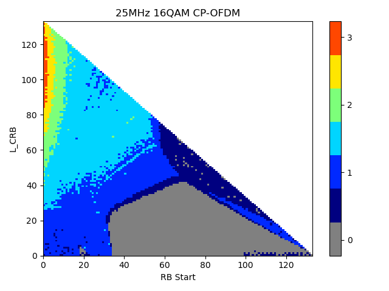
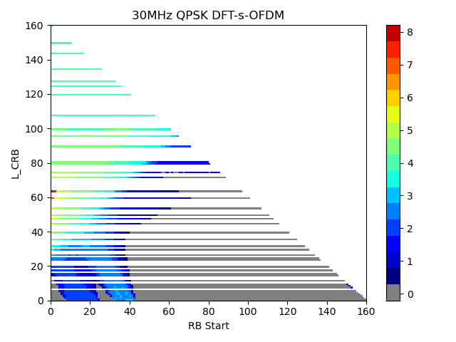
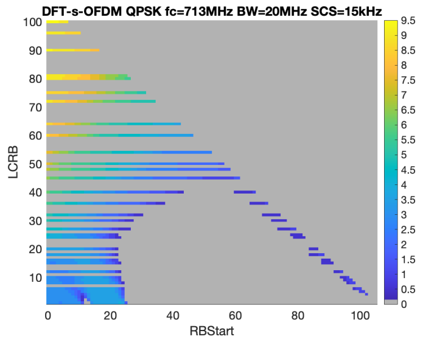
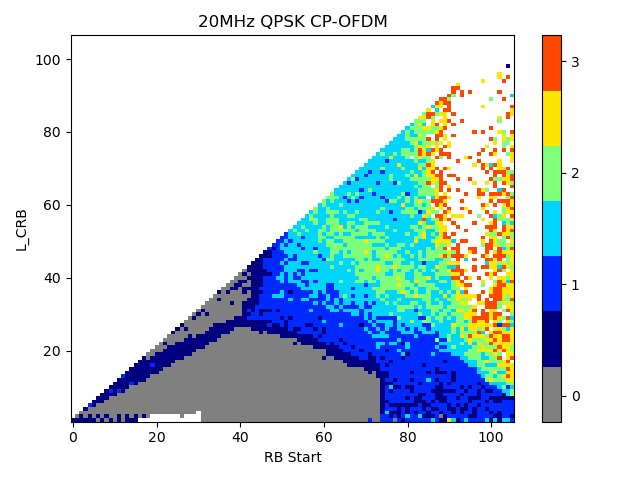
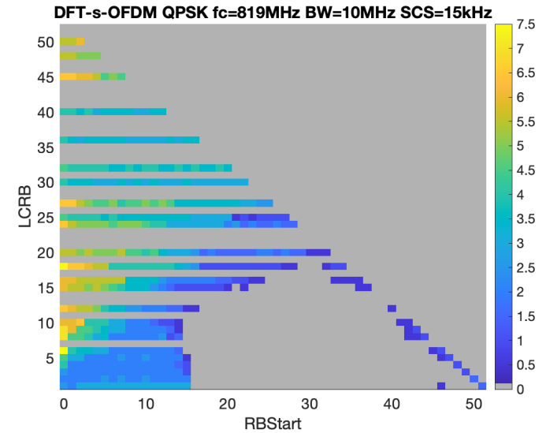
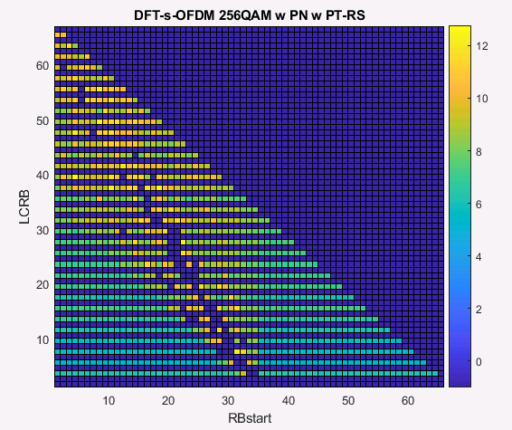

##### 7.1.1.3.26 Multi-cell PUSCH scheduling with a single DCI / FDRA field based

###### 7.1.1.3.26.1 Multi-cell PUSCH scheduling with a single DCI / FDRA field based / Intra-band Contiguous CA

##### 7.1.1.3.26.1.1 Test Purpose (TP) {#test-purpose-tp .H6}

##### (1) {#section .H6}

**with** { UE in RRC\_CONNECTED state, SCell is configured, DCI format
0-3 is configured and ScheduledCellComboListDCI-0-3 is not configured }

**ensure that** {

**when** { UE receives DCI format 0-3 on scheduling Cell, and FDRA field
of DCI format 0-3 indicated that PCell is scheduled Cell }

**then** { UE transmits MAC PDU on PCell }

}

##### (2) {#section-1 .H6}

**with** { UE in RRC\_CONNECTED state, SCell is configured, DCI format
0-3 is configured and ScheduledCellComboListDCI-0-3 is not configured }

**ensure that** {

**when** { UE receives DCI format 0-3 on scheduling Cell, and FDRA field
of DCI format 0-3 indicated that SCell is scheduled Cell }

**then** { UE transmits MAC PDU on SCell }

}

##### (3) {#section-2 .H6}

**with** { UE in RRC\_CONNECTED state, SCell is configured, DCI format
0-3 is configured and ScheduledCellComboListDCI-0-3 is not configured }

**ensure that** {

**when** { UE receives DCI format 0-3 on scheduling Cell, and FDRA field
of DCI format 0-3 indicated that PCell and SCell are scheduled Cell }

**then** { UE transmits MAC PDU on PCell and SCell }

}

##### 7.1.1.3.26.1.2 Conformance requirements {#conformance-requirements .H6}

References: The conformance requirements covered in the current TC are
specified in: TS 38.212 clauses 7.3.1.0 and 7.3.1.1.4. Unless otherwise
stated these are Rel-18 requirements.

\[TS 38.212, clause 7.3.1.0\]

Step 3:

\- If both of the following conditions are fulfilled the size alignment
procedure is complete

\- the total number of different DCI sizes configured to monitor is no
more than 4 for the cell

\- the total number of different DCI sizes with C-RNTI configured to
monitor is no more than 3 for the cell

Step 4:

\- Otherwise

Step 4A:

...

Step 4B:

...

Step 4C:

\- If the total number of different DCI sizes configured to monitor is
more than 4 for the cell after applying the above steps, or if the total
number of different DCI sizes with C-RNTI configured to monitor is more
than 3 for the cell after applying the above steps

\- If the number of information bits in the DCI format 0\_1 prior to
padding is less than the payload size of the DCI format 1\_1 for
scheduling the same serving cell, a number of zero padding bits are
generated for the DCI format 0\_1 until the payload size equals that of
the DCI format 1\_1.

\- If the number of information bits in the DCI format 1\_1 prior to
padding is less than the payload size of the DCI format 0\_1 for
scheduling the same serving cell, zeros shall be appended to the DCI
format 1\_1 until the payload size equals that of the DCI format 0\_1.

\[TS 38.212, clause 7.3.1.1.4\]

DCI format 0\_3 is used for the scheduling of one PUSCH in one cell, or
multiple PUSCHs in multiple cells with one PUSCH per cell.

The following information is transmitted by means of the DCI format 0\_3
with CRC scrambled by C-RNTI or MCS-C-RNTI:

\- Identifier for DCI formats - 1 bit

\- The value of this bit field is always set to 0, indicating an UL DCI
format

\- Scheduled cell set indicator
-$\ \left\lceil \log_{2}N_{\text{set}} \right\rceil$ bits, where
$N_{\text{set}}$ is the number of cell sets which are configured by
higher layer parameter *MC-DCI-SetofCellsToAddModList* to be
respectively scheduled by DCI format 0\_3/1\_3 from the cell on which
this format is carried by PDCCH. If present, this field is used to
indicate the scheduled cell set according to Table 7.3.1.1.4-1;
otherwise, the scheduled cell set is the cell set configured to be
scheduled by DCI format 0\_3/1\_3 from the cell by higher layer
parameter *MC-DCI-SetofCellsToAddModList*.

\- Scheduled cells indicator - number of bits determined by the
following:

\- 0 bit if the higher layer parameter *scheduledCellComboListDCI-0-3*
for the scheduled cell set is not configured;

...

\- Bandwidth part indicator - 0, 1 or 2 bits determined as
$\left\lceil \log_{2}n_{BWP,\ max} \right\rceil$, where

\- $n_{BWP,\ max} = n_{BWP,RRC}^{\max} + 1$ if
$n_{BWP,RRC}^{\max} \leq 3$, $n_{BWP,RRC}^{\max}\ $is the maximum number
of UL BWPs configured by higher layers, excluding the initial UL
bandwidth part, across all the cells configured by higher layer
parameter *scheduledCellListDCI-0-3* in the scheduled cell set, in which
case the bandwidth part indicator is equivalent to the ascending order
of the higher layer parameter *BWP-Id*;

\- otherwise $n_{BWP,\ max} = n_{BWP,RRC}^{\max}$, in which case the
bandwidth part indicator is defined in Table 7.3.1.1.2-1;

> The field is only applicable to a scheduled cell with the number of
> configured UL BWPs larger than 1, including the initial UL bandwidth
> part, and is applied to the applicable scheduled cells in the
> scheduled cell set independently. If a UE does not support active BWP
> change via DCI, the UE ignores this bit field. If this field indicates
> a code point that does not correspond to a configured BWP of a
> scheduled cell, the UE ignores this bit field for the scheduled cell,
> and operates on the active BWP of the scheduled cell.

\- Frequency domain resource assignment - number of bits determined by
the following, where $N_{\text{RB}}^{UL,\ BWP}$ is the size of the
active UL bandwidth part:

\- block number 1, block number 2,..., block number
$N_{\text{cell}}^{\text{UL}}$

> If *scheduledCellComboListDCI-0-3* for the scheduled cell set is
> configured with more than one entry, $N_{\text{cell}}^{\text{UL}}$ is
> the number of scheduled cells indicated by Scheduled cells indicator
> field; if *scheduledCellComboListDCI-0-3* for the scheduled cell set
> is configured with only one entry,$\ N_{\text{cell}}^{\text{UL}}$ is
> the number of cells configured by higher layer parameter
> *scheduledCellComboListDCI-0-3*; otherwise,
> $N_{\text{cell}}^{\text{UL}}$ is the number of cells configured by
> higher layer parameter *scheduledCellListDCI-0-3* in the scheduled
> cell set. Each block corresponds to the frequency domain resource
> assignment for a cell, and the blocks are placed according to an
> ascending order of a serving cell index, with block number 1
> corresponding to the frequency domain resource assignment for the cell
> with the smallest serving cell index. Each block is defined by the
> following fields:

\- If higher layer parameter *useInterlacePUCCH-PUSCH in
BWP-UplinkDedicated* is not configured

\- $N_{\text{RBG}}$ bits if only resource allocation type 0 is
configured, where $N_{\text{RBG}}$ is defined in Clause 6.1.2.2.1 of
\[6, TS 38.214\]

\-
$\left\lceil \log_{2}\left( N_{RBG,\ K1}\left( N_{RBG,\ K1} + 1 \right)/2 \right) \right\rceil$
bits if only resource allocation type 1 is configured, or
$\max\left( \ \left\lceil \log_{2}\left( N_{RBG,\ K1}\left( N_{RBG,\ K1} + 1 \right)/2 \right) \right\rceil,\ N_{\text{RBG}} \right) + 1$
bits if *resourceAllocationDCI-0-3* is configured as
\'*dynamicSwitch\'*, where
$N_{RBG,\ K1} = \left\lceil \left( N_{\text{RB}}^{UL,\ BWP} + \left( N_{UL,\ BWP}^{\text{start}}\text{mod}{K1} \right) \right)/K1 \right\rceil,$
$N_{\text{RB}}^{UL,\ BWP}$ is the size of the active UL bandwidth part,
$N_{UL,\ BWP}^{\text{start}}$ is defined as in clause 4.4.4.4 of \[4, TS
38.211\] and $K1$ is given by higher layer parameter
*resourceAllocationType1GranularityDCI-0-3.* If the higher layer
parameter *resourceAllocationType1GranularityDCI-0-3* is not configured,
$K1$ is equal to 1.

\- If *resourceAllocationDCI-0-3* is configured as \'*dynamicSwitch\'*,
the MSB bit is used to indicate resource allocation type 0 or resource
allocation type 1, where the bit value of 0 indicates resource
allocation type 0 and the bit value of 1 indicates resource allocation
type 1.

\- For resource allocation type 0, the $N_{\text{RBG}}$ LSBs provide the
resource allocation as defined in Clause 6.1.2.2.1 of \[6, TS 38.214\].

\- For resource allocation type 1, the
$\left\lceil \log_{2}\left( N_{RBG,\ K1}\left( N_{RBG,\ K1} + 1 \right)/2 \right) \right\rceil$
LSBs provide the resource allocation as follows:

\- For PUSCH hopping with resource allocation type 1:

\- $N_{\text{UL}\_\text{hop}}\ $MSB bits are used to indicate the
frequency offset according to Clause 6.3 of \[6, TS 38.214\], where
$N_{UL\_ hop} = 1$ if the higher layer parameter
*frequencyHoppingOffsetLists* contains two offset values and
$N_{UL\_ hop} = 2\ $if the higher layer parameter
*frequencyHoppingOffsetLists* contains four offset values

\-
$\left\lceil \log_{2}\left( N_{RBG,\ K1}\left( N_{RBG,\ K1} + 1 \right)/2 \right) \right\rceil - N_{UL\_ hop}$
bits provide the frequency domain resource allocation according to
Clause 6.1.2.2.2 of \[6, TS 38.214\]

\- For non-PUSCH hopping with resource allocation type 1:

\-
$\left\lceil \log_{2}\left( N_{\text{RBG},\ K1}\left( N_{\text{RBG},\ K1} + 1 \right)/2 \right) \right\rceil$
bits provide the frequency domain resource allocation according to
Clause 6.1.2.2.2 of \[6, TS 38.214\]

> If \"Bandwidth part indicator\" field indicates a bandwidth part other
> than the active bandwidth part and if *resourceAllocationDCI-0-3* is
> configured as \'*dynamicSwitch\'* for the indicated bandwidth part,
> the UE assumes resource allocation type 0 for the indicated bandwidth
> part if the bit width of the \"Frequency domain resource assignment\"
> field of the active bandwidth part is smaller than the bit width of
> the \"Frequency domain resource assignment\" field of the indicated
> bandwidth part.

\- If the higher layer parameter *useInterlacePUCCH-PUSCH in
BWP-UplinkDedicated* is configured

\- 5 + Y bits provide the frequency domain resource allocation according
to Clause 6.1.2.2.3 of \[6, TS 38.214\] if the subcarrier spacing for
the active UL bandwidth part is 30 kHz. The 5 MSBs provide the interlace
allocation and the Y LSBs provide the RB set allocation.

\- 6 + Y bits provide the frequency domain resource allocation according
to Clause 6.1.2.2.3 of \[6, TS 38.214\] if the subcarrier spacing for
the active UL bandwidth part is 15 kHz. The 6 MSBs provide the interlace
allocation and the Y LSBs provide the RB set allocation.

> The value of Y is determined by
> $\left\lceil \log_{2}\left( \frac{N_{RB - set,UL}^{\text{BWP}}\left( N_{RB - set,UL}^{\text{BWP}} + 1 \right)}{2} \right) \right\rceil\ $
> where $N_{\text{RB-set,UL}}^{\text{BWP}}$ is the number of RB sets
> contained in the active UL BWP as defined in clause 7 of \[6,
> TS38.214\].
>
> If the higher layer parameter *scheduledCellComboListDCI-0-3* for the
> scheduled cell set is not configured, each block is also used to
> indicate whether the corresponding cell is scheduled or not as
> follows:

\- if all bits of a block are set to 0 for resource allocation type 0,
or set to 1 for resource allocation type 1, or set to 0 or 1 for dynamic
switch resource allocation type, or set to 0 for resource allocation
type 2 with μ=1, or set to 1 for resource allocation type 2 with μ=0,
the cell corresponding to the block is not scheduled;

\- otherwise, the cell corresponding to the block is scheduled.

##### 7.1.1.3.26.1.3 Test description {#test-description .H6}

##### 7.1.1.3.26.1.3.1 Pre-test conditions {#pre-test-conditions .H6}

Same Pre-test conditions as in clause 7.1.1.0 except that Test loop
function (*On*) System information combination NR-4 and in addition NR
Cell 3 is configured as NR Active Scell.

##### 7.1.1.3.26.1.3.2 Test procedure sequence {#test-procedure-sequence .H6}

Table 7.1.1.3.26.1.3.2-1: Main behaviour

+-----------+-----------+-----------+-----------+-----------+----+
| **St**    | **Pr      | **Message | **TP**    | **        |    |
|           | ocedure** | S         |           | Verdict** |    |
|           |           | equence** |           |           |    |
+===========+===========+===========+===========+===========+====+
|           |           | **U - S** | **        |           |    |
|           |           |           | Message** |           |    |
+-----------+-----------+-----------+-----------+-----------+----+
| 1         | The SS    | \<\--     | RRCReconf | \-        | \- |
|           | transmits |           | iguration |           |    |
|           | an        |           |           |           |    |
|           | RRCReconf |           |           |           |    |
|           | iguration |           |           |           |    |
|           | message   |           |           |           |    |
|           | to        |           |           |           |    |
|           | *         |           |           |           |    |
|           | configure |           |           |           |    |
|           | SCell (NR |           |           |           |    |
|           | Cell 3)   |           |           |           |    |
|           | and DCI   |           |           |           |    |
|           | format    |           |           |           |    |
|           | 0-3 on*   |           |           |           |    |
|           | NR SpCell |           |           |           |    |
|           | (NR Cell  |           |           |           |    |
|           | 1)*.      |           |           |           |    |
|           | (Note 1)* |           |           |           |    |
+-----------+-----------+-----------+-----------+-----------+----+
| 2         | The UE    | \--\>     | *         | \-        | \- |
|           | transmits |           | RRCReconf |           |    |
|           | RRCRecon  |           | iguration |           |    |
|           | figuratio |           | Complete* |           |    |
|           | nComplete |           |           |           |    |
|           | message.  |           |           |           |    |
|           | *(Note    |           |           |           |    |
|           | 2)*       |           |           |           |    |
+-----------+-----------+-----------+-----------+-----------+----+
| 2A        | The SS    | \<\--     | MAC PDU   | \-        | \- |
|           | indicates |           | (SCell    |           |    |
|           | a new     |           | Activ     |           |    |
|           | tra       |           | ation/Dea |           |    |
|           | nsmission |           | ctivation |           |    |
|           | on PDCCH  |           | MAC CE of |           |    |
|           | of NR     |           | one octet |           |    |
|           | SpCell    |           | (C~1~=1)) |           |    |
|           | and       |           |           |           |    |
|           | transmits |           |           |           |    |
|           | A         |           |           |           |    |
|           | ctivation |           |           |           |    |
|           | MAC       |           |           |           |    |
|           | control   |           |           |           |    |
|           | element   |           |           |           |    |
|           | to        |           |           |           |    |
|           | activate  |           |           |           |    |
|           | NR SCell. |           |           |           |    |
+-----------+-----------+-----------+-----------+-----------+----+
| 3         | The SS    | \<\--     | MAC PDU   | \-        | \- |
|           | indicates |           |           |           |    |
|           | a new     |           |           |           |    |
|           | tra       |           |           |           |    |
|           | nsmission |           |           |           |    |
|           | on PDCCH  |           |           |           |    |
|           | of NR     |           |           |           |    |
|           | SpCell    |           |           |           |    |
|           | and       |           |           |           |    |
|           | transmits |           |           |           |    |
|           | a MAC PDU |           |           |           |    |
|           | (c        |           |           |           |    |
|           | ontaining |           |           |           |    |
|           | an RLC    |           |           |           |    |
|           | PDU).     |           |           |           |    |
+-----------+-----------+-----------+-----------+-----------+----+
| 4         | The SS    | \<\--     | (UL       | \-        | \- |
|           | sends an  |           | Grant)    |           |    |
|           | UL grant  |           |           |           |    |
|           | suitable  |           | DCI       |           |    |
|           | for       |           | format    |           |    |
|           | tra       |           | 0\_3      |           |    |
|           | nsmitting |           | (         |           |    |
|           | loop back |           | Frequency |           |    |
|           | PDU on NR |           | domain    |           |    |
|           | SpCell.   |           | resource  |           |    |
|           |           |           | a         |           |    |
|           |           |           | ssignment |           |    |
|           |           |           | indicated |           |    |
|           |           |           | that only |           |    |
|           |           |           | SpCell is |           |    |
|           |           |           | s         |           |    |
|           |           |           | cheduled) |           |    |
+-----------+-----------+-----------+-----------+-----------+----+
| 5         | Check:    | \--\>     | MAC PDU   | 1         | P  |
|           | Does the  |           |           |           |    |
|           | UE        |           |           |           |    |
|           | transmit  |           |           |           |    |
|           | a MAC PDU |           |           |           |    |
|           | *on*      |           |           |           |    |
|           | SpCell    |           |           |           |    |
|           | c         |           |           |           |    |
|           | ontaining |           |           |           |    |
|           | the loop  |           |           |           |    |
|           | back PDU? |           |           |           |    |
+-----------+-----------+-----------+-----------+-----------+----+
| 6         | Void      |           |           |           |    |
+-----------+-----------+-----------+-----------+-----------+----+
| 7         | The SS    | \<\--     | MAC PDU   | \-        | \- |
|           | indicates |           |           |           |    |
|           | a new     |           |           |           |    |
|           | tra       |           |           |           |    |
|           | nsmission |           |           |           |    |
|           | on PDCCH  |           |           |           |    |
|           | of NR     |           |           |           |    |
|           | SpCell    |           |           |           |    |
|           | and       |           |           |           |    |
|           | transmits |           |           |           |    |
|           | a MAC PDU |           |           |           |    |
|           | c         |           |           |           |    |
|           | ontaining |           |           |           |    |
|           | RLC       |           |           |           |    |
|           | status    |           |           |           |    |
|           | PDU       |           |           |           |    |
|           | ackn      |           |           |           |    |
|           | owledging |           |           |           |    |
|           | reception |           |           |           |    |
|           | of RLC    |           |           |           |    |
|           | PDU in    |           |           |           |    |
|           | step 5.   |           |           |           |    |
+-----------+-----------+-----------+-----------+-----------+----+
| 8         | The SS    | \<\--     | MAC PDU   | \-        | \- |
|           | indicates |           |           |           |    |
|           | a new     |           |           |           |    |
|           | tra       |           |           |           |    |
|           | nsmission |           |           |           |    |
|           | on PDCCH  |           |           |           |    |
|           | of NR     |           |           |           |    |
|           | SpCell    |           |           |           |    |
|           | and       |           |           |           |    |
|           | transmits |           |           |           |    |
|           | a MAC PDU |           |           |           |    |
|           | (c        |           |           |           |    |
|           | ontaining |           |           |           |    |
|           | an RLC    |           |           |           |    |
|           | PDU).     |           |           |           |    |
+-----------+-----------+-----------+-----------+-----------+----+
| 9         | The SS    | \<\--     | (UL       | \-        | \- |
|           | sends on  |           | Grant)    |           |    |
|           | NR SpCell |           |           |           |    |
|           | an UL     |           | DCI       |           |    |
|           | grant     |           | format    |           |    |
|           | suitable  |           | 0\_3      |           |    |
|           | for       |           | (         |           |    |
|           | tra       |           | Frequency |           |    |
|           | nsmitting |           | domain    |           |    |
|           | loop back |           | resource  |           |    |
|           | PDU.      |           | a         |           |    |
|           |           |           | ssignment |           |    |
|           |           |           | indicated |           |    |
|           |           |           | that only |           |    |
|           |           |           | SCell is  |           |    |
|           |           |           | s         |           |    |
|           |           |           | cheduled) |           |    |
+-----------+-----------+-----------+-----------+-----------+----+
| 10        | Check:    | \--\>     | MAC PDU   | 2         | P  |
|           | Does the  |           |           |           |    |
|           | UE        |           |           |           |    |
|           | transmit  |           |           |           |    |
|           | a MAC PDU |           |           |           |    |
|           | *on*      |           |           |           |    |
|           | SCell     |           |           |           |    |
|           | c         |           |           |           |    |
|           | ontaining |           |           |           |    |
|           | the loop  |           |           |           |    |
|           | back PDU? |           |           |           |    |
+-----------+-----------+-----------+-----------+-----------+----+
| 11        | Void      |           |           |           |    |
+-----------+-----------+-----------+-----------+-----------+----+
| 12        | The SS    | \<\--     | MAC PDU   | \-        | \- |
|           | indicates |           |           |           |    |
|           | a new     |           |           |           |    |
|           | tra       |           |           |           |    |
|           | nsmission |           |           |           |    |
|           | on PDCCH  |           |           |           |    |
|           | of NR     |           |           |           |    |
|           | SpCell    |           |           |           |    |
|           | and       |           |           |           |    |
|           | transmits |           |           |           |    |
|           | a MAC PDU |           |           |           |    |
|           | c         |           |           |           |    |
|           | ontaining |           |           |           |    |
|           | RLC       |           |           |           |    |
|           | status    |           |           |           |    |
|           | PDU       |           |           |           |    |
|           | ackn      |           |           |           |    |
|           | owledging |           |           |           |    |
|           | reception |           |           |           |    |
|           | of RLC    |           |           |           |    |
|           | PDU in    |           |           |           |    |
|           | step 10.  |           |           |           |    |
+-----------+-----------+-----------+-----------+-----------+----+
| 13        | The SS    | \<\--     | MAC PDU   | \-        | \- |
|           | indicates |           |           |           |    |
|           | new       |           |           |           |    |
|           | tran      |           |           |           |    |
|           | smissions |           |           |           |    |
|           | on PDCCH  |           |           |           |    |
|           | of        |           |           |           |    |
|           | SpCell,   |           |           |           |    |
|           | and       |           |           |           |    |
|           | transmits |           |           |           |    |
|           | MAC PDU   |           |           |           |    |
|           | on SpCell |           |           |           |    |
|           | (c        |           |           |           |    |
|           | ontaining |           |           |           |    |
|           | two RLC   |           |           |           |    |
|           | PDUs).    |           |           |           |    |
+-----------+-----------+-----------+-----------+-----------+----+
| 14        | The SS    | \<\--     | (UL       | \-        | \- |
|           | sends an  |           | Grant)    |           |    |
|           | UL grant  |           |           |           |    |
|           | suitable  |           | DCI       |           |    |
|           | for       |           | format    |           |    |
|           | tra       |           | 0\_3      |           |    |
|           | nsmitting |           | (         |           |    |
|           | loop back |           | Frequency |           |    |
|           | PDU on    |           | domain    |           |    |
|           | SpC       |           | resource  |           |    |
|           | ell.(Note |           | a         |           |    |
|           | 3)        |           | ssignment |           |    |
|           |           |           | indicated |           |    |
|           |           |           | that both |           |    |
|           |           |           | SpCell    |           |    |
|           |           |           | and SCell |           |    |
|           |           |           | are       |           |    |
|           |           |           | s         |           |    |
|           |           |           | cheduled) |           |    |
+-----------+-----------+-----------+-----------+-----------+----+
| 15        | Check:    | \--\>     | MAC PDU   | 3         | P  |
|           | Does the  |           |           |           |    |
|           | UE        |           |           |           |    |
|           | transmit  |           |           |           |    |
|           | MAC PDUs  |           |           |           |    |
|           | *on both* |           |           |           |    |
|           | SpCell    |           |           |           |    |
|           | and SCell |           |           |           |    |
|           | c         |           |           |           |    |
|           | ontaining |           |           |           |    |
|           | the loop  |           |           |           |    |
|           | back      |           |           |           |    |
|           | PDU?(Note |           |           |           |    |
|           | 4)        |           |           |           |    |
+-----------+-----------+-----------+-----------+-----------+----+
| 16        | Void      |           |           |           |    |
+-----------+-----------+-----------+-----------+-----------+----+
| 17        | The SS    | \<\--     | MAC PDU   | \-        | \- |
|           | indicates |           |           |           |    |
|           | a new     |           |           |           |    |
|           | tra       |           |           |           |    |
|           | nsmission |           |           |           |    |
|           | on PDCCH  |           |           |           |    |
|           | of NR     |           |           |           |    |
|           | SpCell    |           |           |           |    |
|           | and       |           |           |           |    |
|           | transmits |           |           |           |    |
|           | MAC PDU   |           |           |           |    |
|           | c         |           |           |           |    |
|           | ontaining |           |           |           |    |
|           | RLC       |           |           |           |    |
|           | status    |           |           |           |    |
|           | PDU       |           |           |           |    |
|           | ackn      |           |           |           |    |
|           | owledging |           |           |           |    |
|           | reception |           |           |           |    |
|           | of RLC    |           |           |           |    |
|           | PDUs in   |           |           |           |    |
|           | step 15.  |           |           |           |    |
+-----------+-----------+-----------+-----------+-----------+----+
| Note 1:   |           |           |           |           |    |
| S         |           |           |           |           |    |
| cheduling |           |           |           |           |    |
| cell is   |           |           |           |           |    |
| NR SpCell |           |           |           |           |    |
| (NR Cell  |           |           |           |           |    |
| 1), and   |           |           |           |           |    |
| reference |           |           |           |           |    |
| cell is   |           |           |           |           |    |
| also NR   |           |           |           |           |    |
| SpCell    |           |           |           |           |    |
| (NR Cell  |           |           |           |           |    |
| 1).       |           |           |           |           |    |
| T         |           |           |           |           |    |
| herefore, |           |           |           |           |    |
| the       |           |           |           |           |    |
| single    |           |           |           |           |    |
| DCI (DCI  |           |           |           |           |    |
| format    |           |           |           |           |    |
| 0\_3) is  |           |           |           |           |    |
| counted   |           |           |           |           |    |
| on the NR |           |           |           |           |    |
| Cell 1,   |           |           |           |           |    |
| and DCI   |           |           |           |           |    |
| size      |           |           |           |           |    |
| alignment |           |           |           |           |    |
| procedure |           |           |           |           |    |
| specified |           |           |           |           |    |
| in 38.212 |           |           |           |           |    |
| clause    |           |           |           |           |    |
| 7.3.1.0   |           |           |           |           |    |
| for NR    |           |           |           |           |    |
| Cell 1 is |           |           |           |           |    |
| complete  |           |           |           |           |    |
| in        |           |           |           |           |    |
| step4C.   |           |           |           |           |    |
|           |           |           |           |           |    |
| Note 2:   |           |           |           |           |    |
| The NR    |           |           |           |           |    |
| *         |           |           |           |           |    |
| RRCReconf |           |           |           |           |    |
| iguration |           |           |           |           |    |
| Complete* |           |           |           |           |    |
| message   |           |           |           |           |    |
| is        |           |           |           |           |    |
| scheduled |           |           |           |           |    |
| by DCI    |           |           |           |           |    |
| format    |           |           |           |           |    |
| 0\_0 to   |           |           |           |           |    |
| avoid DCI |           |           |           |           |    |
| size      |           |           |           |           |    |
| mis       |           |           |           |           |    |
| alignment |           |           |           |           |    |
| for DCI   |           |           |           |           |    |
| format    |           |           |           |           |    |
| 0\_1      |           |           |           |           |    |
| (         |           |           |           |           |    |
| according |           |           |           |           |    |
| to TS     |           |           |           |           |    |
| 38.212    |           |           |           |           |    |
| \[14\]    |           |           |           |           |    |
| clause    |           |           |           |           |    |
| 7.3.1.0   |           |           |           |           |    |
| step 4C)  |           |           |           |           |    |
| between   |           |           |           |           |    |
| UE and SS |           |           |           |           |    |
| during    |           |           |           |           |    |
| the       |           |           |           |           |    |
| reconfi   |           |           |           |           |    |
| guration. |           |           |           |           |    |
|           |           |           |           |           |    |
| Note 3:   |           |           |           |           |    |
| The UL    |           |           |           |           |    |
| grant for |           |           |           |           |    |
| SpCell is |           |           |           |           |    |
| suitable  |           |           |           |           |    |
| to        |           |           |           |           |    |
| transmit  |           |           |           |           |    |
| one RLC   |           |           |           |           |    |
| PDU in    |           |           |           |           |    |
| step 13,  |           |           |           |           |    |
| and the   |           |           |           |           |    |
| UL grant  |           |           |           |           |    |
| for SCell |           |           |           |           |    |
| is        |           |           |           |           |    |
| suitable  |           |           |           |           |    |
| to        |           |           |           |           |    |
| transmit  |           |           |           |           |    |
| one RLC   |           |           |           |           |    |
| PDU in    |           |           |           |           |    |
| step 13.  |           |           |           |           |    |
|           |           |           |           |           |    |
| Note 4:   |           |           |           |           |    |
| UE        |           |           |           |           |    |
| transmits |           |           |           |           |    |
| two MAC   |           |           |           |           |    |
| PDUs, one |           |           |           |           |    |
| MAC PDU   |           |           |           |           |    |
| on SpCell |           |           |           |           |    |
| and one   |           |           |           |           |    |
| MAC PDU   |           |           |           |           |    |
| on SCell. |           |           |           |           |    |
+-----------+-----------+-----------+-----------+-----------+----+

##### 7.1.1.3.26.1.3.3 Specific message contents {#specific-message-contents .H6}

Table 7.1.1.3.26.1.3.3-1: *RRCReconfiguration* (step 1, Table
7.1.1.3.26.1.3.2-1)

  ----------------------------------------------------- ----------------- ------------------------------------------- -----------
  Derivation Path: TS 38.508-1 \[4\], Table 4.6.1-13.                                                                 
  Information Element                                   Value/remark      Comment                                     Condition
  RRCReconfiguration ::= SEQUENCE {                                                                                   
  criticalExtensions CHOICE {                                                                                         
  c1 CHOICE {                                                                                                         
  rrcReconfiguration SEQUENCE {                                                                                       
  secondaryCellGroup                                    Not present                                                   
  nonCriticalExtension SEQUENCE {                                                                                     
  masterCellGroup                                       CellGroupConfig   OCTET STRING (CONTAINING CellGroupConfig)   
  }                                                                                                                   
  }                                                                                                                   
  }                                                                                                                   
  }                                                                                                                   
  }                                                                                                                   
  ----------------------------------------------------- ----------------- ------------------------------------------- -----------

Table 7.1.1.3.26.1.3.3-2: *CellGroupConfig* (Table 7.1.1.3.26.1.3.3-1)

  ------------------------------------------------------------------- ------------------------------------------------------- -------------------------- -----------
  Derivation Path: TS 38.508-1 \[4\], Table 4.6.3-19.                                                                                                    
  Information Element                                                 Value/remark                                            Comment                    Condition
  CellGroupConfig ::= SEQUENCE {                                                                                                                         
  spCellConfig SEQUENCE {                                                                                                                                
  spCellConfigDedicated                                               ServingCellConfig                                       Table 7.1.1.3.26.1.3.3-3   
  }                                                                                                                                                      
  sCellToAddModList SEQUENCE (SIZE (1..maxMeasId)) OF SCellConfig {   1 entry                                                                            
  SCellConfig\[1\] SEQUENCE {                                                                                                 entry 1                    
  sCellIndex                                                          *SCellIndex as per* TS 38.508-1 \[4\] table 4.6.3-154                              
  sCellConfigCommon                                                   ServingCellConfigCommon with condition SCell\_add                                  
  sCellConfigDedicated                                                ServingCellConfig                                       Table 7.1.1.3.26.1.3.3-6   
  }                                                                                                                                                      
  }                                                                                                                                                      
  }                                                                                                                                                      
  ------------------------------------------------------------------- ------------------------------------------------------- -------------------------- -----------

Table 7.1.1.3.26.1.3.3-3: *ServingCellConfig* (Table 7.1.1.3.26.1.3.3-2)

  ----------------------------------------------------------------------------- ----------------------- -------------------------- -----------
  Derivation Path: TS 38.508-1 \[4\], Table 4.6.3-167 with condition DCI 0\_3                                                      
  Information Element                                                           Value/remark            Comment                    Condition
  ServingCellConfig ::= SEQUENCE {                                                                                                 
  initialDownlinkBWP                                                            BWP-DownlinkDedicated   Table 7.1.1.3.26.1.3.3-4   
  uplinkConfig SEQUENCE {                                                                                                          
  initialUplinkBWP                                                              BWP-UplinkDedicated     Table 7.1.1.3.26.1.3.3-5   
  }                                                                                                                                
  }                                                                                                                                
  ----------------------------------------------------------------------------- ----------------------- -------------------------- -----------

Table 7.1.1.3.26.1.3.3-4: *BWP-DownlinkDedicated* (Table
7.1.1.3.26.1.3.3-3)

  ---------------------------------------------------- --------------------------------------- --------- -----------
  Derivation Path: TS 38.508-1 \[4\], Table 4.6.3-11                                                     
  Information Element                                  Value/remark                            Comment   Condition
  BWP-DownlinkDedicated ::= SEQUENCE {                                                                   
  pdcch-Config CHOICE {                                                                                  
  setup                                                PDCCH-Config with condition DCI\_0\_3             
  }                                                                                                      
  }                                                                                                      
  ---------------------------------------------------- --------------------------------------- --------- -----------

Table 7.1.1.3.26.1.3.3-5: *BWP-UplinkDedicated* (Table
7.1.1.3.26.1.3.3-3)

  ---------------------------------------------------- --------------------------------------- --------- -----------
  Derivation Path: TS 38.508-1 \[4\], Table 4.6.3-15                                                     
  Information Element                                  Value/remark                            Comment   Condition
  BWP-UplinkDedicated ::= SEQUENCE {                                                                     
  pusch-Config CHOICE {                                                                                  
  setup                                                PUSCH-Config with condition DCI\_0\_3             
  }                                                                                                      
  }                                                                                                      
  ---------------------------------------------------- --------------------------------------- --------- -----------

Table 7.1.1.3.26.1.3.3-6: *ServingCellConfig* (Table 7.1.1.3.26.1.3.3-2)

  ------------------------------------------------------------------------------------------ ----------------------- --------------------------- -----------
  Derivation Path: TS 38.508-1 \[4\], Table 4.6.3-167 with condition No\_UL and SCell\_add                                                       
  Information Element                                                                        Value/remark            Comment                     Condition
  ServingCellConfig ::= SEQUENCE {                                                                                                               
  initialDownlinkBWP                                                                         BWP-DownlinkDedicated   Table 7.1.1.3.26.1.3.3-7A   
  uplinkConfig SEQUENCE {                                                                                                                        
  initialUplinkBWP                                                                           BWP-UplinkDedicated     Table 7.1.1.3.26.1.3.3-7    
  }                                                                                                                                              
  }                                                                                                                                              
  ------------------------------------------------------------------------------------------ ----------------------- --------------------------- -----------

Table 7.1.1.3.26.1.3.3-7: *BWP-UplinkDedicated* (Table
7.1.1.3.26.1.3.3-6)

  ------------------------------------------------------------------------------ --------------------------------------- --------- -----------
  Derivation Path: TS 38.508-1 \[4\], Table 4.6.3-15 with condition SCell\_add                                                     
  Information Element                                                            Value/remark                            Comment   Condition
  BWP-UplinkDedicated ::= SEQUENCE {                                                                                               
  pusch-Config CHOICE {                                                                                                            
  setup                                                                          PUSCH-Config with condition DCI\_0\_3             
  }                                                                                                                                
  }                                                                                                                                
  ------------------------------------------------------------------------------ --------------------------------------- --------- -----------

Table 7.1.1.3.26.1.3.3-7A: *BWP-DownlinkDedicated* (Table
7.1.1.3.26.1.3.3-6)

  Derivation Path: TS 38.508-1 \[4\],Table 4.6.3-11 with condition SCell\_add                                    
  ----------------------------------------------------------------------------- ------------------ ------------- ---------------
  **Information Element**                                                       **Value/remark**   **Comment**   **Condition**
  BWP-DownlinkDedicated ::= SEQUENCE {                                                                           
  pdcch-Config                                                                  Not present                      
  }                                                                                                              

Table 7.1.1.3.26.1.3.3-8: *Physical layer parameters for DCI format
0\_3* (steps 4, 9 and 14, Table 7.1.1.3.26.1.3.2-1)

+-----------------+-----------------+-----------------+-----------+
| Derivation      |                 |                 |           |
| path: TS        |                 |                 |           |
| 38.508-1 \[4\]  |                 |                 |           |
| Table           |                 |                 |           |
| 4.3.6.1.1.4-1   |                 |                 |           |
| with condition  |                 |                 |           |
| FDRA and        |                 |                 |           |
| UL\_CELL2       |                 |                 |           |
+=================+=================+=================+===========+
| Parameter       | Value           | Value in binary | Condition |
+-----------------+-----------------+-----------------+-----------+
| Frequency       | block number    | \-              | Step 4    |
| domain resource | 1(SpCell):      |                 |           |
| assignment      | dependent on    |                 |           |
|                 | the Downlink    |                 |           |
|                 | TBS specified   |                 |           |
|                 | in TS 38.523-3  |                 |           |
|                 | \[3\] Annex B.1 |                 |           |
|                 |                 |                 |           |
|                 | block number    |                 |           |
|                 | 2(SCell): all   |                 |           |
|                 | bits set to 1   |                 |           |
|                 |                 |                 |           |
|                 | Note:           |                 |           |
|                 | $               |                 |           |
|                 | N_{\text{cell}} |                 |           |
|                 | ^{\text{DL}}$=2 |                 |           |
+-----------------+-----------------+-----------------+-----------+
|                 | block number    | \-              | Step 9    |
|                 | 1(SpCell): all  |                 |           |
|                 | bits set to 1   |                 |           |
|                 |                 |                 |           |
|                 | block number    |                 |           |
|                 | 2(SCell):       |                 |           |
|                 | dependent on    |                 |           |
|                 | the Downlink    |                 |           |
|                 | TBS specified   |                 |           |
|                 | in TS 38.523-3  |                 |           |
|                 | \[3\] Annex B.1 |                 |           |
|                 |                 |                 |           |
|                 | Note:           |                 |           |
|                 | $               |                 |           |
|                 | N_{\text{cell}} |                 |           |
|                 | ^{\text{DL}}$=2 |                 |           |
+-----------------+-----------------+-----------------+-----------+
|                 | block number    | \-              | Step 14   |
|                 | 1(SpCell):      |                 |           |
|                 | dependent on    |                 |           |
|                 | the Downlink    |                 |           |
|                 | TBS specified   |                 |           |
|                 | in TS 38.523-3  |                 |           |
|                 | \[3\] Annex B.1 |                 |           |
|                 |                 |                 |           |
|                 | block number    |                 |           |
|                 | 2(SCell):       |                 |           |
|                 | dependent on    |                 |           |
|                 | the Downlink    |                 |           |
|                 | TBS specified   |                 |           |
|                 | in TS 38.523-3  |                 |           |
|                 | \[3\] Annex B.1 |                 |           |
|                 |                 |                 |           |
|                 | Note:           |                 |           |
|                 | $               |                 |           |
|                 | N_{\text{cell}} |                 |           |
|                 | ^{\text{DL}}$=2 |                 |           |
+-----------------+-----------------+-----------------+-----------+

###### 7.1.1.3.26.2 Multi-cell PUSCH scheduling with a single DCI / FDRA field based / Inter-band CA

The scope and description of the present TC is the same as test case
7.1.1.3.26.1 with the following differences:

\- CA configuration: Inter-band CA replaces Intra-band Contiguous CA

\- Cells configuration: NR Cell 10 replaces NR Cell 3

\- NR Cell 1 and NR Cell 10 have same SCS/carrier type.

###### 7.1.1.3.26.3 **Multi-cell PUSCH scheduling with a single DCI / FDRA field based / Intra-band non-Contiguous CA**

The scope and description of the present TC is the same as test case
7.1.1.3.26.1 with the following differences:

\- CA configuration: Intra-band non-Contiguous CA replaces Intra-band
Contiguous CA.

#### 7.1.1.4 Transport Size Selection

##### 7.1.1.4.1 DL-SCH Transport Block Size Selection

###### 7.1.1.4.1.0 Common parameters for DL-SCH Transport Block Size Selection

Table 7.1.1.4.1.0-1: PDSCH-TimeDomainResourceAllocationList

  ------------------------------------------------------------------------------------------------------------------------------------------------------------------------- -------------- ----------- -----------
  Derivation Path: TS 38.508-1 \[4\], Table 4.6.3-103                                                                                                                                                  
  Information Element                                                                                                                                                       Value/remark   Comment     Condition
  PDSCH-TimeDomainResourceAllocationList ::= SEQUENCE(SIZE(1..maxNrofDL-Allocations)) OF SEQUENCE(SIZE(1..maxNrofDL-Allocations)) OF PDSCH-TimeDomainResourceAllocation {   2 entries                  
  PDSCH-TimeDomainResourceAllocation\[1\] SEQUENCE {                                                                                                                                       entry 1     
  k0                                                                                                                                                                        Not present                
  mappingType                                                                                                                                                               typeA                      
  startSymbolAndLength                                                                                                                                                      53             S=2, L=12   
  }                                                                                                                                                                                                    
  PDSCH-TimeDomainResourceAllocation\[2\] SEQUENCE {                                                                                                                                       entry 2     
  k0                                                                                                                                                                        Not present                
  mappingType                                                                                                                                                               typeA                      
  startSymbolAndLength                                                                                                                                                      86             S=2, L=7    
  }                                                                                                                                                                                                    
  }                                                                                                                                                                                                    
  ------------------------------------------------------------------------------------------------------------------------------------------------------------------------- -------------- ----------- -----------

###### 7.1.1.4.1.1 DL-SCH Transport Block Size selection / DCI format 1\_0

##### 7.1.1.4.1.1.1 Test Purpose (TP) {#test-purpose-tp-1 .H6}

##### (1) {#section-3 .H6}

**with** { UE in RRC\_CONNECTED state }

**ensure that** {

**when** { UE on PDCCH receives DCI format 1\_0 indicating a resource
block assignment correspondent to physical resource blocks , Time domain
resource assignment and a modulation and coding }

**then** { UE decodes the received transport block of size correspondent
as per Modulation Coding scheme, time domain resource allocation and
PRB\'s and forwards it to higher layers }

}

##### 7.1.1.4.1.1.2 Conformance requirements {#conformance-requirements-1 .H6}

References: The conformance requirements covered in the present TC are
specified in: TS 38.212 clause 7.3.1.2.1, TS 38.214 clause 5.1.2.1,
5.1.2.2, 5.1.2.2.2, 5.1.3, 5.1.3.1 and 5.1.3.2. Unless otherwise stated
these are Rel-15 requirements.

\[TS 38.212, clause 7.3.1.2.1\]

DCI format 1\_0 is used for the scheduling of PDSCH in one DL cell.

The following information is transmitted by means of the DCI format 1\_0
with CRC scrambled by C-RNTI or CS-RNTI or new-RNTI:

\- Identifier for DCI formats -- 1 bits

\- The value of this bit field is always set to 1, indicating a DL DCI
format

\- Frequency domain resource assignment -- bits

\-  is the size of the active DL bandwidth part
in case DCI format 1\_0 is monitored in the UE specific search space and
satisfying

\- the total number of different DCI sizes monitored per slot is no more
than 4 for the cell, and

\- the total number of different DCI sizes with C-RNTI monitored per
slot is no more than 3 for the cell

otherwise, is the size of the initial DL bandwidth part.

If the CRC of the DCI format 1\_0 is scrambled by C-RNTI and the
\"Frequency domain resource assignment\" field are of all ones, the DCI
format 1\_0 is for random access procedure initiated by a PDCCH order,
with all remaining fields set as follows:

\- Random Access Preamble index -- 6 bits according to
*ra-PreambleIndex* in Subclause 5.1.2 of \[8, TS38.321\]

\- UL/SUL indicator -- 1 bit. If the value of the "Random Access
Preamble index" is not all zeros and if the UE is configured with SUL in
the cell, this field indicates which UL carrier in the cell to transmit
the PRACH according to Table 7.3.1.1.1-1; otherwise, this field is
reserved

\- SS/PBCH index -- 6 bits. If the value of the "Random Access Preamble
index" is not all zeros, this field indicates the SS/PBCH that shall be
used to determine the RACH occasion for the PRACH transmission;
otherwise, this field is reserved.

\- PRACH Mask index -- 4 bits. If the value of the "Random Access
Preamble index" is not all zeros, this field indicates the RACH occasion
associated with the SS/PBCH indicated by "SS/PBCH index" for the PRACH
transmission, according to Subclause 5.1.1 of \[8, TS38.321\];
otherwise, this field is reserved

\- Reserved bits -- 10 bits

Otherwise, all remaining fields are set as follows:

\- Time domain resource assignment -- 4 bits as defined in Subclause
5.1.2.1 of \[6, TS38.214\]

\- VRB-to-PRB mapping -- 1 bit according to Table 7.3.1.1.2-33

\- Modulation and coding scheme -- 5 bits as defined in Subclause 5.1.3
of \[6, TS38.214\]

\- New data indicator -- 1 bit

\- Redundancy version -- 2 bits as defined in Table 7.3.1.1.1-2

\- HARQ process number -- 4 bits

\- Downlink assignment index -- 2 bits as defined in Subclause 9.1.3 of
\[5, TS38.213\], as counter DAI

\- TPC command for scheduled PUCCH -- 2 bits as defined in Subclause
7.2.1 of \[5, TS38.213\]

\- PUCCH resource indicator -- 3 bits as defined in Subclause 9.2.3 of
\[5, TS38.213\]

\- PDSCH-to-HARQ\_feedback timing indicator -- 3 bits as defined in
Subclause 9.2.3 of \[5, TS38.213\]

\[TS 38.214, clause 5.1.2.1\]

When the UE is scheduled to receive PDSCH by a DCI, the *Time domain
resource assignment* field value *m* of the DCI provides a row index *m*
+ 1 to an allocation table. The determination of the used resource
allocation table is defined in sub-clause 5.1.2.1.1. The indexed row
defines the slot offset *K~0~*, the start and length indicator *SLIV*,
or directly the start symbol *S* and the allocation length *L*, and the
PDSCH mapping type to be assumed in the PDSCH reception.

Given the parameter values of the indexed row:

\- The slot allocated for the PDSCH is , where
*n* is the slot with the scheduling DCI, and *K~0~* is based on the
numerology of PDSCH, and and are the subcarrier spacing configurations
for PDSCH and PDCCH, respectively, and

\- The starting symbol *S* relative to the start of the slot, and the
number of consecutive symbols *L* counting from the symbol *S* allocated
for the PDSCH are determined from the start and length indicator *SLIV*:

if  then

else

where, and

\- The PDSCH mapping type is set to Type A or Type B as defined in
sub-clause 7.4.1.1.2 of \[4, TS 38.211\].

The UE shall consider the *S* and *L* combinations defined in table
5.1.2.1-1 as valid PDSCH allocations:

Table 5.1.2.1-1: Valid *S* and *L* combinations

+---------+---------+---------+---------+---------+---------+---------+
| PDSCH   | Normal  | E       |         |         |         |         |
| mapping | cyclic  | xtended |         |         |         |         |
| type    | prefix  | cyclic  |         |         |         |         |
|         |         | prefix  |         |         |         |         |
+=========+=========+=========+=========+=========+=========+=========+
|         | *S*     | *L*     | *S+L*   | *S*     | *L*     | *S+L*   |
+---------+---------+---------+---------+---------+---------+---------+
| Type A  | {0      | {3,     | {3,     | {0      | {3,     | {3,     |
|         | ,1,2,3} | ...,14} | ...,14} | ,1,2,3} | ...,12} | ...,12} |
|         |         |         |         |         |         |         |
|         | (Note   |         |         | (Note   |         |         |
|         | 1)      |         |         | 1)      |         |         |
+---------+---------+---------+---------+---------+---------+---------+
| Type B  | {0,     | {2,4,7} | {2,     | {0,     | {2,4,6} | {2,     |
|         | ...,12} |         | ...,14} | ...,10} |         | ...,12} |
+---------+---------+---------+---------+---------+---------+---------+

\[38.214 clause 5.1.2.2\]

Two downlink resource allocation schemes, type 0 and type 1, are
supported. The UE shall assume that when the scheduling grant is
received with DCI format 1\_0, then downlink resource allocation type 1
is used.

\[38.214 clause 5.1.2.2.2\]

In downlink resource allocation of type 1, the resource block assignment
information indicates to a scheduled UE a set of contiguously allocated
non-interleaved or interleaved virtual resource blocks within the active
bandwidth part of size  PRBs except for the case
when DCI format 1\_0 is decoded in any common search space in CORESET 0
in which case the initial bandwidth part of size shall be used.

A downlink type 1 resource allocation field consists of a resource
indication value (*RIV*) corresponding to a starting virtual resource
block () and a length in terms of contiguously
allocated resource blocks. The resource
indication value is defined by

if  then

else

where≥ 1 and shall not exceed
.

\[TS 38.214, clause 5.1.3\]

To determine the modulation order, target code rate, and transport block
size(s) in the physical downlink shared channel, the UE shall first

\- read the 5-bit *modulation and coding scheme* field (*I~MCS~*) in the
DCI to determine the modulation order (*Q~m~*) and target code rate
(*R*) based on the procedure defined in Subclause 5.1.3.1, and

\- read *redundancy version* field (*rv*) in the DCI to determine the
redundancy version.

and second

\- the UE shall use the number of layers (ʋ), the total number of
allocated PRBs before rate matching (*n~PRB~*) to determine to the
transport block size based on the procedure defined in Subclause
5.1.3.2.

The UE may skip decoding a transport block in an initial transmission if
the effective channel code rate is higher than 0.95, where the effective
channel code rate is defined as the number of downlink information bits
(including CRC bits) divided by the number of physical channel bits on
PDSCH. If the UE skips decoding, the physical layer indicates to higher
layer that the transport block is not successfully decoded.

\[TS 38.214, clause 5.1.3.1\]

For the PDSCH scheduled by a PDCCH with DCI format 1\_0 or format 1\_1
with CRC scrambled by C-RNTI, new-RNTI, TC-RNTI, CS-RNTI, SI-RNTI,
RA-RNTI, or P-RNTI,

if the higher layer parameter *mcs-Table* given by *PDSCH-Config* is set
to \'qam256\', and the PDSCH is scheduled by a PDCCH with a DCI format
1\_1 and the CRC is scrambled by C-RNTI or CS-RNTI

\- the UE shall use *I~MCS~* and Table 5.1.3.1-2 to determine the
modulation order (*Q~m~*) and Target code rate (*R*) used in the
physical downlink shared channel.

elseif the UE is not configured with new-RNTI, the higher layer
parameter *mcs-Table* given by *PDSCH-Config* is set to \'qam64LowSE\',
and the PDSCH is scheduled with C-RNTI, and the PDSCH is assigned by a
PDCCH in a UE-specific search space

\- the UE shall use *I~MCS~* and Table 5.1.3.1-3 to determine the
modulation order (*Q~m~*) and Target code rate (*R*) used in the
physical downlink shared channel.

elseif the UE is configured with new-RNTI, and the PDSCH is scheduled
with new-RNTI

\- the UE shall use *I~MCS~* and Table 5.1.3.1-3 to determine the
modulation order (*Q~m~*) and Target code rate (*R*) used in the
physical downlink shared channel.

elseif the UE is not configured with the higher layer parameter
*mcs-Table* given by *SPS-config*, the higher layer parameter
*mcs-Table* given by *PDSCH-Config* is set to \'qam256\', the PDSCH is
scheduled with CS-RNTI, and the PDSCH is assigned by a PDCCH with DCI
format 1\_1

\- the UE shall use *I~MCS~* and Table 5.1.3.1-2 to determine the
modulation order (*Q~m~*) and Target code rate (*R*) used in the
physical downlink shared channel.

elseif the UE is configured with the higher layer parameter *mcs-Table*
given by *SPS-config* set to \'qam64LowSE\', and the PDSCH is scheduled
with CS-RNTI

\- the UE shall use *I~MCS~* and Table 5.1.3.1-3 to determine the
modulation order (*Q~m~*) and Target code rate (*R*) used in the
physical downlink shared channel.

else

\- the UE shall use *I~MCS~* and Table 5.1.3.1-1 to determine the
modulation order (*Q~m~*) and Target code rate (*R*) used in the
physical downlink shared channel.

End

The UE is not expected to decode a PDSCH scheduled with P-RNTI, RA-RNTI,
SI-RNTI and *Q~m~* \> 2

Table 5.1.3.1-1: MCS index table 1 for PDSCH

+------------+-------------------+---------------------------------+------------+
| MCS Index\ | Modulation Order\ | Target code Rate *R* x \[1024\] | Spectral   |
| *I~MCS~*   | *Q~m~*            |                                 |            |
|            |                   |                                 | efficiency |
+============+===================+=================================+============+
| 0          | 2                 | 120                             | 0.2344     |
+------------+-------------------+---------------------------------+------------+
| 1          | 2                 | 157                             | 0.3066     |
+------------+-------------------+---------------------------------+------------+
| 2          | 2                 | 193                             | 0.3770     |
+------------+-------------------+---------------------------------+------------+
| 3          | 2                 | 251                             | 0.4902     |
+------------+-------------------+---------------------------------+------------+
| 4          | 2                 | 308                             | 0.6016     |
+------------+-------------------+---------------------------------+------------+
| 5          | 2                 | 379                             | 0.7402     |
+------------+-------------------+---------------------------------+------------+
| 6          | 2                 | 449                             | 0.8770     |
+------------+-------------------+---------------------------------+------------+
| 7          | 2                 | 526                             | 1.0273     |
+------------+-------------------+---------------------------------+------------+
| 8          | 2                 | 602                             | 1.1758     |
+------------+-------------------+---------------------------------+------------+
| 9          | 2                 | 679                             | 1.3262     |
+------------+-------------------+---------------------------------+------------+
| 10         | 4                 | 340                             | 1.3281     |
+------------+-------------------+---------------------------------+------------+
| 11         | 4                 | 378                             | 1.4766     |
+------------+-------------------+---------------------------------+------------+
| 12         | 4                 | 434                             | 1.6953     |
+------------+-------------------+---------------------------------+------------+
| 13         | 4                 | 490                             | 1.9141     |
+------------+-------------------+---------------------------------+------------+
| 14         | 4                 | 553                             | 2.1602     |
+------------+-------------------+---------------------------------+------------+
| 15         | 4                 | 616                             | 2.4063     |
+------------+-------------------+---------------------------------+------------+
| 16         | 4                 | 658                             | 2.5703     |
+------------+-------------------+---------------------------------+------------+
| 17         | 6                 | 438                             | 2.5664     |
+------------+-------------------+---------------------------------+------------+
| 18         | 6                 | 466                             | 2.7305     |
+------------+-------------------+---------------------------------+------------+
| 19         | 6                 | 517                             | 3.0293     |
+------------+-------------------+---------------------------------+------------+
| 20         | 6                 | 567                             | 3.3223     |
+------------+-------------------+---------------------------------+------------+
| 21         | 6                 | 616                             | 3.6094     |
+------------+-------------------+---------------------------------+------------+
| 22         | 6                 | 666                             | 3.9023     |
+------------+-------------------+---------------------------------+------------+
| 23         | 6                 | 719                             | 4.2129     |
+------------+-------------------+---------------------------------+------------+
| 24         | 6                 | 772                             | 4.5234     |
+------------+-------------------+---------------------------------+------------+
| 25         | 6                 | 822                             | 4.8164     |
+------------+-------------------+---------------------------------+------------+
| 26         | 6                 | 873                             | 5.1152     |
+------------+-------------------+---------------------------------+------------+
| 27         | 6                 | 910                             | 5.3320     |
+------------+-------------------+---------------------------------+------------+
| 28         | 6                 | 948                             | 5.5547     |
+------------+-------------------+---------------------------------+------------+
| 29         | 2                 | reserved                        |            |
+------------+-------------------+---------------------------------+------------+
| 30         | 4                 | reserved                        |            |
+------------+-------------------+---------------------------------+------------+
| 31         | 6                 | reserved                        |            |
+------------+-------------------+---------------------------------+------------+

\[TS 38.214, clause 5.1.3.2\]

In case the higher layer parameter *maxNrofCodeWordsScheduledByDCI*
indicates that two codeword transmission is enabled, then a transport
block is disabled by DCI format 1\_1 if *I~MCS\ ~*= 26 and if *rv~id~* =
1 for the corresponding transport block, otherwise the transport block
is enabled. If both transport blocks are enabled, transport block 1 and
2 are mapped to codeword 0 and 1 respectively. If only one transport
block is enabled, then the enabled transport block is always mapped to
the first codeword.

For the PDSCH assigned by a PDCCH with DCI format 1\_0 or format 1\_1
with CRC scrambled by C-RNTI, new-RNTI, TC-RNTI, CS-RNTI, or SI-RNTI, if
Table 5.1.3.1-2 is used and *,* or a table other than Table 5.1.3.1-2 is
used and *,* the UE shall, except if the transport block is disabled in
DCI format 1\_1, first determine the TBS as specified below:

1\) The UE shall first determine the number of REs (*N~RE~*) within the
slot.

\- A UE first determines the number of REs allocated for PDSCH within a
PRB () by , where is the number of subcarriers in a physical resource
block, is the number of symbols of the PDSCH allocation within the slot,
is the number of REs for DM-RS per PRB in the scheduled duration
including the overhead of the DM-RS CDM groups without data, as
indicated by DCI format 1\_1 or as described for format 1\_0 in
Subclause 5.1.6.2, and is the overhead configured by higher layer
parameter *xOverhead in PDSCH-ServingCellConfig*. If the *xOverhead* in
*PDSCH-ServingCellconfig* is not configured (a value from 0, 6, 12, or
18), the is set to 0. If the PDSCH is scheduled by PDCCH with a CRC
scrambled by SI-RNTI, RA-RNTI or P-RNTI, is assumed to be 0.

\- A UE determines the total number of REs allocated for PDSCH () by ,
where *n~PRB~* is the total number of allocated PRBs for the UE.

2\) Intermediate number of information bits (*N~info~*) is obtained by .

If

Use step 3 as the next step of the TBS determination

else

Use step 4 as the next step of the TBS determination

end if

3\) When , TBS is determined as follows

\- quantized intermediate number of information bits , where .

\- use Table 5.1.3.2-2 find the closest TBS that is not less than .

Table 5.1.3.2-2: TBS for

  Index   TBS   Index   TBS    Index   TBS    Index   TBS
  ------- ----- ------- ------ ------- ------ ------- ------
  1       24    31      336    61      1288   91      3624
  2       32    32      352    62      1320   92      3752
  3       40    33      368    63      1352   93      3824
  4       48    34      384    64      1416           
  5       56    35      408    65      1480           
  6       64    36      432    66      1544           
  7       72    37      456    67      1608           
  8       80    38      480    68      1672           
  9       88    39      504    69      1736           
  10      96    40      528    70      1800           
  11      104   41      552    71      1864           
  12      112   42      576    72      1928           
  13      120   43      608    73      2024           
  14      128   44      640    74      2088           
  15      136   45      672    75      2152           
  16      144   46      704    76      2216           
  17      152   47      736    77      2280           
  18      160   48      768    78      2408           
  19      168   49      808    79      2472           
  20      176   50      848    80      2536           
  21      184   51      888    81      2600           
  22      192   52      928    82      2664           
  23      208   53      984    83      2728           
  24      224   54      1032   84      2792           
  25      240   55      1064   85      2856           
  26      256   56      1128   86      2976           
  27      272   57      1160   87      3104           
  28      288   58      1192   88      3240           
  29      304   59      1224   89      3368           
  30      320   60      1256   90      3496           

4\) When , TBS is determined as follows.

\- quantized intermediate number of information bits , where and ties in
the round function are broken towards the next largest integer.

\- if

, where

else

if

, where

else

end if

end if

##### 7.1.1.4.1.1.3 Test description {#test-description-1 .H6}

##### 7.1.1.4.1.1.3.1 Pre-test conditions {#pre-test-conditions-1 .H6}

Same Pre-test conditions as in clause 7.1.1.0 except set the NR Cell
bandwidth and applicable BWP to maximum for the NR Band under test as
specified in Table 5.3.5-1 in TS 38.101-1 \[16\] / TS 38.101-2 \[17\]
(to enable testing of nPRB up to maximum value) and Short\_DCI condition
is applied in NR Serving cell configuration.

Test frequency NRf1 is as specified in TS 38.508-1 \[4\] clause 4.3.1
using the common highest mandatory UL and DL channel bandwidth and using
the default subcarrier spacing specified in TS 38.508-1 \[4\]
clause 6.2.3.1.

NOTE: If pc\_supportOfRedCap\_r17=true, the FR1 test channel bandwidth
is MIN {20MHz, common highest mandatory UL and DL channel bandwidth in
clause 4.3.1 of TS 38.508-1 \[4\]} and the FR2 test channel bandwidth is
MIN {100MHz, common highest mandatory UL and DL channel bandwidth in
clause 4.3.1 of TS 38.508-1 \[4\]}

##### 7.1.1.4.1.1.3.2 Test procedure sequence {#test-procedure-sequence-1 .H6}

Table 7.1.1.4.1.1.3.2-1: Maximum TBS for different UE categories for
non-RedCap UE

  **UE Category**                                                                                                                                                        **Maximum number of bits of a UL-SCH transport block received within a TTI**
  ---------------------------------------------------------------------------------------------------------------------------------------------------------------------- ------------------------------------------------------------------------------
  TS 38.306 \[23\] clause 4.1.2 *require UE* without *ue-CategoryDL* and *ue-CategoryUL, to support Max TBS achievable based on max bandwidth of the Band under test.*   

Table 7.1.1.4.1.1.3.2-2: Number of downlink PDCP SDUs and PDCP SDU size
used as test data

+----------------------+---------------------+----------------------+
| TBS                  | Number of PDCP SDUs | PDCP SDU size        |
|                      |                     |                      |
| \[bits\]             |                     | \[bits\]             |
|                      |                     |                      |
|                      |                     | (Note 1)             |
+======================+=====================+======================+
| 136 ≤ TBS ≤12128     | 1                   | 8\*FLOOR((TBS --     |
| note 2               |                     | 128)/8)              |
+----------------------+---------------------+----------------------+
| 12129 ≤ TBS ≤24200   | 2                   | 8\*FLOOR((TBS --     |
|                      |                     | 200)/16)             |
+----------------------+---------------------+----------------------+
| 24201 ≤ TBS ≤ 36272  | 3                   | 8\*FLOOR((TBS --     |
|                      |                     | 272)/24)             |
+----------------------+---------------------+----------------------+
| 36273 ≤ TBS ≤48344   | 4                   | 8\*FLOOR((TBS --     |
|                      |                     | 344)/32)             |
+----------------------+---------------------+----------------------+
| 48345≤ TBS ≤60416    | 5                   | 8\*FLOOR((TBS --     |
|                      |                     | 416)/40)             |
+----------------------+---------------------+----------------------+
| 60417 ≤ TBS ≤ 72488  | 6                   | 8\*FLOOR((TBS        |
|                      |                     | --488)/48)           |
+----------------------+---------------------+----------------------+
| 72489 ≤ TBS ≤84560   | 7                   | 8\*FLOOR((TBS --     |
|                      |                     | 560)/56)             |
+----------------------+---------------------+----------------------+
| 84561 ≤ TBS ≤96632   | 8                   | 8\*FLOOR((TBS        |
|                      |                     | --632)/64)           |
+----------------------+---------------------+----------------------+
| 96633\< TBS ≤108704  | 9                   | 8\*FLOOR((TBS        |
|                      |                     | --704)/72)           |
+----------------------+---------------------+----------------------+
| 108705 ≤ TBS ≤120776 | 10                  | 8\*FLOOR((TBS --     |
|                      |                     | 776)/80)             |
+----------------------+---------------------+----------------------+
| 120777≤ TBS ≤132848  | 11                  | 8\*FLOOR((TBS        |
|                      |                     | --848)/88)           |
+----------------------+---------------------+----------------------+
| 132849 ≤ TBS ≤       | 12                  | 8\*FLOOR((TBS --     |
| 144920               |                     | 920)/96)             |
+----------------------+---------------------+----------------------+
| 144921 ≤ TBS ≤       | 13                  | 8\*FLOOR((TBS --     |
| 156992               |                     | 992)/104)            |
+----------------------+---------------------+----------------------+
| 156993 ≤ TBS ≤       | 14                  | 8\*FLOOR((TBS --     |
| 169064               |                     | 1064)/112)           |
+----------------------+---------------------+----------------------+
| 169065 ≤ TBS ≤       | 15                  | 8\*FLOOR((TBS --     |
| 181136               |                     | 1136)/120)           |
+----------------------+---------------------+----------------------+
| 181137 ≤ TBS ≤       | 16                  | 8\*FLOOR((TBS --     |
| 193208               |                     | 1208)/128)           |
+----------------------+---------------------+----------------------+
| 193209 ≤ TBS ≤       | 17                  | 8\*FLOOR((TBS --     |
| 205280               |                     | 1280)/136)           |
+----------------------+---------------------+----------------------+
| 205281 ≤ TBS ≤       | 18                  | 8\*FLOOR((TBS --     |
| 217352               |                     | 1352)/144)           |
+----------------------+---------------------+----------------------+
| 217353 ≤ TBS ≤       | 19                  | 8\*FLOOR((TBS --     |
| 229424               |                     | 1424)/152)           |
+----------------------+---------------------+----------------------+
| 229425 ≤ TBS ≤       | 20                  | 8\*FLOOR((TBS        |
| 241496               |                     | --1496)/160)         |
+----------------------+---------------------+----------------------+
| 241497 ≤ TBS ≤       | 21                  | 8\*FLOOR((TBS        |
| 253568               |                     | --1568)/168)         |
+----------------------+---------------------+----------------------+
| 253569 ≤ TBS ≤       | 22                  | 8\*FLOOR((TBS        |
| 265640               |                     | --1640)/176)         |
+----------------------+---------------------+----------------------+
| 265641 ≤ TBS ≤       | 23                  | 8\*FLOOR((TBS        |
| 277712               |                     | --1712)/184)         |
+----------------------+---------------------+----------------------+
| 277713 ≤ TBS ≤       | 24                  | 8\*FLOOR((TBS        |
| 289784               |                     | --1784)/192)         |
+----------------------+---------------------+----------------------+
| 289785 ≤ TBS ≤       | 25                  | 8\*FLOOR((TBS        |
| 301856               |                     | --1856)/200)         |
+----------------------+---------------------+----------------------+
| 301857 ≤ TBS ≤       | 26                  | 8\*FLOOR((TBS        |
| 313928               |                     | --1928)/208)         |
+----------------------+---------------------+----------------------+
| 313929 ≤ TBS ≤       | 27                  | 8\*FLOOR((TBS        |
| 326000               |                     | --2000)/216)         |
+----------------------+---------------------+----------------------+
| Note 1: Each PDCP    |                     |                      |
| SDU is limited to    |                     |                      |
| 1500 octets (to keep |                     |                      |
| below maximum SDU    |                     |                      |
| size of ESM as       |                     |                      |
| specified in TS      |                     |                      |
| 24.301 \[21\] clause |                     |                      |
| 9.9.4.12).\          |                     |                      |
| \                    |                     |                      |
| The PDCP SDU size of |                     |                      |
| each PDCP SDU is\    |                     |                      |
| \                    |                     |                      |
| PDCP SDU size = (TBS |                     |                      |
| -- N\*PDCP header    |                     |                      |
| size -- N\*AMD PDU   |                     |                      |
| header size - N\*MAC |                     |                      |
| header size -- Size  |                     |                      |
| of Timing Advance -- |                     |                      |
| RLC Status PDU size- |                     |                      |
| MAC header for RLC   |                     |                      |
| Status PDU) / N,     |                     |                      |
| where\               |                     |                      |
| \                    |                     |                      |
| PDCP header size is  |                     |                      |
| 24 bits for the RLC  |                     |                      |
| AM and 18-bit SN     |                     |                      |
| case;\               |                     |                      |
| AMD PDU header size  |                     |                      |
| is 24 bits with 18   |                     |                      |
| bit SN;\             |                     |                      |
| \                    |                     |                      |
| MAC header size for  |                     |                      |
| AMD PDU = 16 or 24   |                     |                      |
| bits depending on    |                     |                      |
| L=8 or 16 bits.      |                     |                      |
| Worst case 24 is     |                     |                      |
| taken.\              |                     |                      |
| \                    |                     |                      |
| Size of Timing       |                     |                      |
| Advance MAC CE with  |                     |                      |
| header is 16 bits    |                     |                      |
| (if no Timing        |                     |                      |
| Advance and/or RLC   |                     |                      |
| status needs to be   |                     |                      |
| sent, padding will   |                     |                      |
| occur instead).\     |                     |                      |
| \                    |                     |                      |
| RLC Status PDU size  |                     |                      |
| = 24 bits with 1     |                     |                      |
| ACK\_SN, With a MAC  |                     |                      |
| header of 16 bits.\  |                     |                      |
| \                    |                     |                      |
| This gives:\         |                     |                      |
| \                    |                     |                      |
| PDCP SDU size =      |                     |                      |
| 8\*FLOOR((TBS --     |                     |                      |
| N\*24- N\*24 --      |                     |                      |
| N\*24 -56 )/(8\*N))  |                     |                      |
| bits.                |                     |                      |
|                      |                     |                      |
| Note 2: According to |                     |                      |
| the final PDCP SDU   |                     |                      |
| size formula in Note |                     |                      |
| 1, the smallest TBS  |                     |                      |
| that can be tested   |                     |                      |
| is 136 bits.         |                     |                      |
+----------------------+---------------------+----------------------+

Table 7.1.1.4.1.1.3.2-2A: Number of downlink PDCP SDUs and PDCP SDU size
used as test data for RedCap UE

+----------------------+---------------------+----------------------+
| TBS                  | Number of PDCP SDUs | PDCP SDU size        |
|                      |                     |                      |
| \[bits\]             |                     | \[bits\]             |
|                      |                     |                      |
|                      |                     | (Note 1)             |
+======================+=====================+======================+
| 120 ≤ TBS ≤ 12112    | 1                   | 8\*FLOOR((TBS --     |
| note 2               |                     | 112)/8)              |
+----------------------+---------------------+----------------------+
| 12113 ≤ TBS ≤ 24168  | 2                   | 8\*FLOOR((TBS --     |
|                      |                     | 168)/16)             |
+----------------------+---------------------+----------------------+
| 24169 ≤ TBS ≤ 36224  | 3                   | 8\*FLOOR((TBS --     |
|                      |                     | 224)/24)             |
+----------------------+---------------------+----------------------+
| 36225 ≤ TBS ≤ 48280  | 4                   | 8\*FLOOR((TBS --     |
|                      |                     | 280)/32)             |
+----------------------+---------------------+----------------------+
| 48281 ≤ TBS ≤ 60336  | 5                   | 8\*FLOOR((TBS --     |
|                      |                     | 336)/40)             |
+----------------------+---------------------+----------------------+
| 60337 ≤ TBS ≤ 72392  | 6                   | 8\*FLOOR((TBS --     |
|                      |                     | 392)/48)             |
+----------------------+---------------------+----------------------+
| 72393 ≤ TBS ≤ 84448  | 7                   | 8\*FLOOR((TBS --     |
|                      |                     | 448)/56)             |
+----------------------+---------------------+----------------------+
| 84449 ≤ TBS ≤ 96504  | 8                   | 8\*FLOOR((TBS --     |
|                      |                     | 504)/64)             |
+----------------------+---------------------+----------------------+
| 96505 \< TBS ≤       | 9                   | 8\*FLOOR((TBS --     |
| 108560               |                     | 560)/72)             |
+----------------------+---------------------+----------------------+
| 108561 ≤ TBS ≤       | 10                  | 8\*FLOOR((TBS --     |
| 120616               |                     | 616)/80)             |
+----------------------+---------------------+----------------------+
| 120617 ≤ TBS ≤       | 11                  | 8\*FLOOR((TBS --     |
| 132672               |                     | 672)/88)             |
+----------------------+---------------------+----------------------+
| 132673 ≤ TBS ≤       | 12                  | 8\*FLOOR((TBS --     |
| 144728               |                     | 728)/96)             |
+----------------------+---------------------+----------------------+
| 144729 ≤ TBS ≤       | 13                  | 8\*FLOOR((TBS --     |
| 156784               |                     | 784)/104)            |
+----------------------+---------------------+----------------------+
| 156785 ≤ TBS ≤       | 14                  | 8\*FLOOR((TBS --     |
| 168840               |                     | 840)/112)            |
+----------------------+---------------------+----------------------+
| 168841 ≤ TBS ≤       | 15                  | 8\*FLOOR((TBS --     |
| 180896               |                     | 896)/120)            |
+----------------------+---------------------+----------------------+
| 180897 ≤ TBS ≤       | 16                  | 8\*FLOOR((TBS --     |
| 192952               |                     | 952)/128)            |
+----------------------+---------------------+----------------------+
| 192953≤ TBS ≤ 205008 | 17                  | 8\*FLOOR((TBS --     |
|                      |                     | 1008)/136)           |
+----------------------+---------------------+----------------------+
| 205009 ≤ TBS ≤       | 18                  | 8\*FLOOR((TBS --     |
| 217064               |                     | 1064)/144)           |
+----------------------+---------------------+----------------------+
| 217065 ≤ TBS ≤       | 19                  | 8\*FLOOR((TBS --     |
| 229120               |                     | 1120)/152)           |
+----------------------+---------------------+----------------------+
| TBS \> 229120        | 20                  | 8\*FLOOR((TBS --     |
|                      |                     | 1176)/160)           |
+----------------------+---------------------+----------------------+
| NOTE 1: Each PDCP    |                     |                      |
| SDU is limited to    |                     |                      |
| 1500 octets (to keep |                     |                      |
| below maximum SDU    |                     |                      |
| size of ESM as       |                     |                      |
| specified in         |                     |                      |
| TS 24.301 \[21\]     |                     |                      |
| clause 9.9.4.12).\   |                     |                      |
| The PDCP SDU size of |                     |                      |
| each PDCP SDU is:\   |                     |                      |
| PDCP SDU size = (TBS |                     |                      |
| - N\*PDCP header     |                     |                      |
| size - N\*AMD PDU    |                     |                      |
| header size - N\*MAC |                     |                      |
| header size - Size   |                     |                      |
| of Timing Advance -  |                     |                      |
| RLC Status PDU size- |                     |                      |
| MAC header for RLC   |                     |                      |
| Status PDU) / N,     |                     |                      |
| where\               |                     |                      |
| PDCP header size is  |                     |                      |
| 16 bits for the RLC  |                     |                      |
| AM and 12-bit SN     |                     |                      |
| case;\               |                     |                      |
| AMD PDU header size  |                     |                      |
| is 16 bits with 12   |                     |                      |
| bit SN;\             |                     |                      |
| MAC header size for  |                     |                      |
| AMD PDU = 16 or 24   |                     |                      |
| bits depending on    |                     |                      |
| L=8 or 16 bits.      |                     |                      |
| Worst case 24 is     |                     |                      |
| taken.\              |                     |                      |
| Size of Timing       |                     |                      |
| Advance MAC CE with  |                     |                      |
| header is 16 bits    |                     |                      |
| (if no Timing        |                     |                      |
| Advance and/or RLC   |                     |                      |
| status needs to be   |                     |                      |
| sent, padding will   |                     |                      |
| occur instead).\     |                     |                      |
| RLC Status PDU size  |                     |                      |
| = 24 bits with 1     |                     |                      |
| ACK\_SN, With a MAC  |                     |                      |
| header of 16 bits.\  |                     |                      |
| This gives:\         |                     |                      |
| PDCP SDU size =      |                     |                      |
| 8\*FLOOR((TBS -      |                     |                      |
| N\*16- N\*16 - N\*24 |                     |                      |
| -56 )/(8\*N)) bits.  |                     |                      |
|                      |                     |                      |
| NOTE 2: According to |                     |                      |
| the final PDCP SDU   |                     |                      |
| size formula in Note |                     |                      |
| 1, the smallest TBS  |                     |                      |
| that can be tested   |                     |                      |
| is 120 bits.         |                     |                      |
+----------------------+---------------------+----------------------+

Table 7.1.1.4.1.1.3.2-3: Specific Parameters

  Parameter              Value         Comment
  ---------------------- ------------- --------------------------
  number of layers (ʋ)   1             
  mcs-Table              qam64         
  *xoh-PDSCH*            Not Present   Results in value 0(xoh0)

Table 7.1.1.4.1.1.3.2-4: Main behaviour

+-----------+-----------+-----------+-----------+---------+----+
| St        | Procedure | Message   | TP        | Verdict |    |
|           |           | Sequence  |           |         |    |
+===========+===========+===========+===========+=========+====+
|           |           | U - S     | Message   |         |    |
+-----------+-----------+-----------+-----------+---------+----+
| \-        | E         | \-        | \-        | \-      | \- |
|           | XCEPTION: |           |           |         |    |
|           | Steps 1   |           |           |         |    |
|           | to 5 are  |           |           |         |    |
|           | repeated  |           |           |         |    |
|           | for       |           |           |         |    |
|           | allowed   |           |           |         |    |
|           | values of |           |           |         |    |
|           |  |           |           |         |    |
|           | 1 to      |           |           |         |    |
|           |  |           |           |         |    |
|           | in BWP,   |           |           |         |    |
|           | time      |           |           |         |    |
|           | domain    |           |           |         |    |
|           | resource  |           |           |         |    |
|           | as per    |           |           |         |    |
|           | table     |           |           |         |    |
|           | 7.1.      |           |           |         |    |
|           | 1.4.1.0-1 |           |           |         |    |
|           | and       |           |           |         |    |
|           |  |           |           |         |    |
|           | from 0 to |           |           |         |    |
|           | 28.       |           |           |         |    |
|           |           |           |           |         |    |
|           | NOTE:     |           |           |         |    |
|           | Skip the  |           |           |         |    |
|           | execution |           |           |         |    |
|           | of steps  |           |           |         |    |
|           | for which |           |           |         |    |
|           | the TBS   |           |           |         |    |
|           | size      |           |           |         |    |
|           | results   |           |           |         |    |
|           | in coding |           |           |         |    |
|           | rate      |           |           |         |    |
|           | exceeding |           |           |         |    |
|           | 0.95.     |           |           |         |    |
+-----------+-----------+-----------+-----------+---------+----+
| 1         | The SS    | \-        | \-        | \-      | \- |
|           | c         |           |           |         |    |
|           | alculates |           |           |         |    |
|           | or looks  |           |           |         |    |
|           | up TBS in |           |           |         |    |
|           | TS 38.214 |           |           |         |    |
|           | \[15\]    |           |           |         |    |
|           | based on  |           |           |         |    |
|           | the value |           |           |         |    |
|           | of S,     |           |           |         |    |
|           | L,        |           |           |         |    |
|           | and |           |           |         |    |
|           | *n~PRB.~* |           |           |         |    |
+-----------+-----------+-----------+-----------+---------+----+
| \-        | E         | \-        | \-        | \-      | \- |
|           | XCEPTION: |           |           |         |    |
|           | Steps 2   |           |           |         |    |
|           | to 5 are  |           |           |         |    |
|           | performed |           |           |         |    |
|           | if TBS is |           |           |         |    |
|           | less than |           |           |         |    |
|           | or equal  |           |           |         |    |
|           | to UE     |           |           |         |    |
|           | c         |           |           |         |    |
|           | apability |           |           |         |    |
|           | \"Maximum |           |           |         |    |
|           | number of |           |           |         |    |
|           | DL-SCH    |           |           |         |    |
|           | transport |           |           |         |    |
|           | block     |           |           |         |    |
|           | bits      |           |           |         |    |
|           | received  |           |           |         |    |
|           | within a  |           |           |         |    |
|           | TTI\" as  |           |           |         |    |
|           | specified |           |           |         |    |
|           | in Table  |           |           |         |    |
|           | 7.1.1.4.  |           |           |         |    |
|           | 1.1.3.2-1 |           |           |         |    |
|           | and       |           |           |         |    |
|           | larger    |           |           |         |    |
|           | than or   |           |           |         |    |
|           | equal to  |           |           |         |    |
|           | X bits as |           |           |         |    |
|           | specified |           |           |         |    |
|           | in Table  |           |           |         |    |
|           | 7.        |           |           |         |    |
|           | 1.1.4.1.1 |           |           |         |    |
|           | .3.2-2/2A |           |           |         |    |
|           | (Note 1). |           |           |         |    |
+-----------+-----------+-----------+-----------+---------+----+
| 2         | The SS    | \-        | \-        | \-      | \- |
|           | creates   |           |           |         |    |
|           | one or    |           |           |         |    |
|           | more PDCP |           |           |         |    |
|           | SDUs,     |           |           |         |    |
|           | depending |           |           |         |    |
|           | on TBS,   |           |           |         |    |
|           | in        |           |           |         |    |
|           | a         |           |           |         |    |
|           | ccordance |           |           |         |    |
|           | with      |           |           |         |    |
|           | Table     |           |           |         |    |
|           | 7.        |           |           |         |    |
|           | 1.1.4.1.1 |           |           |         |    |
|           | .3.2-2/2A |           |           |         |    |
|           | (Note 2). |           |           |         |    |
+-----------+-----------+-----------+-----------+---------+----+
| 3         | The SS    | \<\--     | MAC PDU   | \-      | \- |
|           | transmits |           | (NxPDCP   |         |    |
|           | the PDCP  |           | SDUs)     |         |    |
|           | SDUs      |           |           |         |    |
|           | con       |           | DCI: (DCI |         |    |
|           | catenated |           | Format    |         |    |
|           | into a    |           | 1\_0, S,  |         |    |
|           | MAC PDU   |           | L,        |         |    |
|           | and       |           | and |         |    |
|           | DCI       |           | *         |         |    |
|           | Format    |           | n~PRB.~*) |         |    |
|           | 1\_0 and  |           |           |         |    |
|           | values of |           |           |         |    |
|           | S,        |           |           |         |    |
|           | L,        |           |           |         |    |
|           | and |           |           |         |    |
|           | *n~PRB~*. |           |           |         |    |
+-----------+-----------+-----------+-----------+---------+----+
| 4         | At the    | \<\--     | (UL       | \-      | \- |
|           | reception |           | Grant)    |         |    |
|           | of        |           |           |         |    |
|           | s         |           |           |         |    |
|           | cheduling |           |           |         |    |
|           | request   |           |           |         |    |
|           | the SS    |           |           |         |    |
|           | transmits |           |           |         |    |
|           | UL Grant  |           |           |         |    |
|           | for       |           |           |         |    |
|           | tra       |           |           |         |    |
|           | nsmitting |           |           |         |    |
|           | loop back |           |           |         |    |
|           | PDCP      |           |           |         |    |
|           | SDUs.     |           |           |         |    |
+-----------+-----------+-----------+-----------+---------+----+
| 5         | Check:    | \--\>     | (NxPDCP   | 1       | P  |
|           | Does UE   |           | SDUs)     |         |    |
|           | return    |           |           |         |    |
|           | the same  |           |           |         |    |
|           | number of |           |           |         |    |
|           | PDCP SDUs |           |           |         |    |
|           | with same |           |           |         |    |
|           | content   |           |           |         |    |
|           | as        |           |           |         |    |
|           | tr        |           |           |         |    |
|           | ansmitted |           |           |         |    |
|           | by the SS |           |           |         |    |
|           | in step   |           |           |         |    |
|           | 3?        |           |           |         |    |
+-----------+-----------+-----------+-----------+---------+----+
| NOTE 1:   |           |           |           |         |    |
| For       |           |           |           |         |    |
| pc\_      |           |           |           |         |    |
| supportOf |           |           |           |         |    |
| RedCap\_r |           |           |           |         |    |
| 17=false, |           |           |           |         |    |
| Table     |           |           |           |         |    |
| 7.1.1.4.  |           |           |           |         |    |
| 1.1.3.2-2 |           |           |           |         |    |
| is used   |           |           |           |         |    |
| and X     |           |           |           |         |    |
| =136. For |           |           |           |         |    |
| pc\       |           |           |           |         |    |
| _supportO |           |           |           |         |    |
| fRedCap\_ |           |           |           |         |    |
| r17=true, |           |           |           |         |    |
| Table     |           |           |           |         |    |
| 7.1.1.4.1 |           |           |           |         |    |
| .1.3.2-2A |           |           |           |         |    |
| is used   |           |           |           |         |    |
| and       |           |           |           |         |    |
| X=120.    |           |           |           |         |    |
|           |           |           |           |         |    |
| NOTE 2:   |           |           |           |         |    |
| For       |           |           |           |         |    |
| pc\_      |           |           |           |         |    |
| supportOf |           |           |           |         |    |
| RedCap\_r |           |           |           |         |    |
| 17=false, |           |           |           |         |    |
| Table     |           |           |           |         |    |
| 7.1.1.4.  |           |           |           |         |    |
| 1.1.3.2-2 |           |           |           |         |    |
| is used.  |           |           |           |         |    |
| For       |           |           |           |         |    |
| pc\       |           |           |           |         |    |
| _supportO |           |           |           |         |    |
| fRedCap\_ |           |           |           |         |    |
| r17=true, |           |           |           |         |    |
| Table     |           |           |           |         |    |
| 7.1.1.4.1 |           |           |           |         |    |
| .1.3.2-2A |           |           |           |         |    |
| is used.  |           |           |           |         |    |
+-----------+-----------+-----------+-----------+---------+----+

##### 7.1.1.4.1.1.3.3 Specific message contents {#specific-message-contents-1 .H6}

None.

###### 7.1.1.4.1.2 Void

###### 7.1.1.4.1.3 DL-SCH transport block size selection / DCI format 1\_1 / RA type 0/RA Type 1 / 2 Codewords enabled

##### 7.1.1.4.1.3.1 Test Purpose (TP) {#test-purpose-tp-2 .H6}

##### (1) {#section-4 .H6}

**with** { UE in RRC\_CONNECTED state and maxNrofCodeWordsScheduledByDCI
set to \'n2\' }

**ensure that** {

**when** { UE on PDCCH receives DCI format 1\_1 indicating resource
allocation type 0 a resource block assignment correspondent to physical
resource blocks , Time domain resource assignment and a modulation and
coding }

**then** { UE decodes the received transport block of size correspondent
as per Modulation Coding scheme, time domain resource allocation and
PRB\'s and forwards it to higher layers }

}

##### (2) {#section-5 .H6}

**with** { UE in RRC\_CONNECTED state and maxNrofCodeWordsScheduledByDCI
set to \'n2\' }

**ensure that** {

**when** { UE on PDCCH receives DCI format 1\_1 indicating resource
allocation type 1 a resource block assignment correspondent to physical
resource blocks , Time domain resource assignment and a modulation and
coding }

**then** { UE decodes the received transport block of size correspondent
as per Modulation Coding scheme, time domain resource allocation and
PRB\'s and forwards it to higher layers }

}

##### 7.1.1.4.1.3.2 Conformance requirements {#conformance-requirements-2 .H6}

References: The conformance requirements covered in the present TC are
specified in: TS 38.212 clause 7.3.1.2.2, TS 38.214 clause 5.1.2.1,
5.1.2.2.1, 5.1.2.2.2, 5.1.3, 5.1.3.1 and 5.1.3.2. Unless otherwise
stated these are Rel-15 requirements.

\[TS 38.212, clause 7.3.1.2.2\]

DCI format 1\_1 is used for the scheduling of PDSCH in one cell.

The following information is transmitted by means of the DCI format 1\_1
with CRC scrambled by C-RNTI or CS-RNTI or new-RNTI:

\- Identifier for DCI formats -- 1 bits

\- The value of this bit field is always set to 1, indicating a DL DCI
format

\- Carrier indicator -- 0 or 3 bits as defined in Subclause 10.1 of \[5,
TS38.213\].

\- Bandwidth part indicator -- 0, 1 or 2 bits as determined by the
number of DL BWPs configured by higher layers, excluding the initial DL
bandwidth part. The bit width for this field is determined as
bits, where

\-  if , in which case the bandwidth part
indicator is equivalent to the higher layer parameter *BWP-Id*;

\- otherwise , in which case the bandwidth part
indicator is defined in Table 7.3.1.1.2-1;

If a UE does not support active BWP change via DCI, the UE ignores this
bit field.

\- Frequency domain resource assignment -- number of bits determined by
the following, where  is the size of the active
DL bandwidth part:

\-  bits if only resource allocation type 0 is
configured, where  is defined in Subclause
5.1.2.2.1 of \[6, TS38.214\],

\- bits if only resource allocation type 1 is
configured, or

\-  bits if both resource allocation type 0 and
1 are configured.

\- If both resource allocation type 0 and 1 are configured, the MSB bit
is used to indicate resource allocation type 0 or resource allocation
type 1, where the bit value of 0 indicates resource allocation type 0
and the bit value of 1 indicates resource allocation type 1.

\- For resource allocation type 0, the LSBs
provide the resource allocation as defined in Subclause 5.1.2.2.1 of
\[6, TS38.214\].

\- For resource allocation type 1, the  LSBs
provide the resource allocation as defined in Subclause 5.1.2.2.2 of
\[6, TS38.214\]

If "Bandwidth part indicator" field indicates a bandwidth part other
than the active bandwidth part and if both resource allocation type 0
and 1 are configured for the indicated bandwidth part, the UE assumes
resource allocation type 0 for the indicated bandwidth part if the bit
width of the "Frequency domain resource assignment" field of the active
bandwidth part is smaller than the bit width of the "Frequency domain
resource assignment" field of the indicated bandwidth part.

\- Time domain resource assignment -- 0, 1, 2, 3, or 4 bits as defined
in Subclause 5.1.2.1 of \[6, TS38.214\]. The bit width for this field is
determined as bits, where *I* is the number of
entries in the higher layer parameter *pusch-AllocationList*.

\- VRB-to-PRB mapping -- 0 or 1 bit

\- 0 bit if only resource allocation type 0 is configured;

\- 1 bit according to Table 7.3.1.1.2-33 otherwise, only applicable to
resource allocation type 1, as defined in Subclause 7.3.1.6 of \[4,
TS38.211\].

\- PRB bundling size indicator -- 0 bit if the higher layer parameter
*prb-BundlingType* is not configured or is set to 'static', or 1 bit if
the higher layer parameter *prb-BundlingType* is set to 'dynamic',
according to Subclause 5.1.2.3 of \[6, TS38.214\].

\- Rate matching indicator -- 0, 1, or 2 bits according to higher layer
parameter *rateMatchPattern*.

\- ZP CSI-RS trigger -- 0, 1, or 2 bits as defined in Subclause 5.1.4.2
of \[6, TS38.214\]. The bit width for this field is determined as
bits, where  is the
number of ZP CSI-RS resource sets in the higher layer
parameter*zp-CSI-RS-Resource*.

For transport block 1:

\- Modulation and coding scheme -- 5 bits as defined in Subclause
5.1.3.1 of \[6, TS38.214\]

\- New data indicator -- 1 bit

\- Redundancy version -- 2 bits as defined in Table 7.3.1.1.1-2

For transport block 2 (only present if *maxNrofCodeWordsScheduledByDCI*
equals 2

\- Modulation and coding scheme -- 5 bits as defined in Subclause
5.1.3.1 of \[6, TS38.214\]

\- New data indicator -- 1 bit

\- Redundancy version -- 2 bits as defined in Table 7.3.1.1.1-2

If "Bandwidth part indicator" field indicates a bandwidth part other
than the active bandwidth part and the value of
*maxNrofCodeWordsScheduledByDCI* for the indicated bandwidth part equals
2 and the value of *maxNrofCodeWordsScheduledByDCI* for the active
bandwidth part equals 1, the UE assumes zeros are padded when
interpreting the "Modulation and coding scheme", "New data indicator",
and "Redundancy version" fields of transport block 2 according to
Subclause 12 of \[5, TS38.213\], and the UE ignores the "Modulation and
coding scheme", "New data indicator", and "Redundancy version" fields of
transport block 2 for the indicated bandwidth part.

\- HARQ process number -- 4 bits

\- Downlink assignment index -- number of bits as defined in the
following

\- 4 bits if more than one serving cell are configured in the DL and the
higher layer parameter *pdsch-HARQ-ACK-Codebook=dynamic*, where the 2
MSB bits are the counter DAI and the 2 LSB bits are the total DAI;

\- 2 bits if only one serving cell is configured in the DL and the
higher layer parameter *pdsch-HARQ-ACK-Codebook=dynamic*, where the 2
bits are the counter DAI;

\- 0 bits otherwise.

\- TPC command for scheduled PUCCH -- 2 bits as defined in Subclause
7.2.1 of \[5, TS38.213\]

\- PUCCH resource indicator -- 3 bits as defined in Subclause 9.2.3 of
\[5, TS38.213\]

\- PDSCH-to-HARQ\_feedback timing indicator -- 3 0, 1, 2, or bits as
defined in Subclause 9.2.3 of \[5, TS38.213\]. The bit width for this
field is determined as bits, where *I* is the number of entries in the
higher layer parameter *dl-DataToUL-ACK.*

\- Antenna port(s) -- 4, 5, or 6 bits as defined by Tables
7.3.1.2.2-1/2/3/4, where the number of CDM groups without data of values
1, 2, and 3 refers to CDM groups {0}, {0,1}, and {0, 1,2} respectively.
The antenna ports shall be determined according to the ordering of DMRS
port(s) given by Tables 7.3.1.2.2-1/2/3/4.

> If a UE is configured with both *dmrs-DownlinkForPDSCH-MappingTypeA*
> and *dmrs-DownlinkForPDSCH-MappingTypeB*, the bit width of this field
> equals , where is the "Antenna ports" bit width derived according to
> *dmrs-DownlinkForPDSCH-MappingTypeA* and is the "Antenna ports" bit
> width derived according to *dmrs-DownlinkForPDSCH-MappingTypeB*. A
> number of zeros are padded in the MSB of this field, if the mapping
> type of the PDSCH corresponds to the smaller value of and .

\- Transmission configuration indication -- 0 bit if higher layer
parameter *tci-PresentInDCI* is not enabled; otherwise 3 bits as defined
in Subclause 5.1.5 of \[6, TS38.214\].

If "Bandwidth part indicator" field indicates a bandwidth part other
than the active bandwidth part and the "Transmission configuration
indication" field is not present in the DCI format 1\_1, the UE assumes
*tci-PresentInDCI* is not enabled for the indicated bandwidth part.

\- SRS request -- 2 bits as defined by Table 7.3.1.1.2-24 for UEs not
configured with SUL in the cell; 3 bits for UEs configured SUL in the
cell where the first bit is the non-SUL/SUL indicator as defined in
Table 7.3.1.1.1-1 and the second and third bits are defined by Table
7.3.1.1.2-24. This bit field may also indicate the associated CSI-RS
according to Subclause 6.1.1.2 of \[6, TS 38.214\].

\- CBG transmission information (CBGTI) -- 0, 2, 4, 6, or 8 bits as
defined in Subclause 5.1.7 of \[6, TS38.214\], determined by the higher
layer parameters *maxCodeBlockGroupsPerTransportBlock* and
*Number-MCS-HARQ-DL-DCI* for the PDSCH.

\- CBG flushing out information (CBGFI) -- 0 or 1 bit as defined in
Subclause 5.1.7 of \[6, TS38.214\], determined by higher layer parameter
*codeBlockGroupFlushIndicator*.

\- DMRS sequence initialization -- 1 bit if both *scramblingID0* and
*scramblingID1* are configured in *DMRS-DownlinkConfig* for
 selection defined in Subclause 7.4.1.1.1 of
\[4, TS38.211\]; 0 bit otherwise.

\[TS 38.214, clause 5.1.2.1\]

When the UE is scheduled to receive PDSCH by a DCI, the *Time domain
resource assignment* field value *m* of the DCI provides a row index *m*
+ 1 to an allocation table. The determination of the used resource
allocation table is defined in sub-clause 5.1.2.1.1. The indexed row
defines the slot offset *K~0~*, the start and length indicator *SLIV*,
or directly the start symbol *S* and the allocation length *L*, and the
PDSCH mapping type to be assumed in the PDSCH reception.

Given the parameter values of the indexed row:

\- The slot allocated for the PDSCH is , where
*n* is the slot with the scheduling DCI, and *K~0~* is based on the
numerology of PDSCH, and and are the subcarrier spacing configurations
for PDSCH and PDCCH, respectively, and

\- The starting symbol *S* relative to the start of the slot, and the
number of consecutive symbols *L* counting from the symbol *S* allocated
for the PDSCH are determined from the start and length indicator *SLIV*:

if  then

else

where, and

\- The PDSCH mapping type is set to Type A or Type B as defined in
sub-clause 7.4.1.1.2 of \[4, TS 38.211\].

The UE shall consider the *S* and *L* combinations defined in table
5.1.2.1-1 as valid PDSCH allocations:

Table 5.1.2.1-1: Valid *S* and *L* combinations

+---------+---------+---------+---------+---------+---------+---------+
| PDSCH   | Normal  | E       |         |         |         |         |
| mapping | cyclic  | xtended |         |         |         |         |
| type    | prefix  | cyclic  |         |         |         |         |
|         |         | prefix  |         |         |         |         |
+=========+=========+=========+=========+=========+=========+=========+
|         | *S*     | *L*     | *S+L*   | *S*     | *L*     | *S+L*   |
+---------+---------+---------+---------+---------+---------+---------+
| Type A  | {0      | {3,     | {3,     | {0      | {3,     | {3,     |
|         | ,1,2,3} | ...,14} | ...,14} | ,1,2,3} | ...,12} | ...,12} |
|         |         |         |         |         |         |         |
|         | (Note   |         |         | (Note   |         |         |
|         | 1)      |         |         | 1)      |         |         |
+---------+---------+---------+---------+---------+---------+---------+
| Type B  | {0,     | {2,4,7} | {2,     | {0,     | {2,4,6} | {2,     |
|         | ...,12} |         | ...,14} | ...,10} |         | ...,12} |
+---------+---------+---------+---------+---------+---------+---------+
| Note 1: |         |         |         |         |         |         |
| S = 3   |         |         |         |         |         |         |
| is      |         |         |         |         |         |         |
| app     |         |         |         |         |         |         |
| licable |         |         |         |         |         |         |
| only if |         |         |         |         |         |         |
| *       |         |         |         |         |         |         |
| dmrs-Ty |         |         |         |         |         |         |
| peA-Pos |         |         |         |         |         |         |
| iition* |         |         |         |         |         |         |
| = 3     |         |         |         |         |         |         |
+---------+---------+---------+---------+---------+---------+---------+

\[TS 38.214, clause 5.1.2.2.1\]

In downlink resource allocation of type 0, the resource block assignment
information includes a bitmap indicating the Resource Block Groups
(RBGs) that are allocated to the scheduled UE where a RBG is a set of
consecutive virtual resource blocks defined by higher layer parameter
*rbg-Size* configured for PDSCH and the size of the carrier bandwidth
part as defined in Table 5.1.2.2.1-1.

Table 5.1.2.2.1-1: Nominal RBG size *P*

  Bandwidth Part Size   Configuration 1   Configuration 2
  --------------------- ----------------- -----------------
  1 -- 36               2                 4
  37 -- 72              4                 8
  73 -- 144             8                 16
  145 -- 275            16                16

The total number of RBGs () for a downlink
carrier bandwidth part *i* of size PRBs is given
by , where

\- the size of the first RBG is ,

\- the size of last RBG is if
 and *P* otherwise,

\- the size of all other RBGs is *P*.

The bitmap is of size bits with one bitmap bit
per RBG such that each RBG is addressable. The RBGs shall be indexed in
the order of increasing frequency and starting at the lowest frequency
of the carrier bandwidth part. The order of RBG bitmap is such that RBG
0 to RBG are mapped from MSB to LSB. The RBG is
allocated to the UE if the corresponding bit value in the bitmap is 1,
the RBG is not allocated to the UE otherwise.

\[TS 38.214, clause 5.1.2.2.2\]

In downlink resource allocation of type 1, the resource block assignment
information indicates to a scheduled UE a set of contiguously allocated
localized or distributed virtual resource blocks within the active
carrier bandwidth part of size  PRBs except for
the case when DCI format 1\_0 is decoded in the common search space in
CORESET 0 in which case the initial bandwidth part of size
 shall be used.

A downlink type 1 resource allocation field consists of a resource
indication value (*RIV*) corresponding to a starting virtual resource
block () and a length in terms of contiguously
allocated resource blocks. The resource
indication value is defined by

if  then

else

where≥ 1 and shall not exceed
.

\[TS 38.214, clause 5.1.3\]

To determine the modulation order, target code rate, and transport block
size(s) in the physical downlink shared channel, the UE shall first

\- read the 5-bit *modulation and coding scheme* field (*I~MCS~*) in the
DCI to determine the modulation order (*Q~m~*) and target code rate
(*R*) based on the procedure defined in Subclause 5.1.3.1, and

\- read *redundancy version* field (*rv*) in the DCI to determine the
redundancy version.

and second

\- the UE shall use the number of layers (ʋ), the total number of
allocated PRBs before rate matching (*n~PRB~*) to determine to the
transport block size based on the procedure defined in Subclause
5.1.3.2.

The UE may skip decoding a transport block in an initial transmission if
the effective channel code rate is higher than 0.95, where the effective
channel code rate is defined as the number of downlink information bits
(including CRC bits) divided by the number of physical channel bits on
PDSCH. If the UE skips decoding, the physical layer indicates to higher
layer that the transport block is not successfully decoded.

\[TS 38.214, clause 5.1.3.1\]

For the PDSCH scheduled by a PDCCH with DCI format 1\_0 or format 1\_1
with CRC scrambled by C-RNTI, new-RNTI, TC-RNTI, CS-RNTI, SI-RNTI,
RA-RNTI, or P-RNTI,

if the higher layer parameter *mcs-Table* given by *PDSCH-Config* is set
to \'qam256\', and the PDSCH is scheduled by a PDCCH with a DCI format
1\_1 and the CRC is scrambled by C-RNTI or CS-RNTI

\- the UE shall use *I~MCS~* and Table 5.1.3.1-2 to determine the
modulation order (*Q~m~*) and Target code rate (*R*) used in the
physical downlink shared channel.

elseif the UE is not configured with new-RNTI, the higher layer
parameter *mcs-Table* given by *PDSCH-Config* is set to \'qam64LowSE\',
and the PDSCH is scheduled with C-RNTI, and the PDSCH is assigned by a
PDCCH in a UE-specific search space

\- the UE shall use *I~MCS~* and Table 5.1.3.1-3 to determine the
modulation order (*Q~m~*) and Target code rate (*R*) used in the
physical downlink shared channel.

elseif the UE is configured with new-RNTI, and the PDSCH is scheduled
with new-RNTI

\- the UE shall use *I~MCS~* and Table 5.1.3.1-3 to determine the
modulation order (*Q~m~*) and Target code rate (*R*) used in the
physical downlink shared channel.

elseif the UE is not configured with the higher layer parameter
*mcs-Table* given by *SPS-config*, the higher layer parameter
*mcs-Table* given by *PDSCH-Config* is set to \'qam256\', the PDSCH is
scheduled with CS-RNTI, and the PDSCH is assigned by a PDCCH with DCI
format 1\_1

\- the UE shall use *I~MCS~* and Table 5.1.3.1-2 to determine the
modulation order (*Q~m~*) and Target code rate (*R*) used in the
physical downlink shared channel.

elseif the UE is configured with the higher layer parameter *mcs-Table*
given by *SPS-config* set to \'qam64LowSE\', and the PDSCH is scheduled
with CS-RNTI

\- the UE shall use *I~MCS~* and Table 5.1.3.1-3 to determine the
modulation order (*Q~m~*) and Target code rate (*R*) used in the
physical downlink shared channel.

else

\- the UE shall use *I~MCS~* and Table 5.1.3.1-1 to determine the
modulation order (*Q~m~*) and Target code rate (*R*) used in the
physical downlink shared channel.

End

The UE is not expected to decode a PDSCH scheduled with P-RNTI, RA-RNTI,
SI-RNTI and *Q~m~* \> 2

Table 5.1.3.1-1: MCS index table 1 for PDSCH

+------------+-------------------+---------------------------------+------------+
| MCS Index\ | Modulation Order\ | Target code Rate *R* x \[1024\] | Spectral   |
| *I~MCS~*   | *Q~m~*            |                                 |            |
|            |                   |                                 | efficiency |
+============+===================+=================================+============+
| 0          | 2                 | 120                             | 0.2344     |
+------------+-------------------+---------------------------------+------------+
| 1          | 2                 | 157                             | 0.3066     |
+------------+-------------------+---------------------------------+------------+
| 2          | 2                 | 193                             | 0.3770     |
+------------+-------------------+---------------------------------+------------+
| 3          | 2                 | 251                             | 0.4902     |
+------------+-------------------+---------------------------------+------------+
| 4          | 2                 | 308                             | 0.6016     |
+------------+-------------------+---------------------------------+------------+
| 5          | 2                 | 379                             | 0.7402     |
+------------+-------------------+---------------------------------+------------+
| 6          | 2                 | 449                             | 0.8770     |
+------------+-------------------+---------------------------------+------------+
| 7          | 2                 | 526                             | 1.0273     |
+------------+-------------------+---------------------------------+------------+
| 8          | 2                 | 602                             | 1.1758     |
+------------+-------------------+---------------------------------+------------+
| 9          | 2                 | 679                             | 1.3262     |
+------------+-------------------+---------------------------------+------------+
| 10         | 4                 | 340                             | 1.3281     |
+------------+-------------------+---------------------------------+------------+
| 11         | 4                 | 378                             | 1.4766     |
+------------+-------------------+---------------------------------+------------+
| 12         | 4                 | 434                             | 1.6953     |
+------------+-------------------+---------------------------------+------------+
| 13         | 4                 | 490                             | 1.9141     |
+------------+-------------------+---------------------------------+------------+
| 14         | 4                 | 553                             | 2.1602     |
+------------+-------------------+---------------------------------+------------+
| 15         | 4                 | 616                             | 2.4063     |
+------------+-------------------+---------------------------------+------------+
| 16         | 4                 | 658                             | 2.5703     |
+------------+-------------------+---------------------------------+------------+
| 17         | 6                 | 438                             | 2.5664     |
+------------+-------------------+---------------------------------+------------+
| 18         | 6                 | 466                             | 2.7305     |
+------------+-------------------+---------------------------------+------------+
| 19         | 6                 | 517                             | 3.0293     |
+------------+-------------------+---------------------------------+------------+
| 20         | 6                 | 567                             | 3.3223     |
+------------+-------------------+---------------------------------+------------+
| 21         | 6                 | 616                             | 3.6094     |
+------------+-------------------+---------------------------------+------------+
| 22         | 6                 | 666                             | 3.9023     |
+------------+-------------------+---------------------------------+------------+
| 23         | 6                 | 719                             | 4.2129     |
+------------+-------------------+---------------------------------+------------+
| 24         | 6                 | 772                             | 4.5234     |
+------------+-------------------+---------------------------------+------------+
| 25         | 6                 | 822                             | 4.8164     |
+------------+-------------------+---------------------------------+------------+
| 26         | 6                 | 873                             | 5.1152     |
+------------+-------------------+---------------------------------+------------+
| 27         | 6                 | 910                             | 5.3320     |
+------------+-------------------+---------------------------------+------------+
| 28         | 6                 | 948                             | 5.5547     |
+------------+-------------------+---------------------------------+------------+
| 29         | 2                 | reserved                        |            |
+------------+-------------------+---------------------------------+------------+
| 30         | 4                 | reserved                        |            |
+------------+-------------------+---------------------------------+------------+
| 31         | 6                 | reserved                        |            |
+------------+-------------------+---------------------------------+------------+

\[TS 38.214, clause 5.1.3.2\]

In case the higher layer parameter *maxNrofCodeWordsScheduledByDCI*
indicates that two codeword transmission is enabled, then a transport
block is disabled by DCI format 1\_1 if *I~MCS\ ~*= 26 and if *rv~id~* =
1 for the corresponding transport block, otherwise the transport block
is enabled. If both transport blocks are enabled, transport block 1 and
2 are mapped to codeword 0 and 1 respectively. If only one transport
block is enabled, then the enabled transport block is always mapped to
the first codeword.

For the PDSCH assigned by a PDCCH with DCI format 1\_0 or format 1\_1
with CRC scrambled by C-RNTI, new-RNTI, TC-RNTI, CS-RNTI, or SI-RNTI, if
Table 5.1.3.1-2 is used and *,* or a table other than Table 5.1.3.1-2 is
used and *,* the UE shall, except if the transport block is disabled in
DCI format 1\_1, first determine the TBS as specified below:

1\) The UE shall first determine the number of REs (*N~RE~*) within the
slot.

\- A UE first determines the number of REs allocated for PDSCH within a
PRB () by , where is the number of subcarriers in a physical resource
block, is the number of symbols of the PDSCH allocation within the slot,
is the number of REs for DM-RS per PRB in the scheduled duration
including the overhead of the DM-RS CDM groups without data, as
indicated by DCI format 1\_1 or as described for format 1\_0 in
Subclause 5.1.6.2, and is the overhead configured by higher layer
parameter *xOverhead in PDSCH-ServingCellConfig*. If the *xOverhead* in
*PDSCH-ServingCellconfig* is not configured (a value from 0, 6, 12, or
18), the is set to 0. If the PDSCH is scheduled by PDCCH with a CRC
scrambled by SI-RNTI, RA-RNTI or P-RNTI, is assumed to be 0.

\- A UE determines the total number of REs allocated for PDSCH () by ,
where *n~PRB~* is the total number of allocated PRBs for the UE.

2\) Intermediate number of information bits (*N~info~*) is obtained by .

If

Use step 3 as the next step of the TBS determination

else

Use step 4 as the next step of the TBS determination

end if

3\) When , TBS is determined as follows

\- quantized intermediate number of information bits , where .

\- use Table 5.1.3.2-2 find the closest TBS that is not less than .

Table 5.1.3.2-2: TBS for

  Index   TBS   Index   TBS    Index   TBS    Index   TBS
  ------- ----- ------- ------ ------- ------ ------- ------
  1       24    31      336    61      1288   91      3624
  2       32    32      352    62      1320   92      3752
  3       40    33      368    63      1352   93      3824
  4       48    34      384    64      1416           
  5       56    35      408    65      1480           
  6       64    36      432    66      1544           
  7       72    37      456    67      1608           
  8       80    38      480    68      1672           
  9       88    39      504    69      1736           
  10      96    40      528    70      1800           
  11      104   41      552    71      1864           
  12      112   42      576    72      1928           
  13      120   43      608    73      2024           
  14      128   44      640    74      2088           
  15      136   45      672    75      2152           
  16      144   46      704    76      2216           
  17      152   47      736    77      2280           
  18      160   48      768    78      2408           
  19      168   49      808    79      2472           
  20      176   50      848    80      2536           
  21      184   51      888    81      2600           
  22      192   52      928    82      2664           
  23      208   53      984    83      2728           
  24      224   54      1032   84      2792           
  25      240   55      1064   85      2856           
  26      256   56      1128   86      2976           
  27      272   57      1160   87      3104           
  28      288   58      1192   88      3240           
  29      304   59      1224   89      3368           
  30      320   60      1256   90      3496           

4\) When , TBS is determined as follows.

\- quantized intermediate number of information bits , where and ties in
the round function are broken towards the next largest integer.

\- if

, where

else

if

, where

else

end if

end if

##### 7.1.1.4.1.3.3 Test description {#test-description-2 .H6}

##### 7.1.1.4.1.3.3.1 Pre-test conditions {#pre-test-conditions-2 .H6}

Same Pre-test conditions as in clause 7.1.1.0 except set the NR Cell
bandwidth and applicable BWP to maximum for the NR Band under test as
specified in Table 5.3.5-1 in TS 38.101-1 \[16\] / TS 38.101-2 \[17\]
(to enable testing of *n~PRB~* up to maximum value).

Test frequency NRf1 is as specified in TS 38.508-1 \[4\] clause 4.3.1
using the common highest mandatory UL and DL channel bandwidth and using
the default subcarrier spacing specified in TS 38.508-1 \[4\] clause
6.2.3.1.

##### 7.1.1.4.1.3.3.2 Test procedure sequence {#test-procedure-sequence-2 .H6}

Table 7.1.1.4.1.3.3.2-1: Maximum TBS for different UE categories

  **UE Category**                                                                                                                                                        **Maximum number of bits of a UL-SCH transport block received within a TTI**
  ---------------------------------------------------------------------------------------------------------------------------------------------------------------------- ------------------------------------------------------------------------------
  TS 38.306 \[23\] clause 4.1.2 *require UE* without *ue-CategoryDL* and *ue-CategoryUL, to support Max TBS achievable based on max bandwidth of the Band under test.*   

Table 7.1.1.4.1.3.3.2-2: Number of downlink PDCP SDUs and PDCP SDU size
used as test data

+----------------------+---------------------+----------------------+
| TBS                  | Number of PDCP SDUs | PDCP SDU size        |
|                      |                     |                      |
| \[bits\]             |                     | \[bits\]             |
|                      |                     |                      |
|                      |                     | (Note 1)             |
+======================+=====================+======================+
| 192 ≤ TBS ≤12184     | 1                   | 8\*FLOOR((TBS --     |
| note 2               |                     | 184)/8)              |
+----------------------+---------------------+----------------------+
| 12185≤ TBS ≤24256    | 2                   | 8\*FLOOR((TBS --     |
|                      |                     | 256)/16)             |
+----------------------+---------------------+----------------------+
| 24257≤ TBS ≤ 36328   | 3                   | 8\*FLOOR((TBS --     |
|                      |                     | 328)/24)             |
+----------------------+---------------------+----------------------+
| 36329 ≤ TBS ≤48400   | 4                   | 8\*FLOOR((TBS        |
|                      |                     | --400)/32)           |
+----------------------+---------------------+----------------------+
| 48401≤ TBS ≤60472    | 5                   | 8\*FLOOR((TBS --     |
|                      |                     | 472)/40)             |
+----------------------+---------------------+----------------------+
| 60473 ≤ TBS ≤ 72544  | 6                   | 8\*FLOOR((TBS --     |
|                      |                     | 544)/48)             |
+----------------------+---------------------+----------------------+
| 72545≤ TBS ≤84616    | 7                   | 8\*FLOOR((TBS --     |
|                      |                     | 616)/56)             |
+----------------------+---------------------+----------------------+
| 84617 ≤ TBS ≤96688   | 8                   | 8\*FLOOR((TBS --     |
|                      |                     | 688)/64)             |
+----------------------+---------------------+----------------------+
| 96689\< TBS ≤108760  | 9                   | 8\*FLOOR((TBS --     |
|                      |                     | 760)/72)             |
+----------------------+---------------------+----------------------+
| 108761 ≤ TBS ≤120832 | 10                  | 8\*FLOOR((TBS        |
|                      |                     | --832)/80)           |
+----------------------+---------------------+----------------------+
| 120833≤ TBS ≤132904  | 11                  | 8\*FLOOR((TBS --     |
|                      |                     | 904)/88)             |
+----------------------+---------------------+----------------------+
| 132905 ≤ TBS ≤       | 12                  | 8\*FLOOR((TBS --     |
| 144976               |                     | 976)/96)             |
+----------------------+---------------------+----------------------+
| TBS\> 144976         | 13                  | 8\*FLOOR((TBS --     |
|                      |                     | 1048)/104)           |
+----------------------+---------------------+----------------------+
| Note 1: Each PDCP    |                     |                      |
| SDU is limited to    |                     |                      |
| 1500 octets (to keep |                     |                      |
| below maximum SDU    |                     |                      |
| size of ESM as       |                     |                      |
| specified in TS      |                     |                      |
| 24.301 \[21\] clause |                     |                      |
| 9.9.4.12).\          |                     |                      |
| \                    |                     |                      |
| The PDCP SDU size of |                     |                      |
| each PDCP SDU is\    |                     |                      |
| \                    |                     |                      |
| PDCP SDU size = (TBS |                     |                      |
| -- N\*PDCP header    |                     |                      |
| size -- N\*AMD PDU   |                     |                      |
| header size - N\*MAC |                     |                      |
| header size -- Size  |                     |                      |
| of Timing Advance -- |                     |                      |
| RLC Status PDU size- |                     |                      |
| MAC header for RLC   |                     |                      |
| Status PDU -- 32 bit |                     |                      |
| Additional RLC       |                     |                      |
| header with SO if    |                     |                      |
| one RLC SDU gets     |                     |                      |
| split in 2 TBS and   |                     |                      |
| 24 bit MAC header    |                     |                      |
| for this additional  |                     |                      |
| PDU) / N, where\     |                     |                      |
| \                    |                     |                      |
| PDCP header size is  |                     |                      |
| 24 bits for the RLC  |                     |                      |
| AM and 18-bit SN     |                     |                      |
| case;\               |                     |                      |
| AMD PDU header size  |                     |                      |
| is 24 bits with 18   |                     |                      |
| bit SN;\             |                     |                      |
| \                    |                     |                      |
| MAC header size for  |                     |                      |
| AMD PDU = 16 or 24   |                     |                      |
| bits depending on    |                     |                      |
| L=8 or 16 bits.      |                     |                      |
| Worst case 24 is     |                     |                      |
| taken.\              |                     |                      |
| \                    |                     |                      |
| Size of Timing       |                     |                      |
| Advance MAC CE with  |                     |                      |
| header is 16 bits    |                     |                      |
| (if no Timing        |                     |                      |
| Advance and/or RLC   |                     |                      |
| status needs to be   |                     |                      |
| sent, padding will   |                     |                      |
| occur instead).\     |                     |                      |
| IF RLC SDU does not  |                     |                      |
| get split the 32     |                     |                      |
| bits additional      |                     |                      |
| padding gets added   |                     |                      |
| instead\             |                     |                      |
| \                    |                     |                      |
| RLC Status PDU size  |                     |                      |
| = 24 bits with 1     |                     |                      |
| ACK\_SN, With a MAC  |                     |                      |
| header of 16 bits.\  |                     |                      |
| \                    |                     |                      |
| This gives:\         |                     |                      |
| \                    |                     |                      |
| PDCP SDU size =      |                     |                      |
| 8\*FLOOR((TBS --     |                     |                      |
| N\*24- N\*24-- N\*24 |                     |                      |
| -112 )/(8\*N)) bits. |                     |                      |
|                      |                     |                      |
| Note 2: According to |                     |                      |
| the final PDCP SDU   |                     |                      |
| size formula in Note |                     |                      |
| 1, the smallest TBS  |                     |                      |
| that can be tested   |                     |                      |
| is 192 bits.         |                     |                      |
+----------------------+---------------------+----------------------+

Table 7.1.1.4.1.3.3.2-2A: Bandwidth part Dependent Parameters for
Resource allocation 0 with start of BWP assumed as 0

  **=**    **Nominal RBG size *P (Configuration1)***   **Size of last RBG**   **Allowed** **Values**
  -------------------------------------------------------- ------------------------------------------- ---------------------- -----------------------------------------------------------------------------------------------------------------------------------
  11                                                       2                                           1                      All 1...11
  18                                                       2                                           2                      2,4,6,8,10,12,16,18
  24                                                       2                                           2                      2,4,6,8,10,12,16,18,20,22,24
  25                                                       2                                           1                      All 1...25
  31                                                       2                                           1                      All 1...31
  32                                                       2                                           2                      2,4,6,8,10,12,16,18,20,22,24,26,28,30,32
  38                                                       4                                           2                      2,4,6,8,10,12,16,18,20,22,24,26,28,30,32,34,36,38
  51                                                       4                                           3                      3,4,7,8,11,12,15,16,19,20,23,24,27,28,31,32,35,36,39,40,43,44,47,48,51
  52                                                       4                                           4                      4,8,12,16,20,24,28,32,36,40,44,48,52
  65                                                       4                                           1                      1,4,5,8,9,12,13,16,17,20,21,24,25,28,29,32,33,36,37,40,41,44,45,48,49, 52,53,56,57,60,61,64,65
  66                                                       4                                           2                      2,4,6,8,10,12,16,18,20,22,24,26,28,30,32,34,36,38,40,42,44,46,48,50,52, 54,56,58,60,62,64,66
  79                                                       8                                           7                      7,8,15,16,23,24,31,32,39,40,47,48,55,56,63,64,71,72,79
  106                                                      8                                           2                      2,8,10,16,18,24,26,32,34,40,42,48,50,56,58,64,66,72,74,80,82,88,90,96, 92,104,106
  107                                                      8                                           3                      3,8,11,16,19,24,27,32,35,40,43,48,51,56,59,64,67,72,75,80,83,88,91,96, 99,104,107
  132                                                      8                                           4                      4,8,12,16,20,24,28,32,36,40,44,48,52,56,60,64,68,72,76,80,84,88,92,96, 100,104, 108,112,116,120,124,128,132
  133                                                      8                                           5                      5,8,13,16,21,24,29,32,37,40,45,48,53,56,61,64,69,72,77,80,85,88,93,96, 101,104, 109,112,117,120,125,128,133
  135                                                      8                                           7                      7,8,15,16,23,24,31,32,39,40,47,48,55,56,63,64,71,72,79,80,87,88,95,96, 103,104, 111,112,119,120,127,128,135
  160                                                      16                                          16                     16,32,48,64,80,96,112,128,144,160
  216                                                      16                                          8                      8,16,24,32,40,48,56,64,72,80,88,96,104,112,120,128,136,144,152,160, 168, 176,184,192,200,208,216
  217                                                      16                                          9                      9,16,25,32,41,48,57,64,73,80,89,96,105,112,121,128,137,144,153,160, 169,176,185,192,201,208,217
  264                                                      16                                          8                      8,16,24,32,40,48,56,64,72,80,88,96,104,112,120,128,136,144,160,168, 176,184,192,200,208,216,224,232,240,248,256,264
  270                                                      16                                          14                     14,16,30,32,46,44,62,64,78,80,94,96,110,112, 126,128,142,144,158, 160,174, 176,190,192, 206,208,222,224,238,240, 254,256,270
  273                                                      16                                          1                      1,16,17,32,33,48,49,64,65,80,81,96,97,112,113,128,129,144,145,160, 161,176,171, 192,193, 208,209, 224,225,240,241,256,257,272,273

Table 7.1.1.4.1.3.3.2-3: Specific Parameter

  Parameter                        Value                     Comments                 Condition
  -------------------------------- ------------------------- ------------------------ ---------------------------------------------------------
  number of layers (ʋ)             1                                                  
  mcs-Table                        qam64                                              
  resourceAllocation               dynamicSwitch                                      pc\_dynamicSwitchRA\_Type0\_1\_PDSCH
                                   resourceAllocationType0                            NOT pc\_dynamicSwitchRA\_Type0\_1\_PDSCH AND Steps 1-5
                                   resourceAllocationType1                            NOT pc\_dynamicSwitchRA\_Type0\_1\_PDSCH AND Steps 6-10
  maxNrofCodeWordsScheduledByDCI   n2                        both codewords enabled   
  N^start^~BWP~                    0                                                  

Table 7.1.1.4.1.3.3.2-4: Main behaviour

+-----------+-----------+-----------+-----------+---------+----+
| St        | Procedure | Message   | TP        | Verdict |    |
|           |           | Sequence  |           |         |    |
+===========+===========+===========+===========+=========+====+
|           |           | U - S     | Message   |         |    |
+-----------+-----------+-----------+-----------+---------+----+
| \-        | E         | \-        | \-        | \-      | \- |
|           | XCEPTION: |           |           |         |    |
|           | Steps 1   |           |           |         |    |
|           | to 5 are  |           |           |         |    |
|           | repeated  |           |           |         |    |
|           | for       |           |           |         |    |
|           | allowed   |           |           |         |    |
|           | values of |           |           |         |    |
|           |  |           |           |         |    |
|           | as per    |           |           |         |    |
|           | table     |           |           |         |    |
|           | 7.1.1.4.1 |           |           |         |    |
|           | .3.3.2-2A |           |           |         |    |
|           | in BWP,   |           |           |         |    |
|           | time      |           |           |         |    |
|           | domain    |           |           |         |    |
|           | resource  |           |           |         |    |
|           | as per    |           |           |         |    |
|           | table     |           |           |         |    |
|           | 7.1.      |           |           |         |    |
|           | 1.4.1.0-1 |           |           |         |    |
|           | and       |           |           |         |    |
|           |  |           |           |         |    |
|           | from 0 to |           |           |         |    |
|           | 28.       |           |           |         |    |
|           |           |           |           |         |    |
|           | NOTE:     |           |           |         |    |
|           | Skip the  |           |           |         |    |
|           | execution |           |           |         |    |
|           | of steps  |           |           |         |    |
|           | for which |           |           |         |    |
|           | the TBS   |           |           |         |    |
|           | size      |           |           |         |    |
|           | results   |           |           |         |    |
|           | in coding |           |           |         |    |
|           | rate      |           |           |         |    |
|           | exceeding |           |           |         |    |
|           | 0.95.     |           |           |         |    |
+-----------+-----------+-----------+-----------+---------+----+
| 1         | SS        | \-        | \-        | \-      | \- |
|           | c         |           |           |         |    |
|           | alculates |           |           |         |    |
|           | or looks  |           |           |         |    |
|           | up TBS in |           |           |         |    |
|           | TS 38.214 |           |           |         |    |
|           | \[15\]    |           |           |         |    |
|           | based on  |           |           |         |    |
|           | the value |           |           |         |    |
|           | of S,     |           |           |         |    |
|           | L,        |           |           |         |    |
|           | and |           |           |         |    |
|           | *n~PRB.~* |           |           |         |    |
|           |           |           |           |         |    |
|           | The SS    |           |           |         |    |
|           | uses the  |           |           |         |    |
|           | same      |           |           |         |    |
|           | and |           |           |         |    |
|           | TBS for   |           |           |         |    |
|           | both      |           |           |         |    |
|           | transport |           |           |         |    |
|           | blocks:   |           |           |         |    |
|           |           |           |           |         |    |
|           | = |           |           |         |    |
|           | = |           |           |         |    |
|           |           |           |           |         |    |
|           | TBS 1=    |           |           |         |    |
|           | TBS 2=    |           |           |         |    |
|           | TBS       |           |           |         |    |
+-----------+-----------+-----------+-----------+---------+----+
| \-        | E         | \-        | \-        | \-      | \- |
|           | XCEPTION: |           |           |         |    |
|           | Steps 2   |           |           |         |    |
|           | to 5 are  |           |           |         |    |
|           | performed |           |           |         |    |
|           | if TBS1 + |           |           |         |    |
|           | TBS2 is   |           |           |         |    |
|           | less than |           |           |         |    |
|           | or equal  |           |           |         |    |
|           | to UE     |           |           |         |    |
|           | c         |           |           |         |    |
|           | apability |           |           |         |    |
|           | \"Maximum |           |           |         |    |
|           | number of |           |           |         |    |
|           | DL-SCH    |           |           |         |    |
|           | transport |           |           |         |    |
|           | block     |           |           |         |    |
|           | bits      |           |           |         |    |
|           | received  |           |           |         |    |
|           | within a  |           |           |         |    |
|           | TTI\" as  |           |           |         |    |
|           | specified |           |           |         |    |
|           | in Table  |           |           |         |    |
|           | 7.1.1.4.  |           |           |         |    |
|           | 1.3.3.2-1 |           |           |         |    |
|           | and       |           |           |         |    |
|           | larger    |           |           |         |    |
|           | than or   |           |           |         |    |
|           | equal to  |           |           |         |    |
|           | 192 bits  |           |           |         |    |
|           | as        |           |           |         |    |
|           | specified |           |           |         |    |
|           | in Table  |           |           |         |    |
|           | 7.1.1.4.1 |           |           |         |    |
|           | .3.3.2-2. |           |           |         |    |
+-----------+-----------+-----------+-----------+---------+----+
| 2         | SS        | \-        | \-        | \-      | \- |
|           | creates   |           |           |         |    |
|           | one or    |           |           |         |    |
|           | more PDCP |           |           |         |    |
|           | SDUs for  |           |           |         |    |
|           | transport |           |           |         |    |
|           | block 1   |           |           |         |    |
|           | and 2     |           |           |         |    |
|           | depending |           |           |         |    |
|           | on TBS1,  |           |           |         |    |
|           | and TBS2  |           |           |         |    |
|           | in        |           |           |         |    |
|           | a         |           |           |         |    |
|           | ccordance |           |           |         |    |
|           | with      |           |           |         |    |
|           | Table     |           |           |         |    |
|           | 7.1.1.4.1 |           |           |         |    |
|           | .3.3.2-2. |           |           |         |    |
+-----------+-----------+-----------+-----------+---------+----+
| 3         | SS        | \<\--     | Transport | \-      | \- |
|           | transmits |           | block 1:  |         |    |
|           | the PDCP  |           |           |         |    |
|           | SDUs      |           | MAC PDU   |         |    |
|           | con       |           |           |         |    |
|           | catenated |           | Transport |         |    |
|           | into a    |           | block 2:  |         |    |
|           | MAC PDU   |           |           |         |    |
|           | and       |           | MAC PDU   |         |    |
|           | indicates |           |           |         |    |
|           | on PDCCH  |           | DCI: (DCI |         |    |
|           | DCI       |           | Format    |         |    |
|           | Format    |           | 1\_1, S,  |         |    |
|           | 1\_1      |           | L,, |         |    |
|           | llocation |           |  |         |    |
|           | S, L,     |           | and       |         |    |
|           |  |         |    |
|           | e76.wmf), |           |           |         |    |
|           |  |           |           |         |    |
|           | and       |           |           |         |    |
|           | *n~PRB.~* |           |           |         |    |
+-----------+-----------+-----------+-----------+---------+----+
| 4         | At the    | \<\--     | (UL       | \-      | \- |
|           | reception |           | Grant)    |         |    |
|           | of        |           |           |         |    |
|           | s         |           |           |         |    |
|           | cheduling |           |           |         |    |
|           | request   |           |           |         |    |
|           | the SS    |           |           |         |    |
|           | transmits |           |           |         |    |
|           | UL Grant  |           |           |         |    |
|           | for       |           |           |         |    |
|           | tra       |           |           |         |    |
|           | nsmitting |           |           |         |    |
|           | loop back |           |           |         |    |
|           | PDCP      |           |           |         |    |
|           | SDUs.     |           |           |         |    |
+-----------+-----------+-----------+-----------+---------+----+
| 5         | Check:    | \--\>     | (NxPDCP   | 1       | P  |
|           | Does UE   |           | SDUs)     |         |    |
|           | return    |           |           |         |    |
|           | the same  |           |           |         |    |
|           | number of |           |           |         |    |
|           | PDCP SDUs |           |           |         |    |
|           | with same |           |           |         |    |
|           | content   |           |           |         |    |
|           | as        |           |           |         |    |
|           | tr        |           |           |         |    |
|           | ansmitted |           |           |         |    |
|           | by the SS |           |           |         |    |
|           | in step   |           |           |         |    |
|           | 3?        |           |           |         |    |
+-----------+-----------+-----------+-----------+---------+----+
| \-        | EXCEPTION | \-        | *-*       | \-      | \- |
|           | : Steps   |           |           |         |    |
|           | 5Aa1 to   |           |           |         |    |
|           | 5Aa2 are  |           |           |         |    |
|           | executed  |           |           |         |    |
|           | if NOT    |           |           |         |    |
|           | pc\_dynam |           |           |         |    |
|           | icSwitchR |           |           |         |    |
|           | A\_Type0\ |           |           |         |    |
|           | _1\_PDSCH |           |           |         |    |
+-----------+-----------+-----------+-----------+---------+----+
| 5Aa1      | The SS    | \<\--     | *R        | \-      | \- |
|           | transmits |           | RCReconfi |         |    |
|           | a NR      |           | guration* |         |    |
|           | RRCReconf |           |           |         |    |
|           | iguration |           |           |         |    |
|           | message   |           |           |         |    |
|           | including |           |           |         |    |
|           | *PDSC     |           |           |         |    |
|           | H-Config* |           |           |         |    |
|           | with IE   |           |           |         |    |
|           | resourceA |           |           |         |    |
|           | llocation |           |           |         |    |
|           | set to    |           |           |         |    |
|           | resou     |           |           |         |    |
|           | rceAlloca |           |           |         |    |
|           | tionType1 |           |           |         |    |
|           | (Note 1)  |           |           |         |    |
+-----------+-----------+-----------+-----------+---------+----+
| 5Aa2      | The UE    | \--\>     | *         | \-      | \- |
|           | transmit  |           | RRCReconf |         |    |
|           | a NR      |           | iguration |         |    |
|           | *         |           | Complete* |         |    |
|           | RRCReconf |           |           |         |    |
|           | iguration |           |           |         |    |
|           | Complete* |           |           |         |    |
|           | message.  |           |           |         |    |
|           | (Note 2)  |           |           |         |    |
+-----------+-----------+-----------+-----------+---------+----+
| \-        | E         | \-        | \-        | \-      | \- |
|           | XCEPTION: |           |           |         |    |
|           | Steps 6   |           |           |         |    |
|           | to 10 are |           |           |         |    |
|           | repeated  |           |           |         |    |
|           | for       |           |           |         |    |
|           | allowed   |           |           |         |    |
|           | values of |           |           |         |    |
|           |  |           |           |         |    |
|           | 1 to      |           |           |         |    |
|           |  |           |           |         |    |
|           | in BWP,   |           |           |         |    |
|           | time      |           |           |         |    |
|           | domain    |           |           |         |    |
|           | resource  |           |           |         |    |
|           | as per    |           |           |         |    |
|           | table     |           |           |         |    |
|           | 7.1.      |           |           |         |    |
|           | 1.4.1.0-1 |           |           |         |    |
|           | and       |           |           |         |    |
|           |  |           |           |         |    |
|           | from 0 to |           |           |         |    |
|           | 28.       |           |           |         |    |
+-----------+-----------+-----------+-----------+---------+----+
| 6         | SS        | \-        | \-        | \-      | \- |
|           | c         |           |           |         |    |
|           | alculates |           |           |         |    |
|           | or looks  |           |           |         |    |
|           | up TBS in |           |           |         |    |
|           | TS 38.214 |           |           |         |    |
|           | \[15\]    |           |           |         |    |
|           | based on  |           |           |         |    |
|           | the value |           |           |         |    |
|           | of S,     |           |           |         |    |
|           | L,        |           |           |         |    |
|           | and |           |           |         |    |
|           | *n~PRB.~* |           |           |         |    |
|           |           |           |           |         |    |
|           | The SS    |           |           |         |    |
|           | uses the  |           |           |         |    |
|           | same      |           |           |         |    |
|           | and |           |           |         |    |
|           | TBS for   |           |           |         |    |
|           | both      |           |           |         |    |
|           | transport |           |           |         |    |
|           | blocks:   |           |           |         |    |
|           |           |           |           |         |    |
|           | = |           |           |         |    |
|           | = |           |           |         |    |
|           |           |           |           |         |    |
|           | TBS 1=    |           |           |         |    |
|           | TBS 2=    |           |           |         |    |
|           | TBS       |           |           |         |    |
+-----------+-----------+-----------+-----------+---------+----+
| \-        | E         | \-        | \-        | \-      | \- |
|           | XCEPTION: |           |           |         |    |
|           | Steps 7   |           |           |         |    |
|           | to 10 are |           |           |         |    |
|           | performed |           |           |         |    |
|           | if TBS1 + |           |           |         |    |
|           | TBS2 is   |           |           |         |    |
|           | less than |           |           |         |    |
|           | or equal  |           |           |         |    |
|           | to UE     |           |           |         |    |
|           | c         |           |           |         |    |
|           | apability |           |           |         |    |
|           | \"Maximum |           |           |         |    |
|           | number of |           |           |         |    |
|           | DL-SCH    |           |           |         |    |
|           | transport |           |           |         |    |
|           | block     |           |           |         |    |
|           | bits      |           |           |         |    |
|           | received  |           |           |         |    |
|           | within a  |           |           |         |    |
|           | TTI\" as  |           |           |         |    |
|           | specified |           |           |         |    |
|           | in Table  |           |           |         |    |
|           | 7.1.1.4.  |           |           |         |    |
|           | 1.3.3.2-1 |           |           |         |    |
|           | and       |           |           |         |    |
|           | larger    |           |           |         |    |
|           | than or   |           |           |         |    |
|           | equal to  |           |           |         |    |
|           | 192 bits  |           |           |         |    |
|           | as        |           |           |         |    |
|           | specified |           |           |         |    |
|           | in Table  |           |           |         |    |
|           | 7.1.1.4.1 |           |           |         |    |
|           | .3.3.2-2. |           |           |         |    |
+-----------+-----------+-----------+-----------+---------+----+
| 7         | SS        | \-        | \-        | \-      | \- |
|           | creates   |           |           |         |    |
|           | one or    |           |           |         |    |
|           | more PDCP |           |           |         |    |
|           | SDUs for  |           |           |         |    |
|           | transport |           |           |         |    |
|           | block 1   |           |           |         |    |
|           | and 2     |           |           |         |    |
|           | depending |           |           |         |    |
|           | on TBS1,  |           |           |         |    |
|           | and TBS2  |           |           |         |    |
|           | in        |           |           |         |    |
|           | a         |           |           |         |    |
|           | ccordance |           |           |         |    |
|           | with      |           |           |         |    |
|           | Table     |           |           |         |    |
|           | 7.1.1.4.1 |           |           |         |    |
|           | .3.3.2-2. |           |           |         |    |
+-----------+-----------+-----------+-----------+---------+----+
| 8         | SS        | \<\--     | Transport | \-      | \- |
|           | transmits |           | block 1:  |         |    |
|           | the PDCP  |           |           |         |    |
|           | SDUs      |           | MAC PDU   |         |    |
|           | con       |           |           |         |    |
|           | catenated |           | Transport |         |    |
|           | into a    |           | block 2:  |         |    |
|           | MAC PDU   |           |           |         |    |
|           | and       |           | MAC PDU   |         |    |
|           | indicates |           |           |         |    |
|           | on PDCCH  |           | DCI: (DCI |         |    |
|           | DCI       |           | Format    |         |    |
|           | Format    |           | 1\_1, S,  |         |    |
|           | 1\_1      |           | L,, |         |    |
|           | llocation |           |  |         |    |
|           | S, L,     |           | and       |         |    |
|           |  |         |    |
|           | e76.wmf), |           |           |         |    |
|           |  |           |           |         |    |
|           | and       |           |           |         |    |
|           | *n~PRB.~* |           |           |         |    |
+-----------+-----------+-----------+-----------+---------+----+
| 9         | At the    | \<\--     | (UL       | \-      | \- |
|           | reception |           | Grant)    |         |    |
|           | of        |           |           |         |    |
|           | s         |           |           |         |    |
|           | cheduling |           |           |         |    |
|           | request   |           |           |         |    |
|           | the SS    |           |           |         |    |
|           | transmits |           |           |         |    |
|           | UL Grant  |           |           |         |    |
|           | for       |           |           |         |    |
|           | tra       |           |           |         |    |
|           | nsmitting |           |           |         |    |
|           | loop back |           |           |         |    |
|           | PDCP      |           |           |         |    |
|           | SDUs.     |           |           |         |    |
+-----------+-----------+-----------+-----------+---------+----+
| 10        | Check:    | \--\>     | (NxPDCP   | 2       | P  |
|           | Does UE   |           | SDUs)     |         |    |
|           | return    |           |           |         |    |
|           | the same  |           |           |         |    |
|           | number of |           |           |         |    |
|           | PDCP SDUs |           |           |         |    |
|           | with same |           |           |         |    |
|           | content   |           |           |         |    |
|           | as        |           |           |         |    |
|           | tr        |           |           |         |    |
|           | ansmitted |           |           |         |    |
|           | by the SS |           |           |         |    |
|           | in step   |           |           |         |    |
|           | 3?        |           |           |         |    |
+-----------+-----------+-----------+-----------+---------+----+
| Note 1:   |           |           |           |         |    |
| For EN-DC |           |           |           |         |    |
| the NR    |           |           |           |         |    |
| RRCReconf |           |           |           |         |    |
| iguration |           |           |           |         |    |
| message   |           |           |           |         |    |
| is        |           |           |           |         |    |
| contained |           |           |           |         |    |
| in        |           |           |           |         |    |
| R         |           |           |           |         |    |
| RCConnect |           |           |           |         |    |
| ionReconf |           |           |           |         |    |
| iguration |           |           |           |         |    |
| 36.508    |           |           |           |         |    |
| \[7\],    |           |           |           |         |    |
| Table     |           |           |           |         |    |
| 4.6.1-8   |           |           |           |         |    |
| using     |           |           |           |         |    |
| condition |           |           |           |         |    |
| EN-DC\_   |           |           |           |         |    |
| EmbedNR\_ |           |           |           |         |    |
| RRCRecon. |           |           |           |         |    |
|           |           |           |           |         |    |
| Note 2:   |           |           |           |         |    |
| For EN-DC |           |           |           |         |    |
| the NR    |           |           |           |         |    |
| RRCRecon  |           |           |           |         |    |
| figuratio |           |           |           |         |    |
| nComplete |           |           |           |         |    |
| message   |           |           |           |         |    |
| is        |           |           |           |         |    |
| contained |           |           |           |         |    |
| in        |           |           |           |         |    |
| R         |           |           |           |         |    |
| RCConnect |           |           |           |         |    |
| ionReconf |           |           |           |         |    |
| iguration |           |           |           |         |    |
| Complete. |           |           |           |         |    |
+-----------+-----------+-----------+-----------+---------+----+

##### 7.1.1.4.1.3.3.3 Specific message contents {#specific-message-contents-2 .H6}

None.

###### 7.1.1.4.1.4 DL-SCH transport block size selection / DCI format 1\_1 / RA type 0/RA Type 1 / 2 Codewords enabled / 256QAM

##### 7.1.1.4.1.4.1 Test Purpose (TP) {#test-purpose-tp-3 .H6}

##### (1) {#section-6 .H6}

**with** { UE in RRC\_CONNECTED state, maxNrofCodeWordsScheduledByDCI
set to \'n2\' and mcs-Table is set as 'qam256' }

**ensure that** {

**when** { UE on PDCCH receives DCI format 1\_1 indicating resource
allocation type 0 a resource block assignment correspondent to physical
resource blocks , Time domain resource assignment and a modulation and
coding }

**then** { UE decodes the received transport block of size correspondent
as per Modulation Coding scheme, time domain resource allocation and
PRB\'s and forwards it to higher layers }

}

##### (2) {#section-7 .H6}

**with** { UE in RRC\_CONNECTED state, maxNrofCodeWordsScheduledByDCI
set to \'n2\' and mcs-Table is set as 'qam256' }

**ensure that** {

**when** { UE on PDCCH receives DCI format 1\_1 indicating resource
allocation type 1 a resource block assignment correspondent to physical
resource blocks , Time domain resource assignment and a modulation and
coding }

**then** { UE decodes the received transport block of size correspondent
as per Modulation Coding scheme, time domain resource allocation and
PRB\'s and forwards it to higher layers }

}

##### 7.1.1.4.1.4.2 Conformance requirements {#conformance-requirements-3 .H6}

References: The conformance requirements covered in the present TC are
specified in: TS 38.212 clause 7.3.1.2.2, TS 38.214 clauses 5.1.2.1,
5.1.2.2.1, 5.1.2.2.2, 5.1.3, 5.1.3.1 and 5.1.3.2. Unless otherwise
stated these are Rel-15 requirements.

\[TS 38.212, clause 7.3.1.2.2\]

DCI format 1\_1 is used for the scheduling of PDSCH in one cell.

The following information is transmitted by means of the DCI format 1\_1
with CRC scrambled by C-RNTI or CS-RNTI or new-RNTI:

\- Identifier for DCI formats -- 1 bits

\- The value of this bit field is always set to 1, indicating a DL DCI
format

\- Carrier indicator -- 0 or 3 bits as defined in Subclause 10.1 of \[5,
TS38.213\].

\- Bandwidth part indicator -- 0, 1 or 2 bits as determined by the
number of DL BWPs configured by higher layers, excluding the initial DL
bandwidth part. The bit width for this field is determined as
bits, where

\-  if , in which case the bandwidth part
indicator is equivalent to the higher layer parameter *BWP-Id*;

\- otherwise , in which case the bandwidth part
indicator is defined in Table 7.3.1.1.2-1;

If a UE does not support active BWP change via DCI, the UE ignores this
bit field.

\- Frequency domain resource assignment -- number of bits determined by
the following, where  is the size of the active
DL bandwidth part:

\-  bits if only resource allocation type 0 is
configured, where  is defined in Subclause
5.1.2.2.1 of \[6, TS38.214\],

\- bits if only resource allocation type 1 is
configured, or

\-  bits if both resource allocation type 0 and
1 are configured.

\- If both resource allocation type 0 and 1 are configured, the MSB bit
is used to indicate resource allocation type 0 or resource allocation
type 1, where the bit value of 0 indicates resource allocation type 0
and the bit value of 1 indicates resource allocation type 1.

\- For resource allocation type 0, the LSBs
provide the resource allocation as defined in Subclause 5.1.2.2.1 of
\[6, TS38.214\].

\- For resource allocation type 1, the  LSBs
provide the resource allocation as defined in Subclause 5.1.2.2.2 of
\[6, TS38.214\]

If "Bandwidth part indicator" field indicates a bandwidth part other
than the active bandwidth part and if both resource allocation type 0
and 1 are configured for the indicated bandwidth part, the UE assumes
resource allocation type 0 for the indicated bandwidth part if the bit
width of the "Frequency domain resource assignment" field of the active
bandwidth part is smaller than the bit width of the "Frequency domain
resource assignment" field of the indicated bandwidth part.

\- Time domain resource assignment -- 0, 1, 2, 3, or 4 bits as defined
in Subclause 5.1.2.1 of \[6, TS38.214\]. The bit width for this field is
determined as bits, where *I* is the number of
entries in the higher layer parameter *pusch-AllocationList*.

\- VRB-to-PRB mapping -- 0 or 1 bit

\- 0 bit if only resource allocation type 0 is configured;

\- 1 bit according to Table 7.3.1.1.2-33 otherwise, only applicable to
resource allocation type 1, as defined in Subclause 7.3.1.6 of \[4,
TS38.211\].

\- PRB bundling size indicator -- 0 bit if the higher layer parameter
*prb-BundlingType* is not configured or is set to 'static', or 1 bit if
the higher layer parameter *prb-BundlingType* is set to 'dynamic',
according to Subclause 5.1.2.3 of \[6, TS38.214\].

\- Rate matching indicator -- 0, 1, or 2 bits according to higher layer
parameter *rateMatchPattern*.

\- ZP CSI-RS trigger -- 0, 1, or 2 bits as defined in Subclause 5.1.4.2
of \[6, TS38.214\]. The bit width for this field is determined as
bits, where  is the
number of ZP CSI-RS resource sets in the higher layer
parameter*zp-CSI-RS-Resource*.

For transport block 1:

\- Modulation and coding scheme -- 5 bits as defined in Subclause
5.1.3.1 of \[6, TS38.214\]

\- New data indicator -- 1 bit

\- Redundancy version -- 2 bits as defined in Table 7.3.1.1.1-2

For transport block 2 (only present if *maxNrofCodeWordsScheduledByDCI*
equals 2

\- Modulation and coding scheme -- 5 bits as defined in Subclause
5.1.3.1 of \[6, TS38.214\]

\- New data indicator -- 1 bit

\- Redundancy version -- 2 bits as defined in Table 7.3.1.1.1-2

If "Bandwidth part indicator" field indicates a bandwidth part other
than the active bandwidth part and the value of
*maxNrofCodeWordsScheduledByDCI* for the indicated bandwidth part equals
2 and the value of *maxNrofCodeWordsScheduledByDCI* for the active
bandwidth part equals 1, the UE assumes zeros are padded when
interpreting the "Modulation and coding scheme", "New data indicator",
and "Redundancy version" fields of transport block 2 according to
Subclause 12 of \[5, TS38.213\], and the UE ignores the "Modulation and
coding scheme", "New data indicator", and "Redundancy version" fields of
transport block 2 for the indicated bandwidth part.

\- HARQ process number -- 4 bits

\- Downlink assignment index -- number of bits as defined in the
following

\- 4 bits if more than one serving cell are configured in the DL and the
higher layer parameter *pdsch-HARQ-ACK-Codebook=dynamic*, where the 2
MSB bits are the counter DAI and the 2 LSB bits are the total DAI;

\- 2 bits if only one serving cell is configured in the DL and the
higher layer parameter *pdsch-HARQ-ACK-Codebook=dynamic*, where the 2
bits are the counter DAI;

\- 0 bits otherwise.

\- TPC command for scheduled PUCCH -- 2 bits as defined in Subclause
7.2.1 of \[5, TS38.213\]

\- PUCCH resource indicator -- 3 bits as defined in Subclause 9.2.3 of
\[5, TS38.213\]

\- PDSCH-to-HARQ\_feedback timing indicator -- 0, 1, 2, or 3 bits as
defined in Subclause 9.2.3 of \[5, TS38.213\]. The bit width for this
field is determined as bits, where *I* is the number of entries in the
higher layer parameter *dl-DataToUL-ACK.*

\- Antenna port(s) -- 4, 5, or 6 bits as defined by Tables
7.3.1.2.2-1/2/3/4, where the number of CDM groups without data of values
1, 2, and 3 refers to CDM groups {0}, {0,1}, and {0, 1,2} respectively.
The antenna ports shall be determined according to the ordering of DMRS
port(s) given by Tables 7.3.1.2.2-1/2/3/4.

> If a UE is configured with both *dmrs-DownlinkForPDSCH-MappingTypeA*
> and *dmrs-DownlinkForPDSCH-MappingTypeB*, the bit width of this field
> equals , where is the "Antenna ports" bit width derived according to
> *dmrs-DownlinkForPDSCH-MappingTypeA* and is the "Antenna ports" bit
> width derived according to *dmrs-DownlinkForPDSCH-MappingTypeB*. A
> number of zeros are padded in the MSB of this field, if the mapping
> type of the PDSCH corresponds to the smaller value of and .

\- Transmission configuration indication -- 0 bit if higher layer
parameter *tci-PresentInDCI* is not enabled; otherwise 3 bits as defined
in Subclause 5.1.5 of \[6, TS38.214\].

If "Bandwidth part indicator" field indicates a bandwidth part other
than the active bandwidth part and the "Transmission configuration
indication" field is not present in the DCI format 1\_1, the UE assumes
*tci-PresentInDCI* is not enabled for the indicated bandwidth part.

\- SRS request -- 2 bits as defined by Table 7.3.1.1.2-24 for UEs not
configured with SUL in the cell; 3 bits for UEs configured SUL in the
cell where the first bit is the non-SUL/SUL indicator as defined in
Table 7.3.1.1.1-1 and the second and third bits are defined by Table
7.3.1.1.2-24. This bit field may also indicate the associated CSI-RS
according to Subclause 6.1.1.2 of \[6, TS 38.214\].

\- CBG transmission information (CBGTI) -- 0, 2, 4, 6, or 8 bits as
defined in Subclause 5.1.7 of \[6, TS38.214\], determined by the higher
layer parameters *maxCodeBlockGroupsPerTransportBlock* and
*Number-MCS-HARQ-DL-DCI* for the PDSCH.

\- CBG flushing out information (CBGFI) -- 0 or 1 bit as defined in
Subclause 5.1.7 of \[6, TS38.214\], determined by higher layer parameter
*codeBlockGroupFlushIndicator*.

\- DMRS sequence initialization -- 1 bit if both *scramblingID0* and
*scramblingID1* are configured in *DMRS-DownlinkConfig* for
 selection defined in Subclause 7.4.1.1.1 of
\[4, TS38.211\]; 0 bit otherwise.

\[TS 38.214, clause 5.1.2.1\]

When the UE is scheduled to receive PDSCH by a DCI, the *Time domain
resource assignment* field value *m* of the DCI provides a row index *m*
+ 1 to an allocation table. The determination of the used resource
allocation table is defined in sub-clause 5.1.2.1.1. The indexed row
defines the slot offset *K~0~*, the start and length indicator *SLIV*,
or directly the start symbol *S* and the allocation length *L*, and the
PDSCH mapping type to be assumed in the PDSCH reception.

Given the parameter values of the indexed row:

\- The slot allocated for the PDSCH is , where
*n* is the slot with the scheduling DCI, and *K~0~* is based on the
numerology of PDSCH, and and are the subcarrier spacing configurations
for PDSCH and PDCCH, respectively, and

\- The starting symbol *S* relative to the start of the slot, and the
number of consecutive symbols *L* counting from the symbol *S* allocated
for the PDSCH are determined from the start and length indicator *SLIV*:

if  then

else

where, and

\- The PDSCH mapping type is set to Type A or Type B as defined in
sub-clause 7.4.1.1.2 of \[4, TS 38.211\].

The UE shall consider the *S* and *L* combinations defined in table
5.1.2.1-1 as valid PDSCH allocations:

Table 5.1.2.1-1: Valid *S* and *L* combinations

+---------+---------+---------+---------+---------+---------+---------+
| PDSCH   | Normal  | E       |         |         |         |         |
| mapping | cyclic  | xtended |         |         |         |         |
| type    | prefix  | cyclic  |         |         |         |         |
|         |         | prefix  |         |         |         |         |
+=========+=========+=========+=========+=========+=========+=========+
|         | *S*     | *L*     | *S+L*   | *S*     | *L*     | *S+L*   |
+---------+---------+---------+---------+---------+---------+---------+
| Type A  | {       | {3,     | {3,     | {       | {3,     | {3,     |
|         | 0,1,2,3 | ...,14} | ...,14} | 0,1,2,3 | ...,12} | ...,12} |
|         |         |         |         |         |         |         |
|         | (Note   |         |         | (Note   |         |         |
|         | 1)}     |         |         | 1)}     |         |         |
+---------+---------+---------+---------+---------+---------+---------+
| Type B  | {0,     | {2,4,7} | {2,     | {0,     | {2,4,6} | {2,     |
|         | ...,12} |         | ...,14} | ...,10} |         | ...,12} |
+---------+---------+---------+---------+---------+---------+---------+
| Note 1: |         |         |         |         |         |         |
| S = 3   |         |         |         |         |         |         |
| is      |         |         |         |         |         |         |
| app     |         |         |         |         |         |         |
| licable |         |         |         |         |         |         |
| only if |         |         |         |         |         |         |
| *       |         |         |         |         |         |         |
| dmrs-Ty |         |         |         |         |         |         |
| peA-Pos |         |         |         |         |         |         |
| iition* |         |         |         |         |         |         |
| = 3     |         |         |         |         |         |         |
+---------+---------+---------+---------+---------+---------+---------+

\[TS 38.214, clause 5.1.2.2.1\]

In downlink resource allocation of type 0, the resource block assignment
information includes a bitmap indicating the Resource Block Groups
(RBGs) that are allocated to the scheduled UE where a RBG is a set of
consecutive virtual resource blocks defined by higher layer parameter
*rbg-Size* configured for PDSCH and the size of the carrier bandwidth
part as defined in Table 5.1.2.2.1-1.

Table 5.1.2.2.1-1: Nominal RBG size *P*

  Bandwidth Part Size   Configuration 1   Configuration 2
  --------------------- ----------------- -----------------
  1 -- 36               2                 4
  37 -- 72              4                 8
  73 -- 144             8                 16
  145 -- 275            16                16

The total number of RBGs () for a downlink
carrier bandwidth part *i* of size PRBs is given
by , where

\- the size of the first RBG is ,

\- the size of last RBG is if
 and *P* otherwise,

\- the size of all other RBGs is *P*.

The bitmap is of size bits with one bitmap bit
per RBG such that each RBG is addressable. The RBGs shall be indexed in
the order of increasing frequency and starting at the lowest frequency
of the carrier bandwidth part. The order of RBG bitmap is such that RBG
0 to RBG are mapped from MSB to LSB. The RBG is
allocated to the UE if the corresponding bit value in the bitmap is 1,
the RBG is not allocated to the UE otherwise.

\[TS 38.214, clause 5.1.2.2.2\]

In downlink resource allocation of type 1, the resource block assignment
information indicates to a scheduled UE a set of contiguously allocated
localized or distributed virtual resource blocks within the active
carrier bandwidth part of size  PRBs except for
the case when DCI format 1\_0 is decoded in the common search space in
CORESET 0 in which case the initial bandwidth part of size
 shall be used.

A downlink type 1 resource allocation field consists of a resource
indication value (*RIV*) corresponding to a starting virtual resource
block () and a length in terms of contiguously
allocated resource blocks. The resource
indication value is defined by

if  then

else

where≥ 1 and shall not exceed
.

\[TS 38.214, clause 5.1.3\]

To determine the modulation order, target code rate, and transport block
size(s) in the physical downlink shared channel, the UE shall first

\- read the 5-bit *modulation and coding scheme* field (*I~MCS~*) in the
DCI to determine the modulation order (*Q~m~*) and target code rate
(*R*) based on the procedure defined in Subclause 5.1.3.1, and

\- read *redundancy version* field (*rv*) in the DCI to determine the
redundancy version.

and second

\- the UE shall use the number of layers (ʋ), the total number of
allocated PRBs before rate matching (*n~PRB~*) to determine to the
transport block size based on the procedure defined in Subclause
5.1.3.2.

The UE may skip decoding a transport block in an initial transmission if
the effective channel code rate is higher than 0.95, where the effective
channel code rate is defined as the number of downlink information bits
(including CRC bits) divided by the number of physical channel bits on
PDSCH. If the UE skips decoding, the physical layer indicates to higher
layer that the transport block is not successfully decoded.

\[TS 38.214, clause 5.1.3.1\]

For the PDSCH scheduled by a PDCCH with DCI format 1\_0 or format 1\_1
with CRC scrambled by C-RNTI, new-RNTI, TC-RNTI, CS-RNTI, SI-RNTI,
RA-RNTI, or P-RNTI,

if the higher layer parameter *mcs-Table* given by *PDSCH-Config* is set
to \'qam256\', and the PDSCH is scheduled by a PDCCH with a DCI format
1\_1 and the CRC is scrambled by C-RNTI or CS-RNTI

\- the UE shall use *I~MCS~* and Table 5.1.3.1-2 to determine the
modulation order (*Q~m~*) and Target code rate (*R*) used in the
physical downlink shared channel.

elseif the UE is not configured with new-RNTI, the higher layer
parameter *mcs-Table* given by *PDSCH-Config* is set to \'qam64LowSE\',
and the PDSCH is scheduled with C-RNTI, and the PDSCH is assigned by a
PDCCH in a UE-specific search space

\- the UE shall use *I~MCS~* and Table 5.1.3.1-3 to determine the
modulation order (*Q~m~*) and Target code rate (*R*) used in the
physical downlink shared channel.

elseif the UE is configured with new-RNTI, and the PDSCH is scheduled
with new-RNTI

\- the UE shall use *I~MCS~* and Table 5.1.3.1-3 to determine the
modulation order (*Q~m~*) and Target code rate (*R*) used in the
physical downlink shared channel.

elseif the UE is not configured with the higher layer parameter
*mcs-Table* given by *SPS-config*, the higher layer parameter
*mcs-Table* given by *PDSCH-Config* is set to \'qam256\', the PDSCH is
scheduled with CS-RNTI, and the PDSCH is assigned by a PDCCH with DCI
format 1\_1

\- the UE shall use *I~MCS~* and Table 5.1.3.1-2 to determine the
modulation order (*Q~m~*) and Target code rate (*R*) used in the
physical downlink shared channel.

elseif the UE is configured with the higher layer parameter *mcs-Table*
given by *SPS-config* set to \'qam64LowSE\', and the PDSCH is scheduled
with CS-RNTI

\- the UE shall use *I~MCS~* and Table 5.1.3.1-3 to determine the
modulation order (*Q~m~*) and Target code rate (*R*) used in the
physical downlink shared channel.

else

\- the UE shall use *I~MCS~* and Table 5.1.3.1-1 to determine the
modulation order (*Q~m~*) and Target code rate (*R*) used in the
physical downlink shared channel.

End

The UE is not expected to decode a PDSCH scheduled with P-RNTI, RA-RNTI,
SI-RNTI and *Q~m~* \> 2

> ...

Table 5.1.3.1-2: MCS index table 2 for PDSCH

+------------+-------------------+---------------------------------+------------+
| MCS Index\ | Modulation Order\ | Target code Rate *R* x \[1024\] | Spectral   |
| *I~MCS~*   | *Q~m~*            |                                 |            |
|            |                   |                                 | efficiency |
+============+===================+=================================+============+
| 0          | 2                 | 120                             | 0.2344     |
+------------+-------------------+---------------------------------+------------+
| 1          | 2                 | 193                             | 0.3770     |
+------------+-------------------+---------------------------------+------------+
| 2          | 2                 | 308                             | 0.6016     |
+------------+-------------------+---------------------------------+------------+
| 3          | 2                 | 449                             | 0.8770     |
+------------+-------------------+---------------------------------+------------+
| 4          | 2                 | 602                             | 1.1758     |
+------------+-------------------+---------------------------------+------------+
| 5          | 4                 | 378                             | 1.4766     |
+------------+-------------------+---------------------------------+------------+
| 6          | 4                 | 434                             | 1.6953     |
+------------+-------------------+---------------------------------+------------+
| 7          | 4                 | 490                             | 1.9141     |
+------------+-------------------+---------------------------------+------------+
| 8          | 4                 | 553                             | 2.1602     |
+------------+-------------------+---------------------------------+------------+
| 9          | 4                 | 616                             | 2.4063     |
+------------+-------------------+---------------------------------+------------+
| 10         | 4                 | 658                             | 2.5703     |
+------------+-------------------+---------------------------------+------------+
| 11         | 6                 | 466                             | 2.7305     |
+------------+-------------------+---------------------------------+------------+
| 12         | 6                 | 517                             | 3.0293     |
+------------+-------------------+---------------------------------+------------+
| 13         | 6                 | 567                             | 3.3223     |
+------------+-------------------+---------------------------------+------------+
| 14         | 6                 | 616                             | 3.6094     |
+------------+-------------------+---------------------------------+------------+
| 15         | 6                 | 666                             | 3.9023     |
+------------+-------------------+---------------------------------+------------+
| 16         | 6                 | 719                             | 4.2129     |
+------------+-------------------+---------------------------------+------------+
| 17         | 6                 | 772                             | 4.5234     |
+------------+-------------------+---------------------------------+------------+
| 18         | 6                 | 822                             | 4.8164     |
+------------+-------------------+---------------------------------+------------+
| 19         | 6                 | 873                             | 5.1152     |
+------------+-------------------+---------------------------------+------------+
| 20         | 8                 | 682.5                           | 5.3320     |
+------------+-------------------+---------------------------------+------------+
| 21         | 8                 | 711                             | 5.5547     |
+------------+-------------------+---------------------------------+------------+
| 22         | 8                 | 754                             | 5.8906     |
+------------+-------------------+---------------------------------+------------+
| 23         | 8                 | 797                             | 6.2266     |
+------------+-------------------+---------------------------------+------------+
| 24         | 8                 | 841                             | 6.5703     |
+------------+-------------------+---------------------------------+------------+
| 25         | 8                 | 885                             | 6.9141     |
+------------+-------------------+---------------------------------+------------+
| 26         | 8                 | 916.5                           | 7.1602     |
+------------+-------------------+---------------------------------+------------+
| 27         | 8                 | 948                             | 7.4063     |
+------------+-------------------+---------------------------------+------------+
| 28         | 2                 | reserved                        |            |
+------------+-------------------+---------------------------------+------------+
| 29         | 4                 | reserved                        |            |
+------------+-------------------+---------------------------------+------------+
| 30         | 6                 | reserved                        |            |
+------------+-------------------+---------------------------------+------------+
| 31         | 8                 | reserved                        |            |
+------------+-------------------+---------------------------------+------------+

\[TS 38.214, clause 5.1.3.2\]

In case the higher layer parameter *maxNrofCodeWordsScheduledByDCI*
indicates that two codeword transmission is enabled, then a transport
block is disabled by DCI format 1\_1 if *I~MCS\ ~*= 26 and if *rv~id~* =
1 for the corresponding transport block, otherwise the transport block
is enabled. If both transport blocks are enabled, transport block 1 and
2 are mapped to codeword 0 and 1 respectively. If only one transport
block is enabled, then the enabled transport block is always mapped to
the first codeword.

For the PDSCH assigned by a PDCCH with DCI format 1\_0 or format 1\_1
with CRC scrambled by C-RNTI, new-RNTI, TC-RNTI, CS-RNTI, or SI-RNTI, if
Table 5.1.3.1-2 is used and *,* or a table other than Table 5.1.3.1-2 is
used and *,* the UE shall, except if the transport block is disabled in
DCI format 1\_1, first determine the TBS as specified below:

1\) The UE shall first determine the number of REs (*N~RE~*) within the
slot.

\- A UE first determines the number of REs allocated for PDSCH within a
PRB () by , where is the number of subcarriers in a physical resource
block, is the number of symbols of the PDSCH allocation within the slot,
is the number of REs for DM-RS per PRB in the scheduled duration
including the overhead of the DM-RS CDM groups without data, as
indicated by DCI format 1\_1 or as described for format 1\_0 in
Subclause 5.1.6.2, and is the overhead configured by higher layer
parameter *xOverhead in PDSCH-ServingCellConfig*. If the *xOverhead* in
*PDSCH-ServingCellconfig* is not configured (a value from 0, 6, 12, or
18), the is set to 0. If the PDSCH is scheduled by PDCCH with a CRC
scrambled by SI-RNTI, RA-RNTI or P-RNTI, is assumed to be 0.

\- A UE determines the total number of REs allocated for PDSCH () by ,
where *n~PRB~* is the total number of allocated PRBs for the UE.

2\) Intermediate number of information bits (*N~info~*) is obtained by .

If

Use step 3 as the next step of the TBS determination

else

Use step 4 as the next step of the TBS determination

end if

3\) When , TBS is determined as follows

\- quantized intermediate number of information bits , where .

\- use Table 5.1.3.2-2 find the closest TBS that is not less than .

Table 5.1.3.2-2: TBS for

  Index   TBS   Index   TBS    Index   TBS    Index   TBS
  ------- ----- ------- ------ ------- ------ ------- ------
  1       24    31      336    61      1288   91      3624
  2       32    32      352    62      1320   92      3752
  3       40    33      368    63      1352   93      3824
  4       48    34      384    64      1416           
  5       56    35      408    65      1480           
  6       64    36      432    66      1544           
  7       72    37      456    67      1608           
  8       80    38      480    68      1672           
  9       88    39      504    69      1736           
  10      96    40      528    70      1800           
  11      104   41      552    71      1864           
  12      112   42      576    72      1928           
  13      120   43      608    73      2024           
  14      128   44      640    74      2088           
  15      136   45      672    75      2152           
  16      144   46      704    76      2216           
  17      152   47      736    77      2280           
  18      160   48      768    78      2408           
  19      168   49      808    79      2472           
  20      176   50      848    80      2536           
  21      184   51      888    81      2600           
  22      192   52      928    82      2664           
  23      208   53      984    83      2728           
  24      224   54      1032   84      2792           
  25      240   55      1064   85      2856           
  26      256   56      1128   86      2976           
  27      272   57      1160   87      3104           
  28      288   58      1192   88      3240           
  29      304   59      1224   89      3368           
  30      320   60      1256   90      3496           

4\) When , TBS is determined as follows.

\- quantized intermediate number of information bits , where and ties in
the round function are broken towards the next largest integer.

\- if

, where

else

if

, where

else

end if

end if

##### 7.1.1.4.1.4.3 Test description {#test-description-3 .H6}

##### 7.1.1.4.1.4.3.1 Pre-test conditions {#pre-test-conditions-3 .H6}

Same Pre-test conditions as in clause 7.1.1.0 except set the NR Cell
bandwidth and applicable BWP to maximum for the NR Band under test as
specified in Table 5.3.5-1 in TS 38.101-1 \[16\] / TS 38.101-2 \[17\]
(to enable testing of *n~PRB~* up to maximum value).

Test frequency NRf1 is as specified in TS 38.508-1\[4\] clause 4.3.1
using the common highest UL and DL channel bandwidth and using the
default subcarrier spacing specified in TS 38.508-1\[4\] clause 6.2.3.1.

##### 7.1.1.4.1.4.3.2 Test procedure sequence {#test-procedure-sequence-3 .H6}

Table 7.1.1.4.1.4.3.2-1: Maximum TBS for different UE categories

  UE Category                                                                                                                                                            Maximum number of bits of a UL-SCH transport block received within a TTI
  ---------------------------------------------------------------------------------------------------------------------------------------------------------------------- --------------------------------------------------------------------------
  TS 38.306 \[23\] clause 4.1.2 *require UE* without *ue-CategoryDL* and *ue-CategoryUL, to support Max TBS achievable based on max bandwidth of the Band under test.*   

Table 7.1.1.4.1.4.3.2-2: Number of downlink PDCP SDUs and PDCP SDU size
used as test data

+----------------------+---------------------+----------------------+
| TBS                  | Number of PDCP SDUs | PDCP SDU size        |
|                      |                     |                      |
| \[bits\]             |                     | \[bits\]\            |
|                      |                     | (Note 1)             |
+======================+=====================+======================+
| 192 ≤ TBS ≤12184     | 1                   | 8\*FLOOR((TBS --     |
| note 2               |                     | 184)/8)              |
+----------------------+---------------------+----------------------+
| 12185≤ TBS ≤24256    | 2                   | 8\*FLOOR((TBS --     |
|                      |                     | 256)/16)             |
+----------------------+---------------------+----------------------+
| 24257≤ TBS ≤ 36328   | 3                   | 8\*FLOOR((TBS --     |
|                      |                     | 328)/24)             |
+----------------------+---------------------+----------------------+
| 36329 ≤ TBS ≤48400   | 4                   | 8\*FLOOR((TBS        |
|                      |                     | --400)/32)           |
+----------------------+---------------------+----------------------+
| 48401≤ TBS ≤60472    | 5                   | 8\*FLOOR((TBS --     |
|                      |                     | 472)/40)             |
+----------------------+---------------------+----------------------+
| 60473 ≤ TBS ≤ 72544  | 6                   | 8\*FLOOR((TBS --     |
|                      |                     | 544)/48)             |
+----------------------+---------------------+----------------------+
| 72545≤ TBS ≤84616    | 7                   | 8\*FLOOR((TBS --     |
|                      |                     | 616)/56)             |
+----------------------+---------------------+----------------------+
| 84617 ≤ TBS ≤96688   | 8                   | 8\*FLOOR((TBS --     |
|                      |                     | 688)/64)             |
+----------------------+---------------------+----------------------+
| 96689\< TBS ≤108760  | 9                   | 8\*FLOOR((TBS --     |
|                      |                     | 760)/72)             |
+----------------------+---------------------+----------------------+
| 108761 ≤ TBS ≤120832 | 10                  | 8\*FLOOR((TBS        |
|                      |                     | --832)/80)           |
+----------------------+---------------------+----------------------+
| 120833≤ TBS ≤132904  | 11                  | 8\*FLOOR((TBS --     |
|                      |                     | 904)/88)             |
+----------------------+---------------------+----------------------+
| 132905 ≤ TBS ≤       | 12                  | 8\*FLOOR((TBS --     |
| 144976               |                     | 976)/96)             |
+----------------------+---------------------+----------------------+
| 144785 ≤ TBS ≤       | 13                  | 8\*FLOOR((TBS --     |
| 157048               |                     | 1048)/104)           |
+----------------------+---------------------+----------------------+
| 157049 ≤ TBS ≤       | 14                  | 8\*FLOOR((TBS --     |
| 169120               |                     | 1120)/112)           |
+----------------------+---------------------+----------------------+
| 169121\< TBS ≤       | 15                  | 8\*FLOOR((TBS --     |
| 181192               |                     | 1192)/120)           |
+----------------------+---------------------+----------------------+
| 181193 ≤ TBS ≤193264 | 16                  | 8\*FLOOR((TBS --     |
|                      |                     | 1264)/128)           |
+----------------------+---------------------+----------------------+
| 193337 ≤ TBS ≤       | 17                  | 8\*FLOOR((TBS --     |
| 205336               |                     | 1336)/136)           |
+----------------------+---------------------+----------------------+
| 205409 ≤ TBS ≤       | 18                  | 8\*FLOOR((TBS --     |
| 217408               |                     | 1408)/144)           |
+----------------------+---------------------+----------------------+
| TBS\> 217408         | 19                  | 8\*FLOOR((TBS --     |
|                      |                     | 1480)/152)           |
+----------------------+---------------------+----------------------+
| Note 1: Each PDCP    |                     |                      |
| SDU is limited to    |                     |                      |
| 1500 octets (to keep |                     |                      |
| below maximum SDU    |                     |                      |
| size of ESM as       |                     |                      |
| specified in TS      |                     |                      |
| 24.301 \[21\] clause |                     |                      |
| 9.9.4.12).\          |                     |                      |
| \                    |                     |                      |
| The PDCP SDU size of |                     |                      |
| each PDCP SDU is\    |                     |                      |
| \                    |                     |                      |
| PDCP SDU size = (TBS |                     |                      |
| -- N\*PDCP header    |                     |                      |
| size -- N\*AMD PDU   |                     |                      |
| header size - N\*MAC |                     |                      |
| header size -- Size  |                     |                      |
| of Timing Advance -- |                     |                      |
| RLC Status PDU size- |                     |                      |
| MAC header for RLC   |                     |                      |
| Status PDU -- 32 bit |                     |                      |
| Additional RLC       |                     |                      |
| header with SO if    |                     |                      |
| one RLC SDU gets     |                     |                      |
| split in 2 TBS and   |                     |                      |
| 24 bit MAC header    |                     |                      |
| for this additional  |                     |                      |
| PDU) / N, where\     |                     |                      |
| \                    |                     |                      |
| PDCP header size is  |                     |                      |
| 24 bits for the RLC  |                     |                      |
| AM and 18-bit SN     |                     |                      |
| case;\               |                     |                      |
| AMD PDU header size  |                     |                      |
| is 24 bits with 18   |                     |                      |
| bit SN;\             |                     |                      |
| \                    |                     |                      |
| MAC header size for  |                     |                      |
| AMD PDU = 16 or 24   |                     |                      |
| bits depending on    |                     |                      |
| L=8 or 16 bits.      |                     |                      |
| Worst case 24 is     |                     |                      |
| taken.\              |                     |                      |
| \                    |                     |                      |
| Size of Timing       |                     |                      |
| Advance MAC CE with  |                     |                      |
| header is 16 bits    |                     |                      |
| (if no Timing        |                     |                      |
| Advance and/or RLC   |                     |                      |
| status needs to be   |                     |                      |
| sent, padding will   |                     |                      |
| occur instead).\     |                     |                      |
| IF RLC SDU does not  |                     |                      |
| get split the 32     |                     |                      |
| bits additional      |                     |                      |
| padding gets added   |                     |                      |
| instead\             |                     |                      |
| \                    |                     |                      |
| RLC Status PDU size  |                     |                      |
| = 24 bits with 1     |                     |                      |
| ACK\_SN, With a MAC  |                     |                      |
| header of 16 bits.\  |                     |                      |
| \                    |                     |                      |
| This gives:\         |                     |                      |
| \                    |                     |                      |
| PDCP SDU size =      |                     |                      |
| 8\*FLOOR((TBS --     |                     |                      |
| N\*24- N\*24-- N\*24 |                     |                      |
| -112 )/(8\*N)) bits. |                     |                      |
|                      |                     |                      |
| Note 2: According to |                     |                      |
| the final PDCP SDU   |                     |                      |
| size formula in Note |                     |                      |
| 1, the smallest TBS  |                     |                      |
| that can be tested   |                     |                      |
| is 192 bits.         |                     |                      |
+----------------------+---------------------+----------------------+

Table 7.1.1.4.1.4.3.2-2A: Bandwidth part Dependent Parameters for
Resource allocation 0 with start of BWP assumed as 0

  =    Nominal RBG size *P (Configuration1)*   Size of last RBG   Allowed Values
  ---------------------------------------------------- --------------------------------------- ------------------ -----------------------------------------------------------------------------------------------------------------------------------
  11                                                   2                                       1                  All 1...11
  18                                                   2                                       2                  2,4,6,8,10,12,16,18
  24                                                   2                                       2                  2,4,6,8,10,12,16,18,20,22,24
  25                                                   2                                       1                  All 1...25
  31                                                   2                                       1                  All 1...31
  32                                                   2                                       2                  2,4,6,8,10,12,16,18,20,22,24,26,28,30,32
  38                                                   4                                       2                  2,4,6,8,10,12,16,18,20,22,24,26,28,30,32,34,36,38
  51                                                   4                                       3                  3,4,7,8,11,12,15,16,19,20,23,24,27,28,31,32,35,36,39,40,43,44,47,48,51
  52                                                   4                                       4                  4,8,12,16,20,24,28,32,36,40,44,48,52
  65                                                   4                                       1                  1,4,5,8,9,12,13,16,17,20,21,24,25,28,29,32,33,36,37,40,41,44,45,48,49, 52,53,56,57,60,61,64,65
  66                                                   4                                       2                  2,4,6,8,10,12,16,18,20,22,24,26,28,30,32,34,36,38,40,42,44,46,48,50,52, 54,56,58,60,62,64,66
  79                                                   8                                       7                  7,8,15,16,23,24,31,32,39,40,47,48,55,56,63,64,71,72,79
  106                                                  8                                       2                  2,8,10,16,18,24,26,32,34,40,42,48,50,56,58,64,66,72,74,80,82,88,90,96, 92,104,106
  107                                                  8                                       3                  3,8,11,16,19,24,27,32,35,40,43,48,51,56,59,64,67,72,75,80,83,88,91,96, 99,104,107
  132                                                  8                                       4                  4,8,12,16,20,24,28,32,36,40,44,48,52,56,60,64,68,72,76,80,84,88,92,96, 100,104, 108,112,116,120,124,128,132
  133                                                  8                                       5                  5,8,13,16,21,24,29,32,37,40,45,48,53,56,61,64,69,72,77,80,85,88,93,96, 101,104, 109,112,117,120,125,128,133
  135                                                  8                                       7                  7,8,15,16,23,24,31,32,39,40,47,48,55,56,63,64,71,72,79,80,87,88,95,96, 103,104, 111,112,119,120,127,128,135
  160                                                  16                                      16                 16,32,48,64,80,96,112,128,144,160
  216                                                  16                                      8                  8,16,24,32,40,48,56,64,72,80,88,96,104,112,120,128,136,144,152,160,168, 176,184,192,200,208,216
  217                                                  16                                      9                  9,16,25,32,41,48,57,64,73,80,89,96,105,112,121,128,137,144,153,160,169, 176,185,192,201,208,217
  264                                                  16                                      8                  8,16,24,32,40,48,56,64,72,80,88,96,104,112,120,128,136,144,160,168, 176,184,192,200,208,216,224,232,240,248,256,264
  270                                                  16                                      14                 14,16,30,32,46,44,62,64,78,80,94,96,110,112, 126,128,142,144,158,160, 174, 176,190,192, 206,208,222,224,238,240, 254,256,270
  273                                                  16                                      1                  1,16,17,32,33,48,49,64,65,80,81,96,97,112,113,128,129,144,145,160, 161,176,171, 192,193, 208,209, 224,225,240,241,256,257,272,273

Table 7.1.1.4.1.4.3.2-3: Specific Parameter

  Parameter                           Value                                      Comments                                                                                                                                                        Condition
  ----------------------------------- ------------------------------------------ --------------------------------------------------------------------------------------------------------------------------------------------------------------- ---------------------------------------------------------
  PDSCH mappingType                   typeA                                                                                                                                                                                                      
  starting symbol *S*                 0 0r 3 to avoid clash with PDCCH symbols                                                                                                                                                                   
  number of consecutive symbols *L*   3..14-S                                                                                                                                                                                                    
  k0                                  0 or 1 (if S=0)                                                                                                                                                                                            
  number of layers (ʋ)                1                                                                                                                                                                                                          
  mcs-Table                           qam256                                                                                                                                                                                                     
  *xoh-PDSCH*                         Not present                                Results in value 0(xoh0)                                                                                                                                        
  dmrs-AdditionalPosition             pos0                                       Results in 1 DMRS symbol per two carrier ()for Duration in symbols \>=3 (TS 38.211 \[24\], table 7.4.1.1.2-3)   
  resourceAllocation                  dynamicSwitch                                                                                                                                                                                              pc\_dynamicSwitchRA\_Type0\_1\_PDSCH
                                      resourceAllocationType0                                                                                                                                                                                    NOT pc\_dynamicSwitchRA\_Type0\_1\_PDSCH AND Steps 1-5
                                      resourceAllocationType1                                                                                                                                                                                    NOT pc\_dynamicSwitchRA\_Type0\_1\_PDSCH AND Steps 6-10
  maxNrofCodeWordsScheduledByDCI      n2                                         both codewords enabled                                                                                                                                          
  *rbg-Size*                          Not present                                configuration 1 applicable                                                                                                                                      
  N^start^~BWP~                       0                                                                                                                                                                                                          

Table 7.1.1.4.1.4.3.2-4: Main behaviour

+-----------+-----------+-----------+-----------+---------+----+
| St        | Procedure | Message   | TP        | Verdict |    |
|           |           | Sequence  |           |         |    |
+===========+===========+===========+===========+=========+====+
|           |           | U - S     | Message   |         |    |
+-----------+-----------+-----------+-----------+---------+----+
| \-        | E         | \-        | \-        | \-      | \- |
|           | XCEPTION: |           |           |         |    |
|           | Steps 1   |           |           |         |    |
|           | to 5 are  |           |           |         |    |
|           | repeated  |           |           |         |    |
|           | for       |           |           |         |    |
|           | allowed   |           |           |         |    |
|           | values of |           |           |         |    |
|           |  |           |           |         |    |
|           | as per    |           |           |         |    |
|           | Table     |           |           |         |    |
|           | 7.1.1.4.1 |           |           |         |    |
|           | .4.3.2-2A |           |           |         |    |
|           | in BWP,   |           |           |         |    |
|           | time      |           |           |         |    |
|           | domain    |           |           |         |    |
|           | resource  |           |           |         |    |
|           | as per    |           |           |         |    |
|           | table     |           |           |         |    |
|           | 7.1.      |           |           |         |    |
|           | 1.4.1.0-1 |           |           |         |    |
|           | and       |           |           |         |    |
|           |  |           |           |         |    |
|           | from 0 to |           |           |         |    |
|           | 27.       |           |           |         |    |
|           |           |           |           |         |    |
|           | NOTE:     |           |           |         |    |
|           | Skip the  |           |           |         |    |
|           | execution |           |           |         |    |
|           | of steps  |           |           |         |    |
|           | for which |           |           |         |    |
|           | the TBS   |           |           |         |    |
|           | size      |           |           |         |    |
|           | results   |           |           |         |    |
|           | in coding |           |           |         |    |
|           | rate      |           |           |         |    |
|           | exceeding |           |           |         |    |
|           | 0.95.     |           |           |         |    |
+-----------+-----------+-----------+-----------+---------+----+
| 1         | SS        | \-        | \-        | \-      | \- |
|           | c         |           |           |         |    |
|           | alculates |           |           |         |    |
|           | or looks  |           |           |         |    |
|           | up TBS in |           |           |         |    |
|           | TS 38.214 |           |           |         |    |
|           | \[15\]    |           |           |         |    |
|           | based on  |           |           |         |    |
|           | the value |           |           |         |    |
|           | of S,     |           |           |         |    |
|           | L,        |           |           |         |    |
|           | and |           |           |         |    |
|           | *n~PRB.~* |           |           |         |    |
|           |           |           |           |         |    |
|           | The SS    |           |           |         |    |
|           | uses the  |           |           |         |    |
|           | same      |           |           |         |    |
|           | and |           |           |         |    |
|           | TBS for   |           |           |         |    |
|           | both      |           |           |         |    |
|           | transport |           |           |         |    |
|           | blocks:   |           |           |         |    |
|           |           |           |           |         |    |
|           | = |           |           |         |    |
|           | = |           |           |         |    |
|           |           |           |           |         |    |
|           | TBS 1=    |           |           |         |    |
|           | TBS 2=    |           |           |         |    |
|           | TBS       |           |           |         |    |
+-----------+-----------+-----------+-----------+---------+----+
| \-        | E         | \-        | \-        | \-      | \- |
|           | XCEPTION: |           |           |         |    |
|           | Steps 2   |           |           |         |    |
|           | to 5 are  |           |           |         |    |
|           | performed |           |           |         |    |
|           | if TBS1 + |           |           |         |    |
|           | TBS2 is   |           |           |         |    |
|           | less than |           |           |         |    |
|           | or equal  |           |           |         |    |
|           | to UE     |           |           |         |    |
|           | c         |           |           |         |    |
|           | apability |           |           |         |    |
|           | \"Maximum |           |           |         |    |
|           | number of |           |           |         |    |
|           | DL-SCH    |           |           |         |    |
|           | transport |           |           |         |    |
|           | block     |           |           |         |    |
|           | bits      |           |           |         |    |
|           | received  |           |           |         |    |
|           | within a  |           |           |         |    |
|           | TTI\" as  |           |           |         |    |
|           | specified |           |           |         |    |
|           | in Table  |           |           |         |    |
|           | 7.1.1.4.  |           |           |         |    |
|           | 1.4.3.2-1 |           |           |         |    |
|           | and       |           |           |         |    |
|           | larger    |           |           |         |    |
|           | than or   |           |           |         |    |
|           | equal to  |           |           |         |    |
|           | 192 bits  |           |           |         |    |
|           | as        |           |           |         |    |
|           | specified |           |           |         |    |
|           | in Table  |           |           |         |    |
|           | 7.1.1.4.1 |           |           |         |    |
|           | .4.3.2-2. |           |           |         |    |
+-----------+-----------+-----------+-----------+---------+----+
| 2         | SS        | \-        | \-        | \-      | \- |
|           | creates   |           |           |         |    |
|           | one or    |           |           |         |    |
|           | more PDCP |           |           |         |    |
|           | SDUs for  |           |           |         |    |
|           | transport |           |           |         |    |
|           | block 1   |           |           |         |    |
|           | and 2     |           |           |         |    |
|           | depending |           |           |         |    |
|           | on TBS1,  |           |           |         |    |
|           | and TBS2  |           |           |         |    |
|           | in        |           |           |         |    |
|           | a         |           |           |         |    |
|           | ccordance |           |           |         |    |
|           | with      |           |           |         |    |
|           | Table     |           |           |         |    |
|           | 7.1.1.4.1 |           |           |         |    |
|           | .4.3.2-2. |           |           |         |    |
+-----------+-----------+-----------+-----------+---------+----+
| 3         | SS        | \<\--     | Transport | \-      | \- |
|           | transmits |           | block 1:  |         |    |
|           | the PDCP  |           | MAC PDU   |         |    |
|           | SDUs      |           |           |         |    |
|           | con       |           | Transport |         |    |
|           | catenated |           | block 2:  |         |    |
|           | into a    |           | MAC PDU   |         |    |
|           | MAC PDU   |           |           |         |    |
|           | and       |           | DCI: (DCI |         |    |
|           | indicates |           | Format    |         |    |
|           | on PDCCH  |           | 1\_1, S,  |         |    |
|           | DCI       |           | L,, |         |    |
|           | resource  |           |  |         |    |
|           | 0 and     |           | and       |         |    |
|           | values of |           | nPRB.)    |         |    |
|           | S, L,     |           |           |         |    |
|           | , |           |           |         |    |
|           |  |           |           |         |    |
|           | and       |           |           |         |    |
|           | *n~PRB.~* |           |           |         |    |
+-----------+-----------+-----------+-----------+---------+----+
| 4         | At the    | \<\--     | (UL       | \-      | \- |
|           | reception |           | Grant)    |         |    |
|           | of        |           |           |         |    |
|           | s         |           |           |         |    |
|           | cheduling |           |           |         |    |
|           | request   |           |           |         |    |
|           | the SS    |           |           |         |    |
|           | transmits |           |           |         |    |
|           | UL Grant  |           |           |         |    |
|           | for       |           |           |         |    |
|           | tra       |           |           |         |    |
|           | nsmitting |           |           |         |    |
|           | loop back |           |           |         |    |
|           | PDCP      |           |           |         |    |
|           | SDUs.     |           |           |         |    |
+-----------+-----------+-----------+-----------+---------+----+
| 5         | Check:    | \--\>     | (NxPDCP   | 1       | P  |
|           | Does UE   |           | SDUs)     |         |    |
|           | return    |           |           |         |    |
|           | the same  |           |           |         |    |
|           | number of |           |           |         |    |
|           | PDCP SDUs |           |           |         |    |
|           | with same |           |           |         |    |
|           | content   |           |           |         |    |
|           | as        |           |           |         |    |
|           | tr        |           |           |         |    |
|           | ansmitted |           |           |         |    |
|           | by the SS |           |           |         |    |
|           | in step   |           |           |         |    |
|           | 3?        |           |           |         |    |
+-----------+-----------+-----------+-----------+---------+----+
| \-        | EXCEPTION | \-        | *-*       | \-      | \- |
|           | : Steps   |           |           |         |    |
|           | 5Aa1 to   |           |           |         |    |
|           | 5Aa2 are  |           |           |         |    |
|           | executed  |           |           |         |    |
|           | if NOT    |           |           |         |    |
|           | pc\_dynam |           |           |         |    |
|           | icSwitchR |           |           |         |    |
|           | A\_Type0\ |           |           |         |    |
|           | _1\_PDSCH |           |           |         |    |
+-----------+-----------+-----------+-----------+---------+----+
| 5Aa1      | The SS    | \<\--     | *R        | \-      | \- |
|           | transmits |           | RCReconfi |         |    |
|           | a NR      |           | guration* |         |    |
|           | RRCReconf |           |           |         |    |
|           | iguration |           |           |         |    |
|           | message   |           |           |         |    |
|           | including |           |           |         |    |
|           | *PDSC     |           |           |         |    |
|           | H-Config* |           |           |         |    |
|           | with IE   |           |           |         |    |
|           | resourceA |           |           |         |    |
|           | llocation |           |           |         |    |
|           | set to    |           |           |         |    |
|           | resou     |           |           |         |    |
|           | rceAlloca |           |           |         |    |
|           | tionType1 |           |           |         |    |
|           | (Note 1)  |           |           |         |    |
+-----------+-----------+-----------+-----------+---------+----+
| 5Aa2      | The UE    | \--\>     | *         | \-      | \- |
|           | transmit  |           | RRCReconf |         |    |
|           | a NR      |           | iguration |         |    |
|           | *         |           | Complete* |         |    |
|           | RRCReconf |           |           |         |    |
|           | iguration |           |           |         |    |
|           | Complete* |           |           |         |    |
|           | message.  |           |           |         |    |
|           | (Note 2)  |           |           |         |    |
+-----------+-----------+-----------+-----------+---------+----+
| \-        | E         | \-        | \-        | \-      | \- |
|           | XCEPTION: |           |           |         |    |
|           | Steps 6   |           |           |         |    |
|           | to 10 are |           |           |         |    |
|           | repeated  |           |           |         |    |
|           | for       |           |           |         |    |
|           | allowed   |           |           |         |    |
|           | values of |           |           |         |    |
|           |  |           |           |         |    |
|           | 1 to      |           |           |         |    |
|           |  |           |           |         |    |
|           | in BWP,   |           |           |         |    |
|           | time      |           |           |         |    |
|           | domain    |           |           |         |    |
|           | resource  |           |           |         |    |
|           | length L  |           |           |         |    |
|           | 3 to 14-S |           |           |         |    |
|           | and       |           |           |         |    |
|           |  |           |           |         |    |
|           | from 0 to |           |           |         |    |
|           | 27.       |           |           |         |    |
+-----------+-----------+-----------+-----------+---------+----+
| 6         | SS        | \-        | \-        | \-      | \- |
|           | c         |           |           |         |    |
|           | alculates |           |           |         |    |
|           | or looks  |           |           |         |    |
|           | up TBS in |           |           |         |    |
|           | TS 38.214 |           |           |         |    |
|           | \[15\]    |           |           |         |    |
|           | based on  |           |           |         |    |
|           | the value |           |           |         |    |
|           | of S,     |           |           |         |    |
|           | L,        |           |           |         |    |
|           | and |           |           |         |    |
|           | *n~PRB.~* |           |           |         |    |
|           |           |           |           |         |    |
|           | The SS    |           |           |         |    |
|           | uses the  |           |           |         |    |
|           | same      |           |           |         |    |
|           | and |           |           |         |    |
|           | TBS for   |           |           |         |    |
|           | both      |           |           |         |    |
|           | transport |           |           |         |    |
|           | blocks:   |           |           |         |    |
|           |           |           |           |         |    |
|           | = |           |           |         |    |
|           | = |           |           |         |    |
|           |           |           |           |         |    |
|           | TBS 1=    |           |           |         |    |
|           | TBS 2=    |           |           |         |    |
|           | TBS       |           |           |         |    |
+-----------+-----------+-----------+-----------+---------+----+
| \-        | E         | \-        | \-        | \-      | \- |
|           | XCEPTION: |           |           |         |    |
|           | Steps 7   |           |           |         |    |
|           | to 10 are |           |           |         |    |
|           | performed |           |           |         |    |
|           | if TBS1 + |           |           |         |    |
|           | TBS2 is   |           |           |         |    |
|           | less than |           |           |         |    |
|           | or equal  |           |           |         |    |
|           | to UE     |           |           |         |    |
|           | c         |           |           |         |    |
|           | apability |           |           |         |    |
|           | \"Maximum |           |           |         |    |
|           | number of |           |           |         |    |
|           | DL-SCH    |           |           |         |    |
|           | transport |           |           |         |    |
|           | block     |           |           |         |    |
|           | bits      |           |           |         |    |
|           | received  |           |           |         |    |
|           | within a  |           |           |         |    |
|           | TTI\" as  |           |           |         |    |
|           | specified |           |           |         |    |
|           | in Table  |           |           |         |    |
|           | 7.1.1.4.  |           |           |         |    |
|           | 1.4.3.2-1 |           |           |         |    |
|           | and       |           |           |         |    |
|           | larger    |           |           |         |    |
|           | than or   |           |           |         |    |
|           | equal to  |           |           |         |    |
|           | 192 bits  |           |           |         |    |
|           | as        |           |           |         |    |
|           | specified |           |           |         |    |
|           | in Table  |           |           |         |    |
|           | 7.1.1.4.  |           |           |         |    |
|           | 1.4.3.2-2 |           |           |         |    |
+-----------+-----------+-----------+-----------+---------+----+
| 7         | SS        | \-        | \-        | \-      | \- |
|           | creates   |           |           |         |    |
|           | one or    |           |           |         |    |
|           | more PDCP |           |           |         |    |
|           | SDUs for  |           |           |         |    |
|           | transport |           |           |         |    |
|           | block 1   |           |           |         |    |
|           | and 2     |           |           |         |    |
|           | depending |           |           |         |    |
|           | on TBS1,  |           |           |         |    |
|           | and TBS2  |           |           |         |    |
|           | in        |           |           |         |    |
|           | a         |           |           |         |    |
|           | ccordance |           |           |         |    |
|           | with      |           |           |         |    |
|           | Table     |           |           |         |    |
|           | 7.1.1.4.1 |           |           |         |    |
|           | .4.3.2-2. |           |           |         |    |
+-----------+-----------+-----------+-----------+---------+----+
| 8         | SS        | \<\--     | Transport | \-      | \- |
|           | transmits |           | block 1:  |         |    |
|           | the PDCP  |           | MAC PDU   |         |    |
|           | SDUs      |           |           |         |    |
|           | con       |           | Transport |         |    |
|           | catenated |           | block 2:  |         |    |
|           | into a    |           | MAC PDU   |         |    |
|           | MAC PDU   |           |           |         |    |
|           | and       |           | DCI: (DCI |         |    |
|           | indicates |           | Format    |         |    |
|           | on PDCCH  |           | 1\_1, S,  |         |    |
|           | DCI       |           | L,, |         |    |
|           | resource  |           |  |         |    |
|           | 1 and     |           | and       |         |    |
|           | values of |           | nPRB.)    |         |    |
|           | S, L,     |           |           |         |    |
|           | , |           |           |         |    |
|           |  |           |           |         |    |
|           | and       |           |           |         |    |
|           | *n~PRB.~* |           |           |         |    |
+-----------+-----------+-----------+-----------+---------+----+
| 9         | At the    | \<\--     | (UL       | \-      | \- |
|           | reception |           | Grant)    |         |    |
|           | of        |           |           |         |    |
|           | s         |           |           |         |    |
|           | cheduling |           |           |         |    |
|           | request   |           |           |         |    |
|           | the SS    |           |           |         |    |
|           | transmits |           |           |         |    |
|           | UL Grant  |           |           |         |    |
|           | for       |           |           |         |    |
|           | tra       |           |           |         |    |
|           | nsmitting |           |           |         |    |
|           | loop back |           |           |         |    |
|           | PDCP      |           |           |         |    |
|           | SDUs.     |           |           |         |    |
+-----------+-----------+-----------+-----------+---------+----+
| 10        | Check:    | \--\>     | (NxPDCP   | 2       | P  |
|           | Does UE   |           | SDUs)     |         |    |
|           | return    |           |           |         |    |
|           | the same  |           |           |         |    |
|           | number of |           |           |         |    |
|           | PDCP SDUs |           |           |         |    |
|           | with same |           |           |         |    |
|           | content   |           |           |         |    |
|           | as        |           |           |         |    |
|           | tr        |           |           |         |    |
|           | ansmitted |           |           |         |    |
|           | by the SS |           |           |         |    |
|           | in step   |           |           |         |    |
|           | 3?        |           |           |         |    |
+-----------+-----------+-----------+-----------+---------+----+
| Note 1:   |           |           |           |         |    |
| For EN-DC |           |           |           |         |    |
| the NR    |           |           |           |         |    |
| RRCReconf |           |           |           |         |    |
| iguration |           |           |           |         |    |
| message   |           |           |           |         |    |
| is        |           |           |           |         |    |
| contained |           |           |           |         |    |
| in        |           |           |           |         |    |
| R         |           |           |           |         |    |
| RCConnect |           |           |           |         |    |
| ionReconf |           |           |           |         |    |
| iguration |           |           |           |         |    |
| 36.508    |           |           |           |         |    |
| \[7\],    |           |           |           |         |    |
| Table     |           |           |           |         |    |
| 4.6.1-8   |           |           |           |         |    |
| using     |           |           |           |         |    |
| condition |           |           |           |         |    |
| EN-DC\_   |           |           |           |         |    |
| EmbedNR\_ |           |           |           |         |    |
| RRCRecon. |           |           |           |         |    |
|           |           |           |           |         |    |
| Note 2:   |           |           |           |         |    |
| For EN-DC |           |           |           |         |    |
| the NR    |           |           |           |         |    |
| RRCRecon  |           |           |           |         |    |
| figuratio |           |           |           |         |    |
| nComplete |           |           |           |         |    |
| message   |           |           |           |         |    |
| is        |           |           |           |         |    |
| contained |           |           |           |         |    |
| in        |           |           |           |         |    |
| R         |           |           |           |         |    |
| RCConnect |           |           |           |         |    |
| ionReconf |           |           |           |         |    |
| iguration |           |           |           |         |    |
| Complete. |           |           |           |         |    |
+-----------+-----------+-----------+-----------+---------+----+

##### 7.1.1.4.1.4.3.3 Specific message contents {#specific-message-contents-3 .H6}

None.

###### 7.1.1.4.1.5 DL-SCH transport block size selection / DCI format 1\_2

##### 7.1.1.4.1.5.1 Test Purpose (TP) {#test-purpose-tp-4 .H6}

##### (1) {#section-8 .H6}

**with** { UE in RRC\_CONNECTED state }

**ensure that** {

**when** { UE on PDCCH receives DCI format 1\_2 indicating a resource
block assignment correspondent to physical resource blocks , Time domain
resource assignment and a modulation and coding }

**then** { UE decodes the received transport block of size correspondent
as per Modulation Coding scheme, time domain resource allocation and
PRB\'s and forwards it to higher layers }

}

##### 7.1.1.4.1.5.2 Conformance requirements {#conformance-requirements-4 .H6}

References: The conformance requirements covered in the present TC are
specified in: TS 38.212 clause 7.3.1.2.3, TS 38.214 clause 5.1.2.1,
5.1.2.2, 5.1.2.2.1, 5.1.2.2.2, 5.1.3, 5.1.3.1 and 5.1.3.2. Unless
otherwise stated these are Rel-16 requirements.

\[TS 38.212, clause 7.3.1.2.3\]

DCI format 1\_2 is used for the scheduling of PDSCH in one cell.

The following information is transmitted by means of the DCI format 1\_2
with CRC scrambled by C-RNTI or CS-RNTI or MCS-C-RNTI:

\- Identifier for DCI formats -- 1 bits

\- The value of this bit field is always set to 1, indicating a DL DCI
format.

\- Carrier indicator -- 0, 1, 2 or 3 bits determined by higher layer
parameter *carrierIndicatorSizeDCI-1-2*, as defined in Clause 10.1 of
\[5, TS38.213\].

\- Bandwidth part indicator -- 0, 1 or 2 bits as determined by the
number of DL BWPs 
configured by higher layers, excluding the initial DL bandwidth part.
The bit width for this field is determined as
 bits, where

\- if
, in which case the
bandwidth part indicator is equivalent to the ascending order of the
higher layer parameter *BWP-Id*;

\- otherwise , in which
case the bandwidth part indicator is defined in Table 7.3.1.1.2-1;

If a UE does not support active BWP change via DCI, the UE ignores this
bit field.

\- Frequency domain resource assignment -- number of bits determined by
the following:

\-  bits if only
resource allocation type 0 is configured, where
 is defined in Clause
5.1.2.2.1 of \[6, TS 38.214\];

\-  bits if only
resource allocation type 1 is configured, or
 bits if
*resourceAllocationDCI-1-2-r16* is configured as \'*dynamicSwitch\'*,
where *,*
is the size of the
active DL bandwidth part,
is defined as in clause
4.4.4.4 of \[4, TS 38.211\] and
 is determined by higher
layer parameter *resourceAllocationType1GranularityDCI-1-2*. If the
higher layer parameter *resourceAllocationType1GranularityDCI-1-2* is
not configured,  is
equal to 1.

\- If *resourceAllocationDCI-1-2-r16* is configured as
\'*dynamicSwitch\'*, the MSB bit is used to indicate resource allocation
type 0 or resource allocation type 1, where the bit value of 0 indicates
resource allocation type 0 and the bit value of 1 indicates resource
allocation type 1.

\- For resource allocation type 0, the
 LSBs provide the
resource allocation as defined in Clause 5.1.2.2.1 of \[6, TS 38.214\].

\- For resource allocation type 1, the
 LSBs provide the
resource allocation as defined in Clause 5.1.2.2.2 of \[6, TS 38.214\]

> If \"Bandwidth part indicator\" field indicates a bandwidth part other
> than the active bandwidth part and if *resourceAllocationDCI-1-2-r16*
> is configured as \'*dynamicSwitch\'* for the indicated bandwidth part,
> the UE assumes resource allocation type 0 for the indicated bandwidth
> part if the bit width of the \"Frequency domain resource assignment\"
> field of the active bandwidth part is smaller than the bit width of
> the \"Frequency domain resource assignment\" field of the indicated
> bandwidth part.

\- Time domain resource assignment -- 0, 1, 2, 3, or 4 bits as defined
in Clause 5.1.2.1 of \[6, TS 38.214\]. The bit width for this field is
determined as bits,
where *I* is the number of entries in the higher layer parameter
*pdsch-TimeDomainAllocationListDCI-1-2* if the higher layer parameter is
configured, or *I* is the number of entries in the higher layer
parameter *pdsch-TimeDomainAllocationList* if the higher layer parameter
*pdsch-TimeDomainAllocationList* is configured when the higher layer
parameter *pdsch-TimeDomainAllocationListDCI-1-2* is not configured;
otherwise *I* is the number of entries in the default table.

\- VRB-to-PRB mapping -- 0 or 1 bit:

\- 0 bit if the higher layer parameter *vrb-ToPRB-InterleaverDCI-1-2* is
not configured;

\- 1 bit according to Table 7.3.1.2.2-5 otherwise, only applicable to
resource allocation type 1, as defined in Clause 7.3.1.6 of \[4, TS
38.211\].

\- PRB bundling size indicator -- 0 bit if the higher layer parameter
*prb-BundlingTypeDCI-1-2* is not configured or is set to \'static\', or
1 bit if the higher layer parameter *prb-BundlingTypeDCI-1-2* is set to
\'dynamic\' according to Clause 5.1.2.3 of \[6, TS 38.214\].

\- Rate matching indicator -- 0, 1, or 2 bits according to higher layer
parameters *rateMatchPatternGroup1DCI-1-2* and
*rateMatchPatternGroup2DCI-1-2*, where the MSB is used to indicate
*rateMatchPatternGroup1DCI-1-2* and the LSB is used to indicate
*rateMatchPatternGroup2DCI-1-2* when there are two groups.

\- ZP CSI-RS trigger -- 0, 1, or 2 bits as defined in Clause 5.1.4.2 of
\[6, TS 38.214\]. The bit width for this field is determined as
 bits, where
 is the number of
aperiodic ZP CSI-RS resource sets configured by higher layer parameter
*aperiodicZP-CSI-RS-ResourceSetsToAddModListDCI-1-2*.

\- Modulation and coding scheme -- 5 bits as defined in Clause 5.1.3.1
of \[6, TS 38.214\]

\- New data indicator -- 1 bit

\- Redundancy version -- 0, 1 or 2 bits determined by higher layer
parameter *numberOfBitsForRV-DCI-1-2*

\- If 0 bit is configured, *rv~id~* to be applied is 0;

\- 1 bit according to Table 7.3.1.2.3-1;

\- 2 bits according to Table 7.3.1.1.1-2.

\- HARQ process number -- 0, 1, 2, 3 or 4 bits determined by higher
layer parameter *harq-ProcessNumberSizeDCI-1-2*

\- Downlink assignment index -- 0, 1, 2 or 4 bits

\- 0 bit if the higher layer parameter *downlinkAssignmentIndexDCI-1-2*
is not configured;

\- 1, 2 or 4 bits determined by higher layer parameter
*downlinkAssignmentIndexDCI-1-2* otherwise,

\- 4 bits if more than one serving cell are configured in the DL and the
higher layer parameter *pdsch-HARQ-ACK-Codebook=dynamic*, where the 2
MSB bits are the counter DAI and the 2 LSB bits are the total DAI

\- 4 bits if one serving cell are configured in the DL and the higher
layer parameter *pdsch-HARQ-ACK-Codebook=dynamic*, and the UE is not
provided *coresetPoolIndex* or is provided *coresetPoolIndex* with value
0 for one or more first CORESETs and is provided *coresetPoolIndex* with
value 1 for one or more second CORESETs, and is provided
*ackNackFeedbackMode = joint*, where the 2 MSB bits are the counter DAI
and the 2 LSB bits are the total DAI.

\- 1 or 2 bits if only one serving cell is configured in the DL and the
higher layer parameter *pdsch-HARQ-ACK-Codebook=dynamic*, when the UE is
not configured with *coresetPoolIndex* or the value of
*coresetPoolIndex* is the same for all CORESETs if *coresetPoolIndex* is
provided or the UE is not configured with *ackNackFeedbackMode = joint,*
where the 1 bit or 2 bits are the counter DAI.

If higher layer parameter *priorityIndicatorDCI-1-2* is configured, if
the bit width of the Downlink assignment index in DCI format 1\_2 for
one HARQ-ACK codebook is not equal to that of the Downlink assignment
index in DCI format 1\_2 for the other HARQ-ACK codebook, a number of
most significant bits with value set to \'0\' are inserted to smaller
Downlink assignment index until the bit width of the Downlink assignment
index in DCI format 1\_2 for the two HARQ-ACK codebooks are the same.

\- TPC command for scheduled PUCCH -- 2 bits as defined in Clause 7.2.1
of \[5, TS 38.213\]

\- PUCCH resource indicator -- 0 or 1 or 2 or 3 bits determined by
higher layer parameter *numberOfBitsForPUCCH-ResourceIndicatorDCI-1-2*

\- PDSCH-to-HARQ\_feedback timing indicator -- 0, 1, 2, or 3 bits as
defined in Clause 9.2.3 of \[5, TS 38.213\]. The bit width for this
field is determined as 
bits, where *I* is the number of entries in the higher layer parameter
*DL-DataToUL-ACK-DCI-1-2.*

If higher layer parameter *priorityIndicatorDCI-1-2* is configured, if
the bit width of the PDSCH-to-HARQ\_feedback timing indicator in DCI
format 1\_2 for one HARQ-ACK codebook is not equal to that of the
PDSCH-to-HARQ\_feedback timing indicator in DCI format 1\_2 for the
other HARQ-ACK codebook, a number of most significant bits with value
set to \'0\' are inserted to smaller PDSCH-to-HARQ\_feedback timing
indicator until the bit width of the PDSCH-to-HARQ\_feedback timing
indicator in DCI format 1\_2 for the two HARQ-ACK codebooks are the
same.

\- Antenna port(s) -- 0, 4, 5, or 6 bits

\- 0 bit if higher layer parameter *antennaPortsFieldPresenceDCI-1-2* is
not configured;

\- Otherwise 4, 5 or 6 bits as defined by Tables 7.3.1.2.2-1/2/3/4,
where the number of CDM groups without data of values 1, 2, and 3 refers
to CDM groups {0}, {0,1}, and {0, 1,2} respectively. The antenna ports
shall be determined
according to the ordering of DMRS port(s) given by Tables
7.3.1.2.2-1/2/3/4. If a UE is configured with both
*dmrs-DownlinkForPDSCH-MappingTypeA-DCI-1-2* and
*dmrs-DownlinkForPDSCH-MappingTypeB-DCI-1-2* and is configured with
higher layer parameter *antennaPortsFieldPresenceDCI-1-2*, the bit width
of this field equals,
where  is the \"Antenna
ports\" bit width derived according to
*dmrs-DownlinkForPDSCH-MappingTypeA-DCI-1-2* and
 is the \"Antenna
ports\" bit width derived according to
*dmrs-DownlinkForPDSCH-MappingTypeB-DCI-1-2*. A number of
 zeros are padded in the
MSB of this field, if the mapping type of the PDSCH corresponds to the
smaller value of  and
.

If a UE is not configured with higher layer parameter
*antennaPortsFieldPresenceDCI-1-2*, antenna port(s) are defined assuming
bit field index value 0 in Tables 7.3.1.2.2-1/2/3/4.

\- Transmission configuration indication -- 0 bit if higher layer
parameter *tci-PresentDCI-1-2* is not configured; otherwise 1 or 2 or 3
bits determined by higher layer parameter *tci-PresentDCI-1-2* as
defined in Clause 5.1.5 of \[6, TS38.214\].

If \"Bandwidth part indicator\" field indicates a bandwidth part other
than the active bandwidth part,

\- if the higher layer parameter *tci-PresentDCI-1-2* is not configured
for the CORESET used for the PDCCH carrying the DCI format 1\_2,

\- the UE assumes *tci-PresentDCI-1-2* is not configured for all
CORESETs in the indicated bandwidth part;

\- otherwise,

\- the UE assumes *tci-PresentDCI-1-2* is configured for all CORESETs in
the indicated bandwidth part with the same value configured for the
CORESET used for the PDCCH carrying the DCI format 1\_2.

\- SRS request -- 0, 1, 2 or 3 bits

\- 0 bit if the higher layer parameter *srs-RequestDCI-1-2* is not
configured;

\- 1 bit as defined by Table 7.3.1.1.3-1 if the higher layer parameter
*srs-RequestDCI-1-2 = 1* and for UEs not configured with
*supplementaryUplink* in *ServingCellConfig* in the cell;

\- 2 bits if the higher layer parameter *srs-RequestDCI-1-2 = 1* and for
UEs configured with *supplementaryUplink* in *ServingCellConfig* in the
cell, where the first bit is the non-SUL/SUL indicator as defined in
Table 7.3.1.1.1-1 and the second bit is defined by Table 7.3.1.1.3-1;

\- 2 bits as defined by Table 7.3.1.1.2-24 if the higher layer parameter
*srs-RequestDCI-1-2 = 2* and for UEs not configured with
*supplementaryUplink* in *ServingCellConfig* in the cell;

\- 3 bits if the higher layer parameter *srs-RequestDCI-1-2 = 2* and for
UEs configured with *supplementaryUplink* in *ServingCellConfig* in the
cell, where the first bit is the non-SUL/SUL indicator as defined in
Table 7.3.1.1.1-1 and the second and third bits are defined by Table
7.3.1.1.2-24;

\- DMRS sequence initialization -- 0 or 1 bit

\- 0 bit if the higher layer parameter
*dmrs-SequenceInitializationDCI-1-2* is not configured;

\- 1 bit otherwise.

\- Priority indicator -- 0 bit if higher layer parameter
*priorityIndicatorDCI-1-2* is not configured; otherwise 1 bit as defined
in Clause 9 in \[5, TS 38.213\].

If DCI formats 1\_2 are monitored in multiple search spaces associated
with multiple CORESETs in a BWP for scheduling the same serving cell,
zeros shall be appended until the payload size of the DCI formats 1\_2
monitored in the multiple search spaces equal to the maximum payload
size of the DCI format 1\_2 monitored in the multiple search spaces.

Table 7.3.1.2.3-1: Redundancy version

  Value of the Redundancy version field   Value of to be applied
  --------------------------------------- ------------------------
  0                                       0
  1                                       3

\[TS 38.214, clause 5.1.2.1\]

When the UE is scheduled to receive PDSCH by a DCI, the *Time domain
resource assignment* field value *m* of the DCI provides a row index *m*
+ 1 to an allocation table. The determination of the used resource
allocation table is defined in Clause 5.1.2.1.1. The indexed row defines
the slot offset *K~0~*, the start and length indicator *SLIV*, or
directly the start symbol *S* and the allocation length *L*, and the
PDSCH mapping type to be assumed in the PDSCH reception.

Given the parameter values of the indexed row:

\- The slot allocated for the PDSCH is *K~s~*, where , if UE is
configured with *ca-SlotOffset* for at least one of the scheduled and
scheduling cell, and *K~s\ ~*= , otherwise, and
where *n* is the slot with the scheduling DCI, and *K~0~* is based on
the numerology of PDSCH, and and are the subcarrier spacing
configurations for PDSCH and PDCCH, respectively, and

\-  and
 are the
 and the,
respectively, which are determined by higher-layer configured
*ca-SlotOffset,* for the cell receiving the PDCCH
respectively, and
 are the
 and the,
respectively, which are determined by higher-layer configured
*ca-SlotOffset* for the cell receiving the PDSCH, as defined in clause
4.5 of \[4, TS 38.211\].

\- The reference point *S~0~* for starting symbol *S* is defined as:

\- if configured with *referenceOfSLIVDCI-1-2*, and when receiving PDSCH
scheduled by DCI format 1\_2 with CRC scrambled by C-RNTI, MCS-C-RNTI,
CS-RNTI with *K~0~=0*, and PDSCH mapping Type B, the starting symbol *S*
is relative to the starting symbol *S~0~* of the PDCCH monitoring
occasion where DCI format 1\_2 is detected;

\- otherwise, the starting symbol *S* is relative to the start of the
slot using *S~0~=0.*

\- The number of consecutive symbols *L* counting from the starting
symbol *S* allocated for the PDSCH are determined from the start and
length indicator *SLIV*:

if then

else

where, and

\- the PDSCH mapping type is set to Type A or Type B as defined in
Clause 7.4.1.1.2 of \[4, TS 38.211\].

The UE shall consider the *S* and *L* combinations defined in table
5.1.2.1-1 satisfying for normal cyclic prefix and for extended cyclic
prefix as valid PDSCH allocations:

Table 5.1.2.1-1: Valid *S* and *L* combinations

+---------+---------+---------+---------+---------+---------+---------+
| PDSCH   | Normal  | E       |         |         |         |         |
| mapping | cyclic  | xtended |         |         |         |         |
| type    | prefix  | cyclic  |         |         |         |         |
|         |         | prefix  |         |         |         |         |
+=========+=========+=========+=========+=========+=========+=========+
|         | *S*     | *L*     | *S+L*   | *S*     | *L*     | *S+L*   |
+---------+---------+---------+---------+---------+---------+---------+
| Type A  | {0      | {3,     | {3,     | {0      | {3,     | {3,     |
|         | ,1,2,3} | ...,14} | ...,14} | ,1,2,3} | ...,12} | ...,12} |
|         |         |         |         |         |         |         |
|         | (Note   |         |         | (Note   |         |         |
|         | 1)      |         |         | 1)      |         |         |
+---------+---------+---------+---------+---------+---------+---------+
| Type B  | {0,     | {2,     | {2,     | {0,     | {2,4,6} | {2,     |
|         | ...,12} | ...,13} | ...,14} | ...,10} |         | ...,12} |
+---------+---------+---------+---------+---------+---------+---------+
| Note 1: |         |         |         |         |         |         |
| S = 3   |         |         |         |         |         |         |
| is      |         |         |         |         |         |         |
| app     |         |         |         |         |         |         |
| licable |         |         |         |         |         |         |
| only if |         |         |         |         |         |         |
| *dmrs-T |         |         |         |         |         |         |
| ypeA-Po |         |         |         |         |         |         |
| sition* |         |         |         |         |         |         |
| = 3     |         |         |         |         |         |         |
+---------+---------+---------+---------+---------+---------+---------+

\[38.214 clause 5.1.2.2\]

Two downlink resource allocation schemes, type 0 and type 1, are
supported. The UE shall assume that when the scheduling grant is
received with DCI format 1\_0, then downlink resource allocation type 1
is used.

If the scheduling DCI is configured to indicate the downlink resource
allocation type as part of the \'*Frequency domain resource
assignment\'* field by setting a higher layer parameter
*resourceAllocation* in *PDSCH-Config* to \'dynamicSwitch\', for DCI
format 1\_1 or setting a higher layer parameter
*resourceAllocationDCI-1-2* in *PDSCH-Config* to \'dynamicSwitch\' for
DCI format 1\_2, the UE shall use downlink resource allocation type 0 or
type 1 as defined by this DCI field. Otherwise the UE shall use the
downlink frequency resource allocation type as defined by the higher
layer parameter *resourceAllocation* for DCI format 1\_1 or by the
higher layer parameter *resourceAllocationDCI-1-2* for DCI format 1\_2.

\[38.214 clause 5.1.2.2.1\]

In downlink resource allocation of type 0, the resource block assignment
information includes a bitmap indicating the Resource Block Groups
(RBGs) that are allocated to the scheduled UE where a RBG is a set of
consecutive virtual resource blocks defined by higher layer parameter
*rbg-Size* configured by *PDSCH-Config* and the size of the bandwidth
part as defined in Table 5.1.2.2.1-1.

Table 5.1.2.2.1-1: Nominal RBG size *P*

  Bandwidth Part Size   Configuration 1   Configuration 2
  --------------------- ----------------- -----------------
  1 -- 36               2                 4
  37 -- 72              4                 8
  73 -- 144             8                 16
  145 -- 275            16                16

\[38.214 clause 5.1.2.2.2\]

When the scheduling grant is received with DCI format 1\_2, a downlink
type 1 resource allocation field consists of a resource indication value
(*RIV*) corresponding to a starting resource block group *RBG~start~*=0,
1, ..., *N~RBG~*-1 and a length in terms of virtually contiguously
allocated resource block groups *L~RBGs~*=1, ..., *N~RBG~*, where the
resource block groups are defined as in 5.1.2.2.1 with *P* defined by
*resourceAllocationType1GranularityDCI-1-2* if the UE is configured with
higher layer parameter *resourceAllocationType1GranularityDCI-1-2*, and
*P=1* otherwise*.* The resource indication value is defined by

if then

else

where≥ 1 and shall not exceed .

\[TS 38.214, clause 5.1.3\]

To determine the modulation order, target code rate, and transport block
size(s) in the physical downlink shared channel, the UE shall first

\- read the 5-bit *modulation and coding scheme* field (*I~MCS~*) in the
DCI to determine the modulation order (*Q~m~*) and target code rate
(*R*) based on the procedure defined in Subclause 5.1.3.1, and

\- read *redundancy version* field (*rv*) in the DCI to determine the
redundancy version.

and second

\- the UE shall use the number of layers (ʋ), the total number of
allocated PRBs before rate matching (*n~PRB~*) to determine to the
transport block size based on the procedure defined in Subclause
5.1.3.2.

The UE may skip decoding a transport block in an initial transmission if
the effective channel code rate is higher than 0.95, where the effective
channel code rate is defined as the number of downlink information bits
(including CRC bits) divided by the number of physical channel bits on
PDSCH. If the UE skips decoding, the physical layer indicates to higher
layer that the transport block is not successfully decoded.

\[TS 38.214, clause 5.1.3.1\]

For the PDSCH scheduled by a PDCCH with DCI format 1\_0, format 1\_1 or
format 1\_2 with CRC scrambled by C-RNTI, MCS-C-RNTI, TC-RNTI, CS-RNTI,
SI-RNTI, RA-RNTI, MSGB-RNTI, or P-RNTI, or for the PDSCH scheduled
without corresponding PDCCH transmissions using the
higher-layer-provided PDSCH configuration *SPS-Config*,

if the higher layer parameter *mcs-TableDCI-1-2* given by *PDSCH-Config*
is set to \'qam256\', and the PDSCH is scheduled by a PDCCH with DCI
format 1\_2 with CRC scrambled by C-RNTI

\- the UE shall use *I~MCS~* and Table 5.1.3.1-2 to determine the
modulation order (*Q~m~*) and Target code rate (*R*) used in the
physical downlink shared channel.

elseif the UE is not configured with MCS-C-RNTI, the higher layer
parameter *mcs-TableDCI-1-2* given by *PDSCH-Config* is set to
\'qam64LowSE\', and the PDSCH is scheduled by a PDCCH with DCI format
1\_2 scrambled by C-RNTI

\- the UE shall use *I~MCS~* and Table 5.1.3.1-3 to determine the
modulation order (*Q~m~*) and Target code rate (*R*) used in the
physical downlink shared channel.

...

Table 5.1.3.1-3: MCS index table 3 for PDSCH

+------------+-------------------+---------------------------------+------------+
| MCS Index\ | Modulation Order\ | Target code Rate *R* x \[1024\] | Spectral   |
| *I~MCS~*   | *Q~m~*            |                                 |            |
|            |                   |                                 | efficiency |
+============+===================+=================================+============+
| **0**      | 2                 | 30                              | 0.0586     |
+------------+-------------------+---------------------------------+------------+
| **1**      | 2                 | 40                              | 0.0781     |
+------------+-------------------+---------------------------------+------------+
| **2**      | 2                 | 50                              | 0.0977     |
+------------+-------------------+---------------------------------+------------+
| **3**      | 2                 | 64                              | 0.1250     |
+------------+-------------------+---------------------------------+------------+
| **4**      | 2                 | 78                              | 0.1523     |
+------------+-------------------+---------------------------------+------------+
| **5**      | 2                 | 99                              | 0.1934     |
+------------+-------------------+---------------------------------+------------+
| **6**      | 2                 | 120                             |  0.2344    |
+------------+-------------------+---------------------------------+------------+
| **7**      | 2                 | 157                             |  0.3066    |
+------------+-------------------+---------------------------------+------------+
| **8**      | 2                 | 193                             |  0.3770    |
+------------+-------------------+---------------------------------+------------+
| **9**      | 2                 | 251                             |  0.4902    |
+------------+-------------------+---------------------------------+------------+
| **10**     | 2                 | 308                             |  0.6016    |
+------------+-------------------+---------------------------------+------------+
| **11**     | 2                 | 379                             |  0.7402    |
+------------+-------------------+---------------------------------+------------+
| **12**     | 2                 | 449                             |  0.8770    |
+------------+-------------------+---------------------------------+------------+
| **13**     | 2                 | 526                             |  1.0273    |
+------------+-------------------+---------------------------------+------------+
| **14**     | 2                 | 602                             |  1.1758    |
+------------+-------------------+---------------------------------+------------+
| **15**     | 4                 | 340                             |  1.3281    |
+------------+-------------------+---------------------------------+------------+
| **16**     | 4                 | 378                             | 1.4766     |
+------------+-------------------+---------------------------------+------------+
| **17**     | 4                 | 434                             |  1.6953    |
+------------+-------------------+---------------------------------+------------+
| **18**     | 4                 | 490                             |  1.9141    |
+------------+-------------------+---------------------------------+------------+
| **19**     | 4                 | 553                             |  2.1602    |
+------------+-------------------+---------------------------------+------------+
| **20**     | 4                 | 616                             |  2.4063    |
+------------+-------------------+---------------------------------+------------+
| **21**     | 6                 | 438                             |  2.5664    |
+------------+-------------------+---------------------------------+------------+
| **22**     | 6                 | 466                             |  2.7305    |
+------------+-------------------+---------------------------------+------------+
| **23**     | 6                 | 517                             |  3.0293    |
+------------+-------------------+---------------------------------+------------+
| **24**     | 6                 | 567                             |  3.3223    |
+------------+-------------------+---------------------------------+------------+
| **25**     | 6                 | 616                             |  3.6094    |
+------------+-------------------+---------------------------------+------------+
| **26**     | 6                 | 666                             |  3.9023    |
+------------+-------------------+---------------------------------+------------+
| **27**     | 6                 | 719                             |  4.2129    |
+------------+-------------------+---------------------------------+------------+
| **28**     | 6                 | 772                             |  4.5234    |
+------------+-------------------+---------------------------------+------------+
| **29**     | 2                 | reserved                        |            |
+------------+-------------------+---------------------------------+------------+
| **30**     | 4                 | reserved                        |            |
+------------+-------------------+---------------------------------+------------+
| **31**     | 6                 | reserved                        |            |
+------------+-------------------+---------------------------------+------------+

\[TS 38.214, clause 5.1.3.2\]

In case the higher layer parameter *maxNrofCodeWordsScheduledByDCI*
indicates that two codeword transmission is enabled, then one of the two
transport blocks is disabled by DCI format 1\_1 if *I~MCS\ ~*= 26 and if
*rv~id~* = 1 for the corresponding transport block. If both transport
blocks are enabled, transport block 1 and 2 are mapped to codeword 0 and
1 respectively. If only one transport block is enabled, then the enabled
transport block is always mapped to the first codeword.

For the PDSCH assigned by a PDCCH with DCI format 1\_0, format 1\_1 or
format 1\_2 with CRC scrambled by C-RNTI, MCS-C-RNTI, TC-RNTI, CS-RNTI,
or SI-RNTI, if Table 5.1.3.1-2 is used and *,* or a table other than
Table 5.1.3.1-2 is used and *,* the UE shall, except if the transport
block is disabled in DCI format 1\_1, first determine the TBS as
specified below:

1\) The UE shall first determine the number of REs (*N~RE~*) within the
slot.

\- A UE first determines the number of REs allocated for PDSCH within a
PRB () by , where is the number of subcarriers in a physical resource
block, is the number of symbols of the PDSCH allocation within the slot,
is the number of REs for DM-RS per PRB in the scheduled duration
including the overhead of the DM-RS CDM groups without data, as
indicated by DCI format 1\_1 or format 1\_2 or as described for format
1\_0 in Clause 5.1.6.2, and is the overhead configured by higher layer
parameter *xOverhead in PDSCH-ServingCellConfig*. If the *xOverhead* in
*PDSCH-ServingCellconfig* is not configured (a value from 6, 12, or 18),
the is set to 0. If the PDSCH is scheduled by PDCCH with a CRC scrambled
by SI-RNTI, RA-RNTI, MSGB-RNTI or P-RNTI, is assumed to be 0.

\- A UE determines the total number of REs allocated for PDSCH () by ,
where *n~PRB~* is the total number of allocated PRBs for the UE.

2\) Unquantized intermediate variable (*N~info~*) is obtained by .

If

Use step 3 as the next step of the TBS determination

else

Use step 4 as the next step of the TBS determination

end if

3\) When , TBS is determined as follows

\- quantized intermediate number of information bits , where .

\- use Table 5.1.3.2-1 find the closest TBS that is not less than .

Table 5.1.3.2-1: TBS for

  Index   TBS   Index   TBS    Index   TBS    Index   TBS
  ------- ----- ------- ------ ------- ------ ------- ------
  1       24    31      336    61      1288   91      3624
  2       32    32      352    62      1320   92      3752
  3       40    33      368    63      1352   93      3824
  4       48    34      384    64      1416           
  5       56    35      408    65      1480           
  6       64    36      432    66      1544           
  7       72    37      456    67      1608           
  8       80    38      480    68      1672           
  9       88    39      504    69      1736           
  10      96    40      528    70      1800           
  11      104   41      552    71      1864           
  12      112   42      576    72      1928           
  13      120   43      608    73      2024           
  14      128   44      640    74      2088           
  15      136   45      672    75      2152           
  16      144   46      704    76      2216           
  17      152   47      736    77      2280           
  18      160   48      768    78      2408           
  19      168   49      808    79      2472           
  20      176   50      848    80      2536           
  21      184   51      888    81      2600           
  22      192   52      928    82      2664           
  23      208   53      984    83      2728           
  24      224   54      1032   84      2792           
  25      240   55      1064   85      2856           
  26      256   56      1128   86      2976           
  27      272   57      1160   87      3104           
  28      288   58      1192   88      3240           
  29      304   59      1224   89      3368           
  30      320   60      1256   90      3496           

4\) When , TBS is determined as follows.

\- quantized intermediate number of information bits , where and ties in
the round function are broken towards the next largest integer.

\- if

, where

else

if

, where

else

end if

end if

##### 7.1.1.4.1.5.3 Test description {#test-description-4 .H6}

##### 7.1.1.4.1.5.3.1 Pre-test conditions {#pre-test-conditions-4 .H6}

Same Pre-test conditions as in clause 7.1.1.0 except set the NR Cell
bandwidth and applicable BWP to maximum for the NR Band under test as
specified in Table 5.3.5-1 in TS 38.101-1 \[16\] / TS 38.101-2 \[17\]
(to enable testing of *n~PRB~* up to maximum value) is applied in NR
Serving cell configuration.

Test frequency NRf1 is as specified in TS 38.508-1 \[4\] clause 4.3.1
using the common highest UL and DL channel bandwidth and using the
default subcarrier spacing specified in TS 38.508-1 \[4\] clause
6.2.3.1.

NOTE: If pc\_supportOfRedCap\_r17=true, the FR1 test channel bandwidth
is MIN {20MHz, common highest mandatory UL and DL channel bandwidth in
clause 4.3.1 of TS 38.508-1 \[4\]} and the FR2 test channel bandwidth is
MIN {100MHz, common highest mandatory UL and DL channel bandwidth in
clause 4.3.1 of TS 38.508-1 \[4\]}

##### 7.1.1.4.1.5.3.2 Test procedure sequence {#test-procedure-sequence-4 .H6}

Table 7.1.1.4.1.5.3.2-1: Maximum TBS for different UE categories

  **UE Category**                                                                                                                                                        **Maximum number of bits of a UL-SCH transport block received within a TTI**
  ---------------------------------------------------------------------------------------------------------------------------------------------------------------------- ------------------------------------------------------------------------------
  TS 38.306 \[23\] clause 4.1.2 *require UE* without *ue-CategoryDL* and *ue-CategoryUL, to support Max TBS achievable based on max bandwidth of the Band under test.*   

Table 7.1.1.4.1.5.3.2-2: Number of downlink PDCP SDUs and PDCP SDU size
used as test data for non-RedCap UE

+----------------------+---------------------+----------------------+
| TBS                  | Number of PDCP SDUs | PDCP SDU size        |
|                      |                     |                      |
| \[bits\]             |                     | \[bits\]             |
|                      |                     |                      |
|                      |                     | (Note 1)             |
+======================+=====================+======================+
| 136 ≤ TBS ≤ 12128    | 1                   | 8\*FLOOR((TBS --     |
| (Note 2)             |                     | 128)/8)              |
+----------------------+---------------------+----------------------+
| 12129 ≤ TBS ≤ 24200  | 2                   | 8\*FLOOR((TBS --     |
|                      |                     | 200)/16)             |
+----------------------+---------------------+----------------------+
| 24201 ≤ TBS ≤ 36272  | 3                   | 8\*FLOOR((TBS --     |
|                      |                     | 272)/24)             |
+----------------------+---------------------+----------------------+
| 36273 ≤ TBS ≤ 48344  | 4                   | 8\*FLOOR((TBS --     |
|                      |                     | 344)/32)             |
+----------------------+---------------------+----------------------+
| 48345 ≤ TBS ≤ 60416  | 5                   | 8\*FLOOR((TBS --     |
|                      |                     | 416)/40)             |
+----------------------+---------------------+----------------------+
| 60417 ≤ TBS ≤ 72488  | 6                   | 8\*FLOOR((TBS --     |
|                      |                     | 488)/48)             |
+----------------------+---------------------+----------------------+
| 72489 ≤ TBS ≤ 84560  | 7                   | 8\*FLOOR((TBS --     |
|                      |                     | 560)/56)             |
+----------------------+---------------------+----------------------+
| 84561 ≤ TBS ≤ 96632  | 8                   | 8\*FLOOR((TBS --     |
|                      |                     | 632)/64)             |
+----------------------+---------------------+----------------------+
| 96633 ≤ TBS ≤ 108704 | 9                   | 8\*FLOOR((TBS --     |
|                      |                     | 704)/72)             |
+----------------------+---------------------+----------------------+
| 108705 ≤ TBS ≤       | 10                  | 8\*FLOOR((TBS --     |
| 120776               |                     | 776)/80)             |
+----------------------+---------------------+----------------------+
| 120777 ≤ TBS ≤       | 11                  | 8\*FLOOR((TBS --     |
| 132848               |                     | 848)/88)             |
+----------------------+---------------------+----------------------+
| 132849 ≤ TBS ≤       | 12                  | 8\*FLOOR((TBS --     |
| 144920               |                     | 920)/96)             |
+----------------------+---------------------+----------------------+
| TBS\> 144920         | 13                  | 8\*FLOOR((TBS --     |
|                      |                     | 992)/104)            |
+----------------------+---------------------+----------------------+
| Note 1: Each PDCP    |                     |                      |
| SDU is limited to    |                     |                      |
| 1500 octets (to keep |                     |                      |
| below maximum SDU    |                     |                      |
| size of ESM as       |                     |                      |
| specified in TS      |                     |                      |
| 24.301 \[21\] clause |                     |                      |
| 9.9.4.12).\          |                     |                      |
| \                    |                     |                      |
| The PDCP SDU size of |                     |                      |
| each PDCP SDU is\    |                     |                      |
| \                    |                     |                      |
| PDCP SDU size = (TBS |                     |                      |
| -- N\*PDCP header    |                     |                      |
| size -- N\*AMD PDU   |                     |                      |
| header size - N\*MAC |                     |                      |
| header size -- Size  |                     |                      |
| of Timing Advance -- |                     |                      |
| RLC Status PDU size- |                     |                      |
| MAC header for RLC   |                     |                      |
| Status PDU) / N,     |                     |                      |
| where\               |                     |                      |
| \                    |                     |                      |
| PDCP header size is  |                     |                      |
| 24 bits for the RLC  |                     |                      |
| AM and 18-bit SN     |                     |                      |
| case;\               |                     |                      |
| AMD PDU header size  |                     |                      |
| is 24 bits with 18   |                     |                      |
| bit SN;\             |                     |                      |
| \                    |                     |                      |
| MAC header size for  |                     |                      |
| AMD PDU = 16 or 24   |                     |                      |
| bits depending on L= |                     |                      |
| 8 or 16 bits. Worst  |                     |                      |
| case 24 is taken.\   |                     |                      |
| \                    |                     |                      |
| Size of Timing       |                     |                      |
| Advance MAC CE with  |                     |                      |
| header is 16 bits    |                     |                      |
| (if no Timing        |                     |                      |
| Advance and/or RLC   |                     |                      |
| status needs to be   |                     |                      |
| sent, padding will   |                     |                      |
| occur instead).\     |                     |                      |
| \                    |                     |                      |
| RLC Status PDU size  |                     |                      |
| = 24 bits with 1     |                     |                      |
| ACK\_SN, With a MAC  |                     |                      |
| header of 16 bits.\  |                     |                      |
| \                    |                     |                      |
| This gives:\         |                     |                      |
| \                    |                     |                      |
| PDCP SDU size =      |                     |                      |
| 8\*FLOOR((TBS --     |                     |                      |
| N\*24 - N\*24 --     |                     |                      |
| N\*24 - 56 )/(8\*N)) |                     |                      |
| bits.                |                     |                      |
|                      |                     |                      |
| Note 2: According to |                     |                      |
| the final PDCP SDU   |                     |                      |
| size formula in Note |                     |                      |
| 1, the smallest TBS  |                     |                      |
| that can be tested   |                     |                      |
| is 136 bits.         |                     |                      |
+----------------------+---------------------+----------------------+

Table 7.1.1.4.1.5.3.2-2A: Void

Table 7.1.1.4.1.5.3.2-2AA: Number of downlink PDCP SDUs and PDCP SDU
size used as test data for RedCap UE

+----------------------+---------------------+----------------------+
| TBS                  | Number of PDCP SDUs | PDCP SDU size        |
|                      |                     |                      |
| \[bits\]             |                     | \[bits\]             |
|                      |                     |                      |
|                      |                     | (Note 1)             |
+======================+=====================+======================+
| 120 ≤ TBS ≤12112     | 1                   | 8\*FLOOR((TBS --     |
| note 2               |                     | 112)/8)              |
+----------------------+---------------------+----------------------+
| 12113 ≤ TBS ≤24168   | 2                   | 8\*FLOOR((TBS --     |
|                      |                     | 168)/16)             |
+----------------------+---------------------+----------------------+
| 24169 ≤ TBS ≤ 36224  | 3                   | 8\*FLOOR((TBS --     |
|                      |                     | 224)/24)             |
+----------------------+---------------------+----------------------+
| 36225 ≤ TBS ≤ 48280  | 4                   | 8\*FLOOR((TBS --     |
|                      |                     | 280)/32)             |
+----------------------+---------------------+----------------------+
| 48281≤ TBS ≤ 60336   | 5                   | 8\*FLOOR((TBS --     |
|                      |                     | 336)/40)             |
+----------------------+---------------------+----------------------+
| 60337 ≤ TBS ≤ 72392  | 6                   | 8\*FLOOR((TBS --     |
|                      |                     | 392)/48)             |
+----------------------+---------------------+----------------------+
| 72393 ≤ TBS ≤ 84448  | 7                   | 8\*FLOOR((TBS --     |
|                      |                     | 448)/56)             |
+----------------------+---------------------+----------------------+
| 84449 ≤ TBS ≤ 96504  | 8                   | 8\*FLOOR((TBS --     |
|                      |                     | 504)/64)             |
+----------------------+---------------------+----------------------+
| 96505 \< TBS ≤       | 9                   | 8\*FLOOR((TBS --     |
| 108560               |                     | 560)/72)             |
+----------------------+---------------------+----------------------+
| 108561 ≤ TBS ≤       | 10                  | 8\*FLOOR((TBS --     |
| 120616               |                     | 616)/80)             |
+----------------------+---------------------+----------------------+
| 120617 ≤ TBS ≤       | 11                  | 8\*FLOOR((TBS --     |
| 132672               |                     | 672)/88)             |
+----------------------+---------------------+----------------------+
| 132673 ≤ TBS ≤       | 12                  | 8\*FLOOR((TBS --     |
| 144728               |                     | 728)/96)             |
+----------------------+---------------------+----------------------+
| 144729 ≤ TBS ≤       | 13                  | 8\*FLOOR((TBS --     |
| 156784               |                     | 784)/104)            |
+----------------------+---------------------+----------------------+
| 156785 ≤ TBS ≤       | 14                  | 8\*FLOOR((TBS --     |
| 168840               |                     | 840)/112)            |
+----------------------+---------------------+----------------------+
| 168841 ≤ TBS ≤       | 15                  | 8\*FLOOR((TBS --     |
| 180896               |                     | 896)/120)            |
+----------------------+---------------------+----------------------+
| 180897 ≤ TBS ≤       | 16                  | 8\*FLOOR((TBS --     |
| 192952               |                     | 952)/128)            |
+----------------------+---------------------+----------------------+
| 192953≤ TBS ≤ 205008 | 17                  | 8\*FLOOR((TBS --     |
|                      |                     | 1008)/136)           |
+----------------------+---------------------+----------------------+
| 205009 ≤ TBS ≤       | 18                  | 8\*FLOOR((TBS --     |
| 217064               |                     | 1064)/144)           |
+----------------------+---------------------+----------------------+
| 217065 ≤ TBS ≤       | 19                  | 8\*FLOOR((TBS --     |
| 229120               |                     | 1120)/152)           |
+----------------------+---------------------+----------------------+
| TBS\> 229120         | 20                  | 8\*FLOOR((TBS --     |
|                      |                     | 1176)/160)           |
+----------------------+---------------------+----------------------+
| Note 1: Each PDCP    |                     |                      |
| SDU is limited to    |                     |                      |
| 1500 octets (to keep |                     |                      |
| below maximum SDU    |                     |                      |
| size of ESM as       |                     |                      |
| specified in TS      |                     |                      |
| 24.301 \[21\] clause |                     |                      |
| 9.9.4.12).\          |                     |                      |
| \                    |                     |                      |
| The PDCP SDU size of |                     |                      |
| each PDCP SDU is\    |                     |                      |
| \                    |                     |                      |
| PDCP SDU size = (TBS |                     |                      |
| -- N\*PDCP header    |                     |                      |
| size -- N\*AMD PDU   |                     |                      |
| header size - N\*MAC |                     |                      |
| header size -- Size  |                     |                      |
| of Timing Advance -- |                     |                      |
| RLC Status PDU size- |                     |                      |
| MAC header for RLC   |                     |                      |
| Status PDU) / N,     |                     |                      |
| where\               |                     |                      |
| \                    |                     |                      |
| PDCP header size is  |                     |                      |
| 16 bits for the RLC  |                     |                      |
| AM and 12-bit SN     |                     |                      |
| case;\               |                     |                      |
| AMD PDU header size  |                     |                      |
| is 16 bits with 12   |                     |                      |
| bit SN;\             |                     |                      |
| \                    |                     |                      |
| MAC header size for  |                     |                      |
| AMD PDU = 16 or 24   |                     |                      |
| bits depending on    |                     |                      |
| L=8 or 16 bits.      |                     |                      |
| Worst case 24 is     |                     |                      |
| taken.\              |                     |                      |
| \                    |                     |                      |
| Size of Timing       |                     |                      |
| Advance MAC CE with  |                     |                      |
| header is 16 bits    |                     |                      |
| (if no Timing        |                     |                      |
| Advance and/or RLC   |                     |                      |
| status needs to be   |                     |                      |
| sent, padding will   |                     |                      |
| occur instead).\     |                     |                      |
| \                    |                     |                      |
| RLC Status PDU size  |                     |                      |
| = 24 bits with 1     |                     |                      |
| ACK\_SN, With a MAC  |                     |                      |
| header of 16 bits.\  |                     |                      |
| \                    |                     |                      |
| This gives:\         |                     |                      |
| \                    |                     |                      |
| PDCP SDU size =      |                     |                      |
| 8\*FLOOR((TBS --     |                     |                      |
| N\*16- N\*16 --      |                     |                      |
| N\*24 -56 )/(8\*N))  |                     |                      |
| bits.                |                     |                      |
|                      |                     |                      |
| Note 2: According to |                     |                      |
| the final PDCP SDU   |                     |                      |
| size formula in Note |                     |                      |
| 1, the smallest TBS  |                     |                      |
| that can be tested   |                     |                      |
| is 120 bits.         |                     |                      |
+----------------------+---------------------+----------------------+

Table 7.1.1.4.1.5.3.2-3: Specific Parameters

  Parameter                                       Value         Comment
  ----------------------------------------------- ------------- --------------------------
  resourceAllocationType1GranularityDCI-1-2-r16   Not Present   granularity 'P' is 1 PRB
  mcs-TableDCI-1-2-r16                            Not present   qam64 per default

Table 7.1.1.4.1.5.3.2-4: Main behaviour

+-----------+-----------+-----------+-----------+---------+----+
| St        | Procedure | Message   | TP        | Verdict |    |
|           |           | Sequence  |           |         |    |
+===========+===========+===========+===========+=========+====+
|           |           | U - S     | Message   |         |    |
+-----------+-----------+-----------+-----------+---------+----+
| \-        | E         | \-        | \-        | \-      | \- |
|           | XCEPTION: |           |           |         |    |
|           | Steps 1   |           |           |         |    |
|           | to 5 are  |           |           |         |    |
|           | repeated  |           |           |         |    |
|           | for       |           |           |         |    |
|           | allowed   |           |           |         |    |
|           | values of |           |           |         |    |
|           |  |           |           |         |    |
|           | in BWP,   |           |           |         |    |
|           | time      |           |           |         |    |
|           | domain    |           |           |         |    |
|           | resource  |           |           |         |    |
|           | as per    |           |           |         |    |
|           | table     |           |           |         |    |
|           | 7.1.      |           |           |         |    |
|           | 1.4.1.0-1 |           |           |         |    |
|           | and       |           |           |         |    |
|           |  |           |           |         |    |
|           | from 0 to |           |           |         |    |
|           | 28.       |           |           |         |    |
|           |           |           |           |         |    |
|           | NOTE:     |           |           |         |    |
|           | Skip the  |           |           |         |    |
|           | execution |           |           |         |    |
|           | of steps  |           |           |         |    |
|           | for which |           |           |         |    |
|           | the TBS   |           |           |         |    |
|           | size      |           |           |         |    |
|           | results   |           |           |         |    |
|           | in coding |           |           |         |    |
|           | rate      |           |           |         |    |
|           | exceeding |           |           |         |    |
|           | 0.95.     |           |           |         |    |
+-----------+-----------+-----------+-----------+---------+----+
| 1         | The SS    | \-        | \-        | \-      | \- |
|           | c         |           |           |         |    |
|           | alculates |           |           |         |    |
|           | or looks  |           |           |         |    |
|           | up TBS in |           |           |         |    |
|           | TS 38.214 |           |           |         |    |
|           | \[15\]    |           |           |         |    |
|           | based on  |           |           |         |    |
|           | the value |           |           |         |    |
|           | of S,     |           |           |         |    |
|           | L,        |           |           |         |    |
|           | and |           |           |         |    |
|           | *n~PRB.~* |           |           |         |    |
+-----------+-----------+-----------+-----------+---------+----+
| \-        | E         | \-        | \-        | \-      | \- |
|           | XCEPTION: |           |           |         |    |
|           | Steps 2   |           |           |         |    |
|           | to 5 are  |           |           |         |    |
|           | performed |           |           |         |    |
|           | if TBS is |           |           |         |    |
|           | less than |           |           |         |    |
|           | or equal  |           |           |         |    |
|           | to UE     |           |           |         |    |
|           | c         |           |           |         |    |
|           | apability |           |           |         |    |
|           | \"Maximum |           |           |         |    |
|           | number of |           |           |         |    |
|           | DL-SCH    |           |           |         |    |
|           | transport |           |           |         |    |
|           | block     |           |           |         |    |
|           | bits      |           |           |         |    |
|           | received  |           |           |         |    |
|           | within a  |           |           |         |    |
|           | TTI\" as  |           |           |         |    |
|           | specified |           |           |         |    |
|           | in Table  |           |           |         |    |
|           | 7.1.1.4.  |           |           |         |    |
|           | 1.5.3.2-1 |           |           |         |    |
|           | and       |           |           |         |    |
|           | larger    |           |           |         |    |
|           | than or   |           |           |         |    |
|           | equal to  |           |           |         |    |
|           | X bits as |           |           |         |    |
|           | specified |           |           |         |    |
|           | in Table  |           |           |         |    |
|           | 7.1.1.4.  |           |           |         |    |
|           | 1.5.3.2-2 |           |           |         |    |
|           | /2AA(Note |           |           |         |    |
|           | 1).       |           |           |         |    |
+-----------+-----------+-----------+-----------+---------+----+
| 2         | The SS    | \-        | \-        | \-      | \- |
|           | creates   |           |           |         |    |
|           | one or    |           |           |         |    |
|           | more PDCP |           |           |         |    |
|           | SDUs,     |           |           |         |    |
|           | depending |           |           |         |    |
|           | on TBS,   |           |           |         |    |
|           | in        |           |           |         |    |
|           | a         |           |           |         |    |
|           | ccordance |           |           |         |    |
|           | with      |           |           |         |    |
|           | Table     |           |           |         |    |
|           | 7.1.1.4.  |           |           |         |    |
|           | 1.5.3.2-2 |           |           |         |    |
|           | /2AA(Note |           |           |         |    |
|           | 2).       |           |           |         |    |
+-----------+-----------+-----------+-----------+---------+----+
| 3         | The SS    | \<\--     | MAC PDU   | \-      | \- |
|           | transmits |           | (NxPDCP   |         |    |
|           | the PDCP  |           | SDUs)     |         |    |
|           | SDUs      |           |           |         |    |
|           | con       |           | DCI: (DCI |         |    |
|           | catenated |           | Format    |         |    |
|           | into a    |           | 1\_2, DCI |         |    |
|           | MAC PDU   |           | Format    |         |    |
|           | and       |           | 0\_2, S,  |         |    |
|           | indicates |           | L,        |         |    |
|           | on PDCCH  |           | and |         |    |
|           | 1\_2 and  |           | *         |         |    |
|           | UL Grant  |           | n~PRB.~*) |         |    |
|           | DCI 0\_2  |           |           |         |    |
|           | and       |           |           |         |    |
|           | values of |           |           |         |    |
|           | S,        |           |           |         |    |
|           | L,        |           |           |         |    |
|           | and |           |           |         |    |
|           | *n~PRB~*. |           |           |         |    |
+-----------+-----------+-----------+-----------+---------+----+
| 4         | At the    | \<\--     | (UL       | \-      | \- |
|           | reception |           | Grant)    |         |    |
|           | of        |           |           |         |    |
|           | s         |           |           |         |    |
|           | cheduling |           |           |         |    |
|           | request   |           |           |         |    |
|           | the SS    |           |           |         |    |
|           | transmits |           |           |         |    |
|           | UL Grant  |           |           |         |    |
|           | for       |           |           |         |    |
|           | tra       |           |           |         |    |
|           | nsmitting |           |           |         |    |
|           | loop back |           |           |         |    |
|           | PDCP      |           |           |         |    |
|           | SDUs.     |           |           |         |    |
+-----------+-----------+-----------+-----------+---------+----+
| 5         | Check:    | \--\>     | (NxPDCP   | 1       | P  |
|           | Does UE   |           | SDUs)     |         |    |
|           | return    |           |           |         |    |
|           | the same  |           |           |         |    |
|           | number of |           |           |         |    |
|           | PDCP SDUs |           |           |         |    |
|           | with same |           |           |         |    |
|           | content   |           |           |         |    |
|           | as        |           |           |         |    |
|           | tr        |           |           |         |    |
|           | ansmitted |           |           |         |    |
|           | by the SS |           |           |         |    |
|           | in step   |           |           |         |    |
|           | 3?        |           |           |         |    |
+-----------+-----------+-----------+-----------+---------+----+
| Note 1:   |           |           |           |         |    |
| For       |           |           |           |         |    |
| pc\_      |           |           |           |         |    |
| supportOf |           |           |           |         |    |
| RedCap\_r |           |           |           |         |    |
| 17=false, |           |           |           |         |    |
| Table     |           |           |           |         |    |
| 7.1.1.4.  |           |           |           |         |    |
| 1.5.3.2-2 |           |           |           |         |    |
| is used   |           |           |           |         |    |
| and X     |           |           |           |         |    |
| =136. For |           |           |           |         |    |
| pc\       |           |           |           |         |    |
| _supportO |           |           |           |         |    |
| fRedCap\_ |           |           |           |         |    |
| r17=true, |           |           |           |         |    |
| Table     |           |           |           |         |    |
| 7         |           |           |           |         |    |
| .1.1.4.1. |           |           |           |         |    |
| 5.3.2-2AA |           |           |           |         |    |
| is used   |           |           |           |         |    |
| and       |           |           |           |         |    |
| X=120.    |           |           |           |         |    |
|           |           |           |           |         |    |
| Note 2:   |           |           |           |         |    |
| For       |           |           |           |         |    |
| pc\_      |           |           |           |         |    |
| supportOf |           |           |           |         |    |
| RedCap\_r |           |           |           |         |    |
| 17=false, |           |           |           |         |    |
| Table     |           |           |           |         |    |
| 7.1.1.4.  |           |           |           |         |    |
| 1.5.3.2-2 |           |           |           |         |    |
| is used.  |           |           |           |         |    |
| For       |           |           |           |         |    |
| pc\       |           |           |           |         |    |
| _supportO |           |           |           |         |    |
| fRedCap\_ |           |           |           |         |    |
| r17=true, |           |           |           |         |    |
| Table     |           |           |           |         |    |
| 7         |           |           |           |         |    |
| .1.1.4.1. |           |           |           |         |    |
| 5.3.2-2AA |           |           |           |         |    |
| is used.  |           |           |           |         |    |
+-----------+-----------+-----------+-----------+---------+----+

##### 7.1.1.4.1.5.3.3 Specific message contents {#specific-message-contents-4 .H6}

Table 7.1.1.4.1.5.3.3-1: PDSCH-Config

  --------------------------------------------------------- ------------------------- --------------------------------- -----------
  Derivation Path: TS 38.508-1 \[4\], table 4.6.3-100                                                                   
  Information Element                                       Value/remark              Comment                           Condition
  PDSCH-Config ::= SEQUENCE {                                                                                           
  dmrs-DownlinkForPDSCH-MappingTypeA-DCI-1-2-r16 CHOICE {                                                               
  setup                                                     DMRS-DownlinkConfig                                         
  }                                                                                                                     
  harq-ProcessNumberSizeDCI-1-2-r16                         3                         nrofHARQ-ProcessesForPDSCH is 8   
  numberOfBitsForRV-DCI-1-2-r16                             2                                                           
  prb-BundlingTypeDCI-1-2-r16                                                                                           
  staticBundling SEQUENCE {                                                                                             
  bundleSize                                                wideband                                                    
  }                                                                                                                     
  }                                                                                                                     
  resourceAllocationDCI-1-2-r16                             resourceAllocationType1                                     
  }                                                                                                                     
  --------------------------------------------------------- ------------------------- --------------------------------- -----------

Table 7.1.1.4.1.5.3.3-2: *PhysicalCellGroupConfig*

+-------------------+--------------+-------------------+-----------+
| Derivation Path:  |              |                   |           |
| TS 38.508-1       |              |                   |           |
| \[4\], Table      |              |                   |           |
| 4.6.3-106         |              |                   |           |
+-------------------+--------------+-------------------+-----------+
| Information       | Value/remark | Comment           | Condition |
| Element           |              |                   |           |
+-------------------+--------------+-------------------+-----------+
| Physic            |              |                   |           |
| alCellGroupConfig |              |                   |           |
| ::= SEQUENCE {    |              |                   |           |
+-------------------+--------------+-------------------+-----------+
| downlinkAssignmen | 2            | pdsch-HARQ-ACK    |           |
| tIndexDCI-1-2-r16 |              | -Codebook=dynamic |           |
|                   |              |                   |           |
|                   |              | ac                |           |
|                   |              | kNackFeedbackMode |           |
|                   |              | = Not present     |           |
+-------------------+--------------+-------------------+-----------+
| }                 |              |                   |           |
+-------------------+--------------+-------------------+-----------+

Table 7.1.1.4.1.5.3.3-3: *PUCCH-Config*

  ----------------------------------------------------- -------------- --------- -----------
  Derivation Path: TS 38.508-1 \[4\], Table 4.6.3-112                            
  Information Element                                   Value/remark   Comment   Condition
  PUCCH-Config ::= SEQUENCE {                                                    
  numberOfBitsForPUCCH-ResourceIndicatorDCI-1-2-r16     3                        
  }                                                                              
  ----------------------------------------------------- -------------- --------- -----------

Table 7.1.1.4.1.5.3.3-4: PUSCH-Config

  ------------------------------------------------------- ------------------------- --------------------------------- -----------
  Derivation Path: TS 38.508-1 \[4\], Table 4.6.3-118                                                                 
  Information Element                                     Value/remark              Comment                           Condition
  PUSCH-Config ::= SEQUENCE {                                                                                         
  dmrs-UplinkForPUSCH-MappingTypeA-DCI-0-2-r16 CHOICE {                                                               
  setup                                                   DMRS-UplinkConfig                                           
  }                                                                                                                   
  dmrs-UplinkForPUSCH-MappingTypeB-DCI-0-2-r16 CHOICE {                                                               
  setup                                                   DMRS-UplinkConfig                                           
  }                                                                                                                   
  harq-ProcessNumberSizeDCI-0-2-r16                       3                         nrofHARQ-ProcessesForPUSCH is 8   
  numberOfBitsForRV-DCI-0-2-r16                           2                                                           
  resourceAllocationDCI-0-2-r16                           resourceAllocationType1                                     
  }                                                                                                                   
  ------------------------------------------------------- ------------------------- --------------------------------- -----------

##### 7.1.1.4.2 UL-SCH Transport Block Size Selection

###### 7.1.1.4.2.0 Common parameters for UL-SCH Transport Block Size Selection

Table 7.1.1.4.2.0-1: PUSCH-TimeDomainResourceAllocationList

  ------------------------------------------------------------------------------------------------------------------------------ -------------- --------------------------------- -----------
  Derivation Path: TS 38.508-1 \[4\], table 4.6.3-122                                                                                                                             
  Information Element                                                                                                            Value/remark   Comment                           Condition
  PUSCH-TimeDomainResourceAllocationList ::= SEQUENCE (SIZE(1..maxNrofUL-Allocations)) OF PUSCH-TimeDomainResourceAllocation {   2 entry                                          
  PUSCH-TimeDomainResourceAllocation\[1\] SEQUENCE {                                                                                            entry 1                           FR1
  k2                                                                                                                             2                                                FR1
                                                                                                                                 4                                                FR2
  mappingType                                                                                                                    typeB                                            
  startSymbolAndLength                                                                                                           52             Start symbol(S)=10, Length(L)=4   FR1
  startSymbolAndLength                                                                                                           42             Start symbol(S)=0, Length(L)=4    FR2
  }                                                                                                                                                                               
  PUSCH-TimeDomainResourceAllocation\[2\] SEQUENCE {                                                                                            entry 2                           FR1
  k2                                                                                                                             2                                                FR1
                                                                                                                                 4                                                FR2
  mappingType                                                                                                                    typeB                                            
  startSymbolAndLength                                                                                                           27             Start symbol(S)=0, Length(L)=14   
  }                                                                                                                                                                               
  }                                                                                                                                                                               
  ------------------------------------------------------------------------------------------------------------------------------ -------------- --------------------------------- -----------

Table 7.1.1.4.2.0-2: *PUSCH-Config*

  ----------------------------------------------------- ------------------- ------------------------- -----------
  Derivation Path: TS 38.508-1 \[4\], Table 4.6.3-118                                                 
  Information Element                                   Value/remark        Comment                   Condition
  PUSCH-Config ::= SEQUENCE {                                                                         
  dmrs-UplinkForPUSCH-MappingTypeB CHOICE {                                                           
  setup                                                 DMRS-UplinkConfig   See Table 7.1.1.4.2.0-3   
  }                                                                                                   
  }                                                                                                   
  ----------------------------------------------------- ------------------- ------------------------- -----------

Table 7.1.1.4.2.0-3: *DMRS-UplinkConfig*

  --------------------------------------------------------
  Derivation Path: TS 38.**508-1 \[4\],** Table 4.6.3-51
  --------------------------------------------------------

Table 7.1.1.4.2.0-4: *SchedulingRequestResourceConfig*

  --------------------------------------------------- ----------------------------- ------------------------------------------------------------------------- -----------
  Derivation Path: TS 38.508 \[4\], Table 4.6.3-157                                                                                                           
  Information Element                                 Value/remark                  Comment                                                                   Condition
  SchedulingRequestResourceConfig ::= SEQUENCE {                                                                                                              
  schedulingRequestResourceId                         SchedulingRequestResourceId                                                                             
  schedulingRequestID                                 SchedulingRequestId                                                                                     
  periodicityAndOffset CHOICE {                                                                                                                               
  sl40                                                9                             With SCS = kHz15 results in repetition every 40 ms                        SCS15
  sl80                                                9                             With SCS = kHz30 results in repetition every 40 ms                        SCS30
  sl320                                               9                             With SCS = kHz120 results in repetition every 40 ms                       SCS120
  }                                                                                                                                                           
  resource                                            6                             ID of the PUCCH resource as configured by PUCCH-Config (Table 4.6.3-84)   
  }                                                                                                                                                           
  --------------------------------------------------- ----------------------------- ------------------------------------------------------------------------- -----------

Table 7.1.1.4.2.0-5: Void

Table 7.1.1.4.2.0-6: RLC parameters

  -------------------- -------
  *t-PollRetransmit*   ms160
  -------------------- -------

###### 7.1.1.4.2.1 UL-SCH Transport Block Size selection / DCI format 0\_0 / Transform precoding disabled

##### 7.1.1.4.2.1.1 Test Purpose (TP) {#test-purpose-tp-5 .H6}

##### (1) {#section-9 .H6}

**with** { UE in RRC\_CONNECTED state }

**ensure that** {

**when** { UE has pending data for transmission and receives on PDCCH
DCI format 0\_0 indicating a resource block assignment correspondent to
physical resource blocks , Time domain resource assignment and
modulation and coding }

**then** { UE transmits MAC PDU on PUSCH as per Modulation Coding
scheme, time domain resource allocation and PRB\'s }

}

##### 7.1.1.4.2.1.2 Conformance requirements {#conformance-requirements-5 .H6}

References: The conformance requirements covered in the present TC are
specified in: TS 38.212 clause 7.3.1.1.1, TS 38.214 clause 6.1.2.1,
6.1.2.2, 6.1.2.2.2, 6.1.4.1, 5.1.3.1, 6.1.4.2 and 5.1.3.2. Unless
otherwise stated these are Rel-15 requirements.

\[TS 38.212, clause 7.3.1.1.1\]

DCI format 0\_0 is used for the scheduling of PUSCH in one cell.

The following information is transmitted by means of the DCI format 0\_0
with CRC scrambled by C-RNTI or CS-RNTI or new-RNTI:

\- Identifier for DCI formats -- 1 bit

\- The value of this bit field is always set to 0, indicating an UL DCI
format

\- Frequency domain resource assignment -- bits where

\- is the size of the active UL bandwidth part in case DCI format 0\_0
is monitored in the UE specific search space and satisfying

\- the total number of different DCI sizes monitored per slot is no more
than 4 for the cell, and

\- the total number of different DCI sizes with C-RNTI monitored per
slot is no more than 3 for the cell

\- otherwise, is the size of the initial UL bandwidth part.

\- For PUSCH hopping with resource allocation type 1:

\- MSB bits are used to indicate the frequency offset according to
Subclause 6.3 of \[6, TS 38.214\], where if the higher layer parameter
*frequencyHoppingOffsetLists* contains two offset values and if the
higher layer parameter *frequencyHoppingOffsetLists* contains four
offset values

\- bits provides the frequency domain resource allocation according to
Subclause 6.1.2.2.2 of \[6, TS 38.214\]

\- For non-PUSCH hopping with resource allocation type 1:

\- bits provides the frequency domain resource allocation according to
Subclause 6.1.2.2.2 of \[6, TS 38.214\]

\- Time domain resource assignment -- 4 bits as defined in Subclause
6.1.2.1 of \[6, TS 38.214\]

\- Frequency hopping flag -- 1 bit.

\- Modulation and coding scheme -- 5 bits as defined in Subclause 6.1.3
of \[6, TS 38.214\]

\- New data indicator -- 1 bit

\- Redundancy version -- 2 bits as defined in Table 7.3.1.1.1-2

\- HARQ process number -- 4 bits

\- TPC command for scheduled PUSCH -- 2 bits as defined in Subclause
7.1.1 of \[5, TS 38.213\]

\- Padding bits, if required.

\- UL/SUL indicator -- 1 bit for UEs configured with SUL in the cell as
defined in Table 7.3.1.1.1-1 and the number of bits for DCI format 1\_0
before padding is larger than the number of bits for DCI format 0\_0
before padding; 0 bit otherwise. The UL/SUL indicator, if present,
locates in the last bit position of DCI format 0\_0, after the padding
bit(s).

\- If the UL/SUL indicator is present in DCI format 0\_0 and the higher
layer parameter *pusch-Config* is not configured on both UL and SUL the
UE ignores the UL/SUL indicator field in DCI format 0\_0, and the
corresponding PUSCH scheduled by the DCI format 0\_0 is for the UL or
SUL for which high layer parameter *pucch-Config* is configured;

\- If the UL/SUL indicator is not present in DCI format 0\_0, the
corresponding PUSCH scheduled by the DCI format 0\_0 is for the UL or
SUL for which high layer parameter *pucch-Config* is configured.

The following information is transmitted by means of the DCI format 0\_0
with CRC scrambled by TC-RNTI:

\- Identifier for DCI formats -- 1 bit

\- The value of this bit field is always set to 0, indicating an UL DCI
format

\- Frequency domain resource assignment --bits where

\- is the size of the initial UL bandwidth part.

\- For PUSCH hopping with resource allocation type 1:

\- MSB bits are used to indicate the frequency offset according to
Subclause 6.3 of \[6, TS 38.214\], where if and otherwise

\- bits provides the frequency domain resource allocation according to
Subclause 6.1.2.2.2 of \[6, TS 38.214\]

\- For non-PUSCH hopping with resource allocation type 1:

\- bits provides the frequency domain resource allocation according to
Subclause 6.1.2.2.2 of \[6, TS 38.214\]

\- Time domain resource assignment -- 4 bits as defined in Subclause
6.1.2.1 of \[6, TS 38.214\]

\- Frequency hopping flag -- 1 bit.

\- Modulation and coding scheme -- 5 bits as defined in Subclause 6.1.3
of \[6, TS 38.214\], using Table 5.1.3.1-1

\- New data indicator -- 1 bit, reserved

\- Redundancy version -- 2 bits as defined in Table 7.3.1.1.1-2

\- HARQ process number -- 4 bits, reserved

\- TPC command for scheduled PUSCH -- 2 bits as defined in Subclause
7.1.1 of \[5, TS 38.213\]

\- Padding bits, if required.

\- UL/SUL indicator -- 1 bit if the cell has two ULs and the number of
bits for DCI format 1\_0 before padding is larger than the number of
bits for DCI format 0\_0 before padding; 0 bit otherwise. The UL/SUL
indicator, if present, locates in the last bit position of DCI format
0\_0, after the padding bit(s).

\- If 1 bit, reserved, and the corresponding PUSCH is always on the same
UL carrier as the previous transmission of the same TB

If DCI format 0\_0 is monitored in common search space and if the number
of information bits in the DCI format 0\_0 prior to padding is less than
the payload size of the DCI format 1\_0 monitored in common search space
for scheduling the same serving cell, zeros shall be appended to the DCI
format 0\_0 until the payload size equals that of the DCI format 1\_0.

If DCI format 0\_0 is monitored in common search space and if the number
of information bits in the DCI format 0\_0 prior to padding is larger
than the payload size of the DCI format 1\_0 monitored in common search
space for scheduling the same serving cell, the bit width of the
frequency domain resource allocation field in the DCI format 0\_0 is
reduced by truncating the first few most significant bits such that the
size of DCI format 0\_0 equals to the size of the DCI format 1\_0.

If DCI format 0\_0 is monitored in UE specific search space but does not
satisfy at least one of the following

\- the total number of different DCI sizes monitored per slot is no more
than 4 for the cell, and

\- the total number of different DCI sizes with C-RNTI monitored per
slot is no more than 3 for the cell

and if the number of information bits in the DCI format 0\_0 prior to
padding is less than the payload size of the DCI format 1\_0 monitored
in common search space for scheduling the same serving cell, zeros shall
be appended to the DCI format 0\_0 until the payload size equals that of
the DCI format 1\_0.

If DCI format 0\_0 is monitored in UE specific search space but does not
satisfy at least one of the following

\- the total number of different DCI sizes monitored per slot is no more
than 4 for the cell, and

\- the total number of different DCI sizes with C-RNTI monitored per
slot is no more than 3 for the cell

and if the number of information bits in the DCI format 0\_0 prior to
padding is larger than the payload size of the DCI format 1\_0 monitored
in common search space for scheduling the same serving cell, the bit
width of the frequency domain resource allocation field in the DCI
format 0\_0 is reduced by truncating the first few most significant bits
such that the size of DCI format 0\_0 equals to the size of the DCI
format 1\_0.

If DCI format 0\_0 is monitored in UE specific search space and
satisfies both of the following

\- the total number of different DCI sizes monitored per slot is no more
than 4 for the cell, and

\- the total number of different DCI sizes with C-RNTI monitored per
slot is no more than 3 for the cell

and if the number of information bits in the DCI format 0\_0 prior to
padding is less than the payload size of the DCI format 1\_0 monitored
in UE specific search space for scheduling the same serving cell, zeros
shall be appended to the DCI format 0\_0 until the payload size equals
that of the DCI format 1\_0.

\[TS 38.214, clause 6.1.2.1\]

When the UE is scheduled to transmit a transport block and no CSI
report, or the UE is scheduled to transmit a transport block and a CSI
report on PUSCH by a DCI, the *Time domain resource assignment* field
value *m* of the DCI provides a row index *m* + 1 to an allocated table.
The determination of the used resource allocation table is defined in
sub-clause 6.1.2.1.1. The indexed row defines the slot offset *K~2~*,
the start and length indicator *SLIV*, or directly the start symbol *S*
and the allocation length *L*, and the PUSCH mapping type to be applied
in the PUSCH transmission.

When the UE is scheduled to transmit a PUSCH with no transport block and
with a CSI report by a *CSI request* field on a DCI, the *Time-domain
resource assignment* field value *m* of the DCI provides a row index *m*
+ 1 to an allocated table. The determination of the applied resource
allocation table is defined in sub-clause 6.1.2.1.1. The indexed row
defines the start and length indicator SLIV, or directly the start
symbol *S* and the allocation length *L*, and the PUSCH mapping type to
be applied in the PUSCH transmission and *K~2~* is determined based on
the corresponding list entries of the higher layer parameter
*reportSlotConfig* in *CSI-ReportConfig* for the triggered CSI Reporting
Settings. The *i*th codepoint of *K~2~* s determined as where is the
*i*th codepoint of .

\- The slot where the UE shall transmit the PUSCH is determined by
*K~2~* as where *n* is the slot with the scheduling DCI, K*~2~* is based
on the numerology of PUSCH, and and are the subcarrier spacing
configurations for PUSCH and PDCCH, respectively, and

\- The starting symbol *S* relative to the start of the slot, and the
number of consecutive symbols *L* counting from the symbol *S* allocated
for the PUSCH are determined from the start and length indicator *SLIV*
of the indexed row:

> if then
>
> else
>
> where, and

\- The PUSCH mapping type is set to Type A or Type B as defined in
Subclause 6.4.1.1.3 of \[4, TS 38.211\] as given by the indexed row.

The UE shall consider the *S* and *L* combinations defined in table
6.1.2.1-1 as valid PUSCH allocations

Table 6.1.2.1-1: Valid *S* and *L* combinations

  PUSCH mapping type   Normal cyclic prefix   Extended cyclic prefix                                          
  -------------------- ---------------------- ------------------------ ------------ ------------ ------------ ------------
                       *S*                    *L*                      *S+L*        *S*          *L*          *S+L*
  Type A               0                      {4,...,14}               {4,...,14}   0            {4,...,12}   {4,...,12}
  Type B               {0,...,13}             {1,...,14}               {1,...,14}   {0,...,12}   {1,...,12}   {1,...,12}

When the UE is configured with *aggregationFactorUL* \> 1, the same
symbol allocation is applied across the *aggregationFactorUL*
consecutive slots and the PUSCH is limited to a single transmission
layer. The UE shall repeat the TB across the *aggregationFactorUL*
consecutive slots applying the same symbol allocation in each slot. The
redundancy version to be applied on the *n*^th^ transmission occasion of
the TB is determined according to table 6.1.2.1-2.

Table 6.1.2.1-2: Redundancy version when *aggregationFactorUL* \> 1

  *rv~id\ ~*indicated by the DCI scheduling the PUSCH   *rv~id~* to be applied to *n*^th^ transmission occasion                                   
  ----------------------------------------------------- --------------------------------------------------------- --------------- --------------- ---------------
                                                        *n* mod 4 = 0                                             *n* mod 4 = 1   *n* mod 4 = 2   *n* mod 4 = 3
  0                                                     0                                                         2               3               1
  2                                                     2                                                         3               1               0
  3                                                     3                                                         1               0               2
  1                                                     1                                                         0               2               3

If the UE procedure for determining slot configuration, as defined in
subclause 11.1 of \[6, TS 38.213\], determines symbols of a slot
allocated for PUSCH as downlink symbols, the transmission on that slot
is omitted for multi-slot PUSCH transmission.

\[38.214 clause 6.1.2.2\]

The UE shall determine the resource block assignment in frequency domain
using the resource allocation field in the detected PDCCH DCI. Two
uplink resource allocation schemes type 0 and type 1 are supported.
Uplink resource allocation scheme type 0 is supported for PUSCH only
when transform precoding is disabled. Uplink resource allocation scheme
type 1 is supported for PUSCH for both cases when transform precoding is
enabled or disabled.

If the scheduling DCI is configured to indicate the uplink resource
allocation type as part of the *Frequency domain resource* assignment
field by setting a higher layer parameter r*esourceAllocation* in
*pusch-Config* to 'dynamicswitch', the UE shall use uplink resource
allocation type 0 or type 1 as defined by this DCI field. Otherwise the
UE shall use the uplink frequency resource allocation type as defined by
the higher layer parameter *resourceAllocation*.

The UE shall assume that when the scheduling PDCCH is received with DCI
format 0\_0, then uplink resource allocation type 1 is used.

If a bandwidth part indicator field is not configured in the scheduling
DCI, the RB indexing for uplink type 0 and type 1 resource allocation is
determined within the UE\'s active bandwidth part. If a bandwidth part
indicator field is configured in the scheduling DCI, the RB indexing for
uplink type 0 and type 1 resource allocation is determined within the
UE\'s bandwidth part indicated by bandwidth part indicator field value
in the DCI, except for the case when DCI format 0\_0 is decoded in any
PDCCH common search space in CORESET 0 in which case the initial
bandwidth part shall be used. The UE shall upon detection of PDCCH
intended for the UE determine first the uplink bandwidth part and then
the resource allocation within the bandwidth part.

\[38.214 clause 6.1.2.2.2\]

In uplink resource allocation of type 1, the resource block assignment
information indicates to a scheduled UE a set of contiguously allocated
non-interleaved virtual resource blocks within the active carrier
bandwidth part of size PRBs except for the case when DCI format 0\_0 is
decoded in the Type0-PDCCH common search space in CORESET 0 in which
case the initial bandwidth part of size shall be used.

An uplink type 1 resource allocation field consists of a resource
indication value (*RIV*) corresponding to a starting virtual resource
block () and a length in terms of contiguously allocated resource
blocks. The resource indication value is defined by

if then

else

where≥ 1 and shall not exceed.

\[TS 38.214, clause 6.1.4.1\]

For the PUSCH assigned by a DCI format 0\_0/0\_1 with CRC scrambled by
C-RNTI, new-RNTI, TC-RNTI, or SP-CSI-RNTI, the transform precoding is
enabled if *transformPrecoder* in *PUSCH-Config* is set to \'enabled\',
or if *transformPrecoder* in *PUSCH-Config* is not configured and
*msg3-transformPrecoding* in *rach-ConfigCommon* is set to \'enabled\';
otherwise the transform precoding is disabled.

For the PUSCH assigned by a DCI format 0\_0/0\_1 with CRC scrambled by
CS-RNTI, or the PUSCH with configured grant using CS-RNTI, the transform
precoding is enabled if *transformPrecoder* in *ConfiguredGrantConfig*
is set to \'enabled\'; otherwise the transform precoding is disabled.

For a PUSCH scheduled by RAR UL grant or for a PUSCH scheduled by a DCI
format 0\_0/0\_1 with CRC scrambled by C-RNTI, TC-RNTI, or CS-RNTI, or
SP-CSI-RNTI, or for a PUSCH with configured grant using CS-RNTI,

if *transformPrecoder* is disabled for this PUSCH transmission

\- if *mcs-Table* in *PUSCH-Config* is set to \'qam256\', and PUSCH is
scheduled with C-RNTI or SP-CSI-RNTI, and PUSCH is assigned by DCI
format 0\_1,

\- the UE shall use *I~MCS~* and Table 5.1.3.1-2 to determine the
modulation order (*Q~m~*) and Target code rate (*R*) used in the
physical uplink shared channel.

\- elseif the UE is not configured with new-RNTI, *mcs-Table* in
*PUSCH-Config* is set to \'qam64LowSE\', the PUSCH is scheduled with
C-RNTI, or SP-CSI-RNTI, and the PUSCH is assigned by a PDCCH in a
UE-specific search space,

> \- the UE shall use *I~MCS~* and Table 5.1.3.1-3 to determine the
> modulation order (*Q~m~*) and Target code rate (*R*) used in the
> physical uplink shared channel.

\- elseif the UE is configured with new-RNTI, and the PUSCH is scheduled
with new-RNTI,

> \- the UE shall use *I~MCS~* and Table 5.1.3.1-3 to determine the
> modulation order (*Q~m~*) and Target code rate (*R*) used in the
> physical uplink shared channel.

\- elseif *mcs-Table* in *ConfiguredGrantConfig* is set to \'qam256\',
and PUSCH is scheduled with CS-RNTI,

\- the UE shall use *I~MCS~* and Table 5.1.3.1-2 to determine the
modulation order (*Q~m~*) and Target code rate (*R*) used in the
physical uplink shared channel.

\- elseif *mcs-Table* in *ConfiguredGrantConfig* is set to
\'qam64LowSE\', and PUSCH is scheduled with CS-RNTI,

> \- the UE shall use *I~MCS~* and Table 5.1.3.1-3 to determine the
> modulation order (*Q~m~*) and Target code rate (*R*) used in the
> physical uplink shared channel.

\- else

\- the UE shall use *I~MCS~* and Table 5.1.3.1-1 to determine the
modulation order (*Q~m~*) and Target code rate (*R*) used in the
physical uplink shared channel.

\[TS 38.214, clause 5.1.3.1\]

Table 5.1.3.1-1: MCS index table 1 for PDSCH

+------------+-------------------+---------------------------------+------------+
| MCS Index\ | Modulation Order\ | Target code Rate *R* x \[1024\] | Spectral   |
| *I~MCS~*   | *Q~m~*            |                                 |            |
|            |                   |                                 | efficiency |
+============+===================+=================================+============+
| 0          | 2                 | 120                             | 0.2344     |
+------------+-------------------+---------------------------------+------------+
| 1          | 2                 | 157                             | 0.3066     |
+------------+-------------------+---------------------------------+------------+
| 2          | 2                 | 193                             | 0.3770     |
+------------+-------------------+---------------------------------+------------+
| 3          | 2                 | 251                             | 0.4902     |
+------------+-------------------+---------------------------------+------------+
| 4          | 2                 | 308                             | 0.6016     |
+------------+-------------------+---------------------------------+------------+
| 5          | 2                 | 379                             | 0.7402     |
+------------+-------------------+---------------------------------+------------+
| 6          | 2                 | 449                             | 0.8770     |
+------------+-------------------+---------------------------------+------------+
| 7          | 2                 | 526                             | 1.0273     |
+------------+-------------------+---------------------------------+------------+
| 8          | 2                 | 602                             | 1.1758     |
+------------+-------------------+---------------------------------+------------+
| 9          | 2                 | 679                             | 1.3262     |
+------------+-------------------+---------------------------------+------------+
| 10         | 4                 | 340                             | 1.3281     |
+------------+-------------------+---------------------------------+------------+
| 11         | 4                 | 378                             | 1.4766     |
+------------+-------------------+---------------------------------+------------+
| 12         | 4                 | 434                             | 1.6953     |
+------------+-------------------+---------------------------------+------------+
| 13         | 4                 | 490                             | 1.9141     |
+------------+-------------------+---------------------------------+------------+
| 14         | 4                 | 553                             | 2.1602     |
+------------+-------------------+---------------------------------+------------+
| 15         | 4                 | 616                             | 2.4063     |
+------------+-------------------+---------------------------------+------------+
| 16         | 4                 | 658                             | 2.5703     |
+------------+-------------------+---------------------------------+------------+
| 17         | 6                 | 438                             | 2.5664     |
+------------+-------------------+---------------------------------+------------+
| 18         | 6                 | 466                             | 2.7305     |
+------------+-------------------+---------------------------------+------------+
| 19         | 6                 | 517                             | 3.0293     |
+------------+-------------------+---------------------------------+------------+
| 20         | 6                 | 567                             | 3.3223     |
+------------+-------------------+---------------------------------+------------+
| 21         | 6                 | 616                             | 3.6094     |
+------------+-------------------+---------------------------------+------------+
| 22         | 6                 | 666                             | 3.9023     |
+------------+-------------------+---------------------------------+------------+
| 23         | 6                 | 719                             | 4.2129     |
+------------+-------------------+---------------------------------+------------+
| 24         | 6                 | 772                             | 4.5234     |
+------------+-------------------+---------------------------------+------------+
| 25         | 6                 | 822                             | 4.8164     |
+------------+-------------------+---------------------------------+------------+
| 26         | 6                 | 873                             | 5.1152     |
+------------+-------------------+---------------------------------+------------+
| 27         | 6                 | 910                             | 5.3320     |
+------------+-------------------+---------------------------------+------------+
| 28         | 6                 | 948                             | 5.5547     |
+------------+-------------------+---------------------------------+------------+
| 29         | 2                 | reserved                        |            |
+------------+-------------------+---------------------------------+------------+
| 30         | 4                 | reserved                        |            |
+------------+-------------------+---------------------------------+------------+
| 31         | 6                 | reserved                        |            |
+------------+-------------------+---------------------------------+------------+

\[TS 38.214, clause 6.1.4.2\]

For a PUSCH scheduled by RAR UL grant or for a PUSCH scheduled by a DCI
format 0\_0/0\_1 with CRC scrambled by C-RNTI, new-RNTI, TC-RNTI,
CS-RNTI, or SP-CSI-RNTI.

if

\- and transform precoding is disabled and Table 5.1.3.1-2 is used, or

\- and transform precoding is disabled and a table other than Table
5.1.3.1-2 is used, or

\- and transform precoding is enabled and , the UE shall first determine
the TBS as specified below:

> The UE shall first determine the number of REs (*N~RE~*) within the
> slot:

\- A UE first determines the number of REs allocated for PUSCH within a
PRB by

\- , where is the number of subcarriers in the frequency domain in a
physical resource block, is the number of symbols of the PUSCH
allocation within the slot, is the number of REs for DM-RS per PRB in
the scheduled duration including the overhead of the DM-RS CDM groups
without data, as indicated by DCI format 0\_1 or as described for DCI
format 0\_0 in Subclause 6.2.2, and is the overhead configured by higher
layer parameter *xOverhead in PUSCH-ServingCellConfig*. If the is not
configured (a value from 0, 6, 12, or 18), the is assumed to be 0. For
MSG3 transmission the is always set to 0.

\- A UE determines the total number of REs allocated for PUSCH by where
is the total number of allocated PRBs for the UE.

\- Next, proceed with steps 2-5 as defined in Subclause 5.1.3.2

else if

\- and transform precoding is disabled and Table 5.1.3.1-2 is used, or

\- and transform precoding is enabled,

\- the TBS is assumed to be as determined from the DCI transported in
the latest PDCCH for the same transport block using . If there is no
PDCCH for the same transport block using , and if the initial PUSCH for
the same transport block is transmitted with configured grant, the TBS
shall be determined from the most recent configured scheduling PDCCH.

> else

\- the TBS is assumed to be as determined from the DCI transported in
the latest PDCCH for the same transport block using . If there is no
PDCCH for the same transport block using , and if the initial PUSCH for
the same transport block is transmitted with configured grant, the TBS
shall be determined from the most recent configured scheduling PDCCH.

\[TS 38.214, clause 5.1.3.2\]

2 Intermediate number of information bits (*N~info~*) is obtained by .

If

Use step 3 as the next step of the TBS determination

else

Use step 4 as the next step of the TBS determination

end if

3\) When , TBS is determined as follows

\- quantized intermediate number of information bits , where .

\- use Table 5.1.3.2-2 find the closest TBS that is not less than .

Table 5.1.3.2-2: TBS for

  Index   TBS   Index   TBS    Index   TBS    Index   TBS
  ------- ----- ------- ------ ------- ------ ------- ------
  1       24    31      336    61      1288   91      3624
  2       32    32      352    62      1320   92      3752
  3       40    33      368    63      1352   93      3824
  4       48    34      384    64      1416           
  5       56    35      408    65      1480           
  6       64    36      432    66      1544           
  7       72    37      456    67      1608           
  8       80    38      480    68      1672           
  9       88    39      504    69      1736           
  10      96    40      528    70      1800           
  11      104   41      552    71      1864           
  12      112   42      576    72      1928           
  13      120   43      608    73      2024           
  14      128   44      640    74      2088           
  15      136   45      672    75      2152           
  16      144   46      704    76      2216           
  17      152   47      736    77      2280           
  18      160   48      768    78      2408           
  19      168   49      808    79      2472           
  20      176   50      848    80      2536           
  21      184   51      888    81      2600           
  22      192   52      928    82      2664           
  23      208   53      984    83      2728           
  24      224   54      1032   84      2792           
  25      240   55      1064   85      2856           
  26      256   56      1128   86      2976           
  27      272   57      1160   87      3104           
  28      288   58      1192   88      3240           
  29      304   59      1224   89      3368           
  30      320   60      1256   90      3496           

4\) When , TBS is determined as follows.

\- quantized intermediate number of information bits , where and ties in
the round function are broken towards the next largest integer.

\- if

, where

else

if

, where

else

end if

end if

##### 7.1.1.4.2.1.3 Test description {#test-description-5 .H6}

##### 7.1.1.4.2.1.3.1 Pre-test conditions {#pre-test-conditions-5 .H6}

Same Pre-test conditions as in clause 7.1.1.0 except set the NR Cell
bandwidth and applicable BWP to maximum for the NR Band under test as
specified in Table 5.3.5-1 in TS 38.101-1 \[16\] / TS 38.101-2 \[17\]
(to enable testing of nPRB up to maximum value) and Short\_DCI condition
is applied in NR Serving cell configuration.

Test frequency NRf1 is as specified in clause 4.3.1 of TS 38.508-1 \[4\]
using the common highest mandatory UL and DL channel bandwidth and using
the default subcarrier spacing specified in clause 6.2.3.1 of
TS 38.508-1 \[4\].

NOTE: If pc\_supportOfRedCap\_r17=true, the FR1 test channel bandwidth
is MIN {20MHz, common highest mandatory UL and DL channel bandwidth in
clause 4.3.1 of TS 38.508-1 \[4\]}, and the FR2 test channel bandwidth
is MIN {100MHz, common highest mandatory UL and DL channel bandwidth in
clause 4.3.1 of TS 38.508-1 \[4\]}.

##### 7.1.1.4.2.1.3.2 Test procedure sequence {#test-procedure-sequence-5 .H6}

Table 7.1.1.4.2.1.3.2-1: Maximum TBS for different UE categories

  UE Category                                                                                                                                                            Maximum number of bits of a UL-SCH transport block received within a TTI
  ---------------------------------------------------------------------------------------------------------------------------------------------------------------------- --------------------------------------------------------------------------
  TS 38.306 \[23\] clause 4.1.2 *require UE* without *ue-CategoryDL* and *ue-CategoryUL, to support Max TBS achievable based on max bandwidth of the Band under test.*   

Table 7.1.1.4.2.1.3.2-2: Number of uplink PDCP SDUs and PDCP SDU size
used as test data for non-RedCap UE

+----------------------+---------------------+----------------------+
| TBS                  | Number of PDCP SDUs | PDCP SDU size        |
|                      |                     |                      |
| \[bits\]             |                     | \[bits\]             |
|                      |                     |                      |
|                      |                     | (Note 1)             |
+======================+=====================+======================+
| 136 ≤ TBS ≤12128     | 1                   | 8\*FLOOR((TBS --     |
| note 2               |                     | 128)/8)              |
+----------------------+---------------------+----------------------+
| 12129 ≤ TBS ≤24200   | 2                   | 8\*FLOOR((TBS --     |
|                      |                     | 200)/16)             |
+----------------------+---------------------+----------------------+
| 24201 ≤ TBS ≤ 36272  | 3                   | 8\*FLOOR((TBS --     |
|                      |                     | 272)/24)             |
+----------------------+---------------------+----------------------+
| 36273 ≤ TBS ≤48344   | 4                   | 8\*FLOOR((TBS --     |
|                      |                     | 344)/32)             |
+----------------------+---------------------+----------------------+
| 48345≤ TBS ≤60416    | 5                   | 8\*FLOOR((TBS --     |
|                      |                     | 416)/40)             |
+----------------------+---------------------+----------------------+
| 60417 ≤ TBS ≤ 72488  | 6                   | 8\*FLOOR((TBS --     |
|                      |                     | 488)/48)             |
+----------------------+---------------------+----------------------+
| 72489 ≤ TBS ≤84560   | 7                   | 8\*FLOOR((TBS --     |
|                      |                     | 560)/56)             |
+----------------------+---------------------+----------------------+
| 84561 ≤ TBS ≤96632   | 8                   | 8\*FLOOR((TBS --     |
|                      |                     | 632)/64)             |
+----------------------+---------------------+----------------------+
| 96633\< TBS ≤108704  | 9                   | 8\*FLOOR((TBS --     |
|                      |                     | 704)/72)             |
+----------------------+---------------------+----------------------+
| 108705 ≤ TBS ≤120776 | 10                  | 8\*FLOOR((TBS --     |
|                      |                     | 776)/80)             |
+----------------------+---------------------+----------------------+
| 120777≤ TBS ≤132848  | 11                  | 8\*FLOOR((TBS        |
|                      |                     | --848)/88)           |
+----------------------+---------------------+----------------------+
| 132849 ≤ TBS ≤       | 12                  | 8\*FLOOR((TBS --     |
| 144920               |                     | 920)/96)             |
+----------------------+---------------------+----------------------+
| 144921 ≤ TBS ≤       | 13                  | 8\*FLOOR((TBS --     |
| 156992               |                     | 992)/104)            |
+----------------------+---------------------+----------------------+
| 156993 ≤ TBS ≤       | 14                  | 8\*FLOOR((TBS --     |
| 169064               |                     | 1064)/112)           |
+----------------------+---------------------+----------------------+
| 169065 ≤ TBS ≤       | 15                  | 8\*FLOOR((TBS --     |
| 181136               |                     | 1136)/120)           |
+----------------------+---------------------+----------------------+
| 181137 ≤ TBS ≤       | 16                  | 8\*FLOOR((TBS --     |
| 193208               |                     | 1208)/128)           |
+----------------------+---------------------+----------------------+
| 193209 ≤ TBS ≤       | 17                  | 8\*FLOOR((TBS --     |
| 205280               |                     | 1280)/136)           |
+----------------------+---------------------+----------------------+
| 205281 ≤ TBS ≤       | 18                  | 8\*FLOOR((TBS --     |
| 217352               |                     | 1352)/144)           |
+----------------------+---------------------+----------------------+
| 217353 ≤ TBS ≤       | 19                  | 8\*FLOOR((TBS --     |
| 229424               |                     | 1424)/152)           |
+----------------------+---------------------+----------------------+
| 229425 ≤ TBS ≤       | 20                  | 8\*FLOOR((TBS --     |
| 241496               |                     | 1496)/160)           |
+----------------------+---------------------+----------------------+
| 241497 ≤ TBS ≤       | 21                  | 8\*FLOOR((TBS        |
| 253568               |                     | --1568)/168)         |
+----------------------+---------------------+----------------------+
| 253569 ≤ TBS ≤       | 22                  | 8\*FLOOR((TBS        |
| 265640               |                     | --1640)/176)         |
+----------------------+---------------------+----------------------+
| 265641 ≤ TBS ≤       | 23                  | 8\*FLOOR((TBS        |
| 277712               |                     | --1712)/184)         |
+----------------------+---------------------+----------------------+
| 277713 ≤ TBS ≤       | 24                  | 8\*FLOOR((TBS        |
| 289784               |                     | --1784)/192)         |
+----------------------+---------------------+----------------------+
| 289785 ≤ TBS ≤       | 25                  | 8\*FLOOR((TBS        |
| 301856               |                     | --1856)/200)         |
+----------------------+---------------------+----------------------+
| 301857 ≤ TBS ≤       | 26                  | 8\*FLOOR((TBS        |
| 313928               |                     | --1928)/208)         |
+----------------------+---------------------+----------------------+
| 313929 ≤ TBS ≤       | 27                  | 8\*FLOOR((TBS        |
| 326000               |                     | --2000)/216)         |
+----------------------+---------------------+----------------------+
| Note 1: Each PDCP    |                     |                      |
| SDU is limited to    |                     |                      |
| 1500 octets (to keep |                     |                      |
| below maximum SDU    |                     |                      |
| size of ESM as       |                     |                      |
| specified in TS      |                     |                      |
| 24.301 \[21\] clause |                     |                      |
| 9.9.4.12).\          |                     |                      |
| \                    |                     |                      |
| The PDCP SDU size of |                     |                      |
| each PDCP SDU is\    |                     |                      |
| \                    |                     |                      |
| PDCP SDU size = (TBS |                     |                      |
| -- N\*PDCP header    |                     |                      |
| size -- N\*AMD PDU   |                     |                      |
| header size - N\*MAC |                     |                      |
| header size -- Size  |                     |                      |
| of Timing Advance -- |                     |                      |
| RLC Status PDU size- |                     |                      |
| MAC header for RLC   |                     |                      |
| Status PDU) / N,     |                     |                      |
| where\               |                     |                      |
| \                    |                     |                      |
| PDCP header size is  |                     |                      |
| 24 bits for the RLC  |                     |                      |
| AM and 18-bit SN     |                     |                      |
| case;\               |                     |                      |
| AMD PDU header size  |                     |                      |
| is 24 bits with 18   |                     |                      |
| bit SN;\             |                     |                      |
| \                    |                     |                      |
| MAC header size for  |                     |                      |
| AMD PDU = 16 or 24   |                     |                      |
| bits depending on    |                     |                      |
| L=8 or 16 bits.      |                     |                      |
| Worst case 24 is     |                     |                      |
| taken.\              |                     |                      |
| \                    |                     |                      |
| Size of Timing       |                     |                      |
| Advance MAC CE with  |                     |                      |
| header is 16 bits    |                     |                      |
| (if no Timing        |                     |                      |
| Advance and/or RLC   |                     |                      |
| status needs to be   |                     |                      |
| sent, padding will   |                     |                      |
| occur instead).\     |                     |                      |
| \                    |                     |                      |
| RLC Status PDU size  |                     |                      |
| = 24 bits with 1     |                     |                      |
| ACK\_SN, With a MAC  |                     |                      |
| header of 16 bits.\  |                     |                      |
| \                    |                     |                      |
| This gives:\         |                     |                      |
| \                    |                     |                      |
| PDCP SDU size =      |                     |                      |
| 8\*FLOOR((TBS --     |                     |                      |
| N\*24- N\*24 --      |                     |                      |
| N\*24 -56 )/(8\*N))  |                     |                      |
| bits.                |                     |                      |
|                      |                     |                      |
| Note 2: According to |                     |                      |
| the final PDCP SDU   |                     |                      |
| size formula in Note |                     |                      |
| 1, the smallest TBS  |                     |                      |
| that can be tested   |                     |                      |
| is 136 bits.         |                     |                      |
+----------------------+---------------------+----------------------+

Table 7.1.1.4.2.1.3.2-2A: Number of uplink PDCP SDUs and PDCP SDU size
used as test data for RedCap UE

+----------------------+---------------------+----------------------+
| TBS                  | Number of PDCP SDUs | PDCP SDU size        |
|                      |                     |                      |
| \[bits\]             |                     | \[bits\]             |
|                      |                     |                      |
|                      |                     | (Note 1)             |
+======================+=====================+======================+
| 120 ≤ TBS ≤ 12112    | 1                   | 8\*FLOOR((TBS --     |
| note 2               |                     | 112)/8)              |
+----------------------+---------------------+----------------------+
| 12113 ≤ TBS ≤ 24168  | 2                   | 8\*FLOOR((TBS --     |
|                      |                     | 168)/16)             |
+----------------------+---------------------+----------------------+
| 24169 ≤ TBS ≤ 36224  | 3                   | 8\*FLOOR((TBS --     |
|                      |                     | 224)/24)             |
+----------------------+---------------------+----------------------+
| 36225 ≤ TBS ≤ 48280  | 4                   | 8\*FLOOR((TBS --     |
|                      |                     | 280)/32)             |
+----------------------+---------------------+----------------------+
| 48281≤ TBS ≤ 60336   | 5                   | 8\*FLOOR((TBS --     |
|                      |                     | 336)/40)             |
+----------------------+---------------------+----------------------+
| 60337 ≤ TBS ≤ 72392  | 6                   | 8\*FLOOR((TBS --     |
|                      |                     | 392)/48)             |
+----------------------+---------------------+----------------------+
| 72393 ≤ TBS ≤ 84448  | 7                   | 8\*FLOOR((TBS --     |
|                      |                     | 448)/56)             |
+----------------------+---------------------+----------------------+
| 84449 ≤ TBS ≤ 96504  | 8                   | 8\*FLOOR((TBS --     |
|                      |                     | 504)/64)             |
+----------------------+---------------------+----------------------+
| 96505 \< TBS ≤       | 9                   | 8\*FLOOR((TBS --     |
| 1108560              |                     | 560)/72)             |
+----------------------+---------------------+----------------------+
| 108561 ≤ TBS ≤       | 10                  | 8\*FLOOR((TBS --     |
| 120616               |                     | 616)/80)             |
+----------------------+---------------------+----------------------+
| 120617 ≤ TBS ≤       | 11                  | 8\*FLOOR((TBS --     |
| 132672               |                     | 672)/88)             |
+----------------------+---------------------+----------------------+
| 132673 ≤ TBS ≤       | 12                  | 8\*FLOOR((TBS --     |
| 144728               |                     | 728)/96)             |
+----------------------+---------------------+----------------------+
| 144729 ≤ TBS ≤       | 13                  | 8\*FLOOR((TBS --     |
| 156784               |                     | 784)/104)            |
+----------------------+---------------------+----------------------+
| 156785 ≤ TBS ≤       | 14                  | 8\*FLOOR((TBS --     |
| 168840               |                     | 840)/112)            |
+----------------------+---------------------+----------------------+
| 168841 ≤ TBS ≤       | 15                  | 8\*FLOOR((TBS --     |
| 180896               |                     | 896)/120)            |
+----------------------+---------------------+----------------------+
| 180897 ≤ TBS ≤       | 16                  | 8\*FLOOR((TBS --     |
| 192952               |                     | 952)/128)            |
+----------------------+---------------------+----------------------+
| 192953 ≤ TBS ≤       | 17                  | 8\*FLOOR((TBS --     |
| 205008               |                     | 1008)/136)           |
+----------------------+---------------------+----------------------+
| 205009 ≤ TBS ≤       | 18                  | 8\*FLOOR((TBS --     |
| 217064               |                     | 1064)/144)           |
+----------------------+---------------------+----------------------+
| 217065 ≤ TBS ≤       | 19                  | 8\*FLOOR((TBS --     |
| 229120               |                     | 1120)/152)           |
+----------------------+---------------------+----------------------+
| TBS \> 229120        | 20                  | 8\*FLOOR((TBS --     |
|                      |                     | 1176)/160)           |
+----------------------+---------------------+----------------------+
| NOTE 1: Each PDCP    |                     |                      |
| SDU is limited to    |                     |                      |
| 1500 octets (to keep |                     |                      |
| below maximum SDU    |                     |                      |
| size of ESM as       |                     |                      |
| specified in         |                     |                      |
| clause 9.9.4.12 of   |                     |                      |
| TS 24.301 \[21\]).   |                     |                      |
|                      |                     |                      |
| The PDCP SDU size of |                     |                      |
| each PDCP SDU is     |                     |                      |
|                      |                     |                      |
| PDCP SDU size = (TBS |                     |                      |
| - N\*PDCP header     |                     |                      |
| size - N\*AMD PDU    |                     |                      |
| header size - N\*MAC |                     |                      |
| header size - Size   |                     |                      |
| of Timing Advance -  |                     |                      |
| RLC Status PDU size- |                     |                      |
| MAC header for RLC   |                     |                      |
| Status PDU) / N,     |                     |                      |
| where                |                     |                      |
|                      |                     |                      |
| PDCP header size is  |                     |                      |
| 16 bits for the RLC  |                     |                      |
| AM and 12-bit SN     |                     |                      |
| case;                |                     |                      |
|                      |                     |                      |
| AMD PDU header size  |                     |                      |
| is 16 bits with 12   |                     |                      |
| bit SN;              |                     |                      |
|                      |                     |                      |
| MAC header size for  |                     |                      |
| AMD PDU = 16 or 24   |                     |                      |
| bits depending on    |                     |                      |
| L=8 or 16 bits.      |                     |                      |
| Worst case 24 is     |                     |                      |
| taken.               |                     |                      |
|                      |                     |                      |
| Size of Timing       |                     |                      |
| Advance MAC CE with  |                     |                      |
| header is 16 bits    |                     |                      |
| (if no Timing        |                     |                      |
| Advance and/or RLC   |                     |                      |
| status needs to be   |                     |                      |
| sent, padding will   |                     |                      |
| occur instead).      |                     |                      |
|                      |                     |                      |
| RLC Status PDU size  |                     |                      |
| = 24 bits with 1     |                     |                      |
| ACK\_SN, With a MAC  |                     |                      |
| header of 16 bits.   |                     |                      |
|                      |                     |                      |
| This gives:          |                     |                      |
|                      |                     |                      |
| PDCP SDU size =      |                     |                      |
| 8\*FLOOR ((TBS -     |                     |                      |
| N\*16- N\*16 - N\*24 |                     |                      |
| -56 )/(8\*N)) bits.  |                     |                      |
|                      |                     |                      |
| NOTE 2: According to |                     |                      |
| the final PDCP SDU   |                     |                      |
| size formula in Note |                     |                      |
| 1, the smallest TBS  |                     |                      |
| that can be tested   |                     |                      |
| is 120 bits.         |                     |                      |
+----------------------+---------------------+----------------------+

Table 7.1.1.4.2.1.3.2-3: Specific Parameters

  Parameter              Value   Comment
  ---------------------- ------- ---------
  number of layers (ʋ)   1       
  mcs-Table              qam64   

Table 7.1.1.4.2.1.3.2-4: Main behaviour

+-----------+-----------+-----------+-----------+---------+----+
| St        | Procedure | Message   | TP        | Verdict |    |
|           |           | Sequence  |           |         |    |
+===========+===========+===========+===========+=========+====+
|           |           | U - S     | Message   |         |    |
+-----------+-----------+-----------+-----------+---------+----+
| \-        | E         | \-        | \-        | \-      | \- |
|           | XCEPTION: |           |           |         |    |
|           | Steps 1   |           |           |         |    |
|           | to 5 are  |           |           |         |    |
|           | repeated  |           |           |         |    |
|           | for       |           |           |         |    |
|           | allowed   |           |           |         |    |
|           | values of |           |           |         |    |
|           |  |           |           |         |    |
|           | 1 to in   |           |           |         |    |
|           | BWP, time |           |           |         |    |
|           | domain    |           |           |         |    |
|           | resource  |           |           |         |    |
|           | as per    |           |           |         |    |
|           | Table     |           |           |         |    |
|           | 7.1.      |           |           |         |    |
|           | 1.4.2.0-1 |           |           |         |    |
|           | and       |           |           |         |    |
|           |  |           |           |         |    |
|           | from 0 to |           |           |         |    |
|           | 28.       |           |           |         |    |
+-----------+-----------+-----------+-----------+---------+----+
| 1         | The SS    | \-        | \-        | \-      | \- |
|           | c         |           |           |         |    |
|           | alculates |           |           |         |    |
|           | or looks  |           |           |         |    |
|           | up TBS in |           |           |         |    |
|           | TS 38.214 |           |           |         |    |
|           | \[15\]    |           |           |         |    |
|           | based on  |           |           |         |    |
|           | the value |           |           |         |    |
|           | of S,     |           |           |         |    |
|           | L,        |           |           |         |    |
|           | and |           |           |         |    |
|           | *n~PRB.~* |           |           |         |    |
+-----------+-----------+-----------+-----------+---------+----+
| \-        | E         | \-        | \-        | \-      | \- |
|           | XCEPTION: |           |           |         |    |
|           | Steps 2   |           |           |         |    |
|           | to 5 are  |           |           |         |    |
|           | performed |           |           |         |    |
|           | if TBS is |           |           |         |    |
|           | less than |           |           |         |    |
|           | or equal  |           |           |         |    |
|           | to UE     |           |           |         |    |
|           | c         |           |           |         |    |
|           | apability |           |           |         |    |
|           | \"Maximum |           |           |         |    |
|           | number of |           |           |         |    |
|           | UL-SCH    |           |           |         |    |
|           | transport |           |           |         |    |
|           | block     |           |           |         |    |
|           | bits      |           |           |         |    |
|           | received  |           |           |         |    |
|           | within a  |           |           |         |    |
|           | TTI\" as  |           |           |         |    |
|           | specified |           |           |         |    |
|           | in Table  |           |           |         |    |
|           | 7.1.1.4.  |           |           |         |    |
|           | 2.1.3.2-1 |           |           |         |    |
|           | and       |           |           |         |    |
|           | larger    |           |           |         |    |
|           | than or   |           |           |         |    |
|           | equal to  |           |           |         |    |
|           | X bits as |           |           |         |    |
|           | specified |           |           |         |    |
|           | in Table  |           |           |         |    |
|           | 7.1       |           |           |         |    |
|           | .1.4.2.1. |           |           |         |    |
|           | 3.2-2/2A. |           |           |         |    |
|           | (Note 3)  |           |           |         |    |
|           |           |           |           |         |    |
|           | Skip the  |           |           |         |    |
|           | execution |           |           |         |    |
|           | of steps  |           |           |         |    |
|           | 2 to 5    |           |           |         |    |
|           | for which |           |           |         |    |
|           | the TBS   |           |           |         |    |
|           | size      |           |           |         |    |
|           | equal to  |           |           |         |    |
|           | 3824 or   |           |           |         |    |
|           | 3840.     |           |           |         |    |
|           | (Note 2)  |           |           |         |    |
|           |           |           |           |         |    |
|           | Skip the  |           |           |         |    |
|           | execution |           |           |         |    |
|           | of steps  |           |           |         |    |
|           | for       |           |           |         |    |
|           | \> |           |           |         |    |
|           | 27 and    |           |           |         |    |
|           |  |           |           |         |    |
|           | \< 5.     |           |           |         |    |
|           |           |           |           |         |    |
|           | (Note 1)  |           |           |         |    |
+-----------+-----------+-----------+-----------+---------+----+
| 2         | The SS    | \-        | \-        | \-      | \- |
|           | creates   |           |           |         |    |
|           | one or    |           |           |         |    |
|           | more PDCP |           |           |         |    |
|           | SDUs,     |           |           |         |    |
|           | depending |           |           |         |    |
|           | on TBS,   |           |           |         |    |
|           | in        |           |           |         |    |
|           | a         |           |           |         |    |
|           | ccordance |           |           |         |    |
|           | with      |           |           |         |    |
|           | Table     |           |           |         |    |
|           | 7.1       |           |           |         |    |
|           | .1.4.2.1. |           |           |         |    |
|           | 3.2-2/2A. |           |           |         |    |
|           | (Note 4)  |           |           |         |    |
+-----------+-----------+-----------+-----------+---------+----+
| 3         | The SS    | \<\--     | MAC PDU   | \-      | \- |
|           | transmits |           | (NxPDCP   |         |    |
|           | all PDCP  |           | SDUs)     |         |    |
|           | SDUs      |           |           |         |    |
|           | (N~SDUs~) |           |           |         |    |
|           | as        |           |           |         |    |
|           | created   |           |           |         |    |
|           | in step 2 |           |           |         |    |
|           | in a MAC  |           |           |         |    |
|           | PDU.      |           |           |         |    |
+-----------+-----------+-----------+-----------+---------+----+
| 4         | After the | \<\--     | (UL       | \-      | \- |
|           | reception |           | Grant)    |         |    |
|           | of 2      |           | (DCI      |         |    |
|           | S         |           | Format    |         |    |
|           | cheduling |           | 0\_0, S,  |         |    |
|           | Request,  |           | L,        |         |    |
|           | , SS      |           | and |         |    |
|           | DCI 0\_0, |           | *         |         |    |
|           | and       |           | n~PRB.~*) |         |    |
|           | values of |           |           |         |    |
|           | S,        |           |           |         |    |
|           | L,        |           |           |         |    |
|           | and |           |           |         |    |
|           | *n~PRB~*. |           |           |         |    |
+-----------+-----------+-----------+-----------+---------+----+
| 5         | Check:    | \--\>     | MAC PDU   | 1       | P  |
|           | Does UE   |           | (N x PDCP |         |    |
|           | return    |           | SDU)      |         |    |
|           | the same  |           |           |         |    |
|           | number of |           |           |         |    |
|           | PDCP SDUs |           |           |         |    |
|           | with same |           |           |         |    |
|           | content   |           |           |         |    |
|           | as        |           |           |         |    |
|           | tr        |           |           |         |    |
|           | ansmitted |           |           |         |    |
|           | by the SS |           |           |         |    |
|           | in step 3 |           |           |         |    |
|           | using     |           |           |         |    |
|           | Time,     |           |           |         |    |
|           | frequency |           |           |         |    |
|           | Resources |           |           |         |    |
|           | and       |           |           |         |    |
|           | m         |           |           |         |    |
|           | odulation |           |           |         |    |
|           | and       |           |           |         |    |
|           | coding    |           |           |         |    |
|           | scheme as |           |           |         |    |
|           | c         |           |           |         |    |
|           | onfigured |           |           |         |    |
|           | by the SS |           |           |         |    |
|           | in step   |           |           |         |    |
|           | 4?        |           |           |         |    |
+-----------+-----------+-----------+-----------+---------+----+
| Note 1:   |           |           |           |         |    |
| For       |           |           |           |         |    |
| \> |           |           |           |         |    |
| 27 and    |           |           |           |         |    |
|  |           |           |           |         |    |
| \< 5, the |           |           |           |         |    |
| co        |           |           |           |         |    |
| mbination |           |           |           |         |    |
| results   |           |           |           |         |    |
| in higher |           |           |           |         |    |
| coding    |           |           |           |         |    |
| rate and  |           |           |           |         |    |
| therefore |           |           |           |         |    |
| leading   |           |           |           |         |    |
| to CRC    |           |           |           |         |    |
| errors in |           |           |           |         |    |
| decoding  |           |           |           |         |    |
| UL data.  |           |           |           |         |    |
|           |           |           |           |         |    |
| Note 2:   |           |           |           |         |    |
| There is  |           |           |           |         |    |
| ambiguity |           |           |           |         |    |
| of TBS    |           |           |           |         |    |
| ca        |           |           |           |         |    |
| lculation |           |           |           |         |    |
| when      |           |           |           |         |    |
| 3824.0 \< |           |           |           |         |    |
| Ninfo \<  |           |           |           |         |    |
| 3825.0 in |           |           |           |         |    |
| clause    |           |           |           |         |    |
| 5.1.3.2   |           |           |           |         |    |
| of TS     |           |           |           |         |    |
| 38.214    |           |           |           |         |    |
| \[15\].   |           |           |           |         |    |
|           |           |           |           |         |    |
| Note 3:   |           |           |           |         |    |
| For       |           |           |           |         |    |
| pc\_      |           |           |           |         |    |
| supportOf |           |           |           |         |    |
| RedCap\_r |           |           |           |         |    |
| 17=false, |           |           |           |         |    |
| Table     |           |           |           |         |    |
| 7.1.1.4.  |           |           |           |         |    |
| 2.1.3.2-2 |           |           |           |         |    |
| is used   |           |           |           |         |    |
| and X     |           |           |           |         |    |
| =136. For |           |           |           |         |    |
| pc\       |           |           |           |         |    |
| _supportO |           |           |           |         |    |
| fRedCap\_ |           |           |           |         |    |
| r17=true, |           |           |           |         |    |
| Table     |           |           |           |         |    |
| 7.1.1.4.2 |           |           |           |         |    |
| .1.3.2-2A |           |           |           |         |    |
| is used   |           |           |           |         |    |
| and       |           |           |           |         |    |
| X=120.    |           |           |           |         |    |
|           |           |           |           |         |    |
| Note 4:   |           |           |           |         |    |
| For       |           |           |           |         |    |
| pc\_      |           |           |           |         |    |
| supportOf |           |           |           |         |    |
| RedCap\_r |           |           |           |         |    |
| 17=false, |           |           |           |         |    |
| Table     |           |           |           |         |    |
| 7.1.1.4.  |           |           |           |         |    |
| 2.1.3.2-2 |           |           |           |         |    |
| is used.  |           |           |           |         |    |
| For       |           |           |           |         |    |
| pc\       |           |           |           |         |    |
| _supportO |           |           |           |         |    |
| fRedCap\_ |           |           |           |         |    |
| r17=true, |           |           |           |         |    |
| Table     |           |           |           |         |    |
| 7.1.1.4.2 |           |           |           |         |    |
| .1.3.2-2A |           |           |           |         |    |
| is used.  |           |           |           |         |    |
+-----------+-----------+-----------+-----------+---------+----+

##### 7.1.1.4.2.1.3.3 Specific message contents {#specific-message-contents-5 .H6}

None.

###### 7.1.1.4.2.2 Void

###### 7.1.1.4.2.3 UL-SCH transport block size selection / DCI format 0\_1 / RA type 0/RA Type 1 / Transform precoding disabled

##### 7.1.1.4.2.3.1 Test Purpose (TP) {#test-purpose-tp-6 .H6}

##### (1) {#section-10 .H6}

**with** { UE in RRC\_CONNECTED state }

**ensure that** {

**when** { UE has pending data for transmission and receives DCI format
0\_1 indicating resource allocation type 0 a resource block assignment
correspondent to physical resource blocks , Time domain resource
assignment and a modulation and coding }

**then** { UE transmits MAC PDU\'s on PUSCH as per Modulation Coding
scheme, time domain resource allocation and PRB\'s }

}

##### (2) {#section-11 .H6}

**with** { UE in RRC\_CONNECTED state }

**ensure that** {

**when** { UE has pending data for transmission and receives DCI format
0\_1 indicating resource allocation type 1 a resource block assignment
correspondent to physical resource blocks , Time domain resource
assignment and a modulation and coding }

**then** { UE transmits MAC PDU\'s on PUSCH as per Modulation Coding
scheme, time domain resource allocation and PRB\'s }

}

##### 7.1.1.4.2.3.2 Conformance requirements {#conformance-requirements-6 .H6}

References: The conformance requirements covered in the present TC are
specified in: TS 38.212 clause 7.3.1.1.1, TS 38.214 clause 6.1.2.1,
6.1.2.2, 6.1.2.2.1, 6.1.2.2.2, 6.1.4.1, 5.1.3.1, 6.1.4.2 and 5.1.3.2.
Unless otherwise stated these are Rel-15 requirements.

\[TS 38.212, clause 7.3.1.1.2\]

DCI format 0\_1 is used for the scheduling of PUSCH in one cell.

The following information is transmitted by means of the DCI format 0\_1
with CRC scrambled by C-RNTI or CS-RNTI or SP-CSI-RNTI or new-RNTI:

\- Identifier for DCI formats -- 1 bit

\- The value of this bit field is always set to 0, indicating an UL DCI
format

\- Carrier indicator -- 0 or 3 bits, as defined in Subclause 10.1 of
\[5, TS38.213\].

\- UL/SUL indicator -- 0 bit for UEs not configured with SUL in the cell
or UEs configured with SUL in the cell but only PUCCH carrier in the
cell is configured for PUSCH transmission; 1 bit for UEs configured with
SUL in the cell as defined in Table 7.3.1.1.1-1.

\- Bandwidth part indicator -- 0, 1 or 2 bits as determined by the
number of UL BWPs configured by higher layers, excluding the initial UL
bandwidth part. The bit width for this field is determined as bits,
where

\- if , in which case the bandwidth part indicator is equivalent to the
higher layer parameter *BWP-Id*;

\- otherwise , in which case the bandwidth part indicator is defined in
Table 7.3.1.1.2-1;

If a UE does not support active BWP change via DCI, the UE ignores this
bit field.

\- Frequency domain resource assignment -- number of bits determined by
the following, where is the size of the active UL bandwidth part:

\- bits if only resource allocation type 0 is configured, where is
defined in Subclause 6.1.2.2.1 of \[6, TS 38.214\],

\- bits if only resource allocation type 1 is configured, or bits if
both resource allocation type 0 and 1 are configured.

\- If both resource allocation type 0 and 1 are configured, the MSB bit
is used to indicate resource allocation type 0 or resource allocation
type 1, where the bit value of 0 indicates resource allocation type 0
and the bit value of 1 indicates resource allocation type 1.

\- For resource allocation type 0, the LSBs provide the resource
allocation as defined in Subclause 6.1.2.2.1 of \[6, TS 38.214\].

\- For resource allocation type 1, the LSBs provide the resource
allocation as follows:

\- For PUSCH hopping with resource allocation type 1:

\- MSB bits are used to indicate the frequency offset according to
Subclause 6.3 of \[6, TS 38.214\], where if the higher layer parameter
*frequencyHoppingOffsetLists* contains two offset values and if the
higher layer parameter *frequencyHoppingOffsetLists* contains four
offset values

\- bits provides the frequency domain resource allocation according to
Subclause 6.1.2.2.2 of \[6, TS 38.214\]

If \"Bandwidth part indicator\" field indicates a bandwidth part other
than the active bandwidth part and if both resource allocation type 0
and 1 are configured for the indicated bandwidth part, the UE assumes
resource allocation type 0 for the indicated bandwidth part if the bit
width of the \"Frequency domain resource assignment\" field of the
active bandwidth part is smaller than the bit width of the \"Frequency
domain resource assignment\" field of the indicated bandwidth part.

\- For non-PUSCH hopping with resource allocation type 1:

\- bits provides the frequency domain resource allocation according to
Subclause 6.1.2.2.2 of \[6, TS 38.214\]

\- Time domain resource assignment -- 0, 1, 2, 3, or 4 bits as defined
in Subclause 6.1.2.1 of \[6, TS38.214\]. The bit width for this field is
determined as bits, where *I* the number of entries in the higher layer
parameter *pusch-AllocationList.*

\- Frequency hopping flag -- 0 or 1 bit:

\- 0 bit if only resource allocation type 0 is configured or if the
higher layer parameter *frequencyHopping* is not configured;

\- 1 bit according to Table 7.3.1.1.2-34 otherwise, only applicable to
resource allocation type 1, as defined in Subclause 6.3 of \[6, TS
38.214\].

\- Modulation and coding scheme -- 5 bits as defined in Subclause
6.1.4.1 of \[6, TS 38.214\]

\- New data indicator -- 1 bit

\- Redundancy version -- 2 bits as defined in Table 7.3.1.1.1-2

\- HARQ process number -- 4 bits

\- 1^st^ downlink assignment index -- 1 or 2 bits:

\- 1 bit for semi-static HARQ-ACK codebook;

\- 2 bits for dynamic HARQ-ACK codebook.

\- 2^nd^ downlink assignment index -- 0 or 2 bits:

\- 2 bits for dynamic HARQ-ACK codebook with two HARQ-ACK sub-codebooks;

\- 0 bit otherwise.

\- TPC command for scheduled PUSCH -- 2 bits as defined in Subclause
7.1.1 of \[5, TS38.213\]

\- SRS resource indicator -- or bits, where is the number of configured
SRS resources in the SRS resource set associated with the higher layer
parameter *usage* of value \'*codeBook*\' or \'*nonCodeBook*\', and is
the maximum number of supported layers for the PUSCH.

\- bits according to Tables 7.3.1.1.2-28/29/30/31 if the higher layer
parameter *txConfig = nonCodebook*, where is the number of configured
SRS resources in the SRS resource set associated with the higher layer
parameter *usage* of value \'*nonCodeBook*\';

\- bits according to Tables 7.3.1.1.2-32 if the higher layer parameter
*txConfig = codebook*, where is the number of configured SRS resources
in the SRS resource set associated with the higher layer parameter
*usage* of value \'*codeBook*\'.

\- Precoding information and number of layers -- number of bits
determined by the following:

\- 0 bits if the higher layer parameter *txConfig = nonCodeBook*;

\- 0 bits for 1 antenna port and if the higher layer parameter *txConfig
= codebook*;

\- 4, 5, or 6 bits according to Table 7.3.1.1.2-2 for 4 antenna ports,
if *txConfig = codebook,* and according to the values of higher layer
parameters *transformPrecoder*, *maxRank, and codebookSubset;*

\- 2, 4, or 5 bits according to Table 7.3.1.1.2-3 for 4 antenna ports,
if *txConfig = codebook,* and according to the values of higher layer
parameters *transformPrecoder*, *maxRank, and codebookSubset;*

*- 2 or 4 bits according to Table7.3.1.1.2-4 for 2 antenna ports,* if
*txConfig = codebook,* and according to the values of higher layer
parameters *maxRank and codebookSubset;*

*- 1 or 3 bits according to Table7.3.1.1.2-5 for 2 antenna ports,* if
*txConfig = codebookmaxRank and codebookSubset,* and according to the
values of higher layer parameters.

\- Antenna ports -- number of bits determined by the following

\- 2 bits as defined by Tables 7.3.1.1.2-6, if
*transformPrecoder=enabled*, *dmrs-Type*=1, and *maxLength*=1;

\- 4 bits as defined by Tables 7.3.1.1.2-7, if
*transformPrecoder=enabled*, *dmrs-Type*=1, and *maxLength*=2;

\- 3 bits as defined by Tables 7.3.1.1.2-8/9/10/11, if
*transformPrecoder=disabled*, *dmrs-Type*=1, and *maxLength*=1, and the
value of rank is determined according to the SRS resource indicator
field if the higher layer parameter *txConfig = nonCodebook* and
according to the Precoding information and number of layers field if the
higher layer parameter *txConfig = codebook*;

\- 4 bits as defined by Tables 7.3.1.1.2-12/13/14/15, if
*transformPrecoder=disabled*, *dmrs-Type*=1, and *maxLength*=2, and the
value of rank is determined according to the SRS resource indicator
field if the higher layer parameter *txConfig = nonCodebook* and
according to the Precoding information and number of layers field if the
higher layer parameter *txConfig = codebook*;

\- 4 bits as defined by Tables 7.3.1.1.2-16/17/18/19, if
*transformPrecoder=disabled*, *dmrs-Type*=2, and *maxLength*=1, and the
value of rank is determined according to the SRS resource indicator
field if the higher layer parameter *txConfig = nonCodebook* and
according to the Precoding information and number of layers field if the
higher layer parameter *txConfig = codebook*;

\- 5 bits as defined by Tables 7.3.1.1.2-20/21/22/23, if
*transformPrecoder=disabled*, *dmrs-Type*=2, and *maxLength*=2, and the
value of rank is determined according to the SRS resource indicator
field if the higher layer parameter *txConfig = nonCodebook* and
according to the Precoding information and number of layers field if the
higher layer parameter *txConfig = codebook*.

where the number of CDM groups without data of values 1, 2, and 3 in
Tables 7.3.1.1.2-6 to 7.3.1.1.2-23 refers to CDM groups {0}, {0,1}, and
{0, 1,2} respectively.

If a UE is configured with both *dmrs-UplinkForPUSCH-MappingTypeA* and
*dmrs-UplinkForPUSCH-MappingTypeB*, the bit width of this field equals ,
where is the "Antenna ports" bit width derived according to
*dmrs-UplinkForPUSCH-MappingTypeA* and is the "Antenna ports" bit width
derived according to *dmrs-UplinkForPUSCH-MappingTypeB*. A number of
zeros are padded in the MSB of this field, if the mapping type of the
PUSCH corresponds to the smaller value of and .

\- SRS request -- 2 bits as defined by Table 7.3.1.1.2-24 for UEs not
configured with SUL in the cell; 3 bits for UEs configured SUL in the
cell where the first bit is the non-SUL/SUL indicator as defined in
Table 7.3.1.1.1-1 and the second and third bits are defined by Table
7.3.1.1.2-24. This bit field may also indicate the associated CSI-RS
according to Subclause 6.1.1.2 of \[6, TS 38.214\].

\- CSI request -- 0, 1, 2, 3, 4, 5, or 6 bits determined by higher layer
parameter *reportTriggerSize*.

\- CBG transmission information (CBGTI) -- 0, 2, 4, 6, or 8 bits
determined by higher layer parameter
*maxCodeBlockGroupsPerTransportBlock* for PUSCH.

\- PTRS-DMRS association -- number of bits determined as follows

\- 0 bit if *PTRS-UplinkConfi*g is not configured and
*transformPrecoder*=*disabled*, or if *transformPrecoder*=*enabled*, or
if *maxRank=1*;

\- 2 bits otherwise, where Table 7.3.1.1.2-25 and 7.3.1.1.2-26 are used
to indicate the association between PTRS port(s) and DMRS port(s) for
transmission of one PT-RS port and two PT-RS ports respectively, and the
DMRS ports are indicated by the Antenna ports field.

If "Bandwidth part indicator" field indicates a bandwidth part other
than the active bandwidth part and the "PTRS-DMRS association" field is
present for the indicated bandwidth part but not present for the active
bandwidth part, the UE assumes the "PTRS-DMRS association" field is not
present for the indicated bandwidth part.*betaOffsets = semiStatic*

\- beta\_offset indicator -- 0 if the higher layer parameter ; otherwise
2 bits as defined by Table 9.3-3 in \[5, TS 38.213\].

\- DMRS sequence initialization -- 0 if the higher layer parameter
*transformPrecoder=enabled*; 1 bit if the higher layer parameter
*transformPrecoder=disabled* and both *scramblingID0* and
*scramblingID1* are configured in *DMRS-UplinkConfig*, for selection
defined in Subclause 6.4.1.1.1.1 of \[4, TS 38.211\].

\- UL-SCH indicator -- 1 bit. A value of "1" indicates UL-SCH shall be
transmitted on the PUSCH and a value of "0" indicates UL-SCH shall not
be transmitted on the PUSCH.

For a UE configured with SUL in a cell, if PUSCH is configured to be
transmitted on both the SUL and the non-SUL of the cell and if the
number of information bits in format 0\_1 for the SUL is not equal to
the number of information bits in format 0\_1 for the non-SUL, zeros
shall be appended to smaller format 0\_1 until the payload size equals
that of the larger format 0\_1.

Table 7.3.1.1.2-1: Bandwidth part indicator

  Value of BWP indicator field   Bandwidth part
  ------------------------------ ---------------------------------------------------
  2 bits                         
  00                             First bandwidth part configured by higher layers
  01                             Second bandwidth part configured by higher layers
  10                             Third bandwidth part configured by higher layers
  11                             Fourth bandwidth part configured by higher layers

Table 7.3.1.1.2-2: Precoding information and number of layers, for 4
antenna ports, if *transformPrecoder=disabled* and *maxRank = 2 or 3 or
4*

  Bit field mapped to index   *codebookSubset* = *fullyAndPartialAndNonCoherent*   Bit field mapped to index   *codebookSubset* = *partialAndNonCoherent*   Bit field mapped to index   *codebookSubset*= *nonCoherent*
  --------------------------- ---------------------------------------------------- --------------------------- -------------------------------------------- --------------------------- ---------------------------------
  0                           1 layer: TPMI=0                                      0                           1 layer: TPMI=0                              0                           1 layer: TPMI=0
  1                           1 layer: TPMI=1                                      1                           1 layer: TPMI=1                              1                           1 layer: TPMI=1
  ...                         ...                                                  ...                         ...                                          ...                         ...
  3                           1 layer: TPMI=3                                      3                           1 layer: TPMI=3                              3                           1 layer: TPMI=3
  4                           2 layers: TPMI=0                                     4                           2 layers: TPMI=0                             4                           2 layers: TPMI=0
  ...                         ...                                                  ...                         ...                                          ...                         ...
  9                           2 layers: TPMI=5                                     9                           2 layers: TPMI=5                             9                           2 layers: TPMI=5
  10                          3 layers: TPMI=0                                     10                          3 layers: TPMI=0                             10                          3 layers: TPMI=0
  11                          4 layers: TPMI=0                                     11                          4 layers: TPMI=0                             11                          4 layers: TPMI=0
  12                          1 layer: TPMI=4                                      12                          1 layer: TPMI=4                              12-15                       reserved
  ...                         ...                                                  ...                         ...                                                                      
  19                          1 layer: TPMI=11                                     19                          1 layer: TPMI=11                                                         
  20                          2 layers: TPMI=6                                     20                          2 layers: TPMI=6                                                         
  ...                         ...                                                  ...                         ...                                                                      
  27                          2 layers: TPMI=13                                    27                          2 layers: TPMI=13                                                        
  28                          3 layers: TPMI=1                                     28                          3 layers: TPMI=1                                                         
  29                          3 layers: TPMI=2                                     29                          3 layers: TPMI=2                                                         
  30                          4 layers: TPMI=1                                     30                          4 layers: TPMI=1                                                         
  31                          4 layers: TPMI=2                                     31                          4 layers: TPMI=2                                                         
  32                          1 layers: TPMI=12                                                                                                                                         
  ...                         ...                                                                                                                                                       
  47                          1 layers: TPMI=27                                                                                                                                         
  48                          2 layers: TPMI=14                                                                                                                                         
  ...                         ...                                                                                                                                                       
  55                          2 layers: TPMI=21                                                                                                                                         
  56                          3 layers: TPMI=3                                                                                                                                          
  ...                         ...                                                                                                                                                       
  59                          3 layers: TPMI=6                                                                                                                                          
  60                          4 layers: TPMI=3                                                                                                                                          
  61                          4 layers: TPMI=4                                                                                                                                          
  62-63                       reserved                                                                                                                                                  

Table 7.3.1.1.2-3: Precoding information and number of layers for 4
antenna ports, if *transformPrecoder= enabled*, or if
*transformPrecoder=disabled* and *maxRank = 1*

  Bit field mapped to index   *codebookSubset* = *fullyAndPartialAndNonCoherent*   Bit field mapped to index   *codebookSubset*= *partialAndNonCoherent*   Bit field mapped to index   *codebookSubset*= *nonCoherent*
  --------------------------- ---------------------------------------------------- --------------------------- ------------------------------------------- --------------------------- ---------------------------------
  0                           1 layer: TPMI=0                                      0                           1 layer: TPMI=0                             0                           1 layer: TPMI=0
  1                           1 layer: TPMI=1                                      1                           1 layer: TPMI=1                             1                           1 layer: TPMI=1
  ...                         ...                                                  ...                         ...                                         ...                         ...
  3                           1 layer: TPMI=3                                      3                           1 layer: TPMI=3                             3                           1 layer: TPMI=3
  4                           1 layer: TPMI=4                                      4                           1 layer: TPMI=4                                                         
  ...                         ...                                                  ...                         ...                                                                     
  11                          1 layer: TPMI=11                                     11                          1 layer: TPMI=11                                                        
  12                          1 layers: TPMI=12                                    12-15                       reserved                                                                
  ...                         ...                                                                                                                                                      
  27                          1 layers: TPMI=27                                                                                                                                        
  28-31                       reserved                                                                                                                                                 

Table 7.3.1.1.2-4: Precoding information and number of layers, for 2
antenna ports, if *transformPrecoder=disabled and maxRank = 2*

  Bit field mapped to index   *codebookSubset* = *fullyAndPartialAndNonCoherent*   Bit field mapped to index   *codebookSubset* = *nonCoherent*
  --------------------------- ---------------------------------------------------- --------------------------- ----------------------------------
  0                           1 layer: TPMI=0                                      0                           1 layer: TPMI=0
  1                           1 layer: TPMI=1                                      1                           1 layer: TPMI=1
  2                           2 layers: TPMI=0                                     2                           2 layers: TPMI=0
  3                           1 layer: TPMI=2                                      3                           reserved
  4                           1 layer: TPMI=3                                                                  
  5                           1 layer: TPMI=4                                                                  
  6                           1 layer: TPMI=5                                                                  
  7                           2 layers: TPMI=1                                                                 
  8                           2 layers: TPMI=2                                                                 
  9-15                        reserved                                                                         

Table 7.3.1.1.2-5: Precoding information and number of layers, for 2
antenna ports, if *transformPrecoder= enabled*, or if
*transformPrecoder= disabled* and *maxRank = 1*

  Bit field mapped to index   *codebookSubset* = *fullyAndPartialAndNonCoherent*   Bit field mapped to index   *codebookSubset* = *nonCoherent*
  --------------------------- ---------------------------------------------------- --------------------------- ----------------------------------
  0                           1 layer: TPMI=0                                      0                           1 layer: TPMI=0
  1                           1 layer: TPMI=1                                      1                           1 layer: TPMI=1
  2                           1 layer: TPMI=2                                                                  
  3                           1 layer: TPMI=3                                                                  
  4                           1 layer: TPMI=4                                                                  
  5                           1 layer: TPMI=5                                                                  
  6-7                         reserved                                                                         

\...

Table 7.3.1.1.2-33: VRB-to-PRB mapping

  Bit field mapped to index   VRB-to-PRB mapping
  --------------------------- --------------------
  0                           Non-interleaved
  1                           Interleaved

\[TS 38.214, clause 6.1.2.1\]

When the UE is scheduled to transmit a transport block and no CSI
report, or the UE is scheduled to transmit a transport block and a CSI
report on PUSCH by a DCI, the *Time domain resource assignment* field
value *m* of the DCI provides a row index *m* + 1 to an allocated table.
The determination of the used resource allocation table is defined in
sub-clause 6.1.2.1.1. The indexed row defines the slot offset *K~2~*,
the start and length indicator *SLIV*, or directly the start symbol *S*
and the allocation length *L*, and the PUSCH mapping type to be applied
in the PUSCH transmission.

When the UE is scheduled to transmit a PUSCH with no transport block and
with a CSI report by a *CSI request* field on a DCI, the *Time-domain
resource assignment* field value *m* of the DCI provides a row index *m*
+ 1 to an allocated table. The determination of the applied resource
allocation table is defined in sub-clause 6.1.2.1.1. The indexed row
defines the start and length indicator SLIV, or directly the start
symbol *S* and the allocation length *L*, and the PUSCH mapping type to
be applied in the PUSCH transmission and *K~2~* is determined based on
the corresponding list entries of the higher layer parameter
*reportSlotConfig* in *CSI-ReportConfig* for the triggered CSI Reporting
Settings. The *i*th codepoint of *K~2~* s determined as where is the
*i*th codepoint of .

\- The slot where the UE shall transmit the PUSCH is determined by
*K~2~* as where *n* is the slot with the scheduling DCI, K*~2~* is based
on the numerology of PUSCH, and and are the subcarrier spacing
configurations for PUSCH and PDCCH, respectively, and

\- The starting symbol *S* relative to the start of the slot, and the
number of consecutive symbols *L* counting from the symbol *S* allocated
for the PUSCH are determined from the start and length indicator *SLIV*
of the indexed row:

> if then
>
> else
>
> where, and

\- The PUSCH mapping type is set to Type A or Type B as defined in
Subclause 6.4.1.1.3 of \[4, TS 38.211\] as given by the indexed row.

The UE shall consider the *S* and *L* combinations defined in table
6.1.2.1-1 as valid PUSCH allocations

Table 6.1.2.1-1: Valid *S* and *L* combinations

  PUSCH mapping type   Normal cyclic prefix   Extended cyclic prefix                                          
  -------------------- ---------------------- ------------------------ ------------ ------------ ------------ ------------
                       *S*                    *L*                      *S+L*        *S*          *L*          *S+L*
  Type A               0                      {4,...,14}               {4,...,14}   0            {4,...,12}   {4,...,12}
  Type B               {0,...,13}             {1,...,14}               {1,...,14}   {0,...,12}   {1,...,12}   {1,...,12}

When the UE is configured with *aggregationFactorUL* \> 1, the same
symbol allocation is applied across the *aggregationFactorUL*
consecutive slots and the PUSCH is limited to a single transmission
layer. The UE shall repeat the TB across the *aggregationFactorUL*
consecutive slots applying the same symbol allocation in each slot. The
redundancy version to be applied on the *n*^th^ transmission occasion of
the TB is determined according to table 6.1.2.1-2.

Table 6.1.2.1-2: Redundancy version when *aggregationFactorUL* \> 1

  *rv~id\ ~*indicated by the DCI scheduling the PUSCH   *rv~id~* to be applied to *n*^th^ transmission occasion                                   
  ----------------------------------------------------- --------------------------------------------------------- --------------- --------------- ---------------
                                                        *n* mod 4 = 0                                             *n* mod 4 = 1   *n* mod 4 = 2   *n* mod 4 = 3
  0                                                     0                                                         2               3               1
  2                                                     2                                                         3               1               0
  3                                                     3                                                         1               0               2
  1                                                     1                                                         0               2               3

If the UE procedure for determining slot configuration, as defined in
subclause 11.1 of \[6, TS 38.213\], determines symbols of a slot
allocated for PUSCH as downlink symbols, the transmission on that slot
is omitted for multi-slot PUSCH transmission.

\[38.214 clause 6.1.2.2\]

The UE shall determine the resource block assignment in frequency domain
using the resource allocation field in the detected PDCCH DCI. Two
uplink resource allocation schemes type 0 and type 1 are supported.
Uplink resource allocation scheme type 0 is supported for PUSCH only
when transform precoding is disabled. Uplink resource allocation scheme
type 1 is supported for PUSCH for both cases when transform precoding is
enabled or disabled.

If the scheduling DCI is configured to indicate the uplink resource
allocation type as part of the *Frequency domain resource* assignment
field by setting a higher layer parameter r*esourceAllocation* in
*pusch-Config* to 'dynamicswitch', the UE shall use uplink resource
allocation type 0 or type 1 as defined by this DCI field. Otherwise the
UE shall use the uplink frequency resource allocation type as defined by
the higher layer parameter *resourceAllocation*.

The UE shall assume that when the scheduling PDCCH is received with DCI
format 0\_0, then uplink resource allocation type 1 is used.

If a bandwidth part indicator field is not configured in the scheduling
DCI, the RB indexing for uplink type 0 and type 1 resource allocation is
determined within the UE\'s active bandwidth part. If a bandwidth part
indicator field is configured in the scheduling DCI, the RB indexing for
uplink type 0 and type 1 resource allocation is determined within the
UE\'s bandwidth part indicated by bandwidth part indicator field value
in the DCI, except for the case when DCI format 0\_0 is decoded in any
PDCCH common search space in CORESET 0 in which case the initial
bandwidth part shall be used. The UE shall upon detection of PDCCH
intended for the UE determine first the uplink bandwidth part and then
the resource allocation within the bandwidth part.

\[38.214 clause 6.1.2.2.1\]

In uplink resource allocation of type 0, the resource block assignment
information includes a bitmap indicating the Resource Block Groups
(RBGs) that are allocated to the scheduled UE where a RBG is a set of
consecutive virtual resource blocks defined by higher layer parameter
*rbg-Size*configured for PUSCH and the size of the carrier bandwidth
part as defined in Table 6.1.2.2.1-1.

Table 6.1.2.2.1-1: Nominal RBG size *P*

  Carrier Bandwidth Part Size   Configuration 1   Configuration 2
  ----------------------------- ----------------- -----------------
  1 -- 36                       *2*               4
  37 -- 72                      4                 8
  73 -- 144                     8                 16
  145 -- 275                    16                16

The total number of RBGs () for a uplink carrier bandwidth part *i* of
sizePRBs is given by where

\- the size of the first RBG is ,

\- the size of the last RBG is if and *P* otherwise.

\- the size of all other RBG is *P*.

The bitmap is of size bits with one bitmap bit per RBG such that each
RBG is addressable. The RBGs shall be indexed in the order of increasing
frequency of the carrier bandwidth part and starting at the lowest
frequency. The order of RBG bitmap is such that RBG 0 to RBG are mapped
from MSB to LSB of the bitmap. The RBG is allocated to the UE if the
corresponding bit value in the bitmap is 1, the RBG is not allocated to
the UE otherwise.

\[38.214 clause 6.1.2.2.2\]

In uplink resource allocation of type 1, the resource block assignment
information indicates to a scheduled UE a set of contiguously allocated
non-interleaved virtual resource blocks within the active carrier
bandwidth part of size PRBs except for the case when DCI format 0\_0 is
decoded in the Type0-PDCCH common search space in CORESET 0 in which
case the initial bandwidth part of size shall be used.

An uplink type 1 resource allocation field consists of a resource
indication value (*RIV*) corresponding to a starting virtual resource
block () and a length in terms of contiguously allocated resource
blocks. The resource indication value is defined by

if then

else

where≥ 1 and shall not exceed.

\[TS 38.214, clause 6.1.4.1\]

For the PUSCH assigned by a DCI format 0\_0/0\_1 with CRC scrambled by
C-RNTI, new-RNTI, TC-RNTI, or SP-CSI-RNTI, the transform precoding is
enabled if *transformPrecoder* in *PUSCH-Config* is set to \'enabled\',
or if *transformPrecoder* in *PUSCH-Config* is not configured and
*msg3-transformPrecoding* in *rach-ConfigCommon* is set to \'enabled\';
otherwise the transform precoding is disabled.

For the PUSCH assigned by a DCI format 0\_0/0\_1 with CRC scrambled by
CS-RNTI, or the PUSCH with configured grant using CS-RNTI, the transform
precoding is enabled if *transformPrecoder* in *ConfiguredGrantConfig*
is set to \'enabled\'; otherwise the transform precoding is disabled.

For a PUSCH scheduled by RAR UL grant or for a PUSCH scheduled by a DCI
format 0\_0/0\_1 with CRC scrambled by C-RNTI, TC-RNTI, or CS-RNTI, or
SP-CSI-RNTI, or for a PUSCH with configured grant using CS-RNTI,

if *transformPrecoder* is disabled for this PUSCH transmission

\- if *mcs-Table* in *PUSCH-Config* is set to \'qam256\', and PUSCH is
scheduled with C-RNTI or SP-CSI-RNTI, and PUSCH is assigned by DCI
format 0\_1,

\- the UE shall use *I~MCS~* and Table 5.1.3.1-2 to determine the
modulation order (*Q~m~*) and Target code rate (*R*) used in the
physical uplink shared channel.

\- elseif the UE is not configured with new-RNTI, *mcs-Table* in
*PUSCH-Config* is set to \'qam64LowSE\', the PUSCH is scheduled with
C-RNTI, or SP-CSI-RNTI, and the PUSCH is assigned by a PDCCH in a
UE-specific search space,

> \- the UE shall use *I~MCS~* and Table 5.1.3.1-3 to determine the
> modulation order (*Q~m~*) and Target code rate (*R*) used in the
> physical uplink shared channel.

\- elseif the UE is configured with new-RNTI, and the PUSCH is scheduled
with new-RNTI,

> \- the UE shall use *I~MCS~* and Table 5.1.3.1-3 to determine the
> modulation order (*Q~m~*) and Target code rate (*R*) used in the
> physical uplink shared channel.

\- elseif *mcs-Table* in *ConfiguredGrantConfig* is set to \'qam256\',
and PUSCH is scheduled with CS-RNTI,

\- the UE shall use *I~MCS~* and Table 5.1.3.1-2 to determine the
modulation order (*Q~m~*) and Target code rate (*R*) used in the
physical uplink shared channel.

\- elseif *mcs-Table* in *ConfiguredGrantConfig* is set to
\'qam64LowSE\', and PUSCH is scheduled with CS-RNTI,

> \- the UE shall use *I~MCS~* and Table 5.1.3.1-3 to determine the
> modulation order (*Q~m~*) and Target code rate (*R*) used in the
> physical uplink shared channel.

\- else

\- the UE shall use *I~MCS~* and Table 5.1.3.1-1 to determine the
modulation order (*Q~m~*) and Target code rate (*R*) used in the
physical uplink shared channel.

\[TS 38.214, clause 5.1.3.1\]

Table 5.1.3.1-1: MCS index table 1 for PDSCH

+------------+-------------------+---------------------------------+------------+
| MCS Index\ | Modulation Order\ | Target code Rate *R* x \[1024\] | Spectral   |
| *I~MCS~*   | *Q~m~*            |                                 |            |
|            |                   |                                 | efficiency |
+============+===================+=================================+============+
| 0          | 2                 | 120                             | 0.2344     |
+------------+-------------------+---------------------------------+------------+
| 1          | 2                 | 157                             | 0.3066     |
+------------+-------------------+---------------------------------+------------+
| 2          | 2                 | 193                             | 0.3770     |
+------------+-------------------+---------------------------------+------------+
| 3          | 2                 | 251                             | 0.4902     |
+------------+-------------------+---------------------------------+------------+
| 4          | 2                 | 308                             | 0.6016     |
+------------+-------------------+---------------------------------+------------+
| 5          | 2                 | 379                             | 0.7402     |
+------------+-------------------+---------------------------------+------------+
| 6          | 2                 | 449                             | 0.8770     |
+------------+-------------------+---------------------------------+------------+
| 7          | 2                 | 526                             | 1.0273     |
+------------+-------------------+---------------------------------+------------+
| 8          | 2                 | 602                             | 1.1758     |
+------------+-------------------+---------------------------------+------------+
| 9          | 2                 | 679                             | 1.3262     |
+------------+-------------------+---------------------------------+------------+
| 10         | 4                 | 340                             | 1.3281     |
+------------+-------------------+---------------------------------+------------+
| 11         | 4                 | 378                             | 1.4766     |
+------------+-------------------+---------------------------------+------------+
| 12         | 4                 | 434                             | 1.6953     |
+------------+-------------------+---------------------------------+------------+
| 13         | 4                 | 490                             | 1.9141     |
+------------+-------------------+---------------------------------+------------+
| 14         | 4                 | 553                             | 2.1602     |
+------------+-------------------+---------------------------------+------------+
| 15         | 4                 | 616                             | 2.4063     |
+------------+-------------------+---------------------------------+------------+
| 16         | 4                 | 658                             | 2.5703     |
+------------+-------------------+---------------------------------+------------+
| 17         | 6                 | 438                             | 2.5664     |
+------------+-------------------+---------------------------------+------------+
| 18         | 6                 | 466                             | 2.7305     |
+------------+-------------------+---------------------------------+------------+
| 19         | 6                 | 517                             | 3.0293     |
+------------+-------------------+---------------------------------+------------+
| 20         | 6                 | 567                             | 3.3223     |
+------------+-------------------+---------------------------------+------------+
| 21         | 6                 | 616                             | 3.6094     |
+------------+-------------------+---------------------------------+------------+
| 22         | 6                 | 666                             | 3.9023     |
+------------+-------------------+---------------------------------+------------+
| 23         | 6                 | 719                             | 4.2129     |
+------------+-------------------+---------------------------------+------------+
| 24         | 6                 | 772                             | 4.5234     |
+------------+-------------------+---------------------------------+------------+
| 25         | 6                 | 822                             | 4.8164     |
+------------+-------------------+---------------------------------+------------+
| 26         | 6                 | 873                             | 5.1152     |
+------------+-------------------+---------------------------------+------------+
| 27         | 6                 | 910                             | 5.3320     |
+------------+-------------------+---------------------------------+------------+
| 28         | 6                 | 948                             | 5.5547     |
+------------+-------------------+---------------------------------+------------+
| 29         | 2                 | reserved                        |            |
+------------+-------------------+---------------------------------+------------+
| 30         | 4                 | reserved                        |            |
+------------+-------------------+---------------------------------+------------+
| 31         | 6                 | reserved                        |            |
+------------+-------------------+---------------------------------+------------+

\[TS 38.214, clause 6.1.4.2\]

For a PUSCH scheduled by RAR UL grant or for a PUSCH scheduled by a DCI
format 0\_0/0\_1 with CRC scrambled by C-RNTI, new-RNTI, TC-RNTI,
CS-RNTI, or SP-CSI-RNTI.

if

\- and transform precoding is disabled and Table 5.1.3.1-2 is used, or

\- and transform precoding is disabled and a table other than Table
5.1.3.1-2 is used, or

\- and transform precoding is enabled, the UE shall first determine the
TBS as specified below:

> The UE shall first determine the number of REs (*N~RE~*) within the
> slot:

\- A UE first determines the number of REs allocated for PUSCH within a
PRB by

\- , where is the number of subcarriers in the frequency domain in a
physical resource block, is the number of symbols of the PUSCH
allocation within the slot, is the number of REs for DM-RS per PRB in
the scheduled duration including the overhead of the DM-RS CDM groups
without data, as indicated by DCI format 0\_1 or as described for DCI
format 0\_0 in Subclause 6.2.2, and is the overhead configured by higher
layer parameter *xOverhead in PUSCH-ServingCellConfig*. If the is not
configured (a value from 0, 6, 12, or 18), the is assumed to be 0. For
MSG3 transmission the is always set to 0.

\- A UE determines the total number of REs allocated for PUSCH by where
is the total number of allocated PRBs for the UE.

\- Next, proceed with steps 2-4 as defined in Subclause 5.1.3.2

else if

\- and transform precoding is disabled and Table 5.1.3.1-2 is used, or

\- and transform precoding is enabled,

\- the TBS is assumed to be as determined from the DCI transported in
the latest PDCCH for the same transport block using . If there is no
PDCCH for the same transport block using , and if the initial PUSCH for
the same transport block is transmitted with configured grant, the TBS
shall be determined from the most recent configured scheduling PDCCH.

> else

\- the TBS is assumed to be as determined from the DCI transported in
the latest PDCCH for the same transport block using . If there is no
PDCCH for the same transport block using , and if the initial PUSCH for
the same transport block is transmitted with configured grant, the TBS
shall be determined from the most recent configured scheduling PDCCH.

\[TS 38.214, clause 5.1.3.2\]

2\) Intermediate number of information bits (*N~info~*) is obtained by .

If

Use step 3 as the next step of the TBS determination

else

Use step 4 as the next step of the TBS determination

end if

3\) When , TBS is determined as follows

\- quantized intermediate number of information bits , where .

\- use Table 5.1.3.2-2 find the closest TBS that is not less than .

Table 5.1.3.2-2: TBS for

  Index   TBS   Index   TBS    Index   TBS    Index   TBS
  ------- ----- ------- ------ ------- ------ ------- ------
  1       24    31      336    61      1288   91      3624
  2       32    32      352    62      1320   92      3752
  3       40    33      368    63      1352   93      3824
  4       48    34      384    64      1416           
  5       56    35      408    65      1480           
  6       64    36      432    66      1544           
  7       72    37      456    67      1608           
  8       80    38      480    68      1672           
  9       88    39      504    69      1736           
  10      96    40      528    70      1800           
  11      104   41      552    71      1864           
  12      112   42      576    72      1928           
  13      120   43      608    73      2024           
  14      128   44      640    74      2088           
  15      136   45      672    75      2152           
  16      144   46      704    76      2216           
  17      152   47      736    77      2280           
  18      160   48      768    78      2408           
  19      168   49      808    79      2472           
  20      176   50      848    80      2536           
  21      184   51      888    81      2600           
  22      192   52      928    82      2664           
  23      208   53      984    83      2728           
  24      224   54      1032   84      2792           
  25      240   55      1064   85      2856           
  26      256   56      1128   86      2976           
  27      272   57      1160   87      3104           
  28      288   58      1192   88      3240           
  29      304   59      1224   89      3368           
  30      320   60      1256   90      3496           

4\) When , TBS is determined as follows.

\- quantized intermediate number of information bits , where and ties in
the round function are broken towards the next largest integer.

\- if

, where

else

if

, where

else

end if

end if

##### 7.1.1.4.2.3.3 Test description {#test-description-6 .H6}

##### 7.1.1.4.2.3.3.1 Pre-test conditions {#pre-test-conditions-6 .H6}

Same Pre-test conditions as in clause 7.1.1.0 except set the NR Cell
bandwidth and applicable BWP to maximum for the NR Band under test as
specified in Table 5.3.5-1 in TS 38.101-1 \[16\] / TS 38.101-2 \[17\]
(to enable testing of nPRB up to maximum value).

Test frequency NRf1 is as specified in clause 4.3.1 of TS 38.508-1 \[4\]
using the common highest mandatory UL and DL channel bandwidth and using
the default subcarrier spacing specified in clause 6.2.3.1 of
TS 38.508-1 \[4\].

NOTE: If pc\_supportOfRedCap\_r17=true, the FR1 test channel bandwidth
is MIN {20MHz, common highest mandatory UL and DL channel bandwidth in
clause 4.3.1 of TS 38.508-1 \[4\]}, and the FR2 test channel bandwidth
is MIN {100MHz, common highest mandatory UL and DL channel bandwidth in
clause 4.3.1 of TS 38.508-1 \[4\]}.

##### 7.1.1.4.2.3.3.2 Test procedure sequence {#test-procedure-sequence-6 .H6}

Table 7.1.1.4.2.3.3.2-1: Maximum TBS for different UE categories

  UE Category                                                                                                                                                            Maximum number of bits of a UL-SCH transport block received within a TTI
  ---------------------------------------------------------------------------------------------------------------------------------------------------------------------- --------------------------------------------------------------------------
  TS 38.306 \[23\] clause 4.1.2 *require UE* without *ue-CategoryDL* and *ue-CategoryUL, to support Max TBS achievable based on max bandwidth of the Band under test.*   

Table 7.1.1.4.2.3.3.2-2: Number of downlink PDCP SDUs and PDCP SDU size
used as test data for non-RedCap UE

+----------------------+---------------------+----------------------+
| TBS                  | Number of PDCP SDUs | PDCP SDU size        |
|                      |                     |                      |
| \[bits\]             |                     | \[bits\]             |
|                      |                     |                      |
|                      |                     | (Note 1)             |
+======================+=====================+======================+
| 136 ≤ TBS ≤ 12128    | 1                   | 8\*FLOOR((TBS --     |
| note 2               |                     | 128)/8)              |
+----------------------+---------------------+----------------------+
| 12129 ≤ TBS ≤ 24200  | 2                   | 8\*FLOOR((TBS --     |
|                      |                     | 200)/16)             |
+----------------------+---------------------+----------------------+
| 24201 ≤ TBS ≤ 36272  | 3                   | 8\*FLOOR((TBS --     |
|                      |                     | 272)/24)             |
+----------------------+---------------------+----------------------+
| 36273 ≤ TBS ≤ 48344  | 4                   | 8\*FLOOR((TBS --     |
|                      |                     | 344)/32)             |
+----------------------+---------------------+----------------------+
| 48345 ≤ TBS ≤ 60416  | 5                   | 8\*FLOOR((TBS --     |
|                      |                     | 416)/40)             |
+----------------------+---------------------+----------------------+
| 60417 ≤ TBS ≤ 72488  | 6                   | 8\*FLOOR((TBS --     |
|                      |                     | 488)/48)             |
+----------------------+---------------------+----------------------+
| 72489 ≤ TBS ≤ 84560  | 7                   | 8\*FLOOR((TBS --     |
|                      |                     | 560)/56)             |
+----------------------+---------------------+----------------------+
| 84561 ≤ TBS ≤ 96632  | 8                   | 8\*FLOOR((TBS --     |
|                      |                     | 632)/64)             |
+----------------------+---------------------+----------------------+
| 96633 \< TBS ≤       | 9                   | 8\*FLOOR((TBS        |
| 108704               |                     | --704)/72)           |
+----------------------+---------------------+----------------------+
| 108705 ≤ TBS ≤       | 10                  | 8\*FLOOR((TBS --     |
| 120776               |                     | 776)/80)             |
+----------------------+---------------------+----------------------+
| 120777 ≤ TBS ≤       | 11                  | 8\*FLOOR((TBS        |
| 132848               |                     | --848)/88)           |
+----------------------+---------------------+----------------------+
| 132849 ≤ TBS ≤       | 12                  | 8\*FLOOR((TBS --     |
| 144920               |                     | 920)/96)             |
+----------------------+---------------------+----------------------+
| 144921 ≤ TBS ≤       | 13                  | 8\*FLOOR((TBS --     |
| 156992               |                     | 992)/104)            |
+----------------------+---------------------+----------------------+
| 156993 ≤ TBS ≤       | 14                  | 8\*FLOOR((TBS --     |
| 169064               |                     | 1064)/112)           |
+----------------------+---------------------+----------------------+
| 169065 ≤ TBS ≤       | 15                  | 8\*FLOOR((TBS --     |
| 181136               |                     | 1136)/120)           |
+----------------------+---------------------+----------------------+
| 181137 ≤ TBS ≤       | 16                  | 8\*FLOOR((TBS --     |
| 193208               |                     | 1208)/128)           |
+----------------------+---------------------+----------------------+
| 193209 ≤ TBS ≤       | 17                  | 8\*FLOOR((TBS --     |
| 205280               |                     | 1280)/136)           |
+----------------------+---------------------+----------------------+
| 205281 ≤ TBS ≤       | 18                  | 8\*FLOOR((TBS --     |
| 217352               |                     | 1352)/144)           |
+----------------------+---------------------+----------------------+
| 217353 ≤ TBS ≤       | 19                  | 8\*FLOOR((TBS --     |
| 229424               |                     | 1424)/152)           |
+----------------------+---------------------+----------------------+
| 229425 ≤ TBS ≤       | 20                  | 8\*FLOOR((TBS --     |
| 241496               |                     | 1496)/160)           |
+----------------------+---------------------+----------------------+
| 241497 ≤ TBS ≤       | 21                  | 8\*FLOOR((TBS        |
| 253568               |                     | --1568)/168)         |
+----------------------+---------------------+----------------------+
| 253569 ≤ TBS ≤       | 22                  | 8\*FLOOR((TBS        |
| 265640               |                     | --1640)/176)         |
+----------------------+---------------------+----------------------+
| 265641 ≤ TBS ≤       | 23                  | 8\*FLOOR((TBS        |
| 277712               |                     | --1712)/184)         |
+----------------------+---------------------+----------------------+
| 277713 ≤ TBS ≤       | 24                  | 8\*FLOOR((TBS        |
| 289784               |                     | --1784)/192)         |
+----------------------+---------------------+----------------------+
| 289785 ≤ TBS ≤       | 25                  | 8\*FLOOR((TBS        |
| 301856               |                     | --1856)/200)         |
+----------------------+---------------------+----------------------+
| 301857 ≤ TBS ≤       | 26                  | 8\*FLOOR((TBS        |
| 313928               |                     | --1928)/208)         |
+----------------------+---------------------+----------------------+
| 313929 ≤ TBS ≤       | 27                  | 8\*FLOOR((TBS        |
| 326000               |                     | --2000)/216)         |
+----------------------+---------------------+----------------------+
| Note 1: Each PDCP    |                     |                      |
| SDU is limited to    |                     |                      |
| 1500 octets (to keep |                     |                      |
| below maximum SDU    |                     |                      |
| size of ESM as       |                     |                      |
| specified in TS      |                     |                      |
| 24.301 \[21\] clause |                     |                      |
| 9.9.4.12).\          |                     |                      |
| \                    |                     |                      |
| The PDCP SDU size of |                     |                      |
| each PDCP SDU is\    |                     |                      |
| \                    |                     |                      |
| PDCP SDU size = (TBS |                     |                      |
| -- N\*PDCP header    |                     |                      |
| size -- N\*AMD PDU   |                     |                      |
| header size - N\*MAC |                     |                      |
| header size -- Size  |                     |                      |
| of Timing Advance -- |                     |                      |
| RLC Status PDU size- |                     |                      |
| MAC header for RLC   |                     |                      |
| Status PDU) / N,     |                     |                      |
| where\               |                     |                      |
| \                    |                     |                      |
| PDCP header size is  |                     |                      |
| 24 bits for the RLC  |                     |                      |
| AM and 18-bit SN     |                     |                      |
| case;\               |                     |                      |
| AMD PDU header size  |                     |                      |
| is 24 bits with 18   |                     |                      |
| bit SN;\             |                     |                      |
| \                    |                     |                      |
| MAC header size for  |                     |                      |
| AMD PDU = 16 or 24   |                     |                      |
| bits depending on    |                     |                      |
| L=8 or 16 bits.      |                     |                      |
| Worst case 24 is     |                     |                      |
| taken.\              |                     |                      |
| \                    |                     |                      |
| Size of Timing       |                     |                      |
| Advance MAC CE with  |                     |                      |
| header is 16 bits    |                     |                      |
| (if no Timing        |                     |                      |
| Advance and/or RLC   |                     |                      |
| status needs to be   |                     |                      |
| sent, padding will   |                     |                      |
| occur instead).\     |                     |                      |
| \                    |                     |                      |
| RLC Status PDU size  |                     |                      |
| = 24 bits with 1     |                     |                      |
| ACK\_SN, With a MAC  |                     |                      |
| header of 16 bits.\  |                     |                      |
| \                    |                     |                      |
| This gives:\         |                     |                      |
| \                    |                     |                      |
| PDCP SDU size =      |                     |                      |
| 8\*FLOOR((TBS --     |                     |                      |
| N\*24- N\*24 --      |                     |                      |
| N\*24 -56 )/(8\*N))  |                     |                      |
| bits.                |                     |                      |
|                      |                     |                      |
| Note 2: According to |                     |                      |
| the final PDCP SDU   |                     |                      |
| size formula in Note |                     |                      |
| 1, the smallest TBS  |                     |                      |
| that can be tested   |                     |                      |
| is 136 bits.         |                     |                      |
+----------------------+---------------------+----------------------+

Table 7.1.1.4.2.3.3.2-2AA: Number of downlink PDCP SDUs and PDCP SDU
size used as test data for RedCap UE

+----------------------+---------------------+----------------------+
| TBS                  | Number of PDCP SDUs | PDCP SDU size        |
|                      |                     |                      |
| \[bits\]             |                     | \[bits\]             |
|                      |                     |                      |
|                      |                     | (Note 1)             |
+======================+=====================+======================+
| 120 ≤ TBS ≤ 12112    | 1                   | 8\*FLOOR((TBS --     |
| note 2               |                     | 112)/8)              |
+----------------------+---------------------+----------------------+
| 12113 ≤ TBS ≤ 24168  | 2                   | 8\*FLOOR((TBS --     |
|                      |                     | 168)/16)             |
+----------------------+---------------------+----------------------+
| 24169 ≤ TBS ≤ 36224  | 3                   | 8\*FLOOR((TBS --     |
|                      |                     | 224)/24)             |
+----------------------+---------------------+----------------------+
| 36225 ≤ TBS ≤ 48280  | 4                   | 8\*FLOOR((TBS --     |
|                      |                     | 280)/32)             |
+----------------------+---------------------+----------------------+
| 48281 ≤ TBS ≤ 60336  | 5                   | 8\*FLOOR((TBS --     |
|                      |                     | 336)/40)             |
+----------------------+---------------------+----------------------+
| 60337 ≤ TBS ≤ 72392  | 6                   | 8\*FLOOR((TBS --     |
|                      |                     | 392)/48)             |
+----------------------+---------------------+----------------------+
| 72393 ≤ TBS ≤ 84448  | 7                   | 8\*FLOOR((TBS --     |
|                      |                     | 448)/56)             |
+----------------------+---------------------+----------------------+
| 84449 ≤ TBS ≤ 96504  | 8                   | 8\*FLOOR((TBS --     |
|                      |                     | 504)/64)             |
+----------------------+---------------------+----------------------+
| 96505 \< TBS ≤       | 9                   | 8\*FLOOR((TBS --     |
| 108560               |                     | 560)/72)             |
+----------------------+---------------------+----------------------+
| 108561 ≤ TBS ≤       | 10                  | 8\*FLOOR((TBS --     |
| 120616               |                     | 616)/80)             |
+----------------------+---------------------+----------------------+
| 120617 ≤ TBS ≤       | 11                  | 8\*FLOOR((TBS --     |
| 132672               |                     | 672)/88)             |
+----------------------+---------------------+----------------------+
| 132673 ≤ TBS ≤       | 12                  | 8\*FLOOR((TBS --     |
| 144728               |                     | 728)/96)             |
+----------------------+---------------------+----------------------+
| 144729 ≤ TBS ≤       | 13                  | 8\*FLOOR((TBS --     |
| 156784               |                     | 784)/104)            |
+----------------------+---------------------+----------------------+
| 156785 ≤ TBS ≤       | 14                  | 8\*FLOOR((TBS --     |
| 168840               |                     | 840)/112)            |
+----------------------+---------------------+----------------------+
| 168841 ≤ TBS ≤       | 15                  | 8\*FLOOR((TBS --     |
| 180896               |                     | 896)/120)            |
+----------------------+---------------------+----------------------+
| 180897 ≤ TBS ≤       | 16                  | 8\*FLOOR((TBS --     |
| 192952               |                     | 952)/128)            |
+----------------------+---------------------+----------------------+
| 192953≤ TBS ≤ 205008 | 17                  | 8\*FLOOR((TBS --     |
|                      |                     | 1008)/136)           |
+----------------------+---------------------+----------------------+
| 205009 ≤ TBS ≤       | 18                  | 8\*FLOOR((TBS --     |
| 217064               |                     | 1064)/144)           |
+----------------------+---------------------+----------------------+
| 217065 ≤ TBS ≤       | 19                  | 8\*FLOOR((TBS --     |
| 229120               |                     | 1120)/152)           |
+----------------------+---------------------+----------------------+
| TBS\> 229120         | 20                  | 8\*FLOOR((TBS --     |
|                      |                     | 1176)/160)           |
+----------------------+---------------------+----------------------+
| NOTE 1: Each PDCP    |                     |                      |
| SDU is limited to    |                     |                      |
| 1500 octets (to keep |                     |                      |
| below maximum SDU    |                     |                      |
| size of ESM as       |                     |                      |
| specified in clause  |                     |                      |
| 9.9.4.12 of TS       |                     |                      |
| 24.301 \[21\]).\     |                     |                      |
| The PDCP SDU size of |                     |                      |
| each PDCP SDU is:\   |                     |                      |
| PDCP SDU size = (TBS |                     |                      |
| -- N\*PDCP header    |                     |                      |
| size -- N\*AMD PDU   |                     |                      |
| header size - N\*MAC |                     |                      |
| header size -- Size  |                     |                      |
| of Timing Advance -- |                     |                      |
| RLC Status PDU size- |                     |                      |
| MAC header for RLC   |                     |                      |
| Status PDU) / N,     |                     |                      |
| where:\              |                     |                      |
| PDCP header size is  |                     |                      |
| 16 bits for the RLC  |                     |                      |
| AM and 12-bit SN     |                     |                      |
| case;\               |                     |                      |
| AMD PDU header size  |                     |                      |
| is 16 bits with 12   |                     |                      |
| bit SN;\             |                     |                      |
| MAC header size for  |                     |                      |
| AMD PDU = 16 or 24   |                     |                      |
| bits depending on    |                     |                      |
| L=8 or 16 bits.      |                     |                      |
| Worst case 24 is     |                     |                      |
| taken.\              |                     |                      |
| Size of Timing       |                     |                      |
| Advance MAC CE with  |                     |                      |
| header is 16 bits    |                     |                      |
| (if no Timing        |                     |                      |
| Advance and/or RLC   |                     |                      |
| status needs to be   |                     |                      |
| sent, padding will   |                     |                      |
| occur instead).\     |                     |                      |
| RLC Status PDU size  |                     |                      |
| = 24 bits with 1     |                     |                      |
| ACK\_SN, With a MAC  |                     |                      |
| header of 16 bits.\  |                     |                      |
| This gives:\         |                     |                      |
| PDCP SDU size =      |                     |                      |
| 8\*FLOOR ((TBS --    |                     |                      |
| N\*16- N\*16 --      |                     |                      |
| N\*24 -56)/(8\*N))   |                     |                      |
| bits.                |                     |                      |
|                      |                     |                      |
| NOTE 2: According to |                     |                      |
| the final PDCP SDU   |                     |                      |
| size formula in Note |                     |                      |
| 1, the smallest TBS  |                     |                      |
| that can be tested   |                     |                      |
| is 120 bits.         |                     |                      |
+----------------------+---------------------+----------------------+

Table 7.1.1.4.2.3.3.2-2A: Bandwidth part Dependent Parameters for
Resource allocation 0 with start of BWP assumed as 0

  **=**    **Nominal RBG size *P (Configuration1)***   **Size of last RBG**   **Allowed** **Values**
  -------------------------------------------------------- ------------------------------------------- ---------------------- -----------------------------------------------------------------------------------------------------------------------------------
  11                                                       2                                           1                      All 1...11
  18                                                       2                                           2                      2,4,6,8,10,12,16,18
  24                                                       2                                           2                      2,4,6,8,10,12,16,18,20,22,24
  25                                                       2                                           1                      All 1...25
  31                                                       2                                           1                      All 1...31
  32                                                       2                                           2                      2,4,6,8,10,12,16,18,20,22,24,26,28,30,32
  38                                                       4                                           2                      2,4,6,8,10,12,16,18,20,22,24,26,28,30,32,34,36,38
  51                                                       4                                           3                      3,4,7,8,11,12,15,16,19,20,23,24,27,28,31,32,35,36,39,40,43,44,47,48,51
  52                                                       4                                           4                      4,8,12,16,20,24,28,32,36,40,44,48,52
  65                                                       4                                           1                      1,4,5,8,9,12,13,16,17,20,21,24,25,28,29,32,33,36,37,40,41,44,45,48,49, 52,53,56,57,60,61,64,65
  66                                                       4                                           2                      2,4,6,8,10,12,16,18,20,22,24,26,28,30,32,34,36,38,40,42,44,46,48,50,52, 54,56,58,60,62,64,66
  79                                                       8                                           7                      7,8,15,16,23,24,31,32,39,40,47,48,55,56,63,64,71,72,79
  106                                                      8                                           2                      2,8,10,16,18,24,26,32,34,40,42,48,50,56,58,64,66,72,74,80,82,88,90,96, 98,104,106
  107                                                      8                                           3                      3,8,11,16,19,24,27,32,35,40,43,48,51,56,59,64,67,72,75,80,83,88,91,96, 99,104,107
  132                                                      8                                           4                      4,8,12,16,20,24,28,32,36,40,44,48,52,56,60,64,68,72,76,80,84,88,92,96, 100,104, 108,112,116,120,124,128,132
  133                                                      8                                           5                      5,8,13,16,21,24,29,32,37,40,45,48,53,56,61,64,69,72,77,80,85,88,93,96, 101,104, 109,112,117,120,125,128,133
  135                                                      8                                           7                      7,8,15,16,23,24,31,32,39,40,47,48,55,56,63,64,71,72,79,80,87,88,95,96, 103,104, 111,112,119,120,127,128,135
  160                                                      16                                          16                     16,32,48,64,80,96,112,128,144,160
  216                                                      16                                          8                      8,16,24,32,40,48,56,64,72,80,88,96,104,112,120,128,136,144,152,160, 168, 176,184,192,200,208,216
  217                                                      16                                          9                      9,16,25,32,41,48,57,64,73,80,89,96,105,112,121,128,137,144,153,160, 169,176,185,192,201,208,217
  264                                                      16                                          8                      8,16,24,32,40,48,56,64,72,80,88,96,104,112,120,128,136,144,160,168, 176,184,192,200,208,216,224,232,240,248,256,264
  270                                                      16                                          14                     14,16,30,32,46, 48,62,64,78,80,94,96,110,112, 126,128,142,144,158, 160,174, 176,190,192, 206,208,222,224,238,240, 254,256,270
  273                                                      16                                          1                      1,16,17,32,33,48,49,64,65,80,81,96,97,112,113,128,129,144,145,160, 161,176,177, 192,193, 208,209, 224,225,240,241,256,257,272,273

Table 7.1.1.4.2.3.3.2-3: Specific Parameter

  Parameter            Value                     Comment                      Condition
  -------------------- ------------------------- ---------------------------- ----------------------------------------------------------------------------------
  mcs-Table            qam64                                                  
  resourceAllocation   dynamicSwitch                                          pc\_dynamicSwitchRA\_Type0\_1\_PUSCH
                       resourceAllocationType1                                NOT pc\_dynamicSwitchRA\_Type0\_1\_PUSCH AND Steps 1-5
                       resourceAllocationType0                                NOT pc\_dynamicSwitchRA\_Type0\_1\_PUSCH AND pc\_ra\_Type0\_PUSCH AND Steps 6-10
  *rbg-Size*           Not present               configuration 1 applicable   
  N^start^~BWP~        0                                                      

Table 7.1.1.4.2.3.3.2-4: Main behaviour

+-----------+-----------+-----------+-----------+---------+----+
| St        | Procedure | Message   | TP        | Verdict |    |
|           |           | Sequence  |           |         |    |
+===========+===========+===========+===========+=========+====+
|           |           | U - S     | Message   |         |    |
+-----------+-----------+-----------+-----------+---------+----+
| \-        | E         | \-        | \-        | \-      | \- |
|           | XCEPTION: |           |           |         |    |
|           | Steps 1   |           |           |         |    |
|           | to 5 are  |           |           |         |    |
|           | repeated  |           |           |         |    |
|           | for       |           |           |         |    |
|           | allowed   |           |           |         |    |
|           | values of |           |           |         |    |
|           |  |           |           |         |    |
|           | 1 to in   |           |           |         |    |
|           | BWP, time |           |           |         |    |
|           | domain    |           |           |         |    |
|           | resource  |           |           |         |    |
|           | as per    |           |           |         |    |
|           | Table     |           |           |         |    |
|           | 7.1.      |           |           |         |    |
|           | 1.4.2.0-1 |           |           |         |    |
|           | and       |           |           |         |    |
|           |  |           |           |         |    |
|           | from 0 to |           |           |         |    |
|           | 28.       |           |           |         |    |
+-----------+-----------+-----------+-----------+---------+----+
| 1         | SS        | \-        | \-        | \-      | \- |
|           | c         |           |           |         |    |
|           | alculates |           |           |         |    |
|           | or looks  |           |           |         |    |
|           | up TBS in |           |           |         |    |
|           | TS 38.214 |           |           |         |    |
|           | \[15\]    |           |           |         |    |
|           | based on  |           |           |         |    |
|           | the value |           |           |         |    |
|           | of S,     |           |           |         |    |
|           | L,        |           |           |         |    |
|           | and |           |           |         |    |
|           | *n~PRB.~* |           |           |         |    |
+-----------+-----------+-----------+-----------+---------+----+
| \-        | E         | \-        | \-        | \-      | \- |
|           | XCEPTION: |           |           |         |    |
|           | Steps 2   |           |           |         |    |
|           | to 5 are  |           |           |         |    |
|           | performed |           |           |         |    |
|           | if TBS is |           |           |         |    |
|           | less than |           |           |         |    |
|           | or equal  |           |           |         |    |
|           | to UE     |           |           |         |    |
|           | c         |           |           |         |    |
|           | apability |           |           |         |    |
|           | \"Maximum |           |           |         |    |
|           | number of |           |           |         |    |
|           | UL-SCH    |           |           |         |    |
|           | transport |           |           |         |    |
|           | block     |           |           |         |    |
|           | bits      |           |           |         |    |
|           | received  |           |           |         |    |
|           | within a  |           |           |         |    |
|           | TTI\" as  |           |           |         |    |
|           | specified |           |           |         |    |
|           | in Table  |           |           |         |    |
|           | 7.1.1.4.  |           |           |         |    |
|           | 2.3.3.2-1 |           |           |         |    |
|           | and       |           |           |         |    |
|           | larger    |           |           |         |    |
|           | than or   |           |           |         |    |
|           | equal to  |           |           |         |    |
|           | X bits as |           |           |         |    |
|           | specified |           |           |         |    |
|           | in Table  |           |           |         |    |
|           | 7.1.      |           |           |         |    |
|           | 1.4.2.3.3 |           |           |         |    |
|           | .2-2/2AA. |           |           |         |    |
|           | (Note 5)  |           |           |         |    |
|           |           |           |           |         |    |
|           | Skip the  |           |           |         |    |
|           | execution |           |           |         |    |
|           | of steps  |           |           |         |    |
|           | 2 to 5    |           |           |         |    |
|           | for which |           |           |         |    |
|           | the value |           |           |         |    |
|           | of        |           |           |         |    |
|           | satisfies |           |           |         |    |
|           | the       |           |           |         |    |
|           | condition |           |           |         |    |
|           | 3824 \<   |           |           |         |    |
|           | \<        |           |           |         |    |
|           | 3         |           |           |         |    |
|           | 825.(Note |           |           |         |    |
|           | 4)        |           |           |         |    |
|           |           |           |           |         |    |
|           | Skip the  |           |           |         |    |
|           | execution |           |           |         |    |
|           | of steps  |           |           |         |    |
|           | 1 to 5    |           |           |         |    |
|           | for       |           |           |         |    |
|           | \> |           |           |         |    |
|           | 27        |           |           |         |    |
|           | and       |           |           |         |    |
|           |  \< |           |           |         |    |
|           | 5.        |           |           |         |    |
|           | (Note3)   |           |           |         |    |
+-----------+-----------+-----------+-----------+---------+----+
| 2         | SS        | \-        | \-        | \-      | \- |
|           | creates   |           |           |         |    |
|           | one or    |           |           |         |    |
|           | more PDCP |           |           |         |    |
|           | SDUs      |           |           |         |    |
|           | depending |           |           |         |    |
|           | on TBS in |           |           |         |    |
|           | a         |           |           |         |    |
|           | ccordance |           |           |         |    |
|           | with      |           |           |         |    |
|           | Table     |           |           |         |    |
|           | 7.1.      |           |           |         |    |
|           | 1.4.2.3.3 |           |           |         |    |
|           | .2-2/2AA. |           |           |         |    |
|           | (Note 6)  |           |           |         |    |
+-----------+-----------+-----------+-----------+---------+----+
| 3         | The SS    | \<\--     | MAC PDU   | \-      | \- |
|           | transmits |           | (NxPDCP   |         |    |
|           | all PDCP  |           | SDUs)     |         |    |
|           | SDUs      |           |           |         |    |
|           | (N~SDUs~) |           |           |         |    |
|           | as        |           |           |         |    |
|           | created   |           |           |         |    |
|           | in step 2 |           |           |         |    |
|           | in a MAC  |           |           |         |    |
|           | PDU.      |           |           |         |    |
+-----------+-----------+-----------+-----------+---------+----+
| 4         | After the | \<\--     | (UL       | \-      | \- |
|           | reception |           | Grant)    |         |    |
|           | of 2      |           | (DCI:     |         |    |
|           | S         |           | (DCI      |         |    |
|           | cheduling |           | Format    |         |    |
|           | Request,  |           | 0\_1, S,  |         |    |
|           | SS        |           | L,        |         |    |
|           | transmits |           | and |         |    |
|           | and       |           | *         |         |    |
|           | values of |           | n~PRB.~*) |         |    |
|           | S,        |           |           |         |    |
|           | L,        |           |           |         |    |
|           | and |           |           |         |    |
|           | *n~PRB~*  |           |           |         |    |
+-----------+-----------+-----------+-----------+---------+----+
| 5         | Check:    | \--\>     | (NxPDCP   | 2       | P  |
|           | Does UE   |           | SDUs)     |         |    |
|           | return    |           |           |         |    |
|           | the same  |           |           |         |    |
|           | number of |           |           |         |    |
|           | PDCP SDUs |           |           |         |    |
|           | with same |           |           |         |    |
|           | content   |           |           |         |    |
|           | as        |           |           |         |    |
|           | tr        |           |           |         |    |
|           | ansmitted |           |           |         |    |
|           | by the SS |           |           |         |    |
|           | in step 3 |           |           |         |    |
|           | using     |           |           |         |    |
|           | Time,     |           |           |         |    |
|           | frequency |           |           |         |    |
|           | Resources |           |           |         |    |
|           | and       |           |           |         |    |
|           | m         |           |           |         |    |
|           | odulation |           |           |         |    |
|           | and       |           |           |         |    |
|           | coding    |           |           |         |    |
|           | scheme as |           |           |         |    |
|           | c         |           |           |         |    |
|           | onfigured |           |           |         |    |
|           | by the SS |           |           |         |    |
|           | in step   |           |           |         |    |
|           | 4?        |           |           |         |    |
+-----------+-----------+-----------+-----------+---------+----+
| \-        | EXCEPTION | \-        | *-*       | \-      | \- |
|           | : Steps   |           |           |         |    |
|           | 5Aa1 to   |           |           |         |    |
|           | 10 are    |           |           |         |    |
|           | executed  |           |           |         |    |
|           | if        |           |           |         |    |
|           | pc        |           |           |         |    |
|           | \_ra\_Typ |           |           |         |    |
|           | e0\_PUSCH |           |           |         |    |
+-----------+-----------+-----------+-----------+---------+----+
| \-        | EXCEPTION | \-        | *-*       | \-      | \- |
|           | : Steps   |           |           |         |    |
|           | 5Aa1 to   |           |           |         |    |
|           | 5Aa2 are  |           |           |         |    |
|           | executed  |           |           |         |    |
|           | if NOT    |           |           |         |    |
|           | pc\_dynam |           |           |         |    |
|           | icSwitchR |           |           |         |    |
|           | A\_Type0\ |           |           |         |    |
|           | _1\_PUSCH |           |           |         |    |
+-----------+-----------+-----------+-----------+---------+----+
| 5Aa1      | The SS    | \<\--     | *R        | \-      | \- |
|           | transmits |           | RCReconfi |         |    |
|           | a NR      |           | guration* |         |    |
|           | RRCReconf |           |           |         |    |
|           | iguration |           |           |         |    |
|           | message   |           |           |         |    |
|           | including |           |           |         |    |
|           | *PUSC     |           |           |         |    |
|           | H-Config* |           |           |         |    |
|           | with IE   |           |           |         |    |
|           | resourceA |           |           |         |    |
|           | llocation |           |           |         |    |
|           | set       |           |           |         |    |
|           | toresou   |           |           |         |    |
|           | rceAlloca |           |           |         |    |
|           | tionType0 |           |           |         |    |
|           | (Note 1)  |           |           |         |    |
+-----------+-----------+-----------+-----------+---------+----+
| 5Aa2      | The UE    | \--\>     | *         | \-      | \- |
|           | transmit  |           | RRCReconf |         |    |
|           | a NR      |           | iguration |         |    |
|           | *         |           | Complete* |         |    |
|           | RRCReconf |           |           |         |    |
|           | iguration |           |           |         |    |
|           | Complete* |           |           |         |    |
|           | mess      |           |           |         |    |
|           | age.(Note |           |           |         |    |
|           | 2)        |           |           |         |    |
+-----------+-----------+-----------+-----------+---------+----+
| \-        | E         | \-        | \-        | \-      | \- |
|           | XCEPTION: |           |           |         |    |
|           | Steps 6   |           |           |         |    |
|           | to 10 are |           |           |         |    |
|           | repeated  |           |           |         |    |
|           | for       |           |           |         |    |
|           | allowed   |           |           |         |    |
|           | values of |           |           |         |    |
|           |  |           |           |         |    |
|           | as per    |           |           |         |    |
|           | table     |           |           |         |    |
|           | 7.1.1.4.2 |           |           |         |    |
|           | .3.3.2-2A |           |           |         |    |
|           | in BWP,   |           |           |         |    |
|           | time      |           |           |         |    |
|           | domain    |           |           |         |    |
|           | resource  |           |           |         |    |
|           | length L  |           |           |         |    |
|           | 3 to 14-S |           |           |         |    |
|           | and       |           |           |         |    |
|           |  |           |           |         |    |
|           | from 0 to |           |           |         |    |
|           | 28.       |           |           |         |    |
+-----------+-----------+-----------+-----------+---------+----+
| 6         | SS        | \-        | \-        | \-      | \- |
|           | c         |           |           |         |    |
|           | alculates |           |           |         |    |
|           | or looks  |           |           |         |    |
|           | up TBS in |           |           |         |    |
|           | TS 38.214 |           |           |         |    |
|           | \[15\]    |           |           |         |    |
|           | based on  |           |           |         |    |
|           | the value |           |           |         |    |
|           | of S,     |           |           |         |    |
|           | L,        |           |           |         |    |
|           | and |           |           |         |    |
|           | *n~PRB.~* |           |           |         |    |
+-----------+-----------+-----------+-----------+---------+----+
| \-        | E         | \-        | \-        | \-      | \- |
|           | XCEPTION: |           |           |         |    |
|           | Steps 7   |           |           |         |    |
|           | to 10 are |           |           |         |    |
|           | performed |           |           |         |    |
|           | if TBS1 + |           |           |         |    |
|           | TBS2 is   |           |           |         |    |
|           | less than |           |           |         |    |
|           | or equal  |           |           |         |    |
|           | to UE     |           |           |         |    |
|           | c         |           |           |         |    |
|           | apability |           |           |         |    |
|           | \"Maximum |           |           |         |    |
|           | number of |           |           |         |    |
|           | UL-SCH    |           |           |         |    |
|           | transport |           |           |         |    |
|           | block     |           |           |         |    |
|           | bits      |           |           |         |    |
|           | received  |           |           |         |    |
|           | within a  |           |           |         |    |
|           | TTI\" as  |           |           |         |    |
|           | specified |           |           |         |    |
|           | in Table  |           |           |         |    |
|           | 7.1.1.4.  |           |           |         |    |
|           | 2.3.3.2-1 |           |           |         |    |
|           | and       |           |           |         |    |
|           | larger    |           |           |         |    |
|           | than or   |           |           |         |    |
|           | equal to  |           |           |         |    |
|           | X bits as |           |           |         |    |
|           | specified |           |           |         |    |
|           | in Table  |           |           |         |    |
|           | 7.1.      |           |           |         |    |
|           | 1.4.2.3.3 |           |           |         |    |
|           | .2-2/2AA. |           |           |         |    |
|           | (Note 5)  |           |           |         |    |
|           |           |           |           |         |    |
|           | Skip the  |           |           |         |    |
|           | execution |           |           |         |    |
|           | of steps  |           |           |         |    |
|           | 7 to 10   |           |           |         |    |
|           | for which |           |           |         |    |
|           | the value |           |           |         |    |
|           | of        |           |           |         |    |
|           | satisfies |           |           |         |    |
|           | the       |           |           |         |    |
|           | condition |           |           |         |    |
|           | 3824 \<   |           |           |         |    |
|           | \< 3825.  |           |           |         |    |
|           | (Note 4)  |           |           |         |    |
|           |           |           |           |         |    |
|           | Skip the  |           |           |         |    |
|           | execution |           |           |         |    |
|           | of steps  |           |           |         |    |
|           | 6 to 10   |           |           |         |    |
|           | for       |           |           |         |    |
|           | \> |           |           |         |    |
|           | 27        |           |           |         |    |
|           | and       |           |           |         |    |
|           |  \< |           |           |         |    |
|           | 5. (Note  |           |           |         |    |
|           | 3)        |           |           |         |    |
+-----------+-----------+-----------+-----------+---------+----+
| 7         | SS        | \-        | \-        | \-      | \- |
|           | creates   |           |           |         |    |
|           | one or    |           |           |         |    |
|           | more PDCP |           |           |         |    |
|           | SDUs      |           |           |         |    |
|           | depending |           |           |         |    |
|           | on TBS in |           |           |         |    |
|           | a         |           |           |         |    |
|           | ccordance |           |           |         |    |
|           | with      |           |           |         |    |
|           | Table     |           |           |         |    |
|           | 7.1.      |           |           |         |    |
|           | 1.4.2.3.3 |           |           |         |    |
|           | .2-2/2AA. |           |           |         |    |
|           | (Note 6)  |           |           |         |    |
+-----------+-----------+-----------+-----------+---------+----+
| 8         | The SS    | \<\--     | MAC PDU   | \-      | \- |
|           | transmits |           | (NxPDCP   |         |    |
|           | all PDCP  |           | SDUs)     |         |    |
|           | SDUs      |           |           |         |    |
|           | (N~SDUs~) |           |           |         |    |
|           | as        |           |           |         |    |
|           | created   |           |           |         |    |
|           | in step 7 |           |           |         |    |
|           | in a MAC  |           |           |         |    |
|           | PDU.      |           |           |         |    |
+-----------+-----------+-----------+-----------+---------+----+
| 9         | After the | \<\--     | (UL       | \-      | \- |
|           | reception |           | Grant)    |         |    |
|           | of 2      |           | (DCI:     |         |    |
|           | S         |           | (DCI      |         |    |
|           | cheduling |           | Format    |         |    |
|           | Request   |           | 0\_1, S,  |         |    |
|           | SS        |           | L,        |         |    |
|           | transmits |           | and |         |    |
|           | and       |           | *         |         |    |
|           | values of |           | n~PRB.~*) |         |    |
|           | S,        |           |           |         |    |
|           | L,        |           |           |         |    |
|           | and |           |           |         |    |
|           | *n~PRB~*. |           |           |         |    |
+-----------+-----------+-----------+-----------+---------+----+
| 10        | Check:    | \--\>     | (NxPDCP   | 1       | P  |
|           | Does UE   |           | SDUs)     |         |    |
|           | return    |           |           |         |    |
|           | the same  |           |           |         |    |
|           | number of |           |           |         |    |
|           | PDCP SDUs |           |           |         |    |
|           | with same |           |           |         |    |
|           | content   |           |           |         |    |
|           | as        |           |           |         |    |
|           | tr        |           |           |         |    |
|           | ansmitted |           |           |         |    |
|           | by the SS |           |           |         |    |
|           | in step 8 |           |           |         |    |
|           | using     |           |           |         |    |
|           | Time,     |           |           |         |    |
|           | frequency |           |           |         |    |
|           | Resources |           |           |         |    |
|           | and       |           |           |         |    |
|           | m         |           |           |         |    |
|           | odulation |           |           |         |    |
|           | and       |           |           |         |    |
|           | coding    |           |           |         |    |
|           | scheme as |           |           |         |    |
|           | c         |           |           |         |    |
|           | onfigured |           |           |         |    |
|           | by the SS |           |           |         |    |
|           | in step   |           |           |         |    |
|           | 9?        |           |           |         |    |
+-----------+-----------+-----------+-----------+---------+----+
| Note 1:   |           |           |           |         |    |
| For EN-DC |           |           |           |         |    |
| the NR    |           |           |           |         |    |
| RRCReconf |           |           |           |         |    |
| iguration |           |           |           |         |    |
| message   |           |           |           |         |    |
| is        |           |           |           |         |    |
| contained |           |           |           |         |    |
| in        |           |           |           |         |    |
| R         |           |           |           |         |    |
| RCConnect |           |           |           |         |    |
| ionReconf |           |           |           |         |    |
| iguration |           |           |           |         |    |
| 36.508    |           |           |           |         |    |
| \[7\],    |           |           |           |         |    |
| Table     |           |           |           |         |    |
| 4.6.1-8   |           |           |           |         |    |
| using     |           |           |           |         |    |
| condition |           |           |           |         |    |
| EN-DC\_   |           |           |           |         |    |
| EmbedNR\_ |           |           |           |         |    |
| RRCRecon. |           |           |           |         |    |
|           |           |           |           |         |    |
| Note 2:   |           |           |           |         |    |
| For EN-DC |           |           |           |         |    |
| the NR    |           |           |           |         |    |
| RRCRecon  |           |           |           |         |    |
| figuratio |           |           |           |         |    |
| nComplete |           |           |           |         |    |
| message   |           |           |           |         |    |
| is        |           |           |           |         |    |
| contained |           |           |           |         |    |
| in        |           |           |           |         |    |
| R         |           |           |           |         |    |
| RCConnect |           |           |           |         |    |
| ionReconf |           |           |           |         |    |
| iguration |           |           |           |         |    |
| Complete. |           |           |           |         |    |
|           |           |           |           |         |    |
| Note 3:   |           |           |           |         |    |
| For       |           |           |           |         |    |
| \> |           |           |           |         |    |
| 27 and    |           |           |           |         |    |
|  |           |           |           |         |    |
| \< 5, the |           |           |           |         |    |
| co        |           |           |           |         |    |
| mbination |           |           |           |         |    |
| results   |           |           |           |         |    |
| in higher |           |           |           |         |    |
| coding    |           |           |           |         |    |
| rate and  |           |           |           |         |    |
| therefore |           |           |           |         |    |
| leading   |           |           |           |         |    |
| to CRC    |           |           |           |         |    |
| errors in |           |           |           |         |    |
| decoding  |           |           |           |         |    |
| UL data.  |           |           |           |         |    |
|           |           |           |           |         |    |
| Note 4:   |           |           |           |         |    |
| Depending |           |           |           |         |    |
| upon UE   |           |           |           |         |    |
| imple     |           |           |           |         |    |
| mentation |           |           |           |         |    |
| of TBS    |           |           |           |         |    |
| dete      |           |           |           |         |    |
| rmination |           |           |           |         |    |
| as per    |           |           |           |         |    |
| clause    |           |           |           |         |    |
| 5.1.3.2   |           |           |           |         |    |
| of TS     |           |           |           |         |    |
| 38.214    |           |           |           |         |    |
| \[15\],   |           |           |           |         |    |
| 3824 \<   |           |           |           |         |    |
| \< 3825,  |           |           |           |         |    |
| different |           |           |           |         |    |
| step may  |           |           |           |         |    |
| be used   |           |           |           |         |    |
| by UEs    |           |           |           |         |    |
| for TBS   |           |           |           |         |    |
| determ    |           |           |           |         |    |
| intation. |           |           |           |         |    |
| When      |           |           |           |         |    |
| Resource  |           |           |           |         |    |
| A         |           |           |           |         |    |
| llocation |           |           |           |         |    |
| Type is   |           |           |           |         |    |
| RA Type   |           |           |           |         |    |
| 1,        |           |           |           |         |    |
| !         |           |           |           |         |    |
| =5,! |           |           |           |         |    |
| =123 |           |           |           |         |    |
| and Time  |           |           |           |         |    |
| Domain    |           |           |           |         |    |
| A         |           |           |           |         |    |
| llocation |           |           |           |         |    |
| Symbols = |           |           |           |         |    |
| 4, the    |           |           |           |         |    |
| resulting |           |           |           |         |    |
| is        |           |           |           |         |    |
| 3824.05.  |           |           |           |         |    |
|           |           |           |           |         |    |
| Note 5:   |           |           |           |         |    |
| For       |           |           |           |         |    |
| pc\_      |           |           |           |         |    |
| supportOf |           |           |           |         |    |
| RedCap\_r |           |           |           |         |    |
| 17=false, |           |           |           |         |    |
| Table     |           |           |           |         |    |
| 7.1.1.4.  |           |           |           |         |    |
| 2.3.3.2-2 |           |           |           |         |    |
| is used   |           |           |           |         |    |
| and X     |           |           |           |         |    |
| =136. For |           |           |           |         |    |
| pc\       |           |           |           |         |    |
| _supportO |           |           |           |         |    |
| fRedCap\_ |           |           |           |         |    |
| r17=true, |           |           |           |         |    |
| Table     |           |           |           |         |    |
| 7         |           |           |           |         |    |
| .1.1.4.2. |           |           |           |         |    |
| 3.3.2-2AA |           |           |           |         |    |
| is used   |           |           |           |         |    |
| and       |           |           |           |         |    |
| X=120.    |           |           |           |         |    |
|           |           |           |           |         |    |
| Note 6:   |           |           |           |         |    |
| For       |           |           |           |         |    |
| pc\_      |           |           |           |         |    |
| supportOf |           |           |           |         |    |
| RedCap\_r |           |           |           |         |    |
| 17=false, |           |           |           |         |    |
| Table     |           |           |           |         |    |
| 7.1.1.4.  |           |           |           |         |    |
| 2.3.3.2-2 |           |           |           |         |    |
| is used.  |           |           |           |         |    |
| For       |           |           |           |         |    |
| pc\       |           |           |           |         |    |
| _supportO |           |           |           |         |    |
| fRedCap\_ |           |           |           |         |    |
| r17=true, |           |           |           |         |    |
| Table     |           |           |           |         |    |
| 7         |           |           |           |         |    |
| .1.1.4.2. |           |           |           |         |    |
| 3.3.2-2AA |           |           |           |         |    |
| is used.  |           |           |           |         |    |
+-----------+-----------+-----------+-----------+---------+----+

##### 7.1.1.4.2.3.3.3 Specific message contents {#specific-message-contents-6 .H6}

None.

###### 7.1.1.4.2.4 UL-SCH transport block size selection / DCI format 0\_1 / RA type 0/RA Type 1 / 256QAM / Transform precoding disabled

##### 7.1.1.4.2.4.1 Test Purpose (TP) {#test-purpose-tp-7 .H6}

##### (1) {#section-12 .H6}

**with** { UE in RRC\_CONNECTED state and mcs-Table is set as 'qam256' }

**ensure that** {

**when** { UE has pending data for transmission and receives DCI format
0\_1 indicating resource allocation type 0 a resource block assignment
correspondent to physical resource blocks , Time domain resource
assignment and a modulation and coding }

**then** { UE transmits MAC PDU\'s on PUSCH as per Modulation Coding
scheme, time domain resource allocation and PRB\'s }

}

##### (2) {#section-13 .H6}

**with** { UE in RRC\_CONNECTED state and mcs-Table is set as 'qam256' }

**ensure that** {

**when** { UE has pending data for transmission and receives DCI format
0\_1 indicating resource allocation type 1 a resource block assignment
correspondent to physical resource blocks , Time domain resource
assignment and a modulation and coding }

**then** { UE transmits MAC PDU\'s on PUSCH as per Modulation Coding
scheme, time domain resource allocation and PRB\'s }

}

##### 7.1.1.4.2.4.2 Conformance requirements {#conformance-requirements-7 .H6}

References: The conformance requirements covered in the present TC are
specified in: TS 38.212 clause 7.3.1.1.1, TS 38.214 clause 6.1.2.1,
6.1.2.2, 6.1.2.2.1, 6.1.2.2.2, 6.1.4.1, 5.1.3.1, 6.1.4.2 and 5.1.3.2.
Unless otherwise stated these are Rel-15 requirements.

\[TS 38.212, clause 7.3.1.1.2\]

DCI format 0\_1 is used for the scheduling of PUSCH in one cell.

The following information is transmitted by means of the DCI format 0\_1
with CRC scrambled by C-RNTI or CS-RNTI or SP-CSI-RNTI or new-RNTI:

\- Identifier for DCI formats -- 1 bit

\- The value of this bit field is always set to 0, indicating an UL DCI
format

\- Carrier indicator -- 0 or 3 bits, as defined in Subclause 10.1 of
\[5, TS38.213\].

\- UL/SUL indicator -- 0 bit for UEs not configured with SUL in the cell
or UEs configured with SUL in the cell but only PUCCH carrier in the
cell is configured for PUSCH transmission; 1 bit for UEs configured with
SUL in the cell as defined in Table 7.3.1.1.1-1.

\- Bandwidth part indicator -- 0, 1 or 2 bits as determined by the
number of UL BWPs configured by higher layers, excluding the initial UL
bandwidth part. The bit width for this field is determined as bits,
where

\- if , in which case the bandwidth part indicator is equivalent to the
higher layer parameter *BWP-Id*;

\- otherwise , in which case the bandwidth part indicator is defined in
Table 7.3.1.1.2-1;

If a UE does not support active BWP change via DCI, the UE ignores this
bit field.

\- Frequency domain resource assignment -- number of bits determined by
the following, where is the size of the active UL bandwidth part:

\- bits if only resource allocation type 0 is configured, where is
defined in Subclause 6.1.2.2.1 of \[6, TS 38.214\],

\- bits if only resource allocation type 1 is configured, or bits if
both resource allocation type 0 and 1 are configured.

\- If both resource allocation type 0 and 1 are configured, the MSB bit
is used to indicate resource allocation type 0 or resource allocation
type 1, where the bit value of 0 indicates resource allocation type 0
and the bit value of 1 indicates resource allocation type 1.

\- For resource allocation type 0, the LSBs provide the resource
allocation as defined in Subclause 6.1.2.2.1 of \[6, TS 38.214\].

\- For resource allocation type 1, the LSBs provide the resource
allocation as follows:

\- For PUSCH hopping with resource allocation type 1:

\- MSB bits are used to indicate the frequency offset according to
Subclause 6.3 of \[6, TS 38.214\], where if the higher layer parameter
*frequencyHoppingOffsetLists* contains two offset values and if the
higher layer parameter *frequencyHoppingOffsetLists* contains four
offset values

\- bits provides the frequency domain resource allocation according to
Subclause 6.1.2.2.2 of \[6, TS 38.214\]

\- For non-PUSCH hopping with resource allocation type 1:

\- bits provides the frequency domain resource allocation according to
Subclause 6.1.2.2.2 of \[6, TS 38.214\]

If \"Bandwidth part indicator\" field indicates a bandwidth part other
than the active bandwidth part and if both resource allocation type 0
and 1 are configured for the indicated bandwidth part, the UE assumes
resource allocation type 0 for the indicated bandwidth part if the bit
width of the \"Frequency domain resource assignment\" field of the
active bandwidth part is smaller than the bit width of the \"Frequency
domain resource assignment\" field of the indicated bandwidth part.

\- Time domain resource assignment -- 0, 1, 2, 3, or 4 bits as defined
in Subclause 6.1.2.1 of \[6, TS38.214\]. The bit width for this field is
determined as bits, where *I* the number of entries in the higher layer
parameter *pusch-AllocationList.*

\- Frequency hopping flag -- 0 or 1 bit:

\- 0 bit if only resource allocation type 0 is configured or if the
higher layer parameter *frequencyHopping* is not configured;

\- 1 bit according to Table 7.3.1.1.2-34 otherwise, only applicable to
resource allocation type 1, as defined in Subclause 6.3 of \[6, TS
38.214\].

\- Modulation and coding scheme -- 5 bits as defined in Subclause
6.1.4.1 of \[6, TS 38.214\]

\- New data indicator -- 1 bit

\- Redundancy version -- 2 bits as defined in Table 7.3.1.1.1-2

\- HARQ process number -- 4 bits

\- 1^st^ downlink assignment index -- 1 or 2 bits:

\- 1 bit for semi-static HARQ-ACK codebook;

\- 2 bits for dynamic HARQ-ACK codebook.

\- 2^nd^ downlink assignment index -- 0 or 2 bits:

\- 2 bits for dynamic HARQ-ACK codebook with two HARQ-ACK sub-codebooks;

\- 0 bit otherwise.

\- TPC command for scheduled PUSCH -- 2 bits as defined in Subclause
7.1.1 of \[5, TS38.213\]

\- SRS resource indicator -- or bits, where is the number of configured
SRS resources in the SRS resource set associated with the higher layer
parameter *usage* of value \'*codeBook*\' or \'*nonCodeBook*\', and is
the maximum number of supported layers for the PUSCH.

\- bits according to Tables 7.3.1.1.2-28/29/30/31 if the higher layer
parameter *txConfig = nonCodebook*, where is the number of configured
SRS resources in the SRS resource set associated with the higher layer
parameter *usage* of value \'*nonCodeBook*\';

\- bits according to Tables 7.3.1.1.2-32 if the higher layer parameter
*txConfig = codebook*, where is the number of configured SRS resources
in the SRS resource set associated with the higher layer parameter
*usage* of value \'*codeBook*\'.

\- Precoding information and number of layers -- number of bits
determined by the following:

\- 0 bits if the higher layer parameter *txConfig = nonCodeBook*;

\- 0 bits for 1 antenna port and if the higher layer parameter *txConfig
= codebook*;

\- 4, 5, or 6 bits according to Table 7.3.1.1.2-2 for 4 antenna ports,
if *txConfig = codebook,* and according to the values of higher layer
parameters *transformPrecoder*, *maxRank, and codebookSubset;*

\- 2, 4, or 5 bits according to Table 7.3.1.1.2-3 for 4 antenna ports,
if *txConfig = codebook,* and according to the values of higher layer
parameters *transformPrecoder*, *maxRank, and codebookSubset;*

*- 2 or 4 bits according to Table7.3.1.1.2-4 for 2 antenna ports,* if
*txConfig = codebook,* and according to the values of higher layer
parameters *maxRank and codebookSubset;*

*- 1 or 3 bits according to Table7.3.1.1.2-5 for 2 antenna ports,* if
*txConfig = codebook,* and according to the values of higher layer
parameters *maxRank and codebookSubset*.

\- Antenna ports -- number of bits determined by the following

\- 2 bits as defined by Tables 7.3.1.1.2-6, if
*transformPrecoder=enabled*, *dmrs-Type*=1, and *maxLength*=1;

\- 4 bits as defined by Tables 7.3.1.1.2-7, if
*transformPrecoder=enabled*, *dmrs-Type*=1, and *maxLength*=2;

\- 3 bits as defined by Tables 7.3.1.1.2-8/9/10/11, if
*transformPrecoder=disabled*, *dmrs-Type*=1, and *maxLength*=1, and the
value of rank is determined according to the SRS resource indicator
field if the higher layer parameter *txConfig = nonCodebook* and
according to the Precoding information and number of layers field if the
higher layer parameter *txConfig = codebook*;

\- 4 bits as defined by Tables 7.3.1.1.2-12/13/14/15, if
*transformPrecoder=disabled*, *dmrs-Type*=1, and *maxLength*=2, and the
value of rank is determined according to the SRS resource indicator
field if the higher layer parameter *txConfig = nonCodebook* and
according to the Precoding information and number of layers field if the
higher layer parameter *txConfig = codebook*;

\- 4 bits as defined by Tables 7.3.1.1.2-16/17/18/19, if
*transformPrecoder=disabled*, *dmrs-Type*=2, and *maxLength*=1, and the
value of rank is determined according to the SRS resource indicator
field if the higher layer parameter *txConfig = nonCodebook* and
according to the Precoding information and number of layers field if the
higher layer parameter *txConfig = codebook*;

\- 5 bits as defined by Tables 7.3.1.1.2-20/21/22/23, if
*transformPrecoder=disabled*, *dmrs-Type*=2, and *maxLength*=2, and the
value of rank is determined according to the SRS resource indicator
field if the higher layer parameter *txConfig = nonCodebook* and
according to the Precoding information and number of layers field if the
higher layer parameter *txConfig = codebook*.

where the number of CDM groups without data of values 1, 2, and 3 in
Tables 7.3.1.1.2-6 to 7.3.1.1.2-23 refers to CDM groups {0}, {0,1}, and
{0, 1,2} respectively.

If a UE is configured with both *dmrs-UplinkForPUSCH-MappingTypeA* and
*dmrs-UplinkForPUSCH-MappingTypeB*, the bit width of this field equals ,
where is the "Antenna ports" bit width derived according to
*dmrs-UplinkForPUSCH-MappingTypeA* and is the "Antenna ports" bit width
derived according to *dmrs-UplinkForPUSCH-MappingTypeB*. A number of
zeros are padded in the MSB of this field, if the mapping type of the
PUSCH corresponds to the smaller value of and .

\- SRS request -- 2 bits as defined by Table 7.3.1.1.2-24 for UEs not
configured with SUL in the cell; 3 bits for UEs configured SUL in the
cell where the first bit is the non-SUL/SUL indicator as defined in
Table 7.3.1.1.1-1 and the second and third bits are defined by Table
7.3.1.1.2-24. This bit field may also indicate the associated CSI-RS
according to Subclause 6.1.1.2 of \[6, TS 38.214\].

\- CSI request -- 0, 1, 2, 3, 4, 5, or 6 bits determined by higher layer
parameter *reportTriggerSize*.

\- CBG transmission information (CBGTI) -- 0, 2, 4, 6, or 8 bits
determined by higher layer parameter
*maxCodeBlockGroupsPerTransportBlock* for PUSCH.

\- PTRS-DMRS association -- number of bits determined as follows

\- 0 bit if *PTRS-UplinkConfi*g is not configured and
*transformPrecoder*=*disabled*, or if *transformPrecoder*=*enabled*, or
if *maxRank=1*;

\- 2 bits otherwise, where Table 7.3.1.1.2-25 and 7.3.1.1.2-26 are used
to indicate the association between PTRS port(s) and DMRS port(s) for
transmission of one PT-RS port and two PT-RS ports respectively, and the
DMRS ports are indicated by the Antenna ports field.

If "Bandwidth part indicator" field indicates a bandwidth part other
than the active bandwidth part and the "PTRS-DMRS association" field is
present for the indicated bandwidth part but not present for the active
bandwidth part, the UE assumes the "PTRS-DMRS association" field is not
present for the indicated bandwidth part.

\- beta\_offset indicator -- 0 if the higher layer parameter
*betaOffsets = semiStatic*; otherwise 2 bits as defined by Table 9.3-3
in \[5, TS 38.213\].

\- DMRS sequence initialization -- 0 if the higher layer parameter
*transformPrecoder=enabled*; 1 bit if the higher layer parameter
*transformPrecoder=disabled* and both *scramblingID0* and
*scramblingID1* are configured in *DMRS-UplinkConfig*, for selection
defined in Subclause 6.4.1.1.1.1 of \[4, TS 38.211\].

\- UL-SCH indicator -- 1 bit. A value of "1" indicates UL-SCH shall be
transmitted on the PUSCH and a value of "0" indicates UL-SCH shall not
be transmitted on the PUSCH.

For a UE configured with SUL in a cell, if PUSCH is configured to be
transmitted on both the SUL and the non-SUL of the cell and if the
number of information bits in format 0\_1 for the SUL is not equal to
the number of information bits in format 0\_1 for the non-SUL, zeros
shall be appended to smaller format 0\_1 until the payload size equals
that of the larger format 0\_1.

Table 7.3.1.1.2-1: Bandwidth part indicator

  Value of BWP indicator field   Bandwidth part
  ------------------------------ ---------------------------------------------------
  2 bits                         
  00                             First bandwidth part configured by higher layers
  01                             Second bandwidth part configured by higher layers
  10                             Third bandwidth part configured by higher layers
  11                             Fourth bandwidth part configured by higher layers

Table 7.3.1.1.2-2: Precoding information and number of layers, for 4
antenna ports, if *transformPrecoder=disabled* and *maxRank = 2 or 3 or
4*

  Bit field mapped to index   *codebookSubset* = *fullyAndPartialAndNonCoherent*   Bit field mapped to index   *codebookSubset* = *partialAndNonCoherent*   Bit field mapped to index   *codebookSubset*= *nonCoherent*
  --------------------------- ---------------------------------------------------- --------------------------- -------------------------------------------- --------------------------- ---------------------------------
  0                           1 layer: TPMI=0                                      0                           1 layer: TPMI=0                              0                           1 layer: TPMI=0
  1                           1 layer: TPMI=1                                      1                           1 layer: TPMI=1                              1                           1 layer: TPMI=1
  ...                         ...                                                  ...                         ...                                          ...                         ...
  3                           1 layer: TPMI=3                                      3                           1 layer: TPMI=3                              3                           1 layer: TPMI=3
  4                           2 layers: TPMI=0                                     4                           2 layers: TPMI=0                             4                           2 layers: TPMI=0
  ...                         ...                                                  ...                         ...                                          ...                         ...
  9                           2 layers: TPMI=5                                     9                           2 layers: TPMI=5                             9                           2 layers: TPMI=5
  10                          3 layers: TPMI=0                                     10                          3 layers: TPMI=0                             10                          3 layers: TPMI=0
  11                          4 layers: TPMI=0                                     11                          4 layers: TPMI=0                             11                          4 layers: TPMI=0
  12                          1 layer: TPMI=4                                      12                          1 layer: TPMI=4                              12-15                       reserved
  ...                         ...                                                  ...                         ...                                                                      
  19                          1 layer: TPMI=11                                     19                          1 layer: TPMI=11                                                         
  20                          2 layers: TPMI=6                                     20                          2 layers: TPMI=6                                                         
  ...                         ...                                                  ...                         ...                                                                      
  27                          2 layers: TPMI=13                                    27                          2 layers: TPMI=13                                                        
  28                          3 layers: TPMI=1                                     28                          3 layers: TPMI=1                                                         
  29                          3 layers: TPMI=2                                     29                          3 layers: TPMI=2                                                         
  30                          4 layers: TPMI=1                                     30                          4 layers: TPMI=1                                                         
  31                          4 layers: TPMI=2                                     31                          4 layers: TPMI=2                                                         
  32                          1 layers: TPMI=12                                                                                                                                         
  ...                         ...                                                                                                                                                       
  47                          1 layers: TPMI=27                                                                                                                                         
  48                          2 layers: TPMI=14                                                                                                                                         
  ...                         ...                                                                                                                                                       
  55                          2 layers: TPMI=21                                                                                                                                         
  56                          3 layers: TPMI=3                                                                                                                                          
  ...                         ...                                                                                                                                                       
  59                          3 layers: TPMI=6                                                                                                                                          
  60                          4 layers: TPMI=3                                                                                                                                          
  61                          4 layers: TPMI=4                                                                                                                                          
  62-63                       reserved                                                                                                                                                  

Table 7.3.1.1.2-3: Precoding information and number of layers for 4
antenna ports, if *transformPrecoder= enabled*, or if
*transformPrecoder=disabled* and *maxRank = 1*

  Bit field mapped to index   *codebookSubset* = *fullyAndPartialAndNonCoherent*   Bit field mapped to index   *codebookSubset*= *partialAndNonCoherent*   Bit field mapped to index   *codebookSubset*= *nonCoherent*
  --------------------------- ---------------------------------------------------- --------------------------- ------------------------------------------- --------------------------- ---------------------------------
  0                           1 layer: TPMI=0                                      0                           1 layer: TPMI=0                             0                           1 layer: TPMI=0
  1                           1 layer: TPMI=1                                      1                           1 layer: TPMI=1                             1                           1 layer: TPMI=1
  ...                         ...                                                  ...                         ...                                         ...                         ...
  3                           1 layer: TPMI=3                                      3                           1 layer: TPMI=3                             3                           1 layer: TPMI=3
  4                           1 layer: TPMI=4                                      4                           1 layer: TPMI=4                                                         
  ...                         ...                                                  ...                         ...                                                                     
  11                          1 layer: TPMI=11                                     11                          1 layer: TPMI=11                                                        
  12                          1 layers: TPMI=12                                    12-15                       reserved                                                                
  ...                         ...                                                                                                                                                      
  27                          1 layers: TPMI=27                                                                                                                                        
  28-31                       reserved                                                                                                                                                 

Table 7.3.1.1.2-4: Precoding information and number of layers, for 2
antenna ports, if *transformPrecoder=disabled and maxRank = 2*

  Bit field mapped to index   *codebookSubset* = *fullyAndPartialAndNonCoherent*   Bit field mapped to index   *codebookSubset* = *nonCoherent*
  --------------------------- ---------------------------------------------------- --------------------------- ----------------------------------
  0                           1 layer: TPMI=0                                      0                           1 layer: TPMI=0
  1                           1 layer: TPMI=1                                      1                           1 layer: TPMI=1
  2                           2 layers: TPMI=0                                     2                           2 layers: TPMI=0
  3                           1 layer: TPMI=2                                      3                           reserved
  4                           1 layer: TPMI=3                                                                  
  5                           1 layer: TPMI=4                                                                  
  6                           1 layer: TPMI=5                                                                  
  7                           2 layers: TPMI=1                                                                 
  8                           2 layers: TPMI=2                                                                 
  9-15                        reserved                                                                         

Table 7.3.1.1.2-5: Precoding information and number of layers, for 2
antenna ports, if *transformPrecoder= enabled*, or if
*transformPrecoder= disabled* and *maxRank = 1*

  Bit field mapped to index   *codebookSubset* = *fullyAndPartialAndNonCoherent*   Bit field mapped to index   *codebookSubset* = *nonCoherent*
  --------------------------- ---------------------------------------------------- --------------------------- ----------------------------------
  0                           1 layer: TPMI=0                                      0                           1 layer: TPMI=0
  1                           1 layer: TPMI=1                                      1                           1 layer: TPMI=1
  2                           1 layer: TPMI=2                                                                  
  3                           1 layer: TPMI=3                                                                  
  4                           1 layer: TPMI=4                                                                  
  5                           1 layer: TPMI=5                                                                  
  6-7                         reserved                                                                         

\...

Table 7.3.1.1.2-33: VRB-to-PRB mapping

  Bit field mapped to index   VRB-to-PRB mapping
  --------------------------- --------------------
  0                           Non-interleaved
  1                           Interleaved

\[TS 38.214, clause 6.1.2.1\]

When the UE is scheduled to transmit a transport block and no CSI
report, or the UE is scheduled to transmit a transport block and a CSI
report on PUSCH by a DCI, the *Time domain resource assignment* field
value *m*d of the DCI provides a row index *m* + 1 to an allocated
table. The determination of the used resource allocation table is
defined in sub-clause 6.1.2.1.1. The indexed row defines the slot offset
*K~2~*, the start and length indicator *SLIV*, or directly the start
symbol *S* and the allocation length *L*, and the PUSCH mapping type to
be applied in the PUSCH transmission.

When the UE is scheduled to transmit a PUSCH with no transport block and
with a CSI report by a *CSI request* field on a DCI, the *Time-domain
resource assignment* field value *m* of the DCI provides a row index *m*
+ 1 to an allocated table. The determination of the applied resource
allocation table is defined in sub-clause 6.1.2.1.1. The indexed row
defines the start and length indicator SLIV, or directly the start
symbol *S* and the allocation length *L*, and the PUSCH mapping type to
be applied in the PUSCH transmission and *K~2~* is determined based on
the corresponding list entries of the higher layer parameter
*reportSlotConfig* in *CSI-ReportConfig* for the triggered CSI Reporting
Settings. The *i*th codepoint of *K~2~* s determined as where is the
*i*th codepoint of .

\- The slot where the UE shall transmit the PUSCH is determined by
*K~2~* as where *n* is the slot with the scheduling DCI, K*~2~* is based
on the numerology of PUSCH, and and are the subcarrier spacing
configurations for PUSCH and PDCCH, respectively, and

\- The starting symbol *S* relative to the start of the slot, and the
number of consecutive symbols *L* counting from the symbol *S* allocated
for the PUSCH are determined from the start and length indicator *SLIV*
of the indexed row:

> if then
>
> else
>
> where, and

\- The PUSCH mapping type is set to Type A or Type B as defined in
Subclause 6.4.1.1.3 of \[4, TS 38.211\] as given by the indexed row.

The UE shall consider the *S* and *L* combinations defined in table
6.1.2.1-1 as valid PUSCH allocations

Table 6.1.2.1-1: Valid *S* and *L* combinations

  PUSCH mapping type   Normal cyclic prefix   Extended cyclic prefix                                          
  -------------------- ---------------------- ------------------------ ------------ ------------ ------------ ------------
                       *S*                    *L*                      *S+L*        *S*          *L*          *S+L*
  Type A               0                      {4,...,14}               {4,...,14}   0            {4,...,12}   {4,...,12}
  Type B               {0,...,13}             {1,...,14}               {1,...,14}   {0,...,12}   {1,...,12}   {1,...,12}

When the UE is configured with *aggregationFactorUL* \> 1, the same
symbol allocation is applied across the *aggregationFactorUL*
consecutive slots and the PUSCH is limited to a single transmission
layer. The UE shall repeat the TB across the *aggregationFactorUL*
consecutive slots applying the same symbol allocation in each slot. The
redundancy version to be applied on the *n*^th^ transmission occasion of
the TB is determined according to table 6.1.2.1-2.

Table 6.1.2.1-2: Redundancy version when *aggregationFactorUL* \> 1

  *rv~id\ ~*indicated by the DCI scheduling the PUSCH   *rv~id~* to be applied to *n*^th^ transmission occasion                                   
  ----------------------------------------------------- --------------------------------------------------------- --------------- --------------- ---------------
                                                        *n* mod 4 = 0                                             *n* mod 4 = 1   *n* mod 4 = 2   *n* mod 4 = 3
  0                                                     0                                                         2               3               1
  2                                                     2                                                         3               1               0
  3                                                     3                                                         1               0               2
  1                                                     1                                                         0               2               3

If the UE procedure for determining slot configuration, as defined in
subclause 11.1 of \[6, TS 38.213\], determines symbols of a slot
allocated for PUSCH as downlink symbols, the transmission on that slot
is omitted for multi-slot PUSCH transmission.

\[38.214 clause 6.1.2.2\]

The UE shall determine the resource block assignment in frequency domain
using the resource allocation field in the detected PDCCH DCI. Two
uplink resource allocation schemes type 0 and type 1 are supported.
Uplink resource allocation scheme type 0 is supported for PUSCH only
when transform precoding is disabled. Uplink resource allocation scheme
type 1 is supported for PUSCH for both cases when transform precoding is
enabled or disabled.

If the scheduling DCI is configured to indicate the uplink resource
allocation type as part of the *Frequency domain resource* assignment
field by setting a higher layer parameter r*esourceAllocation* in
*pusch-Config* to 'dynamicswitch', the UE shall use uplink resource
allocation type 0 or type 1 as defined by this DCI field. Otherwise the
UE shall use the uplink frequency resource allocation type as defined by
the higher layer parameter *resourceAllocation*.

The UE shall assume that when the scheduling PDCCH is received with DCI
format 0\_0, then uplink resource allocation type 1 is used.

If a bandwidth part indicator field is not configured in the scheduling
DCI, the RB indexing for uplink type 0 and type 1 resource allocation is
determined within the UE\'s active bandwidth part. If a bandwidth part
indicator field is configured in the scheduling DCI, the RB indexing for
uplink type 0 and type 1 resource allocation is determined within the
UE\'s bandwidth part indicated by bandwidth part indicator field value
in the DCI, except for the case when DCI format 0\_0 is decoded in any
PDCCH common search space in CORESET 0 in which case the initial
bandwidth part shall be used. The UE shall upon detection of PDCCH
intended for the UE determine first the uplink bandwidth part and then
the resource allocation within the bandwidth part.

\[38.214 clause 6.1.2.2.1\]

In uplink resource allocation of type 0, the resource block assignment
information includes a bitmap indicating the Resource Block Groups
(RBGs) that are allocated to the scheduled UE where a RBG is a set of
consecutive virtual resource blocks defined by higher layer parameter
*rbg-Size*configured for PUSCH and the size of the carrier bandwidth
part as defined in Table 6.1.2.2.1-1.

Table 6.1.2.2.1-1: Nominal RBG size *P*

  Carrier Bandwidth Part Size   Configuration 1   Configuration 2
  ----------------------------- ----------------- -----------------
  1 -- 36                       *2*               4
  37 -- 72                      4                 8
  73 -- 144                     8                 16
  145 -- 275                    16                16

The total number of RBGs () for a uplink carrier bandwidth part *i* of
sizePRBs is given by where

\- the size of the first RBG is ,

\- the size of the last RBG is if and *P* otherwise.

\- the size of all other RBG is *P*.

The bitmap is of size bits with one bitmap bit per RBG such that each
RBG is addressable. The RBGs shall be indexed in the order of increasing
frequency of the carrier bandwidth part and starting at the lowest
frequency. The order of RBG bitmap is such that RBG 0 to RBG are mapped
from MSB to LSB of the bitmap. The RBG is allocated to the UE if the
corresponding bit value in the bitmap is 1, the RBG is not allocated to
the UE otherwise.

\[38.214 clause 6.1.2.2.2\]

In uplink resource allocation of type 1, the resource block assignment
information indicates to a scheduled UE a set of contiguously allocated
non-interleaved virtual resource blocks within the active carrier
bandwidth part of size PRBs except for the case when DCI format 0\_0 is
decoded in the Type0-PDCCH common search space in CORESET 0 in which
case the initial bandwidth part of size shall be used.

An uplink type 1 resource allocation field consists of a resource
indication value (*RIV*) corresponding to a starting virtual resource
block () and a length in terms of contiguously allocated resource
blocks. The resource indication value is defined by

if then

else

where≥ 1 and shall not exceed.

\[TS 38.214, clause 6.1.4.1\]

For the PUSCH assigned by a DCI format 0\_0/0\_1 with CRC scrambled by
C-RNTI, new-RNTI, TC-RNTI, or SP-CSI-RNTI, the transform precoding is
enabled if *transformPrecoder* in *PUSCH-Config* is set to \'enabled\',
or if *transformPrecoder* in *PUSCH-Config* is not configured and
*msg3-transformPrecoding* in *rach-ConfigCommon* is set to \'enabled\';
otherwise the transform precoding is disabled.

For the PUSCH assigned by a DCI format 0\_0/0\_1 with CRC scrambled by
CS-RNTI, or the PUSCH with configured grant using CS-RNTI, the transform
precoding is enabled if *transformPrecoder* in *ConfiguredGrantConfig*
is set to \'enabled\'; otherwise the transform precoding is disabled.

For a PUSCH scheduled by RAR UL grant or for a PUSCH scheduled by a DCI
format 0\_0/0\_1 with CRC scrambled by C-RNTI, TC-RNTI, or CS-RNTI, or
SP-CSI-RNTI, or for a PUSCH with configured grant using CS-RNTI,

if *transformPrecoder* is disabled for this PUSCH transmission

\- if *mcs-Table* in *PUSCH-Config* is set to \'qam256\', and PUSCH is
scheduled with C-RNTI or SP-CSI-RNTI, and PUSCH is assigned by DCI
format 0\_1,

\- the UE shall use *I~MCS~* and Table 5.1.3.1-2 to determine the
modulation order (*Q~m~*) and Target code rate (*R*) used in the
physical uplink shared channel.

\- elseif the UE is not configured with new-RNTI, *mcs-Table* in
*PUSCH-Config* is set to \'qam64LowSE\', the PUSCH is scheduled with
C-RNTI, or SP-CSI-RNTI, and the PUSCH is assigned by a PDCCH in a
UE-specific search space,

> \- the UE shall use *I~MCS~* and Table 5.1.3.1-3 to determine the
> modulation order (*Q~m~*) and Target code rate (*R*) used in the
> physical uplink shared channel.

\- elseif the UE is configured with new-RNTI, and the PUSCH is scheduled
with new-RNTI,

> \- the UE shall use *I~MCS~* and Table 5.1.3.1-3 to determine the
> modulation order (*Q~m~*) and Target code rate (*R*) used in the
> physical uplink shared channel.

\- elseif *mcs-Table* in *ConfiguredGrantConfig* is set to \'qam256\',
and PUSCH is scheduled with CS-RNTI,

\- the UE shall use *I~MCS~* and Table 5.1.3.1-2 to determine the
modulation order (*Q~m~*) and Target code rate (*R*) used in the
physical uplink shared channel.

\- elseif *mcs-Table* in *ConfiguredGrantConfig* is set to
\'qam64LowSE\', and PUSCH is scheduled with CS-RNTI,

> \- the UE shall use *I~MCS~* and Table 5.1.3.1-3 to determine the
> modulation order (*Q~m~*) and Target code rate (*R*) used in the
> physical uplink shared channel.

\- else

\- the UE shall use *I~MCS~* and Table 5.1.3.1-1 to determine the
modulation order (*Q~m~*) and Target code rate (*R*) used in the
physical uplink shared channel.

\[TS 38.214, clause 5.1.3.1\]

Table 5.1.3.1-2: MCS index table 2 for PDSCH

+------------+-------------------+---------------------------------+------------+
| MCS Index\ | Modulation Order\ | Target code Rate *R* x \[1024\] | Spectral   |
| *I~MCS~*   | *Q~m~*            |                                 |            |
|            |                   |                                 | efficiency |
+============+===================+=================================+============+
| 0          | 2                 | 120                             | 0.2344     |
+------------+-------------------+---------------------------------+------------+
| 1          | 2                 | 193                             | 0.3770     |
+------------+-------------------+---------------------------------+------------+
| 2          | 2                 | 308                             | 0.6016     |
+------------+-------------------+---------------------------------+------------+
| 3          | 2                 | 449                             | 0.8770     |
+------------+-------------------+---------------------------------+------------+
| 4          | 2                 | 602                             | 1.1758     |
+------------+-------------------+---------------------------------+------------+
| 5          | 4                 | 378                             | 1.4766     |
+------------+-------------------+---------------------------------+------------+
| 6          | 4                 | 434                             | 1.6953     |
+------------+-------------------+---------------------------------+------------+
| 7          | 4                 | 490                             | 1.9141     |
+------------+-------------------+---------------------------------+------------+
| 8          | 4                 | 553                             | 2.1602     |
+------------+-------------------+---------------------------------+------------+
| 9          | 4                 | 616                             | 2.4063     |
+------------+-------------------+---------------------------------+------------+
| 10         | 4                 | 658                             | 2.5703     |
+------------+-------------------+---------------------------------+------------+
| 11         | 6                 | 466                             | 2.7305     |
+------------+-------------------+---------------------------------+------------+
| 12         | 6                 | 517                             | 3.0293     |
+------------+-------------------+---------------------------------+------------+
| 13         | 6                 | 567                             | 3.3223     |
+------------+-------------------+---------------------------------+------------+
| 14         | 6                 | 616                             | 3.6094     |
+------------+-------------------+---------------------------------+------------+
| 15         | 6                 | 666                             | 3.9023     |
+------------+-------------------+---------------------------------+------------+
| 16         | 6                 | 719                             | 4.2129     |
+------------+-------------------+---------------------------------+------------+
| 17         | 6                 | 772                             | 4.5234     |
+------------+-------------------+---------------------------------+------------+
| 18         | 6                 | 822                             | 4.8164     |
+------------+-------------------+---------------------------------+------------+
| 19         | 6                 | 873                             | 5.1152     |
+------------+-------------------+---------------------------------+------------+
| 20         | 8                 | 682.5                           | 5.3320     |
+------------+-------------------+---------------------------------+------------+
| 21         | 8                 | 711                             | 5.5547     |
+------------+-------------------+---------------------------------+------------+
| 22         | 8                 | 754                             | 5.8906     |
+------------+-------------------+---------------------------------+------------+
| 23         | 8                 | 797                             | 6.2266     |
+------------+-------------------+---------------------------------+------------+
| 24         | 8                 | 841                             | 6.5703     |
+------------+-------------------+---------------------------------+------------+
| 25         | 8                 | 885                             | 6.9141     |
+------------+-------------------+---------------------------------+------------+
| 26         | 8                 | 916.5                           | 7.1602     |
+------------+-------------------+---------------------------------+------------+
| 27         | 8                 | 948                             | 7.4063     |
+------------+-------------------+---------------------------------+------------+
| 28         | 2                 | reserved                        |            |
+------------+-------------------+---------------------------------+------------+
| 29         | 4                 | reserved                        |            |
+------------+-------------------+---------------------------------+------------+
| 30         | 6                 | reserved                        |            |
+------------+-------------------+---------------------------------+------------+
| 31         | 8                 | reserved                        |            |
+------------+-------------------+---------------------------------+------------+

\[TS 38.214, clause 6.1.4.2\]

For a PUSCH scheduled by RAR UL grant or for a PUSCH scheduled by a DCI
format 0\_0/0\_1 with CRC scrambled by C-RNTI, new-RNTI, TC-RNTI,
CS-RNTI, or SP-CSI-RNTI.

if

\- and transform precoding is disabled and Table 5.1.3.1-2 is used, or

\- and transform precoding is disabled and a table other than Table
5.1.3.1-2 is used, or

\- and transform precoding is enabled, the UE shall first determine the
TBS as specified below:

> The UE shall first determine the number of REs (*N~RE~*) within the
> slot:

\- A UE first determines the number of REs allocated for PUSCH within a
PRB by

\- , where is the number of subcarriers in the frequency domain in a
physical resource block, is the number of symbols of the PUSCH
allocation within the slot, is the number of REs for DM-RS per PRB in
the scheduled duration including the overhead of the DM-RS CDM groups
without data, as indicated by DCI format 0\_1 or as described for DCI
format 0\_0 in Subclause 6.2.2, and is the overhead configured by higher
layer parameter *xOverhead in PUSCH-ServingCellConfig*. If the is not
configured (a value from 0, 6, 12, or 18), the is assumed to be 0. For
MSG3 transmission the is always set to 0.

\- A UE determines the total number of REs allocated for PUSCH by where
is the total number of allocated PRBs for the UE.

\- Next, proceed with steps 2-4 as defined in Subclause 5.1.3.2

else if

\- and transform precoding is disabled and Table 5.1.3.1-2 is used, or

\- and transform precoding is enabled,

\- the TBS is assumed to be as determined from the DCI transported in
the latest PDCCH for the same transport block using . If there is no
PDCCH for the same transport block using , and if the initial PUSCH for
the same transport block is transmitted with configured grant, the TBS
shall be determined from the most recent configured scheduling PDCCH.

> else

\- the TBS is assumed to be as determined from the DCI transported in
the latest PDCCH for the same transport block using . If there is no
PDCCH for the same transport block using , and if the initial PUSCH for
the same transport block is transmitted with configured grant, the TBS
shall be determined from the most recent configured scheduling PDCCH.

\[TS 38.214, clause 5.1.3.2\]

2\) Intermediate number of information bits (*N~info~*) is obtained by .

If

Use step 3 as the next step of the TBS determination

else

Use step 4 as the next step of the TBS determination

end if

3\) When , TBS is determined as follows

\- quantized intermediate number of information bits , where .

\- use Table 5.1.3.2-2 find the closest TBS that is not less than .

Table 5.1.3.2-2: TBS for

  Index   TBS   Index   TBS    Index   TBS    Index   TBS
  ------- ----- ------- ------ ------- ------ ------- ------
  1       24    31      336    61      1288   91      3624
  2       32    32      352    62      1320   92      3752
  3       40    33      368    63      1352   93      3824
  4       48    34      384    64      1416           
  5       56    35      408    65      1480           
  6       64    36      432    66      1544           
  7       72    37      456    67      1608           
  8       80    38      480    68      1672           
  9       88    39      504    69      1736           
  10      96    40      528    70      1800           
  11      104   41      552    71      1864           
  12      112   42      576    72      1928           
  13      120   43      608    73      2024           
  14      128   44      640    74      2088           
  15      136   45      672    75      2152           
  16      144   46      704    76      2216           
  17      152   47      736    77      2280           
  18      160   48      768    78      2408           
  19      168   49      808    79      2472           
  20      176   50      848    80      2536           
  21      184   51      888    81      2600           
  22      192   52      928    82      2664           
  23      208   53      984    83      2728           
  24      224   54      1032   84      2792           
  25      240   55      1064   85      2856           
  26      256   56      1128   86      2976           
  27      272   57      1160   87      3104           
  28      288   58      1192   88      3240           
  29      304   59      1224   89      3368           
  30      320   60      1256   90      3496           

4\) When , TBS is determined as follows.

\- quantized intermediate number of information bits , where and ties in
the round function are broken towards the next largest integer.

\- if

, where

else

if

, where

else

end if

end if

##### 7.1.1.4.2.4.3 Test description {#test-description-7 .H6}

##### 7.1.1.4.2.4.3.1 Pre-test conditions {#pre-test-conditions-7 .H6}

Same Pre-test conditions as in clause 7.1.1.0 except set the NR Cell
bandwidth and applicable BWP to maximum for the NR Band under test as
specified in Table 5.3.5-1 in TS 38.101-1 \[16\] / TS 38.101-2 \[17\]
(to enable testing of nPRB up to maximum value).

Test frequency NRf1 is as specified in clause 4.3.1 of TS 38.508-1 \[4\]
using the common highest mandatory UL and DL channel bandwidth and using
the default subcarrier spacing specified in clause 6.2.3.1 of
TS 38.508-1 \[4\].

NOTE: If pc\_supportOfRedCap\_r17=true, the FR1 test channel bandwidth
is MIN {20MHz, common highest mandatory UL and DL channel bandwidth in
clause 4.3.1 of TS 38.508-1 \[4\]}, and the FR2 test channel bandwidth
is MIN {100MHz, common highest mandatory UL and DL channel bandwidth in
clause 4.3.1 of TS 38.508-1 \[4\]}

##### 7.1.1.4.2.4.3.2 Test procedure sequence {#test-procedure-sequence-7 .H6}

Table 7.1.1.4.2.4.3.2-1: Maximum TBS for different UE categories

  UE Category                                                                                                                                                            Maximum number of bits of a UL-SCH transport block received within a TTI
  ---------------------------------------------------------------------------------------------------------------------------------------------------------------------- --------------------------------------------------------------------------
  TS 38.306 \[23\] clause 4.1.2 *require UE* without *ue-CategoryDL* and *ue-CategoryUL, to support Max TBS achievable based on max bandwidth of the Band under test.*   

Table 7.1.1.4.2.4.3.2-2: Number of downlink PDCP SDUs and PDCP SDU size
used as test data for non-RedCap UE

+----------------------+---------------------+----------------------+
| TBS                  | Number of PDCP SDUs | PDCP SDU size        |
|                      |                     |                      |
| \[bits\]             |                     | \[bits\]             |
|                      |                     |                      |
|                      |                     | (Note 1)             |
+======================+=====================+======================+
| 136 ≤ TBS ≤ 12128    | 1                   | 8\*FLOOR((TBS --     |
| note 2               |                     | 128)/8)              |
+----------------------+---------------------+----------------------+
| 12129 ≤ TBS ≤ 24200  | 2                   | 8\*FLOOR((TBS --     |
|                      |                     | 200)/16)             |
+----------------------+---------------------+----------------------+
| 24201 ≤ TBS ≤ 36272  | 3                   | 8\*FLOOR((TBS --     |
|                      |                     | 272)/24)             |
+----------------------+---------------------+----------------------+
| 36273 ≤ TBS ≤ 48344  | 4                   | 8\*FLOOR((TBS --     |
|                      |                     | 344)/32)             |
+----------------------+---------------------+----------------------+
| 48345 ≤ TBS ≤ 60416  | 5                   | 8\*FLOOR((TBS --     |
|                      |                     | 416)/40)             |
+----------------------+---------------------+----------------------+
| 60417 ≤ TBS ≤ 72488  | 6                   | 8\*FLOOR((TBS --     |
|                      |                     | 488)/48)             |
+----------------------+---------------------+----------------------+
| 72489 ≤ TBS ≤ 84560  | 7                   | 8\*FLOOR((TBS --     |
|                      |                     | 560)/56)             |
+----------------------+---------------------+----------------------+
| 84561 ≤ TBS ≤ 96632  | 8                   | 8\*FLOOR((TBS --     |
|                      |                     | 632)/64)             |
+----------------------+---------------------+----------------------+
| 96633 \< TBS ≤       | 9                   | 8\*FLOOR((TBS        |
| 108704               |                     | --704)/72)           |
+----------------------+---------------------+----------------------+
| 108705 ≤ TBS ≤       | 10                  | 8\*FLOOR((TBS --     |
| 120776               |                     | 776)/80)             |
+----------------------+---------------------+----------------------+
| 120777 ≤ TBS ≤       | 11                  | 8\*FLOOR((TBS --     |
| 132848               |                     | 848)/88)             |
+----------------------+---------------------+----------------------+
| 132849 ≤ TBS ≤       | 12                  | 8\*FLOOR((TBS --     |
| 144920               |                     | 920)/96)             |
+----------------------+---------------------+----------------------+
| 144921 ≤ TBS ≤       | 13                  | 8\*FLOOR((TBS --     |
| 156992               |                     | 992)/104)            |
+----------------------+---------------------+----------------------+
| 156993 ≤ TBS ≤       | 14                  | 8\*FLOOR((TBS --     |
| 169064               |                     | 1064)/112)           |
+----------------------+---------------------+----------------------+
| 169065 ≤ TBS ≤       | 15                  | 8\*FLOOR((TBS --     |
| 181136               |                     | 1136)/120)           |
+----------------------+---------------------+----------------------+
| 181137 ≤ TBS ≤       | 16                  | 8\*FLOOR((TBS --     |
| 193208               |                     | 1208)/128)           |
+----------------------+---------------------+----------------------+
| 193209 ≤ TBS ≤       | 17                  | 8\*FLOOR((TBS --     |
| 205280               |                     | 1280)/136)           |
+----------------------+---------------------+----------------------+
| 205281 ≤ TBS ≤       | 18                  | 8\*FLOOR((TBS --     |
| 217352               |                     | 1352)/144)           |
+----------------------+---------------------+----------------------+
| 217353 ≤ TBS ≤       | 19                  | 8\*FLOOR((TBS --     |
| 229424               |                     | 1424)/152)           |
+----------------------+---------------------+----------------------+
| 229425 ≤ TBS ≤       | 20                  | 8\*FLOOR((TBS        |
| 241496               |                     | --1496)/160)         |
+----------------------+---------------------+----------------------+
| 241497 ≤ TBS ≤       | 21                  | 8\*FLOOR((TBS        |
| 253568               |                     | --1568)/168)         |
+----------------------+---------------------+----------------------+
| 253569 ≤ TBS ≤       | 22                  | 8\*FLOOR((TBS        |
| 265640               |                     | --1640)/176)         |
+----------------------+---------------------+----------------------+
| 265641 ≤ TBS ≤       | 23                  | 8\*FLOOR((TBS        |
| 277712               |                     | --1712)/184)         |
+----------------------+---------------------+----------------------+
| 277713 ≤ TBS ≤       | 24                  | 8\*FLOOR((TBS        |
| 289784               |                     | --1784)/192)         |
+----------------------+---------------------+----------------------+
| 289785 ≤ TBS ≤       | 25                  | 8\*FLOOR((TBS        |
| 301856               |                     | --1856)/200)         |
+----------------------+---------------------+----------------------+
| 301857 ≤ TBS ≤       | 26                  | 8\*FLOOR((TBS        |
| 313928               |                     | --1928)/208)         |
+----------------------+---------------------+----------------------+
| 313929 ≤ TBS ≤       | 27                  | 8\*FLOOR((TBS        |
| 326000               |                     | --2000)/216)         |
+----------------------+---------------------+----------------------+
| Note 1: Each PDCP    |                     |                      |
| SDU is limited to    |                     |                      |
| 1500 octets (to keep |                     |                      |
| below maximum SDU    |                     |                      |
| size of ESM as       |                     |                      |
| specified in TS      |                     |                      |
| 24.301 \[21\] clause |                     |                      |
| 9.9.4.12).\          |                     |                      |
| \                    |                     |                      |
| The PDCP SDU size of |                     |                      |
| each PDCP SDU is\    |                     |                      |
| \                    |                     |                      |
| PDCP SDU size = (TBS |                     |                      |
| -- N\*PDCP header    |                     |                      |
| size -- N\*AMD PDU   |                     |                      |
| header size - N\*MAC |                     |                      |
| header size -- Size  |                     |                      |
| of Timing Advance -- |                     |                      |
| RLC Status PDU size- |                     |                      |
| MAC header for RLC   |                     |                      |
| Status PDU) / N,     |                     |                      |
| where\               |                     |                      |
| \                    |                     |                      |
| PDCP header size is  |                     |                      |
| 24 bits for the RLC  |                     |                      |
| AM and 18-bit SN     |                     |                      |
| case;\               |                     |                      |
| AMD PDU header size  |                     |                      |
| is 24 bits with 18   |                     |                      |
| bit SN;\             |                     |                      |
| \                    |                     |                      |
| MAC header size for  |                     |                      |
| AMD PDU = 16 or 24   |                     |                      |
| bits depending on    |                     |                      |
| L=8 or 16 bits.      |                     |                      |
| Worst case 24 is     |                     |                      |
| taken.\              |                     |                      |
| \                    |                     |                      |
| Size of Timing       |                     |                      |
| Advance MAC CE with  |                     |                      |
| header is 16 bits    |                     |                      |
| (if no Timing        |                     |                      |
| Advance and/or RLC   |                     |                      |
| status needs to be   |                     |                      |
| sent, padding will   |                     |                      |
| occur instead).\     |                     |                      |
| \                    |                     |                      |
| RLC Status PDU size  |                     |                      |
| = 24 bits with 1     |                     |                      |
| ACK\_SN, With a MAC  |                     |                      |
| header of 16 bits.\  |                     |                      |
| \                    |                     |                      |
| This gives:\         |                     |                      |
| \                    |                     |                      |
| PDCP SDU size =      |                     |                      |
| 8\*FLOOR((TBS --     |                     |                      |
| N\*24- N\*24 --      |                     |                      |
| N\*24 -56 )/(8\*N))  |                     |                      |
| bits.                |                     |                      |
|                      |                     |                      |
| Note 2: According to |                     |                      |
| the final PDCP SDU   |                     |                      |
| size formula in Note |                     |                      |
| 1, the smallest TBS  |                     |                      |
| that can be tested   |                     |                      |
| is 136 bits.         |                     |                      |
+----------------------+---------------------+----------------------+

Table 7.1.1.4.2.4.3.2-2: Number of downlink PDCP SDUs and PDCP SDU size
used as test data for non-RedCap UE

+----------------------+---------------------+----------------------+
| TBS                  | Number of PDCP SDUs | PDCP SDU size        |
|                      |                     |                      |
| \[bits\]             |                     | \[bits\]             |
|                      |                     |                      |
|                      |                     | (Note 1)             |
+======================+=====================+======================+
| 120 ≤ TBS ≤ 12112    | 1                   | 8\*FLOOR((TBS --     |
| note 2               |                     | 112)/8)              |
+----------------------+---------------------+----------------------+
| 12113 ≤ TBS ≤24168   | 2                   | 8\*FLOOR((TBS --     |
|                      |                     | 168)/16)             |
+----------------------+---------------------+----------------------+
| 24169 ≤ TBS ≤ 36224  | 3                   | 8\*FLOOR((TBS --     |
|                      |                     | 224)/24)             |
+----------------------+---------------------+----------------------+
| 36225 ≤ TBS ≤ 48280  | 4                   | 8\*FLOOR((TBS --     |
|                      |                     | 280)/32)             |
+----------------------+---------------------+----------------------+
| 48281≤ TBS ≤ 60336   | 5                   | 8\*FLOOR((TBS --     |
|                      |                     | 336)/40)             |
+----------------------+---------------------+----------------------+
| 60337 ≤ TBS ≤ 72392  | 6                   | 8\*FLOOR((TBS --     |
|                      |                     | 392)/48)             |
+----------------------+---------------------+----------------------+
| 72393 ≤ TBS ≤ 84448  | 7                   | 8\*FLOOR((TBS --     |
|                      |                     | 448)/56)             |
+----------------------+---------------------+----------------------+
| 84449 ≤ TBS ≤ 96504  | 8                   | 8\*FLOOR((TBS --     |
|                      |                     | 504)/64)             |
+----------------------+---------------------+----------------------+
| 96505 \< TBS ≤       | 9                   | 8\*FLOOR((TBS --     |
| 108560               |                     | 560)/72)             |
+----------------------+---------------------+----------------------+
| 108561 ≤ TBS ≤       | 10                  | 8\*FLOOR((TBS --     |
| 120616               |                     | 616)/80)             |
+----------------------+---------------------+----------------------+
| 120617 ≤ TBS ≤       | 11                  | 8\*FLOOR((TBS --     |
| 132672               |                     | 672)/88)             |
+----------------------+---------------------+----------------------+
| 132673 ≤ TBS ≤       | 12                  | 8\*FLOOR((TBS --     |
| 144728               |                     | 728)/96)             |
+----------------------+---------------------+----------------------+
| TBS \> 144728        | 13                  | 8\*FLOOR((TBS --     |
|                      |                     | 784)/104)            |
+----------------------+---------------------+----------------------+
| NOTE 1: Each PDCP    |                     |                      |
| SDU is limited to    |                     |                      |
| 1500 octets (to keep |                     |                      |
| below maximum SDU    |                     |                      |
| size of ESM as       |                     |                      |
| specified in         |                     |                      |
| clause 9.9.4.12 of   |                     |                      |
| TS 24.301 \[21\]).\  |                     |                      |
| The PDCP SDU size of |                     |                      |
| each PDCP SDU is:\   |                     |                      |
| PDCP SDU size = (TBS |                     |                      |
| - N\*PDCP header     |                     |                      |
| size - N\*AMD PDU    |                     |                      |
| header size - N\*MAC |                     |                      |
| header size - Size   |                     |                      |
| of Timing Advance -  |                     |                      |
| RLC Status PDU size- |                     |                      |
| MAC header for RLC   |                     |                      |
| Status PDU) / N,     |                     |                      |
| where:\              |                     |                      |
| PDCP header size is  |                     |                      |
| 16 bits for the RLC  |                     |                      |
| AM and 12-bit SN     |                     |                      |
| case;\               |                     |                      |
| AMD PDU header size  |                     |                      |
| is 16 bits with 12   |                     |                      |
| bit SN;\             |                     |                      |
| MAC header size for  |                     |                      |
| AMD PDU = 16 or 24   |                     |                      |
| bits depending on    |                     |                      |
| L=8 or 16 bits.      |                     |                      |
| Worst case 24 is     |                     |                      |
| taken.\              |                     |                      |
| Size of Timing       |                     |                      |
| Advance MAC CE with  |                     |                      |
| header is 16 bits    |                     |                      |
| (if no Timing        |                     |                      |
| Advance and/or RLC   |                     |                      |
| status needs to be   |                     |                      |
| sent, padding will   |                     |                      |
| occur instead).\     |                     |                      |
| RLC Status PDU size  |                     |                      |
| = 24 bits with 1     |                     |                      |
| ACK\_SN, With a MAC  |                     |                      |
| header of 16 bits.\  |                     |                      |
| This gives:\         |                     |                      |
| PDCP SDU size =      |                     |                      |
| 8\*FLOOR((TBS -      |                     |                      |
| N\*16- N\*16 - N\*24 |                     |                      |
| -56 )/(8\*N)) bits.  |                     |                      |
|                      |                     |                      |
| NOTE 2: According to |                     |                      |
| the final PDCP SDU   |                     |                      |
| size formula in Note |                     |                      |
| 1, the smallest TBS  |                     |                      |
| that can be tested   |                     |                      |
| is 120 bits.         |                     |                      |
+----------------------+---------------------+----------------------+

Table 7.1.1.4.2.4.3.2-2A: Bandwidth part Dependent Parameters for
Resource allocation 0 with start of BWP assumed as 0

  =    Nominal RBG size *P (Configuration1)*   Size of last RBG   Allowed Values
  ---------------------------------------------------- --------------------------------------- ------------------ -----------------------------------------------------------------------------------------------------------------------------------
  11                                                   2                                       1                  All 1...11
  18                                                   2                                       2                  2,4,6,8,10,12,16,18
  24                                                   2                                       2                  2,4,6,8,10,12,16,18,20,22,24
  25                                                   2                                       1                  All 1...25
  31                                                   2                                       1                  All 1...31
  32                                                   2                                       2                  2,4,6,8,10,12,16,18,20,22,24,26,28,30,32
  38                                                   4                                       2                  2,4,6,8,10,12,16,18,20,22,24,26,28,30,32,34,36,38
  51                                                   4                                       3                  3,4,7,8,11,12,15,16,19,20,23,24,27,28,31,32,35,36,39,40,43,44,47,48,51
  52                                                   4                                       4                  4,8,12,16,20,24,28,32,36,40,44,48,52
  65                                                   4                                       1                  1,4,5,8,9,12,13,16,17,20,21,24,25,28,29,32,33,36,37,40,41,44,45,48,49, 52,53,56,57,60,61,64,65
  66                                                   4                                       2                  2,4,6,8,10,12,16,18,20,22,24,26,28,30,32,34,36,38,40,42,44,46,48,50,52, 54,56,58,60,62,64,66
  79                                                   8                                       7                  7,8,15,16,23,24,31,32,39,40,47,48,55,56,63,64,71,72,79
  106                                                  8                                       2                  2,8,10,16,18,24,26,32,34,40,42,48,50,56,58,64,66,72,74,80,82,88,90,96, 92,104,106
  107                                                  8                                       3                  3,8,11,16,19,24,27,32,35,40,43,48,51,56,59,64,67,72,75,80,83,88,91,96, 99,104,107
  132                                                  8                                       4                  4,8,12,16,20,24,28,32,36,40,44,48,52,56,60,64,68,72,76,80,84,88,92,96, 100,104, 108,112,116,120,124,128,132
  133                                                  8                                       5                  5,8,13,16,21,24,29,32,37,40,45,48,53,56,61,64,69,72,77,80,85,88,93,96, 101,104, 109,112,117,120,125,128,133
  135                                                  8                                       7                  7,8,15,16,23,24,31,32,39,40,47,48,55,56,63,64,71,72,79,80,87,88,95,96, 103,104, 111,112,119,120,127,128,135
  160                                                  16                                      16                 16,32,48,64,80,96,112,128,144,160
  216                                                  16                                      8                  8,16,24,32,40,48,56,64,72,80,88,96,104,112,120,128,136,144,152,160,168, 176,184,192,200,208,216
  217                                                  16                                      9                  9,16,25,32,41,48,57,64,73,80,89,96,105,112,121,128,137,144,153,160,169, 176,185,192,201,208,217
  264                                                  16                                      8                  8,16,24,32,40,48,56,64,72,80,88,96,104,112,120,128,136,144,160,168, 176,184,192,200,208,216,224,232,240,248,256,264
  270                                                  16                                      14                 14,16,30,32,46,44,62,64,78,80,94,96,110,112, 126,128,142,144,158,160, 174, 176,190,192, 206,208,222,224,238,240, 254,256,270
  273                                                  16                                      1                  1,16,17,32,33,48,49,64,65,80,81,96,97,112,113,128,129,144,145,160, 161,176,171, 192,193, 208,209, 224,225,240,241,256,257,272,273

Table 7.1.1.4.2.4.3.2-3: Specific Parameter

  Parameter              Value                     Comment                      Condition
  ---------------------- ------------------------- ---------------------------- ----------------------------------------------------------------------------------
  number of layers (ʋ)   1                                                      
  mcs-Table              qam256                                                 
  resourceAllocation     dynamicSwitch                                          pc\_dynamicSwitchRA\_Type0\_1\_PUSCH
                         resourceAllocationType1                                NOT pc\_dynamicSwitchRA\_Type0\_1\_PUSCH AND Steps 1-5
                         resourceAllocationType0                                NOT pc\_dynamicSwitchRA\_Type0\_1\_PUSCH AND pc\_ra\_Type0\_PUSCH AND Steps 6-10
  *rbg-Size*             Not present               configuration 1 applicable   
  N^start^~BWP~          0                                                      

Table 7.1.1.4.2.4.3.2-4: Main behaviour

+-----------+-----------+-----------+-----------+---------+----+
| St        | Procedure | Message   | TP        | Verdict |    |
|           |           | Sequence  |           |         |    |
+===========+===========+===========+===========+=========+====+
|           |           | U - S     | Message   |         |    |
+-----------+-----------+-----------+-----------+---------+----+
| \-        | E         | \-        | \-        | \-      | \- |
|           | XCEPTION: |           |           |         |    |
|           | Steps 1   |           |           |         |    |
|           | to 5 are  |           |           |         |    |
|           | repeated  |           |           |         |    |
|           | for       |           |           |         |    |
|           | allowed   |           |           |         |    |
|           | values of |           |           |         |    |
|           |  |           |           |         |    |
|           | 1 to      |           |           |         |    |
|           |  |           |           |         |    |
|           | in BWP,   |           |           |         |    |
|           | time      |           |           |         |    |
|           | domain    |           |           |         |    |
|           | resource  |           |           |         |    |
|           | as per    |           |           |         |    |
|           | Table     |           |           |         |    |
|           | 7.1.      |           |           |         |    |
|           | 1.4.2.0-1 |           |           |         |    |
|           | and       |           |           |         |    |
|           |  |           |           |         |    |
|           | from 0 to |           |           |         |    |
|           | 27.       |           |           |         |    |
+-----------+-----------+-----------+-----------+---------+----+
| 1         | SS        | \-        | \-        | \-      | \- |
|           | c         |           |           |         |    |
|           | alculates |           |           |         |    |
|           | or looks  |           |           |         |    |
|           | up TBS in |           |           |         |    |
|           | TS 38.214 |           |           |         |    |
|           | \[15\]    |           |           |         |    |
|           | based on  |           |           |         |    |
|           | the value |           |           |         |    |
|           | of S,     |           |           |         |    |
|           | L,        |           |           |         |    |
|           | and |           |           |         |    |
|           | *n~PRB.~* |           |           |         |    |
+-----------+-----------+-----------+-----------+---------+----+
| \-        | E         | \-        | \-        | \-      | \- |
|           | XCEPTION: |           |           |         |    |
|           | Steps 2   |           |           |         |    |
|           | to 5 are  |           |           |         |    |
|           | performed |           |           |         |    |
|           | if TBS is |           |           |         |    |
|           | less than |           |           |         |    |
|           | or equal  |           |           |         |    |
|           | to UE     |           |           |         |    |
|           | c         |           |           |         |    |
|           | apability |           |           |         |    |
|           | \"Maximum |           |           |         |    |
|           | number of |           |           |         |    |
|           | UL-SCH    |           |           |         |    |
|           | transport |           |           |         |    |
|           | block     |           |           |         |    |
|           | bits      |           |           |         |    |
|           | received  |           |           |         |    |
|           | within a  |           |           |         |    |
|           | TTI\" as  |           |           |         |    |
|           | specified |           |           |         |    |
|           | in Table  |           |           |         |    |
|           | 7.1.1.4.  |           |           |         |    |
|           | 2.4.3.2-1 |           |           |         |    |
|           | and       |           |           |         |    |
|           | larger    |           |           |         |    |
|           | than or   |           |           |         |    |
|           | equal to  |           |           |         |    |
|           | X bits as |           |           |         |    |
|           | specified |           |           |         |    |
|           | in Table  |           |           |         |    |
|           | 7.1.      |           |           |         |    |
|           | 1.4.2.4.3 |           |           |         |    |
|           | .2-2/2AA. |           |           |         |    |
|           | (Note 4)  |           |           |         |    |
|           |           |           |           |         |    |
|           | Skip the  |           |           |         |    |
|           | execution |           |           |         |    |
|           | of steps  |           |           |         |    |
|           | 2 to 5    |           |           |         |    |
|           | for which |           |           |         |    |
|           | the TBS   |           |           |         |    |
|           | size      |           |           |         |    |
|           | equal to  |           |           |         |    |
|           | 3824 or   |           |           |         |    |
|           | 3840.     |           |           |         |    |
|           | (Note 3)  |           |           |         |    |
+-----------+-----------+-----------+-----------+---------+----+
| 2         | SS        | \-        | \-        | \-      | \- |
|           | creates   |           |           |         |    |
|           | one or    |           |           |         |    |
|           | more PDCP |           |           |         |    |
|           | SDUs      |           |           |         |    |
|           | depending |           |           |         |    |
|           | on TBS in |           |           |         |    |
|           | a         |           |           |         |    |
|           | ccordance |           |           |         |    |
|           | with      |           |           |         |    |
|           | Table     |           |           |         |    |
|           | 7.1.      |           |           |         |    |
|           | 1.4.2.4.3 |           |           |         |    |
|           | .2-2/2AA. |           |           |         |    |
|           | (Note 5)  |           |           |         |    |
+-----------+-----------+-----------+-----------+---------+----+
| 3         | After     | \<\--     | MAC PDU   | \-      | \- |
|           | 300ms,    |           | (NxPDCP   |         |    |
|           | the SS    |           | SDUs)     |         |    |
|           | transmits |           |           |         |    |
|           | all PDCP  |           |           |         |    |
|           | SDUs      |           |           |         |    |
|           | (N~SDUs~) |           |           |         |    |
|           | as        |           |           |         |    |
|           | created   |           |           |         |    |
|           | in step 2 |           |           |         |    |
|           | in a MAC  |           |           |         |    |
|           | PDU.      |           |           |         |    |
+-----------+-----------+-----------+-----------+---------+----+
| 4         | After     | \<\--     | (UL       | \-      | \- |
|           | 60ms of   |           | Grant)    |         |    |
|           | step 3 SS |           | (DCI:     |         |    |
|           | transmits |           | (DCI      |         |    |
|           | UL Grant  |           | Format    |         |    |
|           | DCI 0\_1, |           | 0\_1, S,  |         |    |
|           | and       |           | L,        |         |    |
|           | values of |           | and |         |    |
|           |  |         |    |
|           | 7.wmf)and |           |           |         |    |
|           | *n~PRB~*. |           |           |         |    |
+-----------+-----------+-----------+-----------+---------+----+
| 5         | Check:    | \--\>     | (NxPDCP   | 2       | P  |
|           | Does UE   |           | SDUs)     |         |    |
|           | return    |           |           |         |    |
|           | the same  |           |           |         |    |
|           | number of |           |           |         |    |
|           | PDCP SDUs |           |           |         |    |
|           | with same |           |           |         |    |
|           | content   |           |           |         |    |
|           | as        |           |           |         |    |
|           | tr        |           |           |         |    |
|           | ansmitted |           |           |         |    |
|           | by the SS |           |           |         |    |
|           | in step 3 |           |           |         |    |
|           | using     |           |           |         |    |
|           | Time,     |           |           |         |    |
|           | frequency |           |           |         |    |
|           | Resources |           |           |         |    |
|           | and       |           |           |         |    |
|           | m         |           |           |         |    |
|           | odulation |           |           |         |    |
|           | and       |           |           |         |    |
|           | coding    |           |           |         |    |
|           | scheme as |           |           |         |    |
|           | c         |           |           |         |    |
|           | onfigured |           |           |         |    |
|           | by the SS |           |           |         |    |
|           | in step   |           |           |         |    |
|           | 4?        |           |           |         |    |
+-----------+-----------+-----------+-----------+---------+----+
| \-        | EXCEPTION | \-        | *-*       | \-      | \- |
|           | : Steps   |           |           |         |    |
|           | 5Aa1 to   |           |           |         |    |
|           | 10 are    |           |           |         |    |
|           | executed  |           |           |         |    |
|           | if        |           |           |         |    |
|           | pc        |           |           |         |    |
|           | \_ra\_Typ |           |           |         |    |
|           | e0\_PUSCH |           |           |         |    |
+-----------+-----------+-----------+-----------+---------+----+
| \-        | EXCEPTION | \-        | *-*       | \-      | \- |
|           | : Steps   |           |           |         |    |
|           | 5Aa1 to   |           |           |         |    |
|           | 5Aa2 are  |           |           |         |    |
|           | executed  |           |           |         |    |
|           | if NOT    |           |           |         |    |
|           | pc\_dynam |           |           |         |    |
|           | icSwitchR |           |           |         |    |
|           | A\_Type0\ |           |           |         |    |
|           | _1\_PUSCH |           |           |         |    |
+-----------+-----------+-----------+-----------+---------+----+
| 5Aa1      | The SS    | \<\--     | *R        | \-      | \- |
|           | transmits |           | RCReconfi |         |    |
|           | a NR      |           | guration* |         |    |
|           | RRCReconf |           |           |         |    |
|           | iguration |           |           |         |    |
|           | message   |           |           |         |    |
|           | including |           |           |         |    |
|           | *PUSC     |           |           |         |    |
|           | H-Config* |           |           |         |    |
|           | with IE   |           |           |         |    |
|           | resourceA |           |           |         |    |
|           | llocation |           |           |         |    |
|           | set to    |           |           |         |    |
|           | resou     |           |           |         |    |
|           | rceAlloca |           |           |         |    |
|           | tionType0 |           |           |         |    |
|           | (Note 1)  |           |           |         |    |
+-----------+-----------+-----------+-----------+---------+----+
| 5Aa2      | The UE    | \--\>     | *         | \-      | \- |
|           | transmit  |           | RRCReconf |         |    |
|           | a NR      |           | iguration |         |    |
|           | *         |           | Complete* |         |    |
|           | RRCReconf |           |           |         |    |
|           | iguration |           |           |         |    |
|           | Complete* |           |           |         |    |
|           | message.  |           |           |         |    |
|           | (Note 2)  |           |           |         |    |
+-----------+-----------+-----------+-----------+---------+----+
| \-        | E         | \-        | \-        | \-      | \- |
|           | XCEPTION: |           |           |         |    |
|           | Steps 6   |           |           |         |    |
|           | to 10 are |           |           |         |    |
|           | repeated  |           |           |         |    |
|           | for       |           |           |         |    |
|           | allowed   |           |           |         |    |
|           | values of |           |           |         |    |
|           |  |           |           |         |    |
|           | as per    |           |           |         |    |
|           | Table     |           |           |         |    |
|           | 7.1.1.4.2 |           |           |         |    |
|           | .4.3.2-2A |           |           |         |    |
|           | in BWP,   |           |           |         |    |
|           | time      |           |           |         |    |
|           | domain    |           |           |         |    |
|           | resource  |           |           |         |    |
|           | length L  |           |           |         |    |
|           | 3 to 14-S |           |           |         |    |
|           | and       |           |           |         |    |
|           |  |           |           |         |    |
|           | from 0 to |           |           |         |    |
|           | 27.       |           |           |         |    |
+-----------+-----------+-----------+-----------+---------+----+
| 6         | SS        | \-        | \-        | \-      | \- |
|           | c         |           |           |         |    |
|           | alculates |           |           |         |    |
|           | or looks  |           |           |         |    |
|           | up TBS in |           |           |         |    |
|           | TS 38.214 |           |           |         |    |
|           | \[15\]    |           |           |         |    |
|           | based on  |           |           |         |    |
|           | the value |           |           |         |    |
|           | of S,     |           |           |         |    |
|           | L,        |           |           |         |    |
|           | and |           |           |         |    |
|           | *n~PRB.~* |           |           |         |    |
+-----------+-----------+-----------+-----------+---------+----+
| \-        | E         | \-        | \-        | \-      | \- |
|           | XCEPTION: |           |           |         |    |
|           | Steps 7   |           |           |         |    |
|           | to 10 are |           |           |         |    |
|           | performed |           |           |         |    |
|           | if TBS is |           |           |         |    |
|           | less than |           |           |         |    |
|           | or equal  |           |           |         |    |
|           | to UE     |           |           |         |    |
|           | c         |           |           |         |    |
|           | apability |           |           |         |    |
|           | \"Maximum |           |           |         |    |
|           | number of |           |           |         |    |
|           | UL-SCH    |           |           |         |    |
|           | transport |           |           |         |    |
|           | block     |           |           |         |    |
|           | bits      |           |           |         |    |
|           | received  |           |           |         |    |
|           | within a  |           |           |         |    |
|           | TTI\" as  |           |           |         |    |
|           | specified |           |           |         |    |
|           | in Table  |           |           |         |    |
|           | 7.1.1.4.  |           |           |         |    |
|           | 2.4.3.2-1 |           |           |         |    |
|           | and       |           |           |         |    |
|           | larger    |           |           |         |    |
|           | than or   |           |           |         |    |
|           | equal to  |           |           |         |    |
|           | X bits as |           |           |         |    |
|           | specified |           |           |         |    |
|           | in Table  |           |           |         |    |
|           | 7.1.      |           |           |         |    |
|           | 1.4.2.4.3 |           |           |         |    |
|           | .2-2/2AA. |           |           |         |    |
|           | (Note 4)  |           |           |         |    |
|           |           |           |           |         |    |
|           | Skip the  |           |           |         |    |
|           | execution |           |           |         |    |
|           | of steps  |           |           |         |    |
|           | 7 to 10   |           |           |         |    |
|           | for which |           |           |         |    |
|           | the TBS   |           |           |         |    |
|           | size      |           |           |         |    |
|           | equal to  |           |           |         |    |
|           | 3824 or   |           |           |         |    |
|           | 3840.     |           |           |         |    |
|           | (Note 3)  |           |           |         |    |
+-----------+-----------+-----------+-----------+---------+----+
| 7         | SS        | \-        | \-        | \-      | \- |
|           | creates   |           |           |         |    |
|           | one or    |           |           |         |    |
|           | more PDCP |           |           |         |    |
|           | SDUs      |           |           |         |    |
|           | depending |           |           |         |    |
|           | on TBS in |           |           |         |    |
|           | a         |           |           |         |    |
|           | ccordance |           |           |         |    |
|           | with      |           |           |         |    |
|           | Table     |           |           |         |    |
|           | 7.1.      |           |           |         |    |
|           | 1.4.2.4.3 |           |           |         |    |
|           | .2-2/2AA. |           |           |         |    |
|           | (Note 5)  |           |           |         |    |
+-----------+-----------+-----------+-----------+---------+----+
| 8         | After     | \<\--     | MAC PDU   | \-      | \- |
|           | 300ms,    |           | (NxPDCP   |         |    |
|           | the SS    |           | SDUs)     |         |    |
|           | transmits |           |           |         |    |
|           | all PDCP  |           |           |         |    |
|           | SDUs      |           |           |         |    |
|           | (N~SDUs~) |           |           |         |    |
|           | as        |           |           |         |    |
|           | created   |           |           |         |    |
|           | in step 7 |           |           |         |    |
|           | in a MAC  |           |           |         |    |
|           | PDU.      |           |           |         |    |
+-----------+-----------+-----------+-----------+---------+----+
| 9         | After     | \<\--     | (UL       | \-      | \- |
|           | 60ms of   |           | Grant)    |         |    |
|           | step 8 SS |           | (DCI:     |         |    |
|           | transmits |           | (DCI      |         |    |
|           | UL Grant  |           | Format    |         |    |
|           | DCI 0\_1, |           | 0\_1, S,  |         |    |
|           | and       |           | L,        |         |    |
|           | values of |           | and |         |    |
|           |  |         |    |
|           | 7.wmf)and |           |           |         |    |
|           | *n~PRB~*. |           |           |         |    |
+-----------+-----------+-----------+-----------+---------+----+
| 10        | Check:    | \--\>     | (NxPDCP   | 1       | P  |
|           | Does UE   |           | SDUs)     |         |    |
|           | return    |           |           |         |    |
|           | the same  |           |           |         |    |
|           | number of |           |           |         |    |
|           | PDCP SDUs |           |           |         |    |
|           | with same |           |           |         |    |
|           | content   |           |           |         |    |
|           | as        |           |           |         |    |
|           | tr        |           |           |         |    |
|           | ansmitted |           |           |         |    |
|           | by the SS |           |           |         |    |
|           | in step 8 |           |           |         |    |
|           | using     |           |           |         |    |
|           | Time,     |           |           |         |    |
|           | frequency |           |           |         |    |
|           | Resources |           |           |         |    |
|           | and       |           |           |         |    |
|           | m         |           |           |         |    |
|           | odulation |           |           |         |    |
|           | and       |           |           |         |    |
|           | coding    |           |           |         |    |
|           | scheme as |           |           |         |    |
|           | c         |           |           |         |    |
|           | onfigured |           |           |         |    |
|           | by the SS |           |           |         |    |
|           | in step   |           |           |         |    |
|           | 4?        |           |           |         |    |
+-----------+-----------+-----------+-----------+---------+----+
| Note 1:   |           |           |           |         |    |
| For EN-DC |           |           |           |         |    |
| the NR    |           |           |           |         |    |
| RRCReconf |           |           |           |         |    |
| iguration |           |           |           |         |    |
| message   |           |           |           |         |    |
| is        |           |           |           |         |    |
| contained |           |           |           |         |    |
| in        |           |           |           |         |    |
| R         |           |           |           |         |    |
| RCConnect |           |           |           |         |    |
| ionReconf |           |           |           |         |    |
| iguration |           |           |           |         |    |
| 36.508    |           |           |           |         |    |
| \[7\],    |           |           |           |         |    |
| Table     |           |           |           |         |    |
| 4.6.1-8   |           |           |           |         |    |
| using     |           |           |           |         |    |
| condition |           |           |           |         |    |
| EN-DC\_   |           |           |           |         |    |
| EmbedNR\_ |           |           |           |         |    |
| RRCRecon. |           |           |           |         |    |
|           |           |           |           |         |    |
| Note 2:   |           |           |           |         |    |
| For EN-DC |           |           |           |         |    |
| the NR    |           |           |           |         |    |
| RRCRecon  |           |           |           |         |    |
| figuratio |           |           |           |         |    |
| nComplete |           |           |           |         |    |
| message   |           |           |           |         |    |
| is        |           |           |           |         |    |
| contained |           |           |           |         |    |
| in        |           |           |           |         |    |
| R         |           |           |           |         |    |
| RCConnect |           |           |           |         |    |
| ionReconf |           |           |           |         |    |
| iguration |           |           |           |         |    |
| Complete. |           |           |           |         |    |
|           |           |           |           |         |    |
| Note 3:   |           |           |           |         |    |
| There is  |           |           |           |         |    |
| ambiguity |           |           |           |         |    |
| of TBS    |           |           |           |         |    |
| ca        |           |           |           |         |    |
| lculation |           |           |           |         |    |
| when      |           |           |           |         |    |
| 3824.0 \< |           |           |           |         |    |
| Ninfo \<  |           |           |           |         |    |
| 3825.0 in |           |           |           |         |    |
| clause    |           |           |           |         |    |
| 5.1.3.2   |           |           |           |         |    |
| of TS     |           |           |           |         |    |
| 38.214    |           |           |           |         |    |
| \[15\].   |           |           |           |         |    |
|           |           |           |           |         |    |
| Note 4:   |           |           |           |         |    |
| For       |           |           |           |         |    |
| pc\_      |           |           |           |         |    |
| supportOf |           |           |           |         |    |
| RedCap\_r |           |           |           |         |    |
| 17=false, |           |           |           |         |    |
| Table     |           |           |           |         |    |
| 7.1.1.4.  |           |           |           |         |    |
| 2.3.3.2-2 |           |           |           |         |    |
| is used   |           |           |           |         |    |
| and X     |           |           |           |         |    |
| =136. For |           |           |           |         |    |
| pc\       |           |           |           |         |    |
| _supportO |           |           |           |         |    |
| fRedCap\_ |           |           |           |         |    |
| r17=true, |           |           |           |         |    |
| Table     |           |           |           |         |    |
| 7         |           |           |           |         |    |
| .1.1.4.2. |           |           |           |         |    |
| 3.3.2-2AA |           |           |           |         |    |
| is used   |           |           |           |         |    |
| and       |           |           |           |         |    |
| X=120.    |           |           |           |         |    |
|           |           |           |           |         |    |
| Note 5:   |           |           |           |         |    |
| For       |           |           |           |         |    |
| pc\_      |           |           |           |         |    |
| supportOf |           |           |           |         |    |
| RedCap\_r |           |           |           |         |    |
| 17=false, |           |           |           |         |    |
| Table     |           |           |           |         |    |
| 7.1.1.4.  |           |           |           |         |    |
| 2.3.3.2-2 |           |           |           |         |    |
| is used.  |           |           |           |         |    |
| For       |           |           |           |         |    |
| pc\       |           |           |           |         |    |
| _supportO |           |           |           |         |    |
| fRedCap\_ |           |           |           |         |    |
| r17=true, |           |           |           |         |    |
| Table     |           |           |           |         |    |
| 7         |           |           |           |         |    |
| .1.1.4.2. |           |           |           |         |    |
| 3.3.2-2AA |           |           |           |         |    |
| is used.  |           |           |           |         |    |
+-----------+-----------+-----------+-----------+---------+----+

##### 7.1.1.4.2.4.3.3 Specific message contents {#specific-message-contents-7 .H6}

\[None\].

###### 7.1.1.4.2.5 UL-SCH Transport Block Size selection / DCI format 0\_0 / Transform precoding and 64QAM

##### 7.1.1.4.2.5.1 Test Purpose (TP) {#test-purpose-tp-8 .H6}

##### (1) {#section-14 .H6}

**with** { UE in RRC\_CONNECTED state and transform precoding enabled}

**ensure that** {

**when** { UE has pending data for transmission and receives on PDCCH
DCI format 0\_0 indicating a resource block assignment correspondent to
physical resource blocks , Time domain resource assignment and
modulation and coding }

**then** { UE transmits MAC PDU on PUSCH as per Modulation Coding
scheme, time domain resource allocation and PRB\'s }

}

##### 7.1.1.4.2.5.2 Conformance requirements {#conformance-requirements-8 .H6}

References: The conformance requirements covered in the present TC are
specified in: TS 38.212 clause 7.3.1.1.1, TS 38.214 clause 6.1.2.1,
6.1.2.2, 6.1.2.2.2, 6.1.4.1, 5.1.3.1, 6.1.4.2 and 5.1.3.2. Unless
otherwise stated these are Rel-15 requirements.

\[TS 38.212, clause 7.3.1.1.1\]

DCI format 0\_0 is used for the scheduling of PUSCH in one cell.

The following information is transmitted by means of the DCI format 0\_0
with CRC scrambled by C-RNTI or CS-RNTI or new-RNTI:

\- Identifier for DCI formats -- 1 bit

\- The value of this bit field is always set to 0, indicating an UL DCI
format

\- Frequency domain resource assignment -- bits where

\- is the size of the active UL bandwidth part in case DCI format 0\_0
is monitored in the UE specific search space and satisfying

\- the total number of different DCI sizes monitored per slot is no more
than 4 for the cell, and

\- the total number of different DCI sizes with C-RNTI monitored per
slot is no more than 3 for the cell

\- otherwise, is the size of the initial UL bandwidth part.

\- For PUSCH hopping with resource allocation type 1:

\- MSB bits are used to indicate the frequency offset according to
Subclause 6.3 of \[6, TS 38.214\], where if the higher layer parameter
*frequencyHoppingOffsetLists* contains two offset values and if the
higher layer parameter *frequencyHoppingOffsetLists* contains four
offset values

\- bits provides the frequency domain resource allocation according to
Subclause 6.1.2.2.2 of \[6, TS 38.214\]

\- For non-PUSCH hopping with resource allocation type 1:

\- bits provides the frequency domain resource allocation according to
Subclause 6.1.2.2.2 of \[6, TS 38.214\]

\- Time domain resource assignment -- 4 bits as defined in Subclause
6.1.2.1 of \[6, TS 38.214\]

\- Frequency hopping flag -- 1 bit.

\- Modulation and coding scheme -- 5 bits as defined in Subclause 6.1.3
of \[6, TS 38.214\]

\- New data indicator -- 1 bit

\- Redundancy version -- 2 bits as defined in Table 7.3.1.1.1-2

\- HARQ process number -- 4 bits

\- TPC command for scheduled PUSCH -- 2 bits as defined in Subclause
7.1.1 of \[5, TS 38.213\]

\- Padding bits, if required.

\- UL/SUL indicator -- 1 bit for UEs configured with SUL in the cell as
defined in Table 7.3.1.1.1-1 and the number of bits for DCI format 1\_0
before padding is larger than the number of bits for DCI format 0\_0
before padding; 0 bit otherwise. The UL/SUL indicator, if present,
locates in the last bit position of DCI format 0\_0, after the padding
bit(s).

\- If the UL/SUL indicator is present in DCI format 0\_0 and the higher
layer parameter *pusch-Config* is not configured on both UL and SUL the
UE ignores the UL/SUL indicator field in DCI format 0\_0, and the
corresponding PUSCH scheduled by the DCI format 0\_0 is for the UL or
SUL for which high layer parameter *pucch-Config* is configured;

\- If the UL/SUL indicator is not present in DCI format 0\_0, the
corresponding PUSCH scheduled by the DCI format 0\_0 is for the UL or
SUL for which high layer parameter *pucch-Config* is configured.

The following information is transmitted by means of the DCI format 0\_0
with CRC scrambled by TC-RNTI:

\- Identifier for DCI formats -- 1 bit

\- The value of this bit field is always set to 0, indicating an UL DCI
format

\- Frequency domain resource assignment --bits where

\- is the size of the initial UL bandwidth part.

\- For PUSCH hopping with resource allocation type 1:

\- MSB bits are used to indicate the frequency offset according to
Subclause 6.3 of \[6, TS 38.214\], where if and otherwise

\- bits provides the frequency domain resource allocation according to
Subclause 6.1.2.2.2 of \[6, TS 38.214\]

\- For non-PUSCH hopping with resource allocation type 1:

\- bits provides the frequency domain resource allocation according to
Subclause 6.1.2.2.2 of \[6, TS 38.214\]

\- Time domain resource assignment -- 4 bits as defined in Subclause
6.1.2.1 of \[6, TS 38.214\]

\- Frequency hopping flag -- 1 bit.

\- Modulation and coding scheme -- 5 bits as defined in Subclause 6.1.3
of \[6, TS 38.214\], using Table 5.1.3.1-1

\- New data indicator -- 1 bit, reserved

\- Redundancy version -- 2 bits as defined in Table 7.3.1.1.1-2

\- HARQ process number -- 4 bits, reserved

\- TPC command for scheduled PUSCH -- 2 bits as defined in Subclause
7.1.1 of \[5, TS 38.213\]

\- Padding bits, if required.

\- UL/SUL indicator -- 1 bit if the cell has two ULs and the number of
bits for DCI format 1\_0 before padding is larger than the number of
bits for DCI format 0\_0 before padding; 0 bit otherwise. The UL/SUL
indicator, if present, locates in the last bit position of DCI format
0\_0, after the padding bit(s).

\- If 1 bit, reserved, and the corresponding PUSCH is always on the same
UL carrier as the previous transmission of the same TB

If DCI format 0\_0 is monitored in common search space and if the number
of information bits in the DCI format 0\_0 prior to padding is less than
the payload size of the DCI format 1\_0 monitored in common search space
for scheduling the same serving cell, zeros shall be appended to the DCI
format 0\_0 until the payload size equals that of the DCI format 1\_0.

If DCI format 0\_0 is monitored in common search space and if the number
of information bits in the DCI format 0\_0 prior to padding is larger
than the payload size of the DCI format 1\_0 monitored in common search
space for scheduling the same serving cell, the bit width of the
frequency domain resource allocation field in the DCI format 0\_0 is
reduced by truncating the first few most significant bits such that the
size of DCI format 0\_0 equals to the size of the DCI format 1\_0.

If DCI format 0\_0 is monitored in UE specific search space but does not
satisfy at least one of the following

\- the total number of different DCI sizes monitored per slot is no more
than 4 for the cell, and

\- the total number of different DCI sizes with C-RNTI monitored per
slot is no more than 3 for the cell

and if the number of information bits in the DCI format 0\_0 prior to
padding is less than the payload size of the DCI format 1\_0 monitored
in common search space for scheduling the same serving cell, zeros shall
be appended to the DCI format 0\_0 until the payload size equals that of
the DCI format 1\_0.

If DCI format 0\_0 is monitored in UE specific search space but does not
satisfy at least one of the following

\- the total number of different DCI sizes monitored per slot is no more
than 4 for the cell, and

\- the total number of different DCI sizes with C-RNTI monitored per
slot is no more than 3 for the cell

and if the number of information bits in the DCI format 0\_0 prior to
padding is larger than the payload size of the DCI format 1\_0 monitored
in common search space for scheduling the same serving cell, the bit
width of the frequency domain resource allocation field in the DCI
format 0\_0 is reduced by truncating the first few most significant bits
such that the size of DCI format 0\_0 equals to the size of the DCI
format 1\_0.

If DCI format 0\_0 is monitored in UE specific search space and
satisfies both of the following

\- the total number of different DCI sizes monitored per slot is no more
than 4 for the cell, and

\- the total number of different DCI sizes with C-RNTI monitored per
slot is no more than 3 for the cell

and if the number of information bits in the DCI format 0\_0 prior to
padding is less than the payload size of the DCI format 1\_0 monitored
in UE specific search space for scheduling the same serving cell, zeros
shall be appended to the DCI format 0\_0 until the payload size equals
that of the DCI format 1\_0.

\[TS 38.214, clause 6.1.2.1\]

When the UE is scheduled to transmit a transport block and no CSI
report, or the UE is scheduled to transmit a transport block and a CSI
report on PUSCH by a DCI, the *Time domain resource assignment* field
value *m* of the DCI provides a row index *m* + 1 to an allocated table.
The determination of the used resource allocation table is defined in
sub-clause 6.1.2.1.1. The indexed row defines the slot offset *K~2~*,
the start and length indicator *SLIV*, or directly the start symbol *S*
and the allocation length *L*, and the PUSCH mapping type to be applied
in the PUSCH transmission.

When the UE is scheduled to transmit a PUSCH with no transport block and
with a CSI report by a *CSI request* field on a DCI, the *Time-domain
resource assignment* field value *m* of the DCI provides a row index *m*
+ 1 to an allocated table. The determination of the applied resource
allocation table is defined in sub-clause 6.1.2.1.1. The indexed row
defines the start and length indicator SLIV, or directly the start
symbol *S* and the allocation length *L*, and the PUSCH mapping type to
be applied in the PUSCH transmission and *K~2~* is determined based on
the corresponding list entries of the higher layer parameter
*reportSlotConfig* in *CSI-ReportConfig* for the triggered CSI Reporting
Settings. The *i*th codepoint of *K~2~* s determined as where is the
*i*th codepoint of .

\- The slot where the UE shall transmit the PUSCH is determined by
*K~2~* as where *n* is the slot with the scheduling DCI, K*~2~* is based
on the numerology of PUSCH, and and are the subcarrier spacing
configurations for PUSCH and PDCCH, respectively, and

\- The starting symbol *S* relative to the start of the slot, and the
number of consecutive symbols *L* counting from the symbol *S* allocated
for the PUSCH are determined from the start and length indicator *SLIV*
of the indexed row:

if then

else

where, and

\- The PUSCH mapping type is set to Type A or Type B as defined in
Subclause 6.4.1.1.3 of \[4, TS 38.211\] as given by the indexed row.

The UE shall consider the *S* and *L* combinations defined in table
6.1.2.1-1 as valid PUSCH allocations

Table 6.1.2.1-1: Valid *S* and *L* combinations

  PUSCH mapping type   Normal cyclic prefix   Extended cyclic prefix                                          
  -------------------- ---------------------- ------------------------ ------------ ------------ ------------ ------------
                       *S*                    *L*                      *S+L*        *S*          *L*          *S+L*
  Type A               0                      {4,...,14}               {4,...,14}   0            {4,...,12}   {4,...,12}
  Type B               {0,...,13}             {1,...,14}               {1,...,14}   {0,...,12}   {1,...,12}   {1,...,12}

When the UE is configured with *aggregationFactorUL* \> 1, the same
symbol allocation is applied across the *aggregationFactorUL*
consecutive slots and the PUSCH is limited to a single transmission
layer. The UE shall repeat the TB across the *aggregationFactorUL*
consecutive slots applying the same symbol allocation in each slot. The
redundancy version to be applied on the *n*^th^ transmission occasion of
the TB is determined according to table 6.1.2.1-2.

Table 6.1.2.1-2: Redundancy version when *aggregationFactorUL* \> 1

  *rv~id\ ~*indicated by the DCI scheduling the PUSCH   *rv~id~* to be applied to *n*^th^ transmission occasion                                   
  ----------------------------------------------------- --------------------------------------------------------- --------------- --------------- ---------------
                                                        *n* mod 4 = 0                                             *n* mod 4 = 1   *n* mod 4 = 2   *n* mod 4 = 3
  0                                                     0                                                         2               3               1
  2                                                     2                                                         3               1               0
  3                                                     3                                                         1               0               2
  1                                                     1                                                         0               2               3

If the UE procedure for determining slot configuration, as defined in
subclause 11.1 of \[6, TS 38.213\], determines symbols of a slot
allocated for PUSCH as downlink symbols, the transmission on that slot
is omitted for multi-slot PUSCH transmission.

\[38.214 clause 6.1.2.2\]

The UE shall determine the resource block assignment in frequency domain
using the resource allocation field in the detected PDCCH DCI. Two
uplink resource allocation schemes type 0 and type 1 are supported.
Uplink resource allocation scheme type 0 is supported for PUSCH only
when transform precoding is disabled. Uplink resource allocation scheme
type 1 is supported for PUSCH for both cases when transform precoding is
enabled or disabled.

If the scheduling DCI is configured to indicate the uplink resource
allocation type as part of the *Frequency domain resource* assignment
field by setting a higher layer parameter r*esourceAllocation* in
*pusch-Config* to 'dynamicswitch', the UE shall use uplink resource
allocation type 0 or type 1 as defined by this DCI field. Otherwise the
UE shall use the uplink frequency resource allocation type as defined by
the higher layer parameter *resourceAllocation*.

The UE shall assume that when the scheduling PDCCH is received with DCI
format 0\_0, then uplink resource allocation type 1 is used.

If a bandwidth part indicator field is not configured in the scheduling
DCI, the RB indexing for uplink type 0 and type 1 resource allocation is
determined within the UE\'s active bandwidth part. If a bandwidth part
indicator field is configured in the scheduling DCI, the RB indexing for
uplink type 0 and type 1 resource allocation is determined within the
UE\'s bandwidth part indicated by bandwidth part indicator field value
in the DCI, except for the case when DCI format 0\_0 is decoded in any
PDCCH common search space in CORESET 0 in which case the initial
bandwidth part shall be used. The UE shall upon detection of PDCCH
intended for the UE determine first the uplink bandwidth part and then
the resource allocation within the bandwidth part.

\[38.214 clause 6.1.2.2.2\]

n uplink resource allocation of type 1, the resource block assignment
information indicates to a scheduled UE a set of contiguously allocated
non-interleaved virtual resource blocks within the active carrier
bandwidth part of size PRBs except for the case when DCI format 0\_0 is
decoded in the Type0-PDCCH common search space in CORESET 0 in which
case the initial bandwidth part of size shall be used.

An uplink type 1 resource allocation field consists of a resource
indication value (*RIV*) corresponding to a starting virtual resource
block () and a length in terms of contiguously allocated resource
blocks. The resource indication value is defined by

if then

else

where≥ 1 and shall not exceed.

\[TS 38.214, clause 6.1.4.1\]

For the PUSCH assigned by a DCI format 0\_0/0\_1 with CRC scrambled by
C-RNTI, new-RNTI, TC-RNTI, or SP-CSI-RNTI, the transform precoding is
enabled if *transformPrecoder* in *PUSCH-Config* is set to \'enabled\',
or if *transformPrecoder* in *PUSCH-Config* is not configured and
*msg3-transformPrecoding* in *rach-ConfigCommon* is set to \'enabled\';
otherwise the transform precoding is disabled.

For the PUSCH assigned by a DCI format 0\_0/0\_1 with CRC scrambled by
CS-RNTI, or the PUSCH with configured grant using CS-RNTI, the transform
precoding is enabled if *transformPrecoder* in *ConfiguredGrantConfig*
is set to \'enabled\'; otherwise the transform precoding is disabled.

For a PUSCH scheduled by RAR UL grant or for a PUSCH scheduled by a DCI
format 0\_0/0\_1 with CRC scrambled by C-RNTI, TC-RNTI, or CS-RNTI, or
SP-CSI-RNTI, or for a PUSCH with configured grant using CS-RNTI,

if *transformPrecoder* is disabled for this PUSCH transmission

\...

else

\- if *mcs-TableTransformPrecoder* in *PUSCH-Config* is set to
\'qam256\', and the PUSCH is scheduled with C-RNTI or SP-CSI-RNTI, and
PUSCH is assigned by DCI format 0\_1,

\- the UE shall use *I~MCS~* and Table 5.1.3.1.-2 to determine the
modulation order (*Q~m~*) and Target code rate (*R*) used in the
physical uplink shared channel.

\- elseif the UE is not configured with new-RNTI,
*mcs-TableTransformPrecoder* in *PUSCH-Config* is set to \'qam64LowSE\',
and the PUSCH is scheduled with C-RNTI, or SP-CSI-RNTI, and the PUSCH is
assigned by a PDCCH in a UE-specific search space,

> \- the UE shall use *I~MCS~* and Table 6.1.4.1-2 to determine the
> modulation order (*Q~m~*) and Target code rate (*R*) used in the
> physical uplink shared channel.

\- elseif the UE is configured with new-RNTI, and the PUSCH is scheduled
with new-RNTI,

> \- the UE shall use *I~MCS~* and Table 6.1.4.1-2 to determine the
> modulation order (*Q~m~*) and Target code rate (*R*) used in the
> physical uplink shared channel.

\- elseif *mcs-TableTransformPrecoder* in *ConfiguredGrantConfig* is set
to \'qam256\', and PUSCH is scheduled with CS-RNTI,

\- the UE shall use *I~MCS~* and Table 5.1.3.1-2 to determine the
modulation order (*Q~m~*) and Target code rate (*R*) used in the
physical uplink shared channel.

\- elseif *mcs-TableTransformPrecoder* in *ConfiguredGrantConfig* is set
to \'qam64LowSE\', and PUSCH is scheduled with CS-RNTI,

> \- the UE shall use *I~MCS~* and Table 6.1.4.1-2 to determine the
> modulation order (*Q~m~*) and Target code rate (*R*) used in the
> physical uplink shared channel.
>
> \- else

\- the UE shall use *I~MCS~* and Table 6.1.4.1-1to determine the
modulation order (*Q~m~*) and Target code rate (*R*) used in the
physical uplink shared channel.

end

For Table 6.1.4.1-1 and Table 6.1.4.1-2, if higher layer parameter
*PUSCH-tp-pi2BPSK* is configured, *q* = 1 otherwise *q*=2.

Table 6.1.4.1-1: MCS index table for PUSCH with transform precoding and
64QAM

+--------------+----------------+----------------+----------------+
| **MCS Index\ | **Modulation   | **Target code  | **Spectral**   |
| ***I~MCS~*   | Order\         | Rate R** x     |                |
|              | ***Q~m~*       | 1024           | **efficiency** |
+==============+================+================+================+
| **0**        | q              | 240/ q         | 0.2344         |
+--------------+----------------+----------------+----------------+
| **1**        | q              | 314/ q         | 0.3066         |
+--------------+----------------+----------------+----------------+
| **2**        | 2              | 193            | 0.3770         |
+--------------+----------------+----------------+----------------+
| **3**        | 2              | 251            | 0.4902         |
+--------------+----------------+----------------+----------------+
| **4**        | 2              | 308            | 0.6016         |
+--------------+----------------+----------------+----------------+
| **5**        | 2              | 379            | 0.7402         |
+--------------+----------------+----------------+----------------+
| **6**        | 2              | 449            | 0.8770         |
+--------------+----------------+----------------+----------------+
| **7**        | 2              | 526            | 1.0273         |
+--------------+----------------+----------------+----------------+
| **8**        | 2              | 602            | 1.1758         |
+--------------+----------------+----------------+----------------+
| **9**        | 2              | 679            | 1.3262         |
+--------------+----------------+----------------+----------------+
| **10**       | ~~4~~          | 340            | 1.3281         |
+--------------+----------------+----------------+----------------+
| **11**       | 4              | 378            | 1.4766         |
+--------------+----------------+----------------+----------------+
| **12**       | 4              | 434            | 1.6953         |
+--------------+----------------+----------------+----------------+
| **13**       | 4              | 490            | 1.9141         |
+--------------+----------------+----------------+----------------+
| **14**       | 4              | 553            | 2.1602         |
+--------------+----------------+----------------+----------------+
| **15**       | 4              | 616            | 2.4063         |
+--------------+----------------+----------------+----------------+
| **16**       | 4              | 658            | 2.5703         |
+--------------+----------------+----------------+----------------+
| **17**       | 6              | 466            | 2.7305         |
+--------------+----------------+----------------+----------------+
| **18**       | 6              | 517            | 3.0293         |
+--------------+----------------+----------------+----------------+
| **19**       | 6              | 567            | 3.3223         |
+--------------+----------------+----------------+----------------+
| **20**       | 6              | 616            | 3.6094         |
+--------------+----------------+----------------+----------------+
| **21**       | 6              | 666            | 3.9023         |
+--------------+----------------+----------------+----------------+
| **22**       | 6              | 719            | 4.2129         |
+--------------+----------------+----------------+----------------+
| **23**       | 6              | 772            | 4.5234         |
+--------------+----------------+----------------+----------------+
| **24**       | 6              | 822            | 4.8164         |
+--------------+----------------+----------------+----------------+
| **25**       | 6              | 873            | 5.1152         |
+--------------+----------------+----------------+----------------+
| **26**       | 6              | 910            | 5.3320         |
+--------------+----------------+----------------+----------------+
| **27**       | 6              | 948            | 5.5547         |
+--------------+----------------+----------------+----------------+
| **28**       | q              | reserved       |                |
+--------------+----------------+----------------+----------------+
| **29**       | 2              | reserved       |                |
+--------------+----------------+----------------+----------------+
| **30**       | 4              | reserved       |                |
+--------------+----------------+----------------+----------------+
| **31**       | 6              | reserved       |                |
+--------------+----------------+----------------+----------------+

\[TS 38.214, clause 6.1.4.2\]

For a PUSCH scheduled by RAR UL grant or for a PUSCH scheduled by a DCI
format 0\_0/0\_1 with CRC scrambled by C-RNTI, new-RNTI, TC-RNTI,
CS-RNTI, or SP-CSI-RNTI.

if

\- and transform precoding is disabled and Table 5.1.3.1-2 is used, or

\- and transform precoding is disabled and a table other than Table
5.1.3.1-2 is used, or

\- and transform precoding is enabled, the UE shall first determine the
TBS as specified below:

The UE shall first determine the number of REs (*N~RE~*) within the
slot:

\- A UE first determines the number of REs allocated for PUSCH within a
PRB by

\- , where is the number of subcarriers in the frequency domain in a
physical resource block, is the number of symbols of the PUSCH
allocation within the slot, is the number of REs for DM-RS per PRB in
the scheduled duration including the overhead of the DM-RS CDM groups
without data, as indicated by DCI format 0\_1 or as described for DCI
format 0\_0 in Subclause 6.2.2, and is the overhead configured by higher
layer parameter *xOverhead in* *PUSCH-ServingCellConfig*. If the is not
configured (a value from 0, 6, 12, or 18), the is assumed to be 0. For
MSG3 transmission the is always set to 0.

\- A UE determines the total number of REs allocated for PUSCH by where
is the total number of allocated PRBs for the UE.

\- Next, proceed with steps 2-4 as defined in Subclause 5.1.3.2

else if

\- and transform precoding is disabled and Table 5.1.3.1-2 is used, or

\- and transform precoding is enabled,

\- the TBS is assumed to be as determined from the DCI transported in
the latest PDCCH for the same transport block using . If there is no
PDCCH for the same transport block using , and if the initial PUSCH for
the same transport block is transmitted with configured grant, the TBS
shall be determined from the most recent configured scheduling PDCCH.

> else

\- the TBS is assumed to be as determined from the DCI transported in
the latest PDCCH for the same transport block using . If there is no
PDCCH for the same transport block using , and if the initial PUSCH for
the same transport block is transmitted with configured grant, the TBS
shall be determined from the most recent configured scheduling PDCCH.

\[TS 38.214, clause 5.1.3.2\]

2\) Intermediate number of information bits (*N~info~*) is obtained by .

If

Use step 3 as the next step of the TBS determination

else

Use step 4 as the next step of the TBS determination

end if

3\) When , TBS is determined as follows

\- quantized intermediate number of information bits , where .

\- use Table 5.1.3.2-2 find the closest TBS that is not less than .

Table 5.1.3.2-2: TBS for

  Index   TBS   Index   TBS    Index   TBS    Index   TBS
  ------- ----- ------- ------ ------- ------ ------- ------
  1       24    31      336    61      1288   91      3624
  2       32    32      352    62      1320   92      3752
  3       40    33      368    63      1352   93      3824
  4       48    34      384    64      1416           
  5       56    35      408    65      1480           
  6       64    36      432    66      1544           
  7       72    37      456    67      1608           
  8       80    38      480    68      1672           
  9       88    39      504    69      1736           
  10      96    40      528    70      1800           
  11      104   41      552    71      1864           
  12      112   42      576    72      1928           
  13      120   43      608    73      2024           
  14      128   44      640    74      2088           
  15      136   45      672    75      2152           
  16      144   46      704    76      2216           
  17      152   47      736    77      2280           
  18      160   48      768    78      2408           
  19      168   49      808    79      2472           
  20      176   50      848    80      2536           
  21      184   51      888    81      2600           
  22      192   52      928    82      2664           
  23      208   53      984    83      2728           
  24      224   54      1032   84      2792           
  25      240   55      1064   85      2856           
  26      256   56      1128   86      2976           
  27      272   57      1160   87      3104           
  28      288   58      1192   88      3240           
  29      304   59      1224   89      3368           
  30      320   60      1256   90      3496           

4\) When , TBS is determined as follows.

\- quantized intermediate number of information bits , where and ties in
the round function are broken towards the next largest integer.

\- if

, where

else

if

, where

else

end if

end if

##### 7.1.1.4.2.5.3 Test description {#test-description-8 .H6}

##### 7.1.1.4.2.5.3.1 Pre-test conditions {#pre-test-conditions-8 .H6}

Same Pre-test conditions as in clause 7.1.1.0 except set the NR Cell
bandwidth and applicable BWP to maximum for the NR Band under test as
specified in Table 5.3.5-1 in TS 38.101-1 \[16\] / TS 38.101-2 \[17\]
(to enable testing of nPRB up to maximum value) and Short\_DCI condition
is applied in NR Serving cell configuration.

Test frequency NRf1 is as specified in clause 4.3.1 of TS 38.508-1 \[4\]
using the common highest mandatory UL and DL channel bandwidth and using
the default subcarrier spacing specified in clause 6.2.3.1 of
TS 38.508-1 \[4\].

NOTE: If pc\_supportOfRedCap\_r17=true, the FR1 test channel bandwidth
is MIN {20MHz, common highest mandatory UL and DL channel bandwidth in
clause 4.3.1 of TS 38.508-1 \[4\]}, and the FR2 test channel bandwidth
is MIN {100MHz, common highest mandatory UL and DL channel bandwidth in
clause 4.3.1 of TS 38.508-1 \[4\]}

##### 7.1.1.4.2.5.3.2 Test procedure sequence {#test-procedure-sequence-8 .H6}

Table 7.1.1.4.2.5.3.2-1: Maximum TBS for different UE categories

  UE Category                                                                                                                                                            Maximum number of bits of a UL-SCH transport block received within a TTI
  ---------------------------------------------------------------------------------------------------------------------------------------------------------------------- --------------------------------------------------------------------------
  TS 38.306 \[23\] clause 4.1.2 *require UE* without *ue-CategoryDL* and *ue-CategoryUL, to support Max TBS achievable based on max bandwidth of the Band under test.*   

Table 7.1.1.4.2.5.3.2-2: Number of uplink PDCP SDUs and PDCP SDU size
used as test data for non-RedCap UE

+----------------------+---------------------+----------------------+
| TBS                  | Number of PDCP SDUs | PDCP SDU size        |
|                      |                     |                      |
| \[bits\]             |                     | \[bits\]             |
|                      |                     |                      |
|                      |                     | (Note 1)             |
+======================+=====================+======================+
| 136 ≤ TBS ≤ 12128    | 1                   | 8\*FLOOR((TBS --     |
| note 2               |                     | 128)/8)              |
+----------------------+---------------------+----------------------+
| 12129 ≤ TBS ≤ 24200  | 2                   | 8\*FLOOR((TBS --     |
|                      |                     | 200)/16)             |
+----------------------+---------------------+----------------------+
| 24201 ≤ TBS ≤ 36272  | 3                   | 8\*FLOOR((TBS --     |
|                      |                     | 272)/24)             |
+----------------------+---------------------+----------------------+
| 36273 ≤ TBS ≤ 48344  | 4                   | 8\*FLOOR((TBS --     |
|                      |                     | 344)/32)             |
+----------------------+---------------------+----------------------+
| 48345≤ TBS ≤ 60416   | 5                   | 8\*FLOOR((TBS --     |
|                      |                     | 416)/40)             |
+----------------------+---------------------+----------------------+
| 60417 ≤ TBS ≤ 72488  | 6                   | 8\*FLOOR((TBS --     |
|                      |                     | 488)/48)             |
+----------------------+---------------------+----------------------+
| 72489 ≤ TBS ≤ 84560  | 7                   | 8\*FLOOR((TBS --     |
|                      |                     | 560)/56)             |
+----------------------+---------------------+----------------------+
| 84561 ≤ TBS ≤ 96632  | 8                   | 8\*FLOOR((TBS --     |
|                      |                     | 632)/64)             |
+----------------------+---------------------+----------------------+
| 96633 \< TBS ≤       | 9                   | 8\*FLOOR((TBS --     |
| 108704               |                     | 704)/72)             |
+----------------------+---------------------+----------------------+
| 108705 ≤ TBS ≤       | 10                  | 8\*FLOOR((TBS --     |
| 120776               |                     | 776)/80)             |
+----------------------+---------------------+----------------------+
| 120777 ≤ TBS ≤       | 11                  | 8\*FLOOR((TBS --     |
| 132848               |                     | 848)/88)             |
+----------------------+---------------------+----------------------+
| 132849 ≤ TBS ≤       | 12                  | 8\*FLOOR((TBS --     |
| 144920               |                     | 920)/96)             |
+----------------------+---------------------+----------------------+
| 144921 ≤ TBS ≤       | 13                  | 8\*FLOOR((TBS --     |
| 156992               |                     | 992)/104)            |
+----------------------+---------------------+----------------------+
| 156993 ≤ TBS ≤       | 14                  | 8\*FLOOR((TBS --     |
| 169064               |                     | 1064)/112)           |
+----------------------+---------------------+----------------------+
| 169065 ≤ TBS ≤       | 15                  | 8\*FLOOR((TBS --     |
| 181136               |                     | 1136)/120)           |
+----------------------+---------------------+----------------------+
| 181137 ≤ TBS ≤       | 16                  | 8\*FLOOR((TBS --     |
| 193208               |                     | 1208)/128)           |
+----------------------+---------------------+----------------------+
| 193209 ≤ TBS ≤       | 17                  | 8\*FLOOR((TBS --     |
| 205280               |                     | 1280)/136)           |
+----------------------+---------------------+----------------------+
| 205281 ≤ TBS ≤       | 18                  | 8\*FLOOR((TBS --     |
| 217352               |                     | 1352)/144)           |
+----------------------+---------------------+----------------------+
| 217353 ≤ TBS ≤       | 19                  | 8\*FLOOR((TBS --     |
| 229424               |                     | 1424)/152)           |
+----------------------+---------------------+----------------------+
| 229425 ≤ TBS ≤       | 20                  | 8\*FLOOR((TBS --     |
| 241496               |                     | 1496)/160)           |
+----------------------+---------------------+----------------------+
| 241497 ≤ TBS ≤       | 21                  | 8\*FLOOR((TBS        |
| 253568               |                     | --1568)/168)         |
+----------------------+---------------------+----------------------+
| 253569 ≤ TBS ≤       | 22                  | 8\*FLOOR((TBS        |
| 265640               |                     | --1640)/176)         |
+----------------------+---------------------+----------------------+
| 265641 ≤ TBS ≤       | 23                  | 8\*FLOOR((TBS        |
| 277712               |                     | --1712)/184)         |
+----------------------+---------------------+----------------------+
| 277713 ≤ TBS ≤       | 24                  | 8\*FLOOR((TBS        |
| 289784               |                     | --1784)/192)         |
+----------------------+---------------------+----------------------+
| 289785 ≤ TBS ≤       | 25                  | 8\*FLOOR((TBS        |
| 301856               |                     | --1856)/200)         |
+----------------------+---------------------+----------------------+
| 301857 ≤ TBS ≤       | 26                  | 8\*FLOOR((TBS        |
| 313928               |                     | --1928)/208)         |
+----------------------+---------------------+----------------------+
| 313929 ≤ TBS ≤       | 27                  | 8\*FLOOR((TBS        |
| 326000               |                     | --2000)/216)         |
+----------------------+---------------------+----------------------+
| Note 1: Each PDCP    |                     |                      |
| SDU is limited to    |                     |                      |
| 1500 octets (to keep |                     |                      |
| below maximum SDU    |                     |                      |
| size of ESM as       |                     |                      |
| specified in TS      |                     |                      |
| 24.301 \[21\] clause |                     |                      |
| 9.9.4.12).\          |                     |                      |
| \                    |                     |                      |
| The PDCP SDU size of |                     |                      |
| each PDCP SDU is\    |                     |                      |
| \                    |                     |                      |
| PDCP SDU size = (TBS |                     |                      |
| -- N\*PDCP header    |                     |                      |
| size -- N\*AMD PDU   |                     |                      |
| header size - N\*MAC |                     |                      |
| header size -- Size  |                     |                      |
| of Timing Advance -- |                     |                      |
| RLC Status PDU size- |                     |                      |
| MAC header for RLC   |                     |                      |
| Status PDU) / N,     |                     |                      |
| where\               |                     |                      |
| \                    |                     |                      |
| PDCP header size is  |                     |                      |
| 24 bits for the RLC  |                     |                      |
| AM and 18-bit SN     |                     |                      |
| case;\               |                     |                      |
| AMD PDU header size  |                     |                      |
| is 24 bits with 18   |                     |                      |
| bit SN;\             |                     |                      |
| \                    |                     |                      |
| MAC header size for  |                     |                      |
| AMD PDU = 16 or 24   |                     |                      |
| bits depending on    |                     |                      |
| L=8 or 16 bits.      |                     |                      |
| Worst case 24 is     |                     |                      |
| taken.\              |                     |                      |
| \                    |                     |                      |
| Size of Timing       |                     |                      |
| Advance MAC CE with  |                     |                      |
| header is 16 bits    |                     |                      |
| (if no Timing        |                     |                      |
| Advance and/or RLC   |                     |                      |
| status needs to be   |                     |                      |
| sent, padding will   |                     |                      |
| occur instead).\     |                     |                      |
| \                    |                     |                      |
| RLC Status PDU size  |                     |                      |
| = 24 bits with 1     |                     |                      |
| ACK\_SN, With a MAC  |                     |                      |
| header of 16 bits.\  |                     |                      |
| \                    |                     |                      |
| This gives:\         |                     |                      |
| \                    |                     |                      |
| PDCP SDU size =      |                     |                      |
| 8\*FLOOR((TBS --     |                     |                      |
| N\*24- N\*24 --      |                     |                      |
| N\*24 -56 )/(8\*N))  |                     |                      |
| bits.                |                     |                      |
|                      |                     |                      |
| Note 2: According to |                     |                      |
| the final PDCP SDU   |                     |                      |
| size formula in Note |                     |                      |
| 1, the smallest TBS  |                     |                      |
| that can be tested   |                     |                      |
| is 136 bits.         |                     |                      |
+----------------------+---------------------+----------------------+

Table 7.1.1.4.2.5.3.2-2A: Number of uplink PDCP SDUs and PDCP SDU size
used as test data for RedCap UE

+----------------------+---------------------+----------------------+
| TBS                  | Number of PDCP SDUs | PDCP SDU size        |
|                      |                     |                      |
| \[bits\]             |                     | \[bits\]             |
|                      |                     |                      |
|                      |                     | (Note 1)             |
+======================+=====================+======================+
| 120 ≤ TBS ≤ 12112    | 1                   | 8\*FLOOR((TBS --     |
| note 2               |                     | 112)/8)              |
+----------------------+---------------------+----------------------+
| 12113 ≤ TBS ≤ 24168  | 2                   | 8\*FLOOR((TBS --     |
|                      |                     | 168)/16)             |
+----------------------+---------------------+----------------------+
| 24169 ≤ TBS ≤ 36224  | 3                   | 8\*FLOOR((TBS --     |
|                      |                     | 224)/24)             |
+----------------------+---------------------+----------------------+
| 36225 ≤ TBS ≤ 48280  | 4                   | 8\*FLOOR((TBS --     |
|                      |                     | 280)/32)             |
+----------------------+---------------------+----------------------+
| 48281≤ TBS ≤ 60336   | 5                   | 8\*FLOOR((TBS --     |
|                      |                     | 336)/40)             |
+----------------------+---------------------+----------------------+
| 60337 ≤ TBS ≤ 72392  | 6                   | 8\*FLOOR((TBS --     |
|                      |                     | 392)/48)             |
+----------------------+---------------------+----------------------+
| 72393 ≤ TBS ≤ 84448  | 7                   | 8\*FLOOR((TBS --     |
|                      |                     | 448)/56)             |
+----------------------+---------------------+----------------------+
| 84449 ≤ TBS ≤ 96504  | 8                   | 8\*FLOOR((TBS --     |
|                      |                     | 504)/64)             |
+----------------------+---------------------+----------------------+
| 96505 \< TBS ≤       | 9                   | 8\*FLOOR((TBS --     |
| 108560               |                     | 560)/72)             |
+----------------------+---------------------+----------------------+
| 108561 ≤ TBS ≤       | 10                  | 8\*FLOOR((TBS --     |
| 120616               |                     | 616)/80)             |
+----------------------+---------------------+----------------------+
| 120617 ≤ TBS ≤       | 11                  | 8\*FLOOR((TBS --     |
| 132672               |                     | 672)/88)             |
+----------------------+---------------------+----------------------+
| 132673 ≤ TBS ≤       | 12                  | 8\*FLOOR((TBS --     |
| 144728               |                     | 728)/96)             |
+----------------------+---------------------+----------------------+
| 144729 ≤ TBS ≤       | 13                  | 8\*FLOOR((TBS --     |
| 156784               |                     | 784)/104)            |
+----------------------+---------------------+----------------------+
| 156785 ≤ TBS ≤       | 14                  | 8\*FLOOR((TBS --     |
| 168840               |                     | 840)/112)            |
+----------------------+---------------------+----------------------+
| 168841 ≤ TBS ≤       | 15                  | 8\*FLOOR((TBS --     |
| 180896               |                     | 896)/120)            |
+----------------------+---------------------+----------------------+
| 180897 ≤ TBS ≤       | 16                  | 8\*FLOOR((TBS --     |
| 192952               |                     | 952)/128)            |
+----------------------+---------------------+----------------------+
| 192953 ≤ TBS ≤       | 17                  | 8\*FLOOR((TBS --     |
| 205008               |                     | 1008)/136)           |
+----------------------+---------------------+----------------------+
| 205009 ≤ TBS ≤       | 18                  | 8\*FLOOR((TBS --     |
| 217064               |                     | 1064)/144)           |
+----------------------+---------------------+----------------------+
| 217065 ≤ TBS ≤       | 19                  | 8\*FLOOR((TBS --     |
| 229120               |                     | 1120)/152)           |
+----------------------+---------------------+----------------------+
| TBS \> 229120        | 20                  | 8\*FLOOR((TBS --     |
|                      |                     | 1176)/160)           |
+----------------------+---------------------+----------------------+
| NOTE 1: Each PDCP    |                     |                      |
| SDU is limited to    |                     |                      |
| 1500 octets (to keep |                     |                      |
| below maximum SDU    |                     |                      |
| size of ESM as       |                     |                      |
| specified in         |                     |                      |
| clause 9.9.4.12 of   |                     |                      |
| TS 24.301 \[21\]).\  |                     |                      |
| The PDCP SDU size of |                     |                      |
| each PDCP SDU is:\   |                     |                      |
| PDCP SDU size = (TBS |                     |                      |
| - N\*PDCP header     |                     |                      |
| size - N\*AMD PDU    |                     |                      |
| header size - N\*MAC |                     |                      |
| header size - Size   |                     |                      |
| of Timing Advance -  |                     |                      |
| RLC Status PDU size- |                     |                      |
| MAC header for RLC   |                     |                      |
| Status PDU) / N,     |                     |                      |
| where:\              |                     |                      |
| PDCP header size is  |                     |                      |
| 16 bits for the RLC  |                     |                      |
| AM and 12-bit SN     |                     |                      |
| case;\               |                     |                      |
| AMD PDU header size  |                     |                      |
| is 16 bits with 12   |                     |                      |
| bit SN;\             |                     |                      |
| MAC header size for  |                     |                      |
| AMD PDU = 16 or 24   |                     |                      |
| bits depending on    |                     |                      |
| L=8 or 16 bits.      |                     |                      |
| Worst case 24 is     |                     |                      |
| taken.\              |                     |                      |
| Size of Timing       |                     |                      |
| Advance MAC CE with  |                     |                      |
| header is 16 bits    |                     |                      |
| (if no Timing        |                     |                      |
| Advance and/or RLC   |                     |                      |
| status needs to be   |                     |                      |
| sent, padding will   |                     |                      |
| occur instead).\     |                     |                      |
| RLC Status PDU size  |                     |                      |
| = 24 bits with 1     |                     |                      |
| ACK\_SN, With a MAC  |                     |                      |
| header of 16 bits.\  |                     |                      |
| This gives:\         |                     |                      |
| PDCP SDU size =      |                     |                      |
| 8\*FLOOR((TBS -      |                     |                      |
| N\*16- N\*16 - N\*24 |                     |                      |
| -56 )/(8\*N)) bits.  |                     |                      |
|                      |                     |                      |
| NOTE 2: According to |                     |                      |
| the final PDCP SDU   |                     |                      |
| size formula in Note |                     |                      |
| 1, the smallest TBS  |                     |                      |
| that can be tested   |                     |                      |
| is 120 bits.         |                     |                      |
+----------------------+---------------------+----------------------+

Table 7.1.1.4.2.5.3.2-3: Specific Parameters

  Parameter              Value     Comment
  ---------------------- --------- ---------
  number of layers (ʋ)   1         
  *transformPrecoder*    enabled   

Table 7.1.1.4.2.5.3.2-4: Main behaviour

+-----------+-----------+-----------+-----------+---------+----+
| St        | Procedure | Message   | TP        | Verdict |    |
|           |           | Sequence  |           |         |    |
+===========+===========+===========+===========+=========+====+
|           |           | U - S     | Message   |         |    |
+-----------+-----------+-----------+-----------+---------+----+
| \-        | E         | \-        | \-        | \-      | \- |
|           | XCEPTION: |           |           |         |    |
|           | Steps 1   |           |           |         |    |
|           | to 5 are  |           |           |         |    |
|           | repeated  |           |           |         |    |
|           | for       |           |           |         |    |
|           | allowed   |           |           |         |    |
|           | values of |           |           |         |    |
|           |  |           |           |         |    |
|           | 1 to in   |           |           |         |    |
|           | BWP, time |           |           |         |    |
|           | domain    |           |           |         |    |
|           | resource  |           |           |         |    |
|           | as per    |           |           |         |    |
|           | Table     |           |           |         |    |
|           | 7.1.      |           |           |         |    |
|           | 1.4.2.0-1 |           |           |         |    |
|           | and       |           |           |         |    |
|           |  |           |           |         |    |
|           | from 0 to |           |           |         |    |
|           | 27.       |           |           |         |    |
+-----------+-----------+-----------+-----------+---------+----+
| 1         | The SS    | \-        | \-        | \-      | \- |
|           | c         |           |           |         |    |
|           | alculates |           |           |         |    |
|           | or looks  |           |           |         |    |
|           | up TBS in |           |           |         |    |
|           | TS 38.214 |           |           |         |    |
|           | \[15\]    |           |           |         |    |
|           | based on  |           |           |         |    |
|           | the value |           |           |         |    |
|           | of S,     |           |           |         |    |
|           | L,        |           |           |         |    |
|           | and |           |           |         |    |
|           | *n~PRB.~* |           |           |         |    |
+-----------+-----------+-----------+-----------+---------+----+
| \-        | E         | \-        | \-        | \-      | \- |
|           | XCEPTION: |           |           |         |    |
|           | Steps 2   |           |           |         |    |
|           | to 5 are  |           |           |         |    |
|           | performed |           |           |         |    |
|           | if TBS is |           |           |         |    |
|           | less than |           |           |         |    |
|           | or equal  |           |           |         |    |
|           | to UE     |           |           |         |    |
|           | c         |           |           |         |    |
|           | apability |           |           |         |    |
|           | \"Maximum |           |           |         |    |
|           | number of |           |           |         |    |
|           | UL-SCH    |           |           |         |    |
|           | transport |           |           |         |    |
|           | block     |           |           |         |    |
|           | bits      |           |           |         |    |
|           | received  |           |           |         |    |
|           | within a  |           |           |         |    |
|           | TTI\" as  |           |           |         |    |
|           | specified |           |           |         |    |
|           | in Table  |           |           |         |    |
|           | 7.1.1.4.  |           |           |         |    |
|           | 2.5.3.2-1 |           |           |         |    |
|           | and       |           |           |         |    |
|           | larger    |           |           |         |    |
|           | than or   |           |           |         |    |
|           | equal to  |           |           |         |    |
|           | X bits as |           |           |         |    |
|           | specified |           |           |         |    |
|           | in Table  |           |           |         |    |
|           | 7.1       |           |           |         |    |
|           | .1.4.2.5. |           |           |         |    |
|           | 3.2-2/2A. |           |           |         |    |
|           | (Note 3)  |           |           |         |    |
|           |           |           |           |         |    |
|           | Skip the  |           |           |         |    |
|           | execution |           |           |         |    |
|           | of steps  |           |           |         |    |
|           | 2 to 5    |           |           |         |    |
|           | for which |           |           |         |    |
|           | the TBS   |           |           |         |    |
|           | size      |           |           |         |    |
|           | equal to  |           |           |         |    |
|           | 3824 or   |           |           |         |    |
|           | 3840.     |           |           |         |    |
|           | (Note 1)  |           |           |         |    |
|           |           |           |           |         |    |
|           | Skip the  |           |           |         |    |
|           | execution |           |           |         |    |
|           | of steps  |           |           |         |    |
|           | 1 to 5    |           |           |         |    |
|           | for       |           |           |         |    |
|           | \> |           |           |         |    |
|           | 27        |           |           |         |    |
|           | and       |           |           |         |    |
|           |  \< |           |           |         |    |
|           | 5.        |           |           |         |    |
|           | (Note2)   |           |           |         |    |
+-----------+-----------+-----------+-----------+---------+----+
| 2         | The SS    | \-        | \-        | \-      | \- |
|           | creates   |           |           |         |    |
|           | one or    |           |           |         |    |
|           | more PDCP |           |           |         |    |
|           | SDUs,     |           |           |         |    |
|           | depending |           |           |         |    |
|           | on TBS,   |           |           |         |    |
|           | in        |           |           |         |    |
|           | a         |           |           |         |    |
|           | ccordance |           |           |         |    |
|           | with      |           |           |         |    |
|           | Table     |           |           |         |    |
|           | 7.1       |           |           |         |    |
|           | .1.4.2.5. |           |           |         |    |
|           | 3.2-2/2A. |           |           |         |    |
|           | (Note 4)  |           |           |         |    |
+-----------+-----------+-----------+-----------+---------+----+
| 3         | The SS    | \<\--     | MAC PDU   | \-      | \- |
|           | transmits |           | (NxPDCP   |         |    |
|           | all PDCP  |           | SDUs)     |         |    |
|           | SDUs      |           |           |         |    |
|           | (N~SDUs~) |           |           |         |    |
|           | as        |           |           |         |    |
|           | created   |           |           |         |    |
|           | in step 2 |           |           |         |    |
|           | in a MAC  |           |           |         |    |
|           | PDU.      |           |           |         |    |
+-----------+-----------+-----------+-----------+---------+----+
| 4         | After the | \<\--     | (UL       | \-      | \- |
|           | reception |           | Grant)    |         |    |
|           | of 2      |           | (DCI      |         |    |
|           | S         |           | Format    |         |    |
|           | cheduling |           | 0\_0, S,  |         |    |
|           | Request , |           | L,        |         |    |
|           | SS        |           | and |         |    |
|           | DCI 0\_0, |           | *         |         |    |
|           | and       |           | n~PRB.~*) |         |    |
|           | values of |           |           |         |    |
|           | S,        |           |           |         |    |
|           | L,        |           |           |         |    |
|           | and |           |           |         |    |
|           | *n~PRB~*. |           |           |         |    |
+-----------+-----------+-----------+-----------+---------+----+
| 5         | Check:    | \--\>     | MAC PDU   | 1       | P  |
|           | Does UE   |           | (N x PDCP |         |    |
|           | return    |           | SDU)      |         |    |
|           | the same  |           |           |         |    |
|           | number of |           |           |         |    |
|           | PDCP SDUs |           |           |         |    |
|           | with same |           |           |         |    |
|           | content   |           |           |         |    |
|           | as        |           |           |         |    |
|           | tr        |           |           |         |    |
|           | ansmitted |           |           |         |    |
|           | by the SS |           |           |         |    |
|           | in step 3 |           |           |         |    |
|           | using     |           |           |         |    |
|           | Time,     |           |           |         |    |
|           | frequency |           |           |         |    |
|           | Resources |           |           |         |    |
|           | and       |           |           |         |    |
|           | m         |           |           |         |    |
|           | odulation |           |           |         |    |
|           | and       |           |           |         |    |
|           | coding    |           |           |         |    |
|           | scheme as |           |           |         |    |
|           | c         |           |           |         |    |
|           | onfigured |           |           |         |    |
|           | by the SS |           |           |         |    |
|           | in step   |           |           |         |    |
|           | 4?        |           |           |         |    |
+-----------+-----------+-----------+-----------+---------+----+
| Note 1:   |           |           |           |         |    |
| There is  |           |           |           |         |    |
| ambiguity |           |           |           |         |    |
| of TBS    |           |           |           |         |    |
| ca        |           |           |           |         |    |
| lculation |           |           |           |         |    |
| when      |           |           |           |         |    |
| 3824.0 \< |           |           |           |         |    |
| Ninfo \<  |           |           |           |         |    |
| 3825.0 in |           |           |           |         |    |
| clause    |           |           |           |         |    |
| 5.1.3.2   |           |           |           |         |    |
| of TS     |           |           |           |         |    |
| 38.214    |           |           |           |         |    |
| \[15\].   |           |           |           |         |    |
|           |           |           |           |         |    |
| Note 2:   |           |           |           |         |    |
| For       |           |           |           |         |    |
| \> |           |           |           |         |    |
| 27 and    |           |           |           |         |    |
|  |           |           |           |         |    |
| \< 5, the |           |           |           |         |    |
| resulting |           |           |           |         |    |
| TBS is    |           |           |           |         |    |
| very      |           |           |           |         |    |
| small     |           |           |           |         |    |
| leading   |           |           |           |         |    |
| to CRC    |           |           |           |         |    |
| errors in |           |           |           |         |    |
| decoding  |           |           |           |         |    |
| UL data.  |           |           |           |         |    |
|           |           |           |           |         |    |
| Note 3:   |           |           |           |         |    |
| For       |           |           |           |         |    |
| pc\_      |           |           |           |         |    |
| supportOf |           |           |           |         |    |
| RedCap\_r |           |           |           |         |    |
| 17=false, |           |           |           |         |    |
| Table     |           |           |           |         |    |
| 7.1.1.4.  |           |           |           |         |    |
| 2.5.3.2-2 |           |           |           |         |    |
| is used   |           |           |           |         |    |
| and X     |           |           |           |         |    |
| =136. For |           |           |           |         |    |
| pc\       |           |           |           |         |    |
| _supportO |           |           |           |         |    |
| fRedCap\_ |           |           |           |         |    |
| r17=true, |           |           |           |         |    |
| Table     |           |           |           |         |    |
| 7         |           |           |           |         |    |
| .1.1.4.2. |           |           |           |         |    |
| 5.3.2-2AA |           |           |           |         |    |
| is used   |           |           |           |         |    |
| and       |           |           |           |         |    |
| X=120.    |           |           |           |         |    |
|           |           |           |           |         |    |
| Note 4:   |           |           |           |         |    |
| For       |           |           |           |         |    |
| pc\_      |           |           |           |         |    |
| supportOf |           |           |           |         |    |
| RedCap\_r |           |           |           |         |    |
| 17=false, |           |           |           |         |    |
| Table     |           |           |           |         |    |
| 7.1.1.4.  |           |           |           |         |    |
| 2.5.3.2-2 |           |           |           |         |    |
| is used.  |           |           |           |         |    |
| For       |           |           |           |         |    |
| pc\       |           |           |           |         |    |
| _supportO |           |           |           |         |    |
| fRedCap\_ |           |           |           |         |    |
| r17=true, |           |           |           |         |    |
| Table     |           |           |           |         |    |
| 7         |           |           |           |         |    |
| .1.1.4.2. |           |           |           |         |    |
| 5.3.2-2AA |           |           |           |         |    |
| is used.  |           |           |           |         |    |
+-----------+-----------+-----------+-----------+---------+----+

##### 7.1.1.4.2.5.3.3 Specific message contents {#specific-message-contents-8 .H6}

None.

###### 7.1.1.4.2.6 UL-SCH Transport Block Size selection / DCI format 0\_2

##### 7.1.1.4.2.6.1 Test Purpose (TP) {#test-purpose-tp-9 .H6}

##### (1) {#section-15 .H6}

**with** { UE in RRC\_CONNECTED state }

**ensure that** {

**when** { UE has pending data for transmission and receives on PDCCH
DCI format 0\_2 indicating a resource block assignment correspondent to
physical resource blocks , Time domain resource assignment and
modulation and coding}

**then** { UE transmits MAC PDU on PUSCH as per Modulation Coding
scheme, time domain resource allocation and PRB\'s }

}

##### 7.1.1.4.2.6.2 Conformance requirements {#conformance-requirements-9 .H6}

References: The conformance requirements covered in the present TC are
specified in: TS 38.212 clause 7.3.1.1.3, TS 38.214 clause 6.1.2.1,
6.1.2.2, 6.1.2.2.1, 6.1.2.2.2, 6.1.4.1, 5.1.3.1, 6.1.4.2 and 5.1.3.2.
Unless otherwise stated these are Rel-16 requirements.

\[TS 38.212, clause 7.3.1.1.3\]

DCI format 0\_2 is used for the scheduling of PUSCH in one cell.

The following information is transmitted by means of the DCI format 0\_2
with CRC scrambled by C-RNTI or CS-RNTI or SP-CSI-RNTI or MCS-C-RNTI:

\- Identifier for DCI formats -- 1 bit

\- The value of this bit field is always set to 0, indicating an UL DCI
format

\- Carrier indicator -- 0, 1, 2 or 3 bits determined by higher layer
parameter *carrierIndicatorSizeDCI-0-2*, as defined in Clause 10.1 of
\[5, TS38.213\].

\- UL/SUL indicator -- 0 bit for UEs not configured with
*supplementaryUplink* in *ServingCellConfig* in the cell or UEs
configured with *supplementaryUplink* in *ServingCellConfig* in the cell
but only one carrier in the cell is configured for PUSCH transmission;
otherwise, 1 bit as defined in Table 7.3.1.1.1-1.

\- Bandwidth part indicator -- 0, 1 or 2 bits as determined by the
number of UL BWPs 
configured by higher layers, excluding the initial UL bandwidth part.
The bit width for this field is determined as
bits, where

\- if
, in which case the
bandwidth part indicator is equivalent to the ascending order of the
higher layer parameter *BWP-Id*;

\- otherwise , in which
case the bandwidth part indicator is defined in Table 7.3.1.1.2-1;

If a UE does not support active BWP change via DCI, the UE ignores this
bit field.

\- Frequency domain resource assignment -- number of bits determined by
the following:

\-  bits if only
resource allocation type 0 is configured, where
 is defined in Clause
6.1.2.2.1 of \[6, TS 38.214\]

\-  bits if only
resource allocation type 1 is configured, or
 bits if
*resourceAllocationDCI-0-2-r16* is configured as \'*dynamicSwitch\'*,
where 
 is the size of the
active UL bandwidth part,
 is defined as in
clause 4.4.4.4 of \[4, TS 38.211\] and
 is given by higher
layer parameter *resourceAllocationType1GranularityDCI-0-2.* If the
higher layer parameter *resourceAllocationType1GranularityDCI-0-2* is
not configured,  is
equal to 1.

\- If *resourceAllocationDCI-0-2-r16* is configured as
\'*dynamicSwitch\'*, the MSB bit is used to indicate resource allocation
type 0 or resource allocation type 1, where the bit value of 0 indicates
resource allocation type 0 and the bit value of 1 indicates resource
allocation type 1.

\- For resource allocation type 0, the
 LSBs provide the
resource allocation as defined in Clause 6.1.2.2.1 of \[6, TS 38.214\].

\- For resource allocation type 1, the
 LSBs provide the
resource allocation as follows:

\- For PUSCH hopping with resource allocation type 1:

> \- MSB bits are used
> to indicate the frequency offset according to Clause 6.3 of \[6, TS
> 38.214\], where  if
> the higher layer parameter *frequencyHoppingOffsetListsDCI-0-2*
> contains two offset values and
> if the higher layer
> parameter *frequencyHoppingOffsetListsDCI-0-2* contains four offset
> values
>
> \-  bits provide the
> frequency domain resource allocation according to Clause 6.1.2.2.2 of
> \[6, TS 38.214\]
>
> \- For non-PUSCH hopping with resource allocation type 1:
>
> \-  bits provide the
> frequency domain resource allocation according to Clause 6.1.2.2.2 of
> \[6, TS 38.214\]

If \"Bandwidth part indicator\" field indicates a bandwidth part other
than the active bandwidth part and if *resourceAllocationDCI-0-2-r16* is
configured as \'*dynamicSwitch\'* for the indicated bandwidth part, the
UE assumes resource allocation type 0 for the indicated bandwidth part
if the bit width of the \"Frequency domain resource assignment\" field
of the active bandwidth part is smaller than the bit width of the
\"Frequency domain resource assignment\" field of the indicated
bandwidth part.

\- Time domain resource assignment -- 0, 1, 2, 3, 4, 5 or 6 bits as
defined in Clause 6.1.2.1 of \[6, TS38.214\]. The bit width for this
field is determined as 
bits, where *I* is the number of entries in the higher layer parameter
*pusch-TimeDomainAllocationListDCI-0-2* if the higher layer parameter is
configured, or *I* is the number of entries in the higher layer
parameter *PUSCH-TimeDomainResourceAllocationList* if the higher layer
parameter *PUSCH-TimeDomainResourceAllocationList* is configured and the
higher layer parameter *pusch-TimeDomainAllocationListDCI-0-2* is not
configured; otherwise *I* is the number of entries in the default
table*.*

\- Frequency hopping flag -- 0 or 1 bit:

\- 0 bit if the higher layer parameter *frequencyHoppingDCI-0-2* is not
configured;

\- 1 bit according to Table 7.3.1.1.1-3 otherwise, only applicable to
resource allocation type 1, as defined in Clause 6.3 of \[6, TS
38.214\].

\- Modulation and coding scheme --5 bits as defined in Clause 6.1.4.1 of
\[6, TS 38.214\]

\- New data indicator -- 1 bit

\- Redundancy version -- 0, 1 or 2 bits determined by higher layer
parameter *numberOfBitsForRV-DCI-0-2*

\- If 0 bit is configured, *rv~id~* to be applied is 0;

\- 1 bit according to Table 7.3.1.2.3-1;

\- 2 bits according to Table 7.3.1.1.1-2.

\- HARQ process number -- 0, 1, 2, 3 or 4 bits determined by higher
layer parameter *harq-ProcessNumberSizeDCI-0-2*

\- Downlink assignment index -- 0, 1, 2 or 4 bits

\- 0 bit if the higher layer parameter *downlinkAssignmentIndexDCI-0-2*
is not configured;

\- 1, 2 or 4 bits otherwise,

\- 1^st^ downlink assignment index -- 1 or 2 bits:

\- 1 bit for semi-static HARQ-ACK codebook;

\- 2 bits for dynamic HARQ-ACK codebook.

\- 2^nd^ downlink assignment index -- 0 or 2 bits

\- 2 bits for dynamic HARQ-ACK codebook with two HARQ-ACK sub-codebooks;

\- 0 bit otherwise.

When two HARQ-ACK codebooks are configured for the same serving cell and
if higher layer parameter *priorityIndicatorDCI-0-2* is configured, if
the bit width of the Downlink assignment index in DCI format 0\_2 for
one HARQ-ACK codebook is not equal to that of the Downlink assignment
index in DCI format 0\_2 for the other HARQ-ACK codebook, a number of
most significant bits with value set to \'0\' are inserted to smaller
Downlink assignment index until the bit width of the Downlink assignment
index in DCI format 0\_2 for the two HARQ-ACK codebooks are the same.

\- TPC command for scheduled PUSCH -- 2 bits as defined in Clause 7.1.1
of \[5, TS38.213\]

\- SRS resource indicator
-- or
bits, where
 is the number of
configured SRS resources in the SRS resource set configured by higher
layer parameter *srs-ResourceSetToAddModListDCI-0-2*, and associated
with the higher layer parameter *usage* of value \'*codeBook*\' or
\'*nonCodeBook*\',

\- bits according to Tables 7.3.1.1.2-28/29/30/31 if the higher layer
parameter *txConfig = nonCodebook*, where
 is the number of
configured SRS resources in the SRS resource set configured by higher
layer parameter *srs-ResourceSetToAddModListDCI-0-2*, and associated
with the higher layer parameter *usage* of value \'*nonCodeBook*\' and

\- if UE supports operation with *maxMIMO-LayersDCI-0-2* and the higher
layer parameter *maxMIMO-LayersDCI-0-2 of PUSCH-ServingCellConfig* of
the serving cell is configured, *L~max~* is given by that parameter

\- otherwise, *L~max~* is given by the maximum number of layers for
PUSCH supported by the UE for the serving cell for non-codebook based
operation.

\- bits according to
Tables 7.3.1.1.2-32 if the higher layer parameter *txConfig = codebook*,
where  is the number
of configured SRS resources in the SRS resource set configured by higher
layer parameter *srs-ResourceSetToAddModListDCI-0-2*, and associated
with the higher layer parameter *usage* of value \'*codeBook*\'.

\- Precoding information and number of layers -- number of bits
determined by the following:

\- 0 bits if the higher layer parameter *txConfig = nonCodeBook*;

\- 0 bits for 1 antenna port and if the higher layer parameter *txConfig
= codebook*;

\- 4, 5, or 6 bits according to Table 7.3.1.1.2-2 for 4 antenna ports,
if *txConfig = codebook,* *ul-FullPowerTransmission is not configured or
configured to fullpowerMode2 or configured to fullpower,* and according
to whether transform precoder is enabled or disabled, and the values of
higher layer parameters *maxRankDCI-0-2, and codebookSubsetDCI-0-2;*

\- 4 or 5 bits according to Table 7.3.1.1.2-2A for 4 antenna ports, if
*txConfig = codebook,* *ul-FullPowerTransmission =fullpowerMode1,* the
values of higher layer parameters *maxRankDCI-0-2=2,* transform precoder
is disabled*, and* according to the value of higher layer parameter
*codebookSubsetDCI-0-2;*

\- 4 or 6 bits according to Table 7.3.1.1.2-2B for 4 antenna ports, if
*txConfig = codebook, ul-FullPowerTransmission =fullpowerMode1,* the
values of higher layer parameters *maxRankDCI-0-2=3 or 4,* transform
precoder is disabled, and according to the value of higher layer
parameter *codebookSubsetDCI-0-2*;

\- 2, 4, or 5 bits according to Table 7.3.1.1.2-3 for 4 antenna ports,
if *txConfig = codebook,* *ul-FullPowerTransmission is not configured or
configured to fullpowerMode2 or configured to fullpower,* and according
to whether transform precoder is enabled or disabled, and the values of
higher layer parameters *maxRankDCI-0-2 and codebookSubsetDCI-0-2;*

\- 3 or 4 bits according to Table 7.3.1.1.2-3A for 4 antenna ports, if
*txConfig = codebook,* *ul-FullPowerTransmission =fullpowerMode1,
maxRankDCI-0-2=1,* and according to whether transform precoder is
enabled or disabled, and the value of higher layer parameter
*codebookSubsetDCI-0-2*;

*- 2 or 4 bits according to Table7.3.1.1.2-4 for 2 antenna ports,* if
*txConfig = codebook,* *ul-FullPowerTransmission is not configured or
configured to fullpowerMode2 or configured to fullpower,* and according
to whether transform precoder is enabled or disabled, and the values of
higher layer parameters *maxRankDCI-0-2 and codebookSubsetDCI-0-2;*

*- 2* bits according to Table 7.3.1.1.2-4A for 2 antenna ports, if
*txConfig = codebook,* *ul-FullPowerTransmission =fullpowerMode1,*
transform precoder is disabled, the *maxRankDCI-0-2=2, and
codebookSubsetDCI-0-2=nonCoherent;*

*- 1 or 3 bits according to Table7.3.1.1.2-5 for 2 antenna ports,* if
*txConfig = codebook,* *ul-FullPowerTransmission is not configured or
configured to fullpowerMode2 or configured to fullpower,* and according
to whether transform precoder is enabled or disabled, and the values of
higher layer parameters *maxRankDCI-0-2 and codebookSubsetDCI-0-2*;

*-* 2 bits according to Table 7.3.1.1.2-5A for 2 antenna ports, if
*txConfig = codebook,* *ul-FullPowerTransmission =fullpowerMode1,
maxRankDCI-0-2=1,* and according to whether transform precoder is
enabled or disabled, and the value of higher layer parameter
*codebookSubsetDCI-0-2*.

> For the higher layer parameter *txConfig=codebook*, if
> *ul-FullPowerTransmission* is configured to *fullpowerMode2*, the
> values of higher layer parameters *maxRankDCI-0-2* is configured to be
> larger than 2, and at least one SRS resource with 4 antenna ports is
> configured in an SRS resource set with usage set to \'codebook\' and
> an SRS resource with 2 antenna ports is indicated via SRI in the same
> SRS resource set, then Table 7.3.1.1.2-4 is used.
>
> For the higher layer parameter *txConfig = codebook*, if different SRS
> resources with different number of antenna ports are configured, the
> bit width is determined according to the maximum number of ports in an
> SRS resource among the configured SRS resources in an SRS resource set
> with usage set to \'codebook\'. If the number of ports for a
> configured SRS resource in the set is less than the maximum number of
> ports in an SRS resource among the configured SRS resources, a number
> of most significant bits with value set to \'0\' are inserted to the
> field.

\- Antenna ports -- number of bits determined by the following:

\- 0 bit if higher layer parameter *antennaPortsFieldPresenceDCI-0-2* is
not configured;

\- 2, 3, 4, or 5 bits otherwise,

\- 2 bits as defined by Tables 7.3.1.1.2-6, if transform precoder is
enabled, *dmrs-Type*=1, and *maxLength*=1[,]{.underline} except that
*dmrs-UplinkTransformPrecoding* and *tp-pi2BPSK* are both configured and
π/2 BPSK modulation is used;

\- 2 bits as defined by 7.3.1.1.2-6A, if transform precoder is enabled,
and *dmrs-UplinkTransformPrecoding* and *tp-pi2BPSK* are both
configured, π/2 BPSK modulation is used, *dmrs-Type*=1, and
*maxLength*=1, where n~SCID~ is the scrambling identity for antenna
ports defined in Clause 6.4.1.1.1.2, in \[4, TS38.211\][;]{.underline}

\- 4 bits as defined by Tables 7.3.1.1.2-7, if transform precoder is
enabled, *dmrs-Type*=1, and *maxLength*=2, except that
*dmrs-UplinkTransformPrecoding* and *tp-pi2BPSK* are both configured and
π/2 BPSK modulation is used;

\- 4 bits as defined by Tables 7.3.1.1.2-7A, if transform precoder is
enabled, and *dmrs-UplinkTransformPrecoding* and *tp-pi2BPSK* are both
configured, π/2 BPSK modulation is used, *dmrs-Type*=1, and
*maxLength*=2, where *n~SCID~* is the scrambling identity for antenna
ports defined in Clause 6.4.1.1.1.2, in \[4, TS38.211\][;]{.underline}

\- 3 bits as defined by Tables 7.3.1.1.2-8/9/10/11, if transform
precoder is disabled, *dmrs-Type*=1, and *maxLength*=1, and the value of
rank is determined according to the SRS resource indicator field if the
higher layer parameter *txConfig = nonCodebook* and according to the
Precoding information and number of layers field if the higher layer
parameter *txConfig = codebook*;

\- 4 bits as defined by Tables 7.3.1.1.2-12/13/14/15, if transform
precoder is disabled, *dmrs-Type*=1, and *maxLength*=2, and the value of
rank is determined according to the SRS resource indicator field if the
higher layer parameter *txConfig = nonCodebook* and according to the
Precoding information and number of layers field if the higher layer
parameter *txConfig = codebook*;

\- 4 bits as defined by Tables 7.3.1.1.2-16/17/18/19, if transform
precoder is disabled, *dmrs-Type*=2, and *maxLength*=1, and the value of
rank is determined according to the SRS resource indicator field if the
higher layer parameter *txConfig = nonCodebook* and according to the
Precoding information and number of layers field if the higher layer
parameter *txConfig = codebook*;

\- 5 bits as defined by Tables 7.3.1.1.2-20/21/22/23, if transform
precoder is disabled, *dmrs-Type*=2, and *maxLength*=2, and the value of
rank is determined according to the SRS resource indicator field if the
higher layer parameter *txConfig = nonCodebook* and according to the
Precoding information and number of layers field if the higher layer
parameter *txConfig = codebook*.

where the number of CDM groups without data of values 1, 2, and 3 in
Tables 7.3.1.1.2-6 to 7.3.1.1.2-23 refers to CDM groups {0}, {0,1}, and
{0, 1,2} respectively.

> If a UE is configured with both
> *dmrs-UplinkForPUSCH-MappingTypeA-DCI-0-2* and
> *dmrs-UplinkForPUSCH-MappingTypeB-DCI-0-2* and is configured with
> *antennaPortsFieldPresenceDCI-0-2*, the bit width of this field equals
> , where
>  is the \"Antenna
> ports\" bit width derived according to
> *dmrs-UplinkForPUSCH-MappingTypeA-DCI-0-2* and
>  is the \"Antenna
> ports\" bit width derived according to
> *dmrs-UplinkForPUSCH-MappingTypeB-DCI-0-2*. A number of
> zeros are padded in
> the MSB of this field, if the mapping type of the PUSCH corresponds to
> the smaller value of 
> and .

If a UE is not configured with higher layer parameter
*antennaPortsFieldPresenceDCI-0-2,* antenna port(s) are defined assuming
bit field index value 0 in Tables 7.3.1.1.2-6 to 7.3.1.1.2-23.

\- SRS request -- 0, 1, 2 or 3 bits

\- 0 bit if the higher layer parameter *srs-RequestDCI-0-2* is not
configured;

\- 1 bit as defined by Table 7.3.1.1.3-1 if higher layer parameter
*srs-RequestDCI-0-2 = 1* and for UEs not configured with
*supplementaryUplink* in *ServingCellConfig* in the cell;

\- 2 bits if higher layer parameter *srs-RequestDCI-0-2 = 1* and for UEs
configured with *supplementaryUplink* in *ServingCellConfig* in the
cell, where the first bit is the non-SUL/SUL indicator as defined in
Table 7.3.1.1.1-1 and the second bit is defined by Table 7.3.1.1.3-1;

\- 2 bits as defined by Table 7.3.1.1.2-24 if higher layer parameter
*srs-RequestDCI-0-2 = 2* and for UEs not configured with
*supplementaryUplink* in *ServingCellConfig* in the cell;

\- 3 bits if higher layer parameter *srs-RequestDCI-0-2 = 2* and for UEs
configured with *supplementaryUplink* in *ServingCellConfig* in the
cell, where the first bit is the non-SUL/SUL indicator as defined in
Table 7.3.1.1.1-1 and the second and third bits are defined by Table
7.3.1.1.2-24;

\- CSI request -- 0, 1, 2, 3, 4, 5, or 6 bits determined by higher layer
parameter *reportTriggerSizeDCI-0-2*.

\- PTRS-DMRS association -- number of bits determined as follows

\- 0 bit if *PTRS-UplinkConfi*g is not configured in either
*dmrs-UplinkForPUSCH-MappingTypeA* or *dmrs-UplinkForPUSCH-MappingTypeB*
and transform precoder is disabled, or if transform precoder is enabled,
or if *maxRankDCI-0-2=1*;

\- 2 bits otherwise, where Table 7.3.1.1.2-25 and 7.3.1.1.2-26 are used
to indicate the association between PTRS port(s) and DMRS port(s) when
one PT-RS port and two PT-RS ports are configured by *maxNrofPorts* in
*PTRS-UplinkConfig* respectively, and the DMRS ports are indicated by
the Antenna ports field.

If \"Bandwidth part indicator\" field indicates a bandwidth part other
than the active bandwidth part and the \"PTRS-DMRS association\" field
is present for the indicated bandwidth part but not present for the
active bandwidth part, the UE assumes the \"PTRS-DMRS association\"
field is not present for the indicated bandwidth part.

\- beta\_offset indicator -- 0 bit if the higher layer parameter
*betaOffsets = semiStatic*; otherwise 1 bit if 2 offset indexes are
configured by higher layer parameter *dynamicDCI-0-2* as defined by
Table 9.3-3A in \[5, TS 38.213\], and 2 bits if 4 offset indexes are
configured by higher layer parameter *dynamicDCI-0-2* as defined by
Table 9.3-3 in \[5, TS 38.213\].

When two HARQ-ACK codebooks are configured for the same serving cell and
if higher layer parameter *priorityIndicatorDCI-0-2* is configured, if
the bit width of the beta\_offset indicator in DCI format 0\_2 for one
HARQ-ACK codebook is not equal to that of the beta\_offset indicator in
DCI format 0\_2 for the other HARQ-ACK codebook, a number of most
significant bits with value set to \'0\' are inserted to smaller
beta\_offset indicator until the bit width of the beta\_offset indicator
in DCI format 0\_2 for the two HARQ-ACK codebooks are the same.

\- DMRS sequence initialization -- 0 or 1 bit

\- 0 bit if the higher layer parameter
*dmrs-SequenceInitializationDCI-0-2* is not configured or if transform
precoder is enabled;

\- 1 bit if transform precoder is disabled and the higher layer
parameter *dmrs-SequenceInitializationDCI-0-2* is configured.

\- UL-SCH indicator -- 1 bit. A value of \"1\" indicates UL-SCH shall be
transmitted on the PUSCH and a value of \"0\" indicates UL-SCH shall not
be transmitted on the PUSCH. Except for DCI format 0\_2 with CRC
scrambled by SP-CSI-RNTI, a UE is not expected to receive a DCI format
0\_2 with UL-SCH indicator of \"0\" and CSI request of all zero(s).

\- Open-loop power control parameter set indication -- 0 or 1 or 2 bits.

\- 0 bit if the higher layer parameter *p0-PUSCH-SetList* is not
configured;

\- 1 or 2 bits otherwise,

\- 1 bit if SRS resource indicator is present in the DCI format 0\_2;

\- 1 or 2 bits as determined by higher layer parameter
*olpc-ParameterSetDCI-0-2* if SRS resource indicator is not present in
the DCI format 0\_2;

\- Priority indicator -- 0 bit if higher layer parameter
*priorityIndicatorDCI-0-2* is not configured; otherwise 1 bit as defined
in Clause 9 in \[5, TS 38.213\].

\- Invalid symbol pattern indicator -- 0 bit if higher layer parameter
*invalidSymbolPatternIndicatorDCI-0-2* is not configured; otherwise 1
bit as defined in Clause 6.1.2.1 in \[6, TS 38.214\].

A UE does not expect that the bit width of a field in DCI format 0\_2
with CRC scrambled by CS-RNTI is larger than corresponding bit width of
same field in DCI format 0\_2 with CRC scrambled by C-RNTI for the same
serving cell. If the bit width of a field in the DCI format 0\_2 with
CRC scrambled by CS-RNTI is not equal to that of the corresponding field
in the DCI format 0\_2 with CRC scrambled by C-RNTI for the same serving
cell, a number of most significant bits with value set to \'0\' are
inserted to the field in DCI format 0\_2 with CRC scrambled by CS-RNTI
until the bit width equals that of the corresponding field in the DCI
format 0\_2 with CRC scrambled by C-RNTI for the same serving cell.

Table 7.3.1.1.3-1: 1 bit SRS request in DCI format 0\_2 and DCI format
1\_2

  Value of SRS request field   Triggered aperiodic SRS resource set(s) for DCI format 0\_2 and 1\_2
  ---------------------------- ---------------------------------------------------------------------------------------------------------------------------------------------------------------
  0                            No aperiodic SRS resource set triggered
  1                            SRS resource set(s) configured with higher layer parameter *aperiodicSRS-ResourceTrigger* set to 1 or an entry in *aperiodicSRS-ResourceTriggerList* set to 1

\[TS 38.214, clause 6.1.2.1\]

When the UE is scheduled to transmit a transport block and no CSI
report, or the UE is scheduled to transmit a transport block and a CSI
report(s) on PUSCH by a DCI, the \'*Time domain resource assignment\'*
field value *m* of the DCI provides a row index *m* + 1 to an allocated
table. The determination of the used resource allocation table is
defined in Clause 6.1.2.1.1. The indexed row defines the slot offset
*K~2~*, the start and length indicator *SLIV*, or directly the start
symbol *S* and the allocation length *L*, the PUSCH mapping type, and
the number of repetitions (if *numberOfRepetitions* is present in the
resource allocation table) to be applied in the PUSCH transmission.

When the UE is scheduled to transmit a PUSCH with no transport block and
with a CSI report(s) by a \'*CSI request\'* field on a DCI, the \'*Time
domain resource assignment\'* field value *m* of the DCI provides a row
index *m* + 1 to the allocated table as defined in Clause 6.1.2.1.1. The
indexed row defines the start and length indicator SLIV, or directly the
start symbol *S* and the allocation length *L*, and the PUSCH mapping
type to be applied in the PUSCH transmission and the *K~2~* value is
determined as , where are the corresponding list entries of the higher
layer parameter

\- *reportSlotOffsetListDCI-0-2*, if PUSCH is scheduled by DCI format
0\_2 and *reportSlotOffsetListDCI-0-2* is configured;

\- *reportSlotOffsetListDCI-0-1*, if PUSCH is scheduled by DCI format
0\_1 and *reportSlotOffsetListDCI-0-1* is configured;

\- *reportSlotOffsetList*, otherwise;

in *CSI-ReportConfig* for the triggered CSI Reporting Settings and is
the *(m+1)*th entry of .

\- The slot *K~s~* where the UE shall transmit the PUSCH is determined
by *K~2~* as *K~s\ ~*=, if UE is configured with *ca-SlotOffset* for at
least one of the scheduled and scheduling cell,
*K~s\ ~*=, otherwise, and where *n* is the slot
with the scheduling DCI, K*~2~* is based on the numerology of PUSCH, and
and are the subcarrier spacing configurations for PUSCH and PDCCH,
respectively,

> \-  and
> are
> the and the,
> respectively, which are determined by higher-layer configured
> *ca-SlotOffset* for the cell receiving the
> PDCCH, and
> are the  and
> the,respectively, which are determined by higher-layer configured
> *ca-SlotOffset* for the cell transmitting the PUSCH, as defined in
> clause 4.5 of \[4, TS 38.211\], and

\- for PUSCH scheduled by DCI format 0\_1, if
*pusch-RepTypeIndicatorDCI-0-1* is set to \'*pusch-RepTypeB*\', the UE
applies PUSCH repetition Type B procedure when determining the time
domain resource allocation. For PUSCH scheduled by DCI format 0\_2, if
*pusch-RepTypeIndicatorDCI-0-2* is set to \'*pusch-RepTypeB*\', the UE
applies PUSCH repetition Type B procedure when determining the time
domain resource allocation. Otherwise, the UE applies PUSCH repetition
Type A procedure when determining the time domain resource allocation
for PUSCH scheduled by PDCCH.

\- For PUSCH repetition Type A, the starting symbol *S* relative to the
start of the slot, and the number of consecutive symbols *L* counting
from the symbol *S* allocated for the PUSCH are determined from the
start and length indicator *SLIV* of the indexed row:

> if then
>
> else
>
> where, and

\- For PUSCH repetition Type B, the starting symbol *S* relative to the
start of the slot, and the number of consecutive symbols *L* counting
from the symbol *S* allocated for the PUSCH are provided by
*startSymbol* and *length* of the indexed row of the resource allocation
table, respectively.

\- For PUSCH repetition Type A, the PUSCH mapping type is set to Type A
or Type B as defined in Clause 6.4.1.1.3 of \[4, TS 38.211\] as given by
the indexed row.

\- For PUSCH repetition Type B, the PUSCH mapping type is set to Type B.

The UE shall consider the *S* and *L* combinations defined in table
6.1.2.1-1 as valid PUSCH allocations

Table 6.1.2.1-1: Valid *S* and *L* combinations

  PUSCH mapping type                Normal cyclic prefix   Extended cyclic prefix                                                                                                   
  --------------------------------- ---------------------- ------------------------ -------------------------------------------------------------------- ------------- ------------ --------------------------------------------------------------------
                                    *S*                    *L*                      *S+L*                                                                *S*           *L*          *S+L*
  Type A (repetition Type A only)   0                      {4,...,14}               {4,...,14}                                                           0             {4,...,12}   {4,...,12}
  Type B                            {0,...,13}             {1,...,14}               {1,...,14} for repetition Type A, {1,...,27} for repetition Type B   {0,..., 11}   {1,...,12}   {1,...,12} for repetition Type A, {1,...,23} for repetition Type B

For PUSCH repetition Type A, when transmitting PUSCH scheduled by DCI
format 0\_1 or 0\_2 in PDCCH with CRC scrambled with C-RNTI, MCS-C-RNTI,
or CS-RNTI with NDI=1, the number of repetitions *K* is determined as

\- if *numberOfRepetitions* is present in the resource allocation table,
the number of repetitions K is equal to *numberOfRepetitions*;

\- elseif the UE is configured with *pusch-AggregationFactor*, the
number of repetitions *K* is equal to *pusch-AggregationFactor*;

\- otherwise *K=1*.

If a UE is configured with higher layer parameter
*pusch-TimeDomainAllocationListForMultiPUSCH*, the UE does not expect to
be configured with *pusch-AggregationFactor.*

For PUSCH repetition Type A, in case *K\>1,* the same symbol allocation
is applied across the *K* consecutive slots and the PUSCH is limited to
a single transmission layer. The UE shall repeat the TB across the *K*
consecutive slots applying the same symbol allocation in each slot. The
redundancy version to be applied on the *n*th transmission occasion of
the TB, where n = 0, 1, ... *K*-1, is determined according to table
6.1.2.1-2.

Table 6.1.2.1-2: Redundancy version for PUSCH transmission

  *rv~id\ ~*indicated by the DCI scheduling the PUSCH   *rv~id~* to be applied to *n*^th^ transmission occasion (repetition Type A) or *n*^th^ actual repetition (repetition Type B)                                   
  ----------------------------------------------------- ------------------------------------------------------------------------------------------------------------------------------ --------------- --------------- ---------------
                                                        *n* mod 4 = 0                                                                                                                  *n* mod 4 = 1   *n* mod 4 = 2   *n* mod 4 = 3
  0                                                     0                                                                                                                              2               3               1
  2                                                     2                                                                                                                              3               1               0
  3                                                     3                                                                                                                              1               0               2
  1                                                     1                                                                                                                              0               2               3

\[38.214 clause 6.1.2.2\]

The UE shall determine the resource block assignment in frequency domain
using the resource allocation field in the detected PDCCH DCI except for
a PUSCH transmission scheduled by a RAR UL grant or fallbackRAR UL
grant, in which case the frequency domain resource allocation is
determined according to clause 8.3 of \[6, 38.213\] or a MsgA PUSCH
transmission with frequency domain resource allocation determined
according to clause 8.1A of \[6, 38.213\]. Three uplink resource
allocation schemes type 0, type 1 and type 2 are supported. Uplink
resource allocation scheme type 0 is supported for PUSCH only when
transform precoding is disabled. Uplink resource allocation scheme type
1 and type 2 are supported for PUSCH for both cases when transform
precoding is enabled or disabled.

If the scheduling DCI is configured to indicate the uplink resource
allocation type as part of the \'*Frequency domain resource\'*
assignment field by setting a higher layer parameter
r*esourceAllocation* in *pusch-Config* to \'dynamicSwitch\', for DCI
format 0\_1 or setting a higher layer parameter
*resourceAllocationDCI-0-2* in *pusch-Config* to \'dynamicSwitch\' for
DCI format 0\_2, the UE shall use uplink resource allocation type 0 or
type 1 as defined by this DCI field. Otherwise the UE shall use the
uplink frequency resource allocation type as defined by the higher layer
parameter *resourceAllocation* for DCI format 0\_1 or the higher layer
parameter *resourceAllocationDCI-0-2* for DCI format 0\_2. The UE shall
assume that when the scheduling PDCCH is received with DCI format 0\_1
and *useInterlacePUCCH-PUSCH in BWP-UplinkDedicated is configured*,
uplink type 2 resource allocation is used.

The UE shall assume that when the scheduling PDCCH is received with DCI
format 0\_0, then uplink resource allocation type 1 is used, except when
any of the higher layer parameters *useInterlacePUCCH-PUSCH in
BWP-UplinkCommon and useInterlacePUCCH-PUSCH in BWP-UplinkDedicated is
configured* in which case uplink resource allocation type 2 is used.

The UE expects that either none or both of *useInterlacePUCCH-PUSCH in
BWP-UplinkCommon and useInterlacePUCCH-PUSCH in BWP-UplinkDedicated is
configured*.

If a bandwidth part indicator field is not configured in the scheduling
DCI or the UE does not support active bandwidth part change via DCI, the
RB indexing for uplink type 0, type 1 and type 2 resource allocation is
determined within the UE\'s active bandwidth part. If a bandwidth part
indicator field is configured in the scheduling DCI and the UE supports
active bandwidth part change via DCI, the RB indexing for uplink type 0,
type 1, type 2 resource allocation is determined within the UE\'s
bandwidth part indicated by bandwidth part indicator field value in the
DCI. The UE shall upon detection of PDCCH intended for the UE determine
first the uplink bandwidth part and then the resource allocation within
the bandwidth part. RB numbering starts from the lowest RB in the
determined uplink bandwidth part.

\[38.214 clause 6.1.2.2.1\]

In uplink resource allocation of type 0, the resource block assignment
information includes a bitmap indicating the Resource Block Groups
(RBGs) that are allocated to the scheduled UE where a RBG is a set of
consecutive virtual resource blocks defined by higher layer parameter
*rbg-Size* configured in *pusch-Config* and the size of the bandwidth
part as defined in Table 6.1.2.2.1-1.

Table 6.1.2.2.1-1: Nominal RBG size *P*

  Bandwidth Part Size   Configuration 1   Configuration 2
  --------------------- ----------------- -----------------
  1 -- 36               *2*               4
  37 -- 72              4                 8
  73 -- 144             8                 16
  145 -- 275            16                16

\[38.214 clause 6.1.2.2.2\]

In uplink resource allocation of type 1, the resource block assignment
information indicates to a scheduled UE a set of contiguously allocated
non-interleaved virtual resource blocks within the active bandwidth part
of size PRBs except for the case when DCI format 0\_0 is decoded in any
common search space in which case the size of the initial UL bandwidth
part shall be used.

An uplink type 1 resource allocation field consists of a resource
indication value (*RIV*) corresponding to a starting virtual resource
block () and a length in terms of contiguously allocated resource
blocks. The resource indication value is defined by

if then

else

where≥ 1 and shall not exceed.

When the DCI size for DCI format 0\_0 in USS is derived from the initial
UL BWP with size but applied to another active BWP with size of , an
uplink type 1 resource block assignment field consists of a resource
indication value (*RIV*) corresponding to a starting resource block and
a length in terms of virtually contiguously allocated resource blocks .

The resource indication value is defined by

if then

else

where, and where shall not exceed .

If , *K* is the maximum value from set {1, 2, 4, 8} which satisfies ;
otherwise *K* = 1.

When the scheduling grant is received with DCI format 0\_2, an uplink
type 1 resource allocation field consists of a resource indication value
(*RIV*) corresponding to a starting resource block group *RBG~start~*=0,
1, ..., *N~RBG~*-1 and a length in terms of virtually contiguously
allocated resource block groups *L~RBGs~*=1, ..., *N~RBG~*, where the
resource block groups are defined as in 6.1.2.2.1 with *P* defined by
*resourceAllocationType1GranularityDCI-0-2* if the UE is configured with
higher layer parameter *resourceAllocationType1GranularityDCI-0-2*, and
*P=1 otherwise.* The resource indication value is defined by

if then

else

where≥ 1 and shall not exceed .

\[TS 38.214, clause 6.1.4.1\]

For a PUSCH scheduled by RAR UL grant or

for a PUSCH scheduled by a fallbackRAR UL grant or

for a MsgA PUSCH transmission, or

for a PUSCH scheduled by a DCI format 0\_0 with CRC scrambled by C-RNTI,
MCS-C-RNTI, TC-RNTI, CS-RNTI, or

for a PUSCH scheduled by a DCI format 0\_1 or DCI format 0\_2 with CRC
scrambled by C-RNTI, MCS-C-RNTI, CS-RNTI, SP-CSI-RNTI, or

for a PUSCH with configured grant using CS-RNTI, and

if transform precoding is disabled for this PUSCH transmission according
to Clause 6.1.3

\- if *mcs-TableDCI-0-2* in *pusch-Config* is set to \'qam256\', and
PUSCH is scheduled by a PDCCH with DCI format 0\_2 with CRC scrambled by
C-RNTI or SP-CSI-RNTI,

\- the UE shall use *I~MCS~* and Table 5.1.3.1-2 to determine the
modulation order (*Q~m~*) and Target code rate (*R*) used in the
physical uplink shared channel;

\- elseif the UE is not configured with MCS-C-RNTI, *mcs-TableDCI-0-2*
in *pusch-Config* is set to \'qam64LowSE\', and the PUSCH is scheduled
by a PDCCH by a PDCCH with DCI format 0\_2 with CRC scrambled by C-RNTI
or SP-CSI-RNTI,

> \- the UE shall use *I~MCS~* and Table 5.1.3.1-3 to determine the
> modulation order (*Q~m~*) and Target code rate (*R*) used in the
> physical uplink shared channel.

\[TS 38.214, clause 5.1.3.1\]

Table 5.1.3.1-3: MCS index table 3 for PDSCH

+------------+-------------------+---------------------------------+------------+
| MCS Index\ | Modulation Order\ | Target code Rate *R* x \[1024\] | Spectral   |
| *I~MCS~*   | *Q~m~*            |                                 |            |
|            |                   |                                 | efficiency |
+============+===================+=================================+============+
| **0**      | 2                 | 30                              | 0.0586     |
+------------+-------------------+---------------------------------+------------+
| **1**      | 2                 | 40                              | 0.0781     |
+------------+-------------------+---------------------------------+------------+
| **2**      | 2                 | 50                              | 0.0977     |
+------------+-------------------+---------------------------------+------------+
| **3**      | 2                 | 64                              | 0.1250     |
+------------+-------------------+---------------------------------+------------+
| **4**      | 2                 | 78                              | 0.1523     |
+------------+-------------------+---------------------------------+------------+
| **5**      | 2                 | 99                              | 0.1934     |
+------------+-------------------+---------------------------------+------------+
| **6**      | 2                 | 120                             |  0.2344    |
+------------+-------------------+---------------------------------+------------+
| **7**      | 2                 | 157                             |  0.3066    |
+------------+-------------------+---------------------------------+------------+
| **8**      | 2                 | 193                             |  0.3770    |
+------------+-------------------+---------------------------------+------------+
| **9**      | 2                 | 251                             |  0.4902    |
+------------+-------------------+---------------------------------+------------+
| **10**     | 2                 | 308                             |  0.6016    |
+------------+-------------------+---------------------------------+------------+
| **11**     | 2                 | 379                             |  0.7402    |
+------------+-------------------+---------------------------------+------------+
| **12**     | 2                 | 449                             |  0.8770    |
+------------+-------------------+---------------------------------+------------+
| **13**     | 2                 | 526                             |  1.0273    |
+------------+-------------------+---------------------------------+------------+
| **14**     | 2                 | 602                             |  1.1758    |
+------------+-------------------+---------------------------------+------------+
| **15**     | 4                 | 340                             |  1.3281    |
+------------+-------------------+---------------------------------+------------+
| **16**     | 4                 | 378                             | 1.4766     |
+------------+-------------------+---------------------------------+------------+
| **17**     | 4                 | 434                             |  1.6953    |
+------------+-------------------+---------------------------------+------------+
| **18**     | 4                 | 490                             |  1.9141    |
+------------+-------------------+---------------------------------+------------+
| **19**     | 4                 | 553                             |  2.1602    |
+------------+-------------------+---------------------------------+------------+
| **20**     | 4                 | 616                             |  2.4063    |
+------------+-------------------+---------------------------------+------------+
| **21**     | 6                 | 438                             |  2.5664    |
+------------+-------------------+---------------------------------+------------+
| **22**     | 6                 | 466                             |  2.7305    |
+------------+-------------------+---------------------------------+------------+
| **23**     | 6                 | 517                             |  3.0293    |
+------------+-------------------+---------------------------------+------------+
| **24**     | 6                 | 567                             |  3.3223    |
+------------+-------------------+---------------------------------+------------+
| **25**     | 6                 | 616                             |  3.6094    |
+------------+-------------------+---------------------------------+------------+
| **26**     | 6                 | 666                             |  3.9023    |
+------------+-------------------+---------------------------------+------------+
| **27**     | 6                 | 719                             |  4.2129    |
+------------+-------------------+---------------------------------+------------+
| **28**     | 6                 | 772                             |  4.5234    |
+------------+-------------------+---------------------------------+------------+
| **29**     | 2                 | reserved                        |            |
+------------+-------------------+---------------------------------+------------+
| **30**     | 4                 | reserved                        |            |
+------------+-------------------+---------------------------------+------------+
| **31**     | 6                 | reserved                        |            |
+------------+-------------------+---------------------------------+------------+

\[TS 38.214, clause 6.1.4.2\]

For a PUSCH scheduled by RAR UL grant or

for a PUSCH scheduled by fallbackRAR UL grant or

for a PUSCH scheduled by a DCI format 0\_0 with CRC scrambled by C-RNTI,
MCS-C-RNTI, TC-RNTI, CS-RNTI, or

for a PUSCH scheduled by a DCI format 0\_1 or DCI format 0\_2 with CRC
scrambled by C-RNTI, MCS-C-RNTI, CS-RNTI, or

for a PUSCH transmission with configured grant, or

for a MsgA PUSCH transmission,

if

\- and transform precoding is disabled and Table 5.1.3.1-2 is used, or

\- and transform precoding is disabled and a table other than Table
5.1.3.1-2 is used, or

\- and transform precoding is enabled, the UE shall first determine the
TBS as specified below:

> The UE shall first determine the number of REs (*N~RE~*) within the
> slot:

\- A UE first determines the number of REs allocated for PUSCH within a
PRB by

\- , where is the number of subcarriers in the frequency domain in a
physical resource block, is the number of symbols *L* of the PUSCH
allocation according to Clause 6.1.2.1 for scheduled PUSCH or Clause
6.1.2.3 for configured PUSCH, is the number of REs for DM-RS per PRB in
the allocated duration including the overhead of the DM-RS CDM groups
without data, as described for PUSCH with a configured grant in Clause
6.1.2.3 or as indicated by DCI format 0\_1 or DCI format 0\_2 or as
described for DCI format 0\_0 in Clause 6.2.2, and is the overhead
configured by higher layer parameter *xOverhead in
PUSCH-ServingCellConfig*. If the is not configured (a value from 6, 12,
or 18), the is assumed to be 0. For Msg3 or MsgA PUSCH transmission the
is always set to 0. In case of PUSCH repetition Type B, is determined
assuming a nominal repetition with the duration of *L* symbols without
segmentation.

\- A UE determines the total number of REs allocated for PUSCH by where
is the total number of allocated PRBs for the UE.

\- Next, proceed with steps 2-4 as defined in Clause 5.1.3.2

\- For a PUSCH scheduled by fallbackRAR UL grant, UE assumes the TB size
determined by the UL grant in the fallbackRAR shall be the same as the
TB size used in the corresponding MsgA PUSCH transmission.

else if

\- and transform precoding is disabled and Table 5.1.3.1-2 is used, or

\- and transform precoding is enabled,

\- the TBS is assumed to be as determined from the DCI transported in
the latest PDCCH for the same transport block using . If there is no
PDCCH for the same transport block using , and if the initial PUSCH for
the same transport block is transmitted with configured grant,

\- the TBS shall be determined from *configuredGrantConfig* for a
configured grant Type 1 PUSCH.

\- the TBS shall be determined from the most recent PDCCH scheduling a
configured grant Type 2 PUSCH.

> else

\- the TBS is assumed to be as determined from the DCI transported in
the latest PDCCH for the same transport block using . If there is no
PDCCH for the same transport block using , and if the initial PUSCH for
the same transport block is transmitted with configured grant,

\- the TBS shall be determined from *configuredGrantConfig* for a
configured grant Type 1 PUSCH.

\- the TBS shall be determined from the most recent PDCCH scheduling a
configured grant Type 2 PUSCH.

\[TS 38.214, clause 5.1.3.2\]

2\) Unquantized intermediate variable (*N~info~*) is obtained by .

If

Use step 3 as the next step of the TBS determination

else

Use step 4 as the next step of the TBS determination

end if

3\) When , TBS is determined as follows

\- quantized intermediate number of information bits , where .

\- use Table 5.1.3.2-1 find the closest TBS that is not less than .

Table 5.1.3.2-1: TBS for

  Index   TBS   Index   TBS    Index   TBS    Index   TBS
  ------- ----- ------- ------ ------- ------ ------- ------
  1       24    31      336    61      1288   91      3624
  2       32    32      352    62      1320   92      3752
  3       40    33      368    63      1352   93      3824
  4       48    34      384    64      1416           
  5       56    35      408    65      1480           
  6       64    36      432    66      1544           
  7       72    37      456    67      1608           
  8       80    38      480    68      1672           
  9       88    39      504    69      1736           
  10      96    40      528    70      1800           
  11      104   41      552    71      1864           
  12      112   42      576    72      1928           
  13      120   43      608    73      2024           
  14      128   44      640    74      2088           
  15      136   45      672    75      2152           
  16      144   46      704    76      2216           
  17      152   47      736    77      2280           
  18      160   48      768    78      2408           
  19      168   49      808    79      2472           
  20      176   50      848    80      2536           
  21      184   51      888    81      2600           
  22      192   52      928    82      2664           
  23      208   53      984    83      2728           
  24      224   54      1032   84      2792           
  25      240   55      1064   85      2856           
  26      256   56      1128   86      2976           
  27      272   57      1160   87      3104           
  28      288   58      1192   88      3240           
  29      304   59      1224   89      3368           
  30      320   60      1256   90      3496           

4\) When , TBS is determined as follows.

\- quantized intermediate number of information bits , where and ties in
the round function are broken towards the next largest integer.

\- if

, where

else

if

, where

else

end if

end if

##### 7.1.1.4.2.6.3 Test description {#test-description-9 .H6}

##### 7.1.1.4.2.6.3.1 Pre-test conditions {#pre-test-conditions-9 .H6}

Same Pre-test conditions as in clause 7.1.1.0 except set the NR Cell
bandwidth and applicable BWP to maximum for the NR Band under test as
specified in Table 5.3.5-1 in TS 38.101-1 \[16\] / TS 38.101-2 \[17\]
(to enable testing of *n~PRB~* up to maximum value) and Short\_DCI
condition is applied in NR Serving cell configuration.

Test frequency NRf1 is as specified in TS 38.508-1 \[4\] clause 4.3.1
using the common highest UL and DL channel bandwidth and using the
default subcarrier spacing specified in TS 38.508-1 \[4\] clause
6.2.3.1.

NOTE: If pc\_supportOfRedCap\_r17=true, the FR1 test channel bandwidth
is MIN {20MHz, common highest mandatory UL and DL channel bandwidth in
clause 4.3.1 of TS 38.508-1 \[4\]} and the FR2 test channel bandwidth is
MIN {100MHz, common highest mandatory UL and DL channel bandwidth in
clause 4.3.1 of TS 38.508-1 \[4\]}

##### 7.1.1.4.2.6.3.2 Test procedure sequence {#test-procedure-sequence-9 .H6}

Table 7.1.1.4.2.6.3.2-1: Maximum TBS for different UE categories

  UE Category                                                                                                                                                            Maximum number of bits of a UL-SCH transport block received within a TTI
  ---------------------------------------------------------------------------------------------------------------------------------------------------------------------- --------------------------------------------------------------------------
  TS 38.306 \[23\] clause 4.1.2 *require UE* without *ue-CategoryDL* and *ue-CategoryUL, to support Max TBS achievable based on max bandwidth of the Band under test.*   

Table 7.1.1.4.2.6.3.2-2: Number of uplink PDCP SDUs and PDCP SDU size
used as test data for non-RedCap UE

+----------------------+---------------------+----------------------+
| TBS                  | Number of PDCP SDUs | PDCP SDU size        |
|                      |                     |                      |
| \[bits\]             |                     | \[bits\]             |
|                      |                     |                      |
|                      |                     | (Note 1)             |
+======================+=====================+======================+
| 136 ≤ TBS ≤12128     | 1                   | 8\*FLOOR((TBS --     |
| note 2               |                     | 128)/8)              |
+----------------------+---------------------+----------------------+
| 12129 ≤ TBS ≤24200   | 2                   | 8\*FLOOR((TBS --     |
|                      |                     | 200)/16)             |
+----------------------+---------------------+----------------------+
| 24201 ≤ TBS ≤ 36272  | 3                   | 8\*FLOOR((TBS --     |
|                      |                     | 272)/24)             |
+----------------------+---------------------+----------------------+
| 36273 ≤ TBS ≤48344   | 4                   | 8\*FLOOR((TBS --     |
|                      |                     | 344)/32)             |
+----------------------+---------------------+----------------------+
| 48345≤ TBS ≤60416    | 5                   | 8\*FLOOR((TBS --     |
|                      |                     | 416)/40)             |
+----------------------+---------------------+----------------------+
| 60417 ≤ TBS ≤ 72488  | 6                   | 8\*FLOOR((TBS        |
|                      |                     | --488)/48)           |
+----------------------+---------------------+----------------------+
| 72489 ≤ TBS ≤84560   | 7                   | 8\*FLOOR((TBS --     |
|                      |                     | 560)/56)             |
+----------------------+---------------------+----------------------+
| 84561 ≤ TBS ≤96632   | 8                   | 8\*FLOOR((TBS        |
|                      |                     | --632)/64)           |
+----------------------+---------------------+----------------------+
| 96633\< TBS ≤108704  | 9                   | 8\*FLOOR((TBS        |
|                      |                     | --704)/72)           |
+----------------------+---------------------+----------------------+
| 108705 ≤ TBS ≤120776 | 10                  | 8\*FLOOR((TBS --     |
|                      |                     | 776)/80)             |
+----------------------+---------------------+----------------------+
| 120777≤ TBS ≤132848  | 11                  | 8\*FLOOR((TBS        |
|                      |                     | --848)/88)           |
+----------------------+---------------------+----------------------+
| 132849 ≤ TBS ≤       | 12                  | 8\*FLOOR((TBS --     |
| 144920               |                     | 920)/96)             |
+----------------------+---------------------+----------------------+
| TBS\> 144920         | 13                  | 8\*FLOOR((TBS --     |
|                      |                     | 992)/104)            |
+----------------------+---------------------+----------------------+
| Note 1: Each PDCP    |                     |                      |
| SDU is limited to    |                     |                      |
| 1500 octets (to keep |                     |                      |
| below maximum SDU    |                     |                      |
| size of ESM as       |                     |                      |
| specified in TS      |                     |                      |
| 24.301 \[21\] clause |                     |                      |
| 9.9.4.12).\          |                     |                      |
| \                    |                     |                      |
| The PDCP SDU size of |                     |                      |
| each PDCP SDU is\    |                     |                      |
| \                    |                     |                      |
| PDCP SDU size = (TBS |                     |                      |
| -- N\*PDCP header    |                     |                      |
| size -- N\*AMD PDU   |                     |                      |
| header size - N\*MAC |                     |                      |
| header size -- Size  |                     |                      |
| of Timing Advance -- |                     |                      |
| RLC Status PDU size- |                     |                      |
| MAC header for RLC   |                     |                      |
| Status PDU) / N,     |                     |                      |
| where\               |                     |                      |
| \                    |                     |                      |
| PDCP header size is  |                     |                      |
| 24 bits for the RLC  |                     |                      |
| AM and 18-bit SN     |                     |                      |
| case;\               |                     |                      |
| AMD PDU header size  |                     |                      |
| is 24 bits with 18   |                     |                      |
| bit SN;\             |                     |                      |
| \                    |                     |                      |
| MAC header size for  |                     |                      |
| AMD PDU = 16 or 24   |                     |                      |
| bits depending on    |                     |                      |
| L=8 or 16 bits.      |                     |                      |
| Worst case 24 is     |                     |                      |
| taken.\              |                     |                      |
| \                    |                     |                      |
| Size of Timing       |                     |                      |
| Advance MAC CE with  |                     |                      |
| header is 16 bits    |                     |                      |
| (if no Timing        |                     |                      |
| Advance and/or RLC   |                     |                      |
| status needs to be   |                     |                      |
| sent, padding will   |                     |                      |
| occur instead).\     |                     |                      |
| \                    |                     |                      |
| RLC Status PDU size  |                     |                      |
| = 24 bits with 1     |                     |                      |
| ACK\_SN, With a MAC  |                     |                      |
| header of 16 bits.\  |                     |                      |
| \                    |                     |                      |
| This gives:\         |                     |                      |
| \                    |                     |                      |
| PDCP SDU size =      |                     |                      |
| 8\*FLOOR((TBS --     |                     |                      |
| N\*24- N\*24 --      |                     |                      |
| N\*24 -56 )/(8\*N))  |                     |                      |
| bits.                |                     |                      |
|                      |                     |                      |
| Note 2: According to |                     |                      |
| the final PDCP SDU   |                     |                      |
| size formula in Note |                     |                      |
| 1, the smallest TBS  |                     |                      |
| that can be tested   |                     |                      |
| is 136 bits.         |                     |                      |
+----------------------+---------------------+----------------------+

Table 7.1.1.4.2.6.3.2-2A: **Void**

Table 7.1.1.4.2.6.3.2-2AA: Number of uplink PDCP SDUs and PDCP SDU size
used as test data for RedCap UE

+----------------------+---------------------+----------------------+
| TBS                  | Number of PDCP SDUs | PDCP SDU size        |
|                      |                     |                      |
| \[bits\]             |                     | \[bits\]             |
|                      |                     |                      |
|                      |                     | (Note 1)             |
+======================+=====================+======================+
| 120 ≤ TBS ≤ 12112    | 1                   | 8\*FLOOR((TBS --     |
| note 2               |                     | 112)/8)              |
+----------------------+---------------------+----------------------+
| 12113 ≤ TBS ≤ 24168  | 2                   | 8\*FLOOR((TBS --     |
|                      |                     | 168)/16)             |
+----------------------+---------------------+----------------------+
| 24169 ≤ TBS ≤ 36224  | 3                   | 8\*FLOOR((TBS --     |
|                      |                     | 224)/24)             |
+----------------------+---------------------+----------------------+
| 36225 ≤ TBS ≤ 48280  | 4                   | 8\*FLOOR((TBS --     |
|                      |                     | 280)/32)             |
+----------------------+---------------------+----------------------+
| 48281≤ TBS ≤ 60336   | 5                   | 8\*FLOOR((TBS --     |
|                      |                     | 336)/40)             |
+----------------------+---------------------+----------------------+
| 60337 ≤ TBS ≤ 72392  | 6                   | 8\*FLOOR((TBS --     |
|                      |                     | 392)/48)             |
+----------------------+---------------------+----------------------+
| 72393 ≤ TBS ≤ 84448  | 7                   | 8\*FLOOR((TBS --     |
|                      |                     | 448)/56)             |
+----------------------+---------------------+----------------------+
| 84449 ≤ TBS ≤ 96504  | 8                   | 8\*FLOOR((TBS --     |
|                      |                     | 504)/64)             |
+----------------------+---------------------+----------------------+
| 96505 \< TBS ≤       | 9                   | 8\*FLOOR((TBS        |
| 108560               |                     | --560)/72)           |
+----------------------+---------------------+----------------------+
| 108561 ≤ TBS ≤       | 10                  | 8\*FLOOR((TBS --     |
| 120616               |                     | 616)/80)             |
+----------------------+---------------------+----------------------+
| 120617 ≤ TBS ≤       | 11                  | 8\*FLOOR((TBS        |
| 132672               |                     | --672)/88)           |
+----------------------+---------------------+----------------------+
| 132673 ≤ TBS ≤       | 12                  | 8\*FLOOR((TBS --     |
| 144728               |                     | 728)/96)             |
+----------------------+---------------------+----------------------+
| 144729 ≤ TBS ≤       | 13                  | 8\*FLOOR((TBS --     |
| 156784               |                     | 784)/104)            |
+----------------------+---------------------+----------------------+
| Note 1: Each PDCP    |                     |                      |
| SDU is limited to    |                     |                      |
| 1500 octets (to keep |                     |                      |
| below maximum SDU    |                     |                      |
| size of ESM as       |                     |                      |
| specified in TS      |                     |                      |
| 24.301 \[21\] clause |                     |                      |
| 9.9.4.12).\          |                     |                      |
| \                    |                     |                      |
| The PDCP SDU size of |                     |                      |
| each PDCP SDU is\    |                     |                      |
| \                    |                     |                      |
| PDCP SDU size = (TBS |                     |                      |
| -- N\*PDCP header    |                     |                      |
| size -- N\*AMD PDU   |                     |                      |
| header size - N\*MAC |                     |                      |
| header size -- Size  |                     |                      |
| of Timing Advance -- |                     |                      |
| RLC Status PDU size- |                     |                      |
| MAC header for RLC   |                     |                      |
| Status PDU) / N,     |                     |                      |
| where\               |                     |                      |
| \                    |                     |                      |
| PDCP header size is  |                     |                      |
| 16 bits for the RLC  |                     |                      |
| AM and 12-bit SN     |                     |                      |
| case;\               |                     |                      |
| AMD PDU header size  |                     |                      |
| is 16 bits with 12   |                     |                      |
| bit SN;\             |                     |                      |
| \                    |                     |                      |
| MAC header size for  |                     |                      |
| AMD PDU = 16 or 24   |                     |                      |
| bits depending on    |                     |                      |
| L=8 or 16 bits.      |                     |                      |
| Worst case 24 is     |                     |                      |
| taken.\              |                     |                      |
| \                    |                     |                      |
| Size of Timing       |                     |                      |
| Advance MAC CE with  |                     |                      |
| header is 16 bits    |                     |                      |
| (if no Timing        |                     |                      |
| Advance and/or RLC   |                     |                      |
| status needs to be   |                     |                      |
| sent, padding will   |                     |                      |
| occur instead).\     |                     |                      |
| \                    |                     |                      |
| RLC Status PDU size  |                     |                      |
| = 24 bits with 1     |                     |                      |
| ACK\_SN, With a MAC  |                     |                      |
| header of 16 bits.\  |                     |                      |
| \                    |                     |                      |
| This gives:\         |                     |                      |
| \                    |                     |                      |
| PDCP SDU size =      |                     |                      |
| 8\*FLOOR ((TBS --    |                     |                      |
| N\*16- N\*16 --      |                     |                      |
| N\*24 -56 )/(8\*N))  |                     |                      |
| bits.                |                     |                      |
|                      |                     |                      |
| Note 2: According to |                     |                      |
| the final PDCP SDU   |                     |                      |
| size formula in Note |                     |                      |
| 1, the smallest TBS  |                     |                      |
| that can be tested   |                     |                      |
| is 120 bits.         |                     |                      |
+----------------------+---------------------+----------------------+

Table 7.1.1.4.2.6.3.2-3: Specific Parameter

  Parameter              Value         Comment                      Condition
  ---------------------- ------------- ---------------------------- -----------
  mcs-TableDCI-0-2-r16   Not Present   qam64 per default            
  *rbg-Size*             Not present   configuration 1 applicable   
  N^start^~BWP~          0                                          

Table 7.1.1.4.2.6.3.2-4: Main behaviour

+-----------+-----------+-----------+-----------+---------+----+
| St        | Procedure | Message   | TP        | Verdict |    |
|           |           | Sequence  |           |         |    |
+===========+===========+===========+===========+=========+====+
|           |           | U - S     | Message   |         |    |
+-----------+-----------+-----------+-----------+---------+----+
| \-        | E         | \-        | \-        | \-      | \- |
|           | XCEPTION: |           |           |         |    |
|           | Steps 1   |           |           |         |    |
|           | to 5 are  |           |           |         |    |
|           | repeated  |           |           |         |    |
|           | for       |           |           |         |    |
|           | allowed   |           |           |         |    |
|           | values of |           |           |         |    |
|           |  |           |           |         |    |
|           | 1 to in   |           |           |         |    |
|           | BWP, time |           |           |         |    |
|           | domain    |           |           |         |    |
|           | resource  |           |           |         |    |
|           | as per    |           |           |         |    |
|           | Table     |           |           |         |    |
|           | 7.1.      |           |           |         |    |
|           | 1.4.2.0-1 |           |           |         |    |
|           | and       |           |           |         |    |
|           |  |           |           |         |    |
|           | from 0 to |           |           |         |    |
|           | 28.       |           |           |         |    |
|           |           |           |           |         |    |
|           | Skip the  |           |           |         |    |
|           | execution |           |           |         |    |
|           | of steps  |           |           |         |    |
|           | for       |           |           |         |    |
|           | = |           |           |         |    |
|           | 28 and    |           |           |         |    |
|           |  |           |           |         |    |
|           | \< 4.     |           |           |         |    |
|           |           |           |           |         |    |
|           | (Note 1)  |           |           |         |    |
+-----------+-----------+-----------+-----------+---------+----+
| 1         | The SS    | \-        | \-        | \-      | \- |
|           | c         |           |           |         |    |
|           | alculates |           |           |         |    |
|           | or looks  |           |           |         |    |
|           | up TBS in |           |           |         |    |
|           | TS 38.214 |           |           |         |    |
|           | \[15\]    |           |           |         |    |
|           | based on  |           |           |         |    |
|           | the value |           |           |         |    |
|           | of S,     |           |           |         |    |
|           | L,        |           |           |         |    |
|           | and |           |           |         |    |
|           | *n~PRB.~* |           |           |         |    |
+-----------+-----------+-----------+-----------+---------+----+
| \-        | E         | \-        | \-        | \-      | \- |
|           | XCEPTION: |           |           |         |    |
|           | Steps 2   |           |           |         |    |
|           | to 5 are  |           |           |         |    |
|           | performed |           |           |         |    |
|           | if TBS is |           |           |         |    |
|           | less than |           |           |         |    |
|           | or equal  |           |           |         |    |
|           | to UE     |           |           |         |    |
|           | c         |           |           |         |    |
|           | apability |           |           |         |    |
|           | \"Maximum |           |           |         |    |
|           | number of |           |           |         |    |
|           | UL-SCH    |           |           |         |    |
|           | transport |           |           |         |    |
|           | block     |           |           |         |    |
|           | bits      |           |           |         |    |
|           | received  |           |           |         |    |
|           | within a  |           |           |         |    |
|           | TTI\" as  |           |           |         |    |
|           | specified |           |           |         |    |
|           | in Table  |           |           |         |    |
|           | 7.1.1.4.  |           |           |         |    |
|           | 2.6.3.2-1 |           |           |         |    |
|           | and       |           |           |         |    |
|           | larger    |           |           |         |    |
|           | than or   |           |           |         |    |
|           | equal to  |           |           |         |    |
|           | X bits as |           |           |         |    |
|           | specified |           |           |         |    |
|           | in Table  |           |           |         |    |
|           | 7.1.1.4.  |           |           |         |    |
|           | 2.6.3.2-2 |           |           |         |    |
|           | /2AA(Note |           |           |         |    |
|           | 3).       |           |           |         |    |
|           |           |           |           |         |    |
|           | Skip the  |           |           |         |    |
|           | execution |           |           |         |    |
|           | of steps  |           |           |         |    |
|           | 2 to 5    |           |           |         |    |
|           | for which |           |           |         |    |
|           | the TBS   |           |           |         |    |
|           | size      |           |           |         |    |
|           | equal to  |           |           |         |    |
|           | 3824 or   |           |           |         |    |
|           | 3840.     |           |           |         |    |
|           | (Note 2)  |           |           |         |    |
+-----------+-----------+-----------+-----------+---------+----+
| 2         | The SS    | \-        | \-        | \-      | \- |
|           | creates   |           |           |         |    |
|           | one or    |           |           |         |    |
|           | more PDCP |           |           |         |    |
|           | SDUs,     |           |           |         |    |
|           | depending |           |           |         |    |
|           | on TBS,   |           |           |         |    |
|           | in        |           |           |         |    |
|           | a         |           |           |         |    |
|           | ccordance |           |           |         |    |
|           | with      |           |           |         |    |
|           | Table     |           |           |         |    |
|           | 7.1.1.4.  |           |           |         |    |
|           | 2.6.3.2-2 |           |           |         |    |
|           | /2AA(Note |           |           |         |    |
|           | 4).       |           |           |         |    |
+-----------+-----------+-----------+-----------+---------+----+
| 3         | After     | \<\--     | MAC PDU   | \-      | \- |
|           | 300ms,    |           | (NxPDCP   |         |    |
|           | the SS    |           | SDUs)     |         |    |
|           | transmits |           |           |         |    |
|           | all PDCP  |           |           |         |    |
|           | SDUs      |           |           |         |    |
|           | (N~SDUs~) |           |           |         |    |
|           | as        |           |           |         |    |
|           | created   |           |           |         |    |
|           | in step 2 |           |           |         |    |
|           | in a MAC  |           |           |         |    |
|           | PDU.      |           |           |         |    |
+-----------+-----------+-----------+-----------+---------+----+
| 4         | After     | \<\--     | (UL       | \-      | \- |
|           | 60ms of   |           | Grant)    |         |    |
|           | step 3,   |           | (DCI      |         |    |
|           | SS        |           | Format    |         |    |
|           | transmits |           | 0\_2, S,  |         |    |
|           | UL Grant  |           | L,        |         |    |
|           | DCI 0\_2, |           | and |         |    |
|           | S,        |           | *         |         |    |
|           | L,        |           | n~PRB.~*) |         |    |
|           | and |           |           |         |    |
|           | *n~PRB~*. |           |           |         |    |
+-----------+-----------+-----------+-----------+---------+----+
| 5         | Check:    | \--\>     | MAC PDU   | 1       | P  |
|           | Does UE   |           | (N x PDCP |         |    |
|           | return    |           | SDU)      |         |    |
|           | the same  |           |           |         |    |
|           | number of |           |           |         |    |
|           | PDCP SDUs |           |           |         |    |
|           | with same |           |           |         |    |
|           | content   |           |           |         |    |
|           | as        |           |           |         |    |
|           | tr        |           |           |         |    |
|           | ansmitted |           |           |         |    |
|           | by the SS |           |           |         |    |
|           | in step 3 |           |           |         |    |
|           | using     |           |           |         |    |
|           | Time,     |           |           |         |    |
|           | frequency |           |           |         |    |
|           | Resources |           |           |         |    |
|           | and       |           |           |         |    |
|           | m         |           |           |         |    |
|           | odulation |           |           |         |    |
|           | and       |           |           |         |    |
|           | coding    |           |           |         |    |
|           | scheme as |           |           |         |    |
|           | c         |           |           |         |    |
|           | onfigured |           |           |         |    |
|           | by the SS |           |           |         |    |
|           | in step   |           |           |         |    |
|           | 4?        |           |           |         |    |
+-----------+-----------+-----------+-----------+---------+----+
| Note 1:   |           |           |           |         |    |
| For       |           |           |           |         |    |
| = |           |           |           |         |    |
| 28 and    |           |           |           |         |    |
|           |           |           |           |         |    |
|  |           |           |           |         |    |
| \< 4, the |           |           |           |         |    |
| resulting |           |           |           |         |    |
| TBS is    |           |           |           |         |    |
| very      |           |           |           |         |    |
| small     |           |           |           |         |    |
| leading   |           |           |           |         |    |
| to CRC    |           |           |           |         |    |
| errors in |           |           |           |         |    |
| decoding  |           |           |           |         |    |
| UL data.  |           |           |           |         |    |
|           |           |           |           |         |    |
| Note 2:   |           |           |           |         |    |
| There is  |           |           |           |         |    |
| ambiguity |           |           |           |         |    |
| of TBS    |           |           |           |         |    |
| ca        |           |           |           |         |    |
| lculation |           |           |           |         |    |
| when      |           |           |           |         |    |
| 3824.0 \< |           |           |           |         |    |
| Ninfo \<  |           |           |           |         |    |
| 3825.0 in |           |           |           |         |    |
| clause    |           |           |           |         |    |
| 5.1.3.2   |           |           |           |         |    |
| of TS     |           |           |           |         |    |
| 38.214    |           |           |           |         |    |
| \[15\].   |           |           |           |         |    |
|           |           |           |           |         |    |
| Note 3:   |           |           |           |         |    |
| For       |           |           |           |         |    |
| pc\_      |           |           |           |         |    |
| supportOf |           |           |           |         |    |
| RedCap\_r |           |           |           |         |    |
| 17=false, |           |           |           |         |    |
| Table     |           |           |           |         |    |
| 7.1.1.4.  |           |           |           |         |    |
| 2.6.3.2-2 |           |           |           |         |    |
| is used   |           |           |           |         |    |
| and X     |           |           |           |         |    |
| =136. For |           |           |           |         |    |
| pc\       |           |           |           |         |    |
| _supportO |           |           |           |         |    |
| fRedCap\_ |           |           |           |         |    |
| r17=true, |           |           |           |         |    |
| Table     |           |           |           |         |    |
| 7         |           |           |           |         |    |
| .1.1.4.2. |           |           |           |         |    |
| 6.3.2-2AA |           |           |           |         |    |
| is used   |           |           |           |         |    |
| and       |           |           |           |         |    |
| X=120.    |           |           |           |         |    |
|           |           |           |           |         |    |
| Note 4:   |           |           |           |         |    |
| For       |           |           |           |         |    |
| pc\_      |           |           |           |         |    |
| supportOf |           |           |           |         |    |
| RedCap\_r |           |           |           |         |    |
| 17=false, |           |           |           |         |    |
| Table     |           |           |           |         |    |
| 7.1.1.4.  |           |           |           |         |    |
| 2.6.3.2-2 |           |           |           |         |    |
| is used.  |           |           |           |         |    |
| For       |           |           |           |         |    |
| pc\       |           |           |           |         |    |
| _supportO |           |           |           |         |    |
| fRedCap\_ |           |           |           |         |    |
| r17=true, |           |           |           |         |    |
| Table     |           |           |           |         |    |
| 7         |           |           |           |         |    |
| .1.1.4.2. |           |           |           |         |    |
| 6.3.2-2AA |           |           |           |         |    |
| is used.  |           |           |           |         |    |
+-----------+-----------+-----------+-----------+---------+----+

##### 7.1.1.4.2.6.3.3 Specific message contents {#specific-message-contents-9 .H6}

Table 7.1.1.4.2.6.3.3-1: PUSCH-Config

  ------------------------------------------------------ ------------------------- ---------------------------------- -----------
  Derivation Path: TS 38.508-1 \[4\], table 4.6.3-118                                                                 
  Information Element                                    Value/remark              Comment                            Condition
  PUSCH-Config ::= SEQUENCE {                                                                                         
  dmrs-UplinkForPUSCH-MappingTypeA-DCI-0-2-r16CHOICE {                                                                
  setup                                                  DMRS-UplinkConfig                                            
  }                                                                                                                   
  dmrs-UplinkForPUSCH-MappingTypeB-DCI-0-2-r16CHOICE {                                                                
  setup                                                  DMRS-UplinkConfig                                            
  }                                                                                                                   
  harq-ProcessNumberSizeDCI-0-2-r16                      4                         nrofHARQ-ProcessesForPUSCH is 16   
  numberOfBitsForRV-DCI-0-2-r16                          2                                                            
  resourceAllocationDCI-0-2-r16                          resourceAllocationType1                                      
  }                                                                                                                   
  ------------------------------------------------------ ------------------------- ---------------------------------- -----------

###### 7.1.1.4.2.7 UL-SCH Transport Block Size selection / TBoMS procedure

##### 7.1.1.4.2.7.1 Test Purpose (TP) {#test-purpose-tp-10 .H6}

##### (1) {#section-16 .H6}

**with** { UE in RRC\_CONNECTED state and supporting TBoMS }

**ensure that** {

**when** { UE has pending data for transmission and receives on PDCCH
DCI format 0\_1 indicating a resource block assignment correspondent to
physical resource blocks , Time domain resource assignment including
numberOfSlotsTBoMS and modulation and coding }

**then** { UE transmits MAC PDU on PUSCH as per Modulation Coding
scheme, time domain resource allocation and PRB\'s }

}

##### 7.1.1.4.2.7.2 Conformance requirements {#conformance-requirements-10 .H6}

References: The conformance requirements covered in the present TC are
specified in: TS 38.212 clause 7.3.1.1.1, TS 38.214 clause 6.1.2.1,
6.1.2.2, 6.1.2.2.2, 6.1.4.1, 5.1.3.1, 6.1.4.2 and 5.1.3.2. Unless
otherwise stated these are Rel-17 requirements.

\[TS 38.212, clause 7.3.1.1.2\]

DCI format 0\_1 is used for the scheduling of one or multiple PUSCH in
one cell, or indicating CG downlink feedback information (CG-DFI) to a
UE.

The following information is transmitted by means of the DCI format 0\_1
with CRC scrambled by C-RNTI or CS-RNTI or SP-CSI-RNTI or MCS-C-RNTI:

\- Identifier for DCI formats -- 1 bit

> \- The value of this bit field is always set to 0, indicating an UL
> DCI format
>
> ...

Otherwise, all the remaining fields are set as follows:

> ...

\- Frequency domain resource assignment -- number of bits determined by
the following, where is the size of the active UL bandwidth part:

\- If higher layer parameter *useInterlacePUCCH-PUSCH in
BWP-UplinkDedicated* is not configured

...

\- bits if only resource allocation type 1 is configured, or bits if
*resourceAllocation* is configured as \'*dynamicSwitch\'*.

> ...

\- For resource allocation type 1, the LSBs provide the resource
allocation as follows:

...

\- For non-PUSCH hopping with resource allocation type 1:

\- bits provide the frequency domain resource allocation according to
Clause 6.1.2.2.2 of \[6, TS 38.214\]

> ...

\- Time domain resource assignment -- 0, 1, 2, 3, 4, 5, or 6 bits

...

\- If the higher layer parameter *pusch-TimeDomainAllocationListDCI-0-1*
is configured or if the higher layer parameter
*pusch-TimeDomainAllocationListForMultiPUSCH is configured,* 0, 1, 2, 3,
4, 5 or 6 bits as defined in Clause 6.1.2.1 of \[6, TS38.214\]. The bit
width for this field is determined as
bits, where *I* is the
number of entries in the higher layer parameter
*pusch-TimeDomainAllocationListDCI-0-1* or
*pusch-TimeDomainAllocationListForMultiPUSCH*;

...

\- Modulation and coding scheme -- 5 bits as defined in Clause 6.1.4.1
of \[6, TS 38.214\]

...

\[TS 38.214, clause 6.1.2.1\]

When the UE is scheduled to transmit a transport block and no CSI report
by a DCI or by a RAR UL grant or fallbackRAR UL grant, or the UE is
scheduled to transmit a transport block and a CSI report(s) on PUSCH by
a DCI, the \'*Time domain resource assignment\'* field value *m* of the
DCI or the *PUSCH time resource allocation* field value *m* of the RAR
UL grant or of the fallbackRAR UL grant provides a row index *m* + 1 to
an allocated table. The determination of the used resource allocation
table is defined in Clause 6.1.2.1.1. The indexed row defines the slot
offset *K~2~*, the start and length indicator *SLIV*, or directly the
start symbol *S* and the allocation length *L*, the PUSCH mapping type,
the number of slots used for TBS determination (if *numberOfSlotsTBoMS*
is present in the resource allocation table), and the number of
repetitions (if *numberOfRepetitions* is present in the resource
allocation table) to be applied in the PUSCH transmission.

...

\- for PUSCH scheduled by DCI format 0\_1 or DCI format 0\_2, if
*numberOfSlotsTBoMS* is present and larger than 1, the UE applies TB
processing over multiple slots procedure when determining the time
domain resource allocation.

\- For PUSCH repetition Type A and TB processing over multiple slots,
the starting symbol *S* relative to the start of the slot, and the
number of consecutive symbols *L* counting from the symbol *S* allocated
for the PUSCH are determined from the start and length indicator *SLIV*
of the indexed row:

> if then
>
> else
>
> where, and

...

\- For PUSCH repetition Type A and TB processing over multiple slots,
the PUSCH mapping type is set to Type A or Type B as defined in Clause
6.4.1.1.3 of \[4, TS 38.211\] as given by the indexed row.

...

The UE shall consider the *S* and *L* combinations defined in table
6.1.2.1-1 as valid PUSCH allocations

Table 6.1.2.1-1: Valid *S* and *L* combinations

  PUSCH mapping type                Normal cyclic prefix   Extended cyclic prefix                                                                                                   
  --------------------------------- ---------------------- ------------------------ -------------------------------------------------------------------- ------------- ------------ --------------------------------------------------------------------
                                    *S*                    *L*                      *S+L*                                                                *S*           *L*          *S+L*
  Type A (repetition Type A only)   0                      {4,...,14}               {4,...,14}                                                           0             {4,...,12}   {4,...,12}
  Type B                            {0,...,13}             {1,...,14}               {1,...,14} for repetition Type A, {1,...,27} for repetition Type B   {0,..., 11}   {1,...,12}   {1,...,12} for repetition Type A, {1,...,23} for repetition Type B

For TB processing over multiple slots, when transmitting PUSCH scheduled
by DCI format 0\_1 or 0\_2 in PDCCH with CRC scrambled with C-RNTI,
MCS-C-RNTI, or CS-RNTI with NDI=1,

> \- the number of slots used for TBS determination *N* is indicated by
> *numberOfSlotsTBoMS.*
>
> \- the number of repetitions *K* of the number of slots *N* used for
> TBS determination is determined as
>
> \- if *numberOfRepetitions* is present in the resource allocation
> table, the number of repetitions *K* is equal to
> *numberOfRepetitions*;
>
> \- otherwise, *K=1*.
>
> \- when the UE supports repetition of TB processing over multiple
> slots, the UE does not expect that
>  is larger than 32.

...

For unpaired spectrum:

...

\- The UE determines 
slots for a PUSCH transmission of TB processing over multiple slots
scheduled by DCI format 0\_1 or 0\_2, based on
*tdd-UL-DL-ConfigurationCommon*, *tdd-UL-DL-ConfigurationDedicated* and
*ssb-PositionsInBurst*, and the TDRA information field value in the DCI
format 0\_1 or 0\_2.

\- A slot is not counted in the number of
 slots for a PUSCH
transmission of TB processing over multiple slots if at least one of the
symbols indicated by the indexed row of the used resource allocation
table in the slot overlaps with a DL symbol indicated by
*tdd-UL-DL-ConfigurationCommon* or *tdd-UL-DL-ConfigurationDedicated* if
provided, or a symbol of an SS/PBCH block with index provided by
*ssb-PositionsInBurst*.

...

For paired spectrum and SUL band:

\- The UE determines 
consecutive slots for a PUSCH transmission of a PUSCH repetition type A
scheduled by DCI format 0\_1 or 0\_2, or for a PUSCH transmission of TB
processing over multiple slots scheduled by DCI format 0\_1 or 0\_2,
based on the TDRA information field value in the DCI format 0\_1 or
0\_2.

...

If a UE would transmit a PUSCH of PUSCH repetition Type A when
*AvailableSlotCounting* is enabled and K\>1 or a TB processing over
multiple slots over 
slots, and the UE does not transmit the PUSCH of a TB processing over
multiple slots or the PUSCH repetition Type A in a slot from the
 slots, according to
Clause 9, Clause 11.1, Clause 11.2A, Clause 15 and Clause 17.2 of \[6,
TS 38.213\], the UE counts the slots in the number of
 slots.

...

For TB processing over multiple slots:

\- For unpaired spectrum, the same symbol allocation is applied across
the  slots determined
for the PUSCH transmission and the PUSCH is limited to a single
transmission layer. The UE shall transmit the TB across the
 slots determined for
the PUSCH transmission, applying the same symbol allocation in each
slot.

\- For paired spectrum or supplementary uplink band, the same symbol
allocation is applied across the
 consecutive slots and
the PUSCH is limited to a single transmission layer. The UE shall
transmit the TB across the
 consecutive slots
applying the same symbol allocation in each slot.

\- For the case of reduced capability half-duplex UE, the same symbol
allocation is applied across the
 slots determined for
the PUSCH transmission and the PUSCH is limited to a single transmission
layer. The UE shall transmit the TB across the
 slots determined for
the PUSCH transmission, applying the same symbol allocation in each
slot.

...

For PUSCH repetition Type A and TB processing over multiple slots, a
PUSCH transmission in a slot of a multi-slot PUSCH transmission is
omitted according to the conditions in Clause 9, Clause 11.1, Clause
11.2A, Clause 15 and Clause 17.2 of \[6, TS 38.213\].

...

\[38.214 clause 6.1.2.2\]

The UE shall determine the resource block assignment in frequency domain
using the resource allocation field in the detected PDCCH DCI except for
a PUSCH transmission scheduled by a RAR UL grant or fallbackRAR UL
grant, in which case the frequency domain resource allocation is
determined according to clause 8.3 of \[6, 38.213\] or a MsgA PUSCH
transmission with frequency domain resource allocation determined
according to clause 8.1A of \[6, 38.213\]. Three uplink resource
allocation schemes type 0, type 1 and type 2 are supported. Uplink
resource allocation scheme type 0 is supported for PUSCH only when
transform precoding is disabled. Uplink resource allocation scheme type
1 and type 2 are supported for PUSCH for both cases when transform
precoding is enabled or disabled.

If the scheduling DCI is configured to indicate the uplink resource
allocation type as part of the \'*Frequency domain resource\'*
assignment field by setting a higher layer parameter
r*esourceAllocation* in *pusch-Config* to \'dynamicSwitch\', for DCI
format 0\_1 or setting a higher layer parameter
*resourceAllocationDCI-0-2* in *pusch-Config* to \'dynamicSwitch\' for
DCI format 0\_2, the UE shall use uplink resource allocation type 0 or
type 1 as defined by this DCI field. Otherwise the UE shall use the
uplink frequency resource allocation type as defined by the higher layer
parameter *resourceAllocation* for DCI format 0\_1 or the higher layer
parameter *resourceAllocationDCI-0-2* for DCI format 0\_2. The UE shall
assume that when the scheduling PDCCH is received with DCI format 0\_1
and *useInterlacePUCCH-PUSCH in BWP-UplinkDedicated is configured*,
uplink type 2 resource allocation is used.

...

\[38.214 clause 6.1.2.2.2\]

In uplink resource allocation of type 1, the resource block assignment
information indicates to a scheduled UE a set of contiguously allocated
non-interleaved virtual resource blocks within the active carrier
bandwidth part of size PRBs except for the case when DCI format 0\_0 is
decoded in the Type0-PDCCH common search space in CORESET 0 in which
case the initial bandwidth part of size shall be used.

An uplink type 1 resource allocation field consists of a resource
indication value (*RIV*) corresponding to a starting virtual resource
block () and a length in terms of contiguously allocated resource
blocks. The resource indication value is defined by

if then

else

where≥ 1 and shall not exceed.

\[TS 38.214, clause 6.1.4.1\]

...

for a PUSCH scheduled by a DCI format 0\_1 or DCI format 0\_2 with CRC
scrambled by C-RNTI, MCS-C-RNTI, CS-RNTI, SP-CSI-RNTI, or

...

if transform precoding is disabled for this PUSCH transmission according
to Clause 6.1.3

...

\- else

\- the UE shall use *I~MCS~* and Table 5.1.3.1-1 to determine the
modulation order (*Q~m~*) and Target code rate (*R*) used in the
physical uplink shared channel.

...

\[TS 38.214, clause 5.1.3.1\]

Table 5.1.3.1-1: MCS index table 1 for PDSCH

+------------+-------------------+---------------------------------+------------+
| MCS Index\ | Modulation Order\ | Target code Rate *R* x \[1024\] | Spectral   |
| *I~MCS~*   | *Q~m~*            |                                 |            |
|            |                   |                                 | efficiency |
+============+===================+=================================+============+
| 0          | 2                 | 120                             | 0.2344     |
+------------+-------------------+---------------------------------+------------+
| 1          | 2                 | 157                             | 0.3066     |
+------------+-------------------+---------------------------------+------------+
| 2          | 2                 | 193                             | 0.3770     |
+------------+-------------------+---------------------------------+------------+
| 3          | 2                 | 251                             | 0.4902     |
+------------+-------------------+---------------------------------+------------+
| 4          | 2                 | 308                             | 0.6016     |
+------------+-------------------+---------------------------------+------------+
| 5          | 2                 | 379                             | 0.7402     |
+------------+-------------------+---------------------------------+------------+
| 6          | 2                 | 449                             | 0.8770     |
+------------+-------------------+---------------------------------+------------+
| 7          | 2                 | 526                             | 1.0273     |
+------------+-------------------+---------------------------------+------------+
| 8          | 2                 | 602                             | 1.1758     |
+------------+-------------------+---------------------------------+------------+
| 9          | 2                 | 679                             | 1.3262     |
+------------+-------------------+---------------------------------+------------+
| 10         | 4                 | 340                             | 1.3281     |
+------------+-------------------+---------------------------------+------------+
| 11         | 4                 | 378                             | 1.4766     |
+------------+-------------------+---------------------------------+------------+
| 12         | 4                 | 434                             | 1.6953     |
+------------+-------------------+---------------------------------+------------+
| 13         | 4                 | 490                             | 1.9141     |
+------------+-------------------+---------------------------------+------------+
| 14         | 4                 | 553                             | 2.1602     |
+------------+-------------------+---------------------------------+------------+
| 15         | 4                 | 616                             | 2.4063     |
+------------+-------------------+---------------------------------+------------+
| 16         | 4                 | 658                             | 2.5703     |
+------------+-------------------+---------------------------------+------------+
| 17         | 6                 | 438                             | 2.5664     |
+------------+-------------------+---------------------------------+------------+
| 18         | 6                 | 466                             | 2.7305     |
+------------+-------------------+---------------------------------+------------+
| 19         | 6                 | 517                             | 3.0293     |
+------------+-------------------+---------------------------------+------------+
| 20         | 6                 | 567                             | 3.3223     |
+------------+-------------------+---------------------------------+------------+
| 21         | 6                 | 616                             | 3.6094     |
+------------+-------------------+---------------------------------+------------+
| 22         | 6                 | 666                             | 3.9023     |
+------------+-------------------+---------------------------------+------------+
| 23         | 6                 | 719                             | 4.2129     |
+------------+-------------------+---------------------------------+------------+
| 24         | 6                 | 772                             | 4.5234     |
+------------+-------------------+---------------------------------+------------+
| 25         | 6                 | 822                             | 4.8164     |
+------------+-------------------+---------------------------------+------------+
| 26         | 6                 | 873                             | 5.1152     |
+------------+-------------------+---------------------------------+------------+
| 27         | 6                 | 910                             | 5.3320     |
+------------+-------------------+---------------------------------+------------+
| 28         | 6                 | 948                             | 5.5547     |
+------------+-------------------+---------------------------------+------------+
| 29         | 2                 | reserved                        |            |
+------------+-------------------+---------------------------------+------------+
| 30         | 4                 | reserved                        |            |
+------------+-------------------+---------------------------------+------------+
| 31         | 6                 | reserved                        |            |
+------------+-------------------+---------------------------------+------------+

\[TS 38.214, clause 6.1.4.2\]

...

for a PUSCH scheduled by a DCI format 0\_1 or DCI format 0\_2 with CRC
scrambled by C-RNTI, MCS-C-RNTI, CS-RNTI, or

...

if

...

\- and transform precoding is disabled and a table other than Table
5.1.3.1-2 is used, or

\- and transform precoding is enabled, the UE shall first determine the
TBS as specified below:

> The UE shall first determine the number of REs (*N~RE~*) within the
> slot:

\- A UE first determines the number of REs allocated for PUSCH within a
PRB by

\- , where is the number of subcarriers in the frequency domain in a
physical resource block, is the number of symbols *L* of the PUSCH
allocation according to Clause 6.1.2.1 for scheduled PUSCH or Clause
6.1.2.3 for configured PUSCH, is the number of REs for DM-RS per PRB in
the allocated duration including the overhead of the DM-RS CDM groups
without data, as described for PUSCH with a configured grant in Clause
6.1.2.3 or as indicated by DCI format 0\_1 or DCI format 0\_2 or as
described for DCI format 0\_0 in Clause 6.2.2, and is the overhead
configured by higher layer parameter *xOverhead in
PUSCH-ServingCellConfig*. If the is not configured (a value from 6, 12,
or 18), the is assumed to be 0. For Msg3 or MsgA PUSCH transmission the
is always set to 0. In case of PUSCH repetition Type B, is determined
assuming a nominal repetition with the duration of *L* symbols without
segmentation.

\- A UE determines the total number of REs allocated for PUSCH as
follows

\- For TB processing over multiple slots,
 where is the total
number of allocated PRBs for the UE and *N* is the number of slots used
for TBS determination indicated by *numberOfSlotsTBoMS*.

...

\- Next, proceed with steps 2-4 as defined in Clause 5.1.3.2

...

\[TS 38.214, clause 5.1.3.2\]

2 Intermediate number of information bits (*N~info~*) is obtained by .

If

Use step 3 as the next step of the TBS determination

else

Use step 4 as the next step of the TBS determination

end if

3\) When , TBS is determined as follows

\- quantized intermediate number of information bits , where .

\- use Table 5.1.3.2-2 find the closest TBS that is not less than .

Table 5.1.3.2-2: TBS for

  Index   TBS   Index   TBS    Index   TBS    Index   TBS
  ------- ----- ------- ------ ------- ------ ------- ------
  1       24    31      336    61      1288   91      3624
  2       32    32      352    62      1320   92      3752
  3       40    33      368    63      1352   93      3824
  4       48    34      384    64      1416           
  5       56    35      408    65      1480           
  6       64    36      432    66      1544           
  7       72    37      456    67      1608           
  8       80    38      480    68      1672           
  9       88    39      504    69      1736           
  10      96    40      528    70      1800           
  11      104   41      552    71      1864           
  12      112   42      576    72      1928           
  13      120   43      608    73      2024           
  14      128   44      640    74      2088           
  15      136   45      672    75      2152           
  16      144   46      704    76      2216           
  17      152   47      736    77      2280           
  18      160   48      768    78      2408           
  19      168   49      808    79      2472           
  20      176   50      848    80      2536           
  21      184   51      888    81      2600           
  22      192   52      928    82      2664           
  23      208   53      984    83      2728           
  24      224   54      1032   84      2792           
  25      240   55      1064   85      2856           
  26      256   56      1128   86      2976           
  27      272   57      1160   87      3104           
  28      288   58      1192   88      3240           
  29      304   59      1224   89      3368           
  30      320   60      1256   90      3496           

4\) When , TBS is determined as follows.

\- quantized intermediate number of information bits , where and ties in
the round function are broken towards the next largest integer.

\- if

, where

else

if

, where

else

end if

end if

##### 7.1.1.4.2.7.3 Test description {#test-description-10 .H6}

##### 7.1.1.4.2.7.3.1 Pre-test conditions {#pre-test-conditions-10 .H6}

Same Pre-test conditions as in clause 7.1.1.0 except set the NR Cell
bandwidth and applicable BWP to maximum for the NR Band under test as
specified in Table 5.3.5-1 in TS 38.101-1 \[16\] / TS 38.101-2 \[17\]
(to enable testing of nPRB up to maximum value) and Short\_DCI condition
is applied in NR Serving cell configuration.

Test frequency NRf1 is as specified in clause 4.3.1 of TS 38.508-1 \[4\]
using the common highest mandatory UL and DL channel bandwidth and using
the default subcarrier spacing specified in clause 6.2.3.1 of
TS 38.508-1 \[4\].

NOTE: If pc\_supportOfRedCap\_r17=true, the FR1 test channel bandwidth
is MIN {20MHz, common highest mandatory UL and DL channel bandwidth in
clause 4.3.1 of TS 38.508-1 \[4\]} and the FR2 test channel bandwidth is
MIN {100MHz, common highest mandatory UL and DL channel bandwidth in
clause 4.3.1 of TS 38.508-1 \[4\]}

##### 7.1.1.4.2.7.3.2 Test procedure sequence {#test-procedure-sequence-10 .H6}

Table 7.1.1.4.2.7.3.2-1: Maximum TBS for different UE categories

  UE Category                                                                                                                                                            Maximum number of bits of a UL-SCH transport block received within a TTI
  ---------------------------------------------------------------------------------------------------------------------------------------------------------------------- --------------------------------------------------------------------------
  TS 38.306 \[23\] clause 4.1.2 *require UE* without *ue-CategoryDL* and *ue-CategoryUL, to support Max TBS achievable based on max bandwidth of the Band under test.*   

Table 7.1.1.4.2.7.3.2-2: Number of uplink PDCP SDUs and PDCP SDU size
used as test data for non-RedCap UE

+-------------+-------------+-------------+-------------+-------------+
| TBS         | Number of   | PDCP SDU    | Number of   | MAC PDU     |
|             | PDCP SDUs   | size        | MAC PDUs    | size        |
| \[bits\]    |             |             |             |             |
|             |             | \[bits\]    |             | \[bits\]    |
|             |             |             |             |             |
|             |             | (Note 1)    |             | (Note 2)    |
+=============+=============+=============+=============+=============+
| 136 ≤ TBS ≤ | 1           | 8\          | 1           | PDCP SDU    |
| 12128 (note |             | *FLOOR((TBS |             | size + 128  |
| 2)          |             | -- 128)/8)  |             |             |
+-------------+-------------+-------------+-------------+-------------+
| 12129 \<    | 2           | 8\          | 1           | 2\*PDCP SDU |
| TBS ≤ 24200 |             | *FLOOR((TBS |             | size + 200  |
|             |             | -- 200)/16) |             |             |
+-------------+-------------+-------------+-------------+-------------+
| 24201 \<    | 3           | 8\          | 1           | 3\*PDCP SDU |
| TBS ≤ 36272 |             | *FLOOR((TBS |             | size + 272  |
|             |             | -- 272)/24) |             |             |
+-------------+-------------+-------------+-------------+-------------+
| 36273 \<    | 4           | 8\          | 1           | 4\*PDCP SDU |
| TBS ≤ 48344 |             | *FLOOR((TBS |             | size + 344  |
|             |             | -- 344)/32) |             |             |
+-------------+-------------+-------------+-------------+-------------+
| 48345 \<TBS | 5           | 8\          | 1           | 5\*PDCP SDU |
| ≤ 60416     |             | *FLOOR((TBS |             | size + 416  |
|             |             | -- 416)/40) |             |             |
+-------------+-------------+-------------+-------------+-------------+
| 60417 \<    | 6           | 8\          | 1           | 6\*PDCP SDU |
| TBS ≤ 72488 |             | *FLOOR((TBS |             | size + 488  |
|             |             | -- 488)/48) |             |             |
+-------------+-------------+-------------+-------------+-------------+
| 72489 \<    | 7           | 8\          | 1           | 7\*PDCP SDU |
| TBS ≤ 84560 |             | *FLOOR((TBS |             | size + 560  |
|             |             | -- 560)/56) |             |             |
+-------------+-------------+-------------+-------------+-------------+
| 84561 \<    | 8           | 8\          | 1           | 8\*PDCP SDU |
| TBS ≤ 96632 |             | *FLOOR((TBS |             | size + 632  |
|             |             | -- 632)/64) |             |             |
+-------------+-------------+-------------+-------------+-------------+
| 96633 \<    | 9           | 8\          | 1           | 9\*PDCP SDU |
| TBS ≤       |             | *FLOOR((TBS |             | size + 704  |
| 108704      |             | -- 704)/72) |             |             |
+-------------+-------------+-------------+-------------+-------------+
| 108705 \<   | 10          | 8\          | 1           | 10\*PDCP    |
| TBS ≤       |             | *FLOOR((TBS |             | SDU size +  |
| 120776      |             | -- 776)/80) |             | 776         |
+-------------+-------------+-------------+-------------+-------------+
| 120777 \<   | 11          | 8\          | 1           | 11\*PDCP    |
| TBS ≤       |             | *FLOOR((TBS |             | SDU size +  |
| 132848      |             | --848)/88)  |             | 848         |
+-------------+-------------+-------------+-------------+-------------+
| 132849 \<   | 12          | 8\          | 1           | 12\*PDCP    |
| TBS ≤       |             | *FLOOR((TBS |             | SDU size +  |
| 144920      |             | -- 920)/96) |             | 920         |
+-------------+-------------+-------------+-------------+-------------+
| 144921 \<   | 13          | 8\          | 1           | 13\*PDCP    |
| TBS ≤       |             | *FLOOR((TBS |             | SDU size +  |
| 156992      |             | --          |             | 992         |
|             |             | 992)/104)   |             |             |
+-------------+-------------+-------------+-------------+-------------+
| 156993 \<   | 14          | 8\          | 1           | 14\*PDCP    |
| TBS ≤       |             | *FLOOR((TBS |             | SDU size +  |
| 169064      |             | --          |             | 1064        |
|             |             | 1064)/112)  |             |             |
+-------------+-------------+-------------+-------------+-------------+
| 169065 \<   | 15          | 8\          | 1           | 15\*PDCP    |
| TBS ≤       |             | *FLOOR((TBS |             | SDU size +  |
| 181136      |             | --          |             | 1136        |
|             |             | 1136)/120)  |             |             |
+-------------+-------------+-------------+-------------+-------------+
| 181137 \<   | 16          | 8\          | 1           | 16\*PDCP    |
| TBS ≤       |             | *FLOOR((TBS |             | SDU size +  |
| 193208      |             | --          |             | 1208        |
|             |             | 1208)/128)  |             |             |
+-------------+-------------+-------------+-------------+-------------+
| 193209 \<   | 17          | 8\          | 1           | 17\*PDCP    |
| TBS ≤       |             | *FLOOR((TBS |             | SDU size +  |
| 205280      |             | --          |             | 1280        |
|             |             | 1280)/136)  |             |             |
+-------------+-------------+-------------+-------------+-------------+
| 205281 \<   | 18          | 8\          | 1           | 18\*PDCP    |
| TBS ≤       |             | *FLOOR((TBS |             | SDU size +  |
| 217352      |             | --          |             | 1352        |
|             |             | 1352)/144)  |             |             |
+-------------+-------------+-------------+-------------+-------------+
| 217353 \<   | 19          | 8\          | 1           | 19\*PDCP    |
| TBS ≤       |             | *FLOOR((TBS |             | SDU size +  |
| 229424      |             | --          |             | 1424        |
|             |             | 1424)/152)  |             |             |
+-------------+-------------+-------------+-------------+-------------+
| 229424 \<   | 20          | 8\          | 1           | 20\*PDCP    |
| TBS ≤       |             | *FLOOR((TBS |             | SDU size +  |
| 241496      |             | --          |             | 1496        |
|             |             | 1496)/160)  |             |             |
+-------------+-------------+-------------+-------------+-------------+
| 241496 \<   | 21          | 8\          | 2           | 10.5\*PDCP  |
| TBS ≤       |             | *FLOOR((TBS |             | SDU size +  |
| 253568      |             | --          |             | 836         |
|             |             | 1568)/168)  |             |             |
+-------------+-------------+-------------+-------------+-------------+
| 253568 \<   | 22          | 8\          | 2           | 11\*PDCP    |
| TBS ≤       |             | *FLOOR((TBS |             | SDU size +  |
| 265640      |             | --          |             | 848         |
|             |             | 1640)/176)  |             |             |
+-------------+-------------+-------------+-------------+-------------+
| 265640 \<   | 23          | 8\          | 2           | 11.5\*PDCP  |
| TBS ≤       |             | *FLOOR((TBS |             | SDU size +  |
| 277712      |             | --          |             | 908         |
|             |             | 1712)/184)  |             |             |
+-------------+-------------+-------------+-------------+-------------+
| 277712 \<   | 24          | 8\          | 2           | 12\*PDCP    |
| TBS ≤       |             | *FLOOR((TBS |             | SDU size +  |
| 289784      |             | --          |             | 920         |
|             |             | 1784)/192)  |             |             |
+-------------+-------------+-------------+-------------+-------------+
| 289784 \<   | 25          | 8\          | 2           | 12.5\*PDCP  |
| TBS ≤       |             | *FLOOR((TBS |             | SDU size +  |
| 301856      |             | --          |             | 980         |
|             |             | 1856)/200)  |             |             |
+-------------+-------------+-------------+-------------+-------------+
| 301856 \<   | 26          | 8\          | 2           | 13\*PDCP    |
| TBS ≤       |             | *FLOOR((TBS |             | SDU size +  |
| 313928      |             | --          |             | 992         |
|             |             | 1928)/208)  |             |             |
+-------------+-------------+-------------+-------------+-------------+
| 313928 \<   | 27          | 8\          | 2           | 13.5\*PDCP  |
| TBS ≤       |             | *FLOOR((TBS |             | SDU size +  |
| 326000      |             | --          |             | 1052        |
|             |             | 2000)/216)  |             |             |
+-------------+-------------+-------------+-------------+-------------+
| 326000 \<   | 28          | 8\          | 2           | 14\*PDCP    |
| TBS ≤       |             | *FLOOR((TBS |             | SDU size +  |
| 338072      |             | --          |             | 1064        |
|             |             | 2072)/224)  |             |             |
+-------------+-------------+-------------+-------------+-------------+
| 338072 \<   | 29          | 8\          | 2           | 14.5\*PDCP  |
| TBS ≤       |             | *FLOOR((TBS |             | SDU size +  |
| 350144      |             | --          |             | 1124        |
|             |             | 2144)/232)  |             |             |
+-------------+-------------+-------------+-------------+-------------+
| 350144 \<   | 30          | 8\          | 2           | 15\*PDCP    |
| TBS ≤       |             | *FLOOR((TBS |             | SDU size +  |
| 362216      |             | --          |             | 1136        |
|             |             | 2216)/240)  |             |             |
+-------------+-------------+-------------+-------------+-------------+
| 362216 \<   | 31          | 8\          | 2           | 15.5\*PDCP  |
| TBS ≤       |             | *FLOOR((TBS |             | SDU size +  |
| 374288      |             | --          |             | 1196        |
|             |             | 2288)/248)  |             |             |
+-------------+-------------+-------------+-------------+-------------+
| 374288 \<   | 32          | 8\          | 2           | 16\*PDCP    |
| TBS ≤       |             | *FLOOR((TBS |             | SDU size +  |
| 386360      |             | --          |             | 1208        |
|             |             | 2360)/256)  |             |             |
+-------------+-------------+-------------+-------------+-------------+
| 386360 \<   | 33          | 8\          | 2           | 16.5\*PDCP  |
| TBS ≤       |             | *FLOOR((TBS |             | SDU size +  |
| 398432      |             | --          |             | 1268        |
|             |             | 2432)/264)  |             |             |
+-------------+-------------+-------------+-------------+-------------+
| 398432 \<   | 34          | 8\          | 2           | 17\*PDCP    |
| TBS ≤       |             | *FLOOR((TBS |             | SDU size +  |
| 410504      |             | --          |             | 1280        |
|             |             | 2504)/272)  |             |             |
+-------------+-------------+-------------+-------------+-------------+
| 410504 \<   | 35          | 8\          | 2           | 17.5\*PDCP  |
| TBS ≤       |             | *FLOOR((TBS |             | SDU size +  |
| 422576      |             | --          |             | 1340        |
|             |             | 2576)/280)  |             |             |
+-------------+-------------+-------------+-------------+-------------+
| 422576 \<   | 36          | 8\          | 2           | 18\*PDCP    |
| TBS ≤       |             | *FLOOR((TBS |             | SDU size +  |
| 434648      |             | --          |             | 1352        |
|             |             | 2648)/288)  |             |             |
+-------------+-------------+-------------+-------------+-------------+
| 434648 \<   | 37          | 8\          | 2           | 18.5\*PDCP  |
| TBS ≤       |             | *FLOOR((TBS |             | SDU size +  |
| 446720      |             | --          |             | 1412        |
|             |             | 2720)/296)  |             |             |
+-------------+-------------+-------------+-------------+-------------+
| 446720 \<   | 38          | 8\          | 2           | 19\*PDCP    |
| TBS ≤       |             | *FLOOR((TBS |             | SDU size +  |
| 458792      |             | --          |             | 1424        |
|             |             | 2792)/304)  |             |             |
+-------------+-------------+-------------+-------------+-------------+
| 458792 \<   | 39          | 8\          | 2           | 19.5\*PDCP  |
| TBS ≤       |             | *FLOOR((TBS |             | SDU size +  |
| 470864      |             | --          |             | 1484        |
|             |             | 2864)/312)  |             |             |
+-------------+-------------+-------------+-------------+-------------+
| TBS \>      | 40          | 8\          | 2           | 20\*PDCP    |
| 470864      |             | *FLOOR((TBS |             | SDU size +  |
|             |             | --          |             | 1496        |
|             |             | 2936)/320)  |             |             |
+-------------+-------------+-------------+-------------+-------------+
| Note 1:     |             |             |             |             |
| Each PDCP   |             |             |             |             |
| SDU is      |             |             |             |             |
| limited to  |             |             |             |             |
| 1500 octets |             |             |             |             |
| (to keep    |             |             |             |             |
| below       |             |             |             |             |
| maximum SDU |             |             |             |             |
| size of ESM |             |             |             |             |
| as          |             |             |             |             |
| specified   |             |             |             |             |
| in TS       |             |             |             |             |
| 24.301      |             |             |             |             |
| \[21\]      |             |             |             |             |
| clause      |             |             |             |             |
| 9.9.4.12).\ |             |             |             |             |
| \           |             |             |             |             |
| The PDCP    |             |             |             |             |
| SDU size of |             |             |             |             |
| each PDCP   |             |             |             |             |
| SDU is\     |             |             |             |             |
| \           |             |             |             |             |
| PDCP SDU    |             |             |             |             |
| size = (TBS |             |             |             |             |
| -- N\*PDCP  |             |             |             |             |
| header size |             |             |             |             |
| -- N\*AMD   |             |             |             |             |
| PDU header  |             |             |             |             |
| size -      |             |             |             |             |
| N\*MAC      |             |             |             |             |
| subheader   |             |             |             |             |
| size        |             |             |             |             |
| --Timing    |             |             |             |             |
| Advance     |             |             |             |             |
| Command MAC |             |             |             |             |
| CE size --  |             |             |             |             |
| MAC         |             |             |             |             |
| subheader   |             |             |             |             |
| for MAC CE  |             |             |             |             |
| size -- RLC |             |             |             |             |
| Status PDU  |             |             |             |             |
| size - MAC  |             |             |             |             |
| subheader   |             |             |             |             |
| for RLC     |             |             |             |             |
| Status PDU  |             |             |             |             |
| size) / N,  |             |             |             |             |
| where\      |             |             |             |             |
| \           |             |             |             |             |
| PDCP header |             |             |             |             |
| size = 24   |             |             |             |             |
| bits for    |             |             |             |             |
| the RLC AM  |             |             |             |             |
| and 18-bit  |             |             |             |             |
| SN case;\   |             |             |             |             |
| \           |             |             |             |             |
| AMD PDU     |             |             |             |             |
| header size |             |             |             |             |
| = 24 bits   |             |             |             |             |
| for 18 bit  |             |             |             |             |
| SN case;\   |             |             |             |             |
| \           |             |             |             |             |
| MAC header  |             |             |             |             |
| size for    |             |             |             |             |
| AMD PDU =   |             |             |             |             |
| 16 or 24    |             |             |             |             |
| bits        |             |             |             |             |
| depending   |             |             |             |             |
| on L= 8 or  |             |             |             |             |
| 16 bits.    |             |             |             |             |
| Worst case  |             |             |             |             |
| 24 is       |             |             |             |             |
| taken.\     |             |             |             |             |
| \           |             |             |             |             |
| Timing      |             |             |             |             |
| Advance     |             |             |             |             |
| Command MAC |             |             |             |             |
| CE size +   |             |             |             |             |
| MAC         |             |             |             |             |
| subheader   |             |             |             |             |
| for MAC CE  |             |             |             |             |
| size = 16   |             |             |             |             |
| bits (if no |             |             |             |             |
| Timing      |             |             |             |             |
| Advance     |             |             |             |             |
| and/or RLC  |             |             |             |             |
| status      |             |             |             |             |
| needs to be |             |             |             |             |
| sent,       |             |             |             |             |
| padding     |             |             |             |             |
| will occur  |             |             |             |             |
| instead).\  |             |             |             |             |
| \           |             |             |             |             |
| RLC Status  |             |             |             |             |
| PDU size +  |             |             |             |             |
| MAC         |             |             |             |             |
| subheader   |             |             |             |             |
| for RLC     |             |             |             |             |
| Status PDU  |             |             |             |             |
| size = 40   |             |             |             |             |
| bits for 1  |             |             |             |             |
| ACK\_SN     |             |             |             |             |
| case.\      |             |             |             |             |
| \           |             |             |             |             |
| This        |             |             |             |             |
| gives:\     |             |             |             |             |
| \           |             |             |             |             |
| PDCP SDU    |             |             |             |             |
| size =      |             |             |             |             |
| 8\          |             |             |             |             |
| *FLOOR((TBS |             |             |             |             |
| --72\*N -56 |             |             |             |             |
| )/(8\*N))   |             |             |             |             |
| bits.       |             |             |             |             |
|             |             |             |             |             |
| Note 2: M   |             |             |             |             |
| MAC PDUs    |             |             |             |             |
| are         |             |             |             |             |
| t           |             |             |             |             |
| ransmitted. |             |             |             |             |
| Each MAC    |             |             |             |             |
| PDU         |             |             |             |             |
| consists    |             |             |             |             |
| ceil(N/M)   |             |             |             |             |
| RLC PDUs or |             |             |             |             |
| RLC PDU     |             |             |             |             |
| segments.\  |             |             |             |             |
| \           |             |             |             |             |
| The MAC PDU |             |             |             |             |
| size of     |             |             |             |             |
| each MAC    |             |             |             |             |
| PDU is\     |             |             |             |             |
| \           |             |             |             |             |
| MAC PDU     |             |             |             |             |
| size =      |             |             |             |             |
| (N\*PDCP    |             |             |             |             |
| SDU size +  |             |             |             |             |
| N\*PDCP     |             |             |             |             |
| header      |             |             |             |             |
| size) / M + |             |             |             |             |
| CEIL(N /    |             |             |             |             |
| M)\*(AMD    |             |             |             |             |
| PDU header  |             |             |             |             |
| size + MAC  |             |             |             |             |
| header size |             |             |             |             |
| for AMD PDU |             |             |             |             |
| ) + Timing  |             |             |             |             |
| Advance     |             |             |             |             |
| Command MAC |             |             |             |             |
| CE size +   |             |             |             |             |
| MAC         |             |             |             |             |
| subheader   |             |             |             |             |
| for MAC CE  |             |             |             |             |
| size + RLC  |             |             |             |             |
| Status PDU  |             |             |             |             |
| size + MAC  |             |             |             |             |
| subheader   |             |             |             |             |
| for RLC     |             |             |             |             |
| Status PDU  |             |             |             |             |
| size,       |             |             |             |             |
| where\      |             |             |             |             |
| \           |             |             |             |             |
| N, PDCP SDU |             |             |             |             |
| size, PDCP  |             |             |             |             |
| header      |             |             |             |             |
| size, AMD   |             |             |             |             |
| PDU header  |             |             |             |             |
| size, MAC   |             |             |             |             |
| header size |             |             |             |             |
| for AMD     |             |             |             |             |
| PDU, Timing |             |             |             |             |
| Advance     |             |             |             |             |
| Command MAC |             |             |             |             |
| CE size,    |             |             |             |             |
| MAC         |             |             |             |             |
| subheader   |             |             |             |             |
| for MAC CE  |             |             |             |             |
| size, RLC   |             |             |             |             |
| Status PDU  |             |             |             |             |
| size, MAC   |             |             |             |             |
| subheader   |             |             |             |             |
| for RLC     |             |             |             |             |
| Status PDU  |             |             |             |             |
| size are    |             |             |             |             |
| same as in  |             |             |             |             |
| Note 1.\    |             |             |             |             |
| \           |             |             |             |             |
| This        |             |             |             |             |
| gives:\     |             |             |             |             |
| \           |             |             |             |             |
| MAC PDU     |             |             |             |             |
| size =      |             |             |             |             |
| (N/M)\*PDCP |             |             |             |             |
| SDU size +  |             |             |             |             |
| 24\*N/M +   |             |             |             |             |
| 48          |             |             |             |             |
| \*CEIL(N/M) |             |             |             |             |
| + 56        |             |             |             |             |
|             |             |             |             |             |
| Note 3:     |             |             |             |             |
| According   |             |             |             |             |
| to the      |             |             |             |             |
| final PDCP  |             |             |             |             |
| SDU size    |             |             |             |             |
| formula in  |             |             |             |             |
| Note 1, the |             |             |             |             |
| smallest    |             |             |             |             |
| TBS that    |             |             |             |             |
| can be      |             |             |             |             |
| tested is   |             |             |             |             |
| 136 bits.   |             |             |             |             |
+-------------+-------------+-------------+-------------+-------------+

Table 7.1.1.4.2.7.3.2-2A: Number of uplink PDCP SDUs and PDCP SDU size
used as test data for RedCap UE

+----------------------+---------------------+----------------------+
| TBS                  | Number of PDCP SDUs | PDCP SDU size        |
|                      |                     |                      |
| \[bits\]             |                     | \[bits\]             |
|                      |                     |                      |
|                      |                     | (Note 1)             |
+======================+=====================+======================+
| 120 ≤ TBS ≤ 12112    | 1                   | 8\*FLOOR((TBS --     |
| note 2               |                     | 112)/8)              |
+----------------------+---------------------+----------------------+
| 12113 ≤ TBS ≤ 24168  | 2                   | 8\*FLOOR((TBS --     |
|                      |                     | 168)/16)             |
+----------------------+---------------------+----------------------+
| 24169 ≤ TBS ≤ 36224  | 3                   | 8\*FLOOR((TBS --     |
|                      |                     | 224)/24)             |
+----------------------+---------------------+----------------------+
| 36225 ≤ TBS ≤ 48280  | 4                   | 8\*FLOOR((TBS --     |
|                      |                     | 280)/32)             |
+----------------------+---------------------+----------------------+
| 48281≤ TBS ≤ 60336   | 5                   | 8\*FLOOR((TBS --     |
|                      |                     | 336)/40)             |
+----------------------+---------------------+----------------------+
| 60337 ≤ TBS ≤ 72392  | 6                   | 8\*FLOOR((TBS --     |
|                      |                     | 392)/48)             |
+----------------------+---------------------+----------------------+
| 72393 ≤ TBS ≤ 84448  | 7                   | 8\*FLOOR((TBS --     |
|                      |                     | 448)/56)             |
+----------------------+---------------------+----------------------+
| 84449 ≤ TBS ≤ 96504  | 8                   | 8\*FLOOR((TBS --     |
|                      |                     | 504)/64)             |
+----------------------+---------------------+----------------------+
| 96505 \< TBS ≤       | 9                   | 8\*FLOOR((TBS        |
| 108560               |                     | --560)/72)           |
+----------------------+---------------------+----------------------+
| 108561 ≤ TBS ≤       | 10                  | 8\*FLOOR((TBS --     |
| 120616               |                     | 616)/80)             |
+----------------------+---------------------+----------------------+
| 120617 ≤ TBS ≤       | 11                  | 8\*FLOOR((TBS        |
| 132672               |                     | --672)/88)           |
+----------------------+---------------------+----------------------+
| 132673 ≤ TBS ≤       | 12                  | 8\*FLOOR((TBS --     |
| 144728               |                     | 728)/96)             |
+----------------------+---------------------+----------------------+
| 144729 ≤ TBS ≤       | 13                  | 8\*FLOOR((TBS --     |
| 156784               |                     | 784)/104)            |
+----------------------+---------------------+----------------------+
| Note 1: Each PDCP    |                     |                      |
| SDU is limited to    |                     |                      |
| 1500 octets (to keep |                     |                      |
| below maximum SDU    |                     |                      |
| size of ESM as       |                     |                      |
| specified in TS      |                     |                      |
| 24.301 \[21\] clause |                     |                      |
| 9.9.4.12).\          |                     |                      |
| \                    |                     |                      |
| The PDCP SDU size of |                     |                      |
| each PDCP SDU is\    |                     |                      |
| \                    |                     |                      |
| PDCP SDU size = (TBS |                     |                      |
| -- N\*PDCP header    |                     |                      |
| size -- N\*AMD PDU   |                     |                      |
| header size - N\*MAC |                     |                      |
| header size -- Size  |                     |                      |
| of Timing Advance -- |                     |                      |
| RLC Status PDU size- |                     |                      |
| MAC header for RLC   |                     |                      |
| Status PDU) / N,     |                     |                      |
| where\               |                     |                      |
| \                    |                     |                      |
| PDCP header size is  |                     |                      |
| 16 bits for the RLC  |                     |                      |
| AM and 12-bit SN     |                     |                      |
| case;\               |                     |                      |
| AMD PDU header size  |                     |                      |
| is 16 bits with 12   |                     |                      |
| bit SN;\             |                     |                      |
| \                    |                     |                      |
| MAC header size for  |                     |                      |
| AMD PDU = 16 or 24   |                     |                      |
| bits depending on    |                     |                      |
| L=8 or 16 bits.      |                     |                      |
| Worst case 24 is     |                     |                      |
| taken.\              |                     |                      |
| \                    |                     |                      |
| Size of Timing       |                     |                      |
| Advance MAC CE with  |                     |                      |
| header is 16 bits    |                     |                      |
| (if no Timing        |                     |                      |
| Advance and/or RLC   |                     |                      |
| status needs to be   |                     |                      |
| sent, padding will   |                     |                      |
| occur instead).\     |                     |                      |
| \                    |                     |                      |
| RLC Status PDU size  |                     |                      |
| = 24 bits with 1     |                     |                      |
| ACK\_SN, With a MAC  |                     |                      |
| header of 16 bits.\  |                     |                      |
| \                    |                     |                      |
| This gives:\         |                     |                      |
| \                    |                     |                      |
| PDCP SDU size =      |                     |                      |
| 8\*FLOOR ((TBS --    |                     |                      |
| N\*16- N\*16 --      |                     |                      |
| N\*24 -56 )/(8\*N))  |                     |                      |
| bits.                |                     |                      |
|                      |                     |                      |
| Note 2: According to |                     |                      |
| the final PDCP SDU   |                     |                      |
| size formula in Note |                     |                      |
| 1, the smallest TBS  |                     |                      |
| that can be tested   |                     |                      |
| is 120 bits.         |                     |                      |
+----------------------+---------------------+----------------------+

Table 7.1.1.4.2.7.3.2-3: Specific Parameters

  Parameter              Value   Comment
  ---------------------- ------- ------------------------------------------
  number of layers (ʋ)   1       TBoMS only supports 1 layer transmission
  mcs-Table              qam64   

Table 7.1.1.4.2.7.3.2-4: Main behaviour

+-----------+-----------+-----------+-----------+-----------+----+
| **St**    | **Pr      | **Message | **TP**    | **        |    |
|           | ocedure** | S         |           | Verdict** |    |
|           |           | equence** |           |           |    |
+===========+===========+===========+===========+===========+====+
|           |           | **U - S** | **        |           |    |
|           |           |           | Message** |           |    |
+-----------+-----------+-----------+-----------+-----------+----+
| \-        | E         | \-        | \-        | \-        | \- |
|           | XCEPTION: |           |           |           |    |
|           | Steps 1-5 |           |           |           |    |
|           | are       |           |           |           |    |
|           | repeated  |           |           |           |    |
|           | for       |           |           |           |    |
|           | allowed   |           |           |           |    |
|           | values of |           |           |           |    |
|           |  |           |           |           |    |
|           | 1 to      |           |           |           |    |
|           |  |           |           |           |    |
|           | in BWP,   |           |           |           |    |
|           | time      |           |           |           |    |
|           | domain    |           |           |           |    |
|           | resource  |           |           |           |    |
|           | as per    |           |           |           |    |
|           | Table     |           |           |           |    |
|           | 7.1.1.4.  |           |           |           |    |
|           | 2.7.3.3-2 |           |           |           |    |
|           | and       |           |           |           |    |
|           |  |           |           |           |    |
|           | from 0 to |           |           |           |    |
|           | 28.       |           |           |           |    |
+-----------+-----------+-----------+-----------+-----------+----+
| 1         | The SS    | \-        | \-        | \-        | \- |
|           | c         |           |           |           |    |
|           | alculates |           |           |           |    |
|           | or looks  |           |           |           |    |
|           | up TBS in |           |           |           |    |
|           | TS 38.214 |           |           |           |    |
|           | \[15\]    |           |           |           |    |
|           | clause    |           |           |           |    |
|           | 6.1.4.2   |           |           |           |    |
|           | based on  |           |           |           |    |
|           | the value |           |           |           |    |
|           | of S, L,  |           |           |           |    |
|           |  |           |           |           |    |
|           | and       |           |           |           |    |
|           | . |           |           |           |    |
+-----------+-----------+-----------+-----------+-----------+----+
| \-        | E         | \-        | \-        | \-        | \- |
|           | XCEPTION: |           |           |           |    |
|           | Steps 2   |           |           |           |    |
|           | to 5 are  |           |           |           |    |
|           | performed |           |           |           |    |
|           | if TBS is |           |           |           |    |
|           | no larger |           |           |           |    |
|           | than UE   |           |           |           |    |
|           | c         |           |           |           |    |
|           | apability |           |           |           |    |
|           | \"Maximum |           |           |           |    |
|           | number of |           |           |           |    |
|           | UL-SCH    |           |           |           |    |
|           | transport |           |           |           |    |
|           | block     |           |           |           |    |
|           | bits      |           |           |           |    |
|           | received  |           |           |           |    |
|           | within a  |           |           |           |    |
|           | TTI\" as  |           |           |           |    |
|           | specified |           |           |           |    |
|           | in Table  |           |           |           |    |
|           | 7.1.1.4.  |           |           |           |    |
|           | 2.7.3.2-1 |           |           |           |    |
|           | and no    |           |           |           |    |
|           | less than |           |           |           |    |
|           | X bits as |           |           |           |    |
|           | specified |           |           |           |    |
|           | in Table  |           |           |           |    |
|           | 7.1.1.4.2 |           |           |           |    |
|           | .7.3.2-2. |           |           |           |    |
|           | 2A(Note   |           |           |           |    |
|           | 4)        |           |           |           |    |
|           |           |           |           |           |    |
|           | Skip the  |           |           |           |    |
|           | execution |           |           |           |    |
|           | of steps  |           |           |           |    |
|           | 2 to 5    |           |           |           |    |
|           | for which |           |           |           |    |
|           | the TBS   |           |           |           |    |
|           | size      |           |           |           |    |
|           | equal to  |           |           |           |    |
|           | 3824 or   |           |           |           |    |
|           | 3840.     |           |           |           |    |
|           | (Note 2)  |           |           |           |    |
|           |           |           |           |           |    |
|           | Skip the  |           |           |           |    |
|           | execution |           |           |           |    |
|           | of steps  |           |           |           |    |
|           | for       |           |           |           |    |
|           |  |           |           |           |    |
|           | \> |           |           |           |    |
|           | 27 and    |           |           |           |    |
|           |  |           |           |           |    |
|           | \< 5.     |           |           |           |    |
|           | (Note 1)  |           |           |           |    |
+-----------+-----------+-----------+-----------+-----------+----+
| 2         | The SS    | \-        | \-        | \-        | \- |
|           | creates N |           |           |           |    |
|           | PDCP      |           |           |           |    |
|           | SDUs,     |           |           |           |    |
|           | depending |           |           |           |    |
|           | on TBS,   |           |           |           |    |
|           | in        |           |           |           |    |
|           | a         |           |           |           |    |
|           | ccordance |           |           |           |    |
|           | with      |           |           |           |    |
|           | Table     |           |           |           |    |
|           | 7.1.1.4   |           |           |           |    |
|           | .2.7.3.2- |           |           |           |    |
|           | 2/2A(Note |           |           |           |    |
|           | 5).       |           |           |           |    |
+-----------+-----------+-----------+-----------+-----------+----+
| 3         | The SS    | \<\--     | M MAC     | \-        | \- |
|           | transmits |           | PDUs (N   |           |    |
|           | all PDCP  |           | PDCP      |           |    |
|           | SDUs as   |           | SDUs)     |           |    |
|           | created   |           |           |           |    |
|           | in step 2 |           |           |           |    |
|           | in M MAC  |           |           |           |    |
|           | PDUs in   |           |           |           |    |
|           | a         |           |           |           |    |
|           | ccordance |           |           |           |    |
|           | with      |           |           |           |    |
|           | Table     |           |           |           |    |
|           | 7.1.1.4.2 |           |           |           |    |
|           | .7.3.2-2. |           |           |           |    |
|           | (Note 3)  |           |           |           |    |
+-----------+-----------+-----------+-----------+-----------+----+
| 4         | After the | \<\--     | DCI       | \-        | \- |
|           | reception |           | format    |           |    |
|           | of 2      |           | 0\_1(S,   |           |    |
|           | S         |           | L,        |           |    |
|           | cheduling |           | ) |           |    |
|           | providing |           |           |           |    |
|           | values of |           |           |           |    |
|           | S, L,     |           |           |           |    |
|           |  |           |           |           |    |
|           | and       |           |           |           |    |
|           | . |           |           |           |    |
+-----------+-----------+-----------+-----------+-----------+----+
| 5         | Check:    | \--\>     | MAC PDU   | 1         | P  |
|           | Does UE   |           | (N PDCP   |           |    |
|           | return    |           | SDUs)     |           |    |
|           | the same  |           |           |           |    |
|           | number of |           |           |           |    |
|           | PDCP SDUs |           |           |           |    |
|           | with same |           |           |           |    |
|           | content   |           |           |           |    |
|           | as        |           |           |           |    |
|           | tr        |           |           |           |    |
|           | ansmitted |           |           |           |    |
|           | by the SS |           |           |           |    |
|           | in step 3 |           |           |           |    |
|           | using     |           |           |           |    |
|           | Time,     |           |           |           |    |
|           | frequency |           |           |           |    |
|           | Resources |           |           |           |    |
|           | and       |           |           |           |    |
|           | m         |           |           |           |    |
|           | odulation |           |           |           |    |
|           | and       |           |           |           |    |
|           | coding    |           |           |           |    |
|           | scheme as |           |           |           |    |
|           | c         |           |           |           |    |
|           | onfigured |           |           |           |    |
|           | by the SS |           |           |           |    |
|           | in step   |           |           |           |    |
|           | 4?        |           |           |           |    |
+-----------+-----------+-----------+-----------+-----------+----+
| Note 1:   |           |           |           |           |    |
| For       |           |           |           |           |    |
|  |           |           |           |           |    |
| \> |           |           |           |           |    |
| 27 and    |           |           |           |           |    |
|  |           |           |           |           |    |
| \< 5, the |           |           |           |           |    |
| co        |           |           |           |           |    |
| mbination |           |           |           |           |    |
| results   |           |           |           |           |    |
| in higher |           |           |           |           |    |
| coding    |           |           |           |           |    |
| rate and  |           |           |           |           |    |
| therefore |           |           |           |           |    |
| leading   |           |           |           |           |    |
| to CRC    |           |           |           |           |    |
| errors in |           |           |           |           |    |
| decoding  |           |           |           |           |    |
| UL data.  |           |           |           |           |    |
|           |           |           |           |           |    |
| Note 2:   |           |           |           |           |    |
| There is  |           |           |           |           |    |
| ambiguity |           |           |           |           |    |
| of TBS    |           |           |           |           |    |
| ca        |           |           |           |           |    |
| lculation |           |           |           |           |    |
| when      |           |           |           |           |    |
| 3824.0 \< |           |           |           |           |    |
| Ninfo \<  |           |           |           |           |    |
| 3825.0 in |           |           |           |           |    |
| clause    |           |           |           |           |    |
| 5.1.3.2   |           |           |           |           |    |
| of TS     |           |           |           |           |    |
| 38.214    |           |           |           |           |    |
| \[15\].   |           |           |           |           |    |
|           |           |           |           |           |    |
| Note 3:   |           |           |           |           |    |
| For       |           |           |           |           |    |
| TBoMS,    |           |           |           |           |    |
| TBS is    |           |           |           |           |    |
| c         |           |           |           |           |    |
| alculated |           |           |           |           |    |
| based on  |           |           |           |           |    |
| all       |           |           |           |           |    |
| available |           |           |           |           |    |
| resources |           |           |           |           |    |
| in        |           |           |           |           |    |
| numberOfS |           |           |           |           |    |
| lotsTBoMS |           |           |           |           |    |
| slots.    |           |           |           |           |    |
| Then the  |           |           |           |           |    |
| TBS of    |           |           |           |           |    |
| UL-SCH    |           |           |           |           |    |
| may       |           |           |           |           |    |
| exceed    |           |           |           |           |    |
| the       |           |           |           |           |    |
| maximum   |           |           |           |           |    |
| TBS of    |           |           |           |           |    |
| DL-SCH.   |           |           |           |           |    |
|           |           |           |           |           |    |
| Note 4:   |           |           |           |           |    |
| For       |           |           |           |           |    |
| pc\_      |           |           |           |           |    |
| supportOf |           |           |           |           |    |
| RedCap\_r |           |           |           |           |    |
| 17=false, |           |           |           |           |    |
| Table     |           |           |           |           |    |
| 7.1.1.4.  |           |           |           |           |    |
| 2.7.3.2-2 |           |           |           |           |    |
| is used   |           |           |           |           |    |
| and X     |           |           |           |           |    |
| =136. For |           |           |           |           |    |
| pc\       |           |           |           |           |    |
| _supportO |           |           |           |           |    |
| fRedCap\_ |           |           |           |           |    |
| r17=true, |           |           |           |           |    |
| Table     |           |           |           |           |    |
| 7.1.1.4.2 |           |           |           |           |    |
| .7.3.2-2A |           |           |           |           |    |
| is used   |           |           |           |           |    |
| and       |           |           |           |           |    |
| X=120.    |           |           |           |           |    |
|           |           |           |           |           |    |
| Note 5:   |           |           |           |           |    |
| For       |           |           |           |           |    |
| pc\_      |           |           |           |           |    |
| supportOf |           |           |           |           |    |
| RedCap\_r |           |           |           |           |    |
| 17=false, |           |           |           |           |    |
| Table     |           |           |           |           |    |
| 7.1.1.4.  |           |           |           |           |    |
| 2.7.3.2-2 |           |           |           |           |    |
| is used.  |           |           |           |           |    |
| For       |           |           |           |           |    |
| pc\       |           |           |           |           |    |
| _supportO |           |           |           |           |    |
| fRedCap\_ |           |           |           |           |    |
| r17=true, |           |           |           |           |    |
| Table     |           |           |           |           |    |
| 7.1.1.4.2 |           |           |           |           |    |
| .7.3.2-2A |           |           |           |           |    |
| is used.  |           |           |           |           |    |
+-----------+-----------+-----------+-----------+-----------+----+

##### 7.1.1.4.2.7.3.3 Specific message contents {#specific-message-contents-10 .H6}

**Table 7.1.1.4.2.7.3.3-1: *ServingCellConfig* (Preamble)**

  ----------------------------------------------------- ---------------------------------------- ------------------------- ---------------
  Derivation Path: TS 38.508-1 \[4\], Table 4.6.3-167                                                                      
  **Information Element**                               **Value/remark**                         **Comment**               **Condition**
  ServingCellConfig ::= SEQUENCE {                                                                                         
  uplinkConfig SEQUENCE {                                                                                                  
  initialUplinkBWP SEQUENCE {                                                                                              
  pusch-Config CHOICE {                                                                                                    
  setup SEQUENCE {                                                                                                         
  pusch-TimeDomainAllocationListDCI-0-1-r16 CHOICE {                                                                       
  setup                                                 PUSCH-TimeDomainResourceAllocationList   Table 7.1.1.4.2.7.3.3-2   
  }                                                                                                                        
  }                                                                                                                        
  }                                                                                                                        
  }                                                                                                                        
  }                                                                                                                        
  }                                                                                                                        
  ----------------------------------------------------- ---------------------------------------- ------------------------- ---------------

Table 7.1.1.4.2.7.3.3-2: *PUSCH-TimeDomainResourceAllocationList* (Table
7.1.1.4.2.7.3.3-1)

  ---------------------------------------------------------------------------------------------------------------------------------------- -------------- -------------------------------- -----------
  Derivation Path: TS 38.508-1 \[4\], Table 4.6.3-122A                                                                                                                                     
  Information Element                                                                                                                      Value/remark   Comment                          Condition
  PUSCH-TimeDomainResourceAllocationList-r16 ::= SEQUENCE (SIZE(1..maxNrofUL-Allocations-r16)) OF PUSCH-TimeDomainResourceAllocation-r16   2 entries                                       
  PUSCH-TimeDomainResourceAllocation-r16\[1\] SEQUENCE {                                                                                                  entry 1                          
  puschAllocationList-r16 SEQUENCE (SIZE(1..maxNrofMultiplePUSCHs-r16)) OF PUSCH-Allocation-r16 {                                          1 entry                                         
  PUSCH-Allocation-r16\[1\] SEQUENCE {                                                                                                                    entry 1                          
  startSymbolAndLength-r16                                                                                                                 42             start symbol(S)=0, Length(L)=4   
  numberOfSlotsTBoMS-r17                                                                                                                   n2                                              
  }                                                                                                                                                                                        
  }                                                                                                                                                                                        
  }                                                                                                                                                                                        
  PUSCH-TimeDomainResourceAllocation-r16\[2\] SEQUENCE {                                                                                                  entry 2                          
  puschAllocationList-r16 SEQUENCE (SIZE(1..maxNrofMultiplePUSCHs-r16)) OF PUSCH-Allocation-r16 {                                          1 entry                                         
  PUSCH-Allocation-r16\[1\] SEQUENCE {                                                                                                                    entry 1                          
  numberOfSlotsTBoMS-r17                                                                                                                   n2                                              
  }                                                                                                                                                                                        
  }                                                                                                                                                                                        
  }                                                                                                                                                                                        
  }                                                                                                                                                                                        
  ---------------------------------------------------------------------------------------------------------------------------------------- -------------- -------------------------------- -----------
