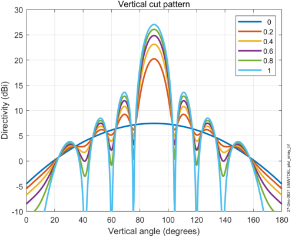
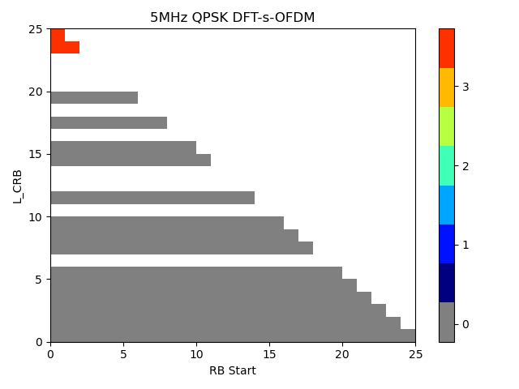
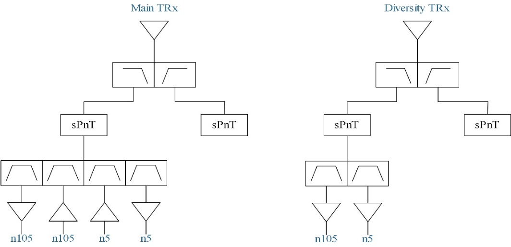

+----------------------------------+----------------------------------+
| 3GPP TS 38.561 V18.3.0 (2025-06) |                                  |
+==================================+==================================+
| Technical Specification          |                                  |
+----------------------------------+----------------------------------+
| 3rd Generation Partnership       |                                  |
| Project;                         |                                  |
|                                  |                                  |
| Technical Specification Group    |                                  |
| Radio Access Network;            |                                  |
|                                  |                                  |
| NR;                              |                                  |
|                                  |                                  |
| User Equipment (UE) conformance  |                                  |
| specification;                   |                                  |
|                                  |                                  |
| UE TRP (Total Radiated Power)    |                                  |
| and TRS (Total Radiated          |                                  |
| Sensitivity) requirements and    |                                  |
| test methodologies for FR1 (NR   |                                  |
| SA and EN-DC);                   |                                  |
|                                  |                                  |
| (Release 18)                     |                                  |
+----------------------------------+----------------------------------+
|                                  |                                  |
+----------------------------------+----------------------------------+
|                                  | {width="1.7777777777777777in" |
|                                  | height="1.0465277777777777in"}   |
+----------------------------------+----------------------------------+
|                                  |                                  |
+----------------------------------+----------------------------------+
| The present document has been    |                                  |
| developed within the 3rd         |                                  |
| Generation Partnership Project   |                                  |
| (3GPP ^TM^) and may be further   |                                  |
| elaborated for the purposes of   |                                  |
| 3GPP.\                           |                                  |
| The present document has not     |                                  |
| been subject to any approval     |                                  |
| process by the 3GPP              |                                  |
| Organizational Partners and      |                                  |
| shall not be implemented.\       |                                  |
| This Specification is provided   |                                  |
| for future development work      |                                  |
| within 3GPP only. The            |                                  |
| Organizational Partners accept   |                                  |
| no liability for any use of this |                                  |
| Specification.\                  |                                  |
| Specifications and Reports for   |                                  |
| implementation of the 3GPP ^TM^  |                                  |
| system should be obtained via    |                                  |
| the 3GPP Organizational          |                                  |
| Partners\' Publications Offices. |                                  |
+----------------------------------+----------------------------------+

+----------------------------------------------------------------------+
| > Keywords                                                           |
| >                                                                    |
| > 5GS, UE, terminal, testing                                         |
| >                                                                    |
| > ***3GPP***                                                         |
| >                                                                    |
| > Postal address                                                     |
| >                                                                    |
| > 3GPP support office address                                        |
| >                                                                    |
| > 650 Route des Lucioles - Sophia Antipolis                          |
| >                                                                    |
| > Valbonne - FRANCE                                                  |
| >                                                                    |
| > Tel.: +33 4 92 94 42 00 Fax: +33 4 93 65 47 16                     |
| >                                                                    |
| > Internet                                                           |
| >                                                                    |
| > http://www.3gpp.org                                                |
|                                                                      |
| ***Copyright Notification***                                         |
|                                                                      |
| No part may be reproduced except as authorized by written            |
| permission.\                                                         |
| The copyright and the foregoing restriction extend to reproduction   |
| in all media.                                                        |
|                                                                      |
| © 2025, 3GPP Organizational Partners (ARIB, ATIS, CCSA, ETSI, TSDSI, |
| TTA, TTC).                                                           |
|                                                                      |
| All rights reserved.                                                 |
|                                                                      |
| UMTS™ is a Trade Mark of ETSI registered for the benefit of its      |
| members                                                              |
|                                                                      |
| 3GPP™ is a Trade Mark of ETSI registered for the benefit of its      |
| Members and of the 3GPP Organizational Partners\                     |
| LTE™ is a Trade Mark of ETSI registered for the benefit of its       |
| Members and of the 3GPP Organizational Partners                      |
|                                                                      |
| GSM® and the GSM logo are registered and owned by the GSM            |
| Association                                                          |
+----------------------------------------------------------------------+

Contents {#contents .TT}
========

Foreword 7

1 Scope 9

2 References 9

3 Definitions of terms, symbols, and abbreviations 10

3.1 Terms 10

3.2 Symbols 10

3.3 Abbreviations 11

4 General 11

4.1 Relationship between minimum requirements and test requirements 11

4.2 Applicability of minimum requirements 11

4.2.1 General 11

4.2.1 UE mechanical modes 12

4.3 Applicability rules for testing of FR1 SA and NSA UEs 12

4.4 Applicability rules for testing of power class capability of UEs 12

4.5 Applicability rules for test methods 12

5 Frequency Bands 13

5.1 General 13

5.2 Operating Bands 13

5.2.1 FR1 Standalone Operating bands 13

5.2.2 FR1 EN-DC band combinations 14

5.3 Test parameters for each band 17

6 FR1 Transmitter (TRP) Performance 21

6.1 General 21

6.2 TRP Performance for Handheld UE 21

6.2.1 TRP Performance for Handheld UE for FR1 (NR SA and EN-DC) 21

6.2.1.1 Total Radiated Power (TRP) in Browsing Mode with Hand Phantom 21

6.2.1.1.1 Total Radiated Power (TRP) for FR1 NR Standalone (SA) in
Browsing Mode with Hand Phantom 21

6.2.1.2 Total Radiated Power (TRP) in Talk Mode with Head and Hand
Phantom 25

6.2.1.2.1 Total Radiated Power (TRP) for FR1 NR Standalone (SA) in Talk
Mode with Head and Hand Phantom 25

7 FR1 Receiver (TRS) Performance 29

7.1 General 29

7.2 TRS Performance for Handheld UE 29

7.2.1 TRS Performance for Handheld UE for FR1 (NR SA and EN-DC) 29

7.2.1.1 Total Radiated Sensitivity (TRS) in Browsing Mode with Hand
Phantom 29

7.2.1.1.1 Total Radiated Sensitivity (TRS) for FR1 NR Standalone (SA) in
Browsing Mode with Hand Phantom 29

7.2.1.2 Total Radiated Sensitivity (TRS) in Talk Mode with Head and Hand
Phantom 32

7.2.1.2.1 Total Radiated Sensitivity (TRS) for FR1 NR Standalone (SA) in
Talk Mode with Head and Hand Phantom 32

Annex A (normative): Test methodology 36

A.1 General 36

A.2 UE configuration 36

A.2.1 General 36

A.2.2 UE configuration for TRP test 36

A.2.3 UE configuration for TRS test 36

A.3 Test system of Anechoic Chamber method 37

A.3.1 System setup 37

A.3.2 Calibration procedure 37

A.3.3 Test procedure 39

A.3.3.1 General 39

A.3.3.2 TRP Test procedure 39

A.3.3.3 TRS Test procedure 39

A.3.3.3.1 Alternate EIS Search Procedure 40

A.3.3.3.1.1 EIS linearization using polynomial interpolation 40

A.3.4 Minimum Range Length 41

A.3.5 Definition of TRP and TRS for AC 42

A.3.5.1 Total Radiated Power (TRP) 42

A.3.5.2 Total Radiated Sensitivity (TRS) 43

A.3.6 TAS OFF verification procedure (Informative) 44

A.3.6 Alternative RC test method 44

A.3.6.1 General 44

A.3.6.2 Test system and test procedure 44

A.3.6.3 Preliminary example MU of RC 44

A.3.7 Ripple test for Quiet Zone 45

A.3.7.1 General 45

A.3.7.2 Ripple test procedure 45

A.4 (Informative): Estimation of measurement uncertainty 49

A.4.1 General 49

A.4.2 Measurement uncertainty contribution descriptions 51

A.4.2.1 Mismatch uncertainty 51

A.4.2.1.1 Mismatch uncertainty between measurement receiver /
communication tester and the measurement antenna 51

A.4.2.1.1.1 Mismatch uncertainty through the connector between two
elements 51

A.4.2.1.1.2 Mismatch uncertainty due to the interaction of several
elements 52

A.4.2.1.1.3 Total combined mismatch uncertainty 53

A.4.2.1.2 Mismatch uncertainty of the RF relay 53

A.4.2.1.2.1 First part: RF Relay switched on the co-polarized signal 54

A.4.2.1.2.1.1 The mismatch through the connector between two elements 54

A.4.2.1.2.1.2 Mismatch due to the interaction between two elements or
more 55

A.4.2.1.2.2 Second part: RF relay switched on the cross-polarized signal
55

A.4.2.1.2.2.1 The mismatch through the connector between two elements 55

A.4.2.1.2.2.2 Mismatch due to the interaction between two elements or
more 55

A.4.2.1.2.3 Total combined mismatch uncertainty 56

A.4.2.2 Insertion loss 56

A.4.2.2.1 Insertion loss of the measurement antenna cable 56

A.4.2.2.2 Insertion loss of the measurement antenna attenuator (if used)
56

A.4.2.2.3 Insertion loss of the RF relays (if used) 56

A.4.2.2.4 Insertion loss: calibration antenna feed cable 56

A.4.2.2.5 Insertion loss: calibration antenna attenuator (if used) 57

A.4.2.3 Influence of the antenna cable 57

A.4.2.3.1 Measurement antenna cable 57

A.4.2.3.2 Calibration antenna cable 57

A.4.2.4 Measurement receiver: uncertainty of the absolute level 57

A.4.2.5 Communication tester: uncertainty of the absolute level 57

A.4.2.6 Sensitivity measurement: output level step resolution 57

A.4.2.7 Measurement distance 58

A.4.2.7.1 Offset of phase centre from axis(es) of rotation 58

A.4.2.7.1.1 Offset of DUT phase centre from axis(es) of rotation 58

A.4.2.7.1.2 Offset of calibration antenna phase centre from axis(es) of
rotation 58

A.4.2.7.2 Mutual coupling 59

A.4.2.7.3 Phase curvature 59

A.4.2.8 Quality of quiet zone 59

A.4.2.9 DUT Tx-power drift 60

A.4.2.10 DUT sensitivity drift 61

A.4.2.11 Uncertainty related to the use of phantoms 61

A.4.2.11.1 Uncertainty from using different types of SAM phantom 61

A.4.2.11.2 Simulated tissue liquid uncertainty 61

A.4.2.11.3 Uncertainty of dielectric properties and shape of the hand
phantom 61

A.4.2.11.4 Uncertainty from using different types of Laptop Ground Plane
phantom 62

A.4.2.11.5 Positioning Uncertainty from using Phantoms 63

A.4.2.12 Coarse sampling grid 63

A.4.2.13 Random uncertainty 64

A.4.2.14 Frequency response 64

A.4.2.15 Uncertainty of network analyser 65

A.4.2.16 Uncertainty of the gain/efficiency of the calibration antenna
65

A.4.3 Total Radiated Power (TRP) 65

A.4.3.1 Anechoic Chamber Method 65

A.4.4 Total Radiated Sensitivity (TRS) 71

A.4.4.1 Anechoic Chamber Method 71

Annex B (normative): Phantoms definition and Positioning 78

B.1 General 78

B.2 Phantom Definition 79

B.2.1 Head Phantom 79

B.2.2 PDA Grip Hand Phantom 79

B.2.3 Wide Grip Hand Phantom 79

B.2.4 Forearm Phantom 80

B.3 UE positioning guidelines 80

B.3.1 Hand phantom only (Browsing mode) 80

B.3.1.1 Wide Grip Hand 81

B.3.1.2 PDA Grip Hand 81

B.3.2 Head and Hand phantom (Talk Mode) 82

B.3.2.1 General 82

B.3.2.2 Wide Grip Hand and Head 84

B.3.2.1 PDA Grip Hand and Head 84

B.3.3 Forearm phantom (Wrist-worn Mode) 84

B.3.2.1 General 84

B.3.2.2 Forearm phantom positioning in the chamber 84

B.3.2.3 Wrist-Worn RedCap Device mounted on the Forearm Phantom 85

Annex C (normative): Environmental requirements 86

C.1 General 86

C.2 Environmental 86

C.2.1 Temperature 86

C.2.2 Voltage 86

Annex D (normative): Maximum uncertainty of test system and test
tolerance 87

D.1 Maximum uncertainty of test system 87

D.2 Test Tolerances 87

Annex E (informative): Change History 89

Foreword
========

This Technical Specification has been produced by the 3rd Generation
Partnership Project (3GPP).

The contents of the present document are subject to continuing work
within the TSG and may change following formal TSG approval. Should the
TSG modify the contents of the present document, it will be re-released
by the TSG with an identifying change of release date and an increase in
version number as follows:

> Version x.y.z
>
> where:
>
> x the first digit:
>
> 1 presented to TSG for information;
>
> 2 presented to TSG for approval;
>
> 3 or greater indicates TSG approved document under change control.
>
> y the second digit is incremented for all changes of substance, i.e.
> technical enhancements, corrections, updates, etc.
>
> z the third digit is incremented when editorial only changes have been
> incorporated in the document.

In the present document, modal verbs have the following meanings:

> **shall** indicates a mandatory requirement to do something
>
> **shall not** indicates an interdiction (prohibition) to do something

The constructions \"shall\" and \"shall not\" are confined to the
context of normative provisions, and do not appear in Technical Reports.

The constructions \"must\" and \"must not\" are not used as substitutes
for \"shall\" and \"shall not\". Their use is avoided insofar as
possible, and they are not used in a normative context except in a
direct citation from an external, referenced, non-3GPP document, or so
as to maintain continuity of style when extending or modifying the
provisions of such a referenced document.

> **should** indicates a recommendation to do something
>
> **should not** indicates a recommendation not to do something
>
> **may** indicates permission to do something
>
> **need not** indicates permission not to do something

The construction \"may not\" is ambiguous and is not used in normative
elements. The unambiguous constructions \"might not\" or \"shall not\"
are used instead, depending upon the meaning intended.

> **can** indicates that something is possible
>
> **cannot** indicates that something is impossible

The constructions \"can\" and \"cannot\" are not substitutes for \"may\"
and \"need not\".

> **will** indicates that something is certain or expected to happen as
> a result of action taken by an agency the behaviour of which is
> outside the scope of the present document
>
> **will not** indicates that something is certain or expected not to
> happen as a result of action taken by an agency the behaviour of which
> is outside the scope of the present document
>
> **might** indicates a likelihood that something will happen as a
> result of action taken by some agency the behaviour of which is
> outside the scope of the present document
>
> **might not** indicates a likelihood that something will not happen as
> a result of action taken by some agency the behaviour of which is
> outside the scope of the present document

In addition:

> **is** (or any other verb in the indicative mood) indicates a
> statement of fact
>
> **is not** (or any other negative verb in the indicative mood)
> indicates a statement of fact

The constructions \"is\" and \"is not\" do not indicate requirements.

1 Scope
=======

The present document specifies details of conformance testing of UE TRP
(Total Radiated Power) and TRS (Total Radiated Sensitivity) requirements
and test methodologies for FR1 (NR SA and EN-DC).

2 References
============

The following documents contain provisions which, through reference in
this text, constitute provisions of the present document.

References are either specific (identified by date of publication,
edition number, version number, etc.) or non‑specific.

For a specific reference, subsequent revisions do not apply.

For a non-specific reference, the latest version applies. In the case of
a reference to a 3GPP document (including a GSM document), a
non-specific reference implicitly refers to the latest version of that
document *in the same Release as the present document*.

\[1\] 3GPP TS 38.161: "User Equipment (UE) TRP (Total Radiated Power)
and TRS (Total Radiated Sensitivity) requirements; Range 1 Standalone
and Range 1 Interworking operation with other radios

\[2\] 3GPP TS 38.508-1: \"5GS; User Equipment (UE) conformance
specification; Part 1: Common test environment \"

\[3\] 3GPP TS 38.101-1: \"NR; User Equipment (UE) radio transmission and
reception; Part 1: Range 1 Standalone\".

\[4\] JCGM 100:2008: "Evaluation of measurement data --- Guide to the
expression of uncertainty in measurement".

\[5\] ETSI TR 102 273-1-1: "Electromagnetic compatibility and Radio
spectrum Matters (ERM); Improvement on Radiated Methods of Measurement
(using test site) and evaluation of the corresponding measurement
uncertainties; Part 1: Uncertainties in the measurement of mobile radio
equipment characteristics; Sub-part 1: Introduction".

\[6\] ETSI TR 100 028-2: "ElectroMagnetic Compatibility and Radio
Spectrum Matters (ERM); Uncertainties in the measurement of mobile radio
equipment characteristics; Part 2".

\[7\] ETSI TR 102 273-1-2: "Electromagnetic compatibility and Radio
spectrum Matters (ERM); Improvement on Radiated Methods of Measurement
(using test site) and evaluation of the corresponding measurement
uncertainties; Part 1: Uncertainties in the measurement of mobile radio
equipment characteristics; Sub-part 2: Examples and annexes".

\[8\] CTIA Certification™: "CTIA Certification Test Plan for Wireless
Device Over-the-Air Performance, CTIA 01.70: Measurement Uncertainty",
latest active version available at:
<https://ctiacertification.org/test-plans/>

\[9\] Foegelle, M.D., "The Surface Standard Deviation Method for TRP
Measurement Uncertainty", 25th Proceedings of the Antenna Measurement
Techniques Association (AMTA 2003), A03-027

\[10\] 3GPP TR 38.834: "Measurements of User Equipment (UE) Over-the-Air
(OTA) performance for NR FR1; Total Radiated Power (TRP) and Total
Radiated Sensitivity (TRS) test methodology (Release 17)"

\[11\] 3GPP TS 38.521-1: \"NR; User Equipment (UE) conformance
specification; Radio transmission and reception; Part 1: Range 1
Standalone\"

\[12\] CTIA Certification™: "CTIA Certification Test Plan for Wireless
Device Over-the-Air Performance, CTIA 01.72: Near-Field Phantoms",
latest active version available at:
<https://ctiacertification.org/test-plans/>

\[13\] CTIA Certification™: "CTIA Certification Test Plan for Wireless
Device Over-the-Air Performance, CTIA 01.71 Device Setup and Positioning
Guidelines", latest active version available at:
<https://ctiacertification.org/test-plans/>

\[14\] 3GPP TS 38.521-3: \"NR; User Equipment (UE) conformance
specification; Radio transmission and reception; Part 3: Range 1 and
Range 2 Interworking operation with other radios\"

\[15\] 3GPP TS 37.544: \"Universal Terrestrial Radio Access (UTRA) and
Evolved UTRA (E-UTRA); User Equipment (UE) Over The Air (OTA)
performance; Conformance testing\"

\[16\] 3GPP TS 21.905: "Vocabulary for 3GPP Specifications"

\[17\] 3GPP TS 38.101-3: "NR; User Equipment (UE) radio transmission and
reception; Part 3: Range 1 and Range 2 Interworking operation with other
radios"

\[18\] 3GPP TR 38.870, "Enhanced Over-the-Air (OTA) test methods for NR
FR1 Total Radiated Power (TRP) and Total Radiated Sensitivity (TRS)
(Release 18)"

3 Definitions of terms, symbols, and abbreviations
==================================================

3.1 Terms
---------

For the purposes of the present document, the terms given in 3GPP
TR 21.905 \[16\] and the following apply. A term defined in the present
document takes precedence over the definition of the same term, if any,
in 3GPP TR 21.905 \[1\].

**Browsing mode usage:** This mode corresponds to "data" mode, the
device is tested via hand-only phantoms.

**Primary mechanical mode:** The mode that is most often used for a
specific user scenario. Every terminal has at least one primary
mechanical mode, if multiple modes are supported, different primary
mechanical modes may be applicable for different user scenarios, e.g.,
different primary mechanical modes for Browsing mode usage and Talk mode
usage for the same UE.

**Talk mode usage:** This mode corresponds to "talk" mode, the device is
tested via head & hand phantoms.

**Wrist-worn mode usage:** This mode corresponds to wearable device for
wrist-worn mode, the device is tested via forearm phantoms.

3.2 Symbols
-----------

For the purposes of the present document, the following symbols apply:

*TRP~average\ ~*The average measured total radiated power of low, mid
and high channel. When hand phantom is involved, the average is
performed with low, mid and high channel from both hand left and hand
right.

*TRS~average\ ~*The average measured total radiated sensitivity of low,
mid and high channel. When hand phantom is involved, the average is
performed with low, mid and high channel from both hand left and hand
right.

3.3 Abbreviations
-----------------

For the purposes of the present document, the abbreviations given in
3GPP TR 21.905 \[1\] and the following apply. An abbreviation defined in
the present document takes precedence over the definition of the same
abbreviation, if any, in 3GPP TR 21.905 \[1\].

AC Anechoic Chamber

BHHL Beside Head and Hand Left Side (Head and Hand Phantom)

BHHR Beside Head and Hand Right Side (Head and Hand Phantom)

CA Carrier Aggregation

DUT Device Under Test

E-UTRA Evolved UTRA

EIRP Effective Isotropic Radiated Power

EUT Equipment Under Test

FR1 RF Frequency Range 1

FS Free Space

HL Hand Left (Hand Phantom Only)

HR Hand Right (Hand Phantom Only)

MPR Allowed maximum power reduction

NR New Radio

NSA Non-Standalone, a mode of operation where operation of another radio
is assisted with another radio

OTA Over The Air

QZ Quiet Zone

RedCap Reduced Capability

SA Standalone

SS System Simulator

TAA Time-Averaging Algorithm

TAS Transmit Antenna Switching

TRP Total Radiated Power

TRS Total Radiated Sensitivity

TxD Tx Diversity

UE User Equipment

UL MIMO Uplink Multiple Antenna transmission

4 General
=========

4.1 Relationship between minimum requirements and test requirements
-------------------------------------------------------------------

The Minimum Requirements given in TS 38.161 \[1\] make no allowance for
measurement uncertainty. This test specification will define test
tolerances for FR1 TRP TRS. The test tolerances are used to relax the
minimum requirements in TS 38.161 \[1\] to create test requirements.

4.2 Applicability of minimum requirements
-----------------------------------------

### 4.2.1 General

The minimum requirements apply only to the corresponding primary
mechanical mode of UE in the environmental conditions specified in Annex
C.4.2.2.

### 4.2.1 UE mechanical modes

The mechanical modes of a device under test (DUT) are declared by the
manufacturer. A DUT shall have at least one mechanical mode. If only one
mode is supported, then this is defined as the primary. If multiple
modes are supported, the manufacturer can declare different primary
mechanical modes applicable for different user scenarios, e.g.,
different primary mechanical mode for Browsing mode usage and Talk mode
usage for the same UE.

4.3 Applicability rules for testing of FR1 SA and NSA UEs
---------------------------------------------------------

1\. The applicability and test coverage rules for Non-Standalone (NSA)
only capable devices shall include the following:

> a\) For each NR band supported by the device, test the UE in EN-DC
> mode using any one example configuration containing that NR band or
> configuration declaration decision tree as per recommended TRP/TRS
> test procedures in this specification.

2\. The applicability and test coverage rules for Standalone (SA) and
NSA (EN-DC) capable devices shall include the following:

> a\) For each NR band in a device, test the UE in Standalone Mode as
> per the TRP/TRS test procedures in this specification.
>
> b\) This shall also fulfil coverage for all EN-DC FR1 minimum
> performance requirements for that NR band and need not be retested in
> EN-DC mode.

4.4 Applicability rules for testing of power class capability of UEs
--------------------------------------------------------------------

1\. The applicability and test coverage rules for PC2 and PC3 UEs shall
include the following:

a\) For UEs that support PC2 in a given band: verify the requirement
only with PC2 configuration

b\) For UEs that only support PC3 in a given band: verify the
requirement with PC3 configuration

NOTE 1: The test procedure and requirements in this version of the
specification apply only for UEs based on 1 Tx configuration and are not
applicable to UEs under TxD and UL MIMO configurations.

4.5 Applicability rules for test methods
----------------------------------------

Editor\'s note: The following aspects are incomplete or yet to be
determined regarding applicability of the alternative Reverberation
Chamber (RC) test method:

\-  How to verify the results with AC when the performance requirement
is not met with RC test method

\- Specifics of how to compare test results between RC an Anechoic
Chamber (AC) test system using golden/reference UEs

The Anechoic Chamber (AC) system is the reference method to verify FR1
TRP and TRS requirements.

The applicability of alternative Reverberation Chamber (RC) test method
is specified as follows:

\- Comparison between RC system results and an accredited AC system
using golden/reference UEs shall be performed on a regular basis.

\- For bands \>3GHz, RC test method is harmonized with reference AC
method. For the case that directional parameters are not required (e.g.
UE antenna pattern, specific directional EIRP/EIS results, partial
surface integrated metrics), then the RC test method can be used.

\- For certification testing, it is recommended to verify the results
using AC test method as reference in case the UE does not meet the
performance requirements using the RC test method.

5 Frequency Bands
=================

5.1 General
-----------

This clause contains the operating bands for both Standalone (SA) and
Non-Standalone (NSA) operation in frequency range 1 (FR1) as well as the
test parameters for each band.

5.2 Operating Bands
-------------------

### 5.2.1 FR1 Standalone Operating bands

The requirements defined in this specification for FR1 standalone apply
to the operating bands defined in Table 5.2.1-1.

Table 5.2.1-1: NR operating bands in FR1 standalone

+-----------------+-----------------+-----------------+-------------+
| NR operating    | Uplink (UL)     | Downlink (DL)   | Duplex Mode |
| band            | *operating      | *operating      |             |
|                 | band*\          | band*\          |             |
|                 | BS receive / UE | BS transmit /   |             |
|                 | transmit        | UE receive      |             |
|                 |                 |                 |             |
|                 | F~UL\_low~ --   | F~DL\_low~ --   |             |
|                 | F~UL\_high~     | F~DL\_high~     |             |
+=================+=================+=================+=============+
| n1              | 1920 MHz --     | 2110 MHz --     | FDD         |
|                 | 1980 MHz        | 2170 MHz        |             |
+-----------------+-----------------+-----------------+-------------+
| n2              | 1850 MHz --     | 1930 MHz --     | FDD         |
|                 | 1910 MHz        | 1990 MHz        |             |
+-----------------+-----------------+-----------------+-------------+
| n3              | 1710 MHz --     | 1805 MHz --     | FDD         |
|                 | 1785 MHz        | 1880 MHz        |             |
+-----------------+-----------------+-----------------+-------------+
| n5              | 824 MHz -- 849  | 869 MHz -- 894  | FDD         |
|                 | MHz             | MHz             |             |
+-----------------+-----------------+-----------------+-------------+
| n7              | 2500 MHz --     | 2620 MHz --     | FDD         |
|                 | 2570 MHz        | 2690 MHz        |             |
+-----------------+-----------------+-----------------+-------------+
| n8              | 880 MHz -- 915  | 925 MHz -- 960  | FDD         |
|                 | MHz             | MHz             |             |
+-----------------+-----------------+-----------------+-------------+
| n12             | 699 MHz -- 716  | 729 MHz -- 746  | FDD         |
|                 | MHz             | MHz             |             |
+-----------------+-----------------+-----------------+-------------+
| n14             | 788 MHz -- 798  | 758 MHz -- 768  | FDD         |
|                 | MHz             | MHz             |             |
+-----------------+-----------------+-----------------+-------------+
| n20             | 832 MHz -- 862  | 791 MHz -- 821  | FDD         |
|                 | MHz             | MHz             |             |
+-----------------+-----------------+-----------------+-------------+
| n25             | 1850 MHz --     | 1930 MHz --     | FDD         |
|                 | 1915 MHz        | 1995 MHz        |             |
+-----------------+-----------------+-----------------+-------------+
| n26             | 814 MHz -- 849  | 859 MHz -- 894  | FDD         |
|                 | MHz             | MHz             |             |
+-----------------+-----------------+-----------------+-------------+
| n28             | 703 MHz -- 748  | 758 MHz -- 803  | FDD         |
|                 | MHz             | MHz             |             |
+-----------------+-----------------+-----------------+-------------+
| n30             | 2305 MHz --     | 2350 MHz --     | FDD         |
|                 | 2315 MHz        | 2360 MHz        |             |
+-----------------+-----------------+-----------------+-------------+
| n34             | 2010 MHz --     | 2010 MHz --     | TDD         |
|                 | 2025 MHz        | 2025 MHz        |             |
+-----------------+-----------------+-----------------+-------------+
| n38             | 2570 MHz --     | 2570 MHz --     | TDD         |
|                 | 2620 MHz        | 2620 MHz        |             |
+-----------------+-----------------+-----------------+-------------+
| n39             | 1880 MHz --     | 1880 MHz --     | TDD         |
|                 | 1920 MHz        | 1920 MHz        |             |
+-----------------+-----------------+-----------------+-------------+
| n40             | 2300 MHz --     | 2300 MHz --     | TDD         |
|                 | 2400 MHz        | 2400 MHz        |             |
+-----------------+-----------------+-----------------+-------------+
| n41             | 2496 MHz --     | 2496 MHz --     | TDD         |
|                 | 2690 MHz        | 2690 MHz        |             |
+-----------------+-----------------+-----------------+-------------+
| n48             | 3550 MHz --     | 3550 MHz --     | TDD         |
|                 | 3700 MHz        | 3700 MHz        |             |
+-----------------+-----------------+-----------------+-------------+
| n50             | 1432 MHz --     | 1432 MHz --     | TDD^1^      |
|                 | 1517 MHz        | 1517 MHz        |             |
+-----------------+-----------------+-----------------+-------------+
| n51             | 1427 MHz --     | 1427 MHz --     | TDD         |
|                 | 1432 MHz        | 1432 MHz        |             |
+-----------------+-----------------+-----------------+-------------+
| n53             | 2483.5 MHz --   | 2483.5 MHz --   | TDD         |
|                 | 2495 MHz        | 2495 MHz        |             |
+-----------------+-----------------+-----------------+-------------+
| n65             | 1920 MHz --     | 2110 MHz --     | FDD^4^      |
|                 | 2010 MHz        | 2200 MHz        |             |
+-----------------+-----------------+-----------------+-------------+
| n66             | 1710 MHz --     | 2110 MHz --     | FDD         |
|                 | 1780 MHz        | 2200 MHz        |             |
+-----------------+-----------------+-----------------+-------------+
| n70             | 1695 MHz --     | 1995 MHz --     | FDD         |
|                 | 1710 MHz        | 2020 MHz        |             |
+-----------------+-----------------+-----------------+-------------+
| n71             | 663 MHz -- 698  | 617 MHz -- 652  | FDD         |
|                 | MHz             | MHz             |             |
+-----------------+-----------------+-----------------+-------------+
| n74             | 1427 MHz --     | 1475 MHz --     | FDD         |
|                 | 1470 MHz        | 1518 MHz        |             |
+-----------------+-----------------+-----------------+-------------+
| n75             | N/A             | 1432 MHz --     | SDL         |
|                 |                 | 1517 MHz        |             |
+-----------------+-----------------+-----------------+-------------+
| n76             | N/A             | 1427 MHz --     | SDL         |
|                 |                 | 1432 MHz        |             |
+-----------------+-----------------+-----------------+-------------+
| n77^12^         | 3300 MHz --     | 3300 MHz --     | TDD         |
|                 | 4200 MHz        | 4200 MHz        |             |
+-----------------+-----------------+-----------------+-------------+
| n78             | 3300 MHz --     | 3300 MHz --     | TDD         |
|                 | 3800 MHz        | 3800 MHz        |             |
+-----------------+-----------------+-----------------+-------------+
| n79             | 4400 MHz --     | 4400 MHz --     | TDD         |
|                 | 5000 MHz        | 5000 MHz        |             |
+-----------------+-----------------+-----------------+-------------+
| n80             | 1710 MHz --     | N/A             | SUL         |
|                 | 1785 MHz        |                 |             |
+-----------------+-----------------+-----------------+-------------+
| n81             | 880 MHz -- 915  | N/A             | SUL         |
|                 | MHz             |                 |             |
+-----------------+-----------------+-----------------+-------------+
| n82             | 832 MHz -- 862  | N/A             | SUL         |
|                 | MHz             |                 |             |
+-----------------+-----------------+-----------------+-------------+
| n83             | 703 MHz -- 748  | N/A             | SUL         |
|                 | MHz             |                 |             |
+-----------------+-----------------+-----------------+-------------+
| n84             | 1920 MHz --     | N/A             | SUL         |
|                 | 1980 MHz        |                 |             |
+-----------------+-----------------+-----------------+-------------+
| n86             | 1710 MHz --     | N/A             | SUL         |
|                 | 1780 MHz        |                 |             |
+-----------------+-----------------+-----------------+-------------+
| n95             | 2010 MHz --     | N/A             | SUL         |
|                 | 2025 MHz        |                 |             |
+-----------------+-----------------+-----------------+-------------+

Other operating bands may be considered in future releases.

### 5.2.2 FR1 EN-DC band combinations

Principle of EN-DC band combinations selection for FR1 TRP TRS OTA
testing:

> 1\. Focus on the performance of the NR carrier and do not consider
> multiple permutations between different LTE bands and NR band under
> test, i.e., for each NR band, only select one EN-DC band combination.
>
> 2\. For UE supporting multiple EN-DC band combinations for the same NR
> band, consider only those EN-DC configurations which have no MSD
> impact on either LTE or NR, i.e., the selected EN-DC combination
> should be no MSD issue identified in TS 38.101-3 \[17\] Section
> 7.3B.2.3 (Inter-band EN-DC within FR1).

Table 5.2.2-1: Measurement parameters for example inter-band EN-DC band
combinations (two bands)

+-----------------------+-----------------------+-------------------+
| EN-DC                 | E-UTRA configurations | NR configurations |
|                       |                       |                   |
| configuration         |                       |                   |
+=======================+=======================+===================+
| DC\_3A\_n28A          | Note1                 | Note2             |
+-----------------------+-----------------------+-------------------+
| DC\_2A\_n41A          | Note1                 | Note2             |
+-----------------------+-----------------------+-------------------+
| DC\_1A\_n78A          | Note1                 | Note2             |
+-----------------------+-----------------------+-------------------+
| DC\_1A\_n79A          | Note1                 | Note2             |
+-----------------------+-----------------------+-------------------+
| Note 1: As per TR     |                       |                   |
| 37.902 \[10\],        |                       |                   |
| Section 6.4           |                       |                   |
| (Measurement          |                       |                   |
| frequencies).         |                       |                   |
|                       |                       |                   |
| Note 2: As per Tables |                       |                   |
| 5.3-1 and Table 5.3-2 |                       |                   |
| in this               |                       |                   |
| specification.        |                       |                   |
+-----------------------+-----------------------+-------------------+

With the above basic principle and EN-DC example band combination, the
selection logic for testing is defined by the decision tree below.

{width="6.210872703412074in"
height="8.460937226596675in"}

Figure 5.2.2-2: Decision tree to select the EN-DC band combination for
TRP/TRS testing

5.3 Test parameters for each band
---------------------------------

The detailed testing parameters for each band is defined in Table 5.3-1
and Table 5.3-2.

Table 5.3-1: NR FR1 TRP measurement parameters

<table>
<thead>
<tr class="header">
<th>NR Band</th>
<th>CBW 
[MHz]</th>
<th>SCS (kHz)</th>
<th>UL modulation</th>
<th>Range</th>
<th>
UL Carrier centre

[ARFCN]
</th>
<th>UL Carrier Center (MHz)</th>
<th>
DL Carrier centre

[ARFCN]
</th>
<th>DL Carrier Center (MHz)</th>
<th>
UL RB Allocation

(LCRB @ RBstart)
</th>
<th>DL configuration</th>
</tr>
</thead>
<tbody>
<tr class="odd">
<td>n1</td>
<td>15</td>
<td>15</td>
<td>
DFT-s-OFDM

QPSK
</td>
<td>Low</td>
<td>385500</td>
<td>1927.5</td>
<td>423500</td>
<td>2117.5</td>
<td>36@18</td>
<td>N/A</td>
</tr>
<tr class="even">
<td></td>
<td></td>
<td></td>
<td></td>
<td>Mid</td>
<td>390000</td>
<td>1950</td>
<td>428000</td>
<td>2140</td>
<td></td>
<td></td>
</tr>
<tr class="odd">
<td></td>
<td></td>
<td></td>
<td></td>
<td>High</td>
<td>394500</td>
<td>1972.5</td>
<td>432500</td>
<td>2162.5</td>
<td></td>
<td></td>
</tr>
<tr class="even">
<td>n2</td>
<td>15</td>
<td>15</td>
<td>
DFT-s-OFDM

QPSK
</td>
<td>Low</td>
<td>371500</td>
<td>1857.5</td>
<td>387500</td>
<td>1937.5</td>
<td>36@18</td>
<td>N/A</td>
</tr>
<tr class="odd">
<td></td>
<td></td>
<td></td>
<td></td>
<td>Mid</td>
<td>376000</td>
<td>1880</td>
<td>392000</td>
<td>1960</td>
<td></td>
<td></td>
</tr>
<tr class="even">
<td></td>
<td></td>
<td></td>
<td></td>
<td>High</td>
<td>380500</td>
<td>1902.5</td>
<td>396500</td>
<td>1982.5</td>
<td></td>
<td></td>
</tr>
<tr class="odd">
<td>n3</td>
<td>20</td>
<td>15</td>
<td>
DFT-s-OFDM

QPSK
</td>
<td>Low</td>
<td>344000</td>
<td>1720</td>
<td>363000</td>
<td>1815</td>
<td>50@25</td>
<td>N/A</td>
</tr>
<tr class="even">
<td></td>
<td></td>
<td></td>
<td></td>
<td>Mid</td>
<td>349500</td>
<td>1747.5</td>
<td>368500</td>
<td>1842.5</td>
<td></td>
<td></td>
</tr>
<tr class="odd">
<td></td>
<td></td>
<td></td>
<td></td>
<td>High</td>
<td>355000</td>
<td>1775</td>
<td>374000</td>
<td>1870</td>
<td></td>
<td></td>
</tr>
<tr class="even">
<td>n5</td>
<td>15</td>
<td>15</td>
<td>
DFT-s-OFDM

QPSK
</td>
<td>Low</td>
<td>166300</td>
<td>831.5</td>
<td>175300</td>
<td>876.5</td>
<td>36@18</td>
<td>N/A</td>
</tr>
<tr class="odd">
<td></td>
<td></td>
<td></td>
<td></td>
<td>Mid</td>
<td>167300</td>
<td>836.5</td>
<td>176300</td>
<td>881.5</td>
<td></td>
<td></td>
</tr>
<tr class="even">
<td></td>
<td></td>
<td></td>
<td></td>
<td>High</td>
<td>168300</td>
<td>841.5</td>
<td>177300</td>
<td>886.5</td>
<td></td>
<td></td>
</tr>
<tr class="odd">
<td>n7</td>
<td>15</td>
<td>15</td>
<td>
DFT-s-OFDM

QPSK
</td>
<td>Low</td>
<td>501500</td>
<td>2507.5</td>
<td>525500</td>
<td>2627.5</td>
<td>36@18</td>
<td>N/A</td>
</tr>
<tr class="even">
<td></td>
<td></td>
<td></td>
<td></td>
<td>Mid</td>
<td>507000</td>
<td>2535</td>
<td>531000</td>
<td>2655</td>
<td></td>
<td></td>
</tr>
<tr class="odd">
<td></td>
<td></td>
<td></td>
<td></td>
<td>High</td>
<td>512500</td>
<td>2562.5</td>
<td>536500</td>
<td>2682.5</td>
<td></td>
<td></td>
</tr>
<tr class="even">
<td>n8</td>
<td>15</td>
<td>15</td>
<td>
DFT-s-OFDM

QPSK
</td>
<td>Low</td>
<td>177500</td>
<td>887.5</td>
<td>186500</td>
<td>932.5</td>
<td>36@18</td>
<td>N/A</td>
</tr>
<tr class="odd">
<td></td>
<td></td>
<td></td>
<td></td>
<td>Mid</td>
<td>179500</td>
<td>897.5</td>
<td>188500</td>
<td>942.5</td>
<td></td>
<td></td>
</tr>
<tr class="even">
<td></td>
<td></td>
<td></td>
<td></td>
<td>High</td>
<td>181500</td>
<td>907.5</td>
<td>190500</td>
<td>952.5</td>
<td></td>
<td></td>
</tr>
<tr class="odd">
<td>n12</td>
<td>10</td>
<td>15</td>
<td>
DFT-s-OFDM

QPSK
</td>
<td>Low</td>
<td>140800</td>
<td>704</td>
<td>146800</td>
<td>734</td>
<td>25@12</td>
<td>N/A</td>
</tr>
<tr class="even">
<td></td>
<td></td>
<td></td>
<td></td>
<td>Mid</td>
<td>141500</td>
<td>707.5</td>
<td>147500</td>
<td>737.5</td>
<td></td>
<td></td>
</tr>
<tr class="odd">
<td></td>
<td></td>
<td></td>
<td></td>
<td>High</td>
<td>142200</td>
<td>711</td>
<td>148200</td>
<td>741</td>
<td></td>
<td></td>
</tr>
<tr class="even">
<td>n14</td>
<td>10</td>
<td>15</td>
<td>
DFT-s-OFDM

QPSK
</td>
<td>Low</td>
<td>158600</td>
<td>793</td>
<td>152600</td>
<td>763</td>
<td>25@12</td>
<td>N/A</td>
</tr>
<tr class="odd">
<td></td>
<td></td>
<td></td>
<td></td>
<td>Mid</td>
<td></td>
<td></td>
<td></td>
<td></td>
<td></td>
<td></td>
</tr>
<tr class="even">
<td></td>
<td></td>
<td></td>
<td></td>
<td>High</td>
<td></td>
<td></td>
<td></td>
<td></td>
<td></td>
<td></td>
</tr>
<tr class="odd">
<td>n20</td>
<td>15</td>
<td>15</td>
<td>
DFT-s-OFDM

QPSK
</td>
<td>Low</td>
<td>167900</td>
<td>839.5</td>
<td>159700</td>
<td>798.5</td>
<td>36@18</td>
<td>N/A</td>
</tr>
<tr class="even">
<td></td>
<td></td>
<td></td>
<td></td>
<td>Mid</td>
<td>169400</td>
<td>847</td>
<td>161200</td>
<td>806</td>
<td></td>
<td></td>
</tr>
<tr class="odd">
<td></td>
<td></td>
<td></td>
<td></td>
<td>High</td>
<td>170900</td>
<td>854.5</td>
<td>162700</td>
<td>813.5</td>
<td></td>
<td></td>
</tr>
<tr class="even">
<td>n25</td>
<td>15</td>
<td>15</td>
<td>
DFT-s-OFDM

QPSK
</td>
<td>Low</td>
<td>371500</td>
<td>1857.5</td>
<td>387500</td>
<td>1937.5</td>
<td>36@18</td>
<td>N/A</td>
</tr>
<tr class="odd">
<td></td>
<td></td>
<td></td>
<td></td>
<td>Mid</td>
<td>376500</td>
<td>1882.5</td>
<td>392500</td>
<td>1962.5</td>
<td></td>
<td></td>
</tr>
<tr class="even">
<td></td>
<td></td>
<td></td>
<td></td>
<td>High</td>
<td>381500</td>
<td>1907.5</td>
<td>397500</td>
<td>1987.5</td>
<td></td>
<td></td>
</tr>
<tr class="odd">
<td>n26</td>
<td>10</td>
<td>15</td>
<td>
DFT-s-OFDM

QPSK
</td>
<td>Low</td>
<td>163800</td>
<td>819</td>
<td>172800</td>
<td>864</td>
<td>25@12</td>
<td>N/A</td>
</tr>
<tr class="even">
<td></td>
<td></td>
<td></td>
<td></td>
<td>Mid</td>
<td>166300</td>
<td>831.5</td>
<td>175300</td>
<td>876.5</td>
<td></td>
<td></td>
</tr>
<tr class="odd">
<td></td>
<td></td>
<td></td>
<td></td>
<td>High</td>
<td>168800</td>
<td>844</td>
<td>177800</td>
<td>889</td>
<td></td>
<td></td>
</tr>
<tr class="even">
<td>n28</td>
<td>20</td>
<td>15</td>
<td>
DFT-s-OFDM

QPSK
</td>
<td>Low</td>
<td>142600</td>
<td>713</td>
<td>153600</td>
<td>768</td>
<td>50@25</td>
<td>N/A</td>
</tr>
<tr class="odd">
<td></td>
<td></td>
<td></td>
<td></td>
<td>Mid</td>
<td>145600</td>
<td>728</td>
<td>156600</td>
<td>783</td>
<td></td>
<td></td>
</tr>
<tr class="even">
<td></td>
<td></td>
<td></td>
<td></td>
<td>High</td>
<td>147600</td>
<td>738</td>
<td>158600</td>
<td>793</td>
<td></td>
<td></td>
</tr>
<tr class="odd">
<td>n30</td>
<td>10</td>
<td>15</td>
<td>
DFT-s-OFDM

QPSK
</td>
<td>Low</td>
<td>462000</td>
<td>2310</td>
<td>471000</td>
<td>2355</td>
<td>25@12</td>
<td>N/A</td>
</tr>
<tr class="even">
<td></td>
<td></td>
<td></td>
<td></td>
<td>Mid</td>
<td></td>
<td></td>
<td></td>
<td></td>
<td></td>
<td></td>
</tr>
<tr class="odd">
<td></td>
<td></td>
<td></td>
<td></td>
<td>High</td>
<td></td>
<td></td>
<td></td>
<td></td>
<td></td>
<td></td>
</tr>
<tr class="even">
<td>n34</td>
<td>10</td>
<td>15</td>
<td>
DFT-s-OFDM

QPSK
</td>
<td>Low</td>
<td>403000</td>
<td>2015</td>
<td>403000</td>
<td>2015</td>
<td>25@12</td>
<td>N/A</td>
</tr>
<tr class="odd">
<td></td>
<td></td>
<td></td>
<td></td>
<td>Mid</td>
<td>403500</td>
<td>2017.5</td>
<td>403500</td>
<td>2017.5</td>
<td></td>
<td></td>
</tr>
<tr class="even">
<td></td>
<td></td>
<td></td>
<td></td>
<td>High</td>
<td>404000</td>
<td>2020</td>
<td>404000</td>
<td>2020</td>
<td></td>
<td></td>
</tr>
<tr class="odd">
<td>n38</td>
<td>15</td>
<td>15</td>
<td>
DFT-s-OFDM

QPSK
</td>
<td>Low</td>
<td>515500</td>
<td>2577.5</td>
<td>515500</td>
<td>2577.5</td>
<td>36@18</td>
<td>N/A</td>
</tr>
<tr class="even">
<td></td>
<td></td>
<td></td>
<td></td>
<td>Mid</td>
<td>519000</td>
<td>2595</td>
<td>519000</td>
<td>2595</td>
<td></td>
<td></td>
</tr>
<tr class="odd">
<td></td>
<td></td>
<td></td>
<td></td>
<td>High</td>
<td>522500</td>
<td>2612.5</td>
<td>522500</td>
<td>2612.5</td>
<td></td>
<td></td>
</tr>
<tr class="even">
<td>n39</td>
<td>20</td>
<td>15</td>
<td>
DFT-s-OFDM

QPSK
</td>
<td>Low</td>
<td>378000</td>
<td>1890</td>
<td>378000</td>
<td>1890</td>
<td>50@25</td>
<td>N/A</td>
</tr>
<tr class="odd">
<td></td>
<td></td>
<td></td>
<td></td>
<td>Mid</td>
<td>380000</td>
<td>1900</td>
<td>380000</td>
<td>1900</td>
<td></td>
<td></td>
</tr>
<tr class="even">
<td></td>
<td></td>
<td></td>
<td></td>
<td>High</td>
<td>382000</td>
<td>1910</td>
<td>382000</td>
<td>1910</td>
<td></td>
<td></td>
</tr>
<tr class="odd">
<td>n40</td>
<td>30</td>
<td>15</td>
<td>
DFT-s-OFDM

QPSK
</td>
<td>Low</td>
<td>463000</td>
<td>2315</td>
<td>463000</td>
<td>2315</td>
<td>[50@25]</td>
<td>N/A</td>
</tr>
<tr class="even">
<td></td>
<td></td>
<td></td>
<td></td>
<td>Mid</td>
<td>470000</td>
<td>2350</td>
<td>470000</td>
<td>2350</td>
<td></td>
<td></td>
</tr>
<tr class="odd">
<td></td>
<td></td>
<td></td>
<td></td>
<td>High</td>
<td>477000</td>
<td>2385</td>
<td>477000</td>
<td>2385</td>
<td></td>
<td></td>
</tr>
<tr class="even">
<td>n41</td>
<td>100</td>
<td>30</td>
<td>
DFT-s-OFDM

QPSK
</td>
<td>Low</td>
<td>509202</td>
<td>2546.01</td>
<td>509202</td>
<td>2546.01</td>
<td>135@67</td>
<td>N/A</td>
</tr>
<tr class="odd">
<td></td>
<td></td>
<td></td>
<td></td>
<td>Mid</td>
<td>518598</td>
<td>2592.99</td>
<td>518598</td>
<td>2592.99</td>
<td></td>
<td></td>
</tr>
<tr class="even">
<td></td>
<td></td>
<td></td>
<td></td>
<td>High</td>
<td>528000</td>
<td>2640</td>
<td>528000</td>
<td>2640</td>
<td></td>
<td></td>
</tr>
<tr class="odd">
<td>n48</td>
<td>20</td>
<td>15</td>
<td>
DFT-s-OFDM

QPSK
</td>
<td>Low</td>
<td>637334</td>
<td>3560.01</td>
<td>637334</td>
<td>3560.01</td>
<td>50@25</td>
<td>N/A</td>
</tr>
<tr class="even">
<td></td>
<td></td>
<td></td>
<td></td>
<td>Mid</td>
<td>641666</td>
<td>3624.99</td>
<td>641666</td>
<td>3624.99</td>
<td></td>
<td></td>
</tr>
<tr class="odd">
<td></td>
<td></td>
<td></td>
<td></td>
<td>High</td>
<td>646000</td>
<td>3690</td>
<td>646000</td>
<td>3690</td>
<td></td>
<td></td>
</tr>
<tr class="even">
<td>n50</td>
<td>20</td>
<td>15</td>
<td>
DFT-s-OFDM

QPSK
</td>
<td>Low</td>
<td>288400</td>
<td>1442</td>
<td>288400</td>
<td>1442</td>
<td>50@25</td>
<td>N/A</td>
</tr>
<tr class="odd">
<td></td>
<td></td>
<td></td>
<td></td>
<td>Mid</td>
<td>294900</td>
<td>1474.5</td>
<td>294900</td>
<td>1474.5</td>
<td></td>
<td></td>
</tr>
<tr class="even">
<td></td>
<td></td>
<td></td>
<td></td>
<td>High</td>
<td>301400</td>
<td>1507</td>
<td>301400</td>
<td>1507</td>
<td></td>
<td></td>
</tr>
<tr class="odd">
<td>n51</td>
<td>5</td>
<td>15</td>
<td>
DFT-s-OFDM

QPSK
</td>
<td>Low</td>
<td>285900</td>
<td>1429.5</td>
<td>285900</td>
<td>1429.5</td>
<td>12@6</td>
<td>N/A</td>
</tr>
<tr class="even">
<td></td>
<td></td>
<td></td>
<td></td>
<td>Mid</td>
<td></td>
<td></td>
<td></td>
<td></td>
<td></td>
<td></td>
</tr>
<tr class="odd">
<td></td>
<td></td>
<td></td>
<td></td>
<td>High</td>
<td></td>
<td></td>
<td></td>
<td></td>
<td></td>
<td></td>
</tr>
<tr class="even">
<td>n53</td>
<td>10</td>
<td>15</td>
<td>
DFT-s-OFDM

QPSK
</td>
<td>Low</td>
<td>497700</td>
<td>2488.5</td>
<td>497700</td>
<td>2488.5</td>
<td>25@12</td>
<td>N/A</td>
</tr>
<tr class="odd">
<td></td>
<td></td>
<td></td>
<td></td>
<td>Mid</td>
<td>497860</td>
<td>2489.3</td>
<td>497860</td>
<td>2489.3</td>
<td></td>
<td></td>
</tr>
<tr class="even">
<td></td>
<td></td>
<td></td>
<td></td>
<td>High</td>
<td>498000</td>
<td>2490</td>
<td>498000</td>
<td>2490</td>
<td></td>
<td></td>
</tr>
<tr class="odd">
<td>n65</td>
<td>15</td>
<td>15</td>
<td>
DFT-s-OFDM

QPSK
</td>
<td>Low</td>
<td>423500</td>
<td>2117.5</td>
<td>423500</td>
<td>2117.5</td>
<td>36@18</td>
<td>N/A</td>
</tr>
<tr class="even">
<td></td>
<td></td>
<td></td>
<td></td>
<td>Mid</td>
<td>431000</td>
<td>2155</td>
<td>431000</td>
<td>2155</td>
<td></td>
<td></td>
</tr>
<tr class="odd">
<td></td>
<td></td>
<td></td>
<td></td>
<td>High</td>
<td>438500</td>
<td>2192.5</td>
<td>438500</td>
<td>2192.5</td>
<td></td>
<td></td>
</tr>
<tr class="even">
<td>n66</td>
<td>20 (20+20)</td>
<td>15</td>
<td>
DFT-s-OFDM

QPSK
</td>
<td>Low</td>
<td>344000</td>
<td>1720</td>
<td>424000</td>
<td>2120</td>
<td>50@25</td>
<td>N/A</td>
</tr>
<tr class="odd">
<td></td>
<td></td>
<td></td>
<td></td>
<td>Mid</td>
<td>349000</td>
<td>1745</td>
<td>429000</td>
<td>2145</td>
<td></td>
<td></td>
</tr>
<tr class="even">
<td></td>
<td></td>
<td></td>
<td></td>
<td>High</td>
<td>354000</td>
<td>1770</td>
<td>434000</td>
<td>2170</td>
<td></td>
<td></td>
</tr>
<tr class="odd">
<td>n70</td>
<td>15 (15+15)</td>
<td>15</td>
<td>
DFT-s-OFDM

QPSK
</td>
<td>Low</td>
<td>340500</td>
<td>1702.5</td>
<td>400500</td>
<td>2002.5</td>
<td>36@18</td>
<td>N/A</td>
</tr>
<tr class="even">
<td></td>
<td></td>
<td></td>
<td></td>
<td>Mid</td>
<td></td>
<td></td>
<td></td>
<td></td>
<td></td>
<td></td>
</tr>
<tr class="odd">
<td></td>
<td></td>
<td></td>
<td></td>
<td>High</td>
<td></td>
<td></td>
<td></td>
<td></td>
<td></td>
<td></td>
</tr>
<tr class="even">
<td>n71</td>
<td>10</td>
<td>15</td>
<td>
DFT-s-OFDM

QPSK
</td>
<td>Low</td>
<td>133600</td>
<td>668</td>
<td>124400</td>
<td>622</td>
<td>25@12</td>
<td>N/A</td>
</tr>
<tr class="odd">
<td></td>
<td></td>
<td></td>
<td></td>
<td>Mid</td>
<td>136100</td>
<td>680.5</td>
<td>126900</td>
<td>634.5</td>
<td></td>
<td></td>
</tr>
<tr class="even">
<td></td>
<td></td>
<td></td>
<td></td>
<td>High</td>
<td>138600</td>
<td>693</td>
<td>129400</td>
<td>647</td>
<td></td>
<td></td>
</tr>
<tr class="odd">
<td>n74</td>
<td>15</td>
<td>15</td>
<td>
DFT-s-OFDM

QPSK
</td>
<td>Low</td>
<td>286900</td>
<td>1434.5</td>
<td>296500</td>
<td>1482.5</td>
<td>36@18</td>
<td>N/A</td>
</tr>
<tr class="even">
<td></td>
<td></td>
<td></td>
<td></td>
<td>Mid</td>
<td>289700</td>
<td>1448.5</td>
<td>299300</td>
<td>1496.5</td>
<td></td>
<td></td>
</tr>
<tr class="odd">
<td></td>
<td></td>
<td></td>
<td></td>
<td>High</td>
<td>292500</td>
<td>1462.5</td>
<td>302100</td>
<td>1510.5</td>
<td></td>
<td></td>
</tr>
<tr class="even">
<td>n77</td>
<td>100</td>
<td>30</td>
<td>
DFT-s-OFDM

QPSK
</td>
<td>Low</td>
<td>623334</td>
<td>3350.01</td>
<td>623334</td>
<td>3350.01</td>
<td>135@67</td>
<td>N/A</td>
</tr>
<tr class="odd">
<td></td>
<td></td>
<td></td>
<td></td>
<td>Mid</td>
<td>650000</td>
<td>3750</td>
<td>650000</td>
<td>3750</td>
<td></td>
<td></td>
</tr>
<tr class="even">
<td></td>
<td></td>
<td></td>
<td></td>
<td>High</td>
<td>676666</td>
<td>4149.99</td>
<td>676666</td>
<td>4149.99</td>
<td></td>
<td></td>
</tr>
<tr class="odd">
<td>n78</td>
<td>100</td>
<td>30</td>
<td>
DFT-s-OFDM

QPSK
</td>
<td>Low</td>
<td>623334</td>
<td>3350.01</td>
<td>623334</td>
<td>3350.01</td>
<td>135@67</td>
<td>N/A</td>
</tr>
<tr class="even">
<td></td>
<td></td>
<td></td>
<td></td>
<td>Mid</td>
<td>636666</td>
<td>3549.99</td>
<td>636666</td>
<td>3549.99</td>
<td></td>
<td></td>
</tr>
<tr class="odd">
<td></td>
<td></td>
<td></td>
<td></td>
<td>High</td>
<td>650000</td>
<td>3750</td>
<td>650000</td>
<td>3750</td>
<td></td>
<td></td>
</tr>
<tr class="even">
<td>n79</td>
<td>100</td>
<td>30</td>
<td>
DFT-s-OFDM

QPSK
</td>
<td>Low</td>
<td>696668</td>
<td>4450.02</td>
<td>696668</td>
<td>4450.02</td>
<td>135@67</td>
<td>N/A</td>
</tr>
<tr class="odd">
<td></td>
<td></td>
<td></td>
<td></td>
<td>Mid</td>
<td>713334</td>
<td>4700.01</td>
<td>713334</td>
<td>4700.01</td>
<td></td>
<td></td>
</tr>
<tr class="even">
<td></td>
<td></td>
<td></td>
<td></td>
<td>High</td>
<td>730000</td>
<td>4950</td>
<td>730000</td>
<td>4950</td>
<td></td>
<td></td>
</tr>
<tr class="odd">
<td>n80</td>
<td>20</td>
<td>15</td>
<td>
DFT-s-OFDM

QPSK
</td>
<td>Low</td>
<td>344000</td>
<td>1720</td>
<td>N/A</td>
<td>N/A</td>
<td>50@25</td>
<td>N/A</td>
</tr>
<tr class="even">
<td></td>
<td></td>
<td></td>
<td></td>
<td>Mid</td>
<td>349500</td>
<td>1747.5</td>
<td>N/A</td>
<td>N/A</td>
<td></td>
<td></td>
</tr>
<tr class="odd">
<td></td>
<td></td>
<td></td>
<td></td>
<td>High</td>
<td>355000</td>
<td>1775</td>
<td>N/A</td>
<td>N/A</td>
<td></td>
<td></td>
</tr>
<tr class="even">
<td>n81</td>
<td>15</td>
<td>15</td>
<td>
DFT-s-OFDM

QPSK
</td>
<td>Low</td>
<td>177500</td>
<td>887.5</td>
<td>N/A</td>
<td>N/A</td>
<td>36@18</td>
<td>N/A</td>
</tr>
<tr class="odd">
<td></td>
<td></td>
<td></td>
<td></td>
<td>Mid</td>
<td>179500</td>
<td>897.5</td>
<td>N/A</td>
<td>N/A</td>
<td></td>
<td></td>
</tr>
<tr class="even">
<td></td>
<td></td>
<td></td>
<td></td>
<td>High</td>
<td>181500</td>
<td>907.5</td>
<td>N/A</td>
<td>N/A</td>
<td></td>
<td></td>
</tr>
<tr class="odd">
<td>n82</td>
<td>15</td>
<td>15</td>
<td>
DFT-s-OFDM

QPSK
</td>
<td>Low</td>
<td>167900</td>
<td>839.5</td>
<td>N/A</td>
<td>N/A</td>
<td>36@18</td>
<td>N/A</td>
</tr>
<tr class="even">
<td></td>
<td></td>
<td></td>
<td></td>
<td>Mid</td>
<td>169400</td>
<td>847</td>
<td>N/A</td>
<td>N/A</td>
<td></td>
<td></td>
</tr>
<tr class="odd">
<td></td>
<td></td>
<td></td>
<td></td>
<td>High</td>
<td>170900</td>
<td>854.5</td>
<td>N/A</td>
<td>N/A</td>
<td></td>
<td></td>
</tr>
<tr class="even">
<td>n83</td>
<td>15</td>
<td>15</td>
<td>
DFT-s-OFDM

QPSK
</td>
<td>Low</td>
<td>142100</td>
<td>710.5</td>
<td>N/A</td>
<td>N/A</td>
<td>36@18</td>
<td>N/A</td>
</tr>
<tr class="odd">
<td></td>
<td></td>
<td></td>
<td></td>
<td>Mid</td>
<td>145100</td>
<td>725.5</td>
<td>N/A</td>
<td>N/A</td>
<td></td>
<td></td>
</tr>
<tr class="even">
<td></td>
<td></td>
<td></td>
<td></td>
<td>High</td>
<td>148100</td>
<td>740.5</td>
<td>N/A</td>
<td>N/A</td>
<td></td>
<td></td>
</tr>
<tr class="odd">
<td>n84</td>
<td>15</td>
<td>15</td>
<td>
DFT-s-OFDM

QPSK
</td>
<td>Low</td>
<td>385500</td>
<td>1927.5</td>
<td>N/A</td>
<td>N/A</td>
<td>36@18</td>
<td>N/A</td>
</tr>
<tr class="even">
<td></td>
<td></td>
<td></td>
<td></td>
<td>Mid</td>
<td>390000</td>
<td>1950</td>
<td>N/A</td>
<td>N/A</td>
<td></td>
<td></td>
</tr>
<tr class="odd">
<td></td>
<td></td>
<td></td>
<td></td>
<td>High</td>
<td>394500</td>
<td>1972.5</td>
<td>N/A</td>
<td>N/A</td>
<td></td>
<td></td>
</tr>
<tr class="even">
<td>n86</td>
<td>20</td>
<td>15</td>
<td>
DFT-s-OFDM

QPSK
</td>
<td>Low</td>
<td>344000</td>
<td>1720</td>
<td>N/A</td>
<td>N/A</td>
<td>50@25</td>
<td>N/A</td>
</tr>
<tr class="odd">
<td></td>
<td></td>
<td></td>
<td></td>
<td>Mid</td>
<td>349000</td>
<td>1745</td>
<td>N/A</td>
<td>N/A</td>
<td></td>
<td></td>
</tr>
<tr class="even">
<td></td>
<td></td>
<td></td>
<td></td>
<td>High</td>
<td>354000</td>
<td>1770</td>
<td>N/A</td>
<td>N/A</td>
<td></td>
<td></td>
</tr>
<tr class="odd">
<td>N95</td>
<td>10</td>
<td>15</td>
<td>
DFT-s-OFDM

QPSK
</td>
<td>Low</td>
<td>403000</td>
<td>2015</td>
<td>N/A</td>
<td>N/A</td>
<td>50@25</td>
<td>N/A</td>
</tr>
<tr class="even">
<td></td>
<td></td>
<td></td>
<td></td>
<td>Mid</td>
<td>403500</td>
<td>2017.5</td>
<td>N/A</td>
<td>N/A</td>
<td></td>
<td></td>
</tr>
<tr class="odd">
<td></td>
<td></td>
<td></td>
<td></td>
<td>High</td>
<td>404000</td>
<td>2020</td>
<td>N/A</td>
<td>N/A</td>
<td></td>
<td></td>
</tr>
</tbody>
</table>

Table 5.3-2: NR FR1 TRS measurement parameters

<table>
<thead>
<tr class="header">
<th>NR Band</th>
<th>CBW 
(MHz)</th>
<th>SCS (kHz)</th>
<th>DL modulation</th>
<th>UL modulation</th>
<th>Range</th>
<th>
UL Carrier centre

[ARFCN]
</th>
<th>UL Carrier Center (MHz)</th>
<th>
DL Carrier centre

[ARFCN]
</th>
<th>DL Carrier Center (MHz)</th>
<th>
UL RB Allocation

<strong>(</strong>LCRB @ RBstart<strong>)</strong>
</th>
<th>DL Configuration (FULL RB, LCRB @ RBstart)</th>
</tr>
</thead>
<tbody>
<tr class="odd">
<td>n1</td>
<td>15</td>
<td>15</td>
<td>CP-OFDM QPSK</td>
<td>
DFT-s-OFDM

QPSK
</td>
<td>Low</td>
<td>385500</td>
<td>1927.5</td>
<td>423500</td>
<td>2117.5</td>
<td>75@4</td>
<td>79@0</td>
</tr>
<tr class="even">
<td></td>
<td></td>
<td></td>
<td></td>
<td></td>
<td>Mid</td>
<td>390000</td>
<td>1950</td>
<td>428000</td>
<td>2140</td>
<td></td>
<td></td>
</tr>
<tr class="odd">
<td></td>
<td></td>
<td></td>
<td></td>
<td></td>
<td>High</td>
<td>394500</td>
<td>1972.5</td>
<td>432500</td>
<td>2162.5</td>
<td></td>
<td></td>
</tr>
<tr class="even">
<td>n2</td>
<td>15</td>
<td>15</td>
<td>CP-OFDM QPSK</td>
<td>
DFT-s-OFDM

QPSK
</td>
<td>Low</td>
<td>371500</td>
<td>1857.5</td>
<td>387500</td>
<td>1937.5</td>
<td>50@29</td>
<td>79@0</td>
</tr>
<tr class="odd">
<td></td>
<td></td>
<td></td>
<td></td>
<td></td>
<td>Mid</td>
<td>376000</td>
<td>1880</td>
<td>392000</td>
<td>1960</td>
<td></td>
<td></td>
</tr>
<tr class="even">
<td></td>
<td></td>
<td></td>
<td></td>
<td></td>
<td>High</td>
<td>380500</td>
<td>1902.5</td>
<td>396500</td>
<td>1982.5</td>
<td></td>
<td></td>
</tr>
<tr class="odd">
<td>n3</td>
<td>20</td>
<td>15</td>
<td>CP-OFDM QPSK</td>
<td>
DFT-s-OFDM

QPSK
</td>
<td>Low</td>
<td>344000</td>
<td>1720</td>
<td>363000</td>
<td>1815</td>
<td>50@56</td>
<td>106@0</td>
</tr>
<tr class="even">
<td></td>
<td></td>
<td></td>
<td></td>
<td></td>
<td>Mid</td>
<td>349500</td>
<td>1747.5</td>
<td>368500</td>
<td>1842.5</td>
<td></td>
<td></td>
</tr>
<tr class="odd">
<td></td>
<td></td>
<td></td>
<td></td>
<td></td>
<td>High</td>
<td>355000</td>
<td>1775</td>
<td>374000</td>
<td>1870</td>
<td></td>
<td></td>
</tr>
<tr class="even">
<td>n5</td>
<td>15</td>
<td>15</td>
<td>CP-OFDM QPSK</td>
<td>
DFT-s-OFDM

QPSK
</td>
<td>Low</td>
<td>166300</td>
<td>831.5</td>
<td>175300</td>
<td>876.5</td>
<td>25@54</td>
<td>79@0</td>
</tr>
<tr class="odd">
<td></td>
<td></td>
<td></td>
<td></td>
<td></td>
<td>Mid</td>
<td>167300</td>
<td>836.5</td>
<td>176300</td>
<td>881.5</td>
<td></td>
<td></td>
</tr>
<tr class="even">
<td></td>
<td></td>
<td></td>
<td></td>
<td></td>
<td>High</td>
<td>168300</td>
<td>841.5</td>
<td>177300</td>
<td>886.5</td>
<td></td>
<td></td>
</tr>
<tr class="odd">
<td>n7</td>
<td>15</td>
<td>15</td>
<td>CP-OFDM QPSK</td>
<td>
DFT-s-OFDM

QPSK
</td>
<td>Low</td>
<td>501500</td>
<td>2507.5</td>
<td>525500</td>
<td>2627.5</td>
<td>75@4</td>
<td>79@0</td>
</tr>
<tr class="even">
<td></td>
<td></td>
<td></td>
<td></td>
<td></td>
<td>Mid</td>
<td>507000</td>
<td>2535</td>
<td>531000</td>
<td>2655</td>
<td></td>
<td></td>
</tr>
<tr class="odd">
<td></td>
<td></td>
<td></td>
<td></td>
<td></td>
<td>High</td>
<td>512500</td>
<td>2562.5</td>
<td>536500</td>
<td>2682.5</td>
<td></td>
<td></td>
</tr>
<tr class="even">
<td>n8</td>
<td>15</td>
<td>15</td>
<td>CP-OFDM QPSK</td>
<td>
DFT-s-OFDM

QPSK
</td>
<td>Low</td>
<td>177500</td>
<td>887.5</td>
<td>186500</td>
<td>932.5</td>
<td>25@54</td>
<td>79@0</td>
</tr>
<tr class="odd">
<td></td>
<td></td>
<td></td>
<td></td>
<td></td>
<td>Mid</td>
<td>179500</td>
<td>897.5</td>
<td>188500</td>
<td>942.5</td>
<td></td>
<td></td>
</tr>
<tr class="even">
<td></td>
<td></td>
<td></td>
<td></td>
<td></td>
<td>High</td>
<td>181500</td>
<td>907.5</td>
<td>190500</td>
<td>952.5</td>
<td></td>
<td></td>
</tr>
<tr class="odd">
<td>n12</td>
<td>10</td>
<td>15</td>
<td>CP-OFDM QPSK</td>
<td>
DFT-s-OFDM

QPSK
</td>
<td>Low</td>
<td>140800</td>
<td>704</td>
<td>146800</td>
<td>734</td>
<td>20@32</td>
<td>52@0</td>
</tr>
<tr class="even">
<td></td>
<td></td>
<td></td>
<td></td>
<td></td>
<td>Mid</td>
<td>141500</td>
<td>707.5</td>
<td>147500</td>
<td>737.5</td>
<td></td>
<td></td>
</tr>
<tr class="odd">
<td></td>
<td></td>
<td></td>
<td></td>
<td></td>
<td>High</td>
<td>142200</td>
<td>711</td>
<td>148200</td>
<td>741</td>
<td></td>
<td></td>
</tr>
<tr class="even">
<td>n14</td>
<td>10</td>
<td>15</td>
<td>CP-OFDM QPSK</td>
<td>
DFT-s-OFDM

QPSK
</td>
<td>Low</td>
<td>158600</td>
<td>793</td>
<td>152600</td>
<td>763</td>
<td>20@32</td>
<td>52@0</td>
</tr>
<tr class="odd">
<td></td>
<td></td>
<td></td>
<td></td>
<td></td>
<td>Mid</td>
<td></td>
<td></td>
<td></td>
<td></td>
<td></td>
<td></td>
</tr>
<tr class="even">
<td></td>
<td></td>
<td></td>
<td></td>
<td></td>
<td>High</td>
<td></td>
<td></td>
<td></td>
<td></td>
<td></td>
<td></td>
</tr>
<tr class="odd">
<td>n20</td>
<td>15</td>
<td>15</td>
<td>CP-OFDM QPSK</td>
<td>
DFT-s-OFDM

QPSK
</td>
<td>Low</td>
<td>167900</td>
<td>839.5</td>
<td>159700</td>
<td>798.5</td>
<td>20@11</td>
<td>79@0</td>
</tr>
<tr class="even">
<td></td>
<td></td>
<td></td>
<td></td>
<td></td>
<td>Mid</td>
<td>169400</td>
<td>847</td>
<td>161200</td>
<td>806</td>
<td></td>
<td></td>
</tr>
<tr class="odd">
<td></td>
<td></td>
<td></td>
<td></td>
<td></td>
<td>High</td>
<td>170900</td>
<td>854.5</td>
<td>162700</td>
<td>813.5</td>
<td></td>
<td></td>
</tr>
<tr class="even">
<td>n25</td>
<td>15</td>
<td>15</td>
<td>CP-OFDM QPSK</td>
<td>
DFT-s-OFDM

QPSK
</td>
<td>Low</td>
<td>371500</td>
<td>1857.5</td>
<td>387500</td>
<td>1937.5</td>
<td>50@29</td>
<td>79@0</td>
</tr>
<tr class="odd">
<td></td>
<td></td>
<td></td>
<td></td>
<td></td>
<td>Mid</td>
<td>376500</td>
<td>1882.5</td>
<td>392500</td>
<td>1962.5</td>
<td></td>
<td></td>
</tr>
<tr class="even">
<td></td>
<td></td>
<td></td>
<td></td>
<td></td>
<td>High</td>
<td>381500</td>
<td>1907.5</td>
<td>397500</td>
<td>1987.5</td>
<td></td>
<td></td>
</tr>
<tr class="odd">
<td>n26</td>
<td>10</td>
<td>15</td>
<td>CP-OFDM QPSK</td>
<td>
DFT-s-OFDM

QPSK
</td>
<td>Low</td>
<td>163800</td>
<td>819</td>
<td>172800</td>
<td>864</td>
<td>25@27</td>
<td>52@0</td>
</tr>
<tr class="even">
<td></td>
<td></td>
<td></td>
<td></td>
<td></td>
<td>Mid</td>
<td>166300</td>
<td>831.5</td>
<td>175300</td>
<td>876.5</td>
<td></td>
<td></td>
</tr>
<tr class="odd">
<td></td>
<td></td>
<td></td>
<td></td>
<td></td>
<td>High</td>
<td>168800</td>
<td>844</td>
<td>177800</td>
<td>889</td>
<td></td>
<td></td>
</tr>
<tr class="even">
<td>n28</td>
<td>20</td>
<td>15</td>
<td>CP-OFDM QPSK</td>
<td>
DFT-s-OFDM

QPSK
</td>
<td>Low</td>
<td>142600</td>
<td>713</td>
<td>153600</td>
<td>768</td>
<td>25@81</td>
<td>106@0</td>
</tr>
<tr class="odd">
<td></td>
<td></td>
<td></td>
<td></td>
<td></td>
<td>Mid</td>
<td>145600</td>
<td>728</td>
<td>156600</td>
<td>783</td>
<td></td>
<td></td>
</tr>
<tr class="even">
<td></td>
<td></td>
<td></td>
<td></td>
<td></td>
<td>High</td>
<td>147600</td>
<td>738</td>
<td>158600</td>
<td>793</td>
<td></td>
<td></td>
</tr>
<tr class="odd">
<td>n30</td>
<td>10</td>
<td>15</td>
<td>CP-OFDM QPSK</td>
<td>
DFT-s-OFDM

QPSK
</td>
<td>Low</td>
<td>462000</td>
<td>2310</td>
<td>471000</td>
<td>2355</td>
<td>20@32</td>
<td>52@0</td>
</tr>
<tr class="even">
<td></td>
<td></td>
<td></td>
<td></td>
<td></td>
<td>Mid</td>
<td></td>
<td></td>
<td></td>
<td></td>
<td></td>
<td></td>
</tr>
<tr class="odd">
<td></td>
<td></td>
<td></td>
<td></td>
<td></td>
<td>High</td>
<td></td>
<td></td>
<td></td>
<td></td>
<td></td>
<td></td>
</tr>
<tr class="even">
<td>n34</td>
<td>10</td>
<td>15</td>
<td>CP-OFDM QPSK</td>
<td>
DFT-s-OFDM

QPSK
</td>
<td>Low</td>
<td>403000</td>
<td>2015</td>
<td>403000</td>
<td>2015</td>
<td>50@0</td>
<td>52@0</td>
</tr>
<tr class="odd">
<td></td>
<td></td>
<td></td>
<td></td>
<td></td>
<td>Mid</td>
<td>403500</td>
<td>2017.5</td>
<td>403500</td>
<td>2017.5</td>
<td></td>
<td></td>
</tr>
<tr class="even">
<td></td>
<td></td>
<td></td>
<td></td>
<td></td>
<td>High</td>
<td>404000</td>
<td>2020</td>
<td>404000</td>
<td>2020</td>
<td></td>
<td></td>
</tr>
<tr class="odd">
<td>n38</td>
<td>15</td>
<td>15</td>
<td>CP-OFDM QPSK</td>
<td>
DFT-s-OFDM

QPSK
</td>
<td>Low</td>
<td>515500</td>
<td>2577.5</td>
<td>515500</td>
<td>2577.5</td>
<td>75@0</td>
<td>79@0</td>
</tr>
<tr class="even">
<td></td>
<td></td>
<td></td>
<td></td>
<td></td>
<td>Mid</td>
<td>519000</td>
<td>2595</td>
<td>519000</td>
<td>2595</td>
<td></td>
<td></td>
</tr>
<tr class="odd">
<td></td>
<td></td>
<td></td>
<td></td>
<td></td>
<td>High</td>
<td>522500</td>
<td>2612.5</td>
<td>522500</td>
<td>2612.5</td>
<td></td>
<td></td>
</tr>
<tr class="even">
<td>n39</td>
<td>20</td>
<td>15</td>
<td>CP-OFDM QPSK</td>
<td>
DFT-s-OFDM

QPSK
</td>
<td>Low</td>
<td>378000</td>
<td>1890</td>
<td>378000</td>
<td>1890</td>
<td>100@0</td>
<td>106@0</td>
</tr>
<tr class="odd">
<td></td>
<td></td>
<td></td>
<td></td>
<td></td>
<td>Mid</td>
<td>380000</td>
<td>1900</td>
<td>380000</td>
<td>1900</td>
<td></td>
<td></td>
</tr>
<tr class="even">
<td></td>
<td></td>
<td></td>
<td></td>
<td></td>
<td>High</td>
<td>382000</td>
<td>1910</td>
<td>382000</td>
<td>1910</td>
<td></td>
<td></td>
</tr>
<tr class="odd">
<td>n40</td>
<td>30</td>
<td>15</td>
<td>CP-OFDM QPSK</td>
<td>
DFT-s-OFDM

QPSK
</td>
<td>Low</td>
<td>463000</td>
<td>2315</td>
<td>463000</td>
<td>2315</td>
<td>160@0</td>
<td>160@0</td>
</tr>
<tr class="even">
<td></td>
<td></td>
<td></td>
<td></td>
<td></td>
<td>Mid</td>
<td>470000</td>
<td>2350</td>
<td>470000</td>
<td>2350</td>
<td></td>
<td></td>
</tr>
<tr class="odd">
<td></td>
<td></td>
<td></td>
<td></td>
<td></td>
<td>High</td>
<td>477000</td>
<td>2385</td>
<td>477000</td>
<td>2385</td>
<td></td>
<td></td>
</tr>
<tr class="even">
<td>n41</td>
<td>100</td>
<td>30</td>
<td>CP-OFDM QPSK</td>
<td>
DFT-s-OFDM

QPSK
</td>
<td>Low</td>
<td>509202</td>
<td>2546.01</td>
<td>509202</td>
<td>2546.01</td>
<td>270@0</td>
<td>273@0</td>
</tr>
<tr class="odd">
<td></td>
<td></td>
<td></td>
<td></td>
<td></td>
<td>Mid</td>
<td>518598</td>
<td>2592.99</td>
<td>518598</td>
<td>2592.99</td>
<td></td>
<td></td>
</tr>
<tr class="even">
<td></td>
<td></td>
<td></td>
<td></td>
<td></td>
<td>High</td>
<td>528000</td>
<td>2640</td>
<td>528000</td>
<td>2640</td>
<td></td>
<td></td>
</tr>
<tr class="odd">
<td>n48</td>
<td>20</td>
<td>15</td>
<td>CP-OFDM QPSK</td>
<td>
DFT-s-OFDM

QPSK
</td>
<td>Low</td>
<td>637334</td>
<td>3560.01</td>
<td>637334</td>
<td>3560.01</td>
<td>100@0</td>
<td>106@0</td>
</tr>
<tr class="even">
<td></td>
<td></td>
<td></td>
<td></td>
<td></td>
<td>Mid</td>
<td>641666</td>
<td>3624.99</td>
<td>641666</td>
<td>3624.99</td>
<td></td>
<td></td>
</tr>
<tr class="odd">
<td></td>
<td></td>
<td></td>
<td></td>
<td></td>
<td>High</td>
<td>646000</td>
<td>3690</td>
<td>646000</td>
<td>3690</td>
<td></td>
<td></td>
</tr>
<tr class="even">
<td>n50</td>
<td>20</td>
<td>15</td>
<td>CP-OFDM QPSK</td>
<td>
DFT-s-OFDM

QPSK
</td>
<td>Low</td>
<td>288400</td>
<td>1442</td>
<td>288400</td>
<td>1442</td>
<td>100@0</td>
<td>106@0</td>
</tr>
<tr class="odd">
<td></td>
<td></td>
<td></td>
<td></td>
<td></td>
<td>Mid</td>
<td>294900</td>
<td>1474.5</td>
<td>294900</td>
<td>1474.5</td>
<td></td>
<td></td>
</tr>
<tr class="even">
<td></td>
<td></td>
<td></td>
<td></td>
<td></td>
<td>High</td>
<td>301400</td>
<td>1507</td>
<td>301400</td>
<td>1507</td>
<td></td>
<td></td>
</tr>
<tr class="odd">
<td>n51</td>
<td>5</td>
<td>15</td>
<td>CP-OFDM QPSK</td>
<td>
DFT-s-OFDM

QPSK
</td>
<td>Low</td>
<td>285900</td>
<td>1429.5</td>
<td>285900</td>
<td>1429.5</td>
<td>25@0</td>
<td>25@0</td>
</tr>
<tr class="even">
<td></td>
<td></td>
<td></td>
<td></td>
<td></td>
<td>Mid</td>
<td></td>
<td></td>
<td></td>
<td></td>
<td></td>
<td></td>
</tr>
<tr class="odd">
<td></td>
<td></td>
<td></td>
<td></td>
<td></td>
<td>High</td>
<td></td>
<td></td>
<td></td>
<td></td>
<td></td>
<td></td>
</tr>
<tr class="even">
<td>n53</td>
<td>10</td>
<td>15</td>
<td>CP-OFDM QPSK</td>
<td>
DFT-s-OFDM

QPSK
</td>
<td>Low</td>
<td>497700</td>
<td>2488.5</td>
<td>497700</td>
<td>2488.5</td>
<td>50@0</td>
<td>52@0</td>
</tr>
<tr class="odd">
<td></td>
<td></td>
<td></td>
<td></td>
<td></td>
<td>Mid</td>
<td>497860</td>
<td>2489.3</td>
<td>497860</td>
<td>2489.3</td>
<td></td>
<td></td>
</tr>
<tr class="even">
<td></td>
<td></td>
<td></td>
<td></td>
<td></td>
<td>High</td>
<td>498000</td>
<td>2490</td>
<td>498000</td>
<td>2490</td>
<td></td>
<td></td>
</tr>
<tr class="odd">
<td>n65</td>
<td>15</td>
<td>15</td>
<td>CP-OFDM QPSK</td>
<td>
DFT-s-OFDM

QPSK
</td>
<td>Low</td>
<td>423500</td>
<td>2117.5</td>
<td>423500</td>
<td>2117.5</td>
<td>75@4</td>
<td>79@0</td>
</tr>
<tr class="even">
<td></td>
<td></td>
<td></td>
<td></td>
<td></td>
<td>Mid</td>
<td>431000</td>
<td>2155</td>
<td>431000</td>
<td>2155</td>
<td></td>
<td></td>
</tr>
<tr class="odd">
<td></td>
<td></td>
<td></td>
<td></td>
<td></td>
<td>High</td>
<td>438500</td>
<td>2192.5</td>
<td>438500</td>
<td>2192.5</td>
<td></td>
<td></td>
</tr>
<tr class="even">
<td>n66</td>
<td>20 (20+20)</td>
<td>15</td>
<td>CP-OFDM QPSK</td>
<td>
DFT-s-OFDM

QPSK
</td>
<td>Low</td>
<td>344000</td>
<td>1720</td>
<td>424000</td>
<td>2120</td>
<td>100@6</td>
<td>106@0</td>
</tr>
<tr class="odd">
<td></td>
<td></td>
<td></td>
<td></td>
<td></td>
<td>Mid</td>
<td>349000</td>
<td>1745</td>
<td>429000</td>
<td>2145</td>
<td></td>
<td></td>
</tr>
<tr class="even">
<td></td>
<td></td>
<td></td>
<td></td>
<td></td>
<td>High</td>
<td>354000</td>
<td>1770</td>
<td>434000</td>
<td>2170</td>
<td></td>
<td></td>
</tr>
<tr class="odd">
<td>n70</td>
<td>15</td>
<td>15</td>
<td>CP-OFDM QPSK</td>
<td>
DFT-s-OFDM

QPSK
</td>
<td>Low</td>
<td>340500</td>
<td>1702.5</td>
<td>400500</td>
<td>2002.5</td>
<td>75@4</td>
<td>79@0</td>
</tr>
<tr class="even">
<td></td>
<td></td>
<td></td>
<td></td>
<td></td>
<td>Mid</td>
<td></td>
<td></td>
<td></td>
<td></td>
<td></td>
<td></td>
</tr>
<tr class="odd">
<td></td>
<td></td>
<td></td>
<td></td>
<td></td>
<td>High</td>
<td></td>
<td></td>
<td></td>
<td></td>
<td></td>
<td></td>
</tr>
<tr class="even">
<td>n71</td>
<td>10</td>
<td>15</td>
<td>CP-OFDM QPSK</td>
<td>
DFT-s-OFDM

QPSK
</td>
<td>Low</td>
<td>133600</td>
<td>668</td>
<td>124400</td>
<td>622</td>
<td>25@0</td>
<td>52@0</td>
</tr>
<tr class="odd">
<td></td>
<td></td>
<td></td>
<td></td>
<td></td>
<td>Mid</td>
<td>136100</td>
<td>680.5</td>
<td>126900</td>
<td>634.5</td>
<td></td>
<td></td>
</tr>
<tr class="even">
<td></td>
<td></td>
<td></td>
<td></td>
<td></td>
<td>High</td>
<td>138600</td>
<td>693</td>
<td>129400</td>
<td>647</td>
<td></td>
<td></td>
</tr>
<tr class="odd">
<td>n74</td>
<td>15</td>
<td>15</td>
<td>CP-OFDM QPSK</td>
<td>
DFT-s-OFDM

QPSK
</td>
<td>Low</td>
<td>286900</td>
<td>1434.5</td>
<td>296500</td>
<td>1482.5</td>
<td>25@54</td>
<td>79@0</td>
</tr>
<tr class="even">
<td></td>
<td></td>
<td></td>
<td></td>
<td></td>
<td>Mid</td>
<td>289700</td>
<td>1448.5</td>
<td>299300</td>
<td>1496.5</td>
<td></td>
<td></td>
</tr>
<tr class="odd">
<td></td>
<td></td>
<td></td>
<td></td>
<td></td>
<td>High</td>
<td>292500</td>
<td>1462.5</td>
<td>302100</td>
<td>1510.5</td>
<td></td>
<td></td>
</tr>
<tr class="even">
<td>n75 SDL</td>
<td>15</td>
<td>15</td>
<td>CP-OFDM QPSK</td>
<td>
DFT-s-OFDM

QPSK
</td>
<td>Low</td>
<td>N/A</td>
<td>N/A</td>
<td>287900</td>
<td>1439.5</td>
<td>NA</td>
<td>79@0</td>
</tr>
<tr class="odd">
<td></td>
<td></td>
<td></td>
<td></td>
<td></td>
<td>Mid</td>
<td>N/A</td>
<td>N/A</td>
<td>294900</td>
<td>1474.5</td>
<td></td>
<td></td>
</tr>
<tr class="even">
<td></td>
<td></td>
<td></td>
<td></td>
<td></td>
<td>High</td>
<td>N/A</td>
<td>N/A</td>
<td>301900</td>
<td>1509.5</td>
<td></td>
<td></td>
</tr>
<tr class="odd">
<td>n76 SDL</td>
<td>5</td>
<td>15</td>
<td>CP-OFDM QPSK</td>
<td>
DFT-s-OFDM

QPSK
</td>
<td>Low</td>
<td>N/A</td>
<td>N/A</td>
<td>285900</td>
<td>1429.5</td>
<td>NA</td>
<td>25@0</td>
</tr>
<tr class="even">
<td></td>
<td></td>
<td></td>
<td></td>
<td></td>
<td>Mid</td>
<td></td>
<td></td>
<td></td>
<td></td>
<td></td>
<td></td>
</tr>
<tr class="odd">
<td></td>
<td></td>
<td></td>
<td></td>
<td></td>
<td>High</td>
<td></td>
<td></td>
<td></td>
<td></td>
<td></td>
<td></td>
</tr>
<tr class="even">
<td>n77</td>
<td>100</td>
<td>30</td>
<td>CP-OFDM QPSK</td>
<td>
DFT-s-OFDM

QPSK
</td>
<td>Low</td>
<td>623334</td>
<td>3350.01</td>
<td>623334</td>
<td>3350.01</td>
<td>270@0</td>
<td>273@0</td>
</tr>
<tr class="odd">
<td></td>
<td></td>
<td></td>
<td></td>
<td></td>
<td>Mid</td>
<td>650000</td>
<td>3750</td>
<td>650000</td>
<td>3750</td>
<td></td>
<td></td>
</tr>
<tr class="even">
<td></td>
<td></td>
<td></td>
<td></td>
<td></td>
<td>High</td>
<td>676666</td>
<td>4149.99</td>
<td>676666</td>
<td>4149.99</td>
<td></td>
<td></td>
</tr>
<tr class="odd">
<td>n78</td>
<td>100</td>
<td>30</td>
<td>CP-OFDM QPSK</td>
<td>
DFT-s-OFDM

QPSK
</td>
<td>Low</td>
<td>623334</td>
<td>3350.01</td>
<td>623334</td>
<td>3350.01</td>
<td>270@0</td>
<td>273@0</td>
</tr>
<tr class="even">
<td></td>
<td></td>
<td></td>
<td></td>
<td></td>
<td>Mid</td>
<td>636666</td>
<td>3549.99</td>
<td>636666</td>
<td>3549.99</td>
<td></td>
<td></td>
</tr>
<tr class="odd">
<td></td>
<td></td>
<td></td>
<td></td>
<td></td>
<td>High</td>
<td>650000</td>
<td>3750</td>
<td>650000</td>
<td>3750</td>
<td></td>
<td></td>
</tr>
<tr class="even">
<td>n79</td>
<td>100</td>
<td>30</td>
<td>CP-OFDM QPSK</td>
<td>
DFT-s-OFDM

QPSK
</td>
<td>Low</td>
<td>696668</td>
<td>4450.02</td>
<td>696668</td>
<td>4450.02</td>
<td>270@0</td>
<td>273@0</td>
</tr>
<tr class="odd">
<td></td>
<td></td>
<td></td>
<td></td>
<td></td>
<td>Mid</td>
<td>713334</td>
<td>4700.01</td>
<td>713334</td>
<td>4700.01</td>
<td></td>
<td></td>
</tr>
<tr class="even">
<td></td>
<td></td>
<td></td>
<td></td>
<td></td>
<td>High</td>
<td>730000</td>
<td>4950</td>
<td>730000</td>
<td>4950</td>
<td></td>
<td></td>
</tr>
</tbody>
</table>

6 FR1 Transmitter (TRP) Performance
===================================

6.1 General
-----------

The TRP requirements specified in this clause 6 apply to handheld UE
with Transmit Antenna Switching (TAS) switched OFF and any power
back-off functions disabled.

The TRP requirements defined in Clause 6.2 should be verified based on
the detailed test parameters in Table 5.3-1.

6.2 TRP Performance for Handheld UE
-----------------------------------

### 6.2.1 TRP Performance for Handheld UE for FR1 (NR SA and EN-DC)

#### 6.2.1.1 Total Radiated Power (TRP) in Browsing Mode with Hand Phantom

##### 6.2.1.1.1 Total Radiated Power (TRP) for FR1 NR Standalone (SA) in Browsing Mode with Hand Phantom

##### 6.2.1.1.1.1 Test Purpose {#test-purpose .H6}

To verify that the total radiated power (TRP) of a 5G NR FR1 UE, in
browsing mode with Hand phantom only, does not exceed the range
prescribed by the specified nominal maximum output power and tolerance.

An excess maximum output power has the possibility to interfere to other
channels or other systems. A small maximum output power decreases the
coverage area.

##### 6.2.1.1.1.2 Test applicability {#test-applicability .H6}

This test case applies to all types of NR Power Class 2 and Power Class
3 UE Release 17 and forward that do not support Transmit Diversity.

##### 6.2.1.1.1.3 Minimum conformance requirements {#minimum-conformance-requirements .H6}

The average measured Total Radiated Power (TRP) of low, mid and high
channel for handheld UE shall be higher than the average TRP requirement
specified in subclauses 6.2.1.1 and 6.2.1.2. The averaging shall be done
in linear scale for the TRP results of both right and left side of the
phantom head in case of beside the head and hand phantom positions. For
the hand phantom browsing mode position the averaging shall be done in
linear scale for the TRP results of both right and left hand phantom
measurements.

$$\text{TRP}_{\text{average}} = {10log}\left\lbrack \frac{10^{P_{left\_ low}/10} + 10^{P_{left\_ mid}/10} + 10^{P_{left\_ high}/10} + 10^{P_{right\_ low}/10} + 10^{P_{right\_ mid}/10} + 10^{P_{right\_ high}/10}}{6} \right\rbrack$$

For UEs which do not support NR FR1 in stand-alone mode, EN-DC mode
requirements apply. SA and EN-DC test case applicability is defined in
Clause 4.3, and test case applicability based on power class capability
is defined in Clause 4.4. The relevant test methodology is defined in
Annexes A and B of the present document.

##### 6.2.1.1.1.3.1 Hand phantom browsing mode {#hand-phantom-browsing-mode .H6}

Hand phantom browsing mode positions are defined in Clause B.3.1.

##### 6.2.1.1.1.3.2 Minimum conformance requirements for NR FR1 in hand phantom browsing position {#minimum-conformance-requirements-for-nr-fr1-in-hand-phantom-browsing-position .H6}

Handheld UE TRP minimum performance requirement for NR FR1 bands in the
hand phantom browsing position and the primary mechanical mode are
defined in Tables 6.2.1.1.1.3.2-1 and 6.2.1.1.1.3.2-2.

Table 6.2.1.1.1.3.2-1: Handheld PC3 UE TRP minimum performance
requirement for NR FR1 bands in the hand phantom browsing position and
the primary mechanical mode

  NR Band                                                                                           Bandwidth (MHz)   Usage Scenario   Power Class 3       
  ------------------------------------------------------------------------------------------------- ----------------- ---------------- ------------------- ------------------
                                                                                                                                       Average TRP (dBm)   
                                                                                                                                       UE width ≤ 72mm     UE width \> 72mm
  n1                                                                                                15                HL and HR                            11.6
  n28                                                                                               20                HL and HR                            10^1^
  n41                                                                                               100               HL and HR                            9.5
  n78                                                                                               100               HL and HR                            10
  n79                                                                                               100               HL and HR                            
  NOTE 1: 0.5dB higher value will be adopted in March 2026 (RAN\#111) in the core specifications.                                                          

Table 6.2.1.1.1.3.2-2: Handheld PC2 UE TRP minimum performance
requirement for NR FR1 bands in the hand phantom browsing position and
the primary mechanical mode

  NR Band   Bandwidth (MHz)   Usage Scenario   Power Class 2       
  --------- ----------------- ---------------- ------------------- ------------------
                                               Average TRP (dBm)   
                                               UE width ≤ 72mm     UE width \> 72mm
  n28       20                HL and HR                            
  n41       100               HL and HR                            12.5
  n78       100               HL and HR                            13
  n79       100               HL and HR                            

The normative reference for this requirement is TS 38.161 \[1\] clause
6.2.1.1.1.

##### 6.2.1.1.1.4 Test description {#test-description .H6}

##### 6.2.1.1.1.4.1 Initial conditions {#initial-conditions .H6}

Initial conditions are a set of test configurations the UE needs to be
tested in and the steps for the SS to take with the UE to reach the
correct measurement state.

The initial test configurations consist of environmental conditions,
test frequencies, test channel bandwidths and sub-carrier spacing based
on NR operating bands specified in table 5.2.1-1. All of these
configurations shall be tested with applicable test parameters for each
combination of test channel bandwidth and sub-carrier spacing and are
shown in table 5.3-1. The details of the uplink reference measurement
channels (RMCs) mainly comprising the uplink modulation and uplink RB
allocation are also specified in Table 5.3-1. Configurations of PDSCH
and PDCCH before measurement are specified in Annex A.0

The following steps are recommended as per TR 38.834 \[10\]:

\- P-MPRc shall be 0 dB.

\- FR1 TRP radiated conformance testing shall be performed with the UE
consistently operating at maximum power level, e.g., Time-Averaged
Algorithm (TAA) and other power back-off functions should be disabled.
The above functions being OFF should be based on manufacturer
declaration; if declared, then the manufacturer is required to provide a
mechanism for the test lab to enable/disable the function.

\- The NR SS should send continuous uplink power control "up" commands
to the DUT to ensure the DUT's transmitter is at maximum output power
during the SA TRP and TRS test.

\- It is recommended to disable Transmit Antenna Switching (TAS) as per
the procedure defined in Annex A.3.6

1\. For DUT containing multiple Tx antennas, it shall be ensured that
the Tx Antenna Switching (TAS) function should be OFF, and the TRP
should be measured for each Tx antenna individually.

> NOTE: The primary antenna should be selected based on manufacturer
> declaration. In the absence of manufacturer declaration, the antenna
> with better TRP is identified as the primary antenna, and the
> corresponding TRP result will be used to determine the pass/fail
> compliance.

2\. Connect the SS to the UE antenna connectors as shown in TS 38.508-1
\[2\] Annex A, Figure A.3.1.1.1 for TE diagram and section A.3.2 for UE
diagram.

3\. The parameter settings for the cell are set up according to TS
38.508-1 \[2\] subclause 4.4.3.

4\. Downlink signals are initially set up according to Annex C in TS
38.521-1 \[11and uplink signals according to Annex G in TS. 38.521-1
\[11\].

5\. The UL and DL parameters are set according to Table 5.3-1.

6\. Propagation conditions are set to Static.

7\. Ensure the UE is in state RRC\_CONNECTED with generic procedure
parameters Connectivity NR, Connected without release On, Test Mode On
and Test Loop Function On according to TS 38.508-1 \[2\] clause 4.5.
Message contents are defined in clause 6.2.1.4.3.

##### 6.2.1.1.1.4.2 Test procedure {#test-procedure .H6}

For TRP measurement, the evaluations shall be performed at maximum
transmit power. The applicability rules for testing of UE power class in
clause 4.4 shall be followed. The measurement procedure includes the
following steps:

1\. Place the DUT inside the QZ following the UE positioning guidelines
defined in Annex B.3.1.

2\. SS sends uplink scheduling information for each UL HARQ process via
PDCCH DCI format 0\_1 for C\_RNTI to schedule the UL RMC according to
Table 5.3-1. For any additional RMC parameters beyond Table 5.3-2, refer
to Table 6.2.1.4.1-1 of TS 38.521-1 \[11\].. Since the UE has no payload
and no loopback data to send the UE sends uplink MAC padding bits on the
UL RMC.

3\. Ensure the DUT transmits with its maximum power by continuously
sending uplink power control \"up\" commands in every uplink scheduling
information to the UE; allow at least 200ms starting from the first TPC
command in this step for the UE to reach PUMAX level.

4\. The TRP of the DUT is measured by sampling the radiated transmit
power of the DUT with three-dimensional scan at various locations
surrounding the device. Measure the power at each measurement point, and
calculate $\text{EIRP}\left( \theta,\phi \right)$ by adding the
composite loss of the entire transmission path.

5\. The measurement is performed with a constant sampling step in both
theta () and phi () axes using any of the measurement grids and
quadrature options outlined and applicable to TRP in Table A.4.2.12-1.
Any of the measurement grids in Table A.4.2.12-1 could be used for
testing. Measurements at theta = 0 and 180 degrees only require one
measurement each. For test systems that cannot measure 180º EIRP, an
extrapolation approach shall be adopted when generating the 3D antenna
pattern and calculating TRP.

6\. All the measured power values will be integrated to TRP, as defined
in Annex A.3.5.1 with the procedure further detailed in A.3.3.2.

##### 6.2.1.1.1.4.3 Message contents {#message-contents .H6}

Message contents are according to TS 38.508-1 \[5\] subclause 4.6 and
5.4 with the following exceptions.

Table 6.2.1.1.1.4.3-1: *PUSCH-Config*

  -------------------------------------------------------------------------------------------------
  Derivation Path: TS 38.508-1 \[5\], Table 4.6.3-118 with condition TRANSFORM\_PRECODER\_ENABLED
  -------------------------------------------------------------------------------------------------

##### 6.2.1.1.1.5 Test requirement {#test-requirement .H6}

The TRP across low, mid and high channels tested with hand phantom
browsing mode position shall be higher than test performance
requirements shown in Table 6.2.1.1.1.5-1 for Power Class 3 and
6.2.1.1.1.5-2 for Power Class 2.

Table 6.2.1.1.1.5-1: Handheld PC3 UE TRP test requirements for NR FR1
bands in the hand phantom browsing position and the primary mechanical
mode

  NR Band                                                                                           Bandwidth (MHz)   Usage Scenario   Power Class 3       
  ------------------------------------------------------------------------------------------------- ----------------- ---------------- ------------------- ------------------
                                                                                                                                       Average TRP (dBm)   
                                                                                                                                       UE width ≤ 72mm     UE width \> 72mm
  n1                                                                                                15                HL and HR        FFS                 11.6-TT
  n28                                                                                               20                HL and HR        FFS                 10^1^-TT
  n41                                                                                               100               HL and HR        FFS                 9.5-TT
  n78                                                                                               100               HL and HR        FFS                 10-TT
  n79                                                                                               100               HL and HR        FFS                 FFS
  NOTE 1: 0.5dB higher value will be adopted in March 2026 (RAN\#111) in the core specifications.                                                          

Table 6.2.1.1.1.5-2: Handheld PC2 UE TRP test requirements for NR FR1
bands in the hand phantom browsing position and the primary mechanical
mode

  NR Band   Bandwidth (MHz)   Usage Scenario   Power Class 2       
  --------- ----------------- ---------------- ------------------- ------------------
                                               Average TRP (dBm)   
                                               UE width ≤ 72mm     UE width \> 72mm
  n28       20                HL and HR        FFS                 FFS
  n41       100               HL and HR        FFS                 12.5-TT
  n78       100               HL and HR        FFS                 13-TT
  n79       100               HL and HR        FFS                 FFS

Table 6.2.1.1.1.5-3: Test Tolerance (NR FR1 TRP)

  Operating band   Test Tolerance (dB)
  ---------------- ---------------------
  n1               1.02
  n28              1.02
  n41              1.02
  n78              1.07

#### 6.2.1.2 Total Radiated Power (TRP) in Talk Mode with Head and Hand Phantom

##### 6.2.1.2.1 Total Radiated Power (TRP) for FR1 NR Standalone (SA) in Talk Mode with Head and Hand Phantom

##### 6.2.1.2.1.1 Test purpose {#test-purpose-1 .H6}

To verify that the total radiated power (TRP) of a 5G NR FR1 UE in talk
mode with head and hand phantom does not exceed the range prescribed by
the specified nominal maximum output power and tolerance.

An excess maximum output power has the possibility to interfere to other
channels or other systems. A small maximum output power decreases the
coverage area.

##### 6.2.1.2.1.2 Test applicability {#test-applicability-1 .H6}

This test case applies to Release 18 and forward UEs that support.NR
Power Class 2 and Power Class 3.

##### 6.2.1.2.1.3 Minimum conformance requirements {#minimum-conformance-requirements-1 .H6}

The average measured Total Radiated Power (TRP) of low, mid and high
channel for handheld UE shall be higher than the average TRP requirement
specified in subclauses 6.2.1.1 and 6.2.1.2. The averaging shall be done
in linear scale for the TRP results of both right and left side of the
phantom head in case of beside the head and hand phantom positions. For
the hand phantom browsing mode position the averaging shall be done in
linear scale for the TRP results of both right and left hand phantom
measurements.

$$\text{TRP}_{\text{average}} = {10log}\left\lbrack \frac{10^{P_{left\_ low}/10} + 10^{P_{left\_ mid}/10} + 10^{P_{left\_ high}/10} + 10^{P_{right\_ low}/10} + 10^{P_{right\_ mid}/10} + 10^{P_{right\_ high}/10}}{6} \right\rbrack$$

For UEs which do not support NR FR1 in stand-alone mode, EN-DC mode
requirements apply. SA and EN-DC test case applicability is defined in
Clause 4.3, and test case applicability based on power class capability
is defined in Clause 4.4. The relevant test methodology is defined in
Annexes A and B of the present document.

Handheld UE TRP minimum performance requirement for NR FR1 bands in the
beside head and hand phantom talk position and the primary mechanical
mode are defined in Tables 6.2.1.2.1-1 and 6.2.1.2.1-2.

Table 6.2.1.2.1-1: Void

Table 6.2.1.2.1-2: Void

##### 6.2.1.2.1.3.1 Head and Hand phantom Talk mode {#head-and-hand-phantom-talk-mode .H6}

Head and Hand phantom Talk mode positions are defined in Clause B.3.2.

##### 6.2.1.2.1.3.2 Minimum conformance requirements for NR FR1 in head and hand phantom talk mode position {#minimum-conformance-requirements-for-nr-fr1-in-head-and-hand-phantom-talk-mode-position .H6}

Handheld UE TRP minimum performance requirement for NR FR1 bands in the
beside head and hand phantom talk position and the primary mechanical
mode are defined in Tables 6.2.1.2.1-1 and 6.2.1.2.1-2.

Table 6.2.1.2.1.3.2-1: Handheld PC3 UE TRP minimum performance
requirement for NR FR1 bands in the beside head and hand phantom talk
position and the primary mechanical mode

+-------------+-------------+-------------+-------------+-------------+
| NR Band     | Bandwidth   | Usage       | Power Class |             |
|             | (MHz)       | Scenario    | 3           |             |
+=============+=============+=============+=============+=============+
|             |             |             | Average TRP |             |
|             |             |             | (dBm)       |             |
+-------------+-------------+-------------+-------------+-------------+
|             |             |             | UE width ≤  | UE width \> |
|             |             |             | 72mm        | 72mm        |
+-------------+-------------+-------------+-------------+-------------+
| n1          | 15          | BHHL and    |             | 10.6        |
|             |             | BHHR        |             |             |
+-------------+-------------+-------------+-------------+-------------+
| n28         | 20          | BHHL and    |             | 7.2^1^      |
|             |             | BHHR        |             |             |
+-------------+-------------+-------------+-------------+-------------+
| n41         | 100         | BHHL and    |             | 7           |
|             |             | BHHR        |             |             |
+-------------+-------------+-------------+-------------+-------------+
| n78         | 100         | BHHL and    |             | 8.5^2^      |
|             |             | BHHR        |             |             |
+-------------+-------------+-------------+-------------+-------------+
| n79         | 100         | BHHL and    |             |             |
|             |             | BHHR        |             |             |
+-------------+-------------+-------------+-------------+-------------+
| NOTE 1: 0.4 |             |             |             |             |
| dB higher   |             |             |             |             |
| value will  |             |             |             |             |
| be adopted  |             |             |             |             |
| in March    |             |             |             |             |
| 2026        |             |             |             |             |
| (RAN\#111)  |             |             |             |             |
| in the core |             |             |             |             |
| spec        |             |             |             |             |
| ifications. |             |             |             |             |
|             |             |             |             |             |
| NOTE 2: 0.5 |             |             |             |             |
| dB higher   |             |             |             |             |
| value will  |             |             |             |             |
| be adopted  |             |             |             |             |
| in March    |             |             |             |             |
| 2026        |             |             |             |             |
| (RAN\#111)  |             |             |             |             |
| in the core |             |             |             |             |
| spec        |             |             |             |             |
| ifications. |             |             |             |             |
+-------------+-------------+-------------+-------------+-------------+

Table 6.2.1.2.1.3.2-2: Handheld PC2 UE TRP minimum performance
requirement for NR FR1 bands in the beside head and hand phantom talk
position and the primary mechanical mode

  NR Band                                                                                           Bandwidth (MHz)   Usage Scenario   Power Class 2       
  ------------------------------------------------------------------------------------------------- ----------------- ---------------- ------------------- ------------------
                                                                                                                                       Average TRP (dBm)   
                                                                                                                                       UE width ≤ 72mm     UE width \> 72mm
  n1                                                                                                15                BHHL and BHHR                        
  n28                                                                                               20                BHHL and BHHR                        
  n41                                                                                               100               BHHL and BHHR                        10
  n78                                                                                               100               BHHL and BHHR                        11.5^1^
  n79                                                                                               100               BHHL and BHHR                        
  NOTE 1: 0.5dB higher value will be adopted in March 2026 (RAN\#111) in the core specifications.                                                          

##### 6.2.1.2.1.4 Test description {#test-description-1 .H6}

##### 6.2.1.2.1.4.1 Initial conditions {#initial-conditions-1 .H6}

Initial conditions are a set of test configurations the UE needs to be
tested in and the steps for the SS to take with the UE to reach the
correct measurement state.

The initial test configurations consist of environmental conditions,
test frequencies, test channel bandwidths and sub-carrier spacing based
on NR operating bands specified in table 5.2.1-1. All of these
configurations shall be tested with applicable test parameters for each
combination of test channel bandwidth and sub-carrier spacing and are
shown in table 5.3-1. The details of the uplink reference measurement
channels (RMCs) mainly comprising the uplink modulation and uplink RB
allocation are also specified in Table 5.3-1. Configurations of PDSCH
and PDCCH before measurement are specified in Annex A.0.

The following steps are recommended as per Annex A.2.2.

\- P-MPRc shall be 0 dB.

\- FR1 TRP radiated conformance testing shall be performed with the UE
consistently operating at maximum power level, e.g., Time-Averaged
Algorithm (TAA) and other power back-off functions should be disabled.
The above functions being OFF should be based on manufacturer
declaration; if declared, then the manufacturer is required to provide a
mechanism for the test lab to enable/disable the function.

\- The NR SS should send continuous uplink power control "up" commands
to the DUT to ensure the DUT's transmitter is at maximum output power
during the SA TRP and TRS test.

\- It is recommended to disable Transmit Antenna Switching (TAS) as per
the procedure defined in Annex A.3.6

1\. For DUT containing multiple Tx antennas, it shall be ensured that
the Tx Antenna Switching (TAS) function should be OFF, and the TRP
should be measured for each Tx antenna individually.

> NOTE: The primary antenna should be selected based on manufacturer
> declaration. In the absence of manufacturer declaration, the antenna
> with better TRP is identified as the primary antenna, and the
> corresponding TRP result will be used to determine the pass/fail
> compliance.

2\. Connect the SS to the UE antenna connectors as shown in TS 38.508-1
\[2\] Annex A, Figure A.3.1.1.1 for TE diagram and section A.3.2 for UE
diagram.

3\. The parameter settings for the cell are set up according to TS
38.508-1 \[2\] subclause 4.4.3.

4\. Downlink signals are initially set up according to Annex C in TS
38.521-1 \[11\] and uplink signals according to Annex G in TS. 38.521-1
\[11\].

5\. The UL and DL parameters are set according to Table 5.3-1.

6\. Propagation conditions are set to Static.

7\. Ensure the UE is in state RRC\_CONNECTED with generic procedure
parameters Connectivity NR, Connected without release On, Test Mode On
and Test Loop Function On according to TS 38.508-1 \[2\] clause 4.5.
Message contents are defined in clause 6.2.1.4.3.

##### 6.2.1.2.1.4.2 Test procedure {#test-procedure-1 .H6}

For TRP measurement, the evaluations shall be performed at maximum
transmit power. The applicability rules for testing of UE power class in
clause 4.4 shall be followed. The measurement procedure includes the
following steps:

1\. Place the DUT inside the QZ following the UE positioning guidelines
defined in Annex B.3.1.

2\. SS sends uplink scheduling information for each UL HARQ process via
PDCCH DCI format 0\_1 for C\_RNTI to schedule the UL RMC according to
Table 5.3-1. For any additional RMC parameters beyond Table 5.3-2, refer
to Table 6.2.1.4.1-1 of TS 38.521-1 \[11\].. Since the UE has no payload
and no loopback data to send the UE sends uplink MAC padding bits on the
UL RMC.

3\. Ensure the DUT transmits with its maximum power by continuously
sending uplink power control \"up\" commands in every uplink scheduling
information to the UE; allow at least 200ms starting from the first TPC
command in this step for the UE to reach PUMAX level.

4\. The TRP of the DUT is measured by sampling the radiated transmit
power of the DUT with three-dimensional scan at various locations
surrounding the device. Measure the power at each measurement point, and
calculate $\text{EIRP}\left( \theta,\phi \right)$ by adding the
composite loss of the entire transmission path.

5\. The measurement is performed with a constant sampling step in both
theta () and phi () axes using any of the measurement grids and
quadrature options outlined and applicable to TRP in Table A.4.2.12-1.
Any of the measurement grids in Table A.4.2.12-1 could be used for
testing. Measurements at theta = 0 and 180 degrees only require one
measurement each. For test systems that cannot measure 180º EIRP, an
extrapolation approach shall be adopted when generating the 3D antenna
pattern and calculating TRP.

6\. All the measured power values will be integrated to TRP, as defined
in Annex A.3.5.1 with the procedure further detailed in A.3.3.2.

##### 6.2.1.2.1.4.3 Message contents {#message-contents-1 .H6}

Message contents are according to TS 38.508-1 \[5\] subclause 4.6 and
5.4 with the following exceptions.

Table 6.2.1.1.1.4.3-1: *PUSCH-Config*

  -------------------------------------------------------------------------------------------------
  Derivation Path: TS 38.508-1 \[5\], Table 4.6.3-118 with condition TRANSFORM\_PRECODER\_ENABLED
  -------------------------------------------------------------------------------------------------

##### 6.2.1.2.1.5 Test requirement {#test-requirement-1 .H6}

The TRP across low, mid and high channels tested with head and hand
phantom in Talk mode position shall be higher than test performance
requirements shown in Table 6.2.1.2.1.5-1 for Power Class 3 and
6.2.1.2.1.5-2 for Power Class 2.

Table 6.2.1.2.5-1: Handheld PC3 UE TRP test requirement for NR FR1 bands
in the beside head and hand phantom talk position and the primary
mechanical mode

+-------------+-------------+-------------+-------------+-------------+
| NR Band     | Bandwidth   | Usage       | Power Class |             |
|             | (MHz)       | Scenario    | 3           |             |
+=============+=============+=============+=============+=============+
|             |             |             | Average TRP |             |
|             |             |             | (dBm) ^3^   |             |
+-------------+-------------+-------------+-------------+-------------+
|             |             |             | UE width ≤  | UE width \> |
|             |             |             | 72mm        | 72mm        |
+-------------+-------------+-------------+-------------+-------------+
| n1          | 15          | BHHL and    |             | 10.6-TT     |
|             |             | BHHR        |             |             |
+-------------+-------------+-------------+-------------+-------------+
| n28         | 20          | BHHL and    |             | 7.2^1^-TT   |
|             |             | BHHR        |             |             |
+-------------+-------------+-------------+-------------+-------------+
| n41         | 100         | BHHL and    |             | 7-TT        |
|             |             | BHHR        |             |             |
+-------------+-------------+-------------+-------------+-------------+
| n78         | 100         | BHHL and    |             | 8.52-TT     |
|             |             | BHHR        |             |             |
+-------------+-------------+-------------+-------------+-------------+
| n79         | 100         | BHHL and    |             |             |
|             |             | BHHR        |             |             |
+-------------+-------------+-------------+-------------+-------------+
| NOTE 1:     |             |             |             |             |
| 0.4dB       |             |             |             |             |
| higher      |             |             |             |             |
| value will  |             |             |             |             |
| be adopted  |             |             |             |             |
| in March    |             |             |             |             |
| 2026        |             |             |             |             |
| (RAN\#111)  |             |             |             |             |
| in the core |             |             |             |             |
| spec        |             |             |             |             |
| ifications. |             |             |             |             |
|             |             |             |             |             |
| NOTE 2: 0.5 |             |             |             |             |
| dB higher   |             |             |             |             |
| value will  |             |             |             |             |
| be adopted  |             |             |             |             |
| in March    |             |             |             |             |
| 2026        |             |             |             |             |
| (RAN\#111)  |             |             |             |             |
| in the core |             |             |             |             |
| spec        |             |             |             |             |
| ifications. |             |             |             |             |
|             |             |             |             |             |
| NOTE 3: The |             |             |             |             |
| test        |             |             |             |             |
| requirement |             |             |             |             |
| shall be    |             |             |             |             |
| calculated  |             |             |             |             |
| by          |             |             |             |             |
| utilizing   |             |             |             |             |
| the test    |             |             |             |             |
| tolerances  |             |             |             |             |
| defined in  |             |             |             |             |
| Table       |             |             |             |             |
| 6.          |             |             |             |             |
| 2.1.2.1.5-3 |             |             |             |             |
+-------------+-------------+-------------+-------------+-------------+

Table 6.2.1.2.5-2: Handheld PC2 UE TRP test requirement for NR FR1 bands
in the beside head and hand phantom talk position and the primary
mechanical mode

+-------------+-------------+-------------+-------------+-------------+
| NR Band     | Bandwidth   | Usage       | Power Class |             |
|             | (MHz)       | Scenario    | 2           |             |
+=============+=============+=============+=============+=============+
|             |             |             | Average TRP |             |
|             |             |             | (dBm) ^2^   |             |
+-------------+-------------+-------------+-------------+-------------+
|             |             |             | UE width ≤  | UE width \> |
|             |             |             | 72mm        | 72mm        |
+-------------+-------------+-------------+-------------+-------------+
| n1          | 15          | BHHL and    |             |             |
|             |             | BHHR        |             |             |
+-------------+-------------+-------------+-------------+-------------+
| n28         | 20          | BHHL and    |             |             |
|             |             | BHHR        |             |             |
+-------------+-------------+-------------+-------------+-------------+
| n41         | 100         | BHHL and    |             | 10-TT       |
|             |             | BHHR        |             |             |
+-------------+-------------+-------------+-------------+-------------+
| n78         | 100         | BHHL and    |             | 11.5^1^-TT  |
|             |             | BHHR        |             |             |
+-------------+-------------+-------------+-------------+-------------+
| n79         | 100         | BHHL and    |             |             |
|             |             | BHHR        |             |             |
+-------------+-------------+-------------+-------------+-------------+
| NOTE 1:     |             |             |             |             |
| 0.5dB       |             |             |             |             |
| higher      |             |             |             |             |
| value will  |             |             |             |             |
| be adopted  |             |             |             |             |
| in March    |             |             |             |             |
| 2026        |             |             |             |             |
| (RAN\#111)  |             |             |             |             |
| in the core |             |             |             |             |
| spec        |             |             |             |             |
| ifications. |             |             |             |             |
|             |             |             |             |             |
| NOTE 2: The |             |             |             |             |
| test        |             |             |             |             |
| requirement |             |             |             |             |
| shall be    |             |             |             |             |
| calculated  |             |             |             |             |
| by          |             |             |             |             |
| utilizing   |             |             |             |             |
| the test    |             |             |             |             |
| tolerances  |             |             |             |             |
| defined in  |             |             |             |             |
| Table       |             |             |             |             |
| 6.          |             |             |             |             |
| 2.1.2.1.5-3 |             |             |             |             |
+-------------+-------------+-------------+-------------+-------------+

Table 6.2.1.2.1.5-3: Test Tolerance (NR FR1 TRP)

  Operating band   Test Tolerance (dB)
  ---------------- ---------------------
  n1               1.17
  n28              1.17
  n41              1.17
  n78              1.22

7 FR1 Receiver (TRS) Performance
================================

7.1 General
-----------

The TRS requirements specified in this clause 7 apply to handheld UE
configured with maximum number of Rx antennas supported for each band,
which is specified in TS 38.101-1 Clause 7.3 \[3\].

The TRS requirements defined in Clause 7.2 should be verified based on
the detailed test parameters in Table 5.3-2.

7.2 TRS Performance for Handheld UE
-----------------------------------

### 7.2.1 TRS Performance for Handheld UE for FR1 (NR SA and EN-DC)

#### 7.2.1.1 Total Radiated Sensitivity (TRS) in Browsing Mode with Hand Phantom

##### 7.2.1.1.1 Total Radiated Sensitivity (TRS) for FR1 NR Standalone (SA) in Browsing Mode with Hand Phantom

##### 7.2.1.1.1.1 Test purpose {#test-purpose-2 .H6}

The purpose of this test is to ensure that $\text{TRS}_{\text{average}}$
of the UE, in browsing mode with hand phantom only, is above specified
limit. The lack of the reception sensitivity decreases the coverage area
at the far side from Node B.

##### 7.2.1.1.1.2 Test applicability {#test-applicability-2 .H6}

This test case applies to all types of NR Power Class 2 and Power Class
3 UEs Release 17 and forward.

##### 7.2.1.1.1.3 Minimum conformance requirements {#minimum-conformance-requirements-2 .H6}

The average measured total radiated sensitivity (TRS) of low, mid and
high channel for handheld UE shall be lower than the average TRS
requirement specified in subclauses 7.2.1.1 and 7.2.1.2. The averaging
shall be done in linear scale for the TRS results of both right and left
side of the phantom head in case of beside the head and hand phantom
positions. For the hand phantom browsing mode position the averaging
shall be done in linear scale for the TRS results of both right and left
hand phantom measurements.

$$\text{TRS}_{\text{average}} = {10log}\left\lbrack 6/(\frac{1}{10^{\frac{P_{\text{left}\_\text{low}}}{10}}} + \frac{1}{10^{\frac{P_{\text{left}\_\text{mid}}}{10}}} + \frac{1}{10^{\frac{P_{\text{left}\_\text{high}}}{10}}} + \frac{1}{10^{\frac{P_{\text{right}\_\text{low}}}{10}}} + \frac{1}{10^{\frac{P_{\text{right}\_\text{mid}}}{10}}} + \frac{1}{10^{\frac{P_{\text{right}\_\text{high}}}{10}}}) \right\rbrack$$

For UEs which do not support NR FR1 in stand-alone mode, EN-DC mode
requirements apply. SA and EN-DC test case applicability is defined in
Clause 4.3, and test case applicability based on power class capability
is defined in Clause 4.4. The relevant test methodology is defined in
Annexes A and B of the present document.

##### 7.2.1.1.1.3.1 Hand phantom browsing mode {#hand-phantom-browsing-mode-1 .H6}

Hand phantom browsing mode positions are defined in Clause B.3.1.

##### 7.2.1.1.1.3.2 Minimum conformance requirements for NR FR1 in hand phantom browsing position {#minimum-conformance-requirements-for-nr-fr1-in-hand-phantom-browsing-position-1 .H6}

Handheld UE TRS minimum performance requirement for NR FR1 bands in the
hand phantom browsing position and the primary mechanical mode are
defined in Tables 7.2.1.1.1.3.2-1.

Table 7.2.1.1.1.3.2-1: Handheld PC3 and PC2 UE TRS minimum performance
requirement for NR FR1 bands in the hand phantom browsing position and
the primary mechanical mode

  **NR Band**   **Bandwidth (MHz)**   **Usage Scenario**   **Power Class 3 and Power Class 2**   
  ------------- --------------------- -------------------- ------------------------------------- ------------------
                                                           **Average TRS (dBm)**                 
                                                           UE width ≤ 72mm                       UE width \> 72mm
  n1            15                    HL and HR                                                  -88.5
  n28           20                    HL and HR                                                  -83.5
  n41           100                   HL and HR                                                  -80
  n78           100                   HL and HR                                                  -81.2
  n79           100                   HL and HR                                                  

The normative reference for this requirement is TS 38.161 \[1\] clause
7.2.1.1.1.

##### 7.2.1.1.1.4 Test description {#test-description-2 .H6}

##### 7.2.1.1.1.4.1 Initial conditions {#initial-conditions-2 .H6}

Initial conditions are a set of test configurations that the UE needs to
be tested in and the steps for the SS to take with the UE to reach the
correct measurement state.

The initial test configurations consist of environmental conditions,
test frequencies, test channel bandwidths and sub-carrier spacing based
on NR operating bands specified in table 5.2.1-1. All these
configurations shall be tested with applicable test parameters for each
combination of test channel bandwidth and sub-carrier spacing and are
shown in table 5.3-2. The details of the uplink and downlink test
parameters mainly comprising the uplink modulation and uplink RB
allocation are also specified in Table 5.3-2. Configurations of PDSCH
and PDCCH before measurement are specified in Annex A.0

The following steps are recommended as per TR 38.834 \[10\]:

\- P-MPRc shall be 0 dB.

\- FR1 TRP radiated conformance testing shall be performed with the UE
consistently operating at maximum power level, e.g., Time-Averaged
Algorithm (TAA) and other power back-off functions should be disabled.
The above functions being OFF should be based on manufacturer
declaration; if declared, then the manufacturer is required to provide a
mechanism for the test lab to enable/disable the function.

\- The NR SS should send continuous uplink power control "up" commands
to the DUT to ensure the DUT's transmitter is at maximum output power
during the SA TRS test.

\- For TRS measurement, no specific setting is needed for Rx antennas.
By default, the maximum number of Rx antennas supported at each band
should be enabled during the TRS test.

1\. Connect the SS to the UE antenna connectors as shown in TS 38.508-1
\[2\] Annex A, Figure A.3.1.1.1 for TE diagram and section A.3.2 for UE
diagram.

2\. The parameter settings for the cell are set up according to TS
38.508-1 \[2\] subclause 4.4.3.

3\. Downlink signals are initially set up according to Annex C in TS
38.521-1 \[11\] and uplink signals according to Annex G in TS 38.521-1
\[11\].

4\. The UL and DL parameters are set according to Table 5.3-2.

5\. Propagation conditions are set to Static.

6\. Ensure the UE is in state RRC\_CONNECTED with generic procedure
parameters Connectivity NR, Connected without release On, Test Mode On
and Test Loop Function On according to TS 38.508-1 \[2\] clause 4.5.
Message contents are defined in clause 7.2.1.4.3.

##### 7.2.1.1.1.4.2 Test procedure {#test-procedure-2 .H6}

For TRS measurement, the evaluations shall be performed at maximum
transmit power. The measurement procedure includes the following steps:

1\. Place the DUT inside the QZ following the UE positioning guidelines
defined in Annex B.3.1.

2\. SS transmits PDSCH via PDCCH DCI format 1\_1 for C\_RNTI to transmit
the DL RMC according to Table 5.3-2. For any additional RMC parameters
beyond Table 5.3-2 refer to Table 7.3.2.4.1-1 of TS 38.521-1 \[11\]. The
SS sends downlink MAC padding bits on the DL RMC.

3\. SS sends uplink scheduling information for each UL HARQ process via
PDCCH DCI format 0\_1 for C\_RNTI to schedule the UL parameters defined
in Table 5.3-2 and any additional parameters from Table 7.3.2.4.1-1.
Since the UE has no payload data to send, the UE transmits uplink MAC
padding bits on the UL RMC.

4\. Ensure the DUT transmits with its maximum power by continuously
sending uplink power control \"up\" commands in every uplink scheduling
information to the UE; allow at least 200ms starting from the first TPC
command in this step for the UE to reach PUMAX level.

5\. The TRS of the DUT is measured by sampling effective isotropic
sensitivity (EIS) of the DUT with three-dimensional scan at various
locations surrounding the device. Determine each EIS by adjusting the
downlink signal level until the minimum power level at which the
throughput exceeds or equal to 95% of the maximum throughput of the
specified RMC, at each sampling point. The downlink power step size
shall be no more than 0.5 dB when the RF power level is near the NR
sensitivity level.

6\. The measurement is performed with a constant sampling step of in
both theta (θ) and phi (φ) axes using any of the measurement grids and
quadratures\' options outlined and applicable to TRS in Table
A.4.2.12-1. Any of the measurement grids in Table A.4.2.12-1 could be
used for testing. Measurements at theta = 0 and 180 degrees only require
one measurement each. For test systems that cannot measure 180º EIS, an
extrapolation approach shall be adopted when generating the 3D antenna
pattern and calculating TRS.

7\. All of the measured power values at each position or measurement
angle will be integrated to TRS, as defined in Annex A.3.5.2. with the
procedure further detailed in Annex A.3.3.3

8\. The reported TRS value shall be corrected by -0.5·output level step
resolution of the final power step search and note the correction in the
test report. If the alternate EIS search procedure is applied as
described in A.3.3.3.1 to assess the EIS at each grid point, no
correction of TRS shall be applied.

##### 7.2.1.1.1.4.3 Message contents {#message-contents-2 .H6}

Message contents are according to TS 38.508-1 \[5\] subclause 4.6 and
5.4 with the following exceptions.

Table 7.2.1.1.1.4.3-1: *PUSCH-Config*

  -------------------------------------------------------------------------------------------------
  Derivation Path: TS 38.508-1 \[5\], Table 4.6.3-118 with condition TRANSFORM\_PRECODER\_ENABLED
  -------------------------------------------------------------------------------------------------

##### 7.2.1.1.1.5 Test requirement {#test-requirement-2 .H6}

The TRS across low, mid and high channels tested with hand phantom
browsing mode position shall be lower than test performance requirements
shown in Table 7.2.1.1.1.5-1.

Table 7.2.1.1.1.5-1: Handheld PC3 and PC2 UE TRS minimum performance
requirement for NR FR1 bands in the hand phantom browsing position and
the primary mechanical mode

  **NR Band**   **Bandwidth (MHz)**   **Usage Scenario**   **Power Class 3 and Power Class 2**   
  ------------- --------------------- -------------------- ------------------------------------- ------------------
                                                           **Average TRS (dBm)**                 
                                                           UE width ≤ 72mm                       UE width \> 72mm
  n1            15                    HL and HR            FFS                                   -88.5+TT
  n28           20                    HL and HR            FFS                                   -83.5+TT
  n41           100                   HL and HR            FFS                                   -80+TT
  n78           100                   HL and HR            FFS                                   -81.2+TT
  n79           100                   HL and HR            FFS                                   FFS

**Table 7.2.1.1.1.5-2: Test Tolerance (NR FR1 TRS)**

  Operating band   Test Tolerance (dB)
  ---------------- ---------------------
  n1               1.28
  n28              1.28
  n41              1.28
  n78              1.32

#### 7.2.1.2 Total Radiated Sensitivity (TRS) in Talk Mode with Head and Hand Phantom

##### 7.2.1.2.1 Total Radiated Sensitivity (TRS) for FR1 NR Standalone (SA) in Talk Mode with Head and Hand Phantom

##### 7.2.1.2.1.1 Test purpose {#test-purpose-3 .H6}

To verify that the total radiated sensitivity (TRS) of a 5G NR FR1 UE in
talk mode with head and hand phantom does not exceed the range
prescribed by the specified nominal maximum output power and tolerance.

An excess maximum output power has the possibility to interfere to other
channels or other systems. A small maximum output power decreases the
coverage area.

##### 7.2.1.2.1.2 Test applicability {#test-applicability-3 .H6}

This test case applies to all types of NR Power Class 2 and Power Class
3 UEs Release 18 and forward.

##### 7.2.1.2.1.3 Minimum conformance requirements {#minimum-conformance-requirements-3 .H6}

##### 7.2.1.2.1.3 Minimum conformance requirements {#minimum-conformance-requirements-4 .H6}

The average measured total radiated sensitivity (TRS) of low, mid and
high channel for handheld UE shall be lower than the average TRS
requirement specified in subclauses 7.2.1.1 and 7.2.1.2. The averaging
shall be done in linear scale for the TRS results of both right and left
side of the phantom head in case of beside the head and hand phantom
positions. For the hand phantom browsing mode position the averaging
shall be done in linear scale for the TRS results of both right and left
hand phantom measurements.

$$\text{TRS}_{\text{average}} = {10log}\left\lbrack 6/(\frac{1}{10^{\frac{P_{\text{left}\_\text{low}}}{10}}} + \frac{1}{10^{\frac{P_{\text{left}\_\text{mid}}}{10}}} + \frac{1}{10^{\frac{P_{\text{left}\_\text{high}}}{10}}} + \frac{1}{10^{\frac{P_{\text{right}\_\text{low}}}{10}}} + \frac{1}{10^{\frac{P_{\text{right}\_\text{mid}}}{10}}} + \frac{1}{10^{\frac{P_{\text{right}\_\text{high}}}{10}}}) \right\rbrack$$

For UEs which do not support NR FR1 in stand-alone mode, EN-DC mode
requirements apply. SA and EN-DC test case applicability is defined in
Clause 4.3, and test case applicability based on power class capability
is defined in Clause 4.4. The relevant test methodology is defined in
Annexes A and B of the present document.

##### 7.2.1.2.1.3.1 Head and Hand phantom browsing mode {#head-and-hand-phantom-browsing-mode .H6}

Hand phantom browsing mode positions are defined in Clause B.3.1.

##### 7.2.1.2.1.3.2 Minimum conformance requirements for NR FR1 in head and hand phantom talk mode position {#minimum-conformance-requirements-for-nr-fr1-in-head-and-hand-phantom-talk-mode-position-1 .H6}

Handheld UE TRP minimum performance requirement for NR FR1 bands in the
beside head and hand phantom position and the primary mechanical mode
are defined in Tables 7.2.1.2.1-1 and 7.2.1.2.1-2.

Table 7.2.1.2.1-1: Handheld PC3 and PC2 UE TRS minimum performance
requirement for NR FR1 bands in the beside head and hand phantom
position and the primary mechanical mode

  NR Band   Bandwidth (MHz)   Usage Scenario   Power Class 3 and Power Class 2   
  --------- ----------------- ---------------- --------------------------------- ------------------
                                               Average TRS (dBm)                 
                                               UE width ≤ 72mm                   UE width \> 72mm
  n1        15                BHHL and BHHR                                      -87
  n28       20                BHHL and BHHR                                      -80
  n41       100               BHHL and BHHR                                      -79
  n78       100               BHHL and BHHR                                      -80
  n79       100               BHHL and BHHR                                      

##### 7.2.1.2.1.4 Test description {#test-description-3 .H6}

##### 7.2.1.2.1.4.1 Initial conditions {#initial-conditions-3 .H6}

Initial conditions are a set of test configurations that the UE needs to
be tested in and the steps for the SS to take with the UE to reach the
correct measurement state.

The initial test configurations consist of environmental conditions,
test frequencies, test channel bandwidths and sub-carrier spacing based
on NR operating bands specified in table 5.2.1-1. All these
configurations shall be tested with applicable test parameters for each
combination of test channel bandwidth and sub-carrier spacing and are
shown in table 5.3-2. The details of the uplink and downlink test
parameters mainly comprising the uplink modulation and uplink RB
allocation are also specified in Table 5.3-2. Configurations of PDSCH
and PDCCH before measurement are specified in Annex A.0

The following steps are recommended as per Annex A.2.2.

\- P-MPRc shall be 0 dB.

\- FR1 TRP radiated conformance testing shall be performed with the UE
consistently operating at maximum power level, e.g., Time-Averaged
Algorithm (TAA) and other power back-off functions should be disabled.
The above functions being OFF should be based on manufacturer
declaration; if declared, then the manufacturer is required to provide a
mechanism for the test lab to enable/disable the function.

\- The NR SS should send continuous uplink power control "up" commands
to the DUT to ensure the DUT's transmitter is at maximum output power
during the SA TRS test.

\- For TRS measurement, no specific setting is needed for Rx antennas.
By default, the maximum number of Rx antennas supported at each band
should be enabled during the TRS test.

1\. Connect the SS to the UE antenna connectors as shown in TS 38.508-1
\[2\] Annex A, Figure A.3.1.1.1 for TE diagram and section A.3.2 for UE
diagram.

2\. The parameter settings for the cell are set up according to TS
38.508-1 \[2\] subclause 4.4.3.

3\. Downlink signals are initially set up according to Annex C in TS
38.521-1 \[11\] and uplink signals according to Annex G in TS 38.521-1
\[11\].

4\. The UL and DL parameters are set according to Table 5.3-2.

5\. Propagation conditions are set to Static.

6\. Ensure the UE is in state RRC\_CONNECTED with generic procedure
parameters Connectivity NR, Connected without release On, Test Mode On
and Test Loop Function On according to TS 38.508-1 \[2\] clause 4.5.
Message contents are defined in clause 7.2.1.4.3.

##### 7.2.1.2.1.4.2 Test procedure {#test-procedure-3 .H6}

For TRS measurement, the evaluations shall be performed at maximum
transmit power. The measurement procedure includes the following steps:

1\. Place the DUT inside the QZ following the UE positioning guidelines
defined in Annex B.3.1.

2\. SS transmits PDSCH via PDCCH DCI format 1\_1 for C\_RNTI to transmit
the DL RMC according to Table 5.3-2. For any additional RMC parameters
beyond Table 5.3-2 refer to Table 7.3.2.4.1-1 of TS 38.521-1 \[11\]. The
SS sends downlink MAC padding bits on the DL RMC.

3\. SS sends uplink scheduling information for each UL HARQ process via
PDCCH DCI format 0\_1 for C\_RNTI to schedule the UL parameters defined
in Table 5.3-2 and any additional parameters from Table 7.3.2.4.1-1.
Since the UE has no payload data to send, the UE transmits uplink MAC
padding bits on the UL RMC.

4\. Ensure the DUT transmits with its maximum power by continuously
sending uplink power control \"up\" commands in every uplink scheduling
information to the UE; allow at least 200ms starting from the first TPC
command in this step for the UE to reach PUMAX level.

5\. The TRS of the DUT is measured by sampling effective isotropic
sensitivity (EIS) of the DUT with three-dimensional scan at various
locations surrounding the device. Determine each EIS by adjusting the
downlink signal level until the minimum power level at which the
throughput exceeds or equal to 95% of the maximum throughput of the
specified RMC, at each sampling point. The downlink power step size
shall be no more than 0.5 dB when the RF power level is near the NR
sensitivity level.

6\. The measurement is performed with a constant sampling step of in
both theta (θ) and phi (φ) axes using any of the measurement grids and
quadratures\' options outlined and applicable to TRS in Table
A.4.2.12-1. Any of the measurement grids in Table A.4.2.12-1 could be
used for testing. Measurements at theta = 0 and 180 degrees only require
one measurement each. For test systems that cannot measure 180º EIS, an
extrapolation approach shall be adopted when generating the 3D antenna
pattern and calculating TRS.

7\. All of the measured power values at each position or measurement
angle will be integrated to TRS, as defined in Annex A.3.5.2. with the
procedure further detailed in Annex A.3.3.3

8\. The reported TRS value shall be corrected by -0.5·output level step
resolution of the final power step search and note the correction in the
test report. If the alternate EIS search procedure is applied as
described in A.3.3.3.1 to assess the EIS at each grid point, no
correction of TRS shall be applied.

##### 7.2.1.2.1.4.3 Message contents {#message-contents-3 .H6}

Message contents are according to TS 38.508-1 \[5\] subclause 4.6 and
5.4 with the following exceptions.

Table 7.2.1.1.1.4.3-1: *PUSCH-Config*

  -------------------------------------------------------------------------------------------------
  Derivation Path: TS 38.508-1 \[5\], Table 4.6.3-118 with condition TRANSFORM\_PRECODER\_ENABLED
  -------------------------------------------------------------------------------------------------

##### 7.2.1.2.1.5 Test requirement {#test-requirement-3 .H6}

The TRS across low, mid and high channels tested with hand phantom
browsing mode position shall be lower than test performance requirements
shown in Table 7.2.1.1.1.5-1.

Table 7.2.1.2.1.5-1: Handheld FR1 TRS test requirement for NR FR1 bands
in the beside head and hand phantom position and the primary mechanical
mode

  NR Band                                                                                                            Bandwidth (MHz)   Usage Scenario   Power Class 3 and Power Class 2   
  ------------------------------------------------------------------------------------------------------------------ ----------------- ---------------- --------------------------------- ------------------
                                                                                                                                                        Average TRS (dBm)^1^              
                                                                                                                                                        UE width ≤ 72mm                   UE width \> 72mm
  n1                                                                                                                 15                BHHL and BHHR                                      -87+TT
  n28                                                                                                                20                BHHL and BHHR                                      -80+TT
  n41                                                                                                                100               BHHL and BHHR                                      -79+TT
  n78                                                                                                                100               BHHL and BHHR                                      -80+TT
  NOTE 1: The test requirement shall be calculated by utilizing the test tolerances defined in Table 6.2.1.2.1.5-3                                                                        

**Table 7.2.1.2.1.5-2: Test Tolerance (NR FR1 TRS)**

  Operating band   Test Tolerance (dB)
  ---------------- ---------------------
  n1               1.40
  n28              1.40
  n41              1.40
  n78              1.44

######## Annex A (normative): Test methodology

A.1 General
===========

TRP TRS minimum requirement specified in Clause 6 and Clause 7 should be
measured with Anechoic Chamber method.

A.2 UE configuration
====================

A.2.1 General
-------------

For FR1 TRP and TRS radiated conformance testing, P-MPRc shall be 0 dB.

FR1 TRP and TRS radiated conformance testing shall be performed with the
UE consistently operating at maximum power level, e.g., Time-Averaged
Algorithm (TAA) and other power back-off functions should be disabled.
The above functions OFF should be based on manufacturer declaration, if
declared, then the manufacturer is required to provide a mechanism for
the test lab to enable/disable the function.

The NR SS should send continuous uplink power control "up" commands to
the DUT to ensure the DUT's transmitter is at maximum output power
during the TRP and TRS test.

A.2.2 UE configuration for TRP test
-----------------------------------

For devices containing multiple Tx antennas, the Tx Antenna Switching
(TAS) function should be OFF, and the TRP should be measured for each Tx
antenna individually. The antenna with better TRP is identified as the
primary antenna, and the corresponding TRP result will be used to
determine the pass/fail compliance. Otherwise, the primary antenna
should be selected based on manufacturer declaration. To ensure the TAS
OFF testing, the manufacture should provide either software/guidance to
lab to control which Tx antenna is used, or the pre-configured DUT
locked at primary antenna.

For Standalone, the NR System Simulator (SS) and DUT shall be configured
per TS 38.521-1 \[11\], clause 6.2.1 (UE maximum output power) using the
default settings specified in TS 38.521-1 \[11\] and TS 38.508-1 \[2\]
as applicable. The measurement should be carried out based on the
detailed test parameters for each band, as defined in Table 5.3-1 of
this specification.

For EN-DC, the SS and DUT shall be configured per TS 38.521-3 \[14\],
clause 6.2B.1 (UE Maximum Output Power for EN-DC) using the default
settings specified in TS 38.521-3 \[14\] and TS 38.508-1 \[2\] as
applicable. The measurement should be carried out based on the detailed
test parameters for each band, as defined in in Table 5.3-1 of this
specification.. The UL output power of LTE carrier should be set as a
constant power of 10dBm, while measuring NR at maximum output power,
i.e., with fixed p-MaxEUTRA-r15=10 dBm, and p-NR-FR1 not configured.

A.2.3 UE configuration for TRS test
-----------------------------------

For TRS measurement, no specific setting is needed for Rx antennas. By
default, the maximum number of Rx antennas supported at each band should
be enabled during the TRS test.

For Standalone, the NR System Simulator (SS) and DUT shall be configured
per clause 7.3.2 (Reference sensitivity power level) of TS 38.521-1
\[11\] using the defaults specified in TS 38.521-1 \[11\] and TS
38.508-1 \[2\] as applicable. The measurement should be carried out
based on the detailed test parameters for each band, as defined in Table
5.3-2 of this specification.

For EN-DC, the EN-DC SS and DUT shall be configured per clause 7.3B.2
(Reference Sensitivity for EN-DC) of TS 38.521-3 \[14\], using the
defaults specified in TS 38.521-3 \[14\] and TS 38.508 \[2\], as
applicable. The measurement should be carried out based on the detailed
test parameters for each band, as defined in Table 5.3-2 of this
specification.. The UL power configuration for LTE and NR is 50%-50%
power splitting, i.e.,

\- For PC3, p-MaxEUTRA-r15=20 dBm, and p-NR-FR1= 20dBm;

\- For PC2, p-MaxEUTRA-r15=23 dBm, and p-NR-FR1= 23dBm.

A.3 Test system of Anechoic Chamber method
==========================================

A.3.1 System setup
------------------

For FR1 TRP TRS testing, both Single-antenna and multiple-antennas
anechoic chambers can both be applied. In Figure A.3.1-1, an example TRP
TRS test system with combined axes system is presented.

{width="4.201388888888889in"
height="2.1006944444444446in"}

Figure A.3.1-1: Example of a FR1 TRP TRS OTA test system with combined
axis

In Figure A.3.1-2, an example TRP TRS test system with distributed axes
system is presented.

{width="4.127305336832896in"
height="2.298611111111111in"}

Figure A.3.1-2: Example of a FR1 TRP TRS OTA test system with
distributed axis

A.3.2 Calibration procedure
---------------------------

The relative power values of the measurement points will be transformed
to absolute radiated power values (in dBm) by performing a range path
loss calibration measurement. The system needs to be calibrated by using
a reference calibration antenna with known gain values. In the range
path loss calibration measurement, the reference antenna is measured in
the same place as the DUT, i.e. the centre of the QZ, and the
attenuation of the complete transmission path ($L_{\text{total}}$) from
the DUT to the measurement receiver/BS simulator is calibrated out.

{width="3.9652777777777777in"
height="1.937224409448819in"}

Figure A.3.2-1: Example FR1 TRP TRS calibration setup

The calibration measurement is repeated for each measurement path (two
orthogonal polarizations and each signal path). The range path loss
calibration measurement is performed in a two-step process including
total path loss measurement and cable calibration.

> Step 1: Cable calibration: the measurement of path loss *L~DE~*
> $L_{\text{DE}}$~,~ by connecting the cable from D to E to the two
> ports of VNA, and measure the cable path loss.
>
> Step 2: Total path loss measurement: the measurement of total path
> loss *L~BC~*;

1\. Place the reference calibration antenna (e.g. reference dipole) in
the centre of the test zone aligned with θ polarization of the
measurement antenna, connected to a VNA port E, with the other VNA port
C connected to the input of the Switch box -- in Figure A.3.2-1.

2\. Configure the proper output power of VNA.

3\. Measure the response LCE $L_{\text{CE}}\ $of each path from each θ
polarization of the measurement antenna to the reference antenna in the
centre of QZ.

4\. Repeat the steps 1 to 3 with the reference antenna aligned with the
ϕ polarization of the measurement antenna.

Then, the
$L_{\text{total}} = \left( L_{\text{CE}} - L_{\text{DE}} + G_{\text{cal}} \right)$,
Where *L~DE~* $L_{\text{DE}}$is cable loss from D to E. $G_{\text{cal}}$
is the gain or efficiency of the calibration antenna at the frequency of
interest. In TRP and TRS measurements point C is connected to the
calibrated input/output port of measurement receiver.

This range path loss calibration procedure is common to both SA and
EN-DC measurements.

This procedure shall be repeated on a regular basis, i.e., at least one
per year, and any time the conducted and/or radiated signal paths have
been affected, e.g., change in propagation conditions, replacement of
cables, change in measurement antennas/probes, etc. It is recommended to
perform this procedure rather frequently, e.g., monthly, to assess
system stability.

A.3.3 Test procedure
--------------------

### A.3.3.1 General

For TRP and TRS testing in SA or EN-DC mode, measurements should be only
performed at NR carrier. The LTE link antenna in EN-DC mode is used to
provide a stable LTE link to the DUT without precise path loss or
polarization control.

### A.3.3.2 TRP Test procedure

The TRP of the DUT is measured by sampling the radiated transmit power
of the DUT with three-dimensional scan at various locations surrounding
the device. The measurement is performed with a constant sampling step
in both theta (θ) and phi (φ) axes using any of the measurement grids
and quadratures options outlined and applicable to TRP in Table
A.4.2.12-1. Measurements at theta = 0 and 180 degrees only require one
measurement each. For some test system cannot measure 180º EIRP, an
extrapolation approach shall be adopted when generating the 3D antenna
pattern and calculating TRP. All of the measured power values will be
integrated to TRP, as defined in Annex A.3.5.1.

For TRP measurement, the evaluations shall be performed at maximum
transmit power.

The measurement procedure includes the following steps:

1\. Place the DUT inside the QZ following the positioning guideline
defined in Annex B.3.

2\. Connect the SS with the DUT through the link antenna following steps
1 and 2 in section 6.2.1.4.2 of TS 38.521-1 \[11\] and ensure the DUT
transmits with its maximum power.

3\. Measure the power at each measurement point, and calculate
$\text{EIRP}\left( \theta,\phi \right)$ by adding the composite loss of
the entire transmission path.

The TRP value is calculated using the TRP integration approaches
outlined in Annex A.3.5.2.

This TRP test procedure is common to both SA and EN-DC measurements. The
detailed UE configurations for TRP test in SA and EN-DC mode are
specified in Clause A.2.

### A.3.3.3 TRS Test procedure

The TRS of the DUT is measured by sampling effective isotropic
sensitivity (EIS) of the DUT with three-dimensional scan at various
locations surrounding the device. The measurement is performed with a
constant sampling step in both theta (θ) and phi (φ) axes using any of
the measurement grids and quadratures options outlined and applicable to
TRS in Table A.4.2.12-1.

EIS, or receiver sensitivity measurements, is defined as the minimum
downlink signal power received at the UE antenna input required to
provide a data throughput rate greater than or equal to 95% of the
maximum throughput of the reference measurement channel (RMC) (the
maximum throughput is per Appendix A of TS 38.521-1 \[11\]).

For TRS measurement, the evaluations shall be performed at maximum
transmit power.

The measurement procedure includes the following steps:

1\. Place the DUT inside the QZ following the positioning guideline
defined in Annex B.3.

2\. Connect the SS with the DUT through the measurement antenna.

3\. Follow steps 1 through 4 in section 7.3.2.4.2 of TS 38.521-1 \[11\],
with the following exception: determine each EIS, i.e., by adjusting the
downlink signal level until the minimum power level at which the
throughput exceeds or equal to 95% of the maximum throughput of the
specified RMC, at each sampling point. The downlink power step size
shall be no more than 0.5 dB when the RF power level is near the NR
sensitivity level.

The TRS value is calculated using the equation outlined in Clause
A.3.5.2. The reported TRS value shall be corrected by
$- 0.5 \cdot output\ \text{level}\ \text{step}\ \text{resolution}$ of
the final power step search and note the correction in the test report.
If an alternate EIS search procedure, detailed in A.3.3.3.1, is applied
to assess the EIS at each grid point, no correction of TRS shall be
applied.

This TRS test procedure is common to both SA and EN-DC measurements. The
detailed UE configurations for TRS test in SA and EN-DC mode are
specified in Clause A.2.

#### A.3.3.3.1 Alternate EIS Search Procedure

The following alternate EIS search procedure methods can be used given
that the corresponding uncertainty term as described in A.4.2.6 is
considered.

##### A.3.3.3.1.1 EIS linearization using polynomial interpolation

An approach to approximate the sensitivity threshold is to empirically
determine the polynomial interpolation based on the DUT sensitivity
response, which is characterized with a fine step size using following
this procedure for each channel:

1\. At the first grid point, or at any arbitrary reference initial
position, an EIS search is performed with a very fine power step size
(e.g. 0.1dB) capturing the DL power vs. Throughput for a sufficient DL
power range (e.g. 1dB) around the sensitivity threshold.

2\. Based on the results in step 1, curve fitting techniques are used to
obtain the best fit *n* degree polynomial characterizing the DUT
sensitivity response

3\. The **EIS measurement per grid point is performed as described in
clause** 7.2.1.1.1.4.2 **using the maximum power step size allowed (i.e.
0.5dB), but the final EIS value per grid point is interpolated using the
polynomial coefficients calculated in step 2.**

4\. All of the resulting EIS values per grid point, calculated as
described in step 3, are integrated to TRS as defined in Annex A.4.5.2.

The polynomial coefficients calculated in step 2 shall be reported
together with the TRS result.

The default and alternate approaches are visualized in Figure
A.3.3.3.1.1-1 for a set of throughput measurement results with a
downlink power step size of 0.5 dB near the sensitivity level. For the
classical approach, the last passing downlink power level/EIS is
recorded (X plotted with green dot). For the optional EIS linearization
using polynomial interpolation approach, a polynomial curve, determined
earlier, is applied to the last passing (green) and failing (red) DL
power levels and the interpolated EIS at the 95% maximum throughput
(blue star) is recorded.

{width="4.307638888888889in"
height="3.307638888888889in"}

Figure A.3.3.3.1.1-1: Discrete TP measurements and EIS linearization
using polynomial interpolation

A.3.4 Minimum Range Length
--------------------------

This sub-section specifies the minimum range lengths for
Anechoic-Chamber-based FR1 TRP-TRS OTA systems. The range length is
defined as the distance from the centre of the quiet zone to the
aperture of the measurement probes/antennas, as illustrated in Figure
A.3.4-1.

{width="2.3361111111111112in"
height="2.3680555555555554in"}

Figure A.3.4-1: Illustration of range length definition

The minimum range length shall be the maximum of the following three
limits

\- The phase uncertainty limit: *R*~QZ~+2*D*~rad~^2^/λ

\- The amplitude uncertainty limit: 3D

\- The reactive Near-Field limit: *R*~QZ~+2λ

where *R*~QZ~ is defined as the radius of the quiet zone, i.e.,
*R*~QZ~=*D*/2, and *D*~rad~ is the diameter of the effective radiating
aperture. The minimum range length calculations for *D*=30cm quiet zone
size TRP-TRS OTA test systems shall assume that *D*~rad~ is 30cm below
1GHz and decrease linearly from 30cm to 5cm from 1GHz to 7.125GHz,
respectively. The last column of Table A.3.4-1 shall be considered the
minimum range length for NR FR1 TRP-TRS OTA systems with 30cm quiet zone
size.

Table A.3.4-1: Minimum Range Length for NR FR1 TRP-TRS OTA systems with
30cm quiet zone size

  *F* \[GHz\]   D~rad~ \[m\]   R~QZ~+2*D~rad~*²/λ   3*D* = 6*R*~QZ~   R~QZ~+2λ   max(R~QZ~+2λ,3*D*,R~QZ~+2*D*²/λ)
  ------------- -------------- -------------------- ----------------- ---------- ----------------------------------
  0.41          0.30           0.40                 0.9               1.61       1.61
  0.6           0.30           0.51                 0.9               1.15       1.15
  0.7           0.30           0.57                 0.9               1.01       1.01
  0.8           0.30           0.63                 0.9               0.90       0.90
  1             0.30           0.75                 0.9               0.75       0.90
  1.2           0.29           0.83                 0.9               0.65       0.90
  1.4           0.28           0.90                 0.9               0.58       0.90
  1.6           0.28           0.96                 0.9               0.52       0.96
  1.8           0.27           1.01                 0.9               0.48       1.01
  2             0.26           1.05                 0.9               0.45       1.05
  2.2           0.25           1.07                 0.9               0.42       1.07
  2.4           0.24           1.09                 0.9               0.40       1.09
  2.6           0.23           1.11                 0.9               0.38       1.11
  2.8           0.23           1.11                 0.9               0.36       1.11
  3             0.22           1.10                 0.9               0.35       1.10
  4             0.18           0.99                 0.9               0.30       0.99
  5             0.14           0.77                 0.9               0.27       0.90
  6             0.10           0.52                 0.9               0.25       0.90
  7             0.06           0.29                 0.9               0.24       0.90
  7.125         0.05           0.27                 0.9               0.23       0.90

A.3.5 Definition of TRP and TRS for AC
--------------------------------------

### A.3.5.1 Total Radiated Power (TRP)

This definition is used to calculate the Total Radiated Power (TRP)
value. For Anechoic Chamber method, TRP is defined as:

$\text{TRP} = \ \frac{1}{4\pi}\int_{\theta = 0}^{\pi}{\int_{\phi = 0}^{2\pi}\left\lbrack \text{EIRP}_{\theta}\left( \theta,\phi \right) + \text{EIRP}_{\phi}\left( \theta,\phi \right) \right\rbrack\sin{\left( \theta \right)\text{dϕ}\text{dθ}}}$

Where the effective isotropic radiated power (EIRP) is defined as

$\text{EIRP}\left( \theta,\phi \right) = P_{T}G_{T}\left( \theta,\phi \right)$

Where $P_{T}G_{T}$ is the product of the power delivered to the antenna
and the antenna's power gain, and EIRP~θ~ and EIRP~ϕ~ are the EIRP in
the corresponding θ and ϕ polarizations.

The summation form based on the sinθ⋅∆θ weights of TRP with Anechoic
Chamber method is defined as:

$\text{TRP} \approx \ \frac{\pi}{2\text{NM}}\sum_{n = 0}^{N - 1}{\sum_{m = 0}^{M - 1}{\left\lbrack \text{EIRP}_{\theta}\left( \theta_{n},\phi_{m} \right) + \text{EIRP}_{\phi}\left( \theta_{n},\phi_{m} \right) \right\rbrack\sin\theta_{n}}}$

Where N and M are the number of sampling intervals for θ and ϕ. θ~n~ and
ϕ~m~ are the measurement angles.

The summation form based on the Clenshaw-Curtis quadrature integral
approximation of TRP with Anechoic Chamber method is defined as:

$\text{TRP} \approx \ \frac{1}{2M}\sum_{n = 0}^{N}{\sum_{m = 0}^{M - 1}\left\lbrack \text{EIRP}_{\theta}\left( \theta_{n},\phi_{m} \right) + \text{EIRP}_{\phi}\left( \theta_{n},\phi_{m} \right) \right\rbrack}W\left( \theta_{n} \right)$

where the value of $W(\theta_{n})$ can be calculated as follows:

$W(\theta_{n}) = \frac{c_{n}}{N}\left\lbrack 1 - \sum_{j = 1}^{int(\frac{N}{2})}{\frac{b_{j}}{4j^{2} - 1}cos(2j\theta_{n})} \right\rbrack$

with

$b_{j} = \left\{ \text{\ \ \ \ }\begin{matrix}
1,\ \ 2j = \text{N\ \ \ \ \ \ \ } \\
2,\ \ \text{otherwise} \\
\end{matrix} \right.\ $

and

$c_{n} = \left\{ \begin{matrix}
\ \ \ 1,\ \ n = 0\ or\ N \\
\ \ \ 2,\text{\ \ otherwise} \\
\end{matrix} \right.\ $

### A.3.5.2 Total Radiated Sensitivity (TRS)

This definition is used to calculate the Total Radiated Sensitivity
(TRS) value. For Anechoic Chamber method, the TRS is defined as:

$\text{TRS} = \frac{4\pi}{\int_{\theta = 0}^{\pi}{\int_{\phi = 0}^{2\pi}{\left\lbrack \frac{1}{\text{EIS}_{\theta}\left( \theta,\phi \right)} + \frac{1}{\text{EIS}_{\phi}\left( \theta,\phi \right)} \right\rbrack\sin\theta d\text{ϕdθ}}}}$

Where the effective isotropic sensitivity (*EIS*) is defined as the
minimum power level at which the throughput exceeds or equal to 95% of
the maximum throughput of the specified RMC, at each sampling point, and
EIS~θ~ and EIS~ϕ~ are the EIS in the corresponding θ and ϕ
polarizations.

The summation form based on the sinθ⋅∆θ weights of TRS with Anechoic
Chamber method defined as:

$\text{TRS} \approx \frac{2\text{NM}}{\pi\sum_{n = 0}^{N - 1}{\sum_{m = 0}^{M - 1}{\left\lbrack \frac{1}{\text{EIS}_{\theta}\left( \theta_{n},\phi_{m} \right)} + \frac{1}{\text{EIS}_{\phi}\left( \theta_{n},\phi_{m} \right)} \right\rbrack\sin\theta_{n}}}}$

Where N and M are the number of sampling intervals for θ and ϕ. θ~n~ and
ϕ~m~ are the measurement angles.

The summation form based on the Clenshaw-Curtis quadrature integral
approximation of TRS with Anechoic Chamber method is defined as:

$TRS \approx \frac{2M}{\sum_{n = 0}^{N}{\sum_{m = 0}^{M - 1}{\left\lbrack \frac{1}{\text{EIS}_{\theta}\left( \theta_{n},\phi_{m} \right)} + \frac{1}{\text{EIS}_{\phi}\left( \theta_{n},\phi_{m} \right)} \right\rbrack W\left( \theta_{n} \right)}}}$

where the value of $W(\theta_{n})$ can be calculated as follows (same
equation as TRP):

$W(\theta_{n}) = \frac{c_{n}}{N}\left\lbrack 1 - \sum_{j = 1}^{int(\frac{N}{2})}{\frac{b_{j}}{4j^{2} - 1}cos(2j\theta_{n})} \right\rbrack$

with

$b_{j} = \left\{ \text{\ \ \ \ }\begin{matrix}
1,\ \ 2j = \text{N\ \ \ \ \ \ \ } \\
2,\ \ \text{otherwise} \\
\end{matrix} \right.\ $

and

$c_{n} = \left\{ \begin{matrix}
\ \ \ 1,\ \ n = 0\ \text{or}\ N \\
\ \ \ 2,\ \ \text{otherwise} \\
\end{matrix} \right.\ $

A.3.6 TAS OFF verification procedure (Informative)
--------------------------------------------------

As described in Clause 8.2.2 and 9.2.2, for SA and EN-DC testing
respectively, the TAS OFF should be ensured before performing TRP test.
In order to provide guidance on how to check UE antenna locking
condition, this clause provides an informative test procedure to verify
TAS OFF.

The general verification procedure is as following:

\- Perform OTA TRP measurement baseline test with top of device pointing
towards +Z and display oriented at phi (azimuth) 0 degree following the
traditional alignment method;

\- Benchmark with similar TRP measurement OTA test with top of device
pointing towards -Z and display oriented at phi (azimuth) 0 degree. The
point equivalently spaced from the bottom of the device as the original
reference point is spaced from the top of the device will be positioned
at the centre of the quiet zone.

Expectation: The magnitude of the TRP measurement being equal; similar
2D and/or 3D radiation pattern is expected (with 180 degrees rotation).
This provides non-intrusive confirmation that the device indeed is
tested with TAS OFF.

An additional alignment option to perform the above verification
procedure is to orient the display in vertical alignment (along z-axis)
flip the DUT upside down (vary theta) and perform the comparison of
radiation pattern as described above.

The applicability of this verification procedure is pending. The
criteria of confirming TAS-OFF based on above verification procedure is
pending.

> NOTE: The above test procedure is informative and not a mandated
> action for test lab to be done before UE TRP testing.

A.3.6 Alternative RC test method
--------------------------------

### A.3.6.1 General

The definition of the Total Radiated Power (TRP) and Total Radiated
Sensitivity (TRS) for RC method is defined in Clause 5.1.2 and Clause
5.2.2 of TR 38.870 \[2\], respectively.

### A.3.6.2 Test system and test procedure

The RC test method defined in Clause 8 of TR 38.870 \[2\] can be used
for TRP TRS measurements as alternative method. The test method
applicability should follow the rules defined in Clause 4.5 of this
specification.

### A.3.6.3 Preliminary example MU of RC

The preliminary example MU budget of RC test method is defined in Annex
B.4.2 and B.5.2 of TR 38.870 \[2\].

A.3.7 Ripple test for Quiet Zone
--------------------------------

A.3.7.1 General
---------------

The ripple test procedure is defined in this clause. Frequencies to be
used for ripple test:

Table A.3.7.1-1: Frequencies for FR1 ripple test

  ----------------------------- ------- ----------------------
  NR FR1 Bands                  Range   Test frequency (MHz)
  n71                           Low     617MHz
  n12, n17, n29, n14, n28               722MHz
  n5, n8, n18, n20                      836.5MHz
  n50, n51, n74                 Mid     1575.42MHz
  n3, n2, n25, n39                      1880MHz
  n1, n34, n65                          2132.5MHz
  n7, n30, n41, n40, n38, n90           2450MHz
  n77, n78                      High    3600MHz
  n79                                   \[4700MHz\]
  ----------------------------- ------- ----------------------

A.3.7.2 Ripple test procedure
-----------------------------

Unwanted reflections and support structure blockage cause a volumetric
ripple to the field magnitude measured by or created by the measurement
antenna as shown in Figure A.3.7.2-1, affecting every possible test
point within a desired test volume. By rotating an omnidirectional
antenna through the test volume as illustrated by the red line, this
volumetric ripple may be probed to obtain an estimate of the measurement
uncertainty due to this volumetric error. Note, however, that the
volumetric ripple caused by multipath reflections is related to the
wavelength and the relative path lengths of the direct and reflected
paths to the measurement antenna and is not inherently a function of the
test volume. As illustrated in Figure A.3.7.2-1(left), when the
wavelength is relatively large compared to the test volume, it may not
be possible to probe the entire range of errors that may actually exist
within the test volume. Doing so would require probing an area larger
than the test volume in order to accurately estimate the error within
the test volume. Even when the test volume is several wavelengths in
size, a given evaluation of the ripple may not completely calliper the
worst-case error conditions within the test volume (Figure A.3.7.2-1
(right)).

{width="6.177083333333333in"
height="2.6041666666666665in"}

Figure A.3.7.2-1: Volumetric ripple and 20cm Phi axis cut

Conversely, field non-uniformities in the test volume caused by
amplitude taper of the measurement antenna and shadowing of portions of
the test volume by support structure are geometric in nature and relate
directly to the size of the test volume and the related factors of the
measurement antenna and support structure. This test procedure attempts
to capture the impact of these effects to within the practical limits of
the available test volume and test equipment expected in the lab.

The quiet zone ripple test covers two cylindrical test volumes, one for
handsets and smaller devices, with or without head and/or hand phantoms,
and a larger volume for testing up to notebook PC sized devices. The
smaller cylinder is 30 cm in diameter, concentric to the phi axis, and
30 cm tall along the phi axis, centred on the intersection of the theta
and phi axes. The larger cylinder is 50 cm in diameter, concentric to
the phi axis, with the base of the cylinder coincident with that of the
smaller cylinder and a height of 36 cm along the phi axis. The test
consists of a set of individual ripple tests about the phi- and
theta-axes utilizing both electric dipoles and magnetic loop dipoles to
generate uniform omnidirectional dipole-like patterns about the axis of
rotation. Data is measured on the co-polarized measurement antenna
element for each corresponding test.

For the phi-axis ripple test, each reference antenna is oriented with
its axis parallel to the phi axis at a total of three positions, offset
15 cm perpendicular to the phi axis with 0 cm and ±15 cm offsets
parallel to the phi axis. At each position, the phi axis is rotated 360°
to record the ripple. Each position is labelled by its radial and axial
offset from the centre position, (*R*, *Z*). See Figure A.3.7.2-2 for
additional information.

{width="5.708333333333333in" height="2.625in"}

Figure A.3.7.2-2: Phi-axis test geometry

For the notebook sized test volume, three additional test positions are
added to the phi-axis test in order to cover the larger test cylinder.
These positions are offset 25 cm perpendicular to the phi axis with -15,
0, and +21 cm offsets parallel to the phi axis, as shown in Figure
A.3.7.2-3.

{width="5.8125in" height="2.6875in"}

Figure A.3.7.2-3: Phi-axis test geometry for the notebook sized test
volume

For the theta-axis ripple test, each reference antenna is oriented with
its axis parallel to the theta axis at a total of eight positions on the
surface of the cylinder defined above. Defining Cartesian coordinates
(X, Y, Z) with the Z-axis along the phi-axis, the Y-axis along the
theta-axis, and the measurement antenna moving in the XZ plane relative
to the reference antenna used for the ripple test, the test positions
are given as (±15 cm, 0, ±15 cm) and (0, ±15 cm, ±15 cm), relative to
the centre of the test volume as shown in Figure A.3.7.2-4. At each
position, the theta axis is rotated over as much of 360° as supported by
the system to record the ripple (e.g. ±165°). For systems that can only
move theta in the range of 0-180° or less, the phi axis may be rotated
180° and a second cut measured to meet or exceed the ±165° range. Each
position is labelled by its (X, Y, Z) offset from the centre position.

{width="6.427083333333333in" height="2.625in"}

Figure A.3.7.2-4: Theta-axis test geometry

For the notebook sized test volume, eight additional test positions are
added to the theta-axis test in order to cover the larger test cylinder.
These positions are given as (±25 cm, 0, -15 cm), (±25 cm, 0, +21 cm),
(0, ±25 cm, 0, -15 cm), and (0, ±25 cm, +21 cm), as shown in Figure
A.3.7.2-5.

{width="6.427083333333333in"
height="2.6145833333333335in"}

Figure A.3.7.2-5: Theta-axis test geometry for the notebook sized test
volume

For each polarization and band, repeat the following steps:

For the phi-axis ripple test:

1\. Place the measurement antenna and any associated theta-axis
positioner at theta = 90° such that the measurement antenna is boresight
with the centre of the quiet zone. The measurement antenna should be at
the same separation distance to be used for actual pattern measurements.
This distance must be at least the minimum measurement distance away
from the centre of the quiet zone as defined in clause A.3.4. Select the
polarization of the measurement antenna to correspond to the
polarization (theta or phi) to be tested.

2\. Mount the reference antenna to the phi-axis positioner using a low
permittivity dielectric support. Use the sleeve dipole for the theta
polarization and the loop for the phi polarization. At each of the
specified offset positions, ensure that the axis of the reference
antenna is parallel to the phi axis of rotation.

3\. Attach a signal source to a coaxial cable feeding the measurement
antenna and set the frequency to the appropriate channel. Set the
amplitude to a level appropriate for the measurement receiver. Connect a
measurement receiver to the reference antenna. The received signal
during the ripple test measurement should be at least 40 dB above the
noise floor or noise errors greater than 0.1 dB will result. Ensure that
all coaxial cables are dressed to minimize effects upon the measurement
results.

4\. Rotate the reference antenna about the phi axis and record the
signal received by the measurement antenna at resolution sufficient to
ensure smoothly varying curves for a total of 360°.

5\. Record the measurement results in a format suitable for calculating
the ripple test metric.

6\. Record test parameters including: (a) the distance between the
measurement and reference antennas, (b) cable losses and other losses
associated with the measurement setup, (c) the power of the signal
source at the reference antenna connector, and (d) the noise level of
the receiver with no signal applied.

7\. Repeat steps 1 through 6 above for each reference antenna
(polarization and band) for each of the required test positions. In
order to accommodate reference positioning in the lower portion of the
quiet zone, support materials with a dielectric constant less than 1.2
may be removed to a maximum distance of 25 cm outside the quiet zone for
the tests that require additional clearance.

For the theta-axis ripple test:

1\. Place the measurement antenna such that it is boresight with the
centre of the quiet zone. The measurement antenna should be at the same
separation distance to be used for actual pattern measurements. This
distance must be at least the minimum measurement distance away from the
centre of the quiet zone as defined in clause A.3.4. Select the
polarization of the measurement antenna to correspond to the
polarization (theta or phi) to be tested.

2\. Mount the reference antenna in the quiet zone using a low
permittivity dielectric support and such that rotating the theta
positioner will cause the measurement antenna to rotate relative to the
reference antenna. Use the sleeve dipole for the phi polarization and
the loop for the theta polarization. At each of the specified offset
positions, ensure that the axis of the reference antenna is parallel to
the theta axis of rotation.

3\. Attach a signal source to a coaxial cable feeding the measurement
antenna and set the frequency to the appropriate channel. Set the
amplitude to a level appropriate for the measurement receiver. Connect a
measurement receiver to the reference antenna. The received signal
during the ripple test measurement should be at least 40 dB above the
noise floor or noise errors greater than 0.1 dB will result. Ensure that
all coaxial cables are dressed to minimize effects upon the measurement
results.

4\. Rotate the reference antenna about the theta axis and record the
signal received by the measurement antenna at resolution sufficient to
ensure smoothly varying curves for a total of at least ±165° or the
equivalent (e.g. 0-360°). For systems that are unable to rotate a full
±165°, the reference antenna may be mounted to the phi axis and two
separate theta cuts from 0 to165° may be taken, after rotating the phi
axis 180° between the first and second cut.

5\. Record the measurement results in a format suitable for calculating
the ripple test metric.

6\. Record test parameters including: (a) the distance between the
measurement and reference antennas, (b) cable losses and other losses
associated with the measurement setup, (c) the power of the signal
source at the reference antenna connector, and (d) the noise level of
the receiver with no signal applied.

7\. Repeat steps 1 through 6 above for each reference antenna
(polarization and band) for each of the required test positions. In
order to accommodate reference positioning in the lower portion of the
quiet zone, support materials with a dielectric constant less than 1.2
may be removed to a maximum distance of 25 cm outside the quiet zone for
the tests that require additional clearance.

The ripple test shall be repeated when the RF/propagation conditions
inside the chamber have changed, e.g., the chamber has been disassembled
and reassembled, portions of the absorber been replaced, measurement
antennas/probes been replaced, positioning system been replaced, etc.

A.4 (Informative): Estimation of measurement uncertainty
========================================================

A.4.1 General
-------------

Individual uncertainty contributions in the TRP and TRS measurements are
discussed and evaluated in this Annex. A technique for calculating the
total measurement uncertainty is also presented.

An important part of a standard measurement procedure is the
identification of uncertainty sources and the evaluation of the overall
measurement uncertainty. There are various individual uncertainty
sources in the measurement procedure that introduce a certain
uncertainty contribution to the final measurement result. The approach
in this standard test procedure is that the test laboratories are not
limited to using some specific instruments and antenna positioners, for
example.

The TRP/TRS measurement procedure can be considered to include two
stages. In Stage 1 the calibration of the absolute level of the DUT
measurement results is performed by means of using a calibration antenna
whose absolute gain/radiation efficiency is known at the frequencies of
interest. In Stage 2 the actual measurement of the 3-D pattern of the
Device Under Test (DUT) is performed. The uncertainty contributions are
analysed in clause A.4.2 while the uncertainty budget and example tables
related to TRP and TRS are listed in clauses A.4.3 and A.4.4
respectively.

The calculation of the uncertainty contribution is based on the Guide to
the expression of uncertainty in measurement \[4\]. Each individual
uncertainty is expressed by its Standard Deviation (termed here as
'standard uncertainty') and represented by symbol U. The uncertainty
contributions can be classified to two categories: Type-A uncertainties,
which are statistically determined e.g. by repeated measurements, and
Type-B uncertainties, which are derived from existing data e.g. data
sheets. Several individual uncertainties are common in Stage 1 and Stage
2 and therefore cancel.

1.  The procedure of forming the uncertainty budget is:

1\. Compile lists of individual uncertainty contributions for TRP or TRS
measurement in both Stage 1 and Stage 2.

2\. Determine the standard uncertainty of each contribution by

a\. Determining the distribution of the uncertainty (Actual, U-shaped,
rectangular, normal, etc.)

b\. Determining the maximum value of each uncertainty (unless the
distribution is Actual)

c\. Calculating the standard uncertainty by dividing the uncertainty by
$\sqrt{2}$ if the distribution is U-shaped, by $\sqrt{3}$ if the
distribution is rectangular, and by 2 if the distribution is normal.

3\. Convert the units (if necessary) of each uncertainty element into
the chose unit, i.e. dB.

4\. Combine all the standard uncertainties by the root-sum-squares (RSS)
method to derive the 'combined standard uncertainty'.

5\. Multiply the result by an expansion factor of 1.96 to derive
expanded uncertainty at 95% confidence level: $1.96 \cdot U_{c}$.

6\. Systematic errors, commonly either DUT or test system dependent,
captured in the MU budget are added to the expanded uncertainty to
derive the 'total expanded uncertainty', i.e.,

$$u_{c,\text{total\ expanded}} = {u_{c}}_{,\text{expanded}} + {u_{c}}_{\text{,systematic}} = 1.96\sqrt{\sum_{}^{}u_{i}^{2}} + \sum_{}^{}u_{i\text{,systematic}}$$

NOTE 1: The standard deviation from a data set of *N* samples is defined
as

$$u_{i} = \sqrt{\frac{1}{N - 1}\sum_{k = 1}^{N}\left| s_{k} - \bar{s} \right|^{2}}$$

where *s~k~* are the respective sample results and $\bar{s}\ $the mean
of all *N* samples. For an uncertainty *u~i~* in dB, the dB values
(instead of the linear powers) of *s~k~* and $\bar{s}$ are used.

The combination of uncertainties is performed using dB values for
simplicity. It has been shown that using dB uncertainty values gives a
slightly worse combined uncertainty result than using linear values for
the uncertainties. The analysis method therefore errs on the safe side.

A.4.2 Measurement uncertainty contribution descriptions
-------------------------------------------------------

### A.4.2.1 Mismatch uncertainty

If the same chain configuration (e.g. including the measurement
receiver; the measurement antenna and other elements) is used in both
stages, the uncertainty is considered systematic and constant 0.00dB
value.

If it is not the case, this uncertainty contribution has to be
considered and determined by the following methods.

#### A.4.2.1.1 Mismatch uncertainty between measurement receiver / communication tester and the measurement antenna

In a measurement configuration, when two elements (devices, networks...)
are connected, if the matching is not ideal, there is an uncertainty in
the RF level signal passing through the connection. The magnitude of the
uncertainty depends on the VSWR at the junction of the two connectors.
In practical measurement system there are probably several connections
in a test set-up, they will all interact and contribute to the combined
mismatch uncertainty.

The total combined mismatch uncertainty is composed of 2 parts:

1\. The mismatch through the connector between two elements.

2\. The mismatch due to the interaction between two elements.

##### A.4.2.1.1.1 Mismatch uncertainty through the connector between two elements

Hereunder, a measurement configuration:

{width="5.291666666666667in"
height="0.5104166666666666in"}

Figure A.4.2.1.1.1-1: Mismatch uncertainty through the connector

$\Gamma_{\text{MR}}$ is the complex reflection coefficient of the
Measurement Receiver. This term is also applicable to the communication
tester.

$\Gamma_{cable4}$ is the complex reflection coefficient of the cable4.

$S_{21}$ is the forward gain in the network between the two reflection
coefficients of interest.

$S_{12}$ is the backward gain in the network between the two reflection
coefficients of interest.

Note that $S_{21}$ and $S_{12}$ are set to 1 if the two parts are
directly connected.

The uncertainty limits of the mismatch are calculated by means of the
following formula (equation 6.1 of \[5\]):

$$\text{Mismatch\ limits}\left( \%\ \text{voltage} \right) = \left| \Gamma_{\text{MR}} \right| \cdot \left| \Gamma_{\text{cable}4} \right| \cdot \left| S_{21} \right| \cdot \left| S_{12} \right| \cdot 100$$

These mismatch limits are divided by $\sqrt{2}$ (equation 6.2 of \[5\])
because of the U-shaped distribution of the mismatch uncertainty and
give the following standard uncertainty:

$$U_{\text{mismatch}}\left( \%\ \text{voltage} \right) = \frac{\left| \Gamma_{\text{MR}} \right| \cdot \left| \Gamma_{\text{cable}4} \right| \cdot \left| S_{21} \right| \cdot \left| S_{12} \right| \cdot 100}{\sqrt{2}}$$

To convert this standard uncertainty in dB, divide it by the standard
uncertainty conversion factor (table 1 of \[5\]):

$$U_{\text{mismatch}}\left( \text{dB} \right) = \frac{\left| \Gamma_{\text{MR}} \right| \cdot \left| \Gamma_{\text{cable}4} \right| \cdot \left| S_{21} \right| \cdot \left| S_{12} \right| \cdot 100}{\sqrt{2} \cdot 11.5}$$

##### A.4.2.1.1.2 Mismatch uncertainty due to the interaction of several elements

It was previously shown how to determine the mismatch uncertainty
between two elements through the junction (connector). Now, another type
of mismatch uncertainty is introduced, which is a result of the
interaction between several elements.

Hereunder, a measurement configuration:

{width="6.0625in" height="0.75in"}

Figure A.4.2.1.1.2-1: Mismatch uncertainty due to the interaction of
several elements

Firstly, the mismatch uncertainty between junctions of the elements is
determined:

Between the MR and the cable3:

$$U_{\text{mismatch}1}\left( \text{dB} \right) = \frac{\left| \Gamma_{\text{MR}} \right| \cdot \left| \Gamma_{\text{cable}3} \right| \cdot \left| S_{21} \right| \cdot \left| S_{12} \right| \cdot 100}{\sqrt{2} \cdot 11.5}$$

Between the cable3 and the cable4:

$$U_{\text{mismatch}2}\left( \text{dB} \right) = \frac{\left| \Gamma_{\text{cable}3} \right| \cdot \left| \Gamma_{\text{cable}4} \right| \cdot \left| S_{21} \right| \cdot \left| S_{12} \right| \cdot 100}{\sqrt{2} \cdot 11.5}$$

$\left| S_{21} \right|$ and $\left| S_{12} \right|$ are set to 1 because
there is no element between cable3 and cable 4.

$$U_{\text{mismatch}1}\left( \text{dB} \right) = \frac{\left| \Gamma_{\text{MR}} \right| \cdot \left| \Gamma_{\text{cable}3} \right| \cdot 100}{\sqrt{2} \cdot 11.5}$$

$$U_{\text{mismatch}2}\left( \text{dB} \right) = \frac{\left| \Gamma_{\text{cable}3} \right| \cdot \left| \Gamma_{\text{cable}4} \right| \cdot 100}{\sqrt{2} \cdot 11.5}$$

Each mismatch uncertainty due to the interaction between the measurement
receiver and the cable4 is determined by means of the following formula:

$$U_{\text{mismatch}\_\text{interaction}1}\left( \text{dB} \right) = \frac{\left| \Gamma_{\text{MR}} \right| \cdot \left| \Gamma_{\text{cable}4} \right| \cdot \left| S_{21\text{Cable}3} \right| \cdot \left| S_{12\text{Cable}3} \right| \cdot 100}{\sqrt{2} \cdot 11.5}$$

$\left| S_{21} \right|$ and $\left| S_{12} \right|$ are equal and
correspond to the cable3 attenuation.

$$U_{\text{mismatch}\_\text{interaction}1}\left( \text{dB} \right) = \frac{\left| \Gamma_{\text{MR}} \right| \cdot \left| \Gamma_{\text{cable}4} \right| \cdot \left| S_{21\text{Cable}3} \right|^{2} \cdot 100}{\sqrt{2} \cdot 11.5}$$

The following measurement configuration is considered in the general
case:

{width="6.302083333333333in"
height="0.7395833333333334in"}

Figure A.4.2.1.1.2-2: Mismatch uncertainty measurement configuration

In the general case, this uncertainty contribution can be calculated by:

$$U_{\text{mismatch}\_\text{interactionN}}\left( \text{dB} \right) = \frac{\left| \Gamma_{\text{MR}} \right| \cdot \left| \Gamma_{\text{antenna}} \right| \cdot \left| S_{21\text{cable}1} \right| \cdot \left| S_{12\text{cable}1} \right| \cdot \text{…} \cdot \left| S_{21\text{cableN}} \right| \cdot \left| S_{12\text{cableN}} \right| \cdot 100}{\sqrt{2} \cdot 11.5}$$

$\left| S_{21} \right| = \left| S_{12} \right|$ for passive elements
(cables...)

$$U_{\text{mismatch}\_\text{interactionN}}\left( \text{dB} \right) = \frac{\left| \Gamma_{\text{MR}} \right| \cdot \left| \Gamma_{\text{antenna}} \right| \cdot \left| S_{21\text{cable}1} \right|^{2} \cdot \text{…} \cdot \left| S_{21\text{cableN}} \right|^{2} \cdot 100}{\sqrt{2} \cdot 11.5}$$

##### A.4.2.1.1.3 Total combined mismatch uncertainty

The two kinds of mismatch uncertainty contributions are combined by the
root-sum-squares (RSS) method to derive the total combined mismatch
uncertainty.

The total combined mismatch uncertainty is equal to:

$\sqrt{U_{\text{mismatch}1}^{2} + \text{…} + U_{\text{mismatchN}}^{2} + U_{\text{mismatch}\_\text{interaction}1}^{2} + \text{…} + U_{\text{mismatch}\_\text{interactionN}}^{2}}$

This formula shows that the uncertainty is frequency dependent by the
way of the forward and the backward gains in the network between the two
components. The uncertainty upon $\left| S_{21} \right|$ and
$\left| S_{12} \right|$ increases with frequency.

Note that for an anechoic chamber, horn antennas are frequently used as
measurement antennas. There are two kinds of horn antennas:
single-polarized and dual-polarized. With the second one, it is possible
to measure the co‑polarized and cross‑polarized signals without any
movement of the measurement antenna, which reduces the cable antenna
uncertainty contribution and improves the measurement stability.

To conduct the signals to the measurement receiver, the measurement
system configuration using a dual‑polarized horn antenna has to be
completed with an RF Relay. This device will include new mismatch
uncertainty contributions, which have to be determined with the
previously presented calculation methods, completed by the RF relay
parameters contributions, and described in the following.

#### A.4.2.1.2 Mismatch uncertainty of the RF relay

If the same receiver chain configuration (including the measurement
receiver; the measurement antenna and other elements) is used in both
stages, the uncertainty is considered systematic and constant 0.00dB
value.

If it is not the case, this uncertainty contribution has to be
considered and determined by the following method.

The following figure describes the RF Relay with its S-parameters and
the complex reflection coefficient of the inputs and output:

{width="5.15625in"
height="3.5833333333333335in"}

Figure A.4.2.1.2-1: Mismatch uncertainty of the RF relay

The RF relay is used to switchover the cross and direct polarization
signals from the measurement antenna. To determine RF Relay mismatch
uncertainty contributions, reflection coefficients for each port and the
cross-talk attenuation have to be known.

The total combined mismatch uncertainty is composed of two parts:

1\. The mismatch uncertainty contributions when the RF Relay switches on
the direct polarization signal

2\. The mismatch uncertainty contributions when the RF Relay switches on
the cross-polarization signal

Each part is composed of two types of uncertainties introduced in the
previous paragraph: the mismatch through the connector between two
elements and the mismatch due to the interaction between several
elements.

##### A.4.2.1.2.1 First part: RF Relay switched on the co-polarized signal

###### A.4.2.1.2.1.1 The mismatch through the connector between two elements

Between the Input1 and the port1:

$$U_{\text{mismatch}1}\left( \text{dB} \right) = \frac{\left| \Gamma_{1} \right| \cdot \left| S_{11} \right| \cdot 100}{\sqrt{2} \cdot 11.5}$$

Between the port3 and the Output:

$$U_{\text{mismatch}2}\left( \text{dB} \right) = \frac{\left| \Gamma_{3} \right| \cdot \left| S_{33} \right| \cdot 100}{\sqrt{2} \cdot 11.5}$$

Between the Input2 and the port2:

The RF Relay switchovers on the direct polarization signal. As a result,
there is no mismatch uncertainty contribution.

###### A.4.2.1.2.1.2 Mismatch due to the interaction between two elements or more 

Between the Input1 and the Output:

$$U_{\text{mismatch}\_\text{interaction}1}\left( \text{dB} \right) = \frac{\left| \Gamma_{1} \right| \cdot \left| \Gamma_{3} \right| \cdot \left| S_{31} \right| \cdot \left| S_{13} \right| \cdot 100}{\sqrt{2} \cdot 11.5}$$

Between the Input1 and the Input2:

$$U_{\text{mismatch}\_\text{interaction}2}\left( \text{dB} \right) = \frac{\left| \Gamma_{1} \right| \cdot \left| \Gamma_{2} \right| \cdot \left| S_{21} \right| \cdot \left| S_{12} \right| \cdot 100}{\sqrt{2} \cdot 11.5}$$

The RF Relay switchovers on the cross-polarization signal. As a result,
this uncertainty contribution is usually disregarded because of the high
crosstalk attenuation which is characterized by $\left| S_{21} \right|$
and $\left| S_{12} \right|$ S-parameters. If the crosstalk attenuation
is low, this uncertainty contribution has to be considered.

Between the Input2 and the Output:

$$U_{\text{mismatch}\_\text{interaction}3}\left( \text{dB} \right) = \frac{\left| \Gamma_{2} \right| \cdot \left| \Gamma_{3} \right| \cdot \left| S_{23} \right| \cdot \left| S_{32} \right| \cdot 100}{\sqrt{2} \cdot 11.5}$$

The RF Relay switchovers on the cross polarization signal. As a result;
this uncertainty contribution is usually disregarded because of the high
cross-talk attenuation, which is characterized by
$\left| S_{23} \right|$ and $\left| S_{32} \right|$ S-parameters. If the
crosstalk attenuation is low, this uncertainty contribution has to be
considered.

##### A.4.2.1.2.2 Second part: RF relay switched on the cross-polarized signal

###### A.4.2.1.2.2.1 The mismatch through the connector between two elements

Between the Input1 and the port1: the RF Relay switchovers on the direct
polarization signal. As a result, there is no mismatch uncertainty
contribution.

Between the port3 and the Output:

$$U_{\text{mismatch}3}\left( \text{dB} \right) = \frac{\left| \Gamma_{3} \right| \cdot \left| S_{33} \right| \cdot 100}{\sqrt{2} \cdot 11.5}$$

Between the Input2 and the port2:

$$U_{\text{mismatch}4}\left( \text{dB} \right) = \frac{\left| \Gamma_{2} \right| \cdot \left| S_{22} \right| \cdot 100}{\sqrt{2} \cdot 11.5}$$

###### A.4.2.1.2.2.2 Mismatch due to the interaction between two elements or more

Between the Input1 and the Output:

$$U_{\text{mismatch}\_\text{interaction}4}\left( \text{dB} \right) = \frac{\left| \Gamma_{1} \right| \cdot \left| \Gamma_{3} \right| \cdot \left| S_{31} \right| \cdot \left| S_{13} \right| \cdot 100}{\sqrt{2} \cdot 11.5}$$

The RF Relay switchovers on the cross-polarization signal. As a result,
this uncertainty contribution is usually disregarded because of the high
crosstalk attenuation which is characterized by $\left| S_{31} \right|$
and $\left| S_{13} \right|$ S-parameters. If the crosstalk attenuation
is low, this uncertainty contribution has to be considered.

Between the Input1 and the Input2:

$$U_{\text{mismatch}\_\text{interaction}5}\left( \text{dB} \right) = \frac{\left| \Gamma_{1} \right| \cdot \left| \Gamma_{2} \right| \cdot \left| S_{21} \right| \cdot \left| S_{12} \right| \cdot 100}{\sqrt{2} \cdot 11.5}$$

The RF Relay switchovers on the cross-polarization signal. As a result,
this uncertainty contribution is usually disregarded because of the high
crosstalk attenuation which is characterized by $\left| S_{21} \right|$
and $\left| S_{12} \right|$ S-parameters. If the crosstalk attenuation
is low, this uncertainty contribution has to be considered.

Between the Input2 and the Output:

$$U_{\text{mismatch}\_\text{interaction}6}\left( \text{dB} \right) = \frac{\left| \Gamma_{2} \right| \cdot \left| \Gamma_{3} \right| \cdot \left| S_{23} \right| \cdot \left| S_{32} \right| \cdot 100}{\sqrt{2} \cdot 11.5}$$

##### A.4.2.1.2.3 Total combined mismatch uncertainty

Each non-zero mismatch uncertainty contribution from both parts (RF
Relay switched on the cross and direct polarization signal) are combined
by the root-sum-squares (RSS) method to derive the total combined
mismatch uncertainty.

The total combined mismatch uncertainty is equal to: [ ]{.underline}

$$\sqrt{U_{\text{mismatch}1}^{2} + \text{…} + U_{\text{mismatchN}}^{2} + U_{\text{mismatch}\_\text{interaction}1}^{2} + \text{…} + U_{\text{mismatch}\_\text{interactionN}}^{2}}$$

If a RF Relay is used to drive the cross and direct polarization signals
from the dual-polarized antenna, this total combined mismatch
uncertainty has to be added with all the uncertainty measurement
contributions for the total combined measurement uncertainty.

### A.4.2.2 Insertion loss 

#### A.4.2.2.1 Insertion loss of the measurement antenna cable

If the measurement antenna cable does not move between the calibration
and the DUT measurement stage, the uncertainty due to the insertion loss
of the cable is assumed to be systematic. Moreover, this uncertainty is
common and constant in both stages and that is why this leads to 0.00dB
value.

If a different cable is used in the calibration measurement and in the
DUT measurement, and the difference of the insertion loss is used in the
calculations, then the overall combined standard uncertainty of the
insertion loss measurement should be used in the uncertainty budget. The
distribution of this uncertainty is assumed to be rectangular, in which
case the standard uncertainty can be calculated as the maximum value
divided by $\sqrt{3}$.

#### A.4.2.2.2 Insertion loss of the measurement antenna attenuator (if used)

See Insertion loss of the measurement antenna cable

If the measurement antenna attenuator is used in both stages, the
uncertainty is considered systematic and constant 0.00dB value.

#### A.4.2.2.3 Insertion loss of the RF relays (if used)

See Insertion loss of the measurement antenna cable.

If the RF relay is used in both stages, the uncertainty is considered
systematic and constant 0.00dB value.

#### A.4.2.2.4 Insertion loss: calibration antenna feed cable

The feed cable of the calibration antenna only appears in Stage 1. As a
result, this uncertainty has to be considered.

This uncertainty will be measured or calculated from the manufacturer's
data in logs with a rectangular distribution (see clause 5.1.2 in
\[5\]).

#### A.4.2.2.5 Insertion loss: calibration antenna attenuator (if used)

If a calibration antenna attenuator is used, it only appears in Stage 1.
As a result, this uncertainty has to be considered.

This uncertainty will be calculated from the manufacturer's data in logs
with a rectangular distribution (see clause 5.1.2 in \[5\]).

### A.4.2.3 Influence of the antenna cable

#### A.4.2.3.1 Measurement antenna cable

If the measurement antenna is directional (i.e. peak gain \>+5dBi e.g.
horn, LPDA, etc.) and the same measurement antenna cable configuration
is used for both stages, the uncertainty is considered systematic and
constant 0.00dB value.

#### A.4.2.3.2 Calibration antenna cable

If an efficiency calibration is performed, influence of the calibration
antenna feed cable can be assumed to be negligible, due to data
averaging.

In the case of gain calibration, the influence of the calibration
antenna feed cable shall be assessed by measurements. A gain calibration
measurement is repeated with a reasonably differing routing of the feed
cable. Largest difference between the results is entered to the
uncertainty budget with a rectangular distribution.

### A.4.2.4 Measurement receiver: uncertainty of the absolute level

The receiving device is used to measure the received signal level in TRP
tests either as an absolute level or as a relative level. Receiving
device used is typically a communication tester, spectrum analyser (SA),
or power meter (PM). Generally, there occurs an uncertainty contribution
from limited absolute level accuracy and non-linearity.

This uncertainty will be determined from the manufacturer's datasheet
and the distribution used (see clause 5.1.2 in \[5\]) shall match that
provided in the datasheet which are commonly quoting MUs/accuracies with
a "95% confidence level" and/or a "coverage factor of 2". In the absence
of a declared distribution in the datasheet, the rectangular
distribution should be used. Given the wide bandwidths of the modulated
signal transmitted during the testing, the level flatness and not just
the CW level accuracy shall be considered.

### A.4.2.5 Communication tester: uncertainty of the absolute level

The transmitter device (typically a communication tester or BS
simulator) is used to drive a signal to the measurement antenna in
sensitivity tests either as an absolute level or as a relative level.
Receiving device used is the UE. Generally, there occurs uncertainty
contribution from limited absolute level accuracy and non-linearity of
the communication tester.

For practical reasons, the calibration measurement (Stage 1) should be
only performed with the measurement antenna as a receiver. Hence, the
uncertainty on the absolute level of the transmitter device cannot be
assumed as systematic. This uncertainty will be determined from the
manufacturer's datasheet and the distribution used (see clause 5.1.2 in
\[5\]) shall match that provided in the datasheet which are commonly
quoting MUs/accuracies with a "95% confidence level" and/or a "coverage
factor of 2". In the absence of a declared distribution in the
datasheet, the rectangular distribution should be used. Furthermore, the
uncertainty of the non-linearity of the device is included in the
absolute level uncertainty. Given the wide bandwidths of the modulated
signal received during the testing, the level flatness and not just the
CW level accuracy shall be taken into account.

### A.4.2.6 Sensitivity measurement: output level step resolution

When output power of the communication tester is swept to reach the
throughput target that defines the sensitivity threshold, the final
power step resolution represents an asymmetric uncertainty contribution
that can be corrected since this uncertainty is device and test system
independent. The lab shall correct the TRS results by
$- 0.5 \cdot output\ level\ step\ resolution$ of the final power step
search and note the correction in the test report.

Alternatively, if the alternate EIS search procedure is applied as
described in A.3.3.3.1 to assess the EIS at each grid point, no
correction of TRS shall be applied and the no uncertainty contribution
shall be considered.

Please note that the digital error rater uncertainty is included in the
random uncertainty, see A.4.2.13.

### A.4.2.7 Measurement distance

The uncertainty contribution from a finite measurement distance is
estimated differently for Stage 1 and Stage 2.

#### A.4.2.7.1 Offset of phase centre from axis(es) of rotation

##### A.4.2.7.1.1 Offset of DUT phase centre from axis(es) of rotation

In all the DUT measurements (Stage 2) defined in this test procedure,
the DUT and head phantom combination is rotated about the ear reference
point of SAM phantom, which is also assumed to be the location of the
phase centre in both angular directions of the measurements.

For some positioning systems this may be practically impossible in which
case a measurement uncertainty contribution can arise because the phase
centre will rotate on a non-zero radius about the centre of rotation,
thereby giving a variable measurement distance. Data averaging process
may lead to a partial self-cancel of this uncertainty.

The uncertainty limits of this effect are calculated by means of the
following formula (u~j22~ of \[6\]):

$$\text{Phase\ centre\ limits}\left( \% \right) = \frac{\pm \ \text{estimated}\ \text{offset}\ \text{from}\ \text{the}\ \text{axis}\ \text{of}\ \text{rotation}}{\text{range}\ \text{length}} \cdot 100$$

To convert this standard uncertainty in dB, we divide it by the standard
uncertainty conversion factor (table 1 of \[5\]):

$$U_{\text{phase}\ \text{centre}\ \text{offset}}\left( \text{dB} \right) = \frac{\pm \ \text{estimated}\ \text{offset}\ \text{from}\ \text{the}\ \text{axis}\ \text{of}\ \text{rotation}}{\text{range}\ \text{length} \cdot 11.5} \cdot 100$$

Because of the phase centre can be anywhere between the offset limits,
the distribution is assumed to have a rectangular distribution.

For hand phantom measurements, the device is aligned with the centre of
the quiet zone; thus, this MU element is not applicable to hand phantoms
and the MU can be considered 0 dB.

##### A.4.2.7.1.2 Offset of calibration antenna phase centre from axis(es) of rotation

If a gain calibration is performed in Stage 1 with a directive antenna
(e.g. horn antenna), the uncertainty contribution of calibration
antenna's phase centre displacement is estimated by means of the
following formula (u~j21~ of \[6\]):

$$\text{Phase\ centre\ limits}\left( \% \right) = \frac{\pm \ \text{maximum}\ \text{dimension}\ \text{of}\ \text{the}\ \text{antenna}}{2 \cdot \text{range}\ \text{length}} \cdot 100$$

To convert this standard uncertainty in dB, we divide it by the standard
uncertainty conversion factor (table 1 of \[5\]):

$$U_{\text{phase}\ \text{centre}\ \text{offset}}\left( \text{dB} \right) = \frac{\pm \ \text{maximum}\ \text{dimension}\ \text{of}\ \text{the}\ \text{antenna}}{2 \cdot \text{range}\ \text{length} \cdot 11.5} \cdot 100$$

Because the phase centre can be anywhere between the offset limits, the
distribution is assumed to have a rectangular distribution.

If a gain calibration is performed in Stage 1 with omnidirectional
calibration antenna (e.g. sleeve dipoles), uncertainty should be 0.00 dB
provided that care is taken in their positioning since the phase centre
are easily identifiable.

For an efficiency calibration with an omnidirectional calibration
antenna, the $U_{\text{phase\ centre\ offset}}$ is calculated similarly
as for gain calibration but the uncertainty may be divided by factor 2.
This is due to correcting impact of data averaging in this type of
calibration.

#### A.4.2.7.2 Mutual coupling

In measurement of radio performances of UMTS mobile phones in speech
mode, the mutual coupling uncertainty for this frequency band is a
0.00dB value (see annex A.2 in \[7\]).

The 0.00dB value can be extended for NR FR1 band frequencies.

#### A.4.2.7.3 Phase curvature

This uncertainty originates from the finite far-field measurement
distance, which causes phase curvature across the DUT. If the minimum
measurement distance is respected, this error is assumed to be
negligible.

### A.4.2.8 Quality of quiet zone

The uncertainty contribution due to unwanted reflections and
obstructions within the anechoic chamber, including imperfect absorber
treatments and the impact of positioning equipment support structure, is
determined from data acquired using the ripple test methodology in
clause A.3.7. This data consists of single-axis pattern cuts that
represent the sum of direct and reflected rays from a highly symmetrical
omnidirectional radiation pattern measured at various points throughout
the test volume. The data must be measured in sufficient spatial or
angular resolution to accurately capture the peaks and nulls of the
pattern to within a small fraction of the overall ripple contribution.
In general, the worst-case peak-to-null ripple will reflect the
potential error in a peak EIRP or EIS measurement for an omnidirectional
DUT pattern located anywhere within the test volume. Note however that
nulls in the pattern can exhibit considerably larger errors due to
reflected signals being stronger than the line-of-sight signal from the
null.

When measuring the range path loss in Stage 1 using a dipole pattern,
the associated measurement uncertainty may be determined from the
peak-to-null ripple, after relative path loss compensation, of a single
radial offset ripple test, where the range is configured as for range
calibration (e.g. with any extraneous support structure removed) using a
rectangular distribution.

For spherically integrated quantities such as TRP and TRS, the
peak-to-null ripple would overestimate the measurement uncertainty due
to the inherent averaging of the various peaks and nulls as the
spherical pattern is integrated. In this case, the surface standard
deviation (SSD) \[9\] is used to obtain a statistical representation of
the expected impact of ripple on the integrated power from an isotropic
radiator placed anywhere within the test volume. Due to the
impracticality of maintaining a constant path loss reference between
individual ripple test cuts, each resultant pattern is treated
individually and then the worst case SSD result is chosen as the
standard uncertainty of the quiet zone.

For the phi-axis ripple tests, the pattern can be considered an
equatorial (theta = 90°) cut of the isotropic pattern where every point
has equal weighting on an evenly spaced spherical surface. Thus, the
standard deviation of the single cut should be equivalent to the
standard deviation of the entire spherical surface. Defining $p_{k}$ *as
the* $k$*th ripple measurement point in linear power units*
$\left( p_{k}\  = \ 10^{\left( \frac{P_{k}\left( \text{dB} \right)}{10} \right)} \right)$*,
and* $\overline{p}$ as the average of all $p_{k}$ *values in the
associated ripple test, then the standard deviation of the corresponding
cut is given by:*

$$s\left( p_{k} \right) = \sqrt{\frac{1}{\left( N - 1 \right)}\sum_{k - 0}^{N - 1}\left( \frac{p_{k}}{\overline{p}} - 1 \right)^{2}}$$

On the theta-axis ripple test each ripple test cut can be considered as
a great circle cut through an isotropic pattern with the symmetrical
distortions that would be produced by revolving the pattern about the
phi (0-180°) axis. Thus, it becomes apparent that ripple near the poles
impacts a smaller total surface area on the sphere than that near theta
= 90º and 270°. In this case, sin(theta) weighting is used to generate
the spherical surface weighted standard deviation as:

$$s\left( p_{k} \right)\  = \ \sqrt{\frac{1}{N - 1}\sum_{k = 0}^{N - 1}\left\lbrack \left( \left( \frac{p_{k}}{\overline{p}} - 1 \right)\sin\left( \theta_{k} \right) \right)^{2} \right\rbrack}$$

Note that this equation simplifies to the previous equation when theta =
90°, so the two formulations are in fact the same, regardless of which
orientation of the ripple test is used.

The standard uncertainty for the quiet zone ripple contribution to the
TRP/TRS measurement is then given by the maximum SSD from all of the
ripple test measurements.

### A.4.2.9 DUT Tx-power drift

A single point power reference measurement in the beginning and at the
end of the measurement procedure is recommended to monitor the power
drift of the DUT. Based on TX-power drift measurements for typical 3G
UE, an uncertainty of 0.2 dB shall be entered to uncertainty budget with
a rectangular distribution. If the drift measurement indicates larger
drift, the actual drift shall be included to uncertainty.

*In order to minimize Tx-power drift error it is recommended to
interleave sensitivity and power measurement of multiple channels. This
spreads the measurements over a longer period, which helps to average
the drift of the TX-power.*

Typical TX-power drifts of 3G UE, measured in a single angular point,
DUT placed against phantom head are shown in Figure A.4.2.9-1.

{width="6.354166666666667in" height="3.40625in"}

Figure A.4.2.9-1: Output power variation of typical 3G UE during battery
life

### A.4.2.10 DUT sensitivity drift

Due to statistical uncertainty of sensitivity measurement, drift in the
TRS cannot be monitored similarly to TRP. An uncertainty value of 0.2dB
can be used with a rectangular distribution, or the TRS drift should be
measured, with a setup corresponding to the actual TRS measurement.

### A.4.2.11 Uncertainty related to the use of phantoms

The following elements of uncertainty contributions (when applicable)
are combined by the root-sum-squares (RSS) method to derive the total
combined uncertainty related to the use of phantoms.

#### A.4.2.11.1 Uncertainty from using different types of SAM phantom

This uncertainty contribution originates from the fact that different
laboratories may use the two different versions of SAM head: the SAM
head phantom or the SAM phantom including the head and the shoulders.
The standard SAM head is the specified phantom. However, the use of the
other type of SAM is also allowed with the requirement that the
resulting uncertainty contribution is considered in the uncertainty
budget.

#### A.4.2.11.2 Simulated tissue liquid uncertainty

This uncertainty will occur, if the laboratory uses a liquid which has
dielectric parameters deviating more than ±15% of the target parameters.

#### A.4.2.11.3 Uncertainty of dielectric properties and shape of the hand phantom

The hand phantom contributes to OTA measurement uncertainty due to the
manufacturing tolerances of its dielectric properties and shape. The
dielectric properties on the surface of the hand may differ from those
of its interior, so both are included in the evaluation. The moulded
exterior surface of the hand shall be measured directly with an
open-ended coaxial probe. The interior hand material is evaluated
indirectly, by substituting a cube-shaped sample moulded from the same
material and having some exterior surfaces removed. Following procedure
will be used to evaluate the dielectric properties of the hand phantom;

1\. Each hand shall be manufactured together with a reference cube of
the same material. The sides of the reference cube shall be not less
than 40 mm in length.

2\. The moulded surface on three orthogonal sides of the cube shall be
sliced away to a depth of at least 3 mm, in order to expose interior
material for evaluation. The remaining three sides of the cube shall be
left untreated.

3\. Relative permittivity and conductivity shall be measured at ten
different points on each of the three cut, exposed surfaces of the
reference cube, and the combined interior averages
(${\varepsilon_{\text{int}}}_{\text{avg}}$,
$\sigma_{\text{int}_{\text{avg}}}$, 30 points) and standard deviations
(${\varepsilon_{\text{int}}}_{\text{std}}$,$\sigma_{\text{int}_{\text{std}}}$,30
points) shall be calculated. Individual interior averages for each of
these three sides
(${\varepsilon_{\text{int}}}_{i}$,$\sigma_{\text{int}_{i}}$,10 points)
shall also be calculated.

4\. Relative permittivity and conductivity shall be measured at ten
points on the hand phantom exterior. A measurement point shall be
located to each fingertip or as close to the tip as applicable. One
measurement point shall be located to the back of the hand and one to
the inner surface of wrist area. The exterior averages
($\varepsilon_{ext\_ avg}$, $\sigma_{ext\_ avg}$, 10 points) and
standard deviations ($\varepsilon_{ext\_ std}$, $\sigma_{ext\_ std}$, 10
points) calculated accordingly.

5\. The total averages ($\varepsilon_{\text{avg}}$ ,
$\sigma_{\text{avg}}$) shall be calculated as the average of exterior
and interior values by either evaluating all data points or using
equations :

$$\varepsilon_{\text{avg}} = \frac{\varepsilon_{\text{ext}\_\text{avg}} + 3 \cdot \varepsilon_{\text{int}\_\text{avg}}}{4}$$

$$\sigma_{\text{avg}} = \frac{\sigma_{\text{ext}\_\text{avg}} + 3 \cdot \sigma_{\text{int}\_\text{avg}}}{4}$$

6\. The total standard deviations ($\varepsilon_{\text{std}}$ ,
$\sigma_{\text{std}}$) shall be calculated as the statistical
combination of exterior and interior values by either evaluating all
data points or using equations:

$$\varepsilon_{\text{std}} = \sqrt{\frac{1}{4}\left( \varepsilon_{\text{ext}\_\text{std}}^{2} + \varepsilon_{\text{ext}\_\text{avg}}^{2} + 3*\left( \varepsilon_{\text{int}\_\text{std}}^{2} + \varepsilon_{\text{int}\_\text{avg}}^{2} \right) \right) - \varepsilon_{\text{avg}}^{2}}$$

$$\sigma_{\text{std}} = \sqrt{\frac{1}{4}\left( \sigma_{\text{ext}\_\text{std}}^{2} + \sigma_{\text{ext}\_\text{avg}}^{2} + 3*\left( \sigma_{\text{int}\_\text{std}}^{2} + \sigma_{\text{int}\_\text{avg}}^{2} \right) \right) - \sigma_{\text{avg}}^{2}}$$

7\. The hands are acceptable for radiated performance testing, i.e.,
meet the minimal requirements, if

a\. $\varepsilon_{\text{avg}}\ $deviates by less than 15% from the
target values

b\. $\sigma_{\text{avg}}$ deviates by less than 25% from the target
values

c\. the difference between the averaged permittivity of each 10-point
interior surface $\varepsilon_{int\_ avg}$ deviates by less than 10% and
$\varepsilon_{ext\_ avg}$ by less than 20% from the total average
$\varepsilon_{\text{avg}}$

d\. the difference between the averaged conductivity of each 10-point
interior surface$\sigma_{int\_ avg}$ deviates by less than 20% and
$\sigma_{ext\_ avg}$ by less than 30% from the total average
$\sigma_{\text{avg}}$

e\. the standard deviation of the combined measurements (30 interior
points and 10 exterior points) is less than 20% for permittivity
$\varepsilon_{\text{std}}$ and less than 40% for conductivity
$\sigma_{\text{std}}$

8\. For the hands meeting the minimal requirements of step 7, the
following approximations shall be used to determine the hand uncertainty
due to dielectric properties.

$$U_{\varepsilon}\left( \text{dB} \right) = c_{1} \cdot \left\lbrack 10\log_{10}\left( 1 + \left| \frac{\sqrt{\mathrm{\Delta}\varepsilon_{\text{avg}}^{2} + \varepsilon_{\text{unc}}^{2} + \left( a_{1}\varepsilon_{\text{std}} \right)^{2}}}{\varepsilon} \right| \right) \right\rbrack$$

$$U_{\sigma}\left\lbrack \text{dB} \right\rbrack = c_{2} \cdot \left\lbrack 10\log_{10}\left( 1 + \left| \frac{\sqrt{\mathrm{\Delta}\sigma_{\text{avg}}^{2} + \sigma_{\text{unc}}^{2} + \left( a_{1}\sigma_{\text{std}} \right)^{2}}}{\varepsilon} \right| \right) \right\rbrack$$

${\mathrm{\Delta}\varepsilon}_{\text{avg}}$,
$\mathrm{\Delta}\sigma_{\text{avg}}$, $\varepsilon_{\text{std}}$,
$\sigma_{\text{std}}$ are the values determined as defined above and
$\varepsilon_{\text{unc}}$ and $\sigma_{\text{unc}}$ are expanded
measurement uncertainties (k = 2) of the dielectric parameter
measurement method. The cube will be provided together with the hand
such that the user can evaluate if the interior (cube) properties of the
hand has degenerated over time by performing the test above. Coefficient
$c_{1} = 0.78$, $c_{2} = 0.39$ and $a_{1} = 0.50$ were determined by
numeric simulations.

In case the hand phantoms are manufactured within CAD models, the
tolerance is 2% and therefore the effects shape errors are negligible.
If the tolerance is larger, a numerical study must be conducted.

The assessment of uncertainties for the phantoms defined in CTIA
Certification OTA Test Plan 01.72 Section 2.2.13 \[12\], is further
detailed in CTIA Certification OTA Test Plan 01.70 Section 3 \[8\].
Values are from the CTIA Certification Test Plan for Wireless Device
Over-the-Air Performance © CTIA Certification. Reproduced with
permission.

#### A.4.2.11.4 Uncertainty from using different types of Laptop Ground Plane phantom

This uncertainty contribution originates from the fact that different
laboratories may use different variations of Laptop Ground Plane
phantom. The standard Laptop Ground Plane is the specified phantom.

#### A.4.2.11.5 Positioning Uncertainty from using Phantoms

Some uncertainty also occurs from the positioning of the DUT against the
SAM phantom, as the DUT cannot be attached exactly in the same way every
time. This uncertainty depends on how much the DUT's positioning against
the SAM phantom and hand phantoms varies from the specified testing
positions. It is noted that the uncertainty of the phone positioning
depends on the phone holder and the measurement operator and is in fact
difficult to distinguish from random uncertainty. Some uncertainty also
occurs from the positioning of the DUT plugged into the Laptop Ground
Plane phantom, as the DUT may not be plugged into the USB connector and
positioned exactly in the same way every time. This uncertainty depends
on how much the DUT's position plugged into the Laptop Ground Plane
phantom varies from the specified plug-in position. Therefore, the
positioning uncertainty is included in random uncertainty.

To estimate this uncertainty for the SAM phantom, it is suggested to
perform at least five evaluations of TRP/TRS whereby the device shall be
dismounted and newly positioned with a fully charged battery before each
test. This measurement set has to be carried out in mid channel of
lowest and highest frequency bands utilized by the testing lab, for at
least three phones with different type of mechanical design. The values
have to be normalized by the mean for each measurement set. As a result,
the uncertainty contribution entered to uncertainty budget is the
difference between the maximum and minimum normalized values.

With head and hand phantoms, random uncertainty evaluation may be done
separately for each measurement configuration i.e. head only, browsing
mode or speech mode. A speech mode random uncertainty evaluation, were
both head and hand phantoms are used, can reasonably be considered to be
the worst-case scenario and thus random uncertainties in other
configurations to be less.

To estimate this uncertainty for the Laptop Ground Plane phantom, it is
suggested to perform at least five evaluations of TRP/TRS for the
plug-in position whereby the device shall be dismounted and newly
positioned before each test. This measurement set has to be carried out
in mid channel of lowest and highest frequency bands utilized by the
testing lab, for at least three USBs with different type of mechanical
design. The values have to be normalized by the mean for each
measurement set. As a result, the uncertainty contribution entered to
uncertainty budget is the difference between the maximum and minimum
normalized value.

### A.4.2.12 Coarse sampling grid

Editor's Note: Further analyses of measurement grids and impact on
measurement uncertainty based on empirical data are pending.

This contributor describes the uncertainty of the measured TRP/TRS value
due to the finite number of measurement grid points. Decreasing of
sampling density to finite number of samples affects the measurement
uncertainty. Different TRP quadratures also have an effect on the MU.
The grid options for TRP/TRS with associated MUs for constant-step size
grids are summarized in Table A.4.2.12-1.

Table A.4.2.12-1: Measurement grid options for TRP/TRS

+-------+-------+-------+-------+-------+-------+-------+-------+
| Test  | Freq  | Quadr | ∆θ    | ∆φ    | Min.  | Std.  | \     |
| M     | uency | ature | \[°\] | \[°\] | N     | U     | |Mean |
| etric | Range |       |       |       | umber | ncert | Er    |
|       |       |       |       |       | of    | ainty | ror\| |
|       |       |       |       |       | Grid  | \     | \     |
|       |       |       |       |       | P     | [dB\] | [dB\] |
|       |       |       |       |       | oints |       |       |
|       |       |       |       |       | (Note |       |       |
|       |       |       |       |       | 1)    |       |       |
+=======+=======+=======+=======+=======+=======+=======+=======+
| TRP   | *     | **sin | *     | *     | **    | **0** | **0** |
|       | *\< 3 | (θ)** | *15** | *15** | 266** |       |       |
|       | GHz** |       |       |       |       |       |       |
+-------+-------+-------+-------+-------+-------+-------+-------+
| TRS   |       |       | *     | *     | *     | **0   | **0** |
|       |       |       | *30** | *30** | *62** | .13** |       |
+-------+-------+-------+-------+-------+-------+-------+-------+
| TRP   |       | **Cl  | *     | *     | **    | **0** | **0** |
|       |       | ensha | *15** | *15** | 266** |       |       |
|       |       | w-Cur |       |       |       |       |       |
|       |       | tis** |       |       |       |       |       |
+-------+-------+-------+-------+-------+-------+-------+-------+
| TRS   |       |       | *     | *     | *     | **0   | **0** |
|       |       |       | *30** | *30** | *62** | .10** |       |
+-------+-------+-------+-------+-------+-------+-------+-------+
| TRP   |       |       | *     | *     | *     | **0   | **0** |
| (Note |       |       | *30** | *30** | *62** | .10** |       |
| 2)    |       |       |       |       |       |       |       |
+-------+-------+-------+-------+-------+-------+-------+-------+
| TRS   |       |       | *     | *     | *     | **0   | **0** |
| (Note |       |       | *30** | *60** | *32** | .15** |       |
| 2)    |       |       |       |       |       |       |       |
+-------+-------+-------+-------+-------+-------+-------+-------+
| TRS   |       |       | *     | *     | *     | **0   | **0** |
| (Note |       |       | *45** | *45** | *26** | .19** |       |
| 2)    |       |       |       |       |       |       |       |
+-------+-------+-------+-------+-------+-------+-------+-------+
| TRP   | *     | **sin | *     | *     | **    | **0** | **0** |
|       | *\> 3 | (θ)** | *15** | *15** | 266** |       |       |
|       | GHz** |       |       |       |       |       |       |
+-------+-------+-------+-------+-------+-------+-------+-------+
| TRS   |       |       | *     | *     | *     | **0   | **0** |
|       |       |       | *30** | *30** | *62** | .21** |       |
+-------+-------+-------+-------+-------+-------+-------+-------+
| TRP   |       | **Cl  | *     | *     | **    | **0** | **0** |
|       |       | ensha | *15** | *15** | 266** |       |       |
|       |       | w-Cur |       |       |       |       |       |
|       |       | tis** |       |       |       |       |       |
+-------+-------+-------+-------+-------+-------+-------+-------+
| TRS   |       |       | *     | *     | *     | **0   | **0** |
|       |       |       | *30** | *30** | *62** | .18** |       |
+-------+-------+-------+-------+-------+-------+-------+-------+
| TRP   |       |       | *     | *     | *     | **0   | **0** |
| (Note |       |       | *30** | *30** | *62** | .18** |       |
| 2)    |       |       |       |       |       |       |       |
+-------+-------+-------+-------+-------+-------+-------+-------+
| TRS   |       |       | *     | *     | *     | **0   | **0** |
| (Note |       |       | *30** | *60** | *32** | .25** |       |
| 2)    |       |       |       |       |       |       |       |
+-------+-------+-------+-------+-------+-------+-------+-------+
| TRS   |       |       | *     | *     | *     | **0   | **0   |
| (Note |       |       | *45** | *45** | *27** | .23** | .08** |
| 2, 3) |       |       |       |       |       |       |       |
+-------+-------+-------+-------+-------+-------+-------+-------+
| TRS   |       |       | *     | *     | *     | **0   | **0   |
| (Note |       |       | *45** | *45** | *25** | .25** | .08** |
| 2, 4) |       |       |       |       |       |       |       |
+-------+-------+-------+-------+-------+-------+-------+-------+
| Note  |       |       |       |       |       |       |       |
| 1:    |       |       |       |       |       |       |       |
| The   |       |       |       |       |       |       |       |
| exact |       |       |       |       |       |       |       |
| n     |       |       |       |       |       |       |       |
| umber |       |       |       |       |       |       |       |
| of    |       |       |       |       |       |       |       |
| grid  |       |       |       |       |       |       |       |
| p     |       |       |       |       |       |       |       |
| oints |       |       |       |       |       |       |       |
| de    |       |       |       |       |       |       |       |
| pends |       |       |       |       |       |       |       |
| on    |       |       |       |       |       |       |       |
| how   |       |       |       |       |       |       |       |
| the   |       |       |       |       |       |       |       |
| back  |       |       |       |       |       |       |       |
| pole  |       |       |       |       |       |       |       |
| EIRP  |       |       |       |       |       |       |       |
| (θ=18 |       |       |       |       |       |       |       |
| 0°)/E |       |       |       |       |       |       |       |
| IS(θ= |       |       |       |       |       |       |       |
| 180°) |       |       |       |       |       |       |       |
| is    |       |       |       |       |       |       |       |
| ap    |       |       |       |       |       |       |       |
| proxi |       |       |       |       |       |       |       |
| mated |       |       |       |       |       |       |       |
| due   |       |       |       |       |       |       |       |
| to    |       |       |       |       |       |       |       |
| o     |       |       |       |       |       |       |       |
| bstru |       |       |       |       |       |       |       |
| ction |       |       |       |       |       |       |       |
| a     |       |       |       |       |       |       |       |
| nd/or |       |       |       |       |       |       |       |
| blo   |       |       |       |       |       |       |       |
| cking |       |       |       |       |       |       |       |
|       |       |       |       |       |       |       |       |
| *     |       |       |       |       |       |       |       |
| *Note |       |       |       |       |       |       |       |
| 2:    |       |       |       |       |       |       |       |
| The   |       |       |       |       |       |       |       |
| ov    |       |       |       |       |       |       |       |
| erall |       |       |       |       |       |       |       |
| MU    |       |       |       |       |       |       |       |
| shall |       |       |       |       |       |       |       |
| not   |       |       |       |       |       |       |       |
| be    |       |       |       |       |       |       |       |
| l     |       |       |       |       |       |       |       |
| arger |       |       |       |       |       |       |       |
| than  |       |       |       |       |       |       |       |
| the   |       |       |       |       |       |       |       |
| ma    |       |       |       |       |       |       |       |
| ximum |       |       |       |       |       |       |       |
| MU    |       |       |       |       |       |       |       |
| l     |       |       |       |       |       |       |       |
| imits |       |       |       |       |       |       |       |
| if    |       |       |       |       |       |       |       |
| the   |       |       |       |       |       |       |       |
| coa   |       |       |       |       |       |       |       |
| rsest |       |       |       |       |       |       |       |
| m     |       |       |       |       |       |       |       |
| easur |       |       |       |       |       |       |       |
| ement |       |       |       |       |       |       |       |
| grid  |       |       |       |       |       |       |       |
| is    |       |       |       |       |       |       |       |
| adopt |       |       |       |       |       |       |       |
| ed.** |       |       |       |       |       |       |       |
|       |       |       |       |       |       |       |       |
| *     |       |       |       |       |       |       |       |
| *Note |       |       |       |       |       |       |       |
| 3:    |       |       |       |       |       |       |       |
| The   |       |       |       |       |       |       |       |
| EIS   |       |       |       |       |       |       |       |
| value |       |       |       |       |       |       |       |
| at    |       |       |       |       |       |       |       |
| 180°  |       |       |       |       |       |       |       |
| is    |       |       |       |       |       |       |       |
| deter |       |       |       |       |       |       |       |
| mined |       |       |       |       |       |       |       |
| from  |       |       |       |       |       |       |       |
| two   |       |       |       |       |       |       |       |
| 165º  |       |       |       |       |       |       |       |
| measu |       |       |       |       |       |       |       |
| remen |       |       |       |       |       |       |       |
| ts.** |       |       |       |       |       |       |       |
|       |       |       |       |       |       |       |       |
| *     |       |       |       |       |       |       |       |
| *Note |       |       |       |       |       |       |       |
| 4:    |       |       |       |       |       |       |       |
| The   |       |       |       |       |       |       |       |
| EIS   |       |       |       |       |       |       |       |
| value |       |       |       |       |       |       |       |
| at    |       |       |       |       |       |       |       |
| 180°  |       |       |       |       |       |       |       |
| is    |       |       |       |       |       |       |       |
| ave   |       |       |       |       |       |       |       |
| raged |       |       |       |       |       |       |       |
| from  |       |       |       |       |       |       |       |
| pre   |       |       |       |       |       |       |       |
| vious |       |       |       |       |       |       |       |
| c     |       |       |       |       |       |       |       |
| ut.** |       |       |       |       |       |       |       |
+-------+-------+-------+-------+-------+-------+-------+-------+

The mean error in Table A.4.2.12-1 shall be considered a systematic
uncertainty that cannot be corrected and thus shall be included in the
uncertainty budget table as a systematic uncertainty added to the
combined expanded uncertainty.

The legacy grid with ∆θ=∆φ=15° for TRP and ∆θ=∆φ=30° for TRS should be
considered the default measurement grid and is recommended for
certification testing.

### A.4.2.13 Random uncertainty

This contribution is used to account for all the unknown,
unquantifiable, etc. uncertainties associated with the measurements.

Random uncertainty MU contributions are normally distributed.

The random uncertainty term, by definition, cannot be measured, or even
isolated completely. However, past system definitions provide an
empirical basis for a value. A fixed value of 0.25 dB (half that of FR2
SISO OTA measurements) is suggested for TRP measurements while a fixed
value of 0.4 dB is suggested for TRS measurement to include a digital
error rate uncertainty.

### A.4.2.14 Frequency response

Test systems might not be able to ensure flat frequency response across
the entire channel bandwidth required for testing (e.g. up to 100MHz for
NR FR1). When a frequency response correction based on the results from
the system calibration measurements in Stage 1 is not possible or
practical, this uncertainty has to be considered.

This uncertainty term can be estimated as described in \[8\] using the
following formula:

$$\varepsilon_{j} = 10\log\left( \frac{\sum_{k = j - \frac{N}{2}}^{j + \frac{N}{2}}\text{PL}_{k}}{\left( N + 1 \right)\text{PL}_{j}} \right)$$

where $\varepsilon_{j}\ $is the expected relative error in the average
power result for a given channel in dB, $\text{PL}j$, is the linear path
loss at the center frequency of the given channel, $\text{PL}k$, is the
linear path loss at each frequency point across the corresponding
channel, and *N* is the number of frequency steps across a given channel
bandwidth. The maximum deviation $\varepsilon_{j}\ $across all the
possible channels in a band shall be used to estimate the required
frequency response uncertainty contribution with a rectangular
distribution.

This error may be removed directly at each frequency, *f~j~*, by using
the average path loss across the channel as the range loss correction
rather than the path loss at the centre frequency as described in \[8\].

For sensitivity measurements, this effect is included in the output
level step resolution.

### A.4.2.15 Uncertainty of network analyser

This uncertainty includes all the uncertainties involved in the S21
measurement with a network analyser, and will be determined from the
manufacturer's datasheet which is now commonly quoting MUs/accuracies
with a "95% confidence level" and/or a "coverage factor of 2"and the
distribution used (see clause 5.1.2 in \[5\]) shall match that provided
in the datasheet. In the absence of a declared distribution in the
datasheet, the rectangular distribution should be used.

### A.4.2.16 Uncertainty of the gain/efficiency of the calibration antenna

The calibration antenna only appears in Stage 1. Therefore, the
gain/efficiency uncertainty has to be considered.

This uncertainty shall come from a calibration report (which is now
commonly quoting MUs/accuracies with a "95% confidence level" and/or a
"coverage factor of 2") with traceability to a National Metrology
Institute with measurement uncertainty budgets generated following the
guidelines outlined in internationally accepted standards. In the
absence of a declared distribution in the report, the rectangular
distribution should be used.

A.4.3 Total Radiated Power (TRP)
--------------------------------

### A.4.3.1 Anechoic Chamber Method

The uncertainty contributions related to TRP for the Anechoic Chamber
method are listed in Table A.4.3.1-1. Examples of uncertainty budget are
presented in Tables A.4.3.1-2 through Table A.4.3.1-3.

Table A.4.3.1-1: Uncertainty contributions in TRP measurement for
anechoic chamber method

  **UID**                                                                          **Description of uncertainty contribution**                                         **Details in clause**
  -------------------------------------------------------------------------------- ----------------------------------------------------------------------------------- -----------------------
  **Stage 2: DUT measurement (Figure A.3.1-1, Figure A.3.1-2)**                                                                                                        
  1                                                                                Mismatch of receiver chain                                                          A.4.2.1
  2                                                                                Insertion loss of receiver chain                                                    A.4.2.2
  3                                                                                Influence of the measurement antenna cable                                          A.4.2.3
  4                                                                                Measurement Receiver: uncertainty of the absolute level                             A.4.2.4
  5                                                                                Measurement distance                                                                A.4.2.7.1
  6                                                                                Quality of quiet zone                                                               A.4.2.8
  7                                                                                DUT Tx-power drift                                                                  A.4.2.9
  8                                                                                Uncertainty related to the use of phantoms                                          A.4.2.11
  9                                                                                Coarse sampling grid                                                                A.4.2.12
  10                                                                               Random uncertainty                                                                  A.4.2.13
  11                                                                               Frequency Response                                                                  A.4.2.14
  **Stage 1: Calibration measurement, network analyzer method (Figure A.3.2-1)**                                                                                       
  12                                                                               Uncertainty of network analyzer                                                     A.4.2.15
  13                                                                               Mismatch of receiver chain                                                          A.4.2.1
  14                                                                               Insertion loss of receiver chain                                                    A.4.2.2
  15                                                                               Mismatch in the connection of calibration antenna                                   A.4.2.1
  16                                                                               Influence of the calibration antenna feed cable                                     A.4.2.3
  17                                                                               Influence of the measurement antenna cable                                          A.4.2.3
  18                                                                               Uncertainty of the absolute gain/ radiation efficiency of the calibration antenna   A.4.2.16
  19                                                                               Measurement distance                                                                A.4.2.7.2
  20                                                                               Quality of the Quiet Zone                                                           A.4.2.8
  **Systematic Errors**                                                                                                                                                
  21                                                                               Systematic Error related to TRP grids                                               A.4.2.12

Table A.4.3.1-2: Example of uncertainty budget for TRP hand only
(browsing mode) measurement for anechoic chamber method for NR FR1 bands

  ------------------------------------------------------------------------------------------------------------------------------------------------------------------------------------------------------------------------------------------------------------------------------------------------------------------------------------------------------------------------------------------------------------
  **UID**                                                               **Uncertainty Source**                                                              **Comment**                                                                                             **Uncertainty Value \[dB\]**   **Prob Distr**   **Div**       **ci**   **Standard Uncertainty \[dB\]**                    
  --------------------------------------------------------------------- ----------------------------------------------------------------------------------- ------------------------------------------------------------------------------------------------------- ------------------------------ ---------------- ------------- -------- --------------------------------- ---------------- ----------------
                                                                                                                                                                                                                                                                    **Below 3GHz**                 **Above 3GHz**                                                            **Below 3GHz**   **Above 3GHz**

  **Stage 2: DUT measurement**                                                                                                                                                                                                                                                                                                                                                                

  1                                                                     Mismatch of receiver chain                                                          Г~receiver~ \< 0.33 Г~measurement\ antenna~ \< 0.5\                                                     0.26                           0.26             U-shaped      1.41     1                                 0.18             0.18
                                                                                                                                                            Cable attenuation \> 3dB                                                                                                                                                                                                          

  2                                                                     Insertion loss of receiver chain                                                    Systematic with Stage 1 (=\> cancels)                                                                   0                              0                Rectangular   1.73     1                                 0.00             0.00

  3                                                                     Influence of the measurement antenna cable                                          Systematic with Stage 1 (=\> cancels)                                                                   0                              0                Rectangular   1.73     1                                 0.00             0.00

  4                                                                     Measurement Receiver: uncertainty of the absolute level                             From datasheet of communication tester or spectrum analyser.                                            0.42                           0.54             Normal        2.00     1                                 0.21             0.27

  5                                                                     Measurement distance                                                                DUT is not offset for hand-only phantom testing                                                         0                              0                Rectangular   1.73     1                                 0.00             0.00

  6                                                                     Quality of quiet zone                                                               Surface standard deviation of power measurements in ripple test                                         0.5                            0.5              Actual        1.00     1                                 0.50             0.50

  7                                                                     DUT Tx-power drift                                                                  Drift                                                                                                   0.2                            0.2              Rectangular   1.73     1                                 0.12             0.12

  8                                                                     Uncertainty related to the use of phantoms                                          Material Dielectric Constant, Material Conductivity, Geometry/Shape (incl. spacer), Data Mode Fixture   0.64                           0.64             Rectangular   1.73     1                                 0.37             0.37

  9                                                                     Coarse sampling grid                                                                Sampling grids per Table A.4.2.12-1                                                                     0                              0                Actual        1.00     1                                 0.0              0.0

  10                                                                    Random Uncertainty                                                                  Fixed MU to account for all the unknown, unquantifiable, etc. uncertainties                             0.25                           0.25             Normal        2.00     1                                 0.13             0.13

  11                                                                    Frequency Response                                                                  Average path loss corrected                                                                             0                              0                Rectangular   1.73     1                                 0.00             0.00

  **Stage 1: Calibration measurement, network analyzer method**                                                                                                                                                                                                                                                                                                                               

  12                                                                    Uncertainty of network analyzer                                                     From datasheet of VNA with assessed transmission coefficients                                           0.2                            0.5              Normal        2.00     1                                 0.10             0.25

  13                                                                    Mismatch of receiver chain                                                          Taken into account in VNA uncertainty term                                                              0                              0                U-shaped      1.41     1                                 0.00             0.00

  14                                                                    Insertion loss of receiver chain                                                    Systematic with Stage 2 (=\> cancels)                                                                   0                              0                Rectangular   1.73     1                                 0.00             0.00

  15                                                                    Mismatch in the connection of calibration antenna                                   Taken in to account in VNA setup uncertainty                                                            0                              0                U-shaped      1.41     1                                 0.00             0.00

  16                                                                    Influence of the calibration antenna feed cable                                     Gain calibration with a dipole                                                                          0.3                            0.3              Rectangular   1.73     1                                 0.17             0.17

  17                                                                    Influence of the measurement antenna cable                                          Systematic with Stage 2 (=\> cancels)                                                                   0                              0                Rectangular   1.73     1                                 0.00             0.00

  18                                                                    Uncertainty of the absolute gain/ radiation efficiency of the calibration antenna   Calibration report with traceability to a National Metrology Institute                                  0.58                           0.58             Normal        2.00     1                                 0.29             0.29

  19                                                                    Measurement distance                                                                Dipole: phase centre is aligned with axis of rotation                                                   0                              0                Rectangular   1.73     1                                 0.00             0.00

  20                                                                    Quality of the Quiet Zone                                                           Peak-to-null ripple                                                                                     0.5                            0.5              Rectangular   1.73     1                                 0.29             0.29

  **Combined Standard Uncertainty \[dB\]**                              **0.84**                                                                            **0.88**                                                                                                                                                                                                                          

  **Expanded Uncertainty \[dB\] (Confidence interval of 95 %)**         **1.64**                                                                            **1.73**                                                                                                                                                                                                                          

  21                                                                    Systematic Error related to TRP grids                                               mean error                                                                                              0                              0                Actual        1.00     1                                 0.00             0.00

  **Total Expanded Uncertainty \[dB\] (Confidence interval of 95 %)**   **1.64**                                                                            **1.73**                                                                                                                                                                                                                          
  ------------------------------------------------------------------------------------------------------------------------------------------------------------------------------------------------------------------------------------------------------------------------------------------------------------------------------------------------------------------------------------------------------------

Table A.4.3.1-3: Example of uncertainty budget for TRP Beside Head and
Hand (Talk mode) measurement for anechoic chamber method for NR FR1
bands

  -----------------------------------------------------------------------------------------------------------------------------------------------------------------------------------------------------------------------------------------------------------------------------------------------------------------------------------------------------------------------------------------
  UID                                                                   Uncertainty Source                                                                  Comment                                                                                                    Uncertainty Value \[dB\]   Prob Distr   Div           ci     Standard Uncertainty \[dB\]                
  --------------------------------------------------------------------- ----------------------------------------------------------------------------------- ---------------------------------------------------------------------------------------------------------- -------------------------- ------------ ------------- ------ ----------------------------- ------------ ------------
                                                                                                                                                                                                                                                                       Below 3GHz                 Above 3GHz                                                      Below 3GHz   Above 3GHz

  Stage 2: DUT measurement                                                                                                                                                                                                                                                                                                                                                     

  1                                                                     Mismatch of receiver chain                                                          Г~receiver~ \< 0.33 Г~measurement\ antenna~ \< 0.5\                                                        0.26                       0.26         U-shaped      1.41   1                             0.18         0.18
                                                                                                                                                            Cable attenuation \> 3dB                                                                                                                                                                                           

  2                                                                     Insertion loss of receiver chain                                                    Systematic with Stage 1 (=\> cancels)                                                                      0                          0            Rectangular   1.73   1                             0.00         0.00

  3                                                                     Influence of the measurement antenna cable                                          Systematic with Stage 1 (=\> cancels)                                                                      0                          0            Rectangular   1.73   1                             0.00         0.00

  4                                                                     Measurement Receiver: uncertainty of the absolute level                             From datasheet of communication tester or spectrum analyser.                                               0.42                       0.54         Normal        2.00   1                             0.21         0.27

  5                                                                     Measurement distance                                                                d=1.6m, Δd=0.05m                                                                                           0.27                       0.27         Rectangular   1.73   1                             0.16         0.16

  6                                                                     Quality of quiet zone                                                               Surface standard deviation of power measurements in ripple test                                            0.5                        0.5          Actual        1.00   1                             0.50         0.50

  7                                                                     DUT Tx-power drift                                                                  Drift                                                                                                      0.2                        0.2          Rectangular   1.73   1                             0.12         0.12

  8                                                                     Uncertainty related to the use of phantoms                                          Material Dielectric Constant, Material Conductivity, Geometry/Shape (incl. spacer), Beside Head and Hand   0.99                       0.99         Rectangular   1.73   1                             0.57         0.57

  9                                                                     Coarse sampling grid                                                                Sampling grids per Table A.4.2.12-1                                                                        0                          0            Actual        1.00   1                             0.0          0.0

  10                                                                    Random Uncertainty                                                                  Fixed MU to account for all the unknown, unquantifiable, etc. uncertainties                                0.25                       0.25         Normal        2.00   1                             0.13         0.13

  11                                                                    Frequency Response                                                                  Average path loss corrected                                                                                0                          0            Rectangular   1.73   1                             0.00         0.00

  **Stage 1: Calibration measurement, network analyzer method**                                                                                                                                                                                                                                                                                                                

  12                                                                    Uncertainty of network analyzer                                                     From datasheet of VNA with assessed transmission coefficients                                              0.2                        0.5          Normal        2.00   1                             0.10         0.25

  13                                                                    Mismatch of receiver chain                                                          Taken into account in VNA uncertainty term                                                                 0                          0            U-shaped      1.41   1                             0.00         0.00

  14                                                                    Insertion loss of receiver chain                                                    Systematic with Stage 2 (=\> cancels)                                                                      0                          0            Rectangular   1.73   1                             0.00         0.00

  15                                                                    Mismatch in the connection of calibration antenna                                   Taken in to account in VNA setup uncertainty                                                               0                          0            U-shaped      1.41   1                             0.00         0.00

  16                                                                    Influence of the calibration antenna feed cable                                     Gain calibration with a dipole                                                                             0.3                        0.3          Rectangular   1.73   1                             0.17         0.17

  17                                                                    Influence of the measurement antenna cable                                          Systematic with Stage 2 (=\> cancels)                                                                      0                          0            Rectangular   1.73   1                             0.00         0.00

  18                                                                    Uncertainty of the absolute gain/ radiation efficiency of the calibration antenna   Calibration report with traceability to a National Metrology Institute                                     0.58                       0.58         Normal        2.00   1                             0.29         0.29

  19                                                                    Measurement distance                                                                Dipole: phase centre is aligned with axis of rotation                                                      0                          0            Rectangular   1.73   1                             0.00         0.00

  20                                                                    Quality of the Quiet Zone                                                           Peak-to-null ripple                                                                                        0.5                        0.5          Rectangular   1.73   1                             0.29         0.29

  **Combined Standard Uncertainty \[dB\]**                              **0.96**                                                                            **1.00**                                                                                                                                                                                                           

  **Expanded Uncertainty \[dB\] (Confidence interval of 95 %)**         **1.88**                                                                            **1.96**                                                                                                                                                                                                           

  21                                                                    Systematic Error related to TRP grids                                               mean error                                                                                                 0                          0            Actual        1.00   1                             0.00         0.00

  **Total Expanded Uncertainty \[dB\] (Confidence interval of 95 %)**   **1.88**                                                                            **1.96**                                                                                                                                                                                                           
  -----------------------------------------------------------------------------------------------------------------------------------------------------------------------------------------------------------------------------------------------------------------------------------------------------------------------------------------------------------------------------------------

A.4.4 Total Radiated Sensitivity (TRS)
--------------------------------------

### A.4.4.1 Anechoic Chamber Method

The uncertainty contributions related to TRS for the Anechoic Chamber
method are listed in Table A.4.4.1-1. E*xamples of uncertainty budget
are presented in Tables A.4.4.1-2 through A.4.4.1-3.*

Table A.4.4.1-1: Uncertainty contributions in TRS measurement for
anechoic chamber method

  **UID**                                                                          **Description of uncertainty contribution**                                        **Details in clause**
  -------------------------------------------------------------------------------- ---------------------------------------------------------------------------------- -----------------------
  **Stage 2: DUT measurement (Figure A.3.1-1, Figure A.3.1-2)**                                                                                                       
  1                                                                                Mismatch of transmitter chain                                                      A.4.2.1
  2                                                                                Insertion loss of transmitter chain                                                A.4.2.2
  3                                                                                Influence of the measurement antenna cable                                         A.4.2.3
  4                                                                                Communication Tester: uncertainty of the absolute output level                     A.4.2.5
  5                                                                                Sensitivity measurement: output level step resolution                              A.4.2.6
  6                                                                                Measurement distance                                                               A.4.2.7.1
  7                                                                                Quality of quiet zone                                                              A.4.2.8
  8                                                                                DUT sensitivity drift                                                              A.4.2.10
  9                                                                                Uncertainty related to the use of phantoms                                         A.4.2.11
  10                                                                               Coarse sampling grid                                                               A.4.2.12
  11                                                                               Random uncertainty                                                                 A.4.2.13
  12                                                                               Frequency Response                                                                 A.4.2.14
  **Stage 1: Calibration measurement, network analyzer method (Figure A.3.2-1)**                                                                                      
  13                                                                               Uncertainty of network analyzer                                                    A.4.2.15
  14                                                                               Mismatch of transmitter chain                                                      A.4.2.1
  15                                                                               Insertion loss of transmitter chain                                                A.4.2.2
  16                                                                               Mismatch in the connection of calibration antenna                                  A.4.2.1
  17                                                                               Influence of the calibration antenna feed cable                                    A.4.2.3
  18                                                                               Influence of the measurement antenna cable                                         A.4.2.3
  19                                                                               Uncertainty of the absolute gain/radiation efficiency of the calibration antenna   A.4.2.16
  20                                                                               Measurement distance                                                               A.4.2.7.2
  21                                                                               Quality of quiet zone                                                              A.4.2.8
  **Systematic Errors**                                                                                                                                               
  22                                                                               Systematic Error related to TRS grids                                              A.4.2.12

Table A.4.4.1-2: Example of uncertainty budget for TRS hand only
(browsing mode) measurement for anechoic chamber method for NR FR1 bands

  UID                                                                   Uncertainty Source                                                                  Comment                                                                                                    Uncertainty Value \[dB\]   Prob Distr   Div           ci     Standard Uncertainty \[dB\]                
  --------------------------------------------------------------------- ----------------------------------------------------------------------------------- ---------------------------------------------------------------------------------------------------------- -------------------------- ------------ ------------- ------ ----------------------------- ------------ ------------
                                                                                                                                                                                                                                                                       Below 3GHz                 Above 3GHz                                                      Below 3GHz   Above 3GHz
  Stage 2: DUT measurement                                                                                                                                                                                                                                                                                                                                                     
  1                                                                     Mismatch of transmitter chain                                                       Г~receiver~ \< 0.29 Г~measurement\ antenna~ \< 0.5 Cable attenuation \> 3dB                                0.22                       0.22         U-shaped      1.41   1                             0.16         0.16
  2                                                                     Insertion loss of transmitter chain                                                 Systematic with Stage 1 (=\> cancels)                                                                      0                          0            Rectangular   1.73   1                             0.00         0.00
  3                                                                     Influence of the measurement antenna cable                                          Systematic with Stage 1 (=\> cancels)                                                                      0                          0            Rectangular   1.73   1                             0.00         0.00
  4                                                                     Communication Tester: uncertainty of the absolute output level                      From datasheet of communication tester                                                                     1.30                       1.30         Normal        2.00   1                             0.65         0.65
  5                                                                     Sensitivity measurement: output level step resolution                               Systematic error that can be corrected                                                                     0                          0            Rectangular   1.73   1                             0.00         0.00
  6                                                                     Measurement distance                                                                DUT is not offset for hand-only phantom testing                                                            0                          0            Rectangular   1.73   1                             0            0
  7                                                                     Quality of quiet zone                                                               Surface standard deviation of power measurements in ripple test                                            0.5                        0.5          Actual        1.00   1                             0.50         0.50
  8                                                                     DUT sensitivity drift                                                               Drift measurement                                                                                          0.2                        0.2          Rectangular   1.73   1                             0.12         0.12
  9                                                                     Uncertainty related to the use of phantoms                                          Material Dielectric Constant, Material Conductivity, Geometry/Shape (incl. spacer), Data Mode Fixture      0.64                       0.64         Rectangular   1.73   1                             0.37         0.37
  10                                                                    Coarse sampling grid                                                                Sampling grids per Table A.4.2.12-1                                                                        0.10                       0.18         Actual        1.00   1                             0.10         0.18
  11                                                                    Random uncertainty                                                                  Fixed MU to account for all the unknown, unquantifiable, etc. uncertainties including digital error rate   0.4                        0.4          Normal        2.00   1                             0.20         0.20
  12                                                                    Frequency Response                                                                  Included in the output level step resolution                                                               0                          0            Rectangular   1.73   1                             0.00         0.00
  **Stage 1: Calibration measurement, network analyzer method**                                                                                                                                                                                                                                                                                                                
  13                                                                    Uncertainty of network analyzer                                                     From datasheet of VNA with assessed transmission coefficients                                              0.2                        0.5          Normal        2.00   1                             0.10         0.25
  14                                                                    Mismatch of transmitter chain                                                       Taken into account in VNA setup uncertainty                                                                0                          0            U-shaped      1.41   1                             0.00         0.00
  15                                                                    Insertion loss of transmitter chain                                                 Systematic with Stage 2 (=\> cancels)                                                                      0                          0            Rectangular   1.73   1                             0.00         0.00
  16                                                                    Mismatch in the connection of calibration antenna                                   Taken into account in VNA setup uncertainty                                                                0                          0            U-shaped      1.41   1                             0.00         0.00
  17                                                                    Influence of the calibration antenna feed cable                                     Gain calibration with dipole                                                                               0.3                        0.3          Rectangular   1.73   1                             0.17         0.17
  18                                                                    Influence of the measurement antenna cable                                          Systematic with Stage 2 (=\> cancels)                                                                      0                          0            Rectangular   1.73   1                             0.00         0.00
  19                                                                    Uncertainty of the absolute gain/ radiation efficiency of the calibration antenna   Calibration report with traceability to a National Metrology Institute                                     0.58                       0.58         Normal        2.00   1                             0.29         0.29
  20                                                                    Measurement distance                                                                Dipole: phase centre is aligned with axis of rotation                                                      0                          0            Rectangular   1.73   1                             0.00         0.00
  21                                                                    Quality of quiet zone                                                               Peak-to-null ripple                                                                                        0.5                        0.5          Rectangular   1.73   1                             0.29         0.29
  **Combined Standard Uncertainty \[dB\]**                              **1.05**                                                                            **1.09**                                                                                                                                                                                                           
  **Expanded Uncertainty \[dB\] (Confidence interval of 95 %)**         **2.06**                                                                            **2.13**                                                                                                                                                                                                           
  22                                                                    Systematic Error related to TRS grids                                               mean error                                                                                                 0                          0.00         Actual        1.00   1                             0.00         0.00
  **Total Expanded Uncertainty \[dB\] (Confidence interval of 95 %)**   **2.06**                                                                            **2.13**                                                                                                                                                                                                           

Table A.4.4.1-3: Example of uncertainty budget for TRS Beside Head and
Hand (Talk mode) measurement for anechoic chamber method for NR FR1
bands

<table>
<thead>
<tr class="header">
<th>UID</th>
<th>Uncertainty Source</th>
<th>Comment</th>
<th>Uncertainty Value [dB]</th>
<th>Prob Distr</th>
<th>Div</th>
<th>ci</th>
<th>Standard Uncertainty [dB]</th>
<th></th>
<th></th>
</tr>
</thead>
<tbody>
<tr class="odd">
<td></td>
<td></td>
<td></td>
<td>Below 3GHz</td>
<td>Above 3GHz</td>
<td></td>
<td></td>
<td></td>
<td>Below 3GHz</td>
<td>Above 3GHz</td>
</tr>
<tr class="even">
<td>Stage 2: DUT measurement</td>
<td></td>
<td></td>
<td></td>
<td></td>
<td></td>
<td></td>
<td></td>
<td></td>
<td></td>
</tr>
<tr class="odd">
<td>1</td>
<td>Mismatch of transmitter chain</td>
<td>
Гreceiver &lt; 0.29

Гmeasurement antenna &lt; 0.5 Cable attenuation &gt; 3dB
</td>
<td>0.22</td>
<td>0.22</td>
<td>U-shaped</td>
<td>1.41</td>
<td>1</td>
<td>0.16</td>
<td>0.16</td>
</tr>
<tr class="even">
<td>2</td>
<td>Insertion loss of transmitter chain</td>
<td>Systematic with Stage 1 (=&gt; cancels)</td>
<td>0</td>
<td>0</td>
<td>Rectangular</td>
<td>1.73</td>
<td>1</td>
<td>0.00</td>
<td>0.00</td>
</tr>
<tr class="odd">
<td>3</td>
<td>Influence of the measurement antenna cable</td>
<td>Systematic with Stage 1 (=&gt; cancels)</td>
<td>0</td>
<td>0</td>
<td>Rectangular</td>
<td>1.73</td>
<td>1</td>
<td>0.00</td>
<td>0.00</td>
</tr>
<tr class="even">
<td>4</td>
<td>Communication Tester: uncertainty of the absolute output level</td>
<td>From datasheet of communication tester</td>
<td>1.30</td>
<td>1.30</td>
<td>Normal</td>
<td>2.00</td>
<td>1</td>
<td>0.65</td>
<td>0.65</td>
</tr>
<tr class="odd">
<td>5</td>
<td>Sensitivity measurement: output level step resolution</td>
<td>Systematic error that can be corrected</td>
<td>0</td>
<td>0</td>
<td>Rectangular</td>
<td>1.73</td>
<td>1</td>
<td>0.00</td>
<td>0.00</td>
</tr>
<tr class="even">
<td>6</td>
<td>Measurement distance</td>
<td>d=1.6m, Δd=0.05m</td>
<td>0.27</td>
<td>0.27</td>
<td>Rectangular</td>
<td>1.73</td>
<td>1</td>
<td>0.12</td>
<td>0.12</td>
</tr>
<tr class="odd">
<td>7</td>
<td>Quality of quiet zone</td>
<td>Surface standard deviation of power measurements in ripple test</td>
<td>0.5</td>
<td>0.5</td>
<td>Actual</td>
<td>1.00</td>
<td>1</td>
<td>0.50</td>
<td>0.50</td>
</tr>
<tr class="even">
<td>8</td>
<td>DUT sensitivity drift</td>
<td>Drift measurement</td>
<td>0.2</td>
<td>0.2</td>
<td>Rectangular</td>
<td>1.73</td>
<td>1</td>
<td>0.12</td>
<td>0.12</td>
</tr>
<tr class="odd">
<td>9</td>
<td>Uncertainty related to the use of phantoms</td>
<td>Material Dielectric Constant, Material Conductivity, Geometry/Shape (incl. spacer), Beside Head and Hand</td>
<td>0.99</td>
<td>0.99</td>
<td>Rectangular</td>
<td>1.73</td>
<td>1</td>
<td>0.57</td>
<td>0.57</td>
</tr>
<tr class="even">
<td>10</td>
<td>Coarse sampling grid</td>
<td>Sampling grids per Table A.4.2.12-1</td>
<td>0.10</td>
<td>0.18</td>
<td>Actual</td>
<td>1.00</td>
<td>1</td>
<td>0.10</td>
<td>0.18</td>
</tr>
<tr class="odd">
<td>11</td>
<td>Random uncertainty</td>
<td>Fixed MU to account for all the unknown, unquantifiable, etc. uncertainties including digital error rate</td>
<td>0.4</td>
<td>0.4</td>
<td>Normal</td>
<td>2.00</td>
<td>1</td>
<td>0.20</td>
<td>0.20</td>
</tr>
<tr class="even">
<td>12</td>
<td>Frequency Response</td>
<td>Included in the output level step resolution</td>
<td>0</td>
<td>0</td>
<td>Rectangular</td>
<td>1.73</td>
<td>1</td>
<td>0.00</td>
<td>0.00</td>
</tr>
<tr class="odd">
<td><strong>Stage 1: Calibration measurement, network analyzer method</strong></td>
<td></td>
<td></td>
<td></td>
<td></td>
<td></td>
<td></td>
<td></td>
<td></td>
<td></td>
</tr>
<tr class="even">
<td>13</td>
<td>Uncertainty of network analyzer</td>
<td>From datasheet of VNA with assessed transmission coefficients</td>
<td>0.2</td>
<td>0.5</td>
<td>Normal</td>
<td>2.00</td>
<td>1</td>
<td>0.10</td>
<td>0.25</td>
</tr>
<tr class="odd">
<td>14</td>
<td>Mismatch of transmitter chain</td>
<td>Taken into account in VNA setup uncertainty</td>
<td>0</td>
<td>0</td>
<td>U-shaped</td>
<td>1.41</td>
<td>1</td>
<td>0.00</td>
<td>0.00</td>
</tr>
<tr class="even">
<td>15</td>
<td>Insertion loss of transmitter chain</td>
<td>Systematic with Stage 2 (=&gt; cancels)</td>
<td>0</td>
<td>0</td>
<td>Rectangular</td>
<td>1.73</td>
<td>1</td>
<td>0.00</td>
<td>0.00</td>
</tr>
<tr class="odd">
<td>16</td>
<td>Mismatch in the connection of calibration antenna</td>
<td>Taken into account in VNA setup uncertainty</td>
<td>0</td>
<td>0</td>
<td>U-shaped</td>
<td>1.41</td>
<td>1</td>
<td>0.00</td>
<td>0.00</td>
</tr>
<tr class="even">
<td>17</td>
<td>Influence of the calibration antenna feed cable</td>
<td>Gain calibration with dipole</td>
<td>0.3</td>
<td>0.3</td>
<td>Rectangular</td>
<td>1.73</td>
<td>1</td>
<td>0.17</td>
<td>0.17</td>
</tr>
<tr class="odd">
<td>18</td>
<td>Influence of the measurement antenna cable</td>
<td>Systematic with Stage 2 (=&gt; cancels)</td>
<td>0</td>
<td>0</td>
<td>Rectangular</td>
<td>1.73</td>
<td>1</td>
<td>0.00</td>
<td>0.00</td>
</tr>
<tr class="even">
<td>19</td>
<td>Uncertainty of the absolute gain/ radiation efficiency of the calibration antenna</td>
<td>Calibration report with traceability to a National Metrology Institute</td>
<td>0.58</td>
<td>0.58</td>
<td>Normal</td>
<td>2.00</td>
<td>1</td>
<td>0.29</td>
<td>0.29</td>
</tr>
<tr class="odd">
<td>20</td>
<td>Measurement distance</td>
<td>Dipole: phase centre is aligned with axis of rotation</td>
<td>0</td>
<td>0</td>
<td>Rectangular</td>
<td>1.73</td>
<td>1</td>
<td>0.00</td>
<td>0.00</td>
</tr>
<tr class="even">
<td>21</td>
<td>Quality of quiet zone</td>
<td>Peak-to-null ripple</td>
<td>0.5</td>
<td>0.5</td>
<td>Rectangular</td>
<td>1.73</td>
<td>1</td>
<td>0.29</td>
<td>0.29</td>
</tr>
<tr class="odd">
<td><strong>Combined Standard Uncertainty [dB]</strong></td>
<td><strong>1.15</strong></td>
<td><strong>1.18</strong></td>
<td></td>
<td></td>
<td></td>
<td></td>
<td></td>
<td></td>
<td></td>
</tr>
<tr class="even">
<td><strong>Expanded Uncertainty [dB] (Confidence interval of 95 %)</strong></td>
<td><strong>2.25</strong></td>
<td><strong>2.31</strong></td>
<td></td>
<td></td>
<td></td>
<td></td>
<td></td>
<td></td>
<td></td>
</tr>
<tr class="odd">
<td>22</td>
<td>Systematic Error related to TRS grids</td>
<td>mean error</td>
<td>0</td>
<td>0.00</td>
<td>Actual</td>
<td>1.00</td>
<td>1</td>
<td>0.00</td>
<td>0.00</td>
</tr>
<tr class="even">
<td><strong>Total Expanded Uncertainty [dB] (Confidence interval of 95 %)</strong></td>
<td><strong>2.25</strong></td>
<td><strong>2.31</strong></td>
<td></td>
<td></td>
<td></td>
<td></td>
<td></td>
<td></td>
<td></td>
</tr>
</tbody>
</table>

######## Annex B (normative): Phantoms definition and Positioning

B.1 General
===========

This Clause defines the phantom definition and positioning guidance for
TPR TRS requirement measurement.

B.2 Phantom Definition
======================

B.2.1 Head Phantom
------------------

The basic head phantom is based on the "SAM" head phantom in IEEE Std
1528-2003, which is also described in TS 37.544 Annex A.2 \[15\]. For
TRP TRS test, the IEEE SAM head model has been extended to the neck
region, which is specified in CTIA Certification OTA Test Plan \[12\].

The Head phantom defined in CTIA Certification OTA Test Plan \[12\], is
used for FR1 TRP TRS requirement testing.

{width="4.266701662292213in"
height="1.9242432195975503in"}

Figure B.2.1-1 Head Phantom (© 2001 -- 2022 CTIA Certification.
Reproduced with permission.), defined in the CTIA Certification OTA Test
Plan

B.2.2 PDA Grip Hand Phantom
---------------------------

The PDA Grip Hand described in TS 37.544 Annex A.2.2 \[15\], which is
identical to that defined in CTIA Certification OTA Test Plan 01.72
section 2.2.12 \[12\], is adopted for TRP TRS testing for the UE with
width ≥56mm and ≤72mm.

B.2.3 Wide Grip Hand Phantom
----------------------------

The Wide Grip hand defined in CTIA Certification OTA Test Plan 01.72
Section 2.2.13 \[12\], is used for FR1 TRP TRS testing for UE with width
\>72mm and ≤92mm.

{width="3.3309339457567804in"
height="2.42296697287839in"}

Figure B.2.3-1 Wide Grip hand (© 2001 -- 2022 CTIA Certification.
Reproduced with permission.), defined in the CTIA Certification OTA Test
Plan

B.2.4 Forearm Phantom
---------------------

The Forearm phantom defined in CTIA Certification OTA Test Plan \[12\],
is used for FR1 TRP TRS testing for wrist-worn RedCap UEs.

{width="2.73584864391951in"
height="2.9834372265966755in"}

Figure B.2.4-1: Forearm Phantom with Target Test Position (© 2001 --
2022 CTIA Certification. Reproduced with permission.), defined in the
CTIA Certification OTA Test Plan

B.3 UE positioning guidelines
=============================

B.3.1 Hand phantom only (Browsing mode)
---------------------------------------

The positioning specified in this clause is used for the test cases for
Browsing Mode with Hand Phantom. The characteristics of the Hand Phantom
are specified in Clause B.3.1. Browsing mode is used to simulate user
cases where the DUT is held in hand, but not pressed against ear e.g.
web browsing and navigation. The DUT should be set as primary mechanical
mode for browsing mode scenario, which is declared by manufacturer if
the UE support multiple mechanical modes. Then, the DUT shall be mounted
in a suitable hand phantom and oriented such that the DUT's main display
is tilted 45 degrees from vertical:

\- Wide Grip Hand for UE with Width \>72mm and ≤92mm

\- PDA Grip Hand for UE with Width ≥56mm and ≤72mm

Note: the width is the UE width under primary mechanical mode for
Browsing mode scenario.

### B.3.1.1 Wide Grip Hand

This positioning guideline is suitable for DUTs with width \>72mm and
≤92mm.

The positioning guideline for mounting a DUT in the Wide Grip Hand
Phantom defined in CTIA Certification OTA Test Plan 01.71 Section 2.2.7
\[9\], is used for FR1 TRP TRS testing for UE with width \>72mm and
≤92mm.

{width="4.159315398075241in"
height="3.0378794838145233in"}

Figure B.3.1.1-1: Positioning guidance for Wide Grip Hand (© 2001 --
2022 CTIA Certification. Reproduced with permission.), defined in the
CTIA Certification OTA Test Plan

### B.3.1.2 PDA Grip Hand

This clause defines the positioning guideline for mounting a DUT in the
PDA Grip Hand Phantom. This positioning guideline is suitable for DUTs
with width ≥56mm and ≤72mm.

To help achieve a consistent positioning, the DUT is aligned to a PDA
palm spacer. No alignment tool is required. The PDA spacer features side
and bottom walls to ensure consistent alignment of DUTs of various
sizes.

> 1\. Place the DUT on the PDA spacer between the fingers and align the
> DUT to the side wall of the PDA.
>
> 2\. If the DUT is shorter than 135 mm, then align the top of the DUT
> with the top of the PDA spacer. Otherwise, align the bottom of the DUT
> with the bottom wall of the PDA spacer.

{width="1.3441557305336833in"
height="2.4293493000874893in"}

Figure B.3.1.2-1: Right-handed PDA Grip hand phantom with a spacer

NOTE: Use left-handed (mirror-imaged) spacers with left-handed phantoms.

B.3.2 Head and Hand phantom (Talk Mode)
---------------------------------------

### B.3.2.1 General

The positioning specified in this clause is used for the test cases for
Talk Mode using Head & Hand Phantom. The characteristics of the Hand
Phantom and Head Phantom are specified in Clause B.2.

Talk mode is used to simulate user cases where the DUT is placed into a
hand phantom, which is holding the DUT against the SAM head phantom,
presenting a realistic voice call operation of the DUT. The DUT should
be set as primary mechanical mode for talk mode scenario, which is
declared by manufacturer if the UE support multiple mechanical modes.
Same as Browsing mode, the DUT for talk mode shall also be mounted in a
suitable hand phantom:

\- Wide Grip Hand for UE with Width \>72mm and ≤92mm

\- PDA Grip Hand for UE with Width ≥56mm and ≤72mm

Note: the width is the UE width under primary mechanical mode for talk
mode scenario.

In this section, the procedure provides the guideline on how to place
the DUT+hand against the head phantom. The detailed DUT positioning into
hand phantom for talk mode is defined in Clause B.3.1.

For talk mode, the DUT is attached to the head phantom in "cheek"
position. The DUT performance is measured on both left and right side of
the head. Three points as shown in Figure B.3.2.1-1 define the reference
plane: centre of the right ear piece (RE), centre of the left ear piece
(LE) and centre of mouth (M).

Definition of the 'Cheek' position:

1\. Align the ear piece of the phone (see Figure B.3.2.1-1) at the line
RE-LE. Then, position the DUT beside the phantom so that the vertical
line (see Figure B.3.2.1-3) is parallel to the reference plane in Figure
B.3.2.1-2 and is aligned with the line M-RE on the reference plane (see
Figure B.3.2.1-3).

2\. Position the DUT so that the ear piece of the DUT touches the ear
piece of the phantom head on the line RE-LE. Tilt the DUT chassis
towards the cheek of the phantom having the vertical line aligned with
the reference plane until any point on the front side of the DUT is in
contact with the cheek or until the contact with the ear is lost.

NOTE: A holder fixture made of e.g. plastic may be used to position the
handset against the phantom.

{width="2.0833333333333335in"
height="1.5208333333333333in"}

Figure B.3.2.1-1: Reference plane on head phantom, front view

{width="1.4013888888888888in"
height="1.4534722222222223in"}

Figure B.3.2.1-2: Reference plane on head phantom, side view

Figure B.3.2.1-3: Reference lines at a mobile handset

In addition, 6°tilt angle from the cheek is being used instead of having
direct contact between the cheek and DUT. A mask may be used to help
configuration of cheek + 6° tilt angle. The mask is a 32 mm wide
conformal strip, created by sweeping the surface of the head phantom
through a 6º rotation about the ear. Direct DUT contact against the mask
thus establishes the required 6º spacing away from the cheek, regardless
of DUT form factor. The material for the head phantom mask spacer shall
have dielectric constant of less than 1.3 and a loss tangent of less
than 0.003. Material additions can be used to help fixing of the mask
spacer onto the head phantom.

In summary, for head + hand phantom, keeping the DUT in the hand phantom
in the position defined in clause B.3.1, while place the DUT and the
hand phantom against the head phantom in such way that the DUT is in
6°tilt angle as described above.

### B.3.2.2 Wide Grip Hand and Head

This procedure is suitable for talk mode use with DUTs of width \>72mm
and ≤92mm. The positioning of the DUT in the Wide Grip hand for talk
mode is identical to that for browsing mode described in Clause B.3.1.1.

### B.3.2.1 PDA Grip Hand and Head

This procedure is suitable for talk mode use with DUTs of width ≥56mm
and ≤72mm. The positioning of the DUT in the PDA Grip hand for talk mode
is identical to that for browsing mode described in Clause B.3.1.2.

B.3.3 Forearm phantom (Wrist-worn Mode)
---------------------------------------

### B.3.2.1 General

The positioning specified in this clause is used for the test cases for
Wrist-worn Mode using Forearm Phantom. The characteristics of the
Forearm phantom is specified in Clause B.2.4.

Talk mode is used to simulate user cases where the DUT is placed in
Forearm phantom. The DUT should be set as primary mechanical mode for
browsing mode scenario, which is declared by manufacturer if the UE
support multiple mechanical modes.

### B.3.2.2 Forearm phantom positioning in the chamber

The Forearm Phantom shall be mounted in the chamber coordinate system as
shown in Figure B.3.2.2-1.

{width="2.040277777777778in"
height="2.89375in"}

Figure B.3.2.2-1: Positioning guidance for Forearm Phantom in the
chamber (© 2001 -- 2022 CTIA Certification. Reproduced with
permission.), defined in the CTIA Certification OTA Test Plan

### B.3.2.3 Wrist-Worn RedCap Device mounted on the Forearm Phantom

This clause defines the positioning guideline for wrist-worn RedCap
devices.

The positioning guideline defined in CTIA Certification OTA Test Plan
01.71, section 2.3 \[9\], is used for FR1 TRP TRS testing for wrist-worn
RedCap devices in this technical specification.

The Wrist-worn Device should be fully aligned under some specific
virtual Plane to make sure the Wrist-worn Device is properly mounted on
the Forearm Phantom, as shown in B.3.2.3-1. Plane *J* cuts through the
surface of the forearm phantom and passes through the target test
position and is perpendicular to the Y-axis. Plane *J* is the X-Z plane.
Plane *K* cuts through the forearm phantom at the target test position
and is perpendicular to the Z‑axis. Plane *K* is the X-Y plane. Plane A
and Plane B are virtual planes on wrist-worn device. Plane A cuts
through the center of wrist band and Plane B cuts through the center of
the display.

Plane *B* shall be fully aligned with Plane *J* when the device is
mounted on the forearm phantom.

{width="3.547222222222222in"
height="2.279861111111111in"}

Figure B.3.2.3-1: Positioning guidance for Wrist-Worn Device mounted on
the Forearm Phantom (© 2001 -- 2022 CTIA Certification. Reproduced with
permission.), defined in the CTIA Certification OTA Test Plan

DUTs shall be mounted with sufficiently snug band tightness so as to
prevent the DUT from slipping off under the force of gravity when the
phantom is inverted.

Similar to handheld UEs, there are also two Orientations for Wrist-worn
RedCap Devices representing the Left and Right Wrist, as shown in Figure
B.3.2.3-2.

{width="2.0131944444444443in"
height="2.99375in"}

Figure B.3.2.3-2: Left and Right positioning for Wrist-Worn Device on
Forearm Phantom (© 2001 -- 2022 CTIA Certification. Reproduced with
permission.), defined in the CTIA Certification OTA Test Plan

######## Annex C (normative): Environmental requirements

C.1 General
===========

This normative annex specifies the environmental requirements of the UE.
Within these limits the requirements of the present documents shall be
fulfilled.

C.2 Environmental
=================

The requirements in this clause apply to all types of UE(s).

C.2.1 Temperature
-----------------

All the test cases defined in this technical specification should be
measured in room temperature e.g. 25°C.

C.2.2 Voltage
-------------

All test cases shall be performed in the normal voltage condition with
the DUT operated in stand-alone battery powered mode. No extreme voltage
testing is required. It is recommended to start the testing with a fully
charged battery and conclude and/or pause testing before the battery has
completely lost its charge.

######## Annex D (normative): Maximum uncertainty of test system and test tolerance

D.1 Maximum uncertainty of test system
======================================

2.  The maximum acceptable uncertainty of the Test System is specified
    in Table D.1-1 (for Browsing Mode) and Table D.1-2 (for Talk Mode)
    for each test, where appropriate. The Test System shall enable each
    test to be measured with an uncertainty not exceeding the specified
    values. All ranges and uncertainties are absolute values and are
    valid for a confidence level of 95 %.

    In Annex A.4, the estimation of measurement uncertainty is defined.

    Table D.1-1: Maximum Test System uncertainties for TRP and TRS hand
    only (browsing mode) tests using anechoic chamber method for NR FR1
    bands

+----------------------+----------------------+----------------------+
| 13. Clause           | 14. Maximum Test     | 15. Derivation of    |
|                      |     System           |     Test System      |
|                      |     Uncertainty      |     Uncertainty      |
|                      |     (MTSU)           |                      |
+======================+======================+======================+
| 5.  6.2.1.1.1 Total  | 6.  1.64 dB : \< 3   | 8.  Refer to Annex   |
|     Radiated Power   |     GHz              |     A.4              |
|     (TRP) for FR1 NR |                      |                      |
|     Standalone (SA)  |     1.73 dB \>= 3    |                      |
|     in Browsing Mode |     GHz              |                      |
|     with Hand        |                      |                      |
|     Phantom          |                      |                      |
+----------------------+----------------------+----------------------+
| 9.  7.2.1.1.1 Total  | 10. 2.06 dB : \< 3   | 12. Refer to Annex   |
|     Radiated         |     GHz              |     A.4              |
|     Sensitivity      |                      |                      |
|     (TRS) for FR1 NR |     2.13 dB \>= 3    |                      |
|     Standalone (SA)  |     GHz              |                      |
|     in Browsing Mode |                      |                      |
|     with Hand        |                      |                      |
|     Phantom          |                      |                      |
+----------------------+----------------------+----------------------+

16. Table D.1-2: Maximum Test System uncertainties for TRP and TRS
    Beside Head and Hand (Talk mode) tests using anechoic chamber method
    for NR FR1 bands

+----------------------+----------------------+----------------------+
| 21. Clause           | 22. Maximum Test     | 23. Derivation of    |
|                      |     System           |     Test System      |
|                      |     Uncertainty      |     Uncertainty      |
|                      |     (MTSU)           |                      |
+======================+======================+======================+
| 17. 6.2.1.2.1 Total  | 1.88 dB : \< 3 GHz   | 18. Refer to Annex   |
|     Radiated Power   |                      |     A.4              |
|     (TRP) for FR1 NR | 1.96 dB \>= 3 GHz    |                      |
|     Standalone (SA)  |                      |                      |
|     in Talk Mode     |                      |                      |
|     with Head and    |                      |                      |
|     Hand Phantom     |                      |                      |
+----------------------+----------------------+----------------------+
| 19. 7.2.1.2.1 Total  | 2.25 dB : \< 3 GHz   | 20. Refer to Annex   |
|     Radiated         |                      |     A.4              |
|     Sensitivity      | 2.31 dB \>= 3 GHz    |                      |
|     (TRS) for FR1 NR |                      |                      |
|     Standalone (SA)  |                      |                      |
|     in Talk Mode     |                      |                      |
|     with Head and    |                      |                      |
|     Hand Phantom     |                      |                      |
+----------------------+----------------------+----------------------+

### D.2 Test Tolerances

24. Test tolerances in Table D.2-1 (for browsing mode) and Table D.2-2
    (for talk mode) shall be used to relax the Minimum Requirements in
    the present document and to derive the Test Requirements.

    Table D.2-1: Test Tolerances for TRP and TRS hand only (browsing
    mode) tests using anechoic chamber method for NR FR1 bands

+-------------------------------------------+-------------------------+
| 29. Clause                                | 30. Test Tolerance (TT) |
+===========================================+=========================+
| 26. 6.2.1.1.1 Total Radiated Power (TRP)  | TT = 0.62 x MTSU        |
|     for FR1 NR Standalone (SA) in         |                         |
|     Browsing Mode with Hand Phantom       | 1.02 dB : \< 3 GHz      |
|                                           |                         |
|                                           | **1.07 dB \>= 3 GHz**   |
+-------------------------------------------+-------------------------+
| 27. 7.2.1.1.1 Total Radiated Sensitivity  | TT = 0.62 x MTSU        |
|     (TRS) for FR1 NR Standalone (SA) in   |                         |
|     Browsing Mode with Hand Phantom       | 1.28 dB : \< 3 GHz      |
|                                           |                         |
|                                           | 28. 1.32 dB \>= 3 GHz   |
+-------------------------------------------+-------------------------+

31. Table D.2-2: Test Tolerances for TRP and TRS head and hand (Talk
    mode) tests using anechoic chamber method for NR FR1 bands

+-------------------------------------------+-------------------------+
| 35. Clause                                | 36. Test Tolerance (TT) |
+===========================================+=========================+
| 32. 6.2.1.2.1 Total Radiated Power (TRP)  | TT = 0.62 x MTSU        |
|     for FR1 NR Standalone (SA) in         |                         |
|     Browsing Mode with Hand Phantom       | 1.17 dB : \< 3 GHz      |
|                                           |                         |
|                                           | **1.22 dB \>= 3 GHz**   |
+-------------------------------------------+-------------------------+
| 33. 7.2.1.2.1 Total Radiated Sensitivity  | TT = 0.62 x MTSU        |
|     (TRS) for FR1 NR Standalone (SA) in   |                         |
|     Browsing Mode with Hand Phantom       | 1.40 dB : \< 3 GHz      |
|                                           |                         |
|                                           | 34. 1.44 dB \>= 3 GHz   |
+-------------------------------------------+-------------------------+

######## Annex E (informative): Change History

  -------------------- ------------- ------------------------------------------------------------------------------------- -------- --------- --------- ---------------------------------------------------------------------------- -----------------
  **Change history**                                                                                                                                                                                                                 
  **Date**             **Meeting**   **TDoc**                                                                              **CR**   **Rev**   **Cat**   **Subject/Comment**                                                          **New version**
  2022-09              RAN5\#96e     R5-225241                                                                             \-       \-        \-        Initial Skeleton                                                             0.0.1
  2022-12              RAN5\#97      R5-227385                                                                             \-       \-        \-        Update to v0.1.0 to incorporate approved pCRs                                0.1.0
  2022-12              RAN5\#97      R5-227356                                                                             \-       \-        \-        pCR for Addition of Hand only phantom definitions                            0.1.0
  2022-12              RAN5\#97      R5-227357                                                                             \-       \-        \-        pCR for Addition of UE positioning guidelines                                0.1.0
  2022-12              RAN5\#97      R5-227883                                                                             \-       \-        \-        pCR for Addition of minimum requirement definition                           0.1.0
  2022-12              RAN5\#97      R5-227359                                                                             \-       \-        \-        pCR for Annex updates to introduce NR FR1 TRP TRS UE configuration details   0.1.0
  2022-12              RAN5\#97      R5-227360                                                                             \-       \-        \-        pCR for Annex updates to introduce NR FR1 TRP TRS test system details        0.1.0
  2022-12              RAN5\#97      R5-227365                                                                             \-       \-        \-        pCR for Addition of applicability rules for SA and NSA devices in clause 4   0.1.0
  2022-12              RAN5\#97      R5-227366                                                                             \-       \-        \-        pCR for General updates in clause 3                                          0.1.0
  2022-12              RAN5\#97      R5-227367                                                                             \-       \-        \-        pCR for Addition of frequency band info in Clause 5                          0.1.0
  2022-12              RAN5\#97      \-                                                                                    \-       \-        \-        Small editorial corrections                                                  0.1.0
  2023-03              RAN5\#98      [R5-231315](applewebdata://AFBEF1B0-E592-4394-AA9D-6B105B76E0D1/Tdoc/R5-231315.zip)   \-       \-        \-        TP to TS 38.561 on MU contents                                               0.2.0
  2023-03              RAN5\#98      [R5-231357](applewebdata://AFBEF1B0-E592-4394-AA9D-6B105B76E0D1/Tdoc/R5-231357.zip)   \-       \-        \-        Additional of test parameters for FR1 TRP TRS testing                        0.2.0
  2023-03              RAN5\#98      R5-231802                                                                             \-       \-        \-        Introduction of SA FR1 Browsing Mode TRP TC 6.2.1.1.1                        0.2.0
  2023-03              RAN5\#98      R5-231801                                                                             \-       \-        \-        Introduction of SA FR1 Browsing Mode TRS TC 7.2.1.1.1                        0.2.0
  2023-03              RAN5\#98      [R5-231360](applewebdata://AFBEF1B0-E592-4394-AA9D-6B105B76E0D1/Tdoc/R5-231360.zip)   \-       \-        \-        Addition of Annex with Environmental Requirements for FR1 TRP TRS tests      0.2.0
  2023-03              RAN5\#98      [R5-231361](applewebdata://AFBEF1B0-E592-4394-AA9D-6B105B76E0D1/Tdoc/R5-231361.zip)   \-       \-        \-        Updates to Section 3 of FR1 TRP TRS test spec                                0.2.0
  2023-03              RAN5\#98      [R5-231362](applewebdata://AFBEF1B0-E592-4394-AA9D-6B105B76E0D1/Tdoc/R5-231362.zip)   \-       \-        \-        Updates to sub-clause 5.2.2 of FR1 TRP TRS test spec                         0.2.0
  2023-06              RAN5\#99      [R5-233677](applewebdata://FB85C757-253F-4A82-B387-437DBDB4FA08/Tdoc/R5-233677.zip)   \-       \-        \-        MU values for NR FR1 TRP-TRS                                                 0.3.0
  2023-06              RAN5\#99      [R5-233709](applewebdata://FB85C757-253F-4A82-B387-437DBDB4FA08/Tdoc/R5-233709.zip)   \-       \-        \-        Correction of TRS minimum requirement                                        0.3.0
  2023-06              RAN5\#99      [R5-233040](applewebdata://FB85C757-253F-4A82-B387-437DBDB4FA08/Tdoc/R5-233040.zip)   \-       \-        \-        Update to TRP and TRS test applicability                                     0.3.0
  2023-06              RAN5\#99      [R5-233242](applewebdata://FB85C757-253F-4A82-B387-437DBDB4FA08/Tdoc/R5-233242.zip)   \-       \-        \-        Clarification of test parameters for FR1 TRP TRS testing                     0.3.0
  2023-06              RAN5\#99      [R5-233243](applewebdata://FB85C757-253F-4A82-B387-437DBDB4FA08/Tdoc/R5-233243.zip)   \-       \-        \-        Introduction of SA FR1 Talk Mode TRP TC 6.2.1.2.1                            0.3.0
  2023-06              RAN5\#99      [R5-233244](applewebdata://FB85C757-253F-4A82-B387-437DBDB4FA08/Tdoc/R5-233244.zip)   \-       \-        \-        Introduction of SA FR1 Talk Mode TRS TC 7.2.1.2.1                            0.3.0
  2023-06              RAN5\#99      [R5-233245](applewebdata://FB85C757-253F-4A82-B387-437DBDB4FA08/Tdoc/R5-233245.zip)   \-       \-        \-        Update of SA FR1 Browsing Mode TRP TC 6.2.1.1.1                              0.3.0
  2023-06              RAN5\#99      R5-233246                                                                             \-       \-        \-        Update of SA FR1 Browsing Mode TRS TC 7.2.1.1.1                              0.3.0
  2023-09              RAN5\#100     R5-235940                                                                             \-       \-        \-        pCR with TRP/TRS MU Updates                                                  1.0.0
  2023-09              RAN5\#100     [R5-235210](applewebdata://1F4019AB-F05E-4404-AD5E-A64FFAB58F9A/Tdoc/R5-235210.zip)   \-       \-        \-        Clarification on EN-DC decision tree                                         1.0.0
  2023-09              RAN5\#100     R5-235796                                                                             \-       \-        \-        Update of SA FR1 Browsing Mode TRP and TRS tests                             1.0.0
  2023-09              RAN5\#100     [R5-235212](applewebdata://1F4019AB-F05E-4404-AD5E-A64FFAB58F9A/Tdoc/R5-235212.zip)   \-       \-        \-        Correction to Annex Structure                                                1.0.0
  2023-12              RAN5\#101     [R5-237947](applewebdata://1F4019AB-F05E-4404-AD5E-A64FFAB58F9A/Tdoc/R5-235212.zip)   \-       \-        \-        pCR with TRP/TRS MU Updates                                                  1.1.0
  2023-12              RAN5\#101     [R5-237840](applewebdata://1F4019AB-F05E-4404-AD5E-A64FFAB58F9A/Tdoc/R5-235212.zip)   \-       \-        \-        Update of SA FR1 Browsing Mode TRP TC                                        1.1.0
  2023-12              RAN5\#101     R5-237854                                                                             \-       \-        \-        Update of SA FR1 Browsing Mode TRS TC                                        1.1.0
  2023-12              RAN5\#101     [R5-237855](applewebdata://1F4019AB-F05E-4404-AD5E-A64FFAB58F9A/Tdoc/R5-235212.zip)   \-       \-        \-        Editorial corrections across the FR1 TRP TRS test spec                       1.1.0
  2023-12              RAN\#102      RP-233549                                                                             \-       \-        \-        presented at RAN\#102 for approval                                           2.0.0
  2023-12              RAN\#102      \-                                                                                    \-       \-        \-        put under revision control as v17.0.0 with small editorial changes           17.0.0
  2024-03              RAN\#103      R5-241929                                                                             0002     1         F         CR on EIS search interpolation                                               17.1.0
  2024-03              RAN\#103      R5-241931                                                                             0004     1         F         Update of TT within TRP and TRS tests                                        17.1.0
  2024-03              RAN\#103      R5-241932                                                                             0003     1         F         Updates across TS 38.561 V17.0.0                                             17.1.0
  2024-03              RAN\#103      R5-241931                                                                             0004     1         F         added missing change of Table 7.2.1.1.1.5-3-\>2                              17.1.1
  2024-06              RAN\#104      R5-243408                                                                             0010     \-        F         Editorial updates within TRP tests                                           17.2.0
  2024-06              RAN\#104      R5-243409                                                                             0011     \-        F         Editorial updates within TRS tests                                           17.2.0
  2024-06              RAN\#104      R5-243797                                                                             0006     1         F         Clarification of Calibration and Ripple Test Procedures                      17.2.0
  2024-06              RAN\#104      R5-243798                                                                             0007     1         F         Clarification of polynomial interpolation                                    17.2.0
  2024-06              RAN\#104      R5-243799                                                                             0009     1         F         Updates across TS 38.561 V17.0.0                                             17.2.0
  2024-09              RAN\#105      R5-245744                                                                             0012     1         F         Clarification of voltage environmental requirement                           17.3.0
  2024-09              RAN\#105      R5-246004                                                                             0013     1         F         Updates to Annex D for MU and TT                                             17.3.0
  2024-09              RAN\#105      R5-245448                                                                             0014     \-        F         Updates to Annex A related to test system methods                            18.0.0
  2024-09              RAN\#105      R5-246003                                                                             0015     1         F         Updates to Annex B related to phantom definitions                            18.0.0
  2024-12              RAN\#106      R5-247494                                                                             0017     \-        F         Updates to common clauses in FR1 TRP TRS test specification                  18.1.0
  2024-12              RAN\#106      R5-247964                                                                             0016     1         F         Updates to Annexes in FR1 TRP TRS test specification                         18.1.0
  2024-12              RAN\#106      R5-247965                                                                             0018     1         F         Updates to Talk Mode FR1 TRP and TRS test cases                              18.1.0
  2024-12              RAN\#106      R5-247966                                                                             0019     1         F         Updates to Browsing Mode FR1 TRP and TRS test cases                          18.1.0
  2025-03              RAN\#107      R5-251209                                                                             0023     \-        F         Updates to Talk Mode TRP and TRS test cases                                  18.2.0
  2025-03              RAN\#107      R5-251722                                                                             0020     1         F         MU contents for BHH and WR                                                   18.2.0
  2025-03              RAN\#107      R5-251723                                                                             0021     1         F         Updates to Annexes in FR1 TRP TRS test specification                         18.2.0
  2025-03              RAN\#107      R5-251724                                                                             0022     1         F         Updates to common clauses in FR1 TRP TRS test specification                  18.2.0
  2025-06              RAN\#108      R5-252996                                                                             0024     \-        F         Editorial Updates in FR1 TRP TRS test specification                          18.3.0
  2025-06              RAN\#108      R5-253607                                                                             0025     1         F         Updates to Talk Mode TRP and TRS test cases                                  18.3.0
  -------------------- ------------- ------------------------------------------------------------------------------------- -------- --------- --------- ---------------------------------------------------------------------------- -----------------
