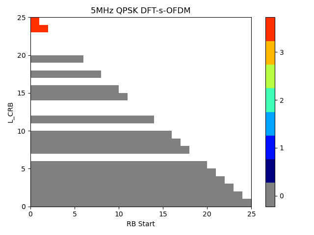

+-----------------------------------------------------------------+---+
| 3GPP TR 38.718-02-01 V18.0.0 (2024-06)                          |   |
+=================================================================+===+
| Technical Report                                                |   |
+-----------------------------------------------------------------+---+
| 3rd Generation Partnership Project;                             |   |
|                                                                 |   |
| Technical Specification Group Radio Access Network;             |   |
|                                                                 |   |
| Rel-18 NR Inter-band Carrier Aggregation/Dual Connectivity for2 |   |
| bands DL with x bands UL (x=1,2)                                |   |
|                                                                 |   |
| (Release 18)                                                    |   |
+-----------------------------------------------------------------+---+
|                                                                 |   |
+-----------------------------------------------------------------+---+
|                                                                 |   |
+-----------------------------------------------------------------+---+
| The present document has been developed within the 3rd          |   |
| Generation Partnership Project (3GPP ^TM^) and may be further   |   |
| elaborated for the purposes of 3GPP.\                           |   |
| The present document has not been subject to any approval       |   |
| process by the 3GPP Organizational Partners and shall not be    |   |
| implemented.\                                                   |   |
| This Specification is provided for future development work      |   |
| within 3GPP only. The Organizational Partners accept no         |   |
| liability for any use of this Specification.\                   |   |
| Specifications and Reports for implementation of the 3GPP ^TM^  |   |
| system should be obtained via the 3GPP Organizational           |   |
| Partners\' Publications Offices.                                |   |
+-----------------------------------------------------------------+---+

+----------------------------------------------------------------------+
|                                                                      |
+======================================================================+
| > ***3GPP***                                                         |
| >                                                                    |
| > Postal address                                                     |
| >                                                                    |
| > 3GPP support office address                                        |
| >                                                                    |
| > 650 Route des Lucioles - Sophia Antipolis                          |
| >                                                                    |
| > Valbonne - FRANCE                                                  |
| >                                                                    |
| > Tel.: +33 4 92 94 42 00 Fax: +33 4 93 65 47 16                     |
| >                                                                    |
| > Internet                                                           |
| >                                                                    |
| > http://www.3gpp.org                                                |
+----------------------------------------------------------------------+
| ***Copyright Notification***                                         |
|                                                                      |
| No part may be reproduced except as authorized by written            |
| permission.\                                                         |
| The copyright and the foregoing restriction extend to reproduction   |
| in all media.                                                        |
|                                                                      |
| © 2024, 3GPP Organizational Partners (ARIB, ATIS, CCSA, ETSI, TSDSI, |
| TTA, TTC).                                                           |
|                                                                      |
| All rights reserved.                                                 |
|                                                                      |
| UMTS™ is a Trade Mark of ETSI registered for the benefit of its      |
| members                                                              |
|                                                                      |
| 3GPP™ is a Trade Mark of ETSI registered for the benefit of its      |
| Members and of the 3GPP Organizational Partners\                     |
| LTE™ is a Trade Mark of ETSI registered for the benefit of its       |
| Members and of the 3GPP Organizational Partners                      |
|                                                                      |
| GSM® and the GSM logo are registered and owned by the GSM            |
| Association                                                          |
+----------------------------------------------------------------------+

  {#section .TT}

Contents {#contents .TT}
========

Foreword 20

1 Scope 22

2 References 22

3 Definitions of terms, symbols and abbreviations 22

3.1 Terms 22

3.2 Symbols 22

3.3 Abbreviations 23

4 Background 23

4.1 Introduction 23

4.2 TR Maintenance 23

5 Both bands within FR1 Carrier Aggregation: Specific Band Combination
Part 24

5.x CA\_nX-nY 24

5.x.1 Common for 1 band UL and 2 bands UL CA 24

5.x.1.1 Operating bands for CA 24

5.x.1.2 Channel bandwidths per operating band for CA 24

5.x.1.3 UE co-existence studies 24

5.x.1.3.1 UE co-existence studies for 2 Uplink CCs in one Intra-Band CA
25

5.x.1.4 ∆TIB,c and ∆RIB,c values 26

5.x.1.5 REFSENS requirements 26

5.x.1.6 OOB blocking exception requirements 26

5.x.2 Specific for 2 bands UL CA 26

5.x.2.1 Maximum output power for inter-band CA 27

5.x.2.2 UE co-existence studies 27

5.x.2.3 REFSENS requirements 28

5.1 CA\_n1-n26 28

5.1.1 Common for 1 band UL and 2 bands UL CA 28

5.1.1.1 Operating bands for CA 28

5.1.1.2 Channel bandwidths per operating band for CA 28

5.1.1.3 UE co-existence studies 29

5.1.1.4 ∆T~IB~ and ∆R~IB~ values 30

5.1.1.5 REFSENS requirements 30

5.1.1.6 OOB blocking exception requirements 30

5.1.2 Specific for 2 bands UL CA 30

5.1.2.1 Maximum output power for inter-band CA 30

5.1.2.2 UE co-existence studies 30

5.1.2.3 REFSENS requirements 32

5.2 CA\_n3-n26 32

5.2.1 Common for 1 band UL and 2 bands UL CA 32

5.2.1.1 Operating bands for CA 32

5.2.1.2 Channel bandwidths per operating band for CA 32

5.2.1.3 UE co-existence studies 32

5.2.1.4 ∆T~IB~ and ∆R~IB~ values 33

5.2.1.5 REFSENS requirements 33

5.2.1.6 OOB blocking exception requirements 34

5.2.2 Specific for 2 bands UL CA 34

5.2.2.1 Maximum output power for inter-band CA 34

5.2.2.2 UE co-existence studies 34

5.2.2.3 REFSENS requirements 35

5.3 CA\_n7-n26 36

5.3.1 Common for 1 band UL and 2 bands UL CA 36

5.3.1.1 Operating bands for CA 36

5.3.1.2 Channel bandwidths per operating band for CA 36

5.3.1.3 UE co-existence studies 36

5.3.1.4 ∆T~IB~ and ∆R~IB~ values 37

5.3.1.5 REFSENS requirements 38

5.3.1.6 OOB blocking exception requirements 38

5.3.2 Specific for 2 bands UL CA 38

5.3.2.1 Maximum output power for inter-band CA 38

5.3.2.2 UE co-existence studies 38

5.3.2.3 REFSENS requirements 40

5.4 CA\_n26-n78 40

5.4.1 Common for 1 band UL and 2 bands UL CA 40

5.4.1.1 Operating bands for CA 40

5.4.1.2 Channel bandwidths per operating band for CA 40

5.4.1.3 UE co-existence studies 41

5.4.1.4 ∆T~IB~ and ∆R~IB~ values 42

5.4.1.5 REFSENS requirements 43

5.4.1.6 OOB blocking exception requirements 43

5.4.2 Specific for 2 bands UL CA 44

5.4.2.1 Maximum output power for inter-band CA 44

5.4.2.2 UE co-existence studies 44

5.4.2.3 REFSENS requirements 45

5.5 CA\_n26-n77 45

5.5.1 Common for 1 band UL and 2 bands UL CA 45

5.5.1.1 Operating bands for CA 45

5.5.1.2 Channel bandwidths per operating band for CA 46

5.5.1.3 UE co-existence studies 46

5.5.1.4 ∆T~IB~ and ∆R~IB~ values 46

5.5.1.5 REFSENS requirements 47

5.5.1.6 OOB blocking exception requirements 47

5.5.2 Specific for 2 bands UL CA 47

5.5.2.1 Maximum output power for inter-band CA 47

5.5.2.2 UE co-existence studies 47

5.5.2.3 REFSENS requirements 48

5.6 CA\_n70-n77 49

5.6.1 Common for 1 band UL and 2 bands UL CA 49

5.6.1.1 Operating bands for CA 49

5.6.1.2 Channel bandwidths per operating band for CA 49

5.6.1.3 UE co-existence studies 49

5.6.1.4 ∆T~IB~ and ∆R~IB~ values 50

5.6.1.5 REFSENS requirements 50

5.6.1.6 OOB blocking exception requirements 51

5.6.2 Specific for 2 bands UL CA 51

5.6.2.1 Maximum output power for inter-band CA 51

5.6.2.2 UE co-existence studies 51

5.6.2.3 REFSENS requirements 52

5.7 CA\_n12-n25 53

5.7.1 Common for 1 band UL and 2 bands UL CA 53

5.7.1.1 Operating bands for CA 53

5.7.1.2 Channel bandwidths per operating band for CA 53

5.7.2 Specific for 2 bands UL CA 53

5.7.2.1 Maximum output power for inter-band CA 53

5.7.2.2 UE co-existence studies 53

5.8 CA\_n7-n75 55

5.8.1 Common for 1 band UL and 2 bands UL CA 55

**5.8.1.1** **Operating bands for CA** 55

**5.8.1.2** **Channel bandwidths per operating band for CA** 55

**5.8.1.3** **Co-existence studies** 55

5.8.1.4 ∆T~IB~ and ∆R~IB~ values 55

5.8.1.5 REFSENS requirements 56

5.8.1.6 OOB blocking exception requirements 56

**5.9** **CA\_n28-n94** 56

**5.9.1** **Common for 1 band UL and 2 bands UL CA** 56

**5.9.1.1** **Operating bands for CA** 56

**5.9.1.2** **Channel bandwidths per operating band for CA** 56

**5.9.1.3** **Co-existence studies** 56

5.9.1.4 ∆T~IB~ and ∆R~IB~ values 57

5.9.1.5 REFSENS requirements 57

5.9.1.6 OOB blocking exception requirements 58

**5.10** **CA\_n78-n94** 58

**5.10.1** **Common for 1 band UL and 2 bands UL CA** 58

**5.10.1.1** **Operating bands for CA** 58

**5.10.1.2** **Channel bandwidths per operating band for CA** 58

**5.10.1.3** **Co-existence studies** 58

5.10.1.4 ∆T~IB~ and ∆R~IB~ values 58

5.10.1.5 REFSENS requirements 59

5.10.1.6 OOB blocking exception requirements 59

5.11 CA\_n75-n78 59

5.11.1 Common for 1 band UL and 2 bands UL CA 59

5.11.1.1 Operating bands for CA 59

5.11.1.2 Channel bandwidths per operating band for CA 60

5.11.1.3 UE co-existence studies 60

5.11.1.4 ∆T~IB~ and ∆R~IB~ values 60

5.11.1.5 REFSENS requirements 61

5.11.1.6 OOB blocking exception requirements 61

5.12 CA\_n28-n75 61

5.12.1 Common for 1 band UL and 2 bands UL CA 61

5.12.1.1 Operating bands for CA 61

5.12.1.2 Channel bandwidths per operating band for CA 61

5.12.1.3 UE co-existence studies 61

5.12.1.4 ∆T~IB~ and ∆R~IB~ values 62

5.12.1.5 REFSENS requirements 62

5.12.1.6 OOB blocking exception requirements 62

5.13 CA\_n1-n75 63

5.13.1 Common for 1 band UL and 2 bands UL CA 63

5.13.1.1 Operating bands for CA 63

5.13.1.2 Channel bandwidths per operating band for CA 63

5.13.1.3 UE co-existence studies 63

5.13.1.4 ∆T~IB~ and ∆R~IB~ values 63

5.13.1.5 REFSENS requirements 64

5.13.1.6 OOB blocking exception requirements 64

5.14 CA\_n5-n77 64

5.14.1 Common for 1 band UL and 2 bands UL CA 64

5.14.1.1 Operating bands for CA 64

5.14.1.2 Channel bandwidths per operating band for CA 64

5.14.1.3 Co-existence studies 65

5.14.1.4 ∆T~IB~ and ∆R~IB~ values 65

5.14.1.5 REFSENs requirements 66

5.14.1.6 OOB blocking exception requirements 66

5.14.2 Specific for 2 bands UL CA 66

5.14.2.1 Maximum output power for inter-band CA 66

5.14.2.2 UE co-existence 66

5.14.2.3 REFSENS requirements 67

5.15 CA\_n7-n77 68

5.15.1 Common for 1 band UL and 2 bands UL CA 68

5.15.1.1 Operating bands for CA 68

5.15.1.2 Channel bandwidths per operating band for CA 68

5.15.1.3 Co-existence studies 68

5.15.1.4 ∆T~IB~ and ∆R~IB~ values 69

5.15.1.5 REFSENs requirements 69

5.15.1.6 OOB blocking exception requirements 69

5.15.2 Specific for 2 bands UL CA 69

5.15.2.1 Maximum output power for inter-band CA 69

5.15.2.2 UE co-existence 70

5.15.2.3 REFSENS requirements 71

5.16 CA\_n25-n77 71

5.16.1 Common for 1 band UL and 2 bands UL CA 71

5.16.1.1 Operating bands for CA 71

5.16.1.2 Channel bandwidths per operating band for CA 71

5.16.1.3 Co-existence studies 71

5.16.1.4 ∆T~IB~ and ∆R~IB~ values 72

5.16.1.5 REFSENs requirements 72

5.16.1.6 OOB blocking exception requirements 72

5.16.2 Specific for 2 bands UL CA 73

5.16.2.1 Maximum output power for inter-band CA 73

5.16.2.2 UE co-existence 73

5.16.2.3 REFSENS requirements 74

5.17 CA\_n66-n77 74

5.17.1 Common for 1 band UL and 2 bands UL CA 74

5.17.1.1 Operating bands for CA 74

5.17.1.2 Channel bandwidths per operating band for CA 74

5.17.1.3 Co-existence studies 75

5.17.1.4 ∆T~IB~ and ∆R~IB~ values 75

5.17.1.5 REFSENs requirements 76

5.17.1.6 OOB blocking exception requirements 76

5.17.2 Specific for 2 bands UL CA 76

5.17.2.1 Maximum output power for inter-band CA 76

5.17.2.2 UE co-existence 76

5.17.2.3 REFSENS requirements 77

5.18 CA\_n71-n77 78

5.18.1 Common for 1 band UL and 2 bands UL CA 78

5.18.1.1 Operating bands for CA 78

5.18.1.2 Channel bandwidths per operating band for CA 78

5.18.1.3 Co-existence studies 78

5.18.1.4 ∆T~IB~ and ∆R~IB~ values 79

5.18.1.5 REFSENs requirements 79

5.18.1.6 OOB blocking exception requirements 79

5.18.2 Specific for 2 bands UL CA 79

5.18.2.1 Maximum output power for inter-band CA 79

5.18.2.2 UE co-existence 79

5.18.2.3 REFSENS requirements 80

5.19 **CA\_n3-n41** 81

5.19.1 Common for 1 band UL and 2 bands UL CA 81

5.19.1.1 Operating bands for CA 81

5.19.1.2 Channel bandwidths per operating band for CA 81

5.19.1.3 UE Co-existence studies 81

5.19.1.4 ∆TIB and ∆RIB values 82

5.19.1.5 REFSENs requirements 82

5.19.1.6 OOB blocking exception requirements 82

5.19.2 Specific for 2 bands UL CA 82

5.19.2.1 Maximum output power for inter-band CA 82

5.19.2.2 UE co-existence 82

5.19.2.3 REFSENS requirements 83

5.20 CA\_n25-n85 83

5.20.1 Common for 1 band UL and 2 bands UL CA 83

5.20.1.1 Operating bands for CA 83

5.20.1.2 Channel bandwidths per operating band for CA 83

5.20.1.3 Co-existence studies 83

5.20.1.4 ∆T~IB~ and ∆R~IB~ values 84

5.20.1.5 REFSENs requirements 84

5.20.1.6 OOB blocking exception requirements 84

5.20.2 Specific for 2 bands UL CA 84

5.20.2.1 Maximum output power for inter-band CA 84

5.20.2.2 UE co-existence 85

5.20.2.3 REFSENS requirements 86

5.21 CA\_n41-n85 86

5.21.1 Common for 1 band UL and 2 bands UL CA 86

5.21.1.1 Operating bands for CA 86

5.21.1.2 Channel bandwidths per operating band for CA 86

5.21.1.3 Co-existence studies 87

5.21.1.4 ∆T~IB~ and ∆R~IB~ values 87

5.21.1.5 REFSENs requirements 87

5.21.1.6 OOB blocking exception requirements 87

5.21.2 Specific for 2 bands UL CA 88

5.21.2.1 Maximum output power for inter-band CA 88

5.21.2.2 UE co-existence 88

5.21.2.3 REFSENS requirements 89

5.22 CA\_n66-n85 89

5.22.1 Common for 1 band UL and 2 bands UL CA 89

5.22.1.1 Operating bands for CA 89

5.22.1.2 Channel bandwidths per operating band for CA 89

5.22.1.3 Co-existence studies 90

5.22.1.4 ∆T~IB~ and ∆R~IB~ values 90

5.22.1.5 REFSENs requirements 90

5.22.1.6 OOB blocking exception requirements 91

5.22.2 Specific for 2 bands UL CA 91

5.22.2.1 Maximum output power for inter-band CA 91

5.22.2.2 UE co-existence 91

5.22.2.3 REFSENS requirements 92

5.23 CA\_n77-n85 93

5.23.1 Common for 1 band UL and 2 bands UL CA 93

5.23.1.1 Operating bands for CA 93

5.23.1.2 Channel bandwidths per operating band for CA 93

5.23.1.3 Co-existence studies 93

5.23.1.4 ∆T~IB~ and ∆R~IB~ values 94

5.23.1.5 REFSENs requirements 94

5.23.1.6 OOB blocking exception requirements 95

5.23.2 Specific for 2 bands UL CA 95

5.23.2.1 Maximum output power for inter-band CA 95

5.23.2.2 UE co-existence 95

5.23.2.3 REFSENS requirements 96

5.24 CA\_n46-n78 97

5.24.1 Common for 1 band UL and 2 bands UL CA 97

5.24.1.1 Operating bands for CA 97

5.24.1.2 Channel bandwidths per operating band for CA 97

5.24.1.3 UE Co-existence studies 97

5.24.1.4 ∆TIB and ∆RIB values 97

5.24.1.5 REFSENs requirements 97

5.24.1.6 OOB blocking exception requirements 98

5.24.2 Specific for 2 bands UL CA 98

5.24.2.1 Maximum output power for inter-band CA 98

5.24.2.2 UE co-existence studies 98

5.24.2.3 REFSENS requirements 99

5.25 CA\_n1-n46 99

5.25.1 Common for 1 band UL and 2 bands UL CA 99

5.25.1.1 Operating bands for CA 99

5.25.1.2 Channel bandwidths per operating band for CA 99

5.25.1.3 UE Co-existence studies 100

5.25.1.4 ∆TIB and ∆RIB values 100

5.25.1.5 REFSENs requirements 100

5.25.1.6 OOB blocking exception requirements 101

5.25.2 Specific for 2 bands UL CA 101

5.25.2.1 Maximum output power for inter-band CA 101

5.25.2.2 UE co-existence studies 101

5.25.2.3 REFSENS requirements 103

5.26 CA\_n7-n67 104

5.26.1 Common for 1 band UL and 2 bands UL CA 104

5.26.1.1 Operating bands for CA 104

5.26.1.2 Channel bandwidths per operating band for CA 104

5.26.1.3 UE co-existence studies 104

5.26.1.4 ∆TIB and ∆RIB values 104

5.26.1.5 REFSENS requirements 105

5.26.1.6 OOB blocking exception requirements 105

5.27 CA\_n67-n78 105

5.27.1 Common for 1 band UL and 2 bands UL CA 105

5.27.1.1 Operating bands for CA 105

5.27.1.2 Channel bandwidths per operating band for CA 105

5.27.1.3 UE co-existence studies 106

5.27.1.4 ∆TIB and ∆RIB values 107

5.27.1.5 REFSENS requirements 107

5.27.1.6 OOB blocking exception requirements 107

5.28 CA\_n18-n40 108

5.28.1 Common for 1 band UL and 2 bands UL CA 108

5.28.1.1 Operating bands for CA 108

5.28.1.2 Channel bandwidths per operating band for CA 108

5.28.1.3 UE co-existence studies 108

5.28.1.4 ∆TIB,c and ∆RIB,c values 108

5.28.1.5 REFSENS requirements 109

5.28.1.6 OOB blocking exception requirements 109

5.28.2 Specific for 2 bands UL CA 109

5.28.2.1 Maximum output power for inter-band CA 109

5.28.2.2 UE co-existence studies 109

5.28.2.3 REFSENS requirements 111

5.29 CA\_n7-n102 111

5.29.1 Common for 1 band UL and 2 bands UL CA 111

5.29.1.1 Operating bands for CA 111

5.29.1.2 Channel bandwidths per operating band for CA 111

5.29.1.3 Co-existence studies 112

5.29.1.4 ∆TIB and ∆RIB values 112

5.29.1.5 REFSENs requirements 113

5.29.1.6 OOB blocking exception requirements 113

5.29.2 Specific for 2 bands UL CA 113

5.29.2.1 Maximum output power for inter-band CA 113

5.29.2.2 UE co-existence 113

5.29.2.3 REFSENS requirements 114

5.30 CA\_n28-n102 115

5.30.1 Common for 1 band UL and 2 bands UL CA 115

5.30.1.1 Operating bands for CA 115

5.30.1.2 Channel bandwidths per operating band for CA 115

5.30.1.3 Co-existence studies 115

5.30.1.4 ∆TIB and ∆RIB values 116

5.30.1.5 REFSENs requirements 116

5.30.1.6 OOB blocking exception requirements 116

5.30.2 Specific for 2 bands UL CA 116

5.30.2.1 Maximum output power for inter-band CA 116

5.30.2.2 UE co-existence 117

5.30.2.3 REFSENS requirements 118

5.31 CA\_n78-n102 118

5.31.1 Common for 1 band UL and 2 bands UL CA 118

5.31.1.1 Operating bands for CA 118

5.31.1.2 Channel bandwidths per operating band for CA 118

5.31.1.3 Co-existence studies 119

5.31.1.4 ∆TIB and ∆RIB values 120

5.31.1.5 REFSENs requirements 120

5.31.1.6 OOB blocking exception requirements 120

5.31.2 Specific for 2 bands UL CA 121

5.31.2.1 Maximum output power for inter-band CA 121

5.31.2.2 UE co-existence 121

5.31.2.3 REFSENS requirements 122

5.32 CA\_n1-n102 122

5.32.1 Common for 1 band UL and 2 bands UL CA 122

5.32.1.1 Operating bands for CA 122

5.32.1.2 Channel bandwidths per operating band for CA 122

5.32.1.3 Co-existence studies 122

5.32.1.4 ∆T~IB~ and ∆R~IB~ values 123

5.32.1.5 REFSENs requirements 123

5.32.1.6 OOB blocking exception requirements 124

5.32.2 Specific for 2 bands UL CA 124

5.32.2.1 Maximum output power for inter-band CA 124

5.32.2.2 UE co-existence 124

5.32.2.3 REFSENS requirements 125

5.33 CA\_n26-n28 126

5.33.1 Common for 1 band UL and 2 bands UL CA 126

5.33.1.1 Operating bands for CA 126

5.33.1.2 Channel bandwidths per operating band for CA 126

5.33.1.3 UE co-existence studies 126

5.33.1.4 ∆T~IB~ and ∆R~IB~ values 127

5.33.1.5 REFSENS requirements 127

5.33.1.6 OOB blocking exception requirements 127

5.33.2 Specific for 2 bands UL CA 127

5.34 CA\_n7-n8 128

5.34.1 Common for 1 band UL and 2 bands UL CA 128

5.34.1.1 Operating bands for CA 128

5.34.1.2 Channel bandwidths per operating band for CA 128

5.34.2 Specific for 2 bands UL CA 128

5.34.2.1 Maximum output power for inter-band CA 128

5.34.2.2 UE co-existence studies 128

5.34.2.3 REFSENS requirements 129

5.35 CA\_n3-n75 129

5.35.1 Common for 1 band UL and 2 bands UL CA 129

5.35.1.1 Operating bands for CA 129

5.35.1.2 Channel bandwidths per operating band for CA 130

5.35.1.3 UE co-existence studies 130

5.35.1.4 ∆T~IB,c~ and ∆R~IB,c~ values 130

5.35.1.5 REFSENS requirements 130

5.35.1.6 OOB blocking exception requirements 130

5.36 CA\_n3-n7 130

5.36.1 Common for 1 band UL and 2 bands UL CA 130

5.36.1.1 Operating bands for CA 130

5.36.1.2 Channel bandwidths per operating band for CA 131

5.36.1.3 UE co-existence studies 131

5.36.1.4 ∆T~IB,c~ and ∆R~IB,c~ values 131

5.36.1.5 REFSENS requirements 131

5.36.1.6 OOB blocking exception requirements 131

5.37 **CA\_n46-n77** 131

5.37.1 Common for 1 band UL and 2 bands UL CA 131

5.37.1.1 Operating bands for CA 131

5.37.1.2 Channel bandwidths per operating band for CA 131

5.37.1.3 UE Co-existence studies 132

5.37.1.4 ∆TIB and ∆RIB values 133

5.37.1.5 REFSENs requirements 133

5.37.2 Specific for 2 bands UL CA 134

5.37.2.1 Maximum output power for inter-band CA 134

5.37.2.2 UE co-existence studies 134

5.37.2.2.1 UE co-existence studies for Uplink Intra-Band Non-Contiguous
CA 135

5.37.2.3 REFSENS requirements 136

5.38 CA\_n2-n41 137

5.38.1 Common for 1 band UL and 2 bands UL CA 137

5.38.1.1 Operating bands for CA 137

5.38.1.2 Channel bandwidths per operating band for CA 137

5.38.1.3 UE co-existence studies 137

5.38.1.4 ∆T~IB~ and ∆R~IB~ values 137

5.38.1.5 REFSENS requirements 138

5.38.1.6 OOB blocking exception requirements 138

5.38.2 Specific for 2 bands UL CA 138

5.38.2.1 Maximum output power for inter-band CA 138

5.38.2.2 UE co-existence studies 138

5.38.2.3 REFSENS requirements 139

5.39 CA\_n5-n71 139

5.39.1 Common for 1 band UL and 2 bands UL CA 140

5.39.1.1 Operating bands for CA 140

5.39.1.2 Channel bandwidths per operating band for CA 140

5.39.1.3 UE co-existence studies 140

5.39.1.4 ∆T~IB~ and ∆R~IB~ values 140

5.39.1.5 REFSENS requirements 141

5.39.1.6 OOB blocking exception requirements 142

5.40 CA\_n5-n41 142

5.40.1 Common for 1 band UL and 2 bands UL CA 142

5.40.1.1 Operating bands for CA 142

5.40.1.2 Channel bandwidths per operating band for CA 142

5.40.1.3 UE co-existence studies 142

5.40.1.4 ∆T~IB~ and ∆R~IB~ values 143

5.40.1.5 REFSENS requirements 143

5.40.1.6 OOB blocking exception requirements 144

5.40.2 Specific for 2 bands UL CA 144

5.40.2.1 Maximum output power for inter-band CA 144

5.40.2.2 UE co-existence studies 144

5.40.2.3 REFSENS requirements 145

5.41 CA\_n2-n71 145

5.41.1 Common for 1 band UL and 2 bands UL CA 145

5.41.1.1 Operating bands for CA 145

5.41.1.2 Channel bandwidths per operating band for CA 146

5.41.1.3 UE co-existence studies 146

5.41.1.4 ∆T~IB~ and ∆R~IB~ values 147

5.41.1.5 REFSENS requirements 147

5.41.1.6 OOB blocking exception requirements 148

5.41.2 Specific for 2 bands UL CA 148

5.41.2.1 Maximum output power for inter-band CA 148

5.41.2.2 UE co-existence studies 148

5.41.2.3 REFSENS requirements 149

5.42 CA\_n7-n12 149

5.42.1 Common for 1 band UL and 2 bands UL CA 149

5.42.1.1 Operating bands for CA 149

5.42.1.2 Channel bandwidths per operating band for CA 149

5.42.1.3 UE co-existence studies 150

5.42.1.4 ∆T~IB~ and ∆R~IB~ values 150

5.42.1.5 REFSENS requirements 150

5.42.1.6 OOB blocking exception requirements 151

5.43 CA\_n7-n71 151

5.43.1 Common for 1 band UL and 2 bands UL CA 151

5.43.1.1 Operating bands for CA 151

5.43.1.2 Channel bandwidths per operating band for CA 151

5.43.1.3 UE co-existence studies 151

5.43.1.4 ∆T~IB~ and ∆R~IB~ values 152

5.43.1.5 REFSENS requirements 152

5.43.1.6 OOB blocking exception requirements 153

5.44 CA\_n12-n41 155

5.44.1 Common for 1 band UL and 2 bands UL CA 155

5.44.1.1 Operating bands for CA 155

5.44.1.2 Channel bandwidths per operating band for CA 155

5.44.1.3 UE co-existence studies 155

5.44.1.4 ∆T~IB~ and ∆R~IB~ values 155

5.44.1.5 REFSENS requirements 156

5.44.1.6 OOB blocking exception requirements 156

5.45 CA\_n12-n78 156

5.45.1 Common for 1 band UL and 2 bands UL CA 156

5.45.1.1 Operating bands for CA 156

5.45.1.2 Channel bandwidths per operating band for CA 156

5.45.1.3 UE co-existence studies 156

5.45.1.4 ∆T~IB~ and ∆R~IB~ values 157

5.45.1.5 REFSENS requirements 157

5.45.1.6 OOB blocking exception requirements 158

5.45.2 Specific for 2 bands UL CA 158

5.45.2.1 Maximum output power for inter-band CA 158

5.45.2.2 UE co-existence studies 158

5.45.2.3 REFSENS requirements 159

5.46 CA\_n1-n105 159

5.46.1 Common for 1 band UL and 2 bands UL CA 159

5.46.1.1 Operating bands for CA 159

5.46.1.2 Channel bandwidths per operating band for CA 160

5.46.1.3 Co-existence studies 160

5.46.1.4 ∆T~IB~ and ∆R~IB~ values 160

5.46.1.5 REFSENs requirements 161

5.46.1.6 OOB blocking exception requirements 161

5.46.2 Specific for 2 bands UL CA 161

5.46.2.1 Maximum output power for inter-band CA 161

5.46.2.2 UE co-existence 161

5.46.2.3 REFSENS requirements 162

5.47 CA\_n3-n105 163

5.47.1 Common for 1 band UL and 2 bands UL CA 163

5.47.1.1 Operating bands for CA 163

5.47.1.2 Channel bandwidths per operating band for CA 163

5.47.1.3 Co-existence studies 163

5.47.1.4 ∆T~IB~ and ∆R~IB~ values 164

5.47.1.5 REFSENs requirements 164

5.47.1.6 OOB blocking exception requirements 164

5.47.2 Specific for 2 bands UL CA 164

5.47.2.1 Maximum output power for inter-band CA 164

5.47.2.2 UE co-existence 164

5.47.2.3 REFSENS requirements 165

5.48 CA\_n40-n105 165

5.48.1 Common for 1 band UL and 2 bands UL CA 165

5.48.1.1 Operating bands for CA 165

5.48.1.2 Channel bandwidths per operating band for CA 166

5.48.1.3 Co-existence studies 166

5.48.1.4 ∆T~IB~ and ∆R~IB~ values 166

5.48.1.5 REFSENs requirements 167

5.48.1.6 OOB blocking exception requirements 167

5.48.2 Specific for 2 bands UL CA 167

5.48.2.1 Maximum output power for inter-band CA 167

5.48.2.2 UE co-existence 167

5.48.2.3 REFSENS requirements 168

5.49 CA\_n78-n105 168

5.49.1 Common for 1 band UL and 2 bands UL CA 168

5.49.1.1 Operating bands for CA 168

5.49.1.2 Channel bandwidths per operating band for CA 168

5.49.1.3 Co-existence studies 168

5.49.1.4 ∆T~IB~ and ∆R~IB~ values 169

5.49.1.5 REFSENs requirements 169

5.49.1.6 OOB blocking exception requirements 170

5.49.2 Specific for 2 bands UL CA 170

5.49.2.1 Maximum output power for inter-band CA 170

5.49.2.2 UE co-existence 170

5.49.2.3 REFSENS requirements 171

5.50 CA\_n7-n105 171

5.50.1 Common for 1 band UL and 2 bands UL CA 171

5.50.1.1 Operating bands for CA 171

5.50.1.2 Channel bandwidths per operating band for CA 171

5.50.1.3 Co-existence studies 172

5.50.1.4 ∆T~IB~ and ∆R~IB~ values 172

5.50.1.5 REFSENs requirements 172

5.50.1.6 OOB blocking exception requirements 173

5.50.2 Specific for 2 bands UL CA 173

5.50.2.1 Maximum output power for inter-band CA 173

5.50.2.2 UE co-existence 173

5.50.2.3 REFSENS requirements 174

5.51 CA\_n3-n102 174

5.51.1 Common for 1 band UL and 2 bands UL CA 174

5.51.1.1 Operating bands for CA 174

5.51.1.2 Channel bandwidths per operating band for CA 175

5.51.1.3 Co-existence studies 175

5.51.1.4 ∆TIB and ∆RIB values 176

5.51.1.5 REFSENs requirements 176

5.51.1.6 OOB blocking exception requirements 176

5.51.2 Specific for 2 bands UL CA 176

5.51.2.1 Maximum output power for inter-band CA 176

5.51.2.2 UE co-existence 176

5.51.2.3 REFSENS requirements 177

5.52 CA\_n77-n102 178

5.52.1 Common for 1 band UL and 2 bands UL CA 178

5.52.1.1 Operating bands for CA 178

5.52.1.2 Channel bandwidths per operating band for CA 178

5.52.1.3 Co-existence studies 179

5.52.1.4 ∆TIB and ∆RIB values 179

5.52.1.5 REFSENs requirements 180

5.52.1.6 OOB blocking exception requirements 180

5.52.2 Specific for 2 bands UL CA 180

5.52.2.1 Maximum output power for inter-band CA 180

5.52.2.2 UE co-existence 180

5.52.2.3 REFSENS requirements 181

5.53 CA\_n8-n79 181

5.53.1 Common for 1 band UL and 2 bands UL CA 181

5.53.1.1 Operating bands for CA 181

5.53.1.2 Channel bandwidths per operating band for CA 182

5.53.1.3 UE Co-existence studies 182

5.53.1.4 ∆TIB and ∆RIB values 182

5.53.1.5 REFSENs requirements 182

5.53.1.6 OOB blocking exception requirements 182

5.53.2 Specific for 2 bands UL CA 183

5.53.2.1 Maximum output power for inter-band CA 183

5.53.2.2 UE co-existence studies 183

5.53.2.3 REFSENS requirements 183

5.54 CA\_n78-n79 183

5.54.1 Common for 1 band UL and 2 bands UL CA 183

5.54.1.1 Operating bands for CA 183

5.54.1.2 Channel bandwidths per operating band for CA 184

5.54.1.3 REFSENS exception requirements 184

5.55 CA\_n5-n78 184

5.55.1 Specific for 1 bands UL CA 184

5.55.1.1 Operating bands for CA 184

5.55.1.2 Channel bandwidths per operating band for CA 184

5.55.1.3 Co-existence studies 185

5.55.1.4 ∆T~IB~ and ∆R~IB~ values 186

5.55.1.5 REFSENs requirements 186

5.55.2 Specific for 2 bands UL CA 186

5.55.2.1 Maximum output power for inter-band CA 186

5.55.2.2 UE co-existence 186

5.55.2.3 REFSENS requirements 187

5.56 CA\_n25-n78 188

5.56.1 Specific for 1 bands UL CA 188

5.56.1.1 Operating bands for CA 188

5.56.1.2 Channel bandwidths per operating band for CA 188

5.56.1.3 Co-existence studies 188

5.56.1.4 ∆T~IB~ and ∆R~IB~ values 189

5.56.1.5 REFSENs requirements 189

5.57 CA\_n66-n78 189

5.57.1 Specific for 1 bands UL CA 189

5.57.1.1 Operating bands for CA 189

5.57.1.2 Channel bandwidths per operating band for CA 189

5.57.1.3 Co-existence studies 189

5.57.1.4 ∆T~IB~ and ∆R~IB~ values 190

5.57.1.5 REFSENs requirements 190

5.58 CA\_n26-n29 190

5.58.1 Common for 1 band UL 190

5.58.1.1 Operating bands for CA 190

5.58.1.2 Channel bandwidths per operating band for CA 191

5.58.1.3 UE co-existence studies 191

5.58.1.4 ∆T~IB~ and ∆R~IB~ values 191

5.58.1.5 REFSENS requirements 192

5.58.1.6 OOB blocking exception requirements 192

5.59 CA\_n26-n48 192

5.59.1 Common for 1 band UL and 2 bands UL CA 192

5.59.1.1 Operating bands for CA 192

5.59.1.2 Channel bandwidths per operating band for CA 192

5.59.1.3 UE co-existence studies 192

5.59.1.4 ∆T~IB~ and ∆R~IB~ values 193

5.59.1.5 REFSENS requirements 193

5.59.1.6 OOB blocking exception requirements 194

5.59.2 Specific for 2 bands UL CA 194

5.59.2.1 Maximum output power for inter-band CA 194

5.59.2.2 UE co-existence studies 194

5.60 CA\_n29-n48 195

5.60.1 Common for 1 band UL 195

5.60.1.1 Operating bands for CA 195

5.60.1.2 Channel bandwidths per operating band for CA 195

5.60.1.3 UE co-existence studies 195

5.60.1.4 ∆T~IB~ and ∆R~IB~ values 196

5.60.1.5 REFSENS requirements 196

5.60.1.6 OOB blocking exception requirements 197

5.61 CA\_n34-n39 197

5.61.1 Common for 1 band UL and 2 bands UL CA 197

5.61.1.1 Operating bands for CA 197

5.61.1.2 Channel bandwidths per operating band for CA 197

5.61.1.3 UE Co-existence studies 197

5.61.1.4 ∆TIB and ∆RIB values 198

5.61.1.5 REFSENs requirements 198

5.61.1.6 OOB blocking exception requirements 198

5.61.2 Specific for 2 bands UL CA 198

5.61.2.1 Maximum output power for inter-band CA 198

5.61.2.2 UE co-existence studies 198

5.61.2.3 REFSENS requirements 199

5.62 CA\_n2-n71 199

5.62.1 Common for 1 band UL and 2 bands UL CA 199

5.62.1.1 Operating bands for CA 199

5.62.1.2 Channel bandwidths per operating band for CA 199

5.62.1.3 Co-existence studies 199

5.62.1.4 ∆TIB and ∆RIB values 200

5.62.1.6 OOB blocking exception requirements 200

5.63 CA\_n5-n71 200

5.63.1 Common for 1 band UL and 2 bands UL CA 200

5.63.1.1 Operating bands for CA 200

5.63.1.2 Channel bandwidths per operating band for CA 200

5.63.1.4 ∆T~IB~ and ∆R~IB~ values 201

5.63.1.5 REFSENs requirements 201

5.63.1.6 OOB blocking exception requirements 201

5.64 **CA\_n46-n102** 201

5.64.1 Common for 1 band UL and 2 bands UL CA 201

5.64.1.1 Operating bands for CA 201

5.64.1.2 Channel bandwidths per operating band for CA 202

5.64.1.3 UE Co-existence studies 203

6.5F.3.3.6 Requirements for network signalling value \"NS\_58\" 203

5.64.1.4 ∆TIB and ∆RIB values 204

5.64.1.5 REFSENs requirements 204

5.64.1.6 OOB blocking exception requirements 204

5.65 CA\_n1-n77 205

5.65.1 Common for 1 band and 2 bands UL CA 205

5.65.1.1 Configurations 205

5.65.1.2 Void 205

5.65.1.3 Void 205

5.65.1.4 ∆T~IB~ and ∆R~IB~ values 205

5.65.1.5 REFSENS requirements 205

5.65.1.5.1 MSD analysis for UL CA\_n77(2A) 205

5.66 CA\_n28-n77 206

5.66.1 Common for 1 band UL and 2 bands UL CA 206

5.66.1.1 Configurations 206

5.66.1.2 Void 206

5.66.1.3 Void 206

5.66.1.4 ∆TIB and ∆RIB values 206

5.66.1.5 REFSENS requirements 206

5.66.1.5.1 MSD analysis for UL CA\_n77(2A) 206

5.67 CA\_n71-n85 207

5.67.1 Common for 1 band UL and 2 bands UL CA 207

5.67.1.1 Operating bands for CA 207

5.67.1.2 Channel bandwidths per operating band for CA 207

5.67.1.3 Co-existence studies 207

5.67.1.4 ∆T~IB~ and ∆R~IB~ values 208

5.67.1.5 REFSENs requirements 208

5.67.1.6 OOB blocking exception requirements 209

5.68 CA\_n7-n20 209

5.68.1 Specific for 1 bands UL CA 209

5.68.1.1 Operating bands for CA 209

5.68.1.2 Channel bandwidths per operating band for CA 209

5.68.1.3 Co-existence studies 209

5.68.1.4 ∆T~IB~ and ∆R~IB~ values 209

5.68.1.5 REFSENs requirements 210

5.68.2 Specific for 2 bands UL CA 210

5.68.2.1 Maximum output power for inter-band CA 210

5.68.2.2 UE co-existence 210

5.68.2.3 REFSENS requirements 211

5.69 CA\_n20-n78 211

5.69.1 Specific for 1 bands UL CA 211

5.69.1.1 Operating bands for CA 211

5.69.1.2 Channel bandwidths per operating band for CA 211

5.69.1.3 Co-existence studies 211

5.69.1.4 ∆T~IB~ and ∆R~IB~ values 212

5.69.1.5 REFSENs requirements 212

5.70 CA\_n25-n41 212

5.70.1 Common for 1 band UL and 2 bands UL CA 212

5.70.1.1 Operating bands for CA 212

5.70.1.2 Channel bandwidths per operating band for CA 212

5.70.1.3 Co-existence studies 213

5.70.1.4 ∆TIB and ∆RIB values 213

5.70.1.5 REFSENs requirements 213

5.70.1.6 OOB blocking exception requirements 213

5.71 CA\_n41-n66 213

5.71.1 Common for 1 band UL and 2 bands UL CA 213

5.71.1.1 Operating bands for CA 213

5.71.1.2 Channel bandwidths per operating band for CA 214

5.71.1.3 Co-existence studies 214

5.71.1.4 ∆TIB and ∆RIB values 214

5.71.1.5 REFSENs requirements 214

5.71.1.6 OOB blocking exception requirements 214

5.72 CA\_n41-n71 215

5.72.1 Common for 1 band UL and 2 bands UL CA 215

5.72.1.1 Operating bands for CA 215

5.72.1.2 Channel bandwidths per operating band for CA 215

5.72.1.3 Co-existence studies 215

5.72.1.4 ∆TIB and ∆RIB values 215

5.72.1.5 REFSENs requirements 216

5.72.1.6 OOB blocking exception requirements 216

5.73 CA\_n41-n77 216

5.73.1 Common for 1 band UL and 2 bands UL CA 216

5.73.1.1 Operating bands for CA 216

5.73.1.2 Channel bandwidths per operating band for CA 216

5.73.1.3 Co-existence studies 216

5.73.1.4 ∆TIB and ∆RIB values 216

5.73.1.5 REFSENs requirements 216

5.73.1.6 OOB blocking exception requirements 217

5.74 CA\_n26-n71 217

5.74.1 Common for 1 band UL 217

5.74.1.1 Operating bands for CA 217

5.74.1.2 Channel bandwidths per operating band for CA 217

5.74.1.3 UE co-existence studies 218

5.74.1.4 ∆T~IB~ and ∆R~IB~ values 218

5.74.1.5 REFSENS requirements 218

5.74.1.6 OOB blocking exception requirements 219

5.76 CA\_n34-n40 221

5.76.1 Common for 1 band UL and 2 bands UL CA 221

5.76.1.1 Operating bands for CA 221

5.76.1.2 Channel bandwidths per operating band for CA 221

5.76.1.3 REFSENS exception requirements 222

5.77 **CA\_n1-n78** 223

5.77.1 Common for 1 band UL and 2 bands UL CA 223

5.77.1.1 Operating bands for CA 223

5.77.1.2 Channel bandwidths per operating band for CA 223

5.77.1.3 UE Co-existence studies 223

5.77.1.4 ∆TIB and ∆RIB values 224

5.77.1.5 REFSENs requirements 224

5.77.1.6 OOB blocking exception requirements 224

5.77.2 Specific for 2 bands UL CA 224

5.77.2.1 Maximum output power for inter-band CA 224

5.77.2.2 UE co-existence studies 224

5.77.2.3 REFSENS requirements 225

5.78 **CA\_n3-n78** 226

5.78.1 Common for 1 band UL and 2 bands UL CA 226

5.78.1.1 Operating bands for CA 226

5.78.1.2 Channel bandwidths per operating band for CA 226

5.78.1.3 UE Co-existence studies 226

5.78.1.4 ∆TIB and ∆RIB values 227

5.78.1.5 REFSENs requirements 227

5.78.1.6 OOB blocking exception requirements 227

5.78.2 Specific for 2 bands UL CA 227

5.78.2.1 Maximum output power for inter-band CA 227

5.78.2.2 UE co-existence studies 227

5.78.2.3 REFSENS requirements 228

5.79 **CA\_n8-n41** 228

5.79.1 Common for 1 band UL and 2 bands UL CA 228

5.79.1.1 Operating bands for CA 228

5.79.1.2 Channel bandwidths per operating band for CA 228

5.79.1.3 UE Co-existence studies 228

5.79.1.3.1 UE co-existence studies for 2 Uplink CCs in one Intra-Band CA
229

5.79.1.4 ∆TIB and ∆RIB values 230

5.79.1.5 REFSENs requirements 230

5.79.1.6 OOB blocking exception requirements 230

5.79.2 Specific for 2 bands UL CA 230

5.79.2.1 Maximum output power for inter-band CA 230

5.79.2.2 UE co-existence studies 230

5.79.2.3 REFSENS requirements 231

5.80 **CA\_n8-n78** 231

5.80.1 Common for 1 band UL and 2 bands UL CA 231

5.80.1.1 Operating bands for CA 231

5.80.1.2 Channel bandwidths per operating band for CA 231

5.80.1.3 UE Co-existence studies 231

5.80.1.3.1 UE co-existence studies for 2 Uplink CCs in one Intra-Band CA
232

5.80.1.4 ∆TIB and ∆RIB values 233

5.80.1.5 REFSENs requirements 233

5.80.1.6 OOB blocking exception requirements 233

5.80.2 Specific for 2 bands UL CA 233

5.80.2.1 Maximum output power for inter-band CA 233

5.80.2.2 UE co-existence studies 233

5.80.2.3 REFSENS requirements 234

5.81 **CA\_n28-n41** 234

5.81.1 Common for 1 band UL and 2 bands UL CA 234

5.81.1.1 Operating bands for CA 234

5.81.1.2 Channel bandwidths per operating band for CA 234

5.81.1.3 UE Co-existence studies 234

5.81.1.4 ∆TIB and ∆RIB values 235

5.81.1.5 REFSENs requirements 235

5.81.1.6 OOB blocking exception requirements 235

5.81.2 Specific for 2 bands UL CA 235

5.81.2.1 Maximum output power for inter-band CA 235

5.81.2.2 UE co-existence studies 235

5.81.2.3 REFSENS requirements 236

5.82 **CA\_n40-n79** 236

5.82.1 Common for 1 band UL and 2 bands UL CA 236

5.82.1.1 Operating bands for CA 236

5.82.1.2 Channel bandwidths per operating band for CA 236

5.82.1.3 UE Co-existence studies 236

5.82.1.3.1 UE co-existence studies for 2 Uplink CCs in one Intra-Band CA
236

5.82.1.4 ∆TIB and ∆RIB values 237

5.82.1.5 REFSENs requirements 237

5.82.1.6 OOB blocking exception requirements 237

5.82.2 Specific for 2 bands UL CA 237

5.82.2.1 Maximum output power for inter-band CA 237

5.82.2.2 UE co-existence studies 237

5.82.2.3 REFSENS requirements 237

5.83 CA\_n5-n13 237

5.83.1 Common for 1 band UL and 2 bands UL CA 237

5.83.1.1 Operating bands for CA 237

5.83.1.2 Channel bandwidths per operating band for CA 238

5.83.1.3 UE co-existence studies 238

5.83.1.4 ∆TIB,c and ∆RIB,c values 239

5.83.1.5 REFSENS requirements 239

5.83.1.6 OOB blocking exception requirements 239

5.83.2 Specific for 2 bands UL CA 239

5.83.2.1 Maximum output power for inter-band CA 239

5.83.2.2 UE co-existence studies 239

5.83.2.3 REFSENS requirements 240

5.84 CA\_n34-n79 241

5.84.1 Common for 1 band UL and 2 bands UL CA 241

5.84.1.1 Operating bands for CA 241

5.84.1.2 Channel bandwidths per operating band for CA 241

5.84.1.3 UE Co-existence studies 241

5.84.1.3.1 UE co-existence studies for 2 Uplink CCs in one Intra-Band CA
241

5.84.1.4 ∆TIB and ∆RIB values 243

5.84.1.5 REFSENs requirements 243

5.84.1.6 OOB blocking exception requirements 243

5.84.2 Specific for 2 bands UL CA 243

5.84.2.1 Maximum output power for inter-band CA 243

5.84.2.2 UE co-existence studies 243

5.84.2.3 REFSENS requirements 243

5.85 CA\_n39-n79 243

5.85.1 Common for 1 band UL and 2 bands UL CA 243

5.85.1.1 Operating bands for CA 243

5.85.1.2 Channel bandwidths per operating band for CA 243

5.85.1.3 UE Co-existence studies 244

5.85.1.3.1 UE co-existence studies for 2 Uplink CCs in one Intra-Band CA
244

5.85.1.4 ∆TIB and ∆RIB values 245

5.85.1.5 REFSENs requirements 245

5.85.1.6 OOB blocking exception requirements 245

5.85.2 Specific for 2 bands UL CA 245

5.85.2.1 Maximum output power for inter-band CA 245

5.85.2.2 UE co-existence studies 245

5.85.2.3 REFSENS requirements 245

5.86 CA\_n78-n104 245

5.86.1 Common for 1 band UL and 2 bands UL CA 245

5.86.1.1 Operating bands for CA 245

5.86.1.2 Channel bandwidths per operating band for CA 245

5.86.1.3 UE co-existence studies 246

5.86.1.4 ∆TIB,c and ∆RIB,c values 246

5.86.1.5 REFSENS requirements 247

5.86.1.6 OOB blocking exception requirements 249

5.86.2 Specific for 2 bands UL CA 249

5.86.2.1 Maximum output power for inter-band CA 249

5.86.2.2 UE co-existence studies 249

5.86.2.3 REFSENS requirements 249

5.86.3 General techinical analysis 250

5.86.3.1 UE RF architecture 250

5.86.3.2 UE RFFE filters assumptions 251

5.87 CA\_n28-n79 252

5.87.1 Common for 1 band UL and 2 bands UL CA 252

5.87.1.1 Operating bands for CA 252

5.87.1.2 Channel bandwidths per operating band for CA 252

5.87.1.3 UE co-existence studies 252

5.87.1.4 ∆TIB,c and ∆RIB,c values 252

5.87.1.5 REFSENS requirements 252

5.87.1.6 OOB blocking exception requirements 253

5.87.2 Specific for 2 bands UL CA 253

5.87.2.1 Maximum output power for inter-band CA 253

5.87.2.2 UE co-existence studies 253

5.87.2.3 REFSENS requirements 253

5.89 **CA\_n41-n79** 256

5.89.1 Common for 1 band UL and 2 bands UL CA 256

5.89.1.1 Operating bands for CA 256

5.89.1.2 Channel bandwidths per operating band for CA 256

5.89.1.3 UE Co-existence studies 256

5.89.1.3.1 UE co-existence studies for 2 Uplink CCs in one Intra-Band CA
256

5.89.1.4 ∆TIB and ∆RIB values 257

5.89.1.5 REFSENs requirements 257

5.89.1.6 OOB blocking exception requirements 257

5.89.2 Specific for 2 bands UL CA 257

5.89.2.1 Maximum output power for inter-band CA 257

5.89.2.2 UE co-existence studies 257

5.89.2.3 REFSENS requirements 257

5.90 CA\_n3-n39 257

5.90.1 Common for 1 band UL and 2 bands UL CA 257

5.90.1.1 Operating bands for CA 257

5.90.1.2 Channel bandwidths per operating band for CA 258

5.90.1.3 UE co-existence studies 258

5.90.1.4 ∆T~IB,c~ and ∆R~IB,c~ values 258

5.90.1.5 REFSENS requirements 259

5.90.1.6 OOB blocking exception requirements 259

6 Both bands within FR2 Carrier Aggregation: Specific Band Combination
Part 260

7 Dual Connectivity: Specific Band Combination Part 260

7.x DC\_nX-nY 260

7.x.1 Configurations for DC\_nX-nY 260

7.x.2 Maximum output power for NR-DC 260

7.1 DC\_n46-n78 260

7.1.1 Operating bands for DC\_n46-n78 260

7.1.2 Configurations for DC\_n46-n78 260

7.1.3 Maximum output power for NR-DC 260

7.2 DC\_n1-n46 261

7.2.1 Operating bands for DC\_n1-n46 261

7.2.2 Configurations for DC\_n1-n46 261

7.2.3 Maximum output power for NR-DC 261

7.3 DC\_n7-n102 261

7.3.1 Configurations for DC\_n7-n102 261

7.3.2 Maximum output power for NR-DC 261

7.4 DC\_n28-n102 262

7.4.1 Configurations for DC\_n28-n102 262

7.4.2 Maximum output power for NR-DC 262

7.5 DC\_n78-n102 262

7.5.1 Configurations for DC\_n78-n102 262

7.5.2 Maximum output power for NR-DC 262

7.6 DC\_n1-n102 263

7.6.1 Configurations for DC\_n1-n102 263

7.6.2 Maximum output power for NR-DC 263

7.7 DC\_n46-n77 263

7.7.1 Operating bands for DC\_n46-n77 263

7.7.2 Configurations for DC\_n46-n77 263

7.7.3 Maximum output power for NR-DC 264

7.8 DC\_n3-n102 264

7.8.1 Configurations for DC\_n3-n102 264

7.8.2 Maximum output power for NR-DC 264

7.9 DC\_n77-n102 265

7.9.1 Configurations for DC\_n77-n102 265

7.9.2 Maximum output power for NR-DC 265

7.10 DC\_n7-n20 265

7.10.1 Operating bands for DC\_n7-n20 265

7.10.2 Configurations for DC\_n7-n20 265

7.10.3 Maximum output power for NR-DC 265

7.11 DC\_n20-n78 266

7.11.1 Operating bands for DC\_n20-n78 266

7.11.2 Configurations for DC\_n20-n78 266

7.11.3 Maximum output power for NR-DC 266

Annex A (informative): Change history 267

  {#section-1 .TT}

Foreword
========

This Technical Report has been produced by the 3rd Generation
Partnership Project (3GPP).

The contents of the present document are subject to continuing work
within the TSG and may change following formal TSG approval. Should the
TSG modify the contents of the present document, it will be re-released
by the TSG with an identifying change of release date and an increase in
version number as follows:

Version x.y.z

where:

x the first digit:

1 presented to TSG for information;

2 presented to TSG for approval;

3 or greater indicates TSG approved document under change control.

y the second digit is incremented for all changes of substance, i.e.
technical enhancements, corrections, updates, etc.

z the third digit is incremented when editorial only changes have been
incorporated in the document.

In the present document, modal verbs have the following meanings:

**shall** indicates a mandatory requirement to do something

**shall not** indicates an interdiction (prohibition) to do something

The constructions \"shall\" and \"shall not\" are confined to the
context of normative provisions, and do not appear in Technical Reports.

The constructions \"must\" and \"must not\" are not used as substitutes
for \"shall\" and \"shall not\". Their use is avoided insofar as
possible, and they are not used in a normative context except in a
direct citation from an external, referenced, non-3GPP document, or so
as to maintain continuity of style when extending or modifying the
provisions of such a referenced document.

**should** indicates a recommendation to do something

**should not** indicates a recommendation not to do something

**may** indicates permission to do something

**need not** indicates permission not to do something

The construction \"may not\" is ambiguous and is not used in normative
elements. The unambiguous constructions \"might not\" or \"shall not\"
are used instead, depending upon the meaning intended.

**can** indicates that something is possible

**cannot** indicates that something is impossible

The constructions \"can\" and \"cannot\" are not substitutes for \"may\"
and \"need not\".

**will** indicates that something is certain or expected to happen as a
result of action taken by an agency the behaviour of which is outside
the scope of the present document

**will not** indicates that something is certain or expected not to
happen as a result of action taken by an agency the behaviour of which
is outside the scope of the present document

**might** indicates a likelihood that something will happen as a result
of action taken by some agency the behaviour of which is outside the
scope of the present document

**might not** indicates a likelihood that something will not happen as a
result of action taken by some agency the behaviour of which is outside
the scope of the present document

In addition:

**is** (or any other verb in the indicative mood) indicates a statement
of fact

**is not** (or any other negative verb in the indicative mood) indicates
a statement of fact

The constructions \"is\" and \"is not\" do not indicate requirements.

 1 Scope
=======

The present document is a technical report for power class 3 NR
inter-band CA and DC for 2 bands DL with up to 2 bands UL under Rel-18
time frame. The purpose is to gather the relevant background information
and studies in order to address NR inter-band CA and DC for 2 bands DL
with up to 2 bands UL for the Rel-18 band combinations.

This TR contains the RF requirements of band specific combination part.
The actual requirements are added to the corresponding technical
specifications.

2 References
============

The following documents contain provisions which, through reference in
this text, constitute provisions of the present document.

\- References are either specific (identified by date of publication,
edition number, version number, etc.) or non‑specific.

\- For a specific reference, subsequent revisions do not apply.

\- For a non-specific reference, the latest version applies. In the case
of a reference to a 3GPP document (including a GSM document), a
non-specific reference implicitly refers to the latest version of that
document *in the same Release as the present document*.

\[1\] 3GPP TR 21.905: \"Vocabulary for 3GPP Specifications\".

\[2\] 3GPP TS 38.101-1: \"NR; User Equipment (UE) radio transmission and
reception; Part 1: Range 1 Standalone\".

\[3\] 3GPP TS 38.101-2: \"NR; User Equipment (UE) radio transmission and
reception; Part 2: Range 2 Standalone\".

\[4\] 3GPP TS 38.101-3: \"NR; User Equipment (UE) radio transmission and
reception; Part 3: Range 1 and Range 2 Interworking operation with other
radios\".

3 Definitions of terms, symbols and abbreviations
=================================================

3.1 Terms
---------

For the purposes of the present document, the terms given in
TR 21.905 \[1\] and the following apply. A term defined in the present
document takes precedence over the definition of the same term, if any,
in TR 21.905 \[1\].

**Carrier aggregation**: Aggregation of two or more component carriers
in order to support wider transmission bandwidths.

**Inter-band carrier aggregation:** Carrier aggregation of component
carriers in different operating bands.

NOTE: Carriers aggregated in each band can be contiguous or
non-contiguous.

3.2 Symbols
-----------

For the purposes of the present document, the following symbols apply:

ΔR~IB,c~ Allowed reference sensitivity relaxation due to support for
inter-band CA operation, for serving cell *c*

ΔT~IB,c~ Allowed maximum configured output power relaxation due to
support for inter-band CA operation, inter-band NR-DC operation and due
to support for SUL operations, for serving cell *c*

3.3 Abbreviations
-----------------

For the purposes of the present document, the abbreviations given in
TR 21.905 \[1\] and the following apply. An abbreviation defined in the
present document takes precedence over the definition of the same
abbreviation, if any, in TR 21.905 \[1\].

BS Base Station

CA Carrier Aggregation

DC Dual Connectivity

DL DownLink

FDD Frequency Division Duplex

IMD Inter-modulation

MSD Maximum Sensitivity Deduction

SCS Subcarrier spacing

TDD Time Division Duplex

UE User Equipment

UL UpLink

4 Background
============

4.1 Introduction
----------------

The present document is a technical report for NR inter-band CA and DC
for 3 bands DL with 2 bands UL under Rel-17 time frame. The document
covers the RF requirements for each band combination specific issues
(i.e. one sub-clause defined per band combination), including:

1: Common issues for both 1 band UL and 2 bands UL NR CA, including the
impact of UL/DL harmonic/ harmonic mixing associated with REFSEN, delta
Tib and delta Rib, and OOB blocking exception, etc.

2: 2 bands UL NR CA specific issues, including MSD caused by IMD issue,
etc.

It shall be noted that no new issue for inter-band NR DC combination,
the 2 bands UL NR CA specific issues shall be re-used.

4.2 TR Maintenance
------------------

A single company is responsible for introducing all approved TPs in the
current TR, i.e. TR editor. However, it is the responsibility of the
contact person of each band combination to ensure that the TPs related
to the band combination have been implemented.

> Editor\'s note: It is not recommended to bring TP to TR for the
> following cases:

1\. NR CA configurations with additional BCS other than BCS0(such as
BCS1) if there is no additional technical issue.

2\. High order DL NR CA configurations, such as DL NR CA configuration
CA\_nXA-nYC

5 Both bands within FR1 Carrier Aggregation: Specific Band Combination Part
===========================================================================

5.x CA\_nX-nY
-------------

### 5.x.1 Common for 1 band UL and 2 bands UL CA

#### 5.x.1.1 Operating bands for CA

Table 5.x.1.1-1: CA band combination of band nX+nY

+----------+----------+----------+--------+---+----+---+---+
| NR Band  | Uplink   | Downlink | Duplex |   |    |   |   |
|          | (UL)     | (DL)     |        |   |    |   |   |
|          | band     | band     | mode   |   |    |   |   |
+==========+==========+==========+========+===+====+===+===+
|          | BS       | BS       |        |   |    |   |   |
|          | receive  | transmit |        |   |    |   |   |
|          | / UE     | / UE     |        |   |    |   |   |
|          | transmit | receive  |        |   |    |   |   |
+----------+----------+----------+--------+---+----+---+---+
|          | F~       | F~       |        |   |    |   |   |
|          | UL\_low~ | DL\_low~ |        |   |    |   |   |
|          | --       | --       |        |   |    |   |   |
|          | F~U      | F~D      |        |   |    |   |   |
|          | L\_high~ | L\_high~ |        |   |    |   |   |
+----------+----------+----------+--------+---+----+---+---+
| nX       |          | --       |        |   | -- |   |   |
+----------+----------+----------+--------+---+----+---+---+
| nY       |          | --       |        |   | -- |   |   |
+----------+----------+----------+--------+---+----+---+---+
| NOTE X:  |          |          |        |   |    |   |   |
|          |          |          |        |   |    |   |   |
| *E       |          |          |        |   |    |   |   |
| ditor\'s |          |          |        |   |    |   |   |
| note:    |          |          |        |   |    |   |   |
| Whether  |          |          |        |   |    |   |   |
| or not   |          |          |        |   |    |   |   |
| su       |          |          |        |   |    |   |   |
| pporting |          |          |        |   |    |   |   |
| simu     |          |          |        |   |    |   |   |
| ltaneous |          |          |        |   |    |   |   |
| Rx/Tx    |          |          |        |   |    |   |   |
| ca       |          |          |        |   |    |   |   |
| pability |          |          |        |   |    |   |   |
| should   |          |          |        |   |    |   |   |
| be       |          |          |        |   |    |   |   |
| id       |          |          |        |   |    |   |   |
| entified |          |          |        |   |    |   |   |
| for      |          |          |        |   |    |   |   |
| TDD-TDD  |          |          |        |   |    |   |   |
| or       |          |          |        |   |    |   |   |
| FDD-TDD  |          |          |        |   |    |   |   |
| band     |          |          |        |   |    |   |   |
| comb     |          |          |        |   |    |   |   |
| ination* |          |          |        |   |    |   |   |
+----------+----------+----------+--------+---+----+---+---+

#### 5.x.1.2 Channel bandwidths per operating band for CA

Table 5.x.1.2-1: Supported bandwidths per CA band combination of band
nX+nY

+--------------+--------------+---------+--------------+--------------+
| NR CA        | Uplink CA    | NR Band | Channel      | Bandwidth    |
| c            | c            |         | bandwidth    | combination  |
| onfiguration | onfiguration |         | (MHz)        | set          |
|              | or single    |         |              |              |
|              | uplink       |         |              |              |
|              | carrier      |         |              |              |
+==============+==============+=========+==============+==============+
| CA\_nXA-nYA  | \- \*        | nX      | 5, 10, 15,   | 0            |
|              |              |         | 20           |              |
|              | or           |         |              |              |
|              |              |         |              |              |
|              | CA\_nXA-nYA  |         |              |              |
+--------------+--------------+---------+--------------+--------------+
|              |              | nY      | 5, 10, 15,   |              |
|              |              |         | 20, 25, 30   |              |
+--------------+--------------+---------+--------------+--------------+

Editor\'s note\*: '-' is for 1UL

Editor\'s note: The table format can be referred to Table 5.5A.3.1-1 in
TS38.101-1

#### 5.x.1.3 UE co-existence studies

Table 5.x.1.3-1/2 summarizes frequency ranges where harmonics and/or
harmonics mixing occur for CA\_ nX-nY.

Table 5.x.1.3-1: Impact of UL/DL Harmonic

                                                                                                   **2nd Harmonic**   **3rd Harmonic**    **4th Harmonic**   **5th Harmonic**                                                              
  ---------- ---------------------- ------------------- ---------------------- ------------------- ------------------ ------------------- ------------------ ------------------- ------------------ ------------------- ------------------ -------------------
  **Band**   **UL Low Band Edge**   UL High Band Edge   **DL Low Band Edge**   DL High Band Edge   UL Low Band Edge   UL High Band Edge   UL Low Band Edge   UL High Band Edge   UL Low Band Edge   UL High Band Edge   UL Low Band Edge   UL High Band Edge
  nX                                                                                                                                                                                                                                       
  nY                                                                                                                                                                                                                                       

Table 5.x.1.3-2: Impact of UL/DL Harmonic mixing

                                                                                               **2nd Harmonic**   **3rd Harmonic**    **4th Harmonic**   **5th Harmonic**                                                              
  ---------- ---------------------- ------------------- ------------------ ------------------- ------------------ ------------------- ------------------ ------------------- ------------------ ------------------- ------------------ -------------------
  **Band**   **UL Low Band Edge**   UL High Band Edge   DL Low Band Edge   DL High Band Edge   DL Low Band Edge   DL High Band Edge   DL Low Band Edge   DL High Band Edge   DL Low Band Edge   DL High Band Edge   DL Low Band Edge   DL High Band Edge
  nX                                                                                                                                                                                                                                   
  nY                                                                                                                                                                                                                                   

##### 5.x.1.3.1 UE co-existence studies for 2 Uplink CCs in one Intra-Band CA

Editor\'s note: This study is only needed in case of 2 CCs uplink
transmission in one UL Intra-Band Carrier Aggregation. Applicable to
both non-contiguous and contiguous intra-band uplink CA with UL in one
band only and also combinations of two UL bands with one band is
including 2 contiguous CCs.

Table 5.x.1.3.1-1: Co-existence studies for Uplink Intra-Band
Non-Contiguous CA

  Configuration         Channel BW              Minimum channel separation   Maximum channel separation   Minimum frequency   Maximum frequency   
  --------------------- ----------------------- ---------------------------- ---------------------------- ------------------- ------------------- ----------------
  Data                                                                                                                                            \-
  CC location           fU1L                    fU2L                         fU3L                         fU1H                fU2H                fU3H
  Frequency                                                                                                                                       
  2nd                   I fU1L-fU2L I           I fU1L-fU3L I                fU1L + fU2L                  fU1H+fU2H                               
  Interference ranges                                                                                                                             
  3rd                   2\*fU1L-fU3L            2\*fU1H-fU3H                 2\*fU1L + fU2L               2\*fU1H + fU2H                          
  Interference ranges                                                                                                                             
  4th                   I 2\*fU1L - 2\*fU2L I   I 2\*fU1H - 2\*fU3H I        3\*fU1L - fU3L               3\*fU1H - fU3H      3\*fU1L + fU2L      3\*fU1H + fU2H
  Interference ranges                                                                                                                             
  5th                   I 3\*fU1L-2\*fU3L I     I 3\*fU1H-2\*fU3H I          4\*fU1L-fU3L                 4\*fU1H-fU3H        4\*fU1L+fU2L        4\*fU1H+fU2H
  Interference ranges                                                                                                                             
  6th                   I 3\*fU1L-3\*fU2L I     I 3\*fU1H-3\*fU3H I          4\*fU1L-2\*fU3L              4\*fU1H-2\*fU3H     5\*fU1L-fU3L        5\*fUH1-fU3H
  Interference ranges                                                                                                                             
  7th                   I 4\*fU1L-3\*fU3L I     I 4\*fU1H-3\*fU3H I          5\*fU1L-2\*fU3L              5\*fU1H-2\*fU3H     6\*fU1L-fU3L        6\*fU1H-fU3H
  Interference ranges                                                                                                                             

Editor\'s note (This guidance shall be omitted when drafting TPs):

In the table the following abbreviations is used:

fU1L = minimum frequency of TX aggressor band of ULCC1 lower band range

fU2L = minimum frequency of TX aggressor band of ULCC2 lower band range

fU3L = maximum frequency of TX aggressor band of ULCC2 lower band range

fU1H = maximum frequency of TX aggressor band of ULCC1 higher band range

fU2H = minimum frequency of TX aggressor band of ULCC2 higher band range

fU3H = maximum frequency of TX aggressor band of ULCC2 higher band range

fD1L = minimum frequency of RX victim band of DLCC placed on the lower
frequency side of the TX aggressor band

fD1H = maximum frequency of RX victim band of DLCC placed on the lower
frequency side of the TX aggressor band

fD2L = minimum frequency of RX victim band of DLCC placed on the higher
frequency side of the TX aggressor band

fD2H = maximum frequency of RX victim band of DLCC placed on the higher
frequency side of the TX aggressor band

Channel BW = Channel bandwidth of the component carrier. Only equal
channel BW is considered

Minimum channel separation = Minimum frequency separation between the
two component carriers or the inter CC GB

Maximum channel separation = Maximum frequency separation between the
two component carriers or aggregated uplink BW

#### 5.x.1.4 ∆TIB,c and ∆RIB,c values

Editor's note: for the table of ∆T~IB,c~ and ∆R~IB,c~ values, please use
the same table format as in the latest TS 38.101-1, the table below is
from the latest Rel.17 38.101-1, note that the table format might be
changed in Rel.18.

For CA\_nX-nY, the ∆T~IB,c~ and ∆R~IB,c~ values are given in the tables
below.

Table 5.x.1.4-1: ΔT~IB,c~

+-------------------------------+-------------------------------+---+
| Inter-band CA combination     | ΔT~IB,c~ for NR bands         |   |
|                               | (dB)^\*^                      |   |
+===============================+===============================+===+
|                               | Component band in order of    |   |
|                               | bands in configuration^\*\*^  |   |
+-------------------------------+-------------------------------+---+
| CA\_nX-nY                     |                               |   |
+-------------------------------+-------------------------------+---+
| NOTE ^\*^: "-" denotes        |                               |   |
| ΔT~IB,c~ = 0.                 |                               |   |
|                               |                               |   |
| NOTE ^\*\*^: The component    |                               |   |
| band order in the             |                               |   |
| configuration should be       |                               |   |
| listed by the order of NR     |                               |   |
| bands, such as for CA\_n1-n3  |                               |   |
| the band order from left to   |                               |   |
| right is n1 and n3.           |                               |   |
+-------------------------------+-------------------------------+---+

Table 5.x.1.4-2: ΔR~IB,c~

+-------------------------------+-------------------------------+---+
| Inter-band CA combination     | ΔR~IB,c~ for NR bands         |   |
|                               | (dB)^\*^                      |   |
+===============================+===============================+===+
|                               | Component band in order of    |   |
|                               | bands in configuration^\*\*^  |   |
+-------------------------------+-------------------------------+---+
| CA\_nX-nY                     |                               |   |
+-------------------------------+-------------------------------+---+
| NOTE ^\*^: "-" denotes        |                               |   |
| ΔR~IB,c~ = 0.                 |                               |   |
|                               |                               |   |
| NOTE ^\*\*^: The component    |                               |   |
| band order in the             |                               |   |
| configuration should be       |                               |   |
| listed by the order of NR     |                               |   |
| bands, such as for CA\_n1-n77 |                               |   |
| the band order from left to   |                               |   |
| right is n1 and n77.          |                               |   |
+-------------------------------+-------------------------------+---+

#### 5.x.1.5 REFSENS requirements

> Editor\'s note 1: Text will be added if harmonics and/or harmonic
> mixing, cross band isolation, etc. issues are identified, and
> Reference sensitivity exceptions for bands have these issues need to
> be provided in the table.
>
> Editor\'s note 2: The table format shall be the same with the
> corresponding tables in TS38.101-1, i.e.: Table 7.3A.4-1, Table
> 7.3A.4-4, Table 7.3A.6-1 for harmonics, harmonic mixing and cross band
> isolation, respectively.

#### 5.x.1.6 OOB blocking exception requirements

> Editor\'s note: The necessary analysis on the OOB blocking exception
> will be needed.

Table 5.x.1.6-1: CA band combination with exceptions allowed

  CA band combination
  ---------------------

### 5.x.2 Specific for 2 bands UL CA

> Editor\'s note: Text will be added if 2 bands UL CA are supported,
> otherwise all the clauses shall be void.

#### 5.x.2.1 Maximum output power for inter-band CA

**Table 5.x.2.1-1: UE Power Class for uplink inter-band CA**

  Uplink CA Configuration   Class 3 (dBm)   Tolerance (dB)
  ------------------------- --------------- ----------------
  CA\_nXA-nYA               23              +x/-y

#### 5.x.2.2 UE co-existence studies

Table 5.x.2.2-1 lists Band nX + Band nY 2UL bands CA 2^nd^, 3^rd^, 4^th^
and 5^th^ order IMD for the UE-to-UE coexistence analysis.

**Table 5.x.2.2-1: Band nX and Band nY UL IMD products**

  UE UL carriers                                                                                                                                                                                                                                      f~x\_low~                           f~x\_high~                          f~y\_low~                           f~y\_high~
  --------------------------------------------------------------------------------------------------------------------------------------------------------------------------------------------------------------------------------------------------- ----------------------------------- ----------------------------------- ----------------------------------- -----------------------------------
  2nd order IMD products                                                                                                                                                                                                                              \|f~y\_low~ -- f~x\_high~\|         \|f~y\_high~ -- f~x\_low~\|         \|f~y\_low~ + f~x\_low~\|           \|f~y\_high~ + f~x\_high~\|
  IMD frequency limits (MHz)                                                                                                                                                                                                                          --                                  --                                                                      
  Two-tone 3^rd^ order IMD products                                                                                                                                                                                                                   \|2\*f~x\_low~ -- f~y\_high~\|      \|2\*f~x\_high~ -- f~y\_low~\|      \|2\*f~y\_low~ -- f~x\_high~\|      \|2\*f~y\_high~ -- f~x\_low~\|
  IMD frequency limits (MHz)                                                                                                                                                                                                                          --                                  --                                                                      
  Two-tone 3^rd^ order IMD products                                                                                                                                                                                                                   \|2\*f~x\_low~ + f~y\_low~\|        \|2\*f~x\_high~ + f~y\_high~\|      \|2\*f~y\_low~ + f~x\_low~\|        \|2\*f~y\_high~ + f~x\_high~\|
  IMD frequency limits (MHz)                                                                                                                                                                                                                          --                                  --                                                                      
  Two-tone 3^rd^ order IMD products                                                                                                                                                                                                                   (f~x\_low~ -- max BW f~y~)          (f~x\_high~ + max BW f~y~)          (f~y\_low~ -- max BW f~x~)          (f~y\_high~ + max BW f~x~)
  IMD frequency limits (MHz)                                                                                                                                                                                                                          --                                  --                                                                      
  Two-tone 4^th^ order IMD products                                                                                                                                                                                                                   \|3\*f~x\_low~ --1\* f~y\_high~\|   \|3\*f~x\_high~ -- 1\*f~y\_low~\|   \|3\*f~y\_low~ -- 1\*f~x\_high~\|   \|3\*f~y\_high~ -- 1\*f~x\_low~\|
  IMD frequency limits (MHz)                                                                                                                                                                                                                          --                                  --                                                                      
  Two-tone 4^th^ order IMD products                                                                                                                                                                                                                   \|2\*f~x\_low~ --2\* f~y\_high~\|   \|2\*f~x\_high~ --2\* f~y\_low~\|                                       
  IMD frequency limits (MHz)                                                                                                                                                                                                                          --                                                                                                          
  Two-tone 4^th^ order IMD products                                                                                                                                                                                                                   \|3\*f~x\_low~ +1\* f~y\_low~\|     \|3\*f~x\_high~ + 1\*f~y\_high~\|   \|3\*f~y\_low~ + 1\*f~x\_low~\|     \|3\*f~y\_high~ + 1\*f~x\_high~\|
  IMD frequency limits (MHz)                                                                                                                                                                                                                          --                                  --                                                                      
  Two-tone 4^th^ order IMD products                                                                                                                                                                                                                   \|2\*f~x\_low~ +2\* f~y\_low~\|     \|2\*f~x\_high~ +2\* f~y\_high~\|                                       
  IMD frequency limits (MHz)                                                                                                                                                                                                                          --                                                                                                          
  Two-tone 5^th^ order IMD products                                                                                                                                                                                                                   \|f~x\_low~ -- 4\*f~y\_high~\|      \|f~x\_high~ -- 4\*f~y\_low~\|      \|f~y\_low~ -- 4\*f~x\_high~\|      \|f~y\_high~ -- 4\*f~x\_low~\|
  IMD frequency limits (MHz)                                                                                                                                                                                                                          --                                  --                                                                      
  Two-tone 5^th^ order IMD products                                                                                                                                                                                                                   \|2\*f~x\_low~ - 3\*f~y\_high~\|    \|2\*f~x\_high~ - 3\*f~y\_low~\|    \|2\*f~y\_low~ - 3\*f~x\_high~\|    \|2\*f~y\_high~ -3\*f~x\_low~\|
  IMD frequency limits (MHz)                                                                                                                                                                                                                          --                                  --                                                                      
  Two-tone 5^th^ order IMD products                                                                                                                                                                                                                   \|f~x\_low~ + 4\*f~y\_low~\|        \|f~x\_high~ + 4\*f~y\_high~\|      \|f~y\_low~ + 4\*f~x\_low~\|        \|f~y\_high~ + 4\*f~x\_high~\|
  IMD frequency limits (MHz)                                                                                                                                                                                                                          --                                  --                                                                      
  Two-tone 5^th^ order IMD products                                                                                                                                                                                                                   \|2\*f~x\_low~ + 3\*f~y\_low~\|     \|2\*f~x\_high~ + 3\*f~y\_high~\|   \|2\*f~y\_low~ + 3\*f~x\_low~\|     \|2\*f~y\_high~ + 3\*f~x\_high~\|
  IMD frequency limits (MHz)                                                                                                                                                                                                                          --                                  --                                                                      
  NOTE : For each IMD item, when two bound values before taking absolute have different signs, the relevant IMD range shall be set such that (1) the lower bound is 0 and (2) the upper bound is the bigger value of the two after taking absolute.                                                                                                               

Based on Table 5.x.2.2-1, n^th^ order IMD may also fall into Rx
frequencies of bands nX or band nY.

Table 5.x.2.2-2 lists the protected bands required for the 2UL bands CA
configuration.

Table 5.x.2.2-2: Protected bands for the 2UL bands CA configuration

+--------+--------+--------+--------+--------+--------+---+---+
| **NR   | **Sp   |        |        |        |        |   |   |
| CA     | urious |        |        |        |        |   |   |
| Con    | emis   |        |        |        |        |   |   |
| figura | sion** |        |        |        |        |   |   |
| tion** |        |        |        |        |        |   |   |
+========+========+========+========+========+========+===+===+
|        | **Pro  | **Fre  | **M    | **MBW  | **     |   |   |
|        | tected | quency | aximum | (      | NOTE** |   |   |
|        | band** | range  | Level  | MHz)** |        |   |   |
|        |        | (      | (      |        |        |   |   |
|        |        | MHz)** | dBm)** |        |        |   |   |
+--------+--------+--------+--------+--------+--------+---+---+
| CA\    | E-UTRA | F~DL   | \-     | F~DL\  |        |   | x |
| _nX-nY | Band   | \_low~ |        | _high~ |        |   |   |
|        | \..... |        |        |        |        |   |   |
+--------+--------+--------+--------+--------+--------+---+---+
|        | Fre    |        | \-     |        |        |   |   |
|        | quency |        |        |        |        |   |   |
|        | range  |        |        |        |        |   |   |
+--------+--------+--------+--------+--------+--------+---+---+
| NOTE   |        |        |        |        |        |   |   |
| x:     |        |        |        |        |        |   |   |
| \..... |        |        |        |        |        |   |   |
|        |        |        |        |        |        |   |   |
| Edi    |        |        |        |        |        |   |   |
| tor\'s |        |        |        |        |        |   |   |
| note:  |        |        |        |        |        |   |   |
| The    |        |        |        |        |        |   |   |
| NOTE   |        |        |        |        |        |   |   |
| order  |        |        |        |        |        |   |   |
| must   |        |        |        |        |        |   |   |
| keep   |        |        |        |        |        |   |   |
| cons   |        |        |        |        |        |   |   |
| istent |        |        |        |        |        |   |   |
| with   |        |        |        |        |        |   |   |
| the    |        |        |        |        |        |   |   |
| Table  |        |        |        |        |        |   |   |
| 6.5A.3 |        |        |        |        |        |   |   |
| .2.3-1 |        |        |        |        |        |   |   |
| in     |        |        |        |        |        |   |   |
| TS38.  |        |        |        |        |        |   |   |
| 101-1. |        |        |        |        |        |   |   |
+--------+--------+--------+--------+--------+--------+---+---+

Table 5.x.2.3-1 lists Band nX + Band nY 2UL bands CA 1^st^ order triple
beat (IMD3) related to 2UL band 3CC (one band support intra-band ULCA)
for the UE-to-UE coexistence analysis into the receive band of either
Band nX or Band nY, where Band nX is the uplink band supporting two
uplink carriers and Band nY is the contiguous single uplink carrier.

In this Release only contiguous UL CA in one band is supported, thus
minimum and maximum channel separation in Table 5.x.2.3-1 is equal to
minimum and maximum aggregated bandwidth respectively.

If non-contiguous UL-CA in one band is supported, minimum and maximum
channel separation in Table 5.x.2.3-1 is equal to minimum and maximum
bandwidth separation respectively.

Table 5.x.2.3-1: Band nX and Band nY triple beat IMD products

  CC location    fU1L                   fU2L                    fU3L                   fU1H                       CBW
  -------------- ---------------------- ----------------------- ---------------------- ----------------------- -- --------------------
  Frequency      \-                     \-                      \-                     \-                         .
  CC location    fSCCL                  fSCCH                   fU2H                   fU3H                       Min ch. separation
  Frequency      \-                     \-                      \-                     \-                         \-
  1st order TB   IfU3L -fU1L- fSCCL\|   IfU2L -fU1L + fSCCL\|   IfU2L -fU1L- fSCCH\|   IfU3L -fU1L + fSCCH\|      Max ch. separation
  Ranges         \-                     \-                      \-                     \-                         \-
  1st order TB   IfU2L+fU1L-fSCCH\|     IfU1H+fU2H-fSCCL\|      IfU2L +fU1L+fSCCL\|    IfU1H +fU2H+fSCCH\|        
  Ranges         \-                     \-                      \-                     \-                         

Based on Table 5.x.2.3-1, 1^st^ order triple beat IMD may also fall into
Rx frequencies of bands nX or band nY.

If, for the same 2UL bands, an IMD3 also falls in the same Rx
frequencies of bands nX or band nY based on Table 5.x.2.2-1 analysis,
the corresponding triple beat IMD3 can be ignored.

Guidelines on triple-beat analysis can be found in TR 38.846, clause
7.4.

#### 5.x.2.3 REFSENS requirements

> Editor\'s note: Text will be added if IMD due to 2 bands UL with 2 UL
> carriers or triple beat due to 2 band UL with 3 UL carriers issues are
> identified.

5.1 CA\_n1-n26
--------------

### 5.1.1 Common for 1 band UL and 2 bands UL CA

#### 5.1.1.1 Operating bands for CA

Table 5.1.1.1-1: CA band combination of band n1 and n26

+-------+-------+-------+-------+-------+----+-------+-----+
| NR    | U     | Dow   | D     |       |    |       |     |
| Band  | plink | nlink | uplex |       |    |       |     |
|       | (UL)  | (DL)  |       |       |    |       |     |
|       | band  | band  | mode  |       |    |       |     |
+=======+=======+=======+=======+=======+====+=======+=====+
|       | BS    | BS    |       |       |    |       |     |
|       | re    | tra   |       |       |    |       |     |
|       | ceive | nsmit |       |       |    |       |     |
|       | / UE  | / UE  |       |       |    |       |     |
|       | tra   | re    |       |       |    |       |     |
|       | nsmit | ceive |       |       |    |       |     |
+-------+-------+-------+-------+-------+----+-------+-----+
|       | F~UL\ | F~DL\ |       |       |    |       |     |
|       | _low~ | _low~ |       |       |    |       |     |
|       | --    | --    |       |       |    |       |     |
|       | F     | F     |       |       |    |       |     |
|       | ~UL\_ | ~DL\_ |       |       |    |       |     |
|       | high~ | high~ |       |       |    |       |     |
+-------+-------+-------+-------+-------+----+-------+-----+
| n1    | 1920  | --    | 1980  | 2110  | -- | 2170  | FDD |
|       | MHz   |       | MHz   | MHz   |    | MHz   |     |
+-------+-------+-------+-------+-------+----+-------+-----+
| n26   | 814   | --    | 849   | 859   | -- | 894   | FDD |
|       | MHz   |       | MHz   | MHz   |    | MHz   |     |
+-------+-------+-------+-------+-------+----+-------+-----+

#### 5.1.1.2 Channel bandwidths per operating band for CA

Yellow marks in Table 5.1.1.2-1 indicated the configurations added
compared to TS 38.101-1 18.5.0.

Table 5.1.1.2-1: Supported bandwidths per CA band combination of band
n1+n26

+--------------+--------------+---------+--------------+--------------+
| NR CA        | Uplink CA    | NR Band | Channel      | Bandwidth    |
| c            | c            |         | bandwidth    | combination  |
| onfiguration | onfiguration |         | (MHz)        | set          |
|              | or single    |         |              |              |
|              | uplink       |         |              |              |
|              | carrier      |         |              |              |
+==============+==============+=========+==============+==============+
| CA\_n1A-n26A | CA\_n1A-n26A | n1      | 5, 10, 15,   | 0            |
|              |              |         | 20           |              |
+--------------+--------------+---------+--------------+--------------+
|              |              | n26     | 5, 10, 15,   |              |
|              |              |         | 20           |              |
+--------------+--------------+---------+--------------+--------------+
| CA\          | CA\_n26(2A)  | n1      | 5, 10, 15,   | 0            |
| _n1A-n26(2A) |              |         | 20, 25, 30,  |              |
|              | CA\_n1A-n26A |         | 40, 45, 50   |              |
+--------------+--------------+---------+--------------+--------------+
|              |              | n26     | CA\_n        |              |
|              |              |         | 26(2A)\_BCS0 |              |
+--------------+--------------+---------+--------------+--------------+

#### 5.1.1.3 UE co-existence studies

Table 5.1.1.3-1/2 summarizes frequency ranges where harmonics and/or
harmonics mixing occur for CA\_ n1-n26. It is shown that there are no
harmonic issues to consider.

**Table 5.1.1.3-1: Impact of UL/DL Harmonic**

                                                                                                   **2nd Harmonic**   **3rd Harmonic**    **4th Harmonic**   **5th Harmonic**                                                              
  ---------- ---------------------- ------------------- ---------------------- ------------------- ------------------ ------------------- ------------------ ------------------- ------------------ ------------------- ------------------ -------------------
  **Band**   **UL Low Band Edge**   UL High Band Edge   **DL Low Band Edge**   DL High Band Edge   UL Low Band Edge   UL High Band Edge   UL Low Band Edge   UL High Band Edge   UL Low Band Edge   UL High Band Edge   UL Low Band Edge   UL High Band Edge
  n1         1920                   1980                2110                   2170                3840               3960                5760               5940                7680               7920                9600               9900
  n26        814                    849                 859                    894                 1628               1698                2442               2547                3256               3396                4070               4245

**Table 5.1.1.3-2: Impact of UL/DL Harmonic mixing**

                                                                                               **2nd Harmonic**   **3rd Harmonic**    **4th Harmonic**   **5th Harmonic**                                                              
  ---------- ---------------------- ------------------- ------------------ ------------------- ------------------ ------------------- ------------------ ------------------- ------------------ ------------------- ------------------ -------------------
  **Band**   **UL Low Band Edge**   UL High Band Edge   DL Low Band Edge   DL High Band Edge   DL Low Band Edge   DL High Band Edge   DL Low Band Edge   DL High Band Edge   DL Low Band Edge   DL High Band Edge   DL Low Band Edge   DL High Band Edge
  n1         1920                   1980                2110               2170                4220               4340                6330               6510                8440               8680                10550              10850
  n26        814                    849                 859                894                 1718               1788                2577               2682                3436               3576                4295               4470

In Table 5.1.1.3-3, up to 9^th^ order IMD ranges for 2CCs on intra-band
CA\_26(2A) are listed. As can be seen in Table 5.1.1.3-3, there are no
IMD impact from UL CA\_n26(2A) into DL band n1.

Table 5.1.1.3-3: Co-existence studies for intra-band UL CA\_n26(2A)

+---------+---------+---------+---------+---------+---------+---------+
| Config  | Channel | Minimum | Maximum | Minimum | Maximum | (MHz)   |
| uration |         |         |         |         |         |         |
|         | BW      | Channel | Instan  | fr      | fr      |         |
|         |         |         | taneous | equency | equency |         |
|         |         | sep     | UL BW   |         |         |         |
|         |         | aration |         |         |         |         |
+=========+=========+=========+=========+=========+=========+=========+
| Data    | 3+3,    | 0       | 20      | 814     | 849     | \-      |
|         | 10+10   |         |         |         |         |         |
+---------+---------+---------+---------+---------+---------+---------+
| CC      | f~U1L~  | f~U2L~  | f~U3L~  | f~U1H~  | f~U2H~  | f~U3H~  |
| l       |         |         |         |         |         |         |
| ocation |         |         |         |         |         |         |
+---------+---------+---------+---------+---------+---------+---------+
| Fr      | 814     | 817     | 834     | 849     | 846     | 829     |
| equency |         |         |         |         |         |         |
+---------+---------+---------+---------+---------+---------+---------+
| 2nd     | I       | I       | f~U1L~  | f~U1H~  | \-      | \-      |
|         | f~U1L~  | f~U1L~  | +       | +       |         |         |
|         | -       | -       | f~U2L~  | f~U2H~  |         |         |
|         | f~U2L~  | f~U3L~  |         |         |         |         |
|         | I       | I       |         |         |         |         |
+---------+---------+---------+---------+---------+---------+---------+
| Inter   | 3       | 20      | 1631    | 1695    | \-      | \-      |
| ference |         |         |         |         |         |         |
| ranges  |         |         |         |         |         |         |
+---------+---------+---------+---------+---------+---------+---------+
| 3rd     | 2\      | 2\      | 2\      | 2\      | \-      | \-      |
|         | *f~U1L~ | *f~U1H~ | *f~U1L~ | *f~U1H~ |         |         |
|         | -       | -       | +       | +       |         |         |
|         | f~U3L~  | f~U3H~  | f~U2L~  | f~U2H~  |         |         |
+---------+---------+---------+---------+---------+---------+---------+
| Inter   | 811     | 864     | 2445    | 2544    | \-      | \-      |
| ference |         |         |         |         |         |         |
| ranges  |         |         |         |         |         |         |
+---------+---------+---------+---------+---------+---------+---------+
| 4th     | I       | I       | 3\      | 3\      | 3\      | 3\      |
|         | 2\      | 2\      | *f~U1L~ | *f~U1H~ | *f~U1L~ | *f~U1H~ |
|         | *f~U1L~ | *f~U1H~ | -       | -       | +       | +       |
|         | -       | -       | f~U3L~  | f~U3H~  | f~U2L~  | f~U2H~  |
|         | 2\      | 2\      |         |         |         |         |
|         | *f~U2L~ | *f~U3H~ |         |         |         |         |
|         | I       | I       |         |         |         |         |
+---------+---------+---------+---------+---------+---------+---------+
| Inter   | 6       | 40      | 1608    | 1718    | 3259    | 3393    |
| ference |         |         |         |         |         |         |
| ranges  |         |         |         |         |         |         |
+---------+---------+---------+---------+---------+---------+---------+
| 5th     | I       | I       | 4\      | 4\      | 4\      | 4\      |
|         | 3\      | 3\*f~   | *f~U1L~ | *f~U1H~ | *f~U1L~ | *f~U1H~ |
|         | *f~U1L~ | U1H~-2\ | -       | -       | +       | +       |
|         | -       | *f~U3H~ | f~U3L~  | f~U3H~  | f~U2L~  | f~U2H~  |
|         | 2\      | I       |         |         |         |         |
|         | *f~U3L~ |         |         |         |         |         |
|         | I       |         |         |         |         |         |
+---------+---------+---------+---------+---------+---------+---------+
| Inter   | 774     | 889     | 2422    | 2567    | 4073    | 4242    |
| ference |         |         |         |         |         |         |
| ranges  |         |         |         |         |         |         |
+---------+---------+---------+---------+---------+---------+---------+
| 6th     | I       | I       | 4\      | 4\      | 5\      | 5\      |
|         | 3\      | 3\*f~   | *f~U1L~ | *f~U1H~ | *f~U1L~ | *f~U1H~ |
|         | *f~U1L~ | U1H~-3\ | -       | -       | -       | -       |
|         | -       | *f~U3H~ | 2\      | 2\      | f~U3L~  | f~U3H~  |
|         | 3\      | I       | *f~U3L~ | *f~U3H~ |         |         |
|         | *f~U2L~ |         |         |         |         |         |
|         | I       |         |         |         |         |         |
+---------+---------+---------+---------+---------+---------+---------+
| Inter   | 9       | 60      | 1588    | 1598    | 3236    | 3416    |
| ference |         |         |         |         |         |         |
| ranges  |         |         |         |         |         |         |
+---------+---------+---------+---------+---------+---------+---------+
| 7th     | I       | I       | 5\      | 5\      | 6\      | 6\      |
|         | 4\      | 4\*f~   | *f~U1L~ | *f~U1H~ | *f~U1L~ | *f~U1H~ |
|         | *f~U1L~ | U1H~-3\ | -       | -       | -       | -       |
|         | -       | *f~U3H~ | 2\      | 2\      | f~U3L~  | f~U3H~  |
|         | 3\      | I       | *f~U3L~ | *f~U3H~ |         |         |
|         | *f~U3L~ |         |         |         |         |         |
|         | I       |         |         |         |         |         |
+---------+---------+---------+---------+---------+---------+---------+
| Inter   | 754     | 909     | 2402    | 2577    | 4050    | 4265    |
| ference |         |         |         |         |         |         |
| ranges  |         |         |         |         |         |         |
+---------+---------+---------+---------+---------+---------+---------+
| 9th     | I       | I       | 6\      | 6\      | 7\      | 7\      |
|         | 5\      | 5\*f~   | *f~U1L~ | *f~U1H~ | *f~U1L~ | *f~U1H~ |
|         | *f~U1L~ | U1H~-4\ | -       | -       | -       | -       |
|         | -       | *f~U3H~ | 3\      | 3\      | 2\      | 2\      |
|         | 4\      | I       | *f~U3L~ | *f~U3H~ | *f~U3L~ | *f~U3H~ |
|         | *f~U3L~ |         |         |         |         |         |
|         | I       |         |         |         |         |         |
+---------+---------+---------+---------+---------+---------+---------+
| Inter   | 734     | 929     | 2382    | 2607    | 4030    | 4285    |
| ference |         |         |         |         |         |         |
| ranges  |         |         |         |         |         |         |
+---------+---------+---------+---------+---------+---------+---------+

#### 5.1.1.4 ∆T~IB~ and ∆R~IB~ values

For CA\_n1-n26, the ∆T~IB,c~ and ∆R~IB,c~ values are same as for
DC\_1\_n5 and are given in the tables below.

**Table 5.1.1.4-1: ΔT~IB,c~**

+------------------------------+------------------------------+-----+
| Inter-band CA combination    | ΔT~IB,c~ for NR bands        |     |
|                              | (dB)^9^                      |     |
+==============================+==============================+=====+
|                              | Component band in order of   |     |
|                              | bands in configuration^10^   |     |
+------------------------------+------------------------------+-----+
| CA\_n1-n26                   | 0.3                          | 0.3 |
+------------------------------+------------------------------+-----+
| NOTE 9: "-" denotes ΔT~IB,c~ |                              |     |
| = 0.                         |                              |     |
|                              |                              |     |
| NOTE 10: The component band  |                              |     |
| order in the configuration   |                              |     |
| should be listed by the      |                              |     |
| order of NR bands, such as   |                              |     |
| for CA\_n1-n3 the band order |                              |     |
| from left to right is n1 and |                              |     |
| n3.                          |                              |     |
+------------------------------+------------------------------+-----+

Table 5.1.1.4-2: ΔR~IB,c~

+-------------------------------+-------------------------------+----+
| Inter-band CA combination     | ΔR~IB,c~ for NR bands (dB)^8^ |    |
+===============================+===============================+====+
|                               | Component band in order of    |    |
|                               | bands in configuration^9^     |    |
+-------------------------------+-------------------------------+----+
| CA\_n1-n26                    | \-                            | \- |
+-------------------------------+-------------------------------+----+
| NOTE 8: "-" denotes ΔR~IB,c~  |                               |    |
| = 0.                          |                               |    |
|                               |                               |    |
| NOTE 9: The component band    |                               |    |
| order in the configuration    |                               |    |
| should be listed by the order |                               |    |
| of NR bands, such as for      |                               |    |
| CA\_n1-n77 the band order     |                               |    |
| from left to right is n1 and  |                               |    |
| n77.                          |                               |    |
+-------------------------------+-------------------------------+----+

#### 5.1.1.5 REFSENS requirements

As can be seen in the co-existence studies in 5.1.1.3 there are no
harmonics issues.

#### 5.1.1.6 OOB blocking exception requirements

There is no OOB exception for this CA combination.

Table 5.1.1.6-1: CA band combination with exceptions allowed

  CA band combination
  ---------------------

### 5.1.2 Specific for 2 bands UL CA

#### 5.1.2.1 Maximum output power for inter-band CA

**Table 5.1.2.1-1: UE Power Class for uplink inter-band CA**

  Uplink CA Configuration   Class 3 (dBm)   Tolerance (dB)
  ------------------------- --------------- ----------------
  CA\_n1A-n26A              23              +2/-3

#### 5.1.2.2 UE co-existence studies

Table 5.1.2.2-1 lists Band n1 + Band n26 2UL bands CA 2^nd^, 3^rd^,
4^th^ and 5^th^ order IMD for the UE-to-UE coexistence analysis.

**Table 5.1.2.2-1: Band n1 and Band n26 UL harmonics and IMD products**

  **UE UL carriers**                **f1\_low**                     **f1\_high**                    **f2\_low**                     **f2\_high**
  --------------------------------- ------------------------------- ------------------------------- ------------------------------- -------------------------------
  UL frequencies (MHz)              814                             849                             1920                            1980
  2nd order IMD products            \|fy\_high -- fx\_low\|         \|fy\_low -- fx\_high\|         \|fy\_low + fx\_low\|           \|fy\_high + fx\_high\|
  IMD frequency limits (MHz)        1166                            1071                            2734                            2829
  3rd order IMD products            \|fy\_high -- 2\*fx\_low\|      \|fy\_low -- 2\*fx\_high\|      \|2\*fy\_low -- fx\_high\|      \|2\*fy\_high -- fx\_low\|
  IMD frequency limits (MHz)        352                             222                             2991                            3146
  3rd order IMD products            \|2\*fx\_low + fy\_low\|        \|2\*fx\_high + fy\_high\|      \|2\*fy\_low + fx\_low\|        \|2\*fy\_high + fx\_high\|
  IMD frequency limits (MHz)        3548                            3678                            4654                            4809
  Two-tone 4th order IMD products   \|2\*fx\_low --2\* fy\_high\|   \|2\*fx\_high -- 2\*fy\_low\|   \|2\*fx\_low +2\* fy\_low\|     \|2\*fx\_high +2\* fy\_high\|
  IMD frequency limits (MHz)        2332                            2142                            5468                            5658
  Two-tone 4th order IMD products   \|3\*fx\_low --1\* fy\_high\|   \|3\*fx\_high -- 1\*fy\_low\|   \|3\*fy\_low -- 1\*fx\_high\|   \|3\*fy\_high -- 1\*fx\_low\|
  IMD frequency limits (MHz)        462                             627                             4911                            5126
  Two-tone 4th order IMD products   \|3\*fx\_low +1\* fy\_low\|     \|3\*fx\_high +1\* fy\_high\|   \|3\*fy\_low + 1\*fx\_low\|     \|3\*fy\_high + 1\*fx\_high\|
  IMD frequency limits (MHz)        4362                            4527                            6574                            6789
  Two-tone 5th order IMD products   \|fx\_low -- 4\*fy\_high\|      \|fx\_high -- 4\*fy\_low\|      \|fy\_low -- 4\*fx\_high\|      \|fy\_high -- 4\*fx\_low\|
  IMD frequency limits (MHz)        7106                            6831                            1476                            1276
  Two-tone 5th order IMD products   \|fx\_low + 4\*fy\_low\|        \|fx\_high + 4\*fy\_high\|      \|fy\_low + 4\*fx\_low\|        \|fy\_high + 4\*fx\_high\|
  IMD frequency limits (MHz)        8494                            8769                            5176                            5376
  Two-tone 5th order IMD products   \|2\*fx\_low -- 3\*fy\_high\|   \|2\*fx\_high -- 3\*fy\_low\|   \|2\*fy\_low -- 3\*fx\_high\|   \|2\*fy\_high -- 3\*fx\_low\|
  IMD frequency limits (MHz)        4312                            4062                            1293                            1518
  Two-tone 5th order IMD products   \|2\*fx\_low + 3\*fy\_low\|     \|2\*fx\_high + 3\*fy\_high\|   \|2\*fy\_low + 3\*fx\_low\|     \|2\*fy\_high + 3\*fx\_high\|
  IMD frequency limits (MHz)        7388                            7638                            6282                            6507

Based on the table above it can be seen that IMD4 may affect own Rx
frequencies of band n1.

Table 5.1.2.2-2: Protected bands for the 2UL bands CA configuration

+-------+-------+-------+-------+-------+-------+---+-------+
| **UL  | **Spu |       |       |       |       |   |       |
| NR CA | rious |       |       |       |       |   |       |
| Confi | emiss |       |       |       |       |   |       |
| gurat | ion** |       |       |       |       |   |       |
| ion** |       |       |       |       |       |   |       |
+=======+=======+=======+=======+=======+=======+===+=======+
|       | *     | *     | **Ma  | **MBW | **N   |   |       |
|       | *Prot | *Freq | ximum | (M    | OTE** |   |       |
|       | ected | uency | Level | Hz)** |       |   |       |
|       | b     | range | (d    |       |       |   |       |
|       | and** | (M    | Bm)** |       |       |   |       |
|       |       | Hz)** |       |       |       |   |       |
+-------+-------+-------+-------+-------+-------+---+-------+
| CA\_n | E     | F~DL\ | \-    | F     | -50   | 1 |       |
| 1-n26 | -UTRA | _low~ |       | ~DL\_ |       |   |       |
|       | Band  |       |       | high~ |       |   |       |
|       | 1, 3, |       |       |       |       |   |       |
|       | 5, 7, |       |       |       |       |   |       |
|       | 11,   |       |       |       |       |   |       |
|       | 18,   |       |       |       |       |   |       |
|       | 19,   |       |       |       |       |   |       |
|       | 21,   |       |       |       |       |   |       |
|       | 26,   |       |       |       |       |   |       |
|       | 31,   |       |       |       |       |   |       |
|       | 40,   |       |       |       |       |   |       |
|       | 42,   |       |       |       |       |   |       |
|       | 43,   |       |       |       |       |   |       |
|       | 50,   |       |       |       |       |   |       |
|       | 51,   |       |       |       |       |   |       |
|       | 65,   |       |       |       |       |   |       |
|       | 73,   |       |       |       |       |   |       |
|       | 74    |       |       |       |       |   |       |
+-------+-------+-------+-------+-------+-------+---+-------+
|       | E     | F~DL\ | \-    | F     | -50   | 1 | 2     |
|       | -UTRA | _low~ |       | ~DL\_ |       |   |       |
|       | Band  |       |       | high~ |       |   |       |
|       | 41    |       |       |       |       |   |       |
|       |       |       |       |       |       |   |       |
|       | NR    |       |       |       |       |   |       |
|       | Band  |       |       |       |       |   |       |
|       | n77,  |       |       |       |       |   |       |
|       | n78,  |       |       |       |       |   |       |
|       | n79   |       |       |       |       |   |       |
+-------+-------+-------+-------+-------+-------+---+-------+
|       | E     | F~DL\ | \-    | F     | -50   | 1 | 4     |
|       | -UTRA | _low~ |       | ~DL\_ |       |   |       |
|       | Band  |       |       | high~ |       |   |       |
|       | 34    |       |       |       |       |   |       |
+-------+-------+-------+-------+-------+-------+---+-------+
|       | Freq  | 1880  | \-    | 1895  | -40   | 1 | 4, 6  |
|       | uency |       |       |       |       |   |       |
|       | range |       |       |       |       |   |       |
+-------+-------+-------+-------+-------+-------+---+-------+
|       | Freq  | 1895  | \-    | 1915  | -15.5 | 5 | 4, 6, |
|       | uency |       |       |       |       |   | 7     |
|       | range |       |       |       |       |   |       |
+-------+-------+-------+-------+-------+-------+---+-------+
|       | Freq  | 1915  | \-    | 1920  | +1.6  | 5 | 4, 6, |
|       | uency |       |       |       |       |   | 7     |
|       | range |       |       |       |       |   |       |
+-------+-------+-------+-------+-------+-------+---+-------+
|       | Freq  | 945   | \-    | 960   | -50   | 1 |       |
|       | uency |       |       |       |       |   |       |
|       | range |       |       |       |       |   |       |
+-------+-------+-------+-------+-------+-------+---+-------+
|       | Freq  | 703   | \-    | 799   | -50   | 1 |       |
|       | uency |       |       |       |       |   |       |
|       | range |       |       |       |       |   |       |
+-------+-------+-------+-------+-------+-------+---+-------+
|       | Freq  | 799   | \-    | 803   | -40   | 1 | 4     |
|       | uency |       |       |       |       |   |       |
|       | range |       |       |       |       |   |       |
+-------+-------+-------+-------+-------+-------+---+-------+
| NOTE  |       |       |       |       |       |   |       |
| 2: As |       |       |       |       |       |   |       |
| e     |       |       |       |       |       |   |       |
| xcept |       |       |       |       |       |   |       |
| ions, |       |       |       |       |       |   |       |
| me    |       |       |       |       |       |   |       |
| asure |       |       |       |       |       |   |       |
| ments |       |       |       |       |       |   |       |
| with  |       |       |       |       |       |   |       |
| a     |       |       |       |       |       |   |       |
| level |       |       |       |       |       |   |       |
| up to |       |       |       |       |       |   |       |
| the   |       |       |       |       |       |   |       |
| appli |       |       |       |       |       |   |       |
| cable |       |       |       |       |       |   |       |
| re    |       |       |       |       |       |   |       |
| quire |       |       |       |       |       |   |       |
| ments |       |       |       |       |       |   |       |
| de    |       |       |       |       |       |   |       |
| fined |       |       |       |       |       |   |       |
| in    |       |       |       |       |       |   |       |
| Table |       |       |       |       |       |   |       |
| 6.5.  |       |       |       |       |       |   |       |
| 3.1-2 |       |       |       |       |       |   |       |
| are   |       |       |       |       |       |   |       |
| perm  |       |       |       |       |       |   |       |
| itted |       |       |       |       |       |   |       |
| for   |       |       |       |       |       |   |       |
| each  |       |       |       |       |       |   |       |
| ass   |       |       |       |       |       |   |       |
| igned |       |       |       |       |       |   |       |
| NR    |       |       |       |       |       |   |       |
| ca    |       |       |       |       |       |   |       |
| rrier |       |       |       |       |       |   |       |
| used  |       |       |       |       |       |   |       |
| in    |       |       |       |       |       |   |       |
| the   |       |       |       |       |       |   |       |
| m     |       |       |       |       |       |   |       |
| easur |       |       |       |       |       |   |       |
| ement |       |       |       |       |       |   |       |
| due   |       |       |       |       |       |   |       |
| to    |       |       |       |       |       |   |       |
| 2nd,  |       |       |       |       |       |   |       |
| 3rd,  |       |       |       |       |       |   |       |
| 4th   |       |       |       |       |       |   |       |
| or    |       |       |       |       |       |   |       |
| 5^th^ |       |       |       |       |       |   |       |
| har   |       |       |       |       |       |   |       |
| monic |       |       |       |       |       |   |       |
| spu   |       |       |       |       |       |   |       |
| rious |       |       |       |       |       |   |       |
| emiss |       |       |       |       |       |   |       |
| ions. |       |       |       |       |       |   |       |
| Due   |       |       |       |       |       |   |       |
| to    |       |       |       |       |       |   |       |
| spre  |       |       |       |       |       |   |       |
| ading |       |       |       |       |       |   |       |
| of    |       |       |       |       |       |   |       |
| the   |       |       |       |       |       |   |       |
| har   |       |       |       |       |       |   |       |
| monic |       |       |       |       |       |   |       |
| emi   |       |       |       |       |       |   |       |
| ssion |       |       |       |       |       |   |       |
| the   |       |       |       |       |       |   |       |
| exce  |       |       |       |       |       |   |       |
| ption |       |       |       |       |       |   |       |
| is    |       |       |       |       |       |   |       |
| also  |       |       |       |       |       |   |       |
| al    |       |       |       |       |       |   |       |
| lowed |       |       |       |       |       |   |       |
| for   |       |       |       |       |       |   |       |
| the   |       |       |       |       |       |   |       |
| first |       |       |       |       |       |   |       |
| 1 MHz |       |       |       |       |       |   |       |
| freq  |       |       |       |       |       |   |       |
| uency |       |       |       |       |       |   |       |
| range |       |       |       |       |       |   |       |
| i     |       |       |       |       |       |   |       |
| mmedi |       |       |       |       |       |   |       |
| ately |       |       |       |       |       |   |       |
| ou    |       |       |       |       |       |   |       |
| tside |       |       |       |       |       |   |       |
| the   |       |       |       |       |       |   |       |
| har   |       |       |       |       |       |   |       |
| monic |       |       |       |       |       |   |       |
| emi   |       |       |       |       |       |   |       |
| ssion |       |       |       |       |       |   |       |
| on    |       |       |       |       |       |   |       |
| both  |       |       |       |       |       |   |       |
| sides |       |       |       |       |       |   |       |
| of    |       |       |       |       |       |   |       |
| the   |       |       |       |       |       |   |       |
| har   |       |       |       |       |       |   |       |
| monic |       |       |       |       |       |   |       |
| emis  |       |       |       |       |       |   |       |
| sion. |       |       |       |       |       |   |       |
| This  |       |       |       |       |       |   |       |
| re    |       |       |       |       |       |   |       |
| sults |       |       |       |       |       |   |       |
| in an |       |       |       |       |       |   |       |
| ov    |       |       |       |       |       |   |       |
| erall |       |       |       |       |       |   |       |
| exce  |       |       |       |       |       |   |       |
| ption |       |       |       |       |       |   |       |
| int   |       |       |       |       |       |   |       |
| erval |       |       |       |       |       |   |       |
| ce    |       |       |       |       |       |   |       |
| ntred |       |       |       |       |       |   |       |
| at    |       |       |       |       |       |   |       |
| the   |       |       |       |       |       |   |       |
| har   |       |       |       |       |       |   |       |
| monic |       |       |       |       |       |   |       |
| emi   |       |       |       |       |       |   |       |
| ssion |       |       |       |       |       |   |       |
| of (2 |       |       |       |       |       |   |       |
| MHz + |       |       |       |       |       |   |       |
| N x   |       |       |       |       |       |   |       |
| L     |       |       |       |       |       |   |       |
| ~CRB~ |       |       |       |       |       |   |       |
| x     |       |       |       |       |       |   |       |
| 180   |       |       |       |       |       |   |       |
| kHz), |       |       |       |       |       |   |       |
| where |       |       |       |       |       |   |       |
| N is  |       |       |       |       |       |   |       |
| 2, 3, |       |       |       |       |       |   |       |
| 4, 5  |       |       |       |       |       |   |       |
| for   |       |       |       |       |       |   |       |
| the   |       |       |       |       |       |   |       |
| 2nd,  |       |       |       |       |       |   |       |
| 3rd,  |       |       |       |       |       |   |       |
| 4th   |       |       |       |       |       |   |       |
| or    |       |       |       |       |       |   |       |
| 5th   |       |       |       |       |       |   |       |
| har   |       |       |       |       |       |   |       |
| monic |       |       |       |       |       |   |       |
| res   |       |       |       |       |       |   |       |
| pecti |       |       |       |       |       |   |       |
| vely. |       |       |       |       |       |   |       |
| The   |       |       |       |       |       |   |       |
| exce  |       |       |       |       |       |   |       |
| ption |       |       |       |       |       |   |       |
| is    |       |       |       |       |       |   |       |
| al    |       |       |       |       |       |   |       |
| lowed |       |       |       |       |       |   |       |
| if    |       |       |       |       |       |   |       |
| the   |       |       |       |       |       |   |       |
| m     |       |       |       |       |       |   |       |
| easur |       |       |       |       |       |   |       |
| ement |       |       |       |       |       |   |       |
| band  |       |       |       |       |       |   |       |
| width |       |       |       |       |       |   |       |
| (MBW) |       |       |       |       |       |   |       |
| to    |       |       |       |       |       |   |       |
| tally |       |       |       |       |       |   |       |
| or    |       |       |       |       |       |   |       |
| part  |       |       |       |       |       |   |       |
| ially |       |       |       |       |       |   |       |
| ove   |       |       |       |       |       |   |       |
| rlaps |       |       |       |       |       |   |       |
| the   |       |       |       |       |       |   |       |
| ov    |       |       |       |       |       |   |       |
| erall |       |       |       |       |       |   |       |
| exce  |       |       |       |       |       |   |       |
| ption |       |       |       |       |       |   |       |
| inte  |       |       |       |       |       |   |       |
| rval. |       |       |       |       |       |   |       |
|       |       |       |       |       |       |   |       |
| NOTE  |       |       |       |       |       |   |       |
| 4:    |       |       |       |       |       |   |       |
| These |       |       |       |       |       |   |       |
| re    |       |       |       |       |       |   |       |
| quire |       |       |       |       |       |   |       |
| ments |       |       |       |       |       |   |       |
| also  |       |       |       |       |       |   |       |
| apply |       |       |       |       |       |   |       |
| for   |       |       |       |       |       |   |       |
| the   |       |       |       |       |       |   |       |
| freq  |       |       |       |       |       |   |       |
| uency |       |       |       |       |       |   |       |
| r     |       |       |       |       |       |   |       |
| anges |       |       |       |       |       |   |       |
| that  |       |       |       |       |       |   |       |
| are   |       |       |       |       |       |   |       |
| less  |       |       |       |       |       |   |       |
| than  |       |       |       |       |       |   |       |
| F     |       |       |       |       |       |   |       |
| ~OOB~ |       |       |       |       |       |   |       |
| (MHz) |       |       |       |       |       |   |       |
| in    |       |       |       |       |       |   |       |
| Table |       |       |       |       |       |   |       |
| 6.5.  |       |       |       |       |       |   |       |
| 3.1-1 |       |       |       |       |       |   |       |
| from  |       |       |       |       |       |   |       |
| the   |       |       |       |       |       |   |       |
| edge  |       |       |       |       |       |   |       |
| of    |       |       |       |       |       |   |       |
| the   |       |       |       |       |       |   |       |
| ch    |       |       |       |       |       |   |       |
| annel |       |       |       |       |       |   |       |
| bandw |       |       |       |       |       |   |       |
| idth. |       |       |       |       |       |   |       |
|       |       |       |       |       |       |   |       |
| NOTE  |       |       |       |       |       |   |       |
| 6:    |       |       |       |       |       |   |       |
| This  |       |       |       |       |       |   |       |
| r     |       |       |       |       |       |   |       |
| equir |       |       |       |       |       |   |       |
| ement |       |       |       |       |       |   |       |
| is    |       |       |       |       |       |   |       |
| appli |       |       |       |       |       |   |       |
| cable |       |       |       |       |       |   |       |
| for   |       |       |       |       |       |   |       |
| any   |       |       |       |       |       |   |       |
| ch    |       |       |       |       |       |   |       |
| annel |       |       |       |       |       |   |       |
| bandw |       |       |       |       |       |   |       |
| idths |       |       |       |       |       |   |       |
| w     |       |       |       |       |       |   |       |
| ithin |       |       |       |       |       |   |       |
| the   |       |       |       |       |       |   |       |
| range |       |       |       |       |       |   |       |
| 1920  |       |       |       |       |       |   |       |
| --    |       |       |       |       |       |   |       |
| 198   |       |       |       |       |       |   |       |
| 0 MHz |       |       |       |       |       |   |       |
| with  |       |       |       |       |       |   |       |
| the   |       |       |       |       |       |   |       |
| foll  |       |       |       |       |       |   |       |
| owing |       |       |       |       |       |   |       |
| re    |       |       |       |       |       |   |       |
| stric |       |       |       |       |       |   |       |
| tion: |       |       |       |       |       |   |       |
| for   |       |       |       |       |       |   |       |
| car   |       |       |       |       |       |   |       |
| riers |       |       |       |       |       |   |       |
| of 15 |       |       |       |       |       |   |       |
| MHz   |       |       |       |       |       |   |       |
| band  |       |       |       |       |       |   |       |
| width |       |       |       |       |       |   |       |
| when  |       |       |       |       |       |   |       |
| ca    |       |       |       |       |       |   |       |
| rrier |       |       |       |       |       |   |       |
| c     |       |       |       |       |       |   |       |
| entre |       |       |       |       |       |   |       |
| freq  |       |       |       |       |       |   |       |
| uency |       |       |       |       |       |   |       |
| is    |       |       |       |       |       |   |       |
| w     |       |       |       |       |       |   |       |
| ithin |       |       |       |       |       |   |       |
| the   |       |       |       |       |       |   |       |
| range |       |       |       |       |       |   |       |
| 1     |       |       |       |       |       |   |       |
| 927.5 |       |       |       |       |       |   |       |
| -     |       |       |       |       |       |   |       |
| 1929. |       |       |       |       |       |   |       |
| 5 MHz |       |       |       |       |       |   |       |
| and   |       |       |       |       |       |   |       |
| for   |       |       |       |       |       |   |       |
| car   |       |       |       |       |       |   |       |
| riers |       |       |       |       |       |   |       |
| of 20 |       |       |       |       |       |   |       |
| MHz   |       |       |       |       |       |   |       |
| band  |       |       |       |       |       |   |       |
| width |       |       |       |       |       |   |       |
| when  |       |       |       |       |       |   |       |
| ca    |       |       |       |       |       |   |       |
| rrier |       |       |       |       |       |   |       |
| c     |       |       |       |       |       |   |       |
| entre |       |       |       |       |       |   |       |
| freq  |       |       |       |       |       |   |       |
| uency |       |       |       |       |       |   |       |
| is    |       |       |       |       |       |   |       |
| w     |       |       |       |       |       |   |       |
| ithin |       |       |       |       |       |   |       |
| the   |       |       |       |       |       |   |       |
| range |       |       |       |       |       |   |       |
| 1930  |       |       |       |       |       |   |       |
| --    |       |       |       |       |       |   |       |
| 193   |       |       |       |       |       |   |       |
| 8 MHz |       |       |       |       |       |   |       |
| the   |       |       |       |       |       |   |       |
| r     |       |       |       |       |       |   |       |
| equir |       |       |       |       |       |   |       |
| ement |       |       |       |       |       |   |       |
| is    |       |       |       |       |       |   |       |
| appli |       |       |       |       |       |   |       |
| cable |       |       |       |       |       |   |       |
| only  |       |       |       |       |       |   |       |
| for   |       |       |       |       |       |   |       |
| an    |       |       |       |       |       |   |       |
| u     |       |       |       |       |       |   |       |
| plink |       |       |       |       |       |   |       |
| tr    |       |       |       |       |       |   |       |
| ansmi |       |       |       |       |       |   |       |
| ssion |       |       |       |       |       |   |       |
| band  |       |       |       |       |       |   |       |
| width |       |       |       |       |       |   |       |
| less  |       |       |       |       |       |   |       |
| than  |       |       |       |       |       |   |       |
| or    |       |       |       |       |       |   |       |
| equal |       |       |       |       |       |   |       |
| to 54 |       |       |       |       |       |   |       |
| RB.   |       |       |       |       |       |   |       |
|       |       |       |       |       |       |   |       |
| NOTE  |       |       |       |       |       |   |       |
| 7:    |       |       |       |       |       |   |       |
| For   |       |       |       |       |       |   |       |
| these |       |       |       |       |       |   |       |
| adj   |       |       |       |       |       |   |       |
| acent |       |       |       |       |       |   |       |
| b     |       |       |       |       |       |   |       |
| ands, |       |       |       |       |       |   |       |
| the   |       |       |       |       |       |   |       |
| emi   |       |       |       |       |       |   |       |
| ssion |       |       |       |       |       |   |       |
| limit |       |       |       |       |       |   |       |
| could |       |       |       |       |       |   |       |
| imply |       |       |       |       |       |   |       |
| risk  |       |       |       |       |       |   |       |
| of    |       |       |       |       |       |   |       |
| ha    |       |       |       |       |       |   |       |
| rmful |       |       |       |       |       |   |       |
| in    |       |       |       |       |       |   |       |
| terfe |       |       |       |       |       |   |       |
| rence |       |       |       |       |       |   |       |
| to    |       |       |       |       |       |   |       |
| UE(s) |       |       |       |       |       |   |       |
|  oper |       |       |       |       |       |   |       |
| ating |       |       |       |       |       |   |       |
| in    |       |       |       |       |       |   |       |
| the   |       |       |       |       |       |   |       |
| prot  |       |       |       |       |       |   |       |
| ected |       |       |       |       |       |   |       |
| oper  |       |       |       |       |       |   |       |
| ating |       |       |       |       |       |   |       |
| band. |       |       |       |       |       |   |       |
+-------+-------+-------+-------+-------+-------+---+-------+

#### 5.1.2.3 REFSENS requirements

Based on the co-existence there are potential IMD4 issues into band n1.
But it is not possible to define such testpoints. The potential IMD4
issues is with the lowest range in UL band n1 together with the highest
range of UL band n26 which would be a hit in mid-range of DL band n1.
But a mid-range UL band 1 does not give IMD4 issues.

Furthermore, CA\_1-26 does not have MSD defined, and neither does the
equivalent combinations DC\_1\_n5 or DC\_5\_n1. So it is consequential
to not have MSD values defined for CA\_n1-n26.

5.2 CA\_n3-n26
--------------

### 5.2.1 Common for 1 band UL and 2 bands UL CA

#### 5.2.1.1 Operating bands for CA

Table 5.2.1.1-1: CA band combination of band n3 and n26

+-------+-------+-------+-------+-------+----+-------+-----+
| NR    | U     | Dow   | D     |       |    |       |     |
| Band  | plink | nlink | uplex |       |    |       |     |
|       | (UL)  | (DL)  |       |       |    |       |     |
|       | band  | band  | mode  |       |    |       |     |
+=======+=======+=======+=======+=======+====+=======+=====+
|       | BS    | BS    |       |       |    |       |     |
|       | re    | tra   |       |       |    |       |     |
|       | ceive | nsmit |       |       |    |       |     |
|       | / UE  | / UE  |       |       |    |       |     |
|       | tra   | re    |       |       |    |       |     |
|       | nsmit | ceive |       |       |    |       |     |
+-------+-------+-------+-------+-------+----+-------+-----+
|       | F~UL\ | F~DL\ |       |       |    |       |     |
|       | _low~ | _low~ |       |       |    |       |     |
|       | --    | --    |       |       |    |       |     |
|       | F     | F     |       |       |    |       |     |
|       | ~UL\_ | ~DL\_ |       |       |    |       |     |
|       | high~ | high~ |       |       |    |       |     |
+-------+-------+-------+-------+-------+----+-------+-----+
| n3    | 1710  | --    | 1785  | 1805  | -- | 1880  | FDD |
|       | MHz   |       | MHz   | MHz   |    | MHz   |     |
+-------+-------+-------+-------+-------+----+-------+-----+
| n26   | 814   | --    | 849   | 859   | -- | 894   | FDD |
|       | MHz   |       | MHz   | MHz   |    | MHz   |     |
+-------+-------+-------+-------+-------+----+-------+-----+

#### 5.2.1.2 Channel bandwidths per operating band for CA

Yellow marks in Table 5.2.1.2-1 indicated the configurations added
compared to TS 38.101-1 18.5.0.

Table 5.2.1.2-1: Supported bandwidths per CA band combination of band
n3+n26

+--------------+--------------+---------+--------------+--------------+
| NR CA        | Uplink CA    | NR Band | Channel      | Bandwidth    |
| c            | c            |         | bandwidth    | combination  |
| onfiguration | onfiguration |         | (MHz)        | set          |
|              | or single    |         |              |              |
|              | uplink       |         |              |              |
|              | carrier      |         |              |              |
+==============+==============+=========+==============+==============+
| CA\_n3A-n26A | CA\_n3A-n26A | n3      | 5, 10, 15,   | 0            |
|              |              |         | 20, 25, 30,  |              |
|              |              |         | 40           |              |
+--------------+--------------+---------+--------------+--------------+
|              |              | n26     | 5, 10, 15,   |              |
|              |              |         | 20           |              |
+--------------+--------------+---------+--------------+--------------+
| CA\          | CA\_n26(2A)  | n3      | 5, 10, 15,   | 0            |
| _n3A-n26(2A) |              |         | 20, 25, 30,  |              |
|              | CA\_n3A-n26A |         | 35, 40, 45,  |              |
|              |              |         | 50           |              |
+--------------+--------------+---------+--------------+--------------+
|              |              | n26     | CA\_n        |              |
|              |              |         | 26(2A)\_BCS0 |              |
+--------------+--------------+---------+--------------+--------------+
| CA\          | CA\_n26(2A)  | n3      | C            | 0            |
| _n3B-n26(2A) |              |         | A\_n3B\_BCS0 |              |
|              | CA\_n3A-n26A |         |              |              |
+--------------+--------------+---------+--------------+--------------+
|              |              | n26     | CA\_n        |              |
|              |              |         | 26(2A)\_BCS0 |              |
+--------------+--------------+---------+--------------+--------------+

#### 5.2.1.3 UE co-existence studies

Table 5.2.1.3-1/2 summarizes frequency ranges where harmonics and/or
harmonics mixing occur for CA\_ n3-n26. It is shown that there are no
harmonic issues to consider.

Table 5.2.1.3-1: Impact of UL/DL Harmonic

                                                                                                   **2nd Harmonic**   **3rd Harmonic**    **4th Harmonic**   **5th Harmonic**                                                              
  ---------- ---------------------- ------------------- ---------------------- ------------------- ------------------ ------------------- ------------------ ------------------- ------------------ ------------------- ------------------ -------------------
  **Band**   **UL Low Band Edge**   UL High Band Edge   **DL Low Band Edge**   DL High Band Edge   UL Low Band Edge   UL High Band Edge   UL Low Band Edge   UL High Band Edge   UL Low Band Edge   UL High Band Edge   UL Low Band Edge   UL High Band Edge
  n3         1710                   1785                1805                   1880                3420               3570                5130               5355                6840               7140                8550               8925
  n26        814                    849                 859                    894                 1628               1698                2442               2547                3256               3396                4070               4245

Table 5.2.1.3-2: Impact of UL/DL Harmonic mixing

                                                                                               **2nd Harmonic**   **3rd Harmonic**    **4th Harmonic**   **5th Harmonic**                                                              
  ---------- ---------------------- ------------------- ------------------ ------------------- ------------------ ------------------- ------------------ ------------------- ------------------ ------------------- ------------------ -------------------
  **Band**   **UL Low Band Edge**   UL High Band Edge   DL Low Band Edge   DL High Band Edge   DL Low Band Edge   DL High Band Edge   DL Low Band Edge   DL High Band Edge   DL Low Band Edge   DL High Band Edge   DL Low Band Edge   DL High Band Edge
  n3         1710                   1785                1805               1880                3610               3760                5415               5640                7220               7520                9025               9400
  n26        814                    849                 859                894                 1718               1788                2577               2682                3436               3576                4295               4470

In Table 5.2.1.3-3, up to 9^th^ order IMD ranges for 2CCs on intra-band
CA\_26(2A) are listed. As can be seen in Table 5.2.1.3-3, there are no
IMD impact from UL CA\_n26(2A) into DL band n3.

Table 5.2.1.3-3: Co-existence studies for intra-band UL CA\_n26(2A)

+---------+---------+---------+---------+---------+---------+---------+
| Config  | Channel | Minimum | Maximum | Minimum | Maximum | (MHz)   |
| uration |         |         |         |         |         |         |
|         | BW      | Channel | Instan  | fr      | fr      |         |
|         |         |         | taneous | equency | equency |         |
|         |         | sep     | UL BW   |         |         |         |
|         |         | aration |         |         |         |         |
+=========+=========+=========+=========+=========+=========+=========+
| Data    | 3+3,    | 0       | 20      | 814     | 849     | \-      |
|         | 10+10   |         |         |         |         |         |
+---------+---------+---------+---------+---------+---------+---------+
| CC      | f~U1L~  | f~U2L~  | f~U3L~  | f~U1H~  | f~U2H~  | f~U3H~  |
| l       |         |         |         |         |         |         |
| ocation |         |         |         |         |         |         |
+---------+---------+---------+---------+---------+---------+---------+
| Fr      | 814     | 817     | 834     | 849     | 846     | 829     |
| equency |         |         |         |         |         |         |
+---------+---------+---------+---------+---------+---------+---------+
| 2nd     | I       | I       | f~U1L~  | f~U1H~  | \-      | \-      |
|         | f~U1L~  | f~U1L~  | +       | +       |         |         |
|         | -       | -       | f~U2L~  | f~U2H~  |         |         |
|         | f~U2L~  | f~U3L~  |         |         |         |         |
|         | I       | I       |         |         |         |         |
+---------+---------+---------+---------+---------+---------+---------+
| Inter   | 3       | 20      | 1631    | 1695    | \-      | \-      |
| ference |         |         |         |         |         |         |
| ranges  |         |         |         |         |         |         |
+---------+---------+---------+---------+---------+---------+---------+
| 3rd     | 2\      | 2\      | 2\      | 2\      | \-      | \-      |
|         | *f~U1L~ | *f~U1H~ | *f~U1L~ | *f~U1H~ |         |         |
|         | -       | -       | +       | +       |         |         |
|         | f~U3L~  | f~U3H~  | f~U2L~  | f~U2H~  |         |         |
+---------+---------+---------+---------+---------+---------+---------+
| Inter   | 811     | 864     | 2445    | 2544    | \-      | \-      |
| ference |         |         |         |         |         |         |
| ranges  |         |         |         |         |         |         |
+---------+---------+---------+---------+---------+---------+---------+
| 4th     | I       | I       | 3\      | 3\      | 3\      | 3\      |
|         | 2\      | 2\      | *f~U1L~ | *f~U1H~ | *f~U1L~ | *f~U1H~ |
|         | *f~U1L~ | *f~U1H~ | -       | -       | +       | +       |
|         | -       | -       | f~U3L~  | f~U3H~  | f~U2L~  | f~U2H~  |
|         | 2\      | 2\      |         |         |         |         |
|         | *f~U2L~ | *f~U3H~ |         |         |         |         |
|         | I       | I       |         |         |         |         |
+---------+---------+---------+---------+---------+---------+---------+
| Inter   | 6       | 40      | 1608    | 1718    | 3259    | 3393    |
| ference |         |         |         |         |         |         |
| ranges  |         |         |         |         |         |         |
+---------+---------+---------+---------+---------+---------+---------+
| 5th     | I       | I       | 4\      | 4\      | 4\      | 4\      |
|         | 3\      | 3\*f~   | *f~U1L~ | *f~U1H~ | *f~U1L~ | *f~U1H~ |
|         | *f~U1L~ | U1H~-2\ | -       | -       | +       | +       |
|         | -       | *f~U3H~ | f~U3L~  | f~U3H~  | f~U2L~  | f~U2H~  |
|         | 2\      | I       |         |         |         |         |
|         | *f~U3L~ |         |         |         |         |         |
|         | I       |         |         |         |         |         |
+---------+---------+---------+---------+---------+---------+---------+
| Inter   | 774     | 889     | 2422    | 2567    | 4073    | 4242    |
| ference |         |         |         |         |         |         |
| ranges  |         |         |         |         |         |         |
+---------+---------+---------+---------+---------+---------+---------+
| 6th     | I       | I       | 4\      | 4\      | 5\      | 5\      |
|         | 3\      | 3\*f~   | *f~U1L~ | *f~U1H~ | *f~U1L~ | *f~U1H~ |
|         | *f~U1L~ | U1H~-3\ | -       | -       | -       | -       |
|         | -       | *f~U3H~ | 2\      | 2\      | f~U3L~  | f~U3H~  |
|         | 3\      | I       | *f~U3L~ | *f~U3H~ |         |         |
|         | *f~U2L~ |         |         |         |         |         |
|         | I       |         |         |         |         |         |
+---------+---------+---------+---------+---------+---------+---------+
| Inter   | 9       | 60      | 1588    | 1598    | 3236    | 3416    |
| ference |         |         |         |         |         |         |
| ranges  |         |         |         |         |         |         |
+---------+---------+---------+---------+---------+---------+---------+
| 7th     | I       | I       | 5\      | 5\      | 6\      | 6\      |
|         | 4\      | 4\*f~   | *f~U1L~ | *f~U1H~ | *f~U1L~ | *f~U1H~ |
|         | *f~U1L~ | U1H~-3\ | -       | -       | -       | -       |
|         | -       | *f~U3H~ | 2\      | 2\      | f~U3L~  | f~U3H~  |
|         | 3\      | I       | *f~U3L~ | *f~U3H~ |         |         |
|         | *f~U3L~ |         |         |         |         |         |
|         | I       |         |         |         |         |         |
+---------+---------+---------+---------+---------+---------+---------+
| Inter   | 754     | 909     | 2402    | 2577    | 4050    | 4265    |
| ference |         |         |         |         |         |         |
| ranges  |         |         |         |         |         |         |
+---------+---------+---------+---------+---------+---------+---------+
| 9th     | I       | I       | 6\      | 6\      | 7\      | 7\      |
|         | 5\      | 5\*f~   | *f~U1L~ | *f~U1H~ | *f~U1L~ | *f~U1H~ |
|         | *f~U1L~ | U1H~-4\ | -       | -       | -       | -       |
|         | -       | *f~U3H~ | 3\      | 3\      | 2\      | 2\      |
|         | 4\      | I       | *f~U3L~ | *f~U3H~ | *f~U3L~ | *f~U3H~ |
|         | *f~U3L~ |         |         |         |         |         |
|         | I       |         |         |         |         |         |
+---------+---------+---------+---------+---------+---------+---------+
| Inter   | 734     | 929     | 2382    | 2607    | 4030    | 4285    |
| ference |         |         |         |         |         |         |
| ranges  |         |         |         |         |         |         |
+---------+---------+---------+---------+---------+---------+---------+

#### 5.2.1.4 ∆T~IB~ and ∆R~IB~ values

For CA\_n3-n26, the ∆T~IB,c~ and ∆R~IB,c~ values are same as for
CA\_3-26 and are given in the tables below.

Table 5.2.1.4-1: ΔT~IB,c~

+------------------------------+------------------------------+-----+
| Inter-band CA combination    | ΔT~IB,c~ for NR bands        |     |
|                              | (dB)^9^                      |     |
+==============================+==============================+=====+
|                              | Component band in order of   |     |
|                              | bands in configuration^10^   |     |
+------------------------------+------------------------------+-----+
| CA\_n3-n26                   | 0.3                          | 0.3 |
+------------------------------+------------------------------+-----+
| NOTE 9: "-" denotes ΔT~IB,c~ |                              |     |
| = 0.                         |                              |     |
|                              |                              |     |
| NOTE 10: The component band  |                              |     |
| order in the configuration   |                              |     |
| should be listed by the      |                              |     |
| order of NR bands, such as   |                              |     |
| for CA\_n1-n3 the band order |                              |     |
| from left to right is n1 and |                              |     |
| n3.                          |                              |     |
+------------------------------+------------------------------+-----+

Table 5.2.1.4-2: ΔR~IB,c~

+-------------------------------+-------------------------------+----+
| Inter-band CA combination     | ΔR~IB,c~ for NR bands (dB)^8^ |    |
+===============================+===============================+====+
|                               | Component band in order of    |    |
|                               | bands in configuration^9^     |    |
+-------------------------------+-------------------------------+----+
| CA\_n3-n26                    | \-                            | \- |
+-------------------------------+-------------------------------+----+
| NOTE 8: "-" denotes ΔR~IB,c~  |                               |    |
| = 0.                          |                               |    |
|                               |                               |    |
| NOTE 9: The component band    |                               |    |
| order in the configuration    |                               |    |
| should be listed by the order |                               |    |
| of NR bands, such as for      |                               |    |
| CA\_n1-n77 the band order     |                               |    |
| from left to right is n1 and  |                               |    |
| n77.                          |                               |    |
+-------------------------------+-------------------------------+----+

#### 5.2.1.5 REFSENS requirements

As can be seen in the co-existence studies in 5.2.1.3 there are no
harmonics issues.

Based on the co-existence studies there are 2^nd^ harmonic mixing from
band n26 DL into band n3 UL. MSD values based on CA\_n2-n77 corrected
for lower Rx harmonic mixing gain for band n26.

**Table 5.2.1.5-1:** Reference sensitivity exceptions and
uplink/downlink configurations due to harmonic mixing from a PC3
aggressor NR UL band for DL NR CA FR1

  **UL band**   **DL band**   **UL BW**   **SCS of UL band**   **UL RB Allocation**   **DL BW**   **MSD**    **UL/DL fc condition**   **UL/DL harmonic order**
  ------------- ------------- ----------- -------------------- ---------------------- ----------- ---------- ------------------------ --------------------------
                              **(MHz)**   **(kHz)**            **L~CRB~**             **(MHz)**   **(dB)**                            
  n3            n26           **5**       **15**               **25 (RBstart=0)**     5           3.7        **NOTE 1**               **UL1/DL2**

#### 5.2.1.6 OOB blocking exception requirements

There is no OOB exception for this CA combination.

Table 5.2.1.6-1: CA band combination with exceptions allowed

  CA band combination
  ---------------------

### 5.2.2 Specific for 2 bands UL CA

#### 5.2.2.1 Maximum output power for inter-band CA

Table 5.2.2.1-1: UE Power Class for uplink inter-band CA

  Uplink CA Configuration   Class 3 (dBm)   Tolerance (dB)
  ------------------------- --------------- ----------------
  CA\_n3A-n26A              23              +2/-3

#### 5.2.2.2 UE co-existence studies

Table 5.2.2.2-1 lists Band n3 + Band n26 2UL bands CA 2^nd^, 3^rd^,
4^th^ and 5^th^ order IMD for the UE-to-UE coexistence analysis.

Table 5.2.2.2-1: Band n3 and Band n26 UL harmonics and IMD products

  **UE UL carriers**                **f1\_low**                     **f1\_high**                    **f2\_low**                     **f2\_high**
  --------------------------------- ------------------------------- ------------------------------- ------------------------------- -------------------------------
  UL frequencies (MHz)              814                             849                             1710                            1785
  2nd order IMD products            \|fy\_high -- fx\_low\|         \|fy\_low -- fx\_high\|         \|fy\_low + fx\_low\|           \|fy\_high + fx\_high\|
  IMD frequency limits (MHz)        971                             861                             2524                            2634
  3rd order IMD products            \|fy\_high -- 2\*fx\_low\|      \|fy\_low -- 2\*fx\_high\|      \|2\*fy\_low -- fx\_high\|      \|2\*fy\_high -- fx\_low\|
  IMD frequency limits (MHz)        157                             12                              2571                            2756
  3rd order IMD products            \|2\*fx\_low + fy\_low\|        \|2\*fx\_high + fy\_high\|      \|2\*fy\_low + fx\_low\|        \|2\*fy\_high + fx\_high\|
  IMD frequency limits (MHz)        3338                            3483                            4234                            4419
  Two-tone 4th order IMD products   \|2\*fx\_low --2\* fy\_high\|   \|2\*fx\_high -- 2\*fy\_low\|   \|2\*fx\_low +2\* fy\_low\|     \|2\*fx\_high +2\* fy\_high\|
  IMD frequency limits (MHz)        1942                            1722                            5048                            5268
  Two-tone 4th order IMD products   \|3\*fx\_low --1\* fy\_high\|   \|3\*fx\_high -- 1\*fy\_low\|   \|3\*fy\_low -- 1\*fx\_high\|   \|3\*fy\_high -- 1\*fx\_low\|
  IMD frequency limits (MHz)        657                             837                             4281                            4541
  Two-tone 4th order IMD products   \|3\*fx\_low +1\* fy\_low\|     \|3\*fx\_high +1\* fy\_high\|   \|3\*fy\_low + 1\*fx\_low\|     \|3\*fy\_high + 1\*fx\_high\|
  IMD frequency limits (MHz)        4152                            4332                            5944                            6204
  Two-tone 5th order IMD products   \|fx\_low -- 4\*fy\_high\|      \|fx\_high -- 4\*fy\_low\|      \|fy\_low -- 4\*fx\_high\|      \|fy\_high -- 4\*fx\_low\|
  IMD frequency limits (MHz)        6326                            5991                            1686                            1471
  Two-tone 5th order IMD products   \|fx\_low + 4\*fy\_low\|        \|fx\_high + 4\*fy\_high\|      \|fy\_low + 4\*fx\_low\|        \|fy\_high + 4\*fx\_high\|
  IMD frequency limits (MHz)        7654                            7989                            4966                            5181
  Two-tone 5th order IMD products   \|2\*fx\_low -- 3\*fy\_high\|   \|2\*fx\_high -- 3\*fy\_low\|   \|2\*fy\_low -- 3\*fx\_high\|   \|2\*fy\_high -- 3\*fx\_low\|
  IMD frequency limits (MHz)        3727                            3432                            873                             1128
  Two-tone 5th order IMD products   \|2\*fx\_low + 3\*fy\_low\|     \|2\*fx\_high + 3\*fy\_high\|   \|2\*fy\_low + 3\*fx\_low\|     \|2\*fy\_high + 3\*fx\_high\|
  IMD frequency limits (MHz)        6758                            7053                            5862                            6117

Based on the table above it can be seen that IMD4 may affect own Rx
frequencies of band n3 and that IMD2 and IMD5 may affect band n26.

Table 5.2.2.2-2: Protected bands for the 2UL bands CA configuration

+--------+--------+--------+--------+--------+--------+-----+---+
| **UL   | **Sp   |        |        |        |        |     |   |
| NR CA  | urious |        |        |        |        |     |   |
| Con    | emis   |        |        |        |        |     |   |
| figura | sion** |        |        |        |        |     |   |
| tion** |        |        |        |        |        |     |   |
+========+========+========+========+========+========+=====+===+
|        | **Pro  | **Fre  | **M    | **MBW  | **     |     |   |
|        | tected | quency | aximum | (      | NOTE** |     |   |
|        | band** | range  | Level  | MHz)** |        |     |   |
|        |        | (      | (      |        |        |     |   |
|        |        | MHz)** | dBm)** |        |        |     |   |
+--------+--------+--------+--------+--------+--------+-----+---+
| CA\_   | E-UTRA | F~DL   | \-     | F~DL\  | -50    | 1   |   |
| n3-n26 | Band   | \_low~ |        | _high~ |        |     |   |
|        | 1, 5,  |        |        |        |        |     |   |
|        | 7, 11, |        |        |        |        |     |   |
|        | 18,    |        |        |        |        |     |   |
|        | 19,    |        |        |        |        |     |   |
|        | 21,    |        |        |        |        |     |   |
|        | 26,    |        |        |        |        |     |   |
|        | 34,    |        |        |        |        |     |   |
|        | 39,    |        |        |        |        |     |   |
|        | 40,    |        |        |        |        |     |   |
|        | 43,    |        |        |        |        |     |   |
|        | 50,    |        |        |        |        |     |   |
|        | 51,    |        |        |        |        |     |   |
|        | 65,    |        |        |        |        |     |   |
|        | 73, 74 |        |        |        |        |     |   |
+--------+--------+--------+--------+--------+--------+-----+---+
|        | E-UTRA | F~DL   | \-     | F~DL\  | -50    | 1   | 4 |
|        | band 3 | \_low~ |        | _high~ |        |     |   |
+--------+--------+--------+--------+--------+--------+-----+---+
|        | E-UTRA | F~DL   | \-     | F~DL\  | -50    | 1   | 2 |
|        | band   | \_low~ |        | _high~ |        |     |   |
|        | 22,    |        |        |        |        |     |   |
|        | 41, 42 |        |        |        |        |     |   |
|        |        |        |        |        |        |     |   |
|        | NR     |        |        |        |        |     |   |
|        | Band   |        |        |        |        |     |   |
|        | n77,   |        |        |        |        |     |   |
|        | n78,   |        |        |        |        |     |   |
|        | n79    |        |        |        |        |     |   |
+--------+--------+--------+--------+--------+--------+-----+---+
|        | Fre    | 1884.5 | \-     | 1915.7 | -41    | 0.3 | 3 |
|        | quency |        |        |        |        |     |   |
|        | range  |        |        |        |        |     |   |
+--------+--------+--------+--------+--------+--------+-----+---+
|        | Fre    | 703    | \-     | 799    | -50    | 1   |   |
|        | quency |        |        |        |        |     |   |
|        | range  |        |        |        |        |     |   |
+--------+--------+--------+--------+--------+--------+-----+---+
|        | Fre    | 799    | \-     | 803    | -40    | 1   | 4 |
|        | quency |        |        |        |        |     |   |
|        | range  |        |        |        |        |     |   |
+--------+--------+--------+--------+--------+--------+-----+---+
|        | Fre    | 945    | \-     | 960    | -50    | 1   |   |
|        | quency |        |        |        |        |     |   |
|        | range  |        |        |        |        |     |   |
+--------+--------+--------+--------+--------+--------+-----+---+
| NOTE   |        |        |        |        |        |     |   |
| 2: As  |        |        |        |        |        |     |   |
| excep  |        |        |        |        |        |     |   |
| tions, |        |        |        |        |        |     |   |
| measur |        |        |        |        |        |     |   |
| ements |        |        |        |        |        |     |   |
| with a |        |        |        |        |        |     |   |
| level  |        |        |        |        |        |     |   |
| up to  |        |        |        |        |        |     |   |
| the    |        |        |        |        |        |     |   |
| appl   |        |        |        |        |        |     |   |
| icable |        |        |        |        |        |     |   |
| requir |        |        |        |        |        |     |   |
| ements |        |        |        |        |        |     |   |
| d      |        |        |        |        |        |     |   |
| efined |        |        |        |        |        |     |   |
| in     |        |        |        |        |        |     |   |
| Table  |        |        |        |        |        |     |   |
| 6.5    |        |        |        |        |        |     |   |
| .3.1-2 |        |        |        |        |        |     |   |
| are    |        |        |        |        |        |     |   |
| per    |        |        |        |        |        |     |   |
| mitted |        |        |        |        |        |     |   |
| for    |        |        |        |        |        |     |   |
| each   |        |        |        |        |        |     |   |
| as     |        |        |        |        |        |     |   |
| signed |        |        |        |        |        |     |   |
| NR     |        |        |        |        |        |     |   |
| c      |        |        |        |        |        |     |   |
| arrier |        |        |        |        |        |     |   |
| used   |        |        |        |        |        |     |   |
| in the |        |        |        |        |        |     |   |
| measu  |        |        |        |        |        |     |   |
| rement |        |        |        |        |        |     |   |
| due to |        |        |        |        |        |     |   |
| 2nd,   |        |        |        |        |        |     |   |
| 3rd,   |        |        |        |        |        |     |   |
| 4th or |        |        |        |        |        |     |   |
| 5th    |        |        |        |        |        |     |   |
| ha     |        |        |        |        |        |     |   |
| rmonic |        |        |        |        |        |     |   |
| sp     |        |        |        |        |        |     |   |
| urious |        |        |        |        |        |     |   |
| emis   |        |        |        |        |        |     |   |
| sions. |        |        |        |        |        |     |   |
| Due to |        |        |        |        |        |     |   |
| spr    |        |        |        |        |        |     |   |
| eading |        |        |        |        |        |     |   |
| of the |        |        |        |        |        |     |   |
| ha     |        |        |        |        |        |     |   |
| rmonic |        |        |        |        |        |     |   |
| em     |        |        |        |        |        |     |   |
| ission |        |        |        |        |        |     |   |
| the    |        |        |        |        |        |     |   |
| exc    |        |        |        |        |        |     |   |
| eption |        |        |        |        |        |     |   |
| is     |        |        |        |        |        |     |   |
| also   |        |        |        |        |        |     |   |
| a      |        |        |        |        |        |     |   |
| llowed |        |        |        |        |        |     |   |
| for    |        |        |        |        |        |     |   |
| the    |        |        |        |        |        |     |   |
| first  |        |        |        |        |        |     |   |
| 1 MHz  |        |        |        |        |        |     |   |
| fre    |        |        |        |        |        |     |   |
| quency |        |        |        |        |        |     |   |
| range  |        |        |        |        |        |     |   |
| immed  |        |        |        |        |        |     |   |
| iately |        |        |        |        |        |     |   |
| o      |        |        |        |        |        |     |   |
| utside |        |        |        |        |        |     |   |
| the    |        |        |        |        |        |     |   |
| ha     |        |        |        |        |        |     |   |
| rmonic |        |        |        |        |        |     |   |
| em     |        |        |        |        |        |     |   |
| ission |        |        |        |        |        |     |   |
| on     |        |        |        |        |        |     |   |
| both   |        |        |        |        |        |     |   |
| sides  |        |        |        |        |        |     |   |
| of the |        |        |        |        |        |     |   |
| ha     |        |        |        |        |        |     |   |
| rmonic |        |        |        |        |        |     |   |
| emi    |        |        |        |        |        |     |   |
| ssion. |        |        |        |        |        |     |   |
| This   |        |        |        |        |        |     |   |
| r      |        |        |        |        |        |     |   |
| esults |        |        |        |        |        |     |   |
| in an  |        |        |        |        |        |     |   |
| o      |        |        |        |        |        |     |   |
| verall |        |        |        |        |        |     |   |
| exc    |        |        |        |        |        |     |   |
| eption |        |        |        |        |        |     |   |
| in     |        |        |        |        |        |     |   |
| terval |        |        |        |        |        |     |   |
| c      |        |        |        |        |        |     |   |
| entred |        |        |        |        |        |     |   |
| at the |        |        |        |        |        |     |   |
| ha     |        |        |        |        |        |     |   |
| rmonic |        |        |        |        |        |     |   |
| em     |        |        |        |        |        |     |   |
| ission |        |        |        |        |        |     |   |
| of (2  |        |        |        |        |        |     |   |
| MHz +  |        |        |        |        |        |     |   |
| N x    |        |        |        |        |        |     |   |
| LCRB x |        |        |        |        |        |     |   |
| 18     |        |        |        |        |        |     |   |
| 0kHz), |        |        |        |        |        |     |   |
| where  |        |        |        |        |        |     |   |
| N is   |        |        |        |        |        |     |   |
| 2, 3,  |        |        |        |        |        |     |   |
| 4, 5   |        |        |        |        |        |     |   |
| for    |        |        |        |        |        |     |   |
| the    |        |        |        |        |        |     |   |
| 2nd,   |        |        |        |        |        |     |   |
| 3rd,   |        |        |        |        |        |     |   |
| 4th or |        |        |        |        |        |     |   |
| 5th    |        |        |        |        |        |     |   |
| ha     |        |        |        |        |        |     |   |
| rmonic |        |        |        |        |        |     |   |
| r      |        |        |        |        |        |     |   |
| espect |        |        |        |        |        |     |   |
| ively. |        |        |        |        |        |     |   |
| The    |        |        |        |        |        |     |   |
| exc    |        |        |        |        |        |     |   |
| eption |        |        |        |        |        |     |   |
| is     |        |        |        |        |        |     |   |
| a      |        |        |        |        |        |     |   |
| llowed |        |        |        |        |        |     |   |
| if the |        |        |        |        |        |     |   |
| measu  |        |        |        |        |        |     |   |
| rement |        |        |        |        |        |     |   |
| ban    |        |        |        |        |        |     |   |
| dwidth |        |        |        |        |        |     |   |
| (MBW)  |        |        |        |        |        |     |   |
| t      |        |        |        |        |        |     |   |
| otally |        |        |        |        |        |     |   |
| or     |        |        |        |        |        |     |   |
| par    |        |        |        |        |        |     |   |
| tially |        |        |        |        |        |     |   |
| ov     |        |        |        |        |        |     |   |
| erlaps |        |        |        |        |        |     |   |
| the    |        |        |        |        |        |     |   |
| o      |        |        |        |        |        |     |   |
| verall |        |        |        |        |        |     |   |
| exc    |        |        |        |        |        |     |   |
| eption |        |        |        |        |        |     |   |
| int    |        |        |        |        |        |     |   |
| erval. |        |        |        |        |        |     |   |
|        |        |        |        |        |        |     |   |
| NOTE   |        |        |        |        |        |     |   |
| 3:     |        |        |        |        |        |     |   |
| Appl   |        |        |        |        |        |     |   |
| icable |        |        |        |        |        |     |   |
| when   |        |        |        |        |        |     |   |
| co-exi |        |        |        |        |        |     |   |
| stence |        |        |        |        |        |     |   |
| with   |        |        |        |        |        |     |   |
| PHS    |        |        |        |        |        |     |   |
| system |        |        |        |        |        |     |   |
| ope    |        |        |        |        |        |     |   |
| rating |        |        |        |        |        |     |   |
| in     |        |        |        |        |        |     |   |
| 1884.5 |        |        |        |        |        |     |   |
| -      |        |        |        |        |        |     |   |
| 1915.7 |        |        |        |        |        |     |   |
| MHz    |        |        |        |        |        |     |   |
|        |        |        |        |        |        |     |   |
| NOTE   |        |        |        |        |        |     |   |
| 4:     |        |        |        |        |        |     |   |
| These  |        |        |        |        |        |     |   |
| requir |        |        |        |        |        |     |   |
| ements |        |        |        |        |        |     |   |
| also   |        |        |        |        |        |     |   |
| apply  |        |        |        |        |        |     |   |
| for    |        |        |        |        |        |     |   |
| the    |        |        |        |        |        |     |   |
| fre    |        |        |        |        |        |     |   |
| quency |        |        |        |        |        |     |   |
| ranges |        |        |        |        |        |     |   |
| that   |        |        |        |        |        |     |   |
| are    |        |        |        |        |        |     |   |
| less   |        |        |        |        |        |     |   |
| than   |        |        |        |        |        |     |   |
| F~OOB~ |        |        |        |        |        |     |   |
| (MHz)  |        |        |        |        |        |     |   |
| in     |        |        |        |        |        |     |   |
| Table  |        |        |        |        |        |     |   |
| 6.5    |        |        |        |        |        |     |   |
| .3.1-1 |        |        |        |        |        |     |   |
| from   |        |        |        |        |        |     |   |
| the    |        |        |        |        |        |     |   |
| edge   |        |        |        |        |        |     |   |
| of the |        |        |        |        |        |     |   |
| c      |        |        |        |        |        |     |   |
| hannel |        |        |        |        |        |     |   |
| band   |        |        |        |        |        |     |   |
| width. |        |        |        |        |        |     |   |
+--------+--------+--------+--------+--------+--------+-----+---+

#### 5.2.2.3 REFSENS requirements

Based on the co-existence there are potential IMD4 issues into band n3
and potential IMD2 and IMD5 issues into band n26. MSD values are reused
from CA\_3A-26A.

Table 5.2.2.3-1: MSD due to IMD issue

  ------------------------------------------------------------------------------------------------------------------------------------------------------------------------
  Operating band / Channel bandwidth / N~RB~ / Duplex mode                 Source of IMD                                                                        
  ------------------------------------------------------------------------ --------------- ---------- ----------- -------- --------------- ------ ------------- ----------
  NR CA band combination                                                   NR band         UL F~c~\   UL/DL BW\   UL\      DL F~c~ (MHz)   MSD\   Duplex mode   
                                                                                           (MHz)      (MHz)       C~LRB~                   (dB)                 

  CA\_n3-n26                                                               n3              1771       5           25       1866            4      FDD           IMD4

                                                                           n26             838        5           25       883             N/A    FDD           N/A

                                                                           n3              1721       5           25       1816            N/A    FDD           N/A

                                                                           n26             838        5           25       883             26     FDD           IMD2^11^

  NOTE 11: This band is subject to IMD5 also which MSD is not specified.                                                                                        
  ------------------------------------------------------------------------------------------------------------------------------------------------------------------------

5.3 CA\_n7-n26
--------------

### 5.3.1 Common for 1 band UL and 2 bands UL CA

#### 5.3.1.1 Operating bands for CA

Table 5.3.1.1-1: CA band combination of band n7 and n26

+-------+-------+-------+-------+-------+----+-------+-----+
| NR    | U     | Dow   | D     |       |    |       |     |
| Band  | plink | nlink | uplex |       |    |       |     |
|       | (UL)  | (DL)  |       |       |    |       |     |
|       | band  | band  | mode  |       |    |       |     |
+=======+=======+=======+=======+=======+====+=======+=====+
|       | BS    | BS    |       |       |    |       |     |
|       | re    | tra   |       |       |    |       |     |
|       | ceive | nsmit |       |       |    |       |     |
|       | / UE  | / UE  |       |       |    |       |     |
|       | tra   | re    |       |       |    |       |     |
|       | nsmit | ceive |       |       |    |       |     |
+-------+-------+-------+-------+-------+----+-------+-----+
|       | F~UL\ | F~DL\ |       |       |    |       |     |
|       | _low~ | _low~ |       |       |    |       |     |
|       | --    | --    |       |       |    |       |     |
|       | F     | F     |       |       |    |       |     |
|       | ~UL\_ | ~DL\_ |       |       |    |       |     |
|       | high~ | high~ |       |       |    |       |     |
+-------+-------+-------+-------+-------+----+-------+-----+
| n7    | 2500  | --    | 2570  | 2620  | -- | 2690  | FDD |
|       | MHz   |       | MHz   | MHz   |    | MHz   |     |
+-------+-------+-------+-------+-------+----+-------+-----+
| n26   | 814   | --    | 849   | 859   | -- | 894   | FDD |
|       | MHz   |       | MHz   | MHz   |    | MHz   |     |
+-------+-------+-------+-------+-------+----+-------+-----+

#### 5.3.1.2 Channel bandwidths per operating band for CA

Yellow marks in Table 5.3.1.2-1 indicated the configurations added
compared to TS 38.101-1 18.5.0.

Table 5.3.1.2-1: Supported bandwidths per CA band combination of band
n7+n26

+--------------+--------------+---------+--------------+--------------+
| NR CA        | Uplink CA    | NR Band | Channel      | Bandwidth    |
| c            | c            |         | bandwidth    | combination  |
| onfiguration | onfiguration |         | (MHz)        | set          |
|              | or single    |         |              |              |
|              | uplink       |         |              |              |
|              | carrier      |         |              |              |
+==============+==============+=========+==============+==============+
| CA\_n7A-n26A | CA\_n7A-n26A | n7      | 5, 10, 15,   | 0            |
|              |              |         | 20, 25, 30,  |              |
|              |              |         | 40, 50       |              |
+--------------+--------------+---------+--------------+--------------+
|              |              | n26     | 5, 10, 15,   |              |
|              |              |         | 20           |              |
+--------------+--------------+---------+--------------+--------------+
| CA\_n7B-n26A | CA\_n7A-n26A | n7      | C            | 0            |
|              |              |         | A\_n7B\_BCS0 |              |
|              | CA\_n7B      |         |              |              |
+--------------+--------------+---------+--------------+--------------+
|              |              | n26     | 5, 10, 15,   |              |
|              |              |         | 20           |              |
+--------------+--------------+---------+--------------+--------------+
| CA\          | CA\_n26(2A)  | n7      | 5, 10, 15,   | 0            |
| _n7A-n26(2A) |              |         | 20, 25, 30,  |              |
|              | CA\_n7A-n26A |         | 35, 40, 50   |              |
+--------------+--------------+---------+--------------+--------------+
|              |              | n26     | CA\_n        |              |
|              |              |         | 26(2A)\_BCS0 |              |
+--------------+--------------+---------+--------------+--------------+
| CA\_n7B-n26A | CA\_n7A-n26A | n7      | C            | 0            |
|              |              |         | A\_n7B\_BCS0 |              |
|              | CA\_n7B      |         |              |              |
+--------------+--------------+---------+--------------+--------------+
|              |              | n26     | 5, 10, 15,   |              |
|              |              |         | 20           |              |
+--------------+--------------+---------+--------------+--------------+
| CA\          | CA\_n7B      | n7      | C            | 0            |
| _n7B-n26(2A) | CA\_n26(2A)  |         | A\_n7B\_BCS0 |              |
|              |              |         |              |              |
|              | CA\_n7A-n26A |         |              |              |
+--------------+--------------+---------+--------------+--------------+
|              |              | n26     | CA\_n        |              |
|              |              |         | 26(2A)\_BCS0 |              |
+--------------+--------------+---------+--------------+--------------+

#### 5.3.1.3 UE co-existence studies

Table 5.3.1.3-1/2 summarizes frequency ranges where harmonics and/or
harmonics mixing occur for CA\_ n7-n26. It is shown that there are no
harmonic issues to consider.

Table 5.3.1.3-1: Impact of UL/DL Harmonic

                                                                                                   **2nd Harmonic**   **3rd Harmonic**    **4th Harmonic**   **5th Harmonic**                                                              
  ---------- ---------------------- ------------------- ---------------------- ------------------- ------------------ ------------------- ------------------ ------------------- ------------------ ------------------- ------------------ -------------------
  **Band**   **UL Low Band Edge**   UL High Band Edge   **DL Low Band Edge**   DL High Band Edge   UL Low Band Edge   UL High Band Edge   UL Low Band Edge   UL High Band Edge   UL Low Band Edge   UL High Band Edge   UL Low Band Edge   UL High Band Edge
  n7         2500                   2570                2620                   2690                5000               5140                7500               7710                10000              10280               12500              12850
  n26        814                    849                 859                    894                 1628               1698                2442               2547                3256               3396                4070               4245

Table 5.3.1.3-2: Impact of UL/DL Harmonic mixing

                                                                                               **2nd Harmonic**   **3rd Harmonic**    **4th Harmonic**   **5th Harmonic**                                                              
  ---------- ---------------------- ------------------- ------------------ ------------------- ------------------ ------------------- ------------------ ------------------- ------------------ ------------------- ------------------ -------------------
  **Band**   **UL Low Band Edge**   UL High Band Edge   DL Low Band Edge   DL High Band Edge   DL Low Band Edge   DL High Band Edge   DL Low Band Edge   DL High Band Edge   DL Low Band Edge   DL High Band Edge   DL Low Band Edge   DL High Band Edge
  n7         2500                   2570                2620               2690                5240               5380                7860               8070                10480              10760               13100              13450
  n26        814                    849                 859                894                 1718               1788                2577               2682                3436               3576                4295               4470

In Table 5.3.1.3-3, up to 9^th^ order IMD ranges for 2CCs on intra-band
CA\_n26(2A) are listed. As can be seen in Table 5.3.1.3-3, there are no
IMD impact from UL CA\_n26(2A) into DL band n7.

Table 5.3.1.3-3: Co-existence studies for intra-band UL CA\_n26(2A)

+---------+---------+---------+---------+---------+---------+---------+
| Config  | Channel | Minimum | Maximum | Minimum | Maximum | (MHz)   |
| uration |         |         |         |         |         |         |
|         | BW      | Channel | Instan  | fr      | fr      |         |
|         |         |         | taneous | equency | equency |         |
|         |         | sep     | UL BW   |         |         |         |
|         |         | aration |         |         |         |         |
+=========+=========+=========+=========+=========+=========+=========+
| Data    | 3+3,    | 0       | 20      | 814     | 849     | \-      |
|         | 10+10   |         |         |         |         |         |
+---------+---------+---------+---------+---------+---------+---------+
| CC      | f~U1L~  | f~U2L~  | f~U3L~  | f~U1H~  | f~U2H~  | f~U3H~  |
| l       |         |         |         |         |         |         |
| ocation |         |         |         |         |         |         |
+---------+---------+---------+---------+---------+---------+---------+
| Fr      | 814     | 817     | 834     | 849     | 846     | 829     |
| equency |         |         |         |         |         |         |
+---------+---------+---------+---------+---------+---------+---------+
| 2nd     | I       | I       | f~U1L~  | f~U1H~  | \-      | \-      |
|         | f~U1L~  | f~U1L~  | +       | +       |         |         |
|         | -       | -       | f~U2L~  | f~U2H~  |         |         |
|         | f~U2L~  | f~U3L~  |         |         |         |         |
|         | I       | I       |         |         |         |         |
+---------+---------+---------+---------+---------+---------+---------+
| Inter   | 3       | 20      | 1631    | 1695    | \-      | \-      |
| ference |         |         |         |         |         |         |
| ranges  |         |         |         |         |         |         |
+---------+---------+---------+---------+---------+---------+---------+
| 3rd     | 2\      | 2\      | 2\      | 2\      | \-      | \-      |
|         | *f~U1L~ | *f~U1H~ | *f~U1L~ | *f~U1H~ |         |         |
|         | -       | -       | +       | +       |         |         |
|         | f~U3L~  | f~U3H~  | f~U2L~  | f~U2H~  |         |         |
+---------+---------+---------+---------+---------+---------+---------+
| Inter   | 811     | 864     | 2445    | 2544    | \-      | \-      |
| ference |         |         |         |         |         |         |
| ranges  |         |         |         |         |         |         |
+---------+---------+---------+---------+---------+---------+---------+
| 4th     | I       | I       | 3\      | 3\      | 3\      | 3\      |
|         | 2\      | 2\      | *f~U1L~ | *f~U1H~ | *f~U1L~ | *f~U1H~ |
|         | *f~U1L~ | *f~U1H~ | -       | -       | +       | +       |
|         | -       | -       | f~U3L~  | f~U3H~  | f~U2L~  | f~U2H~  |
|         | 2\      | 2\      |         |         |         |         |
|         | *f~U2L~ | *f~U3H~ |         |         |         |         |
|         | I       | I       |         |         |         |         |
+---------+---------+---------+---------+---------+---------+---------+
| Inter   | 6       | 40      | 1608    | 1718    | 3259    | 3393    |
| ference |         |         |         |         |         |         |
| ranges  |         |         |         |         |         |         |
+---------+---------+---------+---------+---------+---------+---------+
| 5th     | I       | I       | 4\      | 4\      | 4\      | 4\      |
|         | 3\      | 3\*f~   | *f~U1L~ | *f~U1H~ | *f~U1L~ | *f~U1H~ |
|         | *f~U1L~ | U1H~-2\ | -       | -       | +       | +       |
|         | -       | *f~U3H~ | f~U3L~  | f~U3H~  | f~U2L~  | f~U2H~  |
|         | 2\      | I       |         |         |         |         |
|         | *f~U3L~ |         |         |         |         |         |
|         | I       |         |         |         |         |         |
+---------+---------+---------+---------+---------+---------+---------+
| Inter   | 774     | 889     | 2422    | 2567    | 4073    | 4242    |
| ference |         |         |         |         |         |         |
| ranges  |         |         |         |         |         |         |
+---------+---------+---------+---------+---------+---------+---------+
| 6th     | I       | I       | 4\      | 4\      | 5\      | 5\      |
|         | 3\      | 3\*f~   | *f~U1L~ | *f~U1H~ | *f~U1L~ | *f~U1H~ |
|         | *f~U1L~ | U1H~-3\ | -       | -       | -       | -       |
|         | -       | *f~U3H~ | 2\      | 2\      | f~U3L~  | f~U3H~  |
|         | 3\      | I       | *f~U3L~ | *f~U3H~ |         |         |
|         | *f~U2L~ |         |         |         |         |         |
|         | I       |         |         |         |         |         |
+---------+---------+---------+---------+---------+---------+---------+
| Inter   | 9       | 60      | 1588    | 1598    | 3236    | 3416    |
| ference |         |         |         |         |         |         |
| ranges  |         |         |         |         |         |         |
+---------+---------+---------+---------+---------+---------+---------+
| 7th     | I       | I       | 5\      | 5\      | 6\      | 6\      |
|         | 4\      | 4\*f~   | *f~U1L~ | *f~U1H~ | *f~U1L~ | *f~U1H~ |
|         | *f~U1L~ | U1H~-3\ | -       | -       | -       | -       |
|         | -       | *f~U3H~ | 2\      | 2\      | f~U3L~  | f~U3H~  |
|         | 3\      | I       | *f~U3L~ | *f~U3H~ |         |         |
|         | *f~U3L~ |         |         |         |         |         |
|         | I       |         |         |         |         |         |
+---------+---------+---------+---------+---------+---------+---------+
| Inter   | 754     | 909     | 2402    | 2577    | 4050    | 4265    |
| ference |         |         |         |         |         |         |
| ranges  |         |         |         |         |         |         |
+---------+---------+---------+---------+---------+---------+---------+
| 9th     | I       | I       | 6\      | 6\      | 7\      | 7\      |
|         | 5\      | 5\*f~   | *f~U1L~ | *f~U1H~ | *f~U1L~ | *f~U1H~ |
|         | *f~U1L~ | U1H~-4\ | -       | -       | -       | -       |
|         | -       | *f~U3H~ | 3\      | 3\      | 2\      | 2\      |
|         | 4\      | I       | *f~U3L~ | *f~U3H~ | *f~U3L~ | *f~U3H~ |
|         | *f~U3L~ |         |         |         |         |         |
|         | I       |         |         |         |         |         |
+---------+---------+---------+---------+---------+---------+---------+
| Inter   | 734     | 929     | 2382    | 2607    | 4030    | 4285    |
| ference |         |         |         |         |         |         |
| ranges  |         |         |         |         |         |         |
+---------+---------+---------+---------+---------+---------+---------+

#### 5.3.1.4 ∆T~IB~ and ∆R~IB~ values

For CA\_n7-n26, the ∆T~IB,c~ and ∆R~IB,c~ values are same as for
CA\_3-26 and are given in the tables below.

Table 5.3.1.4-1: ΔT~IB,c~

+------------------------------+------------------------------+-----+
| Inter-band CA combination    | ΔT~IB,c~ for NR bands        |     |
|                              | (dB)^9^                      |     |
+==============================+==============================+=====+
|                              | Component band in order of   |     |
|                              | bands in configuration^10^   |     |
+------------------------------+------------------------------+-----+
| CA\_n7-n26                   | 0.3                          | 0.3 |
+------------------------------+------------------------------+-----+
| NOTE 9: "-" denotes ΔT~IB,c~ |                              |     |
| = 0.                         |                              |     |
|                              |                              |     |
| NOTE 10: The component band  |                              |     |
| order in the configuration   |                              |     |
| should be listed by the      |                              |     |
| order of NR bands, such as   |                              |     |
| for CA\_n1-n3 the band order |                              |     |
| from left to right is n1 and |                              |     |
| n3.                          |                              |     |
+------------------------------+------------------------------+-----+

**Table 5.3.1.4-2: ΔR~IB,c~**

+-------------------------------+-------------------------------+----+
| Inter-band CA combination     | ΔR~IB,c~ for NR bands (dB)^8^ |    |
+===============================+===============================+====+
|                               | Component band in order of    |    |
|                               | bands in configuration^9^     |    |
+-------------------------------+-------------------------------+----+
| CA\_n7-n26                    | \-                            | \- |
+-------------------------------+-------------------------------+----+
| NOTE 8: "-" denotes ΔR~IB,c~  |                               |    |
| = 0.                          |                               |    |
|                               |                               |    |
| NOTE 9: The component band    |                               |    |
| order in the configuration    |                               |    |
| should be listed by the order |                               |    |
| of NR bands, such as for      |                               |    |
| CA\_n1-n77 the band order     |                               |    |
| from left to right is n1 and  |                               |    |
| n77.                          |                               |    |
+-------------------------------+-------------------------------+----+

#### 5.3.1.5 REFSENS requirements

As can be seen in the co-existence studies in 5.3.1.3 there are no
harmonics issues.

Based on the co-existence studies there are near miss3^rd^ harmonic
mixing from band n26 DL into band n7 UL. MSD value based on the Skyworks
discussion paper R4-2215516: MSD for CA\_n7A-n26A.

**Table 5.3.1.5-2:** Reference sensitivity exceptions and
uplink/downlink configurations due to harmonic mixing from a PC3
aggressor NR UL band for DL NR CA FR1

  -----------------------------------------------------------------------------------------------------------------------------------------------------------------------------------------------------------------------------------------------------------------------------------------------------------
  **UL band**                                                                                                                                                **DL band**   **UL BW**   **SCS of UL band**   **UL RB Allocation**   **DL BW**   **MSD**    **UL/DL fc condition**   **UL/DL harmonic order**
  ---------------------------------------------------------------------------------------------------------------------------------------------------------- ------------- ----------- -------------------- ---------------------- ----------- ---------- ------------------------ --------------------------
                                                                                                                                                                           **(MHz)**   **(kHz)**            **L~CRB~**             **(MHz)**   **(dB)**                            

  n7                                                                                                                                                         n26^3^        **25**      **15**               **25 (RBstart=104)**   5           **2.0**    NOTE X                   **UL1/DL3\
                                                                                                                                                                                                                                                                                   near-miss**

  NOTE X: The requirements should be verified for the lowest NR ARFCN of the affected DL (lower) band and for the highest NR ARFCN of the UL (higher) band                                                                                                                         
  -----------------------------------------------------------------------------------------------------------------------------------------------------------------------------------------------------------------------------------------------------------------------------------------------------------

#### 5.3.1.6 OOB blocking exception requirements

There is no OOB exception for this CA combination.

Table 5.3.1.6-1: CA band combination with exceptions allowed

  CA band combination
  ---------------------

### 5.3.2 Specific for 2 bands UL CA

#### 5.3.2.1 Maximum output power for inter-band CA

Table 5.3.2.1-1: UE Power Class for uplink inter-band CA

  Uplink CA Configuration   Class 3 (dBm)   Tolerance (dB)
  ------------------------- --------------- ----------------
  CA\_n7A-n26A              23              +2/-3

#### 5.3.2.2 UE co-existence studies

Table 5.3.2.2-1 lists Band n7 + Band n26 2UL bands CA 2^nd^, 3^rd^,
4^th^ and 5^th^ order IMD for the UE-to-UE coexistence analysis.

Table 5.3.2.2-1: Band n7 and Band n26 UL harmonics and IMD products

  **UE UL carriers**                **f1\_low**                     **f1\_high**                    **f2\_low**                     **f2\_high**
  --------------------------------- ------------------------------- ------------------------------- ------------------------------- -------------------------------
  UL frequencies (MHz)              814                             849                             2500                            2570
  2nd order IMD products            \|fy\_high -- fx\_low\|         \|fy\_low -- fx\_high\|         \|fy\_low + fx\_low\|           \|fy\_high + fx\_high\|
  IMD frequency limits (MHz)        1756                            1651                            3314                            3419
  3rd order IMD products            \|fy\_high -- 2\*fx\_low\|      \|fy\_low -- 2\*fx\_high\|      \|2\*fy\_low -- fx\_high\|      \|2\*fy\_high -- fx\_low\|
  IMD frequency limits (MHz)        942                             802                             4151                            4326
  3rd order IMD products            \|2\*fx\_low + fy\_low\|        \|2\*fx\_high + fy\_high\|      \|2\*fy\_low + fx\_low\|        \|2\*fy\_high + fx\_high\|
  IMD frequency limits (MHz)        4128                            4268                            5814                            5989
  Two-tone 4th order IMD products   \|2\*fx\_low --2\* fy\_high\|   \|2\*fx\_high -- 2\*fy\_low\|   \|2\*fx\_low +2\* fy\_low\|     \|2\*fx\_high +2\* fy\_high\|
  IMD frequency limits (MHz)        3512                            3302                            6628                            6838
  Two-tone 4th order IMD products   \|3\*fx\_low --1\* fy\_high\|   \|3\*fx\_high -- 1\*fy\_low\|   \|3\*fy\_low -- 1\*fx\_high\|   \|3\*fy\_high -- 1\*fx\_low\|
  IMD frequency limits (MHz)        128                             47                              6651                            6896
  Two-tone 4th order IMD products   \|3\*fx\_low +1\* fy\_low\|     \|3\*fx\_high +1\* fy\_high\|   \|3\*fy\_low + 1\*fx\_low\|     \|3\*fy\_high + 1\*fx\_high\|
  IMD frequency limits (MHz)        4942                            5117                            8314                            8559
  Two-tone 5th order IMD products   \|fx\_low -- 4\*fy\_high\|      \|fx\_high -- 4\*fy\_low\|      \|fy\_low -- 4\*fx\_high\|      \|fy\_high -- 4\*fx\_low\|
  IMD frequency limits (MHz)        9466                            9151                            896                             686
  Two-tone 5th order IMD products   \|fx\_low + 4\*fy\_low\|        \|fx\_high + 4\*fy\_high\|      \|fy\_low + 4\*fx\_low\|        \|fy\_high + 4\*fx\_high\|
  IMD frequency limits (MHz)        10814                           11129                           5756                            5966
  Two-tone 5th order IMD products   \|2\*fx\_low -- 3\*fy\_high\|   \|2\*fx\_high -- 3\*fy\_low\|   \|2\*fy\_low -- 3\*fx\_high\|   \|2\*fy\_high -- 3\*fx\_low\|
  IMD frequency limits (MHz)        6082                            5802                            2453                            2698
  Two-tone 5th order IMD products   \|2\*fx\_low + 3\*fy\_low\|     \|2\*fx\_high + 3\*fy\_high\|   \|2\*fy\_low + 3\*fx\_low\|     \|2\*fy\_high + 3\*fx\_high\|
  IMD frequency limits (MHz)        9128                            9408                            7442                            7687

Based on the table above it can be seen that IMD5 may affect own Rx
frequencies of band n7 and that IMD3 and IMD5 may affect band n26.

Table 5.3.2.2-2: Protected bands for the 2UL bands CA configuration

+-------+-------+-------+-------+-------+-------+-----+-------+
| **UL  | **Spu |       |       |       |       |     |       |
| NR CA | rious |       |       |       |       |     |       |
| Confi | emiss |       |       |       |       |     |       |
| gurat | ion** |       |       |       |       |     |       |
| ion** |       |       |       |       |       |     |       |
+=======+=======+=======+=======+=======+=======+=====+=======+
|       | *     | *     | **Ma  | **MBW | **N   |     |       |
|       | *Prot | *Freq | ximum | (M    | OTE** |     |       |
|       | ected | uency | Level | Hz)** |       |     |       |
|       | b     | range | (d    |       |       |     |       |
|       | and** | (M    | Bm)** |       |       |     |       |
|       |       | Hz)** |       |       |       |     |       |
+-------+-------+-------+-------+-------+-------+-----+-------+
| CA\_n | E     | F~DL\ | \-    | F     | -50   | 1   |       |
| 7-n26 | -UTRA | _low~ |       | ~DL\_ |       |     |       |
|       | Band  |       |       | high~ |       |     |       |
|       | 1, 2, |       |       |       |       |     |       |
|       | 3, 4, |       |       |       |       |     |       |
|       | 5, 7, |       |       |       |       |     |       |
|       | 8,    |       |       |       |       |     |       |
|       | 12,   |       |       |       |       |     |       |
|       | 13,   |       |       |       |       |     |       |
|       | 14,   |       |       |       |       |     |       |
|       | 17,   |       |       |       |       |     |       |
|       | 22,   |       |       |       |       |     |       |
|       | 26,   |       |       |       |       |     |       |
|       | 29,   |       |       |       |       |     |       |
|       | 30,   |       |       |       |       |     |       |
|       | 31,   |       |       |       |       |     |       |
|       | 40,   |       |       |       |       |     |       |
|       | 42,   |       |       |       |       |     |       |
|       | 43,   |       |       |       |       |     |       |
|       | 65,   |       |       |       |       |     |       |
|       | 66,   |       |       |       |       |     |       |
|       | 85,   |       |       |       |       |     |       |
|       | 103   |       |       |       |       |     |       |
+-------+-------+-------+-------+-------+-------+-----+-------+
|       | NR    | F~DL\ | \-    | F     | -50   | 1   | 2     |
|       | Band  | _low~ |       | ~DL\_ |       |     |       |
|       | n77,  |       |       | high~ |       |     |       |
|       | n78,  |       |       |       |       |     |       |
|       | n79   |       |       |       |       |     |       |
+-------+-------+-------+-------+-------+-------+-----+-------+
|       | Freq  | 2570  | \-    | 2575  | +1.6  | 5   | 4, 7, |
|       | uency |       |       |       |       |     | 8     |
|       | range |       |       |       |       |     |       |
+-------+-------+-------+-------+-------+-------+-----+-------+
|       | Freq  | 2575  | \-    | 2595  | -15.5 | 5   | 4, 7, |
|       | uency |       |       |       |       |     | 8     |
|       | range |       |       |       |       |     |       |
+-------+-------+-------+-------+-------+-------+-----+-------+
|       | Freq  | 2595  | \-    | 2620  | -40   | 1   | 4, 14 |
|       | uency |       |       |       |       |     |       |
|       | range |       |       |       |       |     |       |
+-------+-------+-------+-------+-------+-------+-----+-------+
|       | Freq  | 703   | \-    | 799   | -50   | 1   |       |
|       | uency |       |       |       |       |     |       |
|       | range |       |       |       |       |     |       |
+-------+-------+-------+-------+-------+-------+-----+-------+
|       | Freq  | 799   | \-    | 803   | -40   | 1   | 4     |
|       | uency |       |       |       |       |     |       |
|       | range |       |       |       |       |     |       |
+-------+-------+-------+-------+-------+-------+-----+-------+
|       | Freq  | 945   | \-    | 960   | -50   | 1   |       |
|       | uency |       |       |       |       |     |       |
|       | range |       |       |       |       |     |       |
+-------+-------+-------+-------+-------+-------+-----+-------+
|       | Freq  | 1     | \-    | 1     | -41   | 0.3 | 3     |
|       | uency | 884.5 |       | 915.7 |       |     |       |
|       | range |       |       |       |       |     |       |
+-------+-------+-------+-------+-------+-------+-----+-------+
| NOTE  |       |       |       |       |       |     |       |
| 2: As |       |       |       |       |       |     |       |
| e     |       |       |       |       |       |     |       |
| xcept |       |       |       |       |       |     |       |
| ions, |       |       |       |       |       |     |       |
| me    |       |       |       |       |       |     |       |
| asure |       |       |       |       |       |     |       |
| ments |       |       |       |       |       |     |       |
| with  |       |       |       |       |       |     |       |
| a     |       |       |       |       |       |     |       |
| level |       |       |       |       |       |     |       |
| up to |       |       |       |       |       |     |       |
| the   |       |       |       |       |       |     |       |
| appli |       |       |       |       |       |     |       |
| cable |       |       |       |       |       |     |       |
| re    |       |       |       |       |       |     |       |
| quire |       |       |       |       |       |     |       |
| ments |       |       |       |       |       |     |       |
| de    |       |       |       |       |       |     |       |
| fined |       |       |       |       |       |     |       |
| in    |       |       |       |       |       |     |       |
| Table |       |       |       |       |       |     |       |
| 6.5.  |       |       |       |       |       |     |       |
| 3.1-2 |       |       |       |       |       |     |       |
| are   |       |       |       |       |       |     |       |
| perm  |       |       |       |       |       |     |       |
| itted |       |       |       |       |       |     |       |
| for   |       |       |       |       |       |     |       |
| each  |       |       |       |       |       |     |       |
| ass   |       |       |       |       |       |     |       |
| igned |       |       |       |       |       |     |       |
| NR    |       |       |       |       |       |     |       |
| ca    |       |       |       |       |       |     |       |
| rrier |       |       |       |       |       |     |       |
| used  |       |       |       |       |       |     |       |
| in    |       |       |       |       |       |     |       |
| the   |       |       |       |       |       |     |       |
| m     |       |       |       |       |       |     |       |
| easur |       |       |       |       |       |     |       |
| ement |       |       |       |       |       |     |       |
| due   |       |       |       |       |       |     |       |
| to    |       |       |       |       |       |     |       |
| 2nd,  |       |       |       |       |       |     |       |
| 3rd,  |       |       |       |       |       |     |       |
| 4th   |       |       |       |       |       |     |       |
| or    |       |       |       |       |       |     |       |
| 5^th^ |       |       |       |       |       |     |       |
| har   |       |       |       |       |       |     |       |
| monic |       |       |       |       |       |     |       |
| spu   |       |       |       |       |       |     |       |
| rious |       |       |       |       |       |     |       |
| emiss |       |       |       |       |       |     |       |
| ions. |       |       |       |       |       |     |       |
| Due   |       |       |       |       |       |     |       |
| to    |       |       |       |       |       |     |       |
| spre  |       |       |       |       |       |     |       |
| ading |       |       |       |       |       |     |       |
| of    |       |       |       |       |       |     |       |
| the   |       |       |       |       |       |     |       |
| har   |       |       |       |       |       |     |       |
| monic |       |       |       |       |       |     |       |
| emi   |       |       |       |       |       |     |       |
| ssion |       |       |       |       |       |     |       |
| the   |       |       |       |       |       |     |       |
| exce  |       |       |       |       |       |     |       |
| ption |       |       |       |       |       |     |       |
| is    |       |       |       |       |       |     |       |
| also  |       |       |       |       |       |     |       |
| al    |       |       |       |       |       |     |       |
| lowed |       |       |       |       |       |     |       |
| for   |       |       |       |       |       |     |       |
| the   |       |       |       |       |       |     |       |
| first |       |       |       |       |       |     |       |
| 1 MHz |       |       |       |       |       |     |       |
| freq  |       |       |       |       |       |     |       |
| uency |       |       |       |       |       |     |       |
| range |       |       |       |       |       |     |       |
| i     |       |       |       |       |       |     |       |
| mmedi |       |       |       |       |       |     |       |
| ately |       |       |       |       |       |     |       |
| ou    |       |       |       |       |       |     |       |
| tside |       |       |       |       |       |     |       |
| the   |       |       |       |       |       |     |       |
| har   |       |       |       |       |       |     |       |
| monic |       |       |       |       |       |     |       |
| emi   |       |       |       |       |       |     |       |
| ssion |       |       |       |       |       |     |       |
| on    |       |       |       |       |       |     |       |
| both  |       |       |       |       |       |     |       |
| sides |       |       |       |       |       |     |       |
| of    |       |       |       |       |       |     |       |
| the   |       |       |       |       |       |     |       |
| har   |       |       |       |       |       |     |       |
| monic |       |       |       |       |       |     |       |
| emis  |       |       |       |       |       |     |       |
| sion. |       |       |       |       |       |     |       |
| This  |       |       |       |       |       |     |       |
| re    |       |       |       |       |       |     |       |
| sults |       |       |       |       |       |     |       |
| in an |       |       |       |       |       |     |       |
| ov    |       |       |       |       |       |     |       |
| erall |       |       |       |       |       |     |       |
| exce  |       |       |       |       |       |     |       |
| ption |       |       |       |       |       |     |       |
| int   |       |       |       |       |       |     |       |
| erval |       |       |       |       |       |     |       |
| ce    |       |       |       |       |       |     |       |
| ntred |       |       |       |       |       |     |       |
| at    |       |       |       |       |       |     |       |
| the   |       |       |       |       |       |     |       |
| har   |       |       |       |       |       |     |       |
| monic |       |       |       |       |       |     |       |
| emi   |       |       |       |       |       |     |       |
| ssion |       |       |       |       |       |     |       |
| of (2 |       |       |       |       |       |     |       |
| MHz + |       |       |       |       |       |     |       |
| N x   |       |       |       |       |       |     |       |
| L     |       |       |       |       |       |     |       |
| ~CRB~ |       |       |       |       |       |     |       |
| x     |       |       |       |       |       |     |       |
| 180   |       |       |       |       |       |     |       |
| kHz), |       |       |       |       |       |     |       |
| where |       |       |       |       |       |     |       |
| N is  |       |       |       |       |       |     |       |
| 2, 3, |       |       |       |       |       |     |       |
| 4, 5  |       |       |       |       |       |     |       |
| for   |       |       |       |       |       |     |       |
| the   |       |       |       |       |       |     |       |
| 2nd,  |       |       |       |       |       |     |       |
| 3rd,  |       |       |       |       |       |     |       |
| 4th   |       |       |       |       |       |     |       |
| or    |       |       |       |       |       |     |       |
| 5th   |       |       |       |       |       |     |       |
| har   |       |       |       |       |       |     |       |
| monic |       |       |       |       |       |     |       |
| res   |       |       |       |       |       |     |       |
| pecti |       |       |       |       |       |     |       |
| vely. |       |       |       |       |       |     |       |
| The   |       |       |       |       |       |     |       |
| exce  |       |       |       |       |       |     |       |
| ption |       |       |       |       |       |     |       |
| is    |       |       |       |       |       |     |       |
| al    |       |       |       |       |       |     |       |
| lowed |       |       |       |       |       |     |       |
| if    |       |       |       |       |       |     |       |
| the   |       |       |       |       |       |     |       |
| m     |       |       |       |       |       |     |       |
| easur |       |       |       |       |       |     |       |
| ement |       |       |       |       |       |     |       |
| band  |       |       |       |       |       |     |       |
| width |       |       |       |       |       |     |       |
| (MBW) |       |       |       |       |       |     |       |
| to    |       |       |       |       |       |     |       |
| tally |       |       |       |       |       |     |       |
| or    |       |       |       |       |       |     |       |
| part  |       |       |       |       |       |     |       |
| ially |       |       |       |       |       |     |       |
| ove   |       |       |       |       |       |     |       |
| rlaps |       |       |       |       |       |     |       |
| the   |       |       |       |       |       |     |       |
| ov    |       |       |       |       |       |     |       |
| erall |       |       |       |       |       |     |       |
| exce  |       |       |       |       |       |     |       |
| ption |       |       |       |       |       |     |       |
| inte  |       |       |       |       |       |     |       |
| rval. |       |       |       |       |       |     |       |
|       |       |       |       |       |       |     |       |
| NOTE  |       |       |       |       |       |     |       |
| 3:    |       |       |       |       |       |     |       |
| Appli |       |       |       |       |       |     |       |
| cable |       |       |       |       |       |     |       |
| when  |       |       |       |       |       |     |       |
| co    |       |       |       |       |       |     |       |
| -exis |       |       |       |       |       |     |       |
| tence |       |       |       |       |       |     |       |
| with  |       |       |       |       |       |     |       |
| PHS   |       |       |       |       |       |     |       |
| s     |       |       |       |       |       |     |       |
| ystem |       |       |       |       |       |     |       |
| oper  |       |       |       |       |       |     |       |
| ating |       |       |       |       |       |     |       |
| in    |       |       |       |       |       |     |       |
| 1     |       |       |       |       |       |     |       |
| 884.5 |       |       |       |       |       |     |       |
| -1    |       |       |       |       |       |     |       |
| 915.7 |       |       |       |       |       |     |       |
| MHz   |       |       |       |       |       |     |       |
|       |       |       |       |       |       |     |       |
| NOTE  |       |       |       |       |       |     |       |
| 4:    |       |       |       |       |       |     |       |
| These |       |       |       |       |       |     |       |
| re    |       |       |       |       |       |     |       |
| quire |       |       |       |       |       |     |       |
| ments |       |       |       |       |       |     |       |
| also  |       |       |       |       |       |     |       |
| apply |       |       |       |       |       |     |       |
| for   |       |       |       |       |       |     |       |
| the   |       |       |       |       |       |     |       |
| freq  |       |       |       |       |       |     |       |
| uency |       |       |       |       |       |     |       |
| r     |       |       |       |       |       |     |       |
| anges |       |       |       |       |       |     |       |
| that  |       |       |       |       |       |     |       |
| are   |       |       |       |       |       |     |       |
| less  |       |       |       |       |       |     |       |
| than  |       |       |       |       |       |     |       |
| F     |       |       |       |       |       |     |       |
| ~OOB~ |       |       |       |       |       |     |       |
| (MHz) |       |       |       |       |       |     |       |
| in    |       |       |       |       |       |     |       |
| Table |       |       |       |       |       |     |       |
| 6.5.  |       |       |       |       |       |     |       |
| 3.1-1 |       |       |       |       |       |     |       |
| from  |       |       |       |       |       |     |       |
| the   |       |       |       |       |       |     |       |
| edge  |       |       |       |       |       |     |       |
| of    |       |       |       |       |       |     |       |
| the   |       |       |       |       |       |     |       |
| ch    |       |       |       |       |       |     |       |
| annel |       |       |       |       |       |     |       |
| bandw |       |       |       |       |       |     |       |
| idth. |       |       |       |       |       |     |       |
|       |       |       |       |       |       |     |       |
| NOTE  |       |       |       |       |       |     |       |
| 7:    |       |       |       |       |       |     |       |
| For   |       |       |       |       |       |     |       |
| these |       |       |       |       |       |     |       |
| adj   |       |       |       |       |       |     |       |
| acent |       |       |       |       |       |     |       |
| b     |       |       |       |       |       |     |       |
| ands, |       |       |       |       |       |     |       |
| the   |       |       |       |       |       |     |       |
| emi   |       |       |       |       |       |     |       |
| ssion |       |       |       |       |       |     |       |
| limit |       |       |       |       |       |     |       |
| could |       |       |       |       |       |     |       |
| imply |       |       |       |       |       |     |       |
| risk  |       |       |       |       |       |     |       |
| of    |       |       |       |       |       |     |       |
| ha    |       |       |       |       |       |     |       |
| rmful |       |       |       |       |       |     |       |
| in    |       |       |       |       |       |     |       |
| terfe |       |       |       |       |       |     |       |
| rence |       |       |       |       |       |     |       |
| to    |       |       |       |       |       |     |       |
| UE(s) |       |       |       |       |       |     |       |
|  oper |       |       |       |       |       |     |       |
| ating |       |       |       |       |       |     |       |
| in    |       |       |       |       |       |     |       |
| the   |       |       |       |       |       |     |       |
| prot  |       |       |       |       |       |     |       |
| ected |       |       |       |       |       |     |       |
| oper  |       |       |       |       |       |     |       |
| ating |       |       |       |       |       |     |       |
| band. |       |       |       |       |       |     |       |
|       |       |       |       |       |       |     |       |
| NOTE  |       |       |       |       |       |     |       |
| 8:    |       |       |       |       |       |     |       |
| This  |       |       |       |       |       |     |       |
| r     |       |       |       |       |       |     |       |
| equir |       |       |       |       |       |     |       |
| ement |       |       |       |       |       |     |       |
| is    |       |       |       |       |       |     |       |
| only  |       |       |       |       |       |     |       |
| appli |       |       |       |       |       |     |       |
| cable |       |       |       |       |       |     |       |
| for   |       |       |       |       |       |     |       |
| car   |       |       |       |       |       |     |       |
| riers |       |       |       |       |       |     |       |
| with  |       |       |       |       |       |     |       |
| band  |       |       |       |       |       |     |       |
| width |       |       |       |       |       |     |       |
| con   |       |       |       |       |       |     |       |
| fined |       |       |       |       |       |     |       |
| w     |       |       |       |       |       |     |       |
| ithin |       |       |       |       |       |     |       |
| 188   |       |       |       |       |       |     |       |
| 5-192 |       |       |       |       |       |     |       |
| 0 MHz |       |       |       |       |       |     |       |
| (r    |       |       |       |       |       |     |       |
| equir |       |       |       |       |       |     |       |
| ement |       |       |       |       |       |     |       |
| for   |       |       |       |       |       |     |       |
| car   |       |       |       |       |       |     |       |
| riers |       |       |       |       |       |     |       |
| with  |       |       |       |       |       |     |       |
| at    |       |       |       |       |       |     |       |
| least |       |       |       |       |       |     |       |
| 1RB   |       |       |       |       |       |     |       |
| con   |       |       |       |       |       |     |       |
| fined |       |       |       |       |       |     |       |
| w     |       |       |       |       |       |     |       |
| ithin |       |       |       |       |       |     |       |
| 1880  |       |       |       |       |       |     |       |
| -     |       |       |       |       |       |     |       |
| 188   |       |       |       |       |       |     |       |
| 5 MHz |       |       |       |       |       |     |       |
| is    |       |       |       |       |       |     |       |
| not   |       |       |       |       |       |     |       |
| s     |       |       |       |       |       |     |       |
| pecif |       |       |       |       |       |     |       |
| ied). |       |       |       |       |       |     |       |
| This  |       |       |       |       |       |     |       |
| r     |       |       |       |       |       |     |       |
| equir |       |       |       |       |       |     |       |
| ement |       |       |       |       |       |     |       |
| ap    |       |       |       |       |       |     |       |
| plies |       |       |       |       |       |     |       |
| for   |       |       |       |       |       |     |       |
| an    |       |       |       |       |       |     |       |
| u     |       |       |       |       |       |     |       |
| plink |       |       |       |       |       |     |       |
| tr    |       |       |       |       |       |     |       |
| ansmi |       |       |       |       |       |     |       |
| ssion |       |       |       |       |       |     |       |
| band  |       |       |       |       |       |     |       |
| width |       |       |       |       |       |     |       |
| less  |       |       |       |       |       |     |       |
| than  |       |       |       |       |       |     |       |
| or    |       |       |       |       |       |     |       |
| equal |       |       |       |       |       |     |       |
| to 54 |       |       |       |       |       |     |       |
| RB    |       |       |       |       |       |     |       |
| for   |       |       |       |       |       |     |       |
| car   |       |       |       |       |       |     |       |
| riers |       |       |       |       |       |     |       |
| of    |       |       |       |       |       |     |       |
| 1     |       |       |       |       |       |     |       |
| 5 MHz |       |       |       |       |       |     |       |
| band  |       |       |       |       |       |     |       |
| width |       |       |       |       |       |     |       |
| when  |       |       |       |       |       |     |       |
| ca    |       |       |       |       |       |     |       |
| rrier |       |       |       |       |       |     |       |
| c     |       |       |       |       |       |     |       |
| enter |       |       |       |       |       |     |       |
| freq  |       |       |       |       |       |     |       |
| uency |       |       |       |       |       |     |       |
| is    |       |       |       |       |       |     |       |
| w     |       |       |       |       |       |     |       |
| ithin |       |       |       |       |       |     |       |
| the   |       |       |       |       |       |     |       |
| range |       |       |       |       |       |     |       |
| 1     |       |       |       |       |       |     |       |
| 892.5 |       |       |       |       |       |     |       |
| -     |       |       |       |       |       |     |       |
| 1894. |       |       |       |       |       |     |       |
| 5 MHz |       |       |       |       |       |     |       |
| and   |       |       |       |       |       |     |       |
| for   |       |       |       |       |       |     |       |
| car   |       |       |       |       |       |     |       |
| riers |       |       |       |       |       |     |       |
| of    |       |       |       |       |       |     |       |
| 2     |       |       |       |       |       |     |       |
| 0 MHz |       |       |       |       |       |     |       |
| band  |       |       |       |       |       |     |       |
| width |       |       |       |       |       |     |       |
| when  |       |       |       |       |       |     |       |
| ca    |       |       |       |       |       |     |       |
| rrier |       |       |       |       |       |     |       |
| c     |       |       |       |       |       |     |       |
| enter |       |       |       |       |       |     |       |
| freq  |       |       |       |       |       |     |       |
| uency |       |       |       |       |       |     |       |
| is    |       |       |       |       |       |     |       |
| w     |       |       |       |       |       |     |       |
| ithin |       |       |       |       |       |     |       |
| the   |       |       |       |       |       |     |       |
| range |       |       |       |       |       |     |       |
| 1895  |       |       |       |       |       |     |       |
| -     |       |       |       |       |       |     |       |
| 1903  |       |       |       |       |       |     |       |
|  MHz. |       |       |       |       |       |     |       |
+-------+-------+-------+-------+-------+-------+-----+-------+

#### 5.3.2.3 REFSENS requirements

Based on the co-existence there are potential IMD5 issues into band n7
and potential IMD3 and IMD5 issues into band n26. MSD values are reused
from CA\_3A-26A.

**Table 5.3.2.3-1: MSD due to IMD issue**

  ------------------------------------------------------------------------------------------------------------------------------------------------------------------------
  Operating band / Channel bandwidth / N~RB~ / Duplex mode                 Source of IMD                                                                        
  ------------------------------------------------------------------------ --------------- ---------- ----------- -------- --------------- ------ ------------- ----------
  NR CA band combination                                                   NR band         UL F~c~\   UL/DL BW\   UL\      DL F~c~ (MHz)   MSD\   Duplex mode   
                                                                                           (MHz)      (MHz)       C~LRB~                   (dB)                 

  CA\_n7-n26                                                               n7              2556       5           25       2676            N/A    FDD           N/A

                                                                           n26             837        5           25       882             16.0   FDD           IMD3^11^

                                                                           n7              2567.5     5           25       2687.5          2.5    FDD           IMD5

                                                                           n26             816.5      5           25       861.5           N/A    FDD           N/A

  NOTE 11: This band is subject to IMD5 also which MSD is not specified.                                                                                        
  ------------------------------------------------------------------------------------------------------------------------------------------------------------------------

5.4 CA\_n26-n78
---------------

### 5.4.1 Common for 1 band UL and 2 bands UL CA

#### 5.4.1.1 Operating bands for CA

Table 5.4.1.1-1: CA band combination of band n26 and n78

+-------+-------+-------+-------+-------+----+-------+-----+
| NR    | U     | Dow   | D     |       |    |       |     |
| Band  | plink | nlink | uplex |       |    |       |     |
|       | (UL)  | (DL)  |       |       |    |       |     |
|       | band  | band  | mode  |       |    |       |     |
+=======+=======+=======+=======+=======+====+=======+=====+
|       | BS    | BS    |       |       |    |       |     |
|       | re    | tra   |       |       |    |       |     |
|       | ceive | nsmit |       |       |    |       |     |
|       | / UE  | / UE  |       |       |    |       |     |
|       | tra   | re    |       |       |    |       |     |
|       | nsmit | ceive |       |       |    |       |     |
+-------+-------+-------+-------+-------+----+-------+-----+
|       | F~UL\ | F~DL\ |       |       |    |       |     |
|       | _low~ | _low~ |       |       |    |       |     |
|       | --    | --    |       |       |    |       |     |
|       | F     | F     |       |       |    |       |     |
|       | ~UL\_ | ~DL\_ |       |       |    |       |     |
|       | high~ | high~ |       |       |    |       |     |
+-------+-------+-------+-------+-------+----+-------+-----+
| n26   | 814   | --    | 849   | 859   | -- | 894   | FDD |
|       | MHz   |       | MHz   | MHz   |    | MHz   |     |
+-------+-------+-------+-------+-------+----+-------+-----+
| n78   | 3300  | --    | 3800  | 3300  | -- | 3800  | TDD |
|       | MHz   |       | MHz   | MHz   |    | MHz   |     |
+-------+-------+-------+-------+-------+----+-------+-----+

#### 5.4.1.2 Channel bandwidths per operating band for CA

Yellow marks in Table 5.4.1.2-1 indicated the configurations added
compared to TS 38.101-1 18.5.0.

Table 5.4.1.2-1: Supported bandwidths per CA band combination of band
n26+n78

+--------------+--------------+---------+--------------+--------------+
| NR CA        | Uplink CA    | NR Band | Channel      | Bandwidth    |
| c            | c            |         | bandwidth    | combination  |
| onfiguration | onfiguration |         | (MHz)        | set          |
|              | or single    |         |              |              |
|              | uplink       |         |              |              |
|              | carrier      |         |              |              |
+==============+==============+=========+==============+==============+
| C            | C            | n26     | 5, 10, 15,   | 0            |
| A\_n26A-n78A | A\_n26A-n78A |         | 20           |              |
+--------------+--------------+---------+--------------+--------------+
|              |              | n78     | 10, 15, 20,  |              |
|              |              |         | 25, 30, 40,  |              |
|              |              |         | 50, 60, 70,  |              |
|              |              |         | 80, 90, 100  |              |
+--------------+--------------+---------+--------------+--------------+
| CA\_         | CA\_n26(2A)  | n26     | CA\_n        | 0            |
| n26(2A)-n78A |              |         | 26(2A)\_BCS0 |              |
|              | C            |         |              |              |
|              | A\_n26A-n78A |         |              |              |
+--------------+--------------+---------+--------------+--------------+
|              |              | n78     | 10, 15, 20,  |              |
|              |              |         | 25, 30, 40,  |              |
|              |              |         | 50, 60, 70,  |              |
|              |              |         | 80, 90, 100  |              |
+--------------+--------------+---------+--------------+--------------+
| CA\_         | C            | n26     | 5, 10, 15,   | 0            |
| n26A-n78(2A) | A\_n26A-n78A |         | 20, 25, 30   |              |
+--------------+--------------+---------+--------------+--------------+
|              |              | n78     | CA\_n        |              |
|              |              |         | 78(2A)\_BCS0 |              |
+--------------+--------------+---------+--------------+--------------+
| C            | CA\_n78C\    | n26     | 5, 10, 15,   | 0            |
| A\_n26A-n78C | C            |         | 20           |              |
|              | A\_n26A-n78A |         |              |              |
+--------------+--------------+---------+--------------+--------------+
|              |              | n78     | CA           |              |
|              |              |         | \_n78C\_BCS0 |              |
+--------------+--------------+---------+--------------+--------------+
| CA\_n26      | CA\_n26(2A)  | n26     | CA\_n        | 0            |
| (2A)-n78(2A) |              |         | 26(2A)\_BCS0 |              |
|              | C            |         |              |              |
|              | A\_n26A-n78A |         |              |              |
+--------------+--------------+---------+--------------+--------------+
|              |              | n78     | CA\_n        |              |
|              |              |         | 78(2A)\_BCS0 |              |
+--------------+--------------+---------+--------------+--------------+
| CA\_         | CA\_n78C\    | n26     | CA\_n        | 0            |
| n26(2A)-n78C | CA           |         | 26(2A)\_BCS0 |              |
|              | \_n26A-n78A\ |         |              |              |
|              | CA\_n26(2A)  |         |              |              |
+--------------+--------------+---------+--------------+--------------+
|              |              | n78     | CA           |              |
|              |              |         | \_n78C\_BCS0 |              |
+--------------+--------------+---------+--------------+--------------+

#### 5.4.1.3 UE co-existence studies

Table 5.4.1.3-1/2 summarizes frequency ranges where harmonics and/or
harmonics mixing occur for CA\_ n26-n78.

Table 5.4.1.3-1: Impact of UL/DL Harmonic

                                                                                                   **2nd Harmonic**   **3rd Harmonic**    **4th Harmonic**   **5th Harmonic**                                                              
  ---------- ---------------------- ------------------- ---------------------- ------------------- ------------------ ------------------- ------------------ ------------------- ------------------ ------------------- ------------------ -------------------
  **Band**   **UL Low Band Edge**   UL High Band Edge   **DL Low Band Edge**   DL High Band Edge   UL Low Band Edge   UL High Band Edge   UL Low Band Edge   UL High Band Edge   UL Low Band Edge   UL High Band Edge   UL Low Band Edge   UL High Band Edge
  n26        814                    849                 859                    894                 1628               1698                2442               2547                3256               3396                4070               4245
  n78        3300                   3800                3300                   3800                6600               7600                9900               11400               13200              15200               16500              19000

Table 5.4.1.3-2: Impact of UL/DL Harmonic mixing

                                                                                               **2nd Harmonic**   **3rd Harmonic**    **4th Harmonic**   **5th Harmonic**                                                              
  ---------- ---------------------- ------------------- ------------------ ------------------- ------------------ ------------------- ------------------ ------------------- ------------------ ------------------- ------------------ -------------------
  **Band**   **UL Low Band Edge**   UL High Band Edge   DL Low Band Edge   DL High Band Edge   DL Low Band Edge   DL High Band Edge   DL Low Band Edge   DL High Band Edge   DL Low Band Edge   DL High Band Edge   DL Low Band Edge   DL High Band Edge
  n26        814                    849                 859                894                 1718               1788                2577               2682                3436               3576                4295               4470
  n78        3300                   3800                3300               3800                6600               7600                9900               11400               13200              15200               16500              19000

In Table 5.4.1.3-3, up to 9^th^ order IMD ranges for 2CCs on intra-band
CA\_n26(2A) are listed. As can be seen in Table 5.4.1.3-3, there are
IMD4 impact from UL CA\_n26(2A) into DL band n78.

Table 5.4.1.3-3: Co-existence studies for intra-band UL CA\_n26(2A)

+---------+---------+---------+---------+---------+---------+---------+
| Config  | Channel | Minimum | Maximum | Minimum | Maximum | (MHz)   |
| uration |         |         |         |         |         |         |
|         | BW      | Channel | Instan  | fr      | fr      |         |
|         |         |         | taneous | equency | equency |         |
|         |         | sep     | UL BW   |         |         |         |
|         |         | aration |         |         |         |         |
+=========+=========+=========+=========+=========+=========+=========+
| Data    | 3+3,    | 0       | 20      | 814     | 849     | \-      |
|         | 10+10   |         |         |         |         |         |
+---------+---------+---------+---------+---------+---------+---------+
| CC      | f~U1L~  | f~U2L~  | f~U3L~  | f~U1H~  | f~U2H~  | f~U3H~  |
| l       |         |         |         |         |         |         |
| ocation |         |         |         |         |         |         |
+---------+---------+---------+---------+---------+---------+---------+
| Fr      | 814     | 817     | 834     | 849     | 846     | 829     |
| equency |         |         |         |         |         |         |
+---------+---------+---------+---------+---------+---------+---------+
| 2nd     | I       | I       | f~U1L~  | f~U1H~  | \-      | \-      |
|         | f~U1L~  | f~U1L~  | +       | +       |         |         |
|         | -       | -       | f~U2L~  | f~U2H~  |         |         |
|         | f~U2L~  | f~U3L~  |         |         |         |         |
|         | I       | I       |         |         |         |         |
+---------+---------+---------+---------+---------+---------+---------+
| Inter   | 3       | 20      | 1631    | 1695    | \-      | \-      |
| ference |         |         |         |         |         |         |
| ranges  |         |         |         |         |         |         |
+---------+---------+---------+---------+---------+---------+---------+
| 3rd     | 2\      | 2\      | 2\      | 2\      | \-      | \-      |
|         | *f~U1L~ | *f~U1H~ | *f~U1L~ | *f~U1H~ |         |         |
|         | -       | -       | +       | +       |         |         |
|         | f~U3L~  | f~U3H~  | f~U2L~  | f~U2H~  |         |         |
+---------+---------+---------+---------+---------+---------+---------+
| Inter   | 811     | 864     | 2445    | 2544    | \-      | \-      |
| ference |         |         |         |         |         |         |
| ranges  |         |         |         |         |         |         |
+---------+---------+---------+---------+---------+---------+---------+
| 4th     | I       | I       | 3\      | 3\      | 3\      | 3\      |
|         | 2\      | 2\      | *f~U1L~ | *f~U1H~ | *f~U1L~ | *f~U1H~ |
|         | *f~U1L~ | *f~U1H~ | -       | -       | +       | +       |
|         | -       | -       | f~U3L~  | f~U3H~  | f~U2L~  | f~U2H~  |
|         | 2\      | 2\      |         |         |         |         |
|         | *f~U2L~ | *f~U3H~ |         |         |         |         |
|         | I       | I       |         |         |         |         |
+---------+---------+---------+---------+---------+---------+---------+
| Inter   | 6       | 40      | 1608    | 1718    | 3259    | 3393    |
| ference |         |         |         |         |         |         |
| ranges  |         |         |         |         |         |         |
+---------+---------+---------+---------+---------+---------+---------+
| 5th     | I       | I       | 4\      | 4\      | 4\      | 4\      |
|         | 3\      | 3\*f~   | *f~U1L~ | *f~U1H~ | *f~U1L~ | *f~U1H~ |
|         | *f~U1L~ | U1H~-2\ | -       | -       | +       | +       |
|         | -       | *f~U3H~ | f~U3L~  | f~U3H~  | f~U2L~  | f~U2H~  |
|         | 2\      | I       |         |         |         |         |
|         | *f~U3L~ |         |         |         |         |         |
|         | I       |         |         |         |         |         |
+---------+---------+---------+---------+---------+---------+---------+
| Inter   | 774     | 889     | 2422    | 2567    | 4073    | 4242    |
| ference |         |         |         |         |         |         |
| ranges  |         |         |         |         |         |         |
+---------+---------+---------+---------+---------+---------+---------+
| 6th     | I       | I       | 4\      | 4\      | 5\      | 5\      |
|         | 3\      | 3\*f~   | *f~U1L~ | *f~U1H~ | *f~U1L~ | *f~U1H~ |
|         | *f~U1L~ | U1H~-3\ | -       | -       | -       | -       |
|         | -       | *f~U3H~ | 2\      | 2\      | f~U3L~  | f~U3H~  |
|         | 3\      | I       | *f~U3L~ | *f~U3H~ |         |         |
|         | *f~U2L~ |         |         |         |         |         |
|         | I       |         |         |         |         |         |
+---------+---------+---------+---------+---------+---------+---------+
| Inter   | 9       | 60      | 1588    | 1598    | 3236    | 3416    |
| ference |         |         |         |         |         |         |
| ranges  |         |         |         |         |         |         |
+---------+---------+---------+---------+---------+---------+---------+
| 7th     | I       | I       | 5\      | 5\      | 6\      | 6\      |
|         | 4\      | 4\*f~   | *f~U1L~ | *f~U1H~ | *f~U1L~ | *f~U1H~ |
|         | *f~U1L~ | U1H~-3\ | -       | -       | -       | -       |
|         | -       | *f~U3H~ | 2\      | 2\      | f~U3L~  | f~U3H~  |
|         | 3\      | I       | *f~U3L~ | *f~U3H~ |         |         |
|         | *f~U3L~ |         |         |         |         |         |
|         | I       |         |         |         |         |         |
+---------+---------+---------+---------+---------+---------+---------+
| Inter   | 754     | 909     | 2402    | 2577    | 4050    | 4265    |
| ference |         |         |         |         |         |         |
| ranges  |         |         |         |         |         |         |
+---------+---------+---------+---------+---------+---------+---------+
| 9th     | I       | I       | 6\      | 6\      | 7\      | 7\      |
|         | 5\      | 5\*f~   | *f~U1L~ | *f~U1H~ | *f~U1L~ | *f~U1H~ |
|         | *f~U1L~ | U1H~-4\ | -       | -       | -       | -       |
|         | -       | *f~U3H~ | 3\      | 3\      | 2\      | 2\      |
|         | 4\      | I       | *f~U3L~ | *f~U3H~ | *f~U3L~ | *f~U3H~ |
|         | *f~U3L~ |         |         |         |         |         |
|         | I       |         |         |         |         |         |
+---------+---------+---------+---------+---------+---------+---------+
| Inter   | 734     | 929     | 2382    | 2607    | 4030    | 4285    |
| ference |         |         |         |         |         |         |
| ranges  |         |         |         |         |         |         |
+---------+---------+---------+---------+---------+---------+---------+

In Table 5.4.1.3-4, up to 7^th^ order IMD ranges for 2CCs on intra-band
CA\_n78C are listed. It can be seen that there are no co-existence
issues caused by CA\_n78C impact band n26 DL.

Table 5.4.1.3-4: Co-existence studies for Uplink Intra-Band Contiguous
CA

  Configuration            Channel BW          Minimum channel separation   Maximum channel separation   Minimum frequency   Maximum frequency   
  ------------------------ ------------------- ---------------------------- ---------------------------- ------------------- ------------------- --------------
  Data                     10                  10                           200                          3300                3800                \-
  CC location              fU1L                fU2L                         fU3L                         fU1H                fU2H                fU3H
  Frequency                3300                3320                         3500                         3800                3780                3600
  2nd order IMD products   IfU1L-fU2LI         IfU1L-fU3LI                  fU1L + fU2L                  fU1H+fU2H                               
  Interference ranges      20                  200                          6620                         7580                                    
  3rd order IMD products   2\*fU1L-fU3L        2\*fU1H-fU3H                 2\*fU1L + fU2L               2\*fU1H + fU2H                          
  Interference ranges      3100                4000                         9920                         11380                                   
  4th order IMD products   I2\*fU1L-2\*fU2LI   I2\*fU1H-2\*fU3HI            3\*fU1L-fU3L                 3\*fU1H-fU3H        3\*fU1L+fU2L        3\*fU1H+fU2H
  Interference ranges      40                  400                          6400                         7800                13220               15180
  5th order IMD products   I3\*fU1L-2\*fU3LI   I3\*fU1H-2\*fU3HI            4\*fU1L-fU3L                 4\*fU1H-fU3H        4\*fU1L+fU2L        4\*fU1H+fU2H
  Interference ranges      2900                4200                         9700                         11600               16520               18980
  6th order IMD products   I3\*fU1L-3\*fU2LI   I3\*fU1H-3\*fU3HI            4\*fU1L-2\*fU3L              4\*fU1H-2\*fU3H     5\*fU1L-fU3L        5\*fU1H-fU3H
  Interference ranges      60                  600                          6200                         8000                13000               15400
  7th order IMD products   I4\*fU1L-3\*fU3LI   I4\*fU1H-3\*fU3HI            5\*fU1L-2\*fU3L              5\*fU1H-2\*fU3H     6\*fU1L-fU3L        6\*fU1H-fU3H
  Interference ranges      2700                4400                         9500                         11800               16300               19200

#### 5.4.1.4 ∆T~IB~ and ∆R~IB~ values

For CA\_n26-n78, the ∆T~IB,c~ and ∆R~IB,c~ values are same as for
DC\_26\_n78 and are given in the tables below.

Table 5.4.1.4-1: ΔT~IB,c~

+------------------------------+------------------------------+-----+
| Inter-band CA combination    | ΔT~IB,c~ for NR bands        |     |
|                              | (dB)^9^                      |     |
+==============================+==============================+=====+
|                              | Component band in order of   |     |
|                              | bands in configuration^10^   |     |
+------------------------------+------------------------------+-----+
| CA\_n26-n78                  | 0.3                          | 0.8 |
+------------------------------+------------------------------+-----+
| NOTE 9: "-" denotes ΔT~IB,c~ |                              |     |
| = 0.                         |                              |     |
|                              |                              |     |
| NOTE 10: The component band  |                              |     |
| order in the configuration   |                              |     |
| should be listed by the      |                              |     |
| order of NR bands, such as   |                              |     |
| for CA\_n1-n3 the band order |                              |     |
| from left to right is n1 and |                              |     |
| n3.                          |                              |     |
+------------------------------+------------------------------+-----+

Table 5.4.1.4-2: ΔR~IB,c~

+------------------------------+------------------------------+-----+
| Inter-band CA combination    | ΔR~IB,c~ for NR bands        |     |
|                              | (dB)^8^                      |     |
+==============================+==============================+=====+
|                              | Component band in order of   |     |
|                              | bands in configuration^9^    |     |
+------------------------------+------------------------------+-----+
| CA\_n26-n78                  | \-                           | 0.5 |
+------------------------------+------------------------------+-----+
| NOTE 8: "-" denotes ΔR~IB,c~ |                              |     |
| = 0.                         |                              |     |
|                              |                              |     |
| NOTE 9: The component band   |                              |     |
| order in the configuration   |                              |     |
| should be listed by the      |                              |     |
| order of NR bands, such as   |                              |     |
| for CA\_n1-n77 the band      |                              |     |
| order from left to right is  |                              |     |
| n1 and n77.                  |                              |     |
+------------------------------+------------------------------+-----+

#### 5.4.1.5 REFSENS requirements

As can be seen in the co-existence studies in 5.4.1.3 there are 4^th^
harmonics issues to DL n78. Values are reused from DC\_26\_n78 and
CA\_n20-n78.

Table 5.4.1.5-1: Reference sensitivity exceptions due to UL harmonic for
NR CA FR1

+-------+-------+-------+-------+-------+-------+-------+-------+-------+
| **UL  | **DL  | **UL  | **SCS | **UL  | **DL  | **    | **    | **    |
| b     | b     | BW**  | of UL | RB    | BW**  | MSD** | UL/DL | UL/DL |
| and** | and** |       | b     | Al    |       |       | fc    | har   |
|       |       |       | and** | locat |       |       | c     | monic |
|       |       |       |       | ion** |       |       | ondit | or    |
|       |       |       |       |       |       |       | ion** | der** |
+=======+=======+=======+=======+=======+=======+=======+=======+=======+
|       |       | **(M  | **(k  | **L~C | **(M  | **(   |       |       |
|       |       | Hz)** | Hz)** | RB~** | Hz)** | dB)** |       |       |
+-------+-------+-------+-------+-------+-------+-------+-------+-------+
| n26   | n78   | **5** | *     | **16  | 10    | **1   | *     | *     |
|       |       |       | *15** | (RB   |       | 0.8** | *NOTE | *UL4/ |
|       |       |       |       | start |       |       | 4**   | DL1** |
|       |       |       |       | =0)** |       |       |       |       |
|       |       |       |       |       |       |       |       | **di  |
|       |       |       |       |       |       |       |       | rect- |
|       |       |       |       |       |       |       |       | hit** |
+-------+-------+-------+-------+-------+-------+-------+-------+-------+
| n26   | n78   | **5** | *     | **25  | 100   | **    | *     | *     |
|       |       |       | *15** | (RB   |       | 1.4** | *NOTE | *UL4/ |
|       |       |       |       | start |       |       | 4**   | DL1** |
|       |       |       |       | =0)** |       |       |       |       |
|       |       |       |       |       |       |       |       | **di  |
|       |       |       |       |       |       |       |       | rect- |
|       |       |       |       |       |       |       |       | hit** |
+-------+-------+-------+-------+-------+-------+-------+-------+-------+
| NOTE  |       |       |       |       |       |       |       |       |
| 4:    |       |       |       |       |       |       |       |       |
| The   |       |       |       |       |       |       |       |       |
| re    |       |       |       |       |       |       |       |       |
| quire |       |       |       |       |       |       |       |       |
| ments |       |       |       |       |       |       |       |       |
| s     |       |       |       |       |       |       |       |       |
| hould |       |       |       |       |       |       |       |       |
| be    |       |       |       |       |       |       |       |       |
| ver   |       |       |       |       |       |       |       |       |
| ified |       |       |       |       |       |       |       |       |
| for   |       |       |       |       |       |       |       |       |
| UL    |       |       |       |       |       |       |       |       |
| E     |       |       |       |       |       |       |       |       |
| ARFCN |       |       |       |       |       |       |       |       |
| of    |       |       |       |       |       |       |       |       |
| the   |       |       |       |       |       |       |       |       |
| aggr  |       |       |       |       |       |       |       |       |
| essor |       |       |       |       |       |       |       |       |
| (l    |       |       |       |       |       |       |       |       |
| ower) |       |       |       |       |       |       |       |       |
| band  |       |       |       |       |       |       |       |       |
| (s    |       |       |       |       |       |       |       |       |
| upers |       |       |       |       |       |       |       |       |
| cript |       |       |       |       |       |       |       |       |
| LB)   |       |       |       |       |       |       |       |       |
| such  |       |       |       |       |       |       |       |       |
| that  |       |       |       |       |       |       |       |       |
| in    |       |       |       |       |       |       |       |       |
| MHz   |       |       |       |       |       |       |       |       |
| and   |       |       |       |       |       |       |       |       |
| w     |       |       |       |       |       |       |       |       |
| ith{wid |       |       |       |       |       |       |       |       |
| th="0 |       |       |       |       |       |       |       |       |
| .2708 |       |       |       |       |       |       |       |       |
| 33333 |       |       |       |       |       |       |       |       |
| 33333 |       |       |       |       |       |       |       |       |
| 33in" |       |       |       |       |       |       |       |       |
| heig  |       |       |       |       |       |       |       |       |
| ht="0 |       |       |       |       |       |       |       |       |
| .2187 |       |       |       |       |       |       |       |       |
| 5in"} |       |       |       |       |       |       |       |       |
| ca    |       |       |       |       |       |       |       |       |
| rrier |       |       |       |       |       |       |       |       |
| freq  |       |       |       |       |       |       |       |       |
| uency |       |       |       |       |       |       |       |       |
| in    |       |       |       |       |       |       |       |       |
| the   |       |       |       |       |       |       |       |       |
| v     |       |       |       |       |       |       |       |       |
| ictim |       |       |       |       |       |       |       |       |
| (hi   |       |       |       |       |       |       |       |       |
| gher) |       |       |       |       |       |       |       |       |
| band  |       |       |       |       |       |       |       |       |
| in    |       |       |       |       |       |       |       |       |
| MHz   |       |       |       |       |       |       |       |       |
| and   |       |       |       |       |       |       |       |       |
| !     |       |       |       |       |       |       |       |       |
| {wi |       |       |       |       |       |       |       |       |
| dth=" |       |       |       |       |       |       |       |       |
| 0.468 |       |       |       |       |       |       |       |       |
| 75in" |       |       |       |       |       |       |       |       |
| h     |       |       |       |       |       |       |       |       |
| eight |       |       |       |       |       |       |       |       |
| ="0.2 |       |       |       |       |       |       |       |       |
| 08333 |       |       |       |       |       |       |       |       |
| 33333 |       |       |       |       |       |       |       |       |
| 33333 |       |       |       |       |       |       |       |       |
| 4in"} |       |       |       |       |       |       |       |       |
| the   |       |       |       |       |       |       |       |       |
| ch    |       |       |       |       |       |       |       |       |
| annel |       |       |       |       |       |       |       |       |
| band  |       |       |       |       |       |       |       |       |
| width |       |       |       |       |       |       |       |       |
| confi |       |       |       |       |       |       |       |       |
| gured |       |       |       |       |       |       |       |       |
| in    |       |       |       |       |       |       |       |       |
| the   |       |       |       |       |       |       |       |       |
| lower |       |       |       |       |       |       |       |       |
| band. |       |       |       |       |       |       |       |       |
+-------+-------+-------+-------+-------+-------+-------+-------+-------+

As can be seen in the co-existence studies in 5.4.1.3 there are IMD
issues from UL n26(2A) into DL n78. The MSD value is reused from the
IMD4 MSD from UL CA\_n26A-n78A.

Table 5.4.1.5-2: 2DL/2UL inter-band Reference sensitivity QPSK
P~REFSENS~ and uplink/downlink configurations for PC3 CA

  ------------------------------------------------------------------------------------------------------------------------------------------------------
  Band / Channel bandwidth / N~RB~ / Duplex mode   Source of IMD                                                                                  
  ------------------------------------------------ --------------- ---------- ----------- ------------------ --------------- ------ ------------- ------
  NR CA band combination                           NR band         UL F~c~\   UL/DL BW\   UL\                DL F~c~ (MHz)   MSD\   Duplex mode   
                                                                   (MHz)      (MHz)       L~CRB~                             (dB)                 

  CA\_n26-n78                                      n78             N/A        10          N/A                3336            11.1   FDD           IMD4

                                                   n26             824        5           12 (RB~START~=0)   869             N/A    TDD           N/A

                                                                   839        5           12 (RB~START~=0)   884                                  
  ------------------------------------------------------------------------------------------------------------------------------------------------------

#### 5.4.1.6 OOB blocking exception requirements

Since band n28 is a low band and n78 is a wide band, the OOBB exception
is needed.

Table 5.4.1.6-1: CA band combination with exceptions allowed

  CA band combination
  ---------------------
  CA\_n26-n78

### 5.4.2 Specific for 2 bands UL CA

#### 5.4.2.1 Maximum output power for inter-band CA

Table 5.4.2.1-1: UE Power Class for uplink inter-band CA

  Uplink CA Configuration   Class 3 (dBm)   Tolerance (dB)
  ------------------------- --------------- ----------------
  CA\_n26A-n78A             23              +2/-3

#### 5.4.2.2 UE co-existence studies

Table 5.4.2.2-1 lists Band n26 + Band n78 2UL bands CA 2^nd^, 3^rd^,
4^th^ and 5^th^ order IMD for the UE-to-UE coexistence analysis.

Table 5.4.2.2-1: Band n26 and Band n78 UL harmonics and IMD products

  **UE UL carriers**                **f1\_low**                     **f1\_high**                    **f2\_low**                     **f2\_high**
  --------------------------------- ------------------------------- ------------------------------- ------------------------------- -------------------------------
  UL frequencies (MHz)              814                             849                             3300                            3800
  2nd order IMD products            \|fy\_high -- fx\_low\|         \|fy\_low -- fx\_high\|         \|fy\_low + fx\_low\|           \|fy\_high + fx\_high\|
  IMD frequency limits (MHz)        2986                            2451                            4114                            4649
  3rd order IMD products            \|fy\_high -- 2\*fx\_low\|      \|fy\_low -- 2\*fx\_high\|      \|2\*fy\_low -- fx\_high\|      \|2\*fy\_high -- fx\_low\|
  IMD frequency limits (MHz)        2172                            1602                            5751                            6786
  3rd order IMD products            \|2\*fx\_low + fy\_low\|        \|2\*fx\_high + fy\_high\|      \|2\*fy\_low + fx\_low\|        \|2\*fy\_high + fx\_high\|
  IMD frequency limits (MHz)        4928                            5498                            7414                            8449
  Two-tone 4th order IMD products   \|2\*fx\_low --2\* fy\_high\|   \|2\*fx\_high -- 2\*fy\_low\|   \|2\*fx\_low +2\* fy\_low\|     \|2\*fx\_high +2\* fy\_high\|
  IMD frequency limits (MHz)        5972                            4902                            8228                            9298
  Two-tone 4th order IMD products   \|3\*fx\_low --1\* fy\_high\|   \|3\*fx\_high -- 1\*fy\_low\|   \|3\*fy\_low -- 1\*fx\_high\|   \|3\*fy\_high -- 1\*fx\_low\|
  IMD frequency limits (MHz)        1358                            753                             9051                            10586
  Two-tone 4th order IMD products   \|3\*fx\_low +1\* fy\_low\|     \|3\*fx\_high +1\* fy\_high\|   \|3\*fy\_low + 1\*fx\_low\|     \|3\*fy\_high + 1\*fx\_high\|
  IMD frequency limits (MHz)        5742                            6347                            10714                           12249
  Two-tone 5th order IMD products   \|fx\_low -- 4\*fy\_high\|      \|fx\_high -- 4\*fy\_low\|      \|fy\_low -- 4\*fx\_high\|      \|fy\_high -- 4\*fx\_low\|
  IMD frequency limits (MHz)        14386                           12351                           96                              544
  Two-tone 5th order IMD products   \|fx\_low + 4\*fy\_low\|        \|fx\_high + 4\*fy\_high\|      \|fy\_low + 4\*fx\_low\|        \|fy\_high + 4\*fx\_high\|
  IMD frequency limits (MHz)        14014                           16049                           6556                            7196
  Two-tone 5th order IMD products   \|2\*fx\_low -- 3\*fy\_high\|   \|2\*fx\_high -- 3\*fy\_low\|   \|2\*fy\_low -- 3\*fx\_high\|   \|2\*fy\_high -- 3\*fx\_low\|
  IMD frequency limits (MHz)        9772                            8202                            4053                            5158
  Two-tone 5th order IMD products   \|2\*fx\_low + 3\*fy\_low\|     \|2\*fx\_high + 3\*fy\_high\|   \|2\*fy\_low + 3\*fx\_low\|     \|2\*fy\_high + 3\*fx\_high\|
  IMD frequency limits (MHz)        11528                           13098                           9042                            10147

Based on the table above it can be seen that IMD4 may affect own Rx
frequencies of band n26.

Table 5.4.2.2-2: Protected bands for the 2UL bands CA configuration

+--------+--------+--------+--------+--------+--------+-----+---+
| **UL   | **Sp   |        |        |        |        |     |   |
| NR CA  | urious |        |        |        |        |     |   |
| Con    | emis   |        |        |        |        |     |   |
| figura | sion** |        |        |        |        |     |   |
| tion** |        |        |        |        |        |     |   |
+========+========+========+========+========+========+=====+===+
|        | **Pro  | **Fre  | **M    | **MBW  | **     |     |   |
|        | tected | quency | aximum | (      | NOTE** |     |   |
|        | band** | range  | Level  | MHz)** |        |     |   |
|        |        | (      | (      |        |        |     |   |
|        |        | MHz)** | dBm)** |        |        |     |   |
+--------+--------+--------+--------+--------+--------+-----+---+
| CA\_n  | E-UTRA | F~DL   | \-     | F~DL\  | -50    | 1   |   |
| 26-n78 | Band   | \_low~ |        | _high~ |        |     |   |
|        | 1, 3,  |        |        |        |        |     |   |
|        | 5, 11, |        |        |        |        |     |   |
|        | 18,    |        |        |        |        |     |   |
|        | 19,    |        |        |        |        |     |   |
|        | 21,    |        |        |        |        |     |   |
|        | 26,    |        |        |        |        |     |   |
|        | 34,    |        |        |        |        |     |   |
|        | 39,    |        |        |        |        |     |   |
|        | 40,    |        |        |        |        |     |   |
|        | 65, 74 |        |        |        |        |     |   |
+--------+--------+--------+--------+--------+--------+-----+---+
|        | E-UTRA | F~DL   | \-     | F~DL\  | -50    | 1   | 2 |
|        | Band   | \_low~ |        | _high~ |        |     |   |
|        | 41     |        |        |        |        |     |   |
+--------+--------+--------+--------+--------+--------+-----+---+
|        | Fre    | 703    | \-     | 799    | -50    | 1   |   |
|        | quency |        |        |        |        |     |   |
|        | range  |        |        |        |        |     |   |
+--------+--------+--------+--------+--------+--------+-----+---+
|        | Fre    | 799    | \-     | 803    | -40    | 1   | 4 |
|        | quency |        |        |        |        |     |   |
|        | range  |        |        |        |        |     |   |
+--------+--------+--------+--------+--------+--------+-----+---+
|        | Fre    | 945    | \-     | 960    | -50    | 1   |   |
|        | quency |        |        |        |        |     |   |
|        | range  |        |        |        |        |     |   |
+--------+--------+--------+--------+--------+--------+-----+---+
|        | Fre    | 1884.5 | \-     | 1915.7 | -41    | 0.3 | 3 |
|        | quency |        |        |        |        |     |   |
|        | range  |        |        |        |        |     |   |
+--------+--------+--------+--------+--------+--------+-----+---+
| NOTE   |        |        |        |        |        |     |   |
| 2: As  |        |        |        |        |        |     |   |
| excep  |        |        |        |        |        |     |   |
| tions, |        |        |        |        |        |     |   |
| measur |        |        |        |        |        |     |   |
| ements |        |        |        |        |        |     |   |
| with a |        |        |        |        |        |     |   |
| level  |        |        |        |        |        |     |   |
| up to  |        |        |        |        |        |     |   |
| the    |        |        |        |        |        |     |   |
| appl   |        |        |        |        |        |     |   |
| icable |        |        |        |        |        |     |   |
| requir |        |        |        |        |        |     |   |
| ements |        |        |        |        |        |     |   |
| d      |        |        |        |        |        |     |   |
| efined |        |        |        |        |        |     |   |
| in     |        |        |        |        |        |     |   |
| Table  |        |        |        |        |        |     |   |
| 6.5    |        |        |        |        |        |     |   |
| .3.1-2 |        |        |        |        |        |     |   |
| are    |        |        |        |        |        |     |   |
| per    |        |        |        |        |        |     |   |
| mitted |        |        |        |        |        |     |   |
| for    |        |        |        |        |        |     |   |
| each   |        |        |        |        |        |     |   |
| as     |        |        |        |        |        |     |   |
| signed |        |        |        |        |        |     |   |
| NR     |        |        |        |        |        |     |   |
| c      |        |        |        |        |        |     |   |
| arrier |        |        |        |        |        |     |   |
| used   |        |        |        |        |        |     |   |
| in the |        |        |        |        |        |     |   |
| measu  |        |        |        |        |        |     |   |
| rement |        |        |        |        |        |     |   |
| due to |        |        |        |        |        |     |   |
| 2nd,   |        |        |        |        |        |     |   |
| 3rd,   |        |        |        |        |        |     |   |
| 4th or |        |        |        |        |        |     |   |
| 5^th^  |        |        |        |        |        |     |   |
| ha     |        |        |        |        |        |     |   |
| rmonic |        |        |        |        |        |     |   |
| sp     |        |        |        |        |        |     |   |
| urious |        |        |        |        |        |     |   |
| emis   |        |        |        |        |        |     |   |
| sions. |        |        |        |        |        |     |   |
| Due to |        |        |        |        |        |     |   |
| spr    |        |        |        |        |        |     |   |
| eading |        |        |        |        |        |     |   |
| of the |        |        |        |        |        |     |   |
| ha     |        |        |        |        |        |     |   |
| rmonic |        |        |        |        |        |     |   |
| em     |        |        |        |        |        |     |   |
| ission |        |        |        |        |        |     |   |
| the    |        |        |        |        |        |     |   |
| exc    |        |        |        |        |        |     |   |
| eption |        |        |        |        |        |     |   |
| is     |        |        |        |        |        |     |   |
| also   |        |        |        |        |        |     |   |
| a      |        |        |        |        |        |     |   |
| llowed |        |        |        |        |        |     |   |
| for    |        |        |        |        |        |     |   |
| the    |        |        |        |        |        |     |   |
| first  |        |        |        |        |        |     |   |
| 1 MHz  |        |        |        |        |        |     |   |
| fre    |        |        |        |        |        |     |   |
| quency |        |        |        |        |        |     |   |
| range  |        |        |        |        |        |     |   |
| immed  |        |        |        |        |        |     |   |
| iately |        |        |        |        |        |     |   |
| o      |        |        |        |        |        |     |   |
| utside |        |        |        |        |        |     |   |
| the    |        |        |        |        |        |     |   |
| ha     |        |        |        |        |        |     |   |
| rmonic |        |        |        |        |        |     |   |
| em     |        |        |        |        |        |     |   |
| ission |        |        |        |        |        |     |   |
| on     |        |        |        |        |        |     |   |
| both   |        |        |        |        |        |     |   |
| sides  |        |        |        |        |        |     |   |
| of the |        |        |        |        |        |     |   |
| ha     |        |        |        |        |        |     |   |
| rmonic |        |        |        |        |        |     |   |
| emi    |        |        |        |        |        |     |   |
| ssion. |        |        |        |        |        |     |   |
| This   |        |        |        |        |        |     |   |
| r      |        |        |        |        |        |     |   |
| esults |        |        |        |        |        |     |   |
| in an  |        |        |        |        |        |     |   |
| o      |        |        |        |        |        |     |   |
| verall |        |        |        |        |        |     |   |
| exc    |        |        |        |        |        |     |   |
| eption |        |        |        |        |        |     |   |
| in     |        |        |        |        |        |     |   |
| terval |        |        |        |        |        |     |   |
| c      |        |        |        |        |        |     |   |
| entred |        |        |        |        |        |     |   |
| at the |        |        |        |        |        |     |   |
| ha     |        |        |        |        |        |     |   |
| rmonic |        |        |        |        |        |     |   |
| em     |        |        |        |        |        |     |   |
| ission |        |        |        |        |        |     |   |
| of (2  |        |        |        |        |        |     |   |
| MHz +  |        |        |        |        |        |     |   |
| N x    |        |        |        |        |        |     |   |
| L~CRB~ |        |        |        |        |        |     |   |
| x      |        |        |        |        |        |     |   |
| 18     |        |        |        |        |        |     |   |
| 0kHz), |        |        |        |        |        |     |   |
| where  |        |        |        |        |        |     |   |
| N is   |        |        |        |        |        |     |   |
| 2, 3,  |        |        |        |        |        |     |   |
| 4, 5   |        |        |        |        |        |     |   |
| for    |        |        |        |        |        |     |   |
| the    |        |        |        |        |        |     |   |
| 2nd,   |        |        |        |        |        |     |   |
| 3rd,   |        |        |        |        |        |     |   |
| 4th or |        |        |        |        |        |     |   |
| 5th    |        |        |        |        |        |     |   |
| ha     |        |        |        |        |        |     |   |
| rmonic |        |        |        |        |        |     |   |
| r      |        |        |        |        |        |     |   |
| espect |        |        |        |        |        |     |   |
| ively. |        |        |        |        |        |     |   |
| The    |        |        |        |        |        |     |   |
| exc    |        |        |        |        |        |     |   |
| eption |        |        |        |        |        |     |   |
| is     |        |        |        |        |        |     |   |
| a      |        |        |        |        |        |     |   |
| llowed |        |        |        |        |        |     |   |
| if the |        |        |        |        |        |     |   |
| measu  |        |        |        |        |        |     |   |
| rement |        |        |        |        |        |     |   |
| ban    |        |        |        |        |        |     |   |
| dwidth |        |        |        |        |        |     |   |
| (MBW)  |        |        |        |        |        |     |   |
| t      |        |        |        |        |        |     |   |
| otally |        |        |        |        |        |     |   |
| or     |        |        |        |        |        |     |   |
| par    |        |        |        |        |        |     |   |
| tially |        |        |        |        |        |     |   |
| ov     |        |        |        |        |        |     |   |
| erlaps |        |        |        |        |        |     |   |
| the    |        |        |        |        |        |     |   |
| o      |        |        |        |        |        |     |   |
| verall |        |        |        |        |        |     |   |
| exc    |        |        |        |        |        |     |   |
| eption |        |        |        |        |        |     |   |
| int    |        |        |        |        |        |     |   |
| erval. |        |        |        |        |        |     |   |
|        |        |        |        |        |        |     |   |
| NOTE   |        |        |        |        |        |     |   |
| 3:     |        |        |        |        |        |     |   |
| Appl   |        |        |        |        |        |     |   |
| icable |        |        |        |        |        |     |   |
| when   |        |        |        |        |        |     |   |
| co-exi |        |        |        |        |        |     |   |
| stence |        |        |        |        |        |     |   |
| with   |        |        |        |        |        |     |   |
| PHS    |        |        |        |        |        |     |   |
| system |        |        |        |        |        |     |   |
| ope    |        |        |        |        |        |     |   |
| rating |        |        |        |        |        |     |   |
| in     |        |        |        |        |        |     |   |
| 1884.5 |        |        |        |        |        |     |   |
| -      |        |        |        |        |        |     |   |
| 1915.7 |        |        |        |        |        |     |   |
| MHz    |        |        |        |        |        |     |   |
|        |        |        |        |        |        |     |   |
| NOTE   |        |        |        |        |        |     |   |
| 4:     |        |        |        |        |        |     |   |
| These  |        |        |        |        |        |     |   |
| requir |        |        |        |        |        |     |   |
| ements |        |        |        |        |        |     |   |
| also   |        |        |        |        |        |     |   |
| apply  |        |        |        |        |        |     |   |
| for    |        |        |        |        |        |     |   |
| the    |        |        |        |        |        |     |   |
| fre    |        |        |        |        |        |     |   |
| quency |        |        |        |        |        |     |   |
| ranges |        |        |        |        |        |     |   |
| that   |        |        |        |        |        |     |   |
| are    |        |        |        |        |        |     |   |
| less   |        |        |        |        |        |     |   |
| than   |        |        |        |        |        |     |   |
| F~OOB~ |        |        |        |        |        |     |   |
| (MHz)  |        |        |        |        |        |     |   |
| in     |        |        |        |        |        |     |   |
| Table  |        |        |        |        |        |     |   |
| 6.5    |        |        |        |        |        |     |   |
| .3.1-1 |        |        |        |        |        |     |   |
| from   |        |        |        |        |        |     |   |
| the    |        |        |        |        |        |     |   |
| edge   |        |        |        |        |        |     |   |
| of the |        |        |        |        |        |     |   |
| c      |        |        |        |        |        |     |   |
| hannel |        |        |        |        |        |     |   |
| band   |        |        |        |        |        |     |   |
| width. |        |        |        |        |        |     |   |
+--------+--------+--------+--------+--------+--------+-----+---+

#### 5.4.2.3 REFSENS requirements

Based on the co-existence studies the following MSD need to be defined.
Values are reused from DC\_26\_n77.

Table 5.4.2.3-1: MSD due to IMD issue

  ------------------------------------------------------------------------------------------------------------------------------------------------------
  Operating band / Channel bandwidth / N~RB~ / Duplex mode   Source of IMD                                                                        
  ---------------------------------------------------------- --------------- ---------- ----------- -------- --------------- ------ ------------- ------
  NR CA band combination                                     NR band         UL F~c~\   UL/DL BW\   UL\      DL F~c~ (MHz)   MSD\   Duplex mode   
                                                                             (MHz)      (MHz)       C~LRB~                   (dB)                 

  CA\_n26-n78                                                n26             836.5      5           25       881.5           11.1   FDD           IMD4

                                                             n78             3391       10          50       3391            N/A    TDD           N/A
  ------------------------------------------------------------------------------------------------------------------------------------------------------

5.5 CA\_n26-n77
---------------

### 5.5.1 Common for 1 band UL and 2 bands UL CA

#### 5.5.1.1 Operating bands for CA

Table 5.5.1.1-1: CA band combination of band n26 and n77

+-------+-------+-------+-------+-------+----+-------+-----+
| NR    | U     | Dow   | D     |       |    |       |     |
| Band  | plink | nlink | uplex |       |    |       |     |
|       | (UL)  | (DL)  |       |       |    |       |     |
|       | band  | band  | mode  |       |    |       |     |
+=======+=======+=======+=======+=======+====+=======+=====+
|       | BS    | BS    |       |       |    |       |     |
|       | re    | tra   |       |       |    |       |     |
|       | ceive | nsmit |       |       |    |       |     |
|       | / UE  | / UE  |       |       |    |       |     |
|       | tra   | re    |       |       |    |       |     |
|       | nsmit | ceive |       |       |    |       |     |
+-------+-------+-------+-------+-------+----+-------+-----+
|       | F~UL\ | F~DL\ |       |       |    |       |     |
|       | _low~ | _low~ |       |       |    |       |     |
|       | --    | --    |       |       |    |       |     |
|       | F     | F     |       |       |    |       |     |
|       | ~UL\_ | ~DL\_ |       |       |    |       |     |
|       | high~ | high~ |       |       |    |       |     |
+-------+-------+-------+-------+-------+----+-------+-----+
| n26   | 814   | --    | 849   | 859   | -- | 894   | FDD |
|       | MHz   |       | MHz   | MHz   |    | MHz   |     |
+-------+-------+-------+-------+-------+----+-------+-----+
| n77   | 3300  | --    | 4200  | 3300  | -- | 4200  | TDD |
|       | MHz   |       | MHz   | MHz   |    | MHz   |     |
+-------+-------+-------+-------+-------+----+-------+-----+

#### 5.5.1.2 Channel bandwidths per operating band for CA

Table 5.5.1.2-1: Supported bandwidths per CA band combination of band
n26+n77

  NR CA configuration   Uplink CA configuration or single uplink carrier   NR Band   Channel bandwidth (MHz)                           Bandwidth combination set
  --------------------- -------------------------------------------------- --------- ------------------------------------------------- ---------------------------
  CA\_n26A-n77A         CA\_n26A-n77A                                      n26       5, 10, 15, 20                                     0
                                                                           n77       10, 15, 20, 25, 30, 40, 50, 60, 70, 80, 90, 100   

#### 5.5.1.3 UE co-existence studies

Table 5.5.1.3-1/2 summarizes frequency ranges where harmonics and/or
harmonics mixing occur for CA\_ n26-n77.

Table 5.5.1.3-1: Impact of UL/DL Harmonic

                                                                                                   **2nd Harmonic**   **3rd Harmonic**    **4th Harmonic**   **5th Harmonic**                                                              
  ---------- ---------------------- ------------------- ---------------------- ------------------- ------------------ ------------------- ------------------ ------------------- ------------------ ------------------- ------------------ -------------------
  **Band**   **UL Low Band Edge**   UL High Band Edge   **DL Low Band Edge**   DL High Band Edge   UL Low Band Edge   UL High Band Edge   UL Low Band Edge   UL High Band Edge   UL Low Band Edge   UL High Band Edge   UL Low Band Edge   UL High Band Edge
  n26        814                    849                 859                    894                 1628               1698                2442               2547                3256               3396                4070               4245
  n77        3300                   4200                3300                   4200                6600               8400                9900               12600               13200              16800               16500              21000

Table 5.5.1.3-2: Impact of UL/DL Harmonic mixing

                                                                                               **2nd Harmonic**   **3rd Harmonic**    **4th Harmonic**   **5th Harmonic**                                                              
  ---------- ---------------------- ------------------- ------------------ ------------------- ------------------ ------------------- ------------------ ------------------- ------------------ ------------------- ------------------ -------------------
  **Band**   **UL Low Band Edge**   UL High Band Edge   DL Low Band Edge   DL High Band Edge   DL Low Band Edge   DL High Band Edge   DL Low Band Edge   DL High Band Edge   DL Low Band Edge   DL High Band Edge   DL Low Band Edge   DL High Band Edge
  n26        814                    849                 859                894                 1718               1788                2577               2682                3436               3576                4295               4470
  n77        3300                   4200                3300               4200                6600               8400                9900               12600               13200              16800               16500              21000

#### 5.5.1.4 ∆T~IB~ and ∆R~IB~ values

For CA\_n26-n77, the ∆T~IB,c~ and ∆R~IB,c~ values are same as for
DC\_26\_n77 and are given in the tables below.

Table 5.5.1.4-1: ΔT~IB,c~

+------------------------------+------------------------------+-----+
| Inter-band CA combination    | ΔT~IB,c~ for NR bands        |     |
|                              | (dB)^9^                      |     |
+==============================+==============================+=====+
|                              | Component band in order of   |     |
|                              | bands in configuration^10^   |     |
+------------------------------+------------------------------+-----+
| CA\_n26-n77                  | 0.3                          | 0.8 |
+------------------------------+------------------------------+-----+
| NOTE 9: "-" denotes ΔT~IB,c~ |                              |     |
| = 0.                         |                              |     |
|                              |                              |     |
| NOTE 10: The component band  |                              |     |
| order in the configuration   |                              |     |
| should be listed by the      |                              |     |
| order of NR bands, such as   |                              |     |
| for CA\_n1-n3 the band order |                              |     |
| from left to right is n1 and |                              |     |
| n3.                          |                              |     |
+------------------------------+------------------------------+-----+

Table 5.5.1.4-2: ΔR~IB,c~

+------------------------------+------------------------------+-----+
| Inter-band CA combination    | ΔR~IB,c~ for NR bands        |     |
|                              | (dB)^8^                      |     |
+==============================+==============================+=====+
|                              | Component band in order of   |     |
|                              | bands in configuration^9^    |     |
+------------------------------+------------------------------+-----+
| CA\_n26-n77                  | \-                           | 0.5 |
+------------------------------+------------------------------+-----+
| NOTE 8: "-" denotes ΔR~IB,c~ |                              |     |
| = 0.                         |                              |     |
|                              |                              |     |
| NOTE 9: The component band   |                              |     |
| order in the configuration   |                              |     |
| should be listed by the      |                              |     |
| order of NR bands, such as   |                              |     |
| for CA\_n1-n77 the band      |                              |     |
| order from left to right is  |                              |     |
| n1 and n77.                  |                              |     |
+------------------------------+------------------------------+-----+

#### 5.5.1.5 REFSENS requirements

As can be seen in the co-existence studies in 5.5.1.3 there are 4^th^
and 5^th^ harmonics issues to DL n77. However, in the USA, n77 band is
restricted to 3450 -- 3550 MHz and 3700 -- 3980 MHz. There is no UL
harmonic due to n26 UL in downlink for n77 operating in 3450 -- 3550 MHz
and 3700 -- 3980 MHz.

Table 5.5.1.5-1: Reference sensitivity exceptions due to UL harmonic for
NR CA FR1

+-------+-------+-------+-------+-------+-------+-------+-------+-------+
| **UL  | **DL  | **UL  | **SCS | **UL  | **DL  | **    | **    | **    |
| b     | b     | BW**  | of UL | RB    | BW**  | MSD** | UL/DL | UL/DL |
| and** | and** |       | b     | Al    |       |       | fc    | har   |
|       |       |       | and** | locat |       |       | c     | monic |
|       |       |       |       | ion** |       |       | ondit | or    |
|       |       |       |       |       |       |       | ion** | der** |
+=======+=======+=======+=======+=======+=======+=======+=======+=======+
|       |       | **(M  | **(k  | **L~C | **(M  | **(   |       |       |
|       |       | Hz)** | Hz)** | RB~** | Hz)** | dB)** |       |       |
+-------+-------+-------+-------+-------+-------+-------+-------+-------+
| n26   | n     | **5** | *     | **16  | 10    | **    | *     | *     |
|       | 77^8^ |       | *15** | (RB   |       | N/A** | *NOTE | *UL4/ |
|       |       |       |       | start |       |       | 4**   | DL1** |
|       |       |       |       | =0)** |       |       |       |       |
|       |       |       |       |       |       |       |       | **di  |
|       |       |       |       |       |       |       |       | rect- |
|       |       |       |       |       |       |       |       | hit** |
+-------+-------+-------+-------+-------+-------+-------+-------+-------+
| n26   | n     | **5** | *     | **16  | 10    | **    | *     | *     |
|       | 77^8^ |       | *15** | (RB   |       | N/A** | *NOTE | *UL5/ |
|       |       |       |       | start |       |       | 5**   | DL1** |
|       |       |       |       | =0)** |       |       |       |       |
|       |       |       |       |       |       |       |       | **di  |
|       |       |       |       |       |       |       |       | rect- |
|       |       |       |       |       |       |       |       | hit** |
+-------+-------+-------+-------+-------+-------+-------+-------+-------+
| NOTE  |       |       |       |       |       |       |       |       |
| 8:    |       |       |       |       |       |       |       |       |
| For a |       |       |       |       |       |       |       |       |
| UE    |       |       |       |       |       |       |       |       |
| which |       |       |       |       |       |       |       |       |
| sup   |       |       |       |       |       |       |       |       |
| ports |       |       |       |       |       |       |       |       |
| this  |       |       |       |       |       |       |       |       |
| band  |       |       |       |       |       |       |       |       |
| c     |       |       |       |       |       |       |       |       |
| ombin |       |       |       |       |       |       |       |       |
| ation |       |       |       |       |       |       |       |       |
| only  |       |       |       |       |       |       |       |       |
| when  |       |       |       |       |       |       |       |       |
| the   |       |       |       |       |       |       |       |       |
| Band  |       |       |       |       |       |       |       |       |
| n77   |       |       |       |       |       |       |       |       |
| freq  |       |       |       |       |       |       |       |       |
| uency |       |       |       |       |       |       |       |       |
| range |       |       |       |       |       |       |       |       |
| r     |       |       |       |       |       |       |       |       |
| estri |       |       |       |       |       |       |       |       |
| ction |       |       |       |       |       |       |       |       |
| de    |       |       |       |       |       |       |       |       |
| fined |       |       |       |       |       |       |       |       |
| in    |       |       |       |       |       |       |       |       |
| NOTE  |       |       |       |       |       |       |       |       |
| 12 of |       |       |       |       |       |       |       |       |
| Table |       |       |       |       |       |       |       |       |
| 5.2-1 |       |       |       |       |       |       |       |       |
| app   |       |       |       |       |       |       |       |       |
| lies, |       |       |       |       |       |       |       |       |
| the   |       |       |       |       |       |       |       |       |
| MSD   |       |       |       |       |       |       |       |       |
| test  |       |       |       |       |       |       |       |       |
| poi   |       |       |       |       |       |       |       |       |
| nt(s) |       |       |       |       |       |       |       |       |
| c     |       |       |       |       |       |       |       |       |
| annot |       |       |       |       |       |       |       |       |
| be    |       |       |       |       |       |       |       |       |
| ver   |       |       |       |       |       |       |       |       |
| ified |       |       |       |       |       |       |       |       |
| for   |       |       |       |       |       |       |       |       |
| the   |       |       |       |       |       |       |       |       |
| band  |       |       |       |       |       |       |       |       |
| c     |       |       |       |       |       |       |       |       |
| ombin |       |       |       |       |       |       |       |       |
| ation |       |       |       |       |       |       |       |       |
| and   |       |       |       |       |       |       |       |       |
| the   |       |       |       |       |       |       |       |       |
| test  |       |       |       |       |       |       |       |       |
| poi   |       |       |       |       |       |       |       |       |
| nt(s) |       |       |       |       |       |       |       |       |
| can   |       |       |       |       |       |       |       |       |
| be    |       |       |       |       |       |       |       |       |
| ski   |       |       |       |       |       |       |       |       |
| pped. |       |       |       |       |       |       |       |       |
+-------+-------+-------+-------+-------+-------+-------+-------+-------+

#### 5.5.1.6 OOB blocking exception requirements

Since band n26 is a low band and n77 is a wide band, the OOBB exception
is needed.

Table 5.5.1.6-1: CA band combination with exceptions allowed

  CA band combination
  ---------------------
  CA\_n26-n77

### 5.5.2 Specific for 2 bands UL CA

#### 5.5.2.1 Maximum output power for inter-band CA

**Table 5.5.2.1-1: UE Power Class for uplink inter-band CA**

  Uplink CA Configuration   Class 3 (dBm)   Tolerance (dB)
  ------------------------- --------------- ----------------
  CA\_n26A-n77A             23              +2/-3

#### 5.5.2.2 UE co-existence studies

Table 5.5.2.2-1 lists Band n26 + Band n77 2UL bands CA 2^nd^, 3^rd^,
4^th^ and 5^th^ order IMD for the UE-to-UE coexistence analysis.

*Since i*n the USA, n77 band is restricted to 3450 -- 3550 MHz and 3700
-- 3980 MHz, IMD products are calculated based on those frequencies.

Table 5.5.2.2-1: Band n26 and Band n77 UL harmonics and IMD products

  **UE UL carriers**                **f1\_low**                     **f1\_high**                    **f2\_low**                     **f2\_high**
  --------------------------------- ------------------------------- ------------------------------- ------------------------------- -------------------------------
  UL frequencies (MHz)              814                             849                             3300                            4200
  2nd order IMD products            \|fy\_high -- fx\_low\|         \|fy\_low -- fx\_high\|         \|fy\_low + fx\_low\|           \|fy\_high + fx\_high\|
  IMD frequency limits (MHz)        2451                            3386                            4114                            5049
  3rd order IMD products            \|fy\_high -- 2\*fx\_low\|      \|fy\_low -- 2\*fx\_high\|      \|2\*fy\_low -- fx\_high\|      \|2\*fy\_high -- fx\_low\|
  IMD frequency limits (MHz)        2572                            1602                            5751                            7586
  3rd order IMD products            \|2\*fx\_low + fy\_low\|        \|2\*fx\_high + fy\_high\|      \|2\*fy\_low + fx\_low\|        \|2\*fy\_high + fx\_high\|
  IMD frequency limits (MHz)        4928                            5898                            7414                            9249
  Two-tone 4th order IMD products   \|2\*fx\_low --2\* fy\_high\|   \|2\*fx\_high -- 2\*fy\_low\|   \|2\*fx\_low +2\* fy\_low\|     \|2\*fx\_high +2\* fy\_high\|
  IMD frequency limits (MHz)        1758                            753                             9051                            11786
  Two-tone 4th order IMD products   \|3\*fx\_low --1\* fy\_high\|   \|3\*fx\_high -- 1\*fy\_low\|   \|3\*fy\_low -- 1\*fx\_high\|   \|3\*fy\_high -- 1\*fx\_low\|
  IMD frequency limits (MHz)        5742                            6747                            7414                            13449
  Two-tone 4th order IMD products   \|3\*fx\_low +1\* fy\_low\|     \|3\*fx\_high +1\* fy\_high\|   \|3\*fy\_low + 1\*fx\_low\|     \|3\*fy\_high + 1\*fx\_high\|
  IMD frequency limits (MHz)        4902                            6772                            8228                            10098
  Two-tone 5th order IMD products   \|fx\_low -- 4\*fy\_high\|      \|fx\_high -- 4\*fy\_low\|      \|fy\_low -- 4\*fx\_high\|      \|fy\_high -- 4\*fx\_low\|
  IMD frequency limits (MHz)        944                             96                              12351                           15986
  Two-tone 5th order IMD products   \|fx\_low + 4\*fy\_low\|        \|fx\_high + 4\*fy\_high\|      \|fy\_low + 4\*fx\_low\|        \|fy\_high + 4\*fx\_high\|
  IMD frequency limits (MHz)        6556                            7596                            14014                           17649
  Two-tone 5th order IMD products   \|2\*fx\_low -- 3\*fy\_high\|   \|2\*fx\_high -- 3\*fy\_low\|   \|2\*fy\_low -- 3\*fx\_high\|   \|2\*fy\_high -- 3\*fx\_low\|
  IMD frequency limits (MHz)        5958                            4053                            8202                            10972
  Two-tone 5th order IMD products   \|2\*fx\_low + 3\*fy\_low\|     \|2\*fx\_high + 3\*fy\_high\|   \|2\*fy\_low + 3\*fx\_low\|     \|2\*fy\_high + 3\*fx\_high\|
  IMD frequency limits (MHz)        11528                           14298                           9042                            10947

Based on the table above it can be seen that

IMD4 and IMD5 may affect own Rx frequencies of band n26.

Looking at further on the above IMD impacts, there are no IMD products
falling into Rx frequencies of n26 or n77 in the USA.

Table 5.5.2.2-2: Protected bands for the 2UL bands CA configuration

+--------+--------+--------+--------+--------+--------+-----+---+
| **UL   | **Sp   |        |        |        |        |     |   |
| NR CA  | urious |        |        |        |        |     |   |
| Con    | emis   |        |        |        |        |     |   |
| figura | sion** |        |        |        |        |     |   |
| tion** |        |        |        |        |        |     |   |
+========+========+========+========+========+========+=====+===+
|        | **Pro  | **Fre  | **M    | **MBW  | **     |     |   |
|        | tected | quency | aximum | (      | NOTE** |     |   |
|        | band** | range  | Level  | MHz)** |        |     |   |
|        |        | (      | (      |        |        |     |   |
|        |        | MHz)** | dBm)** |        |        |     |   |
+--------+--------+--------+--------+--------+--------+-----+---+
| CA\_n  | E-UTRA | F~DL   | \-     | F~DL\  | -50    | 1   |   |
| 26-n77 | Band   | \_low~ |        | _high~ |        |     |   |
|        | 2, 4,  |        |        |        |        |     |   |
|        | 5, 12, |        |        |        |        |     |   |
|        | 13,    |        |        |        |        |     |   |
|        | 14,    |        |        |        |        |     |   |
|        | 17,    |        |        |        |        |     |   |
|        | 24,    |        |        |        |        |     |   |
|        | 25,    |        |        |        |        |     |   |
|        | 26,    |        |        |        |        |     |   |
|        | 29,    |        |        |        |        |     |   |
|        | 30,    |        |        |        |        |     |   |
|        | 50,    |        |        |        |        |     |   |
|        | 51,    |        |        |        |        |     |   |
|        | 53,    |        |        |        |        |     |   |
|        | 66,    |        |        |        |        |     |   |
|        | 70,    |        |        |        |        |     |   |
|        | 71,    |        |        |        |        |     |   |
|        | 74,    |        |        |        |        |     |   |
|        | 85,    |        |        |        |        |     |   |
|        | 103    |        |        |        |        |     |   |
+--------+--------+--------+--------+--------+--------+-----+---+
|        | E-UTRA | F~DL   | \-     | F~DL\  | -50    | 1   | 2 |
|        | Band   | \_low~ |        | _high~ |        |     |   |
|        | 41     |        |        |        |        |     |   |
+--------+--------+--------+--------+--------+--------+-----+---+
|        | Fre    | 1884.5 | \-     | 1915.7 | -41    | 0.3 | 3 |
|        | quency |        |        |        |        |     |   |
|        | range  |        |        |        |        |     |   |
+--------+--------+--------+--------+--------+--------+-----+---+
| NOTE   |        |        |        |        |        |     |   |
| 2: As  |        |        |        |        |        |     |   |
| excep  |        |        |        |        |        |     |   |
| tions, |        |        |        |        |        |     |   |
| measur |        |        |        |        |        |     |   |
| ements |        |        |        |        |        |     |   |
| with a |        |        |        |        |        |     |   |
| level  |        |        |        |        |        |     |   |
| up to  |        |        |        |        |        |     |   |
| the    |        |        |        |        |        |     |   |
| appl   |        |        |        |        |        |     |   |
| icable |        |        |        |        |        |     |   |
| requir |        |        |        |        |        |     |   |
| ements |        |        |        |        |        |     |   |
| d      |        |        |        |        |        |     |   |
| efined |        |        |        |        |        |     |   |
| in     |        |        |        |        |        |     |   |
| Table  |        |        |        |        |        |     |   |
| 6.5    |        |        |        |        |        |     |   |
| .3.1-2 |        |        |        |        |        |     |   |
| are    |        |        |        |        |        |     |   |
| per    |        |        |        |        |        |     |   |
| mitted |        |        |        |        |        |     |   |
| for    |        |        |        |        |        |     |   |
| each   |        |        |        |        |        |     |   |
| as     |        |        |        |        |        |     |   |
| signed |        |        |        |        |        |     |   |
| NR     |        |        |        |        |        |     |   |
| c      |        |        |        |        |        |     |   |
| arrier |        |        |        |        |        |     |   |
| used   |        |        |        |        |        |     |   |
| in the |        |        |        |        |        |     |   |
| measu  |        |        |        |        |        |     |   |
| rement |        |        |        |        |        |     |   |
| due to |        |        |        |        |        |     |   |
| 2nd,   |        |        |        |        |        |     |   |
| 3rd,   |        |        |        |        |        |     |   |
| 4th or |        |        |        |        |        |     |   |
| 5^th^  |        |        |        |        |        |     |   |
| ha     |        |        |        |        |        |     |   |
| rmonic |        |        |        |        |        |     |   |
| sp     |        |        |        |        |        |     |   |
| urious |        |        |        |        |        |     |   |
| emis   |        |        |        |        |        |     |   |
| sions. |        |        |        |        |        |     |   |
| Due to |        |        |        |        |        |     |   |
| spr    |        |        |        |        |        |     |   |
| eading |        |        |        |        |        |     |   |
| of the |        |        |        |        |        |     |   |
| ha     |        |        |        |        |        |     |   |
| rmonic |        |        |        |        |        |     |   |
| em     |        |        |        |        |        |     |   |
| ission |        |        |        |        |        |     |   |
| the    |        |        |        |        |        |     |   |
| exc    |        |        |        |        |        |     |   |
| eption |        |        |        |        |        |     |   |
| is     |        |        |        |        |        |     |   |
| also   |        |        |        |        |        |     |   |
| a      |        |        |        |        |        |     |   |
| llowed |        |        |        |        |        |     |   |
| for    |        |        |        |        |        |     |   |
| the    |        |        |        |        |        |     |   |
| first  |        |        |        |        |        |     |   |
| 1 MHz  |        |        |        |        |        |     |   |
| fre    |        |        |        |        |        |     |   |
| quency |        |        |        |        |        |     |   |
| range  |        |        |        |        |        |     |   |
| immed  |        |        |        |        |        |     |   |
| iately |        |        |        |        |        |     |   |
| o      |        |        |        |        |        |     |   |
| utside |        |        |        |        |        |     |   |
| the    |        |        |        |        |        |     |   |
| ha     |        |        |        |        |        |     |   |
| rmonic |        |        |        |        |        |     |   |
| em     |        |        |        |        |        |     |   |
| ission |        |        |        |        |        |     |   |
| on     |        |        |        |        |        |     |   |
| both   |        |        |        |        |        |     |   |
| sides  |        |        |        |        |        |     |   |
| of the |        |        |        |        |        |     |   |
| ha     |        |        |        |        |        |     |   |
| rmonic |        |        |        |        |        |     |   |
| emi    |        |        |        |        |        |     |   |
| ssion. |        |        |        |        |        |     |   |
| This   |        |        |        |        |        |     |   |
| r      |        |        |        |        |        |     |   |
| esults |        |        |        |        |        |     |   |
| in an  |        |        |        |        |        |     |   |
| o      |        |        |        |        |        |     |   |
| verall |        |        |        |        |        |     |   |
| exc    |        |        |        |        |        |     |   |
| eption |        |        |        |        |        |     |   |
| in     |        |        |        |        |        |     |   |
| terval |        |        |        |        |        |     |   |
| c      |        |        |        |        |        |     |   |
| entred |        |        |        |        |        |     |   |
| at the |        |        |        |        |        |     |   |
| ha     |        |        |        |        |        |     |   |
| rmonic |        |        |        |        |        |     |   |
| em     |        |        |        |        |        |     |   |
| ission |        |        |        |        |        |     |   |
| of (2  |        |        |        |        |        |     |   |
| MHz +  |        |        |        |        |        |     |   |
| N x    |        |        |        |        |        |     |   |
| L~CRB~ |        |        |        |        |        |     |   |
| x      |        |        |        |        |        |     |   |
| 18     |        |        |        |        |        |     |   |
| 0kHz), |        |        |        |        |        |     |   |
| where  |        |        |        |        |        |     |   |
| N is   |        |        |        |        |        |     |   |
| 2, 3,  |        |        |        |        |        |     |   |
| 4, 5   |        |        |        |        |        |     |   |
| for    |        |        |        |        |        |     |   |
| the    |        |        |        |        |        |     |   |
| 2nd,   |        |        |        |        |        |     |   |
| 3rd,   |        |        |        |        |        |     |   |
| 4th or |        |        |        |        |        |     |   |
| 5th    |        |        |        |        |        |     |   |
| ha     |        |        |        |        |        |     |   |
| rmonic |        |        |        |        |        |     |   |
| r      |        |        |        |        |        |     |   |
| espect |        |        |        |        |        |     |   |
| ively. |        |        |        |        |        |     |   |
| The    |        |        |        |        |        |     |   |
| exc    |        |        |        |        |        |     |   |
| eption |        |        |        |        |        |     |   |
| is     |        |        |        |        |        |     |   |
| a      |        |        |        |        |        |     |   |
| llowed |        |        |        |        |        |     |   |
| if the |        |        |        |        |        |     |   |
| measu  |        |        |        |        |        |     |   |
| rement |        |        |        |        |        |     |   |
| ban    |        |        |        |        |        |     |   |
| dwidth |        |        |        |        |        |     |   |
| (MBW)  |        |        |        |        |        |     |   |
| t      |        |        |        |        |        |     |   |
| otally |        |        |        |        |        |     |   |
| or     |        |        |        |        |        |     |   |
| par    |        |        |        |        |        |     |   |
| tially |        |        |        |        |        |     |   |
| ov     |        |        |        |        |        |     |   |
| erlaps |        |        |        |        |        |     |   |
| the    |        |        |        |        |        |     |   |
| o      |        |        |        |        |        |     |   |
| verall |        |        |        |        |        |     |   |
| exc    |        |        |        |        |        |     |   |
| eption |        |        |        |        |        |     |   |
| int    |        |        |        |        |        |     |   |
| erval. |        |        |        |        |        |     |   |
|        |        |        |        |        |        |     |   |
| NOTE   |        |        |        |        |        |     |   |
| 3:     |        |        |        |        |        |     |   |
| Appl   |        |        |        |        |        |     |   |
| icable |        |        |        |        |        |     |   |
| when   |        |        |        |        |        |     |   |
| co-exi |        |        |        |        |        |     |   |
| stence |        |        |        |        |        |     |   |
| with   |        |        |        |        |        |     |   |
| PHS    |        |        |        |        |        |     |   |
| system |        |        |        |        |        |     |   |
| ope    |        |        |        |        |        |     |   |
| rating |        |        |        |        |        |     |   |
| in     |        |        |        |        |        |     |   |
| 1884.5 |        |        |        |        |        |     |   |
| -      |        |        |        |        |        |     |   |
| 1915.7 |        |        |        |        |        |     |   |
| MHz    |        |        |        |        |        |     |   |
+--------+--------+--------+--------+--------+--------+-----+---+

#### 5.5.2.3 REFSENS requirements

Based on the co-existence studies MSD would be defined and values could
be reused from CA\_n5A-n77A, however, there is no IMD4 or IMD5 product
in band n26 downlink for n77 operating in 3450 -- 3550 MHz or 3700 --
3980 MHz. Values are therefore marked as N/A as in the current version
of 38.101-1 (v17.6.0).

Table 5.5.2.3-1: MSD due to IMD issue

  ----------------------------------------------------------------------------------------------------------------------------------------------------------------------------------------------------------------------------------------------------------------------------------------------------------------------------------------------------------
  Operating band / Channel bandwidth / N~RB~ / Duplex mode                                                                                                                                                                                                       Source of IMD                                                                        
  -------------------------------------------------------------------------------------------------------------------------------------------------------------------------------------------------------------------------------------------------------------- --------------- ---------- ----------- -------- --------------- ------ ------------- ------
  NR CA band combination                                                                                                                                                                                                                                         NR band         UL F~c~\   UL/DL BW\   UL\      DL F~c~ (MHz)   MSD\   Duplex mode   
                                                                                                                                                                                                                                                                                 (MHz)      (MHz)       C~LRB~                   (dB)                 

  CA\_n26-n77^13^                                                                                                                                                                                                                                                n26             N/A        N/A         N/A      N/A             N/A    FDD           IMD4

                                                                                                                                                                                                                                                                 n77             N/A        N/A         N/A      N/A             N/A    TDD           N/A

                                                                                                                                                                                                                                                                 n26             N/A        N/A         N/A      N/A             N/A    FDD           IMD5

                                                                                                                                                                                                                                                                 n77             N/A        N/A         N/A      N/A             N/A    TDD           N/A

  NOTE 13: For a UE which supports this band combination only when the Band n77 frequency range restriction defined in NOTE 12 of Table 5.2-1 applies, the MSD test point(s) cannot be verified for the band combination and the test point(s) can be skipped.                                                                                        
  ----------------------------------------------------------------------------------------------------------------------------------------------------------------------------------------------------------------------------------------------------------------------------------------------------------------------------------------------------------

5.6 CA\_n70-n77
---------------

### 5.6.1 Common for 1 band UL and 2 bands UL CA

#### 5.6.1.1 Operating bands for CA

Table 5.6.1.1-1: CA band combination of band n70 and n77

+-------+-------+-------+-------+-------+----+-------+-----+
| NR    | U     | Dow   | D     |       |    |       |     |
| Band  | plink | nlink | uplex |       |    |       |     |
|       | (UL)  | (DL)  |       |       |    |       |     |
|       | band  | band  | mode  |       |    |       |     |
+=======+=======+=======+=======+=======+====+=======+=====+
|       | BS    | BS    |       |       |    |       |     |
|       | re    | tra   |       |       |    |       |     |
|       | ceive | nsmit |       |       |    |       |     |
|       | / UE  | / UE  |       |       |    |       |     |
|       | tra   | re    |       |       |    |       |     |
|       | nsmit | ceive |       |       |    |       |     |
+-------+-------+-------+-------+-------+----+-------+-----+
|       | F~UL\ | F~DL\ |       |       |    |       |     |
|       | _low~ | _low~ |       |       |    |       |     |
|       | --    | --    |       |       |    |       |     |
|       | F     | F     |       |       |    |       |     |
|       | ~UL\_ | ~DL\_ |       |       |    |       |     |
|       | high~ | high~ |       |       |    |       |     |
+-------+-------+-------+-------+-------+----+-------+-----+
| n70   | 1695  | --    | 1710  | 1995  | -- | 2020  | FDD |
|       | MHz   |       | MHz   | MHz   |    | MHz   |     |
+-------+-------+-------+-------+-------+----+-------+-----+
| n77   | 3300  | --    | 4200  | 3300  | -- | 4200  | TDD |
|       | MHz   |       | MHz   | MHz   |    | MHz   |     |
+-------+-------+-------+-------+-------+----+-------+-----+

#### 5.6.1.2 Channel bandwidths per operating band for CA

Table 5.6.1.2-1: Supported bandwidths per CA band combination of band
n70+n77

  NR CA configuration   Uplink CA configuration or single uplink carrier   NR Band   Channel bandwidth (MHz)                           Bandwidth combination set
  --------------------- -------------------------------------------------- --------- ------------------------------------------------- ---------------------------
  CA\_n70A-n77A         CA\_n70A-n77A                                      n70       5, 10, 15, 20^1^, 25^1^                           0
                                                                           n77       10, 15, 20, 25, 30, 40, 50, 60, 70, 80, 90, 100   

**The following notes are applied to the above tables:**

NOTE 1: This UE channel bandwidth is applicable only to downlink.

#### 5.6.1.3 UE co-existence studies

Table 5.6.1.3-1/2 summarizes frequency ranges where harmonics and/or
harmonics mixing occur for CA\_ n70-n77.

Table 5.6.1.3-1: Impact of UL/DL Harmonic

                                                                                                   **2nd Harmonic**   **3rd Harmonic**    **4th Harmonic**   **5th Harmonic**                                                              
  ---------- ---------------------- ------------------- ---------------------- ------------------- ------------------ ------------------- ------------------ ------------------- ------------------ ------------------- ------------------ -------------------
  **Band**   **UL Low Band Edge**   UL High Band Edge   **DL Low Band Edge**   DL High Band Edge   UL Low Band Edge   UL High Band Edge   UL Low Band Edge   UL High Band Edge   UL Low Band Edge   UL High Band Edge   UL Low Band Edge   UL High Band Edge
  n70        1695                   1710                1995                   2020                3390               3420                5085               5130                6780               6840                8475               8550
  n77        3300                   4200                3300                   4200                6600               8400                9900               12600               13200              16800               16500              21000

**Table 5.6.1.3-2: Impact of UL/DL Harmonic mixing**

                                                                                               **2nd Harmonic**   **3rd Harmonic**    **4th Harmonic**   **5th Harmonic**                                                              
  ---------- ---------------------- ------------------- ------------------ ------------------- ------------------ ------------------- ------------------ ------------------- ------------------ ------------------- ------------------ -------------------
  **Band**   **UL Low Band Edge**   UL High Band Edge   DL Low Band Edge   DL High Band Edge   DL Low Band Edge   DL High Band Edge   DL Low Band Edge   DL High Band Edge   DL Low Band Edge   DL High Band Edge   DL Low Band Edge   DL High Band Edge
  n70        1695                   1710                1995               2020                3990               4040                5985               6060                7980               8080                9975               10100
  n77        3300                   4200                3300               4200                6600               8400                9900               12600               13200              16800               16500              21000

#### 5.6.1.4 ∆T~IB~ and ∆R~IB~ values

For CA\_n70-n77, the ∆T~IB,c~ and ∆R~IB,c~ values are same as for
CA\_n70-n78 and are given in the tables below.

Table 5.6.1.4-1: ΔT~IB,c~

+------------------------------+------------------------------+-----+
| Inter-band CA combination    | ΔT~IB,c~ for NR bands        |     |
|                              | (dB)^9^                      |     |
+==============================+==============================+=====+
|                              | Component band in order of   |     |
|                              | bands in configuration^10^   |     |
+------------------------------+------------------------------+-----+
| CA\_n70-n77                  | 0.6                          | 0.8 |
+------------------------------+------------------------------+-----+
| NOTE 9: "-" denotes ΔT~IB,c~ |                              |     |
| = 0.                         |                              |     |
|                              |                              |     |
| NOTE 10: The component band  |                              |     |
| order in the configuration   |                              |     |
| should be listed by the      |                              |     |
| order of NR bands, such as   |                              |     |
| for CA\_n1-n3 the band order |                              |     |
| from left to right is n1 and |                              |     |
| n3.                          |                              |     |
+------------------------------+------------------------------+-----+

Table 5.6.1.4-2: ΔR~IB,c~

+------------------------------+------------------------------+-----+
| Inter-band CA combination    | ΔR~IB,c~ for NR bands        |     |
|                              | (dB)^8^                      |     |
+==============================+==============================+=====+
|                              | Component band in order of   |     |
|                              | bands in configuration^9^    |     |
+------------------------------+------------------------------+-----+
| CA\_n70-n77                  | 0.2                          | 0.5 |
+------------------------------+------------------------------+-----+
| NOTE 8: "-" denotes ΔR~IB,c~ |                              |     |
| = 0.                         |                              |     |
|                              |                              |     |
| NOTE 9: The component band   |                              |     |
| order in the configuration   |                              |     |
| should be listed by the      |                              |     |
| order of NR bands, such as   |                              |     |
| for CA\_n1-n77 the band      |                              |     |
| order from left to right is  |                              |     |
| n1 and n77.                  |                              |     |
+------------------------------+------------------------------+-----+

#### 5.6.1.5 REFSENS requirements

As can be seen in the co-existence studies in 5.6.1.3 there are 2^nd^
harmonics issues to DL n77. Values are reused from CA\_n70-n78.

Table 5.6.1.5-1: Reference sensitivity exceptions due to UL harmonic for
NR CA FR1

+-------+-------+-------+-------+-------+-------+-------+-------+-------+
| **UL  | **DL  | **UL  | **SCS | **UL  | **DL  | **    | **    | **    |
| b     | b     | BW**  | of UL | RB    | BW**  | MSD** | UL/DL | UL/DL |
| and** | and** |       | b     | Al    |       |       | fc    | har   |
|       |       |       | and** | locat |       |       | c     | monic |
|       |       |       |       | ion** |       |       | ondit | or    |
|       |       |       |       |       |       |       | ion** | der** |
+=======+=======+=======+=======+=======+=======+=======+=======+=======+
|       |       | **(M  | **(k  | **L~C | **(M  | **(   |       |       |
|       |       | Hz)** | Hz)** | RB~** | Hz)** | dB)** |       |       |
+-------+-------+-------+-------+-------+-------+-------+-------+-------+
| n70   | n77   | **5** | *     | **25  | 10    | **2   | *     | *     |
|       |       |       | *15** | (RB   |       | 3.9** | *NOTE | *UL2/ |
|       |       |       |       | start |       |       | 2**   | DL1** |
|       |       |       |       | =0)** |       |       |       |       |
|       |       |       |       |       |       |       |       | **di  |
|       |       |       |       |       |       |       |       | rect- |
|       |       |       |       |       |       |       |       | hit** |
+-------+-------+-------+-------+-------+-------+-------+-------+-------+
| n70   | n77   | *     | *     | **50  | 100   | **1   | *     | *     |
|       |       | *10** | *15** | (RB   |       | 3.8** | *NOTE | *UL2/ |
|       |       |       |       | start |       |       | 2**   | DL1** |
|       |       |       |       | =0)** |       |       |       |       |
|       |       |       |       |       |       |       |       | **di  |
|       |       |       |       |       |       |       |       | rect- |
|       |       |       |       |       |       |       |       | hit** |
+-------+-------+-------+-------+-------+-------+-------+-------+-------+
| n70   | n77   | **5** | *     | **25  | 10    | **    | *     | *     |
|       |       |       | *15** | (RB   |       | 1.1** | *NOTE | *UL2/ |
|       |       |       |       | start |       |       | 6**   | DL1** |
|       |       |       |       | =0)** |       |       |       |       |
|       |       |       |       |       |       |       |       | **n   |
|       |       |       |       |       |       |       |       | ear-m |
|       |       |       |       |       |       |       |       | iss** |
+-------+-------+-------+-------+-------+-------+-------+-------+-------+
| NOTE  |       |       |       |       |       |       |       |       |
| 2:    |       |       |       |       |       |       |       |       |
| The   |       |       |       |       |       |       |       |       |
| re    |       |       |       |       |       |       |       |       |
| quire |       |       |       |       |       |       |       |       |
| ments |       |       |       |       |       |       |       |       |
| s     |       |       |       |       |       |       |       |       |
| hould |       |       |       |       |       |       |       |       |
| be    |       |       |       |       |       |       |       |       |
| ver   |       |       |       |       |       |       |       |       |
| ified |       |       |       |       |       |       |       |       |
| for   |       |       |       |       |       |       |       |       |
| UL NR |       |       |       |       |       |       |       |       |
| ARFCN |       |       |       |       |       |       |       |       |
| of    |       |       |       |       |       |       |       |       |
| the   |       |       |       |       |       |       |       |       |
| aggr  |       |       |       |       |       |       |       |       |
| essor |       |       |       |       |       |       |       |       |
| (l    |       |       |       |       |       |       |       |       |
| ower) |       |       |       |       |       |       |       |       |
| band  |       |       |       |       |       |       |       |       |
| (s    |       |       |       |       |       |       |       |       |
| upers |       |       |       |       |       |       |       |       |
| cript |       |       |       |       |       |       |       |       |
| LB)   |       |       |       |       |       |       |       |       |
| such  |       |       |       |       |       |       |       |       |
| that  |       |       |       |       |       |       |       |       |
| in    |       |       |       |       |       |       |       |       |
| MHz   |       |       |       |       |       |       |       |       |
| and   |       |       |       |       |       |       |       |       |
| with  |       |       |       |       |       |       |       |       |
| ca    |       |       |       |       |       |       |       |       |
| rrier |       |       |       |       |       |       |       |       |
| freq  |       |       |       |       |       |       |       |       |
| uency |       |       |       |       |       |       |       |       |
| in    |       |       |       |       |       |       |       |       |
| the   |       |       |       |       |       |       |       |       |
| v     |       |       |       |       |       |       |       |       |
| ictim |       |       |       |       |       |       |       |       |
| (hi   |       |       |       |       |       |       |       |       |
| gher) |       |       |       |       |       |       |       |       |
| band  |       |       |       |       |       |       |       |       |
| in    |       |       |       |       |       |       |       |       |
| MHz   |       |       |       |       |       |       |       |       |
| and   |       |       |       |       |       |       |       |       |
| the   |       |       |       |       |       |       |       |       |
| ch    |       |       |       |       |       |       |       |       |
| annel |       |       |       |       |       |       |       |       |
| band  |       |       |       |       |       |       |       |       |
| width |       |       |       |       |       |       |       |       |
| confi |       |       |       |       |       |       |       |       |
| gured |       |       |       |       |       |       |       |       |
| in    |       |       |       |       |       |       |       |       |
| the   |       |       |       |       |       |       |       |       |
| lower |       |       |       |       |       |       |       |       |
| band. |       |       |       |       |       |       |       |       |
|       |       |       |       |       |       |       |       |       |
| NOTE  |       |       |       |       |       |       |       |       |
| 6:    |       |       |       |       |       |       |       |       |
| The   |       |       |       |       |       |       |       |       |
| re    |       |       |       |       |       |       |       |       |
| quire |       |       |       |       |       |       |       |       |
| ments |       |       |       |       |       |       |       |       |
| are   |       |       |       |       |       |       |       |       |
| only  |       |       |       |       |       |       |       |       |
| appli |       |       |       |       |       |       |       |       |
| cable |       |       |       |       |       |       |       |       |
| to    |       |       |       |       |       |       |       |       |
| ch    |       |       |       |       |       |       |       |       |
| annel |       |       |       |       |       |       |       |       |
| bandw |       |       |       |       |       |       |       |       |
| idths |       |       |       |       |       |       |       |       |
| no    |       |       |       |       |       |       |       |       |
| l     |       |       |       |       |       |       |       |       |
| arger |       |       |       |       |       |       |       |       |
| than  |       |       |       |       |       |       |       |       |
| 2     |       |       |       |       |       |       |       |       |
| 0 MHz |       |       |       |       |       |       |       |       |
| and   |       |       |       |       |       |       |       |       |
| with  |       |       |       |       |       |       |       |       |
| a     |       |       |       |       |       |       |       |       |
| ca    |       |       |       |       |       |       |       |       |
| rrier |       |       |       |       |       |       |       |       |
| freq  |       |       |       |       |       |       |       |       |
| uency |       |       |       |       |       |       |       |       |
| at    |       |       |       |       |       |       |       |       |
| MHz   |       |       |       |       |       |       |       |       |
| o     |       |       |       |       |       |       |       |       |
| ffset |       |       |       |       |       |       |       |       |
| from  |       |       |       |       |       |       |       |       |
| in    |       |       |       |       |       |       |       |       |
| the   |       |       |       |       |       |       |       |       |
| v     |       |       |       |       |       |       |       |       |
| ictim |       |       |       |       |       |       |       |       |
| (h    |       |       |       |       |       |       |       |       |
| igher |       |       |       |       |       |       |       |       |
| band) |       |       |       |       |       |       |       |       |
| with  |       |       |       |       |       |       |       |       |
| ,     |       |       |       |       |       |       |       |       |
| w     |       |       |       |       |       |       |       |       |
| here! |       |       |       |       |       |       |       |       |
| {wi |       |       |       |       |       |       |       |       |
| dth=" |       |       |       |       |       |       |       |       |
| 0.468 |       |       |       |       |       |       |       |       |
| 75in" |       |       |       |       |       |       |       |       |
| he    |       |       |       |       |       |       |       |       |
| ight= |       |       |       |       |       |       |       |       |
| "0.20 |       |       |       |       |       |       |       |       |
| 83333 |       |       |       |       |       |       |       |       |
| 33333 |       |       |       |       |       |       |       |       |
| 33334 |       |       |       |       |       |       |       |       |
| in"}a |       |       |       |       |       |       |       |       |
| ndare |       |       |       |       |       |       |       |       |
| the   |       |       |       |       |       |       |       |       |
| ch    |       |       |       |       |       |       |       |       |
| annel |       |       |       |       |       |       |       |       |
| bandw |       |       |       |       |       |       |       |       |
| idths |       |       |       |       |       |       |       |       |
| confi |       |       |       |       |       |       |       |       |
| gured |       |       |       |       |       |       |       |       |
| in    |       |       |       |       |       |       |       |       |
| the   |       |       |       |       |       |       |       |       |
| aggr  |       |       |       |       |       |       |       |       |
| essor |       |       |       |       |       |       |       |       |
| (l    |       |       |       |       |       |       |       |       |
| ower) |       |       |       |       |       |       |       |       |
| and   |       |       |       |       |       |       |       |       |
| v     |       |       |       |       |       |       |       |       |
| ictim |       |       |       |       |       |       |       |       |
| (hi   |       |       |       |       |       |       |       |       |
| gher) |       |       |       |       |       |       |       |       |
| bands |       |       |       |       |       |       |       |       |
| in    |       |       |       |       |       |       |       |       |
| MHz,  |       |       |       |       |       |       |       |       |
| res   |       |       |       |       |       |       |       |       |
| pecti |       |       |       |       |       |       |       |       |
| vely. |       |       |       |       |       |       |       |       |
+-------+-------+-------+-------+-------+-------+-------+-------+-------+

Table 7.3A.4-4: Reference sensitivity exceptions and uplink/downlink
configurations due to harmonic mixing from a PC3 aggressor NR UL band
for DL NR CA FR1

+-------+-------+-------+-------+-------+-------+-------+-------+-------+
| **UL  | **DL  | **UL  | **SCS | **UL  | **DL  | **    | **    | **    |
| b     | b     | BW**  | of UL | RB    | BW**  | MSD** | UL/DL | UL/DL |
| and** | and** |       | b     | Al    |       |       | fc    | har   |
|       |       |       | and** | locat |       |       | c     | monic |
|       |       |       |       | ion** |       |       | ondit | or    |
|       |       |       |       |       |       |       | ion** | der** |
+=======+=======+=======+=======+=======+=======+=======+=======+=======+
|       |       | **(M  | **(k  | **L~C | **(M  | **(   |       |       |
|       |       | Hz)** | Hz)** | RB~** | Hz)** | dB)** |       |       |
+-------+-------+-------+-------+-------+-------+-------+-------+-------+
| n     | n70   | **    | **    | **    | N/A   | **    | *     | *     |
| 77^6^ |       | N/A** | N/A** | N/A** |       | N/A** | *NOTE | *UL1/ |
|       |       |       |       |       |       |       | 7**   | DL2** |
+-------+-------+-------+-------+-------+-------+-------+-------+-------+
| NOTE  |       |       |       |       |       |       |       |       |
| 6:    |       |       |       |       |       |       |       |       |
| For a |       |       |       |       |       |       |       |       |
| UE    |       |       |       |       |       |       |       |       |
| which |       |       |       |       |       |       |       |       |
| sup   |       |       |       |       |       |       |       |       |
| ports |       |       |       |       |       |       |       |       |
| this  |       |       |       |       |       |       |       |       |
| band  |       |       |       |       |       |       |       |       |
| c     |       |       |       |       |       |       |       |       |
| ombin |       |       |       |       |       |       |       |       |
| ation |       |       |       |       |       |       |       |       |
| only  |       |       |       |       |       |       |       |       |
| when  |       |       |       |       |       |       |       |       |
| the   |       |       |       |       |       |       |       |       |
| Band  |       |       |       |       |       |       |       |       |
| n77   |       |       |       |       |       |       |       |       |
| freq  |       |       |       |       |       |       |       |       |
| uency |       |       |       |       |       |       |       |       |
| range |       |       |       |       |       |       |       |       |
| r     |       |       |       |       |       |       |       |       |
| estri |       |       |       |       |       |       |       |       |
| ction |       |       |       |       |       |       |       |       |
| de    |       |       |       |       |       |       |       |       |
| fined |       |       |       |       |       |       |       |       |
| in    |       |       |       |       |       |       |       |       |
| NOTE  |       |       |       |       |       |       |       |       |
| 12 of |       |       |       |       |       |       |       |       |
| Table |       |       |       |       |       |       |       |       |
| 5.2-1 |       |       |       |       |       |       |       |       |
| app   |       |       |       |       |       |       |       |       |
| lies, |       |       |       |       |       |       |       |       |
| the   |       |       |       |       |       |       |       |       |
| MSD   |       |       |       |       |       |       |       |       |
| test  |       |       |       |       |       |       |       |       |
| poi   |       |       |       |       |       |       |       |       |
| nt(s) |       |       |       |       |       |       |       |       |
| c     |       |       |       |       |       |       |       |       |
| annot |       |       |       |       |       |       |       |       |
| be    |       |       |       |       |       |       |       |       |
| ver   |       |       |       |       |       |       |       |       |
| ified |       |       |       |       |       |       |       |       |
| for   |       |       |       |       |       |       |       |       |
| the   |       |       |       |       |       |       |       |       |
| band  |       |       |       |       |       |       |       |       |
| c     |       |       |       |       |       |       |       |       |
| ombin |       |       |       |       |       |       |       |       |
| ation |       |       |       |       |       |       |       |       |
| and   |       |       |       |       |       |       |       |       |
| the   |       |       |       |       |       |       |       |       |
| test  |       |       |       |       |       |       |       |       |
| poi   |       |       |       |       |       |       |       |       |
| nt(s) |       |       |       |       |       |       |       |       |
| can   |       |       |       |       |       |       |       |       |
| be    |       |       |       |       |       |       |       |       |
| ski   |       |       |       |       |       |       |       |       |
| pped. |       |       |       |       |       |       |       |       |
|       |       |       |       |       |       |       |       |       |
| NOTE  |       |       |       |       |       |       |       |       |
| 7:    |       |       |       |       |       |       |       |       |
| The   |       |       |       |       |       |       |       |       |
| re    |       |       |       |       |       |       |       |       |
| quire |       |       |       |       |       |       |       |       |
| ments |       |       |       |       |       |       |       |       |
| s     |       |       |       |       |       |       |       |       |
| hould |       |       |       |       |       |       |       |       |
| be    |       |       |       |       |       |       |       |       |
| ver   |       |       |       |       |       |       |       |       |
| ified |       |       |       |       |       |       |       |       |
| for   |       |       |       |       |       |       |       |       |
| UL    |       |       |       |       |       |       |       |       |
| NR-   |       |       |       |       |       |       |       |       |
| ARFCN |       |       |       |       |       |       |       |       |
| of    |       |       |       |       |       |       |       |       |
| the   |       |       |       |       |       |       |       |       |
| aggr  |       |       |       |       |       |       |       |       |
| essor |       |       |       |       |       |       |       |       |
| (hi   |       |       |       |       |       |       |       |       |
| gher) |       |       |       |       |       |       |       |       |
| band  |       |       |       |       |       |       |       |       |
| (s    |       |       |       |       |       |       |       |       |
| upers |       |       |       |       |       |       |       |       |
| cript |       |       |       |       |       |       |       |       |
| HB)   |       |       |       |       |       |       |       |       |
| such  |       |       |       |       |       |       |       |       |
| that  |       |       |       |       |       |       |       |       |
| in    |       |       |       |       |       |       |       |       |
| MHz   |       |       |       |       |       |       |       |       |
| and   |       |       |       |       |       |       |       |       |
| with  |       |       |       |       |       |       |       |       |
| ![]   |       |       |       |       |       |       |       |       |
| (./me |       |       |       |       |       |       |       |       |
| dia/i |       |       |       |       |       |       |       |       |
| mage1 |       |       |       |       |       |       |       |       |
| 2.wmf |       |       |       |       |       |       |       |       |
| ){wid |       |       |       |       |       |       |       |       |
| th="0 |       |       |       |       |       |       |       |       |
| .2916 |       |       |       |       |       |       |       |       |
| 66666 |       |       |       |       |       |       |       |       |
| 66666 |       |       |       |       |       |       |       |       |
| 67in" |       |       |       |       |       |       |       |       |
| heigh |       |       |       |       |       |       |       |       |
| t="0. |       |       |       |       |       |       |       |       |
| 25in" |       |       |       |       |       |       |       |       |
| } the |       |       |       |       |       |       |       |       |
| ca    |       |       |       |       |       |       |       |       |
| rrier |       |       |       |       |       |       |       |       |
| freq  |       |       |       |       |       |       |       |       |
| uency |       |       |       |       |       |       |       |       |
| in    |       |       |       |       |       |       |       |       |
| the   |       |       |       |       |       |       |       |       |
| v     |       |       |       |       |       |       |       |       |
| ictim |       |       |       |       |       |       |       |       |
| (l    |       |       |       |       |       |       |       |       |
| ower) |       |       |       |       |       |       |       |       |
| band  |       |       |       |       |       |       |       |       |
| and   |       |       |       |       |       |       |       |       |
| { |       |       |       |       |       |       |       |       |
| width |       |       |       |       |       |       |       |       |
| ="0.6 |       |       |       |       |       |       |       |       |
| 25in" |       |       |       |       |       |       |       |       |
| heig  |       |       |       |       |       |       |       |       |
| ht="0 |       |       |       |       |       |       |       |       |
| .2604 |       |       |       |       |       |       |       |       |
| 16666 |       |       |       |       |       |       |       |       |
| 66666 |       |       |       |       |       |       |       |       |
| 67in" |       |       |       |       |       |       |       |       |
| } the |       |       |       |       |       |       |       |       |
| ch    |       |       |       |       |       |       |       |       |
| annel |       |       |       |       |       |       |       |       |
| band  |       |       |       |       |       |       |       |       |
| width |       |       |       |       |       |       |       |       |
| confi |       |       |       |       |       |       |       |       |
| gured |       |       |       |       |       |       |       |       |
| in    |       |       |       |       |       |       |       |       |
| the   |       |       |       |       |       |       |       |       |
| h     |       |       |       |       |       |       |       |       |
| igher |       |       |       |       |       |       |       |       |
| band. |       |       |       |       |       |       |       |       |
+-------+-------+-------+-------+-------+-------+-------+-------+-------+

#### 5.6.1.6 OOB blocking exception requirements

There is no OOB exception for this CA combination.

Table 5.6.1.6-1: CA band combination with exceptions allowed

  CA band combination
  ---------------------

### 5.6.2 Specific for 2 bands UL CA

#### 5.6.2.1 Maximum output power for inter-band CA

**Table 5.6.2.1-1: UE Power Class for uplink inter-band CA**

  Uplink CA Configuration   Class 3 (dBm)   Tolerance (dB)
  ------------------------- --------------- ----------------
  CA\_n70A-n77A             23              +2/-3

#### 5.6.2.2 UE co-existence studies

Table 5.6.2.2-1 list Band n70 + Band n77 2UL bands CA 2^nd^, 3^rd^,
4^th^ and 5^th^ order IMD for the UE-to-UE coexistence analysis.

Table 5.6.2.2-1: Band n70 and Band n77 UL (3450-3550 MHz) IMD products

  **UE UL carriers**                **f1\_low**                     **f1\_high**                    **f2\_low**                     **f2\_high**
  --------------------------------- ------------------------------- ------------------------------- ------------------------------- -------------------------------
  UL frequencies (MHz)              1695                            1710                            3300                            4200
  2nd order IMD products            \|fy\_high -- fx\_low\|         \|fy\_low -- fx\_high\|         \|fy\_low + fx\_low\|           \|fy\_high + fx\_high\|
  IMD frequency limits (MHz)        1740                            1855                            4114                            5049
  3rd order IMD products            \|fy\_high -- 2\*fx\_low\|      \|fy\_low -- 2\*fx\_high\|      \|2\*fy\_low -- fx\_high\|      \|2\*fy\_high -- fx\_low\|
  IMD frequency limits (MHz)        160                             30                              5751                            7586
  3rd order IMD products            \|2\*fx\_low + fy\_low\|        \|2\*fx\_high + fy\_high\|      \|2\*fy\_low + fx\_low\|        \|2\*fy\_high + fx\_high\|
  IMD frequency limits (MHz)        6840                            6970                            7414                            9249
  Two-tone 4th order IMD products   \|2\*fx\_low --2\* fy\_high\|   \|2\*fx\_high -- 2\*fy\_low\|   \|2\*fx\_low +2\* fy\_low\|     \|2\*fx\_high +2\* fy\_high\|
  IMD frequency limits (MHz)        1535                            1680                            9051                            11786
  Two-tone 4th order IMD products   \|3\*fx\_low --1\* fy\_high\|   \|3\*fx\_high -- 1\*fy\_low\|   \|3\*fy\_low -- 1\*fx\_high\|   \|3\*fy\_high -- 1\*fx\_low\|
  IMD frequency limits (MHz)        8535                            8680                            7414                            13449
  Two-tone 4th order IMD products   \|3\*fx\_low +1\* fy\_low\|     \|3\*fx\_high +1\* fy\_high\|   \|3\*fy\_low + 1\*fx\_low\|     \|3\*fy\_high + 1\*fx\_high\|
  IMD frequency limits (MHz)        3480                            3710                            8228                            10098
  Two-tone 5th order IMD products   \|fx\_low -- 4\*fy\_high\|      \|fx\_high -- 4\*fy\_low\|      \|fy\_low -- 4\*fx\_high\|      \|fy\_high -- 4\*fx\_low\|
  IMD frequency limits (MHz)        3230                            3390                            12351                           15986
  Two-tone 5th order IMD products   \|fx\_low + 4\*fy\_low\|        \|fx\_high + 4\*fy\_high\|      \|fy\_low + 4\*fx\_low\|        \|fy\_high + 4\*fx\_high\|
  IMD frequency limits (MHz)        10230                           10390                           14014                           17649
  Two-tone 5th order IMD products   \|2\*fx\_low -- 3\*fy\_high\|   \|2\*fx\_high -- 3\*fy\_low\|   \|2\*fy\_low -- 3\*fx\_high\|   \|2\*fy\_high -- 3\*fx\_low\|
  IMD frequency limits (MHz)        2015                            1770                            8202                            10972
  Two-tone 5th order IMD products   \|2\*fx\_low + 3\*fy\_low\|     \|2\*fx\_high + 3\*fy\_high\|   \|2\*fy\_low + 3\*fx\_low\|     \|2\*fy\_high + 3\*fx\_high\|
  IMD frequency limits (MHz)        13740                           14070                           9042                            10947

*Since i*n the USA, n77 band is restricted to 3450 -- 3550 MHz and 3700
-- 3980 MHz, IMD products are calculated based on those frequencies. And
based on the table above it can be seen that

IMD2 and IMD5 may affect own Rx frequencies of band n70.

Table 5.6.2.2-2: Protected bands for the 2UL bands CA configuration

+--------+--------+--------+--------+--------+--------+-----+---+
| **UL   | **Sp   |        |        |        |        |     |   |
| NR CA  | urious |        |        |        |        |     |   |
| Con    | emis   |        |        |        |        |     |   |
| figura | sion** |        |        |        |        |     |   |
| tion** |        |        |        |        |        |     |   |
+========+========+========+========+========+========+=====+===+
|        | **Pro  | **Fre  | **M    | **MBW  | **     |     |   |
|        | tected | quency | aximum | (      | NOTE** |     |   |
|        | band** | range  | Level  | MHz)** |        |     |   |
|        |        | (      | (      |        |        |     |   |
|        |        | MHz)** | dBm)** |        |        |     |   |
+--------+--------+--------+--------+--------+--------+-----+---+
| CA\_n  | E-UTRA | F~DL   | \-     | F~DL\  | -50    | 1   |   |
| 70-n77 | Band   | \_low~ |        | _high~ |        |     |   |
|        | 2, 4,  |        |        |        |        |     |   |
|        | 5, 12, |        |        |        |        |     |   |
|        | 13,    |        |        |        |        |     |   |
|        | 14,    |        |        |        |        |     |   |
|        | 17,    |        |        |        |        |     |   |
|        | 24,    |        |        |        |        |     |   |
|        | 25,    |        |        |        |        |     |   |
|        | 26,    |        |        |        |        |     |   |
|        | 29,    |        |        |        |        |     |   |
|        | 30,    |        |        |        |        |     |   |
|        | 50,    |        |        |        |        |     |   |
|        | 51,    |        |        |        |        |     |   |
|        | 53,    |        |        |        |        |     |   |
|        | 66,    |        |        |        |        |     |   |
|        | 70,    |        |        |        |        |     |   |
|        | 71,    |        |        |        |        |     |   |
|        | 74,    |        |        |        |        |     |   |
|        | 85,    |        |        |        |        |     |   |
|        | 103    |        |        |        |        |     |   |
+--------+--------+--------+--------+--------+--------+-----+---+
|        | E-UTRA | F~DL   | \-     | F~DL\  | -50    | 1   | 2 |
|        | Band   | \_low~ |        | _high~ |        |     |   |
|        | 41     |        |        |        |        |     |   |
+--------+--------+--------+--------+--------+--------+-----+---+
|        | Fre    | 1884.5 | \-     | 1915.7 | -41    | 0.3 | 3 |
|        | quency |        |        |        |        |     |   |
|        | range  |        |        |        |        |     |   |
+--------+--------+--------+--------+--------+--------+-----+---+
| NOTE   |        |        |        |        |        |     |   |
| 2: As  |        |        |        |        |        |     |   |
| excep  |        |        |        |        |        |     |   |
| tions, |        |        |        |        |        |     |   |
| measur |        |        |        |        |        |     |   |
| ements |        |        |        |        |        |     |   |
| with a |        |        |        |        |        |     |   |
| level  |        |        |        |        |        |     |   |
| up to  |        |        |        |        |        |     |   |
| the    |        |        |        |        |        |     |   |
| appl   |        |        |        |        |        |     |   |
| icable |        |        |        |        |        |     |   |
| requir |        |        |        |        |        |     |   |
| ements |        |        |        |        |        |     |   |
| d      |        |        |        |        |        |     |   |
| efined |        |        |        |        |        |     |   |
| in     |        |        |        |        |        |     |   |
| Table  |        |        |        |        |        |     |   |
| 6.5    |        |        |        |        |        |     |   |
| .3.1-2 |        |        |        |        |        |     |   |
| are    |        |        |        |        |        |     |   |
| per    |        |        |        |        |        |     |   |
| mitted |        |        |        |        |        |     |   |
| for    |        |        |        |        |        |     |   |
| each   |        |        |        |        |        |     |   |
| as     |        |        |        |        |        |     |   |
| signed |        |        |        |        |        |     |   |
| NR     |        |        |        |        |        |     |   |
| c      |        |        |        |        |        |     |   |
| arrier |        |        |        |        |        |     |   |
| used   |        |        |        |        |        |     |   |
| in the |        |        |        |        |        |     |   |
| measu  |        |        |        |        |        |     |   |
| rement |        |        |        |        |        |     |   |
| due to |        |        |        |        |        |     |   |
| 2nd,   |        |        |        |        |        |     |   |
| 3rd,   |        |        |        |        |        |     |   |
| 4th or |        |        |        |        |        |     |   |
| 5^th^  |        |        |        |        |        |     |   |
| ha     |        |        |        |        |        |     |   |
| rmonic |        |        |        |        |        |     |   |
| sp     |        |        |        |        |        |     |   |
| urious |        |        |        |        |        |     |   |
| emis   |        |        |        |        |        |     |   |
| sions. |        |        |        |        |        |     |   |
| Due to |        |        |        |        |        |     |   |
| spr    |        |        |        |        |        |     |   |
| eading |        |        |        |        |        |     |   |
| of the |        |        |        |        |        |     |   |
| ha     |        |        |        |        |        |     |   |
| rmonic |        |        |        |        |        |     |   |
| em     |        |        |        |        |        |     |   |
| ission |        |        |        |        |        |     |   |
| the    |        |        |        |        |        |     |   |
| exc    |        |        |        |        |        |     |   |
| eption |        |        |        |        |        |     |   |
| is     |        |        |        |        |        |     |   |
| also   |        |        |        |        |        |     |   |
| a      |        |        |        |        |        |     |   |
| llowed |        |        |        |        |        |     |   |
| for    |        |        |        |        |        |     |   |
| the    |        |        |        |        |        |     |   |
| first  |        |        |        |        |        |     |   |
| 1 MHz  |        |        |        |        |        |     |   |
| fre    |        |        |        |        |        |     |   |
| quency |        |        |        |        |        |     |   |
| range  |        |        |        |        |        |     |   |
| immed  |        |        |        |        |        |     |   |
| iately |        |        |        |        |        |     |   |
| o      |        |        |        |        |        |     |   |
| utside |        |        |        |        |        |     |   |
| the    |        |        |        |        |        |     |   |
| ha     |        |        |        |        |        |     |   |
| rmonic |        |        |        |        |        |     |   |
| em     |        |        |        |        |        |     |   |
| ission |        |        |        |        |        |     |   |
| on     |        |        |        |        |        |     |   |
| both   |        |        |        |        |        |     |   |
| sides  |        |        |        |        |        |     |   |
| of the |        |        |        |        |        |     |   |
| ha     |        |        |        |        |        |     |   |
| rmonic |        |        |        |        |        |     |   |
| emi    |        |        |        |        |        |     |   |
| ssion. |        |        |        |        |        |     |   |
| This   |        |        |        |        |        |     |   |
| r      |        |        |        |        |        |     |   |
| esults |        |        |        |        |        |     |   |
| in an  |        |        |        |        |        |     |   |
| o      |        |        |        |        |        |     |   |
| verall |        |        |        |        |        |     |   |
| exc    |        |        |        |        |        |     |   |
| eption |        |        |        |        |        |     |   |
| in     |        |        |        |        |        |     |   |
| terval |        |        |        |        |        |     |   |
| c      |        |        |        |        |        |     |   |
| entred |        |        |        |        |        |     |   |
| at the |        |        |        |        |        |     |   |
| ha     |        |        |        |        |        |     |   |
| rmonic |        |        |        |        |        |     |   |
| em     |        |        |        |        |        |     |   |
| ission |        |        |        |        |        |     |   |
| of (2  |        |        |        |        |        |     |   |
| MHz +  |        |        |        |        |        |     |   |
| N x    |        |        |        |        |        |     |   |
| L~CRB~ |        |        |        |        |        |     |   |
| x      |        |        |        |        |        |     |   |
| 18     |        |        |        |        |        |     |   |
| 0kHz), |        |        |        |        |        |     |   |
| where  |        |        |        |        |        |     |   |
| N is   |        |        |        |        |        |     |   |
| 2, 3,  |        |        |        |        |        |     |   |
| 4, 5   |        |        |        |        |        |     |   |
| for    |        |        |        |        |        |     |   |
| the    |        |        |        |        |        |     |   |
| 2nd,   |        |        |        |        |        |     |   |
| 3rd,   |        |        |        |        |        |     |   |
| 4th or |        |        |        |        |        |     |   |
| 5th    |        |        |        |        |        |     |   |
| ha     |        |        |        |        |        |     |   |
| rmonic |        |        |        |        |        |     |   |
| r      |        |        |        |        |        |     |   |
| espect |        |        |        |        |        |     |   |
| ively. |        |        |        |        |        |     |   |
| The    |        |        |        |        |        |     |   |
| exc    |        |        |        |        |        |     |   |
| eption |        |        |        |        |        |     |   |
| is     |        |        |        |        |        |     |   |
| a      |        |        |        |        |        |     |   |
| llowed |        |        |        |        |        |     |   |
| if the |        |        |        |        |        |     |   |
| measu  |        |        |        |        |        |     |   |
| rement |        |        |        |        |        |     |   |
| ban    |        |        |        |        |        |     |   |
| dwidth |        |        |        |        |        |     |   |
| (MBW)  |        |        |        |        |        |     |   |
| t      |        |        |        |        |        |     |   |
| otally |        |        |        |        |        |     |   |
| or     |        |        |        |        |        |     |   |
| par    |        |        |        |        |        |     |   |
| tially |        |        |        |        |        |     |   |
| ov     |        |        |        |        |        |     |   |
| erlaps |        |        |        |        |        |     |   |
| the    |        |        |        |        |        |     |   |
| o      |        |        |        |        |        |     |   |
| verall |        |        |        |        |        |     |   |
| exc    |        |        |        |        |        |     |   |
| eption |        |        |        |        |        |     |   |
| int    |        |        |        |        |        |     |   |
| erval. |        |        |        |        |        |     |   |
|        |        |        |        |        |        |     |   |
| NOTE   |        |        |        |        |        |     |   |
| 3:     |        |        |        |        |        |     |   |
| Appl   |        |        |        |        |        |     |   |
| icable |        |        |        |        |        |     |   |
| when   |        |        |        |        |        |     |   |
| co-exi |        |        |        |        |        |     |   |
| stence |        |        |        |        |        |     |   |
| with   |        |        |        |        |        |     |   |
| PHS    |        |        |        |        |        |     |   |
| system |        |        |        |        |        |     |   |
| ope    |        |        |        |        |        |     |   |
| rating |        |        |        |        |        |     |   |
| in     |        |        |        |        |        |     |   |
| 1884.5 |        |        |        |        |        |     |   |
| -      |        |        |        |        |        |     |   |
| 1915.7 |        |        |        |        |        |     |   |
| MHz    |        |        |        |        |        |     |   |
+--------+--------+--------+--------+--------+--------+-----+---+

#### 5.6.2.3 REFSENS requirements

Based on the co-existence studies the following MSD need to be defined.
Values are reused from CA\_n70-n78 for IMD2 and IMD5

Table 5.6.2.3-1: MSD due to IMD issue

  ------------------------------------------------------------------------------------------------------------------------------------------------------
  Operating band / Channel bandwidth / N~RB~ / Duplex mode   Source of IMD                                                                        
  ---------------------------------------------------------- --------------- ---------- ----------- -------- --------------- ------ ------------- ------
  NR CA band combination                                     NR band         UL F~c~\   UL/DL BW\   UL\      DL F~c~ (MHz)   MSD\   Duplex mode   
                                                                             (MHz)      (MHz)       C~LRB~                   (dB)                 

  CA\_n70-n77                                                n70             1702.5     5           25       2002.5          31     FDD           IMD2

                                                             n77             3705       10          50       3705            N/A    TDD           N/A

                                                             n70             1697.5     5           25       1997.5          5.0    FDD           IMD5

                                                             n77             3545       10          50       3545            N/A    TDD           N/A
  ------------------------------------------------------------------------------------------------------------------------------------------------------

5.7 CA\_n12-n25
---------------

### 5.7.1 Common for 1 band UL and 2 bands UL CA

#### 5.7.1.1 Operating bands for CA

Table 5.7.1.1-1: CA band combination of band n12+n25

+-------+-------+-------+-------+-------+----+-------+-----+
| **NR  | **U   | **Dow | **Dup |       |    |       |     |
| B     | plink | nlink | lex** |       |    |       |     |
| and** | (UL)  | (DL)  |       |       |    |       |     |
|       | b     | b     | **m   |       |    |       |     |
|       | and** | and** | ode** |       |    |       |     |
+=======+=======+=======+=======+=======+====+=======+=====+
|       | **BS  | **BS  |       |       |    |       |     |
|       | re    | tra   |       |       |    |       |     |
|       | ceive | nsmit |       |       |    |       |     |
|       | / UE  | / UE  |       |       |    |       |     |
|       | trans | rece  |       |       |    |       |     |
|       | mit** | ive** |       |       |    |       |     |
+-------+-------+-------+-------+-------+----+-------+-----+
|       | **    | **    |       |       |    |       |     |
|       | F~UL\ | F~DL\ |       |       |    |       |     |
|       | _low~ | _low~ |       |       |    |       |     |
|       | --    | --    |       |       |    |       |     |
|       | F~U   | F~D   |       |       |    |       |     |
|       | L\_hi | L\_hi |       |       |    |       |     |
|       | gh~** | gh~** |       |       |    |       |     |
+-------+-------+-------+-------+-------+----+-------+-----+
| n12   | 699   | --    | 7     | 729   | -- | 746   | FDD |
|       | MHz   |       | 16MHz | MHz   |    | MHz   |     |
+-------+-------+-------+-------+-------+----+-------+-----+
| n25   | 1850  | --    | 1915  | 1930  | -- | 1995  | FDD |
|       | MHz   |       | MHz   | MHz   |    | MHz   |     |
+-------+-------+-------+-------+-------+----+-------+-----+

#### 5.7.1.2 Channel bandwidths per operating band for CA

Table 5.7.1.2-1: Supported bandwidths per CA band combination of band
n12+n25

  **NR CA configuration**   **Uplink CA configuration or single uplink carrier**   **NR Band**   **Channel bandwidth (MHz)**   **Bandwidth combination set**
  ------------------------- ------------------------------------------------------ ------------- ----------------------------- -------------------------------
  CA\_n12A-n25A             CA\_n12A-n25A                                          n12           5, 10, 15                     0
                                                                                   n25           5, 10, 15, 20, 25, 30, 40     

### 5.7.2 Specific for 2 bands UL CA

#### 5.7.2.1 Maximum output power for inter-band CA

Table 5.7.2.1-1: UE Power Class for uplink inter-band CA

  **Uplink CA Configuration**   **Class 3 (dBm)**   **Tolerance (dB)**
  ----------------------------- ------------------- --------------------
  CA\_n12A-n25A                 23                  +2/-3

#### 5.7.2.2 UE co-existence studies

Table 5.7.2.2-1 lists Band n12 + Band n25 2UL bands CA 2^nd^, 3^rd^,
4^th^ and 5^th^ order IMD for the UE-to-UE coexistence analysis.

Table 5.7.2.2-1: Band n12 and Band n25 UL IMD products

  **UE UL carriers**                                                                                                                                                                                                                                  **f~x\_low~**                       **f~x\_high~**                      **f~y\_low~**                       **f~y\_high~**
  --------------------------------------------------------------------------------------------------------------------------------------------------------------------------------------------------------------------------------------------------- ----------------------------------- ----------------------------------- ----------------------------------- -----------------------------------
  2nd order IMD products                                                                                                                                                                                                                              \|f~y\_low~ -- f~x\_high~\|         \|f~y\_high~ -- f~x\_low~\|         \|f~y\_low~ + f~x\_low~\|           \|f~y\_high~ + f~x\_high~\|
  IMD frequency limits (MHz)                                                                                                                                                                                                                          1134 -- 1216                        2549 -- 2631                                                            
  Two-tone 3^rd^ order IMD products                                                                                                                                                                                                                   \|2\*f~x\_low~ -- f~y\_high~\|      \|2\*f~x\_high~ -- f~y\_low~\|      \|2\*f~y\_low~ -- f~x\_high~\|      \|2\*f~y\_high~ -- f~x\_low~\|
  IMD frequency limits (MHz)                                                                                                                                                                                                                          418 -- 517                          2984 -- 3131                                                            
  Two-tone 3^rd^ order IMD products                                                                                                                                                                                                                   \|2\*f~x\_low~ + f~y\_low~\|        \|2\*f~x\_high~ + f~y\_high~\|      \|2\*f~y\_low~ + f~x\_low~\|        \|2\*f~y\_high~ + f~x\_high~\|
  IMD frequency limits (MHz)                                                                                                                                                                                                                          3248 --3347                         4399 -- 4546                                                            
  Two-tone 4^th^ order IMD products                                                                                                                                                                                                                   \|3\*f~x\_low~ --1\* f~y\_high~\|   \|3\*f~x\_high~ -- 1\*f~y\_low~\|   \|3\*f~y\_low~ -- 1\*f~x\_high~\|   \|3\*f~y\_high~ -- 1\*f~x\_low~\|
  IMD frequency limits (MHz)                                                                                                                                                                                                                          182 -- 298                          4834 -- 5046                                                            
  Two-tone 4^th^ order IMD products                                                                                                                                                                                                                   \|2\*f~x\_low~ --2\* f~y\_high~\|   \|2\*f~x\_high~ --2\* f~y\_low~\|   \|2\*f~x\_low~ +2\* f~y\_low~\|     \|2\*f~x\_high~ +2\* f~y\_high~\|
  IMD frequency limits (MHz)                                                                                                                                                                                                                          2268 -- 2432                        5098 -- 5262                                                            
  Two-tone 4^th^ order IMD products                                                                                                                                                                                                                   \|3\*f~x\_low~ +1\* f~y\_low~\|     \|3\*f~x\_high~ + 1\*f~y\_high~\|   \|3\*f~y\_low~ + 1\*f~x\_low~\|     \|3\*f~y\_high~ + 1\*f~x\_high~\|
  IMD frequency limits (MHz)                                                                                                                                                                                                                          3947 -- 4063                        6249 --6461                                                             
  Two-tone 5^th^ order IMD products                                                                                                                                                                                                                   \|f~x\_low~ -- 4\*f~y\_high~\|      \|f~x\_high~ -- 4\*f~y\_low~\|      \|f~y\_low~ -- 4\*f~x\_high~\|      \|f~y\_high~ -- 4\*f~x\_low~\|
  IMD frequency limits (MHz)                                                                                                                                                                                                                          6684 -- 6961                        881 --1014                                                              
  Two-tone 5^th^ order IMD products                                                                                                                                                                                                                   \|2\*f~x\_low~ - 3\*f~y\_high~\|    \|2\*f~x\_high~ - 3\*f~y\_low~\|    \|2\*f~y\_low~ - 3\*f~x\_high~\|    \|2\*f~y\_high~ -3\*f~x\_low~\|
  IMD frequency limits (MHz)                                                                                                                                                                                                                          4118 -- 4347                        1552 -- 1733                                                            
  Two-tone 5^th^ order IMD products                                                                                                                                                                                                                   \|f~x\_low~ + 4\*f~y\_low~\|        \|f~x\_high~ + 4\*f~y\_high~\|      \|f~y\_low~ + 4\*f~x\_low~\|        \|f~y\_high~ + 4\*f~x\_high~\|
  IMD frequency limits (MHz)                                                                                                                                                                                                                          8099 -- 8376                        4646 -- 4779                                                            
  Two-tone 5^th^ order IMD products                                                                                                                                                                                                                   \|2\*f~x\_low~ + 3\*f~y\_low~\|     \|2\*f~x\_high~ + 3\*f~y\_high~\|   \|2\*f~y\_low~ + 3\*f~x\_low~\|     \|2\*f~y\_high~ + 3\*f~x\_high~\|
  IMD frequency limits (MHz)                                                                                                                                                                                                                          6948 -- 7177                        5797 -- 5978                                                            
  NOTE : For each IMD item, when two bound values before taking absolute have different signs, the relevant IMD range shall be set such that (1) the lower bound is 0 and (2) the upper bound is the bigger value of the two after taking absolute.                                                                                                               

Based on Table 5.7.2.2-1, there is no IMD issue for CA\_n12-n25 with
2UL.

Table 5.7.2.2-2 lists the protected bands required for the 2UL bands CA
configuration.

Table 5.7.2.2-2: Protected bands for the 2UL bands CA configuration

+--------+--------+--------+--------+--------+--------+---+---+
| **NR   | **Sp   |        |        |        |        |   |   |
| CA     | urious |        |        |        |        |   |   |
| Con    | emis   |        |        |        |        |   |   |
| figura | sion** |        |        |        |        |   |   |
| tion** |        |        |        |        |        |   |   |
+========+========+========+========+========+========+===+===+
|        | **Pro  | **Fre  | **M    | **MBW  | **     |   |   |
|        | tected | quency | aximum | (      | NOTE** |   |   |
|        | band** | range  | Level  | MHz)** |        |   |   |
|        |        | (      | (      |        |        |   |   |
|        |        | MHz)** | dBm)** |        |        |   |   |
+--------+--------+--------+--------+--------+--------+---+---+
| CA\_n  | E-UTRA | F~DL   | \-     | F~DL\  | -50    | 1 |   |
| 12-n25 | Band   | \_low~ |        | _high~ |        |   |   |
|        | 5, 13, |        |        |        |        |   |   |
|        | 14,    |        |        |        |        |   |   |
|        | 17,    |        |        |        |        |   |   |
|        | 24,    |        |        |        |        |   |   |
|        | 26,    |        |        |        |        |   |   |
|        | 27,    |        |        |        |        |   |   |
|        | 30,    |        |        |        |        |   |   |
|        | 41,    |        |        |        |        |   |   |
|        | 53,    |        |        |        |        |   |   |
|        | 70,    |        |        |        |        |   |   |
|        | 71,    |        |        |        |        |   |   |
|        | 103    |        |        |        |        |   |   |
+--------+--------+--------+--------+--------+--------+---+---+
|        | E-UTRA | F~DL   | \-     | F~DL\  | -50    | 1 | 2 |
|        | Band   | \_low~ |        | _high~ |        |   |   |
|        | 4, 48, |        |        |        |        |   |   |
|        | 66     |        |        |        |        |   |   |
|        |        |        |        |        |        |   |   |
|        | NR     |        |        |        |        |   |   |
|        | Band   |        |        |        |        |   |   |
|        | n77    |        |        |        |        |   |   |
+--------+--------+--------+--------+--------+--------+---+---+
|        | E-UTRA | F~DL   | \-     | F~DL\  | -50    | 1 | 4 |
|        | Band   | \_low~ |        | _high~ |        |   |   |
|        | 2, 12, |        |        |        |        |   |   |
|        | 25, 85 |        |        |        |        |   |   |
+--------+--------+--------+--------+--------+--------+---+---+
| NOTE   |        |        |        |        |        |   |   |
| 2: As  |        |        |        |        |        |   |   |
| excep  |        |        |        |        |        |   |   |
| tions, |        |        |        |        |        |   |   |
| measur |        |        |        |        |        |   |   |
| ements |        |        |        |        |        |   |   |
| with a |        |        |        |        |        |   |   |
| level  |        |        |        |        |        |   |   |
| up to  |        |        |        |        |        |   |   |
| the    |        |        |        |        |        |   |   |
| appl   |        |        |        |        |        |   |   |
| icable |        |        |        |        |        |   |   |
| requir |        |        |        |        |        |   |   |
| ements |        |        |        |        |        |   |   |
| d      |        |        |        |        |        |   |   |
| efined |        |        |        |        |        |   |   |
| in     |        |        |        |        |        |   |   |
| Table  |        |        |        |        |        |   |   |
| 6.5    |        |        |        |        |        |   |   |
| .3.1-2 |        |        |        |        |        |   |   |
| are    |        |        |        |        |        |   |   |
| per    |        |        |        |        |        |   |   |
| mitted |        |        |        |        |        |   |   |
| for    |        |        |        |        |        |   |   |
| each   |        |        |        |        |        |   |   |
| as     |        |        |        |        |        |   |   |
| signed |        |        |        |        |        |   |   |
| NR     |        |        |        |        |        |   |   |
| c      |        |        |        |        |        |   |   |
| arrier |        |        |        |        |        |   |   |
| used   |        |        |        |        |        |   |   |
| in the |        |        |        |        |        |   |   |
| measu  |        |        |        |        |        |   |   |
| rement |        |        |        |        |        |   |   |
| due to |        |        |        |        |        |   |   |
| 2nd,   |        |        |        |        |        |   |   |
| 3rd,   |        |        |        |        |        |   |   |
| 4th or |        |        |        |        |        |   |   |
| 5th    |        |        |        |        |        |   |   |
| ha     |        |        |        |        |        |   |   |
| rmonic |        |        |        |        |        |   |   |
| sp     |        |        |        |        |        |   |   |
| urious |        |        |        |        |        |   |   |
| emis   |        |        |        |        |        |   |   |
| sions. |        |        |        |        |        |   |   |
| Due to |        |        |        |        |        |   |   |
| spr    |        |        |        |        |        |   |   |
| eading |        |        |        |        |        |   |   |
| of the |        |        |        |        |        |   |   |
| ha     |        |        |        |        |        |   |   |
| rmonic |        |        |        |        |        |   |   |
| em     |        |        |        |        |        |   |   |
| ission |        |        |        |        |        |   |   |
| the    |        |        |        |        |        |   |   |
| exc    |        |        |        |        |        |   |   |
| eption |        |        |        |        |        |   |   |
| is     |        |        |        |        |        |   |   |
| also   |        |        |        |        |        |   |   |
| a      |        |        |        |        |        |   |   |
| llowed |        |        |        |        |        |   |   |
| for    |        |        |        |        |        |   |   |
| the    |        |        |        |        |        |   |   |
| first  |        |        |        |        |        |   |   |
| 1 MHz  |        |        |        |        |        |   |   |
| fre    |        |        |        |        |        |   |   |
| quency |        |        |        |        |        |   |   |
| range  |        |        |        |        |        |   |   |
| immed  |        |        |        |        |        |   |   |
| iately |        |        |        |        |        |   |   |
| o      |        |        |        |        |        |   |   |
| utside |        |        |        |        |        |   |   |
| the    |        |        |        |        |        |   |   |
| ha     |        |        |        |        |        |   |   |
| rmonic |        |        |        |        |        |   |   |
| em     |        |        |        |        |        |   |   |
| ission |        |        |        |        |        |   |   |
| on     |        |        |        |        |        |   |   |
| both   |        |        |        |        |        |   |   |
| sides  |        |        |        |        |        |   |   |
| of the |        |        |        |        |        |   |   |
| ha     |        |        |        |        |        |   |   |
| rmonic |        |        |        |        |        |   |   |
| emi    |        |        |        |        |        |   |   |
| ssion. |        |        |        |        |        |   |   |
| This   |        |        |        |        |        |   |   |
| r      |        |        |        |        |        |   |   |
| esults |        |        |        |        |        |   |   |
| in an  |        |        |        |        |        |   |   |
| o      |        |        |        |        |        |   |   |
| verall |        |        |        |        |        |   |   |
| exc    |        |        |        |        |        |   |   |
| eption |        |        |        |        |        |   |   |
| in     |        |        |        |        |        |   |   |
| terval |        |        |        |        |        |   |   |
| c      |        |        |        |        |        |   |   |
| entred |        |        |        |        |        |   |   |
| at the |        |        |        |        |        |   |   |
| ha     |        |        |        |        |        |   |   |
| rmonic |        |        |        |        |        |   |   |
| em     |        |        |        |        |        |   |   |
| ission |        |        |        |        |        |   |   |
| of (2  |        |        |        |        |        |   |   |
| MHz +  |        |        |        |        |        |   |   |
| N x    |        |        |        |        |        |   |   |
| L~CRB~ |        |        |        |        |        |   |   |
| x      |        |        |        |        |        |   |   |
| RB     |        |        |        |        |        |   |   |
| ~size~ |        |        |        |        |        |   |   |
| kHz),  |        |        |        |        |        |   |   |
| where  |        |        |        |        |        |   |   |
| N is   |        |        |        |        |        |   |   |
| 2, 3,  |        |        |        |        |        |   |   |
| 4, 5   |        |        |        |        |        |   |   |
| for    |        |        |        |        |        |   |   |
| the    |        |        |        |        |        |   |   |
| 2nd,   |        |        |        |        |        |   |   |
| 3rd,   |        |        |        |        |        |   |   |
| 4th or |        |        |        |        |        |   |   |
| 5th    |        |        |        |        |        |   |   |
| ha     |        |        |        |        |        |   |   |
| rmonic |        |        |        |        |        |   |   |
| r      |        |        |        |        |        |   |   |
| espect |        |        |        |        |        |   |   |
| ively. |        |        |        |        |        |   |   |
| The    |        |        |        |        |        |   |   |
| exc    |        |        |        |        |        |   |   |
| eption |        |        |        |        |        |   |   |
| is     |        |        |        |        |        |   |   |
| a      |        |        |        |        |        |   |   |
| llowed |        |        |        |        |        |   |   |
| if the |        |        |        |        |        |   |   |
| measu  |        |        |        |        |        |   |   |
| rement |        |        |        |        |        |   |   |
| ban    |        |        |        |        |        |   |   |
| dwidth |        |        |        |        |        |   |   |
| (MBW)  |        |        |        |        |        |   |   |
| t      |        |        |        |        |        |   |   |
| otally |        |        |        |        |        |   |   |
| or     |        |        |        |        |        |   |   |
| par    |        |        |        |        |        |   |   |
| tially |        |        |        |        |        |   |   |
| ov     |        |        |        |        |        |   |   |
| erlaps |        |        |        |        |        |   |   |
| the    |        |        |        |        |        |   |   |
| o      |        |        |        |        |        |   |   |
| verall |        |        |        |        |        |   |   |
| exc    |        |        |        |        |        |   |   |
| eption |        |        |        |        |        |   |   |
| int    |        |        |        |        |        |   |   |
| erval. |        |        |        |        |        |   |   |
|        |        |        |        |        |        |   |   |
| NOTE   |        |        |        |        |        |   |   |
| 4:     |        |        |        |        |        |   |   |
| These  |        |        |        |        |        |   |   |
| requir |        |        |        |        |        |   |   |
| ements |        |        |        |        |        |   |   |
| also   |        |        |        |        |        |   |   |
| apply  |        |        |        |        |        |   |   |
| for    |        |        |        |        |        |   |   |
| the    |        |        |        |        |        |   |   |
| fre    |        |        |        |        |        |   |   |
| quency |        |        |        |        |        |   |   |
| ranges |        |        |        |        |        |   |   |
| that   |        |        |        |        |        |   |   |
| are    |        |        |        |        |        |   |   |
| less   |        |        |        |        |        |   |   |
| than   |        |        |        |        |        |   |   |
| F~OOB~ |        |        |        |        |        |   |   |
| (MHz)  |        |        |        |        |        |   |   |
| in     |        |        |        |        |        |   |   |
| Table  |        |        |        |        |        |   |   |
| 6.5    |        |        |        |        |        |   |   |
| .3.1-1 |        |        |        |        |        |   |   |
| from   |        |        |        |        |        |   |   |
| the    |        |        |        |        |        |   |   |
| edge   |        |        |        |        |        |   |   |
| of the |        |        |        |        |        |   |   |
| c      |        |        |        |        |        |   |   |
| hannel |        |        |        |        |        |   |   |
| band   |        |        |        |        |        |   |   |
| width. |        |        |        |        |        |   |   |
+--------+--------+--------+--------+--------+--------+---+---+

#### 5.7.2.3 REFSENS requirements

Based on co-existence studies on 5.7.2.2, no need to define exceptional
REFSENS requirements.

5.8 CA\_n7-n75
--------------

### 5.8.1 Common for 1 band UL and 2 bands UL CA

#### **5.8.1.1 Operating bands for CA**

**Table 5.8.1.1-1: CA band combination of band n7 + n75**

+-------+-------+-------+-------+-------+-----+-------+-----+
| **NR  | **U   | **Dow | **Dup |       |     |       |     |
| B     | plink | nlink | lex** |       |     |       |     |
| and** | (UL)  | (DL)  |       |       |     |       |     |
|       | b     | b     | **m   |       |     |       |     |
|       | and** | and** | ode** |       |     |       |     |
+=======+=======+=======+=======+=======+=====+=======+=====+
|       | **BS  | **BS  |       |       |     |       |     |
|       | re    | tra   |       |       |     |       |     |
|       | ceive | nsmit |       |       |     |       |     |
|       | / UE  | / UE  |       |       |     |       |     |
|       | trans | rece  |       |       |     |       |     |
|       | mit** | ive** |       |       |     |       |     |
+-------+-------+-------+-------+-------+-----+-------+-----+
|       | **    | **    |       |       |     |       |     |
|       | F~UL\ | F~DL\ |       |       |     |       |     |
|       | _low~ | _low~ |       |       |     |       |     |
|       | --    | --    |       |       |     |       |     |
|       | F~U   | F~D   |       |       |     |       |     |
|       | L\_hi | L\_hi |       |       |     |       |     |
|       | gh~** | gh~** |       |       |     |       |     |
+-------+-------+-------+-------+-------+-----+-------+-----+
| n7    | 2500  | --    | 2570  | 2620  | --  | 2690  | FDD |
|       | MHz   |       | MHz   | MHz   |     | MHz   |     |
+-------+-------+-------+-------+-------+-----+-------+-----+
| n75   | N/A   | 1432  | --    | 1517  | SDL |       |     |
|       |       | MHz   |       | MHz   |     |       |     |
+-------+-------+-------+-------+-------+-----+-------+-----+

#### **5.8.1.2 Channel bandwidths per operating band for CA**

Table 5.8.1.2-1: Supported bandwidths per CA band combination of band n7
+ n75

  **NR CA Configuration**   **UL Configuration**   **NR Band**   **Channel bandwidth (MHz) (NOTE 3)**   **Bandwidth combination set**                                                                                                       
  ------------------------- ---------------------- ------------- -------------------------------------- ------------------------------- -------- -------- -------- -------- -------- -------- -------- -------- -------- -------- --------- -------
                                                                 **5**                                  **10**                          **15**   **20**   **25**   **30**   **40**   **50**   **60**   **70**   **80**   **90**   **100**   
  **CA\_n7A-n75A**          **-**                  **n7**                                               **10**                          **15**   **20**                                                                                     **0**
                                                   **n75**       **5**                                  **10**                          **15**   **20**                                                                                     

#### **5.8.1.3 Co-existence studies**

Tables 5.8.1.3-1 and 5.8.1.3-2 list the band edge harmonics for the UL
and DL respectively to allow for inspection of potential DL band REFSENS
impact and harmonic mixing.

Table 5.8.1.3-1: UL Harmonics

  ** **      ** **                  ** **                   ** **                  ** **                   **2^nd^ Harmonic**     **3^rd^ Harmonic**      **4th Harmonic**                                                      
  ---------- ---------------------- ----------------------- ---------------------- ----------------------- ---------------------- ----------------------- ---------------------- ----------------------- ---------------------- -----------------------
  **Band**   **UL Low Band Edge**   **UL High Band Edge**   **DL Low Band Edge**   **DL High Band Edge**   **UL Low Band Edge**   **UL High Band Edge**   **UL Low Band Edge**   **UL High Band Edge**   **UL Low Band Edge**   **UL High Band Edge**
  **n7**     2500                   2570                    2620                   2690                    5000                   5140                    7500                   7710                    10000                  10280
  **n75**    N/A                    N/A                     1432                   1517                    N/A                    N/A                     N/A                    N/A                     N/A                    N/A

Table 5.8.1.3-2: DL Harmonics

  ** **      ** **                  ** **                   ** **                  ** **                   **2^nd^ Harmonic**     **3^rd^ Harmonic**      **4th Harmonic**                                                      
  ---------- ---------------------- ----------------------- ---------------------- ----------------------- ---------------------- ----------------------- ---------------------- ----------------------- ---------------------- -----------------------
  **Band**   **UL Low Band Edge**   **UL High Band Edge**   **DL Low Band Edge**   **DL High Band Edge**   **DL Low Band Edge**   **DL High Band Edge**   **DL Low Band Edge**   **DL High Band Edge**   **DL Low Band Edge**   **DL High Band Edge**
  **n7**     2500                   2570                    2620                   2690                    5240                   5380                    7860                   8070                    10480                  10760
  **n75**    N/A                    N/A                     1432                   1517                    2864                   3034                    4296                   4551                    5728                   6068

Based on above tables, there are no harmonic or harmonic mixing concerns
for this combination.

#### 5.8.1.4 ∆T~IB~ and ∆R~IB~ values

The ΔT~IB,c~ and ΔR~IB,c~ values proposed in the tables below are the
same as those already specified for CA\_7-32 in TS 36.101.

Table 5.8.1.4-1: ΔT~IB,c~

+-------------------------------+-------------------------------+---+
| Inter-band CA combination     | ΔT~IB,c~ for NR bands (dB)^9^ |   |
+===============================+===============================+===+
|                               | Component band in order of    |   |
|                               | bands in configuration^10^    |   |
+-------------------------------+-------------------------------+---+
| CA\_n7-n75                    | 0.7                           | 0 |
+-------------------------------+-------------------------------+---+
| NOTE 9: "-" denotes ΔT~IB,c~  |                               |   |
| = 0.                          |                               |   |
|                               |                               |   |
| NOTE 10: The component band   |                               |   |
| order in the configuration    |                               |   |
| should be listed by the order |                               |   |
| of NR bands, such as for      |                               |   |
| CA\_n1-n3 the band order from |                               |   |
| left to right is n1 and n3.   |                               |   |
+-------------------------------+-------------------------------+---+

Table 5.8.1.4-2: ΔR~IB,c~

+-------------------------------+-------------------------------+----+
| Inter-band CA combination     | ΔR~IB,c~ for NR bands (dB)^8^ |    |
+===============================+===============================+====+
|                               | Component band in order of    |    |
|                               | bands in configuration^9^     |    |
+-------------------------------+-------------------------------+----+
| CA\_n7-n75                    | \-                            | \- |
+-------------------------------+-------------------------------+----+
| NOTE 8: "-" denotes ΔR~IB,c~  |                               |    |
| = 0.                          |                               |    |
|                               |                               |    |
| NOTE 9: The component band    |                               |    |
| order in the configuration    |                               |    |
| should be listed by the order |                               |    |
| of NR bands, such as for      |                               |    |
| CA\_n1-n77 the band order     |                               |    |
| from left to right is n1 and  |                               |    |
| n77.                          |                               |    |
+-------------------------------+-------------------------------+----+

#### 5.8.1.5 REFSENS requirements

No additional REFSENS requirements are required for this combination.

#### 5.8.1.6 OOB blocking exception requirements

No additional OOB blocking exceptions are required for this CA band
combination.

**5.9 CA\_n28-n94**
-------------------

### **5.9.1 Common for 1 band UL and 2 bands UL CA**

#### **5.9.1.1 Operating bands for CA**

Table 5.9.1.1-1: CA band combination of band n28 + n94

+-------+-------+-------+-------+-------+----+-------+-----+
| **NR  | **U   | **Dow | **Dup |       |    |       |     |
| B     | plink | nlink | lex** |       |    |       |     |
| and** | (UL)  | (DL)  |       |       |    |       |     |
|       | b     | b     | **m   |       |    |       |     |
|       | and** | and** | ode** |       |    |       |     |
+=======+=======+=======+=======+=======+====+=======+=====+
|       | **BS  | **BS  |       |       |    |       |     |
|       | re    | tra   |       |       |    |       |     |
|       | ceive | nsmit |       |       |    |       |     |
|       | / UE  | / UE  |       |       |    |       |     |
|       | trans | rece  |       |       |    |       |     |
|       | mit** | ive** |       |       |    |       |     |
+-------+-------+-------+-------+-------+----+-------+-----+
|       | **    | **    |       |       |    |       |     |
|       | F~UL\ | F~DL\ |       |       |    |       |     |
|       | _low~ | _low~ |       |       |    |       |     |
|       | --    | --    |       |       |    |       |     |
|       | F~U   | F~D   |       |       |    |       |     |
|       | L\_hi | L\_hi |       |       |    |       |     |
|       | gh~** | gh~** |       |       |    |       |     |
+-------+-------+-------+-------+-------+----+-------+-----+
| n28   | 703   | --    | 748   | 758   | -- | 803   | FDD |
|       | MHz   |       | MHz   | MHz   |    | MHz   |     |
+-------+-------+-------+-------+-------+----+-------+-----+
| n94   | 880   | --    | 915   | 1432  | -- | 1517  | FDD |
|       | MHz   |       | MHz   | MHz   |    | MHz   |     |
+-------+-------+-------+-------+-------+----+-------+-----+

#### **5.9.1.2 Channel bandwidths per operating band for CA**

Table 5.9.1.2-1: Supported bandwidths per CA band combination of band
n28 + n94

  **NR CA Configuration**   **UL Configuration**   **NR Band**   **Channel bandwidth (MHz) (NOTE 3)**   **Bandwidth combination set**                                                                                                       
  ------------------------- ---------------------- ------------- -------------------------------------- ------------------------------- -------- -------- -------- -------- -------- -------- -------- -------- -------- -------- --------- -------
                                                                 **5**                                  **10**                          **15**   **20**   **25**   **30**   **40**   **50**   **60**   **70**   **80**   **90**   **100**   
  **CA\_n28A-n94A**         **-**                  **n28**       **5**                                  **10**                          **15**   **20**                                                                                     **0**
                                                   **n94**       **5**                                  **10**                          **15**   **20**                                                                                     

#### **5.9.1.3 Co-existence studies**

Tables 5.9.1.3-1 and 5.9.1.3-2 list the band edge harmonics for the UL
and DL respectively to allow for inspection of potential DL band REFSENS
impact and harmonic mixing.

**Table 5.9.1.3-1: Impact of UL/DL Harmonic**

  ** **      ** **                  ** **                   ** **                  ** **                   **2^nd^ Harmonic**     **3^rd^ Harmonic**      **4th Harmonic**                                                      
  ---------- ---------------------- ----------------------- ---------------------- ----------------------- ---------------------- ----------------------- ---------------------- ----------------------- ---------------------- -----------------------
  **Band**   **UL Low Band Edge**   **UL High Band Edge**   **DL Low Band Edge**   **DL High Band Edge**   **UL Low Band Edge**   **UL High Band Edge**   **UL Low Band Edge**   **UL High Band Edge**   **UL Low Band Edge**   **UL High Band Edge**
  **n28**    703                    748                     758                    803                     1406                   1496                    2109                   2244                    2812                   2992
  **n94**    880                    915                     1432                   1517                    1760                   1830                    2640                   2745                    3520                   3660

**Table 5.9.1.3-2: Impact of UL/DL Harmonic mixing**

  ** **      ** **                  ** **                   ** **                  ** **                   **2^nd^ Harmonic**     **3^rd^ Harmonic**      **4th Harmonic**                                                      
  ---------- ---------------------- ----------------------- ---------------------- ----------------------- ---------------------- ----------------------- ---------------------- ----------------------- ---------------------- -----------------------
  **Band**   **UL Low Band Edge**   **UL High Band Edge**   **DL Low Band Edge**   **DL High Band Edge**   **DL Low Band Edge**   **DL High Band Edge**   **DL Low Band Edge**   **DL High Band Edge**   **DL Low Band Edge**   **DL High Band Edge**
  **n28**    703                    748                     758                    803                     1516                   1606                    2274                   2409                    3032                   3212
  **n94**    880                    915                     1432                   1517                    2864                   3034                    4296                   4551                    5728                   6068

As can be seen from tables 5.9.1.3-1 and 5.9.1.3-2, there is a second
harmonic hit from the n28 UL in the n94 DL.

#### 5.9.1.4 ∆T~IB~ and ∆R~IB~ values

The ΔT~IB,c~ and ΔR~IB,c~ values proposed in the tables below have been
derived from those already specified for CA\_28-32 and CA\_8-28 in TS
36.101.

**Table 5.9.1.4-1: ΔT~IB,c~**

+------------------------------+------------------------------+-----+
| Inter-band CA combination    | ΔT~IB,c~ for NR bands        |     |
|                              | (dB)^9^                      |     |
+==============================+==============================+=====+
|                              | Component band in order of   |     |
|                              | bands in configuration^10^   |     |
+------------------------------+------------------------------+-----+
| CA\_n28-n94                  | 0.5                          | 0.6 |
+------------------------------+------------------------------+-----+
| NOTE 9: "-" denotes ΔT~IB,c~ |                              |     |
| = 0.                         |                              |     |
|                              |                              |     |
| NOTE 10: The component band  |                              |     |
| order in the configuration   |                              |     |
| should be listed by the      |                              |     |
| order of NR bands, such as   |                              |     |
| for CA\_n1-n3 the band order |                              |     |
| from left to right is n1 and |                              |     |
| n3.                          |                              |     |
+------------------------------+------------------------------+-----+

**Table 5.98.1.4-2: ΔR~IB,c~**

+------------------------------+------------------------------+-----+
| Inter-band CA combination    | ΔR~IB,c~ for NR bands        |     |
|                              | (dB)^8^                      |     |
+==============================+==============================+=====+
|                              | Component band in order of   |     |
|                              | bands in configuration^9^    |     |
+------------------------------+------------------------------+-----+
| CA\_n28-n94                  | 0.1                          | 0.2 |
+------------------------------+------------------------------+-----+
| NOTE 8: "-" denotes ΔR~IB,c~ |                              |     |
| = 0.                         |                              |     |
|                              |                              |     |
| NOTE 9: The component band   |                              |     |
| order in the configuration   |                              |     |
| should be listed by the      |                              |     |
| order of NR bands, such as   |                              |     |
| for CA\_n1-n77 the band      |                              |     |
| order from left to right is  |                              |     |
| n1 and n77.                  |                              |     |
+------------------------------+------------------------------+-----+

#### 5.9.1.5 REFSENS requirements

Table 5.9.1.5-1: Reference sensitivity exceptions and uplink/downlink
configurations due to UL harmonic from a PC3 aggressor NR UL band for NR
DL CA FR1

+-------+-------+-------+-------+-------+-------+-------+-------+-------+
| **UL  | **DL  | **UL  | **SCS | **UL  | **DL  | **    | **    | **    |
| b     | b     | BW**  | of UL | RB    | BW**  | MSD** | UL/DL | UL/DL |
| and** | and** |       | b     | Al    |       |       | fc    | har   |
|       |       |       | and** | locat |       |       | c     | monic |
|       |       |       |       | ion** |       |       | ondit | or    |
|       |       |       |       |       |       |       | ion** | der** |
+=======+=======+=======+=======+=======+=======+=======+=======+=======+
|       |       | **(M  | **(k  | **L~C | **(M  | **(   |       |       |
|       |       | Hz)** | Hz)** | RB~** | Hz)** | dB)** |       |       |
+-------+-------+-------+-------+-------+-------+-------+-------+-------+
| n28   | n94   | **5** | *     | **12  | 5     | **2   | *     | *     |
|       |       |       | *15** | (RB   |       | 8.1** | *NOTE | *UL2/ |
|       |       |       |       | start |       |       | 2**   | DL1** |
|       |       |       |       | =0)** |       |       |       |       |
|       |       |       |       |       |       |       |       | **di  |
|       |       |       |       |       |       |       |       | rect- |
|       |       |       |       |       |       |       |       | hit** |
+-------+-------+-------+-------+-------+-------+-------+-------+-------+
| n28   | n94   | *     | *     | **50  | 50    | **1   | *     | *     |
|       |       | *10** | *15** | (RB   |       | 8.7** | *NOTE | *UL2/ |
|       |       |       |       | start |       |       | 2**   | DL1** |
|       |       |       |       | =0)** |       |       |       |       |
|       |       |       |       |       |       |       |       | **di  |
|       |       |       |       |       |       |       |       | rect- |
|       |       |       |       |       |       |       |       | hit** |
+-------+-------+-------+-------+-------+-------+-------+-------+-------+

#### 5.9.1.6 OOB blocking exception requirements

No additional OOB blocking exceptions are required for this CA band
combination.

**5.10 CA\_n78-n94**
--------------------

### **5.10.1 Common for 1 band UL and 2 bands UL CA**

#### **5.10.1.1 Operating bands for CA**

**Table 5.10.1.1-1: CA band combination of band n78 + n94**

+-------+-------+-------+-------+-------+----+-------+-----+
| **NR  | **U   | **Dow | **Dup |       |    |       |     |
| B     | plink | nlink | lex** |       |    |       |     |
| and** | (UL)  | (DL)  |       |       |    |       |     |
|       | b     | b     | **m   |       |    |       |     |
|       | and** | and** | ode** |       |    |       |     |
+=======+=======+=======+=======+=======+====+=======+=====+
|       | **BS  | **BS  |       |       |    |       |     |
|       | re    | tra   |       |       |    |       |     |
|       | ceive | nsmit |       |       |    |       |     |
|       | / UE  | / UE  |       |       |    |       |     |
|       | trans | rece  |       |       |    |       |     |
|       | mit** | ive** |       |       |    |       |     |
+-------+-------+-------+-------+-------+----+-------+-----+
|       | **    | **    |       |       |    |       |     |
|       | F~UL\ | F~DL\ |       |       |    |       |     |
|       | _low~ | _low~ |       |       |    |       |     |
|       | --    | --    |       |       |    |       |     |
|       | F~U   | F~D   |       |       |    |       |     |
|       | L\_hi | L\_hi |       |       |    |       |     |
|       | gh~** | gh~** |       |       |    |       |     |
+-------+-------+-------+-------+-------+----+-------+-----+
| n78   | 3300  | --    | 3800  | 3300  | -- | 3800  | TDD |
|       | MHz   |       | MHz   | MHz   |    | MHz   |     |
+-------+-------+-------+-------+-------+----+-------+-----+
| n94   | 880   | --    | 915   | 1432  | -- | 1517  | FDD |
|       | MHz   |       | MHz   | MHz   |    | MHz   |     |
+-------+-------+-------+-------+-------+----+-------+-----+

#### **5.10.1.2 Channel bandwidths per operating band for CA**

**Table 5.10.1.2-1: Supported bandwidths per CA band combination of band
n78 + n94**

  **NR CA Configuration**   **UL Configuration**   **NR Band**   **Channel bandwidth (MHz) (NOTE 3)**   **Bandwidth combination set**                                                                                                       
  ------------------------- ---------------------- ------------- -------------------------------------- ------------------------------- -------- -------- -------- -------- -------- -------- -------- -------- -------- -------- --------- -------
                                                                 **5**                                  **10**                          **15**   **20**   **25**   **30**   **40**   **50**   **60**   **70**   **80**   **90**   **100**   
  **CA\_n78A-n94A**         **-**                  **n78**                                              **10**                          **15**   **20**   **25**   **30**   **40**   **50**   **60**            **80**   **90**   **100**   **0**
                                                   **n94**       **5**                                  **10**                          **15**   **20**                                                                                     

#### 5.10.1.3 Co-existence studies

Tables 5.10.1.3-1 and 5.10.1.3-2 list the band edge harmonics for the UL
and DL respectively to allow for inspection of potential DL band REFSENS
impact and harmonic mixing.

Table 5.10.1.3-1: Impact of UL/DL Harmonic

  ** **      ** **                  ** **                   ** **                  ** **                   **2^nd^ Harmonic**     **3^rd^ Harmonic**      **4th Harmonic**                                                      
  ---------- ---------------------- ----------------------- ---------------------- ----------------------- ---------------------- ----------------------- ---------------------- ----------------------- ---------------------- -----------------------
  **Band**   **UL Low Band Edge**   **UL High Band Edge**   **DL Low Band Edge**   **DL High Band Edge**   **UL Low Band Edge**   **UL High Band Edge**   **UL Low Band Edge**   **UL High Band Edge**   **UL Low Band Edge**   **UL High Band Edge**
  **n78**    3300                   3800                    3300                   3800                    6600                   7600                    10800                  11400                   13200                  15200
  **n94**    880                    915                     1432                   1517                    1760                   1830                    2640                   2745                    3520                   3660

Table 5.10.1.3-2: Impact of UL/DL Harmonic mixing

  ** **      ** **                  ** **                   ** **                  ** **                   **2^nd^ Harmonic**     **3^rd^ Harmonic**      **4th Harmonic**                                                      
  ---------- ---------------------- ----------------------- ---------------------- ----------------------- ---------------------- ----------------------- ---------------------- ----------------------- ---------------------- -----------------------
  **Band**   **UL Low Band Edge**   **UL High Band Edge**   **DL Low Band Edge**   **DL High Band Edge**   **DL Low Band Edge**   **DL High Band Edge**   **DL Low Band Edge**   **DL High Band Edge**   **DL Low Band Edge**   **DL High Band Edge**
  **n78**    3300                   3800                    3300                   3800                    6600                   7600                    10800                  11400                   13200                  15200
  **n94**    880                    915                     1432                   1517                    2864                   3034                    4296                   4551                    5728                   6068

Table 5.10.1.3-1 shows there may be a 4^th^ harmonic impact on the n78
DL from the n94 UL.

#### 5.10.1.4 ∆T~IB~ and ∆R~IB~ values

As is the case for DC\_8-32\_n78 in 38.101-3, zero ΔT~IB,c~ or ΔR~IB,c~
has been proposed in Tables 5.10.1.4-1 and 5.10.1.4-2.

Table 5.10.1.4-1: ΔT~IB,c~

+-------------------------------+-------------------------------+----+
| Inter-band CA combination     | ΔT~IB,c~ for NR bands (dB)^9^ |    |
+===============================+===============================+====+
|                               | Component band in order of    |    |
|                               | bands in configuration^10^    |    |
+-------------------------------+-------------------------------+----+
| CA\_n78-n94                   | \-                            | \- |
+-------------------------------+-------------------------------+----+
| NOTE 9: "-" denotes ΔT~IB,c~  |                               |    |
| = 0.                          |                               |    |
|                               |                               |    |
| NOTE 10: The component band   |                               |    |
| order in the configuration    |                               |    |
| should be listed by the order |                               |    |
| of NR bands, such as for      |                               |    |
| CA\_n1-n3 the band order from |                               |    |
| left to right is n1 and n3.   |                               |    |
+-------------------------------+-------------------------------+----+

Table 5.10.1.4-2: ΔR~IB,c~

+-------------------------------+-------------------------------+----+
| Inter-band CA combination     | ΔR~IB,c~ for NR bands (dB)^8^ |    |
+===============================+===============================+====+
|                               | Component band in order of    |    |
|                               | bands in configuration^9^     |    |
+-------------------------------+-------------------------------+----+
| CA\_n78-n94                   | \-                            | \- |
+-------------------------------+-------------------------------+----+
| NOTE 8: "-" denotes ΔR~IB,c~  |                               |    |
| = 0.                          |                               |    |
|                               |                               |    |
| NOTE 9: The component band    |                               |    |
| order in the configuration    |                               |    |
| should be listed by the order |                               |    |
| of NR bands, such as for      |                               |    |
| CA\_n1-n77 the band order     |                               |    |
| from left to right is n1 and  |                               |    |
| n77.                          |                               |    |
+-------------------------------+-------------------------------+----+

#### 5.10.1.5 REFSENS requirements

Table 7.3A.4-1: Reference sensitivity exceptions and uplink/downlink
configurations due to UL harmonic from a PC3 aggressor NR UL band for NR
DL A FR1

+-------+-------+-------+-------+-------+-------+-------+-------+-------+
| **UL  | **DL  | **UL  | **SCS | **UL  | **DL  | **    | **    | **    |
| b     | b     | BW**  | of UL | RB    | BW**  | MSD** | UL/DL | UL/DL |
| and** | and** |       | b     | Al    |       |       | fc    | har   |
|       |       |       | and** | locat |       |       | c     | monic |
|       |       |       |       | ion** |       |       | ondit | or    |
|       |       |       |       |       |       |       | ion** | der** |
+=======+=======+=======+=======+=======+=======+=======+=======+=======+
|       |       | **(M  | **(k  | **L~C | **(M  | **(   |       |       |
|       |       | Hz)** | Hz)** | RB~** | Hz)** | dB)** |       |       |
+-------+-------+-------+-------+-------+-------+-------+-------+-------+
| n94   | n78   | **5** | *     | **16  | 10    | **1   | *     | *     |
|       |       |       | *15** | (RB   |       | 0.8** | *NOTE | *UL4/ |
|       |       |       |       | start |       |       | 4**   | DL1** |
|       |       |       |       | =0)** |       |       |       |       |
|       |       |       |       |       |       |       |       | **di  |
|       |       |       |       |       |       |       |       | rect- |
|       |       |       |       |       |       |       |       | hit** |
+-------+-------+-------+-------+-------+-------+-------+-------+-------+
| n94   | n78   | **5** | *     | **25  | 100   | **    | *     | *     |
|       |       |       | *15** | (RB   |       | 1.4** | *NOTE | *UL4/ |
|       |       |       |       | start |       |       | 4**   | DL1** |
|       |       |       |       | =0)** |       |       |       |       |
|       |       |       |       |       |       |       |       | **di  |
|       |       |       |       |       |       |       |       | rect- |
|       |       |       |       |       |       |       |       | hit** |
+-------+-------+-------+-------+-------+-------+-------+-------+-------+
| NOTE  |       |       |       |       |       |       |       |       |
| 4:    |       |       |       |       |       |       |       |       |
| The   |       |       |       |       |       |       |       |       |
| re    |       |       |       |       |       |       |       |       |
| quire |       |       |       |       |       |       |       |       |
| ments |       |       |       |       |       |       |       |       |
| s     |       |       |       |       |       |       |       |       |
| hould |       |       |       |       |       |       |       |       |
| be    |       |       |       |       |       |       |       |       |
| ver   |       |       |       |       |       |       |       |       |
| ified |       |       |       |       |       |       |       |       |
| for   |       |       |       |       |       |       |       |       |
| UL    |       |       |       |       |       |       |       |       |
| E     |       |       |       |       |       |       |       |       |
| ARFCN |       |       |       |       |       |       |       |       |
| of    |       |       |       |       |       |       |       |       |
| the   |       |       |       |       |       |       |       |       |
| aggr  |       |       |       |       |       |       |       |       |
| essor |       |       |       |       |       |       |       |       |
| (l    |       |       |       |       |       |       |       |       |
| ower) |       |       |       |       |       |       |       |       |
| band  |       |       |       |       |       |       |       |       |
| (s    |       |       |       |       |       |       |       |       |
| upers |       |       |       |       |       |       |       |       |
| cript |       |       |       |       |       |       |       |       |
| LB)   |       |       |       |       |       |       |       |       |
| such  |       |       |       |       |       |       |       |       |
| that  |       |       |       |       |       |       |       |       |
| in    |       |       |       |       |       |       |       |       |
| MHz   |       |       |       |       |       |       |       |       |
| and   |       |       |       |       |       |       |       |       |
| wit   |       |       |       |       |       |       |       |       |
| h{ |       |       |       |       |       |       |       |       |
| width |       |       |       |       |       |       |       |       |
| ="0.2 |       |       |       |       |       |       |       |       |
| 75in" |       |       |       |       |       |       |       |       |
| h     |       |       |       |       |       |       |       |       |
| eight |       |       |       |       |       |       |       |       |
| ="0.2 |       |       |       |       |       |       |       |       |
| 16666 |       |       |       |       |       |       |       |       |
| 66666 |       |       |       |       |       |       |       |       |
| 66666 |       |       |       |       |       |       |       |       |
| 7in"} |       |       |       |       |       |       |       |       |
| ca    |       |       |       |       |       |       |       |       |
| rrier |       |       |       |       |       |       |       |       |
| freq  |       |       |       |       |       |       |       |       |
| uency |       |       |       |       |       |       |       |       |
| in    |       |       |       |       |       |       |       |       |
| the   |       |       |       |       |       |       |       |       |
| v     |       |       |       |       |       |       |       |       |
| ictim |       |       |       |       |       |       |       |       |
| (hi   |       |       |       |       |       |       |       |       |
| gher) |       |       |       |       |       |       |       |       |
| band  |       |       |       |       |       |       |       |       |
| in    |       |       |       |       |       |       |       |       |
| MHz   |       |       |       |       |       |       |       |       |
| and   |       |       |       |       |       |       |       |       |
| {wid |       |       |       |       |       |       |       |       |
| th="0 |       |       |       |       |       |       |       |       |
| .4666 |       |       |       |       |       |       |       |       |
| 66666 |       |       |       |       |       |       |       |       |
| 66666 |       |       |       |       |       |       |       |       |
| 67in" |       |       |       |       |       |       |       |       |
| h     |       |       |       |       |       |       |       |       |
| eight |       |       |       |       |       |       |       |       |
| ="0.2 |       |       |       |       |       |       |       |       |
| 08333 |       |       |       |       |       |       |       |       |
| 33333 |       |       |       |       |       |       |       |       |
| 33333 |       |       |       |       |       |       |       |       |
| 4in"} |       |       |       |       |       |       |       |       |
| the   |       |       |       |       |       |       |       |       |
| ch    |       |       |       |       |       |       |       |       |
| annel |       |       |       |       |       |       |       |       |
| band  |       |       |       |       |       |       |       |       |
| width |       |       |       |       |       |       |       |       |
| confi |       |       |       |       |       |       |       |       |
| gured |       |       |       |       |       |       |       |       |
| in    |       |       |       |       |       |       |       |       |
| the   |       |       |       |       |       |       |       |       |
| lower |       |       |       |       |       |       |       |       |
| band. |       |       |       |       |       |       |       |       |
+-------+-------+-------+-------+-------+-------+-------+-------+-------+

#### 5.10.1.6 OOB blocking exception requirements

No additional OOB blocking exceptions are required for this band
combination.

5.11 CA\_n75-n78
----------------

### 5.11.1 Common for 1 band UL and 2 bands UL CA

#### 5.11.1.1 Operating bands for CA

Table 5.11.1.1-1: CA band combination of band n75 and n78

+-------+-------+-------+-------+-------+----+-------+-----+
| NR    | U     | Dow   | D     |       |    |       |     |
| Band  | plink | nlink | uplex |       |    |       |     |
|       | (UL)  | (DL)  |       |       |    |       |     |
|       | band  | band  | mode  |       |    |       |     |
+=======+=======+=======+=======+=======+====+=======+=====+
|       | BS    | BS    |       |       |    |       |     |
|       | re    | tra   |       |       |    |       |     |
|       | ceive | nsmit |       |       |    |       |     |
|       | / UE  | / UE  |       |       |    |       |     |
|       | tra   | re    |       |       |    |       |     |
|       | nsmit | ceive |       |       |    |       |     |
+-------+-------+-------+-------+-------+----+-------+-----+
|       | F~UL\ | F~DL\ |       |       |    |       |     |
|       | _low~ | _low~ |       |       |    |       |     |
|       | --    | --    |       |       |    |       |     |
|       | F     | F     |       |       |    |       |     |
|       | ~UL\_ | ~DL\_ |       |       |    |       |     |
|       | high~ | high~ |       |       |    |       |     |
+-------+-------+-------+-------+-------+----+-------+-----+
| n75   |       | N/A   |       | 1432  | -- | 1517  | SDL |
|       |       |       |       | MHz   |    | MHz   |     |
+-------+-------+-------+-------+-------+----+-------+-----+
| n78   | 3300  | --    | 3800  | 3300  | -- | 3800  | TDD |
|       | MHz   |       | MHz   | MHz   |    | MHz   |     |
+-------+-------+-------+-------+-------+----+-------+-----+

#### 5.11.1.2 Channel bandwidths per operating band for CA

Table 5.11.1.2-1: Supported bandwidths per CA band combination of band
n75 and n78

<table>
<thead>
<tr class="header">
<th><strong>NR CA configuration</strong></th>
<th><strong>UL</strong></th>
<th><strong>NR Band</strong></th>
<th>
<strong>5</strong>

<strong>MHz</strong>
</th>
<th>
<strong>10</strong>

<strong>MHz</strong>
</th>
<th>
<strong>15</strong>

<strong>MHz</strong>
</th>
<th>
<strong>20</strong>

<strong>MHz</strong>
</th>
<th><strong>25 MHz</strong></th>
<th><strong>30 MHz</strong></th>
<th>
<strong>40</strong>

<strong>MHz</strong>
</th>
<th>
<strong>50</strong>

<strong>MHz</strong>
</th>
<th>
<strong>60</strong>

<strong>MHz</strong>
</th>
<th><strong>70 MHz</strong></th>
<th>
<strong>80</strong>

<strong>MHz</strong>
</th>
<th>
<strong>90</strong>

<strong>MHz</strong>
</th>
<th><strong>100 MHz</strong></th>
<th><strong>BCS</strong></th>
</tr>
</thead>
<tbody>
<tr class="odd">
<td>CA_n75A-n78A</td>
<td>-</td>
<td>n75</td>
<td>5</td>
<td>10</td>
<td>15</td>
<td>20</td>
<td>25</td>
<td>30</td>
<td>40</td>
<td>50</td>
<td></td>
<td></td>
<td></td>
<td></td>
<td></td>
<td>1</td>
</tr>
<tr class="even">
<td></td>
<td></td>
<td>n78</td>
<td></td>
<td>10</td>
<td>15</td>
<td>20</td>
<td>25</td>
<td>30</td>
<td>40</td>
<td>50</td>
<td>60</td>
<td>70</td>
<td>80</td>
<td>90</td>
<td>100</td>
<td></td>
</tr>
<tr class="odd">
<td></td>
<td>-</td>
<td>n75</td>
<td>n75 channel bandwidths in Table 5.3.5-1</td>
<td>4 &amp; 5</td>
<td></td>
<td></td>
<td></td>
<td></td>
<td></td>
<td></td>
<td></td>
<td></td>
<td></td>
<td></td>
<td></td>
<td></td>
</tr>
<tr class="even">
<td></td>
<td></td>
<td>n78</td>
<td>n78 channel bandwidths in Table 5.3.5-1</td>
<td></td>
<td></td>
<td></td>
<td></td>
<td></td>
<td></td>
<td></td>
<td></td>
<td></td>
<td></td>
<td></td>
<td></td>
<td></td>
</tr>
</tbody>
</table>

#### 5.11.1.3 UE co-existence studies

Table 5.11.1.3-1summarizes frequency ranges where harmonics occur for
n75A-n78A which shows that there are no harmonics issues.

**Table 5.11.1.3-1: Impact of UL/DL Harmonic**

                                                                              **2^nd^ Harmonic**      **3^rd^ Harmonic**     **4^th^ Harmonic**      **5^th^ Harmonic**                                                                                                   
  ----- ---------------------- ----------------------- ---------------------- ----------------------- ---------------------- ----------------------- ---------------------- ----------------------- ---------------------- ----------------------- ---------------------- -----------------------
        **UL Low Band Edge**   **UL High Band Edge**   **DL Low Band Edge**   **DL High Band Edge**   **UL Low Band Edge**   **UL High Band Edge**   **UL Low Band Edge**   **UL High Band Edge**   **UL Low Band Edge**   **UL High Band Edge**   **UL Low Band Edge**   **UL High Band Edge**
  n75   N/A                    N/A                     1432                   1517                    N/A                    N/A                     N/A                    N/A                     N/A                    N/A                     N/A                    N/A
  n78   3300                   3800                    3300                   3800                    6600                   7600                    9900                   11400                   13200                  15200                   16500                  19000

Table 5.11.1.3-2 list harmonic mixing issue for the 2DL bands CA with 1
UL. As can be seen there are no harmonic mixing issues.

Table 5.11.1.3-2 Harmonic mixing for 2DLs/1UL

                                                                                               **2^nd^ Harmonic**   **3^rd^ Harmonic**   **4^th^ Harmonic**                                          
  ---------- ---------------------- ------------------- ------------------ ------------------- -------------------- -------------------- -------------------- ------------------- ------------------ -------------------
  **Band**   **UL Low Band Edge**   UL High Band Edge   DL Low Band Edge   DL High Band Edge   DL Low Band Edge     DL High Band Edge    DL Low Band Edge     DL High Band Edge   DL Low Band Edge   DL High Band Edge
  n75        N/A                    N/A                 1432               1517                2864                 3034                 4296                 4551                5728               6068
  n78        3300                   3800                3300               3800                6600                 7600                 9900                 11400               13200              15200

#### 5.11.1.4 ∆T~IB~ and ∆R~IB~ values

For CA\_n75-n78, the ∆T~IB,c~ and ∆R~IB,c~ values are defined in
38.101-1 and are given in the tables below.

**Table 5.11.1.4-1: ΔT~IB,c~**

+------------------------------+------------------------------+-----+
| Inter-band CA combination    | ΔT~IB,c~ for NR bands        |     |
|                              | (dB)^9^                      |     |
+==============================+==============================+=====+
|                              | Component band in order of   |     |
|                              | bands in configuration^10^   |     |
+------------------------------+------------------------------+-----+
| CA\_n75-n78                  | \-                           | 0.8 |
+------------------------------+------------------------------+-----+
| NOTE 9: "-" denotes ΔT~IB,c~ |                              |     |
| = 0.                         |                              |     |
|                              |                              |     |
| NOTE 10: The component band  |                              |     |
| order in the configuration   |                              |     |
| should be listed by the      |                              |     |
| order of NR bands, such as   |                              |     |
| for CA\_n1-n3 the band order |                              |     |
| from left to right is n1 and |                              |     |
| n3.                          |                              |     |
+------------------------------+------------------------------+-----+

**Table 5.11.1.4-2: ΔR~IB,c~**

+------------------------------+------------------------------+-----+
| Inter-band CA combination    | ΔR~IB,c~ for NR bands        |     |
|                              | (dB)^8^                      |     |
+==============================+==============================+=====+
|                              | Component band in order of   |     |
|                              | bands in configuration^9^    |     |
+------------------------------+------------------------------+-----+
| CA\_n75-n78                  | \-                           | 0.5 |
+------------------------------+------------------------------+-----+
| NOTE 8: "-" denotes ΔR~IB,c~ |                              |     |
| = 0.                         |                              |     |
|                              |                              |     |
| NOTE 9: The component band   |                              |     |
| order in the configuration   |                              |     |
| should be listed by the      |                              |     |
| order of NR bands, such as   |                              |     |
| for CA\_n1-n77 the band      |                              |     |
| order from left to right is  |                              |     |
| n1 and n77.                  |                              |     |
+------------------------------+------------------------------+-----+

#### 5.11.1.5 REFSENS requirements

As can be seen in the co-existence studies in 5.11.1.3 there are no
harmonics issues.

#### 5.11.1.6 OOB blocking exception requirements

No need to specify OOB exception requirement for CA\_n75-n78

5.12 CA\_n28-n75
----------------

### 5.12.1 Common for 1 band UL and 2 bands UL CA

#### 5.12.1.1 Operating bands for CA

Table 5.12.1.1-1: CA band combination of band n1 and n75

+-------+-------+-------+-------+-------+----+-------+-----+
| NR    | U     | Dow   | D     |       |    |       |     |
| Band  | plink | nlink | uplex |       |    |       |     |
|       | (UL)  | (DL)  |       |       |    |       |     |
|       | band  | band  | mode  |       |    |       |     |
+=======+=======+=======+=======+=======+====+=======+=====+
|       | BS    | BS    |       |       |    |       |     |
|       | re    | tra   |       |       |    |       |     |
|       | ceive | nsmit |       |       |    |       |     |
|       | / UE  | / UE  |       |       |    |       |     |
|       | tra   | re    |       |       |    |       |     |
|       | nsmit | ceive |       |       |    |       |     |
+-------+-------+-------+-------+-------+----+-------+-----+
|       | F~UL\ | F~DL\ |       |       |    |       |     |
|       | _low~ | _low~ |       |       |    |       |     |
|       | --    | --    |       |       |    |       |     |
|       | F     | F     |       |       |    |       |     |
|       | ~UL\_ | ~DL\_ |       |       |    |       |     |
|       | high~ | high~ |       |       |    |       |     |
+-------+-------+-------+-------+-------+----+-------+-----+
| n28   | 703   | --    | 748   | 758   | -- | 803   | FDD |
|       | MHz   |       | MHz   | MHz   |    | MHz   |     |
+-------+-------+-------+-------+-------+----+-------+-----+
| n75   |       | N/A   |       | 1432  | -- | 1517  | SDL |
|       |       |       |       | MHz   |    | MHz   |     |
+-------+-------+-------+-------+-------+----+-------+-----+

#### 5.12.1.2 Channel bandwidths per operating band for CA

Table 5.12.1.2-1: Supported bandwidths per CA band combination of band
n28 and n75

<table>
<thead>
<tr class="header">
<th><strong>NR CA configuration</strong></th>
<th><strong>UL</strong></th>
<th><strong>NR Band</strong></th>
<th>
<strong>5</strong>

<strong>MHz</strong>
</th>
<th>
<strong>10</strong>

<strong>MHz</strong>
</th>
<th>
<strong>15</strong>

<strong>MHz</strong>
</th>
<th>
<strong>20</strong>

<strong>MHz</strong>
</th>
<th><strong>25 MHz</strong></th>
<th><strong>30 MHz</strong></th>
<th>
<strong>40</strong>

<strong>MHz</strong>
</th>
<th>
<strong>50</strong>

<strong>MHz</strong>
</th>
<th>
<strong>60</strong>

<strong>MHz</strong>
</th>
<th><strong>70 MHz</strong></th>
<th>
<strong>80</strong>

<strong>MHz</strong>
</th>
<th>
<strong>90</strong>

<strong>MHz</strong>
</th>
<th><strong>100 MHz</strong></th>
<th><strong>BCS</strong></th>
</tr>
</thead>
<tbody>
<tr class="odd">
<td>CA_n28A-n75A</td>
<td>-</td>
<td>n28</td>
<td>5</td>
<td>10</td>
<td>15</td>
<td>20</td>
<td>25</td>
<td>30</td>
<td></td>
<td></td>
<td></td>
<td></td>
<td></td>
<td></td>
<td></td>
<td>2</td>
</tr>
<tr class="even">
<td></td>
<td></td>
<td>n75</td>
<td>5</td>
<td>10</td>
<td>15</td>
<td>20</td>
<td>25</td>
<td>30</td>
<td>40</td>
<td>50</td>
<td></td>
<td></td>
<td></td>
<td></td>
<td></td>
<td></td>
</tr>
</tbody>
</table>

#### 5.12.1.3 UE co-existence studies

Table 5.12.1.3-1/2 summarizes frequency ranges where harmonics and/or
harmonics mixing occur for CA\_n28-n75

**Table 5.12.1.3-1: Impact of UL/DL Harmonic**

                                                                              **2^nd^ Harmonic**      **3^rd^ Harmonic**     **4^th^ Harmonic**      **5^th^ Harmonic**                                                                                                   
  ----- ---------------------- ----------------------- ---------------------- ----------------------- ---------------------- ----------------------- ---------------------- ----------------------- ---------------------- ----------------------- ---------------------- -----------------------
        **UL Low Band Edge**   **UL High Band Edge**   **DL Low Band Edge**   **DL High Band Edge**   **UL Low Band Edge**   **UL High Band Edge**   **UL Low Band Edge**   **UL High Band Edge**   **UL Low Band Edge**   **UL High Band Edge**   **UL Low Band Edge**   **UL High Band Edge**
  n28   703                    748                     758                    803                     1406                   1496                    2109                   2244                    2812                   2992                    3515                   3740
  n75   N/A                    N/A                     1432                   1517                    N/A                    N/A                     N/A                    N/A                     N/A                    N/A                     N/A                    N/A

Based on above table, the 2nd harmonic of band n28 falls into the DL of
band n75.

Table 5.12.1.3-2 Harmonic mixing for 2DLs/1UL

                                                                                               **2^nd^ Harmonic**   **3^rd^ Harmonic**   **4^th^ Harmonic**                                          
  ---------- ---------------------- ------------------- ------------------ ------------------- -------------------- -------------------- -------------------- ------------------- ------------------ -------------------
  **Band**   **UL Low Band Edge**   UL High Band Edge   DL Low Band Edge   DL High Band Edge   DL Low Band Edge     DL High Band Edge    DL Low Band Edge     DL High Band Edge   DL Low Band Edge   DL High Band Edge
  n28        703                    748                 758                803                 1516                 1606                 2274                 2409                3032               3212
  n75        N/A                    N/A                 1432               1517                2864                 3034                 4296                 4551                5728               6068

Based on above table, there is no harmonics mixing issue for the band
combination of n28 and n75.

#### 5.12.1.4 ∆T~IB~ and ∆R~IB~ values

For CA\_n28-n75, the ∆T~IB,c~ and ∆R~IB,c~ values are defined in
38.101-1 and are given in the tables below.

**Table 5.12.1.4-1: ΔT~IB,c~**

+-------------------------------+-------------------------------+----+
| Inter-band CA combination     | ΔT~IB,c~ for NR bands (dB)^9^ |    |
+===============================+===============================+====+
|                               | Component band in order of    |    |
|                               | bands in configuration^10^    |    |
+-------------------------------+-------------------------------+----+
| CA\_n28-n75                   | 0.3                           | \- |
+-------------------------------+-------------------------------+----+
| NOTE 9: "-" denotes ΔT~IB,c~  |                               |    |
| = 0.                          |                               |    |
|                               |                               |    |
| NOTE 10: The component band   |                               |    |
| order in the configuration    |                               |    |
| should be listed by the order |                               |    |
| of NR bands, such as for      |                               |    |
| CA\_n1-n3 the band order from |                               |    |
| left to right is n1 and n3.   |                               |    |
+-------------------------------+-------------------------------+----+

**Table 5.12.1.4-2: ΔR~IB,c~**

+-------------------------------+-------------------------------+----+
| Inter-band CA combination     | ΔR~IB,c~ for NR bands (dB)^8^ |    |
+===============================+===============================+====+
|                               | Component band in order of    |    |
|                               | bands in configuration^9^     |    |
+-------------------------------+-------------------------------+----+
| CA\_n28-n78                   | 0.2                           | \- |
+-------------------------------+-------------------------------+----+
| NOTE 8: "-" denotes ΔR~IB,c~  |                               |    |
| = 0.                          |                               |    |
|                               |                               |    |
| NOTE 9: The component band    |                               |    |
| order in the configuration    |                               |    |
| should be listed by the order |                               |    |
| of NR bands, such as for      |                               |    |
| CA\_n1-n77 the band order     |                               |    |
| from left to right is n1 and  |                               |    |
| n77.                          |                               |    |
+-------------------------------+-------------------------------+----+

#### 5.12.1.5 REFSENS requirements

Reference sensitivity exceptions of CA\_n28-n75 due to UL harmonic for
the CA combination are defined in TS38.101-1 and are given in the tables
below.

Table 5.12.1.5-1: Reference sensitivity exceptions due to UL harmonic
for NR CA FR1

<table>
<thead>
<tr class="header">
<th>MSD due to harmonic exception for the DL band</th>
<th></th>
<th></th>
<th></th>
<th></th>
<th></th>
<th></th>
<th></th>
<th></th>
<th></th>
<th></th>
<th></th>
<th></th>
<th></th>
</tr>
</thead>
<tbody>
<tr class="odd">
<td>UL band</td>
<td>DL band</td>
<td><strong>5 MHz</strong></td>
<td><strong>10 MHz</strong></td>
<td><strong>15 MHz</strong></td>
<td><strong>20 MHz</strong></td>
<td><strong>25 MHz</strong></td>
<td><strong>30 MHz</strong></td>
<td><strong>40 MHz</strong></td>
<td><strong>50 MHz</strong></td>
<td><strong>60 MHz</strong></td>
<td><strong>80 MHz</strong></td>
<td><strong>90 MHz</strong></td>
<td><strong>100 MHz</strong></td>
</tr>
<tr class="even">
<td></td>
<td></td>
<td>dB</td>
<td>dB</td>
<td>dB</td>
<td>dB</td>
<td>dB</td>
<td>dB</td>
<td>dB</td>
<td>dB</td>
<td>dB</td>
<td>dB</td>
<td>dB</td>
<td>dB</td>
</tr>
<tr class="odd">
<td>n28</td>
<td>n751,2</td>
<td>28.1</td>
<td>25.3</td>
<td>24.0</td>
<td>22.8</td>
<td>21.8</td>
<td>21.0</td>
<td>19.7</td>
<td>18.7</td>
<td></td>
<td></td>
<td></td>
<td></td>
</tr>
<tr class="even">
<td>
NOTE 1: These requirements apply when there is at least one individual RE within the uplink transmission bandwidth of the aggressor (lower) band for which the 2nd transmitter harmonic is within the downlink transmission bandwidth of a victim (higher) band and a range ∆FHD above and below the edge of this downlink transmission bandwidth. The value ∆FHD depends on the band combination: ∆FHD = 10 MHz for CA_n1-n77, <strong>CA_n2-n78,</strong> CA_n3-n77, CA_n3-n78, CA_n2-n48, CA_n25-n78, CA_n48-n66, CA_n66-n78.

NOTE 2: The requirements should be verified for UL NR-ARFCN of the aggressor (lower) band (superscript LB) such that in MHz and with carrier frequency in the victim (higher) band in MHz and  the channel bandwidth configured in the lower band.
</td>
<td></td>
<td></td>
<td></td>
<td></td>
<td></td>
<td></td>
<td></td>
<td></td>
<td></td>
<td></td>
<td></td>
<td></td>
<td></td>
</tr>
</tbody>
</table>

#### 5.12.1.6 OOB blocking exception requirements

No need to specify OOB exception requirement for CA\_n28-n75

5.13 CA\_n1-n75
---------------

### 5.13.1 Common for 1 band UL and 2 bands UL CA

#### 5.13.1.1 Operating bands for CA

Table 5.13.1.1-1: CA band combination of band n1 and n75

+-------+-------+-------+-------+-------+----+-------+-----+
| NR    | U     | Dow   | D     |       |    |       |     |
| Band  | plink | nlink | uplex |       |    |       |     |
|       | (UL)  | (DL)  |       |       |    |       |     |
|       | band  | band  | mode  |       |    |       |     |
+=======+=======+=======+=======+=======+====+=======+=====+
|       | BS    | BS    |       |       |    |       |     |
|       | re    | tra   |       |       |    |       |     |
|       | ceive | nsmit |       |       |    |       |     |
|       | / UE  | / UE  |       |       |    |       |     |
|       | tra   | re    |       |       |    |       |     |
|       | nsmit | ceive |       |       |    |       |     |
+-------+-------+-------+-------+-------+----+-------+-----+
|       | F~UL\ | F~DL\ |       |       |    |       |     |
|       | _low~ | _low~ |       |       |    |       |     |
|       | --    | --    |       |       |    |       |     |
|       | F     | F     |       |       |    |       |     |
|       | ~UL\_ | ~DL\_ |       |       |    |       |     |
|       | high~ | high~ |       |       |    |       |     |
+-------+-------+-------+-------+-------+----+-------+-----+
| n1    | 1920  | --    | 1980  | 2110  | -- | 2170  | FDD |
|       | MHz   |       | MHz   | MHz   |    | MHz   |     |
+-------+-------+-------+-------+-------+----+-------+-----+
| n75   |       | N/A   |       | 1432  | -- | 1517  | SDL |
|       |       |       |       | MHz   |    | MHz   |     |
+-------+-------+-------+-------+-------+----+-------+-----+

#### 5.13.1.2 Channel bandwidths per operating band for CA

Table 5.13.1.2-1: Supported bandwidths per CA band combination of band
n1 and n75

<table>
<thead>
<tr class="header">
<th><strong>NR CA configuration</strong></th>
<th><strong>UL</strong></th>
<th><strong>NR Band</strong></th>
<th>
<strong>5</strong>

<strong>MHz</strong>
</th>
<th>
<strong>10</strong>

<strong>MHz</strong>
</th>
<th>
<strong>15</strong>

<strong>MHz</strong>
</th>
<th>
<strong>20</strong>

<strong>MHz</strong>
</th>
<th><strong>25 MHz</strong></th>
<th><strong>30 MHz</strong></th>
<th>
<strong>40</strong>

<strong>MHz</strong>
</th>
<th>
<strong>50</strong>

<strong>MHz</strong>
</th>
<th>
<strong>60</strong>

<strong>MHz</strong>
</th>
<th><strong>70 MHz</strong></th>
<th>
<strong>80</strong>

<strong>MHz</strong>
</th>
<th>
<strong>90</strong>

<strong>MHz</strong>
</th>
<th><strong>100 MHz</strong></th>
<th><strong>BCS</strong></th>
</tr>
</thead>
<tbody>
<tr class="odd">
<td>CA_n1A-n75A</td>
<td>-</td>
<td>n1</td>
<td>5</td>
<td>10</td>
<td>15</td>
<td>20</td>
<td>25</td>
<td>30</td>
<td>40</td>
<td>50</td>
<td></td>
<td></td>
<td></td>
<td></td>
<td></td>
<td>0</td>
</tr>
<tr class="even">
<td></td>
<td></td>
<td>n75</td>
<td>5</td>
<td>10</td>
<td>15</td>
<td>20</td>
<td>25</td>
<td>30</td>
<td>40</td>
<td>50</td>
<td></td>
<td></td>
<td></td>
<td></td>
<td></td>
<td></td>
</tr>
</tbody>
</table>

#### 5.13.1.3 UE co-existence studies

Table 5.13.1.3-1summarizes frequency ranges where harmonics occur for
n1A-n75A which shows that there are no harmonics issues.

**Table 5.13.1.3-1: Impact of UL/DL Harmonic**

                                                                              **2^nd^ Harmonic**      **3^rd^ Harmonic**     **4^th^ Harmonic**      **5^th^ Harmonic**                                                                                                   
  ----- ---------------------- ----------------------- ---------------------- ----------------------- ---------------------- ----------------------- ---------------------- ----------------------- ---------------------- ----------------------- ---------------------- -----------------------
        **UL Low Band Edge**   **UL High Band Edge**   **DL Low Band Edge**   **DL High Band Edge**   **UL Low Band Edge**   **UL High Band Edge**   **UL Low Band Edge**   **UL High Band Edge**   **UL Low Band Edge**   **UL High Band Edge**   **UL Low Band Edge**   **UL High Band Edge**
  n1    1920                   1980                    2110                   2170                    3840                   3960                    5760                   5940                    7680                   7920                    9600                   9900
  n75   N/A                    N/A                     1432                   1517                    N/A                    N/A                     N/A                    N/A                     N/A                    N/A                     N/A                    N/A

Table 5.13.1.3-2 list harmonic mixing issue for the 2DL bands CA with 1
UL. As can be seen there are no harmonic mixing issues.

Table 5.13.1.3-2 Harmonic mixing for 2DLs/1UL

                                                                                               **2^nd^ Harmonic**   **3^rd^ Harmonic**   **4^th^ Harmonic**                                          
  ---------- ---------------------- ------------------- ------------------ ------------------- -------------------- -------------------- -------------------- ------------------- ------------------ -------------------
  **Band**   **UL Low Band Edge**   UL High Band Edge   DL Low Band Edge   DL High Band Edge   DL Low Band Edge     DL High Band Edge    DL Low Band Edge     DL High Band Edge   DL Low Band Edge   DL High Band Edge
  n1         1920                   1980                2110               2170                4220                 4340                 6330                 6510                8440               8680
  n75        N/A                    N/A                 1432               1517                2864                 3034                 4296                 4551                5728               6068

#### 5.13.1.4 ∆T~IB~ and ∆R~IB~ values

For CA\_n1-n75, the ∆T~IB,c~ and ∆R~IB,c~ values are derived
fromCA\_n41-n50 and are given in the tables below.

**Table 5.13.1.4-1: ΔT~IB,c~**

+-------------------------------+-------------------------------+----+
| Inter-band CA combination     | ΔT~IB,c~ for NR bands (dB)^9^ |    |
+===============================+===============================+====+
|                               | Component band in order of    |    |
|                               | bands in configuration^10^    |    |
+-------------------------------+-------------------------------+----+
| CA\_n1-n75                    | 0.3                           | \- |
+-------------------------------+-------------------------------+----+
| NOTE 9: "-" denotes ΔT~IB,c~  |                               |    |
| = 0.                          |                               |    |
|                               |                               |    |
| NOTE 10: The component band   |                               |    |
| order in the configuration    |                               |    |
| should be listed by the order |                               |    |
| of NR bands, such as for      |                               |    |
| CA\_n1-n3 the band order from |                               |    |
| left to right is n1 and n3.   |                               |    |
+-------------------------------+-------------------------------+----+

**Table 5.13.1.4-2: ΔR~IB,c~**

+-------------------------------+-------------------------------+----+
| Inter-band CA combination     | ΔR~IB,c~ for NR bands (dB)^8^ |    |
+===============================+===============================+====+
|                               | Component band in order of    |    |
|                               | bands in configuration^9^     |    |
+-------------------------------+-------------------------------+----+
| CA\_n1-n75                    | \-                            | \- |
+-------------------------------+-------------------------------+----+
| NOTE 8: "-" denotes ΔR~IB,c~  |                               |    |
| = 0.                          |                               |    |
|                               |                               |    |
| NOTE 9: The component band    |                               |    |
| order in the configuration    |                               |    |
| should be listed by the order |                               |    |
| of NR bands, such as for      |                               |    |
| CA\_n1-n77 the band order     |                               |    |
| from left to right is n1 and  |                               |    |
| n77.                          |                               |    |
+-------------------------------+-------------------------------+----+

#### 5.13.1.5 REFSENS requirements

As can be seen in the co-existence studies in 5.13.1.3 there are no
harmonics issues.

#### 5.13.1.6 OOB blocking exception requirements

No need to specify OOB exception requirement for CA\_n1-n7

5.14 CA\_n5-n77
---------------

### 5.14.1 Common for 1 band UL and 2 bands UL CA

#### 5.14.1.1 Operating bands for CA

Table 5.14.1.1-1: CA band combination of band n5+n77

+-------+-------+-------+-------+-------+----+-------+-----+
| **NR  | **U   | **Dow | **Dup |       |    |       |     |
| B     | plink | nlink | lex** |       |    |       |     |
| and** | (UL)  | (DL)  |       |       |    |       |     |
|       | b     | b     | **m   |       |    |       |     |
|       | and** | and** | ode** |       |    |       |     |
+=======+=======+=======+=======+=======+====+=======+=====+
|       | **BS  | **BS  |       |       |    |       |     |
|       | re    | tra   |       |       |    |       |     |
|       | ceive | nsmit |       |       |    |       |     |
|       | / UE  | / UE  |       |       |    |       |     |
|       | trans | rece  |       |       |    |       |     |
|       | mit** | ive** |       |       |    |       |     |
+-------+-------+-------+-------+-------+----+-------+-----+
|       | **    | **    |       |       |    |       |     |
|       | F~UL\ | F~DL\ |       |       |    |       |     |
|       | _low~ | _low~ |       |       |    |       |     |
|       | --    | --    |       |       |    |       |     |
|       | F~U   | F~D   |       |       |    |       |     |
|       | L\_hi | L\_hi |       |       |    |       |     |
|       | gh~** | gh~** |       |       |    |       |     |
+-------+-------+-------+-------+-------+----+-------+-----+
| n5    | 824   | --    | 849   | 869   | -- | 894   | FDD |
|       | MHz   |       | MHz   | MHz   |    | MHz   |     |
+-------+-------+-------+-------+-------+----+-------+-----+
| n77   | 3300  | --    | 4200  | 3300  | -- | 4200  | TDD |
|       | MHz   |       | MHz   | MHz   |    | MHz   |     |
+-------+-------+-------+-------+-------+----+-------+-----+

#### 5.14.1.2 Channel bandwidths per operating band for CA

Table 5.14.1.2-1: Supported bandwidths per CA band combination of band
n5+n77

+-------------+-------------+-------------+-------------+-------------+
| **CA        |             |             |             |             |
| operat      |             |             |             |             |
| ing/channel |             |             |             |             |
| bandwidth   |             |             |             |             |
| \[MHz\]**   |             |             |             |             |
+=============+=============+=============+=============+=============+
| **NR CA     | **Uplink CA | **NR Band** | **Channel   | **Bandwidth |
| conf        | co          |             | bandwidth   | combination |
| iguration** | nfiguration |             | (MHz)**     | set**       |
|             | or single   |             |             |             |
|             | uplink      |             |             |             |
|             | carrier**   |             |             |             |
+-------------+-------------+-------------+-------------+-------------+
| **CA\_n5    | **          | n5          | 5, 10, 15,  | 0           |
| A-n77(3A)** | CA\_n77(2A) |             | 20          |             |
|             | CA\         |             |             |             |
|             | _n5A-n77A** |             |             |             |
+-------------+-------------+-------------+-------------+-------------+
|             |             | n77         | CA\_n7      |             |
|             |             |             | 7(3A)\_BCS1 |             |
+-------------+-------------+-------------+-------------+-------------+
| C           | n77         | n5          | n5 channel  | 4 and 5     |
| A\_n5A-n77A |             |             | bandwidths  |             |
|             | C           |             | in Table    |             |
|             | A\_n5A-n77A |             | 5.3.5-1     |             |
+-------------+-------------+-------------+-------------+-------------+
|             |             | n77         | n77 channel |             |
|             |             |             | bandwidths  |             |
|             |             |             | in Table    |             |
|             |             |             | 5.3.5-1     |             |
+-------------+-------------+-------------+-------------+-------------+
| CA\_        | n77         | n5          | n5 channel  | 4 and 5     |
| n5A-n77(2A) |             |             | bandwidths  |             |
|             | C           |             | in Table    |             |
|             | A\_n5A-n77A |             | 5.3.5-1     |             |
|             |             |             |             |             |
|             | CA\_n77(2A) |             |             |             |
+-------------+-------------+-------------+-------------+-------------+
|             |             | n77         | CA\_n7      |             |
|             |             |             | 7(2A)\_BCS4 |             |
|             |             |             | and 5       |             |
+-------------+-------------+-------------+-------------+-------------+

#### 5.14.1.3 Co-existence studies

Table 5.14.1.3-1/2 summarizes frequency ranges where harmonics and/or
harmonics mixing occur for CA\_n5-n77.

**Table** **5.14.1.3-1: Impact of UL/DL Harmonic**

  ** **   ** **                  ** **                   **2^nd^ Harmonic**     **3^rd^ Harmonic**      **4^th^ Harmonic**     **5^th^ Harmonic**                                                                                                                           
  ------- ---------------------- ----------------------- ---------------------- ----------------------- ---------------------- ----------------------- ---------------------- ----------------------- ---------------------- ----------------------- ---------------------- -----------------------
  ** **   **UL Low Band Edge**   **UL High Band Edge**   **DL Low Band Edge**   **DL High Band Edge**   **UL Low Band Edge**   **UL High Band Edge**   **UL Low Band Edge**   **UL High Band Edge**   **UL Low Band Edge**   **UL High Band Edge**   **UL Low Band Edge**   **UL High Band Edge**
  n5      824                    849                     869                    894                     1648                   1698                    2472                   2547                    3296                   3396                    4120                   4245
  n77     3300                   4200                    3300                   4200                    6600                   8400                    9900                   12600                   13200                  16800                   16500                  21000

Based on above table, there is harmonic interference of the 4^th^ and
5^th^ harmonic of n5 falling inside n77 RX.

**Table 5.14.1.3-2: Impact of UL/DL Harmonic mixing**

  ** **      ** **                  ** **                   ** **                  ** **                   **2^nd^ Harmonic**     **3^rd^ Harmonic**      **4^th^ Harmonic**     **5^th^ Harmonic**                                                                            
  ---------- ---------------------- ----------------------- ---------------------- ----------------------- ---------------------- ----------------------- ---------------------- ----------------------- ---------------------- ----------------------- ---------------------- -----------------------
  **Band**   **UL Low Band Edge**   **UL High Band Edge**   **DL Low Band Edge**   **DL High Band Edge**   **DL Low Band Edge**   **DL High Band Edge**   **DL Low Band Edge**   **DL High Band Edge**   **DL Low Band Edge**   **DL High Band Edge**   **DL Low Band Edge**   **DL High Band Edge**
  n5         824                    849                     869                    894                     1738                   1788                    2607                   2682                    3476                   3576                    4345                   4470
  n77        3300                   4200                    3300                   4200                    6600                   8400                    9900                   12600                   13200                  16800                   16500                  21000

Based on above table, there is harmonic issue for CA\_n5-n77 having the
n77 UL fall inside the 4^th^ harmonic DL of n5.

Both the UL harmonic and the harmonic mixing issue is known and captured
in 38.101-1. There's nothing new to adding n77(2A) to these
requirements.

#### 5.14.1.4 ∆T~IB~ and ∆R~IB~ values

For CA\_n5-n77, the ∆T~IB,c~ and ∆R~IB,c~ values are already captured,
since there's nothing new to adding n77(2A) in UL. The values remains as
captured below.

**Table 5.14.1.4-1: ΔT~IB,c~** **due to NR CA (two bands)**

+------------------------------+------------------------------+-----+
| Inter-band CA combination    | ΔT~IB,c~ for NR bands        |     |
|                              | (dB)^9^                      |     |
+==============================+==============================+=====+
|                              | Component band in order of   |     |
|                              | bands in configuration^10^   |     |
+------------------------------+------------------------------+-----+
| CA\_n5-n77                   | 0.6                          | 0.8 |
+------------------------------+------------------------------+-----+
| NOTE 9: "-" denotes ΔT~IB,c~ |                              |     |
| = 0.                         |                              |     |
|                              |                              |     |
| NOTE 10: The component band  |                              |     |
| order in the configuration   |                              |     |
| should be listed by the      |                              |     |
| order of NR bands, such as   |                              |     |
| for CA\_n1-n3 the band order |                              |     |
| from left to right is n1 and |                              |     |
| n3.                          |                              |     |
+------------------------------+------------------------------+-----+

**Table 5.14.1.4-2: ΔR~IB,c~ due to NR CA (two bands)**

+------------------------------+------------------------------+-----+
| Inter-band CA combination    | ΔR~IB,c~ for NR bands        |     |
|                              | (dB)^8^                      |     |
+==============================+==============================+=====+
|                              | Component band in order of   |     |
|                              | bands in configuration^9^    |     |
+------------------------------+------------------------------+-----+
| CA\_n5-n77                   | 0.2                          | 0.5 |
+------------------------------+------------------------------+-----+
| NOTE 8: "-" denotes ΔR~IB,c~ |                              |     |
| = 0.                         |                              |     |
|                              |                              |     |
| NOTE 9: The component band   |                              |     |
| order in the configuration   |                              |     |
| should be listed by the      |                              |     |
| order of NR bands, such as   |                              |     |
| for CA\_n1-n77 the band      |                              |     |
| order from left to right is  |                              |     |
| n1 and n77.                  |                              |     |
+------------------------------+------------------------------+-----+

#### 5.14.1.5 REFSENs requirements

There's nothing new to adding n77(2A) to these requirements.

#### 5.14.1.6 OOB blocking exception requirements

There's nothing new to adding n77(2A) to these requirements.

### 5.14.2 Specific for 2 bands UL CA

#### 5.14.2.1 Maximum output power for inter-band CA

**Table 5.14.2A.1.3-1: UE Power Class for uplink inter-band CA**

  -- -- -- -- -- -- -- -- --
                          
                          
  -- -- -- -- -- -- -- -- --

  Uplink CA Configuration   Class 3 (dBm)   Tolerance (dB)
  ------------------------- --------------- ----------------
  CA\_n5A-n77A              23              +2/-3

#### 5.14.2.2 UE co-existence

Table 5.14.2.2-1 gives IMD interference analysis for CA\_ n5-n77 with 2
ULs in n77 having a spectrum restriction of 600MHz separation.

**Table 5.14.2.2-1: IMD analysis**

  **UE UL carriers**                **fx\_low**                         **fx\_high**                          **fy\_low+Ch**                   **fy\_low+MaxD**                   **fy\_high-MaxD**   **fy\_high-Ch**
  --------------------------------- ----------------------------------- ------------------------------------- -------------------------------- ---------------------------------- ------------------- -----------------
  UL Frequency \[MHz\]              3300                                4200                                  3400                             3900                               3600                4100
  DL Frequency \[MHz\]              3300                                4200                                  3400                             3900                               3600                4100
  2nd order IMD products            \|fy\_low+Ch -- fx\_low\|           \|fy\_low+MaxD -- fx\_low\|           \|fy\_low+Ch + fx\_low\|         \|fy\_high-Ch + fx\_high\|                             
  IMD frequency limits (MHz)        100                                 600                                   6700                             8300                                                   
  3rd order IMD products            \|2\*fx\_low + fy\_low+Ch\|         \|2\*fx\_high + fy\_high-Ch\|         \|2\*fx\_low - fy\_low+MaxD\|    \|2\*fx\_high - fy\_high-MaxD\|                        
  IMD frequency limits (MHz)        10000                               12500                                 2700                             4800                                                   
  Two-tone 4th order IMD products   \|3\*fx\_low + fy\_low+Ch\|         \|3\*fx\_high + fy\_high-Ch\|         \|3\*fx\_low - fy\_low+MaxD\|    \|3\*fx\_high - fy\_high-MaxD\|                        
  IMD frequency limits (MHz)        13300                               16700                                 6000                             9000                                                   
  Two-tone 4th order IMD products   \|2\*fx\_low -- 2\*fy\_low+Ch\|     \|2\*fx\_low - 2\*fy\_low+MaxD\|      \|2\*fx\_low + 2\*fy\_low+Ch\|   \|2\*fx\_high + 2\*fy\_high-Ch\|                       
  IMD frequency limits (MHz)        200                                 1200                                  13400                            16600                                                  
  Two-tone 5th order IMD products   \|4\*fx\_low + fy\_low+Ch\|         \|4\*fx\_high + fy\_high-Ch\|         \|4\*fx\_low -- fy\_low+MaxD\|   \|4\*fx\_high -- fy\_high-MaxD\|                       
  IMD frequency limits (MHz)        16600                               20900                                 9300                             13200                                                  
  Two-tone 5th order IMD products   \|3\*fx\_low -- 2\*fy\_low+MaxD\|   \|3\*fx\_high -- 2\*fy\_high-MaxD\|   \|2\*fx\_low + 3\*fy\_low+Ch\|   \|3\*fx\_high + 2\*fy\_high-Ch\|                       
  IMD frequency limits (MHz)        2100                                5400                                  16800                            20800                                                  

Based on the table 5.14.2.2-1, there is 4^th^. order intermodulation
products of n77 that fall inside the RX band of n5.

Table 5.14.2.2-2 lists the protected bands required for the 2UL bands CA
configuration. There's nothing new to adding n77(2A) to these
requirements.

**Table 5.14.2.2-2: Protected bands for the 2UL bands CA configuration**

+--------+--------+--------+--------+--------+--------+-----+---+
| **NR   | **Sp   |        |        |        |        |     |   |
| CA     | urious |        |        |        |        |     |   |
| Con    | emis   |        |        |        |        |     |   |
| figura | sion** |        |        |        |        |     |   |
| tion** |        |        |        |        |        |     |   |
+========+========+========+========+========+========+=====+===+
|        | **Pro  | **Fre  | **M    | **MBW  | **     |     |   |
|        | tected | quency | aximum | (      | NOTE** |     |   |
|        | band** | range  | Level  | MHz)** |        |     |   |
|        |        | (      | (      |        |        |     |   |
|        |        | MHz)** | dBm)** |        |        |     |   |
+--------+--------+--------+--------+--------+--------+-----+---+
| CA\_   | E-UTRA | F~DL   | \-     | F~DL\  | -50    | 1   |   |
| n5-n77 | Band   | \_low~ |        | _high~ |        |     |   |
|        | 1, 2,  |        |        |        |        |     |   |
|        | 3, 4,  |        |        |        |        |     |   |
|        | 8, 11, |        |        |        |        |     |   |
|        | 12,    |        |        |        |        |     |   |
|        | 13,    |        |        |        |        |     |   |
|        | 14,    |        |        |        |        |     |   |
|        | 17,    |        |        |        |        |     |   |
|        | 18,    |        |        |        |        |     |   |
|        | 19,    |        |        |        |        |     |   |
|        | 21,    |        |        |        |        |     |   |
|        | 25,    |        |        |        |        |     |   |
|        | 26,    |        |        |        |        |     |   |
|        | 28,    |        |        |        |        |     |   |
|        | 29,    |        |        |        |        |     |   |
|        | 30,    |        |        |        |        |     |   |
|        | 34,    |        |        |        |        |     |   |
|        | 40,    |        |        |        |        |     |   |
|        | 65,    |        |        |        |        |     |   |
|        | 66,    |        |        |        |        |     |   |
|        | 70,    |        |        |        |        |     |   |
|        | 71,    |        |        |        |        |     |   |
|        | 74,    |        |        |        |        |     |   |
|        | 103    |        |        |        |        |     |   |
+--------+--------+--------+--------+--------+--------+-----+---+
|        | E-UTRA | F~DL   | \-     | F~DL\  | -50    | 1   | 2 |
|        | Band   | \_low~ |        | _high~ |        |     |   |
|        | 41     |        |        |        |        |     |   |
+--------+--------+--------+--------+--------+--------+-----+---+
|        | Fre    | 1884.5 | \-     | 1915.7 | -41    | 0.3 | 3 |
|        | quency |        |        |        |        |     |   |
|        | range  |        |        |        |        |     |   |
+--------+--------+--------+--------+--------+--------+-----+---+
| NOTE   |        |        |        |        |        |     |   |
| 2: As  |        |        |        |        |        |     |   |
| excep  |        |        |        |        |        |     |   |
| tions, |        |        |        |        |        |     |   |
| measur |        |        |        |        |        |     |   |
| ements |        |        |        |        |        |     |   |
| with a |        |        |        |        |        |     |   |
| level  |        |        |        |        |        |     |   |
| up to  |        |        |        |        |        |     |   |
| the    |        |        |        |        |        |     |   |
| appl   |        |        |        |        |        |     |   |
| icable |        |        |        |        |        |     |   |
| requir |        |        |        |        |        |     |   |
| ements |        |        |        |        |        |     |   |
| d      |        |        |        |        |        |     |   |
| efined |        |        |        |        |        |     |   |
| in     |        |        |        |        |        |     |   |
| Table  |        |        |        |        |        |     |   |
| 6.5    |        |        |        |        |        |     |   |
| .3.1-2 |        |        |        |        |        |     |   |
| are    |        |        |        |        |        |     |   |
| per    |        |        |        |        |        |     |   |
| mitted |        |        |        |        |        |     |   |
| for    |        |        |        |        |        |     |   |
| each   |        |        |        |        |        |     |   |
| as     |        |        |        |        |        |     |   |
| signed |        |        |        |        |        |     |   |
| NR     |        |        |        |        |        |     |   |
| c      |        |        |        |        |        |     |   |
| arrier |        |        |        |        |        |     |   |
| used   |        |        |        |        |        |     |   |
| in the |        |        |        |        |        |     |   |
| measu  |        |        |        |        |        |     |   |
| rement |        |        |        |        |        |     |   |
| due to |        |        |        |        |        |     |   |
| 2nd,   |        |        |        |        |        |     |   |
| 3rd,   |        |        |        |        |        |     |   |
| 4th or |        |        |        |        |        |     |   |
| 5^th^  |        |        |        |        |        |     |   |
| ha     |        |        |        |        |        |     |   |
| rmonic |        |        |        |        |        |     |   |
| sp     |        |        |        |        |        |     |   |
| urious |        |        |        |        |        |     |   |
| emis   |        |        |        |        |        |     |   |
| sions. |        |        |        |        |        |     |   |
| Due to |        |        |        |        |        |     |   |
| spr    |        |        |        |        |        |     |   |
| eading |        |        |        |        |        |     |   |
| of the |        |        |        |        |        |     |   |
| ha     |        |        |        |        |        |     |   |
| rmonic |        |        |        |        |        |     |   |
| em     |        |        |        |        |        |     |   |
| ission |        |        |        |        |        |     |   |
| the    |        |        |        |        |        |     |   |
| exc    |        |        |        |        |        |     |   |
| eption |        |        |        |        |        |     |   |
| is     |        |        |        |        |        |     |   |
| also   |        |        |        |        |        |     |   |
| a      |        |        |        |        |        |     |   |
| llowed |        |        |        |        |        |     |   |
| for    |        |        |        |        |        |     |   |
| the    |        |        |        |        |        |     |   |
| first  |        |        |        |        |        |     |   |
| 1 MHz  |        |        |        |        |        |     |   |
| fre    |        |        |        |        |        |     |   |
| quency |        |        |        |        |        |     |   |
| range  |        |        |        |        |        |     |   |
| immed  |        |        |        |        |        |     |   |
| iately |        |        |        |        |        |     |   |
| o      |        |        |        |        |        |     |   |
| utside |        |        |        |        |        |     |   |
| the    |        |        |        |        |        |     |   |
| ha     |        |        |        |        |        |     |   |
| rmonic |        |        |        |        |        |     |   |
| em     |        |        |        |        |        |     |   |
| ission |        |        |        |        |        |     |   |
| on     |        |        |        |        |        |     |   |
| both   |        |        |        |        |        |     |   |
| sides  |        |        |        |        |        |     |   |
| of the |        |        |        |        |        |     |   |
| ha     |        |        |        |        |        |     |   |
| rmonic |        |        |        |        |        |     |   |
| emi    |        |        |        |        |        |     |   |
| ssion. |        |        |        |        |        |     |   |
| This   |        |        |        |        |        |     |   |
| r      |        |        |        |        |        |     |   |
| esults |        |        |        |        |        |     |   |
| in an  |        |        |        |        |        |     |   |
| o      |        |        |        |        |        |     |   |
| verall |        |        |        |        |        |     |   |
| exc    |        |        |        |        |        |     |   |
| eption |        |        |        |        |        |     |   |
| in     |        |        |        |        |        |     |   |
| terval |        |        |        |        |        |     |   |
| c      |        |        |        |        |        |     |   |
| entred |        |        |        |        |        |     |   |
| at the |        |        |        |        |        |     |   |
| ha     |        |        |        |        |        |     |   |
| rmonic |        |        |        |        |        |     |   |
| em     |        |        |        |        |        |     |   |
| ission |        |        |        |        |        |     |   |
| of (2  |        |        |        |        |        |     |   |
| MHz +  |        |        |        |        |        |     |   |
| N x    |        |        |        |        |        |     |   |
| L~CRB~ |        |        |        |        |        |     |   |
| x      |        |        |        |        |        |     |   |
| 18     |        |        |        |        |        |     |   |
| 0kHz), |        |        |        |        |        |     |   |
| where  |        |        |        |        |        |     |   |
| N is   |        |        |        |        |        |     |   |
| 2, 3,  |        |        |        |        |        |     |   |
| 4, 5   |        |        |        |        |        |     |   |
| for    |        |        |        |        |        |     |   |
| the    |        |        |        |        |        |     |   |
| 2nd,   |        |        |        |        |        |     |   |
| 3rd,   |        |        |        |        |        |     |   |
| 4th or |        |        |        |        |        |     |   |
| 5th    |        |        |        |        |        |     |   |
| ha     |        |        |        |        |        |     |   |
| rmonic |        |        |        |        |        |     |   |
| r      |        |        |        |        |        |     |   |
| espect |        |        |        |        |        |     |   |
| ively. |        |        |        |        |        |     |   |
| The    |        |        |        |        |        |     |   |
| exc    |        |        |        |        |        |     |   |
| eption |        |        |        |        |        |     |   |
| is     |        |        |        |        |        |     |   |
| a      |        |        |        |        |        |     |   |
| llowed |        |        |        |        |        |     |   |
| if the |        |        |        |        |        |     |   |
| measu  |        |        |        |        |        |     |   |
| rement |        |        |        |        |        |     |   |
| ban    |        |        |        |        |        |     |   |
| dwidth |        |        |        |        |        |     |   |
| (MBW)  |        |        |        |        |        |     |   |
| t      |        |        |        |        |        |     |   |
| otally |        |        |        |        |        |     |   |
| or     |        |        |        |        |        |     |   |
| par    |        |        |        |        |        |     |   |
| tially |        |        |        |        |        |     |   |
| ov     |        |        |        |        |        |     |   |
| erlaps |        |        |        |        |        |     |   |
| the    |        |        |        |        |        |     |   |
| o      |        |        |        |        |        |     |   |
| verall |        |        |        |        |        |     |   |
| exc    |        |        |        |        |        |     |   |
| eption |        |        |        |        |        |     |   |
| int    |        |        |        |        |        |     |   |
| erval. |        |        |        |        |        |     |   |
|        |        |        |        |        |        |     |   |
| NOTE   |        |        |        |        |        |     |   |
| 3:     |        |        |        |        |        |     |   |
| Appl   |        |        |        |        |        |     |   |
| icable |        |        |        |        |        |     |   |
| when   |        |        |        |        |        |     |   |
| co-exi |        |        |        |        |        |     |   |
| stence |        |        |        |        |        |     |   |
| with   |        |        |        |        |        |     |   |
| PHS    |        |        |        |        |        |     |   |
| system |        |        |        |        |        |     |   |
| ope    |        |        |        |        |        |     |   |
| rating |        |        |        |        |        |     |   |
| in     |        |        |        |        |        |     |   |
| 1884.5 |        |        |        |        |        |     |   |
| -      |        |        |        |        |        |     |   |
| 1915.7 |        |        |        |        |        |     |   |
| MHz    |        |        |        |        |        |     |   |
+--------+--------+--------+--------+--------+--------+-----+---+

#### 5.14.2.3 REFSENS requirements

Table 5.14.2.3-1 lists the MSD required due to the 4^th^. IMD for the
dual uplink configuration. The MSD value is taken from R4-2217804.

Table 5.14.2.3-1: MSD due to IMD issue

  --------------------------------------------------------------------------------------------------------------------------------------------------------------
  Operating band / Channel bandwidth / N~RB~ / Duplex mode   Source of IMD                                                                                
  ---------------------------------------------------------- --------------- ---------- ----------- ---------------- --------------- ------ ------------- ------
  NR CA band combination                                     NR band         UL F~c~\   UL/DL BW\   UL\              DL F~c~ (MHz)   MSD\   Duplex mode   
                                                                             (MHz)      (MHz)       C~LRB~                           (dB)                 

  CA\_n5-n77^13^                                             n5              N/A        5           N/A              880             8.6    FDD           IMD4

                                                             n77^12^         3410       10          1 RB~START~=25   3410            N/A    TDD           N/A

                                                                             3850       10          1 RB~START~=25   3850                                 
  --------------------------------------------------------------------------------------------------------------------------------------------------------------

NOTE 12: This band supports intra-band non-contiguous uplink
configuration

NOTE 13: For a UE which supports this band combination only when the
Band n77 frequency range restriction defined in NOTE 12 of Table 5.2-1
applies, the MSD test point(s) cannot be verified for the band
combination and the test point(s) can be skipped

5.15 CA\_n7-n77
---------------

### 5.15.1 Common for 1 band UL and 2 bands UL CA

#### 5.15.1.1 Operating bands for CA

Table 5.15.1.1-1: CA band combination of band n7+n77

+-------+-------+-------+-------+-------+----+-------+-----+
| **NR  | **U   | **Dow | **Dup |       |    |       |     |
| B     | plink | nlink | lex** |       |    |       |     |
| and** | (UL)  | (DL)  |       |       |    |       |     |
|       | b     | b     | **m   |       |    |       |     |
|       | and** | and** | ode** |       |    |       |     |
+=======+=======+=======+=======+=======+====+=======+=====+
|       | **BS  | **BS  |       |       |    |       |     |
|       | re    | tra   |       |       |    |       |     |
|       | ceive | nsmit |       |       |    |       |     |
|       | / UE  | / UE  |       |       |    |       |     |
|       | trans | rece  |       |       |    |       |     |
|       | mit** | ive** |       |       |    |       |     |
+-------+-------+-------+-------+-------+----+-------+-----+
|       | **    | **    |       |       |    |       |     |
|       | F~UL\ | F~DL\ |       |       |    |       |     |
|       | _low~ | _low~ |       |       |    |       |     |
|       | --    | --    |       |       |    |       |     |
|       | F~U   | F~D   |       |       |    |       |     |
|       | L\_hi | L\_hi |       |       |    |       |     |
|       | gh~** | gh~** |       |       |    |       |     |
+-------+-------+-------+-------+-------+----+-------+-----+
| n7    | 2500  | --    | 2570  | 2620  | -- | 2690  | FDD |
|       | MHz   |       | MHz   | MHz   |    | MHz   |     |
+-------+-------+-------+-------+-------+----+-------+-----+
| n77   | 3300  | --    | 4200  | 3300  | -- | 4200  | TDD |
|       | MHz   |       | MHz   | MHz   |    | MHz   |     |
+-------+-------+-------+-------+-------+----+-------+-----+

#### 5.15.1.2 Channel bandwidths per operating band for CA

Table 5.15.1.2-1: Supported bandwidths per CA band combination of band
n7+n77

+-------------+-------------+-------------+-------------+-------------+
| **CA        |             |             |             |             |
| operat      |             |             |             |             |
| ing/channel |             |             |             |             |
| bandwidth   |             |             |             |             |
| \[MHz\]**   |             |             |             |             |
+=============+=============+=============+=============+=============+
| **NR CA     | **Uplink CA | **NR Band** | **Channel   | **Bandwidth |
| conf        | co          |             | bandwidth   | combination |
| iguration** | nfiguration |             | (MHz)**     | set**       |
|             | or single   |             |             |             |
|             | uplink      |             |             |             |
|             | carrier**   |             |             |             |
+-------------+-------------+-------------+-------------+-------------+
| CA\_n7(     | **CA        | n7          | See         | 0           |
| 2A)-n77(3A) | \_n77(2A)** |             | CA\_n7(2A)  |             |
|             |             |             | Bandwidth   |             |
|             | **C         |             | Combination |             |
|             | A\_n7(2A)** |             | Set 0 in    |             |
|             |             |             | Table       |             |
|             | **CA\       |             | 5.5A.2-1    |             |
|             | _n7A-n77A** |             |             |             |
+-------------+-------------+-------------+-------------+-------------+
|             |             | n77         | See         |             |
|             |             |             | CA\_n77(3A) |             |
|             |             |             | Bandwidth   |             |
|             |             |             | Combination |             |
|             |             |             | Set 1 in    |             |
|             |             |             | Table       |             |
|             |             |             | 5.5A.2-1    |             |
+-------------+-------------+-------------+-------------+-------------+

#### 5.15.1.3 Co-existence studies

Table 5.15.1.3-1/2 summarizes frequency ranges where harmonics and/or
harmonics mixing occur for CA\_n7-n77.

**Table 5.15.1.3-1: Impact of UL/DL Harmonic**

  ** **   ** **                  ** **                   **2^nd^ Harmonic**     **3^rd^ Harmonic**      **4^th^ Harmonic**     **5^th^ Harmonic**                                                                                                                           
  ------- ---------------------- ----------------------- ---------------------- ----------------------- ---------------------- ----------------------- ---------------------- ----------------------- ---------------------- ----------------------- ---------------------- -----------------------
  ** **   **UL Low Band Edge**   **UL High Band Edge**   **DL Low Band Edge**   **DL High Band Edge**   **UL Low Band Edge**   **UL High Band Edge**   **UL Low Band Edge**   **UL High Band Edge**   **UL Low Band Edge**   **UL High Band Edge**   **UL Low Band Edge**   **UL High Band Edge**
  n7      2500                   2570                    2620                   2690                    5000                   5140                    7500                   7710                    10000                  10280                   12500                  12850
  n77     3300                   4200                    3300                   4200                    6600                   8400                    9900                   12600                   13200                  16800                   16500                  21000

Based on above table, there is no UL harmonic interference.

**Table 5.15.1.3-2: Impact of UL/DL Harmonic mixing**

  ** **      ** **                  ** **                   ** **                  ** **                   **2^nd^ Harmonic**     **3^rd^ Harmonic**      **4^th^ Harmonic**     **5^th^ Harmonic**                                                                            
  ---------- ---------------------- ----------------------- ---------------------- ----------------------- ---------------------- ----------------------- ---------------------- ----------------------- ---------------------- ----------------------- ---------------------- -----------------------
  **Band**   **UL Low Band Edge**   **UL High Band Edge**   **DL Low Band Edge**   **DL High Band Edge**   **DL Low Band Edge**   **DL High Band Edge**   **DL Low Band Edge**   **DL High Band Edge**   **DL Low Band Edge**   **DL High Band Edge**   **DL Low Band Edge**   **DL High Band Edge**
  n7         2500                   2570                    2620                   2690                    5240                   5380                    7860                   8070                    10480                  10760                   13100                  13450
  n77        3300                   4200                    3300                   4200                    6600                   8400                    9900                   12600                   13200                  16800                   16500                  21000

Based on above table, there is harmonic issue for CA\_n7-n77 having the
3^rd^ UL harmonic of n7 fall inside the 2^nd^ harmonic DL of n77.

Based on above table, there is harmonic issue for CA\_n7-n77 having the
2^nd^ UL harmonic of n77 fall inside the 3^rd^ harmonic DL of n7.

Both the UL harmonic and the harmonic mixing issue is known and captured
in 38.101-1. There's nothing new to adding n77(2A) to these
requirements.

#### 5.15.1.4 ∆T~IB~ and ∆R~IB~ values

For CA\_n7-n77, the ∆T~IB,c~ and ∆R~IB~ values are already specified in
38.101-1. There's nothing new to having n77(2A) to these requirements.
The values remain as captured below.

**Table 5.15.1.4-1: ΔT~IB,c~** **due to NR CA (two bands)**

+------------------------------+------------------------------+-----+
| Inter-band CA combination    | ΔT~IB,c~ for NR bands        |     |
|                              | (dB)^9^                      |     |
+==============================+==============================+=====+
|                              | Component band in order of   |     |
|                              | bands in configuration^10^   |     |
+------------------------------+------------------------------+-----+
| CA\_n7-n77                   | 0.5                          | 0.8 |
+------------------------------+------------------------------+-----+
| NOTE 9: "-" denotes ΔT~IB,c~ |                              |     |
| = 0.                         |                              |     |
|                              |                              |     |
| NOTE 10: The component band  |                              |     |
| order in the configuration   |                              |     |
| should be listed by the      |                              |     |
| order of NR bands, such as   |                              |     |
| for CA\_n1-n3 the band order |                              |     |
| from left to right is n1 and |                              |     |
| n3.                          |                              |     |
+------------------------------+------------------------------+-----+

**Table 5.15.1.4-2: ΔR~IB,c~ due to NR CA (two bands)**

+------------------------------+------------------------------+-----+
| Inter-band CA combination    | ΔR~IB,c~ for NR bands        |     |
|                              | (dB)^8^                      |     |
+==============================+==============================+=====+
|                              | Component band in order of   |     |
|                              | bands in configuration^9^    |     |
+------------------------------+------------------------------+-----+
| CA\_n7-n77                   | \-                           | 0.5 |
+------------------------------+------------------------------+-----+
| NOTE 8: "-" denotes ΔR~IB,c~ |                              |     |
| = 0.                         |                              |     |
|                              |                              |     |
| NOTE 9: The component band   |                              |     |
| order in the configuration   |                              |     |
| should be listed by the      |                              |     |
| order of NR bands, such as   |                              |     |
| for CA\_n1-n77 the band      |                              |     |
| order from left to right is  |                              |     |
| n1 and n77.                  |                              |     |
+------------------------------+------------------------------+-----+

#### 5.15.1.5 REFSENs requirements

There's nothing new to adding n77(2A) to these requirements.

#### 5.15.1.6 OOB blocking exception requirements

There's nothing new to adding n77(2A) to these requirements.

### 5.15.2 Specific for 2 bands UL CA

#### 5.15.2.1 Maximum output power for inter-band CA

There's nothing new to adding n77(2A) to these requirements. The
requirements are already covered in 38.101-1.

Table 5.15.2A.1.1-1: UE Power Class for intraband non-contiguous CA

  Uplink CA Configuration   Class 3 (dBm)   Tolerance (dB)
  ------------------------- --------------- ----------------
  CA\_n77(2A)               23              +2/-3

**Table 5.15.2A.1.3-1: UE Power Class for uplink inter-band CA**

+-------+-------+-------+-------+-------+-------+-------+-------+-------+
| U     | Class | Tole  | Class | Tole  | Class | Tole  | Class | Tole  |
| plink | 1     | rance | 2     | rance | 3     | rance | 4     | rance |
| CA    | (dBm) | (dB)  | (dBm) |       | (dBm) | (dB)  | (dBm) | (dB)  |
| Con   |       |       |       | (dB)  |       |       |       |       |
| figur |       |       |       |       |       |       |       |       |
| ation |       |       |       |       |       |       |       |       |
+=======+=======+=======+=======+=======+=======+=======+=======+=======+
| CA    |       |       |       |       | 23    | +2/-3 |       |       |
| \_n7A |       |       |       |       |       |       |       |       |
| -n77A |       |       |       |       |       |       |       |       |
+-------+-------+-------+-------+-------+-------+-------+-------+-------+

#### 5.15.2.2 UE co-existence

Table 5.15.2.2-1 gives IMD interference analysis for CA\_ n7-n77 with 2
ULs in n77 having a spectrum restriction of 600MHz separation.

**Table 5.15.2.2-1: IMD analysis**

  **UE UL carriers**                **fx\_low**                         **fx\_high**                          **fy\_low+Ch**                   **fy\_low+MaxD**                   **fy\_high-MaxD**   **fy\_high-Ch**
  --------------------------------- ----------------------------------- ------------------------------------- -------------------------------- ---------------------------------- ------------------- -----------------
  UL Frequency \[MHz\]              3300                                4200                                  3400                             3900                               3600                4100
  DL Frequency \[MHz\]              3300                                4200                                  3400                             3900                               3600                4100
  2nd order IMD products            \|fy\_low+Ch -- fx\_low\|           \|fy\_low+MaxD -- fx\_low\|           \|fy\_low+Ch + fx\_low\|         \|fy\_high-Ch + fx\_high\|                             
  IMD frequency limits (MHz)        100                                 600                                   6700                             8300                                                   
  3rd order IMD products            \|2\*fx\_low + fy\_low+Ch\|         \|2\*fx\_high + fy\_high-Ch\|         \|2\*fx\_low - fy\_low+MaxD\|    \|2\*fx\_high - fy\_high-MaxD\|                        
  IMD frequency limits (MHz)        10000                               12500                                 2700                             4800                                                   
  Two-tone 4th order IMD products   \|3\*fx\_low + fy\_low+Ch\|         \|3\*fx\_high + fy\_high-Ch\|         \|3\*fx\_low - fy\_low+MaxD\|    \|3\*fx\_high - fy\_high-MaxD\|                        
  IMD frequency limits (MHz)        13300                               16700                                 6000                             9000                                                   
  Two-tone 4th order IMD products   \|2\*fx\_low -- 2\*fy\_low+Ch\|     \|2\*fx\_low - 2\*fy\_low+MaxD\|      \|2\*fx\_low + 2\*fy\_low+Ch\|   \|2\*fx\_high + 2\*fy\_high-Ch\|                       
  IMD frequency limits (MHz)        200                                 1200                                  13400                            16600                                                  
  Two-tone 5th order IMD products   \|4\*fx\_low + fy\_low+Ch\|         \|4\*fx\_high + fy\_high-Ch\|         \|4\*fx\_low -- fy\_low+MaxD\|   \|4\*fx\_high -- fy\_high-MaxD\|                       
  IMD frequency limits (MHz)        16600                               20900                                 9300                             13200                                                  
  Two-tone 5th order IMD products   \|3\*fx\_low -- 2\*fy\_low+MaxD\|   \|3\*fx\_high -- 2\*fy\_high-MaxD\|   \|2\*fx\_low + 3\*fy\_low+Ch\|   \|3\*fx\_high + 2\*fy\_high-Ch\|                       
  IMD frequency limits (MHz)        2100                                5400                                  16800                            20800                                                  

Based on the table 5.15.2.2-1, there is 5^th^. order intermodulation
products of n77 that fall inside the RX band of n7.

Table 5.15.2.2-2 lists the protected bands required for the 2UL bands CA
configuration. There's nothing new to adding n77(2A) to these
requirements.

**Table 5.15.2.2-2: Protected bands for the 2UL bands CA configuration**

+-------+-------+-------+-------+-------+-------+---+-------+
| **NR  | **Spu |       |       |       |       |   |       |
| CA    | rious |       |       |       |       |   |       |
| Confi | emiss |       |       |       |       |   |       |
| gurat | ion** |       |       |       |       |   |       |
| ion** |       |       |       |       |       |   |       |
+=======+=======+=======+=======+=======+=======+===+=======+
|       | *     | *     | **Ma  | **MBW | **N   |   |       |
|       | *Prot | *Freq | ximum | (M    | OTE** |   |       |
|       | ected | uency | Level | Hz)** |       |   |       |
|       | b     | range | (d    |       |       |   |       |
|       | and** | (M    | Bm)** |       |       |   |       |
|       |       | Hz)** |       |       |       |   |       |
+-------+-------+-------+-------+-------+-------+---+-------+
| CA\_n | E     | FDL   | \-    | FDL\  | -50   | 1 |       |
| 7-n77 | -UTRA | \_low |       | _high |       |   |       |
|       | Band  |       |       |       |       |   |       |
|       | 1, 2, |       |       |       |       |   |       |
|       | 3, 4, |       |       |       |       |   |       |
|       | 5, 7, |       |       |       |       |   |       |
|       | 8,    |       |       |       |       |   |       |
|       | 11,   |       |       |       |       |   |       |
|       | 18,   |       |       |       |       |   |       |
|       | 19,   |       |       |       |       |   |       |
|       | 20,   |       |       |       |       |   |       |
|       | 21,   |       |       |       |       |   |       |
|       | 26,   |       |       |       |       |   |       |
|       | 27,   |       |       |       |       |   |       |
|       | 28,   |       |       |       |       |   |       |
|       | 31,   |       |       |       |       |   |       |
|       | 32,   |       |       |       |       |   |       |
|       | 33,   |       |       |       |       |   |       |
|       | 34,   |       |       |       |       |   |       |
|       | 40,   |       |       |       |       |   |       |
|       | 50,   |       |       |       |       |   |       |
|       | 51,   |       |       |       |       |   |       |
|       | 65,   |       |       |       |       |   |       |
|       | 66,   |       |       |       |       |   |       |
|       | 67,   |       |       |       |       |   |       |
|       | 68,   |       |       |       |       |   |       |
|       | 72,   |       |       |       |       |   |       |
|       | 74,   |       |       |       |       |   |       |
|       | 75,   |       |       |       |       |   |       |
|       | 76    |       |       |       |       |   |       |
|       |       |       |       |       |       |   |       |
|       | NR    |       |       |       |       |   |       |
|       | Band  |       |       |       |       |   |       |
|       | n100  |       |       |       |       |   |       |
+-------+-------+-------+-------+-------+-------+---+-------+
|       | Freq  | 2570  | \-    | 2575  | +1.6  | 5 | 4, 6, |
|       | uency |       |       |       |       |   | 7     |
|       | range |       |       |       |       |   |       |
+-------+-------+-------+-------+-------+-------+---+-------+
|       | Freq  | 2575  | \-    | 2595  | -15.5 | 5 | 4, 6, |
|       | uency |       |       |       |       |   | 7     |
|       | range |       |       |       |       |   |       |
+-------+-------+-------+-------+-------+-------+---+-------+
|       | Freq  | 2595  | \-    | 2620  | -40   | 1 | 4, 6  |
|       | uency |       |       |       |       |   |       |
|       | range |       |       |       |       |   |       |
+-------+-------+-------+-------+-------+-------+---+-------+
| NOTE  |       |       |       |       |       |   |       |
| 4:    |       |       |       |       |       |   |       |
| These |       |       |       |       |       |   |       |
| re    |       |       |       |       |       |   |       |
| quire |       |       |       |       |       |   |       |
| ments |       |       |       |       |       |   |       |
| also  |       |       |       |       |       |   |       |
| apply |       |       |       |       |       |   |       |
| for   |       |       |       |       |       |   |       |
| the   |       |       |       |       |       |   |       |
| freq  |       |       |       |       |       |   |       |
| uency |       |       |       |       |       |   |       |
| r     |       |       |       |       |       |   |       |
| anges |       |       |       |       |       |   |       |
| that  |       |       |       |       |       |   |       |
| are   |       |       |       |       |       |   |       |
| less  |       |       |       |       |       |   |       |
| than  |       |       |       |       |       |   |       |
| F     |       |       |       |       |       |   |       |
| ~OOB~ |       |       |       |       |       |   |       |
| (MHz) |       |       |       |       |       |   |       |
| in    |       |       |       |       |       |   |       |
| Table |       |       |       |       |       |   |       |
| 6.5.  |       |       |       |       |       |   |       |
| 3.1-1 |       |       |       |       |       |   |       |
| from  |       |       |       |       |       |   |       |
| the   |       |       |       |       |       |   |       |
| edge  |       |       |       |       |       |   |       |
| of    |       |       |       |       |       |   |       |
| the   |       |       |       |       |       |   |       |
| ch    |       |       |       |       |       |   |       |
| annel |       |       |       |       |       |   |       |
| bandw |       |       |       |       |       |   |       |
| idth. |       |       |       |       |       |   |       |
|       |       |       |       |       |       |   |       |
| NOTE  |       |       |       |       |       |   |       |
| 6:    |       |       |       |       |       |   |       |
| This  |       |       |       |       |       |   |       |
| r     |       |       |       |       |       |   |       |
| equir |       |       |       |       |       |   |       |
| ement |       |       |       |       |       |   |       |
| is    |       |       |       |       |       |   |       |
| appli |       |       |       |       |       |   |       |
| cable |       |       |       |       |       |   |       |
| for   |       |       |       |       |       |   |       |
| any   |       |       |       |       |       |   |       |
| ch    |       |       |       |       |       |   |       |
| annel |       |       |       |       |       |   |       |
| bandw |       |       |       |       |       |   |       |
| idths |       |       |       |       |       |   |       |
| w     |       |       |       |       |       |   |       |
| ithin |       |       |       |       |       |   |       |
| the   |       |       |       |       |       |   |       |
| range |       |       |       |       |       |   |       |
| 1920  |       |       |       |       |       |   |       |
| --    |       |       |       |       |       |   |       |
| 198   |       |       |       |       |       |   |       |
| 0 MHz |       |       |       |       |       |   |       |
| with  |       |       |       |       |       |   |       |
| the   |       |       |       |       |       |   |       |
| foll  |       |       |       |       |       |   |       |
| owing |       |       |       |       |       |   |       |
| re    |       |       |       |       |       |   |       |
| stric |       |       |       |       |       |   |       |
| tion: |       |       |       |       |       |   |       |
| for   |       |       |       |       |       |   |       |
| car   |       |       |       |       |       |   |       |
| riers |       |       |       |       |       |   |       |
| of 15 |       |       |       |       |       |   |       |
| MHz   |       |       |       |       |       |   |       |
| band  |       |       |       |       |       |   |       |
| width |       |       |       |       |       |   |       |
| when  |       |       |       |       |       |   |       |
| ca    |       |       |       |       |       |   |       |
| rrier |       |       |       |       |       |   |       |
| c     |       |       |       |       |       |   |       |
| entre |       |       |       |       |       |   |       |
| freq  |       |       |       |       |       |   |       |
| uency |       |       |       |       |       |   |       |
| is    |       |       |       |       |       |   |       |
| w     |       |       |       |       |       |   |       |
| ithin |       |       |       |       |       |   |       |
| the   |       |       |       |       |       |   |       |
| range |       |       |       |       |       |   |       |
| 1     |       |       |       |       |       |   |       |
| 927.5 |       |       |       |       |       |   |       |
| -     |       |       |       |       |       |   |       |
| 1929. |       |       |       |       |       |   |       |
| 5 MHz |       |       |       |       |       |   |       |
| and   |       |       |       |       |       |   |       |
| for   |       |       |       |       |       |   |       |
| car   |       |       |       |       |       |   |       |
| riers |       |       |       |       |       |   |       |
| of 20 |       |       |       |       |       |   |       |
| MHz   |       |       |       |       |       |   |       |
| band  |       |       |       |       |       |   |       |
| width |       |       |       |       |       |   |       |
| when  |       |       |       |       |       |   |       |
| ca    |       |       |       |       |       |   |       |
| rrier |       |       |       |       |       |   |       |
| c     |       |       |       |       |       |   |       |
| entre |       |       |       |       |       |   |       |
| freq  |       |       |       |       |       |   |       |
| uency |       |       |       |       |       |   |       |
| is    |       |       |       |       |       |   |       |
| w     |       |       |       |       |       |   |       |
| ithin |       |       |       |       |       |   |       |
| the   |       |       |       |       |       |   |       |
| range |       |       |       |       |       |   |       |
| 1930  |       |       |       |       |       |   |       |
| --    |       |       |       |       |       |   |       |
| 193   |       |       |       |       |       |   |       |
| 8 MHz |       |       |       |       |       |   |       |
| the   |       |       |       |       |       |   |       |
| r     |       |       |       |       |       |   |       |
| equir |       |       |       |       |       |   |       |
| ement |       |       |       |       |       |   |       |
| is    |       |       |       |       |       |   |       |
| appli |       |       |       |       |       |   |       |
| cable |       |       |       |       |       |   |       |
| only  |       |       |       |       |       |   |       |
| for   |       |       |       |       |       |   |       |
| an    |       |       |       |       |       |   |       |
| u     |       |       |       |       |       |   |       |
| plink |       |       |       |       |       |   |       |
| tr    |       |       |       |       |       |   |       |
| ansmi |       |       |       |       |       |   |       |
| ssion |       |       |       |       |       |   |       |
| band  |       |       |       |       |       |   |       |
| width |       |       |       |       |       |   |       |
| less  |       |       |       |       |       |   |       |
| than  |       |       |       |       |       |   |       |
| or    |       |       |       |       |       |   |       |
| equal |       |       |       |       |       |   |       |
| to 54 |       |       |       |       |       |   |       |
| RB.   |       |       |       |       |       |   |       |
|       |       |       |       |       |       |   |       |
| NOTE  |       |       |       |       |       |   |       |
| 7:    |       |       |       |       |       |   |       |
| For   |       |       |       |       |       |   |       |
| these |       |       |       |       |       |   |       |
| adj   |       |       |       |       |       |   |       |
| acent |       |       |       |       |       |   |       |
| b     |       |       |       |       |       |   |       |
| ands, |       |       |       |       |       |   |       |
| the   |       |       |       |       |       |   |       |
| emi   |       |       |       |       |       |   |       |
| ssion |       |       |       |       |       |   |       |
| limit |       |       |       |       |       |   |       |
| could |       |       |       |       |       |   |       |
| imply |       |       |       |       |       |   |       |
| risk  |       |       |       |       |       |   |       |
| of    |       |       |       |       |       |   |       |
| ha    |       |       |       |       |       |   |       |
| rmful |       |       |       |       |       |   |       |
| in    |       |       |       |       |       |   |       |
| terfe |       |       |       |       |       |   |       |
| rence |       |       |       |       |       |   |       |
| to    |       |       |       |       |       |   |       |
| UE(s) |       |       |       |       |       |   |       |
|  oper |       |       |       |       |       |   |       |
| ating |       |       |       |       |       |   |       |
| in    |       |       |       |       |       |   |       |
| the   |       |       |       |       |       |   |       |
| prot  |       |       |       |       |       |   |       |
| ected |       |       |       |       |       |   |       |
| oper  |       |       |       |       |       |   |       |
| ating |       |       |       |       |       |   |       |
| band. |       |       |       |       |       |   |       |
+-------+-------+-------+-------+-------+-------+---+-------+

#### 5.15.2.3 REFSENS requirements

Table 5.15.2.3-1 lists the MSD required due to the 5^th^. IMD for the
dual uplink configuration. The MSD value is taken from R4-2217804.

Table 5.15.2.3-1: MSD due to IMD issue

+-------+-------+-------+-------+-------+-------+------+-------+------+
| Oper  | S     |       |       |       |       |      |       |      |
| ating | ource |       |       |       |       |      |       |      |
| band  | of    |       |       |       |       |      |       |      |
| /     | IMD   |       |       |       |       |      |       |      |
| Ch    |       |       |       |       |       |      |       |      |
| annel |       |       |       |       |       |      |       |      |
| band  |       |       |       |       |       |      |       |      |
| width |       |       |       |       |       |      |       |      |
| /     |       |       |       |       |       |      |       |      |
| N~RB~ |       |       |       |       |       |      |       |      |
| /     |       |       |       |       |       |      |       |      |
| D     |       |       |       |       |       |      |       |      |
| uplex |       |       |       |       |       |      |       |      |
| mode  |       |       |       |       |       |      |       |      |
+=======+=======+=======+=======+=======+=======+======+=======+======+
| NR CA | NR    | UL    | UL/DL | UL\   | DL    | MSD\ | D     |      |
| band  | band  | F~c~\ | BW\   | C     | F~c~  | (dB) | uplex |      |
| c     |       | (MHz) | (MHz) | ~LRB~ | (MHz) |      | mode  |      |
| ombin |       |       |       |       |       |      |       |      |
| ation |       |       |       |       |       |      |       |      |
+-------+-------+-------+-------+-------+-------+------+-------+------+
| CA\_n | n7    | N/A   | 5     | N/A   | 2     | 15   | FDD   | IMD5 |
| 7-n77 |       |       |       |       | 687.5 |      |       |      |
|       |       |       |       |       |       |      |       |      |
|       |       |       |       |       |       |      |       |      |
+-------+-------+-------+-------+-------+-------+------+-------+------+
|       | n7    | 3455  | 10    | 1     | 3455  | N/A  | TDD   | N/A  |
|       | 7^12^ |       |       | (RB   |       |      |       |      |
|       |       |       |       | ~STAR |       |      |       |      |
|       |       |       |       | T~=0) |       |      |       |      |
+-------+-------+-------+-------+-------+-------+------+-------+------+
|       |       | 3835  | 10    | 1     | 3835  |      |       |      |
|       |       |       |       | (RB   |       |      |       |      |
|       |       |       |       | ~STAR |       |      |       |      |
|       |       |       |       | T~=7) |       |      |       |      |
+-------+-------+-------+-------+-------+-------+------+-------+------+

NOTE 12: This band supports intra-band non-contiguous uplink
configuration

5.16 CA\_n25-n77
----------------

### 5.16.1 Common for 1 band UL and 2 bands UL CA

#### 5.16.1.1 Operating bands for CA

Table 5.16.1.1-1: CA band combination of band n25+n77

+-------+-------+-------+-------+-------+----+-------+-----+
| **NR  | **U   | **Dow | **Dup |       |    |       |     |
| B     | plink | nlink | lex** |       |    |       |     |
| and** | (UL)  | (DL)  |       |       |    |       |     |
|       | b     | b     | **m   |       |    |       |     |
|       | and** | and** | ode** |       |    |       |     |
+=======+=======+=======+=======+=======+====+=======+=====+
|       | **BS  | **BS  |       |       |    |       |     |
|       | re    | tra   |       |       |    |       |     |
|       | ceive | nsmit |       |       |    |       |     |
|       | / UE  | / UE  |       |       |    |       |     |
|       | trans | rece  |       |       |    |       |     |
|       | mit** | ive** |       |       |    |       |     |
+-------+-------+-------+-------+-------+----+-------+-----+
|       | **    | **    |       |       |    |       |     |
|       | F~UL\ | F~DL\ |       |       |    |       |     |
|       | _low~ | _low~ |       |       |    |       |     |
|       | --    | --    |       |       |    |       |     |
|       | F~U   | F~D   |       |       |    |       |     |
|       | L\_hi | L\_hi |       |       |    |       |     |
|       | gh~** | gh~** |       |       |    |       |     |
+-------+-------+-------+-------+-------+----+-------+-----+
| n25   | 1850  | --    | 1915  | 1930  | -- | 1995  | FDD |
|       | MHz   |       | MHz   | MHz   |    | MHz   |     |
+-------+-------+-------+-------+-------+----+-------+-----+
| n77   | 3300  | --    | 4200  | 3300  | -- | 4200  | TDD |
|       | MHz   |       | MHz   | MHz   |    | MHz   |     |
+-------+-------+-------+-------+-------+----+-------+-----+

#### 5.16.1.2 Channel bandwidths per operating band for CA

Table 5.16.1.2-1: Supported bandwidths per CA band combination of band
n25+n77

+-------------+-------------+-------------+-------------+-------------+
| **CA        |             |             |             |             |
| operat      |             |             |             |             |
| ing/channel |             |             |             |             |
| bandwidth   |             |             |             |             |
| \[MHz\]**   |             |             |             |             |
+=============+=============+=============+=============+=============+
| **NR CA     | **Uplink CA | **NR Band** | **Channel   | **Bandwidth |
| conf        | co          |             | bandwidth   | combination |
| iguration** | nfiguration |             | (MHz)**     | set**       |
|             | or single   |             |             |             |
|             | uplink      |             |             |             |
|             | carrier**   |             |             |             |
+-------------+-------------+-------------+-------------+-------------+
| CA\_n       | **CA        | n25         | See n25     | 0           |
| 25A-n77(3A) | \_n77(2A)** |             | channel     |             |
|             |             |             | bandwidths  |             |
|             | **CA\_      |             | in Table    |             |
|             | n25A-n77A** |             | 5.3.5-1     |             |
+-------------+-------------+-------------+-------------+-------------+
|             |             | n77         | See         |             |
|             |             |             | CA\_n77(3A) |             |
|             |             |             | Bandwidth   |             |
|             |             |             | Combination |             |
|             |             |             | Set 1 in    |             |
|             |             |             | Table       |             |
|             |             |             | 5.5A.2-1    |             |
+-------------+-------------+-------------+-------------+-------------+
| CA\_n25(    | **CA        | n25         | See         | 0           |
| 2A)-n77(3A) | \_n25(2A)** |             | CA\_n25(2A) |             |
|             |             |             | Bandwidth   |             |
|             | **CA        |             | Combination |             |
|             | \_n77(2A)** |             | Set 0 in    |             |
|             |             |             | Table       |             |
|             | **CA\_      |             | 5.5A.2-1    |             |
|             | n25A-n77A** |             |             |             |
+-------------+-------------+-------------+-------------+-------------+
|             |             | n77         | See         |             |
|             |             |             | CA\_n77(3A) |             |
|             |             |             | Bandwidth   |             |
|             |             |             | Combination |             |
|             |             |             | Set 1 in    |             |
|             |             |             | Table       |             |
|             |             |             | 5.5A.2-1    |             |
+-------------+-------------+-------------+-------------+-------------+

#### 5.16.1.3 Co-existence studies

Table 5.16.1.3-1/2 summarizes frequency ranges where harmonics and/or
harmonics mixing occur for CA\_n25-n77.

**Table 5.16.1.3-1: Impact of UL/DL Harmonic**

  ** **   ** **                  ** **                   **2^nd^ Harmonic**     **3^rd^ Harmonic**      **4^th^ Harmonic**     **5^th^ Harmonic**                                                                                                                           
  ------- ---------------------- ----------------------- ---------------------- ----------------------- ---------------------- ----------------------- ---------------------- ----------------------- ---------------------- ----------------------- ---------------------- -----------------------
  ** **   **UL Low Band Edge**   **UL High Band Edge**   **DL Low Band Edge**   **DL High Band Edge**   **UL Low Band Edge**   **UL High Band Edge**   **UL Low Band Edge**   **UL High Band Edge**   **UL Low Band Edge**   **UL High Band Edge**   **UL Low Band Edge**   **UL High Band Edge**
  n25     1850                   1915                    1930                   1995                    3700                   3830                    5550                   5745                    7400                   7660                    9250                   9575
  n77     3300                   4200                    3300                   4200                    6600                   8400                    9900                   12600                   13200                  16800                   16500                  21000

Based on above table, the 2^nd^ UL harmonic of n25 falls inside the n77
RX band.

**Table 5.16.1.3-2: Impact of UL/DL Harmonic mixing**

  ** **      ** **                  ** **                   ** **                  ** **                   **2^nd^ Harmonic**     **3^rd^ Harmonic**      **4^th^ Harmonic**     **5^th^ Harmonic**                                                                            
  ---------- ---------------------- ----------------------- ---------------------- ----------------------- ---------------------- ----------------------- ---------------------- ----------------------- ---------------------- ----------------------- ---------------------- -----------------------
  **Band**   **UL Low Band Edge**   **UL High Band Edge**   **DL Low Band Edge**   **DL High Band Edge**   **DL Low Band Edge**   **DL High Band Edge**   **DL Low Band Edge**   **DL High Band Edge**   **DL Low Band Edge**   **DL High Band Edge**   **DL Low Band Edge**   **DL High Band Edge**
  n25        1850                   1915                    1930                   1995                    3860                   3990                    5790                   5985                    7720                   7980                    9650                   9975
  n77        3300                   4200                    3300                   4200                    6600                   8400                    9900                   12600                   13200                  16800                   16500                  21000

Based on above table, there is harmonic issue for CA\_n25-n77 having the
4^th^ UL harmonic of n25 fall inside the 2^nd^ harmonic of the DL of RX
band n77.

Based on above table, there is harmonic issue for CA\_n25-n77 having the
fundamental TX of n77 fall inside the 2^nd^ harmonic DL of n25 and the
2^nd^ UL harmonic of n77 fall inside the 4^th^ harmonic DL of RX band
n25.

Both the UL harmonic and the harmonic mixing issue is known and captured
in 38.101-1. There's nothing new to adding n77(2A) to these requirements

#### 5.16.1.4 ∆T~IB~ and ∆R~IB~ values

For CA\_n25-n77, the ∆T~IB,c~ and ∆R~IB~ values are already specified in
38.101-1. There's nothing new to having n77(2A) to these requirements.
The values remain as captured below.

**Table 5.16.1.4-1: ΔT~IB,c~** **due to NR CA (two bands)**

+------------------------------+------------------------------+-----+
| Inter-band CA combination    | ΔT~IB,c~ for NR bands        |     |
|                              | (dB)^9^                      |     |
+==============================+==============================+=====+
|                              | Component band in order of   |     |
|                              | bands in configuration^10^   |     |
+------------------------------+------------------------------+-----+
| CA\_n25-n77                  | 0.6                          | 0.8 |
+------------------------------+------------------------------+-----+
| NOTE 9: "-" denotes ΔT~IB,c~ |                              |     |
| = 0.                         |                              |     |
|                              |                              |     |
| NOTE 10: The component band  |                              |     |
| order in the configuration   |                              |     |
| should be listed by the      |                              |     |
| order of NR bands, such as   |                              |     |
| for CA\_n1-n3 the band order |                              |     |
| from left to right is n1 and |                              |     |
| n3.                          |                              |     |
+------------------------------+------------------------------+-----+

**Table 5.16.1.4-2: ΔR~IB,c~ due to NR CA (two bands)**

+------------------------------+------------------------------+-----+
| Inter-band CA combination    | ΔR~IB,c~ for NR bands        |     |
|                              | (dB)^8^                      |     |
+==============================+==============================+=====+
|                              | Component band in order of   |     |
|                              | bands in configuration^9^    |     |
+------------------------------+------------------------------+-----+
| CA\_n25-n77                  | 0.2                          | 0.5 |
+------------------------------+------------------------------+-----+
| NOTE 8: "-" denotes ΔR~IB,c~ |                              |     |
| = 0.                         |                              |     |
|                              |                              |     |
| NOTE 9: The component band   |                              |     |
| order in the configuration   |                              |     |
| should be listed by the      |                              |     |
| order of NR bands, such as   |                              |     |
| for CA\_n1-n77 the band      |                              |     |
| order from left to right is  |                              |     |
| n1 and n77.                  |                              |     |
+------------------------------+------------------------------+-----+

#### 5.16.1.5 REFSENs requirements

There's nothing new to adding n77(2A) to these requirements.

#### 5.16.1.6 OOB blocking exception requirements

There's nothing new to adding n77(2A) to these requirements.

### 5.16.2 Specific for 2 bands UL CA

#### 5.16.2.1 Maximum output power for inter-band CA

There's nothing new to adding n77(2A) to these requirements. The
requirements are already covered in 38.101-1.

Table 5.16.2A.1.1-1: UE Power Class for intraband non-contiguous CA

  Uplink CA Configuration   Class 3 (dBm)   Tolerance (dB)
  ------------------------- --------------- ----------------
  CA\_n77(2A)               23              +2/-3

**Table 5.16.2A.1.3-1: UE Power Class for uplink inter-band CA**

+-------+-------+-------+-------+-------+-------+-------+-------+-------+
| U     | Class | Tole  | Class | Tole  | Class | Tole  | Class | Tole  |
| plink | 1     | rance | 2     | rance | 3     | rance | 4     | rance |
| CA    | (dBm) | (dB)  | (dBm) |       | (dBm) | (dB)  | (dBm) | (dB)  |
| Con   |       |       |       | (dB)  |       |       |       |       |
| figur |       |       |       |       |       |       |       |       |
| ation |       |       |       |       |       |       |       |       |
+=======+=======+=======+=======+=======+=======+=======+=======+=======+
| CA\   |       |       |       |       | 23    | +2/-3 |       |       |
| _n25A |       |       |       |       |       |       |       |       |
| -n77A |       |       |       |       |       |       |       |       |
+-------+-------+-------+-------+-------+-------+-------+-------+-------+

#### 5.16.2.2 UE co-existence

Table 5.16.2.2-1 gives IMD interference analysis for CA\_ n25-n77 with 2
ULs in n77 having a spectrum restriction of 600MHz separation.

**Table 5.16.2.2-1: IMD analysis**

  CC location   fU1L                    fU2L                    fU3L              fU1H              fU2H             fU3H
  ------------- ----------------------- ----------------------- ----------------- ----------------- ---------------- ----------------
  Frequency     3300                    3320                    3900              4200              4180             3600
  2^nd^ order   I fU1L-fU2L I           I fU1L-fU3L I           fU1L + fU2L       fU1H+fU2H                          
  Ranges        20                      600                     6620              8380                               
  3^rd^ order   2\*fU1L-fU3L            2\*fU1H-fU3H            2\*fU1L + fU2L    2\*fU1H + fU2H                     
  Ranges        2700                    4800                    9920              12580                              
  4^th^ order   I 2\*fU1L - 2\*fU2L I   I 2\*fU1H - 2\*fU3H I   3\*fU1L - fU3L    3\*fU1H - fU3H    3\*fU1L + fU2L   3\*fU1H + fU2H
  Ranges        40                      1200                    6000              9000              13220            16780
  5^th^ order   I 3\*fUL1-2\*fU3L I     I 3\*fUH1-2\*fU3H I     4\*fUL1-fU3L      4\*fUH1-fU3H      4\*fUL1+fU2L     4\*fUH1+fU2H
  Ranges        2100                    5400                    9300              13200             16520            20980
  6^th^ order   I 3\*fUL1-3\*fU2L I     I 3\*fUH1-3\*fU3H I     4\*fUL1-2\*fU3L   4\*fUH1-2\*fU3H   5\*fUL1-fU3L     5\*fUH1-fU3H
  Ranges        60                      1800                    5400              9600              12600            17400
  7^th^ order   I 4\*fUL1-3\*fU3L I     I 4\*fUH1-3\*fU3H I     5\*fUL1-2\*fU3L   5\*fUH1-2\*fU3H   6\*fUL1-fU3L     6\*fUH1-fU3H
  Ranges        1500                    6000                    8700              13800             15900            21600

Based on the table 5.16.2.2-1, the 7^th^ order IMD product of n77 fall
inside the RX band of n25.

Table 5.16.2.2-2 lists the protected bands required for the 2UL bands CA
configuration. There's nothing new to adding n77(2A) to these
requirements.

**Table 5.16.2.2-2: Protected bands for the 2UL bands CA configuration**

  **NR CA Configuration**                                                                                                                                                                                                                                                                                                                                                                                                                                                                                                                                                                                                                                                                                                                                          **Spurious emission**                                                                                                                                        
  ---------------------------------------------------------------------------------------------------------------------------------------------------------------------------------------------------------------------------------------------------------------------------------------------------------------------------------------------------------------------------------------------------------------------------------------------------------------------------------------------------------------------------------------------------------------------------------------------------------------------------------------------------------------------------------------------------------------------------------------------------------------- ----------------------------------------------------------------------- --------------------------- ------------------------- --------------- ---------- --- ---
                                                                                                                                                                                                                                                                                                                                                                                                                                                                                                                                                                                                                                                                                                                                                                   **Protected band**                                                      **Frequency range (MHz)**   **Maximum Level (dBm)**   **MBW (MHz)**   **NOTE**       
  CA\_n25-n77                                                                                                                                                                                                                                                                                                                                                                                                                                                                                                                                                                                                                                                                                                                                                      E-UTRA Band 4, 5, 12, 13, 14, 17, 26, 29, 30, 41, 65, 66, 70, 71, 103   F~DL\_low~                  \-                        F~DL\_high~     -50        1   
                                                                                                                                                                                                                                                                                                                                                                                                                                                                                                                                                                                                                                                                                                                                                                   E-UTRA Band 2, 25                                                       F~DL\_low~                  \-                        F~DL\_high~     -50        1   2
  NOTE 2: As exceptions, measurements with a level up to the applicable requirements defined in Table 6.5.3.1-2 are permitted for each assigned NR carrier used in the measurement due to 2nd, 3rd, 4th or 5^th^ harmonic spurious emissions. Due to spreading of the harmonic emission the exception is also allowed for the first 1 MHz frequency range immediately outside the harmonic emission on both sides of the harmonic emission. This results in an overall exception interval centred at the harmonic emission of (2 MHz + N x L~CRB~ x 180kHz), where N is 2, 3, 4, 5 for the 2nd, 3rd, 4th or 5th harmonic respectively. The exception is allowed if the measurement bandwidth (MBW) totally or partially overlaps the overall exception interval.                                                                                                                                                                

#### 5.16.2.3 REFSENS requirements

Table 5.16.2.3-1 lists the MSD required due to the 7^th^. IMD for the
dual uplink configuration. The MSD value is taken from CA\_n2A-n77(2A).

Table 5.16.2.3-1: MSD due to IMD issue

  --------------------------------------------------------------------------------------------------------------------------------------------------------------
  Operating band / Channel bandwidth / N~RB~ / Duplex mode   Source of IMD                                                                                
  ---------------------------------------------------------- --------------- ---------- ----------- ---------------- --------------- ------ ------------- ------
  NR CA band combination                                     NR band         UL F~c~\   UL/DL BW\   UL\              DL F~c~ (MHz)   MSD\   Duplex mode   
                                                                             (MHz)      (MHz)       C~LRB~                           (dB)                 

  CA\_n25-n77                                                n25             N/A        5           N/A              1987.5          2.7    FDD           IMD7

                                                             n77^12^         3455       10          1 RB~START~=10   3455            N/A    TDD           N/A

                                                                             3945       10          1 RB~START~=0    3945                                 
  --------------------------------------------------------------------------------------------------------------------------------------------------------------

NOTE 12: This band supports intra-band non-contiguous uplink
configuration

5.17 CA\_n66-n77
----------------

### 5.17.1 Common for 1 band UL and 2 bands UL CA

#### 5.17.1.1 Operating bands for CA

Table 5.17.1.1-1: CA band combination of band n66+n77

+-------+-------+-------+-------+-------+----+-------+-----+
| **NR  | **U   | **Dow | **Dup |       |    |       |     |
| B     | plink | nlink | lex** |       |    |       |     |
| and** | (UL)  | (DL)  |       |       |    |       |     |
|       | b     | b     | **m   |       |    |       |     |
|       | and** | and** | ode** |       |    |       |     |
+=======+=======+=======+=======+=======+====+=======+=====+
|       | **BS  | **BS  |       |       |    |       |     |
|       | re    | tra   |       |       |    |       |     |
|       | ceive | nsmit |       |       |    |       |     |
|       | / UE  | / UE  |       |       |    |       |     |
|       | trans | rece  |       |       |    |       |     |
|       | mit** | ive** |       |       |    |       |     |
+-------+-------+-------+-------+-------+----+-------+-----+
|       | **    | **    |       |       |    |       |     |
|       | F~UL\ | F~DL\ |       |       |    |       |     |
|       | _low~ | _low~ |       |       |    |       |     |
|       | --    | --    |       |       |    |       |     |
|       | F~U   | F~D   |       |       |    |       |     |
|       | L\_hi | L\_hi |       |       |    |       |     |
|       | gh~** | gh~** |       |       |    |       |     |
+-------+-------+-------+-------+-------+----+-------+-----+
| n66   | 1710  | --    | 1780  | 2110  | -- | 2200  | FDD |
|       | MHz   |       | MHz   | MHz   |    | MHz   |     |
+-------+-------+-------+-------+-------+----+-------+-----+
| n77   | 3300  | --    | 4200  | 3300  | -- | 4200  | TDD |
|       | MHz   |       | MHz   | MHz   |    | MHz   |     |
+-------+-------+-------+-------+-------+----+-------+-----+

#### 5.17.1.2 Channel bandwidths per operating band for CA

Table 5.17.1.2-1: Supported bandwidths per CA band combination of band
n66+n77

+-------------+-------------+-------------+-------------+-------------+
| **CA        |             |             |             |             |
| operat      |             |             |             |             |
| ing/channel |             |             |             |             |
| bandwidth   |             |             |             |             |
| \[MHz\]**   |             |             |             |             |
+=============+=============+=============+=============+=============+
| **NR CA     | **Uplink CA | **NR Band** | **Channel   | **Bandwidth |
| conf        | co          |             | bandwidth   | combination |
| iguration** | nfiguration |             | (MHz)**     | set**       |
|             | or single   |             |             |             |
|             | uplink      |             |             |             |
|             | carrier**   |             |             |             |
+-------------+-------------+-------------+-------------+-------------+
| CA\_n       | CA\_n77(2A) | n66         | See n66     | 0           |
| 66A-n77(3A) |             |             | channel     |             |
|             | CA          |             | bandwidths  |             |
|             | \_n66A-n77A |             | in Table    |             |
|             |             |             | 5.3.5-1     |             |
+-------------+-------------+-------------+-------------+-------------+
|             |             | n77         | See         |             |
|             |             |             | CA\_n77(3A) |             |
|             |             |             | Bandwidth   |             |
|             |             |             | Combination |             |
|             |             |             | Set 1 in    |             |
|             |             |             | Table       |             |
|             |             |             | 5.5A.2-1    |             |
+-------------+-------------+-------------+-------------+-------------+
| CA\_n66(    | CA\_n66(2A) | n66         | See         | 0           |
| 2A)-n77(3A) |             |             | CA\_n66(2A) |             |
|             | CA\_n77(2A) |             | Bandwidth   |             |
|             |             |             | Combination |             |
|             | CA          |             | Set 0 in    |             |
|             | \_n66A-n77A |             | Table       |             |
|             |             |             | 5.5A.2-1    |             |
+-------------+-------------+-------------+-------------+-------------+
|             |             | n77         | See         |             |
|             |             |             | CA\_n77(3A) |             |
|             |             |             | Bandwidth   |             |
|             |             |             | Combination |             |
|             |             |             | Set 1 in    |             |
|             |             |             | Table       |             |
|             |             |             | 5.5A.2-1    |             |
+-------------+-------------+-------------+-------------+-------------+

#### 5.17.1.3 Co-existence studies

Table 5.17.1.3-1/2 summarizes frequency ranges where harmonics and/or
harmonics mixing occur for CA\_n66-n77.

**Table 5.17.1.3-1: Impact of UL/DL Harmonic**

  ** **   ** **                  ** **                   **2^nd^ Harmonic**     **3^rd^ Harmonic**      **4^th^ Harmonic**     **5^th^ Harmonic**                                                                                                                           
  ------- ---------------------- ----------------------- ---------------------- ----------------------- ---------------------- ----------------------- ---------------------- ----------------------- ---------------------- ----------------------- ---------------------- -----------------------
  ** **   **UL Low Band Edge**   **UL High Band Edge**   **DL Low Band Edge**   **DL High Band Edge**   **UL Low Band Edge**   **UL High Band Edge**   **UL Low Band Edge**   **UL High Band Edge**   **UL Low Band Edge**   **UL High Band Edge**   **UL Low Band Edge**   **UL High Band Edge**
  n66     1710                   1780                    2110                   2200                    3420                   3560                    5130                   5340                    6840                   7120                    8550                   8900
  n77     3300                   4200                    3300                   4200                    6600                   8400                    9900                   12600                   13200                  16800                   16500                  21000

Based on above table, the 2^nd^ UL harmonic of n66 falls inside the n77
RX band.

**Table 5.17.1.3-2: Impact of UL/DL Harmonic mixing**

  ** **      ** **                  ** **                   ** **                  ** **                   **2^nd^ Harmonic**     **3^rd^ Harmonic**      **4^th^ Harmonic**     **5^th^ Harmonic**                                                                            
  ---------- ---------------------- ----------------------- ---------------------- ----------------------- ---------------------- ----------------------- ---------------------- ----------------------- ---------------------- ----------------------- ---------------------- -----------------------
  **Band**   **UL Low Band Edge**   **UL High Band Edge**   **DL Low Band Edge**   **DL High Band Edge**   **DL Low Band Edge**   **DL High Band Edge**   **DL Low Band Edge**   **DL High Band Edge**   **DL Low Band Edge**   **DL High Band Edge**   **DL Low Band Edge**   **DL High Band Edge**
  n66        1710                   1780                    2110                   2200                    4220                   4400                    6330                   6600                    8440                   8800                    10550                  11000
  n77        3300                   4200                    3300                   4200                    6600                   8400                    9900                   12600                   13200                  16800                   16500                  21000

Based on above table, there is harmonic issue for CA\_n66-n77 having the
4^th^ UL harmonic of n66 fall inside the 2^nd^ harmonic of the DL of RX
band n77.

Based on above table, there is harmonic issue for CA\_n66-n77 having the
2^nd^ UL harmonic of n77 fall inside the 3^rd^ harmonic DL of RX band
n66.

Both the UL harmonic and the harmonic mixing issue is known and captured
in 38.101-1. There's nothing new to adding n77(2A) to these
requirements.

#### 5.17.1.4 ∆T~IB~ and ∆R~IB~ values

For CA\_n66-n77, the ∆T~IB,c~ and ∆R~IB~ values are already specified in
38.101-1. There's nothing new to having n77(2A) to these requirements.
The values remain as captured below.

**Table 5.17.1.4-1: ΔT~IB,c~** **due to NR CA (two bands)**

+------------------------------+------------------------------+-----+
| Inter-band CA combination    | ΔT~IB,c~ for NR bands        |     |
|                              | (dB)^9^                      |     |
+==============================+==============================+=====+
|                              | Component band in order of   |     |
|                              | bands in configuration^10^   |     |
+------------------------------+------------------------------+-----+
| CA\_n66-n77                  | 0.6                          | 0.8 |
+------------------------------+------------------------------+-----+
| NOTE 9: "-" denotes ΔT~IB,c~ |                              |     |
| = 0.                         |                              |     |
|                              |                              |     |
| NOTE 10: The component band  |                              |     |
| order in the configuration   |                              |     |
| should be listed by the      |                              |     |
| order of NR bands, such as   |                              |     |
| for CA\_n1-n3 the band order |                              |     |
| from left to right is n1 and |                              |     |
| n3.                          |                              |     |
+------------------------------+------------------------------+-----+

**Table 5.17.1.4-2: ΔR~IB,c~ due to NR CA (two bands)**

+------------------------------+------------------------------+-----+
| Inter-band CA combination    | ΔR~IB,c~ for NR bands        |     |
|                              | (dB)^8^                      |     |
+==============================+==============================+=====+
|                              | Component band in order of   |     |
|                              | bands in configuration^9^    |     |
+------------------------------+------------------------------+-----+
| CA\_n66-n77                  | 0.2                          | 0.5 |
+------------------------------+------------------------------+-----+
| NOTE 8: "-" denotes ΔR~IB,c~ |                              |     |
| = 0.                         |                              |     |
|                              |                              |     |
| NOTE 9: The component band   |                              |     |
| order in the configuration   |                              |     |
| should be listed by the      |                              |     |
| order of NR bands, such as   |                              |     |
| for CA\_n1-n77 the band      |                              |     |
| order from left to right is  |                              |     |
| n1 and n77.                  |                              |     |
+------------------------------+------------------------------+-----+

#### 5.17.1.5 REFSENs requirements

There's nothing new to adding n77(2A) to these requirements.

#### 5.17.1.6 OOB blocking exception requirements

There's nothing new to adding n77(2A) to these requirements.

### 5.17.2 Specific for 2 bands UL CA

#### 5.17.2.1 Maximum output power for inter-band CA

**Table 5.17.2A.1.3-1: UE Power Class for uplink inter-band CA**

  -- -- -- -- -- -- -- -- --
                          
                          
  -- -- -- -- -- -- -- -- --

  Uplink CA Configuration   Class 3 (dBm)   Tolerance (dB)
  ------------------------- --------------- ----------------
  CA\_n66A-n77A             23              +2/-3

#### 5.17.2.2 UE co-existence

Table 5.17.2.2-1 gives IMD interference analysis for CA\_ n66-n77 with 2
ULs in n77 having a spectrum restriction of 600MHz separation.

**Table 5.17.2.2-1: IMD analysis**

  CC location   fU1L                    fU2L                    fU3L              fU1H              fU2H             fU3H
  ------------- ----------------------- ----------------------- ----------------- ----------------- ---------------- ----------------
  Frequency     3300                    3320                    3900              4200              4180             3600
  2nd order     I fU1L-fU2L I           I fU1L-fU3L I           fU1L + fU2L       fU1H+fU2H                          
  Ranges        20                      600                     6620              8380                               
  3rd order     2\*fU1L-fU3L            2\*fU1H-fU3H            2\*fU1L + fU2L    2\*fU1H + fU2H                     
  Ranges        2700                    4800                    9920              12580                              
  4th order     I 2\*fU1L - 2\*fU2L I   I 2\*fU1H - 2\*fU3H I   3\*fU1L - fU3L    3\*fU1H - fU3H    3\*fU1L + fU2L   3\*fU1H + fU2H
  Ranges        40                      1200                    6000              9000              13220            16780
  5th order     I 3\*fUL1-2\*fU3L I     I 3\*fUH1-2\*fU3H I     4\*fUL1-fU3L      4\*fUH1-fU3H      4\*fUL1+fU2L     4\*fUH1+fU2H
  Ranges        2100                    5400                    9300              13200             16520            20980
  6th order     I 3\*fUL1-3\*fU2L I     I 3\*fUH1-3\*fU3H I     4\*fUL1-2\*fU3L   4\*fUH1-2\*fU3H   5\*fUL1-fU3L     5\*fUH1-fU3H
  Ranges        60                      1800                    5400              9600              12600            17400
  7th order     I 4\*fUL1-3\*fU3L I     I 4\*fUH1-3\*fU3H I     5\*fUL1-2\*fU3L   5\*fUH1-2\*fU3H   6\*fUL1-fU3L     6\*fUH1-fU3H
  Ranges        1500                    6000                    8700              13800             15900            21600

Based on the table 5.17.2.2-1, the 5^th^ and 7^th^ order intermodulation
products of n77 fall inside the RX band of n66.

Table 5.17.2.2-2 lists the protected bands required for the 2UL bands CA
configuration. There's nothing new to adding n77(2A) to these
requirements.

**Table 5.17.2.2-2: Protected bands for the 2UL bands CA configuration**

  **NR CA Configuration**   **Spurious emission**                                                                                                                                           
  ------------------------- -------------------------------------------------------------------------- --------------------------- ------------------------- --------------- ---------- --- --
                            **Protected band**                                                         **Frequency range (MHz)**   **Maximum Level (dBm)**   **MBW (MHz)**   **NOTE**       
  CA\_n66-n77               E-UTRA Band 2, 4, 5, 12, 13, 14, 17, 26, 29, 30, 41, 65, 66, 70, 71, 103   F~DL\_low~                  \-                        F~DL\_high~     -50        1   

#### 5.17.2.3 REFSENS requirements

Table 5.17.2.3-1 lists the MSD required due to the 5^th^ and 7^th^ IMD
for the dual uplink configuration. The MSD value is taken from the
agreed WF.

Table 5.17.2.3-1: MSD due to IMD issue

  ------------------------------------------------------------------------------------------------------------------------------------------------------------------
  Operating band / Channel bandwidth / N~RB~ / Duplex mode   Source of IMD                                                                                
  ---------------------------------------------------------- --------------- ---------- ----------- ---------------- --------------- ------ ------------- ----------
  NR CA band combination                                     NR band         UL F~c~\   UL/DL BW\   UL\              DL F~c~ (MHz)   MSD\   Duplex mode   
                                                                             (MHz)      (MHz)       C~LRB~                           (dB)                 

  CA\_n66-n77                                                n66             N/A        5           N/A              2197.5          15     FDD           IMD5^13^

                                                             n77^12^         3305       10          1 (RBstart=0)    3305            N/A    TDD           N/A

                                                                             3855       10          1 (RBstart=8)    3855                                  

                                                             n66             N/A        5           N/A              2197.5          1.7    FDD           IMD7

                                                             n77^12^         3455       10          1 (RBstart=10)   3455            N/A    TDD           N/A

                                                                             3875       10          1 (RBstart=0)    3875                                  
  ------------------------------------------------------------------------------------------------------------------------------------------------------------------

NOTE 12: This band supports intra-band non-contiguous uplink
configuration

NOTE 13: For a UE which supports this band combination only when the
Band n77 frequency range restriction defined in NOTE 12 of Table 5.2-1
applies, the MSD test point(s) cannot be verified for the band
combination and the test point(s) can be skipped.

5.18 CA\_n71-n77
----------------

### 5.18.1 Common for 1 band UL and 2 bands UL CA

#### 5.18.1.1 Operating bands for CA

Table 5.18.1.1-1: CA band combination of band n71+n77

+-------+-------+-------+-------+-------+----+-------+-----+
| **NR  | **U   | **Dow | **Dup |       |    |       |     |
| B     | plink | nlink | lex** |       |    |       |     |
| and** | (UL)  | (DL)  |       |       |    |       |     |
|       | b     | b     | **m   |       |    |       |     |
|       | and** | and** | ode** |       |    |       |     |
+=======+=======+=======+=======+=======+====+=======+=====+
|       | **BS  | **BS  |       |       |    |       |     |
|       | re    | tra   |       |       |    |       |     |
|       | ceive | nsmit |       |       |    |       |     |
|       | / UE  | / UE  |       |       |    |       |     |
|       | trans | rece  |       |       |    |       |     |
|       | mit** | ive** |       |       |    |       |     |
+-------+-------+-------+-------+-------+----+-------+-----+
|       | **    | **    |       |       |    |       |     |
|       | F~UL\ | F~DL\ |       |       |    |       |     |
|       | _low~ | _low~ |       |       |    |       |     |
|       | --    | --    |       |       |    |       |     |
|       | F~U   | F~D   |       |       |    |       |     |
|       | L\_hi | L\_hi |       |       |    |       |     |
|       | gh~** | gh~** |       |       |    |       |     |
+-------+-------+-------+-------+-------+----+-------+-----+
| n71   | 663   | --    | 698   | 617   | -- | 652   | FDD |
|       | MHz   |       | MHz   | MHz   |    | MHz   |     |
+-------+-------+-------+-------+-------+----+-------+-----+
| n77   | 3300  | --    | 4200  | 3300  | -- | 4200  | TDD |
|       | MHz   |       | MHz   | MHz   |    | MHz   |     |
+-------+-------+-------+-------+-------+----+-------+-----+

#### 5.18.1.2 Channel bandwidths per operating band for CA

Table 5.18.1.2-1: Supported bandwidths per CA band combination of band
n71+n77

+-------------+-------------+-------------+-------------+-------------+
| **CA        |             |             |             |             |
| operat      |             |             |             |             |
| ing/channel |             |             |             |             |
| bandwidth   |             |             |             |             |
| \[MHz\]**   |             |             |             |             |
+=============+=============+=============+=============+=============+
| **NR CA     | **Uplink CA | **NR Band** | **Channel   | **Bandwidth |
| conf        | co          |             | bandwidth   | combination |
| iguration** | nfiguration |             | (MHz)**     | set**       |
|             | or single   |             |             |             |
|             | uplink      |             |             |             |
|             | carrier**   |             |             |             |
+-------------+-------------+-------------+-------------+-------------+
| CA\_n       | CA\_n77(2A) | n71         | See n71     | 0           |
| 71A-n77(3A) |             |             | channel     |             |
|             | CA          |             | bandwidths  |             |
|             | \_n71A-n77A |             | in Table    |             |
|             |             |             | 5.3.5-1     |             |
+-------------+-------------+-------------+-------------+-------------+
|             |             | n77         | See         |             |
|             |             |             | CA\_n77(3A) |             |
|             |             |             | Bandwidth   |             |
|             |             |             | Combination |             |
|             |             |             | Set 1 in    |             |
|             |             |             | Table       |             |
|             |             |             | 5.5A.2-1    |             |
+-------------+-------------+-------------+-------------+-------------+

#### 5.18.1.3 Co-existence studies

Table 5.18.1.3-1/2 summarizes frequency ranges where harmonics and/or
harmonics mixing occur for CA\_n71-n77.

**Table 5.18.1.3-1: Impact of UL/DL Harmonic**

  ** **   ** **                  ** **                   **2^nd^ Harmonic**     **3^rd^ Harmonic**      **4^th^ Harmonic**     **5^th^ Harmonic**                                                                                                                           
  ------- ---------------------- ----------------------- ---------------------- ----------------------- ---------------------- ----------------------- ---------------------- ----------------------- ---------------------- ----------------------- ---------------------- -----------------------
  ** **   **UL Low Band Edge**   **UL High Band Edge**   **DL Low Band Edge**   **DL High Band Edge**   **UL Low Band Edge**   **UL High Band Edge**   **UL Low Band Edge**   **UL High Band Edge**   **UL Low Band Edge**   **UL High Band Edge**   **UL Low Band Edge**   **UL High Band Edge**
  n71     663                    698                     617                    652                     1326                   1396                    1989                   2094                    2652                   2792                    3315                   3490
  n77     3300                   4200                    3300                   4200                    6600                   8400                    9900                   12600                   13200                  16800                   16500                  21000

Based on above table, the 5^th^ UL harmonic of n71 falls inside the n77
RX band.

**Table 5.18.1.3-2: Impact of UL/DL Harmonic mixing**

  ** **      ** **                  ** **                   ** **                  ** **                   **2^nd^ Harmonic**     **3^rd^ Harmonic**      **4^th^ Harmonic**     **5^th^ Harmonic**                                                                            
  ---------- ---------------------- ----------------------- ---------------------- ----------------------- ---------------------- ----------------------- ---------------------- ----------------------- ---------------------- ----------------------- ---------------------- -----------------------
  **Band**   **UL Low Band Edge**   **UL High Band Edge**   **DL Low Band Edge**   **DL High Band Edge**   **DL Low Band Edge**   **DL High Band Edge**   **DL Low Band Edge**   **DL High Band Edge**   **DL Low Band Edge**   **DL High Band Edge**   **DL Low Band Edge**   **DL High Band Edge**
  n71        663                    698                     617                    652                     1234                   1304                    1851                   1956                    2468                   2608                    3085                   3260
  n77        3300                   4200                    3300                   4200                    6600                   8400                    9900                   12600                   13200                  16800                   16500                  21000

There is no harmonic mixing occurring between n71 and n77.

Both the UL harmonic and the harmonic mixing issue is known and captured
in 38.101-1. There's nothing new to adding n77(2A) to these
requirements.

#### 5.18.1.4 ∆T~IB~ and ∆R~IB~ values

For CA\_n66-n77, the ∆T~IB,c~ and ∆R~IB~ values are already specified in
38.101-1. There's nothing new to having n77(2A) to these requirements.
The values remain as captured below.

**Table 5.18.1.4-1: ΔT~IB,c~** **due to NR CA (two bands)**

+------------------------------+------------------------------+-----+
| Inter-band CA combination    | ΔT~IB,c~ for NR bands        |     |
|                              | (dB)^9^                      |     |
+==============================+==============================+=====+
|                              | Component band in order of   |     |
|                              | bands in configuration^10^   |     |
+------------------------------+------------------------------+-----+
| CA\_n71-n77                  | 0.5                          | 0.8 |
+------------------------------+------------------------------+-----+
| NOTE 9: "-" denotes ΔT~IB,c~ |                              |     |
| = 0.                         |                              |     |
|                              |                              |     |
| NOTE 10: The component band  |                              |     |
| order in the configuration   |                              |     |
| should be listed by the      |                              |     |
| order of NR bands, such as   |                              |     |
| for CA\_n1-n3 the band order |                              |     |
| from left to right is n1 and |                              |     |
| n3.                          |                              |     |
+------------------------------+------------------------------+-----+

**Table 5.18.1.4-2: ΔR~IB,c~ due to NR CA (two bands)**

+------------------------------+------------------------------+-----+
| Inter-band CA combination    | ΔR~IB,c~ for NR bands        |     |
|                              | (dB)^8^                      |     |
+==============================+==============================+=====+
|                              | Component band in order of   |     |
|                              | bands in configuration^9^    |     |
+------------------------------+------------------------------+-----+
| CA\_n71-n77                  | 0.2                          | 0.5 |
+------------------------------+------------------------------+-----+
| NOTE 8: "-" denotes ΔR~IB,c~ |                              |     |
| = 0.                         |                              |     |
|                              |                              |     |
| NOTE 9: The component band   |                              |     |
| order in the configuration   |                              |     |
| should be listed by the      |                              |     |
| order of NR bands, such as   |                              |     |
| for CA\_n1-n77 the band      |                              |     |
| order from left to right is  |                              |     |
| n1 and n77.                  |                              |     |
+------------------------------+------------------------------+-----+

#### 5.18.1.5 REFSENs requirements

There's nothing new to adding n77(2A) to these requirements.

#### 5.18.1.6 OOB blocking exception requirements

There's nothing new to adding n77(2A) to these requirements.

### 5.18.2 Specific for 2 bands UL CA

#### 5.18.2.1 Maximum output power for inter-band CA

**Table 5.18.2A.1.3-1: UE Power Class for uplink inter-band CA**

  Uplink CA Configuration   Class 3 (dBm)   Tolerance (dB)
  ------------------------- --------------- ----------------
  CA\_n71A-n77A             23              +2/-3

#### 5.18.2.2 UE co-existence

Table 5.18.2.2-1 gives IMD interference analysis for CA\_ n71-n77 with 2
ULs in n77 having a spectrum restriction of 600MHz separation.

**Table 5.18.2.2-1: IMD analysis**

  **UE UL carriers**                **fx\_low**                         **fx\_high**                          **fy\_low+Ch**                   **fy\_low+MaxD**                   **fy\_high-MaxD**   **fy\_high-Ch**
  --------------------------------- ----------------------------------- ------------------------------------- -------------------------------- ---------------------------------- ------------------- -----------------
  UL Frequency \[MHz\]              3300                                4200                                  3400                             3900                               3600                4100
  DL Frequency \[MHz\]              3300                                4200                                  3400                             3900                               3600                4100
  2nd order IMD products            \|fy\_low+Ch -- fx\_low\|           \|fy\_low+MaxD -- fx\_low\|           \|fy\_low+Ch + fx\_low\|         \|fy\_high-Ch + fx\_high\|                             
  IMD frequency limits (MHz)        100                                 600                                   6700                             8300                                                   
  3rd order IMD products            \|2\*fx\_low + fy\_low+Ch\|         \|2\*fx\_high + fy\_high-Ch\|         \|2\*fx\_low - fy\_low+MaxD\|    \|2\*fx\_high - fy\_high-MaxD\|                        
  IMD frequency limits (MHz)        10000                               12500                                 2700                             4800                                                   
  Two-tone 4th order IMD products   \|3\*fx\_low + fy\_low+Ch\|         \|3\*fx\_high + fy\_high-Ch\|         \|3\*fx\_low - fy\_low+MaxD\|    \|3\*fx\_high - fy\_high-MaxD\|                        
  IMD frequency limits (MHz)        13300                               16700                                 6000                             9000                                                   
  Two-tone 4th order IMD products   \|2\*fx\_low -- 2\*fy\_low+Ch\|     \|2\*fx\_low - 2\*fy\_low+MaxD\|      \|2\*fx\_low + 2\*fy\_low+Ch\|   \|2\*fx\_high + 2\*fy\_high-Ch\|                       
  IMD frequency limits (MHz)        200                                 1200                                  13400                            16600                                                  
  Two-tone 5th order IMD products   \|4\*fx\_low + fy\_low+Ch\|         \|4\*fx\_high + fy\_high-Ch\|         \|4\*fx\_low -- fy\_low+MaxD\|   \|4\*fx\_high -- fy\_high-MaxD\|                       
  IMD frequency limits (MHz)        16600                               20900                                 9300                             13200                                                  
  Two-tone 5th order IMD products   \|3\*fx\_low -- 2\*fy\_low+MaxD\|   \|3\*fx\_high -- 2\*fy\_high-MaxD\|   \|2\*fx\_low + 3\*fy\_low+Ch\|   \|3\*fx\_high + 2\*fy\_high-Ch\|                       
  IMD frequency limits (MHz)        2100                                5400                                  16800                            20800                                                  

Based on the table 5.18.2.2-1, the 4^th^ order intermodulation products
of n77 fall inside the RX band of n71.

Table 5.18.2.2-2 lists the protected bands required for the 2UL bands CA
configuration. There's nothing new to adding n77(2A) to these
requirements.

**Table 5.18.2.2-2: Protected bands for the 2UL bands CA configuration**

+--------+--------+--------+--------+--------+--------+-----+---+
| **NR   | **Sp   |        |        |        |        |     |   |
| CA     | urious |        |        |        |        |     |   |
| Con    | emis   |        |        |        |        |     |   |
| figura | sion** |        |        |        |        |     |   |
| tion** |        |        |        |        |        |     |   |
+========+========+========+========+========+========+=====+===+
|        | **Pro  | **Fre  | **M    | **MBW  | **     |     |   |
|        | tected | quency | aximum | (      | NOTE** |     |   |
|        | band** | range  | Level  | MHz)** |        |     |   |
|        |        | (      | (      |        |        |     |   |
|        |        | MHz)** | dBm)** |        |        |     |   |
+--------+--------+--------+--------+--------+--------+-----+---+
| CA\_n  | E-UTRA | F~DL   | \-     | F~DL\  | -50    | 1   |   |
| 71-n77 | Band   | \_low~ |        | _high~ |        |     |   |
|        | 1, 3,  |        |        |        |        |     |   |
|        | 4, 5,  |        |        |        |        |     |   |
|        | 8, 10, |        |        |        |        |     |   |
|        | 11,    |        |        |        |        |     |   |
|        | 12,    |        |        |        |        |     |   |
|        | 13,    |        |        |        |        |     |   |
|        | 14,    |        |        |        |        |     |   |
|        | 17,    |        |        |        |        |     |   |
|        | 18,    |        |        |        |        |     |   |
|        | 19,    |        |        |        |        |     |   |
|        | 20,    |        |        |        |        |     |   |
|        | 21,    |        |        |        |        |     |   |
|        | 24,    |        |        |        |        |     |   |
|        | 26,    |        |        |        |        |     |   |
|        | 27,    |        |        |        |        |     |   |
|        | 28,    |        |        |        |        |     |   |
|        | 30,    |        |        |        |        |     |   |
|        | 39,    |        |        |        |        |     |   |
|        | 40,    |        |        |        |        |     |   |
|        | 44,    |        |        |        |        |     |   |
|        | 45,    |        |        |        |        |     |   |
|        | 50,    |        |        |        |        |     |   |
|        | 51,    |        |        |        |        |     |   |
|        | 53,    |        |        |        |        |     |   |
|        | 65,    |        |        |        |        |     |   |
|        | 66,    |        |        |        |        |     |   |
|        | 73,    |        |        |        |        |     |   |
|        | 74,    |        |        |        |        |     |   |
|        | 85,    |        |        |        |        |     |   |
|        | 103    |        |        |        |        |     |   |
+--------+--------+--------+--------+--------+--------+-----+---+
|        | Fre    | 1884.5 |        | 1915.7 | -41    | 0.3 | 3 |
|        | quency |        |        |        |        |     |   |
|        | range  |        |        |        |        |     |   |
+--------+--------+--------+--------+--------+--------+-----+---+
|        | E-UTRA | F~DL   | \-     | F~DL\  | -50    | 1   | 2 |
|        | Band   | \_low~ |        | _high~ |        |     |   |
|        | 2, 7,  |        |        |        |        |     |   |
|        | 25,    |        |        |        |        |     |   |
|        | 41,    |        |        |        |        |     |   |
|        | 34, 70 |        |        |        |        |     |   |
+--------+--------+--------+--------+--------+--------+-----+---+
|        | E-UTRA | F~DL   | \-     | F~DL\  | -38    | 1   | 4 |
|        | Band   | \_low~ |        | _high~ |        |     |   |
|        | 29     |        |        |        |        |     |   |
+--------+--------+--------+--------+--------+--------+-----+---+
|        | E-UTRA | F~DL   | \-     | F~DL\  | -50    | 1   | 4 |
|        | Band   | \_low~ |        | _high~ |        |     |   |
|        | 71     |        |        |        |        |     |   |
+--------+--------+--------+--------+--------+--------+-----+---+
| NOTE   |        |        |        |        |        |     |   |
| 2: As  |        |        |        |        |        |     |   |
| excep  |        |        |        |        |        |     |   |
| tions, |        |        |        |        |        |     |   |
| measur |        |        |        |        |        |     |   |
| ements |        |        |        |        |        |     |   |
| with a |        |        |        |        |        |     |   |
| level  |        |        |        |        |        |     |   |
| up to  |        |        |        |        |        |     |   |
| the    |        |        |        |        |        |     |   |
| appl   |        |        |        |        |        |     |   |
| icable |        |        |        |        |        |     |   |
| requir |        |        |        |        |        |     |   |
| ements |        |        |        |        |        |     |   |
| d      |        |        |        |        |        |     |   |
| efined |        |        |        |        |        |     |   |
| in     |        |        |        |        |        |     |   |
| Table  |        |        |        |        |        |     |   |
| 6.5    |        |        |        |        |        |     |   |
| .3.1-2 |        |        |        |        |        |     |   |
| are    |        |        |        |        |        |     |   |
| per    |        |        |        |        |        |     |   |
| mitted |        |        |        |        |        |     |   |
| for    |        |        |        |        |        |     |   |
| each   |        |        |        |        |        |     |   |
| as     |        |        |        |        |        |     |   |
| signed |        |        |        |        |        |     |   |
| NR     |        |        |        |        |        |     |   |
| c      |        |        |        |        |        |     |   |
| arrier |        |        |        |        |        |     |   |
| used   |        |        |        |        |        |     |   |
| in the |        |        |        |        |        |     |   |
| measu  |        |        |        |        |        |     |   |
| rement |        |        |        |        |        |     |   |
| due to |        |        |        |        |        |     |   |
| 2nd,   |        |        |        |        |        |     |   |
| 3rd,   |        |        |        |        |        |     |   |
| 4th or |        |        |        |        |        |     |   |
| 5^th^  |        |        |        |        |        |     |   |
| ha     |        |        |        |        |        |     |   |
| rmonic |        |        |        |        |        |     |   |
| sp     |        |        |        |        |        |     |   |
| urious |        |        |        |        |        |     |   |
| emis   |        |        |        |        |        |     |   |
| sions. |        |        |        |        |        |     |   |
| Due to |        |        |        |        |        |     |   |
| spr    |        |        |        |        |        |     |   |
| eading |        |        |        |        |        |     |   |
| of the |        |        |        |        |        |     |   |
| ha     |        |        |        |        |        |     |   |
| rmonic |        |        |        |        |        |     |   |
| em     |        |        |        |        |        |     |   |
| ission |        |        |        |        |        |     |   |
| the    |        |        |        |        |        |     |   |
| exc    |        |        |        |        |        |     |   |
| eption |        |        |        |        |        |     |   |
| is     |        |        |        |        |        |     |   |
| also   |        |        |        |        |        |     |   |
| a      |        |        |        |        |        |     |   |
| llowed |        |        |        |        |        |     |   |
| for    |        |        |        |        |        |     |   |
| the    |        |        |        |        |        |     |   |
| first  |        |        |        |        |        |     |   |
| 1 MHz  |        |        |        |        |        |     |   |
| fre    |        |        |        |        |        |     |   |
| quency |        |        |        |        |        |     |   |
| range  |        |        |        |        |        |     |   |
| immed  |        |        |        |        |        |     |   |
| iately |        |        |        |        |        |     |   |
| o      |        |        |        |        |        |     |   |
| utside |        |        |        |        |        |     |   |
| the    |        |        |        |        |        |     |   |
| ha     |        |        |        |        |        |     |   |
| rmonic |        |        |        |        |        |     |   |
| em     |        |        |        |        |        |     |   |
| ission |        |        |        |        |        |     |   |
| on     |        |        |        |        |        |     |   |
| both   |        |        |        |        |        |     |   |
| sides  |        |        |        |        |        |     |   |
| of the |        |        |        |        |        |     |   |
| ha     |        |        |        |        |        |     |   |
| rmonic |        |        |        |        |        |     |   |
| emi    |        |        |        |        |        |     |   |
| ssion. |        |        |        |        |        |     |   |
| This   |        |        |        |        |        |     |   |
| r      |        |        |        |        |        |     |   |
| esults |        |        |        |        |        |     |   |
| in an  |        |        |        |        |        |     |   |
| o      |        |        |        |        |        |     |   |
| verall |        |        |        |        |        |     |   |
| exc    |        |        |        |        |        |     |   |
| eption |        |        |        |        |        |     |   |
| in     |        |        |        |        |        |     |   |
| terval |        |        |        |        |        |     |   |
| c      |        |        |        |        |        |     |   |
| entred |        |        |        |        |        |     |   |
| at the |        |        |        |        |        |     |   |
| ha     |        |        |        |        |        |     |   |
| rmonic |        |        |        |        |        |     |   |
| em     |        |        |        |        |        |     |   |
| ission |        |        |        |        |        |     |   |
| of (2  |        |        |        |        |        |     |   |
| MHz +  |        |        |        |        |        |     |   |
| N x    |        |        |        |        |        |     |   |
| L~CRB~ |        |        |        |        |        |     |   |
| x      |        |        |        |        |        |     |   |
| 18     |        |        |        |        |        |     |   |
| 0kHz), |        |        |        |        |        |     |   |
| where  |        |        |        |        |        |     |   |
| N is   |        |        |        |        |        |     |   |
| 2, 3,  |        |        |        |        |        |     |   |
| 4, 5   |        |        |        |        |        |     |   |
| for    |        |        |        |        |        |     |   |
| the    |        |        |        |        |        |     |   |
| 2nd,   |        |        |        |        |        |     |   |
| 3rd,   |        |        |        |        |        |     |   |
| 4th or |        |        |        |        |        |     |   |
| 5th    |        |        |        |        |        |     |   |
| ha     |        |        |        |        |        |     |   |
| rmonic |        |        |        |        |        |     |   |
| r      |        |        |        |        |        |     |   |
| espect |        |        |        |        |        |     |   |
| ively. |        |        |        |        |        |     |   |
| The    |        |        |        |        |        |     |   |
| exc    |        |        |        |        |        |     |   |
| eption |        |        |        |        |        |     |   |
| is     |        |        |        |        |        |     |   |
| a      |        |        |        |        |        |     |   |
| llowed |        |        |        |        |        |     |   |
| if the |        |        |        |        |        |     |   |
| measu  |        |        |        |        |        |     |   |
| rement |        |        |        |        |        |     |   |
| ban    |        |        |        |        |        |     |   |
| dwidth |        |        |        |        |        |     |   |
| (MBW)  |        |        |        |        |        |     |   |
| t      |        |        |        |        |        |     |   |
| otally |        |        |        |        |        |     |   |
| or     |        |        |        |        |        |     |   |
| par    |        |        |        |        |        |     |   |
| tially |        |        |        |        |        |     |   |
| ov     |        |        |        |        |        |     |   |
| erlaps |        |        |        |        |        |     |   |
| the    |        |        |        |        |        |     |   |
| o      |        |        |        |        |        |     |   |
| verall |        |        |        |        |        |     |   |
| exc    |        |        |        |        |        |     |   |
| eption |        |        |        |        |        |     |   |
| int    |        |        |        |        |        |     |   |
| erval. |        |        |        |        |        |     |   |
|        |        |        |        |        |        |     |   |
| NOTE   |        |        |        |        |        |     |   |
| 3:     |        |        |        |        |        |     |   |
| Appl   |        |        |        |        |        |     |   |
| icable |        |        |        |        |        |     |   |
| when   |        |        |        |        |        |     |   |
| co-exi |        |        |        |        |        |     |   |
| stence |        |        |        |        |        |     |   |
| with   |        |        |        |        |        |     |   |
| PHS    |        |        |        |        |        |     |   |
| system |        |        |        |        |        |     |   |
| ope    |        |        |        |        |        |     |   |
| rating |        |        |        |        |        |     |   |
| in     |        |        |        |        |        |     |   |
| 1884.5 |        |        |        |        |        |     |   |
| -      |        |        |        |        |        |     |   |
| 1915.7 |        |        |        |        |        |     |   |
| MHz    |        |        |        |        |        |     |   |
|        |        |        |        |        |        |     |   |
| NOTE   |        |        |        |        |        |     |   |
| 4:     |        |        |        |        |        |     |   |
| These  |        |        |        |        |        |     |   |
| requir |        |        |        |        |        |     |   |
| ements |        |        |        |        |        |     |   |
| also   |        |        |        |        |        |     |   |
| apply  |        |        |        |        |        |     |   |
| for    |        |        |        |        |        |     |   |
| the    |        |        |        |        |        |     |   |
| fre    |        |        |        |        |        |     |   |
| quency |        |        |        |        |        |     |   |
| ranges |        |        |        |        |        |     |   |
| that   |        |        |        |        |        |     |   |
| are    |        |        |        |        |        |     |   |
| less   |        |        |        |        |        |     |   |
| than   |        |        |        |        |        |     |   |
| F~OOB~ |        |        |        |        |        |     |   |
| (MHz)  |        |        |        |        |        |     |   |
| in     |        |        |        |        |        |     |   |
| Table  |        |        |        |        |        |     |   |
| 6.5    |        |        |        |        |        |     |   |
| .3.1-1 |        |        |        |        |        |     |   |
| from   |        |        |        |        |        |     |   |
| the    |        |        |        |        |        |     |   |
| edge   |        |        |        |        |        |     |   |
| of the |        |        |        |        |        |     |   |
| c      |        |        |        |        |        |     |   |
| hannel |        |        |        |        |        |     |   |
| band   |        |        |        |        |        |     |   |
| width. |        |        |        |        |        |     |   |
+--------+--------+--------+--------+--------+--------+-----+---+

#### 5.18.2.3 REFSENS requirements

Table 5.18.2.3-1 lists the MSD required due to the 4^th^. IMD for the
dual uplink configuration. The MSD value is taken from R4-2217804.

Table 5.18.2.3-1: MSD due to IMD issue

+-------+-------+-------+-------+-------+-------+------+-------+------+
| Oper  | S     |       |       |       |       |      |       |      |
| ating | ource |       |       |       |       |      |       |      |
| band  | of    |       |       |       |       |      |       |      |
| /     | IMD   |       |       |       |       |      |       |      |
| Ch    |       |       |       |       |       |      |       |      |
| annel |       |       |       |       |       |      |       |      |
| band  |       |       |       |       |       |      |       |      |
| width |       |       |       |       |       |      |       |      |
| /     |       |       |       |       |       |      |       |      |
| N~RB~ |       |       |       |       |       |      |       |      |
| /     |       |       |       |       |       |      |       |      |
| D     |       |       |       |       |       |      |       |      |
| uplex |       |       |       |       |       |      |       |      |
| mode  |       |       |       |       |       |      |       |      |
+=======+=======+=======+=======+=======+=======+======+=======+======+
| NR CA | NR    | UL    | UL/DL | UL\   | DL    | MSD\ | D     |      |
| band  | band  | F~c~\ | BW\   | C     | F~c~  | (dB) | uplex |      |
| c     |       | (MHz) | (MHz) | ~LRB~ | (MHz) |      | mode  |      |
| ombin |       |       |       |       |       |      |       |      |
| ation |       |       |       |       |       |      |       |      |
+-------+-------+-------+-------+-------+-------+------+-------+------+
| CA\_n | n71   | N/A   | 5     | N/A   | 640   | 8.6  | FDD   | IMD4 |
| 71-n7 |       |       |       |       |       |      |       |      |
| 7^13^ |       |       |       |       |       |      |       |      |
|       |       |       |       |       |       |      |       |      |
|       |       |       |       |       |       |      |       |      |
+-------+-------+-------+-------+-------+-------+------+-------+------+
|       | n7    | 3480  | 10    | 1     | 3480  | N/A  | TDD   | N/A  |
|       | 7^12^ |       |       | RB    |       |      |       |      |
|       |       |       |       | ~STAR |       |      |       |      |
|       |       |       |       | T~=25 |       |      |       |      |
+-------+-------+-------+-------+-------+-------+------+-------+------+
|       |       | 3800  | 10    | 1     | 3800  |      |       |      |
|       |       |       |       | RB    |       |      |       |      |
|       |       |       |       | ~STAR |       |      |       |      |
|       |       |       |       | T~=25 |       |      |       |      |
+-------+-------+-------+-------+-------+-------+------+-------+------+

NOTE 12: This band supports intra-band non-contiguous uplink
configuration

NOTE 13: For a UE which supports this band combination only when the
Band n77 frequency range restriction defined in NOTE 12 of Table 5.2-1
applies, the MSD test point(s) cannot be verified for the band
combination and the test point(s) can be skipped.

5.19 **CA\_n3-n41**
-------------------

### 5.19.1 Common for 1 band UL and 2 bands UL CA

#### 5.19.1.1 Operating bands for CA

Table 5.19.1.1-1: CA band combination CA\_n3-n41

+-------+-------+-------+-------+-------+-------+----+-------+-----+
| **NR  | **NR  | **U   | **Dow | **Dup |       |    |       |     |
| CA    | B     | plink | nlink | lex** |       |    |       |     |
| Band  | and** | (UL)  | (DL)  |       |       |    |       |     |
| Com   |       | b     | b     | **m   |       |    |       |     |
| binat |       | and** | and** | ode** |       |    |       |     |
| ion** |       |       |       |       |       |    |       |     |
+=======+=======+=======+=======+=======+=======+====+=======+=====+
|       |       | **BS  | **BS  |       |       |    |       |     |
|       |       | re    | tra   |       |       |    |       |     |
|       |       | ceive | nsmit |       |       |    |       |     |
|       |       | / UE  | / UE  |       |       |    |       |     |
|       |       | trans | rece  |       |       |    |       |     |
|       |       | mit** | ive** |       |       |    |       |     |
+-------+-------+-------+-------+-------+-------+----+-------+-----+
|       |       | **    | **    |       |       |    |       |     |
|       |       | F~UL\ | F~DL\ |       |       |    |       |     |
|       |       | _low~ | _low~ |       |       |    |       |     |
|       |       | --    | --    |       |       |    |       |     |
|       |       | F~U   | F~D   |       |       |    |       |     |
|       |       | L\_hi | L\_hi |       |       |    |       |     |
|       |       | gh~** | gh~** |       |       |    |       |     |
+-------+-------+-------+-------+-------+-------+----+-------+-----+
| **CA  | n3    | 1710  | --    | 1785  | 1805  | -- | 1880  | FDD |
| \_n3- |       | MHz   |       | MHz   | MHz   |    | MHz   |     |
| n41** |       |       |       |       |       |    |       |     |
+-------+-------+-------+-------+-------+-------+----+-------+-----+
|       | n41   | 2496  | --    | 2690  | 2496  | -- | 2690  | TDD |
|       |       | MHz   |       | MHz   | MHz   |    | MHz   |     |
+-------+-------+-------+-------+-------+-------+----+-------+-----+

#### 5.19.1.2 Channel bandwidths per operating band for CA

Table 5.19.1.2-1: Supported bandwidths per CA band combination
CA\_n3-n41

+--------------+--------------+---------+--------------+--------------+
| NR CA        | Uplink CA    | NR Band | Channel      | Bandwidth    |
| c            | c            |         | bandwidth    | combination  |
| onfiguration | onfiguration |         | (MHz) (NOTE  | set          |
|              | or single    |         | 3)           |              |
|              | uplink       |         |              |              |
|              | carrier^10^  |         |              |              |
+==============+==============+=========+==============+==============+
| CA\_n3A-n41C | CA\_n41C     | n3      | 5, 10, 15,   | 0            |
|              |              |         | 20, 25, 30   |              |
|              | CA\_n3A-n41C |         |              |              |
+--------------+--------------+---------+--------------+--------------+
|              |              | n41     | CA           |              |
|              |              |         | \_n41C\_BCS0 |              |
+--------------+--------------+---------+--------------+--------------+

#### 5.19.1.3 UE Co-existence studies

The harmonic / harmonic mixing issue have been analyzed in previous
release.

IMD order for contiguous UL CA as below.

W~Gap~ = lowest band edge of n41 - highest DL band edge of n3 = 2496 --
1880 = 616 MHz.

Min(maxUL aggregated BW, UL band bandwidth) = Min(190, 194) = 190 MHz.

IMD order = 2\*ceil(W~Gap~ /Min(maxUL aggregated BW, UL band bandwidth)
+ 1 = 9.

If full n41C bandwidth is considered (190MHz aggregated BW), band n3 is
subject to IMD9. But since band n3 is not present in regions where n41
uses the full bandwidth, at current stage we don't need to consider this
IMD9 issue.

If 160MHz aggregated bandwidth is considered for the IMD calculation,
e.g. in China (also valid for Japan). lowest IMD9 is in upper 5MHz of
band n3, i.e. 1875MHz-1880MHz. but 160MHz n41 spectrum and upper 5MHz of
n3 are not hold by one operator by now, so MSD of IMD9 is not applicable
for such case.

A test point with N/A MSD is as follows with a note on n41 spectrum

  **Band / Channel bandwidth / N~RB~ / Duplex mode**                                                         **Source of IMD**                                                                                                  
  ---------------------------------------------------------------------------------------------------------- ------------------- ------------- -------------- ---------------- ------------------- ---------- ----------------- -------
  **NR CA band combination**                                                                                 **NR band**         **UL F~c~**   **UL/DL BW**   **UL**           **DL F~c~ (MHz)**   **MSD**    **Duplex mode**   ** **
                                                                                                                                 **(MHz)**     **(MHz)**      **C~LRB~**                           **(dB)**                     
  CA\_n3-n41                                                                                                 n3                  N/A           5              N/A              1877.5              N/A^X^     FDD               IMD9
                                                                                                             n41                 2545          60             1 RBSTART= 0     2545                N/A        TDD               N/A
                                                                                                                                 2625          100            1 RBSTART= 272   2625                                              
  NOTE X: when n41 spectrum is restricted to 2515-2675MHz and n3 is restricted within 1805-1875MHz for DL.                                                                                                                      

#### 5.19.1.4 ∆TIB and ∆RIB values

The ∆T~IB,c~ and ∆R~IB~ have been specified in current spec.

#### 5.19.1.5 REFSENs requirements

As analysied before, the MSD is as below.

  **Band / Channel bandwidth / N~RB~ / Duplex mode**                   **Source of IMD**                                                                                                  
  -------------------------------------------------------------------- ------------------- ------------- -------------- ---------------- ------------------- ---------- ----------------- -------
  **NR CA band combination**                                           **NR band**         **UL F~c~**   **UL/DL BW**   **UL**           **DL F~c~ (MHz)**   **MSD**    **Duplex mode**   ** **
                                                                                           **(MHz)**     **(MHz)**      **C~LRB~**                           **(dB)**                     
  CA\_n3-n41                                                           n3                  N/A           5              N/A              1877.5              N/A^X^     FDD               IMD9
                                                                       n41                 2545          60             1 RBSTART= 0     2545                N/A        TDD               N/A
                                                                                           2625          100            1 RBSTART= 272   2625                                              
  NOTE X: Applicable when n41 spectrum is restricted to 2515-2675MHz                                                                                                                      

#### 5.19.1.6 OOB blocking exception requirements

There is no OOB blocking exception requirements

### 5.19.2 Specific for 2 bands UL CA {#specific-for-2-bands-ul-ca-12 .list-paragraph}

#### 5.19.2.1 Maximum output power for inter-band CA {#maximum-output-power-for-inter-band-ca-12 .list-paragraph}

**Table 5.19.2A.1.3-1: UE Power Class for uplink inter-band CA**

  Uplink CA Configuration   Class 3 (dBm)   Tolerance (dB)
  ------------------------- --------------- ----------------
  CA\_n3A-n41C              23              +2/-3

#### 5.19.2.2 UE co-existence {#ue-co-existence-5 .list-paragraph}

The UE co-existence for 2UL CA n3A-n41A have already done and the MSD
requirements have already been included in the spec.

For UL CA n3A-n41C, on top of 2UL IMD issue, the triple beat UL IMD
should be taken into account.

By referring to the R4-2215525, the 1^st^ order triple beat IMD product
is an IMD3 since it is the 1^st^ order product of 3 tones \|f1-f2+f3\|,
and MSD test points are:

For n3A: B3 UL Fc(f1)=1747.5MHz is proposed B3 UL Fc=1747.5MHz, which is
the center frequency of band n3.

For n41C: UL n41C: DFT-s-OFDM, 60MHz + 60MHz channel bandwidth (CBW),
SCS 30kHz and LCRB= 1 (RBstart=30) + 1(RBstart=127) for CC1 and CC2
respectively. Fc=2590MHz, which are:

The lower edge for the CC1 and CC2 are 2530MHz and 2590MHz,
respectively.

f2 is n41 CC1 LRB UL Fc (f2= 2540.98MHz, which is equal to 2530 +
(30\*12\*SCS)+1/2\*(SCS));

f3 is n41 CC2 LRB UL Fc (f3= 2635.9MHz, which is equal to 2590 +
(127\*12\*SCS)+1/2\*(SCS));

So the B3 DL Fc = 1842.5MHz (i.e. 1747.5 + 95(duplexer gap)), and the
triple beat IMD product is expected at 1842.42MHz, i.e. \~100kHz offset
from the downlink B3 carrier.

#### 5.19.2.3 REFSENS requirements {#refsens-requirements-30 .list-paragraph}

R4-2215525 have already given the detail analysis and measurements for
the triple beat IMD MSD values for UL DC\_3A\_n41C in the case of
different PCB isolation values, in general such analysis and
measurements and IMD MSD values could be applied to UL CA\_n3A-n41C.

Therefore, the MSD for triple UL IMD MSD are defined as:

**Table 5.19.2.3-1: MSD due to IMD issue**

  **Band / Channel bandwidth / N~RB~ / Duplex mode**   **Source of IMD**                                                                                                  
  ---------------------------------------------------- ------------------- ------------- -------------- ---------------- ------------------- ---------- ----------------- ------
  **NR CA band combination**                           **NR band**         **UL F~c~**   **UL/DL BW**   **UL**           **DL F~c~ (MHz)**   **MSD**    **Duplex mode**   
                                                                           **(MHz)**     **(MHz)**      **C~LRB~**                           **(dB)**                     
  CA\_n3-n41                                           n3                  1747.5        5              25 RBSTART= 0    1842.5              15.3       FDD               IMD3
                                                       n41                 2560          60             1 RBSTART= 30    2560                N/A        TDD               N/A
                                                                           2620          60             1 RBSTART= 127   2620                                             

5.20 CA\_n25-n85
----------------

### 5.20.1 Common for 1 band UL and 2 bands UL CA

#### 5.20.1.1 Operating bands for CA

Table 5.20.1.1-1: CA band combination of band n25+n85

+-------+-------+-------+-------+-------+----+-------+-----+
| **NR  | **U   | **Dow | **Dup |       |    |       |     |
| B     | plink | nlink | lex** |       |    |       |     |
| and** | (UL)  | (DL)  |       |       |    |       |     |
|       | b     | b     | **m   |       |    |       |     |
|       | and** | and** | ode** |       |    |       |     |
+=======+=======+=======+=======+=======+====+=======+=====+
|       | **BS  | **BS  |       |       |    |       |     |
|       | re    | tra   |       |       |    |       |     |
|       | ceive | nsmit |       |       |    |       |     |
|       | / UE  | / UE  |       |       |    |       |     |
|       | trans | rece  |       |       |    |       |     |
|       | mit** | ive** |       |       |    |       |     |
+-------+-------+-------+-------+-------+----+-------+-----+
|       | **    | **    |       |       |    |       |     |
|       | F~UL\ | F~DL\ |       |       |    |       |     |
|       | _low~ | _low~ |       |       |    |       |     |
|       | --    | --    |       |       |    |       |     |
|       | F~U   | F~D   |       |       |    |       |     |
|       | L\_hi | L\_hi |       |       |    |       |     |
|       | gh~** | gh~** |       |       |    |       |     |
+-------+-------+-------+-------+-------+----+-------+-----+
| n25   | 1850  | --    | 1915  | 1930  | -- | 1995  | FDD |
|       | MHz   |       | MHz   | MHz   |    | MHz   |     |
+-------+-------+-------+-------+-------+----+-------+-----+
| n85   | 698   | --    | 716   | 728   | -- | 746   | FDD |
|       | MHz   |       | MHz   | MHz   |    | MHz   |     |
+-------+-------+-------+-------+-------+----+-------+-----+

#### 5.20.1.2 Channel bandwidths per operating band for CA

Table 5.20.1.2-1: Supported bandwidths per CA band combination of band
n25+n85

  **CA operating/channel bandwidth \[MHz\]**                                                                                                                      
  -------------------------------------------- ------------------------------------------------------ ------------- --------------------------------------------- -------------------------------
  **NR CA configuration**                      **Uplink CA configuration or single uplink carrier**   **NR Band**   **Channel bandwidth (MHz)**                   **Bandwidth combination set**
  CA\_n25A-n85A                                **CA\_n25A-n85A**                                      n25           See n25 channel bandwidths in Table 5.3.5-1   4 and 5
                                                                                                      n85           See n85 channel bandwidths in Table 5.3.5-1   
  CA\_n25(2A)-n85A                             **CA\_n25A-n85A**                                      n25           CA\_n25(2A)\_BCS 4 and 5                      4 and 5
                                                                                                      n85           See n85 channel bandwidths in Table 5.3.5-1   

#### 5.20.1.3 Co-existence studies

Table 5.20.1.3-1/2 summarizes frequency ranges where harmonics and/or
harmonics mixing occur for CA\_n25-n85.

**Table 5.20.1.3-1: Impact of UL/DL Harmonic**

  ** **   ** **                  ** **                   **2^nd^ Harmonic**     **3^rd^ Harmonic**      **4^th^ Harmonic**     **5^th^ Harmonic**                                                                                                                           
  ------- ---------------------- ----------------------- ---------------------- ----------------------- ---------------------- ----------------------- ---------------------- ----------------------- ---------------------- ----------------------- ---------------------- -----------------------
  ** **   **UL Low Band Edge**   **UL High Band Edge**   **DL Low Band Edge**   **DL High Band Edge**   **UL Low Band Edge**   **UL High Band Edge**   **UL Low Band Edge**   **UL High Band Edge**   **UL Low Band Edge**   **UL High Band Edge**   **UL Low Band Edge**   **UL High Band Edge**
  n25     1850                   1915                    1930                   1995                    3700                   3830                    5550                   5745                    7400                   7660                    9250                   9575
  n85     698                    716                     728                    746                     1396                   1432                    2094                   2148                    2792                   2864                    3490                   3580

Based on above table, there is no UL harmonic interference.

**Table 5.20.1.3-2: Impact of UL/DL Harmonic mixing**

  ** **      ** **                  ** **                   ** **                  ** **                   **2^nd^ Harmonic**     **3^rd^ Harmonic**      **4^th^ Harmonic**     **5^th^ Harmonic**                                                                            
  ---------- ---------------------- ----------------------- ---------------------- ----------------------- ---------------------- ----------------------- ---------------------- ----------------------- ---------------------- ----------------------- ---------------------- -----------------------
  **Band**   **UL Low Band Edge**   **UL High Band Edge**   **DL Low Band Edge**   **DL High Band Edge**   **DL Low Band Edge**   **DL High Band Edge**   **DL Low Band Edge**   **DL High Band Edge**   **DL Low Band Edge**   **DL High Band Edge**   **DL Low Band Edge**   **DL High Band Edge**
  n25        1850                   1915                    1930                   1995                    3860                   3990                    5790                   5985                    7720                   7980                    9650                   9975
  n85        698                    716                     728                    746                     1456                   1492                    2184                   2238                    2912                   2984                    3640                   3730

Based on above table, there is no harmonic mixing issue for CA\_n25-n85.

#### 5.20.1.4 ∆T~IB~ and ∆R~IB~ values

For CA\_n25-n85, the ∆T~IB,c~ and ∆R~IB~ values are taken from
CA\_n25-n71.

**Table 5.20.1.4-1: ΔT~IB,c~** **due to NR CA (two bands)**

+------------------------------+------------------------------+-----+
| Inter-band CA combination    | ΔT~IB,c~ for NR bands        |     |
|                              | (dB)^9^                      |     |
+==============================+==============================+=====+
|                              | Component band in order of   |     |
|                              | bands in configuration^10^   |     |
+------------------------------+------------------------------+-----+
| CA\_n25-n85                  | 0.3                          | 0.6 |
+------------------------------+------------------------------+-----+
| NOTE 9: "-" denotes ΔT~IB,c~ |                              |     |
| = 0.                         |                              |     |
|                              |                              |     |
| NOTE 10: The component band  |                              |     |
| order in the configuration   |                              |     |
| should be listed by the      |                              |     |
| order of NR bands, such as   |                              |     |
| for CA\_n1-n3 the band order |                              |     |
| from left to right is n1 and |                              |     |
| n3.                          |                              |     |
+------------------------------+------------------------------+-----+

**Table 5.20.1.4-2: ΔR~IB,c~ due to NR CA (two bands)**

+------------------------------+------------------------------+-----+
| Inter-band CA combination    | ΔR~IB,c~ for NR bands        |     |
|                              | (dB)^8^                      |     |
+==============================+==============================+=====+
|                              | Component band in order of   |     |
|                              | bands in configuration^9^    |     |
+------------------------------+------------------------------+-----+
| CA\_n25-n85                  | \-                           | 0.3 |
+------------------------------+------------------------------+-----+
| NOTE 8: "-" denotes ΔR~IB,c~ |                              |     |
| = 0.                         |                              |     |
|                              |                              |     |
| NOTE 9: The component band   |                              |     |
| order in the configuration   |                              |     |
| should be listed by the      |                              |     |
| order of NR bands, such as   |                              |     |
| for CA\_n1-n77 the band      |                              |     |
| order from left to right is  |                              |     |
| n1 and n77.                  |                              |     |
+------------------------------+------------------------------+-----+

#### 5.20.1.5 REFSENs requirements

There are no specific REFSENS requirements for 1 band UL

#### 5.20.1.6 OOB blocking exception requirements

There is no OOB exception for the CA combination.

### 5.20.2 Specific for 2 bands UL CA

#### 5.20.2.1 Maximum output power for inter-band CA

**Table 5.20.2A.1.3-1: UE Power Class for uplink inter-band CA**

  Uplink CA Configuration   Class 3 (dBm)   Tolerance (dB)
  ------------------------- --------------- ----------------
  CA\_n25A-n85A             23              +2/-3

#### 5.20.2.2 UE co-existence

Table 5.20.2.2-1 gives IMD interference analysis for CA\_ n25-n85 with 2
ULs

**Table 5.20.2.2-1: IMD analysis**

  **UE UL carriers**                **fx\_low**                     **fx\_high**                    **fy\_low**                     **fy\_high**
  --------------------------------- ------------------------------- ------------------------------- ------------------------------- -------------------------------
  UL Frequency \[MHz\]              1850                            1915                            698                             716
  DL Frequency \[MHz\]              1930                            1995                            728                             746
  2nd order IMD products            2\*fx\_low                      2\*fx\_high                     2\* fy\_low                     2\* fy\_high
  IMD frequency limits (MHz)        3700                            3830                            1396                            1432
  3rd order IMD products            3\*fx\_low                      3\*fx\_high                     3\* fy\_low                     3\* fy\_high
  IMD frequency limits (MHz)        5550                            5745                            2094                            2148
  3rd order IMD products            4\*fx\_low                      4\*fx\_high                     4\* fy\_low                     4\* fy\_high
  IMD frequency limits (MHz)        7400                            7660                            2792                            2864
  Two-tone 4th order IMD products   5\*fx\_low                      5\*fx\_high                     5\* fy\_low                     5\* fy\_high
  IMD frequency limits (MHz)        9250                            9575                            3490                            3580
  Two-tone 4th order IMD products   6\*fx\_low                      6\*fx\_high                     6\* fy\_low                     6\* fy\_high
  IMD frequency limits (MHz)        11100                           11490                           4188                            4296
  Two-tone 4th order IMD products   7\*fx\_low                      7\*fx\_high                     7\* fy\_low                     7\* fy\_high
  IMD frequency limits (MHz)        12950                           13405                           4886                            5012
  Two-tone 5th order IMD products   \|fy\_low -- fx\_high\|         \|fy\_high -- fx\_low\|         \|fy\_low + fx\_low\|           \|fy\_high + fx\_high\|
  IMD frequency limits (MHz)        1217                            1134                            2548                            2631
  Two-tone 5th order IMD products   \|2\*fx\_low -- fy\_high\|      \|2\*fx\_high -- fy\_low\|      \|2\*fy\_low -- fx\_high\|      \|2\*fy\_high -- fx\_low\|
  IMD frequency limits (MHz)        2984                            3132                            519                             418
  Two-tone 5th order IMD products   \|2\*fx\_low + fy\_low\|        \|2\*fx\_high + fy\_high\|      \|2\*fy\_low + fx\_low\|        \|2\*fy\_high + fx\_high\|
  IMD frequency limits (MHz)        4398                            4546                            3246                            3347
  Two-tone 5th order IMD products   \|3\*fx\_low --1\* fy\_high\|   \|3\*fx\_high -- 1\*fy\_low\|   \|3\*fy\_low -- 1\*fx\_high\|   \|3\*fy\_high -- 1\*fx\_low\|
  IMD frequency limits (MHz)        4834                            5047                            179                             298

Based on the table 5.20.2.2-1, there is no IMD issue for CA\_n25-n85.

Table 5.20.2.2-2 lists the protected bands required for the 2UL bands CA
configuration.

**Table 5.20.2.2-2: Protected bands for the 2UL bands CA configuration**

+--------+--------+--------+--------+--------+--------+---+---+
| **NR   | **Sp   |        |        |        |        |   |   |
| CA     | urious |        |        |        |        |   |   |
| Con    | emis   |        |        |        |        |   |   |
| figura | sion** |        |        |        |        |   |   |
| tion** |        |        |        |        |        |   |   |
+========+========+========+========+========+========+===+===+
|        | **Pro  | **Fre  | **M    | **MBW  | **     |   |   |
|        | tected | quency | aximum | (      | NOTE** |   |   |
|        | band** | range  | Level  | MHz)** |        |   |   |
|        |        | (      | (      |        |        |   |   |
|        |        | MHz)** | dBm)** |        |        |   |   |
+--------+--------+--------+--------+--------+--------+---+---+
| CA\_n  | E-UTRA | F~DL   | \-     | F~DL\  | -50    | 1 |   |
| 25-n85 | Band   | \_low~ |        | _high~ |        |   |   |
|        | 5, 12, |        |        |        |        |   |   |
|        | 13,    |        |        |        |        |   |   |
|        | 14,    |        |        |        |        |   |   |
|        | 17,    |        |        |        |        |   |   |
|        | 24,    |        |        |        |        |   |   |
|        | 26,    |        |        |        |        |   |   |
|        | 30,    |        |        |        |        |   |   |
|        | 53,    |        |        |        |        |   |   |
|        | 85,    |        |        |        |        |   |   |
|        | 103    |        |        |        |        |   |   |
+--------+--------+--------+--------+--------+--------+---+---+
|        | E-UTRA | F~DL   | \-     | F~DL\  | -50    | 1 | 2 |
|        | Band   | \_low~ |        | _high~ |        |   |   |
|        | 4, 48, |        |        |        |        |   |   |
|        | 66, 70 |        |        |        |        |   |   |
+--------+--------+--------+--------+--------+--------+---+---+
|        | NR     | F~DL   | \-     | F~DL\  | -50    | 1 | 4 |
|        | Band   | \_low~ |        | _high~ |        |   |   |
|        | n71    |        |        |        |        |   |   |
+--------+--------+--------+--------+--------+--------+---+---+
|        | E-UTRA | F~DL   | \-     | F~DL\  | -38    | 1 | 4 |
|        | Band   | \_low~ |        | _high~ |        |   |   |
|        | 29     |        |        |        |        |   |   |
+--------+--------+--------+--------+--------+--------+---+---+
| NOTE   |        |        |        |        |        |   |   |
| 2: As  |        |        |        |        |        |   |   |
| excep  |        |        |        |        |        |   |   |
| tions, |        |        |        |        |        |   |   |
| measur |        |        |        |        |        |   |   |
| ements |        |        |        |        |        |   |   |
| with a |        |        |        |        |        |   |   |
| level  |        |        |        |        |        |   |   |
| up to  |        |        |        |        |        |   |   |
| the    |        |        |        |        |        |   |   |
| appl   |        |        |        |        |        |   |   |
| icable |        |        |        |        |        |   |   |
| requir |        |        |        |        |        |   |   |
| ements |        |        |        |        |        |   |   |
| d      |        |        |        |        |        |   |   |
| efined |        |        |        |        |        |   |   |
| in     |        |        |        |        |        |   |   |
| Table  |        |        |        |        |        |   |   |
| 6.5    |        |        |        |        |        |   |   |
| .3.1-2 |        |        |        |        |        |   |   |
| are    |        |        |        |        |        |   |   |
| per    |        |        |        |        |        |   |   |
| mitted |        |        |        |        |        |   |   |
| for    |        |        |        |        |        |   |   |
| each   |        |        |        |        |        |   |   |
| as     |        |        |        |        |        |   |   |
| signed |        |        |        |        |        |   |   |
| NR     |        |        |        |        |        |   |   |
| c      |        |        |        |        |        |   |   |
| arrier |        |        |        |        |        |   |   |
| used   |        |        |        |        |        |   |   |
| in the |        |        |        |        |        |   |   |
| measu  |        |        |        |        |        |   |   |
| rement |        |        |        |        |        |   |   |
| due to |        |        |        |        |        |   |   |
| 2nd,   |        |        |        |        |        |   |   |
| 3rd,   |        |        |        |        |        |   |   |
| 4th or |        |        |        |        |        |   |   |
| 5^th^  |        |        |        |        |        |   |   |
| ha     |        |        |        |        |        |   |   |
| rmonic |        |        |        |        |        |   |   |
| sp     |        |        |        |        |        |   |   |
| urious |        |        |        |        |        |   |   |
| emis   |        |        |        |        |        |   |   |
| sions. |        |        |        |        |        |   |   |
| Due to |        |        |        |        |        |   |   |
| spr    |        |        |        |        |        |   |   |
| eading |        |        |        |        |        |   |   |
| of the |        |        |        |        |        |   |   |
| ha     |        |        |        |        |        |   |   |
| rmonic |        |        |        |        |        |   |   |
| em     |        |        |        |        |        |   |   |
| ission |        |        |        |        |        |   |   |
| the    |        |        |        |        |        |   |   |
| exc    |        |        |        |        |        |   |   |
| eption |        |        |        |        |        |   |   |
| is     |        |        |        |        |        |   |   |
| also   |        |        |        |        |        |   |   |
| a      |        |        |        |        |        |   |   |
| llowed |        |        |        |        |        |   |   |
| for    |        |        |        |        |        |   |   |
| the    |        |        |        |        |        |   |   |
| first  |        |        |        |        |        |   |   |
| 1 MHz  |        |        |        |        |        |   |   |
| fre    |        |        |        |        |        |   |   |
| quency |        |        |        |        |        |   |   |
| range  |        |        |        |        |        |   |   |
| immed  |        |        |        |        |        |   |   |
| iately |        |        |        |        |        |   |   |
| o      |        |        |        |        |        |   |   |
| utside |        |        |        |        |        |   |   |
| the    |        |        |        |        |        |   |   |
| ha     |        |        |        |        |        |   |   |
| rmonic |        |        |        |        |        |   |   |
| em     |        |        |        |        |        |   |   |
| ission |        |        |        |        |        |   |   |
| on     |        |        |        |        |        |   |   |
| both   |        |        |        |        |        |   |   |
| sides  |        |        |        |        |        |   |   |
| of the |        |        |        |        |        |   |   |
| ha     |        |        |        |        |        |   |   |
| rmonic |        |        |        |        |        |   |   |
| emi    |        |        |        |        |        |   |   |
| ssion. |        |        |        |        |        |   |   |
| This   |        |        |        |        |        |   |   |
| r      |        |        |        |        |        |   |   |
| esults |        |        |        |        |        |   |   |
| in an  |        |        |        |        |        |   |   |
| o      |        |        |        |        |        |   |   |
| verall |        |        |        |        |        |   |   |
| exc    |        |        |        |        |        |   |   |
| eption |        |        |        |        |        |   |   |
| in     |        |        |        |        |        |   |   |
| terval |        |        |        |        |        |   |   |
| c      |        |        |        |        |        |   |   |
| entred |        |        |        |        |        |   |   |
| at the |        |        |        |        |        |   |   |
| ha     |        |        |        |        |        |   |   |
| rmonic |        |        |        |        |        |   |   |
| em     |        |        |        |        |        |   |   |
| ission |        |        |        |        |        |   |   |
| of (2  |        |        |        |        |        |   |   |
| MHz +  |        |        |        |        |        |   |   |
| N x    |        |        |        |        |        |   |   |
| L~CRB~ |        |        |        |        |        |   |   |
| x      |        |        |        |        |        |   |   |
| 18     |        |        |        |        |        |   |   |
| 0kHz), |        |        |        |        |        |   |   |
| where  |        |        |        |        |        |   |   |
| N is   |        |        |        |        |        |   |   |
| 2, 3,  |        |        |        |        |        |   |   |
| 4, 5   |        |        |        |        |        |   |   |
| for    |        |        |        |        |        |   |   |
| the    |        |        |        |        |        |   |   |
| 2nd,   |        |        |        |        |        |   |   |
| 3rd,   |        |        |        |        |        |   |   |
| 4th or |        |        |        |        |        |   |   |
| 5th    |        |        |        |        |        |   |   |
| ha     |        |        |        |        |        |   |   |
| rmonic |        |        |        |        |        |   |   |
| r      |        |        |        |        |        |   |   |
| espect |        |        |        |        |        |   |   |
| ively. |        |        |        |        |        |   |   |
| The    |        |        |        |        |        |   |   |
| exc    |        |        |        |        |        |   |   |
| eption |        |        |        |        |        |   |   |
| is     |        |        |        |        |        |   |   |
| a      |        |        |        |        |        |   |   |
| llowed |        |        |        |        |        |   |   |
| if the |        |        |        |        |        |   |   |
| measu  |        |        |        |        |        |   |   |
| rement |        |        |        |        |        |   |   |
| ban    |        |        |        |        |        |   |   |
| dwidth |        |        |        |        |        |   |   |
| (MBW)  |        |        |        |        |        |   |   |
| t      |        |        |        |        |        |   |   |
| otally |        |        |        |        |        |   |   |
| or     |        |        |        |        |        |   |   |
| par    |        |        |        |        |        |   |   |
| tially |        |        |        |        |        |   |   |
| ov     |        |        |        |        |        |   |   |
| erlaps |        |        |        |        |        |   |   |
| the    |        |        |        |        |        |   |   |
| o      |        |        |        |        |        |   |   |
| verall |        |        |        |        |        |   |   |
| exc    |        |        |        |        |        |   |   |
| eption |        |        |        |        |        |   |   |
| int    |        |        |        |        |        |   |   |
| erval. |        |        |        |        |        |   |   |
|        |        |        |        |        |        |   |   |
| NOTE   |        |        |        |        |        |   |   |
| 4:     |        |        |        |        |        |   |   |
| These  |        |        |        |        |        |   |   |
| requir |        |        |        |        |        |   |   |
| ements |        |        |        |        |        |   |   |
| also   |        |        |        |        |        |   |   |
| apply  |        |        |        |        |        |   |   |
| for    |        |        |        |        |        |   |   |
| the    |        |        |        |        |        |   |   |
| fre    |        |        |        |        |        |   |   |
| quency |        |        |        |        |        |   |   |
| ranges |        |        |        |        |        |   |   |
| that   |        |        |        |        |        |   |   |
| are    |        |        |        |        |        |   |   |
| less   |        |        |        |        |        |   |   |
| than   |        |        |        |        |        |   |   |
| F~OOB~ |        |        |        |        |        |   |   |
| (MHz)  |        |        |        |        |        |   |   |
| in     |        |        |        |        |        |   |   |
| Table  |        |        |        |        |        |   |   |
| 6.5    |        |        |        |        |        |   |   |
| .3.1-1 |        |        |        |        |        |   |   |
| from   |        |        |        |        |        |   |   |
| the    |        |        |        |        |        |   |   |
| edge   |        |        |        |        |        |   |   |
| of the |        |        |        |        |        |   |   |
| c      |        |        |        |        |        |   |   |
| hannel |        |        |        |        |        |   |   |
| band   |        |        |        |        |        |   |   |
| width. |        |        |        |        |        |   |   |
+--------+--------+--------+--------+--------+--------+---+---+

#### 5.20.2.3 REFSENS requirements

There are no additional MSD requirements for this band combination.

5.21 CA\_n41-n85
----------------

### 5.21.1 Common for 1 band UL and 2 bands UL CA

#### 5.21.1.1 Operating bands for CA

Table 5.21.1.1-1: CA band combination of band n41+n85

+-------+-------+-------+-------+-------+----+-------+-----+
| **NR  | **U   | **Dow | **Dup |       |    |       |     |
| B     | plink | nlink | lex** |       |    |       |     |
| and** | (UL)  | (DL)  |       |       |    |       |     |
|       | b     | b     | **m   |       |    |       |     |
|       | and** | and** | ode** |       |    |       |     |
+=======+=======+=======+=======+=======+====+=======+=====+
|       | **BS  | **BS  |       |       |    |       |     |
|       | re    | tra   |       |       |    |       |     |
|       | ceive | nsmit |       |       |    |       |     |
|       | / UE  | / UE  |       |       |    |       |     |
|       | trans | rece  |       |       |    |       |     |
|       | mit** | ive** |       |       |    |       |     |
+-------+-------+-------+-------+-------+----+-------+-----+
|       | **    | **    |       |       |    |       |     |
|       | F~UL\ | F~DL\ |       |       |    |       |     |
|       | _low~ | _low~ |       |       |    |       |     |
|       | --    | --    |       |       |    |       |     |
|       | F~U   | F~D   |       |       |    |       |     |
|       | L\_hi | L\_hi |       |       |    |       |     |
|       | gh~** | gh~** |       |       |    |       |     |
+-------+-------+-------+-------+-------+----+-------+-----+
| n41   | 2496  | --    | 2690  | 2496  | -- | 2690  | TDD |
|       | MHz   |       | MHz   | MHz   |    | MHz   |     |
+-------+-------+-------+-------+-------+----+-------+-----+
| n85   | 698   | --    | 716   | 728   | -- | 746   | FDD |
|       | MHz   |       | MHz   | MHz   |    | MHz   |     |
+-------+-------+-------+-------+-------+----+-------+-----+

#### 5.21.1.2 Channel bandwidths per operating band for CA

Table 5.21.1.2-1: Supported bandwidths per CA band combination of band
n41+n85

  **CA operating/channel bandwidth \[MHz\]**                                                                                                                      
  -------------------------------------------- ------------------------------------------------------ ------------- --------------------------------------------- -------------------------------
  **NR CA configuration**                      **Uplink CA configuration or single uplink carrier**   **NR Band**   **Channel bandwidth (MHz)**                   **Bandwidth combination set**
  CA\_n41A-n85A                                **CA\_n41A-n85A**                                      n25           See n25 channel bandwidths in Table 5.3.5-1   4 and 5
                                                                                                      n85           See n85 channel bandwidths in Table 5.3.5-1   
  CA\_n41C-n85A                                **CA\_n41A-n85A**                                      n25           CA\_n41C\_BCS 4 and 5                         4 and 5
                                               **CA\_n41C**                                           n85           See n85 channel bandwidths in Table 5.3.5-1   
  CA\_n41(2A)-n85A                             **CA\_n41A-n85A**                                      n25           CA\_n41(2A)\_BCS 4 and 5                      4 and 5
                                                                                                      n85           See n85 channel bandwidths in Table 5.3.5-1   

#### 5.21.1.3 Co-existence studies

Table 5.21.1.3-1/2 summarizes frequency ranges where harmonics and/or
harmonics mixing occur for CA\_n41-n85.

**Table 5.21.1.3-1: Impact of UL/DL Harmonic**

  ** **   ** **                  ** **                   **2^nd^ Harmonic**     **3^rd^ Harmonic**      **4^th^ Harmonic**     **5^th^ Harmonic**                                                                                                                           
  ------- ---------------------- ----------------------- ---------------------- ----------------------- ---------------------- ----------------------- ---------------------- ----------------------- ---------------------- ----------------------- ---------------------- -----------------------
  ** **   **UL Low Band Edge**   **UL High Band Edge**   **DL Low Band Edge**   **DL High Band Edge**   **UL Low Band Edge**   **UL High Band Edge**   **UL Low Band Edge**   **UL High Band Edge**   **UL Low Band Edge**   **UL High Band Edge**   **UL Low Band Edge**   **UL High Band Edge**
  n41     2496                   2690                    2496                   2690                    4992                   5380                    7488                   8070                    9984                   10760                   12480                  13450
  n85     698                    716                     728                    746                     1396                   1432                    2094                   2148                    2792                   2864                    3490                   3580

Based on above table, there is no UL harmonic interference.

**Table 5.21.1.3-2: Impact of UL/DL Harmonic mixing**

  ** **      ** **                  ** **                   ** **                  ** **                   **2^nd^ Harmonic**     **3^rd^ Harmonic**      **4^th^ Harmonic**     **5^th^ Harmonic**                                                                            
  ---------- ---------------------- ----------------------- ---------------------- ----------------------- ---------------------- ----------------------- ---------------------- ----------------------- ---------------------- ----------------------- ---------------------- -----------------------
  **Band**   **UL Low Band Edge**   **UL High Band Edge**   **DL Low Band Edge**   **DL High Band Edge**   **DL Low Band Edge**   **DL High Band Edge**   **DL Low Band Edge**   **DL High Band Edge**   **DL Low Band Edge**   **DL High Band Edge**   **DL Low Band Edge**   **DL High Band Edge**
  n41        2496                   2690                    2496                   2690                    4992                   5380                    7488                   8070                    9984                   10760                   12480                  13450
  n85        698                    716                     728                    746                     1456                   1492                    2184                   2238                    2912                   2984                    3640                   3730

Based on above table, there is no harmonic mixing issue for CA\_n41-n85.

#### 5.21.1.4 ∆T~IB~ and ∆R~IB~ values

For CA\_n41-n85, the ∆T~IB,c~ and ∆R~IB~ values are based on
CA\_n41-n71.

**Table 5.21.1.4-1: ΔT~IB,c~** **due to NR CA (two bands)**

+------------------------------+------------------------------+-----+
| Inter-band CA combination    | ΔT~IB,c~ for NR bands        |     |
|                              | (dB)^9^                      |     |
+==============================+==============================+=====+
|                              | Component band in order of   |     |
|                              | bands in configuration^10^   |     |
+------------------------------+------------------------------+-----+
| CA\_n41-n85                  | 0.3                          | 0.6 |
+------------------------------+------------------------------+-----+
| NOTE 9: "-" denotes ΔT~IB,c~ |                              |     |
| = 0.                         |                              |     |
|                              |                              |     |
| NOTE 10: The component band  |                              |     |
| order in the configuration   |                              |     |
| should be listed by the      |                              |     |
| order of NR bands, such as   |                              |     |
| for CA\_n1-n3 the band order |                              |     |
| from left to right is n1 and |                              |     |
| n3.                          |                              |     |
+------------------------------+------------------------------+-----+

**Table 5.21.1.4-2: ΔR~IB,c~ due to NR CA (two bands)**

+------------------------------+------------------------------+-----+
| Inter-band CA combination    | ΔR~IB,c~ for NR bands        |     |
|                              | (dB)^8^                      |     |
+==============================+==============================+=====+
|                              | Component band in order of   |     |
|                              | bands in configuration^9^    |     |
+------------------------------+------------------------------+-----+
| CA\_n41-n85                  | \-                           | 0.2 |
+------------------------------+------------------------------+-----+
| NOTE 8: "-" denotes ΔR~IB,c~ |                              |     |
| = 0.                         |                              |     |
|                              |                              |     |
| NOTE 9: The component band   |                              |     |
| order in the configuration   |                              |     |
| should be listed by the      |                              |     |
| order of NR bands, such as   |                              |     |
| for CA\_n1-n77 the band      |                              |     |
| order from left to right is  |                              |     |
| n1 and n77.                  |                              |     |
+------------------------------+------------------------------+-----+

#### 5.21.1.5 REFSENs requirements

There are no specific REFSENS requirements for 1 band UL

#### 5.21.1.6 OOB blocking exception requirements

There is no OOB exception for the CA combination.

### 5.21.2 Specific for 2 bands UL CA

#### 5.21.2.1 Maximum output power for inter-band CA

**Table 5.21.2A.1.3-1: UE Power Class for uplink inter-band CA**

  Uplink CA Configuration   Class 3 (dBm)   Tolerance (dB)
  ------------------------- --------------- ----------------
  CA\_n41A-n85A             23              +2/-3

#### 5.21.2.2 UE co-existence

Table 5.21.2.2-1 gives IMD interference analysis for CA\_ n41-n85 with 2
ULs

**Table 5.21.2.2-1: IMD analysis**

  **UE UL carriers**                **fx\_low**                     **fx\_high**                    **fy\_low**                     **fy\_high**
  --------------------------------- ------------------------------- ------------------------------- ------------------------------- -------------------------------
  UL Frequency \[MHz\]              2496                            2690                            698                             716
  DL Frequency \[MHz\]              2496                            2690                            728                             746
  2nd order IMD products            2\*fx\_low                      2\*fx\_high                     2\* fy\_low                     2\* fy\_high
  IMD frequency limits (MHz)        4992                            5380                            1396                            1432
  3rd order IMD products            3\*fx\_low                      3\*fx\_high                     3\* fy\_low                     3\* fy\_high
  IMD frequency limits (MHz)        7488                            8070                            2094                            2148
  3rd order IMD products            4\*fx\_low                      4\*fx\_high                     4\* fy\_low                     4\* fy\_high
  IMD frequency limits (MHz)        9984                            10760                           2792                            2864
  Two-tone 4th order IMD products   5\*fx\_low                      5\*fx\_high                     5\* fy\_low                     5\* fy\_high
  IMD frequency limits (MHz)        12480                           13450                           3490                            3580
  Two-tone 4th order IMD products   6\*fx\_low                      6\*fx\_high                     6\* fy\_low                     6\* fy\_high
  IMD frequency limits (MHz)        14976                           16140                           4188                            4296
  Two-tone 4th order IMD products   7\*fx\_low                      7\*fx\_high                     7\* fy\_low                     7\* fy\_high
  IMD frequency limits (MHz)        17472                           18830                           4886                            5012
  Two-tone 5th order IMD products   \|fy\_low -- fx\_high\|         \|fy\_high -- fx\_low\|         \|fy\_low + fx\_low\|           \|fy\_high + fx\_high\|
  IMD frequency limits (MHz)        1992                            1780                            3194                            3406
  Two-tone 5th order IMD products   \|2\*fx\_low -- fy\_high\|      \|2\*fx\_high -- fy\_low\|      \|2\*fy\_low -- fx\_high\|      \|2\*fy\_high -- fx\_low\|
  IMD frequency limits (MHz)        4276                            4682                            1294                            1064
  Two-tone 5th order IMD products   \|2\*fx\_low + fy\_low\|        \|2\*fx\_high + fy\_high\|      \|2\*fy\_low + fx\_low\|        \|2\*fy\_high + fx\_high\|
  IMD frequency limits (MHz)        5690                            6096                            3892                            4122
  Two-tone 5th order IMD products   \|3\*fx\_low --1\* fy\_high\|   \|3\*fx\_high -- 1\*fy\_low\|   \|3\*fy\_low -- 1\*fx\_high\|   \|3\*fy\_high -- 1\*fx\_low\|
  IMD frequency limits (MHz)        6772                            7372                            596                             348

Based on the table 5.21.2.2-1, there is no IMD issue for CA\_n41-n85.

Table 5.21.2.2-2 lists the protected bands required for the 2UL bands CA
configuration.

**Table 5.21.2.2-2: Protected bands for the 2UL bands CA configuration**

+--------+--------+--------+--------+--------+--------+---+---+
| **NR   | **Sp   |        |        |        |        |   |   |
| CA     | urious |        |        |        |        |   |   |
| Con    | emis   |        |        |        |        |   |   |
| figura | sion** |        |        |        |        |   |   |
| tion** |        |        |        |        |        |   |   |
+========+========+========+========+========+========+===+===+
|        | **Pro  | **Fre  | **M    | **MBW  | **     |   |   |
|        | tected | quency | aximum | (      | NOTE** |   |   |
|        | band** | range  | Level  | MHz)** |        |   |   |
|        |        | (      | (      |        |        |   |   |
|        |        | MHz)** | dBm)** |        |        |   |   |
+--------+--------+--------+--------+--------+--------+---+---+
| CA\_n  | E-UTRA | F~DL   | \-     | F~DL\  | -50    | 1 |   |
| 41-n85 | Band   | \_low~ |        | _high~ |        |   |   |
|        | 5, 12, |        |        |        |        |   |   |
|        | 13,    |        |        |        |        |   |   |
|        | 14,    |        |        |        |        |   |   |
|        | 17,    |        |        |        |        |   |   |
|        | 24,    |        |        |        |        |   |   |
|        | 26,    |        |        |        |        |   |   |
|        | 30,    |        |        |        |        |   |   |
|        | 85,    |        |        |        |        |   |   |
|        | 103    |        |        |        |        |   |   |
+--------+--------+--------+--------+--------+--------+---+---+
|        | E-UTRA | F~DL   | \-     | F~DL\  | -50    | 1 | 2 |
|        | Band   | \_low~ |        | _high~ |        |   |   |
|        | 2, 4,  |        |        |        |        |   |   |
|        | 25,    |        |        |        |        |   |   |
|        | 48,    |        |        |        |        |   |   |
|        | 66, 70 |        |        |        |        |   |   |
+--------+--------+--------+--------+--------+--------+---+---+
|        | NR     | F~DL   | \-     | F~DL\  | -50    | 1 | 4 |
|        | Band   | \_low~ |        | _high~ |        |   |   |
|        | n71    |        |        |        |        |   |   |
+--------+--------+--------+--------+--------+--------+---+---+
|        | E-UTRA | F~DL   | \-     | F~DL\  | -38    | 1 | 4 |
|        | Band   | \_low~ |        | _high~ |        |   |   |
|        | 29     |        |        |        |        |   |   |
+--------+--------+--------+--------+--------+--------+---+---+
| NOTE   |        |        |        |        |        |   |   |
| 2: As  |        |        |        |        |        |   |   |
| excep  |        |        |        |        |        |   |   |
| tions, |        |        |        |        |        |   |   |
| measur |        |        |        |        |        |   |   |
| ements |        |        |        |        |        |   |   |
| with a |        |        |        |        |        |   |   |
| level  |        |        |        |        |        |   |   |
| up to  |        |        |        |        |        |   |   |
| the    |        |        |        |        |        |   |   |
| appl   |        |        |        |        |        |   |   |
| icable |        |        |        |        |        |   |   |
| requir |        |        |        |        |        |   |   |
| ements |        |        |        |        |        |   |   |
| d      |        |        |        |        |        |   |   |
| efined |        |        |        |        |        |   |   |
| in     |        |        |        |        |        |   |   |
| Table  |        |        |        |        |        |   |   |
| 6.5    |        |        |        |        |        |   |   |
| .3.1-2 |        |        |        |        |        |   |   |
| are    |        |        |        |        |        |   |   |
| per    |        |        |        |        |        |   |   |
| mitted |        |        |        |        |        |   |   |
| for    |        |        |        |        |        |   |   |
| each   |        |        |        |        |        |   |   |
| as     |        |        |        |        |        |   |   |
| signed |        |        |        |        |        |   |   |
| NR     |        |        |        |        |        |   |   |
| c      |        |        |        |        |        |   |   |
| arrier |        |        |        |        |        |   |   |
| used   |        |        |        |        |        |   |   |
| in the |        |        |        |        |        |   |   |
| measu  |        |        |        |        |        |   |   |
| rement |        |        |        |        |        |   |   |
| due to |        |        |        |        |        |   |   |
| 2nd,   |        |        |        |        |        |   |   |
| 3rd,   |        |        |        |        |        |   |   |
| 4th or |        |        |        |        |        |   |   |
| 5^th^  |        |        |        |        |        |   |   |
| ha     |        |        |        |        |        |   |   |
| rmonic |        |        |        |        |        |   |   |
| sp     |        |        |        |        |        |   |   |
| urious |        |        |        |        |        |   |   |
| emis   |        |        |        |        |        |   |   |
| sions. |        |        |        |        |        |   |   |
| Due to |        |        |        |        |        |   |   |
| spr    |        |        |        |        |        |   |   |
| eading |        |        |        |        |        |   |   |
| of the |        |        |        |        |        |   |   |
| ha     |        |        |        |        |        |   |   |
| rmonic |        |        |        |        |        |   |   |
| em     |        |        |        |        |        |   |   |
| ission |        |        |        |        |        |   |   |
| the    |        |        |        |        |        |   |   |
| exc    |        |        |        |        |        |   |   |
| eption |        |        |        |        |        |   |   |
| is     |        |        |        |        |        |   |   |
| also   |        |        |        |        |        |   |   |
| a      |        |        |        |        |        |   |   |
| llowed |        |        |        |        |        |   |   |
| for    |        |        |        |        |        |   |   |
| the    |        |        |        |        |        |   |   |
| first  |        |        |        |        |        |   |   |
| 1 MHz  |        |        |        |        |        |   |   |
| fre    |        |        |        |        |        |   |   |
| quency |        |        |        |        |        |   |   |
| range  |        |        |        |        |        |   |   |
| immed  |        |        |        |        |        |   |   |
| iately |        |        |        |        |        |   |   |
| o      |        |        |        |        |        |   |   |
| utside |        |        |        |        |        |   |   |
| the    |        |        |        |        |        |   |   |
| ha     |        |        |        |        |        |   |   |
| rmonic |        |        |        |        |        |   |   |
| em     |        |        |        |        |        |   |   |
| ission |        |        |        |        |        |   |   |
| on     |        |        |        |        |        |   |   |
| both   |        |        |        |        |        |   |   |
| sides  |        |        |        |        |        |   |   |
| of the |        |        |        |        |        |   |   |
| ha     |        |        |        |        |        |   |   |
| rmonic |        |        |        |        |        |   |   |
| emi    |        |        |        |        |        |   |   |
| ssion. |        |        |        |        |        |   |   |
| This   |        |        |        |        |        |   |   |
| r      |        |        |        |        |        |   |   |
| esults |        |        |        |        |        |   |   |
| in an  |        |        |        |        |        |   |   |
| o      |        |        |        |        |        |   |   |
| verall |        |        |        |        |        |   |   |
| exc    |        |        |        |        |        |   |   |
| eption |        |        |        |        |        |   |   |
| in     |        |        |        |        |        |   |   |
| terval |        |        |        |        |        |   |   |
| c      |        |        |        |        |        |   |   |
| entred |        |        |        |        |        |   |   |
| at the |        |        |        |        |        |   |   |
| ha     |        |        |        |        |        |   |   |
| rmonic |        |        |        |        |        |   |   |
| em     |        |        |        |        |        |   |   |
| ission |        |        |        |        |        |   |   |
| of (2  |        |        |        |        |        |   |   |
| MHz +  |        |        |        |        |        |   |   |
| N x    |        |        |        |        |        |   |   |
| L~CRB~ |        |        |        |        |        |   |   |
| x      |        |        |        |        |        |   |   |
| 18     |        |        |        |        |        |   |   |
| 0kHz), |        |        |        |        |        |   |   |
| where  |        |        |        |        |        |   |   |
| N is   |        |        |        |        |        |   |   |
| 2, 3,  |        |        |        |        |        |   |   |
| 4, 5   |        |        |        |        |        |   |   |
| for    |        |        |        |        |        |   |   |
| the    |        |        |        |        |        |   |   |
| 2nd,   |        |        |        |        |        |   |   |
| 3rd,   |        |        |        |        |        |   |   |
| 4th or |        |        |        |        |        |   |   |
| 5th    |        |        |        |        |        |   |   |
| ha     |        |        |        |        |        |   |   |
| rmonic |        |        |        |        |        |   |   |
| r      |        |        |        |        |        |   |   |
| espect |        |        |        |        |        |   |   |
| ively. |        |        |        |        |        |   |   |
| The    |        |        |        |        |        |   |   |
| exc    |        |        |        |        |        |   |   |
| eption |        |        |        |        |        |   |   |
| is     |        |        |        |        |        |   |   |
| a      |        |        |        |        |        |   |   |
| llowed |        |        |        |        |        |   |   |
| if the |        |        |        |        |        |   |   |
| measu  |        |        |        |        |        |   |   |
| rement |        |        |        |        |        |   |   |
| ban    |        |        |        |        |        |   |   |
| dwidth |        |        |        |        |        |   |   |
| (MBW)  |        |        |        |        |        |   |   |
| t      |        |        |        |        |        |   |   |
| otally |        |        |        |        |        |   |   |
| or     |        |        |        |        |        |   |   |
| par    |        |        |        |        |        |   |   |
| tially |        |        |        |        |        |   |   |
| ov     |        |        |        |        |        |   |   |
| erlaps |        |        |        |        |        |   |   |
| the    |        |        |        |        |        |   |   |
| o      |        |        |        |        |        |   |   |
| verall |        |        |        |        |        |   |   |
| exc    |        |        |        |        |        |   |   |
| eption |        |        |        |        |        |   |   |
| int    |        |        |        |        |        |   |   |
| erval. |        |        |        |        |        |   |   |
|        |        |        |        |        |        |   |   |
| NOTE   |        |        |        |        |        |   |   |
| 4:     |        |        |        |        |        |   |   |
| These  |        |        |        |        |        |   |   |
| requir |        |        |        |        |        |   |   |
| ements |        |        |        |        |        |   |   |
| also   |        |        |        |        |        |   |   |
| apply  |        |        |        |        |        |   |   |
| for    |        |        |        |        |        |   |   |
| the    |        |        |        |        |        |   |   |
| fre    |        |        |        |        |        |   |   |
| quency |        |        |        |        |        |   |   |
| ranges |        |        |        |        |        |   |   |
| that   |        |        |        |        |        |   |   |
| are    |        |        |        |        |        |   |   |
| less   |        |        |        |        |        |   |   |
| than   |        |        |        |        |        |   |   |
| F~OOB~ |        |        |        |        |        |   |   |
| (MHz)  |        |        |        |        |        |   |   |
| in     |        |        |        |        |        |   |   |
| Table  |        |        |        |        |        |   |   |
| 6.5    |        |        |        |        |        |   |   |
| .3.1-1 |        |        |        |        |        |   |   |
| from   |        |        |        |        |        |   |   |
| the    |        |        |        |        |        |   |   |
| edge   |        |        |        |        |        |   |   |
| of the |        |        |        |        |        |   |   |
| c      |        |        |        |        |        |   |   |
| hannel |        |        |        |        |        |   |   |
| band   |        |        |        |        |        |   |   |
| width. |        |        |        |        |        |   |   |
+--------+--------+--------+--------+--------+--------+---+---+

##### 5.21.2.3 REFSENS requirements

There are no additional MSD requirements for this band combination.

### 5.22 CA\_n66-n85

#### 5.22.1 Common for 1 band UL and 2 bands UL CA

##### 5.22.1.1 Operating bands for CA

Table 5.22.1.1-1: CA band combination of band n66+n85

+-------+-------+-------+-------+-------+----+-------+-----+
| **NR  | **U   | **Dow | **Dup |       |    |       |     |
| B     | plink | nlink | lex** |       |    |       |     |
| and** | (UL)  | (DL)  |       |       |    |       |     |
|       | b     | b     | **m   |       |    |       |     |
|       | and** | and** | ode** |       |    |       |     |
+=======+=======+=======+=======+=======+====+=======+=====+
|       | **BS  | **BS  |       |       |    |       |     |
|       | re    | tra   |       |       |    |       |     |
|       | ceive | nsmit |       |       |    |       |     |
|       | / UE  | / UE  |       |       |    |       |     |
|       | trans | rece  |       |       |    |       |     |
|       | mit** | ive** |       |       |    |       |     |
+-------+-------+-------+-------+-------+----+-------+-----+
|       | **    | **    |       |       |    |       |     |
|       | F~UL\ | F~DL\ |       |       |    |       |     |
|       | _low~ | _low~ |       |       |    |       |     |
|       | --    | --    |       |       |    |       |     |
|       | F~U   | F~D   |       |       |    |       |     |
|       | L\_hi | L\_hi |       |       |    |       |     |
|       | gh~** | gh~** |       |       |    |       |     |
+-------+-------+-------+-------+-------+----+-------+-----+
| n66   | 1710  | --    | 1780  | 2110  | -- | 2200  | FDD |
|       | MHz   |       | MHz   | MHz   |    | MHz   |     |
+-------+-------+-------+-------+-------+----+-------+-----+
| n85   | 698   | --    | 716   | 728   | -- | 746   | FDD |
|       | MHz   |       | MHz   | MHz   |    | MHz   |     |
+-------+-------+-------+-------+-------+----+-------+-----+

##### 5.22.1.2 Channel bandwidths per operating band for CA

Table 5.22.1.2-1: Supported bandwidths per CA band combination of band
n66+n85

  **CA operating/channel bandwidth \[MHz\]**                                                                                                                      
  -------------------------------------------- ------------------------------------------------------ ------------- --------------------------------------------- -------------------------------
  **NR CA configuration**                      **Uplink CA configuration or single uplink carrier**   **NR Band**   **Channel bandwidth (MHz)**                   **Bandwidth combination set**
  CA\_n66A-n85A                                **CA\_n66A-n85A**                                      n66           See n66 channel bandwidths in Table 5.3.5-1   4 and 5
                                                                                                      n85           See n85 channel bandwidths in Table 5.3.5-1   
  CA\_n66(2A)-n85A                             **CA\_n66A-n85A**                                      n66           CA\_n66(2A)\_BCS 4 and 5                      4 and 5
                                                                                                      n85           See n85 channel bandwidths in Table 5.3.5-1   

##### 5.22.1.3 Co-existence studies

Table 5.22.1.3-1/2 summarizes frequency ranges where harmonics and/or
harmonics mixing occur for CA\_n66-n85.

**Table 5.22.1.3-1: Impact of UL/DL Harmonic**

  ** **   ** **                  ** **                   **2^nd^ Harmonic**     **3^rd^ Harmonic**      **4^th^ Harmonic**     **5^th^ Harmonic**                                                                                                                           
  ------- ---------------------- ----------------------- ---------------------- ----------------------- ---------------------- ----------------------- ---------------------- ----------------------- ---------------------- ----------------------- ---------------------- -----------------------
  ** **   **UL Low Band Edge**   **UL High Band Edge**   **DL Low Band Edge**   **DL High Band Edge**   **UL Low Band Edge**   **UL High Band Edge**   **UL Low Band Edge**   **UL High Band Edge**   **UL Low Band Edge**   **UL High Band Edge**   **UL Low Band Edge**   **UL High Band Edge**
  n66     1710                   1780                    2110                   2200                    3420                   3560                    5130                   5340                    6840                   7120                    8550                   8900
  n85     698                    716                     728                    746                     1396                   1432                    2094                   2148                    2792                   2864                    3490                   3580

Based on above table, the 3^rd^ harmonic of n85 falls inside n66 RX band
causing harmonic interference.

**Table 5.22.1.3-2: Impact of UL/DL Harmonic mixing**

  ** **      ** **                  ** **                   ** **                  ** **                   **2^nd^ Harmonic**     **3^rd^ Harmonic**      **4^th^ Harmonic**     **5^th^ Harmonic**                                                                            
  ---------- ---------------------- ----------------------- ---------------------- ----------------------- ---------------------- ----------------------- ---------------------- ----------------------- ---------------------- ----------------------- ---------------------- -----------------------
  **Band**   **UL Low Band Edge**   **UL High Band Edge**   **DL Low Band Edge**   **DL High Band Edge**   **DL Low Band Edge**   **DL High Band Edge**   **DL Low Band Edge**   **DL High Band Edge**   **DL Low Band Edge**   **DL High Band Edge**   **DL Low Band Edge**   **DL High Band Edge**
  n66        1710                   1780                    2110                   2200                    4220                   4400                    6330                   6600                    8440                   8800                    10550                  11000
  n85        698                    716                     728                    746                     1456                   1492                    2184                   2238                    2912                   2984                    3640                   3730

Based on above table, there is no harmonic mixing issue for CA\_n66-n85.

##### 5.22.1.4 ∆T~IB~ and ∆R~IB~ values

For CA\_n66-n85, the ∆T~IB,c~ and ∆R~IB~ values are similar to those
from CA\_n66-n71.

**Table 5.22.1.4-1: ΔT~IB,c~** **due to NR CA (two bands)**

+------------------------------+------------------------------+-----+
| Inter-band CA combination    | ΔT~IB,c~ for NR bands        |     |
|                              | (dB)^9^                      |     |
+==============================+==============================+=====+
|                              | Component band in order of   |     |
|                              | bands in configuration^10^   |     |
+------------------------------+------------------------------+-----+
| CA\_n66-n85                  | 0.3                          | 0.3 |
+------------------------------+------------------------------+-----+
| NOTE 9: "-" denotes ΔT~IB,c~ |                              |     |
| = 0.                         |                              |     |
|                              |                              |     |
| NOTE 10: The component band  |                              |     |
| order in the configuration   |                              |     |
| should be listed by the      |                              |     |
| order of NR bands, such as   |                              |     |
| for CA\_n1-n3 the band order |                              |     |
| from left to right is n1 and |                              |     |
| n3.                          |                              |     |
+------------------------------+------------------------------+-----+

**Table 5.22.1.4-2: ΔR~IB,c~ due to NR CA (two bands)**

+-------------------------------+-------------------------------+----+
| Inter-band CA combination     | ΔR~IB,c~ for NR bands (dB)^8^ |    |
+===============================+===============================+====+
|                               | Component band in order of    |    |
|                               | bands in configuration^9^     |    |
+-------------------------------+-------------------------------+----+
| CA\_n66-n85                   | \-                            | \- |
+-------------------------------+-------------------------------+----+
| NOTE 8: "-" denotes ΔR~IB,c~  |                               |    |
| = 0.                          |                               |    |
|                               |                               |    |
| NOTE 9: The component band    |                               |    |
| order in the configuration    |                               |    |
| should be listed by the order |                               |    |
| of NR bands, such as for      |                               |    |
| CA\_n1-n77 the band order     |                               |    |
| from left to right is n1 and  |                               |    |
| n77.                          |                               |    |
+-------------------------------+-------------------------------+----+

##### 5.22.1.5 REFSENs requirements

Based on the co-existence studies there is 3rd uplink harmonic from band
n85 UL into band n66 DL. MSD value proposed based on similar conditions
in CA\_n12A-n66A as there is UL spectrum overlap (n12 UL: 699MHz -
716MHz ; n85 UL: 698MHz -- 716MHz).

Table 5.22.1.5-1: Reference sensitivity exceptions and uplink/downlink
configurations due to UL harmonic from a PC3 aggressor NR UL band for NR
DL CA FR1

+-------+-------+-------+-------+-------+-------+-------+-------+-------+
| **UL  | **DL  | **UL  | **SCS | **UL  | **DL  | **    | **    | **    |
| b     | b     | BW**  | of UL | RB    | BW**  | MSD** | UL/DL | UL/DL |
| and** | and** |       | b     | Al    |       |       | fc    | har   |
|       |       |       | and** | locat |       |       | c     | monic |
|       |       |       |       | ion** |       |       | ondit | or    |
|       |       |       |       |       |       |       | ion** | der** |
+=======+=======+=======+=======+=======+=======+=======+=======+=======+
|       |       | **(M  | **(k  | **L~C | **(M  | **(   |       |       |
|       |       | Hz)** | Hz)** | RB~** | Hz)** | dB)** |       |       |
+-------+-------+-------+-------+-------+-------+-------+-------+-------+
| n85   | n66   | **5** | *     | **8   | 10    | *     | *     | *     |
|       |       |       | *15** | (RB   |       | *10** | *NOTE | *UL3/ |
|       |       |       |       | start |       |       | 3**   | DL1** |
|       |       |       |       | =0)** |       |       |       |       |
|       |       |       |       |       |       |       |       | **di  |
|       |       |       |       |       |       |       |       | rect- |
|       |       |       |       |       |       |       |       | hit** |
+-------+-------+-------+-------+-------+-------+-------+-------+-------+
| n85   | n66   | **5** | *     | **20  | 40    | **    | *     | *     |
|       |       |       | *15** | (RB   |       | 2.4** | *NOTE | *UL3/ |
|       |       |       |       | start |       |       | 3**   | DL1** |
|       |       |       |       | =0)** |       |       |       |       |
|       |       |       |       |       |       |       |       | **di  |
|       |       |       |       |       |       |       |       | rect- |
|       |       |       |       |       |       |       |       | hit** |
+-------+-------+-------+-------+-------+-------+-------+-------+-------+
| NOTE  |       |       |       |       |       |       |       |       |
| 3:    |       |       |       |       |       |       |       |       |
| The   |       |       |       |       |       |       |       |       |
| re    |       |       |       |       |       |       |       |       |
| quire |       |       |       |       |       |       |       |       |
| ments |       |       |       |       |       |       |       |       |
| s     |       |       |       |       |       |       |       |       |
| hould |       |       |       |       |       |       |       |       |
| be    |       |       |       |       |       |       |       |       |
| ver   |       |       |       |       |       |       |       |       |
| ified |       |       |       |       |       |       |       |       |
| for   |       |       |       |       |       |       |       |       |
| UL NR |       |       |       |       |       |       |       |       |
| ARFCN |       |       |       |       |       |       |       |       |
| of    |       |       |       |       |       |       |       |       |
| the   |       |       |       |       |       |       |       |       |
| aggr  |       |       |       |       |       |       |       |       |
| essor |       |       |       |       |       |       |       |       |
| (l    |       |       |       |       |       |       |       |       |
| ower) |       |       |       |       |       |       |       |       |
| band  |       |       |       |       |       |       |       |       |
| (s    |       |       |       |       |       |       |       |       |
| upers |       |       |       |       |       |       |       |       |
| cript |       |       |       |       |       |       |       |       |
| LB)   |       |       |       |       |       |       |       |       |
| such  |       |       |       |       |       |       |       |       |
| that  |       |       |       |       |       |       |       |       |
| in    |       |       |       |       |       |       |       |       |
| MHz   |       |       |       |       |       |       |       |       |
| and   |       |       |       |       |       |       |       |       |
| with  |       |       |       |       |       |       |       |       |
| the   |       |       |       |       |       |       |       |       |
| ca    |       |       |       |       |       |       |       |       |
| rrier |       |       |       |       |       |       |       |       |
| freq  |       |       |       |       |       |       |       |       |
| uency |       |       |       |       |       |       |       |       |
| in    |       |       |       |       |       |       |       |       |
| the   |       |       |       |       |       |       |       |       |
| v     |       |       |       |       |       |       |       |       |
| ictim |       |       |       |       |       |       |       |       |
| (hi   |       |       |       |       |       |       |       |       |
| gher) |       |       |       |       |       |       |       |       |
| band  |       |       |       |       |       |       |       |       |
| in    |       |       |       |       |       |       |       |       |
| MHz   |       |       |       |       |       |       |       |       |
| and   |       |       |       |       |       |       |       |       |
| the   |       |       |       |       |       |       |       |       |
| ch    |       |       |       |       |       |       |       |       |
| annel |       |       |       |       |       |       |       |       |
| band  |       |       |       |       |       |       |       |       |
| width |       |       |       |       |       |       |       |       |
| confi |       |       |       |       |       |       |       |       |
| gured |       |       |       |       |       |       |       |       |
| in    |       |       |       |       |       |       |       |       |
| the   |       |       |       |       |       |       |       |       |
| low   |       |       |       |       |       |       |       |       |
| band. |       |       |       |       |       |       |       |       |
+-------+-------+-------+-------+-------+-------+-------+-------+-------+

##### 5.22.1.6 OOB blocking exception requirements

No exception needed

#### 5.22.2 Specific for 2 bands UL CA

##### 5.22.2.1 Maximum output power for inter-band CA

**Table 5.22.2A.1.3-1: UE Power Class for uplink inter-band CA**

  Uplink CA Configuration   Class 3 (dBm)   Tolerance (dB)
  ------------------------- --------------- ----------------
  CA\_n66A-n85A             23              +2/-3

##### 5.22.2.2 UE co-existence

Table 5.22.2.2-1 gives IMD interference analysis for CA\_ n66-n85 with 2
ULs.

**Table 5.22.2.2-1: IMD analysis**

  **UE UL carriers**                **fx\_low**                     **fx\_high**                    **fy\_low**                     **fy\_high**
  --------------------------------- ------------------------------- ------------------------------- ------------------------------- -------------------------------
  UL Frequency \[MHz\]              1710                            1780                            698                             716
  DL Frequency \[MHz\]              2110                            2200                            728                             746
  2nd order IMD products            \|fy\_low -- fx\_high\|         \|fy\_high -- fx\_low\|         \|fy\_low + fx\_low\|           \|fy\_high + fx\_high\|
  IMD frequency limits (MHz)        1082                            994                             2408                            2496
  3rd order IMD products            \|2\*fx\_low -- fy\_high\|      \|2\*fx\_high -- fy\_low\|      \|2\*fy\_low -- fx\_high\|      \|2\*fy\_high -- fx\_low\|
  IMD frequency limits (MHz)        2704                            2862                            384                             278
  3rd order IMD products            \|2\*fx\_low + fy\_low\|        \|2\*fx\_high + fy\_high\|      \|2\*fy\_low + fx\_low\|        \|2\*fy\_high + fx\_high\|
  IMD frequency limits (MHz)        4118                            4276                            3106                            3212
  Two-tone 4th order IMD products   \|3\*fx\_low --1\* fy\_high\|   \|3\*fx\_high -- 1\*fy\_low\|   \|3\*fy\_low -- 1\*fx\_high\|   \|3\*fy\_high -- 1\*fx\_low\|
  IMD frequency limits (MHz)        4414                            4642                            314                             438
  Two-tone 4th order IMD products   \|2\*fx\_low --2\* fy\_high\|   \|2\*fx\_high --2\* fy\_low\|   \|2\*fx\_low +2\* fy\_low\|     \|2\*fx\_high +2\* fy\_high\|
  IMD frequency limits (MHz)        1988                            2164                            4816                            4992
  Two-tone 4th order IMD products   \|3\*fx\_low +1\* fy\_low\|     \|3\*fx\_high + 1\*fy\_high\|   \|3\*fy\_low + 1\*fx\_low\|     \|3\*fy\_high + 1\*fx\_high\|
  IMD frequency limits (MHz)        5828                            6056                            3804                            3928
  Two-tone 5th order IMD products   \|fx\_low -- 4\*fy\_high\|      \|fx\_high -- 4\*fy\_low\|      \|fy\_low -- 4\*fx\_high\|      \|fy\_high -- 4\*fx\_low\|
  IMD frequency limits (MHz)        1154                            1012                            6422                            6124
  Two-tone 5th order IMD products   \|2\*fx\_low - 3\*fy\_high\|    \|2\*fx\_high - 3\*fy\_low\|    \|2\*fy\_low - 3\*fx\_high\|    \|2\*fy\_high -3\*fx\_low\|
  IMD frequency limits (MHz)        1272                            1466                            3944                            3698
  Two-tone 5th order IMD products   \|fx\_low + 4\*fy\_low\|        \|fx\_high + 4\*fy\_high\|      \|fy\_low + 4\*fx\_low\|        \|fy\_high + 4\*fx\_high\|
  IMD frequency limits (MHz)        4502                            4644                            7538                            7836
  Two-tone 5th order IMD products   \|2\*fx\_low + 3\*fy\_low\|     \|2\*fx\_high + 3\*fy\_high\|   \|2\*fy\_low + 3\*fx\_low\|     \|2\*fy\_high + 3\*fx\_high\|
  IMD frequency limits (MHz)        5514                            5708                            6526                            6772

Based on the table 6.x.2.2-1, the 4th order IMD product of CA\_n66-n85
falls inside the RX of n66.

There are no IMD products produced in Rx of band n85

Table 5.22.2.2-2 lists the protected bands required for the 2UL bands CA
configuration.

**Table 5.22.2.2-2: Protected bands for the 2UL bands CA configuration**

+--------+--------+--------+--------+--------+--------+---+---+
| **UL   | **Sp   |        |        |        |        |   |   |
| NR CA  | urious |        |        |        |        |   |   |
| Con    | emis   |        |        |        |        |   |   |
| figura | sion** |        |        |        |        |   |   |
| tion** |        |        |        |        |        |   |   |
+========+========+========+========+========+========+===+===+
|        | **Pro  | **Fre  | **M    | **MBW  | **     |   |   |
|        | tected | quency | aximum | (      | NOTE** |   |   |
|        | band** | range  | Level  | MHz)** |        |   |   |
|        |        | (      | (      |        |        |   |   |
|        |        | MHz)** | dBm)** |        |        |   |   |
+--------+--------+--------+--------+--------+--------+---+---+
| CA\_n  | E-UTRA | F~DL   | \-     | F~DL\  | -50    | 1 |   |
| 66-n85 | Band   | \_low~ |        | _high~ |        |   |   |
|        | 5, 12, |        |        |        |        |   |   |
|        | 13,    |        |        |        |        |   |   |
|        | 14,    |        |        |        |        |   |   |
|        | 17,    |        |        |        |        |   |   |
|        | 26,    |        |        |        |        |   |   |
|        | 27,    |        |        |        |        |   |   |
|        | 30,    |        |        |        |        |   |   |
|        | 43,    |        |        |        |        |   |   |
|        | 53,    |        |        |        |        |   |   |
|        | 74,    |        |        |        |        |   |   |
|        | 85,    |        |        |        |        |   |   |
|        | 103    |        |        |        |        |   |   |
+--------+--------+--------+--------+--------+--------+---+---+
|        | E-UTRA | F~DL   | \-     | F~DL\  | -50    | 1 | 2 |
|        | Band   | \_low~ |        | _high~ |        |   |   |
|        | 2, 4,  |        |        |        |        |   |   |
|        | 25,    |        |        |        |        |   |   |
|        | 41,    |        |        |        |        |   |   |
|        | 42,    |        |        |        |        |   |   |
|        | 48,    |        |        |        |        |   |   |
|        | 50,    |        |        |        |        |   |   |
|        | 51,    |        |        |        |        |   |   |
|        | 66, 70 |        |        |        |        |   |   |
|        |        |        |        |        |        |   |   |
|        | NR     |        |        |        |        |   |   |
|        | Band   |        |        |        |        |   |   |
|        | n77    |        |        |        |        |   |   |
+--------+--------+--------+--------+--------+--------+---+---+
|        | E-UTRA | F~DL   | \-     | F~DL\  | -38    | 1 | 4 |
|        | Band   | \_low~ |        | _high~ |        |   |   |
|        | 29     |        |        |        |        |   |   |
+--------+--------+--------+--------+--------+--------+---+---+
|        | E-UTRA | F~DL   | \-     | F~DL\  | -50    | 1 | 4 |
|        | Band   | \_low~ |        | _high~ |        |   |   |
|        | 71     |        |        |        |        |   |   |
+--------+--------+--------+--------+--------+--------+---+---+
| NOTE   |        |        |        |        |        |   |   |
| 2: As  |        |        |        |        |        |   |   |
| excep  |        |        |        |        |        |   |   |
| tions, |        |        |        |        |        |   |   |
| measur |        |        |        |        |        |   |   |
| ements |        |        |        |        |        |   |   |
| with a |        |        |        |        |        |   |   |
| level  |        |        |        |        |        |   |   |
| up to  |        |        |        |        |        |   |   |
| the    |        |        |        |        |        |   |   |
| appl   |        |        |        |        |        |   |   |
| icable |        |        |        |        |        |   |   |
| requir |        |        |        |        |        |   |   |
| ements |        |        |        |        |        |   |   |
| d      |        |        |        |        |        |   |   |
| efined |        |        |        |        |        |   |   |
| in     |        |        |        |        |        |   |   |
| Table  |        |        |        |        |        |   |   |
| 6.5    |        |        |        |        |        |   |   |
| .3.1-2 |        |        |        |        |        |   |   |
| are    |        |        |        |        |        |   |   |
| per    |        |        |        |        |        |   |   |
| mitted |        |        |        |        |        |   |   |
| for    |        |        |        |        |        |   |   |
| each   |        |        |        |        |        |   |   |
| as     |        |        |        |        |        |   |   |
| signed |        |        |        |        |        |   |   |
| NR     |        |        |        |        |        |   |   |
| c      |        |        |        |        |        |   |   |
| arrier |        |        |        |        |        |   |   |
| used   |        |        |        |        |        |   |   |
| in the |        |        |        |        |        |   |   |
| measu  |        |        |        |        |        |   |   |
| rement |        |        |        |        |        |   |   |
| due to |        |        |        |        |        |   |   |
| 2nd,   |        |        |        |        |        |   |   |
| 3rd,   |        |        |        |        |        |   |   |
| 4th or |        |        |        |        |        |   |   |
| 5^th^  |        |        |        |        |        |   |   |
| ha     |        |        |        |        |        |   |   |
| rmonic |        |        |        |        |        |   |   |
| sp     |        |        |        |        |        |   |   |
| urious |        |        |        |        |        |   |   |
| emis   |        |        |        |        |        |   |   |
| sions. |        |        |        |        |        |   |   |
| Due to |        |        |        |        |        |   |   |
| spr    |        |        |        |        |        |   |   |
| eading |        |        |        |        |        |   |   |
| of the |        |        |        |        |        |   |   |
| ha     |        |        |        |        |        |   |   |
| rmonic |        |        |        |        |        |   |   |
| em     |        |        |        |        |        |   |   |
| ission |        |        |        |        |        |   |   |
| the    |        |        |        |        |        |   |   |
| exc    |        |        |        |        |        |   |   |
| eption |        |        |        |        |        |   |   |
| is     |        |        |        |        |        |   |   |
| also   |        |        |        |        |        |   |   |
| a      |        |        |        |        |        |   |   |
| llowed |        |        |        |        |        |   |   |
| for    |        |        |        |        |        |   |   |
| the    |        |        |        |        |        |   |   |
| first  |        |        |        |        |        |   |   |
| 1 MHz  |        |        |        |        |        |   |   |
| fre    |        |        |        |        |        |   |   |
| quency |        |        |        |        |        |   |   |
| range  |        |        |        |        |        |   |   |
| immed  |        |        |        |        |        |   |   |
| iately |        |        |        |        |        |   |   |
| o      |        |        |        |        |        |   |   |
| utside |        |        |        |        |        |   |   |
| the    |        |        |        |        |        |   |   |
| ha     |        |        |        |        |        |   |   |
| rmonic |        |        |        |        |        |   |   |
| em     |        |        |        |        |        |   |   |
| ission |        |        |        |        |        |   |   |
| on     |        |        |        |        |        |   |   |
| both   |        |        |        |        |        |   |   |
| sides  |        |        |        |        |        |   |   |
| of the |        |        |        |        |        |   |   |
| ha     |        |        |        |        |        |   |   |
| rmonic |        |        |        |        |        |   |   |
| emi    |        |        |        |        |        |   |   |
| ssion. |        |        |        |        |        |   |   |
| This   |        |        |        |        |        |   |   |
| r      |        |        |        |        |        |   |   |
| esults |        |        |        |        |        |   |   |
| in an  |        |        |        |        |        |   |   |
| o      |        |        |        |        |        |   |   |
| verall |        |        |        |        |        |   |   |
| exc    |        |        |        |        |        |   |   |
| eption |        |        |        |        |        |   |   |
| in     |        |        |        |        |        |   |   |
| terval |        |        |        |        |        |   |   |
| c      |        |        |        |        |        |   |   |
| entred |        |        |        |        |        |   |   |
| at the |        |        |        |        |        |   |   |
| ha     |        |        |        |        |        |   |   |
| rmonic |        |        |        |        |        |   |   |
| em     |        |        |        |        |        |   |   |
| ission |        |        |        |        |        |   |   |
| of (2  |        |        |        |        |        |   |   |
| MHz +  |        |        |        |        |        |   |   |
| N x    |        |        |        |        |        |   |   |
| L~CRB~ |        |        |        |        |        |   |   |
| x      |        |        |        |        |        |   |   |
| 18     |        |        |        |        |        |   |   |
| 0kHz), |        |        |        |        |        |   |   |
| where  |        |        |        |        |        |   |   |
| N is   |        |        |        |        |        |   |   |
| 2, 3,  |        |        |        |        |        |   |   |
| 4, 5   |        |        |        |        |        |   |   |
| for    |        |        |        |        |        |   |   |
| the    |        |        |        |        |        |   |   |
| 2nd,   |        |        |        |        |        |   |   |
| 3rd,   |        |        |        |        |        |   |   |
| 4th or |        |        |        |        |        |   |   |
| 5th    |        |        |        |        |        |   |   |
| ha     |        |        |        |        |        |   |   |
| rmonic |        |        |        |        |        |   |   |
| r      |        |        |        |        |        |   |   |
| espect |        |        |        |        |        |   |   |
| ively. |        |        |        |        |        |   |   |
| The    |        |        |        |        |        |   |   |
| exc    |        |        |        |        |        |   |   |
| eption |        |        |        |        |        |   |   |
| is     |        |        |        |        |        |   |   |
| a      |        |        |        |        |        |   |   |
| llowed |        |        |        |        |        |   |   |
| if the |        |        |        |        |        |   |   |
| measu  |        |        |        |        |        |   |   |
| rement |        |        |        |        |        |   |   |
| ban    |        |        |        |        |        |   |   |
| dwidth |        |        |        |        |        |   |   |
| (MBW)  |        |        |        |        |        |   |   |
| t      |        |        |        |        |        |   |   |
| otally |        |        |        |        |        |   |   |
| or     |        |        |        |        |        |   |   |
| par    |        |        |        |        |        |   |   |
| tially |        |        |        |        |        |   |   |
| ov     |        |        |        |        |        |   |   |
| erlaps |        |        |        |        |        |   |   |
| the    |        |        |        |        |        |   |   |
| o      |        |        |        |        |        |   |   |
| verall |        |        |        |        |        |   |   |
| exc    |        |        |        |        |        |   |   |
| eption |        |        |        |        |        |   |   |
| int    |        |        |        |        |        |   |   |
| erval. |        |        |        |        |        |   |   |
|        |        |        |        |        |        |   |   |
| NOTE   |        |        |        |        |        |   |   |
| 4:     |        |        |        |        |        |   |   |
| These  |        |        |        |        |        |   |   |
| requir |        |        |        |        |        |   |   |
| ements |        |        |        |        |        |   |   |
| also   |        |        |        |        |        |   |   |
| apply  |        |        |        |        |        |   |   |
| for    |        |        |        |        |        |   |   |
| the    |        |        |        |        |        |   |   |
| fre    |        |        |        |        |        |   |   |
| quency |        |        |        |        |        |   |   |
| ranges |        |        |        |        |        |   |   |
| that   |        |        |        |        |        |   |   |
| are    |        |        |        |        |        |   |   |
| less   |        |        |        |        |        |   |   |
| than   |        |        |        |        |        |   |   |
| F~OOB~ |        |        |        |        |        |   |   |
| (MHz)  |        |        |        |        |        |   |   |
| in     |        |        |        |        |        |   |   |
| Table  |        |        |        |        |        |   |   |
| 6.5    |        |        |        |        |        |   |   |
| .3.1-1 |        |        |        |        |        |   |   |
| from   |        |        |        |        |        |   |   |
| the    |        |        |        |        |        |   |   |
| edge   |        |        |        |        |        |   |   |
| of the |        |        |        |        |        |   |   |
| c      |        |        |        |        |        |   |   |
| hannel |        |        |        |        |        |   |   |
| band   |        |        |        |        |        |   |   |
| width. |        |        |        |        |        |   |   |
+--------+--------+--------+--------+--------+--------+---+---+

##### 5.22.2.3 REFSENS requirements

As seen in the coexistence study 4^th^ IMD product might fall in own Rx
band why MSD is needed for 2 band UL. Values from CA\_n66A-n71A is
reused due to similar frequency range.

**Table 5.22.2.3-1: MSD due to IMD issue**

+-------+-------+-------+-------+-------+-------+------+-------+------+
| Oper  | S     |       |       |       |       |      |       |      |
| ating | ource |       |       |       |       |      |       |      |
| band  | of    |       |       |       |       |      |       |      |
| /     | IMD   |       |       |       |       |      |       |      |
| Ch    |       |       |       |       |       |      |       |      |
| annel |       |       |       |       |       |      |       |      |
| band  |       |       |       |       |       |      |       |      |
| width |       |       |       |       |       |      |       |      |
| /     |       |       |       |       |       |      |       |      |
| N~RB~ |       |       |       |       |       |      |       |      |
| /     |       |       |       |       |       |      |       |      |
| D     |       |       |       |       |       |      |       |      |
| uplex |       |       |       |       |       |      |       |      |
| mode  |       |       |       |       |       |      |       |      |
+=======+=======+=======+=======+=======+=======+======+=======+======+
| CA    | Oper  | UL    | UL/DL | UL\   | DL    | MSD\ | D     |      |
|       | ating | F~c~\ | BW\   | C     | F~c~  | (dB) | uplex |      |
| Con   | band  | (MHz) | (MHz) | ~LRB~ | (MHz) |      | mode  |      |
| figur |       |       |       |       |       |      |       |      |
| ation |       |       |       |       |       |      |       |      |
+-------+-------+-------+-------+-------+-------+------+-------+------+
| C     | n66   | 1770  | 5     | 25    | 2138  | 5    | FDD   | IMD4 |
| A\_n6 |       |       |       |       |       |      |       |      |
| 6-n85 |       |       |       |       |       |      |       |      |
+-------+-------+-------+-------+-------+-------+------+-------+------+
|       | n85   | 701   | 5     | 25    | 731   | N/A  | FDD   | N/A  |
+-------+-------+-------+-------+-------+-------+------+-------+------+

### 5.23 CA\_n77-n85

#### 5.23.1 Common for 1 band UL and 2 bands UL CA

##### 5.23.1.1 Operating bands for CA

Table 5.23.1.1-1: CA band combination of band n77+n85

+-------+-------+-------+-------+-------+----+-------+-----+
| **NR  | **U   | **Dow | **Dup |       |    |       |     |
| B     | plink | nlink | lex** |       |    |       |     |
| and** | (UL)  | (DL)  |       |       |    |       |     |
|       | b     | b     | **m   |       |    |       |     |
|       | and** | and** | ode** |       |    |       |     |
+=======+=======+=======+=======+=======+====+=======+=====+
|       | **BS  | **BS  |       |       |    |       |     |
|       | re    | tra   |       |       |    |       |     |
|       | ceive | nsmit |       |       |    |       |     |
|       | / UE  | / UE  |       |       |    |       |     |
|       | trans | rece  |       |       |    |       |     |
|       | mit** | ive** |       |       |    |       |     |
+-------+-------+-------+-------+-------+----+-------+-----+
|       | **    | **    |       |       |    |       |     |
|       | F~UL\ | F~DL\ |       |       |    |       |     |
|       | _low~ | _low~ |       |       |    |       |     |
|       | --    | --    |       |       |    |       |     |
|       | F~U   | F~D   |       |       |    |       |     |
|       | L\_hi | L\_hi |       |       |    |       |     |
|       | gh~** | gh~** |       |       |    |       |     |
+-------+-------+-------+-------+-------+----+-------+-----+
| n77   | 3300  | --    | 4200  | 3300  | -- | 4200  | TDD |
|       | MHz   |       | MHz   | MHz   |    | MHz   |     |
+-------+-------+-------+-------+-------+----+-------+-----+
| n85   | 698   | --    | 716   | 728   | -- | 746   | FDD |
|       | MHz   |       | MHz   | MHz   |    | MHz   |     |
+-------+-------+-------+-------+-------+----+-------+-----+

##### 5.23.1.2 Channel bandwidths per operating band for CA

Table 5.23.1.2-1: Supported bandwidths per CA band combination of band
n77+n85

  **CA operating/channel bandwidth \[MHz\]**                                                                                                                      
  -------------------------------------------- ------------------------------------------------------ ------------- --------------------------------------------- -------------------------------
  **NR CA configuration**                      **Uplink CA configuration or single uplink carrier**   **NR Band**   **Channel bandwidth (MHz)**                   **Bandwidth combination set**
  **CA\_n77A-n85A**                            **CA\_n77A-n85A**                                      n77           See n77 channel bandwidths in Table 5.3.5-1   4 and 5
                                                                                                      n85           See n85 channel bandwidths in Table 5.3.5-1   
  **CA\_n77(2A)-n85A**                         **CA\_n77A-n85A**                                      n77           CA\_n77(2A)\_BCS 4 and 5                      4 and 5
                                                                                                      n85           See n85 channel bandwidths in Table 5.3.5-1   

##### 5.23.1.3 Co-existence studies

Table 5.23.1.3-1/2 summarizes frequency ranges where harmonics and/or
harmonics mixing occur for CA\_n77-n85.

**Table 5.23.1.3-1: Impact of UL/DL Harmonic**

  ** **   ** **                  ** **                   **2^nd^ Harmonic**     **3^rd^ Harmonic**      **4^th^ Harmonic**     **5^th^ Harmonic**                                                                                                                           
  ------- ---------------------- ----------------------- ---------------------- ----------------------- ---------------------- ----------------------- ---------------------- ----------------------- ---------------------- ----------------------- ---------------------- -----------------------
  ** **   **UL Low Band Edge**   **UL High Band Edge**   **DL Low Band Edge**   **DL High Band Edge**   **UL Low Band Edge**   **UL High Band Edge**   **UL Low Band Edge**   **UL High Band Edge**   **UL Low Band Edge**   **UL High Band Edge**   **UL Low Band Edge**   **UL High Band Edge**
  n77     3300                   4200                    3300                   4200                    6600                   8400                    9900                   12600                   13200                  16800                   16500                  21000
  n85     698                    716                     728                    746                     1396                   1432                    2094                   2148                    2792                   2864                    3490                   3580

Based on above table, the 5^th^ UL harmonic of n85 causes interference
in RX of n77.

**Table 5.23.1.3-2: Impact of UL/DL Harmonic mixing**

  ** **      ** **                  ** **                   ** **                  ** **                   **2^nd^ Harmonic**     **3^rd^ Harmonic**      **4^th^ Harmonic**     **5^th^ Harmonic**                                                                            
  ---------- ---------------------- ----------------------- ---------------------- ----------------------- ---------------------- ----------------------- ---------------------- ----------------------- ---------------------- ----------------------- ---------------------- -----------------------
  **Band**   **UL Low Band Edge**   **UL High Band Edge**   **DL Low Band Edge**   **DL High Band Edge**   **DL Low Band Edge**   **DL High Band Edge**   **DL Low Band Edge**   **DL High Band Edge**   **DL Low Band Edge**   **DL High Band Edge**   **DL Low Band Edge**   **DL High Band Edge**
  n77        3300                   4200                    3300                   4200                    6600                   8400                    9900                   12600                   13200                  16800                   16500                  21000
  n85        698                    716                     728                    746                     1456                   1492                    2184                   2238                    2912                   2984                    3640                   3730

Based on above table, the fundamental of n77 causes harmonic mixing at
the 5^th^ DL harmonic of n85 for CA\_n77-n85.

##### 5.23.1.4 ∆T~IB~ and ∆R~IB~ values

For CA\_n77-n85, the ∆T~IB,c~ and ∆R~IB~ values are based on
CA\_n71-n77.

**Table 5.23.1.4-1: ΔT~IB,c~** **due to NR CA (two bands)**

+------------------------------+------------------------------+-----+
| Inter-band CA combination    | ΔT~IB,c~ for NR bands        |     |
|                              | (dB)^9^                      |     |
+==============================+==============================+=====+
|                              | Component band in order of   |     |
|                              | bands in configuration^10^   |     |
+------------------------------+------------------------------+-----+
| CA\_n77-n85                  | 0.7                          | 0.5 |
+------------------------------+------------------------------+-----+
| NOTE 9: "-" denotes ΔT~IB,c~ |                              |     |
| = 0.                         |                              |     |
|                              |                              |     |
| NOTE 10: The component band  |                              |     |
| order in the configuration   |                              |     |
| should be listed by the      |                              |     |
| order of NR bands, such as   |                              |     |
| for CA\_n1-n3 the band order |                              |     |
| from left to right is n1 and |                              |     |
| n3.                          |                              |     |
+------------------------------+------------------------------+-----+

**Table 5.23.1.4-2: ΔR~IB,c~ due to NR CA (two bands)**

+------------------------------+------------------------------+-----+
| Inter-band CA combination    | ΔR~IB,c~ for NR bands        |     |
|                              | (dB)^8^                      |     |
+==============================+==============================+=====+
|                              | Component band in order of   |     |
|                              | bands in configuration^9^    |     |
+------------------------------+------------------------------+-----+
| CA\_n77-n85                  | 0.5                          | 0.2 |
+------------------------------+------------------------------+-----+
| NOTE 8: "-" denotes ΔR~IB,c~ |                              |     |
| = 0.                         |                              |     |
|                              |                              |     |
| NOTE 9: The component band   |                              |     |
| order in the configuration   |                              |     |
| should be listed by the      |                              |     |
| order of NR bands, such as   |                              |     |
| for CA\_n1-n77 the band      |                              |     |
| order from left to right is  |                              |     |
| n1 and n77.                  |                              |     |
+------------------------------+------------------------------+-----+

##### 5.23.1.5 REFSENs requirements

As can be seen in the co-existence studies in 5.23.1.3 there are both UL
harmonic and harmonic mixing issues.

Based on the co-existence studies there is 5^th^ uplink harmonic from
band n85 UL into band n77 DL. MSD value proposed based on similar
conditions in CA\_n12A-n77A as there is UL spectrum overlap (n12 UL:
699MHz - 716MHz ; n85 UL: 698MHz -- 716MHz).

Table 5.23.1.5-1: Reference sensitivity exceptions and uplink/downlink
configurations due to UL harmonic from a PC3 aggressor NR UL band for NR
DL CA FR1

+-------+-------+-------+-------+-------+-------+-------+-------+-------+
| **UL  | **DL  | **UL  | **SCS | **UL  | **DL  | **    | **    | **    |
| b     | b     | BW**  | of UL | RB    | BW**  | MSD** | UL/DL | UL/DL |
| and** | and** |       | b     | Al    |       |       | fc    | har   |
|       |       |       | and** | locat |       |       | c     | monic |
|       |       |       |       | ion** |       |       | ondit | or    |
|       |       |       |       |       |       |       | ion** | der** |
+=======+=======+=======+=======+=======+=======+=======+=======+=======+
|       |       | **(M  | **(k  | **L~C | **(M  | **(   |       |       |
|       |       | Hz)** | Hz)** | RB~** | Hz)** | dB)** |       |       |
+-------+-------+-------+-------+-------+-------+-------+-------+-------+
| n85   | n77   | **5** | *     | **10  | 10    | **1   | *     | *     |
|       |       |       | *15** | (RB   |       | 0.4** | *NOTE | *UL5/ |
|       |       |       |       | start |       |       | 5**   | DL1** |
|       |       |       |       | =0)** |       |       |       |       |
|       |       |       |       |       |       |       |       | **di  |
|       |       |       |       |       |       |       |       | rect- |
|       |       |       |       |       |       |       |       | hit** |
+-------+-------+-------+-------+-------+-------+-------+-------+-------+
| n85   | n77   | **5** | *     | **20  | 100   | **    | *     | *     |
|       |       |       | *15** | (RB   |       | 0.7** | *NOTE | *UL5/ |
|       |       |       |       | start |       |       | 5**   | DL1** |
|       |       |       |       | =0)** |       |       |       |       |
|       |       |       |       |       |       |       |       | **di  |
|       |       |       |       |       |       |       |       | rect- |
|       |       |       |       |       |       |       |       | hit** |
+-------+-------+-------+-------+-------+-------+-------+-------+-------+
| NOTE  |       |       |       |       |       |       |       |       |
| 5:    |       |       |       |       |       |       |       |       |
| The   |       |       |       |       |       |       |       |       |
| re    |       |       |       |       |       |       |       |       |
| quire |       |       |       |       |       |       |       |       |
| ments |       |       |       |       |       |       |       |       |
| s     |       |       |       |       |       |       |       |       |
| hould |       |       |       |       |       |       |       |       |
| be    |       |       |       |       |       |       |       |       |
| ver   |       |       |       |       |       |       |       |       |
| ified |       |       |       |       |       |       |       |       |
| for   |       |       |       |       |       |       |       |       |
| UL    |       |       |       |       |       |       |       |       |
| NR-   |       |       |       |       |       |       |       |       |
| ARFCN |       |       |       |       |       |       |       |       |
| of    |       |       |       |       |       |       |       |       |
| the   |       |       |       |       |       |       |       |       |
| aggr  |       |       |       |       |       |       |       |       |
| essor |       |       |       |       |       |       |       |       |
| (l    |       |       |       |       |       |       |       |       |
| ower) |       |       |       |       |       |       |       |       |
| band  |       |       |       |       |       |       |       |       |
| (s    |       |       |       |       |       |       |       |       |
| upers |       |       |       |       |       |       |       |       |
| cript |       |       |       |       |       |       |       |       |
| LB)   |       |       |       |       |       |       |       |       |
| such  |       |       |       |       |       |       |       |       |
| that  |       |       |       |       |       |       |       |       |
| in    |       |       |       |       |       |       |       |       |
| MHz   |       |       |       |       |       |       |       |       |
| and   |       |       |       |       |       |       |       |       |
| w     |       |       |       |       |       |       |       |       |
| ith{wid |       |       |       |       |       |       |       |       |
| th="0 |       |       |       |       |       |       |       |       |
| .2708 |       |       |       |       |       |       |       |       |
| 33333 |       |       |       |       |       |       |       |       |
| 33333 |       |       |       |       |       |       |       |       |
| 33in" |       |       |       |       |       |       |       |       |
| heig  |       |       |       |       |       |       |       |       |
| ht="0 |       |       |       |       |       |       |       |       |
| .2187 |       |       |       |       |       |       |       |       |
| 5in"} |       |       |       |       |       |       |       |       |
| ca    |       |       |       |       |       |       |       |       |
| rrier |       |       |       |       |       |       |       |       |
| freq  |       |       |       |       |       |       |       |       |
| uency |       |       |       |       |       |       |       |       |
| in    |       |       |       |       |       |       |       |       |
| the   |       |       |       |       |       |       |       |       |
| v     |       |       |       |       |       |       |       |       |
| ictim |       |       |       |       |       |       |       |       |
| (hi   |       |       |       |       |       |       |       |       |
| gher) |       |       |       |       |       |       |       |       |
| band  |       |       |       |       |       |       |       |       |
| in    |       |       |       |       |       |       |       |       |
| MHz   |       |       |       |       |       |       |       |       |
| and   |       |       |       |       |       |       |       |       |
| !     |       |       |       |       |       |       |       |       |
| {wi |       |       |       |       |       |       |       |       |
| dth=" |       |       |       |       |       |       |       |       |
| 0.468 |       |       |       |       |       |       |       |       |
| 75in" |       |       |       |       |       |       |       |       |
| h     |       |       |       |       |       |       |       |       |
| eight |       |       |       |       |       |       |       |       |
| ="0.2 |       |       |       |       |       |       |       |       |
| 08333 |       |       |       |       |       |       |       |       |
| 33333 |       |       |       |       |       |       |       |       |
| 33333 |       |       |       |       |       |       |       |       |
| 4in"} |       |       |       |       |       |       |       |       |
| the   |       |       |       |       |       |       |       |       |
| ch    |       |       |       |       |       |       |       |       |
| annel |       |       |       |       |       |       |       |       |
| band  |       |       |       |       |       |       |       |       |
| width |       |       |       |       |       |       |       |       |
| confi |       |       |       |       |       |       |       |       |
| gured |       |       |       |       |       |       |       |       |
| in    |       |       |       |       |       |       |       |       |
| the   |       |       |       |       |       |       |       |       |
| lower |       |       |       |       |       |       |       |       |
| band. |       |       |       |       |       |       |       |       |
+-------+-------+-------+-------+-------+-------+-------+-------+-------+

Based on the co-existence studies there are 5^th^ harmonic mixing from
band n77 UL into band n85 DL. MSD value proposed based on similar
conditions in CA\_n12A-n77A as there is UL spectrum overlap (n12 UL:
699MHz - 716MHz ; n85 UL: 698MHz -- 716MHz).

**Table 5.23.1.5-2: Reference sensitivity exceptions and uplink/downlink
configurations due to harmonic mixing from a PC3 aggressor NR UL band
for DL NR CA FR1**

  **UL band**                                                                                                                                                                                                                                                 **DL band**   **UL BW**   **SCS of UL band**   **UL RB Allocation**   **DL BW**   **MSD**    **UL/DL fc condition**   **UL/DL harmonic order**
  ----------------------------------------------------------------------------------------------------------------------------------------------------------------------------------------------------------------------------------------------------------- ------------- ----------- -------------------- ---------------------- ----------- ---------- ------------------------ --------------------------
                                                                                                                                                                                                                                                                            **(MHz)**   **(kHz)**            **L~CRB~**             **(MHz)**   **(dB)**                            
  n77                                                                                                                                                                                                                                                         n85           **10**      **15**               **25 (RBstart=0)**     5           31         **NOTE 5**               **UL1/DL5**
  n77                                                                                                                                                                                                                                                         n85           **15**      **15**               **75 (RBstart=0)**     15          **26.2**   **NOTE 5**               **UL1/DL5**
  NOTE 5: The requirements should be verified for DL EARFCN of the victim (lower) band (superscript LB) such that with the DL carrier frequency in the lower band and $f_{\text{UL}}^{\text{HB}}$ the UL carrier frequency in the higher band, both in MHz.                                                                                                                         

##### 5.23.1.6 OOB blocking exception requirements

Exceptions added for CA\_n77-n85

Table 5.23.1.6-1: CA band combination with exceptions allowed

  CA band combination
  ---------------------
  CA\_n77-n85

### 5.23.2 Specific for 2 bands UL CA

#### 5.23.2.1 Maximum output power for inter-band CA

**Table 5.23.2A.1.3-1: UE Power Class for uplink inter-band CA**

  Uplink CA Configuration   Class 3 (dBm)   Tolerance (dB)
  ------------------------- --------------- ----------------
  CA\_n77A-n85A             23              +2/-3

#### 5.23.2.2 UE co-existence

Table 5.23.2.2-1 gives IMD interference analysis for CA\_ n77-n85 with 2
ULs.

**Table 5.23.2.2-1: IMD analysis**

  **UE UL carriers**                **fx\_low**                     **fx\_high**                    **fy\_low**                     **fy\_high**
  --------------------------------- ------------------------------- ------------------------------- ------------------------------- -------------------------------
  UL Frequency \[MHz\]              3300                            4200                            698                             716
  DL Frequency \[MHz\]              3300                            4200                            728                             746
  2nd order IMD products            \|fy\_low -- fx\_high\|         \|fy\_high -- fx\_low\|         \|fy\_low + fx\_low\|           \|fy\_high + fx\_high\|
  IMD frequency limits (MHz)        3502                            2584                            3998                            4916
  3rd order IMD products            \|2\*fx\_low -- fy\_high\|      \|2\*fx\_high -- fy\_low\|      \|2\*fy\_low -- fx\_high\|      \|2\*fy\_high -- fx\_low\|
  IMD frequency limits (MHz)        5884                            7702                            2804                            1868
  3rd order IMD products            \|2\*fx\_low + fy\_low\|        \|2\*fx\_high + fy\_high\|      \|2\*fy\_low + fx\_low\|        \|2\*fy\_high + fx\_high\|
  IMD frequency limits (MHz)        7298                            9116                            4696                            5632
  Two-tone 4th order IMD products   \|3\*fx\_low --1\* fy\_high\|   \|3\*fx\_high -- 1\*fy\_low\|   \|3\*fy\_low -- 1\*fx\_high\|   \|3\*fy\_high -- 1\*fx\_low\|
  IMD frequency limits (MHz)        9184                            11902                           2106                            1152
  Two-tone 4th order IMD products   \|2\*fx\_low --2\* fy\_high\|   \|2\*fx\_high --2\* fy\_low\|   \|2\*fx\_low +2\* fy\_low\|     \|2\*fx\_high +2\* fy\_high\|
  IMD frequency limits (MHz)        5168                            7004                            7996                            9832
  Two-tone 4th order IMD products   \|3\*fx\_low +1\* fy\_low\|     \|3\*fx\_high + 1\*fy\_high\|   \|3\*fy\_low + 1\*fx\_low\|     \|3\*fy\_high + 1\*fx\_high\|
  IMD frequency limits (MHz)        10598                           13316                           5394                            6348
  Two-tone 5th order IMD products   \|fx\_low -- 4\*fy\_high\|      \|fx\_high -- 4\*fy\_low\|      \|fy\_low -- 4\*fx\_high\|      \|fy\_high -- 4\*fx\_low\|
  IMD frequency limits (MHz)        436                             1408                            16102                           12484
  Two-tone 5th order IMD products   \|2\*fx\_low - 3\*fy\_high\|    \|2\*fx\_high - 3\*fy\_low\|    \|2\*fy\_low - 3\*fx\_high\|    \|2\*fy\_high -3\*fx\_low\|
  IMD frequency limits (MHz)        4452                            6306                            11204                           8468
  Two-tone 5th order IMD products   \|fx\_low + 4\*fy\_low\|        \|fx\_high + 4\*fy\_high\|      \|fy\_low + 4\*fx\_low\|        \|fy\_high + 4\*fx\_high\|
  IMD frequency limits (MHz)        6092                            7064                            13898                           17516
  Two-tone 5th order IMD products   \|2\*fx\_low + 3\*fy\_low\|     \|2\*fx\_high + 3\*fy\_high\|   \|2\*fy\_low + 3\*fx\_low\|     \|2\*fy\_high + 3\*fx\_high\|
  IMD frequency limits (MHz)        8694                            10548                           11296                           14032

Based on the table 6.x.2.2-1, the 2nd order IMD product of CA\_n77-n85
falls inside the RX of n77, but n77 is a TDD band, so there's no RX
during 2UL.

Based on the table 6.x.2.2-1, the 5th order IMD product of CA\_n77-n85
falls inside the RX of n85.

Table 5.23.2.2-2 lists the protected bands required for the 2UL bands CA
configuration.

**Table 5.23.2.2-2: Protected bands for the 2UL bands CA configuration**

+--------+--------+--------+--------+--------+--------+-----+---+
| **UL   | **Sp   |        |        |        |        |     |   |
| NR CA  | urious |        |        |        |        |     |   |
| Con    | emis   |        |        |        |        |     |   |
| figura | sion** |        |        |        |        |     |   |
| tion** |        |        |        |        |        |     |   |
+========+========+========+========+========+========+=====+===+
|        | **Pro  | **Fre  | **M    | **MBW  | **     |     |   |
|        | tected | quency | aximum | (      | NOTE** |     |   |
|        | band** | range  | Level  | MHz)** |        |     |   |
|        |        | (      | (      |        |        |     |   |
|        |        | MHz)** | dBm)** |        |        |     |   |
+--------+--------+--------+--------+--------+--------+-----+---+
| CA\_n  | E-UTRA | F~DL   | \-     | F~DL\  | -50    | 1   |   |
| 77-n85 | Band   | \_low~ |        | _high~ |        |     |   |
|        | 3, 5,  |        |        |        |        |     |   |
|        | 8, 11, |        |        |        |        |     |   |
|        | 12,    |        |        |        |        |     |   |
|        | 13,    |        |        |        |        |     |   |
|        | 14,    |        |        |        |        |     |   |
|        | 17,    |        |        |        |        |     |   |
|        | 18,    |        |        |        |        |     |   |
|        | 19,    |        |        |        |        |     |   |
|        | 20,    |        |        |        |        |     |   |
|        | 21,    |        |        |        |        |     |   |
|        | 24,    |        |        |        |        |     |   |
|        | 26,    |        |        |        |        |     |   |
|        | 27,    |        |        |        |        |     |   |
|        | 28,    |        |        |        |        |     |   |
|        | 30,    |        |        |        |        |     |   |
|        | 39,    |        |        |        |        |     |   |
|        | 40,    |        |        |        |        |     |   |
|        | 45,    |        |        |        |        |     |   |
|        | 53,    |        |        |        |        |     |   |
|        | 73,    |        |        |        |        |     |   |
|        | 74,    |        |        |        |        |     |   |
|        | 103    |        |        |        |        |     |   |
+--------+--------+--------+--------+--------+--------+-----+---+
|        | Fre    | 1884.5 |        | 1915.7 | -41    | 0.3 | 3 |
|        | quency |        |        |        |        |     |   |
|        | range  |        |        |        |        |     |   |
+--------+--------+--------+--------+--------+--------+-----+---+
|        | E-UTRA | F~DL   | \-     | F~DL\  | -50    | 1   | 2 |
|        | Band   | \_low~ |        | _high~ |        |     |   |
|        | 1, 2,  |        |        |        |        |     |   |
|        | 4, 7,  |        |        |        |        |     |   |
|        | 10,    |        |        |        |        |     |   |
|        | 25,    |        |        |        |        |     |   |
|        | 41,    |        |        |        |        |     |   |
|        | 34,    |        |        |        |        |     |   |
|        | 50,    |        |        |        |        |     |   |
|        | 51,    |        |        |        |        |     |   |
|        | 65,    |        |        |        |        |     |   |
|        | 66, 70 |        |        |        |        |     |   |
+--------+--------+--------+--------+--------+--------+-----+---+
|        | E-UTRA | F~DL   | \-     | F~DL\  | -38    | 1   | 4 |
|        | Band   | \_low~ |        | _high~ |        |     |   |
|        | 29     |        |        |        |        |     |   |
+--------+--------+--------+--------+--------+--------+-----+---+
|        | E-UTRA | F~DL   | \-     | F~DL\  | -50    | 1   | 4 |
|        | Band   | \_low~ |        | _high~ |        |     |   |
|        | 71     |        |        |        |        |     |   |
+--------+--------+--------+--------+--------+--------+-----+---+
| NOTE   |        |        |        |        |        |     |   |
| 2: As  |        |        |        |        |        |     |   |
| excep  |        |        |        |        |        |     |   |
| tions, |        |        |        |        |        |     |   |
| measur |        |        |        |        |        |     |   |
| ements |        |        |        |        |        |     |   |
| with a |        |        |        |        |        |     |   |
| level  |        |        |        |        |        |     |   |
| up to  |        |        |        |        |        |     |   |
| the    |        |        |        |        |        |     |   |
| appl   |        |        |        |        |        |     |   |
| icable |        |        |        |        |        |     |   |
| requir |        |        |        |        |        |     |   |
| ements |        |        |        |        |        |     |   |
| d      |        |        |        |        |        |     |   |
| efined |        |        |        |        |        |     |   |
| in     |        |        |        |        |        |     |   |
| Table  |        |        |        |        |        |     |   |
| 6.5    |        |        |        |        |        |     |   |
| .3.1-2 |        |        |        |        |        |     |   |
| are    |        |        |        |        |        |     |   |
| per    |        |        |        |        |        |     |   |
| mitted |        |        |        |        |        |     |   |
| for    |        |        |        |        |        |     |   |
| each   |        |        |        |        |        |     |   |
| as     |        |        |        |        |        |     |   |
| signed |        |        |        |        |        |     |   |
| NR     |        |        |        |        |        |     |   |
| c      |        |        |        |        |        |     |   |
| arrier |        |        |        |        |        |     |   |
| used   |        |        |        |        |        |     |   |
| in the |        |        |        |        |        |     |   |
| measu  |        |        |        |        |        |     |   |
| rement |        |        |        |        |        |     |   |
| due to |        |        |        |        |        |     |   |
| 2nd,   |        |        |        |        |        |     |   |
| 3rd,   |        |        |        |        |        |     |   |
| 4th or |        |        |        |        |        |     |   |
| 5^th^  |        |        |        |        |        |     |   |
| ha     |        |        |        |        |        |     |   |
| rmonic |        |        |        |        |        |     |   |
| sp     |        |        |        |        |        |     |   |
| urious |        |        |        |        |        |     |   |
| emis   |        |        |        |        |        |     |   |
| sions. |        |        |        |        |        |     |   |
| Due to |        |        |        |        |        |     |   |
| spr    |        |        |        |        |        |     |   |
| eading |        |        |        |        |        |     |   |
| of the |        |        |        |        |        |     |   |
| ha     |        |        |        |        |        |     |   |
| rmonic |        |        |        |        |        |     |   |
| em     |        |        |        |        |        |     |   |
| ission |        |        |        |        |        |     |   |
| the    |        |        |        |        |        |     |   |
| exc    |        |        |        |        |        |     |   |
| eption |        |        |        |        |        |     |   |
| is     |        |        |        |        |        |     |   |
| also   |        |        |        |        |        |     |   |
| a      |        |        |        |        |        |     |   |
| llowed |        |        |        |        |        |     |   |
| for    |        |        |        |        |        |     |   |
| the    |        |        |        |        |        |     |   |
| first  |        |        |        |        |        |     |   |
| 1 MHz  |        |        |        |        |        |     |   |
| fre    |        |        |        |        |        |     |   |
| quency |        |        |        |        |        |     |   |
| range  |        |        |        |        |        |     |   |
| immed  |        |        |        |        |        |     |   |
| iately |        |        |        |        |        |     |   |
| o      |        |        |        |        |        |     |   |
| utside |        |        |        |        |        |     |   |
| the    |        |        |        |        |        |     |   |
| ha     |        |        |        |        |        |     |   |
| rmonic |        |        |        |        |        |     |   |
| em     |        |        |        |        |        |     |   |
| ission |        |        |        |        |        |     |   |
| on     |        |        |        |        |        |     |   |
| both   |        |        |        |        |        |     |   |
| sides  |        |        |        |        |        |     |   |
| of the |        |        |        |        |        |     |   |
| ha     |        |        |        |        |        |     |   |
| rmonic |        |        |        |        |        |     |   |
| emi    |        |        |        |        |        |     |   |
| ssion. |        |        |        |        |        |     |   |
| This   |        |        |        |        |        |     |   |
| r      |        |        |        |        |        |     |   |
| esults |        |        |        |        |        |     |   |
| in an  |        |        |        |        |        |     |   |
| o      |        |        |        |        |        |     |   |
| verall |        |        |        |        |        |     |   |
| exc    |        |        |        |        |        |     |   |
| eption |        |        |        |        |        |     |   |
| in     |        |        |        |        |        |     |   |
| terval |        |        |        |        |        |     |   |
| c      |        |        |        |        |        |     |   |
| entred |        |        |        |        |        |     |   |
| at the |        |        |        |        |        |     |   |
| ha     |        |        |        |        |        |     |   |
| rmonic |        |        |        |        |        |     |   |
| em     |        |        |        |        |        |     |   |
| ission |        |        |        |        |        |     |   |
| of (2  |        |        |        |        |        |     |   |
| MHz +  |        |        |        |        |        |     |   |
| N x    |        |        |        |        |        |     |   |
| L~CRB~ |        |        |        |        |        |     |   |
| x      |        |        |        |        |        |     |   |
| 18     |        |        |        |        |        |     |   |
| 0kHz), |        |        |        |        |        |     |   |
| where  |        |        |        |        |        |     |   |
| N is   |        |        |        |        |        |     |   |
| 2, 3,  |        |        |        |        |        |     |   |
| 4, 5   |        |        |        |        |        |     |   |
| for    |        |        |        |        |        |     |   |
| the    |        |        |        |        |        |     |   |
| 2nd,   |        |        |        |        |        |     |   |
| 3rd,   |        |        |        |        |        |     |   |
| 4th or |        |        |        |        |        |     |   |
| 5th    |        |        |        |        |        |     |   |
| ha     |        |        |        |        |        |     |   |
| rmonic |        |        |        |        |        |     |   |
| r      |        |        |        |        |        |     |   |
| espect |        |        |        |        |        |     |   |
| ively. |        |        |        |        |        |     |   |
| The    |        |        |        |        |        |     |   |
| exc    |        |        |        |        |        |     |   |
| eption |        |        |        |        |        |     |   |
| is     |        |        |        |        |        |     |   |
| a      |        |        |        |        |        |     |   |
| llowed |        |        |        |        |        |     |   |
| if the |        |        |        |        |        |     |   |
| measu  |        |        |        |        |        |     |   |
| rement |        |        |        |        |        |     |   |
| ban    |        |        |        |        |        |     |   |
| dwidth |        |        |        |        |        |     |   |
| (MBW)  |        |        |        |        |        |     |   |
| t      |        |        |        |        |        |     |   |
| otally |        |        |        |        |        |     |   |
| or     |        |        |        |        |        |     |   |
| par    |        |        |        |        |        |     |   |
| tially |        |        |        |        |        |     |   |
| ov     |        |        |        |        |        |     |   |
| erlaps |        |        |        |        |        |     |   |
| the    |        |        |        |        |        |     |   |
| o      |        |        |        |        |        |     |   |
| verall |        |        |        |        |        |     |   |
| exc    |        |        |        |        |        |     |   |
| eption |        |        |        |        |        |     |   |
| int    |        |        |        |        |        |     |   |
| erval. |        |        |        |        |        |     |   |
|        |        |        |        |        |        |     |   |
| NOTE   |        |        |        |        |        |     |   |
| 3:     |        |        |        |        |        |     |   |
| Appl   |        |        |        |        |        |     |   |
| icable |        |        |        |        |        |     |   |
| when   |        |        |        |        |        |     |   |
| co-exi |        |        |        |        |        |     |   |
| stence |        |        |        |        |        |     |   |
| with   |        |        |        |        |        |     |   |
| PHS    |        |        |        |        |        |     |   |
| system |        |        |        |        |        |     |   |
| ope    |        |        |        |        |        |     |   |
| rating |        |        |        |        |        |     |   |
| in     |        |        |        |        |        |     |   |
| 1884.5 |        |        |        |        |        |     |   |
| -      |        |        |        |        |        |     |   |
| 1915.7 |        |        |        |        |        |     |   |
| MHz    |        |        |        |        |        |     |   |
|        |        |        |        |        |        |     |   |
| NOTE   |        |        |        |        |        |     |   |
| 4:     |        |        |        |        |        |     |   |
| These  |        |        |        |        |        |     |   |
| requir |        |        |        |        |        |     |   |
| ements |        |        |        |        |        |     |   |
| also   |        |        |        |        |        |     |   |
| apply  |        |        |        |        |        |     |   |
| for    |        |        |        |        |        |     |   |
| the    |        |        |        |        |        |     |   |
| fre    |        |        |        |        |        |     |   |
| quency |        |        |        |        |        |     |   |
| ranges |        |        |        |        |        |     |   |
| that   |        |        |        |        |        |     |   |
| are    |        |        |        |        |        |     |   |
| less   |        |        |        |        |        |     |   |
| than   |        |        |        |        |        |     |   |
| F~OOB~ |        |        |        |        |        |     |   |
| (MHz)  |        |        |        |        |        |     |   |
| in     |        |        |        |        |        |     |   |
| Table  |        |        |        |        |        |     |   |
| 6.5    |        |        |        |        |        |     |   |
| .3.1-1 |        |        |        |        |        |     |   |
| from   |        |        |        |        |        |     |   |
| the    |        |        |        |        |        |     |   |
| edge   |        |        |        |        |        |     |   |
| of the |        |        |        |        |        |     |   |
| c      |        |        |        |        |        |     |   |
| hannel |        |        |        |        |        |     |   |
| band   |        |        |        |        |        |     |   |
| width. |        |        |        |        |        |     |   |
+--------+--------+--------+--------+--------+--------+-----+---+

#### 5.23.2.3 REFSENS requirements

As seen in the coexistence study 5^th^ IMD product might fall in own Rx
band why MSD is needed for 2 band UL. Values from CA\_n71A-n77A is
reused due to similar frequency range and IMD order.

**Table 5.23.2.3-1: MSD due to IMD issue**

+-------+-------+-------+-------+-------+-------+------+-------+------+
| Oper  | S     |       |       |       |       |      |       |      |
| ating | ource |       |       |       |       |      |       |      |
| band  | of    |       |       |       |       |      |       |      |
| /     | IMD   |       |       |       |       |      |       |      |
| Ch    |       |       |       |       |       |      |       |      |
| annel |       |       |       |       |       |      |       |      |
| band  |       |       |       |       |       |      |       |      |
| width |       |       |       |       |       |      |       |      |
| /     |       |       |       |       |       |      |       |      |
| N~RB~ |       |       |       |       |       |      |       |      |
| /     |       |       |       |       |       |      |       |      |
| D     |       |       |       |       |       |      |       |      |
| uplex |       |       |       |       |       |      |       |      |
| mode  |       |       |       |       |       |      |       |      |
+=======+=======+=======+=======+=======+=======+======+=======+======+
| CA    | Oper  | UL    | UL/DL | UL\   | DL    | MSD\ | D     |      |
|       | ating | F~c~\ | BW\   | C     | F~c~  | (dB) | uplex |      |
| Con   | band  | (MHz) | (MHz) | ~LRB~ | (MHz) |      | mode  |      |
| figur |       |       |       |       |       |      |       |      |
| ation |       |       |       |       |       |      |       |      |
+-------+-------+-------+-------+-------+-------+------+-------+------+
| CA\_  | n77   | 3590  | 10    | 25    | 3590  | N/A  | TDD   | N/A  |
| n77-n |       |       |       |       |       |      |       |      |
| 85^6^ |       |       |       |       |       |      |       |      |
+-------+-------+-------+-------+-------+-------+------+-------+------+
|       | n85   | 712   | 10    | 25    | 742   | 5.5  | FDD   | IMD5 |
+-------+-------+-------+-------+-------+-------+------+-------+------+
| NOTE  |       |       |       |       |       |      |       |      |
| 6:    |       |       |       |       |       |      |       |      |
| Consi |       |       |       |       |       |      |       |      |
| derin |       |       |       |       |       |      |       |      |
| g the |       |       |       |       |       |      |       |      |
| spe   |       |       |       |       |       |      |       |      |
| ctrum |       |       |       |       |       |      |       |      |
| hol   |       |       |       |       |       |      |       |      |
| dings |       |       |       |       |       |      |       |      |
| of    |       |       |       |       |       |      |       |      |
| the   |       |       |       |       |       |      |       |      |
| op    |       |       |       |       |       |      |       |      |
| erato |       |       |       |       |       |      |       |      |
| r for |       |       |       |       |       |      |       |      |
| C     |       |       |       |       |       |      |       |      |
| A\_n7 |       |       |       |       |       |      |       |      |
| 7(2A) |       |       |       |       |       |      |       |      |
| (     |       |       |       |       |       |      |       |      |
| when  |       |       |       |       |       |      |       |      |
| one u |       |       |       |       |       |      |       |      |
| plink |       |       |       |       |       |      |       |      |
| sub   |       |       |       |       |       |      |       |      |
| block |       |       |       |       |       |      |       |      |
| i     |       |       |       |       |       |      |       |      |
| s ass |       |       |       |       |       |      |       |      |
| igned |       |       |       |       |       |      |       |      |
| w     |       |       |       |       |       |      |       |      |
| ithin |       |       |       |       |       |      |       |      |
| 330   |       |       |       |       |       |      |       |      |
| 0-340 |       |       |       |       |       |      |       |      |
| 0MHz, |       |       |       |       |       |      |       |      |
| the   |       |       |       |       |       |      |       |      |
| o     |       |       |       |       |       |      |       |      |
| ther  |       |       |       |       |       |      |       |      |
| uplin |       |       |       |       |       |      |       |      |
| k sub |       |       |       |       |       |      |       |      |
| block |       |       |       |       |       |      |       |      |
| is    |       |       |       |       |       |      |       |      |
| not   |       |       |       |       |       |      |       |      |
| ass   |       |       |       |       |       |      |       |      |
| igned |       |       |       |       |       |      |       |      |
| w     |       |       |       |       |       |      |       |      |
| ithin |       |       |       |       |       |      |       |      |
| 40    |       |       |       |       |       |      |       |      |
| 00-42 |       |       |       |       |       |      |       |      |
| 00MHz |       |       |       |       |       |      |       |      |
| or    |       |       |       |       |       |      |       |      |
| vice  |       |       |       |       |       |      |       |      |
| ve    |       |       |       |       |       |      |       |      |
| rsa), |       |       |       |       |       |      |       |      |
| no    |       |       |       |       |       |      |       |      |
| I     |       |       |       |       |       |      |       |      |
| MD5 r |       |       |       |       |       |      |       |      |
| esult |       |       |       |       |       |      |       |      |
| will  |       |       |       |       |       |      |       |      |
| fall  |       |       |       |       |       |      |       |      |
| in Rx |       |       |       |       |       |      |       |      |
| freq  |       |       |       |       |       |      |       |      |
| uency |       |       |       |       |       |      |       |      |
| range |       |       |       |       |       |      |       |      |
| of    |       |       |       |       |       |      |       |      |
| band  |       |       |       |       |       |      |       |      |
| n3.   |       |       |       |       |       |      |       |      |
| There |       |       |       |       |       |      |       |      |
| fore, |       |       |       |       |       |      |       |      |
| n     |       |       |       |       |       |      |       |      |
| o MSD |       |       |       |       |       |      |       |      |
| r     |       |       |       |       |       |      |       |      |
| equir |       |       |       |       |       |      |       |      |
| ement |       |       |       |       |       |      |       |      |
| appl  |       |       |       |       |       |      |       |      |
| y for |       |       |       |       |       |      |       |      |
| this  |       |       |       |       |       |      |       |      |
| CA    |       |       |       |       |       |      |       |      |
| con   |       |       |       |       |       |      |       |      |
| figur |       |       |       |       |       |      |       |      |
| ation |       |       |       |       |       |      |       |      |
| whe   |       |       |       |       |       |      |       |      |
| n two |       |       |       |       |       |      |       |      |
| u     |       |       |       |       |       |      |       |      |
| plink |       |       |       |       |       |      |       |      |
| sub   |       |       |       |       |       |      |       |      |
| block |       |       |       |       |       |      |       |      |
| s are |       |       |       |       |       |      |       |      |
| ass   |       |       |       |       |       |      |       |      |
| igned |       |       |       |       |       |      |       |      |
| w     |       |       |       |       |       |      |       |      |
| ithin |       |       |       |       |       |      |       |      |
| C     |       |       |       |       |       |      |       |      |
| A\_77 |       |       |       |       |       |      |       |      |
| (2A). |       |       |       |       |       |      |       |      |
+-------+-------+-------+-------+-------+-------+------+-------+------+
|       |       |       |       |       |       |      |       |      |
+-------+-------+-------+-------+-------+-------+------+-------+------+

5.24 CA\_n46-n78
----------------

### 5.24.1 Common for 1 band UL and 2 bands UL CA

#### 5.24.1.1 Operating bands for CA

**Table 5.24.1.1-1: CA band combination CA\_n46-n78**

+-------+-------+-------+-------+-------+-------+----+-------+-----+
| **NR  | **NR  | **U   | **Dow | **Dup |       |    |       |     |
| CA    | B     | plink | nlink | lex** |       |    |       |     |
| Band  | and** | (UL)  | (DL)  |       |       |    |       |     |
| Com   |       | b     | b     | **m   |       |    |       |     |
| binat |       | and** | and** | ode** |       |    |       |     |
| ion** |       |       |       |       |       |    |       |     |
+=======+=======+=======+=======+=======+=======+====+=======+=====+
|       |       | **BS  | **BS  |       |       |    |       |     |
|       |       | re    | tra   |       |       |    |       |     |
|       |       | ceive | nsmit |       |       |    |       |     |
|       |       | / UE  | / UE  |       |       |    |       |     |
|       |       | trans | rece  |       |       |    |       |     |
|       |       | mit** | ive** |       |       |    |       |     |
+-------+-------+-------+-------+-------+-------+----+-------+-----+
|       |       | **    | **    |       |       |    |       |     |
|       |       | F~UL\ | F~DL\ |       |       |    |       |     |
|       |       | _low~ | _low~ |       |       |    |       |     |
|       |       | --    | --    |       |       |    |       |     |
|       |       | F~U   | F~D   |       |       |    |       |     |
|       |       | L\_hi | L\_hi |       |       |    |       |     |
|       |       | gh~** | gh~** |       |       |    |       |     |
+-------+-------+-------+-------+-------+-------+----+-------+-----+
| **CA\ | n46   | 5150  | --    | 5925  | 5150  | -- | 5925  | TDD |
| _n46- |       | MHz   |       | MHz   | MHz   |    | MHz   |     |
| n78^1 |       |       |       |       |       |    |       |     |
| ,6^** |       |       |       |       |       |    |       |     |
+-------+-------+-------+-------+-------+-------+----+-------+-----+
|       | n78   | 3300  | --    | 3800  | 3300  | -- | 3800  | TDD |
|       |       | MHz   |       | MHz   | MHz   |    | MHz   |     |
+-------+-------+-------+-------+-------+-------+----+-------+-----+
| NOTE  |       |       |       |       |       |    |       |     |
| 1:    |       |       |       |       |       |    |       |     |
| Appli |       |       |       |       |       |    |       |     |
| cable |       |       |       |       |       |    |       |     |
| for   |       |       |       |       |       |    |       |     |
| UE    |       |       |       |       |       |    |       |     |
| suppo |       |       |       |       |       |    |       |     |
| rting |       |       |       |       |       |    |       |     |
| inter |       |       |       |       |       |    |       |     |
| -band |       |       |       |       |       |    |       |     |
| ca    |       |       |       |       |       |    |       |     |
| rrier |       |       |       |       |       |    |       |     |
| a     |       |       |       |       |       |    |       |     |
| ggreg |       |       |       |       |       |    |       |     |
| ation |       |       |       |       |       |    |       |     |
| with  |       |       |       |       |       |    |       |     |
| mand  |       |       |       |       |       |    |       |     |
| atory |       |       |       |       |       |    |       |     |
| si    |       |       |       |       |       |    |       |     |
| multa |       |       |       |       |       |    |       |     |
| neous |       |       |       |       |       |    |       |     |
| Rx/Tx |       |       |       |       |       |    |       |     |
| c     |       |       |       |       |       |    |       |     |
| apabi |       |       |       |       |       |    |       |     |
| lity. |       |       |       |       |       |    |       |     |
|       |       |       |       |       |       |    |       |     |
| NOTE  |       |       |       |       |       |    |       |     |
| 6:    |       |       |       |       |       |    |       |     |
| The   |       |       |       |       |       |    |       |     |
| PCell |       |       |       |       |       |    |       |     |
| is    |       |       |       |       |       |    |       |     |
| allo  |       |       |       |       |       |    |       |     |
| cated |       |       |       |       |       |    |       |     |
| in    |       |       |       |       |       |    |       |     |
| the   |       |       |       |       |       |    |       |     |
| lic   |       |       |       |       |       |    |       |     |
| ensed |       |       |       |       |       |    |       |     |
| band  |       |       |       |       |       |    |       |     |
| in    |       |       |       |       |       |    |       |     |
| this  |       |       |       |       |       |    |       |     |
| co    |       |       |       |       |       |    |       |     |
| mbina |       |       |       |       |       |    |       |     |
| tion. |       |       |       |       |       |    |       |     |
+-------+-------+-------+-------+-------+-------+----+-------+-----+

#### 5.24.1.2 Channel bandwidths per operating band for CA

**Table 5.24.1.2-1: Supported bandwidths per CA band combination
CA\_n46-n78**

+-------------+-------------+-------------+-------------+-------------+
| **NR CA     | **UL CA     | **NR Band** | **Channel   | **Bandwidth |
| Conf        | Conf        |             | bandwidth   | combination |
| iguration** | iguration** |             | \[MHz\]**   | set**       |
+=============+=============+=============+=============+=============+
| CA\_n       | CA\_n78(2A) | n46         | 10, 20, 40, | 0           |
| 46A-n78(2A) |             |             | 60, 80      |             |
|             | CA          |             |             |             |
|             | \_n46A-n78A |             |             |             |
+-------------+-------------+-------------+-------------+-------------+
|             |             | n78         | CA\_n7      |             |
|             |             |             | 8(2A)\_BCS2 |             |
+-------------+-------------+-------------+-------------+-------------+
| CA\_n       | CA\_n78(2A) | n46         | CA\         | 0           |
| 46C-n78(2A) |             |             | _n46C\_BCS0 |             |
|             | CA          |             |             |             |
|             | \_n46A-n78A |             |             |             |
+-------------+-------------+-------------+-------------+-------------+
|             |             | n78         | CA\_n7      |             |
|             |             |             | 8(2A)\_BCS2 |             |
+-------------+-------------+-------------+-------------+-------------+
| CA\_n       | CA\_n78(2A) | n46         | CA\         | 0           |
| 46D-n78(2A) |             |             | _n46D\_BCS0 |             |
|             | CA          |             |             |             |
|             | \_n46A-n78A |             |             |             |
+-------------+-------------+-------------+-------------+-------------+
|             |             | n78         | CA\_n7      |             |
|             |             |             | 8(2A)\_BCS2 |             |
+-------------+-------------+-------------+-------------+-------------+
| CA\_n       | CA          | n46         | CA\_n4      | 0           |
| 46(2A)-n78A | \_n46A-n78A |             | 6(2A)\_BCS0 |             |
+-------------+-------------+-------------+-------------+-------------+
|             |             | n78         | 10, 15, 20, |             |
|             |             |             | 25, 30, 40, |             |
|             |             |             | 50, 60, 70, |             |
|             |             |             | 80, 90, 100 |             |
+-------------+-------------+-------------+-------------+-------------+
| CA\_n46(    | CA\_n78(2A) | n46         | CA\_n4      | 0           |
| 2A)-n78(2A) |             |             | 6(2A)\_BCS0 |             |
|             | CA          |             |             |             |
|             | \_n46A-n78A |             |             |             |
+-------------+-------------+-------------+-------------+-------------+
|             |             | n78         | CA\_n7      |             |
|             |             |             | 8(2A)\_BCS2 |             |
+-------------+-------------+-------------+-------------+-------------+

#### 5.24.1.3 UE Co-existence studies

The UL harmonic and harmonic issues have been analysed in TR
38.717-02-01, which shows that harmonic mixing of n46 DL H2 with n78 UL
H3 and harmonic mixing of n78 DL H3 with n46 UL H2 could happen. No new
requirements are needed for adding n78(2A) to the UL.

#### 5.24.1.4 ∆TIB and ∆RIB values

For CA\_n46-n78, the ∆T~IB,c~ and ∆R~IB~ are already captured, and no
new requirements are needed for adding n78(2A) to the UL.

#### 5.24.1.5 REFSENs requirements

No new requirements are needed for adding n78(2A) to the UL. However,
the requirement on the sensitivity degradation caused by harmonic mixing
of n46 DL H2 with n78 UL H3 is missing from the Rel-17 TR/TS. Since n46
is a NR-U band, it is proposed to define the exclusion region as below.

The reference sensitivity for the shared access band does not apply when
there is at least one individual RE within the shared access downlink
transmission bandwidth which falls into the reference sensitivity
exclusion region as specified in Table 5.24.1.5-1.

**Table 5.24.1.5-1: NR-U reference sensitivity measurement exclusion
region in MHz.**

<table>
<thead>
<tr class="header">
<th><strong>NR Band / Harmonic order / Channel BW (MHz) in UL</strong></th>
<th></th>
<th></th>
<th></th>
<th></th>
<th></th>
<th></th>
<th></th>
<th></th>
<th></th>
<th></th>
<th></th>
<th></th>
<th></th>
<th></th>
<th></th>
</tr>
</thead>
<tbody>
<tr class="odd">
<td>
<strong>UL</strong>

<strong>Band</strong>
</td>
<td>
<strong>UL/DL</strong>

<strong>Harmonic</strong>

<strong>Order</strong>
</td>
<td>
<strong>DL</strong>

<strong>Band</strong>
</td>
<td><strong>5</strong></td>
<td><strong>10</strong></td>
<td><strong>15</strong></td>
<td><strong>20</strong></td>
<td><strong>25</strong></td>
<td><strong>30</strong></td>
<td><strong>40</strong></td>
<td><strong>50</strong></td>
<td><strong>60</strong></td>
<td><strong>70</strong></td>
<td><strong>80</strong></td>
<td><strong>90</strong></td>
<td><strong>100</strong></td>
</tr>
<tr class="even">
<td>n78</td>
<td>UL3/DL2</td>
<td>n46</td>
<td></td>
<td>+/-23</td>
<td>+/-35</td>
<td>+/-45</td>
<td>+/-60</td>
<td>+/-70</td>
<td>+/-90</td>
<td>+/-115</td>
<td>+/-140</td>
<td>+/-160</td>
<td>+/-180</td>
<td>+/-210</td>
<td>+/-230</td>
</tr>
<tr class="odd">
<td>
NOTE 1: Even though UL harmonic does not fall directly into NR-U band the exclusion region still applies.

NOTE 2: The center of the exclusion region is obtained by multiplying the UL channel center frequency by the ratio of the UL harmonic order over the DL harmonic order.
</td>
<td></td>
<td></td>
<td></td>
<td></td>
<td></td>
<td></td>
<td></td>
<td></td>
<td></td>
<td></td>
<td></td>
<td></td>
<td></td>
<td></td>
<td></td>
</tr>
</tbody>
</table>

#### 5.24.1.6 OOB blocking exception requirements

No new requirements are needed for adding n78(2A) to the UL.

### 5.24.2 Specific for 2 bands UL CA

#### 5.24.2.1 Maximum output power for inter-band CA

**Table 5.24.2.1-1: UE Power Class for uplink inter-band CA**

  **Uplink CA Configuration**   **Class 3 (dBm)**   **Tolerance (dB)**
  ----------------------------- ------------------- --------------------
  CA\_n46A-n78A                 23                  +2/-3

#### 5.24.2.2 UE co-existence studies

Since both band n46 and band n78 are TDD, there are no IMD issues caused
by dual-UL transmission with one UL in each band.

5.24.2.2.1 UE co-existence studies for Uplink Intra-Band Non-Contiguous
CA

When CA\_n78(2A) is configured as UL, the potential IMD interference is
calculated as below.

> **Table 5.24.2.2.1-1: Co-existence studies for Uplink Intra-Band
> Non-Contiguous CA**

  Configuration         Channel BW              Minimum channel separation   Maximum channel separation   Minimum frequency   Maximum frequency    
  --------------------- ----------------------- ---------------------------- ---------------------------- ------------------- ------------------- ----------------
  Data                  10                      10                           600                          3300                3800                \-
  CC location           fU1L                    fU2L                         fU3L                         fU1H                fU2H                fU3H
  Frequency             3300                    3320                         3800                         3800                3780                3300
  2nd                   I fU1L-fU2LI            I fU1L-fU3L I                fU1L + fU2L                  fU1H+fU2H                               
  Interference ranges   20                      500                          6620                         7580                \-                  \-
  3rd                   2\*fU1L-fU3L            2\*fU1H-fU3H                 2\*fU1L + fU2L               2\*fU1H + fU2H      \-                  \-
  Interference ranges   2800                    4300                         9920                         11380               \-                  \-
  4th                   I 2\*fU1L - 2\*fU2L I   I 2\*fU1H - 2\*fU3H I        3\*fU1L - fU3L               3\*fU1H - fU3H      3\*fU1L + fU2L      3\*fU1H + fU2H
  Interference ranges   40                      1000                         6100                         8100                13220               15180
  5th                   I 3\*fUL1-2\*fU3L I     I 3\*fU1H-2\*fU3H I          4\*fU1L-fU3L                 4\*fU1H-fU3H        4\*fU1L+fU2L        4\*fU1H+fU2H
  Interference ranges   2300                    4800                         9400                         11900               3320                3780
  6th                   I 3\*fU1L-3\*fU2L I     I 3\*fU1H-3\*fU3H I          4\*fU1L-2\*fU3L              4\*fU1H-2\*fU3H     5\*fU1L-fU3L        5\*fU1H-fU3H
  Interference ranges   60                      1500                         5600                         8600                12700               15700
  7th                   I 4\*fU1L-3\*fU3L I     I 4\*fU1H-3\*fU3H I          5\*fU1L-2\*fU3L              5\*fU1H-2\*fU3H     6\*fU1L-fU3L        6\*fU1H-fU3H
  Interference ranges   1800                    5300                         8900                         12400               16000               19500

It can be seen that there are potential IMD6 and IMD7 interference
falling into band n46 DL.

#### 5.24.2.3 REFSENS requirements

Based on the co-existence analysis, there is potential IMD interference
caused by UL CA\_n78(2A) into band n46. For NR-U bands, MSD is not
applicable. And the REFSENS requirement for the NR-U band does not apply
when the NR-U DL is affected by the IMD interference. Hence, "N/A" is
used for the MSD value.

**Table 5.24.2.3-1: MSD due to IMD issue**

+-------+-------+-------+-------+-------+-------+-------+-------+-------+
| *     | **S   |       |       |       |       |       |       |       |
| *Band | ource |       |       |       |       |       |       |       |
| /     | of    |       |       |       |       |       |       |       |
| Ch    | IMD** |       |       |       |       |       |       |       |
| annel |       |       |       |       |       |       |       |       |
| band  |       |       |       |       |       |       |       |       |
| width |       |       |       |       |       |       |       |       |
| /     |       |       |       |       |       |       |       |       |
| N~RB~ |       |       |       |       |       |       |       |       |
| /     |       |       |       |       |       |       |       |       |
| D     |       |       |       |       |       |       |       |       |
| uplex |       |       |       |       |       |       |       |       |
| m     |       |       |       |       |       |       |       |       |
| ode** |       |       |       |       |       |       |       |       |
+=======+=======+=======+=======+=======+=======+=======+=======+=======+
| **NR  | **NR  | **UL  | **    | *     | **DL  | **    | **D   | ** ** |
| CA    | b     | F     | UL/DL | *UL** | F~c~  | MSD** | uplex |       |
| band  | and** | ~c~** | BW**  |       | (M    |       | m     |       |
| com   |       |       |       |       | Hz)** |       | ode** |       |
| binat |       |       |       |       |       |       |       |       |
| ion** |       |       |       |       |       |       |       |       |
+-------+-------+-------+-------+-------+-------+-------+-------+-------+
|       |       | **(M  | **(M  | **C~L |       | **(   |       |       |
|       |       | Hz)** | Hz)** | RB~** |       | dB)** |       |       |
+-------+-------+-------+-------+-------+-------+-------+-------+-------+
| C     | n46   | N/A   | 10    | N/A   | 5660  | N/A   | TDD   | IMD6  |
| A\_n4 |       |       |       |       |       |       |       |       |
| 6-n78 |       |       |       |       |       |       |       |       |
+-------+-------+-------+-------+-------+-------+-------+-------+-------+
|       | n7    | 3310  | 10    | 1     | 3310  | N/A   | TDD   | N/A   |
|       | 8^12^ |       |       | (RBS  |       |       |       |       |
|       |       |       |       | TART= |       |       |       |       |
|       |       |       |       | 25)   |       |       |       |       |
+-------+-------+-------+-------+-------+-------+-------+-------+-------+
|       |       | 3790  | 10    | 1     | 3790  |       |       |       |
|       |       |       |       | (RBS  |       |       |       |       |
|       |       |       |       | TART= |       |       |       |       |
|       |       |       |       | 25)   |       |       |       |       |
+-------+-------+-------+-------+-------+-------+-------+-------+-------+
|       | n46   | N/A   | 10    | N/A   | 5230  | N/A   | TDD   | IMD7  |
+-------+-------+-------+-------+-------+-------+-------+-------+-------+
|       | n7    | 3310  | 10    | 1     | 3310  | N/A   | TDD   | N/A   |
|       | 8^12^ |       |       | (RBS  |       |       |       |       |
|       |       |       |       | TART= |       |       |       |       |
|       |       |       |       | 25)   |       |       |       |       |
+-------+-------+-------+-------+-------+-------+-------+-------+-------+
|       |       | 3790  | 10    | 1     | 3790  |       |       |       |
|       |       |       |       | (RBS  |       |       |       |       |
|       |       |       |       | TART= |       |       |       |       |
|       |       |       |       | 25)   |       |       |       |       |
+-------+-------+-------+-------+-------+-------+-------+-------+-------+
| NOTE  |       |       |       |       |       |       |       |       |
| 12:   |       |       |       |       |       |       |       |       |
| This  |       |       |       |       |       |       |       |       |
| band  |       |       |       |       |       |       |       |       |
| sup   |       |       |       |       |       |       |       |       |
| ports |       |       |       |       |       |       |       |       |
| intra |       |       |       |       |       |       |       |       |
| -band |       |       |       |       |       |       |       |       |
| non-  |       |       |       |       |       |       |       |       |
| conti |       |       |       |       |       |       |       |       |
| guous |       |       |       |       |       |       |       |       |
| u     |       |       |       |       |       |       |       |       |
| plink |       |       |       |       |       |       |       |       |
| conf  |       |       |       |       |       |       |       |       |
| igura |       |       |       |       |       |       |       |       |
| tion. |       |       |       |       |       |       |       |       |
+-------+-------+-------+-------+-------+-------+-------+-------+-------+

5.25 CA\_n1-n46
---------------

### 5.25.1 Common for 1 band UL and 2 bands UL CA

#### 5.25.1.1 Operating bands for CA

**Table 5.25.1.1-1: CA band combination CA\_n1-n46**

+-------+-------+-------+-------+-------+-------+----+-------+-----+
| **NR  | **NR  | **U   | **Dow | **Dup |       |    |       |     |
| CA    | B     | plink | nlink | lex** |       |    |       |     |
| Band  | and** | (UL)  | (DL)  |       |       |    |       |     |
| Com   |       | b     | b     | **m   |       |    |       |     |
| binat |       | and** | and** | ode** |       |    |       |     |
| ion** |       |       |       |       |       |    |       |     |
+=======+=======+=======+=======+=======+=======+====+=======+=====+
|       |       | **BS  | **BS  |       |       |    |       |     |
|       |       | re    | tra   |       |       |    |       |     |
|       |       | ceive | nsmit |       |       |    |       |     |
|       |       | / UE  | / UE  |       |       |    |       |     |
|       |       | trans | rece  |       |       |    |       |     |
|       |       | mit** | ive** |       |       |    |       |     |
+-------+-------+-------+-------+-------+-------+----+-------+-----+
|       |       | **    | **    |       |       |    |       |     |
|       |       | F~UL\ | F~DL\ |       |       |    |       |     |
|       |       | _low~ | _low~ |       |       |    |       |     |
|       |       | --    | --    |       |       |    |       |     |
|       |       | F~U   | F~D   |       |       |    |       |     |
|       |       | L\_hi | L\_hi |       |       |    |       |     |
|       |       | gh~** | gh~** |       |       |    |       |     |
+-------+-------+-------+-------+-------+-------+----+-------+-----+
| **CA  | n1    | 1920  | --    | 1980  | 2110  | -- | 2170  | FDD |
| \_n1- |       | MHz   |       | MHz   | MHz   |    | MHz   |     |
| n46** |       |       |       |       |       |    |       |     |
+-------+-------+-------+-------+-------+-------+----+-------+-----+
|       | n46   | 5150  | --    | 5925  | 5150  | -- | 5925  | TDD |
|       |       | MHz   |       | MHz   | MHz   |    | MHz   |     |
+-------+-------+-------+-------+-------+-------+----+-------+-----+

#### 5.25.1.2 Channel bandwidths per operating band for CA

**Table 5.25.1.2-1: Supported bandwidths per CA band combination
CA\_n1-n46**

  **NR CA Configuration**   **UL CA Configuration**   **NR Band**   **Channel bandwidth \[MHz\]**   **Bandwidth combination set**
  ------------------------- ------------------------- ------------- ------------------------------- -------------------------------
  CA\_n1A-n46A              CA\_n1A-n46A              n1            5, 10, 15, 20, 25, 30, 40, 50   0
                                                      n46           10, 20, 40, 60, 80              
  CA\_n1A-n46C              CA\_n1A-n46A              n1            5, 10, 15, 20, 25, 30, 40, 50   0
                                                      n46           CA\_n46C\_BCS0                  
  CA\_n1A-n46D              CA\_n1A-n46A              n1            5, 10, 15, 20, 25, 30, 40, 50   0
                                                      n46           CA\_n46D\_BCS0                  
  CA\_n1A-n46(2A)           CA\_n1A-n46A              n1            5, 10, 15, 20, 25, 30, 40, 50   0
                                                      n46           CA\_n46(2A)\_BCS0               

#### 5.25.1.3 UE Co-existence studies

Table 5.25.1.3-1/2 summarizes frequency ranges where harmonics and/or
harmonics mixing occur for CA\_n1-n46.

**Table 5.25.1.3-1: Impact of UL/DL Harmonic**

                                                                                                           **2nd Harmonic**       **3rd Harmonic**        **4^th^ Harmonic**                                                    
  ---------- ---------------------- ----------------------- ---------------------- ----------------------- ---------------------- ----------------------- ---------------------- ----------------------- ---------------------- -----------------------
  **Band**   **UL Low Band Edge**   **UL High Band Edge**   **DL Low Band Edge**   **DL High Band Edge**   **UL Low Band Edge**   **UL High Band Edge**   **UL Low Band Edge**   **UL High Band Edge**   **UL Low Band Edge**   **UL High Band Edge**
  n1         1920                   1980                    2110                   2170                    3840                   3960                    5760                   5940                    7680                   7920
  n46        5150                   5925                    5150                   5925                    10300                  11850                   15450                  17775                   20600                  23700

Based on above table, the 3^rd^ harmonic of the UL in band n1 may fall
into the DL in band n46.

**Table 5.25.1.3-2: Impact of UL/DL Harmonic mixing**

                                                                                                           **2nd Harmonic**       **3rd Harmonic**        **4^th^ Harmonic**                                                    
  ---------- ---------------------- ----------------------- ---------------------- ----------------------- ---------------------- ----------------------- ---------------------- ----------------------- ---------------------- -----------------------
  **Band**   **UL Low Band Edge**   **UL High Band Edge**   **DL Low Band Edge**   **DL High Band Edge**   **DL Low Band Edge**   **DL High Band Edge**   **DL Low Band Edge**   **DL High Band Edge**   **DL Low Band Edge**   **DL High Band Edge**
  n1         1920                   1980                    2110                   2170                    4220                   4340                    6330                   6510                    8440                   8680
  n46        5150                   5925                    5150                   5925                    10300                  11850                   15450                  17775                   20600                  23700

Based on above table, there is no harmonic mixing issue.

#### 5.25.1.4 ∆TIB and ∆RIB values

For CA\_n1-n46, the ∆T~IB,c~ and ∆R~IB~ are given in the tables below.

**Table 5.25.1.4-1: ΔT~IB,c~**

  **Inter-band CA Configuration**   **NR Band**   **ΔT~IB,c~ \[dB\]**
  --------------------------------- ------------- ---------------------
  **CA\_n1-n46**                    **n1**        0
                                    **n46**       0

**Table 5.25.1.4-2: ΔR~IB~**

  **Inter-band CA Configuration**   **NR Band**   **ΔR~IB~ \[dB\]**
  --------------------------------- ------------- -------------------
  **CA\_n1-n46**                    **n1**        0
                                    **n46**       0

#### 5.25.1.5 REFSENs requirements

Based on the co-existence analysis, there is potential 3^rd^ harmonic
interference into band n46.

The reference sensitivity for the shared access band does not apply when
there is at least one individual RE within the shared access downlink
transmission bandwidth which falls into the reference sensitivity
exclusion region as specified in Table 7.3A.4-1a.

**Table 7.3A.4-1a: NR-U reference sensitivity measurement exclusion
region in MHz.**

<table>
<thead>
<tr class="header">
<th><strong>NR Band / Harmonic order / Channel BW in UL</strong></th>
<th></th>
<th></th>
<th></th>
<th></th>
<th></th>
<th></th>
<th></th>
<th></th>
<th></th>
<th></th>
<th></th>
</tr>
</thead>
<tbody>
<tr class="odd">
<td>
<strong>UL</strong>

<strong>Band</strong>
</td>
<td><strong>Harmonic order</strong></td>
<td>
<strong>DL</strong>

<strong>Band</strong>
</td>
<td><strong>5MHz</strong></td>
<td><strong>10MHz</strong></td>
<td><strong>15MHz</strong></td>
<td><strong>20 MHz</strong></td>
<td><strong>25 MHz</strong></td>
<td><strong>30 MHz</strong></td>
<td><strong>40MHz</strong></td>
<td><strong>45 MHz</strong></td>
<td><strong>50 MHz</strong></td>
</tr>
<tr class="even">
<td>n1</td>
<td>3</td>
<td>n46</td>
<td>+/- 15</td>
<td>+/- 23</td>
<td>+/- 35</td>
<td>+/- 45</td>
<td>+/- 60</td>
<td>+/- 70</td>
<td>+/- 90</td>
<td>+/- 100</td>
<td>+/- 115</td>
</tr>
<tr class="odd">
<td>
NOTE 1: Even though UL harmonic does not fall directly into NR-U band the exclusion region still applies.

NOTE 2: The center of the exclusion region is obtained by multiplying the UL channel center frequency by the harmonic order.
</td>
<td></td>
<td></td>
<td></td>
<td></td>
<td></td>
<td></td>
<td></td>
<td></td>
<td></td>
<td></td>
<td></td>
</tr>
</tbody>
</table>

#### 5.25.1.6 OOB blocking exception requirements

There is no OOB exception for this CA combination.

**Table 5.25.1.6-1: CA band combination with exceptions allowed**

  **CA band combination**
  -------------------------

### 5.25.2 Specific for 2 bands UL CA

#### 5.25.2.1 Maximum output power for inter-band CA

**Table 5.25.2.1-1: UE Power Class for uplink inter-band CA**

  **Uplink CA Configuration**   **Class 3 (dBm)**   **Tolerance (dB)**
  ----------------------------- ------------------- --------------------
  CA\_n1A-n46A                  23                  +2/-3

#### 5.25.2.2 UE co-existence studies

**Table 5.25.2.2-1 gives IMD interference analysis for CA\_n1-n46 with 2
ULs.**

  UE UL carriers                         fx\_low                         fx\_high                        fy\_low                         fy\_high
  -------------------------------------- ------------------------------- ------------------------------- ------------------------------- -------------------------------
  UL frequency (MHz)                     1920                            1980                            5150                            5925
  2nd harmonics frequency limits         2\*fx\_low                      2\*fx\_high                     2\* fy\_low                     2\* fy\_high
  2nd harmonics frequency limits (MHz)   3840                            3960                            10300                           11850
  3rd harmonics frequency limits         3\*fx\_low                      3\*fx\_high                     3\* fy\_low                     3\* fy\_high
  3rd harmonics frequency limits (MHz)   5760                            5940                            15450                           17775
  4th harmonics frequency limits         4\*fx\_low                      4\*fx\_high                     4\* fy\_low                     4\* fy\_high
  4th harmonics frequency limits (MHz)   7680                            7920                            20600                           23700
  5th harmonics frequency limits         5\*fx\_low                      5\*fx\_high                     5\* fy\_low                     5\* fy\_high
  5th harmonics frequency limits (MHz)   9600                            9900                            25750                           29625
  2nd order IMD products                 \|fy\_low -- fx\_high\|         \|fy\_high -- fx\_low\|         \|fy\_low + fx\_low\|           \|fy\_high + fx\_high\|
  IMD frequency limits (MHz)             3170                            4005                            7070                            7905
  Two-tone 3rd order IMD products        \|2\*fx\_low -- fy\_high\|      \|2\*fx\_high -- fy\_low\|      \|2\*fy\_low -- fx\_high\|      \|2\*fy\_high -- fx\_low\|
  IMD frequency limits (MHz)             2085                            1190                            8320                            9930
  Two-tone 3rd order IMD products        \|2\*fx\_low + fy\_low\|        \|2\*fx\_high + fy\_high\|      \|2\*fy\_low + fx\_low\|        \|2\*fy\_high + fx\_high\|
  IMD frequency limits (MHz)             8990                            9885                            12220                           13830
  Two-tone 4th order IMD products        \|3\*fx\_low --1\* fy\_high\|   \|3\*fx\_high -- 1\*fy\_low\|   \|3\*fy\_low -- 1\*fx\_high\|   \|3\*fy\_high -- 1\*fx\_low\|
  IMD frequency limits (MHz)             165                             790                             13470                           15855
  Two-tone 4th order IMD products        \|3\*fx\_low +1\* fy\_low\|     \|3\*fx\_high + 1\*fy\_high\|   \|3\*fy\_low + 1\*fx\_low\|     \|3\*fy\_high + 1\*fx\_high\|
  IMD frequency limits (MHz)             10910                           11865                           17370                           19755
  Two-tone 4th order IMD products        \|2\*fx\_low --2\* fy\_high\|   \|2\*fx\_high --2\* fy\_low\|   \|2\*fx\_low +2\* fy\_low\|     \|2\*fx\_high +2\* fy\_high\|
  IMD frequency limits (MHz)             8010                            6340                            14140                           15810
  Two-tone 5th order IMD products        \|fx\_low -- 4\*fy\_high\|      \|fx\_high -- 4\*fy\_low\|      \|fy\_low -- 4\*fx\_high\|      \|fy\_high -- 4\*fx\_low\|
  IMD frequency limits (MHz)             21780                           18620                           2770                            1755
  Two-tone 5th order IMD products        \|2\*fx\_low - 3\*fy\_high\|    \|2\*fx\_high - 3\*fy\_low\|    \|2\*fy\_low - 3\*fx\_high\|    \|2\*fy\_high -3\*fx\_low\|
  IMD frequency limits (MHz)             13935                           11490                           4360                            6090
  Two-tone 5th order IMD products        \|fx\_low + 4\*fy\_low\|        \|fx\_high + 4\*fy\_high\|      \|fy\_low + 4\*fx\_low\|        \|fy\_high + 4\*fx\_high\|
  IMD frequency limits (MHz)             22520                           25680                           12830                           13845
  Two-tone 5th order IMD products        \|2\*fx\_low + 3\*fy\_low\|     \|2\*fx\_high + 3\*fy\_high\|   \|2\*fy\_low + 3\*fx\_low\|     \|2\*fy\_high + 3\*fx\_high\|
  IMD frequency limits (MHz)             19290                           21735                           16060                           17790

For band combination CA\_n1-n46, the IMD5 product (4\*n1-n46) may fall
into the DL in band n1.

Table 5.25.2.2-2 lists the protected bands required for the 2UL bands CA
configuration.

**Table 5.25.2.2-2: Protected bands for the 2UL bands CA configuration**

+-------+-------+-------+-------+-------+-------+---+-------+
| **NR  | **Spu |       |       |       |       |   |       |
| CA    | rious |       |       |       |       |   |       |
| Confi | emiss |       |       |       |       |   |       |
| gurat | ion** |       |       |       |       |   |       |
| ion** |       |       |       |       |       |   |       |
+=======+=======+=======+=======+=======+=======+===+=======+
|       | *     | *     | **Ma  | **MBW | **N   |   |       |
|       | *Prot | *Freq | ximum | (M    | OTE** |   |       |
|       | ected | uency | Level | Hz)** |       |   |       |
|       | B     | range | (d    |       |       |   |       |
|       | and** | (M    | Bm)** |       |       |   |       |
|       |       | hz)** |       |       |       |   |       |
+-------+-------+-------+-------+-------+-------+---+-------+
| CA\_n | E     | F~DL\ | \-    | F     | -50   | 1 |       |
| 1-n46 | -UTRA | _low~ |       | ~DL\_ |       |   |       |
|       | Band  |       |       | high~ |       |   |       |
|       | 1, 5, |       |       |       |       |   |       |
|       | 7, 8, |       |       |       |       |   |       |
|       | 11,   |       |       |       |       |   |       |
|       | 18,   |       |       |       |       |   |       |
|       | 19,   |       |       |       |       |   |       |
|       | 20,   |       |       |       |       |   |       |
|       | 21,   |       |       |       |       |   |       |
|       | 22,   |       |       |       |       |   |       |
|       | 26,   |       |       |       |       |   |       |
|       | 27,   |       |       |       |       |   |       |
|       | 28,   |       |       |       |       |   |       |
|       | 31,   |       |       |       |       |   |       |
|       | 32,   |       |       |       |       |   |       |
|       | 38,   |       |       |       |       |   |       |
|       | 40,   |       |       |       |       |   |       |
|       | 41,   |       |       |       |       |   |       |
|       | 42,   |       |       |       |       |   |       |
|       | 43,   |       |       |       |       |   |       |
|       | 44,   |       |       |       |       |   |       |
|       | 45,   |       |       |       |       |   |       |
|       | 50,   |       |       |       |       |   |       |
|       | 51,   |       |       |       |       |   |       |
|       | 52,   |       |       |       |       |   |       |
|       | 65,   |       |       |       |       |   |       |
|       | 67,   |       |       |       |       |   |       |
|       | 68,   |       |       |       |       |   |       |
|       | 69,   |       |       |       |       |   |       |
|       | 72,   |       |       |       |       |   |       |
|       | 73,   |       |       |       |       |   |       |
|       | 74,   |       |       |       |       |   |       |
|       | 75,   |       |       |       |       |   |       |
|       | 76,   |       |       |       |       |   |       |
|       |       |       |       |       |       |   |       |
|       | NR    |       |       |       |       |   |       |
|       | Band  |       |       |       |       |   |       |
|       | n78,  |       |       |       |       |   |       |
|       | n79,  |       |       |       |       |   |       |
|       | n100, |       |       |       |       |   |       |
|       | n104  |       |       |       |       |   |       |
+-------+-------+-------+-------+-------+-------+---+-------+
|       | NR    | F~DL\ | \-    | F     | -50   | 1 | 2     |
|       | Band  | _low~ |       | ~DL\_ |       |   |       |
|       | n77   |       |       | high~ |       |   |       |
+-------+-------+-------+-------+-------+-------+---+-------+
|       | E     | F~DL\ | \-    | F     | -50   | 1 | 15    |
|       | -UTRA | _low~ |       | ~DL\_ |       |   |       |
|       | Band  |       |       | high~ |       |   |       |
|       | 3     |       |       |       |       |   |       |
+-------+-------+-------+-------+-------+-------+---+-------+
|       | E     | F~DL\ | \-    | F     | -50   | 1 | 15    |
|       | -UTRA | _low~ |       | ~DL\_ |       |   |       |
|       | Band  |       |       | high~ |       |   |       |
|       | 34    |       |       |       |       |   |       |
+-------+-------+-------+-------+-------+-------+---+-------+
|       | Freq  | 1880  | \-    | 1895  | -40   | 1 | 15,   |
|       | uency |       |       |       |       |   | 27    |
|       | range |       |       |       |       |   |       |
+-------+-------+-------+-------+-------+-------+---+-------+
|       | Freq  | 1895  | \-    | 1915  | -15.5 | 5 | 15,   |
|       | uency |       |       |       |       |   | 26,   |
|       | range |       |       |       |       |   | 27    |
+-------+-------+-------+-------+-------+-------+---+-------+
|       | Freq  | 1915  | \-    | 1920  | +1.6  | 5 | 15,   |
|       | uency |       |       |       |       |   | 26,   |
|       | range |       |       |       |       |   | 27    |
+-------+-------+-------+-------+-------+-------+---+-------+
| NOTE  |       |       |       |       |       |   |       |
| 2: As |       |       |       |       |       |   |       |
| e     |       |       |       |       |       |   |       |
| xcept |       |       |       |       |       |   |       |
| ions, |       |       |       |       |       |   |       |
| me    |       |       |       |       |       |   |       |
| asure |       |       |       |       |       |   |       |
| ments |       |       |       |       |       |   |       |
| with  |       |       |       |       |       |   |       |
| a     |       |       |       |       |       |   |       |
| level |       |       |       |       |       |   |       |
| up to |       |       |       |       |       |   |       |
| the   |       |       |       |       |       |   |       |
| appli |       |       |       |       |       |   |       |
| cable |       |       |       |       |       |   |       |
| re    |       |       |       |       |       |   |       |
| quire |       |       |       |       |       |   |       |
| ments |       |       |       |       |       |   |       |
| de    |       |       |       |       |       |   |       |
| fined |       |       |       |       |       |   |       |
| in    |       |       |       |       |       |   |       |
| Table |       |       |       |       |       |   |       |
| 6.5.  |       |       |       |       |       |   |       |
| 3.1-2 |       |       |       |       |       |   |       |
| are   |       |       |       |       |       |   |       |
| perm  |       |       |       |       |       |   |       |
| itted |       |       |       |       |       |   |       |
| for   |       |       |       |       |       |   |       |
| each  |       |       |       |       |       |   |       |
| ass   |       |       |       |       |       |   |       |
| igned |       |       |       |       |       |   |       |
| NR    |       |       |       |       |       |   |       |
| ca    |       |       |       |       |       |   |       |
| rrier |       |       |       |       |       |   |       |
| used  |       |       |       |       |       |   |       |
| in    |       |       |       |       |       |   |       |
| the   |       |       |       |       |       |   |       |
| m     |       |       |       |       |       |   |       |
| easur |       |       |       |       |       |   |       |
| ement |       |       |       |       |       |   |       |
| due   |       |       |       |       |       |   |       |
| to    |       |       |       |       |       |   |       |
| 2nd,  |       |       |       |       |       |   |       |
| 3rd,  |       |       |       |       |       |   |       |
| 4th   |       |       |       |       |       |   |       |
| or    |       |       |       |       |       |   |       |
| 5^th^ |       |       |       |       |       |   |       |
| har   |       |       |       |       |       |   |       |
| monic |       |       |       |       |       |   |       |
| spu   |       |       |       |       |       |   |       |
| rious |       |       |       |       |       |   |       |
| emiss |       |       |       |       |       |   |       |
| ions. |       |       |       |       |       |   |       |
| Due   |       |       |       |       |       |   |       |
| to    |       |       |       |       |       |   |       |
| spre  |       |       |       |       |       |   |       |
| ading |       |       |       |       |       |   |       |
| of    |       |       |       |       |       |   |       |
| the   |       |       |       |       |       |   |       |
| har   |       |       |       |       |       |   |       |
| monic |       |       |       |       |       |   |       |
| emi   |       |       |       |       |       |   |       |
| ssion |       |       |       |       |       |   |       |
| the   |       |       |       |       |       |   |       |
| exce  |       |       |       |       |       |   |       |
| ption |       |       |       |       |       |   |       |
| is    |       |       |       |       |       |   |       |
| also  |       |       |       |       |       |   |       |
| al    |       |       |       |       |       |   |       |
| lowed |       |       |       |       |       |   |       |
| for   |       |       |       |       |       |   |       |
| the   |       |       |       |       |       |   |       |
| first |       |       |       |       |       |   |       |
| 1 MHz |       |       |       |       |       |   |       |
| freq  |       |       |       |       |       |   |       |
| uency |       |       |       |       |       |   |       |
| range |       |       |       |       |       |   |       |
| i     |       |       |       |       |       |   |       |
| mmedi |       |       |       |       |       |   |       |
| ately |       |       |       |       |       |   |       |
| ou    |       |       |       |       |       |   |       |
| tside |       |       |       |       |       |   |       |
| the   |       |       |       |       |       |   |       |
| har   |       |       |       |       |       |   |       |
| monic |       |       |       |       |       |   |       |
| emi   |       |       |       |       |       |   |       |
| ssion |       |       |       |       |       |   |       |
| on    |       |       |       |       |       |   |       |
| both  |       |       |       |       |       |   |       |
| sides |       |       |       |       |       |   |       |
| of    |       |       |       |       |       |   |       |
| the   |       |       |       |       |       |   |       |
| har   |       |       |       |       |       |   |       |
| monic |       |       |       |       |       |   |       |
| emis  |       |       |       |       |       |   |       |
| sion. |       |       |       |       |       |   |       |
| This  |       |       |       |       |       |   |       |
| re    |       |       |       |       |       |   |       |
| sults |       |       |       |       |       |   |       |
| in an |       |       |       |       |       |   |       |
| ov    |       |       |       |       |       |   |       |
| erall |       |       |       |       |       |   |       |
| exce  |       |       |       |       |       |   |       |
| ption |       |       |       |       |       |   |       |
| int   |       |       |       |       |       |   |       |
| erval |       |       |       |       |       |   |       |
| ce    |       |       |       |       |       |   |       |
| ntred |       |       |       |       |       |   |       |
| at    |       |       |       |       |       |   |       |
| the   |       |       |       |       |       |   |       |
| har   |       |       |       |       |       |   |       |
| monic |       |       |       |       |       |   |       |
| emi   |       |       |       |       |       |   |       |
| ssion |       |       |       |       |       |   |       |
| of (2 |       |       |       |       |       |   |       |
| MHz + |       |       |       |       |       |   |       |
| N x   |       |       |       |       |       |   |       |
| L     |       |       |       |       |       |   |       |
| ~CRB~ |       |       |       |       |       |   |       |
| x     |       |       |       |       |       |   |       |
| 180   |       |       |       |       |       |   |       |
| kHz), |       |       |       |       |       |   |       |
| where |       |       |       |       |       |   |       |
| N is  |       |       |       |       |       |   |       |
| 2, 3, |       |       |       |       |       |   |       |
| 4, 5  |       |       |       |       |       |   |       |
| for   |       |       |       |       |       |   |       |
| the   |       |       |       |       |       |   |       |
| 2nd,  |       |       |       |       |       |   |       |
| 3rd,  |       |       |       |       |       |   |       |
| 4th   |       |       |       |       |       |   |       |
| or    |       |       |       |       |       |   |       |
| 5th   |       |       |       |       |       |   |       |
| har   |       |       |       |       |       |   |       |
| monic |       |       |       |       |       |   |       |
| res   |       |       |       |       |       |   |       |
| pecti |       |       |       |       |       |   |       |
| vely. |       |       |       |       |       |   |       |
| The   |       |       |       |       |       |   |       |
| exce  |       |       |       |       |       |   |       |
| ption |       |       |       |       |       |   |       |
| is    |       |       |       |       |       |   |       |
| al    |       |       |       |       |       |   |       |
| lowed |       |       |       |       |       |   |       |
| if    |       |       |       |       |       |   |       |
| the   |       |       |       |       |       |   |       |
| m     |       |       |       |       |       |   |       |
| easur |       |       |       |       |       |   |       |
| ement |       |       |       |       |       |   |       |
| band  |       |       |       |       |       |   |       |
| width |       |       |       |       |       |   |       |
| (MBW) |       |       |       |       |       |   |       |
| to    |       |       |       |       |       |   |       |
| tally |       |       |       |       |       |   |       |
| or    |       |       |       |       |       |   |       |
| part  |       |       |       |       |       |   |       |
| ially |       |       |       |       |       |   |       |
| ove   |       |       |       |       |       |   |       |
| rlaps |       |       |       |       |       |   |       |
| the   |       |       |       |       |       |   |       |
| ov    |       |       |       |       |       |   |       |
| erall |       |       |       |       |       |   |       |
| exce  |       |       |       |       |       |   |       |
| ption |       |       |       |       |       |   |       |
| inte  |       |       |       |       |       |   |       |
| rval. |       |       |       |       |       |   |       |
|       |       |       |       |       |       |   |       |
| NOTE  |       |       |       |       |       |   |       |
| 15:   |       |       |       |       |       |   |       |
| These |       |       |       |       |       |   |       |
| re    |       |       |       |       |       |   |       |
| quire |       |       |       |       |       |   |       |
| ments |       |       |       |       |       |   |       |
| also  |       |       |       |       |       |   |       |
| apply |       |       |       |       |       |   |       |
| for   |       |       |       |       |       |   |       |
| the   |       |       |       |       |       |   |       |
| freq  |       |       |       |       |       |   |       |
| uency |       |       |       |       |       |   |       |
| r     |       |       |       |       |       |   |       |
| anges |       |       |       |       |       |   |       |
| that  |       |       |       |       |       |   |       |
| are   |       |       |       |       |       |   |       |
| less  |       |       |       |       |       |   |       |
| than  |       |       |       |       |       |   |       |
| F     |       |       |       |       |       |   |       |
| ~OOB~ |       |       |       |       |       |   |       |
| (MHz) |       |       |       |       |       |   |       |
| in    |       |       |       |       |       |   |       |
| Table |       |       |       |       |       |   |       |
| 6.6.  |       |       |       |       |       |   |       |
| 3.1-1 |       |       |       |       |       |   |       |
| and   |       |       |       |       |       |   |       |
| Table |       |       |       |       |       |   |       |
| 6.6.3 |       |       |       |       |       |   |       |
| .1A-1 |       |       |       |       |       |   |       |
| from  |       |       |       |       |       |   |       |
| the   |       |       |       |       |       |   |       |
| edge  |       |       |       |       |       |   |       |
| of    |       |       |       |       |       |   |       |
| the   |       |       |       |       |       |   |       |
| ch    |       |       |       |       |       |   |       |
| annel |       |       |       |       |       |   |       |
| bandw |       |       |       |       |       |   |       |
| idth. |       |       |       |       |       |   |       |
|       |       |       |       |       |       |   |       |
| NOTE  |       |       |       |       |       |   |       |
| 26:   |       |       |       |       |       |   |       |
| For   |       |       |       |       |       |   |       |
| these |       |       |       |       |       |   |       |
| adj   |       |       |       |       |       |   |       |
| acent |       |       |       |       |       |   |       |
| b     |       |       |       |       |       |   |       |
| ands, |       |       |       |       |       |   |       |
| the   |       |       |       |       |       |   |       |
| emi   |       |       |       |       |       |   |       |
| ssion |       |       |       |       |       |   |       |
| limit |       |       |       |       |       |   |       |
| could |       |       |       |       |       |   |       |
| imply |       |       |       |       |       |   |       |
| risk  |       |       |       |       |       |   |       |
| of    |       |       |       |       |       |   |       |
| ha    |       |       |       |       |       |   |       |
| rmful |       |       |       |       |       |   |       |
| in    |       |       |       |       |       |   |       |
| terfe |       |       |       |       |       |   |       |
| rence |       |       |       |       |       |   |       |
| to    |       |       |       |       |       |   |       |
| UE(s) |       |       |       |       |       |   |       |
| oper  |       |       |       |       |       |   |       |
| ating |       |       |       |       |       |   |       |
| in    |       |       |       |       |       |   |       |
| the   |       |       |       |       |       |   |       |
| prot  |       |       |       |       |       |   |       |
| ected |       |       |       |       |       |   |       |
| oper  |       |       |       |       |       |   |       |
| ating |       |       |       |       |       |   |       |
| band. |       |       |       |       |       |   |       |
|       |       |       |       |       |       |   |       |
| NOTE  |       |       |       |       |       |   |       |
| 27:   |       |       |       |       |       |   |       |
| This  |       |       |       |       |       |   |       |
| r     |       |       |       |       |       |   |       |
| equir |       |       |       |       |       |   |       |
| ement |       |       |       |       |       |   |       |
| is    |       |       |       |       |       |   |       |
| appli |       |       |       |       |       |   |       |
| cable |       |       |       |       |       |   |       |
| for   |       |       |       |       |       |   |       |
| ch    |       |       |       |       |       |   |       |
| annel |       |       |       |       |       |   |       |
| bandw |       |       |       |       |       |   |       |
| idths |       |       |       |       |       |   |       |
| up to |       |       |       |       |       |   |       |
| 20    |       |       |       |       |       |   |       |
| MHz   |       |       |       |       |       |   |       |
| w     |       |       |       |       |       |   |       |
| ithin |       |       |       |       |       |   |       |
| the   |       |       |       |       |       |   |       |
| range |       |       |       |       |       |   |       |
| 1920  |       |       |       |       |       |   |       |
| -     |       |       |       |       |       |   |       |
| 1980  |       |       |       |       |       |   |       |
| MHz   |       |       |       |       |       |   |       |
| with  |       |       |       |       |       |   |       |
| the   |       |       |       |       |       |   |       |
| foll  |       |       |       |       |       |   |       |
| owing |       |       |       |       |       |   |       |
| re    |       |       |       |       |       |   |       |
| stric |       |       |       |       |       |   |       |
| tion: |       |       |       |       |       |   |       |
| for   |       |       |       |       |       |   |       |
| car   |       |       |       |       |       |   |       |
| riers |       |       |       |       |       |   |       |
| of 15 |       |       |       |       |       |   |       |
| MHz   |       |       |       |       |       |   |       |
| band  |       |       |       |       |       |   |       |
| width |       |       |       |       |       |   |       |
| when  |       |       |       |       |       |   |       |
| the   |       |       |       |       |       |   |       |
| ca    |       |       |       |       |       |   |       |
| rrier |       |       |       |       |       |   |       |
| c     |       |       |       |       |       |   |       |
| entre |       |       |       |       |       |   |       |
| freq  |       |       |       |       |       |   |       |
| uency |       |       |       |       |       |   |       |
| is    |       |       |       |       |       |   |       |
| w     |       |       |       |       |       |   |       |
| ithin |       |       |       |       |       |   |       |
| the   |       |       |       |       |       |   |       |
| range |       |       |       |       |       |   |       |
| 1     |       |       |       |       |       |   |       |
| 927.5 |       |       |       |       |       |   |       |
| -     |       |       |       |       |       |   |       |
| 1     |       |       |       |       |       |   |       |
| 929.5 |       |       |       |       |       |   |       |
| MHz   |       |       |       |       |       |   |       |
| and   |       |       |       |       |       |   |       |
| for   |       |       |       |       |       |   |       |
| car   |       |       |       |       |       |   |       |
| riers |       |       |       |       |       |   |       |
| of 20 |       |       |       |       |       |   |       |
| MHz   |       |       |       |       |       |   |       |
| band  |       |       |       |       |       |   |       |
| width |       |       |       |       |       |   |       |
| when  |       |       |       |       |       |   |       |
| the   |       |       |       |       |       |   |       |
| ca    |       |       |       |       |       |   |       |
| rrier |       |       |       |       |       |   |       |
| c     |       |       |       |       |       |   |       |
| entre |       |       |       |       |       |   |       |
| freq  |       |       |       |       |       |   |       |
| uency |       |       |       |       |       |   |       |
| is    |       |       |       |       |       |   |       |
| w     |       |       |       |       |       |   |       |
| ithin |       |       |       |       |       |   |       |
| the   |       |       |       |       |       |   |       |
| range |       |       |       |       |       |   |       |
| 1930  |       |       |       |       |       |   |       |
| -     |       |       |       |       |       |   |       |
| 1938  |       |       |       |       |       |   |       |
| MHz   |       |       |       |       |       |   |       |
| the   |       |       |       |       |       |   |       |
| r     |       |       |       |       |       |   |       |
| equir |       |       |       |       |       |   |       |
| ement |       |       |       |       |       |   |       |
| is    |       |       |       |       |       |   |       |
| appli |       |       |       |       |       |   |       |
| cable |       |       |       |       |       |   |       |
| only  |       |       |       |       |       |   |       |
| for   |       |       |       |       |       |   |       |
| an    |       |       |       |       |       |   |       |
| u     |       |       |       |       |       |   |       |
| plink |       |       |       |       |       |   |       |
| tr    |       |       |       |       |       |   |       |
| ansmi |       |       |       |       |       |   |       |
| ssion |       |       |       |       |       |   |       |
| band  |       |       |       |       |       |   |       |
| width |       |       |       |       |       |   |       |
| less  |       |       |       |       |       |   |       |
| than  |       |       |       |       |       |   |       |
| or    |       |       |       |       |       |   |       |
| equal |       |       |       |       |       |   |       |
| to 54 |       |       |       |       |       |   |       |
| RB.   |       |       |       |       |       |   |       |
+-------+-------+-------+-------+-------+-------+---+-------+

#### 5.25.2.3 REFSENS requirements

Based on the co-existence analysis, there is potential IMD5 interference
into band n1. The MSD value is proposed as follows.

**Table 5.25.2.3-1: MSD due to IMD issue**

  ------------------------------------------------------------------------------------------------------------------------------------------------------------------------------
  **Operating band / Channel bandwidth / N~RB~ / Duplex mode**   **Source of IMD**                                                                                        
  -------------------------------------------------------------- ------------------- ------------ ------------- ---------- ------------------- -------- ----------------- ------
  **NR CA band combination**                                     **NR band**         **UL F~c~\   **UL/DL BW\   **UL\      **DL F~c~ (MHz)**   **MSD\   **Duplex mode**   
                                                                                     (MHz)**      (MHz)**       C~LRB~**                       (dB)**                     

  CA\_n1-n46                                                     n1                  1950         5             25         2140                5        FDD               IMD5

                                                                 n46                 5660         10            50         5660                N/A      TDD               N/A
  ------------------------------------------------------------------------------------------------------------------------------------------------------------------------------

5.26 CA\_n7-n67
---------------

### 5.26.1 Common for 1 band UL and 2 bands UL CA

#### 5.26.1.1 Operating bands for CA

**Table 5.26.1.1-1: CA band combination of band n7 and n67**

+-------+-------+-------+-------+-------+-----+-------+-----+
| **NR  | **U   | **Dow | **Dup |       |     |       |     |
| B     | plink | nlink | lex** |       |     |       |     |
| and** | (UL)  | (DL)  |       |       |     |       |     |
|       | b     | b     | **m   |       |     |       |     |
|       | and** | and** | ode** |       |     |       |     |
+=======+=======+=======+=======+=======+=====+=======+=====+
|       | **BS  | **BS  |       |       |     |       |     |
|       | re    | tra   |       |       |     |       |     |
|       | ceive | nsmit |       |       |     |       |     |
|       | / UE  | / UE  |       |       |     |       |     |
|       | trans | rece  |       |       |     |       |     |
|       | mit** | ive** |       |       |     |       |     |
+-------+-------+-------+-------+-------+-----+-------+-----+
|       | **    | **    |       |       |     |       |     |
|       | F~UL\ | F~DL\ |       |       |     |       |     |
|       | _low~ | _low~ |       |       |     |       |     |
|       | --    | --    |       |       |     |       |     |
|       | F~U   | F~D   |       |       |     |       |     |
|       | L\_hi | L\_hi |       |       |     |       |     |
|       | gh~** | gh~** |       |       |     |       |     |
+-------+-------+-------+-------+-------+-----+-------+-----+
| n7    | 2500  | --    | 2570  | 2620  | --  | 2690  | FDD |
|       | MHz   |       | MHz   | MHz   |     | MHz   |     |
+-------+-------+-------+-------+-------+-----+-------+-----+
| n67   | N/A   | 738   | --    | 758   | SDL |       |     |
|       |       | MHz   |       | MHz   |     |       |     |
+-------+-------+-------+-------+-------+-----+-------+-----+

#### 5.26.1.2 Channel bandwidths per operating band for CA

**Table 5.26.1.2-1: Supported bandwidths per CA band combination of band
n7+n67**

  **NR CA configuration**   **Uplink CA configuration or single uplink carrier**   **NR Band**   **Channel bandwidth (MHz)**     **Bandwidth combination set**
  ------------------------- ------------------------------------------------------ ------------- ------------------------------- -------------------------------
  CA\_n7A-n67A              \-                                                     n7            5, 10, 15, 20, 25, 30, 40, 50   0
                                                                                   n67           5, 10, 15, 20                   

#### 5.26.1.3 UE co-existence studies

Table 5.26.1.3-1/2 summarizes frequency ranges where harmonics and/or
harmonics mixing occur for CA\_ n7-n67. It is shown that there are no
harmonic issues to consider.

**Table 5.26.1.3-1: Impact of UL/DL Harmonic**

                                                                                                           **2nd Harmonic**       **3rd Harmonic**        **4th Harmonic**       **5th Harmonic**                                                                              
  ---------- ---------------------- ----------------------- ---------------------- ----------------------- ---------------------- ----------------------- ---------------------- ----------------------- ---------------------- ----------------------- ---------------------- -----------------------
  **Band**   **UL Low Band Edge**   **UL High Band Edge**   **DL Low Band Edge**   **DL High Band Edge**   **UL Low Band Edge**   **UL High Band Edge**   **UL Low Band Edge**   **UL High Band Edge**   **UL Low Band Edge**   **UL High Band Edge**   **UL Low Band Edge**   **UL High Band Edge**
  n7         2500                   2570                    2620                   2690                    5000                   5140                    7500                   7710                    10000                  10280                   12500                  12850
  n67        N/A                    N/A                     738                    758                     N/A                    N/A                     N/A                    N/A                     N/A                    N/A                     N/A                    N/A

**Table 5.26.1.3-2: Impact of UL/DL Harmonic mixing**

                                                                                                           **2nd Harmonic**       **3rd Harmonic**        **4th Harmonic**       **5th Harmonic**                                                                              
  ---------- ---------------------- ----------------------- ---------------------- ----------------------- ---------------------- ----------------------- ---------------------- ----------------------- ---------------------- ----------------------- ---------------------- -----------------------
  **Band**   **UL Low Band Edge**   **UL High Band Edge**   **DL Low Band Edge**   **DL High Band Edge**   **DL Low Band Edge**   **DL High Band Edge**   **DL Low Band Edge**   **DL High Band Edge**   **DL Low Band Edge**   **DL High Band Edge**   **DL Low Band Edge**   **DL High Band Edge**
  n7         2500                   2570                    2620                   2690                    5240                   5380                    7860                   8070                    10480                  10760                   13100                  13450
  n67        N/A                    N/A                     738                    758                     1476                   1516                    2214                   2274                    2952                   3032                    3690                   3790

#### 5.26.1.4 ∆TIB and ∆RIB values

For CA\_n7-n67, the ∆T~IB,c~ and ∆R~IB,c~ values are same as for
CA\_n7-n28 and are given in the tables below.

**Table 5.26.1.4-1: ΔT~IB,c~**

+------------------------------+------------------------------+-----+
| **Inter-band CA              | **ΔT~IB,c~ for NR bands      |     |
| combination**                | (dB)^9^**                    |     |
+==============================+==============================+=====+
|                              | **Component band in order of |     |
|                              | bands in configuration^10^** |     |
+------------------------------+------------------------------+-----+
| CA\_n7-n67                   | 0.3                          | N/A |
+------------------------------+------------------------------+-----+
| NOTE 9: "-" denotes ΔT~IB,c~ |                              |     |
| = 0.                         |                              |     |
|                              |                              |     |
| NOTE 10: The component band  |                              |     |
| order in the configuration   |                              |     |
| should be listed by the      |                              |     |
| order of NR bands, such as   |                              |     |
| for CA\_n1-n3 the band order |                              |     |
| from left to right is n1 and |                              |     |
| n3.                          |                              |     |
+------------------------------+------------------------------+-----+

**Table 5.26.1.4-2: ΔR~IB,c~**

+-------------------------------+-------------------------------+----+
| **Inter-band CA combination** | **ΔR~IB,c~ for NR bands       |    |
|                               | (dB)^8^**                     |    |
+===============================+===============================+====+
|                               | **Component band in order of  |    |
|                               | bands in configuration^9^**   |    |
+-------------------------------+-------------------------------+----+
| CA\_n7-n67                    | \-                            | \- |
+-------------------------------+-------------------------------+----+
| NOTE 8: "-" denotes ΔR~IB,c~  |                               |    |
| = 0.                          |                               |    |
|                               |                               |    |
| NOTE 9: The component band    |                               |    |
| order in the configuration    |                               |    |
| should be listed by the order |                               |    |
| of NR bands, such as for      |                               |    |
| CA\_n1-n77 the band order     |                               |    |
| from left to right is n1 and  |                               |    |
| n77.                          |                               |    |
+-------------------------------+-------------------------------+----+

#### 5.26.1.5 REFSENS requirements

As can be seen in the co-existence studies in 5.26.1.3 there are no
harmonics issues and no harmonic mixing issues.

#### 5.26.1.6 OOB blocking exception requirements

There is no OOB exception for this CA combination.

**Table 5.26.1.6-1: CA band combination with exceptions allowed**

  **CA band combination**
  -------------------------

5.27 CA\_n67-n78
----------------

### 5.27.1 Common for 1 band UL and 2 bands UL CA

#### 5.27.1.1 Operating bands for CA

**Table 5.27.1.1-1: CA band combination of band n67 and n78**

+-------+-------+-------+-------+-------+-----+-------+-----+
| **NR  | **U   | **Dow | **Dup |       |     |       |     |
| B     | plink | nlink | lex** |       |     |       |     |
| and** | (UL)  | (DL)  |       |       |     |       |     |
|       | b     | b     | **m   |       |     |       |     |
|       | and** | and** | ode** |       |     |       |     |
+=======+=======+=======+=======+=======+=====+=======+=====+
|       | **BS  | **BS  |       |       |     |       |     |
|       | re    | tra   |       |       |     |       |     |
|       | ceive | nsmit |       |       |     |       |     |
|       | / UE  | / UE  |       |       |     |       |     |
|       | trans | rece  |       |       |     |       |     |
|       | mit** | ive** |       |       |     |       |     |
+-------+-------+-------+-------+-------+-----+-------+-----+
|       | **    | **    |       |       |     |       |     |
|       | F~UL\ | F~DL\ |       |       |     |       |     |
|       | _low~ | _low~ |       |       |     |       |     |
|       | --    | --    |       |       |     |       |     |
|       | F~U   | F~D   |       |       |     |       |     |
|       | L\_hi | L\_hi |       |       |     |       |     |
|       | gh~** | gh~** |       |       |     |       |     |
+-------+-------+-------+-------+-------+-----+-------+-----+
| n67   | N/A   | 738   | --    | 758   | SDL |       |     |
|       |       | MHz   |       | MHz   |     |       |     |
+-------+-------+-------+-------+-------+-----+-------+-----+
| n78   | 3300  | --    | 3800  | 3300  | --  | 3800  | TDD |
|       | MHz   |       | MHz   | MHz   |     | MHz   |     |
+-------+-------+-------+-------+-------+-----+-------+-----+

#### 5.27.1.2 Channel bandwidths per operating band for CA

**Table 5.27.1.2-1: Supported bandwidths per CA band combination of band
n67+n78**

  **NR CA configuration**   **Uplink CA configuration or single uplink carrier**   **NR Band**   **Channel bandwidth (MHz)**                      **Bandwidth combination set**
  ------------------------- ------------------------------------------------------ ------------- ------------------------------------------------ -------------------------------
  CA\_n67A-n78A             \-                                                     n67           5, 10, 15, 20                                    0
                                                                                   n78           10, 15, 20, 25, 30, 40, 50, 60, 70 80, 90, 100   
  CA\_n67A-n78(2A)          CA\_n78(2A)                                            n67           5, 10, 15, 20                                    0
                                                                                   n78           CA\_n78(2A)\_BCS2                                

#### 5.27.1.3 UE co-existence studies

Table 5.27.1.3-1/2 summarizes frequency ranges where harmonics and/or
harmonics mixing occur for CA\_ n67-n78. It is shown that there are no
harmonic issues to consider.

**Table 5.27.1.3-1: Impact of UL/DL Harmonic**

                                                                                                           **2nd Harmonic**       **3rd Harmonic**        **4th Harmonic**       **5th Harmonic**                                                                              
  ---------- ---------------------- ----------------------- ---------------------- ----------------------- ---------------------- ----------------------- ---------------------- ----------------------- ---------------------- ----------------------- ---------------------- -----------------------
  **Band**   **UL Low Band Edge**   **UL High Band Edge**   **DL Low Band Edge**   **DL High Band Edge**   **UL Low Band Edge**   **UL High Band Edge**   **UL Low Band Edge**   **UL High Band Edge**   **UL Low Band Edge**   **UL High Band Edge**   **UL Low Band Edge**   **UL High Band Edge**
  n67        N/A                    N/A                     738                    758                     N/A                    N/A                     N/A                    N/A                     N/A                    N/A                     N/A                    N/A
  n78        3300                   3800                    3300                   3800                    6600                   7600                    9900                   11400                   13200                  15200                   16500                  19000

**Table 5.27.1.3-2: Impact of UL/DL Harmonic mixing**

                                                                                                           **2nd Harmonic**       **3rd Harmonic**        **4th Harmonic**       **5th Harmonic**                                                                              
  ---------- ---------------------- ----------------------- ---------------------- ----------------------- ---------------------- ----------------------- ---------------------- ----------------------- ---------------------- ----------------------- ---------------------- -----------------------
  **Band**   **UL Low Band Edge**   **UL High Band Edge**   **DL Low Band Edge**   **DL High Band Edge**   **DL Low Band Edge**   **DL High Band Edge**   **DL Low Band Edge**   **DL High Band Edge**   **DL Low Band Edge**   **DL High Band Edge**   **DL Low Band Edge**   **DL High Band Edge**
  n67        N/A                    N/A                     738                    758                     1476                   1516                    2214                   2274                    2952                   3032                    3690                   3790
  n78        3300                   3800                    3300                   3800                    6600                   7600                    9900                   11400                   13200                  15200                   16500                  19000

Table 5.27.1.3-3 lists up to 7^th^ order IMD from UL CA\_n78(2A)
UE-to-UE coexistence analysis

**Table 5.27.1.3-1: CA\_n78(2A) IMD products**

  CC location   fU1L                    fU2L                    fU3L              fU1H              fU2H             fU3H
  ------------- ----------------------- ----------------------- ----------------- ----------------- ---------------- ----------------
  Frequency     3300                    3320                    3780              3800              3780             3320
  2nd           I fU1L-fU2L I           I fU1L-fU3L I           fU1L + fU2L       fU1H+fU2H                          
  Ranges        20                      480                     6620              7580                               
  3rd           2\*fU1L-fU3L            2\*fU1H-fU3H            2\*fU1L + fU2L    2\*fU1H + fU2H                     
  Ranges        2820                    4280                    9920              11380                              
  4th           I 2\*fU1L - 2\*fU2L I   I 2\*fU1H - 2\*fU3H I   3\*fU1L - fU3L    3\*fU1H - fU3H    3\*fU1L + fU2L   3\*fU1H + fU2H
  Ranges        40                      960                     6120              8080              13220            15180
  5th           I 3\*fUL1-2\*fU3L I     I 3\*fUH1-2\*fU3H I     4\*fUL1-fU3L      4\*fUH1-fU3H      4\*fUL1+fU2L     4\*fUH1+fU2H
  Ranges        2340                    4760                    9420              11880             16520            18980
  6th           I 3\*fUL1-3\*fU2L I     I 3\*fUH1-3\*fU3H I     4\*fUL1-2\*fU3L   4\*fUH1-2\*fU3H   5\*fUL1-fU3L     5\*fUH1-fU3H
  Ranges        60                      1440                    5640              8560              12720            15680
  7th           I 4\*fUL1-3\*fU3L I     I 4\*fUH1-3\*fU3H I     5\*fUL1-2\*fU3L   5\*fUH1-2\*fU3H   6\*fUL1-fU3L     6\*fUH1-fU3H
  Ranges        1860                    5240                    8940              12360             16020            19480

As can be seen in the co-existence analysis above there are IMD4 and
IMD6 products from CA\_n78(2A) affecting band n67 DL.

#### 5.27.1.4 ∆TIB and ∆RIB values

For CA\_n67-n78, the ∆T~IB,c~ and ∆R~IB,c~ values are same as for
CA\_n13-n77 and are given in the tables below.

**Table 5.27.1.4-1: ΔT~IB,c~**

+----------------------------+----------------------------+---------+
| **Inter-band CA            | **ΔT~IB,c~ for NR bands    |         |
| combination**              | (dB)^9^**                  |         |
+============================+============================+=========+
|                            | **Component band in order  |         |
|                            | of bands in                |         |
|                            | configuration^10^**        |         |
+----------------------------+----------------------------+---------+
| CA\_n67-n78                | **N/A**                    | **0.8** |
+----------------------------+----------------------------+---------+
| NOTE 9: "-" denotes        |                            |         |
| ΔT~IB,c~ = 0.              |                            |         |
|                            |                            |         |
| NOTE 10: The component     |                            |         |
| band order in the          |                            |         |
| configuration should be    |                            |         |
| listed by the order of NR  |                            |         |
| bands, such as for         |                            |         |
| CA\_n1-n3 the band order   |                            |         |
| from left to right is n1   |                            |         |
| and n3.                    |                            |         |
+----------------------------+----------------------------+---------+

**Table 5.27.1.4-2: ΔR~IB,c~**

+------------------------------+------------------------------+-----+
| **Inter-band CA              | **ΔR~IB,c~ for NR bands      |     |
| combination**                | (dB)^8^**                    |     |
+==============================+==============================+=====+
|                              | **Component band in order of |     |
|                              | bands in configuration^9^**  |     |
+------------------------------+------------------------------+-----+
| CA\_n67-n78                  | 0.2                          | 0.5 |
+------------------------------+------------------------------+-----+
| NOTE 8: "-" denotes ΔR~IB,c~ |                              |     |
| = 0.                         |                              |     |
|                              |                              |     |
| NOTE 9: The component band   |                              |     |
| order in the configuration   |                              |     |
| should be listed by the      |                              |     |
| order of NR bands, such as   |                              |     |
| for CA\_n1-n77 the band      |                              |     |
| order from left to right is  |                              |     |
| n1 and n77.                  |                              |     |
+------------------------------+------------------------------+-----+

#### 5.27.1.5 REFSENS requirements

As can be seen in the co-existence studies in 5.27.1.3 there are no
harmonics issues and possible 5^th^ order harmonic mixing issues. MSD
value is reused from CA\_n13-n77.

**Table 5.27.1.5-1: Reference sensitivity exceptions and uplink/downlink
configurations due to harmonic mixing from a PC3 aggressor NR UL band
for DL NR CA FR1**

  **UL band**                                                                                                                                                                                                                                                   **DL band**   **UL BW**   **SCS of UL band**   **UL RB Allocation**   **DL BW**   **MSD**    **UL/DL fc condition**   **UL/DL harmonic order**
  ------------------------------------------------------------------------------------------------------------------------------------------------------------------------------------------------------------------------------------------------------------- ------------- ----------- -------------------- ---------------------- ----------- ---------- ------------------------ --------------------------
                                                                                                                                                                                                                                                                              **(MHz)**   **(kHz)**            **L~CRB~**             **(MHz)**   **(dB)**                            
  n78                                                                                                                                                                                                                                                           n67           **10**      **15**               **25 (RBstart=0)**     5           31         **NOTE 5**               **UL1/DL5**
  n78                                                                                                                                                                                                                                                           n67           **10**      **15**               **50 (RBstart=0)**     10          **28**     **NOTE 5**               **UL1/DL5**
  NOTE 5: The requirements should be verified for DL NR-ARFCN of the victim (lower) band (superscript LB) such that with the DL carrier frequency in the lower band and $f_{\text{UL}}^{\text{HB}}$ the UL carrier frequency in the higher band, both in MHz.                                                                                                                         

Table 5.27.1.5-2 lists the MSD required due to IMD4 for the dual uplink
configuration. The MSD value is reused from CA\_n5-n77.

**Table 5.27.1.5-2: MSD due to IMD issue**

+-------+-------+-------+-------+-------+-------+-------+-------+-------+
| *     | **S   |       |       |       |       |       |       |       |
| *Oper | ource |       |       |       |       |       |       |       |
| ating | of    |       |       |       |       |       |       |       |
| band  | IMD** |       |       |       |       |       |       |       |
| /     |       |       |       |       |       |       |       |       |
| Ch    |       |       |       |       |       |       |       |       |
| annel |       |       |       |       |       |       |       |       |
| band  |       |       |       |       |       |       |       |       |
| width |       |       |       |       |       |       |       |       |
| /     |       |       |       |       |       |       |       |       |
| N~RB~ |       |       |       |       |       |       |       |       |
| /     |       |       |       |       |       |       |       |       |
| D     |       |       |       |       |       |       |       |       |
| uplex |       |       |       |       |       |       |       |       |
| m     |       |       |       |       |       |       |       |       |
| ode** |       |       |       |       |       |       |       |       |
+=======+=======+=======+=======+=======+=======+=======+=======+=======+
| **NR  | **NR  | **UL  | **    | **UL\ | **DL  | *     | **D   |       |
| CA    | b     | F~c~\ | UL/DL | C~L   | F~c~  | *MSD\ | uplex |       |
| band  | and** | (M    | BW\   | RB~** | (M    | (     | m     |       |
| com   |       | Hz)** | (M    |       | Hz)** | dB)** | ode** |       |
| binat |       |       | Hz)** |       |       |       |       |       |
| ion** |       |       |       |       |       |       |       |       |
+-------+-------+-------+-------+-------+-------+-------+-------+-------+
| C     | n67   | N/A   | 5     | N/A   | 748   | 8.6   | SDL   | IM    |
| A\_n6 |       |       |       |       |       |       |       | D4^x^ |
| 7-n78 |       |       |       |       |       |       |       |       |
+-------+-------+-------+-------+-------+-------+-------+-------+-------+
|       | n7    | 3376  | 10    | 1     | 3376  | N/A   | TDD   | N/A   |
|       | 8^12^ |       |       | RB    |       |       |       |       |
|       |       |       |       | ~STAR |       |       |       |       |
|       |       |       |       | T~=25 |       |       |       |       |
+-------+-------+-------+-------+-------+-------+-------+-------+-------+
|       |       | 3750  | 10    | 1     | 3750  |       |       |       |
|       |       |       |       | RB    |       |       |       |       |
|       |       |       |       | ~STAR |       |       |       |       |
|       |       |       |       | T~=25 |       |       |       |       |
+-------+-------+-------+-------+-------+-------+-------+-------+-------+
| NOTE  |       |       |       |       |       |       |       |       |
| 12:   |       |       |       |       |       |       |       |       |
| This  |       |       |       |       |       |       |       |       |
| band  |       |       |       |       |       |       |       |       |
| sup   |       |       |       |       |       |       |       |       |
| ports |       |       |       |       |       |       |       |       |
| intra |       |       |       |       |       |       |       |       |
| -band |       |       |       |       |       |       |       |       |
| non-  |       |       |       |       |       |       |       |       |
| conti |       |       |       |       |       |       |       |       |
| guous |       |       |       |       |       |       |       |       |
| u     |       |       |       |       |       |       |       |       |
| plink |       |       |       |       |       |       |       |       |
| con   |       |       |       |       |       |       |       |       |
| figur |       |       |       |       |       |       |       |       |
| ation |       |       |       |       |       |       |       |       |
|       |       |       |       |       |       |       |       |       |
| NOTE  |       |       |       |       |       |       |       |       |
| X;    |       |       |       |       |       |       |       |       |
| This  |       |       |       |       |       |       |       |       |
| band  |       |       |       |       |       |       |       |       |
| is    |       |       |       |       |       |       |       |       |
| su    |       |       |       |       |       |       |       |       |
| bject |       |       |       |       |       |       |       |       |
| to    |       |       |       |       |       |       |       |       |
| IMD6  |       |       |       |       |       |       |       |       |
| also  |       |       |       |       |       |       |       |       |
| which |       |       |       |       |       |       |       |       |
| MSD   |       |       |       |       |       |       |       |       |
| is    |       |       |       |       |       |       |       |       |
| not   |       |       |       |       |       |       |       |       |
| spec  |       |       |       |       |       |       |       |       |
| ified |       |       |       |       |       |       |       |       |
+-------+-------+-------+-------+-------+-------+-------+-------+-------+

#### 5.27.1.6 OOB blocking exception requirements

There is no OOB exception for this CA combination.

**Table 5.27.1.6-1: CA band combination with exceptions allowed**

  **CA band combination**
  -------------------------

5.28 CA\_n18-n40
----------------

### 5.28.1 Common for 1 band UL and 2 bands UL CA

#### 5.28.1.1 Operating bands for CA

**Table 5.28.1.1-1: CA band combination of band n18+n40**

+-------+-------+-------+-------+-------+----+-------+-----+
| **NR  | **U   | **Dow | **Dup |       |    |       |     |
| B     | plink | nlink | lex** |       |    |       |     |
| and** | (UL)  | (DL)  |       |       |    |       |     |
|       | b     | b     | **m   |       |    |       |     |
|       | and** | and** | ode** |       |    |       |     |
+=======+=======+=======+=======+=======+====+=======+=====+
|       | **BS  | **BS  |       |       |    |       |     |
|       | re    | tra   |       |       |    |       |     |
|       | ceive | nsmit |       |       |    |       |     |
|       | / UE  | / UE  |       |       |    |       |     |
|       | trans | rece  |       |       |    |       |     |
|       | mit** | ive** |       |       |    |       |     |
+-------+-------+-------+-------+-------+----+-------+-----+
|       | **    | **    |       |       |    |       |     |
|       | F~UL\ | F~DL\ |       |       |    |       |     |
|       | _low~ | _low~ |       |       |    |       |     |
|       | --    | --    |       |       |    |       |     |
|       | F~U   | F~D   |       |       |    |       |     |
|       | L\_hi | L\_hi |       |       |    |       |     |
|       | gh~** | gh~** |       |       |    |       |     |
+-------+-------+-------+-------+-------+----+-------+-----+
| n18   | 815   | --    | 830   | 860   | -- | 875   | FDD |
|       | MHz   |       | MHz   | MHz   |    | MHz   |     |
+-------+-------+-------+-------+-------+----+-------+-----+
| n40   | 2300  | --    | 2400  | 2300  | -- | 2400  | TDD |
|       | MHz   |       | MHz   | MHz   |    | MHz   |     |
+-------+-------+-------+-------+-------+----+-------+-----+

#### 5.28.1.2 Channel bandwidths per operating band for CA

**Table 5.28.1.2-1: Supported bandwidths per CA band combination of band
n18+n40**

  **NR CA configuration**   **Uplink CA configuration or single uplink carrier**   **NR Band**   **Channel bandwidth (MHz)**   **Bandwidth combination set**
  ------------------------- ------------------------------------------------------ ------------- ----------------------------- -------------------------------
  CA\_n18A-n40A             CA\_n18A-n40A                                          n18           5, 10, 15                     0
                                                                                   n40           10, 15, 20, 30, 40            

#### 5.28.1.3 UE co-existence studies

Table 5.28.1.3-1/2 summarizes frequency ranges where harmonics and/or
harmonics mixing occur for CA\_ n18-n40.

**Table 5.28.1.3-1: Impact of UL/DL Harmonic**

                                                                                                           **2nd Harmonic**       **3rd Harmonic**        **4th Harmonic**       **5th Harmonic**                                                                              
  ---------- ---------------------- ----------------------- ---------------------- ----------------------- ---------------------- ----------------------- ---------------------- ----------------------- ---------------------- ----------------------- ---------------------- -----------------------
  **Band**   **UL Low Band Edge**   **UL High Band Edge**   **DL Low Band Edge**   **DL High Band Edge**   **UL Low Band Edge**   **UL High Band Edge**   **UL Low Band Edge**   **UL High Band Edge**   **UL Low Band Edge**   **UL High Band Edge**   **UL Low Band Edge**   **UL High Band Edge**
  n18        815                    830                     860                    875                     1630                   1660                    2445                   2490                    3260                   3320                    4075                   4150
  n40        2300                   2400                    2300                   2400                    4600                   4800                    6900                   7200                    9200                   9600                    11150                  12000

**Table 5.28.1.3-2: Impact of UL/DL Harmonic mixing**

                                                                                                           **2nd Harmonic**       **3rd Harmonic**        **4th Harmonic**       **5th Harmonic**                                                                              
  ---------- ---------------------- ----------------------- ---------------------- ----------------------- ---------------------- ----------------------- ---------------------- ----------------------- ---------------------- ----------------------- ---------------------- -----------------------
  **Band**   **UL Low Band Edge**   **UL High Band Edge**   **DL Low Band Edge**   **DL High Band Edge**   **DL Low Band Edge**   **DL High Band Edge**   **DL Low Band Edge**   **DL High Band Edge**   **DL Low Band Edge**   **DL High Band Edge**   **DL Low Band Edge**   **DL High Band Edge**
  n18        815                    830                     860                    875                     1720                   1750                    2580                   2625                    3440                   3500                    4300                   4375
  n40        2300                   2400                    2300                   2400                    4600                   4800                    6900                   7200                    9200                   9600                    11150                  12000

#### 5.28.1.4 ∆TIB,c and ∆RIB,c values

For CA\_n18-n40, the ∆T~IB,c~ and ∆R~IB,c~ values are given in the
tables below.

**Table 5.28.1.4-1: ΔT~IB,c~**

+------------------------------+------------------------------+-----+
| **Inter-band CA              | **ΔT~IB,c~ for NR bands      |     |
| combination**                | (dB)^\*^**                   |     |
+==============================+==============================+=====+
|                              | **Component band in order of |     |
|                              | bands in                     |     |
|                              | configuration^\*\*^**        |     |
+------------------------------+------------------------------+-----+
| CA\_n18-n40                  | 0.3                          | 0.3 |
+------------------------------+------------------------------+-----+
| NOTE ^\*^: "-" denotes       |                              |     |
| ΔT~IB,c~ = 0.                |                              |     |
|                              |                              |     |
| NOTE ^\*\*^: The component   |                              |     |
| band order in the            |                              |     |
| configuration should be      |                              |     |
| listed by the order of NR    |                              |     |
| bands, such as for CA\_n1-n3 |                              |     |
| the band order from left to  |                              |     |
| right is n1 and n3.          |                              |     |
+------------------------------+------------------------------+-----+

**Table 5.28.1.4-2: ΔR~IB,c~**

+-------------------------------+-------------------------------+----+
| **Inter-band CA combination** | **ΔR~IB,c~ for NR bands       |    |
|                               | (dB)^\*^**                    |    |
+===============================+===============================+====+
|                               | **Component band in order of  |    |
|                               | bands in                      |    |
|                               | configuration^\*\*^**         |    |
+-------------------------------+-------------------------------+----+
| CA\_n18-n40                   | \-                            | \- |
+-------------------------------+-------------------------------+----+
| NOTE ^\*^: "-" denotes        |                               |    |
| ΔR~IB,c~ = 0.                 |                               |    |
|                               |                               |    |
| NOTE ^\*\*^: The component    |                               |    |
| band order in the             |                               |    |
| configuration should be       |                               |    |
| listed by the order of NR     |                               |    |
| bands, such as for CA\_n1-n77 |                               |    |
| the band order from left to   |                               |    |
| right is n1 and n77.          |                               |    |
+-------------------------------+-------------------------------+----+

#### 5.28.1.5 REFSENS requirements

As analysed in 5.28.1.3, there is no harmonic or harmonic mixing issue.

#### 5.28.1.6 OOB blocking exception requirements

**Table 5.28.1.6-1: CA band combination with exceptions allowed**

  **CA band combination**
  -------------------------

### 5.28.2 Specific for 2 bands UL CA

#### 5.28.2.1 Maximum output power for inter-band CA

**Table 5.28.2.1-1: UE Power Class for uplink inter-band CA**

  **Uplink CA Configuration**   **Class 3 (dBm)**   **Tolerance (dB)**
  ----------------------------- ------------------- --------------------
  CA\_n18A-n40A                 23                  +2/-3

#### 5.28.2.2 UE co-existence studies

Table 5.28.2.2-1 lists Band n18 + Band n40 2UL bands CA 2^nd^, 3^rd^,
4^th^ and 5^th^ order IMD for the UE-to-UE coexistence analysis.

**Table 5.28.2.2-1: Band n18 and Band n40 UL IMD products**

  **UE UL carriers**                                                                                                                                                                                                                                  **f~x\_low~**                       **f~x\_high~**                      **f~y\_low~**                       **f~y\_high~**
  --------------------------------------------------------------------------------------------------------------------------------------------------------------------------------------------------------------------------------------------------- ----------------------------------- ----------------------------------- ----------------------------------- -----------------------------------
  2nd order IMD products                                                                                                                                                                                                                              \|f~y\_low~ -- f~x\_high~\|         \|f~y\_high~ -- f~x\_low~\|         \|f~y\_low~ + f~x\_low~\|           \|f~y\_high~ + f~x\_high~\|
  IMD frequency limits (MHz)                                                                                                                                                                                                                          1470 -- 1585                        3115 -- 3230                                                            
  Two-tone 3^rd^ order IMD products                                                                                                                                                                                                                   \|2\*f~x\_low~ -- f~y\_high~\|      \|2\*f~x\_high~ -- f~y\_low~\|      \|2\*f~y\_low~ -- f~x\_high~\|      \|2\*f~y\_high~ -- f~x\_low~\|
  IMD frequency limits (MHz)                                                                                                                                                                                                                          640 -- 770                          3770 -- 3985                                                            
  Two-tone 3^rd^ order IMD products                                                                                                                                                                                                                   \|2\*f~x\_low~ + f~y\_low~\|        \|2\*f~x\_high~ + f~y\_high~\|      \|2\*f~y\_low~ + f~x\_low~\|        \|2\*f~y\_high~ + f~x\_high~\|
  IMD frequency limits (MHz)                                                                                                                                                                                                                          3930 -- 4060                        5415 -- 5630                                                            
  Two-tone 4^th^ order IMD products                                                                                                                                                                                                                   \|3\*f~x\_low~ --1\* f~y\_high~\|   \|3\*f~x\_high~ -- 1\*f~y\_low~\|   \|3\*f~y\_low~ -- 1\*f~x\_high~\|   \|3\*f~y\_high~ -- 1\*f~x\_low~\|
  IMD frequency limits (MHz)                                                                                                                                                                                                                          45 -- 190                           6070 -- 6385                                                            
  Two-tone 4^th^ order IMD products                                                                                                                                                                                                                   \|2\*f~x\_low~ --2\* f~y\_high~\|   \|2\*f~x\_high~ --2\* f~y\_low~\|   \|2\*f~x\_low~ +2\* f~y\_low~\|     \|2\*f~x\_high~ +2\* f~y\_high~\|
  IMD frequency limits (MHz)                                                                                                                                                                                                                          2940 -- 3170                        6230 -- 6460                                                            
  Two-tone 4^th^ order IMD products                                                                                                                                                                                                                   \|3\*f~x\_low~ +1\* f~y\_low~\|     \|3\*f~x\_high~ + 1\*f~y\_high~\|   \|3\*f~y\_low~ + 1\*f~x\_low~\|     \|3\*f~y\_high~ + 1\*f~x\_high~\|
  IMD frequency limits (MHz)                                                                                                                                                                                                                          4745 -- 4890                        7715 -- 8030                                                            
  Two-tone 5^th^ order IMD products                                                                                                                                                                                                                   \|f~x\_low~ -- 4\*f~y\_high~\|      \|f~x\_high~ -- 4\*f~y\_low~\|      \|f~y\_low~ -- 4\*f~x\_high~\|      \|f~y\_high~ -- 4\*f~x\_low~\|
  IMD frequency limits (MHz)                                                                                                                                                                                                                          8370 -- 8785                        860 -- 1020                                                             
  Two-tone 5^th^ order IMD products                                                                                                                                                                                                                   \|2\*f~x\_low~ - 3\*f~y\_high~\|    \|2\*f~x\_high~ - 3\*f~y\_low~\|    \|2\*f~y\_low~ - 3\*f~x\_high~\|    \|2\*f~y\_high~ -3\*f~x\_low~\|
  IMD frequency limits (MHz)                                                                                                                                                                                                                          5240 -- 5570                        2110 -- 2355                                                            
  Two-tone 5^th^ order IMD products                                                                                                                                                                                                                   \|f~x\_low~ + 4\*f~y\_low~\|        \|f~x\_high~ + 4\*f~y\_high~\|      \|f~y\_low~ + 4\*f~x\_low~\|        \|f~y\_high~ + 4\*f~x\_high~\|
  IMD frequency limits (MHz)                                                                                                                                                                                                                          10015 -- 10430                      5560 -- 5720                                                            
  Two-tone 5^th^ order IMD products                                                                                                                                                                                                                   \|2\*f~x\_low~ + 3\*f~y\_low~\|     \|2\*f~x\_high~ + 3\*f~y\_high~\|   \|2\*f~y\_low~ + 3\*f~x\_low~\|     \|2\*f~y\_high~ + 3\*f~x\_high~\|
  IMD frequency limits (MHz)                                                                                                                                                                                                                          8530 -- 8860                        7045 -- 7290                                                            
  NOTE : For each IMD item, when two bound values before taking absolute have different signs, the relevant IMD range shall be set such that (1) the lower bound is 0 and (2) the upper bound is the bigger value of the two after taking absolute.                                                                                                               

Based on Table 5.28.2.2-1, the IMD5 due to dual UL falls into n18 DL.
However, only one test point could be selected to accommodate IMD5,
i.e., F~n18\_UL~= 815MHz, F~n40\_UL~=2400MHz, and the corresponding
victim DL frequency is 860MHz(the lowest frequency of n18 DL), which
means there is no possibility to deploy the carriers hence there is no
IMD issue for this band combination.

Table 5.28.2.2-2 lists the protected bands required for the 2UL bands CA
configuration.

**Table 5.28.2.2-2: Protected bands for the 2UL bands CA configuration**

+-------+-------+-------+-------+-------+-------+-----+----+
| **NR  | **Spu |       |       |       |       |     |    |
| CA    | rious |       |       |       |       |     |    |
| Confi | emiss |       |       |       |       |     |    |
| gurat | ion** |       |       |       |       |     |    |
| ion** |       |       |       |       |       |     |    |
+=======+=======+=======+=======+=======+=======+=====+====+
|       | *     | *     | **Ma  | **MBW | **N   |     |    |
|       | *Prot | *Freq | ximum | (M    | OTE** |     |    |
|       | ected | uency | Level | Hz)** |       |     |    |
|       | b     | range | (d    |       |       |     |    |
|       | and** | (M    | Bm)** |       |       |     |    |
|       |       | Hz)** |       |       |       |     |    |
+-------+-------+-------+-------+-------+-------+-----+----+
| C     | E     | F~DL\ | \-    | F     | -50   | 1   | 22 |
| A\_n1 | -UTRA | _low~ |       | ~DL\_ |       |     |    |
| 8-n40 | Band  |       |       | high~ |       |     |    |
|       | 1, 3, |       |       |       |       |     |    |
|       | 11,   |       |       |       |       |     |    |
|       | 21,   |       |       |       |       |     |    |
|       | 34,   |       |       |       |       |     |    |
|       | 42,   |       |       |       |       |     |    |
|       | 65    |       |       |       |       |     |    |
|       |       |       |       |       |       |     |    |
|       | NR    |       |       |       |       |     |    |
|       | Band  |       |       |       |       |     |    |
|       | n79   |       |       |       |       |     |    |
+-------+-------+-------+-------+-------+-------+-----+----+
|       | NR    | F~DL\ | \-    | F     | -50   | 1   | 2  |
|       | Band  | _low~ |       | ~DL\_ |       |     |    |
|       | n77,  |       |       | high~ |       |     |    |
|       | n78   |       |       |       |       |     |    |
+-------+-------+-------+-------+-------+-------+-----+----+
|       | Freq  | 758   | \-    | 799   | -50   | 1   |    |
|       | uency |       |       |       |       |     |    |
|       | range |       |       |       |       |     |    |
+-------+-------+-------+-------+-------+-------+-----+----+
|       | Freq  | 799   | \-    | 803   | -40   | 1   |    |
|       | uency |       |       |       |       |     |    |
|       | range |       |       |       |       |     |    |
+-------+-------+-------+-------+-------+-------+-----+----+
|       | Freq  | 860   | \-    | 890   | -40   | 1   |    |
|       | uency |       |       |       |       |     |    |
|       | range |       |       |       |       |     |    |
+-------+-------+-------+-------+-------+-------+-----+----+
|       | Freq  | 945   | \-    | 960   | -50   | 1   |    |
|       | uency |       |       |       |       |     |    |
|       | range |       |       |       |       |     |    |
+-------+-------+-------+-------+-------+-------+-----+----+
|       | Freq  | 1     | \-    | 1     | -41   | 0.3 | 3  |
|       | uency | 884.5 |       | 915.7 |       |     |    |
|       | range |       |       |       |       |     |    |
+-------+-------+-------+-------+-------+-------+-----+----+
|       | Freq  | 2545  | \-    | 2575  | -50   | 1   |    |
|       | uency |       |       |       |       |     |    |
|       | range |       |       |       |       |     |    |
+-------+-------+-------+-------+-------+-------+-----+----+
|       | Freq  | 2595  | \-    | 2645  | -50   | 1   |    |
|       | uency |       |       |       |       |     |    |
|       | range |       |       |       |       |     |    |
+-------+-------+-------+-------+-------+-------+-----+----+
| NOTE  |       |       |       |       |       |     |    |
| 2: As |       |       |       |       |       |     |    |
| e     |       |       |       |       |       |     |    |
| xcept |       |       |       |       |       |     |    |
| ions, |       |       |       |       |       |     |    |
| me    |       |       |       |       |       |     |    |
| asure |       |       |       |       |       |     |    |
| ments |       |       |       |       |       |     |    |
| with  |       |       |       |       |       |     |    |
| a     |       |       |       |       |       |     |    |
| level |       |       |       |       |       |     |    |
| up to |       |       |       |       |       |     |    |
| the   |       |       |       |       |       |     |    |
| appli |       |       |       |       |       |     |    |
| cable |       |       |       |       |       |     |    |
| re    |       |       |       |       |       |     |    |
| quire |       |       |       |       |       |     |    |
| ments |       |       |       |       |       |     |    |
| de    |       |       |       |       |       |     |    |
| fined |       |       |       |       |       |     |    |
| in    |       |       |       |       |       |     |    |
| Table |       |       |       |       |       |     |    |
| 6.5.  |       |       |       |       |       |     |    |
| 3.1-2 |       |       |       |       |       |     |    |
| are   |       |       |       |       |       |     |    |
| perm  |       |       |       |       |       |     |    |
| itted |       |       |       |       |       |     |    |
| for   |       |       |       |       |       |     |    |
| each  |       |       |       |       |       |     |    |
| ass   |       |       |       |       |       |     |    |
| igned |       |       |       |       |       |     |    |
| NR    |       |       |       |       |       |     |    |
| ca    |       |       |       |       |       |     |    |
| rrier |       |       |       |       |       |     |    |
| used  |       |       |       |       |       |     |    |
| in    |       |       |       |       |       |     |    |
| the   |       |       |       |       |       |     |    |
| m     |       |       |       |       |       |     |    |
| easur |       |       |       |       |       |     |    |
| ement |       |       |       |       |       |     |    |
| due   |       |       |       |       |       |     |    |
| to    |       |       |       |       |       |     |    |
| 2nd,  |       |       |       |       |       |     |    |
| 3rd,  |       |       |       |       |       |     |    |
| 4th   |       |       |       |       |       |     |    |
| or    |       |       |       |       |       |     |    |
| 5th   |       |       |       |       |       |     |    |
| har   |       |       |       |       |       |     |    |
| monic |       |       |       |       |       |     |    |
| spu   |       |       |       |       |       |     |    |
| rious |       |       |       |       |       |     |    |
| emiss |       |       |       |       |       |     |    |
| ions. |       |       |       |       |       |     |    |
| Due   |       |       |       |       |       |     |    |
| to    |       |       |       |       |       |     |    |
| spre  |       |       |       |       |       |     |    |
| ading |       |       |       |       |       |     |    |
| of    |       |       |       |       |       |     |    |
| the   |       |       |       |       |       |     |    |
| har   |       |       |       |       |       |     |    |
| monic |       |       |       |       |       |     |    |
| emi   |       |       |       |       |       |     |    |
| ssion |       |       |       |       |       |     |    |
| the   |       |       |       |       |       |     |    |
| exce  |       |       |       |       |       |     |    |
| ption |       |       |       |       |       |     |    |
| is    |       |       |       |       |       |     |    |
| also  |       |       |       |       |       |     |    |
| al    |       |       |       |       |       |     |    |
| lowed |       |       |       |       |       |     |    |
| for   |       |       |       |       |       |     |    |
| the   |       |       |       |       |       |     |    |
| first |       |       |       |       |       |     |    |
| 1 MHz |       |       |       |       |       |     |    |
| freq  |       |       |       |       |       |     |    |
| uency |       |       |       |       |       |     |    |
| range |       |       |       |       |       |     |    |
| i     |       |       |       |       |       |     |    |
| mmedi |       |       |       |       |       |     |    |
| ately |       |       |       |       |       |     |    |
| ou    |       |       |       |       |       |     |    |
| tside |       |       |       |       |       |     |    |
| the   |       |       |       |       |       |     |    |
| har   |       |       |       |       |       |     |    |
| monic |       |       |       |       |       |     |    |
| emi   |       |       |       |       |       |     |    |
| ssion |       |       |       |       |       |     |    |
| on    |       |       |       |       |       |     |    |
| both  |       |       |       |       |       |     |    |
| sides |       |       |       |       |       |     |    |
| of    |       |       |       |       |       |     |    |
| the   |       |       |       |       |       |     |    |
| har   |       |       |       |       |       |     |    |
| monic |       |       |       |       |       |     |    |
| emis  |       |       |       |       |       |     |    |
| sion. |       |       |       |       |       |     |    |
| This  |       |       |       |       |       |     |    |
| re    |       |       |       |       |       |     |    |
| sults |       |       |       |       |       |     |    |
| in an |       |       |       |       |       |     |    |
| ov    |       |       |       |       |       |     |    |
| erall |       |       |       |       |       |     |    |
| exce  |       |       |       |       |       |     |    |
| ption |       |       |       |       |       |     |    |
| int   |       |       |       |       |       |     |    |
| erval |       |       |       |       |       |     |    |
| ce    |       |       |       |       |       |     |    |
| ntred |       |       |       |       |       |     |    |
| at    |       |       |       |       |       |     |    |
| the   |       |       |       |       |       |     |    |
| har   |       |       |       |       |       |     |    |
| monic |       |       |       |       |       |     |    |
| emi   |       |       |       |       |       |     |    |
| ssion |       |       |       |       |       |     |    |
| of (2 |       |       |       |       |       |     |    |
| MHz + |       |       |       |       |       |     |    |
| N x   |       |       |       |       |       |     |    |
| L     |       |       |       |       |       |     |    |
| ~CRB~ |       |       |       |       |       |     |    |
| x     |       |       |       |       |       |     |    |
| RB~   |       |       |       |       |       |     |    |
| size~ |       |       |       |       |       |     |    |
| kHz), |       |       |       |       |       |     |    |
| where |       |       |       |       |       |     |    |
| N is  |       |       |       |       |       |     |    |
| 2, 3, |       |       |       |       |       |     |    |
| 4, 5  |       |       |       |       |       |     |    |
| for   |       |       |       |       |       |     |    |
| the   |       |       |       |       |       |     |    |
| 2nd,  |       |       |       |       |       |     |    |
| 3rd,  |       |       |       |       |       |     |    |
| 4th   |       |       |       |       |       |     |    |
| or    |       |       |       |       |       |     |    |
| 5th   |       |       |       |       |       |     |    |
| har   |       |       |       |       |       |     |    |
| monic |       |       |       |       |       |     |    |
| res   |       |       |       |       |       |     |    |
| pecti |       |       |       |       |       |     |    |
| vely. |       |       |       |       |       |     |    |
| The   |       |       |       |       |       |     |    |
| exce  |       |       |       |       |       |     |    |
| ption |       |       |       |       |       |     |    |
| is    |       |       |       |       |       |     |    |
| al    |       |       |       |       |       |     |    |
| lowed |       |       |       |       |       |     |    |
| if    |       |       |       |       |       |     |    |
| the   |       |       |       |       |       |     |    |
| m     |       |       |       |       |       |     |    |
| easur |       |       |       |       |       |     |    |
| ement |       |       |       |       |       |     |    |
| band  |       |       |       |       |       |     |    |
| width |       |       |       |       |       |     |    |
| (MBW) |       |       |       |       |       |     |    |
| to    |       |       |       |       |       |     |    |
| tally |       |       |       |       |       |     |    |
| or    |       |       |       |       |       |     |    |
| part  |       |       |       |       |       |     |    |
| ially |       |       |       |       |       |     |    |
| ove   |       |       |       |       |       |     |    |
| rlaps |       |       |       |       |       |     |    |
| the   |       |       |       |       |       |     |    |
| ov    |       |       |       |       |       |     |    |
| erall |       |       |       |       |       |     |    |
| exce  |       |       |       |       |       |     |    |
| ption |       |       |       |       |       |     |    |
| inte  |       |       |       |       |       |     |    |
| rval. |       |       |       |       |       |     |    |
|       |       |       |       |       |       |     |    |
| NOTE  |       |       |       |       |       |     |    |
| 3:    |       |       |       |       |       |     |    |
| Appli |       |       |       |       |       |     |    |
| cable |       |       |       |       |       |     |    |
| when  |       |       |       |       |       |     |    |
| co    |       |       |       |       |       |     |    |
| -exis |       |       |       |       |       |     |    |
| tence |       |       |       |       |       |     |    |
| with  |       |       |       |       |       |     |    |
| PHS   |       |       |       |       |       |     |    |
| s     |       |       |       |       |       |     |    |
| ystem |       |       |       |       |       |     |    |
| oper  |       |       |       |       |       |     |    |
| ating |       |       |       |       |       |     |    |
| in    |       |       |       |       |       |     |    |
| 1     |       |       |       |       |       |     |    |
| 884.5 |       |       |       |       |       |     |    |
| -1    |       |       |       |       |       |     |    |
| 915.7 |       |       |       |       |       |     |    |
| MHz   |       |       |       |       |       |     |    |
|       |       |       |       |       |       |     |    |
| NOTE  |       |       |       |       |       |     |    |
| 22:   |       |       |       |       |       |     |    |
| As    |       |       |       |       |       |     |    |
| e     |       |       |       |       |       |     |    |
| xcept |       |       |       |       |       |     |    |
| ions, |       |       |       |       |       |     |    |
| for   |       |       |       |       |       |     |    |
| 90    |       |       |       |       |       |     |    |
| and   |       |       |       |       |       |     |    |
| 100   |       |       |       |       |       |     |    |
| MHz   |       |       |       |       |       |     |    |
| ch    |       |       |       |       |       |     |    |
| annel |       |       |       |       |       |     |    |
| bandw |       |       |       |       |       |     |    |
| idth, |       |       |       |       |       |     |    |
| -40   |       |       |       |       |       |     |    |
| dB    |       |       |       |       |       |     |    |
| m/MHz |       |       |       |       |       |     |    |
| is    |       |       |       |       |       |     |    |
| appli |       |       |       |       |       |     |    |
| cable |       |       |       |       |       |     |    |
| in    |       |       |       |       |       |     |    |
| the   |       |       |       |       |       |     |    |
| freq  |       |       |       |       |       |     |    |
| uency |       |       |       |       |       |     |    |
| range |       |       |       |       |       |     |    |
| of    |       |       |       |       |       |     |    |
| 2496  |       |       |       |       |       |     |    |
| --    |       |       |       |       |       |     |    |
| 2505  |       |       |       |       |       |     |    |
| MHz.  |       |       |       |       |       |     |    |
+-------+-------+-------+-------+-------+-------+-----+----+

#### 5.28.2.3 REFSENS requirements

Based on co-existence studies on 5.28.2.2, the IMD5 due to dual UL falls
into n18 DL. However, only one test point could be selected to
accomandate IMD5, i.e., F~n18\_UL~= 815MHz, F~n40\_UL~=2400MHz, and the
corresponding victim DL frequency is 860MHz(the lowest frequency of n18
DL), which means there is no possibility to deploy the carriers to
perform test hence there is no IMD issue for this band combination.

Hence no exceptional REFSENS requirements need to be defined.

5.29 CA\_n7-n102
----------------

### 5.29.1 Common for 1 band UL and 2 bands UL CA

#### 5.29.1.1 Operating bands for CA

**Table 5.29.1.1-1: CA band combination of band n7+n102**

+-------+-------+-------+-------+-------+----+-------+-----+
| **NR  | **U   | **Dow | **Dup |       |    |       |     |
| B     | plink | nlink | lex** |       |    |       |     |
| and** | (UL)  | (DL)  |       |       |    |       |     |
|       | b     | b     | **m   |       |    |       |     |
|       | and** | and** | ode** |       |    |       |     |
+=======+=======+=======+=======+=======+====+=======+=====+
|       | **BS  | **BS  |       |       |    |       |     |
|       | re    | tra   |       |       |    |       |     |
|       | ceive | nsmit |       |       |    |       |     |
|       | / UE  | / UE  |       |       |    |       |     |
|       | trans | rece  |       |       |    |       |     |
|       | mit** | ive** |       |       |    |       |     |
+-------+-------+-------+-------+-------+----+-------+-----+
|       | **    | **    |       |       |    |       |     |
|       | F~UL\ | F~DL\ |       |       |    |       |     |
|       | _low~ | _low~ |       |       |    |       |     |
|       | --    | --    |       |       |    |       |     |
|       | F~U   | F~D   |       |       |    |       |     |
|       | L\_hi | L\_hi |       |       |    |       |     |
|       | gh~** | gh~** |       |       |    |       |     |
+-------+-------+-------+-------+-------+----+-------+-----+
| n7    | 2500  | --    | 2570  | 2620  | -- | 2690  | FDD |
|       | MHz   |       | MHz   | MHz   |    | MHz   |     |
+-------+-------+-------+-------+-------+----+-------+-----+
| n102  | 5925  | --    | 6425  | 5925  | -- | 6425  | TDD |
|       | MHz   |       | MHz   | MHz   |    | MHz   |     |
+-------+-------+-------+-------+-------+----+-------+-----+

#### 5.29.1.2 Channel bandwidths per operating band for CA

**Table 5.29.1.2-1: Supported bandwidths per CA band combination of band
n7+n102**

+-------------+-------------+-------------+-------------+-------------+
| **CA        |             |             |             |             |
| operat      |             |             |             |             |
| ing/channel |             |             |             |             |
| bandwidth   |             |             |             |             |
| \[MHz\]**   |             |             |             |             |
+=============+=============+=============+=============+=============+
| **NR CA     | **Uplink CA | **NR Band** | **Channel   | **Bandwidth |
| conf        | co          |             | bandwidth   | combination |
| iguration** | nfiguration |             | (MHz)**     | set**       |
|             | or single   |             |             |             |
|             | uplink      |             |             |             |
|             | carrier**   |             |             |             |
+-------------+-------------+-------------+-------------+-------------+
| CA          | CA          | n7          | 5, 10, 15,  | 0           |
| \_n7A-n102A | \_n7A-n102A |             | 20, 25, 30, |             |
|             |             |             | 40, 50      |             |
+-------------+-------------+-------------+-------------+-------------+
|             |             | n102        | 20, 40, 60, |             |
|             |             |             | 80, 100     |             |
+-------------+-------------+-------------+-------------+-------------+
| CA\_n       | CA          | n7          | 5, 10, 15,  | 0           |
| 7A-n102(2A) | \_n7A-n102A |             | 20, 25, 30, |             |
|             |             |             | 40, 50      |             |
+-------------+-------------+-------------+-------------+-------------+
|             |             | n102        | CA\_n10     |             |
|             |             |             | 2(2A)\_BCS0 |             |
+-------------+-------------+-------------+-------------+-------------+
| CA          | CA          | n7          | 5, 10, 15,  | 0           |
| \_n7A-n102B | \_n7A-n102A |             | 20, 25, 30, |             |
|             |             |             | 40, 50      |             |
|             | CA          |             |             |             |
|             | \_n7A-n102B |             |             |             |
+-------------+-------------+-------------+-------------+-------------+
|             |             | n102        | CA\_        |             |
|             |             |             | n102B\_BCS0 |             |
+-------------+-------------+-------------+-------------+-------------+
| CA          | CA          | n7          | 5, 10, 15,  | 0           |
| \_n7A-n102C | \_n7A-n102A |             | 20, 25, 30, |             |
|             |             |             | 40, 50      |             |
|             | CA          |             |             |             |
|             | \_n7A-n102C |             |             |             |
+-------------+-------------+-------------+-------------+-------------+
|             |             | n102        | CA\_        |             |
|             |             |             | n102C\_BCS0 |             |
+-------------+-------------+-------------+-------------+-------------+
| CA          | CA          | n7          | 5, 10, 15,  | 0           |
| \_n7A-n102D | \_n7A-n102A |             | 20, 25, 30, |             |
|             |             |             | 40, 50      |             |
+-------------+-------------+-------------+-------------+-------------+
|             |             | n102        | CA\_        |             |
|             |             |             | n102D\_BCS0 |             |
+-------------+-------------+-------------+-------------+-------------+
| CA          | CA          | n7          | 5, 10, 15,  | 0           |
| \_n7A-n102E | \_n7A-n102A |             | 20, 25, 30, |             |
|             |             |             | 40, 50      |             |
+-------------+-------------+-------------+-------------+-------------+
|             |             | n102        | CA\_        |             |
|             |             |             | n102E\_BCS0 |             |
+-------------+-------------+-------------+-------------+-------------+

#### 5.29.1.3 Co-existence studies

Table 5.29.1.3-1/2 summarizes frequency ranges where UL harmonics and/or
harmonic mixing occur for CA\_n7-n102.

**Table 5.29.1.3-1: Impact of UL/DL Harmonic**

  ** **   ** **                  ** **                   **2^nd^ Harmonic**     **3^rd^ Harmonic**      **4^th^ Harmonic**     **5^th^ Harmonic**                                                                                                                           
  ------- ---------------------- ----------------------- ---------------------- ----------------------- ---------------------- ----------------------- ---------------------- ----------------------- ---------------------- ----------------------- ---------------------- -----------------------
  ** **   **UL Low Band Edge**   **UL High Band Edge**   **DL Low Band Edge**   **DL High Band Edge**   **UL Low Band Edge**   **UL High Band Edge**   **UL Low Band Edge**   **UL High Band Edge**   **UL Low Band Edge**   **UL High Band Edge**   **UL Low Band Edge**   **UL High Band Edge**
  n7      2500                   2570                    2620                   2690                    5000                   5140                    7500                   7710                    10000                  10280                   12500                  12850
  n102    5925                   6425                    5925                   6425                    11850                  12850                   17775                  19275                   23700                  25700                   29625                  32125

Based on above table, there is no uplink harmonic issues.

**Table 5.29.1.3-2: Impact of UL/DL Harmonic mixing**

  ** **      ** **                  ** **                   ** **                  ** **                   **2^nd^ Harmonic**     **3^rd^ Harmonic**      **4^th^ Harmonic**     **5^th^ Harmonic**                                                                            
  ---------- ---------------------- ----------------------- ---------------------- ----------------------- ---------------------- ----------------------- ---------------------- ----------------------- ---------------------- ----------------------- ---------------------- -----------------------
  **Band**   **UL Low Band Edge**   **UL High Band Edge**   **DL Low Band Edge**   **DL High Band Edge**   **DL Low Band Edge**   **DL High Band Edge**   **DL Low Band Edge**   **DL High Band Edge**   **DL Low Band Edge**   **DL High Band Edge**   **DL Low Band Edge**   **DL High Band Edge**
  n7         2500                   2570                    2620                   2690                    5240                   5380                    7860                   8070                    10480                  10760                   13100                  13450
  n102       5925                   6425                    5925                   6425                    11850                  12850                   17775                  19275                   23700                  25700                   29625                  32125

Based on above table, there is no harmonic mixing issues.

#### 5.29.1.4 ∆TIB and ∆RIB values

For CA\_n7-n102, the ∆T~IB,c~ is based on CA\_n7-n79 having n79 as the
highest frequency range among similar CA's. For CA\_n7-n102, the ∆R~IB~
values are also based on CA\_n7-n79

**Table 5.29.1.4-1: ΔT~IB,c~** **due to NR CA (two bands)**

+------------------------------+------------------------------+-----+
| **Inter-band CA              | **ΔT~IB,c~ for NR bands      |     |
| combination**                | (dB)^9^**                    |     |
+==============================+==============================+=====+
|                              | **Component band in order of |     |
|                              | bands in configuration^10^** |     |
+------------------------------+------------------------------+-----+
| CA\_n7-n102                  | 0.5                          | 0.8 |
+------------------------------+------------------------------+-----+
| NOTE 9: "-" denotes ΔT~IB,c~ |                              |     |
| = 0.                         |                              |     |
|                              |                              |     |
| NOTE 10: The component band  |                              |     |
| order in the configuration   |                              |     |
| should be listed by the      |                              |     |
| order of NR bands, such as   |                              |     |
| for CA\_n1-n3 the band order |                              |     |
| from left to right is n1 and |                              |     |
| n3.                          |                              |     |
+------------------------------+------------------------------+-----+

**Table 5.29.1.4-2: ΔR~IB,c~ due to NR CA (two bands)**

+------------------------------+------------------------------+-----+
| **Inter-band CA              | **ΔR~IB,c~ for NR bands      |     |
| combination**                | (dB)^8^**                    |     |
+==============================+==============================+=====+
|                              | **Component band in order of |     |
|                              | bands in configuration^9^**  |     |
+------------------------------+------------------------------+-----+
| CA\_n7-n102                  | \-                           | 0.5 |
+------------------------------+------------------------------+-----+
| NOTE 8: "-" denotes ΔR~IB,c~ |                              |     |
| = 0.                         |                              |     |
|                              |                              |     |
| NOTE 9: The component band   |                              |     |
| order in the configuration   |                              |     |
| should be listed by the      |                              |     |
| order of NR bands, such as   |                              |     |
| for CA\_n1-n77 the band      |                              |     |
| order from left to right is  |                              |     |
| n1 and n77.                  |                              |     |
+------------------------------+------------------------------+-----+

#### 5.29.1.5 REFSENs requirements

There are no specific REFSENS requirements for 1 band UL

#### 5.29.1.6 OOB blocking exception requirements

There is no OOB exception for the CA combination.

### 5.29.2 Specific for 2 bands UL CA

#### 5.29.2.1 Maximum output power for inter-band CA

**Table 5.29.2.1-1: UE Power Class for uplink inter-band CA**

  **Uplink CA Configuration**   **Class 3 (dBm)**   **Tolerance (dB)**
  ----------------------------- ------------------- --------------------
  CA\_n7A-n102A                 23                  +2/-3
  CA\_n7A-n102B                 23                  +2/-3
  CA\_n7A-n102C                 23                  +2/-3

#### 5.29.2.2 UE co-existence

Table 5.29.2.2-1 gives IMD interference analysis for CA\_ n7-n102 with
uplink CA.

**Table 5.29.2.2-1: IMD analysis**

  **UE UL carriers**                **fx\_low**                     **fx\_high**                    **fy\_low**                     **fy\_high**
  --------------------------------- ------------------------------- ------------------------------- ------------------------------- -------------------------------
  UL Frequency \[MHz\]              2500                            2570                            5925                            6425
  DL Frequency \[MHz\]              2620                            2690                            5925                            6425
  2nd order IMD products            \|fy\_low -- fx\_high\|         \|fy\_high -- fx\_low\|         \|fy\_low + fx\_low\|           \|fy\_high + fx\_high\|
  IMD frequency limits (MHz)        3355                            3925                            8425                            8995
  3rd order IMD products            \|2\*fx\_low -- fy\_high\|      \|2\*fx\_high -- fy\_low\|      \|2\*fy\_low -- fx\_high\|      \|2\*fy\_high -- fx\_low\|
  IMD frequency limits (MHz)        1425                            785                             9280                            10350
  3rd order IMD products            \|2\*fx\_low + fy\_low\|        \|2\*fx\_high + fy\_high\|      \|2\*fy\_low + fx\_low\|        \|2\*fy\_high + fx\_high\|
  IMD frequency limits (MHz)        10925                           11565                           14350                           15420
  Two-tone 4th order IMD products   \|3\*fx\_low --1\* fy\_high\|   \|3\*fx\_high -- 1\*fy\_low\|   \|3\*fy\_low -- 1\*fx\_high\|   \|3\*fy\_high -- 1\*fx\_low\|
  IMD frequency limits (MHz)        1075                            1785                            15205                           16775
  Two-tone 4th order IMD products   \|2\*fx\_low --2\* fy\_high\|   \|2\*fx\_high --2\* fy\_low\|   \|2\*fx\_low +2\* fy\_low\|     \|2\*fx\_high +2\* fy\_high\|
  IMD frequency limits (MHz)        7850                            6710                            16850                           17990
  Two-tone 4th order IMD products   \|3\*fx\_low +1\* fy\_low\|     \|3\*fx\_high + 1\*fy\_high\|   \|3\*fy\_low + 1\*fx\_low\|     \|3\*fy\_high + 1\*fx\_high\|
  IMD frequency limits (MHz)        13425                           14135                           20275                           21845
  Two-tone 5th order IMD products   \|fx\_low -- 4\*fy\_high\|      \|fx\_high -- 4\*fy\_low\|      \|fy\_low -- 4\*fx\_high\|      \|fy\_high -- 4\*fx\_low\|
  IMD frequency limits (MHz)        23200                           21130                           4355                            3575
  Two-tone 5th order IMD products   \|2\*fx\_low - 3\*fy\_high\|    \|2\*fx\_high - 3\*fy\_low\|    \|2\*fy\_low - 3\*fx\_high\|    \|2\*fy\_high -3\*fx\_low\|
  IMD frequency limits (MHz)        14275                           12635                           4140                            5350
  Two-tone 5th order IMD products   \|fx\_low + 4\*fy\_low\|        \|fx\_high + 4\*fy\_high\|      \|fy\_low + 4\*fx\_low\|        \|fy\_high + 4\*fx\_high\|
  IMD frequency limits (MHz)        26200                           28270                           15925                           16705
  Two-tone 5th order IMD products   \|2\*fx\_low + 3\*fy\_low\|     \|2\*fx\_high + 3\*fy\_high\|   \|2\*fy\_low + 3\*fx\_low\|     \|2\*fy\_high + 3\*fx\_high\|
  IMD frequency limits (MHz)        22775                           24415                           19350                           20560

Based on the table 5.29.2.2-1, there are no IMD interference issues of
this band combination

Table 5.29.2.2-3 gives an IMD interference analysis for CA\_ n7-n102
with uplink CA for triple beat using the method of \[2\].

A triple beat study having n102C transmit in two 20MHz blocks with a
160MHz separation indicates IMD3.

**Table 5.29.2.2-3: Triple beat IMD analysis of n102C**

  CC location    fU1L                   fU2L                    fU3L                   fU1H                        Channel BW
  -------------- ---------------------- ----------------------- ---------------------- ----------------------- --- ------------------------
  Frequency      5925                   5965                    6085                   6425                        20
  CC location    fSCCL                  fSCCH                   fU2H                   fU3H                        Min channel separation
  Frequency      2500                   2570                    6385                   6265                        20
  1st order TB   IfU3L -fU1L- fSCCL\|   IfU2L -fU1L + fSCCL\|   IfU2L -fU1L- fSCCH\|   IfU3L -fU1L + fSCCH\|       Max channel separation
  Ranges         2340                   2540                    2530                   2730                        160
  1st order TB   IfU2L+fU1L-fSCCH\|     IfU1H+fU2H-fSCCL\|      IfU2L +fU1L+fSCCL\|    IfU1H +fU2H+fSCCH\|          
  Ranges         9320                   10310                   14390                  15380                        

The uplink of n7A and n102C has 1^st^ order triple beat falling inside
n7 DL.

*Since this is including a share spectrum access band there is no
additional protected bands as compared to n7.*

#### 5.29.2.3 REFSENS requirements

There are no specific REFSENS requirements

As stated for figure 1 in \[3\] the MSD value is not eligible if the two
UL inter-bands aren't part of the same or adjacent band group.

5.30 CA\_n28-n102
-----------------

### 5.30.1 Common for 1 band UL and 2 bands UL CA

#### 5.30.1.1 Operating bands for CA

**Table 5.30.1.1-1: CA band combination of band n28+n102**

+-------+-------+-------+-------+-------+----+-------+-----+
| **NR  | **U   | **Dow | **Dup |       |    |       |     |
| B     | plink | nlink | lex** |       |    |       |     |
| and** | (UL)  | (DL)  |       |       |    |       |     |
|       | b     | b     | **m   |       |    |       |     |
|       | and** | and** | ode** |       |    |       |     |
+=======+=======+=======+=======+=======+====+=======+=====+
|       | **BS  | **BS  |       |       |    |       |     |
|       | re    | tra   |       |       |    |       |     |
|       | ceive | nsmit |       |       |    |       |     |
|       | / UE  | / UE  |       |       |    |       |     |
|       | trans | rece  |       |       |    |       |     |
|       | mit** | ive** |       |       |    |       |     |
+-------+-------+-------+-------+-------+----+-------+-----+
|       | **    | **    |       |       |    |       |     |
|       | F~UL\ | F~DL\ |       |       |    |       |     |
|       | _low~ | _low~ |       |       |    |       |     |
|       | --    | --    |       |       |    |       |     |
|       | F~U   | F~D   |       |       |    |       |     |
|       | L\_hi | L\_hi |       |       |    |       |     |
|       | gh~** | gh~** |       |       |    |       |     |
+-------+-------+-------+-------+-------+----+-------+-----+
| n28   | 703   | --    | 748   | 758   | -- | 803   | FDD |
|       | MHz   |       | MHz   | MHz   |    | MHz   |     |
+-------+-------+-------+-------+-------+----+-------+-----+
| n102  | 5925  | --    | 6425  | 5925  | -- | 6425  | TDD |
|       | MHz   |       | MHz   | MHz   |    | MHz   |     |
+-------+-------+-------+-------+-------+----+-------+-----+

#### 5.30.1.2 Channel bandwidths per operating band for CA

**Table 5.30.1.2-1: Supported bandwidths per CA band combination of band
n28+n102**

+-------------+-------------+-------------+-------------+-------------+
| **CA        |             |             |             |             |
| operat      |             |             |             |             |
| ing/channel |             |             |             |             |
| bandwidth   |             |             |             |             |
| \[MHz\]**   |             |             |             |             |
+=============+=============+=============+=============+=============+
| **NR CA     | **Uplink CA | **NR Band** | **Channel   | **Bandwidth |
| conf        | co          |             | bandwidth   | combination |
| iguration** | nfiguration |             | (MHz)**     | set**       |
|             | or single   |             |             |             |
|             | uplink      |             |             |             |
|             | carrier**   |             |             |             |
+-------------+-------------+-------------+-------------+-------------+
| CA\         | CA\         | n28         | 5, 10, 15,  | 0           |
| _n28A-n102A | _n28A-n102A |             | 20, 25, 30  |             |
+-------------+-------------+-------------+-------------+-------------+
|             |             | n102        | 20, 40, 60, |             |
|             |             |             | 80, 100     |             |
+-------------+-------------+-------------+-------------+-------------+
| CA\_n2      | CA\         | n28         | 5, 10, 15,  | 0           |
| 8A-n102(2A) | _n28A-n102A |             | 20, 25, 30  |             |
+-------------+-------------+-------------+-------------+-------------+
|             |             | n102        | CA\_n10     |             |
|             |             |             | 2(2A)\_BCS0 |             |
+-------------+-------------+-------------+-------------+-------------+
| CA\         | CA\         | n28         | 5, 10, 15,  | 0           |
| _n28A-n102B | _n28A-n102A |             | 20, 25, 30  |             |
|             |             |             |             |             |
|             | CA\         |             |             |             |
|             | _n28A-n102B |             |             |             |
+-------------+-------------+-------------+-------------+-------------+
|             |             | n102        | CA\_        |             |
|             |             |             | n102B\_BCS0 |             |
+-------------+-------------+-------------+-------------+-------------+
| CA\         | CA\         | n28         | 5, 10, 15,  | 0           |
| _n28A-n102C | _n28A-n102A |             | 20, 25, 30  |             |
|             |             |             |             |             |
|             | CA\         |             |             |             |
|             | _n28A-n102B |             |             |             |
+-------------+-------------+-------------+-------------+-------------+
|             |             | n102        | CA\_        |             |
|             |             |             | n102C\_BCS0 |             |
+-------------+-------------+-------------+-------------+-------------+
| CA\         | CA\         | n28         | 5, 10, 15,  | 0           |
| _n28A-n102D | _n28A-n102A |             | 20, 25, 30  |             |
+-------------+-------------+-------------+-------------+-------------+
|             |             | n102        | CA\_        |             |
|             |             |             | n102D\_BCS0 |             |
+-------------+-------------+-------------+-------------+-------------+
| CA\         | CA\         | n28         | 5, 10, 15,  | 0           |
| _n28A-n102E | _n28A-n102A |             | 20, 25, 30  |             |
+-------------+-------------+-------------+-------------+-------------+
|             |             | n102        | CA\_        |             |
|             |             |             | n102E\_BCS0 |             |
+-------------+-------------+-------------+-------------+-------------+

#### 5.30.1.3 Co-existence studies

Table 5.30.1.3-1/2 summarizes frequency ranges where UL harmonics and/or
harmonic mixing occur for CA\_n28-n102.

**Table 5.30.1.3-1: Impact of UL/DL Harmonic**

  ** **   ** **                  ** **                   **2^nd^ Harmonic**     **3^rd^ Harmonic**      **4^th^ Harmonic**     **5^th^ Harmonic**                                                                                                                           
  ------- ---------------------- ----------------------- ---------------------- ----------------------- ---------------------- ----------------------- ---------------------- ----------------------- ---------------------- ----------------------- ---------------------- -----------------------
  ** **   **UL Low Band Edge**   **UL High Band Edge**   **DL Low Band Edge**   **DL High Band Edge**   **UL Low Band Edge**   **UL High Band Edge**   **UL Low Band Edge**   **UL High Band Edge**   **UL Low Band Edge**   **UL High Band Edge**   **UL Low Band Edge**   **UL High Band Edge**
  n28     703                    748                     758                    803                     1406                   1496                    2109                   2244                    2812                   2992                    3515                   3740
  n102    5925                   6425                    5925                   6425                    11850                  12850                   17775                  19275                   23700                  25700                   29625                  32125

Based on above table, there is no uplink harmonic issues.

**Table 5.30.1.3-2: Impact of UL/DL Harmonic mixing**

  ** **      ** **                  ** **                   ** **                  ** **                   **2^nd^ Harmonic**     **3^rd^ Harmonic**      **4^th^ Harmonic**     **5^th^ Harmonic**                                                                            
  ---------- ---------------------- ----------------------- ---------------------- ----------------------- ---------------------- ----------------------- ---------------------- ----------------------- ---------------------- ----------------------- ---------------------- -----------------------
  **Band**   **UL Low Band Edge**   **UL High Band Edge**   **DL Low Band Edge**   **DL High Band Edge**   **DL Low Band Edge**   **DL High Band Edge**   **DL Low Band Edge**   **DL High Band Edge**   **DL Low Band Edge**   **DL High Band Edge**   **DL Low Band Edge**   **DL High Band Edge**
  n28        703                    748                     758                    803                     1516                   1606                    2274                   2409                    3032                   3212                    3790                   4015
  n102       5925                   6425                    5925                   6425                    11850                  12850                   17775                  19275                   23700                  25700                   29625                  32125

Based on above table, there is no harmonic mixing issues.

#### 5.30.1.4 ∆TIB and ∆RIB values

For CA\_n28-n102, the ∆T~IB,c~ is based on CA\_n28-n79 having n79 as the
highest frequency range among similar CA's. For CA\_n28-n102, the ∆R~IB~
values are also based on CA\_n28-n79

**Table 5.30.1.4-1: ΔT~IB,c~** **due to NR CA (two bands)**

+------------------------------+------------------------------+-----+
| **Inter-band CA              | **ΔT~IB,c~ for NR bands      |     |
| combination**                | (dB)^9^**                    |     |
+==============================+==============================+=====+
|                              | **Component band in order of |     |
|                              | bands in configuration^10^** |     |
+------------------------------+------------------------------+-----+
| CA\_n28-n102                 | 0.5                          | 0.8 |
+------------------------------+------------------------------+-----+
| NOTE 9: "-" denotes ΔT~IB,c~ |                              |     |
| = 0.                         |                              |     |
|                              |                              |     |
| NOTE 10: The component band  |                              |     |
| order in the configuration   |                              |     |
| should be listed by the      |                              |     |
| order of NR bands, such as   |                              |     |
| for CA\_n1-n3 the band order |                              |     |
| from left to right is n1 and |                              |     |
| n3.                          |                              |     |
+------------------------------+------------------------------+-----+

**Table 5.30.1.4-2: ΔR~IB,c~ due to NR CA (two bands)**

+------------------------------+------------------------------+-----+
| **Inter-band CA              | **ΔR~IB,c~ for NR bands      |     |
| combination**                | (dB)^8^**                    |     |
+==============================+==============================+=====+
|                              | **Component band in order of |     |
|                              | bands in configuration^9^**  |     |
+------------------------------+------------------------------+-----+
| CA\_n28-n102                 | 0.2                          | 0.5 |
+------------------------------+------------------------------+-----+
| NOTE 8: "-" denotes ΔR~IB,c~ |                              |     |
| = 0.                         |                              |     |
|                              |                              |     |
| NOTE 9: The component band   |                              |     |
| order in the configuration   |                              |     |
| should be listed by the      |                              |     |
| order of NR bands, such as   |                              |     |
| for CA\_n1-n77 the band      |                              |     |
| order from left to right is  |                              |     |
| n1 and n77.                  |                              |     |
+------------------------------+------------------------------+-----+

#### 5.30.1.5 REFSENs requirements

There are no specific REFSENS requirements for 1 band UL

#### 5.30.1.6 OOB blocking exception requirements

**Table 5.30.1.6-1: CA band combination with exceptions allowed**

  **CA band combination**
  -------------------------
  CA\_n28-n102

### 5.30.2 Specific for 2 bands UL CA

#### 5.30.2.1 Maximum output power for inter-band CA

**Table 5.30.2.1-1: UE Power Class for uplink inter-band CA**

  **Uplink CA Configuration**   **Class 3 (dBm)**   **Tolerance (dB)**
  ----------------------------- ------------------- --------------------
  CA\_n28A-n102A                23                  +2/-3
  CA\_n28A-n102B                23                  +2/-3
  CA\_n28A-n102C                23                  +2/-3

#### 5.30.2.2 UE co-existence

Table 5.30.2.2-1 gives IMD interference analysis for CA\_ n28-n102 with
uplink CA.

**Table 5.30.2.2-1: IMD analysis**

  **UE UL carriers**                **fx\_low**                     **fx\_high**                    **fy\_low**                     **fy\_high**
  --------------------------------- ------------------------------- ------------------------------- ------------------------------- -------------------------------
  UL Frequency \[MHz\]              703                             748                             5925                            6425
  DL Frequency \[MHz\]              758                             803                             5925                            6425
  2nd order IMD products            \|fy\_low -- fx\_high\|         \|fy\_high -- fx\_low\|         \|fy\_low + fx\_low\|           \|fy\_high + fx\_high\|
  IMD frequency limits (MHz)        5177                            5722                            6628                            7173
  3rd order IMD products            \|2\*fx\_low -- fy\_high\|      \|2\*fx\_high -- fy\_low\|      \|2\*fy\_low -- fx\_high\|      \|2\*fy\_high -- fx\_low\|
  IMD frequency limits (MHz)        5019                            4429                            11102                           12147
  3rd order IMD products            \|2\*fx\_low + fy\_low\|        \|2\*fx\_high + fy\_high\|      \|2\*fy\_low + fx\_low\|        \|2\*fy\_high + fx\_high\|
  IMD frequency limits (MHz)        7331                            7921                            12553                           13598
  Two-tone 4th order IMD products   \|3\*fx\_low --1\* fy\_high\|   \|3\*fx\_high -- 1\*fy\_low\|   \|3\*fy\_low -- 1\*fx\_high\|   \|3\*fy\_high -- 1\*fx\_low\|
  IMD frequency limits (MHz)        4316                            3681                            17027                           18572
  Two-tone 4th order IMD products   \|2\*fx\_low --2\* fy\_high\|   \|2\*fx\_high --2\* fy\_low\|   \|2\*fx\_low +2\* fy\_low\|     \|2\*fx\_high +2\* fy\_high\|
  IMD frequency limits (MHz)        11444                           10354                           13256                           14346
  Two-tone 4th order IMD products   \|3\*fx\_low +1\* fy\_low\|     \|3\*fx\_high + 1\*fy\_high\|   \|3\*fy\_low + 1\*fx\_low\|     \|3\*fy\_high + 1\*fx\_high\|
  IMD frequency limits (MHz)        8034                            8669                            18478                           20023
  Two-tone 5th order IMD products   \|fx\_low -- 4\*fy\_high\|      \|fx\_high -- 4\*fy\_low\|      \|fy\_low -- 4\*fx\_high\|      \|fy\_high -- 4\*fx\_low\|
  IMD frequency limits (MHz)        24997                           22952                           2933                            3613
  Two-tone 5th order IMD products   \|2\*fx\_low - 3\*fy\_high\|    \|2\*fx\_high - 3\*fy\_low\|    \|2\*fy\_low - 3\*fx\_high\|    \|2\*fy\_high -3\*fx\_low\|
  IMD frequency limits (MHz)        17869                           16279                           9606                            10741
  Two-tone 5th order IMD products   \|fx\_low + 4\*fy\_low\|        \|fx\_high + 4\*fy\_high\|      \|fy\_low + 4\*fx\_low\|        \|fy\_high + 4\*fx\_high\|
  IMD frequency limits (MHz)        24403                           26448                           8737                            9417
  Two-tone 5th order IMD products   \|2\*fx\_low + 3\*fy\_low\|     \|2\*fx\_high + 3\*fy\_high\|   \|2\*fy\_low + 3\*fx\_low\|     \|2\*fy\_high + 3\*fx\_high\|
  IMD frequency limits (MHz)        19181                           20771                           13959                           15094

Based on the table 5.30.2.2-1, there are no IMD interference issues of
this band combination

*Since this is including a share spectrum access band there is no
additional protected bands as compared to n28A.*

Table 5.30.2.2-3 gives an IMD interference analysis for CA\_n28-n102
with uplink CA for triple beat using the method of \[2\].

A triple beat study having n102C transmit in two 20MHz blocks with a
160MHz separation indicates IMD3.

**Table 5.30.2.2-3: Triple beat IMD analysis of n102C**

  CC location    fU1L                   fU2L                    fU3L                   fU1H                        Channel BW
  -------------- ---------------------- ----------------------- ---------------------- ----------------------- --- --------------------
  Frequency      5925                   5965                    6085                   6425                        20
  CC location    fSCCL                  fSCCH                   fU2H                   fU3H                        Min ch. separation
  Frequency      703                    748                     6385                   6265                        20
  1st order TB   IfU3L -fU1L- fSCCL\|   IfU2L -fU1L + fSCCL\|   IfU2L -fU1L- fSCCH\|   IfU3L -fU1L + fSCCH\|       Max ch. separation
  Ranges         543                    743                     708                    908                         160
  1st order TB   IfU2L+fU1L-fSCCH\|     IfU1H+fU2H-fSCCL\|      IfU2L +fU1L+fSCCL\|    IfU1H +fU2H+fSCCH\|          
  Ranges         11142                  12107                   12593                  13558                        

The uplink of n28A and n102C has 1^st^ order triple beat falling inside
n28 DL.

*Since this is including a share spectrum access band there is no
additional protected bands as compared to n28A.*

#### 5.30.2.3 REFSENS requirements

There are no specific REFSENS requirements

As stated for figure 1 in \[3\] the MSD value is not eligible if the two
UL inter-bands aren't part of the same or adjacent band group.

5.31 CA\_n78-n102
-----------------

### 5.31.1 Common for 1 band UL and 2 bands UL CA

#### 5.31.1.1 Operating bands for CA

**Table 5.31.1.1-1: CA band combination of band n78+n102**

+-------+-------+-------+-------+-------+----+-------+-----+
| **NR  | **U   | **Dow | **Dup |       |    |       |     |
| B     | plink | nlink | lex** |       |    |       |     |
| and** | (UL)  | (DL)  |       |       |    |       |     |
|       | b     | b     | **m   |       |    |       |     |
|       | and** | and** | ode** |       |    |       |     |
+=======+=======+=======+=======+=======+====+=======+=====+
|       | **BS  | **BS  |       |       |    |       |     |
|       | re    | tra   |       |       |    |       |     |
|       | ceive | nsmit |       |       |    |       |     |
|       | / UE  | / UE  |       |       |    |       |     |
|       | trans | rece  |       |       |    |       |     |
|       | mit** | ive** |       |       |    |       |     |
+-------+-------+-------+-------+-------+----+-------+-----+
|       | **    | **    |       |       |    |       |     |
|       | F~UL\ | F~DL\ |       |       |    |       |     |
|       | _low~ | _low~ |       |       |    |       |     |
|       | --    | --    |       |       |    |       |     |
|       | F~U   | F~D   |       |       |    |       |     |
|       | L\_hi | L\_hi |       |       |    |       |     |
|       | gh~** | gh~** |       |       |    |       |     |
+-------+-------+-------+-------+-------+----+-------+-----+
| n78   | 3300  | --    | 3800  | 3300  | -- | 3800  | TDD |
|       | MHz   |       | MHz   | MHz   |    | MHz   |     |
+-------+-------+-------+-------+-------+----+-------+-----+
| n102  | 5925  | --    | 6425  | 5925  | -- | 6425  | TDD |
|       | MHz   |       | MHz   | MHz   |    | MHz   |     |
+-------+-------+-------+-------+-------+----+-------+-----+

#### 5.31.1.2 Channel bandwidths per operating band for CA

**Table 5.31.1.2-1: Supported bandwidths per CA band combination of band
n78+n102**

+-------------+-------------+-------------+-------------+-------------+
| **CA        |             |             |             |             |
| operat      |             |             |             |             |
| ing/channel |             |             |             |             |
| bandwidth   |             |             |             |             |
| \[MHz\]**   |             |             |             |             |
+=============+=============+=============+=============+=============+
| **NR CA     | **Uplink CA | **NR Band** | **Channel   | **Bandwidth |
| conf        | co          |             | bandwidth   | combination |
| iguration** | nfiguration |             | (MHz)**     | set**       |
|             | or single   |             |             |             |
|             | uplink      |             |             |             |
|             | carrier**   |             |             |             |
+-------------+-------------+-------------+-------------+-------------+
| CA\         | CA\         | n78         | 10, 15, 20, | 0           |
| _n78A-n102A | _n78A-n102A |             | 25, 30, 40, |             |
|             |             |             | 50, 60, 70, |             |
|             |             |             | 80, 90, 100 |             |
+-------------+-------------+-------------+-------------+-------------+
|             |             | n102        | 20, 40, 60, |             |
|             |             |             | 80, 100     |             |
+-------------+-------------+-------------+-------------+-------------+
| CA\_n7      | CA\         | n78         | 10, 15, 20, | 0           |
| 8A-n102(2A) | _n78A-n102A |             | 25, 30, 40, |             |
|             |             |             | 50, 60, 70, |             |
|             |             |             | 80, 90, 100 |             |
+-------------+-------------+-------------+-------------+-------------+
|             |             | n102        | CA\_n10     |             |
|             |             |             | 2(2A)\_BCS0 |             |
+-------------+-------------+-------------+-------------+-------------+
| CA\         | CA\         | n78         | 10, 15, 20, | 0           |
| _n78A-n102B | _n78A-n102A |             | 25, 30, 40, |             |
|             |             |             | 50, 60, 70, |             |
|             | CA\         |             | 80, 90, 100 |             |
|             | _n78A-n102B |             |             |             |
+-------------+-------------+-------------+-------------+-------------+
|             |             | n102        | CA\_        |             |
|             |             |             | n102B\_BCS0 |             |
+-------------+-------------+-------------+-------------+-------------+
| CA\         | CA\         | n78         | 10, 15, 20, | 0           |
| _n78A-n102C | _n78A-n102A |             | 25, 30, 40, |             |
|             |             |             | 50, 60, 70, |             |
|             | CA\         |             | 80, 90, 100 |             |
|             | _n78A-n102C |             |             |             |
+-------------+-------------+-------------+-------------+-------------+
|             |             | n102        | CA\_        |             |
|             |             |             | n102C\_BCS0 |             |
+-------------+-------------+-------------+-------------+-------------+
| CA\         | CA\         | n78         | 10, 15, 20, | 0           |
| _n78A-n102D | _n78A-n102A |             | 25, 30, 40, |             |
|             |             |             | 50, 60, 70, |             |
|             |             |             | 80, 90, 100 |             |
+-------------+-------------+-------------+-------------+-------------+
|             |             | n102        | CA\_        |             |
|             |             |             | n102D\_BCS0 |             |
+-------------+-------------+-------------+-------------+-------------+
| CA\         | CA\         | n78         | 10, 15, 20, | 0           |
| _n78A-n102E | _n78A-n102A |             | 25, 30, 40, |             |
|             |             |             | 50, 60, 70, |             |
|             |             |             | 80, 90, 100 |             |
+-------------+-------------+-------------+-------------+-------------+
|             |             | n102        | CA\_        |             |
|             |             |             | n102E\_BCS0 |             |
+-------------+-------------+-------------+-------------+-------------+
| CA\_n7      | CA\_n78(2A) | n78         | CA\_n7      | 0           |
| 8(2A)-n102A |             |             | 8(2A)\_BCS2 |             |
|             | CA\         |             |             |             |
|             | _n78A-n102A |             |             |             |
+-------------+-------------+-------------+-------------+-------------+
|             |             | n102        | 20, 40, 60, |             |
|             |             |             | 80, 100     |             |
+-------------+-------------+-------------+-------------+-------------+
| CA\_n7      | CA\_n78(2A) | n78         | CA\_n7      | 0           |
| 8(2A)-n102B |             |             | 8(2A)\_BCS2 |             |
|             | CA\         |             |             |             |
|             | _n78A-n102A |             |             |             |
|             |             |             |             |             |
|             | CA\         |             |             |             |
|             | _n78A-n102B |             |             |             |
+-------------+-------------+-------------+-------------+-------------+
|             |             | n102        | CA\_        |             |
|             |             |             | n102B\_BCS0 |             |
+-------------+-------------+-------------+-------------+-------------+
| CA\_n7      | CA\         | n78         | CA\_n7      | 0           |
| 8(2A)-n102C | _n78A-n102A |             | 8(2A)\_BCS2 |             |
|             |             |             |             |             |
|             | CA\         |             |             |             |
|             | _n78A-n102C |             |             |             |
+-------------+-------------+-------------+-------------+-------------+
|             |             | n102        | CA\_        |             |
|             |             |             | n102C\_BCS0 |             |
+-------------+-------------+-------------+-------------+-------------+
| CA\_n7      | CA\_n78(2A) | n78         | CA\_n7      | 0           |
| 8(2A)-n102D |             |             | 8(2A)\_BCS2 |             |
|             | CA\         |             |             |             |
|             | _n78A-n102A |             |             |             |
+-------------+-------------+-------------+-------------+-------------+
|             |             | n102        | CA\_        |             |
|             |             |             | n102D\_BCS0 |             |
+-------------+-------------+-------------+-------------+-------------+
| CA\_n7      | CA\_n78(2A) | n78         | CA\_n7      | 0           |
| 8(2A)-n102E |             |             | 8(2A)\_BCS2 |             |
|             | CA\         |             |             |             |
|             | _n78A-n102A |             |             |             |
+-------------+-------------+-------------+-------------+-------------+
|             |             | n102        | CA\_        |             |
|             |             |             | n102E\_BCS0 |             |
+-------------+-------------+-------------+-------------+-------------+
| CA\_n78(2   | CA\_n78(2A) | n78         | CA\_n7      | 0           |
| A)-n102(2A) |             |             | 8(2A)\_BCS2 |             |
|             | CA\         |             |             |             |
|             | _n78A-n102A |             |             |             |
+-------------+-------------+-------------+-------------+-------------+
|             |             | n102        | CA\_n10     |             |
|             |             |             | 2(2A)\_BCS0 |             |
+-------------+-------------+-------------+-------------+-------------+

#### 5.31.1.3 Co-existence studies

Table 5.31.1.3-1/2 summarizes frequency ranges where UL harmonics and/or
harmonic mixing occur for CA\_n78-n102.

**Table 5.31.1.3-1: Impact of UL/DL Harmonic**

  ** **   ** **                  ** **                   **2^nd^ Harmonic**     **3^rd^ Harmonic**      **4^th^ Harmonic**     **5^th^ Harmonic**                                                                                                                           
  ------- ---------------------- ----------------------- ---------------------- ----------------------- ---------------------- ----------------------- ---------------------- ----------------------- ---------------------- ----------------------- ---------------------- -----------------------
  ** **   **UL Low Band Edge**   **UL High Band Edge**   **DL Low Band Edge**   **DL High Band Edge**   **UL Low Band Edge**   **UL High Band Edge**   **UL Low Band Edge**   **UL High Band Edge**   **UL Low Band Edge**   **UL High Band Edge**   **UL Low Band Edge**   **UL High Band Edge**
  n78     3300                   3800                    3300                   3800                    6600                   7600                    9900                   11400                   13200                  15200                   16500                  19000
  n102    5925                   6425                    5925                   6425                    11850                  12850                   17775                  19275                   23700                  25700                   29625                  32125

Based on above table, there is no uplink harmonic issues.

**Table 5.31.1.3-2: Impact of UL/DL Harmonic mixing**

  ** **      ** **                  ** **                   ** **                  ** **                   **2^nd^ Harmonic**     **3^rd^ Harmonic**      **4^th^ Harmonic**     **5^th^ Harmonic**                                                                            
  ---------- ---------------------- ----------------------- ---------------------- ----------------------- ---------------------- ----------------------- ---------------------- ----------------------- ---------------------- ----------------------- ---------------------- -----------------------
  **Band**   **UL Low Band Edge**   **UL High Band Edge**   **DL Low Band Edge**   **DL High Band Edge**   **DL Low Band Edge**   **DL High Band Edge**   **DL Low Band Edge**   **DL High Band Edge**   **DL Low Band Edge**   **DL High Band Edge**   **DL Low Band Edge**   **DL High Band Edge**
  n78        3300                   3800                    3300                   3800                    6600                   7600                    9900                   11400                   13200                  15200                   16500                  19000
  n102       5925                   6425                    5925                   6425                    11850                  12850                   17775                  19275                   23700                  25700                   29625                  32125

Based on above table, there is no harmonic mixing issues.

Table 5.31.1.3-3 gives a non-contiguous uplink IMD interference analysis

**Table 5.31.1.3-3: Non-contiguous uplink IMD analysis**

  CC location           fU1L                    fU2L                    fU3L              fU1H              fU2H             fU3H
  --------------------- ----------------------- ----------------------- ----------------- ----------------- ---------------- ----------------
  Frequency             3300                    3320                    3800              3800              3780             3300
  2nd                   I fU1L-fU2L I           I fU1L-fU3L I           fU1L + fU2L       fU1H+fU2H                           
  Interference ranges   20                      500                     6620              7580                                
  3rd                   2\*fU1L-fU3L            2\*fU1H-fU3H            2\*fU1L + fU2L    2\*fU1H + fU2H                      
  Interference ranges   2800                    4300                    9920              11380                               
  4th                   I 2\*fU1L - 2\*fU2L I   I 2\*fU1H - 2\*fU3H I   3\*fU1L - fU3L    3\*fU1H - fU3H    3\*fU1L + fU2L   3\*fU1H + fU2H
  Interference ranges   40                      1000                    6100              8100              13220            15180
  5th                   I 3\*fUL1-2\*fU3L I     I 3\*fUH1-2\*fU3H I     4\*fUL1-fU3L      4\*fUH1-fU3H      4\*fUL1+fU2L     4\*fUH1+fU2H
  Interference ranges   2300                    4800                    9400              11900             16520            18980
  6th                   I 3\*fUL1-3\*fU2L I     I 3\*fUH1-3\*fU3H I     4\*fUL1-2\*fU3L   4\*fUH1-2\*fU3H   5\*fUL1-fU3L     5\*fUH1-fU3H
  Interference ranges   60                      1500                    5600              8600              12700            15700
  7th                   I 4\*fUL1-3\*fU3L I     I 4\*fUH1-3\*fU3H I     5\*fUL1-2\*fU3L   5\*fUH1-2\*fU3H   6\*fUL1-fU3L     6\*fUH1-fU3H
  Interference ranges   1800                    5300                    8900              12400             16000            19500

Min channel = 10MHz

Min Channel separation = 10MHz

Max channel separation = 500MHz

Based on the table 5.x.2.2-3, there are IMD4 and IMD6 products falling
inside n102 DL, which may occur in simultaneous RX/TX configurations.

#### 5.31.1.4 ∆TIB and ∆RIB values

For CA\_n78-n102, the ∆T~IB,c~ is based on CA\_n78-n79 having n79 as the
highest frequency range among similar CA's. Since this case may have
simultaneous RX/TX the values with Note 8 have been used, For
CA\_n78-n102, the ∆R~IB~ values are also based on CA\_n46-n78.

**Table 5.31.1.4-1: ΔT~IB,c~** **due to NR CA (two bands)**

+------------------------------+------------------------------+-----+
| **Inter-band CA              | **ΔT~IB,c~ for NR bands      |     |
| combination**                | (dB)^9^**                    |     |
+==============================+==============================+=====+
|                              | **Component band in order of |     |
|                              | bands in configuration^10^** |     |
+------------------------------+------------------------------+-----+
| CA\_n78-n102                 | 1.5                          | 1.5 |
+------------------------------+------------------------------+-----+
| NOTE 9: "-" denotes ΔT~IB,c~ |                              |     |
| = 0.                         |                              |     |
|                              |                              |     |
| NOTE 10: The component band  |                              |     |
| order in the configuration   |                              |     |
| should be listed by the      |                              |     |
| order of NR bands, such as   |                              |     |
| for CA\_n1-n3 the band order |                              |     |
| from left to right is n1 and |                              |     |
| n3.                          |                              |     |
+------------------------------+------------------------------+-----+

**Table 5.31.1.4-2: ΔR~IB,c~ due to NR CA (two bands)**

+-------------------------------+-------------------------------+----+
| **Inter-band CA combination** | **ΔR~IB,c~ for NR bands       |    |
|                               | (dB)^8^**                     |    |
+===============================+===============================+====+
|                               | **Component band in order of  |    |
|                               | bands in configuration^9^**   |    |
+-------------------------------+-------------------------------+----+
| CA\_n78-n102                  | 0.5                           | \- |
+-------------------------------+-------------------------------+----+
| NOTE 8: "-" denotes ΔR~IB,c~  |                               |    |
| = 0.                          |                               |    |
|                               |                               |    |
| NOTE 9: The component band    |                               |    |
| order in the configuration    |                               |    |
| should be listed by the order |                               |    |
| of NR bands, such as for      |                               |    |
| CA\_n1-n77 the band order     |                               |    |
| from left to right is n1 and  |                               |    |
| n77.                          |                               |    |
+-------------------------------+-------------------------------+----+

#### 5.31.1.5 REFSENs requirements

Based on the co-existence studies there are a need to define MSD values.
MSD values are made in similar way to the NR-U combination of
CA\_n46A-n78A with CA\_n78(2A) in the UL.

Table 5.31.1.5-1: 3DL/2UL inter-band Reference sensitivity QPSK
P~REFSENS~ and uplink/downlink configurations

  --------------------------------------------------------------------------------------------------------------------------------------------------------------------------------
  Band / Channel bandwidth / N~RB~ / Duplex mode                            Source of IMD                                                                                   
  ------------------------------------------------------------------------- --------------- ---------- ----------- ---------------- --------------- --------- ------------- ------
  NR CA band combination                                                    NR band         UL F~c~\   UL/DL BW\   UL\              DL F~c~ (MHz)   MSD\      Duplex mode   
                                                                                            (MHz)      (MHz)       C~LRB~                           (dB)                    

  CA\_n78-n102                                                              n78             3320       10          1 (RBstart=25)   3320            N/A       TDD           N/A

                                                                            n78             3680       10          1 (RBstart=25)   3680            N/A       TDD           N/A

                                                                            n102            6280       20          100              6280            N/A^11^   TDD           IMD4

  NOTE 11: This is a share spectrum access band, hence no MSD is defined.                                                                                                   
  --------------------------------------------------------------------------------------------------------------------------------------------------------------------------------

#### 5.31.1.6 OOB blocking exception requirements

There is no OOB exception for the CA combination.

### 5.31.2 Specific for 2 bands UL CA

#### 5.31.2.1 Maximum output power for inter-band CA

**Table 5.31.2.1-1: UE Power Class for uplink inter-band CA**

  **Uplink CA Configuration**   **Class 3 (dBm)**   **Tolerance (dB)**
  ----------------------------- ------------------- --------------------
  CA\_n78A-n102A                23                  +2/-3
  CA\_n78A-n102B                23                  +2/-3
  CA\_n78A-n102C                23                  +2/-3

#### 5.31.2.2 UE co-existence

Table 5.31.2.2-1 gives IMD interference analysis for CA\_ n78-n102.

**Table 5.31.2.2-1: IMD analysis**

  **UE UL carriers**                **fx\_low**                     **fx\_high**                    **fy\_low**                     **fy\_high**
  --------------------------------- ------------------------------- ------------------------------- ------------------------------- -------------------------------
  UL Frequency \[MHz\]              3300                            3800                            5925                            6425
  DL Frequency \[MHz\]              3300                            3800                            5925                            6425
  2nd order IMD products            \|fy\_low -- fx\_high\|         \|fy\_high -- fx\_low\|         \|fy\_low + fx\_low\|           \|fy\_high + fx\_high\|
  IMD frequency limits (MHz)        2125                            3125                            9225                            10225
  3rd order IMD products            \|2\*fx\_low -- fy\_high\|      \|2\*fx\_high -- fy\_low\|      \|2\*fy\_low -- fx\_high\|      \|2\*fy\_high -- fx\_low\|
  IMD frequency limits (MHz)        175                             1675                            8050                            9550
  3rd order IMD products            \|2\*fx\_low + fy\_low\|        \|2\*fx\_high + fy\_high\|      \|2\*fy\_low + fx\_low\|        \|2\*fy\_high + fx\_high\|
  IMD frequency limits (MHz)        12525                           14025                           15150                           16650
  Two-tone 4th order IMD products   \|3\*fx\_low --1\* fy\_high\|   \|3\*fx\_high -- 1\*fy\_low\|   \|3\*fy\_low -- 1\*fx\_high\|   \|3\*fy\_high -- 1\*fx\_low\|
  IMD frequency limits (MHz)        3475                            5475                            13975                           15975
  Two-tone 4th order IMD products   \|2\*fx\_low --2\* fy\_high\|   \|2\*fx\_high --2\* fy\_low\|   \|2\*fx\_low +2\* fy\_low\|     \|2\*fx\_high +2\* fy\_high\|
  IMD frequency limits (MHz)        6250                            4250                            18450                           20450
  Two-tone 4th order IMD products   \|3\*fx\_low +1\* fy\_low\|     \|3\*fx\_high + 1\*fy\_high\|   \|3\*fy\_low + 1\*fx\_low\|     \|3\*fy\_high + 1\*fx\_high\|
  IMD frequency limits (MHz)        15825                           17825                           21075                           23075
  Two-tone 5th order IMD products   \|fx\_low -- 4\*fy\_high\|      \|fx\_high -- 4\*fy\_low\|      \|fy\_low -- 4\*fx\_high\|      \|fy\_high -- 4\*fx\_low\|
  IMD frequency limits (MHz)        22400                           19900                           9275                            6775
  Two-tone 5th order IMD products   \|2\*fx\_low - 3\*fy\_high\|    \|2\*fx\_high - 3\*fy\_low\|    \|2\*fy\_low - 3\*fx\_high\|    \|2\*fy\_high -3\*fx\_low\|
  IMD frequency limits (MHz)        12675                           10175                           450                             2950
  Two-tone 5th order IMD products   \|fx\_low + 4\*fy\_low\|        \|fx\_high + 4\*fy\_high\|      \|fy\_low + 4\*fx\_low\|        \|fy\_high + 4\*fx\_high\|
  IMD frequency limits (MHz)        27000                           29500                           19125                           21625
  Two-tone 5th order IMD products   \|2\*fx\_low + 3\*fy\_low\|     \|2\*fx\_high + 3\*fy\_high\|   \|2\*fy\_low + 3\*fx\_low\|     \|2\*fy\_high + 3\*fx\_high\|
  IMD frequency limits (MHz)        24375                           26875                           21750                           24250

Based on the table 5.31.2.2-1, there are no IMD interference issues of
this band combination

Since this is including a share spectrum access band there is no
additional protected bands as compared to n78.

As this is a TDD-TDD combination the triple beat analysis for
CA\_n78A-n102B and CA\_n78A-n102C will never impact any downlink of the
two bands, since there's no triple beat uplink if either band is in
downlink operation.

#### 5.31.2.3 REFSENS requirements

There are no additional MSD requirements for this band combination.

5.32 CA\_n1-n102
----------------

### 5.32.1 Common for 1 band UL and 2 bands UL CA

#### 5.32.1.1 Operating bands for CA

**Table 5.32.1.1-1: CA band combination of band n1+n102**

+-------+-------+-------+-------+-------+----+-------+-----+
| **NR  | **U   | **Dow | **Dup |       |    |       |     |
| B     | plink | nlink | lex** |       |    |       |     |
| and** | (UL)  | (DL)  |       |       |    |       |     |
|       | b     | b     | **m   |       |    |       |     |
|       | and** | and** | ode** |       |    |       |     |
+=======+=======+=======+=======+=======+====+=======+=====+
|       | **BS  | **BS  |       |       |    |       |     |
|       | re    | tra   |       |       |    |       |     |
|       | ceive | nsmit |       |       |    |       |     |
|       | / UE  | / UE  |       |       |    |       |     |
|       | trans | rece  |       |       |    |       |     |
|       | mit** | ive** |       |       |    |       |     |
+-------+-------+-------+-------+-------+----+-------+-----+
|       | **    | **    |       |       |    |       |     |
|       | F~UL\ | F~DL\ |       |       |    |       |     |
|       | _low~ | _low~ |       |       |    |       |     |
|       | --    | --    |       |       |    |       |     |
|       | F~U   | F~D   |       |       |    |       |     |
|       | L\_hi | L\_hi |       |       |    |       |     |
|       | gh~** | gh~** |       |       |    |       |     |
+-------+-------+-------+-------+-------+----+-------+-----+
| n1    | 1920  | --    | 1980  | 2110  | -- | 2170  | FDD |
|       | MHz   |       | MHz   | MHz   |    | MHz   |     |
+-------+-------+-------+-------+-------+----+-------+-----+
| n102  | 5925  | --    | 6425  | 5925  | -- | 6425  | TDD |
|       | MHz   |       | MHz   | MHz   |    | MHz   |     |
+-------+-------+-------+-------+-------+----+-------+-----+

#### 5.32.1.2 Channel bandwidths per operating band for CA

**Table 5.32.1.2-1: Supported bandwidths per CA band combination of band
n1+n102**

+-------------+-------------+-------------+-------------+-------------+
| **CA        |             |             |             |             |
| operat      |             |             |             |             |
| ing/channel |             |             |             |             |
| bandwidth   |             |             |             |             |
| \[MHz\]**   |             |             |             |             |
+=============+=============+=============+=============+=============+
| **NR CA     | **Uplink CA | **NR Band** | **Channel   | **Bandwidth |
| conf        | co          |             | bandwidth   | combination |
| iguration** | nfiguration |             | (MHz)**     | set**       |
|             | or single   |             |             |             |
|             | uplink      |             |             |             |
|             | carrier**   |             |             |             |
+-------------+-------------+-------------+-------------+-------------+
| CA          | CA          | n1          | 5, 10, 15,  | 0           |
| \_n1A-n102A | \_n1A-n102A |             | 20, 25, 30, |             |
|             |             |             | 40, 50      |             |
+-------------+-------------+-------------+-------------+-------------+
|             |             | n102        | 20, 40, 60, |             |
|             |             |             | 80, 100     |             |
+-------------+-------------+-------------+-------------+-------------+
| CA\_n       | CA          | n1          | 5, 10, 15,  | 0           |
| 1A-n102(2A) | \_n1A-n102A |             | 20, 25, 30, |             |
|             |             |             | 40, 50      |             |
+-------------+-------------+-------------+-------------+-------------+
|             |             | n102        | CA\_n10     |             |
|             |             |             | 2(2A)\_BCS0 |             |
+-------------+-------------+-------------+-------------+-------------+
| CA          | CA          | n1          | 5, 10, 15,  | 0           |
| \_n1A-n102B | \_n1A-n102A |             | 20, 25, 30, |             |
|             |             |             | 40, 50      |             |
|             | CA          |             |             |             |
|             | \_n1A-n102B |             |             |             |
+-------------+-------------+-------------+-------------+-------------+
|             |             | n102        | CA\_        |             |
|             |             |             | n102B\_BCS0 |             |
+-------------+-------------+-------------+-------------+-------------+
| CA          | CA          | n1          | 5, 10, 15,  | 0           |
| \_n1A-n102C | \_n1A-n102A |             | 20, 25, 30, |             |
|             |             |             | 40, 50      |             |
|             | CA          |             |             |             |
|             | \_n1A-n102C |             |             |             |
+-------------+-------------+-------------+-------------+-------------+
|             |             | n102        | CA\_        |             |
|             |             |             | n102C\_BCS0 |             |
+-------------+-------------+-------------+-------------+-------------+
| CA          | CA          | n1          | 5, 10, 15,  | 0           |
| \_n1A-n102D | \_n1A-n102A |             | 20, 25, 30, |             |
|             |             |             | 40, 50      |             |
+-------------+-------------+-------------+-------------+-------------+
|             |             | n102        | CA\_        |             |
|             |             |             | n102D\_BCS0 |             |
+-------------+-------------+-------------+-------------+-------------+
| CA          | CA          | n1          | 5, 10, 15,  | 0           |
| \_n1A-n102E | \_n1A-n102A |             | 20, 25, 30, |             |
|             |             |             | 40, 50      |             |
+-------------+-------------+-------------+-------------+-------------+
|             |             | n102        | CA\_        |             |
|             |             |             | n102E\_BCS0 |             |
+-------------+-------------+-------------+-------------+-------------+

#### 5.32.1.3 Co-existence studies

Table 5.32.1.3-1/2 summarizes frequency ranges where UL harmonics and/or
harmonic mixing occur for CA\_n1-n102.

**Table 5.32.1.3-1: Impact of UL/DL Harmonic**

  ** **   ** **                  ** **                   **2^nd^ Harmonic**     **3^rd^ Harmonic**      **4^th^ Harmonic**     **5^th^ Harmonic**                                                                                                                           
  ------- ---------------------- ----------------------- ---------------------- ----------------------- ---------------------- ----------------------- ---------------------- ----------------------- ---------------------- ----------------------- ---------------------- -----------------------
  ** **   **UL Low Band Edge**   **UL High Band Edge**   **DL Low Band Edge**   **DL High Band Edge**   **UL Low Band Edge**   **UL High Band Edge**   **UL Low Band Edge**   **UL High Band Edge**   **UL Low Band Edge**   **UL High Band Edge**   **UL Low Band Edge**   **UL High Band Edge**
  n1      1920                   1980                    2110                   2170                    3840                   3960                    5760                   5940                    7680                   7920                    9600                   9900
  n102    5925                   6425                    5925                   6425                    11850                  12850                   17775                  19275                   23700                  25700                   29625                  32125

Based on above table, the 3rd UL harmonic of n1 falls inside the n102 RX
band. Highest channel of n1 with 5MHz BW results in a 3^rd^ order UL
harmonic at 5932.5MHz, which will collide with 7.5MHp overlap of the
lowest 20MHz channel allocation of n102 centered at 5935MHz.

**Table 5.32.1.3-2: Impact of UL/DL Harmonic mixing**

  ** **      ** **                  ** **                   ** **                  ** **                   **2^nd^ Harmonic**     **3^rd^ Harmonic**      **4^th^ Harmonic**     **5^th^ Harmonic**                                                                            
  ---------- ---------------------- ----------------------- ---------------------- ----------------------- ---------------------- ----------------------- ---------------------- ----------------------- ---------------------- ----------------------- ---------------------- -----------------------
  **Band**   **UL Low Band Edge**   **UL High Band Edge**   **DL Low Band Edge**   **DL High Band Edge**   **DL Low Band Edge**   **DL High Band Edge**   **DL Low Band Edge**   **DL High Band Edge**   **DL Low Band Edge**   **DL High Band Edge**   **DL Low Band Edge**   **DL High Band Edge**
  n1         1920                   1980                    2110                   2170                    4220                   4340                    6330                   6510                    8440                   8680                    10550                  10850
  n102       5925                   6425                    5925                   6425                    11850                  12850                   17775                  19275                   23700                  25700                   29625                  32125

Based on above table, the UL n102 falls inside the 3^rd^ order harmonic
of n1 RX band (n102 -- n1 UL1/DL3). Since CA\_n1-n102 is defined with UL
CA as well the harmonic mixing case above may occur in the UL CA case,
but not the single UL case, since n1 will have the PCell in the 1 UL
scenario.

#### 5.32.1.4 ∆T~IB~ and ∆R~IB~ values

For CA\_n1-n102, the ∆T~IB,c~ is based on CA\_n1-n77 having n77 as the
highest frequency range among similar CA's. For CA\_n1-n102, the ∆R~IB~
values are also based on CA\_n1-n77

**Table 5.32.1.4-1: ΔT~IB,c~** **due to NR CA (two bands)**

+------------------------------+------------------------------+-----+
| **Inter-band CA              | **ΔT~IB,c~ for NR bands      |     |
| combination**                | (dB)^9^**                    |     |
+==============================+==============================+=====+
|                              | **Component band in order of |     |
|                              | bands in configuration^10^** |     |
+------------------------------+------------------------------+-----+
| CA\_n1-n102                  | 0.6                          | 0.8 |
+------------------------------+------------------------------+-----+
| NOTE 9: "-" denotes ΔT~IB,c~ |                              |     |
| = 0.                         |                              |     |
|                              |                              |     |
| NOTE 10: The component band  |                              |     |
| order in the configuration   |                              |     |
| should be listed by the      |                              |     |
| order of NR bands, such as   |                              |     |
| for CA\_n1-n3 the band order |                              |     |
| from left to right is n1 and |                              |     |
| n3.                          |                              |     |
+------------------------------+------------------------------+-----+

**Table 5.32.1.4-2: ΔR~IB,c~ due to NR CA (two bands)**

+------------------------------+------------------------------+-----+
| **Inter-band CA              | **ΔR~IB,c~ for NR bands      |     |
| combination**                | (dB)^8^**                    |     |
+==============================+==============================+=====+
|                              | **Component band in order of |     |
|                              | bands in configuration^9^**  |     |
+------------------------------+------------------------------+-----+
| CA\_n1-n102                  | 0.2                          | 0.5 |
+------------------------------+------------------------------+-----+
| NOTE 8: "-" denotes ΔR~IB,c~ |                              |     |
| = 0.                         |                              |     |
|                              |                              |     |
| NOTE 9: The component band   |                              |     |
| order in the configuration   |                              |     |
| should be listed by the      |                              |     |
| order of NR bands, such as   |                              |     |
| for CA\_n1-n77 the band      |                              |     |
| order from left to right is  |                              |     |
| n1 and n77.                  |                              |     |
+------------------------------+------------------------------+-----+

#### 5.32.1.5 REFSENs requirements

Based on the co-existence studies there are 3^rd^ uplink harmonic from
band n1 UL that partially falls inside band n102 DL at lowest channel
allocation. Since this is a share spectrum access band we apply an
exclusion region to mitigate this issue.

**Table 7.3A.4-1a: NR-U reference sensitivity measurement exclusion
region in MHz.**

<table>
<thead>
<tr class="header">
<th><strong>NR Band / Harmonic order / Channel BW in UL</strong></th>
<th></th>
<th></th>
<th></th>
<th></th>
<th></th>
<th></th>
<th></th>
<th></th>
<th></th>
<th></th>
</tr>
</thead>
<tbody>
<tr class="odd">
<td>
<strong>UL</strong>

<strong>Band</strong>
</td>
<td><strong>Harmonic order</strong></td>
<td>
<strong>DL</strong>

<strong>Band</strong>
</td>
<td><strong>5MHz</strong></td>
<td><strong>10MHz</strong></td>
<td><strong>15MHz</strong></td>
<td><strong>20 MHz</strong></td>
<td><strong>25 MHz</strong></td>
<td><strong>30 MHz</strong></td>
<td><strong>40MHz</strong></td>
<td><strong>50 MHz</strong></td>
</tr>
<tr class="even">
<td>n1</td>
<td>3</td>
<td>n102</td>
<td>+/- 10</td>
<td>+/- 20</td>
<td>+/- 30</td>
<td>+/- 40</td>
<td>+/- 50</td>
<td>+/- 60</td>
<td>+/- 80</td>
<td>+/- 100</td>
</tr>
<tr class="odd">
<td>
NOTE 1: Even though UL harmonic does not fall directly into NR-U band the exclusion region still applies.

NOTE 2: The center of the exclusion region is obtained by multiplying the UL channel center frequency by the harmonic order.
</td>
<td></td>
<td></td>
<td></td>
<td></td>
<td></td>
<td></td>
<td></td>
<td></td>
<td></td>
<td></td>
</tr>
</tbody>
</table>

Based on the co-existence studies there are 3^rd^ harmonic mixing
between band n102 UL1 into band n1 DL3. Similar UL1/DL3 cases show in
the range of 20dB of relaxation for the larger UL BW case. Since n102
doesn't support less than 20MHz UL BW we define only this test point. It
is expected that n1 and n102 don't share antenna, which is not the case
for other UL1/DL3 cases. So, we assume higher attenuation of the
aggressor and therefore use the minimum value of previous UL1/DL3 cases.

**Table 5.32.1.5-2: Reference sensitivity exceptions and uplink/downlink
configurations due to harmonic mixing from a PC3 aggressor NR UL band
for DL NR CA FR1**

  **UL band**                                                                                                                                                                                                                                                                                                                                                                                      **DL band**   **UL BW**   **SCS of UL band**   **UL RB Allocation**   **DL BW**   **MSD**    **UL/DL fc condition**   **UL/DL harmonic order**
  ------------------------------------------------------------------------------------------------------------------------------------------------------------------------------------------------------------------------------------------------------------------------------------------------------------------------------------------------------------------------------------------------ ------------- ----------- -------------------- ---------------------- ----------- ---------- ------------------------ --------------------------
                                                                                                                                                                                                                                                                                                                                                                                                                 **(MHz)**   **(kHz)**            **L~CRB~**             **(MHz)**   **(dB)**                            
  n102                                                                                                                                                                                                                                                                                                                                                                                             n1            **20**      **15**               **100 (RBstart=0)**    5           **13.5**   **NOTE 4**               **UL1/DL3**
  NOTE 4: The requirements should be verified for UL NR-ARFCN of the aggressor (higher) band (superscript HB) such that in MHz and with {width="0.2916666666666667in" height="0.25in"} the carrier frequency in the victim (lower) band and {width="0.625in" height="0.2604166666666667in"} the channel bandwidth configured in the higher band.                                                                                                                         

#### 5.32.1.6 OOB blocking exception requirements

Exceptions added for CA\_n1-n102

**Table 5.32.1.6-1: CA band combination with exceptions allowed**

  **CA band combination**
  -------------------------
  CA\_n1-n102

### 5.32.2 Specific for 2 bands UL CA

#### 5.32.2.1 Maximum output power for inter-band CA

**Table 5.32.2.1-1: UE Power Class for uplink inter-band CA**

  **Uplink CA Configuration**   **Class 3 (dBm)**   **Tolerance (dB)**
  ----------------------------- ------------------- --------------------
  CA\_n1A-n102A                 23                  +2/-3
  CA\_n1A-n102B                 23                  +2/-3
  CA\_n1A-n102C                 23                  +2/-3

#### 5.32.2.2 UE co-existence

Table 5.32.2.2-1 gives IMD interference analysis for CA\_ n1-n102 with
uplink CA.

**Table 5.32.2.2-1: IMD analysis**

  **UE UL carriers**                **fx\_low**                     **fx\_high**                    **fy\_low**                     **fy\_high**
  --------------------------------- ------------------------------- ------------------------------- ------------------------------- -------------------------------
  UL Frequency \[MHz\]              1920                            1980                            5925                            6425
  DL Frequency \[MHz\]              2110                            2170                            5925                            6425
  2nd order IMD products            \|fy\_low -- fx\_high\|         \|fy\_high -- fx\_low\|         \|fy\_low + fx\_low\|           \|fy\_high + fx\_high\|
  IMD frequency limits (MHz)        3945                            4505                            7845                            8405
  3rd order IMD products            \|2\*fx\_low -- fy\_high\|      \|2\*fx\_high -- fy\_low\|      \|2\*fy\_low -- fx\_high\|      \|2\*fy\_high -- fx\_low\|
  IMD frequency limits (MHz)        2585                            1965                            9870                            10930
  3rd order IMD products            \|2\*fx\_low + fy\_low\|        \|2\*fx\_high + fy\_high\|      \|2\*fy\_low + fx\_low\|        \|2\*fy\_high + fx\_high\|
  IMD frequency limits (MHz)        9765                            10385                           13770                           14830
  Two-tone 4th order IMD products   \|3\*fx\_low --1\* fy\_high\|   \|3\*fx\_high -- 1\*fy\_low\|   \|3\*fy\_low -- 1\*fx\_high\|   \|3\*fy\_high -- 1\*fx\_low\|
  IMD frequency limits (MHz)        665                             15                              15795                           17355
  Two-tone 4th order IMD products   \|2\*fx\_low --2\* fy\_high\|   \|2\*fx\_high --2\* fy\_low\|   \|2\*fx\_low +2\* fy\_low\|     \|2\*fx\_high +2\* fy\_high\|
  IMD frequency limits (MHz)        9010                            7890                            15690                           16810
  Two-tone 4th order IMD products   \|3\*fx\_low +1\* fy\_low\|     \|3\*fx\_high + 1\*fy\_high\|   \|3\*fy\_low + 1\*fx\_low\|     \|3\*fy\_high + 1\*fx\_high\|
  IMD frequency limits (MHz)        11685                           12365                           19695                           21255
  Two-tone 5th order IMD products   \|fx\_low -- 4\*fy\_high\|      \|fx\_high -- 4\*fy\_low\|      \|fy\_low -- 4\*fx\_high\|      \|fy\_high -- 4\*fx\_low\|
  IMD frequency limits (MHz)        23780                           21720                           1995                            1255
  Two-tone 5th order IMD products   \|2\*fx\_low - 3\*fy\_high\|    \|2\*fx\_high - 3\*fy\_low\|    \|2\*fy\_low - 3\*fx\_high\|    \|2\*fy\_high -3\*fx\_low\|
  IMD frequency limits (MHz)        15435                           13815                           5910                            7090
  Two-tone 5th order IMD products   \|fx\_low + 4\*fy\_low\|        \|fx\_high + 4\*fy\_high\|      \|fy\_low + 4\*fx\_low\|        \|fy\_high + 4\*fx\_high\|
  IMD frequency limits (MHz)        25620                           27680                           13605                           14345
  Two-tone 5th order IMD products   \|2\*fx\_low + 3\*fy\_low\|     \|2\*fx\_high + 3\*fy\_high\|   \|2\*fy\_low + 3\*fx\_low\|     \|2\*fy\_high + 3\*fx\_high\|
  IMD frequency limits (MHz)        21615                           23235                           17610                           18790

Based on the table 5.32.2.2-1, the 3^rd^ order intermodulation product
fall inside the RX band of n1.

Table 5.32.2.2-3 gives an IMD interference analysis for CA\_n1-n102 with
uplink CA for triple beat using the method of \[2\].

A triple beat study having n102C transmit in two 20MHz blocks with a
160MHz separation indicates IMD3.

**Table 5.32.2.2-3: Triple beat IMD analysis of n102C**

  CC location    fU1L                   fU2L                    fU3L                   fU1H                        Channel BW
  -------------- ---------------------- ----------------------- ---------------------- ----------------------- --- --------------------
  Frequency      5925                   5965                    6085                   6425                        20
  CC location    fSCCL                  fSCCH                   fU2H                   fU3H                        Min ch. separation
  Frequency      1920                   1980                    6385                   6265                        20
  1st order TB   IfU3L -fU1L- fSCCL\|   IfU2L -fU1L + fSCCL\|   IfU2L -fU1L- fSCCH\|   IfU3L -fU1L + fSCCH\|       Max ch. separation
  Ranges         1760                   1960                    1940                   2140                        160
  1st order TB   IfU2L+fU1L-fSCCH\|     IfU1H+fU2H-fSCCL\|      IfU2L +fU1L+fSCCL\|    IfU1H +fU2H+fSCCH\|          
  Ranges         9910                   10890                   13810                  14790                        

The uplink of n1A and n102C has 1^st^ order triple beat falling inside
n1 DL.

*Since this is including a share spectrum access band there is no
additional protected bands as compared to n1.*

#### 5.32.2.3 REFSENS requirements

Table 5.32.2.3-1 lists the MSD required due to the 3rd IMD product for
the dual uplink configuration. The product that hits n1 DL is similar to
that which hits in CA-n1-n3, which is also an IMD3 case. Looking at the
architecture of the RFFE there would be an additional attenuation
between the antennas due to increased frequency selectivity at the large
spectral distance. We propose a 10dB improved relaxation to the MSD
compared to the CA\_n1-n3 case considering also the minimum UL CBW of
n102.

As stated for figure 1 in \[3\] the MSD value is not eligible if the two
UL inter-bands aren't part of the same or adjacent band group.

**Table 5.32.2.3-1: MSD due to IMD issue**

+-------+-------+-------+-------+-------+-------+-------+-------+------+
| *     | **S   |       |       |       |       |       |       |      |
| *Oper | ource |       |       |       |       |       |       |      |
| ating | of    |       |       |       |       |       |       |      |
| band  | IMD** |       |       |       |       |       |       |      |
| /     |       |       |       |       |       |       |       |      |
| Ch    |       |       |       |       |       |       |       |      |
| annel |       |       |       |       |       |       |       |      |
| band  |       |       |       |       |       |       |       |      |
| width |       |       |       |       |       |       |       |      |
| /     |       |       |       |       |       |       |       |      |
| N~RB~ |       |       |       |       |       |       |       |      |
| /     |       |       |       |       |       |       |       |      |
| D     |       |       |       |       |       |       |       |      |
| uplex |       |       |       |       |       |       |       |      |
| m     |       |       |       |       |       |       |       |      |
| ode** |       |       |       |       |       |       |       |      |
+=======+=======+=======+=======+=======+=======+=======+=======+======+
| **NR  | **NR  | **UL  | **    | **UL\ | **DL  | *     | **D   |      |
| CA    | b     | F~c~\ | UL/DL | C~L   | F~c~  | *MSD\ | uplex |      |
| band  | and** | (M    | BW\   | RB~** | (M    | (     | m     |      |
| com   |       | Hz)** | (M    |       | Hz)** | dB)** | ode** |      |
| binat |       |       | Hz)** |       |       |       |       |      |
| ion** |       |       |       |       |       |       |       |      |
+-------+-------+-------+-------+-------+-------+-------+-------+------+
| C     | n1    | 1     | 5     | 25    | 2     | 13    | FDD   | IMD3 |
| A\_n1 |       | 977.5 |       |       | 167.5 |       |       |      |
| -n102 |       |       |       |       |       |       |       |      |
|       |       |       |       |       |       |       |       |      |
|       |       |       |       |       |       |       |       |      |
+-------+-------+-------+-------+-------+-------+-------+-------+------+
|       | n102  | 5935  | 20    | 100   | 5935  | N/A   | TDD   | N/A  |
+-------+-------+-------+-------+-------+-------+-------+-------+------+

5.33 CA\_n26-n28
----------------

### 5.33.1 Common for 1 band UL and 2 bands UL CA

#### 5.33.1.1 Operating bands for CA

**Table 5.33.1.1-1: CA band combination of band n26 and n28**

+-------+-------+-------+-------+-------+----+-------+-----+
| **NR  | **U   | **Dow | **Dup |       |    |       |     |
| B     | plink | nlink | lex** |       |    |       |     |
| and** | (UL)  | (DL)  |       |       |    |       |     |
|       | b     | b     | **m   |       |    |       |     |
|       | and** | and** | ode** |       |    |       |     |
+=======+=======+=======+=======+=======+====+=======+=====+
|       | **BS  | **BS  |       |       |    |       |     |
|       | re    | tra   |       |       |    |       |     |
|       | ceive | nsmit |       |       |    |       |     |
|       | / UE  | / UE  |       |       |    |       |     |
|       | trans | rece  |       |       |    |       |     |
|       | mit** | ive** |       |       |    |       |     |
+-------+-------+-------+-------+-------+----+-------+-----+
|       | **    | **    |       |       |    |       |     |
|       | F~UL\ | F~DL\ |       |       |    |       |     |
|       | _low~ | _low~ |       |       |    |       |     |
|       | --    | --    |       |       |    |       |     |
|       | F~U   | F~D   |       |       |    |       |     |
|       | L\_hi | L\_hi |       |       |    |       |     |
|       | gh~** | gh~** |       |       |    |       |     |
+-------+-------+-------+-------+-------+----+-------+-----+
| n26   | 814   | --    | 849   | 859   | -- | 894   | FDD |
|       | MHz   |       | MHz   | MHz   |    | MHz   |     |
+-------+-------+-------+-------+-------+----+-------+-----+
| n28   | 703   | --    | 748   | 758   | -- | 803   | TDD |
|       | MHz   |       | MHz   | MHz   |    | MHz   |     |
+-------+-------+-------+-------+-------+----+-------+-----+
| NOTE  |       |       |       |       |    |       |     |
| X:    |       |       |       |       |    |       |     |
| U     |       |       |       |       |    |       |     |
| plink |       |       |       |       |    |       |     |
| is    |       |       |       |       |    |       |     |
| only  |       |       |       |       |    |       |     |
| in    |       |       |       |       |    |       |     |
| n28   |       |       |       |       |    |       |     |
| for   |       |       |       |       |    |       |     |
| C     |       |       |       |       |    |       |     |
| A\_n2 |       |       |       |       |    |       |     |
| 6-n28 |       |       |       |       |    |       |     |
+-------+-------+-------+-------+-------+----+-------+-----+

#### 5.33.1.2 Channel bandwidths per operating band for CA

**Table 5.33.1.2-1: Supported bandwidths per CA band combination of band
n26+n28**

  **NR CA configuration**   **Uplink CA configuration or single uplink carrier**   **NR Band**   **Channel bandwidth (MHz)**   **Bandwidth combination set**
  ------------------------- ------------------------------------------------------ ------------- ----------------------------- -------------------------------
  CA\_n26A-n28A             \-                                                     n26           5, 10, 15, 20                 0
                                                                                   n28           5, 10, 15, 20                 

#### 5.33.1.3 UE co-existence studies

Table 5.33.1.3-1/2 summarizes frequency ranges where harmonics and/or
harmonics mixing occur for CA\_ n26-n28.

**Table 5.33.1.3-1: Impact of UL Harmonic**

                                                                                                           **2nd Harmonic**       **3rd Harmonic**        **4th Harmonic**       **5th Harmonic**                                                                              
  ---------- ---------------------- ----------------------- ---------------------- ----------------------- ---------------------- ----------------------- ---------------------- ----------------------- ---------------------- ----------------------- ---------------------- -----------------------
  **Band**   **UL Low Band Edge**   **UL High Band Edge**   **DL Low Band Edge**   **DL High Band Edge**   **UL Low Band Edge**   **UL High Band Edge**   **UL Low Band Edge**   **UL High Band Edge**   **UL Low Band Edge**   **UL High Band Edge**   **UL Low Band Edge**   **UL High Band Edge**
  n26        814                    849                     859                    894                     1628                   1698                    2442                   2547                    3256                   3396                    4070                   4245
  n28        703                    748                     758                    803                     1406                   1496                    2109                   2244                    2812                   2992                    3515                   3740

**Table 5.33.1.3-2: Impact of DL Harmonic mixing**

                                                                                                           **2nd Harmonic**       **3rd Harmonic**        **4th Harmonic**       **5th Harmonic**                                                                              
  ---------- ---------------------- ----------------------- ---------------------- ----------------------- ---------------------- ----------------------- ---------------------- ----------------------- ---------------------- ----------------------- ---------------------- -----------------------
  **Band**   **UL Low Band Edge**   **UL High Band Edge**   **DL Low Band Edge**   **DL High Band Edge**   **DL Low Band Edge**   **DL High Band Edge**   **DL Low Band Edge**   **DL High Band Edge**   **DL Low Band Edge**   **DL High Band Edge**   **DL Low Band Edge**   **DL High Band Edge**
  n26        814                    849                     859                    894                     1718                   1788                    2577                   2682                    3436                   3576                    4295                   4470
  n28        703                    748                     758                    803                     1516                   1606                    2274                   2409                    3032                   3212                    3790                   4015

There's no REFSENS impact due to UL harmonic or DL harmonic mixing.

#### 5.33.1.4 ∆T~IB~ and ∆R~IB~ values

For CA\_n26-n28, the ∆T~IB,c~ and ∆R~IB,c~ values are same as for
CA\_n5-n28 and are given in the tables below.

**Table 5.33.1.4-1: ΔT~IB,c~**

  NR CA Configuration   NR Band   ΔT~IB,c~ \[dB\]
  --------------------- --------- -----------------
  CA\_n26-n28           n26       0.5
                        n28       0.5

**Table 5.33.1.4-2: ΔR~IB,c~**

  NR CA Configuration   NR Band   ΔR~IB,c~ \[dB\]
  --------------------- --------- -----------------
  CA\_n26-n28           n26       0.2
                        n28       0.2

#### 5.33.1.5 REFSENS requirements

There's no MSD exception needed due to uplink is only in n28

#### 5.33.1.6 OOB blocking exception requirements

There's no OOBB exception needed for the combo.

### 5.33.2 Specific for 2 bands UL CA

N/A since the combo does not target on 2 bands UL CA

5.34 CA\_n7-n8
--------------

### 5.34.1 Common for 1 band UL and 2 bands UL CA

#### 5.34.1.1 Operating bands for CA

**Table 5.34.1.1-1: CA band combination of band n7+n8**

+-------+-------+-------+-------+-------+----+-------+-----+
| NR    | U     | Dow   | **Dup |       |    |       |     |
| Band  | plink | nlink | lex** |       |    |       |     |
|       | (UL)  | (DL)  |       |       |    |       |     |
|       | band  | band  | mode  |       |    |       |     |
+=======+=======+=======+=======+=======+====+=======+=====+
|       | BS    | BS    |       |       |    |       |     |
|       | re    | tra   |       |       |    |       |     |
|       | ceive | nsmit |       |       |    |       |     |
|       | / UE  | / UE  |       |       |    |       |     |
|       | tra   | re    |       |       |    |       |     |
|       | nsmit | ceive |       |       |    |       |     |
+-------+-------+-------+-------+-------+----+-------+-----+
|       | F~UL\ | F~DL\ |       |       |    |       |     |
|       | _low~ | _low~ |       |       |    |       |     |
|       | --    | --    |       |       |    |       |     |
|       | F     | F     |       |       |    |       |     |
|       | ~UL\_ | ~DL\_ |       |       |    |       |     |
|       | high~ | high~ |       |       |    |       |     |
+-------+-------+-------+-------+-------+----+-------+-----+
| n7    | 2500  | --    | 2570  | 2620  | -- | 2690  | TDD |
|       | MHz   |       | MHz   | MHz   |    | MHz   |     |
+-------+-------+-------+-------+-------+----+-------+-----+
| n8    | 880   | --    | 915   | 925   | -- | 960   | FDD |
|       | MHz   |       | MHz   | MHz   |    | MHz   |     |
+-------+-------+-------+-------+-------+----+-------+-----+

#### 5.34.1.2 Channel bandwidths per operating band for CA

**Table 5.34.1.2-1: Supported bandwidths per CA band combination of band
n7+n8**

  NR CA configuration   Uplink CA configuration or single uplink carrier   NR Band   Channel bandwidth (MHz)         Bandwidth combination set
  --------------------- -------------------------------------------------- --------- ------------------------------- ---------------------------
  CA\_n7A-n8A           **CA\_n7A-n8A**                                    n7        5, 10, 15, 20, 25, 30, 40, 50   0
                                                                           n8        5, 10, 15, 20                   

> Note that CA\_n7A-n8A 1UL/2DL CA had been introduced in Rel.17
> 38.101-1, related sections for 1UL/2DL CA can be found in TR
> 38.717-02-01 section 6.89.

### 5.34.2 Specific for 2 bands UL CA

#### 5.34.2.1 Maximum output power for inter-band CA

**Table 5.34.2.1-1: UE Power Class for uplink inter-band CA**

  Uplink CA Configuration   Class 3 (dBm)   Tolerance (dB)
  ------------------------- --------------- ----------------
  CA\_n7A-n8A               23              +2/-3

#### 5.34.2.2 UE co-existence studies

Table 5.34.2.2-1 lists Band n7 + Band n8 2UL bands CA 2^nd^, 3^rd^,
4^th^ and 5^th^ order IMD for the UE-to-UE coexistence analysis.

**Table 5.34.2.2-1: Band n7 and Band n8 UL IMD products**

  **UE UL carriers**                  **fx\_low**                     **fx\_high**                    **fy\_low**                     **fy\_high**
  ----------------------------------- ------------------------------- ------------------------------- ------------------------------- -------------------------------
  UL frequency (MHz)                  2500                            2570                            880                             915
  Two tone 2^nd^ order IMD products   \|fy\_low - fx\_high\|          \|fy\_high - fx\_low\|          \|fy\_low + fx\_low\|           \|fy\_high + fx\_high\|
  IMD frequency limits (MHz)          **1690**                        **1585**                        **3380**                        **3485**
  Two-tone 3^rd^ order IMD products   \|2\*fx\_low -- fy\_high\|      \|2\*fx\_high -- fy\_low\|      \|2\*fy\_low -- fx\_high\|      \|2\*fy\_high -- fx\_low\|
  IMD frequency limits (MHz)          **4085**                        **4260**                        **810**                         **670**
  Two-tone 3^rd^ order IMD products   \|2\*fx\_low + fy\_low\|        \|2\*fx\_high + fy\_high\|      \|2\*fy\_low + fx\_low\|        \|2\*fy\_high + fx\_high\|
  IMD frequency limits (MHz)          **5880**                        **6055**                        **4260**                        **4400**
  Two-tone 4th order IMD products     \|3\*fx\_low - fy\_high\|       \|3\*fx\_high - fy\_low\|       \|3\*fy\_low - fx\_high\|       \|3\*fy\_high - fx\_low\|
  IMD frequency limits (MHz)          **6585**                        **6830**                        **70**                          **245**
  Two-tone 4th order IMD products     \|3\*fx\_low + fy\_low\|        \|3\*fx\_high + fy\_high\|      \|3\*fy\_low + fx\_low\|        \|3\*fy\_high + fx\_high\|
  IMD frequency limits (MHz)          **8380**                        **8625**                        **5140**                        **5315**
  Two-tone 4th order IMD products     \|2\*fx\_low - 2\*fy\_high\|    \|2\*fx\_high - 2\*fy\_low\|    \|2\*fx\_low + 2\*fy\_low\|     \|2\*fx\_high + 2\*fy\_high\|
  IMD frequency limits (MHz)          **3170**                        **3380**                        **6760**                        **6970**
  Two-tone 5th order IMD products     \|fx\_low -- 4\*fy\_high\|      \|fx\_high -- 4\*fy\_low\|      \|fy\_low -- 4\*fx\_high\|      \|fy\_high -- 4\*fx\_low\|
  IMD frequency limits (MHz)          **1160**                        **950**                         **9400**                        **9085**
  Two-tone 5th order IMD products     \|fx\_low + 4\*fy\_low\|        \|fx\_high + 4\*fy\_high\|      \|fy\_low + 4\*fx\_low\|        \|fy\_high + 4\*fx\_high\|
  IMD frequency limits (MHz)          **6020**                        **6230**                        **10880**                       **11195**
  Two-tone 5th order IMD products     \|2\*fx\_low -- 3\*fy\_high\|   \|2\*fx\_high -- 3\*fy\_low\|   \|2\*fy\_low -- 3\*fx\_high\|   \|2\*fy\_high -- 3\*fx\_low\|
  IMD frequency limits (MHz)          **2255**                        **2500**                        **5950**                        **5670**
  Two-tone 5th order IMD products     \|2\*fx\_low + 3\*fy\_low\|     \|2\*fx\_high + 3\*fy\_high\|   \|2\*fy\_low + 3\*fx\_low\|     \|2\*fy\_high + 3\*fx\_high\|
  IMD frequency limits (MHz)          **7640**                        **7885**                        **9260**                        **9540**

Based on Table 5.34.2.2-1, the 5^th^ order IMD may also fall into Rx
frequencies of bands n8.

However, following the analysis for DC\_8\_n7 in TR 37.717 section
6.1.1, it was proposed not to specify IMD5 as the impact is low.

Table 5.34.2.2-2 lists the protected bands required for the 2UL bands CA
configuration.

**Table 5.34.2.2-2: Protected bands for the 2UL bands CA configuration**

+-------+-------+-------+-------+-------+-------+---+-------+
| **NR  | **Spu |       |       |       |       |   |       |
| CA    | rious |       |       |       |       |   |       |
| Confi | emiss |       |       |       |       |   |       |
| gurat | ion** |       |       |       |       |   |       |
| ion** |       |       |       |       |       |   |       |
+=======+=======+=======+=======+=======+=======+===+=======+
|       | *     | *     | **Ma  | **MBW | **N   |   |       |
|       | *Prot | *Freq | ximum | (M    | OTE** |   |       |
|       | ected | uency | Level | Hz)** |       |   |       |
|       | b     | range | (d    |       |       |   |       |
|       | and** | (M    | Bm)** |       |       |   |       |
|       |       | Hz)** |       |       |       |   |       |
+-------+-------+-------+-------+-------+-------+---+-------+
| CA\_  | E     | F~DL\ | \-    | F     | -50   | 1 |       |
| n7-n8 | -UTRA | _low~ |       | ~DL\_ |       |   |       |
|       | Band  |       |       | high~ |       |   |       |
|       | 1,    |       |       |       |       |   |       |
|       | 20,   |       |       |       |       |   |       |
|       | 28,   |       |       |       |       |   |       |
|       | 31,   |       |       |       |       |   |       |
|       | 32,   |       |       |       |       |   |       |
|       | 33,   |       |       |       |       |   |       |
|       | 34,   |       |       |       |       |   |       |
|       | 40,   |       |       |       |       |   |       |
|       | 50,   |       |       |       |       |   |       |
|       | 51,   |       |       |       |       |   |       |
|       | 65,   |       |       |       |       |   |       |
|       | 67,   |       |       |       |       |   |       |
|       | 68,   |       |       |       |       |   |       |
|       | 72,   |       |       |       |       |   |       |
|       | 74,   |       |       |       |       |   |       |
|       | 75,   |       |       |       |       |   |       |
|       | 76    |       |       |       |       |   |       |
|       |       |       |       |       |       |   |       |
|       | NR    |       |       |       |       |   |       |
|       | Band  |       |       |       |       |   |       |
|       | n100, |       |       |       |       |   |       |
|       | n101  |       |       |       |       |   |       |
+-------+-------+-------+-------+-------+-------+---+-------+
|       | E     | F~DL\ | \-    | F     | -50   | 1 | 2     |
|       | -UTRA | _low~ |       | ~DL\_ |       |   |       |
|       | band  |       |       | high~ |       |   |       |
|       | 3, 7, |       |       |       |       |   |       |
|       | 22,   |       |       |       |       |   |       |
|       | 42,   |       |       |       |       |   |       |
|       | 43,   |       |       |       |       |   |       |
|       | 52    |       |       |       |       |   |       |
|       |       |       |       |       |       |   |       |
|       | NR    |       |       |       |       |   |       |
|       | Band  |       |       |       |       |   |       |
|       | n77,  |       |       |       |       |   |       |
|       | n78   |       |       |       |       |   |       |
+-------+-------+-------+-------+-------+-------+---+-------+
|       | E     | F~DL\ | \-    | F     | -50   | 1 | 4     |
|       | -UTRA | _low~ |       | ~DL\_ |       |   |       |
|       | Band  |       |       | high~ |       |   |       |
|       | 8     |       |       |       |       |   |       |
+-------+-------+-------+-------+-------+-------+---+-------+
|       | Freq  | 2570  | \-    | 2575  | +1.6  | 5 | 4, 7, |
|       | uency |       |       |       |       |   | 18    |
|       | range |       |       |       |       |   |       |
+-------+-------+-------+-------+-------+-------+---+-------+
|       | Freq  | 2575  | \-    | 2595  | -15.5 | 5 | 4, 7, |
|       | uency |       |       |       |       |   | 18    |
|       | range |       |       |       |       |   |       |
+-------+-------+-------+-------+-------+-------+---+-------+
|       | Freq  | 2595  | \-    | 2620  | -40   | 1 | 4, 18 |
|       | uency |       |       |       |       |   |       |
|       | range |       |       |       |       |   |       |
+-------+-------+-------+-------+-------+-------+---+-------+
| NOTE  |       |       |       |       |       |   |       |
| 2: As |       |       |       |       |       |   |       |
| e     |       |       |       |       |       |   |       |
| xcept |       |       |       |       |       |   |       |
| ions, |       |       |       |       |       |   |       |
| me    |       |       |       |       |       |   |       |
| asure |       |       |       |       |       |   |       |
| ments |       |       |       |       |       |   |       |
| with  |       |       |       |       |       |   |       |
| a     |       |       |       |       |       |   |       |
| level |       |       |       |       |       |   |       |
| up to |       |       |       |       |       |   |       |
| the   |       |       |       |       |       |   |       |
| appli |       |       |       |       |       |   |       |
| cable |       |       |       |       |       |   |       |
| re    |       |       |       |       |       |   |       |
| quire |       |       |       |       |       |   |       |
| ments |       |       |       |       |       |   |       |
| de    |       |       |       |       |       |   |       |
| fined |       |       |       |       |       |   |       |
| in    |       |       |       |       |       |   |       |
| Table |       |       |       |       |       |   |       |
| 6.6.  |       |       |       |       |       |   |       |
| 3.1-2 |       |       |       |       |       |   |       |
| in TS |       |       |       |       |       |   |       |
| 3     |       |       |       |       |       |   |       |
| 6.101 |       |       |       |       |       |   |       |
| \[4\] |       |       |       |       |       |   |       |
| and   |       |       |       |       |       |   |       |
| Table |       |       |       |       |       |   |       |
| 6.5.  |       |       |       |       |       |   |       |
| 3.1-2 |       |       |       |       |       |   |       |
| in TS |       |       |       |       |       |   |       |
| 38.   |       |       |       |       |       |   |       |
| 101-1 |       |       |       |       |       |   |       |
| \[2\] |       |       |       |       |       |   |       |
| are   |       |       |       |       |       |   |       |
| perm  |       |       |       |       |       |   |       |
| itted |       |       |       |       |       |   |       |
| for   |       |       |       |       |       |   |       |
| each  |       |       |       |       |       |   |       |
| ass   |       |       |       |       |       |   |       |
| igned |       |       |       |       |       |   |       |
| ca    |       |       |       |       |       |   |       |
| rrier |       |       |       |       |       |   |       |
| used  |       |       |       |       |       |   |       |
| in    |       |       |       |       |       |   |       |
| the   |       |       |       |       |       |   |       |
| m     |       |       |       |       |       |   |       |
| easur |       |       |       |       |       |   |       |
| ement |       |       |       |       |       |   |       |
| due   |       |       |       |       |       |   |       |
| to    |       |       |       |       |       |   |       |
| 2nd,  |       |       |       |       |       |   |       |
| 3rd,  |       |       |       |       |       |   |       |
| 4th   |       |       |       |       |       |   |       |
| or    |       |       |       |       |       |   |       |
| 5th   |       |       |       |       |       |   |       |
| har   |       |       |       |       |       |   |       |
| monic |       |       |       |       |       |   |       |
| spu   |       |       |       |       |       |   |       |
| rious |       |       |       |       |       |   |       |
| emiss |       |       |       |       |       |   |       |
| ions. |       |       |       |       |       |   |       |
| Due   |       |       |       |       |       |   |       |
| to    |       |       |       |       |       |   |       |
| spre  |       |       |       |       |       |   |       |
| ading |       |       |       |       |       |   |       |
| of    |       |       |       |       |       |   |       |
| the   |       |       |       |       |       |   |       |
| har   |       |       |       |       |       |   |       |
| monic |       |       |       |       |       |   |       |
| emi   |       |       |       |       |       |   |       |
| ssion |       |       |       |       |       |   |       |
| the   |       |       |       |       |       |   |       |
| exce  |       |       |       |       |       |   |       |
| ption |       |       |       |       |       |   |       |
| is    |       |       |       |       |       |   |       |
| also  |       |       |       |       |       |   |       |
| al    |       |       |       |       |       |   |       |
| lowed |       |       |       |       |       |   |       |
| for   |       |       |       |       |       |   |       |
| the   |       |       |       |       |       |   |       |
| first |       |       |       |       |       |   |       |
| 1 MHz |       |       |       |       |       |   |       |
| freq  |       |       |       |       |       |   |       |
| uency |       |       |       |       |       |   |       |
| range |       |       |       |       |       |   |       |
| i     |       |       |       |       |       |   |       |
| mmedi |       |       |       |       |       |   |       |
| ately |       |       |       |       |       |   |       |
| ou    |       |       |       |       |       |   |       |
| tside |       |       |       |       |       |   |       |
| the   |       |       |       |       |       |   |       |
| har   |       |       |       |       |       |   |       |
| monic |       |       |       |       |       |   |       |
| emi   |       |       |       |       |       |   |       |
| ssion |       |       |       |       |       |   |       |
| on    |       |       |       |       |       |   |       |
| both  |       |       |       |       |       |   |       |
| sides |       |       |       |       |       |   |       |
| of    |       |       |       |       |       |   |       |
| the   |       |       |       |       |       |   |       |
| har   |       |       |       |       |       |   |       |
| monic |       |       |       |       |       |   |       |
| emis  |       |       |       |       |       |   |       |
| sion. |       |       |       |       |       |   |       |
| This  |       |       |       |       |       |   |       |
| re    |       |       |       |       |       |   |       |
| sults |       |       |       |       |       |   |       |
| in an |       |       |       |       |       |   |       |
| ov    |       |       |       |       |       |   |       |
| erall |       |       |       |       |       |   |       |
| exce  |       |       |       |       |       |   |       |
| ption |       |       |       |       |       |   |       |
| int   |       |       |       |       |       |   |       |
| erval |       |       |       |       |       |   |       |
| ce    |       |       |       |       |       |   |       |
| ntred |       |       |       |       |       |   |       |
| at    |       |       |       |       |       |   |       |
| the   |       |       |       |       |       |   |       |
| har   |       |       |       |       |       |   |       |
| monic |       |       |       |       |       |   |       |
| emi   |       |       |       |       |       |   |       |
| ssion |       |       |       |       |       |   |       |
| of (2 |       |       |       |       |       |   |       |
| MHz + |       |       |       |       |       |   |       |
| N x   |       |       |       |       |       |   |       |
| LCRB  |       |       |       |       |       |   |       |
| x 180 |       |       |       |       |       |   |       |
| kHz), |       |       |       |       |       |   |       |
| where |       |       |       |       |       |   |       |
| N is  |       |       |       |       |       |   |       |
| 2, 3, |       |       |       |       |       |   |       |
| 4, 5  |       |       |       |       |       |   |       |
| for   |       |       |       |       |       |   |       |
| the   |       |       |       |       |       |   |       |
| 2nd,  |       |       |       |       |       |   |       |
| 3rd,  |       |       |       |       |       |   |       |
| 4th   |       |       |       |       |       |   |       |
| or    |       |       |       |       |       |   |       |
| 5th   |       |       |       |       |       |   |       |
| har   |       |       |       |       |       |   |       |
| monic |       |       |       |       |       |   |       |
| res   |       |       |       |       |       |   |       |
| pecti |       |       |       |       |       |   |       |
| vely. |       |       |       |       |       |   |       |
| The   |       |       |       |       |       |   |       |
| exce  |       |       |       |       |       |   |       |
| ption |       |       |       |       |       |   |       |
| is    |       |       |       |       |       |   |       |
| al    |       |       |       |       |       |   |       |
| lowed |       |       |       |       |       |   |       |
| if    |       |       |       |       |       |   |       |
| the   |       |       |       |       |       |   |       |
| m     |       |       |       |       |       |   |       |
| easur |       |       |       |       |       |   |       |
| ement |       |       |       |       |       |   |       |
| band  |       |       |       |       |       |   |       |
| width |       |       |       |       |       |   |       |
| (MBW) |       |       |       |       |       |   |       |
| to    |       |       |       |       |       |   |       |
| tally |       |       |       |       |       |   |       |
| or    |       |       |       |       |       |   |       |
| part  |       |       |       |       |       |   |       |
| ially |       |       |       |       |       |   |       |
| ove   |       |       |       |       |       |   |       |
| rlaps |       |       |       |       |       |   |       |
| the   |       |       |       |       |       |   |       |
| ov    |       |       |       |       |       |   |       |
| erall |       |       |       |       |       |   |       |
| exce  |       |       |       |       |       |   |       |
| ption |       |       |       |       |       |   |       |
| inte  |       |       |       |       |       |   |       |
| rval. |       |       |       |       |       |   |       |
|       |       |       |       |       |       |   |       |
| NOTE  |       |       |       |       |       |   |       |
| 4:    |       |       |       |       |       |   |       |
| These |       |       |       |       |       |   |       |
| re    |       |       |       |       |       |   |       |
| quire |       |       |       |       |       |   |       |
| ments |       |       |       |       |       |   |       |
| also  |       |       |       |       |       |   |       |
| apply |       |       |       |       |       |   |       |
| for   |       |       |       |       |       |   |       |
| the   |       |       |       |       |       |   |       |
| freq  |       |       |       |       |       |   |       |
| uency |       |       |       |       |       |   |       |
| r     |       |       |       |       |       |   |       |
| anges |       |       |       |       |       |   |       |
| that  |       |       |       |       |       |   |       |
| are   |       |       |       |       |       |   |       |
| less  |       |       |       |       |       |   |       |
| than  |       |       |       |       |       |   |       |
| FOOB  |       |       |       |       |       |   |       |
| (MHz) |       |       |       |       |       |   |       |
| in    |       |       |       |       |       |   |       |
| Table |       |       |       |       |       |   |       |
| 6.6.3 |       |       |       |       |       |   |       |
| .1-1, |       |       |       |       |       |   |       |
| Table |       |       |       |       |       |   |       |
| 6.6.3 |       |       |       |       |       |   |       |
| .1A-1 |       |       |       |       |       |   |       |
| in TS |       |       |       |       |       |   |       |
| 3     |       |       |       |       |       |   |       |
| 6.101 |       |       |       |       |       |   |       |
| \[4\] |       |       |       |       |       |   |       |
| or in |       |       |       |       |       |   |       |
| Table |       |       |       |       |       |   |       |
| 6.5.  |       |       |       |       |       |   |       |
| 3.1-1 |       |       |       |       |       |   |       |
| in TS |       |       |       |       |       |   |       |
| 38.   |       |       |       |       |       |   |       |
| 101-1 |       |       |       |       |       |   |       |
| \[2\] |       |       |       |       |       |   |       |
| from  |       |       |       |       |       |   |       |
| the   |       |       |       |       |       |   |       |
| edge  |       |       |       |       |       |   |       |
| of    |       |       |       |       |       |   |       |
| the   |       |       |       |       |       |   |       |
| ch    |       |       |       |       |       |   |       |
| annel |       |       |       |       |       |   |       |
| bandw |       |       |       |       |       |   |       |
| idth. |       |       |       |       |       |   |       |
|       |       |       |       |       |       |   |       |
| NOTE  |       |       |       |       |       |   |       |
| 7:    |       |       |       |       |       |   |       |
| For   |       |       |       |       |       |   |       |
| these |       |       |       |       |       |   |       |
| adj   |       |       |       |       |       |   |       |
| acent |       |       |       |       |       |   |       |
| b     |       |       |       |       |       |   |       |
| ands, |       |       |       |       |       |   |       |
| the   |       |       |       |       |       |   |       |
| emi   |       |       |       |       |       |   |       |
| ssion |       |       |       |       |       |   |       |
| limit |       |       |       |       |       |   |       |
| could |       |       |       |       |       |   |       |
| imply |       |       |       |       |       |   |       |
| risk  |       |       |       |       |       |   |       |
| of    |       |       |       |       |       |   |       |
| ha    |       |       |       |       |       |   |       |
| rmful |       |       |       |       |       |   |       |
| in    |       |       |       |       |       |   |       |
| terfe |       |       |       |       |       |   |       |
| rence |       |       |       |       |       |   |       |
| to    |       |       |       |       |       |   |       |
| UE(s) |       |       |       |       |       |   |       |
| oper  |       |       |       |       |       |   |       |
| ating |       |       |       |       |       |   |       |
| in    |       |       |       |       |       |   |       |
| the   |       |       |       |       |       |   |       |
| prot  |       |       |       |       |       |   |       |
| ected |       |       |       |       |       |   |       |
| oper  |       |       |       |       |       |   |       |
| ating |       |       |       |       |       |   |       |
| band. |       |       |       |       |       |   |       |
|       |       |       |       |       |       |   |       |
| NOTE  |       |       |       |       |       |   |       |
| 18:   |       |       |       |       |       |   |       |
| This  |       |       |       |       |       |   |       |
| r     |       |       |       |       |       |   |       |
| equir |       |       |       |       |       |   |       |
| ement |       |       |       |       |       |   |       |
| is    |       |       |       |       |       |   |       |
| appli |       |       |       |       |       |   |       |
| cable |       |       |       |       |       |   |       |
| for   |       |       |       |       |       |   |       |
| any   |       |       |       |       |       |   |       |
| ch    |       |       |       |       |       |   |       |
| annel |       |       |       |       |       |   |       |
| bandw |       |       |       |       |       |   |       |
| idths |       |       |       |       |       |   |       |
| w     |       |       |       |       |       |   |       |
| ithin |       |       |       |       |       |   |       |
| the   |       |       |       |       |       |   |       |
| range |       |       |       |       |       |   |       |
| 2500  |       |       |       |       |       |   |       |
| -     |       |       |       |       |       |   |       |
| 2570  |       |       |       |       |       |   |       |
| MHz   |       |       |       |       |       |   |       |
| with  |       |       |       |       |       |   |       |
| the   |       |       |       |       |       |   |       |
| foll  |       |       |       |       |       |   |       |
| owing |       |       |       |       |       |   |       |
| re    |       |       |       |       |       |   |       |
| stric |       |       |       |       |       |   |       |
| tion: |       |       |       |       |       |   |       |
| for   |       |       |       |       |       |   |       |
| car   |       |       |       |       |       |   |       |
| riers |       |       |       |       |       |   |       |
| of 15 |       |       |       |       |       |   |       |
| MHz   |       |       |       |       |       |   |       |
| band  |       |       |       |       |       |   |       |
| width |       |       |       |       |       |   |       |
| when  |       |       |       |       |       |   |       |
| ca    |       |       |       |       |       |   |       |
| rrier |       |       |       |       |       |   |       |
| c     |       |       |       |       |       |   |       |
| entre |       |       |       |       |       |   |       |
| freq  |       |       |       |       |       |   |       |
| uency |       |       |       |       |       |   |       |
| is    |       |       |       |       |       |   |       |
| w     |       |       |       |       |       |   |       |
| ithin |       |       |       |       |       |   |       |
| the   |       |       |       |       |       |   |       |
| range |       |       |       |       |       |   |       |
| 2     |       |       |       |       |       |   |       |
| 560.5 |       |       |       |       |       |   |       |
| -     |       |       |       |       |       |   |       |
| 2     |       |       |       |       |       |   |       |
| 562.5 |       |       |       |       |       |   |       |
| MHz   |       |       |       |       |       |   |       |
| and   |       |       |       |       |       |   |       |
| for   |       |       |       |       |       |   |       |
| car   |       |       |       |       |       |   |       |
| riers |       |       |       |       |       |   |       |
| of 20 |       |       |       |       |       |   |       |
| MHz   |       |       |       |       |       |   |       |
| band  |       |       |       |       |       |   |       |
| width |       |       |       |       |       |   |       |
| when  |       |       |       |       |       |   |       |
| ca    |       |       |       |       |       |   |       |
| rrier |       |       |       |       |       |   |       |
| c     |       |       |       |       |       |   |       |
| entre |       |       |       |       |       |   |       |
| freq  |       |       |       |       |       |   |       |
| uency |       |       |       |       |       |   |       |
| is    |       |       |       |       |       |   |       |
| w     |       |       |       |       |       |   |       |
| ithin |       |       |       |       |       |   |       |
| the   |       |       |       |       |       |   |       |
| range |       |       |       |       |       |   |       |
| 2552  |       |       |       |       |       |   |       |
| -     |       |       |       |       |       |   |       |
| 2560  |       |       |       |       |       |   |       |
| MHz   |       |       |       |       |       |   |       |
| the   |       |       |       |       |       |   |       |
| r     |       |       |       |       |       |   |       |
| equir |       |       |       |       |       |   |       |
| ement |       |       |       |       |       |   |       |
| is    |       |       |       |       |       |   |       |
| appli |       |       |       |       |       |   |       |
| cable |       |       |       |       |       |   |       |
| only  |       |       |       |       |       |   |       |
| for   |       |       |       |       |       |   |       |
| an    |       |       |       |       |       |   |       |
| u     |       |       |       |       |       |   |       |
| plink |       |       |       |       |       |   |       |
| tr    |       |       |       |       |       |   |       |
| ansmi |       |       |       |       |       |   |       |
| ssion |       |       |       |       |       |   |       |
| band  |       |       |       |       |       |   |       |
| width |       |       |       |       |       |   |       |
| less  |       |       |       |       |       |   |       |
| than  |       |       |       |       |       |   |       |
| or    |       |       |       |       |       |   |       |
| equal |       |       |       |       |       |   |       |
| to 54 |       |       |       |       |       |   |       |
| RB.   |       |       |       |       |       |   |       |
|       |       |       |       |       |       |   |       |
| .     |       |       |       |       |       |   |       |
+-------+-------+-------+-------+-------+-------+---+-------+

#### 5.34.2.3 REFSENS requirements

No additional MSD requirement for IMD is needed.

5.35 CA\_n3-n75
---------------

### 5.35.1 Common for 1 band UL and 2 bands UL CA

#### 5.35.1.1 Operating bands for CA

**Table 5.35.1.1-1: CA band combination of band n3+n7**

+-------+-------+-------+-------+-------+----+-------+-----+
| **NR  | **U   | **Dow | **Dup |       |    |       |     |
| B     | plink | nlink | lex** |       |    |       |     |
| and** | (UL)  | (DL)  |       |       |    |       |     |
|       | b     | b     | **m   |       |    |       |     |
|       | and** | and** | ode** |       |    |       |     |
+=======+=======+=======+=======+=======+====+=======+=====+
|       | **BS  | **BS  |       |       |    |       |     |
|       | re    | tra   |       |       |    |       |     |
|       | ceive | nsmit |       |       |    |       |     |
|       | / UE  | / UE  |       |       |    |       |     |
|       | trans | rece  |       |       |    |       |     |
|       | mit** | ive** |       |       |    |       |     |
+-------+-------+-------+-------+-------+----+-------+-----+
|       | **    | **    |       |       |    |       |     |
|       | F~UL\ | F~DL\ |       |       |    |       |     |
|       | _low~ | _low~ |       |       |    |       |     |
|       | --    | --    |       |       |    |       |     |
|       | F~U   | F~D   |       |       |    |       |     |
|       | L\_hi | L\_hi |       |       |    |       |     |
|       | gh~** | gh~** |       |       |    |       |     |
+-------+-------+-------+-------+-------+----+-------+-----+
| n3    | 1710  | --    | 1785  | 1805  | -- | 1880  | FDD |
|       | MHz   |       | MHz   | MHz   |    | MHz   |     |
+-------+-------+-------+-------+-------+----+-------+-----+
| n75   | NA    |       |       | 1432  | -- | 1517  | SDL |
|       |       |       |       | MHz   |    | MHz   |     |
+-------+-------+-------+-------+-------+----+-------+-----+

#### 5.35.1.2 Channel bandwidths per operating band for CA

**Table 5.35.1.2-1: Supported bandwidths per CA band combination of band
n3+n7**

  **NR CA configuration**   **Uplink CA configuration or single uplink carrier**   **NR Band**   **Channel bandwidth (MHz)**               **Bandwidth combination set**
  ------------------------- ------------------------------------------------------ ------------- ----------------------------------------- -------------------------------
  CA\_n3A-n75A              \-                                                     n3            n3 channel bandwidths in Table 5.3.5-1    4 and 5
                                                                                   n75           n75 channel bandwidths in Table 5.3.5-1   

#### 5.35.1.3 UE co-existence studies

The harmonic / harmonic mixing issue have been analyzed in previous
release.

#### 5.35.1.4 ∆T~IB,c~ and ∆R~IB,c~ values

The ∆T~IB,c~ and ∆R~IB~ have been analyzed in previous BCS 0.

#### 5.35.1.5 REFSENS requirements

For CA\_n3A-n75A, there are no harmonics or harmonic mixing issues.
Therefore, MSD due to harmonic or harmonic mixing is not needed. Here we
discuss whether cross band isolation issue needs to be considered for
this band combination.

Based on the cross band isolation analysis in R4-2304218, the MSD
exception for CA\_n3-n75 are specified below.

**Table 5.35.5-1: Reference sensitivity exceptions (MSD) and
uplink/downlink configurations due to cross band isolation from a PC3
aggressor NR UL band for NR CA FR1**

<table>
<thead>
<tr class="header">
<th><strong>UL band</strong></th>
<th><strong>DL band</strong></th>
<th><strong>UL Fc</strong></th>
<th><strong>UL BW</strong></th>
<th><strong>SCS of UL band</strong></th>
<th><strong>UL RB Allocation</strong></th>
<th><strong>DL Fc</strong></th>
<th><strong>DL BW</strong></th>
<th><strong>MSD</strong></th>
<th>
<strong>Cross-band</strong>

<strong>Interference</strong>

<strong>source</strong>
</th>
</tr>
</thead>
<tbody>
<tr class="odd">
<td></td>
<td></td>
<td><strong>(MHz)</strong></td>
<td><strong>(MHz)</strong></td>
<td><strong>(kHz)</strong></td>
<td><strong>LCRB</strong></td>
<td><strong>(MHz)</strong></td>
<td><strong>(MHz)</strong></td>
<td><strong>(dB)</strong></td>
<td></td>
</tr>
<tr class="even">
<td>n3</td>
<td>n75</td>
<td>1712.5</td>
<td>5</td>
<td>15</td>
<td>25 (RBstart=0)</td>
<td>1515.5</td>
<td>5</td>
<td>4.3</td>
<td>&gt;ACLR2</td>
</tr>
</tbody>
</table>

#### 5.35.1.6 OOB blocking exception requirements

There is no OOB blocking exception requirements

5.36 CA\_n3-n7
--------------

### 5.36.1 Common for 1 band UL and 2 bands UL CA

#### 5.36.1.1 Operating bands for CA

**Table 5.36.1.1-1: CA band combination of band n3+n7**

+-------+-------+-------+-------+-------+----+-------+-----+
| **NR  | **U   | **Dow | **Dup |       |    |       |     |
| B     | plink | nlink | lex** |       |    |       |     |
| and** | (UL)  | (DL)  |       |       |    |       |     |
|       | b     | b     | **m   |       |    |       |     |
|       | and** | and** | ode** |       |    |       |     |
+=======+=======+=======+=======+=======+====+=======+=====+
|       | **BS  | **BS  |       |       |    |       |     |
|       | re    | tra   |       |       |    |       |     |
|       | ceive | nsmit |       |       |    |       |     |
|       | / UE  | / UE  |       |       |    |       |     |
|       | trans | rece  |       |       |    |       |     |
|       | mit** | ive** |       |       |    |       |     |
+-------+-------+-------+-------+-------+----+-------+-----+
|       | **    | **    |       |       |    |       |     |
|       | F~UL\ | F~DL\ |       |       |    |       |     |
|       | _low~ | _low~ |       |       |    |       |     |
|       | --    | --    |       |       |    |       |     |
|       | F~U   | F~D   |       |       |    |       |     |
|       | L\_hi | L\_hi |       |       |    |       |     |
|       | gh~** | gh~** |       |       |    |       |     |
+-------+-------+-------+-------+-------+----+-------+-----+
| n3    | 1710  | --    | 1785  | 1805  | -- | 1880  | FDD |
|       | MHz   |       | MHz   | MHz   |    | MHz   |     |
+-------+-------+-------+-------+-------+----+-------+-----+
| n7    | 2500  | --    | 2570  | 2620  | -- | 2690  | FDD |
|       | MHz   |       | MHz   | MHz   |    | MHz   |     |
+-------+-------+-------+-------+-------+----+-------+-----+

#### 5.36.1.2 Channel bandwidths per operating band for CA

**Table 5.36.1.2-1: Supported bandwidths per CA band combination of band
n3+n7**

  **NR CA configuration**   **Uplink CA configuration or single uplink carrier**   **NR Band**   **Channel bandwidth (MHz)**              **Bandwidth combination set**
  ------------------------- ------------------------------------------------------ ------------- ---------------------------------------- -------------------------------
  CA\_n3A-n7A               CA\_n3A-n7A                                            n3            n3 channel bandwidths in Table 5.3.5-1   4 and 5
                                                                                   n7            n7 channel bandwidths in Table 5.3.5-1   

#### 5.36.1.3 UE co-existence studies

The harmonic / harmonic mixing issue have been analyzed in previous
release.

#### 5.36.1.4 ∆T~IB,c~ and ∆R~IB,c~ values

The ∆T~IB,c~ and ∆R~IB,c~ have been specified in current spec.

#### 5.36.1.5 REFSENS requirements

For CA\_n3A-n7A, there are no harmonics or harmonic mixing issues.
Therefore, MSD due to harmonic or harmonic mixing is not needed. *S*ince
n7 is very close to Wi-Fi spectrum*,* the filter needs to provide enough
rejection to Wi-Fi. This *may* impact the filter rejection to n3*.
However,* in comparison to the n41 RX filter operating within the
2496-2690 MHz, the n7 RX filter operates within the 2620-2690 MHz which
is significantly distant from the n3 TX transmission frequency of
1710-1785 MHz. As a result, it is easier for the n7 RX filter to achieve
high suppression at the n3 transmission frequency, compared to the n41
filter that operates closer to the n3 TX frequency range.

Commercially available n7 duplexer has the attenuation for band n3 TX
frequency range better than 40dB. The cross band isolation MSD have been
defined in the Table 7.3A.6-1 within the current TS38.101-1，and the
same MSD value can be applied to BCS 4 and 5.

#### 5.36.1.6 OOB blocking exception requirements

There is no OOB blocking exception requirements

5.37 **CA\_n46-n77**
--------------------

### 5.37.1 Common for 1 band UL and 2 bands UL CA

#### 5.37.1.1 Operating bands for CA

**Table 5.37.1.1-1: CA band combination CA\_n46-n77**

+-------+-------+-------+-------+-------+-------+----+-------+-----+
| **NR  | **NR  | **U   | **Dow | **Dup |       |    |       |     |
| CA    | B     | plink | nlink | lex** |       |    |       |     |
| Band  | and** | (UL)  | (DL)  |       |       |    |       |     |
| Com   |       | b     | b     | **m   |       |    |       |     |
| binat |       | and** | and** | ode** |       |    |       |     |
| ion** |       |       |       |       |       |    |       |     |
+=======+=======+=======+=======+=======+=======+====+=======+=====+
|       |       | **BS  | **BS  |       |       |    |       |     |
|       |       | re    | tra   |       |       |    |       |     |
|       |       | ceive | nsmit |       |       |    |       |     |
|       |       | / UE  | / UE  |       |       |    |       |     |
|       |       | trans | rece  |       |       |    |       |     |
|       |       | mit** | ive** |       |       |    |       |     |
+-------+-------+-------+-------+-------+-------+----+-------+-----+
|       |       | **    | **    |       |       |    |       |     |
|       |       | F~UL\ | F~DL\ |       |       |    |       |     |
|       |       | _low~ | _low~ |       |       |    |       |     |
|       |       | --    | --    |       |       |    |       |     |
|       |       | F~U   | F~D   |       |       |    |       |     |
|       |       | L\_hi | L\_hi |       |       |    |       |     |
|       |       | gh~** | gh~** |       |       |    |       |     |
+-------+-------+-------+-------+-------+-------+----+-------+-----+
| **CA\ | n46   | 5150  | --    | 5925  | 5150  | -- | 5925  | TDD |
| _n46- |       | MHz   |       | MHz   | MHz   |    | MHz   |     |
| n77^1 |       |       |       |       |       |    |       |     |
| ,6^** |       |       |       |       |       |    |       |     |
+-------+-------+-------+-------+-------+-------+----+-------+-----+
|       | n77   | 3300  | --    | 4200  | 3300  | -- | 4200  |     |
|       |       | MHz   |       | MHz   | MHz   |    | MHz   |     |
+-------+-------+-------+-------+-------+-------+----+-------+-----+
| NOTE  |       |       |       |       |       |    |       |     |
| 1:    |       |       |       |       |       |    |       |     |
| Appli |       |       |       |       |       |    |       |     |
| cable |       |       |       |       |       |    |       |     |
| for   |       |       |       |       |       |    |       |     |
| UE    |       |       |       |       |       |    |       |     |
| suppo |       |       |       |       |       |    |       |     |
| rting |       |       |       |       |       |    |       |     |
| inter |       |       |       |       |       |    |       |     |
| -band |       |       |       |       |       |    |       |     |
| ca    |       |       |       |       |       |    |       |     |
| rrier |       |       |       |       |       |    |       |     |
| a     |       |       |       |       |       |    |       |     |
| ggreg |       |       |       |       |       |    |       |     |
| ation |       |       |       |       |       |    |       |     |
| with  |       |       |       |       |       |    |       |     |
| mand  |       |       |       |       |       |    |       |     |
| atory |       |       |       |       |       |    |       |     |
| si    |       |       |       |       |       |    |       |     |
| multa |       |       |       |       |       |    |       |     |
| neous |       |       |       |       |       |    |       |     |
| Rx/Tx |       |       |       |       |       |    |       |     |
| c     |       |       |       |       |       |    |       |     |
| apabi |       |       |       |       |       |    |       |     |
| lity. |       |       |       |       |       |    |       |     |
|       |       |       |       |       |       |    |       |     |
| NOTE  |       |       |       |       |       |    |       |     |
| 6:    |       |       |       |       |       |    |       |     |
| The   |       |       |       |       |       |    |       |     |
| PCell |       |       |       |       |       |    |       |     |
| is    |       |       |       |       |       |    |       |     |
| allo  |       |       |       |       |       |    |       |     |
| cated |       |       |       |       |       |    |       |     |
| in    |       |       |       |       |       |    |       |     |
| the   |       |       |       |       |       |    |       |     |
| lic   |       |       |       |       |       |    |       |     |
| ensed |       |       |       |       |       |    |       |     |
| band  |       |       |       |       |       |    |       |     |
| in    |       |       |       |       |       |    |       |     |
| this  |       |       |       |       |       |    |       |     |
| co    |       |       |       |       |       |    |       |     |
| mbina |       |       |       |       |       |    |       |     |
| tion. |       |       |       |       |       |    |       |     |
+-------+-------+-------+-------+-------+-------+----+-------+-----+

#### 5.37.1.2 Channel bandwidths per operating band for CA

**Table 5.37.1.2-1: Supported bandwidths per CA band combination
CA\_n46-n77**

+-------------+-------------+-------------+-------------+-------------+
| **NR CA     | **UL CA     | **NR Band** | **Channel   | **Bandwidth |
| Conf        | Conf        |             | bandwidth   | combination |
| iguration** | iguration** |             | \[MHz\]**   | set**       |
+=============+=============+=============+=============+=============+
| CA          | CA          | n46         | 10, 20, 40, | 0           |
| \_n46A-n77A | \_n46A-n77A |             | 60, 80      |             |
+-------------+-------------+-------------+-------------+-------------+
|             |             | n77         | 10, 15, 20, |             |
|             |             |             | 25, 30, 40, |             |
|             |             |             | 50, 60, 70, |             |
|             |             |             | 80, 90, 100 |             |
+-------------+-------------+-------------+-------------+-------------+
| CA          | CA          | n46         | CA\         | 0           |
| \_n46C-n77A | \_n46A-n77A |             | _n46C\_BCS0 |             |
+-------------+-------------+-------------+-------------+-------------+
|             |             | n77         | 10, 15, 20, |             |
|             |             |             | 25, 30, 40, |             |
|             |             |             | 50, 60, 70, |             |
|             |             |             | 80, 90, 100 |             |
+-------------+-------------+-------------+-------------+-------------+
| CA          | CA          | n46         | CA\         | 0           |
| \_n46D-n77A | \_n46A-n77A |             | _n46D\_BCS0 |             |
+-------------+-------------+-------------+-------------+-------------+
|             |             | n77         | 10, 15, 20, |             |
|             |             |             | 25, 30, 40, |             |
|             |             |             | 50, 60, 70, |             |
|             |             |             | 80, 90, 100 |             |
+-------------+-------------+-------------+-------------+-------------+
| CA\_n       | CA\_n77(2A) | n46         | 10, 20, 40, | 0           |
| 46A-n77(2A) |             |             | 60, 80      |             |
|             | CA          |             |             |             |
|             | \_n46A-n77A |             |             |             |
+-------------+-------------+-------------+-------------+-------------+
|             |             | n77         | CA\_n7      |             |
|             |             |             | 7(2A)\_BCS4 |             |
|             |             |             | and 5       |             |
+-------------+-------------+-------------+-------------+-------------+
| CA\_n       | CA\_n77(2A) | n46         | CA\         | 0           |
| 46C-n77(2A) |             |             | _n46C\_BCS0 |             |
|             | CA          |             |             |             |
|             | \_n46A-n77A |             |             |             |
+-------------+-------------+-------------+-------------+-------------+
|             |             | n77         | CA\_n7      |             |
|             |             |             | 7(2A)\_BCS4 |             |
|             |             |             | and 5       |             |
+-------------+-------------+-------------+-------------+-------------+
| CA\_n       | CA\_n77(2A) | n46         | CA\         | 0           |
| 46D-n77(2A) |             |             | _n46D\_BCS0 |             |
|             | CA          |             |             |             |
|             | \_n46A-n77A |             |             |             |
+-------------+-------------+-------------+-------------+-------------+
|             |             | n77         | CA\_n7      |             |
|             |             |             | 7(2A)\_BCS4 |             |
|             |             |             | and 5       |             |
+-------------+-------------+-------------+-------------+-------------+
| CA\_n       | CA          | n46         | CA\_n4      | 0           |
| 46(2A)-n77A | \_n46A-n77A |             | 6(2A)\_BCS0 |             |
+-------------+-------------+-------------+-------------+-------------+
|             |             | n77         | 10, 15, 20, |             |
|             |             |             | 25, 30, 40, |             |
|             |             |             | 50, 60, 70, |             |
|             |             |             | 80, 90, 100 |             |
+-------------+-------------+-------------+-------------+-------------+
| CA\_n46(    | CA\_n77(2A) | n46         | CA\_n4      | 0           |
| 2A)-n77(2A) |             |             | 6(2A)\_BCS0 |             |
|             | CA          |             |             |             |
|             | \_n46A-n77A |             |             |             |
+-------------+-------------+-------------+-------------+-------------+
|             |             | n77         | CA\_n7      |             |
|             |             |             | 7(2A)\_BCS4 |             |
|             |             |             | and 5       |             |
+-------------+-------------+-------------+-------------+-------------+

#### 5.37.1.3 UE Co-existence studies

Table 5.37.1.3-1/2 summarizes frequency ranges where harmonics and/or
harmonics mixing occur for CA\_n46-n77.

**Table 5.37.1.3-1: Impact of UL/DL Harmonic**

                                                                                                           **2nd Harmonic**       **3rd Harmonic**        **4th Harmonic**       **5th Harmonic**                                                                              
  ---------- ---------------------- ----------------------- ---------------------- ----------------------- ---------------------- ----------------------- ---------------------- ----------------------- ---------------------- ----------------------- ---------------------- -----------------------
  **Band**   **UL Low Band Edge**   **UL High Band Edge**   **DL Low Band Edge**   **DL High Band Edge**   **UL Low Band Edge**   **UL High Band Edge**   **UL Low Band Edge**   **UL High Band Edge**   **UL Low Band Edge**   **UL High Band Edge**   **UL Low Band Edge**   **UL High Band Edge**
  n46        5150                   5925                    5150                   5925                    10300                  11850                   15450                  17775                   20600                  23700                   25750                  29625
  n77        3300                   4200                    3300                   4200                    6600                   8400                    9900                   12600                   13200                  16800                   16500                  21000

Based on above table, there is no harmonic interference issue.

**Table 5.37.1.3-2: Impact of UL/DL Harmonic mixing**

                                                                                                           **2nd Harmonic**       **3rd Harmonic**        **4^th^ Harmonic**     **5th Harmonic**                                                                              
  ---------- ---------------------- ----------------------- ---------------------- ----------------------- ---------------------- ----------------------- ---------------------- ----------------------- ---------------------- ----------------------- ---------------------- -----------------------
  **Band**   **UL Low Band Edge**   **UL High Band Edge**   **DL Low Band Edge**   **DL High Band Edge**   **DL Low Band Edge**   **DL High Band Edge**   **DL Low Band Edge**   **DL High Band Edge**   **DL Low Band Edge**   **DL High Band Edge**   **DL Low Band Edge**   **DL High Band Edge**
  n46        5150                   5925                    5150                   5925                    10300                  11850                   15450                  17775                   20600                  23700                   25750                  29625
  n77        3300                   4200                    3300                   4200                    6600                   8400                    9900                   12600                   13200                  16800                   16500                  21000

Based on above tables, the following harmonic mixing issues could
happen:

\- harmonic mixing of n46 DL H2 with n77 UL H3

\- harmonic mixing of n77 DL H3 with n46 UL H2

\- harmonic mixing of n46 DL H3 with n77 UL H4

\- harmonic mixing of n77 DL H4 with n46 UL H3

\- harmonic mixing of n46 DL H4 with n77 UL H5

\- harmonic mixing of n77 DL H5 with n46 UL H4

#### 5.37.1.4 ∆TIB and ∆RIB values

For CA\_n46-n77, the ∆T~IB,c~ and ∆R~IB~ are reused from CA\_n46-n78 and
given in the tables below.

**Table 5.37.1.4-1: ΔT~IB,c~**

+------------------------------+------------------------------+-----+
| **Inter-band CA              | **ΔT~IB,c~ for NR bands      |     |
| combination**                | (dB)^9^**                    |     |
+==============================+==============================+=====+
|                              | **Component band in order of |     |
|                              | bands in configuration^10^** |     |
+------------------------------+------------------------------+-----+
| CA\_n46-n77                  | \-                           | 0.8 |
+------------------------------+------------------------------+-----+
| NOTE 9: "-" denotes ΔT~IB,c~ |                              |     |
| = 0.                         |                              |     |
|                              |                              |     |
| NOTE 10: The component band  |                              |     |
| order in the configuration   |                              |     |
| should be listed by the      |                              |     |
| order of NR bands, such as   |                              |     |
| for CA\_n1-n3 the band order |                              |     |
| from left to right is n1 and |                              |     |
| n3.                          |                              |     |
+------------------------------+------------------------------+-----+

**Table 5.37.1.4-2: ΔR~IB,c~**

+------------------------------+------------------------------+-----+
| **Inter-band CA              | **ΔR~IB,c~ for NR bands      |     |
| combination**                | (dB)^8^**                    |     |
+==============================+==============================+=====+
|                              | **Component band in order of |     |
|                              | bands in configuration^9^**  |     |
+------------------------------+------------------------------+-----+
| CA\_n46-n77                  | \-                           | 0.5 |
+------------------------------+------------------------------+-----+
| NOTE 8: "-" denotes ΔR~IB,c~ |                              |     |
| = 0.                         |                              |     |
|                              |                              |     |
| NOTE 9: The component band   |                              |     |
| order in the configuration   |                              |     |
| should be listed by the      |                              |     |
| order of NR bands, such as   |                              |     |
| for CA\_n1-n77 the band      |                              |     |
| order from left to right is  |                              |     |
| n1 and n77.                  |                              |     |
+------------------------------+------------------------------+-----+

#### 5.37.1.5 REFSENs requirements

The MSD due to cross band isolation are reused from CA\_n46-n78.

**Table 5.37.1.5-1: Reference sensitivity exceptions (MSD) and
uplink/downlink configurations due to cross band isolation from a PC3
aggressor NR UL band for NR CA FR1**

<table>
<thead>
<tr class="header">
<th><strong>UL band</strong></th>
<th><strong>DL band</strong></th>
<th><strong>UL Fc</strong></th>
<th><strong>UL BW</strong></th>
<th><strong>SCS of UL band</strong></th>
<th><strong>UL RB Allocation</strong></th>
<th><strong>DL Fc</strong></th>
<th><strong>DL BW</strong></th>
<th><strong>MSD</strong></th>
<th>
<strong>Cross-band</strong>

<strong>Interference</strong>

<strong>source</strong>
</th>
</tr>
</thead>
<tbody>
<tr class="odd">
<td></td>
<td></td>
<td><strong>(MHz)</strong></td>
<td><strong>(MHz)</strong></td>
<td><strong>(kHz)</strong></td>
<td><strong>LCRB</strong></td>
<td><strong>(MHz)</strong></td>
<td><strong>(MHz)</strong></td>
<td><strong>(dB)</strong></td>
<td></td>
</tr>
<tr class="even">
<td>n46</td>
<td>n77</td>
<td>5190</td>
<td>80</td>
<td>30</td>
<td>216 (RBstart=0)</td>
<td>3975</td>
<td>10</td>
<td>10.5</td>
<td>&gt;ACLR2</td>
</tr>
<tr class="odd">
<td>n46</td>
<td>n77</td>
<td>5190</td>
<td>80</td>
<td>30</td>
<td>216 (RBstart=0)</td>
<td>3930</td>
<td>100</td>
<td>5.5</td>
<td>&gt;ACLR2</td>
</tr>
</tbody>
</table>

The MSD for band n77 due to harmonic mixing of UL2/DL3 is reused from
CA\_n46-n78. The MSD for band n77 due to UL3/DL4 or UL4/DL5 are not
specified.

**Table 5.37.1.5-2: Reference sensitivity exceptions and uplink/downlink
configurations due to harmonic mixing from a PC3 aggressor NR UL band
for DL NR CA FR1**

  **UL band**   **DL band**   **UL BW**   **SCS of UL band**   **UL RB Allocation**   **DL BW**   **MSD**    **UL/DL fc condition**   **UL/DL harmonic order**
  ------------- ------------- ----------- -------------------- ---------------------- ----------- ---------- ------------------------ --------------------------
                              **(MHz)**   **(kHz)**            **L~CRB~**             **(MHz)**   **(dB)**                            
  n46           n77           **5**       **15**               **25 (RBstart=0)**     10          **19.5**   NOTE 2                   **UL2/DL3**
  n46           n77           **20**      **15**               **100 (RBstart=0)**    100         **12**     NOTE 2                   **UL2/DL3**

For harmonic mixing issues that affect band n46, it is proposed to
define the exclusion regions as below, since band n46 is a NR-U band.
The harmonic mixing due to UL4/DL3 or UL5/DL4 are not specified.

The reference sensitivity for the shared access band does not apply when
there is at least one individual RE within the shared access downlink
transmission bandwidth which falls into the reference sensitivity
exclusion region as specified in Table 5.37.1.5-3.

**Table 5.37.1.5-3: NR-U reference sensitivity measurement exclusion
region in MHz.**

<table>
<thead>
<tr class="header">
<th><strong>NR Band / Harmonic order / Channel BW (MHz) in UL</strong></th>
<th></th>
<th></th>
<th></th>
<th></th>
<th></th>
<th></th>
<th></th>
<th></th>
<th></th>
<th></th>
<th></th>
<th></th>
<th></th>
<th></th>
<th></th>
</tr>
</thead>
<tbody>
<tr class="odd">
<td>
<strong>UL</strong>

<strong>Band</strong>
</td>
<td>
<strong>UL/DL</strong>

<strong>Harmonic</strong>

<strong>Order</strong>
</td>
<td>
<strong>DL</strong>

<strong>Band</strong>
</td>
<td><strong>5</strong></td>
<td><strong>10</strong></td>
<td><strong>15</strong></td>
<td><strong>20</strong></td>
<td><strong>25</strong></td>
<td><strong>30</strong></td>
<td><strong>40</strong></td>
<td><strong>50</strong></td>
<td><strong>60</strong></td>
<td><strong>70</strong></td>
<td><strong>80</strong></td>
<td><strong>90</strong></td>
<td><strong>100</strong></td>
</tr>
<tr class="even">
<td>n77</td>
<td>UL3/DL2</td>
<td>n46</td>
<td></td>
<td>+/-23</td>
<td>+/-35</td>
<td>+/-45</td>
<td>+/-60</td>
<td>+/-70</td>
<td>+/-90</td>
<td>+/-115</td>
<td>+/-140</td>
<td>+/-160</td>
<td>+/-180</td>
<td>+/-210</td>
<td>+/-230</td>
</tr>
<tr class="odd">
<td>
NOTE 1: Even though UL harmonic does not fall directly into NR-U band the exclusion region still applies.

NOTE 2: The center of the exclusion region is obtained by multiplying the UL channel center frequency by the ratio of the UL harmonic order over the DL harmonic order.
</td>
<td></td>
<td></td>
<td></td>
<td></td>
<td></td>
<td></td>
<td></td>
<td></td>
<td></td>
<td></td>
<td></td>
<td></td>
<td></td>
<td></td>
<td></td>
</tr>
</tbody>
</table>

### 5.37.2 Specific for 2 bands UL CA

#### 5.37.2.1 Maximum output power for inter-band CA

**Table 5.37.2.1-1: UE Power Class for uplink inter-band CA**

  **Uplink CA Configuration**   **Class 3 (dBm)**   **Tolerance (dB)**
  ----------------------------- ------------------- --------------------
  CA\_n46-n77                   23                  +2/-3

#### 5.37.2.2 UE co-existence studies

**Table 5.37.2.2-1 IMD interference analysis for CA\_n46-n77 with 2
ULs.**

  **UE UL carriers**                       **fx\_low**                     **fx\_high**                    **fy\_low**                     **fy\_high**
  ---------------------------------------- ------------------------------- ------------------------------- ------------------------------- -------------------------------
  UL frequency (MHz)                       3300                            4200                            5150                            5925
  2^nd^ harmonics frequency limits         2\*fx\_low                      2\*fx\_high                     2\* fy\_low                     2\* fy\_high
  2^nd^ harmonics frequency limits (MHz)   6600                            8400                            10300                           11850
  3^rd^ harmonics frequency limits         3\*fx\_low                      3\*fx\_high                     3\* fy\_low                     3\* fy\_high
  3^rd^ harmonics frequency limits (MHz)   9900                            12600                           15450                           17775
  4th harmonics frequency limits           4\*fx\_low                      4\*fx\_high                     4\* fy\_low                     4\* fy\_high
  4th harmonics frequency limits (MHz)     13200                           16800                           20600                           23700
  5th harmonics frequency limits           5\*fx\_low                      5\*fx\_high                     5\* fy\_low                     5\* fy\_high
  5th harmonics frequency limits (MHz)     16500                           21000                           25750                           29625
  2^nd^ order IMD products                 \|fy\_low -- fx\_high\|         \|fy\_high -- fx\_low\|         \|fy\_low + fx\_low\|           \|fy\_high + fx\_high\|
  IMD frequency limits (MHz)               950                             2625                            8450                            10125
  Two-tone 3^rd^ order IMD products        \|2\*fx\_low -- fy\_high\|      \|2\*fx\_high -- fy\_low\|      \|2\*fy\_low -- fx\_high\|      \|2\*fy\_high -- fx\_low\|
  IMD frequency limits (MHz)               675                             3250                            6100                            8550
  Two-tone 3^rd^ order IMD products        \|2\*fx\_low + fy\_low\|        \|2\*fx\_high + fy\_high\|      \|2\*fy\_low + fx\_low\|        \|2\*fy\_high + fx\_high\|
  IMD frequency limits (MHz)               11750                           14325                           13600                           16050
  Two-tone 4^th^ order IMD products        \|3\*fx\_low --1\* fy\_high\|   \|3\*fx\_high -- 1\*fy\_low\|   \|3\*fy\_low -- 1\*fx\_high\|   \|3\*fy\_high -- 1\*fx\_low\|
  IMD frequency limits (MHz)               3975                            7450                            11250                           14475
  Two-tone 4^th^ order IMD products        \|3\*fx\_low +1\* fy\_low\|     \|3\*fx\_high + 1\*fy\_high\|   \|3\*fy\_low + 1\*fx\_low\|     \|3\*fy\_high + 1\*fx\_high\|
  IMD frequency limits (MHz)               15050                           18525                           18750                           21975
  Two-tone 4^th^ order IMD products        \|2\*fx\_low --2\* fy\_high\|   \|2\*fx\_high --2\* fy\_low\|   \|2\*fx\_low +2\* fy\_low\|     \|2\*fx\_high +2\* fy\_high\|
  IMD frequency limits (MHz)               5250                            1900                            16900                           20250
  Two-tone 5^th^ order IMD products        \|fx\_low -- 4\*fy\_high\|      \|fx\_high -- 4\*fy\_low\|      \|fy\_low -- 4\*fx\_high\|      \|fy\_high -- 4\*fx\_low\|
  IMD frequency limits (MHz)               20400                           16400                           11650                           7275
  Two-tone 5^th^ order IMD products        \|2\*fx\_low - 3\*fy\_high\|    \|2\*fx\_high - 3\*fy\_low\|    \|2\*fy\_low - 3\*fx\_high\|    \|2\*fy\_high -3\*fx\_low\|
  IMD frequency limits (MHz)               11175                           7050                            2300                            1950
  Two-tone 5^th^ order IMD products        \|fx\_low + 4\*fy\_low\|        \|fx\_high + 4\*fy\_high\|      \|fy\_low + 4\*fx\_low\|        \|fy\_high + 4\*fx\_high\|
  IMD frequency limits (MHz)               23900                           27900                           18350                           22725
  Two-tone 5^th^ order IMD products        \|2\*fx\_low + 3\*fy\_low\|     \|2\*fx\_high + 3\*fy\_high\|   \|2\*fy\_low + 3\*fx\_low\|     \|2\*fy\_high + 3\*fx\_high\|
  IMD frequency limits (MHz)               22050                           26175                           20200                           24450

For band combination CA\_n46-n77, no IMD interference will affect own Rx
because both bands are TDD.

Table 5.37.2.2-2 lists the protected bands required for the 2UL bands CA
configuration.

**Table 5.37.2.2-2: Protected bands for the 2UL bands CA configuration**

+--------+--------+--------+--------+--------+--------+-----+---+
| **NR   | **Sp   |        |        |        |        |     |   |
| CA     | urious |        |        |        |        |     |   |
| Con    | emis   |        |        |        |        |     |   |
| figura | sion** |        |        |        |        |     |   |
| tion** |        |        |        |        |        |     |   |
+========+========+========+========+========+========+=====+===+
|        | **Pro  | **Fre  | **M    | **MBW  | **     |     |   |
|        | tected | quency | aximum | (      | NOTE** |     |   |
|        | Band** | range  | Level  | MHz)** |        |     |   |
|        |        | (      | (      |        |        |     |   |
|        |        | Mhz)** | dBm)** |        |        |     |   |
+--------+--------+--------+--------+--------+--------+-----+---+
| CA\_n  | E-UTRA | F~DL   | \-     | F~DL\  | -50    | 1   |   |
| 46-n77 | Band   | \_low~ |        | _high~ |        |     |   |
|        | 1, 2,  |        |        |        |        |     |   |
|        | 3, 4,  |        |        |        |        |     |   |
|        | 5, 7,  |        |        |        |        |     |   |
|        | 8, 11, |        |        |        |        |     |   |
|        | 12,    |        |        |        |        |     |   |
|        | 13,    |        |        |        |        |     |   |
|        | 14,    |        |        |        |        |     |   |
|        | 17,    |        |        |        |        |     |   |
|        | 18,    |        |        |        |        |     |   |
|        | 19,    |        |        |        |        |     |   |
|        | 20,    |        |        |        |        |     |   |
|        | 21,    |        |        |        |        |     |   |
|        | 24,    |        |        |        |        |     |   |
|        | 25,    |        |        |        |        |     |   |
|        | 26,    |        |        |        |        |     |   |
|        | 27,    |        |        |        |        |     |   |
|        | 28,    |        |        |        |        |     |   |
|        | 29,    |        |        |        |        |     |   |
|        | 30,    |        |        |        |        |     |   |
|        | 34,    |        |        |        |        |     |   |
|        | 39,    |        |        |        |        |     |   |
|        | 40,    |        |        |        |        |     |   |
|        | 41,    |        |        |        |        |     |   |
|        | 53,    |        |        |        |        |     |   |
|        | 54,    |        |        |        |        |     |   |
|        | 65,    |        |        |        |        |     |   |
|        | 66,    |        |        |        |        |     |   |
|        | 70,    |        |        |        |        |     |   |
|        | 71,    |        |        |        |        |     |   |
|        | 74,    |        |        |        |        |     |   |
|        | 85,    |        |        |        |        |     |   |
|        | 103    |        |        |        |        |     |   |
|        |        |        |        |        |        |     |   |
|        | NR     |        |        |        |        |     |   |
|        | Band   |        |        |        |        |     |   |
|        | n100,  |        |        |        |        |     |   |
|        | n101,  |        |        |        |        |     |   |
|        | n105   |        |        |        |        |     |   |
+--------+--------+--------+--------+--------+--------+-----+---+
|        | NR     | F~DL   | \-     | F~DL\  | -50    | 1   | 2 |
|        | Band   | \_low~ |        | _high~ |        |     |   |
|        | n104   |        |        |        |        |     |   |
+--------+--------+--------+--------+--------+--------+-----+---+
|        | Fre    | 1884.5 | \-     | 1915.7 | -41    | 0.3 | 8 |
|        | quency |        |        |        |        |     |   |
|        | range  |        |        |        |        |     |   |
+--------+--------+--------+--------+--------+--------+-----+---+
| NOTE   |        |        |        |        |        |     |   |
| 2: As  |        |        |        |        |        |     |   |
| excep  |        |        |        |        |        |     |   |
| tions, |        |        |        |        |        |     |   |
| measur |        |        |        |        |        |     |   |
| ements |        |        |        |        |        |     |   |
| with a |        |        |        |        |        |     |   |
| level  |        |        |        |        |        |     |   |
| up to  |        |        |        |        |        |     |   |
| the    |        |        |        |        |        |     |   |
| appl   |        |        |        |        |        |     |   |
| icable |        |        |        |        |        |     |   |
| requir |        |        |        |        |        |     |   |
| ements |        |        |        |        |        |     |   |
| d      |        |        |        |        |        |     |   |
| efined |        |        |        |        |        |     |   |
| in     |        |        |        |        |        |     |   |
| Table  |        |        |        |        |        |     |   |
| 6.5    |        |        |        |        |        |     |   |
| .3.1-2 |        |        |        |        |        |     |   |
| are    |        |        |        |        |        |     |   |
| per    |        |        |        |        |        |     |   |
| mitted |        |        |        |        |        |     |   |
| for    |        |        |        |        |        |     |   |
| each   |        |        |        |        |        |     |   |
| as     |        |        |        |        |        |     |   |
| signed |        |        |        |        |        |     |   |
| NR     |        |        |        |        |        |     |   |
| c      |        |        |        |        |        |     |   |
| arrier |        |        |        |        |        |     |   |
| used   |        |        |        |        |        |     |   |
| in the |        |        |        |        |        |     |   |
| measu  |        |        |        |        |        |     |   |
| rement |        |        |        |        |        |     |   |
| due to |        |        |        |        |        |     |   |
| 2nd,   |        |        |        |        |        |     |   |
| 3rd,   |        |        |        |        |        |     |   |
| 4th or |        |        |        |        |        |     |   |
| 5th    |        |        |        |        |        |     |   |
| ha     |        |        |        |        |        |     |   |
| rmonic |        |        |        |        |        |     |   |
| sp     |        |        |        |        |        |     |   |
| urious |        |        |        |        |        |     |   |
| emis   |        |        |        |        |        |     |   |
| sions. |        |        |        |        |        |     |   |
| Due to |        |        |        |        |        |     |   |
| spr    |        |        |        |        |        |     |   |
| eading |        |        |        |        |        |     |   |
| of the |        |        |        |        |        |     |   |
| ha     |        |        |        |        |        |     |   |
| rmonic |        |        |        |        |        |     |   |
| em     |        |        |        |        |        |     |   |
| ission |        |        |        |        |        |     |   |
| the    |        |        |        |        |        |     |   |
| exc    |        |        |        |        |        |     |   |
| eption |        |        |        |        |        |     |   |
| is     |        |        |        |        |        |     |   |
| also   |        |        |        |        |        |     |   |
| a      |        |        |        |        |        |     |   |
| llowed |        |        |        |        |        |     |   |
| for    |        |        |        |        |        |     |   |
| the    |        |        |        |        |        |     |   |
| first  |        |        |        |        |        |     |   |
| 1 MHz  |        |        |        |        |        |     |   |
| fre    |        |        |        |        |        |     |   |
| quency |        |        |        |        |        |     |   |
| range  |        |        |        |        |        |     |   |
| immed  |        |        |        |        |        |     |   |
| iately |        |        |        |        |        |     |   |
| o      |        |        |        |        |        |     |   |
| utside |        |        |        |        |        |     |   |
| the    |        |        |        |        |        |     |   |
| ha     |        |        |        |        |        |     |   |
| rmonic |        |        |        |        |        |     |   |
| em     |        |        |        |        |        |     |   |
| ission |        |        |        |        |        |     |   |
| on     |        |        |        |        |        |     |   |
| both   |        |        |        |        |        |     |   |
| sides  |        |        |        |        |        |     |   |
| of the |        |        |        |        |        |     |   |
| ha     |        |        |        |        |        |     |   |
| rmonic |        |        |        |        |        |     |   |
| emi    |        |        |        |        |        |     |   |
| ssion. |        |        |        |        |        |     |   |
| This   |        |        |        |        |        |     |   |
| r      |        |        |        |        |        |     |   |
| esults |        |        |        |        |        |     |   |
| in an  |        |        |        |        |        |     |   |
| o      |        |        |        |        |        |     |   |
| verall |        |        |        |        |        |     |   |
| exc    |        |        |        |        |        |     |   |
| eption |        |        |        |        |        |     |   |
| in     |        |        |        |        |        |     |   |
| terval |        |        |        |        |        |     |   |
| c      |        |        |        |        |        |     |   |
| entred |        |        |        |        |        |     |   |
| at the |        |        |        |        |        |     |   |
| ha     |        |        |        |        |        |     |   |
| rmonic |        |        |        |        |        |     |   |
| em     |        |        |        |        |        |     |   |
| ission |        |        |        |        |        |     |   |
| of (2  |        |        |        |        |        |     |   |
| MHz +  |        |        |        |        |        |     |   |
| N x    |        |        |        |        |        |     |   |
| L~CRB~ |        |        |        |        |        |     |   |
| x      |        |        |        |        |        |     |   |
| RB     |        |        |        |        |        |     |   |
| ~size~ |        |        |        |        |        |     |   |
| kHz),  |        |        |        |        |        |     |   |
| where  |        |        |        |        |        |     |   |
| N is   |        |        |        |        |        |     |   |
| 2, 3,  |        |        |        |        |        |     |   |
| 4, 5   |        |        |        |        |        |     |   |
| for    |        |        |        |        |        |     |   |
| the    |        |        |        |        |        |     |   |
| 2nd,   |        |        |        |        |        |     |   |
| 3rd,   |        |        |        |        |        |     |   |
| 4th or |        |        |        |        |        |     |   |
| 5th    |        |        |        |        |        |     |   |
| ha     |        |        |        |        |        |     |   |
| rmonic |        |        |        |        |        |     |   |
| r      |        |        |        |        |        |     |   |
| espect |        |        |        |        |        |     |   |
| ively. |        |        |        |        |        |     |   |
| The    |        |        |        |        |        |     |   |
| exc    |        |        |        |        |        |     |   |
| eption |        |        |        |        |        |     |   |
| is     |        |        |        |        |        |     |   |
| a      |        |        |        |        |        |     |   |
| llowed |        |        |        |        |        |     |   |
| if the |        |        |        |        |        |     |   |
| measu  |        |        |        |        |        |     |   |
| rement |        |        |        |        |        |     |   |
| ban    |        |        |        |        |        |     |   |
| dwidth |        |        |        |        |        |     |   |
| (MBW)  |        |        |        |        |        |     |   |
| t      |        |        |        |        |        |     |   |
| otally |        |        |        |        |        |     |   |
| or     |        |        |        |        |        |     |   |
| par    |        |        |        |        |        |     |   |
| tially |        |        |        |        |        |     |   |
| ov     |        |        |        |        |        |     |   |
| erlaps |        |        |        |        |        |     |   |
| the    |        |        |        |        |        |     |   |
| o      |        |        |        |        |        |     |   |
| verall |        |        |        |        |        |     |   |
| exc    |        |        |        |        |        |     |   |
| eption |        |        |        |        |        |     |   |
| int    |        |        |        |        |        |     |   |
| erval. |        |        |        |        |        |     |   |
|        |        |        |        |        |        |     |   |
| NOTE   |        |        |        |        |        |     |   |
| 8:     |        |        |        |        |        |     |   |
| Appl   |        |        |        |        |        |     |   |
| icable |        |        |        |        |        |     |   |
| when   |        |        |        |        |        |     |   |
| co-exi |        |        |        |        |        |     |   |
| stence |        |        |        |        |        |     |   |
| with   |        |        |        |        |        |     |   |
| PHS    |        |        |        |        |        |     |   |
| system |        |        |        |        |        |     |   |
| ope    |        |        |        |        |        |     |   |
| rating |        |        |        |        |        |     |   |
| in     |        |        |        |        |        |     |   |
| 1884.5 |        |        |        |        |        |     |   |
| -      |        |        |        |        |        |     |   |
| 1915.7 |        |        |        |        |        |     |   |
| MHz.   |        |        |        |        |        |     |   |
+--------+--------+--------+--------+--------+--------+-----+---+

#### 5.37.2.2.1 UE co-existence studies for Uplink Intra-Band Non-Contiguous CA

When CA\_n77(2A) is configured as UL, the potential IMD interference is
calculated as below.

> **Table 5.37.2.2.1-1: Co-existence studies for Uplink Intra-Band
> Non-Contiguous CA**

  Configuration         Channel BW              Minimum channel separation   Maximum channel separation   Minimum frequency   Maximum frequency    
  --------------------- ----------------------- ---------------------------- ---------------------------- ------------------- ------------------- ----------------
  Data                  10                      10                           600                          3300                4200                \-
  CC location           fU1L                    fU2L                         fU3L                         fU1H                fU2H                fU3H
  Frequency             3300                    3310                         3900                         3980                3970                3380
  2nd                   I fU1L-fU2LI            I fU1L-fU3L I                fU1L + fU2L                  fU1H+fU2H           \-                  \-
  Interference ranges   10                      600                          6610                         7950                \-                  \-
  3rd                   2\*fU1L-fU3L            2\*fU1H-fU3H                 2\*fU1L + fU2L               2\*fU1H + fU2H      \-                  \-
  Interference ranges   2700                    4580                         9910                         11930               \-                  \-
  4th                   I 2\*fU1L - 2\*fU2L I   I 2\*fU1H - 2\*fU3H I        3\*fU1L - fU3L               3\*fU1H - fU3H      3\*fU1L + fU2L      3\*fU1H + fU2H
  Interference ranges   20                      1200                         6000                         8560                13210               15910
  5th                   I 3\*fUL1-2\*fU3L I     I 3\*fU1H-2\*fU3H I          4\*fU1L-fU3L                 4\*fU1H-fU3H        4\*fU1L+fU2L        4\*fU1H+fU2H
  Interference ranges   2100                    5180                         9300                         12540               16510               19890
  6th                   I 3\*fU1L-3\*fU2L I     I 3\*fU1H-3\*fU3H I          4\*fU1L-2\*fU3L              4\*fU1H-2\*fU3H     5\*fU1L-fU3L        5\*fU1H-fU3H
  Interference ranges   30                      1800                         5400                         9160                12600               16520
  7th                   I 4\*fU1L-3\*fU3L I     I 4\*fU1H-3\*fU3H I          5\*fU1L-2\*fU3L              5\*fU1H-2\*fU3H     6\*fU1L-fU3L        6\*fU1H-fU3H
  Interference ranges   1500                    5780                         8700                         13140               15900               20500

It can be seen that there are potential IMD5, IMD6 and IMD7 interference
falling into band n46 DL.

#### 5.37.2.3 REFSENS requirements

Based on the co-existence analysis, there is potential IMD interference
caused by UL CA\_n77(2A) into band n46. For NR-U bands, MSD is not
applicable. Hence, "N/A" is used for the MSD value for band n46 below.

**Table 5.37.2.3-1: MSD due to IMD issue**

+-------+-------+-------+-------+-------+-------+-------+-------+-------+
| *     | **S   |       |       |       |       |       |       |       |
| *Band | ource |       |       |       |       |       |       |       |
| /     | of    |       |       |       |       |       |       |       |
| Ch    | IMD** |       |       |       |       |       |       |       |
| annel |       |       |       |       |       |       |       |       |
| band  |       |       |       |       |       |       |       |       |
| width |       |       |       |       |       |       |       |       |
| /     |       |       |       |       |       |       |       |       |
| N~RB~ |       |       |       |       |       |       |       |       |
| /     |       |       |       |       |       |       |       |       |
| D     |       |       |       |       |       |       |       |       |
| uplex |       |       |       |       |       |       |       |       |
| m     |       |       |       |       |       |       |       |       |
| ode** |       |       |       |       |       |       |       |       |
+=======+=======+=======+=======+=======+=======+=======+=======+=======+
| **NR  | **NR  | **UL  | **    | *     | **DL  | **    | **D   | ** ** |
| CA    | b     | F     | UL/DL | *UL** | F~c~  | MSD** | uplex |       |
| band  | and** | ~c~** | BW**  |       | (M    |       | m     |       |
| com   |       |       |       |       | Hz)** |       | ode** |       |
| binat |       |       |       |       |       |       |       |       |
| ion** |       |       |       |       |       |       |       |       |
+-------+-------+-------+-------+-------+-------+-------+-------+-------+
|       |       | **(M  | **(M  | **C~L |       | **(   |       |       |
|       |       | Hz)** | Hz)** | RB~** |       | dB)** |       |       |
+-------+-------+-------+-------+-------+-------+-------+-------+-------+
|       | n46   | N/A   | 10    | N/A   | 5155  | N/A   | TDD   | IMD5  |
+-------+-------+-------+-------+-------+-------+-------+-------+-------+
|       | n7    | 3385  | 10    | 1     | 3385  | N/A   | TDD   | N/A   |
|       | 7^12^ |       |       | (RBS  |       |       |       |       |
|       |       |       |       | TART= |       |       |       |       |
|       |       |       |       | 25)   |       |       |       |       |
+-------+-------+-------+-------+-------+-------+-------+-------+-------+
|       |       | 3975  | 10    | 1     | 3975  |       |       |       |
|       |       |       |       | (RBS  |       |       |       |       |
|       |       |       |       | TART= |       |       |       |       |
|       |       |       |       | 25)   |       |       |       |       |
+-------+-------+-------+-------+-------+-------+-------+-------+-------+
| C     | n46   | N/A   | 10    | N/A   | 5660  | N/A   | TDD   | IMD6  |
| A\_n4 |       |       |       |       |       |       |       |       |
| 6-n77 |       |       |       |       |       |       |       |       |
|       |       |       |       |       |       |       |       |       |
|       |       |       |       |       |       |       |       |       |
|       |       |       |       |       |       |       |       |       |
|       |       |       |       |       |       |       |       |       |
|       |       |       |       |       |       |       |       |       |
|       |       |       |       |       |       |       |       |       |
|       |       |       |       |       |       |       |       |       |
|       |       |       |       |       |       |       |       |       |
+-------+-------+-------+-------+-------+-------+-------+-------+-------+
|       | n7    | 3310  | 10    | 1     | 3310  | N/A   | TDD   | N/A   |
|       | 7^12^ |       |       | (RBS  |       |       |       |       |
|       |       |       |       | TART= |       |       |       |       |
|       |       |       |       | 25)   |       |       |       |       |
+-------+-------+-------+-------+-------+-------+-------+-------+-------+
|       |       | 3790  | 10    | 1     | 3790  |       |       |       |
|       |       |       |       | (RBS  |       |       |       |       |
|       |       |       |       | TART= |       |       |       |       |
|       |       |       |       | 25)   |       |       |       |       |
+-------+-------+-------+-------+-------+-------+-------+-------+-------+
|       | n46   | N/A   | 10    | N/A   | 5230  | N/A   | TDD   | IMD7  |
+-------+-------+-------+-------+-------+-------+-------+-------+-------+
|       | n7    | 3310  | 10    | 1     | 3310  | N/A   | TDD   | N/A   |
|       | 7^12^ |       |       | (RBS  |       |       |       |       |
|       |       |       |       | TART= |       |       |       |       |
|       |       |       |       | 25)   |       |       |       |       |
+-------+-------+-------+-------+-------+-------+-------+-------+-------+
|       |       | 3790  | 10    | 1     | 3790  |       |       |       |
|       |       |       |       | (RBS  |       |       |       |       |
|       |       |       |       | TART= |       |       |       |       |
|       |       |       |       | 25)   |       |       |       |       |
+-------+-------+-------+-------+-------+-------+-------+-------+-------+
| NOTE  |       |       |       |       |       |       |       |       |
| 12:   |       |       |       |       |       |       |       |       |
| This  |       |       |       |       |       |       |       |       |
| band  |       |       |       |       |       |       |       |       |
| sup   |       |       |       |       |       |       |       |       |
| ports |       |       |       |       |       |       |       |       |
| intra |       |       |       |       |       |       |       |       |
| -band |       |       |       |       |       |       |       |       |
| non-  |       |       |       |       |       |       |       |       |
| conti |       |       |       |       |       |       |       |       |
| guous |       |       |       |       |       |       |       |       |
| u     |       |       |       |       |       |       |       |       |
| plink |       |       |       |       |       |       |       |       |
| conf  |       |       |       |       |       |       |       |       |
| igura |       |       |       |       |       |       |       |       |
| tion. |       |       |       |       |       |       |       |       |
+-------+-------+-------+-------+-------+-------+-------+-------+-------+

5.38 CA\_n2-n41
---------------

### 5.38.1 Common for 1 band UL and 2 bands UL CA

#### 5.38.1.1 Operating bands for CA

**Table 5.38.1.1-1: CA band combination of band n2 and n41**

+-------+-------+-------+-------+-------+----+-------+-----+
| **NR  | **U   | **Dow | **Dup |       |    |       |     |
| B     | plink | nlink | lex** |       |    |       |     |
| and** | (UL)  | (DL)  |       |       |    |       |     |
|       | b     | b     | **m   |       |    |       |     |
|       | and** | and** | ode** |       |    |       |     |
+=======+=======+=======+=======+=======+====+=======+=====+
|       | **BS  | **BS  |       |       |    |       |     |
|       | re    | tra   |       |       |    |       |     |
|       | ceive | nsmit |       |       |    |       |     |
|       | / UE  | / UE  |       |       |    |       |     |
|       | trans | rece  |       |       |    |       |     |
|       | mit** | ive** |       |       |    |       |     |
+-------+-------+-------+-------+-------+----+-------+-----+
|       | **    | **    |       |       |    |       |     |
|       | F~UL\ | F~DL\ |       |       |    |       |     |
|       | _low~ | _low~ |       |       |    |       |     |
|       | --    | --    |       |       |    |       |     |
|       | F~U   | F~D   |       |       |    |       |     |
|       | L\_hi | L\_hi |       |       |    |       |     |
|       | gh~** | gh~** |       |       |    |       |     |
+-------+-------+-------+-------+-------+----+-------+-----+
| n2    | 18    | --    | 1910  | 19    | -- | 1990  | FDD |
|       | 50MHz |       | MHz   | 30MHz |    | MHz   |     |
+-------+-------+-------+-------+-------+----+-------+-----+
| n41   | 24    | --    | 26    | 24    | -- | 26    | TDD |
|       | 96MHz |       | 90MHz | 96MHz |    | 90MHz |     |
+-------+-------+-------+-------+-------+----+-------+-----+

#### 5.38.1.2 Channel bandwidths per operating band for CA

**Table 5.38.1.2-1: Supported bandwidths per CA band combination of band
n2+n41**

  **NR CA configuration**   **Uplink CA configuration or single uplink carrier**   **NR Band**   **Channel bandwidth (MHz)**                   **Bandwidth combination set**
  ------------------------- ------------------------------------------------------ ------------- --------------------------------------------- -------------------------------
  CA\_n2A-n41A              CA\_n2A-n41A                                           n2            5, 10, 15, 20                                 0
                                                                                   n41           10, 15, 20, 30, 40, 50, 60, 70, 80, 90, 100   
  CA\_n2(2A)-n41A           CA\_n2A-n41A                                           n2            CA\_n2(2A)\_BCS0                              0
                                                                                   n41           10, 15, 20, 30, 40, 50, 60, 70, 80, 90, 100   

#### 5.38.1.3 UE co-existence studies

Table 5.38.1.3-1/2 summarizes frequency ranges where harmonics and/or
harmonics mixing occur for CA\_ n2-n41. It is shown: There are no
harmonics and harmonics mixing issues for CA\_ n2-n41.

**Table 5.38.1.3-1: Impact of UL/DL Harmonic**

                                                                                                           **2nd Harmonic**       **3rd Harmonic**        **4th Harmonic**       **5th Harmonic**                                                                              
  ---------- ---------------------- ----------------------- ---------------------- ----------------------- ---------------------- ----------------------- ---------------------- ----------------------- ---------------------- ----------------------- ---------------------- -----------------------
  **Band**   **UL Low Band Edge**   **UL High Band Edge**   **DL Low Band Edge**   **DL High Band Edge**   **UL Low Band Edge**   **UL High Band Edge**   **UL Low Band Edge**   **UL High Band Edge**   **UL Low Band Edge**   **UL High Band Edge**   **UL Low Band Edge**   **UL High Band Edge**
  n2         1850                   1910                    1930                   1990                    3700                   3820                    5550                   5730                    7400                   7640                    9250                   9550
  n41        2469                   2690                    2469                   2690                    4992                   5380                    7488                   8070                    9984                   10760                   12480                  13450

**Table 5.38.1.3-2: Impact of UL/DL Harmonic mixing**

                                                                                                           **2nd Harmonic**       **3rd Harmonic**        **4th Harmonic**       **5th Harmonic**                                                                              
  ---------- ---------------------- ----------------------- ---------------------- ----------------------- ---------------------- ----------------------- ---------------------- ----------------------- ---------------------- ----------------------- ---------------------- -----------------------
  **Band**   **UL Low Band Edge**   **UL High Band Edge**   **DL Low Band Edge**   **DL High Band Edge**   **DL Low Band Edge**   **DL High Band Edge**   **DL Low Band Edge**   **DL High Band Edge**   **DL Low Band Edge**   **DL High Band Edge**   **DL Low Band Edge**   **DL High Band Edge**
  n2         1850                   1910                    1930                   1990                    3860                   3980                    5790                   5970                    7720                   7960                    9650                   9950
  n41        2469                   2690                    2469                   2690                    4992                   5380                    7488                   8070                    9984                   10760                   12480                  13450

#### 5.38.1.4 ∆T~IB~ and ∆R~IB~ values

For CA\_n2-n41, the ∆T~IB,c~ and ∆R~IB,c~ values are reused from
DC\_2\_n41 as specified in TS 38.101-1 and are given in the tables
below.

**Table 5.38.1.4-1: ΔT~IB,c~**

+-------------------------+-------------------------+---------------+
| **Inter-band CA         | **ΔT~IB,c~ for NR bands |               |
| combination**           | (dB)^9^**               |               |
+=========================+=========================+===============+
|                         | **Component band in     |               |
|                         | order of bands in       |               |
|                         | configuration^10^**     |               |
+-------------------------+-------------------------+---------------+
| CA\_n2-n41              | 0.5                     | 0.4^5/^0.9^6^ |
+-------------------------+-------------------------+---------------+
| NOTE 9: "-" denotes     |                         |               |
| ΔT~IB,c~ = 0.           |                         |               |
|                         |                         |               |
| NOTE 10: The component  |                         |               |
| band order in the       |                         |               |
| configuration should be |                         |               |
| listed by the order of  |                         |               |
| NR bands, such as for   |                         |               |
| CA\_n1-n3 the band      |                         |               |
| order from left to      |                         |               |
| right is n1 and n3.     |                         |               |
|                         |                         |               |
| NOTE 5: The requirement |                         |               |
| is applied for UE       |                         |               |
| transmitting on the     |                         |               |
| frequency range of 2545 |                         |               |
| - 2690 MHz.             |                         |               |
|                         |                         |               |
| NOTE 6: The requirement |                         |               |
| is applied for UE       |                         |               |
| transmitting on the     |                         |               |
| frequency range of 2496 |                         |               |
| - 2545 MHz.             |                         |               |
+-------------------------+-------------------------+---------------+

**Table 5.38.1.4-2: ΔR~IB,c~**

+-------------------------------+-------------------------------+----+
| **Inter-band CA combination** | **ΔR~IB,c~ for NR bands       |    |
|                               | (dB)^8^**                     |    |
+===============================+===============================+====+
|                               | **Component band in order of  |    |
|                               | bands in configuration^9^**   |    |
+-------------------------------+-------------------------------+----+
| CA\_n2-n41                    | \-                            | \- |
+-------------------------------+-------------------------------+----+
| NOTE 8: "-" denotes ΔR~IB,c~  |                               |    |
| = 0.                          |                               |    |
|                               |                               |    |
| NOTE 9: The component band    |                               |    |
| order in the configuration    |                               |    |
| should be listed by the order |                               |    |
| of NR bands, such as for      |                               |    |
| CA\_n1-n77 the band order     |                               |    |
| from left to right is n1 and  |                               |    |
| n77.                          |                               |    |
+-------------------------------+-------------------------------+----+

#### 5.38.1.5 REFSENS requirements

As the co-existence studies in 5.38.1.3 show, there is no harmonics and
harmonic mixing issues, so no MSD is required.

Since the UE RF architecture for CA\_n2-n41 is similar to DC\_2-n41, MSD
due to cross band isolation defined for DC\_2-n41 is reused.

**Table 5.38.1.5-1: Reference sensitivity exceptions (MSD) and
uplink/downlink configurations due to cross band isolation from a PC3
aggressor NR UL band for NR CA FR1**

<table>
<thead>
<tr class="header">
<th><strong>UL band</strong></th>
<th><strong>DL band</strong></th>
<th><strong>UL Fc</strong></th>
<th><strong>UL BW</strong></th>
<th><strong>SCS of UL band</strong></th>
<th><strong>UL RB Allocation</strong></th>
<th><strong>DL Fc</strong></th>
<th><strong>DL BW</strong></th>
<th><strong>MSD</strong></th>
<th>
<strong>Cross-band</strong>

<strong>Interference</strong>

<strong>source</strong>
</th>
</tr>
</thead>
<tbody>
<tr class="odd">
<td></td>
<td></td>
<td><strong>(MHz)</strong></td>
<td><strong>(MHz)</strong></td>
<td><strong>(kHz)</strong></td>
<td><strong>LCRB</strong></td>
<td><strong>(MHz)</strong></td>
<td><strong>(MHz)</strong></td>
<td><strong>(dB)</strong></td>
<td></td>
</tr>
<tr class="even">
<td>n41</td>
<td>n2</td>
<td><strong>2546</strong></td>
<td><strong>100</strong></td>
<td><strong>30</strong></td>
<td><strong>270 (RBstart=0)</strong></td>
<td>1987.5</td>
<td>5</td>
<td><strong>0.6</strong></td>
<td><strong>&gt;ACLR2</strong></td>
</tr>
</tbody>
</table>

#### 5.38.1.6 OOB blocking exception requirements

There is no OOB exception for this CA combination.

### 5.38.2 Specific for 2 bands UL CA

#### 5.38.2.1 Maximum output power for inter-band CA

**Table 5.38.2.1-1: UE Power Class for uplink inter-band CA**

  **Uplink CA Configuration**   **Class 3 (dBm)**   **Tolerance (dB)**
  ----------------------------- ------------------- --------------------
  CA\_n2A-n41A                  23                  +2/-3

#### 5.38.2.2 UE co-existence studies

Table 5.38.2.2-1 lists Band n2 + Band n41 2UL bands CA 2^nd^, 3^rd^,
4^th^ and 5^th^ order IMD for the UE-to-UE coexistence analysis.

**Table 5.38.2.2-1: Band n5 and Band n41 UL harmonics and IMD products**

  **UE UL carriers**                     **fx\_low**                     **fx\_high**                    **fy\_low**                     **fy\_high**
  -------------------------------------- ------------------------------- ------------------------------- ------------------------------- -------------------------------
  UL frequency (MHz)                     1850                            1910                            2496                            2690
  2nd harmonics frequency limits         2\* fy\_low                     2\* fy\_high                    2\*fx\_low                      2\*fx\_high
  2nd harmonics frequency limits (MHz)   3700                            3820                            4992                            5380
  3rd harmonics frequency limits         3\* fy\_low                     3\* fy\_high                    3\*fx\_low                      3\*fx\_high
  3rd harmonics frequency limits (MHz)   5550                            5730                            7488                            8070
  4th harmonics frequency limits         4\* fy\_low                     4\* fy\_high                    4\*fx\_low                      4\*fx\_high
  4th harmonics frequency limits (MHz)   7400                            7640                            9984                            10760
  5th harmonics frequency limits         5\* fy\_low                     5\* fy\_high                    5\*fx\_low                      5\*fx\_high
  5th harmonics frequency limits (MHz)   9250                            9550                            12480                           13450
  6th harmonics frequency limits         6\* fy\_low                     6\* fy\_high                    6\*fx\_low                      6\*fx\_high
  6th harmonics frequency limits (MHz)   11100                           11460                           14976                           16140
  7th harmonics frequency limits         7\* fy\_low                     7\* fy\_high                    7\*fx\_low                      7\*fx\_high
  7th harmonics frequency limits (MHz)   12950                           13370                           17472                           18830
  2nd order IMD products                 \|fy\_high -- fx\_low\|         \|fy\_low -- fx\_high\|         \|fy\_low + fx\_low\|           \|fy\_high + fx\_high\|
  IMD frequency limits (MHz)             840                             586                             4346                            4600
  3rd order IMD products                 \|fy\_high -- 2\*fx\_low\|      \|fy\_low -- 2\*fx\_high\|      \|2\*fy\_low -- fx\_high\|      \|2\*fy\_high -- fx\_low\|
  IMD frequency limits (MHz)             1010                            1324                            3082                            3530
  3rd order IMD products                 \|2\*fx\_low + fy\_low\|        \|2\*fx\_high + fy\_high\|      \|2\*fy\_low + fx\_low\|        \|2\*fy\_high + fx\_high\|
  IMD frequency limits (MHz)             6196                            6510                            6842                            7290
  Two-tone 4th order IMD products        \|2\*fx\_low --2\* fy\_high\|   \|2\*fx\_high -- 2\*fy\_low\|   \|2\*fx\_low +2\* fy\_low\|     \|2\*fx\_high +2\* fy\_high\|
  IMD frequency limits (MHz)             1680                            1172                            8692                            9200
  Two-tone 4th order IMD products        \|3\*fx\_low --1\* fy\_high\|   \|3\*fx\_high -- 1\*fy\_low\|   \|3\*fy\_low -- 1\*fx\_high\|   \|3\*fy\_high -- 1\*fx\_low\|
  IMD frequency limits (MHz)             2860                            3234                            5578                            6220
  Two-tone 4th order IMD products        \|3\*fx\_low +1\* fy\_low\|     \|3\*fx\_high +1\* fy\_high\|   \|3\*fy\_low + 1\*fx\_low\|     \|3\*fy\_high + 1\*fx\_high\|
  IMD frequency limits (MHz)             8046                            8420                            9338                            9980
  Two-tone 5th order IMD products        \|fx\_low -- 4\*fy\_high\|      \|fx\_high -- 4\*fy\_low\|      \|fy\_low -- 4\*fx\_high\|      \|fy\_high -- 4\*fx\_low\|
  IMD frequency limits (MHz)             8910                            8074                            5144                            4710
  Two-tone 5th order IMD products        \|fx\_low + 4\*fy\_low\|        \|fx\_high + 4\*fy\_high\|      \|fy\_low + 4\*fx\_low\|        \|fy\_high + 4\*fx\_high\|
  IMD frequency limits (MHz)             11834                           12670                           9896                            10330
  Two-tone 5th order IMD products        \|2\*fx\_low -- 3\*fy\_high\|   \|2\*fx\_high -- 3\*fy\_low\|   \|2\*fy\_low -- 3\*fx\_high\|   \|2\*fy\_high -- 3\*fx\_low\|
  IMD frequency limits (MHz)             4370                            3668                            738                             170
  Two-tone 5th order IMD products        \|2\*fx\_low + 3\*fy\_low\|     \|2\*fx\_high + 3\*fy\_high\|   \|2\*fy\_low + 3\*fx\_low\|     \|2\*fy\_high + 3\*fx\_high\|
  IMD frequency limits (MHz)             11188                           11890                           10542                           11110

Based on the table above, it can be seen there is no IMD issues.

Table 5.38.2.2-2 lists the protected bands required for the 2UL bands CA
configuration.

**Table 5.38.2.2-2: Protected bands for the 2UL bands CA configuration**

+--------+--------+--------+--------+--------+--------+---+---+
| **NR   | **Sp   |        |        |        |        |   |   |
| CA     | urious |        |        |        |        |   |   |
| Con    | emis   |        |        |        |        |   |   |
| figura | sion** |        |        |        |        |   |   |
| tion** |        |        |        |        |        |   |   |
+========+========+========+========+========+========+===+===+
|        | **Pro  | **Fre  | **M    | **MBW  | **     |   |   |
|        | tected | quency | aximum | (      | NOTE** |   |   |
|        | band** | range  | Level  | MHz)** |        |   |   |
|        |        | (      | (      |        |        |   |   |
|        |        | MHz)** | dBm)** |        |        |   |   |
+--------+--------+--------+--------+--------+--------+---+---+
| CA\_   | E-UTRA | F~DL   | \-     | F~DL\  | -50    | 1 |   |
| n2-n41 | Band   | \_low~ |        | _high~ |        |   |   |
|        | 4, 5,  |        |        |        |        |   |   |
|        | 10,    |        |        |        |        |   |   |
|        | 12,    |        |        |        |        |   |   |
|        | 13,    |        |        |        |        |   |   |
|        | 14,    |        |        |        |        |   |   |
|        | 17,    |        |        |        |        |   |   |
|        | 24,    |        |        |        |        |   |   |
|        | 26,    |        |        |        |        |   |   |
|        | 27,    |        |        |        |        |   |   |
|        | 28,    |        |        |        |        |   |   |
|        | 29,    |        |        |        |        |   |   |
|        | 30,    |        |        |        |        |   |   |
|        | 42,    |        |        |        |        |   |   |
|        | 50,    |        |        |        |        |   |   |
|        | 51,    |        |        |        |        |   |   |
|        | 54,    |        |        |        |        |   |   |
|        | 66,    |        |        |        |        |   |   |
|        | 70,    |        |        |        |        |   |   |
|        | 71,    |        |        |        |        |   |   |
|        | 74, 85 |        |        |        |        |   |   |
+--------+--------+--------+--------+--------+--------+---+---+
|        | E-UTRA | F~DL   | \-     | F~DL\  | -50    | 1 | 5 |
|        | Band   | \_low~ |        | _high~ |        |   |   |
|        | 2, 25  |        |        |        |        |   |   |
+--------+--------+--------+--------+--------+--------+---+---+
|        | E-UTRA | F~DL   | \-     | F~DL\  | -50    | 1 | 2 |
|        | Band   | \_low~ |        | _high~ |        |   |   |
|        | 43, 48 |        |        |        |        |   |   |
+--------+--------+--------+--------+--------+--------+---+---+
| NOTE   |        |        |        |        |        |   |   |
| 2: As  |        |        |        |        |        |   |   |
| excep  |        |        |        |        |        |   |   |
| tions, |        |        |        |        |        |   |   |
| measur |        |        |        |        |        |   |   |
| ements |        |        |        |        |        |   |   |
| with a |        |        |        |        |        |   |   |
| level  |        |        |        |        |        |   |   |
| up to  |        |        |        |        |        |   |   |
| the    |        |        |        |        |        |   |   |
| appl   |        |        |        |        |        |   |   |
| icable |        |        |        |        |        |   |   |
| requir |        |        |        |        |        |   |   |
| ements |        |        |        |        |        |   |   |
| d      |        |        |        |        |        |   |   |
| efined |        |        |        |        |        |   |   |
| in     |        |        |        |        |        |   |   |
| Table  |        |        |        |        |        |   |   |
| 6.6    |        |        |        |        |        |   |   |
| .3.1-2 |        |        |        |        |        |   |   |
| are    |        |        |        |        |        |   |   |
| per    |        |        |        |        |        |   |   |
| mitted |        |        |        |        |        |   |   |
| for    |        |        |        |        |        |   |   |
| each   |        |        |        |        |        |   |   |
| as     |        |        |        |        |        |   |   |
| signed |        |        |        |        |        |   |   |
| E-UTRA |        |        |        |        |        |   |   |
| c      |        |        |        |        |        |   |   |
| arrier |        |        |        |        |        |   |   |
| used   |        |        |        |        |        |   |   |
| in the |        |        |        |        |        |   |   |
| measu  |        |        |        |        |        |   |   |
| rement |        |        |        |        |        |   |   |
| due to |        |        |        |        |        |   |   |
| 2^nd^, |        |        |        |        |        |   |   |
| 3^rd^, |        |        |        |        |        |   |   |
| 4^th^  |        |        |        |        |        |   |   |
| or     |        |        |        |        |        |   |   |
| 5^th^  |        |        |        |        |        |   |   |
| ha     |        |        |        |        |        |   |   |
| rmonic |        |        |        |        |        |   |   |
| sp     |        |        |        |        |        |   |   |
| urious |        |        |        |        |        |   |   |
| emis   |        |        |        |        |        |   |   |
| sions. |        |        |        |        |        |   |   |
| Due to |        |        |        |        |        |   |   |
| spr    |        |        |        |        |        |   |   |
| eading |        |        |        |        |        |   |   |
| of the |        |        |        |        |        |   |   |
| ha     |        |        |        |        |        |   |   |
| rmonic |        |        |        |        |        |   |   |
| em     |        |        |        |        |        |   |   |
| ission |        |        |        |        |        |   |   |
| the    |        |        |        |        |        |   |   |
| exc    |        |        |        |        |        |   |   |
| eption |        |        |        |        |        |   |   |
| is     |        |        |        |        |        |   |   |
| also   |        |        |        |        |        |   |   |
| a      |        |        |        |        |        |   |   |
| llowed |        |        |        |        |        |   |   |
| for    |        |        |        |        |        |   |   |
| the    |        |        |        |        |        |   |   |
| first  |        |        |        |        |        |   |   |
| 1 MHz  |        |        |        |        |        |   |   |
| fre    |        |        |        |        |        |   |   |
| quency |        |        |        |        |        |   |   |
| range  |        |        |        |        |        |   |   |
| immed  |        |        |        |        |        |   |   |
| iately |        |        |        |        |        |   |   |
| o      |        |        |        |        |        |   |   |
| utside |        |        |        |        |        |   |   |
| the    |        |        |        |        |        |   |   |
| ha     |        |        |        |        |        |   |   |
| rmonic |        |        |        |        |        |   |   |
| em     |        |        |        |        |        |   |   |
| ission |        |        |        |        |        |   |   |
| on     |        |        |        |        |        |   |   |
| both   |        |        |        |        |        |   |   |
| sides  |        |        |        |        |        |   |   |
| of the |        |        |        |        |        |   |   |
| ha     |        |        |        |        |        |   |   |
| rmonic |        |        |        |        |        |   |   |
| emi    |        |        |        |        |        |   |   |
| ssion. |        |        |        |        |        |   |   |
| This   |        |        |        |        |        |   |   |
| r      |        |        |        |        |        |   |   |
| esults |        |        |        |        |        |   |   |
| in an  |        |        |        |        |        |   |   |
| o      |        |        |        |        |        |   |   |
| verall |        |        |        |        |        |   |   |
| exc    |        |        |        |        |        |   |   |
| eption |        |        |        |        |        |   |   |
| in     |        |        |        |        |        |   |   |
| terval |        |        |        |        |        |   |   |
| c      |        |        |        |        |        |   |   |
| entred |        |        |        |        |        |   |   |
| at the |        |        |        |        |        |   |   |
| ha     |        |        |        |        |        |   |   |
| rmonic |        |        |        |        |        |   |   |
| em     |        |        |        |        |        |   |   |
| ission |        |        |        |        |        |   |   |
| of (2  |        |        |        |        |        |   |   |
| MHz +  |        |        |        |        |        |   |   |
| N x    |        |        |        |        |        |   |   |
| L~CRB~ |        |        |        |        |        |   |   |
| x 180  |        |        |        |        |        |   |   |
| kHz),  |        |        |        |        |        |   |   |
| where  |        |        |        |        |        |   |   |
| N is   |        |        |        |        |        |   |   |
| 2, 3,  |        |        |        |        |        |   |   |
| 4, 5   |        |        |        |        |        |   |   |
| for    |        |        |        |        |        |   |   |
| the    |        |        |        |        |        |   |   |
| 2^nd^, |        |        |        |        |        |   |   |
| 3^rd^, |        |        |        |        |        |   |   |
| 4^th^  |        |        |        |        |        |   |   |
| or     |        |        |        |        |        |   |   |
| 5^th^  |        |        |        |        |        |   |   |
| ha     |        |        |        |        |        |   |   |
| rmonic |        |        |        |        |        |   |   |
| r      |        |        |        |        |        |   |   |
| espect |        |        |        |        |        |   |   |
| ively. |        |        |        |        |        |   |   |
| The    |        |        |        |        |        |   |   |
| exc    |        |        |        |        |        |   |   |
| eption |        |        |        |        |        |   |   |
| is     |        |        |        |        |        |   |   |
| a      |        |        |        |        |        |   |   |
| llowed |        |        |        |        |        |   |   |
| if the |        |        |        |        |        |   |   |
| measu  |        |        |        |        |        |   |   |
| rement |        |        |        |        |        |   |   |
| ban    |        |        |        |        |        |   |   |
| dwidth |        |        |        |        |        |   |   |
| (MBW)  |        |        |        |        |        |   |   |
| t      |        |        |        |        |        |   |   |
| otally |        |        |        |        |        |   |   |
| or     |        |        |        |        |        |   |   |
| par    |        |        |        |        |        |   |   |
| tially |        |        |        |        |        |   |   |
| ov     |        |        |        |        |        |   |   |
| erlaps |        |        |        |        |        |   |   |
| the    |        |        |        |        |        |   |   |
| o      |        |        |        |        |        |   |   |
| verall |        |        |        |        |        |   |   |
| exc    |        |        |        |        |        |   |   |
| eption |        |        |        |        |        |   |   |
| int    |        |        |        |        |        |   |   |
| erval. |        |        |        |        |        |   |   |
|        |        |        |        |        |        |   |   |
| NOTE   |        |        |        |        |        |   |   |
| 5:     |        |        |        |        |        |   |   |
| These  |        |        |        |        |        |   |   |
| requir |        |        |        |        |        |   |   |
| ements |        |        |        |        |        |   |   |
| also   |        |        |        |        |        |   |   |
| apply  |        |        |        |        |        |   |   |
| for    |        |        |        |        |        |   |   |
| the    |        |        |        |        |        |   |   |
| fre    |        |        |        |        |        |   |   |
| quency |        |        |        |        |        |   |   |
| ranges |        |        |        |        |        |   |   |
| that   |        |        |        |        |        |   |   |
| are    |        |        |        |        |        |   |   |
| less   |        |        |        |        |        |   |   |
| than   |        |        |        |        |        |   |   |
| F~OOB~ |        |        |        |        |        |   |   |
| (MHz)  |        |        |        |        |        |   |   |
| in     |        |        |        |        |        |   |   |
| Table  |        |        |        |        |        |   |   |
| 6.6    |        |        |        |        |        |   |   |
| .3.1-1 |        |        |        |        |        |   |   |
| and    |        |        |        |        |        |   |   |
| Table  |        |        |        |        |        |   |   |
| 6.6.   |        |        |        |        |        |   |   |
| 3.1A-1 |        |        |        |        |        |   |   |
| from   |        |        |        |        |        |   |   |
| the    |        |        |        |        |        |   |   |
| edge   |        |        |        |        |        |   |   |
| of the |        |        |        |        |        |   |   |
| c      |        |        |        |        |        |   |   |
| hannel |        |        |        |        |        |   |   |
| band   |        |        |        |        |        |   |   |
| width. |        |        |        |        |        |   |   |
+--------+--------+--------+--------+--------+--------+---+---+

#### 5.38.2.3 REFSENS requirements

Based on the co-existence study in 5.38.2.2, there is no IMD issues, and
no MSD is required.

5.39 CA\_n5-n71
---------------

### 5.39.1 Common for 1 band UL and 2 bands UL CA

#### 5.39.1.1 Operating bands for CA

**Table 5.39.1.1-1: CA band combination of band n5 and n71**

+-------+-------+-------+-------+-------+----+-------+-----+
| **NR  | **U   | **Dow | **Dup |       |    |       |     |
| B     | plink | nlink | lex** |       |    |       |     |
| and** | (UL)  | (DL)  |       |       |    |       |     |
|       | b     | b     | **m   |       |    |       |     |
|       | and** | and** | ode** |       |    |       |     |
+=======+=======+=======+=======+=======+====+=======+=====+
|       | **BS  | **BS  |       |       |    |       |     |
|       | re    | tra   |       |       |    |       |     |
|       | ceive | nsmit |       |       |    |       |     |
|       | / UE  | / UE  |       |       |    |       |     |
|       | trans | rece  |       |       |    |       |     |
|       | mit** | ive** |       |       |    |       |     |
+-------+-------+-------+-------+-------+----+-------+-----+
|       | **    | **    |       |       |    |       |     |
|       | F~UL\ | F~DL\ |       |       |    |       |     |
|       | _low~ | _low~ |       |       |    |       |     |
|       | --    | --    |       |       |    |       |     |
|       | F~U   | F~D   |       |       |    |       |     |
|       | L\_hi | L\_hi |       |       |    |       |     |
|       | gh~** | gh~** |       |       |    |       |     |
+-------+-------+-------+-------+-------+----+-------+-----+
| n5    | 824   | --    | 849   | 869   | -- | 894   | FDD |
|       | MHz   |       | MHz   | MHz   |    | MHz   |     |
+-------+-------+-------+-------+-------+----+-------+-----+
| n71   | 663   | --    | 698   | 617   | -- | 652   | FDD |
|       | MHz   |       | MHz   | MHz   |    | MHz   |     |
+-------+-------+-------+-------+-------+----+-------+-----+

#### 5.39.1.2 Channel bandwidths per operating band for CA

**Table 5.39.1.2-1: Supported bandwidths per CA band combination of band
n5+n71**

  **NR CA configuration**   **Uplink CA configuration or single uplink carrier**   **NR Band**   **Channel bandwidth (MHz)**   **Bandwidth combination set**
  ------------------------- ------------------------------------------------------ ------------- ----------------------------- -------------------------------
  CA\_n5A-n71A              \-                                                     n5            5, 10, 15, 20                 0
                                                                                   n71           5, 10, 15, 20                 

#### 5.39.1.3 UE co-existence studies

Table 5.39.1.3-1/2 summarizes frequency ranges where harmonics and/or
harmonics mixing occur for CA\_ n5-n71. It is shown that there are no
harmonic issues to consider.

**Table 5.39.1.3-1: Impact of UL/DL Harmonic**

                                                                                                           **2nd Harmonic**       **3rd Harmonic**        **4th Harmonic**       **5th Harmonic**                                                                              
  ---------- ---------------------- ----------------------- ---------------------- ----------------------- ---------------------- ----------------------- ---------------------- ----------------------- ---------------------- ----------------------- ---------------------- -----------------------
  **Band**   **UL Low Band Edge**   **UL High Band Edge**   **DL Low Band Edge**   **DL High Band Edge**   **UL Low Band Edge**   **UL High Band Edge**   **UL Low Band Edge**   **UL High Band Edge**   **UL Low Band Edge**   **UL High Band Edge**   **UL Low Band Edge**   **UL High Band Edge**
  n5         824                    849                     869                    894                     1648                   1698                    2472                   2547                    3296                   3396                    4120                   4245
  n71        663                    698                     617                    652                     1326                   1396                    1989                   2094                    2652                   2792                    3315                   3490

**Table 5.39.1.3-2: Impact of UL/DL Harmonic mixing**

                                                                                                           **2nd Harmonic**       **3rd Harmonic**        **4th Harmonic**       **5th Harmonic**                                                                              
  ---------- ---------------------- ----------------------- ---------------------- ----------------------- ---------------------- ----------------------- ---------------------- ----------------------- ---------------------- ----------------------- ---------------------- -----------------------
  **Band**   **UL Low Band Edge**   **UL High Band Edge**   **DL Low Band Edge**   **DL High Band Edge**   **DL Low Band Edge**   **DL High Band Edge**   **DL Low Band Edge**   **DL High Band Edge**   **DL Low Band Edge**   **DL High Band Edge**   **DL Low Band Edge**   **DL High Band Edge**
  n5         824                    849                     869                    894                     1738                   1788                    2607                   2682                    3476                   3576                    4345                   4470
  n71        663                    698                     617                    652                     1234                   1304                    1851                   1956                    2468                   2608                    3085                   3260

#### 5.39.1.4 ∆T~IB~ and ∆R~IB~ values

For CA\_n5-n71, the ∆T~IB,c~ and ∆R~IB,c~ values are same as for
DC\_5\_n71and are given in the tables below.

**Table 5.39.1.4-1: ΔT~IB,c~**

+------------------------------+------------------------------+-----+
| **Inter-band CA              | **ΔT~IB,c~ for NR bands      |     |
| combination**                | (dB)^9^**                    |     |
+==============================+==============================+=====+
|                              | **Component band in order of |     |
|                              | bands in configuration^10^** |     |
+------------------------------+------------------------------+-----+
| CA\_n5-n71                   | 0.5                          | 0.5 |
+------------------------------+------------------------------+-----+
| NOTE 9: "-" denotes ΔT~IB,c~ |                              |     |
| = 0.                         |                              |     |
|                              |                              |     |
| NOTE 10: The component band  |                              |     |
| order in the configuration   |                              |     |
| should be listed by the      |                              |     |
| order of NR bands, such as   |                              |     |
| for CA\_n1-n3 the band order |                              |     |
| from left to right is n1 and |                              |     |
| n3.                          |                              |     |
+------------------------------+------------------------------+-----+

**Table 5.39.1.4-2: ΔR~IB,c~**

+-------------------------------+-------------------------------+----+
| **Inter-band CA combination** | **ΔR~IB,c~ for NR bands       |    |
|                               | (dB)^8^**                     |    |
+===============================+===============================+====+
|                               | **Component band in order of  |    |
|                               | bands in configuration^9^**   |    |
+-------------------------------+-------------------------------+----+
| CA\_n5-n71                    | \-                            | \- |
+-------------------------------+-------------------------------+----+
| NOTE 8: "-" denotes ΔR~IB,c~  |                               |    |
| = 0.                          |                               |    |
|                               |                               |    |
| NOTE 9: The component band    |                               |    |
| order in the configuration    |                               |    |
| should be listed by the order |                               |    |
| of NR bands, such as for      |                               |    |
| CA\_n1-n77 the band order     |                               |    |
| from left to right is n1 and  |                               |    |
| n77.                          |                               |    |
+-------------------------------+-------------------------------+----+

#### 5.39.1.5 REFSENS requirements

Reference sensitivity exceptions due to cross band isolation are
specified for CA\_n5-n71 in Table 5.39.1.5-1.

**Table 5.39.1.5-1: Reference sensitivity exceptions (MSD) and
uplink/downlink configurations due to cross band isolation from a PC3
aggressor NR UL band for NR CA FR1**

<table>
<thead>
<tr class="header">
<th><strong>UL band</strong></th>
<th><strong>DL band</strong></th>
<th><strong>UL Fc</strong></th>
<th><strong>UL BW</strong></th>
<th><strong>SCS of UL band</strong></th>
<th><strong>UL RB Allocation</strong></th>
<th><strong>DL Fc</strong></th>
<th><strong>DL BW</strong></th>
<th><strong>MSD</strong></th>
<th>
<strong>Cross-band</strong>

<strong>Interference</strong>

<strong>source</strong>
</th>
</tr>
</thead>
<tbody>
<tr class="odd">
<td></td>
<td></td>
<td><strong>(MHz)</strong></td>
<td><strong>(MHz)</strong></td>
<td><strong>(kHz)</strong></td>
<td><strong>LCRB</strong></td>
<td><strong>(MHz)</strong></td>
<td><strong>(MHz)</strong></td>
<td><strong>(dB)</strong></td>
<td></td>
</tr>
<tr class="even">
<td>n71</td>
<td>n5</td>
<td>688</td>
<td>20</td>
<td>15</td>
<td>20 (RBstart=86)</td>
<td>871.5</td>
<td>5</td>
<td>2.0</td>
<td>&gt;ACLR2</td>
</tr>
<tr class="odd">
<td>n5</td>
<td>n71</td>
<td>834</td>
<td>20</td>
<td>15</td>
<td>20 (RBstart=0)</td>
<td>649.5</td>
<td>5</td>
<td>3.9</td>
<td>&gt;ACLR2</td>
</tr>
</tbody>
</table>

#### 5.39.1.6 OOB blocking exception requirements

There is no OOB exception for this CA combination.

**Table 5.39.1.6-1: CA band combination with exceptions allowed**

  **CA band combination**
  -------------------------

5.40 CA\_n5-n41
---------------

### 5.40.1 Common for 1 band UL and 2 bands UL CA

#### 5.40.1.1 Operating bands for CA

**Table 5.40.1.1-1: CA band combination of band n5 and n41**

+-------+-------+-------+-------+-------+----+-------+-----+
| **NR  | **U   | **Dow | **Dup |       |    |       |     |
| B     | plink | nlink | lex** |       |    |       |     |
| and** | (UL)  | (DL)  |       |       |    |       |     |
|       | b     | b     | **m   |       |    |       |     |
|       | and** | and** | ode** |       |    |       |     |
+=======+=======+=======+=======+=======+====+=======+=====+
|       | **BS  | **BS  |       |       |    |       |     |
|       | re    | tra   |       |       |    |       |     |
|       | ceive | nsmit |       |       |    |       |     |
|       | / UE  | / UE  |       |       |    |       |     |
|       | trans | rece  |       |       |    |       |     |
|       | mit** | ive** |       |       |    |       |     |
+-------+-------+-------+-------+-------+----+-------+-----+
|       | **    | **    |       |       |    |       |     |
|       | F~UL\ | F~DL\ |       |       |    |       |     |
|       | _low~ | _low~ |       |       |    |       |     |
|       | --    | --    |       |       |    |       |     |
|       | F~U   | F~D   |       |       |    |       |     |
|       | L\_hi | L\_hi |       |       |    |       |     |
|       | gh~** | gh~** |       |       |    |       |     |
+-------+-------+-------+-------+-------+----+-------+-----+
| n5    | 824   | --    | 849   | 869   | -- | 894   | FDD |
|       | MHz   |       | MHz   | MHz   |    | MHz   |     |
+-------+-------+-------+-------+-------+----+-------+-----+
| n41   | 2496  | --    | 26    | 2496  | -- | 26    | TDD |
|       | MHz   |       | 90MHz | MHz   |    | 90MHz |     |
+-------+-------+-------+-------+-------+----+-------+-----+

#### 5.40.1.2 Channel bandwidths per operating band for CA

**Table 5.40.1.2-1: Supported bandwidths per CA band combination of band
n5+n41**

  **NR CA configuration**   **Uplink CA configuration or single uplink carrier**   **NR Band**   **Channel bandwidth (MHz)**                   **Bandwidth combination set**
  ------------------------- ------------------------------------------------------ ------------- --------------------------------------------- -------------------------------
  CA\_n5A-n41A              CA\_n5A-n41A                                           n5            5, 10, 15, 20                                 0
                                                                                   n41           10, 15, 20, 30, 40, 50, 60, 70, 80, 90, 100   

#### 5.40.1.3 UE co-existence studies

Table 5.40.1.3-1/2 summarizes frequency ranges where harmonics and/or
harmonics mixing occur for CA\_ n5-n41. It is shown:

> \- There is a 3^rd^ order harmonic of band 5 UL in band n41
>
> \- There is a 3^rd^ order harmonic mixing of band 5 DL in band n41

**Table 5.40.1.3-1: Impact of UL/DL Harmonic**

                                                                                                           **2nd Harmonic**       **3rd Harmonic**        **4th Harmonic**       **5th Harmonic**                                                                              
  ---------- ---------------------- ----------------------- ---------------------- ----------------------- ---------------------- ----------------------- ---------------------- ----------------------- ---------------------- ----------------------- ---------------------- -----------------------
  **Band**   **UL Low Band Edge**   **UL High Band Edge**   **DL Low Band Edge**   **DL High Band Edge**   **UL Low Band Edge**   **UL High Band Edge**   **UL Low Band Edge**   **UL High Band Edge**   **UL Low Band Edge**   **UL High Band Edge**   **UL Low Band Edge**   **UL High Band Edge**
  n5         824                    849                     869                    894                     1648                   1698                    2472                   2547                    3296                   3396                    4120                   4245
  n41        2469                   2690                    2469                   2690                    4992                   5380                    7488                   8070                    9984                   10760                   12480                  13450

**Table 5.40.1.3-2: Impact of UL/DL Harmonic mixing**

                                                                                                           **2nd Harmonic**       **3rd Harmonic**        **4th Harmonic**       **5th Harmonic**                                                                              
  ---------- ---------------------- ----------------------- ---------------------- ----------------------- ---------------------- ----------------------- ---------------------- ----------------------- ---------------------- ----------------------- ---------------------- -----------------------
  **Band**   **UL Low Band Edge**   **UL High Band Edge**   **DL Low Band Edge**   **DL High Band Edge**   **DL Low Band Edge**   **DL High Band Edge**   **DL Low Band Edge**   **DL High Band Edge**   **DL Low Band Edge**   **DL High Band Edge**   **DL Low Band Edge**   **DL High Band Edge**
  n5         824                    849                     869                    894                     1738                   1788                    2607                   2682                    3476                   3576                    4345                   4470
  n41        2469                   2690                    2469                   2690                    4992                   5380                    7488                   8070                    9984                   10760                   12480                  13450

#### 5.40.1.4 ∆T~IB~ and ∆R~IB~ values

For CA\_n5-n41, the ∆T~IB,c~ and ∆R~IB,c~ values are same as for
DC\_5\_n41and are given in the tables below.

**Table 5.40.1.4-1: ΔT~IB,c~**

+------------------------------+------------------------------+-----+
| **Inter-band CA              | **ΔT~IB,c~ for NR bands      |     |
| combination**                | (dB)^9^**                    |     |
+==============================+==============================+=====+
|                              | **Component band in order of |     |
|                              | bands in configuration^10^** |     |
+------------------------------+------------------------------+-----+
| CA\_n5-n41                   | 0.6                          | 0.3 |
+------------------------------+------------------------------+-----+
| NOTE 9: "-" denotes ΔT~IB,c~ |                              |     |
| = 0.                         |                              |     |
|                              |                              |     |
| NOTE 10: The component band  |                              |     |
| order in the configuration   |                              |     |
| should be listed by the      |                              |     |
| order of NR bands, such as   |                              |     |
| for CA\_n1-n3 the band order |                              |     |
| from left to right is n1 and |                              |     |
| n3.                          |                              |     |
+------------------------------+------------------------------+-----+

**Table 5.40.1.4-2: ΔR~IB,c~**

+-------------------------------+-------------------------------+----+
| **Inter-band CA combination** | **ΔR~IB,c~ for NR bands       |    |
|                               | (dB)^8^**                     |    |
+===============================+===============================+====+
|                               | **Component band in order of  |    |
|                               | bands in configuration^9^**   |    |
+-------------------------------+-------------------------------+----+
| CA\_n5-n41                    | 0.2                           | \- |
+-------------------------------+-------------------------------+----+
| NOTE 8: "-" denotes ΔR~IB,c~  |                               |    |
| = 0.                          |                               |    |
|                               |                               |    |
| NOTE 9: The component band    |                               |    |
| order in the configuration    |                               |    |
| should be listed by the order |                               |    |
| of NR bands, such as for      |                               |    |
| CA\_n1-n77 the band order     |                               |    |
| from left to right is n1 and  |                               |    |
| n77.                          |                               |    |
+-------------------------------+-------------------------------+----+

#### 5.40.1.5 REFSENS requirements

As the co-existence studies in 5.40.1.3 show, there are 3^rd^ order
harmonics and 3^rd^ harmonic mixing issues and MSD is required. MSD
values are reused from DC\_5A\_n41A.

**Table 5.40.1.5-2: Reference sensitivity exceptions and uplink/downlink
configurations due to harmonic from a PC3 aggressor NR UL band for DL NR
CA FR1**

+-------+-------+-------+-------+-------+-------+-------+-------+-------+
| **UL  | **DL  | **UL  | **SCS | **UL  | **DL  | **    | **    | **    |
| b     | b     | BW**  | of UL | RB    | BW**  | MSD** | UL/DL | UL/DL |
| and** | and** |       | b     | Al    |       |       | fc    | har   |
|       |       |       | and** | locat |       |       | c     | monic |
|       |       |       |       | ion** |       |       | ondit | or    |
|       |       |       |       |       |       |       | ion** | der** |
+=======+=======+=======+=======+=======+=======+=======+=======+=======+
|       |       | **(M  | **(k  | **L~C | **(M  | **(   |       |       |
|       |       | Hz)** | Hz)** | RB~** | Hz)** | dB)** |       |       |
+-------+-------+-------+-------+-------+-------+-------+-------+-------+
| n5    | n     | **5** | *     | **16  | 10    | **1   | *     | *     |
|       | 41^1^ |       | *15** | (RB   |       | 0.3** | *NOTE | *UL3/ |
|       |       |       |       | start |       |       | 3**   | DL1** |
|       |       |       |       | =0)** |       |       |       |       |
|       |       |       |       |       |       |       |       | **di  |
|       |       |       |       |       |       |       |       | rect- |
|       |       |       |       |       |       |       |       | hit** |
+-------+-------+-------+-------+-------+-------+-------+-------+-------+
| NOTE  |       |       |       |       |       |       |       |       |
| 1:    |       |       |       |       |       |       |       |       |
| These |       |       |       |       |       |       |       |       |
| re    |       |       |       |       |       |       |       |       |
| quire |       |       |       |       |       |       |       |       |
| ments |       |       |       |       |       |       |       |       |
| apply |       |       |       |       |       |       |       |       |
| when  |       |       |       |       |       |       |       |       |
| there |       |       |       |       |       |       |       |       |
| is at |       |       |       |       |       |       |       |       |
| least |       |       |       |       |       |       |       |       |
| one   |       |       |       |       |       |       |       |       |
| indiv |       |       |       |       |       |       |       |       |
| idual |       |       |       |       |       |       |       |       |
| RE    |       |       |       |       |       |       |       |       |
| w     |       |       |       |       |       |       |       |       |
| ithin |       |       |       |       |       |       |       |       |
| the   |       |       |       |       |       |       |       |       |
| u     |       |       |       |       |       |       |       |       |
| plink |       |       |       |       |       |       |       |       |
| tr    |       |       |       |       |       |       |       |       |
| ansmi |       |       |       |       |       |       |       |       |
| ssion |       |       |       |       |       |       |       |       |
| band  |       |       |       |       |       |       |       |       |
| width |       |       |       |       |       |       |       |       |
| of    |       |       |       |       |       |       |       |       |
| the   |       |       |       |       |       |       |       |       |
| aggr  |       |       |       |       |       |       |       |       |
| essor |       |       |       |       |       |       |       |       |
| (l    |       |       |       |       |       |       |       |       |
| ower) |       |       |       |       |       |       |       |       |
| band  |       |       |       |       |       |       |       |       |
| for   |       |       |       |       |       |       |       |       |
| which |       |       |       |       |       |       |       |       |
| the   |       |       |       |       |       |       |       |       |
| 2^nd^ |       |       |       |       |       |       |       |       |
| /     |       |       |       |       |       |       |       |       |
| 3^rd^ |       |       |       |       |       |       |       |       |
| /     |       |       |       |       |       |       |       |       |
| 4^th^ |       |       |       |       |       |       |       |       |
| /     |       |       |       |       |       |       |       |       |
| 5^th^ |       |       |       |       |       |       |       |       |
| t     |       |       |       |       |       |       |       |       |
| ransm |       |       |       |       |       |       |       |       |
| itter |       |       |       |       |       |       |       |       |
| har   |       |       |       |       |       |       |       |       |
| monic |       |       |       |       |       |       |       |       |
| is    |       |       |       |       |       |       |       |       |
| w     |       |       |       |       |       |       |       |       |
| ithin |       |       |       |       |       |       |       |       |
| the   |       |       |       |       |       |       |       |       |
| dow   |       |       |       |       |       |       |       |       |
| nlink |       |       |       |       |       |       |       |       |
| tr    |       |       |       |       |       |       |       |       |
| ansmi |       |       |       |       |       |       |       |       |
| ssion |       |       |       |       |       |       |       |       |
| band  |       |       |       |       |       |       |       |       |
| width |       |       |       |       |       |       |       |       |
| of a  |       |       |       |       |       |       |       |       |
| v     |       |       |       |       |       |       |       |       |
| ictim |       |       |       |       |       |       |       |       |
| (hi   |       |       |       |       |       |       |       |       |
| gher) |       |       |       |       |       |       |       |       |
| band. |       |       |       |       |       |       |       |       |
|       |       |       |       |       |       |       |       |       |
| NOTE  |       |       |       |       |       |       |       |       |
| 3:    |       |       |       |       |       |       |       |       |
| The   |       |       |       |       |       |       |       |       |
| re    |       |       |       |       |       |       |       |       |
| quire |       |       |       |       |       |       |       |       |
| ments |       |       |       |       |       |       |       |       |
| s     |       |       |       |       |       |       |       |       |
| hould |       |       |       |       |       |       |       |       |
| be    |       |       |       |       |       |       |       |       |
| ver   |       |       |       |       |       |       |       |       |
| ified |       |       |       |       |       |       |       |       |
| for   |       |       |       |       |       |       |       |       |
| UL NR |       |       |       |       |       |       |       |       |
| ARFCN |       |       |       |       |       |       |       |       |
| of    |       |       |       |       |       |       |       |       |
| the   |       |       |       |       |       |       |       |       |
| aggr  |       |       |       |       |       |       |       |       |
| essor |       |       |       |       |       |       |       |       |
| (l    |       |       |       |       |       |       |       |       |
| ower) |       |       |       |       |       |       |       |       |
| band  |       |       |       |       |       |       |       |       |
| (s    |       |       |       |       |       |       |       |       |
| upers |       |       |       |       |       |       |       |       |
| cript |       |       |       |       |       |       |       |       |
| LB)   |       |       |       |       |       |       |       |       |
| such  |       |       |       |       |       |       |       |       |
| that  |       |       |       |       |       |       |       |       |
| in    |       |       |       |       |       |       |       |       |
| MHz   |       |       |       |       |       |       |       |       |
| and   |       |       |       |       |       |       |       |       |
| with  |       |       |       |       |       |       |       |       |
| the   |       |       |       |       |       |       |       |       |
| ca    |       |       |       |       |       |       |       |       |
| rrier |       |       |       |       |       |       |       |       |
| freq  |       |       |       |       |       |       |       |       |
| uency |       |       |       |       |       |       |       |       |
| in    |       |       |       |       |       |       |       |       |
| the   |       |       |       |       |       |       |       |       |
| v     |       |       |       |       |       |       |       |       |
| ictim |       |       |       |       |       |       |       |       |
| (hi   |       |       |       |       |       |       |       |       |
| gher) |       |       |       |       |       |       |       |       |
| band  |       |       |       |       |       |       |       |       |
| in    |       |       |       |       |       |       |       |       |
| MHz   |       |       |       |       |       |       |       |       |
| and   |       |       |       |       |       |       |       |       |
| the   |       |       |       |       |       |       |       |       |
| ch    |       |       |       |       |       |       |       |       |
| annel |       |       |       |       |       |       |       |       |
| band  |       |       |       |       |       |       |       |       |
| width |       |       |       |       |       |       |       |       |
| confi |       |       |       |       |       |       |       |       |
| gured |       |       |       |       |       |       |       |       |
| in    |       |       |       |       |       |       |       |       |
| the   |       |       |       |       |       |       |       |       |
| low   |       |       |       |       |       |       |       |       |
| band. |       |       |       |       |       |       |       |       |
+-------+-------+-------+-------+-------+-------+-------+-------+-------+

**Table 5.40.1.5-3: Reference sensitivity exceptions and uplink/downlink
configurations due to harmonic mixing from a PC3 aggressor NR UL band
for DL NR CA FR1**

  **UL band**                                                                                                                                                                                                                                                                                                                                                                     **DL band**   **UL BW**   **SCS of UL band**   **UL RB Allocation**   **DL BW**   **MSD**    **UL/DL fc condition**   **UL/DL harmonic order**
  ------------------------------------------------------------------------------------------------------------------------------------------------------------------------------------------------------------------------------------------------------------------------------------------------------------------------------------------------------------------------------- ------------- ----------- -------------------- ---------------------- ----------- ---------- ------------------------ --------------------------
                                                                                                                                                                                                                                                                                                                                                                                                **(MHz)**   **(kHz)**            **L~CRB~**             **(MHz)**   **(dB)**                            
  n41                                                                                                                                                                                                                                                                                                                                                                             n5            **10**      **15**               **25 (RBstart=0)**     5           **24.3**   **NOTE 4**               **UL1/DL3**
  NOTE 4: The requirements should be verified for UL NR-ARFCN of the aggressor (higher) band (superscript HB) such that in MHz and with {width="0.2916666666666667in" height="0.25in"} the carrier frequency in the victim (lower) band and {width="0.625in" height="0.2604166666666667in"} the channel bandwidth configured in                                                                                                                         

#### 5.40.1.6 OOB blocking exception requirements

There is no OOB exception for this CA combination.

### 5.40.2 Specific for 2 bands UL CA

#### 5.40.2.1 Maximum output power for inter-band CA

**Table 5.40.2.1-1: UE Power Class for uplink inter-band CA**

  **Uplink CA Configuration**   **Class 3 (dBm)**   **Tolerance (dB)**
  ----------------------------- ------------------- --------------------
  CA\_n5A-n41A                  23                  +2/-3

#### 5.40.2.2 UE co-existence studies

Table 5.40.2.2-1 lists Band n5 + Band n41 2UL bands CA 2^nd^, 3^rd^,
4^th^ and 5^th^ order IMD for the UE-to-UE coexistence analysis.

**Table 5.40.2.2-1: Band n5 and Band n41 UL harmonics and IMD products**

  **UE UL carriers**                **f1\_low**                     **f1\_high**                    **f2\_low**                     **f2\_high**
  --------------------------------- ------------------------------- ------------------------------- ------------------------------- -------------------------------
  UL frequencies (MHz)              824                             849                             2496                            2690
  2nd order IMD products            \|fy\_high -- fx\_low\|         \|fy\_low -- fx\_high\|         \|fy\_low + fx\_low\|           \|fy\_high + fx\_high\|
  IMD frequency limits (MHz)        1866                            1647                            3320                            3539
  3rd order IMD products            \|fy\_high -- 2\*fx\_low\|      \|fy\_low -- 2\*fx\_high\|      \|2\*fy\_low -- fx\_high\|      \|2\*fy\_high -- fx\_low\|
  IMD frequency limits (MHz)        1042                            798                             4143                            4556
  3rd order IMD products            \|2\*fx\_low + fy\_low\|        \|2\*fx\_high + fy\_high\|      \|2\*fy\_low + fx\_low\|        \|2\*fy\_high + fx\_high\|
  IMD frequency limits (MHz)        4144                            4388                            5816                            6229
  Two-tone 4th order IMD products   \|2\*fx\_low --2\* fy\_high\|   \|2\*fx\_high -- 2\*fy\_low\|   \|2\*fx\_low +2\* fy\_low\|     \|2\*fx\_high +2\* fy\_high\|
  IMD frequency limits (MHz)        3732                            3294                            6640                            7078
  Two-tone 4th order IMD products   \|3\*fx\_low --1\* fy\_high\|   \|3\*fx\_high -- 1\*fy\_low\|   \|3\*fy\_low -- 1\*fx\_high\|   \|3\*fy\_high -- 1\*fx\_low\|
  IMD frequency limits (MHz)        218                             51                              6639                            7246
  Two-tone 4th order IMD products   \|3\*fx\_low +1\* fy\_low\|     \|3\*fx\_high +1\* fy\_high\|   \|3\*fy\_low + 1\*fx\_low\|     \|3\*fy\_high + 1\*fx\_high\|
  IMD frequency limits (MHz)        4968                            5237                            8312                            8919
  Two-tone 5th order IMD products   \|fx\_low -- 4\*fy\_high\|      \|fx\_high -- 4\*fy\_low\|      \|fy\_low -- 4\*fx\_high\|      \|fy\_high -- 4\*fx\_low\|
  IMD frequency limits (MHz)        9936                            9135                            900                             606
  Two-tone 5th order IMD products   \|fx\_low + 4\*fy\_low\|        \|fx\_high + 4\*fy\_high\|      \|fy\_low + 4\*fx\_low\|        \|fy\_high + 4\*fx\_high\|
  IMD frequency limits (MHz)        10808                           11609                           5792                            6086
  Two-tone 5th order IMD products   \|2\*fx\_low -- 3\*fy\_high\|   \|2\*fx\_high -- 3\*fy\_low\|   \|2\*fy\_low -- 3\*fx\_high\|   \|2\*fy\_high -- 3\*fx\_low\|
  IMD frequency limits (MHz)        6422                            5790                            2445                            2908
  Two-tone 5th order IMD products   \|2\*fx\_low + 3\*fy\_low\|     \|2\*fx\_high + 3\*fy\_high\|   \|2\*fy\_low + 3\*fx\_low\|     \|2\*fy\_high + 3\*fx\_high\|
  IMD frequency limits (MHz)        9136                            9768                            7464                            7927

Based on the table above it can be seen that:

> 3^rd^ and 5^th^ order IMD products may fall into Rx frequencies of
> band n5.
>
> 5^th^ order IMD products may fall into Rx frequencies of bands n41.

Table 5.40.2.2-2 lists the protected bands required for the 2UL bands CA
configuration.

**Table 5.40.2.2-2: Protected bands for the 2UL bands CA configuration**

+--------+--------+--------+--------+--------+--------+---+---+
| **NR   | **Sp   |        |        |        |        |   |   |
| CA     | urious |        |        |        |        |   |   |
| Con    | emis   |        |        |        |        |   |   |
| figura | sion** |        |        |        |        |   |   |
| tion** |        |        |        |        |        |   |   |
+========+========+========+========+========+========+===+===+
|        | **Pro  | **Fre  | **M    | **MBW  | **     |   |   |
|        | tected | quency | aximum | (      | NOTE** |   |   |
|        | band** | range  | Level  | MHz)** |        |   |   |
|        |        | (      | (      |        |        |   |   |
|        |        | MHz)** | dBm)** |        |        |   |   |
+--------+--------+--------+--------+--------+--------+---+---+
| CA\_   | E-UTRA | F~DL   | \-     | F~DL\  | -50    | 1 |   |
| n5-n41 | Band   | \_low~ |        | _high~ |        |   |   |
|        | 1, 2,  |        |        |        |        |   |   |
|        | 3, 4,  |        |        |        |        |   |   |
|        | 5, 8,  |        |        |        |        |   |   |
|        | 10,    |        |        |        |        |   |   |
|        | 12,    |        |        |        |        |   |   |
|        | 13,    |        |        |        |        |   |   |
|        | 14,    |        |        |        |        |   |   |
|        | 17,    |        |        |        |        |   |   |
|        | 24,    |        |        |        |        |   |   |
|        | 25,    |        |        |        |        |   |   |
|        | 26,    |        |        |        |        |   |   |
|        | 28,    |        |        |        |        |   |   |
|        | 29,    |        |        |        |        |   |   |
|        | 30,    |        |        |        |        |   |   |
|        | 34,    |        |        |        |        |   |   |
|        | 40,    |        |        |        |        |   |   |
|        | 42,    |        |        |        |        |   |   |
|        | 45,    |        |        |        |        |   |   |
|        | 48,    |        |        |        |        |   |   |
|        | 50,    |        |        |        |        |   |   |
|        | 51,    |        |        |        |        |   |   |
|        | 65,    |        |        |        |        |   |   |
|        | 66,    |        |        |        |        |   |   |
|        | 70,    |        |        |        |        |   |   |
|        | 71,    |        |        |        |        |   |   |
|        | 73,    |        |        |        |        |   |   |
|        | 74, 85 |        |        |        |        |   |   |
+--------+--------+--------+--------+--------+--------+---+---+
|        | E-UTRA | F~DL   | \-     | F~DL\  | -50    | 1 | 2 |
|        | Band   | \_low~ |        | _high~ |        |   |   |
|        | 52, 54 |        |        |        |        |   |   |
|        |        |        |        |        |        |   |   |
|        | NR     |        |        |        |        |   |   |
|        | band   |        |        |        |        |   |   |
|        | n77,   |        |        |        |        |   |   |
|        | n78,   |        |        |        |        |   |   |
|        | n79    |        |        |        |        |   |   |
+--------+--------+--------+--------+--------+--------+---+---+
| NOTE   |        |        |        |        |        |   |   |
| 2: As  |        |        |        |        |        |   |   |
| excep  |        |        |        |        |        |   |   |
| tions, |        |        |        |        |        |   |   |
| measur |        |        |        |        |        |   |   |
| ements |        |        |        |        |        |   |   |
| with a |        |        |        |        |        |   |   |
| level  |        |        |        |        |        |   |   |
| up to  |        |        |        |        |        |   |   |
| the    |        |        |        |        |        |   |   |
| appl   |        |        |        |        |        |   |   |
| icable |        |        |        |        |        |   |   |
| requir |        |        |        |        |        |   |   |
| ements |        |        |        |        |        |   |   |
| d      |        |        |        |        |        |   |   |
| efined |        |        |        |        |        |   |   |
| in     |        |        |        |        |        |   |   |
| Table  |        |        |        |        |        |   |   |
| 6.6    |        |        |        |        |        |   |   |
| .3.1-2 |        |        |        |        |        |   |   |
| are    |        |        |        |        |        |   |   |
| per    |        |        |        |        |        |   |   |
| mitted |        |        |        |        |        |   |   |
| for    |        |        |        |        |        |   |   |
| each   |        |        |        |        |        |   |   |
| as     |        |        |        |        |        |   |   |
| signed |        |        |        |        |        |   |   |
| E-UTRA |        |        |        |        |        |   |   |
| c      |        |        |        |        |        |   |   |
| arrier |        |        |        |        |        |   |   |
| used   |        |        |        |        |        |   |   |
| in the |        |        |        |        |        |   |   |
| measu  |        |        |        |        |        |   |   |
| rement |        |        |        |        |        |   |   |
| due to |        |        |        |        |        |   |   |
| 2^nd^, |        |        |        |        |        |   |   |
| 3^rd^, |        |        |        |        |        |   |   |
| 4^th^  |        |        |        |        |        |   |   |
| or     |        |        |        |        |        |   |   |
| 5^th^  |        |        |        |        |        |   |   |
| ha     |        |        |        |        |        |   |   |
| rmonic |        |        |        |        |        |   |   |
| sp     |        |        |        |        |        |   |   |
| urious |        |        |        |        |        |   |   |
| emis   |        |        |        |        |        |   |   |
| sions. |        |        |        |        |        |   |   |
| Due to |        |        |        |        |        |   |   |
| spr    |        |        |        |        |        |   |   |
| eading |        |        |        |        |        |   |   |
| of the |        |        |        |        |        |   |   |
| ha     |        |        |        |        |        |   |   |
| rmonic |        |        |        |        |        |   |   |
| em     |        |        |        |        |        |   |   |
| ission |        |        |        |        |        |   |   |
| the    |        |        |        |        |        |   |   |
| exc    |        |        |        |        |        |   |   |
| eption |        |        |        |        |        |   |   |
| is     |        |        |        |        |        |   |   |
| also   |        |        |        |        |        |   |   |
| a      |        |        |        |        |        |   |   |
| llowed |        |        |        |        |        |   |   |
| for    |        |        |        |        |        |   |   |
| the    |        |        |        |        |        |   |   |
| first  |        |        |        |        |        |   |   |
| 1 MHz  |        |        |        |        |        |   |   |
| fre    |        |        |        |        |        |   |   |
| quency |        |        |        |        |        |   |   |
| range  |        |        |        |        |        |   |   |
| immed  |        |        |        |        |        |   |   |
| iately |        |        |        |        |        |   |   |
| o      |        |        |        |        |        |   |   |
| utside |        |        |        |        |        |   |   |
| the    |        |        |        |        |        |   |   |
| ha     |        |        |        |        |        |   |   |
| rmonic |        |        |        |        |        |   |   |
| em     |        |        |        |        |        |   |   |
| ission |        |        |        |        |        |   |   |
| on     |        |        |        |        |        |   |   |
| both   |        |        |        |        |        |   |   |
| sides  |        |        |        |        |        |   |   |
| of the |        |        |        |        |        |   |   |
| ha     |        |        |        |        |        |   |   |
| rmonic |        |        |        |        |        |   |   |
| emi    |        |        |        |        |        |   |   |
| ssion. |        |        |        |        |        |   |   |
| This   |        |        |        |        |        |   |   |
| r      |        |        |        |        |        |   |   |
| esults |        |        |        |        |        |   |   |
| in an  |        |        |        |        |        |   |   |
| o      |        |        |        |        |        |   |   |
| verall |        |        |        |        |        |   |   |
| exc    |        |        |        |        |        |   |   |
| eption |        |        |        |        |        |   |   |
| in     |        |        |        |        |        |   |   |
| terval |        |        |        |        |        |   |   |
| c      |        |        |        |        |        |   |   |
| entred |        |        |        |        |        |   |   |
| at the |        |        |        |        |        |   |   |
| ha     |        |        |        |        |        |   |   |
| rmonic |        |        |        |        |        |   |   |
| em     |        |        |        |        |        |   |   |
| ission |        |        |        |        |        |   |   |
| of     |        |        |        |        |        |   |   |
| (2MHz  |        |        |        |        |        |   |   |
| + N x  |        |        |        |        |        |   |   |
| L~CRB~ |        |        |        |        |        |   |   |
| x      |        |        |        |        |        |   |   |
| 18     |        |        |        |        |        |   |   |
| 0kHz), |        |        |        |        |        |   |   |
| where  |        |        |        |        |        |   |   |
| N is   |        |        |        |        |        |   |   |
| 2, 3,  |        |        |        |        |        |   |   |
| 4, 5   |        |        |        |        |        |   |   |
| for    |        |        |        |        |        |   |   |
| the    |        |        |        |        |        |   |   |
| 2^nd^, |        |        |        |        |        |   |   |
| 3^rd^, |        |        |        |        |        |   |   |
| 4^th^  |        |        |        |        |        |   |   |
| or     |        |        |        |        |        |   |   |
| 5^th^  |        |        |        |        |        |   |   |
| ha     |        |        |        |        |        |   |   |
| rmonic |        |        |        |        |        |   |   |
| r      |        |        |        |        |        |   |   |
| espect |        |        |        |        |        |   |   |
| ively. |        |        |        |        |        |   |   |
| The    |        |        |        |        |        |   |   |
| exc    |        |        |        |        |        |   |   |
| eption |        |        |        |        |        |   |   |
| is     |        |        |        |        |        |   |   |
| a      |        |        |        |        |        |   |   |
| llowed |        |        |        |        |        |   |   |
| if the |        |        |        |        |        |   |   |
| measu  |        |        |        |        |        |   |   |
| rement |        |        |        |        |        |   |   |
| ban    |        |        |        |        |        |   |   |
| dwidth |        |        |        |        |        |   |   |
| (MBW)  |        |        |        |        |        |   |   |
| t      |        |        |        |        |        |   |   |
| otally |        |        |        |        |        |   |   |
| or     |        |        |        |        |        |   |   |
| par    |        |        |        |        |        |   |   |
| tially |        |        |        |        |        |   |   |
| ov     |        |        |        |        |        |   |   |
| erlaps |        |        |        |        |        |   |   |
| the    |        |        |        |        |        |   |   |
| o      |        |        |        |        |        |   |   |
| verall |        |        |        |        |        |   |   |
| exc    |        |        |        |        |        |   |   |
| eption |        |        |        |        |        |   |   |
| int    |        |        |        |        |        |   |   |
| erval. |        |        |        |        |        |   |   |
+--------+--------+--------+--------+--------+--------+---+---+

#### 5.40.2.3 REFSENS requirements

Based on the co-existence study in 5.40.2.2, MSD is required. MSD values
are reused from DC\_5\_n41.

Table 5.40.2.3-1: MSD test points for PCell due to dual uplink operation
for PC3 EN-DC in NR FR1 (two bands)

+-------+-------+-------+-------+-------+-------+-------+-------+-------+
| **NR  |       |       |       |       |       |       |       |       |
| or    |       |       |       |       |       |       |       |       |
| E     |       |       |       |       |       |       |       |       |
| -UTRA |       |       |       |       |       |       |       |       |
| Band  |       |       |       |       |       |       |       |       |
| /     |       |       |       |       |       |       |       |       |
| Ch    |       |       |       |       |       |       |       |       |
| annel |       |       |       |       |       |       |       |       |
| band  |       |       |       |       |       |       |       |       |
| width |       |       |       |       |       |       |       |       |
| /     |       |       |       |       |       |       |       |       |
| N~RB~ |       |       |       |       |       |       |       |       |
| /     |       |       |       |       |       |       |       |       |
| MSD** |       |       |       |       |       |       |       |       |
+=======+=======+=======+=======+=======+=======+=======+=======+=======+
| **NR  | **    | **UL  | **    | **UL\ | **DL  | *     | **D   | **IMD |
| CA**  | EUTRA | F~c~\ | UL/DL | L~C   | F~c~  | *MSD\ | uplex | or    |
|       | or NR | (M    | BW\   | RB~** | (M    | (     | m     | der** |
| **    | b     | Hz)** | (M    |       | Hz)** | dB)** | ode** |       |
| Confi | and** |       | Hz)** |       |       |       |       |       |
| gurat |       |       |       |       |       |       |       |       |
| ion** |       |       |       |       |       |       |       |       |
+-------+-------+-------+-------+-------+-------+-------+-------+-------+
| CA\   | n5    | 839   | 5     | 25    | 884   | 15.6  | FDD   | IM    |
| _n5A\ |       |       |       |       |       |       |       | D3^3^ |
| _n41A |       |       |       |       |       |       |       |       |
+-------+-------+-------+-------+-------+-------+-------+-------+-------+
|       | n41   | 2562  | 10    | 50    | 2562  | N/A   | TDD   | N/A   |
+-------+-------+-------+-------+-------+-------+-------+-------+-------+
| NOTE  |       |       |       |       |       |       |       |       |
| 3:    |       |       |       |       |       |       |       |       |
| This  |       |       |       |       |       |       |       |       |
| band  |       |       |       |       |       |       |       |       |
| is    |       |       |       |       |       |       |       |       |
| su    |       |       |       |       |       |       |       |       |
| bject |       |       |       |       |       |       |       |       |
| to    |       |       |       |       |       |       |       |       |
| IMD5  |       |       |       |       |       |       |       |       |
| also  |       |       |       |       |       |       |       |       |
| which |       |       |       |       |       |       |       |       |
| MSD   |       |       |       |       |       |       |       |       |
| is    |       |       |       |       |       |       |       |       |
| not   |       |       |       |       |       |       |       |       |
| speci |       |       |       |       |       |       |       |       |
| fied. |       |       |       |       |       |       |       |       |
+-------+-------+-------+-------+-------+-------+-------+-------+-------+

5.41 CA\_n2-n71
---------------

### 5.41.1 Common for 1 band UL and 2 bands UL CA

#### 5.41.1.1 Operating bands for CA

Table 5.41.1.1-1: CA band combination of band n2 and n71

+-------+-------+-------+-------+-------+----+-------+-----+
| **NR  | **U   | **Dow | **Dup |       |    |       |     |
| B     | plink | nlink | lex** |       |    |       |     |
| and** | (UL)  | (DL)  |       |       |    |       |     |
|       | b     | b     | **m   |       |    |       |     |
|       | and** | and** | ode** |       |    |       |     |
+=======+=======+=======+=======+=======+====+=======+=====+
|       | **BS  | **BS  |       |       |    |       |     |
|       | re    | tra   |       |       |    |       |     |
|       | ceive | nsmit |       |       |    |       |     |
|       | / UE  | / UE  |       |       |    |       |     |
|       | trans | rece  |       |       |    |       |     |
|       | mit** | ive** |       |       |    |       |     |
+-------+-------+-------+-------+-------+----+-------+-----+
|       | **    | **    |       |       |    |       |     |
|       | F~UL\ | F~DL\ |       |       |    |       |     |
|       | _low~ | _low~ |       |       |    |       |     |
|       | --    | --    |       |       |    |       |     |
|       | F~U   | F~D   |       |       |    |       |     |
|       | L\_hi | L\_hi |       |       |    |       |     |
|       | gh~** | gh~** |       |       |    |       |     |
+-------+-------+-------+-------+-------+----+-------+-----+
| n2    | 18    | --    | 1910  | 19    | -- | 1990  | FDD |
|       | 50MHz |       | MHz   | 30MHz |    | MHz   |     |
+-------+-------+-------+-------+-------+----+-------+-----+
| n71   | 6     | --    | 6     | 6     | -- | 6     | FDD |
|       | 63MHz |       | 98MHz | 17MHz |    | 52MHz |     |
+-------+-------+-------+-------+-------+----+-------+-----+

#### 5.41.1.2 Channel bandwidths per operating band for CA

Table 5.41.1.2-1: Supported bandwidths per CA band combination of band
n2+n71

  **NR CA configuration**   **Uplink CA configuration or single uplink carrier**   **NR Band**   **Channel bandwidth (MHz)**   **Bandwidth combination set**
  ------------------------- ------------------------------------------------------ ------------- ----------------------------- -------------------------------
  CA\_n2A-n71A              CA\_n2A-n71A                                           n2            5, 10, 15, 20                 0
                                                                                   n71           5, 10, 15, 20                 
  CA\_n2(2A)-n71A           CA\_n2A-n71A                                           n2            CA\_n2(2A)\_BCS0              0
                                                                                   n71           5, 10, 15, 20                 

#### 5.41.1.3 UE co-existence studies

Table 5.41.1.3-1/2 summarizes frequency ranges where harmonics and/or
harmonics mixing occur for CA\_ n2-n71. It is shown:

3^rd^ order harmonic of Band n71 Tx may fall into the own Rx Band of
Band n2.

3^rd^ order harmonic mixing for Band n71

**Table 5.41.1.3-1: Impact of UL/DL Harmonic**

                                                                                                           **2nd Harmonic**       **3rd Harmonic**        **4th Harmonic**       **5th Harmonic**                                                                              
  ---------- ---------------------- ----------------------- ---------------------- ----------------------- ---------------------- ----------------------- ---------------------- ----------------------- ---------------------- ----------------------- ---------------------- -----------------------
  **Band**   **UL Low Band Edge**   **UL High Band Edge**   **DL Low Band Edge**   **DL High Band Edge**   **UL Low Band Edge**   **UL High Band Edge**   **UL Low Band Edge**   **UL High Band Edge**   **UL Low Band Edge**   **UL High Band Edge**   **UL Low Band Edge**   **UL High Band Edge**
  n2         1850                   1910                    1930                   1990                    3700                   3820                    5550                   5730                    7400                   7640                    9250                   9550
  n71        663                    698                     617                    652                     1326                   1396                    1989                   2094                    2652                   2792                    3315                   3490

**Table 5.41.1.3-2: Impact of UL/DL Harmonic mixing**

                                                                                                           **2nd Harmonic**       **3rd Harmonic**        **4th Harmonic**       **5th Harmonic**                                                                              
  ---------- ---------------------- ----------------------- ---------------------- ----------------------- ---------------------- ----------------------- ---------------------- ----------------------- ---------------------- ----------------------- ---------------------- -----------------------
  **Band**   **UL Low Band Edge**   **UL High Band Edge**   **DL Low Band Edge**   **DL High Band Edge**   **DL Low Band Edge**   **DL High Band Edge**   **DL Low Band Edge**   **DL High Band Edge**   **DL Low Band Edge**   **DL High Band Edge**   **DL Low Band Edge**   **DL High Band Edge**
  n2         1850                   1910                    1930                   1990                    3860                   3980                    5790                   5970                    7720                   7960                    9650                   9950
  n71        663                    698                     617                    652                     1234                   1304                    1851                   1956                    2468                   2608                    30851                  3260

#### 5.41.1.4 ∆T~IB~ and ∆R~IB~ values

For CA\_n2-n71, the ∆T~IB,c~ and ∆R~IB,c~ values are reused from
CA\_n25\_n71 as specified in TS 38.101-1 and are given in the tables
below.

**Table 5.41.1.4-1: ΔT~IB,c~**

+------------------------------+------------------------------+-----+
| **Inter-band CA              | **ΔT~IB,c~ for NR bands      |     |
| combination**                | (dB)^9^**                    |     |
+==============================+==============================+=====+
|                              | **Component band in order of |     |
|                              | bands in configuration^10^** |     |
+------------------------------+------------------------------+-----+
| CA\_n2-n71                   | 0.3                          | 0.6 |
+------------------------------+------------------------------+-----+
| NOTE 9: "-" denotes ΔT~IB,c~ |                              |     |
| = 0.                         |                              |     |
|                              |                              |     |
| NOTE 10: The component band  |                              |     |
| order in the configuration   |                              |     |
| should be listed by the      |                              |     |
| order of NR bands, such as   |                              |     |
| for CA\_n1-n3 the band order |                              |     |
| from left to right is n1 and |                              |     |
| n3.                          |                              |     |
+------------------------------+------------------------------+-----+

**Table 5.41.1.4-2: ΔR~IB,c~**

+------------------------------+------------------------------+-----+
| **Inter-band CA              | **ΔR~IB,c~ for NR bands      |     |
| combination**                | (dB)^8^**                    |     |
+==============================+==============================+=====+
|                              | **Component band in order of |     |
|                              | bands in configuration^9^**  |     |
+------------------------------+------------------------------+-----+
| CA\_n2-n71                   | \-                           | 0.3 |
+------------------------------+------------------------------+-----+
| NOTE 8: "-" denotes ΔR~IB,c~ |                              |     |
| = 0.                         |                              |     |
|                              |                              |     |
| NOTE 9: The component band   |                              |     |
| order in the configuration   |                              |     |
| should be listed by the      |                              |     |
| order of NR bands, such as   |                              |     |
| for CA\_n1-n77 the band      |                              |     |
| order from left to right is  |                              |     |
| n1 and n77.                  |                              |     |
+------------------------------+------------------------------+-----+

#### 5.41.1.5 REFSENS requirements

As the co-existence studies in 5.41.1.3 show, there is 3^rd^ order
harmonics and 3^rd^ order harmonic mixing and MSD is required. MSD
values are reused from CA\_n25-n71.

**Table 5.41.1.5-2: Reference sensitivity exceptions and uplink/downlink
configurations due to harmonic from a PC3 aggressor NR UL band for DL NR
CA FR1**

+-------+-------+-------+-------+-------+-------+-------+-------+-------+
| **UL  | **DL  | **UL  | **SCS | **UL  | **DL  | **    | **    | **    |
| b     | b     | BW**  | of UL | RB    | BW**  | MSD** | UL/DL | UL/DL |
| and** | and** |       | b     | Al    |       |       | fc    | har   |
|       |       |       | and** | locat |       |       | c     | monic |
|       |       |       |       | ion** |       |       | ondit | or    |
|       |       |       |       |       |       |       | ion** | der** |
+=======+=======+=======+=======+=======+=======+=======+=======+=======+
|       |       | **(M  | **(k  | **L~C | **(M  | **(   |       |       |
|       |       | Hz)** | Hz)** | RB~** | Hz)** | dB)** |       |       |
+-------+-------+-------+-------+-------+-------+-------+-------+-------+
| n71   | n     | **5** | *     | **8   | 5     | *     | *     | *     |
|       | 2^10^ |       | *15** | (RB   |       | *10** | *NOTE | *UL3/ |
|       |       |       |       | start |       |       | 3**   | DL1** |
|       |       |       |       | =0)** |       |       |       |       |
|       |       |       |       |       |       |       |       | **di  |
|       |       |       |       |       |       |       |       | rect- |
|       |       |       |       |       |       |       |       | hit** |
+-------+-------+-------+-------+-------+-------+-------+-------+-------+
| NOTE  |       |       |       |       |       |       |       |       |
| 3:    |       |       |       |       |       |       |       |       |
| The   |       |       |       |       |       |       |       |       |
| re    |       |       |       |       |       |       |       |       |
| quire |       |       |       |       |       |       |       |       |
| ments |       |       |       |       |       |       |       |       |
| s     |       |       |       |       |       |       |       |       |
| hould |       |       |       |       |       |       |       |       |
| be    |       |       |       |       |       |       |       |       |
| ver   |       |       |       |       |       |       |       |       |
| ified |       |       |       |       |       |       |       |       |
| for   |       |       |       |       |       |       |       |       |
| UL NR |       |       |       |       |       |       |       |       |
| ARFCN |       |       |       |       |       |       |       |       |
| of    |       |       |       |       |       |       |       |       |
| the   |       |       |       |       |       |       |       |       |
| aggr  |       |       |       |       |       |       |       |       |
| essor |       |       |       |       |       |       |       |       |
| (l    |       |       |       |       |       |       |       |       |
| ower) |       |       |       |       |       |       |       |       |
| band  |       |       |       |       |       |       |       |       |
| (s    |       |       |       |       |       |       |       |       |
| upers |       |       |       |       |       |       |       |       |
| cript |       |       |       |       |       |       |       |       |
| LB)   |       |       |       |       |       |       |       |       |
| such  |       |       |       |       |       |       |       |       |
| that  |       |       |       |       |       |       |       |       |
| in    |       |       |       |       |       |       |       |       |
| MHz   |       |       |       |       |       |       |       |       |
| and   |       |       |       |       |       |       |       |       |
| with  |       |       |       |       |       |       |       |       |
| the   |       |       |       |       |       |       |       |       |
| ca    |       |       |       |       |       |       |       |       |
| rrier |       |       |       |       |       |       |       |       |
| freq  |       |       |       |       |       |       |       |       |
| uency |       |       |       |       |       |       |       |       |
| in    |       |       |       |       |       |       |       |       |
| the   |       |       |       |       |       |       |       |       |
| v     |       |       |       |       |       |       |       |       |
| ictim |       |       |       |       |       |       |       |       |
| (hi   |       |       |       |       |       |       |       |       |
| gher) |       |       |       |       |       |       |       |       |
| band  |       |       |       |       |       |       |       |       |
| in    |       |       |       |       |       |       |       |       |
| MHz   |       |       |       |       |       |       |       |       |
| and   |       |       |       |       |       |       |       |       |
| the   |       |       |       |       |       |       |       |       |
| ch    |       |       |       |       |       |       |       |       |
| annel |       |       |       |       |       |       |       |       |
| band  |       |       |       |       |       |       |       |       |
| width |       |       |       |       |       |       |       |       |
| confi |       |       |       |       |       |       |       |       |
| gured |       |       |       |       |       |       |       |       |
| in    |       |       |       |       |       |       |       |       |
| the   |       |       |       |       |       |       |       |       |
| low   |       |       |       |       |       |       |       |       |
| band. |       |       |       |       |       |       |       |       |
|       |       |       |       |       |       |       |       |       |
| NOTE  |       |       |       |       |       |       |       |       |
| 10:   |       |       |       |       |       |       |       |       |
| These |       |       |       |       |       |       |       |       |
| re    |       |       |       |       |       |       |       |       |
| quire |       |       |       |       |       |       |       |       |
| ments |       |       |       |       |       |       |       |       |
| apply |       |       |       |       |       |       |       |       |
| when  |       |       |       |       |       |       |       |       |
| the   |       |       |       |       |       |       |       |       |
| lower |       |       |       |       |       |       |       |       |
| edge  |       |       |       |       |       |       |       |       |
| freq  |       |       |       |       |       |       |       |       |
| uency |       |       |       |       |       |       |       |       |
| of    |       |       |       |       |       |       |       |       |
| the 5 |       |       |       |       |       |       |       |       |
| MHz   |       |       |       |       |       |       |       |       |
| u     |       |       |       |       |       |       |       |       |
| plink |       |       |       |       |       |       |       |       |
| ch    |       |       |       |       |       |       |       |       |
| annel |       |       |       |       |       |       |       |       |
| in    |       |       |       |       |       |       |       |       |
| Band  |       |       |       |       |       |       |       |       |
| 71 is |       |       |       |       |       |       |       |       |
| lo    |       |       |       |       |       |       |       |       |
| cated |       |       |       |       |       |       |       |       |
| at or |       |       |       |       |       |       |       |       |
| below |       |       |       |       |       |       |       |       |
| 668   |       |       |       |       |       |       |       |       |
| MHz   |       |       |       |       |       |       |       |       |
| and   |       |       |       |       |       |       |       |       |
| the   |       |       |       |       |       |       |       |       |
| dow   |       |       |       |       |       |       |       |       |
| nlink |       |       |       |       |       |       |       |       |
| ch    |       |       |       |       |       |       |       |       |
| annel |       |       |       |       |       |       |       |       |
| in    |       |       |       |       |       |       |       |       |
| Band  |       |       |       |       |       |       |       |       |
| 2 is  |       |       |       |       |       |       |       |       |
| lo    |       |       |       |       |       |       |       |       |
| cated |       |       |       |       |       |       |       |       |
| with  |       |       |       |       |       |       |       |       |
| its   |       |       |       |       |       |       |       |       |
| upper |       |       |       |       |       |       |       |       |
| edge  |       |       |       |       |       |       |       |       |
| at    |       |       |       |       |       |       |       |       |
| 1990  |       |       |       |       |       |       |       |       |
| MHz   |       |       |       |       |       |       |       |       |
+-------+-------+-------+-------+-------+-------+-------+-------+-------+

**Table 5.41.1.5-3: Reference sensitivity exceptions and uplink/downlink
configurations due to harmonic mixing from a PC3 aggressor NR UL band
for DL NR CA FR1**

+-------+-------+-------+-------+-------+-------+-------+-------+-------+
| **UL  | **DL  | **UL  | **SCS | **UL  | **DL  | **    | **    | **    |
| b     | b     | BW**  | of UL | RB    | BW**  | MSD** | UL/DL | UL/DL |
| and** | and** |       | b     | Al    |       |       | fc    | har   |
|       |       |       | and** | locat |       |       | c     | monic |
|       |       |       |       | ion** |       |       | ondit | or    |
|       |       |       |       |       |       |       | ion** | der** |
+=======+=======+=======+=======+=======+=======+=======+=======+=======+
|       |       | **(M  | **(k  | **L~C | **(M  | **(   |       |       |
|       |       | Hz)** | Hz)** | RB~** | Hz)** | dB)** |       |       |
+-------+-------+-------+-------+-------+-------+-------+-------+-------+
| n2    | n     | **5** | *     | **25  | 5     | **2   | *     | *     |
|       | 71^3^ |       | *15** | (RB   |       | 6.5** | *NOTE | *UL1/ |
|       |       |       |       | start |       |       | 4**   | DL3** |
|       |       |       |       | =0)** |       |       |       |       |
+-------+-------+-------+-------+-------+-------+-------+-------+-------+
| NOTE  |       |       |       |       |       |       |       |       |
| 4:    |       |       |       |       |       |       |       |       |
| The   |       |       |       |       |       |       |       |       |
| re    |       |       |       |       |       |       |       |       |
| quire |       |       |       |       |       |       |       |       |
| ments |       |       |       |       |       |       |       |       |
| s     |       |       |       |       |       |       |       |       |
| hould |       |       |       |       |       |       |       |       |
| be    |       |       |       |       |       |       |       |       |
| ver   |       |       |       |       |       |       |       |       |
| ified |       |       |       |       |       |       |       |       |
| for   |       |       |       |       |       |       |       |       |
| UL    |       |       |       |       |       |       |       |       |
| NR-   |       |       |       |       |       |       |       |       |
| ARFCN |       |       |       |       |       |       |       |       |
| of    |       |       |       |       |       |       |       |       |
| the   |       |       |       |       |       |       |       |       |
| aggr  |       |       |       |       |       |       |       |       |
| essor |       |       |       |       |       |       |       |       |
| (hi   |       |       |       |       |       |       |       |       |
| gher) |       |       |       |       |       |       |       |       |
| band  |       |       |       |       |       |       |       |       |
| (s    |       |       |       |       |       |       |       |       |
| upers |       |       |       |       |       |       |       |       |
| cript |       |       |       |       |       |       |       |       |
| HB)   |       |       |       |       |       |       |       |       |
| such  |       |       |       |       |       |       |       |       |
| that  |       |       |       |       |       |       |       |       |
| in    |       |       |       |       |       |       |       |       |
| MHz   |       |       |       |       |       |       |       |       |
| and   |       |       |       |       |       |       |       |       |
| with  |       |       |       |       |       |       |       |       |
| ![]   |       |       |       |       |       |       |       |       |
| (./me |       |       |       |       |       |       |       |       |
| dia/i |       |       |       |       |       |       |       |       |
| mage1 |       |       |       |       |       |       |       |       |
| 2.wmf |       |       |       |       |       |       |       |       |
| ){wid |       |       |       |       |       |       |       |       |
| th="0 |       |       |       |       |       |       |       |       |
| .2916 |       |       |       |       |       |       |       |       |
| 66666 |       |       |       |       |       |       |       |       |
| 66666 |       |       |       |       |       |       |       |       |
| 67in" |       |       |       |       |       |       |       |       |
| heigh |       |       |       |       |       |       |       |       |
| t="0. |       |       |       |       |       |       |       |       |
| 25in" |       |       |       |       |       |       |       |       |
| } the |       |       |       |       |       |       |       |       |
| ca    |       |       |       |       |       |       |       |       |
| rrier |       |       |       |       |       |       |       |       |
| freq  |       |       |       |       |       |       |       |       |
| uency |       |       |       |       |       |       |       |       |
| in    |       |       |       |       |       |       |       |       |
| the   |       |       |       |       |       |       |       |       |
| v     |       |       |       |       |       |       |       |       |
| ictim |       |       |       |       |       |       |       |       |
| (l    |       |       |       |       |       |       |       |       |
| ower) |       |       |       |       |       |       |       |       |
| band  |       |       |       |       |       |       |       |       |
| and   |       |       |       |       |       |       |       |       |
| { |       |       |       |       |       |       |       |       |
| width |       |       |       |       |       |       |       |       |
| ="0.6 |       |       |       |       |       |       |       |       |
| 25in" |       |       |       |       |       |       |       |       |
| heig  |       |       |       |       |       |       |       |       |
| ht="0 |       |       |       |       |       |       |       |       |
| .2604 |       |       |       |       |       |       |       |       |
| 16666 |       |       |       |       |       |       |       |       |
| 66666 |       |       |       |       |       |       |       |       |
| 67in" |       |       |       |       |       |       |       |       |
| } the |       |       |       |       |       |       |       |       |
| ch    |       |       |       |       |       |       |       |       |
| annel |       |       |       |       |       |       |       |       |
| band  |       |       |       |       |       |       |       |       |
| width |       |       |       |       |       |       |       |       |
| confi |       |       |       |       |       |       |       |       |
| gured |       |       |       |       |       |       |       |       |
| in    |       |       |       |       |       |       |       |       |
| band. |       |       |       |       |       |       |       |       |
|       |       |       |       |       |       |       |       |       |
| NOTE  |       |       |       |       |       |       |       |       |
| 3:    |       |       |       |       |       |       |       |       |
| These |       |       |       |       |       |       |       |       |
| re    |       |       |       |       |       |       |       |       |
| quire |       |       |       |       |       |       |       |       |
| ments |       |       |       |       |       |       |       |       |
| apply |       |       |       |       |       |       |       |       |
| when  |       |       |       |       |       |       |       |       |
| there |       |       |       |       |       |       |       |       |
| is at |       |       |       |       |       |       |       |       |
| least |       |       |       |       |       |       |       |       |
| one   |       |       |       |       |       |       |       |       |
| indiv |       |       |       |       |       |       |       |       |
| idual |       |       |       |       |       |       |       |       |
| RE    |       |       |       |       |       |       |       |       |
| w     |       |       |       |       |       |       |       |       |
| ithin |       |       |       |       |       |       |       |       |
| the   |       |       |       |       |       |       |       |       |
| dow   |       |       |       |       |       |       |       |       |
| nlink |       |       |       |       |       |       |       |       |
| tr    |       |       |       |       |       |       |       |       |
| ansmi |       |       |       |       |       |       |       |       |
| ssion |       |       |       |       |       |       |       |       |
| band  |       |       |       |       |       |       |       |       |
| width |       |       |       |       |       |       |       |       |
| of    |       |       |       |       |       |       |       |       |
| the   |       |       |       |       |       |       |       |       |
| v     |       |       |       |       |       |       |       |       |
| ictim |       |       |       |       |       |       |       |       |
| (l    |       |       |       |       |       |       |       |       |
| ower) |       |       |       |       |       |       |       |       |
| band  |       |       |       |       |       |       |       |       |
| for   |       |       |       |       |       |       |       |       |
| which |       |       |       |       |       |       |       |       |
| the   |       |       |       |       |       |       |       |       |
| 3^rd^ |       |       |       |       |       |       |       |       |
| har   |       |       |       |       |       |       |       |       |
| monic |       |       |       |       |       |       |       |       |
| is    |       |       |       |       |       |       |       |       |
| w     |       |       |       |       |       |       |       |       |
| ithin |       |       |       |       |       |       |       |       |
| the   |       |       |       |       |       |       |       |       |
| u     |       |       |       |       |       |       |       |       |
| plink |       |       |       |       |       |       |       |       |
| tr    |       |       |       |       |       |       |       |       |
| ansmi |       |       |       |       |       |       |       |       |
| ssion |       |       |       |       |       |       |       |       |
| band  |       |       |       |       |       |       |       |       |
| width |       |       |       |       |       |       |       |       |
| or    |       |       |       |       |       |       |       |       |
| the   |       |       |       |       |       |       |       |       |
| u     |       |       |       |       |       |       |       |       |
| plink |       |       |       |       |       |       |       |       |
| adj   |       |       |       |       |       |       |       |       |
| acent |       |       |       |       |       |       |       |       |
| chann |       |       |       |       |       |       |       |       |
| el\'s |       |       |       |       |       |       |       |       |
| tr    |       |       |       |       |       |       |       |       |
| ansmi |       |       |       |       |       |       |       |       |
| ssion |       |       |       |       |       |       |       |       |
| band  |       |       |       |       |       |       |       |       |
| width |       |       |       |       |       |       |       |       |
| of an |       |       |       |       |       |       |       |       |
| aggr  |       |       |       |       |       |       |       |       |
| essor |       |       |       |       |       |       |       |       |
| (hi   |       |       |       |       |       |       |       |       |
| gher) |       |       |       |       |       |       |       |       |
| band. |       |       |       |       |       |       |       |       |
+-------+-------+-------+-------+-------+-------+-------+-------+-------+

#### 5.41.1.6 OOB blocking exception requirements

There is no OOB exception for this CA combination.

### 5.41.2 Specific for 2 bands UL CA

#### 5.41.2.1 Maximum output power for inter-band CA

**Table 5.41.2.1-1: UE Power Class for uplink inter-band CA**

  **Uplink CA Configuration**   **Class 3 (dBm)**   **Tolerance (dB)**
  ----------------------------- ------------------- --------------------
  CA\_n2A-n71A                  23                  +2/-3

#### 5.41.2.2 UE co-existence studies

Table 5.41.2.2-1 lists Band n2 + Band n71 2UL bands CA 2^nd^, 3^rd^,
4^th^ and 5^th^ order IMD for the UE-to-UE coexistence analysis.

**Table 5.41.2.2-1: Band n5 and Band n41 UL harmonics and IMD products**

  **UE UL carriers**                     **fx\_low**                     **fx\_high**                    **fy\_low**                     **fy\_high**
  -------------------------------------- ------------------------------- ------------------------------- ------------------------------- -------------------------------
  UL frequency (MHz)                     663                             698                             1850                            1910
  2nd harmonics frequency limits         2\* fy\_low                     2\* fy\_high                    2\*fx\_low                      2\*fx\_high
  2nd harmonics frequency limits (MHz)   1326                            1396                            3700                            3820
  3rd harmonics frequency limits         3\* fy\_low                     3\* fy\_high                    3\*fx\_low                      3\*fx\_high
  3rd harmonics frequency limits (MHz)   1989                            2094                            5550                            5730
  4th harmonics frequency limits         4\* fy\_low                     4\* fy\_high                    4\*fx\_low                      4\*fx\_high
  4th harmonics frequency limits (MHz)   2652                            2792                            7400                            7640
  5th harmonics frequency limits         5\* fy\_low                     5\* fy\_high                    5\*fx\_low                      5\*fx\_high
  5th harmonics frequency limits (MHz)   3315                            3490                            9250                            9550
  6th harmonics frequency limits         6\* fy\_low                     6\* fy\_high                    6\*fx\_low                      6\*fx\_high
  6th harmonics frequency limits (MHz)   3978                            4188                            11100                           11460
  7th harmonics frequency limits         7\* fy\_low                     7\* fy\_high                    7\*fx\_low                      7\*fx\_high
  7th harmonics frequency limits (MHz)   4641                            4886                            12950                           13370
  2nd order IMD products                 \|fy\_high -- fx\_low\|         \|fy\_low -- fx\_high\|         \|fy\_low + fx\_low\|           \|fy\_high + fx\_high\|
  IMD frequency limits (MHz)             1247                            1152                            2513                            2608
  3rd order IMD products                 \|fy\_high -- 2\*fx\_low\|      \|fy\_low -- 2\*fx\_high\|      \|2\*fy\_low -- fx\_high\|      \|2\*fy\_high -- fx\_low\|
  IMD frequency limits (MHz)             584                             454                             3002                            3157
  3rd order IMD products                 \|2\*fx\_low + fy\_low\|        \|2\*fx\_high + fy\_high\|      \|2\*fy\_low + fx\_low\|        \|2\*fy\_high + fx\_high\|
  IMD frequency limits (MHz)             3176                            3306                            4363                            4518
  Two-tone 4th order IMD products        \|2\*fx\_low --2\* fy\_high\|   \|2\*fx\_high -- 2\*fy\_low\|   \|2\*fx\_low +2\* fy\_low\|     \|2\*fx\_high +2\* fy\_high\|
  IMD frequency limits (MHz)             2494                            2304                            5026                            5216
  Two-tone 4th order IMD products        \|3\*fx\_low --1\* fy\_high\|   \|3\*fx\_high -- 1\*fy\_low\|   \|3\*fy\_low -- 1\*fx\_high\|   \|3\*fy\_high -- 1\*fx\_low\|
  IMD frequency limits (MHz)             79                              244                             4852                            5067
  Two-tone 4th order IMD products        \|3\*fx\_low +1\* fy\_low\|     \|3\*fx\_high +1\* fy\_high\|   \|3\*fy\_low + 1\*fx\_low\|     \|3\*fy\_high + 1\*fx\_high\|
  IMD frequency limits (MHz)             3839                            4004                            6213                            6428
  Two-tone 5th order IMD products        \|fx\_low -- 4\*fy\_high\|      \|fx\_high -- 4\*fy\_low\|      \|fy\_low -- 4\*fx\_high\|      \|fy\_high -- 4\*fx\_low\|
  IMD frequency limits (MHz)             6977                            6702                            942                             742
  Two-tone 5th order IMD products        \|fx\_low + 4\*fy\_low\|        \|fx\_high + 4\*fy\_high\|      \|fy\_low + 4\*fx\_low\|        \|fy\_high + 4\*fx\_high\|
  IMD frequency limits (MHz)             8063                            8338                            4502                            4702
  Two-tone 5th order IMD products        \|2\*fx\_low -- 3\*fy\_high\|   \|2\*fx\_high -- 3\*fy\_low\|   \|2\*fy\_low -- 3\*fx\_high\|   \|2\*fy\_high -- 3\*fx\_low\|
  IMD frequency limits (MHz)             4404                            4154                            1606                            1831
  Two-tone 5th order IMD products        \|2\*fx\_low + 3\*fy\_low\|     \|2\*fx\_high + 3\*fy\_high\|   \|2\*fy\_low + 3\*fx\_low\|     \|2\*fy\_high + 3\*fx\_high\|
  IMD frequency limits (MHz)             6876                            7126                            5689                            5914

Based on the table above, it can be seen there is no IMD issues.

Table 5.41.2.2-2 lists the protected bands required for the 2UL bands CA
configuration.

**Table 5.41.2.2-2: Protected bands for the 2UL bands CA configuration**

+--------+--------+--------+--------+--------+--------+---+---+
| **NR   | **Sp   |        |        |        |        |   |   |
| CA     | urious |        |        |        |        |   |   |
| Con    | emis   |        |        |        |        |   |   |
| figura | sion** |        |        |        |        |   |   |
| tion** |        |        |        |        |        |   |   |
+========+========+========+========+========+========+===+===+
|        | **Pro  | **Fre  | **M    | **MBW  | **     |   |   |
|        | tected | quency | aximum | (      | NOTE** |   |   |
|        | band** | range  | Level  | MHz)** |        |   |   |
|        |        | (      | (      |        |        |   |   |
|        |        | MHz)** | dBm)** |        |        |   |   |
+--------+--------+--------+--------+--------+--------+---+---+
| CA\_   | E-UTRA | F~DL   | \-     | F~DL\  | -50    | 1 |   |
| n2-n71 | Band   | \_low~ |        | _high~ |        |   |   |
|        | 4, 5,  |        |        |        |        |   |   |
|        | 12,    |        |        |        |        |   |   |
|        | 13,    |        |        |        |        |   |   |
|        | 14,    |        |        |        |        |   |   |
|        | 17,    |        |        |        |        |   |   |
|        | 24,    |        |        |        |        |   |   |
|        | 26,    |        |        |        |        |   |   |
|        | 30,    |        |        |        |        |   |   |
|        | 54, 66 |        |        |        |        |   |   |
+--------+--------+--------+--------+--------+--------+---+---+
|        | E-UTRA | F~DL   | \-     | F~DL\  | -50    | 1 | 2 |
|        | Band   | \_low~ |        | _high~ |        |   |   |
|        | 25,    |        |        |        |        |   |   |
|        | 41,    |        |        |        |        |   |   |
|        | 48,    |        |        |        |        |   |   |
|        | 70,    |        |        |        |        |   |   |
|        |        |        |        |        |        |   |   |
|        | NR     |        |        |        |        |   |   |
|        | Band   |        |        |        |        |   |   |
|        | n2,    |        |        |        |        |   |   |
|        | n77    |        |        |        |        |   |   |
+--------+--------+--------+--------+--------+--------+---+---+
|        | E-UTRA | F~DL   | \-     | F~DL\  | -50    | 1 | 5 |
|        | band   | \_low~ |        | _high~ |        |   |   |
|        | 71     |        |        |        |        |   |   |
+--------+--------+--------+--------+--------+--------+---+---+
|        | E-UTRA | F~DL   | \-     | F~DL\  | -38    | 1 | 5 |
|        | Band   | \_low~ |        | _high~ |        |   |   |
|        | 29     |        |        |        |        |   |   |
+--------+--------+--------+--------+--------+--------+---+---+
| NOTE   |        |        |        |        |        |   |   |
| 2: As  |        |        |        |        |        |   |   |
| excep  |        |        |        |        |        |   |   |
| tions, |        |        |        |        |        |   |   |
| measur |        |        |        |        |        |   |   |
| ements |        |        |        |        |        |   |   |
| with a |        |        |        |        |        |   |   |
| level  |        |        |        |        |        |   |   |
| up to  |        |        |        |        |        |   |   |
| the    |        |        |        |        |        |   |   |
| appl   |        |        |        |        |        |   |   |
| icable |        |        |        |        |        |   |   |
| requir |        |        |        |        |        |   |   |
| ements |        |        |        |        |        |   |   |
| d      |        |        |        |        |        |   |   |
| efined |        |        |        |        |        |   |   |
| in     |        |        |        |        |        |   |   |
| Table  |        |        |        |        |        |   |   |
| 6.6    |        |        |        |        |        |   |   |
| .3.1-2 |        |        |        |        |        |   |   |
| are    |        |        |        |        |        |   |   |
| per    |        |        |        |        |        |   |   |
| mitted |        |        |        |        |        |   |   |
| for    |        |        |        |        |        |   |   |
| each   |        |        |        |        |        |   |   |
| as     |        |        |        |        |        |   |   |
| signed |        |        |        |        |        |   |   |
| E-UTRA |        |        |        |        |        |   |   |
| c      |        |        |        |        |        |   |   |
| arrier |        |        |        |        |        |   |   |
| used   |        |        |        |        |        |   |   |
| in the |        |        |        |        |        |   |   |
| measu  |        |        |        |        |        |   |   |
| rement |        |        |        |        |        |   |   |
| due to |        |        |        |        |        |   |   |
| 2^nd^, |        |        |        |        |        |   |   |
| 3^rd^, |        |        |        |        |        |   |   |
| 4^th^  |        |        |        |        |        |   |   |
| or     |        |        |        |        |        |   |   |
| 5^th^  |        |        |        |        |        |   |   |
| ha     |        |        |        |        |        |   |   |
| rmonic |        |        |        |        |        |   |   |
| sp     |        |        |        |        |        |   |   |
| urious |        |        |        |        |        |   |   |
| emis   |        |        |        |        |        |   |   |
| sions. |        |        |        |        |        |   |   |
| Due to |        |        |        |        |        |   |   |
| spr    |        |        |        |        |        |   |   |
| eading |        |        |        |        |        |   |   |
| of the |        |        |        |        |        |   |   |
| ha     |        |        |        |        |        |   |   |
| rmonic |        |        |        |        |        |   |   |
| em     |        |        |        |        |        |   |   |
| ission |        |        |        |        |        |   |   |
| the    |        |        |        |        |        |   |   |
| exc    |        |        |        |        |        |   |   |
| eption |        |        |        |        |        |   |   |
| is     |        |        |        |        |        |   |   |
| also   |        |        |        |        |        |   |   |
| a      |        |        |        |        |        |   |   |
| llowed |        |        |        |        |        |   |   |
| for    |        |        |        |        |        |   |   |
| the    |        |        |        |        |        |   |   |
| first  |        |        |        |        |        |   |   |
| 1 MHz  |        |        |        |        |        |   |   |
| fre    |        |        |        |        |        |   |   |
| quency |        |        |        |        |        |   |   |
| range  |        |        |        |        |        |   |   |
| immed  |        |        |        |        |        |   |   |
| iately |        |        |        |        |        |   |   |
| o      |        |        |        |        |        |   |   |
| utside |        |        |        |        |        |   |   |
| the    |        |        |        |        |        |   |   |
| ha     |        |        |        |        |        |   |   |
| rmonic |        |        |        |        |        |   |   |
| em     |        |        |        |        |        |   |   |
| ission |        |        |        |        |        |   |   |
| on     |        |        |        |        |        |   |   |
| both   |        |        |        |        |        |   |   |
| sides  |        |        |        |        |        |   |   |
| of the |        |        |        |        |        |   |   |
| ha     |        |        |        |        |        |   |   |
| rmonic |        |        |        |        |        |   |   |
| emi    |        |        |        |        |        |   |   |
| ssion. |        |        |        |        |        |   |   |
| This   |        |        |        |        |        |   |   |
| r      |        |        |        |        |        |   |   |
| esults |        |        |        |        |        |   |   |
| in an  |        |        |        |        |        |   |   |
| o      |        |        |        |        |        |   |   |
| verall |        |        |        |        |        |   |   |
| exc    |        |        |        |        |        |   |   |
| eption |        |        |        |        |        |   |   |
| in     |        |        |        |        |        |   |   |
| terval |        |        |        |        |        |   |   |
| c      |        |        |        |        |        |   |   |
| entred |        |        |        |        |        |   |   |
| at the |        |        |        |        |        |   |   |
| ha     |        |        |        |        |        |   |   |
| rmonic |        |        |        |        |        |   |   |
| em     |        |        |        |        |        |   |   |
| ission |        |        |        |        |        |   |   |
| of (2  |        |        |        |        |        |   |   |
| MHz +  |        |        |        |        |        |   |   |
| N x    |        |        |        |        |        |   |   |
| L~CRB~ |        |        |        |        |        |   |   |
| x 180  |        |        |        |        |        |   |   |
| kHz),  |        |        |        |        |        |   |   |
| where  |        |        |        |        |        |   |   |
| N is   |        |        |        |        |        |   |   |
| 2, 3,  |        |        |        |        |        |   |   |
| 4, 5   |        |        |        |        |        |   |   |
| for    |        |        |        |        |        |   |   |
| the    |        |        |        |        |        |   |   |
| 2^nd^, |        |        |        |        |        |   |   |
| 3^rd^, |        |        |        |        |        |   |   |
| 4^th^  |        |        |        |        |        |   |   |
| or     |        |        |        |        |        |   |   |
| 5^th^  |        |        |        |        |        |   |   |
| ha     |        |        |        |        |        |   |   |
| rmonic |        |        |        |        |        |   |   |
| r      |        |        |        |        |        |   |   |
| espect |        |        |        |        |        |   |   |
| ively. |        |        |        |        |        |   |   |
| The    |        |        |        |        |        |   |   |
| exc    |        |        |        |        |        |   |   |
| eption |        |        |        |        |        |   |   |
| is     |        |        |        |        |        |   |   |
| a      |        |        |        |        |        |   |   |
| llowed |        |        |        |        |        |   |   |
| if the |        |        |        |        |        |   |   |
| measu  |        |        |        |        |        |   |   |
| rement |        |        |        |        |        |   |   |
| ban    |        |        |        |        |        |   |   |
| dwidth |        |        |        |        |        |   |   |
| (MBW)  |        |        |        |        |        |   |   |
| t      |        |        |        |        |        |   |   |
| otally |        |        |        |        |        |   |   |
| or     |        |        |        |        |        |   |   |
| par    |        |        |        |        |        |   |   |
| tially |        |        |        |        |        |   |   |
| ov     |        |        |        |        |        |   |   |
| erlaps |        |        |        |        |        |   |   |
| the    |        |        |        |        |        |   |   |
| o      |        |        |        |        |        |   |   |
| verall |        |        |        |        |        |   |   |
| exc    |        |        |        |        |        |   |   |
| eption |        |        |        |        |        |   |   |
| int    |        |        |        |        |        |   |   |
| erval. |        |        |        |        |        |   |   |
|        |        |        |        |        |        |   |   |
| NOTE   |        |        |        |        |        |   |   |
| 5:     |        |        |        |        |        |   |   |
| These  |        |        |        |        |        |   |   |
| requir |        |        |        |        |        |   |   |
| ements |        |        |        |        |        |   |   |
| also   |        |        |        |        |        |   |   |
| apply  |        |        |        |        |        |   |   |
| for    |        |        |        |        |        |   |   |
| the    |        |        |        |        |        |   |   |
| fre    |        |        |        |        |        |   |   |
| quency |        |        |        |        |        |   |   |
| ranges |        |        |        |        |        |   |   |
| that   |        |        |        |        |        |   |   |
| are    |        |        |        |        |        |   |   |
| less   |        |        |        |        |        |   |   |
| than   |        |        |        |        |        |   |   |
| F~OOB~ |        |        |        |        |        |   |   |
| (MHz)  |        |        |        |        |        |   |   |
| in     |        |        |        |        |        |   |   |
| Table  |        |        |        |        |        |   |   |
| 6.6    |        |        |        |        |        |   |   |
| .3.1-1 |        |        |        |        |        |   |   |
| and    |        |        |        |        |        |   |   |
| Table  |        |        |        |        |        |   |   |
| 6.6.   |        |        |        |        |        |   |   |
| 3.1A-1 |        |        |        |        |        |   |   |
| from   |        |        |        |        |        |   |   |
| the    |        |        |        |        |        |   |   |
| edge   |        |        |        |        |        |   |   |
| of the |        |        |        |        |        |   |   |
| c      |        |        |        |        |        |   |   |
| hannel |        |        |        |        |        |   |   |
| band   |        |        |        |        |        |   |   |
| width. |        |        |        |        |        |   |   |
+--------+--------+--------+--------+--------+--------+---+---+

#### 5.41.2.3 REFSENS requirements

Based on the co-existence study in 5.41.2.2, there is no IMD issues and
no MSD is required.

5.42 CA\_n7-n12
---------------

### 5.42.1 Common for 1 band UL and 2 bands UL CA

#### 5.42.1.1 Operating bands for CA

**Table 5.42.1.1-1: CA band combination of band n7 and n12**

+-------+-------+-------+-------+-------+----+-------+-----+
| **NR  | **U   | **Dow | **Dup |       |    |       |     |
| B     | plink | nlink | lex** |       |    |       |     |
| and** | (UL)  | (DL)  |       |       |    |       |     |
|       | b     | b     | **m   |       |    |       |     |
|       | and** | and** | ode** |       |    |       |     |
+=======+=======+=======+=======+=======+====+=======+=====+
|       | **BS  | **BS  |       |       |    |       |     |
|       | re    | tra   |       |       |    |       |     |
|       | ceive | nsmit |       |       |    |       |     |
|       | / UE  | / UE  |       |       |    |       |     |
|       | trans | rece  |       |       |    |       |     |
|       | mit** | ive** |       |       |    |       |     |
+-------+-------+-------+-------+-------+----+-------+-----+
|       | **    | **    |       |       |    |       |     |
|       | F~UL\ | F~DL\ |       |       |    |       |     |
|       | _low~ | _low~ |       |       |    |       |     |
|       | --    | --    |       |       |    |       |     |
|       | F~U   | F~D   |       |       |    |       |     |
|       | L\_hi | L\_hi |       |       |    |       |     |
|       | gh~** | gh~** |       |       |    |       |     |
+-------+-------+-------+-------+-------+----+-------+-----+
| n7    | 25    | --    | 2570  | 26    | -- | 2690  | FDD |
|       | 00MHz |       | MHz   | 20MHz |    | MHz   |     |
+-------+-------+-------+-------+-------+----+-------+-----+
| n12   | 6     | --    | 7     | 7     | -- | 7     | FDD |
|       | 99MHz |       | 16MHz | 29MHz |    | 46MHz |     |
+-------+-------+-------+-------+-------+----+-------+-----+

#### 5.42.1.2 Channel bandwidths per operating band for CA

**Table 5.42.1.2-1: Supported bandwidths per CA band combination of band
n7+n12**

  **NR CA configuration**   **Uplink CA configuration or single uplink carrier**   **NR Band**   **Channel bandwidth (MHz)**     **Bandwidth combination set**
  ------------------------- ------------------------------------------------------ ------------- ------------------------------- -------------------------------
  CA\_n7A-n12A              \-                                                     n7            5, 10, 15, 20, 25, 30, 40, 50   0
                                                                                   n12           5, 10, 15                       

#### 5.42.1.3 UE co-existence studies

Table 5.42.1.3-1/2 summarizes frequency ranges where harmonics and/or
harmonics mixing occur for CA\_ n7-n12. It is shown:

> There are no harmonic and harmonic mixing issues for CA\_n7A-n12A
> combination.

**Table 5.42.1.3-1: Impact of UL/DL Harmonic**

                                                                                                           **2nd Harmonic**       **3rd Harmonic**        **4th Harmonic**       **5th Harmonic**                                                                              
  ---------- ---------------------- ----------------------- ---------------------- ----------------------- ---------------------- ----------------------- ---------------------- ----------------------- ---------------------- ----------------------- ---------------------- -----------------------
  **Band**   **UL Low Band Edge**   **UL High Band Edge**   **DL Low Band Edge**   **DL High Band Edge**   **UL Low Band Edge**   **UL High Band Edge**   **UL Low Band Edge**   **UL High Band Edge**   **UL Low Band Edge**   **UL High Band Edge**   **UL Low Band Edge**   **UL High Band Edge**
  n7         2500                   2570                    2620                   2690                    5000                   5140                    7500                   7710                    10000                  10280                   12500                  12850
  n12        699                    716                     729                    746                     1398                   1432                    2097                   2148                    2796                   2864                    3495                   3580

**Table 5.42.1.3-2: Impact of UL/DL Harmonic mixing**

                                                                                                           **2nd Harmonic**       **3rd Harmonic**        **4th Harmonic**       **5th Harmonic**                                                                              
  ---------- ---------------------- ----------------------- ---------------------- ----------------------- ---------------------- ----------------------- ---------------------- ----------------------- ---------------------- ----------------------- ---------------------- -----------------------
  **Band**   **UL Low Band Edge**   **UL High Band Edge**   **DL Low Band Edge**   **DL High Band Edge**   **DL Low Band Edge**   **DL High Band Edge**   **DL Low Band Edge**   **DL High Band Edge**   **DL Low Band Edge**   **DL High Band Edge**   **DL Low Band Edge**   **DL High Band Edge**
  n7         2500                   2570                    2620                   2690                    5240                   5380                    7860                   8070                    10480                  10760                   13100                  13450
  n12        699                    716                     729                    746                     1458                   1492                    2187                   2238                    2918                   2984                    3645                   3730

#### 5.42.1.4 ∆T~IB~ and ∆R~IB~ values

For CA\_n7-n12, the ∆T~IB,c~ and ∆R~IB,c~ values are reused from
CA\_7-12 as specified in TS 36.101 and are given in the tables below.

**Table 5.42.1.4-1: ΔT~IB,c~**

+------------------------------+------------------------------+-----+
| **Inter-band CA              | **ΔT~IB,c~ for NR bands      |     |
| combination**                | (dB)^9^**                    |     |
+==============================+==============================+=====+
|                              | **Component band in order of |     |
|                              | bands in configuration^10^** |     |
+------------------------------+------------------------------+-----+
| CA\_n7-n12                   | 0.3                          | 0.3 |
+------------------------------+------------------------------+-----+
| NOTE 9: "-" denotes ΔT~IB,c~ |                              |     |
| = 0.                         |                              |     |
|                              |                              |     |
| NOTE 10: The component band  |                              |     |
| order in the configuration   |                              |     |
| should be listed by the      |                              |     |
| order of NR bands, such as   |                              |     |
| for CA\_n1-n3 the band order |                              |     |
| from left to right is n1 and |                              |     |
| n3.                          |                              |     |
+------------------------------+------------------------------+-----+

**Table 5.42.1.4-2: ΔR~IB,c~**

+-------------------------------+-------------------------------+----+
| **Inter-band CA combination** | **ΔR~IB,c~ for NR bands       |    |
|                               | (dB)^8^**                     |    |
+===============================+===============================+====+
|                               | **Component band in order of  |    |
|                               | bands in configuration^9^**   |    |
+-------------------------------+-------------------------------+----+
| CA\_n7-n12                    | \-                            | \- |
+-------------------------------+-------------------------------+----+
| NOTE 8: "-" denotes ΔR~IB,c~  |                               |    |
| = 0.                          |                               |    |
|                               |                               |    |
| NOTE 9: The component band    |                               |    |
| order in the configuration    |                               |    |
| should be listed by the order |                               |    |
| of NR bands, such as for      |                               |    |
| CA\_n1-n77 the band order     |                               |    |
| from left to right is n1 and  |                               |    |
| n77.                          |                               |    |
+-------------------------------+-------------------------------+----+

#### 5.42.1.5 REFSENS requirements

As the co-existence studies in 5.42.1.3 show, there are no harmonics and
harmonic mixing issues. So, there is no need to define any MSD values.

#### 5.42.1.6 OOB blocking exception requirements

There is no OOB exception for this CA combination.

5.43 CA\_n7-n71
---------------

### 5.43.1 Common for 1 band UL and 2 bands UL CA

#### 5.43.1.1 Operating bands for CA

**Table 5.43.1.1-1: CA band combination of band n7 and n71**

+-------+-------+-------+-------+-------+----+-------+-----+
| **NR  | **U   | **Dow | **Dup |       |    |       |     |
| B     | plink | nlink | lex** |       |    |       |     |
| and** | (UL)  | (DL)  |       |       |    |       |     |
|       | b     | b     | **m   |       |    |       |     |
|       | and** | and** | ode** |       |    |       |     |
+=======+=======+=======+=======+=======+====+=======+=====+
|       | **BS  | **BS  |       |       |    |       |     |
|       | re    | tra   |       |       |    |       |     |
|       | ceive | nsmit |       |       |    |       |     |
|       | / UE  | / UE  |       |       |    |       |     |
|       | trans | rece  |       |       |    |       |     |
|       | mit** | ive** |       |       |    |       |     |
+-------+-------+-------+-------+-------+----+-------+-----+
|       | **    | **    |       |       |    |       |     |
|       | F~UL\ | F~DL\ |       |       |    |       |     |
|       | _low~ | _low~ |       |       |    |       |     |
|       | --    | --    |       |       |    |       |     |
|       | F~U   | F~D   |       |       |    |       |     |
|       | L\_hi | L\_hi |       |       |    |       |     |
|       | gh~** | gh~** |       |       |    |       |     |
+-------+-------+-------+-------+-------+----+-------+-----+
| n7    | 25    | --    | 2570  | 26    | -- | 2690  | FDD |
|       | 00MHz |       | MHz   | 20MHz |    | MHz   |     |
+-------+-------+-------+-------+-------+----+-------+-----+
| n71   | 6     | --    | 6     | 6     | -- | 6     | FDD |
|       | 63MHz |       | 98MHz | 17MHz |    | 52MHz |     |
+-------+-------+-------+-------+-------+----+-------+-----+

#### 5.43.1.2 Channel bandwidths per operating band for CA

**Table 5.43.1.2-1: Supported bandwidths per CA band combination of band
n7+n71**

  **NR CA configuration**   **Uplink CA configuration or single uplink carrier**   **NR Band**   **Channel bandwidth (MHz)**                   **Bandwidth combination set**
  ------------------------- ------------------------------------------------------ ------------- --------------------------------------------- -------------------------------
  CA\_n7A-n71A              \-                                                     n7            5, 10, 15, 20, 25, 30, 40, 50                 0
                                                                                   n71           5, 10, 15, 20                                 
  CA\_n7A-n71A              CA\_n7A-n71A                                           n7            See n7 channel bandwidths in Table 5.3.5-1    4 and 5
                                                                                   n71           See n71 channel bandwidths in Table 5.3.5-1   

#### 5.43.1.3 UE co-existence studies

Table 5.43.1.3-1/2 summarizes frequency ranges where harmonics and/or
harmonics mixing occur for CA\_ n7-n71. It is shown:

4^th^ order harmonic of Band n71 Tx may fall into the own Rx Band of
Band n7.

4^th^ order harmonic mixing for Band n71

**Table 5.43.1.3-1: Impact of UL/DL Harmonic**

                                                                                                           **2nd Harmonic**       **3rd Harmonic**        **4th Harmonic**       **5th Harmonic**                                                                              
  ---------- ---------------------- ----------------------- ---------------------- ----------------------- ---------------------- ----------------------- ---------------------- ----------------------- ---------------------- ----------------------- ---------------------- -----------------------
  **Band**   **UL Low Band Edge**   **UL High Band Edge**   **DL Low Band Edge**   **DL High Band Edge**   **UL Low Band Edge**   **UL High Band Edge**   **UL Low Band Edge**   **UL High Band Edge**   **UL Low Band Edge**   **UL High Band Edge**   **UL Low Band Edge**   **UL High Band Edge**
  n7         2500                   2570                    2620                   2690                    5000                   5140                    7500                   7710                    10000                  10280                   12500                  12850
  n71        663                    698                     617                    652                     1326                   1396                    1989                   2094                    2652                   2792                    3315                   3490

**Table 5.43.1.3-2: Impact of UL/DL Harmonic mixing**

                                                                                                           **2nd Harmonic**       **3rd Harmonic**        **4th Harmonic**       **5th Harmonic**                                                                              
  ---------- ---------------------- ----------------------- ---------------------- ----------------------- ---------------------- ----------------------- ---------------------- ----------------------- ---------------------- ----------------------- ---------------------- -----------------------
  **Band**   **UL Low Band Edge**   **UL High Band Edge**   **DL Low Band Edge**   **DL High Band Edge**   **DL Low Band Edge**   **DL High Band Edge**   **DL Low Band Edge**   **DL High Band Edge**   **DL Low Band Edge**   **DL High Band Edge**   **DL Low Band Edge**   **DL High Band Edge**
  n7         2500                   2570                    2620                   2690                    5240                   5380                    7860                   8070                    10480                  10760                   13100                  13450
  n71        663                    698                     617                    652                     1234                   1304                    1851                   1956                    2468                   2608                    30851                  3260

#### 5.43.1.4 ∆T~IB~ and ∆R~IB~ values

For CA\_n7-n71, the ∆T~IB,c~ and ∆R~IB,c~ values are reused from
DC\_7\_n71 as specified in TS 38.101-1 and are given in the tables
below.

**Table 5.43.1.4-1: ΔT~IB,c~**

+------------------------------+------------------------------+-----+
| **Inter-band CA              | **ΔT~IB,c~ for NR bands      |     |
| combination**                | (dB)^9^**                    |     |
+==============================+==============================+=====+
|                              | **Component band in order of |     |
|                              | bands in configuration^10^** |     |
+------------------------------+------------------------------+-----+
| CA\_n7-n71                   | 0.6                          | 0.3 |
+------------------------------+------------------------------+-----+
| NOTE 9: "-" denotes ΔT~IB,c~ |                              |     |
| = 0.                         |                              |     |
|                              |                              |     |
| NOTE 10: The component band  |                              |     |
| order in the configuration   |                              |     |
| should be listed by the      |                              |     |
| order of NR bands, such as   |                              |     |
| for CA\_n1-n3 the band order |                              |     |
| from left to right is n1 and |                              |     |
| n3.                          |                              |     |
+------------------------------+------------------------------+-----+

**Table 5.43.1.4-2: ΔR~IB,c~**

+-------------------------------+-------------------------------+----+
| **Inter-band CA combination** | **ΔR~IB,c~ for NR bands       |    |
|                               | (dB)^8^**                     |    |
+===============================+===============================+====+
|                               | **Component band in order of  |    |
|                               | bands in configuration^9^**   |    |
+-------------------------------+-------------------------------+----+
| CA\_n7-n71                    | 0.2                           | \- |
+-------------------------------+-------------------------------+----+
| NOTE 8: "-" denotes ΔR~IB,c~  |                               |    |
| = 0.                          |                               |    |
|                               |                               |    |
| NOTE 9: The component band    |                               |    |
| order in the configuration    |                               |    |
| should be listed by the order |                               |    |
| of NR bands, such as for      |                               |    |
| CA\_n1-n77 the band order     |                               |    |
| from left to right is n1 and  |                               |    |
| n77.                          |                               |    |
+-------------------------------+-------------------------------+----+

#### 5.43.1.5 REFSENS requirements

As the co-existence studies in 5.43.1.3 show, there are 4^th^ order
harmonic and 4^th^ order harmonic mixing, so MSD is required. MSD values
are reused from DC\_7\_n71 and CA\_n5-n77.

**Table 5.43.1.5-2: Reference sensitivity exceptions and uplink/downlink
configurations due to harmonic from a PC3 aggressor NR UL band for DL NR
CA FR1**

+-------+-------+-------+-------+-------+-------+-------+-------+-------+
| **UL  | **DL  | **UL  | **SCS | **UL  | **DL  | **    | **    | **    |
| b     | b     | BW**  | of UL | RB    | BW**  | MSD** | UL/DL | UL/DL |
| and** | and** |       | b     | Al    |       |       | fc    | har   |
|       |       |       | and** | locat |       |       | c     | monic |
|       |       |       |       | ion** |       |       | ondit | or    |
|       |       |       |       |       |       |       | ion** | der** |
+=======+=======+=======+=======+=======+=======+=======+=======+=======+
|       |       | **(M  | **(k  | **L~C | **(M  | **(   |       |       |
|       |       | Hz)** | Hz)** | RB~** | Hz)** | dB)** |       |       |
+-------+-------+-------+-------+-------+-------+-------+-------+-------+
| n71   | n7^1^ | **5** | *     | **8   | 5     | **1   | *     | *     |
|       |       |       | *15** | (RB   |       | 4.6** | *NOTE | *UL4/ |
|       |       |       |       | start |       |       | 4**   | DL1** |
|       |       |       |       | =0)** |       |       |       |       |
|       |       |       |       |       |       |       |       | **di  |
|       |       |       |       |       |       |       |       | rect- |
|       |       |       |       |       |       |       |       | hit** |
+-------+-------+-------+-------+-------+-------+-------+-------+-------+
| NOTE  |       |       |       |       |       |       |       |       |
| 1:    |       |       |       |       |       |       |       |       |
| These |       |       |       |       |       |       |       |       |
| re    |       |       |       |       |       |       |       |       |
| quire |       |       |       |       |       |       |       |       |
| ments |       |       |       |       |       |       |       |       |
| apply |       |       |       |       |       |       |       |       |
| when  |       |       |       |       |       |       |       |       |
| there |       |       |       |       |       |       |       |       |
| is at |       |       |       |       |       |       |       |       |
| least |       |       |       |       |       |       |       |       |
| one   |       |       |       |       |       |       |       |       |
| indiv |       |       |       |       |       |       |       |       |
| idual |       |       |       |       |       |       |       |       |
| RE    |       |       |       |       |       |       |       |       |
| w     |       |       |       |       |       |       |       |       |
| ithin |       |       |       |       |       |       |       |       |
| the   |       |       |       |       |       |       |       |       |
| u     |       |       |       |       |       |       |       |       |
| plink |       |       |       |       |       |       |       |       |
| tr    |       |       |       |       |       |       |       |       |
| ansmi |       |       |       |       |       |       |       |       |
| ssion |       |       |       |       |       |       |       |       |
| band  |       |       |       |       |       |       |       |       |
| width |       |       |       |       |       |       |       |       |
| of    |       |       |       |       |       |       |       |       |
| the   |       |       |       |       |       |       |       |       |
| aggr  |       |       |       |       |       |       |       |       |
| essor |       |       |       |       |       |       |       |       |
| (l    |       |       |       |       |       |       |       |       |
| ower) |       |       |       |       |       |       |       |       |
| band  |       |       |       |       |       |       |       |       |
| for   |       |       |       |       |       |       |       |       |
| which |       |       |       |       |       |       |       |       |
| the   |       |       |       |       |       |       |       |       |
| 2^nd^ |       |       |       |       |       |       |       |       |
| /     |       |       |       |       |       |       |       |       |
| 3^rd^ |       |       |       |       |       |       |       |       |
| /     |       |       |       |       |       |       |       |       |
| 4^th^ |       |       |       |       |       |       |       |       |
| /     |       |       |       |       |       |       |       |       |
| 5^th^ |       |       |       |       |       |       |       |       |
| t     |       |       |       |       |       |       |       |       |
| ransm |       |       |       |       |       |       |       |       |
| itter |       |       |       |       |       |       |       |       |
| har   |       |       |       |       |       |       |       |       |
| monic |       |       |       |       |       |       |       |       |
| is    |       |       |       |       |       |       |       |       |
| w     |       |       |       |       |       |       |       |       |
| ithin |       |       |       |       |       |       |       |       |
| the   |       |       |       |       |       |       |       |       |
| dow   |       |       |       |       |       |       |       |       |
| nlink |       |       |       |       |       |       |       |       |
| tr    |       |       |       |       |       |       |       |       |
| ansmi |       |       |       |       |       |       |       |       |
| ssion |       |       |       |       |       |       |       |       |
| band  |       |       |       |       |       |       |       |       |
| width |       |       |       |       |       |       |       |       |
| of a  |       |       |       |       |       |       |       |       |
| v     |       |       |       |       |       |       |       |       |
| ictim |       |       |       |       |       |       |       |       |
| (hi   |       |       |       |       |       |       |       |       |
| gher) |       |       |       |       |       |       |       |       |
| band. |       |       |       |       |       |       |       |       |
|       |       |       |       |       |       |       |       |       |
| NOTE  |       |       |       |       |       |       |       |       |
| 4:    |       |       |       |       |       |       |       |       |
| The   |       |       |       |       |       |       |       |       |
| re    |       |       |       |       |       |       |       |       |
| quire |       |       |       |       |       |       |       |       |
| ments |       |       |       |       |       |       |       |       |
| s     |       |       |       |       |       |       |       |       |
| hould |       |       |       |       |       |       |       |       |
| be    |       |       |       |       |       |       |       |       |
| ver   |       |       |       |       |       |       |       |       |
| ified |       |       |       |       |       |       |       |       |
| for   |       |       |       |       |       |       |       |       |
| UL    |       |       |       |       |       |       |       |       |
| NR-   |       |       |       |       |       |       |       |       |
| ARFCN |       |       |       |       |       |       |       |       |
| of    |       |       |       |       |       |       |       |       |
| the   |       |       |       |       |       |       |       |       |
| aggr  |       |       |       |       |       |       |       |       |
| essor |       |       |       |       |       |       |       |       |
| (l    |       |       |       |       |       |       |       |       |
| ower) |       |       |       |       |       |       |       |       |
| band  |       |       |       |       |       |       |       |       |
| (s    |       |       |       |       |       |       |       |       |
| upers |       |       |       |       |       |       |       |       |
| cript |       |       |       |       |       |       |       |       |
| LB)   |       |       |       |       |       |       |       |       |
| such  |       |       |       |       |       |       |       |       |
| that  |       |       |       |       |       |       |       |       |
| in    |       |       |       |       |       |       |       |       |
| MHz   |       |       |       |       |       |       |       |       |
| and   |       |       |       |       |       |       |       |       |
| w     |       |       |       |       |       |       |       |       |
| ith{wid |       |       |       |       |       |       |       |       |
| th="0 |       |       |       |       |       |       |       |       |
| .2708 |       |       |       |       |       |       |       |       |
| 33333 |       |       |       |       |       |       |       |       |
| 33333 |       |       |       |       |       |       |       |       |
| 33in" |       |       |       |       |       |       |       |       |
| heig  |       |       |       |       |       |       |       |       |
| ht="0 |       |       |       |       |       |       |       |       |
| .2187 |       |       |       |       |       |       |       |       |
| 5in"} |       |       |       |       |       |       |       |       |
| ca    |       |       |       |       |       |       |       |       |
| rrier |       |       |       |       |       |       |       |       |
| freq  |       |       |       |       |       |       |       |       |
| uency |       |       |       |       |       |       |       |       |
| in    |       |       |       |       |       |       |       |       |
| the   |       |       |       |       |       |       |       |       |
| v     |       |       |       |       |       |       |       |       |
| ictim |       |       |       |       |       |       |       |       |
| (hi   |       |       |       |       |       |       |       |       |
| gher) |       |       |       |       |       |       |       |       |
| band  |       |       |       |       |       |       |       |       |
| in    |       |       |       |       |       |       |       |       |
| MHz   |       |       |       |       |       |       |       |       |
| and   |       |       |       |       |       |       |       |       |
| !     |       |       |       |       |       |       |       |       |
| {wi |       |       |       |       |       |       |       |       |
| dth=" |       |       |       |       |       |       |       |       |
| 0.468 |       |       |       |       |       |       |       |       |
| 75in" |       |       |       |       |       |       |       |       |
| h     |       |       |       |       |       |       |       |       |
| eight |       |       |       |       |       |       |       |       |
| ="0.2 |       |       |       |       |       |       |       |       |
| 08333 |       |       |       |       |       |       |       |       |
| 33333 |       |       |       |       |       |       |       |       |
| 33333 |       |       |       |       |       |       |       |       |
| 4in"} |       |       |       |       |       |       |       |       |
| the   |       |       |       |       |       |       |       |       |
| ch    |       |       |       |       |       |       |       |       |
| annel |       |       |       |       |       |       |       |       |
| band  |       |       |       |       |       |       |       |       |
| width |       |       |       |       |       |       |       |       |
| confi |       |       |       |       |       |       |       |       |
| gured |       |       |       |       |       |       |       |       |
| in    |       |       |       |       |       |       |       |       |
| the   |       |       |       |       |       |       |       |       |
| lower |       |       |       |       |       |       |       |       |
| band. |       |       |       |       |       |       |       |       |
+-------+-------+-------+-------+-------+-------+-------+-------+-------+

**Table 5.43.1.5-3: Reference sensitivity exceptions and uplink/downlink
configurations due to harmonic mixing from a PC3 aggressor NR UL band
for DL NR CA FR1**

  **UL band**                                                                                                                                                                                                                                                                                                                                                                                      **DL band**   **UL BW**   **SCS of UL band**   **UL RB Allocation**   **DL BW**   **MSD**    **UL/DL fc condition**   **UL/DL harmonic order**
  ------------------------------------------------------------------------------------------------------------------------------------------------------------------------------------------------------------------------------------------------------------------------------------------------------------------------------------------------------------------------------------------------ ------------- ----------- -------------------- ---------------------- ----------- ---------- ------------------------ --------------------------
                                                                                                                                                                                                                                                                                                                                                                                                                 **(MHz)**   **(kHz)**            **L~CRB~**             **(MHz)**   **(dB)**                            
  n7                                                                                                                                                                                                                                                                                                                                                                                               n71           **5**       **15**               **25 (RBstart=0)**     5           **5.7**    **NOTE 8**               **UL1/ DL4**
  NOTE 8: The requirements should be verified for UL NR-ARFCN of the aggressor (higher) band (superscript HB) such that in MHz and with {width="0.2916666666666667in" height="0.25in"} the carrier frequency in the victim (lower) band and {width="0.625in" height="0.2604166666666667in"} the channel bandwidth configured in the higher band.                                                                                                                         

#### 5.43.1.6 OOB blocking exception requirements

There is no OOB exception for this CA combination.

5.43.2 Specific for 2 bands UL CA

5.43.2.1 Maximum output power for inter-band CA

**Table 5.43.2.1-1: UE Power Class for uplink inter-band CA**

  **Uplink CA Configuration**   **Class 3 (dBm)**   **Tolerance (dB)**
  ----------------------------- ------------------- --------------------
  CA\_n7A-n71A                  23                  +2/-3

5.43.2.2 UE co-existence studies

Table 5.43.2.2-1 lists Band n7 + Band n71 2UL bands CA 2^nd^, 3^rd^,
4^th^ and 5^th^ order IMD analysis.

**Table 5.43.2.2-1: Band n7 and Band n71 UL harmonics and IMD products**

  **UE UL carriers**                  **fx\_low**                         **fx\_high**                        **fy\_low**                         **fy\_high**
  ----------------------------------- ----------------------------------- ----------------------------------- ----------------------------------- -----------------------------------
  UL frequencies (MHz)                2500                                2570                                663                                 698
  2^nd^ order IMD products            \|f~x\_low~ -- f~y\_high~\|         \|f~x\_high~ -- f~y\_low~\|         \|f~y\_low~ + f~x\_low~\|           \|f~y\_high~ + f~x\_high~\|
  IMD frequency limits (MHz)          1802                                1907                                3163                                3268
  Two-tone 3^rd^ order IMD products   \|2\*f~x\_low~ -- f~y\_high~\|      \|2\*f~x\_high~ -- f~y\_low~\|      \|2\*f~y\_low~ -- f~x\_high~\|      \|2\*f~y\_high~ -- f~x\_low~\|
  IMD frequency limits (MHz)          4302                                4477                                1104                                1244
  Two-tone 3^rd^ order IMD products   \|2\*f~x\_low~ + f~y\_low~\|        \|2\*f~x\_high~ + f~y\_high~\|      \|2\*f~y\_low~ + f~x\_low~\|        \|2\*f~y\_high~ + f~x\_high~\|
  IMD frequency limits (MHz)          5663                                5838                                3826                                3966
  Two-tone 4^th^ order IMD products   \|3\*f~x\_low~ --1\* f~y\_high~\|   \|3\*f~x\_high~ -- 1\*f~y\_low~\|   \|3\*f~y\_low~ -- 1\*f~x\_high~\|   \|3\*f~y\_high~ -- 1\*f~x\_low~\|
  IMD frequency limits (MHz)          6802                                7047                                406                                 581
  Two-tone 4^th^ order IMD products   \|3\*f~x\_low~ +1\* f~y\_low~\|     \|3\*f~x\_high~ + 1\*f~y\_high~\|   \|3\*f~y\_low~ + 1\*f~x\_low~\|     \|3\*f~y\_high~ + 1\*f~x\_high~\|
  IMD frequency limits (MHz)          8163                                8408                                4489                                4664
  Two-tone 4^th^ order IMD products   \|2\*f~x\_low~ --2\* f~y\_high~\|   \|2\*f~x\_high~ --2\* f~y\_low~\|   \|2\*f~x\_low~ +2\* f~y\_low~\|     \|2\*f~x\_high~ +2\* f~y\_high~\|
  IMD frequency limits (MHz)          3604                                3814                                6326                                6536
  Two-tone 5^th^ order IMD products   \|f~x\_low~ -- 4\*f~y\_high~\|      \|f~x\_high~ -- 4\*f~y\_low~\|      \|f~y\_low~ -- 4\*f~x\_high~\|      \|f~y\_high~ -- 4\*f~x\_low~\|
  IMD frequency limits (MHz)          82                                  292                                 9302                                9617
  Two-tone 5^th^ order IMD products   \|f~x\_low~ + 4\*f~y\_low~\|        \|f~x\_high~ + 4\*f~y\_high~\|      \|f~y\_low~ + 4\*f~x\_low~\|        \|f~y\_high~ + 4\*f~x\_high~\|
  IMD frequency limits (MHz)          5152                                5362                                10663                               10978
  Two-tone 5^th^ order IMD products   \|2\*f~x\_low~ - 3\*f~y\_high~\|    \|2\*f~x\_high~ - 3\*f~y\_low~\|    \|2\*f~y\_low~ - 3\*f~x\_high~\|    \|2\*f~y\_high~ -3\*f~x\_low~\|
  IMD frequency limits (MHz)          2906                                3151                                6104                                6384
  Two-tone 5^th^ order IMD products   \|2\*f~x\_low~ + 3\*f~y\_low~\|     \|2\*f~x\_high~ + 3\*f~y\_high~\|   \|2\*f~y\_low~ + 3\*f~x\_low~\|     \|2\*f~y\_high~ + 3\*f~x\_high~\|
  IMD frequency limits (MHz)          6989                                7234                                8826                                9106

Based on the table above it can be seen that there is no IMD due to two
UL falls into own DL.

5.43.2.3 REFSENS requirements

Based on co-existence studies on 5.43.2.2, no need to define exceptional
REFSENS requirements.

5.44 CA\_n12-n41
----------------

### 5.44.1 Common for 1 band UL and 2 bands UL CA

#### 5.44.1.1 Operating bands for CA

**Table 5.44.1.1-1: CA band combination of band n12 and n41**

+-------+-------+-------+-------+-------+----+-------+-----+
| **NR  | **U   | **Dow | **Dup |       |    |       |     |
| B     | plink | nlink | lex** |       |    |       |     |
| and** | (UL)  | (DL)  |       |       |    |       |     |
|       | b     | b     | **m   |       |    |       |     |
|       | and** | and** | ode** |       |    |       |     |
+=======+=======+=======+=======+=======+====+=======+=====+
|       | **BS  | **BS  |       |       |    |       |     |
|       | re    | tra   |       |       |    |       |     |
|       | ceive | nsmit |       |       |    |       |     |
|       | / UE  | / UE  |       |       |    |       |     |
|       | trans | rece  |       |       |    |       |     |
|       | mit** | ive** |       |       |    |       |     |
+-------+-------+-------+-------+-------+----+-------+-----+
|       | **    | **    |       |       |    |       |     |
|       | F~UL\ | F~DL\ |       |       |    |       |     |
|       | _low~ | _low~ |       |       |    |       |     |
|       | --    | --    |       |       |    |       |     |
|       | F~U   | F~D   |       |       |    |       |     |
|       | L\_hi | L\_hi |       |       |    |       |     |
|       | gh~** | gh~** |       |       |    |       |     |
+-------+-------+-------+-------+-------+----+-------+-----+
| n12   | 699   | --    | 819   | 729   | -- | 746   | FDD |
|       | MHz   |       | MHz   | MHz   |    | MHz   |     |
+-------+-------+-------+-------+-------+----+-------+-----+
| n41   | 2496  | --    | 26    | 2496  | -- | 26    | TDD |
|       | MHz   |       | 90MHz | MHz   |    | 90MHz |     |
+-------+-------+-------+-------+-------+----+-------+-----+

#### 5.44.1.2 Channel bandwidths per operating band for CA

**Table 5.44.1.2-1: Supported bandwidths per CA band combination of band
n12+n41**

  **NR CA configuration**   **Uplink CA configuration or single uplink carrier**   **NR Band**   **Channel bandwidth (MHz)**                   **Bandwidth combination set**
  ------------------------- ------------------------------------------------------ ------------- --------------------------------------------- -------------------------------
  CA\_n12A-n41A             \-                                                     n12           5, 10, 15                                     0
                                                                                   n41           10, 15, 20, 30, 40, 50, 60, 70, 80, 90, 100   

#### 5.44.1.3 UE co-existence studies

Table 5.44.1.3-1/2 summarizes frequency ranges where harmonics and/or
harmonics mixing occur for CA\_ n12-n41. It is shown: There are no
harmonics and harmonics mixing issues.

**Table 5.44.1.3-1: Impact of UL/DL Harmonic**

                                                                                                           **2nd Harmonic**       **3rd Harmonic**        **4th Harmonic**       **5th Harmonic**                                                                              
  ---------- ---------------------- ----------------------- ---------------------- ----------------------- ---------------------- ----------------------- ---------------------- ----------------------- ---------------------- ----------------------- ---------------------- -----------------------
  **Band**   **UL Low Band Edge**   **UL High Band Edge**   **DL Low Band Edge**   **DL High Band Edge**   **UL Low Band Edge**   **UL High Band Edge**   **UL Low Band Edge**   **UL High Band Edge**   **UL Low Band Edge**   **UL High Band Edge**   **UL Low Band Edge**   **UL High Band Edge**
  n12        699                    819                     729                    746                     1 398                  1 638                   2 097                  2 457                   2 796                  3 276                   3 495                  4 095
  n41        2469                   2690                    2469                   2690                    4992                   5380                    7488                   8070                    9984                   10760                   12480                  13450

**Table 5.44.1.3-2: Impact of UL/DL Harmonic mixing**

                                                                                                           **2nd Harmonic**       **3rd Harmonic**        **4th Harmonic**       **5th Harmonic**                                                                              
  ---------- ---------------------- ----------------------- ---------------------- ----------------------- ---------------------- ----------------------- ---------------------- ----------------------- ---------------------- ----------------------- ---------------------- -----------------------
  **Band**   **UL Low Band Edge**   **UL High Band Edge**   **DL Low Band Edge**   **DL High Band Edge**   **DL Low Band Edge**   **DL High Band Edge**   **DL Low Band Edge**   **DL High Band Edge**   **DL Low Band Edge**   **DL High Band Edge**   **DL Low Band Edge**   **DL High Band Edge**
  n12        699                    819                     729                    746                     1 458                  1 492                   2 187                  2 238                   2 916                  2 984                   3 645                  3 730
  n41        2469                   2690                    2469                   2690                    4992                   5380                    7488                   8070                    9984                   10760                   12480                  13450

#### 5.44.1.4 ∆T~IB~ and ∆R~IB~ values

For CA\_n12-n41, the ∆T~IB,c~ and ∆R~IB,c~ values are same as for
DC\_12\_n41and are given in the tables below.

**Table 5.44.1.4-1: ΔT~IB,c~**

+------------------------------+------------------------------+-----+
| **Inter-band CA              | **ΔT~IB,c~ for NR bands      |     |
| combination**                | (dB)^9^**                    |     |
+==============================+==============================+=====+
|                              | **Component band in order of |     |
|                              | bands in configuration^10^** |     |
+------------------------------+------------------------------+-----+
| CA\_n12-n41                  | 0.3                          | 0.3 |
+------------------------------+------------------------------+-----+
| NOTE 9: "-" denotes ΔT~IB,c~ |                              |     |
| = 0.                         |                              |     |
|                              |                              |     |
| NOTE 10: The component band  |                              |     |
| order in the configuration   |                              |     |
| should be listed by the      |                              |     |
| order of NR bands, such as   |                              |     |
| for CA\_n1-n3 the band order |                              |     |
| from left to right is n1 and |                              |     |
| n3.                          |                              |     |
+------------------------------+------------------------------+-----+

**Table 5.44.1.4-2: ΔR~IB,c~**

+-------------------------------+-------------------------------+----+
| **Inter-band CA combination** | **ΔR~IB,c~ for NR bands       |    |
|                               | (dB)^8^**                     |    |
+===============================+===============================+====+
|                               | **Component band in order of  |    |
|                               | bands in configuration^9^**   |    |
+-------------------------------+-------------------------------+----+
| CA\_n12-n41                   | \-                            | \- |
+-------------------------------+-------------------------------+----+
| NOTE 8: "-" denotes ΔR~IB,c~  |                               |    |
| = 0.                          |                               |    |
|                               |                               |    |
| NOTE 9: The component band    |                               |    |
| order in the configuration    |                               |    |
| should be listed by the order |                               |    |
| of NR bands, such as for      |                               |    |
| CA\_n1-n77 the band order     |                               |    |
| from left to right is n1 and  |                               |    |
| n77.                          |                               |    |
+-------------------------------+-------------------------------+----+

#### 5.44.1.5 REFSENS requirements

As the co-existence studies in 5.44.1.3 show, there are no harmonics and
harmonic mixing issues, and MSD is not required.

#### 5.44.1.6 OOB blocking exception requirements

There is no OOB exception for this CA combination.

5.45 CA\_n12-n78
----------------

### 5.45.1 Common for 1 band UL and 2 bands UL CA

#### 5.45.1.1 Operating bands for CA

**Table 5.45.1.1-1: CA band combination of band n12 and n78**

+-------+-------+-------+-------+-------+----+-------+-----+
| **NR  | **U   | **Dow | **Dup |       |    |       |     |
| B     | plink | nlink | lex** |       |    |       |     |
| and** | (UL)  | (DL)  |       |       |    |       |     |
|       | b     | b     | **m   |       |    |       |     |
|       | and** | and** | ode** |       |    |       |     |
+=======+=======+=======+=======+=======+====+=======+=====+
|       | **BS  | **BS  |       |       |    |       |     |
|       | re    | tra   |       |       |    |       |     |
|       | ceive | nsmit |       |       |    |       |     |
|       | / UE  | / UE  |       |       |    |       |     |
|       | trans | rece  |       |       |    |       |     |
|       | mit** | ive** |       |       |    |       |     |
+-------+-------+-------+-------+-------+----+-------+-----+
|       | **    | **    |       |       |    |       |     |
|       | F~UL\ | F~DL\ |       |       |    |       |     |
|       | _low~ | _low~ |       |       |    |       |     |
|       | --    | --    |       |       |    |       |     |
|       | F~U   | F~D   |       |       |    |       |     |
|       | L\_hi | L\_hi |       |       |    |       |     |
|       | gh~** | gh~** |       |       |    |       |     |
+-------+-------+-------+-------+-------+----+-------+-----+
| n12   | 699   | --    | 716   | 729   | -- | 746   | FDD |
|       | MHz   |       | MHz   | MHz   |    | MHz   |     |
+-------+-------+-------+-------+-------+----+-------+-----+
| n78   | 3300  | --    | 3800  | 3300  | -- | 3800  | TDD |
|       | MHz   |       | MHz   | MHz   |    | MHz   |     |
+-------+-------+-------+-------+-------+----+-------+-----+

#### 5.45.1.2 Channel bandwidths per operating band for CA

**Table 5.45.1.2-1: Supported bandwidths per CA band combination of band
n12+n78**

  **NR CA configuration**   **Uplink CA configuration or single uplink carrier**   **NR Band**   **Channel bandwidth (MHz)**                       **Bandwidth combination set**
  ------------------------- ------------------------------------------------------ ------------- ------------------------------------------------- -------------------------------
  CA\_n12A-n78A             CA\_n12A-n78A                                          n12           5, 10, 15, 20                                     0
                                                                                   n78           10, 15, 20, 25, 30, 40, 50, 60, 70, 80, 90, 100   
  CA\_n12A-n78(2A)          CA\_n12A-n78A                                          n12           5, 10, 15, 20                                     0
                                                                                   n78           CA\_n78(2A)\_BCS2                                 

#### 5.45.1.3 UE co-existence studies

Table 5.45.1.3-1/2 summarizes frequency ranges where harmonics and/or
harmonics mixing occur for CA\_ n12-n78. It is shown:

5^th^ order harmonic of Band n12 Tx may fall into the own Rx Band of
Band n78.

5^th^ order harmonic mixing for Band n12

**Table 5.45.1.3-1: Impact of UL/DL Harmonic**

                                                                                                           **2nd Harmonic**       **3rd Harmonic**        **4th Harmonic**       **5th Harmonic**                                                                              
  ---------- ---------------------- ----------------------- ---------------------- ----------------------- ---------------------- ----------------------- ---------------------- ----------------------- ---------------------- ----------------------- ---------------------- -----------------------
  **Band**   **UL Low Band Edge**   **UL High Band Edge**   **DL Low Band Edge**   **DL High Band Edge**   **UL Low Band Edge**   **UL High Band Edge**   **UL Low Band Edge**   **UL High Band Edge**   **UL Low Band Edge**   **UL High Band Edge**   **UL Low Band Edge**   **UL High Band Edge**
  n12        699                    716                     729                    746                     1398                   1432                    2097                   2148                    2796                   2864                    3495                   3580
  n78        3300                   3800                    3300                   3800                    6600                   7600                    9900                   11400                   13200                  15200                   16500                  1900

**Table 5.45.1.3-2: Impact of UL/DL Harmonic mixing**

                                                                                                           **2nd Harmonic**       **3rd Harmonic**        **4th Harmonic**       **5th Harmonic**                                                                              
  ---------- ---------------------- ----------------------- ---------------------- ----------------------- ---------------------- ----------------------- ---------------------- ----------------------- ---------------------- ----------------------- ---------------------- -----------------------
  **Band**   **UL Low Band Edge**   **UL High Band Edge**   **DL Low Band Edge**   **DL High Band Edge**   **DL Low Band Edge**   **DL High Band Edge**   **DL Low Band Edge**   **DL High Band Edge**   **DL Low Band Edge**   **DL High Band Edge**   **DL Low Band Edge**   **DL High Band Edge**
  n12        699                    716                     729                    746                     1458                   1492                    2187                   2238                    2916                   2984                    3645                   3730
  n78        3300                   3800                    3300                   3800                    6600                   7600                    9900                   11400                   13200                  15200                   16500                  1900

#### 5.45.1.4 ∆T~IB~ and ∆R~IB~ values

For CA\_n12-n78, the ∆T~IB,c~ and ∆R~IB,c~ values are reused from
DC\_12\_n78 as specified in TS 38.101-3 and are given in the tables
below.

**Table 5.45.1.4-1: ΔT~IB,c~**

+------------------------------+------------------------------+-----+
| **Inter-band CA              | **ΔT~IB,c~ for NR bands      |     |
| combination**                | (dB)^9^**                    |     |
+==============================+==============================+=====+
|                              | **Component band in order of |     |
|                              | bands in configuration^10^** |     |
+------------------------------+------------------------------+-----+
| CA\_n12-n78                  | 0.5                          | 0.8 |
+------------------------------+------------------------------+-----+
| NOTE 9: "-" denotes ΔT~IB,c~ |                              |     |
| = 0.                         |                              |     |
|                              |                              |     |
| NOTE 10: The component band  |                              |     |
| order in the configuration   |                              |     |
| should be listed by the      |                              |     |
| order of NR bands, such as   |                              |     |
| for CA\_n1-n3 the band order |                              |     |
| from left to right is n1 and |                              |     |
| n3.                          |                              |     |
+------------------------------+------------------------------+-----+

**Table 5.45.1.4-2: ΔR~IB,c~**

+------------------------------+------------------------------+-----+
| **Inter-band CA              | **ΔR~IB,c~ for NR bands      |     |
| combination**                | (dB)^8^**                    |     |
+==============================+==============================+=====+
|                              | **Component band in order of |     |
|                              | bands in configuration^9^**  |     |
+------------------------------+------------------------------+-----+
| CA\_n12-n78                  | 0.2                          | 0.5 |
+------------------------------+------------------------------+-----+
| NOTE 8: "-" denotes ΔR~IB,c~ |                              |     |
| = 0.                         |                              |     |
|                              |                              |     |
| NOTE 9: The component band   |                              |     |
| order in the configuration   |                              |     |
| should be listed by the      |                              |     |
| order of NR bands, such as   |                              |     |
| for CA\_n1-n77 the band      |                              |     |
| order from left to right is  |                              |     |
| n1 and n77.                  |                              |     |
+------------------------------+------------------------------+-----+

#### 5.45.1.5 REFSENS requirements

As the co-existence studies in 5.45.1.3 show, there is 5^th^ order
harmonics and 5^th^ order harmonic mixing, and MSD is required. MSD
values are reused from CA\_n77-n85.

**Table 5.45.1.5-2: Reference sensitivity exceptions and uplink/downlink
configurations due to harmonic from a PC3 aggressor NR UL band for DL NR
CA FR1**

+-------+-------+-------+-------+-------+-------+-------+-------+-------+
| **UL  | **DL  | **UL  | **SCS | **UL  | **DL  | **    | **    | **    |
| b     | b     | BW**  | of UL | RB    | BW**  | MSD** | UL/DL | UL/DL |
| and** | and** |       | b     | Al    |       |       | fc    | har   |
|       |       |       | and** | locat |       |       | c     | monic |
|       |       |       |       | ion** |       |       | ondit | or    |
|       |       |       |       |       |       |       | ion** | der** |
+=======+=======+=======+=======+=======+=======+=======+=======+=======+
|       |       | **(M  | **(k  | **L~C | **(M  | **(   |       |       |
|       |       | Hz)** | Hz)** | RB~** | Hz)** | dB)** |       |       |
+-------+-------+-------+-------+-------+-------+-------+-------+-------+
| n12   | n     | **5** | *     | **10  | 10    | **1   | *     | *     |
|       | 78^1^ |       | *15** | (RB   |       | 0.4** | *NOTE | *UL5/ |
|       |       |       |       | start |       |       | 5**   | DL1** |
|       |       |       |       | =0)** |       |       |       |       |
|       |       |       |       |       |       |       |       | **di  |
|       |       |       |       |       |       |       |       | rect- |
|       |       |       |       |       |       |       |       | hit** |
+-------+-------+-------+-------+-------+-------+-------+-------+-------+
| NOTE  |       |       |       |       |       |       |       |       |
| 4:    |       |       |       |       |       |       |       |       |
| These |       |       |       |       |       |       |       |       |
| re    |       |       |       |       |       |       |       |       |
| quire |       |       |       |       |       |       |       |       |
| ments |       |       |       |       |       |       |       |       |
| apply |       |       |       |       |       |       |       |       |
| when  |       |       |       |       |       |       |       |       |
| there |       |       |       |       |       |       |       |       |
| is at |       |       |       |       |       |       |       |       |
| least |       |       |       |       |       |       |       |       |
| one   |       |       |       |       |       |       |       |       |
| indiv |       |       |       |       |       |       |       |       |
| idual |       |       |       |       |       |       |       |       |
| RE    |       |       |       |       |       |       |       |       |
| w     |       |       |       |       |       |       |       |       |
| ithin |       |       |       |       |       |       |       |       |
| the   |       |       |       |       |       |       |       |       |
| u     |       |       |       |       |       |       |       |       |
| plink |       |       |       |       |       |       |       |       |
| tr    |       |       |       |       |       |       |       |       |
| ansmi |       |       |       |       |       |       |       |       |
| ssion |       |       |       |       |       |       |       |       |
| band  |       |       |       |       |       |       |       |       |
| width |       |       |       |       |       |       |       |       |
| of    |       |       |       |       |       |       |       |       |
| the   |       |       |       |       |       |       |       |       |
| aggr  |       |       |       |       |       |       |       |       |
| essor |       |       |       |       |       |       |       |       |
| (l    |       |       |       |       |       |       |       |       |
| ower) |       |       |       |       |       |       |       |       |
| band  |       |       |       |       |       |       |       |       |
| for   |       |       |       |       |       |       |       |       |
| which |       |       |       |       |       |       |       |       |
| the   |       |       |       |       |       |       |       |       |
| 2^nd^ |       |       |       |       |       |       |       |       |
| /     |       |       |       |       |       |       |       |       |
| 3^rd^ |       |       |       |       |       |       |       |       |
| /     |       |       |       |       |       |       |       |       |
| 4^th^ |       |       |       |       |       |       |       |       |
| /     |       |       |       |       |       |       |       |       |
| 5^th^ |       |       |       |       |       |       |       |       |
| t     |       |       |       |       |       |       |       |       |
| ransm |       |       |       |       |       |       |       |       |
| itter |       |       |       |       |       |       |       |       |
| har   |       |       |       |       |       |       |       |       |
| monic |       |       |       |       |       |       |       |       |
| is    |       |       |       |       |       |       |       |       |
| w     |       |       |       |       |       |       |       |       |
| ithin |       |       |       |       |       |       |       |       |
| the   |       |       |       |       |       |       |       |       |
| dow   |       |       |       |       |       |       |       |       |
| nlink |       |       |       |       |       |       |       |       |
| tr    |       |       |       |       |       |       |       |       |
| ansmi |       |       |       |       |       |       |       |       |
| ssion |       |       |       |       |       |       |       |       |
| band  |       |       |       |       |       |       |       |       |
| width |       |       |       |       |       |       |       |       |
| of a  |       |       |       |       |       |       |       |       |
| v     |       |       |       |       |       |       |       |       |
| ictim |       |       |       |       |       |       |       |       |
| (hi   |       |       |       |       |       |       |       |       |
| gher) |       |       |       |       |       |       |       |       |
| band. |       |       |       |       |       |       |       |       |
|       |       |       |       |       |       |       |       |       |
| NOTE  |       |       |       |       |       |       |       |       |
| 5:    |       |       |       |       |       |       |       |       |
| The   |       |       |       |       |       |       |       |       |
| re    |       |       |       |       |       |       |       |       |
| quire |       |       |       |       |       |       |       |       |
| ments |       |       |       |       |       |       |       |       |
| s     |       |       |       |       |       |       |       |       |
| hould |       |       |       |       |       |       |       |       |
| be    |       |       |       |       |       |       |       |       |
| ver   |       |       |       |       |       |       |       |       |
| ified |       |       |       |       |       |       |       |       |
| for   |       |       |       |       |       |       |       |       |
| UL    |       |       |       |       |       |       |       |       |
| E     |       |       |       |       |       |       |       |       |
| ARFCN |       |       |       |       |       |       |       |       |
| of    |       |       |       |       |       |       |       |       |
| the   |       |       |       |       |       |       |       |       |
| aggr  |       |       |       |       |       |       |       |       |
| essor |       |       |       |       |       |       |       |       |
| (l    |       |       |       |       |       |       |       |       |
| ower) |       |       |       |       |       |       |       |       |
| band  |       |       |       |       |       |       |       |       |
| (s    |       |       |       |       |       |       |       |       |
| upers |       |       |       |       |       |       |       |       |
| cript |       |       |       |       |       |       |       |       |
| LB)   |       |       |       |       |       |       |       |       |
| such  |       |       |       |       |       |       |       |       |
| that  |       |       |       |       |       |       |       |       |
| in    |       |       |       |       |       |       |       |       |
| MHz   |       |       |       |       |       |       |       |       |
| and   |       |       |       |       |       |       |       |       |
| with  |       |       |       |       |       |       |       |       |
| ca    |       |       |       |       |       |       |       |       |
| rrier |       |       |       |       |       |       |       |       |
| freq  |       |       |       |       |       |       |       |       |
| uency |       |       |       |       |       |       |       |       |
| in    |       |       |       |       |       |       |       |       |
| the   |       |       |       |       |       |       |       |       |
| v     |       |       |       |       |       |       |       |       |
| ictim |       |       |       |       |       |       |       |       |
| (hi   |       |       |       |       |       |       |       |       |
| gher) |       |       |       |       |       |       |       |       |
| band  |       |       |       |       |       |       |       |       |
| in    |       |       |       |       |       |       |       |       |
| MHz   |       |       |       |       |       |       |       |       |
| and   |       |       |       |       |       |       |       |       |
| the   |       |       |       |       |       |       |       |       |
| ch    |       |       |       |       |       |       |       |       |
| annel |       |       |       |       |       |       |       |       |
| band  |       |       |       |       |       |       |       |       |
| width |       |       |       |       |       |       |       |       |
| confi |       |       |       |       |       |       |       |       |
| gured |       |       |       |       |       |       |       |       |
| in    |       |       |       |       |       |       |       |       |
| the   |       |       |       |       |       |       |       |       |
| lower |       |       |       |       |       |       |       |       |
| band. |       |       |       |       |       |       |       |       |
+-------+-------+-------+-------+-------+-------+-------+-------+-------+

**Table 5.45.1.5-3: Reference sensitivity exceptions and uplink/downlink
configurations due to harmonic mixing from a PC3 aggressor NR UL band
for DL NR CA FR1**

  **UL band**                                                                                                                                                                                                                                                   **DL band**   **UL BW**   **SCS of UL band**   **UL RB Allocation**   **DL BW**   **MSD**    **UL/DL fc condition**   **UL/DL harmonic order**
  ------------------------------------------------------------------------------------------------------------------------------------------------------------------------------------------------------------------------------------------------------------- ------------- ----------- -------------------- ---------------------- ----------- ---------- ------------------------ --------------------------
                                                                                                                                                                                                                                                                              **(MHz)**   **(kHz)**            **L~CRB~**             **(MHz)**   **(dB)**                            
  n78                                                                                                                                                                                                                                                           n12           **10**      **15**               **25 (RBstart=0)**     5           **31**     **NOTE 5**               **UL1/DL5**
  NOTE 5: The requirements should be verified for DL NR-ARFCN of the victim (lower) band (superscript LB) such that with the DL carrier frequency in the lower band and $f_{\text{UL}}^{\text{HB}}$ the UL carrier frequency in the higher band, both in MHz.                                                                                                                         

#### 5.45.1.6 OOB blocking exception requirements

Exceptions added for CA\_n12-n78

**Table 5.23.1.6-1: CA band combination with exceptions allowed**

  **CA band combination**
  -------------------------
  CA\_n12-n78

### 5.45.2 Specific for 2 bands UL CA

#### 5.45.2.1 Maximum output power for inter-band CA

**Table 5.45.2.1-1: UE Power Class for uplink inter-band CA**

  **Uplink CA Configuration**   **Class 3 (dBm)**   **Tolerance (dB)**
  ----------------------------- ------------------- --------------------
  CA\_n12A-n78A                 23                  +2/-3

#### 5.45.2.2 UE co-existence studies

Table 5.45.2.2-1 lists Band n12 + Band n78 2UL bands CA 2^nd^, 3^rd^,
4^th^ and 5^th^ order IMD for the UE-to-UE coexistence analysis.

**Table 5.45.2.2-1: Band n5 and Band n41 UL harmonics and IMD products**

  **UE UL carriers**                       **fx\_low**                     **fx\_high**                    **fy\_low**                 **fy\_high**
  ---------------------------------------- ------------------------------- ------------------------------- --------------------------- ---------------------------
  UL frequency (MHz)                       699                             716                             3300                        3800
  2^nd^ harmonics frequency limits         2\*fx\_low                      2\*fx\_high                     2\* fy\_low                 2\* fy\_high
  2^nd^ harmonics frequency limits (MHz)   1398                            1432                            6600                        7600
  3^rd^ harmonics frequency limits         3\*fx\_low                      3\*fx\_high                     3\* fy\_low                 3\* fy\_high
  3^rd^ harmonics frequency limits (MHz)   2097                            2148                            9900                        11400
  4th harmonics frequency limits           4\*fx\_low                      4\*fx\_high                     4\* fy\_low                 4\* fy\_high
  4th harmonics frequency limits (MHz)     2796                            2864                            13200                       15200
  5th harmonics frequency limits           5\*fx\_low                      5\*fx\_high                     5\* fy\_low                 5\* fy\_high
  5th harmonics frequency limits (MHz)     3495                            3580                            16500                       19000
  Two tone 2^nd^ order IMD products        fy\_low -- fx\_high             fy\_high -- fx\_low             fx\_low + fy\_low           fx\_high + fy\_high
  IMD frequency limits (MHz)               2584                            3101                            3999                        4516
  Two-tone 3^rd^ order IMD products        \|2\*fx\_low -- fy\_high\|      \|2\*fx\_high -- fy\_low\|      2\*fy\_low -- fx\_high      2\*fy\_high -- fx\_low
  IMD frequency limits (MHz)               2402                            1868                            5884                        6901
  Two-tone 3^rd^ order IMD products        2\*fx\_low + fy\_low            2\*fx\_high + fy\_high          2\*fy\_low + fx\_low        2\*fy\_high + fx\_high
  IMD frequency limits (MHz)               4698                            5232                            7299                        8316
  Two-tone 4^th^ order IMD products        \|3\*fx\_low -- fy\_high\|      \|3\*fx\_high -- fy\_low\|      3\*fy\_low -- fx\_high      3\*fy\_high -- fx\_low
  IMD frequency limits (MHz)               1703                            1152                            9184                        10701
  Two-tone 4^th^ order IMD products        3\*fx\_low + fy\_low            3\*fx\_high + fy\_high          3\*fy\_low + fx\_low        3\*fy\_high + fx\_high
  IMD frequency limits (MHz)               5397                            5948                            10599                       12099
  Two-tone 4^th^ order IMD products        2\*fy\_low -- 2\*fx\_high       2\*fy\_high -- 2\*fx\_low       2\*fx\_low + 2\*fy\_low     2\*fx\_high + 2\*fy\_high
  IMD frequency limits (MHz)               5168                            6202                            7998                        9032
  Two-tone 5^th^ order IMD products        \|4\*fx\_low -- fy\_high\|      \|4\*fx\_high -- fy\_low\|      4\*fy\_low -- fx\_high      4\*fy\_high -- fx\_low
  IMD frequency limits (MHz)               1004                            436                             12484                       14501
  Two-tone 5^th^ order IMD products        4\*fx\_low + fy\_low            4\*fx\_high + fy\_high          4\*fy\_low + fx\_low        4\*fy\_high + fx\_high
  IMD frequency limits (MHz)               6096                            6664                            13899                       15916
  Two-tone 5^th^ order IMD products        \|3\*fx\_low -- 2\*fy\_high\|   \|3\*fx\_high -- 2\*fy\_low\|   3\*fy\_low -- 2\*fx\_high   3\*fy\_high -- 2\*fx\_low
  IMD frequency limits (MHz)               5503                            4452                            8468                        10002
  Two-tone 5^th^ order IMD products        2\*fx\_low + 3\*fy\_low         2\*fx\_high + 3\*fy\_high       2\*fy\_low + 3\*fx\_low     2\*fy\_high + 3\*fx\_high
  IMD frequency limits (MHz)               11298                           12832                           8697                        9748

Based on the table above, it can be seen 5^th^ order IMD products may
fall into the own Rx Band of Band n12.

Table 5.45.2.2-2 lists the protected bands required for the 2UL bands CA
configuration.

**Table 5.45.2.2-2: Protected bands for the 2UL bands CA configuration**

+--------+--------+--------+--------+--------+--------+-----+---+
| **NR   | **Sp   |        |        |        |        |     |   |
| CA     | urious |        |        |        |        |     |   |
| Con    | emis   |        |        |        |        |     |   |
| figura | sion** |        |        |        |        |     |   |
| tion** |        |        |        |        |        |     |   |
+========+========+========+========+========+========+=====+===+
|        | **Pro  | **Fre  | **M    | **MBW  | **     |     |   |
|        | tected | quency | aximum | (      | NOTE** |     |   |
|        | band** | range  | Level  | MHz)** |        |     |   |
|        |        | (      | (      |        |        |     |   |
|        |        | MHz)** | dBm)** |        |        |     |   |
+--------+--------+--------+--------+--------+--------+-----+---+
| CA\_n  | E-UTRA | F~DL   | \-     | F~DL\  | -50    | 1   |   |
| 12-n78 | Band   | \_low~ |        | _high~ |        |     |   |
|        | 2, 5,  |        |        |        |        |     |   |
|        | 7. 13, |        |        |        |        |     |   |
|        | 17,    |        |        |        |        |     |   |
|        | 25,    |        |        |        |        |     |   |
|        | 26,    |        |        |        |        |     |   |
|        | 41, 71 |        |        |        |        |     |   |
+--------+--------+--------+--------+--------+--------+-----+---+
|        | E-UTRA | F~DL   | \-     | F~DL\  | -50    | 1   | 2 |
|        | Band   | \_low~ |        | _high~ |        |     |   |
|        | 4, 66  |        |        |        |        |     |   |
+--------+--------+--------+--------+--------+--------+-----+---+
|        | E-UTRA | F~DL   | \-     | F~DL\  | -50    | 1   | 5 |
|        | band   | \_low~ |        | _high~ |        |     |   |
|        | 12     |        |        |        |        |     |   |
+--------+--------+--------+--------+--------+--------+-----+---+
|        | Fre    | 1884.5 | \-     | 1915.7 | -41    | 0.3 | 3 |
|        | quency |        |        |        |        |     |   |
|        | range  |        |        |        |        |     |   |
+--------+--------+--------+--------+--------+--------+-----+---+
| NOTE   |        |        |        |        |        |     |   |
| 2: As  |        |        |        |        |        |     |   |
| excep  |        |        |        |        |        |     |   |
| tions, |        |        |        |        |        |     |   |
| measur |        |        |        |        |        |     |   |
| ements |        |        |        |        |        |     |   |
| with a |        |        |        |        |        |     |   |
| level  |        |        |        |        |        |     |   |
| up to  |        |        |        |        |        |     |   |
| the    |        |        |        |        |        |     |   |
| appl   |        |        |        |        |        |     |   |
| icable |        |        |        |        |        |     |   |
| requir |        |        |        |        |        |     |   |
| ements |        |        |        |        |        |     |   |
| d      |        |        |        |        |        |     |   |
| efined |        |        |        |        |        |     |   |
| in     |        |        |        |        |        |     |   |
| Table  |        |        |        |        |        |     |   |
| 6.6    |        |        |        |        |        |     |   |
| .3.1-2 |        |        |        |        |        |     |   |
| are    |        |        |        |        |        |     |   |
| per    |        |        |        |        |        |     |   |
| mitted |        |        |        |        |        |     |   |
| for    |        |        |        |        |        |     |   |
| each   |        |        |        |        |        |     |   |
| as     |        |        |        |        |        |     |   |
| signed |        |        |        |        |        |     |   |
| E-UTRA |        |        |        |        |        |     |   |
| c      |        |        |        |        |        |     |   |
| arrier |        |        |        |        |        |     |   |
| used   |        |        |        |        |        |     |   |
| in the |        |        |        |        |        |     |   |
| measu  |        |        |        |        |        |     |   |
| rement |        |        |        |        |        |     |   |
| due to |        |        |        |        |        |     |   |
| 2^nd^, |        |        |        |        |        |     |   |
| 3^rd^, |        |        |        |        |        |     |   |
| 4^th^  |        |        |        |        |        |     |   |
| or     |        |        |        |        |        |     |   |
| 5^th^  |        |        |        |        |        |     |   |
| ha     |        |        |        |        |        |     |   |
| rmonic |        |        |        |        |        |     |   |
| sp     |        |        |        |        |        |     |   |
| urious |        |        |        |        |        |     |   |
| emis   |        |        |        |        |        |     |   |
| sions. |        |        |        |        |        |     |   |
| Due to |        |        |        |        |        |     |   |
| spr    |        |        |        |        |        |     |   |
| eading |        |        |        |        |        |     |   |
| of the |        |        |        |        |        |     |   |
| ha     |        |        |        |        |        |     |   |
| rmonic |        |        |        |        |        |     |   |
| em     |        |        |        |        |        |     |   |
| ission |        |        |        |        |        |     |   |
| the    |        |        |        |        |        |     |   |
| exc    |        |        |        |        |        |     |   |
| eption |        |        |        |        |        |     |   |
| is     |        |        |        |        |        |     |   |
| also   |        |        |        |        |        |     |   |
| a      |        |        |        |        |        |     |   |
| llowed |        |        |        |        |        |     |   |
| for    |        |        |        |        |        |     |   |
| the    |        |        |        |        |        |     |   |
| first  |        |        |        |        |        |     |   |
| 1 MHz  |        |        |        |        |        |     |   |
| fre    |        |        |        |        |        |     |   |
| quency |        |        |        |        |        |     |   |
| range  |        |        |        |        |        |     |   |
| immed  |        |        |        |        |        |     |   |
| iately |        |        |        |        |        |     |   |
| o      |        |        |        |        |        |     |   |
| utside |        |        |        |        |        |     |   |
| the    |        |        |        |        |        |     |   |
| ha     |        |        |        |        |        |     |   |
| rmonic |        |        |        |        |        |     |   |
| em     |        |        |        |        |        |     |   |
| ission |        |        |        |        |        |     |   |
| on     |        |        |        |        |        |     |   |
| both   |        |        |        |        |        |     |   |
| sides  |        |        |        |        |        |     |   |
| of the |        |        |        |        |        |     |   |
| ha     |        |        |        |        |        |     |   |
| rmonic |        |        |        |        |        |     |   |
| emi    |        |        |        |        |        |     |   |
| ssion. |        |        |        |        |        |     |   |
| This   |        |        |        |        |        |     |   |
| r      |        |        |        |        |        |     |   |
| esults |        |        |        |        |        |     |   |
| in an  |        |        |        |        |        |     |   |
| o      |        |        |        |        |        |     |   |
| verall |        |        |        |        |        |     |   |
| exc    |        |        |        |        |        |     |   |
| eption |        |        |        |        |        |     |   |
| in     |        |        |        |        |        |     |   |
| terval |        |        |        |        |        |     |   |
| c      |        |        |        |        |        |     |   |
| entred |        |        |        |        |        |     |   |
| at the |        |        |        |        |        |     |   |
| ha     |        |        |        |        |        |     |   |
| rmonic |        |        |        |        |        |     |   |
| em     |        |        |        |        |        |     |   |
| ission |        |        |        |        |        |     |   |
| of (2  |        |        |        |        |        |     |   |
| MHz +  |        |        |        |        |        |     |   |
| N x    |        |        |        |        |        |     |   |
| L~CRB~ |        |        |        |        |        |     |   |
| x 180  |        |        |        |        |        |     |   |
| kHz),  |        |        |        |        |        |     |   |
| where  |        |        |        |        |        |     |   |
| N is   |        |        |        |        |        |     |   |
| 2, 3,  |        |        |        |        |        |     |   |
| 4, 5   |        |        |        |        |        |     |   |
| for    |        |        |        |        |        |     |   |
| the    |        |        |        |        |        |     |   |
| 2^nd^, |        |        |        |        |        |     |   |
| 3^rd^, |        |        |        |        |        |     |   |
| 4^th^  |        |        |        |        |        |     |   |
| or     |        |        |        |        |        |     |   |
| 5^th^  |        |        |        |        |        |     |   |
| ha     |        |        |        |        |        |     |   |
| rmonic |        |        |        |        |        |     |   |
| r      |        |        |        |        |        |     |   |
| espect |        |        |        |        |        |     |   |
| ively. |        |        |        |        |        |     |   |
| The    |        |        |        |        |        |     |   |
| exc    |        |        |        |        |        |     |   |
| eption |        |        |        |        |        |     |   |
| is     |        |        |        |        |        |     |   |
| a      |        |        |        |        |        |     |   |
| llowed |        |        |        |        |        |     |   |
| if the |        |        |        |        |        |     |   |
| measu  |        |        |        |        |        |     |   |
| rement |        |        |        |        |        |     |   |
| ban    |        |        |        |        |        |     |   |
| dwidth |        |        |        |        |        |     |   |
| (MBW)  |        |        |        |        |        |     |   |
| t      |        |        |        |        |        |     |   |
| otally |        |        |        |        |        |     |   |
| or     |        |        |        |        |        |     |   |
| par    |        |        |        |        |        |     |   |
| tially |        |        |        |        |        |     |   |
| ov     |        |        |        |        |        |     |   |
| erlaps |        |        |        |        |        |     |   |
| the    |        |        |        |        |        |     |   |
| o      |        |        |        |        |        |     |   |
| verall |        |        |        |        |        |     |   |
| exc    |        |        |        |        |        |     |   |
| eption |        |        |        |        |        |     |   |
| int    |        |        |        |        |        |     |   |
| erval. |        |        |        |        |        |     |   |
|        |        |        |        |        |        |     |   |
| NOTE   |        |        |        |        |        |     |   |
| 3:     |        |        |        |        |        |     |   |
| Appl   |        |        |        |        |        |     |   |
| icable |        |        |        |        |        |     |   |
| when   |        |        |        |        |        |     |   |
| co-exi |        |        |        |        |        |     |   |
| stence |        |        |        |        |        |     |   |
| with   |        |        |        |        |        |     |   |
| PHS    |        |        |        |        |        |     |   |
| system |        |        |        |        |        |     |   |
| ope    |        |        |        |        |        |     |   |
| rating |        |        |        |        |        |     |   |
| in     |        |        |        |        |        |     |   |
| 1884.5 |        |        |        |        |        |     |   |
| -      |        |        |        |        |        |     |   |
| 1915.7 |        |        |        |        |        |     |   |
| MHz    |        |        |        |        |        |     |   |
|        |        |        |        |        |        |     |   |
| NOTE   |        |        |        |        |        |     |   |
| 5:     |        |        |        |        |        |     |   |
| These  |        |        |        |        |        |     |   |
| requir |        |        |        |        |        |     |   |
| ements |        |        |        |        |        |     |   |
| also   |        |        |        |        |        |     |   |
| apply  |        |        |        |        |        |     |   |
| for    |        |        |        |        |        |     |   |
| the    |        |        |        |        |        |     |   |
| fre    |        |        |        |        |        |     |   |
| quency |        |        |        |        |        |     |   |
| ranges |        |        |        |        |        |     |   |
| that   |        |        |        |        |        |     |   |
| are    |        |        |        |        |        |     |   |
| less   |        |        |        |        |        |     |   |
| than   |        |        |        |        |        |     |   |
| F~OOB~ |        |        |        |        |        |     |   |
| (MHz)  |        |        |        |        |        |     |   |
| in     |        |        |        |        |        |     |   |
| Table  |        |        |        |        |        |     |   |
| 6.6    |        |        |        |        |        |     |   |
| .3.1-1 |        |        |        |        |        |     |   |
| and    |        |        |        |        |        |     |   |
| Table  |        |        |        |        |        |     |   |
| 6.6.   |        |        |        |        |        |     |   |
| 3.1A-1 |        |        |        |        |        |     |   |
| from   |        |        |        |        |        |     |   |
| the    |        |        |        |        |        |     |   |
| edge   |        |        |        |        |        |     |   |
| of the |        |        |        |        |        |     |   |
| c      |        |        |        |        |        |     |   |
| hannel |        |        |        |        |        |     |   |
| band   |        |        |        |        |        |     |   |
| width. |        |        |        |        |        |     |   |
+--------+--------+--------+--------+--------+--------+-----+---+

#### 5.45.2.3 REFSENS requirements

Based on the co-existence study in 5.45.2.2, MSD is required. The MSD
value for DC\_12A\_n78A due to IMD5 could reuse the MSD value for
DC\_28A\_n78A,

**Table 6.1.63.4-3: Reference sensitivity exceptions for PCell due to
dual uplink operation for EN-DC in NR FR1 (two bands)**

+-------+-------+-------+-------+-------+-------+-------+-------+
| **EN  | **    | **UL  | **    | **UL\ | **DL  | *     | **IMD |
| -DC** | EUTRA | F~c~\ | UL/DL | L~C   | F~c~  | *MSD\ | or    |
|       | or NR | (M    | BW\   | RB~** | (M    | (     | der** |
| **    | b     | Hz)** | (M    |       | Hz)** | dB)** |       |
| Confi | and** |       | Hz)** |       |       |       |       |
| gurat |       |       |       |       |       |       |       |
| ion** |       |       |       |       |       |       |       |
+=======+=======+=======+=======+=======+=======+=======+=======+
| C     | 12    | 710   | 5     | 25    | 740   | 5.5   | IMD5  |
| A\_n1 |       |       |       |       |       |       |       |
| 2-n78 |       |       |       |       |       |       |       |
+-------+-------+-------+-------+-------+-------+-------+-------+
|       | n78   | 3580  | 10    | 50    | 3580  | N/A   | N/A   |
+-------+-------+-------+-------+-------+-------+-------+-------+

5.46 CA\_n1-n105
----------------

### 5.46.1 Common for 1 band UL and 2 bands UL CA

#### 5.46.1.1 Operating bands for CA

**Table 5.46.1.1-1: CA band combination of band n1+n105**

+-------+-------+-------+-------+-------+----+-------+-----+
| **NR  | **U   | **Dow | **Dup |       |    |       |     |
| B     | plink | nlink | lex** |       |    |       |     |
| and** | (UL)  | (DL)  |       |       |    |       |     |
|       | b     | b     | **m   |       |    |       |     |
|       | and** | and** | ode** |       |    |       |     |
+=======+=======+=======+=======+=======+====+=======+=====+
|       | **BS  | **BS  |       |       |    |       |     |
|       | re    | tra   |       |       |    |       |     |
|       | ceive | nsmit |       |       |    |       |     |
|       | / UE  | / UE  |       |       |    |       |     |
|       | trans | rece  |       |       |    |       |     |
|       | mit** | ive** |       |       |    |       |     |
+-------+-------+-------+-------+-------+----+-------+-----+
|       | **    | **    |       |       |    |       |     |
|       | F~UL\ | F~DL\ |       |       |    |       |     |
|       | _low~ | _low~ |       |       |    |       |     |
|       | --    | --    |       |       |    |       |     |
|       | F~U   | F~D   |       |       |    |       |     |
|       | L\_hi | L\_hi |       |       |    |       |     |
|       | gh~** | gh~** |       |       |    |       |     |
+-------+-------+-------+-------+-------+----+-------+-----+
| n1    | 1920  | --    | 1980  | 2110  | -- | 2170  | FDD |
|       | MHz   |       | MHz   | MHz   |    | MHz   |     |
+-------+-------+-------+-------+-------+----+-------+-----+
| n105  | 663   | --    | 703   | 612   | -- | 652   | FDD |
|       | MHz   |       | MHz   | MHz   |    | MHz   |     |
+-------+-------+-------+-------+-------+----+-------+-----+

#### 5.46.1.2 Channel bandwidths per operating band for CA

**Table 5.46.1.2-1: Supported bandwidths per CA band combination of band
n1+n105**

  **CA operating/channel bandwidth \[MHz\]**                                                                                                        
  -------------------------------------------- ------------------------------------------------------ ------------- ------------------------------- -------------------------------
  **NR CA configuration**                      **Uplink CA configuration or single uplink carrier**   **NR Band**   **Channel bandwidth (MHz)**     **Bandwidth combination set**
  CA\_n1A-n105A                                CA\_n1A-n105A                                          n1            5, 10, 15, 20, 25, 30, 40, 50   0
                                                                                                      n105          5, 10, 15, 20, 25, 30, 35       

#### 5.46.1.3 Co-existence studies

Table 5.46.1.3-1/2 summarizes frequency ranges where UL harmonics and/or
harmonic mixing occur for CA\_n1-n105.

**Table 5.46.1.3-1: Impact of UL/DL Harmonic**

  ** **   ** **                  ** **                   **2^nd^ Harmonic**     **3^rd^ Harmonic**      **4^th^ Harmonic**     **5^th^ Harmonic**                                                                                                                           
  ------- ---------------------- ----------------------- ---------------------- ----------------------- ---------------------- ----------------------- ---------------------- ----------------------- ---------------------- ----------------------- ---------------------- -----------------------
  ** **   **UL Low Band Edge**   **UL High Band Edge**   **DL Low Band Edge**   **DL High Band Edge**   **UL Low Band Edge**   **UL High Band Edge**   **UL Low Band Edge**   **UL High Band Edge**   **UL Low Band Edge**   **UL High Band Edge**   **UL Low Band Edge**   **UL High Band Edge**
  n1      1920                   1980                    2110                   2170                    3840                   3960                    5760                   5940                    7680                   7920                    9600                   9900
  n105    663                    703                     612                    652                     1326                   1406                    1989                   2109                    2652                   2812                    3315                   3515

Based on above table, there is no UL harmonic issues.

**Table 5.46.1.3-2: Impact of UL/DL Harmonic mixing**

  ** **      ** **                  ** **                   ** **                  ** **                   **2^nd^ Harmonic**     **3^rd^ Harmonic**      **4^th^ Harmonic**     **5^th^ Harmonic**                                                                            
  ---------- ---------------------- ----------------------- ---------------------- ----------------------- ---------------------- ----------------------- ---------------------- ----------------------- ---------------------- ----------------------- ---------------------- -----------------------
  **Band**   **UL Low Band Edge**   **UL High Band Edge**   **DL Low Band Edge**   **DL High Band Edge**   **DL Low Band Edge**   **DL High Band Edge**   **DL Low Band Edge**   **DL High Band Edge**   **DL Low Band Edge**   **DL High Band Edge**   **DL Low Band Edge**   **DL High Band Edge**
  n1         1920                   1980                    2110                   2170                    4220                   4340                    6330                   6510                    8440                   8680                    10550                  10850
  n105       663                    703                     612                    652                     1224                   1304                    1836                   1956                    2448                   2608                    3060                   3260

Based on above table, the UL n1 falls inside the 3^rd^ order harmonic of
n105 RX band (n1 -- n105 UL1/DL3).

#### 5.46.1.4 ∆T~IB~ and ∆R~IB~ values

For CA\_n1-n105, the ∆T~IB,c~ and the ∆R~IB~ are based on CA\_n25-n71.

**Table 5.46.1.4-1: ΔT~IB,c~** **due to NR CA (two bands)**

+------------------------------+------------------------------+-----+
| **Inter-band CA              | **ΔT~IB,c~ for NR bands      |     |
| combination**                | (dB)^9^**                    |     |
+==============================+==============================+=====+
|                              | **Component band in order of |     |
|                              | bands in configuration^10^** |     |
+------------------------------+------------------------------+-----+
| CA\_n1-n105                  | 0.3                          | 0.6 |
+------------------------------+------------------------------+-----+
| NOTE 9: "-" denotes ΔT~IB,c~ |                              |     |
| = 0.                         |                              |     |
|                              |                              |     |
| NOTE 10: The component band  |                              |     |
| order in the configuration   |                              |     |
| should be listed by the      |                              |     |
| order of NR bands, such as   |                              |     |
| for CA\_n1-n3 the band order |                              |     |
| from left to right is n1 and |                              |     |
| n3.                          |                              |     |
+------------------------------+------------------------------+-----+

**Table 5.46.1.4-2: ΔR~IB,c~ due to NR CA (two bands)**

+------------------------------+------------------------------+-----+
| **Inter-band CA              | **ΔR~IB,c~ for NR bands      |     |
| combination**                | (dB)^8^**                    |     |
+==============================+==============================+=====+
|                              | **Component band in order of |     |
|                              | bands in configuration^9^**  |     |
+------------------------------+------------------------------+-----+
| CA\_n1-n105                  | \-                           | 0.3 |
+------------------------------+------------------------------+-----+
| NOTE 8: "-" denotes ΔR~IB,c~ |                              |     |
| = 0.                         |                              |     |
|                              |                              |     |
| NOTE 9: The component band   |                              |     |
| order in the configuration   |                              |     |
| should be listed by the      |                              |     |
| order of NR bands, such as   |                              |     |
| for CA\_n1-n77 the band      |                              |     |
| order from left to right is  |                              |     |
| n1 and n77.                  |                              |     |
+------------------------------+------------------------------+-----+

#### 5.46.1.5 REFSENs requirements

Based on the co-existence studies n1 uplink and n105 third harmonic
mixes into the n105 downlink. The value is based on DC\_1A\_n71A, which
has similar harmonic issue.

**Table 5.46.1.5-2: Reference sensitivity exceptions and uplink/downlink
configurations due to harmonic mixing from a PC3 aggressor NR UL band
for DL NR CA FR1**

  **UL band**                                                                                                                                                                                                                                                                                                                                                                                      **DL band**   **UL BW**   **SCS of UL band**   **UL RB Allocation**   **DL BW**   **MSD**    **UL/DL fc condition**   **UL/DL harmonic order**
  ------------------------------------------------------------------------------------------------------------------------------------------------------------------------------------------------------------------------------------------------------------------------------------------------------------------------------------------------------------------------------------------------ ------------- ----------- -------------------- ---------------------- ----------- ---------- ------------------------ --------------------------
                                                                                                                                                                                                                                                                                                                                                                                                                 **(MHz)**   **(kHz)**            **L~CRB~**             **(MHz)**   **(dB)**                            
  n1                                                                                                                                                                                                                                                                                                                                                                                               n105^3^       5           15                   25 (RBstart=0)         5           26.8       NOTE 4                   UL1/DL3
  NOTE 4: The requirements should be verified for UL NR-ARFCN of the aggressor (higher) band (superscript HB) such that in MHz and with {width="0.2916666666666667in" height="0.25in"} the carrier frequency in the victim (lower) band and {width="0.625in" height="0.2604166666666667in"} the channel bandwidth configured in the higher band.                                                                                                                         

#### 5.46.1.6 OOB blocking exception requirements

No additional OOB blocking exceptions are required for this CA band
combination.

### 5.46.2 Specific for 2 bands UL CA

#### 5.46.2.1 Maximum output power for inter-band CA

**Table 5.46.2.1-1: UE Power Class for uplink inter-band CA**

  **Uplink CA Configuration**   **Class 3 (dBm)**   **Tolerance (dB)**
  ----------------------------- ------------------- --------------------
  CA\_n1A-n105A                 23                  +2/-3

#### 5.46.2.2 UE co-existence

Table 5.46.2.2-1 gives IMD interference analysis for CA\_ n1-n105 with
uplink CA.

**Table 5.46.2.2-1: IMD analysis**

  **UE UL carriers**                **fx\_low**                     **fx\_high**                    **fy\_low**                     **fy\_high**
  --------------------------------- ------------------------------- ------------------------------- ------------------------------- -------------------------------
  UL Frequency \[MHz\]              1920                            1980                            663                             703
  DL Frequency \[MHz\]              2110                            2170                            612                             652
  2nd order IMD products            \|fy\_low -- fx\_high\|         \|fy\_high -- fx\_low\|         \|fy\_low + fx\_low\|           \|fy\_high + fx\_high\|
  IMD frequency limits (MHz)        1317                            1217                            2583                            2683
  3rd order IMD products            \|2\*fx\_low -- fy\_high\|      \|2\*fx\_high -- fy\_low\|      \|2\*fy\_low -- fx\_high\|      \|2\*fy\_high -- fx\_low\|
  IMD frequency limits (MHz)        3137                            3297                            654                             514
  3rd order IMD products            \|2\*fx\_low + fy\_low\|        \|2\*fx\_high + fy\_high\|      \|2\*fy\_low + fx\_low\|        \|2\*fy\_high + fx\_high\|
  IMD frequency limits (MHz)        4503                            4663                            3246                            3386
  Two-tone 4th order IMD products   \|3\*fx\_low --1\* fy\_high\|   \|3\*fx\_high -- 1\*fy\_low\|   \|3\*fy\_low -- 1\*fx\_high\|   \|3\*fy\_high -- 1\*fx\_low\|
  IMD frequency limits (MHz)        5057                            5277                            9                               189
  Two-tone 4th order IMD products   \|2\*fx\_low --2\* fy\_high\|   \|2\*fx\_high --2\* fy\_low\|   \|2\*fx\_low +2\* fy\_low\|     \|2\*fx\_high +2\* fy\_high\|
  IMD frequency limits (MHz)        2434                            2634                            5166                            5366
  Two-tone 4th order IMD products   \|3\*fx\_low +1\* fy\_low\|     \|3\*fx\_high + 1\*fy\_high\|   \|3\*fy\_low + 1\*fx\_low\|     \|3\*fy\_high + 1\*fx\_high\|
  IMD frequency limits (MHz)        6423                            6643                            3909                            4089
  Two-tone 5th order IMD products   \|fx\_low -- 4\*fy\_high\|      \|fx\_high -- 4\*fy\_low\|      \|fy\_low -- 4\*fx\_high\|      \|fy\_high -- 4\*fx\_low\|
  IMD frequency limits (MHz)        892                             672                             7257                            6977
  Two-tone 5th order IMD products   \|2\*fx\_low - 3\*fy\_high\|    \|2\*fx\_high - 3\*fy\_low\|    \|2\*fy\_low - 3\*fx\_high\|    \|2\*fy\_high -3\*fx\_low\|
  IMD frequency limits (MHz)        1731                            1971                            4614                            4354
  Two-tone 5th order IMD products   \|fx\_low + 4\*fy\_low\|        \|fx\_high + 4\*fy\_high\|      \|fy\_low + 4\*fx\_low\|        \|fy\_high + 4\*fx\_high\|
  IMD frequency limits (MHz)        4572                            4792                            8343                            8623
  Two-tone 5th order IMD products   \|2\*fx\_low + 3\*fy\_low\|     \|2\*fx\_high + 3\*fy\_high\|   \|2\*fy\_low + 3\*fx\_low\|     \|2\*fy\_high + 3\*fx\_high\|
  IMD frequency limits (MHz)        5829                            6069                            7086                            7346

Based on the table 5.46.2.2-1, the 3^rd^ order intermodulation product
fall inside the RX band of n105.

**Table 5.46.2.2-2: Protected bands for the 2UL bands CA configuration**

+-------+-------+-------+-------+-------+-------+---+-------+
| **UL  | **Spu |       |       |       |       |   |       |
| NR CA | rious |       |       |       |       |   |       |
| Confi | emiss |       |       |       |       |   |       |
| gurat | ion** |       |       |       |       |   |       |
| ion** |       |       |       |       |       |   |       |
+=======+=======+=======+=======+=======+=======+===+=======+
|       | *     | *     | **Ma  | **MBW | **N   |   |       |
|       | *Prot | *Freq | ximum | (M    | OTE** |   |       |
|       | ected | uency | Level | Hz)** |       |   |       |
|       | b     | range | (d    |       |       |   |       |
|       | and** | (M    | Bm)** |       |       |   |       |
|       |       | Hz)** |       |       |       |   |       |
+-------+-------+-------+-------+-------+-------+---+-------+
| C     | E     | F~DL\ | \-    | F     | -50   | 1 |       |
| A\_n1 | -UTRA | _low~ |       | ~DL\_ |       |   |       |
| -n105 | Band  |       |       | high~ |       |   |       |
|       | 5, 26 |       |       |       |       |   |       |
+-------+-------+-------+-------+-------+-------+---+-------+
|       | E     | F~DL\ | \-    | F     | -50   | 1 | 2     |
|       | -UTRA | _low~ |       | ~DL\_ |       |   |       |
|       | Band  |       |       | high~ |       |   |       |
|       | 41    |       |       |       |       |   |       |
+-------+-------+-------+-------+-------+-------+---+-------+
|       | E     | F~DL\ | \-    | F     | -38   | 1 | 4     |
|       | -UTRA | _low~ |       | ~DL\_ |       |   |       |
|       | Band  |       |       | high~ |       |   |       |
|       | 29    |       |       |       |       |   |       |
+-------+-------+-------+-------+-------+-------+---+-------+
|       | E     | F~DL\ | \-    | F     | -50   | 1 | 4     |
|       | -UTRA | _low~ |       | ~DL\_ |       |   |       |
|       | Band  |       |       | high~ |       |   |       |
|       | 71    |       |       |       |       |   |       |
+-------+-------+-------+-------+-------+-------+---+-------+
|       | Freq  | 1880  | \-    | 1895  | -40   | 1 | 4, 6  |
|       | uency |       |       |       |       |   |       |
|       | range |       |       |       |       |   |       |
+-------+-------+-------+-------+-------+-------+---+-------+
|       | Freq  | 1895  | \-    | 1915  | -15.5 | 5 | 4, 6, |
|       | uency |       |       |       |       |   | 7     |
|       | range |       |       |       |       |   |       |
+-------+-------+-------+-------+-------+-------+---+-------+
|       | Freq  | 1915  | \-    | 1920  | +1.6  | 5 | 4, 6, |
|       | uency |       |       |       |       |   | 7     |
|       | range |       |       |       |       |   |       |
+-------+-------+-------+-------+-------+-------+---+-------+
| NOTE  |       |       |       |       |       |   |       |
| 2: As |       |       |       |       |       |   |       |
| e     |       |       |       |       |       |   |       |
| xcept |       |       |       |       |       |   |       |
| ions, |       |       |       |       |       |   |       |
| me    |       |       |       |       |       |   |       |
| asure |       |       |       |       |       |   |       |
| ments |       |       |       |       |       |   |       |
| with  |       |       |       |       |       |   |       |
| a     |       |       |       |       |       |   |       |
| level |       |       |       |       |       |   |       |
| up to |       |       |       |       |       |   |       |
| the   |       |       |       |       |       |   |       |
| appli |       |       |       |       |       |   |       |
| cable |       |       |       |       |       |   |       |
| re    |       |       |       |       |       |   |       |
| quire |       |       |       |       |       |   |       |
| ments |       |       |       |       |       |   |       |
| de    |       |       |       |       |       |   |       |
| fined |       |       |       |       |       |   |       |
| in    |       |       |       |       |       |   |       |
| Table |       |       |       |       |       |   |       |
| 6.5.  |       |       |       |       |       |   |       |
| 3.1-2 |       |       |       |       |       |   |       |
| are   |       |       |       |       |       |   |       |
| perm  |       |       |       |       |       |   |       |
| itted |       |       |       |       |       |   |       |
| for   |       |       |       |       |       |   |       |
| each  |       |       |       |       |       |   |       |
| ass   |       |       |       |       |       |   |       |
| igned |       |       |       |       |       |   |       |
| NR    |       |       |       |       |       |   |       |
| ca    |       |       |       |       |       |   |       |
| rrier |       |       |       |       |       |   |       |
| used  |       |       |       |       |       |   |       |
| in    |       |       |       |       |       |   |       |
| the   |       |       |       |       |       |   |       |
| m     |       |       |       |       |       |   |       |
| easur |       |       |       |       |       |   |       |
| ement |       |       |       |       |       |   |       |
| due   |       |       |       |       |       |   |       |
| to    |       |       |       |       |       |   |       |
| 2nd,  |       |       |       |       |       |   |       |
| 3rd,  |       |       |       |       |       |   |       |
| 4th   |       |       |       |       |       |   |       |
| or    |       |       |       |       |       |   |       |
| 5^th^ |       |       |       |       |       |   |       |
| har   |       |       |       |       |       |   |       |
| monic |       |       |       |       |       |   |       |
| spu   |       |       |       |       |       |   |       |
| rious |       |       |       |       |       |   |       |
| emiss |       |       |       |       |       |   |       |
| ions. |       |       |       |       |       |   |       |
| Due   |       |       |       |       |       |   |       |
| to    |       |       |       |       |       |   |       |
| spre  |       |       |       |       |       |   |       |
| ading |       |       |       |       |       |   |       |
| of    |       |       |       |       |       |   |       |
| the   |       |       |       |       |       |   |       |
| har   |       |       |       |       |       |   |       |
| monic |       |       |       |       |       |   |       |
| emi   |       |       |       |       |       |   |       |
| ssion |       |       |       |       |       |   |       |
| the   |       |       |       |       |       |   |       |
| exce  |       |       |       |       |       |   |       |
| ption |       |       |       |       |       |   |       |
| is    |       |       |       |       |       |   |       |
| also  |       |       |       |       |       |   |       |
| al    |       |       |       |       |       |   |       |
| lowed |       |       |       |       |       |   |       |
| for   |       |       |       |       |       |   |       |
| the   |       |       |       |       |       |   |       |
| first |       |       |       |       |       |   |       |
| 1 MHz |       |       |       |       |       |   |       |
| freq  |       |       |       |       |       |   |       |
| uency |       |       |       |       |       |   |       |
| range |       |       |       |       |       |   |       |
| i     |       |       |       |       |       |   |       |
| mmedi |       |       |       |       |       |   |       |
| ately |       |       |       |       |       |   |       |
| ou    |       |       |       |       |       |   |       |
| tside |       |       |       |       |       |   |       |
| the   |       |       |       |       |       |   |       |
| har   |       |       |       |       |       |   |       |
| monic |       |       |       |       |       |   |       |
| emi   |       |       |       |       |       |   |       |
| ssion |       |       |       |       |       |   |       |
| on    |       |       |       |       |       |   |       |
| both  |       |       |       |       |       |   |       |
| sides |       |       |       |       |       |   |       |
| of    |       |       |       |       |       |   |       |
| the   |       |       |       |       |       |   |       |
| har   |       |       |       |       |       |   |       |
| monic |       |       |       |       |       |   |       |
| emis  |       |       |       |       |       |   |       |
| sion. |       |       |       |       |       |   |       |
| This  |       |       |       |       |       |   |       |
| re    |       |       |       |       |       |   |       |
| sults |       |       |       |       |       |   |       |
| in an |       |       |       |       |       |   |       |
| ov    |       |       |       |       |       |   |       |
| erall |       |       |       |       |       |   |       |
| exce  |       |       |       |       |       |   |       |
| ption |       |       |       |       |       |   |       |
| int   |       |       |       |       |       |   |       |
| erval |       |       |       |       |       |   |       |
| ce    |       |       |       |       |       |   |       |
| ntred |       |       |       |       |       |   |       |
| at    |       |       |       |       |       |   |       |
| the   |       |       |       |       |       |   |       |
| har   |       |       |       |       |       |   |       |
| monic |       |       |       |       |       |   |       |
| emi   |       |       |       |       |       |   |       |
| ssion |       |       |       |       |       |   |       |
| of (2 |       |       |       |       |       |   |       |
| MHz + |       |       |       |       |       |   |       |
| N x   |       |       |       |       |       |   |       |
| L     |       |       |       |       |       |   |       |
| ~CRB~ |       |       |       |       |       |   |       |
| x     |       |       |       |       |       |   |       |
| 180   |       |       |       |       |       |   |       |
| kHz), |       |       |       |       |       |   |       |
| where |       |       |       |       |       |   |       |
| N is  |       |       |       |       |       |   |       |
| 2, 3, |       |       |       |       |       |   |       |
| 4, 5  |       |       |       |       |       |   |       |
| for   |       |       |       |       |       |   |       |
| the   |       |       |       |       |       |   |       |
| 2nd,  |       |       |       |       |       |   |       |
| 3rd,  |       |       |       |       |       |   |       |
| 4th   |       |       |       |       |       |   |       |
| or    |       |       |       |       |       |   |       |
| 5th   |       |       |       |       |       |   |       |
| har   |       |       |       |       |       |   |       |
| monic |       |       |       |       |       |   |       |
| res   |       |       |       |       |       |   |       |
| pecti |       |       |       |       |       |   |       |
| vely. |       |       |       |       |       |   |       |
| The   |       |       |       |       |       |   |       |
| exce  |       |       |       |       |       |   |       |
| ption |       |       |       |       |       |   |       |
| is    |       |       |       |       |       |   |       |
| al    |       |       |       |       |       |   |       |
| lowed |       |       |       |       |       |   |       |
| if    |       |       |       |       |       |   |       |
| the   |       |       |       |       |       |   |       |
| m     |       |       |       |       |       |   |       |
| easur |       |       |       |       |       |   |       |
| ement |       |       |       |       |       |   |       |
| band  |       |       |       |       |       |   |       |
| width |       |       |       |       |       |   |       |
| (MBW) |       |       |       |       |       |   |       |
| to    |       |       |       |       |       |   |       |
| tally |       |       |       |       |       |   |       |
| or    |       |       |       |       |       |   |       |
| part  |       |       |       |       |       |   |       |
| ially |       |       |       |       |       |   |       |
| ove   |       |       |       |       |       |   |       |
| rlaps |       |       |       |       |       |   |       |
| the   |       |       |       |       |       |   |       |
| ov    |       |       |       |       |       |   |       |
| erall |       |       |       |       |       |   |       |
| exce  |       |       |       |       |       |   |       |
| ption |       |       |       |       |       |   |       |
| inte  |       |       |       |       |       |   |       |
| rval. |       |       |       |       |       |   |       |
|       |       |       |       |       |       |   |       |
| NOTE  |       |       |       |       |       |   |       |
| 4:    |       |       |       |       |       |   |       |
| These |       |       |       |       |       |   |       |
| re    |       |       |       |       |       |   |       |
| quire |       |       |       |       |       |   |       |
| ments |       |       |       |       |       |   |       |
| also  |       |       |       |       |       |   |       |
| apply |       |       |       |       |       |   |       |
| for   |       |       |       |       |       |   |       |
| the   |       |       |       |       |       |   |       |
| freq  |       |       |       |       |       |   |       |
| uency |       |       |       |       |       |   |       |
| r     |       |       |       |       |       |   |       |
| anges |       |       |       |       |       |   |       |
| that  |       |       |       |       |       |   |       |
| are   |       |       |       |       |       |   |       |
| less  |       |       |       |       |       |   |       |
| than  |       |       |       |       |       |   |       |
| F     |       |       |       |       |       |   |       |
| ~OOB~ |       |       |       |       |       |   |       |
| (MHz) |       |       |       |       |       |   |       |
| in    |       |       |       |       |       |   |       |
| Table |       |       |       |       |       |   |       |
| 6.5.  |       |       |       |       |       |   |       |
| 3.1-1 |       |       |       |       |       |   |       |
| from  |       |       |       |       |       |   |       |
| the   |       |       |       |       |       |   |       |
| edge  |       |       |       |       |       |   |       |
| of    |       |       |       |       |       |   |       |
| the   |       |       |       |       |       |   |       |
| ch    |       |       |       |       |       |   |       |
| annel |       |       |       |       |       |   |       |
| bandw |       |       |       |       |       |   |       |
| idth. |       |       |       |       |       |   |       |
|       |       |       |       |       |       |   |       |
| NOTE  |       |       |       |       |       |   |       |
| 6:    |       |       |       |       |       |   |       |
| This  |       |       |       |       |       |   |       |
| r     |       |       |       |       |       |   |       |
| equir |       |       |       |       |       |   |       |
| ement |       |       |       |       |       |   |       |
| is    |       |       |       |       |       |   |       |
| appli |       |       |       |       |       |   |       |
| cable |       |       |       |       |       |   |       |
| for   |       |       |       |       |       |   |       |
| any   |       |       |       |       |       |   |       |
| ch    |       |       |       |       |       |   |       |
| annel |       |       |       |       |       |   |       |
| bandw |       |       |       |       |       |   |       |
| idths |       |       |       |       |       |   |       |
| w     |       |       |       |       |       |   |       |
| ithin |       |       |       |       |       |   |       |
| the   |       |       |       |       |       |   |       |
| range |       |       |       |       |       |   |       |
| 1920  |       |       |       |       |       |   |       |
| --    |       |       |       |       |       |   |       |
| 198   |       |       |       |       |       |   |       |
| 0 MHz |       |       |       |       |       |   |       |
| with  |       |       |       |       |       |   |       |
| the   |       |       |       |       |       |   |       |
| foll  |       |       |       |       |       |   |       |
| owing |       |       |       |       |       |   |       |
| re    |       |       |       |       |       |   |       |
| stric |       |       |       |       |       |   |       |
| tion: |       |       |       |       |       |   |       |
| for   |       |       |       |       |       |   |       |
| car   |       |       |       |       |       |   |       |
| riers |       |       |       |       |       |   |       |
| of 15 |       |       |       |       |       |   |       |
| MHz   |       |       |       |       |       |   |       |
| band  |       |       |       |       |       |   |       |
| width |       |       |       |       |       |   |       |
| when  |       |       |       |       |       |   |       |
| ca    |       |       |       |       |       |   |       |
| rrier |       |       |       |       |       |   |       |
| c     |       |       |       |       |       |   |       |
| entre |       |       |       |       |       |   |       |
| freq  |       |       |       |       |       |   |       |
| uency |       |       |       |       |       |   |       |
| is    |       |       |       |       |       |   |       |
| w     |       |       |       |       |       |   |       |
| ithin |       |       |       |       |       |   |       |
| the   |       |       |       |       |       |   |       |
| range |       |       |       |       |       |   |       |
| 1     |       |       |       |       |       |   |       |
| 927.5 |       |       |       |       |       |   |       |
| -     |       |       |       |       |       |   |       |
| 1929. |       |       |       |       |       |   |       |
| 5 MHz |       |       |       |       |       |   |       |
| and   |       |       |       |       |       |   |       |
| for   |       |       |       |       |       |   |       |
| car   |       |       |       |       |       |   |       |
| riers |       |       |       |       |       |   |       |
| of 20 |       |       |       |       |       |   |       |
| MHz   |       |       |       |       |       |   |       |
| band  |       |       |       |       |       |   |       |
| width |       |       |       |       |       |   |       |
| when  |       |       |       |       |       |   |       |
| ca    |       |       |       |       |       |   |       |
| rrier |       |       |       |       |       |   |       |
| c     |       |       |       |       |       |   |       |
| entre |       |       |       |       |       |   |       |
| freq  |       |       |       |       |       |   |       |
| uency |       |       |       |       |       |   |       |
| is    |       |       |       |       |       |   |       |
| w     |       |       |       |       |       |   |       |
| ithin |       |       |       |       |       |   |       |
| the   |       |       |       |       |       |   |       |
| range |       |       |       |       |       |   |       |
| 1930  |       |       |       |       |       |   |       |
| --    |       |       |       |       |       |   |       |
| 193   |       |       |       |       |       |   |       |
| 8 MHz |       |       |       |       |       |   |       |
| the   |       |       |       |       |       |   |       |
| r     |       |       |       |       |       |   |       |
| equir |       |       |       |       |       |   |       |
| ement |       |       |       |       |       |   |       |
| is    |       |       |       |       |       |   |       |
| appli |       |       |       |       |       |   |       |
| cable |       |       |       |       |       |   |       |
| only  |       |       |       |       |       |   |       |
| for   |       |       |       |       |       |   |       |
| an    |       |       |       |       |       |   |       |
| u     |       |       |       |       |       |   |       |
| plink |       |       |       |       |       |   |       |
| tr    |       |       |       |       |       |   |       |
| ansmi |       |       |       |       |       |   |       |
| ssion |       |       |       |       |       |   |       |
| band  |       |       |       |       |       |   |       |
| width |       |       |       |       |       |   |       |
| less  |       |       |       |       |       |   |       |
| than  |       |       |       |       |       |   |       |
| or    |       |       |       |       |       |   |       |
| equal |       |       |       |       |       |   |       |
| to 54 |       |       |       |       |       |   |       |
| RB.   |       |       |       |       |       |   |       |
|       |       |       |       |       |       |   |       |
| NOTE  |       |       |       |       |       |   |       |
| 7:    |       |       |       |       |       |   |       |
| For   |       |       |       |       |       |   |       |
| these |       |       |       |       |       |   |       |
| adj   |       |       |       |       |       |   |       |
| acent |       |       |       |       |       |   |       |
| b     |       |       |       |       |       |   |       |
| ands, |       |       |       |       |       |   |       |
| the   |       |       |       |       |       |   |       |
| emi   |       |       |       |       |       |   |       |
| ssion |       |       |       |       |       |   |       |
| limit |       |       |       |       |       |   |       |
| could |       |       |       |       |       |   |       |
| imply |       |       |       |       |       |   |       |
| risk  |       |       |       |       |       |   |       |
| of    |       |       |       |       |       |   |       |
| ha    |       |       |       |       |       |   |       |
| rmful |       |       |       |       |       |   |       |
| in    |       |       |       |       |       |   |       |
| terfe |       |       |       |       |       |   |       |
| rence |       |       |       |       |       |   |       |
| to    |       |       |       |       |       |   |       |
| UE(s) |       |       |       |       |       |   |       |
|  oper |       |       |       |       |       |   |       |
| ating |       |       |       |       |       |   |       |
| in    |       |       |       |       |       |   |       |
| the   |       |       |       |       |       |   |       |
| prot  |       |       |       |       |       |   |       |
| ected |       |       |       |       |       |   |       |
| oper  |       |       |       |       |       |   |       |
| ating |       |       |       |       |       |   |       |
| band  |       |       |       |       |       |   |       |
+-------+-------+-------+-------+-------+-------+---+-------+

#### 5.46.2.3 REFSENS requirements

Table 5.46.2.3-1 lists the MSD required due to the 3rd IMD product for
the dual uplink configuration. It is based on the similar case of
DC\_1A\_n71A.

**Table 5.46.2.3-1: MSD due to IMD issue**

+-------+-------+-------+-------+-------+-------+-------+-------+------+
| *     | **S   |       |       |       |       |       |       |      |
| *Oper | ource |       |       |       |       |       |       |      |
| ating | of    |       |       |       |       |       |       |      |
| band  | IMD** |       |       |       |       |       |       |      |
| /     |       |       |       |       |       |       |       |      |
| Ch    |       |       |       |       |       |       |       |      |
| annel |       |       |       |       |       |       |       |      |
| band  |       |       |       |       |       |       |       |      |
| width |       |       |       |       |       |       |       |      |
| /     |       |       |       |       |       |       |       |      |
| N~RB~ |       |       |       |       |       |       |       |      |
| /     |       |       |       |       |       |       |       |      |
| D     |       |       |       |       |       |       |       |      |
| uplex |       |       |       |       |       |       |       |      |
| m     |       |       |       |       |       |       |       |      |
| ode** |       |       |       |       |       |       |       |      |
+=======+=======+=======+=======+=======+=======+=======+=======+======+
| **NR  | **NR  | **UL  | **    | **UL\ | **DL  | *     | **D   |      |
| CA    | b     | F~c~\ | UL/DL | C~L   | F~c~  | *MSD\ | uplex |      |
| band  | and** | (M    | BW\   | RB~** | (M    | (     | m     |      |
| com   |       | Hz)** | (M    |       | Hz)** | dB)** | ode** |      |
| binat |       |       | Hz)** |       |       |       |       |      |
| ion** |       |       |       |       |       |       |       |      |
+-------+-------+-------+-------+-------+-------+-------+-------+------+
| C     | n1    | 1958  | 5     | 25    | 2148  | N/A   | FDD   | N/A  |
| A\_n1 |       |       |       |       |       |       |       |      |
| -n105 |       |       |       |       |       |       |       |      |
|       |       |       |       |       |       |       |       |      |
|       |       |       |       |       |       |       |       |      |
+-------+-------+-------+-------+-------+-------+-------+-------+------+
|       | n105  | 673   | 5     | 25    | 622   | 15.1  | FDD   | IMD3 |
+-------+-------+-------+-------+-------+-------+-------+-------+------+

5.47 CA\_n3-n105
----------------

### 5.47.1 Common for 1 band UL and 2 bands UL CA

#### 5.47.1.1 Operating bands for CA

**Table 5.47.1.1-1: CA band combination of band n3+n105**

+-------+-------+-------+-------+-------+----+-------+-----+
| **NR  | **U   | **Dow | **Dup |       |    |       |     |
| B     | plink | nlink | lex** |       |    |       |     |
| and** | (UL)  | (DL)  |       |       |    |       |     |
|       | b     | b     | **m   |       |    |       |     |
|       | and** | and** | ode** |       |    |       |     |
+=======+=======+=======+=======+=======+====+=======+=====+
|       | **BS  | **BS  |       |       |    |       |     |
|       | re    | tra   |       |       |    |       |     |
|       | ceive | nsmit |       |       |    |       |     |
|       | / UE  | / UE  |       |       |    |       |     |
|       | trans | rece  |       |       |    |       |     |
|       | mit** | ive** |       |       |    |       |     |
+-------+-------+-------+-------+-------+----+-------+-----+
|       | **    | **    |       |       |    |       |     |
|       | F~UL\ | F~DL\ |       |       |    |       |     |
|       | _low~ | _low~ |       |       |    |       |     |
|       | --    | --    |       |       |    |       |     |
|       | F~U   | F~D   |       |       |    |       |     |
|       | L\_hi | L\_hi |       |       |    |       |     |
|       | gh~** | gh~** |       |       |    |       |     |
+-------+-------+-------+-------+-------+----+-------+-----+
| n3    | 1710  | --    | 1785  | 1805  | -- | 1880  | FDD |
|       | MHz   |       | MHz   | MHz   |    | MHz   |     |
+-------+-------+-------+-------+-------+----+-------+-----+
| n105  | 663   | --    | 703   | 612   | -- | 652   | FDD |
|       | MHz   |       | MHz   | MHz   |    | MHz   |     |
+-------+-------+-------+-------+-------+----+-------+-----+

#### 5.47.1.2 Channel bandwidths per operating band for CA

**Table 5.47.1.2-1: Supported bandwidths per CA band combination of band
n3+n105**

  **CA operating/channel bandwidth \[MHz\]**                                                                                                        
  -------------------------------------------- ------------------------------------------------------ ------------- ------------------------------- -------------------------------
  **NR CA configuration**                      **Uplink CA configuration or single uplink carrier**   **NR Band**   **Channel bandwidth (MHz)**     **Bandwidth combination set**
  CA\_n3A-n105A                                CA\_n3A-n105A                                          n3            5, 10, 15, 20, 25, 30, 40, 50   0
                                                                                                      n105          5, 10, 15, 20, 25, 30, 35       

#### 5.47.1.3 Co-existence studies

Table 5.47.1.3-1/2 summarizes frequency ranges where UL harmonics and/or
harmonic mixing occur for CA\_n3-n105.

**Table 5.47.1.3-1: Impact of UL/DL Harmonic**

  ** **   ** **                  ** **                   **2^nd^ Harmonic**     **3^rd^ Harmonic**      **4^th^ Harmonic**     **5^th^ Harmonic**                                                                                                                           
  ------- ---------------------- ----------------------- ---------------------- ----------------------- ---------------------- ----------------------- ---------------------- ----------------------- ---------------------- ----------------------- ---------------------- -----------------------
  ** **   **UL Low Band Edge**   **UL High Band Edge**   **DL Low Band Edge**   **DL High Band Edge**   **UL Low Band Edge**   **UL High Band Edge**   **UL Low Band Edge**   **UL High Band Edge**   **UL Low Band Edge**   **UL High Band Edge**   **UL Low Band Edge**   **UL High Band Edge**
  n3      1710                   1785                    1805                   1880                    3420                   3570                    5130                   5355                    6840                   7140                    8550                   8925
  n105    663                    703                     612                    652                     1326                   1406                    1989                   2109                    2652                   2812                    3315                   3515

Based on above table, there is no UL harmonic issues.

**Table 5.47.1.3-2: Impact of UL/DL Harmonic mixing**

  ** **      ** **                  ** **                   ** **                  ** **                   **2^nd^ Harmonic**     **3^rd^ Harmonic**      **4^th^ Harmonic**     **5^th^ Harmonic**                                                                            
  ---------- ---------------------- ----------------------- ---------------------- ----------------------- ---------------------- ----------------------- ---------------------- ----------------------- ---------------------- ----------------------- ---------------------- -----------------------
  **Band**   **UL Low Band Edge**   **UL High Band Edge**   **DL Low Band Edge**   **DL High Band Edge**   **DL Low Band Edge**   **DL High Band Edge**   **DL Low Band Edge**   **DL High Band Edge**   **DL Low Band Edge**   **DL High Band Edge**   **DL Low Band Edge**   **DL High Band Edge**
  n3         1710                   1785                    1805                   1880                    3610                   3760                    5415                   5640                    7220                   7520                    9025                   9400
  n105       663                    703                     612                    652                     1224                   1304                    1836                   1956                    2448                   2608                    3060                   3260

Based on above table, there is no UL harmonic mixing issues.

#### 5.47.1.4 ∆T~IB~ and ∆R~IB~ values

For CA\_n3-n105, the ∆T~IB,c~ and the ∆R~IB~ are based on CA\_n25-n71.

**Table 5.47.1.4-1: ΔT~IB,c~** **due to NR CA (two bands)**

+------------------------------+------------------------------+-----+
| **Inter-band CA              | **ΔT~IB,c~ for NR bands      |     |
| combination**                | (dB)^9^**                    |     |
+==============================+==============================+=====+
|                              | **Component band in order of |     |
|                              | bands in configuration^10^** |     |
+------------------------------+------------------------------+-----+
| CA\_n3-n105                  | 0.3                          | 0.6 |
+------------------------------+------------------------------+-----+
| NOTE 9: "-" denotes ΔT~IB,c~ |                              |     |
| = 0.                         |                              |     |
|                              |                              |     |
| NOTE 10: The component band  |                              |     |
| order in the configuration   |                              |     |
| should be listed by the      |                              |     |
| order of NR bands, such as   |                              |     |
| for CA\_n1-n3 the band order |                              |     |
| from left to right is n1 and |                              |     |
| n3.                          |                              |     |
+------------------------------+------------------------------+-----+

**Table 5.47.1.4-2: ΔR~IB,c~ due to NR CA (two bands)**

+------------------------------+------------------------------+-----+
| **Inter-band CA              | **ΔR~IB,c~ for NR bands      |     |
| combination**                | (dB)^8^**                    |     |
+==============================+==============================+=====+
|                              | **Component band in order of |     |
|                              | bands in configuration^9^**  |     |
+------------------------------+------------------------------+-----+
| CA\_n3-n105                  | \-                           | 0.3 |
+------------------------------+------------------------------+-----+
| NOTE 8: "-" denotes ΔR~IB,c~ |                              |     |
| = 0.                         |                              |     |
|                              |                              |     |
| NOTE 9: The component band   |                              |     |
| order in the configuration   |                              |     |
| should be listed by the      |                              |     |
| order of NR bands, such as   |                              |     |
| for CA\_n1-n77 the band      |                              |     |
| order from left to right is  |                              |     |
| n1 and n77.                  |                              |     |
+------------------------------+------------------------------+-----+

#### 5.47.1.5 REFSENs requirements

There's no MSD exception needed.

#### 5.47.1.6 OOB blocking exception requirements

There's no MSD exception needed.

### 5.47.2 Specific for 2 bands UL CA

#### 5.47.2.1 Maximum output power for inter-band CA

**Table 5.47.2.1-1: UE Power Class for uplink inter-band CA**

  **Uplink CA Configuration**   **Class 3 (dBm)**   **Tolerance (dB)**
  ----------------------------- ------------------- --------------------
  CA\_n3A-n105A                 23                  +2/-3

#### 5.47.2.2 UE co-existence

Table 5.47.2.2-1 gives IMD interference analysis for CA\_ n3-n105 with
uplink CA.

**Table 5.47.2.2-1: IMD analysis**

  **UE UL carriers**                **fx\_low**                     **fx\_high**                    **fy\_low**                     **fy\_high**
  --------------------------------- ------------------------------- ------------------------------- ------------------------------- -------------------------------
  UL Frequency \[MHz\]              1710                            1785                            663                             703
  DL Frequency \[MHz\]              1805                            1880                            612                             652
  2nd order IMD products            \|fy\_low -- fx\_high\|         \|fy\_high -- fx\_low\|         \|fy\_low + fx\_low\|           \|fy\_high + fx\_high\|
  IMD frequency limits (MHz)        1122                            1007                            2373                            2488
  3rd order IMD products            \|2\*fx\_low -- fy\_high\|      \|2\*fx\_high -- fy\_low\|      \|2\*fy\_low -- fx\_high\|      \|2\*fy\_high -- fx\_low\|
  IMD frequency limits (MHz)        2717                            2907                            459                             304
  3rd order IMD products            \|2\*fx\_low + fy\_low\|        \|2\*fx\_high + fy\_high\|      \|2\*fy\_low + fx\_low\|        \|2\*fy\_high + fx\_high\|
  IMD frequency limits (MHz)        4083                            4273                            3036                            3191
  Two-tone 4th order IMD products   \|3\*fx\_low --1\* fy\_high\|   \|3\*fx\_high -- 1\*fy\_low\|   \|3\*fy\_low -- 1\*fx\_high\|   \|3\*fy\_high -- 1\*fx\_low\|
  IMD frequency limits (MHz)        4427                            4692                            204                             399
  Two-tone 4th order IMD products   \|2\*fx\_low --2\* fy\_high\|   \|2\*fx\_high --2\* fy\_low\|   \|2\*fx\_low +2\* fy\_low\|     \|2\*fx\_high +2\* fy\_high\|
  IMD frequency limits (MHz)        2014                            2244                            4746                            4976
  Two-tone 4th order IMD products   \|3\*fx\_low +1\* fy\_low\|     \|3\*fx\_high + 1\*fy\_high\|   \|3\*fy\_low + 1\*fx\_low\|     \|3\*fy\_high + 1\*fx\_high\|
  IMD frequency limits (MHz)        5793                            6058                            3699                            3894
  Two-tone 5th order IMD products   \|fx\_low -- 4\*fy\_high\|      \|fx\_high -- 4\*fy\_low\|      \|fy\_low -- 4\*fx\_high\|      \|fy\_high -- 4\*fx\_low\|
  IMD frequency limits (MHz)        1102                            867                             6477                            6137
  Two-tone 5th order IMD products   \|2\*fx\_low - 3\*fy\_high\|    \|2\*fx\_high - 3\*fy\_low\|    \|2\*fy\_low - 3\*fx\_high\|    \|2\*fy\_high -3\*fx\_low\|
  IMD frequency limits (MHz)        1311                            1581                            4029                            3724
  Two-tone 5th order IMD products   \|fx\_low + 4\*fy\_low\|        \|fx\_high + 4\*fy\_high\|      \|fy\_low + 4\*fx\_low\|        \|fy\_high + 4\*fx\_high\|
  IMD frequency limits (MHz)        4362                            4597                            7503                            7843
  Two-tone 5th order IMD products   \|2\*fx\_low + 3\*fy\_low\|     \|2\*fx\_high + 3\*fy\_high\|   \|2\*fy\_low + 3\*fx\_low\|     \|2\*fy\_high + 3\*fx\_high\|
  IMD frequency limits (MHz)        5409                            5679                            6456                            6761

Based on the table 5.47.2.2-1, there is no intermodulation product
issues.

**Table 5.47.2.2-2: Protected bands for the 2UL bands CA configuration**

+--------+--------+--------+--------+--------+--------+-----+---+
| **UL   | **Sp   |        |        |        |        |     |   |
| NR CA  | urious |        |        |        |        |     |   |
| Con    | emis   |        |        |        |        |     |   |
| figura | sion** |        |        |        |        |     |   |
| tion** |        |        |        |        |        |     |   |
+========+========+========+========+========+========+=====+===+
|        | **Pro  | **Fre  | **M    | **MBW  | **     |     |   |
|        | tected | quency | aximum | (      | NOTE** |     |   |
|        | band** | range  | Level  | MHz)** |        |     |   |
|        |        | (      | (      |        |        |     |   |
|        |        | MHz)** | dBm)** |        |        |     |   |
+--------+--------+--------+--------+--------+--------+-----+---+
| CA\_n  | E-UTRA | F~DL   | \-     | F~DL\  | -50    | 1   |   |
| 3-n105 | Band   | \_low~ |        | _high~ |        |     |   |
|        | 5, 26  |        |        |        |        |     |   |
+--------+--------+--------+--------+--------+--------+-----+---+
|        | E-UTRA | F~DL   | \-     | F~DL\  | -50    | 1   | 2 |
|        | Band   | \_low~ |        | _high~ |        |     |   |
|        | 41     |        |        |        |        |     |   |
+--------+--------+--------+--------+--------+--------+-----+---+
|        | E-UTRA | F~DL   | \-     | F~DL\  | -38    | 1   | 4 |
|        | Band   | \_low~ |        | _high~ |        |     |   |
|        | 29     |        |        |        |        |     |   |
+--------+--------+--------+--------+--------+--------+-----+---+
|        | E-UTRA | F~DL   | \-     | F~DL\  | -50    | 1   | 4 |
|        | Band   | \_low~ |        | _high~ |        |     |   |
|        | 71     |        |        |        |        |     |   |
+--------+--------+--------+--------+--------+--------+-----+---+
|        | E-UTRA | F~DL   | \-     | F~DL\  | -41    | 0.3 | 3 |
|        | Band 3 | \_low~ |        | _high~ |        |     |   |
+--------+--------+--------+--------+--------+--------+-----+---+
| NOTE   |        |        |        |        |        |     |   |
| 2: As  |        |        |        |        |        |     |   |
| excep  |        |        |        |        |        |     |   |
| tions, |        |        |        |        |        |     |   |
| measur |        |        |        |        |        |     |   |
| ements |        |        |        |        |        |     |   |
| with a |        |        |        |        |        |     |   |
| level  |        |        |        |        |        |     |   |
| up to  |        |        |        |        |        |     |   |
| the    |        |        |        |        |        |     |   |
| appl   |        |        |        |        |        |     |   |
| icable |        |        |        |        |        |     |   |
| requir |        |        |        |        |        |     |   |
| ements |        |        |        |        |        |     |   |
| d      |        |        |        |        |        |     |   |
| efined |        |        |        |        |        |     |   |
| in     |        |        |        |        |        |     |   |
| Table  |        |        |        |        |        |     |   |
| 6.5    |        |        |        |        |        |     |   |
| .3.1-2 |        |        |        |        |        |     |   |
| are    |        |        |        |        |        |     |   |
| per    |        |        |        |        |        |     |   |
| mitted |        |        |        |        |        |     |   |
| for    |        |        |        |        |        |     |   |
| each   |        |        |        |        |        |     |   |
| as     |        |        |        |        |        |     |   |
| signed |        |        |        |        |        |     |   |
| NR     |        |        |        |        |        |     |   |
| c      |        |        |        |        |        |     |   |
| arrier |        |        |        |        |        |     |   |
| used   |        |        |        |        |        |     |   |
| in the |        |        |        |        |        |     |   |
| measu  |        |        |        |        |        |     |   |
| rement |        |        |        |        |        |     |   |
| due to |        |        |        |        |        |     |   |
| 2nd,   |        |        |        |        |        |     |   |
| 3rd,   |        |        |        |        |        |     |   |
| 4th or |        |        |        |        |        |     |   |
| 5^th^  |        |        |        |        |        |     |   |
| ha     |        |        |        |        |        |     |   |
| rmonic |        |        |        |        |        |     |   |
| sp     |        |        |        |        |        |     |   |
| urious |        |        |        |        |        |     |   |
| emis   |        |        |        |        |        |     |   |
| sions. |        |        |        |        |        |     |   |
| Due to |        |        |        |        |        |     |   |
| spr    |        |        |        |        |        |     |   |
| eading |        |        |        |        |        |     |   |
| of the |        |        |        |        |        |     |   |
| ha     |        |        |        |        |        |     |   |
| rmonic |        |        |        |        |        |     |   |
| em     |        |        |        |        |        |     |   |
| ission |        |        |        |        |        |     |   |
| the    |        |        |        |        |        |     |   |
| exc    |        |        |        |        |        |     |   |
| eption |        |        |        |        |        |     |   |
| is     |        |        |        |        |        |     |   |
| also   |        |        |        |        |        |     |   |
| a      |        |        |        |        |        |     |   |
| llowed |        |        |        |        |        |     |   |
| for    |        |        |        |        |        |     |   |
| the    |        |        |        |        |        |     |   |
| first  |        |        |        |        |        |     |   |
| 1 MHz  |        |        |        |        |        |     |   |
| fre    |        |        |        |        |        |     |   |
| quency |        |        |        |        |        |     |   |
| range  |        |        |        |        |        |     |   |
| immed  |        |        |        |        |        |     |   |
| iately |        |        |        |        |        |     |   |
| o      |        |        |        |        |        |     |   |
| utside |        |        |        |        |        |     |   |
| the    |        |        |        |        |        |     |   |
| ha     |        |        |        |        |        |     |   |
| rmonic |        |        |        |        |        |     |   |
| em     |        |        |        |        |        |     |   |
| ission |        |        |        |        |        |     |   |
| on     |        |        |        |        |        |     |   |
| both   |        |        |        |        |        |     |   |
| sides  |        |        |        |        |        |     |   |
| of the |        |        |        |        |        |     |   |
| ha     |        |        |        |        |        |     |   |
| rmonic |        |        |        |        |        |     |   |
| emi    |        |        |        |        |        |     |   |
| ssion. |        |        |        |        |        |     |   |
| This   |        |        |        |        |        |     |   |
| r      |        |        |        |        |        |     |   |
| esults |        |        |        |        |        |     |   |
| in an  |        |        |        |        |        |     |   |
| o      |        |        |        |        |        |     |   |
| verall |        |        |        |        |        |     |   |
| exc    |        |        |        |        |        |     |   |
| eption |        |        |        |        |        |     |   |
| in     |        |        |        |        |        |     |   |
| terval |        |        |        |        |        |     |   |
| c      |        |        |        |        |        |     |   |
| entred |        |        |        |        |        |     |   |
| at the |        |        |        |        |        |     |   |
| ha     |        |        |        |        |        |     |   |
| rmonic |        |        |        |        |        |     |   |
| em     |        |        |        |        |        |     |   |
| ission |        |        |        |        |        |     |   |
| of (2  |        |        |        |        |        |     |   |
| MHz +  |        |        |        |        |        |     |   |
| N x    |        |        |        |        |        |     |   |
| L~CRB~ |        |        |        |        |        |     |   |
| x      |        |        |        |        |        |     |   |
| 18     |        |        |        |        |        |     |   |
| 0kHz), |        |        |        |        |        |     |   |
| where  |        |        |        |        |        |     |   |
| N is   |        |        |        |        |        |     |   |
| 2, 3,  |        |        |        |        |        |     |   |
| 4, 5   |        |        |        |        |        |     |   |
| for    |        |        |        |        |        |     |   |
| the    |        |        |        |        |        |     |   |
| 2nd,   |        |        |        |        |        |     |   |
| 3rd,   |        |        |        |        |        |     |   |
| 4th or |        |        |        |        |        |     |   |
| 5th    |        |        |        |        |        |     |   |
| ha     |        |        |        |        |        |     |   |
| rmonic |        |        |        |        |        |     |   |
| r      |        |        |        |        |        |     |   |
| espect |        |        |        |        |        |     |   |
| ively. |        |        |        |        |        |     |   |
| The    |        |        |        |        |        |     |   |
| exc    |        |        |        |        |        |     |   |
| eption |        |        |        |        |        |     |   |
| is     |        |        |        |        |        |     |   |
| a      |        |        |        |        |        |     |   |
| llowed |        |        |        |        |        |     |   |
| if the |        |        |        |        |        |     |   |
| measu  |        |        |        |        |        |     |   |
| rement |        |        |        |        |        |     |   |
| ban    |        |        |        |        |        |     |   |
| dwidth |        |        |        |        |        |     |   |
| (MBW)  |        |        |        |        |        |     |   |
| t      |        |        |        |        |        |     |   |
| otally |        |        |        |        |        |     |   |
| or     |        |        |        |        |        |     |   |
| par    |        |        |        |        |        |     |   |
| tially |        |        |        |        |        |     |   |
| ov     |        |        |        |        |        |     |   |
| erlaps |        |        |        |        |        |     |   |
| the    |        |        |        |        |        |     |   |
| o      |        |        |        |        |        |     |   |
| verall |        |        |        |        |        |     |   |
| exc    |        |        |        |        |        |     |   |
| eption |        |        |        |        |        |     |   |
| int    |        |        |        |        |        |     |   |
| erval. |        |        |        |        |        |     |   |
|        |        |        |        |        |        |     |   |
| NOTE   |        |        |        |        |        |     |   |
| 3:     |        |        |        |        |        |     |   |
|   Appl |        |        |        |        |        |     |   |
| icable |        |        |        |        |        |     |   |
| when   |        |        |        |        |        |     |   |
| co-exi |        |        |        |        |        |     |   |
| stence |        |        |        |        |        |     |   |
| with   |        |        |        |        |        |     |   |
| PHS    |        |        |        |        |        |     |   |
| system |        |        |        |        |        |     |   |
| ope    |        |        |        |        |        |     |   |
| rating |        |        |        |        |        |     |   |
| in     |        |        |        |        |        |     |   |
| 1884.5 |        |        |        |        |        |     |   |
| -      |        |        |        |        |        |     |   |
| 1915.7 |        |        |        |        |        |     |   |
| MHz    |        |        |        |        |        |     |   |
|        |        |        |        |        |        |     |   |
| NOTE   |        |        |        |        |        |     |   |
| 4:     |        |        |        |        |        |     |   |
| These  |        |        |        |        |        |     |   |
| requir |        |        |        |        |        |     |   |
| ements |        |        |        |        |        |     |   |
| also   |        |        |        |        |        |     |   |
| apply  |        |        |        |        |        |     |   |
| for    |        |        |        |        |        |     |   |
| the    |        |        |        |        |        |     |   |
| fre    |        |        |        |        |        |     |   |
| quency |        |        |        |        |        |     |   |
| ranges |        |        |        |        |        |     |   |
| that   |        |        |        |        |        |     |   |
| are    |        |        |        |        |        |     |   |
| less   |        |        |        |        |        |     |   |
| than   |        |        |        |        |        |     |   |
| F~OOB~ |        |        |        |        |        |     |   |
| (MHz)  |        |        |        |        |        |     |   |
| in     |        |        |        |        |        |     |   |
| Table  |        |        |        |        |        |     |   |
| 6.5    |        |        |        |        |        |     |   |
| .3.1-1 |        |        |        |        |        |     |   |
| from   |        |        |        |        |        |     |   |
| the    |        |        |        |        |        |     |   |
| edge   |        |        |        |        |        |     |   |
| of the |        |        |        |        |        |     |   |
| c      |        |        |        |        |        |     |   |
| hannel |        |        |        |        |        |     |   |
| band   |        |        |        |        |        |     |   |
| width. |        |        |        |        |        |     |   |
+--------+--------+--------+--------+--------+--------+-----+---+

#### 5.47.2.3 REFSENS requirements

There's no MSD exception needed.

5.48 CA\_n40-n105
-----------------

### 5.48.1 Common for 1 band UL and 2 bands UL CA

#### 5.48.1.1 Operating bands for CA

**Table 5.48.1.1-1: CA band combination of band n40+n105**

+-------+-------+-------+-------+-------+----+-------+-----+
| **NR  | **U   | **Dow | **Dup |       |    |       |     |
| B     | plink | nlink | lex** |       |    |       |     |
| and** | (UL)  | (DL)  |       |       |    |       |     |
|       | b     | b     | **m   |       |    |       |     |
|       | and** | and** | ode** |       |    |       |     |
+=======+=======+=======+=======+=======+====+=======+=====+
|       | **BS  | **BS  |       |       |    |       |     |
|       | re    | tra   |       |       |    |       |     |
|       | ceive | nsmit |       |       |    |       |     |
|       | / UE  | / UE  |       |       |    |       |     |
|       | trans | rece  |       |       |    |       |     |
|       | mit** | ive** |       |       |    |       |     |
+-------+-------+-------+-------+-------+----+-------+-----+
|       | **    | **    |       |       |    |       |     |
|       | F~UL\ | F~DL\ |       |       |    |       |     |
|       | _low~ | _low~ |       |       |    |       |     |
|       | --    | --    |       |       |    |       |     |
|       | F~U   | F~D   |       |       |    |       |     |
|       | L\_hi | L\_hi |       |       |    |       |     |
|       | gh~** | gh~** |       |       |    |       |     |
+-------+-------+-------+-------+-------+----+-------+-----+
| n40   | 2300  | --    | 2400  | 2300  | -- | 2400  | TDD |
|       | MHz   |       | MHz   | MHz   |    | MHz   |     |
+-------+-------+-------+-------+-------+----+-------+-----+
| n105  | 663   | --    | 703   | 612   | -- | 652   | FDD |
|       | MHz   |       | MHz   | MHz   |    | MHz   |     |
+-------+-------+-------+-------+-------+----+-------+-----+

#### 5.48.1.2 Channel bandwidths per operating band for CA

**Table 5.48.1.2-1: Supported bandwidths per CA band combination of band
n40+n105**

  **CA operating/channel bandwidth \[MHz\]**                                                                                                                          
  -------------------------------------------- ------------------------------------------------------ ------------- ------------------------------------------------- -------------------------------
  **NR CA configuration**                      **Uplink CA configuration or single uplink carrier**   **NR Band**   **Channel bandwidth (MHz)**                       **Bandwidth combination set**
  CA\_n40A-n105A                               CA\_n40A-n105A                                         n40           10, 15, 20, 25, 30, 40, 50, 60, 70, 80, 90, 100   0
                                                                                                      n105          5, 10, 15, 20, 25, 30, 35                         

#### 5.48.1.3 Co-existence studies

Table 5.48.1.3-1/2 summarizes frequency ranges where UL harmonics and/or
harmonic mixing occur for CA\_n7-n105.

**Table 5.48.1.3-1: Impact of UL/DL Harmonic**

  ** **   ** **                  ** **                   **2^nd^ Harmonic**     **3^rd^ Harmonic**      **4^th^ Harmonic**     **5^th^ Harmonic**                                                                                                                           
  ------- ---------------------- ----------------------- ---------------------- ----------------------- ---------------------- ----------------------- ---------------------- ----------------------- ---------------------- ----------------------- ---------------------- -----------------------
  ** **   **UL Low Band Edge**   **UL High Band Edge**   **DL Low Band Edge**   **DL High Band Edge**   **UL Low Band Edge**   **UL High Band Edge**   **UL Low Band Edge**   **UL High Band Edge**   **UL Low Band Edge**   **UL High Band Edge**   **UL Low Band Edge**   **UL High Band Edge**
  n40     2300                   2400                    2300                   2400                    4600                   4800                    6900                   7200                    9200                   9600                    11500                  12000
  n105    663                    703                     612                    652                     1326                   1406                    1989                   2109                    2652                   2812                    3315                   3515

Based on above table, there is no uplink harmonic issue of CA\_n40-n105

**Table 5.48.1.3-2: Impact of UL/DL Harmonic mixing**

  ** **      ** **                  ** **                   ** **                  ** **                   **2^nd^ Harmonic**     **3^rd^ Harmonic**      **4^th^ Harmonic**     **5^th^ Harmonic**                                                                            
  ---------- ---------------------- ----------------------- ---------------------- ----------------------- ---------------------- ----------------------- ---------------------- ----------------------- ---------------------- ----------------------- ---------------------- -----------------------
  **Band**   **UL Low Band Edge**   **UL High Band Edge**   **DL Low Band Edge**   **DL High Band Edge**   **DL Low Band Edge**   **DL High Band Edge**   **DL Low Band Edge**   **DL High Band Edge**   **DL Low Band Edge**   **DL High Band Edge**   **DL Low Band Edge**   **DL High Band Edge**
  n40        2300                   2400                    2300                   2400                    4600                   4800                    6900                   7200                    9200                   9600                    11500                  12000
  n105       663                    703                     612                    652                     1224                   1304                    1836                   1956                    2448                   2608                    3060                   3260

Based on above table, there is no harmonic mixing issue of CA\_n40-n105

#### 5.48.1.4 ∆T~IB~ and ∆R~IB~ values

For CA\_n40-n105, the ∆T~IB,c~ and the ∆R~IB~ are based on CA\_n41-n71.

**Table 5.48.1.4-1: ΔT~IB,c~** **due to NR CA (two bands)**

+------------------------------+------------------------------+-----+
| **Inter-band CA              | **ΔT~IB,c~ for NR bands      |     |
| combination**                | (dB)^9^**                    |     |
+==============================+==============================+=====+
|                              | **Component band in order of |     |
|                              | bands in configuration^10^** |     |
+------------------------------+------------------------------+-----+
| CA\_n40-n105                 | 0.3                          | 0.6 |
+------------------------------+------------------------------+-----+
| NOTE 9: "-" denotes ΔT~IB,c~ |                              |     |
| = 0.                         |                              |     |
|                              |                              |     |
| NOTE 10: The component band  |                              |     |
| order in the configuration   |                              |     |
| should be listed by the      |                              |     |
| order of NR bands, such as   |                              |     |
| for CA\_n1-n3 the band order |                              |     |
| from left to right is n1 and |                              |     |
| n3.                          |                              |     |
+------------------------------+------------------------------+-----+

**Table 5.48.1.4-2: ΔR~IB,c~ due to NR CA (two bands)**

+------------------------------+------------------------------+-----+
| **Inter-band CA              | **ΔR~IB,c~ for NR bands      |     |
| combination**                | (dB)^8^**                    |     |
+==============================+==============================+=====+
|                              | **Component band in order of |     |
|                              | bands in configuration^9^**  |     |
+------------------------------+------------------------------+-----+
| CA\_n40-n105                 | \-                           | 0.2 |
+------------------------------+------------------------------+-----+
| NOTE 8: "-" denotes ΔR~IB,c~ |                              |     |
| = 0.                         |                              |     |
|                              |                              |     |
| NOTE 9: The component band   |                              |     |
| order in the configuration   |                              |     |
| should be listed by the      |                              |     |
| order of NR bands, such as   |                              |     |
| for CA\_n1-n77 the band      |                              |     |
| order from left to right is  |                              |     |
| n1 and n77.                  |                              |     |
+------------------------------+------------------------------+-----+

##### 5.48.1.5 REFSENs requirements

There's no MSD exception needed.

##### 5.48.1.6 OOB blocking exception requirements

There's no OOB exception needed.

#### 5.48.2 Specific for 2 bands UL CA

##### 5.48.2.1 Maximum output power for inter-band CA

**Table 5.48.2.1-1: UE Power Class for uplink inter-band CA**

  **Uplink CA Configuration**   **Class 3 (dBm)**   **Tolerance (dB)**
  ----------------------------- ------------------- --------------------
  CA\_n40A-n105A                23                  +2/-3

##### 5.48.2.2 UE co-existence

Table 5.48.2.2-1 gives IMD interference analysis for CA\_ n40-n105.

**Table 5.48.2.2-1: IMD analysis**

  **UE UL carriers**                **fx\_low**                     **fx\_high**                    **fy\_low**                     **fy\_high**
  --------------------------------- ------------------------------- ------------------------------- ------------------------------- -------------------------------
  UL Frequency \[MHz\]              2300                            2400                            663                             703
  DL Frequency \[MHz\]              2300                            2400                            612                             652
  2nd order IMD products            \|fy\_low -- fx\_high\|         \|fy\_high -- fx\_low\|         \|fy\_low + fx\_low\|           \|fy\_high + fx\_high\|
  IMD frequency limits (MHz)        1737                            1597                            2963                            3103
  3rd order IMD products            \|2\*fx\_low -- fy\_high\|      \|2\*fx\_high -- fy\_low\|      \|2\*fy\_low -- fx\_high\|      \|2\*fy\_high -- fx\_low\|
  IMD frequency limits (MHz)        3897                            4137                            1074                            894
  3rd order IMD products            \|2\*fx\_low + fy\_low\|        \|2\*fx\_high + fy\_high\|      \|2\*fy\_low + fx\_low\|        \|2\*fy\_high + fx\_high\|
  IMD frequency limits (MHz)        5263                            5503                            3626                            3806
  Two-tone 4th order IMD products   \|3\*fx\_low --1\* fy\_high\|   \|3\*fx\_high -- 1\*fy\_low\|   \|3\*fy\_low -- 1\*fx\_high\|   \|3\*fy\_high -- 1\*fx\_low\|
  IMD frequency limits (MHz)        6197                            6537                            411                             191
  Two-tone 4th order IMD products   \|2\*fx\_low --2\* fy\_high\|   \|2\*fx\_high --2\* fy\_low\|   \|2\*fx\_low +2\* fy\_low\|     \|2\*fx\_high +2\* fy\_high\|
  IMD frequency limits (MHz)        3194                            3474                            5926                            6206
  Two-tone 4th order IMD products   \|3\*fx\_low +1\* fy\_low\|     \|3\*fx\_high + 1\*fy\_high\|   \|3\*fy\_low + 1\*fx\_low\|     \|3\*fy\_high + 1\*fx\_high\|
  IMD frequency limits (MHz)        7563                            7903                            4289                            4509
  Two-tone 5th order IMD products   \|fx\_low -- 4\*fy\_high\|      \|fx\_high -- 4\*fy\_low\|      \|fy\_low -- 4\*fx\_high\|      \|fy\_high -- 4\*fx\_low\|
  IMD frequency limits (MHz)        512                             252                             8937                            8497
  Two-tone 5th order IMD products   \|2\*fx\_low - 3\*fy\_high\|    \|2\*fx\_high - 3\*fy\_low\|    \|2\*fy\_low - 3\*fx\_high\|    \|2\*fy\_high -3\*fx\_low\|
  IMD frequency limits (MHz)        2491                            2811                            5874                            5494
  Two-tone 5th order IMD products   \|fx\_low + 4\*fy\_low\|        \|fx\_high + 4\*fy\_high\|      \|fy\_low + 4\*fx\_low\|        \|fy\_high + 4\*fx\_high\|
  IMD frequency limits (MHz)        4952                            5212                            9863                            10303
  Two-tone 5th order IMD products   \|2\*fx\_low + 3\*fy\_low\|     \|2\*fx\_high + 3\*fy\_high\|   \|2\*fy\_low + 3\*fx\_low\|     \|2\*fy\_high + 3\*fx\_high\|
  IMD frequency limits (MHz)        6589                            6909                            8226                            8606

Based on the table 5.48.2.2-1, there is no IMD issues of this
combination.

**Table 5.48.2.2-2: Protected bands for the 2UL bands CA configuration**

+-------+-------+-------+-------+-------+-------+---+------+
| **UL  | **Spu |       |       |       |       |   |      |
| NR CA | rious |       |       |       |       |   |      |
| Confi | emiss |       |       |       |       |   |      |
| gurat | ion** |       |       |       |       |   |      |
| ion** |       |       |       |       |       |   |      |
+=======+=======+=======+=======+=======+=======+===+======+
|       | *     | *     | **Ma  | **MBW | **N   |   |      |
|       | *Prot | *Freq | ximum | (M    | OTE** |   |      |
|       | ected | uency | Level | Hz)** |       |   |      |
|       | b     | range | (d    |       |       |   |      |
|       | and** | (M    | Bm)** |       |       |   |      |
|       |       | Hz)** |       |       |       |   |      |
+-------+-------+-------+-------+-------+-------+---+------+
| CA    | E     | F~DL\ | \-    | F     | -50   | 1 |      |
| \_n40 | -UTRA | _low~ |       | ~DL\_ |       |   |      |
| -n105 | Band  |       |       | high~ |       |   |      |
|       | 5, 26 |       |       |       |       |   |      |
+-------+-------+-------+-------+-------+-------+---+------+
|       | E     | F~DL\ | \-    | F     | -50   | 1 | 2,44 |
|       | -UTRA | _low~ |       | ~DL\_ |       |   |      |
|       | Band  |       |       | high~ |       |   |      |
|       | 41    |       |       |       |       |   |      |
+-------+-------+-------+-------+-------+-------+---+------+
|       | E     | F~DL\ | \-    | F     | -38   | 1 | 4    |
|       | -UTRA | _low~ |       | ~DL\_ |       |   |      |
|       | Band  |       |       | high~ |       |   |      |
|       | 29    |       |       |       |       |   |      |
+-------+-------+-------+-------+-------+-------+---+------+
|       | E     | F~DL\ | \-    | F     | -50   | 1 | 4    |
|       | -UTRA | _low~ |       | ~DL\_ |       |   |      |
|       | Band  |       |       | high~ |       |   |      |
|       | 71    |       |       |       |       |   |      |
+-------+-------+-------+-------+-------+-------+---+------+
| NOTE  |       |       |       |       |       |   |      |
| 2: As |       |       |       |       |       |   |      |
| e     |       |       |       |       |       |   |      |
| xcept |       |       |       |       |       |   |      |
| ions, |       |       |       |       |       |   |      |
| me    |       |       |       |       |       |   |      |
| asure |       |       |       |       |       |   |      |
| ments |       |       |       |       |       |   |      |
| with  |       |       |       |       |       |   |      |
| a     |       |       |       |       |       |   |      |
| level |       |       |       |       |       |   |      |
| up to |       |       |       |       |       |   |      |
| the   |       |       |       |       |       |   |      |
| appli |       |       |       |       |       |   |      |
| cable |       |       |       |       |       |   |      |
| re    |       |       |       |       |       |   |      |
| quire |       |       |       |       |       |   |      |
| ments |       |       |       |       |       |   |      |
| de    |       |       |       |       |       |   |      |
| fined |       |       |       |       |       |   |      |
| in    |       |       |       |       |       |   |      |
| Table |       |       |       |       |       |   |      |
| 6.5.  |       |       |       |       |       |   |      |
| 3.1-2 |       |       |       |       |       |   |      |
| are   |       |       |       |       |       |   |      |
| perm  |       |       |       |       |       |   |      |
| itted |       |       |       |       |       |   |      |
| for   |       |       |       |       |       |   |      |
| each  |       |       |       |       |       |   |      |
| ass   |       |       |       |       |       |   |      |
| igned |       |       |       |       |       |   |      |
| NR    |       |       |       |       |       |   |      |
| ca    |       |       |       |       |       |   |      |
| rrier |       |       |       |       |       |   |      |
| used  |       |       |       |       |       |   |      |
| in    |       |       |       |       |       |   |      |
| the   |       |       |       |       |       |   |      |
| m     |       |       |       |       |       |   |      |
| easur |       |       |       |       |       |   |      |
| ement |       |       |       |       |       |   |      |
| due   |       |       |       |       |       |   |      |
| to    |       |       |       |       |       |   |      |
| 2nd,  |       |       |       |       |       |   |      |
| 3rd,  |       |       |       |       |       |   |      |
| 4th   |       |       |       |       |       |   |      |
| or    |       |       |       |       |       |   |      |
| 5^th^ |       |       |       |       |       |   |      |
| har   |       |       |       |       |       |   |      |
| monic |       |       |       |       |       |   |      |
| spu   |       |       |       |       |       |   |      |
| rious |       |       |       |       |       |   |      |
| emiss |       |       |       |       |       |   |      |
| ions. |       |       |       |       |       |   |      |
| Due   |       |       |       |       |       |   |      |
| to    |       |       |       |       |       |   |      |
| spre  |       |       |       |       |       |   |      |
| ading |       |       |       |       |       |   |      |
| of    |       |       |       |       |       |   |      |
| the   |       |       |       |       |       |   |      |
| har   |       |       |       |       |       |   |      |
| monic |       |       |       |       |       |   |      |
| emi   |       |       |       |       |       |   |      |
| ssion |       |       |       |       |       |   |      |
| the   |       |       |       |       |       |   |      |
| exce  |       |       |       |       |       |   |      |
| ption |       |       |       |       |       |   |      |
| is    |       |       |       |       |       |   |      |
| also  |       |       |       |       |       |   |      |
| al    |       |       |       |       |       |   |      |
| lowed |       |       |       |       |       |   |      |
| for   |       |       |       |       |       |   |      |
| the   |       |       |       |       |       |   |      |
| first |       |       |       |       |       |   |      |
| 1 MHz |       |       |       |       |       |   |      |
| freq  |       |       |       |       |       |   |      |
| uency |       |       |       |       |       |   |      |
| range |       |       |       |       |       |   |      |
| i     |       |       |       |       |       |   |      |
| mmedi |       |       |       |       |       |   |      |
| ately |       |       |       |       |       |   |      |
| ou    |       |       |       |       |       |   |      |
| tside |       |       |       |       |       |   |      |
| the   |       |       |       |       |       |   |      |
| har   |       |       |       |       |       |   |      |
| monic |       |       |       |       |       |   |      |
| emi   |       |       |       |       |       |   |      |
| ssion |       |       |       |       |       |   |      |
| on    |       |       |       |       |       |   |      |
| both  |       |       |       |       |       |   |      |
| sides |       |       |       |       |       |   |      |
| of    |       |       |       |       |       |   |      |
| the   |       |       |       |       |       |   |      |
| har   |       |       |       |       |       |   |      |
| monic |       |       |       |       |       |   |      |
| emis  |       |       |       |       |       |   |      |
| sion. |       |       |       |       |       |   |      |
| This  |       |       |       |       |       |   |      |
| re    |       |       |       |       |       |   |      |
| sults |       |       |       |       |       |   |      |
| in an |       |       |       |       |       |   |      |
| ov    |       |       |       |       |       |   |      |
| erall |       |       |       |       |       |   |      |
| exce  |       |       |       |       |       |   |      |
| ption |       |       |       |       |       |   |      |
| int   |       |       |       |       |       |   |      |
| erval |       |       |       |       |       |   |      |
| ce    |       |       |       |       |       |   |      |
| ntred |       |       |       |       |       |   |      |
| at    |       |       |       |       |       |   |      |
| the   |       |       |       |       |       |   |      |
| har   |       |       |       |       |       |   |      |
| monic |       |       |       |       |       |   |      |
| emi   |       |       |       |       |       |   |      |
| ssion |       |       |       |       |       |   |      |
| of (2 |       |       |       |       |       |   |      |
| MHz + |       |       |       |       |       |   |      |
| N x   |       |       |       |       |       |   |      |
| L     |       |       |       |       |       |   |      |
| ~CRB~ |       |       |       |       |       |   |      |
| x     |       |       |       |       |       |   |      |
| 180   |       |       |       |       |       |   |      |
| kHz), |       |       |       |       |       |   |      |
| where |       |       |       |       |       |   |      |
| N is  |       |       |       |       |       |   |      |
| 2, 3, |       |       |       |       |       |   |      |
| 4, 5  |       |       |       |       |       |   |      |
| for   |       |       |       |       |       |   |      |
| the   |       |       |       |       |       |   |      |
| 2nd,  |       |       |       |       |       |   |      |
| 3rd,  |       |       |       |       |       |   |      |
| 4th   |       |       |       |       |       |   |      |
| or    |       |       |       |       |       |   |      |
| 5th   |       |       |       |       |       |   |      |
| har   |       |       |       |       |       |   |      |
| monic |       |       |       |       |       |   |      |
| res   |       |       |       |       |       |   |      |
| pecti |       |       |       |       |       |   |      |
| vely. |       |       |       |       |       |   |      |
| The   |       |       |       |       |       |   |      |
| exce  |       |       |       |       |       |   |      |
| ption |       |       |       |       |       |   |      |
| is    |       |       |       |       |       |   |      |
| al    |       |       |       |       |       |   |      |
| lowed |       |       |       |       |       |   |      |
| if    |       |       |       |       |       |   |      |
| the   |       |       |       |       |       |   |      |
| m     |       |       |       |       |       |   |      |
| easur |       |       |       |       |       |   |      |
| ement |       |       |       |       |       |   |      |
| band  |       |       |       |       |       |   |      |
| width |       |       |       |       |       |   |      |
| (MBW) |       |       |       |       |       |   |      |
| to    |       |       |       |       |       |   |      |
| tally |       |       |       |       |       |   |      |
| or    |       |       |       |       |       |   |      |
| part  |       |       |       |       |       |   |      |
| ially |       |       |       |       |       |   |      |
| ove   |       |       |       |       |       |   |      |
| rlaps |       |       |       |       |       |   |      |
| the   |       |       |       |       |       |   |      |
| ov    |       |       |       |       |       |   |      |
| erall |       |       |       |       |       |   |      |
| exce  |       |       |       |       |       |   |      |
| ption |       |       |       |       |       |   |      |
| inte  |       |       |       |       |       |   |      |
| rval. |       |       |       |       |       |   |      |
|       |       |       |       |       |       |   |      |
| NOTE  |       |       |       |       |       |   |      |
| 4:    |       |       |       |       |       |   |      |
| These |       |       |       |       |       |   |      |
| re    |       |       |       |       |       |   |      |
| quire |       |       |       |       |       |   |      |
| ments |       |       |       |       |       |   |      |
| also  |       |       |       |       |       |   |      |
| apply |       |       |       |       |       |   |      |
| for   |       |       |       |       |       |   |      |
| the   |       |       |       |       |       |   |      |
| freq  |       |       |       |       |       |   |      |
| uency |       |       |       |       |       |   |      |
| r     |       |       |       |       |       |   |      |
| anges |       |       |       |       |       |   |      |
| that  |       |       |       |       |       |   |      |
| are   |       |       |       |       |       |   |      |
| less  |       |       |       |       |       |   |      |
| than  |       |       |       |       |       |   |      |
| F     |       |       |       |       |       |   |      |
| ~OOB~ |       |       |       |       |       |   |      |
| (MHz) |       |       |       |       |       |   |      |
| in    |       |       |       |       |       |   |      |
| Table |       |       |       |       |       |   |      |
| 6.5.  |       |       |       |       |       |   |      |
| 3.1-1 |       |       |       |       |       |   |      |
| from  |       |       |       |       |       |   |      |
| the   |       |       |       |       |       |   |      |
| edge  |       |       |       |       |       |   |      |
| of    |       |       |       |       |       |   |      |
| the   |       |       |       |       |       |   |      |
| ch    |       |       |       |       |       |   |      |
| annel |       |       |       |       |       |   |      |
| bandw |       |       |       |       |       |   |      |
| idth. |       |       |       |       |       |   |      |
|       |       |       |       |       |       |   |      |
| NOTE  |       |       |       |       |       |   |      |
| 44:   |       |       |       |       |       |   |      |
| As    |       |       |       |       |       |   |      |
| e     |       |       |       |       |       |   |      |
| xcept |       |       |       |       |       |   |      |
| ions, |       |       |       |       |       |   |      |
| for   |       |       |       |       |       |   |      |
| 90    |       |       |       |       |       |   |      |
| and   |       |       |       |       |       |   |      |
| 100   |       |       |       |       |       |   |      |
| MHz   |       |       |       |       |       |   |      |
| ch    |       |       |       |       |       |   |      |
| annel |       |       |       |       |       |   |      |
| bandw |       |       |       |       |       |   |      |
| idth, |       |       |       |       |       |   |      |
| -40   |       |       |       |       |       |   |      |
| dB    |       |       |       |       |       |   |      |
| m/MHz |       |       |       |       |       |   |      |
| is    |       |       |       |       |       |   |      |
| appli |       |       |       |       |       |   |      |
| cable |       |       |       |       |       |   |      |
| in    |       |       |       |       |       |   |      |
| the   |       |       |       |       |       |   |      |
| freq  |       |       |       |       |       |   |      |
| uency |       |       |       |       |       |   |      |
| range |       |       |       |       |       |   |      |
| of    |       |       |       |       |       |   |      |
| 2496  |       |       |       |       |       |   |      |
| --    |       |       |       |       |       |   |      |
| 2505  |       |       |       |       |       |   |      |
| MHz.  |       |       |       |       |       |   |      |
+-------+-------+-------+-------+-------+-------+---+------+

##### 5.48.2.3 REFSENS requirements

There are no additional MSD requirements for this band combination.

### 5.49 CA\_n78-n105

#### 5.49.1 Common for 1 band UL and 2 bands UL CA

##### 5.49.1.1 Operating bands for CA

**Table 5.49.1.1-1: CA band combination of band n78+n105**

+-------+-------+-------+-------+-------+----+-------+-----+
| **NR  | **U   | **Dow | **Dup |       |    |       |     |
| B     | plink | nlink | lex** |       |    |       |     |
| and** | (UL)  | (DL)  |       |       |    |       |     |
|       | b     | b     | **m   |       |    |       |     |
|       | and** | and** | ode** |       |    |       |     |
+=======+=======+=======+=======+=======+====+=======+=====+
|       | **BS  | **BS  |       |       |    |       |     |
|       | re    | tra   |       |       |    |       |     |
|       | ceive | nsmit |       |       |    |       |     |
|       | / UE  | / UE  |       |       |    |       |     |
|       | trans | rece  |       |       |    |       |     |
|       | mit** | ive** |       |       |    |       |     |
+-------+-------+-------+-------+-------+----+-------+-----+
|       | **    | **    |       |       |    |       |     |
|       | F~UL\ | F~DL\ |       |       |    |       |     |
|       | _low~ | _low~ |       |       |    |       |     |
|       | --    | --    |       |       |    |       |     |
|       | F~U   | F~D   |       |       |    |       |     |
|       | L\_hi | L\_hi |       |       |    |       |     |
|       | gh~** | gh~** |       |       |    |       |     |
+-------+-------+-------+-------+-------+----+-------+-----+
| n78   | 3300  | --    | 3800  | 3300  | -- | 3800  | TDD |
|       | MHz   |       | MHz   | MHz   |    | MHz   |     |
+-------+-------+-------+-------+-------+----+-------+-----+
| n105  | 663   | --    | 703   | 612   | -- | 652   | FDD |
|       | MHz   |       | MHz   | MHz   |    | MHz   |     |
+-------+-------+-------+-------+-------+----+-------+-----+

##### 5.49.1.2 Channel bandwidths per operating band for CA

**Table 5.49.1.2-1: Supported bandwidths per CA band combination of band
n78+n105**

  **CA operating/channel bandwidth \[MHz\]**                                                                                                                          
  -------------------------------------------- ------------------------------------------------------ ------------- ------------------------------------------------- -------------------------------
  **NR CA configuration**                      **Uplink CA configuration or single uplink carrier**   **NR Band**   **Channel bandwidth (MHz)**                       **Bandwidth combination set**
  CA\_n78A-n105A                               CA\_n78A-n105A                                         n78           10, 15, 20, 25, 30, 40, 50, 60, 70, 80, 90, 100   0
                                                                                                      n105          5, 10, 15, 20, 25, 30, 35                         

##### 5.49.1.3 Co-existence studies

Table 5.49.1.3-1/2 summarizes frequency ranges where UL harmonics and/or
harmonic mixing occur for CA\_n78-n105.

**Table 5.49.1.3-1: Impact of UL/DL Harmonic**

  ** **   ** **                  ** **                   **2^nd^ Harmonic**     **3^rd^ Harmonic**      **4^th^ Harmonic**     **5^th^ Harmonic**                                                                                                                           
  ------- ---------------------- ----------------------- ---------------------- ----------------------- ---------------------- ----------------------- ---------------------- ----------------------- ---------------------- ----------------------- ---------------------- -----------------------
  ** **   **UL Low Band Edge**   **UL High Band Edge**   **DL Low Band Edge**   **DL High Band Edge**   **UL Low Band Edge**   **UL High Band Edge**   **UL Low Band Edge**   **UL High Band Edge**   **UL Low Band Edge**   **UL High Band Edge**   **UL Low Band Edge**   **UL High Band Edge**
  n78     3300                   3800                    3300                   3800                    6600                   7600                    9900                   11400                   13200                  15200                   16500                  19000
  n105    663                    703                     612                    652                     1326                   1406                    1989                   2109                    2652                   2812                    3315                   3515

Based on above table, there is a 5^th^ order uplink harmonic issue of
CA\_n78-n105

**Table 5.49.1.3-2: Impact of UL/DL Harmonic mixing**

  ** **      ** **                  ** **                   ** **                  ** **                   **2^nd^ Harmonic**     **3^rd^ Harmonic**      **4^th^ Harmonic**     **5^th^ Harmonic**                                                                            
  ---------- ---------------------- ----------------------- ---------------------- ----------------------- ---------------------- ----------------------- ---------------------- ----------------------- ---------------------- ----------------------- ---------------------- -----------------------
  **Band**   **UL Low Band Edge**   **UL High Band Edge**   **DL Low Band Edge**   **DL High Band Edge**   **DL Low Band Edge**   **DL High Band Edge**   **DL Low Band Edge**   **DL High Band Edge**   **DL Low Band Edge**   **DL High Band Edge**   **DL Low Band Edge**   **DL High Band Edge**
  n78        3300                   3800                    3300                   3800                    6600                   7600                    9900                   11400                   13200                  15200                   16500                  19000
  n105       663                    703                     612                    652                     1224                   1304                    1836                   1956                    2448                   2608                    3060                   3260

Based on above table, there is no harmonic mixing issue of CA\_n78-n105

##### 5.49.1.4 ∆T~IB~ and ∆R~IB~ values

For CA\_n78-n105, the ∆T~IB,c~ and the ∆R~IB~ are based on CA\_n71-n78.

**Table 5.49.1.4-1: ΔT~IB,c~** **due to NR CA (two bands)**

+------------------------------+------------------------------+-----+
| **Inter-band CA              | **ΔT~IB,c~ for NR bands      |     |
| combination**                | (dB)^9^**                    |     |
+==============================+==============================+=====+
|                              | **Component band in order of |     |
|                              | bands in configuration^10^** |     |
+------------------------------+------------------------------+-----+
| CA\_n78-n105                 | 0.8                          | 0.5 |
+------------------------------+------------------------------+-----+
| NOTE 9: "-" denotes ΔT~IB,c~ |                              |     |
| = 0.                         |                              |     |
|                              |                              |     |
| NOTE 10: The component band  |                              |     |
| order in the configuration   |                              |     |
| should be listed by the      |                              |     |
| order of NR bands, such as   |                              |     |
| for CA\_n1-n3 the band order |                              |     |
| from left to right is n1 and |                              |     |
| n3.                          |                              |     |
+------------------------------+------------------------------+-----+

**Table 5.49.1.4-2: ΔR~IB,c~ due to NR CA (two bands)**

+------------------------------+------------------------------+-----+
| **Inter-band CA              | **ΔR~IB,c~ for NR bands      |     |
| combination**                | (dB)^8^**                    |     |
+==============================+==============================+=====+
|                              | **Component band in order of |     |
|                              | bands in configuration^9^**  |     |
+------------------------------+------------------------------+-----+
| CA\_n78-n105                 | 0.5                          | 0.2 |
+------------------------------+------------------------------+-----+
| NOTE 8: "-" denotes ΔR~IB,c~ |                              |     |
| = 0.                         |                              |     |
|                              |                              |     |
| NOTE 9: The component band   |                              |     |
| order in the configuration   |                              |     |
| should be listed by the      |                              |     |
| order of NR bands, such as   |                              |     |
| for CA\_n1-n77 the band      |                              |     |
| order from left to right is  |                              |     |
| n1 and n77.                  |                              |     |
+------------------------------+------------------------------+-----+

##### 5.49.1.5 REFSENs requirements

Based on the co-existence studies n105 uplink harmonic hits n78
downlink. The value is based on DC\_71A\_n78A, which has similar
harmonic issue.

**Table 5.49.1.5-1: Reference sensitivity exceptions and uplink/downlink
configurations due to UL harmonic from a PC3 aggressor NR UL band for NR
DL CA FR1**

+-------+-------+-------+-------+-------+-------+-------+-------+-------+
| **UL  | **DL  | **UL  | **SCS | **UL  | **DL  | **    | **    | **    |
| b     | b     | BW**  | of UL | RB    | BW**  | MSD** | UL/DL | UL/DL |
| and** | and** |       | b     | Al    |       |       | fc    | har   |
|       |       |       | and** | locat |       |       | c     | monic |
|       |       |       |       | ion** |       |       | ondit | or    |
|       |       |       |       |       |       |       | ion** | der** |
+=======+=======+=======+=======+=======+=======+=======+=======+=======+
|       |       | **(M  | **(k  | **L~C | **(M  | **(   |       |       |
|       |       | Hz)** | Hz)** | RB~** | Hz)** | dB)** |       |       |
+-------+-------+-------+-------+-------+-------+-------+-------+-------+
| n105  | n78   | **5** | *     | **25  | 10    | 10.4  | *     | *     |
|       |       |       | *15** | (RB   |       |       | *NOTE | *UL5/ |
|       |       |       |       | start |       |       | 5**   | DL1** |
|       |       |       |       | =0)** |       |       |       |       |
|       |       |       |       |       |       |       |       | **di  |
|       |       |       |       |       |       |       |       | rect- |
|       |       |       |       |       |       |       |       | hit** |
+-------+-------+-------+-------+-------+-------+-------+-------+-------+
| NOTE  |       |       |       |       |       |       |       |       |
| 5:    |       |       |       |       |       |       |       |       |
| The   |       |       |       |       |       |       |       |       |
| re    |       |       |       |       |       |       |       |       |
| quire |       |       |       |       |       |       |       |       |
| ments |       |       |       |       |       |       |       |       |
| s     |       |       |       |       |       |       |       |       |
| hould |       |       |       |       |       |       |       |       |
| be    |       |       |       |       |       |       |       |       |
| ver   |       |       |       |       |       |       |       |       |
| ified |       |       |       |       |       |       |       |       |
| for   |       |       |       |       |       |       |       |       |
| UL    |       |       |       |       |       |       |       |       |
| NR-   |       |       |       |       |       |       |       |       |
| ARFCN |       |       |       |       |       |       |       |       |
| of    |       |       |       |       |       |       |       |       |
| the   |       |       |       |       |       |       |       |       |
| aggr  |       |       |       |       |       |       |       |       |
| essor |       |       |       |       |       |       |       |       |
| (l    |       |       |       |       |       |       |       |       |
| ower) |       |       |       |       |       |       |       |       |
| band  |       |       |       |       |       |       |       |       |
| (s    |       |       |       |       |       |       |       |       |
| upers |       |       |       |       |       |       |       |       |
| cript |       |       |       |       |       |       |       |       |
| LB)   |       |       |       |       |       |       |       |       |
| such  |       |       |       |       |       |       |       |       |
| that  |       |       |       |       |       |       |       |       |
| in    |       |       |       |       |       |       |       |       |
| MHz   |       |       |       |       |       |       |       |       |
| and   |       |       |       |       |       |       |       |       |
| w     |       |       |       |       |       |       |       |       |
| ith{wid |       |       |       |       |       |       |       |       |
| th="0 |       |       |       |       |       |       |       |       |
| .2708 |       |       |       |       |       |       |       |       |
| 33333 |       |       |       |       |       |       |       |       |
| 33333 |       |       |       |       |       |       |       |       |
| 33in" |       |       |       |       |       |       |       |       |
| heig  |       |       |       |       |       |       |       |       |
| ht="0 |       |       |       |       |       |       |       |       |
| .2187 |       |       |       |       |       |       |       |       |
| 5in"} |       |       |       |       |       |       |       |       |
| ca    |       |       |       |       |       |       |       |       |
| rrier |       |       |       |       |       |       |       |       |
+-------+-------+-------+-------+-------+-------+-------+-------+-------+

#### 5.49.1.6 OOB blocking exception requirements

Exceptions added for CA\_n78-n105

**Table 5.49.1.6-1: CA band combination with exceptions allowed**

  **CA band combination**
  -------------------------
  CA\_n78-n105

### 5.49.2 Specific for 2 bands UL CA

#### 5.49.2.1 Maximum output power for inter-band CA

**Table 5.49.2.1-1: UE Power Class for uplink inter-band CA**

  **Uplink CA Configuration**   **Class 3 (dBm)**   **Tolerance (dB)**
  ----------------------------- ------------------- --------------------
  CA\_n78A-n105A                23                  +2/-3

#### 5.49.2.2 UE co-existence

Table 5.49.2.2-1 gives IMD interference analysis for CA\_ n78-n105.

**Table 5.49.2.2-1: IMD analysis**

  **UE UL carriers**                **fx\_low**                     **fx\_high**                    **fy\_low**                     **fy\_high**
  --------------------------------- ------------------------------- ------------------------------- ------------------------------- -------------------------------
  UL Frequency \[MHz\]              3300                            3800                            663                             703
  DL Frequency \[MHz\]              3300                            3800                            612                             652
  2nd order IMD products            \|fy\_low -- fx\_high\|         \|fy\_high -- fx\_low\|         \|fy\_low + fx\_low\|           \|fy\_high + fx\_high\|
  IMD frequency limits (MHz)        3137                            2597                            3963                            4503
  3rd order IMD products            \|2\*fx\_low -- fy\_high\|      \|2\*fx\_high -- fy\_low\|      \|2\*fy\_low -- fx\_high\|      \|2\*fy\_high -- fx\_low\|
  IMD frequency limits (MHz)        5897                            6937                            2474                            1894
  3rd order IMD products            \|2\*fx\_low + fy\_low\|        \|2\*fx\_high + fy\_high\|      \|2\*fy\_low + fx\_low\|        \|2\*fy\_high + fx\_high\|
  IMD frequency limits (MHz)        7263                            8303                            4626                            5206
  Two-tone 4th order IMD products   \|3\*fx\_low --1\* fy\_high\|   \|3\*fx\_high -- 1\*fy\_low\|   \|3\*fy\_low -- 1\*fx\_high\|   \|3\*fy\_high -- 1\*fx\_low\|
  IMD frequency limits (MHz)        9197                            10737                           1811                            1191
  Two-tone 4th order IMD products   \|2\*fx\_low --2\* fy\_high\|   \|2\*fx\_high --2\* fy\_low\|   \|2\*fx\_low +2\* fy\_low\|     \|2\*fx\_high +2\* fy\_high\|
  IMD frequency limits (MHz)        5194                            6274                            7926                            9006
  Two-tone 4th order IMD products   \|3\*fx\_low +1\* fy\_low\|     \|3\*fx\_high + 1\*fy\_high\|   \|3\*fy\_low + 1\*fx\_low\|     \|3\*fy\_high + 1\*fx\_high\|
  IMD frequency limits (MHz)        10563                           12103                           5289                            5909
  Two-tone 5th order IMD products   \|fx\_low -- 4\*fy\_high\|      \|fx\_high -- 4\*fy\_low\|      \|fy\_low -- 4\*fx\_high\|      \|fy\_high -- 4\*fx\_low\|
  IMD frequency limits (MHz)        488                             1148                            14537                           12497
  Two-tone 5th order IMD products   \|2\*fx\_low - 3\*fy\_high\|    \|2\*fx\_high - 3\*fy\_low\|    \|2\*fy\_low - 3\*fx\_high\|    \|2\*fy\_high -3\*fx\_low\|
  IMD frequency limits (MHz)        4491                            5611                            10074                           8494
  Two-tone 5th order IMD products   \|fx\_low + 4\*fy\_low\|        \|fx\_high + 4\*fy\_high\|      \|fy\_low + 4\*fx\_low\|        \|fy\_high + 4\*fx\_high\|
  IMD frequency limits (MHz)        5952                            6612                            13863                           15903
  Two-tone 5th order IMD products   \|2\*fx\_low + 3\*fy\_low\|     \|2\*fx\_high + 3\*fy\_high\|   \|2\*fy\_low + 3\*fx\_low\|     \|2\*fy\_high + 3\*fx\_high\|
  IMD frequency limits (MHz)        8589                            9709                            11226                           12806

Based on the table 5.49.2.2-1, there is 5^th^ order IMD issue in n105 of
this combination.

**Table 5.49.2.2-2: Protected bands for the 2UL bands CA configuration**

+--------+--------+--------+--------+--------+--------+---+---+
| **UL   | **Sp   |        |        |        |        |   |   |
| NR CA  | urious |        |        |        |        |   |   |
| Con    | emis   |        |        |        |        |   |   |
| figura | sion** |        |        |        |        |   |   |
| tion** |        |        |        |        |        |   |   |
+========+========+========+========+========+========+===+===+
|        | **Pro  | **Fre  | **M    | **MBW  | **     |   |   |
|        | tected | quency | aximum | (      | NOTE** |   |   |
|        | band** | range  | Level  | MHz)** |        |   |   |
|        |        | (      | (      |        |        |   |   |
|        |        | MHz)** | dBm)** |        |        |   |   |
+--------+--------+--------+--------+--------+--------+---+---+
| CA\_n7 | E-UTRA | F~DL   | \-     | F~DL\  | -50    | 1 |   |
| 8-n105 | Band   | \_low~ |        | _high~ |        |   |   |
|        | 5, 26  |        |        |        |        |   |   |
+--------+--------+--------+--------+--------+--------+---+---+
|        | E-UTRA | F~DL   | \-     | F~DL\  | -50    | 1 | 2 |
|        | Band   | \_low~ |        | _high~ |        |   |   |
|        | 41     |        |        |        |        |   |   |
+--------+--------+--------+--------+--------+--------+---+---+
|        | E-UTRA | F~DL   | \-     | F~DL\  | -38    | 1 | 4 |
|        | Band   | \_low~ |        | _high~ |        |   |   |
|        | 29     |        |        |        |        |   |   |
+--------+--------+--------+--------+--------+--------+---+---+
|        | E-UTRA | F~DL   | \-     | F~DL\  | -50    | 1 | 4 |
|        | Band   | \_low~ |        | _high~ |        |   |   |
|        | 71     |        |        |        |        |   |   |
+--------+--------+--------+--------+--------+--------+---+---+
| NOTE   |        |        |        |        |        |   |   |
| 2: As  |        |        |        |        |        |   |   |
| excep  |        |        |        |        |        |   |   |
| tions, |        |        |        |        |        |   |   |
| measur |        |        |        |        |        |   |   |
| ements |        |        |        |        |        |   |   |
| with a |        |        |        |        |        |   |   |
| level  |        |        |        |        |        |   |   |
| up to  |        |        |        |        |        |   |   |
| the    |        |        |        |        |        |   |   |
| appl   |        |        |        |        |        |   |   |
| icable |        |        |        |        |        |   |   |
| requir |        |        |        |        |        |   |   |
| ements |        |        |        |        |        |   |   |
| d      |        |        |        |        |        |   |   |
| efined |        |        |        |        |        |   |   |
| in     |        |        |        |        |        |   |   |
| Table  |        |        |        |        |        |   |   |
| 6.5    |        |        |        |        |        |   |   |
| .3.1-2 |        |        |        |        |        |   |   |
| are    |        |        |        |        |        |   |   |
| per    |        |        |        |        |        |   |   |
| mitted |        |        |        |        |        |   |   |
| for    |        |        |        |        |        |   |   |
| each   |        |        |        |        |        |   |   |
| as     |        |        |        |        |        |   |   |
| signed |        |        |        |        |        |   |   |
| NR     |        |        |        |        |        |   |   |
| c      |        |        |        |        |        |   |   |
| arrier |        |        |        |        |        |   |   |
| used   |        |        |        |        |        |   |   |
| in the |        |        |        |        |        |   |   |
| measu  |        |        |        |        |        |   |   |
| rement |        |        |        |        |        |   |   |
| due to |        |        |        |        |        |   |   |
| 2nd,   |        |        |        |        |        |   |   |
| 3rd,   |        |        |        |        |        |   |   |
| 4th or |        |        |        |        |        |   |   |
| 5^th^  |        |        |        |        |        |   |   |
| ha     |        |        |        |        |        |   |   |
| rmonic |        |        |        |        |        |   |   |
| sp     |        |        |        |        |        |   |   |
| urious |        |        |        |        |        |   |   |
| emis   |        |        |        |        |        |   |   |
| sions. |        |        |        |        |        |   |   |
| Due to |        |        |        |        |        |   |   |
| spr    |        |        |        |        |        |   |   |
| eading |        |        |        |        |        |   |   |
| of the |        |        |        |        |        |   |   |
| ha     |        |        |        |        |        |   |   |
| rmonic |        |        |        |        |        |   |   |
| em     |        |        |        |        |        |   |   |
| ission |        |        |        |        |        |   |   |
| the    |        |        |        |        |        |   |   |
| exc    |        |        |        |        |        |   |   |
| eption |        |        |        |        |        |   |   |
| is     |        |        |        |        |        |   |   |
| also   |        |        |        |        |        |   |   |
| a      |        |        |        |        |        |   |   |
| llowed |        |        |        |        |        |   |   |
| for    |        |        |        |        |        |   |   |
| the    |        |        |        |        |        |   |   |
| first  |        |        |        |        |        |   |   |
| 1 MHz  |        |        |        |        |        |   |   |
| fre    |        |        |        |        |        |   |   |
| quency |        |        |        |        |        |   |   |
| range  |        |        |        |        |        |   |   |
| immed  |        |        |        |        |        |   |   |
| iately |        |        |        |        |        |   |   |
| o      |        |        |        |        |        |   |   |
| utside |        |        |        |        |        |   |   |
| the    |        |        |        |        |        |   |   |
| ha     |        |        |        |        |        |   |   |
| rmonic |        |        |        |        |        |   |   |
| em     |        |        |        |        |        |   |   |
| ission |        |        |        |        |        |   |   |
| on     |        |        |        |        |        |   |   |
| both   |        |        |        |        |        |   |   |
| sides  |        |        |        |        |        |   |   |
| of the |        |        |        |        |        |   |   |
| ha     |        |        |        |        |        |   |   |
| rmonic |        |        |        |        |        |   |   |
| emi    |        |        |        |        |        |   |   |
| ssion. |        |        |        |        |        |   |   |
| This   |        |        |        |        |        |   |   |
| r      |        |        |        |        |        |   |   |
| esults |        |        |        |        |        |   |   |
| in an  |        |        |        |        |        |   |   |
| o      |        |        |        |        |        |   |   |
| verall |        |        |        |        |        |   |   |
| exc    |        |        |        |        |        |   |   |
| eption |        |        |        |        |        |   |   |
| in     |        |        |        |        |        |   |   |
| terval |        |        |        |        |        |   |   |
| c      |        |        |        |        |        |   |   |
| entred |        |        |        |        |        |   |   |
| at the |        |        |        |        |        |   |   |
| ha     |        |        |        |        |        |   |   |
| rmonic |        |        |        |        |        |   |   |
| em     |        |        |        |        |        |   |   |
| ission |        |        |        |        |        |   |   |
| of (2  |        |        |        |        |        |   |   |
| MHz +  |        |        |        |        |        |   |   |
| N x    |        |        |        |        |        |   |   |
| L~CRB~ |        |        |        |        |        |   |   |
| x      |        |        |        |        |        |   |   |
| 18     |        |        |        |        |        |   |   |
| 0kHz), |        |        |        |        |        |   |   |
| where  |        |        |        |        |        |   |   |
| N is   |        |        |        |        |        |   |   |
| 2, 3,  |        |        |        |        |        |   |   |
| 4, 5   |        |        |        |        |        |   |   |
| for    |        |        |        |        |        |   |   |
| the    |        |        |        |        |        |   |   |
| 2nd,   |        |        |        |        |        |   |   |
| 3rd,   |        |        |        |        |        |   |   |
| 4th or |        |        |        |        |        |   |   |
| 5th    |        |        |        |        |        |   |   |
| ha     |        |        |        |        |        |   |   |
| rmonic |        |        |        |        |        |   |   |
| r      |        |        |        |        |        |   |   |
| espect |        |        |        |        |        |   |   |
| ively. |        |        |        |        |        |   |   |
| The    |        |        |        |        |        |   |   |
| exc    |        |        |        |        |        |   |   |
| eption |        |        |        |        |        |   |   |
| is     |        |        |        |        |        |   |   |
| a      |        |        |        |        |        |   |   |
| llowed |        |        |        |        |        |   |   |
| if the |        |        |        |        |        |   |   |
| measu  |        |        |        |        |        |   |   |
| rement |        |        |        |        |        |   |   |
| ban    |        |        |        |        |        |   |   |
| dwidth |        |        |        |        |        |   |   |
| (MBW)  |        |        |        |        |        |   |   |
| t      |        |        |        |        |        |   |   |
| otally |        |        |        |        |        |   |   |
| or     |        |        |        |        |        |   |   |
| par    |        |        |        |        |        |   |   |
| tially |        |        |        |        |        |   |   |
| ov     |        |        |        |        |        |   |   |
| erlaps |        |        |        |        |        |   |   |
| the    |        |        |        |        |        |   |   |
| o      |        |        |        |        |        |   |   |
| verall |        |        |        |        |        |   |   |
| exc    |        |        |        |        |        |   |   |
| eption |        |        |        |        |        |   |   |
| int    |        |        |        |        |        |   |   |
| erval. |        |        |        |        |        |   |   |
|        |        |        |        |        |        |   |   |
| NOTE   |        |        |        |        |        |   |   |
| 4:     |        |        |        |        |        |   |   |
| These  |        |        |        |        |        |   |   |
| requir |        |        |        |        |        |   |   |
| ements |        |        |        |        |        |   |   |
| also   |        |        |        |        |        |   |   |
| apply  |        |        |        |        |        |   |   |
| for    |        |        |        |        |        |   |   |
| the    |        |        |        |        |        |   |   |
| fre    |        |        |        |        |        |   |   |
| quency |        |        |        |        |        |   |   |
| ranges |        |        |        |        |        |   |   |
| that   |        |        |        |        |        |   |   |
| are    |        |        |        |        |        |   |   |
| less   |        |        |        |        |        |   |   |
| than   |        |        |        |        |        |   |   |
| F~OOB~ |        |        |        |        |        |   |   |
| (MHz)  |        |        |        |        |        |   |   |
| in     |        |        |        |        |        |   |   |
| Table  |        |        |        |        |        |   |   |
| 6.5    |        |        |        |        |        |   |   |
| .3.1-1 |        |        |        |        |        |   |   |
| from   |        |        |        |        |        |   |   |
| the    |        |        |        |        |        |   |   |
| edge   |        |        |        |        |        |   |   |
| of the |        |        |        |        |        |   |   |
| c      |        |        |        |        |        |   |   |
| hannel |        |        |        |        |        |   |   |
| band   |        |        |        |        |        |   |   |
| width. |        |        |        |        |        |   |   |
+--------+--------+--------+--------+--------+--------+---+---+

#### 5.49.2.3 REFSENS requirements

Table 5.49.2.3-1 lists the MSD required due to the 5^th^ IMD product for
the dual uplink configuration. It is based on the similar case of
CA\_n71A-n78A.

**Table 5.49.2.3-1: MSD due to IMD issue**

  ------------------------------------------------------------------------------------------------------------------------------------------------------------------------------
  **Operating band / Channel bandwidth / N~RB~ / Duplex mode**   **Source of IMD**                                                                                        
  -------------------------------------------------------------- ------------------- ------------ ------------- ---------- ------------------- -------- ----------------- ------
  **NR CA band combination**                                     **NR band**         **UL F~c~\   **UL/DL BW\   **UL\      **DL F~c~ (MHz)**   **MSD\   **Duplex mode**   
                                                                                     (MHz)**      (MHz)**       C~LRB~**                       (dB)**                     

  CA\_n78-n105                                                   n78                 3361.5       10            50         3361.5              N/A      TDD               N/A

                                                                 n105                682.5        5             25         631.5               5.5      FDD               IMD5
  ------------------------------------------------------------------------------------------------------------------------------------------------------------------------------

5.50 CA\_n7-n105
----------------

### 5.50.1 Common for 1 band UL and 2 bands UL CA

#### 5.50.1.1 Operating bands for CA

**Table 5.50.1.1-1: CA band combination of band n7+n105**

+-------+-------+-------+-------+-------+----+-------+-----+
| **NR  | **U   | **Dow | **Dup |       |    |       |     |
| B     | plink | nlink | lex** |       |    |       |     |
| and** | (UL)  | (DL)  |       |       |    |       |     |
|       | b     | b     | **m   |       |    |       |     |
|       | and** | and** | ode** |       |    |       |     |
+=======+=======+=======+=======+=======+====+=======+=====+
|       | **BS  | **BS  |       |       |    |       |     |
|       | re    | tra   |       |       |    |       |     |
|       | ceive | nsmit |       |       |    |       |     |
|       | / UE  | / UE  |       |       |    |       |     |
|       | trans | rece  |       |       |    |       |     |
|       | mit** | ive** |       |       |    |       |     |
+-------+-------+-------+-------+-------+----+-------+-----+
|       | **    | **    |       |       |    |       |     |
|       | F~UL\ | F~DL\ |       |       |    |       |     |
|       | _low~ | _low~ |       |       |    |       |     |
|       | --    | --    |       |       |    |       |     |
|       | F~U   | F~D   |       |       |    |       |     |
|       | L\_hi | L\_hi |       |       |    |       |     |
|       | gh~** | gh~** |       |       |    |       |     |
+-------+-------+-------+-------+-------+----+-------+-----+
| n7    | 2500  | --    | 2570  | 2620  | -- | 2690  | FDD |
|       | MHz   |       | MHz   | MHz   |    | MHz   |     |
+-------+-------+-------+-------+-------+----+-------+-----+
| n105  | 663   | --    | 703   | 612   | -- | 652   | FDD |
|       | MHz   |       | MHz   | MHz   |    | MHz   |     |
+-------+-------+-------+-------+-------+----+-------+-----+

#### 5.50.1.2 Channel bandwidths per operating band for CA

**Table 5.50.1.2-1: Supported bandwidths per CA band combination of band
n7+n105**

  **CA operating/channel bandwidth \[MHz\]**                                                                                                        
  -------------------------------------------- ------------------------------------------------------ ------------- ------------------------------- -------------------------------
  **NR CA configuration**                      **Uplink CA configuration or single uplink carrier**   **NR Band**   **Channel bandwidth (MHz)**     **Bandwidth combination set**
  CA\_n7A-n105A                                CA\_n7A-n105A                                          n7            5, 10, 15, 20, 25, 30, 40, 50   0
                                                                                                      n105          5, 10, 15, 20, 25, 30, 35       

#### 5.50.1.3 Co-existence studies

Table 5.50.1.3-1/2 summarizes frequency ranges where UL harmonics and/or
harmonic mixing occur for CA\_n7-n105.

**Table 5.50.1.3-1: Impact of UL/DL Harmonic**

  ** **   ** **                  ** **                   **2^nd^ Harmonic**     **3^rd^ Harmonic**      **4^th^ Harmonic**     **5^th^ Harmonic**                                                                                                                           
  ------- ---------------------- ----------------------- ---------------------- ----------------------- ---------------------- ----------------------- ---------------------- ----------------------- ---------------------- ----------------------- ---------------------- -----------------------
  ** **   **UL Low Band Edge**   **UL High Band Edge**   **DL Low Band Edge**   **DL High Band Edge**   **UL Low Band Edge**   **UL High Band Edge**   **UL Low Band Edge**   **UL High Band Edge**   **UL Low Band Edge**   **UL High Band Edge**   **UL Low Band Edge**   **UL High Band Edge**
  n7      2500                   2570                    2620                   2690                    5000                   5140                    7500                   7710                    10000                  10280                   12500                  12850
  n105    663                    703                     612                    652                     1326                   1406                    1989                   2109                    2652                   2812                    3315                   3515

Based on above table, there is 4^th^ order UL harmonic of n105 falling
inside n7 RX band.

**Table 5.50.1.3-2: Impact of UL/DL Harmonic mixing**

  ** **      ** **                  ** **                   ** **                  ** **                   **2^nd^ Harmonic**     **3^rd^ Harmonic**      **4^th^ Harmonic**     **5^th^ Harmonic**                                                                            
  ---------- ---------------------- ----------------------- ---------------------- ----------------------- ---------------------- ----------------------- ---------------------- ----------------------- ---------------------- ----------------------- ---------------------- -----------------------
  **Band**   **UL Low Band Edge**   **UL High Band Edge**   **DL Low Band Edge**   **DL High Band Edge**   **DL Low Band Edge**   **DL High Band Edge**   **DL Low Band Edge**   **DL High Band Edge**   **DL Low Band Edge**   **DL High Band Edge**   **DL Low Band Edge**   **DL High Band Edge**
  n7         2500                   2570                    2620                   2690                    5240                   5380                    7860                   8070                    10480                  10760                   13100                  13450
  n105       663                    703                     612                    652                     1224                   1304                    1836                   1956                    2448                   2608                    3060                   3260

Based on above table, there is no harmonic mixing issue of CA\_n7-n105

#### 5.50.1.4 ∆T~IB~ and ∆R~IB~ values

For CA\_n7-n105, the ∆T~IB,c~ and the ∆R~IB~ are based on DC\_7\_n71.

**Table 5.50.1.4-1: ΔT~IB,c~** **due to NR CA (two bands)**

+------------------------------+------------------------------+-----+
| **Inter-band CA              | **ΔT~IB,c~ for NR bands      |     |
| combination**                | (dB)^9^**                    |     |
+==============================+==============================+=====+
|                              | **Component band in order of |     |
|                              | bands in configuration^10^** |     |
+------------------------------+------------------------------+-----+
| CA\_n7-n105                  | 0.3                          | 0.6 |
+------------------------------+------------------------------+-----+
| NOTE 9: "-" denotes ΔT~IB,c~ |                              |     |
| = 0.                         |                              |     |
|                              |                              |     |
| NOTE 10: The component band  |                              |     |
| order in the configuration   |                              |     |
| should be listed by the      |                              |     |
| order of NR bands, such as   |                              |     |
| for CA\_n1-n3 the band order |                              |     |
| from left to right is n1 and |                              |     |
| n3.                          |                              |     |
+------------------------------+------------------------------+-----+

**Table 5.50.1.4-2: ΔR~IB,c~ due to NR CA (two bands)**

+------------------------------+------------------------------+-----+
| **Inter-band CA              | **ΔR~IB,c~ for NR bands      |     |
| combination**                | (dB)^8^**                    |     |
+==============================+==============================+=====+
|                              | **Component band in order of |     |
|                              | bands in configuration^9^**  |     |
+------------------------------+------------------------------+-----+
| CA\_n7-n105                  | \-                           | 0.2 |
+------------------------------+------------------------------+-----+
| NOTE 8: "-" denotes ΔR~IB,c~ |                              |     |
| = 0.                         |                              |     |
|                              |                              |     |
| NOTE 9: The component band   |                              |     |
| order in the configuration   |                              |     |
| should be listed by the      |                              |     |
| order of NR bands, such as   |                              |     |
| for CA\_n1-n77 the band      |                              |     |
| order from left to right is  |                              |     |
| n1 and n77.                  |                              |     |
+------------------------------+------------------------------+-----+

#### 5.50.1.5 REFSENs requirements

Based on the co-existence studies n105 uplink harmonic hits n7 downlink.
The value is based on DC\_7A\_n71A, which has similar harmonic issue.

**Table 5.50.1.5-1: Reference sensitivity exceptions and uplink/downlink
configurations due to UL harmonic from a PC3 aggressor NR UL band for NR
DL CA FR1**

+-------+-------+-------+-------+-------+-------+-------+-------+-------+
| **UL  | **DL  | **UL  | **SCS | **UL  | **DL  | **    | **    | **    |
| b     | b     | BW**  | of UL | RB    | BW**  | MSD** | UL/DL | UL/DL |
| and** | and** |       | b     | Al    |       |       | fc    | har   |
|       |       |       | and** | locat |       |       | c     | monic |
|       |       |       |       | ion** |       |       | ondit | or    |
|       |       |       |       |       |       |       | ion** | der** |
+=======+=======+=======+=======+=======+=======+=======+=======+=======+
|       |       | **(M  | **(k  | **L~C | **(M  | **(   |       |       |
|       |       | Hz)** | Hz)** | RB~** | Hz)** | dB)** |       |       |
+-------+-------+-------+-------+-------+-------+-------+-------+-------+
| n105  | n7    | **5** | *     | **25  | 5     | 14.6  | *     | *     |
|       |       |       | *15** | (RB   |       |       | *NOTE | *UL3/ |
|       |       |       |       | start |       |       | 3**   | DL1** |
|       |       |       |       | =0)** |       |       |       |       |
|       |       |       |       |       |       |       |       | **di  |
|       |       |       |       |       |       |       |       | rect- |
|       |       |       |       |       |       |       |       | hit** |
+-------+-------+-------+-------+-------+-------+-------+-------+-------+
| NOTE  |       |       |       |       |       |       |       |       |
| 3:    |       |       |       |       |       |       |       |       |
| The   |       |       |       |       |       |       |       |       |
| re    |       |       |       |       |       |       |       |       |
| quire |       |       |       |       |       |       |       |       |
| ments |       |       |       |       |       |       |       |       |
| s     |       |       |       |       |       |       |       |       |
| hould |       |       |       |       |       |       |       |       |
| be    |       |       |       |       |       |       |       |       |
| ver   |       |       |       |       |       |       |       |       |
| ified |       |       |       |       |       |       |       |       |
| for   |       |       |       |       |       |       |       |       |
| UL NR |       |       |       |       |       |       |       |       |
| ARFCN |       |       |       |       |       |       |       |       |
| of    |       |       |       |       |       |       |       |       |
| the   |       |       |       |       |       |       |       |       |
| aggr  |       |       |       |       |       |       |       |       |
| essor |       |       |       |       |       |       |       |       |
| (l    |       |       |       |       |       |       |       |       |
| ower) |       |       |       |       |       |       |       |       |
| band  |       |       |       |       |       |       |       |       |
| (s    |       |       |       |       |       |       |       |       |
| upers |       |       |       |       |       |       |       |       |
| cript |       |       |       |       |       |       |       |       |
| LB)   |       |       |       |       |       |       |       |       |
| such  |       |       |       |       |       |       |       |       |
| that  |       |       |       |       |       |       |       |       |
| in    |       |       |       |       |       |       |       |       |
| MHz   |       |       |       |       |       |       |       |       |
| and   |       |       |       |       |       |       |       |       |
| with  |       |       |       |       |       |       |       |       |
| the   |       |       |       |       |       |       |       |       |
| ca    |       |       |       |       |       |       |       |       |
| rrier |       |       |       |       |       |       |       |       |
+-------+-------+-------+-------+-------+-------+-------+-------+-------+

#### 5.50.1.6 OOB blocking exception requirements

Exceptions added for CA\_n7-n105

**Table 5.50.1.6-1: CA band combination with exceptions allowed**

  **CA band combination**
  -------------------------
  CA\_n7-n105

### 5.50.2 Specific for 2 bands UL CA

#### 5.50.2.1 Maximum output power for inter-band CA

**Table 5.50.2.1-1: UE Power Class for uplink inter-band CA**

  **Uplink CA Configuration**   **Class 3 (dBm)**   **Tolerance (dB)**
  ----------------------------- ------------------- --------------------
  CA\_n7A-n105A                 23                  +2/-3

#### 5.50.2.2 UE co-existence

Table 5.50.2.2-1 gives IMD interference analysis for CA\_ n7-n105.

**Table 5.50.2.2-1: IMD analysis**

  **UE UL carriers**                **fx\_low**                     **fx\_high**                    **fy\_low**                     **fy\_high**
  --------------------------------- ------------------------------- ------------------------------- ------------------------------- -------------------------------
  UL Frequency \[MHz\]              2500                            2570                            663                             703
  DL Frequency \[MHz\]              2620                            2690                            612                             652
  2nd order IMD products            \|fy\_low -- fx\_high\|         \|fy\_high -- fx\_low\|         \|fy\_low + fx\_low\|           \|fy\_high + fx\_high\|
  IMD frequency limits (MHz)        1907                            1797                            3163                            3273
  3rd order IMD products            \|2\*fx\_low -- fy\_high\|      \|2\*fx\_high -- fy\_low\|      \|2\*fy\_low -- fx\_high\|      \|2\*fy\_high -- fx\_low\|
  IMD frequency limits (MHz)        4297                            4477                            1244                            1094
  3rd order IMD products            \|2\*fx\_low + fy\_low\|        \|2\*fx\_high + fy\_high\|      \|2\*fy\_low + fx\_low\|        \|2\*fy\_high + fx\_high\|
  IMD frequency limits (MHz)        5663                            5843                            3826                            3976
  Two-tone 4th order IMD products   \|3\*fx\_low --1\* fy\_high\|   \|3\*fx\_high -- 1\*fy\_low\|   \|3\*fy\_low -- 1\*fx\_high\|   \|3\*fy\_high -- 1\*fx\_low\|
  IMD frequency limits (MHz)        6797                            7047                            581                             391
  Two-tone 4th order IMD products   \|2\*fx\_low --2\* fy\_high\|   \|2\*fx\_high --2\* fy\_low\|   \|2\*fx\_low +2\* fy\_low\|     \|2\*fx\_high +2\* fy\_high\|
  IMD frequency limits (MHz)        3594                            3814                            6326                            6546
  Two-tone 4th order IMD products   \|3\*fx\_low +1\* fy\_low\|     \|3\*fx\_high + 1\*fy\_high\|   \|3\*fy\_low + 1\*fx\_low\|     \|3\*fy\_high + 1\*fx\_high\|
  IMD frequency limits (MHz)        8163                            8413                            4489                            4679
  Two-tone 5th order IMD products   \|fx\_low -- 4\*fy\_high\|      \|fx\_high -- 4\*fy\_low\|      \|fy\_low -- 4\*fx\_high\|      \|fy\_high -- 4\*fx\_low\|
  IMD frequency limits (MHz)        312                             82                              9617                            9297
  Two-tone 5th order IMD products   \|2\*fx\_low - 3\*fy\_high\|    \|2\*fx\_high - 3\*fy\_low\|    \|2\*fy\_low - 3\*fx\_high\|    \|2\*fy\_high -3\*fx\_low\|
  IMD frequency limits (MHz)        2891                            3151                            6384                            6094
  Two-tone 5th order IMD products   \|fx\_low + 4\*fy\_low\|        \|fx\_high + 4\*fy\_high\|      \|fy\_low + 4\*fx\_low\|        \|fy\_high + 4\*fx\_high\|
  IMD frequency limits (MHz)        5152                            5382                            10663                           10983
  Two-tone 5th order IMD products   \|2\*fx\_low + 3\*fy\_low\|     \|2\*fx\_high + 3\*fy\_high\|   \|2\*fy\_low + 3\*fx\_low\|     \|2\*fy\_high + 3\*fx\_high\|
  IMD frequency limits (MHz)        6989                            7249                            8826                            9116

Based on the table 5.50.2.2-1, there is no IMD issues of this
combination.

**Table 5.50.2.2-2: Protected bands for the 2UL bands CA configuration**

+-------+-------+-------+-------+-------+-------+---+-------+
| **UL  | **Spu |       |       |       |       |   |       |
| NR CA | rious |       |       |       |       |   |       |
| Confi | emiss |       |       |       |       |   |       |
| gurat | ion** |       |       |       |       |   |       |
| ion** |       |       |       |       |       |   |       |
+=======+=======+=======+=======+=======+=======+===+=======+
|       | *     | *     | **Ma  | **MBW | **N   |   |       |
|       | *Prot | *Freq | ximum | (M    | OTE** |   |       |
|       | ected | uency | Level | Hz)** |       |   |       |
|       | b     | range | (d    |       |       |   |       |
|       | and** | (M    | Bm)** |       |       |   |       |
|       |       | Hz)** |       |       |       |   |       |
+-------+-------+-------+-------+-------+-------+---+-------+
| C     | E     | F~DL\ | \-    | F     | -50   | 1 |       |
| A\_n7 | -UTRA | _low~ |       | ~DL\_ |       |   |       |
| -n105 | Band  |       |       | high~ |       |   |       |
|       | 4, 5, |       |       |       |       |   |       |
|       | 12,   |       |       |       |       |   |       |
|       | 13,   |       |       |       |       |   |       |
|       | 14,   |       |       |       |       |   |       |
|       | 17,   |       |       |       |       |   |       |
|       | 26,   |       |       |       |       |   |       |
|       | 30,   |       |       |       |       |   |       |
|       | 66,   |       |       |       |       |   |       |
|       | 85    |       |       |       |       |   |       |
+-------+-------+-------+-------+-------+-------+---+-------+
|       | E     | F~DL\ | \-    | F     | -50   | 1 | 2     |
|       | -UTRA | _low~ |       | ~DL\_ |       |   |       |
|       | Band  |       |       | high~ |       |   |       |
|       | 2     |       |       |       |       |   |       |
+-------+-------+-------+-------+-------+-------+---+-------+
|       | E     | F~DL\ | \-    | F     | -38   | 1 | 4     |
|       | -UTRA | _low~ |       | ~DL\_ |       |   |       |
|       | Band  |       |       | high~ |       |   |       |
|       | 29    |       |       |       |       |   |       |
+-------+-------+-------+-------+-------+-------+---+-------+
|       | E     | F~DL\ | \-    | F     | -50   | 1 | 4     |
|       | -UTRA | _low~ |       | ~DL\_ |       |   |       |
|       | Band  |       |       | high~ |       |   |       |
|       | 71    |       |       |       |       |   |       |
+-------+-------+-------+-------+-------+-------+---+-------+
|       | Freq  | 2570  | \-    | 2575  | +1.6  | 5 | 4, 7, |
|       | uency |       |       |       |       |   | 18    |
|       | range |       |       |       |       |   |       |
+-------+-------+-------+-------+-------+-------+---+-------+
|       | Freq  | 2575  | \-    | 2595  | -15.5 | 5 | 4, 7, |
|       | uency |       |       |       |       |   | 18    |
|       | range |       |       |       |       |   |       |
+-------+-------+-------+-------+-------+-------+---+-------+
|       | Freq  | 2595  | \-    | 2620  | -40   | 1 | 4, 18 |
|       | uency |       |       |       |       |   |       |
|       | range |       |       |       |       |   |       |
+-------+-------+-------+-------+-------+-------+---+-------+
| NOTE  |       |       |       |       |       |   |       |
| 2: As |       |       |       |       |       |   |       |
| e     |       |       |       |       |       |   |       |
| xcept |       |       |       |       |       |   |       |
| ions, |       |       |       |       |       |   |       |
| me    |       |       |       |       |       |   |       |
| asure |       |       |       |       |       |   |       |
| ments |       |       |       |       |       |   |       |
| with  |       |       |       |       |       |   |       |
| a     |       |       |       |       |       |   |       |
| level |       |       |       |       |       |   |       |
| up to |       |       |       |       |       |   |       |
| the   |       |       |       |       |       |   |       |
| appli |       |       |       |       |       |   |       |
| cable |       |       |       |       |       |   |       |
| re    |       |       |       |       |       |   |       |
| quire |       |       |       |       |       |   |       |
| ments |       |       |       |       |       |   |       |
| de    |       |       |       |       |       |   |       |
| fined |       |       |       |       |       |   |       |
| in    |       |       |       |       |       |   |       |
| Table |       |       |       |       |       |   |       |
| 6.5.  |       |       |       |       |       |   |       |
| 3.1-2 |       |       |       |       |       |   |       |
| are   |       |       |       |       |       |   |       |
| perm  |       |       |       |       |       |   |       |
| itted |       |       |       |       |       |   |       |
| for   |       |       |       |       |       |   |       |
| each  |       |       |       |       |       |   |       |
| ass   |       |       |       |       |       |   |       |
| igned |       |       |       |       |       |   |       |
| NR    |       |       |       |       |       |   |       |
| ca    |       |       |       |       |       |   |       |
| rrier |       |       |       |       |       |   |       |
| used  |       |       |       |       |       |   |       |
| in    |       |       |       |       |       |   |       |
| the   |       |       |       |       |       |   |       |
| m     |       |       |       |       |       |   |       |
| easur |       |       |       |       |       |   |       |
| ement |       |       |       |       |       |   |       |
| due   |       |       |       |       |       |   |       |
| to    |       |       |       |       |       |   |       |
| 2nd,  |       |       |       |       |       |   |       |
| 3rd,  |       |       |       |       |       |   |       |
| 4th   |       |       |       |       |       |   |       |
| or    |       |       |       |       |       |   |       |
| 5^th^ |       |       |       |       |       |   |       |
| har   |       |       |       |       |       |   |       |
| monic |       |       |       |       |       |   |       |
| spu   |       |       |       |       |       |   |       |
| rious |       |       |       |       |       |   |       |
| emiss |       |       |       |       |       |   |       |
| ions. |       |       |       |       |       |   |       |
| Due   |       |       |       |       |       |   |       |
| to    |       |       |       |       |       |   |       |
| spre  |       |       |       |       |       |   |       |
| ading |       |       |       |       |       |   |       |
| of    |       |       |       |       |       |   |       |
| the   |       |       |       |       |       |   |       |
| har   |       |       |       |       |       |   |       |
| monic |       |       |       |       |       |   |       |
| emi   |       |       |       |       |       |   |       |
| ssion |       |       |       |       |       |   |       |
| the   |       |       |       |       |       |   |       |
| exce  |       |       |       |       |       |   |       |
| ption |       |       |       |       |       |   |       |
| is    |       |       |       |       |       |   |       |
| also  |       |       |       |       |       |   |       |
| al    |       |       |       |       |       |   |       |
| lowed |       |       |       |       |       |   |       |
| for   |       |       |       |       |       |   |       |
| the   |       |       |       |       |       |   |       |
| first |       |       |       |       |       |   |       |
| 1 MHz |       |       |       |       |       |   |       |
| freq  |       |       |       |       |       |   |       |
| uency |       |       |       |       |       |   |       |
| range |       |       |       |       |       |   |       |
| i     |       |       |       |       |       |   |       |
| mmedi |       |       |       |       |       |   |       |
| ately |       |       |       |       |       |   |       |
| ou    |       |       |       |       |       |   |       |
| tside |       |       |       |       |       |   |       |
| the   |       |       |       |       |       |   |       |
| har   |       |       |       |       |       |   |       |
| monic |       |       |       |       |       |   |       |
| emi   |       |       |       |       |       |   |       |
| ssion |       |       |       |       |       |   |       |
| on    |       |       |       |       |       |   |       |
| both  |       |       |       |       |       |   |       |
| sides |       |       |       |       |       |   |       |
| of    |       |       |       |       |       |   |       |
| the   |       |       |       |       |       |   |       |
| har   |       |       |       |       |       |   |       |
| monic |       |       |       |       |       |   |       |
| emis  |       |       |       |       |       |   |       |
| sion. |       |       |       |       |       |   |       |
| This  |       |       |       |       |       |   |       |
| re    |       |       |       |       |       |   |       |
| sults |       |       |       |       |       |   |       |
| in an |       |       |       |       |       |   |       |
| ov    |       |       |       |       |       |   |       |
| erall |       |       |       |       |       |   |       |
| exce  |       |       |       |       |       |   |       |
| ption |       |       |       |       |       |   |       |
| int   |       |       |       |       |       |   |       |
| erval |       |       |       |       |       |   |       |
| ce    |       |       |       |       |       |   |       |
| ntred |       |       |       |       |       |   |       |
| at    |       |       |       |       |       |   |       |
| the   |       |       |       |       |       |   |       |
| har   |       |       |       |       |       |   |       |
| monic |       |       |       |       |       |   |       |
| emi   |       |       |       |       |       |   |       |
| ssion |       |       |       |       |       |   |       |
| of (2 |       |       |       |       |       |   |       |
| MHz + |       |       |       |       |       |   |       |
| N x   |       |       |       |       |       |   |       |
| L     |       |       |       |       |       |   |       |
| ~CRB~ |       |       |       |       |       |   |       |
| x     |       |       |       |       |       |   |       |
| 180   |       |       |       |       |       |   |       |
| kHz), |       |       |       |       |       |   |       |
| where |       |       |       |       |       |   |       |
| N is  |       |       |       |       |       |   |       |
| 2, 3, |       |       |       |       |       |   |       |
| 4, 5  |       |       |       |       |       |   |       |
| for   |       |       |       |       |       |   |       |
| the   |       |       |       |       |       |   |       |
| 2nd,  |       |       |       |       |       |   |       |
| 3rd,  |       |       |       |       |       |   |       |
| 4th   |       |       |       |       |       |   |       |
| or    |       |       |       |       |       |   |       |
| 5th   |       |       |       |       |       |   |       |
| har   |       |       |       |       |       |   |       |
| monic |       |       |       |       |       |   |       |
| res   |       |       |       |       |       |   |       |
| pecti |       |       |       |       |       |   |       |
| vely. |       |       |       |       |       |   |       |
| The   |       |       |       |       |       |   |       |
| exce  |       |       |       |       |       |   |       |
| ption |       |       |       |       |       |   |       |
| is    |       |       |       |       |       |   |       |
| al    |       |       |       |       |       |   |       |
| lowed |       |       |       |       |       |   |       |
| if    |       |       |       |       |       |   |       |
| the   |       |       |       |       |       |   |       |
| m     |       |       |       |       |       |   |       |
| easur |       |       |       |       |       |   |       |
| ement |       |       |       |       |       |   |       |
| band  |       |       |       |       |       |   |       |
| width |       |       |       |       |       |   |       |
| (MBW) |       |       |       |       |       |   |       |
| to    |       |       |       |       |       |   |       |
| tally |       |       |       |       |       |   |       |
| or    |       |       |       |       |       |   |       |
| part  |       |       |       |       |       |   |       |
| ially |       |       |       |       |       |   |       |
| ove   |       |       |       |       |       |   |       |
| rlaps |       |       |       |       |       |   |       |
| the   |       |       |       |       |       |   |       |
| ov    |       |       |       |       |       |   |       |
| erall |       |       |       |       |       |   |       |
| exce  |       |       |       |       |       |   |       |
| ption |       |       |       |       |       |   |       |
| inte  |       |       |       |       |       |   |       |
| rval. |       |       |       |       |       |   |       |
|       |       |       |       |       |       |   |       |
| NOTE  |       |       |       |       |       |   |       |
| 4:    |       |       |       |       |       |   |       |
| These |       |       |       |       |       |   |       |
| re    |       |       |       |       |       |   |       |
| quire |       |       |       |       |       |   |       |
| ments |       |       |       |       |       |   |       |
| also  |       |       |       |       |       |   |       |
| apply |       |       |       |       |       |   |       |
| for   |       |       |       |       |       |   |       |
| the   |       |       |       |       |       |   |       |
| freq  |       |       |       |       |       |   |       |
| uency |       |       |       |       |       |   |       |
| r     |       |       |       |       |       |   |       |
| anges |       |       |       |       |       |   |       |
| that  |       |       |       |       |       |   |       |
| are   |       |       |       |       |       |   |       |
| less  |       |       |       |       |       |   |       |
| than  |       |       |       |       |       |   |       |
| F     |       |       |       |       |       |   |       |
| ~OOB~ |       |       |       |       |       |   |       |
| (MHz) |       |       |       |       |       |   |       |
| in    |       |       |       |       |       |   |       |
| Table |       |       |       |       |       |   |       |
| 6.5.  |       |       |       |       |       |   |       |
| 3.1-1 |       |       |       |       |       |   |       |
| from  |       |       |       |       |       |   |       |
| the   |       |       |       |       |       |   |       |
| edge  |       |       |       |       |       |   |       |
| of    |       |       |       |       |       |   |       |
| the   |       |       |       |       |       |   |       |
| ch    |       |       |       |       |       |   |       |
| annel |       |       |       |       |       |   |       |
| bandw |       |       |       |       |       |   |       |
| idth. |       |       |       |       |       |   |       |
|       |       |       |       |       |       |   |       |
| NOTE  |       |       |       |       |       |   |       |
| 7:    |       |       |       |       |       |   |       |
| For   |       |       |       |       |       |   |       |
| these |       |       |       |       |       |   |       |
| adj   |       |       |       |       |       |   |       |
| acent |       |       |       |       |       |   |       |
| b     |       |       |       |       |       |   |       |
| ands, |       |       |       |       |       |   |       |
| the   |       |       |       |       |       |   |       |
| emi   |       |       |       |       |       |   |       |
| ssion |       |       |       |       |       |   |       |
| limit |       |       |       |       |       |   |       |
| could |       |       |       |       |       |   |       |
| imply |       |       |       |       |       |   |       |
| risk  |       |       |       |       |       |   |       |
| of    |       |       |       |       |       |   |       |
| ha    |       |       |       |       |       |   |       |
| rmful |       |       |       |       |       |   |       |
| in    |       |       |       |       |       |   |       |
| terfe |       |       |       |       |       |   |       |
| rence |       |       |       |       |       |   |       |
| to    |       |       |       |       |       |   |       |
| UE(s) |       |       |       |       |       |   |       |
|  oper |       |       |       |       |       |   |       |
| ating |       |       |       |       |       |   |       |
| in    |       |       |       |       |       |   |       |
| the   |       |       |       |       |       |   |       |
| prot  |       |       |       |       |       |   |       |
| ected |       |       |       |       |       |   |       |
| oper  |       |       |       |       |       |   |       |
| ating |       |       |       |       |       |   |       |
| band  |       |       |       |       |       |   |       |
|       |       |       |       |       |       |   |       |
| NOTE  |       |       |       |       |       |   |       |
| 18:   |       |       |       |       |       |   |       |
| This  |       |       |       |       |       |   |       |
| r     |       |       |       |       |       |   |       |
| equir |       |       |       |       |       |   |       |
| ement |       |       |       |       |       |   |       |
| is    |       |       |       |       |       |   |       |
| appli |       |       |       |       |       |   |       |
| cable |       |       |       |       |       |   |       |
| for   |       |       |       |       |       |   |       |
| any   |       |       |       |       |       |   |       |
| ch    |       |       |       |       |       |   |       |
| annel |       |       |       |       |       |   |       |
| bandw |       |       |       |       |       |   |       |
| idths |       |       |       |       |       |   |       |
| w     |       |       |       |       |       |   |       |
| ithin |       |       |       |       |       |   |       |
| the   |       |       |       |       |       |   |       |
| range |       |       |       |       |       |   |       |
| 2500  |       |       |       |       |       |   |       |
| --    |       |       |       |       |       |   |       |
| 257   |       |       |       |       |       |   |       |
| 0 MHz |       |       |       |       |       |   |       |
| with  |       |       |       |       |       |   |       |
| the   |       |       |       |       |       |   |       |
| foll  |       |       |       |       |       |   |       |
| owing |       |       |       |       |       |   |       |
| re    |       |       |       |       |       |   |       |
| stric |       |       |       |       |       |   |       |
| tion: |       |       |       |       |       |   |       |
| for   |       |       |       |       |       |   |       |
| car   |       |       |       |       |       |   |       |
| riers |       |       |       |       |       |   |       |
| of 15 |       |       |       |       |       |   |       |
| MHz   |       |       |       |       |       |   |       |
| band  |       |       |       |       |       |   |       |
| width |       |       |       |       |       |   |       |
| when  |       |       |       |       |       |   |       |
| ca    |       |       |       |       |       |   |       |
| rrier |       |       |       |       |       |   |       |
| c     |       |       |       |       |       |   |       |
| entre |       |       |       |       |       |   |       |
| freq  |       |       |       |       |       |   |       |
| uency |       |       |       |       |       |   |       |
| is    |       |       |       |       |       |   |       |
| w     |       |       |       |       |       |   |       |
| ithin |       |       |       |       |       |   |       |
| the   |       |       |       |       |       |   |       |
| range |       |       |       |       |       |   |       |
| 2     |       |       |       |       |       |   |       |
| 560.5 |       |       |       |       |       |   |       |
| -     |       |       |       |       |       |   |       |
| 2562. |       |       |       |       |       |   |       |
| 5 MHz |       |       |       |       |       |   |       |
| and   |       |       |       |       |       |   |       |
| for   |       |       |       |       |       |   |       |
| car   |       |       |       |       |       |   |       |
| riers |       |       |       |       |       |   |       |
| of 20 |       |       |       |       |       |   |       |
| MHz   |       |       |       |       |       |   |       |
| band  |       |       |       |       |       |   |       |
| width |       |       |       |       |       |   |       |
| when  |       |       |       |       |       |   |       |
| ca    |       |       |       |       |       |   |       |
| rrier |       |       |       |       |       |   |       |
| c     |       |       |       |       |       |   |       |
| entre |       |       |       |       |       |   |       |
| freq  |       |       |       |       |       |   |       |
| uency |       |       |       |       |       |   |       |
| is    |       |       |       |       |       |   |       |
| w     |       |       |       |       |       |   |       |
| ithin |       |       |       |       |       |   |       |
| the   |       |       |       |       |       |   |       |
| range |       |       |       |       |       |   |       |
| 2552  |       |       |       |       |       |   |       |
| --    |       |       |       |       |       |   |       |
| 256   |       |       |       |       |       |   |       |
| 0 MHz |       |       |       |       |       |   |       |
| the   |       |       |       |       |       |   |       |
| r     |       |       |       |       |       |   |       |
| equir |       |       |       |       |       |   |       |
| ement |       |       |       |       |       |   |       |
| is    |       |       |       |       |       |   |       |
| appli |       |       |       |       |       |   |       |
| cable |       |       |       |       |       |   |       |
| only  |       |       |       |       |       |   |       |
| for   |       |       |       |       |       |   |       |
| an    |       |       |       |       |       |   |       |
| u     |       |       |       |       |       |   |       |
| plink |       |       |       |       |       |   |       |
| tr    |       |       |       |       |       |   |       |
| ansmi |       |       |       |       |       |   |       |
| ssion |       |       |       |       |       |   |       |
| band  |       |       |       |       |       |   |       |
| width |       |       |       |       |       |   |       |
| less  |       |       |       |       |       |   |       |
| than  |       |       |       |       |       |   |       |
| or    |       |       |       |       |       |   |       |
| equal |       |       |       |       |       |   |       |
| to 54 |       |       |       |       |       |   |       |
| RB.   |       |       |       |       |       |   |       |
+-------+-------+-------+-------+-------+-------+---+-------+

#### 5.50.2.3 REFSENS requirements

There are no additional MSD requirements for this band combination.

5.51 CA\_n3-n102
----------------

### 5.51.1 Common for 1 band UL and 2 bands UL CA

#### 5.51.1.1 Operating bands for CA

**Table 5.51.1.1-1: CA band combination of band n3+n102**

+-------+-------+-------+-------+-------+----+-------+-----+
| **NR  | **U   | **Dow | **Dup |       |    |       |     |
| B     | plink | nlink | lex** |       |    |       |     |
| and** | (UL)  | (DL)  |       |       |    |       |     |
|       | b     | b     | **m   |       |    |       |     |
|       | and** | and** | ode** |       |    |       |     |
+=======+=======+=======+=======+=======+====+=======+=====+
|       | **BS  | **BS  |       |       |    |       |     |
|       | re    | tra   |       |       |    |       |     |
|       | ceive | nsmit |       |       |    |       |     |
|       | / UE  | / UE  |       |       |    |       |     |
|       | trans | rece  |       |       |    |       |     |
|       | mit** | ive** |       |       |    |       |     |
+-------+-------+-------+-------+-------+----+-------+-----+
|       | **    | **    |       |       |    |       |     |
|       | F~UL\ | F~DL\ |       |       |    |       |     |
|       | _low~ | _low~ |       |       |    |       |     |
|       | --    | --    |       |       |    |       |     |
|       | F~U   | F~D   |       |       |    |       |     |
|       | L\_hi | L\_hi |       |       |    |       |     |
|       | gh~** | gh~** |       |       |    |       |     |
+-------+-------+-------+-------+-------+----+-------+-----+
| n3    | 1710  | --    | 1785  | 1805  | -- | 1880  | FDD |
|       | MHz   |       | MHz   | MHz   |    | MHz   |     |
+-------+-------+-------+-------+-------+----+-------+-----+
| n102  | 5925  | --    | 6425  | 5925  | -- | 6425  | TDD |
|       | MHz   |       | MHz   | MHz   |    | MHz   |     |
+-------+-------+-------+-------+-------+----+-------+-----+

#### 5.51.1.2 Channel bandwidths per operating band for CA

**Table 5.51.1.2-1: Supported bandwidths per CA band combination of band
n3+n102**

+-------------+-------------+-------------+-------------+-------------+
| **CA        |             |             |             |             |
| operat      |             |             |             |             |
| ing/channel |             |             |             |             |
| bandwidth   |             |             |             |             |
| \[MHz\]**   |             |             |             |             |
+=============+=============+=============+=============+=============+
| **NR CA     | **Uplink CA | **NR Band** | **Channel   | **Bandwidth |
| conf        | co          |             | bandwidth   | combination |
| iguration** | nfiguration |             | (MHz)**     | set**       |
|             | or single   |             |             |             |
|             | uplink      |             |             |             |
|             | carrier**   |             |             |             |
+-------------+-------------+-------------+-------------+-------------+
| CA          | CA          | n3          | 5, 10, 15,  | 0           |
| \_n3A-n102A | \_n3A-n102A |             | 20, 25, 30, |             |
|             |             |             | 40, 45, 50  |             |
+-------------+-------------+-------------+-------------+-------------+
|             |             | n102        | 20, 40, 60, |             |
|             |             |             | 80, 100     |             |
+-------------+-------------+-------------+-------------+-------------+
| CA\_n       | CA          | n3          | 5, 10, 15,  | 0           |
| 3A-n102(2A) | \_n3A-n102A |             | 20, 25, 30, |             |
|             |             |             | 40, 45, 50  |             |
+-------------+-------------+-------------+-------------+-------------+
|             |             | n102        | CA\_n10     |             |
|             |             |             | 2(2A)\_BCS0 |             |
+-------------+-------------+-------------+-------------+-------------+
| CA          | CA          | n3          | 5, 10, 15,  | 0           |
| \_n3A-n102B | \_n3A-n102A |             | 20, 25, 30, |             |
|             |             |             | 40, 45, 50  |             |
|             | CA          |             |             |             |
|             | \_n3A-n102B |             |             |             |
+-------------+-------------+-------------+-------------+-------------+
|             |             | n102        | CA\_        |             |
|             |             |             | n102B\_BCS0 |             |
+-------------+-------------+-------------+-------------+-------------+
| CA          | CA          | n3          | 5, 10, 15,  | 0           |
| \_n3A-n102C | \_n3A-n102A |             | 20, 25, 30, |             |
|             |             |             | 40, 45, 50  |             |
|             | CA          |             |             |             |
|             | \_n3A-n102C |             |             |             |
+-------------+-------------+-------------+-------------+-------------+
|             |             | n102        | CA\_        |             |
|             |             |             | n102C\_BCS0 |             |
+-------------+-------------+-------------+-------------+-------------+
| CA          | CA          | n3          | 5, 10, 15,  | 0           |
| \_n3A-n102D | \_n3A-n102A |             | 20, 25, 30, |             |
|             |             |             | 40, 45, 50  |             |
+-------------+-------------+-------------+-------------+-------------+
|             |             | n102        | CA\_        |             |
|             |             |             | n102D\_BCS0 |             |
+-------------+-------------+-------------+-------------+-------------+
| CA          | CA          | n3          | 5, 10, 15,  | 0           |
| \_n3A-n102E | \_n3A-n102A |             | 20, 25, 30, |             |
|             |             |             | 40, 45, 50  |             |
+-------------+-------------+-------------+-------------+-------------+
|             |             | n102        | CA\_        |             |
|             |             |             | n102E\_BCS0 |             |
+-------------+-------------+-------------+-------------+-------------+

#### 5.51.1.3 Co-existence studies

Table 5.51.1.3-1/2 summarizes frequency ranges where UL harmonics and/or
harmonic mixing occur for CA\_n3-n102.

**Table 5.51.1.3-1: Impact of UL/DL Harmonic**

  ** **   ** **                  ** **                   **2^nd^ Harmonic**     **3^rd^ Harmonic**      **4^th^ Harmonic**     **5^th^ Harmonic**                                                                                                                           
  ------- ---------------------- ----------------------- ---------------------- ----------------------- ---------------------- ----------------------- ---------------------- ----------------------- ---------------------- ----------------------- ---------------------- -----------------------
  ** **   **UL Low Band Edge**   **UL High Band Edge**   **DL Low Band Edge**   **DL High Band Edge**   **UL Low Band Edge**   **UL High Band Edge**   **UL Low Band Edge**   **UL High Band Edge**   **UL Low Band Edge**   **UL High Band Edge**   **UL Low Band Edge**   **UL High Band Edge**
  n3      1710                   1785                    1805                   1880                    3420                   3570                    5130                   5355                    6840                   7140                    8550                   8925
  n102    5925                   6425                    5925                   6425                    11850                  12850                   17775                  19275                   23700                  25700                   29625                  32125

Based on the table above there is no UL harmonic issues of this
combination.

**Table 5.51.1.3-2: Impact of UL/DL Harmonic mixing**

  ** **      ** **                  ** **                   ** **                  ** **                   **2^nd^ Harmonic**     **3^rd^ Harmonic**      **4^th^ Harmonic**     **5^th^ Harmonic**                                                                            
  ---------- ---------------------- ----------------------- ---------------------- ----------------------- ---------------------- ----------------------- ---------------------- ----------------------- ---------------------- ----------------------- ---------------------- -----------------------
  **Band**   **UL Low Band Edge**   **UL High Band Edge**   **DL Low Band Edge**   **DL High Band Edge**   **DL Low Band Edge**   **DL High Band Edge**   **DL Low Band Edge**   **DL High Band Edge**   **DL Low Band Edge**   **DL High Band Edge**   **DL Low Band Edge**   **DL High Band Edge**
  n3         1710                   1785                    1805                   1880                    3610                   3760                    5415                   5640                    7220                   7520                    9025                   9400
  n102       5925                   6425                    5925                   6425                    11850                  12850                   17775                  19275                   23700                  25700                   29625                  32125

Based on the table above there is no Harmonic mixing issues of this
combination.

#### 5.51.1.4 ∆TIB and ∆RIB values

For CA\_n3-n102, the ∆T~IB,c~ is based on CA\_n3-n79 having n79 as the
highest frequency range among similar CA's. For CA\_n3-n102, the ∆R~IB~
values are also based on CA\_n3-n79

**Table 5.51.1.4-1: ΔT~IB,c~** **due to NR CA (two bands)**

+------------------------------+------------------------------+-----+
| **Inter-band CA              | **ΔT~IB,c~ for NR bands      |     |
| combination**                | (dB)^9^**                    |     |
+==============================+==============================+=====+
|                              | **Component band in order of |     |
|                              | bands in configuration^10^** |     |
+------------------------------+------------------------------+-----+
| CA\_n3-n102                  | 0.3                          | 0.8 |
+------------------------------+------------------------------+-----+
| NOTE 9: "-" denotes ΔT~IB,c~ |                              |     |
| = 0.                         |                              |     |
|                              |                              |     |
| NOTE 10: The component band  |                              |     |
| order in the configuration   |                              |     |
| should be listed by the      |                              |     |
| order of NR bands, such as   |                              |     |
| for CA\_n1-n3 the band order |                              |     |
| from left to right is n1 and |                              |     |
| n3.                          |                              |     |
+------------------------------+------------------------------+-----+

**Table 5.51.1.4-2: ΔR~IB,c~ due to NR CA (two bands)**

+------------------------------+------------------------------+-----+
| **Inter-band CA              | **ΔR~IB,c~ for NR bands      |     |
| combination**                | (dB)^8^**                    |     |
+==============================+==============================+=====+
|                              | **Component band in order of |     |
|                              | bands in configuration^9^**  |     |
+------------------------------+------------------------------+-----+
| CA\_n3-n102                  | \-                           | 0.5 |
+------------------------------+------------------------------+-----+
| NOTE 8: "-" denotes ΔR~IB,c~ |                              |     |
| = 0.                         |                              |     |
|                              |                              |     |
| NOTE 9: The component band   |                              |     |
| order in the configuration   |                              |     |
| should be listed by the      |                              |     |
| order of NR bands, such as   |                              |     |
| for CA\_n1-n77 the band      |                              |     |
| order from left to right is  |                              |     |
| n1 and n77.                  |                              |     |
+------------------------------+------------------------------+-----+

#### 5.51.1.5 REFSENs requirements

As can be seen in the co-existence studies in 5.51.1.3 there are no
harmonics issues.

#### 5.51.1.6 OOB blocking exception requirements

There is no OOB exception for this CA combination.

### 5.51.2 Specific for 2 bands UL CA

#### 5.51.2.1 Maximum output power for inter-band CA

**Table 5.51.2.1-1: UE Power Class for uplink inter-band CA**

  **Uplink CA Configuration**   **Class 3 (dBm)**   **Tolerance (dB)**
  ----------------------------- ------------------- --------------------
  CA\_n3A-n102A                 23                  +2/-3
  CA\_n3A-n102B                 23                  +2/-3
  CA\_n3A-n102C                 23                  +2/-3

#### 5.51.2.2 UE co-existence

Table 5.51.2.2-1 gives IMD interference analysis for CA\_ n3-n102 with
uplink CA.

**Table 5.51.2.2-1: IMD analysis**

  **UE UL carriers**                **fx\_low**                     **fx\_high**                    **fy\_low**                     **fy\_high**
  --------------------------------- ------------------------------- ------------------------------- ------------------------------- -------------------------------
  UL Frequency \[MHz\]              1710                            1785                            5925                            6425
  DL Frequency \[MHz\]              1805                            1880                            5925                            6425
  2nd order IMD products            \|fy\_low -- fx\_high\|         \|fy\_high -- fx\_low\|         \|fy\_low + fx\_low\|           \|fy\_high + fx\_high\|
  IMD frequency limits (MHz)        4140                            4715                            7635                            8210
  3rd order IMD products            \|2\*fx\_low -- fy\_high\|      \|2\*fx\_high -- fy\_low\|      \|2\*fy\_low -- fx\_high\|      \|2\*fy\_high -- fx\_low\|
  IMD frequency limits (MHz)        3005                            2355                            10065                           11140
  3rd order IMD products            \|2\*fx\_low + fy\_low\|        \|2\*fx\_high + fy\_high\|      \|2\*fy\_low + fx\_low\|        \|2\*fy\_high + fx\_high\|
  IMD frequency limits (MHz)        9345                            9995                            13560                           14635
  Two-tone 4th order IMD products   \|3\*fx\_low --1\* fy\_high\|   \|3\*fx\_high -- 1\*fy\_low\|   \|3\*fy\_low -- 1\*fx\_high\|   \|3\*fy\_high -- 1\*fx\_low\|
  IMD frequency limits (MHz)        1295                            570                             15990                           17565
  Two-tone 4th order IMD products   \|2\*fx\_low --2\* fy\_high\|   \|2\*fx\_high --2\* fy\_low\|   \|2\*fx\_low +2\* fy\_low\|     \|2\*fx\_high +2\* fy\_high\|
  IMD frequency limits (MHz)        9430                            8280                            15270                           16420
  Two-tone 4th order IMD products   \|3\*fx\_low +1\* fy\_low\|     \|3\*fx\_high + 1\*fy\_high\|   \|3\*fy\_low + 1\*fx\_low\|     \|3\*fy\_high + 1\*fx\_high\|
  IMD frequency limits (MHz)        11055                           11780                           19485                           21060
  Two-tone 5th order IMD products   \|fx\_low -- 4\*fy\_high\|      \|fx\_high -- 4\*fy\_low\|      \|fy\_low -- 4\*fx\_high\|      \|fy\_high -- 4\*fx\_low\|
  IMD frequency limits (MHz)        23990                           21915                           1215                            415
  Two-tone 5th order IMD products   \|2\*fx\_low - 3\*fy\_high\|    \|2\*fx\_high - 3\*fy\_low\|    \|2\*fy\_low - 3\*fx\_high\|    \|2\*fy\_high -3\*fx\_low\|
  IMD frequency limits (MHz)        15855                           14205                           6495                            7720
  Two-tone 5th order IMD products   \|fx\_low + 4\*fy\_low\|        \|fx\_high + 4\*fy\_high\|      \|fy\_low + 4\*fx\_low\|        \|fy\_high + 4\*fx\_high\|
  IMD frequency limits (MHz)        25410                           27485                           12765                           13565
  Two-tone 5th order IMD products   \|2\*fx\_low + 3\*fy\_low\|     \|2\*fx\_high + 3\*fy\_high\|   \|2\*fy\_low + 3\*fx\_low\|     \|2\*fy\_high + 3\*fx\_high\|
  IMD frequency limits (MHz)        21195                           22845                           16980                           18205

Based on the table 5.51.2.2-1 there are no intermodulation products
falling inside the RX bands.

Since this is including a share spectrum access band there is no
additional protected bands as compared to n3.

Table 5.51.2.2-3 gives an IMD interference analysis for CA\_n3-n102 with
uplink CA for triple beat using the method of \[1\].

A triple beat study having n102C transmit in two 20MHz blocks with a
160MHz separation indicates IMD3.

**Table 5.51.2.2-3: Triple beat IMD analysis of n102C**

  CC location    fU1L                   fU2L                    fU3L                   fU1H                        Channel BW
  -------------- ---------------------- ----------------------- ---------------------- ----------------------- --- --------------------
  Frequency      5925                   5965                    6085                   6425                        20
  CC location    fSCCL                  fSCCH                   fU2H                   fU3H                        Min ch. separation
  Frequency      1710                   1785                    6385                   6265                        20
  1st order TB   IfU3L -fU1L- fSCCL\|   IfU2L -fU1L + fSCCL\|   IfU2L -fU1L- fSCCH\|   IfU3L -fU1L + fSCCH\|       Max ch. separation
  Ranges         1550                   1750                    1745                   1945                        160
  1st order TB   IfU2L+fU1L-fSCCH\|     IfU1H+fU2H-fSCCL\|      IfU2L +fU1L+fSCCL\|    IfU1H +fU2H+fSCCH\|         
  Ranges         9910                   10890                   13810                  14790                        

The uplink of n3A and n102C has 1^st^ order triple beat falling inside
n3 DL.

#### 5.51.2.3 REFSENS requirements

As stated for figure 1 in \[2\] the MSD value is not eligible if the two
UL inter-bands aren't part of the same or adjacent band group.

5.52 CA\_n77-n102
-----------------

### 5.52.1 Common for 1 band UL and 2 bands UL CA

#### 5.52.1.1 Operating bands for CA

**Table 5.52.1.1-1: CA band combination of band n77+n102**

+-------+-------+-------+-------+-------+----+-------+-----+
| **NR  | **U   | **Dow | **Dup |       |    |       |     |
| B     | plink | nlink | lex** |       |    |       |     |
| and** | (UL)  | (DL)  |       |       |    |       |     |
|       | b     | b     | **m   |       |    |       |     |
|       | and** | and** | ode** |       |    |       |     |
+=======+=======+=======+=======+=======+====+=======+=====+
|       | **BS  | **BS  |       |       |    |       |     |
|       | re    | tra   |       |       |    |       |     |
|       | ceive | nsmit |       |       |    |       |     |
|       | / UE  | / UE  |       |       |    |       |     |
|       | trans | rece  |       |       |    |       |     |
|       | mit** | ive** |       |       |    |       |     |
+-------+-------+-------+-------+-------+----+-------+-----+
|       | **    | **    |       |       |    |       |     |
|       | F~UL\ | F~DL\ |       |       |    |       |     |
|       | _low~ | _low~ |       |       |    |       |     |
|       | --    | --    |       |       |    |       |     |
|       | F~U   | F~D   |       |       |    |       |     |
|       | L\_hi | L\_hi |       |       |    |       |     |
|       | gh~** | gh~** |       |       |    |       |     |
+-------+-------+-------+-------+-------+----+-------+-----+
| n77   | 3300  | --    | 4200  | 3300  | -- | 4200  | TDD |
|       | MHz   |       | MHz   | MHz   |    | MHz   |     |
+-------+-------+-------+-------+-------+----+-------+-----+
| n102  | 5925  | --    | 6425  | 5925  | -- | 6425  | TDD |
|       | MHz   |       | MHz   | MHz   |    | MHz   |     |
+-------+-------+-------+-------+-------+----+-------+-----+

#### 5.52.1.2 Channel bandwidths per operating band for CA

**Table 5.52.1.2-1: Supported bandwidths per CA band combination of band
n77+n102**

+-------------+-------------+-------------+-------------+-------------+
| **CA        |             |             |             |             |
| operat      |             |             |             |             |
| ing/channel |             |             |             |             |
| bandwidth   |             |             |             |             |
| \[MHz\]**   |             |             |             |             |
+=============+=============+=============+=============+=============+
| **NR CA     | **Uplink CA | **NR Band** | **Channel   | **Bandwidth |
| conf        | co          |             | bandwidth   | combination |
| iguration** | nfiguration |             | (MHz)**     | set**       |
|             | or single   |             |             |             |
|             | uplink      |             |             |             |
|             | carrier**   |             |             |             |
+-------------+-------------+-------------+-------------+-------------+
| CA\         | CA\         | n77         | 10, 15, 20, | 0           |
| _n77A-n102A | _n77A-n102A |             | 25, 30, 40, |             |
|             |             |             | 50, 60, 70, |             |
|             |             |             | 80, 90, 100 |             |
+-------------+-------------+-------------+-------------+-------------+
|             |             | n102        | 20, 40, 60, |             |
|             |             |             | 80, 100     |             |
+-------------+-------------+-------------+-------------+-------------+
| CA\_n7      | CA\         | n77         | 10, 15, 20, | 0           |
| 7A-n102(2A) | _n77A-n102A |             | 25, 30, 40, |             |
|             |             |             | 50, 60, 70, |             |
|             |             |             | 80, 90, 100 |             |
+-------------+-------------+-------------+-------------+-------------+
|             |             | n102        | CA\_n10     |             |
|             |             |             | 2(2A)\_BCS0 |             |
+-------------+-------------+-------------+-------------+-------------+
| CA\         | CA\         | n77         | 10, 15, 20, | 0           |
| _n77A-n102B | _n77A-n102A |             | 25, 30, 40, |             |
|             |             |             | 50, 60, 70, |             |
|             | CA\         |             | 80, 90, 100 |             |
|             | _n77A-n102B |             |             |             |
+-------------+-------------+-------------+-------------+-------------+
|             |             | n102        | CA\_        |             |
|             |             |             | n102B\_BCS0 |             |
+-------------+-------------+-------------+-------------+-------------+
| CA\         | CA\         | n77         | 10, 15, 20, | 0           |
| _n77A-n102C | _n77A-n102A |             | 25, 30, 40, |             |
|             |             |             | 50, 60, 70, |             |
|             | CA\         |             | 80, 90, 100 |             |
|             | _n77A-n102C |             |             |             |
+-------------+-------------+-------------+-------------+-------------+
|             |             | n102        | CA\_        |             |
|             |             |             | n102C\_BCS0 |             |
+-------------+-------------+-------------+-------------+-------------+
| CA\         | CA\         | n77         | 10, 15, 20, | 0           |
| _n77A-n102D | _n77A-n102A |             | 25, 30, 40, |             |
|             |             |             | 50, 60, 70, |             |
|             |             |             | 80, 90, 100 |             |
+-------------+-------------+-------------+-------------+-------------+
|             |             | n102        | CA\_        |             |
|             |             |             | n102D\_BCS0 |             |
+-------------+-------------+-------------+-------------+-------------+
| CA\         | CA\         | n77         | 10, 15, 20, | 0           |
| _n77A-n102E | _n77A-n102A |             | 25, 30, 40, |             |
|             |             |             | 50, 60, 70, |             |
|             |             |             | 80, 90, 100 |             |
+-------------+-------------+-------------+-------------+-------------+
|             |             | n102        | CA\_        |             |
|             |             |             | n102E\_BCS0 |             |
+-------------+-------------+-------------+-------------+-------------+
| CA\_n7      | CA\_n77(2A) | n77         | CA\_n77(    | 0           |
| 7(2A)-n102A | CA\         |             | 2A)\_BCS4&5 |             |
|             | _n77A-n102A |             |             |             |
+-------------+-------------+-------------+-------------+-------------+
|             |             | n102        | 20, 40, 60, |             |
|             |             |             | 80, 100     |             |
+-------------+-------------+-------------+-------------+-------------+
| CA\_n77(2   | CA\_n77(2A) | n77         | CA\_n77(    | 0           |
| A)-n102(2A) | CA\         |             | 2A)\_BCS4&5 |             |
|             | _n77A-n102A |             |             |             |
+-------------+-------------+-------------+-------------+-------------+
|             |             | n102        | CA\_n10     |             |
|             |             |             | 2(2A)\_BCS0 |             |
+-------------+-------------+-------------+-------------+-------------+
| CA\_n7      | CA\_n77(2A) | n77         | CA\_n77(    | 0           |
| 7(2A)-n102B | CA\         |             | 2A)\_BCS4&5 |             |
|             | _n77A-n102A |             |             |             |
|             |             |             |             |             |
|             | CA\         |             |             |             |
|             | _n77A-n102B |             |             |             |
+-------------+-------------+-------------+-------------+-------------+
|             |             | n102        | CA\_        |             |
|             |             |             | n102B\_BCS0 |             |
+-------------+-------------+-------------+-------------+-------------+
| CA\_n7      | CA\_n77(2A) | n77         | CA\_n77(    | 0           |
| 7(2A)-n102C | CA\         |             | 2A)\_BCS4&5 |             |
|             | _n77A-n102A |             |             |             |
|             |             |             |             |             |
|             | CA\         |             |             |             |
|             | _n77A-n102C |             |             |             |
+-------------+-------------+-------------+-------------+-------------+
|             |             | n102        | CA\_        |             |
|             |             |             | n102C\_BCS0 |             |
+-------------+-------------+-------------+-------------+-------------+
| CA\_n7      | CA\_n77(2A) | n77         | CA\_n77(    | 0           |
| 7(2A)-n102D | CA\         |             | 2A)\_BCS4&5 |             |
|             | _n77A-n102A |             |             |             |
+-------------+-------------+-------------+-------------+-------------+
|             |             | n102        | CA\_        |             |
|             |             |             | n102D\_BCS0 |             |
+-------------+-------------+-------------+-------------+-------------+
| CA\_n7      | CA\_n77(2A) | n77         | CA\_n77(    | 0           |
| 7(2A)-n102E | CA\         |             | 2A)\_BCS4&5 |             |
|             | _n77A-n102A |             |             |             |
+-------------+-------------+-------------+-------------+-------------+
|             |             | n102        | CA\_        |             |
|             |             |             | n102E\_BCS0 |             |
+-------------+-------------+-------------+-------------+-------------+

#### 5.52.1.3 Co-existence studies

Table 5.52.1.3-1/2 summarizes frequency ranges where UL harmonics and/or
harmonic mixing occur for CA\_n77-n102.

**Table 5.52.1.3-1: Impact of UL/DL Harmonic**

  ** **   ** **                  ** **                   **2^nd^ Harmonic**     **3^rd^ Harmonic**      **4^th^ Harmonic**     **5^th^ Harmonic**                                                                                                                           
  ------- ---------------------- ----------------------- ---------------------- ----------------------- ---------------------- ----------------------- ---------------------- ----------------------- ---------------------- ----------------------- ---------------------- -----------------------
  ** **   **UL Low Band Edge**   **UL High Band Edge**   **DL Low Band Edge**   **DL High Band Edge**   **UL Low Band Edge**   **UL High Band Edge**   **UL Low Band Edge**   **UL High Band Edge**   **UL Low Band Edge**   **UL High Band Edge**   **UL Low Band Edge**   **UL High Band Edge**
  n77     3300                   4200                    3300                   4200                    6600                   8400                    9900                   12600                   13200                  16800                   16500                  21000
  n102    5925                   6425                    5925                   6425                    11850                  12850                   17775                  19275                   23700                  25700                   29625                  32125

Based on the table above there is no UL harmonic issues of this
combination.

**Table 5.52.1.3-2: Impact of UL/DL Harmonic mixing**

  ** **      ** **                  ** **                   ** **                  ** **                   **2^nd^ Harmonic**     **3^rd^ Harmonic**      **4^th^ Harmonic**     **5^th^ Harmonic**                                                                            
  ---------- ---------------------- ----------------------- ---------------------- ----------------------- ---------------------- ----------------------- ---------------------- ----------------------- ---------------------- ----------------------- ---------------------- -----------------------
  **Band**   **UL Low Band Edge**   **UL High Band Edge**   **DL Low Band Edge**   **DL High Band Edge**   **DL Low Band Edge**   **DL High Band Edge**   **DL Low Band Edge**   **DL High Band Edge**   **DL Low Band Edge**   **DL High Band Edge**   **DL Low Band Edge**   **DL High Band Edge**
  n77        3300                   4200                    3300                   4200                    6600                   8400                    9900                   12600                   13200                  16800                   16500                  21000
  n102       5925                   6425                    5925                   6425                    11850                  12850                   17775                  19275                   23700                  25700                   29625                  32125

Based on the table above there is no Harmonic mixing issues of this
combination.

#### 5.52.1.4 ∆TIB and ∆RIB values

For CA\_n77-n102, the ∆T~IB,c~ is based on CA\_n78-n102. For
CA\_n77-n102, the ∆R~IB~ values are also based on CA\_n78-n102.

**Table 5.31.1.4-1: ΔT~IB,c~** **due to NR CA (two bands)**

+------------------------------+------------------------------+-----+
| **Inter-band CA              | **ΔT~IB,c~ for NR bands      |     |
| combination**                | (dB)^9^**                    |     |
+==============================+==============================+=====+
|                              | **Component band in order of |     |
|                              | bands in configuration^10^** |     |
+------------------------------+------------------------------+-----+
| CA\_n77-n102                 | 1.5                          | 1.5 |
+------------------------------+------------------------------+-----+
| NOTE 9: "-" denotes ΔT~IB,c~ |                              |     |
| = 0.                         |                              |     |
|                              |                              |     |
| NOTE 10: The component band  |                              |     |
| order in the configuration   |                              |     |
| should be listed by the      |                              |     |
| order of NR bands, such as   |                              |     |
| for CA\_n1-n3 the band order |                              |     |
| from left to right is n1 and |                              |     |
| n3.                          |                              |     |
+------------------------------+------------------------------+-----+

**Table 5.31.1.4-2: ΔR~IB,c~ due to NR CA (two bands)**

+-------------------------------+-------------------------------+----+
| **Inter-band CA combination** | **ΔR~IB,c~ for NR bands       |    |
|                               | (dB)^8^**                     |    |
+===============================+===============================+====+
|                               | **Component band in order of  |    |
|                               | bands in configuration^9^**   |    |
+-------------------------------+-------------------------------+----+
| CA\_n77-n102                  | 0.5                           | \- |
+-------------------------------+-------------------------------+----+
| NOTE 8: "-" denotes ΔR~IB,c~  |                               |    |
| = 0.                          |                               |    |
|                               |                               |    |
| NOTE 9: The component band    |                               |    |
| order in the configuration    |                               |    |
| should be listed by the order |                               |    |
| of NR bands, such as for      |                               |    |
| CA\_n1-n77 the band order     |                               |    |
| from left to right is n1 and  |                               |    |
| n77.                          |                               |    |
+-------------------------------+-------------------------------+----+

#### 5.52.1.5 REFSENs requirements

As can be seen in the co-existence studies in 5.52.1.3 there are no
harmonics issues.

#### 5.52.1.6 OOB blocking exception requirements

There is no OOB exception for this CA combination.

### 5.52.2 Specific for 2 bands UL CA

#### 5.52.2.1 Maximum output power for inter-band CA

**Table 5.52.2.1-1: UE Power Class for uplink inter-band CA**

  **Uplink CA Configuration**   **Class 3 (dBm)**   **Tolerance (dB)**
  ----------------------------- ------------------- --------------------
  CA\_n77A-n102A                23                  +2/-3
  CA\_n77A-n102B                23                  +2/-3
  CA\_n77A-n102C                23                  +2/-3

#### 5.52.2.2 UE co-existence

Table 5.52.2.2-1 gives IMD interference analysis for CA\_ n77-n102 with
uplink CA.

**Table 5.52.2.2-1: IMD analysis**

  **UE UL carriers**                **fx\_low**                     **fx\_high**                    **fy\_low**                     **fy\_high**
  --------------------------------- ------------------------------- ------------------------------- ------------------------------- -------------------------------
  UL Frequency \[MHz\]              3300                            4200                            5925                            6425
  DL Frequency \[MHz\]              3300                            4200                            5925                            6425
  2nd order IMD products            \|fy\_low -- fx\_high\|         \|fy\_high -- fx\_low\|         \|fy\_low + fx\_low\|           \|fy\_high + fx\_high\|
  IMD frequency limits (MHz)        1725                            3125                            9225                            10625
  3rd order IMD products            \|2\*fx\_low -- fy\_high\|      \|2\*fx\_high -- fy\_low\|      \|2\*fy\_low -- fx\_high\|      \|2\*fy\_high -- fx\_low\|
  IMD frequency limits (MHz)        175                             2475                            7650                            9550
  3rd order IMD products            \|2\*fx\_low + fy\_low\|        \|2\*fx\_high + fy\_high\|      \|2\*fy\_low + fx\_low\|        \|2\*fy\_high + fx\_high\|
  IMD frequency limits (MHz)        12525                           14825                           15150                           17050
  Two-tone 4th order IMD products   \|3\*fx\_low --1\* fy\_high\|   \|3\*fx\_high -- 1\*fy\_low\|   \|3\*fy\_low -- 1\*fx\_high\|   \|3\*fy\_high -- 1\*fx\_low\|
  IMD frequency limits (MHz)        3475                            6675                            13575                           15975
  Two-tone 4th order IMD products   \|2\*fx\_low --2\* fy\_high\|   \|2\*fx\_high --2\* fy\_low\|   \|2\*fx\_low +2\* fy\_low\|     \|2\*fx\_high +2\* fy\_high\|
  IMD frequency limits (MHz)        6250                            3450                            18450                           21250
  Two-tone 4th order IMD products   \|3\*fx\_low +1\* fy\_low\|     \|3\*fx\_high + 1\*fy\_high\|   \|3\*fy\_low + 1\*fx\_low\|     \|3\*fy\_high + 1\*fx\_high\|
  IMD frequency limits (MHz)        15825                           19025                           21075                           23475
  Two-tone 5th order IMD products   \|fx\_low -- 4\*fy\_high\|      \|fx\_high -- 4\*fy\_low\|      \|fy\_low -- 4\*fx\_high\|      \|fy\_high -- 4\*fx\_low\|
  IMD frequency limits (MHz)        22400                           19500                           10875                           6775
  Two-tone 5th order IMD products   \|2\*fx\_low - 3\*fy\_high\|    \|2\*fx\_high - 3\*fy\_low\|    \|2\*fy\_low - 3\*fx\_high\|    \|2\*fy\_high -3\*fx\_low\|
  IMD frequency limits (MHz)        12675                           9375                            750                             2950
  Two-tone 5th order IMD products   \|fx\_low + 4\*fy\_low\|        \|fx\_high + 4\*fy\_high\|      \|fy\_low + 4\*fx\_low\|        \|fy\_high + 4\*fx\_high\|
  IMD frequency limits (MHz)        27000                           29900                           19125                           23225
  Two-tone 5th order IMD products   \|2\*fx\_low + 3\*fy\_low\|     \|2\*fx\_high + 3\*fy\_high\|   \|2\*fy\_low + 3\*fx\_low\|     \|2\*fy\_high + 3\*fx\_high\|
  IMD frequency limits (MHz)        24375                           27675                           21750                           25450

Based on the table 5.52.2.2-1 there are no intermodulation products
falling inside the RX bands.

Since n102 is located as shared spectrum there is simultaneous RX/TX in
this TDD-TDD combination, which requires an analysis of non-contiguous
uplink operation. The method of \[1\] is applied. For the non-contiguous
intra-band ULCA of n77(2A) the impact on n102 RX is analysed using the
method of \[1\].

**Table 5.31.2.3-2: IMD analysis non-contiguous UL in n77**

  CC location           fU1L                    fU2L                    fU3L              fU1H              fU2H             fU3H                 Channel BW
  --------------------- ----------------------- ----------------------- ----------------- ----------------- ---------------- ---------------- --- ---------------------
  Frequency             3300                    3340                    3900              4200              4160             3600                 20
  2nd                   I fU1L-fU2L I           I fU1L-fU3L I           fU1L + fU2L       fU1H+fU2H                                               Min Ch. separation
  Interference ranges   40                      600                     6640              8360                                                    20
  3rd                   2\*fU1L-fU3L            2\*fU1H-fU3H            2\*fU1L + fU2L    2\*fU1H + fU2H                                          Max. Ch. separation
  Interference ranges   2700                    4800                    9940              12560                                                   600
  4th                   I 2\*fU1L - 2\*fU2L I   I 2\*fU1H - 2\*fU3H I   3\*fU1L - fU3L    3\*fU1H - fU3H    3\*fU1L + fU2L   3\*fU1H + fU2H        
  Interference ranges   80                      1200                    6000              9000              13240            16760                 
  5th                   I 3\*fUL1-2\*fU3L I     I 3\*fUH1-2\*fU3H I     4\*fUL1-fU3L      4\*fUH1-fU3H      4\*fUL1+fU2L     4\*fUH1+fU2H          
  Interference ranges   2100                    5400                    9300              13200             16540            20960                 
  6th                   I 3\*fUL1-3\*fU2L I     I 3\*fUH1-3\*fU3H I     4\*fUL1-2\*fU3L   4\*fUH1-2\*fU3H   5\*fUL1-fU3L     5\*fUH1-fU3H          
  Interference ranges   120                     1800                    5400              9600              12600            17400                 
  7th                   I 4\*fUL1-3\*fU3L I     I 4\*fUH1-3\*fU3H I     5\*fUL1-2\*fU3L   5\*fUH1-2\*fU3H   6\*fUL1-fU3L     6\*fUH1-fU3H          
  Interference ranges   1500                    6000                    8700              13800             15900            21600                 

The analysis shows that the 4^th^, 6^th^ and 7^th^ order IMD product of
n77(2A) falls inside n102 during simultaneous RX/TX operation. However,
38.101-1 does not capture IMD into unlicensed or shared spectrum bands.
No need to define MSD.

Since this is including a share spectrum access band there is no
additional protected bands as compared to n77.

As this is a TDD-TDD combination the triple beat analysis for
CA\_n77A-n102B and CA\_n77A-n102C will never impact any downlink of the
two bands, since there's no triple beat uplink if either band is in
downlink operation.

#### 5.52.2.3 REFSENS requirements

No additional MSD requirement for IMD is needed.

5.53 CA\_n8-n79 {#ca_n8-n79 .list-paragraph}
---------------

### 5.53.1 Common for 1 band UL and 2 bands UL CA {#common-for-1-band-ul-and-2-bands-ul-ca-52 .list-paragraph}

#### 5.53.1.1 Operating bands for CA {#operating-bands-for-ca-52 .list-paragraph}

Table 5.53.1.1-1: CA band combination CA\_n8-n79

+-------+-------+-------+-------+-------+-------+----+-------+-----+
| **NR  | **NR  | **U   | **Dow | **Dup |       |    |       |     |
| CA    | B     | plink | nlink | lex** |       |    |       |     |
| Band  | and** | (UL)  | (DL)  |       |       |    |       |     |
| Com   |       | b     | b     | **m   |       |    |       |     |
| binat |       | and** | and** | ode** |       |    |       |     |
| ion** |       |       |       |       |       |    |       |     |
+=======+=======+=======+=======+=======+=======+====+=======+=====+
|       |       | **BS  | **BS  |       |       |    |       |     |
|       |       | re    | tra   |       |       |    |       |     |
|       |       | ceive | nsmit |       |       |    |       |     |
|       |       | / UE  | / UE  |       |       |    |       |     |
|       |       | trans | rece  |       |       |    |       |     |
|       |       | mit** | ive** |       |       |    |       |     |
+-------+-------+-------+-------+-------+-------+----+-------+-----+
|       |       | **    | **    |       |       |    |       |     |
|       |       | F~UL\ | F~DL\ |       |       |    |       |     |
|       |       | _low~ | _low~ |       |       |    |       |     |
|       |       | --    | --    |       |       |    |       |     |
|       |       | F~U   | F~D   |       |       |    |       |     |
|       |       | L\_hi | L\_hi |       |       |    |       |     |
|       |       | gh~** | gh~** |       |       |    |       |     |
+-------+-------+-------+-------+-------+-------+----+-------+-----+
| **CA  | n8    | 880   | --    | 915   | 925   | -- | 960   | FDD |
| \_n8- |       | MHz   |       | MHz   | MHz   |    | MHz   |     |
| n79** |       |       |       |       |       |    |       |     |
+-------+-------+-------+-------+-------+-------+----+-------+-----+
|       | n79   | 4400  | --    | 5000  | 4400  | -- | 5000  | TDD |
|       |       | MHz   |       | MHz   | MHz   |    | MHz   |     |
+-------+-------+-------+-------+-------+-------+----+-------+-----+

#### 5.53.1.2 Channel bandwidths per operating band for CA {#channel-bandwidths-per-operating-band-for-ca-52 .list-paragraph}

Table 5.53.1.2-1: Supported bandwidths per CA band combination
CA\_n8-n79

+--------------+--------------+---------+--------------+--------------+
| NR CA        | Uplink CA    | NR Band | Channel      | Bandwidth    |
| c            | c            |         | bandwidth    | combination  |
| onfiguration | onfiguration |         | (MHz) (NOTE  | set          |
|              | or single    |         | 3)           |              |
|              | uplink       |         |              |              |
|              | carrier^10^  |         |              |              |
+==============+==============+=========+==============+==============+
| CA\_n8A-n79C | CA\_n8A-n79A | n8      | 5, 10, 15,   | 0            |
|              |              |         | 20           |              |
|              | CA\_n79C     |         |              |              |
+--------------+--------------+---------+--------------+--------------+
|              |              | n79     | CA           |              |
|              |              |         | \_n79C\_BCS0 |              |
+--------------+--------------+---------+--------------+--------------+
|              | CA\_n8A-n79C | n8      | See n8       | 4 and 5      |
|              |              |         | channel      |              |
|              |              |         | bandwidths   |              |
|              |              |         | in Table     |              |
|              |              |         | 5.3.5-1      |              |
+--------------+--------------+---------+--------------+--------------+
|              |              | n79     | CA           |              |
|              |              |         | \_n79C\_BCS4 |              |
|              |              |         | and 5        |              |
+--------------+--------------+---------+--------------+--------------+

#### 5.53.1.3 UE Co-existence studies {#ue-co-existence-studies-43 .list-paragraph}

The harmonic / harmonic mixing issue of UL CA\_n8A-n79A have been
analyzed in previous release.

For UL CA\_n79C, the IMD order can be calculated as below in table as
below.

Table 5.53.1.3-1: IMD issue caused by CA\_n79C

  -----------------------------------------------------------------------------------------------------------------------------------------------------------------------------------------------------------------
  Combs       Victim\_band (contains single carrier)   ULCA for CA\_band   maxUL agg. BW\   Victim\_BW\_max   Victim\_band duplexer   Triple beat condition   issue (0/1)   (Wgap)\                     IMD order
                                                                           (IMD BW)                                                                                         Aggressor-Victim distance   
  ----------- ---------------------------------------- ------------------- ---------------- ----------------- ----------------------- ----------------------- ------------- --------------------------- -----------
  n8A\_n79C   n8                                       n79                 200              20                45                      210                     1             3440                        37

  -----------------------------------------------------------------------------------------------------------------------------------------------------------------------------------------------------------------

It can be seen that there exist the IMD issue caused by UL CA\_n79C
falls into band n8 DL, in which the IMD order is 37.

In terms of the previous agreements in the WF R4-2105336, there is no
need to analysis the IMD order larger than 13, hence there is no need to
define the IMD37 MSD requirements.

#### 5.53.1.4 ∆TIB and ∆RIB values {#tib-and-rib-values-47 .list-paragraph}

The ∆T~IB,c~ and ∆R~IB~ have been specified in current spec.

#### 5.53.1.5 REFSENs requirements {#refsens-requirements-87 .list-paragraph}

According to the co-existence study, no additional MSD requirements
should be defined.

#### 5.53.1.6 OOB blocking exception requirements {#oob-blocking-exception-requirements-49 .list-paragraph}

The OOB blocking exception requirements for band combination of
CA\_n8-n79 have already been included in the spec.

### 5.53.2 Specific for 2 bands UL CA {#specific-for-2-bands-ul-ca-38 .list-paragraph}

#### 5.53.2.1 Maximum output power for inter-band CA {#maximum-output-power-for-inter-band-ca-37 .list-paragraph}

**Table 5.53.2.1-1: UE Power Class for uplink inter-band CA**

  Uplink CA Configuration   Class 3 (dBm)   Tolerance (dB)
  ------------------------- --------------- ----------------
  CA\_n8A-n79C              23              +2/-3

#### 5.53.2.2 UE co-existence studies {#ue-co-existence-studies-44 .list-paragraph}

In this section, we only focus on the triple beat IMDs caused by UL
CA\_n8A-n79C. For double beat IMDs caused by CA\_n8A-n79A, it was
already covered in the co-existence studies of the fallback
configurations of DL CA\_n8A-n79A with UL single carrier or UL
CA\_n8A-n79A.

*The analysis of the triple beat IMD is found in Table 5.53.2.3-1:*

**Table 5.53.2.3-1: Band n8 and Band n79 triple beat IMD products**

  CC location    fU1L                   fU2L                    fU3L                   fU1H                       CBW
  -------------- ---------------------- ----------------------- ---------------------- ----------------------- -- --------------------
  Frequency      4400                   4480                    4600                   5000                       40
  CC location    fSCCL                  fSCCH                   fU2H                   fU3H                       Min ch. separation
  Frequency      880                    915                     4920                   4800                       40
  1st order TB   IfU3L -fU1L- fSCCL\|   IfU2L -fU1L + fSCCL\|   IfU2L -fU1L- fSCCH\|   IfU3L -fU1L + fSCCH\|      Max ch. separation
  Ranges         680                    960                     835                    1115                       200
  1st order TB   IfU2L+fU1L-fSCCH\|     IfU1H+fU2H-fSCCL\|      IfU2L +fU1L+fSCCL\|    IfU1H +fU2H+fSCCH\|        
  Ranges         7965                   9040                    9760                   10835                      

It can be seen that 1^st^ order TB IMDs would fall into band n8 DL Rx.
However, according to the following agreements in the WF R4-2220556:

*For two-band inter-band CA or DC combinations, the precondition is
that:*

*Only FDD-FDD and TDD-FDD combination need to be considered with 3
uplink (UL) component carriers (CC) in two clusters within FR1. The
decision tree in Figure 1 provides guidelines to decide if TB detection
analysis is needed.*

*The 2 UL bands are part of the same band group or belong to adjacent
band groups as defined in Table 1.*

In the other words, only same band group or adjacent band group TB IMDs
issues shall be considered.

For band n8 and n79, band n8 belongs to FR1-1(LB) group while band n79
belongs to FR1-4(VHB), which means there is no need to define the
additional TB IMDs requirements.

#### 5.53.2.3 REFSENS requirements {#refsens-requirements-88 .list-paragraph}

Based on the co-existence , although there are IMD issues, there is no
need to define the additional REFSEN exception requirements.

5.54 CA\_n78-n79 {#ca_n78-n79 .list-paragraph}
----------------

### 5.54.1 Common for 1 band UL and 2 bands UL CA {#common-for-1-band-ul-and-2-bands-ul-ca-53 .list-paragraph}

#### 5.54.1.1 Operating bands for CA {#operating-bands-for-ca-53 .list-paragraph}

Table 5.54.1.1-1: CA band combination of band n78+n79

+-------+-------+-------+-------+-------+----+-------+-----+
| **NR  | **U   | **Dow | **Dup |       |    |       |     |
| B     | plink | nlink | lex** |       |    |       |     |
| and** | (UL)  | (DL)  |       |       |    |       |     |
|       | b     | b     | **m   |       |    |       |     |
|       | and** | and** | ode** |       |    |       |     |
+=======+=======+=======+=======+=======+====+=======+=====+
|       | **BS  | **BS  |       |       |    |       |     |
|       | re    | tra   |       |       |    |       |     |
|       | ceive | nsmit |       |       |    |       |     |
|       | / UE  | / UE  |       |       |    |       |     |
|       | trans | rece  |       |       |    |       |     |
|       | mit** | ive** |       |       |    |       |     |
+-------+-------+-------+-------+-------+----+-------+-----+
|       | **    | **    |       |       |    |       |     |
|       | F~UL\ | F~DL\ |       |       |    |       |     |
|       | _low~ | _low~ |       |       |    |       |     |
|       | --    | --    |       |       |    |       |     |
|       | F~U   | F~D   |       |       |    |       |     |
|       | L\_hi | L\_hi |       |       |    |       |     |
|       | gh~** | gh~** |       |       |    |       |     |
+-------+-------+-------+-------+-------+----+-------+-----+
| n78   | 3300  | --    | 3800  | 3300  | -- | 3800  | TDD |
|       | MHz   |       | MHz   | MHz   |    | MHz   |     |
+-------+-------+-------+-------+-------+----+-------+-----+
| n79   | 4400  | --    | 5000  | 4400  | -- | 5000  | TDD |
|       | MHz   |       | MHz   | MHz   |    | MHz   |     |
+-------+-------+-------+-------+-------+----+-------+-----+

#### 5.54.1.2 Channel bandwidths per operating band for CA {#channel-bandwidths-per-operating-band-for-ca-53 .list-paragraph}

Table 5.54.1.2-1: Supported bandwidths per CA band combination of band
n78+n79

+-------------+-------------+-------------+-------------+-------------+
| **CA        |             |             |             |             |
| operat      |             |             |             |             |
| ing/channel |             |             |             |             |
| bandwidth   |             |             |             |             |
| \[MHz\]**   |             |             |             |             |
+=============+=============+=============+=============+=============+
| **NR CA     | **Uplink CA | **NR Band** | **Channel   | **Bandwidth |
| conf        | co          |             | bandwidth   | combination |
| iguration** | nfiguration |             | (MHz)**     | set**       |
|             | or single   |             |             |             |
|             | uplink      |             |             |             |
|             | carrier**   |             |             |             |
+-------------+-------------+-------------+-------------+-------------+
| **CA\_      | n78A        | n78         | See n78     | 4 and 5     |
| n78A-n79A** |             |             | channel     |             |
|             | n79A        |             | bandwidths  |             |
|             |             |             | in Table    |             |
|             | CA          |             | 5.3.5-1     |             |
|             | \_n78A-n79A |             |             |             |
+-------------+-------------+-------------+-------------+-------------+
|             |             | n79         | See n79     |             |
|             |             |             | channel     |             |
|             |             |             | bandwidths  |             |
|             |             |             | in Table    |             |
|             |             |             | 5.3.5-1     |             |
+-------------+-------------+-------------+-------------+-------------+
| CA\_n       | CA          | n78         | CA\_n7      | 4 and 5     |
| 78(2A)-n79A | \_n78A-n79A |             | 8(2A)\_BCS4 |             |
|             |             |             | and 5       |             |
+-------------+-------------+-------------+-------------+-------------+
|             |             | n79         | See n79     |             |
|             |             |             | channel     |             |
|             |             |             | bandwidths  |             |
|             |             |             | in Table    |             |
|             |             |             | 5.3.5-1     |             |
+-------------+-------------+-------------+-------------+-------------+

#### 5.54.1.3 REFSENS exception requirements {#refsens-exception-requirements .list-paragraph}

Since new minimum channel bandwidth 10MHz was introduced in Rel-18, the
new MSD test point due to cross band isolation for band n79 10MHz can be
introduced as below for BCS4 and 5 cases to overwrite the case with DL
band n79 100MHz.

Table 5.54.1.3-1: Reference sensitivity exceptions (MSD) and
uplink/downlink configurations due to cross band isolation from a PC3
aggressor NR UL band for NR CA FR1

<table>
<thead>
<tr class="header">
<th>UL band</th>
<th>DL band</th>
<th>UL Fc</th>
<th>UL BW</th>
<th>SCS of UL band</th>
<th>UL RB Allocation</th>
<th>DL Fc</th>
<th>DL BW</th>
<th>MSD</th>
<th>
Cross-band Interference

source
</th>
</tr>
</thead>
<tbody>
<tr class="odd">
<td></td>
<td></td>
<td>(MHz)</td>
<td>(MHz)</td>
<td>(kHz)</td>
<td>LCRB</td>
<td>(MHz)</td>
<td>(MHz)</td>
<td>(dB)</td>
<td></td>
</tr>
<tr class="even">
<td>n783</td>
<td>n79</td>
<td><strong>3750</strong></td>
<td><strong>100</strong></td>
<td><strong>30</strong></td>
<td><strong>270 (RBstart=3)</strong></td>
<td>4405</td>
<td>10</td>
<td><strong>2</strong></td>
<td><strong>&gt;ACLR2</strong></td>
</tr>
<tr class="odd">
<td>NOTE 3: The requirements only apply for UEs supporting inter-band carrier aggregation with simultaneous Rx/Tx capability. Simultaneous Rx/Tx capability does not apply for UEs supporting band n78 with a n77 implementation.</td>
<td></td>
<td></td>
<td></td>
<td></td>
<td></td>
<td></td>
<td></td>
<td></td>
<td></td>
</tr>
</tbody>
</table>

5.55 CA\_n5-n78
---------------

### 5.55.1 Specific for 1 bands UL CA

#### 5.55.1.1 Operating bands for CA

CA\_n5-n78 has already been specified and this section does not need to
be revisited.

#### 5.55.1.2 Channel bandwidths per operating band for CA

UL CA\_n78(2A) need to be added to DL CA\_n5A-n78(2A) in the existing
configuration table of 38.101-1. See Table 5.55.1-1 below.

Table 5.55.1.2-2: Supported bandwidths per CA band combination of band
n5+n78

+-----------------+-----------------+-----+-----------------+---------+
| CA\_n5A-n78(2A) | CA\_n78(2A)     | n5  | 5, 10, 15, 20   | 0       |
|                 |                 |     |                 |         |
|                 | CA\_n5A-n78A    |     |                 |         |
+=================+=================+=====+=================+=========+
|                 |                 | n78 | CA              |         |
|                 |                 |     | \_n78(2A)\_BCS2 |         |
+-----------------+-----------------+-----+-----------------+---------+
|                 |                 | n5  | See n5 channel  | 4 and 5 |
|                 |                 |     | bandwidths in   |         |
|                 |                 |     | Table 5.3.5-1   |         |
+-----------------+-----------------+-----+-----------------+---------+
|                 |                 | n78 | CA              |         |
|                 |                 |     | \_n78(2A)\_BCS4 |         |
|                 |                 |     | and 5           |         |
+-----------------+-----------------+-----+-----------------+---------+
| *               | **CA\_n78C**    | n5  | See n5 channel  | 4 and 5 |
| *CA\_n5A-n78C** |                 |     | bandwidths in   |         |
|                 | *               |     | Table 5.3.5-1   |         |
|                 | *CA\_n5A-n78C** |     |                 |         |
+-----------------+-----------------+-----+-----------------+---------+
|                 |                 | n78 | CA\_n78C\_BCS4  |         |
|                 |                 |     | and 5           |         |
+-----------------+-----------------+-----+-----------------+---------+

#### 5.55.1.3 Co-existence studies

CA\_n5-n78 has already been specified and this section does not need to
be revisited.

Table 5.55.1.3-1 gives a non-contiguous uplink IMD interference analysis

**Table 5.55.1.3-1: Non-contiguous uplink IMD analysis**

  CC location           fU1L                    fU2L                    fU3L              fU1H              fU2H             fU3H
  --------------------- ----------------------- ----------------------- ----------------- ----------------- ---------------- ----------------
  Frequency             3300                    3320                    3800              3800              3780             3300
  2nd                   I fU1L-fU2L I           I fU1L-fU3L I           fU1L + fU2L       fU1H+fU2H                           
  Interference ranges   20                      500                     6620              7580                                
  3rd                   2\*fU1L-fU3L            2\*fU1H-fU3H            2\*fU1L + fU2L    2\*fU1H + fU2H                      
  Interference ranges   2800                    4300                    9920              11380                               
  4th                   I 2\*fU1L - 2\*fU2L I   I 2\*fU1H - 2\*fU3H I   3\*fU1L - fU3L    3\*fU1H - fU3H    3\*fU1L + fU2L   3\*fU1H + fU2H
  Interference ranges   40                      1000                    6100              8100              13220            15180
  5th                   I 3\*fUL1-2\*fU3L I     I 3\*fUH1-2\*fU3H I     4\*fUL1-fU3L      4\*fUH1-fU3H      4\*fUL1+fU2L     4\*fUH1+fU2H
  Interference ranges   2300                    4800                    9400              11900             16520            18980
  6th                   I 3\*fUL1-3\*fU2L I     I 3\*fUH1-3\*fU3H I     4\*fUL1-2\*fU3L   4\*fUH1-2\*fU3H   5\*fUL1-fU3L     5\*fUH1-fU3H
  Interference ranges   60                      1500                    5600              8600              12700            15700
  7th                   I 4\*fUL1-3\*fU3L I     I 4\*fUH1-3\*fU3H I     5\*fUL1-2\*fU3L   5\*fUH1-2\*fU3H   6\*fUL1-fU3L     6\*fUH1-fU3H
  Interference ranges   1800                    5300                    8900              12400             16000            19500

Min channel = 10MHz

Min Channel separation = 10MHz

Max channel separation = 500MHz

Based on the table 5.55.2.2-3, there are IMD4 and IMD6 products falling
inside n5 DL, which may occur in simultaneous RX/TX configurations.

MSD for IMD4 is already defined in Table 7.3A.5-1a, but also need to be
added for the PA architecture for n78(2A).

MSD for IMD6 is not needed to be added when lower IMD order MSD is
specified.

Additionally, the co-existence studies caused by UL CA\_n78C should be
analyzed for **CA\_n5A-n78C, which can be found in table Table
5.55.1.3-2:**

> **Table 5.55.1.3-2: Co-existence studies for Uplink Intra-Band
> Contiguous CA**

  Configuration            Channel BW          Minimum channel separation   Maximum channel separation   Minimum frequency   Maximum frequency   
  ------------------------ ------------------- ---------------------------- ---------------------------- ------------------- ------------------- --------------
  Data                     10                  10                           200                          3300                3800                \-
  CC location              fU1L                fU2L                         fU3L                         fU1H                fU2H                fU3H
  Frequency                3300                3320                         3500                         3800                3780                3600
  2nd order IMD products   IfU1L-fU2LI         IfU1L-fU3LI                  fU1L + fU2L                  fU1H+fU2H                               
  Interference ranges      20                  200                          6620                         7580                                    
  3rd order IMD products   2\*fU1L-fU3L        2\*fU1H-fU3H                 2\*fU1L + fU2L               2\*fU1H + fU2H                          
  Interference ranges      3100                4000                         9920                         11380                                   
  4th order IMD products   I2\*fU1L-2\*fU2LI   I2\*fU1H-2\*fU3HI            3\*fU1L-fU3L                 3\*fU1H-fU3H        3\*fU1L+fU2L        3\*fU1H+fU2H
  Interference ranges      40                  400                          6400                         7800                13220               15180
  5th order IMD products   I3\*fU1L-2\*fU3LI   I3\*fU1H-2\*fU3HI            4\*fU1L-fU3L                 4\*fU1H-fU3H        4\*fU1L+fU2L        4\*fU1H+fU2H
  Interference ranges      2900                4200                         9700                         11600               16520               18980
  6th order IMD products   I3\*fU1L-3\*fU2LI   I3\*fU1H-3\*fU3HI            4\*fU1L-2\*fU3L              4\*fU1H-2\*fU3H     5\*fU1L-fU3L        5\*fU1H-fU3H
  Interference ranges      60                  600                          6200                         8000                13000               15400
  7th order IMD products   I4\*fU1L-3\*fU3LI   I4\*fU1H-3\*fU3HI            5\*fU1L-2\*fU3L              5\*fU1H-2\*fU3H     6\*fU1L-fU3L        6\*fU1H-fU3H
  Interference ranges      2700                4400                         9500                         11800               16300               19200

It can be seen that there are no co-existence issues caused by CA\_n78C
impact band n5 DL.

#### 5.55.1.4 ∆T~IB~ and ∆R~IB~ values

CA\_n5-n78 has already been specified and this section does not need to
be revisited.

#### 5.55.1.5 REFSENs requirements

CA\_n5-n78 has already been specified and this section does not need to
be revisited.

### 5.55.2 Specific for 2 bands UL CA

#### 5.55.2.1 Maximum output power for inter-band CA

**Table 5.55.2.1-1: UE Power Class for uplink inter-band CA**

  Uplink CA Configuration   Class 3 (dBm)   Tolerance (dB)
  ------------------------- --------------- ----------------
  CA\_n5A-n78A              23              +2/-3

#### 5.55.2.2 UE co-existence

Table 5.55.2.2-1 gives IMD interference analysis for CA\_ n5-n78.

**Table 5.55.2.2-1: IMD analysis**

  **UE UL carriers**                **fx\_low**                     **fx\_high**                    **fy\_low**                     **fy\_high**
  --------------------------------- ------------------------------- ------------------------------- ------------------------------- -------------------------------
  UL Frequency \[MHz\]              824                             849                             3300                            3800
  DL Frequency \[MHz\]              869                             894                             3300                            3800
  2nd order IMD products            \|fy\_high -- fx\_low\|         \|fy\_low -- fx\_high\|         \|fy\_low + fx\_low\|           \|fy\_high + fx\_high\|
  IMD frequency limits (MHz)        2976                            2451                            4124                            4649
  3rd order IMD products            \|fy\_high -- 2\*fx\_low\|      \|fy\_low -- 2\*fx\_high\|      \|2\*fy\_low -- fx\_high\|      \|2\*fy\_high -- fx\_low\|
  IMD frequency limits (MHz)        2152                            1602                            5751                            6776
  3rd order IMD products            \|2\*fx\_low + fy\_low\|        \|2\*fx\_high + fy\_high\|      \|2\*fy\_low + fx\_low\|        \|2\*fy\_high + fx\_high\|
  IMD frequency limits (MHz)        4948                            5498                            7424                            8449
  Two-tone 4th order IMD products   \|2\*fx\_low --2\* fy\_high\|   \|2\*fx\_high -- 2\*fy\_low\|   \|2\*fx\_low +2\* fy\_low\|     \|2\*fx\_high +2\* fy\_high\|
  IMD frequency limits (MHz)        5952                            4902                            8248                            9298
  Two-tone 4th order IMD products   \|3\*fx\_low --1\* fy\_high\|   \|3\*fx\_high -- 1\*fy\_low\|   \|3\*fy\_low -- 1\*fx\_high\|   \|3\*fy\_high -- 1\*fx\_low\|
  IMD frequency limits (MHz)        1328                            753                             9051                            10576
  Two-tone 4th order IMD products   \|3\*fx\_low +1\* fy\_low\|     \|3\*fx\_high +1\* fy\_high\|   \|3\*fy\_low + 1\*fx\_low\|     \|3\*fy\_high + 1\*fx\_high\|
  IMD frequency limits (MHz)        5772                            6347                            10724                           12249
  Two-tone 5th order IMD products   \|fx\_low -- 4\*fy\_high\|      \|fx\_high -- 4\*fy\_low\|      \|fy\_low -- 4\*fx\_high\|      \|fy\_high -- 4\*fx\_low\|
  IMD frequency limits (MHz)        14376                           12351                           96                              504
  Two-tone 5th order IMD products   \|fx\_low + 4\*fy\_low\|        \|fx\_high + 4\*fy\_high\|      \|fy\_low + 4\*fx\_low\|        \|fy\_high + 4\*fx\_high\|
  IMD frequency limits (MHz)        14024                           16049                           6596                            7196
  Two-tone 5th order IMD products   \|2\*fx\_low -- 3\*fy\_high\|   \|2\*fx\_high -- 3\*fy\_low\|   \|2\*fy\_low -- 3\*fx\_high\|   \|2\*fy\_high -- 3\*fx\_low\|
  IMD frequency limits (MHz)        9752                            8202                            4053                            5128
  Two-tone 5th order IMD products   \|2\*fx\_low + 3\*fy\_low\|     \|2\*fx\_high + 3\*fy\_high\|   \|2\*fy\_low + 3\*fx\_low\|     \|2\*fy\_high + 3\*fx\_high\|
  IMD frequency limits (MHz)        11548                           13098                           9072                            10147

Based on the table 5.55.2.2-1, there are possible IMD4 interference
issues into band n5.

MSD is already defined in Table 7.3A.5-1 of TS 38.101-1.

*The analysis of the triple beat IMD is found in Table 5.55.2.2-2:*

**Table 5.55.2.2-2: Band n5 and Band n78 triple beat IMD products**

  CC location    fU1L                   fU2L                    fU3L                   fU1H                       CBW
  -------------- ---------------------- ----------------------- ---------------------- ----------------------- -- --------------------
  Frequency      3300                   3320                    3500                   3800                       10
  CC location    fSCCL                  fSCCH                   fU2H                   fU3H                       Min ch. separation
  Frequency      824                    849                     3780                   3600                       10
  1st order TB   IfU3L -fU1L- fSCCL\|   IfU2L -fU1L + fSCCL\|   IfU2L -fU1L- fSCCH\|   IfU3L -fU1L + fSCCH\|      Max ch. separation
  Ranges         624                    844                     829                    1049                       200
  1st order TB   IfU2L+fU1L-fSCCH\|     IfU1H+fU2H-fSCCL\|      IfU2L +fU1L+fSCCL\|    IfU1H +fU2H+fSCCH\|        
  Ranges         5771                   6756                    7444                   8429                       

It can be seen that 1^st^ order TB IMDs would fall into band n5 DL Rx.
However, according to the following agreements in the WF R4-2220556:

*For two-band inter-band CA or DC combinations, the precondition is
that:*

*Only FDD-FDD and TDD-FDD combination need to be considered with 3
uplink (UL) component carriers (CC) in two clusters within FR1. The
decision tree in Figure 1 provides guidelines to decide if TB detection
analysis is needed.*

*The 2 UL bands are part of the same band group or belong to adjacent
band groups as defined in Table 1.*

In the other words, only same band group or adjacent band group TB IMDs
issues shall be considered.

For band n5 and n78, band n5 belongs to FR1-1(LB) group while band n78
belongs to FR1-4(VHB), which means there is no need to define the
additional TB IMDs requirements.

#### 5.55.2.3 REFSENS requirements

Based on the co-existence studies there is a need to define additional
IMD4 MSD value. MSD value is reused from CA\_n5-n77.

Table 5.55.2.3-1: 3DL/2UL inter-band Reference sensitivity QPSK
P~REFSENS~ and uplink/downlink configurations

  ---------------------------------------------------------------------------------------------------------------------------------------------------------------------------------
  Band / Channel bandwidth / N~RB~ / Duplex mode                                Source of IMD                                                                                
  ----------------------------------------------------------------------------- --------------- ---------- ----------- ---------------- --------------- ------ ------------- ------
  NR CA band combination                                                        NR band         UL F~c~\   UL/DL BW\   UL\              DL F~c~ (MHz)   MSD\   Duplex mode   
                                                                                                (MHz)      (MHz)       C~LRB~                           (dB)                 

  CA\_n5-n78                                                                    n5              N/A        5           N/A              880             8.6    FDD           IMD4

                                                                                n78^12^         3340       10          1 RB~START~=25   3340            N/A    TDD           N/A

                                                                                                3780       10          1 RB~START~=25   3780                                 

  NOTE 12: This band supports intra-band non-contiguous uplink configuration.                                                                                                
  ---------------------------------------------------------------------------------------------------------------------------------------------------------------------------------

5.56 CA\_n25-n78
----------------

### 5.56.1 Specific for 1 bands UL CA

#### 5.56.1.1 Operating bands for CA

CA\_n25-n78 has already been specified and this section does not need to
be revisited.

#### 5.56.1.2 Channel bandwidths per operating band for CA

UL CA\_n78(2A) is to be added to DL CA\_n25A-n78(2A) in the existing
configuration table of 38.101-1. See Table 5.56.1-1 below.

Table 5.56.1.2-2: Supported bandwidths per CA band combination of band
n25+n78

  CA\_n25A-n78(2A)                                                   
  ------------------ ------------- ----- --------------------------- ---
                                                                     
                     CA\_n78(2A)   n25   5, 10, 15, 20, 25, 30, 40   1
                                   n78   CA\_n78(2A)\_BCS2           
                                                                     
                                                                     

#### 5.56.1.3 Co-existence studies

Table 5.56.1.3-1 gives a non-contiguous uplink IMD interference
analysis.

**Table 5.56.1.3-1: Non-contiguous uplink IMD analysis**

  CC location           fU1L                    fU2L                    fU3L              fU1H              fU2H             fU3H
  --------------------- ----------------------- ----------------------- ----------------- ----------------- ---------------- ----------------
  Frequency             3300                    3320                    3800              3800              3780             3300
  2^nd^                 I fU1L-fU2L I           I fU1L-fU3L I           fU1L + fU2L       fU1H+fU2H                           
  Interference ranges   20                      500                     6620              7580                                
  3rd                   2\*fU1L-fU3L            2\*fU1H-fU3H            2\*fU1L + fU2L    2\*fU1H + fU2H                      
  Interference ranges   2800                    4300                    9920              11380                               
  4th                   I 2\*fU1L - 2\*fU2L I   I 2\*fU1H - 2\*fU3H I   3\*fU1L - fU3L    3\*fU1H - fU3H    3\*fU1L + fU2L   3\*fU1H + fU2H
  Interference ranges   40                      1000                    6100              8100              13220            15180
  5th                   I 3\*fUL1-2\*fU3L I     I 3\*fUH1-2\*fU3H I     4\*fUL1-fU3L      4\*fUH1-fU3H      4\*fUL1+fU2L     4\*fUH1+fU2H
  Interference ranges   2300                    4800                    9400              11900             16520            18980
  6th                   I 3\*fUL1-3\*fU2L I     I 3\*fUH1-3\*fU3H I     4\*fUL1-2\*fU3L   4\*fUH1-2\*fU3H   5\*fUL1-fU3L     5\*fUH1-fU3H
  Interference ranges   60                      1500                    5600              8600              12700            15700
  7th                   I 4\*fUL1-3\*fU3L I     I 4\*fUH1-3\*fU3H I     5\*fUL1-2\*fU3L   5\*fUH1-2\*fU3H   6\*fUL1-fU3L     6\*fUH1-fU3H
  Interference ranges   1800                    5300                    8900              12400             16000            19500

Min channel = 10MHz

Min Channel separation = 10MHz

Max channel separation = 500MHz

Based on the table 5.56.2.2-3, there are IMD7 products falling inside
n25 DL, which may occur in simultaneous RX/TX configurations.

#### 5.56.1.4 ∆T~IB~ and ∆R~IB~ values

CA\_n25-n78 has already been specified and this section does not need to
be revisited.

#### 5.56.1.5 REFSENs requirements

Based on the co-existence studies there is a need to define MSD values.
MSD value are reused from CA\_n2A-n77A with CA\_n77(2A) in the UL.

Table 5.56.1.5-1: 3DL/2UL inter-band Reference sensitivity QPSK
P~REFSENS~ and uplink/downlink configurations

  --------------------------------------------------------------------------------------------------------------------------------------------------------------------------------
  Band / Channel bandwidth / N~RB~ / Duplex mode                                Source of IMD                                                                               
  ----------------------------------------------------------------------------- --------------- ---------- ----------- --------------- --------------- ------ ------------- ------
  NR CA band combination                                                        NR band         UL F~c~\   UL/DL BW\   UL\             DL F~c~ (MHz)   MSD\   Duplex mode   
                                                                                                (MHz)      (MHz)       C~LRB~                          (dB)                 

  CA\_n25-n78                                                                   n25             N/A        5           N/A             1980            2.7    FDD           IMD7

                                                                                n78^12^         3315       10          1 RB~START~=7   3315            N/A    TDD           N/A

                                                                                                3760       10          1 RB~START~=0   3760                                 

  NOTE 12: This band supports intra-band non-contiguous uplink configuration.                                                                                               
  --------------------------------------------------------------------------------------------------------------------------------------------------------------------------------

5.57 CA\_n66-n78
----------------

### 5.57.1 Specific for 1 bands UL CA

#### 5.57.1.1 Operating bands for CA

CA\_n66-n78 has already been specified and this section does not need to
be revisited.

#### 5.57.1.2 Channel bandwidths per operating band for CA

UL CA\_n78(2A) need to be added to DL CA\_n66A-n78(2A) in the existing
configuration table of 38.101-1. See Table 5.57.1-1 below.

Table 5.57.1.2-2: Supported bandwidths per CA band combination of band
n66+n78

  CA\_n66A-n78(2A)                                                   
  ------------------ ------------- ----- --------------------------- ---
                                                                     
                     CA\_n78(2A)   n66   5, 10, 15, 20, 25, 30, 40   1
                                   n78   CA\_n78(2A)\_BCS2           
                                                                     
                                                                     

#### 5.57.1.3 Co-existence studies

Table 5.57.2.2-3 gives a non-contiguous uplink IMD interference analysis

**Table 5.57.2.2-3: Non-contiguous uplink IMD analysis**

  CC location           fU1L                    fU2L                    fU3L              fU1H              fU2H             fU3H
  --------------------- ----------------------- ----------------------- ----------------- ----------------- ---------------- ----------------
  Frequency             3300                    3320                    3800              3800              3780             3300
  2nd                   I fU1L-fU2L I           I fU1L-fU3L I           fU1L + fU2L       fU1H+fU2H                           
  Interference ranges   20                      500                     6620              7580                                
  3rd                   2\*fU1L-fU3L            2\*fU1H-fU3H            2\*fU1L + fU2L    2\*fU1H + fU2H                      
  Interference ranges   2800                    4300                    9920              11380                               
  4th                   I 2\*fU1L - 2\*fU2L I   I 2\*fU1H - 2\*fU3H I   3\*fU1L - fU3L    3\*fU1H - fU3H    3\*fU1L + fU2L   3\*fU1H + fU2H
  Interference ranges   40                      1000                    6100              8100              13220            15180
  5th                   I 3\*fUL1-2\*fU3L I     I 3\*fUH1-2\*fU3H I     4\*fUL1-fU3L      4\*fUH1-fU3H      4\*fUL1+fU2L     4\*fUH1+fU2H
  Interference ranges   2300                    4800                    9400              11900             16520            18980
  6th                   I 3\*fUL1-3\*fU2L I     I 3\*fUH1-3\*fU3H I     4\*fUL1-2\*fU3L   4\*fUH1-2\*fU3H   5\*fUL1-fU3L     5\*fUH1-fU3H
  Interference ranges   60                      1500                    5600              8600              12700            15700
  7th                   I 4\*fUL1-3\*fU3L I     I 4\*fUH1-3\*fU3H I     5\*fUL1-2\*fU3L   5\*fUH1-2\*fU3H   6\*fUL1-fU3L     6\*fUH1-fU3H
  Interference ranges   1800                    5300                    8900              12400             16000            19500

Min channel = 10MHz

Min Channel separation = 10MHz

Max channel separation = 500MHz

Based on the table 5.57.2.2-3, there are IMD7 products falling inside
n66 DL, which may occur in simultaneous RX/TX configurations.

#### 5.57.1.4 ∆T~IB~ and ∆R~IB~ values

CA\_n66-n78 has already been specified and this section does not need to
be revisited.

#### 5.57.1.5 REFSENs requirements

Based on the co-existence studies there is a need to define MSD values.
MSD values are reused from CA\_n66A-n77A with CA\_n77(2A) in the UL.

Table 5.57.1.5-1: 2DL/2UL inter-band Reference sensitivity QPSK
P~REFSENS~ and uplink/downlink configurations

  --------------------------------------------------------------------------------------------------------------------------------------------------------------------------------
  Band / Channel bandwidth / N~RB~ / Duplex mode                                Source of IMD                                                                               
  ----------------------------------------------------------------------------- --------------- ---------- ----------- --------------- --------------- ------ ------------- ------
  NR CA band combination                                                        NR band         UL F~c~\   UL/DL BW\   UL\             DL F~c~ (MHz)   MSD\   Duplex mode   
                                                                                                (MHz)      (MHz)       C~LRB~                          (dB)                 

  CA\_n66-n78                                                                   n66             N/A        5           25              2150            1.7    FDD           IMD7

                                                                                n78^12^         3350       10          1 RB~START~=7   3350            N/A    TDD           N/A

                                                                                                3750       10          1 RB~START~=0   3750                                 

  NOTE 12: This band supports intra-band non-contiguous uplink configuration.                                                                                               
  --------------------------------------------------------------------------------------------------------------------------------------------------------------------------------

5.58 CA\_n26-n29
----------------

### 5.58.1 Common for 1 band UL

#### 5.58.1.1 Operating bands for CA

**Table 5.58.1.1-1: CA band combination of band n26 and n29**

+-------+-------+-------+-------+-------+----+-------+-----+
| **NR  | **U   | **Dow | **Dup |       |    |       |     |
| B     | plink | nlink | lex** |       |    |       |     |
| and** | (UL)  | (DL)  |       |       |    |       |     |
|       | b     | b     | **m   |       |    |       |     |
|       | and** | and** | ode** |       |    |       |     |
+=======+=======+=======+=======+=======+====+=======+=====+
|       | **BS  | **BS  |       |       |    |       |     |
|       | re    | tra   |       |       |    |       |     |
|       | ceive | nsmit |       |       |    |       |     |
|       | / UE  | / UE  |       |       |    |       |     |
|       | trans | rece  |       |       |    |       |     |
|       | mit** | ive** |       |       |    |       |     |
+-------+-------+-------+-------+-------+----+-------+-----+
|       | **    | **    |       |       |    |       |     |
|       | F~UL\ | F~DL\ |       |       |    |       |     |
|       | _low~ | _low~ |       |       |    |       |     |
|       | --    | --    |       |       |    |       |     |
|       | F~U   | F~D   |       |       |    |       |     |
|       | L\_hi | L\_hi |       |       |    |       |     |
|       | gh~** | gh~** |       |       |    |       |     |
+-------+-------+-------+-------+-------+----+-------+-----+
| n26   | 814   | --    | 849   | 859   | -- | 894   | FDD |
|       | MHz   |       | MHz   | MHz   |    | MHz   |     |
+-------+-------+-------+-------+-------+----+-------+-----+
| n29   | N/A   | --    | N/A   | 717   | -- | 728   | SDL |
|       |       |       |       | MHz   |    | MHz   |     |
+-------+-------+-------+-------+-------+----+-------+-----+

#### 5.58.1.2 Channel bandwidths per operating band for CA

**Table 5.58.1.2-1: Supported bandwidths per CA band combination of band
n26+n29**

  **NR CA configuration**   **Uplink CA configuration or single uplink carrier**   **NR Band**   **Channel bandwidth (MHz)**   **Bandwidth combination set**
  ------------------------- ------------------------------------------------------ ------------- ----------------------------- -------------------------------
  CA\_n26A-n29A             \-                                                     n26           5, 10, 15, 20, 25, 30         0
                                                                                   n29           5, 10                         

#### 5.58.1.3 UE co-existence studies

Table 5.58.1.3-1/2 summarizes frequency ranges where harmonics and/or
harmonics mixing occur for CA\_ n26-n29 shown that there are no harmonic
issues to consider.

**Table 5.58.1.3-1: Impact of UL/DL Harmonic**

                                                                                                           **2nd Harmonic**       **3rd Harmonic**        **4th Harmonic**       **5th Harmonic**                                                                              
  ---------- ---------------------- ----------------------- ---------------------- ----------------------- ---------------------- ----------------------- ---------------------- ----------------------- ---------------------- ----------------------- ---------------------- -----------------------
  **Band**   **UL Low Band Edge**   **UL High Band Edge**   **DL Low Band Edge**   **DL High Band Edge**   **UL Low Band Edge**   **UL High Band Edge**   **UL Low Band Edge**   **UL High Band Edge**   **UL Low Band Edge**   **UL High Band Edge**   **UL Low Band Edge**   **UL High Band Edge**
  n26        814                    849                     859                    894                     1628                   1698                    2442                   2547                    3256                   3396                    4070                   4245
  n29                                                       717                    728                                                                                                                                                                                         

**Table 5.58.1.3-2: Impact of UL/DL Harmonic mixing**

                                                                                                           **2nd Harmonic**       **3rd Harmonic**        **4th Harmonic**       **5th Harmonic**                                                                              
  ---------- ---------------------- ----------------------- ---------------------- ----------------------- ---------------------- ----------------------- ---------------------- ----------------------- ---------------------- ----------------------- ---------------------- -----------------------
  **Band**   **UL Low Band Edge**   **UL High Band Edge**   **DL Low Band Edge**   **DL High Band Edge**   **DL Low Band Edge**   **DL High Band Edge**   **DL Low Band Edge**   **DL High Band Edge**   **DL Low Band Edge**   **DL High Band Edge**   **DL Low Band Edge**   **DL High Band Edge**
  n26        814                    849                     859                    894                     1718                   1788                    2577                   2682                    3436                   3576                    4295                   4470
  n29                                                       717                    728                     1434                   1456                    2151                   2184                    2868                   2912                    3585                   3640

There is cross band isolation interference from UL n66 to DL n29.

#### 5.58.1.4 ∆T~IB~ and ∆R~IB~ values

For CA\_n26-n29, the ∆T~IB,c~ and ∆R~IB,c~ values are same as for
CA\_n5-n29 and are given in the tables below.

**Table 5.58.1.4-1: ΔT~IB,c~**

+-------------------------------+-------------------------------+----+
| **Inter-band CA combination** | **ΔT~IB,c~ for NR bands       |    |
|                               | (dB)^9^**                     |    |
+===============================+===============================+====+
|                               | **Component band in order of  |    |
|                               | bands in configuration^10^**  |    |
+-------------------------------+-------------------------------+----+
| CA\_n26-n29                   | 0.5                           | \- |
+-------------------------------+-------------------------------+----+
| NOTE 9: "-" denotes ΔT~IB,c~  |                               |    |
| = 0.                          |                               |    |
|                               |                               |    |
| NOTE 10: The component band   |                               |    |
| order in the configuration    |                               |    |
| should be listed by the order |                               |    |
| of NR bands, such as for      |                               |    |
| CA\_n1-n3 the band order from |                               |    |
| left to right is n1 and n3.   |                               |    |
+-------------------------------+-------------------------------+----+

**Table 5.58.1.4-2: ΔR~IB,c~**

+------------------------------+------------------------------+-----+
| **Inter-band CA              | **ΔR~IB,c~ for NR bands      |     |
| combination**                | (dB)^8^**                    |     |
+==============================+==============================+=====+
|                              | **Component band in order of |     |
|                              | bands in configuration^9^**  |     |
+------------------------------+------------------------------+-----+
| CA\_n26-n29                  | 0.5                          | 0.3 |
+------------------------------+------------------------------+-----+
| NOTE 8: "-" denotes ΔR~IB,c~ |                              |     |
| = 0.                         |                              |     |
|                              |                              |     |
| NOTE 9: The component band   |                              |     |
| order in the configuration   |                              |     |
| should be listed by the      |                              |     |
| order of NR bands, such as   |                              |     |
| for CA\_n1-n77 the band      |                              |     |
| order from left to right is  |                              |     |
| n1 and n77.                  |                              |     |
+------------------------------+------------------------------+-----+

#### 5.58.1.5 REFSENS requirements

As can be seen in the co-existence studies in 5.58.1.3 there are no
harmonics issues. The MSD due to cross band isolation are reused from
CA\_n5-n71.

**Table 5.58.1.5-1: Reference sensitivity exceptions (MSD) and
uplink/downlink configurations due to cross band isolation from a PC3
aggressor NR UL band for NR CA FR1**

<table>
<thead>
<tr class="header">
<th><strong>UL band</strong></th>
<th><strong>DL band</strong></th>
<th><strong>UL Fc</strong></th>
<th><strong>UL BW</strong></th>
<th><strong>SCS of UL band</strong></th>
<th><strong>UL RB Allocation</strong></th>
<th><strong>DL Fc</strong></th>
<th><strong>DL BW</strong></th>
<th><strong>MSD</strong></th>
<th>
<strong>Cross-band</strong>

<strong>Interference</strong>

<strong>source</strong>
</th>
</tr>
</thead>
<tbody>
<tr class="odd">
<td></td>
<td></td>
<td><strong>(MHz)</strong></td>
<td><strong>(MHz)</strong></td>
<td><strong>(kHz)</strong></td>
<td><strong>LCRB</strong></td>
<td><strong>(MHz)</strong></td>
<td><strong>(MHz)</strong></td>
<td><strong>(dB)</strong></td>
<td></td>
</tr>
<tr class="even">
<td>n26</td>
<td>n29</td>
<td>824</td>
<td>20</td>
<td>15</td>
<td>25 (RBstart=0)</td>
<td>719.5</td>
<td>5</td>
<td>3.9</td>
<td>&gt;ACLR2</td>
</tr>
</tbody>
</table>

#### 5.58.1.6 OOB blocking exception requirements

There is no OOB exception for this CA combination.

**Table 5.58.1.6-1: CA band combination with exceptions allowed**

  **CA band combination**
  -------------------------

5.59 CA\_n26-n48
----------------

### 5.59.1 Common for 1 band UL and 2 bands UL CA

#### 5.59.1.1 Operating bands for CA

**Table 5.59.1.1-1: CA band combination of band n26 and n48**

+-------+-------+-------+-------+-------+----+-------+-----+
| **NR  | **U   | **Dow | **Dup |       |    |       |     |
| B     | plink | nlink | lex** |       |    |       |     |
| and** | (UL)  | (DL)  |       |       |    |       |     |
|       | b     | b     | **m   |       |    |       |     |
|       | and** | and** | ode** |       |    |       |     |
+=======+=======+=======+=======+=======+====+=======+=====+
|       | **BS  | **BS  |       |       |    |       |     |
|       | re    | tra   |       |       |    |       |     |
|       | ceive | nsmit |       |       |    |       |     |
|       | / UE  | / UE  |       |       |    |       |     |
|       | trans | rece  |       |       |    |       |     |
|       | mit** | ive** |       |       |    |       |     |
+-------+-------+-------+-------+-------+----+-------+-----+
|       | **    | **    |       |       |    |       |     |
|       | F~UL\ | F~DL\ |       |       |    |       |     |
|       | _low~ | _low~ |       |       |    |       |     |
|       | --    | --    |       |       |    |       |     |
|       | F~U   | F~D   |       |       |    |       |     |
|       | L\_hi | L\_hi |       |       |    |       |     |
|       | gh~** | gh~** |       |       |    |       |     |
+-------+-------+-------+-------+-------+----+-------+-----+
| n26   | 814   | --    | 849   | 859   | -- | 894   | FDD |
|       | MHz   |       | MHz   | MHz   |    | MHz   |     |
+-------+-------+-------+-------+-------+----+-------+-----+
| n48   | 3550  | --    | 3700  | 3550  | -- | 3700  | TDD |
|       | MHz   |       | MHz   | MHz   |    | MHz   |     |
+-------+-------+-------+-------+-------+----+-------+-----+

#### 5.59.1.2 Channel bandwidths per operating band for CA

**Table 5.59.1.2-1: Supported bandwidths per CA band combination of band
n26+n48**

  **NR CA configuration**   **Uplink CA configuration or single uplink carrier**   **NR Band**   **Channel bandwidth (MHz)**                      **Bandwidth combination set**
  ------------------------- ------------------------------------------------------ ------------- ------------------------------------------------ -------------------------------
  CA\_n26A-n48A             CA\_n26A-n48A                                          n26           5, 10, 15, 20, 25, 30                            0
                                                                                   n48           5, 10, 15, 20, 30, 40, 50, 60, 70, 80, 90, 100   
  CA\_n26A-n48(2A)          CA\_n26A-n48A                                          n26           5, 10, 15, 20, 25, 30                            0
                                                                                   n48           CA\_n48(2A)\_BCS0                                

#### 5.59.1.3 UE co-existence studies

Table 5.59.1.3-1/2 summarizes frequency ranges where harmonics and/or
harmonics mixing occur for CA\_ n26-n48 shown that there is 4^th^
harmonic mixing falling into n26 DL.

**Table 5.59.1.3-1: Impact of UL/DL Harmonic**

                                                                                                           **2nd Harmonic**       **3rd Harmonic**        **4th Harmonic**       **5th Harmonic**                                                                              
  ---------- ---------------------- ----------------------- ---------------------- ----------------------- ---------------------- ----------------------- ---------------------- ----------------------- ---------------------- ----------------------- ---------------------- -----------------------
  **Band**   **UL Low Band Edge**   **UL High Band Edge**   **DL Low Band Edge**   **DL High Band Edge**   **UL Low Band Edge**   **UL High Band Edge**   **UL Low Band Edge**   **UL High Band Edge**   **UL Low Band Edge**   **UL High Band Edge**   **UL Low Band Edge**   **UL High Band Edge**
  n26        814                    849                     859                    894                     1628                   1698                    2442                   2547                    3256                   3396                    4070                   4245
  n48        3550                   3700                    3550                   3700                    7100                   7400                    10650                  11100                   14200                  14800                   17750                  18500

**Table 5.59.1.3-2: Impact of UL/DL Harmonic mixing**

                                                                                                           **2nd Harmonic**       **3rd Harmonic**        **4th Harmonic**       **5th Harmonic**                                                                              
  ---------- ---------------------- ----------------------- ---------------------- ----------------------- ---------------------- ----------------------- ---------------------- ----------------------- ---------------------- ----------------------- ---------------------- -----------------------
  **Band**   **UL Low Band Edge**   **UL High Band Edge**   **DL Low Band Edge**   **DL High Band Edge**   **DL Low Band Edge**   **DL High Band Edge**   **DL Low Band Edge**   **DL High Band Edge**   **DL Low Band Edge**   **DL High Band Edge**   **DL Low Band Edge**   **DL High Band Edge**
  n26        814                    849                     859                    894                     1718                   1788                    2577                   2682                    3436                   3576                    4295                   4470
  n48        3550                   3700                    3550                   3700                    7100                   7400                    10650                  11100                   14200                  14800                   17750                  18500

#### 5.59.1.4 ∆T~IB~ and ∆R~IB~ values

For CA\_n26-n48, the ∆T~IB,c~ and ∆R~IB,c~ values are same as for CA\_
n26-n77 and are given in the tables below.

**Table 5.59.1.4-1: ΔT~IB,c~**

+------------------------------+------------------------------+-----+
| **Inter-band CA              | **ΔT~IB,c~ for NR bands      |     |
| combination**                | (dB)^9^**                    |     |
+==============================+==============================+=====+
|                              | **Component band in order of |     |
|                              | bands in configuration^10^** |     |
+------------------------------+------------------------------+-----+
| CA\_n26-n48                  | 0.3                          | 0.8 |
+------------------------------+------------------------------+-----+
| NOTE 9: "-" denotes ΔT~IB,c~ |                              |     |
| = 0.                         |                              |     |
|                              |                              |     |
| NOTE 10: The component band  |                              |     |
| order in the configuration   |                              |     |
| should be listed by the      |                              |     |
| order of NR bands, such as   |                              |     |
| for CA\_n1-n3 the band order |                              |     |
| from left to right is n1 and |                              |     |
| n3.                          |                              |     |
+------------------------------+------------------------------+-----+

**Table 5.59.1.4-2: ΔR~IB,c~**

+------------------------------+------------------------------+-----+
| **Inter-band CA              | **ΔR~IB,c~ for NR bands      |     |
| combination**                | (dB)^8^**                    |     |
+==============================+==============================+=====+
|                              | **Component band in order of |     |
|                              | bands in configuration^9^**  |     |
+------------------------------+------------------------------+-----+
| CA\_n26-n48                  | \-                           | 0.5 |
+------------------------------+------------------------------+-----+
| NOTE 8: "-" denotes ΔR~IB,c~ |                              |     |
| = 0.                         |                              |     |
|                              |                              |     |
| NOTE 9: The component band   |                              |     |
| order in the configuration   |                              |     |
| should be listed by the      |                              |     |
| order of NR bands, such as   |                              |     |
| for CA\_n1-n77 the band      |                              |     |
| order from left to right is  |                              |     |
| n1 and n77.                  |                              |     |
+------------------------------+------------------------------+-----+

#### 5.59.1.5 REFSENS requirements

The 4th harmonic mixing falls into Rx frequencies of band 26.

For CA\_n26-n48, the MSD values due to harmonic mixing are same as for
CA\_ n5-n77 and are given in the tables below.

**Table 5.59.1.5-1: Reference sensitivity exceptions and uplink/downlink
configurations due to** **harmonic mixing from a PC3 aggressor NR UL
band for DL NR CA FR1**

  **UL band**   **DL band**   **UL BW**   **SCS of UL band**   **UL RB Allocation**   **DL BW**   **MSD**    **UL/DL fc condition**   **UL/DL harmonic order**
  ------------- ------------- ----------- -------------------- ---------------------- ----------- ---------- ------------------------ --------------------------
                              **(MHz)**   **(kHz)**            **L~CRB~**             **(MHz)**   **(dB)**                            
  n48           n26           **10**      **15**               **25 (RBstart=0)**     5           5.7        **NOTE 8**               **UL1/DL4**
  n48           n26           **20**      **15**               **100 (RBstart=0)**    20          **2.7**    **NOTE 8**               **UL1/DL4**

#### 5.59.1.6 OOB blocking exception requirements

There is no OOB exception for this CA combination.

**Table 5.59.1.6-1: CA band combination with exceptions allowed**

  **CA band combination**
  -------------------------

### 5.59.2 Specific for 2 bands UL CA

#### 5.59.2.1 Maximum output power for inter-band CA

**Table 5.59.2.1-1: UE Power Class for uplink inter-band CA**

  **Uplink CA Configuration**   **Class 3 (dBm)**   **Tolerance (dB)**
  ----------------------------- ------------------- --------------------
  CA\_n26A-n48A                 23                  +2/-3

#### 5.59.2.2 UE co-existence studies

Table 5.59.2.2-1 lists Band n26 + Band n48 2UL bands CA 2^nd^, 3^rd^,
4^th^ and 5^th^ order IMD analysis.

**Table 5.59.2.2-1: Band n26 and Band n48 UL harmonics and IMD
products**

  **UE UL carriers**                  **fx\_low**                         **fx\_high**                        **fy\_low**                         **fy\_high**
  ----------------------------------- ----------------------------------- ----------------------------------- ----------------------------------- -----------------------------------
  UL frequencies (MHz)                814                                 849                                 3550                                3700
  2nd order IMD products              \|f~x\_low~ -- f~y\_high~\|         \|f~x\_high~ -- f~y\_low~\|         \|f~y\_low~ + f~x\_low~\|           \|f~y\_high~ + f~x\_high~\|
  IMD frequency limits (MHz)          2701                                2886                                4364                                4549
  Two-tone 3^rd^ order IMD products   \|2\*f~x\_high~ -- f~y\_low~\|      \|2\*f~x\_low~ -- f~y\_high~\|      \|2\*f~y\_low~ -- f~x\_high~\|      \|2\*f~y\_high~ -- f~x\_low~\|
  IMD frequency limits (MHz)          1852                                2072                                6251                                6586
  Two-tone 3^rd^ order IMD products   \|2\*f~x\_low~ + f~y\_low~\|        \|2\*f~x\_high~ + f~y\_high~\|      \|2\*f~y\_low~ + f~x\_low~\|        \|2\*f~y\_high~ + f~x\_high~\|
  IMD frequency limits (MHz)          5178                                5398                                7914                                8249
  Two-tone 4^th^ order IMD products   \|3\*f~x\_low~ --1\* f~y\_high~\|   \|3\*f~x\_high~ -- 1\*f~y\_low~\|   \|3\*f~y\_low~ -- 1\*f~x\_high~\|   \|3\*f~y\_high~ -- 1\*f~x\_low~\|
  IMD frequency limits (MHz)          1003                                1258                                9801                                10286
  Two-tone 4^th^ order IMD products   \|3\*f~x\_low~ +1\* f~y\_low~\|     \|3\*f~x\_high~ + 1\*f~y\_high~\|   \|3\*f~y\_low~ + 1\*f~x\_low~\|     \|3\*f~y\_high~ + 1\*f~x\_high~\|
  IMD frequency limits (MHz)          5992                                6247                                11464                               11949
  Two-tone 4^th^ order IMD products   \|2\*f~x\_low~ --2\* f~y\_high~\|   \|2\*f~x\_high~ --2\* f~y\_low~\|   \|2\*f~x\_low~ +2\* f~y\_low~\|     \|2\*f~x\_high~ +2\* f~y\_high~\|
  IMD frequency limits (MHz)          5402                                5772                                8728                                9098
  Two-tone 5^th^ order IMD products   \|f~x\_low~ -- 4\*f~y\_high~\|      \|f~x\_high~ -- 4\*f~y\_low~\|      \|f~y\_low~ -- 4\*f~x\_high~\|      \|f~y\_high~ -- 4\*f~x\_low~\|
  IMD frequency limits (MHz)          13351                               13986                               154                                 444
  Two-tone 5^th^ order IMD products   \|f~x\_low~ + 4\*f~y\_low~\|        \|f~x\_high~ + 4\*f~y\_high~\|      \|f~y\_low~ + 4\*f~x\_low~\|        \|f~y\_high~ + 4\*f~x\_high~\|
  IMD frequency limits (MHz)          15014                               15649                               6806                                7096
  Two-tone 5^th^ order IMD products   \|2\*f~x\_low~ - 3\*f~y\_high~\|    \|2\*f~x\_high~ - 3\*f~y\_low~\|    \|2\*f~y\_low~ - 3\*f~x\_high~\|    \|2\*f~y\_high~ -3\*f~x\_low~\|
  IMD frequency limits (MHz)          8952                                9472                                4553                                4958
  Two-tone 5^th^ order IMD products   \|2\*f~x\_low~ + 3\*f~y\_low~\|     \|2\*f~x\_high~ + 3\*f~y\_high~\|   \|2\*f~y\_low~ + 3\*f~x\_low~\|     \|2\*f~y\_high~ + 3\*f~x\_high~\|
  IMD frequency limits (MHz)          12278                               12798                               9542                                9947

Based on the table above it can be seen that there is no IMD due to two
UL falls into own DL.

**Table 5.59.2.2-2: Protected bands for the 2UL bands CA configuration**

+--------+--------+--------+--------+--------+--------+-----+---+
| **UL   | **Sp   |        |        |        |        |     |   |
| NR CA  | urious |        |        |        |        |     |   |
| Con    | emis   |        |        |        |        |     |   |
| figura | sion** |        |        |        |        |     |   |
| tion** |        |        |        |        |        |     |   |
+========+========+========+========+========+========+=====+===+
|        | **Pro  | **Fre  | **M    | **MBW  | **     |     |   |
|        | tected | quency | aximum | (      | NOTE** |     |   |
|        | band** | range  | Level  | MHz)** |        |     |   |
|        |        | (      | (      |        |        |     |   |
|        |        | MHz)** | dBm)** |        |        |     |   |
+--------+--------+--------+--------+--------+--------+-----+---+
| CA\_n  | Fre    | 703    | \-     | 799    | -50    | 1   |   |
| 26-n48 | quency |        |        |        |        |     |   |
|        | range  |        |        |        |        |     |   |
+--------+--------+--------+--------+--------+--------+-----+---+
|        | Fre    | 799    | \-     | 803    | -40    | 1   | 4 |
|        | quency |        |        |        |        |     |   |
|        | range  |        |        |        |        |     |   |
+--------+--------+--------+--------+--------+--------+-----+---+
|        | Fre    | 945    | \-     | 960    | -50    | 1   |   |
|        | quency |        |        |        |        |     |   |
|        | range  |        |        |        |        |     |   |
+--------+--------+--------+--------+--------+--------+-----+---+
|        | Fre    | 1884.5 | \-     | 1915.7 | -41    | 0.3 | 3 |
|        | quency |        |        |        |        |     |   |
|        | range  |        |        |        |        |     |   |
+--------+--------+--------+--------+--------+--------+-----+---+
| NOTE   |        |        |        |        |        |     |   |
| 3:     |        |        |        |        |        |     |   |
| Appl   |        |        |        |        |        |     |   |
| icable |        |        |        |        |        |     |   |
| when   |        |        |        |        |        |     |   |
| co-exi |        |        |        |        |        |     |   |
| stence |        |        |        |        |        |     |   |
| with   |        |        |        |        |        |     |   |
| PHS    |        |        |        |        |        |     |   |
| system |        |        |        |        |        |     |   |
| ope    |        |        |        |        |        |     |   |
| rating |        |        |        |        |        |     |   |
| in     |        |        |        |        |        |     |   |
| 1884.5 |        |        |        |        |        |     |   |
| -      |        |        |        |        |        |     |   |
| 1915.7 |        |        |        |        |        |     |   |
| MHz.   |        |        |        |        |        |     |   |
|        |        |        |        |        |        |     |   |
| NOTE   |        |        |        |        |        |     |   |
| 4:     |        |        |        |        |        |     |   |
| These  |        |        |        |        |        |     |   |
| requir |        |        |        |        |        |     |   |
| ements |        |        |        |        |        |     |   |
| also   |        |        |        |        |        |     |   |
| apply  |        |        |        |        |        |     |   |
| for    |        |        |        |        |        |     |   |
| the    |        |        |        |        |        |     |   |
| fre    |        |        |        |        |        |     |   |
| quency |        |        |        |        |        |     |   |
| ranges |        |        |        |        |        |     |   |
| that   |        |        |        |        |        |     |   |
| are    |        |        |        |        |        |     |   |
| less   |        |        |        |        |        |     |   |
| than   |        |        |        |        |        |     |   |
| F~OOB~ |        |        |        |        |        |     |   |
| (MHz)  |        |        |        |        |        |     |   |
| in     |        |        |        |        |        |     |   |
| Table  |        |        |        |        |        |     |   |
| 6.5    |        |        |        |        |        |     |   |
| .3.1-1 |        |        |        |        |        |     |   |
| from   |        |        |        |        |        |     |   |
| the    |        |        |        |        |        |     |   |
| edge   |        |        |        |        |        |     |   |
| of the |        |        |        |        |        |     |   |
| c      |        |        |        |        |        |     |   |
| hannel |        |        |        |        |        |     |   |
| band   |        |        |        |        |        |     |   |
| width. |        |        |        |        |        |     |   |
+--------+--------+--------+--------+--------+--------+-----+---+

5.59.2.3 REFSENS requirements

Based on co-existence studies on 5.59.2.2, no need to define exceptional
REFSENS requirements.

5.60 CA\_n29-n48
----------------

### 5.60.1 Common for 1 band UL

#### 5.60.1.1 Operating bands for CA

**Table 5.60.1.1-1: CA band combination of band n29 and n48**

+-------+-------+-------+-------+-------+----+-------+-----+
| **NR  | **U   | **Dow | **Dup |       |    |       |     |
| B     | plink | nlink | lex** |       |    |       |     |
| and** | (UL)  | (DL)  |       |       |    |       |     |
|       | b     | b     | **m   |       |    |       |     |
|       | and** | and** | ode** |       |    |       |     |
+=======+=======+=======+=======+=======+====+=======+=====+
|       | **BS  | **BS  |       |       |    |       |     |
|       | re    | tra   |       |       |    |       |     |
|       | ceive | nsmit |       |       |    |       |     |
|       | / UE  | / UE  |       |       |    |       |     |
|       | trans | rece  |       |       |    |       |     |
|       | mit** | ive** |       |       |    |       |     |
+-------+-------+-------+-------+-------+----+-------+-----+
|       | **    | **    |       |       |    |       |     |
|       | F~UL\ | F~DL\ |       |       |    |       |     |
|       | _low~ | _low~ |       |       |    |       |     |
|       | --    | --    |       |       |    |       |     |
|       | F~U   | F~D   |       |       |    |       |     |
|       | L\_hi | L\_hi |       |       |    |       |     |
|       | gh~** | gh~** |       |       |    |       |     |
+-------+-------+-------+-------+-------+----+-------+-----+
| n29   | N/A   | --    | N/A   | 717   | -- | 728   | SDL |
|       |       |       |       | MHz   |    | MHz   |     |
+-------+-------+-------+-------+-------+----+-------+-----+
| n48   | 3550  | --    | 3700  | 3550  | -- | 3700  | TDD |
|       | MHz   |       | MHz   | MHz   |    | MHz   |     |
+-------+-------+-------+-------+-------+----+-------+-----+

#### 5.60.1.2 Channel bandwidths per operating band for CA

**Table 5.60.1.2-1: Supported bandwidths per CA band combination of band
n29+n48**

  **NR CA configuration**   **Uplink CA configuration or single uplink carrier**   **NR Band**   **Channel bandwidth (MHz)**                      **Bandwidth combination set**
  ------------------------- ------------------------------------------------------ ------------- ------------------------------------------------ -------------------------------
  CA\_n29A-n48A             \-                                                     n29           5, 10                                            0
                                                                                   n48           5, 10, 15, 20, 30, 40, 50, 60, 70, 80, 90, 100   

#### 5.60.1.3 UE co-existence studies

Table 5.60.1.3-1/2 summarizes frequency ranges where harmonics and/or
harmonics mixing occur for CA\_ n29-n48 shown that there are 5^th^
harmonic mixing issues to consider.

**Table 5.60.1.3-1: Impact of UL/DL Harmonic**

                                                                                                           **2nd Harmonic**       **3rd Harmonic**        **4th Harmonic**       **5th Harmonic**                                                                              
  ---------- ---------------------- ----------------------- ---------------------- ----------------------- ---------------------- ----------------------- ---------------------- ----------------------- ---------------------- ----------------------- ---------------------- -----------------------
  **Band**   **UL Low Band Edge**   **UL High Band Edge**   **DL Low Band Edge**   **DL High Band Edge**   **UL Low Band Edge**   **UL High Band Edge**   **UL Low Band Edge**   **UL High Band Edge**   **UL Low Band Edge**   **UL High Band Edge**   **UL Low Band Edge**   **UL High Band Edge**
  n29                                                       717                    728                                                                                                                                                                                         
  n48        3550                   3700                    3550                   3700                    7100                   7400                    10650                  11100                   14200                  14800                   17750                  18500

**Table 5.60.1.3-2: Impact of UL/DL Harmonic mixing**

                                                                                                           **2nd Harmonic**       **3rd Harmonic**        **4th Harmonic**       **5th Harmonic**                                                                              
  ---------- ---------------------- ----------------------- ---------------------- ----------------------- ---------------------- ----------------------- ---------------------- ----------------------- ---------------------- ----------------------- ---------------------- -----------------------
  **Band**   **UL Low Band Edge**   **UL High Band Edge**   **DL Low Band Edge**   **DL High Band Edge**   **DL Low Band Edge**   **DL High Band Edge**   **DL Low Band Edge**   **DL High Band Edge**   **DL Low Band Edge**   **DL High Band Edge**   **DL Low Band Edge**   **DL High Band Edge**
  n29                                                       717                    728                     1434                   1456                    2151                   2184                    2868                   2912                    3585                   3640
  n48        3550                   3700                    3550                   3700                    7100                   7400                    10650                  11100                   14200                  14800                   17750                  18500

#### 5.60.1.4 ∆T~IB~ and ∆R~IB~ values

For CA\_n29-n48, the ∆T~IB,c~ and ∆R~IB,c~ values are same as for CA\_
n29-n77 and are given in the tables below.

**Table 5.60.1.4-1: ΔT~IB,c~**

+------------------------------+------------------------------+-----+
| **Inter-band CA              | **ΔT~IB,c~ for NR bands      |     |
| combination**                | (dB)^9^**                    |     |
+==============================+==============================+=====+
|                              | **Component band in order of |     |
|                              | bands in configuration^10^** |     |
+------------------------------+------------------------------+-----+
| CA\_n29-n48                  | \-                           | 0.8 |
+------------------------------+------------------------------+-----+
| NOTE 9: "-" denotes ΔT~IB,c~ |                              |     |
| = 0.                         |                              |     |
|                              |                              |     |
| NOTE 10: The component band  |                              |     |
| order in the configuration   |                              |     |
| should be listed by the      |                              |     |
| order of NR bands, such as   |                              |     |
| for CA\_n1-n3 the band order |                              |     |
| from left to right is n1 and |                              |     |
| n3.                          |                              |     |
+------------------------------+------------------------------+-----+

**Table 5.60.1.4-2: ΔR~IB,c~**

+------------------------------+------------------------------+-----+
| **Inter-band CA              | **ΔR~IB,c~ for NR bands      |     |
| combination**                | (dB)^8^**                    |     |
+==============================+==============================+=====+
|                              | **Component band in order of |     |
|                              | bands in configuration^9^**  |     |
+------------------------------+------------------------------+-----+
| CA\_n29-n48                  | 0.2                          | 0.5 |
+------------------------------+------------------------------+-----+
| NOTE 8: "-" denotes ΔR~IB,c~ |                              |     |
| = 0.                         |                              |     |
|                              |                              |     |
| NOTE 9: The component band   |                              |     |
| order in the configuration   |                              |     |
| should be listed by the      |                              |     |
| order of NR bands, such as   |                              |     |
| for CA\_n1-n77 the band      |                              |     |
| order from left to right is  |                              |     |
| n1 and n77.                  |                              |     |
+------------------------------+------------------------------+-----+

#### 5.60.1.5 REFSENS requirements

The 5th harmonic mixing falls into Rx frequencies of band 29.

For CA\_n29-n48, the MSD values due to harmonic mixing are same as for
CA\_ n29-n77 and are given in the tables below.

**Table 5.60.1.5-1: Reference sensitivity exceptions and uplink/downlink
configurations due to harmonic mixing from a PC3 aggressor NR UL band
for DL NR CA FR1**

  **UL band**   **DL band**   **UL BW**   **SCS of UL band**   **UL RB Allocation**   **DL BW**   **MSD**    **UL/DL fc condition**   **UL/DL harmonic order**
  ------------- ------------- ----------- -------------------- ---------------------- ----------- ---------- ------------------------ --------------------------
                              **(MHz)**   **(kHz)**            **L~CRB~**             **(MHz)**   **(dB)**                            
  n48           n29           **10**      **15**               **25 (RBstart=0)**     5           31         **NOTE 5**               **UL1/DL5**
  n48           n29           **10**      **15**               **50 (RBstart=0)**     10          **28**     **NOTE 5**               **UL1/DL5**

#### 5.60.1.6 OOB blocking exception requirements

There is no OOB exception for this CA combination.

**Table 5.60.1.6-1: CA band combination with exceptions allowed**

  **CA band combination**
  -------------------------

5.61 CA\_n34-n39
----------------

### 5.61.1 Common for 1 band UL and 2 bands UL CA {#common-for-1-band-ul-and-2-bands-ul-ca-55 .list-paragraph}

#### 5.61.1.1 Operating bands for CA {#operating-bands-for-ca-60 .list-paragraph}

Table 5.61.1.1-1: CA band combination CA\_n34-n39

+-------+-------+-------+-------+-------+-------+----+-------+-----+
| **NR  | **NR  | **U   | **Dow | **Dup |       |    |       |     |
| CA    | B     | plink | nlink | lex** |       |    |       |     |
| Band  | and** | (UL)  | (DL)  |       |       |    |       |     |
| Com   |       | b     | b     | **m   |       |    |       |     |
| binat |       | and** | and** | ode** |       |    |       |     |
| ion** |       |       |       |       |       |    |       |     |
+=======+=======+=======+=======+=======+=======+====+=======+=====+
|       |       | **BS  | **BS  |       |       |    |       |     |
|       |       | re    | tra   |       |       |    |       |     |
|       |       | ceive | nsmit |       |       |    |       |     |
|       |       | / UE  | / UE  |       |       |    |       |     |
|       |       | trans | rece  |       |       |    |       |     |
|       |       | mit** | ive** |       |       |    |       |     |
+-------+-------+-------+-------+-------+-------+----+-------+-----+
|       |       | **    | **    |       |       |    |       |     |
|       |       | F~UL\ | F~DL\ |       |       |    |       |     |
|       |       | _low~ | _low~ |       |       |    |       |     |
|       |       | --    | --    |       |       |    |       |     |
|       |       | F~U   | F~D   |       |       |    |       |     |
|       |       | L\_hi | L\_hi |       |       |    |       |     |
|       |       | gh~** | gh~** |       |       |    |       |     |
+-------+-------+-------+-------+-------+-------+----+-------+-----+
| **C   | n34   | 2010  | --    | 2025  | 2010  | -- | 2025  | TDD |
| A\_n3 |       | MHz   |       | MHz   | MHz   |    | MHz   |     |
| 4-n39 |       |       |       |       |       |    |       |     |
| ^9^** |       |       |       |       |       |    |       |     |
+-------+-------+-------+-------+-------+-------+----+-------+-----+
|       | n39   | 1880  | --    | 1920  | 1880  | -- | 1920  | TDD |
|       |       | MHz   |       | MHz   | MHz   |    | MHz   |     |
+-------+-------+-------+-------+-------+-------+----+-------+-----+
| NOTE  |       |       |       |       |       |    |       |     |
| 9:    |       |       |       |       |       |    |       |     |
| Only  |       |       |       |       |       |    |       |     |
| appli |       |       |       |       |       |    |       |     |
| cable |       |       |       |       |       |    |       |     |
| for   |       |       |       |       |       |    |       |     |
| UE    |       |       |       |       |       |    |       |     |
| suppo |       |       |       |       |       |    |       |     |
| rting |       |       |       |       |       |    |       |     |
| inter |       |       |       |       |       |    |       |     |
| -band |       |       |       |       |       |    |       |     |
| ca    |       |       |       |       |       |    |       |     |
| rrier |       |       |       |       |       |    |       |     |
| a     |       |       |       |       |       |    |       |     |
| ggreg |       |       |       |       |       |    |       |     |
| ation |       |       |       |       |       |    |       |     |
| wi    |       |       |       |       |       |    |       |     |
| thout |       |       |       |       |       |    |       |     |
| si    |       |       |       |       |       |    |       |     |
| multa |       |       |       |       |       |    |       |     |
| neous |       |       |       |       |       |    |       |     |
| R     |       |       |       |       |       |    |       |     |
| x/Tx. |       |       |       |       |       |    |       |     |
+-------+-------+-------+-------+-------+-------+----+-------+-----+

#### 5.61.1.2 Channel bandwidths per operating band for CA {#channel-bandwidths-per-operating-band-for-ca-60 .list-paragraph}

Table 5.61.1.2-1: Supported bandwidths per CA band combination
CA\_n34-n39

  NR CA configuration   Uplink CA configuration or single uplink carrier^10^   NR Band   Channel bandwidth (MHz) (NOTE 3)              Bandwidth combination set
  --------------------- ------------------------------------------------------ --------- --------------------------------------------- ---------------------------
  **CA\_n34A-n39A**     **CA\_n34A-n39A**                                      n34       See n34 channel bandwidths in Table 5.3.5-1   4 and 5
                                                                               n39       See n39 channel bandwidths in Table 5.3.5-1   

#### 5.61.1.3 UE Co-existence studies {#ue-co-existence-studies-49 .list-paragraph}

Table 5.61.1.3-1/2 summarizes frequency ranges where harmonics and/or
harmonics mixing occur for CA\_n34-n39.

**Table 5.67.1.3-1: Impact of UL/DL Harmonic**

                                                                                               **2nd Harmonic**   **3rd Harmonic**    **4th Harmonic**   **5th Harmonic**                                                              
  ---------- ---------------------- ------------------- ------------------ ------------------- ------------------ ------------------- ------------------ ------------------- ------------------ ------------------- ------------------ -------------------
  **Band**   **UL Low Band Edge**   UL High Band Edge   DL Low Band Edge   DL High Band Edge   UL Low Band Edge   UL High Band Edge   UL Low Band Edge   UL High Band Edge   UL Low Band Edge   UL High Band Edge   UL Low Band Edge   UL High Band Edge
  n34        2010                   2025                2010               2025                4020               4050                6030               6075                8040               8100                10050              10125
  n39        1880                   1920                1880               1920                3760               3840                5640               5760                7520               7680                9400               9600

Based on above table, there is no harmonic issue for the band
combination of n34 and n39, also because it is TDD-TDD band combination
without simultaneous Rx/Tx.

**Table 5.67.1.3-2: Impact of UL/DL Harmonic mixing**

                                                                                               **2nd Harmonic**   **3rd Harmonic**    **4th Harmonic**   **5th Harmonic**                                                              
  ---------- ---------------------- ------------------- ------------------ ------------------- ------------------ ------------------- ------------------ ------------------- ------------------ ------------------- ------------------ -------------------
  **Band**   **UL Low Band Edge**   UL High Band Edge   DL Low Band Edge   DL High Band Edge   UL Low Band Edge   UL High Band Edge   UL Low Band Edge   UL High Band Edge   UL Low Band Edge   UL High Band Edge   UL Low Band Edge   UL High Band Edge
  n34        2010                   2025                2010               2025                4020               4050                6030               6075                8040               8100                10050              10125
  n39        1880                   1920                1880               1920                3760               3840                5640               5760                7520               7680                9400               9600

Based on above table, there is no harmonic mixing issue for the band
combination of n34 and n39, also because it is TDD-TDD band combination
without simultaneous Rx/Tx.

#### 5.61.1.4 ∆TIB and ∆RIB values {#tib-and-rib-values-54 .list-paragraph}

It is proposed to reused the ∆T~IB,c~ and ∆R~IB~ of CA\_n39-n40 for
CA\_n34-n39, which are defined in the following tables.

**Table 5.61.1.4-1: ΔT~IB,c\ ~**

+-------------------------------+-------------------------------+----+
| Inter-band CA combination     | ΔT~IB,c~ for NR bands (dB)^9^ |    |
+===============================+===============================+====+
|                               | Component band in order of    |    |
|                               | bands in configuration^10^    |    |
+-------------------------------+-------------------------------+----+
| CA\_n34-n39                   | **-**                         | \- |
+-------------------------------+-------------------------------+----+
| NOTE 9: "-" denotes ΔT~IB,c~  |                               |    |
| = 0.                          |                               |    |
|                               |                               |    |
| NOTE 10: The component band   |                               |    |
| order in the configuration    |                               |    |
| should be listed by the order |                               |    |
| of NR bands, such as for      |                               |    |
| CA\_n1-n3 the band order from |                               |    |
| left to right is n1 and n3.   |                               |    |
+-------------------------------+-------------------------------+----+

Table 5.61.1.4-2: **ΔR~IB,c~**

+------------------------------+------------------------------+-----+
| Inter-band CA combination    | ΔR~IB,c~ for NR bands        |     |
|                              | (dB)^8^                      |     |
+==============================+==============================+=====+
|                              | Component band in order of   |     |
|                              | bands in configuration^9^    |     |
+------------------------------+------------------------------+-----+
| CA\_n34-n39                  | 0.3                          | 0.3 |
+------------------------------+------------------------------+-----+
| NOTE 8: "-" denotes ΔR~IB,c~ |                              |     |
| = 0.                         |                              |     |
|                              |                              |     |
| NOTE 9: The component band   |                              |     |
| order in the configuration   |                              |     |
| should be listed by the      |                              |     |
| order of NR bands, such as   |                              |     |
| for CA\_n1-n77 the band      |                              |     |
| order from left to right is  |                              |     |
| n1 and n77.                  |                              |     |
+------------------------------+------------------------------+-----+

#### 5.61.1.5 REFSENs requirements {#refsens-requirements-96 .list-paragraph}

According to the co-existence study, no additional MSD requirements
should be defined.

#### 5.61.1.6 OOB blocking exception requirements {#oob-blocking-exception-requirements-53 .list-paragraph}

No OOB blocking exception issue.

### 5.61.2 Specific for 2 bands UL CA {#specific-for-2-bands-ul-ca-41 .list-paragraph}

#### 5.61.2.1 Maximum output power for inter-band CA {#maximum-output-power-for-inter-band-ca-40 .list-paragraph}

**Table 5.61.2.1-1: UE Power Class for uplink inter-band CA**

  Uplink CA Configuration   Class 3 (dBm)   Tolerance (dB)
  ------------------------- --------------- ----------------
  CA\_n34A-n39A             23              +2/-3

#### 5.61.2.2 UE co-existence studies {#ue-co-existence-studies-50 .list-paragraph}

No IMD issue for the TDD-TDD CA\_n34-n39 supporting inter-band carrier
aggregation without simultaneous Rx/Tx

**Table 5.61.2.2-1: Protected bands for the 2UL bands CA configuration**

  **UL NR CA Configuration**                                                             **Spurious emission**                                                                                          
  -------------------------------------------------------------------------------------- ----------------------- --------------------------- ------------------------- --------------- ---------- ----- ---
                                                                                         **Protected band**      **Frequency range (MHz)**   **Maximum Level (dBm)**   **MBW (MHz)**   **NOTE**         
  CA\_n34-n39                                                                            Frequency range         1884.5                      \-                        1915.7          -41        0.3   3
  NOTE 3: Applicable when co-existence with PHS system operating in 1884.5 -1915.7 MHz                                                                                                                  

#### 5.61.2.3 REFSENS requirements {#refsens-requirements-97 .list-paragraph}

Based on the co-existence there are no IMD issues, so there is no REFSEN
exception requirements needed to be defiend.

5.62 CA\_n2-n71
---------------

### 5.62.1 Common for 1 band UL and 2 bands UL CA

#### 5.62.1.1 Operating bands for CA

Table 5.62.1.1-1: CA band combination of band n2+n71

+-------+-------+-------+-------+-------+----+-------+-----+
| **NR  | **U   | **Dow | **Dup |       |    |       |     |
| B     | plink | nlink | lex** |       |    |       |     |
| and** | (UL)  | (DL)  |       |       |    |       |     |
|       | b     | b     | **m   |       |    |       |     |
|       | and** | and** | ode** |       |    |       |     |
+=======+=======+=======+=======+=======+====+=======+=====+
|       | **BS  | **BS  |       |       |    |       |     |
|       | re    | tra   |       |       |    |       |     |
|       | ceive | nsmit |       |       |    |       |     |
|       | / UE  | / UE  |       |       |    |       |     |
|       | trans | rece  |       |       |    |       |     |
|       | mit** | ive** |       |       |    |       |     |
+-------+-------+-------+-------+-------+----+-------+-----+
|       | **    | **    |       |       |    |       |     |
|       | F~UL\ | F~DL\ |       |       |    |       |     |
|       | _low~ | _low~ |       |       |    |       |     |
|       | --    | --    |       |       |    |       |     |
|       | F~U   | F~D   |       |       |    |       |     |
|       | L\_hi | L\_hi |       |       |    |       |     |
|       | gh~** | gh~** |       |       |    |       |     |
+-------+-------+-------+-------+-------+----+-------+-----+
| n2    | 1850  | --    | 1910  | 1930  | -- | 1990  | FDD |
|       | MHz   |       | MHz   | MHz   |    | MHz   |     |
+-------+-------+-------+-------+-------+----+-------+-----+
| n71   | 663   | --    | 698   | 617   | -- | 652   | FDD |
|       | MHz   |       | MHz   | MHz   |    | MHz   |     |
+-------+-------+-------+-------+-------+----+-------+-----+

#### 5.62.1.2 Channel bandwidths per operating band for CA

Table 5.62.1.2-1: Supported bandwidths per CA band combination of band
n2+n71

  **CA operating/channel bandwidth \[MHz\]**                                                                                                                      
  -------------------------------------------- ------------------------------------------------------ ------------- --------------------------------------------- -------------------------------
  **NR CA configuration**                      **Uplink CA configuration or single uplink carrier**   **NR Band**   **Channel bandwidth (MHz)**                   **Bandwidth combination set**
  CA\_n2A-n71A                                 \-                                                     n2            See n2 channel bandwidths in Table 5.3.5-1    4 and 5
                                                                                                      n71           See n71 channel bandwidths in Table 5.3.5-1   

#### 5.62.1.3 Co-existence studies

There is no new co-existence study for the new bandwidth combination
set.

For the uplink harmonic the study of DC\_2\_n71 and DC\_71\_n2 show that
beyond 20MHz channel bandwidth the MSD will be even less than the 0.6dB
declared in these EN/DC cases, so no need to declare and uplink harmonic
MSD for CA\_n2A-n71A BSC 4 and 5

For harmonic mixing we propose to add the same entry as for
CA\_n25A-n71A.

+-------+-------+-------+-------+-------+-------+-------+-------+-------+
| UL    | DL    | UL BW | SCS   | UL RB | DL BW | MSD   | UL/DL | UL/DL |
| band  | band  |       | of UL | Alloc |       |       | fc    | har   |
|       |       |       | band  | ation |       |       | cond  | monic |
|       |       |       |       |       |       |       | ition | order |
+=======+=======+=======+=======+=======+=======+=======+=======+=======+
|       |       | (MHz) | (kHz) | L     | (MHz) | (dB)  |       |       |
|       |       |       |       | ~CRB~ |       |       |       |       |
+-------+-------+-------+-------+-------+-------+-------+-------+-------+
| n2    | n     | **5** | *     | **25  | 5     | **2   | *     | *     |
|       | 71^3^ |       | *15** | (RB   |       | 6.5** | *NOTE | *UL1/ |
|       |       |       |       | start |       |       | 4**   | DL3** |
|       |       |       |       | =0)** |       |       |       |       |
+-------+-------+-------+-------+-------+-------+-------+-------+-------+
| n2    | n     | *     | *     | **100 | 20    | **1   | *     | *     |
|       | 71^3^ | *20** | *15** | (RB   |       | 5.3** | *NOTE | *UL1/ |
|       |       |       |       | start |       |       | 4**   | DL3** |
|       |       |       |       | =0)** |       |       |       |       |
+-------+-------+-------+-------+-------+-------+-------+-------+-------+
| NOTE  |       |       |       |       |       |       |       |       |
| 3:    |       |       |       |       |       |       |       |       |
| These |       |       |       |       |       |       |       |       |
| re    |       |       |       |       |       |       |       |       |
| quire |       |       |       |       |       |       |       |       |
| ments |       |       |       |       |       |       |       |       |
| apply |       |       |       |       |       |       |       |       |
| when  |       |       |       |       |       |       |       |       |
| there |       |       |       |       |       |       |       |       |
| is at |       |       |       |       |       |       |       |       |
| least |       |       |       |       |       |       |       |       |
| one   |       |       |       |       |       |       |       |       |
| indiv |       |       |       |       |       |       |       |       |
| idual |       |       |       |       |       |       |       |       |
| RE    |       |       |       |       |       |       |       |       |
| w     |       |       |       |       |       |       |       |       |
| ithin |       |       |       |       |       |       |       |       |
| the   |       |       |       |       |       |       |       |       |
| dow   |       |       |       |       |       |       |       |       |
| nlink |       |       |       |       |       |       |       |       |
| tr    |       |       |       |       |       |       |       |       |
| ansmi |       |       |       |       |       |       |       |       |
| ssion |       |       |       |       |       |       |       |       |
| band  |       |       |       |       |       |       |       |       |
| width |       |       |       |       |       |       |       |       |
| of    |       |       |       |       |       |       |       |       |
| the   |       |       |       |       |       |       |       |       |
| v     |       |       |       |       |       |       |       |       |
| ictim |       |       |       |       |       |       |       |       |
| (l    |       |       |       |       |       |       |       |       |
| ower) |       |       |       |       |       |       |       |       |
| band  |       |       |       |       |       |       |       |       |
| for   |       |       |       |       |       |       |       |       |
| which |       |       |       |       |       |       |       |       |
| the   |       |       |       |       |       |       |       |       |
| 3^rd^ |       |       |       |       |       |       |       |       |
| har   |       |       |       |       |       |       |       |       |
| monic |       |       |       |       |       |       |       |       |
| is    |       |       |       |       |       |       |       |       |
| w     |       |       |       |       |       |       |       |       |
| ithin |       |       |       |       |       |       |       |       |
| the   |       |       |       |       |       |       |       |       |
| u     |       |       |       |       |       |       |       |       |
| plink |       |       |       |       |       |       |       |       |
| tr    |       |       |       |       |       |       |       |       |
| ansmi |       |       |       |       |       |       |       |       |
| ssion |       |       |       |       |       |       |       |       |
| band  |       |       |       |       |       |       |       |       |
| width |       |       |       |       |       |       |       |       |
| or    |       |       |       |       |       |       |       |       |
| the   |       |       |       |       |       |       |       |       |
| u     |       |       |       |       |       |       |       |       |
| plink |       |       |       |       |       |       |       |       |
| adj   |       |       |       |       |       |       |       |       |
| acent |       |       |       |       |       |       |       |       |
| chann |       |       |       |       |       |       |       |       |
| el\'s |       |       |       |       |       |       |       |       |
| tr    |       |       |       |       |       |       |       |       |
| ansmi |       |       |       |       |       |       |       |       |
| ssion |       |       |       |       |       |       |       |       |
| band  |       |       |       |       |       |       |       |       |
| width |       |       |       |       |       |       |       |       |
| of an |       |       |       |       |       |       |       |       |
| aggr  |       |       |       |       |       |       |       |       |
| essor |       |       |       |       |       |       |       |       |
| (hi   |       |       |       |       |       |       |       |       |
| gher) |       |       |       |       |       |       |       |       |
| band. |       |       |       |       |       |       |       |       |
|       |       |       |       |       |       |       |       |       |
| NOTE  |       |       |       |       |       |       |       |       |
| 4:    |       |       |       |       |       |       |       |       |
| The   |       |       |       |       |       |       |       |       |
| re    |       |       |       |       |       |       |       |       |
| quire |       |       |       |       |       |       |       |       |
| ments |       |       |       |       |       |       |       |       |
| s     |       |       |       |       |       |       |       |       |
| hould |       |       |       |       |       |       |       |       |
| be    |       |       |       |       |       |       |       |       |
| ver   |       |       |       |       |       |       |       |       |
| ified |       |       |       |       |       |       |       |       |
| for   |       |       |       |       |       |       |       |       |
| UL    |       |       |       |       |       |       |       |       |
| NR-   |       |       |       |       |       |       |       |       |
| ARFCN |       |       |       |       |       |       |       |       |
| of    |       |       |       |       |       |       |       |       |
| the   |       |       |       |       |       |       |       |       |
| aggr  |       |       |       |       |       |       |       |       |
| essor |       |       |       |       |       |       |       |       |
| (hi   |       |       |       |       |       |       |       |       |
| gher) |       |       |       |       |       |       |       |       |
| band  |       |       |       |       |       |       |       |       |
| (s    |       |       |       |       |       |       |       |       |
| upers |       |       |       |       |       |       |       |       |
| cript |       |       |       |       |       |       |       |       |
| HB)   |       |       |       |       |       |       |       |       |
| such  |       |       |       |       |       |       |       |       |
| that  |       |       |       |       |       |       |       |       |
| in    |       |       |       |       |       |       |       |       |
| MHz   |       |       |       |       |       |       |       |       |
| and   |       |       |       |       |       |       |       |       |
| with  |       |       |       |       |       |       |       |       |
| ![]   |       |       |       |       |       |       |       |       |
| (./me |       |       |       |       |       |       |       |       |
| dia/i |       |       |       |       |       |       |       |       |
| mage1 |       |       |       |       |       |       |       |       |
| 2.wmf |       |       |       |       |       |       |       |       |
| ){wid |       |       |       |       |       |       |       |       |
| th="0 |       |       |       |       |       |       |       |       |
| .2916 |       |       |       |       |       |       |       |       |
| 66666 |       |       |       |       |       |       |       |       |
| 66666 |       |       |       |       |       |       |       |       |
| 67in" |       |       |       |       |       |       |       |       |
| heigh |       |       |       |       |       |       |       |       |
| t="0. |       |       |       |       |       |       |       |       |
| 25in" |       |       |       |       |       |       |       |       |
| } the |       |       |       |       |       |       |       |       |
| ca    |       |       |       |       |       |       |       |       |
| rrier |       |       |       |       |       |       |       |       |
| freq  |       |       |       |       |       |       |       |       |
| uency |       |       |       |       |       |       |       |       |
| in    |       |       |       |       |       |       |       |       |
| the   |       |       |       |       |       |       |       |       |
| v     |       |       |       |       |       |       |       |       |
| ictim |       |       |       |       |       |       |       |       |
| (l    |       |       |       |       |       |       |       |       |
| ower) |       |       |       |       |       |       |       |       |
| band  |       |       |       |       |       |       |       |       |
| and   |       |       |       |       |       |       |       |       |
| { |       |       |       |       |       |       |       |       |
| width |       |       |       |       |       |       |       |       |
| ="0.6 |       |       |       |       |       |       |       |       |
| 25in" |       |       |       |       |       |       |       |       |
| heig  |       |       |       |       |       |       |       |       |
| ht="0 |       |       |       |       |       |       |       |       |
| .2604 |       |       |       |       |       |       |       |       |
| 16666 |       |       |       |       |       |       |       |       |
| 66666 |       |       |       |       |       |       |       |       |
| 67in" |       |       |       |       |       |       |       |       |
| } the |       |       |       |       |       |       |       |       |
| ch    |       |       |       |       |       |       |       |       |
| annel |       |       |       |       |       |       |       |       |
| band  |       |       |       |       |       |       |       |       |
| width |       |       |       |       |       |       |       |       |
| confi |       |       |       |       |       |       |       |       |
| gured |       |       |       |       |       |       |       |       |
| in    |       |       |       |       |       |       |       |       |
| the   |       |       |       |       |       |       |       |       |
| h     |       |       |       |       |       |       |       |       |
| igher |       |       |       |       |       |       |       |       |
| band. |       |       |       |       |       |       |       |       |
+-------+-------+-------+-------+-------+-------+-------+-------+-------+

#### 5.62.1.4 ∆TIB and ∆RIB values

These values are already part of the specification. There's nothing new
for the proposed bandwidth combination set.

5.62.1.5 REFSENs requirements

There are no specific REFSENS requirements for 1 band UL

#### 5.62.1.6 OOB blocking exception requirements

There is no OOB exception for the CA combination.

5.63 CA\_n5-n71
---------------

### 5.63.1 Common for 1 band UL and 2 bands UL CA

#### 5.63.1.1 Operating bands for CA

**Table 5.63.1.1-1: CA band combination of band n5A+n71A**

+-------+-------+-------+-------+-------+----+-------+-----+
| **NR  | **U   | **Dow | **Dup |       |    |       |     |
| B     | plink | nlink | lex** |       |    |       |     |
| and** | (UL)  | (DL)  |       |       |    |       |     |
|       | b     | b     | **m   |       |    |       |     |
|       | and** | and** | ode** |       |    |       |     |
+=======+=======+=======+=======+=======+====+=======+=====+
|       | **BS  | **BS  |       |       |    |       |     |
|       | re    | tra   |       |       |    |       |     |
|       | ceive | nsmit |       |       |    |       |     |
|       | / UE  | / UE  |       |       |    |       |     |
|       | trans | rece  |       |       |    |       |     |
|       | mit** | ive** |       |       |    |       |     |
+-------+-------+-------+-------+-------+----+-------+-----+
|       | **    | **    |       |       |    |       |     |
|       | F~UL\ | F~DL\ |       |       |    |       |     |
|       | _low~ | _low~ |       |       |    |       |     |
|       | --    | --    |       |       |    |       |     |
|       | F~U   | F~D   |       |       |    |       |     |
|       | L\_hi | L\_hi |       |       |    |       |     |
|       | gh~** | gh~** |       |       |    |       |     |
+-------+-------+-------+-------+-------+----+-------+-----+
| n5    | 824   | --    | 849   | 869   | -- | 894   | FDD |
|       | MHz   |       | MHz   | MHz   |    | MHz   |     |
+-------+-------+-------+-------+-------+----+-------+-----+
| n71   | 663   | --    | 698   | 617   | -- | 652   | FDD |
|       | MHz   |       | MHz   | MHz   |    | MHz   |     |
+-------+-------+-------+-------+-------+----+-------+-----+

#### 5.63.1.2 Channel bandwidths per operating band for CA

**Table 5.63.1.2-1: Supported bandwidths per CA band combination of band
n5A+n71A**

  **CA operating/channel bandwidth \[MHz\]**                                                                                                                  
  -------------------------------------------- ------------------------------------------------------ ------------- ----------------------------------------- -------------------------------
  **NR CA configuration**                      **Uplink CA configuration or single uplink carrier**   **NR Band**   **Channel bandwidth (MHz)**               **Bandwidth combination set**
  CA\_n5A-n71A                                 \-                                                     n5            n5 channel bandwidths in Table 5.3.5-1    4 and 5
                                                                                                      n71           n71 channel bandwidths in Table 5.3.5-1   

5.63.1.3 Co-existence studies

Table 5.63.1.3-1/2 summarizes frequency ranges where UL harmonics and/or
harmonic mixing occur for CA\_n5-n71.

**Table 5.63.1.3-1: Impact of UL/DL Harmonic**

  ** **   ** **                  ** **                   **2^nd^ Harmonic**     **3^rd^ Harmonic**      **4^th^ Harmonic**     **5^th^ Harmonic**                                                                                                                           
  ------- ---------------------- ----------------------- ---------------------- ----------------------- ---------------------- ----------------------- ---------------------- ----------------------- ---------------------- ----------------------- ---------------------- -----------------------
  ** **   **UL Low Band Edge**   **UL High Band Edge**   **DL Low Band Edge**   **DL High Band Edge**   **UL Low Band Edge**   **UL High Band Edge**   **UL Low Band Edge**   **UL High Band Edge**   **UL Low Band Edge**   **UL High Band Edge**   **UL Low Band Edge**   **UL High Band Edge**
  n5      824                    849                     869                    894                     1648                   1698                    2472                   2547                    3296                   3396                    4120                   4245
  n71     663                    698                     617                    652                     1326                   1396                    1989                   2094                    2652                   2792                    3315                   3490

Based on above table, there is no UL harmonic issues.

**Table 5.63.1.3-2: Impact of UL/DL Harmonic mixing**

  ** **      ** **                  ** **                   ** **                  ** **                   **2^nd^ Harmonic**     **3^rd^ Harmonic**      **4^th^ Harmonic**     **5^th^ Harmonic**                                                                            
  ---------- ---------------------- ----------------------- ---------------------- ----------------------- ---------------------- ----------------------- ---------------------- ----------------------- ---------------------- ----------------------- ---------------------- -----------------------
  **Band**   **UL Low Band Edge**   **UL High Band Edge**   **DL Low Band Edge**   **DL High Band Edge**   **DL Low Band Edge**   **DL High Band Edge**   **DL Low Band Edge**   **DL High Band Edge**   **DL Low Band Edge**   **DL High Band Edge**   **DL Low Band Edge**   **DL High Band Edge**
  n5         824                    849                     869                    894                     1738                   1788                    2607                   2682                    3476                   3576                    4345                   4470
  n71        663                    698                     617                    652                     1234                   1304                    1851                   1956                    2468                   2608                    3085                   3260

Based on above table, there is no UL harmonic mixing issues.

Note: 4^th^ DL harmonics of n71 (2468-2680) is equal to 3^rd^ UL
harmonic of n5. Since it is a higher order product then the impact can
be ignored.

#### 5.63.1.4 ∆T~IB~ and ∆R~IB~ values

There is no update for **ΔT~IB,c\ and~ ΔR~IB,c\ ~**due to BCS 4+5
update.

#### 5.63.1.5 REFSENs requirements

There's no MSD exception needed.

#### 5.63.1.6 OOB blocking exception requirements

There's no MSD exception needed.

5.64 **CA\_n46-n102**
---------------------

### 5.64.1 Common for 1 band UL and 2 bands UL CA

#### 5.64.1.1 Operating bands for CA

Table 5.64.1.1-1: CA band combination CA\_n46-n102

+-------+-------+-------+-------+-------+-------+----+-------+-----+
| **NR  | **NR  | **U   | **Dow | **Dup |       |    |       |     |
| CA    | B     | plink | nlink | lex** |       |    |       |     |
| Band  | and** | (UL)  | (DL)  |       |       |    |       |     |
| Com   |       | b     | b     | **m   |       |    |       |     |
| binat |       | and** | and** | ode** |       |    |       |     |
| ion** |       |       |       |       |       |    |       |     |
+=======+=======+=======+=======+=======+=======+====+=======+=====+
|       |       | **BS  | **BS  |       |       |    |       |     |
|       |       | re    | tra   |       |       |    |       |     |
|       |       | ceive | nsmit |       |       |    |       |     |
|       |       | / UE  | / UE  |       |       |    |       |     |
|       |       | trans | rece  |       |       |    |       |     |
|       |       | mit** | ive** |       |       |    |       |     |
+-------+-------+-------+-------+-------+-------+----+-------+-----+
|       |       | **    | **    |       |       |    |       |     |
|       |       | F~UL\ | F~DL\ |       |       |    |       |     |
|       |       | _low~ | _low~ |       |       |    |       |     |
|       |       | --    | --    |       |       |    |       |     |
|       |       | F~U   | F~D   |       |       |    |       |     |
|       |       | L\_hi | L\_hi |       |       |    |       |     |
|       |       | gh~** | gh~** |       |       |    |       |     |
+-------+-------+-------+-------+-------+-------+----+-------+-----+
| **CA  | n46   | 5150  | --    | 5925  | 5150  | -- | 5925  | TDD |
| \_n46 |       | MHz   |       | MHz   | MHz   |    | MHz   |     |
| -n102 |       |       |       |       |       |    |       |     |
| ^15,1 |       |       |       |       |       |    |       |     |
| 6,18, |       |       |       |       |       |    |       |     |
| 20^** |       |       |       |       |       |    |       |     |
+-------+-------+-------+-------+-------+-------+----+-------+-----+
|       | n102  | 5925  | --    | 6425  | 5925  | -- | 6425  |     |
|       |       | MHz   |       | MHz   | MHz   |    | MHz   |     |
+-------+-------+-------+-------+-------+-------+----+-------+-----+
| NOTE  |       |       |       |       |       |    |       |     |
| 1     |       |       |       |       |       |    |       |     |
| 5: Si |       |       |       |       |       |    |       |     |
| multa |       |       |       |       |       |    |       |     |
| neous |       |       |       |       |       |    |       |     |
| Rx/Tx |       |       |       |       |       |    |       |     |
| capab |       |       |       |       |       |    |       |     |
| ility |       |       |       |       |       |    |       |     |
| does  |       |       |       |       |       |    |       |     |
| not   |       |       |       |       |       |    |       |     |
| apply |       |       |       |       |       |    |       |     |
| for   |       |       |       |       |       |    |       |     |
| UEs   |       |       |       |       |       |    |       |     |
| suppo |       |       |       |       |       |    |       |     |
| rting |       |       |       |       |       |    |       |     |
| C     |       |       |       |       |       |    |       |     |
| A\_n4 |       |       |       |       |       |    |       |     |
| 6-n96 |       |       |       |       |       |    |       |     |
| or    |       |       |       |       |       |    |       |     |
| CA\   |       |       |       |       |       |    |       |     |
| _n46- |       |       |       |       |       |    |       |     |
| n102. |       |       |       |       |       |    |       |     |
| Same  |       |       |       |       |       |    |       |     |
| re    |       |       |       |       |       |    |       |     |
| stric |       |       |       |       |       |    |       |     |
| tions |       |       |       |       |       |    |       |     |
| are   |       |       |       |       |       |    |       |     |
| ap    |       |       |       |       |       |    |       |     |
| plied |       |       |       |       |       |    |       |     |
| when  |       |       |       |       |       |    |       |     |
| appli |       |       |       |       |       |    |       |     |
| cable |       |       |       |       |       |    |       |     |
| NR CA |       |       |       |       |       |    |       |     |
| con   |       |       |       |       |       |    |       |     |
| figur |       |       |       |       |       |    |       |     |
| ation |       |       |       |       |       |    |       |     |
| is    |       |       |       |       |       |    |       |     |
| part  |       |       |       |       |       |    |       |     |
| of a  |       |       |       |       |       |    |       |     |
| h     |       |       |       |       |       |    |       |     |
| igher |       |       |       |       |       |    |       |     |
| order |       |       |       |       |       |    |       |     |
| confi |       |       |       |       |       |    |       |     |
| gurat |       |       |       |       |       |    |       |     |
| ions. |       |       |       |       |       |    |       |     |
|       |       |       |       |       |       |    |       |     |
| NOTE  |       |       |       |       |       |    |       |     |
| 16:   |       |       |       |       |       |    |       |     |
| The   |       |       |       |       |       |    |       |     |
| mi    |       |       |       |       |       |    |       |     |
| nimum |       |       |       |       |       |    |       |     |
| re    |       |       |       |       |       |    |       |     |
| quire |       |       |       |       |       |    |       |     |
| ments |       |       |       |       |       |    |       |     |
| for   |       |       |       |       |       |    |       |     |
| intra |       |       |       |       |       |    |       |     |
| -band |       |       |       |       |       |    |       |     |
| non-  |       |       |       |       |       |    |       |     |
| conti |       |       |       |       |       |    |       |     |
| guous |       |       |       |       |       |    |       |     |
| CA/DC |       |       |       |       |       |    |       |     |
| apply |       |       |       |       |       |    |       |     |
| for   |       |       |       |       |       |    |       |     |
| CA    |       |       |       |       |       |    |       |     |
| \_n46 |       |       |       |       |       |    |       |     |
| -n96, |       |       |       |       |       |    |       |     |
| CA    |       |       |       |       |       |    |       |     |
| \_n46 |       |       |       |       |       |    |       |     |
| -n102 |       |       |       |       |       |    |       |     |
| and   |       |       |       |       |       |    |       |     |
| re    |       |       |       |       |       |    |       |     |
| lated |       |       |       |       |       |    |       |     |
| h     |       |       |       |       |       |    |       |     |
| igher |       |       |       |       |       |    |       |     |
| order |       |       |       |       |       |    |       |     |
| CA/DC |       |       |       |       |       |    |       |     |
| confi |       |       |       |       |       |    |       |     |
| gurat |       |       |       |       |       |    |       |     |
| ions. |       |       |       |       |       |    |       |     |
|       |       |       |       |       |       |    |       |     |
| NOTE  |       |       |       |       |       |    |       |     |
| 18:   |       |       |       |       |       |    |       |     |
| The   |       |       |       |       |       |    |       |     |
| mi    |       |       |       |       |       |    |       |     |
| nimum |       |       |       |       |       |    |       |     |
| re    |       |       |       |       |       |    |       |     |
| quire |       |       |       |       |       |    |       |     |
| ments |       |       |       |       |       |    |       |     |
| for   |       |       |       |       |       |    |       |     |
| inter |       |       |       |       |       |    |       |     |
| -band |       |       |       |       |       |    |       |     |
| CA    |       |       |       |       |       |    |       |     |
| apply |       |       |       |       |       |    |       |     |
| when  |       |       |       |       |       |    |       |     |
| the   |       |       |       |       |       |    |       |     |
| ma    |       |       |       |       |       |    |       |     |
| ximum |       |       |       |       |       |    |       |     |
| power |       |       |       |       |       |    |       |     |
| spe   |       |       |       |       |       |    |       |     |
| ctral |       |       |       |       |       |    |       |     |
| de    |       |       |       |       |       |    |       |     |
| nsity |       |       |       |       |       |    |       |     |
| imba  |       |       |       |       |       |    |       |     |
| lance |       |       |       |       |       |    |       |     |
| be    |       |       |       |       |       |    |       |     |
| tween |       |       |       |       |       |    |       |     |
| dow   |       |       |       |       |       |    |       |     |
| nlink |       |       |       |       |       |    |       |     |
| car   |       |       |       |       |       |    |       |     |
| riers |       |       |       |       |       |    |       |     |
| is    |       |       |       |       |       |    |       |     |
| w     |       |       |       |       |       |    |       |     |
| ithin |       |       |       |       |       |    |       |     |
| 6 dB. |       |       |       |       |       |    |       |     |
| The   |       |       |       |       |       |    |       |     |
| power |       |       |       |       |       |    |       |     |
| spe   |       |       |       |       |       |    |       |     |
| ctral |       |       |       |       |       |    |       |     |
| de    |       |       |       |       |       |    |       |     |
| nsity |       |       |       |       |       |    |       |     |
| imba  |       |       |       |       |       |    |       |     |
| lance |       |       |       |       |       |    |       |     |
| cond  |       |       |       |       |       |    |       |     |
| ition |       |       |       |       |       |    |       |     |
| also  |       |       |       |       |       |    |       |     |
| ap    |       |       |       |       |       |    |       |     |
| plies |       |       |       |       |       |    |       |     |
| for   |       |       |       |       |       |    |       |     |
| these |       |       |       |       |       |    |       |     |
| car   |       |       |       |       |       |    |       |     |
| riers |       |       |       |       |       |    |       |     |
| when  |       |       |       |       |       |    |       |     |
| appli |       |       |       |       |       |    |       |     |
| cable |       |       |       |       |       |    |       |     |
| CA    |       |       |       |       |       |    |       |     |
| con   |       |       |       |       |       |    |       |     |
| figur |       |       |       |       |       |    |       |     |
| ation |       |       |       |       |       |    |       |     |
| is a  |       |       |       |       |       |    |       |     |
| s     |       |       |       |       |       |    |       |     |
| ubset |       |       |       |       |       |    |       |     |
| of a  |       |       |       |       |       |    |       |     |
| h     |       |       |       |       |       |    |       |     |
| igher |       |       |       |       |       |    |       |     |
| order |       |       |       |       |       |    |       |     |
| CA    |       |       |       |       |       |    |       |     |
| conf  |       |       |       |       |       |    |       |     |
| igura |       |       |       |       |       |    |       |     |
| tion. |       |       |       |       |       |    |       |     |
|       |       |       |       |       |       |    |       |     |
| NOTE  |       |       |       |       |       |    |       |     |
| 20:   |       |       |       |       |       |    |       |     |
| The   |       |       |       |       |       |    |       |     |
| c     |       |       |       |       |       |    |       |     |
| ombin |       |       |       |       |       |    |       |     |
| ation |       |       |       |       |       |    |       |     |
| is    |       |       |       |       |       |    |       |     |
| not   |       |       |       |       |       |    |       |     |
| used  |       |       |       |       |       |    |       |     |
| alone |       |       |       |       |       |    |       |     |
| as    |       |       |       |       |       |    |       |     |
| fall  |       |       |       |       |       |    |       |     |
| back  |       |       |       |       |       |    |       |     |
| mode  |       |       |       |       |       |    |       |     |
| of    |       |       |       |       |       |    |       |     |
| other |       |       |       |       |       |    |       |     |
| band  |       |       |       |       |       |    |       |     |
| co    |       |       |       |       |       |    |       |     |
| mbina |       |       |       |       |       |    |       |     |
| tions |       |       |       |       |       |    |       |     |
| in    |       |       |       |       |       |    |       |     |
| which |       |       |       |       |       |    |       |     |
| UL in |       |       |       |       |       |    |       |     |
| Band  |       |       |       |       |       |    |       |     |
| n78   |       |       |       |       |       |    |       |     |
| is    |       |       |       |       |       |    |       |     |
| not   |       |       |       |       |       |    |       |     |
| used. |       |       |       |       |       |    |       |     |
+-------+-------+-------+-------+-------+-------+----+-------+-----+

Note: CA\_n46-n102 with UL is not specified and it is only used on
higher order BC's. Only 1UL in n46 or n102 will be allowed in higher
order combos.

#### 5.64.1.2 Channel bandwidths per operating band for CA

Table 5.64.1.2-1: Supported bandwidths per CA band combination
CA\_n46-n102

  **NR CA Configuration**   **UL CA Configuration**   **NR Band**   **Channel bandwidth \[MHz\]**   **Bandwidth combination set**
  ------------------------- ------------------------- ------------- ------------------------------- -------------------------------
  CA\_n46A-n102A            \-                        n46           10, 20, 40, 60, 80, 100         0
                                                      n102          20, 40, 60, 80, 100             
  CA\_n46A-n102(2A)         \-                        n46           10, 20, 40, 60, 80, 100         0
                                                      n102          CA\_n102(2A)\_BCS0              
  CA\_n46A-n102B            CA\_n102B                 n46           10, 20, 40, 60, 80, 100         0
                                                      n102          CA\_n102B\_BCS0                 
  CA\_n46A-n102C            CA\_n102C                 n46           10, 20, 40, 60, 80, 100         0
                                                      n102          CA\_n102C\_BCS0                 
  CA\_n46A-n102D            \-                        n46           10, 20, 40, 60, 80, 100         0
                                                      n102          CA\_n102D\_BCS0                 
  CA\_n46A-n102E            \-                        n46           10, 20, 40, 60, 80, 100         0
                                                      n102          CA\_n102E\_BCS0                 
  CA\_n46(2A)-n102A         \-                        n46           CA\_n46(2A)\_BCS0               0
                                                      n102          20, 40, 60, 80, 100             
  CA\_n46(2A)-n102(2A)      \-                        n46           CA\_n46(2A)\_BCS0               0
                                                      n102          CA\_n102(2A)\_BCS0              
  CA\_n46(2A)-n102B         CA\_n102B                 n46           CA\_n46(2A)\_BCS0               0
                                                      n102          CA\_n102B\_BCS0                 
  CA\_n46(2A)-n102C         CA\_n102C                 n46           CA\_n46(2A)\_BCS0               0
                                                      n102          CA\_n102C\_BCS0                 
  CA\_n46(2A)-n102D         \-                        n46           CA\_n46(2A)\_BCS0               0
                                                      n102          CA\_n102D\_BCS0                 
  CA\_n46(2A)-n102E         \-                        n46           CA\_n46(2A)\_BCS0               0
                                                      n102          CA\_n102E\_BCS0                 
  CA\_n46C-n102A            \-                        n46           CA\_n46C\_BCS0                  0
                                                      n102          20, 40, 60, 80, 100             
  CA\_n46C-n102(2A)         \-                        n46           CA\_n46C\_BCS0                  0
                                                      n102          CA\_n102(2A)\_BCS0              
  CA\_n46C-n102B            CA\_n102B                 n46           CA\_n46C\_BCS0                  0
                                                      n102          CA\_n102B\_BCS0                 
  CA\_n46C-n102C            CA\_n102C                 n46           CA\_n46C\_BCS0                  0
                                                      n102          CA\_n102C\_BCS0                 
  CA\_n46C-n102D            \-                        n46           CA\_n46C\_BCS0                  0
                                                      n102          CA\_n102D\_BCS0                 
  CA\_n46C-n102E            \-                        n46           CA\_n46C\_BCS0                  0
                                                      n102          CA\_n102E\_BCS0                 
  CA\_n46D-n102A            \-                        n46           CA\_n46D\_BCS0                  0
                                                      n102          20, 40, 60, 80, 100             
  CA\_n46D-n102(2A)         \-                        n46           CA\_n46D\_BCS0                  0
                                                      n102          CA\_n102(2A)\_BCS0              
  CA\_n46D-n102B            CA\_n102B                 n46           CA\_n46D\_BCS0                  0
                                                      n102          CA\_n102B\_BCS0                 
  CA\_n46D-n102C            CA\_n102C                 n46           CA\_n46D\_BCS0                  0
                                                      n102          CA\_n102C\_BCS0                 
  CA\_n46D-n102D            \-                        n46           CA\_n46D\_BCS0                  0
                                                      n102          CA\_n102D\_BCS0                 
  CA\_n46D-n102E            \-                        n46           CA\_n46D\_BCS0                  0
                                                      n102          CA\_n102E\_BCS0                 

#### 5.64.1.3 UE Co-existence studies

Due to non-simultaneous Tx/Rx operation, there are no harmonic/harmonic
mixing issues for CA\_n46-n102.

The network may signal NS\_30 in the cell on band n46 and NS\_58 in the
cell on band n102. Hence, the UL transmission on band n102 (or n46) may
need to meet both of the additional emission requirements.

The additional requirements for NS\_58 are duplicated from TS 38.101-1
as below.

And the additional requirements for NS\_30 (the most relevant part) are
duplicated as below, too.

It can be seen that for a UE transmitting on band n102 and compliant
with NS\_58 will meet -22dBm/1MHz emission requirements for f ≤ 5935MHz.
With a further 10MHz gap, it's expected that the UE will be able to meet
the 10 to -27dBm/1MHz emission requirements for 5875MHz \< f ≤ 5925MHz
as indicated by NS\_30.

Since the NS\_30 requirements are more stringent (-27dBm/1MHz vs
-22dBm/1MHz), it's expected that a UE transmitting on band n46 will meet
the NS\_58 requirements.

In summary, no new A-MPR requirements will be needed.

#### 5.64.1.4 ∆TIB and ∆RIB values

For CA\_n46-n102, the ∆T~IB,c~ and ∆R~IB~ are reused from CA\_n46-n96
and given in the tables below.

Table 5.64.1.4-1: ΔT~IB,c~

  Inter-band CA Configuration   NR Band    ΔT~IB,c~ \[dB\]
  ----------------------------- ---------- -----------------
  **CA\_n46-n102**              **n46**    0
                                **n102**   0.5

Table 5.64.1.4-2: ΔR~IB~

  Inter-band CA Configuration   NR Band    ΔR~IB~ \[dB\]
  ----------------------------- ---------- ---------------
  **CA\_n46-n102**              **n46**    0
                                **n102**   0

#### 5.64.1.5 REFSENs requirements

There is no REFSENS exception requirements for CA\_n46-n102.

#### 5.64.1.6 OOB blocking exception requirements

There is no OOB blocking exception requirement for **CA\_n46-n102**.

5.65 CA\_n1-n77
---------------

### 5.65.1 Common for 1 band and 2 bands UL CA

#### 5.65.1.1 Configurations

**Table 5.65.1-1: NR CA configurations and bandwidth combinations sets
defined for inter-band CA (two bands) DL and two bands CA UL**

+-------------+-------------+-------------+-------------+-------------+
| **NR CA     | **Uplink CA | **NR Band** | **Channel   | **Bandwidth |
| conf        | co          |             | bandwidth   | combination |
| iguration** | nfiguration |             | (MHz)**     | set**       |
|             | or**        |             |             |             |
|             |             |             |             |             |
|             | **single    |             |             |             |
|             | uplink      |             |             |             |
|             | carrier**   |             |             |             |
+=============+=============+=============+=============+=============+
| CA\_        | CA\_n77(2A) | n1          | 5, 10, 15,  | 0           |
| n1A-n77(2A) |             |             | 20          |             |
+-------------+-------------+-------------+-------------+-------------+
|             |             | n77         | CA\_n7      |             |
|             |             |             | 7(2A)\_BCS0 |             |
+-------------+-------------+-------------+-------------+-------------+
|             |             |             |             |             |
+-------------+-------------+-------------+-------------+-------------+

Unaffected parts are omitted for the sake of simplicity.

#### 5.65.1.2 Void

#### 5.65.1.3 Void

#### 5.65.1.4 ∆T~IB~ and ∆R~IB~ values

There is no change to the current TS \[1\], so this section is omitted.

#### 5.65.1.5 REFSENS requirements

For inter-band UL CA\_n1A-n77A, IMD 2, IMD4 and IMD5 fall into DL n1,
and the corresponding MSD values are already specified in Table 7.3A.5-1
of latest version of TS \[1\] and are omitted here for the sake of
simplicity.

Analysis of REFSENS exceptions or MSD requirements are needed due to IMD
introduced by UL CA\_n77(2A).

##### 5.65.1.5.1 MSD analysis for UL CA\_n77(2A)

Based on calculation, IMD 5, IMD6 and IMD7 of UL CA\_n77(2A) fall into
DLn1. Possible problematic cases are:

IMD5

IMD6: For IMD6 to fall on n1 DL, carriers in n77 would need to exceed
600 MHz spacing which is not allowed in current specification \[1\].

IMD7: This is not an issue either since it can be covered by IMD5, the
lowest odd order in this case. A note should be added to clarify that
IMD7 is present but the corresponding MSD does not need to be specified,
e.g. NOTE X as in Table below.

As such, the lowest odd and even order cases are IMD5 and IMD6, but only
IMD5 is recommended to be specified. The MSD exception is defined as in
Table below.

**Table 5.65.1.5.1-1: 2DL/2UL inter-band Reference sensitivity QPSK
P~REFSENS~ and uplink/downlink configurations for PC3 CA**

+-------+-------+-------+-------+-------+-------+-------+-------+-------+
| *     | **S   |       |       |       |       |       |       |       |
| *Band | ource |       |       |       |       |       |       |       |
| /     | of    |       |       |       |       |       |       |       |
| Ch    | IMD** |       |       |       |       |       |       |       |
| annel |       |       |       |       |       |       |       |       |
| band  |       |       |       |       |       |       |       |       |
| width |       |       |       |       |       |       |       |       |
| /     |       |       |       |       |       |       |       |       |
| N~RB~ |       |       |       |       |       |       |       |       |
| /     |       |       |       |       |       |       |       |       |
| D     |       |       |       |       |       |       |       |       |
| uplex |       |       |       |       |       |       |       |       |
| m     |       |       |       |       |       |       |       |       |
| ode** |       |       |       |       |       |       |       |       |
+=======+=======+=======+=======+=======+=======+=======+=======+=======+
| **NR  | **NR  | **UL  | **    | **UL\ | **DL  | *     | **D   |       |
| CA**  | b     | F~c~\ | UL/DL | C~L   | F~c~  | *MSD\ | uplex |       |
|       | and** | (M    | BW\   | RB~** | (M    | (     | m     |       |
| **    |       | Hz)** | (M    |       | Hz)** | dB)** | ode** |       |
| Confi |       |       | Hz)** |       |       |       |       |       |
| gurat |       |       |       |       |       |       |       |       |
| ion** |       |       |       |       |       |       |       |       |
+-------+-------+-------+-------+-------+-------+-------+-------+-------+
| C     | n1    | N/A   | 5     | N/A   | 2130  | 17    | FDD   | IM    |
| A\_n1 |       |       |       |       |       |       |       | D5^X^ |
| A-n77 |       |       |       |       |       |       |       |       |
| A^12^ |       |       |       |       |       |       |       |       |
+-------+-------+-------+-------+-------+-------+-------+-------+-------+
|       | n7    | 3310  | 10    | 1     | 3310  | N/A   | TDD   | N/A   |
|       | 7^12^ |       |       | RB    |       |       |       |       |
|       |       |       |       | ~STAR |       |       |       |       |
|       |       |       |       | T~=25 |       |       |       |       |
+-------+-------+-------+-------+-------+-------+-------+-------+-------+
|       |       | 3900  | 10    | 1     | 3900  | N/A   | TDD   | N/A   |
|       |       |       |       | RB    |       |       |       |       |
|       |       |       |       | ~STAR |       |       |       |       |
|       |       |       |       | T~=25 |       |       |       |       |
+-------+-------+-------+-------+-------+-------+-------+-------+-------+
| NOTE  |       |       |       |       |       |       |       |       |
| 12:   |       |       |       |       |       |       |       |       |
| This  |       |       |       |       |       |       |       |       |
| band  |       |       |       |       |       |       |       |       |
| sup   |       |       |       |       |       |       |       |       |
| ports |       |       |       |       |       |       |       |       |
| intra |       |       |       |       |       |       |       |       |
| -band |       |       |       |       |       |       |       |       |
| non-  |       |       |       |       |       |       |       |       |
| conti |       |       |       |       |       |       |       |       |
| guous |       |       |       |       |       |       |       |       |
| u     |       |       |       |       |       |       |       |       |
| plink |       |       |       |       |       |       |       |       |
| conf  |       |       |       |       |       |       |       |       |
| igura |       |       |       |       |       |       |       |       |
| tion. |       |       |       |       |       |       |       |       |
|       |       |       |       |       |       |       |       |       |
| NOTE  |       |       |       |       |       |       |       |       |
| X:    |       |       |       |       |       |       |       |       |
| This  |       |       |       |       |       |       |       |       |
| band  |       |       |       |       |       |       |       |       |
| is    |       |       |       |       |       |       |       |       |
| su    |       |       |       |       |       |       |       |       |
| bject |       |       |       |       |       |       |       |       |
| to    |       |       |       |       |       |       |       |       |
| IMD7  |       |       |       |       |       |       |       |       |
| also  |       |       |       |       |       |       |       |       |
| which |       |       |       |       |       |       |       |       |
| MSD   |       |       |       |       |       |       |       |       |
| is    |       |       |       |       |       |       |       |       |
| not   |       |       |       |       |       |       |       |       |
| speci |       |       |       |       |       |       |       |       |
| fied. |       |       |       |       |       |       |       |       |
+-------+-------+-------+-------+-------+-------+-------+-------+-------+

5.66 CA\_n28-n77
----------------

### 5.66.1 Common for 1 band UL and 2 bands UL CA

#### 5.66.1.1 Configurations

**Table 5.66.1-1: NR CA configurations and bandwidth combinations sets
defined for inter-band CA (two bands) DL and two bands CA UL**

+-------------+-------------+-------------+-------------+-------------+
| **NR CA     | **Uplink CA | **NR Band** | **Channel   | **Bandwidth |
| conf        | co          |             | bandwidth   | combination |
| iguration** | nfiguration |             | (MHz)**     | set**       |
|             | or**        |             |             |             |
|             |             |             |             |             |
|             | **single    |             |             |             |
|             | uplink      |             |             |             |
|             | carrier**   |             |             |             |
+=============+=============+=============+=============+=============+
| CA\_n       | CA\_n77(2A) | n28         | 5, 10, 15,  | 0           |
| 28A-n77(2A) |             |             | 20          |             |
+-------------+-------------+-------------+-------------+-------------+
|             |             | n77         | CA\_n7      |             |
|             |             |             | 7(2A)\_BCS0 |             |
+-------------+-------------+-------------+-------------+-------------+
|             |             |             |             |             |
+-------------+-------------+-------------+-------------+-------------+

Unaffected sessions are omitted for the sake of simplicity.

#### 5.66.1.2 Void

#### 5.66.1.3 Void

#### 5.66.1.4 ∆TIB and ∆RIB values

There is no change to the current TS \[1\], so this section is omitted.

#### 5.66.1.5 REFSENS requirements

Analysis of REFSENS exceptions or MSD requirements due to IMD introduced
by inter-band UL CA\_n28A-n77A are already completed: IMD 2 and IMD5
fall into DL n28And the corresponding MSD values are already specified
in Table 7.3A.5-1 of latest version of TS \[1\] and hence are omitted
here for the sake of simplicity.

Analysis of REFSENS exceptions or MSD requirements are needed due to IMD
introduced by UL CA\_n77(2A).

##### 5.66.1.5.1 MSD analysis for UL CA\_n77(2A)

Based on calculation, IMD 2, 4, 6, 7 and 8 of dual n77 UL falls into n28
DL. Possible problematic cases are

IMD2: For IMD2 to fall on n28, carriers in n77 would need to exceed 600
MHz spacing which is not allowed in current specification \[1\].

IMD4

IMD6: Considered to be covered by lower even order case of IMD4. A note
should be added to clarify that IMD6 is present but the corresponding
MSD does not need to be specified e.g. NOTE X as in Table below.

IMD7: For IMD7 to fall on n28, carriers in n77 would need to exceed 600
MHz spacing which is not allowed in current specification \[1\].

IMD8: Considered to be covered by lower even order case of IMD4.

The MSD exception is defined as below.

**Table 7.3A.5-1: 2DL/2UL inter-band Reference sensitivity QPSK
P~REFSENS~ and uplink/downlink configurations for PC3 CA**

+-------+-------+-------+-------+-------+-------+-------+-------+-------+
| *     | **S   |       |       |       |       |       |       |       |
| *Band | ource |       |       |       |       |       |       |       |
| /     | of    |       |       |       |       |       |       |       |
| Ch    | IMD** |       |       |       |       |       |       |       |
| annel |       |       |       |       |       |       |       |       |
| band  |       |       |       |       |       |       |       |       |
| width |       |       |       |       |       |       |       |       |
| /     |       |       |       |       |       |       |       |       |
| N~RB~ |       |       |       |       |       |       |       |       |
| /     |       |       |       |       |       |       |       |       |
| D     |       |       |       |       |       |       |       |       |
| uplex |       |       |       |       |       |       |       |       |
| m     |       |       |       |       |       |       |       |       |
| ode** |       |       |       |       |       |       |       |       |
+=======+=======+=======+=======+=======+=======+=======+=======+=======+
| **NR  | **NR  | **UL  | **    | **UL\ | **DL  | *     | **D   |       |
| CA**  | b     | F~c~\ | UL/DL | C~L   | F~c~  | *MSD\ | uplex |       |
|       | and** | (M    | BW\   | RB~** | (M    | (     | m     |       |
| **    |       | Hz)** | (M    |       | Hz)** | dB)** | ode** |       |
| Confi |       |       | Hz)** |       |       |       |       |       |
| gurat |       |       |       |       |       |       |       |       |
| ion** |       |       |       |       |       |       |       |       |
+-------+-------+-------+-------+-------+-------+-------+-------+-------+
| CA    | n28   | N/A   | 5     | N/A   | 780   | 8.5   | FDD   | IM    |
| \_n28 |       |       |       |       |       |       |       | D4^X^ |
| A-n77 |       |       |       |       |       |       |       |       |
| A^12^ |       |       |       |       |       |       |       |       |
+-------+-------+-------+-------+-------+-------+-------+-------+-------+
|       | n7    | 3510  | 10    | 1     | 3510  | N/A   | TDD   | N/A   |
|       | 7^12^ |       |       | RB    |       |       |       |       |
|       |       |       |       | ~STAR |       |       |       |       |
|       |       |       |       | T~=25 |       |       |       |       |
+-------+-------+-------+-------+-------+-------+-------+-------+-------+
|       |       | 3900  | 10    | 1     | 3900  | N/A   | TDD   | N/A   |
|       |       |       |       | RB    |       |       |       |       |
|       |       |       |       | ~STAR |       |       |       |       |
|       |       |       |       | T~=25 |       |       |       |       |
+-------+-------+-------+-------+-------+-------+-------+-------+-------+
| NOTE  |       |       |       |       |       |       |       |       |
| 12:   |       |       |       |       |       |       |       |       |
| This  |       |       |       |       |       |       |       |       |
| band  |       |       |       |       |       |       |       |       |
| sup   |       |       |       |       |       |       |       |       |
| ports |       |       |       |       |       |       |       |       |
| intra |       |       |       |       |       |       |       |       |
| -band |       |       |       |       |       |       |       |       |
| non-  |       |       |       |       |       |       |       |       |
| conti |       |       |       |       |       |       |       |       |
| guous |       |       |       |       |       |       |       |       |
| u     |       |       |       |       |       |       |       |       |
| plink |       |       |       |       |       |       |       |       |
| conf  |       |       |       |       |       |       |       |       |
| igura |       |       |       |       |       |       |       |       |
| tion. |       |       |       |       |       |       |       |       |
|       |       |       |       |       |       |       |       |       |
| NOTE  |       |       |       |       |       |       |       |       |
| X:    |       |       |       |       |       |       |       |       |
| This  |       |       |       |       |       |       |       |       |
| band  |       |       |       |       |       |       |       |       |
| is    |       |       |       |       |       |       |       |       |
| su    |       |       |       |       |       |       |       |       |
| bject |       |       |       |       |       |       |       |       |
| to    |       |       |       |       |       |       |       |       |
| IMD6  |       |       |       |       |       |       |       |       |
| also  |       |       |       |       |       |       |       |       |
| which |       |       |       |       |       |       |       |       |
| MSD   |       |       |       |       |       |       |       |       |
| is    |       |       |       |       |       |       |       |       |
| not   |       |       |       |       |       |       |       |       |
| speci |       |       |       |       |       |       |       |       |
| fied. |       |       |       |       |       |       |       |       |
+-------+-------+-------+-------+-------+-------+-------+-------+-------+

5.67 CA\_n71-n85
----------------

### 5.67.1 Common for 1 band UL and 2 bands UL CA

#### 5.67.1.1 Operating bands for CA

Table 5.67.1.1-1: CA band combination of band n71+n85

+-------+-------+-------+-------+-------+----+-------+-----+
| **NR  | **U   | **Dow | **Dup |       |    |       |     |
| B     | plink | nlink | lex** |       |    |       |     |
| and** | (UL)  | (DL)  |       |       |    |       |     |
|       | b     | b     | **m   |       |    |       |     |
|       | and** | and** | ode** |       |    |       |     |
+=======+=======+=======+=======+=======+====+=======+=====+
|       | **BS  | **BS  |       |       |    |       |     |
|       | re    | tra   |       |       |    |       |     |
|       | ceive | nsmit |       |       |    |       |     |
|       | / UE  | / UE  |       |       |    |       |     |
|       | trans | rece  |       |       |    |       |     |
|       | mit** | ive** |       |       |    |       |     |
+-------+-------+-------+-------+-------+----+-------+-----+
|       | **    | **    |       |       |    |       |     |
|       | F~UL\ | F~DL\ |       |       |    |       |     |
|       | _low~ | _low~ |       |       |    |       |     |
|       | --    | --    |       |       |    |       |     |
|       | F~U   | F~D   |       |       |    |       |     |
|       | L\_hi | L\_hi |       |       |    |       |     |
|       | gh~** | gh~** |       |       |    |       |     |
+-------+-------+-------+-------+-------+----+-------+-----+
| n71   | 663   | --    | 698   | 617   | -- | 652   | FDD |
|       | MHz   |       | MHz   | MHz   |    | MHz   |     |
+-------+-------+-------+-------+-------+----+-------+-----+
| n85   | 698   | --    | 716   | 728   | -- | 746   | FDD |
|       | MHz   |       | MHz   | MHz   |    | MHz   |     |
+-------+-------+-------+-------+-------+----+-------+-----+

#### 5.67.1.2 Channel bandwidths per operating band for CA

Table 5.67.1.2-1: Supported bandwidths per CA band combination of band
n5+n77

  **CA operating/channel bandwidth \[MHz\]**                                                                                                                      
  -------------------------------------------- ------------------------------------------------------ ------------- --------------------------------------------- -------------------------------
  **NR CA configuration**                      **Uplink CA configuration or single uplink carrier**   **NR Band**   **Channel bandwidth (MHz)**                   **Bandwidth combination set**
  **CA\_n71A-n85A**                            **-**                                                  n71           See n71 channel bandwidths in Table 5.3.5-1   4 and 5
                                                                                                      n85           See n85 channel bandwidths in Table 5.3.5-1   
  **CA\_n71(2A)-n85A**                         **-**                                                  n71           CA\_n71(2A) BCS 4 and 5                       4 and 5
                                                                                                      n85           See n85 channel bandwidths in Table 5.3.5-1   
  **CA\_n71B-n85A**                            **-**                                                  n71           CA\_n71B BCS 4 and 5                          4 and 5
                                                                                                      n85           See n85 channel bandwidths in Table 5.3.5-1   

#### 5.67.1.3 Co-existence studies

Table 5.67.1.3-1/2 summarizes frequency ranges where harmonics and/or
harmonics mixing occur for CA\_n71-n85.

**Table 5.67.1.3-1: Impact of UL/DL Harmonic**

  ** **   ** **                  ** **                   **2^nd^ Harmonic**     **3^rd^ Harmonic**      **4^th^ Harmonic**     **5^th^ Harmonic**                                                                                                                           
  ------- ---------------------- ----------------------- ---------------------- ----------------------- ---------------------- ----------------------- ---------------------- ----------------------- ---------------------- ----------------------- ---------------------- -----------------------
  ** **   **UL Low Band Edge**   **UL High Band Edge**   **DL Low Band Edge**   **DL High Band Edge**   **UL Low Band Edge**   **UL High Band Edge**   **UL Low Band Edge**   **UL High Band Edge**   **UL Low Band Edge**   **UL High Band Edge**   **UL Low Band Edge**   **UL High Band Edge**
  n71     663                    698                     617                    652                     1326                   1396                    1989                   2094                    2652                   2792                    3315                   3490
  n85     698                    716                     728                    746                     1396                   1432                    2094                   2148                    2792                   2864                    3490                   3580

Based on above table, there is no harmonic interference.

**Table 5.67.1.3-2: Impact of UL/DL Harmonic mixing**

  ** **      ** **                  ** **                   ** **                  ** **                   **2^nd^ Harmonic**     **3^rd^ Harmonic**      **4^th^ Harmonic**     **5^th^ Harmonic**                                                                            
  ---------- ---------------------- ----------------------- ---------------------- ----------------------- ---------------------- ----------------------- ---------------------- ----------------------- ---------------------- ----------------------- ---------------------- -----------------------
  **Band**   **UL Low Band Edge**   **UL High Band Edge**   **DL Low Band Edge**   **DL High Band Edge**   **DL Low Band Edge**   **DL High Band Edge**   **DL Low Band Edge**   **DL High Band Edge**   **DL Low Band Edge**   **DL High Band Edge**   **DL Low Band Edge**   **DL High Band Edge**
  n71        663                    698                     617                    652                     1234                   1304                    1851                   1956                    2468                   2608                    3085                   3260
  n85        698                    716                     728                    746                     1456                   1492                    2184                   2238                    2912                   2984                    3640                   3730

Based on above table, there is no harmonic mixing issue for CA\_n71-n85.

Based on the analysis of cross-band interference provided by multiple
companies the cross-band isolation issue of CA\_n71A-n85A is address via
MSD as defined in Table 5.67.1.3-3.

Table 5.67.1.3-3: Reference sensitivity exceptions (MSD) and
uplink/downlink configurations due to cross band isolation from a PC3
aggressor NR UL band for NR CA FR1

<table>
<thead>
<tr class="header">
<th>UL band</th>
<th>DL band</th>
<th>UL Fc</th>
<th>UL BW</th>
<th>SCS of UL band</th>
<th>UL RB Allocation</th>
<th>DL Fc</th>
<th>DL BW</th>
<th>MSD</th>
<th>
Cross-band

Interference

source
</th>
</tr>
</thead>
<tbody>
<tr class="odd">
<td></td>
<td></td>
<td>(MHz)</td>
<td>(MHz)</td>
<td>(kHz)</td>
<td>LCRB</td>
<td>(MHz)</td>
<td>(MHz)</td>
<td>(dB)</td>
<td></td>
</tr>
<tr class="even">
<td>n71</td>
<td>n85</td>
<td><strong>688</strong></td>
<td><strong>20</strong></td>
<td><strong>15</strong></td>
<td><strong>20 (RBstart=86)</strong></td>
<td>730.5</td>
<td><strong>5</strong></td>
<td><strong>8.2X</strong></td>
<td><strong>ACLR2</strong></td>
</tr>
<tr class="odd">
<td></td>
<td></td>
<td><strong>680.5</strong></td>
<td><strong>35</strong></td>
<td><strong>15</strong></td>
<td><strong>20 (Rbstart=168)</strong></td>
<td>730.5</td>
<td><strong>5</strong></td>
<td><strong>23Y</strong></td>
<td><strong>ACLR1</strong></td>
</tr>
<tr class="even">
<td>n85</td>
<td>n71</td>
<td><strong>705.5</strong></td>
<td><strong>15</strong></td>
<td><strong>15</strong></td>
<td><strong>20 (Rbstart=0)</strong></td>
<td>649.5</td>
<td><strong>5</strong></td>
<td><strong>3.8</strong></td>
<td>&gt;ACLR2</td>
</tr>
<tr class="odd">
<td>
NOTE X: applicable to UE not supporting n71 optional maximum symmetrical UL/DL channel bandwidth

NOTE y: applicable to UE supporting n71 optional maximum symmetrical UL/DL channel bandwidth
</td>
<td></td>
<td></td>
<td></td>
<td></td>
<td></td>
<td></td>
<td></td>
<td></td>
<td></td>
</tr>
</tbody>
</table>

#### 5.67.1.4 ∆T~IB~ and ∆R~IB~ values

For CA\_n71-n85, the ∆T~IB,c~ and ∆R~IB~ values are as agreed in WF.

**Table 5.67.1.4-1: ΔT~IB,c~** **due to NR CA (two bands)**

+-------------------------------+-------------------------------+---+
| Inter-band CA combination     | ΔT~IB,c~ for NR bands (dB)^9^ |   |
+===============================+===============================+===+
|                               | Component band in order of    |   |
|                               | bands in configuration^10^    |   |
+-------------------------------+-------------------------------+---+
| CA\_n71-n85                   | 1                             | 1 |
+-------------------------------+-------------------------------+---+
| NOTE 9: "-" denotes ΔT~IB,c~  |                               |   |
| = 0.                          |                               |   |
|                               |                               |   |
| NOTE 10: The component band   |                               |   |
| order in the configuration    |                               |   |
| should be listed by the order |                               |   |
| of NR bands, such as for      |                               |   |
| CA\_n1-n3 the band order from |                               |   |
| left to right is n1 and n3.   |                               |   |
+-------------------------------+-------------------------------+---+

**Table 5.67.1.4-2: ΔR~IB,c~ due to NR CA (two bands)**

+------------------------------+------------------------------+-----+
| Inter-band CA combination    | ΔR~IB,c~ for NR bands        |     |
|                              | (dB)^8^                      |     |
+==============================+==============================+=====+
|                              | Component band in order of   |     |
|                              | bands in configuration^9^    |     |
+------------------------------+------------------------------+-----+
| CA\_n71-n85                  | 0.8                          | 0.8 |
+------------------------------+------------------------------+-----+
| NOTE 8: "-" denotes ΔR~IB,c~ |                              |     |
| = 0.                         |                              |     |
|                              |                              |     |
| NOTE 9: The component band   |                              |     |
| order in the configuration   |                              |     |
| should be listed by the      |                              |     |
| order of NR bands, such as   |                              |     |
| for CA\_n1-n77 the band      |                              |     |
| order from left to right is  |                              |     |
| n1 and n77.                  |                              |     |
+------------------------------+------------------------------+-----+

#### 5.67.1.5 REFSENs requirements

There are no specific REFSENS requirements for 1 band UL

#### 5.67.1.6 OOB blocking exception requirements

There is no OOB exception for the CA combination. This since the need of
additional OBB exception requirement for the band combinations is only
valid for a wideband (e.g. n77/n78/n79) when paired with a low frequency
band (\< 1 GHz).

Table 5.67.1.6-1: CA band combination with exceptions allowed

  CA band combination
  ---------------------
  No exceptions

5.68 CA\_n7-n20
---------------

### 5.68.1 Specific for 1 bands UL CA

#### 5.68.1.1 Operating bands for CA

Table 5.68.1.1-1: CA band combination of band n7 and n20

+-------+-------+-------+-------+-------+----+-------+-----+
| NR    | U     | Dow   | D     |       |    |       |     |
| Band  | plink | nlink | uplex |       |    |       |     |
|       | (UL)  | (DL)  |       |       |    |       |     |
|       | band  | band  | mode  |       |    |       |     |
+=======+=======+=======+=======+=======+====+=======+=====+
|       | BS    | BS    |       |       |    |       |     |
|       | re    | tra   |       |       |    |       |     |
|       | ceive | nsmit |       |       |    |       |     |
|       | / UE  | / UE  |       |       |    |       |     |
|       | tra   | re    |       |       |    |       |     |
|       | nsmit | ceive |       |       |    |       |     |
+-------+-------+-------+-------+-------+----+-------+-----+
|       | F~UL\ | F~DL\ |       |       |    |       |     |
|       | _low~ | _low~ |       |       |    |       |     |
|       | --    | --    |       |       |    |       |     |
|       | F     | F     |       |       |    |       |     |
|       | ~UL\_ | ~DL\_ |       |       |    |       |     |
|       | high~ | high~ |       |       |    |       |     |
+-------+-------+-------+-------+-------+----+-------+-----+
| n7    | 2500  | --    | 2570  | 2620  | -- | 2690  | FDD |
|       | MHz   |       | MHz   | MHz   |    | MHz   |     |
+-------+-------+-------+-------+-------+----+-------+-----+
| n20   | 832   | --    | 862   | 791   | -- | 821   | FDD |
|       | MHz   |       | MHz   | MHz   |    | MHz   |     |
+-------+-------+-------+-------+-------+----+-------+-----+

#### 5.68.1.2 Channel bandwidths per operating band for CA

Table 5.68.1.2-2: Supported bandwidths per CA band combination of band
n7+n20

  CA\_n7A-n20A   CA\_n7A-n20A   n7    See n7 channel bandwidths in Table 5.3.5-1    4 and 5
  -------------- -------------- ----- --------------------------------------------- ---------
                                n20   See n20 channel bandwidths in Table 5.3.5-1   

#### 5.68.1.3 Co-existence studies

Table 5.1.1.3-1/2 summarizes frequency ranges where harmonics and/or
harmonics mixing occur for CA\_ n7-n20.

Table 5.68.1.3-1: Impact of UL/DL Harmonic

                                                                                                   **2nd Harmonic**   **3rd Harmonic**    **4th Harmonic**   **5th Harmonic**                                                              
  ---------- ---------------------- ------------------- ---------------------- ------------------- ------------------ ------------------- ------------------ ------------------- ------------------ ------------------- ------------------ -------------------
  **Band**   **UL Low Band Edge**   UL High Band Edge   **DL Low Band Edge**   DL High Band Edge   UL Low Band Edge   UL High Band Edge   UL Low Band Edge   UL High Band Edge   UL Low Band Edge   UL High Band Edge   UL Low Band Edge   UL High Band Edge
  n7         2500                   2570                2620                   2690                5000               5140                7500               7710                10000              10280               12500              12850
  n20        832                    862                 791                    821                 1664               1724                2496               2586                3328               3448                4160               4310

Table 5.68.1.3-2: Impact of UL/DL Harmonic mixing

                                                                                               **2nd Harmonic**   **3rd Harmonic**    **4th Harmonic**   **5th Harmonic**                                                              
  ---------- ---------------------- ------------------- ------------------ ------------------- ------------------ ------------------- ------------------ ------------------- ------------------ ------------------- ------------------ -------------------
  **Band**   **UL Low Band Edge**   UL High Band Edge   DL Low Band Edge   DL High Band Edge   DL Low Band Edge   DL High Band Edge   DL Low Band Edge   DL High Band Edge   DL Low Band Edge   DL High Band Edge   DL Low Band Edge   DL High Band Edge
  n7         2500                   2570                2620               2690                5240               5380                7860               8070                10480              10760               13100              13450
  n20        832                    862                 791                821                 1582               1642                2373               2463                3164               3284                3955               4105

#### 5.68.1.4 ∆T~IB~ and ∆R~IB~ values

For CA\_n7-n20, the ∆T~IB,c~ and ∆R~IB,c~ values are reused from
DC\_7A\_n20A and DC\_20A\_n7A and are given in the tables below.

Table 5.68.1.4-1: ΔT~IB,c~

+------------------------------+------------------------------+-----+
| Inter-band CA combination    | ΔT~IB,c~ for NR bands        |     |
|                              | (dB)^9^                      |     |
+==============================+==============================+=====+
|                              | Component band in order of   |     |
|                              | bands in configuration^10^   |     |
+------------------------------+------------------------------+-----+
| CA\_n7-n20                   | 0.3                          | 0.3 |
+------------------------------+------------------------------+-----+
| NOTE 9: "-" denotes ΔT~IB,c~ |                              |     |
| = 0.                         |                              |     |
|                              |                              |     |
| NOTE 10: The component band  |                              |     |
| order in the configuration   |                              |     |
| should be listed by the      |                              |     |
| order of NR bands, such as   |                              |     |
| for CA\_n1-n3 the band order |                              |     |
| from left to right is n1 and |                              |     |
| n3.                          |                              |     |
+------------------------------+------------------------------+-----+

Table 5.68.1.4-2: ΔR~IB,c~

+-------------------------------+-------------------------------+----+
| Inter-band CA combination     | ΔR~IB,c~ for NR bands (dB)^8^ |    |
+===============================+===============================+====+
|                               | Component band in order of    |    |
|                               | bands in configuration^9^     |    |
+-------------------------------+-------------------------------+----+
| CA\_n7-n20                    | 0.5                           | \- |
+-------------------------------+-------------------------------+----+
| NOTE 8: "-" denotes ΔR~IB,c~  |                               |    |
| = 0.                          |                               |    |
|                               |                               |    |
| NOTE 9: The component band    |                               |    |
| order in the configuration    |                               |    |
| should be listed by the order |                               |    |
| of NR bands, such as for      |                               |    |
| CA\_n1-n77 the band order     |                               |    |
| from left to right is n1 and  |                               |    |
| n77.                          |                               |    |
+-------------------------------+-------------------------------+----+

#### 5.68.1.5 REFSENs requirements

As can be seen in the co-existence studies in 5.68.1.3 there are no
harmonics issues or harmonic mixing issues.

### 5.68.2 Specific for 2 bands UL CA

#### 5.68.2.1 Maximum output power for inter-band CA

Table 5.68.2.1-1: UE Power Class for uplink inter-band CA

  Uplink CA Configuration   Class 3 (dBm)   Tolerance (dB)
  ------------------------- --------------- ----------------
  CA\_n7A-n20A              23              +2/-3

#### 5.68.2.2 UE co-existence

Table 5.68.2.2-1 gives IMD interference analysis for CA\_ n7-n20.

Table 5.68.2.2-1: IMD analysis

  **UE UL carriers**                **fx\_low**                     **fx\_high**                    **fy\_low**                     **fy\_high**
  --------------------------------- ------------------------------- ------------------------------- ------------------------------- -------------------------------
  UL Frequency \[MHz\]              832                             862                             2500                            2570
  DL Frequency \[MHz\]              791                             821                             2620                            2690
  2nd order IMD products            \|fy\_high -- fx\_low\|         \|fy\_low -- fx\_high\|         \|fy\_low + fx\_low\|           \|fy\_high + fx\_high\|
  IMD frequency limits (MHz)        1738                            1638                            3332                            3432
  3rd order IMD products            \|fy\_high -- 2\*fx\_low\|      \|fy\_low -- 2\*fx\_high\|      \|2\*fy\_low -- fx\_high\|      \|2\*fy\_high -- fx\_low\|
  IMD frequency limits (MHz)        906                             776                             4138                            4308
  3rd order IMD products            \|2\*fx\_low + fy\_low\|        \|2\*fx\_high + fy\_high\|      \|2\*fy\_low + fx\_low\|        \|2\*fy\_high + fx\_high\|
  IMD frequency limits (MHz)        4164                            4294                            5832                            6002
  Two-tone 4th order IMD products   \|2\*fx\_low --2\* fy\_high\|   \|2\*fx\_high -- 2\*fy\_low\|   \|2\*fx\_low +2\* fy\_low\|     \|2\*fx\_high +2\* fy\_high\|
  IMD frequency limits (MHz)        3476                            3276                            6664                            6864
  Two-tone 4th order IMD products   \|3\*fx\_low --1\* fy\_high\|   \|3\*fx\_high -- 1\*fy\_low\|   \|3\*fy\_low -- 1\*fx\_high\|   \|3\*fy\_high -- 1\*fx\_low\|
  IMD frequency limits (MHz)        74                              86                              6638                            6878
  Two-tone 4th order IMD products   \|3\*fx\_low +1\* fy\_low\|     \|3\*fx\_high +1\* fy\_high\|   \|3\*fy\_low + 1\*fx\_low\|     \|3\*fy\_high + 1\*fx\_high\|
  IMD frequency limits (MHz)        4996                            5156                            8332                            8572
  Two-tone 5th order IMD products   \|fx\_low -- 4\*fy\_high\|      \|fx\_high -- 4\*fy\_low\|      \|fy\_low -- 4\*fx\_high\|      \|fy\_high -- 4\*fx\_low\|
  IMD frequency limits (MHz)        9448                            9138                            948                             758
  Two-tone 5th order IMD products   \|fx\_low + 4\*fy\_low\|        \|fx\_high + 4\*fy\_high\|      \|fy\_low + 4\*fx\_low\|        \|fy\_high + 4\*fx\_high\|
  IMD frequency limits (MHz)        10832                           11142                           5828                            6018
  Two-tone 5th order IMD products   \|2\*fx\_low -- 3\*fy\_high\|   \|2\*fx\_high -- 3\*fy\_low\|   \|2\*fy\_low -- 3\*fx\_high\|   \|2\*fy\_high -- 3\*fx\_low\|
  IMD frequency limits (MHz)        6046                            5776                            2414                            2644
  Two-tone 5th order IMD products   \|2\*fx\_low + 3\*fy\_low\|     \|2\*fx\_high + 3\*fy\_high\|   \|2\*fy\_low + 3\*fx\_low\|     \|2\*fy\_high + 3\*fx\_high\|
  IMD frequency limits (MHz)        9164                            9434                            7496                            7726

Based on the table 5.68.2.2-1, there could theoretically be IMD5
interference issues into DL band n7.

Based on the table 5.68.2.2-1, there could be IMD3 and IMD5 interference
into DL band n20.

#### 5.68.2.3 REFSENS requirements

MSD value due to IMD3 into DL band n20 is reused from DC\_7A\_n20A and
DC\_20A\_n7A.

With symmetric allocation of DL and UL band n7, it is not possible to
define test points that gives IMD5 into band n7. Therefore, IMD5 is not
defined which is also aligned with DC\_7\_n20 and DC\_20\_n7 that don't
have MSD for band 7 or band n7 defined.

  ------------------------------------------------------------------------------------------------------------------------------------------------------------------------
  Band / Channel bandwidth / N~RB~ / Duplex mode                           Source of IMD                                                                        
  ------------------------------------------------------------------------ --------------- ---------- ----------- -------- --------------- ------ ------------- ----------
  NR CA band combination                                                   NR band         UL F~c~\   UL/DL BW\   UL\      DL F~c~ (MHz)   MSD\   Duplex mode   
                                                                                           (MHz)      (MHz)       C~LRB~                   (dB)                 

  CA\_n7-n20                                                               n7              2512       10          50       2632            N/A    FDD           N/A

                                                                           n20             851        5           25       810             12     FDD           IMD3^11^

  NOTE 11: This band is subject to IMD5 also which MSD is not specified.                                                                                        
  ------------------------------------------------------------------------------------------------------------------------------------------------------------------------

5.69 CA\_n20-n78
----------------

### 5.69.1 Specific for 1 bands UL CA

#### 5.69.1.1 Operating bands for CA

CA\_n20-n78 has already been specified and this section does not need to
be revisited.

#### 5.69.1.2 Channel bandwidths per operating band for CA

DL CA\_n20A-n78(2A) with UL CA\_n78(2A) need to be added to in the
existing configuration table of 38.101-1, see Table 5.69.1-1 below.

Table 5.69.1.2-2: Supported bandwidths per CA band combination of band
n20+n78

+-----------------+---------------+-----+-----------------+---------+
| C               | CA\_n20A-n78A | n20 | See n20 channel | 4 and 5 |
| A\_n20A-n78(2A) |               |     | bandwidths in   |         |
|                 | CA\_n78(2A)   |     | Table 5.3.5-1   |         |
+=================+===============+=====+=================+=========+
|                 |               | n78 | CA              |         |
|                 |               |     | \_n78(2A)\_BCS4 |         |
|                 |               |     | and 5           |         |
+-----------------+---------------+-----+-----------------+---------+

#### 5.69.1.3 Co-existence studies

Table 5.69.2.2-3 gives a non-contiguous uplink IMD interference analysis

Table 5.69.2.2-3: Non-contiguous uplink IMD analysis

  CC location           fU1L                    fU2L                    fU3L              fU1H              fU2H             fU3H
  --------------------- ----------------------- ----------------------- ----------------- ----------------- ---------------- ----------------
  Frequency             3300                    3320                    3800              3800              3780             3300
  2nd                   I fU1L-fU2L I           I fU1L-fU3L I           fU1L + fU2L       fU1H+fU2H                           
  Interference ranges   20                      500                     6620              7580                                
  3rd                   2\*fU1L-fU3L            2\*fU1H-fU3H            2\*fU1L + fU2L    2\*fU1H + fU2H                      
  Interference ranges   2800                    4300                    9920              11380                               
  4th                   I 2\*fU1L - 2\*fU2L I   I 2\*fU1H - 2\*fU3H I   3\*fU1L - fU3L    3\*fU1H - fU3H    3\*fU1L + fU2L   3\*fU1H + fU2H
  Interference ranges   40                      1000                    6100              8100              13220            15180
  5th                   I 3\*fUL1-2\*fU3L I     I 3\*fUH1-2\*fU3H I     4\*fUL1-fU3L      4\*fUH1-fU3H      4\*fUL1+fU2L     4\*fUH1+fU2H
  Interference ranges   2300                    4800                    9400              11900             16520            18980
  6th                   I 3\*fUL1-3\*fU2L I     I 3\*fUH1-3\*fU3H I     4\*fUL1-2\*fU3L   4\*fUH1-2\*fU3H   5\*fUL1-fU3L     5\*fUH1-fU3H
  Interference ranges   60                      1500                    5600              8600              12700            15700
  7th                   I 4\*fUL1-3\*fU3L I     I 4\*fUH1-3\*fU3H I     5\*fUL1-2\*fU3L   5\*fUH1-2\*fU3H   6\*fUL1-fU3L     6\*fUH1-fU3H
  Interference ranges   1800                    5300                    8900              12400             16000            19500

Min channel = 10MHz

Min Channel separation = 10MHz

Max channel separation = 500MHz

Based on the table 5.69.2.2-3, there are IMD4 and IMD6 products falling
inside n20 DL, which may occur in simultaneous RX/TX configurations.

#### 5.69.1.4 ∆T~IB~ and ∆R~IB~ values

CA\_n20-n78 has already been specified and this section does not need to
be revisited.

#### 5.69.1.5 REFSENs requirements

Based on the co-existence studies there is a need to define MSD values.
IMD4 MSD value band n20 is reused from CA\_n5-n77, CA\_n67-n78 and
CA\_n71-n77.

Table 5.69.1.5-1: 2DL/2UL inter-band Reference sensitivity QPSK
P~REFSENS~ and uplink/downlink configurations

+-------+-------+-------+-------+-------+-------+------+-------+-------+
| Band  | S     |       |       |       |       |      |       |       |
| /     | ource |       |       |       |       |      |       |       |
| Ch    | of    |       |       |       |       |      |       |       |
| annel | IMD   |       |       |       |       |      |       |       |
| band  |       |       |       |       |       |      |       |       |
| width |       |       |       |       |       |      |       |       |
| /     |       |       |       |       |       |      |       |       |
| N~RB~ |       |       |       |       |       |      |       |       |
| /     |       |       |       |       |       |      |       |       |
| D     |       |       |       |       |       |      |       |       |
| uplex |       |       |       |       |       |      |       |       |
| mode  |       |       |       |       |       |      |       |       |
+=======+=======+=======+=======+=======+=======+======+=======+=======+
| NR CA | NR    | UL    | UL/DL | UL\   | DL    | MSD\ | D     |       |
| band  | band  | F~c~\ | BW\   | C     | F~c~  | (dB) | uplex |       |
| c     |       | (MHz) | (MHz) | ~LRB~ | (MHz) |      | mode  |       |
| ombin |       |       |       |       |       |      |       |       |
| ation |       |       |       |       |       |      |       |       |
+-------+-------+-------+-------+-------+-------+------+-------+-------+
| C     | n20   | N/A   | 5     | N/A   | 800   | 8.6  | FDD   | IMD   |
| A\_n2 |       |       |       |       |       |      |       | 4^15^ |
| 0-n78 |       |       |       |       |       |      |       |       |
+-------+-------+-------+-------+-------+-------+------+-------+-------+
|       | n7    | 3350  | 10    | 1     | 3350  | N/A  | TDD   | N/A   |
|       | 8^12^ |       |       | RB    |       |      |       |       |
|       |       |       |       | ~STAR |       |      |       |       |
|       |       |       |       | T~=25 |       |      |       |       |
+-------+-------+-------+-------+-------+-------+------+-------+-------+
|       |       | 3750  | 10    | 1     | 3750  |      |       |       |
|       |       |       |       | RB    |       |      |       |       |
|       |       |       |       | ~STAR |       |      |       |       |
|       |       |       |       | T~=25 |       |      |       |       |
+-------+-------+-------+-------+-------+-------+------+-------+-------+
| NOTE  |       |       |       |       |       |      |       |       |
| 12:   |       |       |       |       |       |      |       |       |
| This  |       |       |       |       |       |      |       |       |
| band  |       |       |       |       |       |      |       |       |
| sup   |       |       |       |       |       |      |       |       |
| ports |       |       |       |       |       |      |       |       |
| intra |       |       |       |       |       |      |       |       |
| -band |       |       |       |       |       |      |       |       |
| non-  |       |       |       |       |       |      |       |       |
| conti |       |       |       |       |       |      |       |       |
| guous |       |       |       |       |       |      |       |       |
| u     |       |       |       |       |       |      |       |       |
| plink |       |       |       |       |       |      |       |       |
| conf  |       |       |       |       |       |      |       |       |
| igura |       |       |       |       |       |      |       |       |
| tion. |       |       |       |       |       |      |       |       |
|       |       |       |       |       |       |      |       |       |
| NOTE  |       |       |       |       |       |      |       |       |
| 15:   |       |       |       |       |       |      |       |       |
| This  |       |       |       |       |       |      |       |       |
| band  |       |       |       |       |       |      |       |       |
| is    |       |       |       |       |       |      |       |       |
| su    |       |       |       |       |       |      |       |       |
| bject |       |       |       |       |       |      |       |       |
| to    |       |       |       |       |       |      |       |       |
| IMD6  |       |       |       |       |       |      |       |       |
| also  |       |       |       |       |       |      |       |       |
| which |       |       |       |       |       |      |       |       |
| MSD   |       |       |       |       |       |      |       |       |
| is    |       |       |       |       |       |      |       |       |
| not   |       |       |       |       |       |      |       |       |
| spec  |       |       |       |       |       |      |       |       |
| ified |       |       |       |       |       |      |       |       |
+-------+-------+-------+-------+-------+-------+------+-------+-------+

5.70 CA\_n25-n41
----------------

### 5.70.1 Common for 1 band UL and 2 bands UL CA

#### 5.70.1.1 Operating bands for CA

Table 5.70.1.1-1: CA band combination of band n25+n41

+-------+-------+-------+-------+-------+----+-------+-----+
| **NR  | **U   | **Dow | **Dup |       |    |       |     |
| B     | plink | nlink | lex** |       |    |       |     |
| and** | (UL)  | (DL)  |       |       |    |       |     |
|       | b     | b     | **m   |       |    |       |     |
|       | and** | and** | ode** |       |    |       |     |
+=======+=======+=======+=======+=======+====+=======+=====+
|       | **BS  | **BS  |       |       |    |       |     |
|       | re    | tra   |       |       |    |       |     |
|       | ceive | nsmit |       |       |    |       |     |
|       | / UE  | / UE  |       |       |    |       |     |
|       | trans | rece  |       |       |    |       |     |
|       | mit** | ive** |       |       |    |       |     |
+-------+-------+-------+-------+-------+----+-------+-----+
|       | **    | **    |       |       |    |       |     |
|       | F~UL\ | F~DL\ |       |       |    |       |     |
|       | _low~ | _low~ |       |       |    |       |     |
|       | --    | --    |       |       |    |       |     |
|       | F~U   | F~D   |       |       |    |       |     |
|       | L\_hi | L\_hi |       |       |    |       |     |
|       | gh~** | gh~** |       |       |    |       |     |
+-------+-------+-------+-------+-------+----+-------+-----+
| n25   | 1850  | --    | 1915  | 1930  | -- | 1995  | FDD |
|       | MHz   |       | MHz   | MHz   |    | MHz   |     |
+-------+-------+-------+-------+-------+----+-------+-----+
| n41   | 2496  | --    | 2690  | 2496  | -- | 2690  | TDD |
|       | MHz   |       | MHz   | MHz   |    | MHz   |     |
+-------+-------+-------+-------+-------+----+-------+-----+

#### 5.70.1.2 Channel bandwidths per operating band for CA

Table 5.70.1.2-1: Supported bandwidths per CA band combination of band
n25+n41

  **CA operating/channel bandwidth \[MHz\]**                                                                                                                      
  -------------------------------------------- ------------------------------------------------------ ------------- --------------------------------------------- -------------------------------
  **NR CA configuration**                      **Uplink CA configuration or single uplink carrier**   **NR Band**   **Channel bandwidth (MHz)**                   **Bandwidth combination set**
  CA\_n25A-n41C                                CA\_n25A-n41C                                          n25           See n25 channel bandwidths in Table 5.3.5-1   4 and 5
                                                                                                      n41           CA\_n41C\_BCS 4 and 5                         

#### 5.70.1.3 Co-existence studies

The co-existence study has been completed for this CA except the
triple-beat analysis, that this addition brings. The analysis of the IMD
is found in Table 5.70.1.3-1

Table 5.70.1.3-1: Triple-beat IMD analysis of band n25+n41

  CC location             fU1L                      fU2L                      fU3L                      fU1H                          Channel BW
  ----------------------- ------------------------- ------------------------- ------------------------- ------------------------- --- ------------------------
  Frequency               2496                      2516                      2666                      2690                          10
  CC location             fSCCL                     fSCCH                     fU2H                      fU3H                          Min channel separation
  Frequency               1850                      1915                      2670                      2520                          10
  1st order triple beat   I fUL3 -fUL1 - fSCCL \|   I fUL2 -fUL1 + fSCCL \|   I fUL2 -fUL1 - fSCCH \|   I fUL3 -fUL1 + fSCCH \|       Max channel separation
  Ranges                  1680                      1870                      1895                      2085                          170
  1st order triple beat   I fUL2 +fUL1 - fSCCH \|   I fUH1 +fUH2 - fSCCL \|   I fUL2 +fUL1 + fSCCL \|   I fUH1 +fUH2 + fSCCH \|        
  Ranges                  3097                      3510                      6862                      7275                           

There is an IMD issue for this combination.

#### 5.70.1.4 ∆TIB and ∆RIB values

These values are already part of the specification. There's nothing new
for the proposed bandwidth combination set.

#### 5.70.1.5 REFSENs requirements

Table 5.70.1.5-1 lists the MSD required due to the triple-beat IMD
product of CA\_n25A-n41C.

Table 5.70.1.5-1: MSD due to IMD issue

  -------------------------------------------------------------------------------------------------------------------------------------------------------------------------------------
  **Operating band / Channel bandwidth / N~RB~ / Duplex mode**   **Source of IMD**                                                                                               
  -------------------------------------------------------------- ------------------- ------------ ------------- ----------------- ------------------- -------- ----------------- ------
  **NR CA band combination**                                     **NR band**         **UL F~c~\   **UL/DL BW\   **UL\             **DL F~c~ (MHz)**   **MSD\   **Duplex mode**   
                                                                                     (MHz)**      (MHz)**       C~LRB~**                              (dB)**                     

  CA\_n25-n41                                                    n25                 1860         5             25                1940                15.3     FDD               IMD3

                                                                 n41                 2501         10            1 RBstart = 25    2501                N/A      TDD               N/A

                                                                                     2556         100           1 RBstart = 208   2556                                           
  -------------------------------------------------------------------------------------------------------------------------------------------------------------------------------------

#### 5.70.1.6 OOB blocking exception requirements

There is no OOB exception for the CA combination.

5.71 CA\_n41-n66
----------------

### 5.71.1 Common for 1 band UL and 2 bands UL CA

#### 5.71.1.1 Operating bands for CA

Table 5.71.1.1-1: CA band combination of band n41+n66

+-------+-------+-------+-------+-------+----+-------+-----+
| **NR  | **U   | **Dow | **Dup |       |    |       |     |
| B     | plink | nlink | lex** |       |    |       |     |
| and** | (UL)  | (DL)  |       |       |    |       |     |
|       | b     | b     | **m   |       |    |       |     |
|       | and** | and** | ode** |       |    |       |     |
+=======+=======+=======+=======+=======+====+=======+=====+
|       | **BS  | **BS  |       |       |    |       |     |
|       | re    | tra   |       |       |    |       |     |
|       | ceive | nsmit |       |       |    |       |     |
|       | / UE  | / UE  |       |       |    |       |     |
|       | trans | rece  |       |       |    |       |     |
|       | mit** | ive** |       |       |    |       |     |
+-------+-------+-------+-------+-------+----+-------+-----+
|       | **    | **    |       |       |    |       |     |
|       | F~UL\ | F~DL\ |       |       |    |       |     |
|       | _low~ | _low~ |       |       |    |       |     |
|       | --    | --    |       |       |    |       |     |
|       | F~U   | F~D   |       |       |    |       |     |
|       | L\_hi | L\_hi |       |       |    |       |     |
|       | gh~** | gh~** |       |       |    |       |     |
+-------+-------+-------+-------+-------+----+-------+-----+
| n41   | 2496  | --    | 2690  | 2496  | -- | 2690  | TDD |
|       | MHz   |       | MHz   | MHz   |    | MHz   |     |
+-------+-------+-------+-------+-------+----+-------+-----+
| n66   | 1710  | --    | 1780  | 2110  | -- | 2200  | FDD |
|       | MHz   |       | MHz   | MHz   |    | MHz   |     |
+-------+-------+-------+-------+-------+----+-------+-----+

#### 5.71.1.2 Channel bandwidths per operating band for CA

Table 5.71.1.2-1: Supported bandwidths per CA band combination of band
n41+n66

  **CA operating/channel bandwidth \[MHz\]**                                                                                                                      
  -------------------------------------------- ------------------------------------------------------ ------------- --------------------------------------------- -------------------------------
  **NR CA configuration**                      **Uplink CA configuration or single uplink carrier**   **NR Band**   **Channel bandwidth (MHz)**                   **Bandwidth combination set**
  CA\_n41C-n66A                                CA\_n41C-n66A                                          n41           CA\_n41C\_BCS 4 and 5                         4 and 5
                                                                                                      n66           See n66 channel bandwidths in Table 5.3.5-1   

#### 5.71.1.3 Co-existence studies

The co-existence study has been completed for this CA except the
triple-beat analysis, that this addition brings. The analysis of the IMD
is found in Table 5.71.1.3-1.

Table 5.71.1.3-1: Triple-beat IMD analysis of band n41+n66

  CC location             fU1L                      fU2L                      fU3L                      fU1H                          Channel BW
  ----------------------- ------------------------- ------------------------- ------------------------- ------------------------- --- ------------------------
  Frequency               2496                      2516                      2666                      2690                          10
  CC location             fSCCL                     fSCCH                     fU2H                      fU3H                          Min channel separation
  Frequency               1710                      1780                      2670                      2520                          10
  1st order triple beat   I fUL3 -fUL1 - fSCCL \|   I fUL2 -fUL1 + fSCCL \|   I fUL2 -fUL1 - fSCCH \|   I fUL3 -fUL1 + fSCCH \|       Max channel separation
  Ranges                  1540                      1730                      1760                      1950                          170
  1st order triple beat   I fUL2 +fUL1 - fSCCH \|   I fUH1 +fUH2 - fSCCL \|   I fUL2 +fUL1 + fSCCL \|   I fUH1 +fUH2 + fSCCH \|        
  Ranges                  3232                      3650                      6722                      7140                           

There is no triple-beat issue for this combination.

#### 5.71.1.4 ∆TIB and ∆RIB values

These values are already part of the specification. There's nothing new
for the proposed bandwidth combination set.

#### 5.71.1.5 REFSENs requirements

There is no additional sensitivity requirement.

#### 5.71.1.6 OOB blocking exception requirements

There is no OOB exception for the CA combination.

5.72 CA\_n41-n71
----------------

### 5.72.1 Common for 1 band UL and 2 bands UL CA

#### 5.72.1.1 Operating bands for CA

Table 5.72.1.1-1: CA band combination of band n41+n71

+-------+-------+-------+-------+-------+----+-------+-----+
| **NR  | **U   | **Dow | **Dup |       |    |       |     |
| B     | plink | nlink | lex** |       |    |       |     |
| and** | (UL)  | (DL)  |       |       |    |       |     |
|       | b     | b     | **m   |       |    |       |     |
|       | and** | and** | ode** |       |    |       |     |
+=======+=======+=======+=======+=======+====+=======+=====+
|       | **BS  | **BS  |       |       |    |       |     |
|       | re    | tra   |       |       |    |       |     |
|       | ceive | nsmit |       |       |    |       |     |
|       | / UE  | / UE  |       |       |    |       |     |
|       | trans | rece  |       |       |    |       |     |
|       | mit** | ive** |       |       |    |       |     |
+-------+-------+-------+-------+-------+----+-------+-----+
|       | **    | **    |       |       |    |       |     |
|       | F~UL\ | F~DL\ |       |       |    |       |     |
|       | _low~ | _low~ |       |       |    |       |     |
|       | --    | --    |       |       |    |       |     |
|       | F~U   | F~D   |       |       |    |       |     |
|       | L\_hi | L\_hi |       |       |    |       |     |
|       | gh~** | gh~** |       |       |    |       |     |
+-------+-------+-------+-------+-------+----+-------+-----+
| n41   | 2496  | --    | 2690  | 2496  | -- | 2690  | TDD |
|       | MHz   |       | MHz   | MHz   |    | MHz   |     |
+-------+-------+-------+-------+-------+----+-------+-----+
| n71   | 663   | --    | 698   | 617   | -- | 652   | FDD |
|       | MHz   |       | MHz   | MHz   |    | MHz   |     |
+-------+-------+-------+-------+-------+----+-------+-----+

#### 5.72.1.2 Channel bandwidths per operating band for CA

Table 5.72.1.2-1: Supported bandwidths per CA band combination of band
n41+n71

  **CA operating/channel bandwidth \[MHz\]**                                                                                                                      
  -------------------------------------------- ------------------------------------------------------ ------------- --------------------------------------------- -------------------------------
  **NR CA configuration**                      **Uplink CA configuration or single uplink carrier**   **NR Band**   **Channel bandwidth (MHz)**                   **Bandwidth combination set**
  CA\_n41C-n71A                                CA\_n41C-n71A                                          n41           CA\_n41C\_BCS 4 and 5                         4 and 5
                                                                                                      n71           See n71 channel bandwidths in Table 5.3.5-1   

#### 5.72.1.3 Co-existence studies

The co-existence study has been completed for this CA except the
triple-beat analysis, that this addition brings. The analysis of the IMD
is found in Table 5.72.1.3-1.

Table 5.72.1.3-1: Triple-beat IMD analysis of band n41+n71

  CC location             fU1L                      fU2L                      fU3L                      fU1H                          Channel BW
  ----------------------- ------------------------- ------------------------- ------------------------- ------------------------- --- ------------------------
  Frequency               2496                      2516                      2666                      2690                          10
  CC location             fSCCL                     fSCCH                     fU2H                      fU3H                          Min channel separation
  Frequency               663                       698                       2670                      2520                          10
  1st order triple beat   I fUL3 -fUL1 - fSCCL \|   I fUL2 -fUL1 + fSCCL \|   I fUL2 -fUL1 - fSCCH \|   I fUL3 -fUL1 + fSCCH \|       Max channel separation
  Ranges                  493                       683                       678                       868                           170
  1st order triple beat   I fUL2 +fUL1 - fSCCH \|   I fUH1 +fUH2 - fSCCL \|   I fUL2 +fUL1 + fSCCL \|   I fUH1 +fUH2 + fSCCH \|        
  Ranges                  4314                      4697                      5675                      6058                           

There is an IMD issue for this combination.

#### 5.72.1.4 ∆TIB and ∆RIB values

These values are already part of the specification. There's nothing new
for the proposed bandwidth combination set.

#### 5.72.1.5 REFSENs requirements

Even a triple-beat IMD product of CA\_n41C-n71A is identified then
according to the agreed WF R4-2220556 the bands belong to different band
groups hence no MSD is needed defined.

#### 5.72.1.6 OOB blocking exception requirements

There is no OOB exception for the CA combination.

5.73 CA\_n41-n77
----------------

### 5.73.1 Common for 1 band UL and 2 bands UL CA

#### 5.73.1.1 Operating bands for CA

Table 5.73.1.1-1: CA band combination of band n41+n77

+-------+-------+-------+-------+-------+----+-------+-----+
| **NR  | **U   | **Dow | **Dup |       |    |       |     |
| B     | plink | nlink | lex** |       |    |       |     |
| and** | (UL)  | (DL)  |       |       |    |       |     |
|       | b     | b     | **m   |       |    |       |     |
|       | and** | and** | ode** |       |    |       |     |
+=======+=======+=======+=======+=======+====+=======+=====+
|       | **BS  | **BS  |       |       |    |       |     |
|       | re    | tra   |       |       |    |       |     |
|       | ceive | nsmit |       |       |    |       |     |
|       | / UE  | / UE  |       |       |    |       |     |
|       | trans | rece  |       |       |    |       |     |
|       | mit** | ive** |       |       |    |       |     |
+-------+-------+-------+-------+-------+----+-------+-----+
|       | **    | **    |       |       |    |       |     |
|       | F~UL\ | F~DL\ |       |       |    |       |     |
|       | _low~ | _low~ |       |       |    |       |     |
|       | --    | --    |       |       |    |       |     |
|       | F~U   | F~D   |       |       |    |       |     |
|       | L\_hi | L\_hi |       |       |    |       |     |
|       | gh~** | gh~** |       |       |    |       |     |
+-------+-------+-------+-------+-------+----+-------+-----+
| n41   | 2496  | --    | 2690  | 2496  | -- | 2690  | TDD |
|       | MHz   |       | MHz   | MHz   |    | MHz   |     |
+-------+-------+-------+-------+-------+----+-------+-----+
| n77   | 3300  | --    | 4200  | 3300  | -- | 4200  | TDD |
|       | MHz   |       | MHz   | MHz   |    | MHz   |     |
+-------+-------+-------+-------+-------+----+-------+-----+

#### 5.73.1.2 Channel bandwidths per operating band for CA

Table 5.73.1.2-1: Supported bandwidths per CA band combination of band
n41+n77

+-------------+-------------+-------------+-------------+-------------+
| **CA        |             |             |             |             |
| operat      |             |             |             |             |
| ing/channel |             |             |             |             |
| bandwidth   |             |             |             |             |
| \[MHz\]**   |             |             |             |             |
+=============+=============+=============+=============+=============+
| **NR CA     | **Uplink CA | **NR Band** | **Channel   | **Bandwidth |
| conf        | co          |             | bandwidth   | combination |
| iguration** | nfiguration |             | (MHz)**     | set**       |
|             | or single   |             |             |             |
|             | uplink      |             |             |             |
|             | carrier**   |             |             |             |
+-------------+-------------+-------------+-------------+-------------+
| CA          | CA          | n41         | CA          | 4 and 5     |
| \_n41C-n77A | \_n41C-n77A |             | \_n41C\_BCS |             |
|             |             |             | 4 and 5     |             |
+-------------+-------------+-------------+-------------+-------------+
|             |             | n77         | See n77     |             |
|             |             |             | channel     |             |
|             |             |             | bandwidths  |             |
|             |             |             | in Table    |             |
|             |             |             | 5.3.5-1     |             |
+-------------+-------------+-------------+-------------+-------------+
| CA\_n       | CA\_n77(2A) | n41         | 10, 15, 20, | 0           |
| 41A-n77(2A) |             |             | 30, 40, 50, |             |
|             | CA          |             | 60, 80, 90, |             |
|             | \_n41A-n77A |             | 100         |             |
+-------------+-------------+-------------+-------------+-------------+
|             |             | n77         | CA\_n7      |             |
|             |             |             | 7(2A)\_BCS0 |             |
+-------------+-------------+-------------+-------------+-------------+

#### 5.73.1.3 Co-existence studies

Triple beat is only present when both TDD bands have active uplink,
which means in a 2CA combination there will never be active downlink
simultaneously. No study required.

#### 5.73.1.4 ∆TIB and ∆RIB values

These values are already part of the specification. There's nothing new
for the proposed bandwidth combination set.

#### 5.73.1.5 REFSENs requirements

For inter-band UL CA\_n41A-n77A, IMD5, IMD7 and IMD9 fall into DL n77,
and the corresponding MSD value for IMD9 has already been specified in
Table 7.3A.5-1 of latest version of TS \[2\] .

For UL CA\_n77(2A), IMD3, IMD5, and IMD7 fall in n41 downlink. Yellow
highlighted those cells contain the new PC3 test point for n77(2A) in
Table 7.3A.5-1. **IMD5 test point was chosen instead of IMD3, as for
IMD3 to fall on n41 the frequency separation would need to be over 600
MHz which is not allowed based on clause 5.3A.5 of 38.101-1.**

　Analysis of REFSENS exceptions or MSD requirements are needed due to
IMD5 introduced by UL CA\_n77(2A). The MSD exception is defined as in
Table below.

**Table 7.3A.5-1: 2DL/2UL inter-band Reference sensitivity QPSK
P~REFSENS~ and uplink/downlink configurations for PC3 CA**

+-------+-------+-------+-------+-------+-------+------+-------+-------+
| Band  | S     |       |       |       |       |      |       |       |
| /     | ource |       |       |       |       |      |       |       |
| Ch    | of    |       |       |       |       |      |       |       |
| annel | IMD   |       |       |       |       |      |       |       |
| band  |       |       |       |       |       |      |       |       |
| width |       |       |       |       |       |      |       |       |
| /     |       |       |       |       |       |      |       |       |
| N~RB~ |       |       |       |       |       |      |       |       |
| /     |       |       |       |       |       |      |       |       |
| D     |       |       |       |       |       |      |       |       |
| uplex |       |       |       |       |       |      |       |       |
| mode  |       |       |       |       |       |      |       |       |
+=======+=======+=======+=======+=======+=======+======+=======+=======+
| NR CA | NR    | UL    | UL/DL | UL\   | DL    | MSD\ | D     |       |
| band  | band  | F~c~\ | BW\   | L     | F~c~  | (dB) | uplex |       |
| c     |       | (MHz) | (MHz) | ~CRB~ | (MHz) |      | mode  |       |
| ombin |       |       |       |       |       |      |       |       |
| ation |       |       |       |       |       |      |       |       |
+-------+-------+-------+-------+-------+-------+------+-------+-------+
| C     | n4    | 2545  | 60    | 1     | 2545  | N/A  | TDD   | N/A   |
| A\_n4 | 1^12^ |       |       | (RB   |       |      |       |       |
| 1-n77 |       |       |       | ~STAR |       |      |       |       |
|       |       |       |       | T~=0) |       |      |       |       |
+-------+-------+-------+-------+-------+-------+------+-------+-------+
|       |       | 2625  | 100   | 1     | 2625  |      |       |       |
|       |       |       |       | (RB~S |       |      |       |       |
|       |       |       |       | TART~ |       |      |       |       |
|       |       |       |       | =272) |       |      |       |       |
+-------+-------+-------+-------+-------+-------+------+-------+-------+
|       | n77   | N/A   | 10    | N/A   | 3305  | 2.7  | TDD   | IMD9  |
+-------+-------+-------+-------+-------+-------+------+-------+-------+
|       | n41   | N/A   | 10    | N/A   | 2565  | 17   | TDD   | IMD   |
|       |       |       |       |       |       |      |       | 5^16^ |
+-------+-------+-------+-------+-------+-------+------+-------+-------+
|       | n7    | 3485  | 10    | 1     | 3485  | N/A  | TDD   | N/A   |
|       | 7^12^ |       |       | (RB~  |       |      |       |       |
|       |       |       |       | START |       |      |       |       |
|       |       |       |       | ~=25) |       |      |       |       |
+-------+-------+-------+-------+-------+-------+------+-------+-------+
|       |       | 3945  | 10    | 1     | 3945  |      |       |       |
|       |       |       |       | (RB~  |       |      |       |       |
|       |       |       |       | START |       |      |       |       |
|       |       |       |       | ~=25) |       |      |       |       |
+-------+-------+-------+-------+-------+-------+------+-------+-------+
| NOTE  |       |       |       |       |       |      |       |       |
| 12:   |       |       |       |       |       |      |       |       |
| This  |       |       |       |       |       |      |       |       |
| band  |       |       |       |       |       |      |       |       |
| sup   |       |       |       |       |       |      |       |       |
| ports |       |       |       |       |       |      |       |       |
| intra |       |       |       |       |       |      |       |       |
| -band |       |       |       |       |       |      |       |       |
| non-  |       |       |       |       |       |      |       |       |
| conti |       |       |       |       |       |      |       |       |
| guous |       |       |       |       |       |      |       |       |
| u     |       |       |       |       |       |      |       |       |
| plink |       |       |       |       |       |      |       |       |
| conf  |       |       |       |       |       |      |       |       |
| igura |       |       |       |       |       |      |       |       |
| tion. |       |       |       |       |       |      |       |       |
|       |       |       |       |       |       |      |       |       |
| NOTE  |       |       |       |       |       |      |       |       |
| 16:   |       |       |       |       |       |      |       |       |
| This  |       |       |       |       |       |      |       |       |
| band  |       |       |       |       |       |      |       |       |
| is    |       |       |       |       |       |      |       |       |
| su    |       |       |       |       |       |      |       |       |
| bject |       |       |       |       |       |      |       |       |
| to    |       |       |       |       |       |      |       |       |
| IMD7  |       |       |       |       |       |      |       |       |
| also  |       |       |       |       |       |      |       |       |
| which |       |       |       |       |       |      |       |       |
| MSD   |       |       |       |       |       |      |       |       |
| is    |       |       |       |       |       |      |       |       |
| not   |       |       |       |       |       |      |       |       |
| speci |       |       |       |       |       |      |       |       |
| fied. |       |       |       |       |       |      |       |       |
+-------+-------+-------+-------+-------+-------+------+-------+-------+

#### 5.73.1.6 OOB blocking exception requirements

There is no OOB exception for the CA combination.

5.74 CA\_n26-n71
----------------

### 5.74.1 Common for 1 band UL

#### 5.74.1.1 Operating bands for CA

Table 5.74.1.1-1: CA band combination of band n26+n71

+-------+-------+-------+-------+-------+----+-------+-----+
| **NR  | **U   | **Dow | **Dup |       |    |       |     |
| B     | plink | nlink | lex** |       |    |       |     |
| and** | (UL)  | (DL)  |       |       |    |       |     |
|       | b     | b     | **m   |       |    |       |     |
|       | and** | and** | ode** |       |    |       |     |
+=======+=======+=======+=======+=======+====+=======+=====+
|       | **BS  | **BS  |       |       |    |       |     |
|       | re    | tra   |       |       |    |       |     |
|       | ceive | nsmit |       |       |    |       |     |
|       | / UE  | / UE  |       |       |    |       |     |
|       | trans | rece  |       |       |    |       |     |
|       | mit** | ive** |       |       |    |       |     |
+-------+-------+-------+-------+-------+----+-------+-----+
|       | **    | **    |       |       |    |       |     |
|       | F~UL\ | F~DL\ |       |       |    |       |     |
|       | _low~ | _low~ |       |       |    |       |     |
|       | --    | --    |       |       |    |       |     |
|       | F~U   | F~D   |       |       |    |       |     |
|       | L\_hi | L\_hi |       |       |    |       |     |
|       | gh~** | gh~** |       |       |    |       |     |
+-------+-------+-------+-------+-------+----+-------+-----+
| n26   | 814   | --    | 849   | 859   | -- | 894   | FDD |
|       | MHz   |       | MHz   | MHz   |    | MHz   |     |
+-------+-------+-------+-------+-------+----+-------+-----+
| n71   | 663   | --    | 698   | 617   | -- | 652   | FDD |
|       | MHz   |       | MHz   | MHz   |    | MHz   |     |
+-------+-------+-------+-------+-------+----+-------+-----+

#### 5.74.1.2 Channel bandwidths per operating band for CA

Table 5.74.1.2-1: Supported bandwidths per CA band combination of band
n26+n71

  **NR CA configuration**   **Uplink CA configuration or single uplink carrier**   **NR Band**   **Channel bandwidth (MHz)**   **Bandwidth combination set**
  ------------------------- ------------------------------------------------------ ------------- ----------------------------- -------------------------------
  CA\_n26A-n71A             \-                                                     n26           5, 10, 15, 20                 0
                                                                                   n71           5, 10, 15, 20                 

#### 5.74.1.3 UE co-existence studies

Table 5.74.1.3-1/2 summarizes frequency ranges where harmonics and/or
harmonics mixing occur for CA\_ n26-n71 shown that there are no harmonic
issues to consider.

Table 5.74.1.3-1: Impact of UL/DL Harmonic

                                                                                                           **2nd Harmonic**       **3rd Harmonic**        **4th Harmonic**       **5th Harmonic**                                                                              
  ---------- ---------------------- ----------------------- ---------------------- ----------------------- ---------------------- ----------------------- ---------------------- ----------------------- ---------------------- ----------------------- ---------------------- -----------------------
  **Band**   **UL Low Band Edge**   **UL High Band Edge**   **DL Low Band Edge**   **DL High Band Edge**   **UL Low Band Edge**   **UL High Band Edge**   **UL Low Band Edge**   **UL High Band Edge**   **UL Low Band Edge**   **UL High Band Edge**   **UL Low Band Edge**   **UL High Band Edge**
  n26        814                    849                     859                    894                     1628                   1698                    2442                   2547                    3256                   3396                    4070                   4245
  n71        663                    698                     617                    652                     1326                   1396                    1989                   2094                    2652                   2792                    3315                   3490

Table 5.74.1.3-2: Impact of UL/DL Harmonic mixing

                                                                                                           **2nd Harmonic**       **3rd Harmonic**        **4th Harmonic**       **5th Harmonic**                                                                              
  ---------- ---------------------- ----------------------- ---------------------- ----------------------- ---------------------- ----------------------- ---------------------- ----------------------- ---------------------- ----------------------- ---------------------- -----------------------
  **Band**   **UL Low Band Edge**   **UL High Band Edge**   **DL Low Band Edge**   **DL High Band Edge**   **DL Low Band Edge**   **DL High Band Edge**   **DL Low Band Edge**   **DL High Band Edge**   **DL Low Band Edge**   **DL High Band Edge**   **DL Low Band Edge**   **DL High Band Edge**
  n26        814                    849                     859                    894                     1718                   1788                    2577                   2682                    3436                   3576                    4295                   4470
  n71        663                    698                     617                    652                     1234                   1304                    1851                   1956                    2468                   2608                    3085                   3260

There are cross band isolation interferences from UL n26 to DL n71 and
UL n71 to DL n26.

#### 5.74.1.4 ∆T~IB~ and ∆R~IB~ values

For CA\_n26-n71, the ∆T~IB,c~ and ∆R~IB,c~ values are given in the
tables below.

Table 5.74.1.4-1: ΔT~IB,c~

+------------------------------+------------------------------+-----+
| **Inter-band CA              | **ΔT~IB,c~ for NR bands      |     |
| combination**                | (dB)^9^**                    |     |
+==============================+==============================+=====+
|                              | **Component band in order of |     |
|                              | bands in configuration^10^** |     |
+------------------------------+------------------------------+-----+
| CA\_n26-n71                  | 0.5                          | 0.5 |
+------------------------------+------------------------------+-----+
| NOTE 9: "-" denotes ΔT~IB,c~ |                              |     |
| = 0.                         |                              |     |
|                              |                              |     |
| NOTE 10: The component band  |                              |     |
| order in the configuration   |                              |     |
| should be listed by the      |                              |     |
| order of NR bands, such as   |                              |     |
| for CA\_n1-n3 the band order |                              |     |
| from left to right is n1 and |                              |     |
| n3.                          |                              |     |
+------------------------------+------------------------------+-----+

Table 5.74.1.4-2: ΔR~IB,c~

+------------------------------+------------------------------+-----+
| **Inter-band CA              | **ΔR~IB,c~ for NR bands      |     |
| combination**                | (dB)^8^**                    |     |
+==============================+==============================+=====+
|                              | **Component band in order of |     |
|                              | bands in configuration^9^**  |     |
+------------------------------+------------------------------+-----+
| CA\_n26-n71                  | 0.5                          | 0.3 |
+------------------------------+------------------------------+-----+
| NOTE 8: "-" denotes ΔR~IB,c~ |                              |     |
| = 0.                         |                              |     |
|                              |                              |     |
| NOTE 9: The component band   |                              |     |
| order in the configuration   |                              |     |
| should be listed by the      |                              |     |
| order of NR bands, such as   |                              |     |
| for CA\_n1-n77 the band      |                              |     |
| order from left to right is  |                              |     |
| n1 and n77.                  |                              |     |
+------------------------------+------------------------------+-----+

#### 5.74.1.5 REFSENS requirements

As can be seen in the co-existence studies in 5.74.1.3 there are no
harmonics issues. The MSD due to cross band isolation are reused from
CA\_n5-n71.

Table 5.74.1.5-1: Reference sensitivity exceptions (MSD) and
uplink/downlink configurations due to cross band isolation from a PC3
aggressor NR UL band for NR CA FR1

<table>
<thead>
<tr class="header">
<th><strong>UL band</strong></th>
<th><strong>DL band</strong></th>
<th><strong>UL Fc</strong></th>
<th><strong>UL BW</strong></th>
<th><strong>SCS of UL band</strong></th>
<th><strong>UL RB Allocation</strong></th>
<th><strong>DL Fc</strong></th>
<th><strong>DL BW</strong></th>
<th><strong>MSD</strong></th>
<th>
<strong>Cross-band</strong>

<strong>Interference</strong>

<strong>source</strong>
</th>
</tr>
</thead>
<tbody>
<tr class="odd">
<td></td>
<td></td>
<td><strong>(MHz)</strong></td>
<td><strong>(MHz)</strong></td>
<td><strong>(kHz)</strong></td>
<td><strong>LCRB</strong></td>
<td><strong>(MHz)</strong></td>
<td><strong>(MHz)</strong></td>
<td><strong>(dB)</strong></td>
<td></td>
</tr>
<tr class="even">
<td>n26</td>
<td>n71</td>
<td>824</td>
<td>20</td>
<td>15</td>
<td>20 (RBstart=0)</td>
<td>649.5</td>
<td>5</td>
<td>3.9</td>
<td>&gt;ACLR2</td>
</tr>
<tr class="odd">
<td>n71</td>
<td>n26</td>
<td>688</td>
<td>20</td>
<td>15</td>
<td>20 (RBstart=86)</td>
<td>861.5</td>
<td>5</td>
<td>2.0</td>
<td>&gt;ACLR2</td>
</tr>
</tbody>
</table>

#### 5.74.1.6 OOB blocking exception requirements

There is no OOB exception for this CA combination.

Table 5.74.1.6-1: CA band combination with exceptions allowed

  **CA band combination**
  -------------------------

5.75 CA\_n8-n77

5.75.1 Common for 1 band UL and 2 bands UL CA

5.75.1.1 Operating bands for CA

**Table 5.75.1.1-1: CA band combination of band n8 and n77**

+-------+-------+-------+-------+-------+----+-------+-----+
| **NR  | **U   | **Dow | **Dup |       |    |       |     |
| B     | plink | nlink | lex** |       |    |       |     |
| and** | (UL)  | (DL)  |       |       |    |       |     |
|       | b     | b     | **m   |       |    |       |     |
|       | and** | and** | ode** |       |    |       |     |
+=======+=======+=======+=======+=======+====+=======+=====+
|       | **BS  | **BS  |       |       |    |       |     |
|       | re    | tra   |       |       |    |       |     |
|       | ceive | nsmit |       |       |    |       |     |
|       | / UE  | / UE  |       |       |    |       |     |
|       | trans | rece  |       |       |    |       |     |
|       | mit** | ive** |       |       |    |       |     |
+-------+-------+-------+-------+-------+----+-------+-----+
|       | **    | **    |       |       |    |       |     |
|       | F~UL\ | F~DL\ |       |       |    |       |     |
|       | _low~ | _low~ |       |       |    |       |     |
|       | --    | --    |       |       |    |       |     |
|       | F~U   | F~D   |       |       |    |       |     |
|       | L\_hi | L\_hi |       |       |    |       |     |
|       | gh~** | gh~** |       |       |    |       |     |
+-------+-------+-------+-------+-------+----+-------+-----+
| n8    | 880   | --    | 915   | 925   | -- | 960   | FDD |
|       | MHz   |       | MHz   | MHz   |    | MHz   |     |
+-------+-------+-------+-------+-------+----+-------+-----+
| n77   | 3300  | --    | 4200  | 3300  | -- | 4200  | TDD |
|       | MHz   |       | MHz   | MHz   |    | MHz   |     |
+-------+-------+-------+-------+-------+----+-------+-----+

5.75.1.2 Channel bandwidths per operating band for CA

**Table 5.75.1.2-1: Supported bandwidths per CA band combination of band
n8+n77**

  **NR CA configuration**   **Uplink CA configuration or single uplink carrier**   **NR Band**   **Channel bandwidth (MHz)**                       **Bandwidth combination set**
  ------------------------- ------------------------------------------------------ ------------- ------------------------------------------------- -------------------------------
  CA\_n8A-n77A              CA\_n8A-n77A                                           n8            5, 10, 15, 20                                     0
                                                                                   n77           10, 15, 20, 25, 30, 40, 50, 60, 70, 80, 90, 100   

5.75.1.3 UE co-existence studies

The harmonic / harmonic mixing issue for 1UL/2DL of CA\_n8A-n77A have
been analysed in the previous release.

5.75.1.4 ∆T~IB~ and ∆R~IB~ values

The ∆T~IB,c~ and ∆R~IB,c~ have been specified in current spec.

5.75.1.5 REFSENS requirements

The REFSENS requirements for 1UL/2DL of CA\_n8A-n77A have been specified
in current spec.

5.75.1.6 OOB blocking exception requirements

Since band n8 is a low band and n77 is a wide band, the OOBB exception
is needed.

**Table 5.75.1.6-1: CA band combination with exceptions allowed**

  **CA band combination**
  -------------------------
  CA\_n8-n77

5.75.2 Specific for 2 bands UL CA

5.75.2.1 Maximum output power for inter-band CA

**Table 5.75.2.1-1: UE Power Class for uplink inter-band CA**

  **Uplink CA Configuration**   **Class 3 (dBm)**   **Tolerance (dB)**
  ----------------------------- ------------------- --------------------
  CA\_n8A-n77A                  23                  +2/-3

5.75.2.2 UE co-existence studies

Table 5.75.2.2-1 lists Band n8 + Band n77 2UL bands CA 2^nd^, 3^rd^,
4^th^ and 5^th^ order IMD for the UE-to-UE coexistence analysis.

**Table 5.75.2.2-1: Band n8 and Band n77 UL harmonics and IMD products**

  **UE UL carriers**                **fx\_low**                    **fx\_high**                    **fy\_low**                    **fy\_high**
  --------------------------------- ------------------------------ ------------------------------- ------------------------------ -------------------------------
  UL frequencies (MHz)              880                            915                             3300                           4200
  2nd order IMD products            \|fy\_low - fx\_high\|         \|fy\_high - fx\_low\|          \|fy\_low + fx\_low\|          \|fy\_high + fx\_high\|
  IMD frequency limits (MHz)        2385                           3320                            4180                           5115
  3rd order IMD products            \|fy\_high - 2\*fx\_low\|      \|fy\_low - 2\*fx\_high\|       \|2\*fy\_low - fx\_high\|      \|2\*fy\_high - fx\_low\|
  IMD frequency limits (MHz)        2440                           1470                            5685                           7520
  3rd order IMD products            \|2\*fx\_low + fy\_low\|       \|2\*fx\_high + fy\_high\|      \|2\*fy\_low + fx\_low\|       \|2\*fy\_high + fx\_high\|
  IMD frequency limits (MHz)        5060                           6030                            7480                           9315
  Two-tone 4th order IMD products   \|2\*fx\_low -2\* fy\_high\|   \|2\*fx\_high - 2\*fy\_low\|    \|2\*fx\_low +2\* fy\_low\|    \|2\*fx\_high +2\* fy\_high\|
  IMD frequency limits (MHz)        6640                           4770                            8360                           10230
  Two-tone 4th order IMD products   \|3\*fx\_low -1\* fy\_high\|   \|3\*fx\_high - 1\*fy\_low\|    \|3\*fy\_low - 1\*fx\_high\|   \|3\*fy\_high - 1\*fx\_low\|
  IMD frequency limits (MHz)        1560                           555                             8985                           11720
  Two-tone 4th order IMD products   \|3\*fx\_low +1\* fy\_low\|    \|3\*fx\_high +1\* fy\_high\|   \|3\*fy\_low + 1\*fx\_low\|    \|3\*fy\_high + 1\*fx\_high\|
  IMD frequency limits (MHz)        5940                           6945                            10780                          13515
  Two-tone 5th order IMD products   \|fx\_low - 4\*fy\_high\|      \|fx\_high - 4\*fy\_low\|       \|fy\_low - 4\*fx\_high\|      \|fy\_high - 4\*fx\_low\|
  IMD frequency limits (MHz)        15920                          12285                           360                            680
  Two-tone 5th order IMD products   \|fx\_low + 4\*fy\_low\|       \|fx\_high + 4\*fy\_high\|      \|fy\_low + 4\*fx\_low\|       \|fy\_high + 4\*fx\_high\|
  IMD frequency limits (MHz)        14080                          17715                           6820                           7860
  Two-tone 5th order IMD products   \|2\*fx\_low - 3\*fy\_high\|   \|2\*fx\_high - 3\*fy\_low\|    \|2\*fy\_low - 3\*fx\_high\|   \|2\*fy\_high - 3\*fx\_low\|
  IMD frequency limits (MHz)        10840                          8070                            3855                           5760
  Two-tone 5th order IMD products   \|2\*fx\_low + 3\*fy\_low\|    \|2\*fx\_high + 3\*fy\_high\|   \|2\*fy\_low + 3\*fx\_low\|    \|2\*fy\_high + 3\*fx\_high\|
  IMD frequency limits (MHz)        11660                          14430                           9240                           11145

Based on the table above it can be seen that

IMD4 may affect own frequencies of band n8.

The Protected bands for the 2UL bands CA configuration is same for
CA\_n8-n78 as below.

**Table 5.75.2.2-2: Protected bands for the 2UL bands CA configuration**

  **UL NR CA Configuration**                                                             **Spurious emission**                                                                                          
  -------------------------------------------------------------------------------------- ----------------------- --------------------------- ------------------------- --------------- ---------- ----- ---
                                                                                         **Protected band**      **Frequency range (MHz)**   **Maximum Level (dBm)**   **MBW (MHz)**   **NOTE**         
  CA\_n8-n77                                                                             Frequency range         1884.5                      \-                        1915.7          -41        0.3   3
  NOTE 3: Applicable when co-existence with PHS system operating in 1884.5 -1915.7 MHz                                                                                                                  

5.75.2.3 REFSENS requirements

Based on the co-existence studies MSD would be defined and values could
be reused from CA\_n8A-n78A.

**Table 5.75.2.3-1: MSD due to IMD issue**

  ------------------------------------------------------------------------------------------------------------------------------------------------------------------------------
  **Operating band / Channel bandwidth / N~RB~ / Duplex mode**   **Source of IMD**                                                                                        
  -------------------------------------------------------------- ------------------- ------------ ------------- ---------- ------------------- -------- ----------------- ------
  **NR CA band combination**                                     **NR band**         **UL F~c~\   **UL/DL BW\   **UL\      **DL F~c~ (MHz)**   **MSD\   **Duplex mode**   
                                                                                     (MHz)**      (MHz)**       C~LRB~**                       (dB)**                     

  CA\_n8-n77                                                     n8                  897.5        5             25         942.5               8.3      FDD               IMD4

                                                                 n77                 3635         10            50         3635                N/A      TDD               N/A
  ------------------------------------------------------------------------------------------------------------------------------------------------------------------------------

5.76 CA\_n34-n40
----------------

### 5.76.1 Common for 1 band UL and 2 bands UL CA

#### 5.76.1.1 Operating bands for CA

Table 5.76.1.1-1: CA band combination of band n34+n40

+-------+-------+-------+-------+-------+----+-------+-----+
| **NR  | **U   | **Dow | **Dup |       |    |       |     |
| B     | plink | nlink | lex** |       |    |       |     |
| and** | (UL)  | (DL)  |       |       |    |       |     |
|       | b     | b     | **m   |       |    |       |     |
|       | and** | and** | ode** |       |    |       |     |
+=======+=======+=======+=======+=======+====+=======+=====+
|       | **BS  | **BS  |       |       |    |       |     |
|       | re    | tra   |       |       |    |       |     |
|       | ceive | nsmit |       |       |    |       |     |
|       | / UE  | / UE  |       |       |    |       |     |
|       | trans | rece  |       |       |    |       |     |
|       | mit** | ive** |       |       |    |       |     |
+-------+-------+-------+-------+-------+----+-------+-----+
|       | **    | **    |       |       |    |       |     |
|       | F~UL\ | F~DL\ |       |       |    |       |     |
|       | _low~ | _low~ |       |       |    |       |     |
|       | --    | --    |       |       |    |       |     |
|       | F~U   | F~D   |       |       |    |       |     |
|       | L\_hi | L\_hi |       |       |    |       |     |
|       | gh~** | gh~** |       |       |    |       |     |
+-------+-------+-------+-------+-------+----+-------+-----+
| n34   | 2010  | --    | 2025  | 2010  | -- | 2025  | TDD |
|       | MHz   |       | MHz   | MHz   |    | MHz   |     |
+-------+-------+-------+-------+-------+----+-------+-----+
| n40   | 2300  | --    | 2400  | 2300  | -- | 2400  | TDD |
|       | MHz   |       | MHz   | MHz   |    | MHz   |     |
+-------+-------+-------+-------+-------+----+-------+-----+

#### 5.76.1.2 Channel bandwidths per operating band for CA

Table 5.14.1.2-1: Supported bandwidths per CA band combination of band
n34+n40

  **CA operating/channel bandwidth \[MHz\]**                                                                                                                      
  -------------------------------------------- ------------------------------------------------------ ------------- --------------------------------------------- -------------------------------
  **NR CA configuration**                      **Uplink CA configuration or single uplink carrier**   **NR Band**   **Channel bandwidth (MHz)**                   **Bandwidth combination set**
  **CA\_n34A-n40A**                            **CA\_n34A-n40A**                                      n34           See n34 channel bandwidths in Table 5.3.5-1   4 and 5
                                                                                                      n40           See n40 channel bandwidths in Table 5.3.5-1   

#### 5.76.1.3 REFSENS exception requirements

The MSD test point due to cross band isolation are introduced as below
for BCS4 and 5 cases.

Table 5.76.1.3-1: Reference sensitivity exceptions (MSD) and
uplink/downlink configurations due to cross band isolation from a PC3
aggressor NR UL band for NR CA FR1

<table>
<thead>
<tr class="header">
<th>UL band</th>
<th>DL band</th>
<th>UL Fc</th>
<th>UL BW</th>
<th>SCS of UL band</th>
<th>UL RB Allocation</th>
<th>DL Fc</th>
<th>DL BW</th>
<th>MSD</th>
<th>
Cross-band Interference

source
</th>
</tr>
</thead>
<tbody>
<tr class="odd">
<td></td>
<td></td>
<td>(MHz)</td>
<td>(MHz)</td>
<td>(kHz)</td>
<td>LCRB</td>
<td>(MHz)</td>
<td>(MHz)</td>
<td>(dB)</td>
<td></td>
</tr>
<tr class="even">
<td>n34</td>
<td>n40</td>
<td>2017.5</td>
<td>15</td>
<td>15</td>
<td>75 (RBstart=4)</td>
<td>2302.5</td>
<td>5</td>
<td>6</td>
<td>&gt;ACLR2</td>
</tr>
<tr class="odd">
<td>n40</td>
<td>n34</td>
<td>2350</td>
<td>100</td>
<td>30</td>
<td>270 (RBstart=0)</td>
<td>2022.5</td>
<td>5</td>
<td>17.9</td>
<td>&gt;ACLR2</td>
</tr>
</tbody>
</table>

5.77 **CA\_n1-n78** {#ca_n1-n78 .list-paragraph}
-------------------

### 5.77.1 Common for 1 band UL and 2 bands UL CA {#common-for-1-band-ul-and-2-bands-ul-ca-66 .list-paragraph}

#### 5.77.1.1 Operating bands for CA {#operating-bands-for-ca-73 .list-paragraph}

Table 5.77.1.1-1: CA band combination CA\_n1-n78

+-------+-------+-------+-------+-------+-------+----+-------+-----+
| **NR  | **NR  | **U   | **Dow | **Dup |       |    |       |     |
| CA    | B     | plink | nlink | lex** |       |    |       |     |
| Band  | and** | (UL)  | (DL)  |       |       |    |       |     |
| Com   |       | b     | b     | **m   |       |    |       |     |
| binat |       | and** | and** | ode** |       |    |       |     |
| ion** |       |       |       |       |       |    |       |     |
+=======+=======+=======+=======+=======+=======+====+=======+=====+
|       |       | **BS  | **BS  |       |       |    |       |     |
|       |       | re    | tra   |       |       |    |       |     |
|       |       | ceive | nsmit |       |       |    |       |     |
|       |       | / UE  | / UE  |       |       |    |       |     |
|       |       | trans | rece  |       |       |    |       |     |
|       |       | mit** | ive** |       |       |    |       |     |
+-------+-------+-------+-------+-------+-------+----+-------+-----+
|       |       | **    | **    |       |       |    |       |     |
|       |       | F~UL\ | F~DL\ |       |       |    |       |     |
|       |       | _low~ | _low~ |       |       |    |       |     |
|       |       | --    | --    |       |       |    |       |     |
|       |       | F~U   | F~D   |       |       |    |       |     |
|       |       | L\_hi | L\_hi |       |       |    |       |     |
|       |       | gh~** | gh~** |       |       |    |       |     |
+-------+-------+-------+-------+-------+-------+----+-------+-----+
| **CA  | n1    | 1920  | --    | 1980  | 925   | -- | 960   | FDD |
| \_n1- |       | MHz   |       | MHz   | MHz   |    | MHz   |     |
| n78** |       |       |       |       |       |    |       |     |
+-------+-------+-------+-------+-------+-------+----+-------+-----+
|       | n78   | 3300  | --    | 3800  | 3400  | -- | 3800  | TDD |
|       |       | MHz   |       | MHz   | MHz   |    | MHz   |     |
+-------+-------+-------+-------+-------+-------+----+-------+-----+

#### 5.77.1.2 Channel bandwidths per operating band for CA {#channel-bandwidths-per-operating-band-for-ca-73 .list-paragraph}

Table 5.77.1.2-1: Supported bandwidths per CA band combination
CA\_n1-n78

  NR CA configuration   Uplink CA configuration or single uplink carrier^10^   NR Band   Channel bandwidth (MHz) (NOTE 3)             Bandwidth combination set
  --------------------- ------------------------------------------------------ --------- -------------------------------------------- ---------------------------
  **CA\_n1A-n78C**      **CA\_n1A-n78C**                                       n1        See n1 channel bandwidths in Table 5.3.5-1   4 and 5
                                                                               n78       CA\_n78C\_BCS4 and 5                         

#### 5.77.1.3 UE Co-existence studies {#ue-co-existence-studies-53 .list-paragraph}

The co-existence studies for UL CA\_n78C are studied as in the table
5.77.1.3.1-1:

**Table 5.77.1.3.1-1: Co-existence studies for Uplink Intra-Band
Contiguous CA**

  Configuration            Channel BW          Minimum channel separation   Maximum channel separation   Minimum frequency   Maximum frequency   　
  ------------------------ ------------------- ---------------------------- ---------------------------- ------------------- ------------------- --------------
  Data                     10                  10                           200                          3300                3800                \-
  CC location              fU1L                fU2L                         fU3L                         fU1H                fU2H                fU3H
  Frequency                3300                3320                         3500                         3800                3780                3600
  2nd order IMD products   IfU1L-fU2LI         IfU1L-fU3LI                  fU1L + fU2L                  fU1H+fU2H                               
  Interference ranges      20                  200                          6620                         7580                                    
  3rd order IMD products   2\*fU1L-fU3L        2\*fU1H-fU3H                 2\*fU1L + fU2L               2\*fU1H + fU2H                          
  Interference ranges      3100                4000                         9920                         11380                                   
  4th order IMD products   I2\*fU1L-2\*fU2LI   I2\*fU1H-2\*fU3H I           3\*fU1L-fU3L                 3\*fU1H-fU3H        3\*fU1L+fU2L        3\*fU1H+fU2H
  Interference ranges      40                  400                          6400                         7800                13220               15180
  5th order IMD products   I3\*fU1L-2\*fU3LI   I3\*fU1H-2\*fU3H I           4\*fU1L-fU3L                 4\*fU1H-fU3H        4\*fU1L+fU2L        4\*fU1H+fU2H
  Interference ranges      2900                4200                         9700                         11600               16520               18980
  6th order IMD products   I3\*fU1L-3\*fU2LI   I3\*fU1H-3\*fU3H I           4\*fU1L-2\*fU3L              4\*fU1H-2\*fU3H     5\*fU1L-fU3L        5\*fU1H-fU3H
  Interference ranges      60                  600                          6200                         8000                13000               15400
  7th order IMD products   I4\*fU1L-3\*fU3LI   I4\*fU1H-3\*fU3HI            5\*fU1L-2\*fU3L              5\*fU1H-2\*fU3H     6\*fU1L-fU3L        6\*fU1H-fU3H
  Interference ranges      2700                4400                         9500                         11800               16300               19200

It can be seen that there are no co-existence issues caused by CA\_n78C
impact band n1 DL.

#### 5.77.1.4 ∆TIB and ∆RIB values {#tib-and-rib-values-68 .list-paragraph}

The ∆T~IB,c~ and ∆R~IB~ of CA\_n1-n78 are already defined in the spec
TS38.101-1.

#### 5.77.1.5 REFSENs requirements {#refsens-requirements-111 .list-paragraph}

According to the co-existence study, no additional MSD requirements
should be defined.

#### 5.77.1.6 OOB blocking exception requirements {#oob-blocking-exception-requirements-63 .list-paragraph}

No additional OOB blocking exception issue.

### 5.77.2 Specific for 2 bands UL CA {#specific-for-2-bands-ul-ca-43 .list-paragraph}

#### 5.77.2.1 Maximum output power for inter-band CA {#maximum-output-power-for-inter-band-ca-42 .list-paragraph}

**Table 5.77.2.1-1: UE Power Class for uplink inter-band CA**

  Uplink CA Configuration   Class 3 (dBm)   Tolerance (dB)
  ------------------------- --------------- ----------------
  CA\_n1A-n78C              23              +2/-3

#### 5.77.2.2 UE co-existence studies {#ue-co-existence-studies-54 .list-paragraph}

In this section, we only focus on the triple beat IMDs caused by UL
CA\_n1A-n78C. For double beat IMDs caused by CA\_n1A-n78A, it was
already covered in the co-existence studies of the fallback
configurations of DL CA\_n1A-n78A with UL single carrier or UL
CA\_n1A-n78A.

*The analysis of the triple beat IMD is found in Table 5.77.2.3-1:*

**Table 5.77.2.3-1: Band n1 and Band n78 triple beat IMD products**

  CC location    fU1L                   fU2L                    fU3L                   fU1H                       CBW
  -------------- ---------------------- ----------------------- ---------------------- ----------------------- -- --------------------
  Frequency      3300                   3320                    3500                   3800                       10
  CC location    fSCCL                  fSCCH                   fU2H                   fU3H                       Min ch. separation
  Frequency      1920                   1980                    3780                   3600                       10
  1st order TB   IfU3L -fU1L- fSCCL\|   IfU2L -fU1L + fSCCL\|   IfU2L -fU1L- fSCCH\|   IfU3L -fU1L + fSCCH\|      Max ch. separation
  Ranges         1720                   1940                    1960                   2180                       200
  1st order TB   IfU2L+fU1L-fSCCH\|     IfU1H+fU2H-fSCCL\|      IfU2L +fU1L+fSCCL\|    IfU1H +fU2H+fSCCH\|        
  Ranges         4640                   5660                    8540                   9560                       

It can be seen that 1^st^ order TB IMDs would fall into band n1 DL Rx.
However, according to the following agreements in the WF R4-2220556:

*For two-band inter-band CA or DC combinations, the precondition is
that:*

*Only FDD-FDD and TDD-FDD combination need to be considered with 3
uplink (UL) component carriers (CC) in two clusters within FR1. The
decision tree in Figure 1 provides guidelines to decide if TB detection
analysis is needed.*

*The 2 UL bands are part of the same band group or belong to adjacent
band groups as defined in Table 1.*

In the other words, only same band group or adjacent band group TB IMDs
issues shall be considered.

For band n1 and n78, band n1 belongs to FR1-2(MB) group while band n78
belongs to FR1-4(VHB), which means there is no need to define the
additional TB IMDs requirements.

#### 5.77.2.3 REFSENS requirements {#refsens-requirements-112 .list-paragraph}

Based on the co-existence , although there are IMD issues, there is no
need to define the additional REFSEN exception requirements.

5.78 **CA\_n3-n78** {#ca_n3-n78 .list-paragraph}
-------------------

### 5.78.1 Common for 1 band UL and 2 bands UL CA {#common-for-1-band-ul-and-2-bands-ul-ca-67 .list-paragraph}

#### 5.78.1.1 Operating bands for CA {#operating-bands-for-ca-74 .list-paragraph}

Table 5.78.1.1-1: CA band combination CA\_n3-n78

+-------+-------+-------+-------+-------+-------+----+-------+-----+
| **NR  | **NR  | **U   | **Dow | **Dup |       |    |       |     |
| CA    | B     | plink | nlink | lex** |       |    |       |     |
| Band  | and** | (UL)  | (DL)  |       |       |    |       |     |
| Com   |       | b     | b     | **m   |       |    |       |     |
| binat |       | and** | and** | ode** |       |    |       |     |
| ion** |       |       |       |       |       |    |       |     |
+=======+=======+=======+=======+=======+=======+====+=======+=====+
|       |       | **BS  | **BS  |       |       |    |       |     |
|       |       | re    | tra   |       |       |    |       |     |
|       |       | ceive | nsmit |       |       |    |       |     |
|       |       | / UE  | / UE  |       |       |    |       |     |
|       |       | trans | rece  |       |       |    |       |     |
|       |       | mit** | ive** |       |       |    |       |     |
+-------+-------+-------+-------+-------+-------+----+-------+-----+
|       |       | **    | **    |       |       |    |       |     |
|       |       | F~UL\ | F~DL\ |       |       |    |       |     |
|       |       | _low~ | _low~ |       |       |    |       |     |
|       |       | --    | --    |       |       |    |       |     |
|       |       | F~U   | F~D   |       |       |    |       |     |
|       |       | L\_hi | L\_hi |       |       |    |       |     |
|       |       | gh~** | gh~** |       |       |    |       |     |
+-------+-------+-------+-------+-------+-------+----+-------+-----+
| **CA  | n3    | 1710  | --    | 1785  | 1805  | -- | 1880  | FDD |
| \_n3- |       | MHz   |       | MHz   | MHz   |    | MHz   |     |
| n78** |       |       |       |       |       |    |       |     |
+-------+-------+-------+-------+-------+-------+----+-------+-----+
|       | n78   | 3300  | --    | 3800  | 3300  | -- | 3800  | TDD |
|       |       | MHz   |       | MHz   | MHz   |    | MHz   |     |
+-------+-------+-------+-------+-------+-------+----+-------+-----+

#### 5.78.1.2 Channel bandwidths per operating band for CA {#channel-bandwidths-per-operating-band-for-ca-74 .list-paragraph}

Table 5.78.1.2-1: Supported bandwidths per CA band combination
CA\_n3-n78

+--------------+--------------+---------+--------------+--------------+
| NR CA        | Uplink CA    | NR Band | Channel      | Bandwidth    |
| c            | c            |         | bandwidth    | combination  |
| onfiguration | onfiguration |         | (MHz) (NOTE  | set          |
|              | or single    |         | 3)           |              |
|              | uplink       |         |              |              |
|              | carrier^10^  |         |              |              |
+==============+==============+=========+==============+==============+
| **CA         | **CA\_n78C** | n3      | See n3       | 4 and 5      |
| \_n3A-n78C** |              |         | channel      |              |
|              | **CA         |         | bandwidths   |              |
|              | \_n3A-n78C** |         | in Table     |              |
|              |              |         | 5.3.5-1      |              |
+--------------+--------------+---------+--------------+--------------+
|              |              | n78     | CA           |              |
|              |              |         | \_n78C\_BCS4 |              |
|              |              |         | and 5        |              |
+--------------+--------------+---------+--------------+--------------+

#### 5.78.1.3 UE Co-existence studies {#ue-co-existence-studies-55 .list-paragraph}

The co-existence studies for UL CA\_n78C are studied as in the table
5.78.1.3.1-1:

**Table 5.78.1.3.1-1: Co-existence studies for Uplink Intra-Band
Contiguous CA**

  Configuration            Channel BW          Minimum channel separation   Maximum channel separation   Minimum frequency   Maximum frequency   　
  ------------------------ ------------------- ---------------------------- ---------------------------- ------------------- ------------------- --------------
  Data                     10                  10                           200                          3300                3800                \-
  CC location              fU1L                fU2L                         fU3L                         fU1H                fU2H                fU3H
  Frequency                3300                3320                         3500                         3800                3780                3600
  2nd order IMD products   IfU1L-fU2LI         IfU1L-fU3LI                  fU1L + fU2L                  fU1H+fU2H                               
  Interference ranges      20                  200                          6620                         7580                                    
  3rd order IMD products   2\*fU1L-fU3L        2\*fU1H-fU3H                 2\*fU1L + fU2L               2\*fU1H + fU2H                          
  Interference ranges      3100                4000                         9920                         11380                                   
  4th order IMD products   I2\*fU1L-2\*fU2LI   I2\*fU1H-2\*fU3H I           3\*fU1L-fU3L                 3\*fU1H-fU3H        3\*fU1L+fU2L        3\*fU1H+fU2H
  Interference ranges      40                  400                          6400                         7800                13220               15180
  5th order IMD products   I3\*fU1L-2\*fU3LI   I3\*fU1H-2\*fU3H I           4\*fU1L-fU3L                 4\*fU1H-fU3H        4\*fU1L+fU2L        4\*fU1H+fU2H
  Interference ranges      2900                4200                         9700                         11600               16520               18980
  6th order IMD products   I3\*fU1L-3\*fU2LI   I3\*fU1H-3\*fU3H I           4\*fU1L-2\*fU3L              4\*fU1H-2\*fU3H     5\*fU1L-fU3L        5\*fU1H-fU3H
  Interference ranges      60                  600                          6200                         8000                13000               15400
  7th order IMD products   I4\*fU1L-3\*fU3LI   I4\*fU1H-3\*fU3HI            5\*fU1L-2\*fU3L              5\*fU1H-2\*fU3H     6\*fU1L-fU3L        6\*fU1H-fU3H
  Interference ranges      2700                4400                         9500                         11800               16300               19200

It can be seen that there are no co-existence issues caused by CA\_n78C
impact band n3 DL.

#### 5.78.1.4 ∆TIB and ∆RIB values {#tib-and-rib-values-69 .list-paragraph}

The ∆T~IB,c~ and ∆R~IB~ of CA\_n3-n78 are already defined in the spec
TS38.101-1.

#### 5.78.1.5 REFSENs requirements {#refsens-requirements-113 .list-paragraph}

According to the co-existence study, no additional MSD requirements
should be defined.

#### 5.78.1.6 OOB blocking exception requirements {#oob-blocking-exception-requirements-64 .list-paragraph}

No additional OOB blocking exception issue.

### 5.78.2 Specific for 2 bands UL CA {#specific-for-2-bands-ul-ca-44 .list-paragraph}

#### 5.78.2.1 Maximum output power for inter-band CA {#maximum-output-power-for-inter-band-ca-43 .list-paragraph}

**Table 5.78.2.1-1: UE Power Class for uplink inter-band CA**

  Uplink CA Configuration   Class 3 (dBm)   Tolerance (dB)
  ------------------------- --------------- ----------------
  CA\_n3A-n78C              23              +2/-3

#### 5.78.2.2 UE co-existence studies {#ue-co-existence-studies-56 .list-paragraph}

In this section, we only focus on the triple beat IMDs caused by UL
CA\_n3A-n78C. For double beat IMDs caused by CA\_n3A-n78A, it was
already covered in the co-existence studies of the fallback
configurations of DL CA\_n3A-n78A with UL single carrier or UL
CA\_n3A-n78A.

*The analysis of the triple beat IMD is found in Table 5.78.2.3-1:*

**Table 5.78.2.3-1: Band n3 and Band n78 triple beat IMD products**

  CC location    fU1L                   fU2L                    fU3L                   fU1H                       CBW
  -------------- ---------------------- ----------------------- ---------------------- ----------------------- -- --------------------
  Frequency      3300                   3320                    3500                   3800                       10
  CC location    fSCCL                  fSCCH                   fU2H                   fU3H                       Min ch. separation
  Frequency      1710                   1785                    3780                   3600                       10
  1st order TB   IfU3L -fU1L- fSCCL\|   IfU2L -fU1L + fSCCL\|   IfU2L -fU1L- fSCCH\|   IfU3L -fU1L + fSCCH\|      Max ch. separation
  Ranges         1510                   1730                    1765                   1985                       200
  1st order TB   IfU2L+fU1L-fSCCH\|     IfU1H+fU2H-fSCCL\|      IfU2L +fU1L+fSCCL\|    IfU1H +fU2H+fSCCH\|        
  Ranges         4835                   5870                    8330                   9365                       

It can be seen that 1^st^ order TB IMDs would fall into band n3 DL Rx.
However, according to the following agreements in the WF R4-2220556:

*For two-band inter-band CA or DC combinations, the precondition is
that:*

*Only FDD-FDD and TDD-FDD combination need to be considered with 3
uplink (UL) component carriers (CC) in two clusters within FR1. The
decision tree in Figure 1 provides guidelines to decide if TB detection
analysis is needed.*

*The 2 UL bands are part of the same band group or belong to adjacent
band groups as defined in Table 1.*

In the other words, only same band group or adjacent band group TB IMDs
issues shall be considered.

For band n3 and n78, band n3 belongs to FR1-2(MB) group while band n78
belongs to FR1-4(VHB), which means there is no need to define the
additional TB IMDs requirements.

#### 5.78.2.3 REFSENS requirements {#refsens-requirements-114 .list-paragraph}

Based on the co-existence , although there are IMD issues, there is no
need to define the additional REFSEN exception requirements.

5.79 **CA\_n8-n41** {#ca_n8-n41 .list-paragraph}
-------------------

### 5.79.1 Common for 1 band UL and 2 bands UL CA {#common-for-1-band-ul-and-2-bands-ul-ca-68 .list-paragraph}

#### 5.79.1.1 Operating bands for CA {#operating-bands-for-ca-75 .list-paragraph}

Table 5.79.1.1-1: CA band combination CA\_n8-n41

+-------+-------+-------+-------+-------+-------+----+-------+-----+
| **NR  | **NR  | **U   | **Dow | **Dup |       |    |       |     |
| CA    | B     | plink | nlink | lex** |       |    |       |     |
| Band  | and** | (UL)  | (DL)  |       |       |    |       |     |
| Com   |       | b     | b     | **m   |       |    |       |     |
| binat |       | and** | and** | ode** |       |    |       |     |
| ion** |       |       |       |       |       |    |       |     |
+=======+=======+=======+=======+=======+=======+====+=======+=====+
|       |       | **BS  | **BS  |       |       |    |       |     |
|       |       | re    | tra   |       |       |    |       |     |
|       |       | ceive | nsmit |       |       |    |       |     |
|       |       | / UE  | / UE  |       |       |    |       |     |
|       |       | trans | rece  |       |       |    |       |     |
|       |       | mit** | ive** |       |       |    |       |     |
+-------+-------+-------+-------+-------+-------+----+-------+-----+
|       |       | **    | **    |       |       |    |       |     |
|       |       | F~UL\ | F~DL\ |       |       |    |       |     |
|       |       | _low~ | _low~ |       |       |    |       |     |
|       |       | --    | --    |       |       |    |       |     |
|       |       | F~U   | F~D   |       |       |    |       |     |
|       |       | L\_hi | L\_hi |       |       |    |       |     |
|       |       | gh~** | gh~** |       |       |    |       |     |
+-------+-------+-------+-------+-------+-------+----+-------+-----+
| **CA  | n8    | 880   | --    | 915   | 925   | -- | 960   | FDD |
| \_n8- |       | MHz   |       | MHz   | MHz   |    | MHz   |     |
| n41** |       |       |       |       |       |    |       |     |
+-------+-------+-------+-------+-------+-------+----+-------+-----+
|       | n41   | 2496  | --    | 2690  | 2496  | -- | 2690  | TDD |
|       |       | MHz   |       | MHz   | MHz   |    | MHz   |     |
+-------+-------+-------+-------+-------+-------+----+-------+-----+

#### 5.79.1.2 Channel bandwidths per operating band for CA {#channel-bandwidths-per-operating-band-for-ca-75 .list-paragraph}

Table 5.79.1.2-1: Supported bandwidths per CA band combination
CA\_n8-n41

+--------------+--------------+---------+--------------+--------------+
| NR CA        | Uplink CA    | NR Band | Channel      | Bandwidth    |
| c            | c            |         | bandwidth    | combination  |
| onfiguration | onfiguration |         | (MHz) (NOTE  | set          |
|              | or single    |         | 3)           |              |
|              | uplink       |         |              |              |
|              | carrier^10^  |         |              |              |
+==============+==============+=========+==============+==============+
| **CA         | **CA\_n41C** | n8      | See n8       | 4 and 5      |
| \_n8A-n41C** |              |         | channel      |              |
|              | **CA         |         | bandwidths   |              |
|              | \_n8A-n41C** |         | in Table     |              |
|              |              |         | 5.3.5-1      |              |
+--------------+--------------+---------+--------------+--------------+
|              |              | n41     | CA           |              |
|              |              |         | \_n41C\_BCS4 |              |
|              |              |         | and 5        |              |
+--------------+--------------+---------+--------------+--------------+

#### 5.79.1.3 UE Co-existence studies {#ue-co-existence-studies-57 .list-paragraph}

For the UL/DL harmonic and harmonic mixing caused by single band n8 or
single band n41, it was already analyzed in the fallback configurations
of DL CA\_n8A-n41A with UL single carrier, and it can be applied for DL
CA\_n8A-n41C with UL single carrier.

The co-existence studies for UL CA\_n41C are studied as in the table
5.79.1.3.1-1:

**Table 5.79.1.3.1-1: Co-existence studies for Uplink Intra-Band
Contiguous CA**

  Configuration            Channel BW          Minimum channel separation   Maximum channel separation   Minimum frequency   Maximum frequency   　
  ------------------------ ------------------- ---------------------------- ---------------------------- ------------------- ------------------- --------------
  Data                     10                  10                           190                          2496                2690                \-
  CC location              fU1L                fU2L                         fU3L                         fU1H                fU2H                fU3H
  Frequency                2496                2516                         2686                         2690                2670                2500
  2nd order IMD products   IfU1L-fU2LI         IfU1L-fU3LI                  fU1L + fU2L                  fU1H+fU2H                               
  Interference ranges      20                  190                          5012                         5360                                    
  3rd order IMD products   2\*fU1L-fU3L        2\*fU1H-fU3H                 2\*fU1L + fU2L               2\*fU1H + fU2H                          
  Interference ranges      2306                2880                         7508                         8050                                    
  4th order IMD products   I2\*fU1L-2\*fU2LI   I2\*fU1H-2\*fU3H I           3\*fU1L-fU3L                 3\*fU1H-fU3H        3\*fU1L+fU2L        3\*fU1H+fU2H
  Interference ranges      40                  380                          4802                         5570                10004               10740
  5th order IMD products   I3\*fU1L-2\*fU3LI   I3\*fU1H-2\*fU3H I           4\*fU1L-fU3L                 4\*fU1H-fU3H        4\*fU1L+fU2L        4\*fU1H+fU2H
  Interference ranges      2116                3070                         7298                         8260                12500               13430
  6th order IMD products   I3\*fU1L-3\*fU2LI   I3\*fU1H-3\*fU3H I           4\*fU1L-2\*fU3L              4\*fU1H-2\*fU3H     5\*fU1L-fU3L        5\*fU1H-fU3H
  Interference ranges      60                  570                          4612                         5760                9794                10950
  7th order IMD products   I4\*fU1L-3\*fU3LI   I4\*fU1H-3\*fU3HI            5\*fU1L-2\*fU3L              5\*fU1H-2\*fU3H     6\*fU1L-fU3L        6\*fU1H-fU3H
  Interference ranges      1926                3260                         7108                         8450                12290               13640

It can be seen that there are no co-existence issues caused by CA\_n41C
impact band n8 DL.

##### 5.79.1.3.1 UE co-existence studies for 2 Uplink CCs in one Intra-Band CA

Additionally, the co-existence studies caused by UL CA\_n41C should be
analyzed for **CA\_n8A-n41C, which can be found in table Table
5.79.1.3.1-1:**

Table 5.79.1.3.1-1: Co-existence studies for Uplink Intra-Band
Contiguous CA

  Configuration            Channel BW          Minimum channel separation   Maximum channel separation   Minimum frequency   Maximum frequency   
  ------------------------ ------------------- ---------------------------- ---------------------------- ------------------- ------------------- --------------
  Data                     10                  10                           190                          2496                2690                \-
  CC location              fU1L                fU2L                         fU3L                         fU1H                fU2H                fU3H
  Frequency                2496                2516                         2686                         2690                2670                2500
  2nd order IMD products   IfU1L-fU2LI         IfU1L-fU3LI                  fU1L + fU2L                  fU1H+fU2H                               
  Interference ranges      20                  190                          5012                         5360                                    
  3rd order IMD products   2\*fU1L-fU3L        2\*fU1H-fU3H                 2\*fU1L + fU2L               2\*fU1H + fU2H                          
  Interference ranges      2306                2880                         7508                         8050                                    
  4th order IMD products   I2\*fU1L-2\*fU2LI   I2\*fU1H-2\*fU3H I           3\*fU1L-fU3L                 3\*fU1H-fU3H        3\*fU1L+fU2L        3\*fU1H+fU2H
  Interference ranges      40                  380                          4802                         5570                10004               10740
  5th order IMD products   I3\*fU1L-2\*fU3LI   I3\*fU1H-2\*fU3H I           4\*fU1L-fU3L                 4\*fU1H-fU3H        4\*fU1L+fU2L        4\*fU1H+fU2H
  Interference ranges      2116                3070                         7298                         8260                12500               13430
  6th order IMD products   I3\*fU1L-3\*fU2LI   I3\*fU1H-3\*fU3H I           4\*fU1L-2\*fU3L              4\*fU1H-2\*fU3H     5\*fU1L-fU3L        5\*fU1H-fU3H
  Interference ranges      60                  570                          4612                         5760                9794                10950
  7th order IMD products   I4\*fU1L-3\*fU3LI   I4\*fU1H-3\*fU3HI            5\*fU1L-2\*fU3L              5\*fU1H-2\*fU3H     6\*fU1L-fU3L        6\*fU1H-fU3H
  Interference ranges      1926                3260                         7108                         8450                12290               13640

It can be seen that there are no co-existence issues caused by CA\_n41C
impact band n8 DL.

#### 5.79.1.4 ∆TIB and ∆RIB values {#tib-and-rib-values-70 .list-paragraph}

The ∆T~IB,c~ and ∆R~IB~ of CA\_n8-n41 are already defined in the spec
TS38.101-1.

#### 5.79.1.5 REFSENs requirements {#refsens-requirements-115 .list-paragraph}

According to the co-existence study, no additional MSD requirements
should be defined.

#### 5.79.1.6 OOB blocking exception requirements {#oob-blocking-exception-requirements-65 .list-paragraph}

No additional OOB blocking exception issue.

### 5.79.2 Specific for 2 bands UL CA {#specific-for-2-bands-ul-ca-45 .list-paragraph}

#### 5.79.2.1 Maximum output power for inter-band CA {#maximum-output-power-for-inter-band-ca-44 .list-paragraph}

**Table 5.79.2.1-1: UE Power Class for uplink inter-band CA**

  Uplink CA Configuration   Class 3 (dBm)   Tolerance (dB)
  ------------------------- --------------- ----------------
  CA\_n8A-n41C              23              +2/-3

#### 5.79.2.2 UE co-existence studies {#ue-co-existence-studies-58 .list-paragraph}

In this section, we only focus on the triple beat IMDs caused by UL
CA\_n8A-n41C. For double beat IMDs caused by CA\_n8A-n41A, it was
already covered in the co-existence studies of the fallback
configurations of DL CA\_n8A-n41A with UL single carrier or UL
CA\_n8A-n41A.

*The analysis of the triple beat IMD is found in Table 5.79.2.3-1:*

**Table 5.79.2.3-1: Band n8 and Band n41 triple beat IMD products**

  CC location    fU1L                   fU2L                    fU3L                   fU1H                       CBW
  -------------- ---------------------- ----------------------- ---------------------- ----------------------- -- --------------------
  Frequency      2496                   2516                    2686                   2690                       10
  CC location    fSCCL                  fSCCH                   fU2H                   fU3H                       Min ch. separation
  Frequency      880                    915                     2670                   2500                       10
  1st order TB   IfU3L -fU1L- fSCCL\|   IfU2L -fU1L + fSCCL\|   IfU2L -fU1L- fSCCH\|   IfU3L -fU1L + fSCCH\|      Max ch. separation
  Ranges         690                    900                     895                    1105                       190
  1st order TB   IfU2L+fU1L-fSCCH\|     IfU1H+fU2H-fSCCL\|      IfU2L +fU1L+fSCCL\|    IfU1H +fU2H+fSCCH\|        
  Ranges         4097                   4480                    5892                   6275                       

It can be seen that 1^st^ order TB IMDs would fall into band n8 DL Rx.
However, according to the following agreements in the WF R4-2220556:

For two-band inter-band CA or DC combinations, the precondition is that:

Only FDD-FDD and TDD-FDD combination need to be considered with 3 uplink
(UL) component carriers (CC) in two clusters within FR1. The decision
tree in Figure 1 provides guidelines to decide if TB detection analysis
is needed.

The 2 UL bands are part of the same band group or belong to adjacent
band groups as defined in Table 1.

In the other words, only same band group or adjacent band group TB IMDs
issues shall be considered.

For band n8 and n41, band n8 belongs to FR1-1(LB) group while band n41
belongs to FR1-3(HB), which means there is no need to define the
additional TB IMDs requirements.

#### 5.79.2.3 REFSENS requirements {#refsens-requirements-116 .list-paragraph}

Based on the co-existence , although there are IMD issues, there is no
need to define the additional REFSEN exception requirements.

5.80 **CA\_n8-n78** {#ca_n8-n78 .list-paragraph}
-------------------

### 5.80.1 Common for 1 band UL and 2 bands UL CA {#common-for-1-band-ul-and-2-bands-ul-ca-69 .list-paragraph}

#### 5.80.1.1 Operating bands for CA {#operating-bands-for-ca-76 .list-paragraph}

Table 5.80.1.1-1: CA band combination CA\_n8-n78

+-------+-------+-------+-------+-------+-------+----+-------+-----+
| **NR  | **NR  | **U   | **Dow | **Dup |       |    |       |     |
| CA    | B     | plink | nlink | lex** |       |    |       |     |
| Band  | and** | (UL)  | (DL)  |       |       |    |       |     |
| Com   |       | b     | b     | **m   |       |    |       |     |
| binat |       | and** | and** | ode** |       |    |       |     |
| ion** |       |       |       |       |       |    |       |     |
+=======+=======+=======+=======+=======+=======+====+=======+=====+
|       |       | **BS  | **BS  |       |       |    |       |     |
|       |       | re    | tra   |       |       |    |       |     |
|       |       | ceive | nsmit |       |       |    |       |     |
|       |       | / UE  | / UE  |       |       |    |       |     |
|       |       | trans | rece  |       |       |    |       |     |
|       |       | mit** | ive** |       |       |    |       |     |
+-------+-------+-------+-------+-------+-------+----+-------+-----+
|       |       | **    | **    |       |       |    |       |     |
|       |       | F~UL\ | F~DL\ |       |       |    |       |     |
|       |       | _low~ | _low~ |       |       |    |       |     |
|       |       | --    | --    |       |       |    |       |     |
|       |       | F~U   | F~D   |       |       |    |       |     |
|       |       | L\_hi | L\_hi |       |       |    |       |     |
|       |       | gh~** | gh~** |       |       |    |       |     |
+-------+-------+-------+-------+-------+-------+----+-------+-----+
| **CA  | n8    | 880   | --    | 915   | 925   | -- | 960   | FDD |
| \_n8- |       | MHz   |       | MHz   | MHz   |    | MHz   |     |
| n78** |       |       |       |       |       |    |       |     |
+-------+-------+-------+-------+-------+-------+----+-------+-----+
|       | n78   | 3300  | --    | 3800  | 3300  | -- | 3800  | TDD |
|       |       | MHz   |       | MHz   | MHz   |    | MHz   |     |
+-------+-------+-------+-------+-------+-------+----+-------+-----+

#### 5.80.1.2 Channel bandwidths per operating band for CA {#channel-bandwidths-per-operating-band-for-ca-76 .list-paragraph}

Table 5.80.1.2-1: Supported bandwidths per CA band combination
CA\_n8-n78

+--------------+--------------+---------+--------------+--------------+
| NR CA        | Uplink CA    | NR Band | Channel      | Bandwidth    |
| c            | c            |         | bandwidth    | combination  |
| onfiguration | onfiguration |         | (MHz) (NOTE  | set          |
|              | or single    |         | 3)           |              |
|              | uplink       |         |              |              |
|              | carrier^10^  |         |              |              |
+==============+==============+=========+==============+==============+
| **CA         | **CA\_n78C** | n8      | See n8       | 4 and 5      |
| \_n8A-n78C** |              |         | channel      |              |
|              | **CA         |         | bandwidths   |              |
|              | \_n8A-n78A** |         | in Table     |              |
|              |              |         | 5.3.5-1      |              |
|              | **CA         |         |              |              |
|              | \_n8A-n78C** |         |              |              |
+--------------+--------------+---------+--------------+--------------+
|              |              | n78     | CA           |              |
|              |              |         | \_n78C\_BCS4 |              |
|              |              |         | and 5        |              |
+--------------+--------------+---------+--------------+--------------+

#### 5.80.1.3 UE Co-existence studies {#ue-co-existence-studies-59 .list-paragraph}

For the UL/DL harmonic and harmonic mixing caused by single band n8 or
single band n78, it was already analyzed in the fallback configurations
of DL CA\_n8A-n78A with UL single carrier, and it can be applied for DL
CA\_n8A-n78C with UL single carrier.

The co-existence studies for UL CA\_n78C are studied as in the table
5.80.1.3.1-1:

**Table 5.80.1.3.1-1: Co-existence studies for Uplink Intra-Band
Contiguous CA**

  Configuration            Channel BW          Minimum channel separation   Maximum channel separation   Minimum frequency   Maximum frequency   　
  ------------------------ ------------------- ---------------------------- ---------------------------- ------------------- ------------------- --------------
  Data                     10                  10                           200                          3300                3800                \-
  CC location              fU1L                fU2L                         fU3L                         fU1H                fU2H                fU3H
  Frequency                3300                3320                         3500                         3800                3780                3600
  2nd order IMD products   IfU1L-fU2LI         IfU1L-fU3LI                  fU1L + fU2L                  fU1H+fU2H                               
  Interference ranges      20                  200                          6620                         7580                                    
  3rd order IMD products   2\*fU1L-fU3L        2\*fU1H-fU3H                 2\*fU1L + fU2L               2\*fU1H + fU2H                          
  Interference ranges      3100                4000                         9920                         11380                                   
  4th order IMD products   I2\*fU1L-2\*fU2LI   I2\*fU1H-2\*fU3H I           3\*fU1L-fU3L                 3\*fU1H-fU3H        3\*fU1L+fU2L        3\*fU1H+fU2H
  Interference ranges      40                  400                          6400                         7800                13220               15180
  5th order IMD products   I3\*fU1L-2\*fU3LI   I3\*fU1H-2\*fU3H I           4\*fU1L-fU3L                 4\*fU1H-fU3H        4\*fU1L+fU2L        4\*fU1H+fU2H
  Interference ranges      2900                4200                         9700                         11600               16520               18980
  6th order IMD products   I3\*fU1L-3\*fU2LI   I3\*fU1H-3\*fU3H I           4\*fU1L-2\*fU3L              4\*fU1H-2\*fU3H     5\*fU1L-fU3L        5\*fU1H-fU3H
  Interference ranges      60                  600                          6200                         8000                13000               15400
  7th order IMD products   I4\*fU1L-3\*fU3LI   I4\*fU1H-3\*fU3HI            5\*fU1L-2\*fU3L              5\*fU1H-2\*fU3H     6\*fU1L-fU3L        6\*fU1H-fU3H
  Interference ranges      2700                4400                         9500                         11800               16300               19200

It can be seen that there are no co-existence issues caused by CA\_n78C
impact band n8 DL

#### 5.80.1.3.1 UE co-existence studies for 2 Uplink CCs in one Intra-Band CA {#ue-co-existence-studies-for-2-uplink-ccs-in-one-intra-band-ca-1 .list-paragraph}

Additionally, the co-existence studies caused by UL CA\_n78C should be
analyzed for **CA\_n8A-n78C, which can be found in table Table
5.80.1.3.1-1:**

> **Table 5.80.1.3.1-1: Co-existence studies for Uplink Intra-Band
> Contiguous CA**

  Configuration            Channel BW          Minimum channel separation   Maximum channel separation   Minimum frequency   Maximum frequency   
  ------------------------ ------------------- ---------------------------- ---------------------------- ------------------- ------------------- --------------
  Data                     10                  10                           200                          3300                3800                \-
  CC location              fU1L                fU2L                         fU3L                         fU1H                fU2H                fU3H
  Frequency                3300                3320                         3500                         3800                3780                3600
  2nd order IMD products   IfU1L-fU2LI         IfU1L-fU3LI                  fU1L + fU2L                  fU1H+fU2H                               
  Interference ranges      20                  200                          6620                         7580                                    
  3rd order IMD products   2\*fU1L-fU3L        2\*fU1H-fU3H                 2\*fU1L + fU2L               2\*fU1H + fU2H                          
  Interference ranges      3100                4000                         9920                         11380                                   
  4th order IMD products   I2\*fU1L-2\*fU2LI   I2\*fU1H-2\*fU3HI            3\*fU1L-fU3L                 3\*fU1H-fU3H        3\*fU1L+fU2L        3\*fU1H+fU2H
  Interference ranges      40                  400                          6400                         7800                13220               15180
  5th order IMD products   I3\*fU1L-2\*fU3LI   I3\*fU1H-2\*fU3HI            4\*fU1L-fU3L                 4\*fU1H-fU3H        4\*fU1L+fU2L        4\*fU1H+fU2H
  Interference ranges      2900                4200                         9700                         11600               16520               18980
  6th order IMD products   I3\*fU1L-3\*fU2LI   I3\*fU1H-3\*fU3HI            4\*fU1L-2\*fU3L              4\*fU1H-2\*fU3H     5\*fU1L-fU3L        5\*fU1H-fU3H
  Interference ranges      60                  600                          6200                         8000                13000               15400
  7th order IMD products   I4\*fU1L-3\*fU3LI   I4\*fU1H-3\*fU3HI            5\*fU1L-2\*fU3L              5\*fU1H-2\*fU3H     6\*fU1L-fU3L        6\*fU1H-fU3H
  Interference ranges      2700                4400                         9500                         11800               16300               19200

It can be seen that there are no co-existence issues caused by CA\_n78C
impact band n8 DL.

#### 5.80.1.4 ∆TIB and ∆RIB values {#tib-and-rib-values-71 .list-paragraph}

The ∆T~IB,c~ and ∆R~IB~ of CA\_n8-n78 are already defined in the spec
TS38.101-1.

#### 5.80.1.5 REFSENs requirements {#refsens-requirements-117 .list-paragraph}

According to the co-existence study, no additional MSD requirements
should be defined.

#### 5.80.1.6 OOB blocking exception requirements {#oob-blocking-exception-requirements-66 .list-paragraph}

No additional OOB blocking exception issue.

### 5.80.2 Specific for 2 bands UL CA {#specific-for-2-bands-ul-ca-46 .list-paragraph}

#### 5.80.2.1 Maximum output power for inter-band CA {#maximum-output-power-for-inter-band-ca-45 .list-paragraph}

**Table 5.80.2.1-1: UE Power Class for uplink inter-band CA**

  Uplink CA Configuration   Class 3 (dBm)   Tolerance (dB)
  ------------------------- --------------- ----------------
  CA\_n8A-n78C              23              +2/-3

#### 5.80.2.2 UE co-existence studies {#ue-co-existence-studies-60 .list-paragraph}

In this section, we only focus on the triple beat IMDs caused by UL
CA\_n8A-n78C. For double beat IMDs caused by CA\_n8A-n78A, it was
already covered in the co-existence studies of the fallback
configurations of DL CA\_n8A-n78A with UL single carrier or UL
CA\_n8A-n78A.

*The analysis of the triple beat IMD is found in Table 5.80.2.3-1:*

**Table 5.80.2.3-1: Band n8 and Band n78 triple beat IMD products**

  CC location    fU1L                   fU2L                    fU3L                   fU1H                       CBW
  -------------- ---------------------- ----------------------- ---------------------- ----------------------- -- --------------------
  Frequency      3300                   3320                    3500                   3800                       10
  CC location    fSCCL                  fSCCH                   fU2H                   fU3H                       Min ch. separation
  Frequency      880                    915                     3780                   3600                       10
  1st order TB   IfU3L -fU1L- fSCCL\|   IfU2L -fU1L + fSCCL\|   IfU2L -fU1L- fSCCH\|   IfU3L -fU1L + fSCCH\|      Max ch. separation
  Ranges         680                    900                     895                    1115                       200
  1st order TB   IfU2L+fU1L-fSCCH\|     IfU1H+fU2H-fSCCL\|      IfU2L +fU1L+fSCCL\|    IfU1H +fU2H+fSCCH\|        
  Ranges         5705                   6700                    7500                   8495                       

It can be seen that 1^st^ order TB IMDs would fall into band n8 DL Rx.
However, according to the following agreements in the WF R4-2220556:

For two-band inter-band CA or DC combinations, the precondition is that:

Only FDD-FDD and TDD-FDD combination need to be considered with 3 uplink
(UL) component carriers (CC) in two clusters within FR1. The decision
tree in Figure 1 provides guidelines to decide if TB detection analysis
is needed.

The 2 UL bands are part of the same band group or belong to adjacent
band groups as defined in Table 1.

In the other words, only same band group or adjacent band group TB IMDs
issues shall be considered.

For band n8 and n78, band n8 belongs to FR1-1(LB) group while band n78
belongs to FR1-4(VHB), which means there is no need to define the
additional TB IMDs requirements.

#### 5.80.2.3 REFSENS requirements {#refsens-requirements-118 .list-paragraph}

Based on the co-existence , although there are IMD issues, there is no
need to define the additional REFSEN exception requirements.

5.81 **CA\_n28-n41** {#ca_n28-n41 .list-paragraph}
--------------------

### 5.81.1 Common for 1 band UL and 2 bands UL CA {#common-for-1-band-ul-and-2-bands-ul-ca-70 .list-paragraph}

#### 5.81.1.1 Operating bands for CA {#operating-bands-for-ca-77 .list-paragraph}

Table 5.81.1.1-1: CA band combination CA\_n28-n41

+-------+-------+-------+-------+-------+-------+----+-------+-----+
| **NR  | **NR  | **U   | **Dow | **Dup |       |    |       |     |
| CA    | B     | plink | nlink | lex** |       |    |       |     |
| Band  | and** | (UL)  | (DL)  |       |       |    |       |     |
| Com   |       | b     | b     | **m   |       |    |       |     |
| binat |       | and** | and** | ode** |       |    |       |     |
| ion** |       |       |       |       |       |    |       |     |
+=======+=======+=======+=======+=======+=======+====+=======+=====+
|       |       | **BS  | **BS  |       |       |    |       |     |
|       |       | re    | tra   |       |       |    |       |     |
|       |       | ceive | nsmit |       |       |    |       |     |
|       |       | / UE  | / UE  |       |       |    |       |     |
|       |       | trans | rece  |       |       |    |       |     |
|       |       | mit** | ive** |       |       |    |       |     |
+-------+-------+-------+-------+-------+-------+----+-------+-----+
|       |       | **    | **    |       |       |    |       |     |
|       |       | F~UL\ | F~DL\ |       |       |    |       |     |
|       |       | _low~ | _low~ |       |       |    |       |     |
|       |       | --    | --    |       |       |    |       |     |
|       |       | F~U   | F~D   |       |       |    |       |     |
|       |       | L\_hi | L\_hi |       |       |    |       |     |
|       |       | gh~** | gh~** |       |       |    |       |     |
+-------+-------+-------+-------+-------+-------+----+-------+-----+
| **CA\ | n28   | 703   | --    | 748   | 758   | -- | 803   | FDD |
| _n28- |       | MHz   |       | MHz   | MHz   |    | MHz   |     |
| n41** |       |       |       |       |       |    |       |     |
+-------+-------+-------+-------+-------+-------+----+-------+-----+
|       | n41   | 2496  | --    | 2690  | 2496  | -- | 2690  | TDD |
|       |       | MHz   |       | MHz   | MHz   |    | MHz   |     |
+-------+-------+-------+-------+-------+-------+----+-------+-----+

#### 5.81.1.2 Channel bandwidths per operating band for CA {#channel-bandwidths-per-operating-band-for-ca-77 .list-paragraph}

Table 5.81.1.2-1: Supported bandwidths per CA band combination
CA\_n28-n41

  NR CA configuration   Uplink CA configuration or single uplink carrier^10^   NR Band   Channel bandwidth (MHz) (NOTE 3)              Bandwidth combination set
  --------------------- ------------------------------------------------------ --------- --------------------------------------------- ---------------------------
  **CA\_n28A-n41C**     **CA\_n28A-n41C**                                      n28       See n28 channel bandwidths in Table 5.3.5-1   4 and 5
                                                                               n41       CA\_n41C\_BCS4 and 5                          

#### 5.81.1.3 UE Co-existence studies {#ue-co-existence-studies-61 .list-paragraph}

The co-existence studies for UL CA\_n41C are studied as in the table
5.81.1.3.1-1:

**Table 5.81.1.3.1-1: Co-existence studies for Uplink Intra-Band
Contiguous CA**

  Configuration            Channel BW          Minimum channel separation   Maximum channel separation   Minimum frequency   Maximum frequency   　
  ------------------------ ------------------- ---------------------------- ---------------------------- ------------------- ------------------- --------------
  Data                     10                  10                           190                          2496                2690                \-
  CC location              fU1L                fU2L                         fU3L                         fU1H                fU2H                fU3H
  Frequency                2496                2516                         2686                         2690                2670                2500
  2nd order IMD products   IfU1L-fU2LI         IfU1L-fU3LI                  fU1L + fU2L                  fU1H+fU2H                               
  Interference ranges      20                  190                          5012                         5360                                    
  3rd order IMD products   2\*fU1L-fU3L        2\*fU1H-fU3H                 2\*fU1L + fU2L               2\*fU1H + fU2H                          
  Interference ranges      2306                2880                         7508                         8050                                    
  4th order IMD products   I2\*fU1L-2\*fU2LI   I2\*fU1H-2\*fU3H I           3\*fU1L-fU3L                 3\*fU1H-fU3H        3\*fU1L+fU2L        3\*fU1H+fU2H
  Interference ranges      40                  380                          4802                         5570                10004               10740
  5th order IMD products   I3\*fU1L-2\*fU3LI   I3\*fU1H-2\*fU3H I           4\*fU1L-fU3L                 4\*fU1H-fU3H        4\*fU1L+fU2L        4\*fU1H+fU2H
  Interference ranges      2116                3070                         7298                         8260                12500               13430
  6th order IMD products   I3\*fU1L-3\*fU2LI   I3\*fU1H-3\*fU3H I           4\*fU1L-2\*fU3L              4\*fU1H-2\*fU3H     5\*fU1L-fU3L        5\*fU1H-fU3H
  Interference ranges      60                  570                          4612                         5760                9794                10950
  7th order IMD products   I4\*fU1L-3\*fU3LI   I4\*fU1H-3\*fU3HI            5\*fU1L-2\*fU3L              5\*fU1H-2\*fU3H     6\*fU1L-fU3L        6\*fU1H-fU3H
  Interference ranges      1926                3260                         7108                         8450                12290               13640

It can be seen that there are no co-existence issues caused by CA\_n41C
impact band n28 DL.

#### 5.81.1.4 ∆TIB and ∆RIB values {#tib-and-rib-values-72 .list-paragraph}

The ∆T~IB,c~ and ∆R~IB~ of CA\_n28-n41 are already defined in the spec
TS38.101-1.

#### 5.81.1.5 REFSENs requirements {#refsens-requirements-119 .list-paragraph}

According to the co-existence study, no additional MSD requirements
should be defined.

#### 5.81.1.6 OOB blocking exception requirements {#oob-blocking-exception-requirements-67 .list-paragraph}

No additional OOB blocking exception issue.

### 5.81.2 Specific for 2 bands UL CA {#specific-for-2-bands-ul-ca-47 .list-paragraph}

#### 5.81.2.1 Maximum output power for inter-band CA {#maximum-output-power-for-inter-band-ca-46 .list-paragraph}

**Table 5.81.2.1-1: UE Power Class for uplink inter-band CA**

  Uplink CA Configuration   Class 3 (dBm)   Tolerance (dB)
  ------------------------- --------------- ----------------
  CA\_n28A-n41C             23              +2/-3

#### 5.81.2.2 UE co-existence studies {#ue-co-existence-studies-62 .list-paragraph}

In this section, we only focus on the triple beat IMDs caused by UL
CA\_n28A-n41C. For double beat IMDs caused by CA\_n28A-n41A, it was
already covered in the co-existence studies of the fallback
configurations of DL CA\_n28A-n41A with UL single carrier or UL
CA\_n28A-n41A.

*The analysis of the triple beat IMD is found in Table 5.81.2.3-1:*

**Table 5.81.2.3-1: Band n28 and Band n41 triple beat IMD products**

  CC location    fU1L                   fU2L                    fU3L                   fU1H                       CBW
  -------------- ---------------------- ----------------------- ---------------------- ----------------------- -- --------------------
  Frequency      2496                   2516                    2686                   2690                       10
  CC location    fSCCL                  fSCCH                   fU2H                   fU3H                       Min ch. separation
  Frequency      703                    748                     2670                   2500                       10
  1st order TB   IfU3L -fU1L- fSCCL\|   IfU2L -fU1L + fSCCL\|   IfU2L -fU1L- fSCCH\|   IfU3L -fU1L + fSCCH\|      Max ch. separation
  Ranges         513                    723                     728                    938                        170
  1st order TB   IfU2L+fU1L-fSCCH\|     IfU1H+fU2H-fSCCL\|      IfU2L +fU1L+fSCCL\|    IfU1H +fU2H+fSCCH\|        
  Ranges         4264                   4657                    5715                   6108                       

It can be seen that 1^st^ order TB IMDs would fall into band n28 DL Rx.
However, according to the following agreements in the WF R4-2220556:

For two-band inter-band CA or DC combinations, the precondition is that:

\- Only FDD-FDD and TDD-FDD combination need to be considered with 3
uplink (UL) component carriers (CC) in two clusters within FR1. The
decision tree in Figure 1 provides guidelines to decide if TB detection
analysis is needed.

\- The 2 UL bands are part of the same band group or belong to adjacent
band groups as defined in Table 1.

In the other words, only same band group or adjacent band group TB IMDs
issues shall be considered.

For band n28 and n41, band n28 belongs to FR1-1(LB) group while band n41
belongs to FR1-3(HB), which means there is no need to define the
additional TB IMDs requirements.

#### 5.81.2.3 REFSENS requirements {#refsens-requirements-120 .list-paragraph}

Based on the co-existence , although there are IMD issues, there is no
need to define the additional REFSEN exception requirements.

5.82 **CA\_n40-n79** {#ca_n40-n79 .list-paragraph}
--------------------

### 5.82.1 Common for 1 band UL and 2 bands UL CA {#common-for-1-band-ul-and-2-bands-ul-ca-71 .list-paragraph}

#### 5.82.1.1 Operating bands for CA {#operating-bands-for-ca-78 .list-paragraph}

Table 5.82.1.1-1: CA band combination CA\_n40-n79

+-------+-------+-------+-------+-------+-------+----+-------+-----+
| **NR  | **NR  | **U   | **Dow | **Dup |       |    |       |     |
| CA    | B     | plink | nlink | lex** |       |    |       |     |
| Band  | and** | (UL)  | (DL)  |       |       |    |       |     |
| Com   |       | b     | b     | **m   |       |    |       |     |
| binat |       | and** | and** | ode** |       |    |       |     |
| ion** |       |       |       |       |       |    |       |     |
+=======+=======+=======+=======+=======+=======+====+=======+=====+
|       |       | **BS  | **BS  |       |       |    |       |     |
|       |       | re    | tra   |       |       |    |       |     |
|       |       | ceive | nsmit |       |       |    |       |     |
|       |       | / UE  | / UE  |       |       |    |       |     |
|       |       | trans | rece  |       |       |    |       |     |
|       |       | mit** | ive** |       |       |    |       |     |
+-------+-------+-------+-------+-------+-------+----+-------+-----+
|       |       | **    | **    |       |       |    |       |     |
|       |       | F~UL\ | F~DL\ |       |       |    |       |     |
|       |       | _low~ | _low~ |       |       |    |       |     |
|       |       | --    | --    |       |       |    |       |     |
|       |       | F~U   | F~D   |       |       |    |       |     |
|       |       | L\_hi | L\_hi |       |       |    |       |     |
|       |       | gh~** | gh~** |       |       |    |       |     |
+-------+-------+-------+-------+-------+-------+----+-------+-----+
| **CA\ | n40   | 2300  | --    | 2400  | 2300  | -- | 2400  | TDD |
| _n40- |       | MHz   |       | MHz   | MHz   |    | MHz   |     |
| n79** |       |       |       |       |       |    |       |     |
+-------+-------+-------+-------+-------+-------+----+-------+-----+
|       | n79   | 4400  | --    | 5000  | 4000  | -- | 5000  | TDD |
|       |       | MHz   |       | MHz   | MHz   |    | MHz   |     |
+-------+-------+-------+-------+-------+-------+----+-------+-----+

#### 5.82.1.2 Channel bandwidths per operating band for CA {#channel-bandwidths-per-operating-band-for-ca-78 .list-paragraph}

Table 5.82.1.2-1: Supported bandwidths per CA band combination
CA\_n40-n79

+--------------+--------------+---------+--------------+--------------+
| NR CA        | Uplink CA    | NR Band | Channel      | Bandwidth    |
| c            | c            |         | bandwidth    | combination  |
| onfiguration | onfiguration |         | (MHz) (NOTE  | set          |
|              | or single    |         | 3)           |              |
|              | uplink       |         |              |              |
|              | carrier^10^  |         |              |              |
+==============+==============+=========+==============+==============+
| **CA\        | **CA\_n79C** | n40     | See n40      | 4 and 5      |
| _n40A-n79C** |              |         | channel      |              |
|              | **CA\        |         | bandwidths   |              |
|              | _n40A-n79C** |         | in Table     |              |
|              |              |         | 5.3.5-1      |              |
+--------------+--------------+---------+--------------+--------------+
|              |              | n79     | CA           |              |
|              |              |         | \_n79C\_BCS4 |              |
|              |              |         | and 5        |              |
+--------------+--------------+---------+--------------+--------------+

#### 5.82.1.3 UE Co-existence studies {#ue-co-existence-studies-63 .list-paragraph}

For the UL/DL harmonic and harmonic mixing caused by single band n40 or
single band n79, it was already analyzed in the fallback configurations
of DL CA\_n40A-n79A with UL single carrier, and it can be applied for DL
CA\_n40A-n79C with UL single carrier.

#### 5.82.1.3.1 UE co-existence studies for 2 Uplink CCs in one Intra-Band CA {#ue-co-existence-studies-for-2-uplink-ccs-in-one-intra-band-ca-2 .list-paragraph}

Additionally, the co-existence studies caused by UL CA\_n79C should be
analyzed for **CA\_n40A-n79C, which can be found in table Table
5.82.1.3.1-1:**

> **Table 5.82.1.3.1-1: Co-existence studies for Uplink Intra-Band
> Contiguous CA**

  Configuration            Channel BW          Minimum channel separation   Maximum channel separation   Minimum frequency   Maximum frequency   
  ------------------------ ------------------- ---------------------------- ---------------------------- ------------------- ------------------- --------------
  Data                     40                  40                           200                          4400                5000                \-
  CC location              fU1L                fU2L                         fU3L                         fU1H                fU2H                fU3H
  Frequency                4400                4480                         4600                         5000                4920                4800
  2nd order IMD products   IfU1L-fU2LI         IfU1L-fU3LI                  fU1L + fU2L                  fU1H+fU2H                               
  Interference ranges      80                  200                          8880                         9920                                    
  3rd order IMD products   2\*fU1L-fU3L        2\*fU1H-fU3H                 2\*fU1L + fU2L               2\*fU1H + fU2H                          
  Interference ranges      4200                5200                         13280                        14920                                   
  4th order IMD products   I2\*fU1L-2\*fU2LI   I2\*fU1H-2\*fU3H I           3\*fU1L-fU3L                 3\*fU1H-fU3H        3\*fU1L+fU2L        3\*fU1H+fU2H
  Interference ranges      160                 400                          8600                         10200               17680               19920
  5th order IMD products   I3\*fU1L-2\*fU3LI   I3\*fU1H-2\*fU3H I           4\*fU1L-fU3L                 4\*fU1H-fU3H        4\*fU1L+fU2L        4\*fU1H+fU2H
  Interference ranges      4000                5400                         13000                        15200               22080               24920
  6th order IMD products   I3\*fU1L-3\*fU2LI   I3\*fU1H-3\*fU3H I           4\*fU1L-2\*fU3L              4\*fU1H-2\*fU3H     5\*fU1L-fU3L        5\*fU1H-fU3H
  Interference ranges      240                 600                          8400                         10400               17400               20200
  7th order IMD products   I4\*fU1L-3\*fU3LI   I4\*fU1H-3\*fU3HI            5\*fU1L-2\*fU3L              5\*fU1H-2\*fU3H     6\*fU1L-fU3L        6\*fU1H-fU3H
  Interference ranges      3800                5600                         12800                        15400               21800               25200

It can be seen that there are no co-existence issues caused by CA\_n79C
impact band n40 DL.

#### 5.82.1.4 ∆TIB and ∆RIB values {#tib-and-rib-values-73 .list-paragraph}

The ∆T~IB,c~ and ∆R~IB~ of CA\_n40-n79 are already defined in the spec
TS38.101-1.

#### 5.82.1.5 REFSENs requirements {#refsens-requirements-121 .list-paragraph}

According to the co-existence study, no additional MSD requirements
should be defined. Thus there are no changes for the current
specification.

#### 5.82.1.6 OOB blocking exception requirements {#oob-blocking-exception-requirements-68 .list-paragraph}

No additional OOB blocking exception issue.

### 5.82.2 Specific for 2 bands UL CA {#specific-for-2-bands-ul-ca-48 .list-paragraph}

#### 5.82.2.1 Maximum output power for inter-band CA {#maximum-output-power-for-inter-band-ca-47 .list-paragraph}

**Table 5.82.2.1-1: UE Power Class for uplink inter-band CA**

  Uplink CA Configuration   Class 3 (dBm)   Tolerance (dB)
  ------------------------- --------------- ----------------
  CA\_n40A-n79C             23              +2/-3

#### 5.82.2.2 UE co-existence studies {#ue-co-existence-studies-64 .list-paragraph}

Due to both band n40 and n79 are TDD bands, so there are no need to
check the TB IMDs caused by UL CA\_n40A-n79C since the Tx and Rx for
either n40 or n79 will not be operation at the same time.

#### 5.82.2.3 REFSENS requirements {#refsens-requirements-122 .list-paragraph}

Based on the co-existence , there is no need to define the additional
REFSEN exception requirements.

5.83 CA\_n5-n13
---------------

### 5.83.1 Common for 1 band UL and 2 bands UL CA

#### 5.83.1.1 Operating bands for CA

Table 5.83.1.1-1: CA band combination of band n5+n13

+-------+-------+-------+-------+-------+----+-------+-----+
| **NR  | **U   | **Dow | **Dup |       |    |       |     |
| B     | plink | nlink | lex** |       |    |       |     |
| and** | (UL)  | (DL)  |       |       |    |       |     |
|       | b     | b     | **m   |       |    |       |     |
|       | and** | and** | ode** |       |    |       |     |
+=======+=======+=======+=======+=======+====+=======+=====+
|       | **BS  | **BS  |       |       |    |       |     |
|       | re    | tra   |       |       |    |       |     |
|       | ceive | nsmit |       |       |    |       |     |
|       | / UE  | / UE  |       |       |    |       |     |
|       | trans | rece  |       |       |    |       |     |
|       | mit** | ive** |       |       |    |       |     |
+-------+-------+-------+-------+-------+----+-------+-----+
|       | **    | **    |       |       |    |       |     |
|       | F~UL\ | F~DL\ |       |       |    |       |     |
|       | _low~ | _low~ |       |       |    |       |     |
|       | --    | --    |       |       |    |       |     |
|       | F~U   | F~D   |       |       |    |       |     |
|       | L\_hi | L\_hi |       |       |    |       |     |
|       | gh~** | gh~** |       |       |    |       |     |
+-------+-------+-------+-------+-------+----+-------+-----+
| n5    | 824   | --    | 8     | 8     | -- | 8     | FDD |
|       | MHz   |       | 49MHz | 69MHz |    | 94MHz |     |
+-------+-------+-------+-------+-------+----+-------+-----+
| n13   | 7     | --    | 7     | 7     | -- | 7     | FDD |
|       | 77MHz |       | 87MHz | 46MHz |    | 56MHz |     |
+-------+-------+-------+-------+-------+----+-------+-----+

#### 5.83.1.2 Channel bandwidths per operating band for CA

Table 5.83.1.2-1: Supported bandwidths per CA band combination of band
n5+n13

  **NR CA configuration**   **Uplink CA configuration or single uplink carrier**   **NR Band**   **Channel bandwidth (MHz)**   **Bandwidth combination set**
  ------------------------- ------------------------------------------------------ ------------- ----------------------------- -------------------------------
  CA\_n5A-n13A              CA\_n5A-n13A                                           n5            5, 10, 15, 20                 0
                                                                                   n13           5, 10                         

#### 5.83.1.3 UE co-existence studies

Table 5.83.1.3-1/2 summarizes frequency ranges where harmonics and/or
harmonics mixing occur for CA\_ n5-n13.

**Table 5.83.1.3-1: Impact of UL/DL Harmonic**

  ** **      ** **                  ** **                   ** **                  ** **                   **2nd Harmonic**       **3rd Harmonic**        **4th Harmonic**       **5th Harmonic**                                                                              
  ---------- ---------------------- ----------------------- ---------------------- ----------------------- ---------------------- ----------------------- ---------------------- ----------------------- ---------------------- ----------------------- ---------------------- -----------------------
  **Band**   **UL Low Band Edge**   **UL High Band Edge**   **DL Low Band Edge**   **DL High Band Edge**   **UL Low Band Edge**   **UL High Band Edge**   **UL Low Band Edge**   **UL High Band Edge**   **UL Low Band Edge**   **UL High Band Edge**   **UL Low Band Edge**   **UL High Band Edge**
  n5         824                    849                     869                    894                     1648                   1698                    2472                   2547                    3296                   3396                    4120                   4245
  n13        777                    787                     746                    756                     1554                   1574                    2331                   2361                    3108                   3148                    3885                   3935

**Table 5.83.1.3-2: Impact of UL/DL Harmonic mixing**

  ** **      ** **                  ** **                   ** **                  ** **                   **2nd Harmonic**       **3rd Harmonic**        **4th Harmonic**       **5th Harmonic**                                                                              
  ---------- ---------------------- ----------------------- ---------------------- ----------------------- ---------------------- ----------------------- ---------------------- ----------------------- ---------------------- ----------------------- ---------------------- -----------------------
  **Band**   **UL Low Band Edge**   **UL High Band Edge**   **DL Low Band Edge**   **DL High Band Edge**   **DL Low Band Edge**   **DL High Band Edge**   **DL Low Band Edge**   **DL High Band Edge**   **DL Low Band Edge**   **DL High Band Edge**   **UL Low Band Edge**   **UL High Band Edge**
  n5         824                    849                     869                    894                     1738                   1788                    2607                   2682                    3476                   3576                    4345                   4470
  n13        777                    787                     746                    756                     1492                   1512                    2238                   2268                    2984                   3024                    3730                   3780

Based on the analysis of cross-band interference provided, the
cross-band isolation issue of CA\_n5A-n13A is addressed via MSD as
defined in Table 5.83.1.3-3 (R4-2405454).

Table 5.83.1.3-3: Reference sensitivity exceptions (MSD) and
uplink/downlink configurations due to cross band isolation from a PC3
aggressor NR UL band for NR CA FR1

<table>
<thead>
<tr class="header">
<th><strong>UL band</strong></th>
<th><strong>DL band</strong></th>
<th><strong>UL Fc</strong></th>
<th><strong>UL BW</strong></th>
<th><strong>SCS of UL band</strong></th>
<th><strong>UL RB Allocation</strong></th>
<th><strong>DL Fc</strong></th>
<th><strong>DL BW</strong></th>
<th><strong>MSD</strong></th>
<th>
<strong>Cross-band</strong>

<strong>Interference</strong>

<strong>source</strong>
</th>
</tr>
</thead>
<tbody>
<tr class="odd">
<td></td>
<td></td>
<td><strong>(MHz)</strong></td>
<td><strong>(MHz)</strong></td>
<td><strong>(kHz)</strong></td>
<td><strong>LCRB</strong></td>
<td><strong>(MHz)</strong></td>
<td><strong>(MHz)</strong></td>
<td><strong>(dB)</strong></td>
<td></td>
</tr>
<tr class="even">
<td>n5</td>
<td>n13</td>
<td><strong>834</strong></td>
<td><strong>20</strong></td>
<td><strong>15</strong></td>
<td><strong>20 (RBstart=0)</strong></td>
<td>753.5</td>
<td>5</td>
<td><strong>2.4</strong></td>
<td><strong>&gt;ACLR2</strong></td>
</tr>
<tr class="odd">
<td>n13</td>
<td>n5</td>
<td><strong>782</strong></td>
<td><strong>10</strong></td>
<td><strong>15</strong></td>
<td><strong>20 (RBstart=32)</strong></td>
<td>871.5</td>
<td>5</td>
<td><strong>2.1</strong></td>
<td><strong>&gt;ACLR2</strong></td>
</tr>
</tbody>
</table>

#### 5.83.1.4 ∆TIB,c and ∆RIB,c values

For CA\_n5-n13, the ∆T~IB,c~ and ∆R~IB,c~ values are reused from
CA\_5\_13 due to exact same frequency range, and are given in the tables
below.

**Table 5.83.1.4-1: ΔT~IB,c~**

  Inter-band CA Configuration   NR Band   ΔT~IB,c~ \[dB\]
  ----------------------------- --------- -----------------
  CA\_n5-n13                    n5        0.5
                                n13       0.5

Table 5.83.1.4-2: ΔR~IB.c~

  Inter-band CA Configuration   NR Band   ΔR~IB~ \[dB\]
  ----------------------------- --------- ---------------
  CA\_n5-n13                    n5        0
                                n13       0

#### 5.83.1.5 REFSENS requirements

Based on UE co-existence studies in section 5.83.1.3, there is no
harmonic issue for the band combination CA\_n5-n13.

Based on UE co-existence studies in section 5.83.1.3, there is no
harmonic mixing issue for the band combination CA\_n5-n13.

#### 5.83.1.6 OOB blocking exception requirements

There is no OOB exception for CA\_n5-n13 combination.

Table 5.83.1.6-1: CA band combination with exceptions allowed

  CA band combination
  ---------------------
  No exceptions

### 5.83.2 Specific for 2 bands UL CA

Editor\'s note: Text will be added if 2 bands UL CA are supported,
otherwise all the clauses shall be void.

#### 5.83.2.1 Maximum output power for inter-band CA

**Table 5.83.2.1-1: UE Power Class for uplink inter-band CA**

  Uplink CA Configuration                                                                                                                                                                                                                      Class 3 (dBm)   Tolerance (dB)
  -------------------------------------------------------------------------------------------------------------------------------------------------------------------------------------------------------------------------------------------- --------------- ----------------
  CA\_n5A-n13A                                                                                                                                                                                                                                 23              +2/-3^2^
  NOTE 2: 2 refers to the transmission bandwidths confined within F~UL\_low~ and F~UL\_low~ + 4 MHz or F~UL\_high~ -- 4 MHz and F~UL\_high~, the maximum output power requirement is relaxed by reducing the lower tolerance limit by 1.5 dB                   

#### 5.83.2.2 UE co-existence studies

Table 5.83.2.2-1 lists Band n5 + Band n13 2UL bands CA 2^nd^, 3^rd^,
4^th^ and 5^th^ order IMD for the UE-to-UE coexistence analysis.

**Table 5.83.2.2-1: Band n5 and Band n13 UL IMD products**

  **UE UL carriers**                  **fx\_low**                     **fx\_high**                    **fy\_low**                     **fy\_high**
  ----------------------------------- ------------------------------- ------------------------------- ------------------------------- -------------------------------
  UL frequency (MHz)                  777                             787                             824                             849
  2nd order IMD products              fy\_low -- fx\_high             fy\_high -- fx\_low             fx\_low + fy\_low               fx\_high + fy\_high
  IMD frequency limits (MHz)          37                              72                              1601                            1636
  Two-tone 3^rd^ order IMD products   \|2\*fx\_low -- fy\_high\|      \|2\*fx\_high -- fy\_low\|      2\*fy\_low -- fx\_high          2\*fy\_high -- fx\_low
  IMD frequency limits (MHz)          705                             750                             861                             921
  Two-tone 3^rd^ order IMD products   2\*fx\_low + fy\_low            2\*fx\_high + fy\_high          2\*fy\_low + fx\_low            2\*fy\_high + fx\_high
  IMD frequency limits (MHz)          2378                            2423                            2425                            2485
  Two-tone 3^rd^ order IMD products   (f~x\_low~ -- max BW f~y~)      (f~x\_high~ + max BW f~y~)      (f~y\_low~ -- max BW f~x~)      (f~y\_high~ + max BW f~x~)
  IMD frequency limits (MHz)          767                             797                             804                             868
  Two-tone 4th order IMD products     \|3\*fx\_low -- fy\_high\|      \|3\*fx\_high -- fy\_low\|      3\*fy\_low -- fx\_high          3\*fy\_high -- fx\_low
  IMD frequency limits (MHz)          1482                            1537                            1685                            1770
  Two-tone 4th order IMD products     3\*fx\_low + fy\_low            3\*fx\_high + fy\_high          3\*fy\_low + fx\_low            3\*fy\_high + fx\_high
  IMD frequency limits (MHz)          3155                            3210                            3249                            3334
  Two-tone 4th order IMD products     \|2\*fx\_low -- 2\*fy\_high\|   \|2\*fx\_high -- 2\*fy\_low\|   2\*fx\_low + 2\*fy\_low         2\*fx\_high + 2\*fy\_high
  IMD frequency limits (MHz)          144                             74                              3202                            3272
  Two-tone 5th order IMD products     \|fx\_low -- 4\*fy\_high\|      \|fx\_high -- 4\*fy\_low\|      \|fy\_low -- 4\*fx\_high\|      \|fy\_high -- 4\*fx\_low\|
  IMD frequency limits (MHz)          2619                            2509                            2324                            2259
  Two-tone 5th order IMD products     \|fx\_low + 4\*fy\_low\|        \|fx\_high + 4\*fy\_high\|      \|fy\_low + 4\*fx\_low\|        \|fy\_high + 4\*fx\_high\|
  IMD frequency limits (MHz)          4073                            4183                            3932                            3997
  Two-tone 5th order IMD products     \|2\*fx\_low -- 3\*fy\_high\|   \|2\*fx\_high -- 3\*fy\_low\|   \|2\*fy\_low -- 3\*fx\_high\|   \|2\*fy\_high -- 3\*fx\_low\|
  IMD frequency limits (MHz)          993                             898                             713                             633
  Two-tone 5th order IMD products     \|2\*fx\_low + 3\*fy\_low\|     \|2\*fx\_high + 3\*fy\_high\|   \|2\*fy\_low + 3\*fx\_low\|     \|2\*fy\_high + 3\*fx\_high\|
  IMD frequency limits (MHz)          4026                            4121                            3979                            4059

Based on the table above:

\- 3^rd^ IMD products might fall into Rx frequencies of band n5.

\- 3^rd^ IMD products might fall into Rx frequencies of band n13.

Table 5.83.2.2-2 lists the protected bands required for the 2UL bands CA
configuration.

#### 5.83.2.3 REFSENS requirements

Based on the co-existence studies for CA\_n5-n13, MSD is needed, and
CA\_n5A\_n14A is used as baseline due to similarity in frequency.

For the products of IMD3 falling into band n5 Rx frequencies, the MSD
due to IMD3 is proposed below.

For the products of IMD3 falling into band n13 Rx frequencies, it falls
on the edges of both band n5 and n13, and there is no a valid test point
available for a 5MHz channel bandwidth. Thus, the MSD due to IMD3
falling into band n13 cannot be defined.

**Table 5.83.2.3-1: MSD due to IMD issue**

  ------------------------------------------------------------------------------------------------------------------------------------------------------
  Operating band / Channel bandwidth / N~RB~ / Duplex mode   Source of IMD                                                                        
  ---------------------------------------------------------- --------------- ---------- ----------- -------- --------------- ------ ------------- ------
  NR CA band combination                                     NR band         UL F~c~\   UL/DL BW\   UL\      DL F~c~ (MHz)   MSD\   Duplex mode   
                                                                             (MHz)      (MHz)       C~LRB~                   (dB)                 

  CA\_n5-n13                                                 n5              828        5           25       873             25     FDD           IMD3

                                                             n13             783        5           25       752             N/A    FDD           N/A
  ------------------------------------------------------------------------------------------------------------------------------------------------------

Even if a test point cannot be found for band n13 based on RAN4
guidelines, the band n13 may be affected by 2UL IMD3. And the MSD may be
up to 15dB for 10MHz (R-2405954). This information is kept in this TR as
reference of implementation.

5.84 CA\_n34-n79
----------------

### 5.84.1 Common for 1 band UL and 2 bands UL CA

#### 5.84.1.1 Operating bands for CA

Table 5.84.1.1-1: CA band combination CA\_n34-n79

+-------+-------+-------+-------+-------+-------+----+-------+-----+
| **NR  | **NR  | **U   | **Dow | **Dup |       |    |       |     |
| CA    | B     | plink | nlink | lex** |       |    |       |     |
| Band  | and** | (UL)  | (DL)  |       |       |    |       |     |
| Com   |       | b     | b     | **m   |       |    |       |     |
| binat |       | and** | and** | ode** |       |    |       |     |
| ion** |       |       |       |       |       |    |       |     |
+=======+=======+=======+=======+=======+=======+====+=======+=====+
|       |       | **BS  | **BS  |       |       |    |       |     |
|       |       | re    | tra   |       |       |    |       |     |
|       |       | ceive | nsmit |       |       |    |       |     |
|       |       | / UE  | / UE  |       |       |    |       |     |
|       |       | trans | rece  |       |       |    |       |     |
|       |       | mit** | ive** |       |       |    |       |     |
+-------+-------+-------+-------+-------+-------+----+-------+-----+
|       |       | **    | **    |       |       |    |       |     |
|       |       | F~UL\ | F~DL\ |       |       |    |       |     |
|       |       | _low~ | _low~ |       |       |    |       |     |
|       |       | --    | --    |       |       |    |       |     |
|       |       | F~U   | F~D   |       |       |    |       |     |
|       |       | L\_hi | L\_hi |       |       |    |       |     |
|       |       | gh~** | gh~** |       |       |    |       |     |
+-------+-------+-------+-------+-------+-------+----+-------+-----+
| **CA\ | n34   | 2010  | --    | 2025  | 2010  | -- | 2025  | TDD |
| _n34- |       | MHz   |       | MHz   | MHz   |    | MHz   |     |
| n79** |       |       |       |       |       |    |       |     |
+-------+-------+-------+-------+-------+-------+----+-------+-----+
|       | n79   | 4400  | --    | 5000  | 4000  | -- | 5000  | TDD |
|       |       | MHz   |       | MHz   | MHz   |    | MHz   |     |
+-------+-------+-------+-------+-------+-------+----+-------+-----+

#### 5.84.1.2 Channel bandwidths per operating band for CA

Table 5.84.1.2-1: Supported bandwidths per CA band combination
CA\_n34-n79

+--------------+--------------+---------+--------------+--------------+
| NR CA        | Uplink CA    | NR Band | Channel      | Bandwidth    |
| c            | c            |         | bandwidth    | combination  |
| onfiguration | onfiguration |         | (MHz) (NOTE  | set          |
|              | or single    |         | 3)           |              |
|              | uplink       |         |              |              |
|              | carrier^10^  |         |              |              |
+==============+==============+=========+==============+==============+
| **CA\        | **CA\_n79C** | n34     | See n34      | 4 and 5      |
| _n34A-n79C** |              |         | channel      |              |
|              | **CA\        |         | bandwidths   |              |
|              | _n34A-n79C** |         | in Table     |              |
|              |              |         | 5.3.5-1      |              |
+--------------+--------------+---------+--------------+--------------+
|              |              | n79     | CA           |              |
|              |              |         | \_n79C\_BCS4 |              |
|              |              |         | and 5        |              |
+--------------+--------------+---------+--------------+--------------+

**Noted that the DL\_CA\_n34A-n79C with UL\_CA\_n34A-n79A\_BCS 4 and 5
have already been included in the current spec.**

#### 5.84.1.3 UE Co-existence studies

For the UL/DL harmonic and harmonic mixing caused by single band n34 or
single band n79, it was already analyzed in the fallback configurations
of DL CA\_n34A-n79A with UL single carrier, and it can be applied for DL
CA\_n34A-n79C with UL single carrier.

##### 5.84.1.3.1 UE co-existence studies for 2 Uplink CCs in one Intra-Band CA

Additionally, the co-existence studies caused by UL CA\_n79C should be
analyzed for **CA\_n34A-n79C, which can be found in table Table
5.84.1.3.1-1:**

> **Table 5.84.1.3.1-1: Co-existence studies for Uplink Intra-Band
> Contiguous CA**

  Configuration            Channel BW          Minimum channel separation   Maximum channel separation   Minimum frequency   Maximum frequency   
  ------------------------ ------------------- ---------------------------- ---------------------------- ------------------- ------------------- --------------
  Data                     40                  40                           200                          4400                5000                \-
  CC location              fU1L                fU2L                         fU3L                         fU1H                fU2H                fU3H
  Frequency                4400                4480                         4600                         5000                4920                4800
  2nd order IMD products   IfU1L-fU2LI         IfU1L-fU3LI                  fU1L + fU2L                  fU1H+fU2H                               
  Interference ranges      80                  200                          8880                         9920                                    
  3rd order IMD products   2\*fU1L-fU3L        2\*fU1H-fU3H                 2\*fU1L + fU2L               2\*fU1H + fU2H                          
  Interference ranges      4200                5200                         13280                        14920                                   
  4th order IMD products   I2\*fU1L-2\*fU2LI   I2\*fU1H-2\*fU3H I           3\*fU1L-fU3L                 3\*fU1H-fU3H        3\*fU1L+fU2L        3\*fU1H+fU2H
  Interference ranges      160                 400                          8600                         10200               17680               19920
  5th order IMD products   I3\*fU1L-2\*fU3LI   I3\*fU1H-2\*fU3H I           4\*fU1L-fU3L                 4\*fU1H-fU3H        4\*fU1L+fU2L        4\*fU1H+fU2H
  Interference ranges      4000                5400                         13000                        15200               22080               24920
  6th order IMD products   I3\*fU1L-3\*fU2LI   I3\*fU1H-3\*fU3H I           4\*fU1L-2\*fU3L              4\*fU1H-2\*fU3H     5\*fU1L-fU3L        5\*fU1H-fU3H
  Interference ranges      240                 600                          8400                         10400               17400               20200
  7th order IMD products   I4\*fU1L-3\*fU3LI   I4\*fU1H-3\*fU3HI            5\*fU1L-2\*fU3L              5\*fU1H-2\*fU3H     6\*fU1L-fU3L        6\*fU1H-fU3H
  Interference ranges      3800                5600                         12800                        15400               21800               25200

It can be seen that there are no co-existence issues caused by CA\_n79C
impact band n34 DL.

#### 5.84.1.4 ∆TIB and ∆RIB values

The ∆T~IB,c~ and ∆R~IB~ of CA\_n34-n79 are already defined in the spec
TS38.101-1.

#### 5.84.1.5 REFSENs requirements

According to the co-existence study, no additional MSD requirements
should be defined. Thus there are no changes for the current
specification.

#### 5.84.1.6 OOB blocking exception requirements

No additional OOB blocking exception issue.

### 5.84.2 Specific for 2 bands UL CA

#### 5.84.2.1 Maximum output power for inter-band CA {#maximum-output-power-for-inter-band-ca-49 .list-paragraph}

**Table 5.84.2.1-1: UE Power Class for uplink inter-band CA**

  Uplink CA Configuration   Class 3 (dBm)   Tolerance (dB)
  ------------------------- --------------- ----------------
  CA\_n34A-n79C             23              +2/-3

#### 5.84.2.2 UE co-existence studies {#ue-co-existence-studies-68 .list-paragraph}

Due to both band n34 and n79 are TDD bands, so there are no need to
check the TB IMDs caused by UL CA\_n34A-n79C since the Tx and Rx for
either n34 or n79 will not be operation at the same time.

#### 5.84.2.3 REFSENS requirements {#refsens-requirements-126 .list-paragraph}

Based on the co-existence , there is no need to define the additional
REFSEN exception requirements.

5.85 CA\_n39-n79
----------------

### 5.85.1 Common for 1 band UL and 2 bands UL CA

#### 5.85.1.1 Operating bands for CA

Table 5.85.1.1-1: CA band combination CA\_n39-n79

+-------+-------+-------+-------+-------+-------+----+-------+-----+
| **NR  | **NR  | **U   | **Dow | **Dup |       |    |       |     |
| CA    | B     | plink | nlink | lex** |       |    |       |     |
| Band  | and** | (UL)  | (DL)  |       |       |    |       |     |
| Com   |       | b     | b     | **m   |       |    |       |     |
| binat |       | and** | and** | ode** |       |    |       |     |
| ion** |       |       |       |       |       |    |       |     |
+=======+=======+=======+=======+=======+=======+====+=======+=====+
|       |       | **BS  | **BS  |       |       |    |       |     |
|       |       | re    | tra   |       |       |    |       |     |
|       |       | ceive | nsmit |       |       |    |       |     |
|       |       | / UE  | / UE  |       |       |    |       |     |
|       |       | trans | rece  |       |       |    |       |     |
|       |       | mit** | ive** |       |       |    |       |     |
+-------+-------+-------+-------+-------+-------+----+-------+-----+
|       |       | **    | **    |       |       |    |       |     |
|       |       | F~UL\ | F~DL\ |       |       |    |       |     |
|       |       | _low~ | _low~ |       |       |    |       |     |
|       |       | --    | --    |       |       |    |       |     |
|       |       | F~U   | F~D   |       |       |    |       |     |
|       |       | L\_hi | L\_hi |       |       |    |       |     |
|       |       | gh~** | gh~** |       |       |    |       |     |
+-------+-------+-------+-------+-------+-------+----+-------+-----+
| **CA\ | n39   | 1880  | --    | 1920  | 1880  | -- | 1920  | TDD |
| _n39- |       | MHz   |       | MHz   | MHz   |    | MHz   |     |
| n79** |       |       |       |       |       |    |       |     |
+-------+-------+-------+-------+-------+-------+----+-------+-----+
|       | n79   | 4400  | --    | 5000  | 4000  | -- | 5000  | TDD |
|       |       | MHz   |       | MHz   | MHz   |    | MHz   |     |
+-------+-------+-------+-------+-------+-------+----+-------+-----+

#### 5.85.1.2 Channel bandwidths per operating band for CA

Table 5.85.1.2-1: Supported bandwidths per CA band combination
CA\_n39-n79

+--------------+--------------+---------+--------------+--------------+
| NR CA        | Uplink CA    | NR Band | Channel      | Bandwidth    |
| c            | c            |         | bandwidth    | combination  |
| onfiguration | onfiguration |         | (MHz) (NOTE  | set          |
|              | or single    |         | 3)           |              |
|              | uplink       |         |              |              |
|              | carrier^10^  |         |              |              |
+==============+==============+=========+==============+==============+
| **CA\        | **CA\_n79C** | n39     | See n39      | 4 and 5      |
| _n39A-n79C** |              |         | channel      |              |
|              | **CA\        |         | bandwidths   |              |
|              | _n39A-n79C** |         | in Table     |              |
|              |              |         | 5.3.5-1      |              |
+--------------+--------------+---------+--------------+--------------+
|              |              | n79     | CA           |              |
|              |              |         | \_n79C\_BCS4 |              |
|              |              |         | and 5        |              |
+--------------+--------------+---------+--------------+--------------+

**Noted that the DL\_CA\_n39A-n79C with UL\_CA\_n39A-n79A\_BCS 4 and 5
have already been included in the current spec.**

#### 5.85.1.3 UE Co-existence studies {#ue-co-existence-studies-69 .list-paragraph}

For the UL/DL harmonic and harmonic mixing caused by single band n39 or
single band n79, it was already analyzed in the fallback configurations
of DL CA\_n39A-n79A with UL single carrier, and it can be applied for DL
CA\_n39A-n79C with UL single carrier.

#### 5.85.1.3.1 UE co-existence studies for 2 Uplink CCs in one Intra-Band CA {#ue-co-existence-studies-for-2-uplink-ccs-in-one-intra-band-ca-4 .list-paragraph}

Additionally, the co-existence studies caused by UL CA\_n79C should be
analyzed for **CA\_n39A-n79C, which can be found in table Table
5.85.1.3.1-1:**

> **Table 5.85.1.3.1-1: Co-existence studies for Uplink Intra-Band
> Contiguous CA**

  Configuration            Channel BW          Minimum channel separation   Maximum channel separation   Minimum frequency   Maximum frequency   
  ------------------------ ------------------- ---------------------------- ---------------------------- ------------------- ------------------- --------------
  Data                     40                  40                           200                          4400                5000                \-
  CC location              fU1L                fU2L                         fU3L                         fU1H                fU2H                fU3H
  Frequency                4400                4480                         4600                         5000                4920                4800
  2nd order IMD products   IfU1L-fU2LI         IfU1L-fU3LI                  fU1L + fU2L                  fU1H+fU2H                               
  Interference ranges      80                  200                          8880                         9920                                    
  3rd order IMD products   2\*fU1L-fU3L        2\*fU1H-fU3H                 2\*fU1L + fU2L               2\*fU1H + fU2H                          
  Interference ranges      4200                5200                         13280                        14920                                   
  4th order IMD products   I2\*fU1L-2\*fU2LI   I2\*fU1H-2\*fU3H I           3\*fU1L-fU3L                 3\*fU1H-fU3H        3\*fU1L+fU2L        3\*fU1H+fU2H
  Interference ranges      160                 400                          8600                         10200               17680               19920
  5th order IMD products   I3\*fU1L-2\*fU3LI   I3\*fU1H-2\*fU3H I           4\*fU1L-fU3L                 4\*fU1H-fU3H        4\*fU1L+fU2L        4\*fU1H+fU2H
  Interference ranges      4000                5400                         13000                        15200               22080               24920
  6th order IMD products   I3\*fU1L-3\*fU2LI   I3\*fU1H-3\*fU3H I           4\*fU1L-2\*fU3L              4\*fU1H-2\*fU3H     5\*fU1L-fU3L        5\*fU1H-fU3H
  Interference ranges      240                 600                          8400                         10400               17400               20200
  7th order IMD products   I4\*fU1L-3\*fU3LI   I4\*fU1H-3\*fU3HI            5\*fU1L-2\*fU3L              5\*fU1H-2\*fU3H     6\*fU1L-fU3L        6\*fU1H-fU3H
  Interference ranges      3800                5600                         12800                        15400               21800               25200

It can be seen that there are no co-existence issues caused by CA\_n79C
impact band n39 DL.

#### 5.85.1.4 ∆TIB and ∆RIB values {#tib-and-rib-values-75 .list-paragraph}

The ∆T~IB,c~ and ∆R~IB~ of CA\_n39-n79 are already defined in the spec
TS38.101-1.

#### 5.85.1.5 REFSENs requirements {#refsens-requirements-127 .list-paragraph}

According to the co-existence study, no additional MSD requirements
should be defined. Thus there are no changes for the current
specification.

#### 5.85.1.6 OOB blocking exception requirements {#oob-blocking-exception-requirements-71 .list-paragraph}

No additional OOB blocking exception issue.

### 5.85.2 Specific for 2 bands UL CA {#specific-for-2-bands-ul-ca-51 .list-paragraph}

#### 5.85.2.1 Maximum output power for inter-band CA {#maximum-output-power-for-inter-band-ca-50 .list-paragraph}

**Table 5.85.2.1-1: UE Power Class for uplink inter-band CA**

  Uplink CA Configuration   Class 3 (dBm)   Tolerance (dB)
  ------------------------- --------------- ----------------
  CA\_n39A-n79C             23              +2/-3

#### 5.85.2.2 UE co-existence studies {#ue-co-existence-studies-70 .list-paragraph}

Due to both band n39 and n79 are TDD bands, so there are no need to
check the TB IMDs caused by UL CA\_n39A-n79C since the Tx and Rx for
either n39 or n79 will not be operation at the same time.

#### 5.85.2.3 REFSENS requirements {#refsens-requirements-128 .list-paragraph}

Based on the co-existence , there is no need to define the additional
REFSEN exception requirements.

5.86 CA\_n78-n104
-----------------

### 5.86.1 Common for 1 band UL and 2 bands UL CA

#### 5.86.1.1 Operating bands for CA

**Table 5.86.1.1-1: CA band combination CA\_n78-n104**

+--------+--------+--------+--------+------+----+------+-----+
| **NR   | **     | **Do   | **Du   |      |    |      |     |
| Band** | Uplink | wnlink | plex** |      |    |      |     |
|        | (UL)   | (DL)   |        |      |    |      |     |
|        | band** | band** | **     |      |    |      |     |
|        |        |        | mode** |      |    |      |     |
+========+========+========+========+======+====+======+=====+
|        | **BS   | **BS   |        |      |    |      |     |
|        | r      | tr     |        |      |    |      |     |
|        | eceive | ansmit |        |      |    |      |     |
|        | / UE   | / UE   |        |      |    |      |     |
|        | tran   | rec    |        |      |    |      |     |
|        | smit** | eive** |        |      |    |      |     |
+--------+--------+--------+--------+------+----+------+-----+
|        | **F~UL | **F~DL |        |      |    |      |     |
|        | \_low~ | \_low~ |        |      |    |      |     |
|        | --     | --     |        |      |    |      |     |
|        | F      | F      |        |      |    |      |     |
|        | ~UL\_h | ~DL\_h |        |      |    |      |     |
|        | igh~** | igh~** |        |      |    |      |     |
+--------+--------+--------+--------+------+----+------+-----+
| n78    | 3300   | --     | 3800   | 3300 | -- | 3800 | TDD |
+--------+--------+--------+--------+------+----+------+-----+
| n104   | 6425   | --     | 7125   | 6425 | -- | 7125 | TDD |
+--------+--------+--------+--------+------+----+------+-----+
|        |        |        |        |      |    |      |     |
+--------+--------+--------+--------+------+----+------+-----+

#### 5.86.1.2 Channel bandwidths per operating band for CA

**Table 5.86.1.2-1: Supported bandwidths per CA band combination
CA\_n78-n104**

  **NR CA configuration**   **Uplink CA configuration or single uplink carrier**   **NR Band**   **Channel bandwidth (MHz)**                **Bandwidth combination set**
  ------------------------- ------------------------------------------------------ ------------- ------------------------------------------ -------------------------------
  CA\_n78A-n104A            CA\_n78A-n104A                                         n78           n78 channel bandwidths in Table 5.3.5-1    4 and 5
                                                                                   n104          n104 channel bandwidths in Table 5.3.5-1   
                                                                                                                                            

#### 5.86.1.3 UE co-existence studies

Table 5.86.1.3-1/2 summarizes frequency ranges where harmonics and/or
harmonics mixing occur for CA\_n78-n104.

**Table 5.86.1.3-1: Impact of UL/DL Harmonic**

                                                                                                           **2nd Harmonic**       **3rd Harmonic**        **4th Harmonic**       **5th Harmonic**                                                                              
  ---------- ---------------------- ----------------------- ---------------------- ----------------------- ---------------------- ----------------------- ---------------------- ----------------------- ---------------------- ----------------------- ---------------------- -----------------------
  **Band**   **UL Low Band Edge**   **UL High Band Edge**   **DL Low Band Edge**   **DL High Band Edge**   **UL Low Band Edge**   **UL High Band Edge**   **UL Low Band Edge**   **UL High Band Edge**   **UL Low Band Edge**   **UL High Band Edge**   **UL Low Band Edge**   **UL High Band Edge**
  n78        3300                   3800                    3300                   3800                    6600                   7600                    9900                   11400                   13200                  15200                   16500                  19000
  n104       6425                   7125                    6425                   7125                    12850                  14250                   19275                  21375                   25700                  28500                   32125                  35625

**Table 5.86.1.3-2: Impact of UL/DL Harmonic mixing**

                                                                                                           **2nd Harmonic**       **3rd Harmonic**        **4th Harmonic**       **5th Harmonic**                                                                              
  ---------- ---------------------- ----------------------- ---------------------- ----------------------- ---------------------- ----------------------- ---------------------- ----------------------- ---------------------- ----------------------- ---------------------- -----------------------
  **Band**   **UL Low Band Edge**   **UL High Band Edge**   **DL Low Band Edge**   **DL High Band Edge**   **DL Low Band Edge**   **DL High Band Edge**   **DL Low Band Edge**   **DL High Band Edge**   **DL Low Band Edge**   **DL High Band Edge**   **DL Low Band Edge**   **DL High Band Edge**
  n78        3300                   3800                    3300                   3800                    6600                   7600                    9900                   11400                   13200                  15200                   16500                  19000
  n104       6425                   7125                    6425                   7125                    12850                  14250                   19275                  21375                   25700                  28500                   32125                  35625

The 2^nd^ harmonic interference of UL band n78 may fall into the DL
frequency range of band n104.

The UL band n104 frequency range may have a overlapping with 2^nd^
harmonic mixing of DL band n78.

#### 5.86.1.4 ∆TIB,c and ∆RIB,c values

For CA\_n78-n104, the ∆T~IB,c~ and ∆R~IB,c~ values are given in the
tables below.

The following inputs are provided by companies.

Company 1: Additional 1.6dB insertion loss is assumed for the potential
combiner. And the ∆T~IB,c~ and ∆R~IB,c~ values were derived for both
bands based on the following formula referring to paper R4-162926 below.

**∆T~IB~ = (Average Tx)/2 = 0.8**

**∆R~IB~ = (Average Rx -- 0.6)/2 = 0.5**

Company 2: ∆TIB: 1.0dB for n78 and n104, ∆RIB: 1.2dB for n78 and n104.

Company 3: ∆TIB: 1.0dB for n78 and 1.2dB for n104, ∆RIB: 0.5dB for n78
and 0.7dB for n104.

After averaging companies' proposal, the values are calculated below.

**Table 5.86.1.4-1: ΔT~IB,c~**

+------------------------------+------------------------------+-----+
| **Inter-band CA              | **ΔT~IB,c~ for NR bands      |     |
| combination**                | (dB)^\*^**                   |     |
+==============================+==============================+=====+
|                              | **Component band in order of |     |
|                              | bands in                     |     |
|                              | configuration^\*\*^**        |     |
+------------------------------+------------------------------+-----+
| CA\_n78-n104                 | 0.9                          | 1.0 |
+------------------------------+------------------------------+-----+
| NOTE ^\*^: "-" denotes       |                              |     |
| ΔT~IB,c~ = 0.                |                              |     |
|                              |                              |     |
| NOTE ^\*\*^: The component   |                              |     |
| band order in the            |                              |     |
| configuration should be      |                              |     |
| listed by the order of NR    |                              |     |
| bands, such as for CA\_n1-n3 |                              |     |
| the band order from left to  |                              |     |
| right is n1 and n3.          |                              |     |
+------------------------------+------------------------------+-----+

**Table 5.86.1.4-2: ΔR~IB,c~**

+------------------------------+------------------------------+-----+
| **Inter-band CA              | **ΔR~IB,c~ for NR bands      |     |
| combination**                | (dB)^\*^**                   |     |
+==============================+==============================+=====+
|                              | **Component band in order of |     |
|                              | bands in                     |     |
|                              | configuration^\*\*^**        |     |
+------------------------------+------------------------------+-----+
| CA\_n78-n104                 | 0.7                          | 0.8 |
+------------------------------+------------------------------+-----+
| NOTE ^\*^: "-" denotes       |                              |     |
| ΔR~IB,c~ = 0.                |                              |     |
|                              |                              |     |
| NOTE ^\*\*^: The component   |                              |     |
| band order in the            |                              |     |
| configuration should be      |                              |     |
| listed by the order of NR    |                              |     |
| bands, such as for           |                              |     |
| CA\_n1-n77 the band order    |                              |     |
| from left to right is n1 and |                              |     |
| n77.                         |                              |     |
+------------------------------+------------------------------+-----+

#### 5.86.1.5 REFSENS requirements

**MSD due to cross band isolation:**

Referring to the contributions
R4-2405325/R4-2405698/R4-2405450/R4-2405876, the calculations summary
for MSD due to cross band isolation are summarised in Table 5.86.1.5-1
for different RF architectures.

**Table 5.86.1.5-1: calculation summary for CA\_n78-n104 MSD due to
cross band isolation**

<table>
<thead>
<tr class="header">
<th><strong>UL band</strong></th>
<th><strong>DL band</strong></th>
<th><strong>UL Fc</strong></th>
<th><strong>UL BW</strong></th>
<th><strong>SCS of UL band</strong></th>
<th><strong>UL RB Allocation</strong></th>
<th><strong>DL Fc</strong></th>
<th><strong>DL BW</strong></th>
<th>
<strong>Cross-band</strong>

<strong>Interference</strong>

<strong>source</strong>
</th>
<th>
<strong>Huawei</strong>

<strong>option 1</strong>
</th>
<th>
<strong>Murata</strong>

<strong>option 2</strong>
</th>
<th>
<strong>Qualcomm</strong>

<strong>option 3</strong>
</th>
<th>
<strong>Skyworks</strong>

<strong>option 4</strong>
</th>
</tr>
</thead>
<tbody>
<tr class="odd">
<td></td>
<td></td>
<td><strong>(MHz)</strong></td>
<td><strong>(MHz)</strong></td>
<td><strong>(kHz)</strong></td>
<td><strong>LCRB</strong></td>
<td><strong>(MHz)</strong></td>
<td><strong>(MHz)</strong></td>
<td></td>
<td><strong>MSD (dB)</strong></td>
<td></td>
<td></td>
<td></td>
</tr>
<tr class="even">
<td>n78</td>
<td>n104</td>
<td>3750</td>
<td>100</td>
<td>30</td>
<td>270 (RBstart=0)</td>
<td>6435</td>
<td>20</td>
<td>&gt;ACLR2</td>
<td>4.78 ~ 12.82</td>
<td>10.3</td>
<td>4.8</td>
<td>17.2</td>
</tr>
<tr class="odd">
<td>n104</td>
<td>n78</td>
<td>6475</td>
<td>100</td>
<td>30</td>
<td>270 (RBstart=0)</td>
<td>3795</td>
<td>10</td>
<td>&gt;ACLR2</td>
<td>26.29 ~ 17.12</td>
<td>17.2</td>
<td>4.3</td>
<td>10.1</td>
</tr>
</tbody>
</table>

The following test configurations for CA\_n78-n104 MSD due to cross band
isolation are proposed after averaging companies' values below.

**Table 5.86.1.5-2: MSD due to cross band isolation for CA\_n78-n104**

<table>
<thead>
<tr class="header">
<th><strong>UL band</strong></th>
<th><strong>DL band</strong></th>
<th><strong>UL Fc</strong></th>
<th><strong>UL BW</strong></th>
<th><strong>SCS of UL band</strong></th>
<th><strong>UL RB Allocation</strong></th>
<th><strong>DL Fc</strong></th>
<th><strong>DL BW</strong></th>
<th><strong>MSD</strong></th>
<th>
<strong>Cross-band</strong>

<strong>Interference</strong>

<strong>source</strong>
</th>
</tr>
</thead>
<tbody>
<tr class="odd">
<td></td>
<td></td>
<td><strong>(MHz)</strong></td>
<td><strong>(MHz)</strong></td>
<td><strong>(kHz)</strong></td>
<td><strong>LCRB</strong></td>
<td><strong>(MHz)</strong></td>
<td><strong>(MHz)</strong></td>
<td><strong>(dB)</strong></td>
<td></td>
</tr>
<tr class="even">
<td>n78</td>
<td>n104</td>
<td><strong>3750</strong></td>
<td><strong>100</strong></td>
<td><strong>30</strong></td>
<td><strong>270 (RBstart=0)</strong></td>
<td>6435</td>
<td>20</td>
<td><strong>14.4</strong></td>
<td><strong>&gt;ACLR2</strong></td>
</tr>
<tr class="odd">
<td>n104</td>
<td>n78</td>
<td>6475</td>
<td><strong>100</strong></td>
<td><strong>30</strong></td>
<td><strong>270 (RBstart=0)</strong></td>
<td>3795</td>
<td>10</td>
<td><strong>15.8</strong></td>
<td><strong>&gt;ACLR2</strong></td>
</tr>
</tbody>
</table>

**MSD due to 2^nd^ harmonic interference:**

Referring to the contribution
R4-2405325/R4-2405698/R4-2405450/R4-2405876, the calculations for MSD
due to 2^nd^ harmonic interference are summarised in Table 5.86.1.5-3
for different band n78 PA H2 Attenuation and Post PA Filter performance.

**Table 5.86.1.5-3: calculation summary for CA\_n78-n104 MSD due to
2^nd^ harmonic interference**

<table>
<thead>
<tr class="header">
<th><strong>UL band</strong></th>
<th><strong>DL band</strong></th>
<th><strong>UL BW</strong></th>
<th><strong>SCS of UL band</strong></th>
<th><strong>UL RB Allocation</strong></th>
<th><strong>DL BW</strong></th>
<th><strong>UL/DL fc condition</strong></th>
<th><strong>UL/DL harmonic order</strong></th>
<th>
<strong>Huawei</strong>

<strong>option 1</strong>
</th>
<th>
<strong>Murata</strong>

<strong>option 2</strong>
</th>
<th>
<strong>Qualcomm</strong>

<strong>option 3</strong>
</th>
<th>
<strong>Skyworks</strong>

<strong>option 4</strong>
</th>
</tr>
</thead>
<tbody>
<tr class="odd">
<td></td>
<td></td>
<td><strong>(MHz)</strong></td>
<td><strong>(kHz)</strong></td>
<td><strong>LCRB</strong></td>
<td><strong>(MHz)</strong></td>
<td></td>
<td></td>
<td><strong>MSD (dB)</strong></td>
<td></td>
<td></td>
<td></td>
</tr>
<tr class="even">
<td>n78</td>
<td>n104</td>
<td>10</td>
<td>[15]</td>
<td>50 (RBstart=0)</td>
<td>20</td>
<td>NOTE 2</td>
<td>
<strong>UL2/DL1</strong>

<strong>direct-hit</strong>
</td>
<td>
23.6~32.9 dB

<strong>Lcrb=24RB</strong>
</td>
<td>38.7</td>
<td>44.9</td>
<td>38.8</td>
</tr>
<tr class="odd">
<td>n78</td>
<td>n104</td>
<td>10</td>
<td>[15]</td>
<td>50 (RBstart=0)</td>
<td>20</td>
<td>NOTE 6</td>
<td>
<strong>UL2/DL1</strong>

<strong>near-miss</strong>
</td>
<td></td>
<td>10.6</td>
<td>16.2</td>
<td></td>
</tr>
</tbody>
</table>

The following test configurations for CA\_n78-n104 MSD due to 2^nd^
harmonic interference are proposed below. This DL band may be affected
by near-miss interference for which the MSD is not specified

**Table 5.86.1.5-4: MSD due to 2^nd^ harmonic interference for
CA\_n78-n104**

+-------+-------+-------+-------+-------+-------+-------+-------+-------+
| **UL  | **DL  | **UL  | **SCS | **UL  | **DL  | **    | **    | **    |
| b     | b     | BW**  | of UL | RB    | BW**  | MSD** | UL/DL | UL/DL |
| and** | and** |       | b     | Al    |       |       | fc    | har   |
|       |       |       | and** | locat |       |       | c     | monic |
|       |       |       |       | ion** |       |       | ondit | or    |
|       |       |       |       |       |       |       | ion** | der** |
+=======+=======+=======+=======+=======+=======+=======+=======+=======+
|       |       | **(M  | **(k  | **L~C | **(M  | **(   |       |       |
|       |       | Hz)** | Hz)** | RB~** | Hz)** | dB)** |       |       |
+-------+-------+-------+-------+-------+-------+-------+-------+-------+
| n78   | n104  | *     | *     | **50  | 20    | **3   | *     | *     |
|       |       | *10** | *15** | (RB   |       | 7.5** | *NOTE | *UL2/ |
|       |       |       |       | start |       |       | 2**   | DL1** |
|       |       |       |       | =0)** |       |       |       |       |
|       |       |       |       |       |       |       |       | **di  |
|       |       |       |       |       |       |       |       | rect- |
|       |       |       |       |       |       |       |       | hit** |
+-------+-------+-------+-------+-------+-------+-------+-------+-------+

**MSD due to 2^nd^ harmonic mixing interference:**

Referring to the contribution
R4-2405325/R4-2405698/R4-2405450/R4-2405876, the calculations for MSD
due to 2^nd^ harmonic mixing interference are summarised below for
different DL channel bandwidths and 2^nd^ harmonic mixing attenuation in
LO.

Option 1: Huawei

  **UL band**   **DL band**   **UL BW**   **SCS of UL band**   **UL RB Allocation**   **DL BW**   **MSD**       **UL/DL fc condition**   **UL/DL harmonic order**
  ------------- ------------- ----------- -------------------- ---------------------- ----------- ------------- ------------------------ --------------------------
                              **(MHz)**   **(kHz)**            **L~CRB~**             **(MHz)**   **(dB)**                               
  n104          n78           20          30                   50 (RBstart=0)         10          5.9\~24.8dB   NOTE 1                   UL1/DL2
  n104          n78           20          30                   50 (RBstart=0)         100         0.8\~15.1dB   NOTE 1                   UL1/DL2

Option 2: Murata

  **UL band**                                                                                                                                                                                                                                                                                                                                                                                                    **DL band**   **UL BW**   **SCS of UL band**   **UL RB Allocation**   **DL BW**   **MSD**    **UL/DL fc condition**   **UL/DL harmonic order**
  -------------------------------------------------------------------------------------------------------------------------------------------------------------------------------------------------------------------------------------------------------------------------------------------------------------------------------------------------------------------------------------------------------------- ------------- ----------- -------------------- ---------------------- ----------- ---------- ------------------------ --------------------------
                                                                                                                                                                                                                                                                                                                                                                                                                               **(MHz)**   **(kHz)**            **L~CRB~**             **(MHz)**   **(dB)**                            
  n104                                                                                                                                                                                                                                                                                                                                                                                                           n78           **5**       **15**               **25 (RBstart=0)**     10          **17.6**   **NOTE 7**               **UL1/DL2**
  n104                                                                                                                                                                                                                                                                                                                                                                                                           n78           **20**      **15**               **100 (RBstart=0)**    100         **9.9**    **NOTE 7**               **UL1/DL2**
  NOTE 7: The requirements should be verified for UL NR-ARFCN of the aggressor (higher) band (superscript HB) such that in MHz and with {width="0.2916666666666667in" height="0.25in"} the carrier frequency in the victim (lower) band and {width="0.3388888888888889in" height="0.14027777777777778in"} the channel bandwidth configured in the higher band.                                                                                                                         

Option 3: Qualcomm

  **UL band**   **DL band**   **UL BW**   **SCS of UL band**   **UL RB Allocation**   **DL BW**   **MSD**    **UL/DL fc condition**   **UL/DL harmonic order**
  ------------- ------------- ----------- -------------------- ---------------------- ----------- ---------- ------------------------ --------------------------
                              **(MHz)**   **(kHz)**            **L~CRB~**             **(MHz)**   **(dB)**                            
  n104          n78           **20**      **15**               **50 (RBstart=0)**     10          **24.5**   **NOTE 7**               **UL1/DL2**

Option 4: Skyworks

  **UL band**   **DL band**   **UL BW**   **SCS of UL band**   **UL RB Allocation**   **DL BW**   **MSD**    **UL/DL fc condition**   **UL/DL harmonic order**
  ------------- ------------- ----------- -------------------- ---------------------- ----------- ---------- ------------------------ --------------------------
                              **(MHz)**   **(kHz)**            **L~CRB~**             **(MHz)**   **(dB)**                            
  n104          n78           **20**      **15**               **50 (RBstart=0)**     10          **34.1**   **NOTE 7**               **UL1/DL2**

The following test configurations for CA\_n78-n104 MSD due to 2^nd^
harmonic mixing interference are proposed below.

**Table 5.86.1.5-6: MSD due to 2^nd^ harmonic mixing interference for
CA\_n78-n104**

  **UL band**   **DL band**   **UL BW**   **SCS of UL band**   **UL RB Allocation**   **DL BW**   **MSD**    **UL/DL fc condition**   **UL/DL harmonic order**
  ------------- ------------- ----------- -------------------- ---------------------- ----------- ---------- ------------------------ --------------------------
                              **(MHz)**   **(kHz)**            **L~CRB~**             **(MHz)**   **(dB)**                            
  n104          n78           20          15                   50 (RBstart=0)         10          29         NOTE 1                   UL1/DL2
  n104          n78           20          15                   50 (RBstart=0)         100         18.8       NOTE 1                   UL1/DL2

#### 5.86.1.6 OOB blocking exception requirements

There is no need to specify OOB blocking exception for CA\_n78-n104.

### 5.86.2 Specific for 2 bands UL CA

#### 5.86.2.1 Maximum output power for inter-band CA

**Table 5.86.2.1-1: UE Power Class for uplink inter-band CA**

  **Uplink CA Configuration**   **Class 3 (dBm)**   **Tolerance (dB)**
  ----------------------------- ------------------- --------------------
  CA\_n78A-n104A                23                  +2/-3

#### 5.86.2.2 UE co-existence studies

Since both band n78 and n104 are TDD bands, the IMD interference from
both UL band n78 and n104 will not fall into the UE DL receiver of both
bands due to no DL slots at this time.

The intersection of the requirements for the individual bands specified
in clause 6.5.3.2 from TS 38.101-1 shall also apply for the specified
uplink carrier aggregation configurations. Intersection of a requirement
means that both UL constituent bands have the same protected band
requirement specified and if one or both protected bands have note(s)
associated those note(s) also apply. No special protected frequency
range for UL CA\_n78A-n104A should be highlighted.

#### 5.86.2.3 REFSENS requirements

Since both band n78 and n104 are TDD bands, the IMD interference from
both UL band n78 and n104 will not fall into the UE DL receiver of both
bands due to no DL slots at this time. There is no RFESENS exception for
UL CA\_n78-n104.

### 5.86.3 General techinical analysis

#### 5.86.3.1 UE RF architecture

For antennas sharing, generally there are three main cases:

**Case 1:** RF chains and antennas in band n78 and n104 are fully
separated for both main and diversity paths. If 1T4R/2T4R is supported
for each band, the total numbers of antennas is up to 8.

**Case 2:** RF chains and antennas in band n78 and n104 are separated
for main paths, but the antennas are shared for diversity paths. If 1T4R
is supported for each band, the total number of antennas is up to 5. If
2T4R is supported for each band, the total number of antennas is up to
6.

**Case 3:** The antennas in band n78 and n104 are fully shared for both
main and diversity paths. If 1T4R/2T4R is supported for each band, the
total number of antennas is up to 4.

The schematic diagrams for each RF architecture case are shown below.

{width="4.196527777777778in"
height="2.1152777777777776in"}

**Figure 5.86.3.1-1: RF architecture case 1: Separate antenna for
CA\_n78-n104**

{width="3.2604166666666665in"
height="2.1444444444444444in"}

**Figure 5.86.3.1-2:** **RF architecture case 2: common antenna in
diversity chain for CA\_n78-n104**

{width="3.0in" height="2.872916666666667in"}

**Figure 5.86.3.1-3: RF architecture case 3: common antenna in both main
and diversity chain for CA\_n78-n104**

#### 5.86.3.2 UE RFFE filters assumptions

Currently, both band n78 and n77 shared the same full frequency filter
(3300\~4200MHz) in the real UE implementation. Thus, full frequency
filter (3300\~4200MHz) can be assumed for band n78 implementation.

For band n104 filters, three alternatives were proposed in way forward
R4-2403794. The relative bandwidths are listed below. Quality factor (Q)
values of filters for 6GHz will dominate the performance of filters.
However, for a specific Quality factor (Q) value, the less relative
bandwidth it is, the bettter filter performance can be achieved.

**Table 5.86.3.2-1: relative bandwidth analysis for different filter
alternative**

  **Filter frequency range**   5150-7125 MHz   5925-7125 MHz   6425-7125 MHz   3300\~4200MHz
  ---------------------------- --------------- --------------- --------------- ---------------
  **Relative bandwidth**       32%             18.3%           10.3%           24%

Currently, 3GPP specified band n104 (6425-7125 MHz) for IMT licensed
service and band n96/n102 for unlicensed service. However, the maximum
output power for band n104 and n96 are different. Generally, 20dBm/23dBm
maximum output power for unlicensed band was specified **(for indoor
scenario)**. But for band n104, at least 26dBm will be implemented same
as band n78/n77, which will become the basic capability for the industry
**(licensed bands are used for wide area)**. Based on the analysis
above, the difference of MOP between licensed and unlicensed service
will result the difference of power tolerance in the whole RF chain.
Thus, it's hard to share the same filter between licensed band n104 and
unlicensed band n96.

So, from standard/implementation perspective, it's not easy to
coordinate these differences between licensed bands and unlicensed
bands. One example is that 2.4GHz unlicensed band is never shared with
either band n40 or band n41 due to different performance demands.

5.87 CA\_n28-n79
----------------

### 5.87.1 Common for 1 band UL and 2 bands UL CA

#### 5.87.1.1 Operating bands for CA

Table 5.87.1.1-1: CA band combination CA\_n78-n104

+--------+--------+--------+--------+------+----+------+-----+
| NR     | Uplink | Do     | Duplex |      |    |      |     |
| Band   | (UL)   | wnlink |        |      |    |      |     |
|        | band   | (DL)   | mode   |      |    |      |     |
|        |        | band   |        |      |    |      |     |
+========+========+========+========+======+====+======+=====+
|        | BS     | BS     |        |      |    |      |     |
|        | r      | tr     |        |      |    |      |     |
|        | eceive | ansmit |        |      |    |      |     |
|        | / UE   | / UE   |        |      |    |      |     |
|        | tr     | r      |        |      |    |      |     |
|        | ansmit | eceive |        |      |    |      |     |
+--------+--------+--------+--------+------+----+------+-----+
|        | F~UL   | F~DL   |        |      |    |      |     |
|        | \_low~ | \_low~ |        |      |    |      |     |
|        | --     | --     |        |      |    |      |     |
|        | F~UL\  | F~DL\  |        |      |    |      |     |
|        | _high~ | _high~ |        |      |    |      |     |
+--------+--------+--------+--------+------+----+------+-----+
| n28    | 703    | --     | 748    | 758  | -- | 803  | FDD |
+--------+--------+--------+--------+------+----+------+-----+
| n79    | 4400   | --     | 5000   | 4400 | -- | 5000 | TDD |
+--------+--------+--------+--------+------+----+------+-----+
|        |        |        |        |      |    |      |     |
+--------+--------+--------+--------+------+----+------+-----+

#### 5.87.1.2 Channel bandwidths per operating band for CA

Table 5.87.1.2-1: Supported bandwidths per CA band combination
CA\_n78-n104

+--------------+--------------+---------+--------------+--------------+
| NR CA        | Uplink CA    | NR Band | Channel      | Bandwidth    |
| c            | c            |         | bandwidth    | combination  |
| onfiguration | onfiguration |         | (MHz)        | set          |
|              | or single    |         |              |              |
|              | uplink       |         |              |              |
|              | carrier      |         |              |              |
+==============+==============+=========+==============+==============+
| C            | CA\_n79C     | n28     | n28 channel  | 4 and 5      |
| A\_n28A-n79C |              |         | bandwidths   |              |
|              | C            |         | in Table     |              |
|              | A\_n28A-n79A |         | 5.3.5-1      |              |
|              |              |         |              |              |
|              | C            |         |              |              |
|              | A\_n28A-n79C |         |              |              |
+--------------+--------------+---------+--------------+--------------+
|              |              | n79     | CA           |              |
|              |              |         | \_n79C\_BCS4 |              |
|              |              |         | and 5        |              |
+--------------+--------------+---------+--------------+--------------+
|              |              |         |              |              |
+--------------+--------------+---------+--------------+--------------+

#### 5.87.1.3 UE co-existence studies

The harmonic / harmonic mixing issue have been analysed in previous
release.

IMD order for contiguous UL CA\_n79C is calculated as below.

W~Gap~ = lowest band edge of n79 - highest DL band edge of n28 = 4400 --
803 = 3597 MHz.

Min(maxUL aggregated BW, UL band bandwidth) = Min(200, 200) = 200 MHz.

IMD order = 2\*ceil(W~Gap~ /Min(maxUL aggregated BW, UL band bandwidth)
+ 1 = 37.

There is no need to consider IMD37.

#### 5.87.1.4 ∆TIB,c and ∆RIB,c values

The ∆T~IB,c~ and ∆R~IB~ have been specified in current spec.

#### 5.87.1.5 REFSENS requirements

For UL CA\_n79C configuration, there is no additional REFSENS exception.

#### 5.87.1.6 OOB blocking exception requirements

It has been specified in current spec.

### 5.87.2 Specific for 2 bands UL CA

#### 5.87.2.1 Maximum output power for inter-band CA

**Table 5.87.2.1-1: UE Power Class for uplink inter-band CA**

  Uplink CA Configuration   Class 3 (dBm)   Tolerance (dB)
  ------------------------- --------------- ----------------
  CA\_n28A-n79C             23              +2/-3

#### 5.87.2.2 UE co-existence studies

The UE co-existence for 2UL CA n28A-n79A have already been analysed.

The bands n28 and n79 are not of same or adjacent band groups, so no
requirements to be captured on MSD for TB (Triple beat UL
CA\_n28A-n79C).

#### 5.87.2.3 REFSENS requirements

For UL CA\_n28A-n79C configuration, there is no additional REFSENS
exception.

5.88 CA\_n3-n79

5.88.1 Common for 1 band UL and 2 bands UL CA

5.88.1.1 Operating bands for CA

**Table 5.88.1.1-1: CA band combination CA\_n3-n79**

+--------+--------+--------+--------+------+----+------+-----+
| **NR   | **     | **Do   | **Du   |      |    |      |     |
| Band** | Uplink | wnlink | plex** |      |    |      |     |
|        | (UL)   | (DL)   |        |      |    |      |     |
|        | band** | band** | **     |      |    |      |     |
|        |        |        | mode** |      |    |      |     |
+========+========+========+========+======+====+======+=====+
|        | **BS   | **BS   |        |      |    |      |     |
|        | r      | tr     |        |      |    |      |     |
|        | eceive | ansmit |        |      |    |      |     |
|        | / UE   | / UE   |        |      |    |      |     |
|        | tran   | rec    |        |      |    |      |     |
|        | smit** | eive** |        |      |    |      |     |
+--------+--------+--------+--------+------+----+------+-----+
|        | **F~UL | **F~DL |        |      |    |      |     |
|        | \_low~ | \_low~ |        |      |    |      |     |
|        | --     | --     |        |      |    |      |     |
|        | F      | F      |        |      |    |      |     |
|        | ~UL\_h | ~DL\_h |        |      |    |      |     |
|        | igh~** | igh~** |        |      |    |      |     |
+--------+--------+--------+--------+------+----+------+-----+
| n3     | 1710   | --     | 1775   | 1815 | -- | 1880 | FDD |
+--------+--------+--------+--------+------+----+------+-----+
| n79    | 4400   | --     | 5000   | 4400 | -- | 5000 | TDD |
+--------+--------+--------+--------+------+----+------+-----+
|        |        |        |        |      |    |      |     |
+--------+--------+--------+--------+------+----+------+-----+

5.88.1.2 Channel bandwidths per operating band for CA

**Table 5.88.1.2-1: Supported bandwidths per CA band combination
CA\_n3-n79**

+-------------+-------------+-------------+-------------+-------------+
| **NR CA     | **Uplink CA | **NR Band** | **Channel   | **Bandwidth |
| conf        | co          |             | bandwidth   | combination |
| iguration** | nfiguration |             | (MHz)**     | set**       |
|             | or single   |             |             |             |
|             | uplink      |             |             |             |
|             | carrier**   |             |             |             |
+=============+=============+=============+=============+=============+
| C           | CA\_n79C    | n3          | n3 channel  | 4 and 5     |
| A\_n3A-n79C |             |             | bandwidths  |             |
|             | C           |             | in Table    |             |
|             | A\_n3A-n79A |             | 5.3.5-1     |             |
|             |             |             |             |             |
|             | C           |             |             |             |
|             | A\_n3A-n79C |             |             |             |
+-------------+-------------+-------------+-------------+-------------+
|             |             | n79         | CA\         |             |
|             |             |             | _n79C\_BCS4 |             |
|             |             |             | and 5       |             |
+-------------+-------------+-------------+-------------+-------------+
|             |             |             |             |             |
+-------------+-------------+-------------+-------------+-------------+

5.88.1.3 UE co-existence studies

The harmonic / harmonic mixing issue have been analysed in previous
release.

IMD order for contiguous UL CA\_n79C is calculated as below.

W~Gap~ = lowest band edge of n79 - highest DL band edge of n3 = 4400 --
1880 = 2520 MHz.

Min(maxUL aggregated BW, UL band bandwidth) = Min(200, 200) = 200 MHz.

IMD order = 2\*ceil(W~Gap~ /Min(maxUL aggregated BW, UL band bandwidth)
+ 1 = 27.

There is no need to consider IMD27.

5.88.1.4 ∆TIB,c and ∆RIB,c values

The ∆T~IB,c~ and ∆R~IB~ have been specified in current spec.

5.88.1.5 REFSENS requirements

For UL CA\_n79C configuration, there is no additional REFSENS exception.

5.88.1.6 OOB blocking exception requirements

It has been specified in current spec.

5.88.2 Specific for 2 bands UL CA

5.88.2.1 Maximum output power for inter-band CA

**Table 5.88.2.1-1: UE Power Class for uplink inter-band CA**

  **Uplink CA Configuration**   **Class 3 (dBm)**   **Tolerance (dB)**
  ----------------------------- ------------------- --------------------
  CA\_n3A-n79C                  23                  +2/-3

5.88.2.2 UE co-existence studies

The UE co-existence for 2UL CA n3A-n79A have already been analysed.

For UL CA\_n3A-n79C, the triple beats are analysed below.

**Table 5.88.2.2-1: Triple beat analysis for UL CA\_n3A-n79C**

  **UE UL carriers**              **fx\_low**                       **fx\_high**                       **fy\_low**                         **fy\_high**                                               
  ------------------------------- --------------------------------- ---------------------------------- ----------------------------------- ------------------------------------ --------------------- ---------------------
  UL frequency (MHz)              4400                              5000                               1710                                1775                                                       
  **UE UL carriers**              **fx1\_low**                      **fx2\_low**                       **fx1\_high**                       **fx2\_high**                        **fy\_low**           **fy\_high**
  UL frequency (MHz)              4400                              4500                               4900                                5000                                 1710                  1775
  TB1                             \|fx1\_low-fx2\_low+fy\_low \|    \|fx1\_low-fx2\_low+fy\_high \|    \|fx1\_high-fx2\_high+fy\_low \|    \|fx1\_high-fx2\_high+fy\_high \|    minFrequency limits   maxFrequency limits
  TB IMD frequency limits (MHz)   1610                              1675                               1610                                1675                                 1610                  1675
  TB2                             \|-fx1\_low+fx2\_low+fy\_low \|   \|-fx1\_low+fx2\_low+fy\_high \|   \|-fx1\_high+fx2\_high+fy\_low \|   \|-fx1\_high+fx2\_high+fy\_high \|   minFrequency limits   maxFrequency limits
  TB IMD frequency limits (MHz)   1810                              1875                               1810                                1875                                 1810                  1875
  TB3                             \|-fx1\_low-fx2\_low+fy\_low \|   \|-fx1\_low-fx2\_low+fy\_high \|   \|-fx1\_high-fx2\_high+fy\_low \|   \|-fx1\_high-fx2\_high+fy\_high \|   minFrequency limits   maxFrequency limits
  TB IMD frequency limits (MHz)   7190                              7125                               8190                                8125                                 7125                  8190
  TB4                             \|fx1\_low+fx2\_low+fy\_low \|    \|fx1\_low+fx2\_low+fy\_high \|    \|fx1\_high+fx2\_high+fy\_low \|    \|fx1\_high+fx2\_high+fy\_high \|    minFrequency limits   maxFrequency limits
  TB IMD frequency limits (MHz)   10610                             10675                              11610                               11675                                10610                 11675

The 1^st^ order triple beats interference may fall into the Rx band n3.

But based on the table 1 from WF R4-2220556, as band n3 belongs to FR1-2
(MB) and band n79 belongs to FR1-4 (VHB), this case is not eligible for
the triple beat case (The two UL bands are not part of the same or
adjacent band group).

**Table 5.88.2.2-2 : Band group definition for adjacent band-group
criterion**

  **FR1 band group range**                                                                         
  -------------------------- ---------------- ---------------- ----------------- ----------------- -----------------
  **Name**                   **FR1-1 (LB)**   **FR1-2 (MB)**   **FR1-3 (HB)**    **FR1-4 (VHB)**   **FR1-5 (UHB)**
  **Range (MHz)**            **600-1000**     **1400-2200**    **2300-2700**     **3300-5000**     **5250-7125**
  **Duplex mode**            **Mostly FDD**   **Mostly FDD**   **FDD and TDD**   **TDD only**      **TDD only**

5.88.2.3 REFSENS requirements

For UL CA\_n3A-n79C configuration, there is no additional REFSENS
exception.

5.89 **CA\_n41-n79** {#ca_n41-n79 .list-paragraph}
--------------------

### 5.89.1 Common for 1 band UL and 2 bands UL CA

#### 5.89.1.1 Operating bands for CA

Table 5.89.1.1-1: CA band combination CA\_n41-n79

+-------+-------+-------+-------+-------+-------+----+-------+-----+
| **NR  | **NR  | **U   | **Dow | **Dup |       |    |       |     |
| CA    | B     | plink | nlink | lex** |       |    |       |     |
| Band  | and** | (UL)  | (DL)  |       |       |    |       |     |
| Com   |       | b     | b     | **m   |       |    |       |     |
| binat |       | and** | and** | ode** |       |    |       |     |
| ion** |       |       |       |       |       |    |       |     |
+=======+=======+=======+=======+=======+=======+====+=======+=====+
|       |       | **BS  | **BS  |       |       |    |       |     |
|       |       | re    | tra   |       |       |    |       |     |
|       |       | ceive | nsmit |       |       |    |       |     |
|       |       | / UE  | / UE  |       |       |    |       |     |
|       |       | trans | rece  |       |       |    |       |     |
|       |       | mit** | ive** |       |       |    |       |     |
+-------+-------+-------+-------+-------+-------+----+-------+-----+
|       |       | **    | **    |       |       |    |       |     |
|       |       | F~UL\ | F~DL\ |       |       |    |       |     |
|       |       | _low~ | _low~ |       |       |    |       |     |
|       |       | --    | --    |       |       |    |       |     |
|       |       | F~U   | F~D   |       |       |    |       |     |
|       |       | L\_hi | L\_hi |       |       |    |       |     |
|       |       | gh~** | gh~** |       |       |    |       |     |
+-------+-------+-------+-------+-------+-------+----+-------+-----+
| **CA\ | n41   | 2496  | --    | 2690  | 2496  | -- | 2690  | TDD |
| _n41- |       | MHz   |       | MHz   | MHz   |    | MHz   |     |
| n79** |       |       |       |       |       |    |       |     |
+-------+-------+-------+-------+-------+-------+----+-------+-----+
|       | n79   | 4400  | --    | 5000  | 4000  | -- | 5000  | TDD |
|       |       | MHz   |       | MHz   | MHz   |    | MHz   |     |
+-------+-------+-------+-------+-------+-------+----+-------+-----+

#### 5.89.1.2 Channel bandwidths per operating band for CA

Table 5.89.1.2-1: Supported bandwidths per CA band combination
CA\_n41-n79

  NR CA configuration   Uplink CA configuration or single uplink carrier^10^   NR Band   Channel bandwidth (MHz) (NOTE 3)              Bandwidth combination set
  --------------------- ------------------------------------------------------ --------- --------------------------------------------- ---------------------------
  **CA\_n41A-n79C**     **CA\_n41A-n79C**                                      n41       See n41 channel bandwidths in Table 5.3.5-1   4 and 5
                                                                               n79       CA\_n79C\_BCS4 and 5                          

#### 5.89.1.3 UE Co-existence studies

For the UL/DL harmonic and harmonic mixing caused by single band n41 or
single band n79, it was already analyzed in the fallback configurations
of DL CA\_n41A-n79A with UL single carrier, and it can be applied for DL
CA\_n41A-n79C with UL single carrier.

#### 5.89.1.3.1 UE co-existence studies for 2 Uplink CCs in one Intra-Band CA {#ue-co-existence-studies-for-2-uplink-ccs-in-one-intra-band-ca-5 .list-paragraph}

Due to simultaneous Rx/Tx operation is supported for TDD bands n41 and
n79, thus the co-existence studies caused by UL CA\_n79C should be
analyzed additionally for **CA\_n41A-n79C, respectively, which can be
found in table Table 5.89.1.3.1-1:**

> **Table 5.89.1.3.1-1: Co-existence studies for Uplink Intra-Band
> Contiguous CA of n79**

  Configuration            Channel BW          Minimum channel separation   Maximum channel separation   Minimum frequency   Maximum frequency   
  ------------------------ ------------------- ---------------------------- ---------------------------- ------------------- ------------------- --------------
  Data                     40                  40                           200                          4400                5000                \-
  CC location              fU1L                fU2L                         fU3L                         fU1H                fU2H                fU3H
  Frequency                4400                4480                         4600                         5000                4920                4800
  2nd order IMD products   IfU1L-fU2LI         IfU1L-fU3LI                  fU1L + fU2L                  fU1H+fU2H                               
  Interference ranges      80                  200                          8880                         9920                                    
  3rd order IMD products   2\*fU1L-fU3L        2\*fU1H-fU3H                 2\*fU1L + fU2L               2\*fU1H + fU2H                          
  Interference ranges      4200                5200                         13280                        14920                                   
  4th order IMD products   I2\*fU1L-2\*fU2LI   I2\*fU1H-2\*fU3H I           3\*fU1L-fU3L                 3\*fU1H-fU3H        3\*fU1L+fU2L        3\*fU1H+fU2H
  Interference ranges      160                 400                          8600                         10200               17680               19920
  5th order IMD products   I3\*fU1L-2\*fU3LI   I3\*fU1H-2\*fU3H I           4\*fU1L-fU3L                 4\*fU1H-fU3H        4\*fU1L+fU2L        4\*fU1H+fU2H
  Interference ranges      4000                5400                         13000                        15200               22080               24920
  6th order IMD products   I3\*fU1L-3\*fU2LI   I3\*fU1H-3\*fU3H I           4\*fU1L-2\*fU3L              4\*fU1H-2\*fU3H     5\*fU1L-fU3L        5\*fU1H-fU3H
  Interference ranges      240                 600                          8400                         10400               17400               20200
  7th order IMD products   I4\*fU1L-3\*fU3LI   I4\*fU1H-3\*fU3HI            5\*fU1L-2\*fU3L              5\*fU1H-2\*fU3H     6\*fU1L-fU3L        6\*fU1H-fU3H
  Interference ranges      3800                5600                         12800                        15400               21800               25200

It can be seen that there are no co-existence issues caused by CA\_n79C
impact band n41 DL.

#### 5.89.1.4 ∆TIB and ∆RIB values {#tib-and-rib-values-76 .list-paragraph}

The ∆T~IB,c~ and ∆R~IB~ of CA\_n41-n79 are already defined in the spec
TS38.101-1.

#### 5.89.1.5 REFSENs requirements {#refsens-requirements-133 .list-paragraph}

According to the co-existence study, no additional MSD requirements
should be defined for **CA\_n41A-n79C**. Thus there are no changes for
the current specification.

#### 5.89.1.6 OOB blocking exception requirements {#oob-blocking-exception-requirements-74 .list-paragraph}

No additional OOB blocking exception issue.

### 5.89.2 Specific for 2 bands UL CA

#### 5.89.2.1 Maximum output power for inter-band CA

**Table 5.89.2.1-1: UE Power Class for uplink inter-band CA**

  Uplink CA Configuration   Class 3 (dBm)   Tolerance (dB)
  ------------------------- --------------- ----------------
  CA\_n41A-n79C             23              +2/-3

#### 5.89.2.2 UE co-existence studies {#ue-co-existence-studies-76 .list-paragraph}

Due to both band n41 and n79 are TDD bands, so there are no need to
check the TB IMDs caused by UL CA\_n41A-n79C since the Tx and Rx for
either n41 or n79 will not be operation at the same time.

#### 5.89.2.3 REFSENS requirements {#refsens-requirements-134 .list-paragraph}

Based on the co-existence , there is no need to define the additional
REFSEN exception requirements.

5.90 CA\_n3-n39 {#ca_n3-n39 .list-paragraph}
---------------

### 5.90.1 Common for 1 band UL and 2 bands UL CA

#### 5.90.1.1 Operating bands for CA

Table 5.90.1.1-1: CA band combination of band n3+n39

+--------+--------+--------+--------+------+----+------+-----+
| NR     | Uplink | Do     | Duplex |      |    |      |     |
| Band   | (UL)   | wnlink |        |      |    |      |     |
|        | band   | (DL)   | mode   |      |    |      |     |
|        |        | band   |        |      |    |      |     |
+========+========+========+========+======+====+======+=====+
|        | BS     | BS     |        |      |    |      |     |
|        | r      | tr     |        |      |    |      |     |
|        | eceive | ansmit |        |      |    |      |     |
|        | / UE   | / UE   |        |      |    |      |     |
|        | tr     | r      |        |      |    |      |     |
|        | ansmit | eceive |        |      |    |      |     |
+--------+--------+--------+--------+------+----+------+-----+
|        | F~UL   | F~DL   |        |      |    |      |     |
|        | \_low~ | \_low~ |        |      |    |      |     |
|        | --     | --     |        |      |    |      |     |
|        | F~UL\  | F~DL\  |        |      |    |      |     |
|        | _high~ | _high~ |        |      |    |      |     |
+--------+--------+--------+--------+------+----+------+-----+
| n3     | 1710   | --     | 1785   | 1805 | -- | 1880 | FDD |
+--------+--------+--------+--------+------+----+------+-----+
| n39    | 1880   | --     | 1920   | 1880 | -- | 1920 | TDD |
+--------+--------+--------+--------+------+----+------+-----+
|        |        |        |        |      |    |      |     |
+--------+--------+--------+--------+------+----+------+-----+

#### 5.90.1.2 Channel bandwidths per operating band for CA

Table 5.90.1.2-1: Supported bandwidths per CA band combination of band
n3+n39

  NR CA configuration   Uplink CA configuration or single uplink carrier   NR Band   Channel bandwidth (MHz)         Bandwidth combination set
  --------------------- -------------------------------------------------- --------- ------------------------------- ---------------------------
  CA\_n3A-n39A          n3                                                 n3        5, 10, 15, 20, 25, 30           0
                                                                           n39       5, 10, 15, 20, 25, 30, 35, 40   
                                                                                                                     

#### 5.90.1.3 UE co-existence studies

Table 5.90.1.3-1/2 summarizes frequency ranges where harmonics and/or
harmonics mixing occur for CA\_n3-n39.

**Table 5.90.1.3-1: Impact of UL/DL Harmonic**

                                                                                                   **2nd Harmonic**   **3rd Harmonic**    **4th Harmonic**   **5th Harmonic**                                                              
  ---------- ---------------------- ------------------- ---------------------- ------------------- ------------------ ------------------- ------------------ ------------------- ------------------ ------------------- ------------------ -------------------
  **Band**   **UL Low Band Edge**   UL High Band Edge   **DL Low Band Edge**   DL High Band Edge   UL Low Band Edge   UL High Band Edge   UL Low Band Edge   UL High Band Edge   UL Low Band Edge   UL High Band Edge   UL Low Band Edge   UL High Band Edge
  n3         1710                   1785                1805                   1880                3420               3570                5130               5355                6840               7140                8550               8925
  n39        1880                   1920                1880                   1920                3760               3840                5640               5760                7520               7680                9400               9600

**Table 5.90.1.3-2: Impact of UL/DL Harmonic mixing**

                                                                                               **2nd Harmonic**   **3rd Harmonic**    **4th Harmonic**   **5th Harmonic**                                                              
  ---------- ---------------------- ------------------- ------------------ ------------------- ------------------ ------------------- ------------------ ------------------- ------------------ ------------------- ------------------ -------------------
  **Band**   **UL Low Band Edge**   UL High Band Edge   DL Low Band Edge   DL High Band Edge   DL Low Band Edge   DL High Band Edge   DL Low Band Edge   DL High Band Edge   DL Low Band Edge   DL High Band Edge   DL Low Band Edge   DL High Band Edge
  n3         1710                   1785                1805               1880                3610               3760                5415               5640                7220               7520                9025               9400
  n39        1880                   1920                1880               1920                3760               3840                5640               5760                7520               7680                9400               9600

#### 5.90.1.4 ∆T~IB,c~ and ∆R~IB,c~ values

For CA\_n3-n39, the ∆T~IB,c~ and ∆R~IB,c~ values are given in the tables
below, which refer to CA\_n3-n34/ CA\_n3-n38/ CA\_n3-n41.

Table 5.90.1.4-1: ΔT~IB,c~

+------------------------------+------------------------------+-----+
| Inter-band CA combination    | ΔT~IB,c~ for NR bands        |     |
|                              | (dB)^\*^                     |     |
+==============================+==============================+=====+
|                              | Component band in order of   |     |
|                              | bands in configuration^\*\*^ |     |
+------------------------------+------------------------------+-----+
| CA\_n3-n39                   | 0.5                          | 0.5 |
+------------------------------+------------------------------+-----+
| NOTE ^\*^: "-" denotes       |                              |     |
| ΔT~IB,c~ = 0.                |                              |     |
|                              |                              |     |
| NOTE ^\*\*^: The component   |                              |     |
| band order in the            |                              |     |
| configuration should be      |                              |     |
| listed by the order of NR    |                              |     |
| bands, such as for CA\_n1-n3 |                              |     |
| the band order from left to  |                              |     |
| right is n1 and n3.          |                              |     |
+------------------------------+------------------------------+-----+

Table 5.90.1.4-2: ΔR~IB,c~

+-------------------------------+-------------------------------+----+
| Inter-band CA combination     | ΔR~IB,c~ for NR bands         |    |
|                               | (dB)^\*^                      |    |
+===============================+===============================+====+
|                               | Component band in order of    |    |
|                               | bands in configuration^\*\*^  |    |
+-------------------------------+-------------------------------+----+
| CA\_n3-n39                    | \-                            | \- |
+-------------------------------+-------------------------------+----+
| NOTE ^\*^: "-" denotes        |                               |    |
| ΔR~IB,c~ = 0.                 |                               |    |
|                               |                               |    |
| NOTE ^\*\*^: The component    |                               |    |
| band order in the             |                               |    |
| configuration should be       |                               |    |
| listed by the order of NR     |                               |    |
| bands, such as for CA\_n1-n77 |                               |    |
| the band order from left to   |                               |    |
| right is n1 and n77.          |                               |    |
+-------------------------------+-------------------------------+----+

#### 5.90.1.5 REFSENS requirements

There is no harmonic / harmonic mixing issue for CA\_n3-n39. For cross
band isolation, since the band n3 Tx filter can provide 30\~40dB
attenuation at 1880\~1920MHz and 10 dB above antenna isolation can be
observed, the following MSD test configuration can be considered with
the presented reference RF architecture.

{width="2.797222222222222in"
height="1.6423611111111112in"}

**figure 5.90.1.5-1 reference RF architecture for CA\_n3-n39**

**Table 5.90.1.5-1: MSD test configuration due to cross band isolation
for CA\_n3-n39**

<table>
<thead>
<tr class="header">
<th>UL band</th>
<th>DL band</th>
<th>UL Fc</th>
<th>UL BW</th>
<th>SCS of UL band</th>
<th>UL RB Allocation</th>
<th>DL Fc</th>
<th>DL BW</th>
<th>MSD</th>
<th>
Cross-band

Interference

source
</th>
</tr>
</thead>
<tbody>
<tr class="odd">
<td></td>
<td></td>
<td>(MHz)</td>
<td>(MHz)</td>
<td>(kHz)</td>
<td>LCRB</td>
<td>(MHz)</td>
<td>(MHz)</td>
<td>(dB)</td>
<td></td>
</tr>
<tr class="even">
<td>n3</td>
<td>n39</td>
<td><strong>1770</strong></td>
<td><strong>30</strong></td>
<td><strong>15</strong></td>
<td><strong>50 (RBstart=110)</strong></td>
<td>1882.5</td>
<td>5</td>
<td><strong>2.1 dB</strong></td>
<td><strong>&gt;ACLR2</strong></td>
</tr>
</tbody>
</table>

#### 5.90.1.6 OOB blocking exception requirements

There is no need to specify OOB blocking exception for CA\_n3-n39, but
some clarification about how to apply F~DL\_low~ and F~DL\_high~.
Referring to CA\_20A-28A, the following note can be introduced into
table 7.6.3-2 of TS 38.101-1.

"For a UE supporting CA\_n3A-n39A and higher order band combinations in
which CA\_n3A-n39A is a subset, the requirements for Band n3 and Band
n39 apply with F~DL\_low~ given by the lower limit of the restricted
operating frequency range in Band n3 and F~DL\_high~ by Band n39."

6 Both bands within FR2 Carrier Aggregation: Specific Band Combination Part
===========================================================================

> Editor\'s note: This section is reserved for future used. The template
> for inter-band FR2 NR CA combination can be referred to TR38.851

7 Dual Connectivity: Specific Band Combination Part
===================================================

7.x DC\_nX-nY
-------------

> Editor\'s note: The texts for NR DC can only be added associated with
> the texts for the corresponding inter-band 2 bands UL CA above, which
> means pure TP to TR to included NR DC configuration is not allowed.

### 7.x.1 Configurations for DC\_nX-nY

Table 7.x.1-1: Inter-band NR DC configurations

+---------------+---------------+
| NR DC         | Uplink NR DC  |
|               |               |
| configuration | configuration |
+===============+===============+
| DC\_nXA-nYA   | DC\_nXA-nYA   |
+---------------+---------------+

### 7.x.2 Maximum output power for NR-DC

**Table 7.x.2-1: UE Power Class for uplink inter-band DC**

  Uplink CA Configuration   Class 3 (dBm)   Tolerance (dB)
  ------------------------- --------------- ----------------
  DC\_nXA-nYA               23              +x/-y

7.1 DC\_n46-n78 
---------------

### 7.1.1 Operating bands for DC\_n46-n78

**Table 7.1.1-1: *Inter-band NR DC operating bands***

  **NR DC Band**   **NR Band**
  ---------------- -------------
  DC\_n46-n78      n46, n78

### 7.1.2 Configurations for DC\_n46-n78

**Table 7.1.2-1: *Inter-band NR DC configurations***

+----------------------+-------------------+
| **NR DC**            | **Uplink NR DC**  |
|                      |                   |
| **configuration**    | **configuration** |
+======================+===================+
| DC\_n46A-n78(2A)     | DC\_n46A-n78A     |
|                      |                   |
| DC\_n46C-n78(2A)     |                   |
|                      |                   |
| DC\_n46D-n78(2A)     |                   |
+----------------------+-------------------+
| **DC\_n46(2A)-n78A** | **DC\_n46A-n78A** |
|                      |                   |
| DC\_n46(2A)-n78(2A)  |                   |
+----------------------+-------------------+

### 7.1.3 Maximum output power for NR-DC

**Table 7.1.3-1: UE Power Class for uplink inter-band DC**

  Uplink DC Configuration                                                                                                                                                                                                                    Class 3 (dBm)   Tolerance (dB)
  ------------------------------------------------------------------------------------------------------------------------------------------------------------------------------------------------------------------------------------------ --------------- ----------------
  DC\_n46A-n78A                                                                                                                                                                                                                              23              +2/-3^1^
  NOTE 1: refers to the transmission bandwidths confined within F~UL\_low~ and F~UL\_low~ + 4 MHz or F~UL\_high~ -- 4 MHz and F~UL\_high~, the maximum output power requirement is relaxed by reducing the lower tolerance limit by 1.5 dB                   

7.2 DC\_n1-n46 
--------------

### 7.2.1 Operating bands for DC\_n1-n46

**Table 7.2.1-1: *Inter-band NR DC operating bands***

  **NR DC Band**   **NR Band**
  ---------------- -------------
  DC\_n1-n46       n1, n46

### 7.2.2 Configurations for DC\_n1-n46

**Table 7.2.2-1: *Inter-band NR DC configurations***

+-------------------+-------------------+
| **NR DC**         | **Uplink NR DC**  |
|                   |                   |
| **configuration** | **configuration** |
+===================+===================+
| DC\_n1A-n46A      | DC\_n1A-n46A      |
|                   |                   |
| DC\_n1A-n46C      |                   |
|                   |                   |
| DC\_n1A-n46D      |                   |
|                   |                   |
| DC\_n1A-n46(2A)   |                   |
+-------------------+-------------------+

### 7.2.3 Maximum output power for NR-DC

**Table 7.2.3-1: UE Power Class for uplink inter-band DC**

  Uplink DC Configuration                                                                                                                                                                                                                    Class 3 (dBm)   Tolerance (dB)
  ------------------------------------------------------------------------------------------------------------------------------------------------------------------------------------------------------------------------------------------ --------------- ----------------
  DC\_n1A-n46A                                                                                                                                                                                                                               23              +2/-3^1^
  NOTE 1: refers to the transmission bandwidths confined within F~UL\_low~ and F~UL\_low~ + 4 MHz or F~UL\_high~ -- 4 MHz and F~UL\_high~, the maximum output power requirement is relaxed by reducing the lower tolerance limit by 1.5 dB                   

7.3 DC\_n7-n102
---------------

### 7.3.1 Configurations for DC\_n7-n102

Table 7.3.1-1: Inter-band NR DC configurations

+------------------+---------------+
| NR DC            | Uplink NR DC  |
|                  |               |
| configuration    | Configuration |
+==================+===============+
| DC\_n7A-n102A    | DC\_n7A-n102A |
|                  |               |
|                  | DC\_n7A-n102B |
|                  |               |
|                  | DC\_n7A-n102C |
+------------------+---------------+
| DC\_n7A-n102B    |               |
+------------------+---------------+
| DC\_n7A-n102C    |               |
+------------------+---------------+
| DC\_n7A-n102D    |               |
+------------------+---------------+
| DC\_n7A-n102E    |               |
+------------------+---------------+
| DC\_n7A-n102(2A) | DC\_n7A-n102A |
+------------------+---------------+

### 7.3.2 Maximum output power for NR-DC

**Table 7.3.2-1: UE Power Class for uplink inter-band DC**

  Uplink CA Configuration   Class 3 (dBm)   Tolerance (dB)
  ------------------------- --------------- ----------------
  DC\_n7A-n102A             23              +2/-3
  DC\_n7A-n102B             23              +2/-3
  DC\_n7A-n102C             23              +2/-3

7.4 DC\_n28-n102
----------------

### 7.4.1 Configurations for DC\_n28-n102

Table 7.4.1-1: Inter-band NR DC configurations

+-------------------+----------------+
| NR DC             | Uplink NR DC   |
|                   |                |
| configuration     | Configuration  |
+===================+================+
| DC\_n28A-n102A    | DC\_n28A-n102A |
|                   |                |
|                   | DC\_n28A-n102B |
|                   |                |
|                   | DC\_n28A-n102C |
+-------------------+----------------+
| DC\_n28A-n102B    |                |
+-------------------+----------------+
| DC\_n28A-n102C    |                |
+-------------------+----------------+
| DC\_n28A-n102D    |                |
+-------------------+----------------+
| DC\_n28A-n102E    |                |
+-------------------+----------------+
| DC\_n28A-n102(2A) | DC\_n28A-n102A |
+-------------------+----------------+

### 7.4.2 Maximum output power for NR-DC

**Table 7.4.2-1: UE Power Class for uplink inter-band DC**

  Uplink CA Configuration   Class 3 (dBm)   Tolerance (dB)
  ------------------------- --------------- ----------------
  DC\_n28A-n102A            23              +2/-3
  DC\_n28A-n102B            23              +2/-3
  DC\_n28A-n102C            23              +2/-3

7.5 DC\_n78-n102
----------------

### 7.5.1 Configurations for DC\_n78-n102

Table 7.5.1-1: Inter-band NR DC configurations

+----------------------+----------------+
| NR DC                | Uplink NR DC   |
|                      |                |
| configuration        | Configuration  |
+======================+================+
| DC\_n78A-n102A       | DC\_n78A-n102A |
|                      |                |
|                      | DC\_n78A-n102B |
|                      |                |
|                      | DC\_n78A-n102C |
+----------------------+----------------+
| DC\_n78A-n102B       |                |
+----------------------+----------------+
| DC\_n78A-n102C       |                |
+----------------------+----------------+
| DC\_n78A-n102D       |                |
+----------------------+----------------+
| DC\_n78A-n102E       |                |
+----------------------+----------------+
| DC\_n78A-n102(2A)    | DC\_n78A-n102A |
+----------------------+----------------+
| DC\_n78(2A)-n102A    | DC\_n78A-n102A |
|                      |                |
|                      | DC\_n78A-n102B |
|                      |                |
|                      | DC\_n78A-n102C |
+----------------------+----------------+
| DC\_n78(2A)-n102B    |                |
+----------------------+----------------+
| DC\_n78(2A)-n102C    |                |
+----------------------+----------------+
| DC\_n78(2A)-n102D    |                |
+----------------------+----------------+
| DC\_n78(2A)-n102E    |                |
+----------------------+----------------+
| DC\_n78(2A)-n102(2A) | DC\_n78A-n102A |
+----------------------+----------------+

### 7.5.2 Maximum output power for NR-DC

**Table 7.5.2-1: UE Power Class for uplink inter-band DC**

  Uplink CA Configuration   Class 3 (dBm)   Tolerance (dB)
  ------------------------- --------------- ----------------
  DC\_n78A-n102A            23              +2/-3

7.6 DC\_n1-n102
---------------

### 7.6.1 Configurations for DC\_n1-n102

Table 7.6.1-1: Inter-band NR DC configurations

+------------------+---------------+
| NR DC            | Uplink NR DC  |
|                  |               |
| configuration    | Configuration |
+==================+===============+
| DC\_n1A-n102A    | DC\_n1A-n102A |
|                  |               |
|                  | DC\_n1A-n102B |
|                  |               |
|                  | DC\_n1A-n102C |
+------------------+---------------+
| DC\_n1A-n102B    |               |
+------------------+---------------+
| DC\_n1A-n102C    |               |
+------------------+---------------+
| DC\_n1A-n102D    |               |
+------------------+---------------+
| DC\_n1A-n102E    |               |
+------------------+---------------+
| DC\_n1A-n102(2A) | DC\_n1A-n102A |
+------------------+---------------+

### 7.6.2 Maximum output power for NR-DC

**Table 7.6.2-1: UE Power Class for uplink inter-band DC**

  Uplink CA Configuration   Class 3 (dBm)   Tolerance (dB)
  ------------------------- --------------- ----------------
  DC\_n1A-n102A             23              +2/-3
  DC\_n1A-n102B             23              +2/-3
  DC\_n1A-n102C             23              +2/-3

7.7 DC\_n46-n77 
---------------

### 7.7.1 Operating bands for DC\_n46-n77

**Table 7.7.1-1: *Inter-band NR DC operating bands***

  **NR DC Band**   **NR Band**
  ---------------- -------------
  DC\_n46-n77      n46, n77

### 7.7.2 Configurations for DC\_n46-n77

**Table 7.7.2-1: *Inter-band NR DC configurations***

+----------------------+-------------------+
| **NR DC**            | **Uplink NR DC**  |
|                      |                   |
| **configuration**    | **configuration** |
+======================+===================+
| DC\_n46A-n77A        | DC\_n46A-n77A     |
|                      |                   |
| DC\_n46C-n77A        |                   |
|                      |                   |
| DC\_n46D-n77A        |                   |
+----------------------+-------------------+
| DC\_n46A-n77(2A)     | DC\_n46A-n77A     |
|                      |                   |
| DC\_n46C-n77(2A)     |                   |
|                      |                   |
| DC\_n46D-n77(2A)     |                   |
|                      |                   |
| **DC\_n46(2A)-n77A** |                   |
|                      |                   |
| DC\_n46(2A)-n77(2A)  |                   |
+----------------------+-------------------+

### 7.7.3 Maximum output power for NR-DC

Table 7.7.3-1: UE Power Class for uplink inter-band DC

  Uplink DC Configuration   Class 3 (dBm)   Tolerance (dB)
  ------------------------- --------------- ----------------
  DC\_n46A-n77A             23              +2/-3

7.8 DC\_n3-n102
---------------

### 7.8.1 Configurations for DC\_n3-n102

Table 7.8.1-1: Inter-band NR DC configurations

+------------------+---------------+
| NR DC            | Uplink NR DC  |
|                  |               |
| configuration    | Configuration |
+==================+===============+
| DC\_n3A-n102A    | DC\_n3A-n102A |
|                  |               |
|                  | DC\_n3A-n102B |
|                  |               |
|                  | DC\_n3A-n102C |
+------------------+---------------+
| DC\_n3A-n102B    |               |
+------------------+---------------+
| DC\_n3A-n102C    |               |
+------------------+---------------+
| DC\_n3A-n102D    |               |
+------------------+---------------+
| DC\_n3A-n102E    |               |
+------------------+---------------+
| DC\_n3A-n102(2A) | DC\_n3A-n102A |
+------------------+---------------+

### 7.8.2 Maximum output power for NR-DC

Table 7.8.2-1: UE Power Class for uplink inter-band DC

  Uplink CA Configuration   Class 3 (dBm)   Tolerance (dB)
  ------------------------- --------------- ----------------
  DC\_n3A-n102A             23              +2/-3
  DC\_n3A-n102B             23              +2/-3
  DC\_n3A-n102C             23              +2/-3

7.9 DC\_n77-n102
----------------

### 7.9.1 Configurations for DC\_n77-n102

Table 7.9.1-1: Inter-band NR DC configurations

+----------------------+----------------+
| NR DC                | Uplink NR DC   |
|                      |                |
| configuration        | Configuration  |
+======================+================+
| DC\_n77A-n102A       | DC\_n77A-n102A |
|                      |                |
|                      | DC\_n77A-n102B |
|                      |                |
|                      | DC\_n77A-n102C |
+----------------------+----------------+
| DC\_n77A-n102B       |                |
+----------------------+----------------+
| DC\_n77A-n102C       |                |
+----------------------+----------------+
| DC\_n77A-n102D       |                |
+----------------------+----------------+
| DC\_n77A-n102E       |                |
+----------------------+----------------+
| DC\_n77A-n102(2A)    | DC\_n77A-n102A |
+----------------------+----------------+
| DC\_n77(2A)-n102A    | DC\_n77A-n102A |
|                      |                |
|                      | DC\_n77A-n102B |
|                      |                |
|                      | DC\_n77A-n102C |
+----------------------+----------------+
| DC\_n77(2A)-n102B    |                |
+----------------------+----------------+
| DC\_n77(2A)-n102C    |                |
+----------------------+----------------+
| DC\_n77(2A)-n102D    |                |
+----------------------+----------------+
| DC\_n77(2A)-n102E    |                |
+----------------------+----------------+
| DC\_n77(2A)-n102(2A) | DC\_n77A-n102A |
+----------------------+----------------+

### 7.9.2 Maximum output power for NR-DC

Table 7.9.2-1: UE Power Class for uplink inter-band DC

  Uplink CA Configuration   Class 3 (dBm)   Tolerance (dB)
  ------------------------- --------------- ----------------
  DC\_n77A-n102A            23              +2/-3
  DC\_n77A-n102B            23              +2/-3
  DC\_n77A-n102C            23              +2/-3

7.10 DC\_n7-n20
---------------

### 7.10.1 Operating bands for DC\_n7-n20

**Table 7.10.1-1:** Inter-band NR DC operating bands

  **NR DC Band**   **NR Band**
  ---------------- -------------
  DC\_n7-n20       n7, n20

7.10.2 Configurations for DC\_n7-n20
------------------------------------

**Table 7.10.2-1:** Inter-band NR DC configurations

+-------------------+-------------------+
| **NR DC**         | **Uplink NR DC**  |
|                   |                   |
| **configuration** | **configuration** |
+===================+===================+
| DC\_n7A-n20A      | DC\_n7A-n20A      |
+-------------------+-------------------+

### 7.10.3 Maximum output power for NR-DC

Table 7.10.3-1: UE Power Class for uplink inter-band DC

  Uplink DC Configuration   Class 3 (dBm)   Tolerance (dB)
  ------------------------- --------------- ----------------
  DC\_n7A-n20A              23              +2/-3

7.11 DC\_n20-n78
----------------

### 7.11.1 Operating bands for DC\_n20-n78

**Table 7.11.1-1:** Inter-band NR DC operating bands

  **NR DC Band**   **NR Band**
  ---------------- -------------
  DC\_n20-n78      n20, n78

### 7.11.2 Configurations for DC\_n20-n78

**Table 7.11.2-1:** Inter-band NR DC configurations

+-------------------+-------------------+
| **NR DC**         | **Uplink NR DC**  |
|                   |                   |
| **configuration** | **configuration** |
+===================+===================+
| DC\_n20A-n78(2A)  | DC\_n20A-n78A     |
+-------------------+-------------------+

### 7.11.3 Maximum output power for NR-DC

Table 7.11.3-1: UE Power Class for uplink inter-band DC

  Uplink DC Configuration   Class 3 (dBm)   Tolerance (dB)
  ------------------------- --------------- ----------------
  DC\_n20A-n78A             23              +2/-3

########  Annex A (informative): Change history

+--------+--------+--------+----+-----+-----+--------+--------+
| Change |        |        |    |     |     |        |        |
| h      |        |        |    |     |     |        |        |
| istory |        |        |    |     |     |        |        |
+========+========+========+====+=====+=====+========+========+
| Date   | M      | TDoc   | CR | Rev | Cat | Sub    | New    |
|        | eeting |        |    |     |     | ject/C | v      |
|        |        |        |    |     |     | omment | ersion |
+--------+--------+--------+----+-----+-----+--------+--------+
| 2      | RAN4   | R4-2   |    |     |     | TR     | 0.0.0  |
| 022-08 | \#104e | 212740 |    |     |     | sk     |        |
|        |        |        |    |     |     | eleton |        |
+--------+--------+--------+----+-----+-----+--------+--------+
| 2      | RAN4   | R4-2   |    |     |     | I      | 0.1.0  |
| 022-08 | \#104e | 212741 |    |     |     | nclude |        |
|        |        |        |    |     |     | the    |        |
|        |        |        |    |     |     | ap     |        |
|        |        |        |    |     |     | proved |        |
|        |        |        |    |     |     | TP in  |        |
|        |        |        |    |     |     | \#104  |        |
|        |        |        |    |     |     | me     |        |
|        |        |        |    |     |     | eting: |        |
|        |        |        |    |     |     |        |        |
|        |        |        |    |     |     | R4-2   |        |
|        |        |        |    |     |     | 215016 |        |
|        |        |        |    |     |     | TP for |        |
|        |        |        |    |     |     | TR     |        |
|        |        |        |    |     |     | 38.818 |        |
|        |        |        |    |     |     | -02-01 |        |
|        |        |        |    |     |     | to     |        |
|        |        |        |    |     |     | i      |        |
|        |        |        |    |     |     | nclude |        |
|        |        |        |    |     |     | CA\_   |        |
|        |        |        |    |     |     | n1-n26 |        |
|        |        |        |    |     |     |        |        |
|        |        |        |    |     |     | R4-2   |        |
|        |        |        |    |     |     | 215017 |        |
|        |        |        |    |     |     | TP for |        |
|        |        |        |    |     |     | TR     |        |
|        |        |        |    |     |     | 38.818 |        |
|        |        |        |    |     |     | -02-01 |        |
|        |        |        |    |     |     | to     |        |
|        |        |        |    |     |     | i      |        |
|        |        |        |    |     |     | nclude |        |
|        |        |        |    |     |     | CA\_   |        |
|        |        |        |    |     |     | n3-n26 |        |
|        |        |        |    |     |     |        |        |
|        |        |        |    |     |     | R4-2   |        |
|        |        |        |    |     |     | 215018 |        |
|        |        |        |    |     |     | TP for |        |
|        |        |        |    |     |     | TR     |        |
|        |        |        |    |     |     | 38.818 |        |
|        |        |        |    |     |     | -02-01 |        |
|        |        |        |    |     |     | to     |        |
|        |        |        |    |     |     | i      |        |
|        |        |        |    |     |     | nclude |        |
|        |        |        |    |     |     | CA\_   |        |
|        |        |        |    |     |     | n7-n26 |        |
|        |        |        |    |     |     |        |        |
|        |        |        |    |     |     | R4-2   |        |
|        |        |        |    |     |     | 215019 |        |
|        |        |        |    |     |     | TP for |        |
|        |        |        |    |     |     | TR     |        |
|        |        |        |    |     |     | 38.818 |        |
|        |        |        |    |     |     | -02-01 |        |
|        |        |        |    |     |     | to     |        |
|        |        |        |    |     |     | i      |        |
|        |        |        |    |     |     | nclude |        |
|        |        |        |    |     |     | CA\_n  |        |
|        |        |        |    |     |     | 26-n78 |        |
+--------+--------+--------+----+-----+-----+--------+--------+
| 2      | RAN4   | R4-2   |    |     |     | I      | 0.2.0  |
| 022-10 | \#104  | 215909 |    |     |     | nclude |        |
|        | -bis-e |        |    |     |     | the    |        |
|        |        |        |    |     |     | ap     |        |
|        |        |        |    |     |     | proved |        |
|        |        |        |    |     |     | TP in  |        |
|        |        |        |    |     |     | \#     |        |
|        |        |        |    |     |     | 104bis |        |
|        |        |        |    |     |     | me     |        |
|        |        |        |    |     |     | eting: |        |
|        |        |        |    |     |     |        |        |
|        |        |        |    |     |     | R4-2   |        |
|        |        |        |    |     |     | 217034 |        |
|        |        |        |    |     |     | TP for |        |
|        |        |        |    |     |     | TR     |        |
|        |        |        |    |     |     | 3      |        |
|        |        |        |    |     |     | 8.718- |        |
|        |        |        |    |     |     | 02-01: |        |
|        |        |        |    |     |     | CA\_n  |        |
|        |        |        |    |     |     | 26-n77 |        |
|        |        |        |    |     |     |        |        |
|        |        |        |    |     |     | R4-2   |        |
|        |        |        |    |     |     | 217035 |        |
|        |        |        |    |     |     | TP for |        |
|        |        |        |    |     |     | TR     |        |
|        |        |        |    |     |     | 3      |        |
|        |        |        |    |     |     | 8.718- |        |
|        |        |        |    |     |     | 02-01: |        |
|        |        |        |    |     |     | CA\_n  |        |
|        |        |        |    |     |     | 70-n77 |        |
|        |        |        |    |     |     |        |        |
|        |        |        |    |     |     | R4-2   |        |
|        |        |        |    |     |     | 215742 |        |
|        |        |        |    |     |     | TP for |        |
|        |        |        |    |     |     | TR     |        |
|        |        |        |    |     |     | 38.718 |        |
|        |        |        |    |     |     | -02-01 |        |
|        |        |        |    |     |     | C      |        |
|        |        |        |    |     |     | A\_n12 |        |
|        |        |        |    |     |     | A-n25A |        |
|        |        |        |    |     |     |        |        |
|        |        |        |    |     |     | R4-2   |        |
|        |        |        |    |     |     | 216142 |        |
|        |        |        |    |     |     | TP for |        |
|        |        |        |    |     |     | TR     |        |
|        |        |        |    |     |     | 3      |        |
|        |        |        |    |     |     | 8.718- |        |
|        |        |        |    |     |     | 02-01: |        |
|        |        |        |    |     |     | CA\_   |        |
|        |        |        |    |     |     | n7-n75 |        |
|        |        |        |    |     |     |        |        |
|        |        |        |    |     |     | R4-2   |        |
|        |        |        |    |     |     | 217040 |        |
|        |        |        |    |     |     | TP for |        |
|        |        |        |    |     |     | TR     |        |
|        |        |        |    |     |     | 3      |        |
|        |        |        |    |     |     | 8.718- |        |
|        |        |        |    |     |     | 02-01: |        |
|        |        |        |    |     |     | CA\_n  |        |
|        |        |        |    |     |     | 28-n94 |        |
|        |        |        |    |     |     |        |        |
|        |        |        |    |     |     | R4-2   |        |
|        |        |        |    |     |     | 217041 |        |
|        |        |        |    |     |     | TP for |        |
|        |        |        |    |     |     | TR     |        |
|        |        |        |    |     |     | 3      |        |
|        |        |        |    |     |     | 8.718- |        |
|        |        |        |    |     |     | 02-01: |        |
|        |        |        |    |     |     | CA\_n  |        |
|        |        |        |    |     |     | 78-n94 |        |
|        |        |        |    |     |     |        |        |
|        |        |        |    |     |     | R4-2   |        |
|        |        |        |    |     |     | 216626 |        |
|        |        |        |    |     |     | TP for |        |
|        |        |        |    |     |     | TR     |        |
|        |        |        |    |     |     | 38.718 |        |
|        |        |        |    |     |     | -02-01 |        |
|        |        |        |    |     |     | on     |        |
|        |        |        |    |     |     | table  |        |
|        |        |        |    |     |     | tem    |        |
|        |        |        |    |     |     | plates |        |
|        |        |        |    |     |     | and    |        |
|        |        |        |    |     |     | error  |        |
|        |        |        |    |     |     | corre  |        |
|        |        |        |    |     |     | ctions |        |
|        |        |        |    |     |     |        |        |
|        |        |        |    |     |     | R4-2   |        |
|        |        |        |    |     |     | 216629 |        |
|        |        |        |    |     |     | TP for |        |
|        |        |        |    |     |     | TR     |        |
|        |        |        |    |     |     | 38.718 |        |
|        |        |        |    |     |     | -02-01 |        |
|        |        |        |    |     |     | on     |        |
|        |        |        |    |     |     | corre  |        |
|        |        |        |    |     |     | ctions |        |
|        |        |        |    |     |     | to     |        |
|        |        |        |    |     |     | R      |        |
|        |        |        |    |     |     | EFSENS |        |
|        |        |        |    |     |     | requir |        |
|        |        |        |    |     |     | ements |        |
|        |        |        |    |     |     | for    |        |
|        |        |        |    |     |     | co     |        |
|        |        |        |    |     |     | nfigur |        |
|        |        |        |    |     |     | ations |        |
|        |        |        |    |     |     | CA\_   |        |
|        |        |        |    |     |     | n3-n26 |        |
|        |        |        |    |     |     | and    |        |
|        |        |        |    |     |     | CA\_   |        |
|        |        |        |    |     |     | n7-n26 |        |
|        |        |        |    |     |     |        |        |
|        |        |        |    |     |     | R4-2   |        |
|        |        |        |    |     |     | 217042 |        |
|        |        |        |    |     |     | TP for |        |
|        |        |        |    |     |     | TR     |        |
|        |        |        |    |     |     | 38.718 |        |
|        |        |        |    |     |     | -02-01 |        |
|        |        |        |    |     |     | C      |        |
|        |        |        |    |     |     | A\_n75 |        |
|        |        |        |    |     |     | A-n78A |        |
|        |        |        |    |     |     |        |        |
|        |        |        |    |     |     | R4-2   |        |
|        |        |        |    |     |     | 216662 |        |
|        |        |        |    |     |     | TP for |        |
|        |        |        |    |     |     | TR     |        |
|        |        |        |    |     |     | 38.718 |        |
|        |        |        |    |     |     | -02-01 |        |
|        |        |        |    |     |     | C      |        |
|        |        |        |    |     |     | A\_n28 |        |
|        |        |        |    |     |     | A-n75A |        |
|        |        |        |    |     |     | BCS2   |        |
|        |        |        |    |     |     |        |        |
|        |        |        |    |     |     | R4-2   |        |
|        |        |        |    |     |     | 216663 |        |
|        |        |        |    |     |     | TP for |        |
|        |        |        |    |     |     | TR     |        |
|        |        |        |    |     |     | 38.718 |        |
|        |        |        |    |     |     | -02-01 |        |
|        |        |        |    |     |     | CA\_n1 |        |
|        |        |        |    |     |     | A-n75A |        |
|        |        |        |    |     |     |        |        |
|        |        |        |    |     |     | R4-2   |        |
|        |        |        |    |     |     | 216087 |        |
|        |        |        |    |     |     | TP for |        |
|        |        |        |    |     |     | TR     |        |
|        |        |        |    |     |     | 38.718 |        |
|        |        |        |    |     |     | -02-01 |        |
|        |        |        |    |     |     | to     |        |
|        |        |        |    |     |     | update |        |
|        |        |        |    |     |     | CA\_   |        |
|        |        |        |    |     |     | n3-n26 |        |
|        |        |        |    |     |     |        |        |
|        |        |        |    |     |     | R4-2   |        |
|        |        |        |    |     |     | 217100 |        |
|        |        |        |    |     |     | TP for |        |
|        |        |        |    |     |     | TR     |        |
|        |        |        |    |     |     | 38.718 |        |
|        |        |        |    |     |     | -02-01 |        |
|        |        |        |    |     |     | to     |        |
|        |        |        |    |     |     | update |        |
|        |        |        |    |     |     | CA\_   |        |
|        |        |        |    |     |     | n7-n26 |        |
+--------+--------+--------+----+-----+-----+--------+--------+
| 2      | RAN4   | R4-2   |    |     |     | I      | 0.3.0  |
| 022-11 | \#105  | 219215 |    |     |     | nclude |        |
|        |        |        |    |     |     | the    |        |
|        |        |        |    |     |     | ap     |        |
|        |        |        |    |     |     | proved |        |
|        |        |        |    |     |     | TP in  |        |
|        |        |        |    |     |     | \#105  |        |
|        |        |        |    |     |     | me     |        |
|        |        |        |    |     |     | eting: |        |
|        |        |        |    |     |     |        |        |
|        |        |        |    |     |     | R4-2   |        |
|        |        |        |    |     |     | 219085 |        |
|        |        |        |    |     |     | TP to  |        |
|        |        |        |    |     |     | TR     |        |
|        |        |        |    |     |     | 38.718 |        |
|        |        |        |    |     |     | -02-01 |        |
|        |        |        |    |     |     | Ad     |        |
|        |        |        |    |     |     | dition |        |
|        |        |        |    |     |     | of     |        |
|        |        |        |    |     |     | CA\_   |        |
|        |        |        |    |     |     | n5-n77 |        |
|        |        |        |    |     |     |        |        |
|        |        |        |    |     |     | R4-2   |        |
|        |        |        |    |     |     | 219086 |        |
|        |        |        |    |     |     | TP to  |        |
|        |        |        |    |     |     | TR     |        |
|        |        |        |    |     |     | 38.718 |        |
|        |        |        |    |     |     | -02-01 |        |
|        |        |        |    |     |     | Ad     |        |
|        |        |        |    |     |     | dition |        |
|        |        |        |    |     |     | of     |        |
|        |        |        |    |     |     | CA\_   |        |
|        |        |        |    |     |     | n7-n77 |        |
|        |        |        |    |     |     |        |        |
|        |        |        |    |     |     | R4-2   |        |
|        |        |        |    |     |     | 220562 |        |
|        |        |        |    |     |     | TP to  |        |
|        |        |        |    |     |     | TR     |        |
|        |        |        |    |     |     | 38.718 |        |
|        |        |        |    |     |     | -02-01 |        |
|        |        |        |    |     |     | Ad     |        |
|        |        |        |    |     |     | dition |        |
|        |        |        |    |     |     | of     |        |
|        |        |        |    |     |     | CA\_n  |        |
|        |        |        |    |     |     | 25-n77 |        |
|        |        |        |    |     |     |        |        |
|        |        |        |    |     |     | R4-2   |        |
|        |        |        |    |     |     | 220563 |        |
|        |        |        |    |     |     | TP to  |        |
|        |        |        |    |     |     | TR     |        |
|        |        |        |    |     |     | 38.718 |        |
|        |        |        |    |     |     | -02-01 |        |
|        |        |        |    |     |     | Ad     |        |
|        |        |        |    |     |     | dition |        |
|        |        |        |    |     |     | of     |        |
|        |        |        |    |     |     | CA\_n  |        |
|        |        |        |    |     |     | 66-n77 |        |
|        |        |        |    |     |     |        |        |
|        |        |        |    |     |     | R4-2   |        |
|        |        |        |    |     |     | 219089 |        |
|        |        |        |    |     |     | TP to  |        |
|        |        |        |    |     |     | TR     |        |
|        |        |        |    |     |     | 38.718 |        |
|        |        |        |    |     |     | -02-01 |        |
|        |        |        |    |     |     | Ad     |        |
|        |        |        |    |     |     | dition |        |
|        |        |        |    |     |     | of     |        |
|        |        |        |    |     |     | CA\_n  |        |
|        |        |        |    |     |     | 71-n77 |        |
|        |        |        |    |     |     |        |        |
|        |        |        |    |     |     | R4-2   |        |
|        |        |        |    |     |     | 218646 |        |
|        |        |        |    |     |     | TP for |        |
|        |        |        |    |     |     | 38.718 |        |
|        |        |        |    |     |     | -02-01 |        |
|        |        |        |    |     |     | CA\_n3 |        |
|        |        |        |    |     |     | A-n41C |        |
|        |        |        |    |     |     | with   |        |
|        |        |        |    |     |     | UL     |        |
|        |        |        |    |     |     | \_n41C |        |
|        |        |        |    |     |     |        |        |
|        |        |        |    |     |     | R4-2   |        |
|        |        |        |    |     |     | 218967 |        |
|        |        |        |    |     |     | TP for |        |
|        |        |        |    |     |     | TR     |        |
|        |        |        |    |     |     | 38.718 |        |
|        |        |        |    |     |     | -02-01 |        |
|        |        |        |    |     |     | to     |        |
|        |        |        |    |     |     | update |        |
|        |        |        |    |     |     | CA\_   |        |
|        |        |        |    |     |     | n7-n26 |        |
|        |        |        |    |     |     |        |        |
|        |        |        |    |     |     | R4-2   |        |
|        |        |        |    |     |     | 220784 |        |
|        |        |        |    |     |     | TP to  |        |
|        |        |        |    |     |     | TR     |        |
|        |        |        |    |     |     | 38.718 |        |
|        |        |        |    |     |     | -02-01 |        |
|        |        |        |    |     |     | Ad     |        |
|        |        |        |    |     |     | dition |        |
|        |        |        |    |     |     | of     |        |
|        |        |        |    |     |     | CA\_n  |        |
|        |        |        |    |     |     | 25-n85 |        |
|        |        |        |    |     |     |        |        |
|        |        |        |    |     |     | R4-2   |        |
|        |        |        |    |     |     | 220785 |        |
|        |        |        |    |     |     | TP to  |        |
|        |        |        |    |     |     | TR     |        |
|        |        |        |    |     |     | 38.718 |        |
|        |        |        |    |     |     | -02-01 |        |
|        |        |        |    |     |     | Ad     |        |
|        |        |        |    |     |     | dition |        |
|        |        |        |    |     |     | of     |        |
|        |        |        |    |     |     | CA\_n  |        |
|        |        |        |    |     |     | 41-n85 |        |
|        |        |        |    |     |     |        |        |
|        |        |        |    |     |     | R4-2   |        |
|        |        |        |    |     |     | 220786 |        |
|        |        |        |    |     |     | TP to  |        |
|        |        |        |    |     |     | TR     |        |
|        |        |        |    |     |     | 38.718 |        |
|        |        |        |    |     |     | -02-01 |        |
|        |        |        |    |     |     | Ad     |        |
|        |        |        |    |     |     | dition |        |
|        |        |        |    |     |     | of     |        |
|        |        |        |    |     |     | CA\_n  |        |
|        |        |        |    |     |     | 66-n85 |        |
|        |        |        |    |     |     |        |        |
|        |        |        |    |     |     | R4-2   |        |
|        |        |        |    |     |     | 220787 |        |
|        |        |        |    |     |     | TP to  |        |
|        |        |        |    |     |     | TR     |        |
|        |        |        |    |     |     | 38.718 |        |
|        |        |        |    |     |     | -02-01 |        |
|        |        |        |    |     |     | Ad     |        |
|        |        |        |    |     |     | dition |        |
|        |        |        |    |     |     | of     |        |
|        |        |        |    |     |     | CA\_n  |        |
|        |        |        |    |     |     | 77-n85 |        |
+--------+--------+--------+----+-----+-----+--------+--------+
| 2      | RAN4   | R4-2   |    |     |     | I      | 0.4.0  |
| 023-03 | \#106  | 301271 |    |     |     | nclude |        |
|        |        |        |    |     |     | the    |        |
|        |        |        |    |     |     | ap     |        |
|        |        |        |    |     |     | proved |        |
|        |        |        |    |     |     | TP in  |        |
|        |        |        |    |     |     | \#106  |        |
|        |        |        |    |     |     | me     |        |
|        |        |        |    |     |     | eting: |        |
|        |        |        |    |     |     |        |        |
|        |        |        |    |     |     | R4-2   |        |
|        |        |        |    |     |     | 303578 |        |
|        |        |        |    |     |     | TP to  |        |
|        |        |        |    |     |     | TR     |        |
|        |        |        |    |     |     | 38.718 |        |
|        |        |        |    |     |     | -02-01 |        |
|        |        |        |    |     |     | for    |        |
|        |        |        |    |     |     | CA\_n  |        |
|        |        |        |    |     |     | 46-n78 |        |
|        |        |        |    |     |     | and    |        |
|        |        |        |    |     |     | DC\_n  |        |
|        |        |        |    |     |     | 46-n78 |        |
|        |        |        |    |     |     |        |        |
|        |        |        |    |     |     | R4-2   |        |
|        |        |        |    |     |     | 303579 |        |
|        |        |        |    |     |     | TP to  |        |
|        |        |        |    |     |     | TR     |        |
|        |        |        |    |     |     | 38.718 |        |
|        |        |        |    |     |     | -02-01 |        |
|        |        |        |    |     |     | for    |        |
|        |        |        |    |     |     | CA\_   |        |
|        |        |        |    |     |     | n1-n46 |        |
|        |        |        |    |     |     | and    |        |
|        |        |        |    |     |     | DC\_   |        |
|        |        |        |    |     |     | n1-n46 |        |
|        |        |        |    |     |     |        |        |
|        |        |        |    |     |     | R4-2   |        |
|        |        |        |    |     |     | 301081 |        |
|        |        |        |    |     |     | TP for |        |
|        |        |        |    |     |     | 38.718 |        |
|        |        |        |    |     |     | -02-01 |        |
|        |        |        |    |     |     | to     |        |
|        |        |        |    |     |     | i      |        |
|        |        |        |    |     |     | nclude |        |
|        |        |        |    |     |     | CA\_   |        |
|        |        |        |    |     |     | n7-n67 |        |
|        |        |        |    |     |     |        |        |
|        |        |        |    |     |     | R4-2   |        |
|        |        |        |    |     |     | 303592 |        |
|        |        |        |    |     |     | TP for |        |
|        |        |        |    |     |     | 38.718 |        |
|        |        |        |    |     |     | -02-01 |        |
|        |        |        |    |     |     | to     |        |
|        |        |        |    |     |     | i      |        |
|        |        |        |    |     |     | nclude |        |
|        |        |        |    |     |     | CA\_n  |        |
|        |        |        |    |     |     | 67-n78 |        |
|        |        |        |    |     |     |        |        |
|        |        |        |    |     |     | R4-2   |        |
|        |        |        |    |     |     | 301128 |        |
|        |        |        |    |     |     | TP for |        |
|        |        |        |    |     |     | TR     |        |
|        |        |        |    |     |     | 38.718 |        |
|        |        |        |    |     |     | -02-01 |        |
|        |        |        |    |     |     | C      |        |
|        |        |        |    |     |     | A\_n18 |        |
|        |        |        |    |     |     | A-n40A |        |
|        |        |        |    |     |     |        |        |
|        |        |        |    |     |     | R4-2   |        |
|        |        |        |    |     |     | 303580 |        |
|        |        |        |    |     |     | TP to  |        |
|        |        |        |    |     |     | TR     |        |
|        |        |        |    |     |     | 38.718 |        |
|        |        |        |    |     |     | -02-01 |        |
|        |        |        |    |     |     | Ad     |        |
|        |        |        |    |     |     | dition |        |
|        |        |        |    |     |     | of     |        |
|        |        |        |    |     |     | CA\_n  |        |
|        |        |        |    |     |     | 7-n102 |        |
|        |        |        |    |     |     | and    |        |
|        |        |        |    |     |     | DC\_n  |        |
|        |        |        |    |     |     | 7-n102 |        |
|        |        |        |    |     |     |        |        |
|        |        |        |    |     |     | R4-2   |        |
|        |        |        |    |     |     | 303581 |        |
|        |        |        |    |     |     | TP to  |        |
|        |        |        |    |     |     | TR     |        |
|        |        |        |    |     |     | 38.718 |        |
|        |        |        |    |     |     | -02-01 |        |
|        |        |        |    |     |     | Ad     |        |
|        |        |        |    |     |     | dition |        |
|        |        |        |    |     |     | of     |        |
|        |        |        |    |     |     | CA\_n2 |        |
|        |        |        |    |     |     | 8-n102 |        |
|        |        |        |    |     |     | and    |        |
|        |        |        |    |     |     | DC\_n2 |        |
|        |        |        |    |     |     | 8-n102 |        |
|        |        |        |    |     |     |        |        |
|        |        |        |    |     |     | R4-2   |        |
|        |        |        |    |     |     | 303582 |        |
|        |        |        |    |     |     | TP to  |        |
|        |        |        |    |     |     | TR     |        |
|        |        |        |    |     |     | 38.718 |        |
|        |        |        |    |     |     | -02-01 |        |
|        |        |        |    |     |     | Ad     |        |
|        |        |        |    |     |     | dition |        |
|        |        |        |    |     |     | of     |        |
|        |        |        |    |     |     | CA\_n  |        |
|        |        |        |    |     |     | 1-n102 |        |
|        |        |        |    |     |     | and    |        |
|        |        |        |    |     |     | DC\_n  |        |
|        |        |        |    |     |     | 1-n102 |        |
|        |        |        |    |     |     |        |        |
|        |        |        |    |     |     | R4-2   |        |
|        |        |        |    |     |     | 303583 |        |
|        |        |        |    |     |     | TP to  |        |
|        |        |        |    |     |     | TR     |        |
|        |        |        |    |     |     | 38.718 |        |
|        |        |        |    |     |     | -02-01 |        |
|        |        |        |    |     |     | Ad     |        |
|        |        |        |    |     |     | dition |        |
|        |        |        |    |     |     | of     |        |
|        |        |        |    |     |     | CA\_n7 |        |
|        |        |        |    |     |     | 8-n102 |        |
|        |        |        |    |     |     | and    |        |
|        |        |        |    |     |     | DC\_n7 |        |
|        |        |        |    |     |     | 8-n102 |        |
|        |        |        |    |     |     |        |        |
|        |        |        |    |     |     | R4-2   |        |
|        |        |        |    |     |     | 303576 |        |
|        |        |        |    |     |     | TP for |        |
|        |        |        |    |     |     | TR     |        |
|        |        |        |    |     |     | 38.718 |        |
|        |        |        |    |     |     | -02-01 |        |
|        |        |        |    |     |     | to     |        |
|        |        |        |    |     |     | i      |        |
|        |        |        |    |     |     | nclude |        |
|        |        |        |    |     |     | CA\_n  |        |
|        |        |        |    |     |     | 26-n28 |        |
|        |        |        |    |     |     |        |        |
|        |        |        |    |     |     | R4-2   |        |
|        |        |        |    |     |     | 302483 |        |
|        |        |        |    |     |     | TP for |        |
|        |        |        |    |     |     | TR     |        |
|        |        |        |    |     |     | 3      |        |
|        |        |        |    |     |     | 8.718- |        |
|        |        |        |    |     |     | 02-01: |        |
|        |        |        |    |     |     | s      |        |
|        |        |        |    |     |     | upport |        |
|        |        |        |    |     |     | of     |        |
|        |        |        |    |     |     | dual   |        |
|        |        |        |    |     |     | uplink |        |
|        |        |        |    |     |     | CA\_n  |        |
|        |        |        |    |     |     | 7A-n8A |        |
+--------+--------+--------+----+-----+-----+--------+--------+
| 2      | RAN4   | R4-2   |    |     |     | I      | 0.5.0  |
| 023-04 | \#     | 306473 |    |     |     | nclude |        |
|        | 106bis |        |    |     |     | the    |        |
|        |        |        |    |     |     | ap     |        |
|        |        |        |    |     |     | proved |        |
|        |        |        |    |     |     | TP in  |        |
|        |        |        |    |     |     | \#106  |        |
|        |        |        |    |     |     | me     |        |
|        |        |        |    |     |     | eting: |        |
|        |        |        |    |     |     |        |        |
|        |        |        |    |     |     | R4-2   |        |
|        |        |        |    |     |     | 306503 |        |
|        |        |        |    |     |     | TP to  |        |
|        |        |        |    |     |     | TR     |        |
|        |        |        |    |     |     | 38.718 |        |
|        |        |        |    |     |     | -02-01 |        |
|        |        |        |    |     |     | Ad     |        |
|        |        |        |    |     |     | dition |        |
|        |        |        |    |     |     | of     |        |
|        |        |        |    |     |     | CA\_n  |        |
|        |        |        |    |     |     | 3A-n7A |        |
|        |        |        |    |     |     |        |        |
|        |        |        |    |     |     | R4-2   |        |
|        |        |        |    |     |     | 306504 |        |
|        |        |        |    |     |     | TP to  |        |
|        |        |        |    |     |     | TR     |        |
|        |        |        |    |     |     | 38.718 |        |
|        |        |        |    |     |     | -02-01 |        |
|        |        |        |    |     |     | Ad     |        |
|        |        |        |    |     |     | dition |        |
|        |        |        |    |     |     | of     |        |
|        |        |        |    |     |     | CA\_n3 |        |
|        |        |        |    |     |     | A-n75A |        |
|        |        |        |    |     |     |        |        |
|        |        |        |    |     |     | R4-2   |        |
|        |        |        |    |     |     | 306505 |        |
|        |        |        |    |     |     | TP to  |        |
|        |        |        |    |     |     | TR     |        |
|        |        |        |    |     |     | 38.718 |        |
|        |        |        |    |     |     | -02-01 |        |
|        |        |        |    |     |     | for    |        |
|        |        |        |    |     |     | CA\_n  |        |
|        |        |        |    |     |     | 46-n77 |        |
|        |        |        |    |     |     | and    |        |
|        |        |        |    |     |     | DC\_n  |        |
|        |        |        |    |     |     | 46-n77 |        |
|        |        |        |    |     |     |        |        |
|        |        |        |    |     |     | R4-2   |        |
|        |        |        |    |     |     | 306506 |        |
|        |        |        |    |     |     | TP for |        |
|        |        |        |    |     |     | TR     |        |
|        |        |        |    |     |     | 38.718 |        |
|        |        |        |    |     |     | -02-01 |        |
|        |        |        |    |     |     | to     |        |
|        |        |        |    |     |     | i      |        |
|        |        |        |    |     |     | nclude |        |
|        |        |        |    |     |     | C      |        |
|        |        |        |    |     |     | A\_n2A |        |
|        |        |        |    |     |     | -n41A, |        |
|        |        |        |    |     |     | CA\    |        |
|        |        |        |    |     |     | _n2(2A |        |
|        |        |        |    |     |     | )-n41A |        |
|        |        |        |    |     |     |        |        |
|        |        |        |    |     |     | R4-2   |        |
|        |        |        |    |     |     | 306486 |        |
|        |        |        |    |     |     | TP for |        |
|        |        |        |    |     |     | TR     |        |
|        |        |        |    |     |     | 38.718 |        |
|        |        |        |    |     |     | -02-01 |        |
|        |        |        |    |     |     | to     |        |
|        |        |        |    |     |     | i      |        |
|        |        |        |    |     |     | nclude |        |
|        |        |        |    |     |     | CA\_n5 |        |
|        |        |        |    |     |     | A-n71A |        |
|        |        |        |    |     |     |        |        |
|        |        |        |    |     |     | R4-2   |        |
|        |        |        |    |     |     | 306507 |        |
|        |        |        |    |     |     | TP for |        |
|        |        |        |    |     |     | TR     |        |
|        |        |        |    |     |     | 38.718 |        |
|        |        |        |    |     |     | -02-01 |        |
|        |        |        |    |     |     | to     |        |
|        |        |        |    |     |     | i      |        |
|        |        |        |    |     |     | nclude |        |
|        |        |        |    |     |     | CA     |        |
|        |        |        |    |     |     | \_n5A- |        |
|        |        |        |    |     |     | n41A). |        |
|        |        |        |    |     |     |        |        |
|        |        |        |    |     |     | R4-2   |        |
|        |        |        |    |     |     | 306508 |        |
|        |        |        |    |     |     | TP for |        |
|        |        |        |    |     |     | TR     |        |
|        |        |        |    |     |     | 38.718 |        |
|        |        |        |    |     |     | -02-01 |        |
|        |        |        |    |     |     | to     |        |
|        |        |        |    |     |     | i      |        |
|        |        |        |    |     |     | nclude |        |
|        |        |        |    |     |     | C      |        |
|        |        |        |    |     |     | A\_n2A |        |
|        |        |        |    |     |     | -n71A, |        |
|        |        |        |    |     |     | CA\    |        |
|        |        |        |    |     |     | _n2(2A |        |
|        |        |        |    |     |     | )-n71A |        |
|        |        |        |    |     |     |        |        |
|        |        |        |    |     |     | R4-2   |        |
|        |        |        |    |     |     | 304752 |        |
|        |        |        |    |     |     | TP for |        |
|        |        |        |    |     |     | TR     |        |
|        |        |        |    |     |     | 38.718 |        |
|        |        |        |    |     |     | -02-01 |        |
|        |        |        |    |     |     | to     |        |
|        |        |        |    |     |     | i      |        |
|        |        |        |    |     |     | nclude |        |
|        |        |        |    |     |     | CA\_n7 |        |
|        |        |        |    |     |     | A-n12A |        |
|        |        |        |    |     |     |        |        |
|        |        |        |    |     |     | R4-2   |        |
|        |        |        |    |     |     | 306509 |        |
|        |        |        |    |     |     | TP for |        |
|        |        |        |    |     |     | TR     |        |
|        |        |        |    |     |     | 38.718 |        |
|        |        |        |    |     |     | -02-01 |        |
|        |        |        |    |     |     | to     |        |
|        |        |        |    |     |     | i      |        |
|        |        |        |    |     |     | nclude |        |
|        |        |        |    |     |     | CA\_n7 |        |
|        |        |        |    |     |     | A-n71A |        |
|        |        |        |    |     |     |        |        |
|        |        |        |    |     |     | R4-2   |        |
|        |        |        |    |     |     | 304754 |        |
|        |        |        |    |     |     | TP for |        |
|        |        |        |    |     |     | TR     |        |
|        |        |        |    |     |     | 38.718 |        |
|        |        |        |    |     |     | -02-01 |        |
|        |        |        |    |     |     | to     |        |
|        |        |        |    |     |     | i      |        |
|        |        |        |    |     |     | nclude |        |
|        |        |        |    |     |     | C      |        |
|        |        |        |    |     |     | A\_n12 |        |
|        |        |        |    |     |     | A-n41A |        |
|        |        |        |    |     |     |        |        |
|        |        |        |    |     |     | R4-2   |        |
|        |        |        |    |     |     | 306510 |        |
|        |        |        |    |     |     | TP for |        |
|        |        |        |    |     |     | TR     |        |
|        |        |        |    |     |     | 38.718 |        |
|        |        |        |    |     |     | -02-01 |        |
|        |        |        |    |     |     | to     |        |
|        |        |        |    |     |     | i      |        |
|        |        |        |    |     |     | nclude |        |
|        |        |        |    |     |     | CA     |        |
|        |        |        |    |     |     | \_n12A |        |
|        |        |        |    |     |     | -n78A, |        |
|        |        |        |    |     |     | CA\_   |        |
|        |        |        |    |     |     | n12A-n |        |
|        |        |        |    |     |     | 78(2A) |        |
|        |        |        |    |     |     |        |        |
|        |        |        |    |     |     | R4-2   |        |
|        |        |        |    |     |     | 306511 |        |
|        |        |        |    |     |     | TP to  |        |
|        |        |        |    |     |     | TR     |        |
|        |        |        |    |     |     | 38.718 |        |
|        |        |        |    |     |     | -02-01 |        |
|        |        |        |    |     |     | Ad     |        |
|        |        |        |    |     |     | dition |        |
|        |        |        |    |     |     | of     |        |
|        |        |        |    |     |     | CA\_n  |        |
|        |        |        |    |     |     | 1-n105 |        |
|        |        |        |    |     |     |        |        |
|        |        |        |    |     |     | R4-2   |        |
|        |        |        |    |     |     | 304976 |        |
|        |        |        |    |     |     | TP to  |        |
|        |        |        |    |     |     | TR     |        |
|        |        |        |    |     |     | 38.718 |        |
|        |        |        |    |     |     | -02-01 |        |
|        |        |        |    |     |     | Ad     |        |
|        |        |        |    |     |     | dition |        |
|        |        |        |    |     |     | of     |        |
|        |        |        |    |     |     | CA\_n  |        |
|        |        |        |    |     |     | 3-n105 |        |
|        |        |        |    |     |     |        |        |
|        |        |        |    |     |     | R4-2   |        |
|        |        |        |    |     |     | 306512 |        |
|        |        |        |    |     |     | TP to  |        |
|        |        |        |    |     |     | TR     |        |
|        |        |        |    |     |     | 38.718 |        |
|        |        |        |    |     |     | -02-01 |        |
|        |        |        |    |     |     | Ad     |        |
|        |        |        |    |     |     | dition |        |
|        |        |        |    |     |     | of     |        |
|        |        |        |    |     |     | CA\_n4 |        |
|        |        |        |    |     |     | 0-n105 |        |
|        |        |        |    |     |     |        |        |
|        |        |        |    |     |     | R4-2   |        |
|        |        |        |    |     |     | 306513 |        |
|        |        |        |    |     |     | TP to  |        |
|        |        |        |    |     |     | TR     |        |
|        |        |        |    |     |     | 38.718 |        |
|        |        |        |    |     |     | -02-01 |        |
|        |        |        |    |     |     | Ad     |        |
|        |        |        |    |     |     | dition |        |
|        |        |        |    |     |     | of     |        |
|        |        |        |    |     |     | CA\_n7 |        |
|        |        |        |    |     |     | 8-n105 |        |
|        |        |        |    |     |     |        |        |
|        |        |        |    |     |     | R4-2   |        |
|        |        |        |    |     |     | 306514 |        |
|        |        |        |    |     |     | TP to  |        |
|        |        |        |    |     |     | TR     |        |
|        |        |        |    |     |     | 38.718 |        |
|        |        |        |    |     |     | -02-01 |        |
|        |        |        |    |     |     | Ad     |        |
|        |        |        |    |     |     | dition |        |
|        |        |        |    |     |     | of     |        |
|        |        |        |    |     |     | CA\_n  |        |
|        |        |        |    |     |     | 7-n105 |        |
|        |        |        |    |     |     |        |        |
|        |        |        |    |     |     | R4-2   |        |
|        |        |        |    |     |     | 304980 |        |
|        |        |        |    |     |     | TP to  |        |
|        |        |        |    |     |     | TR     |        |
|        |        |        |    |     |     | 38.718 |        |
|        |        |        |    |     |     | -02-01 |        |
|        |        |        |    |     |     | Ad     |        |
|        |        |        |    |     |     | dition |        |
|        |        |        |    |     |     | of     |        |
|        |        |        |    |     |     | CA\_n  |        |
|        |        |        |    |     |     | 3-n102 |        |
|        |        |        |    |     |     | and    |        |
|        |        |        |    |     |     | DC\_n  |        |
|        |        |        |    |     |     | 3-n102 |        |
|        |        |        |    |     |     |        |        |
|        |        |        |    |     |     | R4-2   |        |
|        |        |        |    |     |     | 306515 |        |
|        |        |        |    |     |     | TP to  |        |
|        |        |        |    |     |     | TR     |        |
|        |        |        |    |     |     | 38.718 |        |
|        |        |        |    |     |     | -02-01 |        |
|        |        |        |    |     |     | Ad     |        |
|        |        |        |    |     |     | dition |        |
|        |        |        |    |     |     | of     |        |
|        |        |        |    |     |     | CA\_n7 |        |
|        |        |        |    |     |     | 7-n102 |        |
|        |        |        |    |     |     | and    |        |
|        |        |        |    |     |     | DC\_n7 |        |
|        |        |        |    |     |     | 7-n102 |        |
|        |        |        |    |     |     |        |        |
|        |        |        |    |     |     | R4-2   |        |
|        |        |        |    |     |     | 305143 |        |
|        |        |        |    |     |     | TP for |        |
|        |        |        |    |     |     | TR38.7 |        |
|        |        |        |    |     |     | 18-02- |        |
|        |        |        |    |     |     | 01\_re |        |
|        |        |        |    |     |     | moving |        |
|        |        |        |    |     |     | the    |        |
|        |        |        |    |     |     | intr   |        |
|        |        |        |    |     |     | a-band |        |
|        |        |        |    |     |     | UL CA  |        |
|        |        |        |    |     |     | and    |        |
|        |        |        |    |     |     | high   |        |
|        |        |        |    |     |     | power  |        |
|        |        |        |    |     |     | limits |        |
|        |        |        |    |     |     | infor  |        |
|        |        |        |    |     |     | mation |        |
|        |        |        |    |     |     |        |        |
|        |        |        |    |     |     | R4-2   |        |
|        |        |        |    |     |     | 306516 |        |
|        |        |        |    |     |     | TP for |        |
|        |        |        |    |     |     | TR38   |        |
|        |        |        |    |     |     | .718-0 |        |
|        |        |        |    |     |     | 2-01\_ |        |
|        |        |        |    |     |     | CA\_n3 |        |
|        |        |        |    |     |     | A-n41C |        |
|        |        |        |    |     |     | with   |        |
|        |        |        |    |     |     | UL     |        |
|        |        |        |    |     |     | CA\_n3 |        |
|        |        |        |    |     |     | A-n41C |        |
+--------+--------+--------+----+-----+-----+--------+--------+
| 2      | RAN4   | R4-2   |    |     |     | I      | 0.6.0  |
| 023-05 | \#107  | 308181 |    |     |     | nclude |        |
|        |        |        |    |     |     | the    |        |
|        |        |        |    |     |     | ap     |        |
|        |        |        |    |     |     | proved |        |
|        |        |        |    |     |     | TP in  |        |
|        |        |        |    |     |     | \#     |        |
|        |        |        |    |     |     | 106bis |        |
|        |        |        |    |     |     | and    |        |
|        |        |        |    |     |     | \#107  |        |
|        |        |        |    |     |     | mee    |        |
|        |        |        |    |     |     | tings: |        |
|        |        |        |    |     |     |        |        |
|        |        |        |    |     |     | R4-2   |        |
|        |        |        |    |     |     | 310349 |        |
|        |        |        |    |     |     | TP to  |        |
|        |        |        |    |     |     | TR     |        |
|        |        |        |    |     |     | 38.718 |        |
|        |        |        |    |     |     | -02-01 |        |
|        |        |        |    |     |     | Ad     |        |
|        |        |        |    |     |     | dition |        |
|        |        |        |    |     |     | of UE  |        |
|        |        |        |    |     |     | co-exi |        |
|        |        |        |    |     |     | stence |        |
|        |        |        |    |     |     | s      |        |
|        |        |        |    |     |     | tudies |        |
|        |        |        |    |     |     | for 2  |        |
|        |        |        |    |     |     | Uplink |        |
|        |        |        |    |     |     | in one |        |
|        |        |        |    |     |     | Intr   |        |
|        |        |        |    |     |     | a-Band |        |
|        |        |        |    |     |     | CA     |        |
|        |        |        |    |     |     |        |        |
|        |        |        |    |     |     | R4-2   |        |
|        |        |        |    |     |     | 310355 |        |
|        |        |        |    |     |     | TP to  |        |
|        |        |        |    |     |     | TR     |        |
|        |        |        |    |     |     | 38.718 |        |
|        |        |        |    |     |     | -02-01 |        |
|        |        |        |    |     |     | Ad     |        |
|        |        |        |    |     |     | dition |        |
|        |        |        |    |     |     | of     |        |
|        |        |        |    |     |     | CA\_n  |        |
|        |        |        |    |     |     | 78(2A) |        |
|        |        |        |    |     |     | UL to  |        |
|        |        |        |    |     |     | CA\_n7 |        |
|        |        |        |    |     |     | 8-n102 |        |
|        |        |        |    |     |     |        |        |
|        |        |        |    |     |     | R4-2   |        |
|        |        |        |    |     |     | 308175 |        |
|        |        |        |    |     |     | TP for |        |
|        |        |        |    |     |     | TR38   |        |
|        |        |        |    |     |     | .718-0 |        |
|        |        |        |    |     |     | 2-01\_ |        |
|        |        |        |    |     |     | CA\_n8 |        |
|        |        |        |    |     |     | A-n79C |        |
|        |        |        |    |     |     | with   |        |
|        |        |        |    |     |     | n79C   |        |
|        |        |        |    |     |     |        |        |
|        |        |        |    |     |     | R4-2   |        |
|        |        |        |    |     |     | 310411 |        |
|        |        |        |    |     |     | U      |        |
|        |        |        |    |     |     | pdated |        |
|        |        |        |    |     |     | TP for |        |
|        |        |        |    |     |     | TR     |        |
|        |        |        |    |     |     | 38.718 |        |
|        |        |        |    |     |     | -02-01 |        |
|        |        |        |    |     |     | to     |        |
|        |        |        |    |     |     | in     |        |
|        |        |        |    |     |     | toduce |        |
|        |        |        |    |     |     | BCS4   |        |
|        |        |        |    |     |     | and    |        |
|        |        |        |    |     |     | BCS5   |        |
|        |        |        |    |     |     | for    |        |
|        |        |        |    |     |     | CA\_   |        |
|        |        |        |    |     |     | n5-n77 |        |
|        |        |        |    |     |     |        |        |
|        |        |        |    |     |     | R4-2   |        |
|        |        |        |    |     |     | 310364 |        |
|        |        |        |    |     |     | TP for |        |
|        |        |        |    |     |     | TR     |        |
|        |        |        |    |     |     | 38.718 |        |
|        |        |        |    |     |     | -02-01 |        |
|        |        |        |    |     |     | to     |        |
|        |        |        |    |     |     | in     |        |
|        |        |        |    |     |     | toduce |        |
|        |        |        |    |     |     | BCS4   |        |
|        |        |        |    |     |     | and    |        |
|        |        |        |    |     |     | BCS5   |        |
|        |        |        |    |     |     | for    |        |
|        |        |        |    |     |     | CA\_n  |        |
|        |        |        |    |     |     | 78-n79 |        |
|        |        |        |    |     |     |        |        |
|        |        |        |    |     |     | R4-2   |        |
|        |        |        |    |     |     | 310317 |        |
|        |        |        |    |     |     | TP for |        |
|        |        |        |    |     |     | 38.718 |        |
|        |        |        |    |     |     | -02-01 |        |
|        |        |        |    |     |     | on MSD |        |
|        |        |        |    |     |     | value  |        |
|        |        |        |    |     |     | due to |        |
|        |        |        |    |     |     | cross  |        |
|        |        |        |    |     |     | band   |        |
|        |        |        |    |     |     | iso    |        |
|        |        |        |    |     |     | lation |        |
|        |        |        |    |     |     | for    |        |
|        |        |        |    |     |     | CA\_n5 |        |
|        |        |        |    |     |     | A-n71A |        |
|        |        |        |    |     |     | combi  |        |
|        |        |        |    |     |     | nation |        |
+--------+--------+--------+----+-----+-----+--------+--------+
| 2      | RAN4   | R4-2   |    |     |     | I      | 0.7.0  |
| 023-08 | \#108  | 312479 |    |     |     | nclude |        |
|        |        |        |    |     |     | the    |        |
|        |        |        |    |     |     | ap     |        |
|        |        |        |    |     |     | proved |        |
|        |        |        |    |     |     | TP in  |        |
|        |        |        |    |     |     | \#108  |        |
|        |        |        |    |     |     | me     |        |
|        |        |        |    |     |     | eting: |        |
|        |        |        |    |     |     |        |        |
|        |        |        |    |     |     | R4-2   |        |
|        |        |        |    |     |     | 314768 |        |
|        |        |        |    |     |     | TP for |        |
|        |        |        |    |     |     | 38718  |        |
|        |        |        |    |     |     | -02-01 |        |
|        |        |        |    |     |     | adding |        |
|        |        |        |    |     |     | UL     |        |
|        |        |        |    |     |     | CA\_n  |        |
|        |        |        |    |     |     | 78(2A) |        |
|        |        |        |    |     |     | to DL  |        |
|        |        |        |    |     |     | CA\    |        |
|        |        |        |    |     |     | _n5A-n |        |
|        |        |        |    |     |     | 78(2A) |        |
|        |        |        |    |     |     |        |        |
|        |        |        |    |     |     | R4-2   |        |
|        |        |        |    |     |     | 314769 |        |
|        |        |        |    |     |     | TP for |        |
|        |        |        |    |     |     | 38718  |        |
|        |        |        |    |     |     | -02-01 |        |
|        |        |        |    |     |     | adding |        |
|        |        |        |    |     |     | UL     |        |
|        |        |        |    |     |     | CA\_n  |        |
|        |        |        |    |     |     | 78(2A) |        |
|        |        |        |    |     |     | to DL  |        |
|        |        |        |    |     |     | CA\_   |        |
|        |        |        |    |     |     | n25A-n |        |
|        |        |        |    |     |     | 78(2A) |        |
|        |        |        |    |     |     |        |        |
|        |        |        |    |     |     | R4-2   |        |
|        |        |        |    |     |     | 314770 |        |
|        |        |        |    |     |     | TP for |        |
|        |        |        |    |     |     | 38718  |        |
|        |        |        |    |     |     | -02-01 |        |
|        |        |        |    |     |     | adding |        |
|        |        |        |    |     |     | UL     |        |
|        |        |        |    |     |     | CA\_n  |        |
|        |        |        |    |     |     | 78(2A) |        |
|        |        |        |    |     |     | to DL  |        |
|        |        |        |    |     |     | CA\_   |        |
|        |        |        |    |     |     | n66A-n |        |
|        |        |        |    |     |     | 78(2A) |        |
|        |        |        |    |     |     |        |        |
|        |        |        |    |     |     | R4-2   |        |
|        |        |        |    |     |     | 311462 |        |
|        |        |        |    |     |     | TP for |        |
|        |        |        |    |     |     | 38.718 |        |
|        |        |        |    |     |     | -02-01 |        |
|        |        |        |    |     |     | on     |        |
|        |        |        |    |     |     | c      |        |
|        |        |        |    |     |     | orrect |        |
|        |        |        |    |     |     | CA\_n3 |        |
|        |        |        |    |     |     | A-n75A |        |
|        |        |        |    |     |     |        |        |
|        |        |        |    |     |     | R4-2   |        |
|        |        |        |    |     |     | 314777 |        |
|        |        |        |    |     |     | TP for |        |
|        |        |        |    |     |     | TR     |        |
|        |        |        |    |     |     | 38.718 |        |
|        |        |        |    |     |     | -02-01 |        |
|        |        |        |    |     |     | CA\_n  |        |
|        |        |        |    |     |     | 26-n29 |        |
|        |        |        |    |     |     |        |        |
|        |        |        |    |     |     | R4-2   |        |
|        |        |        |    |     |     | 314778 |        |
|        |        |        |    |     |     | TP for |        |
|        |        |        |    |     |     | TR     |        |
|        |        |        |    |     |     | 38.718 |        |
|        |        |        |    |     |     | -02-01 |        |
|        |        |        |    |     |     | CA\_n  |        |
|        |        |        |    |     |     | 26-n48 |        |
|        |        |        |    |     |     |        |        |
|        |        |        |    |     |     | R4-2   |        |
|        |        |        |    |     |     | 311959 |        |
|        |        |        |    |     |     | TP for |        |
|        |        |        |    |     |     | TR     |        |
|        |        |        |    |     |     | 38.718 |        |
|        |        |        |    |     |     | -02-01 |        |
|        |        |        |    |     |     | CA\_n  |        |
|        |        |        |    |     |     | 29-n48 |        |
|        |        |        |    |     |     |        |        |
|        |        |        |    |     |     | R4-2   |        |
|        |        |        |    |     |     | 314780 |        |
|        |        |        |    |     |     | TP for |        |
|        |        |        |    |     |     | TR38.  |        |
|        |        |        |    |     |     | 718-02 |        |
|        |        |        |    |     |     | -01\_C |        |
|        |        |        |    |     |     | A\_n34 |        |
|        |        |        |    |     |     | A-n39A |        |
|        |        |        |    |     |     |        |        |
|        |        |        |    |     |     | R4-2   |        |
|        |        |        |    |     |     | 313046 |        |
|        |        |        |    |     |     | TP to  |        |
|        |        |        |    |     |     | TR     |        |
|        |        |        |    |     |     | 38.718 |        |
|        |        |        |    |     |     | -02-01 |        |
|        |        |        |    |     |     | Ad     |        |
|        |        |        |    |     |     | dition |        |
|        |        |        |    |     |     | of     |        |
|        |        |        |    |     |     | CA\_n2 |        |
|        |        |        |    |     |     | A-n71A |        |
|        |        |        |    |     |     | B      |        |
|        |        |        |    |     |     | CS4\_5 |        |
|        |        |        |    |     |     |        |        |
|        |        |        |    |     |     | R4-2   |        |
|        |        |        |    |     |     | 313047 |        |
|        |        |        |    |     |     | TP to  |        |
|        |        |        |    |     |     | TR     |        |
|        |        |        |    |     |     | 38.718 |        |
|        |        |        |    |     |     | -02-01 |        |
|        |        |        |    |     |     | Ad     |        |
|        |        |        |    |     |     | dition |        |
|        |        |        |    |     |     | of     |        |
|        |        |        |    |     |     | CA\_n  |        |
|        |        |        |    |     |     | 5-n71A |        |
|        |        |        |    |     |     | B      |        |
|        |        |        |    |     |     | CS4\_5 |        |
|        |        |        |    |     |     |        |        |
|        |        |        |    |     |     | R4-2   |        |
|        |        |        |    |     |     | 314812 |        |
|        |        |        |    |     |     | TP to  |        |
|        |        |        |    |     |     | TR     |        |
|        |        |        |    |     |     | 38.718 |        |
|        |        |        |    |     |     | -02-01 |        |
|        |        |        |    |     |     | for    |        |
|        |        |        |    |     |     | CA\_n4 |        |
|        |        |        |    |     |     | 6-n102 |        |
|        |        |        |    |     |     |        |        |
|        |        |        |    |     |     | R4-2   |        |
|        |        |        |    |     |     | 314813 |        |
|        |        |        |    |     |     | \[NR   |        |
|        |        |        |    |     |     | \_CADC |        |
|        |        |        |    |     |     | \_R18\ |        |
|        |        |        |    |     |     | _2BDL\ |        |
|        |        |        |    |     |     | _xBUL- |        |
|        |        |        |    |     |     | Core\] |        |
|        |        |        |    |     |     | TP for |        |
|        |        |        |    |     |     | TR     |        |
|        |        |        |    |     |     | 38718  |        |
|        |        |        |    |     |     | -02-01 |        |
|        |        |        |    |     |     | to add |        |
|        |        |        |    |     |     | UL     |        |
|        |        |        |    |     |     | CA\_n  |        |
|        |        |        |    |     |     | 77(2A) |        |
|        |        |        |    |     |     | to DL  |        |
|        |        |        |    |     |     | CA\    |        |
|        |        |        |    |     |     | _n1A-n |        |
|        |        |        |    |     |     | 77(2A) |        |
|        |        |        |    |     |     |        |        |
|        |        |        |    |     |     | R4-2   |        |
|        |        |        |    |     |     | 314904 |        |
|        |        |        |    |     |     | \[NR   |        |
|        |        |        |    |     |     | \_CADC |        |
|        |        |        |    |     |     | \_R18\ |        |
|        |        |        |    |     |     | _2BDL\ |        |
|        |        |        |    |     |     | _xBUL- |        |
|        |        |        |    |     |     | Core\] |        |
|        |        |        |    |     |     | TP for |        |
|        |        |        |    |     |     | TR     |        |
|        |        |        |    |     |     | 38718  |        |
|        |        |        |    |     |     | -02-01 |        |
|        |        |        |    |     |     | to add |        |
|        |        |        |    |     |     | UL     |        |
|        |        |        |    |     |     | CA\_n  |        |
|        |        |        |    |     |     | 77(2A) |        |
|        |        |        |    |     |     | to DL  |        |
|        |        |        |    |     |     | CA\_   |        |
|        |        |        |    |     |     | n28A-n |        |
|        |        |        |    |     |     | 77(2A) |        |
|        |        |        |    |     |     |        |        |
|        |        |        |    |     |     | R4-2   |        |
|        |        |        |    |     |     | 314850 |        |
|        |        |        |    |     |     | TP to  |        |
|        |        |        |    |     |     | 38.718 |        |
|        |        |        |    |     |     | -02-01 |        |
|        |        |        |    |     |     | to add |        |
|        |        |        |    |     |     | CA\_n  |        |
|        |        |        |    |     |     | 71-n85 |        |
+--------+--------+--------+----+-----+-----+--------+--------+
| 2      | RAN4   | R4-2   |    |     |     | I      | 0.8.0  |
| 023-10 | \#     | 316344 |    |     |     | nclude |        |
|        | 108bis |        |    |     |     | the    |        |
|        |        |        |    |     |     | ap     |        |
|        |        |        |    |     |     | proved |        |
|        |        |        |    |     |     | TP in  |        |
|        |        |        |    |     |     | \#     |        |
|        |        |        |    |     |     | 108bis |        |
|        |        |        |    |     |     | me     |        |
|        |        |        |    |     |     | eting: |        |
|        |        |        |    |     |     |        |        |
|        |        |        |    |     |     | R4-2   |        |
|        |        |        |    |     |     | 317708 |        |
|        |        |        |    |     |     | TP for |        |
|        |        |        |    |     |     | 38.718 |        |
|        |        |        |    |     |     | -02-01 |        |
|        |        |        |    |     |     | adding |        |
|        |        |        |    |     |     | CA\_   |        |
|        |        |        |    |     |     | n7-n20 |        |
|        |        |        |    |     |     | and    |        |
|        |        |        |    |     |     | DC\_   |        |
|        |        |        |    |     |     | n7-n20 |        |
|        |        |        |    |     |     |        |        |
|        |        |        |    |     |     | R4-2   |        |
|        |        |        |    |     |     | 317709 |        |
|        |        |        |    |     |     | TP for |        |
|        |        |        |    |     |     | 38.718 |        |
|        |        |        |    |     |     | -02-01 |        |
|        |        |        |    |     |     | adding |        |
|        |        |        |    |     |     | CA\_   |        |
|        |        |        |    |     |     | n20A-n |        |
|        |        |        |    |     |     | 78(2A) |        |
|        |        |        |    |     |     | and    |        |
|        |        |        |    |     |     | DC\_   |        |
|        |        |        |    |     |     | n20A-n |        |
|        |        |        |    |     |     | 78(2A) |        |
|        |        |        |    |     |     |        |        |
|        |        |        |    |     |     | R4-2   |        |
|        |        |        |    |     |     | 317700 |        |
|        |        |        |    |     |     | TP to  |        |
|        |        |        |    |     |     | TR     |        |
|        |        |        |    |     |     | 38.718 |        |
|        |        |        |    |     |     | -02-01 |        |
|        |        |        |    |     |     | Ad     |        |
|        |        |        |    |     |     | dition |        |
|        |        |        |    |     |     | to     |        |
|        |        |        |    |     |     | CA\_n  |        |
|        |        |        |    |     |     | 25-n41 |        |
|        |        |        |    |     |     | of     |        |
|        |        |        |    |     |     | ULCA   |        |
|        |        |        |    |     |     | n25    |        |
|        |        |        |    |     |     | A-n41C |        |
|        |        |        |    |     |     |        |        |
|        |        |        |    |     |     | R4-2   |        |
|        |        |        |    |     |     | 316114 |        |
|        |        |        |    |     |     | TP to  |        |
|        |        |        |    |     |     | TR     |        |
|        |        |        |    |     |     | 38.718 |        |
|        |        |        |    |     |     | -02-01 |        |
|        |        |        |    |     |     | Ad     |        |
|        |        |        |    |     |     | dition |        |
|        |        |        |    |     |     | to     |        |
|        |        |        |    |     |     | CA\_n  |        |
|        |        |        |    |     |     | 41-n66 |        |
|        |        |        |    |     |     | of     |        |
|        |        |        |    |     |     | ULCA   |        |
|        |        |        |    |     |     | n41    |        |
|        |        |        |    |     |     | C-n66A |        |
|        |        |        |    |     |     |        |        |
|        |        |        |    |     |     | R4-2   |        |
|        |        |        |    |     |     | 317701 |        |
|        |        |        |    |     |     | TP to  |        |
|        |        |        |    |     |     | TR     |        |
|        |        |        |    |     |     | 38.718 |        |
|        |        |        |    |     |     | -02-01 |        |
|        |        |        |    |     |     | Ad     |        |
|        |        |        |    |     |     | dition |        |
|        |        |        |    |     |     | to     |        |
|        |        |        |    |     |     | CA\_n  |        |
|        |        |        |    |     |     | 41-n71 |        |
|        |        |        |    |     |     | of     |        |
|        |        |        |    |     |     | ULCA   |        |
|        |        |        |    |     |     | n41    |        |
|        |        |        |    |     |     | C-n71A |        |
|        |        |        |    |     |     |        |        |
|        |        |        |    |     |     | R4-2   |        |
|        |        |        |    |     |     | 317702 |        |
|        |        |        |    |     |     | TP to  |        |
|        |        |        |    |     |     | TR     |        |
|        |        |        |    |     |     | 38.718 |        |
|        |        |        |    |     |     | -02-01 |        |
|        |        |        |    |     |     | Ad     |        |
|        |        |        |    |     |     | dition |        |
|        |        |        |    |     |     | to     |        |
|        |        |        |    |     |     | CA\_n  |        |
|        |        |        |    |     |     | 41-n77 |        |
|        |        |        |    |     |     | of     |        |
|        |        |        |    |     |     | ULCA   |        |
|        |        |        |    |     |     | n41    |        |
|        |        |        |    |     |     | C-n77A |        |
|        |        |        |    |     |     |        |        |
|        |        |        |    |     |     | R4-2   |        |
|        |        |        |    |     |     | 317750 |        |
|        |        |        |    |     |     | TP for |        |
|        |        |        |    |     |     | TR     |        |
|        |        |        |    |     |     | 38.718 |        |
|        |        |        |    |     |     | -02-01 |        |
|        |        |        |    |     |     | CA\_n  |        |
|        |        |        |    |     |     | 26-n71 |        |
+--------+--------+--------+----+-----+-----+--------+--------+
| 2      | RAN4   | R4-2   |    |     |     | I      | 0.9.0  |
| 023-11 | \#109  | 320107 |    |     |     | nclude |        |
|        |        |        |    |     |     | the    |        |
|        |        |        |    |     |     | ap     |        |
|        |        |        |    |     |     | proved |        |
|        |        |        |    |     |     | TP in  |        |
|        |        |        |    |     |     | \#109  |        |
|        |        |        |    |     |     | me     |        |
|        |        |        |    |     |     | eting: |        |
|        |        |        |    |     |     |        |        |
|        |        |        |    |     |     | R4-2   |        |
|        |        |        |    |     |     | 321832 |        |
|        |        |        |    |     |     | TP for |        |
|        |        |        |    |     |     | TR     |        |
|        |        |        |    |     |     | 38.718 |        |
|        |        |        |    |     |     | -02-01 |        |
|        |        |        |    |     |     | S      |        |
|        |        |        |    |     |     | upport |        |
|        |        |        |    |     |     | of     |        |
|        |        |        |    |     |     | CA\_   |        |
|        |        |        |    |     |     | n8-n77 |        |
|        |        |        |    |     |     |        |        |
|        |        |        |    |     |     | R4-2   |        |
|        |        |        |    |     |     | 321853 |        |
|        |        |        |    |     |     | TP to  |        |
|        |        |        |    |     |     | TR     |        |
|        |        |        |    |     |     | 38.718 |        |
|        |        |        |    |     |     | -02-01 |        |
|        |        |        |    |     |     | Ad     |        |
|        |        |        |    |     |     | dition |        |
|        |        |        |    |     |     | to     |        |
|        |        |        |    |     |     | CA\_n  |        |
|        |        |        |    |     |     | 1-n102 |        |
|        |        |        |    |     |     | and    |        |
|        |        |        |    |     |     | DC\_n  |        |
|        |        |        |    |     |     | 1-n102 |        |
|        |        |        |    |     |     |        |        |
|        |        |        |    |     |     | R4-2   |        |
|        |        |        |    |     |     | 321854 |        |
|        |        |        |    |     |     | TP to  |        |
|        |        |        |    |     |     | TR     |        |
|        |        |        |    |     |     | 38.718 |        |
|        |        |        |    |     |     | -02-01 |        |
|        |        |        |    |     |     | Ad     |        |
|        |        |        |    |     |     | dition |        |
|        |        |        |    |     |     | to     |        |
|        |        |        |    |     |     | CA\_n2 |        |
|        |        |        |    |     |     | 8-n102 |        |
|        |        |        |    |     |     | and    |        |
|        |        |        |    |     |     | DC\_n2 |        |
|        |        |        |    |     |     | 8-n102 |        |
|        |        |        |    |     |     |        |        |
|        |        |        |    |     |     | R4-2   |        |
|        |        |        |    |     |     | 321855 |        |
|        |        |        |    |     |     | TP to  |        |
|        |        |        |    |     |     | TR     |        |
|        |        |        |    |     |     | 38.718 |        |
|        |        |        |    |     |     | -02-01 |        |
|        |        |        |    |     |     | Ad     |        |
|        |        |        |    |     |     | dition |        |
|        |        |        |    |     |     | to     |        |
|        |        |        |    |     |     | CA\_n  |        |
|        |        |        |    |     |     | 3-n102 |        |
|        |        |        |    |     |     | and    |        |
|        |        |        |    |     |     | DC\_n  |        |
|        |        |        |    |     |     | 3-n102 |        |
|        |        |        |    |     |     |        |        |
|        |        |        |    |     |     | R4-2   |        |
|        |        |        |    |     |     | 321856 |        |
|        |        |        |    |     |     | TP to  |        |
|        |        |        |    |     |     | TR     |        |
|        |        |        |    |     |     | 38.718 |        |
|        |        |        |    |     |     | -02-01 |        |
|        |        |        |    |     |     | Ad     |        |
|        |        |        |    |     |     | dition |        |
|        |        |        |    |     |     | to     |        |
|        |        |        |    |     |     | CA\_n7 |        |
|        |        |        |    |     |     | 8-n102 |        |
|        |        |        |    |     |     | and    |        |
|        |        |        |    |     |     | DC\_n7 |        |
|        |        |        |    |     |     | 8-n102 |        |
|        |        |        |    |     |     |        |        |
|        |        |        |    |     |     | R4-2   |        |
|        |        |        |    |     |     | 321857 |        |
|        |        |        |    |     |     | TP to  |        |
|        |        |        |    |     |     | TR     |        |
|        |        |        |    |     |     | 38.718 |        |
|        |        |        |    |     |     | -02-01 |        |
|        |        |        |    |     |     | Ad     |        |
|        |        |        |    |     |     | dition |        |
|        |        |        |    |     |     | to     |        |
|        |        |        |    |     |     | CA\_n  |        |
|        |        |        |    |     |     | 7-n102 |        |
|        |        |        |    |     |     | and    |        |
|        |        |        |    |     |     | DC\_n  |        |
|        |        |        |    |     |     | 7-n102 |        |
|        |        |        |    |     |     |        |        |
|        |        |        |    |     |     | R4-2   |        |
|        |        |        |    |     |     | 321850 |        |
|        |        |        |    |     |     | TP to  |        |
|        |        |        |    |     |     | TR     |        |
|        |        |        |    |     |     | 38.718 |        |
|        |        |        |    |     |     | -02-01 |        |
|        |        |        |    |     |     | Ad     |        |
|        |        |        |    |     |     | dition |        |
|        |        |        |    |     |     | of UE  |        |
|        |        |        |    |     |     | co-exi |        |
|        |        |        |    |     |     | stence |        |
|        |        |        |    |     |     | s      |        |
|        |        |        |    |     |     | tudies |        |
|        |        |        |    |     |     | for    |        |
|        |        |        |    |     |     | triple |        |
|        |        |        |    |     |     | beat   |        |
|        |        |        |    |     |     |        |        |
|        |        |        |    |     |     | R4-2   |        |
|        |        |        |    |     |     | 321852 |        |
|        |        |        |    |     |     | TP to  |        |
|        |        |        |    |     |     | TR     |        |
|        |        |        |    |     |     | 38.718 |        |
|        |        |        |    |     |     | -02-01 |        |
|        |        |        |    |     |     | Ad     |        |
|        |        |        |    |     |     | dition |        |
|        |        |        |    |     |     | of     |        |
|        |        |        |    |     |     | CA\_n7 |        |
|        |        |        |    |     |     | 7-n102 |        |
|        |        |        |    |     |     | and    |        |
|        |        |        |    |     |     | DC\_n7 |        |
|        |        |        |    |     |     | 7-n102 |        |
|        |        |        |    |     |     |        |        |
|        |        |        |    |     |     | R4-2   |        |
|        |        |        |    |     |     | 321939 |        |
|        |        |        |    |     |     | \[NR   |        |
|        |        |        |    |     |     | \_CADC |        |
|        |        |        |    |     |     | \_R18\ |        |
|        |        |        |    |     |     | _2BDL\ |        |
|        |        |        |    |     |     | _xBUL- |        |
|        |        |        |    |     |     | Core\] |        |
|        |        |        |    |     |     | TP for |        |
|        |        |        |    |     |     | TR     |        |
|        |        |        |    |     |     | 38718  |        |
|        |        |        |    |     |     | -02-01 |        |
|        |        |        |    |     |     | to add |        |
|        |        |        |    |     |     | UL     |        |
|        |        |        |    |     |     | CA\_n  |        |
|        |        |        |    |     |     | 77(2A) |        |
|        |        |        |    |     |     | to DL  |        |
|        |        |        |    |     |     | CA\_   |        |
|        |        |        |    |     |     | n41A-n |        |
|        |        |        |    |     |     | 77(2A) |        |
|        |        |        |    |     |     |        |        |
|        |        |        |    |     |     | R4-2   |        |
|        |        |        |    |     |     | 321925 |        |
|        |        |        |    |     |     | TP for |        |
|        |        |        |    |     |     | TR     |        |
|        |        |        |    |     |     | 38.718 |        |
|        |        |        |    |     |     | -02-01 |        |
|        |        |        |    |     |     | to     |        |
|        |        |        |    |     |     | int    |        |
|        |        |        |    |     |     | roduce |        |
|        |        |        |    |     |     | C      |        |
|        |        |        |    |     |     | A\_n34 |        |
|        |        |        |    |     |     | A-n40A |        |
|        |        |        |    |     |     | \_BCS4 |        |
|        |        |        |    |     |     | and 5  |        |
|        |        |        |    |     |     | with   |        |
|        |        |        |    |     |     | MSD    |        |
|        |        |        |    |     |     | an     |        |
|        |        |        |    |     |     | alysis |        |
+--------+--------+--------+----+-----+-----+--------+--------+
| 2      | RAN    | R4-2   |    |     |     | I      | 0.10.0 |
| 024-03 | 4\#110 | 401281 |    |     |     | nclude |        |
|        |        |        |    |     |     | the    |        |
|        |        |        |    |     |     | ap     |        |
|        |        |        |    |     |     | proved |        |
|        |        |        |    |     |     | TP in  |        |
|        |        |        |    |     |     | \#110  |        |
|        |        |        |    |     |     | me     |        |
|        |        |        |    |     |     | eting: |        |
|        |        |        |    |     |     |        |        |
|        |        |        |    |     |     | R4-2   |        |
|        |        |        |    |     |     | 403746 |        |
|        |        |        |    |     |     | TP for |        |
|        |        |        |    |     |     | TR38   |        |
|        |        |        |    |     |     | .718-0 |        |
|        |        |        |    |     |     | 2-01\_ |        |
|        |        |        |    |     |     | CA\_n1 |        |
|        |        |        |    |     |     | A-n78C |        |
|        |        |        |    |     |     |        |        |
|        |        |        |    |     |     | R4-2   |        |
|        |        |        |    |     |     | 403747 |        |
|        |        |        |    |     |     | TP for |        |
|        |        |        |    |     |     | TR38   |        |
|        |        |        |    |     |     | .718-0 |        |
|        |        |        |    |     |     | 2-01\_ |        |
|        |        |        |    |     |     | CA\_n3 |        |
|        |        |        |    |     |     | A-n78C |        |
|        |        |        |    |     |     |        |        |
|        |        |        |    |     |     | R4-2   |        |
|        |        |        |    |     |     | 403748 |        |
|        |        |        |    |     |     | TP for |        |
|        |        |        |    |     |     | TR38   |        |
|        |        |        |    |     |     | .718-0 |        |
|        |        |        |    |     |     | 2-01\_ |        |
|        |        |        |    |     |     | CA\_n8 |        |
|        |        |        |    |     |     | A-n41C |        |
|        |        |        |    |     |     |        |        |
|        |        |        |    |     |     | R4-2   |        |
|        |        |        |    |     |     | 403749 |        |
|        |        |        |    |     |     | TP for |        |
|        |        |        |    |     |     | TR38   |        |
|        |        |        |    |     |     | .718-0 |        |
|        |        |        |    |     |     | 2-01\_ |        |
|        |        |        |    |     |     | CA\_n8 |        |
|        |        |        |    |     |     | A-n78C |        |
|        |        |        |    |     |     |        |        |
|        |        |        |    |     |     | R4-2   |        |
|        |        |        |    |     |     | 401270 |        |
|        |        |        |    |     |     | TP for |        |
|        |        |        |    |     |     | TR38   |        |
|        |        |        |    |     |     | .718-0 |        |
|        |        |        |    |     |     | 2-01\_ |        |
|        |        |        |    |     |     | CA\_n8 |        |
|        |        |        |    |     |     | A-n79C |        |
|        |        |        |    |     |     |        |        |
|        |        |        |    |     |     | R4-2   |        |
|        |        |        |    |     |     | 403750 |        |
|        |        |        |    |     |     | TP for |        |
|        |        |        |    |     |     | TR38.  |        |
|        |        |        |    |     |     | 718-02 |        |
|        |        |        |    |     |     | -01\_C |        |
|        |        |        |    |     |     | A\_n28 |        |
|        |        |        |    |     |     | A-n41C |        |
|        |        |        |    |     |     |        |        |
|        |        |        |    |     |     | R4-2   |        |
|        |        |        |    |     |     | 401273 |        |
|        |        |        |    |     |     | TP for |        |
|        |        |        |    |     |     | TR38.  |        |
|        |        |        |    |     |     | 718-02 |        |
|        |        |        |    |     |     | -01\_C |        |
|        |        |        |    |     |     | A\_n40 |        |
|        |        |        |    |     |     | A-n79C |        |
|        |        |        |    |     |     |        |        |
|        |        |        |    |     |     | R4-2   |        |
|        |        |        |    |     |     | 403753 |        |
|        |        |        |    |     |     | TP for |        |
|        |        |        |    |     |     | ad     |        |
|        |        |        |    |     |     | dition |        |
|        |        |        |    |     |     | of UL  |        |
|        |        |        |    |     |     | Intr   |        |
|        |        |        |    |     |     | a-band |        |
|        |        |        |    |     |     | CA to  |        |
|        |        |        |    |     |     | NR CA  |        |
|        |        |        |    |     |     | band   |        |
|        |        |        |    |     |     | combin |        |
|        |        |        |    |     |     | ations |        |
+--------+--------+--------+----+-----+-----+--------+--------+
| 2      | RAN4\# | R4-2   |    |     |     | I      | 0.11.0 |
| 024-04 | 110bis | 405246 |    |     |     | nclude |        |
|        |        |        |    |     |     | the    |        |
|        |        |        |    |     |     | ap     |        |
|        |        |        |    |     |     | proved |        |
|        |        |        |    |     |     | TP in  |        |
|        |        |        |    |     |     | \#     |        |
|        |        |        |    |     |     | 110bis |        |
|        |        |        |    |     |     | me     |        |
|        |        |        |    |     |     | eting: |        |
|        |        |        |    |     |     |        |        |
|        |        |        |    |     |     | R4-2   |        |
|        |        |        |    |     |     | 406692 |        |
|        |        |        |    |     |     | TP for |        |
|        |        |        |    |     |     | TR     |        |
|        |        |        |    |     |     | 38.718 |        |
|        |        |        |    |     |     | -02-01 |        |
|        |        |        |    |     |     | CA\_   |        |
|        |        |        |    |     |     | n7-n71 |        |
|        |        |        |    |     |     |        |        |
|        |        |        |    |     |     | R4-2   |        |
|        |        |        |    |     |     | 406673 |        |
|        |        |        |    |     |     | TP for |        |
|        |        |        |    |     |     | TR     |        |
|        |        |        |    |     |     | 3      |        |
|        |        |        |    |     |     | 8.718: |        |
|        |        |        |    |     |     | PC3    |        |
|        |        |        |    |     |     | inte   |        |
|        |        |        |    |     |     | r-band |        |
|        |        |        |    |     |     | CA\_   |        |
|        |        |        |    |     |     | n5-n13 |        |
|        |        |        |    |     |     |        |        |
|        |        |        |    |     |     | R4-2   |        |
|        |        |        |    |     |     | 405237 |        |
|        |        |        |    |     |     | TP for |        |
|        |        |        |    |     |     | TR38   |        |
|        |        |        |    |     |     | .718-0 |        |
|        |        |        |    |     |     | 2-01\_ |        |
|        |        |        |    |     |     | CA\_n5 |        |
|        |        |        |    |     |     | A-n78C |        |
|        |        |        |    |     |     |        |        |
|        |        |        |    |     |     | R4-2   |        |
|        |        |        |    |     |     | 405238 |        |
|        |        |        |    |     |     | TP for |        |
|        |        |        |    |     |     | TR38.  |        |
|        |        |        |    |     |     | 718-02 |        |
|        |        |        |    |     |     | -01\_C |        |
|        |        |        |    |     |     | A\_n34 |        |
|        |        |        |    |     |     | A-n79C |        |
|        |        |        |    |     |     |        |        |
|        |        |        |    |     |     | R4-2   |        |
|        |        |        |    |     |     | 405239 |        |
|        |        |        |    |     |     | TP for |        |
|        |        |        |    |     |     | TR38.  |        |
|        |        |        |    |     |     | 718-02 |        |
|        |        |        |    |     |     | -01\_C |        |
|        |        |        |    |     |     | A\_n39 |        |
|        |        |        |    |     |     | A-n79C |        |
|        |        |        |    |     |     |        |        |
|        |        |        |    |     |     | R4-2   |        |
|        |        |        |    |     |     | 406634 |        |
|        |        |        |    |     |     | TP for |        |
|        |        |        |    |     |     | TR     |        |
|        |        |        |    |     |     | 38.718 |        |
|        |        |        |    |     |     | -02-01 |        |
|        |        |        |    |     |     | to     |        |
|        |        |        |    |     |     | int    |        |
|        |        |        |    |     |     | roduce |        |
|        |        |        |    |     |     | C      |        |
|        |        |        |    |     |     | A\_n28 |        |
|        |        |        |    |     |     | A-n79C |        |
|        |        |        |    |     |     | with   |        |
|        |        |        |    |     |     | BCS4&5 |        |
|        |        |        |    |     |     |        |        |
|        |        |        |    |     |     | R4-2   |        |
|        |        |        |    |     |     | 405328 |        |
|        |        |        |    |     |     | TP for |        |
|        |        |        |    |     |     | TR     |        |
|        |        |        |    |     |     | 38.718 |        |
|        |        |        |    |     |     | -02-01 |        |
|        |        |        |    |     |     | to     |        |
|        |        |        |    |     |     | int    |        |
|        |        |        |    |     |     | roduce |        |
|        |        |        |    |     |     | CA\_n3 |        |
|        |        |        |    |     |     | A-n79C |        |
|        |        |        |    |     |     | with   |        |
|        |        |        |    |     |     | BCS4&5 |        |
|        |        |        |    |     |     |        |        |
|        |        |        |    |     |     | R4-2   |        |
|        |        |        |    |     |     | 406684 |        |
|        |        |        |    |     |     | TP for |        |
|        |        |        |    |     |     | TR     |        |
|        |        |        |    |     |     | 38.718 |        |
|        |        |        |    |     |     | -02-01 |        |
|        |        |        |    |     |     | to     |        |
|        |        |        |    |     |     | int    |        |
|        |        |        |    |     |     | roduce |        |
|        |        |        |    |     |     | CA     |        |
|        |        |        |    |     |     | \_n78A |        |
|        |        |        |    |     |     | -n104A |        |
+--------+--------+--------+----+-----+-----+--------+--------+
| 2      | RAN    | R4-2   |    |     |     | I      |        |
| 024-05 | 4\#111 | 408392 |    |     |     | nclude |        |
|        |        |        |    |     |     | the    |        |
|        |        |        |    |     |     | ap     |        |
|        |        |        |    |     |     | proved |        |
|        |        |        |    |     |     | TP in  |        |
|        |        |        |    |     |     | \#111  |        |
|        |        |        |    |     |     | me     |        |
|        |        |        |    |     |     | eting: |        |
|        |        |        |    |     |     |        |        |
|        |        |        |    |     |     | R4-2   |        |
|        |        |        |    |     |     | 410640 |        |
|        |        |        |    |     |     | TP for |        |
|        |        |        |    |     |     | TR38.  |        |
|        |        |        |    |     |     | 718-02 |        |
|        |        |        |    |     |     | -01\_C |        |
|        |        |        |    |     |     | A\_n41 |        |
|        |        |        |    |     |     | A-n79C |        |
|        |        |        |    |     |     | and    |        |
|        |        |        |    |     |     | C      |        |
|        |        |        |    |     |     | A\_n41 |        |
|        |        |        |    |     |     | C-n79A |        |
|        |        |        |    |     |     |        |        |
|        |        |        |    |     |     | R4-2   |        |
|        |        |        |    |     |     | 410616 |        |
|        |        |        |    |     |     | TP for |        |
|        |        |        |    |     |     | 38.718 |        |
|        |        |        |    |     |     | -02-01 |        |
|        |        |        |    |     |     | adding |        |
|        |        |        |    |     |     | UL     |        |
|        |        |        |    |     |     | CA\_n  |        |
|        |        |        |    |     |     | 26(2A) |        |
|        |        |        |    |     |     | to     |        |
|        |        |        |    |     |     | CA\_   |        |
|        |        |        |    |     |     | n1-n26 |        |
|        |        |        |    |     |     |        |        |
|        |        |        |    |     |     | R4-2   |        |
|        |        |        |    |     |     | 410617 |        |
|        |        |        |    |     |     | TP for |        |
|        |        |        |    |     |     | 38.718 |        |
|        |        |        |    |     |     | -02-01 |        |
|        |        |        |    |     |     | adding |        |
|        |        |        |    |     |     | UL     |        |
|        |        |        |    |     |     | CA\_n  |        |
|        |        |        |    |     |     | 26(2A) |        |
|        |        |        |    |     |     | to     |        |
|        |        |        |    |     |     | CA\_   |        |
|        |        |        |    |     |     | n3-n26 |        |
|        |        |        |    |     |     |        |        |
|        |        |        |    |     |     | R4-2   |        |
|        |        |        |    |     |     | 410620 |        |
|        |        |        |    |     |     | TP for |        |
|        |        |        |    |     |     | 38.718 |        |
|        |        |        |    |     |     | -02-01 |        |
|        |        |        |    |     |     | adding |        |
|        |        |        |    |     |     | UL     |        |
|        |        |        |    |     |     | CA\_n  |        |
|        |        |        |    |     |     | 26(2A) |        |
|        |        |        |    |     |     | and UL |        |
|        |        |        |    |     |     | C      |        |
|        |        |        |    |     |     | A\_n7B |        |
|        |        |        |    |     |     | to     |        |
|        |        |        |    |     |     | CA\_   |        |
|        |        |        |    |     |     | n7-n26 |        |
|        |        |        |    |     |     |        |        |
|        |        |        |    |     |     | R4-2   |        |
|        |        |        |    |     |     | 410621 |        |
|        |        |        |    |     |     | TP for |        |
|        |        |        |    |     |     | 38.718 |        |
|        |        |        |    |     |     | -02-01 |        |
|        |        |        |    |     |     | adding |        |
|        |        |        |    |     |     | UL     |        |
|        |        |        |    |     |     | CA\_n  |        |
|        |        |        |    |     |     | 26(2A) |        |
|        |        |        |    |     |     | and UL |        |
|        |        |        |    |     |     | CA     |        |
|        |        |        |    |     |     | \_n78C |        |
|        |        |        |    |     |     | to     |        |
|        |        |        |    |     |     | CA\_n  |        |
|        |        |        |    |     |     | 26-n78 |        |
|        |        |        |    |     |     |        |        |
|        |        |        |    |     |     | R4-2   |        |
|        |        |        |    |     |     | 410619 |        |
|        |        |        |    |     |     | TP for |        |
|        |        |        |    |     |     | TR     |        |
|        |        |        |    |     |     | 38.718 |        |
|        |        |        |    |     |     | -02-01 |        |
|        |        |        |    |     |     | to     |        |
|        |        |        |    |     |     | remove |        |
|        |        |        |    |     |     | br     |        |
|        |        |        |    |     |     | ackets |        |
|        |        |        |    |     |     | and    |        |
|        |        |        |    |     |     | co     |        |
|        |        |        |    |     |     | mplete |        |
|        |        |        |    |     |     | CA     |        |
|        |        |        |    |     |     | \_n78A |        |
|        |        |        |    |     |     | -n104A |        |
|        |        |        |    |     |     |        |        |
|        |        |        |    |     |     | R4-2   |        |
|        |        |        |    |     |     | 410641 |        |
|        |        |        |    |     |     | Disc   |        |
|        |        |        |    |     |     | ussion |        |
|        |        |        |    |     |     | and TP |        |
|        |        |        |    |     |     | for TR |        |
|        |        |        |    |     |     | 38.718 |        |
|        |        |        |    |     |     | -02-01 |        |
|        |        |        |    |     |     | to     |        |
|        |        |        |    |     |     | int    |        |
|        |        |        |    |     |     | roduce |        |
|        |        |        |    |     |     | CA\_n3 |        |
|        |        |        |    |     |     | A-n39A |        |
+--------+--------+--------+----+-----+-----+--------+--------+
| 2      | RAN    | RP-    |    |     |     | First  | 1.0.0  |
| 024-06 | \#104  | 241224 |    |     |     | time   |        |
|        |        |        |    |     |     | to be  |        |
|        |        |        |    |     |     | pre    |        |
|        |        |        |    |     |     | sented |        |
|        |        |        |    |     |     | to TSG |        |
|        |        |        |    |     |     | RAN    |        |
|        |        |        |    |     |     | for    |        |
|        |        |        |    |     |     | on     |        |
|        |        |        |    |     |     | e-step |        |
|        |        |        |    |     |     | app    |        |
|        |        |        |    |     |     | roval. |        |
+--------+--------+--------+----+-----+-----+--------+--------+

  ---------------- ----------- ------ ---- ----- ----- -------------------------- -------------
  Change history                                                                  
  Date             Meeting     TDoc   CR   Rev   Cat   Subject/Comment            New version
  2024-06          RAN \#104                           Put under change control   18.0.0
  ---------------- ----------- ------ ---- ----- ----- -------------------------- -------------
