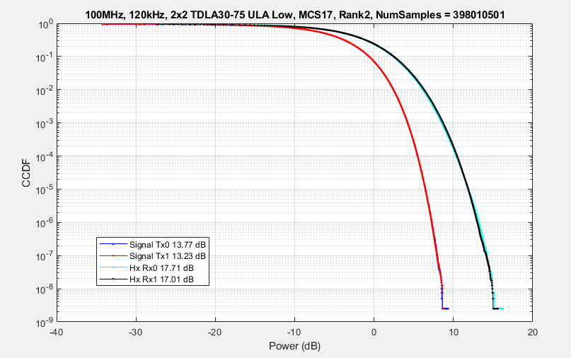
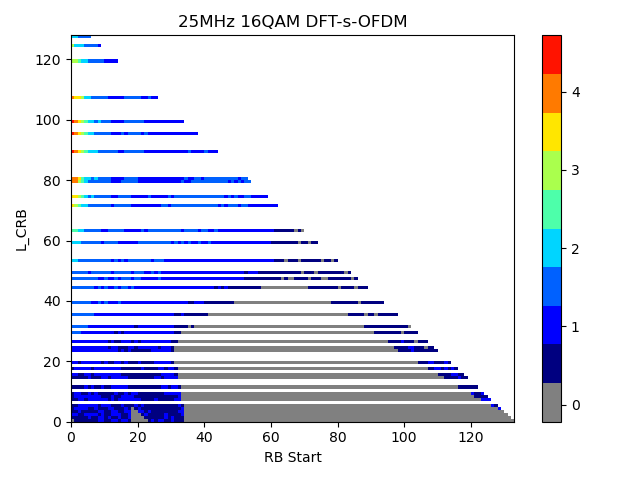
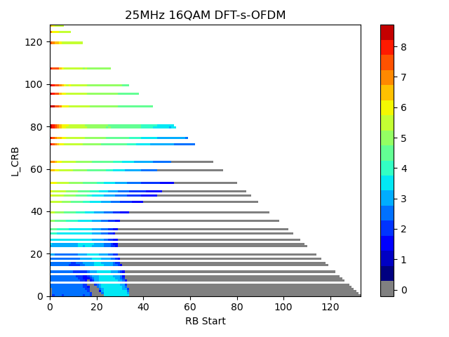
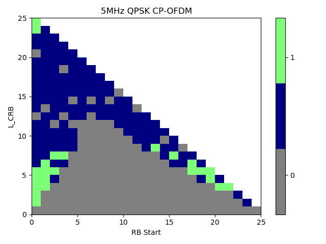

+-----------------------------------------------------------------+---+
| 3GPP TR 38.751 V18.3.0 (2024-09)                                |   |
+=================================================================+===+
| Technical Report                                                |   |
+-----------------------------------------------------------------+---+
| 3rd Generation Partnership Project;                             |   |
|                                                                 |   |
| Technical Specification Group Radio Access Network;             |   |
|                                                                 |   |
| User Equipment (UE) RF and demodulation requirements for NR     |   |
| frequency range 2 (FR2) multi-Rx chain DL reception;            |   |
|                                                                 |   |
| (Release 18)                                                    |   |
+-----------------------------------------------------------------+---+
|                                                                 |   |
+-----------------------------------------------------------------+---+
|                                                                 |   |
+-----------------------------------------------------------------+---+
|                                                                 |   |
+-----------------------------------------------------------------+---+
| The present document has been developed within the 3rd          |   |
| Generation Partnership Project (3GPP ^TM^) and may be further   |   |
| elaborated for the purposes of 3GPP.\                           |   |
| The present document has not been subject to any approval       |   |
| process by the 3GPP Organizational Partners and shall not be    |   |
| implemented.\                                                   |   |
| This Specification is provided for future development work      |   |
| within 3GPP only. The Organizational Partners accept no         |   |
| liability for any use of this Specification.\                   |   |
| Specifications and Reports for implementation of the 3GPP ^TM^  |   |
| system should be obtained via the 3GPP Organizational           |   |
| Partners\' Publications Offices.                                |   |
+-----------------------------------------------------------------+---+

+----------------------------------------------------------------------+
|                                                                      |
+======================================================================+
| > ***3GPP***                                                         |
| >                                                                    |
| > Postal address                                                     |
| >                                                                    |
| > 3GPP support office address                                        |
| >                                                                    |
| > 650 Route des Lucioles - Sophia Antipolis                          |
| >                                                                    |
| > Valbonne - FRANCE                                                  |
| >                                                                    |
| > Tel.: +33 4 92 94 42 00 Fax: +33 4 93 65 47 16                     |
| >                                                                    |
| > Internet                                                           |
| >                                                                    |
| > https://www.3gpp.org                                               |
+----------------------------------------------------------------------+
| ***Copyright Notification***                                         |
|                                                                      |
| No part may be reproduced except as authorized by written            |
| permission.\                                                         |
| The copyright and the foregoing restriction extend to reproduction   |
| in all media.                                                        |
|                                                                      |
| © 2024, 3GPP Organizational Partners (ARIB, ATIS, CCSA, ETSI, TSDSI, |
| TTA, TTC).                                                           |
|                                                                      |
| All rights reserved.                                                 |
|                                                                      |
| UMTS™ is a Trade Mark of ETSI registered for the benefit of its      |
| members                                                              |
|                                                                      |
| 3GPP™ is a Trade Mark of ETSI registered for the benefit of its      |
| Members and of the 3GPP Organizational Partners\                     |
| LTE™ is a Trade Mark of ETSI registered for the benefit of its       |
| Members and of the 3GPP Organizational Partners                      |
|                                                                      |
| GSM® and the GSM logo are registered and owned by the GSM            |
| Association                                                          |
+----------------------------------------------------------------------+

 Contents {#contents .TT}
========

[Foreword 6](#foreword)

[1 Scope 8](#scope)

[2 References 8](#references)

[3 Definitions of terms, symbols and abbreviations
9](#definitions-of-terms-symbols-and-abbreviations)

[3.1 Terms 9](#terms)

[3.2 Symbols 9](#symbols)

[3.3 Abbreviations 9](#abbreviations)

[4 Background 10](#background)

[5 System assumptions 11](#system-assumptions)

[5.1 Constraint of test system 11](#constraint-of-test-system)

[5.1.1 Source/Probe locations 11](#sourceprobe-locations)

[5.1.2 Test point distribution 11](#test-point-distribution)

[5.2 Requirement applicability 12](#requirement-applicability)

[5.3 Reference measurement channel 13](#reference-measurement-channel)

[6 UE RF requirement 16](#ue-rf-requirement)

[6.1 Requirement concept 16](#requirement-concept)

[6.1.1 General 16](#general)

[6.1.2 Understanding of "panel" 16](#understanding-of-panel)

[6.1.3 Requirement metric 16](#requirement-metric)

[6.1.3.1 General 16](#general-1)

[6.1.3.2 Overall probability based on evaluation over the whole sphere
17](#overall-probability-based-on-evaluation-over-the-whole-sphere)

[6.1.3.2.1 Probability expression 17](#probability-expression)

[6.1.3.2.2 OR combining 19](#or-combining)

[6.1.3.2.3 Arithmetic mean combining 19](#arithmetic-mean-combining)

[6.1.3.3 Overall probability based on weight per TRP pair
19](#overall-probability-based-on-weight-per-trp-pair)

[6.1.3.4 Summary 20](#summary)

[6.2 Simulation methodology 20](#simulation-methodology)

[6.2.1 Simulation assumption 20](#simulation-assumption)

[6.2.1 Simulation procedure 21](#simulation-procedure)

[6.3 Requirement design 22](#requirement-design)

[6.3.1 DL power 22](#dl-power)

[6.3.2 Inter-beam interference 23](#inter-beam-interference)

[6.3.2.1 Standalone antenna array configuration (Ideal Case)
24](#standalone-antenna-array-configuration-ideal-case)

[6.3.2.2 Realistic formfactor smart-phone (Practical Case)
25](#_Toc176626490)

[6.3.2.3 Summary 27](#summary-1)

[6.3.3 ± AoA separation 28](#aoa-separation)

[6.3.4 UE orientation 30](#ue-orientation)

[6.3.5 AoA pairs for enhanced positioners
31](#aoa-pairs-for-enhanced-positioners)

[6.3.6 DL polarization combination 33](#dl-polarization-combination)

[6.3.7 NTC vs. ETC 38](#ntc-vs.-etc)

[6.3.8 Consideration of AoA separation
39](#consideration-of-aoa-separation)

[6.3.8.1 Candidate AoA separation 39](#candidate-aoa-separation)

[6.3.8.2 1AoA vs 2 AoA 39](#aoa-vs-2-aoa)

[6.3.8.3 Specified vs declared 40](#specified-vs-declared)

[7 Conclusion for UE RF requirements
41](#conclusion-for-ue-rf-requirements)

[8 Demodulation Evaluation for Requirements
42](#demodulation-evaluation-for-requirements)

[8.1 Introduction 42](#introduction)

[8.2 Derivation of Correlation Model
42](#derivation-of-correlation-model)

[8.3 Receiver assumptions 43](#receiver-assumptions)

[8.4 Conclusions 44](#_Toc176626506)

[Annex A: Simulation results 45](#annex-a-simulation-results)

[A.1 General 45](#a.1-general)

[A.2 AoA offset distribution with system simulation
45](#a.2-aoa-offset-distribution-with-system-simulation)

[A.3 Requirement applicability for sDCI and mDCI
47](#a.3-requirement-applicability-for-sdci-and-mdci)

[A.4 Evaluation of EIS-based requirement
48](#a.4-evaluation-of-eis-based-requirement)

[A.5 Impact of UE orientation 48](#a.5-impact-of-ue-orientation)

[A.6 Impact of gain imbalance between antenna module
52](#a.6-impact-of-gain-imbalance-between-antenna-module)

[A.7 Test time estimates 56](#a.7-test-time-estimates)

[A.8 Simulation campaign for requirement design
57](#a.8-simulation-campaign-for-requirement-design)

[Annex B (informative): Change history
60](#annex-b-informative-change-history)

Foreword
========

This Technical Report has been produced by the 3rd Generation
Partnership Project (3GPP).

The contents of the present document are subject to continuing work
within the TSG and may change following formal TSG approval. Should the
TSG modify the contents of the present document, it will be re-released
by the TSG with an identifying change of release date and an increase in
version number as follows:

Version x.y.z

where:

x the first digit:

1 presented to TSG for information;

2 presented to TSG for approval;

3 or greater indicates TSG approved document under change control.

y the second digit is incremented for all changes of substance, i.e.
technical enhancements, corrections, updates, etc.

z the third digit is incremented when editorial only changes have been
incorporated in the document.

In the present document, modal verbs have the following meanings:

**shall** indicates a mandatory requirement to do something

**shall not** indicates an interdiction (prohibition) to do something

The constructions \"shall\" and \"shall not\" are confined to the
context of normative provisions, and do not appear in Technical Reports.

The constructions \"must\" and \"must not\" are not used as substitutes
for \"shall\" and \"shall not\". Their use is avoided insofar as
possible, and they are not used in a normative context except in a
direct citation from an external, referenced, non-3GPP document, or so
as to maintain continuity of style when extending or modifying the
provisions of such a referenced document.

**should** indicates a recommendation to do something

**should not** indicates a recommendation not to do something

**may** indicates permission to do something

**need not** indicates permission not to do something

The construction \"may not\" is ambiguous and is not used in normative
elements. The unambiguous constructions \"might not\" or \"shall not\"
are used instead, depending upon the meaning intended.

**can** indicates that something is possible

**cannot** indicates that something is impossible

The constructions \"can\" and \"cannot\" are not substitutes for \"may\"
and \"need not\".

**will** indicates that something is certain or expected to happen as a
result of action taken by an agency the behaviour of which is outside
the scope of the present document

**will not** indicates that something is certain or expected not to
happen as a result of action taken by an agency the behaviour of which
is outside the scope of the present document

**might** indicates a likelihood that something will happen as a result
of action taken by some agency the behaviour of which is outside the
scope of the present document

**might not** indicates a likelihood that something will not happen as a
result of action taken by some agency the behaviour of which is outside
the scope of the present document

In addition:

**is** (or any other verb in the indicative mood) indicates a statement
of fact

**is not** (or any other negative verb in the indicative mood) indicates
a statement of fact

The constructions \"is\" and \"is not\" do not indicate requirements.

 1 Scope
=======

The objectives for NR frequency range 2 (FR2) multi-Rx chain DL
reception from RF perspective are as follows.

\- Introduce necessary requirement(s) for enhanced FR2-1 UEs with
simultaneous DL reception with two different QCL TypeD RSs on single
component carrier with up to 4 layer DL MIMO

\- Enhanced RF requirements:

\- Specify RF requirements, mainly spherical coverage requirements, for
devices with simultaneous reception from different directions with
different QCL TypeD RSs

\- The legacy spherical coverage requirement for reception from a single
direction will be kept

\- PC3 will be prioritized, other power classes should be considered
after the PC3 requirements framework is finalized

2 References
============

The following documents contain provisions which, through reference in
this text, constitute provisions of the present document.

\- References are either specific (identified by date of publication,
edition number, version number, etc.) or non‑specific.

\- For a specific reference, subsequent revisions do not apply.

\- For a non-specific reference, the latest version applies. In the case
of a reference to a 3GPP document (including a GSM document), a
non-specific reference implicitly refers to the latest version of that
document *in the same Release as the present document*.

\[1\] 3GPP TR 21.905: \"Vocabulary for 3GPP Specifications\".

\[2\] 3GPP TR 38.871: "Study on NR frequency range 2 (FR2) Over-the-Air
(OTA) testing enhancements".

\[3\] R4-2219852, System Parameter Assumptions for Multi AoA Rx Testing,
Keysight Technologies

\[4\] 3GPP TS 38.306: "User Equipment (UE) radio access capabilities".

\[5\] R4-2217731, WF on FR2 UE RF requirements for 2AoA DL Rx, vivo

\[6\] R4-2218755, Further views on multi-Rx chain DL reception in FR2,
Sony, Ericsson

\[7\] R4-2300709, On UE RF requirements for 2AoA FR2 DL MIMO, Qualcomm
Incorporated\[8\] R4-2305750, Further views on multi-Rx chain DL
reception in FR2, Sony, Ericsson

\[9\] RP-231452, Revised WID: Requirement for NR frequency range 2 (FR2)
multi-Rx chain DL reception, Qualcomm

\[10\] R4-2307232, Discussion on System parameter assumption, UE
architecture and conditions of UE RF requirements, Nokia, Nokia Shanghai
Bell

\[11\] R4-2218042, On UE RF requirements for 2AoA FR2 DL MIMO, Qualcomm

\[12\] R4-2300146, Discussion for FR2 multi-Rx FOM, Murata Manufacturing
Co., Ltd.

\[13\] R4-2300949, Discussion on UE RF requirements for simultaneous DL,
LG Electronics

\[14\] R4-2301572, Evaluation on UE requirement of multi-Rx DL
reception, vivo

3 Definitions of terms, symbols and abbreviations
=================================================

3.1 Terms
---------

For the purposes of the present document, the terms given in
TR 21.905 \[1\] and the following apply. A term defined in the present
document takes precedence over the definition of the same term, if any,
in TR 21.905 \[1\].

3.2 Symbols
-----------

For the purposes of the present document, the following symbols apply:

3.3 Abbreviations
-----------------

For the purposes of the present document, the abbreviations given in
TR 21.905 \[1\] and the following apply. An abbreviation defined in the
present document takes precedence over the definition of the same
abbreviation, if any, in TR 21.905 \[1\].

AoA Angle of Arrival

DUT Device Under Test

MTRP Multiple Transmission and Reception Point

DCI Downlink control information

DL Downlink

RSRP Reference signal received power

SINR Signal-to-noise and interference ratio

 4 Background
============

*The existing Rel-15 NR FR2 minimum UE requirements are defined with an
assumption that UE is equipped with a single antenna panel or two
antenna panels but only capable to perform DL reception using a single
RX beam/chain reception. Furthermore, the UE performance requirements
are limited for DL MIMO rank 1 and 2. In FR2, 4-layer MIMO reception
requires beam reception from at least two directions. Although this is
supported by the MIMO features since Rel-15, no performance requirements
have yet been specified. This is important for high-rate MIMO in FR2, as
well as for FR2 HST scenarios.*

*During Rel-16 and Rel-17, the support of NR FR2 CA with IBM
(Independent Beam Management) with simultaneous DL reception on
different component carriers from the co-located and non-col-located
TRPs was defined. The IBM concept implies a UE is capable of DL
simultaneous reception on different UE panels/chains using separate
beams on different component carriers and requires improved UE baseband
and RF capabilities (multiple baseband chains and support of multiple
antenna panels).*

*Several enhancements to enable efficient and robust DL multi-TRP/panel
operation were introduced in the Rel-16 NR eMIMO WI. For instance, DL
transmission schemes with simultaneous and non-simultaneous multi-beam
reception from multiple TRPs/panels were introduced. The simultaneous
reception may require support of simultaneous multi-panel operation with
several independent RX beams/chains at the UE side. As part of this
item, a new FR2 UE capability for simultaneous multi-beam reception was
introduced (simultaneousReceptionDiffTypeD-r16). However, no RF, RRM or
performance requirements were defined in Rel-16 and Rel-17 for FR2 UEs
with simultaneousReceptionDiffTypeD-r16 capability.*

*Enhanced NR FR2 UEs with multi-beam simultaneous reception and multiple
RX chains can provide a meaningful performance improvement in FR2
improving both demodulation performance (4-layer DL MIMO), RRM
performance and improve RF spherical coverage. This work item aims to
introduce the requirements for UEs capable of multi-beam/chain
simultaneous DL reception on a single component carrier to achieve
improved RF, RRM and UE demodulation performance.*

*Different implementation scenarios could be considered at the UE.
Single-TCI reception on different beams has been supported by the RAN1
specifications since Rel-15 via the Type I codebook, which could be
achieved at the UE with either a single panel or multiple panels.
Alternatively, dual TCI operation can be combined with the Rel-17 mTRP
framework even if the base station is actually deployed as a single
TRP.*

*This WI therefore provides the requirements for both single and dual
TCI assumptions to specify requirements for reception of 4-layer
downlink MIMO with simultaneous reception at the UE from two different
directions.*

 5 System assumptions
====================

5.1 Constraint of test system
-----------------------------

The RF requirement and its test system have a close relationship for
multi-Rx UE, and RF Requirement discussions need to consider testability
issue so that the defined requirement can be properly verified. 5.1.1
and 5.1.2 record the discussion in RF session and more details on test
system can be found in \[2\].

### 5.1.1 Source/Probe locations

In theory, the UE performance can only be fully realized when any AoA
pair on the sphere is tested, but considering the test complexity and
time, a test system with full degrees of freedom for 2 active AoA is not
pursued in R18, and some intermediate solutions have been proposed:

\- Option 1: One Fixed AoA1 (e.g. Peak) + Full set AoA2.

\- Option 2: Multiple AoA1 + Full set AoA2.

\- Option 3: Fixed offset between the two AoAs, both probes swept
simultaneously.

Both option 1 and option 2 also require a test system with full degree
of freedom because the separation between 2AoA still need to be
variable, so the fixed relative AoA separation is considered as baseline
for test setup and requirement design as show in Figure 5.1.1-1. For
option 3, there are two variants: the first one uses the legacy
positioner with 2 axes (either distributed or otherwise), and the second
one uses an enhanced positioner with 3 degrees of freedom (3-axis
positioner).

{width="2.4027777777777777in"
height="1.9236111111111112in"}

Figure 5.1.1-1 Illustration for fixed relative AoA separation

### 5.1.2 Test point distribution

In \[3\], the DL directions perceived by DUT is analysed. Due to the
lack of full degree of freedom in the test system, when the probe is
aligned with different axis, the test point distribution will also be
different. Table 5.1.2-1 show the case when AoA separation is 60° as an
example.

Table 5.1.2-1 DL direction perceived by the DUT from two different
system configurations when the AoA separation is 60°

                         Probes in the xz plane                                                                Probes in the *[yz]{.underline}* plane
  ---------------------- ------------------------------------------------------------------------------------- -------------------------------------------------------------------------------------
  System Configuration   {width="2.2222222222222223in" height="1.3125in"}               {width="1.6388888888888888in" height="1.5763888888888888in"}
  Constant-step          {width="1.7777777777777777in" height="1.7083333333333333in"}   {width="1.7986111111111112in" height="1.7708333333333333in"}
  Constant-density       {width="1.9513888888888888in" height="1.8819444444444444in"}   {width="1.9097222222222223in" height="1.8819444444444444in"}

It is evident that no matter whether a constant-step or constant-density
grid is used, when AoA1 traverse all test grid, the distribution of AoA2
will become irregular, when the probes are located in yz plane in the
example test system above. Also evident is that for probe in the xz
plane in the example system and a constant step-size grid, the
regularity of the grid is preserved for both sources. Consequently, TE
sources/probes that lie in the plane of constant phi with respect to the
coordinate system defined by the positioner axes and a constant-step
grid is considered as the primary configuration for test setup and
requirement discussion.

5.2 Requirement applicability
-----------------------------

For DL mTRP, there are two basic schemes are designed -- single-DCI and
multi-DCI, which are indicated by optional capabilities as shown below
\[4\].

Table 5.2-1 Capabilities for multi-Rx UE

+----------------------------------------------------------------------+
| ***singleDCI-SDM-scheme-r16***                                       |
|                                                                      |
| ***Indicates whether the UE supports single DCI based spatial        |
| division multiplexing scheme.***                                     |
+======================================================================+
| ***multiDCI-MultiTRP-r16***                                          |
|                                                                      |
| Indicates whether the UE supports multi-DCI based multi-TRP          |
| PDSCH/PUSCH operation and support of fully/partially overlapping     |
| PDSCHs in time and non-overlapping in frequency.                     |
|                                                                      |
| **...**                                                              |
+----------------------------------------------------------------------+
| ***overlapPDSCHsFullyFreqTime-r16***                                 |
|                                                                      |
| Indicates the maximal number of PDSCH scrambling sequences per       |
| serving cell when the UE supports PDSCHs with fully overlapping      |
| Resource Elements. The UE that indicates support of this feature     |
| shall support *multiDCI-MultiTRP-r16.*                               |
|                                                                      |
| ...                                                                  |
+----------------------------------------------------------------------+
| ***overlapPDSCHsInTimePartiallyFreq-r16***                           |
|                                                                      |
| Indicates whether the UE supports PDSCHs with partially overlapping  |
| Resource Elements. The UE that indicates support of this feature     |
| shall support *overlapPDSCHsFullyFreqTime-r16.*                      |
+----------------------------------------------------------------------+

Figure 5.2-1 illustrates the difference between multiple DCI and single
DCI, and Table 5.2-2 summarizes different characteristics of single DCI
and multi-DCI respectively.

{width="4.305555555555555in"
height="1.0138888888888888in"}

Figure 5.2-1: illustration of multiple DCI and single DCI

Table 5.2-2: Comparison between single DCI and multiple DCI

+----------------------------------+----------------------------------+
| Single DCI                       | Multi-DCI                        |
+==================================+==================================+
| > \- Single transport block      | > \- Separate transport blocks   |
| > split across both TRPs. Allows | >                                |
| > true 4x4 demod because of      | > \- Independent MCS, RB         |
| > single TB                      | > allocations for each TRP (i.e  |
| >                                | > spatial multiplexing is not    |
| > \- common MCS, RB allocation   | > guaranteed)                    |
| >                                | >                                |
| > \- At the Tx side, each 2-port | > \- 'PDSCH' is structured as 2  |
| > TRP is enabled for NCJT with   | > parallel PDSCH channels, each  |
| > up to 4L (non-coherent joint   | > with up to rank 2 -- each      |
| > transmission).                 | > layer pair shows up as         |
|                                  | > interference to the other. It  |
|                                  | > is up to UE implementation     |
|                                  | > whether it can do joint 4L     |
|                                  | > demod.                         |
+----------------------------------+----------------------------------+

The performance of UEs supporting single-DCI and multi-DCI may be
different but considering the requirement only guarantee the minimum
performance and unified requirement is friendly to verification, the RF
requirement is defined based on that multi-DCI with understanding that
UE supporting single-DCI can also meet the requirement. The requirement
applicability can be further explained as:

\- The same requirement shall be applied to the UEs supporting either of
the following two capability combinations:

\- UE capabilities "multiDCI-MultiTRP-r16" and
"overlapPDSCHsFullyFreqTime-r16".

\- UE capabilities "multiDCI-MultiTRP-r16" and
"overlapPDSCHsInTimePartiallyFreq-r16".

\- No need to discuss and define the RF requirement for the UEs only
supporting "multiDCI-MultiTRP-r16".

5.3 Reference measurement channel
---------------------------------

UE RF requirements for Multi-RX DL are specified for simultaneous
Multi-RX chain DL reception from different directions for FR2-1 UE
supporting up to 4 layers. RAN4 has agreed that UE RF requirements for
simultaneous reception from different directions shall be based on
single-layer reception for each DL direction with dual TCI
configuration, i.e., total 2 layers for both directions. Existing
Reference Measurement Channel (RMC) for UE RF requirement is limited to
1 layer, thus it is necessary to specify new RMC for 2 layer scenario
for UE RF.

Depending on the DCI schemes the UE supports, RMC may be different.

For multi-DCI, transport blocks are separated for receptions from
different directions, therefore throughput for each layer could be
separately obtained. From the perspective of each TRP, the legacy RMC
can be reused;

For single DCI, transport block is split across both TRPs for single
DCI, therefore only an overall throughput of the 2 layer reception can
be obtained. The legacy RMC can not be reused and a new RMC is needed.

RAN4 achieves following conclusion:

\- For the UE supporting multi-DCI, the RMC of the single carrier can be
reused for each layer, which is specified in Annex A.3.3.2-1 and
A.3.3.2-2 of TS 38.101-2 (with one sided dynamic OCNG Pattern OP.1 TDD
for the DL-signal as described in Annex A.5.2.1 of TS 38.101-2);

\- For the UE supporting single DCI, the RMC is shown as Table 5.3-1 and
Table 5.3-2 (with one sided dynamic OCNG Pattern OP.1 TDD for the
DL-signal as described in Annex A.5.2.1 of TS 38.101-2)

Table 5.3-1: Fixed Reference Channel for Receiver Requirements (SCS 60
kHz, TDD)

+-----------------------------------+------+--------+--------+--------+
| Parameter                         | Unit | Value  |        |        |
+===================================+======+========+========+========+
| Channel bandwidth                 | MHz  | 50     | 100    | 200    |
+-----------------------------------+------+--------+--------+--------+
| Subcarrier spacing configuration  |      | 2      | 2      | 2      |
+-----------------------------------+------+--------+--------+--------+
| Allocated resource blocks         |      | 66     | 132    | 264    |
+-----------------------------------+------+--------+--------+--------+
| Subcarriers per resource block    |      | 12     | 12     | 12     |
+-----------------------------------+------+--------+--------+--------+
| Allocated slots per Frame         |      | 23     | 23     | 23     |
+-----------------------------------+------+--------+--------+--------+
| MCS index                         |      | 4      | 4      | 4      |
+-----------------------------------+------+--------+--------+--------+
| Modulation                        |      | QPSK   | QPSK   | QPSK   |
+-----------------------------------+------+--------+--------+--------+
| Target Coding Rate                |      | 1/3    | 1/3    | 1/3    |
+-----------------------------------+------+--------+--------+--------+
| Maximum number of HARQ            |      | 1      | 1      | 1      |
| transmissions                     |      |        |        |        |
+-----------------------------------+------+--------+--------+--------+
| Information Bit Payload per Slot  |      |        |        |        |
+-----------------------------------+------+--------+--------+--------+
| For Slots 0 and Slot i, if mod(i, | Bits | N/A    | N/A    | N/A    |
| 5) = {3,4} for i from {0,...,79}  |      |        |        |        |
| (NOTE 5)                          |      |        |        |        |
+-----------------------------------+------+--------+--------+--------+
| For Slot i, if mod(i, 5) =        | Bits | 8456   | 16896  | 33816  |
| {0,1,2} for i from {1,...,79}     |      |        |        |        |
| (NOTE 6)                          |      |        |        |        |
+-----------------------------------+------+--------+--------+--------+
| Transport block CRC               | Bits | 24     | 24     | 24     |
+-----------------------------------+------+--------+--------+--------+
| LDPC base graph                   |      | 1      | 1      | 1      |
+-----------------------------------+------+--------+--------+--------+
| Number of Code Blocks per Slot    |      |        |        |        |
+-----------------------------------+------+--------+--------+--------+
| For Slots 0 and Slot i, if mod(i, | CBs  | N/A    | N/A    | N/A    |
| 5) = {3,4} for i from {0,...,79}  |      |        |        |        |
| (NOTE 5)                          |      |        |        |        |
+-----------------------------------+------+--------+--------+--------+
| For Slot i, if mod(i, 5) =        | CBs  | 1      | 2      | 2      |
| {0,1,2} for i from {1,...,79}     |      |        |        |        |
| (NOTE 6)                          |      |        |        |        |
+-----------------------------------+------+--------+--------+--------+
| Binary Channel Bits Per Slot      |      |        |        |        |
+-----------------------------------+------+--------+--------+--------+
| For Slots 0 and Slot i, if mod(i, | Bits | N/A    | N/A    | N/A    |
| 5) = {3,4} for i from {0,...,79}  |      |        |        |        |
| (NOTE 5)                          |      |        |        |        |
+-----------------------------------+------+--------+--------+--------+
| For Slot i, if mod(i, 5) =        | Bits | 28512  | 57024  | 114048 |
| {0,1,2} for i from {1,...,79}     |      |        |        |        |
| (NOTE 6)                          |      |        |        |        |
+-----------------------------------+------+--------+--------+--------+
| Max. Throughput averaged over 1   | Mbps | 19.449 | 38.861 | 77.777 |
| frame                             |      |        |        |        |
+-----------------------------------+------+--------+--------+--------+
| NOTE 1: Additional parameters are |      |        |        |        |
| specified in Table A.3.1-1 and    |      |        |        |        |
| Table A.3.3.1-1.                  |      |        |        |        |
|                                   |      |        |        |        |
| NOTE 2: If more than one Code     |      |        |        |        |
| Block is present, an additional   |      |        |        |        |
| CRC sequence of L = 24 Bits is    |      |        |        |        |
| attached to each Code Block       |      |        |        |        |
| (otherwise L = 0 Bit).            |      |        |        |        |
|                                   |      |        |        |        |
| NOTE 3: SS/PBCH block is          |      |        |        |        |
| transmitted in slot 0 with        |      |        |        |        |
| periodicity 20 ms                 |      |        |        |        |
|                                   |      |        |        |        |
| NOTE 4: Slot i is slot index per  |      |        |        |        |
| 2 frames                          |      |        |        |        |
|                                   |      |        |        |        |
| NOTE 5: When this DL RMC used     |      |        |        |        |
| together with the UL RMC for the  |      |        |        |        |
| transmitter requirements          |      |        |        |        |
| requiring at least one sub frame  |      |        |        |        |
| (1ms) for the measurement period, |      |        |        |        |
| Slot i, if mod(i, 8) =            |      |        |        |        |
| {3,4,5,6,7} for i from {0,...,79} |      |        |        |        |
| together with the TDD UL-DL       |      |        |        |        |
| configuration specified in A2.3.  |      |        |        |        |
|                                   |      |        |        |        |
| NOTE 6: When this DL RMC used     |      |        |        |        |
| together with the UL RMC for the  |      |        |        |        |
| transmitter requirements          |      |        |        |        |
| requiring at least one sub frame  |      |        |        |        |
| (1ms) for the measurement period, |      |        |        |        |
| Slot i, if mod(i, 8) = {0,1,2}    |      |        |        |        |
| for i from {0,...,79} together    |      |        |        |        |
| with the TDD UL-DL configuration  |      |        |        |        |
| specified in A2.3.                |      |        |        |        |
+-----------------------------------+------+--------+--------+--------+

Table 5.3-2: Fixed Reference Channel for Receiver Requirements (SCS 120
kHz, TDD)

+---------------------+------+--------+--------+--------+---------+
| Parameter           | Unit | Value  |        |        |         |
+=====================+======+========+========+========+=========+
| Channel bandwidth   | MHz  | 50     | 100    | 200    | 400     |
+---------------------+------+--------+--------+--------+---------+
| Subcarrier spacing  |      | 3      | 3      | 3      | 3       |
| configuration       |      |        |        |        |         |
+---------------------+------+--------+--------+--------+---------+
| Allocated resource  |      | 32     | 66     | 132    | 264     |
| blocks              |      |        |        |        |         |
+---------------------+------+--------+--------+--------+---------+
| Subcarriers per     |      | 12     | 12     | 12     | 12      |
| resource block      |      |        |        |        |         |
+---------------------+------+--------+--------+--------+---------+
| Allocated slots per |      | 47     | 47     | 47     | 47      |
| Frame               |      |        |        |        |         |
+---------------------+------+--------+--------+--------+---------+
| MCS index           |      | 4      | 4      | 4      | 4       |
+---------------------+------+--------+--------+--------+---------+
| Modulation          |      | QPSK   | QPSK   | QPSK   | QPSK    |
+---------------------+------+--------+--------+--------+---------+
| Target Coding Rate  |      | 1/3    | 1/3    | 1/3    | 1/3     |
+---------------------+------+--------+--------+--------+---------+
| Maximum number of   |      | 1      | 1      | 1      | 1       |
| HARQ transmissions  |      |        |        |        |         |
+---------------------+------+--------+--------+--------+---------+
| Information Bit     |      |        |        |        |         |
| Payload per Slot    |      |        |        |        |         |
+---------------------+------+--------+--------+--------+---------+
| For Slots 0 and     | Bits | N/A    | N/A    | N/A    | N/A     |
| Slot i, if mod(i,   |      |        |        |        |         |
| 5) = {3,4} for i    |      |        |        |        |         |
| from {0,...,159}    |      |        |        |        |         |
| (NOTE 5)            |      |        |        |        |         |
+---------------------+------+--------+--------+--------+---------+
| For Slot i, if      | Bits | 4096   | 8456   | 16896  | 33816   |
| mod(i, 5) = {0,1,2} |      |        |        |        |         |
| for i from          |      |        |        |        |         |
| {1,...,159} (NOTE   |      |        |        |        |         |
| 6)                  |      |        |        |        |         |
+---------------------+------+--------+--------+--------+---------+
| Transport block CRC | Bits | 16     | 24     | 24     | 24      |
+---------------------+------+--------+--------+--------+---------+
| LDPC base graph     |      | 2      | 1      | 1      | 1       |
+---------------------+------+--------+--------+--------+---------+
| Number of Code      |      |        |        |        |         |
| Blocks per Slot     |      |        |        |        |         |
+---------------------+------+--------+--------+--------+---------+
| For Slots 0 and     | CBs  | N/A    | N/A    | N/A    | N/A     |
| Slot i, if mod(i,   |      |        |        |        |         |
| 5) = {3,4} for i    |      |        |        |        |         |
| from {0,...,159}    |      |        |        |        |         |
| (NOTE 5)            |      |        |        |        |         |
+---------------------+------+--------+--------+--------+---------+
| For Slot i, if      | CBs  | 1      | 1      | 2      | 2       |
| mod(i, 5) = {0,1,2} |      |        |        |        |         |
| for i from          |      |        |        |        |         |
| {1,...,159} (NOTE   |      |        |        |        |         |
| 6)                  |      |        |        |        |         |
+---------------------+------+--------+--------+--------+---------+
| Binary Channel Bits |      |        |        |        |         |
| Per Slot            |      |        |        |        |         |
+---------------------+------+--------+--------+--------+---------+
| For Slots 0 and     | Bits | N/A    | N/A    | N/A    | N/A     |
| Slot i, if mod(i,   |      |        |        |        |         |
| 5) = {3,4} for i    |      |        |        |        |         |
| from {0,...,159}    |      |        |        |        |         |
| (NOTE 5)            |      |        |        |        |         |
+---------------------+------+--------+--------+--------+---------+
| For Slot i, if      | Bits | 13824  | 28512  | 57024  | 114048  |
| mod(i, 5) = {0,1,2} |      |        |        |        |         |
| for i from          |      |        |        |        |         |
| {1,...,159} (NOTE   |      |        |        |        |         |
| 6)                  |      |        |        |        |         |
+---------------------+------+--------+--------+--------+---------+
| Max. Throughput     | Mbps | 19.660 | 40.589 | 81.101 | 162.317 |
| averaged over 1     |      |        |        |        |         |
| frame               |      |        |        |        |         |
+---------------------+------+--------+--------+--------+---------+
| NOTE 1: Additional  |      |        |        |        |         |
| parameters are      |      |        |        |        |         |
| specified in Table  |      |        |        |        |         |
| A.3.1-1 and Table   |      |        |        |        |         |
| A.3.3.1-1.          |      |        |        |        |         |
|                     |      |        |        |        |         |
| NOTE 2: If more     |      |        |        |        |         |
| than one Code Block |      |        |        |        |         |
| is present, an      |      |        |        |        |         |
| additional CRC      |      |        |        |        |         |
| sequence of L = 24  |      |        |        |        |         |
| Bits is attached to |      |        |        |        |         |
| each Code Block     |      |        |        |        |         |
| (otherwise L = 0    |      |        |        |        |         |
| Bit).               |      |        |        |        |         |
|                     |      |        |        |        |         |
| NOTE 3: SS/PBCH     |      |        |        |        |         |
| block is            |      |        |        |        |         |
| transmitted in slot |      |        |        |        |         |
| 0 with periodicity  |      |        |        |        |         |
| 20 ms               |      |        |        |        |         |
|                     |      |        |        |        |         |
| NOTE 4: Slot i is   |      |        |        |        |         |
| slot index per 2    |      |        |        |        |         |
| frames              |      |        |        |        |         |
|                     |      |        |        |        |         |
| NOTE 5: When this   |      |        |        |        |         |
| DL RMC used         |      |        |        |        |         |
| together with the   |      |        |        |        |         |
| UL RMC for the      |      |        |        |        |         |
| transmitter         |      |        |        |        |         |
| requirements        |      |        |        |        |         |
| requiring at least  |      |        |        |        |         |
| one sub frame (1ms) |      |        |        |        |         |
| for the measurement |      |        |        |        |         |
| period, Slot i, if  |      |        |        |        |         |
| mod(i, 16) =        |      |        |        |        |         |
| {7,...,15} for i    |      |        |        |        |         |
| from {0,...,159}    |      |        |        |        |         |
| together with the   |      |        |        |        |         |
| TDD UL-DL           |      |        |        |        |         |
| configuration       |      |        |        |        |         |
| specified in A2.3.  |      |        |        |        |         |
|                     |      |        |        |        |         |
| NOTE 6: When this   |      |        |        |        |         |
| DL RMC used         |      |        |        |        |         |
| together with the   |      |        |        |        |         |
| UL RMC for the      |      |        |        |        |         |
| transmitter         |      |        |        |        |         |
| requirements        |      |        |        |        |         |
| requiring at least  |      |        |        |        |         |
| one sub frame (1ms) |      |        |        |        |         |
| for the measurement |      |        |        |        |         |
| period, Slot i, if  |      |        |        |        |         |
| mod(i, 16) =        |      |        |        |        |         |
| {0,...,6} for i     |      |        |        |        |         |
| from {0,...,159}    |      |        |        |        |         |
| together with the   |      |        |        |        |         |
| TDD UL-DL           |      |        |        |        |         |
| configuration       |      |        |        |        |         |
| specified in A2.3.  |      |        |        |        |         |
+---------------------+------+--------+--------+--------+---------+

 6 UE RF requirement
===================

6.1 Requirement concept
-----------------------

### 6.1.1 General

The requirement concept is mainly categorized into two types in the
discussion. One is based on 2AoA directional sensitivity statistics,
which is similar to the legacy REFSENS and spherical coverage, e.g.,
"joint" sensitivity, sensitivity tolerance, new CCDF formula, etc., and
the details of proposals can be found in \[5\]. The most critical
problem with this approach is that when two AoAs need to search for
sensitivity simultaneously, the test complexity rises significantly.
Another is based on the functionality verification under 2AoAs with a
fixed DL power level \[6\], and the merit of this approach is that it
can reduce the test overhead, but the concern is that such
simplification may not reasonably validate UE performance. In \[7\], the
simulation results to compare these two approaches above are provided.

Table 6.1.1 Simulation results for PC3 UE under different requirement
concept

  AoA separation (deg)   Modules on opposite faces                              Modules on adjacent faces                                                                        
  ---------------------- ------------------------------------------------------ ----------------------------------------- ------------------------------------------------------ -----------------------------------------
                         Coverage fraction 'M' for functionality verification   Coverage fraction from sensitivity CCDF   Coverage fraction 'M' for functionality verification   Coverage fraction from sensitivity CCDF
  150                    49.4 %                                                 49.4 %                                    25.2 %                                                 25.3 %
  120                    49.4 %                                                 49.2 %                                    35.6 %                                                 36.0 %
  90                     35.2 %                                                 35.6 %                                    33.7 %                                                 34.0 %
  60                     2.5 %                                                  2.5 %                                     25.5 %                                                 27.3 %

The results show that there is good correlation between the coverages
predicted by the two methods. To alleviate the test overhead for
multi-Rx UE, the functionality verification with fixed DL power is
agreed as requirement concept.

### 6.1.2 Understanding of "panel"

The terminology "panel" appears often in FR2 RF discussion but there is
never a clear interpretation, and the reason is that this term is
closely related to the UE implementation and behaviour. To avoid put
unnecessary restriction on UE design, the "panel" will be not referenced
in both final RF requirement and test configuration. However, from RF
requirement design perspective, a clear meaning of "panel" is very
helpful for the discussion, and the following logical "panel" definition
is used which is only focus on its behaviour rather than physical
implementation.

"Panel" is defined as a group of antenna element that controls beam
independently and has the following attributes

\- Within a panel, one beam can be selected and used for DL reception.

\- Across different panels, multiple beams (each selected per panel) may
be used for DL reception.

\- 'Beam' is assumed to mean spatial filter associated with reception.

\- A physical panel with dual polarization is assumed as two "panels".

### 6.1.3 Requirement metric

#### 6.1.3.1 General

Two similar proposals were made along with the respective mathematical
framework. Both aim to capture the probability of supporting 2 AoA
reception for a given AoA separation but differ in the weighting
assigned to the outcomes of all tested pairs. One method aims to capture
the overall probability based on evaluation over the entire sphere,
while the other limits evaluation to some subset of AoA pairs.

#### 6.1.3.2 Overall probability based on evaluation over the whole sphere

##### 6.1.3.2.1 Probability expression

The ideal metric for the requirement is the probability of supporting
2AoA reception when the 2 AoAs are randomly selected. This is the
general case, assuming no TE constraints. To this end, a regional
probability metric is first established to capture the probability of a
UE to support 2TRP Rx, given a fixed (regional) location of one of the
TRPs (from the UE's perspective). The sample space for this probability
is the collection of all AoA pairs formed from TRP2 locations that cover
the entire sphere (blue surface in the 'ideal case' in figure 6.1.3.2-1)
and a given TRP1 location (white star in the 'ideal case' in figure
6.1.3.2-1).

Figure 6.1.3.2-1: 'Regional Probability' sample space for the general
AoA pair case

Specifically, for the fixed TRP ('TRP1') at some AoA (θ~1~,φ~1~), the
regional probability is evaluated as a spatial average of the pass/fail
outcomes for all locations of TRP2.:

$$P_{regional,\ \ general}(\theta_{1},\varphi_{1}) = \ \frac{∯_{}^{}{\text{PF}\left( \theta_{1},\varphi_{1},\theta_{2},\varphi_{2} \right)\text{dS}_{2}}}{∯_{}^{}\text{dS}_{2}}$$

Where:

\- The AoA of the fixed TRP ('TRP1') is (θ~1~,φ~1~).

\- The AoA of the TRP paired with the fixed TRP ('TRP2') is (θ~2~,φ~2~).

\- PF (θ~1~,φ~1~,θ~2~,φ~2~) is the pass/fail outcome (1/0 respectively)
of the 2TRP functionality test under the agreed UERF test conditions.

\- dS~2~ is the elemental area associated with the AoA of TRP2

An overall probability that a UE can support 2TRP operation when the
TRPs are positioned randomly around the UE can be defined by taking a
spatial average of the regional probability over all possible positions
of the fixed TRP on the sphere:

$$P_{\text{overall},\text{general}\text{\ \ }} = \ \frac{∯_{}^{}{P_{\text{regional},\ \ \text{general}}(\theta_{1},\varphi_{1})\text{dS}_{1}}}{∯_{}^{}\text{dS}_{1}}$$

This expression can be re-written as:

$$P_{\text{overall},\text{general}\text{\ \ }} = \ \frac{∯_{}^{}{∯_{}^{}{\text{PF}\left( \theta_{1},\varphi_{1},\theta_{2},\varphi_{2} \right)\ \text{dS}_{2}}\text{dS}_{1}}}{∯_{}^{}\text{dS}_{1}.∯_{}^{}\text{dS}_{2}}$$

While this overall probability was derived by arbitrarily choosing a TRP
whose location was fixed for the regional probability, the final
expression is symmetric for both TRPs. We can therefore conclude that
the choice of the specific TRP to use as the 'fixed TRP' for the
calculation is not significant, at least for the general case where
there are no restrictions on availability of test AoA pairs.

The regional probability formulation above is now modified for discrete
sampling on for a lat-long (constant step-size grid). The expression for
constrained probability becomes a weighted sum over all sample points:

$$P_{\text{regional},\ \ \text{general}}(\theta_{1},\varphi_{1}) = \ \sum_{\theta_{2}}^{}{\sum_{\varphi_{2}}^{}\left\{ \text{PF}\left( \theta_{1},\varphi_{1},\theta_{2},\varphi_{2} \right).\text{AW}(\theta_{2}) \right\}}$$

Where:

\- AW(θ~x~) are the area weights associated with the entire sample space
of grid points where TRPx can be located. In this case, the weights
would be the discretized version of
$\frac{\text{dS}_{2}}{\oint_{}^{}\text{dS}_{2}}$ , or
$\frac{{\mathrm{\Delta}S}_{2}}{S}$

The overall probability can similarly be discretized as:

$$P_{\text{overall},\text{general}\text{\ \ }} = \ \sum_{\theta_{1}}^{}{\sum_{\varphi_{1}}^{}\left\{ P_{\text{regional},\ \ \text{general}}(\theta_{1},\varphi_{1}).\text{AW}(\theta_{1}) \right\}}$$

Where AW shares the same meaning as defined above.

This formulation highlights that if the regional probability can be
established for every point on the sphere, it is possible to define an
overall probability for the UE. It further highlights that it is
possible to decouple the grid used to define the regional probabilities
and the grids used by the paired TRP directions to compute the regional
probabilities.

To modify the formulation above to reflect TE constraints where each
grid point (blue star in figure 2.1.3-1) is paired with just 2 unique
grid points (green stars in figure 6.1.3.2-2) the equation for the
metric can be rewritten as:

$$P_{\text{overall},\text{constrained}\text{\ \ }} = \ \sum_{\theta_{1}}^{}{\sum_{\varphi_{1}}^{}\left\{ P_{\text{regional},\ \text{constrained}}(\theta_{1},\varphi_{1}).\text{AW}(\theta_{1}) \right\}}$$

Where the regional constrained probability calculated at each grid point
is modified to depend on a reduced set of test AoA pairs.

Figure 6.1.3.2-2: 'Constrained Regional Probability' sample space for
the case constrained by practical TE considerations

There are multiple ways to quantify this constrained regional
probability, described in subsections below.

##### 6.1.3.2.2 OR combining

In this method, the constrained regional probability for each point is
considered '1' if that point is successful in at least one of the AoA
pairs it participates in. This strategy represents the 'OR combining'
method.

$$P_{\text{regional},\ \text{constrained}}(\theta_{1},\varphi_{1}) = \ \mathbf{\text{OR}}\{\text{PF}\left( \text{AoApair}\# 1 \right),\text{PF}\left( \text{AoApair}\# 2 \right)\}$$

##### 6.1.3.2.3 Arithmetic mean combining

Note that mathematical formulation of the regional probability in the
general case shows it to be a weighted sum of all P/F outcomes. The area
weights are those associated with the entire sample space of grid points
that contribute to the weighted sum. When the entire sample domain for
the constrained regional probability consists only of 2 sample points,
the weights for each sample in that sample space equal 0.5. The
arithmetic mean method for a small number of equidistant points is
therefore consistent with the general formulation for regional
probability:

$$P_{\text{regional},\ \text{constrained}}(\theta_{1},\varphi_{1}) = \ \{\frac{\text{PF}\left( \text{AoApair}\# 1 \right) + \text{PF}\left( \text{AoApair}\# 2 \right)}{2}\}$$

#### 6.1.3.3 Overall probability based on weight per TRP pair

Recall that if the AoAs of the two TRPs can be arbitrary values rather
than with a fixed offset in between, a full double surface integral
needs to be performed to sweep through all the possible combinations of
AoA1$\left( \theta_{1},\ \varphi_{1} \right)$ and
AoA2$\left( \theta_{2},\ \varphi_{2} \right)$ to calculate the
probability *P* that the device can successfully connect to two TRPs

$$P = \frac{f}{f_{\text{total}}}
$$

where

$$f = ∯_{S1,\ S2}^{}{F\left( \theta_{1},\ \varphi_{1},\theta_{2},\ \varphi_{2} \right)\sin\theta_{2}d\theta_{2}d\varphi_{2}\sin{\theta_{1}d\theta_{1}d\varphi_{1}}}
$$

$$f_{\text{total}} = ∯_{S1,\ S2}^{}{\sin{\theta_{1}d\theta_{1}d\varphi_{1}}}\sin\theta_{2}d\theta_{2}d\varphi_{2} = \ \left( 4\pi \right)^{2}
$$

$F\left( \theta_{1},\ \varphi_{1},\theta_{2},\ \varphi_{2} \right) = 1$
if both panels have SINR larger than -1 dB; otherwise, it equals 0. In
this case, it can be observed that the corresponding weight factor for
each TRP pair should be $\sin{\theta_{1}*\sin\theta_{2}}$*.*

Now consider that only a fixed offset would be applied to between AoA1
and AoA2, the same weight factor can still be used if we see this as a
subset of the full double surface integral. However, since a constant
offset between AoA1 and AoA2 needs to be applied (e.g., AoA2 = AoA1+
offset), a Dirac delta function needs to be plugged into the integral
$\delta\left( \text{AoA}2 - \left( \text{AoA}1 + \ \text{offset} \right) \right)$
, so that we only count the AoA pairs which has the required offset.

Assuming a case that the offset is only applied to$\text{\ θ}$ plane,
e.g., $\theta_{2} = \ \theta_{1} + c,\ \varphi_{2} = \ \varphi_{1}$,
where c is a constant offset, the integral of *f* in 6.1.3.3-2 becomes
$\widehat{f}$ as below. Please note that since $\theta_{2}$ is from 0°
to 180°, $\theta_{1} + c$ needs to be wrapped within the same range.

$$\widehat{f} = ∯_{S1,\ S2}^{}{F\left( \theta_{1},\ \varphi_{1},\theta_{2},\ \varphi_{2} \right)\delta\left( \theta_{2} - \left( \theta_{1} + c \right) \right)\delta\left( \varphi_{2} - \varphi_{1} \right)\sin\theta_{2}d\theta_{2}d\varphi_{2}\sin{\theta_{1}d\theta_{1}d\varphi_{1}}}
$$

by integral over $\theta_{2}$ and $\varphi_{2}$ , the double surface
integral will be degraded to a single surface integral, as shown in
6.1.3.3-5. The detail of derivation can be found in the appendix.

$$\widehat{f}\  = \oint_{S1}^{}{F\left( \theta_{1},\ \varphi_{1},\theta_{1} + c,\ \varphi_{1} \right)\sin\theta_{1}}\sin{{(\theta}_{1} + c)}d\theta_{1}d\varphi_{1}
$$

Moreover, to correctly calculate the probability, the total weight
${\widehat{f}}_{\text{total}}$ (assuming all test points can pass the
SINR threshold -1dB) also needs to be correctly computer as well. For a
completed double surface integral, the total weight $f_{\text{total}}$
equals (4π)^2^. However, for the subset that has a fixed offset between
AoA1 and AoA2, the total weight ${\widehat{f}}_{\text{total}}$ varies
with the AoA offset values, which are shown in Figure 6.1.3.3-1. The
value is computed numerically with the integral below but with constrain
that $\theta_{1} + c$ should be wrapped within the range from \[0°
180°\].

$${\widehat{f}}_{\text{total}}\  = \oint_{S1}^{}{\sin\theta_{1}}\sin{{(\theta}_{1} + c)}d\theta_{1}d\varphi_{1}
$$

{width="3.9375in" height="2.951388888888889in"}

Figure 6.1.3.3-1 The total weight
${\widehat{\mathbf{f}}}_{\mathbf{\text{total}}}$ with different AoA
offset values

With $\widehat{f}$ and ${\widehat{f}}_{\text{total}}\ $ , the percentage
of spherical coverage can be computed. As the results are weighted per
TRP pair, the + offset and -offset pairs will be treated as two pairs or
samples. The coverage probability $\widehat{P}$ can be computed as:

$$\widehat{P} = \frac{\oint_{S1}^{}{\lbrack F\left( \theta_{1},\ \varphi_{1},\theta_{1} + c,\ \varphi_{1} \right)\sin\theta_{1}}\sin{{(\theta}_{1} + c)} + \ F\left( \theta_{1},\ \varphi_{1},\theta_{1} - c,\ \varphi_{1} \right)\sin{\theta_{1}\sin{{(\theta}_{1} - c)}\rbrack}d\theta_{1}d\varphi_{1}}{\oint_{S1}^{}{{\lbrack sin}\theta_{1}}\sin{{(\theta}_{1} + c)} + \sin{\theta_{1}\sin{{(\theta}_{1} - c)}\rbrack}d\theta_{1}d\varphi_{1}\text{\ \ \ \ \ \ }}$$

#### 6.1.3.4 Summary

After considering the Pros and Cons of different methods, RAN4 agreed to
use overall probability with arithmetic mean combining as the metric for
this feature.

6.2 Simulation methodology 
--------------------------

### 6.2.1 Simulation assumption

Based on the requirement concept in 6.1.1, the simulation assumptions
are agreed as show in Table 6.2.1.

Table 6.2.1 Simulation assumptions

+----------------------+----------------------+----------------------+
|                      | **Simulation         | **Note**             |
|                      | assumption**         |                      |
+======================+======================+======================+
| \# of antenna module | 2 , dual polarized   |                      |
+----------------------+----------------------+----------------------+
| array of element     | 4x1                  |                      |
| antenna in each      |                      |                      |
| antenna module       |                      |                      |
+----------------------+----------------------+----------------------+
| Antenna location     | combination of the   | Two antenna modules  |
| (front, back,        | lists                | located at same side |
| top-side, left-side, |                      | is not precluded     |
| right-side,          | (e.g., left and      |                      |
| bottom-side)         | right, Right and     |                      |
|                      | Top, Left and top,   |                      |
|                      | .etc.)               |                      |
+----------------------+----------------------+----------------------+

### 6.2.1 Simulation procedure

The details of simulation procedure are described below:

1\. For one UE implementation

2\. For one UE orientation

> 3\. Run EM simulation to obtain per-beam antenna gain patterns
>
> \- Constant step size is suggested \<= 5°
>
> \- Performance difference between V/H element can be considered
>
> \- Normalize antenna gain to align with the gain drop between peak EIS
> and spherical coverage in current spec
>
> \- Other calibration method also can be used.
>
> 4\. For one angular separation
>
> 5\. For one test grid point in 3D scan
>
> \- Select beam based on RSRP (or SINR)
>
> 5.1 Calculate SINR of AoA+ and AoA- respectively
>
> \- SINR = P\_signal/(Noise + P\_interf)
>
> Where the P\_signal is the power of wanted signal and the P\_interf is
> the power of interference, Noise(dBm)= -174 +10\*log10(CBW) +NF, CBW
> is channel bandwidth, NF =10
>
> 5.2 If SINR\>=-1, PASS, otherwise, FAIL
>
> 5.3a OR combining the results of AoA+ and AoA-
>
> 5.3b No logic combination of the results of AoA+ and AoA-, but treat
> them as two separate points (e.g., arithmetic mean)
>
> \- Other methods for +/- offset data are not precluded
>
> \- Companies are encouraging to provide analysis on the pros and cons
> for each "combination" method
>
> 5.4 Add weighting (sin θ or Clenshaw-Curtis Quadrature)
>
> 6\. Repeat for other test grid point
>
> 7\. Calculate the spherical coverage percentage
>
> 8\. Repeat for other angular separation

9\. Repeat for other UE orientations

10\. Repeat for other UE implementations

A noteworthy point is the calibration in step 3, and the intention is to
minimize the difference between companies in simulation campaign. The
following options were discussed to accommodate simulation data that is
typically much better than the standard:

**Option 1:** Adjust the beam shape or scale the antenna gain to make UE
align with both peak EIS and spherical coverage.

**Option 2:** Adjust the fixed DL power to align with real UE spherical
coverage power level, e.g., if the spherical coverage in spec is -74.4
dBm with 10.9 dB gain drop and the UE only have 6 dB gain drop, then the
fixed DL power need to be adjusted to -79.3 in the simulation.

**Option 3:** Meet any one calibration condition as long as the other
condition is met or exceeded. Two examples:

\- If a UE only has 6 dB drop from peak to 50th %ile, but the standards
requirement for that parameter is 11 dB, the proposed calibration
condition would be to align the peak direction to the REFSENS condition.

\- If a UE has 15 dB drop from peak to 50th %ile, but the standards
requirement for that parameter is 11 dB, the proposed calibration
conditions would be to align the 50th %ile direction to the spherical
coverage EIS condition.

The intention of calibration is to ensure that simulation results are
comparable across all companies when performance of antenna module or
other detailed simulation setup are different, so there should be a
datum line existing after the calibration is performed. Based on this
principle, both option 1 and option 2 can be used as calibration method,
and then overall probability of PC3 UE will not exceed the 50% for any
UE under any AoA offset.

6.3 Requirement design
----------------------

### 6.3.1 DL power

From the beginning of the discussion on how to design the requirement,
it has been recognized that given a UE implementation, UE two-AoA
reception performance, i.e., the two-AoA coverage probability, depends
not only the AoA offset between the two AoAs, but also the DL power from
the two TRPs.

While in the real field, the DL power level from the two TRPs are likely
to be different, a fixed DL power level was chosen to facilitate the
requirement definition and testing, as it avoids many complexities in
clearly quantifying the UE performance of the two AoAs, especially in
the sDCI case. Furthermore, with varying power levels, the testing
overhead is expected to increase as multiple power levels need to be
tested.

As for the exact DL power level, there were several proposals:

Option 1: Use different DL power levels for the two AoAs.

To ensure not to degrade the coverage compared with single DL reception,
the spherical coverage requirement of 50th %-tile of the CCDF of EIS
measured for one of the DL directions should be equal or close to the
legacy requirement. DL power level for the other DL direction can be
relaxed with respect to the AoA separation.

Option 2: Both DL powers are higher that legacy spherical coverage
requirement

Since the two-AoA spherical coverage requirements for simultaneous
multi-Rx chain DL reception cannot meet the legacy spherical coverage
requirements for the single direction considering the mutual
interference between the beams from two AoAs, and simultaneously
choosing best Rx beam peak direction from two AoAs for all possible AoAs
separation pairs cannot be guaranteed, it is proposed to define Z dBm
tolerance for simultaneous multi-Rx chain DL reception.

In addition, some relaxation compared to the legacy spherical coverage
EIS level is proposed to account for polarization impairments in
commercial UEs that are not fully reflected in simulation.

Option 3: Both DL powers are same as the legacy spherical coverage
requirement EIS level

This option argues that the legacy spherical coverage EIS level should
be reused as the DL power in the requirement, based on which the two-AoA
coverage probability can be derived accordingly.

In the end, the EIS level of the legacy spherical coverage requirement,
e.g., specified in Table 7.3.4.3-1: EIS spherical coverage for power
class 3 in TS 38.101-2, is chosen. Under this DL power level, the
two-AoA coverage probability is derived.

### 6.3.2 Inter-beam interference

The simulation requirement for multi-Rx RF is being defined based on the
minimum signal-to-interference-and-noise ratio (SINR) of the AoA1 and
AoA2, and is significantly affected by the inter-beam interference. An
example of inter-beam interference observed at the UE in a multi-TRP DL
transmission scenario is shown in Figure 6.3.2-1 which demonstrates that
the signal (S2) transmitted from TRP2 creates interference to the UE
antenna panel receiving the signal (S1) transmitted from TRP1; h11 (h12)
is the path gain/loss of the channel between the TRP1 (TRP2) and the UE,
and P\_h11 (P\_h12) is the corresponding power.

{width="2.7222222222222223in"
height="2.263888888888889in"}

Figure 6.3.2-1: UE beam radiation pattern example for wanted signal from
AoA1 and interference from AoA2

To study the effect of inter-beam interference in multi-TRP DL
transmission, a UE equipped with three antenna arrays/modules/panels
(each on its top, left and right surfaces) is assumed where each antenna
array can steer the beam in seven different directions as shown in
Figure 6.3.2-2, namely:

1\. Beam set for Antenna Array \#1 (7 beams shown in variation of blue
color),

2\. Beam set for Antenna Array \#2 (7 beams shown in variation of green
color),

3\. Beam set for Antenna Array \#3 (7 beams shown in variation of red
color),

{width="2.486111111111111in" height="2.25in"}

Figure 6.3.2-2: FR2 UE with 3 antenna panels with 7 beams for each panel

where the description of 7 beams selected from any beam set (group) is
provided in Table 6.3.2-1.

Table 6.3.2-1: Beam index and description for a UE antenna panel

  Beam Index   Description
  ------------ -------------------------------------
  Beam 1       -45o with respect to Boresight Beam
  Beam 2       -30o with respect to Boresight Beam
  Beam 3       -15o with respect to Boresight Beam
  Beam 4       Boresight Beam
  Beam 5       +15o with respect to Boresight Beam
  Beam 6       +30o with respect to Boresight Beam
  Beam 7       +45o with respect to Boresight Beam

#### 6.3.2.1 Standalone antenna array configuration (Ideal Case)

Figure 6.3.2.1-1 shows the standalone configuration with 1x4 UE antenna
arrays and angular range over which each one of the 21 beams (7 beams on
each of the three antenna modules) is dominant and has the highest RSRP
over the other beams and Figure 6.3.2.1-2 shows the example UE beam
radiation pattern receiving the desired signal from the direction of
AoA1 on the main lobe and the interference signal from the direction of
AoA2 on the side lobe.

{width="2.6666666666666665in"
height="2.0277777777777777in"} {width="2.0902777777777777in"
height="1.9930555555555556in"}

Figure 6.3.2.1-1: (a) Standalone antenna array configuration, (b)
Angular range for dominant beams

 {width="3.2708333333333335in"
height="2.0347222222222223in"}

Figure 6.3.2.1-2: UE beam radiation pattern for AoA1 and interference
from AoA2

Considering AoA offset of 90^o^ and the beam radiation patterns of two
panels, one in red and one in blue, receive the signals from two TRPs
are shown in Figure 6.3.2.1-2, 'Green Circle' and 'Red Circle' on the
red beam radiation pattern will denote the received power of the wanted
signal from one TRP and the interference signals (e.g. AoA1) from the
other TRP (e.g., AoA2), and subsequently the
signal-to-interference-ratio (SIR) can be defined as the ratio of the
antenna gain values corresponding to the 'Green Circle' to that of the
'Red Circle'. In general, this interference power/gain is due to the
sidelobe of the beam radiation pattern receives the unwanted signal from
the other AoA.

Next, the CCDF plot of SIR of AoA1 is presented for the case when Array
\#1's Boresight beam is used for the reception of the wanted signal from
TRP1, whereas one of the 14 beams of Array \#2/Array \#3 is used for the
reception of the wanted signal from AoA2.

{width="4.895833333333333in"
height="2.736111111111111in"}

Figure 6.3.2.1-3: CCDF of AoA1's SIR

To evaluate the CCDF, the antenna radiation pattern with 1^o^ resolution
in azimuth and elevation domain is used providing 65160 constant step
size grid points and then 2500 points are selected to approximate an
uniform density grid. These selected points are then sorted in a
descending order and are plotted as the CCDF curves.

The legend '*Array x-Beam y*' where $x \in \{ 2,3\}$ and
$y \in \{ 1,2,3,4,5,6,7\}$ to be interpreted as described in Figure
6.3.2-2 and Table 6.3.2-1. Figure 6.3.2.1-3 shows the CCDF of SIR of
AoA1 for the case when the antenna panels are configured in a standalone
fashion as shown in Figure 6.3.2.1-1(a) and the interference signal
coming from AoA2 direction aligns with the direction of one of the 14
beams of Array\#2 and Array\#3 and hence creates different interference
scenarios to the signal received at 'Array 1-Beam 4', resulting in
different CCDF curves in Figure 6.3.2.1-3.

From Figure 6.3.2.1-3, the SIR values corresponding to the 50^th^
percentile of the CCDF curves is shown in Table 6.3.2.1-1 where it is
worth noting that the interference from the TRP2 signals arriving from
the AoA2 direction becomes significant when the angular separation
between AoA1 and AoA2 is low.

Table 6.3.2.1-1: SIR at 50-percentile of CCDF of Figure 6.3.2.1-3

  Beam Index (Array 2/Array 3)   SIR at 50-percentile of CCDF (dB)
  ------------------------------ -----------------------------------
  Beam 7                         10
  Beam 6                         17
  Beam 5                         21
  Beam 4                         24
  Beam 3                         24
  Beam 2                         26
  Beam 1                         26

#### 6.3.2.2 Realistic formfactor smart-phone (Practical Case)

The electromagnetic simulations of a realistic smartphone Mechanical
Computer Aided Design (M-CAD) assumes that front and rear surfaces of
the smartphone are made up of glass, chassis is metallic and frame is
made up of plastic (see Figure 6.3.2.2-1 andTable 6.3.2.2-1 below for
more details). Furthermore, the UE is assumed to have one antenna
array/module/panel on each of its left, top, and right surfaces; each
antenna module is a standalone uniform linear array of four single
polarized antenna elements placed half a wavelength apart from each
other.

{width="2.3333333333333335in"
height="2.2430555555555554in"} {width="1.7986111111111112in"
height="2.1666666666666665in"}

Figure 6.3.2.2-1: Details of a realistic smartphone M-CAD

Table 6.3.2.2-1: Material parameters for electromagnetic simulations

{width="4.506944444444445in"
height="1.2916666666666667in"}

{width="2.5347222222222223in"
height="2.423611111111111in"}

Figure 6.3.2.2-2: Angular range for dominant beams of a realistic
formfactor smart-phone UE

Figure 6.3.2.2-2 shows the angular range over which each one of the 21
beams of a realistic formfactor smart-phone UE is dominant. Similar to
Section 6.3.2.1, the assumption is that the boresight beam of Antenna
Array \#1 is the dominant beam used for receiving the signals from AoA1
whereas the AoA2's dominant beam must be selected from the remaining 14
beams of Antenna Array \#2 and \#3. Next, the plot of CCDF of SIR of
AoA1 for a realistic formfactor smart-phone UE is presented.

{width="4.868055555555555in"
height="2.7430555555555554in"}

Figure 6.3.2.2-3: CCDF of AoA1's SIR for a realistic formfactor
smart-phone UE

In Figure 6.3.2.2-3, it is observed that due to the change of the beam
shapes caused by the surrounding components in the real mobile phone,
the difference of CCDF of SIR become less compared with those based on
the analysis of the ideal beams in Figure 6.3.2.1-3. However, it is
again observed that the performance of Array 2-Beam 7 and Array 3-Beam 7
is worst compared to the other 12 beams of Array 2 and Array 3 as the
CCDF curves for these two beams is relatively located in the leftmost
region. Furthermore, the SIRs corresponding to 'Array 2-Beam 5'/'Array
3-Beam 5' and 'Array 2-Beam 6'/'Array 3-Beam 6' are higher compared with
that of 'Array 2-Beam 7'/'Array 3-Beam 7'. This is aligned with the
previous results that the SIR increases as the angular separation
between AoAs increases.

Table 6.3.2.2-2: SIR at 50-percentile of CCDF of Figure 6.3.2.2-3

  Beam Index (Array 2/Array 3)   SIR at 50-percentile of CCDF (dB)
  ------------------------------ -----------------------------------
  Beam 7                         13
  Beam 6                         15.5
  Beam 5                         16
  Beam 4                         17.5
  Beam 3                         17.5
  Beam 2                         18
  Beam 1                         16

The SIR values corresponding to the 50^th^ percentile of the CCDF curves
of Figure 6.3.2.2-3 is shown in Table 6.3.2.2-2. It is also observed
from Table 6.3.2.1-1 and Table 6.3.2.2-2 that there is a significant
difference (up to 16 dB in the ideal case and up to 5 dB in the
practical case) between the SIR at 50-percentile of CCDF (dB) for
different AoA offset scenarios.

The spherical coverage is worse if the AoA offset is small and spherical
coverage becomes better if the AoA offset is larger which share the same
trends. However, in Figure 6.3.2.2-3, it is observed that the plots
corresponding to 'Array 2-Beam 1' and 'Array 3-Beam 1' (shown in brown
colour) shows that the beam with largest AoA separation might not be the
best beam in all the cases. The intuitive reasoning behind this is that
depending on the beam pattern, the gain of the side lobe of the beam
receiving signals from AoA1 might be large or small in the direction of
AoA2 which is illustrated in the Figure 6.3.2-1.

#### 6.3.2.3 Summary

The important observations of inter-beam interference study can be
summarized as follows:

1\. For small AoA offset scenario, the effect of inter-beam interference
will be large.

2\. With increasing AoA offset, the effect of inter-beam interference
reduces.

3\. The largest AoA offset scenario might not have lowest inter-beam
interference due to the significant side lobe gain of the UE beam
radiation pattern at that AoA offset.

4\. The UE beam radiation pattern, gain of the side lobes, AoA offset
will have a direct impact on the inter-beam interference effect.

### 6.3.3 ± AoA separation

Due to the constraint of test system, the set of possible paired TRP
locations for each test point reduces to 2 points, as show in Figure
6.3.3-1

{width="6.277777777777778in" height="3.0625in"}

Figure 6.3.3-1 Progressive test limitations due to practical
considerations

A corollary is that given the agreed test system constraints, a complete
test implies every AoA for each TRP is paired with 2 AoAs associated
with the other TRP. Unfortunately, s simple 2TRP scan like legacy
practice under fixed AoA separation does not exercise the UE with all
AoA pairs the TE can produce. The post processed data (CCDF of
sensitivity, relative to REFSENS) collected from the 2TRP scan shows
bias for the following conditions:

1\. A pair of UEs that have mirror image coverage patterns can show
different statistics for the coverage of the two TRPs. See left
sub-figure in figure 6.3.3-2. (Mirror image UEs: UE with modules in the
top + left faces versus a UE with modules in the top + right faces)

2\. A given UE can register different statistics for a TRP depending on
whether the second TRP is introduced at a positive or negative AoA
separation See right sub-figure in figure 6.3.3-2.

{width="6.603472222222222in"
height="2.071527777777778in"}

Figure 6.3.3-2: Impact of not exercising the UE over all possible AoA
pairs

To dig deeper into why a UE with symmetric behaviour for both TRPs
should exhibit different post-processed data associated with each TRP,
it is useful to study the grid quality in further detail. Figure 6.3.3-3
graphically shows the TRP coverage patterns with the 2TRP scan
identified in the previous section. The grids covered by both TRPs are
identical, but each location for each TRP only shows one paired AoA.

{width="6.440972222222222in"
height="3.0388888888888888in"}

Figure 6.3.3-3 Missing AoA pairs in the 2TRP scan

As evident from the observations in the figure, there are missing AoA
test pairs (only one red segment attached to each grid point).
Fortunately, for this scan, the omission of test AoA pairs is
complementary across the two TRPs. In other words, if the locations of
TRP1 and TRP2 are interchanged and the scan repeated (i.e complementary
scan), the missing AoA pairs get tested and none of the previously
tested AoA pairs gets re-tested. The combined data set from both scans
has neither omitted AoA pairs, nor repeated pairs. The grid statistics
as well as the impact of performing this complementary scan on the UE
described earlier is shown in figure 6.3.3-4. Applying this improved
scan to example UE completes the 2 TRP data set. The data set shows
'improved' statistics, but these are based merely on added AoA test
directions from the complementary scan, rather than a genuine
improvement at the UE.

{width="6.0in" height="4.110416666666667in"}

Figure 6.3.3-4: Complementary pair version of 2TRP scan

Based on the analysis above, both +AoA offset and --AoA offset for each
test point shall be considered in requirement evaluation. This
arrangement is equivalent to the complementary scan technique**.**

### 6.3.4 UE orientation

For the legacy 1AoA UE RF requirement and test for FR2, various UE
alignment options (referred as orientations in this TR from these points
onwards) are allowed as illustrated in the Figures in the Tables J.2-1
through J.2-3 of TS 38.101-2 Annex J. In theory, the test results with
different UE orientations should be the same without considering the
measurement grid uncertainty, because the 3D scan of 1AoA test is
sampling UE's sphere with test 'point'. However, the 3D scan of 2AoA
test is sampling UE's sphere with test 'vector' corresponding to AoA
pair. Different UE orientations will lead to different test 'vector'
even at the same test point, and thus different 2AoA performance is
expected.

Companies' simulation results as provided in Annex A show that different
UE orientations lead to significantly different 2AoA spherical coverage
performance. Depending on different UE implementations, no standardized
UE orientation could be found suitable for 2AoA performance test. RAN4
has agreed to specify the 2AoA spherical coverage performance in
implementation agnostic manner, the most feasible way is to adopt the
declaration approach.

Based on the theoretical analysis and simulation results, RAN4 achieves
following conclusion:

1\. UE requirement applies to UE declared orientation(s).

2\. The UE RF requirement is derived assuming each UE is evaluated in
the orientation that yields the best metric value.

3\. All the candidate orientations (9 in total) discussed in this
section for UE to choose from correspond to the 'Alignment Options' in
Annex J (J.2) of TS 38.101-2.

4\. 3 additional orientations should be considered. One example missing
variant for alignment option 1 is shown in Figure 6.3.4-1

{width="3.9895833333333335in"
height="1.617361111111111in"}

Figure 6.3.4-1 An example missing alignment option

### 6.3.5 AoA pairs for enhanced positioners

During investigation of projected UE performance with the legacy
positioner, it became evident that different overall probabilities are
calculated for the same UE, depending on its orientation in the
positioner. See figure 6.3.5-3.

{width="3.5118055555555556in"
height="1.7513888888888889in"}The difference can be traced back to the
agreed TE constraints that only tests the UE for AoA pairs that lie
along longitudes in the reference coordinate system defined by
positioner axes. See figure 6.3.5-1.

Figure 6.3.5-1: AoA pairs lie along longitudes of the UE spherical
reference coordinate system with the agreed TE.

This bias problem can be resolved by including AoA pairs that are not
limited to the same longitude as is the case for the agreed TE, see
figure 6.3.5-2.

One possibility is to average 2TRP performance data in the TE across
multiple different orientations of the UE in the positioner. This method
has been adopted successfully in the past for single TRP scenarios, but
this method may not be suitable for 2TRP scenarios (where 2 directions
are involved at one time):

1\. The primary problem is inability to include at each grid point, 'AoA
pairs that are not limited to the same longitude'. The legacy positioner
does not retain the same grid for all orientation possibilities.

2\. A further problem is that even if the UE faces are pointing as
desired, the actual module coverage directions may not be well centered
around the respective face normals. Such UEs would face additional
challenges with a procedure that introduces bias. At a minimum it would
complicate the requirement derivation process.

A better and more precise approach would be to diversify the collection
of AoA pairs used to calculate regional probability at each grid point.
This can be achieved by modify the agreed TE concept to use a 3-axis
positioner rather than the legacy 2-axis positioner. Figure 6.3.5-2
shows the intended effect of the added degree of freedom from the UE's
perspective. Recall that the legacy 2-axis positioner in combination
with a complementary sweep or +/-AoAsep scan is only able to pair each
grid point to AoAs along the blue arrows, respectively. The 3-axis
positioner is intended to allow each grid point to be additionally
paired with AoAs along the green arrows.

{width="6.4215277777777775in"
height="2.6416666666666666in"}

Figure 6.3.5-2: Scheme to combat bias introduced by AoA pairs limited to
lie along longitudes of agreed grid.

Referring to the mathematical formulation of overall probability, for
the 3-axis positioner, the regional probability at each grid point can
be determined from outcomes of a configurable number of AoA pairs that
are spatially well distributed (6 shown) rather than just the two pairs
that lie along the longitude associated with the grid point. The overall
probability can be calculated from the regional probabilities over the
sphere. The mathematical formulation also highlights the dissociation of
the grid points where the regional probabilities are calculated from the
locations of the paired AoAs for each grid point. Since multiple runs
are no longer required to generate multiple AoA pairs at each point, the
2TRP scan can be simplified for the 3-axis positioner by dropping the
requirement for enhancements such as the complementary pair sweep or
combining data from +AoAsep and -AoAsep scans.

Figures 6.3.5-3 shows the impact on calculated overall probability to
support 2TRP DL of using a 3-axis positioner as described above to
reduce bias for an example UE. The performance projections use a
5-degree step size and 6 AoA pairs per grid point (i.e. 6 stops for the
roll motor at each grid point). Also assumed is a scan strategy that
ensures neither source is blocked. It is evident that the projected
performance trends are largely robust to UE orientation in the 3-axis
positioner. Note however that due to non-zero size of any positioning
mechanism, some declaration must be instituted so the UE is not oriented
in way that it is partially blocked by the mechanism. Fortunately, this
'UE alignment option' is already established and recorded in TR38.810,
Annex C, and can be retained for this feature.

{width="6.0in" height="5.386805555555555in"}

Figure 6.3.5-3: Bias removal using a 3-axis positioner.

Due to pragmatic considerations, this positioner enhancement is not
pursued for this WI.

### 6.3.6 DL polarization combination

There are four different DL polarization combinations, i.e., (TRP1~θ~,
TRP2~θ~), (TRP1~φ~, TRP2~θ~), (TRP1~θ~, TRP2~φ~) or (TRP1~φ~, TRP2~φ~).
It is known that the UE performance can differ if the same polarization
or orthogonal polarization is adopted by the two probes in testing. With
the same polarization, a higher correlation between the two DL data
streams can be expected, especially when the AoA offset is small,
representing the worst-case performance.

In deciding which combination to use for verification, there are two
main considerations. First, the requirements should be derived based on
the worst-case polarization match at the UE, and should apply for any
combination of DL polarizations from each TRP. Second, there is a need
to minimize the testing overhead while ensuring good testing coverage.

In the two-AoA simulations, the worst-case polarization match between
the 2 TRPs is assumed. In other words, the transmitted signal from one
TRP is considered interference without any polarization isolation at the
UE when decoding the transmitted signal from the other TRP.

It was also pointed out that the radiation pattern of V-pol and H-pol of
an antenna module is not exactly same, and when metal blockage exist,
the difference may be amplified due to the reflection as shown in the
Figure below. In practical UE design, to avoid severe blockage, the
metal frame near the antenna module can be removed and replaced by other
materials, but the V/H element may still suffer from different loss,
which still lead to difference between V-pol and H-pol.

{width="1.66875in"
height="1.4993055555555554in"}{width="1.66875in"
height="1.4902777777777778in"}{width="3.972916666666667in"
height="2.9902777777777776in"}

Figure 6.3.6-1The radiation pattern of a pair of V/H element in 1x4
antenna module

If the gain difference exists between V-pol and H-pol, for each receiver
branch, the projection from θ and φ should be calculated, and the
following procedure to calculate received signal can be used:

Step-1: Extract the antenna gain in θ direction and φ direction in
module reference system when only V-elements are activated, i.e.,
G~V,θM~ (θ~M~, φ~M~) and G~V,φM~ (θ~M~, φ~M~)

Step-2: Extract the antenna gain in θ direction and φ direction in
module reference system when only H-elements are activated, i.e.,
G~H,θM~ (θ~M~, φ~M~) and G~H,φM~ (θ~M~, φ~M~)

Figure 6.3.6-2 illustration of antenna gain in θ direction and φ
direction

Step-3: For the DL signal from each TRP in the TE coordinate system,
transform the TRP location into the module reference system, e.g., for
antenna module\#1, AoA1(θ~1~, φ~1~)AoA1(θ~1M\#1~, φ~1M\#1~), AoA2(θ~2~,
φ~2~) AoA1(θ~2M\#1~, φ~2M\#1~) and for antenna module\#2, AoA1(θ~1~,
φ~1~) AoA1(θ~1M\#2~, φ~1M\#2~), AoA2(θ~2~, φ~2~) AoA1(θ~2M\#2~,
φ~2M\#2~)

Figure 6.3.6-3 illustration of coordinate system transformation

Step-4: The received signal for each antenna module (after MRC of rank1
DL) can be calculated when DL signal polarization is (θ,θ), e.g., the
received signal from AoA1 by antenna module\#1 is:

$$s_{1,\theta M\# 1} = \ \left( G_{V,\theta_{M}}\left( \theta_{M},\ \varphi_{M} \right) + G_{H,\theta_{M}}\left( \theta_{M},\ \varphi_{M} \right) \right),\ where\ \theta_{M} = \theta_{1M\# 1},\ \varphi_{M} = \varphi_{1M\# 1}$$

The received signal from AoA1 by antenna module\#2 is:

$$s_{1,\theta M\# 2} = \ \left( G_{V,\varphi_{M}}\left( \theta_{M},\ \varphi_{M} \right) + G_{H,\varphi_{M}}\left( \theta_{M},\ \varphi_{M} \right) \right),\ where\ \theta_{M} = \theta_{1M\# 2},\ \varphi_{M} = \varphi_{1M\# 2}$$

Step-5: The received signal for each antenna module (after MRC of rank1
DL) can be calculated when DL signal polarization is (φ, φ), e.g., the
received signal from AoA1 by antenna module\#1 is:

$$s_{1,\varphi M\# 1} = \ \left( G_{V,\varphi_{M}}\left( \theta_{M},\ \varphi_{M} \right) + G_{H,\varphi_{M}}\left( \theta_{M},\ \varphi_{M} \right) \right),\ where\ \ \theta_{M} = \theta_{1M\# 1},\ \varphi_{M} = \varphi_{1M\# 1}$$

The received signal from AoA1 by antenna module\#2 is:

$$s_{1,\varphi M\# 2} = \ \left( G_{V,\varphi_{M}}\left( \theta_{M},\ \varphi_{M} \right) + G_{H,\varphi_{M}}\left( \theta_{M},\ \varphi_{M} \right) \right),\ where\ \ \theta_{M} = \theta_{1M\# 2},\ \varphi_{M} = \varphi_{1M\# 2}$$

The whole formula is shown in Table below:

Table 6.3.6-1 The formula for received signal

  θθ DL                                                   Module \#1                                                                                                                                   Module \#2
  ------------------------------------------------------- -------------------------------------------------------------------------------------------------------------------------------------------- ----------------------------------------------------------------------------------------------------------------------------------------------
  Signal level(\*)                                        $$s_{\theta M\# 1} = \ G_{V,\theta_{M}}\left( \theta_{M},\ \varphi_{M} \right) + G_{H,\theta_{M}}\left( \theta_{M},\ \varphi_{M} \right)$$   $$s_{\theta M\# 2} = G_{V,\varphi_{M}}\left( \theta_{M},\ \varphi_{M} \right) + G_{H,\varphi_{M}}\left( \theta_{M},\ \varphi_{M} \right)\ $$
  TRP1 location transformed to module reference system    $$\theta_{M} = \theta_{1M\# 1},\ \varphi_{M} = \varphi_{1M\# 1}$$                                                                            $$\theta_{M} = \theta_{1M\# 2},\ \varphi_{M} = \varphi_{1M\# 2}$$
  TRP 2 location transformed to module reference system   $$\theta_{M} = \theta_{2M\# 1},\ \varphi_{M} = \varphi_{2M\# 1}$$                                                                            $$\theta_{M} = \theta_{2M\# 2},\ \varphi_{M} = \varphi_{2M\# 2}$$

  φφ DL                                                   Module \#1                                                                                                                                      Module \#2
  ------------------------------------------------------- ----------------------------------------------------------------------------------------------------------------------------------------------- -----------------------------------------------------------------------------------------------------------------------------------------------
  Signal level(\*)                                        $$s_{\varphi M\# 1} = \ G_{V,\varphi_{M}}\left( \theta_{M},\ \varphi_{M} \right) + G_{H,\varphi_{M}}\left( \theta_{M},\ \varphi_{M} \right)$$   $$s_{\varphi M\# 2} = \ G_{V,\varphi_{M}}\left( \theta_{M},\ \varphi_{M} \right) + G_{H,\varphi_{M}}\left( \theta_{M},\ \varphi_{M} \right)$$
  TRP1 location transformed to module reference system    $$\theta_{M} = \theta_{1M\# 1},\ \varphi_{M} = \varphi_{1M\# 1}$$                                                                               $$\theta_{M} = \theta_{1M\# 2},\ \varphi_{M} = \varphi_{1M\# 2}$$
  TRP 2 location transformed to module reference system   $$\theta_{M} = \theta_{2M\# 1},\ \varphi_{M} = \varphi_{2M\# 1}$$                                                                               $$\theta_{M} = \theta_{2M\# 2},\ \varphi_{M} = \varphi_{2M\# 2}$$

(\*For simplicity, the DL signal in formula is normalized to 1)

The method above is a simplified one compared to the realistic MRC
implementation at UE receiver, in figure 6.3.6-4, a simulation is
performed to compare UE performance projections using the method above
against a more realistic LMMSE type demodulation for two orientations of
the UE. The UE model is a '4-component type' described in Table 6.3.6-1.
The MMSE solver assumed RSRP-based beam selection and a noise covariance
matrix that depends on both, the uncorrelated thermal noise of the
receiver and the correlated noise from the interferer. Channel
estimation is genie type based on knowledge 4 component antenna gains
and AWGN assumption.

{width="3.3055555555555554in"
height="2.4756496062992124in"}{width="3.3194444444444446in"
height="2.486111111111111in"}

{width="3.0in" height="2.25in"}

Figure 6.3.6-4: UE performance difference between LMMSE vs RAN4
simplified SINR estimation

Some observations are listed below:

1\. For UEs with modules on opposite faces, there is not much difference
between the simplified RAN4 SINR method and the LMMSE-based method. The
similarity is expected since this type of UE does not have significant
overlap of coverage areas, so SINR tends to be noise limited.

2\. For UEs with modules on adjacent faces, there can be significant
overlap in coverage. Some AoA pairs (specifically those with lower AoA
offsets) are interference limited. For these scenarios, MMSE can help
significantly because of polarization mismatch in the general case
between the 2 rank1 DLs.

3\. The characteristic of the MMSE based receiver to help in
interference limited cases becomes clear for a UE with modules on the
same face. This type of UE has a lot of spatial overlap and therefore
strong interference for low AoA offsets. The MMSE based received
performs better than the RAN4 SINR calculation estimate for narrow AoA
offsets where interference limited cases become more dominant.

To further investigate how the gain imbalance will impact on the UE
performance under the method above, Figure 6.3.6-5 show the overall
probability performance gap between θθ DL and φφ DL, and three
implementations are considered: Implementation\#1 is 2 panels in the
same side, Implementation\#1 is 2 panels in the adjacent side,
Implementation\#3 is 2 panels in the opposite side. The X dB additional
gain difference is added to V pattern and H pattern separately, 1.e.,
+X/2 dB to V pattern and -X/2 dB to H pattern. Both the results of OR
combing and arithmetic mean are provided.

{width="3.0694444444444446in"
height="1.6875in"}{width="2.8958333333333335in"
height="1.6875in"}

{width="3.0694444444444446in"
height="1.6805555555555556in"}{width="2.888888888888889in"
height="1.6805555555555556in"}

{width="3.0694444444444446in"
height="1.6805555555555556in"}{width="2.8958333333333335in"
height="1.6944444444444444in"}

Figure 6.3.6-5 Performance gap between θθ DL and φφ DL

The results show that when gain difference increase, the performance gap
is not always enlarged since the gain difference will affect the
received signal in both V branch and H branch and how the performance
gap changes depending on panels location, AoA offset, etc. To reduce the
performance gap between different polarization of DL polarization, one
possible way is to construct final results by averaging the performance
between θθ DL and φφ DL. Figure 6.3.6-6 shows that how the gain
difference impact on the results after average.

{width="3.2152777777777777in"
height="1.7638888888888888in"}{width="3.013888888888889in"
height="1.7569444444444444in"}

{width="3.2152777777777777in"
height="1.7638888888888888in"}{width="3.0277777777777777in"
height="1.7569444444444444in"}

{width="3.2291666666666665in"
height="1.7638888888888888in"}{width="3.0277777777777777in"
height="1.7569444444444444in"}

Figure 6.3.6-6 Overall probability under different gain imbalance after
average

Compared to the performance gap between different DL polarizations, the
performance change under different additional gain difference is smaller
after average. We can also find that there is no conclusive relationship
between gain imbalance and UE performance.

In the end, the UE RF requirement is defined as the average (arithmetic
mean) of the metric values for two DL polarization test conditions: the
first condition is when the DL polarizations at both TRPs are 'θθ' and
the second condition is when they are 'φφ'.

$$N\% = \ \frac{{N_{1}\%}_{{(\text{AoA}}_{1\theta},\ \text{AoA}_{2\theta})} + {N_{2}\%}_{{(\text{AoA}}_{1\varphi},\ \text{AoA}_{2\varphi})}}{2}$$

Where 'N%~(.,.)~' is the metric value for the requirement for the DL
pols specified in the subscripts.

### 6.3.7 NTC vs. ETC

During the Rel-15 discussion when the legacy single-AoA spherical
coverage requirement was specified, the verification conditions were
captured as part of the requirement in TS 38.101-2 as a note, i.e., Note
2 in Table 7.3.4.3-1.

{width="6.6875in"
height="2.513888888888889in"}

When it comes to the two-AoA spherical coverage requirement, the same
issue emerged whether the requirement shall be verified under normal
temperature conditions (NTC) but not under extreme temperature
conditions (ETC).

As the legacy spherical coverage requirement are required to be verified
under NTC only, and the DL fixed power level for the two-AoA requirement
is directly reused from the legacy spherical coverage requirement, it is
reasonable to consider only the NTC condition for verifying the two-AoA
requirement. There are two options on how to specify the multi-RX
spherical coverage requirement with respect to NTC vs. ETC:

\- Option 1: Keep core requirement wording for the multi-RX spherical
coverage requirement consistent with that of the legacy requirement,
i.e., with a similar note as NOTE 2 in 38.101-2 Table 7.3.4.3-1, i.e.,
"The EIS spherical coverage requirements are verified only under normal
thermal conditions as defined in Annex E.2.1."

\- Option 2: Do not use the note in the multi-RX spherical coverage
requirement, and RAN4 agrees the requirement shall be verified under NTC
only. Also, RAN4 ask RAN5 to verify it for NTC only.

The argument for Option 2 is usually RAN4 core requirements are
specified independent of the verification conditions and such a
convention should be preserved. The way the legacy requirement is
specified is considered an exception, and there is a desire to avoid
such exceptions. Furthermore, RAN4 has agreed to ask RAN5 to verify the
requirement only under NTC. In this way, the RAN4 convention is kept,
and no additional work is required to derive the appropriate core
requirement for ETC.

In the end, Option 2 is agreed upon.

### 6.3.8 Consideration of AoA separation

#### 6.3.8.1 Candidate AoA separation 

To reveal whether, in real networks, a multi-Rx UE has a clear tendency
for the angle between TRPs that can be accessed, system level simulation
is performed and the results are recorded in Annex A.2. The conclusion
is that UE can access to TRP pairs only if the channel conditions are
good enough, and there are no obvious preferred AoA separation. For
simplicity while taking into account the constraints of the test system,
30°, 60°, 90°, 120°, 150° are agreed as the candidate AoA separations
for requirement design.

#### 6.3.8.2 1AoA vs 2 AoA

How many AoA separations are needed to meet the requirement at the same
time is the first problem to be solved. A popular option is to verify at
least two AoA separations, one from \[30°, 60°, 90°\] and another one
from \[120°, 150°\], and the intention is to get a full picture of UE
performance.

As the simulation results shown in Annex A.8, when AoA separation
changes, different UE implementation will show different trends, e.g.,
For the case that panels in opposite side, UE performance become better
when the AoA separation is larger, but when panels in same side, UE
performance will be worse with the increase of AoA separation. Due to
the different trends, if two different AoA separations need to meet the
requirements simultaneously, to accommodate different UE implementation,
the requirement for each AoA separation will always be gated by the
implementation that has the worst performance. To avoid such
restriction, RAN4 agree that only 1AoA separation from all candidates
need to be verified.

#### 6.3.8.3 Specified vs declared

Another problem is that which AoA separation should be selected from the
candidates and two options are raised during the discussion. One is to
only specify one AoA separation in the specification, e.g., 90°, and
with this approach, the worst performance across different placement of
antenna modules should be used as requirement to accommodate different
implementations. Another approach is to allow UE to declare its
preferred AoA separation and the requirement for each AoA separation
from candidates needs to be introduced in specification. Using this
approach, the requirement will be linked to the UE implementation to
show the best performance that one UE may achieved while avoiding put
unnecessary restriction on UE implementation. The rules to construct the
requirement is agreed as below:

\- Three types of reference UE implementation (two panels on the
**same** side, two panels on the **adjacent** side and two panels on the
**opposite** side) will be used to determine the core requirement:

If the AoA offset would be declared by UE.

  AoA offset (degrees)   30°    60°    90°        120°       150°
  ---------------------- ------ ------ ---------- ---------- ----------
  Reference UE           same   same   adjacent   opposite   opposite

If the AoA offset would be specified in the standard.

  AoA offset (degrees)   30°                              60°                               90°                               120°                              150°
  ---------------------- -------------------------------- --------------------------------- --------------------------------- --------------------------------- ---------------------------------
  Reference UE           Min (same, adjacent, opposite)   Min (same, adjacent, opposite )   Min (same, adjacent, opposite )   Min (same, adjacent, opposite )   Min (same, adjacent, opposite )

To better show UE performance under this feature, RAN4 agreed that the
AoA separation to be verified can be declared by UE.

7 Conclusion for UE RF requirements
===================================

Based on the results in A.8, the average value for each AoA separation
after taking out outlier are shown in below:

Table 7-1 average value based on the simulation results across companies

                          30°    60°    90°    120°   150°
  ----------------------- ------ ------ ------ ------ ------
  Qualcomm Incorporated   　     10.3   17.1   23.9   37.6
  Apple                   　            12.3   25.6   36.0
  LG Electronics          9.4    6.5    12.5   19.2   20.0
  Samsung                 17.0   12.0   11.0   17.0   23.0
  Sony Ericsson           26.9   21.6   16.2   24.8   33.0
  vivo                    21.9   14.5   11.9   18.6   24.3
  OPPO                    28.9   23.0   18.1   19.9   32.7
  Huawei, HiSilicon       20.0   14.4   14.9   17.4   21.7
  Average                 20.7   14.6   14.3   20.8   28.5

For the small AoA separation, a few companies have concern on the higher
interference power level which may burden on Rx chain performance. To
accommodate this concern, some margins are reserved for 30°, 60°, 90°,
and the following table is agreed as final requirements:

Table 7-2: Multi-Rx requirement for power class 3

  AoA separation (degrees)   Probability (%)
  -------------------------- -----------------
  30                         18.5
  60                         13.5
  90                         12.5
  120                        20.5
  150                        28.5

While the results in Clause A.8 are based on simulations of 28GHz band,
the requirement in Table 7-2 applies to other FR2-1 bands, including
26GHz, 28GHz and 39GHz. This is based on the following reasoning:

\- The requirement is specified with the condition that the DL power at
the center of quiet zone from each AoA equals the EIS spherical coverage
requirement from sub-clause 7.3.4 in TS 38.101-2. Since the EIS
spherical coverage requirement is band-dependent, i.e., higher values
for bands with higher frequency, it is generally believed that
band-specific antenna panel performance is considered.

\- The requirement is derived not only based on simulation results from
different companies, but also some practical implementation challenges.
Therefore, it is believed some margin in the requirement can be used to
accommodate higher bands up to 39GHz which has been verified with 39GHz
simuation from several companies. It is not confirmed for 47GHz as the
electromagnetic simulation is not available and thus it is agreed to
exclude 47GHz.

8 Demodulation Evaluation for Requirements
==========================================

8.1 Introduction
----------------

For the demodulation part, RAN4 performs some evaluations about the MIMO
correlation model (spatial aspects and cross-talk with multi-TRP) and
the receiver assumption (joint and separate processing) for enhanced
FR2-1 UEs supporting up to 4 DL MIMO layers with dual TCI with different
QCL typeD on a single component carrier. In this clause, the new channel
model derivation procedue and evaluation results for different receiver
assumption are captured.

8.2 Derivation of Correlation Model
-----------------------------------

The multi-RX demodulation and CSI reporting requirements need to
consider the impact of the different TRP locations and UE implementation
for requirements with 2 AoA in OTA setup. The UE demodulation and CSI
reporting requirements are defined with simplified TDL channel models.
TDL channels are not suitable to model spatial aspects which is an
essential aspect for multi-RX requirements. Re-using the channel model
we use for single AoA test setup would lead to very unrealistic results.
With multi-TRP transmission and multi-RX reception in FR2, we assume one
main link from each TRP to one RX and the other crosstalk link from each
TRP to the other RX as shown in Figure 1. To model the cross talk in our
channel model we use the correlation matrix approach we have in the past
to model the antenna correlation.

{width="3.4328641732283462in"
height="2.277419072615923in"}

Figure 8.2-1: Multi-TRP to Multi-RX model

The assumption is that each TRP has 2 TX ports (1 pair cross-polarized
antenna), and each RX chain has 2 ports (1 pair cross-polarized
antenna). With 2 TRPs and 2 RX chain, the composite channel is 4x4. The
crosstalk power ratio is $\rho$.

{width="3.272580927384077in"
height="2.0129035433070865in"}

Figure 8.2-2: Multi-RX Channel Model

The composite MIMO channel between the multi-TRP (TRP1, TRP2) and
multi-Rx (RX1, RX2) is shown below:

$$\mathbf{H}_{4 \times 4} = \begin{bmatrix}
H_{RX1,TRP1} & H_{RX1,TRP2} \\
H_{RX2,TRP1} & H_{RX2,TRP2} \\
\end{bmatrix}$$

The composite channel is rearranged as follows:

$$\mathbf{h}_{16 \times 1} = \begin{bmatrix}
\begin{matrix}
\text{vec}\left( H_{RX1,TRP1} \right) \\
\text{vec}\left( H_{RX2,TRP1} \right) \\
\text{vec}\left( H_{RX1,TRP2} \right) \\
\end{matrix} \\
vec(H_{RX2,TRP2}) \\
\end{bmatrix}$$

The channel correlation matrix is represented as:

$$R_{16 \times 16} = E\left\lbrack \mathbf{h}_{16 \times 1}{\mathbf{h}_{16 \times 1}}^{H} \right\rbrack = \frac{1}{1 + \rho} \bullet \text{diag}\left( \left\lbrack 1\ \ \rho\ \ \rho\ \ 1 \right\rbrack \right) \otimes R_{\text{MIMO}}$$

$= \frac{1}{1 + \rho} \bullet \begin{bmatrix}
\begin{matrix}
R_{\text{MIMO}} & \\
 & \rho R_{\text{MIMO}} \\
\end{matrix} & \\
 & \begin{matrix}
\rho R_{\text{MIMO}} & \\
 & R_{\text{MIMO}} \\
\end{matrix} \\
\end{bmatrix}$*,*

*where*

vec( ) denotes colum-wise vectorization of the matrix.

⊗ denotes the Kronecker product, diag denotes the diagonal matrix.

R~MIMO~ is the 4×4 correlation matrix for each link between TRP to UE
RX.

R~MIMO~=P(R~TRP~⨂Γ⨂R~UE-RX~)P^T^. With 2 RX per TRP and UE-RX, R~TRP~=1,
R~UE-RX~=1, R~MIMO~=PΓP^T^. Γ the polarization coeffiecnt matrix is as
defined in TS 38.101-4 Annex B.2.3.2 with γ the cross-polarization
correlation coefficient.

$$\Gamma = \ \begin{bmatrix}
\begin{matrix}
1 & 0 \\
0 & 1 \\
\end{matrix} & \begin{matrix}
 - \gamma & 0 \\
0 & \gamma \\
\end{matrix} \\
\begin{matrix}
 - \gamma & 0 \\
0 & \gamma \\
\end{matrix} & \begin{matrix}
1 & 0 \\
0 & 1 \\
\end{matrix} \\
\end{bmatrix}$$

$\gamma = 0.0625$ ; With assumption of a minimum 12 dB isolation in OTA
chamber.

$\rho$ is the cross-talk power ratio

8.3 Receiver assumptions
------------------------

In this section, we discuss the receiver assumptions for FR2 multi-Rx DL
reception. During the demodulation performance evaluation, RAN4
considered two types of receiver designs, namely joint processing and
independent processing per TRxP, i.e., separate processing. In case of
joint processing, UE estimates both channels from TRxPs to the Rx chains
through orthogonal DMRS antenna ports. The corresponding MMSE
coefficients are derived considering the estimated channels from both
TRxPs to UE and estimated noise. In case of separate processing, each Rx
chain will treat signal received from the corresponding TRxP while the
signal from the second TRxP may be treated as interference. As such,
each Rx chain will essentially operate in a single TRxP mode as it will
receive data only from the intended TRxP while being impaired by the
interference from the second TRxP.

As the joint processing treats interference from the second TRxP into
constructing the MMSE channel coefficients, it is expected such an
implementation will perform better. In cases with 2+2 layer
configuration certain companies' simulation results show, that it is not
feasible to define requirements with separate processing using
cross-talk levels above -12dB, however it may be feasible for joint
processing using cross-talk levels at -6dB. In addition, it can be noted
that one company provided antenna simulation results indicating high
cross talk is a likely scenario. Following these certain results, it may
be expected that UEs only supporting separate processing may perform
poorly in a fully overlapping 2+2 layer configuration with high cross
talk power.

Disadvantages of joint processing can also be noted. For example, the
implementation complexity for joint processing could be a bottleneck,
where the processing complexity will increase exponentially compared to
the independent per TRxP processing as UE needs to estimate the
interfering channel for transmission from non-intended TRxP as well as
incur additional computational complexity due to higher dimensionality
of the received signal. Therefore, implementation complexity could be a
limiting factor for practical implementation. Additionally, compared to
FR1, FR2 involves a higher aggregated bandwidth, e.g., 800MHz., which
may require more processing power. In certain implementations of Rx
chains, it may not be possible to fully benefit from joint processing,
e.g., when Rx chains are placed on the left and right side of the UE. In
contrast, separate processing may offer lower implementation complexity
with a reasonable performance trade-off in case of fully overlapping and
a layer combination of 1+1 where in contrast in the case of fully
overlapping and a layer combination of 2+2 the gain of joint processing
is higher and would likely provide a reasonable performance trace-off.

When deciding receiver assumptions for demodulation requirements, RAN4
considered several cross-talk levels for initial evaluations. For
example, RAN4 observed the following performance deviations between
joint and separate processing for mDCI fully-overlapping scenario.

Table 1: Performance delta between joint and separate processing for
mDCI fully overlapping case.

  MCS   Layer Combination   FO for TRP2 (Hz)   TO for TRP2 (us)   ρ (dB)   Performance delta
  ----- ------------------- ------------------ ------------------ -------- -------------------
  17    1+1                 600                -0.0625            -15      0.40
                                                                  -12      1.10
                                                                  -9       2.80
                                                                  -6       2.35
  13    2+2                 600                0.0625             -15      1.05
                                                                  -12      2.45
                                                                  -9       3.25

In the above table, a positive performance delta refers to improvement
that is observed due to joint processing at the receiver side. While
this is expected that joint processing would perform better especially
for fully-overlapping 2+2 cases, other disadvantaged cannot be ignored
for practical implementation of such a receiver. With these constraints
in mind, it was decided to only consider separate processing for FR2
multi-Rx in Rel-18. More simulation results can be found in \[1\].

8.4 Conclusions
---------------

In this section, we discussed the demodulation aspects of FR2 multi-Rx
DL reception. In particular, we considered the correlation model as well
as the receiver assumptions for this WI. We note that the correlation
model captures the spatial relationship between two TRPs and UE Rx
chains in a compact form, allowing simulations for demodulation
performance requirements. With the considered correlation model, RAN4
studied both joint and separate processing for receiver assumptions
covering 1+1/2+2 layer combinations with different spatial
configurations. To this end, trade-offs around performance and receiver
implementation complexity were considered, which led to adoption of
separate processing as receiver assumption in Rel-18 with the
possibility of introducing joint processing receiver requirements in
future releases.

########  Annex A: Simulation results

A.1 General
-----------

This Annex intends to capture the simulation results and analysis during
FR2 multi-Rx DL reception discussion that are helpful in understanding
the development of the RF requirement.

A.2 AoA offset distribution with system simulation
--------------------------------------------------

**Background**

As the RF requirement serves as a metric for UE's two-AoA spherical
coverage performanceSince the AoA offset is varied in the real network,
it is helpful to know how the AoA offset between two AoAs is distributed
in real network in different scenarios, which can provide guidance on
whether the range of AoA offset can be narrowed down and the requirement
can be targeted for some common AoA offsets.

**R4-2218166**

To understand if the angular difference between the two AoAs observed in
a typical multi-TRP deployment scenario exhibits any pattern, we conduct
simulation based on the system simulation assumptions in A.2 in TR
38.802. We simulate the following mTRP scenario as shown below. In
particular, the inter-macro TRP distance is 200m, in each cell
(hexagon), three micro TRPs are randomly dropped within each dashed
circle (i.e., cluster) around the center of the circle (within 20m),
following some minimum distance rules (such as the minimum distance
between two micro TRPs is 40m, the minimum distance between a micro TRP
to a macro TRP is 10m, etc.). UEs are randomly dropped in the cluster (R
= 50m). UE is assumed to have two back-to-back panels (pointing to
opposite directions), with 4x1 antenna elements each.Details of other
simulation parameters such as power can be found in Table A.2.1-1 in TR
38.802 corresponding to the Dense urban scenario.

{width="5.631944444444445in"
height="2.923611111111111in"}

The analysis methodology for these simulations is as follows:

1\. Assume each site (macro & micro TRP), in the modeled network is a
potential point for the mTRP connection

2\. Calculate RSRP between each site, taking into account BS gain in the
link direction, UE gain in the link direction, and path loss

3\. Associate TRP1 and TRP2 according to max. RSRP and also according to
one of the following panel mapping assumptions:

\- No restriction on panel mapping (i.e., two beams with best RSRP can
be mapped to the same panel)

OR

\- Best panel mapping (i.e., one AoA is mapped to the best beam/panel,
and the other AoA is mapped to the best beam from the remaining panel)

4\. Calculate AoA1 and AoA2 to these TRPs from the UE perspective

5\. Evaluate the distribution of AoA1 - AoA2 (∆AoA)

Results are shown in Figures 1 and 2 below.

\- It can be seen from Fig. A.2-1 that with unrestricted panel mapping,
the distribution of ∆AoA is nearly uniform. In -other words, it takes
values from 0 to 180 degrees with equal probability.

\- In Fig. A.2-2, with best panel mapping restriction, it can be
observed that for 95% of the UEs, ∆AoA \> 60 degrees.

\- We note the results depend in general on the UE antenna panel
assumptions as well as the power levels of the macro and micro nodes. We
welcome other companies to share results for comparison.

{width="3.0in" height="2.2430555555555554in"}

Figure A.2-1: Distribution of ∆AoA with unrestricted panel mapping

{width="3.0in" height="2.2430555555555554in"}

Figure A.2-2: Distribution of ∆AoA with best panel mapping restriction

**R4-2301573**

To further figure out the AoA separation distribution in the dedicated
deployment, we perform a simulation and 2 deployments are considered, as
shown in Figure A.2-3:

{width="4.097222222222222in"
height="1.9861111111111112in"}
{width="2.451388888888889in"
height="2.0069444444444446in"}

Figure A.2-3 Indoor and Dense Urban (Macro only) deployment

For indoor scenario, 4 TRPs within the red circle are combined as a
cluster, and UE can access any two of them. For Dense Urban, the TRPs
with the same color can collaborate. Other simulation assumptions are
mainly from TR38.802, and the results are shown in Figure A.2-4.

{width="3.0972222222222223in" height="2.375in"}
{width="2.9444444444444446in"
height="2.3402777777777777in"}

Figure A.2-4 AoA separation distribution in indoor and Dense urban

Unfortunately, it is hard to further narrow down the AoA separation
range based on the results, as we have already mentioned in the previous
meeting, UE can access the TRP if the channel condition is acceptable
and the AoA separation varies due to the UE location, channel condition
changes, and we cannot get a so-called minimum or maximum threshold
based on the simulation results.

A.3 Requirement applicability for sDCI and mDCI
-----------------------------------------------

**Background**

It is preferrable to define a single set of requirements for both sDCI
and mDCI, and the following part provides the analysis of whether it is
feasible under functionality-based requirement.

**R4-2308232**

When both AoAs use the same fixed DL power level, due to the antenna
gain and inter-beam interference being different for the signal from 2
AoA, the SINR at baseband for 2 layers are different, which means using
the same fixed DL power will bring power imbalance artificially.

For multi-DCI UE, each layer can be decoded separately and we can get
the throughput of each layer, so the power imbalance doesn't matter and
the -1 dB criterion above to judge each test point from a pair of AoA is
still reasonable. However, things become different for sDCI UE because
the 2 layers of sDCI UE share one transmission block and we can only get
a total throughput of 2-layer MIMO, and there is no doubt that the power
imbalance will affect this total throughput, and simply using -1dB as
the criterion for each test point does not make sense anymore. Figure
A.3-1 shows that how power imbalance will affect the throughput of sDCI
UE.

{width="3.423611111111111in"
height="2.8333333333333335in"}

Figure A.3-1 impact of power imbalance for sDCI UE

In the simulation, the SINR1 and SINR2 represent the SINR value from
2AoA. Obviously, due to the power imbalance, even though one of SINRs is
less than -1 dB, the total throughput still can achieve 95% RMC and pass
the test.

Does raising or lowering the power of one of the AoA can help with this
problem? The answer is NO. Simply changing the power level cannot remove
the power imbalance, and the only way to solve this issue is for each
test point, the DL power should be changed, but this scheme is too
complicated from both the verification and evaluation perspectives.

As a compromise, we can only focus on that whether the sDCI UE can pass
the same requirement as mDCI under power imbalance. In Figure A.3-1, the
simulation shows that when both SINRs is larger than -1 dB, the total
throughput still can be larger than 95% RMC, which means the -1 dB in
simulation still can ensure the AoA pair can pass the test. The only
omission here is that cases where either SINR1 or SINR2 is less than
\<-1 dB and UE can still pass the test are accounted for in the
requirement. As we mention above, even though we realize this omission,
it is hard to be verified or evaluated. So we think it is enough to
confirm the same requirement can be applied to both sDCI and mDCI UEs
under the current evaluation method.

A.4 Evaluation of EIS-based requirement
---------------------------------------

**Background**

A sensitivity-based requirement was a possible way during the
discussion, but was eventually discarded due to its complexity. The
related evaluation can be found in \[11\]\[12\]\[13\]\[14\].

A.5 Impact of UE orientation 
----------------------------

**Background**

As mentioned in Clause 6.3.4, it is identified that UE has different
performance under different UE orientation due to the test system
constrains, and the following part capture the evaluations.

**R4-2304824**

Our simulation results shown in section 2.1.3 gather simulation data for
all angular separation values, for 3 typical UE orientations, for 3
different panel placement implementations, respectively. Those data are
visualized in Figure A.6-1 for convenience of comparison. From the
figure, it can be observed that different panel placement
implementations show obvious different trend in angular separation
preference, thus it is not proper to specify requirements for both small
angular separation and large angular separation.

Different UE orientations also impact performance a lot. From Figure
A.5-1 (a) and (c), it can be observed that there is even orientation
showing bad performance for every angular separation from 30° to 180°,
thus it is not proper to specify requirements for all UE orientations.

{width="1.6229166666666666in"
height="1.5680555555555555in"}{width="4.645833333333333in"
height="2.8194444444444446in"}

a\. simulation results of Right + Back panel placement

{width="1.3979166666666667in"
height="1.4083333333333334in"}{width="4.645833333333333in"
height="2.7777777777777777in"}

b\. simulation results of Left + Right panel placement

{width="1.2159722222222222in"
height="1.5229166666666667in"}{width="4.645833333333333in"
height="2.798611111111111in"}

c\. simulation results of Left + Left panel placement

Figure A.5-1 Visualization of our simulation results

**R4-2305098**

The simulation results for different UE orientations are shown in Figure
A.5-2 and the post-processing rules that mentioned in previous part are
used.

[\[CHART\]]{.chart}

[\[CHART\]]{.chart}

[\[CHART\]]{.chart}

Figure A.5-2 N% for different orientations

Some curves are totally overlapped is because the model itself has
symmetry. When metal blockage exists, the EM field will be scattered due
to the reflection, and it is hard to summarize a rule between N% and AoA
offset. The UE orientation also led to different results although the
AoA offset is same, and the reason here is that the relative position
between AoA pair and UE will be changed under different UE orientation.

**R4-2304603**

To evaluate the impact of different choices on module orientations
relative to the UE reference coordinate system, a UE with 2 identical
modules housed in adjacent faces was used. Each module comprised a 4x1
dual polarized element array. The coverage pattern is shown in figure
A.5-3. Annex C has details on the module orientation in the UE reference
coordinate system. Module locations were grouped into two categories.

\- In the first category, one module pattern covered the polar region of
the reference coordinate system. Examples: Front+Bottom, Front+Top,
Front+Right

\- In the second category, both modules cover equatorial regions (away
from polar regions). Examples: Top+Left, Top+Right

{width="3.0in" height="2.25in"}

Figure A.5-3: Coverage pattern of example UE with modules on adjacent
faces

The list in each category is not exhaustive but deemed sufficient to
capture characteristic trends.

Figures A.5-4 and A.5-5 shows a comparison of overall probability to
support 2TRP DL for the example UE chosen for the UE positioning study.
Category 1 orientations are captured in cool colors (blues and greens),
and category 2 orientations are captured in warm colors (reds).

{width="6.605555555555555in"
height="2.7888888888888888in"}Here too, the dashed and solid trends for
any one color track closely. This suggests that module orientation
(H-scanning or V-scanning) seems to make a relatively small difference
in the projected overall probability result for a UE with modules on
adjacent faces.

A.6 Impact of gain imbalance between antenna module
---------------------------------------------------

**Background**

For a real UE, the performance of panels may not be exactly same. The
following part show how the gain imbalance impacts the
functionality-based requirement.

**R4-2307482**

The simulation of the pass ratio over the whole sphere is performed by
considering different antenna module performances, different UE
orientations, and different antenna module combinations.

\- Antenna module performance

\- Case 1: antenna module\#1 and antenna module\#2 are assumed to have
the same performance gain

\- Case 2: antenna module\#1 is assumed to have a 3dB lower performance
gain than antenna module\#2

\- Case 3: antenna module\#2 is assumed to have a 3dB lower performance
gain than antenna module\#1

{width="2.2111111111111112in"
height="1.4881944444444444in"}- UE orientation

\- Z-axis oriented

\- Y-axis oriented

\- X-axis oriented

Probes are located in the xz plane in \[2\]

\- Antenna module combination

\- left-side & right-side combination

\- left-side & top-side combination

Figure A.6-1, Figure A.6-2, and Figure A.6-3 show the results of the
pass ratio of both OR combining and averaging for Case1, Case2, and
Case3, respectively.

{width="6.694444444444445in"
height="2.0833333333333335in"}

(a). OR combining (b) Averaging

Figure A.6-1: Pass Ratio of both 'OR combining' and 'averaging' for Case
1.

{width="6.694444444444445in"
height="2.0972222222222223in"}

(a). OR combining (b) Averaging

Figure A.6-2: Pass Ratio of both 'OR combining' and 'averaging' for Case
2.

{width="6.694444444444445in"
height="2.0833333333333335in"}

(a). OR combining (b) Averaging

Figure A.6-3: Pass Ratio of both 'OR combining' and 'averaging' for Case
3.

**R4-2309284**

Sometimes it is preferable to use actual module coverage data, but in
conjunction with the spherical coverage calibration condition, we may
end up with an over-specified set of boundary conditions. (i.e cannot
meet both REFSENS and spherical coverage gain drop at the same time.).
In these cases, the baseline assumption in a previous WF suggests to
'scale antenna gain', see excerpt below (**figure 2.4-1**).

{width="4.8301388888888885in"
height="0.6332502187226596in"}

There are several ways to achieve this scaling: the first method would
apply to both modules equally (symmetric scaling of gains in way to
'tune' the spherical coverage gain drop), and the second method would
reduce the gain of one of the modules relative to the other (asymmetric
scaling). Asymmetric scaling makes the sensitivity worse for one module
over the other, so it can impact the probability metric significantly,
see tables below.

+----------------------+----------------------+----------------------+
| Left and Right       | Module coverage      | Probability to       |
| modules, legacy      | relative to          | support 2 TRP DL     |
| antenna gain         | positioner centric   | (option 1 metric     |
|                      | grid (\*)            | \[1\]+ OR combining) |
+======================+======================+======================+
| Equal modules        | {width="2.0in" | 7.png){width="2.5in" |
| {width="1 | 5069444444444444in"} | 8680555555555556in"} |
| .4027777777777777in" |                      |                      |
| height="1.           |                      |                      |
| 0486111111111112in"} |                      |                      |
+----------------------+----------------------+----------------------+
| Asymm. scaled        | {width="2.0in" |                      |
| reduction in one)    | height="1.           |                      |
|                      | 5069444444444444in"} |                      |
| {width="1 |                      |                      |
| .4027777777777777in" |                      |                      |
| height="1.           |                      |                      |
| 0486111111111112in"} |                      |                      |
+----------------------+----------------------+----------------------+

+----------------------+----------------------+----------------------+
| Left and Front       | Module coverage      | Probability to       |
| modules, legacy      | relative to          | support 2 TRP DL     |
| antenna gain         | positioner centric   | (option 1 metric     |
|                      | grid (\*)            | \[1\]+ OR combining) |
+======================+======================+======================+
| Equal modules        | {width="2.0in" | 1.png){width="2.5in" |
| {width="1 | 5069444444444444in"} | 8680555555555556in"} |
| .4027777777777777in" |                      |                      |
| height="1.           |                      |                      |
| 0486111111111112in"} |                      |                      |
+----------------------+----------------------+----------------------+
| Asymm. scaled        | {width="2.0in" |                      |
| reduction in one)    | height="1.           |                      |
|                      | 5069444444444444in"} |                      |
| {width="1 |                      |                      |
| .4027777777777777in" |                      |                      |
| height="1.           |                      |                      |
| 0486111111111112in"} |                      |                      |
+----------------------+----------------------+----------------------+

Note that all the UEs above are calibrated to legacy spherical coverage,
but the probability metrics can be vastly different between UEs with
equal modules and UEs with asymmetric modules. This difference may be
tolerable for small differences (2 dB or less) across modules, but this
type of implementation is not suitable for 2 TRP reception if the
asymmetric gain split is larger across the modules. Larger gain splits
become necessary if the individual module

A.7 Test time estimates
-----------------------

**Background**

Test time is an important aspect to be considered in search of the
proper requirement concept. The following part provide the estimation
for EIS-based requirement and functionality-based requirement.

**R4-2302522**

In the previous sections it was shown that the test time for the
multi-AoA DL spherical test depends on various aspects, e.g.,

\- number of AoA2 probes

\- number of polarization combinations (AoA1~q~, AoA2~q~), (AoA1~q~,
AoA2~f~), (AoA1~f~, AoA2~q~), (AoA1~f~, AoA2~f~)

\- single-DCI vs multi-DCI schemes

\- parametric vs non-parametric test approach

The summary of test time estimates is tabulated in Table A.7-1. Big
differences in terms of test time/test efforts can be observed; as
expected, the non-parametric test approach yields the lowest test time.

Table A.7-1: Overview of Approximate Test Times

  Power Class   Grid Type            Test Approach                            Minimum Number of Spherical Coverage Test Points *N*   Number of Polarization Combinations *P*   Number of AoA2 Probes *M*   Effort/Test Time for multi-AoA DL spherical coverage test \[min\]   Notes   
  ------------- -------------------- ---------------------------------------- ------------------------------------------------------ ----------------------------------------- --------------------------- ------------------------------------------------------------------- ------- ---------------------------------------------------------------
                                                                                                                                                                                                           Min                                                                 Max     
  PC1/PC3       constant-step size   Parametric single-DCI                    312                                                    4                                         4                           1331                                                                1799    Min/Max test time depends on Joint 2 AoA Sensitivity approach
                                                                                                                                                                               3                           1248                                                                1716    
                                                                                                                                                                               2                           1165                                                                1633    
                                                                                                                                     2                                         4                           666                                                                 900     
                                                                                                                                                                               3                           624                                                                 858     
                                                                                                                                                                               2                           582                                                                 816     
  PC1/PC3       constant-step size   Parametric multi-DCI                     312                                                    any                                       4                           666                                                                 N/A     
                                                                                                                                                                               3                           624                                                                         
                                                                                                                                                                               2                           582                                                                         
  PC1/PC3       constant-step size   Non-Parametric single-DCI or multi-DCI   312                                                    4                                         4                           21                                                                  333     Min/Max depends on early Pass
                                                                                                                                                                               3                           21                                                                  250     
                                                                                                                                                                               2                           21                                                                  166     
                                                                                                                                     2                                         4                           21                                                                  166     
                                                                                                                                                                               3                           21                                                                  125     
                                                                                                                                                                               2                           21                                                                  83      

Given the large difference in test time, feedback from industry is
requested whether the test approach for multi-AoA spherical coverage
should be based on a parametric test (as legacy spherical coverage test
case) or on a non-parametric test.

A.8 Simulation campaign for requirement design
----------------------------------------------

**Background**

This section summarizes the simulation results from companies for final
RF requirement, and the results for 3 typical UE implementations and 2
candidate combining methods are provided.

Table A.8-1 Overall probability with OR combining

  OR combining            Panels in adjacent faces                               
  ----------------------- -------------------------- ------ ------ ------ ------ ------
                          30                         60     90     120    150    180
  Qualcomm Incorporated   　                         23.7   33.6   35.4   26.6   　
  Apple                   13.7                       22.5   24.4   21.7   16.6   12.0
  LG Electronics          8.2                        16.3   24.9   24.5   28.2   28.6
  Samsung-metal           8.0                        17.0   21.0   15.0   7.0    1.0
  Samsung-plastic         13.0                       21.0   23.0   22.0   16.0   10.0
  Sony, Ericsson          11.6                       23.2   33.0   32.0   27.0   13.6
  vivo-metal              12.3                       17.6   18.5   17.2   16.2   8.8
  vivo-plastic            11.1                       20.2   23.0   19.7   15.5   7.7
  OPPO                    13.5                       26.6   36.1   28.0   17.0   5.9
  Huawei, HiSilicon       18.0                       30.6   35.7   30.9   17.3   6.3

  OR combining            Panels in opposite faces                               
  ----------------------- -------------------------- ------ ------ ------ ------ ------
                          30                         60     90     120    150    180
  Qualcomm Incorporated   　                         7.0    22.0   40.9   48.4   　
  Apple                   0.1                        9.6    27.0   45.6   49.4   48.1
  LG Electronics          0.0                        3.3    19.6   38.4   39.9   46.3
  Samsung-metal           0.0                        4.0    19.0   35.0   37.0   29.0
  Samsung-plastic         0.0                        4.0    22.0   41.0   44.0   44.0
  Sony, Ericsson          1.5                        7.6    24.9   47.1   47.1   38.1
  vivo-metal              17.8                       20.6   19.6   16.7   21.7   17.2
  vivo-plastic            3.6                        9.8    23.0   35.0   38.2   28.3
  OPPO                    14.2                       13.4   20.5   36.3   46.1   39.4
  Huawei, HiSilicon       7.8                        18.4   34.4   45.2   42.5   22.6

  OR combining            Panels in same faces                               
  ----------------------- ---------------------- ------ ------ ------ ------ ------
                          30                     60     90     120    150    180
  Qualcomm Incorporated   　                     20.6   37.5   31.4   17.3   　
  LG Electronics          18.8                   13.0   21.5   6.6    0.0    0.0
  Samsung-metal           23.0                   23.0   9.0    1.0    0.0    0.0
  Samsung-plastic         28.0                   26.0   18.0   8.0    6.0    2.0
  Sony, Ericsson          41.5                   37.1   32.1   29.5   27.2   18.6
  vivo-metal              23.5                   17.0   17.8   20.1   19.3   10.0
  vivo-plastic            32.6                   27.1   25.2   20.6   16.1   10.7
  OPPO                    41.2                   39.4   31.2   21.5   16.2   11.8
  Huawei, HiSilicon       20.5                   29.2   35.4   31.0   16.6   4.3

Table A.8-2 Overall probability with arithmetic mean combining

  Arithmetic mean         Panels in adjacent faces                               
  ----------------------- -------------------------- ------ ------ ------ ------ ------
                          30                         60     90     120    150    180
  Qualcomm Incorporated   　                         12.8   17.1   17.8   15.9   　
  Apple                   8.6                        12.5   12.3   11.6   10.7   11.7
  LG Electronics          4.1                        8.1    12.5   12.3   14.1   14.3
  Samsung-metal           4.0                        9.0    11.0   7.0    4.0    1.0
  Samsung-plastic         7.0                        11.0   12.0   11.0   9.0    10.0
  Sony, Ericsson          5.8                        11.6   16.6   16.0   14.6   13.6
  vivo-metal              7.0                        9.5    9.8    9.3    9.3    8.8
  vivo-plastic            6.1                        11.3   11.9   10.3   8.9    7.7
  OPPO                    6.8                        13.5   18.1   14.0   8.6    5.9
  Huawei, HiSilicon       10.7                       16.5   18.0   15.5   8.6    6.3
  Nokia                   12.0                       31.0   35.0   35.0   30.0   

  Arithmetic mean         Panels in opposite faces                               
  ----------------------- -------------------------- ------ ------ ------ ------ ------
                          30                         60     90     120    150    180
  Qualcomm Incorporated   　                         3.5    11     23.9   37.6   　
  Apple                   0.0                        4.8    13.5   25.6   36.0   47.5
  LG Electronics          0.0                        1.7    9.8    19.2   20.0   23.0
  Samsung-metal           0.0                        2.0    10.0   17.0   23.0   29.0
  Samsung-plastic         0.0                        2.0    11.0   21.0   27.0   44.0
  Sony, Ericsson          0.7                        3.8    12.7   24.8   33.0   38.1
  vivo-metal              10.7                       12.4   10.9   9.5    12.9   17.2
  vivo-plastic            1.9                        5.0    12.0   18.6   24.3   28.3
  OPPO                    7.1                        6.7    10.3   19.9   32.7   39.3
  Huawei, HiSilicon       4.0                        9.6    17.2   25.1   25.3   22.6
  Nokia                   7.0                        20.0   33.0   41.0   47.0   

  Arithmetic mean             Panels in same faces                               
  --------------------------- ---------------------- ------ ------ ------ ------ ------
                              30                     60     90     120    150    180
  **Qualcomm Incorporated**   　                     10.3   18.8   15.7   8.7    　
  LG Electronics              9.4                    6.5    10.7   3.3    0.0    0.0
  Samsung-metal               17.0                   12.0   5.0    1.0    0.0    0.0
  Samsung-plastic             20.0                   15.0   9.0    4.0    3.0    2.0
  Sony, Ericsson              26.9                   21.6   17.6   16.0   17.6   18.6
  vivo-metal                  14.5                   9.3    10.0   12.2   11.2   10.0
  vivo-plastic                21.9                   14.5   12.8   10.5   9.2    10.7
  OPPO                        28.9                   23.0   16.3   10.8   9.3    11.6
  Huawei, HiSilicon           12.4                   15.8   17.8   15.5   8.3    4.3
  Nokia                       10.0                   28.0   37.0   28.0   30.0   

######## Annex B (informative): Change history

+-------+-------+-------+-------+-------+-------+-------+-------+
| **C   |       |       |       |       |       |       |       |
| hange |       |       |       |       |       |       |       |
| hist  |       |       |       |       |       |       |       |
| ory** |       |       |       |       |       |       |       |
+-------+-------+-------+-------+-------+-------+-------+-------+
| **D   | **TSG | **TSG | *     | **    | **Su  | **    | **    |
| ate** |  \#** | D     | *CR** | Rev** | bject | Old** | New** |
|       |       | oc.** |       |       | /Comm |       |       |
|       |       |       |       |       | ent** |       |       |
+-------+-------+-------+-------+-------+-------+-------+-------+
| 08    | RAN4  | R4-23 |       |       | TR    | N/A   | 0.0.1 |
| /2023 | \#108 | 11863 |       |       | ske   |       |       |
|       |       |       |       |       | leton |       |       |
|       |       |       |       |       | for   |       |       |
|       |       |       |       |       | UE RF |       |       |
|       |       |       |       |       | re    |       |       |
|       |       |       |       |       | quire |       |       |
|       |       |       |       |       | ments |       |       |
|       |       |       |       |       | for   |       |       |
|       |       |       |       |       | NR    |       |       |
|       |       |       |       |       | freq  |       |       |
|       |       |       |       |       | uency |       |       |
|       |       |       |       |       | range |       |       |
|       |       |       |       |       | 2     |       |       |
|       |       |       |       |       | mul   |       |       |
|       |       |       |       |       | ti-Rx |       |       |
|       |       |       |       |       | chain |       |       |
|       |       |       |       |       | DL    |       |       |
|       |       |       |       |       | rece  |       |       |
|       |       |       |       |       | ption |       |       |
+-------+-------+-------+-------+-------+-------+-------+-------+
| 08    | RAN4  | R4-23 |       |       | R4-23 | 0.0.1 | 0.1.0 |
| /2023 | \#108 | 14883 |       |       | 11333 |       |       |
|       |       |       |       |       | TP on |       |       |
|       |       |       |       |       | DL    |       |       |
|       |       |       |       |       | power |       |       |
|       |       |       |       |       | for   |       |       |
|       |       |       |       |       | TR    |       |       |
|       |       |       |       |       | 3     |       |       |
|       |       |       |       |       | 8.751 |       |       |
|       |       |       |       |       |       |       |       |
|       |       |       |       |       | R4-23 |       |       |
|       |       |       |       |       | 11334 |       |       |
|       |       |       |       |       | TP on |       |       |
|       |       |       |       |       | DL    |       |       |
|       |       |       |       |       | po    |       |       |
|       |       |       |       |       | lariz |       |       |
|       |       |       |       |       | ation |       |       |
|       |       |       |       |       | c     |       |       |
|       |       |       |       |       | ombin |       |       |
|       |       |       |       |       | ation |       |       |
|       |       |       |       |       | for   |       |       |
|       |       |       |       |       | TR    |       |       |
|       |       |       |       |       | 3     |       |       |
|       |       |       |       |       | 8.751 |       |       |
|       |       |       |       |       |       |       |       |
|       |       |       |       |       | R4-23 |       |       |
|       |       |       |       |       | 14924 |       |       |
|       |       |       |       |       | Text  |       |       |
|       |       |       |       |       | pro   |       |       |
|       |       |       |       |       | posal |       |       |
|       |       |       |       |       | to    |       |       |
|       |       |       |       |       | Mul   |       |       |
|       |       |       |       |       | ti-RX |       |       |
|       |       |       |       |       | DL TR |       |       |
|       |       |       |       |       | 3     |       |       |
|       |       |       |       |       | 8.751 |       |       |
|       |       |       |       |       | on    |       |       |
|       |       |       |       |       | RMC   |       |       |
|       |       |       |       |       | and   |       |       |
|       |       |       |       |       | UE    |       |       |
|       |       |       |       |       | o     |       |       |
|       |       |       |       |       | rient |       |       |
|       |       |       |       |       | ation |       |       |
|       |       |       |       |       |       |       |       |
|       |       |       |       |       | R4-23 |       |       |
|       |       |       |       |       | 14667 |       |       |
|       |       |       |       |       | TP to |       |       |
|       |       |       |       |       | TR    |       |       |
|       |       |       |       |       | 3     |       |       |
|       |       |       |       |       | 8.751 |       |       |
|       |       |       |       |       | on    |       |       |
|       |       |       |       |       | s     |       |       |
|       |       |       |       |       | ystem |       |       |
|       |       |       |       |       | assum |       |       |
|       |       |       |       |       | ption |       |       |
|       |       |       |       |       | and   |       |       |
|       |       |       |       |       | UE RF |       |       |
|       |       |       |       |       | r     |       |       |
|       |       |       |       |       | equir |       |       |
|       |       |       |       |       | ement |       |       |
|       |       |       |       |       |       |       |       |
|       |       |       |       |       | R4-23 |       |       |
|       |       |       |       |       | 14925 |       |       |
|       |       |       |       |       | TP to |       |       |
|       |       |       |       |       | TR    |       |       |
|       |       |       |       |       | 3     |       |       |
|       |       |       |       |       | 8.751 |       |       |
|       |       |       |       |       | on    |       |       |
|       |       |       |       |       | inter |       |       |
|       |       |       |       |       | -beam |       |       |
|       |       |       |       |       | in    |       |       |
|       |       |       |       |       | terfe |       |       |
|       |       |       |       |       | rence |       |       |
|       |       |       |       |       | in    |       |       |
|       |       |       |       |       | mul   |       |       |
|       |       |       |       |       | ti-Rx |       |       |
|       |       |       |       |       | DL    |       |       |
|       |       |       |       |       | rece  |       |       |
|       |       |       |       |       | ption |       |       |
+-------+-------+-------+-------+-------+-------+-------+-------+
| 09    | RAN   | RP-2  |       |       | For   | 0.1.0 | 1.0.0 |
| /2023 | \#101 | 31925 |       |       | i     |       |       |
|       |       |       |       |       | nform |       |       |
|       |       |       |       |       | ation |       |       |
+-------+-------+-------+-------+-------+-------+-------+-------+
| 10    | RA    | R4-23 |       |       | R4-23 | 1.0.0 | 1.1.0 |
| /2023 | N4\#1 | 15086 |       |       | 17592 |       |       |
|       | 08bis |       |       |       | TP to |       |       |
|       |       |       |       |       | 3     |       |       |
|       |       |       |       |       | 8.751 |       |       |
|       |       |       |       |       | on    |       |       |
|       |       |       |       |       | colle |       |       |
|       |       |       |       |       | ction |       |       |
|       |       |       |       |       | of    |       |       |
|       |       |       |       |       | simul |       |       |
|       |       |       |       |       | ation |       |       |
|       |       |       |       |       | re    |       |       |
|       |       |       |       |       | sults |       |       |
+-------+-------+-------+-------+-------+-------+-------+-------+
| 11    | RAN4  | R4-23 |       |       | R4-23 | 1.1.0 | 1.2.0 |
| /2023 | \#109 | 18501 |       |       | 21723 |       |       |
|       |       |       |       |       | TP on |       |       |
|       |       |       |       |       | NTC   |       |       |
|       |       |       |       |       | vs.   |       |       |
|       |       |       |       |       | ETC   |       |       |
|       |       |       |       |       | for   |       |       |
|       |       |       |       |       | TR    |       |       |
|       |       |       |       |       | 3     |       |       |
|       |       |       |       |       | 8.751 |       |       |
|       |       |       |       |       |       |       |       |
|       |       |       |       |       | R4-23 |       |       |
|       |       |       |       |       | 21724 |       |       |
|       |       |       |       |       | TP on |       |       |
|       |       |       |       |       | Annex |       |       |
|       |       |       |       |       | \     |       |       |
|       |       |       |       |       | <A\>: |       |       |
|       |       |       |       |       | Simul |       |       |
|       |       |       |       |       | ation |       |       |
|       |       |       |       |       | re    |       |       |
|       |       |       |       |       | sults |       |       |
|       |       |       |       |       | for   |       |       |
|       |       |       |       |       | TR    |       |       |
|       |       |       |       |       | 3     |       |       |
|       |       |       |       |       | 8.751 |       |       |
|       |       |       |       |       |       |       |       |
|       |       |       |       |       | R4-23 |       |       |
|       |       |       |       |       | 21725 |       |       |
|       |       |       |       |       | TP to |       |       |
|       |       |       |       |       | 3     |       |       |
|       |       |       |       |       | 8.751 |       |       |
|       |       |       |       |       | on    |       |       |
|       |       |       |       |       | fu    |       |       |
|       |       |       |       |       | rther |       |       |
|       |       |       |       |       | evalu |       |       |
|       |       |       |       |       | ation |       |       |
|       |       |       |       |       | of    |       |       |
|       |       |       |       |       | gain  |       |       |
|       |       |       |       |       | diffe |       |       |
|       |       |       |       |       | rence |       |       |
|       |       |       |       |       | be    |       |       |
|       |       |       |       |       | tween |       |       |
|       |       |       |       |       | V-pol |       |       |
|       |       |       |       |       | and   |       |       |
|       |       |       |       |       | H-pol |       |       |
|       |       |       |       |       |       |       |       |
|       |       |       |       |       | R4-23 |       |       |
|       |       |       |       |       | 21726 |       |       |
|       |       |       |       |       | TP to |       |       |
|       |       |       |       |       | 3     |       |       |
|       |       |       |       |       | 8.751 |       |       |
|       |       |       |       |       | on RF |       |       |
|       |       |       |       |       | r     |       |       |
|       |       |       |       |       | equir |       |       |
|       |       |       |       |       | ement |       |       |
|       |       |       |       |       | co    |       |       |
|       |       |       |       |       | nstru |       |       |
|       |       |       |       |       | ction |       |       |
+-------+-------+-------+-------+-------+-------+-------+-------+
| 12    | RAN   | RP-2  |       |       | For   | 1.2.0 | 2.0.0 |
| /2023 | \#102 | 33175 |       |       | app   |       |       |
|       |       |       |       |       | roval |       |       |
+-------+-------+-------+-------+-------+-------+-------+-------+
| 12    | RAN   | RP-2  |       |       | App   | 2.0.0 | 2.0.1 |
| /2023 | \#102 | 34019 |       |       | roved |       |       |
|       |       |       |       |       | with  |       |       |
|       |       |       |       |       | up    |       |       |
|       |       |       |       |       | dated |       |       |
|       |       |       |       |       | TR    |       |       |
|       |       |       |       |       | title |       |       |
+-------+-------+-------+-------+-------+-------+-------+-------+

  **Change history**                                                                                                                                                                                       
  -------------------- ------------- ----------- -------- --------- --------- ---------------------------------------------------------------------------------------------------------------------------- -----------------
  **Date**             **Meeting**   **TDoc**    **CR**   **Rev**   **Cat**   **Subject/Comment**                                                                                                          **New version**
  2023-12              RAN\#102                                               Approved by plenary -- Rel-18 spec under change control                                                                      18.0.0
  2024-03              RAN\#103      RP-240606   0001     1         F         CR on reasoning of defining multi-RX RF requirements based on 28GHz simulation results                                       18.1.0
  2024-03              RAN\#103      RP-240591   0002     1         B         TP to TR 38.751 for channel correlation model                                                                                18.1.0
  2024-03              RAN\#103      RP-240591   0003     1         B         \[NR\_FR2\_multiRX\_DL-Perf\] CR to TR38.751 Receiver assumptions and conclusions for FR2 multi-Rx demodulation evolutions   18.1.0
  2024-03              RAN\#103      RP-240591   0004               B         Addition of Introduction section for demodulation requirements of NR FR2 multi-Rx chain DL reception in TR 38.751            18.1.0
  2024-03              RAN\#103      RP-240606   0005               F         CR to 38.751 on update of UE orientation                                                                                     18.1.0
  2024-06              RAN\#104      RP-241435   0006     1         F         \[NR\_FR2\_multiRX\_DL-Perf\] CR to TR38.751 Receiver assumption and conclusions for FR2 multi-Rx demodulation evaluations   18.2.0
  2024-09              RAN\#105      RP-242166   0007               D         CR to TR38.751 Receiver assumption and conclusions for FR2 multi-Rx demodulation evaluations                                 18.3.0
