+-----------------------------------------------------------------+---+
| 3GPP TR 38.761 V18.3.0 (2024-09)                                |   |
+=================================================================+===+
| Technical Report                                                |   |
+-----------------------------------------------------------------+---+
| 3rd Generation Partnership Project;                             |   |
|                                                                 |   |
| Technical Specification Group Radio Access Network;             |   |
|                                                                 |   |
| Measurements of Multiple Input Multiple Output (MIMO)           |   |
| Over-the-Air (OTA) performance of User Equipment (UE);          |   |
|                                                                 |   |
| (Release 18)                                                    |   |
+-----------------------------------------------------------------+---+
|                                                                 |   |
+-----------------------------------------------------------------+---+
|                                                                 |   |
+-----------------------------------------------------------------+---+
|                                                                 |   |
+-----------------------------------------------------------------+---+
| The present document has been developed within the 3rd          |   |
| Generation Partnership Project (3GPP ^TM^) and may be further   |   |
| elaborated for the purposes of 3GPP.\                           |   |
| The present document has not been subject to any approval       |   |
| process by the 3GPP Organizational Partners and shall not be    |   |
| implemented.\                                                   |   |
| This Specification is provided for future development work      |   |
| within 3GPP only. The Organizational Partners accept no         |   |
| liability for any use of this Specification.\                   |   |
| Specifications and Reports for implementation of the 3GPP ^TM^  |   |
| system should be obtained via the 3GPP Organizational           |   |
| Partners\' Publications Offices.                                |   |
+-----------------------------------------------------------------+---+

+----------------------------------------------------------------------+
|                                                                      |
+======================================================================+
| > ***3GPP***                                                         |
| >                                                                    |
| > Postal address                                                     |
| >                                                                    |
| > 3GPP support office address                                        |
| >                                                                    |
| > 650 Route des Lucioles - Sophia Antipolis                          |
| >                                                                    |
| > Valbonne - FRANCE                                                  |
| >                                                                    |
| > Tel.: +33 4 92 94 42 00 Fax: +33 4 93 65 47 16                     |
| >                                                                    |
| > Internet                                                           |
| >                                                                    |
| > https://www.3gpp.org                                               |
+----------------------------------------------------------------------+
| ***Copyright Notification***                                         |
|                                                                      |
| No part may be reproduced except as authorized by written            |
| permission.\                                                         |
| The copyright and the foregoing restriction extend to reproduction   |
| in all media.                                                        |
|                                                                      |
| © 2024, 3GPP Organizational Partners (ARIB, ATIS, CCSA, ETSI, TSDSI, |
| TTA, TTC).                                                           |
|                                                                      |
| All rights reserved.                                                 |
|                                                                      |
| UMTS™ is a Trade Mark of ETSI registered for the benefit of its      |
| members                                                              |
|                                                                      |
| 3GPP™ is a Trade Mark of ETSI registered for the benefit of its      |
| Members and of the 3GPP Organizational Partners\                     |
| LTE™ is a Trade Mark of ETSI registered for the benefit of its       |
| Members and of the 3GPP Organizational Partners                      |
|                                                                      |
| GSM® and the GSM logo are registered and owned by the GSM            |
| Association                                                          |
+----------------------------------------------------------------------+

 Contents {#contents .TT}
========

[Foreword 6](#foreword)

[1 Scope 8](#scope)

[2 References 8](#references)

[3 Definitions of terms, symbols and abbreviations
8](#definitions-of-terms-symbols-and-abbreviations)

[3.1 Terms 8](#terms)

[3.2 Symbols 9](#symbols)

[3.3 Abbreviations 9](#abbreviations)

[4 General 10](#general)

[4.1 Device types 10](#device-types)

[4.2 Testing configuration 10](#testing-configuration)

[4.3 Testing Bands 10](#testing-bands)

[5 Measurement setup 10](#measurement-setup)

[5.1 General 10](#general-1)

[5.2 Measurement setup for FR1 MIMO OTA
10](#measurement-setup-for-fr1-mimo-ota)

[5.3 Measurement setup for FR2 MIMO OTA
10](#measurement-setup-for-fr2-mimo-ota)

[6 Channel Model Validation 10](#channel-model-validation)

[6.1 General 10](#general-2)

[6.2 Verification of Channel Model implementation of FR1
11](#verification-of-channel-model-implementation-of-fr1)

[6.2.1 Framework 11](#framework)

[6.2.2 Channel Model Validation Results
11](#channel-model-validation-results)

[6.2.2.1 Power Delay Profile (PDP) 11](#power-delay-profile-pdp)

[6.2.2.2 Doppler/Temporal correlation 21](#dopplertemporal-correlation)

[6.2.2.3 Spatial correlation 35](#spatial-correlation)

[6.2.2.4 Cross-polarization 47](#cross-polarization)

[6.2.2.5 Power validation 50](#power-validation)

[6.3 Verification of Channel Model implementation of FR2
54](#verification-of-channel-model-implementation-of-fr2)

[6.3.1 Framework 54](#framework-1)

[6.3.2 Channel Model Validation Results
55](#channel-model-validation-results-1)

[6.3.2.1 Power Delay Profile (PDP) 55](#power-delay-profile-pdp-1)

[6.3.2.2 Doppler/Temporal correlation
57](#dopplertemporal-correlation-1)

[6.3.2.3 PAS similarity percentage (PSP)
59](#pas-similarity-percentage-psp)

[6.3.2.4 Cross-polarization 62](#cross-polarization-1)

[6.3.2.5 Power validation 63](#power-validation-1)

[7 Lab alignment of FR1 MIMO OTA 63](#lab-alignment-of-fr1-mimo-ota)

[7.1 General 63](#general-3)

[7.2 Noise impact in MPAC on MIMO performance
64](#noise-impact-in-mpac-on-mimo-performance)

[7.3 Lab alignment campaign for frequency bands \> 1GHz
66](#lab-alignment-campaign-for-frequency-bands-1ghz)

[7.3.1 Framework 66](#framework-2)

[7.3.2 Measurement results 67](#measurement-results)

[7.3.3 Pass/fail limits 68](#passfail-limits)

[7.3.4 Conclusion 68](#conclusion)

[7.4 Lab alignment campaign for frequency bands \< 1GHz
68](#lab-alignment-campaign-for-frequency-bands-1ghz-1)

[7.4.1 Framework 68](#framework-3)

[7.4.2 Measurement results 69](#measurement-results-1)

[7.4.3 Pass/fail limits 70](#passfail-limits-1)

[7.4.4 Conclusion 70](#conclusion-1)

[8 Lab alignment of FR2 MIMO OTA 71](#lab-alignment-of-fr2-mimo-ota)

[8.1 Framework 71](#framework-4)

[8.2 Measurement results 71](#measurement-results-2)

[8.3 Pass/fail limits 73](#passfail-limits-2)

[8.4 Conclusion 73](#conclusion-2)

[Annex A (informative): Change history
74](#annex-a-informative-change-history)

Foreword
========

This Technical Report has been produced by the 3rd Generation
Partnership Project (3GPP).

The contents of the present document are subject to continuing work
within the TSG and may change following formal TSG approval. Should the
TSG modify the contents of the present document, it will be re-released
by the TSG with an identifying change of release date and an increase in
version number as follows:

Version x.y.z

where:

x the first digit:

1 presented to TSG for information;

2 presented to TSG for approval;

3 or greater indicates TSG approved document under change control.

y the second digit is incremented for all changes of substance, i.e.
technical enhancements, corrections, updates, etc.

z the third digit is incremented when editorial only changes have been
incorporated in the document.

In the present document, modal verbs have the following meanings:

**shall** indicates a mandatory requirement to do something

**shall not** indicates an interdiction (prohibition) to do something

The constructions \"shall\" and \"shall not\" are confined to the
context of normative provisions, and do not appear in Technical Reports.

The constructions \"must\" and \"must not\" are not used as substitutes
for \"shall\" and \"shall not\". Their use is avoided insofar as
possible, and they are not used in a normative context except in a
direct citation from an external, referenced, non-3GPP document, or so
as to maintain continuity of style when extending or modifying the
provisions of such a referenced document.

**should** indicates a recommendation to do something

**should not** indicates a recommendation not to do something

**may** indicates permission to do something

**need not** indicates permission not to do something

The construction \"may not\" is ambiguous and is not used in normative
elements. The unambiguous constructions \"might not\" or \"shall not\"
are used instead, depending upon the meaning intended.

**can** indicates that something is possible

**cannot** indicates that something is impossible

The constructions \"can\" and \"cannot\" are not substitutes for \"may\"
and \"need not\".

**will** indicates that something is certain or expected to happen as a
result of action taken by an agency the behaviour of which is outside
the scope of the present document

**will not** indicates that something is certain or expected not to
happen as a result of action taken by an agency the behaviour of which
is outside the scope of the present document

**might** indicates a likelihood that something will happen as a result
of action taken by some agency the behaviour of which is outside the
scope of the present document

**might not** indicates a likelihood that something will not happen as a
result of action taken by some agency the behaviour of which is outside
the scope of the present document

In addition:

**is** (or any other verb in the indicative mood) indicates a statement
of fact

**is not** (or any other negative verb in the indicative mood) indicates
a statement of fact

The constructions \"is\" and \"is not\" do not indicate requirements.

 1 Scope
=======

The present document is a Technique Report for Measurements of Multiple
Input Multiple Output (MIMO) Over-the-Air (OTA) performance of User
Equipment (UE). It includes analysis and measurement results of MIMO OTA
in Frequency Range 1 and Frequency Range 2, such as verification of
channel models, lab alignment activities, etc..

2 References
============

The following documents contain provisions which, through reference in
this text, constitute provisions of the present document.

\- References are either specific (identified by date of publication,
edition number, version number, etc.) or non‑specific.

\- For a specific reference, subsequent revisions do not apply.

\- For a non-specific reference, the latest version applies. In the case
of a reference to a 3GPP document (including a GSM document), a
non-specific reference implicitly refers to the latest version of that
document *in the same Release as the present document*.

\[1\] 3GPP TR 21.905: \"Vocabulary for 3GPP Specifications\".

\[2\] 3GPP TR 38.151: "NR; Multiple Input Multiple Output (MIMO)
Over-the-Air (OTA) performance requirements for NR UEs".

\[3\] 3GPP TR 38.827: "Study on radiated metrics and test methodology
for the verification of multi-antenna reception performance of NR User
Equipment (UE)".

\[4\] 3GPP TS 38.101-1: \"NR; User Equipment (UE) radio transmission and
reception; Part 1: Range 1 Standalone\"

\[5\] 3GPP TS 38.101-2: \"NR; User Equipment (UE) radio transmission and
reception; Part 2: Range 2 Standalone\"

\[6\] 3GPP TS 38.101-3: \"NR; User Equipment (UE) radio transmission and
reception; Part 3: Range 1 and Range 2 Interworking operation with other
radios\"

\[7\] 3GPP TS 38.101-4: \"NR; User Equipment (UE) radio transmission and
reception; Part 4: Performance requirements\"

\[8\] 3GPP TS 36.101: \"Evolved Universal Terrestrial Radio Access
(E-UTRA); User Equipment (UE) radio transmission and reception\"

\[9\] 3GPP TS 38.508-1: \"5GS; User Equipment (UE) conformance
specification; Part 1: Common test environment\"

\[10\] 3GPP TR 38.901: \"Study on channel model for frequencies from 0.5
to 100 GHz\"

\[11\] F. Zhang, L. Hentilä, P. Kyösti and W. Fan, \"Millimeter-wave New
Radio Test Zone Validation for MIMO Over-the-air Testing,\" in IEEE
Transactions on Antennas and Propagation, doi: 10.1109/TAP.2021.3111326.

3 Definitions of terms, symbols and abbreviations
=================================================

3.1 Terms
---------

For the purposes of the present document, the terms given in
TR 21.905 \[1\] and the following apply. A term defined in the present
document takes precedence over the definition of the same term, if any,
in TR 21.905 \[1\].

**FS:** UE used in a free space configuration.

**Handheld UE:** A UE intended to be used in hand held scenario.

**MIMO Average Spherical Coverage:** An averaged sensitivity of best 18
FR2 MIMO OTA sensitivity values within the 3D sphere with
constant-density points for PC3 device.

**Primary mechanical mode:** The mode that is most often used for a
specific user scenario. Every terminal has at least one primary
mechanical mode, if multiple modes are supported, different primary
mechanical modes may be applicable for different user scenarios, e.g.,
different primary mechanical modes for Free Space and Hand phantom usage
for the same UE.

**PSP (PAS Similarity Percentage):** The similarity of the PAS produced
by the OTA system and the reference PAS, which is presented by the Total
Variation Distance (TVD) of power angular spectrum (PAS). PSP is defined
as (1-TVD)\*100%. PSP=100% denotes full similarity and PSP=0% denotes
full dissimilarity..

3.2 Symbols
-----------

For the purposes of the present document, the following symbols apply:

3.3 Abbreviations
-----------------

For the purposes of the present document, the abbreviations given in
TR 21.905 \[1\] and the following apply. An abbreviation defined in the
present document takes precedence over the definition of the same
abbreviation, if any, in TR 21.905 \[1\].

AOA Azimuth angle Of Arrival

AOD Azimuth angle Of Departure

BS Base Station

CDL Clustered Delay Line

CW Continuous Wave

DML Data Mode Landscape

DMP Data Mode Portrait

DMSU Data Mode Screen Up

DUT Device Under Test

EUT Equipment Under Test

FR1 Frequency Range 1

FR2 Frequency Range 2

FS Free Space

MASC MIMO Average Spherical Coverage

MIMO Multiple Input Multiple Output

MPAC Multi-Probe Anechoic Chamber

NR New Radio

NSA Non-Standalone, a mode of operation where operation of an other
radio is assisted with an other radio

OTA Over The Air

PAS Power Angular Spectrum

PDP Power Delay Profile

PSP PAS Similarity Percentage

RS-EPRE Reference Signal-Energy Per Resource Element

SS System Simulator

SSS Secondary Synchronization Signal

TRMS Total Radiated Multi-antenna Sensitivity

UE User Equipment

UMa Urban Macro

UMi Urban Micro

XPR Cross-Polarization Ratio

ZOA Zenith angle Of Arrival

ZOD Zenith angle Of Departure

ZSA Zenith angle Spread of Arrival

ZSD Zenith angle Spread of Departure

4 General
=========

4.1 Device types
----------------

The present technical report covers the smartphone device type.

4.2 Testing configuration
-------------------------

The present technical report covers the free space (FS) testing
configuration.

4.3 Testing Bands
-----------------

The present technical report covers both FR1 and FR2 operating bands.
FR1 operating bands are defined in TS 38.101-1 \[4\] and FR2 operating
bands are defined in TS 38.101-2 \[5\]. NSA band combinations are
defined in TS 38.101-3 \[6\]. E-UTRA is designed to operate in operating
bands defined in TS 36.101 \[8\].

5 Measurement setup
===================

5.1 General
-----------

The measurements in the present technical report are based on the test
methodology defined in 3GPP TS 38.151 \[2\] and 3GPP TR 38.827 \[3\].

5.2 Measurement setup for FR1 MIMO OTA
--------------------------------------

The multi-probe anechoic chamber (MPAC) test method is the reference
methodology for FR NR MIMO OTA testing, the measurement setup and test
procedure are defined in TS 38.151 \[2\].

5.3 Measurement setup for FR2 MIMO OTA
--------------------------------------

The 3D MPAC test method is the reference methodology for FR2 NR MIMO OTA
testing, the measurement setup and test procedure are defined in TS
38.151 \[2\].

6 Channel Model Validation
==========================

6.1 General
-----------

This clause describes the FR1 and FR2 MIMO OTA channel model validation
measurements. The purpose of channel model validation is to ensure that
the channel models are correctly implemented and hence capable of
generating the propagation environment, as described by the model,
within the test zone.

6.2 Verification of Channel Model implementation of FR1
-------------------------------------------------------

### 6.2.1 Framework

*This clause describes how to proceed Channel Model Validation for FR1
MIMO OTA with MPAC system.*

\- The channel model validation measurements shall be performed
according to the procedures in Annex C.3 of TS 38.151, including:

\- Power Delay Profile (PDP)

\- Doppler/Temporal correlation

\- Spatial correlation

\- Cross-polarization

\- Power validation

\- Channel model: FR1 UMa CDL-C and UMi CDL-C, as specified in Annex C.1
of TS 38.151

\- Test frequency: as specified in Tables C.3.1-1 and C.3.1-2 of TS
38.151

\- Pass/fail limits: as defined in Annex C.4 of TS 38.151

### 6.2.2 Channel Model Validation Results

*This clause presents channel model validation results from different
labs with different* types of equipment and setup vendors. All the
validation results are included for comparison. Table 6.2.2-1 lists
equipment and setup vendors of different labs.

Table 6.2.2-1: Equipment and setup vendors of different labs

+-------+-------------------------------+-------------+----------+
| Labs  | Channel Emulator              | BS Emulator | System   |
+=======+===============================+=============+==========+
| Lab 1 | Vendor A                      | Vendor I    | Vendor 1 |
+-------+-------------------------------+-------------+----------+
| Lab 2 | Vendor B (for bands n41, n78) | Vendor II   | Vendor 4 |
|       |                               |             |          |
|       | Vendor A (for band n28)       |             |          |
+-------+-------------------------------+-------------+----------+
| Lab 3 | Vendor B                      | Vendor II   | Vendor 1 |
+-------+-------------------------------+-------------+----------+
| Lab 4 | Vendor A                      | Vendor II   | Vendor 3 |
+-------+-------------------------------+-------------+----------+
| Lab 5 | Vendor A                      | Vendor III  | Vendor 3 |
+-------+-------------------------------+-------------+----------+
| Lab 6 | Vendor B                      | Vendor I    | Vendor 2 |
+-------+-------------------------------+-------------+----------+
| Lab 7 | Vendor B                      | Vendor I    | Vendor 1 |
+-------+-------------------------------+-------------+----------+

#### 6.2.2.1 Power Delay Profile (PDP)

The PDP should be validated in a Beam-Specific manner. It is assumed
that the beams are mapped to the inputs of the channel emulator as
follows:

\- Beam 1: Input 1 and Input 2

\- Beam 2: Input 3 and Input 4 (CDL-C UMa only)

The PDP measurement results of UMa CDL-C for bands n41, n78, and n1 are
presented in Figures 6.2.2.1-1\~5.

{width="3.345833333333333in"
height="2.365972222222222in"}{width="3.345833333333333in"
height="2.3652777777777776in"}

\(a\) Band n41

{width="3.345833333333333in"
height="2.3645833333333335in"}{width="3.345833333333333in"
height="2.3645833333333335in"}

\(b\) Band n78

{width="3.231794619422572in"
height="2.283464566929134in"}
{width="3.231794619422572in"
height="2.283464566929134in"}

\(c\) Band n1Figure 6.2.2.1-1: Lab 1: PDP measurement results for CDL-C
UMa, (a) Band n41, beam 1 and beam 2; (b) Band n78, beam 1 and beam 2;
(c) Band n1, beam 1 and beam 2. CE bandwidth: 100MHz

{width="3.1534722222222222in"
height="2.3618055555555557in"}{width="3.1486111111111112in"
height="2.3618055555555557in"}

\(a\) Band n41

{width="3.1486111111111112in"
height="2.3618055555555557in"}{width="3.1486111111111112in"
height="2.3618055555555557in"}

\(b\) Band n78

{width="3.1520559930008747in"
height="2.3622047244094486in"}
{width="3.152930883639545in"
height="2.3622047244094486in"}

**(c) Band n1**

Figure 6.2.2.1-2: Lab 2: PDP measurement results for CDL-C UMa, (a) Band
n41, beam 1 and beam 2; (b) Band n78, beam 1 and beam 2; (c) Band n1,
beam 1 and beam 2.

{width="3.152083333333333in"
height="2.3618055555555557in"}{width="3.152083333333333in"
height="2.3618055555555557in"}

\(a\) Band n41

{width="3.152083333333333in"
height="2.3618055555555557in"}{width="3.152083333333333in"
height="2.3618055555555557in"}

\(b\) Band n78

Figure 6.2.2.1-3: Lab 3: PDP measurement results for CDL-C UMa, (a) Band
n41, beam 1 and beam 2; (b) Band n78, beam 1 and beam 2. CE bandwidth:
40MHz

{width="2.9479166666666665in"
height="2.3618055555555557in"}
{width="2.9493055555555556in"
height="2.3618055555555557in"}

\(a\) Band n41

{width="2.9125in" height="2.3618055555555557in"}
{width="2.939583333333333in"
height="2.3618055555555557in"}

\(b\) Band n78

Figure 6.2.2.1-4: Lab 4: PDP measurement results for CDL-C UMa, (a) Band
n41, beam 1 and beam 2; (b) Band n78, beam 1 and beam 2.

{width="2.9131944444444446in"
height="2.3631944444444444in"}
{width="2.911111111111111in"
height="2.363888888888889in"}

(a). Band 41

{width="2.9145833333333333in"
height="2.361111111111111in"}
{width="2.9138888888888888in"
height="2.361111111111111in"}

(b). Band n78

{width="2.9133858267716537in"
height="2.3622047244094486in"}
{width="2.9133858267716537in"
height="2.3622047244094486in"}

(c). Band n1Figure 6.2.2.1-5: Lab 5: PDP measurement results for CDL-C
UMa, (a) Band n41, beam 1 and beam 2; (b) Band n78, beam 1 and beam 2;
(c) Band n1, beam 1 and beam 2.

{width="3.2465277777777777in"
height="1.7715277777777778in"} {width="3.2465277777777777in"
height="1.7715277777777778in"}

\(a\) Band n41

{width="3.2465277777777777in"
height="1.7715277777777778in"} {width="3.2465277777777777in"
height="1.7715277777777778in"}

\(b\) Band n78

{width="3.7956692913385828in"
height="1.968503937007874in"}

\(c\) Band n1Figure 6.2.2.1-6: Lab 6: PDP measurement results for CDL-C
UMa, (a) Band n41, beam 1 and beam 2; (b) Band n78, beam 1 and beam 2;
(c) Band n1, beam 1.

The PDP measurement results of UMi CDL-C for bands n28, n5/n8, and n1
are presented in Figures 6.2.2.1-7\~12.

{width="3.1496062992125986in"
height="2.226726815398075in"}{width="3.1496062992125986in"
height="2.225376202974628in"}

> \(a\) Band n28 (b) Band n5/8

{width="3.1496062992125986in"
height="2.2244444444444444in"}

\(c\) Band n1

Figure 6.2.2.1-7: Lab 1: PDP measurement results for CDL-C UMi, (a) Band
n28, (b) Band n5/n8, (c) Band n1

{width="3.1496062992125986in"
height="2.3611395450568677in"}{width="3.1496062992125986in"
height="2.3593602362204726in"}

> \(a\) Band n28 (b) Band n5/8
>
> {width="3.1496062992125986in"
> height="2.3593602362204726in"}
>
> \(c\) Band n1

Figure 6.2.2.1-8: Lab 2: PDP measurement results for CDL-C UMi, (a) Band
n28, (b) Band n5/n8, (c) Band n1

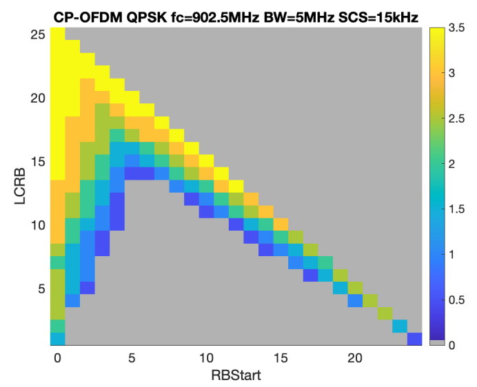{width="3.1496062992125986in"
height="1.8858552055993in"}{width="3.1496062992125986in"
height="1.9917639982502187in"}

> \(a\) Band n28 (b) Band n5/8
>
> 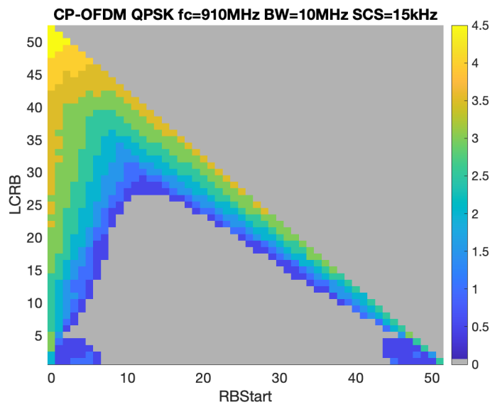{width="3.1496062992125986in"
> height="1.809278215223097in"}
>
> \(c\) Band n1

Figure 6.2.2.1-9: Lab 4: PDP measurement results for CDL-C UMi, (a) Band
n28, (b) Band n5/n8, (c) Band n1

{width="3.1496062992125986in"
height="1.7618810148731407in"}{width="3.1496062992125986in"
height="1.8312915573053368in"}

> \(a\) Band n28 (b) Band n5/8
>
> {width="3.1496062992125986in"
> height="1.9614741907261593in"}
>
> \(c\) Band n1

Figure 6.2.2.1-10: Lab 5: PDP measurement results for CDL-C UMi, (a)
Band n28, (b) Band n5/n8, (c) Band n1

{width="3.1496062992125986in"
height="1.7914545056867892in"}

> \(a\) Band n28
>
> {width="3.1496062992125986in"
> height="1.5488932633420822in"}{width="3.1496062992125986in"
> height="1.5471981627296587in"}
>
> \(b\) Band n5/8 (c) Band n1

Figure 6.2.2.1-11: Lab 6: PDP measurement results for CDL-C UMi, (a)
Band n28, (b) Band n5/n8, (c) Band n1

{width="4.371527777777778in"
height="2.0694444444444446in"}

Figure 6.2.2.1-12: Lab 7: PDP measurement results for CDL-C UMi at Band
n28

#### 6.2.2.2 Doppler/Temporal correlation 

The Doppler should be validated in a Beam-Specific manner. It is assumed
that the beams are mapped to the inputs of the channel emulator as
follows:

\- Beam 1: Input 1 and Input 2

\- Beam 2: Input 3 and Input 4 (CDL-C UMa only)

The Doppler measurement results of UMa CDL-C for bands n41, n78, and n1
are presented in Figures 6.2.2.2-1\~6.

{width="3.1493055555555554in"
height="2.3618055555555557in"}{width="3.1493055555555554in"
height="2.3618055555555557in"}

(a-1) Beam 1, H11 (a-2) Beam 2, H11

{width="3.1493055555555554in"
height="2.3618055555555557in"}{width="3.1493055555555554in"
height="2.3618055555555557in"}

(a-3) Beam 1, H12 (a-4) Beam 2, H12

{width="3.161111111111111in"
height="2.3618055555555557in"}
{width="3.1430555555555557in"
height="2.3618055555555557in"}

(a-5) Beam 1, H12 (a-6) Beam 2, H12

{width="3.161111111111111in"
height="2.3618055555555557in"}
{width="3.1430555555555557in"
height="2.3618055555555557in"}

(a-7) Beam 1, X2V (a-8) Beam 2, X2V

\(a\) Band n41

{width="3.1493055555555554in"
height="2.3618055555555557in"}{width="3.1493055555555554in"
height="2.3618055555555557in"}

(b-1) Beam 1, H11 (b-2) Beam 2, H11

{width="3.202777777777778in"
height="2.411111111111111in"}
{width="3.341666666666667in"
height="2.504861111111111in"}

(b-3) Beam 1, X2V (b-4) Beam 2, X2V

\(b\) Band n78

{width="3.26784230096238in"
height="2.283464566929134in"}{width="3.3241852580927382in"
height="2.322834645669291in"}

**(c-1) Beam 1, X2V (c-1) Beam 2, X2V**

**(c) Band n1**

Figure 6.2.2.2-1: Lab 1: Doppler measurement results for CDL-C UMa, (a)
Band n41 with different beams and different polarizations; (b) Band n78
with different beams and different polarizations; (c) Band n1 with
different beams

{width="3.1527777777777777in"
height="2.3618055555555557in"}{width="3.1527777777777777in"
height="2.3618055555555557in"}

\(a\) Band n41

{width="3.203472222222222in"
height="2.3618055555555557in"}{width="3.1527777777777777in"
height="2.3618055555555557in"}

\(b\) Band n78

{width="3.1496062992125986in"
height="2.3622047244094486in"}{width="3.150858486439195in"
height="2.3622047244094486in"}

**(c) Band n1**

Figure 6.2.2.2-2: Lab 2: Doppler measurement results for CDL-C UMa, (a)
Band n41, beam 1 and beam 2; (b) Band n78, beam 1 and beam 2; (c) Band
n1, beam 1 and beam 2

{width="3.1506944444444445in"
height="2.3618055555555557in"}{width="3.1506944444444445in"
height="2.3618055555555557in"}

{width="3.1506944444444445in"
height="2.3618055555555557in"}

\(a\) Band n41

{width="3.1506944444444445in"
height="2.3618055555555557in"}{width="3.1506944444444445in"
height="2.3618055555555557in"}

\(b\) Band n78

{width="3.1506944444444445in"
height="2.3618055555555557in"}{width="3.1506944444444445in"
height="2.3618055555555557in"}

\(c\) Band n79

Figure 6.2.2.2-3: Lab 3: Doppler measurement results for CDL-C UMa, (a)
Band n41, beam 1, beam 2, and combined beams; (b) Band n78, beam 1 and
beam 2; (c) Band n79, beam 1 and beam 2

{width="2.779166666666667in"
height="1.5881944444444445in"}
{width="2.736111111111111in"
height="1.5743055555555556in"}

\(a\) Band n41

{width="2.6659722222222224in"
height="1.5743055555555556in"}
{width="2.6659722222222224in"
height="1.5743055555555556in"}

\(b\) Band n78

Figure 6.2.2.2-4: Lab 4: Doppler measurement results for CDL-C UMa, (a)
Band n41, beam 1 and beam 2; (b) Band n78, beam 1 and beam 2

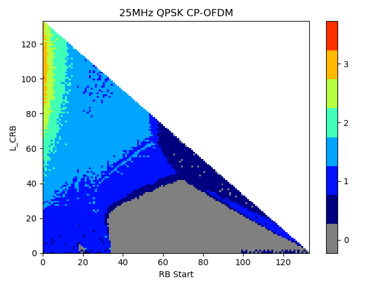{width="2.9133858267716537in"
height="2.3622047244094486in"}
{width="2.9133858267716537in"
height="2.3622047244094486in"}

\(a\) Band n41

{width="2.9133858267716537in"
height="2.3622047244094486in"}
{width="2.9133858267716537in"
height="2.3622047244094486in"}

\(b\) Band n78

{width="3.1496062992125986in"
height="1.968503937007874in"}
{width="3.1496062992125986in"
height="1.968503937007874in"}

\(c\) Band n1

Figure 6.2.2.2-5: Lab 5: Doppler measurement results for CDL-C UMa, (a)
Band n41, beam 1 and beam 2; (b) Band n78, beam 1 and beam 2; (c) Band
n1, beam 1 and beam 2

{width="2.8340277777777776in"
height="2.3618055555555557in"} {width="2.8118055555555554in"
height="2.3618055555555557in"}

\(a\) Band n41

{width="2.8340277777777776in"
height="2.3618055555555557in"} {width="2.8340277777777776in"
height="2.3618055555555557in"}

\(b\) Band n78

{width="5.907656386701662in"
height="2.3622047244094486in"}

\(c\) Band n1

Figure 6.2.2.2-6: Lab 6: Doppler measurement results for CDL-C UMa, (a)
Band n41, beam 1 and beam 2; (b) Band n78, beam 1 and beam 2; (c) Band
n1, beam 1 and beam 2

The Doppler measurement results of UMi CDL-C for bands n28, n5/n8, n1
are presented in Figures 6.2.2.2-7\~12.

{width="3.1496062992125986in"
height="2.200417760279965in"}{width="3.1496062992125986in"
height="2.1984798775153105in"}

> \(a\) Band n28 (b) Band n5/8
>
> {width="3.1496062992125986in"
> height="2.1998698600174977in"}
>
> \(c\) Band n1

Figure 6.2.2.2-7: Lab 1: Doppler measurement results for CDL-C UMi, (a)
Band n28, (b) Band n5/n8, (c) Band n1

{width="3.1496062992125986in"
height="2.360858486439195in"}{width="3.1496062992125986in"
height="2.3593602362204726in"}

> \(a\) Band n28 (b) Band n5/8
>
> {width="3.1496062992125986in"
> height="2.3593602362204726in"}
>
> \(c\) Band n1

Figure 6.2.2.2-8: Lab 2: Doppler measurement results for CDL-C UMi, (a)
Band n28, (b) Band n5/n8, (c) Band n1

{width="3.1496062992125986in"
height="1.9701935695538058in"}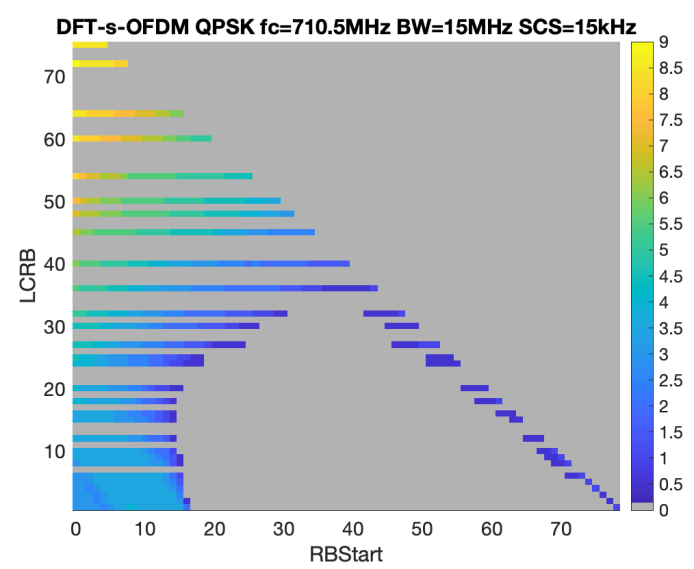{width="3.1496062992125986in"
height="2.010005468066492in"}

> \(a\) Band n28 (b) Band n5/8
>
> {width="3.1496062992125986in"
> height="2.1845352143482066in"}
>
> \(c\) Band n1

Figure 6.2.2.2-9: Lab 4: Doppler measurement results for CDL-C UMi, (a)
Band n28, (b) Band n5/n8, (c) Band n1

{width="3.937007874015748in"
height="1.856078302712161in"}

> \(a\) Band n28

{width="3.1496062992125986in"
height="1.8790463692038495in"}
{width="3.1496062992125986in"
height="1.8868471128608924in"}

\(b\) Band n5/8 (c) Band n1

Figure 6.2.2.2-10: Lab 5: Doppler measurement results for CDL-C UMi, (a)
Band n28, (b) Band n5/n8, (c) Band n1

{width="3.1496062992125986in"
height="2.363240376202975in"}{width="3.1496062992125986in"
height="2.2896587926509184in"}

> \(a\) Band n28 (b) Band n5/8
>
> {width="3.1496062992125986in"
> height="2.3619597550306213in"}
>
> \(c\) Band n1

Figure 6.2.2.2-11: Lab 6: Doppler measurement results for CDL-C UMi, (a)
Band n28, (b) Band n5/n8, (c) Band n1

{width="3.9659722222222222in"
height="2.0229166666666667in"}

Figure 6.2.2.2-12: Lab 7: Doppler measurement results for CDL-C UMi at
Band n28

#### 6.2.2.3 Spatial correlation

The Spatial correlation should be validated in a Beam-Combined manner.
It is assumed that the beams are mapped to the inputs of the channel
emulator as follows:

\- Beam 1: Input 1 and Input 2

\- Beam 2: Input 3 and Input 4 (CDL-C UMa only)

\- Combined beam for CDL-C UMa: Input 1 + Input 2 + Input 3 + Input 4

\- Combined beam for CDL-C UMi: Input 1 + Input 2

The Spatial correlation measurement results of UMa CDL-C for bands n41,
n78, and n1 are presented in Figures 6.2.2.3-1\~6.

{width="3.1493055555555554in"
height="2.3618055555555557in"}
{width="3.1493055555555554in"
height="2.3618055555555557in"}

{width="3.1444444444444444in"
height="2.3618055555555557in"}

\(a\) Band n41

{width="3.1527777777777777in"
height="2.3618055555555557in"}

\(b\) Band n78

{width="3.379861111111111in"
height="2.362185039370079in"}

**(c) Band n1**

Figure 6.2.2.3-1: Lab 1: Spatial correlation measurement results for
CDL-C UMa, (a) Band n41, beam 1, beam 2, and combined beams; (b) Band
n78, combined beams; (c) Band n78, combined beams

{width="3.1493055555555554in"
height="2.3618055555555557in"}{width="3.1493055555555554in"
height="2.3618055555555557in"}

\(a\) Band n41 (b) Band n78

{width="3.1507294400699912in"
height="2.3622047244094486in"}

**(c) Band n1**

Figure 6.2.2.3-2: Lab 2: Spatial correlation measurement results for
CDL-C UMa, (a) Band n41 with combined beams; (b) Band n78 with combined
beams; (c) Band n1 with combined beams

{width="3.1506944444444445in"
height="2.3618055555555557in"}{width="3.1506944444444445in"
height="2.3618055555555557in"}{width="3.1506944444444445in"
height="2.3618055555555557in"}

\(a\) Band n41

{width="3.1506944444444445in"
height="2.3618055555555557in"}

\(b\) Band n78

Figure 6.2.2.3-3: Lab 3: Spatial correlation measurement results for
CDL-C UMa, (a) Band n41, beam 1, beam 2, and combined beams; (b) Band
n78, combined beams

{width="4.574305555555555in"
height="2.7555555555555555in"}

\(a\) Band n41

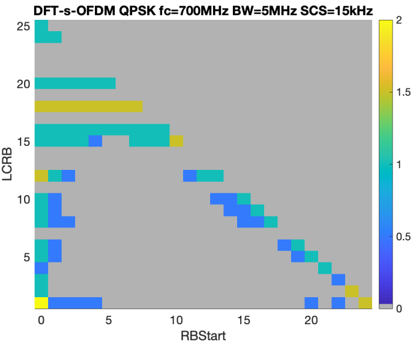{width="4.540277777777778in"
height="2.2916666666666665in"}

\(b\) Band n78

Figure 6.2.2.3-4: Lab 4: Spatial correlation measurement results for
CDL-C UMa, (a) Band n41, combined beams; (b) Band n78, combined beams

{width="4.739884076990376in"
height="1.9772878390201225in"}

\(a\) Band n41

{width="4.734104330708662in"
height="2.341758530183727in"}

\(b\) Band n78

{width="4.7226848206474195in"
height="2.2016010498687666in"}

\(c\) Band n1

Figure 6.2.2.3-5: Lab 5: Spatial correlation measurement results for
CDL-C UMa, (a) Band n41, combined beams; (b) Band n78, combined beams;
(c) Band n1, combined beams.

{width="4.330555555555556in"
height="2.373611111111111in"}

\(a\) Band n41

{width="4.330555555555556in"
height="2.373611111111111in"}

\(b\) Band n78

{width="5.1464009186351705in"
height="2.559055118110236in"}

**(c) Band n1**

Figure 6.2.2.3-6: Lab 6: Spatial correlation measurement results for
CDL-C UMa, (a) Band n41, combined beams; (b) Band n78, combined beams;
(c) Band n1 with combined beams

The Spatial correlation measurement results of UMi CDL-C for bands n28,
n5/n8, n1 are presented in Figures 6.2.2.3-7\~12.

{width="3.1496062992125986in"
height="2.201078302712161in"}{width="3.1496062992125986in"
height="2.2021194225721783in"}

> \(a\) Band n28 (b) Band n5/8
>
> {width="3.1496062992125986in"
> height="2.2009339457567805in"}
>
> \(c\) Band n1

Figure 6.2.2.3-7: Lab 1: Spatial correlation measurement results for
CDL-C UMi, (a) Band n28, (b) Band n5/n8, (c) Band n1

{width="3.1496062992125986in"
height="2.3610793963254593in"}{width="3.1496062992125986in"
height="2.3593602362204726in"}

> \(a\) Band n28 (b) Band n5/8
>
> {width="3.1496062992125986in"
> height="2.361266404199475in"}
>
> \(c\) Band n1

Figure 6.2.2.3-8: Lab 2: Spatial correlation measurement results for
CDL-C UMi, (a) Band n28, (b) Band n5/n8, (c) Band n1

[\[CHART\]]{.chart}

> \(a\) Band n28
>
> 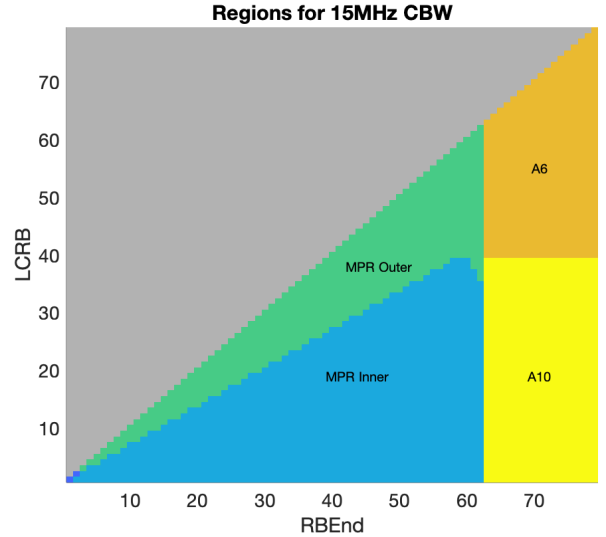{width="4.382638888888889in"
> height="2.595833333333333in"}
>
> \(b\) Band n5/8
>
> {width="4.476388888888889in"
> height="2.6256944444444446in"}
>
> \(c\) Band n1

Figure 6.2.2.3-9: Lab 4: Spatial correlation measurement results for
CDL-C UMi, (a) Band n28, (b) Band n5/n8, (c) Band n1

{width="3.1496062992125986in"
height="1.720161854768154in"}
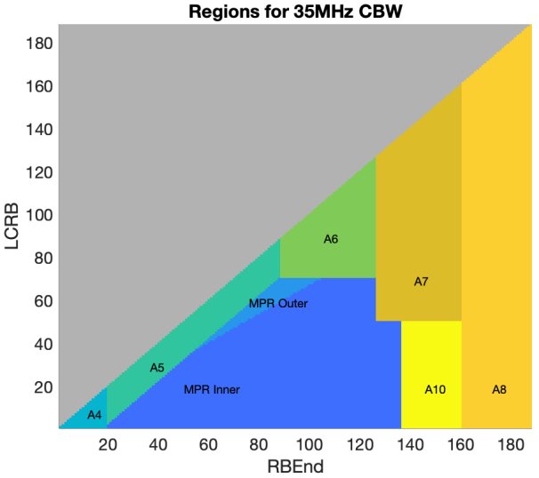{width="3.1496062992125986in"
height="1.726246719160105in"}

> \(a\) Band n28 (b) Band n5/8
>
> {width="3.1496062992125986in"
> height="1.8239238845144357in"}

\(c\) Band n1

Figure 6.2.2.3-10: Lab 5: Spatial correlation measurement results for
CDL-C UMi, (a) Band n28, (b) Band n5/n8, (c) Band n1

{width="4.330708661417323in"
height="2.053959973753281in"}

> \(a\) Band n28
>
> {width="4.724409448818897in"
> height="2.5074529746281713in"}
>
> \(b\) Band n5/8
>
> {width="4.724409448818897in"
> height="2.526246719160105in"}

\(c\) Band n1

Figure 6.2.2.3-11: Lab 6: Spatial correlation measurement results CDL-C
UMi, (a) Band n28, (b) Band n5/n8, (c) Band n1

{width="4.540277777777778in"
height="2.341666666666667in"}

Figure 6.2.2.3-12: Lab 7: Spatial correlation measurement results for
CDL-C UMi at Band n28

#### 6.2.2.4 Cross-polarization

The Cross-polarization should be validated in a Beam-Specific manner. It
is assumed that the beams are mapped to the inputs of the channel
emulator as follows:

\- Beam 1: Input 1 and Input 2

\- Beam 2: Input 3 and Input 4 (CDL-C UMa only)

The Cross-polarization measurement results of UMa CDL-C for bands n41,
n78, and n1 are presented in Table 6.2.2.4-1\~6.

Table 6.2.2.4-1: Lab 1: Cross-polarization verification results for
CDL-C UMa, bands n41, n78, and n1

  **Frequency**          **Beam**   **Reference**            **Measurement result**   **Pass/fail limit**
  ---------------------- ---------- ------------------------ ------------------------ ---------------------
  fc = 2450 MHz (n41)    Beam 1     Input 1+2:  V/H = 0 dB   0.44 dB                  ±1 dB
                         Beam 2     Input 3+4:  V/H = 0 dB   0.55 dB                  
  fc = 3600 MHz (n78)    Beam 1     Input 1+2:  V/H = 0 dB   0.49 dB                  
                         Beam 2     Input 3+4:  V/H = 0 dB   0.58 dB                  
  fc = 2132.5 MHz (n1)   Beam 1     Input 1+2:  V/H = 0 dB   0.59 dB                  
                         Beam 2     Input 3+4:  V/H = 0 dB   -0.14 dB                 

Table 6.2.2.4-2: Lab 2: Cross-polarization verification results for
CDL-C UMa, bands n41, n78, and n1

+-------------+----------+-------------+-------------+-------------+
| **          | **Beam** | **          | **          | **Pass/fail |
| Frequency** |          | Reference** | Measurement | limit**     |
|             |          |             | result**    |             |
+=============+==========+=============+=============+=============+
| fc = 2450   | Beam 1   | Input 1:    | Input 1:    | ±1 dB       |
| MHz (n41)   |          | V/H = -0.5  | V/H = -0.96 |             |
|             |          | dB          | dB          |             |
|             |          |             |             |             |
|             |          | Input 2:    | Input 2:    |             |
|             |          | V/H = 0.6   | V/H = 0.94  |             |
|             |          | dB          | dB          |             |
+-------------+----------+-------------+-------------+-------------+
|             | Beam 2   | Input 3:    | Input 3:    |             |
|             |          | V/H = -0.6  | V/H = -0.11 |             |
|             |          | dB          | dB          |             |
|             |          |             |             |             |
|             |          | Input 4:    | Input 4:    |             |
|             |          | V/H = 0.7   | V/H = 0.71  |             |
|             |          | dB          | dB          |             |
+-------------+----------+-------------+-------------+-------------+
| fc = 3600   | Beam 1   | Input 1:    | Input 1:    |             |
| MHz (n78)   |          | V/H = -0.6  | V/H = -0.51 |             |
|             |          | dB          | dB          |             |
|             |          |             |             |             |
|             |          | Input 2:    | Input 2:    |             |
|             |          | V/H = 0.7   | V/H = 1.19  |             |
|             |          | dB          | dB          |             |
+-------------+----------+-------------+-------------+-------------+
|             | Beam 2   | Input 3:    | Input 3:    |             |
|             |          | V/H = -0.7  | V/H = -0.41 |             |
|             |          | dB          | dB          |             |
|             |          |             |             |             |
|             |          | Input 4:    | Input 4:    |             |
|             |          | V/H = 0.8   | V/H = 0.47  |             |
|             |          | dB          | dB          |             |
+-------------+----------+-------------+-------------+-------------+
| fc = 2132.5 | Beam 1   | Input 1+2:  | Input 1+2:  |             |
| MHz (n1)    |          | V/H = 0 dB  | V/H = 0.31  |             |
|             |          |             | dB          |             |
+-------------+----------+-------------+-------------+-------------+
|             | Beam 2   | Input 3+4:  | Input 3+4:  |             |
|             |          | V/H = 0 dB  | V/H = -0.25 |             |
|             |          |             | dB          |             |
+-------------+----------+-------------+-------------+-------------+

Table 6.2.2.4-3: Lab 3: Cross-polarization verification results for
CDL-C UMa, bands n41 and n78

+-------------+----------+-------------+-------------+-------------+
| **          | **Beam** | **          | **          | **Pass/fail |
| Frequency** |          | Reference** | Measurement | limit**     |
|             |          |             | result**    |             |
+=============+==========+=============+=============+=============+
| fc = 2450   | Beam 1   | Input 1:    | Input 1:    | ±1 dB       |
| MHz (n41)   |          | V/H = -0.5  | V/H = -0.98 |             |
|             |          | dB          | dB          |             |
|             |          |             |             |             |
|             |          | Input 2:    | Input 2:    |             |
|             |          | V/H = 0.6   | V/H = 0.63  |             |
|             |          | dB          | dB          |             |
|             |          |             |             |             |
|             |          | Input 1+    | Input 1+    |             |
|             |          | 2:  V/H = 0 | 2:  V/H =   |             |
|             |          | dB          | -0.21 dB    |             |
+-------------+----------+-------------+-------------+-------------+
|             | Beam 2   | Input 3:    | Input 3:    |             |
|             |          | V/H = -0.6  | V/H =       |             |
|             |          | dB          | -1.1dB      |             |
|             |          |             |             |             |
|             |          | Input 4:    | Input 4:    |             |
|             |          | V/H = 0.7   | V/H = -0.07 |             |
|             |          | dB          | dB          |             |
|             |          |             |             |             |
|             |          | Input 3+4:  | Input 3+4:  |             |
|             |          | V/H = 0 dB  | V/H = -0.60 |             |
|             |          |             | dB          |             |
+-------------+----------+-------------+-------------+-------------+
| fc = 3600   | Beam 1   | Input 1:    | Input 1:    |             |
| MHz (n78)   |          | V/H = -0.6  | V/H = -0.45 |             |
|             |          | dB          |             |             |
|             |          |             | Input 2:    |             |
|             |          | Input 2:    | V/H = 1.32  |             |
|             |          | V/H = 0.7   | dB          |             |
|             |          | dB          |             |             |
|             |          |             | Input 1+    |             |
|             |          | Input 1+    | 2:  V/H =   |             |
|             |          | 2:  V/H = 0 | 0.39 dB     |             |
|             |          | dB          |             |             |
+-------------+----------+-------------+-------------+-------------+
|             | Beam 2   | Input 3:    | Input 3:    |             |
|             |          | V/H = -0.7  | V/H = 0.25  |             |
|             |          | dB          |             |             |
|             |          |             | Input 4:    |             |
|             |          | Input 4:    | V/H = 1.61  |             |
|             |          | V/H = 0.8   |             |             |
|             |          | dB          | Input 3+4:  |             |
|             |          |             | V/H = 0.91  |             |
|             |          | Input 3+4:  | dB          |             |
|             |          | V/H = 0 dB  |             |             |
+-------------+----------+-------------+-------------+-------------+

Table 6.2.2.4-4: Lab 4: Cross-polarization verification results for
CDL-C UMa, bands n41 and n78

+-------------+----------+-------------+-------------+-------------+
| **          | **Beam** | **          | **          | **Pass/fail |
| Frequency** |          | Reference** | Measurement | limit**     |
|             |          |             | result**    |             |
+=============+==========+=============+=============+=============+
| fc = 2450   | Beam 1   | Input 1:    | Input 1:    | ±1 dB       |
| MHz (n41)   |          | V/H = -0.5  | V/H = -0.48 |             |
|             |          | dB          | dB          |             |
|             |          |             |             |             |
|             |          | Input 2:    | Input 2:    |             |
|             |          | V/H = 0.6   | V/H = 0.57  |             |
|             |          | dB          | dB          |             |
|             |          |             |             |             |
|             |          | Input 1+    | Input 1+    |             |
|             |          | 2:  V/H = 0 | 2:  V/H =   |             |
|             |          | dB          | 0.36 dB     |             |
+-------------+----------+-------------+-------------+-------------+
|             | Beam 2   | Input 3:    | Input 3:    |             |
|             |          | V/H = -0.6  | V/H = -0.69 |             |
|             |          | dB          | dB          |             |
|             |          |             |             |             |
|             |          | Input 4:    | Input 4:    |             |
|             |          | V/H = 0.7   | V/H = 0.71  |             |
|             |          | dB          | dB          |             |
|             |          |             |             |             |
|             |          | Input 3+4:  | Input 3+4:  |             |
|             |          | V/H = 0 dB  | V/H = 0.52  |             |
|             |          |             | dB          |             |
+-------------+----------+-------------+-------------+-------------+
| fc = 3600   | Beam 1   | Input 1:    | Input 1:    |             |
| MHz (n78)   |          | V/H = -0.6  | V/H = -0.48 |             |
|             |          | dB          |             |             |
|             |          |             | Input 2:    |             |
|             |          | Input 2:    | V/H = 0.99  |             |
|             |          | V/H = 0.7   | dB          |             |
|             |          | dB          |             |             |
|             |          |             | Input 1+    |             |
|             |          | Input 1+    | 2:  V/H =   |             |
|             |          | 2:  V/H = 0 | 0.47 dB     |             |
|             |          | dB          |             |             |
+-------------+----------+-------------+-------------+-------------+
|             | Beam 2   | Input 3:    | Input 3:    |             |
|             |          | V/H = -0.7  | V/H = -0.34 |             |
|             |          | dB          |             |             |
|             |          |             | Input 4:    |             |
|             |          | Input 4:    | V/H = 1.13  |             |
|             |          | V/H = 0.8   |             |             |
|             |          | dB          | Input 3+4:  |             |
|             |          |             | V/H = 0.66  |             |
|             |          | Input 3+4:  | dB          |             |
|             |          | V/H = 0 dB  |             |             |
+-------------+----------+-------------+-------------+-------------+

Table 6.2.2.4-5: Lab 5: Cross-polarization verification results for
CDL-C UMa, band n41, n78 and n1

  **Frequency**          **Beam**   **Reference**            **Measurement result**   **Pass/fail limit**
  ---------------------- ---------- ------------------------ ------------------------ ---------------------
  fc = 2450 MHz (n41)    Beam 1     Input 1+2:  V/H = 0 dB   0.38 dB                  ±1 dB
                         Beam 2     Input 3+4:  V/H = 0 dB   0.12 dB                  
  fc = 3600 MHz (n78)    Beam 1     Input 1+2:  V/H = 0 dB   -0.25dB                  
                         Beam 2     Input 3+4:  V/H = 0 dB   0.34dB                   
  fc = 2132.5 MHz (n1)   Beam 1     Input 1+2:  V/H = 0 dB   -0.18 dB                 
                         Beam 2     Input 3+4:  V/H = 0 dB   -0.05 dB                 

Table 6.2.2.4-6: Lab 6: Cross-polarization verification results for
CDL-C UMa, bands n41, n78, and n1

  **Frequency**          **Beam**   **Reference**            **Measurement result**   **Pass/fail limit**
  ---------------------- ---------- ------------------------ ------------------------ ---------------------
  fc = 2450 MHz (n41)    Beam 1     Input 1+2:  V/H = 0 dB   -0.6555 dB               ±1 dB
                         Beam 2     Input 3+4:  V/H = 0 dB   -0.0676 dB               
  fc = 3600 MHz (n78)    Beam 1     Input 1+2:  V/H = 0 dB   0.5064 dB                
                         Beam 2     Input 3+4:  V/H = 0 dB   0.6414 dB                
  fc = 2132.5 MHz (n1)   Beam 1     Input 1+2:  V/H = 0 dB   -0.75 dB                 
                         Beam 2     Input 3+4:  V/H = 0 dB   -0.05 dB                 

The Cross-polarization measurement results of UMi CDL-C for bands n28,
n5/n8, n1 are presented in Table 6.2.2.4-7\~12.

Table 6.2.2.4-7: Lab 1: Cross-polarization verification results for
CDL-C UMi, Bands n28, n5/n8, n1

  Frequency                Beam     Reference                Measurement result   Pass/fail limit
  ------------------------ -------- ------------------------ -------------------- -----------------
  fc = 722 MHz (n28)       Beam 1   Input 1+2: V/H = 0 dB    V/H = -0.08 dB       ±1 dB
  fc = 836.5 MHz (n5/n8)   Beam 1   Input 1+2:  V/H = 0 dB   V/H = 0.27 dB        
  fc = 2132.5 MHz (n1)     Beam 1   Input 1+2:  V/H = 0 dB   V/H = 0.59 dB        

Table 6.2.2.4-8: Lab 2: Cross-polarization verification results for
CDL-C UMi, Bands n28, n5/n8, n1

+-------------+----------+-------------+-------------+-------------+
| Frequency   | > Beam   | > Reference | >           | > Pass/fail |
|             |          |             | Measurement | > limit     |
|             |          |             | > result    |             |
+=============+==========+=============+=============+=============+
| > fc = 722  | > Beam 1 | > Input     | > V/H =     | > ±1 dB     |
| > MHz (n28) |          | > 1+2: V/H  | > 0.15 dB   |             |
|             |          | > = 0 dB    |             |             |
+-------------+----------+-------------+-------------+-------------+
| > f = 836.5 | > Beam 1 | > Input     | > V/H =     |             |
| > MHz       |          | > 1+2:  V/H | > -0.47 dB  |             |
| > (n5/n8)   |          | > = 0 dB    |             |             |
+-------------+----------+-------------+-------------+-------------+
| > f =       | > Beam 1 | > Input     | > V/H =     |             |
| > 2132.5    |          | > 1+2:  V/H | > 0.49 dB   |             |
| > MHz (n1)  |          | > = 0 dB    |             |             |
+-------------+----------+-------------+-------------+-------------+

Table 6.2.2.4-9: Lab 4: Cross-polarization verification results for
CDL-C UMi, Bands n28, n5/n8, n1

+-------------+----------+-------------+-------------+-------------+
| Frequency   | > Beam   | > Reference | >           | > Pass/fail |
|             |          |             | Measurement | > limit     |
|             |          |             | > result    |             |
+=============+==========+=============+=============+=============+
| > fc = 722  | > Beam 1 | > Input     | > V/H =     | > ±1 dB     |
| > MHz (n28) |          | > 1+2: V/H  | > -0.14 dB  |             |
|             |          | > = 0 dB    |             |             |
+-------------+----------+-------------+-------------+-------------+
| > fc =      | > Beam 1 | > Input     | > V/H =     |             |
| > 836.5 MHz |          | > 1+2: V/H  | > 0.82 dB   |             |
| > (n5/n8)   |          | > = 0 dB    |             |             |
+-------------+----------+-------------+-------------+-------------+
| > fc =      | > Beam 1 | > Input     | > V/H =     |             |
| > 2132.5    |          | > 1+2: V/H  | > 0.53 dB   |             |
| > MHz (n1)  |          | > = 0 dB    |             |             |
+-------------+----------+-------------+-------------+-------------+

Table 6.2.2.4-10: Lab 5: Cross-polarization verification results for
CDL-C UMi, Bands n28, n5/n8, n1

+-------------+----------+-------------+-------------+-------------+
| Frequency   | > Beam   | > Reference | >           | > Pass/fail |
|             |          |             | Measurement | > limit     |
|             |          |             | > result    |             |
+=============+==========+=============+=============+=============+
| > fc = 722  | > Beam 1 | > Input     | > V/H =     | > ±1 dB     |
| > MHz (n28) |          | > 1+2: V/H  | > -0.09 dB  |             |
|             |          | > = 0 dB    |             |             |
+-------------+----------+-------------+-------------+-------------+
| > fc =      | > Beam 1 | > Input     | > V/H =     |             |
| > 836.5 MHz |          | > 1+2: V/H  | > -0.33 dB  |             |
| > (n5/n8)   |          | > = 0 dB    |             |             |
+-------------+----------+-------------+-------------+-------------+
| > fc =      | > Beam 1 | > Input     | > V/H =     |             |
| > 2132.5    |          | > 1+2: V/H  | > -0.47 dB  |             |
| > MHz (n1)  |          | > = 0 dB    |             |             |
+-------------+----------+-------------+-------------+-------------+

Table 6.2.2.4-11: Lab 6: Cross-polarization verification results for
CDL-C UMi, Bands n28, n5/n8, n1

+-------------+----------+-------------+-------------+-------------+
| Frequency   | > Beam   | > Reference | >           | > Pass/fail |
|             |          |             | Measurement | > limit     |
|             |          |             | > result    |             |
+=============+==========+=============+=============+=============+
| > fc = 722  | > Beam 1 | > Input     | > V/H =     | > ±1 dB     |
| > MHz (n28) |          | > 1+2: V/H  | > 0.59 dB   |             |
|             |          | > = 0 dB    |             |             |
+-------------+----------+-------------+-------------+-------------+
| > fc =      | > Beam 1 | > Input     | > V/H =     |             |
| > 836.5 MHz |          | > 1+2: V/H  | > 0.41 dB   |             |
| > (n5/n8)   |          | > = 0 dB    |             |             |
+-------------+----------+-------------+-------------+-------------+
| > fc =      | > Beam 1 | > Input     | > V/H =     |             |
| > 2132.5    |          | > 1+2: V/H  | > -0.74 dB  |             |
| > MHz (n1)  |          | > = 0 dB    |             |             |
+-------------+----------+-------------+-------------+-------------+

Table 6.2.2.4-12: Lab 7: Cross-polarization verification results for
CDL-C UMi, Band n28

  Frequency            Beam     Reference               Measurement result   Pass/fail limit
  -------------------- -------- ----------------------- -------------------- -----------------
  fc = 722 MHz (n28)   Beam 1   Input 1+2: V/H = 0 dB   V/H = -0.71 dB       ±1 dB

#### 6.2.2.5 Power validation

The Power validation results of UMa CDL-C for bands n41, n78, and n1 are
presented in Table 6.2.2.5-1\~5.

Table 6.2.2.5-1: Lab 1: Power validation results for CDL-C UMa, bands
n41, n78, and n1 (Unit: dBm/30kHz)

  Frequency     Measured V power   Measured H power   Measured total power   Target power   Delta      Pass/fail limit
  ------------- ------------------ ------------------ ---------------------- -------------- ---------- -----------------
  2592.99 MHz   -79.6244           -79.5959           -76.5999               -77            0.4001     ±1.5 dB
  3549.99 MHz   -79.9988           -79.6618           -76.8168               -77            0.1832     
  2140 MHz      -83.7348           -82.9744           -80.3277               -80            -0.32768   

Table 6.2.2.5-2: Lab 2: Power validation results for CDL-C UMa, band n1
(Unit: dBm/30kHz)

+---------+---------+---------+---------+---------+---------+---------+
| > Fr    | > M     | > M     | > M     | >       | > Delta | > Pa    |
| equency | easured | easured | easured |  Target |         | ss/fail |
|         | > V     | > H     | > total | > power |         | > limit |
|         | > power | > power | > power |         |         |         |
+=========+=========+=========+=========+=========+=========+=========+
| > 2140  | >       | >       | > -     | > -82   | >       | > ±1.5  |
| > MHz   |  -83.42 |  -84.87 | 81.0745 |         |  -0.926 | > dB    |
+---------+---------+---------+---------+---------+---------+---------+

Table 6.2.2.5-3: Lab 4: Power validation results for CDL-C UMa, bands
n41 and n78 (Unit: dBm/30kHz)

+----------------+----------------+--------------+-----------+-----------------+
| Frequency      | Measured power | Target power | Delta     | Pass/fail limit |
+================+================+==============+===========+=================+
| CDL-C UMa, n41 | -80.8630082    | **-80.6**    | **-0.26** | ±1.5 dB         |
|                |                |              |           |                 |
| 2592.99 MHz    |                |              |           |                 |
+----------------+----------------+--------------+-----------+-----------------+
| CDL-C UMa, n78 | -80.9320026    | **-80.6**    | **-0.33** |                 |
|                |                |              |           |                 |
| 3549.99 MHz    |                |              |           |                 |
+----------------+----------------+--------------+-----------+-----------------+

Table 6.2.2.5-4: Lab 5: Power validation results for CDL-C UMa, bands
n41 and n78 (Unit: dBm/20MHz)

  Frequency       Measured power   Target power   Delta      Pass/fail limit
  --------------- ---------------- -------------- ---------- -----------------
  fc = 2593 MHz   -51.17           -50.22         -0.94dB    ±1.5dB
  fc = 3550 MHz   -51.76           -51.69         -0.07 dB   ±1.5dB
  fc = 2140MHz    -51.85           -51.6          0.21 dB    ±1.5 dB

Table 6.2.2.5-5 (a): Lab 6: Power validation results for CDL-C UMa, band
n41 (Unit: dBm/20MHz)

{width="3.564583333333333in"
height="4.091666666666667in"}

Table 6.2.2.5-5 (b): Lab 6: Power validation results for CDL-C UMa, band
n78 (Unit: dBm/20MHz)

{width="3.5569444444444445in"
height="4.086805555555555in"}

Table 6.2.2.5-5 (c): Lab 6: Power validation results for CDL-C UMa, band
n1 (Unit: dBm/20MHz)

> {width="3.2959186351706036in"
> height="1.5468208661417322in"}

The Power validation results of UMi CDL-C for bands n28, n5, n8, n1 are
presented in Table 6.2.2.5-6\~11.

Table 6.2.2.5-6: Lab 1: Power validation results for CDL-C UMi, Bands
n28, n5, n1 (Unit: dBm/15kHz)

+---------+---------+---------+---------+---------+---------+---------+
| Fr      | > M     | > M     | > M     | >       | > Delta | > Pa    |
| equency | easured | easured | easured |  Target |         | ss/fail |
|         | > V     | > H     | > total | > power |         | > limit |
|         | > power | > power | > power |         |         |         |
+=========+=========+=========+=========+=========+=========+=========+
| > 780.5 | > -     | > -     | > -     | > -80   | >       | > ±1.5  |
| > MHz   | 83.1288 | 82.9819 | 80.0444 |         | -0.0444 | > dB    |
+---------+---------+---------+---------+---------+---------+---------+
| > 881.5 | > -     | > -     | > -     | > -80   | >       |         |
| > MHz   | 83.0546 | 82.9918 | 80.0128 |         | -0.0128 |         |
+---------+---------+---------+---------+---------+---------+---------+
| > 2140  | > -     | > -     | > -     | > -80   | >       |         |
| > MHz   | 83.0176 | 83.3567 | 80.1736 |         | -0.1736 |         |
+---------+---------+---------+---------+---------+---------+---------+

Table 6.2.2.5-7: Lab 2: Power validation results for CDL-C UMi, Bands
n28, n5, n1 (Unit: dBm/15kHz)

  Frequency   Measured Power V component   Measured Power H component   Measured Power   Target power   Delta   Pass/fail limit
  ----------- ---------------------------- ---------------------------- ---------------- -------------- ------- -----------------
  780.5MHz    -83.432                      -83.036                      -80.219          -80            0.219   ±1.5dB
  881.5MHz    -85.812                      -84.695                      -82.207          -82            0.207   
  2140MHz     -84.32                       -86.6                        -82.302          -82            0.302   

Table 6.2.2.5-8: Lab 4: Power validation results for CDL-C UMi, Bands
n28, n5/n8, n1 (Unit: dBm/15kHz)

  Band    Measured power   Target power   Delta          Pass/fail limit
  ------- ---------------- -------------- -------------- -----------------
  n28     -70.6609811      -70.6          -0.06098109    ±1.5 dB
          -80.5325084      -80.6          0.067491565    
          -90.116428       -90.6          0.483572032    
  n5/n8   -72.616428       -72.6          -0.016427968   
          -83.3885489      -82.6          -0.788548853   
          -91.7793466      -92.6          0.82065336     
  n1      -82.6793466      -82.8          0.12065336     
          -93.3325084      -92.8          -0.532508435   
          -102.51643       -102.8         0.28356971     

Table 6.2.2.5-9: Lab 5: Power validation results for CDL-C UMi, Bands
n28, n5, n8, n1 (Unit: dBm/15kHz)

  Frequency   Measured power   Target power   Delta     Pass/fail limit
  ----------- ---------------- -------------- --------- -----------------
  780.5 MHz   -52.62           -52.12         0.5       ±1.5 dB
  881.5 MHz   -53.09           -52.67         0.42 dB   
  942.5 MHz   -53.47           -53.66         -0.19dB   
  2140 MHz    -60.25           -59.39         0.86dB    

Table 6.2.2.5-10: Lab 6: Power validation results for CDL-C UMi, Bands
n28, n5, n1 (Unit: dBm/10MHz)

  Frequency    Measured power   Target power   Delta   Pass/fail limit
  ------------ ---------------- -------------- ------- -----------------
  780.5 MHz    -49.64           -50.00         0.36    ±1.5 dB
  880.5 MHz    -49.26           -50.00         0.74    
  2132.5 MHz   -49.86           -50.00         0.14    

Table 6.2.2.5-11: Lab 7: Power validation results for CDL-C UMi, Band
n28 (Unit: dBm/15kHz)

  Frequency   Measured power   Target power   Delta    Pass/fail limit
  ----------- ---------------- -------------- -------- -----------------
  780.5 MHz   NA               NA             0.0002   ±1.5 dB

6.3 Verification of Channel Model implementation of FR2
-------------------------------------------------------

### 6.3.1 Framework

*This clause describes how to proceed Channel Model Validation for FR2
MIMO OTA with 3D-MPAC system.*

1\. The channel model validation measurements shall be performed as
described in Annex D.3 of TS 38.151, including:

\- Power delay profile (PDP)

\- Doppler/Temporal correlation

\- PAS similarity percentage (PSP)

\- Cross-polarization

\- Power validation

2\. Channel model: FR2 UMi CDL-C, as specified in Annex D.1 of TS 38.151

3\. Test frequency: as specified in Tables D.3.1-1 of TS 38.151

4\. Pass/fail limits: as defined in Annex D.2 of TS 38.151

### 6.3.2 Channel Model Validation Results

*This clause presents channel model validation results from different
labs with different* types of equipment and setup vendors. All the
validation results are included for comparison. Table 6.3.2-1 lists
equipment and setup vendors of different labs.

Table 6.3.2-1: Equipment and setup vendors of different labs (FR2)

  Labs    Channel Emulator   BS Simulator   System
  ------- ------------------ -------------- ------------
  Lab A   Vendor 1           Vendor A       Vendor I
  Lab B   Vendor 2           TBA            Vendor II
  Lab C   Vendor 1           TBA            Vendor III
  Lab D   Vendor 2           TBA            Vendor II
  Lab E   Vendor 1           TBA            Vendor III
  Lab F   Vendor 1           TBA            Vendor IV

#### 6.3.2.1 Power Delay Profile (PDP)

The PDP measurement results of UMi CDL-C for bands n261/28GHz are
presented in Figures 6.3.2.1-1\~6.

{width="3.6465277777777776in"
height="2.734722222222222in"}

Figure 6.3.2.1-1: Lab A: PDP measurement results for CDL-C UMi at 28GHz

{width="3.9166666666666665in"
height="2.767361111111111in"}

Figure 6.3.2.1-2: Lab B: PDP measurement results for CDL-C UMi at band
n261

{width="3.392361111111111in"
height="2.6930555555555555in"}

Figure 6.3.2.1-3: Lab C: PDP measurement results for CDL-C UMi at band
n261

{width="4.715277777777778in"
height="2.6930555555555555in"}

Figure 6.3.2.1-4: Lab D: PDP measurement results for CDL-C UMi at band
n261

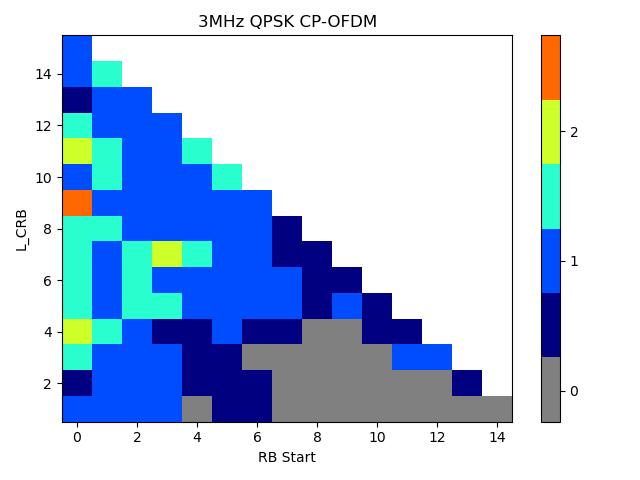{width="3.214583333333333in"
height="2.4006944444444445in"}

Figure 6.3.2.1-5 Lab E: PDP measurement results for CDL-C UMi at band
n261

{width="4.040972222222222in"
height="2.272222222222222in"}

Figure 6.3.2.1-6 Lab F: PDP measurement results for CDL-C UMi at 28GHz

#### 6.3.2.2 Doppler/Temporal correlation 

The Doppler measurement results of UMi CDL-C for bands n261/28GHz are
presented in Figures 6.3.2.2-1\~6.

{width="3.816666666666667in" height="2.8625in"}

Figure 6.3.2.2-1: Lab A: Doppler measurement results for CDL-C UMi at
band n261

{width="4.088888888888889in"
height="2.85625in"}

Figure 6.3.2.2-2: Lab B: Doppler measurement results for CDL-C UMi at
band n261

{width="3.917361111111111in"
height="2.9381944444444446in"}

Figure 6.3.2.2-3: Lab C: Doppler measurement results for CDL-C UMi at
28GHz

{width="4.663194444444445in"
height="2.796527777777778in"}

Figure 6.3.2.2-4: Lab D: Doppler measurement results for CDL-C UMi at
band n261

{width="3.2645833333333334in"
height="2.4680555555555554in"}

Figure 6.3.2.2-5: Lab E: Doppler measurement results for CDL-C UMi at
band n261

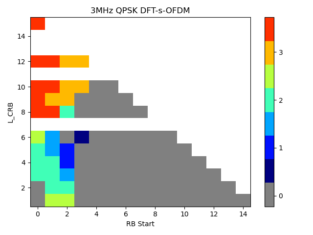{width="4.454861111111111in"
height="2.5854166666666667in"}

Figure 6.3.2.2-6: Lab F: Doppler measurement results for CDL-C UMi at
28GHz

#### 6.3.2.3 PAS similarity percentage (PSP)

The PAS measurement results of UMi CDL-C for band n261/28GHz are
presented in Figures 6.3.2.3-1\~6. The corresponding PSP values are
summarized in Table 6.3.2.3-1.

{width="6.565277777777778in"
height="3.282638888888889in"}

Figure 6.3.2.3-1: Lab A: PAS measurement results for CDL-C UMi at band
n261

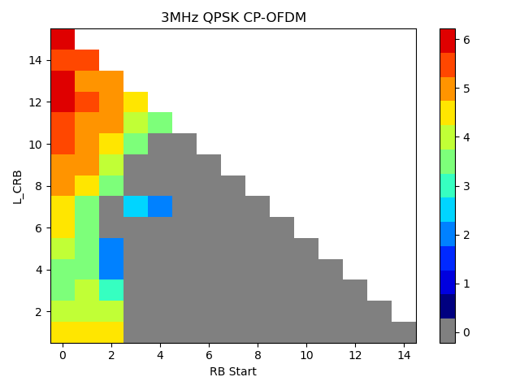{width="2.879861111111111in"
height="1.929861111111111in"} {width="2.9805555555555556in"
height="1.992361111111111in"}

\(a\) Ref. PAS Seen by DUT (b) Measured PAS Seen by DUT

Figure 6.3.2.3-2: Lab B: PAS measurement results for CDL-C UMi at band
n261

{width="3.640277777777778in"
height="2.7305555555555556in"}

Figure 6.3.2.3-3: Lab C: PAS measurement results for CDL-C UMi at band
n261

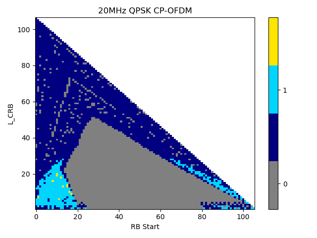{width="2.901388888888889in"
height="2.3618055555555557in"}
{width="2.6493055555555554in"
height="2.3618055555555557in"}

\(a\) Ref. PAS Seen by DUT (b) Measured PAS Seen by DUT

Figure 6.3.2.3-4: Lab D: PAS measurement results for CDL-C UMi at band
n261

{width="3.0541666666666667in"
height="2.8194444444444446in"}

Figure 6.3.2.3-5: Lab E: PAS measurement results for CDL-C UMi at band
n261

{width="4.733333333333333in" height="2.625in"}

Figure 6.3.2.3-6: Lab F: PAS measurement results for CDL-C UMi at band
n261

Table 6.3.2.3-1: PSP verification results for CDL-C UMi, band n261

  Lab     PSP value   Pass/fail limit
  ------- ----------- -----------------
  Lab A   91.4%       84%
  Lab B   89.7%       
  Lab C   94%         
  Lab D   86.2%       
  Lab E   91.3%       
  Lab F   90.9%       

#### 6.3.2.4 Cross-polarization

The Cross-polarization measurement results of UMi CDL-C for bands
n261/28GHz are presented in Table 6.3.2.4-1\~5.

Table 6.3.2.4-1: Lab A: Cross-polarization verification results for
CDL-C UMi, band n261

  Beam     Reference                 Measurement result   Delta     Pass/fail limit
  -------- ------------------------- -------------------- --------- -----------------
  Beam 1   Input 1: V/H = -0.45 dB   V/H = -0.38 dB       0.07 dB   ±1.5 dB
           Input 2: V/H = 0.49 dB    V/H = 0.76 dB        0.27 dB   
           Input 1+2: V/H = 0 dB     V/H =0.44dB          0.44 dB   

Table 6.3.2.4-2: Lab B: Cross-polarization verification results for
CDL-C UMi, band n261

  Beam     Reference                 Measurement result   Delta      Pass/fail limit
  -------- ------------------------- -------------------- ---------- -----------------
  Beam 1   Input 1: V/H = -0.45 dB   V/H = -0.70 dB       -0.25 dB   ±1.5 dB
           Input 2: V/H = 0.49 dB    V/H = 1.27 dB        0.78 dB    
           Input 1+2: V/H = 0 dB     V/H = -0.23dB        -0.23 dB   

Table 6.3.2.4-3: Lab C: Cross-polarization verification results for
CDL-C UMi, band n261

  Beam     Reference                 Measurement result   Delta      Pass/fail limit
  -------- ------------------------- -------------------- ---------- -----------------
  Beam 1   Input 1: V/H = -0.45 dB   V/H = 1.01 dB        1.46 dB    ±1.5 dB
           Input 2: V/H = 0.49 dB    V/H = -0.51 dB       -1.00 dB   

Table 6.3.2.4-4: Lab D: Cross-polarization verification results for
CDL-C UMi, band n261

  Beam     Reference               Measurement result   Delta      Pass/fail limit
  -------- ----------------------- -------------------- ---------- -----------------
  Beam 1   Input 1+2: V/H = 0 dB   V/H = -0.28dB        -0.28 dB   ±1.5 dB

Table 6.3.2.4-5: Lab E: Cross-polarization verification results for
CDL-C UMi, band n261

  Beam     Reference                 Measurement result   Delta      Pass/fail limit
  -------- ------------------------- -------------------- ---------- -----------------
  Beam 1   Input 1: V/H = -0.45 dB   V/H = -0.80 dB       -0.35 dB   ±1.5 dB
           Input 2: V/H = 0.49 dB    V/H = 1.01 dB        0.52 dB    
           Input 1+2: V/H = 0 dB     V/H = 0.76 dB        0.76 dB    

#### 6.3.2.5 Power validation

The Power validation results of UMi CDL-C for bands n261 are presented
in Table 6.3.2.5-1\~4.

Table 6.3.2.5-1: Lab A: Power validation results for CDL-C UMi, band
n261 (Unit: dBm/120kHz)

  Band   Measured EPRE   Target EPRE   Delta   Pass/fail limit
  ------ --------------- ------------- ------- -----------------
  n261   -74.3           -74           -0.3    ±1.5 dB

Table 6.3.2.5-2: Lab B: Power validation results for CDL-C UMi, band
n261 (Unit: dBm/120kHz)

  Band   Measured V power   Measured H power   Measured total power   Target power   Delta    Pass/fail limit
  ------ ------------------ ------------------ ---------------------- -------------- -------- -----------------
  n261   -110.314           -110.807           -107.543               -107           -0.543   ±1.5 dB

Table 6.3.2.5-3: Lab C: Power validation results for CDL-C UMi, band
n261 (Unit: dBm/120kHz)

  Band   Measured power   Target power   Delta   Pass/fail limit
  ------ ---------------- -------------- ------- -----------------
  n261   -43.96           -43.18         -0.78   ±1.5 dB

Table 6.3.2.5-4: Lab E: Power validation results for CDL-C UMi, band
n261 (Unit: dBm/120kHz)

  Band   Measured power   Target power   Delta   Pass/fail limit
  ------ ---------------- -------------- ------- -----------------
  n261   -42.16           -42.84         0.68    ±1.5 dB

7 Lab alignment of FR1 MIMO OTA
===============================

7.1 General
-----------

**To establish valid and trustable measurement data pools for defining
FR1 MIMO OTA requirements, lab alignment campaigns are required before
measurement campaign for ensuring there is no unexpected deviations
among labs. 3GPP RAN4 performed a lab alignment campaign for bands \>
1GHz during Rel-17, and a lab alignment campaign for bands \< 1GHz
during Rel-18.**

7.2 Noise impact in MPAC on MIMO performance
--------------------------------------------

This clause includes analysis and experimental measurement results of
the impact of noise in MPAC on FR1 MIMO OTA performance.

During Rel-18, several companies studied the impact of noise in MPAC on
FR1 MIMO OTA performance, conducted experiments, and obtained similar
observations. It was found that by adding suitable attenuators after the
amplifiers in MPAC system, the impact of noise can be eliminated and the
MIMO OTA measurement results can be corrected, as shown in Figure 7.2-1.

Figure 7.2-1: Measurement setup for *correcting FR1 MIMO OTA test
results with MPAC*

The measurement results (12 orientations average in FS DMP mode) at
bands n28 (780.5MHz) and n41 (2593MHz) obtained by Lab 1 are show in
Figure 7.2-2. The same DUT were measured with different attenuation
values. It can be observed that, as the attenuation value increases, the
measurement results first get better and then become stable. At the
lower frequency, the effect of the attenuation value is more obvious,
and it requires a lager attenuation to make the measurement results
stable. The reason is that at lower frequency, the path loss from the
amplifier output to the chamber centre is smaller, and when the
amplifier noise arrives at the chamber centre, it has higher power than
that at higher frequency.

**Adding attenuators after the amplifiers can reduce the noise and make
it** neglectable for FR1 MIMO OTA testing. A suitable attenuation value
can be selected, e.g., for **band n28, the measurement results with
20dB-**attenuation and **30dB-**attenuation are almost the same, but the
**measurement result with 10dB-**attenuation is worse, which means
**20dB-**attenuation is enough for **band n28 in Lab 1's MPAC system.**

{width="3.060416666666667in"
height="2.165277777777778in"}
{width="3.0597222222222222in"
height="2.165277777777778in"}

\(a\) Band n28 (780.5MHz) (b) Band n41 (2593MHz)

Figure 7.2-2: Measured MIMO OTA performance with different attenuation
values (in Lab 1)

Figures 7.2-3, 7.2-4 and 7.2-5 present the measurement results at band
n28 (780.5MHz) from Lab 2, Lab 4 and Lab 7. Similar phenomenon can be
observed.

{width="4.083333333333333in"
height="3.061111111111111in"}

Figure 7.2-3: Measured MIMO OTA performance at band n28 **(780.5MHz)**
with different attenuation values (in Lab 2)

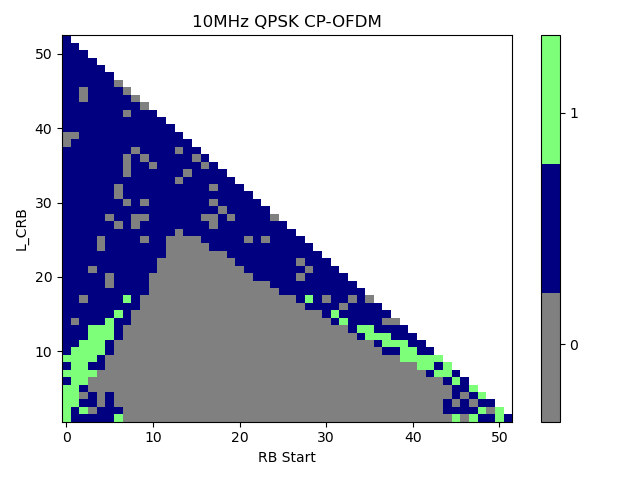{width="4.0368055555555555in"
height="2.254861111111111in"}

Figure 7.2-4: Measured MIMO OTA performance at band n28 **(780.5MHz)**
with different attenuation values (in Lab 4)

{width="4.149254155730533in"
height="2.006157042869641in"}

Figure 7.2-5: Measured MIMO OTA performance at band n28 **(780.5MHz)**
with different attenuation values (in Lab 7)

Table 7.2-1 presents the measurement results at band n28 (780.5MHz) from
Lab 6, RS EPRE difference between FR1 MIMO OTA system with and without
10dB attenuators are listed.

Table 7.2-1: Measured RS EPRE difference between FR1 MIMO OTA system
with and without 10dB attenuators at band n28 **(780.5MHz)** in Lab 6

  Percentile of max TP   RS EPRE ∆ between FR1 MIMO OTA system with and without 10dB attenuators
  ---------------------- -------------------------------------------------------------------------
  @ 50% throughput       0.59 dB
  @ 70% throughput       0.66 dB
  @ 90% throughput       0.67 dB

Based on the observations, RAN4 reached the following agreements:

\- Labs should first exclude the impact of noise before performing MIMO
OTA measurements, especially for frequency bands \<1GHz.

\- Perform a low-band lab alignment activity at Band n28, to
cross-validate the measurement results from different labs and ensure
the validity of the data pool for requirements definition.

7.3 Lab alignment campaign for frequency bands \> 1GHz
------------------------------------------------------

### 7.3.1 Framework

*This clause defines the working procedure on how to proceed the lab
alignment campaign for frequency bands \> 1GHz.*

Labs/companies volunteer to participate in the performance requirement
part shall complete the lab alignment measurements and system validation
measurements, results should be submitted to RAN4 for review.

Using the testing conditions as defined in TS38.151.

The test bands for lab alignment are n41 and n78. Three performance
alignment devices (PADs) for each band should be tested to ensure the
alignment of measurement results.

TRMS value in SA mode will be used for alignment comparison.

The reference value of each PAD should be the average of the PAD
measurement results submitted on or before 12:00 UTC 30th April 2022,
based on the condition at least 3 labs' results collected. Submission
with measurement data after 12:00 UTC 30th April can be considered for
lab alignment, but will not change the reference TRMS value.

The acceptance criteria for declaring alignment should be defined based
on the preliminary MU value of MPAC system. The detailed criteria for
accepting the outcome of the lab alignment activity are listed in Table
7.3.3-1.

Table 7.3.3-1: Requirements for lab alignment results (FR1 MIMO OTA)

+----------+----------+----------------------------------------------+
| **Band** | **Case** | **Acceptance criteria**                      |
+==========+==========+==============================================+
| n41      | PAD\_1   | The deviation between the measurement result |
|          |          | and the reference value of each PAD shall be |
|          |          | less than the pass/fail limit, i.e.,         |
|          |          |                                              |
|          |          | $\                                           |
|          |          | left| \text{TRMS}_{average,70}\_ mea - \text |
|          |          | {TRMS}_{average,70}\_ ref \right|$≦pass/fail |
|          |          | limit                                        |
+----------+----------+----------------------------------------------+
|          | PAD\_2   |                                              |
+----------+----------+----------------------------------------------+
|          | PAD\_3   |                                              |
+----------+----------+----------------------------------------------+
| n78      | PAD\_1   | The deviation between the measurement result |
|          |          | and the reference value of each PAD shall be |
|          |          | less than the pass/fail limit, i.e.,         |
|          |          |                                              |
|          |          | $\                                           |
|          |          | left| \text{TRMS}_{average,70}\_ mea - \text |
|          |          | {TRMS}_{average,70}\_ ref \right|$≦pass/fail |
|          |          | limit                                        |
+----------+----------+----------------------------------------------+
|          | PAD\_2   |                                              |
+----------+----------+----------------------------------------------+
|          | PAD\_3   |                                              |
+----------+----------+----------------------------------------------+

Note:

\- The PAD measurement results shall NOT be shared to anyone before
submitting to RAN4 meetings or sharing in the NR MIMO OTA reflector.
Comparison and alignment analyses should only be done in RAN4 meetings.

*- Three PADs for each band are selected. Labs should submit PAD
measurements results in an anonymous approach, i.e., the PADs for each
band should be marked as PAD\_1, PAD\_2, and PAD\_3, respectively. The
mapping between the codename PAD\_n and the actual PAD shall only be
known among the labs participated in the alignment activity, and shall
NOT be disclosed to any other companies.*

### 7.3.2 Measurement results

RAN4 carried out the lab alignment campaign for frequency bands \> 1GHz
during Rel-17. Considering the test burden and urgent timeline, RAN4
decided to select three smartphones (named as PADs, Performance
Alignment Devices) as reference DUTs, and select two bands, n41 and n78,
to perform FR1 MIMO OTA lab alignment activity for frequencies bands \>
1GHz.

There are 6 test labs participated in the lab alignment campaign, the
reference value of each PAD at each band is derived based on linear
average (with dBm) of PAD measurement results submitted by all labs. The
summary of the lab alignment results is shown in Table 7.3.2-1 and
Figure 7.3.2-1. The TRMS offset between each measurement result and
reference value of FR1 MIMO OTA lab alignment is shown in Table 7.3.2-2
and Figure 7.3.2-1.

Table 7.3.2-1: Summary of FR1 MIMO OTA lab alignment results for bands
\> 1GHz

  ---------------------------------------------------------------------------------------------------------------------------------------------------
  Device        Band   TRMS measurement result \[dBm/30kHz\]   Average\    Reference\   Max-Min\                                               
                                                               approach    value        deviation                                              
  ------------- ------ --------------------------------------- ----------- ------------ ----------- ----------- ----------- --------- -------- ------
                       **Lab 1**                               **Lab 2**   **Lab 3**    **Lab 4**   **Lab 5**   **Lab 6**                      

  PAD\_n41\_1   n41    -96.43                                  -97.61      -98.20       -97.45      -96.88      -99.10      Linear\   -97.61   2.67
                                                                                                                            average            

  PAD\_n41\_2   n41    -99.30                                  -97.80      -100.02      -99.96      -99.62      -101.43               -99.69   3.63

  PAD\_n41\_3   n41    -96.31                                  -97.39      -97.81       -96.53      -96.74      -98.59                -97.23   2.28

  PAD\_n78\_1   n78    -96.02                                  -96.54      -96.44       -96.10      -96.53      -98.38                -96.67   2.36

  PAD\_n78\_2   n78    -95.42                                  -95.95      -96.11       -96.48      -96.66      -98.97                -96.60   3.55

  PAD\_n78\_3   n78    -99.06                                  -97.42      -99.53       -99.08      -99.54      NA                    -98.93   2.12
  ---------------------------------------------------------------------------------------------------------------------------------------------------

Table 7.3.2-2: FR1 MIMO OTA lab alignment outcome - TRMS offset (for
bands \> 1GHz)

  Device                     Band   TRMS offset from reference \[dBm/30kHz\]   Pass/fail limit                                   
  -------------------------- ------ ------------------------------------------ ----------------- ------- ------- ------- ------- --------------------------------
                                    Lab 1                                      Lab 2             Lab 3   Lab 4   Lab 5   Lab 6   
  PAD\_n41\_1                n41    1.18                                       0.00              -0.59   0.16    0.73    -1.49   +/- 0.75 MU, i.e., +/- 2.25 dB
  PAD\_n41\_2                n41    0.39                                       1.89              -0.33   -0.27   0.07    -1.74   
  PAD\_n41\_3                n41    0.92                                       -0.16             -0.58   0.70    0.49    -1.36   
  PAD\_n78\_1                n78    0.65                                       0.13              0.22    0.57    0.14    -1.71   +/- 0.75 MU, i.e., +/- 2.55 dB
  PAD\_n78\_2                n78    1.18                                       0.65              0.48    0.12    -0.06   -2.37   
  PAD\_n78\_3                n78    -0.13                                      1.51              -0.60   -0.15   -0.61   NA      
  Lab alignment conclusion   Pass   Pass                                       Pass              Pass    Pass    Pass            

{width="5.956944444444445in"
height="1.886111111111111in"}

Figure 7.3.2-1: Measurement results of FR1 MIMO OTA lab alignment for
bands \> 1GHz

{width="5.913194444444445in"
height="1.8756944444444446in"}

Figure 7.3.2-2: Deviation between each measurement result and reference
value of FR1 MIMO OTA lab alignment for bands \> 1GHz

### 7.3.3 Pass/fail limits

Based on the preliminary MU assessment of FR1 MPAC system in Annex A.2.5
of TS 38.151, and lab alignment measurement results in Clause 7.3.2,
RAN4 decided the final pass/fail limits for FR1 MIMO OTA lab alignment
activity for bands \> 1GHz as 0.75\* preliminary MU, i.e.,

\- \< 3GHz: 2.25 dB

\- \> 3GHz: 2.55 dB

### 7.3.4 Conclusion

RAN4 concluded the successful FR1 MIMO OTA lab alignment activity for
bands \> 1GHz, all the 6 test labs are aligned. FR1 MIMO OTA performance
requirements for bands \> 1GHz are specified based on the measurement
results submitted by the above aligned test labs.

7.4 Lab alignment campaign for frequency bands \< 1GHz
------------------------------------------------------

### 7.4.1 Framework

*This clause defines the working procedure on how to proceed the lab
alignment campaign for frequency bands \< 1GHz.*

1\. Test labs are invited to participate in the lab alignment activity,
the following conditions should be fulfilled:

\- At least 3 participating labs are required.

\- Participating labs shall complete channel model validation.

\- Participating labs should have sufficient test resource to provide
on-time measurement results without delay.

\- Participating labs should first examine and exclude the impact of
noise before submitting PAD measurement results.

2\. Test methodology:

\- Test plan: 3GPP TS 38.151

\- Test system: MPAC

3\. Test cases for Lab Alignment Activity:

\- Test band: n28

\- Number of test cases: 3 PADs

\- Operation mode: NR Standalone (SA)

\- Use scenario: Free space

4\. Test results submission:

\- Use the same worksheet template in **R4-2316308** to submit the
measurement results. Report any systematic offsets that have been
applied to the TRMS results. The lab alignment outcome should be based
on the measurement results without power validation systematic offsets.

\- The measurement results should be submitted to RAN4 by anonymous
approach (the UE model shall not be disclosed publicly)

\- Results shall not be shared between labs before submitting to RAN4
meetings or sharing in the RAN4 reflector. Comparison and lab alignment
analysis should only be done in RAN4 meetings/discussions

5\. Lab alignment criteria:

\- The pass/fail criteria are defined as the maximum deviation between
the measurement result and the reference value

\- The reference value will be derived based on the averaging approach
(linear average in dBm) of lab alignment data pool from ≥ 3 labs

\- Apparent outliers (if identified) will not be considered in the
average process for reference value. The PAD measurement result deviates
over 1.5\* MU (i.e., 3.92 dB for band n28) from all the other labs'
results should be identified as apparent outlier.

\- Pass/fail limit for lab alignment should be defined as 0.75\*MU (+/-
1.96 dB for band n28).

6\. Volunteer lab procedures:

\- PAD delivery scheme: Decide PAD delivery scheme after all the
volunteer labs and PADs information being confirmed.

\- PAD measurement time in each volunteer lab: finalize PAD measurement
within \[7\] workdays, and deliver to the next lab ASAP with PAD
delivery In/Out information shared in email-reflector.

### 7.4.2 Measurement results

RAN4 carried out the lab alignment campaign for frequency bands \< 1GHz
during Rel-18. RAN4 decided to select three smartphones (named as PADs,
Performance Alignment Devices) as reference DUTs, and select band n28,
to perform FR1 MIMO OTA lab alignment activity for frequencies bands \<
1GHz.

There are 6 test labs participated in the lab alignment campaign, the
reference value of each PAD at each band is derived based on linear
average (with dBm) of PAD measurement results submitted by all labs.
Channel model validation results and noise impact evaluations performed
by the 6 labs are presented in Clauses 6.2.2 and 7.2. The summary of the
lab alignment results is shown in Table 7.4.2-1 and Figure 7.4.2-1. The
deviation between each TRMS measurement result and reference value is
shown in Table 7.4.2-2 and Figure 7.4.2-1.

> Table 7.4.2-1: Summary of FR1 MIMO OTA lab alignment results for bands
> \< 1GHz

<table>
<thead>
<tr class="header">
<th><blockquote>

Device

</blockquote></th>
<th><blockquote>

Band

</blockquote></th>
<th><blockquote>

TRMS measurement result [dBm/15kHz]

</blockquote></th>
<th><blockquote>

Average 
approach

</blockquote></th>
<th><blockquote>

Average 
value

</blockquote></th>
<th><blockquote>

Max-Min 
deviation

</blockquote></th>
<th></th>
<th></th>
<th></th>
<th></th>
<th></th>
</tr>
</thead>
<tbody>
<tr class="odd">
<td></td>
<td></td>
<td><blockquote>

Lab 1

</blockquote></td>
<td><blockquote>

Lab 2

</blockquote></td>
<td><blockquote>

Lab 4

</blockquote></td>
<td><blockquote>

Lab 5

</blockquote></td>
<td><blockquote>

Lab 7

</blockquote></td>
<td><blockquote>

Lab 6

</blockquote></td>
<td></td>
<td></td>
<td></td>
</tr>
<tr class="even">
<td><blockquote>

PAD_1

</blockquote></td>
<td><blockquote>

n28

</blockquote></td>
<td><blockquote>

-89.34

</blockquote></td>
<td><blockquote>

-90.12

</blockquote></td>
<td><blockquote>

-90.43

</blockquote></td>
<td><blockquote>

-88.26

</blockquote></td>
<td><blockquote>

-89.22

</blockquote></td>
<td><blockquote>

-91.75

</blockquote></td>
<td><blockquote>

Linear 
average

</blockquote></td>
<td><blockquote>

-89.85

</blockquote></td>
<td><blockquote>

3.49

</blockquote></td>
</tr>
<tr class="odd">
<td><blockquote>

PAD_2

</blockquote></td>
<td><blockquote>

n28

</blockquote></td>
<td><blockquote>

-86.46

</blockquote></td>
<td><blockquote>

-87.93

</blockquote></td>
<td><blockquote>

-87.91

</blockquote></td>
<td><blockquote>

-85.50

</blockquote></td>
<td><blockquote>

-85.86

</blockquote></td>
<td><blockquote>

-87.74

</blockquote></td>
<td></td>
<td><blockquote>

-86.90

</blockquote></td>
<td><blockquote>

2.43

</blockquote></td>
</tr>
<tr class="even">
<td><blockquote>

PAD_3

</blockquote></td>
<td><blockquote>

n28

</blockquote></td>
<td><blockquote>

-86.26

</blockquote></td>
<td><blockquote>

-89.34

</blockquote></td>
<td><blockquote>

-89.23

</blockquote></td>
<td><blockquote>

-86.19

</blockquote></td>
<td><blockquote>

-86.49

</blockquote></td>
<td><blockquote>

-88.36

</blockquote></td>
<td></td>
<td><blockquote>

-87.65

</blockquote></td>
<td><blockquote>

3.15

</blockquote></td>
</tr>
</tbody>
</table>

> Table 7.4.2-2: Deviations between TRMS measurement results and
> reference values

+-------+-------+-------+-------+-------+-------+-------+-------+-------+
| > D   | >     | >     | >     |       |       |       |       |       |
| evice |  Band |  TRMS |  Pass |       |       |       |       |       |
|       |       | > o   | /fail |       |       |       |       |       |
|       |       | ffset | >     |       |       |       |       |       |
|       |       | > \[d | limit |       |       |       |       |       |
|       |       | Bm/15 |       |       |       |       |       |       |
|       |       | kHz\] |       |       |       |       |       |       |
+=======+=======+=======+=======+=======+=======+=======+=======+=======+
|       |       | > Lab | > Lab | > Lab | > Lab | > Lab | > Lab |       |
|       |       | > 1   | > 2   | > 4   | > 5   | > 7   | > 6   |       |
+-------+-------+-------+-------+-------+-------+-------+-------+-------+
| > P   | > n28 | >     | >     | >     | >     | >     | >     | > +/- |
| AD\_1 |       |  0.52 | -0.27 | -0.58 |  1.59 |  0.63 | -1.90 | >     |
|       |       |       |       |       |       |       |       |  0.75 |
|       |       |       |       |       |       |       |       | > MU, |
|       |       |       |       |       |       |       |       | >     |
|       |       |       |       |       |       |       |       | i.e., |
|       |       |       |       |       |       |       |       | > +/- |
|       |       |       |       |       |       |       |       | >     |
|       |       |       |       |       |       |       |       |  1.96 |
|       |       |       |       |       |       |       |       | > dB  |
+-------+-------+-------+-------+-------+-------+-------+-------+-------+
| > P   | > n28 | >     | >     | >     | >     | >     | >     |       |
| AD\_2 |       |  0.44 | -1.03 | -1.01 |  1.40 |  1.04 | -0.84 |       |
+-------+-------+-------+-------+-------+-------+-------+-------+-------+
| > P   | > n28 | >     | >     | >     | >     | >     | >     |       |
| AD\_3 |       |  1.38 | -1.69 | -1.59 |  1.46 |  1.15 | -0.71 |       |
+-------+-------+-------+-------+-------+-------+-------+-------+-------+
| >     | > **P | > **P | > **P | > **P | > **P | > **P |       |       |
| **Lab | ass** | ass** | ass** | ass** | ass** | ass** |       |       |
| >     |       |       |       |       |       |       |       |       |
|  alig |       |       |       |       |       |       |       |       |
| nment |       |       |       |       |       |       |       |       |
| > co  |       |       |       |       |       |       |       |       |
| nclus |       |       |       |       |       |       |       |       |
| ion** |       |       |       |       |       |       |       |       |
+-------+-------+-------+-------+-------+-------+-------+-------+-------+

> {width="5.511811023622047in"
> height="2.0542836832895888in"}

Figure 7.4.2-1: Measurement results of FR1 MIMO OTA lab alignment for
bands \< 1GHz

> 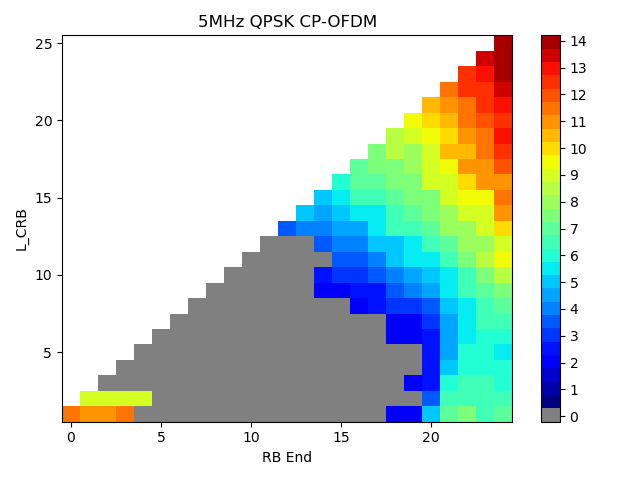{width="5.609530839895013in"
> height="2.07830927384077in"}
>
> Figure 7.4.2-2: Deviation between each measurement result and
> reference value
>
> The maximum deviation between measurement results and reference values
> is **-**1.9 dB.

### 7.4.3 Pass/fail limits 

\<Editor's note: This clause defines the pass/fail limits of lab
alignment campaign for frequency bands \< 1GHz. This clause will be
added when lab alignment campaign for frequency bands \< 1GHz is
completed.\>

### 7.4.4 Conclusion

\<Editor's note: This clause describes the conclusion of lab alignment
campaign for frequency bands \< 1GHz. This clause will be added when lab
alignment campaign for frequency bands \< 1GHz is completed.\>

8 Lab alignment of FR2 MIMO OTA
===============================

8.1 Framework
-------------

*This clause defines the working procedure on how to proceed the FR2
MIMO OTA lab alignment campaign.* The purpose of lab alignment activity
is to ensure there is no unexpected lab deviation and establish full
trust and confidence on the measurement data pool for specifying FR2
MIMO OTA performance requirements.

1\. Test labs are invited to participate in the lab alignment activity,
the following conditions should be fulfilled:

\- At least 3 participating labs are required.

\- Participating labs shall complete channel model validation.

\- Participating labs should have sufficient test resource to provide
on-time measurement results without delay.

\- Each lab should finalize PAD measurement within 10 workdays, and
deliver to the next lab in the same country ASAP with PAD In/Out
information shared via email-reflector; otherwise, labs in the same
country should equally share the period for testing the PADs.

2\. Test methodology:

\- Test plan: 3GPP TS 38.151

3\. Test cases for Lab Alignment Activity:

\- Test band: n261 (for PADs that support n261), n257 (for the PAD that
does not support n261)

\- Number of test cases: 2\~4 PADs per-band

\- Operation mode: NR Non-Standalone (NSA) is preferred and SA is not
precluded, and should be mapped with the measurement results submission.

\- Power class: PC3

4\. Test results submission:

\- Use the same worksheet template in R4-2308740 to submit the
measurement results

\- The measurement results should be submitted to RAN4 by anonymous
approach (the UE model shall not be disclosed publicly)

\- Results shall not be shared between labs before submitting to RAN4
meetings or sharing in the RAN4 reflector. Comparison and lab alignment
analysis should only be done in RAN4 meetings/discussions

5\. Lab alignment criteria:

\- The pass/fail criteria are defined as the maximum deviation between
the MASC measurement result and the reference value

\- The reference value is derived based on the per-band linear averaging
approach (in dB) of lab alignment data pool from ≥ 3 labs, apparent
outliers (if identified) should not be considered in the average process
for deriving reference values. The PAD measurement result deviates over
\[1.5\]\*preliminary MU (i.e., 7.575 dB for band n261/n257) from all the
other labs' results should be identified as apparent outlier.

\- Pass/fail limit for lab alignment is defined as ±0.75\*preliminary
MU, i.e., ±3.79 dB for band n261/n257.

8.2 Measurement results
-----------------------

> RAN4 carried out the FR2 MIMO OTA lab alignment activity during
> Rel-18. RAN4 decided to select four smartphones (named as PADs,
> Performance Alignment Devices) as reference DUTs, and select band
> n261/n257, to perform FR2 MIMO OTA lab alignment activity.
>
> There were 5 test labs participated in the lab alignment campaign, and
> 4 labs submitted PAD measurement results in Rel-18. The reference
> value of each PAD at each band is derived based on linear average (in
> dB) of PAD measurement results submitted by all labs. Channel model
> validation results performed by the 5 labs are presented in Clauses
> 6.3.2. The summary of the lab alignment results is shown in Table
> 8.2-1 and Figure 8.2-1. The deviation between each MASC measurement
> result and reference value is shown in Table 8.2-2 and Figure 8.2-2.
>
> Table 8.2-1: Summary of Rel-18 FR2 MIMO OTA lab alignment results

<table>
<thead>
<tr class="header">
<th><blockquote>

Device

</blockquote></th>
<th><blockquote>

Band

</blockquote></th>
<th><blockquote>

MASC70 measurement result [dBm/120kHz]

</blockquote></th>
<th><blockquote>

Average 
approach

</blockquote></th>
<th><blockquote>

Average 
value

</blockquote></th>
<th><blockquote>

Max-Min 
deviation

</blockquote></th>
<th></th>
<th></th>
<th></th>
<th></th>
</tr>
</thead>
<tbody>
<tr class="odd">
<td></td>
<td></td>
<td><blockquote>

Lab A 1

</blockquote></td>
<td><blockquote>

Lab B

</blockquote></td>
<td><blockquote>

Lab C

</blockquote></td>
<td><blockquote>

Lab D

</blockquote></td>
<td><blockquote>

Lab E

</blockquote></td>
<td></td>
<td></td>
<td></td>
</tr>
<tr class="even">
<td><blockquote>

PAD 1

</blockquote></td>
<td><blockquote>

n261

</blockquote></td>
<td><blockquote>

-101.97

</blockquote></td>
<td><blockquote>

-101.79

</blockquote></td>
<td><blockquote>

-100.64

</blockquote></td>
<td><blockquote>

Results not available in Rel-18

</blockquote></td>
<td><blockquote>

NA

</blockquote></td>
<td><blockquote>

Linear 
average (in dB)

</blockquote></td>
<td><blockquote>

-101.47

</blockquote></td>
<td><blockquote>

1.33

</blockquote></td>
</tr>
<tr class="odd">
<td><blockquote>

PAD 2

</blockquote></td>
<td><blockquote>

n261

</blockquote></td>
<td><blockquote>

-105.56

</blockquote></td>
<td><blockquote>

-104.92

</blockquote></td>
<td><blockquote>

-103.87

</blockquote></td>
<td></td>
<td><blockquote>

-105.41

</blockquote></td>
<td></td>
<td><blockquote>

-104.94

</blockquote></td>
<td><blockquote>

1.69

</blockquote></td>
</tr>
<tr class="even">
<td><blockquote>

PAD 3

</blockquote></td>
<td><blockquote>

n261

</blockquote></td>
<td><blockquote>

-102.40

</blockquote></td>
<td><blockquote>

-101.92

</blockquote></td>
<td><blockquote>

-101.22

</blockquote></td>
<td></td>
<td><blockquote>

-103.31

</blockquote></td>
<td></td>
<td><blockquote>

-102.21

</blockquote></td>
<td><blockquote>

2.09

</blockquote></td>
</tr>
<tr class="odd">
<td><blockquote>

PAD 4

</blockquote></td>
<td><blockquote>

n257

</blockquote></td>
<td><blockquote>

-105.76

</blockquote></td>
<td><blockquote>

-105.80

</blockquote></td>
<td><blockquote>

-104.59

</blockquote></td>
<td></td>
<td><blockquote>

-106.01

</blockquote></td>
<td></td>
<td><blockquote>

-105.54

</blockquote></td>
<td><blockquote>

1.41

</blockquote></td>
</tr>
<tr class="even">
<td><blockquote>

Note 1: Lab A’s data were corrected by 3-dB offset from the original measurement data.

</blockquote></td>
<td></td>
<td></td>
<td></td>
<td></td>
<td></td>
<td></td>
<td></td>
<td></td>
<td></td>
</tr>
</tbody>
</table>

> Table 8.2-2: FR2 MIMO OTA lab alignment outcome - MASC offset

+-------+-------+-------+-------+-------+-------+-------+-------+
| > D   | >     | >     | >     |       |       |       |       |
| evice |  Band |  MASC |  Pass |       |       |       |       |
|       |       | > o   | /fail |       |       |       |       |
|       |       | ffset | >     |       |       |       |       |
|       |       | >     | limit |       |       |       |       |
|       |       |  \[dB |       |       |       |       |       |
|       |       | m/120 |       |       |       |       |       |
|       |       | kHz\] |       |       |       |       |       |
+=======+=======+=======+=======+=======+=======+=======+=======+
|       |       | > Lab | > Lab | > Lab | > Lab | > Lab |       |
|       |       | > A   | > B   | > C   | > D   | > E   |       |
+-------+-------+-------+-------+-------+-------+-------+-------+
| > PAD | >     | >     | >     | >     | > NA  | > NA  |       |
| > 1   |  n261 | -0.51 | -0.32 |  0.83 |       |       |       |
+-------+-------+-------+-------+-------+-------+-------+-------+
| > PAD | >     | >     | >     | >     | > NA  | >     | > ±   |
| > 2   |  n261 | -0.62 |  0.02 |  1.07 |       | -0.47 | > 0.  |
|       |       |       |       |       |       |       | 75\*p |
|       |       |       |       |       |       |       | relim |
|       |       |       |       |       |       |       | inary |
|       |       |       |       |       |       |       | > MU, |
|       |       |       |       |       |       |       | >     |
|       |       |       |       |       |       |       | i.e., |
|       |       |       |       |       |       |       | > ±   |
|       |       |       |       |       |       |       | >     |
|       |       |       |       |       |       |       |  3.79 |
|       |       |       |       |       |       |       | > dB  |
+-------+-------+-------+-------+-------+-------+-------+-------+
| > PAD | >     | >     | >     | >     | > NA  | >     |       |
| > 3   |  n261 | -0.19 |  0.29 |  0.99 |       | -1.10 |       |
+-------+-------+-------+-------+-------+-------+-------+-------+
| > PAD | >     | >     | >     | >     | > NA  | >     |       |
| > 4   |  n257 | -0.22 | -0.26 |  0.95 |       | -0.47 |       |
+-------+-------+-------+-------+-------+-------+-------+-------+
| >     | > **P | > **P | > **P | > *   | > **P |       |       |
| **Lab | ass** | ass** | ass** | *NA** | ass** |       |       |
| >     |       |       |       |       |       |       |       |
|  alig |       |       |       |       |       |       |       |
| nment |       |       |       |       |       |       |       |
| > co  |       |       |       |       |       |       |       |
| nclus |       |       |       |       |       |       |       |
| ion** |       |       |       |       |       |       |       |
+-------+-------+-------+-------+-------+-------+-------+-------+

> [\[CHART\]]{.chart}
>
> Figure 8.2-1: Measurement results of Rel-18 FR2 MIMO OTA lab alignment
>
> [\[CHART\]]{.chart}
>
> Figure 8.2-2: Deviation between each measurement result and reference
> value of Rel-18 FR2 MIMO OTA lab alignment
>
> The maximum deviation between measurement results and reference values
> is -1.10 dB.

8.3 Pass/fail limits 
--------------------

Based on the preliminary MU assessment of FR2 3D-MPAC system in Annex
B.2.5 of TS 38.151 V18.0.0, and lab alignment measurement results in
Clause 8.2, RAN4 decided the final pass/fail limits for FR2 MIMO OTA lab
alignment activity as 0.75\*preliminary MU, i.e., +/-3.79 dB for band
n261/n257.

8.4 Conclusion
--------------

RAN4 concluded the successful FR2 MIMO OTA lab alignment activity for
band n261/n257, with 4 test labs aligned. Rel-18 FR2 MIMO OTA
performance requirements are specified based on the measurement results
submitted by the above aligned test labs.

######## Annex A (informative): Change history

+-------+-------+-------+-------+-------+-------+-------+-------+
| **C   |       |       |       |       |       |       |       |
| hange |       |       |       |       |       |       |       |
| hist  |       |       |       |       |       |       |       |
| ory** |       |       |       |       |       |       |       |
+=======+=======+=======+=======+=======+=======+=======+=======+
| **D   | *     | **T   | *     | **    | **    | **Su  | **New |
| ate** | *Meet | Doc** | *CR** | Rev** | Cat** | bject | vers  |
|       | ing** |       |       |       |       | /Comm | ion** |
|       |       |       |       |       |       | ent** |       |
+-------+-------+-------+-------+-------+-------+-------+-------+
| 20    | R4\#1 | R4-23 |       |       |       | Ske   | 0.0.1 |
| 23-10 | 08bis | 16704 |       |       |       | leton |       |
|       |       |       |       |       |       | of    |       |
|       |       |       |       |       |       | TR3   |       |
|       |       |       |       |       |       | 8.761 |       |
|       |       |       |       |       |       | on    |       |
|       |       |       |       |       |       | M     |       |
|       |       |       |       |       |       | easur |       |
|       |       |       |       |       |       | ement |       |
|       |       |       |       |       |       | of NR |       |
|       |       |       |       |       |       | MIMO  |       |
|       |       |       |       |       |       | OTA   |       |
|       |       |       |       |       |       | p     |       |
|       |       |       |       |       |       | erfor |       |
|       |       |       |       |       |       | mance |       |
+-------+-------+-------+-------+-------+-------+-------+-------+
| 20    | R4    | R4-23 |       |       |       | R4-23 | 0.1.0 |
| 23-11 | \#109 | 19164 |       |       |       | 16946 |       |
|       |       |       |       |       |       | TP to |       |
|       |       |       |       |       |       | TR    |       |
|       |       |       |       |       |       | 3     |       |
|       |       |       |       |       |       | 8.761 |       |
|       |       |       |       |       |       | on    |       |
|       |       |       |       |       |       | ch    |       |
|       |       |       |       |       |       | annel |       |
|       |       |       |       |       |       | model |       |
|       |       |       |       |       |       | valid |       |
|       |       |       |       |       |       | ation |       |
|       |       |       |       |       |       | for   |       |
|       |       |       |       |       |       | n41   |       |
|       |       |       |       |       |       | n78   |       |
|       |       |       |       |       |       |       |       |
|       |       |       |       |       |       | R4-23 |       |
|       |       |       |       |       |       | 16968 |       |
|       |       |       |       |       |       | TP to |       |
|       |       |       |       |       |       | TR    |       |
|       |       |       |       |       |       | 3     |       |
|       |       |       |       |       |       | 8.761 |       |
|       |       |       |       |       |       | on    |       |
|       |       |       |       |       |       | lab   |       |
|       |       |       |       |       |       | alig  |       |
|       |       |       |       |       |       | nment |       |
|       |       |       |       |       |       | for   |       |
|       |       |       |       |       |       | bands |       |
|       |       |       |       |       |       | \>    |       |
|       |       |       |       |       |       | 1GHz  |       |
+-------+-------+-------+-------+-------+-------+-------+-------+
| 20    | R4    | R4-23 |       |       |       | R4-23 | 0.2.0 |
| 23-11 | \#109 | 20179 |       |       |       | 21107 |       |
|       |       |       |       |       |       | TP to |       |
|       |       |       |       |       |       | TR    |       |
|       |       |       |       |       |       | 3     |       |
|       |       |       |       |       |       | 8.761 |       |
|       |       |       |       |       |       | on    |       |
|       |       |       |       |       |       | Lab 6 |       |
|       |       |       |       |       |       | Power |       |
|       |       |       |       |       |       | Valid |       |
|       |       |       |       |       |       | ation |       |
|       |       |       |       |       |       |       |       |
|       |       |       |       |       |       | R4-23 |       |
|       |       |       |       |       |       | 20060 |       |
|       |       |       |       |       |       | TP to |       |
|       |       |       |       |       |       | TR    |       |
|       |       |       |       |       |       | 3     |       |
|       |       |       |       |       |       | 8.761 |       |
|       |       |       |       |       |       | on    |       |
|       |       |       |       |       |       | Ge    |       |
|       |       |       |       |       |       | neral |       |
|       |       |       |       |       |       | As    |       |
|       |       |       |       |       |       | pects |       |
|       |       |       |       |       |       | and   |       |
|       |       |       |       |       |       | M     |       |
|       |       |       |       |       |       | easur |       |
|       |       |       |       |       |       | ement |       |
|       |       |       |       |       |       | Setup |       |
|       |       |       |       |       |       |       |       |
|       |       |       |       |       |       | R4-23 |       |
|       |       |       |       |       |       | 20062 |       |
|       |       |       |       |       |       | TP to |       |
|       |       |       |       |       |       | TR    |       |
|       |       |       |       |       |       | 3     |       |
|       |       |       |       |       |       | 8.761 |       |
|       |       |       |       |       |       | on    |       |
|       |       |       |       |       |       | FR2   |       |
|       |       |       |       |       |       | ch    |       |
|       |       |       |       |       |       | annel |       |
|       |       |       |       |       |       | model |       |
|       |       |       |       |       |       | valid |       |
|       |       |       |       |       |       | ation |       |
|       |       |       |       |       |       |       |       |
|       |       |       |       |       |       | R4-23 |       |
|       |       |       |       |       |       | 18895 |       |
|       |       |       |       |       |       | TP    |       |
|       |       |       |       |       |       | for   |       |
|       |       |       |       |       |       | TR    |       |
|       |       |       |       |       |       | 3     |       |
|       |       |       |       |       |       | 8.761 |       |
|       |       |       |       |       |       | on    |       |
|       |       |       |       |       |       | ch    |       |
|       |       |       |       |       |       | annel |       |
|       |       |       |       |       |       | model |       |
|       |       |       |       |       |       | valid |       |
|       |       |       |       |       |       | ation |       |
|       |       |       |       |       |       | for   |       |
|       |       |       |       |       |       | n78   |       |
|       |       |       |       |       |       | and   |       |
|       |       |       |       |       |       | n41   |       |
|       |       |       |       |       |       |       |       |
|       |       |       |       |       |       | R4-23 |       |
|       |       |       |       |       |       | 20061 |       |
|       |       |       |       |       |       | TP to |       |
|       |       |       |       |       |       | TR    |       |
|       |       |       |       |       |       | 3     |       |
|       |       |       |       |       |       | 8.761 |       |
|       |       |       |       |       |       | on    |       |
|       |       |       |       |       |       | ch    |       |
|       |       |       |       |       |       | annel |       |
|       |       |       |       |       |       | model |       |
|       |       |       |       |       |       | valid |       |
|       |       |       |       |       |       | ation |       |
|       |       |       |       |       |       | for   |       |
|       |       |       |       |       |       | n28   |       |
|       |       |       |       |       |       |       |       |
|       |       |       |       |       |       | R4-23 |       |
|       |       |       |       |       |       | 21108 |       |
|       |       |       |       |       |       | TP to |       |
|       |       |       |       |       |       | TR    |       |
|       |       |       |       |       |       | 3     |       |
|       |       |       |       |       |       | 8.761 |       |
|       |       |       |       |       |       | on    |       |
|       |       |       |       |       |       | FR1   |       |
|       |       |       |       |       |       | noise |       |
|       |       |       |       |       |       | i     |       |
|       |       |       |       |       |       | mpact |       |
|       |       |       |       |       |       |       |       |
|       |       |       |       |       |       | R4-23 |       |
|       |       |       |       |       |       | 20064 |       |
|       |       |       |       |       |       | TP to |       |
|       |       |       |       |       |       | TR    |       |
|       |       |       |       |       |       | 3     |       |
|       |       |       |       |       |       | 8.761 |       |
|       |       |       |       |       |       | on    |       |
|       |       |       |       |       |       | R     |       |
|       |       |       |       |       |       | el-18 |       |
|       |       |       |       |       |       | lab   |       |
|       |       |       |       |       |       | alig  |       |
|       |       |       |       |       |       | nment |       |
|       |       |       |       |       |       | fram  |       |
|       |       |       |       |       |       | ework |       |
+-------+-------+-------+-------+-------+-------+-------+-------+
| 20    | RAN   | RP-23 |       |       |       | Pres  | 1.0.0 |
| 23-12 | \#102 | xxxxx |       |       |       | ented |       |
|       |       |       |       |       |       | to    |       |
|       |       |       |       |       |       | RAN   |       |
|       |       |       |       |       |       | for   |       |
|       |       |       |       |       |       | app   |       |
|       |       |       |       |       |       | roval |       |
+-------+-------+-------+-------+-------+-------+-------+-------+

+-------+-------+-------+-------+-------+-------+-------+-------+
| **C   |       |       |       |       |       |       |       |
| hange |       |       |       |       |       |       |       |
| hist  |       |       |       |       |       |       |       |
| ory** |       |       |       |       |       |       |       |
+=======+=======+=======+=======+=======+=======+=======+=======+
| **D   | *     | **T   | *     | **    | **    | **Su  | **New |
| ate** | *Meet | Doc** | *CR** | Rev** | Cat** | bject | vers  |
|       | ing** |       |       |       |       | /Comm | ion** |
|       |       |       |       |       |       | ent** |       |
+-------+-------+-------+-------+-------+-------+-------+-------+
| 20    | RAN   |       |       |       |       | App   | 1     |
| 23-12 | \#102 |       |       |       |       | roved | 8.0.0 |
|       |       |       |       |       |       | by    |       |
|       |       |       |       |       |       | pl    |       |
|       |       |       |       |       |       | enary |       |
|       |       |       |       |       |       | --    |       |
|       |       |       |       |       |       | R     |       |
|       |       |       |       |       |       | el-18 |       |
|       |       |       |       |       |       | spec  |       |
|       |       |       |       |       |       | under |       |
|       |       |       |       |       |       | c     |       |
|       |       |       |       |       |       | hange |       |
|       |       |       |       |       |       | co    |       |
|       |       |       |       |       |       | ntrol |       |
+-------+-------+-------+-------+-------+-------+-------+-------+
| 20    | RAN   | RP-2  | 0001  | 1     | F     | CR to | 1     |
| 24-03 | \#103 | 40593 |       |       |       | TR    | 8.1.0 |
|       |       |       |       |       |       | 3     |       |
|       |       |       |       |       |       | 8.761 |       |
|       |       |       |       |       |       | on    |       |
|       |       |       |       |       |       | FR1   |       |
|       |       |       |       |       |       | MIMO  |       |
|       |       |       |       |       |       | OTA   |       |
|       |       |       |       |       |       | ch    |       |
|       |       |       |       |       |       | annel |       |
|       |       |       |       |       |       | model |       |
|       |       |       |       |       |       | valid |       |
|       |       |       |       |       |       | ation |       |
|       |       |       |       |       |       | re    |       |
|       |       |       |       |       |       | sults |       |
+-------+-------+-------+-------+-------+-------+-------+-------+
| 20    | RAN   | RP-2  | 0002  |       | F     | U     | 1     |
| 24-03 | \#103 | 40593 |       |       |       | pdate | 8.1.0 |
|       |       |       |       |       |       | to    |       |
|       |       |       |       |       |       | the   |       |
|       |       |       |       |       |       | FR1   |       |
|       |       |       |       |       |       | ch    |       |
|       |       |       |       |       |       | annel |       |
|       |       |       |       |       |       | model |       |
|       |       |       |       |       |       | valid |       |
|       |       |       |       |       |       | ation |       |
|       |       |       |       |       |       | re    |       |
|       |       |       |       |       |       | sults |       |
+-------+-------+-------+-------+-------+-------+-------+-------+
| 20    | RAN   | RP-2  | 0003  |       | F     | U     | 1     |
| 24-03 | \#103 | 40608 |       |       |       | pdate | 8.1.0 |
|       |       |       |       |       |       | the   |       |
|       |       |       |       |       |       | lab 5 |       |
|       |       |       |       |       |       | ch    |       |
|       |       |       |       |       |       | annel |       |
|       |       |       |       |       |       | model |       |
|       |       |       |       |       |       | valid |       |
|       |       |       |       |       |       | ation |       |
|       |       |       |       |       |       | for   |       |
|       |       |       |       |       |       | n28   |       |
+-------+-------+-------+-------+-------+-------+-------+-------+
| 20    | RAN   | RP-2  | 0004  |       | F     | On    | 1     |
| 24-03 | \#103 | 40608 |       |       |       | the   | 8.1.0 |
|       |       |       |       |       |       | rema  |       |
|       |       |       |       |       |       | ining |       |
|       |       |       |       |       |       | lab 5 |       |
|       |       |       |       |       |       | ch    |       |
|       |       |       |       |       |       | annel |       |
|       |       |       |       |       |       | model |       |
|       |       |       |       |       |       | valid |       |
|       |       |       |       |       |       | ation |       |
|       |       |       |       |       |       | for   |       |
|       |       |       |       |       |       | n41   |       |
|       |       |       |       |       |       | and   |       |
|       |       |       |       |       |       | n78   |       |
+-------+-------+-------+-------+-------+-------+-------+-------+
| 20    | > RAN | RP-2  | 0005  | > 1   | > F   | > CR  | 1     |
| 24-06 | \#104 | 41486 |       |       |       | > to  | 8.2.0 |
|       |       |       |       |       |       | > 3   |       |
|       |       |       |       |       |       | 8.761 |       |
|       |       |       |       |       |       | > on  |       |
|       |       |       |       |       |       | > FR1 |       |
|       |       |       |       |       |       | >     |       |
|       |       |       |       |       |       | CDL-C |       |
|       |       |       |       |       |       | > UMa |       |
|       |       |       |       |       |       | > ch  |       |
|       |       |       |       |       |       | annel |       |
|       |       |       |       |       |       | >     |       |
|       |       |       |       |       |       | model |       |
|       |       |       |       |       |       | >     |       |
|       |       |       |       |       |       | valid |       |
|       |       |       |       |       |       | ation |       |
|       |       |       |       |       |       | > re  |       |
|       |       |       |       |       |       | sults |       |
+-------+-------+-------+-------+-------+-------+-------+-------+
| 20    | > RAN | RP-2  | 0006  |       | > F   | > CR  | 1     |
| 24-06 | \#104 | 41486 |       |       |       | > to  | 8.2.0 |
|       |       |       |       |       |       | > 3   |       |
|       |       |       |       |       |       | 8.761 |       |
|       |       |       |       |       |       | > on  |       |
|       |       |       |       |       |       | > FR1 |       |
|       |       |       |       |       |       | > ch  |       |
|       |       |       |       |       |       | annel |       |
|       |       |       |       |       |       | >     |       |
|       |       |       |       |       |       | model |       |
|       |       |       |       |       |       | >     |       |
|       |       |       |       |       |       | valid |       |
|       |       |       |       |       |       | ation |       |
|       |       |       |       |       |       | > re  |       |
|       |       |       |       |       |       | sults |       |
+-------+-------+-------+-------+-------+-------+-------+-------+
| 20    | > RAN | RP-2  | 0007  |       | > F   | > CR  | 1     |
| 24-06 | \#104 | 41486 |       |       |       | > to  | 8.2.0 |
|       |       |       |       |       |       | > 3   |       |
|       |       |       |       |       |       | 8.761 |       |
|       |       |       |       |       |       | > on  |       |
|       |       |       |       |       |       | > n28 |       |
|       |       |       |       |       |       | > lab |       |
|       |       |       |       |       |       | >     |       |
|       |       |       |       |       |       |  alig |       |
|       |       |       |       |       |       | nment |       |
|       |       |       |       |       |       | > cam |       |
|       |       |       |       |       |       | paign |       |
+-------+-------+-------+-------+-------+-------+-------+-------+
| 20    | > RAN | RP-2  | 0008  | > 1   | > F   | > CR  | 1     |
| 24-06 | \#104 | 41486 |       |       |       | > to  | 8.2.0 |
|       |       |       |       |       |       | > 3   |       |
|       |       |       |       |       |       | 8.761 |       |
|       |       |       |       |       |       | > on  |       |
|       |       |       |       |       |       | > FR2 |       |
|       |       |       |       |       |       | > lab |       |
|       |       |       |       |       |       | >     |       |
|       |       |       |       |       |       |  alig |       |
|       |       |       |       |       |       | nment |       |
|       |       |       |       |       |       | > cam |       |
|       |       |       |       |       |       | paign |       |
+-------+-------+-------+-------+-------+-------+-------+-------+
| 20    | > RAN | RP-2  | 0010  |       | > F   | > F   | 1     |
| 24-06 | \#104 | 41486 |       |       |       | ormal | 8.2.0 |
|       |       |       |       |       |       | > CR  |       |
|       |       |       |       |       |       | > for |       |
|       |       |       |       |       |       | > 3   |       |
|       |       |       |       |       |       | 8.761 |       |
|       |       |       |       |       |       | > on  |       |
|       |       |       |       |       |       | > Lab |       |
|       |       |       |       |       |       | > 7   |       |
|       |       |       |       |       |       | >     |       |
|       |       |       |       |       |       | noise |       |
|       |       |       |       |       |       | > i   |       |
|       |       |       |       |       |       | mpact |       |
|       |       |       |       |       |       | >     |       |
|       |       |       |       |       |       | evalu |       |
|       |       |       |       |       |       | ation |       |
|       |       |       |       |       |       | > for |       |
|       |       |       |       |       |       | > n28 |       |
+-------+-------+-------+-------+-------+-------+-------+-------+
| 20    | > RAN |       |       |       |       | > MCC | 1     |
| 24-06 | \#104 |       |       |       |       | >     | 8.2.1 |
|       |       |       |       |       |       |  edit |       |
|       |       |       |       |       |       | orial |       |
|       |       |       |       |       |       | > u   |       |
|       |       |       |       |       |       | pdate |       |
+-------+-------+-------+-------+-------+-------+-------+-------+
| 20    | > RAN | RP-2  | 0011  |       | > F   | > CR  | 1     |
| 24-09 | \#105 | 42169 |       |       |       | > to  | 8.3.0 |
|       |       |       |       |       |       | > TR3 |       |
|       |       |       |       |       |       | 8.761 |       |
|       |       |       |       |       |       | > R18 |       |
|       |       |       |       |       |       | > a   |       |
|       |       |       |       |       |       | dding |       |
|       |       |       |       |       |       | > the |       |
|       |       |       |       |       |       | > lab |       |
|       |       |       |       |       |       | > 5   |       |
|       |       |       |       |       |       | > ch  |       |
|       |       |       |       |       |       | annel |       |
|       |       |       |       |       |       | >     |       |
|       |       |       |       |       |       |  mode |       |
|       |       |       |       |       |       | >     |       |
|       |       |       |       |       |       | valid |       |
|       |       |       |       |       |       | ation |       |
|       |       |       |       |       |       | > for |       |
|       |       |       |       |       |       | >     |       |
|       |       |       |       |       |       |  Band |       |
|       |       |       |       |       |       | > n1  |       |
+-------+-------+-------+-------+-------+-------+-------+-------+
