+----------------------------------+----------------------------------+
| 3GPP TR 38.786 V18.2.0 (2024-06) |                                  |
+==================================+==================================+
| Technical Report                 |                                  |
+----------------------------------+----------------------------------+
| 3rd Generation Partnership       |                                  |
| Project;                         |                                  |
|                                  |                                  |
| Technical Specification Group    |                                  |
| Radio Access Network;            |                                  |
|                                  |                                  |
| NR Sidelink evolution;           |                                  |
|                                  |                                  |
| User Equipment (UE) radio        |                                  |
| transmission and reception;      |                                  |
|                                  |                                  |
| (Release 18)                     |                                  |
+----------------------------------+----------------------------------+
|                                  |                                  |
+----------------------------------+----------------------------------+
| {width="1.4027777777777777in" | 3GPP-logo\_web](./media/image2.p |
| height="0.8729166666666667in"}   | ng){width="1.7729166666666667in" |
|                                  | height="1.038888888888889in"}    |
+----------------------------------+----------------------------------+
|                                  |                                  |
+----------------------------------+----------------------------------+
| The present document has been    |                                  |
| developed within the 3rd         |                                  |
| Generation Partnership Project   |                                  |
| (3GPP ^TM^) and may be further   |                                  |
| elaborated for the purposes of   |                                  |
| 3GPP.\                           |                                  |
| The present document has not     |                                  |
| been subject to any approval     |                                  |
| process by the 3GPP              |                                  |
| Organizational Partners and      |                                  |
| shall not be implemented.\       |                                  |
| This Specification is provided   |                                  |
| for future development work      |                                  |
| within 3GPP only. The            |                                  |
| Organizational Partners accept   |                                  |
| no liability for any use of this |                                  |
| Specification.\                  |                                  |
| Specifications and Reports for   |                                  |
| implementation of the 3GPP ^TM^  |                                  |
| system should be obtained via    |                                  |
| the 3GPP Organizational          |                                  |
| Partners\' Publications Offices. |                                  |
+----------------------------------+----------------------------------+

+----------------------------------------------------------------------+
|                                                                      |
+======================================================================+
| > ***3GPP***                                                         |
| >                                                                    |
| > Postal address                                                     |
| >                                                                    |
| > 3GPP support office address                                        |
| >                                                                    |
| > 650 Route des Lucioles - Sophia Antipolis                          |
| >                                                                    |
| > Valbonne - FRANCE                                                  |
| >                                                                    |
| > Tel.: +33 4 92 94 42 00 Fax: +33 4 93 65 47 16                     |
| >                                                                    |
| > Internet                                                           |
| >                                                                    |
| > http://www.3gpp.org                                                |
+----------------------------------------------------------------------+
| ***Copyright Notification***                                         |
|                                                                      |
| No part may be reproduced except as authorized by written            |
| permission.\                                                         |
| The copyright and the foregoing restriction extend to reproduction   |
| in all media.                                                        |
|                                                                      |
| © 2024, 3GPP Organizational Partners (ARIB, ATIS, CCSA, ETSI, TSDSI, |
| TTA, TTC).                                                           |
|                                                                      |
| All rights reserved.                                                 |
|                                                                      |
| UMTS™ is a Trade Mark of ETSI registered for the benefit of its      |
| members                                                              |
|                                                                      |
| 3GPP™ is a Trade Mark of ETSI registered for the benefit of its      |
| Members and of the 3GPP Organizational Partners\                     |
| LTE™ is a Trade Mark of ETSI registered for the benefit of its       |
| Members and of the 3GPP Organizational Partners                      |
|                                                                      |
| GSM® and the GSM logo are registered and owned by the GSM            |
| Association                                                          |
+----------------------------------------------------------------------+

 Contents {#contents .TT}
========

Foreword 10

1 Scope 12

2 References 12

3 Definitions of terms, symbols and abbreviations 12

3.1 Terms 12

3.2 Symbols 13

3.3 Abbreviations 14

4 Background 15

5 Operating bands and channel arrangement for SL evolution 15

5.1 Operating bands 15

5.1.1 Operating bands for single carrier operation in unlicensed band 15

5.1.2 Operating band combinations for inter-band con-current operation
16

5.1.3 Operating band combinations for NR SL CA operation 16

5.2 Channel bandwidth 16

5.2.1 Channel bandwidth for single carrier operation in unlicensed band
16

5.2.2 Channel bandwidth for inter-band con-current operation 17

5.2.3 Channel bandwidth for NR SL CA operation 17

5.3 Channel arrangement 17

5.3.1 Channel spacing 17

5.3.2 Channel raster 18

5.3.3 Synchronization raster 18

6 Transmitter characteristics for NR SL evolution 18

6.1 Tx requirements for NR SL single carrier operation in unlicensed
band 18

6.1.1 Maximum output power for NR SL-U 18

6.1.2 UE maximum output power reduction for NR SL-U 19

6.1.2.1 MPR for SL-U operation in single CC 22

6.1.2.1.1 MPR for simultaneous PSSCH/PSCCH transmission 22

6.1.2.1.2 MPR for S-SSB transmission 34

6.1.2.1.3 MPR for PSFCH transmission 41

6.1.3 UE additional maximum output power reduction for NR SL-U 48

6.1.3.1 A-MPR for SL-U with NS\_28 49

6.1.3.1.1 A-MPR for simultaneous PSSCH/PSCCH transmission 49

6.1.3.1.2 A-MPR for S-SSB transmission 56

6.1.3.1.3 A-MPR for PSFCH transmission 60

6.1.3.2 A-MPR for SL-U with NS\_29 64

6.1.3.2.1 A-MPR for simultaneous PSSCH/PSCCH transmission 64

6.1.3.2.2 A-MPR for S-SSB transmission 67

6.1.3.2.3 A-MPR for PSFCH transmission 69

6.1.3.3 A-MPR for SL-U with NS\_30 71

6.1.3.3.1 A-MPR for simultaneous PSSCH/PSCCH transmission 71

6.1.3.3.2 A-MPR for S-SSB transmission 81

6.1.3.3.3 A-MPR for PSFCH transmission 85

6.1.3.4 A-MPR for SL-U with NS\_31 89

6.1.3.4.1 A-MPR for simultaneous PSSCH/PSCCH transmission 89

6.1.3.4.2 A-MPR for S-SSB transmission 95

6.1.3.4.3 A-MPR for PSFCH transmission 99

6.1.3.5 A-MPR for SL-U with NS\_53 101

6.1.3.5.1 A-MPR for simultaneous PSSCH/PSCCH transmission 101

6.1.3.5.1.3 Qualcomm's simulation results (R4-2316791) 106

6.1.3.5.2 A-MPR for S-SSB transmission 106

6.1.3.5.3 A-MPR for PSFCH transmission 109

6.1.3.6 A-MPR for SL-U with NS\_54 111

6.1.3.6.1 A-MPR for simultaneous PSSCH/PSCCH transmission 111

6.1.3.6.2 A-MPR for S-SSB transmission 117

6.1.3.6.3 A-MPR for PSFCH transmission 119

6.1.3.7 A-MPR for SL-U with NS\_58 121

6.1.3.7.1 A-MPR for simultaneous PSSCH/PSCCH transmission 121

6.1.3.7.2 A-MPR for S-SSB transmission 126

6.1.3.7.3 A-MPR for PSFCH transmission 130

6.1.3.7.3.1 LG Electronics' simulation results (R4-2315542 and
R4-2321771) 130

6.1.3.8 A-MPR for SL-U with NS\_59 132

6.1.3.8.1 A-MPR for simultaneous PSSCH/PSCCH transmission 132

6.1.3.8.2 A-MPR for S-SSB transmission 134

6.1.3.8.3 A-MPR for PSFCH transmission 136

6.1.3.9 A-MPR for SL-U with NS\_60 138

6.1.3.9.1 A-MPR for simultaneous PSSCH/PSCCH transmission 138

6.1.3.9.2 A-MPR for S-SSB transmission 143

6.1.3.9.3 A-MPR for PSFCH transmission 146

6.1.3.10 A-MPR for SL-U with NS\_61 148

6.1.3.10.1 A-MPR for simultaneous PSSCH/PSCCH transmission 148

6.1.3.10.2 A-MPR for S-SSB transmission 153

6.1.3.10.3 A-MPR for PSFCH transmission 157

6.1.3.11 A-MPR for SL-U with NS\_63 159

6.1.3.11.1 A-MPR for simultaneous PSSCH/PSCCH transmission 159

6.1.3.11.2 A-MPR for S-SSB transmission 161

6.1.3.11.3 A-MPR for PSFCH transmission 163

6.1.3.12 A-MPR for SL-U with NS\_64 165

6.1.3.12.1 A-MPR for simultaneous PSSCH/PSCCH transmission 165

6.1.3.12.2 A-MPR for S-SSB transmission 168

6.1.3.12.3 A-MPR for PSFCH transmission 170

6.1.3.13 A-MPR for SL-U with NS\_65 172

6.1.3.13.1 A-MPR for simultaneous PSSCH/PSCCH transmission 172

6.1.3.13.2 A-MPR for S-SSB transmission 174

6.1.3.13.3 A-MPR for PSFCH transmission 176

6.1.3.14 A-MPR for SL-U with NS\_66 178

6.1.3.14.1 A-MPR for simultaneous PSSCH/PSCCH transmission 178

6.1.3.14.2 A-MPR for S-SSB transmission 180

6.1.3.14.3 A-MPR for PSFCH transmission 182

6.1.3.15 A-MPR for SL-U with NS\_67 or NS\_71 184

6.1.3.15.1 A-MPR for simultaneous PSSCH/PSCCH transmission 184

6.1.3.15.2 A-MPR for S-SSB transmission 186

6.1.3.15.3 A-MPR for PSFCH transmission 188

6.1.3.16 A-MPR for SL-U with NS\_68 190

6.1.3.16.1 A-MPR for simultaneous PSSCH/PSCCH transmission 190

6.1.3.16.2 A-MPR for S-SSB transmission 192

6.1.3.16.3 A-MPR for PSFCH transmission 194

6.1.3.17 A-MPR for SL-U with NS\_69 196

6.1.3.17.1 A-MPR for simultaneous PSSCH/PSCCH transmission 196

6.1.3.17.2 A-MPR for S-SSB transmission 198

6.1.3.17.3 A-MPR for PSFCH transmission 200

6.1.4 Configured transmitted power for NR SL-U 202

6.1.5 Minimum output power for NR SL-U 202

6.1.6 Transmit OFF power for NR SL-U 202

6.1.7 ON/OFF time mask for NR SL-U 202

6.1.8 Power control for NR SL-U 203

6.1.9 Transmit signal quality for NR SL-U 203

6.1.9.1 Frequency Error 203

6.1.9.2 EVM 203

6.1.9.3 Carrier Leakage 204

6.1.9.4 Equalizer spectrum flatness 204

6.1.9.5 In-band Emission 204

6.1.10 Spectrum emission mask for NR SL-U 204

6.1.10.1 Occupied Bandwidth 204

6.1.10.2 SEM 204

6.1.10.3 A-SEM 204

6.1.11 ACLR requirements for NR SL-U 204

6.1.12 Spurious emissions for NR SL-U 204

6.1.13 Spurious emission band UE co-existence for NR SL-U 205

6.1.14 Transmit intermodulation for NR SL-U 205

6.2 Tx requirements for inter-band con-current operation 205

6.2.1 Maximum output power for inter-band con-current operation 205

6.2.2 UE maximum output power reduction for inter-band con-current
operation 205

6.2.3 UE additional maximum output power reduction for inter-band
con-current operation 205

6.2.4 Configured transmitted power for inter-band con-current operation
206

6.2.5 Minimum output power for inter-band con-current operation 206

6.2.6 Transmit OFF power for inter-band con-current operation 207

6.2.7 ON/OFF time mask for inter-band con-current operation 207

6.2.8 Power control for inter-band con-current operation 207

6.2.9 Transmit signal quality for inter-band con-current operation 207

6.2.10 Spectrum emission mask for inter-band con-current operation 207

6.2.11 ACLR requirements for inter-band con-current operation 207

6.2.12 Spurious emissions for inter-band con-current operation 207

6.2.13 Spurious emission band UE co-existence for inter-band con-current
operation 207

6.2.14 Transmit intermodulation for inter-band con-current operation 208

6.3 Tx requirements for NR SL CA operation 208

6.3.1 Maximum output power for NR SL CA operation 208

6.3.2 UE maximum output power reduction for NR SL CA operation 208

6.3.2.1 MPR for NR SL CA operation 208

6.3.2.1.1 MPR for simultaneous PSSCH/PSCCH transmission 208

6.3.2.1.2 MPR for PSFCH transmission 219

6.3.2.1.3 MPR for S-SSB transmission 226

6.3.3 UE additional maximum output power reduction for NR SL CA
operation 228

6.3.3.1 A-MPR for NR SL CA operation 229

6.3.3.1.1 A-MPR for Intra-band contiguous SL CA operation 229

6.3.3.1.2 LGE's A-MPR simulation results for SLCA\_NS\_52 229

6.3.4 Configured transmitted power for NR SL CA operation 230

6.3.5 Minimum output power for NR SL CA operation 230

6.3.6 Transmit OFF power for NR SL CA operation 231

6.3.7 ON/OFF time mask for NR SL CA operation 231

6.3.8 Power control for NR SL CA operation 231

6.3.9 Transmit signal quality for NR SL CA operation 231

6.3.9.1 Frequency Error 231

6.3.9.2 EVM 231

6.3.9.3 Carrier Leakage 231

6.3.9.4 In-band Emission 232

6.3.10 Spectrum emission mask for NR SL CA operation 232

6.3.10.1 Occupied Bandwidth 232

6.3.10.2 SEM 232

6.3.10.3 A-SEM 232

6.3.11 ACLR requirements for NR SL CA operation 232

6.3.12 Spurious emissions for NR SL CA operation 232

6.3.13 Spurious emission band UE co-existence for NR SL CA operation 232

6.3.14 Transmit intermodulation for NR SL CA operation 233

7 Receiver characteristics for NR SL evolution 233

7.1 Rx requirements for NR SL single carrier operation in unlicensed
bands 233

7.1.1 Reference sensitivity power level for NR SL-U 233

7.1.2 Maximum input level for NR SL-U 235

7.1.3 Adjacent Channel Selectivity for NR SL-U 235

7.1.4 Blocking characteristics for NR SL-U 236

7.1.4.1 In Band Blocking 236

7.1.4.2 Out of Band Blocking 236

7.1.4.3 Narrow Band Blocking 237

7.1.5 Spurious response for NR SL-U 237

7.1.6 Intermodulation characteristics for NR SL-U 237

7.2 Rx requirements for inter-band con-current operation 237

7.2.1 Reference sensitivity power level for inter-band con-current
operation 237

7.2.2 Maximum input level for inter-band con-current operation 237

7.2.3 Adjacent Channel Selectivity for inter-band con-current operation
237

7.2.4 Blocking characteristics for inter-band con-current operation 238

7.2.5 Spurious response for inter-band con-current operation 238

7.2.6 Intermodulation characteristics for inter-band con-current
operation 238

7.3 Rx requirements for NR SL CA operation 238

7.3.1 Reference sensitivity power level for NR SL CA operation 238

7.3.2 Maximum input level for NR SL CA operation 238

7.3.3 Adjacent Channel Selectivity for NR SL CA operation 238

7.3.4 Blocking characteristics for NR SL CA operation 239

7.3.4.1 In-band blocking 239

7.3.4.2 Out-of-band blocking 240

7.3.5 Spurious response for NR SL CA operation 240

7.3.6 Intermodulation characteristics for NR SL CA operation 241

8 Co-channel coexistence between LTE Sidelink and NR Sidelink 241

8.1 Configured transmitted power for V2X UE supporting co-channel
coexistence with LTE SL 241

8.2 Relative slot power tolerance for V2X UE supporting co-channel
coexistence with LTE SL 242

Annex A: Change history 243

Foreword
========

This Technical Report has been produced by the 3rd Generation
Partnership Project (3GPP).

The contents of the present document are subject to continuing work
within the TSG and may change following formal TSG approval. Should the
TSG modify the contents of the present document, it will be re-released
by the TSG with an identifying change of release date and an increase in
version number as follows:

Version x.y.z

where:

x the first digit:

1 presented to TSG for information;

2 presented to TSG for approval;

3 or greater indicates TSG approved document under change control.

y the second digit is incremented for all changes of substance, i.e.
technical enhancements, corrections, updates, etc.

z the third digit is incremented when editorial only changes have been
incorporated in the document.

In the present document, modal verbs have the following meanings:

**shall** indicates a mandatory requirement to do something

**shall not** indicates an interdiction (prohibition) to do something

The constructions \"shall\" and \"shall not\" are confined to the
context of normative provisions, and do not appear in Technical Reports.

The constructions \"must\" and \"must not\" are not used as substitutes
for \"shall\" and \"shall not\". Their use is avoided insofar as
possible, and they are not used in a normative context except in a
direct citation from an external, referenced, non-3GPP document, or so
as to maintain continuity of style when extending or modifying the
provisions of such a referenced document.

**should** indicates a recommendation to do something

**should not** indicates a recommendation not to do something

**may** indicates permission to do something

**need not** indicates permission not to do something

The construction \"may not\" is ambiguous and is not used in normative
elements. The unambiguous constructions \"might not\" or \"shall not\"
are used instead, depending upon the meaning intended.

**can** indicates that something is possible

**cannot** indicates that something is impossible

The constructions \"can\" and \"cannot\" are not substitutes for \"may\"
and \"need not\".

**will** indicates that something is certain or expected to happen as a
result of action taken by an agency the behaviour of which is outside
the scope of the present document

**will not** indicates that something is certain or expected not to
happen as a result of action taken by an agency the behaviour of which
is outside the scope of the present document

**might** indicates a likelihood that something will happen as a result
of action taken by some agency the behaviour of which is outside the
scope of the present document

**might not** indicates a likelihood that something will not happen as a
result of action taken by some agency the behaviour of which is outside
the scope of the present document

In addition:

**is** (or any other verb in the indicative mood) indicates a statement
of fact

**is not** (or any other negative verb in the indicative mood) indicates
a statement of fact

The constructions \"is\" and \"is not\" do not indicate requirements.

 1 Scope
=======

The present document is a technical report for NR sidelink evolution
services in Rel-18. The purpose is to specify radio solutions that are
necessary for NR to support sidelink services working on unlicensed
spectrums.

2 References
============

The following documents contain provisions which, through reference in
this text, constitute provisions of the present document.

\- References are either specific (identified by date of publication,
edition number, version number, etc.) or non‑specific.

\- For a specific reference, subsequent revisions do not apply.

\- For a non-specific reference, the latest version applies. In the case
of a reference to a 3GPP document (including a GSM document), a
non-specific reference implicitly refers to the latest version of that
document *in the same Release as the present document*.

\[1\] 3GPP TR 21.905: \"Vocabulary for 3GPP Specifications\".

\[2\] 3GPP TR 30.007: \"Guideline on WI/SI for new Operating Bands\".

\[3\] 3GPP TS 38.101-1: \"NR; User Equipment (UE) radio transmission and
reception; Part 1: Range 1 Standalone\".

3 Definitions of terms, symbols and abbreviations
=================================================

3.1 Terms
---------

For the purposes of the present document, the terms given in 3GPP
TR 21.905 \[1\] and the following apply. A term defined in the present
document takes precedence over the definition of the same term, if any,
in 3GPP TR 21.905 \[1\].

**Con-current operation**: The simultaneous transmission and reception
of sidelink and Uu interfaces, irrespective of TDM mode and FDM mode,
while operation is agnostic of the service used on each interface.

**Inter-band con-current operation:** Operation of NR Uu carrier and NR
Sidelink carrier in different operating bands**.**

**NR SL CA operation:** Aggregation of two or more NR Sidelink component
carriers in order to support wider transmission bandwidths.

**Intra-band SL CA UE:** UE that supports NR SL CA operation in a single
band

**NR SL inter-band con-current operating Band**：Band combinations of NR
Uu carrier and NR Sidelink carrier in different operating bands**.**

**NR SL-U UE: UE that supports NR Sidelink operation in unlicensed bands
(e.g. n46, n96, n102).**

**PC5: The interface for sidelink transmission.**

**PC3/PC5 UE:** UE that supports Power class 3 or Power class 5

**UE transmission bandwidth configuration**: Set of resource blocks
located within the UE channel bandwidth which may be used for
transmitting or receiving by the UE.

***Wideband operation:** For a UE that supports shared spectrum channel
access, wideband operation refers to operation within a channel larger
than 20 MHz in which intra-cell guard bands may be configured to
distinguish individual RB-sets*

3.2 Symbols
-----------

For the purposes of the present document, the following symbols apply:

> ΔF~Global~ Granularity of the global frequency raster
>
> ΔF~Raster~ Band dependent channel raster granularity
>
> Δf~OOB~ Δ Frequency of Out Of Band emission
>
> ΔP~PowerClass~ Adjustment to maximum output power for a given power
> class
>
> ∆~RB~ The starting frequency offset between the allocated RB and the
> measured non-allocated RB
>
> ΔR~IB,c~ Allowed reference sensitivity relaxation due to support for
> inter-band CA operation, for serving cell *c*
>
> Δ~Shift~ Channel raster offset
>
> ∆T~C~ Allowed operating band edge transmission power relaxation
>
> ∆T~C,*c*~ Allowed operating band edge transmission power relaxation
> for serving cell *c*
>
> ∆L~CRB~ Difference RB size between NR Uu RMC and NR SL RMC
>
> BW~Channel~ Channel bandwidth
>
> BW~interferer~ Bandwidth of the interferer
>
> BW~channel\ CA~ The aggregated channel bandwidth of the wanted signal
>
> F~C~ RF reference frequency on the channel raster
>
> F~DL\_low~ The lowest frequency of the downlink *operating band*
>
> F~DL\_high~ The highest frequency of the downlink *operating band*
>
> F~UL\_low~ The lowest frequency of the uplink *operating band*
>
> F~UL\_high~ The highest frequency of the uplink *operating band*
>
> F~Interferer~ (offset) Frequency offset of the interferer (between the
> center frequency of the interferer and the carrier frequency of the
> carrier measured)
>
> F~Interferer~ Frequency of the interferer
>
> F~Ioffset~ Frequency offset of the interferer (between the center
> frequency of the interferer and the closest edge of the carrier
> measured)
>
> F~offset~ Frequency offset from F~C\_high~ to the *higher edge* or
> F~C\_low~ to the *lower edge.*
>
> F~OOB~ The boundary between the NR out of band emission and spurious
> emission domains
>
> F~uw~ (offset) The frequency separation of the center frequency of the
> carrier closest to the interferer and the center frequency of the
> interferer
>
> G~post\ connector~ The supported post antenna connector gain
>
> L~CRB~ Transmission bandwidth which represents the length of a
> contiguous resource block allocation expressed in units of resources
> blocks
>
> Max() The largest of given numbers
>
> Min() The smallest of given numbers
>
> Physical resource block number
>
> NR~ACLR~ NR ACLR
>
> NR\_SL~REFSENS~ The REFSENS value defined for NR SL
>
> NR\_Uu~REFSENS~ The REFSENS value defined for NR Uu
>
> N~RB~ Transmission bandwidth configuration, expressed in units of
> resource blocks
>
> N~RB\_agg~ The number of the aggregated RBs within the fully allocated
> aggregated channel bandwidth
> $N_{RB_{\_ agg}} = \sum_{1}^{j}{N_{RB_{j}}*2^{\mu_{j}}}$ for carrier 1
> to j, where *μ* is defined in TS 38.211
>
> N~RB,c~ The transmission bandwidth configuration of component carrier
> c, expressed in units of resource blocks
> $N_{RB,cj} = N_{RB_{j}}*2^{\mu_{j}}$ for carrier j, where *μ* is
> defined in TS 38.211
>
> N~REF~ NR Absolute Radio Frequency Channel Number (NR-ARFCN)
>
> N~REF-Offs~ Offset used for calculating N~REF~
>
> NF~V2X~ Noise figure for V2X
>
> P~CMAX~ The configured maximum UE output power
>
> P~CMAX~, *~c~* The configured maximum UE output power for serving cell
> *c*
>
> P~CMAX~, *~f~*, *~c~* The configured maximum UE output power for
> carrier *f* of serving cell *c* in each slot
>
> P~EMAX~ Maximum allowed UE output power signalled by higher layers
>
> P~EMAX,\ *c*~ Maximum allowed UE output power signalled by higher
> layers for serving cell *c*
>
> P~Interferer~ Modulated mean power of the interferer
>
> P~largest\ BW~ Power of the largest transmission bandwidth
> configuration of the component carriers in the bandwidth combination
>
> P~PowerClass~ P~PowerClass~ is the nominal UE power (i.e., no
> tolerance)
>
> P-MPR*~c~* Power Management Maximum Power Reduction for serving cell
> *c*
>
> P~RB~ The transmitted power per allocated RB, measured in dBm
>
> P~UMAX~ The measured configured maximum UE output power
>
> Puw Power of an unwanted DL signal
>
> Pw Power of a wanted DL signal
>
> P~REFSENS\_V2X~ The REFSENS power for V2X
>
> P~REFSENS\_SL~ The REFSENS power for Sidelink
>
> RB~start~ Indicates the lowest RB index of transmitted resource blocks
>
> RB~end~ Indicates the highest RB index of transmitted resource blocks
>
> RX\_BW The bandwidth for receiving
>
> REFSENS~V2X~ REFSENS value defined for V2X
>
> SNR~V2X~ Signal-to-Noise Ratio for V2X
>
> T(P~CMAX~, *~f~*, *~c~*) Tolerance for applicable values of P~CMAX~,
> *~f~*, *~c~* for configured maximum UE output power for carrier *f* of
> serving cell *c*
>
> SS~REF~ SS block reference frequency position

3.3 Abbreviations
-----------------

For the purposes of the present document, the abbreviations given in
3GPP TR 21.905 \[1\] and the following apply. An abbreviation defined in
the present document takes precedence over the definition of the same
abbreviation, if any, in 3GPP TR 21.905 \[1\].

ACLR Adjacent Channel Leakage Ratio

ACS Adjacent Channel Selectivity

AGC Automatic Gain Control

A-MPR Additional Maximum Power Reduction

BLER BLock Error Rate

BS Base Station

CBW Channel Bandwidth

CC Component Carriers

CDF Cumulative Distribution Function

CP-OFDM Cyclic Prefix-OFDM

C-IMD Counter Intermodulation Distortion

DFT-s-OFDM Discrete Fourier Transform-spread-OFDM

DMRS Demodulation Reference Signal

EIRP Equivalent Isotropically Radiated Power

EVM Error Vector Magnitude

FDD Frequency Division Duplex

FDM Frequency Division Multiplexing

FR1 Frequency Range 1

FR2 Frequency Range 2

HD Half Duplex

IM Implementation Margin

ITS Intelligent Transportation System

LBT Listen before Talk

LTE Long Term Evolution

MPR Maximum Power Reduction

NF Noise Figure

NR New Radio

NR-ARFCN NR Absolute Radio Frequency Channel Number

OLPC Open Loop Power Control

PC Power Control

PRB Physical Resource Block

ProSe Proximity-based Services

PSBCH Physical Sidelink Broadcast CHannel

PSCCH Physical Sidelink Control CHannel

PSFCH Physical Sidelink Feedback CHannel

PSSCH Physical Sidelink Shared Channel

REFSENS Reference Sensitivity

RF Radio Frequency

SCS Sub-Carrier Spacing

SINR Signal to Interference plus Noise Ratio

SL Sidelink

SL-U Sidelink at unlicensed band

SNR Signal-to-Noise Ratio

S-SSB Sidelink Synchronization Signal Block

SEM Spectrum emission mask

TDD Time Division Duplex

TDM Time Division Multiplexing

UE User Equipment

UL Uplink

V2V Vehicle to Vehicle

V2X Vehicle to Everything

4 Background
============

In Rel-16, sidelink communication was developed in RAN mainly to support
advanced V2X applications. In Rel-17, SA2 studied and standardized
Proximity based service including public safety and commercial related
service. As part of Rel-17, power saving solutions (e.g., partial
sensing, DRX) and inter-UE coordination have been developed in RAN1 and
RAN2 to improve power consumption for battery limited terminals and
reliability of sidelink transmissions.

Although NR sidelink was initially developed for V2X applications, there
is growing interest in the industry to expand the applicability of NR
sidelink to commercial use cases. For commercial sidelink applications,
two key requirements have been identified:

\- Increased sidelink data rate

\- Support of new carrier frequencies for sidelink

Increased sidelink data rate is motivated by applications such as sensor
information (video) sharing between vehicles with high degree of driving
automation. Commercial use cases could require data rates in excess of
what is possible in Rel-17. Increased data rate can be achieved with the
support of sidelink carrier aggregation and sidelink over unlicensed
spectrum. Furthermore, by enhancing the FR2 sidelink operation,
increased data rate can be more efficiently supported on FR2. While the
support of new carrier frequencies and larger bandwidths would also
allow to improve its data rate, the main benefit would come from making
sidelink more applicable for a wider range of applications. More
specifically, with the support of unlicensed spectrum and the
enhancement in FR2, sidelink will be in a better position to be
implemented in commercial devices since utilization of the ITS band is
limited to ITS safety related applications.

Another aspect to consider is the V2X deployment scenario where both LTE
V2X and NR V2X devices are to coexist in the same frequency channel. For
the two different types of devices to coexist while using a common
carrier frequency, it is important that there is mechanism to
efficiently utilize resource allocation by the two technologies without
negatively impacting the operation of each technology. This requirement
was also mentioned as part of the input from 5G Automotive Association
to the Rel-18 RAN Workshop.

5 Operating bands and channel arrangement for SL evolution
==========================================================

5.1 Operating bands
-------------------

### 5.1.1 Operating bands for single carrier operation in unlicensed band

NR Sidelink is designed to operate in the unlicensed operating bands in
FR1 defined in Table 5.1.1-1.

Table 5.1.1-1. NR SL-U operating bands in FR1

  NR SL-U operating band                                                                                                                                                                                                                                                                Sidelink (SL) Transmission operating band   Sidelink (SL) Reception operating band   Duplex Mode   Interface
  ------------------------------------------------------------------------------------------------------------------------------------------------------------------------------------------------------------------------------------------------------------------------------------- ------------------------------------------- ---------------------------------------- ------------- -----------
                                                                                                                                                                                                                                                                                        F~UL\_low~ -- F~UL\_high~                   F~DL\_low~ -- F~DL\_high~                              
  n46^1^                                                                                                                                                                                                                                                                                5150 MHz -- 5925 MHz                        5150 MHz -- 5925 MHz                     HD            PC5
  n96^1^                                                                                                                                                                                                                                                                                5925 MHz -- 7125 MHz                        5925 MHz -- 7125 MHz                     HD            PC5
  n102^1^                                                                                                                                                                                                                                                                               5925 MHz -- 6425 MHz                        5925 MHz -- 6425 MHz                     HD            PC5
  NOTE 1: Direct connection between client devices and between vehicular devices in the shared spectrum bands or portions of the shared spectrum bands is subject to country-specific conditions and can be prohibited per region-specific regulatory rules, e.g., in USA and Canada.                                                                                                      

During the NR SL-U development RAN4 identified at least following
regional and country specific restrictions for direct connection between
the devices within the targeted un-licensed bands (n46, n96 and n102).

1\. Client devices are prohibited from connecting directly to another
client device in the frequency range 5850 -- 5895 MHz and 5925 -- 7125
MHz in USA, and in the frequency range 5925 -- 7125 MHz in Canada per
regulatory rules. Direct connection between client devices in the shared
spectrum band is subject to region-specific regulatory rules.

2\. For band n96 in USA, SL-U operation is excluded for vehicular UEs.

### 5.1.2 Operating band combinations for inter-band con-current operation

It has been agreed to use n78\@licensed band + n46\@unlicensed band as
the example band combination [for Uu\@Licensed and
SL\@Un-licensed.]{.underline}

[The below inter-band con-current operation has been agreed not to be
supported in Rel-18.]{.underline}

\- Uu\@Un-licensed and SL\@Un-licensed

\- Uu\@Un-licensed and SL\@licensed

\- Intra-band SL\@Un-licensed

NR SL operation is designed to operate concurrently with NR
uplink/downlink on the operating band combinations listed in Table
5.1.2-1.

Table 5.1.2-1 Band combinations of inter-band con-current operating
bands

  NR SL inter-band con-current operating Band   NR Band   Interface
  --------------------------------------------- --------- -----------
  SL\_n78-n46                                   n78       Uu
                                                n46       PC5

### 5.1.3 Operating band combinations for NR SL CA operation

NR SL CA operation is designed to operate in the operating bands in FR1
defined in Table 5.1.3-1.

Table 5.1.3-1: Intra-band contiguous CA operating bands for SL CA in FR1

  NR SL CA Band   NR Band   Interface
  --------------- --------- -----------
  SL\_n47         n47       PC5

5.2 Channel bandwidth
---------------------

### 5.2.1 Channel bandwidth for single carrier operation in unlicensed band

Channel bandwidths defined for NR SL-U operating bands are in Table
5.2.1-1.

Table 5.2.1-1 NR SL-U channel bandwidth

                                                                                                  SL-U band /channel bandwidth                                                                  
  ------------------------------------------------------------------------------------- --------- ------------------------------ -------- -------- -------- -------- -------- -------- -------- ---------
  NR SL-U Operating Band                                                                SCS kHz   10 MHz                         20 MHz   30 MHz   40 MHz   50 MHz   60 MHz   80 MHz   90 MHz   100 MHz
  n46                                                                                   15                                       20                40                                           
                                                                                        30                                       20                40                60       80                100^1^
                                                                                        60                                       20                40                60       80                100^1^
  n96                                                                                   15                                       20                40                                           
                                                                                        30                                       20                40                60       80                100^1^
                                                                                        60                                       20                40                60       80                100^1^
  n102                                                                                  15                                       20                40                                           
                                                                                        30                                       20                40                60       80                100^1^
                                                                                        60                                       20                40                60       80                100^1^
  NOTE 1: This UE channel bandwidth is optional in this release of the specification.                                                                                                           

Support for 10MHz channel bandwidth is not defined for NR SL-U single
carrier operation in bands n46, n96 and n102.

### 5.2.2 Channel bandwidth for inter-band con-current operation

It has been agreed to apply each channel bandwidth that is supported in
a band for Uu and a band for SL-U.

For NR SL inter-band con-current operation in FR1, the NR channel
bandwidths and SL channel bandwidths for each operating band are
specified in Table 5.2.2-1.

Table 5.2.2-1: Inter-band con-current operation configurations

+---------------+---------+-----------+---------------+---------------+
| NR SL         | NR Band | Interface | Channel       | Bandwidth     |
| inter-band    |         |           | bandwidth     | combination   |
| con-current   |         |           | (MHz) (NOTE   | set           |
| operating     |         |           | 1)            |               |
| configuration |         |           |               |               |
+===============+=========+===========+===============+===============+
| SL\_n78A-n46A | n78     | Uu        | 10, 15, 20,   | 0             |
|               |         |           | 25, 30, 40,   |               |
|               |         |           | 50, 60, 70,   |               |
|               |         |           | 80, 90, 100   |               |
+---------------+---------+-----------+---------------+---------------+
|               | n46     | PC5       | 20, 40, 60,   |               |
|               |         |           | 80, 100^2^    |               |
+---------------+---------+-----------+---------------+---------------+
| NOTE 1: The   |         |           |               |               |
| SCS of each   |         |           |               |               |
| channel       |         |           |               |               |
| bandwidth for |         |           |               |               |
| NR band       |         |           |               |               |
| refers to     |         |           |               |               |
| Table 5.3.5-1 |         |           |               |               |
| in            |         |           |               |               |
| TS38.101-1.   |         |           |               |               |
|               |         |           |               |               |
| NOTE 2: This  |         |           |               |               |
| UE channel    |         |           |               |               |
| bandwidth is  |         |           |               |               |
| optional in   |         |           |               |               |
| this release  |         |           |               |               |
| of the        |         |           |               |               |
| s             |         |           |               |               |
| pecification. |         |           |               |               |
+---------------+---------+-----------+---------------+---------------+

### 5.2.3 Channel bandwidth for NR SL CA operation

For NR SL CA operation, the SL CA channel bandwidths for each operating
band is specified in Table 5.2.3-1.

Table 5.2.3-1: Intra-band contiguous CA operating bands for SL CA in FR1

  ------------------------------------------------------------------------------------------------------------------------------------------------------------------------------------------------------------------------------------------------------------------------------------------
  Sidelink CA configuration / Bandwidth combination set                                                                                                                                                                                                                                  
  ------------------------------------------------------- ---------------------------------- ------------------------------------------------------------- -------------------------------------- -------------------------------------- ------------------------------------------ ---- ---
  Sidelink CA configuration                               Sidelink CA configuration for TX   Component carriers in order of increasing carrier frequency   Maximum aggregated\                    Bandwidth combination set                                                              
                                                                                                                                                           bandwidth (MHz)                                                                                                               

                                                                                             Channel bandwidths for carrier (MHz)                          Channel bandwidths for carrier (MHz)   Channel bandwidths for carrier (MHz)   **Channel bandwidths for carrier (MHz)**        

  SL\_n47B                                                SL\_n47B                           10                                                            10, 20,30                                                                                                                70   0

                                                                                             20                                                            20,30                                                                                                                         

                                                                                             30                                                            30,40                                                                                                                         
  ------------------------------------------------------------------------------------------------------------------------------------------------------------------------------------------------------------------------------------------------------------------------------------------

5.3 Channel arrangement
-----------------------

### 5.3.1 Channel spacing

The general requirements in clause 5.4.1 of TS 38.101-1 are applied for
NR SL-U.

### 5.3.2 Channel raster

The general requirements in clause 5.4.2 of TS 38.101-1 are applied for
SL-U.

NR-ARFCN and channel raster requirements in 5.4.2.1 of TS 38.101-1 are
applied for NR SL-U with following exception:

\- 7.5kHz frequency raster shift, which can be used in NR V2X in band
n47 is not defined for NR SL-U operation in bands n46, n96, n102.

\- Channel raster entries for each operating band requirements in clause
5.4.2.3 of TS 38.101 are applied for NR SL-U with following exception:
Channel raster points for 10MHz CBW in band n46 as defined in Table
5.4.2.3-2 are not applicable for NR SL-U.

The mapping between the RF reference frequency on the channel raster and
the corresponding resource element is given in Table 5.3.2-1 and can be
used to identify the RF channel position. The mapping depends on the
total number of RBs that are allocated in the channel and applies to
both Tx and Rx for SL. The mapping must apply to at least one numerology
supported by the UE.

Table 5.3.2-1: Channel raster to resource element mapping

  -------------------------------- --------------- ---------------
                                   N~RB~mod2 = 0   N~RB~mod2 = 1
  Resource element index           0               6
  Physical resource block number                   
  -------------------------------- --------------- ---------------

### 5.3.3 Synchronization raster

There is no synchronization raster definition for NR sidelink unlicensed
bands n46, n96, n102.

6 Transmitter characteristics for NR SL evolution
=================================================

6.1 Tx requirements for NR SL single carrier operation in unlicensed band
-------------------------------------------------------------------------

### 6.1.1 Maximum output power for NR SL-U

The SL-U UE Power Classes define the maximum output power for any
transmission bandwidth within the channel bandwidth in unlicensed bands.
The period of measurement shall be at least one sub frame (1ms).

Table 6.1.1-1: SL-U UE Power Class

+-------+-------+-------+-------+-------+-------+-------+-------+-------+
| NR    | Class | Tole  | Class | Tole  | Class | Tole  | Class | Tole  |
|       | 1     | rance | 2     | rance | 3     | rance | 5     | rance |
| band  | (dBm) | (dB)  | (dBm) | (dB)  | (dBm) | (dB)  | (dBm) | (dB)  |
+=======+=======+=======+=======+=======+=======+=======+=======+=======+
| n46   |       |       |       |       |       |       | 20    | +2/-3 |
+-------+-------+-------+-------+-------+-------+-------+-------+-------+
| n96   |       |       |       |       |       |       | 20    | +2/-3 |
+-------+-------+-------+-------+-------+-------+-------+-------+-------+
| n102  |       |       |       |       |       |       | 20    | +2/-3 |
+-------+-------+-------+-------+-------+-------+-------+-------+-------+
| NOTE  |       |       |       |       |       |       |       |       |
| 1:    |       |       |       |       |       |       |       |       |
| P~P   |       |       |       |       |       |       |       |       |
| owerC |       |       |       |       |       |       |       |       |
| lass~ |       |       |       |       |       |       |       |       |
| is    |       |       |       |       |       |       |       |       |
| the   |       |       |       |       |       |       |       |       |
| ma    |       |       |       |       |       |       |       |       |
| ximum |       |       |       |       |       |       |       |       |
| UE    |       |       |       |       |       |       |       |       |
| power |       |       |       |       |       |       |       |       |
| spec  |       |       |       |       |       |       |       |       |
| ified |       |       |       |       |       |       |       |       |
| wi    |       |       |       |       |       |       |       |       |
| thout |       |       |       |       |       |       |       |       |
| t     |       |       |       |       |       |       |       |       |
| aking |       |       |       |       |       |       |       |       |
| into  |       |       |       |       |       |       |       |       |
| ac    |       |       |       |       |       |       |       |       |
| count |       |       |       |       |       |       |       |       |
| the   |       |       |       |       |       |       |       |       |
| tole  |       |       |       |       |       |       |       |       |
| rance |       |       |       |       |       |       |       |       |
|       |       |       |       |       |       |       |       |       |
| NOTE  |       |       |       |       |       |       |       |       |
| 2:    |       |       |       |       |       |       |       |       |
| Power |       |       |       |       |       |       |       |       |
| class |       |       |       |       |       |       |       |       |
| 5 is  |       |       |       |       |       |       |       |       |
| the   |       |       |       |       |       |       |       |       |
| de    |       |       |       |       |       |       |       |       |
| fault |       |       |       |       |       |       |       |       |
| power |       |       |       |       |       |       |       |       |
| class |       |       |       |       |       |       |       |       |
| u     |       |       |       |       |       |       |       |       |
| nless |       |       |       |       |       |       |       |       |
| othe  |       |       |       |       |       |       |       |       |
| rwise |       |       |       |       |       |       |       |       |
| st    |       |       |       |       |       |       |       |       |
| ated. |       |       |       |       |       |       |       |       |
+-------+-------+-------+-------+-------+-------+-------+-------+-------+

The SL-U UE shall meet the following additional requirements for maximum
mean transmission power density specified in Table 6.2F.1-2 in
TS38.101-1 when NS is signalled and when transmission overlaps with any
portion of the specified frequency range. In case transmission overlaps
multiple frequency ranges, the lowest power density requirement applies.

Table 6.1.1-2: Additional requirements for transmit power density

  --------- ---------- ------------------------- ----------------------- --------------------------------------
  NR Band   NS value   Channel bandwidth (MHz)   Frequency range (MHz)   Maximum mean power density (dBm/MHz)
  n46       NS\_31     20                        5150 - 5230             10
                                                 5250 -- 5350            
                                                 5470 -- 5725            
                                                 5725 - 5850             
                                                 5230 -- 5250            4
                       40                        5150 - 5230             7
                                                 5250 -- 5350            
                                                 5470 -- 5725            
                                                 5725 - 5850             
                                                 5230 -- 5250            4
                       60, 80                    5150 - 5230             4
                                                 5250 -- 5350            
                                                 5470 -- 5725            
                                                 5725 - 5850             
                                                 5230 -- 5250            
  n96       NS\_53     20, 40, 60, 80, 100       5925 -- 7125            -1
            NS\_60     20, 40, 60, 80, 100       5925 -- 7125            2
            NS\_61     20, 40, 60, 80            5925 - 6425             1
  n102      NS\_58     20, 40, 60, 80, 100       5945 -- 6425            10
  --------- ---------- ------------------------- ----------------------- --------------------------------------

### 6.1.2 UE maximum output power reduction for NR SL-U

The following assumption can serve as a starting point for MPR
simulation assumptions that are considered to derive MPR requirements
for SL-U operation.

\- Basic RF parameters for MPR of single carrier SL-U UE

\- Waveforms: CP-OFDM for SL-U

\- Supported CBW: 20/40/60/80/100MHz.

\- Modulation: QPSK/16-QAM/64-QAM/256-QAM

\- SCS: 15/30kHz

\- C-IMD: 45dBc or 60dBc

\- EVM and impairments

  ------------ ----------- --------- ------- --
  Modulation   SystemEVM   PA only   Image   
  QPSK         17.5%       10%       34dB    
  16QAM        12.5%       8%        34dB    
  64QAM        8%          4%        34dB    
  256QAM       3.5%        1.8%      34dB    
  ------------ ----------- --------- ------- --

\- IBE and impairment exceptions are same as NR-U

\- Reuse IBE mask from TS38.101-1 Table 6.4F.2.3-1

\- Image/carrier exceptions position and specific test according to
interlaces.

\- ACLR: 27dBc for both PC3/PC5 UE with NR MBW

\- SEM according to 38.101-1 clause 6.5F.2.2 as well as Table 6.1.2-4

\- PA calibration & PA configuration:

\- Power class 5 (single PA): 1dB MPR and DFT-s-OFDM QPSK 100RB3 20MHz
waveform with 27dB ACLR

\- MPR table format can be reused the MPR format of NR-U according to
each transmitted channel e.g.PSSCH/PSCCH transmission, PSFCH
transmission and PSBCH transmission if any issue is not seen..

\- The MPR will be applied to all SCS in all active 20 MHz sub-bands
contiguously allocated in the channel.

\- Follow the RB interlaced allocation based on Table 6.2F.2-1 and Table
6.2F.2-2 in TS38.101-1. Also refer the interlaced allocations with
uplink resource allocation type 2 as specified in TS 38.214. FFS on the
inter-laced RB allocation for PSFCH, and on the repeated RB allocation
for S-SSB by RAN1

For SL-U in single CC operation, the simultaneous transmission of PSCCH
and PSSCH in the same sub-frame is supported and the following
constraints in Table 6.1.2-1 can be assumed.

Table 6.1.2-1: SL-U operation's MPR simulation assumptions

+----------------------------------+----------------------------------+
| Items                            | Assumption                       |
+==================================+==================================+
| Allowed sub-channel sizes        | Support {10, 12, 15, 20, 25, 50, |
|                                  | 75, 100} PRBs for possible       |
|                                  | sub-channel size.                |
+----------------------------------+----------------------------------+
| Allowed L~CRB~ allocation        | 10,12,15,20,24,                  |
|                                  | 25,30,36,40,45,48,50,60,70,72,75 |
|                                  | ,80,84,90,96,100,105,108,110,120 |
|                                  | ,125,130,132,135,140,144,150,156 |
|                                  | ,160,165,168,170,175,180,190,192 |
|                                  | ,195,200,204,210,216,220,225,228 |
|                                  | ,230,240,250,252,255,260,264,270 |
|                                  |                                  |
|                                  | The Allowed L~CRB~ will be       |
|                                  | decided by the supported SCS.    |
+----------------------------------+----------------------------------+
| Regarding PSCCH / PSSCH          | {width="2.2534722222222223in" |
|                                  | height="0.8069444444444445in"}   |
+----------------------------------+----------------------------------+
| PSCCH size                       | 10RB\*3 Symbols                  |
+----------------------------------+----------------------------------+
| PSD offset of X dB between PSCCH | 0dB                              |
| and PSSCH                        |                                  |
+----------------------------------+----------------------------------+

For simultaneous transmission of PSFCH transmission for SL-U operation,
RAN4 assumed as follow

Table 6.1.2-2: SL-U UE's MPR simulation assumptions for PSFCH
transmission

+----------------------+----------------------------------------------+
| Items                | Assumption                                   |
+======================+==============================================+
| Modulation for PSSCH | QPSK                                         |
+----------------------+----------------------------------------------+
| PSFCH                | ZC sequence                                  |
+----------------------+----------------------------------------------+
| Structure of Slot    | Baseline is to follow RAN1 agreements        |
+----------------------+----------------------------------------------+
| RB allocation        | \- Power per RB is same in PSFCH for all     |
|                      | users                                        |
|                      |                                              |
|                      | \- Total power is 20dBm                      |
|                      |                                              |
|                      | \- Single RB-set and multiple RB-sets will   |
|                      | be considered based on RAN1 decision.        |
|                      |                                              |
|                      | For single RB-set, RAN4 consider interlacing |
|                      | RBs for PSFCH                                |
|                      |                                              |
|                      | For multiple RB-sets, RAN4 considers both    |
|                      | contiguous RB sets and non-contiguous RB     |
|                      | sets.                                        |
|                      |                                              |
|                      | \- N gap from RBstart to RBend of interlaced |
|                      | transmission should meet at least 80% of     |
|                      | channel bandwidth in a single RB-set , Ngap  |
|                      | = RBend -- RBstart .                         |
|                      |                                              |
|                      | \- For common interlaced RB allocation,      |
|                      | **P\_common \<= P\_dedicated**               |
|                      |                                              |
|                      | \- RB allocation method as NR SL legacy RB   |
|                      | allocation is also considered.               |
+----------------------+----------------------------------------------+

For S-SSB transmission for SL-U operation, RAN4 assumed as follow

Table 6.1.2-3: SL-U UE's MPR simulation assumptions for S-SSB
transmission

+----------------------+----------------------------------------------+
| Items                | Assumption                                   |
+======================+==============================================+
| Modulation for PSBCH | QPSK                                         |
+----------------------+----------------------------------------------+
| S-PSS                | M-sequence                                   |
+----------------------+----------------------------------------------+
| S-SSS                | Golden-sequence                              |
+----------------------+----------------------------------------------+
| S-SSB structure      | {width="2.8586067366579178in" |
|                      | height="0.32558180227471567in"}              |
+----------------------+----------------------------------------------+
| RB allocation        | \- Single RB-set and multiple RB-sets will   |
|                      | be considered based on RAN1 decision. For    |
|                      | single RB set, the 11RB will be repeated *N* |
|                      | time in a RB set. For the multiple RB-sets,  |
|                      | RAN4 consider both contiguous RB sets and    |
|                      | non-contiguous RB sets.                      |
|                      |                                              |
|                      | \- N gap from RBstart to RBend of repeated   |
|                      | S-SSB transmission should meet at least 80%  |
|                      | of channel bandwidth.in a single RB-set      |
|                      | ,Ngap = RBend -- RBstart.                    |
+----------------------+----------------------------------------------+

For MPR and A-MPR for SL-U wideband operation, RAN4 assumed in-carrier
SEM as follows.

In the case of non-transmitted 20 MHz channel(s) on the edges of an
assigned channel bandwidth the spectrum emission mask for operation with
shared spectrum channel access, specified in Table 6.5F.2.2.0-1, is
applied by using the total bandwidth of the remaining transmitted
channels. The spectrum emission mask for non-transmitted channels is
floored at -28dBr inside the assigned channel bandwidth and continues at
same level until the channel bandwidth mask is intercepted, i.e. until
ΔfOOB, as defined in 38.101-1 Clause 6.5F.2.2.0, equals BWChannel / 2.
When ΔfOOB \> BWChannel / 2 requirements in clause 6.5F.2.2.0 apply.

The In-Carrier SEM in gap between transmitted channels is defined in
Table 6.1.2-4 and some examples are shown in Figure 6.1.2-1.

The relative power of any UE emission shall not exceed the most
stringent levels given by the spectrum emission mask for operation with
shared spectrum channel access with full channel bandwidth and the
spectrum emission mask for non-transmitted channels with the channel
bandwidth of the transmitted channels in the case of non-transmitted
channels at the edge of an assigned channel bandwidth or spectrum
emission mask defined for gaps between the transmitted channels.

An exception to the spectrum emission mask for non-transmitted channels
allows a single 2 MHz bandwidth to extend to -28 dBc relative to total
transmit power, or -20 dBm, whichever is the greatest.

Table 6.1.2-4: In-Carrier SEM in gap between transmitted channels for
SL-U wideband operation

<table>
<thead>
<tr class="header">
<th>Carrier BW (MHz)</th>
<th>TX bitmap</th>
<th>TX BW (MHz)</th>
<th>Gap (MHz)</th>
<th>|∆Frequency| in gap from transmitted channel and mask levels</th>
<th>Unit</th>
<th></th>
<th></th>
<th></th>
<th></th>
</tr>
</thead>
<tbody>
<tr class="odd">
<td></td>
<td></td>
<td></td>
<td></td>
<td>0</td>
<td>1</td>
<td>10</td>
<td>20</td>
<td>30</td>
<td>MHz</td>
</tr>
<tr class="even">
<td>60</td>
<td>101</td>
<td>40</td>
<td>20</td>
<td>0</td>
<td>-20</td>
<td>-23</td>
<td></td>
<td></td>
<td>dBr</td>
</tr>
<tr class="odd">
<td>80</td>
<td>
1101

1011
</td>
<td>60</td>
<td>20</td>
<td>0</td>
<td>-20</td>
<td>-23</td>
<td></td>
<td></td>
<td>dBr</td>
</tr>
<tr class="even">
<td></td>
<td>1001</td>
<td>40</td>
<td>40</td>
<td>0</td>
<td>-20</td>
<td>-25</td>
<td>-25</td>
<td></td>
<td>dBr</td>
</tr>
<tr class="odd">
<td>100</td>
<td>
10100

01010

00101
</td>
<td>40</td>
<td>20</td>
<td>0</td>
<td>-20</td>
<td>-23</td>
<td></td>
<td></td>
<td>dBr</td>
</tr>
<tr class="even">
<td></td>
<td>
10110

11010

01101

01011
</td>
<td>60</td>
<td>20</td>
<td>0</td>
<td>-20</td>
<td>-23</td>
<td></td>
<td></td>
<td>dBr</td>
</tr>
<tr class="odd">
<td></td>
<td>
10111

11011

11101
</td>
<td>80</td>
<td>20</td>
<td>0</td>
<td>-20</td>
<td>-23</td>
<td></td>
<td></td>
<td>dBr</td>
</tr>
<tr class="even">
<td></td>
<td>
11001

10011
</td>
<td>60</td>
<td>40 (adjacent from ’11’)</td>
<td>0</td>
<td>-20</td>
<td></td>
<td>-25</td>
<td></td>
<td>dBr</td>
</tr>
<tr class="odd">
<td></td>
<td></td>
<td>60</td>
<td>
40

(adjacent from’1’)
</td>
<td>0</td>
<td>-20</td>
<td>-25</td>
<td></td>
<td></td>
<td>dBr</td>
</tr>
<tr class="even">
<td></td>
<td>10001</td>
<td>40</td>
<td>60</td>
<td>0</td>
<td>-20</td>
<td>-25</td>
<td>-25</td>
<td>-25</td>
<td>dBr</td>
</tr>
</tbody>
</table>

{width="6.5in" height="2.33in"}

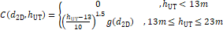{width="6.5in" height="3.44in"}

Figure 6.1.2-1: In-Carrier SEM in gap between transmitted channels for
SL-U wideband operation

#### 6.1.2.1 MPR for SL-U operation in single CC

##### 6.1.2.1.1 MPR for simultaneous PSSCH/PSCCH transmission

##### 6.1.2.1.1.1 LG Electronics' simulation results (R4-2315542) {#lg-electronics-simulation-results-r4-2315542 .H6}

The following simulation scenarios are considered as Table
6.1.2.1.1.1-1.

Table 6.1.2.1.1.1-1: SL-U PSSCH/PSCCH MPR/A-MPR simulation scenarios

+-----------------------+----------+----------+-----+-------------------+-----+
|                       | Scenario | Waveform | BW  | RB Setup          | SCS |
+=======================+==========+==========+=====+===================+=====+
| Full Allocation       | 1        | CP-OFDM  | 20  | 105RB0            | 15  |
+-----------------------+----------+----------+-----+-------------------+-----+
|                       | 2        | CP-OFDM  | 20  | 50RB0             | 30  |
+-----------------------+----------+----------+-----+-------------------+-----+
|                       | 3        | CP-OFDM  | 40  | 216RB0            | 15  |
+-----------------------+----------+----------+-----+-------------------+-----+
|                       | 4        | CP-OFDM  | 60  | 160RB0            | 30  |
+-----------------------+----------+----------+-----+-------------------+-----+
|                       | 5        | CP-OFDM  | 80  | 216RB0            | 30  |
+-----------------------+----------+----------+-----+-------------------+-----+
|                       | 6        | CP-OFDM  | 100 | 270RB0            | 30  |
+-----------------------+----------+----------+-----+-------------------+-----+
| Interlaced Allocation | 7        | CP-OFDM  | 20  | 1 RB0 every 10RBs | 15  |
|                       |          |          |     |                   |     |
| (Interlace\_0)        |          |          |     |                   |     |
+-----------------------+----------+----------+-----+-------------------+-----+
|                       | 8        | CP-OFDM  | 20  | 1RB0 every 5RBs   | 30  |
+-----------------------+----------+----------+-----+-------------------+-----+
|                       | 9        | CP-OFDM  | 40  | 1RB0 every 10RBs  | 15  |
+-----------------------+----------+----------+-----+-------------------+-----+
|                       | 10       | CP-OFDM  | 60  | 1RB0 every 5RBs   | 30  |
+-----------------------+----------+----------+-----+-------------------+-----+
|                       | 11       | CP-OFDM  | 80  | 1RB0 every 5RBs   | 30  |
+-----------------------+----------+----------+-----+-------------------+-----+
|                       | 12       | CP-OFDM  | 100 | 1RB0 every 5RBs   | 30  |
+-----------------------+----------+----------+-----+-------------------+-----+
| Wide band             | 13       | CP-OFDM  | 40  | Bitmap 10         | 15  |
|                       |          |          |     |                   |     |
| Full  operation       |          |          |     |                   |     |
+-----------------------+----------+----------+-----+-------------------+-----+
|                       | 14       | CP-OFDM  | 60  | Bitmap 100        | 30  |
+-----------------------+----------+----------+-----+-------------------+-----+
|                       | 15       | CP-OFDM  | 60  | Bitmap 110        | 30  |
+-----------------------+----------+----------+-----+-------------------+-----+
|                       | 16       | CP-OFDM  | 60  | Bitmap 010        | 30  |
+-----------------------+----------+----------+-----+-------------------+-----+
|                       | 17       | CP-OFDM  | 80  | Bitmap 1000       | 30  |
+-----------------------+----------+----------+-----+-------------------+-----+
|                       | 18       | CP-OFDM  | 80  | Bitmap 1100       | 30  |
+-----------------------+----------+----------+-----+-------------------+-----+
|                       | 19       | CP-OFDM  | 80  | Bitmap 1110       | 30  |
+-----------------------+----------+----------+-----+-------------------+-----+
|                       | 20       | CP-OFDM  | 80  | Bitmap 0100       | 30  |
+-----------------------+----------+----------+-----+-------------------+-----+
|                       | 21       | CP-OFDM  | 80  | Bitmap 0110       | 30  |
+-----------------------+----------+----------+-----+-------------------+-----+
|                       | 22       | CP-OFDM  | 100 | Bitmap 10000      | 30  |
+-----------------------+----------+----------+-----+-------------------+-----+
|                       | 23       | CP-OFDM  | 100 | Bitmap 11000      | 30  |
+-----------------------+----------+----------+-----+-------------------+-----+
|                       | 24       | CP-OFDM  | 100 | Bitmap 11100      | 30  |
+-----------------------+----------+----------+-----+-------------------+-----+
|                       | 25       | CP-OFDM  | 100 | Bitmap 11110      | 30  |
+-----------------------+----------+----------+-----+-------------------+-----+
|                       | 26       | CP-OFDM  | 100 | Bitmap 01000      | 30  |
+-----------------------+----------+----------+-----+-------------------+-----+
|                       | 27       | CP-OFDM  | 100 | Bitmap 01100      | 30  |
+-----------------------+----------+----------+-----+-------------------+-----+
|                       | 28       | CP-OFDM  | 100 | Bitmap 01110      | 30  |
+-----------------------+----------+----------+-----+-------------------+-----+
|                       | 29       | CP-OFDM  | 100 | Bitmap 00100      | 30  |
+-----------------------+----------+----------+-----+-------------------+-----+
| Wide band             | 30       | CP-OFDM  | 40  | Bitmap 10         | 15  |
|                       |          |          |     |                   |     |
| Interlaced            |          |          |     |                   |     |
|                       |          |          |     |                   |     |
| Operation             |          |          |     |                   |     |
|                       |          |          |     |                   |     |
| (Interlace\_0)        |          |          |     |                   |     |
+-----------------------+----------+----------+-----+-------------------+-----+
|                       | 31       | CP-OFDM  | 60  | Bitmap 100        | 30  |
+-----------------------+----------+----------+-----+-------------------+-----+
|                       | 32       | CP-OFDM  | 60  | Bitmap 110        | 30  |
+-----------------------+----------+----------+-----+-------------------+-----+
|                       | 33       | CP-OFDM  | 60  | Bitmap 010        | 30  |
+-----------------------+----------+----------+-----+-------------------+-----+
|                       | 34       | CP-OFDM  | 80  | Bitmap 1000       | 30  |
+-----------------------+----------+----------+-----+-------------------+-----+
|                       | 35       | CP-OFDM  | 80  | Bitmap 1100       | 30  |
+-----------------------+----------+----------+-----+-------------------+-----+
|                       | 36       | CP-OFDM  | 80  | Bitmap 1110       | 30  |
+-----------------------+----------+----------+-----+-------------------+-----+
|                       | 37       | CP-OFDM  | 80  | Bitmap 0100       | 30  |
+-----------------------+----------+----------+-----+-------------------+-----+
|                       | 38       | CP-OFDM  | 80  | Bitmap 0110       | 30  |
+-----------------------+----------+----------+-----+-------------------+-----+
|                       | 39       | CP-OFDM  | 100 | Bitmap 10000      | 30  |
+-----------------------+----------+----------+-----+-------------------+-----+
|                       | 40       | CP-OFDM  | 100 | Bitmap 11000      | 30  |
+-----------------------+----------+----------+-----+-------------------+-----+
|                       | 41       | CP-OFDM  | 100 | Bitmap 11100      | 30  |
+-----------------------+----------+----------+-----+-------------------+-----+
|                       | 42       | CP-OFDM  | 100 | Bitmap 11110      | 30  |
+-----------------------+----------+----------+-----+-------------------+-----+
|                       | 43       | CP-OFDM  | 100 | Bitmap 01000      | 30  |
+-----------------------+----------+----------+-----+-------------------+-----+
|                       | 44       | CP-OFDM  | 100 | Bitmap 01100      | 30  |
+-----------------------+----------+----------+-----+-------------------+-----+
|                       | 45       | CP-OFDM  | 100 | Bitmap 01110      | 30  |
+-----------------------+----------+----------+-----+-------------------+-----+
|                       | 46       | CP-OFDM  | 100 | Bitmap 00100      | 30  |
+-----------------------+----------+----------+-----+-------------------+-----+

Here, for RB set, '105RB0' means that RB starts at RB index '0' and
transmitted RB size is 105 RB. And, Bitmap '1' means the corresponding
RB set is transmitted, and '0' means the corresponding RB set is not
transmitted for wide band operation.

Table 6.1.2.1.1.1-2 shows the all possible bitmap of sub-band
configuration for wide band operation. The wide band operation can be
aggregated with multiple of 20MHz based sub-band. For the SL-U
PSSCH/PSCCH MPR simulation, only contiguous RB set bitmaps are
considered.

Table 6.1.2.1.1.1-2: All possible RB set Bitmap of sub-band
configuration

           Contiguous RB sets Bit map                                                                                Non-contiguous RB sets Bit map
  -------- --------------------------------------------------------------------------------------------------------- ----------------------------------------------------------------------------------------------------------------
  20MHz    N/A                                                                                                       N/A
  40MHz    11, 10, 01                                                                                                N/A
  60MHz    111, 110, 011, 100, 001, 010                                                                              101
  80MHz    1111, 1110, 0111, 1100, 0011, 1000, 0001, 0110, 0100, 0010                                                1001, 1101, 1011, 1010, 0101
  100MHz   11111, 11110, 01111, 11100, 00111, 11000, 00011, 10000, 00001, 01110, 01100, 00110, 01000, 00010, 00100   10001, 11011, 11010, 01011, 11001, 10011, 10101, 10110, 01101, 10100, 00101, 10010, 01001, 01010, 11101, 10111

Table 6.1.2.1.1.1-3 and Figure 6.1.2.1.1.1-1 show the MPR simulation
results for the scenarios.

Table 6.1.2.1.1.1-3: PSSCH/PSCCH MPR simulation results for SL-U power
class 5

  \'20MHz\'    Scenario \#   \#1    \#7    \#2    \#8                                                                                               
  ------------ ------------- ------ ------ ------ ------ ------ ------ ------ ------ ------ ------ ------ ------ ------ ------ ------ ------ ------ ------
               \'QPSK\'      2.48   2.83   2.15   2.49                                                                                              
               \'16QAM\'     2.48   2.83   2.16   2.50                                                                                              
               \'64QAM\'     2.82   2.83   3.18   2.50                                                                                              
               \'256QAM\'    5.88   5.08   5.89   5.49                                                                                              
  \'40MHz\'    Scenario \#   \#3    \#9    \#13   \#30                                                                                              
               \'QPSK\'      2.48   2.48   2.81   2.81                                                                                              
               \'16QAM\'     2.48   2.48   2.81   2.82                                                                                              
               \'64QAM\'     2.82   2.48   2.81   2.82                                                                                              
               \'256QAM\'    5.47   5.07   5.47   5.07                                                                                              
  \'60MHz\'    Scenario \#   \#4    \#10   \#14   \#31   \#15   \#32   \#16   \#33                                                                  
               \'QPSK\'      2.48   2.48   2.14   2.48   2.47   2.47   2.13   0.00                                                                  
               \'16QAM\'     2.48   2.48   2.14   2.48   2.47   2.47   2.13   0.36                                                                  
               \'64QAM\'     3.17   2.48   3.17   2.47   3.16   2.47   3.16   2.45                                                                  
               \'256QAM\'    5.88   5.07   5.47   5.07   5.88   5.07   5.88   5.46                                                                  
  \'80MHz\'    Scenario \#   \#5    \#11   \#17   \#34   \#18   \#35   \#19   \#36   \#20   \#37   \#21   \#38                                      
               \'QPSK\'      2.48   2.48   2.14   2.15   2.47   2.47   2.47   2.47   2.46   0.00   2.13   0.00                                      
               \'16QAM\'     2.48   2.48   2.14   2.15   2.47   2.47   2.47   2.47   2.46   0.10   2.13   0.63                                      
               \'64QAM\'     2.82   2.48   3.17   2.15   2.81   2.48   3.16   2.48   3.15   2.12   3.16   2.46                                      
               \'256QAM\'    5.47   5.06   5.47   5.07   5.47   5.07   5.88   5.07   5.46   5.05   5.88   5.06                                      
  \'100MHz\'   Scenario \#   \#6    \#12   \#22   \#39   \#23   \#40   \#24   \#41   \#25   \#42   \#26   \#43   \#27   \#44   \#28   \#45   \#29   \#46
               \'QPSK\'      2.48   2.48   2.14   2.48   2.47   2.48   2.47   2.47   2.47   2.47   2.13   0.00   2.46   0.00   2.46   0.13   2.13   0.00
               \'16QAM\'     2.48   2.48   2.14   2.48   2.47   2.48   2.47   2.47   2.47   2.47   2.13   0.35   2.46   0.63   2.47   0.64   2.13   0.10
               \'64QAM\'     3.16   2.48   3.17   2.48   3.17   2.47   3.16   2.47   2.81   2.47   3.16   2.13   3.16   2.46   3.16   2.47   3.15   2.12
               \'256QAM\'    5.88   5.06   5.47   5.08   5.47   5.06   5.47   5.07   5.47   5.06   5.47   5.06   5.47   5.06   5.47   5.06   5.46   5.06

{width="9.924305555555556in"
height="3.4120844269466315in"}Figure 6.1.2.1.1.1-1: PSSCH/PSCCH MPR
simulation results for SL-U power class 5

Considering the inner RB set bitmaps and the outer RB set bitmaps on top
of the Full/Partial RB allocation, the PSSCH/PSCCH MPR for SL-U power
class 5 can be proposed as Table 6.1.2.1.1.1-4 based on the simulation
results.

Table 6.1.2.1.1.1-4 Maximum power reduction (MPR) for SL-U UE power
class 5

+---------+---------+---------+---------+---------+---------+---------+
| Pre     | Mod     | RB      |         |         |         |         |
| -coding | ulation | All     |         |         |         |         |
|         |         | ocation |         |         |         |         |
+=========+=========+=========+=========+=========+=========+=========+
|         |         | Outer   | Inner   |         |         |         |
|         |         | RB set  | RB set  |         |         |         |
|         |         | co      | co      |         |         |         |
|         |         | nfigura | nfigura |         |         |         |
|         |         | tion^5^ | tion^5^ |         |         |         |
+---------+---------+---------+---------+---------+---------+---------+
|         |         | Full    | Partial | Full    | Partial | **Ex    |
|         |         | **^2^** | **^3^** | **^2^** | **^3^** | ception |
|         |         | (dB)    | (dB)    | (dB)    | (dB)    | for     |
|         |         |         |         |         |         | 100MHz  |
|         |         |         |         |         |         | Full^4^ |
|         |         |         |         |         |         | (dB)**  |
+---------+---------+---------+---------+---------+---------+---------+
| CP-OFDM | QPSK    | ≤ 3.5   | ≤ 3.5   | ≤ 3.5   | ≤ 1.5   | ≤ 4.5   |
+---------+---------+---------+---------+---------+---------+---------+
|         | 16 QAM  | ≤ 4.0   | ≤ 4.0   | ≤ 4.0   | ≤ 3.0   | ≤ 4.5   |
+---------+---------+---------+---------+---------+---------+---------+
|         | 64 QAM  | ≤ 5.5   | ≤ 5.5   | ≤ 5.5   | ≤ 5.5   |         |
+---------+---------+---------+---------+---------+---------+---------+
|         | 256 QAM | ≤ 7.0   | ≤ 7.0   | ≤ 7.0   | ≤ 7.0   |         |
+---------+---------+---------+---------+---------+---------+---------+
| NOTE 1: |         |         |         |         |         |         |
| The MPR |         |         |         |         |         |         |
| shall   |         |         |         |         |         |         |
| apply   |         |         |         |         |         |         |
| to all  |         |         |         |         |         |         |
| SCS in  |         |         |         |         |         |         |
| all     |         |         |         |         |         |         |
| active  |         |         |         |         |         |         |
| 20 MHz  |         |         |         |         |         |         |
| su      |         |         |         |         |         |         |
| b-bands |         |         |         |         |         |         |
| conti   |         |         |         |         |         |         |
| guously |         |         |         |         |         |         |
| al      |         |         |         |         |         |         |
| located |         |         |         |         |         |         |
| in the  |         |         |         |         |         |         |
| c       |         |         |         |         |         |         |
| hannel. |         |         |         |         |         |         |
|         |         |         |         |         |         |         |
| NOTE 2: |         |         |         |         |         |         |
| The MPR |         |         |         |         |         |         |
| for     |         |         |         |         |         |         |
| Full RB |         |         |         |         |         |         |
| all     |         |         |         |         |         |         |
| ocation |         |         |         |         |         |         |
| applies |         |         |         |         |         |         |
| to all  |         |         |         |         |         |         |
| RB's in |         |         |         |         |         |         |
| all     |         |         |         |         |         |         |
| tran    |         |         |         |         |         |         |
| smitted |         |         |         |         |         |         |
| 20 MHz  |         |         |         |         |         |         |
| or      |         |         |         |         |         |         |
| larger  |         |         |         |         |         |         |
| c       |         |         |         |         |         |         |
| hannels |         |         |         |         |         |         |
| that    |         |         |         |         |         |         |
| are     |         |         |         |         |         |         |
| fully   |         |         |         |         |         |         |
| al      |         |         |         |         |         |         |
| located |         |         |         |         |         |         |
| or all  |         |         |         |         |         |         |
| RB's in |         |         |         |         |         |         |
| all     |         |         |         |         |         |         |
| tran    |         |         |         |         |         |         |
| smitted |         |         |         |         |         |         |
| su      |         |         |         |         |         |         |
| b-bands |         |         |         |         |         |         |
| for     |         |         |         |         |         |         |
| w       |         |         |         |         |         |         |
| ideband |         |         |         |         |         |         |
| op      |         |         |         |         |         |         |
| eration |         |         |         |         |         |         |
| that    |         |         |         |         |         |         |
| are     |         |         |         |         |         |         |
| fully   |         |         |         |         |         |         |
| al      |         |         |         |         |         |         |
| located |         |         |         |         |         |         |
| ex      |         |         |         |         |         |         |
| cluding |         |         |         |         |         |         |
| the     |         |         |         |         |         |         |
| w       |         |         |         |         |         |         |
| ideband |         |         |         |         |         |         |
| configu |         |         |         |         |         |         |
| rations |         |         |         |         |         |         |
| of      |         |         |         |         |         |         |
| Table   |         |         |         |         |         |         |
| 6.      |         |         |         |         |         |         |
| 2F.2-2. |         |         |         |         |         |         |
|         |         |         |         |         |         |         |
| NOTE 3: |         |         |         |         |         |         |
| The MPR |         |         |         |         |         |         |
| for     |         |         |         |         |         |         |
| Partial |         |         |         |         |         |         |
| RB      |         |         |         |         |         |         |
| all     |         |         |         |         |         |         |
| ocation |         |         |         |         |         |         |
| applies |         |         |         |         |         |         |
| to      |         |         |         |         |         |         |
| int     |         |         |         |         |         |         |
| erlaced |         |         |         |         |         |         |
| allo    |         |         |         |         |         |         |
| cations |         |         |         |         |         |         |
| with    |         |         |         |         |         |         |
| uplink  |         |         |         |         |         |         |
| r       |         |         |         |         |         |         |
| esource |         |         |         |         |         |         |
| all     |         |         |         |         |         |         |
| ocation |         |         |         |         |         |         |
| type 2  |         |         |         |         |         |         |
| as      |         |         |         |         |         |         |
| sp      |         |         |         |         |         |         |
| ecified |         |         |         |         |         |         |
| in TS   |         |         |         |         |         |         |
| 38.214  |         |         |         |         |         |         |
| \[10\]  |         |         |         |         |         |         |
| or      |         |         |         |         |         |         |
| tran    |         |         |         |         |         |         |
| smitted |         |         |         |         |         |         |
| su      |         |         |         |         |         |         |
| b-bands |         |         |         |         |         |         |
| for     |         |         |         |         |         |         |
| w       |         |         |         |         |         |         |
| ideband |         |         |         |         |         |         |
| op      |         |         |         |         |         |         |
| eration |         |         |         |         |         |         |
| are     |         |         |         |         |         |         |
| tran    |         |         |         |         |         |         |
| smitted |         |         |         |         |         |         |
| ac      |         |         |         |         |         |         |
| cording |         |         |         |         |         |         |
| to the  |         |         |         |         |         |         |
| w       |         |         |         |         |         |         |
| ideband |         |         |         |         |         |         |
| configu |         |         |         |         |         |         |
| rations |         |         |         |         |         |         |
| of      |         |         |         |         |         |         |
| Table   |         |         |         |         |         |         |
| 6.      |         |         |         |         |         |         |
| 2F.2-2. |         |         |         |         |         |         |
|         |         |         |         |         |         |         |
| NOTE 4: |         |         |         |         |         |         |
| Ex      |         |         |         |         |         |         |
| ception |         |         |         |         |         |         |
| for     |         |         |         |         |         |         |
| 100MHz  |         |         |         |         |         |         |
| Full RB |         |         |         |         |         |         |
| all     |         |         |         |         |         |         |
| ocation |         |         |         |         |         |         |
| MPR     |         |         |         |         |         |         |
| applies |         |         |         |         |         |         |
| when    |         |         |         |         |         |         |
| all     |         |         |         |         |         |         |
| RB's in |         |         |         |         |         |         |
| all     |         |         |         |         |         |         |
| su      |         |         |         |         |         |         |
| b-bands |         |         |         |         |         |         |
| for     |         |         |         |         |         |         |
| 100MHz  |         |         |         |         |         |         |
| w       |         |         |         |         |         |         |
| ideband |         |         |         |         |         |         |
| op      |         |         |         |         |         |         |
| eration |         |         |         |         |         |         |
| are     |         |         |         |         |         |         |
| fully   |         |         |         |         |         |         |
| al      |         |         |         |         |         |         |
| located |         |         |         |         |         |         |
| and     |         |         |         |         |         |         |
| su      |         |         |         |         |         |         |
| b-bands |         |         |         |         |         |         |
| are     |         |         |         |         |         |         |
| tran    |         |         |         |         |         |         |
| smitted |         |         |         |         |         |         |
| ac      |         |         |         |         |         |         |
| cording |         |         |         |         |         |         |
| to the  |         |         |         |         |         |         |
| w       |         |         |         |         |         |         |
| ideband |         |         |         |         |         |         |
| configu |         |         |         |         |         |         |
| rations |         |         |         |         |         |         |
| of      |         |         |         |         |         |         |
| Table   |         |         |         |         |         |         |
| 6.      |         |         |         |         |         |         |
| 2F.2-2. |         |         |         |         |         |         |
|         |         |         |         |         |         |         |
| NOTE 5: |         |         |         |         |         |         |
| Con     |         |         |         |         |         |         |
| tiguous |         |         |         |         |         |         |
| outer   |         |         |         |         |         |         |
| s       |         |         |         |         |         |         |
| ub-band |         |         |         |         |         |         |
| config  |         |         |         |         |         |         |
| uration |         |         |         |         |         |         |
| and     |         |         |         |         |         |         |
| con     |         |         |         |         |         |         |
| tiguous |         |         |         |         |         |         |
| inner   |         |         |         |         |         |         |
| s       |         |         |         |         |         |         |
| ub-band |         |         |         |         |         |         |
| config  |         |         |         |         |         |         |
| uration |         |         |         |         |         |         |
| in      |         |         |         |         |         |         |
| Table   |         |         |         |         |         |         |
| 6.1.2.  |         |         |         |         |         |         |
| 1.1.1-5 |         |         |         |         |         |         |
| apply.  |         |         |         |         |         |         |
+---------+---------+---------+---------+---------+---------+---------+

Table 6.1.2.1.1.1-5: Outer/Inner sub-band configuration for SL-U
wideband operation

  Wideband operation channel bandwidth (MHz)                                                                                                                                                                                                                                                                           **Contiguous sub-band configuration**                           **Non-contiguous sub-band configuration**                                                                                                             
  -------------------------------------------------------------------------------------------------------------------------------------------------------------------------------------------------------------------------------------------------------------------------------------------------------------------- --------------------------------------------------------------- ------------------------------------------- --------------------------------------------------------------------------------------------------------- -----------
                                                                                                                                                                                                                                                                                                                       **Outer**                                                       **Inner**                                   **Outer**                                                                                                 **Inner**
  40                                                                                                                                                                                                                                                                                                                   11, 10, 01                                                      N/A                                         N/A                                                                                                       N/A
  60                                                                                                                                                                                                                                                                                                                   111, 110, 011, 100, 001                                         010                                         101                                                                                                       N/A
  80                                                                                                                                                                                                                                                                                                                   1111, 1110, 0111, 1100, 0011, 1000, 0001                        0110, 0100, 0010                            1101, 1011, 1010, 0101, 1001                                                                              N/A
  100                                                                                                                                                                                                                                                                                                                  11111, 11110, 01111, 11100, 00111, 11000, 00011, 10000, 00001   01110, 01100, 00110, 01000, 00010, 00100    11011, 11010, 01011, 11001, 10011, 10101, 10110, 01101, 10100, 00101, 10010, 01001, 11101, 10111, 10001   01010
  NOTE 1: The sub-band configuration is represented as a bitmap where '1' indicates that a sub-band is transmitted and '0' indicates a sub-band is not transmitted. The bitmap is ordered with MSB mapped to the lowest frequency sub-band and LSB mapped to highest frequency sub-band within the wideband channel.                                                                                                                                                                                                                         

##### 6.1.2.1.1.2 OPPO's simulation results (R4-2316119) {#oppos-simulation-results-r4-2316119 .H6}

With the agreement above, the simulation cases are updated with 60kHz
deleted. For each case, the QPSK, 16QAM, 64QAM and 256QAM will be
simulated.

Table 6.1.2.1.1.2-1 simulation cases

+--------------------------+------+----------+-----+-------------------+-----+
|                          | case | Waveform | BW  | RB Setup          | SCS |
+==========================+======+==========+=====+===================+=====+
| Full Allocation          | 1    | CP-OFDM  | 20  | 105RB0            | 15  |
|                          |      |          |     |                   |     |
| Single CC                |      |          |     |                   |     |
+--------------------------+------+----------+-----+-------------------+-----+
|                          | 2    | CP-OFDM  | 20  | 50RB0             | 30  |
+--------------------------+------+----------+-----+-------------------+-----+
|                          | 3    | CP-OFDM  | 40  | 216RB0            | 15  |
+--------------------------+------+----------+-----+-------------------+-----+
|                          | 4    | CP-OFDM  | 40  | 105RB0            | 30  |
+--------------------------+------+----------+-----+-------------------+-----+
|                          | 5    | CP-OFDM  | 60  | 160RB0            | 30  |
+--------------------------+------+----------+-----+-------------------+-----+
|                          | 6    | CP-OFDM  | 80  | 216RB0            | 30  |
+--------------------------+------+----------+-----+-------------------+-----+
|                          | 7    | CP-OFDM  | 100 | 270RB0            | 30  |
+--------------------------+------+----------+-----+-------------------+-----+
| Interlaced Allocation    | 8    | CP-OFDM  | 20  | 1 RB0 every 10RBs | 15  |
|                          |      |          |     |                   |     |
| Single CC                |      |          |     |                   |     |
+--------------------------+------+----------+-----+-------------------+-----+
|                          | 9    | CP-OFDM  | 20  | 1RB0 every 5RBs   | 30  |
+--------------------------+------+----------+-----+-------------------+-----+
|                          | 10   | CP-OFDM  | 40  | 1RB0 every 10RBs  | 15  |
+--------------------------+------+----------+-----+-------------------+-----+
|                          | 11   | CP-OFDM  | 40  | 1RB0 every 5RBs   | 30  |
+--------------------------+------+----------+-----+-------------------+-----+
|                          | 12   | CP-OFDM  | 60  | 1RB0 every 5RBs   | 30  |
+--------------------------+------+----------+-----+-------------------+-----+
|                          | 13   | CP-OFDM  | 80  | 1RB0 every 5RBs   | 30  |
+--------------------------+------+----------+-----+-------------------+-----+
|                          | 14   | CP-OFDM  | 100 | 1RB0 every 5RBs   | 30  |
+--------------------------+------+----------+-----+-------------------+-----+
| Wide band operation      | 15   | CP-OFDM  | 40  | Bitmap 10         | 30  |
|                          |      |          |     |                   |     |
| contiguous RB allocation |      |          |     |                   |     |
+--------------------------+------+----------+-----+-------------------+-----+
|                          | 16   | CP-OFDM  | 60  | Bitmap 100        | 30  |
+--------------------------+------+----------+-----+-------------------+-----+
|                          | 17   | CP-OFDM  | 60  | Bitmap 110        | 30  |
+--------------------------+------+----------+-----+-------------------+-----+
|                          | 18   | CP-OFDM  | 60  | Bitmap 010        | 30  |
+--------------------------+------+----------+-----+-------------------+-----+
|                          | 19   | CP-OFDM  | 80  | Bitmap 1000       | 30  |
+--------------------------+------+----------+-----+-------------------+-----+
|                          | 20   | CP-OFDM  | 80  | Bitmap 1100       | 30  |
+--------------------------+------+----------+-----+-------------------+-----+
|                          | 21   | CP-OFDM  | 80  | Bitmap 1110       | 30  |
+--------------------------+------+----------+-----+-------------------+-----+
|                          | 22   | CP-OFDM  | 80  | Bitmap 0100       | 30  |
+--------------------------+------+----------+-----+-------------------+-----+
|                          | 23   | CP-OFDM  | 80  | Bitmap 0110       | 30  |
+--------------------------+------+----------+-----+-------------------+-----+
|                          | 24   | CP-OFDM  | 100 | Bitmap 10000      | 30  |
+--------------------------+------+----------+-----+-------------------+-----+
|                          | 25   | CP-OFDM  | 100 | Bitmap 11000      | 30  |
+--------------------------+------+----------+-----+-------------------+-----+
|                          | 26   | CP-OFDM  | 100 | Bitmap 11100      | 30  |
+--------------------------+------+----------+-----+-------------------+-----+
|                          | 27   | CP-OFDM  | 100 | Bitmap 11110      | 30  |
+--------------------------+------+----------+-----+-------------------+-----+
|                          | 28   | CP-OFDM  | 100 | Bitmap 01000      | 30  |
+--------------------------+------+----------+-----+-------------------+-----+
|                          | 29   | CP-OFDM  | 100 | Bitmap 01100      | 30  |
+--------------------------+------+----------+-----+-------------------+-----+
|                          | 30   | CP-OFDM  | 100 | Bitmap 01110      | 30  |
+--------------------------+------+----------+-----+-------------------+-----+
|                          | 31   | CP-OFDM  | 100 | Bitmap 00100      | 30  |
+--------------------------+------+----------+-----+-------------------+-----+
| Wide band operation      | 32   | CP-OFDM  | 40  | Bitmap 10         | 30  |
|                          |      |          |     |                   |     |
| Interlaced RB allocation |      |          |     |                   |     |
+--------------------------+------+----------+-----+-------------------+-----+
|                          | 33   | CP-OFDM  | 60  | Bitmap 100        | 30  |
+--------------------------+------+----------+-----+-------------------+-----+
|                          | 34   | CP-OFDM  | 60  | Bitmap 110        | 30  |
+--------------------------+------+----------+-----+-------------------+-----+
|                          | 35   | CP-OFDM  | 60  | Bitmap 010        | 30  |
+--------------------------+------+----------+-----+-------------------+-----+
|                          | 36   | CP-OFDM  | 80  | Bitmap 1000       | 30  |
+--------------------------+------+----------+-----+-------------------+-----+
|                          | 37   | CP-OFDM  | 80  | Bitmap 1100       | 30  |
+--------------------------+------+----------+-----+-------------------+-----+
|                          | 38   | CP-OFDM  | 80  | Bitmap 1110       | 30  |
+--------------------------+------+----------+-----+-------------------+-----+
|                          | 39   | CP-OFDM  | 80  | Bitmap 0100       | 30  |
+--------------------------+------+----------+-----+-------------------+-----+
|                          | 40   | CP-OFDM  | 80  | Bitmap 0110       | 30  |
+--------------------------+------+----------+-----+-------------------+-----+
|                          | 41   | CP-OFDM  | 100 | Bitmap 10000      | 30  |
+--------------------------+------+----------+-----+-------------------+-----+
|                          | 42   | CP-OFDM  | 100 | Bitmap 11000      | 30  |
+--------------------------+------+----------+-----+-------------------+-----+
|                          | 43   | CP-OFDM  | 100 | Bitmap 11100      | 30  |
+--------------------------+------+----------+-----+-------------------+-----+
|                          | 44   | CP-OFDM  | 100 | Bitmap 11110      | 30  |
+--------------------------+------+----------+-----+-------------------+-----+
|                          | 45   | CP-OFDM  | 100 | Bitmap 01000      | 30  |
+--------------------------+------+----------+-----+-------------------+-----+
|                          | 46   | CP-OFDM  | 100 | Bitmap 01100      | 30  |
+--------------------------+------+----------+-----+-------------------+-----+
|                          | 47   | CP-OFDM  | 100 | Bitmap 01110      | 30  |
+--------------------------+------+----------+-----+-------------------+-----+
|                          | 48   | CP-OFDM  | 100 | Bitmap 00100      | 30  |
+--------------------------+------+----------+-----+-------------------+-----+

Corresponding MPR results are shown as below for case 1 to 14:

Table 6.1.2.1.1.2-2 MPR for single CC

  case     1     2     3     4     5     6     7     8     9     10    11    12    13    14
  -------- ----- ----- ----- ----- ----- ----- ----- ----- ----- ----- ----- ----- ----- -----
  QPSK     3.2   3.1   3.2   3.2   3.2   3.2   3.2   3.4   3.1   3.3   3.2   3.2   3.3   3.2
  16QAM    3.7   3.6   3.7   3.7   3.7   3.7   3.6   3.4   3.1   3.3   3.2   3.2   3.3   3.2
  64QAM    5.0   5.2   5.1   5.0   5.2   5.1   5.1   4.1   4.3   4.1   4.4   4.1   3.9   4.0
  256QAM   8.8   8.6   8.6   8.8   8.6   8.5   8.7   6.6   7.5   7.6   7.9   6.6   6.5   6.8

The wide-band operation simulation result is further provided below:

Table 6.1.2.1.1.2-3 MPR for Wideband operation

               Bitmap   10    100   1000   10000   010   0100   01000   00100   110   1100   11000   0110   01100   1110   11100   01110   11110
  ------------ -------- ----- ----- ------ ------- ----- ------ ------- ------- ----- ------ ------- ------ ------- ------ ------- ------- -------
  Contiguous   QPSK     2.8   2.8   2.8    2.8     2.8   2.8    2.8     2.8     2.8   2.8    2.8     2.8    2.8     2.8    2.8     2.8     2.8
               16QAM    3.5   3.5   3.6    3.5     3.6   3.5    3.6     3.5     3.7   3.5    3.6     3.5    3.6     3.5    3.6     3.7     3.6
               64QAM    5.1   5.1   4.8    5.2     4.7   5.1    4.9     5.1     4.9   5.1    4.7     4.8    5.0     5.1    4.8     5.0     5.2
               256QAM   7.4   7.5   7.7    8.5     7.3   7.4    8.0     7.5     8.5   7.4    7.3     7.6    8.0     7.4    7.7     8.5     8.5
  Interlace    QPSK     2.6   2.6   2.7    2.8     2.6   2.6    2.6     2.6     2.6   2.6    2.7     2.7    2.7     2.6    2.7     2.8     2.6
               16QAM    2.9   2.9   3.0    2.9     3.0   2.9    3.0     2.9     3.0   2.9    3.0     3.0    2.8     2.9    3.0     3.0     2.8
               64QAM    4.1   4.1   4.2    4.1     4.2   4.1    4.1     4.1     4.2   4.1    4.2     4.1    4.0     4.1    4.2     4.1     4.1
               256QAM   6.5   6.6   6.8    6.6     6.8   6.6    6.7     6.6     6.8   6.6    6.8     6.7    6.6     6.6    6.8     6.7     6.5

[\[CHART\]]{.chart}

Figure 6.1.2.1.1.2-1, Contiguous and Interlaced Single CC MPR

[\[CHART\]]{.chart}

Figure 6.1.2.1.1.2-2, Contiguous and Interlaced Wideband MPR

The case 15, 16, 17, 19, 20, 22, 24, 25, 26, 28, 29 can apply 8dB limit
while the rest of the cases should apply 9dB limit.

So the exception bitmap can be listed as below:

Table 6.1.2.1.1.2-4 exception cases mapping to bitmap

  15   CP-OFDM   40    Bitmap 10      30
  ---- --------- ----- -------------- ----
  16   CP-OFDM   60    Bitmap 100     30
  17   CP-OFDM   60    Bitmap 110     30
  19   CP-OFDM   80    Bitmap 1000    30
  20   CP-OFDM   80    Bitmap 1100    30
  22   CP-OFDM   80    Bitmap 0100    30
  24   CP-OFDM   100   Bitmap 10000   30
  25   CP-OFDM   100   Bitmap 11000   30
  26   CP-OFDM   100   Bitmap 11100   30
  28   CP-OFDM   100   Bitmap 01000   30
  29   CP-OFDM   100   Bitmap 01100   30

The Exception MPR mapping for wideband operation is proposed as below:

Table 6.1.2.1.1.2-5: Exception bitmap mapping

  Wideband operation channel bandwidth (MHz)   Sub-band configuration exceptions
  -------------------------------------------- ----------------------------------------------------------------------
  40                                           10, 01
  60                                           110, 011
  80                                           1000, 1100, 0100, 0010, 0011, 0001
  100                                          10000, 11000, 11100, 01000, 01100, 00110, 00010, 00111, 00011, 00001

##### 6.1.2.1.1.3 Huawei's simulation results (R4-2315226) {#huaweis-simulation-results-r4-2315226 .H6}

Referring to the simulation cases listed in Table 6.1.2.1.1.3-1, the MPR
value are shown in Table 6.1.2.1.1.3-2 and Table 6.1.2.1.1.3-3 for
below.

Table 6.1.2.1.1.3-1 Simulation cases for SL-U

+-----------------------+------+----------+-----+-------------------+-----+
|                       | case | Waveform | BW  | RB Setup          | SCS |
+=======================+======+==========+=====+===================+=====+
| Full Allocation       | 1    | CP-OFDM  | 20  | 105RB0            | 15  |
|                       |      |          |     |                   |     |
| Single CC             |      |          |     |                   |     |
+-----------------------+------+----------+-----+-------------------+-----+
|                       | 2    | CP-OFDM  | 20  | 50RB0             | 30  |
+-----------------------+------+----------+-----+-------------------+-----+
|                       | 3    | CP-OFDM  | 40  | 216RB0            | 15  |
+-----------------------+------+----------+-----+-------------------+-----+
|                       | 4    | CP-OFDM  | 60  | 160RB0            | 30  |
+-----------------------+------+----------+-----+-------------------+-----+
|                       | 5    | CP-OFDM  | 80  | 216RB0            | 30  |
+-----------------------+------+----------+-----+-------------------+-----+
|                       | 6    | CP-OFDM  | 100 | 270RB0            | 30  |
+-----------------------+------+----------+-----+-------------------+-----+
| Interlaced Allocation | 7    | CP-OFDM  | 20  | 1 RB0 every 10RBs | 15  |
|                       |      |          |     |                   |     |
| Single CC             |      |          |     |                   |     |
+-----------------------+------+----------+-----+-------------------+-----+
|                       | 8    | CP-OFDM  | 20  | 1RB0 every 5RBs   | 30  |
+-----------------------+------+----------+-----+-------------------+-----+
|                       | 9    | CP-OFDM  | 40  | 1RB0 every 10RBs  | 15  |
+-----------------------+------+----------+-----+-------------------+-----+
|                       | 10   | CP-OFDM  | 60  | 1RB0 every 5RBs   | 30  |
+-----------------------+------+----------+-----+-------------------+-----+
|                       | 11   | CP-OFDM  | 80  | 1RB0 every 5RBs   | 30  |
+-----------------------+------+----------+-----+-------------------+-----+
|                       | 12   | CP-OFDM  | 100 | 1RB0 every 5RBs   | 30  |
+-----------------------+------+----------+-----+-------------------+-----+
| Wide band operation   | 13   | CP-OFDM  | 40  | Bitmap 10         | 15  |
+-----------------------+------+----------+-----+-------------------+-----+
|                       | 14   | CP-OFDM  | 60  | Bitmap 100        | 30  |
+-----------------------+------+----------+-----+-------------------+-----+
|                       | 15   | CP-OFDM  | 60  | Bitmap 110        | 30  |
+-----------------------+------+----------+-----+-------------------+-----+
|                       | 16   | CP-OFDM  | 80  | Bitmap 1000       | 30  |
+-----------------------+------+----------+-----+-------------------+-----+
|                       | 17   | CP-OFDM  | 80  | Bitmap 1100       | 30  |
+-----------------------+------+----------+-----+-------------------+-----+
|                       | 18   | CP-OFDM  | 80  | Bitmap 1110       | 30  |
+-----------------------+------+----------+-----+-------------------+-----+
|                       | 19   | CP-OFDM  | 80  | Bitmap 0100       | 30  |
+-----------------------+------+----------+-----+-------------------+-----+
|                       | 20   | CP-OFDM  | 80  | Bitmap 0110       | 30  |
+-----------------------+------+----------+-----+-------------------+-----+
|                       | 21   | CP-OFDM  | 100 | Bitmap 10000      | 30  |
+-----------------------+------+----------+-----+-------------------+-----+
|                       | 22   | CP-OFDM  | 100 | Bitmap 11000      | 30  |
+-----------------------+------+----------+-----+-------------------+-----+
|                       | 23   | CP-OFDM  | 100 | Bitmap 11100      | 30  |
+-----------------------+------+----------+-----+-------------------+-----+
|                       | 24   | CP-OFDM  | 100 | Bitmap 11110      | 30  |
+-----------------------+------+----------+-----+-------------------+-----+
|                       | 25   | CP-OFDM  | 100 | Bitmap 01000      | 30  |
+-----------------------+------+----------+-----+-------------------+-----+
|                       | 26   | CP-OFDM  | 100 | Bitmap 01100      | 30  |
+-----------------------+------+----------+-----+-------------------+-----+
|                       | 27   | CP-OFDM  | 100 | Bitmap 01110      | 30  |
+-----------------------+------+----------+-----+-------------------+-----+
|                       | 28   | CP-OFDM  | 100 | Bitmap 00100      | 30  |
+-----------------------+------+----------+-----+-------------------+-----+

Table 6.1.2.1.1.3-2 Maximum power reduction (MPR) for SL-U with Full
Allocation

  Modulation   Case: Bandwidth/SCS                                                   
  ------------ --------------------- ----------- ----------- ----------- ----------- ------------
               20MHz/15k             20MHz/30k   40MHz/15k   60MHz/30k   80MHz/30k   100MHz/30k
  QPSK         4.0                   3.8         4.1         4.0         4.0         4.1
  16 QAM       4.1                   3.9         4.1         4.1         3.8         4.2
  64 QAM       6.1                   6.1         6.1         6.1         6.1         6.1
  256 QAM      7.5                   7.7         7.6         7.8         7.5         7.9

Table 6.1.2.1.1.3-3 Maximum power reduction (MPR) for SL-U with
Interlaced Allocation

  Modulation   Case: Bandwidth/SCS                                                   
  ------------ --------------------- ----------- ----------- ----------- ----------- ------------
               20MHz/15k             20MHz/30k   40MHz/15k   60MHz/30k   80MHz/30k   100MHz/30k
  QPSK         4.0                   4.1         4.0         4.1         4.1         4.1
  16 QAM       4.1                   4.2         4.2         4.1         4.2         4.2
  64 QAM       5.8                   5.9         5.7         5.6         5.9         6.1
  256 QAM      7.0                   7.3         7.1         7.4         7.7         7.4

Table 6.1.2.1.1.3-4 Maximum power reduction (MPR) for SL-U with Wide
band operation

  Modulation   Case: Bandwidth/Bitmap pattern                                                                                  
  ------------ -------------------------------- ------- ------- -------- ------ ------ ------- ------- ------- ------- ------- -------
               40MHz                            60MHz   80MHz   100MHz                                                         
               10                               100     110     1000     1110   0110   10000   11110   01000   01100   01110   00100
  QPSK         4.0                              3.7     3.9     3.8      4.0    3.8    3.9     4.1     3.0     3.2     3.9     3.4
  16 QAM       4.0                              3.9     4.1     3.9      4.1    3.9    3.9     4.2     3.7     3.8     4.0     3.7
  64 QAM       5.1                              5.1     5.5     5.2      5.7    5.7    5.1     5.8     5.4     6.0     5.9     5.5
  256 QAM      6.4                              6.8     6.9     6.3      7.0    7.1    6.5     7.3     6.7     7.4     7.3     7.0

Table 6.1.2.1.1.3-5: Proposed MPR for SL-U with single CC

  Precoding   Modulation   Full    Partial
  ----------- ------------ ------- ---------
  CP-OFDM     QPSK         ≤ 4.1   ≤ 4.1
              16 QAM       ≤ 4.2   ≤ 4.2
              64 QAM       ≤ 6.1   ≤ 6.1
              256 QAM      ≤ 8.0   ≤ 7.7

##### 6.1.2.1.1.4 Qualcomm's simulation results (R4-2316791) {#qualcomms-simulation-results-r4-2316791 .H6}

Table 6.1.2.1.1.4-1: Power class 5 PSSCH/PSCCH MPR simulation results

<table>
<thead>
<tr class="header">
<th> </th>
<th>case</th>
<th>Precoding</th>
<th>BW</th>
<th></th>
<th>RB Setup</th>
<th>SCS</th>
<th>QPSK and 16QAM MPR</th>
<th>64 QAM MPR</th>
<th>256 QAM MPR</th>
</tr>
</thead>
<tbody>
<tr class="odd">
<td>
Full Allocation

Single CC
</td>
<td>1</td>
<td>CP-OFDM</td>
<td>20</td>
<td></td>
<td>105RB0</td>
<td>15</td>
<td>3.5</td>
<td>3.8</td>
<td>6.2</td>
</tr>
<tr class="even">
<td></td>
<td>2</td>
<td>CP-OFDM</td>
<td>20</td>
<td></td>
<td>50RB0</td>
<td>30</td>
<td>3.5</td>
<td>3.8</td>
<td>6.0</td>
</tr>
<tr class="odd">
<td></td>
<td>3</td>
<td>CP-OFDM</td>
<td>40</td>
<td></td>
<td>216RB0</td>
<td>15</td>
<td>3.6</td>
<td>3.7</td>
<td>6.0</td>
</tr>
<tr class="even">
<td></td>
<td>4</td>
<td>CP-OFDM</td>
<td>60</td>
<td></td>
<td>160RB0</td>
<td>30</td>
<td>3.5</td>
<td>3.6</td>
<td>6.0</td>
</tr>
<tr class="odd">
<td></td>
<td>5</td>
<td>CP-OFDM</td>
<td>80</td>
<td></td>
<td>216RB0</td>
<td>30</td>
<td>3.6</td>
<td>3.7</td>
<td>6.2</td>
</tr>
<tr class="even">
<td></td>
<td>6</td>
<td>CP-OFDM</td>
<td>100</td>
<td></td>
<td>270RB0</td>
<td>30</td>
<td></td>
<td></td>
<td></td>
</tr>
<tr class="odd">
<td>
Interlaced Allocation

Single CC
</td>
<td>7</td>
<td>CP-OFDM</td>
<td>20</td>
<td></td>
<td>1 RB0 every 10RBs</td>
<td>15</td>
<td>3.5</td>
<td>3.7</td>
<td>6.2</td>
</tr>
<tr class="even">
<td></td>
<td>8</td>
<td>CP-OFDM</td>
<td>20</td>
<td></td>
<td>1RB0 every 5RBs</td>
<td>30</td>
<td>3.6</td>
<td>3.7</td>
<td>6.1</td>
</tr>
<tr class="odd">
<td></td>
<td>9</td>
<td>CP-OFDM</td>
<td>40</td>
<td></td>
<td>1RB0 every 10RBs</td>
<td>15</td>
<td>3.6</td>
<td>3.9</td>
<td>6.4</td>
</tr>
<tr class="even">
<td></td>
<td>10</td>
<td>CP-OFDM</td>
<td>60</td>
<td></td>
<td>1RB0 every 5RBs</td>
<td>30</td>
<td>3.5</td>
<td>3.7</td>
<td>6.3</td>
</tr>
<tr class="odd">
<td></td>
<td>11</td>
<td>CP-OFDM</td>
<td>80</td>
<td></td>
<td>1RB0 every 5RBs</td>
<td>30</td>
<td>3.7</td>
<td>3.9</td>
<td>6.5</td>
</tr>
<tr class="even">
<td></td>
<td>12</td>
<td>CP-OFDM</td>
<td>100</td>
<td></td>
<td>1RB0 every 5RBs</td>
<td>30</td>
<td>3.6</td>
<td>4.1</td>
<td>6.6</td>
</tr>
<tr class="odd">
<td>Wide band Full  operation</td>
<td>13</td>
<td>CP-OFDM</td>
<td>40</td>
<td></td>
<td>Bitmap 10</td>
<td>15</td>
<td>3.6</td>
<td>3.7</td>
<td>6.0</td>
</tr>
<tr class="even">
<td></td>
<td>14</td>
<td>CP-OFDM</td>
<td>60</td>
<td></td>
<td>Bitmap 100</td>
<td>30</td>
<td>3.1</td>
<td>3.6</td>
<td>6.0</td>
</tr>
<tr class="odd">
<td></td>
<td>15</td>
<td>CP-OFDM</td>
<td>60</td>
<td></td>
<td>Bitmap 110</td>
<td>30</td>
<td>3.3</td>
<td>3.7</td>
<td>6.0</td>
</tr>
<tr class="even">
<td></td>
<td>16</td>
<td>CP-OFDM</td>
<td>80</td>
<td></td>
<td>Bitmap 1000</td>
<td>30</td>
<td>3.1</td>
<td>3.6</td>
<td>6.0</td>
</tr>
<tr class="odd">
<td></td>
<td>17</td>
<td>CP-OFDM</td>
<td>80</td>
<td></td>
<td>Bitmap 1100</td>
<td>30</td>
<td>3.3</td>
<td>3.7</td>
<td>6.0</td>
</tr>
<tr class="even">
<td></td>
<td>18</td>
<td>CP-OFDM</td>
<td>80</td>
<td></td>
<td>Bitmap 1110</td>
<td>30</td>
<td>3.4</td>
<td>3.6</td>
<td>6.0</td>
</tr>
<tr class="odd">
<td></td>
<td>19</td>
<td>CP-OFDM</td>
<td>80</td>
<td></td>
<td>Bitmap 0100</td>
<td>30</td>
<td>1.3</td>
<td>3.6</td>
<td>6.0</td>
</tr>
<tr class="even">
<td></td>
<td>20</td>
<td>CP-OFDM</td>
<td>80</td>
<td></td>
<td>Bitmap 0110</td>
<td>30</td>
<td>1.3</td>
<td>3.5</td>
<td>5.9</td>
</tr>
<tr class="odd">
<td></td>
<td>21</td>
<td>CP-OFDM</td>
<td>100</td>
<td></td>
<td>Bitmap 10000</td>
<td>30</td>
<td>3.1</td>
<td>3.6</td>
<td>6.0</td>
</tr>
<tr class="even">
<td></td>
<td>22</td>
<td>CP-OFDM</td>
<td>100</td>
<td></td>
<td>Bitmap 11000</td>
<td>30</td>
<td>3.3</td>
<td>3.7</td>
<td>6.0</td>
</tr>
<tr class="odd">
<td></td>
<td>23</td>
<td>CP-OFDM</td>
<td>100</td>
<td></td>
<td>Bitmap 11100</td>
<td>30</td>
<td>3.4</td>
<td>3.6</td>
<td>6.0</td>
</tr>
<tr class="even">
<td></td>
<td>24</td>
<td>CP-OFDM</td>
<td>100</td>
<td></td>
<td>Bitmap 11110</td>
<td>30</td>
<td>3.4</td>
<td>3.7</td>
<td>6.2</td>
</tr>
<tr class="odd">
<td></td>
<td>25</td>
<td>CP-OFDM</td>
<td>100</td>
<td></td>
<td>Bitmap 01000</td>
<td>30</td>
<td></td>
<td></td>
<td></td>
</tr>
<tr class="even">
<td></td>
<td>26</td>
<td>CP-OFDM</td>
<td>100</td>
<td></td>
<td>Bitmap 01100</td>
<td>30</td>
<td>1.4</td>
<td>3.5</td>
<td>5.9</td>
</tr>
<tr class="odd">
<td></td>
<td>27</td>
<td>CP-OFDM</td>
<td>100</td>
<td></td>
<td>Bitmap 01110</td>
<td>30</td>
<td>1.5</td>
<td>3.8</td>
<td>6.5</td>
</tr>
<tr class="even">
<td></td>
<td>28</td>
<td>CP-OFDM</td>
<td>100</td>
<td></td>
<td>Bitmap 00100</td>
<td>30</td>
<td></td>
<td></td>
<td></td>
</tr>
<tr class="odd">
<td>
Wide band

Interlaced

operation
</td>
<td>29</td>
<td>CP-OFDM</td>
<td>40</td>
<td></td>
<td>Bitmap 10</td>
<td>15</td>
<td>3.5</td>
<td>3.7</td>
<td>6.0</td>
</tr>
<tr class="even">
<td></td>
<td>30</td>
<td>CP-OFDM</td>
<td>60</td>
<td></td>
<td>Bitmap 100</td>
<td>30</td>
<td>3.2</td>
<td>3.8</td>
<td>6.1</td>
</tr>
<tr class="odd">
<td></td>
<td>31</td>
<td>CP-OFDM</td>
<td>60</td>
<td></td>
<td>Bitmap 110</td>
<td>30</td>
<td>3.5</td>
<td>4.0</td>
<td>6.6</td>
</tr>
<tr class="even">
<td></td>
<td>32</td>
<td>CP-OFDM</td>
<td>80</td>
<td></td>
<td>Bitmap 1000</td>
<td>30</td>
<td>3.2</td>
<td>3.8</td>
<td>6.1</td>
</tr>
<tr class="odd">
<td></td>
<td>33</td>
<td>CP-OFDM</td>
<td>80</td>
<td></td>
<td>Bitmap 1100</td>
<td>30</td>
<td>3.5</td>
<td>4.0</td>
<td>6.6</td>
</tr>
<tr class="even">
<td></td>
<td>34</td>
<td>CP-OFDM</td>
<td>80</td>
<td></td>
<td>Bitmap 1110</td>
<td>30</td>
<td>3.5</td>
<td>4.0</td>
<td>6.6</td>
</tr>
<tr class="odd">
<td></td>
<td>35</td>
<td>CP-OFDM</td>
<td>80</td>
<td></td>
<td>Bitmap 0100</td>
<td>30</td>
<td>1.4</td>
<td>3.8</td>
<td>6.1</td>
</tr>
<tr class="even">
<td></td>
<td>36</td>
<td>CP-OFDM</td>
<td>80</td>
<td></td>
<td>Bitmap 0110</td>
<td>30</td>
<td>1.6</td>
<td>4.0</td>
<td>6.5</td>
</tr>
<tr class="odd">
<td></td>
<td>37</td>
<td>CP-OFDM</td>
<td>100</td>
<td></td>
<td>Bitmap 10000</td>
<td>30</td>
<td>3.2</td>
<td>3.8</td>
<td>6.1</td>
</tr>
<tr class="even">
<td></td>
<td>38</td>
<td>CP-OFDM</td>
<td>100</td>
<td></td>
<td>Bitmap 11000</td>
<td>30</td>
<td>3.5</td>
<td>4.1</td>
<td>6.6</td>
</tr>
<tr class="odd">
<td></td>
<td>39</td>
<td>CP-OFDM</td>
<td>100</td>
<td></td>
<td>Bitmap 11100</td>
<td>30</td>
<td>3.5</td>
<td>4.0</td>
<td>6.6</td>
</tr>
<tr class="even">
<td></td>
<td>40</td>
<td>CP-OFDM</td>
<td>100</td>
<td></td>
<td>Bitmap 11110</td>
<td>30</td>
<td>3.6</td>
<td>3.9</td>
<td>6.5</td>
</tr>
<tr class="odd">
<td></td>
<td>41</td>
<td>CP-OFDM</td>
<td>100</td>
<td></td>
<td>Bitmap 01000</td>
<td>30</td>
<td>1.4</td>
<td>3.8</td>
<td>6.1</td>
</tr>
<tr class="even">
<td></td>
<td>42</td>
<td>CP-OFDM</td>
<td>100</td>
<td></td>
<td>Bitmap 01100</td>
<td>30</td>
<td>1.6</td>
<td>4.0</td>
<td>6.5</td>
</tr>
<tr class="odd">
<td></td>
<td>43</td>
<td>CP-OFDM</td>
<td>100</td>
<td></td>
<td>Bitmap 01110</td>
<td>30</td>
<td>1.6</td>
<td>4.0</td>
<td>6.6</td>
</tr>
<tr class="even">
<td></td>
<td>44</td>
<td>CP-OFDM</td>
<td>100</td>
<td></td>
<td>Bitmap 00100</td>
<td>30</td>
<td></td>
<td></td>
<td></td>
</tr>
</tbody>
</table>

The power class 5 PSSCH/PSCCH simulation results in the table should be
considered in the discussion of MPR requirements.

##### 6.1.2.1.1.5 Xiaomi's simulation results (R4-2315440) {#xiaomis-simulation-results-r4-2315440 .H6}

Table 6.1.2.1.1.5-1 and Figure 6.1.2.1.1.5-1 show the MPR values for
different modulations for PSCCH and PSSCH in single CC operation with
full allocation:

Table 6.1.2.1.1.5-1 MPR for PSCCH and PSSCH in single CC operation

<table>
<thead>
<tr class="header">
<th></th>
<th>case</th>
<th>Waveform</th>
<th>BW</th>
<th>RB Setup</th>
<th>SCS</th>
<th>MPR</th>
<th></th>
<th></th>
<th></th>
</tr>
</thead>
<tbody>
<tr class="odd">
<td></td>
<td></td>
<td></td>
<td></td>
<td></td>
<td></td>
<td>QPSK</td>
<td>16QAM</td>
<td>64QAM</td>
<td>256QAM</td>
</tr>
<tr class="even">
<td>
Full Allocation

Single CC
</td>
<td>1</td>
<td>CP-OFDM</td>
<td>20</td>
<td>105RB0</td>
<td>15</td>
<td>3.2</td>
<td>3.4</td>
<td>5.1</td>
<td>14</td>
</tr>
<tr class="odd">
<td></td>
<td>2</td>
<td>CP-OFDM</td>
<td>20</td>
<td>50RB0</td>
<td>30</td>
<td>3.2</td>
<td>3.5</td>
<td>5.5</td>
<td>14.5</td>
</tr>
<tr class="even">
<td></td>
<td>3</td>
<td>CP-OFDM</td>
<td>40</td>
<td>216RB0</td>
<td>15</td>
<td>3.5</td>
<td>3.5</td>
<td>5.1</td>
<td>14</td>
</tr>
<tr class="odd">
<td></td>
<td>4</td>
<td>CP-OFDM</td>
<td>60</td>
<td>160RB0</td>
<td>30</td>
<td>3.3</td>
<td>3.5</td>
<td>5.5</td>
<td>14.2</td>
</tr>
<tr class="even">
<td></td>
<td>5</td>
<td>CP-OFDM</td>
<td>80</td>
<td>216RB0</td>
<td>30</td>
<td>3.2</td>
<td>3.5</td>
<td>5.1</td>
<td>14</td>
</tr>
<tr class="odd">
<td></td>
<td>6</td>
<td>CP-OFDM</td>
<td>100</td>
<td>270RB0</td>
<td>30</td>
<td>3.5</td>
<td>3.5</td>
<td>5.5</td>
<td>14.2</td>
</tr>
</tbody>
</table>

[\[CHART\]]{.chart}

Figure 6.1.2.1.1.5-1 MPR for PSCCH and PSSCH in single CC operation with
full allocation

Based on above simulation results for full allocation in single CC, we
proposed:

The MPR of full allocation for PC5 SL-U shall be as below table
6.1.2.1.1.5-2.

Table 6.1.2.1.1.5-2 Proposed MPR for PSCCH and PSSCH in single CC
operation.

  Pre-coding   Modulation   RB Allocation
  ------------ ------------ ---------------
                            Full (dB)
  CP-OFDM      QPSK         4
               16 QAM       4
               64 QAM       6
               256 QAM      14

##### 6.1.2.1.2 MPR for S-SSB transmission

##### 6.1.2.1.2.1 LG Electronics' simulation results (R4-2315542) {#lg-electronics-simulation-results-r4-2315542-1 .H6}

Tx Power for multiple S-SSBs

The equal power per each S-SSB is assumed for MPR and A-MPR simulation.

For S-SSB MPR/A-MPR, the following simulation scenarios of Table
6.1.2.1.2.1-1 are considered.

Table 6.1.2.1.2.1-1: SL-U S-SSB MPR/A-MPR simulation scenarios

+----------+----------+--------+----------+----------+----------+
| Sub-band | Scenario | Bitmap | S-SSB    | N        | SCS(kHz) |
| RB sets  |          |        | {        |          |          |
|          |          |        | 11RBs}xN | (Rep     |          |
|          |          |        | repeated | eated\#) |          |
|          |          |        | RB       |          |          |
|          |          |        | location |          |          |
|          |          |        | index    |          |          |
+==========+==========+========+==========+==========+==========+
| 1        | 1        | 1      | {0 11 22 | 9        | 15       |
| (20MHz)  |          |        | 33 44 55 |          |          |
|          |          |        | 66 77    |          |          |
|          |          |        | 88}      |          |          |
+----------+----------+--------+----------+----------+----------+
|          | 2        | 1      | {0 23 46 | 5        | 15       |
|          |          |        | 69 92}   |          |          |
+----------+----------+--------+----------+----------+----------+
|          | 3        | 1      | {0 95}   | 2        | 15       |
+----------+----------+--------+----------+----------+----------+
|          | 4        | 1      | {0 11 22 | 4        | 30       |
|          |          |        | 33}      |          |          |
+----------+----------+--------+----------+----------+----------+
|          | 5        | 1      | {0 39}   | 2        | 30       |
+----------+----------+--------+----------+----------+----------+
| 2        | 6        | 11     | {0 11 22 | 18       | 15       |
| (40MHz)  |          |        | 33 44 55 |          |          |
|          |          |        | 66 77 88 |          |          |
|          |          |        | 111 122  |          |          |
|          |          |        | 133 144  |          |          |
|          |          |        | 155 166  |          |          |
|          |          |        | 177 188  |          |          |
|          |          |        | 199}     |          |          |
+----------+----------+--------+----------+----------+----------+
|          | 7        | 11     | {0 23 46 | 10       | 15       |
|          |          |        | 69 92    |          |          |
|          |          |        | 111 134  |          |          |
|          |          |        | 157 180  |          |          |
|          |          |        | 203}     |          |          |
+----------+----------+--------+----------+----------+----------+
|          | 8        | 11     | {0 94    | 4        | 15       |
|          |          |        | 111 205} |          |          |
+----------+----------+--------+----------+----------+----------+
|          | 9        | 10     | {0 11 22 | 9        | 15       |
|          |          |        | 33 44 55 |          |          |
|          |          |        | 66 77    |          |          |
|          |          |        | 88}      |          |          |
+----------+----------+--------+----------+----------+----------+
|          | 10       | 10     | {0 23 46 | 5        | 15       |
|          |          |        | 69 92 }  |          |          |
+----------+----------+--------+----------+----------+----------+
|          | 11       | 10     | {0 94}   | 2        | 15       |
+----------+----------+--------+----------+----------+----------+
| 3        | 12       | 111    | {0 11 22 | 12       | 30       |
| (60MHz)  |          |        | 33 56 67 |          |          |
|          |          |        | 78 89    |          |          |
|          |          |        | 112 123  |          |          |
|          |          |        | 134 145} |          |          |
+----------+----------+--------+----------+----------+----------+
|          | 13       | 111    | {0 38 56 | 6        | 30       |
|          |          |        | 94 112   |          |          |
|          |          |        | 150}     |          |          |
+----------+----------+--------+----------+----------+----------+
|          | 14       | 110    | {0 11 22 | 8        | 30       |
|          |          |        | 33 56 67 |          |          |
|          |          |        | 78 89}   |          |          |
+----------+----------+--------+----------+----------+----------+
|          | 15       | 110    | {0 38 56 | 4        | 30       |
|          |          |        | 94 }     |          |          |
+----------+----------+--------+----------+----------+----------+
|          | 16       | 100    | {0 11 22 | 4        | 30       |
|          |          |        | 33}      |          |          |
+----------+----------+--------+----------+----------+----------+
|          | 17       | 100    | {0 38}   | 2        | 30       |
+----------+----------+--------+----------+----------+----------+
|          | 18       | 010    | {56 67   | 4        | 30       |
|          |          |        | 78 89 }  |          |          |
+----------+----------+--------+----------+----------+----------+
|          | 19       | 010    | {56 94}  | 2        | 30       |
+----------+----------+--------+----------+----------+----------+
|          | 20       | 101    | {0 11 22 | 8        | 30       |
|          |          |        | 33 112   |          |          |
|          |          |        | 123 134  |          |          |
|          |          |        | 145}     |          |          |
+----------+----------+--------+----------+----------+----------+
|          | 21       | 101    | {0 38    | 4        | 30       |
|          |          |        | 112 150} |          |          |
+----------+----------+--------+----------+----------+----------+
| 4        | 22       | 1111   | {0 11 22 | 16       | 30       |
| (80MHz)  |          |        | 33 56 67 |          |          |
|          |          |        | 78 89    |          |          |
|          |          |        | 111 122  |          |          |
|          |          |        | 133 144  |          |          |
|          |          |        | 167 178  |          |          |
|          |          |        | 189 200} |          |          |
+----------+----------+--------+----------+----------+----------+
|          | 23       | 1111   | {0 38 56 | 8        | 30       |
|          |          |        | 94 111   |          |          |
|          |          |        | 149 167  |          |          |
|          |          |        | 205}     |          |          |
+----------+----------+--------+----------+----------+----------+
|          | 24       | 1110   | {0 11 22 | 12       | 30       |
|          |          |        | 33 56 67 |          |          |
|          |          |        | 78 89    |          |          |
|          |          |        | 111 122  |          |          |
|          |          |        | 133 144} |          |          |
+----------+----------+--------+----------+----------+----------+
|          | 25       | 1110   | {0 38 56 | 6        | 30       |
|          |          |        | 94 111   |          |          |
|          |          |        | 149 }    |          |          |
+----------+----------+--------+----------+----------+----------+
|          | 26       | 1100   | {0 11 22 | 8        | 30       |
|          |          |        | 33 56 67 |          |          |
|          |          |        | 78 89}   |          |          |
+----------+----------+--------+----------+----------+----------+
|          | 27       | 1100   | {0 38 56 | 4        |          |
|          |          |        | 94}      |          |          |
+----------+----------+--------+----------+----------+----------+
|          | 28       | 1000   | {0 11 22 | 4        | 30       |
|          |          |        | 33}      |          |          |
+----------+----------+--------+----------+----------+----------+
|          | 29       | 1000   | {0 38}   | 2        | 30       |
+----------+----------+--------+----------+----------+----------+
|          | 30       | 0110   | {56 67   | 8        | 30       |
|          |          |        | 78 89    |          |          |
|          |          |        | 111 122  |          |          |
|          |          |        | 133 144} |          |          |
+----------+----------+--------+----------+----------+----------+
|          | 31       | 0110   | {56 94   | 4        | 30       |
|          |          |        | 111 49}  |          |          |
+----------+----------+--------+----------+----------+----------+
|          | 32       | 0100   | {56 67   | 4        | 30       |
|          |          |        | 78 89}   |          |          |
+----------+----------+--------+----------+----------+----------+
|          | 33       | 0100   | {56 94}  | 2        | 30       |
+----------+----------+--------+----------+----------+----------+
|          | 34       | 1101   | {0 11 22 | 12       | 30       |
|          |          |        | 33 56 67 |          |          |
|          |          |        | 78 89    |          |          |
|          |          |        | 167 178  |          |          |
|          |          |        | 189 200} |          |          |
+----------+----------+--------+----------+----------+----------+
|          | 35       | 1101   | {0 38 56 | 6        | 30       |
|          |          |        | 94 167   |          |          |
|          |          |        | 205}     |          |          |
+----------+----------+--------+----------+----------+----------+
|          | 36       | 1010   | {0 11 22 | 8        | 30       |
|          |          |        | 33 111   |          |          |
|          |          |        | 122 133  |          |          |
|          |          |        | 144}     |          |          |
+----------+----------+--------+----------+----------+----------+
|          | 37       | 1010   | {0 38    | 4        | 30       |
|          |          |        | 111 149} |          |          |
+----------+----------+--------+----------+----------+----------+
|          | 38       | 1001   | {0 11 22 | 8        | 30       |
|          |          |        | 33 167   |          |          |
|          |          |        | 178 189  |          |          |
|          |          |        | 200}     |          |          |
+----------+----------+--------+----------+----------+----------+
|          | 39       | 1001   | {0 38    | 4        | 30       |
|          |          |        | 167 205} |          |          |
+----------+----------+--------+----------+----------+----------+
| 5        | 40       | 11111  | {0 11 22 | 20       | 30       |
| (100MHz) |          |        | 33 56 67 |          |          |
|          |          |        | 78 89    |          |          |
|          |          |        | 112 123  |          |          |
|          |          |        | 134 145  |          |          |
|          |          |        | 167 178  |          |          |
|          |          |        | 189 200  |          |          |
|          |          |        | 223 234  |          |          |
|          |          |        | 245 256} |          |          |
+----------+----------+--------+----------+----------+----------+
|          | 41       | 11111  | {0 38 56 | 10       | 30       |
|          |          |        | 94 112   |          |          |
|          |          |        | 148 167  |          |          |
|          |          |        | 205 223  |          |          |
|          |          |        | 261}     |          |          |
+----------+----------+--------+----------+----------+----------+
|          | 42       | 11110  | {0 11 22 | 16       | 30       |
|          |          |        | 33 56 67 |          |          |
|          |          |        | 78 89    |          |          |
|          |          |        | 112 123  |          |          |
|          |          |        | 134 145  |          |          |
|          |          |        | 167 178  |          |          |
|          |          |        | 189 200} |          |          |
+----------+----------+--------+----------+----------+----------+
|          | 43       | 11110  | {0 38 56 | 8        | 30       |
|          |          |        | 94 112   |          |          |
|          |          |        | 148 167  |          |          |
|          |          |        | 205}     |          |          |
+----------+----------+--------+----------+----------+----------+
|          | 44       | 11100  | {0 11 22 | 12       | 30       |
|          |          |        | 33 56 67 |          |          |
|          |          |        | 78 89    |          |          |
|          |          |        | 112 123  |          |          |
|          |          |        | 134 145} |          |          |
+----------+----------+--------+----------+----------+----------+
|          | 45       | 11100  | {0 38 56 | 6        | 30       |
|          |          |        | 94 112   |          |          |
|          |          |        | 148}     |          |          |
+----------+----------+--------+----------+----------+----------+
|          | 46       | 11000  | {0 11 22 | 8        | 30       |
|          |          |        | 33 56 67 |          |          |
|          |          |        | 78 89}   |          |          |
+----------+----------+--------+----------+----------+----------+
|          | 47       | 11000  | {0 38 56 | 4        | 30       |
|          |          |        | 94}      |          |          |
+----------+----------+--------+----------+----------+----------+
|          | 48       | 10000  | {0 11 22 | 4        | 30       |
|          |          |        | 33}      |          |          |
+----------+----------+--------+----------+----------+----------+
|          | 49       | 10000  | {0 38}   | 2        | 30       |
+----------+----------+--------+----------+----------+----------+
|          | 50       | 01110  | {56 67   | 12       | 30       |
|          |          |        | 78 89    |          |          |
|          |          |        | 112 123  |          |          |
|          |          |        | 134 145  |          |          |
|          |          |        | 167 178  |          |          |
|          |          |        | 189 200} |          |          |
+----------+----------+--------+----------+----------+----------+
|          | 51       | 01110  | {56 94   | 6        | 30       |
|          |          |        | 112 148  |          |          |
|          |          |        | 167 205} |          |          |
+----------+----------+--------+----------+----------+----------+
|          | 52       | 01100  | {56 67   | 8        | 30       |
|          |          |        | 78 89    |          |          |
|          |          |        | 112 123  |          |          |
|          |          |        | 134 145} |          |          |
+----------+----------+--------+----------+----------+----------+
|          | 53       | 01100  | {56 94   | 4        | 30       |
|          |          |        | 112 148} |          |          |
+----------+----------+--------+----------+----------+----------+
|          | 54       | 01000  | {56 67   | 4        | 30       |
|          |          |        | 78 89}   |          |          |
+----------+----------+--------+----------+----------+----------+
|          | 55       | 01000  | {56 94}  | 2        | 30       |
+----------+----------+--------+----------+----------+----------+
|          | 56       | 00100  | {112 123 | 4        | 30       |
|          |          |        | 134 145} |          |          |
+----------+----------+--------+----------+----------+----------+
|          | 57       | 00100  | {112     | 2        | 40       |
|          |          |        | 148}     |          |          |
+----------+----------+--------+----------+----------+----------+
|          | 58       | 11011  | {0 11 22 | 16       | 30       |
|          |          |        | 33 56 67 |          |          |
|          |          |        | 78 89    |          |          |
|          |          |        | 167 178  |          |          |
|          |          |        | 189 200  |          |          |
|          |          |        | 223 234  |          |          |
|          |          |        | 245 256} |          |          |
+----------+----------+--------+----------+----------+----------+
|          | 59       | 11011  | {0 38 56 | 8        | 30       |
|          |          |        | 94 167   |          |          |
|          |          |        | 205 223  |          |          |
|          |          |        | 261}     |          |          |
+----------+----------+--------+----------+----------+----------+
|          | 60       | 11010  | {0 11 22 | 12       | 30       |
|          |          |        | 33 56 67 |          |          |
|          |          |        | 78 89    |          |          |
|          |          |        | 167 178  |          |          |
|          |          |        | 189 200} |          |          |
+----------+----------+--------+----------+----------+----------+
|          | 61       | 11010  | {0 38 56 | 6        | 30       |
|          |          |        | 94 167   |          |          |
|          |          |        | 205}     |          |          |
+----------+----------+--------+----------+----------+----------+
|          | 62       | 11001  | {0 11 22 | 12       | 30       |
|          |          |        | 33 56 67 |          |          |
|          |          |        | 78 89    |          |          |
|          |          |        | 223 234  |          |          |
|          |          |        | 245 256} |          |          |
+----------+----------+--------+----------+----------+----------+
|          | 63       | 11001  | {0 38 56 | 6        | 30       |
|          |          |        | 94 223   |          |          |
|          |          |        | 261}     |          |          |
+----------+----------+--------+----------+----------+----------+
|          | 64       | 10101  | {0 11 22 | 12       | 30       |
|          |          |        | 33 112   |          |          |
|          |          |        | 123 134  |          |          |
|          |          |        | 145 223  |          |          |
|          |          |        | 234 245  |          |          |
|          |          |        | 256}     |          |          |
+----------+----------+--------+----------+----------+----------+
|          | 65       | 10101  | {0 38    | 6        | 30       |
|          |          |        | 112 148  |          |          |
|          |          |        | 223 261} |          |          |
+----------+----------+--------+----------+----------+----------+
|          | 66       | 10110  | {0 11 22 | 12       | 30       |
|          |          |        | 33 112   |          |          |
|          |          |        | 123 134  |          |          |
|          |          |        | 145 167  |          |          |
|          |          |        | 178 189  |          |          |
|          |          |        | 200}     |          |          |
+----------+----------+--------+----------+----------+----------+
|          | 67       | 10110  | {0 38    | 6        | 30       |
|          |          |        | 112 148  |          |          |
|          |          |        | 167 205} |          |          |
+----------+----------+--------+----------+----------+----------+
|          | 68       | 10100  | {0 11 22 | 8        | 30       |
|          |          |        | 33 112   |          |          |
|          |          |        | 123 134  |          |          |
|          |          |        | 145}     |          |          |
+----------+----------+--------+----------+----------+----------+
|          | 69       | 10100  | {0 38    | 4        | 30       |
|          |          |        | 112 148} |          |          |
+----------+----------+--------+----------+----------+----------+
|          | 70       | 10010  | {0 11 22 | 8        | 30       |
|          |          |        | 33 167   |          |          |
|          |          |        | 178 189  |          |          |
|          |          |        | 200}     |          |          |
+----------+----------+--------+----------+----------+----------+
|          | 71       | 10010  | {0 38    | 4        | 30       |
|          |          |        | 167 205} |          |          |
+----------+----------+--------+----------+----------+----------+
|          | 72       | 10001  | {0 11 22 | 8        | 30       |
|          |          |        | 33 223   |          |          |
|          |          |        | 234 245  |          |          |
|          |          |        | 256}     |          |          |
+----------+----------+--------+----------+----------+----------+
|          | 73       | 10001  | {0 38    | 4        | 30       |
|          |          |        | 223 261} |          |          |
+----------+----------+--------+----------+----------+----------+
|          | 74       | 01010  | {56 67   | 8        | 30       |
|          |          |        | 78 89    |          |          |
|          |          |        | 167 178  |          |          |
|          |          |        | 189 200} |          |          |
+----------+----------+--------+----------+----------+----------+
|          | 75       | 01010  | {56 94   | 4        | 30       |
|          |          |        | 167 205} |          |          |
+----------+----------+--------+----------+----------+----------+
|          | 76       | 11101  | {0 11 22 | 16       | 30       |
|          |          |        | 33 56 67 |          |          |
|          |          |        | 78 89    |          |          |
|          |          |        | 112 123  |          |          |
|          |          |        | 134 145  |          |          |
|          |          |        | 223 234  |          |          |
|          |          |        | 245 256} |          |          |
+----------+----------+--------+----------+----------+----------+
|          | 77       | 11101  | {0 38 56 | 8        | 30       |
|          |          |        | 94 112   |          |          |
|          |          |        | 148 223  |          |          |
|          |          |        | 261}     |          |          |
+----------+----------+--------+----------+----------+----------+

Here, for S-SSB {11RBs}xN repeated RB location index, '0' means that
{11RB} start RB index = 0. And, Bitmap '1' means the corresponding RB
set is transmitted, and '0' means the corresponding RB set is not
transmitted for wide band operation.

Table 6.1.2.1.2.1-2 and Figure 6.1.2.1.2.1-1 show the MPR simulation
results for the scenarios.

Table 6.1.2.1.2.1-2: S-SSB MPR simulation results for SL-U power class 5

  Scenario \#   \#1     \#2    \#3     \#4    \#5                                                                                                        
  ------------- ------- ------ ------- ------ ------ ------ ------ ------ ------ ------ ------ ------ ------ ------ ------ ------ ------- ------ ------- ------
  '20MHz'       9.24    6.62   3.98    5.69   3.92                                                                                                       
  Scenario \#   \#6     \#7    \#8     \#9    \#10   \#11                                                                                                
  '40MHz'       11.17   8.63   5.56    9.02   6.95   3.94                                                                                                
  Scenario \#   \#12    \#13   \#14    \#15   \#16   \#17   \#18   \#19   \#20   \#21                                                                    
  '60MHz'       9.29    6.72   7.87    5.31   5.57   3.94   4.54   3.52   7.67   5.49                                                                    
  Scenario \#   \#22    \#23   \#24    \#25   \#26   \#27   \#28   \#29   \#30   \#31   \#32   \#33   \#34   \#35   \#36   \#37   \#38    \#39           
  \'80MHz\'     10.34   6.86   8.81    5.60   7.67   5.38   5.68   4.06   6.11   4.12   4.42   3.52   8.92   5.97   7.55   5.21   7.63    5.31           
  Scenario \#   \#40    \#41   \#42    \#43   \#44   \#45   \#46   \#47   \#48   \#49   \#50   \#51   \#52   \#53   \#54   \#55   \#56    \#57   \#58    \#59
  \'100MHz\'    11.15   6.75   10.18   5.56   9.44   5.91   7.75   5.22   5.79   3.91   6.02   3.44   5.60   3.35   4.43   3.53   4.43    3.53   10.18   7.03
  Scenario \#   \#60    \#61   \#62    \#63   \#64   \#65   \#66   \#67   \#68   \#69   \#70   \#71   \#72   \#73   \#74   \#75   \#76    \#77           
  \'100MHz\'    9.18    6.32   8.95    6.04   8.61   4.98   9.08   4.99   7.67   5.10   7.87   5.45   7.62   5.41   6.90   4.60   10.68   5.79           

{width="9.53599956255468in"
height="3.148526902887139in"}

a\. 20MHz, 40MHz, and 60MHz

{width="9.232000218722659in"
height="3.0535520559930007in"}

b\. 80MHz

{width="9.2in" height="3.0614884076990374in"}

c\. 100MHz

Figure 6.1.2.1.2.1-2: S-SSB MPR simulation results for SL-U power class
5

Table 6.1.2.1.2.1-3 shows the maximum value of simulation results
considering combinations of Outer/Inner sub-band configuration and the
number of S-SSB repetition per RB set.

Table 6.1.2.1.2.1-3 : S-SSB MPR simulation results for SL-U power class
5

                                    RB Allocation                                                    
  --------------------------------- ---------------------------- ---------------------------- ------ ------
                                    Outer RB set configuration   Inner RB set configuration          
  \# of S-SSB repetition/RBset      \> 2                         2                            \> 2   2
  Contiguous sub-band RB sets       11.17                        6.86                         6.11   4.12
  Non-contiguous sub-band RB sets   10.68                        7.03                         6.90   4.60

The S-SSB MPR for SL-U power class 5 can be proposed as Table
6.1.2.1.2.1-4 or Table 6.1.2.1.2.1-5 based on the simulation results
when considering implementation margin.

Table 6.1.2.1.2.1-4 : S-SSB MPR for SL-U UE power class 5

                                                                                              RB Allocation                                                     
  ------------------------------------------------------------------------------------------- ---------------------------- ---------------------------- ------- -------
                                                                                              Outer RB set configuration   Inner RB set configuration           
  \# of S-SSB repetition/RBset                                                                \> 2                         2                            \> 2    2
  Contiguous sub-band RB sets                                                                 ≤ 13.5                       ≤ 9.5                        ≤ 8.5   ≤ 6.5
  Non-contiguous sub-band RB sets                                                             ≤ 13.5                       ≤ 9.5                        ≤ 9.5   ≤ 7.0
  NOTE 1: Outer sub-band configuration and inner sub-band configuration in Table 2-5 apply.                                                                     

Table 6.1.2.1.2.1-5 : S-SSB MPR for SL-U UE power class 5

                                                                                              RB Allocation                                                     
  ------------------------------------------------------------------------------------------- ---------------------------- ---------------------------- ------- -------
                                                                                              Outer RB set configuration   Inner RB set configuration           
  \# of S-SSB repetition/RBset                                                                \> 2                         2                            \> 2    2
  Contiguous/Non-contiguous sub-band RB sets                                                  ≤ 13.5                       ≤ 9.5                        ≤ 9.5   ≤ 7.0
  NOTE 1: Outer sub-band configuration and inner sub-band configuration in Table 2-5 apply.                                                                     

##### 6.1.2.1.2.2 Huawei simulation results (R4-2319500) {#huawei-simulation-results-r4-2319500 .H6}

The evaluation scenarios and MPR results for PSFCH are illustrated in
Table 6.1.2.1.2.2-1

Table 6.1.2.1.2.2-1 Evaluation scenarios and MPR for SSB on shared
spectrum

  **Case**   **BW/SCS**     **RB\_length/ RB\_start**   **S-SSB repetition**   **MPR**
  ---------- -------------- --------------------------- ---------------------- ---------
  **1**      20MHz/ 30kHz   44RB0                       4                      7.8
  **2**                     44RB3                       4                      7.3
  **3**      20MHz/ 15kHz   88RB0                       8                      10.7
  **4**                     88RB8                       8                      10.1

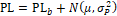{width="3.2in"
height="2.408333333333333in"}{width="3.2083333333333335in"
height="2.3756944444444446in"}

Figure 6.1.2.1.2.2-1 PSD and SEM for Case 1

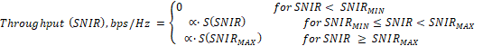{width="3.2402777777777776in"
height="2.4479166666666665in"}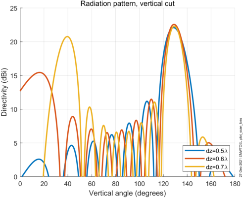{width="3.1756944444444444in"
height="2.4319444444444445in"}

Figure 6.1.2.1.2.2-2 PSD and SEM for Case 4

According to the simulation evaluation, we propose the MPR for S-SSB on
shared spectrum to be 11dB taken margin into consideration.

##### 6.1.2.1.3 MPR for PSFCH transmission

##### 6.1.2.1.3.1 LG Electronics' simulation results (R4-2315542 and R4-2321771) {#lg-electronics-simulation-results-r4-2315542-and-r4-2321771 .H6}

For PSFCH MPR/A-MPR, the following simulation scenarios of Table
6.1.2.1.3.1-1 are considered based on Alt 1-1b.

Table 6.1.2.1.3.1-1: SL-U PSFCH MPR/A-MPR simulation scenarios

  Sub-band RB sets   Scenario   Bitmap   PSFCH RB location index                                                                                                                                                                                    SCS(kHz)
  ------------------ ---------- -------- ---------------------------------------------------------------------------------------------------------------------------------------------------------------------------------------------------------- ----------
  1 (20MHz)          1          1        {0 10 20 30 40 50 60 70 80 90 100 104}                                                                                                                                                                     15
                     2          1        {0 5 10 15 20 25 30 35 40 45 49}                                                                                                                                                                           30
  2 (40MHz)          3          11       {0 10 20 30 40 50 60 70 80 90 100 104 111 121 131 141 151 161 171 181 191 201 211 215}                                                                                                                     15
                     4          10       {0 10 20 30 40 50 60 70 80 90 100 104}                                                                                                                                                                     15
  3 (60MHz)          5          111      {0 5 10 15 20 25 30 35 40 45 49 56 61 66 71 76 81 86 91 96 101 105 112 117 122 127 132 137 142 147 152 157 161}                                                                                            30
                     6          110      {0 5 10 15 20 25 30 35 40 45 49 56 61 66 71 76 81 86 91 96 101 105}                                                                                                                                        30
                     7          100      {0 5 10 15 20 25 30 35 40 45 49}                                                                                                                                                                           30
                     8          010      {56 61 66 71 76 81 86 91 96 101 105}                                                                                                                                                                       30
                     9          101      {0 5 10 15 20 25 30 35 40 45 49 112 117 122 127 132 137 142 147 152 157 161}                                                                                                                               30
  4 (80MHz)          10         1111     { 0 5 10 15 20 25 30 35 40 45 49 56 61 66 71 76 81 86 91 96 101 105 111 116 121 126 131 136 141 146 151 156 160 167 172 177 182 187 192 197 202 207 212 216}                                               30
                     11         1110     { 0 5 10 15 20 25 30 35 40 45 49 56 61 66 71 76 81 86 91 96 101 105 111 116 121 126 131 136 141 146 151 156 160}                                                                                           30
                     12         1100     { 0 5 10 15 20 25 30 35 40 45 49 56 61 66 71 76 81 86 91 96 101 105}                                                                                                                                       30
                     13         1000     { 0 5 10 15 20 25 30 35 40 45 49}                                                                                                                                                                          30
                     14         0110     { 56 61 66 71 76 81 86 91 96 101 105 111 116 121 126 131 136 141 146 151 156 160}                                                                                                                          30
                     15         0100     { 56 61 66 71 76 81 86 91 96 101 105}                                                                                                                                                                      30
                     16         1101     { 0 5 10 15 20 25 30 35 40 45 49 56 61 66 71 76 81 86 91 96 101 105 167 172 177 182 187 192 197 202 207 212 216}                                                                                           30
                     17         1010     { 0 5 10 15 20 25 30 35 40 45 49 111 116 121 126 131 136 141 146 151 156 160}                                                                                                                              30
                     18         1001     { 0 5 10 15 20 25 30 35 40 45 49 167 172 177 182 187 192 197 202 207 212 216}                                                                                                                              30
  5 (100MHz)         19         11111    { 0 5 10 15 20 25 30 35 40 45 49 56 61 66 71 76 81 86 91 96 101 105 112 117 122 127 132 137 142 147 152 157 161 167 172 177 182 187 192 197 202 207 212 216 223 228 233 238 243 248 253 258 263 268 272}   30
                     20         11110    { 0 5 10 15 20 25 30 35 40 45 49 56 61 66 71 76 81 86 91 96 101 105 112 117 122 127 132 137 142 147 152 157 161 167 172 177 182 187 192 197 202 207 212 216}                                               30
                     21         11100    { 0 5 10 15 20 25 30 35 40 45 49 56 61 66 71 76 81 86 91 96 101 105 112 117 122 127 132 137 142 147 152 157 161}                                                                                           30
                     22         11000    { 0 5 10 15 20 25 30 35 40 45 49 56 61 66 71 76 81 86 91 96 101 105}                                                                                                                                       30
                     23         10000    { 0 5 10 15 20 25 30 35 40 45 49}                                                                                                                                                                          30
                     24         01110    { 56 61 66 71 76 81 86 91 96 101 105 112 117 122 127 132 137 142 147 152 157 161 167 172 177 182 187 192 197 202 207 212 216}                                                                              30
                     25         01100    { 56 61 66 71 76 81 86 91 96 101 105 112 117 122 127 132 137 142 147 152 157 161}                                                                                                                          30
                     26         01000    { 56 61 66 71 76 81 86 91 96 101 105}                                                                                                                                                                      30
                     27         00100    { 112 117 122 127 132 137 142 147 152 157 161}                                                                                                                                                             30
                     28         11011    { 0 5 10 15 20 25 30 35 40 45 49 56 61 66 71 76 81 86 91 96 101 105 167 172 177 182 187 192 197 202 207 212 216 223 228 233 238 243 248 253 258 263 268 272}                                               30
                     29         11010    { 0 5 10 15 20 25 30 35 40 45 49 56 61 66 71 76 81 86 91 96 101 105 167 172 177 182 187 192 197 202 207 212 216}                                                                                           30
                     30         11001    { 0 5 10 15 20 25 30 35 40 45 49 56 61 66 71 76 81 86 91 96 101 105 223 228 233 238 243 248 253 258 263 268 272}                                                                                           30
                     31         10101    { 0 5 10 15 20 25 30 35 40 45 49 112 117 122 127 132 137 142 147 152 157 161 223 228 233 238 243 248 253 258 263 268 272}                                                                                  30
                     32         10110    { 0 5 10 15 20 25 30 35 40 45 49 112 117 122 127 132 137 142 147 152 157 161 167 172 177 182 187 192 197 202 207 212 216}                                                                                  30
                     33         10100    { 0 5 10 15 20 25 30 35 40 45 49 112 117 122 127 132 137 142 147 152 157 161}                                                                                                                              30
                     34         10010    { 0 5 10 15 20 25 30 35 40 45 49 167 172 177 182 187 192 197 202 207 212 216}                                                                                                                              30
                     35         10001    { 0 5 10 15 20 25 30 35 40 45 49 223 228 233 238 243 248 253 258 263 268 272}                                                                                                                              30
                     36         01010    { 56 61 66 71 76 81 86 91 96 101 105 167 172 177 182 187 192 197 202 207 212 216}                                                                                                                          30
                     37         11101    { 0 5 10 15 20 25 30 35 40 45 49 56 61 66 71 76 81 86 91 96 101 105 112 117 122 127 132 137 142 147 152 157 161 223 228 233 238 243 248 253 258 263 268 272}                                               30

Here, for PSFCH RB location index, '0' means that RB index = 0. And,
Bitmap '1' means the corresponding RB set is transmitted, and '0' means
the corresponding RB set is not transmitted for wide band operation.

Table 6.1.2.1.3.1-2shows the MPR simulation results for the scenarios.

Table 6.1.2.1.3.1-2: PSFCH MPR simulation results for SL-U power class 5

  Scenario \#   \#1    \#2                                                                                                                     
  ------------- ------ ------ ------ ------ ------ ------ ------- ------ ------ ------ ------ ------ ------ ------ ------ ------ ------ ------ ------
  '20MHz'       7.98   7.60                                                                                                                    
  Scenario \#   \#3    \#4                                                                                                                     
  '40MHz'       9.39   7.94                                                                                                                    
  Scenario \#   \#5    \#6    \#7    \#8    \#9                                                                                                
  '60MHz'       9.65   9.05   7.67   7.43   9.31                                                                                               
  Scenario \#   \#10   \#11   \#12   \#13   \#14   \#15   \#16    \#17   \#18                                                                  
  \'80MHz\'     9.43   9.83   9.09   7.57   9.04   7.35   11.51   9.39   9.32                                                                  
  Scenario \#   \#19   \#20   \#21   \#22   \#23   \#24   \#25    \#26   \#27   \#28   \#29   \#30   \#31   \#32   \#33   \#34   \#35   \#36   \#37
  \'100MHz\'    9.55                                                                                                                           

Table 6.1.2.1.3.1-3 shows the maximum value of simulation results
considering combinations of Outer/Inner sub-band configuration.

Table 6.1.2.1.3.1-3 : PSFCH MPR simulation results for SL-U power class
5

                                    RB Allocation                   
  --------------------------------- ------------------------------- -------------------------------
                                    Outer RB set configuration^5^   Inner RB set configuration^5^
  Contiguous sub-band RB sets       9.83                            9.04
  Non-contiguous sub-band RB sets   11.51                           9.22

Considering the inner RB set bitmaps and the outer RB set bitmaps, the
PSFCH MPR for SL-U power class 5 can be proposed as Table 6.1.2.1.3.1-4
or Table 6.1.2.1.3.1-5 based on the simulation results when considering
implementation margin.

Table 6.1.2.1.3.1-5 PSFCH MPR for SL-U UE power class 5

+----------------------+----------------------+----------------------+
|                      | RB Allocation        |                      |
+======================+======================+======================+
|                      | Outer RB set         | Inner RB set         |
|                      | configuration^2^     | configuration^2^     |
+----------------------+----------------------+----------------------+
| Contiguous sub-band  | ≤ 11.5               | ≤ 10.0               |
| RB sets              |                      |                      |
+----------------------+----------------------+----------------------+
| Non-contiguous       | ≤ 12.5               | ≤ 10.0               |
| sub-band RB sets     |                      |                      |
+----------------------+----------------------+----------------------+
| NOTE 1: The MPR      |                      |                      |
| shall apply to all   |                      |                      |
| SCS in all active 20 |                      |                      |
| MHz sub-bands        |                      |                      |
| contiguously or      |                      |                      |
| non-contiguously     |                      |                      |
| allocated in the     |                      |                      |
| channel.             |                      |                      |
|                      |                      |                      |
| NOTE 2: Outer        |                      |                      |
| sub-band             |                      |                      |
| configuration and    |                      |                      |
| inner sub-band       |                      |                      |
| configuration in     |                      |                      |
| Table 2-5 apply.     |                      |                      |
+----------------------+----------------------+----------------------+

Table 6.1.2.1.3.1-6 PSFCH MPR for SL-U UE power class 5

+----------------------+----------------------+----------------------+
|                      | RB Allocation        |                      |
+======================+======================+======================+
|                      | Outer RB set         | Inner RB set         |
|                      | configuration^2^     | configuration^2^     |
+----------------------+----------------------+----------------------+
| Conti                | ≤ 12.5               | ≤ 10.0               |
| guous/Non-contiguous |                      |                      |
| sub-band RB sets     |                      |                      |
+----------------------+----------------------+----------------------+
| NOTE 1: The MPR      |                      |                      |
| shall apply to all   |                      |                      |
| SCS in all active 20 |                      |                      |
| MHz sub-bands        |                      |                      |
| contiguously or      |                      |                      |
| non-contiguously     |                      |                      |
| allocated in the     |                      |                      |
| channel.             |                      |                      |
|                      |                      |                      |
| NOTE 2: Outer        |                      |                      |
| sub-band             |                      |                      |
| configuration and    |                      |                      |
| inner sub-band       |                      |                      |
| configuration in     |                      |                      |
| Table 2-5 apply.     |                      |                      |
+----------------------+----------------------+----------------------+

##### 6.1.2.1.3.2 Huawei simulation results (R4-2319500) {#huawei-simulation-results-r4-2319500-1 .H6}

The evaluation scenarios and MPR results for PSFCH are illustrated in
Table 6.1.2.1.3.2-1

Table 6.1.2.1.3.2-1 Evaluation scenarios and MPR for PSFCH on shared
spectrum

+----------+------------+-----------------+-----------------+---------+
| **Case** | **BW/SCS** | **Common        | **Dedicated RB  | **MPR** |
|          |            | interlaced RB   | allocation/**   |         |
|          |            | allocation/**   | RB index        |         |
|          |            | RB index        |                 |         |
+==========+============+=================+=================+=========+
| **1**    | 20MHz/     | {1,6,11,16,21,  | {50}            | 10      |
|          |            | 26,31,36,41,46} |                 |         |
|          | 30kHz      |                 |                 |         |
+----------+------------+-----------------+-----------------+---------+
| **2**    |            | {1,6,11,16,21,  | {48,49,50}      | 9.7     |
|          |            | 26,31,36,41,46} |                 |         |
+----------+------------+-----------------+-----------------+---------+
| **3**    | 20MHz/     | {1, 11, 21, 31, | {105}           | 10      |
|          |            | 41,51,6         |                 |         |
|          | 15kHz      | 1,71,81,91,101} |                 |         |
+----------+------------+-----------------+-----------------+---------+
| **4**    |            | {1, 11, 21, 31, | {103, 104,105}  | 10      |
|          |            | 41,51,6         |                 |         |
|          |            | 1,71,81,91,101} |                 |         |
+----------+------------+-----------------+-----------------+---------+

{width="3.3020833333333335in"
height="2.547222222222222in"}{width="3.207638888888889in"
height="2.4625in"}

Figure 6.1.2.1.3.2-1 PSD and SEM for Case 1

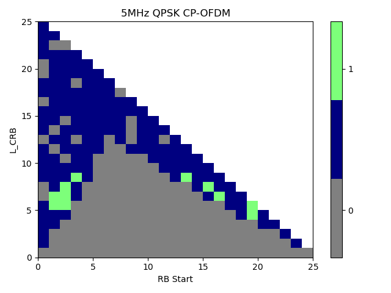{width="3.254861111111111in"
height="2.5in"}{width="3.245138888888889in"
height="2.452777777777778in"}

Figure 6.1.2.1.3.2-2 PSD and SEM for Case 3

##### 6.1.2.1.2.2a Huawei's simulation results (R4-2319501) {#a-huaweis-simulation-results-r4-2319501 .H6}

The updated scenarios with P\_common\< P\_dedicated is as follows.

Table 6.1.2.1.2.2a-1 Evaluation scenarios and MPR for PSFCH on shared
spectrum

+----------+----------+----------+----------+----------+---------+
| **Case** | **       | **Common | **D      | **       | **MPR** |
|          | BW/SCS** | in       | edicated | P\_dedic |         |
|          |          | terlaced | RB       | ated/P\_ |         |
|          |          | RB       | alloc    | common** |         |
|          |          | alloc    | ation/** |          |         |
|          |          | ation/** | RB index | (r       |         |
|          |          | RB index |          | atio/dB) |         |
+==========+==========+==========+==========+==========+=========+
| **1**    | 20MHz/   | {1,6,    | {50}     | 0dB      | 10      |
|          |          | 11,16,21 |          |          |         |
|          | 30kHz    | ,26,31,3 |          |          |         |
|          |          | 6,41,46} |          |          |         |
+----------+----------+----------+----------+----------+---------+
| **2**    |          |          |          | 3dB      | 9.5     |
+----------+----------+----------+----------+----------+---------+
| **3**    |          |          |          | 6dB      | 9.1     |
+----------+----------+----------+----------+----------+---------+
| **4**    |          | {1,6,    | {4       | 0dB      | 9.7     |
|          |          | 11,16,21 | 8,49,50} |          |         |
|          |          | ,26,31,3 |          |          |         |
|          |          | 6,41,46} |          |          |         |
+----------+----------+----------+----------+----------+---------+
| **5**    |          |          |          | 3dB      | 9.5     |
+----------+----------+----------+----------+----------+---------+
| **6**    |          |          |          | 6dB      | 9.1     |
+----------+----------+----------+----------+----------+---------+
| **7**    | 20MHz/   | {1, 11,  | {105}    | 0dB      | 10      |
|          |          | 21, 31,  |          |          |         |
|          | 15kHz    | 41,51,   |          |          |         |
|          |          | 61,71,81 |          |          |         |
|          |          | ,91,101} |          |          |         |
+----------+----------+----------+----------+----------+---------+
| **8**    |          |          |          | 3dB      | 9.6     |
+----------+----------+----------+----------+----------+---------+
| **9**    |          |          |          | 6dB      | 9.1     |
+----------+----------+----------+----------+----------+---------+
| **10**   |          | {1, 11,  | {103,    | 0dB      | 10      |
|          |          | 21, 31,  | 104,105} |          |         |
|          |          | 41,51,   |          |          |         |
|          |          | 61,71,81 |          |          |         |
|          |          | ,91,101} |          |          |         |
+----------+----------+----------+----------+----------+---------+
| **11**   |          |          |          | 3dB      | 9.6     |
+----------+----------+----------+----------+----------+---------+
| **12**   |          |          |          | 6dB      | 9.1     |
+----------+----------+----------+----------+----------+---------+

{width="3.216666666666667in"
height="2.4902777777777776in"}{width="3.245138888888889in"
height="2.3493055555555555in"}

Figure 6.1.2.1.2.2a-1 PSD and SEM for Case 1

{width="3.3208333333333333in"
height="2.4715277777777778in"}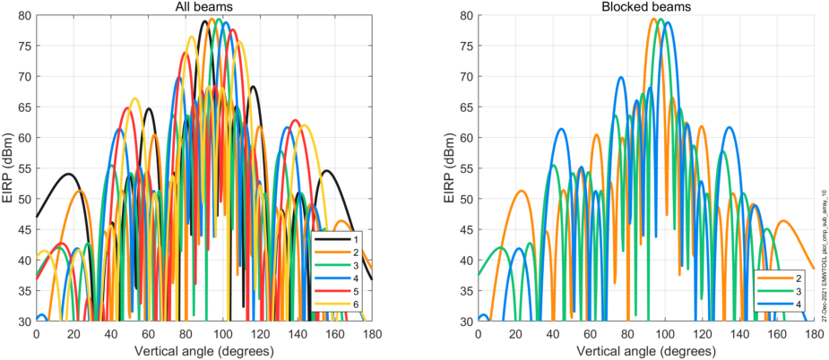{width="3.283333333333333in"
height="2.547222222222222in"}

Figure 6.1.2.1.2.2a-2 PSD for Case 3 and case 4

##### 6.1.2.1.3.3 OPPO's simulation results {#oppos-simulation-results .H6}

For the PSFCH MPR, the simulation cases are listed as below table
6.1.2.1.3.3-1.

Table 6.1.2.1.3.3-1 simulation cases

+--------------------------+------+----------+-----+--------------+-----+
|                          | case | Waveform | BW  | RB Setup     | SCS |
+==========================+======+==========+=====+==============+=====+
| Full Allocation          | 1    | CP-OFDM  | 20  | 105RB0       | 30  |
|                          |      |          |     |              |     |
| Single CC                |      |          |     |              |     |
+--------------------------+------+----------+-----+--------------+-----+
|                          | 2    | CP-OFDM  | 40  | 50RB0        | 15  |
+--------------------------+------+----------+-----+--------------+-----+
|                          | 3    | CP-OFDM  | 40  | 216RB0       | 30  |
+--------------------------+------+----------+-----+--------------+-----+
|                          | 4    | CP-OFDM  | 60  | 105RB0       | 30  |
+--------------------------+------+----------+-----+--------------+-----+
| Wide band operation      | 5    | CP-OFDM  | 40  | Bitmap 10    | 30  |
|                          |      |          |     |              |     |
| Interlaced RB allocation |      |          |     |              |     |
+--------------------------+------+----------+-----+--------------+-----+
|                          | 6    | CP-OFDM  | 60  | Bitmap 100   | 30  |
+--------------------------+------+----------+-----+--------------+-----+
|                          | 7    | CP-OFDM  | 60  | Bitmap 110   | 30  |
+--------------------------+------+----------+-----+--------------+-----+
|                          | 8    | CP-OFDM  | 60  | Bitmap 010   | 30  |
+--------------------------+------+----------+-----+--------------+-----+
|                          | 9    | CP-OFDM  | 80  | Bitmap 1100  | 30  |
+--------------------------+------+----------+-----+--------------+-----+
|                          | 10   | CP-OFDM  | 80  | Bitmap 1000  | 30  |
+--------------------------+------+----------+-----+--------------+-----+
|                          | 11   | CP-OFDM  | 80  | Bitmap 1110  | 30  |
+--------------------------+------+----------+-----+--------------+-----+
|                          | 12   | CP-OFDM  | 80  | Bitmap 0100  | 30  |
+--------------------------+------+----------+-----+--------------+-----+
|                          | 13   | CP-OFDM  | 80  | Bitmap 0110  | 30  |
+--------------------------+------+----------+-----+--------------+-----+
|                          | 14   | CP-OFDM  | 100 | Bitmap 10000 | 30  |
+--------------------------+------+----------+-----+--------------+-----+
|                          | 15   | CP-OFDM  | 100 | Bitmap 11000 | 30  |
+--------------------------+------+----------+-----+--------------+-----+
|                          | 16   | CP-OFDM  | 100 | Bitmap 11100 | 30  |
+--------------------------+------+----------+-----+--------------+-----+
|                          | 17   | CP-OFDM  | 100 | Bitmap 01000 | 30  |
+--------------------------+------+----------+-----+--------------+-----+
|                          | 18   | CP-OFDM  | 100 | Bitmap 01100 | 30  |
+--------------------------+------+----------+-----+--------------+-----+
|                          | 19   | CP-OFDM  | 100 | Bitmap 01110 | 30  |
+--------------------------+------+----------+-----+--------------+-----+
|                          | 20   | CP-OFDM  | 100 | Bitmap 00100 | 30  |
+--------------------------+------+----------+-----+--------------+-----+

Table 6.1.2.1.3.3-1-2 MPR simulation result for PSFCH single CC

  Single CC interlace   1       2       3       4
  --------------------- ------- ------- ------- -------
  QPSK                  10.24   13.82   12.98   15.60

Table 6.1.2.1.3.3-1-3 MPR simulation result for PSFCH Wideband Interlace

  Wideband Interlace   5       6      7       8       9       10      11      12
  -------------------- ------- ------ ------- ------- ------- ------- ------- ------
  QPSK                 9.41    9.98   13.16   9.33    12.49   9.41    14.28   9.98
  Wideband Interlace   13      14     15      16      17      18      19      20
  QPSK                 13.07   9.82   12.98   14.86   9.73    12.73   14.52   9.65

From table 6.1.2.1.3.3-2 and table 6.1.2.1.3.3-1-3 above, it can be
observed that for larger channel bandwidth that larger MPR is needed.
There is related to the P-APR of multiple repeated sub-channels which is
similar also to the S-SSB MPR simulation result.

To also account for some implementation margin, it can be observed that
the MPR simulation result of OPPO's are aligned with the MPR requirement
defined in the RAN4\#109 meeting.

### 6.1.3 UE additional maximum output power reduction for NR SL-U

Based on the NR-U agreement for the additional spectrum emission mask in
clause 6.5F.2.3 in TS38.101-1, RAN4 do not consider the additional
spectrum emission mask.

For the additional spurious emission requirements for SL-U, RAN4 will
consider the NR-U additional spurious emission requirements in clause
6.5F.3.3 in TS38.101-1.

To derive A-MPR requirements for SL-U operation in single CC, RAN4 will
assume the basic simulation parameters and assumptions in section 6.1.2
and the additional spurious emission requirements in clause 6.5F.3.3 in
TS38.101-1 will be considered.

#### 6.1.3.1 A-MPR for SL-U with NS\_28

##### 6.1.3.1.1 A-MPR for simultaneous PSSCH/PSCCH transmission

##### 6.1.3.1.1.1 Qualcomm's simulation results (R4-2316791) {#qualcomms-simulation-results-r4-2316791-1 .H6}

Table 6.1.3.1.1.1-1: Simulation results for NS\_28 Allocation Full and
partial allocations.

  NS\_28 A-MPR   20M    20M       40M    40M       60M    60M       80M    80M
  -------------- ------ --------- ------ --------- ------ --------- ------ ---------
                 Full   Partial   Full   Partial   Full   Partial   Full   Partial
  QPSK           ≤8.0   ≤8.1      ≤7.7   ≤8.0      ≤7.1   ≤7.8      ≤6.9   ≤7.8
  16 QAM         ≤8.0   ≤8.3      ≤7.4   ≤8.3      ≤7.3   ≤8.1      ≤6.9   ≤8.1
  64 QAM         ≤8.1   ≤8.7      ≤7.4   ≤8.7      ≤7.3   ≤8.2      ≤7.0   ≤8.2
  256 QAM        ≤8.2   ≤8.8      ≤7.4   ≤8.8      ≤7.3   ≤8.2      ≤7.1   ≤8.1

The power class 5 PSSCH A-MPR in the tables should be considered in the
discussion of MPR requirements.

##### 6.1.3.1.1.2 LG Electronics' simulation results (R4-2401464) {#lg-electronics-simulation-results-r4-2401464 .H6}

Table 6.1.3.1.1.2-1 shows the A-MPR simulation results for the agreed
scenarios with different center frequencies.

Table 6.1.3.1.1.2-1: NS\_28-PSSCH/PSCCH A-MPR simulation results for
SL-U power class 5

<table>
<thead>
<tr class="header">
<th>
'20MHz'

(5480)
</th>
<th>Scenario #</th>
<th>#1</th>
<th>#7</th>
<th>#2</th>
<th>#8</th>
<th></th>
<th></th>
<th></th>
<th></th>
<th></th>
<th></th>
<th></th>
<th></th>
<th></th>
<th></th>
<th></th>
<th></th>
<th></th>
<th></th>
</tr>
</thead>
<tbody>
<tr class="odd">
<td></td>
<td>'QPSK'</td>
<td>5.47</td>
<td>5.89</td>
<td>5.48</td>
<td>5.90</td>
<td></td>
<td></td>
<td></td>
<td></td>
<td></td>
<td></td>
<td></td>
<td></td>
<td></td>
<td></td>
<td></td>
<td></td>
<td></td>
<td></td>
</tr>
<tr class="even">
<td></td>
<td>'16QAM'</td>
<td>5.47</td>
<td>5.89</td>
<td>5.48</td>
<td>5.90</td>
<td></td>
<td></td>
<td></td>
<td></td>
<td></td>
<td></td>
<td></td>
<td></td>
<td></td>
<td></td>
<td></td>
<td></td>
<td></td>
<td></td>
</tr>
<tr class="odd">
<td></td>
<td>'64QAM'</td>
<td>5.47</td>
<td>5.90</td>
<td>5.47</td>
<td>5.90</td>
<td></td>
<td></td>
<td></td>
<td></td>
<td></td>
<td></td>
<td></td>
<td></td>
<td></td>
<td></td>
<td></td>
<td></td>
<td></td>
<td></td>
</tr>
<tr class="even">
<td></td>
<td>'256QAM'</td>
<td>5.47</td>
<td>5.90</td>
<td>5.48</td>
<td>5.90</td>
<td></td>
<td></td>
<td></td>
<td></td>
<td></td>
<td></td>
<td></td>
<td></td>
<td></td>
<td></td>
<td></td>
<td></td>
<td></td>
<td></td>
</tr>
<tr class="odd">
<td>
'20MHz'

(5500)
</td>
<td>Scenario #</td>
<td>#1</td>
<td>#7</td>
<td>#2</td>
<td>#8</td>
<td></td>
<td></td>
<td></td>
<td></td>
<td></td>
<td></td>
<td></td>
<td></td>
<td></td>
<td></td>
<td></td>
<td></td>
<td></td>
<td></td>
</tr>
<tr class="even">
<td></td>
<td>'QPSK'</td>
<td>2.48</td>
<td>2.16</td>
<td>2.16</td>
<td>2.49</td>
<td></td>
<td></td>
<td></td>
<td></td>
<td></td>
<td></td>
<td></td>
<td></td>
<td></td>
<td></td>
<td></td>
<td></td>
<td></td>
<td></td>
</tr>
<tr class="odd">
<td></td>
<td>'16QAM'</td>
<td>2.48</td>
<td>2.16</td>
<td>2.16</td>
<td>2.49</td>
<td></td>
<td></td>
<td></td>
<td></td>
<td></td>
<td></td>
<td></td>
<td></td>
<td></td>
<td></td>
<td></td>
<td></td>
<td></td>
<td></td>
</tr>
<tr class="even">
<td></td>
<td>'64QAM'</td>
<td>2.82</td>
<td>2.16</td>
<td>3.17</td>
<td>2.50</td>
<td></td>
<td></td>
<td></td>
<td></td>
<td></td>
<td></td>
<td></td>
<td></td>
<td></td>
<td></td>
<td></td>
<td></td>
<td></td>
<td></td>
</tr>
<tr class="odd">
<td></td>
<td>'256QAM'</td>
<td>5.47</td>
<td>5.07</td>
<td>5.48</td>
<td>5.08</td>
<td></td>
<td></td>
<td></td>
<td></td>
<td></td>
<td></td>
<td></td>
<td></td>
<td></td>
<td></td>
<td></td>
<td></td>
<td></td>
<td></td>
</tr>
<tr class="even">
<td>
'40MHz'

(5490)
</td>
<td>Scenario #</td>
<td>#3</td>
<td>#9</td>
<td>#13</td>
<td>#30</td>
<td></td>
<td></td>
<td></td>
<td></td>
<td></td>
<td></td>
<td></td>
<td></td>
<td></td>
<td></td>
<td></td>
<td></td>
<td></td>
<td></td>
</tr>
<tr class="odd">
<td></td>
<td>'QPSK'</td>
<td>5.06</td>
<td>5.47</td>
<td>5.47</td>
<td>5.89</td>
<td></td>
<td></td>
<td></td>
<td></td>
<td></td>
<td></td>
<td></td>
<td></td>
<td></td>
<td></td>
<td></td>
<td></td>
<td></td>
<td></td>
</tr>
<tr class="even">
<td></td>
<td>'16QAM'</td>
<td>5.06</td>
<td>5.47</td>
<td>5.47</td>
<td>5.89</td>
<td></td>
<td></td>
<td></td>
<td></td>
<td></td>
<td></td>
<td></td>
<td></td>
<td></td>
<td></td>
<td></td>
<td></td>
<td></td>
<td></td>
</tr>
<tr class="odd">
<td></td>
<td>'64QAM'</td>
<td>5.06</td>
<td>5.48</td>
<td>5.47</td>
<td>5.90</td>
<td></td>
<td></td>
<td></td>
<td></td>
<td></td>
<td></td>
<td></td>
<td></td>
<td></td>
<td></td>
<td></td>
<td></td>
<td></td>
<td></td>
</tr>
<tr class="even">
<td></td>
<td>'256QAM'</td>
<td>5.47</td>
<td>5.48</td>
<td>5.47</td>
<td>5.89</td>
<td></td>
<td></td>
<td></td>
<td></td>
<td></td>
<td></td>
<td></td>
<td></td>
<td></td>
<td></td>
<td></td>
<td></td>
<td></td>
<td></td>
</tr>
<tr class="odd">
<td>
'40MHz'

(5510)
</td>
<td>Scenario #</td>
<td>#3</td>
<td>#9</td>
<td>#13</td>
<td>#30</td>
<td></td>
<td></td>
<td></td>
<td></td>
<td></td>
<td></td>
<td></td>
<td></td>
<td></td>
<td></td>
<td></td>
<td></td>
<td></td>
<td></td>
</tr>
<tr class="even">
<td></td>
<td>'QPSK'</td>
<td>3.53</td>
<td>3.91</td>
<td>2.81</td>
<td>0.39</td>
<td></td>
<td></td>
<td></td>
<td></td>
<td></td>
<td></td>
<td></td>
<td></td>
<td></td>
<td></td>
<td></td>
<td></td>
<td></td>
<td></td>
</tr>
<tr class="odd">
<td></td>
<td>'16QAM'</td>
<td>3.53</td>
<td>3.90</td>
<td>2.81</td>
<td>0.40</td>
<td></td>
<td></td>
<td></td>
<td></td>
<td></td>
<td></td>
<td></td>
<td></td>
<td></td>
<td></td>
<td></td>
<td></td>
<td></td>
<td></td>
</tr>
<tr class="even">
<td></td>
<td>'64QAM'</td>
<td>3.53</td>
<td>3.91</td>
<td>2.81</td>
<td>2.15</td>
<td></td>
<td></td>
<td></td>
<td></td>
<td></td>
<td></td>
<td></td>
<td></td>
<td></td>
<td></td>
<td></td>
<td></td>
<td></td>
<td></td>
</tr>
<tr class="odd">
<td></td>
<td>'256QAM'</td>
<td>5.47</td>
<td>5.07</td>
<td>5.47</td>
<td>5.07</td>
<td></td>
<td></td>
<td></td>
<td></td>
<td></td>
<td></td>
<td></td>
<td></td>
<td></td>
<td></td>
<td></td>
<td></td>
<td></td>
<td></td>
</tr>
<tr class="even">
<td>
'40MHz'

(5550)
</td>
<td>Scenario #</td>
<td>#3</td>
<td>#9</td>
<td>#13</td>
<td>#30</td>
<td></td>
<td></td>
<td></td>
<td></td>
<td></td>
<td></td>
<td></td>
<td></td>
<td></td>
<td></td>
<td></td>
<td></td>
<td></td>
<td></td>
</tr>
<tr class="odd">
<td></td>
<td>'QPSK'</td>
<td>2.48</td>
<td>2.48</td>
<td>2.81</td>
<td>0.00</td>
<td></td>
<td></td>
<td></td>
<td></td>
<td></td>
<td></td>
<td></td>
<td></td>
<td></td>
<td></td>
<td></td>
<td></td>
<td></td>
<td></td>
</tr>
<tr class="even">
<td></td>
<td>'16QAM'</td>
<td>2.48</td>
<td>2.48</td>
<td>2.81</td>
<td>0.40</td>
<td></td>
<td></td>
<td></td>
<td></td>
<td></td>
<td></td>
<td></td>
<td></td>
<td></td>
<td></td>
<td></td>
<td></td>
<td></td>
<td></td>
</tr>
<tr class="odd">
<td></td>
<td>'64QAM'</td>
<td>2.82</td>
<td>2.48</td>
<td>2.81</td>
<td>2.15</td>
<td></td>
<td></td>
<td></td>
<td></td>
<td></td>
<td></td>
<td></td>
<td></td>
<td></td>
<td></td>
<td></td>
<td></td>
<td></td>
<td></td>
</tr>
<tr class="even">
<td></td>
<td>'256QAM'</td>
<td>5.47</td>
<td>5.07</td>
<td>5.47</td>
<td>5.07</td>
<td></td>
<td></td>
<td></td>
<td></td>
<td></td>
<td></td>
<td></td>
<td></td>
<td></td>
<td></td>
<td></td>
<td></td>
<td></td>
<td></td>
</tr>
<tr class="odd">
<td>
'60MHz'

(5500)
</td>
<td>Scenario #</td>
<td>#4</td>
<td>#10</td>
<td>#14</td>
<td>#31</td>
<td>#15</td>
<td>#32</td>
<td>#16</td>
<td>#33</td>
<td></td>
<td></td>
<td></td>
<td></td>
<td></td>
<td></td>
<td></td>
<td></td>
<td></td>
<td></td>
</tr>
<tr class="even">
<td></td>
<td>'QPSK'</td>
<td>4.67</td>
<td>5.07</td>
<td>5.47</td>
<td>5.90</td>
<td>5.06</td>
<td>5.48</td>
<td>2.13</td>
<td>0.11</td>
<td></td>
<td></td>
<td></td>
<td></td>
<td></td>
<td></td>
<td></td>
<td></td>
<td></td>
<td></td>
</tr>
<tr class="odd">
<td></td>
<td>'16QAM'</td>
<td>4.67</td>
<td>5.07</td>
<td>5.47</td>
<td>5.89</td>
<td>5.06</td>
<td>5.47</td>
<td>2.13</td>
<td>0.10</td>
<td></td>
<td></td>
<td></td>
<td></td>
<td></td>
<td></td>
<td></td>
<td></td>
<td></td>
<td></td>
</tr>
<tr class="even">
<td></td>
<td>'64QAM'</td>
<td>4.67</td>
<td>5.07</td>
<td>5.47</td>
<td>5.90</td>
<td>5.06</td>
<td>5.47</td>
<td>3.15</td>
<td>2.12</td>
<td></td>
<td></td>
<td></td>
<td></td>
<td></td>
<td></td>
<td></td>
<td></td>
<td></td>
<td></td>
</tr>
<tr class="odd">
<td></td>
<td>'256QAM'</td>
<td>5.47</td>
<td>5.07</td>
<td>5.47</td>
<td>5.89</td>
<td>5.47</td>
<td>5.47</td>
<td>5.47</td>
<td>5.05</td>
<td></td>
<td></td>
<td></td>
<td></td>
<td></td>
<td></td>
<td></td>
<td></td>
<td></td>
<td></td>
</tr>
<tr class="even">
<td>
'60MHz'

(5520)
</td>
<td>Scenario #</td>
<td>#4</td>
<td>#10</td>
<td>#14</td>
<td>#31</td>
<td>#15</td>
<td>#32</td>
<td>#16</td>
<td>#33</td>
<td></td>
<td></td>
<td></td>
<td></td>
<td></td>
<td></td>
<td></td>
<td></td>
<td></td>
<td></td>
</tr>
<tr class="odd">
<td></td>
<td>'QPSK'</td>
<td>3.90</td>
<td>4.67</td>
<td>2.14</td>
<td>0.40</td>
<td>3.53</td>
<td>4.28</td>
<td>2.13</td>
<td>0.35</td>
<td></td>
<td></td>
<td></td>
<td></td>
<td></td>
<td></td>
<td></td>
<td></td>
<td></td>
<td></td>
</tr>
<tr class="even">
<td></td>
<td>'16QAM'</td>
<td>3.90</td>
<td>4.29</td>
<td>2.14</td>
<td>0.40</td>
<td>3.53</td>
<td>4.28</td>
<td>2.13</td>
<td>0.10</td>
<td></td>
<td></td>
<td></td>
<td></td>
<td></td>
<td></td>
<td></td>
<td></td>
<td></td>
<td></td>
</tr>
<tr class="odd">
<td></td>
<td>'64QAM'</td>
<td>3.90</td>
<td>4.67</td>
<td>3.17</td>
<td>2.15</td>
<td>3.53</td>
<td>4.28</td>
<td>3.15</td>
<td>2.12</td>
<td></td>
<td></td>
<td></td>
<td></td>
<td></td>
<td></td>
<td></td>
<td></td>
<td></td>
<td></td>
</tr>
<tr class="even">
<td></td>
<td>'256QAM'</td>
<td>5.47</td>
<td>5.07</td>
<td>5.47</td>
<td>5.07</td>
<td>5.47</td>
<td>5.07</td>
<td>5.88</td>
<td>5.05</td>
<td></td>
<td></td>
<td></td>
<td></td>
<td></td>
<td></td>
<td></td>
<td></td>
<td></td>
<td></td>
</tr>
<tr class="odd">
<td>
'60MHz'

(5540)
</td>
<td>Scenario #</td>
<td>#4</td>
<td>#10</td>
<td>#14</td>
<td>#31</td>
<td>#15</td>
<td>#32</td>
<td>#16</td>
<td>#33</td>
<td></td>
<td></td>
<td></td>
<td></td>
<td></td>
<td></td>
<td></td>
<td></td>
<td></td>
<td></td>
</tr>
<tr class="even">
<td></td>
<td>'QPSK'</td>
<td>2.48</td>
<td>2.82</td>
<td>2.14</td>
<td>0.40</td>
<td>2.47</td>
<td>0.66</td>
<td>2.13</td>
<td>0.35</td>
<td></td>
<td></td>
<td></td>
<td></td>
<td></td>
<td></td>
<td></td>
<td></td>
<td></td>
<td></td>
</tr>
<tr class="odd">
<td></td>
<td>'16QAM'</td>
<td>2.48</td>
<td>2.82</td>
<td>2.14</td>
<td>0.40</td>
<td>2.47</td>
<td>0.66</td>
<td>2.13</td>
<td>0.36</td>
<td></td>
<td></td>
<td></td>
<td></td>
<td></td>
<td></td>
<td></td>
<td></td>
<td></td>
<td></td>
</tr>
<tr class="even">
<td></td>
<td>'64QAM'</td>
<td>3.17</td>
<td>2.82</td>
<td>3.17</td>
<td>2.15</td>
<td>3.17</td>
<td>2.48</td>
<td>3.16</td>
<td>2.12</td>
<td></td>
<td></td>
<td></td>
<td></td>
<td></td>
<td></td>
<td></td>
<td></td>
<td></td>
<td></td>
</tr>
<tr class="odd">
<td></td>
<td>'256QAM'</td>
<td>5.47</td>
<td>5.06</td>
<td>5.47</td>
<td>5.07</td>
<td>5.47</td>
<td>5.07</td>
<td>5.47</td>
<td>5.05</td>
<td></td>
<td></td>
<td></td>
<td></td>
<td></td>
<td></td>
<td></td>
<td></td>
<td></td>
<td></td>
</tr>
<tr class="even">
<td>
'60MHz'

(5600)
</td>
<td>Scenario #</td>
<td>#4</td>
<td>#10</td>
<td>#14</td>
<td>#31</td>
<td>#15</td>
<td>#32</td>
<td>#16</td>
<td>#33</td>
<td></td>
<td></td>
<td></td>
<td></td>
<td></td>
<td></td>
<td></td>
<td></td>
<td></td>
<td></td>
</tr>
<tr class="odd">
<td></td>
<td>'QPSK'</td>
<td>2.48</td>
<td>2.48</td>
<td>2.14</td>
<td>0.39</td>
<td>2.47</td>
<td>0.66</td>
<td>2.13</td>
<td>0.10</td>
<td></td>
<td></td>
<td></td>
<td></td>
<td></td>
<td></td>
<td></td>
<td></td>
<td></td>
<td></td>
</tr>
<tr class="even">
<td></td>
<td>'16QAM'</td>
<td>2.48</td>
<td>2.48</td>
<td>2.14</td>
<td>0.40</td>
<td>2.47</td>
<td>0.66</td>
<td>2.13</td>
<td>0.36</td>
<td></td>
<td></td>
<td></td>
<td></td>
<td></td>
<td></td>
<td></td>
<td></td>
<td></td>
<td></td>
</tr>
<tr class="odd">
<td></td>
<td>'64QAM'</td>
<td>3.17</td>
<td>2.48</td>
<td>3.17</td>
<td>2.15</td>
<td>3.16</td>
<td>2.47</td>
<td>3.16</td>
<td>2.12</td>
<td></td>
<td></td>
<td></td>
<td></td>
<td></td>
<td></td>
<td></td>
<td></td>
<td></td>
<td></td>
</tr>
<tr class="even">
<td></td>
<td>'256QAM'</td>
<td>5.47</td>
<td>5.07</td>
<td>5.47</td>
<td>5.07</td>
<td>5.47</td>
<td>5.07</td>
<td>5.88</td>
<td>5.05</td>
<td></td>
<td></td>
<td></td>
<td></td>
<td></td>
<td></td>
<td></td>
<td></td>
<td></td>
<td></td>
</tr>
<tr class="odd">
<td>
'80MHz'

(5510)
</td>
<td>Scenario #</td>
<td>#5</td>
<td>#11</td>
<td>#17</td>
<td>#34</td>
<td>#18</td>
<td>#35</td>
<td>#19</td>
<td>#36</td>
<td>#20</td>
<td>#37</td>
<td>#21</td>
<td>#38</td>
<td></td>
<td></td>
<td></td>
<td></td>
<td></td>
<td></td>
</tr>
<tr class="even">
<td></td>
<td>'QPSK'</td>
<td>4.28</td>
<td>4.67</td>
<td>5.47</td>
<td>5.47</td>
<td>5.06</td>
<td>5.47</td>
<td>4.67</td>
<td>5.06</td>
<td>2.46</td>
<td>0.10</td>
<td>2.46</td>
<td>3.16</td>
<td></td>
<td></td>
<td></td>
<td></td>
<td></td>
<td></td>
</tr>
<tr class="odd">
<td></td>
<td>'16QAM'</td>
<td>4.28</td>
<td>4.67</td>
<td>5.47</td>
<td>5.89</td>
<td>5.06</td>
<td>5.47</td>
<td>4.67</td>
<td>5.07</td>
<td>2.46</td>
<td>0.09</td>
<td>2.46</td>
<td>3.16</td>
<td></td>
<td></td>
<td></td>
<td></td>
<td></td>
<td></td>
</tr>
<tr class="even">
<td></td>
<td>'64QAM'</td>
<td>4.28</td>
<td>4.67</td>
<td>5.47</td>
<td>5.47</td>
<td>5.06</td>
<td>5.07</td>
<td>4.67</td>
<td>5.06</td>
<td>3.16</td>
<td>2.12</td>
<td>3.16</td>
<td>3.15</td>
<td></td>
<td></td>
<td></td>
<td></td>
<td></td>
<td></td>
</tr>
<tr class="odd">
<td></td>
<td>'256QAM'</td>
<td>5.47</td>
<td>5.07</td>
<td>5.47</td>
<td>5.90</td>
<td>5.47</td>
<td>5.07</td>
<td>5.47</td>
<td>5.07</td>
<td>5.47</td>
<td>5.05</td>
<td>5.47</td>
<td>5.06</td>
<td></td>
<td></td>
<td></td>
<td></td>
<td></td>
<td></td>
</tr>
<tr class="even">
<td>
'80MHz'

(5530)'
</td>
<td>Scenario #</td>
<td>#5</td>
<td>#11</td>
<td>#17</td>
<td>#34</td>
<td>#18</td>
<td>#35</td>
<td>#19</td>
<td>#36</td>
<td>#20</td>
<td>#37</td>
<td>#21</td>
<td>#38</td>
<td></td>
<td></td>
<td></td>
<td></td>
<td></td>
<td></td>
</tr>
<tr class="odd">
<td></td>
<td>'QPSK'</td>
<td>3.90</td>
<td>4.28</td>
<td>2.14</td>
<td>0.40</td>
<td>3.53</td>
<td>4.28</td>
<td>3.90</td>
<td>4.28</td>
<td>2.46</td>
<td>0.09</td>
<td>2.13</td>
<td>0.37</td>
<td></td>
<td></td>
<td></td>
<td></td>
<td></td>
<td></td>
</tr>
<tr class="even">
<td></td>
<td>'16QAM'</td>
<td>3.53</td>
<td>4.28</td>
<td>2.15</td>
<td>0.39</td>
<td>3.53</td>
<td>4.28</td>
<td>3.90</td>
<td>4.28</td>
<td>2.46</td>
<td>0.36</td>
<td>2.13</td>
<td>0.63</td>
<td></td>
<td></td>
<td></td>
<td></td>
<td></td>
<td></td>
</tr>
<tr class="odd">
<td></td>
<td>'64QAM'</td>
<td>3.53</td>
<td>4.28</td>
<td>3.16</td>
<td>2.14</td>
<td>3.53</td>
<td>4.28</td>
<td>3.90</td>
<td>4.67</td>
<td>3.15</td>
<td>2.12</td>
<td>3.16</td>
<td>2.46</td>
<td></td>
<td></td>
<td></td>
<td></td>
<td></td>
<td></td>
</tr>
<tr class="even">
<td></td>
<td>'256QAM'</td>
<td>5.47</td>
<td>5.06</td>
<td>5.47</td>
<td>5.08</td>
<td>5.47</td>
<td>5.07</td>
<td>5.47</td>
<td>5.06</td>
<td>5.46</td>
<td>5.05</td>
<td>5.47</td>
<td>5.06</td>
<td></td>
<td></td>
<td></td>
<td></td>
<td></td>
<td></td>
</tr>
<tr class="odd">
<td>
'80MHz'

(5610)'
</td>
<td>Scenario #</td>
<td>#5</td>
<td>#11</td>
<td>#17</td>
<td>#34</td>
<td>#18</td>
<td>#35</td>
<td>#19</td>
<td>#36</td>
<td>#20</td>
<td>#37</td>
<td>#21</td>
<td>#38</td>
<td></td>
<td></td>
<td></td>
<td></td>
<td></td>
<td></td>
</tr>
<tr class="even">
<td></td>
<td>'QPSK'</td>
<td>2.48</td>
<td>2.48</td>
<td>2.14</td>
<td>0.15</td>
<td>2.47</td>
<td>0.39</td>
<td>2.47</td>
<td>0.40</td>
<td>2.46</td>
<td>0.10</td>
<td>2.13</td>
<td>0.36</td>
<td></td>
<td></td>
<td></td>
<td></td>
<td></td>
<td></td>
</tr>
<tr class="odd">
<td></td>
<td>'16QAM'</td>
<td>2.48</td>
<td>2.48</td>
<td>2.14</td>
<td>0.40</td>
<td>2.47</td>
<td>0.39</td>
<td>2.47</td>
<td>0.66</td>
<td>2.46</td>
<td>0.09</td>
<td>2.13</td>
<td>0.64</td>
<td></td>
<td></td>
<td></td>
<td></td>
<td></td>
<td></td>
</tr>
<tr class="even">
<td></td>
<td>'64QAM'</td>
<td>2.82</td>
<td>2.48</td>
<td>3.16</td>
<td>2.15</td>
<td>2.81</td>
<td>2.48</td>
<td>3.16</td>
<td>2.48</td>
<td>3.15</td>
<td>2.12</td>
<td>3.16</td>
<td>2.46</td>
<td></td>
<td></td>
<td></td>
<td></td>
<td></td>
<td></td>
</tr>
<tr class="odd">
<td></td>
<td>'256QAM'</td>
<td>5.47</td>
<td>5.07</td>
<td>5.47</td>
<td>5.08</td>
<td>5.47</td>
<td>5.07</td>
<td>5.47</td>
<td>5.06</td>
<td>5.46</td>
<td>5.06</td>
<td>5.46</td>
<td>5.06</td>
<td></td>
<td></td>
<td></td>
<td></td>
<td></td>
<td></td>
</tr>
</tbody>
</table>

Table 6.1.3.1.1.2-2 shows the maximum value of simulation results
considering combinations of Outer/Inner sub-band configuration and
Full/Partial RB allocation.

Table 6.1.3.1.1.2-2: NS\_28-PSSCH/PSCCH A-MPR simulation results for
SL-U power class 5

<table>
<thead>
<tr class="header">
<th>Pre-coding</th>
<th>Modulation</th>
<th>RB Allocation /Centre frequency of CBW (MHz)</th>
<th></th>
<th></th>
<th></th>
<th></th>
<th></th>
<th></th>
<th></th>
</tr>
</thead>
<tbody>
<tr class="odd">
<td></td>
<td></td>
<td>
20MHz : 5480

40MHz : 5490/5510

60MHz : 5500/5520

80MHz : 5510/5530
</td>
<td>
20MHz : 5500

40MHz : 5550

60MHz : 5540/5600

80MHz : 5610
</td>
<td></td>
<td></td>
<td></td>
<td></td>
<td></td>
<td></td>
</tr>
<tr class="even">
<td></td>
<td></td>
<td>Outer RB set configuration</td>
<td>Inner RB set configuration</td>
<td>Outer RB set configuration</td>
<td>Inner RB set configuration</td>
<td></td>
<td></td>
<td></td>
<td></td>
</tr>
<tr class="odd">
<td></td>
<td></td>
<td>Full (dB)</td>
<td>Partial (dB)</td>
<td>Full (dB)</td>
<td>Partial (dB)</td>
<td>Full (dB)</td>
<td>Partial (dB)</td>
<td>Full (dB)</td>
<td>Partial (dB)</td>
</tr>
<tr class="even">
<td>CP-OFDM</td>
<td>QPSK</td>
<td>5.48</td>
<td>5.90</td>
<td>2.46</td>
<td>3.16</td>
<td>2.81</td>
<td>2.82</td>
<td>2.46</td>
<td>0.36</td>
</tr>
<tr class="odd">
<td></td>
<td>16 QAM</td>
<td>5.48</td>
<td>5.90</td>
<td>2.46</td>
<td>3.16</td>
<td>2.81</td>
<td>2.82</td>
<td>2.46</td>
<td>0.64</td>
</tr>
<tr class="even">
<td></td>
<td>64 QAM</td>
<td>5.47</td>
<td>5.90</td>
<td>3.16</td>
<td>3.15</td>
<td>3.17</td>
<td>2.82</td>
<td>3.16</td>
<td>2.46</td>
</tr>
<tr class="odd">
<td></td>
<td>256 QAM</td>
<td>5.48</td>
<td>5.90</td>
<td>5.47</td>
<td>5.06</td>
<td>5.48</td>
<td>5.08</td>
<td>5.88</td>
<td>5.06</td>
</tr>
</tbody>
</table>

The following centre frequencies for each CBW can be assumed to have
same A-MPR in Table 6.1.3.1.1.2-2 (left side A-MPR in Table
6.1.3.1.1.2-2) because the distance from the boundary of regulation
'-30dBm/MHz' is effectively the same.

\- 20MHz

: A-MPR of 5480 MHz = A-MPR of 5160/5340/5700 MHz

\- 40MHz

: A-MPR of 5490 MHz = A-MPR of 5170/5330 MHz

: A-MPR of 5510 MHz = A-MPR of 5190/5310 MHz

\- 60MHz

: A-MPR of 5500 MHz = A-MPR of 5180/5320 MHz

: A-MPR of 5520 MHz = A-MPR of 5200/5300/5680 MHz

\- 80MHz

: A-MPR of 5510 MHz = A-MPR of 5190/5310 MHz

: A-MPR of 5530 MHz = A-MPR of 5210/5290 MHz

Considering implementation margin and the centre frequencies on the
right side of A-MPR in Table Table 6.1.3.1.1.2-2, such as, 5500MHz for
CBW 20MHz, 5550MHz for CBW 40MHz, 5540/5600MHz for CBW 60MHz, and
5610MHz for CBW 80MHz, the SL-U PSSCH/PSCCH MPR requirement in Table
6.2E.2F-1 of TS 38.101-1 can be reused as A-MPR requirement.

As a result, considering implementation margin and the centre frequency,
Table 6.1.3.1.1.2-3 can be proposed for SL-U NS\_28 PSSCH/PSCCH A-MPR.

Table 6.1.3.1.1.2-3. NS\_28 PSSCH/PSCCH A-MPR for SL-U UE power class 5

+---------+---------+---------+---------+---------+---------+---------+
| Pre     | Mod     | RB      | RB      |         |         |         |
| -coding | ulation | All     | All     |         |         |         |
|         |         | ocation | ocation |         |         |         |
|         |         | (Note   | (Note   |         |         |         |
|         |         | 3)      | 4)      |         |         |         |
+=========+=========+=========+=========+=========+=========+=========+
|         |         | Outer   | Inner   |         |         |         |
|         |         | RB set  | RB set  |         |         |         |
|         |         | co      | co      |         |         |         |
|         |         | nfigura | nfigura |         |         |         |
|         |         | tion^5^ | tion^5^ |         |         |         |
+---------+---------+---------+---------+---------+---------+---------+
|         |         | Full    | Partial | Full    | Partial | Full/   |
|         |         | (dB)    | (dB)    | (dB)    | (dB)    | Partial |
+---------+---------+---------+---------+---------+---------+---------+
| CP-OFDM | QPSK    | ≤ 6.0   | ≤ 7.0   | ≤ 4.0   | ≤ 5.0   | Table   |
|         |         |         |         |         |         | 6.      |
|         |         |         |         |         |         | 2E.2F-1 |
+---------+---------+---------+---------+---------+---------+---------+
|         | 16 QAM  | ≤ 6.0   | ≤ 7.5   | ≤ 4.0   | ≤ 5.0   |         |
+---------+---------+---------+---------+---------+---------+---------+
|         | 64 QAM  | ≤ 6.5   | ≤ 7.5   | ≤ 4.5   | ≤ 5.5   |         |
+---------+---------+---------+---------+---------+---------+---------+
|         | 256 QAM | ≤ 7.5   | ≤ 8.0   | ≤ 7.5   | ≤ 7.5   |         |
+---------+---------+---------+---------+---------+---------+---------+
| NOTE 1: |         |         |         |         |         |         |
| The     |         |         |         |         |         |         |
| A-MPR   |         |         |         |         |         |         |
| shall   |         |         |         |         |         |         |
| apply   |         |         |         |         |         |         |
| to all  |         |         |         |         |         |         |
| SCS in  |         |         |         |         |         |         |
| all     |         |         |         |         |         |         |
| active  |         |         |         |         |         |         |
| 20 MHz  |         |         |         |         |         |         |
| su      |         |         |         |         |         |         |
| b-bands |         |         |         |         |         |         |
| conti   |         |         |         |         |         |         |
| guously |         |         |         |         |         |         |
| al      |         |         |         |         |         |         |
| located |         |         |         |         |         |         |
| in the  |         |         |         |         |         |         |
| c       |         |         |         |         |         |         |
| hannel. |         |         |         |         |         |         |
|         |         |         |         |         |         |         |
| NOTE 2: |         |         |         |         |         |         |
| Full    |         |         |         |         |         |         |
| all     |         |         |         |         |         |         |
| ocation |         |         |         |         |         |         |
| A-MPR   |         |         |         |         |         |         |
| applies |         |         |         |         |         |         |
| when    |         |         |         |         |         |         |
| all     |         |         |         |         |         |         |
| RB's in |         |         |         |         |         |         |
| a 20    |         |         |         |         |         |         |
| MHz     |         |         |         |         |         |         |
| channel |         |         |         |         |         |         |
| or all  |         |         |         |         |         |         |
| RB's in |         |         |         |         |         |         |
| all     |         |         |         |         |         |         |
| su      |         |         |         |         |         |         |
| b-bands |         |         |         |         |         |         |
| for     |         |         |         |         |         |         |
| w       |         |         |         |         |         |         |
| ideband |         |         |         |         |         |         |
| op      |         |         |         |         |         |         |
| eration |         |         |         |         |         |         |
| are     |         |         |         |         |         |         |
| fully   |         |         |         |         |         |         |
| al      |         |         |         |         |         |         |
| located |         |         |         |         |         |         |
| and all |         |         |         |         |         |         |
| su      |         |         |         |         |         |         |
| b-bands |         |         |         |         |         |         |
| are     |         |         |         |         |         |         |
| trans   |         |         |         |         |         |         |
| mitted. |         |         |         |         |         |         |
| Partial |         |         |         |         |         |         |
| all     |         |         |         |         |         |         |
| ocation |         |         |         |         |         |         |
| A-MPR   |         |         |         |         |         |         |
| applies |         |         |         |         |         |         |
| when    |         |         |         |         |         |         |
| one or  |         |         |         |         |         |         |
| more    |         |         |         |         |         |         |
| RB's in |         |         |         |         |         |         |
| one or  |         |         |         |         |         |         |
| more    |         |         |         |         |         |         |
| su      |         |         |         |         |         |         |
| b-bands |         |         |         |         |         |         |
| are not |         |         |         |         |         |         |
| al      |         |         |         |         |         |         |
| located |         |         |         |         |         |         |
| or when |         |         |         |         |         |         |
| not all |         |         |         |         |         |         |
| tran    |         |         |         |         |         |         |
| smitted |         |         |         |         |         |         |
| su      |         |         |         |         |         |         |
| b-bands |         |         |         |         |         |         |
| for     |         |         |         |         |         |         |
| w       |         |         |         |         |         |         |
| ideband |         |         |         |         |         |         |
| op      |         |         |         |         |         |         |
| eration |         |         |         |         |         |         |
| are     |         |         |         |         |         |         |
| trans   |         |         |         |         |         |         |
| mitted. |         |         |         |         |         |         |
|         |         |         |         |         |         |         |
| NOTE 3: |         |         |         |         |         |         |
| App     |         |         |         |         |         |         |
| licable |         |         |         |         |         |         |
| for 20  |         |         |         |         |         |         |
| MHz     |         |         |         |         |         |         |
| c       |         |         |         |         |         |         |
| hannels |         |         |         |         |         |         |
| c       |         |         |         |         |         |         |
| entered |         |         |         |         |         |         |
| at the  |         |         |         |         |         |         |
| nearest |         |         |         |         |         |         |
| N       |         |         |         |         |         |         |
| R-ARFCN |         |         |         |         |         |         |
| corres  |         |         |         |         |         |         |
| ponding |         |         |         |         |         |         |
| to      |         |         |         |         |         |         |
| 5160,   |         |         |         |         |         |         |
| 5340,   |         |         |         |         |         |         |
| 5480,   |         |         |         |         |         |         |
| and     |         |         |         |         |         |         |
| 5700    |         |         |         |         |         |         |
| MHz, 40 |         |         |         |         |         |         |
| MHz     |         |         |         |         |         |         |
| c       |         |         |         |         |         |         |
| hannels |         |         |         |         |         |         |
| c       |         |         |         |         |         |         |
| entered |         |         |         |         |         |         |
| at the  |         |         |         |         |         |         |
| nearest |         |         |         |         |         |         |
| N       |         |         |         |         |         |         |
| R-ARFCN |         |         |         |         |         |         |
| corres  |         |         |         |         |         |         |
| ponding |         |         |         |         |         |         |
| to      |         |         |         |         |         |         |
| 5170,   |         |         |         |         |         |         |
| 5190,   |         |         |         |         |         |         |
| 5310,   |         |         |         |         |         |         |
| 5330,   |         |         |         |         |         |         |
| 5490,   |         |         |         |         |         |         |
| and     |         |         |         |         |         |         |
| 5510    |         |         |         |         |         |         |
| MHz, 60 |         |         |         |         |         |         |
| MHz     |         |         |         |         |         |         |
| c       |         |         |         |         |         |         |
| hannels |         |         |         |         |         |         |
| c       |         |         |         |         |         |         |
| entered |         |         |         |         |         |         |
| at the  |         |         |         |         |         |         |
| nearest |         |         |         |         |         |         |
| N       |         |         |         |         |         |         |
| R-ARFCN |         |         |         |         |         |         |
| corres  |         |         |         |         |         |         |
| ponding |         |         |         |         |         |         |
| to      |         |         |         |         |         |         |
| 5180,   |         |         |         |         |         |         |
| 5200,   |         |         |         |         |         |         |
| 5300,   |         |         |         |         |         |         |
| 5320,   |         |         |         |         |         |         |
| 5500,   |         |         |         |         |         |         |
| 5520,   |         |         |         |         |         |         |
| 5680    |         |         |         |         |         |         |
| MHz,    |         |         |         |         |         |         |
| and 80  |         |         |         |         |         |         |
| MHz     |         |         |         |         |         |         |
| c       |         |         |         |         |         |         |
| hannels |         |         |         |         |         |         |
| c       |         |         |         |         |         |         |
| entered |         |         |         |         |         |         |
| at the  |         |         |         |         |         |         |
| nearest |         |         |         |         |         |         |
| N       |         |         |         |         |         |         |
| R-ARFCN |         |         |         |         |         |         |
| corres  |         |         |         |         |         |         |
| ponding |         |         |         |         |         |         |
| to      |         |         |         |         |         |         |
| 5190,   |         |         |         |         |         |         |
| 5210,   |         |         |         |         |         |         |
| 5290,   |         |         |         |         |         |         |
| 5310,   |         |         |         |         |         |         |
| 5510,   |         |         |         |         |         |         |
| and     |         |         |         |         |         |         |
| 5530    |         |         |         |         |         |         |
| MHz.    |         |         |         |         |         |         |
|         |         |         |         |         |         |         |
| NOTE 4: |         |         |         |         |         |         |
| App     |         |         |         |         |         |         |
| licable |         |         |         |         |         |         |
| for all |         |         |         |         |         |         |
| valid   |         |         |         |         |         |         |
| c       |         |         |         |         |         |         |
| hannels |         |         |         |         |         |         |
| other   |         |         |         |         |         |         |
| than    |         |         |         |         |         |         |
| those   |         |         |         |         |         |         |
| enu     |         |         |         |         |         |         |
| merated |         |         |         |         |         |         |
| under   |         |         |         |         |         |         |
| NOTE 3. |         |         |         |         |         |         |
|         |         |         |         |         |         |         |
| NOTE 5: |         |         |         |         |         |         |
| Con     |         |         |         |         |         |         |
| tiguous |         |         |         |         |         |         |
| outer   |         |         |         |         |         |         |
| s       |         |         |         |         |         |         |
| ub-band |         |         |         |         |         |         |
| config  |         |         |         |         |         |         |
| uration |         |         |         |         |         |         |
| and     |         |         |         |         |         |         |
| con     |         |         |         |         |         |         |
| tiguous |         |         |         |         |         |         |
| inner   |         |         |         |         |         |         |
| s       |         |         |         |         |         |         |
| ub-band |         |         |         |         |         |         |
| config  |         |         |         |         |         |         |
| uration |         |         |         |         |         |         |
| in      |         |         |         |         |         |         |
| Table   |         |         |         |         |         |         |
| 6.1.2.  |         |         |         |         |         |         |
| 1.1.1-5 |         |         |         |         |         |         |
| apply.  |         |         |         |         |         |         |
|         |         |         |         |         |         |         |
| NOTE 6: |         |         |         |         |         |         |
| In      |         |         |         |         |         |         |
| current |         |         |         |         |         |         |
| release |         |         |         |         |         |         |
| larger  |         |         |         |         |         |         |
| CBW     |         |         |         |         |         |         |
| than    |         |         |         |         |         |         |
| 80MHz   |         |         |         |         |         |         |
| are not |         |         |         |         |         |         |
| app     |         |         |         |         |         |         |
| licable |         |         |         |         |         |         |
| for     |         |         |         |         |         |         |
| this    |         |         |         |         |         |         |
| network |         |         |         |         |         |         |
| sign    |         |         |         |         |         |         |
| alling. |         |         |         |         |         |         |
+---------+---------+---------+---------+---------+---------+---------+

##### 6.1.3.1.2 A-MPR for S-SSB transmission

##### 6.1.3.1.2.1 LG Electronics' simulation results (R4-2401464) {#lg-electronics-simulation-results-r4-2401464-1 .H6}

Table 6.1.3.1.2.1-1 shows the A-MPR simulation results for the agreed
scenarios with different center frequencies.

Table 6.1.3.1.2.1-1: NS\_28-S-SSB A-MPR simulation results for SL-U
power class 5

<table>
<thead>
<tr class="header">
<th>Scenario #</th>
<th>#1</th>
<th>#2</th>
<th>#3</th>
<th>#4</th>
<th>#5</th>
<th></th>
<th></th>
<th></th>
<th></th>
<th></th>
<th></th>
<th></th>
<th></th>
<th></th>
<th></th>
<th></th>
<th></th>
<th></th>
<th></th>
<th></th>
</tr>
</thead>
<tbody>
<tr class="odd">
<td>
‘20MHz’

(5160)
</td>
<td>10.07</td>
<td>8.52</td>
<td>7.33</td>
<td>7.83</td>
<td>6.90</td>
<td></td>
<td></td>
<td></td>
<td></td>
<td></td>
<td></td>
<td></td>
<td></td>
<td></td>
<td></td>
<td></td>
<td></td>
<td></td>
<td></td>
<td></td>
</tr>
<tr class="even">
<td>
‘20MHz’

(5180)
</td>
<td>8.75</td>
<td>7.32</td>
<td>5.53</td>
<td>6.45</td>
<td>5.71</td>
<td></td>
<td></td>
<td></td>
<td></td>
<td></td>
<td></td>
<td></td>
<td></td>
<td></td>
<td></td>
<td></td>
<td></td>
<td></td>
<td></td>
<td></td>
</tr>
<tr class="odd">
<td>
‘20MHz’

(5200)
</td>
<td>8.82</td>
<td>7.14</td>
<td>5.60</td>
<td>6.34</td>
<td>5.62</td>
<td></td>
<td></td>
<td></td>
<td></td>
<td></td>
<td></td>
<td></td>
<td></td>
<td></td>
<td></td>
<td></td>
<td></td>
<td></td>
<td></td>
<td></td>
</tr>
<tr class="even">
<td>
‘20MHz’

(5700)
</td>
<td>8.80</td>
<td>7.17</td>
<td>7.81</td>
<td>6.46</td>
<td>5.54</td>
<td></td>
<td></td>
<td></td>
<td></td>
<td></td>
<td></td>
<td></td>
<td></td>
<td></td>
<td></td>
<td></td>
<td></td>
<td></td>
<td></td>
<td></td>
</tr>
<tr class="odd">
<td>Scenario #</td>
<td>#6</td>
<td>#7</td>
<td>#8</td>
<td>#9</td>
<td>#10</td>
<td>#11</td>
<td></td>
<td></td>
<td></td>
<td></td>
<td></td>
<td></td>
<td></td>
<td></td>
<td></td>
<td></td>
<td></td>
<td></td>
<td></td>
<td></td>
</tr>
<tr class="even">
<td>
‘40MHz’

(5170)
</td>
<td>10.98</td>
<td>9.88</td>
<td>7.77</td>
<td>9.86</td>
<td>8.73</td>
<td>7.43</td>
<td></td>
<td></td>
<td></td>
<td></td>
<td></td>
<td></td>
<td></td>
<td></td>
<td></td>
<td></td>
<td></td>
<td></td>
<td></td>
<td></td>
</tr>
<tr class="odd">
<td>
‘40MHz’

(5190)
</td>
<td>9.35</td>
<td>8.21</td>
<td>6.09</td>
<td>8.70</td>
<td>7.23</td>
<td>5.53</td>
<td></td>
<td></td>
<td></td>
<td></td>
<td></td>
<td></td>
<td></td>
<td></td>
<td></td>
<td></td>
<td></td>
<td></td>
<td></td>
<td></td>
</tr>
<tr class="even">
<td>
‘40MHz’

(5230)
</td>
<td>9.17</td>
<td>8.31</td>
<td>6.01</td>
<td>8.80</td>
<td>7.21</td>
<td>5.70</td>
<td></td>
<td></td>
<td></td>
<td></td>
<td></td>
<td></td>
<td></td>
<td></td>
<td></td>
<td></td>
<td></td>
<td></td>
<td></td>
<td></td>
</tr>
<tr class="odd">
<td>
‘40MHz’

(5670)
</td>
<td>9.11</td>
<td>8.13</td>
<td>5.99</td>
<td>8.58</td>
<td>7.28</td>
<td>5.63</td>
<td></td>
<td></td>
<td></td>
<td></td>
<td></td>
<td></td>
<td></td>
<td></td>
<td></td>
<td></td>
<td></td>
<td></td>
<td></td>
<td></td>
</tr>
<tr class="even">
<td>Scenario #</td>
<td>#12</td>
<td>#13</td>
<td>#14</td>
<td>#15</td>
<td>#16</td>
<td>#17</td>
<td>#18</td>
<td>#19</td>
<td>#20</td>
<td>#21</td>
<td></td>
<td></td>
<td></td>
<td></td>
<td></td>
<td></td>
<td></td>
<td></td>
<td></td>
<td></td>
</tr>
<tr class="odd">
<td>
‘60MHz’

(5180)
</td>
<td>9.55</td>
<td>8.22</td>
<td>8.97</td>
<td>7.11</td>
<td>8.06</td>
<td>6.83</td>
<td>6.37</td>
<td>5.05</td>
<td>8.24</td>
<td>7.43</td>
<td></td>
<td></td>
<td></td>
<td></td>
<td></td>
<td></td>
<td></td>
<td></td>
<td></td>
<td></td>
</tr>
<tr class="even">
<td>
‘60MHz’

(5200)
</td>
<td>8.30</td>
<td>7.10</td>
<td>7.27</td>
<td>6.23</td>
<td>6.52</td>
<td>5.53</td>
<td>6.26</td>
<td>5.10</td>
<td>8.33</td>
<td>7.36</td>
<td></td>
<td></td>
<td></td>
<td></td>
<td></td>
<td></td>
<td></td>
<td></td>
<td></td>
<td></td>
</tr>
<tr class="odd">
<td>
‘60MHz’

(5220)
</td>
<td>7.95</td>
<td>7.03</td>
<td>7.28</td>
<td>6.17</td>
<td>6.51</td>
<td>5.65</td>
<td>6.46</td>
<td>5.04</td>
<td>8.46</td>
<td>7.15</td>
<td></td>
<td></td>
<td></td>
<td></td>
<td></td>
<td></td>
<td></td>
<td></td>
<td></td>
<td></td>
</tr>
<tr class="even">
<td>
‘60MHz’

(5680)
</td>
<td>8.95</td>
<td>8.16</td>
<td>7.09</td>
<td>6.14</td>
<td>6.34</td>
<td>5.55</td>
<td>6.41</td>
<td>5.07</td>
<td>8.13</td>
<td>7.27</td>
<td></td>
<td></td>
<td></td>
<td></td>
<td></td>
<td></td>
<td></td>
<td></td>
<td></td>
<td></td>
</tr>
<tr class="odd">
<td>Scenario #</td>
<td>#22</td>
<td>#23</td>
<td>#24</td>
<td>#25</td>
<td>#26</td>
<td>#27</td>
<td>#28</td>
<td>#29</td>
<td>#30</td>
<td>#31</td>
<td>#32</td>
<td>#33</td>
<td>#34</td>
<td>#35</td>
<td>#36</td>
<td>#37</td>
<td>#38</td>
<td>#39</td>
<td></td>
<td></td>
</tr>
<tr class="even">
<td>
'80MHz'

(5190)
</td>
<td>10.09</td>
<td>7.97</td>
<td>9.31</td>
<td>7.64</td>
<td>8.65</td>
<td>7.20</td>
<td>7.63</td>
<td>6.92</td>
<td>7.34</td>
<td>5.79</td>
<td>6.31</td>
<td>4.97</td>
<td>8.96</td>
<td>7.35</td>
<td>8.23</td>
<td>7.20</td>
<td>8.15</td>
<td>7.52</td>
<td></td>
<td></td>
</tr>
<tr class="odd">
<td>
'80MHz'

(5210)
</td>
<td>8.69</td>
<td>7.40</td>
<td>7.31</td>
<td>6.27</td>
<td>7.14</td>
<td>6.18</td>
<td>6.36</td>
<td>5.40</td>
<td>7.48</td>
<td>5.90</td>
<td>6.35</td>
<td>5.03</td>
<td>8.40</td>
<td>7.35</td>
<td>8.12</td>
<td>7.09</td>
<td>8.33</td>
<td>6.98</td>
<td></td>
<td></td>
</tr>
<tr class="even">
<td>
'80MHz'

(5610)
</td>
<td>7.48</td>
<td>6.82</td>
<td>7.47</td>
<td>6.35</td>
<td>7.14</td>
<td>6.19</td>
<td>6.30</td>
<td>5.52</td>
<td>7.51</td>
<td>6.02</td>
<td>6.48</td>
<td>4.84</td>
<td>8.66</td>
<td>7.36</td>
<td>8.28</td>
<td>6.96</td>
<td>7.13</td>
<td>6.85</td>
<td></td>
<td></td>
</tr>
</tbody>
</table>

Table 6.1.3.1.2.1-2 shows the maximum value of simulation results
considering combinations of Outer/Inner sub-band configuration and
Full/Partial RB allocation.

**Table 6.1.3.1.2.1-2: NS\_28-S-SSB A-MPR simulation results for SL-U
power class 5**

+-------+-------+-------+-------+-------+-------+-------+-------+-------+
|       | **RB  |       |       |       |       |       |       |       |
|       | Alloc |       |       |       |       |       |       |       |
|       | ation |       |       |       |       |       |       |       |
|       | /C    |       |       |       |       |       |       |       |
|       | entre |       |       |       |       |       |       |       |
|       | freq  |       |       |       |       |       |       |       |
|       | uency |       |       |       |       |       |       |       |
|       | of    |       |       |       |       |       |       |       |
|       | CBW   |       |       |       |       |       |       |       |
|       | (     |       |       |       |       |       |       |       |
|       | MHz)/ |       |       |       |       |       |       |       |
|       | (     |       |       |       |       |       |       |       |
|       | dB)** |       |       |       |       |       |       |       |
+=======+=======+=======+=======+=======+=======+=======+=======+=======+
|       | > **  | > **  |       |       |       |       |       |       |
|       | 20MHz | 20MHz |       |       |       |       |       |       |
|       | > :   | > :   |       |       |       |       |       |       |
|       | > 5   | > 5   |       |       |       |       |       |       |
|       | 160** | 180/5 |       |       |       |       |       |       |
|       | >     | 200/5 |       |       |       |       |       |       |
|       | > **  | 700** |       |       |       |       |       |       |
|       | 40MHz | >     |       |       |       |       |       |       |
|       | > :   | > **  |       |       |       |       |       |       |
|       | > 5   | 40MHz |       |       |       |       |       |       |
|       | 170/5 | > :   |       |       |       |       |       |       |
|       | 190/5 | > 5   |       |       |       |       |       |       |
|       | 310** | 230/5 |       |       |       |       |       |       |
|       | >     | 510/5 |       |       |       |       |       |       |
|       | > **  | 670** |       |       |       |       |       |       |
|       | 60MHz |       |       |       |       |       |       |       |
|       | > :51 |       |       |       |       |       |       |       |
|       | 80/52 |       |       |       |       |       |       |       |
|       | 00/52 |       |       |       |       |       |       |       |
|       | 20/55 |       |       |       |       |       |       |       |
|       | 20/** |       |       |       |       |       |       |       |
|       | >     |       |       |       |       |       |       |       |
|       | > **  |       |       |       |       |       |       |       |
|       | 5540/ |       |       |       |       |       |       |       |
|       | > 5   |       |       |       |       |       |       |       |
|       | 680** |       |       |       |       |       |       |       |
|       | >     |       |       |       |       |       |       |       |
|       | > **  |       |       |       |       |       |       |       |
|       | 80MHz |       |       |       |       |       |       |       |
|       | > :   |       |       |       |       |       |       |       |
|       | > 5   |       |       |       |       |       |       |       |
|       | 190/5 |       |       |       |       |       |       |       |
|       | 210/5 |       |       |       |       |       |       |       |
|       | 530/5 |       |       |       |       |       |       |       |
|       | 610** |       |       |       |       |       |       |       |
+-------+-------+-------+-------+-------+-------+-------+-------+-------+
|       | **    | **    | **    | **    |       |       |       |       |
|       | Outer | Inner | Outer | Inner |       |       |       |       |
|       | RB    | RB    | RB    | RB    |       |       |       |       |
|       | set   | set   | set   | set   |       |       |       |       |
|       | confi | confi | confi | confi |       |       |       |       |
|       | gurat | gurat | gurat | gurat |       |       |       |       |
|       | ion** | ion** | ion** | ion** |       |       |       |       |
+-------+-------+-------+-------+-------+-------+-------+-------+-------+
| **\#  | \>    | **2** | \>    | **2** | \>    | **2** | \>    | **2** |
| of    | **2** |       | **2** |       | **2** |       | **2** |       |
| S-SSB |       |       |       |       |       |       |       |       |
| rep   |       |       |       |       |       |       |       |       |
| etiti |       |       |       |       |       |       |       |       |
| on/RB |       |       |       |       |       |       |       |       |
| set** |       |       |       |       |       |       |       |       |
+-------+-------+-------+-------+-------+-------+-------+-------+-------+
| **C   | **10  | **8   | **7   | **6   | **9   | **7   | **    | **    |
| ontig | .98** | .22** | .51** | .02** | .17** | .81** | -　** | -　** |
| uous/ |       |       |       |       |       |       |       |       |
| Non-  |       |       |       |       |       |       |       |       |
| conti |       |       |       |       |       |       |       |       |
| guous |       |       |       |       |       |       |       |       |
| sub   |       |       |       |       |       |       |       |       |
| -band |       |       |       |       |       |       |       |       |
| RB    |       |       |       |       |       |       |       |       |
| s     |       |       |       |       |       |       |       |       |
| ets** |       |       |       |       |       |       |       |       |
+-------+-------+-------+-------+-------+-------+-------+-------+-------+

The following centre frequencies for each CBW can be assumed to have
same A-MPR in Table 6.1.3.1.2.1-2 (left side A-MPR in Table
6.1.3.1.2.1-2) because the distance from the boundary of the regulation
'-30dBm/MHz' is effectively the same.

\- 20MHz

: A-MPR of 5160 MHz = A-MPR of 5340/5480 MHz

: A-MPR of 5180 MHz = A-MPR of 5320 MHz

\- 40MHz

: A-MPR of 5170 MHz = A-MPR of 5330/5490 MHz

: A-MPR of 5190MHz = A-MPR of 5310/5510 MHz

\- 60MHz

: A-MPR of 5180 MHz = A-MPR of 5320/5500 MHz

: A-MPR of 5200 MHz = A-MPR of 5300/5520MHz

: A-MPR of 5220 MHz = A-MPR of 5280/5540MHz

\- 80MHz

: A-MPR of 5190 MHz = A-MPR of 5310/5510 MHz

: A-MPR of 5210 MHz = A-MPR of 5290/5530 MHz

Considering implementation margin, Table 6.1.3.1.2.1-3 shows proposal
for SL-U NS\_28 S-SSB A-MPR.

Table 6.1.3.1.2.1-3: NS\_28 S-SSB A-MPR for SL-U UE power class 5

+----------+----------+----------+----------+-------+----------+
|          | RB       | RB       |          |       |          |
|          | Alloc    | Alloc    |          |       |          |
|          | ation^2^ | ation^3^ |          |       |          |
+==========+==========+==========+==========+=======+==========+
|          | Outer RB | Inner RB | Out      |       |          |
|          | set      | set      | er/Inner |       |          |
|          | confi    | confi    | RB sets  |       |          |
|          | guration | guration |          |       |          |
+----------+----------+----------+----------+-------+----------+
| \# of    | \> 2     | 2        | \> 2     | 2     |          |
| S-SSB    |          |          |          |       |          |
| repetiti |          |          |          |       |          |
| on/RBset |          |          |          |       |          |
+----------+----------+----------+----------+-------+----------+
| C        | ≤ 13.5   | ≤ 10.0   | ≤ 10.0   | ≤ 8.5 | Table    |
| ontiguou |          |          |          |       | 6.2E.    |
| s/Non-co |          |          |          |       | 2F-5(TS3 |
| ntiguous |          |          |          |       | 8.101-1) |
| sub-band |          |          |          |       |          |
| RB sets  |          |          |          |       |          |
+----------+----------+----------+----------+-------+----------+
| NOTE 1:  |          |          |          |       |          |
| The      |          |          |          |       |          |
| A-MPR    |          |          |          |       |          |
| shall    |          |          |          |       |          |
| apply to |          |          |          |       |          |
| all SCS  |          |          |          |       |          |
| in all   |          |          |          |       |          |
| active   |          |          |          |       |          |
| 20 MHz   |          |          |          |       |          |
| s        |          |          |          |       |          |
| ub-bands |          |          |          |       |          |
| cont     |          |          |          |       |          |
| iguously |          |          |          |       |          |
| or       |          |          |          |       |          |
| non-cont |          |          |          |       |          |
| iguously |          |          |          |       |          |
| a        |          |          |          |       |          |
| llocated |          |          |          |       |          |
| in the   |          |          |          |       |          |
| channel. |          |          |          |       |          |
|          |          |          |          |       |          |
| NOTE 2:  |          |          |          |       |          |
| Ap       |          |          |          |       |          |
| plicable |          |          |          |       |          |
| for 40   |          |          |          |       |          |
| MHz      |          |          |          |       |          |
| channels |          |          |          |       |          |
| centered |          |          |          |       |          |
| at the   |          |          |          |       |          |
| nearest  |          |          |          |       |          |
| NR-ARFCN |          |          |          |       |          |
| corre    |          |          |          |       |          |
| sponding |          |          |          |       |          |
| to 5965  |          |          |          |       |          |
| MHz, 60  |          |          |          |       |          |
| MHz      |          |          |          |       |          |
| channels |          |          |          |       |          |
| centered |          |          |          |       |          |
| at the   |          |          |          |       |          |
| nearest  |          |          |          |       |          |
| NR-ARFCN |          |          |          |       |          |
| corre    |          |          |          |       |          |
| sponding |          |          |          |       |          |
| to 5975  |          |          |          |       |          |
| MHz, and |          |          |          |       |          |
| 80 MHz   |          |          |          |       |          |
| channels |          |          |          |       |          |
| centered |          |          |          |       |          |
| at the   |          |          |          |       |          |
| nearest  |          |          |          |       |          |
| NR-ARFCN |          |          |          |       |          |
| corre    |          |          |          |       |          |
| sponding |          |          |          |       |          |
| to 5985  |          |          |          |       |          |
| MHz.     |          |          |          |       |          |
|          |          |          |          |       |          |
| NOTE 3:  |          |          |          |       |          |
| Ap       |          |          |          |       |          |
| plicable |          |          |          |       |          |
| for all  |          |          |          |       |          |
| valid    |          |          |          |       |          |
| channels |          |          |          |       |          |
| and      |          |          |          |       |          |
| ba       |          |          |          |       |          |
| ndwidths |          |          |          |       |          |
| other    |          |          |          |       |          |
| than     |          |          |          |       |          |
| those    |          |          |          |       |          |
| en       |          |          |          |       |          |
| umerated |          |          |          |       |          |
| under    |          |          |          |       |          |
| NOTE 2.  |          |          |          |       |          |
|          |          |          |          |       |          |
| NOTE 5:  |          |          |          |       |          |
| In       |          |          |          |       |          |
| current  |          |          |          |       |          |
| release  |          |          |          |       |          |
| larger   |          |          |          |       |          |
| CBW than |          |          |          |       |          |
| 80MHz    |          |          |          |       |          |
| are not  |          |          |          |       |          |
| ap       |          |          |          |       |          |
| plicable |          |          |          |       |          |
| for this |          |          |          |       |          |
| network  |          |          |          |       |          |
| sig      |          |          |          |       |          |
| nalling. |          |          |          |       |          |
+----------+----------+----------+----------+-------+----------+

##### 6.1.3.1.3 A-MPR for PSFCH transmission

##### 6.1.3.1.3.1 LG Electronics' simulation results (R4-2401464) {#lg-electronics-simulation-results-r4-2401464-2 .H6}

Table 6.1.3.1.3.1-1 shows the A-MPR simulation results for the agreed
scenarios with different center frequencies.

Table 6.1.3.1.3.1-1: NS\_28-PSFCH A-MPR simulation results for SL-U
power class 5

  Scenario \#       \#1     \#2                                                              
  ----------------- ------- ------- ------- ------ ------ ------ ------- ------ ------ -- -- --
  '20MHz'(5160)     9.39    9.11                                                             
  '20MHz'(5180)     6.62    7.50                                                             
  '20MHz'(5200)     6.62    7.50                                                             
  '20MHz'(5700)     6.62    7.50                                                             
  Scenario \#       \#3     \#4                                                              
  '40MHz'(5170)     10.59   9.37                                                             
  '40MHz'(5190)     9.08    6.53                                                             
  '40MHz'(5230)     7.85    6.53                                                             
  '40MHz'(5510)     8.00    6.53                                                             
  '40MHz'(5670)     7.85    6.53                                                             
  Scenario \#       \#5     \#6     \#7     \#8    \#9                                       
  '60MHz'(5180)     11.17   10.29   9.10    7.00   9.71                                      
  '60MHz'(5200)     9.83    8.65    7.30    7.00   9.71                                      
  '60MHz'(5220)     9.69    8.65    7.30    7.00   9.40                                      
  '60MHz'(5520)     9.69    8.65    7.30    7.00   9.71                                      
  '60MHz'(5540)     9.69    8.65    7.30    7.00   9.40                                      
  '60MHz'(5680)     10.53   8.65    7.30    7.00   9.73                                      
  Scenario \#       \#10    \#11    \#12    \#13   \#14   \#15   \#16    \#17   \#18         
  \'80MHz\'(5190)   11.61   10.91   10.25   9.00   9.96   7.02   10.59   9.69   9.66         
  \'80MHz\'(5210)   11.16   10.05   8.71    7.43   9.96   7.02   10.17   9.69   9.66         
  \'80MHz\'(5530)   10.43   10.01   8.43    7.43   9.96   7.02   10.17   9.69   9.66         
  \'80MHz\'(5610)   10.43   10.01   8.43    7.43   9.96   7.02   10.17   9.26   8.73         

Table 6.1.3.1.3.1-2 shows the maximum value of simulation results
considering combinations of Outer/Inner sub-band configuration and
Full/Partial RB allocation.

Table 6.1.3.1.3.1-2: NS\_28-PSFCH A-MPR simulation results for SL-U
power class 5

+-------------+-------------+-------------+-------------+-------------+
| RB set      | RB          |             |             |             |
| co          | Allocation  |             |             |             |
| nfiguration | /Centre     |             |             |             |
|             | frequency   |             |             |             |
|             | of CBW      |             |             |             |
|             | (MHz)       |             |             |             |
+=============+=============+=============+=============+=============+
|             | 20MHz :     | 20MHz :     |             |             |
|             | 5160        | 5180/5200   |             |             |
|             |             |             |             |             |
|             | 40MHz :     | 40MHz :     |             |             |
|             | 517         | 523         |             |             |
|             | 0/5190/5310 | 0/5510/5670 |             |             |
|             |             |             |             |             |
|             | 60MHz       |             |             |             |
|             | :5180/5200  |             |             |             |
|             | /5220/5520/ |             |             |             |
|             |             |             |             |             |
|             | 5540/ 5680  |             |             |             |
|             |             |             |             |             |
|             | 80MHz :     |             |             |             |
|             | 5190/521    |             |             |             |
|             | 0/5530/5610 |             |             |             |
+-------------+-------------+-------------+-------------+-------------+
|             | Outer RB    | Inner RB    | Outer RB    | Inner RB    |
|             | set         | set         | set         | set         |
|             | co          | co          | co          | co          |
|             | nfiguration | nfiguration | nfiguration | nfiguration |
|             |             |             |             |             |
|             | (Fu         | (Fu         | (Fu         | (Fu         |
|             | ll/Partial) | ll/Partial) | ll/Partial) | ll/Partial) |
+-------------+-------------+-------------+-------------+-------------+
| Con         | 12.23       | 9.96        | 10.2        | \-          |
| tiguous/Non |             |             |             |             |
| -contiguous |             |             |             |             |
| sub-band RB |             |             |             |             |
| sets        |             |             |             |             |
+-------------+-------------+-------------+-------------+-------------+

The following centre frequencies for each CBW can be assumed to have
same A-MPR in Table 6.1.3.1.3.1-2 (left side A-MPR in Table
6.1.3.1.3.1-2) because the distance from the boundary of regulation
'-30dBm/MHz' is effectively the same.

\- 20MHz

: A-MPR of 5160 MHz = A-MPR of 5340/5480 MHz

: A-MPR of 5180 MHz = A-MPR of 5320 MHz

\- 40MHz

: A-MPR of 5170 MHz = A-MPR of 5330/5490 MHz

: A-MPR of 5190MHz = A-MPR of 5310/5510 MHz

\- 60MHz

: A-MPR of 5180 MHz = A-MPR of 5320/5500 MHz

: A-MPR of 5200 MHz = A-MPR of 5300/5520MHz

: A-MPR of 5220 MHz = A-MPR of 5280/5540MHz

\- 80MHz

: A-MPR of 5190 MHz = A-MPR of 5310/5510 MHz

: A-MPR of 5210 MHz = A-MPR of 5290/5530 MHz

Considering implementation margin, Table 6.1.3.1.3.1-3 shows proposal
for SL-U NS\_28 PSFCH A-MPR.

Table 6.1.3.1.3.1-3: NS\_28 PSFCH A-MPR for SL-U UE power class 5

+----------------+----------------+----------------+----------------+
|                | RB             | RB             |                |
|                | Allocation^2^  | Allocation^3^  |                |
+================+================+================+================+
|                | Outer RB set   | Inner RB set   | Outer/Inner RB |
|                | configuration  | configuration  | sets           |
+----------------+----------------+----------------+----------------+
| Contiguous/    | ≤ 15.0         | ≤ 12.5         | Table          |
| Non-contiguous |                |                | 6.2E.2F        |
| sub-band RB    |                |                | -4(TS38.101-1) |
| sets           |                |                |                |
+----------------+----------------+----------------+----------------+
| NOTE 1: The    |                |                |                |
| A-MPR shall    |                |                |                |
| apply to all   |                |                |                |
| SCS in all     |                |                |                |
| active 20 MHz  |                |                |                |
| sub-bands      |                |                |                |
| contiguously   |                |                |                |
| or             |                |                |                |
| no             |                |                |                |
| n-contiguously |                |                |                |
| allocated in   |                |                |                |
| the channel.   |                |                |                |
|                |                |                |                |
| NOTE 2:        |                |                |                |
| Applicable for |                |                |                |
| 20 MHz         |                |                |                |
| channels       |                |                |                |
| centered at    |                |                |                |
| the nearest    |                |                |                |
| NR-ARFCN       |                |                |                |
| corresponding  |                |                |                |
| to 5160, 5340, |                |                |                |
| and 5480 MHz,  |                |                |                |
| 40 MHz         |                |                |                |
| channels       |                |                |                |
| centered at    |                |                |                |
| the nearest    |                |                |                |
| NR-ARFCN       |                |                |                |
| corresponding  |                |                |                |
| to 5170, 5190, |                |                |                |
| 5310, 5330,    |                |                |                |
| and 5490 MHz,  |                |                |                |
| 60 MHz hannels |                |                |                |
| centered at    |                |                |                |
| the nearest    |                |                |                |
| NR-ARFCN       |                |                |                |
| corresponding  |                |                |                |
| to 5180, 5200, |                |                |                |
| 5220, 5280,    |                |                |                |
| 5300, 5320,    |                |                |                |
| 5500, 5520,    |                |                |                |
| 5540, 5680     |                |                |                |
| MHz, and 80    |                |                |                |
| MHz channels   |                |                |                |
| centered at    |                |                |                |
| the nearest    |                |                |                |
| NR-ARFCN       |                |                |                |
| corresponding  |                |                |                |
| to 5190, 5210, |                |                |                |
| 5290, 5310,    |                |                |                |
| 5510, 5530,    |                |                |                |
| and 5610 MHz.  |                |                |                |
|                |                |                |                |
| NOTE 3:        |                |                |                |
| Applicable for |                |                |                |
| all valid      |                |                |                |
| channels other |                |                |                |
| than those     |                |                |                |
| enumerated     |                |                |                |
| under NOTE 3.  |                |                |                |
|                |                |                |                |
| NOTE 5: In     |                |                |                |
| current        |                |                |                |
| release larger |                |                |                |
| CBW than 80MHz |                |                |                |
| are not        |                |                |                |
| applicable for |                |                |                |
| this network   |                |                |                |
| signalling.    |                |                |                |
+----------------+----------------+----------------+----------------+

#### 6.1.3.2 A-MPR for SL-U with NS\_29

##### 6.1.3.2.1 A-MPR for simultaneous PSSCH/PSCCH transmission

##### 6.1.3.2.1.1 LG Electronics' simulation results (R4-2404862) {#lg-electronics-simulation-results-r4-2404862 .H6}

Table 6.1.3.2.1.1-1 shows the A-MPR simulation results for the agreed
scenarios with different center frequencies.

Table 6.1.3.2.1.1-1: NS\_29-PSSCH/PSCCH A-MPR simulation results for
SL-U power class 5

  \'20MHz\'   Scenario \#   \#1    \#7    \#2    \#8                                                                           
  ----------- ------------- ------ ------ ------ ------ ------ ------ ------ ------ ------ ------ ------ ------ -- -- -- -- -- --
              \'QPSK\'      2.48   2.16   2.16   2.50                                                                          
              \'16QAM\'     2.48   2.17   2.15   2.50                                                                          
              \'64QAM\'     2.82   2.48   3.17   2.50                                                                          
              \'256QAM\'    5.47   5.08   5.47   5.08                                                                          
  \'40MHz\'   Scenario \#   \#3    \#9    \#13   \#30                                                                          
              \'QPSK\'      2.48   2.48   2.81   2.82                                                                          
              \'16QAM\'     2.48   2.49   2.81   2.82                                                                          
              \'64QAM\'     2.82   2.48   2.81   2.82                                                                          
              \'256QAM\'    5.47   5.08   5.47   5.07                                                                          
  \'60MHz\'   Scenario \#   \#4    \#10   \#14   \#31   \#15   \#32   \#16   \#33                                              
              \'QPSK\'      2.48   2.48   3.53   6.32   2.47   3.17   3.52   6.30                                              
              \'16QAM\'     2.48   2.49   3.52   6.31   2.47   3.17   3.52   6.30                                              
              \'64QAM\'     3.17   2.48   3.53   6.31   3.17   3.17   3.52   6.30                                              
              \'256QAM\'    5.47   5.07   5.47   6.32   5.47   5.07   5.88   6.30                                              
  \'80MHz\'   Scenario \#   \#5    \#11   \#17   \#34   \#18   \#35   \#19   \#36   \#20   \#37   \#21   \#38                  
              \'QPSK\'      2.48   2.48   3.52   6.32   2.47   3.17   2.48   1.23   3.52   6.29   2.13   3.15                  
              \'16QAM\'     2.48   2.48   3.53   6.32   2.47   3.17   2.48   1.22   3.52   6.30   2.13   3.16                  
              \'64QAM\'     2.82   2.48   3.53   6.31   3.16   3.17   3.16   2.48   3.52   6.31   3.16   3.15                  
              \'256QAM\'    5.47   5.07   5.47   6.31   5.47   5.07   5.47   5.07   5.47   6.30   5.47   5.06                  
                                                                                                                               

Table 6.1.3.2.1.1-2 shows the maximum value of simulation results
considering combinations of Outer/Inner sub-band configuration and
Full/Partial RB allocation.

Table 6.1.3.2.1.1-2: NS\_29-PSSCH/PSCCH A-MPR simulation results for
SL-U power class 5

  Pre-coding   Modulation   Channel bandwidth (Sub-band allocation) / RB Allocation                                                                                    
  ------------ ------------ --------------------------------------------------------- -------------- ----------- -------------- ----------- -------------- ----------- --------------
                            20MHz                                                     40MHz          60MHz       80MHz                                                 
                            Full (dB)                                                 Partial (dB)   Full (dB)   Partial (dB)   Full (dB)   Partial (dB)   Full (dB)   Partial (dB)
  CP-OFDM      QPSK         3.53                                                      6.32           2.48        3.17           2.48        2.48           2.48        2.48
               16 QAM       3.53                                                      6.32           2.48        3.17           2.48        2.49           2.48        2.48
               *64 QAM*     3.53                                                      6.31           3.17        3.17           3.17        2.48           2.82        2.48
               256 QAM      5.88                                                      6.32           5.47        5.08           5.47        5.07           5.47        5.07

Considering implementation margin, Table 6.1.3.2.1.1-3 can be proposed
for SL-U NS\_29 PSSCH/PSCCH A-MPR.

Table 6.1.3.2.1.1-3. NS\_29 PSSCH/PSCCH A-MPR for SL-U UE power class 5

<table>
<thead>
<tr class="header">
<th>Pre-coding</th>
<th>Modulation</th>
<th>Channel bandwidth (Sub-band allocation) / RB Allocation</th>
<th></th>
<th></th>
<th></th>
<th></th>
<th></th>
<th></th>
<th></th>
</tr>
</thead>
<tbody>
<tr class="odd">
<td></td>
<td></td>
<td>20MHz</td>
<td>40MHz</td>
<td>60MHz</td>
<td>80MHz</td>
<td></td>
<td></td>
<td></td>
<td></td>
</tr>
<tr class="even">
<td></td>
<td></td>
<td>Full (dB)</td>
<td>Partial (dB)</td>
<td>Full (dB)</td>
<td>Partial (dB)</td>
<td>Full (dB)</td>
<td>Partial (dB)</td>
<td>Full (dB)</td>
<td>Partial (dB)</td>
</tr>
<tr class="odd">
<td>CP-OFDM</td>
<td>QPSK</td>
<td>≤ 4.5</td>
<td>≤ 7.5</td>
<td>≤ 3.5</td>
<td>≤ 4.5</td>
<td>≤ 3.5</td>
<td>≤ 4.0</td>
<td>≤ 3.5</td>
<td>≤ 4.0</td>
</tr>
<tr class="even">
<td></td>
<td>16 QAM</td>
<td>≤ 5.0</td>
<td>≤ 7.5</td>
<td>≤ 4.0</td>
<td>≤ 4.5</td>
<td>≤ 4.0</td>
<td>≤ 4.0</td>
<td>≤ 4.0</td>
<td>≤ 4.0</td>
</tr>
<tr class="odd">
<td></td>
<td><em>64 QAM</em></td>
<td>≤ 5.5</td>
<td>≤ 7.5</td>
<td>≤ 5.5</td>
<td>≤ 5.5</td>
<td>≤ 5.5</td>
<td>≤ 5.0</td>
<td>≤ 5.5</td>
<td>≤ 5.0</td>
</tr>
<tr class="even">
<td></td>
<td>256 QAM</td>
<td>≤ 7.5</td>
<td>≤ 7.5</td>
<td>≤ 7.5</td>
<td>≤ 7.5</td>
<td>≤ 7.5</td>
<td>≤ 7.5</td>
<td>≤ 7.5</td>
<td>≤ 7.5</td>
</tr>
<tr class="odd">
<td>
NOTE 1: The A-MPR shall apply to all SCS in all active 20 MHz sub-bands contiguously allocated in the channel.

NOTE 2: Full allocation A-MPR applies when all RB’s in a 20 MHz channel or all RB’s in all sub-bands for wideband operation are fully allocated and all sub-bands are transmitted. Partial allocation A-MPR applies when one or more RB’s in one or more sub-bands are not allocated but when all sub-bands within the channel are transmitted. When not all sub-bands within the channel are transmitted, the A-MPR associated with the channel bandwidth according to the bandwidth of the contiguously transmitted sub-bands and according to the allocation type applies.

NOTE 3: In current release larger CBW than 80MHz are not applicable for this network signalling.
</td>
<td></td>
<td></td>
<td></td>
<td></td>
<td></td>
<td></td>
<td></td>
<td></td>
<td></td>
</tr>
</tbody>
</table>

##### 6.1.3.2.1.2 OPPO' simulation results (R4-2408830) {#oppo-simulation-results-r4-2408830 .H6}

For NS\_29, the emission requirement and PSD requirement differ with
different channel bandwidth and hence simulation are down with different
channel bandwidth. The simulation result is shown below:

Table 6.1.3.2.1.2-1: Simulation results for 20 and 40MHz

           20MHz channel bandwidth   40MHz channel bandwidth                                                                                                       
  -------- ------------------------- ------------------------- ------------------- ------------------- ------------------- ------------------- ------------------- -------------------
           15 kHz contiguous         30 kHz contiguous         15 kHz Interlaced   30 kHz Interlaced   15 kHz contiguous   30 kHz contiguous   15 kHz Interlaced   30 kHz Interlaced
  QPSK     4.03                      4.11                      4.19                4.28                3.22                3.22                3.14                3.38
  16QAM    4.03                      4.03                      4.20                4.28                3.70                3.70                3.54                3.38
  64QAM    4.97                      5.23                      4.37                4.28                5.05                4.97                5.05                4.11
  256QAM   8.80                      8.61                      7.86                7.49                8.61                8.80                7.40                6.48

Table 6.1.3.2.1.2-2: Simulation results for 600 and 800MHz

                        contiguous   Interlaced   Contiguous Bitmap   Interlaced Bitmap                                                                                                      
  ------------ -------- ------------ ------------ ------------------- ------------------- ----- ----- ----- ------ ------ ------ ------ ------ ----- ----- ----- ------ ------ ------ ------ ------
                        60MHz        80 MHz       60                  80                  100   110   010   1100   1000   1110   0100   0110   100   110   010   1100   1000   1110   0100   0110
  Contiguous   QPSK     3.2          3.2          3.2                 3.3                 3.5   2.8   3.6   2.8    3.5    2.8    3.5    2.8    5.9   3.0   6.0   2.9    5.9    2.6    5.9    2.9
               16QAM    3.7          3.7          3.2                 3.3                 3.5   3.6   3.6   3.6    3.5    3.6    3.5    3.7    6.0   3.0   6.0   3.0    6.0    3.0    6.0    3.0
               64QAM    5.2          5.1          4.1                 3.9                 5.1   4.8   5.2   4.7    5.1    4.9    5.1    4.9    6.0   4.2   6.0   4.2    5.9    4.1    5.9    4.2
               256QAM   8.6          8.5          6.6                 6.5                 7.5   7.7   8.5   7.3    7.4    8.0    7.5    8.5    6.6   6.8   6.6   6.8    6.6    6.7    6.6    6.8

##### 6.1.3.2.2 A-MPR for S-SSB transmission

##### 6.1.3.2.2.1 LG Electronics' simulation results (R4-2404862) {#lg-electronics-simulation-results-r4-2404862-1 .H6}

Table 6.1.3.2.2.1-1 shows the A-MPR simulation results for the agreed
scenarios with different center frequencies.

Table 6.1.3.2.2.1-1: NS\_29-S-SSB A-MPR simulation results for SL-U
power class 5

<table>
<thead>
<tr class="header">
<th>Scenario #</th>
<th>#1</th>
<th>#2</th>
<th>#3</th>
<th>#4</th>
<th>#5</th>
<th></th>
<th></th>
<th></th>
<th></th>
<th></th>
<th></th>
<th></th>
<th></th>
<th></th>
<th></th>
<th></th>
<th></th>
<th></th>
<th></th>
<th></th>
</tr>
</thead>
<tbody>
<tr class="odd">
<td>
‘20MHz’

(5239.98)
</td>
<td>8.90</td>
<td>7.13</td>
<td>5.64</td>
<td>6.39</td>
<td>5.50</td>
<td></td>
<td></td>
<td></td>
<td></td>
<td></td>
<td></td>
<td></td>
<td></td>
<td></td>
<td></td>
<td></td>
<td></td>
<td></td>
<td></td>
<td></td>
</tr>
<tr class="even">
<td>Scenario #</td>
<td>#6</td>
<td>#7</td>
<td>#8</td>
<td>#9</td>
<td>#10</td>
<td>#11</td>
<td></td>
<td></td>
<td></td>
<td></td>
<td></td>
<td></td>
<td></td>
<td></td>
<td></td>
<td></td>
<td></td>
<td></td>
<td></td>
<td></td>
</tr>
<tr class="odd">
<td>
‘40MHz’

(5230.02)
</td>
<td>10.90</td>
<td>8.84</td>
<td>6.45</td>
<td>8.74</td>
<td>7.31</td>
<td>7.11</td>
<td></td>
<td></td>
<td></td>
<td></td>
<td></td>
<td></td>
<td></td>
<td></td>
<td></td>
<td></td>
<td></td>
<td></td>
<td></td>
<td></td>
</tr>
<tr class="even">
<td>Scenario #</td>
<td>#12</td>
<td>#13</td>
<td>#14</td>
<td>#15</td>
<td>#16</td>
<td>#17</td>
<td>#18</td>
<td>#19</td>
<td>#20</td>
<td>#21</td>
<td></td>
<td></td>
<td></td>
<td></td>
<td></td>
<td></td>
<td></td>
<td></td>
<td></td>
<td></td>
</tr>
<tr class="odd">
<td>
‘60MHz’

(5220)
</td>
<td>9.20</td>
<td>7.14</td>
<td>7.29</td>
<td>6.10</td>
<td>6.35</td>
<td>7.21</td>
<td>6.43</td>
<td>7.20</td>
<td>8.22</td>
<td>7.30</td>
<td></td>
<td></td>
<td></td>
<td></td>
<td></td>
<td></td>
<td></td>
<td></td>
<td></td>
<td></td>
</tr>
<tr class="even">
<td>Scenario #</td>
<td>#22</td>
<td>#23</td>
<td>#24</td>
<td>#25</td>
<td>#26</td>
<td>#27</td>
<td>#28</td>
<td>#29</td>
<td>#30</td>
<td>#31</td>
<td>#32</td>
<td>#33</td>
<td>#34</td>
<td>#35</td>
<td>#36</td>
<td>#37</td>
<td>#38</td>
<td>#39</td>
<td></td>
<td></td>
</tr>
<tr class="odd">
<td>
'80MHz'

(5210)
</td>
<td>9.81</td>
<td>7.53</td>
<td>7.31</td>
<td>6.14</td>
<td>7.08</td>
<td>6.21</td>
<td>6.34</td>
<td>7.19</td>
<td>7.50</td>
<td>6.02</td>
<td>6.26</td>
<td>7.21</td>
<td>8.39</td>
<td>7.37</td>
<td>8.34</td>
<td>7.08</td>
<td>7.58</td>
<td>6.81</td>
<td></td>
<td></td>
</tr>
</tbody>
</table>

Table 6.1.3.2.2.1-2 shows the maximum value of simulation results
considering combinations of Outer/Inner sub-band configuration and
Full/Partial RB allocation.

Table 6.1.3.2.2.1-2: NS\_29-S-SSB A-MPR simulation results for SL-U
power class 5

  RB set configuration                          Channel bandwidth (Sub-band allocation) / RB Allocation / (dB)                                                
  --------------------------------------------- ---------------------------------------------------------------- ------- ------- ------- ------ ------ ------ ------
                                                20MHz                                                            40MHz   60MHz   80MHz                        
  \# of S-SSB repetition/RBset                  \> 2                                                             2       \> 2    2       \> 2   2      \> 2   2
  Contiguous/ Non-contiguous sub-band RB sets   8.90                                                             5.64    10.90   7.31    9.20   7.30   9.81   7.53

Considering implementation margin, Table 6.1.3.2.2.1-3 shows proposal
for SL-U NS\_29 S-SSB A-MPR.

Table 6.1.3.2.2.1-3. NS\_29 S-SSB A-MPR for SL-U UE power class 5

  RB set configuration                                                                                                                 Channel bandwidth (Sub-band allocation) / RB Allocation                                                   
  ------------------------------------------------------------------------------------------------------------------------------------ --------------------------------------------------------- ------- ------- ------- ------- ------- ------- -------
                                                                                                                                       20MHz                                                     40MHz   60MHz   80MHz                           
  \# of S-SSB repetition/RBset                                                                                                         \> 2                                                      2       \> 2    2       \> 2    2       \> 2    2
  Contiguous/Non-contiguous                                                                                                            ≤ 11.5                                                    ≤ 8.0   ≤12.0   ≤10.0   ≤12.0   ≤10.0   ≤12.5   ≤10.0
  NOTE 1: The A-MPR shall apply to all SCS in all active 20 MHz sub-bands contiguously or non-contiguously allocated in the channel.                                                                                                             

##### 6.1.3.2.3 A-MPR for PSFCH transmission

##### 6.1.3.2.3.1 LG Electronics' simulation results (R4-2404862) {#lg-electronics-simulation-results-r4-2404862-2 .H6}

Table 6.1.3.2.3.1-1 shows the A-MPR simulation results for the agreed
scenarios with different center frequencies.

Table 6.1.3.2.3.1-1: NS\_29-PSFCH A-MPR simulation results for SL-U
power class 5

<table>
<thead>
<tr class="header">
<th>Scenario #</th>
<th>#1</th>
<th>#2</th>
<th></th>
<th></th>
<th></th>
<th></th>
<th></th>
<th></th>
<th></th>
<th></th>
<th></th>
<th></th>
<th></th>
<th></th>
<th></th>
<th></th>
<th></th>
<th></th>
<th></th>
</tr>
</thead>
<tbody>
<tr class="odd">
<td>
‘20MHz’

(5239.98)
</td>
<td>8.27</td>
<td>7.5</td>
<td></td>
<td></td>
<td></td>
<td></td>
<td></td>
<td></td>
<td></td>
<td></td>
<td></td>
<td></td>
<td></td>
<td></td>
<td></td>
<td></td>
<td></td>
<td></td>
<td></td>
</tr>
<tr class="even">
<td>Scenario #</td>
<td>#3</td>
<td>#4</td>
<td></td>
<td></td>
<td></td>
<td></td>
<td></td>
<td></td>
<td></td>
<td></td>
<td></td>
<td></td>
<td></td>
<td></td>
<td></td>
<td></td>
<td></td>
<td></td>
<td></td>
</tr>
<tr class="odd">
<td>
‘40MHz’

(5230.02)
</td>
<td>10.01</td>
<td>6.53</td>
<td></td>
<td></td>
<td></td>
<td></td>
<td></td>
<td></td>
<td></td>
<td></td>
<td></td>
<td></td>
<td></td>
<td></td>
<td></td>
<td></td>
<td></td>
<td></td>
<td></td>
</tr>
<tr class="even">
<td>Scenario #</td>
<td>#5</td>
<td>#6</td>
<td>#7</td>
<td>#8</td>
<td>#9</td>
<td></td>
<td></td>
<td></td>
<td></td>
<td></td>
<td></td>
<td></td>
<td></td>
<td></td>
<td></td>
<td></td>
<td></td>
<td></td>
<td></td>
</tr>
<tr class="odd">
<td>
‘60MHz’

(5220)
</td>
<td>11.13</td>
<td>8.65</td>
<td>7.30</td>
<td>7.00</td>
<td>9.69</td>
<td></td>
<td></td>
<td></td>
<td></td>
<td></td>
<td></td>
<td></td>
<td></td>
<td></td>
<td></td>
<td></td>
<td></td>
<td></td>
<td></td>
</tr>
<tr class="even">
<td>Scenario #</td>
<td>#10</td>
<td>#11</td>
<td>#12</td>
<td>#13</td>
<td>#14</td>
<td>#15</td>
<td>#16</td>
<td>#17</td>
<td>#18</td>
<td></td>
<td></td>
<td></td>
<td></td>
<td></td>
<td></td>
<td></td>
<td></td>
<td></td>
<td></td>
</tr>
<tr class="odd">
<td>
'80MHz'

(5210)
</td>
<td>12.23</td>
<td>10.01</td>
<td>8.43</td>
<td>7.43</td>
<td>9.96</td>
<td>7.02</td>
<td>10.54</td>
<td>9.26</td>
<td>9.66</td>
<td></td>
<td></td>
<td></td>
<td></td>
<td></td>
<td></td>
<td></td>
<td></td>
<td></td>
<td></td>
</tr>
</tbody>
</table>

Table 6.1.3.2.3.1-2 shows the maximum value of simulation results
considering combinations of Outer/Inner sub-band configuration and
Full/Partial RB allocation.

Table 6.1.3.2.3.1-2: NS\_29-PSFCH A-MPR simulation results for SL-U
power class 5

+-------------+-------------+-------------+-------------+-------------+
| RB set      | Channel     |             |             |             |
| co          | bandwidth   |             |             |             |
| nfiguration | (Sub-band   |             |             |             |
|             | allocation) |             |             |             |
|             | / RB        |             |             |             |
|             | Allocation  |             |             |             |
+=============+=============+=============+=============+=============+
|             | 20MHz       | 40MHz       | 60MHz       | 80MHz       |
|             |             |             |             |             |
|             | (Fu         | (Fu         | (Fu         | (Fu         |
|             | ll/Partial) | ll/Partial) | ll/Partial) | ll/Partial) |
+-------------+-------------+-------------+-------------+-------------+
| Con         | 8.27        | 10.01       | 11.13       | 12.23       |
| tiguous/Non |             |             |             |             |
| -contiguous |             |             |             |             |
| sub-band RB |             |             |             |             |
| sets        |             |             |             |             |
+-------------+-------------+-------------+-------------+-------------+

Considering implementation margin, Table 6.1.3.2.3.1-3 can be proposed
for SL-U NS\_29 PSFCH A-MPR.

Table 6.1.3.2.3.1-3. NS\_29 PSFCH A-MPR for SL-U UE power class 5

+-------------+-------------+-------------+-------------+-------------+
| RB set      | Channel     |             |             |             |
| co          | bandwidth   |             |             |             |
| nfiguration | (Sub-band   |             |             |             |
|             | allocation) |             |             |             |
|             | / RB        |             |             |             |
|             | Allocation  |             |             |             |
+=============+=============+=============+=============+=============+
|             | 20MHz       | 40MHz       | 60MHz       | 80MHz       |
|             |             |             |             |             |
|             | (Fu         | (Fu         | (Fu         | (Fu         |
|             | ll/Partial) | ll/Partial) | ll/Partial) | ll/Partial) |
+-------------+-------------+-------------+-------------+-------------+
| Con         | ≤ 11.0      | ≤12.5       | ≤13.5       | ≤15.5       |
| tiguous/Non |             |             |             |             |
| -contiguous |             |             |             |             |
| sub-band RB |             |             |             |             |
| sets        |             |             |             |             |
+-------------+-------------+-------------+-------------+-------------+
| NOTE 1: The |             |             |             |             |
| A-MPR shall |             |             |             |             |
| apply to    |             |             |             |             |
| all SCS in  |             |             |             |             |
| all active  |             |             |             |             |
| 20 MHz      |             |             |             |             |
| sub-bands   |             |             |             |             |
| c           |             |             |             |             |
| ontiguously |             |             |             |             |
| or          |             |             |             |             |
| non-c       |             |             |             |             |
| ontiguously |             |             |             |             |
| allocated   |             |             |             |             |
| in the      |             |             |             |             |
| channel.    |             |             |             |             |
|             |             |             |             |             |
| NOTE 2:     |             |             |             |             |
| Larger CBW  |             |             |             |             |
| than 80MHz  |             |             |             |             |
| are not     |             |             |             |             |
| applicable  |             |             |             |             |
| for this    |             |             |             |             |
| network     |             |             |             |             |
| signalling. |             |             |             |             |
+-------------+-------------+-------------+-------------+-------------+

#### 6.1.3.3 A-MPR for SL-U with NS\_30

##### 6.1.3.3.1 A-MPR for simultaneous PSSCH/PSCCH transmission

##### 6.1.3.3.1.1 Qualcomm's simulation results (R4-2316791) {#qualcomms-simulation-results-r4-2316791-2 .H6}

Table 6.1.3.3.1.1-1: Simulation results for NS\_30 Allocation Note 2
Full and partial allocations.

+------------------+-------+---------+-------+---------+------+---------+------+---------+
| NS\_30 A-MPR     | 20M   | 20M     | 40M   | 40M     | 60M  | 60M     | 80M  | 80M     |
|                  |       |         |       |         |      |         |      |         |
| Allocation Note2 |       |         |       |         |      |         |      |         |
+==================+=======+=========+=======+=========+======+=========+======+=========+
|                  | Full  | Partial | Full  | Partial | Full | Partial | Full | Partial |
+------------------+-------+---------+-------+---------+------+---------+------+---------+
| QPSK             | ≤10.7 | ≤10.9   | ≤10.4 | ≤11.0   | ≤9.3 | ≤10.3   | ≤9.1 | ≤10.4   |
+------------------+-------+---------+-------+---------+------+---------+------+---------+
| 16 QAM           | ≤10.8 | ≤9.0    | ≤10.1 | ≤11.1   | ≤9.6 | ≤10.5   | ≤9.2 | ≤10.5   |
+------------------+-------+---------+-------+---------+------+---------+------+---------+
| 64 QAM           | ≤10.9 | ≤11.4   | ≤10.1 | ≤11.4   | ≤9.6 | ≤10.6   | ≤9.3 | ≤10.6   |
+------------------+-------+---------+-------+---------+------+---------+------+---------+
| 256 QAM          | ≤11.0 | ≤11.5   | ≤10.0 | ≤11.5   | ≤9.7 | ≤10.6   | ≤9.4 | ≤10.5   |
+------------------+-------+---------+-------+---------+------+---------+------+---------+

Table 6.1.3.3.1.1-2: Simulation results for NS\_30 Allocation Note 3
Full and partial allocations.

+------------------+------+---------+------+---------+
| NS\_30 A-MPR     | 20M  | 20M     | 40M  | 40M     |
|                  |      |         |      |         |
| Allocation Note3 |      |         |      |         |
+==================+======+=========+======+=========+
|                  | Full | Partial | Full | Partial |
+------------------+------+---------+------+---------+
| QPSK             | ≤8.3 | ≤8.4    | ≤5.9 | ≤6.2    |
+------------------+------+---------+------+---------+
| 16 QAM           | ≤8.1 | ≤8.7    | ≤5.8 | ≤6.3    |
+------------------+------+---------+------+---------+
| 64 QAM           | ≤8.3 | ≤9.0    | ≤5.8 | ≤6.3    |
+------------------+------+---------+------+---------+
| 256 QAM          | ≤8.4 | ≤8.9    | ≤5.8 | ≤6.3    |
+------------------+------+---------+------+---------+

The power class 5 PSSCH A-MPR in the tables should be considered in the
discussion of MPR requirements.

##### 6.1.3.3.1.2 LG Electronics' simulation results (R4-2401464) {#lg-electronics-simulation-results-r4-2401464-3 .H6}

Table 6.1.3.3.1.2-1 shows the A-MPR simulation results for the agreed
scenarios with different center frequencies.

Table 6.1.3.3.1.2-1: NS\_30-PSSCH/PSCCH A-MPR simulation results for
SL-U power class 5

<table>
<thead>
<tr class="header">
<th>
'20MHz'

(5160)
</th>
<th>Scenario #</th>
<th>#1</th>
<th>#7</th>
<th>#2</th>
<th>#8</th>
<th></th>
<th></th>
<th></th>
<th></th>
<th></th>
<th></th>
<th></th>
<th></th>
<th></th>
<th></th>
<th></th>
<th></th>
<th></th>
<th></th>
</tr>
</thead>
<tbody>
<tr class="odd">
<td></td>
<td>'QPSK'</td>
<td>8.51</td>
<td>8.52</td>
<td>8.97</td>
<td>9.44</td>
<td></td>
<td></td>
<td></td>
<td></td>
<td></td>
<td></td>
<td></td>
<td></td>
<td></td>
<td></td>
<td></td>
<td></td>
<td></td>
<td></td>
</tr>
<tr class="even">
<td></td>
<td>'16QAM'</td>
<td>8.50</td>
<td>8.52</td>
<td>8.96</td>
<td>8.98</td>
<td></td>
<td></td>
<td></td>
<td></td>
<td></td>
<td></td>
<td></td>
<td></td>
<td></td>
<td></td>
<td></td>
<td></td>
<td></td>
<td></td>
</tr>
<tr class="odd">
<td></td>
<td>'64QAM'</td>
<td>8.51</td>
<td>8.51</td>
<td>8.96</td>
<td>9.44</td>
<td></td>
<td></td>
<td></td>
<td></td>
<td></td>
<td></td>
<td></td>
<td></td>
<td></td>
<td></td>
<td></td>
<td></td>
<td></td>
<td></td>
</tr>
<tr class="even">
<td></td>
<td>'256QAM'</td>
<td>8.51</td>
<td>8.97</td>
<td>8.96</td>
<td>9.90</td>
<td></td>
<td></td>
<td></td>
<td></td>
<td></td>
<td></td>
<td></td>
<td></td>
<td></td>
<td></td>
<td></td>
<td></td>
<td></td>
<td></td>
</tr>
<tr class="odd">
<td>
'20MHz'

(5180)
</td>
<td>Scenario #</td>
<td>#1</td>
<td>#7</td>
<td>#2</td>
<td>#8</td>
<td></td>
<td></td>
<td></td>
<td></td>
<td></td>
<td></td>
<td></td>
<td></td>
<td></td>
<td></td>
<td></td>
<td></td>
<td></td>
<td></td>
</tr>
<tr class="even">
<td></td>
<td>'QPSK'</td>
<td>2.82</td>
<td>2.83</td>
<td>3.90</td>
<td>4.29</td>
<td></td>
<td></td>
<td></td>
<td></td>
<td></td>
<td></td>
<td></td>
<td></td>
<td></td>
<td></td>
<td></td>
<td></td>
<td></td>
<td></td>
</tr>
<tr class="odd">
<td></td>
<td>'16QAM'</td>
<td>2.82</td>
<td>2.82</td>
<td>3.54</td>
<td>4.29</td>
<td></td>
<td></td>
<td></td>
<td></td>
<td></td>
<td></td>
<td></td>
<td></td>
<td></td>
<td></td>
<td></td>
<td></td>
<td></td>
<td></td>
</tr>
<tr class="even">
<td></td>
<td>'64QAM'</td>
<td>2.82</td>
<td>2.83</td>
<td>3.91</td>
<td>3.92</td>
<td></td>
<td></td>
<td></td>
<td></td>
<td></td>
<td></td>
<td></td>
<td></td>
<td></td>
<td></td>
<td></td>
<td></td>
<td></td>
<td></td>
</tr>
<tr class="odd">
<td></td>
<td>'256QAM'</td>
<td>5.47</td>
<td>5.08</td>
<td>5.48</td>
<td>5.08</td>
<td></td>
<td></td>
<td></td>
<td></td>
<td></td>
<td></td>
<td></td>
<td></td>
<td></td>
<td></td>
<td></td>
<td></td>
<td></td>
<td></td>
</tr>
<tr class="even">
<td>
'20MHz'

(5240)
</td>
<td>Scenario #</td>
<td>#1</td>
<td>#7</td>
<td>#2</td>
<td>#8</td>
<td></td>
<td></td>
<td></td>
<td></td>
<td></td>
<td></td>
<td></td>
<td></td>
<td></td>
<td></td>
<td></td>
<td></td>
<td></td>
<td></td>
</tr>
<tr class="odd">
<td></td>
<td>'QPSK'</td>
<td>2.48</td>
<td>2.17</td>
<td>2.16</td>
<td>2.49</td>
<td></td>
<td></td>
<td></td>
<td></td>
<td></td>
<td></td>
<td></td>
<td></td>
<td></td>
<td></td>
<td></td>
<td></td>
<td></td>
<td></td>
</tr>
<tr class="even">
<td></td>
<td>'16QAM'</td>
<td>2.48</td>
<td>2.16</td>
<td>2.16</td>
<td>2.49</td>
<td></td>
<td></td>
<td></td>
<td></td>
<td></td>
<td></td>
<td></td>
<td></td>
<td></td>
<td></td>
<td></td>
<td></td>
<td></td>
<td></td>
</tr>
<tr class="odd">
<td></td>
<td>'64QAM'</td>
<td>2.82</td>
<td>2.49</td>
<td>3.17</td>
<td>2.49</td>
<td></td>
<td></td>
<td></td>
<td></td>
<td></td>
<td></td>
<td></td>
<td></td>
<td></td>
<td></td>
<td></td>
<td></td>
<td></td>
<td></td>
</tr>
<tr class="even">
<td></td>
<td>'256QAM'</td>
<td>5.47</td>
<td>5.08</td>
<td>5.89</td>
<td>5.08</td>
<td></td>
<td></td>
<td></td>
<td></td>
<td></td>
<td></td>
<td></td>
<td></td>
<td></td>
<td></td>
<td></td>
<td></td>
<td></td>
<td></td>
</tr>
<tr class="odd">
<td>
'20MHz'

(5260)
</td>
<td>Scenario #</td>
<td>#1</td>
<td>#7</td>
<td>#2</td>
<td>#8</td>
<td></td>
<td></td>
<td></td>
<td></td>
<td></td>
<td></td>
<td></td>
<td></td>
<td></td>
<td></td>
<td></td>
<td></td>
<td></td>
<td></td>
</tr>
<tr class="even">
<td></td>
<td>'QPSK'</td>
<td>2.48</td>
<td>2.16</td>
<td>2.16</td>
<td>2.49</td>
<td></td>
<td></td>
<td></td>
<td></td>
<td></td>
<td></td>
<td></td>
<td></td>
<td></td>
<td></td>
<td></td>
<td></td>
<td></td>
<td></td>
</tr>
<tr class="odd">
<td></td>
<td>'16QAM'</td>
<td>2.48</td>
<td>2.16</td>
<td>2.16</td>
<td>2.49</td>
<td></td>
<td></td>
<td></td>
<td></td>
<td></td>
<td></td>
<td></td>
<td></td>
<td></td>
<td></td>
<td></td>
<td></td>
<td></td>
<td></td>
</tr>
<tr class="even">
<td></td>
<td>'64QAM'</td>
<td>2.82</td>
<td>2.16</td>
<td>3.17</td>
<td>2.49</td>
<td></td>
<td></td>
<td></td>
<td></td>
<td></td>
<td></td>
<td></td>
<td></td>
<td></td>
<td></td>
<td></td>
<td></td>
<td></td>
<td></td>
</tr>
<tr class="odd">
<td></td>
<td>'256QAM'</td>
<td>5.47</td>
<td>5.08</td>
<td>5.48</td>
<td>5.09</td>
<td></td>
<td></td>
<td></td>
<td></td>
<td></td>
<td></td>
<td></td>
<td></td>
<td></td>
<td></td>
<td></td>
<td></td>
<td></td>
<td></td>
</tr>
<tr class="even">
<td>
'20MHz'

(5280)
</td>
<td>Scenario #</td>
<td>#1</td>
<td>#7</td>
<td>#2</td>
<td>#8</td>
<td></td>
<td></td>
<td></td>
<td></td>
<td></td>
<td></td>
<td></td>
<td></td>
<td></td>
<td></td>
<td></td>
<td></td>
<td></td>
<td></td>
</tr>
<tr class="odd">
<td></td>
<td>'QPSK'</td>
<td>2.48</td>
<td>2.16</td>
<td>2.15</td>
<td>2.49</td>
<td></td>
<td></td>
<td></td>
<td></td>
<td></td>
<td></td>
<td></td>
<td></td>
<td></td>
<td></td>
<td></td>
<td></td>
<td></td>
<td></td>
</tr>
<tr class="even">
<td></td>
<td>'16QAM'</td>
<td>2.48</td>
<td>2.16</td>
<td>2.16</td>
<td>2.50</td>
<td></td>
<td></td>
<td></td>
<td></td>
<td></td>
<td></td>
<td></td>
<td></td>
<td></td>
<td></td>
<td></td>
<td></td>
<td></td>
<td></td>
</tr>
<tr class="odd">
<td></td>
<td>'64QAM'</td>
<td>2.82</td>
<td>2.49</td>
<td>3.17</td>
<td>2.50</td>
<td></td>
<td></td>
<td></td>
<td></td>
<td></td>
<td></td>
<td></td>
<td></td>
<td></td>
<td></td>
<td></td>
<td></td>
<td></td>
<td></td>
</tr>
<tr class="even">
<td></td>
<td>'256QAM'</td>
<td>5.47</td>
<td>5.08</td>
<td>5.89</td>
<td>5.08</td>
<td></td>
<td></td>
<td></td>
<td></td>
<td></td>
<td></td>
<td></td>
<td></td>
<td></td>
<td></td>
<td></td>
<td></td>
<td></td>
<td></td>
</tr>
<tr class="odd">
<td>
'20MHz'

(5480)
</td>
<td>Scenario #</td>
<td>#1</td>
<td>#7</td>
<td>#2</td>
<td>#8</td>
<td></td>
<td></td>
<td></td>
<td></td>
<td></td>
<td></td>
<td></td>
<td></td>
<td></td>
<td></td>
<td></td>
<td></td>
<td></td>
<td></td>
</tr>
<tr class="even">
<td></td>
<td>'QPSK'</td>
<td>7.17</td>
<td>7.62</td>
<td>8.06</td>
<td>8.07</td>
<td></td>
<td></td>
<td></td>
<td></td>
<td></td>
<td></td>
<td></td>
<td></td>
<td></td>
<td></td>
<td></td>
<td></td>
<td></td>
<td></td>
</tr>
<tr class="odd">
<td></td>
<td>'16QAM'</td>
<td>7.17</td>
<td>7.63</td>
<td>8.06</td>
<td>8.07</td>
<td></td>
<td></td>
<td></td>
<td></td>
<td></td>
<td></td>
<td></td>
<td></td>
<td></td>
<td></td>
<td></td>
<td></td>
<td></td>
<td></td>
</tr>
<tr class="even">
<td></td>
<td>'64QAM'</td>
<td>7.17</td>
<td>7.62</td>
<td>8.06</td>
<td>8.07</td>
<td></td>
<td></td>
<td></td>
<td></td>
<td></td>
<td></td>
<td></td>
<td></td>
<td></td>
<td></td>
<td></td>
<td></td>
<td></td>
<td></td>
</tr>
<tr class="odd">
<td></td>
<td>'256QAM'</td>
<td>7.17</td>
<td>7.62</td>
<td>8.06</td>
<td>8.07</td>
<td></td>
<td></td>
<td></td>
<td></td>
<td></td>
<td></td>
<td></td>
<td></td>
<td></td>
<td></td>
<td></td>
<td></td>
<td></td>
<td></td>
</tr>
<tr class="even">
<td>
'20MHz'

(5550)
</td>
<td>Scenario #</td>
<td>#1</td>
<td>#7</td>
<td>#2</td>
<td>#8</td>
<td></td>
<td></td>
<td></td>
<td></td>
<td></td>
<td></td>
<td></td>
<td></td>
<td></td>
<td></td>
<td></td>
<td></td>
<td></td>
<td></td>
</tr>
<tr class="odd">
<td></td>
<td>'QPSK'</td>
<td>2.48</td>
<td>2.16</td>
<td>2.16</td>
<td>2.50</td>
<td></td>
<td></td>
<td></td>
<td></td>
<td></td>
<td></td>
<td></td>
<td></td>
<td></td>
<td></td>
<td></td>
<td></td>
<td></td>
<td></td>
</tr>
<tr class="even">
<td></td>
<td>'16QAM'</td>
<td>2.48</td>
<td>2.17</td>
<td>2.16</td>
<td>2.50</td>
<td></td>
<td></td>
<td></td>
<td></td>
<td></td>
<td></td>
<td></td>
<td></td>
<td></td>
<td></td>
<td></td>
<td></td>
<td></td>
<td></td>
</tr>
<tr class="odd">
<td></td>
<td>'64QAM'</td>
<td>2.82</td>
<td>2.16</td>
<td>3.18</td>
<td>2.50</td>
<td></td>
<td></td>
<td></td>
<td></td>
<td></td>
<td></td>
<td></td>
<td></td>
<td></td>
<td></td>
<td></td>
<td></td>
<td></td>
<td></td>
</tr>
<tr class="even">
<td></td>
<td>'256QAM'</td>
<td>5.47</td>
<td>5.07</td>
<td>5.89</td>
<td>5.08</td>
<td></td>
<td></td>
<td></td>
<td></td>
<td></td>
<td></td>
<td></td>
<td></td>
<td></td>
<td></td>
<td></td>
<td></td>
<td></td>
<td></td>
</tr>
<tr class="odd">
<td>
'20MHz'

(5680)
</td>
<td>Scenario #</td>
<td>#1</td>
<td>#7</td>
<td>#2</td>
<td>#8</td>
<td></td>
<td></td>
<td></td>
<td></td>
<td></td>
<td></td>
<td></td>
<td></td>
<td></td>
<td></td>
<td></td>
<td></td>
<td></td>
<td></td>
</tr>
<tr class="even">
<td></td>
<td>'QPSK'</td>
<td>2.48</td>
<td>2.17</td>
<td>2.16</td>
<td>2.50</td>
<td></td>
<td></td>
<td></td>
<td></td>
<td></td>
<td></td>
<td></td>
<td></td>
<td></td>
<td></td>
<td></td>
<td></td>
<td></td>
<td></td>
</tr>
<tr class="odd">
<td></td>
<td>'16QAM'</td>
<td>2.48</td>
<td>2.17</td>
<td>2.16</td>
<td>2.50</td>
<td></td>
<td></td>
<td></td>
<td></td>
<td></td>
<td></td>
<td></td>
<td></td>
<td></td>
<td></td>
<td></td>
<td></td>
<td></td>
<td></td>
</tr>
<tr class="even">
<td></td>
<td>'64QAM'</td>
<td>2.82</td>
<td>2.17</td>
<td>3.18</td>
<td>2.50</td>
<td></td>
<td></td>
<td></td>
<td></td>
<td></td>
<td></td>
<td></td>
<td></td>
<td></td>
<td></td>
<td></td>
<td></td>
<td></td>
<td></td>
</tr>
<tr class="odd">
<td></td>
<td>'256QAM'</td>
<td>5.47</td>
<td>5.07</td>
<td>5.47</td>
<td>5.08</td>
<td></td>
<td></td>
<td></td>
<td></td>
<td></td>
<td></td>
<td></td>
<td></td>
<td></td>
<td></td>
<td></td>
<td></td>
<td></td>
<td></td>
</tr>
<tr class="even">
<td>
'20MHz'

(5700)
</td>
<td>Scenario #</td>
<td>#1</td>
<td>#7</td>
<td>#2</td>
<td>#8</td>
<td></td>
<td></td>
<td></td>
<td></td>
<td></td>
<td></td>
<td></td>
<td></td>
<td></td>
<td></td>
<td></td>
<td></td>
<td></td>
<td></td>
</tr>
<tr class="odd">
<td></td>
<td>'QPSK'</td>
<td>2.48</td>
<td>2.16</td>
<td>2.16</td>
<td>2.50</td>
<td></td>
<td></td>
<td></td>
<td></td>
<td></td>
<td></td>
<td></td>
<td></td>
<td></td>
<td></td>
<td></td>
<td></td>
<td></td>
<td></td>
</tr>
<tr class="even">
<td></td>
<td>'16QAM'</td>
<td>2.48</td>
<td>2.16</td>
<td>2.16</td>
<td>2.50</td>
<td></td>
<td></td>
<td></td>
<td></td>
<td></td>
<td></td>
<td></td>
<td></td>
<td></td>
<td></td>
<td></td>
<td></td>
<td></td>
<td></td>
</tr>
<tr class="odd">
<td></td>
<td>'64QAM'</td>
<td>2.82</td>
<td>2.16</td>
<td>3.17</td>
<td>2.50</td>
<td></td>
<td></td>
<td></td>
<td></td>
<td></td>
<td></td>
<td></td>
<td></td>
<td></td>
<td></td>
<td></td>
<td></td>
<td></td>
<td></td>
</tr>
<tr class="even">
<td></td>
<td>'256QAM'</td>
<td>5.47</td>
<td>5.08</td>
<td>5.48</td>
<td>5.08</td>
<td></td>
<td></td>
<td></td>
<td></td>
<td></td>
<td></td>
<td></td>
<td></td>
<td></td>
<td></td>
<td></td>
<td></td>
<td></td>
<td></td>
</tr>
<tr class="odd">
<td>
'40MHz'

(5170)
</td>
<td>Scenario #</td>
<td>#3</td>
<td>#9</td>
<td>#13</td>
<td>#30</td>
<td></td>
<td></td>
<td></td>
<td></td>
<td></td>
<td></td>
<td></td>
<td></td>
<td></td>
<td></td>
<td></td>
<td></td>
<td></td>
<td></td>
</tr>
<tr class="even">
<td></td>
<td>'QPSK'</td>
<td>7.60</td>
<td>8.06</td>
<td>8.50</td>
<td>8.51</td>
<td></td>
<td></td>
<td></td>
<td></td>
<td></td>
<td></td>
<td></td>
<td></td>
<td></td>
<td></td>
<td></td>
<td></td>
<td></td>
<td></td>
</tr>
<tr class="odd">
<td></td>
<td>'16QAM'</td>
<td>7.60</td>
<td>8.06</td>
<td>8.50</td>
<td>8.52</td>
<td></td>
<td></td>
<td></td>
<td></td>
<td></td>
<td></td>
<td></td>
<td></td>
<td></td>
<td></td>
<td></td>
<td></td>
<td></td>
<td></td>
</tr>
<tr class="even">
<td></td>
<td>'64QAM'</td>
<td>7.60</td>
<td>8.06</td>
<td>8.50</td>
<td>8.51</td>
<td></td>
<td></td>
<td></td>
<td></td>
<td></td>
<td></td>
<td></td>
<td></td>
<td></td>
<td></td>
<td></td>
<td></td>
<td></td>
<td></td>
</tr>
<tr class="odd">
<td></td>
<td>'256QAM'</td>
<td>7.60</td>
<td>8.06</td>
<td>8.50</td>
<td>8.51</td>
<td></td>
<td></td>
<td></td>
<td></td>
<td></td>
<td></td>
<td></td>
<td></td>
<td></td>
<td></td>
<td></td>
<td></td>
<td></td>
<td></td>
</tr>
<tr class="even">
<td>
'40MHz'

(5190)
</td>
<td>Scenario #</td>
<td>#3</td>
<td>#9</td>
<td>#13</td>
<td>#30</td>
<td></td>
<td></td>
<td></td>
<td></td>
<td></td>
<td></td>
<td></td>
<td></td>
<td></td>
<td></td>
<td></td>
<td></td>
<td></td>
<td></td>
</tr>
<tr class="odd">
<td></td>
<td>'QPSK'</td>
<td>6.30</td>
<td>6.74</td>
<td>2.81</td>
<td>3.17</td>
<td></td>
<td></td>
<td></td>
<td></td>
<td></td>
<td></td>
<td></td>
<td></td>
<td></td>
<td></td>
<td></td>
<td></td>
<td></td>
<td></td>
</tr>
<tr class="even">
<td></td>
<td>'16QAM'</td>
<td>6.30</td>
<td>6.73</td>
<td>2.81</td>
<td>3.17</td>
<td></td>
<td></td>
<td></td>
<td></td>
<td></td>
<td></td>
<td></td>
<td></td>
<td></td>
<td></td>
<td></td>
<td></td>
<td></td>
<td></td>
</tr>
<tr class="odd">
<td></td>
<td>'64QAM'</td>
<td>6.30</td>
<td>6.74</td>
<td>2.81</td>
<td>3.17</td>
<td></td>
<td></td>
<td></td>
<td></td>
<td></td>
<td></td>
<td></td>
<td></td>
<td></td>
<td></td>
<td></td>
<td></td>
<td></td>
<td></td>
</tr>
<tr class="even">
<td></td>
<td>'256QAM'</td>
<td>6.30</td>
<td>6.74</td>
<td>5.47</td>
<td>5.08</td>
<td></td>
<td></td>
<td></td>
<td></td>
<td></td>
<td></td>
<td></td>
<td></td>
<td></td>
<td></td>
<td></td>
<td></td>
<td></td>
<td></td>
</tr>
<tr class="odd">
<td>
'40MHz'

(5230)
</td>
<td>Scenario #</td>
<td>#3</td>
<td>#9</td>
<td>#13</td>
<td>#30</td>
<td></td>
<td></td>
<td></td>
<td></td>
<td></td>
<td></td>
<td></td>
<td></td>
<td></td>
<td></td>
<td></td>
<td></td>
<td></td>
<td></td>
</tr>
<tr class="even">
<td></td>
<td>'QPSK'</td>
<td>2.48</td>
<td>2.48</td>
<td>2.81</td>
<td>0.00</td>
<td></td>
<td></td>
<td></td>
<td></td>
<td></td>
<td></td>
<td></td>
<td></td>
<td></td>
<td></td>
<td></td>
<td></td>
<td></td>
<td></td>
</tr>
<tr class="odd">
<td></td>
<td>'16QAM'</td>
<td>2.48</td>
<td>2.48</td>
<td>2.81</td>
<td>0.40</td>
<td></td>
<td></td>
<td></td>
<td></td>
<td></td>
<td></td>
<td></td>
<td></td>
<td></td>
<td></td>
<td></td>
<td></td>
<td></td>
<td></td>
</tr>
<tr class="even">
<td></td>
<td>'64QAM'</td>
<td>2.82</td>
<td>2.48</td>
<td>2.81</td>
<td>2.15</td>
<td></td>
<td></td>
<td></td>
<td></td>
<td></td>
<td></td>
<td></td>
<td></td>
<td></td>
<td></td>
<td></td>
<td></td>
<td></td>
<td></td>
</tr>
<tr class="odd">
<td></td>
<td>'256QAM'</td>
<td>5.47</td>
<td>5.07</td>
<td>5.47</td>
<td>5.08</td>
<td></td>
<td></td>
<td></td>
<td></td>
<td></td>
<td></td>
<td></td>
<td></td>
<td></td>
<td></td>
<td></td>
<td></td>
<td></td>
<td></td>
</tr>
<tr class="even">
<td>
'40MHz'

(5490)
</td>
<td>Scenario #</td>
<td>#3</td>
<td>#9</td>
<td>#13</td>
<td>#30</td>
<td></td>
<td></td>
<td></td>
<td></td>
<td></td>
<td></td>
<td></td>
<td></td>
<td></td>
<td></td>
<td></td>
<td></td>
<td></td>
<td></td>
</tr>
<tr class="odd">
<td></td>
<td>'QPSK'</td>
<td>7.17</td>
<td>7.61</td>
<td>7.17</td>
<td>7.61</td>
<td></td>
<td></td>
<td></td>
<td></td>
<td></td>
<td></td>
<td></td>
<td></td>
<td></td>
<td></td>
<td></td>
<td></td>
<td></td>
<td></td>
</tr>
<tr class="even">
<td></td>
<td>'16QAM'</td>
<td>7.16</td>
<td>7.61</td>
<td>7.17</td>
<td>7.61</td>
<td></td>
<td></td>
<td></td>
<td></td>
<td></td>
<td></td>
<td></td>
<td></td>
<td></td>
<td></td>
<td></td>
<td></td>
<td></td>
<td></td>
</tr>
<tr class="odd">
<td></td>
<td>'64QAM'</td>
<td>7.16</td>
<td>7.61</td>
<td>7.17</td>
<td>7.62</td>
<td></td>
<td></td>
<td></td>
<td></td>
<td></td>
<td></td>
<td></td>
<td></td>
<td></td>
<td></td>
<td></td>
<td></td>
<td></td>
<td></td>
</tr>
<tr class="even">
<td></td>
<td>'256QAM'</td>
<td>7.16</td>
<td>7.61</td>
<td>7.17</td>
<td>7.62</td>
<td></td>
<td></td>
<td></td>
<td></td>
<td></td>
<td></td>
<td></td>
<td></td>
<td></td>
<td></td>
<td></td>
<td></td>
<td></td>
<td></td>
</tr>
<tr class="odd">
<td>
'40MHz'

(5510)
</td>
<td>Scenario #</td>
<td>#3</td>
<td>#9</td>
<td>#13</td>
<td>#30</td>
<td></td>
<td></td>
<td></td>
<td></td>
<td></td>
<td></td>
<td></td>
<td></td>
<td></td>
<td></td>
<td></td>
<td></td>
<td></td>
<td></td>
</tr>
<tr class="even">
<td></td>
<td>'QPSK'</td>
<td>4.66</td>
<td>5.07</td>
<td>2.47</td>
<td>1.22</td>
<td></td>
<td></td>
<td></td>
<td></td>
<td></td>
<td></td>
<td></td>
<td></td>
<td></td>
<td></td>
<td></td>
<td></td>
<td></td>
<td></td>
</tr>
<tr class="odd">
<td></td>
<td>'16QAM'</td>
<td>4.67</td>
<td>5.07</td>
<td>2.81</td>
<td>1.22</td>
<td></td>
<td></td>
<td></td>
<td></td>
<td></td>
<td></td>
<td></td>
<td></td>
<td></td>
<td></td>
<td></td>
<td></td>
<td></td>
<td></td>
</tr>
<tr class="even">
<td></td>
<td>'64QAM'</td>
<td>4.67</td>
<td>5.47</td>
<td>2.81</td>
<td>2.15</td>
<td></td>
<td></td>
<td></td>
<td></td>
<td></td>
<td></td>
<td></td>
<td></td>
<td></td>
<td></td>
<td></td>
<td></td>
<td></td>
<td></td>
</tr>
<tr class="odd">
<td></td>
<td>'256QAM'</td>
<td>5.47</td>
<td>5.07</td>
<td>5.47</td>
<td>5.07</td>
<td></td>
<td></td>
<td></td>
<td></td>
<td></td>
<td></td>
<td></td>
<td></td>
<td></td>
<td></td>
<td></td>
<td></td>
<td></td>
<td></td>
</tr>
<tr class="even">
<td>
'40MHz'

(5550)
</td>
<td>Scenario #</td>
<td>#3</td>
<td>#9</td>
<td>#13</td>
<td>#30</td>
<td></td>
<td></td>
<td></td>
<td></td>
<td></td>
<td></td>
<td></td>
<td></td>
<td></td>
<td></td>
<td></td>
<td></td>
<td></td>
<td></td>
</tr>
<tr class="odd">
<td></td>
<td>'QPSK'</td>
<td>2.48</td>
<td>2.48</td>
<td>2.81</td>
<td>0.00</td>
<td></td>
<td></td>
<td></td>
<td></td>
<td></td>
<td></td>
<td></td>
<td></td>
<td></td>
<td></td>
<td></td>
<td></td>
<td></td>
<td></td>
</tr>
<tr class="even">
<td></td>
<td>'16QAM'</td>
<td>2.48</td>
<td>2.48</td>
<td>2.81</td>
<td>0.40</td>
<td></td>
<td></td>
<td></td>
<td></td>
<td></td>
<td></td>
<td></td>
<td></td>
<td></td>
<td></td>
<td></td>
<td></td>
<td></td>
<td></td>
</tr>
<tr class="odd">
<td></td>
<td>'64QAM'</td>
<td>2.82</td>
<td>2.48</td>
<td>2.81</td>
<td>2.15</td>
<td></td>
<td></td>
<td></td>
<td></td>
<td></td>
<td></td>
<td></td>
<td></td>
<td></td>
<td></td>
<td></td>
<td></td>
<td></td>
<td></td>
</tr>
<tr class="even">
<td></td>
<td>'256QAM'</td>
<td>5.47</td>
<td>5.07</td>
<td>5.47</td>
<td>5.07</td>
<td></td>
<td></td>
<td></td>
<td></td>
<td></td>
<td></td>
<td></td>
<td></td>
<td></td>
<td></td>
<td></td>
<td></td>
<td></td>
<td></td>
</tr>
<tr class="odd">
<td>
'60MHz'

(5180)
</td>
<td>Scenario #</td>
<td>#4</td>
<td>#10</td>
<td>#14</td>
<td>#31</td>
<td>#15</td>
<td>#32</td>
<td>#16</td>
<td>#33</td>
<td></td>
<td></td>
<td></td>
<td></td>
<td></td>
<td></td>
<td></td>
<td></td>
<td></td>
<td></td>
</tr>
<tr class="even">
<td></td>
<td>'QPSK'</td>
<td>8.05</td>
<td>8.06</td>
<td>8.96</td>
<td>9.90</td>
<td>8.50</td>
<td>8.96</td>
<td>2.46</td>
<td>2.46</td>
<td></td>
<td></td>
<td></td>
<td></td>
<td></td>
<td></td>
<td></td>
<td></td>
<td></td>
<td></td>
</tr>
<tr class="odd">
<td></td>
<td>'16QAM'</td>
<td>8.05</td>
<td>8.05</td>
<td>8.96</td>
<td>9.90</td>
<td>8.50</td>
<td>8.97</td>
<td>2.46</td>
<td>2.79</td>
<td></td>
<td></td>
<td></td>
<td></td>
<td></td>
<td></td>
<td></td>
<td></td>
<td></td>
<td></td>
</tr>
<tr class="even">
<td></td>
<td>'64QAM'</td>
<td>8.05</td>
<td>8.06</td>
<td>8.96</td>
<td>9.43</td>
<td>8.50</td>
<td>9.42</td>
<td>3.16</td>
<td>2.80</td>
<td></td>
<td></td>
<td></td>
<td></td>
<td></td>
<td></td>
<td></td>
<td></td>
<td></td>
<td></td>
</tr>
<tr class="odd">
<td></td>
<td>'256QAM'</td>
<td>8.05</td>
<td>8.06</td>
<td>8.96</td>
<td>9.89</td>
<td>8.50</td>
<td>8.97</td>
<td>5.47</td>
<td>5.06</td>
<td></td>
<td></td>
<td></td>
<td></td>
<td></td>
<td></td>
<td></td>
<td></td>
<td></td>
<td></td>
</tr>
<tr class="even">
<td>
'60MHz'

(5200)
</td>
<td>Scenario #</td>
<td>#4</td>
<td>#10</td>
<td>#14</td>
<td>#31</td>
<td>#15</td>
<td>#32</td>
<td>#16</td>
<td>#33</td>
<td></td>
<td></td>
<td></td>
<td></td>
<td></td>
<td></td>
<td></td>
<td></td>
<td></td>
<td></td>
</tr>
<tr class="odd">
<td></td>
<td>'QPSK'</td>
<td>6.73</td>
<td>7.17</td>
<td>3.90</td>
<td>4.28</td>
<td>6.73</td>
<td>7.17</td>
<td>2.13</td>
<td>0.10</td>
<td></td>
<td></td>
<td></td>
<td></td>
<td></td>
<td></td>
<td></td>
<td></td>
<td></td>
<td></td>
</tr>
<tr class="even">
<td></td>
<td>'16QAM'</td>
<td>6.73</td>
<td>7.17</td>
<td>3.90</td>
<td>4.29</td>
<td>6.30</td>
<td>7.17</td>
<td>2.13</td>
<td>0.36</td>
<td></td>
<td></td>
<td></td>
<td></td>
<td></td>
<td></td>
<td></td>
<td></td>
<td></td>
<td></td>
</tr>
<tr class="odd">
<td></td>
<td>'64QAM'</td>
<td>6.73</td>
<td>7.17</td>
<td>3.90</td>
<td>4.67</td>
<td>6.31</td>
<td>7.17</td>
<td>3.16</td>
<td>2.12</td>
<td></td>
<td></td>
<td></td>
<td></td>
<td></td>
<td></td>
<td></td>
<td></td>
<td></td>
<td></td>
</tr>
<tr class="even">
<td></td>
<td>'256QAM'</td>
<td>6.73</td>
<td>7.17</td>
<td>5.47</td>
<td>5.07</td>
<td>6.30</td>
<td>7.17</td>
<td>5.88</td>
<td>5.05</td>
<td></td>
<td></td>
<td></td>
<td></td>
<td></td>
<td></td>
<td></td>
<td></td>
<td></td>
<td></td>
</tr>
<tr class="odd">
<td>
'60MHz'

(5220)
</td>
<td>Scenario #</td>
<td>#4</td>
<td>#10</td>
<td>#14</td>
<td>#31</td>
<td>#15</td>
<td>#32</td>
<td>#16</td>
<td>#33</td>
<td></td>
<td></td>
<td></td>
<td></td>
<td></td>
<td></td>
<td></td>
<td></td>
<td></td>
<td></td>
</tr>
<tr class="even">
<td></td>
<td>'QPSK'</td>
<td>5.06</td>
<td>5.88</td>
<td>2.14</td>
<td>2.15</td>
<td>2.47</td>
<td>2.47</td>
<td>2.13</td>
<td>0.10</td>
<td></td>
<td></td>
<td></td>
<td></td>
<td></td>
<td></td>
<td></td>
<td></td>
<td></td>
<td></td>
</tr>
<tr class="odd">
<td></td>
<td>'16QAM'</td>
<td>5.06</td>
<td>5.89</td>
<td>2.14</td>
<td>2.15</td>
<td>2.47</td>
<td>2.48</td>
<td>2.13</td>
<td>0.36</td>
<td></td>
<td></td>
<td></td>
<td></td>
<td></td>
<td></td>
<td></td>
<td></td>
<td></td>
<td></td>
</tr>
<tr class="even">
<td></td>
<td>'64QAM'</td>
<td>5.06</td>
<td>5.89</td>
<td>3.16</td>
<td>2.15</td>
<td>3.17</td>
<td>2.48</td>
<td>3.16</td>
<td>2.13</td>
<td></td>
<td></td>
<td></td>
<td></td>
<td></td>
<td></td>
<td></td>
<td></td>
<td></td>
<td></td>
</tr>
<tr class="odd">
<td></td>
<td>'256QAM'</td>
<td>5.47</td>
<td>5.89</td>
<td>5.48</td>
<td>5.07</td>
<td>5.47</td>
<td>5.07</td>
<td>5.88</td>
<td>5.06</td>
<td></td>
<td></td>
<td></td>
<td></td>
<td></td>
<td></td>
<td></td>
<td></td>
<td></td>
<td></td>
</tr>
<tr class="even">
<td>
'60MHz'

(5280)
</td>
<td>Scenario #</td>
<td>#4</td>
<td>#10</td>
<td>#14</td>
<td>#31</td>
<td>#15</td>
<td>#32</td>
<td>#16</td>
<td>#33</td>
<td></td>
<td></td>
<td></td>
<td></td>
<td></td>
<td></td>
<td></td>
<td></td>
<td></td>
<td></td>
</tr>
<tr class="odd">
<td></td>
<td>'QPSK'</td>
<td>4.67</td>
<td>5.48</td>
<td>2.14</td>
<td>0.14</td>
<td>2.47</td>
<td>0.66</td>
<td>2.13</td>
<td>0.36</td>
<td></td>
<td></td>
<td></td>
<td></td>
<td></td>
<td></td>
<td></td>
<td></td>
<td></td>
<td></td>
</tr>
<tr class="even">
<td></td>
<td>'16QAM'</td>
<td>4.67</td>
<td>5.48</td>
<td>2.14</td>
<td>0.40</td>
<td>2.47</td>
<td>0.65</td>
<td>2.13</td>
<td>0.35</td>
<td></td>
<td></td>
<td></td>
<td></td>
<td></td>
<td></td>
<td></td>
<td></td>
<td></td>
<td></td>
</tr>
<tr class="odd">
<td></td>
<td>'64QAM'</td>
<td>4.67</td>
<td>5.47</td>
<td>3.17</td>
<td>2.16</td>
<td>2.81</td>
<td>2.47</td>
<td>3.16</td>
<td>2.12</td>
<td></td>
<td></td>
<td></td>
<td></td>
<td></td>
<td></td>
<td></td>
<td></td>
<td></td>
<td></td>
</tr>
<tr class="even">
<td></td>
<td>'256QAM'</td>
<td>5.47</td>
<td>5.47</td>
<td>5.47</td>
<td>5.07</td>
<td>5.47</td>
<td>5.07</td>
<td>5.88</td>
<td>5.06</td>
<td></td>
<td></td>
<td></td>
<td></td>
<td></td>
<td></td>
<td></td>
<td></td>
<td></td>
<td></td>
</tr>
<tr class="odd">
<td>
'60MHz'

(5500)
</td>
<td>Scenario #</td>
<td>#4</td>
<td>#10</td>
<td>#14</td>
<td>#31</td>
<td>#15</td>
<td>#32</td>
<td>#16</td>
<td>#33</td>
<td></td>
<td></td>
<td></td>
<td></td>
<td></td>
<td></td>
<td></td>
<td></td>
<td></td>
<td></td>
</tr>
<tr class="even">
<td></td>
<td>'QPSK'</td>
<td>7.17</td>
<td>7.61</td>
<td>8.05</td>
<td>8.51</td>
<td>7.61</td>
<td>8.06</td>
<td>2.13</td>
<td>1.19</td>
<td></td>
<td></td>
<td></td>
<td></td>
<td></td>
<td></td>
<td></td>
<td></td>
<td></td>
<td></td>
</tr>
<tr class="odd">
<td></td>
<td>'16QAM'</td>
<td>7.17</td>
<td>7.61</td>
<td>8.05</td>
<td>8.51</td>
<td>7.60</td>
<td>8.06</td>
<td>2.13</td>
<td>1.49</td>
<td></td>
<td></td>
<td></td>
<td></td>
<td></td>
<td></td>
<td></td>
<td></td>
<td></td>
<td></td>
</tr>
<tr class="even">
<td></td>
<td>'64QAM'</td>
<td>7.17</td>
<td>7.61</td>
<td>8.05</td>
<td>8.51</td>
<td>7.61</td>
<td>8.06</td>
<td>3.16</td>
<td>2.12</td>
<td></td>
<td></td>
<td></td>
<td></td>
<td></td>
<td></td>
<td></td>
<td></td>
<td></td>
<td></td>
</tr>
<tr class="odd">
<td></td>
<td>'256QAM'</td>
<td>7.17</td>
<td>7.61</td>
<td>8.05</td>
<td>8.51</td>
<td>7.61</td>
<td>8.06</td>
<td>5.47</td>
<td>5.05</td>
<td></td>
<td></td>
<td></td>
<td></td>
<td></td>
<td></td>
<td></td>
<td></td>
<td></td>
<td></td>
</tr>
<tr class="even">
<td>
'60MHz'

(5520)
</td>
<td>Scenario #</td>
<td>#4</td>
<td>#10</td>
<td>#14</td>
<td>#31</td>
<td>#15</td>
<td>#32</td>
<td>#16</td>
<td>#33</td>
<td></td>
<td></td>
<td></td>
<td></td>
<td></td>
<td></td>
<td></td>
<td></td>
<td></td>
<td></td>
</tr>
<tr class="odd">
<td></td>
<td>'QPSK'</td>
<td>5.88</td>
<td>6.31</td>
<td>2.47</td>
<td>3.17</td>
<td>4.66</td>
<td>5.07</td>
<td>2.13</td>
<td>0.10</td>
<td></td>
<td></td>
<td></td>
<td></td>
<td></td>
<td></td>
<td></td>
<td></td>
<td></td>
<td></td>
</tr>
<tr class="even">
<td></td>
<td>'16QAM'</td>
<td>5.88</td>
<td>6.74</td>
<td>2.48</td>
<td>3.17</td>
<td>4.67</td>
<td>5.07</td>
<td>2.13</td>
<td>0.35</td>
<td></td>
<td></td>
<td></td>
<td></td>
<td></td>
<td></td>
<td></td>
<td></td>
<td></td>
<td></td>
</tr>
<tr class="odd">
<td></td>
<td>'64QAM'</td>
<td>5.88</td>
<td>6.74</td>
<td>3.17</td>
<td>3.17</td>
<td>4.66</td>
<td>5.07</td>
<td>3.16</td>
<td>2.12</td>
<td></td>
<td></td>
<td></td>
<td></td>
<td></td>
<td></td>
<td></td>
<td></td>
<td></td>
<td></td>
</tr>
<tr class="even">
<td></td>
<td>'256QAM'</td>
<td>5.88</td>
<td>6.31</td>
<td>5.47</td>
<td>5.08</td>
<td>5.47</td>
<td>5.07</td>
<td>5.47</td>
<td>5.06</td>
<td></td>
<td></td>
<td></td>
<td></td>
<td></td>
<td></td>
<td></td>
<td></td>
<td></td>
<td></td>
</tr>
<tr class="odd">
<td>
'60MHz'

(5540)
</td>
<td>Scenario #</td>
<td>#4</td>
<td>#10</td>
<td>#14</td>
<td>#31</td>
<td>#15</td>
<td>#32</td>
<td>#16</td>
<td>#33</td>
<td></td>
<td></td>
<td></td>
<td></td>
<td></td>
<td></td>
<td></td>
<td></td>
<td></td>
<td></td>
</tr>
<tr class="even">
<td></td>
<td>'QPSK'</td>
<td>3.17</td>
<td>3.90</td>
<td>2.14</td>
<td>0.39</td>
<td>2.47</td>
<td>1.22</td>
<td>2.13</td>
<td>0.10</td>
<td></td>
<td></td>
<td></td>
<td></td>
<td></td>
<td></td>
<td></td>
<td></td>
<td></td>
<td></td>
</tr>
<tr class="odd">
<td></td>
<td>'16QAM'</td>
<td>3.17</td>
<td>3.90</td>
<td>2.14</td>
<td>0.40</td>
<td>2.47</td>
<td>1.22</td>
<td>2.13</td>
<td>0.36</td>
<td></td>
<td></td>
<td></td>
<td></td>
<td></td>
<td></td>
<td></td>
<td></td>
<td></td>
<td></td>
</tr>
<tr class="even">
<td></td>
<td>'64QAM'</td>
<td>3.17</td>
<td>3.90</td>
<td>3.17</td>
<td>2.14</td>
<td>3.17</td>
<td>2.47</td>
<td>3.16</td>
<td>2.12</td>
<td></td>
<td></td>
<td></td>
<td></td>
<td></td>
<td></td>
<td></td>
<td></td>
<td></td>
<td></td>
</tr>
<tr class="odd">
<td></td>
<td>'256QAM'</td>
<td>5.47</td>
<td>5.07</td>
<td>5.47</td>
<td>5.07</td>
<td>5.47</td>
<td>5.07</td>
<td>5.88</td>
<td>5.06</td>
<td></td>
<td></td>
<td></td>
<td></td>
<td></td>
<td></td>
<td></td>
<td></td>
<td></td>
<td></td>
</tr>
<tr class="even">
<td>
'60MHz'

(5680)
</td>
<td>Scenario #</td>
<td>#4</td>
<td>#10</td>
<td>#14</td>
<td>#31</td>
<td>#15</td>
<td>#32</td>
<td>#16</td>
<td>#33</td>
<td></td>
<td></td>
<td></td>
<td></td>
<td></td>
<td></td>
<td></td>
<td></td>
<td></td>
<td></td>
</tr>
<tr class="odd">
<td></td>
<td>'QPSK'</td>
<td>3.17</td>
<td>3.90</td>
<td>2.14</td>
<td>0.15</td>
<td>2.47</td>
<td>0.66</td>
<td>2.13</td>
<td>0.10</td>
<td></td>
<td></td>
<td></td>
<td></td>
<td></td>
<td></td>
<td></td>
<td></td>
<td></td>
<td></td>
</tr>
<tr class="even">
<td></td>
<td>'16QAM'</td>
<td>3.17</td>
<td>3.90</td>
<td>2.15</td>
<td>0.40</td>
<td>2.47</td>
<td>0.66</td>
<td>2.13</td>
<td>0.36</td>
<td></td>
<td></td>
<td></td>
<td></td>
<td></td>
<td></td>
<td></td>
<td></td>
<td></td>
<td></td>
</tr>
<tr class="odd">
<td></td>
<td>'64QAM'</td>
<td>3.17</td>
<td>3.91</td>
<td>3.16</td>
<td>2.15</td>
<td>3.17</td>
<td>2.48</td>
<td>3.16</td>
<td>2.13</td>
<td></td>
<td></td>
<td></td>
<td></td>
<td></td>
<td></td>
<td></td>
<td></td>
<td></td>
<td></td>
</tr>
<tr class="even">
<td></td>
<td>'256QAM'</td>
<td>5.47</td>
<td>5.07</td>
<td>5.47</td>
<td>5.07</td>
<td>5.47</td>
<td>5.07</td>
<td>5.47</td>
<td>5.05</td>
<td></td>
<td></td>
<td></td>
<td></td>
<td></td>
<td></td>
<td></td>
<td></td>
<td></td>
<td></td>
</tr>
<tr class="odd">
<td>
'80MHz'

(5190)
</td>
<td>Scenario #</td>
<td>#5</td>
<td>#11</td>
<td>#17</td>
<td>#34</td>
<td>#18</td>
<td>#35</td>
<td>#19</td>
<td>#36</td>
<td>#20</td>
<td>#37</td>
<td>#21</td>
<td>#38</td>
<td></td>
<td></td>
<td></td>
<td></td>
<td></td>
<td></td>
</tr>
<tr class="even">
<td></td>
<td>'QPSK'</td>
<td>7.60</td>
<td>7.61</td>
<td>8.96</td>
<td>8.98</td>
<td>8.50</td>
<td>8.96</td>
<td>8.05</td>
<td>8.05</td>
<td>2.46</td>
<td>3.15</td>
<td>5.88</td>
<td>6.30</td>
<td></td>
<td></td>
<td></td>
<td></td>
<td></td>
<td></td>
</tr>
<tr class="odd">
<td></td>
<td>'16QAM'</td>
<td>7.60</td>
<td>7.61</td>
<td>8.51</td>
<td>9.90</td>
<td>8.50</td>
<td>8.96</td>
<td>8.05</td>
<td>8.06</td>
<td>2.80</td>
<td>3.15</td>
<td>5.88</td>
<td>6.30</td>
<td></td>
<td></td>
<td></td>
<td></td>
<td></td>
<td></td>
</tr>
<tr class="even">
<td></td>
<td>'64QAM'</td>
<td>7.60</td>
<td>7.61</td>
<td>8.96</td>
<td>9.89</td>
<td>8.96</td>
<td>8.96</td>
<td>8.05</td>
<td>8.05</td>
<td>3.16</td>
<td>3.15</td>
<td>5.88</td>
<td>6.30</td>
<td></td>
<td></td>
<td></td>
<td></td>
<td></td>
<td></td>
</tr>
<tr class="odd">
<td></td>
<td>'256QAM'</td>
<td>7.61</td>
<td>7.61</td>
<td>8.51</td>
<td>9.90</td>
<td>8.50</td>
<td>8.96</td>
<td>8.05</td>
<td>8.05</td>
<td>5.46</td>
<td>5.06</td>
<td>5.88</td>
<td>6.30</td>
<td></td>
<td></td>
<td></td>
<td></td>
<td></td>
<td></td>
</tr>
<tr class="even">
<td>
'80MHz'

(5210)
</td>
<td>Scenario #</td>
<td>#5</td>
<td>#11</td>
<td>#17</td>
<td>#34</td>
<td>#18</td>
<td>#35</td>
<td>#19</td>
<td>#36</td>
<td>#20</td>
<td>#37</td>
<td>#21</td>
<td>#38</td>
<td></td>
<td></td>
<td></td>
<td></td>
<td></td>
<td></td>
</tr>
<tr class="odd">
<td></td>
<td>'QPSK'</td>
<td>6.73</td>
<td>7.17</td>
<td>3.90</td>
<td>4.29</td>
<td>6.30</td>
<td>7.17</td>
<td>6.73</td>
<td>7.17</td>
<td>2.46</td>
<td>0.10</td>
<td>2.13</td>
<td>2.13</td>
<td></td>
<td></td>
<td></td>
<td></td>
<td></td>
<td></td>
</tr>
<tr class="even">
<td></td>
<td>'16QAM'</td>
<td>6.73</td>
<td>7.17</td>
<td>3.90</td>
<td>4.28</td>
<td>6.30</td>
<td>7.17</td>
<td>6.73</td>
<td>7.17</td>
<td>2.46</td>
<td>0.10</td>
<td>2.13</td>
<td>2.13</td>
<td></td>
<td></td>
<td></td>
<td></td>
<td></td>
<td></td>
</tr>
<tr class="odd">
<td></td>
<td>'64QAM'</td>
<td>6.73</td>
<td>7.17</td>
<td>3.53</td>
<td>4.29</td>
<td>6.31</td>
<td>7.17</td>
<td>6.73</td>
<td>7.17</td>
<td>3.15</td>
<td>2.12</td>
<td>2.81</td>
<td>2.47</td>
<td></td>
<td></td>
<td></td>
<td></td>
<td></td>
<td></td>
</tr>
<tr class="even">
<td></td>
<td>'256QAM'</td>
<td>6.73</td>
<td>7.17</td>
<td>5.47</td>
<td>5.07</td>
<td>6.30</td>
<td>7.17</td>
<td>6.73</td>
<td>7.17</td>
<td>5.47</td>
<td>5.06</td>
<td>5.47</td>
<td>5.06</td>
<td></td>
<td></td>
<td></td>
<td></td>
<td></td>
<td></td>
</tr>
<tr class="odd">
<td>
'80MHz'

(5510)
</td>
<td>Scenario #</td>
<td>#5</td>
<td>#11</td>
<td>#17</td>
<td>#34</td>
<td>#18</td>
<td>#35</td>
<td>#19</td>
<td>#36</td>
<td>#20</td>
<td>#37</td>
<td>#21</td>
<td>#38</td>
<td></td>
<td></td>
<td></td>
<td></td>
<td></td>
<td></td>
</tr>
<tr class="even">
<td></td>
<td>'QPSK'</td>
<td>7.16</td>
<td>7.17</td>
<td>8.05</td>
<td>8.07</td>
<td>7.60</td>
<td>8.06</td>
<td>7.17</td>
<td>7.61</td>
<td>2.46</td>
<td>1.80</td>
<td>4.27</td>
<td>4.66</td>
<td></td>
<td></td>
<td></td>
<td></td>
<td></td>
<td></td>
</tr>
<tr class="odd">
<td></td>
<td>'16QAM'</td>
<td>7.16</td>
<td>7.17</td>
<td>8.06</td>
<td>8.07</td>
<td>7.61</td>
<td>7.61</td>
<td>7.17</td>
<td>7.61</td>
<td>2.46</td>
<td>1.80</td>
<td>4.66</td>
<td>4.66</td>
<td></td>
<td></td>
<td></td>
<td></td>
<td></td>
<td></td>
</tr>
<tr class="even">
<td></td>
<td>'64QAM'</td>
<td>7.17</td>
<td>7.17</td>
<td>8.06</td>
<td>8.07</td>
<td>7.61</td>
<td>8.05</td>
<td>7.16</td>
<td>7.61</td>
<td>3.15</td>
<td>2.12</td>
<td>4.27</td>
<td>4.66</td>
<td></td>
<td></td>
<td></td>
<td></td>
<td></td>
<td></td>
</tr>
<tr class="odd">
<td></td>
<td>'256QAM'</td>
<td>7.17</td>
<td>7.17</td>
<td>8.05</td>
<td>8.06</td>
<td>7.61</td>
<td>8.05</td>
<td>7.17</td>
<td>7.61</td>
<td>5.46</td>
<td>5.05</td>
<td>5.47</td>
<td>5.06</td>
<td></td>
<td></td>
<td></td>
<td></td>
<td></td>
<td></td>
</tr>
<tr class="even">
<td>
'80MHz'

(5530)
</td>
<td>Scenario #</td>
<td>#5</td>
<td>#11</td>
<td>#17</td>
<td>#34</td>
<td>#18</td>
<td>#35</td>
<td>#19</td>
<td>#36</td>
<td>#20</td>
<td>#37</td>
<td>#21</td>
<td>#38</td>
<td></td>
<td></td>
<td></td>
<td></td>
<td></td>
<td></td>
</tr>
<tr class="odd">
<td></td>
<td>'QPSK'</td>
<td>6.30</td>
<td>6.73</td>
<td>2.14</td>
<td>2.15</td>
<td>4.67</td>
<td>5.06</td>
<td>5.88</td>
<td>6.30</td>
<td>2.46</td>
<td>0.10</td>
<td>2.13</td>
<td>0.91</td>
<td></td>
<td></td>
<td></td>
<td></td>
<td></td>
<td></td>
</tr>
<tr class="even">
<td></td>
<td>'16QAM'</td>
<td>6.30</td>
<td>6.73</td>
<td>2.14</td>
<td>2.15</td>
<td>4.67</td>
<td>5.07</td>
<td>5.88</td>
<td>6.31</td>
<td>2.46</td>
<td>0.09</td>
<td>2.13</td>
<td>0.91</td>
<td></td>
<td></td>
<td></td>
<td></td>
<td></td>
<td></td>
</tr>
<tr class="odd">
<td></td>
<td>'64QAM'</td>
<td>6.30</td>
<td>6.73</td>
<td>3.17</td>
<td>2.15</td>
<td>4.67</td>
<td>5.07</td>
<td>5.88</td>
<td>6.31</td>
<td>3.15</td>
<td>2.13</td>
<td>2.80</td>
<td>2.46</td>
<td></td>
<td></td>
<td></td>
<td></td>
<td></td>
<td></td>
</tr>
<tr class="even">
<td></td>
<td>'256QAM'</td>
<td>6.30</td>
<td>6.73</td>
<td>5.47</td>
<td>5.08</td>
<td>5.47</td>
<td>5.07</td>
<td>5.88</td>
<td>6.31</td>
<td>5.47</td>
<td>5.06</td>
<td>5.47</td>
<td>5.06</td>
<td></td>
<td></td>
<td></td>
<td></td>
<td></td>
<td></td>
</tr>
<tr class="odd">
<td>
'80MHz'

(5610)
</td>
<td>Scenario #</td>
<td>#5</td>
<td>#11</td>
<td>#17</td>
<td>#34</td>
<td>#18</td>
<td>#35</td>
<td>#19</td>
<td>#36</td>
<td>#20</td>
<td>#37</td>
<td>#21</td>
<td>#38</td>
<td></td>
<td></td>
<td></td>
<td></td>
<td></td>
<td></td>
</tr>
<tr class="even">
<td></td>
<td>'QPSK'</td>
<td>2.48</td>
<td>2.48</td>
<td>2.14</td>
<td>0.14</td>
<td>2.47</td>
<td>0.40</td>
<td>2.48</td>
<td>0.40</td>
<td>2.46</td>
<td>0.10</td>
<td>2.13</td>
<td>0.37</td>
<td></td>
<td></td>
<td></td>
<td></td>
<td></td>
<td></td>
</tr>
<tr class="odd">
<td></td>
<td>'16QAM'</td>
<td>2.48</td>
<td>2.48</td>
<td>2.14</td>
<td>0.40</td>
<td>2.47</td>
<td>0.66</td>
<td>2.47</td>
<td>0.66</td>
<td>2.46</td>
<td>0.36</td>
<td>2.13</td>
<td>0.37</td>
<td></td>
<td></td>
<td></td>
<td></td>
<td></td>
<td></td>
</tr>
<tr class="even">
<td></td>
<td>'64QAM'</td>
<td>2.82</td>
<td>2.48</td>
<td>3.16</td>
<td>2.15</td>
<td>2.81</td>
<td>2.47</td>
<td>3.17</td>
<td>2.48</td>
<td>3.15</td>
<td>2.12</td>
<td>3.16</td>
<td>2.46</td>
<td></td>
<td></td>
<td></td>
<td></td>
<td></td>
<td></td>
</tr>
<tr class="odd">
<td></td>
<td>'256QAM'</td>
<td>5.47</td>
<td>5.07</td>
<td>5.47</td>
<td>5.07</td>
<td>5.47</td>
<td>5.07</td>
<td>5.47</td>
<td>5.07</td>
<td>5.47</td>
<td>5.05</td>
<td>5.47</td>
<td>5.06</td>
<td></td>
<td></td>
<td></td>
<td></td>
<td></td>
<td></td>
</tr>
</tbody>
</table>

Table 6.1.3.3.1.2-2 shows the maximum value of simulation results
considering combinations of Outer/Inner sub-band configuration and
Full/Partial RB allocation.

Table 6.1.3.3.1.2-2 : NS\_30-PSSCH/PSCCH A-MPR simulation results for
SL-U power class 5

<table>
<thead>
<tr class="header">
<th>Pre-coding</th>
<th>Modulation</th>
<th>RB Allocation /Centre frequency of CBW (MHz)</th>
<th></th>
<th></th>
<th></th>
<th></th>
<th></th>
<th></th>
<th></th>
</tr>
</thead>
<tbody>
<tr class="odd">
<td></td>
<td></td>
<td>
20MHz : 5160/5480

40MHz : 5170/5190/5490

60MHz : 5180/5200/5500/5520

80MHz : 5190/5210/5510/5530
</td>
<td>
20MHz : 5180

40MHz : 5510

60MHz : 5220/5280/5540/5680

80MHz :
</td>
<td></td>
<td></td>
<td></td>
<td></td>
<td></td>
<td></td>
</tr>
<tr class="even">
<td></td>
<td></td>
<td>Outer RB set configuration</td>
<td>Inner RB set configuration</td>
<td>Outer RB set configuration</td>
<td>Inner RB set configuration</td>
<td></td>
<td></td>
<td></td>
<td></td>
</tr>
<tr class="odd">
<td></td>
<td></td>
<td>Full (dB)</td>
<td>Partial (dB)</td>
<td>Full (dB)</td>
<td>Partial (dB)</td>
<td>Full (dB)</td>
<td>Partial (dB)</td>
<td>Full (dB)</td>
<td>Partial (dB)</td>
</tr>
<tr class="even">
<td>CP-OFDM</td>
<td>QPSK</td>
<td>12.74</td>
<td>14.21</td>
<td>5.88</td>
<td>6.30</td>
<td>5.06</td>
<td>5.88</td>
<td>2.13</td>
<td>0.36</td>
</tr>
<tr class="odd">
<td></td>
<td>16 QAM</td>
<td>12.74</td>
<td>14.21</td>
<td>5.88</td>
<td>6.30</td>
<td>5.06</td>
<td>5.89</td>
<td>2.13</td>
<td>0.36</td>
</tr>
<tr class="even">
<td></td>
<td>64 QAM</td>
<td>12.26</td>
<td>14.21</td>
<td>5.88</td>
<td>6.30</td>
<td>5.06</td>
<td>5.89</td>
<td>3.16</td>
<td>2.13</td>
</tr>
<tr class="odd">
<td></td>
<td>256 QAM</td>
<td>12.74</td>
<td>14.21</td>
<td>5.88</td>
<td>6.30</td>
<td>5.48</td>
<td>5.89</td>
<td>5.88</td>
<td>5.06</td>
</tr>
</tbody>
</table>

The following centre frequencies for each CBW can be assumed to have
same A-MPR results in Table 6.1.3.3.1.2-1 (left side A-MPR in Table
6.1.3.3.1.2-1) because the distance from '-41dBm/MHz' is effectively the
same.

\- 20MHz

: A-MPR of 5160 MHz = A-MPR of 5340/5480MHz

> \- 40MHz

: A-MPR of 5170MHz = A-MPR of 5330/5490 MHz

: A-MPR of 5190 MHz = A-MPR of 5310 MHz

\- 60MHz

: A-MPR of 5180MHz = A-MPR of 5320/5500 MHz

: A-MPR of 5200 MHz = A-MPR of 5300/5520MHz

\- 80MHz

: A-MPR of 5190 MHz = A-MPR of 5310/5510 MHz

: A-MPR of 5210 MHz = A-MPR of 5290/5530 MHz

The following centre frequencies for each CBW can be assumed to have
same A-MPR results in Table 6.1.3.3.1.2-1 (right side A-MPR in Table
6.1.3.3.1.2-1) because the distance from '-41dBm/MHz' is effectively the
same.

\- 20MHz

: A-MPR of 5180 MHz = A-MPR of 5320 MHz

\- 60MHz

: A-MPR of 5220 MHz = A-MPR of 5280/5540MHz

For other centre frequencies from Table 6.1.3.3.1.2-1, considering
implementation margin, SL-U PSSCH/PSCCH MPR requirement in Table
6.2E.2F-1 of TS 38.101-1 can be reused as A-MPR requirement.

As a result, considering implementation margin and the centre
frequencies, Table 6.1.3.3.1.2-3 shows proposal for SL-U NS\_30
PSSCH/PSCCH A-MPR.

Table 6.1.3.3.1.2-3 : NS\_30 PSSCH/PSCCH A-MPR for SL-U UE power class 5

<table>
<thead>
<tr class="header">
<th>Pre-coding</th>
<th>Modulation</th>
<th>RB Allocation3</th>
<th>RB Allocation4</th>
<th>RB Allocation (Note 5)</th>
<th></th>
<th></th>
<th></th>
<th></th>
<th></th>
<th></th>
</tr>
</thead>
<tbody>
<tr class="odd">
<td></td>
<td></td>
<td>Outer RB set configuration</td>
<td>Inner RB set configuration</td>
<td>Outer RB set configuration</td>
<td>Inner RB set configuration</td>
<td></td>
<td></td>
<td></td>
<td></td>
<td></td>
</tr>
<tr class="even">
<td></td>
<td></td>
<td>Full (dB)</td>
<td>Partial (dB)</td>
<td>Full (dB)</td>
<td>Partial (dB)</td>
<td>Full (dB)</td>
<td>Partial (dB)</td>
<td>Full (dB)</td>
<td>Partial (dB)</td>
<td>Full/Partial</td>
</tr>
<tr class="odd">
<td>CP-OFDM</td>
<td>QPSK</td>
<td>≤ 10.0</td>
<td>≤ 12.0</td>
<td>≤ 7.0</td>
<td>≤ 7.5</td>
<td>≤ 6.0</td>
<td>≤ 7.0</td>
<td>≤ 3.0</td>
<td>≤ 2.0</td>
<td>Table 6.2E.2F-1</td>
</tr>
<tr class="even">
<td></td>
<td>16 QAM</td>
<td>≤ 10.0</td>
<td>≤ 12.5</td>
<td>≤ 7.0</td>
<td>≤ 7.5</td>
<td>≤ 6.0</td>
<td>≤ 7.0</td>
<td>≤ 3.0</td>
<td>≤ 2.0</td>
<td></td>
</tr>
<tr class="odd">
<td></td>
<td>64 QAM</td>
<td>≤ 10.0</td>
<td>≤ 13.0</td>
<td>≤ 7.0</td>
<td>≤ 7.5</td>
<td>≤ 6.0</td>
<td>≤ 7.0</td>
<td>≤ 4.0</td>
<td>≤ 3.0</td>
<td></td>
</tr>
<tr class="even">
<td></td>
<td>256 QAM</td>
<td>≤ 10.5</td>
<td>≤ 13.5</td>
<td>≤ 7.5</td>
<td>≤ 8.0</td>
<td>≤ 7.5</td>
<td>≤ 7.5</td>
<td>≤ 7.5</td>
<td>≤ 7.5</td>
<td></td>
</tr>
<tr class="odd">
<td>
NOTE 1: The A-MPR shall apply to all SCS in all active 20 MHz sub-bands contiguously allocated in the channel.

NOTE 2: Full allocation A-MPR applies when all RB’s in a 20 MHz channel or all RB’s in all sub-bands for wideband operation are fully allocated and all sub-bands are transmitted. Partial allocation A-MPR applies when one or more RB’s in one or more sub-bands are not allocated or when not all transmitted sub-bands for wideband operation are transmitted.

NOTE 3: Applicable for 20 MHz channels centered at the nearest NR-ARFCN corresponding to 5160, 5340, and 5480 MHz, 40 MHz channels centered at the nearest NR-ARFCN corresponding to 5170, 5190, 5310, 5330, and 5490 MHz, 60 MHz channels centered at the nearest NR-ARFCN corresponding to 5180, 5200, 5300, 5320, 5500, and 5520 MHz, and 80 MHz channels centered at the nearest NR-ARFCN corresponding to 5190, 5210, 5290, 5310, 5510, and 5530 MHz.

NOTE 4: Applicable for 20 MHz channels centered at the nearest NR-ARFCN corresponding to 5180 and 5320 MHz, and 40 MHz channels centered at the nearest NR-ARFCN corresponding to 5510 MHz, and 60 MHz channels centered at the nearest NR-ARFCN corresponding to 5220, 5280, 5540, and 5680 MHz.

NOTE 5: Applicable for all valid channels other than those enumerated under NOTE 3 and NOTE 4.

NOTE 6: In current release larger CBW than 80MHz are not applicable for this network signalling.
</td>
<td></td>
<td></td>
<td></td>
<td></td>
<td></td>
<td></td>
<td></td>
<td></td>
<td></td>
<td></td>
</tr>
</tbody>
</table>

##### 6.1.3.3.2 A-MPR for S-SSB transmission

##### 6.1.3.3.2.1 LG Electronics' simulation results (R4-2401464) {#lg-electronics-simulation-results-r4-2401464-4 .H6}

Table 6.1.3.3.2.1-1 shows the A-MPR simulation results for the agreed
scenarios with different center frequencies.

Table 6.1.3.3.2.1-1: NS\_30-S-SSB A-MPR simulation results for SL-U
power class 5

<table>
<thead>
<tr class="header">
<th>Scenario #</th>
<th>#1</th>
<th>#2</th>
<th>#3</th>
<th>#4</th>
<th>#5</th>
<th></th>
<th></th>
<th></th>
<th></th>
<th></th>
<th></th>
<th></th>
<th></th>
<th></th>
<th></th>
<th></th>
<th></th>
<th></th>
<th></th>
<th></th>
</tr>
</thead>
<tbody>
<tr class="odd">
<td>
‘20MHz’

(5160)
</td>
<td>27.99</td>
<td>26.67</td>
<td>24.24</td>
<td>21.76</td>
<td>21.25</td>
<td></td>
<td></td>
<td></td>
<td></td>
<td></td>
<td></td>
<td></td>
<td></td>
<td></td>
<td></td>
<td></td>
<td></td>
<td></td>
<td></td>
<td></td>
</tr>
<tr class="even">
<td>
‘20MHz’

(5180)
</td>
<td>8.89</td>
<td>7.27</td>
<td>5.66</td>
<td>6.45</td>
<td>5.63</td>
<td></td>
<td></td>
<td></td>
<td></td>
<td></td>
<td></td>
<td></td>
<td></td>
<td></td>
<td></td>
<td></td>
<td></td>
<td></td>
<td></td>
<td></td>
</tr>
<tr class="odd">
<td>
‘20MHz’

(5200)
</td>
<td>8.78</td>
<td>7.16</td>
<td>5.63</td>
<td>6.46</td>
<td>5.72</td>
<td></td>
<td></td>
<td></td>
<td></td>
<td></td>
<td></td>
<td></td>
<td></td>
<td></td>
<td></td>
<td></td>
<td></td>
<td></td>
<td></td>
<td></td>
</tr>
<tr class="even">
<td>
‘20MHz’

(5320)
</td>
<td>8.94</td>
<td>7.33</td>
<td>5.53</td>
<td>6.27</td>
<td>5.75</td>
<td></td>
<td></td>
<td></td>
<td></td>
<td></td>
<td></td>
<td></td>
<td></td>
<td></td>
<td></td>
<td></td>
<td></td>
<td></td>
<td></td>
<td></td>
</tr>
<tr class="odd">
<td>
‘20MHz’

(5340)
</td>
<td>32.80</td>
<td>32.11</td>
<td>24.25</td>
<td>26.33</td>
<td>24.02</td>
<td></td>
<td></td>
<td></td>
<td></td>
<td></td>
<td></td>
<td></td>
<td></td>
<td></td>
<td></td>
<td></td>
<td></td>
<td></td>
<td></td>
<td></td>
</tr>
<tr class="even">
<td>
‘20MHz’

(5480)
</td>
<td>18.31</td>
<td>20.19</td>
<td>24.26</td>
<td>9.90</td>
<td>9.25</td>
<td></td>
<td></td>
<td></td>
<td></td>
<td></td>
<td></td>
<td></td>
<td></td>
<td></td>
<td></td>
<td></td>
<td></td>
<td></td>
<td></td>
<td></td>
</tr>
<tr class="odd">
<td>
‘20MHz’

(5700)
</td>
<td>8.74</td>
<td>7.25</td>
<td>6.72</td>
<td>6.58</td>
<td>5.59</td>
<td></td>
<td></td>
<td></td>
<td></td>
<td></td>
<td></td>
<td></td>
<td></td>
<td></td>
<td></td>
<td></td>
<td></td>
<td></td>
<td></td>
<td></td>
</tr>
<tr class="even">
<td>Scenario #</td>
<td>#6</td>
<td>#7</td>
<td>#8</td>
<td>#9</td>
<td>#10</td>
<td>#11</td>
<td></td>
<td></td>
<td></td>
<td></td>
<td></td>
<td></td>
<td></td>
<td></td>
<td></td>
<td></td>
<td></td>
<td></td>
<td></td>
<td></td>
</tr>
<tr class="odd">
<td>
‘40MHz’

(5170)
</td>
<td>29.81</td>
<td>29.49</td>
<td>24.42</td>
<td>28.15</td>
<td>26.71</td>
<td>24.22</td>
<td></td>
<td></td>
<td></td>
<td></td>
<td></td>
<td></td>
<td></td>
<td></td>
<td></td>
<td></td>
<td></td>
<td></td>
<td></td>
<td></td>
</tr>
<tr class="even">
<td>
‘40MHz’

(5190)
</td>
<td>20.42</td>
<td>11.45</td>
<td>8.69</td>
<td>8.92</td>
<td>7.24</td>
<td>5.41</td>
<td></td>
<td></td>
<td></td>
<td></td>
<td></td>
<td></td>
<td></td>
<td></td>
<td></td>
<td></td>
<td></td>
<td></td>
<td></td>
<td></td>
</tr>
<tr class="odd">
<td>
‘40MHz’

(5230)
</td>
<td>9.24</td>
<td>8.21</td>
<td>6.04</td>
<td>8.77</td>
<td>7.31</td>
<td>5.60</td>
<td></td>
<td></td>
<td></td>
<td></td>
<td></td>
<td></td>
<td></td>
<td></td>
<td></td>
<td></td>
<td></td>
<td></td>
<td></td>
<td></td>
</tr>
<tr class="even">
<td>
‘40MHz’

(5310)
</td>
<td>14.82</td>
<td>11.44</td>
<td>8.89</td>
<td>8.69</td>
<td>7.25</td>
<td>5.63</td>
<td></td>
<td></td>
<td></td>
<td></td>
<td></td>
<td></td>
<td></td>
<td></td>
<td></td>
<td></td>
<td></td>
<td></td>
<td></td>
<td></td>
</tr>
<tr class="odd">
<td>
‘40MHz’

(5330)
</td>
<td>32.39</td>
<td>31.37</td>
<td>25.18</td>
<td>8.77</td>
<td>7.34</td>
<td>5.82</td>
<td></td>
<td></td>
<td></td>
<td></td>
<td></td>
<td></td>
<td></td>
<td></td>
<td></td>
<td></td>
<td></td>
<td></td>
<td></td>
<td></td>
</tr>
<tr class="even">
<td>
‘40MHz’

(5490)
</td>
<td>28.78</td>
<td>28.52</td>
<td>23.93</td>
<td>17.48</td>
<td>19.67</td>
<td>8.83</td>
<td></td>
<td></td>
<td></td>
<td></td>
<td></td>
<td></td>
<td></td>
<td></td>
<td></td>
<td></td>
<td></td>
<td></td>
<td></td>
<td></td>
</tr>
<tr class="odd">
<td>
‘40MHz’

(5510)
</td>
<td>9.16</td>
<td>8.46</td>
<td>8.59</td>
<td>8.70</td>
<td>7.41</td>
<td>5.42</td>
<td></td>
<td></td>
<td></td>
<td></td>
<td></td>
<td></td>
<td></td>
<td></td>
<td></td>
<td></td>
<td></td>
<td></td>
<td></td>
<td></td>
</tr>
<tr class="even">
<td>
‘40MHz’

(5670)
</td>
<td>9.20</td>
<td>8.22</td>
<td>5.98</td>
<td>8.87</td>
<td>7.32</td>
<td>5.56</td>
<td></td>
<td></td>
<td></td>
<td></td>
<td></td>
<td></td>
<td></td>
<td></td>
<td></td>
<td></td>
<td></td>
<td></td>
<td></td>
<td></td>
</tr>
<tr class="odd">
<td>Scenario #</td>
<td>#12</td>
<td>#13</td>
<td>#14</td>
<td>#15</td>
<td>#16</td>
<td>#17</td>
<td>#18</td>
<td>#19</td>
<td>#20</td>
<td>#21</td>
<td></td>
<td></td>
<td></td>
<td></td>
<td></td>
<td></td>
<td></td>
<td></td>
<td></td>
<td></td>
</tr>
<tr class="even">
<td>
‘60MHz’

(5180)
</td>
<td>27.98</td>
<td>24.92</td>
<td>25.31</td>
<td>21.72</td>
<td>21.26</td>
<td>21.14</td>
<td>6.37</td>
<td>4.96</td>
<td>22.67</td>
<td>21.01</td>
<td></td>
<td></td>
<td></td>
<td></td>
<td></td>
<td></td>
<td></td>
<td></td>
<td></td>
<td></td>
</tr>
<tr class="odd">
<td>
‘60MHz’

(5200)
</td>
<td>12.28</td>
<td>9.44</td>
<td>10.61</td>
<td>8.26</td>
<td>6.71</td>
<td>5.64</td>
<td>6.38</td>
<td>5.15</td>
<td>23.63</td>
<td>21.62</td>
<td></td>
<td></td>
<td></td>
<td></td>
<td></td>
<td></td>
<td></td>
<td></td>
<td></td>
<td></td>
</tr>
<tr class="even">
<td>
‘60MHz’

(5220)
</td>
<td>9.02</td>
<td>7.08</td>
<td>7.16</td>
<td>5.88</td>
<td>6.44</td>
<td>5.64</td>
<td>6.36</td>
<td>5.06</td>
<td>10.43</td>
<td>7.80</td>
<td></td>
<td></td>
<td></td>
<td></td>
<td></td>
<td></td>
<td></td>
<td></td>
<td></td>
<td></td>
</tr>
<tr class="odd">
<td>
‘60MHz’

(5280)
</td>
<td>7.94</td>
<td>6.97</td>
<td>7.10</td>
<td>6.37</td>
<td>6.37</td>
<td>5.64</td>
<td>6.27</td>
<td>5.11</td>
<td>9.87</td>
<td>7.97</td>
<td></td>
<td></td>
<td></td>
<td></td>
<td></td>
<td></td>
<td></td>
<td></td>
<td></td>
<td></td>
</tr>
<tr class="even">
<td>
‘60MHz’

(5500)
</td>
<td>27.47</td>
<td>25.22</td>
<td>24.72</td>
<td>20.96</td>
<td>12.48</td>
<td>21.35</td>
<td>6.56</td>
<td>4.94</td>
<td>23.84</td>
<td>21.79</td>
<td></td>
<td></td>
<td></td>
<td></td>
<td></td>
<td></td>
<td></td>
<td></td>
<td></td>
<td></td>
</tr>
<tr class="odd">
<td>
‘60MHz’

(5520)
</td>
<td>10.80</td>
<td>9.54</td>
<td>7.16</td>
<td>8.35</td>
<td>6.36</td>
<td>5.65</td>
<td>6.40</td>
<td>5.18</td>
<td>23.83</td>
<td>9.17</td>
<td></td>
<td></td>
<td></td>
<td></td>
<td></td>
<td></td>
<td></td>
<td></td>
<td></td>
<td></td>
</tr>
<tr class="even">
<td>
‘60MHz’

(5540)
</td>
<td>7.90</td>
<td>7.07</td>
<td>7.09</td>
<td>6.20</td>
<td>6.57</td>
<td>5.60</td>
<td>6.38</td>
<td>4.86</td>
<td>8.23</td>
<td>8.04</td>
<td></td>
<td></td>
<td></td>
<td></td>
<td></td>
<td></td>
<td></td>
<td></td>
<td></td>
<td></td>
</tr>
<tr class="odd">
<td>
‘60MHz’

(5680)
</td>
<td>8.22</td>
<td>7.65</td>
<td>7.18</td>
<td>6.21</td>
<td>6.56</td>
<td>5.85</td>
<td>6.47</td>
<td>4.95</td>
<td>8.34</td>
<td>7.05</td>
<td></td>
<td></td>
<td></td>
<td></td>
<td></td>
<td></td>
<td></td>
<td></td>
<td></td>
<td></td>
</tr>
<tr class="even">
<td>Scenario #</td>
<td>#22</td>
<td>#23</td>
<td>#24</td>
<td>#25</td>
<td>#26</td>
<td>#27</td>
<td>#28</td>
<td>#29</td>
<td>#30</td>
<td>#31</td>
<td>#32</td>
<td>#33</td>
<td>#34</td>
<td>#35</td>
<td>#36</td>
<td>#37</td>
<td>#38</td>
<td>#39</td>
<td></td>
<td></td>
</tr>
<tr class="odd">
<td>
'80MHz'

(5190)
</td>
<td>28.34</td>
<td>25.27</td>
<td>27.83</td>
<td>22.70</td>
<td>24.64</td>
<td>21.38</td>
<td>21.32</td>
<td>20.77</td>
<td>9.37</td>
<td>8.07</td>
<td>6.42</td>
<td>5.24</td>
<td>25.12</td>
<td>21.36</td>
<td>23.17</td>
<td>21.78</td>
<td>23.19</td>
<td>21.42</td>
<td></td>
<td></td>
</tr>
<tr class="even">
<td>
'80MHz'

(5210)
</td>
<td>22.59</td>
<td>10.27</td>
<td>11.81</td>
<td>8.91</td>
<td>10.80</td>
<td>8.06</td>
<td>6.39</td>
<td>5.50</td>
<td>7.53</td>
<td>5.90</td>
<td>6.21</td>
<td>4.95</td>
<td>23.46</td>
<td>9.53</td>
<td>10.81</td>
<td>21.13</td>
<td>10.80</td>
<td>8.99</td>
<td></td>
<td></td>
</tr>
<tr class="odd">
<td>
'80MHz'

(5290)
</td>
<td>22.15</td>
<td>10.27</td>
<td>7.76</td>
<td>6.27</td>
<td>7.12</td>
<td>6.40</td>
<td>6.49</td>
<td>5.91</td>
<td>7.42</td>
<td>5.94</td>
<td>6.26</td>
<td>4.96</td>
<td>11.75</td>
<td>8.90</td>
<td>9.43</td>
<td>7.79</td>
<td>10.69</td>
<td>9.19</td>
<td></td>
<td></td>
</tr>
<tr class="even">
<td>
'80MHz'

(5310)
</td>
<td>28.76</td>
<td>23.76</td>
<td>11.59</td>
<td>9.12</td>
<td>7.11</td>
<td>6.28</td>
<td>6.28</td>
<td>5.62</td>
<td>10.82</td>
<td>8.28</td>
<td>6.44</td>
<td>5.07</td>
<td>26.26</td>
<td>21.37</td>
<td>23.82</td>
<td>9.06</td>
<td>26.44</td>
<td>21.21</td>
<td></td>
<td></td>
</tr>
<tr class="odd">
<td>
'80MHz'

(5510)
</td>
<td>26.13</td>
<td>25.05</td>
<td>25.56</td>
<td>22.97</td>
<td>23.55</td>
<td>21.27</td>
<td>11.81</td>
<td>20.54</td>
<td>7.55</td>
<td>8.02</td>
<td>6.30</td>
<td>4.95</td>
<td>23.95</td>
<td>9.98</td>
<td>10.83</td>
<td>21.44</td>
<td>10.49</td>
<td>21.20</td>
<td></td>
<td></td>
</tr>
<tr class="even">
<td>
'80MHz'

(5530)
</td>
<td>11.69</td>
<td>10.36</td>
<td>10.77</td>
<td>8.63</td>
<td>7.21</td>
<td>8.07</td>
<td>6.65</td>
<td>5.65</td>
<td>7.44</td>
<td>5.88</td>
<td>6.20</td>
<td>4.94</td>
<td>23.81</td>
<td>9.43</td>
<td>10.98</td>
<td>20.95</td>
<td>10.79</td>
<td>9.18</td>
<td></td>
<td></td>
</tr>
<tr class="odd">
<td>
'80MHz'

(5610)
</td>
<td>7.63</td>
<td>6.78</td>
<td>7.25</td>
<td>6.33</td>
<td>7.33</td>
<td>6.07</td>
<td>6.39</td>
<td>5.64</td>
<td>7.70</td>
<td>5.92</td>
<td>6.47</td>
<td>5.03</td>
<td>8.55</td>
<td>7.45</td>
<td>8.12</td>
<td>6.92</td>
<td>7.07</td>
<td>7.02</td>
<td></td>
<td></td>
</tr>
</tbody>
</table>

Table 6.1.3.3.2.1-2 shows the maximum value of simulation results
considering combinations of Outer/Inner sub-band configuration and
Full/Partial RB allocation.

Table 6.1.3.3.2.1-2: NS\_30-S-SSB A-MPR simulation results for SL-U
power class 5

+-------+-------+-------+-------+-------+-------+------+------+------+
|       | RB    |       |       |       |       |      |      |      |
|       | Alloc |       |       |       |       |      |      |      |
|       | ation |       |       |       |       |      |      |      |
|       | /C    |       |       |       |       |      |      |      |
|       | entre |       |       |       |       |      |      |      |
|       | freq  |       |       |       |       |      |      |      |
|       | uency |       |       |       |       |      |      |      |
|       | of    |       |       |       |       |      |      |      |
|       | CBW   |       |       |       |       |      |      |      |
|       | (     |       |       |       |       |      |      |      |
|       | MHz)/ |       |       |       |       |      |      |      |
|       | (dB)  |       |       |       |       |      |      |      |
+=======+=======+=======+=======+=======+=======+======+======+======+
|       | 20MHz | 20MHz |       |       |       |      |      |      |
|       | :     | :     |       |       |       |      |      |      |
|       | 5160  | 5180  |       |       |       |      |      |      |
|       | /5340 | /5200 |       |       |       |      |      |      |
|       | /5480 | /5320 |       |       |       |      |      |      |
|       |       | /5700 |       |       |       |      |      |      |
|       | 40MHz |       |       |       |       |      |      |      |
|       | :     | 40MHz |       |       |       |      |      |      |
|       | 5170  | :     |       |       |       |      |      |      |
|       | /5190 | 5230  |       |       |       |      |      |      |
|       | /5310 | /5510 |       |       |       |      |      |      |
|       | /5330 | /5670 |       |       |       |      |      |      |
|       | /5490 |       |       |       |       |      |      |      |
|       |       | 60MHz |       |       |       |      |      |      |
|       | 60MHz | :     |       |       |       |      |      |      |
|       | :     | 5220  |       |       |       |      |      |      |
|       | 5180  | /5280 |       |       |       |      |      |      |
|       | /5200 | /5540 |       |       |       |      |      |      |
|       | /5500 | /5680 |       |       |       |      |      |      |
|       | /5520 |       |       |       |       |      |      |      |
|       |       | 80MHz |       |       |       |      |      |      |
|       | 80MHz | :     |       |       |       |      |      |      |
|       | :     | 5610  |       |       |       |      |      |      |
|       | 5190  |       |       |       |       |      |      |      |
|       | /5210 |       |       |       |       |      |      |      |
|       | /5290 |       |       |       |       |      |      |      |
|       | /5310 |       |       |       |       |      |      |      |
|       | /5510 |       |       |       |       |      |      |      |
|       | /5530 |       |       |       |       |      |      |      |
+-------+-------+-------+-------+-------+-------+------+------+------+
|       | Outer | Inner | Outer | Inner |       |      |      |      |
|       | RB    | RB    | RB    | RB    |       |      |      |      |
|       | set   | set   | set   | set   |       |      |      |      |
|       | con   | con   | con   | con   |       |      |      |      |
|       | figur | figur | figur | figur |       |      |      |      |
|       | ation | ation | ation | ation |       |      |      |      |
+-------+-------+-------+-------+-------+-------+------+------+------+
| \# of | \> 2  | 2     | \> 2  | 2     | \> 2  | 2    | \> 2 | 2    |
| S-SSB |       |       |       |       |       |      |      |      |
| r     |       |       |       |       |       |      |      |      |
| epeti |       |       |       |       |       |      |      |      |
| tion/ |       |       |       |       |       |      |      |      |
| RBset |       |       |       |       |       |      |      |      |
+-------+-------+-------+-------+-------+-------+------+------+------+
| C     | 32.80 | 25.27 | 10.82 | 8.28  | 10.43 | 8.59 | 7.70 | 5.92 |
| ontig |       |       |       |       |       |      |      |      |
| uous/ |       |       |       |       |       |      |      |      |
| Non-  |       |       |       |       |       |      |      |      |
| conti |       |       |       |       |       |      |      |      |
| guous |       |       |       |       |       |      |      |      |
| sub   |       |       |       |       |       |      |      |      |
| -band |       |       |       |       |       |      |      |      |
| RB    |       |       |       |       |       |      |      |      |
| sets  |       |       |       |       |       |      |      |      |
+-------+-------+-------+-------+-------+-------+------+------+------+

Considering implementation margin, Table 6.1.3.3.2.1-3shows proposal for
SL-U NS\_30 S-SSB A-MPR.

Table 6.1.3.3.2.1-3: NS\_30 S-SSB A-MPR for SL-U UE power class 5

+-------+-------+-------+-------+-------+-------+-------+-------+-------+
|       | RB    | RB    |       |       |       |       |       |       |
|       | All   | All   |       |       |       |       |       |       |
|       | ocati | ocati |       |       |       |       |       |       |
|       | on^2^ | on^3^ |       |       |       |       |       |       |
+=======+=======+=======+=======+=======+=======+=======+=======+=======+
|       | Outer | Inner | Outer | Inner |       |       |       |       |
|       | RB    | RB    | RB    | RB    |       |       |       |       |
|       | set   | set   | set   | set   |       |       |       |       |
|       | con   | con   | con   | con   |       |       |       |       |
|       | figur | figur | figur | figur |       |       |       |       |
|       | ation | ation | ation | ation |       |       |       |       |
+-------+-------+-------+-------+-------+-------+-------+-------+-------+
| \# of | \> 2  | 2     | \> 2  | 2     | \> 2  | 2     | \> 2  | 2     |
| S-SSB |       |       |       |       |       |       |       |       |
| r     |       |       |       |       |       |       |       |       |
| epeti |       |       |       |       |       |       |       |       |
| tion/ |       |       |       |       |       |       |       |       |
| RBset |       |       |       |       |       |       |       |       |
+-------+-------+-------+-------+-------+-------+-------+-------+-------+
| C     | ≤     | ≤     | ≤     | ≤     | ≤     | ≤     | ≤     | ≤ 8.5 |
| ontig | 35.5  | 28.0  | 13.5  | 11.0  | 13.0  | 11.0  | 10.5  |       |
| uous/ |       |       |       |       |       |       |       |       |
| Non-  |       |       |       |       |       |       |       |       |
| conti |       |       |       |       |       |       |       |       |
| guous |       |       |       |       |       |       |       |       |
| sub   |       |       |       |       |       |       |       |       |
| -band |       |       |       |       |       |       |       |       |
| RB    |       |       |       |       |       |       |       |       |
| sets  |       |       |       |       |       |       |       |       |
+-------+-------+-------+-------+-------+-------+-------+-------+-------+
| NOTE  |       |       |       |       |       |       |       |       |
| 1:    |       |       |       |       |       |       |       |       |
| The   |       |       |       |       |       |       |       |       |
| A-MPR |       |       |       |       |       |       |       |       |
| shall |       |       |       |       |       |       |       |       |
| apply |       |       |       |       |       |       |       |       |
| to    |       |       |       |       |       |       |       |       |
| all   |       |       |       |       |       |       |       |       |
| SCS   |       |       |       |       |       |       |       |       |
| in    |       |       |       |       |       |       |       |       |
| all   |       |       |       |       |       |       |       |       |
| a     |       |       |       |       |       |       |       |       |
| ctive |       |       |       |       |       |       |       |       |
| 20    |       |       |       |       |       |       |       |       |
| MHz   |       |       |       |       |       |       |       |       |
| sub-  |       |       |       |       |       |       |       |       |
| bands |       |       |       |       |       |       |       |       |
| co    |       |       |       |       |       |       |       |       |
| ntigu |       |       |       |       |       |       |       |       |
| ously |       |       |       |       |       |       |       |       |
| or    |       |       |       |       |       |       |       |       |
| n     |       |       |       |       |       |       |       |       |
| on-co |       |       |       |       |       |       |       |       |
| ntigu |       |       |       |       |       |       |       |       |
| ously |       |       |       |       |       |       |       |       |
| allo  |       |       |       |       |       |       |       |       |
| cated |       |       |       |       |       |       |       |       |
| in    |       |       |       |       |       |       |       |       |
| the   |       |       |       |       |       |       |       |       |
| cha   |       |       |       |       |       |       |       |       |
| nnel. |       |       |       |       |       |       |       |       |
|       |       |       |       |       |       |       |       |       |
| NOTE  |       |       |       |       |       |       |       |       |
| 2:    |       |       |       |       |       |       |       |       |
| Appli |       |       |       |       |       |       |       |       |
| cable |       |       |       |       |       |       |       |       |
| for   |       |       |       |       |       |       |       |       |
| 20    |       |       |       |       |       |       |       |       |
| MHz   |       |       |       |       |       |       |       |       |
| cha   |       |       |       |       |       |       |       |       |
| nnels |       |       |       |       |       |       |       |       |
| cen   |       |       |       |       |       |       |       |       |
| tered |       |       |       |       |       |       |       |       |
| at    |       |       |       |       |       |       |       |       |
| the   |       |       |       |       |       |       |       |       |
| ne    |       |       |       |       |       |       |       |       |
| arest |       |       |       |       |       |       |       |       |
| NR-   |       |       |       |       |       |       |       |       |
| ARFCN |       |       |       |       |       |       |       |       |
| cor   |       |       |       |       |       |       |       |       |
| respo |       |       |       |       |       |       |       |       |
| nding |       |       |       |       |       |       |       |       |
| to    |       |       |       |       |       |       |       |       |
| 5160, |       |       |       |       |       |       |       |       |
| 5340, |       |       |       |       |       |       |       |       |
| and   |       |       |       |       |       |       |       |       |
| 5480  |       |       |       |       |       |       |       |       |
| MHz,  |       |       |       |       |       |       |       |       |
| 40    |       |       |       |       |       |       |       |       |
| MHz   |       |       |       |       |       |       |       |       |
| cha   |       |       |       |       |       |       |       |       |
| nnels |       |       |       |       |       |       |       |       |
| cen   |       |       |       |       |       |       |       |       |
| tered |       |       |       |       |       |       |       |       |
| at    |       |       |       |       |       |       |       |       |
| the   |       |       |       |       |       |       |       |       |
| ne    |       |       |       |       |       |       |       |       |
| arest |       |       |       |       |       |       |       |       |
| NR-   |       |       |       |       |       |       |       |       |
| ARFCN |       |       |       |       |       |       |       |       |
| cor   |       |       |       |       |       |       |       |       |
| respo |       |       |       |       |       |       |       |       |
| nding |       |       |       |       |       |       |       |       |
| to    |       |       |       |       |       |       |       |       |
| 5170, |       |       |       |       |       |       |       |       |
| 5190, |       |       |       |       |       |       |       |       |
| 5310, |       |       |       |       |       |       |       |       |
| 5330, |       |       |       |       |       |       |       |       |
| and   |       |       |       |       |       |       |       |       |
| 5490  |       |       |       |       |       |       |       |       |
| MHz,  |       |       |       |       |       |       |       |       |
| 60    |       |       |       |       |       |       |       |       |
| MHz   |       |       |       |       |       |       |       |       |
| cha   |       |       |       |       |       |       |       |       |
| nnels |       |       |       |       |       |       |       |       |
| cen   |       |       |       |       |       |       |       |       |
| tered |       |       |       |       |       |       |       |       |
| at    |       |       |       |       |       |       |       |       |
| the   |       |       |       |       |       |       |       |       |
| ne    |       |       |       |       |       |       |       |       |
| arest |       |       |       |       |       |       |       |       |
| NR-   |       |       |       |       |       |       |       |       |
| ARFCN |       |       |       |       |       |       |       |       |
| cor   |       |       |       |       |       |       |       |       |
| respo |       |       |       |       |       |       |       |       |
| nding |       |       |       |       |       |       |       |       |
| to    |       |       |       |       |       |       |       |       |
| 5180, |       |       |       |       |       |       |       |       |
| 5200, |       |       |       |       |       |       |       |       |
| 5300, |       |       |       |       |       |       |       |       |
| 5320, |       |       |       |       |       |       |       |       |
| 5500, |       |       |       |       |       |       |       |       |
| and   |       |       |       |       |       |       |       |       |
| 5520  |       |       |       |       |       |       |       |       |
| MHz,  |       |       |       |       |       |       |       |       |
| and   |       |       |       |       |       |       |       |       |
| 80    |       |       |       |       |       |       |       |       |
| MHz   |       |       |       |       |       |       |       |       |
| cha   |       |       |       |       |       |       |       |       |
| nnels |       |       |       |       |       |       |       |       |
| cen   |       |       |       |       |       |       |       |       |
| tered |       |       |       |       |       |       |       |       |
| at    |       |       |       |       |       |       |       |       |
| the   |       |       |       |       |       |       |       |       |
| ne    |       |       |       |       |       |       |       |       |
| arest |       |       |       |       |       |       |       |       |
| NR-   |       |       |       |       |       |       |       |       |
| ARFCN |       |       |       |       |       |       |       |       |
| cor   |       |       |       |       |       |       |       |       |
| respo |       |       |       |       |       |       |       |       |
| nding |       |       |       |       |       |       |       |       |
| to    |       |       |       |       |       |       |       |       |
| 5190, |       |       |       |       |       |       |       |       |
| 5210, |       |       |       |       |       |       |       |       |
| 5290, |       |       |       |       |       |       |       |       |
| 5310, |       |       |       |       |       |       |       |       |
| 5510, |       |       |       |       |       |       |       |       |
| and   |       |       |       |       |       |       |       |       |
| 5530  |       |       |       |       |       |       |       |       |
| MHz.  |       |       |       |       |       |       |       |       |
|       |       |       |       |       |       |       |       |       |
| NOTE  |       |       |       |       |       |       |       |       |
| 3:    |       |       |       |       |       |       |       |       |
| Appli |       |       |       |       |       |       |       |       |
| cable |       |       |       |       |       |       |       |       |
| for   |       |       |       |       |       |       |       |       |
| all   |       |       |       |       |       |       |       |       |
| valid |       |       |       |       |       |       |       |       |
| cha   |       |       |       |       |       |       |       |       |
| nnels |       |       |       |       |       |       |       |       |
| other |       |       |       |       |       |       |       |       |
| than  |       |       |       |       |       |       |       |       |
| those |       |       |       |       |       |       |       |       |
| enume |       |       |       |       |       |       |       |       |
| rated |       |       |       |       |       |       |       |       |
| under |       |       |       |       |       |       |       |       |
| NOTE  |       |       |       |       |       |       |       |       |
| 2.    |       |       |       |       |       |       |       |       |
|       |       |       |       |       |       |       |       |       |
| NOTE  |       |       |       |       |       |       |       |       |
| 4: In |       |       |       |       |       |       |       |       |
| cu    |       |       |       |       |       |       |       |       |
| rrent |       |       |       |       |       |       |       |       |
| re    |       |       |       |       |       |       |       |       |
| lease |       |       |       |       |       |       |       |       |
| l     |       |       |       |       |       |       |       |       |
| arger |       |       |       |       |       |       |       |       |
| CBW   |       |       |       |       |       |       |       |       |
| than  |       |       |       |       |       |       |       |       |
| 80MHz |       |       |       |       |       |       |       |       |
| are   |       |       |       |       |       |       |       |       |
| not   |       |       |       |       |       |       |       |       |
| appli |       |       |       |       |       |       |       |       |
| cable |       |       |       |       |       |       |       |       |
| for   |       |       |       |       |       |       |       |       |
| this  |       |       |       |       |       |       |       |       |
| ne    |       |       |       |       |       |       |       |       |
| twork |       |       |       |       |       |       |       |       |
| s     |       |       |       |       |       |       |       |       |
| ignal |       |       |       |       |       |       |       |       |
| ling. |       |       |       |       |       |       |       |       |
+-------+-------+-------+-------+-------+-------+-------+-------+-------+

##### 6.1.3.3.3 A-MPR for PSFCH transmission

##### 6.1.3.3.3.1 LG Electronics' simulation results (R4-2401464) {#lg-electronics-simulation-results-r4-2401464-5 .H6}

Table 6.1.3.3.3.1-1 shows the A-MPR simulation results for the agreed
scenarios with different center frequencies.

Table 6.1.3.3.3.1-1: NS\_30-PSFCH A-MPR simulation results for SL-U
power class 5

  Scenario \#       \#1     \#2                                                                  
  ----------------- ------- ------- ------- ------- ------- ------ ------- ------- ------- -- -- --
  '20MHz'(5160)     26.72   25.66                                                                
  '20MHz'(5180)     7.38    9.33                                                                 
  '20MHz'(5200)     6.62    7.50                                                                 
  '20MHz'(5320)     7.43    8.82                                                                 
  '20MHz'(5340)     32.89   30.83                                                                
  '20MHz'(5480)     21.05   16.83                                                                
  '20MHz'(5700)     6.62    7.50                                                                 
  Scenario \#       \#3     \#4                                                                  
  '40MHz'(5170)     29.78   26.69                                                                
  '40MHz'(5190)     12.58   7.85                                                                 
  '40MHz'(5230)     7.85    6.53                                                                 
  '40MHz'(5310)     12.67   6.53                                                                 
  '40MHz'(5330)     33.21   8.86                                                                 
  '40MHz'(5490)     28.26   21.27                                                                
  '40MHz'(5510)     12.27   6.53                                                                 
  '40MHz'(5670)     7.85    6.53                                                                 
  Scenario \#       \#5     \#6     \#7     \#8     \#9                                          
  '60MHz'(5180)     31.10   28.95   25.70   7.69    26.58                                        
  '60MHz'(5200)     23.10   18.41   9.63    7.00    26.58                                        
  '60MHz'(5220)     12.51   8.65    7.33    7.00    11.24                                        
  '60MHz'(5280)     12.91   8.65    7.30    7.00    11.35                                        
  '60MHz'(5500)     30.21   26.85   16.92   7.00    26.58                                        
  '60MHz'(5520)     12.98   8.65    8.45    7.00    26.58                                        
  '60MHz'(5540)     9.69    8.65    7.30    7.00    9.40                                         
  '60MHz'(5680)     9.87    8.65    7.30    7.00    9.40                                         
  Scenario \#       \#10    \#11    \#12    \#13    \#14    \#15   \#16    \#17    \#18          
  \'80MHz\'(5190)   31.31   30.67   28.58   24.90   13.18   7.92   28.39   26.47   26.30         
  \'80MHz\'(5210)   27.86   13.81   12.75   9.29    9.96    7.02   27.41   26.47   26.30         
  \'80MHz\'(5290)   27.41   12.25   8.43    7.43    9.96    7.02   24.90   11.30   26.55         
  \'80MHz\'(5310)   31.77   24.59   8.90    8.27    13.20   7.02   29.01   26.41   28.29         
  \'80MHz\'(5510)   30.04   29.18   26.57   17.16   12.65   7.02   27.41   26.47   26.30         
  \'80MHz\'(5530)   26.05   13.81   10.92   7.94    9.96    7.02   27.22   26.47   26.30         
  \'80MHz\'(5610)   10.43   10.01   8.43    7.43    9.96    7.02   10.17   9.26    8.73          

Table 6.1.3.3.3.1-2 shows the maximum value of simulation results
considering combinations of Outer/Inner sub-band configuration and
Full/Partial RB allocation.

Table 6.1.3.3.3.1-2: NS\_30-PSFCH A-MPR simulation results for SL-U
power class 5

+-------------+-------------+-------------+-------------+-------------+
| RB set      | RB          |             |             |             |
| co          | Allocation  |             |             |             |
| nfiguration | /Centre     |             |             |             |
|             | frequency   |             |             |             |
|             | of CBW      |             |             |             |
|             | (MHz)       |             |             |             |
+=============+=============+=============+=============+=============+
|             | 20MHz :     | 20MHz :     |             |             |
|             | 516         | 5180/520    |             |             |
|             | 0/5340/5480 | 0/5320/5700 |             |             |
|             |             |             |             |             |
|             | 40MHz       | 40MHz :     |             |             |
|             | :5170/5190  | 523         |             |             |
|             | /5310/5330/ | 0/5510/5670 |             |             |
|             |             |             |             |             |
|             | 5490/5510   | 60MHz :     |             |             |
|             |             | 5220/528    |             |             |
|             | 60MHz       | 0/5540/5680 |             |             |
|             | :5180/520   |             |             |             |
|             | 0/5500/5520 | 80MHz :     |             |             |
|             |             | 5610        |             |             |
|             | 80MHz :     |             |             |             |
|             | 5190/5210   |             |             |             |
|             | /5290/5310/ |             |             |             |
|             |             |             |             |             |
|             | 5510/5530   |             |             |             |
+-------------+-------------+-------------+-------------+-------------+
|             | Outer RB    | Inner RB    | Outer RB    | Inner RB    |
|             | set         | set         | set         | set         |
|             | co          | co          | co          | co          |
|             | nfiguration | nfiguration | nfiguration | nfiguration |
|             |             |             |             |             |
|             | (Fu         | (Fu         | (Fu         | (Fu         |
|             | ll/Partial) | ll/Partial) | ll/Partial) | ll/Partial) |
+-------------+-------------+-------------+-------------+-------------+
| Con         | 33.21       | 13.20       | 12.91       | 9.96        |
| tiguous/Non |             |             |             |             |
| -contiguous |             |             |             |             |
| sub-band RB |             |             |             |             |
| sets        |             |             |             |             |
+-------------+-------------+-------------+-------------+-------------+

Considering implementation margin, Table 6.1.3.3.3.1-3 shows proposal
for SL-U NS\_30 PSFCH A-MPR.

Table 6.1.3.3.3.1-3 : NS\_30 PSFCH A-MPR for SL-U UE power class 5

+-------------+-------------+-------------+-------------+-------------+
| RB set      | RB          |             |             |             |
| co          | Allocation  |             |             |             |
| nfiguration | /Centre     |             |             |             |
|             | frequency   |             |             |             |
|             | of CBW      |             |             |             |
|             | (MHz)       |             |             |             |
+=============+=============+=============+=============+=============+
|             | RB          | RB          |             |             |
|             | Al          | Al          |             |             |
|             | location^2^ | location^3^ |             |             |
+-------------+-------------+-------------+-------------+-------------+
|             | Outer RB    | Inner RB    | Outer RB    | Inner RB    |
|             | set         | set         | set         | set         |
|             | co          | co          | co          | co          |
|             | nfiguration | nfiguration | nfiguration | nfiguration |
+-------------+-------------+-------------+-------------+-------------+
| Con         | ≤ 36.0      | ≤ 16.0      | ≤ 15.5      | ≤ 12.5      |
| tiguous/Non |             |             |             |             |
| -contiguous |             |             |             |             |
| sub-band RB |             |             |             |             |
| sets        |             |             |             |             |
+-------------+-------------+-------------+-------------+-------------+
| NOTE 1: The |             |             |             |             |
| A-MPR shall |             |             |             |             |
| apply to    |             |             |             |             |
| all SCS in  |             |             |             |             |
| all active  |             |             |             |             |
| 20 MHz      |             |             |             |             |
| sub-bands   |             |             |             |             |
| c           |             |             |             |             |
| ontiguously |             |             |             |             |
| or          |             |             |             |             |
| non-c       |             |             |             |             |
| ontiguously |             |             |             |             |
| allocated   |             |             |             |             |
| in the      |             |             |             |             |
| channel.    |             |             |             |             |
|             |             |             |             |             |
| NOTE 2:     |             |             |             |             |
| Applicable  |             |             |             |             |
| for 20 MHz  |             |             |             |             |
| channels    |             |             |             |             |
| centered at |             |             |             |             |
| the nearest |             |             |             |             |
| NR-ARFCN    |             |             |             |             |
| co          |             |             |             |             |
| rresponding |             |             |             |             |
| to 5160,    |             |             |             |             |
| 5340, and   |             |             |             |             |
| 5480 MHz,   |             |             |             |             |
| 40 MHz      |             |             |             |             |
| channels    |             |             |             |             |
| centered at |             |             |             |             |
| the nearest |             |             |             |             |
| NR-ARFCN    |             |             |             |             |
| co          |             |             |             |             |
| rresponding |             |             |             |             |
| to 5170,    |             |             |             |             |
| 5190, 5310, |             |             |             |             |
| 5330, 5490, |             |             |             |             |
| and 5510    |             |             |             |             |
| MHz, 60 MHz |             |             |             |             |
| channels    |             |             |             |             |
| centered at |             |             |             |             |
| the nearest |             |             |             |             |
| NR-ARFCN    |             |             |             |             |
| co          |             |             |             |             |
| rresponding |             |             |             |             |
| to 5180,    |             |             |             |             |
| 5200, 5300, |             |             |             |             |
| 5320, 5500, |             |             |             |             |
| and 5520    |             |             |             |             |
| MHz, and 80 |             |             |             |             |
| MHz         |             |             |             |             |
| channels    |             |             |             |             |
| centered at |             |             |             |             |
| the nearest |             |             |             |             |
| NR-ARFCN    |             |             |             |             |
| co          |             |             |             |             |
| rresponding |             |             |             |             |
| to 5190,    |             |             |             |             |
| 5210, 5290, |             |             |             |             |
| 5310, 5510, |             |             |             |             |
| and 5530    |             |             |             |             |
| MHz.        |             |             |             |             |
|             |             |             |             |             |
| NOTE 3:     |             |             |             |             |
| Applicable  |             |             |             |             |
| for all     |             |             |             |             |
| valid       |             |             |             |             |
| channels    |             |             |             |             |
| other than  |             |             |             |             |
| those       |             |             |             |             |
| enumerated  |             |             |             |             |
| under NOTE  |             |             |             |             |
| 2.          |             |             |             |             |
|             |             |             |             |             |
| NOTE 4: In  |             |             |             |             |
| current     |             |             |             |             |
| release     |             |             |             |             |
| larger CBW  |             |             |             |             |
| than 80MHz  |             |             |             |             |
| are not     |             |             |             |             |
| applicable  |             |             |             |             |
| for this    |             |             |             |             |
| network     |             |             |             |             |
| signalling. |             |             |             |             |
+-------------+-------------+-------------+-------------+-------------+

#### 6.1.3.4 A-MPR for SL-U with NS\_31

##### 6.1.3.4.1 A-MPR for simultaneous PSSCH/PSCCH transmission

##### 6.1.3.4.1.1 LG Electronics' simulation results (R4-2315542) {#lg-electronics-simulation-results-r4-2315542-2 .H6}

Table 6.1.3.4.1.1-6 and Figure 6.1.3.4.1.1-1 show the A-MPR simulation
results for the scenarios.

Table 6.1.3.4.1.1-1: NS\_31-PSSCH/PSCCH A-MPR simulation results for
SL-U power class 5

  \'20MHz\'    Scenario \#   \#1    \#7    \#2    \#8                                                                                               
  ------------ ------------- ------ ------ ------ ------ ------ ------ ------ ------ ------ ------ ------ ------ ------ ------ ------ ------ ------ ------
               \'QPSK\'      4.67   5.08   4.67   5.08                                                                                              
               \'16QAM\'     4.67   5.08   4.67   5.08                                                                                              
               \'64QAM\'     4.67   5.07   4.67   5.08                                                                                              
               \'256QAM\'    5.47   5.07   5.89   5.49                                                                                              
  \'40MHz\'    Scenario \#   \#3    \#9    \#13   \#30                                                                                              
               \'QPSK\'      4.28   4.67   4.66   5.07                                                                                              
               \'16QAM\'     4.28   4.67   4.67   5.07                                                                                              
               \'64QAM\'     3.90   4.67   4.67   5.08                                                                                              
               \'256QAM\'    5.47   5.07   5.47   5.07                                                                                              
  \'60MHz\'    Scenario \#   \#4    \#10   \#14   \#31   \#15   \#32   \#16   \#33                                                                  
               \'QPSK\'      3.90   4.28   4.67   5.89   4.28   4.67   3.16   5.88                                                                  
               \'16QAM\'     3.90   4.28   4.67   5.89   4.28   4.67   3.16   5.88                                                                  
               \'64QAM\'     3.90   4.29   4.66   5.89   4.27   4.67   3.15   5.88                                                                  
               \'256QAM\'    5.88   5.07   5.47   5.89   5.88   5.07   5.88   5.87                                                                  
  \'80MHz\'    Scenario \#   \#5    \#11   \#17   \#34   \#18   \#35   \#19   \#36   \#20   \#37   \#21   \#38                                      
               \'QPSK\'      3.53   4.28   4.67   5.89   4.28   4.67   3.89   4.28   3.16   5.88   1.81   2.81                                      
               \'16QAM\'     3.53   4.28   4.67   5.90   4.28   4.67   3.90   4.28   3.16   5.87   1.81   2.80                                      
               \'64QAM\'     3.53   4.28   4.67   5.89   4.28   4.67   3.90   4.28   3.16   5.88   3.16   2.80                                      
               \'256QAM\'    5.47   5.06   5.47   5.90   5.47   5.07   5.47   5.07   5.46   5.87   5.88   5.06                                      
  \'100MHz\'   Scenario \#   \#6    \#12   \#22   \#39   \#23   \#40   \#24   \#41   \#25   \#42   \#26   \#43   \#27   \#44   \#28   \#45   \#29   \#46
               \'QPSK\'      3.17   3.90   4.66   5.89   4.27   4.67   3.89   4.28   3.53   4.28   3.16   5.88   1.81   2.80   2.47   3.16   3.16   5.88
               \'16QAM\'     3.17   3.90   4.66   5.89   4.28   4.67   3.90   4.28   3.52   4.28   3.15   5.88   1.81   2.80   2.47   3.16   3.51   5.88
               \'64QAM\'     3.17   3.90   4.67   5.89   4.27   4.67   3.89   4.28   3.53   4.28   3.52   5.88   3.15   2.80   3.16   3.16   3.52   5.88
               \'256QAM\'    5.88   5.06   5.47   5.88   5.47   5.07   5.88   5.06   5.88   5.06   5.46   5.88   5.88   5.06   5.88   5.06   5.88   5.88

{width="9.924305555555556in"
height="3.333682195975503in"}

Figure 6.1.3.4.1.1-1: NS\_31-PSSCH/PSCCH A-MPR simulation results for
SL-U power class 5

Table 6.1.3.4.1.1-2 shows the maximum value of simulation results
considering combinations of Outer/Inner sub-band configuration and
Full/Partial RB allocation.

Table 6.1.3.4.1.1-2 : NS\_31-PSSCH/PSCCH A-MPR simulation results for
SL-U power class 5

  Pre-coding   Modulation   RB Allocation                                                        
  ------------ ------------ ---------------------------- ---------------------------- ---------- --------------
                            Outer RB set configuration   Inner RB set configuration              
                            Full (dB)                    Partial (dB)                 Full(dB)   Partial (dB)
  CP-OFDM      QPSK         4.67                         6.32                         3.52       6.30
               16 QAM       4.68                         6.32                         3.52       6.30
               64 QAM       4.67                         6.32                         3.52       6.30
               256 QAM      5.48                         6.32                         5.88       6.30

The inner RB set configuration needs to considered when defining the
SL-U A-MPR requirements.

Based on the results, Table 6.1.3.4.1.1-3 can be considered for NS\_31
A-MPR for SL-U UE power class 5.

Table 6.1.3.4.1.1-3. NS\_31 additional maximum power reduction (A-MPR)
for SL-U UE power class 5

+---------+---------+---------+---------+---------+---------+---------+
| Pre     | Mod     | RB      | RB      |         |         |         |
| -coding | ulation | All     | All     |         |         |         |
|         |         | ocation | ocation |         |         |         |
|         |         | (Note   | (Note   |         |         |         |
|         |         | 4)      | 3)      |         |         |         |
+=========+=========+=========+=========+=========+=========+=========+
|         |         | Outer   | Inner   |         |         |         |
|         |         | RB set  | RB set  |         |         |         |
|         |         | co      | co      |         |         |         |
|         |         | nfigura | nfigura |         |         |         |
|         |         | tion^5^ | tion^5^ |         |         |         |
+---------+---------+---------+---------+---------+---------+---------+
|         |         | Full    | Partial | Full    | Partial | Full/   |
|         |         | (dB)    | (dB)    | (dB)    | (dB)    | Partial |
+---------+---------+---------+---------+---------+---------+---------+
| CP-OFDM | QPSK    | ≤ 5.5   | ≤ 6.5   | ≤ 4.5   | ≤ 6.5   | Follow  |
|         |         |         |         |         |         | SL-U    |
|         |         |         |         |         |         | MPR     |
|         |         |         |         |         |         | table   |
+---------+---------+---------+---------+---------+---------+---------+
|         | 16 QAM  | ≤ 5.5   | ≤ 7.0   | ≤ 4.5   | ≤ 7.0   |         |
+---------+---------+---------+---------+---------+---------+---------+
|         | 64 QAM  | ≤ 5.5   | ≤ 7.0   | ≤ 4.5   | ≤ 7.0   |         |
+---------+---------+---------+---------+---------+---------+---------+
|         | 256 QAM | ≤ 7.0   | ≤ 7.0   | ≤ 7.0   | ≤ 7.0   |         |
+---------+---------+---------+---------+---------+---------+---------+
| NOTE 1: |         |         |         |         |         |         |
| The     |         |         |         |         |         |         |
| A-MPR   |         |         |         |         |         |         |
| shall   |         |         |         |         |         |         |
| apply   |         |         |         |         |         |         |
| to all  |         |         |         |         |         |         |
| SCS in  |         |         |         |         |         |         |
| all     |         |         |         |         |         |         |
| active  |         |         |         |         |         |         |
| 20 MHz  |         |         |         |         |         |         |
| su      |         |         |         |         |         |         |
| b-bands |         |         |         |         |         |         |
| conti   |         |         |         |         |         |         |
| guously |         |         |         |         |         |         |
| al      |         |         |         |         |         |         |
| located |         |         |         |         |         |         |
| in the  |         |         |         |         |         |         |
| c       |         |         |         |         |         |         |
| hannel. |         |         |         |         |         |         |
|         |         |         |         |         |         |         |
| NOTE 2: |         |         |         |         |         |         |
| Full    |         |         |         |         |         |         |
| all     |         |         |         |         |         |         |
| ocation |         |         |         |         |         |         |
| A-MPR   |         |         |         |         |         |         |
| applies |         |         |         |         |         |         |
| when    |         |         |         |         |         |         |
| all     |         |         |         |         |         |         |
| RB's in |         |         |         |         |         |         |
| a 20    |         |         |         |         |         |         |
| MHz     |         |         |         |         |         |         |
| channel |         |         |         |         |         |         |
| or all  |         |         |         |         |         |         |
| RB's in |         |         |         |         |         |         |
| all     |         |         |         |         |         |         |
| su      |         |         |         |         |         |         |
| b-bands |         |         |         |         |         |         |
| for     |         |         |         |         |         |         |
| w       |         |         |         |         |         |         |
| ideband |         |         |         |         |         |         |
| op      |         |         |         |         |         |         |
| eration |         |         |         |         |         |         |
| are     |         |         |         |         |         |         |
| fully   |         |         |         |         |         |         |
| al      |         |         |         |         |         |         |
| located |         |         |         |         |         |         |
| and all |         |         |         |         |         |         |
| su      |         |         |         |         |         |         |
| b-bands |         |         |         |         |         |         |
| are     |         |         |         |         |         |         |
| trans   |         |         |         |         |         |         |
| mitted. |         |         |         |         |         |         |
| Partial |         |         |         |         |         |         |
| all     |         |         |         |         |         |         |
| ocation |         |         |         |         |         |         |
| A-MPR   |         |         |         |         |         |         |
| applies |         |         |         |         |         |         |
| when    |         |         |         |         |         |         |
| one or  |         |         |         |         |         |         |
| more    |         |         |         |         |         |         |
| RB's in |         |         |         |         |         |         |
| one or  |         |         |         |         |         |         |
| more    |         |         |         |         |         |         |
| su      |         |         |         |         |         |         |
| b-bands |         |         |         |         |         |         |
| are not |         |         |         |         |         |         |
| al      |         |         |         |         |         |         |
| located |         |         |         |         |         |         |
| or when |         |         |         |         |         |         |
| not all |         |         |         |         |         |         |
| tran    |         |         |         |         |         |         |
| smitted |         |         |         |         |         |         |
| su      |         |         |         |         |         |         |
| b-bands |         |         |         |         |         |         |
| for     |         |         |         |         |         |         |
| w       |         |         |         |         |         |         |
| ideband |         |         |         |         |         |         |
| op      |         |         |         |         |         |         |
| eration |         |         |         |         |         |         |
| are     |         |         |         |         |         |         |
| trans   |         |         |         |         |         |         |
| mitted. |         |         |         |         |         |         |
|         |         |         |         |         |         |         |
| NOTE 3: |         |         |         |         |         |         |
| App     |         |         |         |         |         |         |
| licable |         |         |         |         |         |         |
| for 20  |         |         |         |         |         |         |
| MHz     |         |         |         |         |         |         |
| c       |         |         |         |         |         |         |
| hannels |         |         |         |         |         |         |
| c       |         |         |         |         |         |         |
| entered |         |         |         |         |         |         |
| at the  |         |         |         |         |         |         |
| nearest |         |         |         |         |         |         |
| N       |         |         |         |         |         |         |
| R-ARFCN |         |         |         |         |         |         |
| corres  |         |         |         |         |         |         |
| ponding |         |         |         |         |         |         |
| to      |         |         |         |         |         |         |
| 5180,   |         |         |         |         |         |         |
| 5200,   |         |         |         |         |         |         |
| 5220,   |         |         |         |         |         |         |
| 5280,   |         |         |         |         |         |         |
| 5300,   |         |         |         |         |         |         |
| 5320,   |         |         |         |         |         |         |
| 5500,   |         |         |         |         |         |         |
| 5520,   |         |         |         |         |         |         |
| 5540,   |         |         |         |         |         |         |
| 5560,   |         |         |         |         |         |         |
| 5580,   |         |         |         |         |         |         |
| 5600,   |         |         |         |         |         |         |
| 5620,   |         |         |         |         |         |         |
| 5640,   |         |         |         |         |         |         |
| 5660,   |         |         |         |         |         |         |
| 5680,   |         |         |         |         |         |         |
| 5745,   |         |         |         |         |         |         |
| 5765,   |         |         |         |         |         |         |
| 5785,   |         |         |         |         |         |         |
| and     |         |         |         |         |         |         |
| 5805    |         |         |         |         |         |         |
| MHz.    |         |         |         |         |         |         |
|         |         |         |         |         |         |         |
| NOTE 4: |         |         |         |         |         |         |
| App     |         |         |         |         |         |         |
| licable |         |         |         |         |         |         |
| for all |         |         |         |         |         |         |
| valid   |         |         |         |         |         |         |
| c       |         |         |         |         |         |         |
| hannels |         |         |         |         |         |         |
| and     |         |         |         |         |         |         |
| ban     |         |         |         |         |         |         |
| dwidths |         |         |         |         |         |         |
| other   |         |         |         |         |         |         |
| than    |         |         |         |         |         |         |
| those   |         |         |         |         |         |         |
| enu     |         |         |         |         |         |         |
| merated |         |         |         |         |         |         |
| in NOTE |         |         |         |         |         |         |
| 3.      |         |         |         |         |         |         |
|         |         |         |         |         |         |         |
| NOTE 5: |         |         |         |         |         |         |
| Con     |         |         |         |         |         |         |
| tiguous |         |         |         |         |         |         |
| outer   |         |         |         |         |         |         |
| s       |         |         |         |         |         |         |
| ub-band |         |         |         |         |         |         |
| config  |         |         |         |         |         |         |
| uration |         |         |         |         |         |         |
| and     |         |         |         |         |         |         |
| con     |         |         |         |         |         |         |
| tiguous |         |         |         |         |         |         |
| inner   |         |         |         |         |         |         |
| s       |         |         |         |         |         |         |
| ub-band |         |         |         |         |         |         |
| config  |         |         |         |         |         |         |
| uration |         |         |         |         |         |         |
| in      |         |         |         |         |         |         |
| Table   |         |         |         |         |         |         |
| 6.1.2.  |         |         |         |         |         |         |
| 1.1.1-5 |         |         |         |         |         |         |
| apply.  |         |         |         |         |         |         |
+---------+---------+---------+---------+---------+---------+---------+

##### 6.1.3.4.1.2 OPPO's simulation results (R4-2316119) {#oppos-simulation-results-r4-2316119-1 .H6}

For PSD = 10dBm/MHz：

Table 6.1.3.4.1.2-1 A-MPR for single CC PSD=10 dBm/MHz

  case     1     2     3     4     5     6     7     8     9     10    11    12    13    14
  -------- ----- ----- ----- ----- ----- ----- ----- ----- ----- ----- ----- ----- ----- -----
  QPSK     4.4   4.4   3.5   3.5   3.2   3.2   3.2   4.5   4.6   3.5   3.5   3.2   3.3   3.2
  16QAM    4.4   4.4   3.7   3.7   3.7   3.7   3.6   4.5   4.6   3.5   3.5   3.2   3.3   3.2
  64QAM    5.0   5.2   5.1   5.0   5.2   5.1   5.1   4.5   4.6   4.1   4.4   4.1   3.9   4.0
  256QAM   8.8   8.6   8.6   8.8   8.6   8.5   8.7   6.6   7.5   7.6   7.9   6.6   6.5   6.8

The wide-band operation simulation result is further provided below:

Table 6.1.3.4.1.2-2 A-MPR for Wideband operation PSD=10 dBm/MHz

               Bitmap   10    100   110   010   1100   1000   1110   0100   0110   10000   11000   11100   11110   01000   01100   01110   00100
  ------------ -------- ----- ----- ----- ----- ------ ------ ------ ------ ------ ------- ------- ------- ------- ------- ------- ------- -------
  Contiguous   QPSK     3.5   3.0   3.0   2.8   2.8    2.8    2.8    2.8    2.8    2.8     2.8     2.8     2.8     2.8     2.8     2.8     2.8
               16QAM    3.5   3.5   3.6   3.5   3.6    3.5    3.6    3.5    3.7    3.5     3.6     3.5     3.6     3.5     3.6     3.7     3.6
               64QAM    5.1   5.1   4.8   5.2   4.7    5.1    4.9    5.1    4.9    5.1     4.7     4.8     5.0     5.1     4.8     5.0     5.2
               256QAM   7.4   7.5   7.7   8.5   7.3    7.4    8.0    7.5    8.5    7.4     7.3     7.6     8.0     7.4     7.7     8.5     8.5
  Interlace    QPSK     3.7   3.1   3.1   2.8   2.7    2.8    2.6    2.6    2.6    2.6     2.7     2.7     2.7     2.6     2.7     2.8     2.6
               16QAM    3.7   3.1   3.1   2.9   3.0    2.9    3.0    2.9    3.0    2.9     3.0     3.0     2.8     2.9     3.0     3.0     2.8
               64QAM    4.1   4.1   4.2   4.1   4.2    4.1    4.1    4.1    4.2    4.1     4.2     4.1     4.0     4.1     4.2     4.1     4.1
               256QAM   6.5   6.6   6.8   6.6   6.8    6.6    6.7    6.6    6.8    6.6     6.8     6.7     6.6     6.6     6.8     6.7     6.5

For PSD = 7dBm/MHz：

Table 6.1.3.4.1.2-3 A-MPR for single CC PSD=7 dBm/MHz

  case     1     2     3     4     5     6     7     8     9     10    11    12    13    14
  -------- ----- ----- ----- ----- ----- ----- ----- ----- ----- ----- ----- ----- ----- -----
  QPSK     4.4   4.4   3.5   3.5   3.2   3.2   3.2   4.5   4.6   3.5   3.5   3.2   3.3   3.2
  16QAM    4.4   4.4   3.7   3.7   3.7   3.7   3.6   4.5   4.6   3.5   3.5   3.2   3.3   3.2
  64QAM    5.0   5.2   5.1   5.0   5.2   5.1   5.1   4.5   4.6   4.1   4.4   4.1   3.9   4.0
  256QAM   8.8   8.6   8.6   8.8   8.6   8.5   8.7   6.6   7.5   7.6   7.9   6.6   6.5   6.8

The wide-band operation simulation result is further provided below:

Table 6.1.3.4.1.2-4 A-MPR for Wideband operation PSD=7 dBm/MHz

               Bitmap   10    100   110   010   1100   1000   1110   0100   0110   10000   11000   11100   11110   01000   01100   01110   00100
  ------------ -------- ----- ----- ----- ----- ------ ------ ------ ------ ------ ------- ------- ------- ------- ------- ------- ------- -------
  Contiguous   QPSK     3.5   3.0   3.0   2.8   2.8    2.8    2.8    2.8    2.8    2.8     2.8     2.8     2.8     2.8     2.8     2.8     2.8
               16QAM    3.5   3.5   3.6   3.5   3.6    3.5    3.6    3.5    3.7    3.5     3.6     3.5     3.6     3.5     3.6     3.7     3.6
               64QAM    5.1   5.1   4.8   5.2   4.7    5.1    4.9    5.1    4.9    5.1     4.7     4.8     5.0     5.1     4.8     5.0     5.2
               256QAM   7.4   7.5   7.7   8.5   7.3    7.4    8.0    7.5    8.5    7.4     7.3     7.6     8.0     7.4     7.7     8.5     8.5
  Interlace    QPSK     3.7   3.1   3.1   3.0   2.7    2.9    2.6    2.9    2.6    2.9     2.7     2.7     2.7     2.9     2.7     2.8     3.0
               16QAM    3.7   3.1   3.1   3.0   3.0    3.0    3.0    3.0    3.0    3.0     3.0     3.0     2.8     3.0     3.0     3.0     3.0
               64QAM    4.1   4.1   4.2   4.1   4.2    4.1    4.1    4.1    4.2    4.1     4.2     4.1     4.0     4.1     4.2     4.1     4.1
               256QAM   6.5   6.6   6.8   6.6   6.8    6.6    6.7    6.6    6.8    6.6     6.8     6.7     6.6     6.6     6.8     6.7     6.5

For PSD = 4dBm/MHz：

Table 6.1.3.4.1.2-5 A-MPR for single CC PSD=4 dBm/MHz

  case     1     2     3     4     5     6     7     8     9     10    11    12    13    14
  -------- ----- ----- ----- ----- ----- ----- ----- ----- ----- ----- ----- ----- ----- -----
  QPSK     4.4   4.4   3.5   3.5   3.2   3.2   3.2   5.6   4.6   3.5   3.5   3.2   3.3   3.2
  16QAM    4.4   4.4   3.7   3.7   3.7   3.7   3.6   5.7   4.6   3.5   3.5   3.2   3.3   3.2
  64QAM    5.0   5.2   5.1   5.0   5.2   5.1   5.1   5.7   4.6   4.1   4.4   4.1   3.9   4.0
  256QAM   8.8   8.6   8.6   8.8   8.6   8.5   8.7   6.6   7.5   7.6   7.9   6.6   6.5   6.8

The wide-band operation simulation result is further provided below:

Table 6.1.3.4.1.2-6 A-MPR for NS\_02S Wideband operation PSD=4 dBm/MHz

               Bitmap   10    100   110   010   1100   1000   1110   0100   0110   10000   11000   11100   11110   01000   01100   01110   00100
  ------------ -------- ----- ----- ----- ----- ------ ------ ------ ------ ------ ------- ------- ------- ------- ------- ------- ------- -------
  Contiguous   QPSK     3.5   3.5   3.0   3.6   2.8    3.5    2.8    3.5    2.8    3.5     2.8     2.8     2.8     3.5     2.8     2.8     3.6
               16QAM    3.5   3.5   3.6   3.6   3.6    3.5    3.6    3.5    3.7    3.5     3.6     3.5     3.6     3.5     3.6     3.7     3.6
               64QAM    5.1   5.1   4.8   5.2   4.7    5.1    4.9    5.1    4.9    5.1     4.7     4.8     5.0     5.1     4.8     5.0     5.2
               256QAM   7.4   7.5   7.7   8.5   7.3    7.4    8.0    7.5    8.5    7.4     7.3     7.6     8.0     7.4     7.7     8.5     8.5
  Interlace    QPSK     5.9   5.9   3.1   6.0   2.9    5.9    2.6    5.9    2.9    5.9     2.9     2.7     2.7     5.9     3.0     2.8     6.0
               16QAM    6.0   6.0   3.1   6.0   3.0    6.0    3.0    6.0    3.0    5.9     3.0     3.0     2.8     6.0     3.0     3.0     6.0
               64QAM    6.0   6.0   4.2   6.0   4.2    5.9    4.1    5.9    4.2    5.9     4.2     4.1     4.0     6.0     4.2     4.1     5.9
               256QAM   6.5   6.6   6.8   6.6   6.8    6.6    6.7    6.6    6.8    6.6     6.8     6.7     6.6     6.6     6.8     6.7     6.5

From the table 6.1.3.4.1.2-1 to table 6.1.3.4.1.2-6 above, it can be
found that even though the PSD requirement is different from 10 to 7 to
4 dBm/MHz, the A-MPR simulation result for both single CC and wide-band
operation are the same. The reason here is that the PSD requirement is
not the dominate factor and it is the SEM and EVM for some of the
256QAM. The figure 6.1.3.4.1.2-1 and figure 6.1.3.4.1.2-2 below show the
A-MPR.

[\[CHART\]]{.chart}

Figure 6.1.3.4.1.2-1 Single CC A-MPR

[\[CHART\]]{.chart}

Figure 6.1.3.4.1.2-2 Wideband A-MPR

Note : NS\_02S is equal to NS\_31.

##### 6.1.3.4.1.3 Qualcomm's simulation results (R4-2316791) {#qualcomms-simulation-results-r4-2316791-3 .H6}

We performed simulations for the full and partial allocations and
computed the A-MPR for NS\_31. The results are shown in the tables
below.

Table 6.1.3.4.1.3: Simulation results for NS\_31 Full and partial
allocations.

  NS\_31 A-MPR   20M     20M       40M     40M       60M     60M       80M     80M
  -------------- ------- --------- ------- --------- ------- --------- ------- ---------
                 Full    Partial   Full    Partial   Full    Partial   Full    Partial
  QPSK           ≤ 5.2   ≤ 5.7     ≤ 8.3   ≤ 8.6     ≤ 8.0   NA        ≤ 8.0   ≤ 8.1
  16 QAM         ≤ 5.6   ≤ 5.8     ≤ 8.0   ≤ 9.0     ≤ 8.0   NA        ≤ 8.0   ≤ 8.3
  64 QAM         ≤ 5.5   ≤ 6.0     ≤ 8.0   ≤ 9.3     ≤ 8.1   NA        ≤ 8.1   ≤ 8.5
  256 QAM        ≤ 5.6   ≤ 5.9     ≤ 8.0   ≤ 9.5     ≤ 8.0   NA        ≤ 8.0   ≤ 8.5

The power class 5 PSSCH A-MPR in the table should be considered in the
discussion of MPR requirements.

##### 6.1.3.4.2 A-MPR for S-SSB transmission

##### 6.1.3.4.2.1 LG Electronics' simulation results (R4-2315542) {#lg-electronics-simulation-results-r4-2315542-3 .H6}

For NS\_31, Table 6.1.3.4.2.1-1 and Figure 6.1.3.4.2.1-1 show the A-MPR
simulation results for the scenarios.

Table 6.1.3.4.2.1-1: NS\_31-S-SSB A-MPR simulation results for SL-U
power class 5

  Scenario \#   \#1     \#2    \#3    \#4    \#5                                                                                                       
  ------------- ------- ------ ------ ------ ------ ------ ------ ------ ------ ------ ------ ------ ------ ------ ------ ------ ------- ------ ------ ------
  '20MHz'       9.43    7.90   6.82   6.81   6.08                                                                                                      
  Scenario \#   \#6     \#7    \#8    \#9    \#10   \#11                                                                                               
  '40MHz'       11.05   8.92   7.45   9.20   8.17   7.11                                                                                               
  Scenario \#   \#12    \#13   \#14   \#15   \#16   \#17   \#18   \#19   \#20   \#21                                                                   
  '60MHz'       9.36    7.58   8.19   6.46   6.69   7.21   4.76   7.20   8.18   6.79                                                                   
  Scenario \#   \#22    \#23   \#24   \#25   \#26   \#27   \#28   \#29   \#30   \#31   \#32   \#33   \#34   \#35   \#36   \#37   \#38    \#39          
  \'80MHz\'     9.92    7.41   8.95   6.78   7.97   6.48   6.89   7.19   5.98   4.31   4.61   7.12   9.04   6.62   7.85   6.61   7.79    6.47          
  Scenario \#   \#40    \#41   \#42   \#43   \#44   \#45   \#46   \#47   \#48   \#49   \#50   \#51   \#52   \#53   \#54   \#55   \#56    \#57   \#58   \#59
  \'100MHz\'    10.91   7.19   9.59   6.61   9.54   6.67   7.99   6.53   6.80   7.20   6.12   4.95   5.66   4.09   4.70   7.28   4.56    7.16   9.97   7.47
  Scenario \#   \#60    \#61   \#62   \#63   \#64   \#65   \#66   \#67   \#68   \#69   \#70   \#71   \#72   \#73   \#74   \#75   \#76    \#77          
  \'100MHz\'    8.85    6.62   9.14   6.54   8.62   6.08   8.80   5.83   8.04   6.48   7.86   6.46   8.13   6.49   7.49   6.35   10.15   6.31          

{width="8.014925634295713in"
height="2.6437073490813647in"}

a\. 20MHz, 40MHz, and 60MHz

{width="8.026087051618548in"
height="2.6270603674540682in"}

b\. 80MHz

{width="8.291045494313211in"
height="2.7207852143482065in"}

c\. 100MHz

Figure 6.1.3.4.2.1-13: NS\_31-S-SSB A-MPR simulation results for SL-U
power class 5

Table 6.1.3.4.2.1-2 shows the maximum value of simulation results
considering combinations of Outer/Inner sub-band configuration.

Table 6.1.3.4.2.1-2 : NS\_31 S-SSB A-MPR simulation results for SL-U
power class 5

                                    RB Allocation                                                    
  --------------------------------- ---------------------------- ---------------------------- ------ ------
                                    Outer RB set configuration   Inner RB set configuration          
  \# of S-SSB repetition/RBset      \> 2                         2                            \> 2   2
  Contiguous sub-band RB sets       11.05                        7.58                         6.12   7.28
  Non-contiguous sub-band RB sets   10.15                        7.47                         7.49   6.35

Considering the inner RB set bitmaps and the outer RB set bitmaps, the
S-SSB A-MPR for SL-U power class 5 can be proposed as Table
6.1.3.4.2.1-3 or Table 6.1.3.4.2.1-4 based on the simulation results
when considering implementation margin.

Table 6.1.3.4.2.1-3: NS\_31 S-SSB A-MPR for SL-U UE power class 5

+----------------+----------------+----------------+--------+--------+
|                | RB Allocation  |                |        |        |
+================+================+================+========+========+
|                | Outer RB set   | Inner RB set   |        |        |
|                | configuration  | configuration  |        |        |
+----------------+----------------+----------------+--------+--------+
| \# of S-SSB    | \> 2           | 2              | \> 2   | 2      |
| re             |                |                |        |        |
| petition/RBset |                |                |        |        |
+----------------+----------------+----------------+--------+--------+
| Contiguous     | ≤ 13.5         | ≤ 10.0         | ≤ 10.0 | ≤ 10.0 |
| sub-band RB    |                |                |        |        |
| sets           |                |                |        |        |
+----------------+----------------+----------------+--------+--------+
| Non-contiguous | ≤ 12.5         | ≤ 10.0         | ≤ 10.0 | ≤ 9.0  |
| sub-band RB    |                |                |        |        |
| sets           |                |                |        |        |
+----------------+----------------+----------------+--------+--------+
| NOTE 1: The    |                |                |        |        |
| A-MPR shall    |                |                |        |        |
| apply to all   |                |                |        |        |
| SCS in all     |                |                |        |        |
| active 20 MHz  |                |                |        |        |
| sub-bands      |                |                |        |        |
| contiguously   |                |                |        |        |
| or             |                |                |        |        |
| no             |                |                |        |        |
| n-contiguously |                |                |        |        |
| allocated in   |                |                |        |        |
| the channel.   |                |                |        |        |
|                |                |                |        |        |
| NOTE 2:        |                |                |        |        |
| Applicable for |                |                |        |        |
| 20 MHz         |                |                |        |        |
| channels       |                |                |        |        |
| centered at    |                |                |        |        |
| the nearest    |                |                |        |        |
| NR-ARFCN       |                |                |        |        |
| corresponding  |                |                |        |        |
| to 5180, 5200, |                |                |        |        |
| 5220, 5280,    |                |                |        |        |
| 5300, 5320,    |                |                |        |        |
| 5500, 5520,    |                |                |        |        |
| 5540, 5560,    |                |                |        |        |
| 5580, 5600,    |                |                |        |        |
| 5620, 5640,    |                |                |        |        |
| 5660, 5680,    |                |                |        |        |
| 5745, 5765,    |                |                |        |        |
| 5785, and 5805 |                |                |        |        |
| MHz.           |                |                |        |        |
|                |                |                |        |        |
| NOTE 3:        |                |                |        |        |
| Applicable for |                |                |        |        |
| all valid      |                |                |        |        |
| channels and   |                |                |        |        |
| bandwidths     |                |                |        |        |
| other than     |                |                |        |        |
| those          |                |                |        |        |
| enumerated in  |                |                |        |        |
| NOTE 2.        |                |                |        |        |
+----------------+----------------+----------------+--------+--------+

Table 6.1.3.4.2.1-4: NS\_31 S-SSB A-MPR for SL-U UE power class 5

+----------------+----------------+----------------+--------+--------+
|                | RB Allocation  |                |        |        |
+================+================+================+========+========+
|                | Outer RB set   | Inner RB set   |        |        |
|                | configuration  | configuration  |        |        |
+----------------+----------------+----------------+--------+--------+
| \# of S-SSB    | \> 2           | 2              | \> 2   | 2      |
| re             |                |                |        |        |
| petition/RBset |                |                |        |        |
+----------------+----------------+----------------+--------+--------+
| Contiguous/    | ≤ 13.5         | ≤ 10.0         | ≤ 10.0 | ≤ 10.0 |
| Non-contiguous |                |                |        |        |
| sub-band RB    |                |                |        |        |
| sets           |                |                |        |        |
+----------------+----------------+----------------+--------+--------+
| NOTE 1: The    |                |                |        |        |
| A-MPR shall    |                |                |        |        |
| apply to all   |                |                |        |        |
| SCS in all     |                |                |        |        |
| active 20 MHz  |                |                |        |        |
| sub-bands      |                |                |        |        |
| contiguously   |                |                |        |        |
| or             |                |                |        |        |
| no             |                |                |        |        |
| n-contiguously |                |                |        |        |
| allocated in   |                |                |        |        |
| the channel.   |                |                |        |        |
|                |                |                |        |        |
| NOTE 2:        |                |                |        |        |
| Applicable for |                |                |        |        |
| 20 MHz         |                |                |        |        |
| channels       |                |                |        |        |
| centered at    |                |                |        |        |
| the nearest    |                |                |        |        |
| NR-ARFCN       |                |                |        |        |
| corresponding  |                |                |        |        |
| to 5180, 5200, |                |                |        |        |
| 5220, 5280,    |                |                |        |        |
| 5300, 5320,    |                |                |        |        |
| 5500, 5520,    |                |                |        |        |
| 5540, 5560,    |                |                |        |        |
| 5580, 5600,    |                |                |        |        |
| 5620, 5640,    |                |                |        |        |
| 5660, 5680,    |                |                |        |        |
| 5745, 5765,    |                |                |        |        |
| 5785, and 5805 |                |                |        |        |
| MHz.           |                |                |        |        |
|                |                |                |        |        |
| NOTE 3:        |                |                |        |        |
| Applicable for |                |                |        |        |
| all valid      |                |                |        |        |
| channels and   |                |                |        |        |
| bandwidths     |                |                |        |        |
| other than     |                |                |        |        |
| those          |                |                |        |        |
| enumerated in  |                |                |        |        |
| NOTE 2.        |                |                |        |        |
+----------------+----------------+----------------+--------+--------+

##### 6.1.3.4.3 A-MPR for PSFCH transmission

##### 6.1.3.4.3.1 LG Electronics' simulation results (R4-2315542 and R4-2321771) {#lg-electronics-simulation-results-r4-2315542-and-r4-2321771-1 .H6}

For NS\_31, Table 6.1.3.4.3.1-1shows the A-MPR simulation results for
the scenarios.

Table 6.1.3.4.3.1-1: NS\_31-PSFCH A-MPR simulation results for SL-U
power class 5

  Scenario \#   \#1    \#2                                                                                                                    
  ------------- ------ ------ ------ ------ ------ ------ ------ ------ ------ ------ ------ ------ ------ ------ ------ ------ ------ ------ ------
  '20MHz'       8.38   8.31                                                                                                                   
  Scenario \#   \#3    \#4                                                                                                                    
  '40MHz'       9.34   8.38                                                                                                                   
  Scenario \#   \#5    \#6    \#7    \#8    \#9                                                                                               
  '60MHz'       9.65   9.05   8.27   6.51   8.96                                                                                              
  Scenario \#   \#10   \#11   \#12   \#13   \#14   \#15   \#16   \#17   \#18                                                                  
  \'80MHz\'     9.43   9.83   9.05   8.28   8.56   6.86   9.82   9.00   8.95                                                                  
  Scenario \#   \#19   \#20   \#21   \#22   \#23   \#24   \#25   \#26   \#27   \#28   \#29   \#30   \#31   \#32   \#33   \#34   \#35   \#36   \#37
  \'100MHz\'    9.55                                                                                                                          

Table 6.1.3.4.3.1-2 shows the maximum value of simulation results
considering combinations of Outer/Inner sub-band configuration.

Table 6.1.3.4.3.1-2 : NS\_31 PSFCH A-MPR simulation results for SL-U
power class 5

                                    RB Allocation                
  --------------------------------- ---------------------------- ----------------------------
                                    Outer RB set configuration   Inner RB set configuration
  Contiguous sub-band RB sets       9.83                         8.56
  Non-contiguous sub-band RB sets   9.82                         9.63

Considering the inner RB set bitmaps and the outer RB set bitmaps, the
PSFCH A-MPR for SL-U power class 5 can be proposed as Table
6.1.3.4.3.1-3 or Table 6.1.3.4.3.1-4 based on the simulation results
when considering implementation margin.

Table 6.1.3.4.3.1-3 NS\_31 PSFCH A-MPR for SL-U UE power class 5

+----------------------+----------------------+----------------------+
|                      | RB Allocation        |                      |
+======================+======================+======================+
|                      | Outer RB set         | Inner RB set         |
|                      | configuration^2^     | configuration^2^     |
+----------------------+----------------------+----------------------+
| Contiguous sub-band  | ≤ 12.5               | ≤ 10.5               |
| RB sets              |                      |                      |
+----------------------+----------------------+----------------------+
| Non-contiguous       | ≤ 12.5               | ≤ 11.5               |
| sub-band RB sets     |                      |                      |
+----------------------+----------------------+----------------------+
| NOTE 1: The MPR      |                      |                      |
| shall apply to all   |                      |                      |
| SCS in all active 20 |                      |                      |
| MHz sub-bands        |                      |                      |
| contiguously or      |                      |                      |
| non-contiguously     |                      |                      |
| allocated in the     |                      |                      |
| channel.             |                      |                      |
|                      |                      |                      |
| NOTE 2: Outer        |                      |                      |
| sub-band             |                      |                      |
| configuration and    |                      |                      |
| inner sub-band       |                      |                      |
| configuration in     |                      |                      |
| Table 2-5 apply.     |                      |                      |
|                      |                      |                      |
| NOTE 3: Applicable   |                      |                      |
| for 20 MHz channels  |                      |                      |
| centered at the      |                      |                      |
| nearest NR-ARFCN     |                      |                      |
| corresponding to     |                      |                      |
| 5180, 5200, 5220,    |                      |                      |
| 5280, 5300, 5320,    |                      |                      |
| 5500, 5520, 5540,    |                      |                      |
| 5560, 5580, 5600,    |                      |                      |
| 5620, 5640, 5660,    |                      |                      |
| 5680, 5745, 5765,    |                      |                      |
| 5785, and 5805 MHz.  |                      |                      |
|                      |                      |                      |
| NOTE 4: Applicable   |                      |                      |
| for all valid        |                      |                      |
| channels and         |                      |                      |
| bandwidths other     |                      |                      |
| than those           |                      |                      |
| enumerated in NOTE   |                      |                      |
| 3.                   |                      |                      |
+----------------------+----------------------+----------------------+

Table 6.1.3.4.3.1-4 NS\_31 PSFCH A-MPR for SL-U UE power class 5

+----------------------+----------------------+----------------------+
|                      | RB Allocation        |                      |
+======================+======================+======================+
|                      | Outer RB set         | Inner RB set         |
|                      | configuration^2^     | configuration^2^     |
+----------------------+----------------------+----------------------+
| Conti                | ≤ 12.5               | ≤ 11.5               |
| guous/Non-contiguous |                      |                      |
| sub-band RB sets     |                      |                      |
+----------------------+----------------------+----------------------+
| NOTE 1: The MPR      |                      |                      |
| shall apply to all   |                      |                      |
| SCS in all active 20 |                      |                      |
| MHz sub-bands        |                      |                      |
| contiguously or      |                      |                      |
| non-contiguously     |                      |                      |
| allocated in the     |                      |                      |
| channel.             |                      |                      |
|                      |                      |                      |
| NOTE 2: Outer        |                      |                      |
| sub-band             |                      |                      |
| configuration and    |                      |                      |
| inner sub-band       |                      |                      |
| configuration in     |                      |                      |
| Table 2-5 apply.     |                      |                      |
|                      |                      |                      |
| NOTE 3: Applicable   |                      |                      |
| for 20 MHz channels  |                      |                      |
| centered at the      |                      |                      |
| nearest NR-ARFCN     |                      |                      |
| corresponding to     |                      |                      |
| 5180, 5200, 5220,    |                      |                      |
| 5280, 5300, 5320,    |                      |                      |
| 5500, 5520, 5540,    |                      |                      |
| 5560, 5580, 5600,    |                      |                      |
| 5620, 5640, 5660,    |                      |                      |
| 5680, 5745, 5765,    |                      |                      |
| 5785, and 5805 MHz.  |                      |                      |
|                      |                      |                      |
| NOTE 4: Applicable   |                      |                      |
| for all valid        |                      |                      |
| channels and         |                      |                      |
| bandwidths other     |                      |                      |
| than those           |                      |                      |
| enumerated in NOTE   |                      |                      |
| 3.                   |                      |                      |
+----------------------+----------------------+----------------------+

#### 6.1.3.5 A-MPR for SL-U with NS\_53

##### 6.1.3.5.1 A-MPR for simultaneous PSSCH/PSCCH transmission

##### 6.1.3.5.1.1 LG Electronics' simulation results (R4-2315542) {#lg-electronics-simulation-results-r4-2315542-4 .H6}

For NS\_53, Table 6.1.3.5.1.1-9 and Figure 6.1.3.5.1.1-1 show the A-MPR
simulation results for the scenarios.

Table 6.1.3.5.1.1-1: NS\_53-PSSCH/PSCCH A-MPR simulation results for
SL-U power class 5

  \'20MHz\'    Scenario \#   \#1    \#7     \#2    \#8                                                                                                   
  ------------ ------------- ------ ------- ------ ------- ------ ------ ------ ------- ------ ------- ------ ------- ------ ------ ------ ------ ------ -------
               \'QPSK\'      8.50   10.84   8.51   10.85                                                                                                 
               \'16QAM\'     8.50   10.84   8.51   10.84                                                                                                 
               \'64QAM\'     8.50   10.84   8.51   10.84                                                                                                 
               \'256QAM\'    8.50   10.83   8.51   10.84                                                                                                 
  \'40MHz\'    Scenario \#   \#3    \#9     \#13   \#30                                                                                                  
               \'QPSK\'      5.47   7.61    8.50   10.83                                                                                                 
               \'16QAM\'     5.47   8.06    8.50   10.83                                                                                                 
               \'64QAM\'     5.47   8.06    8.50   10.83                                                                                                 
               \'256QAM\'    5.47   8.05    8.50   10.83                                                                                                 
  \'60MHz\'    Scenario \#   \#4    \#10    \#14   \#31    \#15   \#32   \#16   \#33                                                                     
               \'QPSK\'      3.90   5.89    8.51   11.31   5.47   8.06   8.50   11.29                                                                    
               \'16QAM\'     3.90   5.89    8.51   11.32   5.47   8.06   8.50   11.30                                                                    
               \'64QAM\'     3.90   6.31    8.96   11.30   5.47   8.06   8.50   11.29                                                                    
               \'256QAM\'    5.47   6.30    8.96   11.31   5.47   8.06   8.50   11.29                                                                    
  \'80MHz\'    Scenario \#   \#5    \#11    \#17   \#34    \#18   \#35   \#19   \#36    \#20   \#37    \#21   \#38                                       
               \'QPSK\'      2.82   4.67    8.50   11.30   5.47   8.06   3.53   6.31    8.50   11.29   5.47   8.05                                       
               \'16QAM\'     2.82   4.67    8.50   11.31   5.47   8.05   3.53   6.31    8.50   11.29   5.47   8.05                                       
               \'64QAM\'     2.82   4.67    8.51   11.30   5.47   8.06   3.53   6.30    8.96   11.29   5.47   8.05                                       
               \'256QAM\'    5.47   5.07    8.96   11.31   5.47   8.06   5.47   6.31    8.50   11.29   5.47   8.05                                       
  \'100MHz\'   Scenario \#   \#6    \#12    \#22   \#39    \#23   \#40   \#24   \#41    \#25   \#42    \#26   \#43    \#27   \#44   \#28   \#45   \#29   \#46
               \'QPSK\'      3.17   3.90    8.50   11.30   5.47   8.06   3.52   6.30    2.47   4.67    8.50   11.30   5.47   8.05   3.52   5.88   8.50   11.30
               \'16QAM\'     3.17   3.90    8.50   11.32   5.47   8.06   3.52   6.31    2.47   5.06    8.50   11.29   5.47   8.05   3.52   6.30   8.96   11.30
               \'64QAM\'     3.17   3.90    8.96   11.31   5.47   8.06   3.53   6.31    2.81   4.67    8.50   11.29   5.47   8.05   3.52   5.88   8.96   11.29
               \'256QAM\'    5.47   5.07    8.51   11.32   5.47   8.06   5.47   6.30    5.47   5.06    8.50   11.30   5.46   8.05   5.47   6.30   8.96   11.29

{width="9.924305555555556in"
height="3.3243503937007874in"}

Figure 6.1.3.5.1.1-1: NS\_53-PSSCH/PSCCH A-MPR simulation results for
SL-U power class 5

Table 6.1.3.5.1.1-2 shows the maximum value of simulation results
considering Full/Partial RB allocation.

Table 6.1.3.5.1.1-2 : NS\_53-PSSCH/PSCCH A-MPR simulation results for
SL-U power class 5

  Pre-coding   Modulation   Channel bandwidth (Sub-band allocation) / RB Allocation                                                                                                               
  ------------ ------------ --------------------------------------------------------- -------------- ----------- -------------- ----------- -------------- ----------- -------------- ----------- --------------
                            20MHz                                                     40MHz          60MHz       80MHz          100MHz                                                            
                            Full (dB)                                                 Partial (dB)   Full (dB)   Partial (dB)   Full (dB)   Partial (dB)   Full (dB)   Partial (dB)   Full (dB)   Partial (dB)
  CP-OFDM      QPSK         8.51                                                      11.31          5.47        8.06           3.90        6.31           2.82        4.67           3.17        3.90
               16 QAM       8.96                                                      11.32          5.47        8.06           3.90        6.31           2.82        5.06           3.17        3.90
               *64 QAM*     8.96                                                      11.31          5.47        8.06           3.90        6.31           2.82        4.67           3.17        3.90
               256 QAM      8.96                                                      11.32          5.47        8.06           5.47        6.31           5.47        5.07           5.47        5.07

Table 6.1.3.5.1.1-3 can be considered for NS\_53 A-MPR for SL-U UE power
class 5.

Table 6.1.3.5.1.1-3. NS\_53 additional maximum power reduction (A-MPR)
for SL-U UE power class 5

<table>
<thead>
<tr class="header">
<th>Pre-coding</th>
<th>Modulation</th>
<th>Channel bandwidth (Sub-band allocation) / RB Allocation</th>
<th></th>
<th></th>
<th></th>
<th></th>
<th></th>
<th></th>
<th></th>
<th></th>
<th></th>
</tr>
</thead>
<tbody>
<tr class="odd">
<td></td>
<td></td>
<td>20MHz</td>
<td>40MHz</td>
<td>60MHz</td>
<td>80MHz</td>
<td>100MHz</td>
<td></td>
<td></td>
<td></td>
<td></td>
<td></td>
</tr>
<tr class="even">
<td></td>
<td></td>
<td>Full (dB)</td>
<td>Partial (dB)</td>
<td>Full (dB)</td>
<td>Partial (dB)</td>
<td>Full (dB)</td>
<td>Partial (dB)</td>
<td>Full (dB)</td>
<td>Partial (dB)</td>
<td>Full (dB)</td>
<td>Partial (dB)</td>
</tr>
<tr class="odd">
<td>CP-OFDM</td>
<td>QPSK</td>
<td>≤ 9.0</td>
<td>≤ 12.0</td>
<td>≤ 6.5</td>
<td>≤ 8.5</td>
<td>≤ 4.5</td>
<td>≤ 6.5</td>
<td>≤ 4.0</td>
<td>≤ 5.5</td>
<td>≤ 4.0</td>
<td>≤ 4.5</td>
</tr>
<tr class="even">
<td></td>
<td>16 QAM</td>
<td>≤ 9.0</td>
<td>≤ 12.0</td>
<td>≤ 6.5</td>
<td>≤ 8.5</td>
<td>≤ 4.5</td>
<td>≤ 6.5</td>
<td>≤ 4.0</td>
<td>≤ 5.5</td>
<td>≤ 4.0</td>
<td>≤ 4.5</td>
</tr>
<tr class="odd">
<td></td>
<td><em>64 QAM</em></td>
<td>≤ 9.0</td>
<td>≤ 12.0</td>
<td>≤ 6.5</td>
<td>≤ 8.5</td>
<td>≤ 5.5</td>
<td>≤ 6.5</td>
<td>≤ 5.5</td>
<td>≤ 5.5</td>
<td>≤ 5.5</td>
<td>≤ 5.5</td>
</tr>
<tr class="even">
<td></td>
<td>256 QAM</td>
<td>≤ 9.0</td>
<td>≤ 12.0</td>
<td>≤ 7.0</td>
<td>≤ 8.5</td>
<td>≤ 7.0</td>
<td>≤ 7.0</td>
<td>≤ 7.0</td>
<td>≤ 7.0</td>
<td>≤ 7.0</td>
<td>≤ 7.0</td>
</tr>
<tr class="odd">
<td>
NOTE 1: The A-MPR shall apply to all SCS in all active 20 MHz sub-bands contiguously allocated in the channel.

NOTE 2: Full allocation A-MPR applies when all RB’s in a 20 MHz channel or all RB’s in all sub-bands for wideband operation are fully allocated and all sub-bands are transmitted. Partial allocation A-MPR applies when one or more RB’s in one or more sub-bands are not allocated but when all sub-bands within the channel are transmitted. When not all sub-bands within the channel are transmitted, the A-MPR associated with the channel bandwidth according to the bandwidth of the contiguously transmitted sub-bands and according to the allocation type applies.
</td>
<td></td>
<td></td>
<td></td>
<td></td>
<td></td>
<td></td>
<td></td>
<td></td>
<td></td>
<td></td>
<td></td>
</tr>
</tbody>
</table>

##### 6.1.3.5.1.2 OPPO's simulation results (R4-2316119) {#oppos-simulation-results-r4-2316119-2 .H6}

Case 1,2,8,9 are for 20MHz; 3,4,10,11 are for 40MHz; 5,12 are for 60MHz;
6,13 are for 80MHz and 7,14 are for 100MHz.

Table 6.1.3.5.1.2-1 A-MPR for single CC

  case     1     2     3     4     5     6     7     8     9      10    11    12    13    14
  -------- ----- ----- ----- ----- ----- ----- ----- ----- ------ ----- ----- ----- ----- -----
  QPSK     8.4   8.6   5.4   5.5   3.8   3.2   3.2   9.8   10.9   6.6   7.8   6.0   4.5   3.9
  16QAM    8.4   8.6   5.4   5.6   3.9   3.9   3.8   9.8   10.9   6.6   7.8   6.0   4.5   3.9
  64QAM    8.3   8.5   5.5   5.4   5.6   5.5   5.5   9.8   10.9   6.7   7.8   6.1   4.6   4.0
  256QAM   8.8   8.6   8.6   8.8   8.6   8.5   8.7   9.8   10.9   7.6   7.9   6.6   6.5   6.8

The wide-band operation simulation result is further provided below:

Table 6.1.3.5.1.2-2 A-MPR for Wideband

               Bitmap   10     100    010    1000   0100   10000   01000   00100   110   1100   0110   11000   01100   1110   11100   01110   11110
  ------------ -------- ------ ------ ------ ------ ------ ------- ------- ------- ----- ------ ------ ------- ------- ------ ------- ------- -------
  Contiguous   QPSK     8.5    8.5    8.6    8.5    8.5    8.5     8.5     8.6     5.8   5.5    5.5    5.5     5.8     4.0    4.0     4.0     2.8
               16QAM    8.5    8.5    8.6    8.5    8.5    8.5     8.5     8.6     5.8   5.6    5.6    5.6     5.7     4.0    4.0     4.0     3.6
               64QAM    8.5    8.5    8.6    8.5    8.5    8.5     8.5     8.5     5.8   5.5    5.5    5.5     5.7     4.9    4.8     5.0     5.0
               256QAM   8.5    8.5    8.6    8.5    8.6    8.6     8.5     8.6     7.7   7.3    7.3    7.3     8.5     8.0    7.6     8.5     8.0
  Interlace    QPSK     10.9   10.9   11.0   10.9   10.9   10.9    10.9    11.0    8.0   8.0    8.0    8.0     8.0     6.2    6.4     6.4     5.1
               16QAM    11.0   11.0   11.0   11.0   11.0   11.0    11.0    11.0    8.0   8.0    8.0    8.0     8.0     6.3    6.5     6.3     5.1
               64QAM    11.0   11.0   11.0   10.9   11.0   10.9    11.0    10.9    8.0   8.0    8.0    8.0     8.0     6.3    6.4     6.3     5.2
               256QAM   11.0   11.0   11.0   10.9   11.0   10.9    11.0    11.0    8.1   8.0    8.0    8.0     8.0     6.7    6.7     6.7     6.6

[\[CHART\]]{.chart}

Figure 6.1.3.5.1.2-1 Single CC A-MPR

[\[CHART\]]{.chart}

Figure 6.1.3.5.1.2-2 Wide-band A-MPR

###### 6.1.3.5.1.3 Qualcomm's simulation results (R4-2316791)

Table 6.1.3.5.1.3-1: Simulation results for NS\_53 Full and partial
allocations.

  NS\_53 A-MPR   20M    20M       40M    40M       60M    60M       80M    80M
  -------------- ------ --------- ------ --------- ------ --------- ------ ---------
                 Full   Partial   Full   Partial   Full   Partial   Full   Partial
  QPSK           ≤7.5   ≤7.6      ≤7.0   ≤7.3      ≤6.7   ≤7.4      ≤6.4   ≤7.4
  16 QAM         ≤7.5   ≤7.8      ≤6.9   ≤7.4      ≤6.8   ≤7.6      ≤6.4   ≤7.6
  64 QAM         ≤7.5   ≤8.0      ≤7.0   ≤7.6      ≤6.8   ≤7.8      ≤6.5   ≤7.8
  256 QAM        ≤7.5   ≤8.0      ≤7.0   ≤7.5      ≤6.8   ≤7.7      ≤6.6   ≤7.7

The power class 5 PSSCH A-MPR in the table should be considered in the
discussion of MPR requirements.

##### 6.1.3.5.2 A-MPR for S-SSB transmission

##### 6.1.3.5.2.1 LG Electronics' simulation results (R4-2315542) {#lg-electronics-simulation-results-r4-2315542-5 .H6}

For NS\_53, Table 6.1.3.5.2.1-1 and Figure 6.1.3.5.2.1-1 show the A-MPR
simulation results for the scenarios.

Table 6.1.3.5.2.1-1: NS\_53-S-SSB A-MPR simulation results for SL-U
power class 5

  Scenario \#   \#1     \#2     \#3     \#4    \#5                                                                                                               
  ------------- ------- ------- ------- ------ ------- ------- ------ ------- ------ ------- ------ ------- ------ ------ ------ ------- ------- ------- ------- ------
  '20MHz'       9.43    11.16   15.09   9.13   12.21                                                                                                             
  Scenario \#   \#6     \#7     \#8     \#9    \#10    \#11                                                                                                      
  '40MHz'       11.05   8.92    12.11   9.20   11.24   15.09                                                                                                     
  Scenario \#   \#12    \#13    \#14    \#15   \#16    \#17    \#18   \#19    \#20   \#21                                                                        
  '60MHz'       9.36    7.58    8.19    9.19   9.12    12.22   9.09   12.22   8.18   9.12                                                                        
  Scenario \#   \#22    \#23    \#24    \#25   \#26    \#27    \#28   \#29    \#30   \#31    \#32   \#33    \#34   \#35   \#36   \#37    \#38    \#39            
  \'80MHz\'     9.92    7.32    8.95    7.43   7.99    9.19    9.19   12.23   6.36   9.21    9.22   12.13   9.03   7.47   8.09   9.10    8.31    9.20            
  Scenario \#   \#40    \#41    \#42    \#43   \#44    \#45    \#46   \#47    \#48   \#49    \#50   \#51    \#52   \#53   \#54   \#55    \#56    \#57    \#58    \#59
  \'100MHz\'    11.13   7.20    9.76    6.37   9.55    7.44    8.15   9.21    9.24   12.28   6.04   7.38    6.28   9.18   9.22   12.19   9.13    12.22   10.26   7.48
  Scenario \#   \#60    \#61    \#62    \#63   \#64    \#65    \#66   \#67    \#68   \#69    \#70   \#71    \#72   \#73   \#74   \#75    \#76    \#77            
  \'100MHz\'    9.47    7.36    8.74    7.40   8.46    7.45    8.90   7.44    8.10   9.19    8.09   9.14    8.08   9.29   7.62   9.18    10.07   6.45            

{width="9.283153980752406in"
height="2.485074365704287in"}

a\. 20MHz, 40MHz, and 60MHz

{width="9.4628937007874in"
height="2.5522397200349958in"}

b\. 80MHz

{width="9.395522747156605in"
height="2.537120516185477in"}

c.100MHz

Figure 6.1.3.5.2.1-1: NS\_53 S-SSB A-MPR simulation results for SL-U
power class 5

Table 6.1.3.5.2.1-2 shows the maximum value of simulation results
considering combinations of Outer/Inner sub-band configuration.

Table 6.1.3.5.2.1-2 : NS\_53 S-SSB A-MPR simulation results for SL-U
power class 5

  RB set configuration           Channel bandwidth (Sub-band allocation) / RB Allocation                                                                   
  ------------------------------ --------------------------------------------------------- ------- ------- ------- -------- ------- ------ ------- ------- -------
                                 20MHz                                                     40MHz   60MHz   80MHz   100MHz                                  
  \# of S-SSB repetition/RBset   \> 2                                                      2       \> 2    2       \> 2     2       \> 2   2       \> 2    2
  Contiguous                     11.16                                                     15.09   11.05   15.09   9.36     12.22   9.92   12.23   11.13   11.13
  Non-contiguous                 \-                                                        \-      \-      \-      8.18     9.12    9.03   9.20    10.26   9.29

Considering the inner RB set bitmaps and the outer RB set bitmaps, the
S-SSB A-MPR for SL-U power class 5 can be proposed as Table
6.1.3.5.2.1-3 or Table 6.1.3.5.2.1-4 based on the simulation results
when considering implementation margin.

Table 6.1.3.5.2.1-3: NS\_53 S-SSB A-MPR for SL-U UE power class 5

  RB set configuration                                                                                                                 Channel bandwidth (Sub-band allocation) / RB Allocation / (dB)                                                                    
  ------------------------------------------------------------------------------------------------------------------------------------ ---------------------------------------------------------------- ------- ------- ------- -------- ------- ------- ------- ------- -------
                                                                                                                                       20MHz                                                            40MHz   60MHz   80MHz   100MHz                                   
  \# of S-SSB repetition/RBset                                                                                                         \> 2                                                             2       \> 2    2       \> 2     2       \> 2    2       \> 2    2
  Contiguous                                                                                                                           ≤13.5                                                            ≤17.5   ≤13.5   ≤17.5   ≤13.5    ≤14.5   ≤13.5   ≤14.5   ≤13.5   ≤13.5
  Non-contiguous                                                                                                                       N/A                                                              N/A     N/A     N/A     ≤12.5    ≤12.5   ≤12.5   ≤12.5   ≤12.5   ≤12.5
  NOTE 1: The A-MPR shall apply to all SCS in all active 20 MHz sub-bands contiguously or non-contiguously allocated in the channel.                                                                                                                                     

Table 6.1.3.5.2.1-4: NS\_53 S-SSB A-MPR for SL-U UE power class 5

  RB set configuration                                                                                                                 Channel bandwidth (Sub-band allocation) / RB Allocation                                                                    
  ------------------------------------------------------------------------------------------------------------------------------------ --------------------------------------------------------- ------- ------- ------- -------- ------- ------- ------- ------- -------
                                                                                                                                       20MHz                                                     40MHz   60MHz   80MHz   100MHz                                   
  \# of S-SSB repetition/RBset                                                                                                         \> 2                                                      2       \> 2    2       \> 2     2       \> 2    2       \> 2    2
  Contiguous/Non-contiguous                                                                                                            ≤13.5                                                     ≤17.5   ≤13.5   ≤17.5   ≤13.5    ≤14.5   ≤13.5   ≤14.5   ≤13.5   ≤13.5
  NOTE 1: The A-MPR shall apply to all SCS in all active 20 MHz sub-bands contiguously or non-contiguously allocated in the channel.                                                                                                                              

##### 6.1.3.5.3 A-MPR for PSFCH transmission

##### 6.1.3.5.3.1 LG Electronics' simulation results (R4-2315542 and R4-2321771) {#lg-electronics-simulation-results-r4-2315542-and-r4-2321771-2 .H6}

For NS\_53, Table 6.1.3.5.3.1-1shows the A-MPR simulation results for
the scenarios.

Table 6.1.3.5.3.1-1: NS\_53-PSFCH A-MPR simulation results for SL-U
power class 5

  Scenario \#   \#1    \#2                                                                                                                    
  ------------- ------ ------ ------ ------ ------ ------ ------ ------ ------ ------ ------ ------ ------ ------ ------ ------ ------ ------ ------
  '20MHz'       7.98   7.60                                                                                                                   
  Scenario \#   \#3    \#4                                                                                                                    
  '40MHz'       9.32   7.94                                                                                                                   
  Scenario \#   \#5    \#6    \#7    \#8    \#9                                                                                               
  '60MHz'       9.65   9.05   7.67   6.51   8.96                                                                                              
  Scenario \#   \#10   \#11   \#12   \#13   \#14   \#15   \#16   \#17   \#18                                                                  
  \'80MHz\'     9.43   9.83   9.01   7.57   8.56   6.86   9.82   9.00   8.95                                                                  
  Scenario \#   \#19   \#20   \#21   \#22   \#23   \#24   \#25   \#26   \#27   \#28   \#29   \#30   \#31   \#32   \#33   \#34   \#35   \#36   \#37
  \'100MHz\'    9.55                                                                                                                          

Table 6.1.3.5.3.1-2 shows the maximum value of simulation results
considering combinations of Outer/Inner sub-band configuration.

Table 6.1.3.5.3.1-2 : NS\_53 PSFCH A-MPR simulation results for SL-U
power class 5

  RB set configuration   Channel bandwidth (Sub-band allocation) / RB Allocation                           
  ---------------------- --------------------------------------------------------- ------- ------- ------- --------
                         20MHz                                                     40MHz   60MHz   80MHz   100MHz
  Contiguous             7.98                                                      9.32    9.83    9.43    9.55
  Non-contiguous         N/A                                                       9.0     9.82    9.63    N/A

Considering the inner RB set bitmaps and the outer RB set bitmaps, the
PSFCH A-MPR for SL-U power class 5 can be proposed as Table
6.1.3.5.3.1-3 or Table 6.1.3.5.3.1-4 based on the simulation results
when considering implementation margin.

Table 6.1.3.5.3.1-3 NS\_53 PSFCH A-MPR for SL-U UE power class 5

  RB set configuration                                                                                                                 Channel bandwidth (Sub-band allocation) / RB Allocation                           
  ------------------------------------------------------------------------------------------------------------------------------------ --------------------------------------------------------- ------- ------- ------- --------
                                                                                                                                       20MHz                                                     40MHz   60MHz   80MHz   100MHz
  Contiguous                                                                                                                           ≤12.5                                                     ≤12.5   ≤12.5   ≤12.5   ≤12.5
  Non-contiguous                                                                                                                       N/A                                                       ≤12.5   ≤12.5   ≤12.5   N/A
  NOTE 1: The A-MPR shall apply to all SCS in all active 20 MHz sub-bands contiguously or non-contiguously allocated in the channel.                                                                                     

Table 6.1.3.5.3.1-4 NS\_53 PSFCH A-MPR for SL-U UE power class 5

  RB set configuration                                                                                                                 Channel bandwidth (Sub-band allocation) / RB Allocation                           
  ------------------------------------------------------------------------------------------------------------------------------------ --------------------------------------------------------- ------- ------- ------- --------
                                                                                                                                       20MHz                                                     40MHz   60MHz   80MHz   100MHz
  Contiguous/Non-contiguous                                                                                                            ≤12.5                                                     ≤12.5   ≤12.5   ≤12.5   ≤12.5
  NOTE 1: The A-MPR shall apply to all SCS in all active 20 MHz sub-bands contiguously or non-contiguously allocated in the channel.                                                                                     

#### 6.1.3.6 A-MPR for SL-U with NS\_54

##### 6.1.3.6.1 A-MPR for simultaneous PSSCH/PSCCH transmission

##### 6.1.3.6.1.1 LG Electronics' simulation results (R4-2404862) {#lg-electronics-simulation-results-r4-2404862-3 .H6}

Table 6.1.3.6.1.1-1 shows the A-MPR simulation results for the agreed
scenarios with different center frequencies.

Table 6.1.3.6.1.1-1: NS\_54-PSSCH/PSCCH A-MPR simulation results for
SL-U power class 5

<table>
<thead>
<tr class="header">
<th>
'20MHz'

(5955)
</th>
<th>Scenario #</th>
<th>#1</th>
<th>#7</th>
<th>#2</th>
<th>#8</th>
<th></th>
<th></th>
<th></th>
<th></th>
<th></th>
<th></th>
<th></th>
<th></th>
<th></th>
<th></th>
<th></th>
<th></th>
<th></th>
<th></th>
</tr>
</thead>
<tbody>
<tr class="odd">
<td></td>
<td>'QPSK'</td>
<td>2.48</td>
<td>2.16</td>
<td>2.15</td>
<td>2.49</td>
<td></td>
<td></td>
<td></td>
<td></td>
<td></td>
<td></td>
<td></td>
<td></td>
<td></td>
<td></td>
<td></td>
<td></td>
<td></td>
<td></td>
</tr>
<tr class="even">
<td></td>
<td>'16QAM'</td>
<td>2.48</td>
<td>2.16</td>
<td>2.15</td>
<td>2.50</td>
<td></td>
<td></td>
<td></td>
<td></td>
<td></td>
<td></td>
<td></td>
<td></td>
<td></td>
<td></td>
<td></td>
<td></td>
<td></td>
<td></td>
</tr>
<tr class="odd">
<td></td>
<td>'64QAM'</td>
<td>2.82</td>
<td>2.49</td>
<td>3.18</td>
<td>2.50</td>
<td></td>
<td></td>
<td></td>
<td></td>
<td></td>
<td></td>
<td></td>
<td></td>
<td></td>
<td></td>
<td></td>
<td></td>
<td></td>
<td></td>
</tr>
<tr class="even">
<td></td>
<td>'256QAM'</td>
<td>5.47</td>
<td>5.08</td>
<td>5.48</td>
<td>5.09</td>
<td></td>
<td></td>
<td></td>
<td></td>
<td></td>
<td></td>
<td></td>
<td></td>
<td></td>
<td></td>
<td></td>
<td></td>
<td></td>
<td></td>
</tr>
<tr class="odd">
<td>
'20MHz'

(5975)
</td>
<td>Scenario #</td>
<td>#1</td>
<td>#7</td>
<td>#2</td>
<td>#8</td>
<td></td>
<td></td>
<td></td>
<td></td>
<td></td>
<td></td>
<td></td>
<td></td>
<td></td>
<td></td>
<td></td>
<td></td>
<td></td>
<td></td>
</tr>
<tr class="even">
<td></td>
<td>'QPSK'</td>
<td>2.48</td>
<td>2.16</td>
<td>2.16</td>
<td>2.49</td>
<td></td>
<td></td>
<td></td>
<td></td>
<td></td>
<td></td>
<td></td>
<td></td>
<td></td>
<td></td>
<td></td>
<td></td>
<td></td>
<td></td>
</tr>
<tr class="odd">
<td></td>
<td>'16QAM'</td>
<td>2.48</td>
<td>2.16</td>
<td>2.16</td>
<td>2.50</td>
<td></td>
<td></td>
<td></td>
<td></td>
<td></td>
<td></td>
<td></td>
<td></td>
<td></td>
<td></td>
<td></td>
<td></td>
<td></td>
<td></td>
</tr>
<tr class="even">
<td></td>
<td>'64QAM'</td>
<td>2.82</td>
<td>2.16</td>
<td>3.17</td>
<td>2.49</td>
<td></td>
<td></td>
<td></td>
<td></td>
<td></td>
<td></td>
<td></td>
<td></td>
<td></td>
<td></td>
<td></td>
<td></td>
<td></td>
<td></td>
</tr>
<tr class="odd">
<td></td>
<td>'256QAM'</td>
<td>5.47</td>
<td>5.08</td>
<td>5.89</td>
<td>5.49</td>
<td></td>
<td></td>
<td></td>
<td></td>
<td></td>
<td></td>
<td></td>
<td></td>
<td></td>
<td></td>
<td></td>
<td></td>
<td></td>
<td></td>
</tr>
<tr class="even">
<td>
'40MHz'

(5965)
</td>
<td>Scenario #</td>
<td>#3</td>
<td>#9</td>
<td>#13</td>
<td>#30</td>
<td></td>
<td></td>
<td></td>
<td></td>
<td></td>
<td></td>
<td></td>
<td></td>
<td></td>
<td></td>
<td></td>
<td></td>
<td></td>
<td></td>
</tr>
<tr class="odd">
<td></td>
<td>'QPSK'</td>
<td>2.48</td>
<td>3.18</td>
<td>2.81</td>
<td>0.15</td>
<td></td>
<td></td>
<td></td>
<td></td>
<td></td>
<td></td>
<td></td>
<td></td>
<td></td>
<td></td>
<td></td>
<td></td>
<td></td>
<td></td>
</tr>
<tr class="even">
<td></td>
<td>'16QAM'</td>
<td>2.48</td>
<td>3.17</td>
<td>2.81</td>
<td>0.39</td>
<td></td>
<td></td>
<td></td>
<td></td>
<td></td>
<td></td>
<td></td>
<td></td>
<td></td>
<td></td>
<td></td>
<td></td>
<td></td>
<td></td>
</tr>
<tr class="odd">
<td></td>
<td>'64QAM'</td>
<td>2.82</td>
<td>3.53</td>
<td>2.81</td>
<td>2.14</td>
<td></td>
<td></td>
<td></td>
<td></td>
<td></td>
<td></td>
<td></td>
<td></td>
<td></td>
<td></td>
<td></td>
<td></td>
<td></td>
<td></td>
</tr>
<tr class="even">
<td></td>
<td>'256QAM'</td>
<td>5.47</td>
<td>5.07</td>
<td>5.47</td>
<td>5.07</td>
<td></td>
<td></td>
<td></td>
<td></td>
<td></td>
<td></td>
<td></td>
<td></td>
<td></td>
<td></td>
<td></td>
<td></td>
<td></td>
<td></td>
</tr>
<tr class="odd">
<td>
'40MHz'

(5985)
</td>
<td>Scenario #</td>
<td>#3</td>
<td>#9</td>
<td>#13</td>
<td>#30</td>
<td></td>
<td></td>
<td></td>
<td></td>
<td></td>
<td></td>
<td></td>
<td></td>
<td></td>
<td></td>
<td></td>
<td></td>
<td></td>
<td></td>
</tr>
<tr class="even">
<td></td>
<td>'QPSK'</td>
<td>2.48</td>
<td>2.48</td>
<td>2.81</td>
<td>0.00</td>
<td></td>
<td></td>
<td></td>
<td></td>
<td></td>
<td></td>
<td></td>
<td></td>
<td></td>
<td></td>
<td></td>
<td></td>
<td></td>
<td></td>
</tr>
<tr class="odd">
<td></td>
<td>'16QAM'</td>
<td>2.48</td>
<td>2.48</td>
<td>2.81</td>
<td>0.40</td>
<td></td>
<td></td>
<td></td>
<td></td>
<td></td>
<td></td>
<td></td>
<td></td>
<td></td>
<td></td>
<td></td>
<td></td>
<td></td>
<td></td>
</tr>
<tr class="even">
<td></td>
<td>'64QAM'</td>
<td>2.82</td>
<td>2.48</td>
<td>2.81</td>
<td>2.15</td>
<td></td>
<td></td>
<td></td>
<td></td>
<td></td>
<td></td>
<td></td>
<td></td>
<td></td>
<td></td>
<td></td>
<td></td>
<td></td>
<td></td>
</tr>
<tr class="odd">
<td></td>
<td>'256QAM'</td>
<td>5.47</td>
<td>5.07</td>
<td>5.47</td>
<td>5.08</td>
<td></td>
<td></td>
<td></td>
<td></td>
<td></td>
<td></td>
<td></td>
<td></td>
<td></td>
<td></td>
<td></td>
<td></td>
<td></td>
<td></td>
</tr>
<tr class="even">
<td>
'60MHz'

(5975)
</td>
<td>Scenario #</td>
<td>#4</td>
<td>#10</td>
<td>#14</td>
<td>#31</td>
<td>#15</td>
<td>#32</td>
<td>#16</td>
<td>#33</td>
<td></td>
<td></td>
<td></td>
<td></td>
<td></td>
<td></td>
<td></td>
<td></td>
<td></td>
<td></td>
</tr>
<tr class="odd">
<td></td>
<td>'QPSK'</td>
<td>2.82</td>
<td>3.53</td>
<td>2.14</td>
<td>0.14</td>
<td>2.47</td>
<td>3.17</td>
<td>2.13</td>
<td>0.10</td>
<td></td>
<td></td>
<td></td>
<td></td>
<td></td>
<td></td>
<td></td>
<td></td>
<td></td>
<td></td>
</tr>
<tr class="even">
<td></td>
<td>'16QAM'</td>
<td>2.82</td>
<td>3.53</td>
<td>2.14</td>
<td>0.40</td>
<td>2.47</td>
<td>3.17</td>
<td>2.13</td>
<td>0.35</td>
<td></td>
<td></td>
<td></td>
<td></td>
<td></td>
<td></td>
<td></td>
<td></td>
<td></td>
<td></td>
</tr>
<tr class="odd">
<td></td>
<td>'64QAM'</td>
<td>3.17</td>
<td>3.54</td>
<td>3.17</td>
<td>2.16</td>
<td>3.17</td>
<td>3.17</td>
<td>3.15</td>
<td>2.12</td>
<td></td>
<td></td>
<td></td>
<td></td>
<td></td>
<td></td>
<td></td>
<td></td>
<td></td>
<td></td>
</tr>
<tr class="even">
<td></td>
<td>'256QAM'</td>
<td>5.47</td>
<td>5.07</td>
<td>5.47</td>
<td>5.07</td>
<td>5.47</td>
<td>5.07</td>
<td>5.47</td>
<td>5.06</td>
<td></td>
<td></td>
<td></td>
<td></td>
<td></td>
<td></td>
<td></td>
<td></td>
<td></td>
<td></td>
</tr>
<tr class="odd">
<td>
'60MHz'

(5995)
</td>
<td>Scenario #</td>
<td>#4</td>
<td>#10</td>
<td>#14</td>
<td>#31</td>
<td>#15</td>
<td>#32</td>
<td>#16</td>
<td>#33</td>
<td></td>
<td></td>
<td></td>
<td></td>
<td></td>
<td></td>
<td></td>
<td></td>
<td></td>
<td></td>
</tr>
<tr class="even">
<td></td>
<td>'QPSK'</td>
<td>2.48</td>
<td>2.48</td>
<td>2.14</td>
<td>0.14</td>
<td>2.47</td>
<td>0.66</td>
<td>2.13</td>
<td>0.36</td>
<td></td>
<td></td>
<td></td>
<td></td>
<td></td>
<td></td>
<td></td>
<td></td>
<td></td>
<td></td>
</tr>
<tr class="odd">
<td></td>
<td>'16QAM'</td>
<td>2.48</td>
<td>2.48</td>
<td>2.14</td>
<td>0.39</td>
<td>2.47</td>
<td>0.66</td>
<td>2.13</td>
<td>0.10</td>
<td></td>
<td></td>
<td></td>
<td></td>
<td></td>
<td></td>
<td></td>
<td></td>
<td></td>
<td></td>
</tr>
<tr class="even">
<td></td>
<td>'64QAM'</td>
<td>3.17</td>
<td>2.48</td>
<td>3.17</td>
<td>2.15</td>
<td>3.17</td>
<td>2.48</td>
<td>3.16</td>
<td>2.13</td>
<td></td>
<td></td>
<td></td>
<td></td>
<td></td>
<td></td>
<td></td>
<td></td>
<td></td>
<td></td>
</tr>
<tr class="odd">
<td></td>
<td>'256QAM'</td>
<td>5.47</td>
<td>5.07</td>
<td>5.47</td>
<td>5.07</td>
<td>5.47</td>
<td>5.07</td>
<td>5.88</td>
<td>5.05</td>
<td></td>
<td></td>
<td></td>
<td></td>
<td></td>
<td></td>
<td></td>
<td></td>
<td></td>
<td></td>
</tr>
<tr class="even">
<td>
'60MHz'

(6055)
</td>
<td>Scenario #</td>
<td>#4</td>
<td>#10</td>
<td>#14</td>
<td>#31</td>
<td>#15</td>
<td>#32</td>
<td>#16</td>
<td>#33</td>
<td></td>
<td></td>
<td></td>
<td></td>
<td></td>
<td></td>
<td></td>
<td></td>
<td></td>
<td></td>
</tr>
<tr class="odd">
<td></td>
<td>'QPSK'</td>
<td>2.48</td>
<td>2.48</td>
<td>2.14</td>
<td>0.39</td>
<td>2.47</td>
<td>0.66</td>
<td>2.13</td>
<td>0.10</td>
<td></td>
<td></td>
<td></td>
<td></td>
<td></td>
<td></td>
<td></td>
<td></td>
<td></td>
<td></td>
</tr>
<tr class="even">
<td></td>
<td>'16QAM'</td>
<td>2.48</td>
<td>2.48</td>
<td>2.14</td>
<td>0.15</td>
<td>2.47</td>
<td>0.66</td>
<td>2.13</td>
<td>0.36</td>
<td></td>
<td></td>
<td></td>
<td></td>
<td></td>
<td></td>
<td></td>
<td></td>
<td></td>
<td></td>
</tr>
<tr class="odd">
<td></td>
<td>'64QAM'</td>
<td>3.17</td>
<td>2.49</td>
<td>3.16</td>
<td>2.15</td>
<td>3.16</td>
<td>2.48</td>
<td>3.16</td>
<td>2.12</td>
<td></td>
<td></td>
<td></td>
<td></td>
<td></td>
<td></td>
<td></td>
<td></td>
<td></td>
<td></td>
</tr>
<tr class="even">
<td></td>
<td>'256QAM'</td>
<td>5.47</td>
<td>5.07</td>
<td>5.47</td>
<td>5.08</td>
<td>5.47</td>
<td>5.06</td>
<td>5.88</td>
<td>5.05</td>
<td></td>
<td></td>
<td></td>
<td></td>
<td></td>
<td></td>
<td></td>
<td></td>
<td></td>
<td></td>
</tr>
<tr class="odd">
<td>
'80MHz'

(5985)
</td>
<td>Scenario #</td>
<td>#5</td>
<td>#11</td>
<td>#17</td>
<td>#34</td>
<td>#18</td>
<td>#35</td>
<td>#19</td>
<td>#36</td>
<td>#20</td>
<td>#37</td>
<td>#21</td>
<td>#38</td>
<td></td>
<td></td>
<td></td>
<td></td>
<td></td>
<td></td>
</tr>
<tr class="even">
<td></td>
<td>'QPSK'</td>
<td>2.82</td>
<td>3.53</td>
<td>2.14</td>
<td>0.14</td>
<td>2.47</td>
<td>3.16</td>
<td>2.82</td>
<td>3.53</td>
<td>2.46</td>
<td>0.10</td>
<td>2.13</td>
<td>0.37</td>
<td></td>
<td></td>
<td></td>
<td></td>
<td></td>
<td></td>
</tr>
<tr class="odd">
<td></td>
<td>'16QAM'</td>
<td>2.82</td>
<td>3.53</td>
<td>2.15</td>
<td>0.15</td>
<td>2.47</td>
<td>3.17</td>
<td>2.81</td>
<td>3.53</td>
<td>2.46</td>
<td>0.36</td>
<td>2.13</td>
<td>0.64</td>
<td></td>
<td></td>
<td></td>
<td></td>
<td></td>
<td></td>
</tr>
<tr class="even">
<td></td>
<td>'64QAM'</td>
<td>2.82</td>
<td>3.53</td>
<td>3.16</td>
<td>2.15</td>
<td>2.81</td>
<td>3.17</td>
<td>3.17</td>
<td>3.53</td>
<td>3.16</td>
<td>2.12</td>
<td>2.80</td>
<td>2.46</td>
<td></td>
<td></td>
<td></td>
<td></td>
<td></td>
<td></td>
</tr>
<tr class="odd">
<td></td>
<td>'256QAM'</td>
<td>5.47</td>
<td>5.07</td>
<td>5.47</td>
<td>5.07</td>
<td>5.47</td>
<td>5.07</td>
<td>5.47</td>
<td>5.07</td>
<td>5.46</td>
<td>5.06</td>
<td>5.47</td>
<td>5.06</td>
<td></td>
<td></td>
<td></td>
<td></td>
<td></td>
<td></td>
</tr>
<tr class="even">
<td>
'80MHz'

(6065)'
</td>
<td>Scenario #</td>
<td>#5</td>
<td>#11</td>
<td>#17</td>
<td>#34</td>
<td>#18</td>
<td>#35</td>
<td>#19</td>
<td>#36</td>
<td>#20</td>
<td>#37</td>
<td>#21</td>
<td>#38</td>
<td></td>
<td></td>
<td></td>
<td></td>
<td></td>
<td></td>
</tr>
<tr class="odd">
<td></td>
<td>'QPSK'</td>
<td>2.48</td>
<td>2.48</td>
<td>2.14</td>
<td>0.14</td>
<td>2.47</td>
<td>0.39</td>
<td>2.47</td>
<td>0.40</td>
<td>2.46</td>
<td>0.11</td>
<td>2.13</td>
<td>0.37</td>
<td></td>
<td></td>
<td></td>
<td></td>
<td></td>
<td></td>
</tr>
<tr class="even">
<td></td>
<td>'16QAM'</td>
<td>2.48</td>
<td>2.48</td>
<td>2.14</td>
<td>0.40</td>
<td>2.47</td>
<td>0.39</td>
<td>2.47</td>
<td>0.66</td>
<td>2.46</td>
<td>0.36</td>
<td>2.13</td>
<td>0.63</td>
<td></td>
<td></td>
<td></td>
<td></td>
<td></td>
<td></td>
</tr>
<tr class="odd">
<td></td>
<td>'64QAM'</td>
<td>2.82</td>
<td>2.48</td>
<td>3.17</td>
<td>2.15</td>
<td>2.81</td>
<td>2.48</td>
<td>3.17</td>
<td>2.47</td>
<td>3.16</td>
<td>2.13</td>
<td>2.80</td>
<td>2.46</td>
<td></td>
<td></td>
<td></td>
<td></td>
<td></td>
<td></td>
</tr>
<tr class="even">
<td></td>
<td>'256QAM'</td>
<td>5.47</td>
<td>5.07</td>
<td>5.47</td>
<td>5.07</td>
<td>5.47</td>
<td>5.07</td>
<td>5.47</td>
<td>5.07</td>
<td>5.47</td>
<td>5.05</td>
<td>5.47</td>
<td>5.06</td>
<td></td>
<td></td>
<td></td>
<td></td>
<td></td>
<td></td>
</tr>
</tbody>
</table>

Table 6.1.3.6.1.1-2 shows the maximum value of simulation results
considering combinations of Outer/Inner sub-band configuration and
Full/Partial RB allocation.

Table 6.1.3.6.1.1-2: NS\_54-PSSCH/PSCCH A-MPR simulation results for
SL-U power class 5

<table>
<thead>
<tr class="header">
<th>Pre-coding</th>
<th>Modulation</th>
<th>RB Allocation /Centre frequency of CBW (MHz)</th>
<th></th>
<th></th>
<th></th>
<th></th>
<th></th>
<th></th>
<th></th>
</tr>
</thead>
<tbody>
<tr class="odd">
<td></td>
<td></td>
<td>
40MHz : 5965

60MHz : 5975

80MHz : 5985
</td>
<td>
20MHz : 5955/5975

40MHz : 5985

60MHz : 5995/6055

80MHz : 6065
</td>
<td></td>
<td></td>
<td></td>
<td></td>
<td></td>
<td></td>
</tr>
<tr class="even">
<td></td>
<td></td>
<td>Outer RB set configuration</td>
<td>Inner RB set configuration</td>
<td>Outer RB set configuration</td>
<td>Inner RB set configuration</td>
<td></td>
<td></td>
<td></td>
<td></td>
</tr>
<tr class="odd">
<td></td>
<td></td>
<td>Full (dB)</td>
<td>Partial (dB)</td>
<td>Full (dB)</td>
<td>Partial (dB)</td>
<td>Full (dB)</td>
<td>Partial (dB)</td>
<td>Full (dB)</td>
<td>Partial (dB)</td>
</tr>
<tr class="even">
<td>CP-OFDM</td>
<td>QPSK</td>
<td>2.82</td>
<td>3.53</td>
<td>2.46</td>
<td>0.37</td>
<td>2.81</td>
<td>2.49</td>
<td>2.46</td>
<td>0.37</td>
</tr>
<tr class="odd">
<td></td>
<td>16 QAM</td>
<td>2.82</td>
<td>3.53</td>
<td>2.46</td>
<td>0.64</td>
<td>2.81</td>
<td>2.50</td>
<td>2.46</td>
<td>0.63</td>
</tr>
<tr class="even">
<td></td>
<td>64 QAM</td>
<td>3.18</td>
<td>3.54</td>
<td>3.16</td>
<td>2.46</td>
<td>3.18</td>
<td>2.50</td>
<td>3.16</td>
<td>2.46</td>
</tr>
<tr class="odd">
<td></td>
<td>256 QAM</td>
<td>5.48</td>
<td>5.09</td>
<td>5.47</td>
<td>5.06</td>
<td>5.89</td>
<td>5.49</td>
<td>5.88</td>
<td>5.06</td>
</tr>
</tbody>
</table>

Considering implementation margin and the centre frequency, the right
side A-MPR in Table 6.1.3.6.1.1-2, such as, 5955/5975MHz for CBW 20MHz,
5985MHz for CBW 40MHz, 5995/6055MHz for CBW 60MHz, and 6065MHz for CBW
80MHz, can be reused with SL-U PSSCH/PSCCH MPR requirement in Table
6.2E.2F-1 of TS 38.101-1.

As a result, considering implementation margin and the centre frequency,
Table 6.1.3.6.1.1-3 can be proposed for SL-U NS\_54 PSSCH/PSCCH A-MPR.

Table 6.1.3.6.1.1-3: NS\_54 PSSCH/PSCCH A-MPR for SL-U UE power class 5

+---------+---------+---------+---------+---------+---------+---------+
| Pre     | Mod     | RB      | RB      |         |         |         |
| -coding | ulation | All     | All     |         |         |         |
|         |         | ocation | ocation |         |         |         |
|         |         | (Note   | (Note   |         |         |         |
|         |         | 3)      | 4)      |         |         |         |
+=========+=========+=========+=========+=========+=========+=========+
|         |         | Outer   | Inner   |         |         |         |
|         |         | RB set  | RB set  |         |         |         |
|         |         | co      | co      |         |         |         |
|         |         | nfigura | nfigura |         |         |         |
|         |         | tion^5^ | tion^5^ |         |         |         |
+---------+---------+---------+---------+---------+---------+---------+
|         |         | Full    | Partial | Full    | Partial | Full/   |
|         |         | (dB)    | (dB)    | (dB)    | (dB)    | Partial |
+---------+---------+---------+---------+---------+---------+---------+
| **CP    | *       | **≤     | **≤     | **≤     | **≤     | Table   |
| -OFDM** | *QPSK** | 4.5**   | 6.0**   | 4.5**   | 2.0**   | 6.      |
|         |         |         |         |         |         | 2E.2F-1 |
+---------+---------+---------+---------+---------+---------+---------+
|         | **16    | **≤     | **≤     | **≤     | **≤     |         |
|         | QAM**   | 4.5**   | 6.0**   | 4.5**   | 3.0**   |         |
+---------+---------+---------+---------+---------+---------+---------+
|         | **64    | **≤     | **≤     | **≤     | **≤     |         |
|         | QAM**   | 5.5**   | 6.0**   | 5.5**   | 5.5**   |         |
+---------+---------+---------+---------+---------+---------+---------+
|         | **256   | **≤     | **≤     | **≤     | **≤     |         |
|         | QAM**   | 7.5**   | 7.5**   | 7.5**   | 7.5**   |         |
+---------+---------+---------+---------+---------+---------+---------+
| NOTE 1: |         |         |         |         |         |         |
| The     |         |         |         |         |         |         |
| A-MPR   |         |         |         |         |         |         |
| shall   |         |         |         |         |         |         |
| apply   |         |         |         |         |         |         |
| to all  |         |         |         |         |         |         |
| SCS in  |         |         |         |         |         |         |
| all     |         |         |         |         |         |         |
| active  |         |         |         |         |         |         |
| 20 MHz  |         |         |         |         |         |         |
| su      |         |         |         |         |         |         |
| b-bands |         |         |         |         |         |         |
| conti   |         |         |         |         |         |         |
| guously |         |         |         |         |         |         |
| al      |         |         |         |         |         |         |
| located |         |         |         |         |         |         |
| in the  |         |         |         |         |         |         |
| c       |         |         |         |         |         |         |
| hannel. |         |         |         |         |         |         |
|         |         |         |         |         |         |         |
| NOTE 2: |         |         |         |         |         |         |
| Full    |         |         |         |         |         |         |
| all     |         |         |         |         |         |         |
| ocation |         |         |         |         |         |         |
| A-MPR   |         |         |         |         |         |         |
| applies |         |         |         |         |         |         |
| when    |         |         |         |         |         |         |
| all     |         |         |         |         |         |         |
| RB's in |         |         |         |         |         |         |
| a 20    |         |         |         |         |         |         |
| MHz     |         |         |         |         |         |         |
| channel |         |         |         |         |         |         |
| or all  |         |         |         |         |         |         |
| RB's in |         |         |         |         |         |         |
| all     |         |         |         |         |         |         |
| su      |         |         |         |         |         |         |
| b-bands |         |         |         |         |         |         |
| for     |         |         |         |         |         |         |
| w       |         |         |         |         |         |         |
| ideband |         |         |         |         |         |         |
| op      |         |         |         |         |         |         |
| eration |         |         |         |         |         |         |
| are     |         |         |         |         |         |         |
| fully   |         |         |         |         |         |         |
| al      |         |         |         |         |         |         |
| located |         |         |         |         |         |         |
| and all |         |         |         |         |         |         |
| su      |         |         |         |         |         |         |
| b-bands |         |         |         |         |         |         |
| are     |         |         |         |         |         |         |
| trans   |         |         |         |         |         |         |
| mitted. |         |         |         |         |         |         |
| Partial |         |         |         |         |         |         |
| all     |         |         |         |         |         |         |
| ocation |         |         |         |         |         |         |
| A-MPR   |         |         |         |         |         |         |
| applies |         |         |         |         |         |         |
| when    |         |         |         |         |         |         |
| one or  |         |         |         |         |         |         |
| more    |         |         |         |         |         |         |
| RB's in |         |         |         |         |         |         |
| one or  |         |         |         |         |         |         |
| more    |         |         |         |         |         |         |
| su      |         |         |         |         |         |         |
| b-bands |         |         |         |         |         |         |
| are not |         |         |         |         |         |         |
| al      |         |         |         |         |         |         |
| located |         |         |         |         |         |         |
| or when |         |         |         |         |         |         |
| not all |         |         |         |         |         |         |
| tran    |         |         |         |         |         |         |
| smitted |         |         |         |         |         |         |
| su      |         |         |         |         |         |         |
| b-bands |         |         |         |         |         |         |
| for     |         |         |         |         |         |         |
| w       |         |         |         |         |         |         |
| ideband |         |         |         |         |         |         |
| op      |         |         |         |         |         |         |
| eration |         |         |         |         |         |         |
| are     |         |         |         |         |         |         |
| trans   |         |         |         |         |         |         |
| mitted. |         |         |         |         |         |         |
|         |         |         |         |         |         |         |
| NOTE 3: |         |         |         |         |         |         |
| App     |         |         |         |         |         |         |
| licable |         |         |         |         |         |         |
| for 40  |         |         |         |         |         |         |
| MHz     |         |         |         |         |         |         |
| c       |         |         |         |         |         |         |
| hannels |         |         |         |         |         |         |
| c       |         |         |         |         |         |         |
| entered |         |         |         |         |         |         |
| at the  |         |         |         |         |         |         |
| nearest |         |         |         |         |         |         |
| N       |         |         |         |         |         |         |
| R-ARFCN |         |         |         |         |         |         |
| corres  |         |         |         |         |         |         |
| ponding |         |         |         |         |         |         |
| to 5965 |         |         |         |         |         |         |
| MHz, 60 |         |         |         |         |         |         |
| MHz     |         |         |         |         |         |         |
| c       |         |         |         |         |         |         |
| hannels |         |         |         |         |         |         |
| c       |         |         |         |         |         |         |
| entered |         |         |         |         |         |         |
| at the  |         |         |         |         |         |         |
| nearest |         |         |         |         |         |         |
| N       |         |         |         |         |         |         |
| R-ARFCN |         |         |         |         |         |         |
| corres  |         |         |         |         |         |         |
| ponding |         |         |         |         |         |         |
| to 5975 |         |         |         |         |         |         |
| MHz,    |         |         |         |         |         |         |
| and 80  |         |         |         |         |         |         |
| MHz     |         |         |         |         |         |         |
| c       |         |         |         |         |         |         |
| hannels |         |         |         |         |         |         |
| c       |         |         |         |         |         |         |
| entered |         |         |         |         |         |         |
| at the  |         |         |         |         |         |         |
| nearest |         |         |         |         |         |         |
| N       |         |         |         |         |         |         |
| R-ARFCN |         |         |         |         |         |         |
| corres  |         |         |         |         |         |         |
| ponding |         |         |         |         |         |         |
| to 5985 |         |         |         |         |         |         |
| MHz.    |         |         |         |         |         |         |
|         |         |         |         |         |         |         |
| NOTE 4: |         |         |         |         |         |         |
| App     |         |         |         |         |         |         |
| licable |         |         |         |         |         |         |
| for all |         |         |         |         |         |         |
| valid   |         |         |         |         |         |         |
| c       |         |         |         |         |         |         |
| hannels |         |         |         |         |         |         |
| other   |         |         |         |         |         |         |
| than    |         |         |         |         |         |         |
| those   |         |         |         |         |         |         |
| enu     |         |         |         |         |         |         |
| merated |         |         |         |         |         |         |
| under   |         |         |         |         |         |         |
| NOTE 3. |         |         |         |         |         |         |
|         |         |         |         |         |         |         |
| NOTE 5: |         |         |         |         |         |         |
| Con     |         |         |         |         |         |         |
| tiguous |         |         |         |         |         |         |
| outer   |         |         |         |         |         |         |
| s       |         |         |         |         |         |         |
| ub-band |         |         |         |         |         |         |
| config  |         |         |         |         |         |         |
| uration |         |         |         |         |         |         |
| and     |         |         |         |         |         |         |
| con     |         |         |         |         |         |         |
| tiguous |         |         |         |         |         |         |
| inner   |         |         |         |         |         |         |
| s       |         |         |         |         |         |         |
| ub-band |         |         |         |         |         |         |
| config  |         |         |         |         |         |         |
| uration |         |         |         |         |         |         |
| in      |         |         |         |         |         |         |
| Table   |         |         |         |         |         |         |
| 6.1.2.  |         |         |         |         |         |         |
| 1.1.1-5 |         |         |         |         |         |         |
| apply.  |         |         |         |         |         |         |
|         |         |         |         |         |         |         |
| NOTE 6: |         |         |         |         |         |         |
| In      |         |         |         |         |         |         |
| current |         |         |         |         |         |         |
| release |         |         |         |         |         |         |
| larger  |         |         |         |         |         |         |
| CBW     |         |         |         |         |         |         |
| than    |         |         |         |         |         |         |
| 80MHz   |         |         |         |         |         |         |
| are not |         |         |         |         |         |         |
| app     |         |         |         |         |         |         |
| licable |         |         |         |         |         |         |
| for     |         |         |         |         |         |         |
| this    |         |         |         |         |         |         |
| network |         |         |         |         |         |         |
| sign    |         |         |         |         |         |         |
| alling. |         |         |         |         |         |         |
+---------+---------+---------+---------+---------+---------+---------+

##### 6.1.3.6.1.2 OPPO' simulation results (R4-2408830) {#oppo-simulation-results-r4-2408830-1 .H6}

For NS\_54, the band edge spectrum emission limit -27 dBm/MHz is the
dominant factor and hence the band edge will suffer lager A-MPR while
for the channels in the middle of the band can have smaller A-MPR. The
requirement is shown as below.

Table 6.1.3.6.1.2-1: Spectrum emission limit for NS\_54

+----------------+-------------------------+-----------------------+
| Frequency band | Spectrum emission limit | Measurement bandwidth |
|                |                         |                       |
| (MHz)          | (dBm)                   |                       |
+================+=========================+=======================+
| f ≤ 5925       | -27                     | 1 MHz                 |
+----------------+-------------------------+-----------------------+
| f ≥ 7125       | -27                     |                       |
+----------------+-------------------------+-----------------------+

For the A-MPR simulation result, they are captured below for edge
channel and non-edge channel. For QPSK and 16QAM single CC with smaller
bandwidth, the edge effect is more obvious. For higher order modulation
as 64QAM and 256QAM, the dominant factor is more like EVM and hence no
big difference found for edge and non-edge channel.

Table 6.1.3.6.1.2-2: A-MPR for single CC NS\_54 edge channel

  case     1     2     3     4     5     6     7     8     9     10    11    12    13    14
  -------- ----- ----- ----- ----- ----- ----- ----- ----- ----- ----- ----- ----- ----- -----
  QPSK     4.4   4.4   3.5   3.5   3.2   3.2   3.2   4.5   4.6   3.5   3.5   3.2   3.3   3.2
  16QAM    4.4   4.4   3.7   3.7   3.7   3.7   3.6   4.4   4.6   3.5   3.5   3.2   3.3   3.2
  64QAM    5.0   5.2   5.1   5.0   5.2   5.1   5.1   4.5   4.6   4.1   4.4   4.1   3.9   4.0
  256QAM   8.8   8.6   8.6   8.8   8.6   8.5   8.7   7.9   7.5   7.6   7.9   6.6   6.5   6.8

Table 6.1.3.6.1.2-3: A-MPR for single CC NS\_54 non-edge channel

  case     1     2     3     4     5     6
  -------- ----- ----- ----- ----- ----- -----
  QPSK     3.2   3.1   3.2   3.2   3.2   3.2
  16QAM    3.7   3.6   3.7   3.7   3.7   3.7
  64QAM    5.0   5.2   5.1   5.0   5.2   5.1
  256QAM   8.8   8.6   8.6   8.8   8.6   8.5

The wide-band operation simulation result is further provided below:

Table 6.1.3.6.1.2-4: A-MPR for Wideband operation NS\_54 edge channel

               Bitmap   10    100   110   010   1100   1000   1110   0100   0110   10000   11000   11100   11110   01000   01100   01110   00100
  ------------ -------- ----- ----- ----- ----- ------ ------ ------ ------ ------ ------- ------- ------- ------- ------- ------- ------- -------
  Contiguous   QPSK     3.5   3.0   3.0   2.8   2.8    2.8    2.8    2.8    2.8    2.8     2.8     2.8     2.8     2.8     2.8     2.8     2.8
               16QAM    3.5   3.5   3.6   3.5   3.6    3.5    3.6    3.5    3.7    3.5     3.6     3.5     3.6     3.5     3.6     3.7     3.6
               64QAM    5.1   5.1   4.8   5.2   4.7    5.1    4.9    5.1    4.9    5.1     4.7     4.8     5.0     5.1     4.8     5.0     5.2
               256QAM   7.4   7.5   7.7   8.5   7.3    7.4    8.0    7.5    8.5    7.4     7.3     7.6     8.0     7.4     7.7     8.5     8.5
  Interlace    QPSK     3.7   3.1   3.1   2.8   2.7    2.8    2.6    2.6    2.6    2.6     2.7     2.7     2.7     2.6     2.7     2.8     2.6
               16QAM    3.7   3.1   3.1   2.9   3.0    2.9    3.0    2.9    3.0    2.9     3.0     3.0     2.8     2.9     3.0     3.0     2.8
               64QAM    4.1   4.1   4.2   4.1   4.2    4.1    4.1    4.1    4.2    4.1     4.2     4.1     4.0     4.1     4.2     4.1     4.1
               256QAM   6.5   6.6   6.8   6.6   6.8    6.6    6.7    6.6    6.8    6.6     6.8     6.7     6.6     6.6     6.8     6.7     6.5

Table 6.1.3.6.1.2-5: A-MPR for Wideband operation NS\_54 non-edge
channel

               Bitmap   10    100   110   010   1100   1000   1110   0100   0110
  ------------ -------- ----- ----- ----- ----- ------ ------ ------ ------ ------
  Contiguous   QPSK     2.8   2.8   2.8   2.8   2.8    2.8    2.8    2.8    2.8
               16QAM    3.5   3.5   3.6   3.5   3.6    3.5    3.6    3.5    3.7
               64QAM    5.1   5.1   4.8   5.2   4.7    5.1    4.9    5.1    4.9
               256QAM   7.4   7.5   7.7   8.5   7.3    7.4    8.0    7.5    8.5
  Interlace    QPSK     2.6   2.6   2.7   2.8   2.6    2.6    2.6    2.6    2.6
               16QAM    2.9   2.9   3.0   2.9   3.0    2.9    3.0    2.9    3.0
               64QAM    4.1   4.1   4.2   4.1   4.2    4.1    4.1    4.1    4.2
               256QAM   6.5   6.6   6.8   6.6   6.8    6.6    6.7    6.6    6.8

##### 6.1.3.6.2 A-MPR for S-SSB transmission

##### 6.1.3.6.2.1 LG Electronics' simulation results (R4-2404862) {#lg-electronics-simulation-results-r4-2404862-4 .H6}

Table 6.1.3.6.2.1-1 shows the A-MPR simulation results for the agreed
scenarios with different center frequencies.

Table 6.1.3.6.2.1-1: NS\_54-S-SSB A-MPR simulation results for SL-U
power class 5

<table>
<thead>
<tr class="header">
<th>Scenario #</th>
<th>#1</th>
<th>#2</th>
<th>#3</th>
<th>#4</th>
<th>#5</th>
<th></th>
<th></th>
<th></th>
<th></th>
<th></th>
<th></th>
<th></th>
<th></th>
<th></th>
<th></th>
<th></th>
<th></th>
<th></th>
<th></th>
<th></th>
</tr>
</thead>
<tbody>
<tr class="odd">
<td>
‘20MHz’

(5955)
</td>
<td>8.90</td>
<td>7.13</td>
<td>5.64</td>
<td>6.39</td>
<td>5.50</td>
<td></td>
<td></td>
<td></td>
<td></td>
<td></td>
<td></td>
<td></td>
<td></td>
<td></td>
<td></td>
<td></td>
<td></td>
<td></td>
<td></td>
<td></td>
</tr>
<tr class="even">
<td>Scenario #</td>
<td>#6</td>
<td>#7</td>
<td>#8</td>
<td>#9</td>
<td>#10</td>
<td>#11</td>
<td></td>
<td></td>
<td></td>
<td></td>
<td></td>
<td></td>
<td></td>
<td></td>
<td></td>
<td></td>
<td></td>
<td></td>
<td></td>
<td></td>
</tr>
<tr class="odd">
<td>
‘40MHz’

(5965)
</td>
<td>10.90</td>
<td>8.84</td>
<td>6.45</td>
<td>8.74</td>
<td>7.31</td>
<td>5.52</td>
<td></td>
<td></td>
<td></td>
<td></td>
<td></td>
<td></td>
<td></td>
<td></td>
<td></td>
<td></td>
<td></td>
<td></td>
<td></td>
<td></td>
</tr>
<tr class="even">
<td>Scenario #</td>
<td>#12</td>
<td>#13</td>
<td>#14</td>
<td>#15</td>
<td>#16</td>
<td>#17</td>
<td>#18</td>
<td>#19</td>
<td>#20</td>
<td>#21</td>
<td></td>
<td></td>
<td></td>
<td></td>
<td></td>
<td></td>
<td></td>
<td></td>
<td></td>
<td></td>
</tr>
<tr class="odd">
<td>
‘60MHz’

(5975)
</td>
<td>9.20</td>
<td>7.14</td>
<td>7.29</td>
<td>6.10</td>
<td>6.35</td>
<td>5.52</td>
<td>6.43</td>
<td>4.95</td>
<td>8.22</td>
<td>7.30</td>
<td></td>
<td></td>
<td></td>
<td></td>
<td></td>
<td></td>
<td></td>
<td></td>
<td></td>
<td></td>
</tr>
<tr class="even">
<td>Scenario #</td>
<td>#22</td>
<td>#23</td>
<td>#24</td>
<td>#25</td>
<td>#26</td>
<td>#27</td>
<td>#28</td>
<td>#29</td>
<td>#30</td>
<td>#31</td>
<td>#32</td>
<td>#33</td>
<td>#34</td>
<td>#35</td>
<td>#36</td>
<td>#37</td>
<td>#38</td>
<td>#39</td>
<td></td>
<td></td>
</tr>
<tr class="odd">
<td>
'80MHz'

(5985)
</td>
<td>9.81</td>
<td>7.53</td>
<td>7.31</td>
<td>6.14</td>
<td>7.08</td>
<td>6.27</td>
<td>6.34</td>
<td>5.74</td>
<td>7.50</td>
<td>6.02</td>
<td>6.26</td>
<td>5.04</td>
<td>8.39</td>
<td>7.26</td>
<td>8.34</td>
<td>7.00</td>
<td>7.58</td>
<td>7.17</td>
<td></td>
<td></td>
</tr>
</tbody>
</table>

Table 6.1.3.6.2.1-2 shows the maximum value of simulation results
considering combinations of Outer/Inner sub-band configuration and
Full/Partial RB allocation.

Table 6.1.3.6.2.1-2 : NS\_54-S-SSB A-MPR simulation results for SL-U
power class 5

                                                RB Allocation / (dB)                                             
  --------------------------------------------- ---------------------------- ---------------------------- ------ ------
                                                Outer RB set configuration   Inner RB set configuration          
  \# of S-SSB repetition/RBset                  \> 2                         2                            \> 2   2
  Contiguous/ Non-contiguous sub-band RB sets   10.90                        7.53                         7.50   6.02

Considering implementation margin, Table 6.1.3.6.2.1-3 shows proposal
for SL-U NS\_54 S-SSB A-MPR.

Table 6.1.3.6.2.1-3 : NS\_54 S-SSB A-MPR for SL-U UE power class 5

+----------+----------+----------+----------+-------+----------+
|          | RB       | RB       |          |       |          |
|          | Alloc    | Alloc    |          |       |          |
|          | ation^2^ | ation^3^ |          |       |          |
+==========+==========+==========+==========+=======+==========+
|          | Outer RB | Inner RB | Out      |       |          |
|          | set      | set      | er/Inner |       |          |
|          | confi    | confi    | RB sets  |       |          |
|          | guration | guration |          |       |          |
+----------+----------+----------+----------+-------+----------+
| \# of    | \> 2     | 2        | \> 2     | 2     |          |
| S-SSB    |          |          |          |       |          |
| repetiti |          |          |          |       |          |
| on/RBset |          |          |          |       |          |
+----------+----------+----------+----------+-------+----------+
| C        | ≤ 13.5   | ≤ 10.0   | ≤ 10.0   | ≤ 8.5 | Table    |
| ontiguou |          |          |          |       | 6.2E.    |
| s/Non-co |          |          |          |       | 2F-5(TS3 |
| ntiguous |          |          |          |       | 8.101-1) |
| sub-band |          |          |          |       |          |
| RB sets  |          |          |          |       |          |
+----------+----------+----------+----------+-------+----------+
| NOTE 1:  |          |          |          |       |          |
| The      |          |          |          |       |          |
| A-MPR    |          |          |          |       |          |
| shall    |          |          |          |       |          |
| apply to |          |          |          |       |          |
| all SCS  |          |          |          |       |          |
| in all   |          |          |          |       |          |
| active   |          |          |          |       |          |
| 20 MHz   |          |          |          |       |          |
| s        |          |          |          |       |          |
| ub-bands |          |          |          |       |          |
| cont     |          |          |          |       |          |
| iguously |          |          |          |       |          |
| or       |          |          |          |       |          |
| non-cont |          |          |          |       |          |
| iguously |          |          |          |       |          |
| a        |          |          |          |       |          |
| llocated |          |          |          |       |          |
| in the   |          |          |          |       |          |
| channel. |          |          |          |       |          |
|          |          |          |          |       |          |
| NOTE 2:  |          |          |          |       |          |
| Ap       |          |          |          |       |          |
| plicable |          |          |          |       |          |
| for 40   |          |          |          |       |          |
| MHz      |          |          |          |       |          |
| channels |          |          |          |       |          |
| centered |          |          |          |       |          |
| at the   |          |          |          |       |          |
| nearest  |          |          |          |       |          |
| NR-ARFCN |          |          |          |       |          |
| corre    |          |          |          |       |          |
| sponding |          |          |          |       |          |
| to 5965  |          |          |          |       |          |
| MHz, 60  |          |          |          |       |          |
| MHz      |          |          |          |       |          |
| channels |          |          |          |       |          |
| centered |          |          |          |       |          |
| at the   |          |          |          |       |          |
| nearest  |          |          |          |       |          |
| NR-ARFCN |          |          |          |       |          |
| corre    |          |          |          |       |          |
| sponding |          |          |          |       |          |
| to 5975  |          |          |          |       |          |
| MHz, and |          |          |          |       |          |
| 80 MHz   |          |          |          |       |          |
| channels |          |          |          |       |          |
| centered |          |          |          |       |          |
| at the   |          |          |          |       |          |
| nearest  |          |          |          |       |          |
| NR-ARFCN |          |          |          |       |          |
| corre    |          |          |          |       |          |
| sponding |          |          |          |       |          |
| to 5985  |          |          |          |       |          |
| MHz.     |          |          |          |       |          |
|          |          |          |          |       |          |
| NOTE 3:  |          |          |          |       |          |
| Ap       |          |          |          |       |          |
| plicable |          |          |          |       |          |
| for all  |          |          |          |       |          |
| valid    |          |          |          |       |          |
| channels |          |          |          |       |          |
| and      |          |          |          |       |          |
| ba       |          |          |          |       |          |
| ndwidths |          |          |          |       |          |
| other    |          |          |          |       |          |
| than     |          |          |          |       |          |
| those    |          |          |          |       |          |
| en       |          |          |          |       |          |
| umerated |          |          |          |       |          |
| under    |          |          |          |       |          |
| NOTE 2.  |          |          |          |       |          |
|          |          |          |          |       |          |
| NOTE 5:  |          |          |          |       |          |
| In       |          |          |          |       |          |
| current  |          |          |          |       |          |
| release  |          |          |          |       |          |
| larger   |          |          |          |       |          |
| CBW than |          |          |          |       |          |
| 80MHz    |          |          |          |       |          |
| are not  |          |          |          |       |          |
| ap       |          |          |          |       |          |
| plicable |          |          |          |       |          |
| for this |          |          |          |       |          |
| network  |          |          |          |       |          |
| sig      |          |          |          |       |          |
| nalling. |          |          |          |       |          |
+----------+----------+----------+----------+-------+----------+

##### 6.1.3.6.3 A-MPR for PSFCH transmission

##### 6.1.3.6.3.1 LG Electronics' simulation results (R4-2404862) {#lg-electronics-simulation-results-r4-2404862-5 .H6}

Table 6.1.3.6.3.1-1 shows the A-MPR simulation results for the agreed
scenarios with different center frequencies.

Table 6.1.3.6.3.1-1: NS\_54-PSFCH A-MPR simulation results for SL-U
power class 5

  Scenario \#   \#1     \#2                                                                                  
  ------------- ------- ------- ------ ------ ------ ------ ------- ------ ------ -- -- -- -- -- -- -- -- -- --
  '20MHz'       8.27    7.50                                                                                 
  Scenario \#   \#3     \#4                                                                                  
  '40MHz'       10.01   6.53                                                                                 
  Scenario \#   \#5     \#6     \#7    \#8    \#9                                                            
  '60MHz'       11.13   8.65    7.30   7.00   9.69                                                           
  Scenario \#   \#10    \#11    \#12   \#13   \#14   \#15   \#16    \#17   \#18                              
  \'80MHz\'     12.23   10.01   8.43   7.43   9.96   7.02   10.54   9.26   9.66                              

Table 6.1.3.6.3.1-2 shows the maximum value of simulation results
considering combinations of Outer/Inner sub-band configuration and
Full/Partial RB allocation.

Table 6.1.3.6.3.1-2: NS\_54-PSFCH A-MPR simulation results for SL-U
power class 5

  RB set configuration                         RB Allocation                
  -------------------------------------------- ---------------------------- ----------------------------
                                               Outer RB set configuration   Inner RB set configuration
  Contiguous/Non-contiguous sub-band RB sets   12.23                        9.96

Considering implementation margin, Table 6.1.3.6.3.1-3 can be proposed
for SL-U NS\_54 PSFCH A-MPR.

Table 6.1.3.6.3.1-3 : NS\_54 PSFCH A-MPR for SL-U UE power class 5

+----------------+----------------+----------------+----------------+
|                | RB             | RB             |                |
|                | Allocation^2^  | Allocation^3^  |                |
+================+================+================+================+
|                | Outer RB set   | Inner RB set   | Outer/Inner RB |
|                | configuration  | configuration  | sets           |
+----------------+----------------+----------------+----------------+
| Contiguous/    | ≤ 15.0         | ≤ 12.5         | Table          |
| Non-contiguous |                |                | 6.2E.2F        |
| sub-band RB    |                |                | -4(TS38.101-1) |
| sets           |                |                |                |
+----------------+----------------+----------------+----------------+
| NOTE 1: The    |                |                |                |
| A-MPR shall    |                |                |                |
| apply to all   |                |                |                |
| SCS in all     |                |                |                |
| active 20 MHz  |                |                |                |
| sub-bands      |                |                |                |
| contiguously   |                |                |                |
| or             |                |                |                |
| no             |                |                |                |
| n-contiguously |                |                |                |
| allocated in   |                |                |                |
| the channel.   |                |                |                |
|                |                |                |                |
| NOTE 2:        |                |                |                |
| Applicable for |                |                |                |
| 40 MHz         |                |                |                |
| channels       |                |                |                |
| centered at    |                |                |                |
| the nearest    |                |                |                |
| NR-ARFCN       |                |                |                |
| corresponding  |                |                |                |
| to 5965 MHz,   |                |                |                |
| 60 MHz         |                |                |                |
| channels       |                |                |                |
| centered at    |                |                |                |
| the nearest    |                |                |                |
| NR-ARFCN       |                |                |                |
| corresponding  |                |                |                |
| to 5975 MHz,   |                |                |                |
| and 80 MHz     |                |                |                |
| channels       |                |                |                |
| centered at    |                |                |                |
| the nearest    |                |                |                |
| NR-ARFCN       |                |                |                |
| corresponding  |                |                |                |
| to 5985 MHz.   |                |                |                |
|                |                |                |                |
| NOTE 3:        |                |                |                |
| Applicable for |                |                |                |
| all valid      |                |                |                |
| channels and   |                |                |                |
| bandwidths     |                |                |                |
| other than     |                |                |                |
| those          |                |                |                |
| enumerated     |                |                |                |
| under NOTE 2.  |                |                |                |
|                |                |                |                |
| NOTE 5: In     |                |                |                |
| current        |                |                |                |
| release larger |                |                |                |
| CBW than 80MHz |                |                |                |
| are not        |                |                |                |
| applicable for |                |                |                |
| this network   |                |                |                |
| signalling.    |                |                |                |
+----------------+----------------+----------------+----------------+

#### 6.1.3.7 A-MPR for SL-U with NS\_58

##### 6.1.3.7.1 A-MPR for simultaneous PSSCH/PSCCH transmission

##### 6.1.3.7.1.1 LG Electronics' simulation results (R4-2315542) {#lg-electronics-simulation-results-r4-2315542-6 .H6}

For NS\_58, Table 6.1.3.7.1.1-1 and Figure 6.1.3.7.1.1-1 show the A-MPR
simulation results for the scenarios.

Table 6.1.3.7.1.1-1: NS\_58-PSSCH/PSCCH A-MPR simulation results for
SL-U power class 5

  \'20MHz\'    Scenario \#   \#1    \#7    \#2    \#8                                                                                               
  ------------ ------------- ------ ------ ------ ------ ------ ------ ------ ------ ------ ------ ------ ------ ------ ------ ------ ------ ------ ------
               \'QPSK\'      2.48   2.83   2.15   2.50                                                                                              
               \'16QAM\'     2.48   2.83   2.15   2.49                                                                                              
               \'64QAM\'     2.82   2.83   3.18   2.49                                                                                              
               \'256QAM\'    5.47   5.07   5.48   5.09                                                                                              
  \'40MHz\'    Scenario \#   \#3    \#9    \#13   \#30                                                                                              
               \'QPSK\'      2.48   2.82   2.81   2.82                                                                                              
               \'16QAM\'     2.48   2.82   2.81   2.82                                                                                              
               \'64QAM\'     2.82   2.82   2.81   2.82                                                                                              
               \'256QAM\'    5.47   5.07   5.47   5.07                                                                                              
  \'60MHz\'    Scenario \#   \#4    \#10   \#14   \#31   \#15   \#32   \#16   \#33                                                                  
               \'QPSK\'      2.48   2.48   2.14   2.48   2.47   2.48   2.13   0.10                                                                  
               \'16QAM\'     2.48   2.48   2.14   2.47   2.47   2.47   2.13   0.36                                                                  
               \'64QAM\'     3.17   2.48   3.16   2.48   3.16   2.48   3.16   2.12                                                                  
               \'256QAM\'    5.47   5.07   5.47   5.08   5.47   5.07   5.88   5.06                                                                  
  \'80MHz\'    Scenario \#   \#5    \#11   \#17   \#34   \#18   \#35   \#19   \#36   \#20   \#37   \#21   \#38                                      
               \'QPSK\'      2.48   2.48   2.14   2.15   2.47   2.48   2.47   2.48   2.46   0.10   2.13   0.00                                      
               \'16QAM\'     2.48   2.48   2.14   2.15   2.47   2.47   2.47   2.48   2.46   0.36   2.13   0.37                                      
               \'64QAM\'     2.82   2.48   3.16   2.15   2.81   2.48   3.16   2.48   3.16   2.12   3.16   2.46                                      
               \'256QAM\'    5.47   5.07   5.47   5.07   5.47   5.06   5.47   5.07   5.46   5.06   5.47   5.06                                      
  \'100MHz\'   Scenario \#   \#6    \#12   \#22   \#39   \#23   \#40   \#24   \#41   \#25   \#42   \#26   \#43   \#27   \#44   \#28   \#45   \#29   \#46
               \'QPSK\'      2.48   2.48   2.14   2.48   2.47   2.48   2.47   2.48   2.47   2.47   2.13   0.10   2.46   0.00   2.47   1.20   2.13   0.10
               \'16QAM\'     2.48   2.48   2.14   2.48   2.47   2.48   2.47   2.47   2.47   2.48   2.13   0.36   2.46   0.63   2.47   1.20   2.13   0.36
               \'64QAM\'     2.82   2.48   3.17   2.48   3.16   2.47   3.16   2.47   2.81   2.48   3.15   2.12   3.16   2.46   3.16   2.47   3.16   2.12
               \'256QAM\'    5.47   5.06   5.47   5.07   5.47   5.07   5.47   5.06   5.47   5.06   5.46   5.06   5.46   5.06   5.47   5.06   5.46   5.05

{width="9.924305555555556in"
height="3.363345363079615in"}

Figure 6.1.3.7.1.1-2: NS\_58-PSSCH/PSCCH A-MPR simulation results for
SL-U power class 5

Table 6.1.3.7.1.1-2 shows the maximum value of simulation results
considering combinations of Outer/Inner sub-band configuration and
Full/Partial RB allocation.

Table 6.1.3.7.1.1-2 : NS\_58-PSSCH/PSCCH A-MPR simulation results for
SL-U power class 5

  Pre-coding   Modulation   RB Allocation                                                        
  ------------ ------------ ---------------------------- ---------------------------- ---------- --------------
                            Outer RB set configuration   Inner RB set configuration              
                            Full (dB)                    Partial (dB)                 Full(dB)   Partial (dB)
  CP-OFDM      QPSK         2.81                         2.83                         2.47       1.20
               16 QAM       2.81                         2.83                         2.47       1.20
               64 QAM       3.18                         2.83                         3.16       2.47
               256 QAM      5.48                         5.09                         5.88       5.06

The inner RB set configuration needs to considered when defining the
SL-U A-MPR requirements.

Based on the results, Table 6.1.3.7.1.1-3 can be considered for NS\_58
A-MPR for SL-U UE power class 5.

Table 6.1.3.7.1.1-3. NS\_58 additional maximum power reduction (A-MPR)
for SL-U UE power class 5

+----------+----------+----------+----------+----------+----------+
| Pr       | Mo       | RB       |          |          |          |
| e-coding | dulation | Al       |          |          |          |
|          |          | location |          |          |          |
|          |          | (Note 4) |          |          |          |
+==========+==========+==========+==========+==========+==========+
|          |          | Outer RB | Inner RB |          |          |
|          |          | set      | set      |          |          |
|          |          | configur | configur |          |          |
|          |          | ation^5^ | ation^5^ |          |          |
+----------+----------+----------+----------+----------+----------+
|          |          | Full     | Partial  | Full     | Partial  |
|          |          | (dB)^2^  | (dB)^3^  | (dB) ^2^ | (dB) ^3^ |
+----------+----------+----------+----------+----------+----------+
| CP-OFDM  | QPSK     | ≤ 3.5    | ≤ 4.5    | ≤ 3.5    | ≤ 2.5    |
+----------+----------+----------+----------+----------+----------+
|          | 16 QAM   | ≤ 4.0    | ≤ 4.5    | ≤ 4.0    | ≤ 3.0    |
+----------+----------+----------+----------+----------+----------+
|          | 64 QAM   | ≤ 5.5    | ≤ 5.5    | ≤ 5.5    | ≤ 5.5    |
+----------+----------+----------+----------+----------+----------+
|          | 256 QAM  | ≤ 7.0    | ≤ 7.0    | ≤ 7.0    | ≤ 7.0    |
+----------+----------+----------+----------+----------+----------+
| NOTE 1:  |          |          |          |          |          |
| The      |          |          |          |          |          |
| A-MPR    |          |          |          |          |          |
| shall    |          |          |          |          |          |
| apply to |          |          |          |          |          |
| all SCS  |          |          |          |          |          |
| in all   |          |          |          |          |          |
| active   |          |          |          |          |          |
| 20 MHz   |          |          |          |          |          |
| s        |          |          |          |          |          |
| ub-bands |          |          |          |          |          |
| cont     |          |          |          |          |          |
| iguously |          |          |          |          |          |
| a        |          |          |          |          |          |
| llocated |          |          |          |          |          |
| in the   |          |          |          |          |          |
| channel. |          |          |          |          |          |
|          |          |          |          |          |          |
| NOTE 2:  |          |          |          |          |          |
| The      |          |          |          |          |          |
| A-MPR    |          |          |          |          |          |
| for Full |          |          |          |          |          |
| RB       |          |          |          |          |          |
| al       |          |          |          |          |          |
| location |          |          |          |          |          |
| applies  |          |          |          |          |          |
| to all   |          |          |          |          |          |
| RB's in  |          |          |          |          |          |
| all      |          |          |          |          |          |
| tra      |          |          |          |          |          |
| nsmitted |          |          |          |          |          |
| 20 MHz   |          |          |          |          |          |
| or       |          |          |          |          |          |
| larger   |          |          |          |          |          |
| channels |          |          |          |          |          |
| that are |          |          |          |          |          |
| fully    |          |          |          |          |          |
| a        |          |          |          |          |          |
| llocated |          |          |          |          |          |
| or all   |          |          |          |          |          |
| RB's in  |          |          |          |          |          |
| all      |          |          |          |          |          |
| tra      |          |          |          |          |          |
| nsmitted |          |          |          |          |          |
| s        |          |          |          |          |          |
| ub-bands |          |          |          |          |          |
| for      |          |          |          |          |          |
| wideband |          |          |          |          |          |
| o        |          |          |          |          |          |
| peration |          |          |          |          |          |
| that are |          |          |          |          |          |
| fully    |          |          |          |          |          |
| a        |          |          |          |          |          |
| llocated |          |          |          |          |          |
| e        |          |          |          |          |          |
| xcluding |          |          |          |          |          |
| the      |          |          |          |          |          |
| wideband |          |          |          |          |          |
| config   |          |          |          |          |          |
| urations |          |          |          |          |          |
| of Table |          |          |          |          |          |
| 6        |          |          |          |          |          |
| .2F.2-2. |          |          |          |          |          |
|          |          |          |          |          |          |
| NOTE 3:  |          |          |          |          |          |
| The      |          |          |          |          |          |
| A-MPR    |          |          |          |          |          |
| for      |          |          |          |          |          |
| Partial  |          |          |          |          |          |
| RB       |          |          |          |          |          |
| al       |          |          |          |          |          |
| location |          |          |          |          |          |
| applies  |          |          |          |          |          |
| to       |          |          |          |          |          |
| in       |          |          |          |          |          |
| terlaced |          |          |          |          |          |
| all      |          |          |          |          |          |
| ocations |          |          |          |          |          |
| with     |          |          |          |          |          |
| uplink   |          |          |          |          |          |
| resource |          |          |          |          |          |
| al       |          |          |          |          |          |
| location |          |          |          |          |          |
| type 2   |          |          |          |          |          |
| as       |          |          |          |          |          |
| s        |          |          |          |          |          |
| pecified |          |          |          |          |          |
| in TS    |          |          |          |          |          |
| 38.214   |          |          |          |          |          |
| \[10\]   |          |          |          |          |          |
| or       |          |          |          |          |          |
| tra      |          |          |          |          |          |
| nsmitted |          |          |          |          |          |
| s        |          |          |          |          |          |
| ub-bands |          |          |          |          |          |
| for      |          |          |          |          |          |
| wideband |          |          |          |          |          |
| o        |          |          |          |          |          |
| peration |          |          |          |          |          |
| are      |          |          |          |          |          |
| tra      |          |          |          |          |          |
| nsmitted |          |          |          |          |          |
| a        |          |          |          |          |          |
| ccording |          |          |          |          |          |
| to the   |          |          |          |          |          |
| wideband |          |          |          |          |          |
| config   |          |          |          |          |          |
| urations |          |          |          |          |          |
| of Table |          |          |          |          |          |
| 6        |          |          |          |          |          |
| .2F.2-2. |          |          |          |          |          |
|          |          |          |          |          |          |
| NOTE 4:  |          |          |          |          |          |
| The      |          |          |          |          |          |
| A-MPR    |          |          |          |          |          |
| applies  |          |          |          |          |          |
| instead  |          |          |          |          |          |
| of MPR   |          |          |          |          |          |
| for 20   |          |          |          |          |          |
| MHz      |          |          |          |          |          |
| channel  |          |          |          |          |          |
| centered |          |          |          |          |          |
| at the   |          |          |          |          |          |
| nearest  |          |          |          |          |          |
| NR-ARFCN |          |          |          |          |          |
| corre    |          |          |          |          |          |
| sponding |          |          |          |          |          |
| to 5955  |          |          |          |          |          |
| MHz, 40  |          |          |          |          |          |
| MHz      |          |          |          |          |          |
| channel  |          |          |          |          |          |
| at the   |          |          |          |          |          |
| nearest  |          |          |          |          |          |
| NR-ARFCN |          |          |          |          |          |
| corre    |          |          |          |          |          |
| sponding |          |          |          |          |          |
| to 5965  |          |          |          |          |          |
| MHz, 60  |          |          |          |          |          |
| MHz      |          |          |          |          |          |
| channel  |          |          |          |          |          |
| at the   |          |          |          |          |          |
| nearest  |          |          |          |          |          |
| NR-ARFCN |          |          |          |          |          |
| corre    |          |          |          |          |          |
| sponding |          |          |          |          |          |
| to 5975  |          |          |          |          |          |
| MHz, and |          |          |          |          |          |
| 80 MHz   |          |          |          |          |          |
| channel  |          |          |          |          |          |
| at the   |          |          |          |          |          |
| nearest  |          |          |          |          |          |
| NR-ARFCN |          |          |          |          |          |
| corre    |          |          |          |          |          |
| sponding |          |          |          |          |          |
| to 5985  |          |          |          |          |          |
| MHz. For |          |          |          |          |          |
| all      |          |          |          |          |          |
| other    |          |          |          |          |          |
| c        |          |          |          |          |          |
| hannels, |          |          |          |          |          |
| A-MPR is |          |          |          |          |          |
| zero and |          |          |          |          |          |
| MPR      |          |          |          |          |          |
| applies. |          |          |          |          |          |
|          |          |          |          |          |          |
| NOTE 5:  |          |          |          |          |          |
| Co       |          |          |          |          |          |
| ntiguous |          |          |          |          |          |
| outer    |          |          |          |          |          |
| sub-band |          |          |          |          |          |
| confi    |          |          |          |          |          |
| guration |          |          |          |          |          |
| and      |          |          |          |          |          |
| co       |          |          |          |          |          |
| ntiguous |          |          |          |          |          |
| inner    |          |          |          |          |          |
| sub-band |          |          |          |          |          |
| confi    |          |          |          |          |          |
| guration |          |          |          |          |          |
| in Table |          |          |          |          |          |
| 6.1.2    |          |          |          |          |          |
| .1.1.1-5 |          |          |          |          |          |
| apply.   |          |          |          |          |          |
+----------+----------+----------+----------+----------+----------+

##### 6.1.3.7.1.2 OPPO's simulation results (R4-2316119) {#oppos-simulation-results-r4-2316119-3 .H6}

The A-MPR requirement is captured in sub-clause 6.2F.3.10 and the
requirement is differentiated by different channel bandwidth as captured
below:

Table 6.1.3.7.1.2-1 A-MPR for single CC

  case     1     2     3     4     5     6     7     8     9     10    11    12    13    14
  -------- ----- ----- ----- ----- ----- ----- ----- ----- ----- ----- ----- ----- ----- -----
  QPSK     5.4   5.6   3.5   3.5   3.2   3.2   3.2   6.7   8.0   3.5   4.7   3.2   3.3   3.2
  16QAM    5.4   5.7   3.7   3.7   3.7   3.7   3.6   6.8   8.0   3.5   4.8   3.2   3.3   3.2
  64QAM    5.3   5.6   5.1   5.0   5.2   5.1   5.1   6.8   8.0   4.1   4.7   4.1   3.9   4.0
  256QAM   8.8   8.6   8.6   8.8   8.6   8.5   8.7   7.9   8.0   7.6   7.9   6.6   6.5   6.8

The wide-band operation simulation result is further provided below:

Table 6.1.3.7.1.2-2 A-MPR for wideband

               Bitmap   10    100   010   1000   0100   10000   01000   00100   110   1100   0110   11000   01100   1110   11100   01110   11110
  ------------ -------- ----- ----- ----- ------ ------ ------- ------- ------- ----- ------ ------ ------- ------- ------ ------- ------- -------
  Contiguous   QPSK     5.5   5.5   5.6   5.5    5.5    5.5     5.5     5.6     3.0   2.8    2.8    2.8     2.8     2.8    2.8     2.8     2.8
               16QAM    5.5   5.5   5.6   5.5    5.5    5.5     5.5     5.6     3.6   3.6    3.7    3.6     3.6     3.6    3.5     3.7     3.6
               64QAM    5.5   5.5   5.6   5.5    5.5    5.5     5.5     5.6     4.8   4.7    4.9    4.7     4.8     4.9    4.8     5.0     5.0
               256QAM   7.4   7.5   8.5   7.4    7.5    7.4     7.4     8.5     7.7   7.3    8.5    7.3     7.7     8.0    7.6     8.5     8.0
  Interlace    QPSK     8.0   8.0   8.0   8.0    8.0    8.0     8.0     8.0     5.0   5.0    5.0    5.0     5.0     3.1    3.3     3.4     2.7
               16QAM    8.0   8.0   8.0   8.0    8.0    8.0     8.0     8.0     5.1   5.0    5.0    5.0     5.1     3.2    3.5     3.3     2.8
               64QAM    8.0   8.0   8.0   8.0    8.0    8.0     8.0     8.0     5.1   5.1    5.1    5.1     5.1     4.1    4.1     4.1     4.0
               256QAM   8.0   8.0   8.0   8.0    8.0    8.0     8.0     8.0     6.8   6.8    6.8    6.8     6.8     6.7    6.7     6.7     6.6

[\[CHART\]]{.chart}

Figure 6.1.3.7.1.2-1 Single CC A-MPR

[\[CHART\]]{.chart}

Figure 6.1.3.7.1.2-2 Wideband CC A-MPR

##### 6.1.3.7.1.3 Qualcomm's simulation results (R4-2316791) {#qualcomms-simulation-results-r4-2316791-5 .H6}

Table 6.1.3.7.1.3-1: Simulation results for NS\_58 Full and partial
allocations.

  NS\_58 A-MPR   20M    20M       40M    40M       60M    60M       80M    80M
  -------------- ------ --------- ------ --------- ------ --------- ------ ---------
                 Full   Partial   Full   Partial   Full   Partial   Full   Partial
  QPSK           ≤5.2   ≤5.4      ≤5.9   ≤6.0      ≤5.6   ≤5.8      ≤5.4   ≤5.7
  16 QAM         ≤5.3   ≤5.6      ≤5.8   ≤6.2      ≤5.7   ≤5.9      ≤5.6   ≤5.8
  64 QAM         ≤5.3   ≤5.8      ≤5.8   ≤6.2      ≤5.6   ≤5.9      ≤5.6   ≤5.8
  256 QAM        ≤5.4   ≤5.8      ≤5.8   ≤6.2      ≤5.7   ≤5.9      ≤5.6   ≤5.8

The power class 5 PSSCH A-MPR in the table should be considered in the
discussion of MPR requirements.

##### 6.1.3.7.2 A-MPR for S-SSB transmission

##### 6.1.3.7.2.1 LG Electronics' simulation results (R4-2315542) {#lg-electronics-simulation-results-r4-2315542-7 .H6}

For NS\_58, Table 6.1.3.7.2.1-1 and Figure 6.1.3.7.2.1-1 show the A-MPR
simulation results for the scenarios.

Table 6.1.3.7.2.1-1: NS\_58-S-SSB A-MPR simulation results for SL-U
power class 5

  Scenario \#   \#1     \#2    \#3    \#4    \#5                                                                                                       
  ------------- ------- ------ ------ ------ ------ ------ ------ ------ ------ ------ ------ ------ ------ ------ ------ ------ ------- ------ ------ ------
  '20MHz'       9.43    7.90   6.82   6.81   6.08                                                                                                      
  Scenario \#   \#6     \#7    \#8    \#9    \#10   \#11                                                                                               
  '40MHz'       11.05   8.92   7.45   9.20   8.17   7.11                                                                                               
  Scenario \#   \#12    \#13   \#14   \#15   \#16   \#17   \#18   \#19   \#20   \#21                                                                   
  '60MHz'       9.36    7.58   8.19   6.46   6.69   7.21   4.76   7.20   8.18   6.79                                                                   
  Scenario \#   \#22    \#23   \#24   \#25   \#26   \#27   \#28   \#29   \#30   \#31   \#32   \#33   \#34   \#35   \#36   \#37   \#38    \#39          
  \'80MHz\'     9.92    7.41   8.95   6.78   7.97   6.48   6.89   7.19   5.98   4.31   4.61   7.12   9.04   6.62   7.85   6.61   7.79    6.47          
  Scenario \#   \#40    \#41   \#42   \#43   \#44   \#45   \#46   \#47   \#48   \#49   \#50   \#51   \#52   \#53   \#54   \#55   \#56    \#57   \#58   \#59
  \'100MHz\'    10.91   7.19   9.59   6.61   9.54   6.67   7.99   6.53   6.80   7.20   6.12   4.95   5.66   4.09   4.70   7.28   4.56    7.16   9.97   7.47
  Scenario \#   \#60    \#61   \#62   \#63   \#64   \#65   \#66   \#67   \#68   \#69   \#70   \#71   \#72   \#73   \#74   \#75   \#76    \#77          
  \'100MHz\'    8.85    6.62   9.14   6.54   8.62   6.08   8.80   5.83   8.04   6.48   7.86   6.46   8.13   6.49   7.49   6.35   10.15   6.31          

{width="7.940298556430446in"
height="2.5711351706036747in"}

a\. 20MHz, 40MHz, and 60MHz

{width="8.141790244969378in"
height="2.65964457567804in"}

b\. 80MHz

{width="8.156715879265091in"
height="2.6412117235345582in"}

c\. 100MHz

Figure 6.1.3.7.2.1-1: NS\_58-S-SSB A-MPR simulation results for SL-U
power class 5

Table 6.1.3.7.2.1-2 shows the maximum value of simulation results
considering combinations of Outer/Inner sub-band configuration.

Table 6.1.3.7.2.1-2 : NS\_58 S-SSB A-MPR simulation results for SL-U
power class 5

                                    RB Allocation                                                    
  --------------------------------- ---------------------------- ---------------------------- ------ ------
                                    Outer RB set configuration   Inner RB set configuration          
  \# of S-SSB repetition/RBset      \> 2                         2                            \> 2   2
  Contiguous sub-band RB sets       10.91                        6.86                         6.11   3.98
  Non-contiguous sub-band RB sets   9.94                         7.22                         6.93   4.82

Considering the inner RB set bitmaps and the outer RB set bitmaps, the
S-SSB A-MPR for SL-U power class 5 can be proposed as Table
6.1.3.7.2.1-3 or Table 6.1.3.7.2.1-4 based on the simulation results
when considering implementation margin.

Table 6.1.3.7.2.1-3: NS\_58 S-SSB A-MPR for SL-U UE power class 5

+-----------------+-----------------+-----------------+-------+-------+
|                 | RB Allocation   |                 |       |       |
+=================+=================+=================+=======+=======+
|                 | Outer RB set    | Inner RB set    |       |       |
|                 | configuration   | configuration   |       |       |
+-----------------+-----------------+-----------------+-------+-------+
| \# of S-SSB     | \> 2            | 2               | \> 2  | 2     |
| r               |                 |                 |       |       |
| epetition/RBset |                 |                 |       |       |
+-----------------+-----------------+-----------------+-------+-------+
| Contiguous      | ≤ 13.5          | ≤ 9.5           | ≤ 8.5 | ≤ 6.5 |
| sub-band RB     |                 |                 |       |       |
| sets            |                 |                 |       |       |
+-----------------+-----------------+-----------------+-------+-------+
| Non-contiguous  | ≤ 12.5          | ≤ 10.0          | ≤ 9.5 | ≤ 7.5 |
| sub-band RB     |                 |                 |       |       |
| sets            |                 |                 |       |       |
+-----------------+-----------------+-----------------+-------+-------+
| NOTE 1: The     |                 |                 |       |       |
| A-MPR shall     |                 |                 |       |       |
| apply to all    |                 |                 |       |       |
| SCS in all      |                 |                 |       |       |
| active 20 MHz   |                 |                 |       |       |
| sub-bands       |                 |                 |       |       |
| contiguously or |                 |                 |       |       |
| n               |                 |                 |       |       |
| on-contiguously |                 |                 |       |       |
| allocated in    |                 |                 |       |       |
| the channel.    |                 |                 |       |       |
|                 |                 |                 |       |       |
| NOTE 2: The     |                 |                 |       |       |
| A-MPR applies   |                 |                 |       |       |
| instead of MPR  |                 |                 |       |       |
| for 20 MHz      |                 |                 |       |       |
| channel         |                 |                 |       |       |
| centered at the |                 |                 |       |       |
| nearest         |                 |                 |       |       |
| NR-ARFCN        |                 |                 |       |       |
| corresponding   |                 |                 |       |       |
| to 5955 MHz, 40 |                 |                 |       |       |
| MHz channel at  |                 |                 |       |       |
| the nearest     |                 |                 |       |       |
| NR-ARFCN        |                 |                 |       |       |
| corresponding   |                 |                 |       |       |
| to 5965 MHz, 60 |                 |                 |       |       |
| MHz channel at  |                 |                 |       |       |
| the nearest     |                 |                 |       |       |
| NR-ARFCN        |                 |                 |       |       |
| corresponding   |                 |                 |       |       |
| to 5975 MHz,    |                 |                 |       |       |
| and 80 MHz      |                 |                 |       |       |
| channel at the  |                 |                 |       |       |
| nearest         |                 |                 |       |       |
| NR-ARFCN        |                 |                 |       |       |
| corresponding   |                 |                 |       |       |
| to 5985 MHz.    |                 |                 |       |       |
| For all other   |                 |                 |       |       |
| channels, A-MPR |                 |                 |       |       |
| is zero and MPR |                 |                 |       |       |
| applies.        |                 |                 |       |       |
+-----------------+-----------------+-----------------+-------+-------+

Table 6.1.3.7.2.1-4: NS\_58 S-SSB A-MPR for SL-U UE power class 5

+-----------------+-----------------+-----------------+-------+-------+
|                 | RB Allocation   |                 |       |       |
+=================+=================+=================+=======+=======+
|                 | Outer RB set    | Inner RB set    |       |       |
|                 | configuration   | configuration   |       |       |
+-----------------+-----------------+-----------------+-------+-------+
| \# of S-SSB     | \> 2            | 2               | \> 2  | 2     |
| r               |                 |                 |       |       |
| epetition/RBset |                 |                 |       |       |
+-----------------+-----------------+-----------------+-------+-------+
| Contiguous      | ≤ 13.5          | ≤ 10.0          | ≤ 9.5 | ≤ 7.5 |
| /Non-contiguous |                 |                 |       |       |
| sub-band RB     |                 |                 |       |       |
| sets            |                 |                 |       |       |
+-----------------+-----------------+-----------------+-------+-------+
| NOTE 1: The     |                 |                 |       |       |
| A-MPR shall     |                 |                 |       |       |
| apply to all    |                 |                 |       |       |
| SCS in all      |                 |                 |       |       |
| active 20 MHz   |                 |                 |       |       |
| sub-bands       |                 |                 |       |       |
| contiguously or |                 |                 |       |       |
| n               |                 |                 |       |       |
| on-contiguously |                 |                 |       |       |
| allocated in    |                 |                 |       |       |
| the channel.    |                 |                 |       |       |
|                 |                 |                 |       |       |
| NOTE 2: The     |                 |                 |       |       |
| A-MPR applies   |                 |                 |       |       |
| instead of MPR  |                 |                 |       |       |
| for 20 MHz      |                 |                 |       |       |
| channel         |                 |                 |       |       |
| centered at the |                 |                 |       |       |
| nearest         |                 |                 |       |       |
| NR-ARFCN        |                 |                 |       |       |
| corresponding   |                 |                 |       |       |
| to 5955 MHz, 40 |                 |                 |       |       |
| MHz channel at  |                 |                 |       |       |
| the nearest     |                 |                 |       |       |
| NR-ARFCN        |                 |                 |       |       |
| corresponding   |                 |                 |       |       |
| to 5965 MHz, 60 |                 |                 |       |       |
| MHz channel at  |                 |                 |       |       |
| the nearest     |                 |                 |       |       |
| NR-ARFCN        |                 |                 |       |       |
| corresponding   |                 |                 |       |       |
| to 5975 MHz,    |                 |                 |       |       |
| and 80 MHz      |                 |                 |       |       |
| channel at the  |                 |                 |       |       |
| nearest         |                 |                 |       |       |
| NR-ARFCN        |                 |                 |       |       |
| corresponding   |                 |                 |       |       |
| to 5985 MHz.    |                 |                 |       |       |
| For all other   |                 |                 |       |       |
| channels, A-MPR |                 |                 |       |       |
| is zero and MPR |                 |                 |       |       |
| applies.        |                 |                 |       |       |
+-----------------+-----------------+-----------------+-------+-------+

##### 6.1.3.7.3 A-MPR for PSFCH transmission

###### 6.1.3.7.3.1 LG Electronics' simulation results (R4-2315542 and R4-2321771)

For NS\_58, Table 6.1.3.7.3.1-1 shows the A-MPR simulation results for
the scenarios.

Table 6.1.3.7.3.1-1: NS\_58-PSFCH A-MPR simulation results for SL-U
power class 5

  Scenario \#   \#1    \#2                                                                                                                    
  ------------- ------ ------ ------ ------ ------ ------ ------ ------ ------ ------ ------ ------ ------ ------ ------ ------ ------ ------ ------
  '20MHz'       7.98   7.60                                                                                                                   
  Scenario \#   \#3    \#4                                                                                                                    
  '40MHz'       9.32   7.94                                                                                                                   
  Scenario \#   \#5    \#6    \#7    \#8    \#9                                                                                               
  '60MHz'       9.65   9.05   7.67   6.51   8.96                                                                                              
  Scenario \#   \#10   \#11   \#12   \#13   \#14   \#15   \#16   \#17   \#18                                                                  
  \'80MHz\'     9.43   9.83   9.01   7.57   8.56   6.86   9.82   9.00   8.95                                                                  
  Scenario \#   \#19   \#20   \#21   \#22   \#23   \#24   \#25   \#26   \#27   \#28   \#29   \#30   \#31   \#32   \#33   \#34   \#35   \#36   \#37
  \'100MHz\'    9.55                                                                                                                          

Table 6.1.3.7.3.1-2 shows the maximum value of simulation results
considering combinations of Outer/Inner sub-band configuration.

Table 6.1.3.7.3.1-2 : NS\_58 PSFCH A-MPR simulation results for SL-U
power class 5

                                    RB Allocation                
  --------------------------------- ---------------------------- ----------------------------
                                    Outer RB set configuration   Inner RB set configuration
  Contiguous sub-band RB sets       9.83                         8.56
  Non-contiguous sub-band RB sets   9.82                         8.08

Considering the inner RB set bitmaps and the outer RB set bitmaps, the
PSFCH A-MPR for SL-U power class 5 can be proposed as Table
6.1.3.7.3.1-3 or Table 6.1.3.7.3.1-4 based on the simulation results
when considering implementation margin.

Table 6.1.3.7.3.1-3 NS\_58 PSFCH A-MPR for SL-U UE power class 5

+----------------------+----------------------+----------------------+
|                      | RB Allocation        |                      |
+======================+======================+======================+
|                      | Outer RB set         | Inner RB set         |
|                      | configuration^2^     | configuration^2^     |
+----------------------+----------------------+----------------------+
| Contiguous sub-band  | ≤ 12.5               | ≤ 10.5               |
| RB sets              |                      |                      |
+----------------------+----------------------+----------------------+
| Non-contiguous       | ≤ 12.5               | ≤ 10.0               |
| sub-band RB sets     |                      |                      |
+----------------------+----------------------+----------------------+
| NOTE 1: The MPR      |                      |                      |
| shall apply to all   |                      |                      |
| SCS in all active 20 |                      |                      |
| MHz sub-bands        |                      |                      |
| contiguously or      |                      |                      |
| non-contiguously     |                      |                      |
| allocated in the     |                      |                      |
| channel.             |                      |                      |
|                      |                      |                      |
| NOTE 2: Outer        |                      |                      |
| sub-band             |                      |                      |
| configuration and    |                      |                      |
| inner sub-band       |                      |                      |
| configuration in     |                      |                      |
| Table 2-5 apply.     |                      |                      |
|                      |                      |                      |
| NOTE 3: The A-MPR    |                      |                      |
| applies instead of   |                      |                      |
| MPR for 20 MHz       |                      |                      |
| channel centered at  |                      |                      |
| the nearest NR-ARFCN |                      |                      |
| corresponding to     |                      |                      |
| 5955 MHz, 40 MHz     |                      |                      |
| channel at the       |                      |                      |
| nearest NR-ARFCN     |                      |                      |
| corresponding to     |                      |                      |
| 5965 MHz, 60 MHz     |                      |                      |
| channel at the       |                      |                      |
| nearest NR-ARFCN     |                      |                      |
| corresponding to     |                      |                      |
| 5975 MHz, and 80 MHz |                      |                      |
| channel at the       |                      |                      |
| nearest NR-ARFCN     |                      |                      |
| corresponding to     |                      |                      |
| 5985 MHz. For all    |                      |                      |
| other channels,      |                      |                      |
| A-MPR is zero and    |                      |                      |
| MPR applies.         |                      |                      |
+----------------------+----------------------+----------------------+

Table 6.1.3.7.3.1-4 NS\_58 PSFCH A-MPR for SL-U UE power class 5

+----------------------+----------------------+----------------------+
|                      | RB Allocation        |                      |
+======================+======================+======================+
|                      | Outer RB set         | Inner RB set         |
|                      | configuration^2^     | configuration^2^     |
+----------------------+----------------------+----------------------+
| Conti                | ≤ 12.5               | ≤ 10.5               |
| guous/Non-contiguous |                      |                      |
| sub-band RB sets     |                      |                      |
+----------------------+----------------------+----------------------+
| NOTE 1: The MPR      |                      |                      |
| shall apply to all   |                      |                      |
| SCS in all active 20 |                      |                      |
| MHz sub-bands        |                      |                      |
| contiguously or      |                      |                      |
| non-contiguously     |                      |                      |
| allocated in the     |                      |                      |
| channel.             |                      |                      |
|                      |                      |                      |
| NOTE 2: Outer        |                      |                      |
| sub-band             |                      |                      |
| configuration and    |                      |                      |
| inner sub-band       |                      |                      |
| configuration in     |                      |                      |
| Table 2-5 apply.     |                      |                      |
|                      |                      |                      |
| NOTE 3: The A-MPR    |                      |                      |
| applies instead of   |                      |                      |
| MPR for 20 MHz       |                      |                      |
| channel centered at  |                      |                      |
| the nearest NR-ARFCN |                      |                      |
| corresponding to     |                      |                      |
| 5955 MHz, 40 MHz     |                      |                      |
| channel at the       |                      |                      |
| nearest NR-ARFCN     |                      |                      |
| corresponding to     |                      |                      |
| 5965 MHz, 60 MHz     |                      |                      |
| channel at the       |                      |                      |
| nearest NR-ARFCN     |                      |                      |
| corresponding to     |                      |                      |
| 5975 MHz, and 80 MHz |                      |                      |
| channel at the       |                      |                      |
| nearest NR-ARFCN     |                      |                      |
| corresponding to     |                      |                      |
| 5985 MHz. For all    |                      |                      |
| other channels,      |                      |                      |
| A-MPR is zero and    |                      |                      |
| MPR applies.         |                      |                      |
+----------------------+----------------------+----------------------+

#### 6.1.3.8 A-MPR for SL-U with NS\_59

##### 6.1.3.8.1 A-MPR for simultaneous PSSCH/PSCCH transmission

##### 6.1.3.8.1.1 LG Electronics' simulation results (R4-2404862) {#lg-electronics-simulation-results-r4-2404862-6 .H6}

Table 6.1.3.8.1.1-1 shows the A-MPR simulation results for the agreed
scenarios with different center frequencies.

Table 6.1.3.8.1.1-1: NS\_59-PSSCH/PSCCH A-MPR simulation results for
SL-U power class 5

<table>
<thead>
<tr class="header">
<th>
'20MHz'

(7115)
</th>
<th>Scenario #</th>
<th>#1</th>
<th>#7</th>
<th>#2</th>
<th>#8</th>
<th></th>
<th></th>
<th></th>
<th></th>
<th></th>
<th></th>
<th></th>
<th></th>
<th></th>
<th></th>
<th></th>
<th></th>
<th></th>
<th></th>
</tr>
</thead>
<tbody>
<tr class="odd">
<td></td>
<td>'QPSK'</td>
<td>2.48</td>
<td>4.68</td>
<td>2.82</td>
<td>4.69</td>
<td></td>
<td></td>
<td></td>
<td></td>
<td></td>
<td></td>
<td></td>
<td></td>
<td></td>
<td></td>
<td></td>
<td></td>
<td></td>
<td></td>
</tr>
<tr class="even">
<td></td>
<td>'16QAM'</td>
<td>2.48</td>
<td>4.68</td>
<td>2.48</td>
<td>4.69</td>
<td></td>
<td></td>
<td></td>
<td></td>
<td></td>
<td></td>
<td></td>
<td></td>
<td></td>
<td></td>
<td></td>
<td></td>
<td></td>
<td></td>
</tr>
<tr class="odd">
<td></td>
<td>'64QAM'</td>
<td>2.82</td>
<td>4.68</td>
<td>3.17</td>
<td>4.69</td>
<td></td>
<td></td>
<td></td>
<td></td>
<td></td>
<td></td>
<td></td>
<td></td>
<td></td>
<td></td>
<td></td>
<td></td>
<td></td>
<td></td>
</tr>
<tr class="even">
<td></td>
<td>'256QAM'</td>
<td>5.47</td>
<td>5.08</td>
<td>5.89</td>
<td>5.09</td>
<td></td>
<td></td>
<td></td>
<td></td>
<td></td>
<td></td>
<td></td>
<td></td>
<td></td>
<td></td>
<td></td>
<td></td>
<td></td>
<td></td>
</tr>
<tr class="odd">
<td>
'40MHz'

(5965)
</td>
<td>Scenario #</td>
<td>#3</td>
<td>#9</td>
<td>#13</td>
<td>#30</td>
<td></td>
<td></td>
<td></td>
<td></td>
<td></td>
<td></td>
<td></td>
<td></td>
<td></td>
<td></td>
<td></td>
<td></td>
<td></td>
<td></td>
</tr>
<tr class="even">
<td></td>
<td>'QPSK'</td>
<td>2.48</td>
<td>2.48</td>
<td>2.81</td>
<td>4.67</td>
<td></td>
<td></td>
<td></td>
<td></td>
<td></td>
<td></td>
<td></td>
<td></td>
<td></td>
<td></td>
<td></td>
<td></td>
<td></td>
<td></td>
</tr>
<tr class="odd">
<td></td>
<td>'16QAM'</td>
<td>2.48</td>
<td>2.48</td>
<td>2.81</td>
<td>4.68</td>
<td></td>
<td></td>
<td></td>
<td></td>
<td></td>
<td></td>
<td></td>
<td></td>
<td></td>
<td></td>
<td></td>
<td></td>
<td></td>
<td></td>
</tr>
<tr class="even">
<td></td>
<td>'64QAM'</td>
<td>2.82</td>
<td>2.48</td>
<td>2.81</td>
<td>4.68</td>
<td></td>
<td></td>
<td></td>
<td></td>
<td></td>
<td></td>
<td></td>
<td></td>
<td></td>
<td></td>
<td></td>
<td></td>
<td></td>
<td></td>
</tr>
<tr class="odd">
<td></td>
<td>'256QAM'</td>
<td>5.47</td>
<td>5.07</td>
<td>5.47</td>
<td>5.07</td>
<td></td>
<td></td>
<td></td>
<td></td>
<td></td>
<td></td>
<td></td>
<td></td>
<td></td>
<td></td>
<td></td>
<td></td>
<td></td>
<td></td>
</tr>
<tr class="even">
<td>
'60MHz'

(7095)
</td>
<td>Scenario #</td>
<td>#4</td>
<td>#10</td>
<td>#14</td>
<td>#31</td>
<td>#15</td>
<td>#32</td>
<td>#16</td>
<td>#33</td>
<td></td>
<td></td>
<td></td>
<td></td>
<td></td>
<td></td>
<td></td>
<td></td>
<td></td>
<td></td>
</tr>
<tr class="odd">
<td></td>
<td>'QPSK'</td>
<td>2.48</td>
<td>2.48</td>
<td>2.82</td>
<td>5.07</td>
<td>2.47</td>
<td>1.83</td>
<td>2.80</td>
<td>5.05</td>
<td></td>
<td></td>
<td></td>
<td></td>
<td></td>
<td></td>
<td></td>
<td></td>
<td></td>
<td></td>
</tr>
<tr class="even">
<td></td>
<td>'16QAM'</td>
<td>2.48</td>
<td>2.48</td>
<td>2.81</td>
<td>5.48</td>
<td>2.47</td>
<td>2.15</td>
<td>2.46</td>
<td>5.06</td>
<td></td>
<td></td>
<td></td>
<td></td>
<td></td>
<td></td>
<td></td>
<td></td>
<td></td>
<td></td>
</tr>
<tr class="odd">
<td></td>
<td>'64QAM'</td>
<td>3.17</td>
<td>2.48</td>
<td>3.17</td>
<td>5.48</td>
<td>3.17</td>
<td>2.47</td>
<td>3.16</td>
<td>5.06</td>
<td></td>
<td></td>
<td></td>
<td></td>
<td></td>
<td></td>
<td></td>
<td></td>
<td></td>
<td></td>
</tr>
<tr class="even">
<td></td>
<td>'256QAM'</td>
<td>5.47</td>
<td>5.07</td>
<td>5.47</td>
<td>5.08</td>
<td>5.47</td>
<td>5.07</td>
<td>5.47</td>
<td>5.06</td>
<td></td>
<td></td>
<td></td>
<td></td>
<td></td>
<td></td>
<td></td>
<td></td>
<td></td>
<td></td>
</tr>
<tr class="odd">
<td>
'80MHz'

(5985)
</td>
<td>Scenario #</td>
<td>#5</td>
<td>#11</td>
<td>#17</td>
<td>#34</td>
<td>#18</td>
<td>#35</td>
<td>#19</td>
<td>#36</td>
<td>#20</td>
<td>#37</td>
<td>#21</td>
<td>#38</td>
<td></td>
<td></td>
<td></td>
<td></td>
<td></td>
<td></td>
</tr>
<tr class="even">
<td></td>
<td>'QPSK'</td>
<td>2.48</td>
<td>2.48</td>
<td>2.47</td>
<td>5.08</td>
<td>2.47</td>
<td>1.83</td>
<td>2.47</td>
<td>0.40</td>
<td>2.46</td>
<td>5.06</td>
<td>2.13</td>
<td>2.13</td>
<td></td>
<td></td>
<td></td>
<td></td>
<td></td>
<td></td>
</tr>
<tr class="odd">
<td></td>
<td>'16QAM'</td>
<td>2.48</td>
<td>2.48</td>
<td>2.82</td>
<td>5.07</td>
<td>2.47</td>
<td>2.15</td>
<td>2.47</td>
<td>0.66</td>
<td>2.80</td>
<td>5.46</td>
<td>2.13</td>
<td>2.13</td>
<td></td>
<td></td>
<td></td>
<td></td>
<td></td>
<td></td>
</tr>
<tr class="even">
<td></td>
<td>'64QAM'</td>
<td>2.82</td>
<td>2.48</td>
<td>3.17</td>
<td>5.48</td>
<td>3.16</td>
<td>2.47</td>
<td>3.16</td>
<td>2.47</td>
<td>3.16</td>
<td>5.47</td>
<td>3.15</td>
<td>2.46</td>
<td></td>
<td></td>
<td></td>
<td></td>
<td></td>
<td></td>
</tr>
<tr class="odd">
<td></td>
<td>'256QAM'</td>
<td>5.47</td>
<td>5.07</td>
<td>5.47</td>
<td>5.07</td>
<td>5.47</td>
<td>5.07</td>
<td>5.47</td>
<td>5.07</td>
<td>5.46</td>
<td>5.46</td>
<td>5.47</td>
<td>5.06</td>
<td></td>
<td></td>
<td></td>
<td></td>
<td></td>
<td></td>
</tr>
<tr class="even">
<td>
'100MHz'

(7075)
</td>
<td>Scenario #</td>
<td>#6</td>
<td>#12</td>
<td>#22</td>
<td>#39</td>
<td>#23</td>
<td>#40</td>
<td>#24</td>
<td>#41</td>
<td>#25</td>
<td>#42</td>
<td>#26</td>
<td>#43</td>
<td>#27</td>
<td>#44</td>
<td>#28</td>
<td>#45</td>
<td>#29</td>
<td>#46</td>
</tr>
<tr class="odd">
<td></td>
<td>'QPSK'</td>
<td>2.48</td>
<td>2.48</td>
<td>2.47</td>
<td>5.08</td>
<td>2.47</td>
<td>2.14</td>
<td>2.47</td>
<td>0.39</td>
<td>2.14</td>
<td>0.66</td>
<td>2.80</td>
<td>5.05</td>
<td>2.46</td>
<td>1.81</td>
<td>2.47</td>
<td>0.38</td>
<td>2.80</td>
<td>5.06</td>
</tr>
<tr class="even">
<td></td>
<td>'16QAM'</td>
<td>2.48</td>
<td>2.48</td>
<td>2.82</td>
<td>5.48</td>
<td>2.47</td>
<td>2.15</td>
<td>2.47</td>
<td>0.66</td>
<td>2.14</td>
<td>0.66</td>
<td>2.80</td>
<td>5.06</td>
<td>2.46</td>
<td>1.81</td>
<td>2.47</td>
<td>0.64</td>
<td>2.80</td>
<td>5.05</td>
</tr>
<tr class="odd">
<td></td>
<td>'64QAM'</td>
<td>2.82</td>
<td>2.48</td>
<td>3.17</td>
<td>5.48</td>
<td>2.81</td>
<td>2.48</td>
<td>3.16</td>
<td>2.47</td>
<td>2.81</td>
<td>2.48</td>
<td>3.16</td>
<td>5.06</td>
<td>2.80</td>
<td>2.46</td>
<td>3.16</td>
<td>2.46</td>
<td>3.16</td>
<td>5.06</td>
</tr>
<tr class="even">
<td></td>
<td>'256QAM'</td>
<td>5.47</td>
<td>5.06</td>
<td>5.47</td>
<td>5.48</td>
<td>5.47</td>
<td>5.07</td>
<td>5.47</td>
<td>5.06</td>
<td>5.47</td>
<td>5.06</td>
<td>5.47</td>
<td>5.47</td>
<td>5.47</td>
<td>5.05</td>
<td>5.47</td>
<td>5.47</td>
<td>5.88</td>
<td>5.06</td>
</tr>
</tbody>
</table>

Table 6.1.3.8.1.1-12shows the maximum value of simulation results
considering combinations of Outer/Inner sub-band configuration and
Full/Partial RB allocation.

Table 6.1.3.8.1.1-2 : NS\_59-PSSCH/PSCCH A-MPR simulation results for
SL-U power class 5

  Pre-coding   Modulation   RB Allocation /Centre frequency of CBW (MHz)                                            
  ------------ ------------ ---------------------------------------------- ---------------------------- ----------- --------------
                            Outer RB set configuration                     Inner RB set configuration               
                            Full (dB)                                      Partial (dB)                 Full (dB)   Partial (dB)
  CP-OFDM      QPSK         2.82                                           5.08                         2.80        5.06
               16 QAM       2.82                                           5.48                         2.80        5.46
               64 QAM       3.17                                           5.48                         3.16        5.47
               256 QAM      5.89                                           5.48                         5.88        5.47

Considering implementation margin, Table 6.1.3.8.1.1-3 can be proposed
for SL-U NS\_59 PSSCH/PSCCH A-MPR.

Table 6.1.3.8.1.1-3 : NS\_59 PSSCH/PSCCH A-MPR for SL-U UE power class 5

+----------+----------+----------+----------+----------+----------+
| Pr       | Mo       | RB       |          |          |          |
| e-coding | dulation | Al       |          |          |          |
|          |          | location |          |          |          |
+==========+==========+==========+==========+==========+==========+
|          |          | Outer RB | Inner RB |          |          |
|          |          | set      | set      |          |          |
|          |          | configur | configur |          |          |
|          |          | ation^3^ | ation^3^ |          |          |
+----------+----------+----------+----------+----------+----------+
|          |          | Full     | Partial  | Full     | Partial  |
|          |          | (dB)     | (dB)     | (dB)     | (dB)     |
+----------+----------+----------+----------+----------+----------+
| CP-OFDM  | QPSK     | ≤ 4.0    | ≤ 7.0    | ≤ 4.0    | ≤ 7.0    |
+----------+----------+----------+----------+----------+----------+
|          | 16 QAM   | ≤ 4.0    | ≤ 7.5    | ≤ 4.0    | ≤ 7.5    |
+----------+----------+----------+----------+----------+----------+
|          | 64 QAM   | ≤ 6.0    | ≤ 7.5    | ≤ 6.0    | ≤ 7.5    |
+----------+----------+----------+----------+----------+----------+
|          | 256 QAM  | ≤ 7.5    | ≤ 7.5    | ≤ 7.5    | ≤ 7.5    |
+----------+----------+----------+----------+----------+----------+
| NOTE 1:  |          |          |          |          |          |
| The      |          |          |          |          |          |
| A-MPR    |          |          |          |          |          |
| shall    |          |          |          |          |          |
| apply to |          |          |          |          |          |
| all SCS  |          |          |          |          |          |
| in all   |          |          |          |          |          |
| active   |          |          |          |          |          |
| 20 MHz   |          |          |          |          |          |
| s        |          |          |          |          |          |
| ub-bands |          |          |          |          |          |
| cont     |          |          |          |          |          |
| iguously |          |          |          |          |          |
| a        |          |          |          |          |          |
| llocated |          |          |          |          |          |
| in the   |          |          |          |          |          |
| channel. |          |          |          |          |          |
|          |          |          |          |          |          |
| NOTE 2:  |          |          |          |          |          |
| Full     |          |          |          |          |          |
| al       |          |          |          |          |          |
| location |          |          |          |          |          |
| A-MPR    |          |          |          |          |          |
| applies  |          |          |          |          |          |
| when all |          |          |          |          |          |
| RB's in  |          |          |          |          |          |
| a 20 MHz |          |          |          |          |          |
| channel  |          |          |          |          |          |
| or all   |          |          |          |          |          |
| RB's in  |          |          |          |          |          |
| all      |          |          |          |          |          |
| s        |          |          |          |          |          |
| ub-bands |          |          |          |          |          |
| for      |          |          |          |          |          |
| wideband |          |          |          |          |          |
| o        |          |          |          |          |          |
| peration |          |          |          |          |          |
| are      |          |          |          |          |          |
| fully    |          |          |          |          |          |
| a        |          |          |          |          |          |
| llocated |          |          |          |          |          |
| and all  |          |          |          |          |          |
| s        |          |          |          |          |          |
| ub-bands |          |          |          |          |          |
| are      |          |          |          |          |          |
| tran     |          |          |          |          |          |
| smitted. |          |          |          |          |          |
| Partial  |          |          |          |          |          |
| al       |          |          |          |          |          |
| location |          |          |          |          |          |
| A-MPR    |          |          |          |          |          |
| applies  |          |          |          |          |          |
| when one |          |          |          |          |          |
| or more  |          |          |          |          |          |
| RB's in  |          |          |          |          |          |
| one or   |          |          |          |          |          |
| more     |          |          |          |          |          |
| s        |          |          |          |          |          |
| ub-bands |          |          |          |          |          |
| are not  |          |          |          |          |          |
| a        |          |          |          |          |          |
| llocated |          |          |          |          |          |
| or when  |          |          |          |          |          |
| not all  |          |          |          |          |          |
| tra      |          |          |          |          |          |
| nsmitted |          |          |          |          |          |
| s        |          |          |          |          |          |
| ub-bands |          |          |          |          |          |
| for      |          |          |          |          |          |
| wideband |          |          |          |          |          |
| o        |          |          |          |          |          |
| peration |          |          |          |          |          |
| are      |          |          |          |          |          |
| tran     |          |          |          |          |          |
| smitted. |          |          |          |          |          |
|          |          |          |          |          |          |
| NOTE 3:  |          |          |          |          |          |
| Co       |          |          |          |          |          |
| ntiguous |          |          |          |          |          |
| outer    |          |          |          |          |          |
| sub-band |          |          |          |          |          |
| confi    |          |          |          |          |          |
| guration |          |          |          |          |          |
| and      |          |          |          |          |          |
| co       |          |          |          |          |          |
| ntiguous |          |          |          |          |          |
| inner    |          |          |          |          |          |
| sub-band |          |          |          |          |          |
| confi    |          |          |          |          |          |
| guration |          |          |          |          |          |
| in Table |          |          |          |          |          |
| 6        |          |          |          |          |          |
| .2E.2F-3 |          |          |          |          |          |
| apply.   |          |          |          |          |          |
+----------+----------+----------+----------+----------+----------+

##### 6.1.3.8.2 A-MPR for S-SSB transmission

##### 6.1.3.8.2.1 LG Electronics' simulation results (R4-2404862) {#lg-electronics-simulation-results-r4-2404862-7 .H6}

Table 6.1.3.8.2.1-1 shows the A-MPR simulation results for the agreed
scenarios with different center frequencies.

Table 6.1.3.8.2.1-1: NS\_59-S-SSB A-MPR simulation results for SL-U
power class 5

<table>
<thead>
<tr class="header">
<th>Scenario #</th>
<th>#1</th>
<th>#2</th>
<th>#3</th>
<th>#4</th>
<th>#5</th>
<th></th>
<th></th>
<th></th>
<th></th>
<th></th>
<th></th>
<th></th>
<th></th>
<th></th>
<th></th>
<th></th>
<th></th>
<th></th>
<th></th>
<th></th>
</tr>
</thead>
<tbody>
<tr class="odd">
<td>
‘20MHz’

(7115)
</td>
<td>8.90</td>
<td>7.13</td>
<td>9.15</td>
<td>6.39</td>
<td>6.18</td>
<td></td>
<td></td>
<td></td>
<td></td>
<td></td>
<td></td>
<td></td>
<td></td>
<td></td>
<td></td>
<td></td>
<td></td>
<td></td>
<td></td>
<td></td>
</tr>
<tr class="even">
<td>Scenario #</td>
<td>#6</td>
<td>#7</td>
<td>#8</td>
<td>#9</td>
<td>#10</td>
<td>#11</td>
<td></td>
<td></td>
<td></td>
<td></td>
<td></td>
<td></td>
<td></td>
<td></td>
<td></td>
<td></td>
<td></td>
<td></td>
<td></td>
<td></td>
</tr>
<tr class="odd">
<td>
‘40MHz’

(5965)
</td>
<td>10.90</td>
<td>8.84</td>
<td>6.45</td>
<td>8.74</td>
<td>7.31</td>
<td>9.14</td>
<td></td>
<td></td>
<td></td>
<td></td>
<td></td>
<td></td>
<td></td>
<td></td>
<td></td>
<td></td>
<td></td>
<td></td>
<td></td>
<td></td>
</tr>
<tr class="even">
<td>Scenario #</td>
<td>#12</td>
<td>#13</td>
<td>#14</td>
<td>#15</td>
<td>#16</td>
<td>#17</td>
<td>#18</td>
<td>#19</td>
<td>#20</td>
<td>#21</td>
<td></td>
<td></td>
<td></td>
<td></td>
<td></td>
<td></td>
<td></td>
<td></td>
<td></td>
<td></td>
</tr>
<tr class="odd">
<td>
‘60MHz’

(7095)
</td>
<td>9.20</td>
<td>7.14</td>
<td>7.29</td>
<td>6.10</td>
<td>6.35</td>
<td>6.20</td>
<td>6.43</td>
<td>6.19</td>
<td>8.22</td>
<td>7.30</td>
<td></td>
<td></td>
<td></td>
<td></td>
<td></td>
<td></td>
<td></td>
<td></td>
<td></td>
<td></td>
</tr>
<tr class="even">
<td>Scenario #</td>
<td>#22</td>
<td>#23</td>
<td>#24</td>
<td>#25</td>
<td>#26</td>
<td>#27</td>
<td>#28</td>
<td>#29</td>
<td>#30</td>
<td>#31</td>
<td>#32</td>
<td>#33</td>
<td>#34</td>
<td>#35</td>
<td>#36</td>
<td>#37</td>
<td>#38</td>
<td>#39</td>
<td></td>
<td></td>
</tr>
<tr class="odd">
<td>
'80MHz'

(5985)
</td>
<td>9.81</td>
<td>7.53</td>
<td>7.31</td>
<td>6.14</td>
<td>7.08</td>
<td>6.27</td>
<td>6.34</td>
<td>6.16</td>
<td>7.50</td>
<td>6.02</td>
<td>6.26</td>
<td>6.19</td>
<td>8.39</td>
<td>7.26</td>
<td>8.34</td>
<td>7.00</td>
<td>7.57</td>
<td>6.85</td>
<td></td>
<td></td>
</tr>
<tr class="even">
<td>Scenario #</td>
<td>#40</td>
<td>#41</td>
<td>#42</td>
<td>#43</td>
<td>#44</td>
<td>#45</td>
<td>#46</td>
<td>#47</td>
<td>#48</td>
<td>#49</td>
<td>#50</td>
<td>#51</td>
<td>#52</td>
<td>#53</td>
<td>#54</td>
<td>#55</td>
<td>#56</td>
<td>#57</td>
<td>#58</td>
<td>#59</td>
</tr>
<tr class="odd">
<td>
'100MHz'

(7075)
</td>
<td>10.69</td>
<td>7.18</td>
<td>7.08</td>
<td>5.65</td>
<td>7.87</td>
<td>5.93</td>
<td>7.09</td>
<td>6.21</td>
<td>6.45</td>
<td>6.10</td>
<td>7.26</td>
<td>5.03</td>
<td>7.17</td>
<td>4.89</td>
<td>6.58</td>
<td>6.27</td>
<td>6.36</td>
<td>6.08</td>
<td>9.82</td>
<td>7.47</td>
</tr>
<tr class="even">
<td>Scenario #</td>
<td>#60</td>
<td>#61</td>
<td>#62</td>
<td>#63</td>
<td>#64</td>
<td>#65</td>
<td>#66</td>
<td>#67</td>
<td>#68</td>
<td>#69</td>
<td>#70</td>
<td>#71</td>
<td>#72</td>
<td>#73</td>
<td>#74</td>
<td>#75</td>
<td>#76</td>
<td>#77</td>
<td></td>
<td></td>
</tr>
<tr class="odd">
<td>
'100MHz'

(7095)
</td>
<td>8.41</td>
<td>7.26</td>
<td>8.46</td>
<td>7.25</td>
<td>8.97</td>
<td>6.85</td>
<td>8.76</td>
<td>6.54</td>
<td>8.36</td>
<td>6.89</td>
<td>7.26</td>
<td>6.92</td>
<td>7.61</td>
<td>6.84</td>
<td>7.75</td>
<td>6.46</td>
<td>8.99</td>
<td>7.26</td>
<td></td>
<td></td>
</tr>
</tbody>
</table>

Table 6.1.3.8.2.1-2 shows the maximum value of simulation results
considering combinations of Outer/Inner sub-band configuration and
Full/Partial RB allocation.

Table 6.1.3.8.2.1-2 : NS\_59-S-SSB A-MPR simulation results for SL-U
power class 5

                                                RB Allocation / (dB)                                             
  --------------------------------------------- ---------------------------- ---------------------------- ------ ------
                                                Outer RB set configuration   Inner RB set configuration          
  \# of S-SSB repetition/RBset                  \> 2                         2                            \> 2   2
  Contiguous/ Non-contiguous sub-band RB sets   10.90                        9.15                         7.75   6.46

Considering implementation margin, Table 6.1.3.8.2.1-3 shows proposal
for SL-U NS\_59 S-SSB A-MPR.

Table 6.1.3.8.2.1-3 : NS\_59 S-SSB A-MPR for SL-U UE power class 5

                                                                                                                                       RB Allocation                                                      
  ------------------------------------------------------------------------------------------------------------------------------------ ---------------------------- ---------------------------- -------- -------
                                                                                                                                       Outer RB set configuration   Inner RB set configuration            
  \# of S-SSB repetition/RBset                                                                                                         \> 2                         2                            \> 2     2
  Contiguous/Non-contiguous sub-band RB sets                                                                                           ≤ 13.5                       ≤ 11.5                       ≤ 10.5   ≤ 9.0
  NOTE 1: The A-MPR shall apply to all SCS in all active 20 MHz sub-bands contiguously or non-contiguously allocated in the channel.                                                                      

##### 6.1.3.8.3 A-MPR for PSFCH transmission

##### 6.1.3.8.3.1 LG Electronics' simulation results (R4-2404862) {#lg-electronics-simulation-results-r4-2404862-8 .H6}

Table 6.1.3.8.3.1-1 shows the A-MPR simulation results for the agreed
scenarios with different center frequencies.

Table 6.1.3.8.3.1-1: NS\_59-PSFCH A-MPR simulation results for SL-U
power class 5

  Scenario \#   \#1     \#2                                                                                                                           
  ------------- ------- ------- ------ ------ ------ ------ ------- ------ ------ ------- ------- ------- ------- ------- ------ ------ ------ ------ -------
  '20MHz'       8.27    7.50                                                                                                                          
  Scenario \#   \#3     \#4                                                                                                                           
  '40MHz'       10.01   6.53                                                                                                                          
  Scenario \#   \#5     \#6     \#7    \#8    \#9                                                                                                     
  '60MHz'       11.13   8.65    7.30   7.00   9.69                                                                                                    
  Scenario \#   \#10    \#11    \#12   \#13   \#14   \#15   \#16    \#17   \#18                                                                       
  \'80MHz\'     12.23   10.01   8.43   7.43   9.96   7.02   10.54   9.26   9.66                                                                       
  Scenario \#   \#19    \#20    \#21   \#22   \#23   \#24   \#25    \#26   \#27   \#28    \#29    \#30    \#31    \#32    \#33   \#34   \#35   \#36   \#37
  \'100MHz\'    13.28   9.85    9.67   8.69   7.42   9.44   7.96    7.09   6.49   12.15   10.18   10.14   10.33   10.60   9.33   8.97   9.67   8.81   11.33

Table 6.1.3.8.3.1-2 shows the maximum value of simulation results
considering combinations of Outer/Inner sub-band configuration and
Full/Partial RB allocation.

Table 6.1.3.8.3.1-2: NS\_59-PSFCH A-MPR simulation results for SL-U
power class 5

  RB set configuration                         RB Allocation                
  -------------------------------------------- ---------------------------- ----------------------------
                                               Outer RB set configuration   Inner RB set configuration
  Contiguous/Non-contiguous sub-band RB sets   13.28                        9.96

Considering implementation margin, Table 6.1.3.8.3.1-3 can be proposed
for SL-U NS\_59 PSFCH A-MPR.

Table 6.1.3.8.3.1-3 : NS\_59 PSFCH A-MPR for SL-U UE power class 5

                                                                                                                                       RB Allocation                
  ------------------------------------------------------------------------------------------------------------------------------------ ---------------------------- ----------------------------
                                                                                                                                       Outer RB set configuration   Inner RB set configuration
  Contiguous/Non-contiguous sub-band RB sets                                                                                           ≤ 16.0                       ≤ 12.5
  NOTE 1: The A-MPR shall apply to all SCS in all active 20 MHz sub-bands contiguously or non-contiguously allocated in the channel.                                

#### 6.1.3.9 A-MPR for SL-U with NS\_60

##### 6.1.3.9.1 A-MPR for simultaneous PSSCH/PSCCH transmission

##### 6.1.3.9.1.1 LG Electronics' simulation results (R4-2315542) {#lg-electronics-simulation-results-r4-2315542-8 .H6}

For NS\_60, Table 6.1.3.9.1.1-1 and Figure 6.1.3.9.1.1-1 show the A-MPR
simulation results for the scenarios.

Table 6.1.3.9.1.1-1: NS\_60-PSSCH/PSCCH A-MPR simulation results for
SL-U power class 5

  \'20MHz\'    Scenario \#   \#1    \#7    \#2    \#8                                                                                               
  ------------ ------------- ------ ------ ------ ------ ------ ------ ------ ------ ------ ------ ------ ------ ------ ------ ------ ------ ------ ------
               \'QPSK\'      5.47   7.62   5.89   7.63                                                                                              
               \'16QAM\'     5.47   8.07   5.89   8.07                                                                                              
               \'64QAM\'     5.47   8.06   5.89   7.63                                                                                              
               \'256QAM\'    5.47   8.06   5.89   8.07                                                                                              
  \'40MHz\'    Scenario \#   \#3    \#9    \#13   \#30                                                                                              
               \'QPSK\'      2.48   4.67   5.47   7.62                                                                                              
               \'16QAM\'     2.48   4.67   5.47   8.06                                                                                              
               \'64QAM\'     2.82   4.68   5.47   8.07                                                                                              
               \'256QAM\'    5.47   5.07   5.47   8.05                                                                                              
  \'60MHz\'    Scenario \#   \#4    \#10   \#14   \#31   \#15   \#32   \#16   \#33                                                                  
               \'QPSK\'      3.90   4.28   5.88   8.07   2.47   5.07   5.88   8.05                                                                  
               \'16QAM\'     3.90   4.28   5.88   8.07   2.47   5.07   5.88   8.05                                                                  
               \'64QAM\'     3.90   4.28   5.88   8.52   2.82   5.06   5.88   8.05                                                                  
               \'256QAM\'    5.88   5.48   5.89   8.07   5.47   5.07   5.88   8.04                                                                  
  \'80MHz\'    Scenario \#   \#5    \#11   \#17   \#34   \#18   \#35   \#19   \#36   \#20   \#37   \#21   \#38                                      
               \'QPSK\'      2.82   3.53   5.88   8.06   2.47   5.07   2.81   3.53   5.88   8.05   2.46   5.06                                      
               \'16QAM\'     2.82   3.53   5.88   8.06   2.47   5.07   2.81   3.53   5.88   8.49   2.46   5.06                                      
               \'64QAM\'     2.82   3.53   5.89   8.06   2.81   5.07   3.16   3.53   5.88   8.05   3.16   5.06                                      
               \'256QAM\'    5.47   5.07   5.88   8.06   5.47   5.07   5.47   5.07   5.88   8.51   5.46   5.06                                      
  \'100MHz\'   Scenario \#   \#6    \#12   \#22   \#39   \#23   \#40   \#24   \#41   \#25   \#42   \#26   \#43   \#27   \#44   \#28   \#45   \#29   \#46
               \'QPSK\'      3.17   3.90   5.89   8.07   2.47   5.07   2.47   3.16   2.47   3.17   5.88   8.04   2.46   5.05   2.47   3.16   5.88   8.05
               \'16QAM\'     3.17   3.90   5.88   8.51   2.47   5.07   2.47   3.17   2.47   3.17   5.88   8.49   2.46   5.05   2.46   3.16   5.88   8.05
               \'64QAM\'     3.17   3.90   5.88   8.51   2.81   5.06   3.16   3.16   2.81   3.17   5.47   8.05   3.16   5.05   3.16   3.16   5.88   8.05
               \'256QAM\'    5.47   5.06   5.89   8.52   5.47   5.07   5.47   5.06   5.47   5.06   5.88   8.05   5.47   5.06   5.47   5.46   5.88   8.05

{width="9.924305555555556in"
height="3.3372911198600175in"}

Figure 6.1.3.9.1.1-1: NS\_60-PSSCH/PSCCH A-MPR simulation results for
SL-U power class 5

Table 6.1.3.9.1.1-2 shows the maximum value of simulation results
considering Full/Partial RB allocation.

Table 6.1.3.9.1.1-2 : NS\_60-PSSCH/PSCCH A-MPR simulation results for
SL-U power class 5

  Pre-coding   Modulation   Channel bandwidth (Sub-band allocation) / RB Allocation                                                                                                               
  ------------ ------------ --------------------------------------------------------- -------------- ----------- -------------- ----------- -------------- ----------- -------------- ----------- --------------
                            20MHz                                                     40MHz          60MHz       80MHz          100MHz                                                            
                            Full (dB)                                                 Partial (dB)   Full (dB)   Partial (dB)   Full (dB)   Partial (dB)   Full (dB)   Partial (dB)   Full (dB)   Partial (dB)
  CP-OFDM      QPSK         5.89                                                      8.07           2.48        5.07           3.90        4.28           2.82        3.53           3.17        3.90
               16 QAM       5.89                                                      8.51           2.48        5.07           3.90        4.28           2.82        3.53           3.17        3.90
               *64 QAM*     5.89                                                      8.52           3.16        5.07           3.90        4.28           2.82        3.53           3.17        3.90
               256 QAM      5.89                                                      8.52           5.47        5.07           5.88        5.48           5.47        5.07           5.47        5.06

Based on the results, Table 6.1.3.9.1.1-3 can be considered for NS\_60
A-MPR for SL-U UE power class 5.

Table 6.1.3.9.1.1-3. NS\_60 additional maximum power reduction (A-MPR)
for SL-U UE power class 5

<table>
<thead>
<tr class="header">
<th>Pre-coding</th>
<th>Modulation</th>
<th>Channel bandwidth (Sub-band allocation) / RB Allocation</th>
<th></th>
<th></th>
<th></th>
<th></th>
<th></th>
<th></th>
<th></th>
<th></th>
<th></th>
</tr>
</thead>
<tbody>
<tr class="odd">
<td></td>
<td></td>
<td>20MHz</td>
<td>40MHz</td>
<td>60MHz</td>
<td>80MHz</td>
<td>100MHz</td>
<td></td>
<td></td>
<td></td>
<td></td>
<td></td>
</tr>
<tr class="even">
<td></td>
<td></td>
<td>Full (dB)</td>
<td>Partial (dB)</td>
<td>Full (dB)</td>
<td>Partial (dB)</td>
<td>Full (dB)</td>
<td>Partial (dB)</td>
<td>Full (dB)</td>
<td>Partial (dB)</td>
<td>Full (dB)</td>
<td>Partial (dB)</td>
</tr>
<tr class="odd">
<td>CP-OFDM</td>
<td>QPSK</td>
<td>≤ 6.0</td>
<td>≤ 8.5</td>
<td>≤ 5.5</td>
<td>≤ 5.5</td>
<td>≤ 5.0</td>
<td>≤ 5.5</td>
<td>≤ 4.5</td>
<td>≤ 5.5</td>
<td>≤ 4.5</td>
<td>≤ 5.5</td>
</tr>
<tr class="even">
<td></td>
<td>16 QAM</td>
<td>≤ 6.0</td>
<td>≤ 8.5</td>
<td>≤ 5.5</td>
<td>≤ 5.5</td>
<td>≤ 5.0</td>
<td>≤ 5.5</td>
<td>≤ 4.5</td>
<td>≤ 5.5</td>
<td>≤ 4.5</td>
<td>≤ 5.5</td>
</tr>
<tr class="odd">
<td></td>
<td><em>64 QAM</em></td>
<td>≤ 6.0</td>
<td>≤ 8.5</td>
<td>≤ 5.5</td>
<td>≤ 5.5</td>
<td>≤ 5.5</td>
<td>≤ 5.5</td>
<td>≤ 5.5</td>
<td>≤ 5.5</td>
<td>≤ 5.5</td>
<td>≤ 5.5</td>
</tr>
<tr class="even">
<td></td>
<td>256 QAM</td>
<td>≤ 7<del>.</del>0</td>
<td>≤ 8.5</td>
<td>≤ 7.0</td>
<td>≤ 7.0</td>
<td>≤ 7.0</td>
<td>≤ 7.0</td>
<td>≤ 7.0</td>
<td>≤ 7.0</td>
<td>≤ 7.0</td>
<td>≤ 7.0</td>
</tr>
<tr class="odd">
<td>
NOTE 1: The A-MPR shall apply to all SCS in all active 20 MHz sub-bands contiguously allocated in the channel.

NOTE 2: Full allocation A-MPR applies when all RB’s in a 20 MHz channel or all RB’s in all sub-bands for wideband operation are fully allocated and all sub-bands are transmitted. Partial allocation A-MPR applies when one or more RB’s in one or more sub-bands are not allocated but when all sub-bands within the channel are transmitted. When not all sub-bands within the channel are transmitted, the A-MPR associated with the channel bandwidth according to the bandwidth of the contiguously transmitted sub-bands and according to the allocation type applies
</td>
<td></td>
<td></td>
<td></td>
<td></td>
<td></td>
<td></td>
<td></td>
<td></td>
<td></td>
<td></td>
<td></td>
</tr>
</tbody>
</table>

##### 6.1.3.9.1.2 OPPO's simulation results (R4-2316119) {#oppos-simulation-results-r4-2316119-4 .H6}

The A-MPR requirement is captured in sub-clause 6.2F.3.10 and the
requirement is differentiated by different channel bandwidth as captured
below:

Table 6.1.3.9.1.1-1 A-MPR for single CC

  case     1     2     3     4     5     6     7     8     9     10    11    12    13    14
  -------- ----- ----- ----- ----- ----- ----- ----- ----- ----- ----- ----- ----- ----- -----
  QPSK     6.4   6.6   3.4   3.5   3.5   3.5   3.5   7.8   8.9   4.5   5.8   4.0   3.6   3.5
  16QAM    6.4   6.7   3.7   3.7   3.7   3.7   3.6   7.8   9.0   4.5   5.8   4.0   3.6   3.5
  64QAM    6.3   6.6   5.1   5.0   5.2   5.1   5.1   7.8   9.0   4.6   5.8   4.1   3.9   4.0
  256QAM   8.8   8.6   8.6   8.8   8.6   8.5   8.7   7.9   9.0   7.6   7.9   6.6   6.5   6.8

The wide-band operation simulation result is further provided below:

Table 6.1.3.9.1.1-2 A-MPR for wideband

               Bitmap   10    100   010   1000   0100   10000   01000   00100   110   1100   0110   11000   01100   1110   11100   01110   11110
  ------------ -------- ----- ----- ----- ------ ------ ------- ------- ------- ----- ------ ------ ------- ------- ------ ------- ------- -------
  Contiguous   QPSK     6.5   6.5   6.6   6.5    6.5    6.5     6.5     6.6     3.7   3.5    3.7    3.5     3.7     3.0    2.8     2.8     3.2
               16QAM    6.5   6.5   6.6   6.5    6.6    6.5     6.5     6.7     3.7   3.6    3.7    3.6     3.7     3.6    3.5     3.7     3.6
               64QAM    6.6   6.5   6.6   6.6    6.5    6.6     6.6     6.6     4.8   4.7    4.9    4.7     4.8     4.9    4.8     5.0     5.0
               256QAM   7.4   7.5   8.5   7.4    7.5    7.4     7.4     8.5     7.7   7.3    8.5    7.3     7.7     8.0    7.6     8.5     8.0
  Interlace    QPSK     8.9   9.0   9.0   9.0    8.9    9.0     8.9     9.0     6.0   5.9    5.9    5.9     6.0     4.2    4.4     4.4     3.2
               16QAM    9.0   9.0   9.0   9.0    9.0    9.0     9.0     9.0     6.0   6.0    5.9    6.0     6.0     4.3    4.5     4.3     3.3
               64QAM    9.0   9.0   9.0   9.0    9.0    9.0     9.0     9.0     6.0   6.0    6.0    6.0     6.0     4.3    4.4     4.3     4.0
               256QAM   9.0   9.0   9.0   9.0    9.0    9.0     9.0     9.0     6.8   6.8    6.8    6.8     6.8     6.7    6.7     6.7     6.6

[\[CHART\]]{.chart}

Figure 6.1.3.9.1.1-1 Single CC A-MPR

[\[CHART\]]{.chart}

Figure 6.1.3.9.1.1-2 Wideband A-MPR

Note : NS\_05S is equal to NS\_60.

##### 6.1.3.9.1.3 Qualcomm's simulation results (R4-2316791) {#qualcomms-simulation-results-r4-2316791-6 .H6}

Table 6.1.3.9.1.3-1: Simulation results for NS\_60 Full and partial
allocations.

  NS\_53 A-MPR   20M    20M       40M    40M       60M    60M       80M    80M
  -------------- ------ --------- ------ --------- ------ --------- ------ ---------
                 Full   Partial   Full   Partial   Full   Partial   Full   Partial
  QPSK           ≤7.5   ≤7.6      ≤7.0   ≤7.3      ≤6.7   ≤7.4      ≤6.4   ≤7.4
  16 QAM         ≤7.5   ≤7.8      ≤6.9   ≤7.4      ≤6.8   ≤7.6      ≤6.4   ≤7.6
  64 QAM         ≤7.5   ≤8.0      ≤7.0   ≤7.6      ≤6.8   ≤7.8      ≤6.5   ≤7.8
  256 QAM        ≤7.5   ≤8.0      ≤7.0   ≤7.5      ≤6.8   ≤7.7      ≤6.6   ≤7.7

The power class 5 PSSCH A-MPR in the table should be considered in the
discussion of MPR requirements.

##### 6.1.3.9.2 A-MPR for S-SSB transmission

##### 6.1.3.9.2.1 LG Electronics' simulation results (R4-2315542) {#lg-electronics-simulation-results-r4-2315542-9 .H6}

For NS\_60, Table 6.1.3.9.2.1-1 and Figure 6.1.3.9.2.1-1 show the A-MPR
simulation results for the scenarios.

Table 6.1.3.9.2.1-1: NS\_60-S-SSB A-MPR simulation results for SL-U
power class 5

  Scenario \#   \#1     \#2    \#3     \#4    \#5                                                                                                        
  ------------- ------- ------ ------- ------ ------ ------- ------ ------ ------ ------ ------ ------ ------ ------ ------ ------ ------ ------ ------- ------
  '20MHz'       9.24    8.17   12.15   6.16   9.19                                                                                                       
  Scenario \#   \#6     \#7    \#8     \#9    \#10   \#11                                                                                                
  '40MHz'       11.31   8.63   9.09    9.02   8.17   12.15                                                                                               
  Scenario \#   \#12    \#13   \#14    \#15   \#16   \#17    \#18   \#19   \#20   \#21                                                                   
  '60MHz'       9.29    7.05   7.87    6.15   6.20   9.21    6.20   9.21   7.67   6.25                                                                   
  Scenario \#   \#22    \#23   \#24    \#25   \#26   \#27    \#28   \#29   \#30   \#31   \#32   \#33   \#34   \#35   \#36   \#37   \#38   \#39           
  \'80MHz\'     10.34   6.86   8.81    5.70   7.67   6.08    6.19   9.19   6.11   6.15   6.23   9.09   8.92   6.11   7.97   6.13   7.51   6.23           
  Scenario \#   \#40    \#41   \#42    \#43   \#44   \#45    \#46   \#47   \#48   \#49   \#50   \#51   \#52   \#53   \#54   \#55   \#56   \#57   \#58    \#59
  \'100MHz\'    10.92   6.67   9.86    5.49   9.44   5.56    7.59   6.17   6.22   9.19   5.89   4.50   5.39   6.18   6.21   9.20   6.14   9.18   10.54   7.21
  Scenario \#   \#60    \#61   \#62    \#63   \#64   \#65    \#66   \#67   \#68   \#69   \#70   \#71   \#72   \#73   \#74   \#75   \#76   \#77           
  \'100MHz\'    9.60    6.16   8.72    6.14   8.26   5.82    9.16   5.30   7.74   6.16   7.76   6.05   7.72   6.12   7.20   6.22   9.94   6.23           

{width="8.43283573928259in"
height="2.6462828083989502in"}

a\. 20MHz, 40MHz, and 60MHz

{width="8.439851268591426in"
height="2.635877077865267in"}

b\. 80MHz

{width="8.493214129483814in"
height="2.650498687664042in"}

c\. 100MHz

Figure 6.1.3.9.2.1-1: NS\_60 S-SSB A-MPR simulation results for SL-U
power class 5

Table 6.1.3.9.2.1-2 shows the maximum value of simulation results
considering combinations of Outer/Inner sub-band configuration.

Table 6.1.3.9.2.1-2 : NS\_60 S-SSB A-MPR simulation results for SL-U
power class 5

  RB set configuration           Channel bandwidth (Sub-band allocation) / RB Allocation                                                                  
  ------------------------------ --------------------------------------------------------- ------- ------- ------- -------- ------ ------- ------ ------- -------
                                 20MHz                                                     40MHz   60MHz   80MHz   100MHz                                 
  \# of S-SSB repetition/RBset   \> 2                                                      2       \> 2    2       \> 2     2      \> 2    2      \> 2    2
  Contiguous                     9.24                                                      12.15   11.31   12.15   9.29     9.21   10.34   9.19   10.92   10.92
  Non-contiguous                 \-                                                        \-      \-      \-      7.67     6.25   8.92    6.23   10.54   7.21

Considering the inner RB set bitmaps and the outer RB set bitmaps, the
S-SSB A-MPR for SL-U power class 5 can be proposed as Table
6.1.3.9.2.1-3 or Table 6.1.3.9.2.1-4 based on the simulation results
when considering implementation margin.

Table 2-66: NS\_60 S-SSB A-MPR for SL-U UE power class 5

  RB set configuration                                                                                                                 Channel bandwidth (Sub-band allocation) / RB Allocation / (dB)                                                                    
  ------------------------------------------------------------------------------------------------------------------------------------ ---------------------------------------------------------------- ------- ------- ------- -------- ------- ------- ------- ------- -------
                                                                                                                                       20MHz                                                            40MHz   60MHz   80MHz   100MHz                                   
  \# of S-SSB repetition/RBset                                                                                                         \> 2                                                             2       \> 2    2       \> 2     2       \> 2    2       \> 2    2
  Contiguous                                                                                                                           ≤13.5                                                            ≤14.5   ≤13.5   ≤14.5   ≤13.5    ≤13.5   ≤13.5   ≤13.5   ≤13.5   ≤13.5
  Non-contiguous                                                                                                                       N/A                                                              N/A     N/A     N/A     ≤10.0    ≤9.0    ≤11.5   ≤9.0    ≤13.0   ≤10.0
  NOTE 1: The A-MPR shall apply to all SCS in all active 20 MHz sub-bands contiguously or non-contiguously allocated in the channel.                                                                                                                                     

Table 2-67: NS\_60 S-SSB A-MPR for SL-U UE power class 5

  RB set configuration                                                                                                                 Channel bandwidth (Sub-band allocation) / RB Allocation                                                                    
  ------------------------------------------------------------------------------------------------------------------------------------ --------------------------------------------------------- ------- ------- ------- -------- ------- ------- ------- ------- -------
                                                                                                                                       20MHz                                                     40MHz   60MHz   80MHz   100MHz                                   
  \# of S-SSB repetition/RBset                                                                                                         \> 2                                                      2       \> 2    2       \> 2     2       \> 2    2       \> 2    2
  Contiguous/Non-contiguous                                                                                                            ≤13.5                                                     ≤14.5   ≤13.5   ≤14.5   ≤13.5    ≤13.5   ≤13.5   ≤13.5   ≤13.5   ≤13.5
  NOTE 1: The A-MPR shall apply to all SCS in all active 20 MHz sub-bands contiguously or non-contiguously allocated in the channel.                                                                                                                              

##### 6.1.3.9.3 A-MPR for PSFCH transmission

##### 6.1.3.9.3.1 LG Electronics' simulation results (R4-2315542 and R4-2321771) {#lg-electronics-simulation-results-r4-2315542-and-r4-2321771-4 .H6}

For NS\_60, Table 6.1.3.9.3.1-1 shows the A-MPR simulation results for
the scenarios.

Table 6.1.3.9.3.1-1: NS\_60-PSFCH A-MPR simulation results for SL-U
power class 5

  Scenario \#   \#1    \#2                                                                                                                    
  ------------- ------ ------ ------ ------ ------ ------ ------ ------ ------ ------ ------ ------ ------ ------ ------ ------ ------ ------ ------
  '20MHz'       8.40   7.83                                                                                                                   
  Scenario \#   \#3    \#4                                                                                                                    
  '40MHz'       9.32   7.94                                                                                                                   
  Scenario \#   \#5    \#6    \#7    \#8    \#9                                                                                               
  '60MHz'       9.65   9.05   7.78   7.76   8.96                                                                                              
  Scenario \#   \#10   \#11   \#12   \#13   \#14   \#15   \#16   \#17   \#18                                                                  
  \'80MHz\'     9.43   9.83   9.01   7.71   8.56   7.61   9.82   9.00   8.95                                                                  
  Scenario \#   \#19   \#20   \#21   \#22   \#23   \#24   \#25   \#26   \#27   \#28   \#29   \#30   \#31   \#32   \#33   \#34   \#35   \#36   \#37
  \'100MHz\'    9.55                                                                                                                          

Table 6.1.3.9.3.1-2 shows the maximum value of simulation results
considering combinations of Outer/Inner sub-band configuration.

Table 6.1.3.9.3.1-2 : NS\_60 PSFCH A-MPR simulation results for SL-U
power class 5

  RB set configuration   Channel bandwidth (Sub-band allocation) / RB Allocation                           
  ---------------------- --------------------------------------------------------- ------- ------- ------- --------
                         20MHz                                                     40MHz   60MHz   80MHz   100MHz
  Contiguous             8.40                                                      9.32    9.83    9.43    9.55
  Non-contiguous         N/A                                                       9.63    9.82    8.34    N/A

Considering the inner RB set bitmaps and the outer RB set bitmaps, the
PSFCH A-MPR for SL-U power class 5 can be proposed as Table
6.1.3.9.3.1-3 or Table 6.1.3.9.3.1-4 based on the simulation results
when considering implementation margin.

Table 6.1.3.9.3.1-3 NS\_60 PSFCH A-MPR for SL-U UE power class 5

  RB set configuration                                                                                                                 Channel bandwidth (Sub-band allocation) / RB Allocation                           
  ------------------------------------------------------------------------------------------------------------------------------------ --------------------------------------------------------- ------- ------- ------- --------
                                                                                                                                       20MHz                                                     40MHz   60MHz   80MHz   100MHz
  Contiguous                                                                                                                           ≤12.5                                                     ≤12.5   ≤12.5   ≤12.5   ≤12.5
  Non-contiguous                                                                                                                       N/A                                                       ≤12.5   ≤12.5   ≤12.5   N/A
  NOTE 1: The A-MPR shall apply to all SCS in all active 20 MHz sub-bands contiguously or non-contiguously allocated in the channel.                                                                                     

Table 6.1.3.9.3.1-4 NS\_60 PSFCH A-MPR for SL-U UE power class 5

  RB set configuration                                                                                                                 Channel bandwidth (Sub-band allocation) / RB Allocation                           
  ------------------------------------------------------------------------------------------------------------------------------------ --------------------------------------------------------- ------- ------- ------- --------
                                                                                                                                       20MHz                                                     40MHz   60MHz   80MHz   100MHz
  Contiguous/Non-contiguous                                                                                                            ≤12.5                                                     ≤12.5   ≤12.5   ≤12.5   ≤12.5
  NOTE 1: The A-MPR shall apply to all SCS in all active 20 MHz sub-bands contiguously or non-contiguously allocated in the channel.                                                                                     

#### 6.1.3.10 A-MPR for SL-U with NS\_61

##### 6.1.3.10.1 A-MPR for simultaneous PSSCH/PSCCH transmission

##### 6.1.3.10.1.1 LG Electronics' simulation results (R4-2315542) {#lg-electronics-simulation-results-r4-2315542-10 .H6}

For NS\_61, Table 6.1.3.10.1.1-1 and Figure 6.1.3.10.1.1-1 show the
A-MPR simulation results for the scenarios.

Table 6.1.3.10.1.1-1: NS\_61-PSSCH/PSCCH A-MPR simulation results for
SL-U power class 5

  \'20MHz\'    Scenario \#   \#1    \#7    \#2    \#8                                                                                               
  ------------ ------------- ------ ------ ------ ------ ------ ------ ------ ------ ------ ------ ------ ------ ------ ------ ------ ------ ------ ------
               \'QPSK\'      6.31   8.98   6.73   8.97                                                                                              
               \'16QAM\'     6.30   8.97   6.74   8.98                                                                                              
               \'64QAM\'     6.31   8.98   6.74   8.97                                                                                              
               \'256QAM\'    6.31   8.98   6.74   8.98                                                                                              
  \'40MHz\'    Scenario \#   \#3    \#9    \#13   \#30                                                                                              
               \'QPSK\'      4.66   5.89   6.30   8.97                                                                                              
               \'16QAM\'     4.67   5.89   6.30   8.97                                                                                              
               \'64QAM\'     4.67   5.89   6.30   8.97                                                                                              
               \'256QAM\'    5.47   5.89   6.30   8.97                                                                                              
  \'60MHz\'    Scenario \#   \#4    \#10   \#14   \#31   \#15   \#32   \#16   \#33                                                                  
               \'QPSK\'      5.06   5.47   6.73   9.44   4.67   5.89   6.73   8.95                                                                  
               \'16QAM\'     5.07   5.47   6.73   9.43   4.67   5.89   6.73   9.41                                                                  
               \'64QAM\'     5.07   5.47   6.73   9.43   4.67   5.89   6.73   9.42                                                                  
               \'256QAM\'    5.47   5.47   6.73   9.43   5.47   5.88   6.73   9.42                                                                  
  \'80MHz\'    Scenario \#   \#5    \#11   \#17   \#34   \#18   \#35   \#19   \#36   \#20   \#37   \#21   \#38                                      
               \'QPSK\'      4.67   5.47   6.74   9.44   4.67   5.89   5.06   5.47   6.73   9.42   3.52   5.88                                      
               \'16QAM\'     4.67   5.47   6.73   9.43   4.66   5.89   5.06   5.47   6.73   9.42   3.52   5.88                                      
               \'64QAM\'     4.67   5.47   6.73   9.43   4.67   5.89   4.67   5.47   6.73   9.42   3.52   5.88                                      
               \'256QAM\'    5.47   5.47   6.73   9.43   5.47   5.89   5.47   5.47   6.73   9.42   5.47   5.88                                      
  \'100MHz\'   Scenario \#   \#6    \#12   \#22   \#39   \#23   \#40   \#24   \#41   \#25   \#42   \#26   \#43   \#27   \#44   \#28   \#45   \#29   \#46
               \'QPSK\'      4.67   5.47   6.73   9.43   4.67   5.89   4.66   5.47   4.66   5.47   6.73   9.42   3.52   5.88   2.81   3.89   6.73   8.96
               \'16QAM\'     4.67   5.47   6.73   9.43   4.66   5.89   5.06   5.47   4.67   5.47   6.73   9.42   3.52   5.88   2.81   3.89   6.73   9.41
               \'64QAM\'     4.67   5.47   6.74   9.44   4.67   6.30   4.66   5.47   4.66   5.47   6.73   9.42   3.52   5.88   3.16   3.89   6.73   9.42
               \'256QAM\'    5.47   5.47   6.73   9.43   5.47   6.31   5.47   5.47   5.47   5.47   6.73   9.42   5.47   5.88   5.47   5.47   6.73   9.41

{width="9.924305555555556in"
height="3.330961286089239in"}

Figure 6.1.3.10.1.1-1: NS\_61-PSSCH/PSCCH A-MPR simulation results for
SL-U power class 5

Table 6.1.3.10.1.1-2 shows the maximum value of simulation results
considering Full/Partial RB allocation.

Table 6.1.3.10.1.1-2 : NS\_61-PSSCH/PSCCH A-MPR simulation results for
SL-U power class 5

  Pre-coding   Modulation   Channel bandwidth (Sub-band allocation) / RB Allocation                                                                                                               
  ------------ ------------ --------------------------------------------------------- -------------- ----------- -------------- ----------- -------------- ----------- -------------- ----------- --------------
                            20MHz                                                     40MHz          60MHz       80MHz          100MHz                                                            
                            Full (dB)                                                 Partial (dB)   Full (dB)   Partial (dB)   Full (dB)   Partial (dB)   Full (dB)   Partial (dB)   Full (dB)   Partial (dB)
  CP-OFDM      QPSK         6.74                                                      9.44           4.67        5.89           5.06        5.47           4.67        5.47           4.67        5.47
               16 QAM       6.74                                                      9.43           4.67        5.89           5.07        5.47           4.67        5.47           4.67        5.47
               *64 QAM*     6.74                                                      9.44           4.67        6.30           5.07        5.47           4.67        5.47           4.67        5.47
               256 QAM      6.74                                                      9.43           5.47        6.31           5.47        5.47           5.47        5.47           5.47        5.47

For NS\_61, the maximum output power is limited with 14dBm. Therefore,
basically, A-MPR should be met with the following equation considering
power class 5, 20dBm.

NS\_61 A-MPR = max{Table 6.1.3.10.1.1-2 + implementation margin, 6 dB}.

Based on the results, Table 6.1.3.10.1.1-3 can be considered for NS\_61
A-MPR for SL-U UE power class 5.

Table 6.1.3.10.1.1-3. NS\_61 additional maximum power reduction (A-MPR)
for SL-U UE power class 5

<table>
<thead>
<tr class="header">
<th>Pre-coding</th>
<th>Modulation</th>
<th>Channel bandwidth (Sub-band allocation) / RB Allocation</th>
<th></th>
<th></th>
<th></th>
<th></th>
<th></th>
<th></th>
<th></th>
<th></th>
<th></th>
</tr>
</thead>
<tbody>
<tr class="odd">
<td></td>
<td></td>
<td>20MHz</td>
<td>40MHz</td>
<td>60MHz</td>
<td>80MHz</td>
<td>100MHz</td>
<td></td>
<td></td>
<td></td>
<td></td>
<td></td>
</tr>
<tr class="even">
<td></td>
<td></td>
<td>Full (dB)</td>
<td>Partial (dB)</td>
<td>Full (dB)</td>
<td>Partial (dB)</td>
<td>Full (dB)</td>
<td>Partial (dB)</td>
<td>Full (dB)</td>
<td>Partial (dB)</td>
<td>Full (dB)</td>
<td>Partial (dB)</td>
</tr>
<tr class="odd">
<td>CP-OFDM</td>
<td>QPSK</td>
<td>≤ 7.5</td>
<td>≤ 10.0</td>
<td>≤ 6.5</td>
<td>≤ 6.5</td>
<td>≤ 6.0</td>
<td>≤ 6.0</td>
<td>≤ 6.0</td>
<td>≤ 6.0</td>
<td>≤ 6.0</td>
<td>≤ 6.0</td>
</tr>
<tr class="even">
<td></td>
<td>16 QAM</td>
<td>≤ 7.5</td>
<td>≤ 10.5</td>
<td>≤ 6.5</td>
<td>≤ 6.5</td>
<td>≤ 6.0</td>
<td>≤ 6.0</td>
<td>≤ 6.0</td>
<td>≤ 6.0</td>
<td>≤ 6.0</td>
<td>≤ 6.0</td>
</tr>
<tr class="odd">
<td></td>
<td><em>64 QAM</em></td>
<td>≤ 7.5</td>
<td>≤ 10.5</td>
<td>≤ 6.5</td>
<td>≤ 6.5</td>
<td>≤ 6.0</td>
<td>≤ 6.0</td>
<td>≤ 6.0</td>
<td>≤ 6.0</td>
<td>≤ 6.0</td>
<td>≤ 6.0</td>
</tr>
<tr class="even">
<td></td>
<td>256 QAM</td>
<td>≤ 7.5</td>
<td>≤ 10.5</td>
<td>≤ 7.0</td>
<td>≤ 7.0</td>
<td>≤ 7.0</td>
<td>≤ 7.0</td>
<td>≤ 7.0</td>
<td>≤ 7.0</td>
<td>≤ 7.0</td>
<td>≤ 7.0</td>
</tr>
<tr class="odd">
<td>
NOTE 1: The A-MPR shall apply to all SCS in all active 20 MHz sub-bands contiguously allocated in the channel.

NOTE 2: Full allocation A-MPR applies when all RB’s in a 20 MHz channel or all RB’s in all sub-bands for wideband operation are fully allocated and all sub-bands are transmitted. Partial allocation A-MPR applies when one or more RB’s in one or more sub-bands are not allocated but when all sub-bands within the channel are transmitted. When not all sub-bands within the channel are transmitted, the A-MPR associated with the channel bandwidth according to the bandwidth of the contiguously transmitted sub-bands and according to the allocation type applies
</td>
<td></td>
<td></td>
<td></td>
<td></td>
<td></td>
<td></td>
<td></td>
<td></td>
<td></td>
<td></td>
<td></td>
</tr>
</tbody>
</table>

##### 6.1.3.10.1.2 OPPO's simulation results (R4-2316119) {#oppos-simulation-results-r4-2316119-5 .H6}

The A-MPR requirement is captured in sub-clause 6.2F.3.10 and the
requirement is differentiated by different channel bandwidth as captured
below:

Table 6.1.3.10.1.1-1 A-MPR for single CC

  case     1     2     3     4     5     6     7     8     9     10    11    12    13    14
  -------- ----- ----- ----- ----- ----- ----- ----- ----- ----- ----- ----- ----- ----- -----
  QPSK     3.2   3.1   3.2   3.2   3.2   3.2   3.2   3.2   3.1   3.3   3.2   3.2   3.3   3.2
  16QAM    3.7   3.6   3.7   3.7   3.7   3.7   3.6   3.2   3.1   3.3   3.2   3.2   3.3   3.2
  64QAM    5.0   5.2   5.1   5.0   5.2   5.1   5.1   4.4   4.3   4.1   4.4   4.1   3.9   4.0
  256QAM   8.8   8.6   8.6   8.8   8.6   8.5   8.7   7.9   7.5   7.6   7.9   6.6   6.5   6.8

The wide-band operation simulation result is further provided below:

Table 6.1.3.10.1.1-2 A-MPR for wideband

               Bitmap   10    100   110   010   1100   1000   1110   0100   0110   10000   11000   11100   11110   01000   01100   01110   00100
  ------------ -------- ----- ----- ----- ----- ------ ------ ------ ------ ------ ------- ------- ------- ------- ------- ------- ------- -------
  Contiguous   QPSK     2.8   2.8   2.8   2.8   2.8    2.8    2.8    2.8    2.8    2.8     2.8     2.8     2.8     2.8     2.8     2.8     2.8
               16QAM    3.5   3.5   3.6   3.5   3.6    3.5    3.6    3.5    3.7    3.5     3.6     3.5     3.6     3.5     3.6     3.7     3.6
               64QAM    5.1   5.1   4.8   5.2   4.7    5.1    4.9    5.1    4.9    5.1     4.7     4.8     5.0     5.1     4.8     5.0     5.2
               256QAM   7.4   7.5   7.7   8.5   7.3    7.4    8.0    7.5    8.5    7.4     7.3     7.6     8.0     7.4     7.7     8.5     8.5
  Interlace    QPSK     2.6   2.6   2.7   2.8   2.6    2.6    2.6    2.6    2.6    2.6     2.7     2.7     2.7     2.6     2.7     2.8     2.6
               16QAM    2.9   2.9   3.0   2.9   3.0    2.9    3.0    2.9    3.0    2.9     3.0     3.0     2.8     2.9     3.0     3.0     2.8
               64QAM    4.1   4.1   4.2   4.1   4.2    4.1    4.1    4.1    4.2    4.1     4.2     4.1     4.0     4.1     4.2     4.1     4.1
               256QAM   6.5   6.6   6.8   6.6   6.8    6.6    6.7    6.6    6.8    6.6     6.8     6.7     6.6     6.6     6.8     6.7     6.5

[\[CHART\]]{.chart}

Figure 6.1.3.10.1.1-1 Single CC A-MPR

[\[CHART\]]{.chart}

Figure 6.1.3.10.1.1-2 Wideband A-MPR

##### 6.1.3.10.2 A-MPR for S-SSB transmission

##### 6.1.3.10.2.1 LG Electronics' simulation results (R4-2315542) {#lg-electronics-simulation-results-r4-2315542-11 .H6}

For NS\_61, Table 6.1.3.10.2.1-1 and Figure 6.1.3.10.2.1-1 show the
A-MPR simulation results for the scenarios.

Table 6.1.3.10.2.1-1: NS\_61-S-SSB A-MPR simulation results for SL-U
power class 5

  Scenario \#   \#1     \#2    \#3     \#4    \#5                                                                                                               
  ------------- ------- ------ ------- ------ ------- ------- ------ ------- ------ ------- ------ ------- ------ ------ ------ ------- ------- ------- ------- ------
  '20MHz'       9.24    9.14   13.08   7.15   10.19                                                                                                             
  Scenario \#   \#6     \#7    \#8     \#9    \#10    \#11                                                                                                      
  '40MHz'       11.18   9.58   10.10   9.02   9.23    13.09                                                                                                     
  Scenario \#   \#12    \#13   \#14    \#15   \#16    \#17    \#18   \#19    \#20   \#21                                                                        
  '60MHz'       9.84    7.13   8.68    7.13   7.13    10.21   7.12   10.20   8.88   7.69                                                                        
  Scenario \#   \#22    \#23   \#24    \#25   \#26    \#27    \#28   \#29    \#30   \#31    \#32   \#33    \#34   \#35   \#36   \#37    \#38    \#39            
  \'80MHz\'     10.20   8.27   9.35    6.64   8.49    7.23    7.20   10.22   5.69   7.14    7.21   10.21   9.98   7.65   9.34   7.52    9.37    7.37            
  Scenario \#   \#40    \#41   \#42    \#43   \#44    \#45    \#46   \#47    \#48   \#49    \#50   \#51    \#52   \#53   \#54   \#55    \#56    \#57    \#58    \#59
  \'100MHz\'    11.00   8.15   10.53   7.12   9.82    6.71    8.24   7.20    7.14   10.13   5.89   5.43    5.38   7.07   7.21   10.23   7.22    10.11   10.29   8.04
  Scenario \#   \#60    \#61   \#62    \#63   \#64    \#65    \#66   \#67    \#68   \#69    \#70   \#71    \#72   \#73   \#74   \#75    \#76    \#77            
  \'100MHz\'    9.71    7.67   9.11    7.74   9.93    7.32    9.09   6.12    9.01   7.48    8.77   7.30    9.14   7.23   8.29   7.18    10.66   7.41            

{width="8.552238626421698in"
height="2.6587576552930883in"}

a\. 20MHz, 40MHz, and 60MHz

{width="8.485074365704287in"
height="2.6742465004374454in"}

b\. 80MHz

{width="8.514925634295713in"
height="2.6886318897637795in"}

c\. 100MHz

Figure 6.1.3.10.2.1-1: NS\_61 S-SSB A-MPR simulation results for SL-U
power class 5

Table 6.1.3.10.2.1-2 shows the maximum value of simulation results
considering combinations of Outer/Inner sub-band configuration.

Table 6.1.3.10.2.1-2 : NS\_61 S-SSB A-MPR simulation results for SL-U
power class 5

  RB set configuration           Channel bandwidth (Sub-band allocation) / RB Allocation                                                                    
  ------------------------------ --------------------------------------------------------- ------- ------- ------- -------- ------- ------- ------- ------- -------
                                 20MHz                                                     40MHz   60MHz   80MHz   100MHz                                   
  \# of S-SSB repetition/RBset   \> 2                                                      2       \> 2    2       \> 2     2       \> 2    2       \> 2    2
  Contiguous                     9.24                                                      13.08   11.18   13.09   9.84     10.21   10.20   10.22   11.00   11.00
  Non-contiguous                 \-                                                        \-      \-      \-      8.88     7.69    9.98    7.65    10.66   8.04

Considering the inner RB set bitmaps and the outer RB set bitmaps, the
S-SSB A-MPR for SL-U power class 5 can be proposed as Table
6.1.3.10.2.1-3 or Table 6.1.3.10.2.1-4 based on the simulation results
when considering implementation margin.

Table 6.1.3.10.2.1-3: NS\_61 S-SSB A-MPR for SL-U UE power class 5

  RB set configuration                                                                                                                 Channel bandwidth (Sub-band allocation) / RB Allocation / (dB)                                                                    
  ------------------------------------------------------------------------------------------------------------------------------------ ---------------------------------------------------------------- ------- ------- ------- -------- ------- ------- ------- ------- -------
                                                                                                                                       20MHz                                                            40MHz   60MHz   80MHz   100MHz                                   
  \# of S-SSB repetition/RBset                                                                                                         \> 2                                                             2       \> 2    2       \> 2     2       \> 2    2       \> 2    2
  Contiguous                                                                                                                           ≤13.5                                                            ≤15.5   ≤13.5   ≤15.5   ≤13.5    ≤13.5   ≤13.5   ≤13.5   ≤13.5   ≤13.5
  Non-contiguous                                                                                                                       N/A                                                              N/A     N/A     N/A     ≤11.5    ≤11.0   ≤12.5   ≤11.0   ≤13.0   ≤11.0
  NOTE 1: The A-MPR shall apply to all SCS in all active 20 MHz sub-bands contiguously or non-contiguously allocated in the channel.                                                                                                                                     

Table 6.1.3.10.2.1-4: NS\_61 S-SSB A-MPR for SL-U UE power class 5

  RB set configuration                                                                                                                 Channel bandwidth (Sub-band allocation) / RB Allocation                                                                    
  ------------------------------------------------------------------------------------------------------------------------------------ --------------------------------------------------------- ------- ------- ------- -------- ------- ------- ------- ------- -------
                                                                                                                                       20MHz                                                     40MHz   60MHz   80MHz   100MHz                                   
  \# of S-SSB repetition/RBset                                                                                                         \> 2                                                      2       \> 2    2       \> 2     2       \> 2    2       \> 2    2
  Contiguous/Non-contiguous                                                                                                            ≤13.5                                                     ≤15.5   ≤13.5   ≤15.5   ≤13.5    ≤13.5   ≤13.5   ≤13.5   ≤13.5   ≤13.5
  NOTE 1: The A-MPR shall apply to all SCS in all active 20 MHz sub-bands contiguously or non-contiguously allocated in the channel.                                                                                                                              

##### 6.1.3.10.3 A-MPR for PSFCH transmission

##### 6.1.3.10.3.1 LG Electronics' simulation results (R4-2315542 and R4-2321771) {#lg-electronics-simulation-results-r4-2315542-and-r4-2321771-5 .H6}

For NS\_61, Table 6.1.3.10.3.1-1 shows the A-MPR simulation results for
the scenarios.

Table 6.1.3.10.3.1-1: NS\_61-PSFCH A-MPR simulation results for SL-U
power class 5

  Scenario \#   \#1     \#2                                                                                                                      
  ------------- ------- ------- ------ ------ ------ ------ ------- ------ ------ ------ ------ ------ ------ ------ ------ ------ ------ ------ ------
  '20MHz'       8.28    8.71                                                                                                                     
  Scenario \#   \#3     \#4                                                                                                                      
  '40MHz'       10.21   8.28                                                                                                                     
  Scenario \#   \#5     \#6     \#7    \#8    \#9                                                                                                
  '60MHz'       10.63   9.76    8.68   8.62   9.55                                                                                               
  Scenario \#   \#10    \#11    \#12   \#13   \#14   \#15   \#16    \#17   \#18                                                                  
  \'80MHz\'     10.19   10.69   9.74   8.72   8.56   8.73   10.50   9.56   9.56                                                                  
  Scenario \#   \#19    \#20    \#21   \#22   \#23   \#24   \#25    \#26   \#27   \#28   \#29   \#30   \#31   \#32   \#33   \#34   \#35   \#36   \#37
  \'100MHz\'    10.29                                                                                                                            

Table 6.1.3.10.3.1-2 shows the maximum value of simulation results
considering combinations of Outer/Inner sub-band configuration.

Table 6.1.3.10.3.1-2 : NS\_61 PSFCH A-MPR simulation results for SL-U
power class 5

  RB set configuration   Channel bandwidth (Sub-band allocation) / RB Allocation                           
  ---------------------- --------------------------------------------------------- ------- ------- ------- --------
                         20MHz                                                     40MHz   60MHz   80MHz   100MHz
  Contiguous             8.73                                                      10.21   10.69   10.19   10.29
  Non-contiguous         N/A                                                       9.56    10.50   9.94    N/A

Considering the inner RB set bitmaps and the outer RB set bitmaps, the
PSFCH A-MPR for SL-U power class 5 can be proposed as Table
6.1.3.10.3.1-3 or Table 6.1.3.10.3.1-4 based on the simulation results
when considering implementation margin.

Table 6.1.3.10.3.1-3 NS\_61 PSFCH A-MPR for SL-U UE power class 5

  RB set configuration                                                                                                                 Channel bandwidth (Sub-band allocation) / RB Allocation                           
  ------------------------------------------------------------------------------------------------------------------------------------ --------------------------------------------------------- ------- ------- ------- --------
                                                                                                                                       20MHz                                                     40MHz   60MHz   80MHz   100MHz
  Contiguous                                                                                                                           ≤12.5                                                     ≤12.5   ≤12.5   ≤12.5   ≤12.5
  Non-contiguous                                                                                                                       N/A                                                       ≤11.5   ≤12.5   ≤12.5   N/A
  NOTE 1: The A-MPR shall apply to all SCS in all active 20 MHz sub-bands contiguously or non-contiguously allocated in the channel.                                                                                     

Table 6.1.3.10.3.1-4 NS\_61 PSFCH A-MPR for SL-U UE power class 5

  RB set configuration                                                                                                                 Channel bandwidth (Sub-band allocation) / RB Allocation                           
  ------------------------------------------------------------------------------------------------------------------------------------ --------------------------------------------------------- ------- ------- ------- --------
                                                                                                                                       20MHz                                                     40MHz   60MHz   80MHz   100MHz
  Contiguous/Non-contiguous                                                                                                            ≤12.5                                                     ≤12.5   ≤12.5   ≤12.5   ≤12.5
  NOTE 1: The A-MPR shall apply to all SCS in all active 20 MHz sub-bands contiguously or non-contiguously allocated in the channel.                                                                                     

#### 6.1.3.11 A-MPR for SL-U with NS\_63

##### 6.1.3.11.1 A-MPR for simultaneous PSSCH/PSCCH transmission

##### 6.1.3.11.1.1 LG Electronics' simulation results (R4-2404862) {#lg-electronics-simulation-results-r4-2404862-9 .H6}

Table 6.1.3.11.1.1-1 shows the A-MPR simulation results for the agreed
scenarios with different center frequencies.

Table 6.1.3.11.1.1-1: NS\_63-PSSCH/PSCCH A-MPR simulation results for
SL-U power class 5

<table>
<thead>
<tr class="header">
<th>
'20MHz'

(5955)
</th>
<th>Scenario #</th>
<th>#1</th>
<th>#7</th>
<th>#2</th>
<th>#8</th>
<th></th>
<th></th>
<th></th>
<th></th>
<th></th>
<th></th>
<th></th>
<th></th>
<th></th>
<th></th>
<th></th>
<th></th>
<th></th>
<th></th>
</tr>
</thead>
<tbody>
<tr class="odd">
<td></td>
<td>'QPSK'</td>
<td>2.48</td>
<td>2.17</td>
<td>2.16</td>
<td>2.49</td>
<td></td>
<td></td>
<td></td>
<td></td>
<td></td>
<td></td>
<td></td>
<td></td>
<td></td>
<td></td>
<td></td>
<td></td>
<td></td>
<td></td>
</tr>
<tr class="even">
<td></td>
<td>'16QAM'</td>
<td>2.48</td>
<td>2.16</td>
<td>2.16</td>
<td>2.50</td>
<td></td>
<td></td>
<td></td>
<td></td>
<td></td>
<td></td>
<td></td>
<td></td>
<td></td>
<td></td>
<td></td>
<td></td>
<td></td>
<td></td>
</tr>
<tr class="odd">
<td></td>
<td>'64QAM'</td>
<td>2.82</td>
<td>2.49</td>
<td>3.17</td>
<td>2.50</td>
<td></td>
<td></td>
<td></td>
<td></td>
<td></td>
<td></td>
<td></td>
<td></td>
<td></td>
<td></td>
<td></td>
<td></td>
<td></td>
<td></td>
</tr>
<tr class="even">
<td></td>
<td>'256QAM'</td>
<td>5.47</td>
<td>5.08</td>
<td>5.89</td>
<td>5.08</td>
<td></td>
<td></td>
<td></td>
<td></td>
<td></td>
<td></td>
<td></td>
<td></td>
<td></td>
<td></td>
<td></td>
<td></td>
<td></td>
<td></td>
</tr>
<tr class="odd">
<td>
'20MHz'

(6415)
</td>
<td>Scenario #</td>
<td>#1</td>
<td>#7</td>
<td>#2</td>
<td>#8</td>
<td></td>
<td></td>
<td></td>
<td></td>
<td></td>
<td></td>
<td></td>
<td></td>
<td></td>
<td></td>
<td></td>
<td></td>
<td></td>
<td></td>
</tr>
<tr class="even">
<td></td>
<td>'QPSK'</td>
<td>2.48</td>
<td>2.16</td>
<td>2.16</td>
<td>2.50</td>
<td></td>
<td></td>
<td></td>
<td></td>
<td></td>
<td></td>
<td></td>
<td></td>
<td></td>
<td></td>
<td></td>
<td></td>
<td></td>
<td></td>
</tr>
<tr class="odd">
<td></td>
<td>'16QAM'</td>
<td>2.48</td>
<td>2.17</td>
<td>2.16</td>
<td>2.50</td>
<td></td>
<td></td>
<td></td>
<td></td>
<td></td>
<td></td>
<td></td>
<td></td>
<td></td>
<td></td>
<td></td>
<td></td>
<td></td>
<td></td>
</tr>
<tr class="even">
<td></td>
<td>'64QAM'</td>
<td>2.82</td>
<td>2.16</td>
<td>3.18</td>
<td>2.50</td>
<td></td>
<td></td>
<td></td>
<td></td>
<td></td>
<td></td>
<td></td>
<td></td>
<td></td>
<td></td>
<td></td>
<td></td>
<td></td>
<td></td>
</tr>
<tr class="odd">
<td></td>
<td>'256QAM'</td>
<td>5.47</td>
<td>5.07</td>
<td>5.89</td>
<td>5.08</td>
<td></td>
<td></td>
<td></td>
<td></td>
<td></td>
<td></td>
<td></td>
<td></td>
<td></td>
<td></td>
<td></td>
<td></td>
<td></td>
<td></td>
</tr>
<tr class="even">
<td>
'40MHz'

(5965)
</td>
<td>Scenario #</td>
<td>#3</td>
<td>#9</td>
<td>#13</td>
<td>#30</td>
<td></td>
<td></td>
<td></td>
<td></td>
<td></td>
<td></td>
<td></td>
<td></td>
<td></td>
<td></td>
<td></td>
<td></td>
<td></td>
<td></td>
</tr>
<tr class="odd">
<td></td>
<td>'QPSK'</td>
<td>2.48</td>
<td>2.83</td>
<td>2.81</td>
<td>0.00</td>
<td></td>
<td></td>
<td></td>
<td></td>
<td></td>
<td></td>
<td></td>
<td></td>
<td></td>
<td></td>
<td></td>
<td></td>
<td></td>
<td></td>
</tr>
<tr class="even">
<td></td>
<td>'16QAM'</td>
<td>2.48</td>
<td>2.82</td>
<td>2.81</td>
<td>0.40</td>
<td></td>
<td></td>
<td></td>
<td></td>
<td></td>
<td></td>
<td></td>
<td></td>
<td></td>
<td></td>
<td></td>
<td></td>
<td></td>
<td></td>
</tr>
<tr class="odd">
<td></td>
<td>'64QAM'</td>
<td>2.82</td>
<td>2.83</td>
<td>2.81</td>
<td>2.15</td>
<td></td>
<td></td>
<td></td>
<td></td>
<td></td>
<td></td>
<td></td>
<td></td>
<td></td>
<td></td>
<td></td>
<td></td>
<td></td>
<td></td>
</tr>
<tr class="even">
<td></td>
<td>'256QAM'</td>
<td>5.47</td>
<td>5.07</td>
<td>5.47</td>
<td>5.07</td>
<td></td>
<td></td>
<td></td>
<td></td>
<td></td>
<td></td>
<td></td>
<td></td>
<td></td>
<td></td>
<td></td>
<td></td>
<td></td>
<td></td>
</tr>
<tr class="odd">
<td>
'80MHz'

(5985)
</td>
<td>Scenario #</td>
<td>#5</td>
<td>#11</td>
<td>#17</td>
<td>#34</td>
<td>#18</td>
<td>#35</td>
<td>#19</td>
<td>#36</td>
<td>#20</td>
<td>#37</td>
<td>#21</td>
<td>#38</td>
<td></td>
<td></td>
<td></td>
<td></td>
<td></td>
<td></td>
</tr>
<tr class="even">
<td></td>
<td>'QPSK'</td>
<td>2.48</td>
<td>3.17</td>
<td>2.14</td>
<td>0.14</td>
<td>2.47</td>
<td>3.17</td>
<td>2.47</td>
<td>3.17</td>
<td>2.46</td>
<td>0.11</td>
<td>2.13</td>
<td>0.37</td>
<td></td>
<td></td>
<td></td>
<td></td>
<td></td>
<td></td>
</tr>
<tr class="odd">
<td></td>
<td>'16QAM'</td>
<td>2.48</td>
<td>3.17</td>
<td>2.15</td>
<td>0.40</td>
<td>2.47</td>
<td>2.82</td>
<td>2.47</td>
<td>3.17</td>
<td>2.46</td>
<td>0.10</td>
<td>2.13</td>
<td>0.36</td>
<td></td>
<td></td>
<td></td>
<td></td>
<td></td>
<td></td>
</tr>
<tr class="even">
<td></td>
<td>'64QAM'</td>
<td>2.82</td>
<td>3.17</td>
<td>3.17</td>
<td>2.15</td>
<td>3.16</td>
<td>2.81</td>
<td>3.16</td>
<td>3.17</td>
<td>3.15</td>
<td>2.12</td>
<td>3.16</td>
<td>2.46</td>
<td></td>
<td></td>
<td></td>
<td></td>
<td></td>
<td></td>
</tr>
<tr class="odd">
<td></td>
<td>'256QAM'</td>
<td>5.47</td>
<td>5.06</td>
<td>5.47</td>
<td>5.08</td>
<td>5.47</td>
<td>5.07</td>
<td>5.47</td>
<td>5.06</td>
<td>5.46</td>
<td>5.05</td>
<td>5.47</td>
<td>5.06</td>
<td></td>
<td></td>
<td></td>
<td></td>
<td></td>
<td></td>
</tr>
<tr class="even">
<td>
'80MHz'

(6385)'
</td>
<td>Scenario #</td>
<td>#5</td>
<td>#11</td>
<td>#17</td>
<td>#34</td>
<td>#18</td>
<td>#35</td>
<td>#19</td>
<td>#36</td>
<td>#20</td>
<td>#37</td>
<td>#21</td>
<td>#38</td>
<td></td>
<td></td>
<td></td>
<td></td>
<td></td>
<td></td>
</tr>
<tr class="odd">
<td></td>
<td>'QPSK'</td>
<td>2.48</td>
<td>2.48</td>
<td>2.14</td>
<td>0.15</td>
<td>2.47</td>
<td>0.39</td>
<td>2.47</td>
<td>0.40</td>
<td>2.46</td>
<td>0.10</td>
<td>2.13</td>
<td>0.37</td>
<td></td>
<td></td>
<td></td>
<td></td>
<td></td>
<td></td>
</tr>
<tr class="even">
<td></td>
<td>'16QAM'</td>
<td>2.48</td>
<td>2.48</td>
<td>2.14</td>
<td>0.40</td>
<td>2.47</td>
<td>0.66</td>
<td>2.47</td>
<td>0.66</td>
<td>2.46</td>
<td>0.35</td>
<td>2.13</td>
<td>0.37</td>
<td></td>
<td></td>
<td></td>
<td></td>
<td></td>
<td></td>
</tr>
<tr class="odd">
<td></td>
<td>'64QAM'</td>
<td>2.82</td>
<td>2.48</td>
<td>3.17</td>
<td>2.15</td>
<td>2.81</td>
<td>2.48</td>
<td>3.16</td>
<td>2.48</td>
<td>3.16</td>
<td>2.13</td>
<td>2.80</td>
<td>2.46</td>
<td></td>
<td></td>
<td></td>
<td></td>
<td></td>
<td></td>
</tr>
<tr class="even">
<td></td>
<td>'256QAM'</td>
<td>5.47</td>
<td>5.07</td>
<td>5.47</td>
<td>5.07</td>
<td>5.47</td>
<td>5.07</td>
<td>5.47</td>
<td>5.07</td>
<td>5.47</td>
<td>5.06</td>
<td>5.47</td>
<td>5.06</td>
<td></td>
<td></td>
<td></td>
<td></td>
<td></td>
<td></td>
</tr>
</tbody>
</table>

Table 6.1.3.11.1.1-2 shows the maximum value of simulation results
considering combinations of Outer/Inner sub-band configuration and
Full/Partial RB allocation.

Table 6.1.3.11.1.1-2: NS\_63-PSSCH/PSCCH A-MPR simulation results for
SL-U power class 5

<table>
<thead>
<tr class="header">
<th>Pre-coding</th>
<th>Modulation</th>
<th>RB Allocation /Centre frequency of CBW (MHz)</th>
<th></th>
<th></th>
<th></th>
<th></th>
<th></th>
<th></th>
<th></th>
</tr>
</thead>
<tbody>
<tr class="odd">
<td></td>
<td></td>
<td>
20MHz : 6415

40MHz : 5965

80MHz : 5985/6385
</td>
<td>20MHz : 5955</td>
<td></td>
<td></td>
<td></td>
<td></td>
<td></td>
<td></td>
</tr>
<tr class="even">
<td></td>
<td></td>
<td>Outer RB set configuration</td>
<td>Inner RB set configuration</td>
<td>Outer RB set configuration</td>
<td>Inner RB set configuration</td>
<td></td>
<td></td>
<td></td>
<td></td>
</tr>
<tr class="odd">
<td></td>
<td></td>
<td>Full (dB)</td>
<td>Partial (dB)</td>
<td>Full (dB)</td>
<td>Partial (dB)</td>
<td>Full (dB)</td>
<td>Partial (dB)</td>
<td>Full (dB)</td>
<td>Partial (dB)</td>
</tr>
<tr class="even">
<td>CP-OFDM</td>
<td>QPSK</td>
<td>2.81</td>
<td>3.17</td>
<td>2.46</td>
<td>0.37</td>
<td>2.48</td>
<td>2.50</td>
<td>-</td>
<td>-</td>
</tr>
<tr class="odd">
<td></td>
<td>16 QAM</td>
<td>2.81</td>
<td>3.17</td>
<td>2.46</td>
<td>0.36</td>
<td>2.48</td>
<td>2.50</td>
<td>-</td>
<td>-</td>
</tr>
<tr class="even">
<td></td>
<td>64 QAM</td>
<td>3.17</td>
<td>3.17</td>
<td>3.16</td>
<td>2.46</td>
<td>3.18</td>
<td>2.50</td>
<td>-</td>
<td>-</td>
</tr>
<tr class="odd">
<td></td>
<td>256 QAM</td>
<td>5.89</td>
<td>5.08</td>
<td>5.47</td>
<td>5.06</td>
<td>5.89</td>
<td>5.08</td>
<td>-</td>
<td>-</td>
</tr>
</tbody>
</table>

Considering implementation margin and the centre frequency, the right
side A-MPR in Table 6.1.3.11.1.1-2, including the centre frequencies
other than the centre frequencies in the left side(such as, the centre
frequency other than 6415MHz for 20MHz, 5965MHz for 40MHz, 5985/6385 MHz
for 80MHz), can be reused with SL-U PSSCH/PSCCH MPR requirement in Table
6.2E.2F-1 of TS 38.101-1.

As a result, considering implementation margin and the centre frequency,
Table 6.1.3.11.1.1-3 can be proposed for SL-U NS\_63 PSSCH/PSCCH A-MPR.

Table 6.1.3.11.1.1-3 : NS\_63 PSSCH/PSCCH A-MPR for SL-U UE power class
5

+---------+---------+---------+---------+---------+---------+---------+
| Pre     | Mod     | RB      | RB      |         |         |         |
| -coding | ulation | All     | All     |         |         |         |
|         |         | ocation | ocation |         |         |         |
|         |         | (Note   | (Note   |         |         |         |
|         |         | 3)      | 4)      |         |         |         |
+=========+=========+=========+=========+=========+=========+=========+
|         |         | Outer   | Inner   |         |         |         |
|         |         | RB set  | RB set  |         |         |         |
|         |         | co      | co      |         |         |         |
|         |         | nfigura | nfigura |         |         |         |
|         |         | tion^5^ | tion^5^ |         |         |         |
+---------+---------+---------+---------+---------+---------+---------+
|         |         | Full    | Partial | Full    | Partial | Full/   |
|         |         | (dB)    | (dB)    | (dB)    | (dB)    | Partial |
+---------+---------+---------+---------+---------+---------+---------+
| CP-OFDM | QPSK    | ≤ 4.5   | ≤ 5.0   | ≤ 4.5   | ≤ 2.0   | Table   |
|         |         |         |         |         |         | 6.      |
|         |         |         |         |         |         | 2E.2F-1 |
+---------+---------+---------+---------+---------+---------+---------+
|         | 16 QAM  | ≤ 4.5   | ≤ 5.5   | ≤ 4.5   | ≤ 3.0   |         |
+---------+---------+---------+---------+---------+---------+---------+
|         | 64 QAM  | ≤ 5.5   | ≤ 5.5   | ≤ 5.5   | ≤ 5.5   |         |
+---------+---------+---------+---------+---------+---------+---------+
|         | 256 QAM | ≤ 7.5   | ≤ 7.5   | ≤ 7.5   | ≤ 7.5   |         |
+---------+---------+---------+---------+---------+---------+---------+
| NOTE 1: |         |         |         |         |         |         |
| The     |         |         |         |         |         |         |
| A-MPR   |         |         |         |         |         |         |
| shall   |         |         |         |         |         |         |
| apply   |         |         |         |         |         |         |
| to all  |         |         |         |         |         |         |
| SCS in  |         |         |         |         |         |         |
| all     |         |         |         |         |         |         |
| active  |         |         |         |         |         |         |
| 20 MHz  |         |         |         |         |         |         |
| su      |         |         |         |         |         |         |
| b-bands |         |         |         |         |         |         |
| conti   |         |         |         |         |         |         |
| guously |         |         |         |         |         |         |
| al      |         |         |         |         |         |         |
| located |         |         |         |         |         |         |
| in the  |         |         |         |         |         |         |
| c       |         |         |         |         |         |         |
| hannel. |         |         |         |         |         |         |
|         |         |         |         |         |         |         |
| NOTE 2: |         |         |         |         |         |         |
| Full    |         |         |         |         |         |         |
| all     |         |         |         |         |         |         |
| ocation |         |         |         |         |         |         |
| A-MPR   |         |         |         |         |         |         |
| applies |         |         |         |         |         |         |
| when    |         |         |         |         |         |         |
| all     |         |         |         |         |         |         |
| RB's in |         |         |         |         |         |         |
| a 20    |         |         |         |         |         |         |
| MHz     |         |         |         |         |         |         |
| channel |         |         |         |         |         |         |
| or all  |         |         |         |         |         |         |
| RB's in |         |         |         |         |         |         |
| all     |         |         |         |         |         |         |
| su      |         |         |         |         |         |         |
| b-bands |         |         |         |         |         |         |
| for     |         |         |         |         |         |         |
| w       |         |         |         |         |         |         |
| ideband |         |         |         |         |         |         |
| op      |         |         |         |         |         |         |
| eration |         |         |         |         |         |         |
| are     |         |         |         |         |         |         |
| fully   |         |         |         |         |         |         |
| al      |         |         |         |         |         |         |
| located |         |         |         |         |         |         |
| and all |         |         |         |         |         |         |
| su      |         |         |         |         |         |         |
| b-bands |         |         |         |         |         |         |
| are     |         |         |         |         |         |         |
| trans   |         |         |         |         |         |         |
| mitted. |         |         |         |         |         |         |
| Partial |         |         |         |         |         |         |
| all     |         |         |         |         |         |         |
| ocation |         |         |         |         |         |         |
| A-MPR   |         |         |         |         |         |         |
| applies |         |         |         |         |         |         |
| when    |         |         |         |         |         |         |
| one or  |         |         |         |         |         |         |
| more    |         |         |         |         |         |         |
| RB's in |         |         |         |         |         |         |
| one or  |         |         |         |         |         |         |
| more    |         |         |         |         |         |         |
| su      |         |         |         |         |         |         |
| b-bands |         |         |         |         |         |         |
| are not |         |         |         |         |         |         |
| al      |         |         |         |         |         |         |
| located |         |         |         |         |         |         |
| or when |         |         |         |         |         |         |
| not all |         |         |         |         |         |         |
| tran    |         |         |         |         |         |         |
| smitted |         |         |         |         |         |         |
| su      |         |         |         |         |         |         |
| b-bands |         |         |         |         |         |         |
| for     |         |         |         |         |         |         |
| w       |         |         |         |         |         |         |
| ideband |         |         |         |         |         |         |
| op      |         |         |         |         |         |         |
| eration |         |         |         |         |         |         |
| are     |         |         |         |         |         |         |
| trans   |         |         |         |         |         |         |
| mitted. |         |         |         |         |         |         |
|         |         |         |         |         |         |         |
| NOTE 3: |         |         |         |         |         |         |
| App     |         |         |         |         |         |         |
| licable |         |         |         |         |         |         |
| for 20  |         |         |         |         |         |         |
| MHz     |         |         |         |         |         |         |
| c       |         |         |         |         |         |         |
| hannels |         |         |         |         |         |         |
| c       |         |         |         |         |         |         |
| entered |         |         |         |         |         |         |
| at the  |         |         |         |         |         |         |
| nearest |         |         |         |         |         |         |
| N       |         |         |         |         |         |         |
| R-ARFCN |         |         |         |         |         |         |
| corres  |         |         |         |         |         |         |
| ponding |         |         |         |         |         |         |
| to 6415 |         |         |         |         |         |         |
| MHz, 40 |         |         |         |         |         |         |
| MHz     |         |         |         |         |         |         |
| c       |         |         |         |         |         |         |
| hannels |         |         |         |         |         |         |
| c       |         |         |         |         |         |         |
| entered |         |         |         |         |         |         |
| at the  |         |         |         |         |         |         |
| nearest |         |         |         |         |         |         |
| N       |         |         |         |         |         |         |
| R-ARFCN |         |         |         |         |         |         |
| corres  |         |         |         |         |         |         |
| ponding |         |         |         |         |         |         |
| to 5965 |         |         |         |         |         |         |
| and     |         |         |         |         |         |         |
| 6405    |         |         |         |         |         |         |
| MHz,    |         |         |         |         |         |         |
| and 80  |         |         |         |         |         |         |
| MHz     |         |         |         |         |         |         |
| c       |         |         |         |         |         |         |
| hannels |         |         |         |         |         |         |
| c       |         |         |         |         |         |         |
| entered |         |         |         |         |         |         |
| at the  |         |         |         |         |         |         |
| nearest |         |         |         |         |         |         |
| N       |         |         |         |         |         |         |
| R-ARFCN |         |         |         |         |         |         |
| corres  |         |         |         |         |         |         |
| ponding |         |         |         |         |         |         |
| to 5985 |         |         |         |         |         |         |
| and     |         |         |         |         |         |         |
| 6385    |         |         |         |         |         |         |
| MHz.    |         |         |         |         |         |         |
|         |         |         |         |         |         |         |
| NOTE 4: |         |         |         |         |         |         |
| App     |         |         |         |         |         |         |
| licable |         |         |         |         |         |         |
| for all |         |         |         |         |         |         |
| valid   |         |         |         |         |         |         |
| c       |         |         |         |         |         |         |
| hannels |         |         |         |         |         |         |
| and     |         |         |         |         |         |         |
| ban     |         |         |         |         |         |         |
| dwidths |         |         |         |         |         |         |
| other   |         |         |         |         |         |         |
| than    |         |         |         |         |         |         |
| those   |         |         |         |         |         |         |
| enu     |         |         |         |         |         |         |
| merated |         |         |         |         |         |         |
| in NOTE |         |         |         |         |         |         |
| 3.      |         |         |         |         |         |         |
|         |         |         |         |         |         |         |
| NOTE 5: |         |         |         |         |         |         |
| Channel |         |         |         |         |         |         |
| ba      |         |         |         |         |         |         |
| ndwidth |         |         |         |         |         |         |
| sizes   |         |         |         |         |         |         |
| of      |         |         |         |         |         |         |
| 60MHz   |         |         |         |         |         |         |
| and     |         |         |         |         |         |         |
| 100MHz  |         |         |         |         |         |         |
| are not |         |         |         |         |         |         |
| app     |         |         |         |         |         |         |
| licable |         |         |         |         |         |         |
| for     |         |         |         |         |         |         |
| this    |         |         |         |         |         |         |
| network |         |         |         |         |         |         |
| sign    |         |         |         |         |         |         |
| alling. |         |         |         |         |         |         |
+---------+---------+---------+---------+---------+---------+---------+

##### 6.1.3.11.2 A-MPR for S-SSB transmission

##### 6.1.3.11.2.1 LG Electronics' simulation results (R4-2404862) {#lg-electronics-simulation-results-r4-2404862-10 .H6}

Table 6.1.3.11.2.1-1 shows the A-MPR simulation results for the agreed
scenarios with different center frequencies.

Table 6.1.3.11.2.1-1: NS\_63-S-SSB A-MPR simulation results for SL-U
power class 5

<table>
<thead>
<tr class="header">
<th>Scenario #</th>
<th>#1</th>
<th>#2</th>
<th>#3</th>
<th>#4</th>
<th>#5</th>
<th></th>
<th></th>
<th></th>
<th></th>
<th></th>
<th></th>
<th></th>
<th></th>
<th></th>
<th></th>
<th></th>
<th></th>
<th></th>
<th></th>
<th></th>
</tr>
</thead>
<tbody>
<tr class="odd">
<td>
‘20MHz’

(5955)
</td>
<td>8.90</td>
<td>7.13</td>
<td>5.64</td>
<td>6.39</td>
<td>5.50</td>
<td></td>
<td></td>
<td></td>
<td></td>
<td></td>
<td></td>
<td></td>
<td></td>
<td></td>
<td></td>
<td></td>
<td></td>
<td></td>
<td></td>
<td></td>
</tr>
<tr class="even">
<td>Scenario #</td>
<td>#6</td>
<td>#7</td>
<td>#8</td>
<td>#9</td>
<td>#10</td>
<td>#11</td>
<td></td>
<td></td>
<td></td>
<td></td>
<td></td>
<td></td>
<td></td>
<td></td>
<td></td>
<td></td>
<td></td>
<td></td>
<td></td>
<td></td>
</tr>
<tr class="odd">
<td>
‘40MHz’

(5965)
</td>
<td>10.90</td>
<td>8.84</td>
<td>6.45</td>
<td>8.74</td>
<td>7.31</td>
<td>5.52</td>
<td></td>
<td></td>
<td></td>
<td></td>
<td></td>
<td></td>
<td></td>
<td></td>
<td></td>
<td></td>
<td></td>
<td></td>
<td></td>
<td></td>
</tr>
<tr class="even">
<td>Scenario #</td>
<td>#22</td>
<td>#23</td>
<td>#24</td>
<td>#25</td>
<td>#26</td>
<td>#27</td>
<td>#28</td>
<td>#29</td>
<td>#30</td>
<td>#31</td>
<td>#32</td>
<td>#33</td>
<td>#34</td>
<td>#35</td>
<td>#36</td>
<td>#37</td>
<td>#38</td>
<td>#39</td>
<td></td>
<td></td>
</tr>
<tr class="odd">
<td>
'80MHz'

(5985)
</td>
<td>10.16</td>
<td>7.34</td>
<td>7.49</td>
<td>6.24</td>
<td>7.19</td>
<td>6.26</td>
<td>6.44</td>
<td>5.61</td>
<td>7.61</td>
<td>5.97</td>
<td>6.45</td>
<td>4.96</td>
<td>8.47</td>
<td>7.28</td>
<td>8.23</td>
<td>7.07</td>
<td>7.62</td>
<td>6.92</td>
<td></td>
<td></td>
</tr>
</tbody>
</table>

Table 6.1.3.11.2.1-2 shows the maximum value of simulation results
considering combinations of Outer/Inner sub-band configuration and
Full/Partial RB allocation.

Table 6.1.3.11.2.1-2 : NS\_63-S-SSB A-MPR simulation results for SL-U
power class 5

                                                RB Allocation / (dB)                                             
  --------------------------------------------- ---------------------------- ---------------------------- ------ ------
                                                Outer RB set configuration   Inner RB set configuration          
  \# of S-SSB repetition/RBset                  \> 2                         2                            \> 2   2
  Contiguous/ Non-contiguous sub-band RB sets   10.90                        7.34                         7.61   5.97

Considering implementation margin, Table 6.1.3.11.2.1-3 shows proposal
for SL-U NS\_63 S-SSB A-MPR.

Table 6.1.3.11.2.1-3 : NS\_63 S-SSB A-MPR for SL-U UE power class 5

                                                                                                                                       RB Allocation                                                      
  ------------------------------------------------------------------------------------------------------------------------------------ ---------------------------- ---------------------------- -------- -------
                                                                                                                                       Outer RB set configuration   Inner RB set configuration            
  \# of S-SSB repetition/RBset                                                                                                         \> 2                         2                            \> 2     2
  Contiguous/Non-contiguous sub-band RB sets                                                                                           ≤ 13.5                       ≤ 10.0                       ≤ 10.0   ≤ 8.5
  NOTE 1: The A-MPR shall apply to all SCS in all active 20 MHz sub-bands contiguously or non-contiguously allocated in the channel.                                                                      

##### 6.1.3.11.3 A-MPR for PSFCH transmission

##### 6.1.3.11.3.1 LG Electronics' simulation results (R4-2404862) {#lg-electronics-simulation-results-r4-2404862-11 .H6}

Table 6.1.3.11.3.1-1 shows the A-MPR simulation results for the agreed
scenarios with different center frequencies.

Table 6.1.3.11.3.1-1: NS\_63-PSFCH A-MPR simulation results for SL-U
power class 5

<table>
<thead>
<tr class="header">
<th>Scenario #</th>
<th>#1</th>
<th>#2</th>
<th></th>
<th></th>
<th></th>
<th></th>
<th></th>
<th></th>
<th></th>
<th></th>
<th></th>
<th></th>
<th></th>
<th></th>
<th></th>
<th></th>
<th></th>
<th></th>
<th></th>
</tr>
</thead>
<tbody>
<tr class="odd">
<td>
‘20MHz’

(6415)
</td>
<td>8.27</td>
<td>7.50</td>
<td></td>
<td></td>
<td></td>
<td></td>
<td></td>
<td></td>
<td></td>
<td></td>
<td></td>
<td></td>
<td></td>
<td></td>
<td></td>
<td></td>
<td></td>
<td></td>
<td></td>
</tr>
<tr class="even">
<td>Scenario #</td>
<td>#3</td>
<td>#4</td>
<td></td>
<td></td>
<td></td>
<td></td>
<td></td>
<td></td>
<td></td>
<td></td>
<td></td>
<td></td>
<td></td>
<td></td>
<td></td>
<td></td>
<td></td>
<td></td>
<td></td>
</tr>
<tr class="odd">
<td>
‘40MHz’

(6405)
</td>
<td>10.01</td>
<td>6.53</td>
<td></td>
<td></td>
<td></td>
<td></td>
<td></td>
<td></td>
<td></td>
<td></td>
<td></td>
<td></td>
<td></td>
<td></td>
<td></td>
<td></td>
<td></td>
<td></td>
<td></td>
</tr>
<tr class="even">
<td>Scenario #</td>
<td>#10</td>
<td>#11</td>
<td>#12</td>
<td>#13</td>
<td>#14</td>
<td>#15</td>
<td>#16</td>
<td>#17</td>
<td>#18</td>
<td></td>
<td></td>
<td></td>
<td></td>
<td></td>
<td></td>
<td></td>
<td></td>
<td></td>
<td></td>
</tr>
<tr class="odd">
<td>
'80MHz'

(6385)
</td>
<td>12.23</td>
<td>10.01</td>
<td>8.43</td>
<td>7.43</td>
<td>9.96</td>
<td>7.02</td>
<td>10.54</td>
<td>9.26</td>
<td>9.66</td>
<td></td>
<td></td>
<td></td>
<td></td>
<td></td>
<td></td>
<td></td>
<td></td>
<td></td>
<td></td>
</tr>
<tr class="even">
<td></td>
<td></td>
<td></td>
<td></td>
<td></td>
<td></td>
<td></td>
<td></td>
<td></td>
<td></td>
<td></td>
<td></td>
<td></td>
<td></td>
<td></td>
<td></td>
<td></td>
<td></td>
<td></td>
<td></td>
</tr>
<tr class="odd">
<td></td>
<td></td>
<td></td>
<td></td>
<td></td>
<td></td>
<td></td>
<td></td>
<td></td>
<td></td>
<td></td>
<td></td>
<td></td>
<td></td>
<td></td>
<td></td>
<td></td>
<td></td>
<td></td>
<td></td>
</tr>
</tbody>
</table>

Table 6.1.3.11.3.1-2 shows the maximum value of simulation results
considering combinations of Outer/Inner sub-band configuration and
Full/Partial RB allocation.

Table 6.1.3.11.3.1-2 : NS\_63-PSFCH A-MPR simulation results for SL-U
power class 5

  RB set configuration                         RB Allocation                
  -------------------------------------------- ---------------------------- ----------------------------
                                               Outer RB set configuration   Inner RB set configuration
  Contiguous/Non-contiguous sub-band RB sets   12.23                        9.96

Considering implementation margin, Table 6.1.3.11.3.1-3 can be proposed
for SL-U NS\_63 PSFCH A-MPR. Here, same A-MPR can be assumed for the
centred frequency for each edge side, as follows.

: 20MHz -- A-MPR for 6415 MHz = A-MPR for 5955 MHz

: 40MHz -- A-MPR for 6405 MHz = A-MPR for 5965 MHz

: 80MHz -- A-MPR for 6385 MHz = A-MPR for 5985 MHz

Table 6.1.3.11.3.1-3 : NS\_63 PSFCH A-MPR for SL-U UE power class 5

+----------------+----------------+----------------+----------------+
|                | RB             | RB             |                |
|                | Allocation^2^  | Allocation^3^  |                |
+================+================+================+================+
|                | Outer RB set   | Inner RB set   | Outer/Inner RB |
|                | configuration  | configuration  | sets           |
+----------------+----------------+----------------+----------------+
| Contiguous/    | ≤ 15.0         | ≤ 12.5         | Table          |
| Non-contiguous |                |                | 6.2E.2F        |
| sub-band RB    |                |                | -4(TS38.101-1) |
| sets           |                |                |                |
+----------------+----------------+----------------+----------------+
| NOTE 1: The    |                |                |                |
| A-MPR shall    |                |                |                |
| apply to all   |                |                |                |
| SCS in all     |                |                |                |
| active 20 MHz  |                |                |                |
| sub-bands      |                |                |                |
| contiguously   |                |                |                |
| or             |                |                |                |
| no             |                |                |                |
| n-contiguously |                |                |                |
| allocated in   |                |                |                |
| the channel.   |                |                |                |
|                |                |                |                |
| NOTE 2:        |                |                |                |
| Applicable for |                |                |                |
| 40 MHz         |                |                |                |
| channels       |                |                |                |
| centered at    |                |                |                |
| the nearest    |                |                |                |
| NR-ARFCN       |                |                |                |
| corresponding  |                |                |                |
| to 5965 MHz    |                |                |                |
| and 6405 MHz,  |                |                |                |
| and 80 MHz     |                |                |                |
| channels       |                |                |                |
| centered at    |                |                |                |
| the nearest    |                |                |                |
| NR-ARFCN       |                |                |                |
| corresponding  |                |                |                |
| to 5985 MHz    |                |                |                |
| and 6385 MHz.  |                |                |                |
|                |                |                |                |
| NOTE 3:        |                |                |                |
| Applicable for |                |                |                |
| all valid      |                |                |                |
| channels and   |                |                |                |
| bandwidths     |                |                |                |
| other than     |                |                |                |
| those          |                |                |                |
| enumerated     |                |                |                |
| under NOTE 2.  |                |                |                |
|                |                |                |                |
| NOTE 5: In     |                |                |                |
| current        |                |                |                |
| release, CBWs  |                |                |                |
| of 60MHz and   |                |                |                |
| 100MHz are not |                |                |                |
| applicable for |                |                |                |
| this network   |                |                |                |
| signalling.    |                |                |                |
+----------------+----------------+----------------+----------------+

#### 6.1.3.12 A-MPR for SL-U with NS\_64

##### 6.1.3.12.1 A-MPR for simultaneous PSSCH/PSCCH transmission

**6.1.3.12.1.1 LG Electronics' simulation results (R4-2404862)**

Table 6.1.3.12.1.1-1 shows the A-MPR simulation results for the agreed
scenarios with different center frequencies.

**Table 6.1.3.12.1.1-1: NS\_64-PSSCH/PSCCH A-MPR simulation results for
SL-U power class 5**

<table>
<thead>
<tr class="header">
<th>
'20MHz'

(5955)
</th>
<th>Scenario #</th>
<th>#1</th>
<th>#7</th>
<th>#2</th>
<th>#8</th>
<th></th>
<th></th>
<th></th>
<th></th>
<th></th>
<th></th>
<th></th>
<th></th>
<th></th>
<th></th>
<th></th>
<th></th>
<th></th>
<th></th>
</tr>
</thead>
<tbody>
<tr class="odd">
<td></td>
<td>'QPSK'</td>
<td>8.96</td>
<td>9.44</td>
<td>12.74</td>
<td>13.25</td>
<td></td>
<td></td>
<td></td>
<td></td>
<td></td>
<td></td>
<td></td>
<td></td>
<td></td>
<td></td>
<td></td>
<td></td>
<td></td>
<td></td>
</tr>
<tr class="even">
<td></td>
<td>'16QAM'</td>
<td>8.96</td>
<td>9.43</td>
<td>12.74</td>
<td>12.76</td>
<td></td>
<td></td>
<td></td>
<td></td>
<td></td>
<td></td>
<td></td>
<td></td>
<td></td>
<td></td>
<td></td>
<td></td>
<td></td>
<td></td>
</tr>
<tr class="odd">
<td></td>
<td>'64QAM'</td>
<td>8.96</td>
<td>9.43</td>
<td>12.74</td>
<td>13.24</td>
<td></td>
<td></td>
<td></td>
<td></td>
<td></td>
<td></td>
<td></td>
<td></td>
<td></td>
<td></td>
<td></td>
<td></td>
<td></td>
<td></td>
</tr>
<tr class="even">
<td></td>
<td>'256QAM'</td>
<td>8.96</td>
<td>8.97</td>
<td>12.74</td>
<td>12.76</td>
<td></td>
<td></td>
<td></td>
<td></td>
<td></td>
<td></td>
<td></td>
<td></td>
<td></td>
<td></td>
<td></td>
<td></td>
<td></td>
<td></td>
</tr>
<tr class="odd">
<td>
'20MHz'

(5975)
</td>
<td>Scenario #</td>
<td>#1</td>
<td>#7</td>
<td>#2</td>
<td>#8</td>
<td></td>
<td></td>
<td></td>
<td></td>
<td></td>
<td></td>
<td></td>
<td></td>
<td></td>
<td></td>
<td></td>
<td></td>
<td></td>
<td></td>
</tr>
<tr class="even">
<td></td>
<td>'QPSK'</td>
<td>6.31</td>
<td>8.98</td>
<td>6.74</td>
<td>8.98</td>
<td></td>
<td></td>
<td></td>
<td></td>
<td></td>
<td></td>
<td></td>
<td></td>
<td></td>
<td></td>
<td></td>
<td></td>
<td></td>
<td></td>
</tr>
<tr class="odd">
<td></td>
<td>'16QAM'</td>
<td>6.31</td>
<td>8.98</td>
<td>6.74</td>
<td>8.98</td>
<td></td>
<td></td>
<td></td>
<td></td>
<td></td>
<td></td>
<td></td>
<td></td>
<td></td>
<td></td>
<td></td>
<td></td>
<td></td>
<td></td>
</tr>
<tr class="even">
<td></td>
<td>'64QAM'</td>
<td>6.31</td>
<td>8.97</td>
<td>6.74</td>
<td>8.98</td>
<td></td>
<td></td>
<td></td>
<td></td>
<td></td>
<td></td>
<td></td>
<td></td>
<td></td>
<td></td>
<td></td>
<td></td>
<td></td>
<td></td>
</tr>
<tr class="odd">
<td></td>
<td>'256QAM'</td>
<td>6.31</td>
<td>8.97</td>
<td>6.74</td>
<td>8.98</td>
<td></td>
<td></td>
<td></td>
<td></td>
<td></td>
<td></td>
<td></td>
<td></td>
<td></td>
<td></td>
<td></td>
<td></td>
<td></td>
<td></td>
</tr>
<tr class="even">
<td>
'40MHz'

(5965)
</td>
<td>Scenario #</td>
<td>#3</td>
<td>#9</td>
<td>#13</td>
<td>#30</td>
<td></td>
<td></td>
<td></td>
<td></td>
<td></td>
<td></td>
<td></td>
<td></td>
<td></td>
<td></td>
<td></td>
<td></td>
<td></td>
<td></td>
</tr>
<tr class="odd">
<td></td>
<td>'QPSK'</td>
<td>8.05</td>
<td>8.50</td>
<td>8.96</td>
<td>9.43</td>
<td></td>
<td></td>
<td></td>
<td></td>
<td></td>
<td></td>
<td></td>
<td></td>
<td></td>
<td></td>
<td></td>
<td></td>
<td></td>
<td></td>
</tr>
<tr class="even">
<td></td>
<td>'16QAM'</td>
<td>8.05</td>
<td>8.51</td>
<td>8.50</td>
<td>9.43</td>
<td></td>
<td></td>
<td></td>
<td></td>
<td></td>
<td></td>
<td></td>
<td></td>
<td></td>
<td></td>
<td></td>
<td></td>
<td></td>
<td></td>
</tr>
<tr class="odd">
<td></td>
<td>'64QAM'</td>
<td>8.05</td>
<td>8.51</td>
<td>8.96</td>
<td>8.97</td>
<td></td>
<td></td>
<td></td>
<td></td>
<td></td>
<td></td>
<td></td>
<td></td>
<td></td>
<td></td>
<td></td>
<td></td>
<td></td>
<td></td>
</tr>
<tr class="even">
<td></td>
<td>'256QAM'</td>
<td>8.05</td>
<td>8.51</td>
<td>8.96</td>
<td>9.43</td>
<td></td>
<td></td>
<td></td>
<td></td>
<td></td>
<td></td>
<td></td>
<td></td>
<td></td>
<td></td>
<td></td>
<td></td>
<td></td>
<td></td>
</tr>
<tr class="odd">
<td>
'40MHz'

(6005)
</td>
<td>Scenario #</td>
<td>#3</td>
<td>#9</td>
<td>#13</td>
<td>#30</td>
<td></td>
<td></td>
<td></td>
<td></td>
<td></td>
<td></td>
<td></td>
<td></td>
<td></td>
<td></td>
<td></td>
<td></td>
<td></td>
<td></td>
</tr>
<tr class="even">
<td></td>
<td>'QPSK'</td>
<td>3.17</td>
<td>5.89</td>
<td>6.30</td>
<td>8.97</td>
<td></td>
<td></td>
<td></td>
<td></td>
<td></td>
<td></td>
<td></td>
<td></td>
<td></td>
<td></td>
<td></td>
<td></td>
<td></td>
<td></td>
</tr>
<tr class="odd">
<td></td>
<td>'16QAM'</td>
<td>3.17</td>
<td>5.89</td>
<td>6.30</td>
<td>8.98</td>
<td></td>
<td></td>
<td></td>
<td></td>
<td></td>
<td></td>
<td></td>
<td></td>
<td></td>
<td></td>
<td></td>
<td></td>
<td></td>
<td></td>
</tr>
<tr class="even">
<td></td>
<td>'64QAM'</td>
<td>3.17</td>
<td>5.89</td>
<td>6.30</td>
<td>8.97</td>
<td></td>
<td></td>
<td></td>
<td></td>
<td></td>
<td></td>
<td></td>
<td></td>
<td></td>
<td></td>
<td></td>
<td></td>
<td></td>
<td></td>
</tr>
<tr class="odd">
<td></td>
<td>'256QAM'</td>
<td>5.47</td>
<td>5.89</td>
<td>6.30</td>
<td>8.97</td>
<td></td>
<td></td>
<td></td>
<td></td>
<td></td>
<td></td>
<td></td>
<td></td>
<td></td>
<td></td>
<td></td>
<td></td>
<td></td>
<td></td>
</tr>
<tr class="even">
<td>
'60MHz'

(5975)
</td>
<td>Scenario #</td>
<td>#4</td>
<td>#10</td>
<td>#14</td>
<td>#31</td>
<td>#15</td>
<td>#32</td>
<td>#16</td>
<td>#33</td>
<td></td>
<td></td>
<td></td>
<td></td>
<td></td>
<td></td>
<td></td>
<td></td>
<td></td>
<td></td>
</tr>
<tr class="odd">
<td></td>
<td>'QPSK'</td>
<td>8.50</td>
<td>8.50</td>
<td>12.73</td>
<td>13.23</td>
<td>9.88</td>
<td>9.89</td>
<td>6.73</td>
<td>9.42</td>
<td></td>
<td></td>
<td></td>
<td></td>
<td></td>
<td></td>
<td></td>
<td></td>
<td></td>
<td></td>
</tr>
<tr class="even">
<td></td>
<td>'16QAM'</td>
<td>8.50</td>
<td>8.50</td>
<td>12.74</td>
<td>12.75</td>
<td>9.88</td>
<td>9.89</td>
<td>6.73</td>
<td>9.42</td>
<td></td>
<td></td>
<td></td>
<td></td>
<td></td>
<td></td>
<td></td>
<td></td>
<td></td>
<td></td>
</tr>
<tr class="odd">
<td></td>
<td>'64QAM'</td>
<td>8.50</td>
<td>8.51</td>
<td>12.73</td>
<td>13.23</td>
<td>9.42</td>
<td>9.89</td>
<td>6.73</td>
<td>9.42</td>
<td></td>
<td></td>
<td></td>
<td></td>
<td></td>
<td></td>
<td></td>
<td></td>
<td></td>
<td></td>
</tr>
<tr class="even">
<td></td>
<td>'256QAM'</td>
<td>8.50</td>
<td>8.51</td>
<td>12.73</td>
<td>13.23</td>
<td>9.88</td>
<td>9.89</td>
<td>6.73</td>
<td>8.96</td>
<td></td>
<td></td>
<td></td>
<td></td>
<td></td>
<td></td>
<td></td>
<td></td>
<td></td>
<td></td>
</tr>
<tr class="odd">
<td>
'60MHz'

(5995)
</td>
<td>Scenario #</td>
<td>#4</td>
<td>#10</td>
<td>#14</td>
<td>#31</td>
<td>#15</td>
<td>#32</td>
<td>#16</td>
<td>#33</td>
<td></td>
<td></td>
<td></td>
<td></td>
<td></td>
<td></td>
<td></td>
<td></td>
<td></td>
<td></td>
</tr>
<tr class="even">
<td></td>
<td>'QPSK'</td>
<td>7.17</td>
<td>7.17</td>
<td>6.73</td>
<td>9.44</td>
<td>5.88</td>
<td>6.31</td>
<td>6.73</td>
<td>8.95</td>
<td></td>
<td></td>
<td></td>
<td></td>
<td></td>
<td></td>
<td></td>
<td></td>
<td></td>
<td></td>
</tr>
<tr class="odd">
<td></td>
<td>'16QAM'</td>
<td>7.17</td>
<td>7.17</td>
<td>6.73</td>
<td>9.43</td>
<td>6.30</td>
<td>6.31</td>
<td>6.73</td>
<td>9.42</td>
<td></td>
<td></td>
<td></td>
<td></td>
<td></td>
<td></td>
<td></td>
<td></td>
<td></td>
<td></td>
</tr>
<tr class="even">
<td></td>
<td>'64QAM'</td>
<td>7.17</td>
<td>7.17</td>
<td>6.73</td>
<td>9.43</td>
<td>5.88</td>
<td>6.30</td>
<td>6.73</td>
<td>8.96</td>
<td></td>
<td></td>
<td></td>
<td></td>
<td></td>
<td></td>
<td></td>
<td></td>
<td></td>
<td></td>
</tr>
<tr class="odd">
<td></td>
<td>'256QAM'</td>
<td>7.17</td>
<td>7.17</td>
<td>6.73</td>
<td>9.43</td>
<td>5.88</td>
<td>6.31</td>
<td>6.73</td>
<td>9.42</td>
<td></td>
<td></td>
<td></td>
<td></td>
<td></td>
<td></td>
<td></td>
<td></td>
<td></td>
<td></td>
</tr>
</tbody>
</table>

<table>
<thead>
<tr class="header">
<th>
'80MHz'

(5985)
</th>
<th>Scenario #</th>
<th>#5</th>
<th>#11</th>
<th>#17</th>
<th>#34</th>
<th>#18</th>
<th>#35</th>
<th>#19</th>
<th>#36</th>
<th>#20</th>
<th>#37</th>
<th>#21</th>
<th>#38</th>
<th></th>
<th></th>
<th></th>
<th></th>
<th></th>
<th></th>
</tr>
</thead>
<tbody>
<tr class="odd">
<td></td>
<td>'QPSK'</td>
<td>8.05</td>
<td>8.05</td>
<td>12.74</td>
<td>13.73</td>
<td>9.88</td>
<td>9.89</td>
<td>8.50</td>
<td>8.51</td>
<td>6.73</td>
<td>9.42</td>
<td>5.88</td>
<td>6.30</td>
<td></td>
<td></td>
<td></td>
<td></td>
<td></td>
<td></td>
</tr>
<tr class="even">
<td></td>
<td>'16QAM'</td>
<td>8.05</td>
<td>8.05</td>
<td>12.74</td>
<td>13.24</td>
<td>9.42</td>
<td>9.42</td>
<td>8.50</td>
<td>8.50</td>
<td>6.73</td>
<td>9.41</td>
<td>5.88</td>
<td>6.30</td>
<td></td>
<td></td>
<td></td>
<td></td>
<td></td>
<td></td>
</tr>
<tr class="odd">
<td></td>
<td>'64QAM'</td>
<td>8.05</td>
<td>8.05</td>
<td>13.22</td>
<td>13.72</td>
<td>9.88</td>
<td>12.26</td>
<td>8.50</td>
<td>8.50</td>
<td>6.73</td>
<td>9.42</td>
<td>5.88</td>
<td>6.30</td>
<td></td>
<td></td>
<td></td>
<td></td>
<td></td>
<td></td>
</tr>
<tr class="even">
<td></td>
<td>'256QAM'</td>
<td>8.05</td>
<td>8.06</td>
<td>12.73</td>
<td>13.72</td>
<td>9.88</td>
<td>9.42</td>
<td>8.50</td>
<td>8.50</td>
<td>6.73</td>
<td>9.42</td>
<td>5.88</td>
<td>6.30</td>
<td></td>
<td></td>
<td></td>
<td></td>
<td></td>
<td></td>
</tr>
<tr class="odd">
<td>
'80MHz'

(6065)
</td>
<td>Scenario #</td>
<td>#5</td>
<td>#11</td>
<td>#17</td>
<td>#34</td>
<td>#18</td>
<td>#35</td>
<td>#19</td>
<td>#36</td>
<td>#20</td>
<td>#37</td>
<td>#21</td>
<td>#38</td>
<td></td>
<td></td>
<td></td>
<td></td>
<td></td>
<td></td>
</tr>
<tr class="even">
<td></td>
<td>'QPSK'</td>
<td>2.48</td>
<td>2.82</td>
<td>6.73</td>
<td>9.43</td>
<td>3.53</td>
<td>5.89</td>
<td>2.47</td>
<td>4.28</td>
<td>6.73</td>
<td>9.41</td>
<td>3.52</td>
<td>5.88</td>
<td></td>
<td></td>
<td></td>
<td></td>
<td></td>
<td></td>
</tr>
<tr class="odd">
<td></td>
<td>'16QAM'</td>
<td>2.48</td>
<td>2.82</td>
<td>6.73</td>
<td>9.43</td>
<td>3.53</td>
<td>5.89</td>
<td>2.47</td>
<td>4.28</td>
<td>6.73</td>
<td>9.42</td>
<td>3.52</td>
<td>5.88</td>
<td></td>
<td></td>
<td></td>
<td></td>
<td></td>
<td></td>
</tr>
<tr class="even">
<td></td>
<td>'64QAM'</td>
<td>2.82</td>
<td>2.82</td>
<td>6.73</td>
<td>9.43</td>
<td>3.53</td>
<td>5.88</td>
<td>3.17</td>
<td>4.28</td>
<td>6.73</td>
<td>9.42</td>
<td>3.52</td>
<td>5.88</td>
<td></td>
<td></td>
<td></td>
<td></td>
<td></td>
<td></td>
</tr>
<tr class="odd">
<td></td>
<td>'256QAM'</td>
<td>5.47</td>
<td>5.06</td>
<td>6.73</td>
<td>9.44</td>
<td>5.47</td>
<td>5.89</td>
<td>5.47</td>
<td>5.07</td>
<td>6.73</td>
<td>9.42</td>
<td>5.47</td>
<td>5.88</td>
<td></td>
<td></td>
<td></td>
<td></td>
<td></td>
<td></td>
</tr>
<tr class="even">
<td>
'100MHz'

(5995)
</td>
<td>Scenario #</td>
<td>#6</td>
<td>#12</td>
<td>#22</td>
<td>#39</td>
<td>#23</td>
<td>#40</td>
<td>#24</td>
<td>#41</td>
<td>#25</td>
<td>#42</td>
<td>#26</td>
<td>#43</td>
<td>#27</td>
<td>#44</td>
<td>#28</td>
<td>#45</td>
<td>#29</td>
<td>#46</td>
</tr>
<tr class="odd">
<td></td>
<td>'QPSK'</td>
<td>8.05</td>
<td>8.05</td>
<td>13.22</td>
<td>12.75</td>
<td>9.88</td>
<td>9.89</td>
<td>8.50</td>
<td>8.51</td>
<td>8.05</td>
<td>8.05</td>
<td>6.73</td>
<td>9.42</td>
<td>5.88</td>
<td>6.30</td>
<td>7.16</td>
<td>7.17</td>
<td>6.73</td>
<td>8.95</td>
</tr>
<tr class="even">
<td></td>
<td>'16QAM'</td>
<td>8.05</td>
<td>8.05</td>
<td>12.73</td>
<td>13.23</td>
<td>9.42</td>
<td>10.83</td>
<td>8.50</td>
<td>8.51</td>
<td>8.05</td>
<td>8.05</td>
<td>6.73</td>
<td>9.42</td>
<td>5.88</td>
<td>6.30</td>
<td>7.16</td>
<td>7.60</td>
<td>6.73</td>
<td>9.42</td>
</tr>
<tr class="odd">
<td></td>
<td>'64QAM'</td>
<td>8.05</td>
<td>8.05</td>
<td>13.22</td>
<td>13.23</td>
<td>9.88</td>
<td>9.89</td>
<td>8.50</td>
<td>8.51</td>
<td>8.05</td>
<td>8.05</td>
<td>6.73</td>
<td>9.42</td>
<td>5.88</td>
<td>6.30</td>
<td>7.16</td>
<td>7.16</td>
<td>6.73</td>
<td>9.42</td>
</tr>
<tr class="even">
<td></td>
<td>'256QAM'</td>
<td>8.05</td>
<td>8.05</td>
<td>12.73</td>
<td>13.23</td>
<td>9.88</td>
<td>9.89</td>
<td>8.50</td>
<td>8.51</td>
<td>8.05</td>
<td>8.05</td>
<td>6.73</td>
<td>9.41</td>
<td>5.88</td>
<td>6.30</td>
<td>7.17</td>
<td>7.16</td>
<td>6.73</td>
<td>8.96</td>
</tr>
<tr class="odd">
<td>
'100MHz'

(6055)
</td>
<td>Scenario #</td>
<td>#6</td>
<td>#12</td>
<td>#22</td>
<td>#39</td>
<td>#23</td>
<td>#40</td>
<td>#24</td>
<td>#41</td>
<td>#25</td>
<td>#42</td>
<td>#26</td>
<td>#43</td>
<td>#27</td>
<td>#44</td>
<td>#28</td>
<td>#45</td>
<td>#29</td>
<td>#46</td>
</tr>
<tr class="even">
<td></td>
<td>'QPSK'</td>
<td>5.06</td>
<td>5.89</td>
<td>6.73</td>
<td>9.43</td>
<td>3.52</td>
<td>5.89</td>
<td>2.47</td>
<td>4.28</td>
<td>3.16</td>
<td>4.28</td>
<td>6.73</td>
<td>9.41</td>
<td>3.52</td>
<td>5.88</td>
<td>2.47</td>
<td>3.89</td>
<td>6.73</td>
<td>8.96</td>
</tr>
<tr class="odd">
<td></td>
<td>'16QAM'</td>
<td>5.06</td>
<td>5.88</td>
<td>6.73</td>
<td>9.43</td>
<td>3.53</td>
<td>5.89</td>
<td>2.47</td>
<td>4.28</td>
<td>3.16</td>
<td>4.28</td>
<td>6.73</td>
<td>9.41</td>
<td>3.52</td>
<td>5.88</td>
<td>2.47</td>
<td>3.89</td>
<td>6.72</td>
<td>9.41</td>
</tr>
<tr class="even">
<td></td>
<td>'64QAM'</td>
<td>5.06</td>
<td>5.88</td>
<td>6.73</td>
<td>9.43</td>
<td>3.53</td>
<td>5.88</td>
<td>3.16</td>
<td>4.28</td>
<td>3.16</td>
<td>4.28</td>
<td>6.73</td>
<td>9.42</td>
<td>3.52</td>
<td>5.88</td>
<td>3.16</td>
<td>3.89</td>
<td>6.73</td>
<td>9.41</td>
</tr>
<tr class="odd">
<td></td>
<td>'256QAM'</td>
<td>5.47</td>
<td>5.88</td>
<td>6.73</td>
<td>9.43</td>
<td>5.47</td>
<td>5.89</td>
<td>5.47</td>
<td>5.07</td>
<td>5.47</td>
<td>5.07</td>
<td>6.73</td>
<td>9.42</td>
<td>5.47</td>
<td>5.88</td>
<td>5.47</td>
<td>5.06</td>
<td>6.73</td>
<td>9.42</td>
</tr>
</tbody>
</table>

Table 6.1.3.12.1.1-2 shows the maximum value of simulation results
considering combinations of Outer/Inner sub-band configuration and
Full/Partial RB allocation.

**Table 6.1.3.12.1.1-2 : NS\_64-PSSCH/PSCCH A-MPR simulation results for
SL-U power class 5**

<table>
<thead>
<tr class="header">
<th>Pre-coding</th>
<th>Modulation</th>
<th>RB Allocation /Centre frequency of CBW (MHz)</th>
<th></th>
<th></th>
<th></th>
<th></th>
<th></th>
<th></th>
<th></th>
</tr>
</thead>
<tbody>
<tr class="odd">
<td></td>
<td></td>
<td>
20MHz : 5955

40MHz : 5965

60MHz : 5975

80MHz : 5985

100MHz: 5995
</td>
<td>
20MHz : 5975

40MHz : 6005

60MHz : 5995

80MHz : 6065

100MHz: 6055
</td>
<td></td>
<td></td>
<td></td>
<td></td>
<td></td>
<td></td>
</tr>
<tr class="even">
<td></td>
<td></td>
<td>Outer RB set configuration</td>
<td>Inner RB set configuration</td>
<td>Outer RB set configuration</td>
<td>Inner RB set configuration</td>
<td></td>
<td></td>
<td></td>
<td></td>
</tr>
<tr class="odd">
<td></td>
<td></td>
<td>Full (dB)</td>
<td>Partial (dB)</td>
<td>Full (dB)</td>
<td>Partial (dB)</td>
<td>Full (dB)</td>
<td>Partial (dB)</td>
<td>Full (dB)</td>
<td>Partial (dB)</td>
</tr>
<tr class="even">
<td>CP-OFDM</td>
<td>QPSK</td>
<td>13.22</td>
<td>13.73</td>
<td>7.16</td>
<td>9.42</td>
<td>7.17</td>
<td>9.44</td>
<td>6.73</td>
<td>9.41</td>
</tr>
<tr class="odd">
<td></td>
<td>16 QAM</td>
<td>12.74</td>
<td>13.24</td>
<td>7.16</td>
<td>9.42</td>
<td>7.17</td>
<td>9.43</td>
<td>6.73</td>
<td>9.42</td>
</tr>
<tr class="even">
<td></td>
<td>64 QAM</td>
<td>13.22</td>
<td>13.72</td>
<td>7.16</td>
<td>9.42</td>
<td>7.17</td>
<td>9.43</td>
<td>6.73</td>
<td>9.42</td>
</tr>
<tr class="odd">
<td></td>
<td>256 QAM</td>
<td>12.74</td>
<td>13.72</td>
<td>7.17</td>
<td>9.42</td>
<td>7.17</td>
<td>9.44</td>
<td>6.73</td>
<td>9.42</td>
</tr>
</tbody>
</table>

Considering implementation margin and VLP UE, Table 6.1.3.12.1.1-3 can
be proposed for SL-U NS\_64 PSSCH/PSCCH A-MPR.

maximum (6dB, simulated A-MPR + implementation margin)

Table 6.1.3.12.1.1-3 : NS\_64 PSSCH/PSCCH A-MPR for SL-U UE power class
5

<table>
<thead>
<tr class="header">
<th>Pre-coding</th>
<th>Modulation</th>
<th>RB Allocation3</th>
<th>RB Allocation4</th>
<th></th>
<th></th>
<th></th>
<th></th>
<th></th>
<th></th>
</tr>
</thead>
<tbody>
<tr class="odd">
<td></td>
<td></td>
<td>Outer RB set configuration</td>
<td>Inner RB set configuration</td>
<td>Outer RB set configuration</td>
<td>Inner RB set configuration</td>
<td></td>
<td></td>
<td></td>
<td></td>
</tr>
<tr class="even">
<td></td>
<td></td>
<td>Full (dB)</td>
<td>Partial (dB)</td>
<td>Full (dB)</td>
<td>Partial (dB)</td>
<td>Full (dB)</td>
<td>Partial (dB)</td>
<td>Full (dB)</td>
<td>Partial (dB)</td>
</tr>
<tr class="odd">
<td>CP-OFDM</td>
<td>QPSK</td>
<td>≤ 14.0</td>
<td>≤ 15.0</td>
<td>≤ 9.0</td>
<td>≤ 11.5</td>
<td>≤ 9.0</td>
<td>≤ 11.5</td>
<td>≤ 8.5</td>
<td>≤ 11.5</td>
</tr>
<tr class="even">
<td></td>
<td>16 QAM</td>
<td>≤ 14.0</td>
<td>≤ 15.0</td>
<td>≤ 9.0</td>
<td>≤ 11.5</td>
<td>≤ 9.0</td>
<td>≤ 11.5</td>
<td>≤ 8.5</td>
<td>≤ 11.5</td>
</tr>
<tr class="odd">
<td></td>
<td>64 QAM</td>
<td>≤ 14.0</td>
<td>≤ 15.0</td>
<td>≤ 9.0</td>
<td>≤ 11.5</td>
<td>≤ 9.0</td>
<td>≤ 11.5</td>
<td>≤ 8.5</td>
<td>≤ 11.5</td>
</tr>
<tr class="even">
<td></td>
<td>256 QAM</td>
<td>≤ 15.0</td>
<td>≤ 15.0</td>
<td>≤ 9.0</td>
<td>≤ 11.5</td>
<td>≤ 9.0</td>
<td>≤ 11.5</td>
<td>≤ 8.5</td>
<td>≤ 11.5</td>
</tr>
<tr class="odd">
<td>
NOTE 1: The A-MPR shall apply to all SCS in all active 20 MHz sub-bands contiguously allocated in the channel.

NOTE 2: Full allocation A-MPR applies when all RB’s in a 20 MHz channel or all RB’s in all sub-bands for wideband operation are fully allocated and all sub-bands are transmitted. Partial allocation A-MPR applies when one or more RB’s in one or more sub-bands are not allocated or when not all transmitted sub-bands for wideband operation are transmitted.

NOTE 3: Applicable for 20 MHz channels centered at the nearest NR-ARFCN corresponding to 5955 MHz, 40 MHz channels centered at the nearest NR-ARFCN corresponding to 5965 MHz, 60 MHz channels centered at the nearest NR-ARFCN corresponding to 5975 MHz, 80 MHz channels centered at the nearest NR-ARFCN corresponding to 5985 MHz, and 100 MHz channels centered at the nearest NR-ARFCN corresponding to 5995 MHz.

NOTE 4: Applicable for all valid channels other than those enumerated under NOTE 3.
</td>
<td></td>
<td></td>
<td></td>
<td></td>
<td></td>
<td></td>
<td></td>
<td></td>
<td></td>
</tr>
</tbody>
</table>

##### 6.1.3.12.2 A-MPR for S-SSB transmission

##### 6.1.3.12.2.1 LG Electronics' simulation results (R4-2404862) {#lg-electronics-simulation-results-r4-2404862-12 .H6}

Table 6.1.3.12.2.1-1 shows the A-MPR simulation results for the agreed
scenarios with different center frequencies.

Table 6.1.3.12.2.1-1: NS\_64-S-SSB A-MPR simulation results for SL-U
power class 5

<table>
<thead>
<tr class="header">
<th>Scenario #</th>
<th>#1</th>
<th>#2</th>
<th>#3</th>
<th>#4</th>
<th>#5</th>
<th></th>
<th></th>
<th></th>
<th></th>
<th></th>
<th></th>
<th></th>
<th></th>
<th></th>
<th></th>
<th></th>
<th></th>
<th></th>
<th></th>
<th></th>
</tr>
</thead>
<tbody>
<tr class="odd">
<td>
‘20MHz’

(5955)
</td>
<td>19.86</td>
<td>24.46</td>
<td>27.75</td>
<td>11.93</td>
<td>24.97</td>
<td></td>
<td></td>
<td></td>
<td></td>
<td></td>
<td></td>
<td></td>
<td></td>
<td></td>
<td></td>
<td></td>
<td></td>
<td></td>
<td></td>
<td></td>
</tr>
<tr class="even">
<td>
‘20MHz’

(5975)
</td>
<td>8.79</td>
<td>9.20</td>
<td>13.16</td>
<td>7.21</td>
<td>10.17</td>
<td></td>
<td></td>
<td></td>
<td></td>
<td></td>
<td></td>
<td></td>
<td></td>
<td></td>
<td></td>
<td></td>
<td></td>
<td></td>
<td></td>
<td></td>
</tr>
<tr class="odd">
<td>
‘20MHz’

(5995)
</td>
<td>8.88</td>
<td>9.19</td>
<td>13.06</td>
<td>7.22</td>
<td>10.15</td>
<td></td>
<td></td>
<td></td>
<td></td>
<td></td>
<td></td>
<td></td>
<td></td>
<td></td>
<td></td>
<td></td>
<td></td>
<td></td>
<td></td>
<td></td>
</tr>
<tr class="even">
<td>Scenario #</td>
<td>#6</td>
<td>#7</td>
<td>#8</td>
<td>#9</td>
<td>#10</td>
<td>#11</td>
<td></td>
<td></td>
<td></td>
<td></td>
<td></td>
<td></td>
<td></td>
<td></td>
<td></td>
<td></td>
<td></td>
<td></td>
<td></td>
<td></td>
</tr>
<tr class="odd">
<td>
‘40MHz’

(5965)
</td>
<td>32.62</td>
<td>31.97</td>
<td>29.55</td>
<td>20.84</td>
<td>24.92</td>
<td>27.97</td>
<td></td>
<td></td>
<td></td>
<td></td>
<td></td>
<td></td>
<td></td>
<td></td>
<td></td>
<td></td>
<td></td>
<td></td>
<td></td>
<td></td>
</tr>
<tr class="even">
<td>
‘40MHz’

(6005)
</td>
<td>9.12</td>
<td>8.11</td>
<td>10.13</td>
<td>8.80</td>
<td>9.20</td>
<td>13.20</td>
<td></td>
<td></td>
<td></td>
<td></td>
<td></td>
<td></td>
<td></td>
<td></td>
<td></td>
<td></td>
<td></td>
<td></td>
<td></td>
<td></td>
</tr>
<tr class="odd">
<td>
‘40MHz’

(6045)
</td>
<td>9.10</td>
<td>8.11</td>
<td>10.22</td>
<td>8.73</td>
<td>9.15</td>
<td>13.05</td>
<td></td>
<td></td>
<td></td>
<td></td>
<td></td>
<td></td>
<td></td>
<td></td>
<td></td>
<td></td>
<td></td>
<td></td>
<td></td>
<td></td>
</tr>
<tr class="even">
<td>Scenario #</td>
<td>#12</td>
<td>#13</td>
<td>#14</td>
<td>#15</td>
<td>#16</td>
<td>#17</td>
<td>#18</td>
<td>#19</td>
<td>#20</td>
<td>#21</td>
<td></td>
<td></td>
<td></td>
<td></td>
<td></td>
<td></td>
<td></td>
<td></td>
<td></td>
<td></td>
</tr>
<tr class="odd">
<td>
‘60MHz’

(5975)
</td>
<td>31.91</td>
<td>29.55</td>
<td>28.14</td>
<td>25.74</td>
<td>16.86</td>
<td>25.48</td>
<td>7.22</td>
<td>10.17</td>
<td>28.63</td>
<td>25.76</td>
<td></td>
<td></td>
<td></td>
<td></td>
<td></td>
<td></td>
<td></td>
<td></td>
<td></td>
<td></td>
</tr>
<tr class="even">
<td>
‘60MHz’

(5995)
</td>
<td>13.06</td>
<td>10.69</td>
<td>11.39</td>
<td>9.94</td>
<td>7.11</td>
<td>10.17</td>
<td>7.22</td>
<td>10.26</td>
<td>28.36</td>
<td>26.68</td>
<td></td>
<td></td>
<td></td>
<td></td>
<td></td>
<td></td>
<td></td>
<td></td>
<td></td>
<td></td>
</tr>
<tr class="odd">
<td>
‘60MHz’

(6055)
</td>
<td>7.98</td>
<td>7.11</td>
<td>7.17</td>
<td>7.10</td>
<td>7.24</td>
<td>10.13</td>
<td>7.25</td>
<td>10.13</td>
<td>8.31</td>
<td>7.21</td>
<td></td>
<td></td>
<td></td>
<td></td>
<td></td>
<td></td>
<td></td>
<td></td>
<td></td>
<td></td>
</tr>
<tr class="even">
<td>Scenario #</td>
<td>#22</td>
<td>#23</td>
<td>#24</td>
<td>#25</td>
<td>#26</td>
<td>#27</td>
<td>#28</td>
<td>#29</td>
<td>#30</td>
<td>#31</td>
<td>#32</td>
<td>#33</td>
<td>#34</td>
<td>#35</td>
<td>#36</td>
<td>#37</td>
<td>#38</td>
<td>#39</td>
<td></td>
<td></td>
</tr>
<tr class="odd">
<td>
'80MHz'

(5985)
</td>
<td>31.43</td>
<td>27.72</td>
<td>31.07</td>
<td>26.57</td>
<td>28.14</td>
<td>25.17</td>
<td>19.46</td>
<td>25.15</td>
<td>12.71</td>
<td>9.30</td>
<td>7.15</td>
<td>10.18</td>
<td>28.31</td>
<td>26.27</td>
<td>27.95</td>
<td>26.88</td>
<td>27.89</td>
<td>26.00</td>
<td></td>
<td></td>
</tr>
<tr class="even">
<td>
'80MHz'

(6055)
</td>
<td>7.71</td>
<td>6.79</td>
<td>7.22</td>
<td>6.25</td>
<td>7.10</td>
<td>7.21</td>
<td>7.18</td>
<td>10.18</td>
<td>7.31</td>
<td>7.10</td>
<td>7.12</td>
<td>10.11</td>
<td>8.73</td>
<td>7.37</td>
<td>8.16</td>
<td>7.24</td>
<td>7.22</td>
<td>7.27</td>
<td></td>
<td></td>
</tr>
<tr class="odd">
<td>
'80MHz'

(6145)
</td>
<td>7.46</td>
<td>6.87</td>
<td>7.45</td>
<td>6.19</td>
<td>7.16</td>
<td>7.19</td>
<td>7.13</td>
<td>10.17</td>
<td>7.53</td>
<td>7.21</td>
<td>7.16</td>
<td>10.17</td>
<td>8.45</td>
<td>7.34</td>
<td>8.24</td>
<td>7.16</td>
<td>6.97</td>
<td>7.27</td>
<td></td>
<td></td>
</tr>
<tr class="even">
<td>Scenario #</td>
<td>#40</td>
<td>#41</td>
<td>#42</td>
<td>#43</td>
<td>#44</td>
<td>#45</td>
<td>#46</td>
<td>#47</td>
<td>#48</td>
<td>#49</td>
<td>#50</td>
<td>#51</td>
<td>#52</td>
<td>#53</td>
<td>#54</td>
<td>#55</td>
<td>#56</td>
<td>#57</td>
<td>#58</td>
<td>#59</td>
</tr>
<tr class="odd">
<td>
'100MHz'

(5995)
</td>
<td>32.11</td>
<td>27.94</td>
<td>30.84</td>
<td>26.80</td>
<td>31.55</td>
<td>26.23</td>
<td>28.52</td>
<td>25.30</td>
<td>16.69</td>
<td>26.04</td>
<td>21.59</td>
<td>9.74</td>
<td>13.85</td>
<td>8.53</td>
<td>7.20</td>
<td>10.17</td>
<td>7.26</td>
<td>10.14</td>
<td>28.51</td>
<td>26.97</td>
</tr>
<tr class="even">
<td>
'100MHz'

(6055)
</td>
<td>14.05</td>
<td>8.77</td>
<td>8.15</td>
<td>6.39</td>
<td>7.85</td>
<td>6.25</td>
<td>7.08</td>
<td>7.21</td>
<td>7.22</td>
<td>10.15</td>
<td>7.15</td>
<td>5.56</td>
<td>7.19</td>
<td>7.17</td>
<td>7.25</td>
<td>10.23</td>
<td>7.22</td>
<td>10.08</td>
<td>11.32</td>
<td>9.75</td>
</tr>
<tr class="odd">
<td>
'100MHz'

(6115)
</td>
<td>7.56</td>
<td>6.68</td>
<td>7.06</td>
<td>5.66</td>
<td>7.80</td>
<td>6.29</td>
<td>7.15</td>
<td>7.12</td>
<td>7.24</td>
<td>10.16</td>
<td>7.36</td>
<td>5.46</td>
<td>7.21</td>
<td>7.14</td>
<td>7.17</td>
<td>10.14</td>
<td>7.23</td>
<td>10.16</td>
<td>8.62</td>
<td>7.50</td>
</tr>
<tr class="even">
<td>Scenario #</td>
<td>#60</td>
<td>#61</td>
<td>#62</td>
<td>#63</td>
<td>#64</td>
<td>#65</td>
<td>#66</td>
<td>#67</td>
<td>#68</td>
<td>#69</td>
<td>#70</td>
<td>#71</td>
<td>#72</td>
<td>#73</td>
<td>#74</td>
<td>#75</td>
<td>#76</td>
<td>#77</td>
<td></td>
<td></td>
</tr>
<tr class="odd">
<td>
'100MHz'

(5995)
</td>
<td>28.78</td>
<td>25.66</td>
<td>28.27</td>
<td>25.81</td>
<td>29.44</td>
<td>25.21</td>
<td>29.49</td>
<td>23.01</td>
<td>27.41</td>
<td>25.41</td>
<td>27.65</td>
<td>25.39</td>
<td>28.29</td>
<td>25.62</td>
<td>28.41</td>
<td>26.21</td>
<td>29.68</td>
<td>24.07</td>
<td></td>
<td></td>
</tr>
<tr class="even">
<td>
'100MHz'

(6055)
</td>
<td>8.53</td>
<td>7.85</td>
<td>11.85</td>
<td>9.28</td>
<td>11.60</td>
<td>9.09</td>
<td>8.76</td>
<td>7.34</td>
<td>8.14</td>
<td>7.30</td>
<td>7.05</td>
<td>8.78</td>
<td>27.86</td>
<td>25.10</td>
<td>7.72</td>
<td>7.19</td>
<td>10.73</td>
<td>8.83</td>
<td></td>
<td></td>
</tr>
<tr class="odd">
<td>
'100MHz'

(6155)
</td>
<td>8.68</td>
<td>7.24</td>
<td>8.43</td>
<td>7.38</td>
<td>8.63</td>
<td>6.94</td>
<td>8.74</td>
<td>6.58</td>
<td>8.23</td>
<td>7.17</td>
<td>7.00</td>
<td>7.23</td>
<td>7.09</td>
<td>7.19</td>
<td>7.75</td>
<td>7.24</td>
<td>9.06</td>
<td>7.25</td>
<td></td>
<td></td>
</tr>
</tbody>
</table>

Table 6.1.3.12.2.1-2 shows the maximum value of simulation results
considering combinations of Outer/Inner sub-band configuration and
Full/Partial RB allocation.

Table 6.1.3.12.2.1-2 : NS\_64-S-SSB A-MPR simulation results for SL-U
power class 5

+-------+-------+-------+-------+-------+-------+-------+-------+-------+
|       | **RB  |       |       |       |       |       |       |       |
|       | Alloc |       |       |       |       |       |       |       |
|       | ation |       |       |       |       |       |       |       |
|       | /C    |       |       |       |       |       |       |       |
|       | entre |       |       |       |       |       |       |       |
|       | freq  |       |       |       |       |       |       |       |
|       | uency |       |       |       |       |       |       |       |
|       | of    |       |       |       |       |       |       |       |
|       | CBW   |       |       |       |       |       |       |       |
|       | (     |       |       |       |       |       |       |       |
|       | MHz)/ |       |       |       |       |       |       |       |
|       | (     |       |       |       |       |       |       |       |
|       | dB)** |       |       |       |       |       |       |       |
+=======+=======+=======+=======+=======+=======+=======+=======+=======+
|       | > **  | > **  |       |       |       |       |       |       |
|       | 20MHz | 20MHz |       |       |       |       |       |       |
|       | > :   | > :   |       |       |       |       |       |       |
|       | > 5   | > 5   |       |       |       |       |       |       |
|       | 955** | 975/5 |       |       |       |       |       |       |
|       | >     | 995** |       |       |       |       |       |       |
|       | > **  | >     |       |       |       |       |       |       |
|       | 40MHz | > **  |       |       |       |       |       |       |
|       | > :   | 40MHz |       |       |       |       |       |       |
|       | > 5   | > :   |       |       |       |       |       |       |
|       | 965** | > 6   |       |       |       |       |       |       |
|       | >     | 005/6 |       |       |       |       |       |       |
|       | > **  | 045** |       |       |       |       |       |       |
|       | 60MHz | >     |       |       |       |       |       |       |
|       | > :   | > **  |       |       |       |       |       |       |
|       | > 5   | 60MHz |       |       |       |       |       |       |
|       | 975/5 | > :   |       |       |       |       |       |       |
|       | 995** | > 6   |       |       |       |       |       |       |
|       |       | 055** |       |       |       |       |       |       |
|       | **    |       |       |       |       |       |       |       |
|       | 80MHz | **    |       |       |       |       |       |       |
|       | :     | 80MHz |       |       |       |       |       |       |
|       | 5     | :     |       |       |       |       |       |       |
|       | 985** | 6     |       |       |       |       |       |       |
|       |       | 065/6 |       |       |       |       |       |       |
|       | **10  | 145** |       |       |       |       |       |       |
|       | 0MHz: |       |       |       |       |       |       |       |
|       | 5     | **10  |       |       |       |       |       |       |
|       | 995/6 | 0MHz: |       |       |       |       |       |       |
|       | 055** | 6     |       |       |       |       |       |       |
|       |       | 115** |       |       |       |       |       |       |
+-------+-------+-------+-------+-------+-------+-------+-------+-------+
|       | **    | **    | **    | **    |       |       |       |       |
|       | Outer | Inner | Outer | Inner |       |       |       |       |
|       | RB    | RB    | RB    | RB    |       |       |       |       |
|       | set   | set   | set   | set   |       |       |       |       |
|       | confi | confi | confi | confi |       |       |       |       |
|       | gurat | gurat | gurat | gurat |       |       |       |       |
|       | ion** | ion** | ion** | ion** |       |       |       |       |
+-------+-------+-------+-------+-------+-------+-------+-------+-------+
| **\#  | \>    | **2** | \>    | **2** | \>    | **2** | \>    | **2** |
| of    | **2** |       | **2** |       | **2** |       | **2** |       |
| S-SSB |       |       |       |       |       |       |       |       |
| rep   |       |       |       |       |       |       |       |       |
| etiti |       |       |       |       |       |       |       |       |
| on/RB |       |       |       |       |       |       |       |       |
| set** |       |       |       |       |       |       |       |       |
+-------+-------+-------+-------+-------+-------+-------+-------+-------+
| **C   | **32  | **29  | **21  | **10  | **9   | **13  | **7   | **10  |
| ontig | .62** | .55** | .59** | .26** | .20** | .16** | .53** | .17** |
| uous/ |       |       |       |       |       |       |       |       |
| Non-  |       |       |       |       |       |       |       |       |
| conti |       |       |       |       |       |       |       |       |
| guous |       |       |       |       |       |       |       |       |
| sub   |       |       |       |       |       |       |       |       |
| -band |       |       |       |       |       |       |       |       |
| RB    |       |       |       |       |       |       |       |       |
| s     |       |       |       |       |       |       |       |       |
| ets** |       |       |       |       |       |       |       |       |
+-------+-------+-------+-------+-------+-------+-------+-------+-------+

Considering implementation margin and VLP UE, Table 6.1.3.12.2.1-3 can
be proposed for SL-U NS\_64 S-SSB A-MPR.

maximum (6dB, simulated A-MPR + implementation margin)

Table 6.1.3.12.2.1-3 : NS\_64 S-SSB A-MPR for SL-U UE power class 5

+-------+-------+-------+-------+-------+-------+-------+-------+-------+
|       | **RB  | **RB  |       |       |       |       |       |       |
|       | Alloc | Alloc |       |       |       |       |       |       |
|       | ation | ation |       |       |       |       |       |       |
|       | ^2^** | ^3^** |       |       |       |       |       |       |
+=======+=======+=======+=======+=======+=======+=======+=======+=======+
|       | **    | **    | **    | **    |       |       |       |       |
|       | Outer | Inner | Outer | Inner |       |       |       |       |
|       | RB    | RB    | RB    | RB    |       |       |       |       |
|       | set   | set   | set   | set   |       |       |       |       |
|       | confi | confi | confi | confi |       |       |       |       |
|       | gurat | gurat | gurat | gurat |       |       |       |       |
|       | ion** | ion** | ion** | ion** |       |       |       |       |
+-------+-------+-------+-------+-------+-------+-------+-------+-------+
| **\#  | \>    | **2** | \>    | **2** | \>    | **2** | \>    | **2** |
| of    | **2** |       | **2** |       | **2** |       | **2** |       |
| S-SSB |       |       |       |       |       |       |       |       |
| rep   |       |       |       |       |       |       |       |       |
| etiti |       |       |       |       |       |       |       |       |
| on/RB |       |       |       |       |       |       |       |       |
| set** |       |       |       |       |       |       |       |       |
+-------+-------+-------+-------+-------+-------+-------+-------+-------+
| **C   | ≤     | ≤     | ≤     | ≤     | ≤     | ≤     | ≤     | ≤     |
| ontig | 35.0  | 32.0  | 24.0  | 13.0  | 11.5  | 15.5  | 10.0  | 12.5  |
| uous/ |       |       |       |       |       |       |       |       |
| Non-  |       |       |       |       |       |       |       |       |
| conti |       |       |       |       |       |       |       |       |
| guous |       |       |       |       |       |       |       |       |
| sub   |       |       |       |       |       |       |       |       |
| -band |       |       |       |       |       |       |       |       |
| RB    |       |       |       |       |       |       |       |       |
| s     |       |       |       |       |       |       |       |       |
| ets** |       |       |       |       |       |       |       |       |
+-------+-------+-------+-------+-------+-------+-------+-------+-------+
| NOTE  |       |       |       |       |       |       |       |       |
| 1:    |       |       |       |       |       |       |       |       |
| The   |       |       |       |       |       |       |       |       |
| A-MPR |       |       |       |       |       |       |       |       |
| shall |       |       |       |       |       |       |       |       |
| apply |       |       |       |       |       |       |       |       |
| to    |       |       |       |       |       |       |       |       |
| all   |       |       |       |       |       |       |       |       |
| SCS   |       |       |       |       |       |       |       |       |
| in    |       |       |       |       |       |       |       |       |
| all   |       |       |       |       |       |       |       |       |
| a     |       |       |       |       |       |       |       |       |
| ctive |       |       |       |       |       |       |       |       |
| 20    |       |       |       |       |       |       |       |       |
| MHz   |       |       |       |       |       |       |       |       |
| sub-  |       |       |       |       |       |       |       |       |
| bands |       |       |       |       |       |       |       |       |
| co    |       |       |       |       |       |       |       |       |
| ntigu |       |       |       |       |       |       |       |       |
| ously |       |       |       |       |       |       |       |       |
| or    |       |       |       |       |       |       |       |       |
| n     |       |       |       |       |       |       |       |       |
| on-co |       |       |       |       |       |       |       |       |
| ntigu |       |       |       |       |       |       |       |       |
| ously |       |       |       |       |       |       |       |       |
| allo  |       |       |       |       |       |       |       |       |
| cated |       |       |       |       |       |       |       |       |
| in    |       |       |       |       |       |       |       |       |
| the   |       |       |       |       |       |       |       |       |
| cha   |       |       |       |       |       |       |       |       |
| nnel. |       |       |       |       |       |       |       |       |
|       |       |       |       |       |       |       |       |       |
| NOTE  |       |       |       |       |       |       |       |       |
| 2:    |       |       |       |       |       |       |       |       |
| Appli |       |       |       |       |       |       |       |       |
| cable |       |       |       |       |       |       |       |       |
| for   |       |       |       |       |       |       |       |       |
| 20    |       |       |       |       |       |       |       |       |
| MHz   |       |       |       |       |       |       |       |       |
| cha   |       |       |       |       |       |       |       |       |
| nnels |       |       |       |       |       |       |       |       |
| cen   |       |       |       |       |       |       |       |       |
| tered |       |       |       |       |       |       |       |       |
| at    |       |       |       |       |       |       |       |       |
| the   |       |       |       |       |       |       |       |       |
| ne    |       |       |       |       |       |       |       |       |
| arest |       |       |       |       |       |       |       |       |
| NR-   |       |       |       |       |       |       |       |       |
| ARFCN |       |       |       |       |       |       |       |       |
| cor   |       |       |       |       |       |       |       |       |
| respo |       |       |       |       |       |       |       |       |
| nding |       |       |       |       |       |       |       |       |
| to    |       |       |       |       |       |       |       |       |
| 5955  |       |       |       |       |       |       |       |       |
| MHz,  |       |       |       |       |       |       |       |       |
| 40    |       |       |       |       |       |       |       |       |
| MHz   |       |       |       |       |       |       |       |       |
| cha   |       |       |       |       |       |       |       |       |
| nnels |       |       |       |       |       |       |       |       |
| cen   |       |       |       |       |       |       |       |       |
| tered |       |       |       |       |       |       |       |       |
| at    |       |       |       |       |       |       |       |       |
| the   |       |       |       |       |       |       |       |       |
| ne    |       |       |       |       |       |       |       |       |
| arest |       |       |       |       |       |       |       |       |
| NR-   |       |       |       |       |       |       |       |       |
| ARFCN |       |       |       |       |       |       |       |       |
| cor   |       |       |       |       |       |       |       |       |
| respo |       |       |       |       |       |       |       |       |
| nding |       |       |       |       |       |       |       |       |
| to    |       |       |       |       |       |       |       |       |
| 5965  |       |       |       |       |       |       |       |       |
| MHz,  |       |       |       |       |       |       |       |       |
| 60    |       |       |       |       |       |       |       |       |
| MHz   |       |       |       |       |       |       |       |       |
| cha   |       |       |       |       |       |       |       |       |
| nnels |       |       |       |       |       |       |       |       |
| cen   |       |       |       |       |       |       |       |       |
| tered |       |       |       |       |       |       |       |       |
| at    |       |       |       |       |       |       |       |       |
| the   |       |       |       |       |       |       |       |       |
| ne    |       |       |       |       |       |       |       |       |
| arest |       |       |       |       |       |       |       |       |
| NR-   |       |       |       |       |       |       |       |       |
| ARFCN |       |       |       |       |       |       |       |       |
| cor   |       |       |       |       |       |       |       |       |
| respo |       |       |       |       |       |       |       |       |
| nding |       |       |       |       |       |       |       |       |
| to    |       |       |       |       |       |       |       |       |
| 5975  |       |       |       |       |       |       |       |       |
| and   |       |       |       |       |       |       |       |       |
| 5995  |       |       |       |       |       |       |       |       |
| MHz,  |       |       |       |       |       |       |       |       |
| 80    |       |       |       |       |       |       |       |       |
| MHz   |       |       |       |       |       |       |       |       |
| cha   |       |       |       |       |       |       |       |       |
| nnels |       |       |       |       |       |       |       |       |
| cen   |       |       |       |       |       |       |       |       |
| tered |       |       |       |       |       |       |       |       |
| at    |       |       |       |       |       |       |       |       |
| the   |       |       |       |       |       |       |       |       |
| ne    |       |       |       |       |       |       |       |       |
| arest |       |       |       |       |       |       |       |       |
| NR-   |       |       |       |       |       |       |       |       |
| ARFCN |       |       |       |       |       |       |       |       |
| cor   |       |       |       |       |       |       |       |       |
| respo |       |       |       |       |       |       |       |       |
| nding |       |       |       |       |       |       |       |       |
| to    |       |       |       |       |       |       |       |       |
| 5985  |       |       |       |       |       |       |       |       |
| MHz   |       |       |       |       |       |       |       |       |
| and   |       |       |       |       |       |       |       |       |
| 100   |       |       |       |       |       |       |       |       |
| MHz   |       |       |       |       |       |       |       |       |
| cha   |       |       |       |       |       |       |       |       |
| nnels |       |       |       |       |       |       |       |       |
| cen   |       |       |       |       |       |       |       |       |
| tered |       |       |       |       |       |       |       |       |
| at    |       |       |       |       |       |       |       |       |
| the   |       |       |       |       |       |       |       |       |
| ne    |       |       |       |       |       |       |       |       |
| arest |       |       |       |       |       |       |       |       |
| NR-   |       |       |       |       |       |       |       |       |
| ARFCN |       |       |       |       |       |       |       |       |
| cor   |       |       |       |       |       |       |       |       |
| respo |       |       |       |       |       |       |       |       |
| nding |       |       |       |       |       |       |       |       |
| to    |       |       |       |       |       |       |       |       |
| 5995  |       |       |       |       |       |       |       |       |
| and   |       |       |       |       |       |       |       |       |
| 6055  |       |       |       |       |       |       |       |       |
| MHz.  |       |       |       |       |       |       |       |       |
|       |       |       |       |       |       |       |       |       |
| NOTE  |       |       |       |       |       |       |       |       |
| 3:    |       |       |       |       |       |       |       |       |
| Appli |       |       |       |       |       |       |       |       |
| cable |       |       |       |       |       |       |       |       |
| for   |       |       |       |       |       |       |       |       |
| all   |       |       |       |       |       |       |       |       |
| valid |       |       |       |       |       |       |       |       |
| cha   |       |       |       |       |       |       |       |       |
| nnels |       |       |       |       |       |       |       |       |
| other |       |       |       |       |       |       |       |       |
| than  |       |       |       |       |       |       |       |       |
| those |       |       |       |       |       |       |       |       |
| enume |       |       |       |       |       |       |       |       |
| rated |       |       |       |       |       |       |       |       |
| under |       |       |       |       |       |       |       |       |
| NOTE  |       |       |       |       |       |       |       |       |
| 2.    |       |       |       |       |       |       |       |       |
+-------+-------+-------+-------+-------+-------+-------+-------+-------+

##### 6.1.3.12.3 A-MPR for PSFCH transmission

##### 6.1.3.12.3.1 LG Electronics' simulation results (R4-2404862) {#lg-electronics-simulation-results-r4-2404862-13 .H6}

Table 6.1.3.12.3.1-1 shows the A-MPR simulation results for the agreed
scenarios with different center frequencies.

Table 6.1.3.12.3.1-1: NS\_64-PSFCH A-MPR simulation results for SL-U
power class 5

<table>
<thead>
<tr class="header">
<th>
Scenario #

‘20MHz’
</th>
<th>#1</th>
<th>#2</th>
<th></th>
<th></th>
<th></th>
<th></th>
<th></th>
<th></th>
<th></th>
<th></th>
<th></th>
<th></th>
<th></th>
<th></th>
<th></th>
<th></th>
<th></th>
<th></th>
<th></th>
</tr>
</thead>
<tbody>
<tr class="odd">
<td>
‘20MHz’

(5955)
</td>
<td>25.67</td>
<td>20.09</td>
<td></td>
<td></td>
<td></td>
<td></td>
<td></td>
<td></td>
<td></td>
<td></td>
<td></td>
<td></td>
<td></td>
<td></td>
<td></td>
<td></td>
<td></td>
<td></td>
<td></td>
</tr>
<tr class="even">
<td>
‘20MHz’

(5975)
</td>
<td>8.74</td>
<td>11.14</td>
<td></td>
<td></td>
<td></td>
<td></td>
<td></td>
<td></td>
<td></td>
<td></td>
<td></td>
<td></td>
<td></td>
<td></td>
<td></td>
<td></td>
<td></td>
<td></td>
<td></td>
</tr>
<tr class="odd">
<td>
‘20MHz’

(5995)
</td>
<td>8.74</td>
<td>8.94</td>
<td></td>
<td></td>
<td></td>
<td></td>
<td></td>
<td></td>
<td></td>
<td></td>
<td></td>
<td></td>
<td></td>
<td></td>
<td></td>
<td></td>
<td></td>
<td></td>
<td></td>
</tr>
<tr class="even">
<td>Scenario #</td>
<td>#3</td>
<td>#4</td>
<td></td>
<td></td>
<td></td>
<td></td>
<td></td>
<td></td>
<td></td>
<td></td>
<td></td>
<td></td>
<td></td>
<td></td>
<td></td>
<td></td>
<td></td>
<td></td>
<td></td>
</tr>
<tr class="odd">
<td>
‘40MHz’

(5965)
</td>
<td>32.37</td>
<td>25.82</td>
<td></td>
<td></td>
<td></td>
<td></td>
<td></td>
<td></td>
<td></td>
<td></td>
<td></td>
<td></td>
<td></td>
<td></td>
<td></td>
<td></td>
<td></td>
<td></td>
<td></td>
</tr>
<tr class="even">
<td>
‘40MHz’

(6005)
</td>
<td>7.85</td>
<td>8.74</td>
<td></td>
<td></td>
<td></td>
<td></td>
<td></td>
<td></td>
<td></td>
<td></td>
<td></td>
<td></td>
<td></td>
<td></td>
<td></td>
<td></td>
<td></td>
<td></td>
<td></td>
</tr>
<tr class="odd">
<td>
‘40MHz’

(6045)
</td>
<td>7.85</td>
<td>8.74</td>
<td></td>
<td></td>
<td></td>
<td></td>
<td></td>
<td></td>
<td></td>
<td></td>
<td></td>
<td></td>
<td></td>
<td></td>
<td></td>
<td></td>
<td></td>
<td></td>
<td></td>
</tr>
<tr class="even">
<td>Scenario #</td>
<td>#5</td>
<td>#6</td>
<td>#7</td>
<td>#8</td>
<td>#9</td>
<td></td>
<td></td>
<td></td>
<td></td>
<td></td>
<td></td>
<td></td>
<td></td>
<td></td>
<td></td>
<td></td>
<td></td>
<td></td>
<td></td>
</tr>
<tr class="odd">
<td>
‘60MHz’

(5975)
</td>
<td>34.40</td>
<td>31.13</td>
<td>19.97</td>
<td>11.27</td>
<td>30.74</td>
<td></td>
<td></td>
<td></td>
<td></td>
<td></td>
<td></td>
<td></td>
<td></td>
<td></td>
<td></td>
<td></td>
<td></td>
<td></td>
<td></td>
</tr>
<tr class="even">
<td>
‘60MHz’

(5995)
</td>
<td>24.77</td>
<td>15.64</td>
<td>11.23</td>
<td>8.91</td>
<td>30.74</td>
<td></td>
<td></td>
<td></td>
<td></td>
<td></td>
<td></td>
<td></td>
<td></td>
<td></td>
<td></td>
<td></td>
<td></td>
<td></td>
<td></td>
</tr>
<tr class="odd">
<td>
‘60MHz’

(6055)
</td>
<td>9.69</td>
<td>8.65</td>
<td>8.93</td>
<td>8.91</td>
<td>9.40</td>
<td></td>
<td></td>
<td></td>
<td></td>
<td></td>
<td></td>
<td></td>
<td></td>
<td></td>
<td></td>
<td></td>
<td></td>
<td></td>
<td></td>
</tr>
<tr class="even">
<td>Scenario #</td>
<td>#10</td>
<td>#11</td>
<td>#12</td>
<td>#13</td>
<td>#14</td>
<td>#15</td>
<td>#16</td>
<td>#17</td>
<td>#18</td>
<td></td>
<td></td>
<td></td>
<td></td>
<td></td>
<td></td>
<td></td>
<td></td>
<td></td>
<td></td>
</tr>
<tr class="odd">
<td>
'80MHz'

(5985)
</td>
<td>33.48</td>
<td>32.10</td>
<td>31.04</td>
<td>20.83</td>
<td>15.48</td>
<td>11.07</td>
<td>31.77</td>
<td>30.73</td>
<td>30.81</td>
<td></td>
<td></td>
<td></td>
<td></td>
<td></td>
<td></td>
<td></td>
<td></td>
<td></td>
<td></td>
</tr>
<tr class="even">
<td>
'80MHz'

(6065)
</td>
<td>10.43</td>
<td>10.01</td>
<td>8.43</td>
<td>8.86</td>
<td>9.96</td>
<td>8.64</td>
<td>10.17</td>
<td>9.26</td>
<td>8.73</td>
<td></td>
<td></td>
<td></td>
<td></td>
<td></td>
<td></td>
<td></td>
<td></td>
<td></td>
<td></td>
</tr>
<tr class="odd">
<td>
'80MHz'

(6415)
</td>
<td>10.43</td>
<td>10.01</td>
<td>8.43</td>
<td>8.86</td>
<td>9.96</td>
<td>8.64</td>
<td>10.17</td>
<td>9.26</td>
<td>8.73</td>
<td></td>
<td></td>
<td></td>
<td></td>
<td></td>
<td></td>
<td></td>
<td></td>
<td></td>
<td></td>
</tr>
<tr class="even">
<td>Scenario #</td>
<td>#19</td>
<td>#20</td>
<td>#21</td>
<td>#22</td>
<td>#23</td>
<td>#24</td>
<td>#25</td>
<td>#26</td>
<td>#27</td>
<td>#28</td>
<td>#29</td>
<td>#30</td>
<td>#31</td>
<td>#32</td>
<td>#33</td>
<td>#34</td>
<td>#35</td>
<td>#36</td>
<td>#37</td>
</tr>
<tr class="odd">
<td>
'100MHz'

(5995)
</td>
<td>34.37</td>
<td>33.10</td>
<td>34.28</td>
<td>31.06</td>
<td>20.18</td>
<td>24.48</td>
<td>15.30</td>
<td>11.37</td>
<td>8.55</td>
<td>32.00</td>
<td>31.74</td>
<td>31.21</td>
<td>32.25</td>
<td>31.40</td>
<td>30.68</td>
<td>30.66</td>
<td>30.71</td>
<td>30.42</td>
<td>32.95</td>
</tr>
<tr class="even">
<td>
'100MHz'

(6055)
</td>
<td>10.35</td>
<td>9.85</td>
<td>9.67</td>
<td>8.69</td>
<td>8.93</td>
<td>9.44</td>
<td>7.96</td>
<td>8.89</td>
<td>8.55</td>
<td>16.46</td>
<td>15.27</td>
<td>12.30</td>
<td>24.64</td>
<td>13.48</td>
<td>9.33</td>
<td>8.71</td>
<td>30.71</td>
<td>8.81</td>
<td>16.09</td>
</tr>
<tr class="odd">
<td>
'100MHz'

(6155)
</td>
<td>10.32</td>
<td>9.85</td>
<td>9.67</td>
<td>8.69</td>
<td>8.93</td>
<td>9.44</td>
<td>7.96</td>
<td>8.89</td>
<td>8.55</td>
<td>10.78</td>
<td>10.18</td>
<td>9.84</td>
<td>10.19</td>
<td>10.60</td>
<td>9.33</td>
<td>8.71</td>
<td>8.76</td>
<td>8.81</td>
<td>10.67</td>
</tr>
</tbody>
</table>

Table 6.1.3.12.3.1-2 shows the maximum value of simulation results
considering combinations of Outer/Inner sub-band configuration and
Full/Partial RB allocation.

Table 6.1.3.12.3.1-2 : NS\_64-PSFCH A-MPR simulation results for SL-U
power class 5

+-------------+-------------+-------------+-------------+-------------+
| **RB set    | **RB        |             |             |             |
| conf        | Allocation  |             |             |             |
| iguration** | /Centre     |             |             |             |
|             | frequency   |             |             |             |
|             | of CBW      |             |             |             |
|             | (MHz)**     |             |             |             |
+=============+=============+=============+=============+=============+
|             | > **20MHz : | > **20MHz : |             |             |
|             | > 5955**    | >           |             |             |
|             | >           | 5975/5995** |             |             |
|             | > **40MHz : | >           |             |             |
|             | > 5965**    | > **40MHz : |             |             |
|             | >           | >           |             |             |
|             | > **60MHz : | 6005/6045** |             |             |
|             | >           | >           |             |             |
|             | 5975/5995** | > **60MHz : |             |             |
|             | >           | > 6055**    |             |             |
|             | > **80MHz : | >           |             |             |
|             | > 5985**    | > **80MHz : |             |             |
|             | >           | >           |             |             |
|             | > **100MHz: | 6065/6145** |             |             |
|             | >           | >           |             |             |
|             | 5995/6055** | > **100MHz: |             |             |
|             |             | > 6155**    |             |             |
+-------------+-------------+-------------+-------------+-------------+
|             | **Outer RB  | **Inner RB  | **Outer RB  | **Inner RB  |
|             | set         | set         | set         | set         |
|             | conf        | conf        | conf        | conf        |
|             | iguration** | iguration** | iguration** | iguration** |
|             |             |             |             |             |
|             | **(Full     | **(Full     | **(Full     | **(Full     |
|             | /Partial)** | /Partial)** | /Partial)** | /Partial)** |
+-------------+-------------+-------------+-------------+-------------+
| **Con       | **34.4**    | **30.42**   | **11.14**   | **9.66**    |
| tiguous/Non |             |             |             |             |
| -contiguous |             |             |             |             |
| sub-band RB |             |             |             |             |
| sets**      |             |             |             |             |
+-------------+-------------+-------------+-------------+-------------+

Considering implementation margin and VLP UE, Table 6.1.3.12.3.1-3 can
be proposed for SL-U NS\_64 PSFCH A-MPR.

maximum (6dB, simulated A-MPR + implementation margin)

Table 6.1.3.12.3.1-3 : NS\_64 PSFCH A-MPR for SL-U UE power class 5

+-------------+-------------+-------------+-------------+-------------+
|             | **RB        | **RB        |             |             |
|             | Allo        | Allo        |             |             |
|             | cation^2^** | cation^3^** |             |             |
+=============+=============+=============+=============+=============+
|             | **Outer RB  | **Inner RB  | **Outer RB  | **Inner RB  |
|             | set         | set         | set         | set         |
|             | conf        | conf        | conf        | conf        |
|             | iguration** | iguration** | iguration** | iguration** |
+-------------+-------------+-------------+-------------+-------------+
| **Con       | ≤**36.0**   | ≤**32.0**   | ≤**13.5**   | ≤**12.5**   |
| tiguous/Non |             |             |             |             |
| -contiguous |             |             |             |             |
| sub-band RB |             |             |             |             |
| sets**      |             |             |             |             |
+-------------+-------------+-------------+-------------+-------------+
| NOTE 1: The |             |             |             |             |
| A-MPR shall |             |             |             |             |
| apply to    |             |             |             |             |
| all SCS in  |             |             |             |             |
| all active  |             |             |             |             |
| 20 MHz      |             |             |             |             |
| sub-bands   |             |             |             |             |
| c           |             |             |             |             |
| ontiguously |             |             |             |             |
| allocated   |             |             |             |             |
| in the      |             |             |             |             |
| channel.    |             |             |             |             |
|             |             |             |             |             |
| NOTE 2:     |             |             |             |             |
| Applicable  |             |             |             |             |
| for 20 MHz  |             |             |             |             |
| channels    |             |             |             |             |
| centered at |             |             |             |             |
| the nearest |             |             |             |             |
| NR-ARFCN    |             |             |             |             |
| co          |             |             |             |             |
| rresponding |             |             |             |             |
| to 5955     |             |             |             |             |
| MHz, 40 MHz |             |             |             |             |
| channels    |             |             |             |             |
| centered at |             |             |             |             |
| the nearest |             |             |             |             |
| NR-ARFCN    |             |             |             |             |
| co          |             |             |             |             |
| rresponding |             |             |             |             |
| to 5965     |             |             |             |             |
| MHz, 60 MHz |             |             |             |             |
| channels    |             |             |             |             |
| centered at |             |             |             |             |
| the nearest |             |             |             |             |
| NR-ARFCN    |             |             |             |             |
| co          |             |             |             |             |
| rresponding |             |             |             |             |
| to 5975 and |             |             |             |             |
| 5995 MHz,   |             |             |             |             |
| 80 MHz      |             |             |             |             |
| channels    |             |             |             |             |
| centered at |             |             |             |             |
| the nearest |             |             |             |             |
| NR-ARFCN    |             |             |             |             |
| co          |             |             |             |             |
| rresponding |             |             |             |             |
| to 5985     |             |             |             |             |
| MHz, and    |             |             |             |             |
| 100 MHz     |             |             |             |             |
| channels    |             |             |             |             |
| centered at |             |             |             |             |
| the nearest |             |             |             |             |
| NR-ARFCN    |             |             |             |             |
| co          |             |             |             |             |
| rresponding |             |             |             |             |
| to 5995 and |             |             |             |             |
| 6055 MHz.   |             |             |             |             |
|             |             |             |             |             |
| NOTE 3:     |             |             |             |             |
| Applicable  |             |             |             |             |
| for all     |             |             |             |             |
| valid       |             |             |             |             |
| channels    |             |             |             |             |
| other than  |             |             |             |             |
| those       |             |             |             |             |
| enumerated  |             |             |             |             |
| under NOTE  |             |             |             |             |
| 2.          |             |             |             |             |
+-------------+-------------+-------------+-------------+-------------+

#### 6.1.3.13 A-MPR for SL-U with NS\_65

##### 6.1.3.13.1 A-MPR for simultaneous PSSCH/PSCCH transmission

##### 6.1.3.13.1.1 LG Electronics' simulation results (R4-2404862) {#lg-electronics-simulation-results-r4-2404862-14 .H6}

Table 6.1.3.13.1.1-1 shows the A-MPR simulation results for the agreed
scenarios with different center frequencies.

Table 6.1.3.13.1.1-1: NS\_65-PSSCH/PSCCH A-MPR simulation results for
SL-U power class 5

<table>
<thead>
<tr class="header">
<th>
'20MHz'

(5955)
</th>
<th>Scenario #</th>
<th>#1</th>
<th>#7</th>
<th>#2</th>
<th>#8</th>
<th></th>
<th></th>
<th></th>
<th></th>
<th></th>
<th></th>
<th></th>
<th></th>
<th></th>
<th></th>
<th></th>
<th></th>
<th></th>
<th></th>
</tr>
</thead>
<tbody>
<tr class="odd">
<td></td>
<td>'QPSK'</td>
<td>2.48</td>
<td>2.16</td>
<td>2.16</td>
<td>2.50</td>
<td></td>
<td></td>
<td></td>
<td></td>
<td></td>
<td></td>
<td></td>
<td></td>
<td></td>
<td></td>
<td></td>
<td></td>
<td></td>
<td></td>
</tr>
<tr class="even">
<td></td>
<td>'16QAM'</td>
<td>2.48</td>
<td>2.16</td>
<td>2.16</td>
<td>2.49</td>
<td></td>
<td></td>
<td></td>
<td></td>
<td></td>
<td></td>
<td></td>
<td></td>
<td></td>
<td></td>
<td></td>
<td></td>
<td></td>
<td></td>
</tr>
<tr class="odd">
<td></td>
<td>'64QAM'</td>
<td>2.82</td>
<td>2.17</td>
<td>3.18</td>
<td>2.50</td>
<td></td>
<td></td>
<td></td>
<td></td>
<td></td>
<td></td>
<td></td>
<td></td>
<td></td>
<td></td>
<td></td>
<td></td>
<td></td>
<td></td>
</tr>
<tr class="even">
<td></td>
<td>'256QAM'</td>
<td>5.47</td>
<td>5.08</td>
<td>5.89</td>
<td>5.08</td>
<td></td>
<td></td>
<td></td>
<td></td>
<td></td>
<td></td>
<td></td>
<td></td>
<td></td>
<td></td>
<td></td>
<td></td>
<td></td>
<td></td>
</tr>
<tr class="odd">
<td>
'40MHz'

(5965)
</td>
<td>Scenario #</td>
<td>#3</td>
<td>#9</td>
<td>#13</td>
<td>#30</td>
<td></td>
<td></td>
<td></td>
<td></td>
<td></td>
<td></td>
<td></td>
<td></td>
<td></td>
<td></td>
<td></td>
<td></td>
<td></td>
<td></td>
</tr>
<tr class="even">
<td></td>
<td>'QPSK'</td>
<td>2.48</td>
<td>2.48</td>
<td>2.81</td>
<td>0.00</td>
<td></td>
<td></td>
<td></td>
<td></td>
<td></td>
<td></td>
<td></td>
<td></td>
<td></td>
<td></td>
<td></td>
<td></td>
<td></td>
<td></td>
</tr>
<tr class="odd">
<td></td>
<td>'16QAM'</td>
<td>2.48</td>
<td>2.48</td>
<td>2.81</td>
<td>0.40</td>
<td></td>
<td></td>
<td></td>
<td></td>
<td></td>
<td></td>
<td></td>
<td></td>
<td></td>
<td></td>
<td></td>
<td></td>
<td></td>
<td></td>
</tr>
<tr class="even">
<td></td>
<td>'64QAM'</td>
<td>2.82</td>
<td>2.49</td>
<td>2.81</td>
<td>2.15</td>
<td></td>
<td></td>
<td></td>
<td></td>
<td></td>
<td></td>
<td></td>
<td></td>
<td></td>
<td></td>
<td></td>
<td></td>
<td></td>
<td></td>
</tr>
<tr class="odd">
<td></td>
<td>'256QAM'</td>
<td>5.47</td>
<td>5.06</td>
<td>5.47</td>
<td>5.08</td>
<td></td>
<td></td>
<td></td>
<td></td>
<td></td>
<td></td>
<td></td>
<td></td>
<td></td>
<td></td>
<td></td>
<td></td>
<td></td>
<td></td>
</tr>
<tr class="even">
<td>
'60MHz'

(5975)
</td>
<td>Scenario #</td>
<td>#4</td>
<td>#10</td>
<td>#14</td>
<td>#31</td>
<td>#15</td>
<td>#32</td>
<td>#16</td>
<td>#33</td>
<td></td>
<td></td>
<td></td>
<td></td>
<td></td>
<td></td>
<td></td>
<td></td>
<td></td>
<td></td>
</tr>
<tr class="odd">
<td></td>
<td>'QPSK'</td>
<td>2.48</td>
<td>2.48</td>
<td>2.14</td>
<td>0.15</td>
<td>2.47</td>
<td>0.66</td>
<td>2.13</td>
<td>0.36</td>
<td></td>
<td></td>
<td></td>
<td></td>
<td></td>
<td></td>
<td></td>
<td></td>
<td></td>
<td></td>
</tr>
<tr class="even">
<td></td>
<td>'16QAM'</td>
<td>2.48</td>
<td>2.48</td>
<td>2.14</td>
<td>0.39</td>
<td>2.47</td>
<td>0.66</td>
<td>2.13</td>
<td>0.36</td>
<td></td>
<td></td>
<td></td>
<td></td>
<td></td>
<td></td>
<td></td>
<td></td>
<td></td>
<td></td>
</tr>
<tr class="odd">
<td></td>
<td>'64QAM'</td>
<td>3.17</td>
<td>2.48</td>
<td>3.17</td>
<td>2.15</td>
<td>3.16</td>
<td>2.48</td>
<td>3.16</td>
<td>2.12</td>
<td></td>
<td></td>
<td></td>
<td></td>
<td></td>
<td></td>
<td></td>
<td></td>
<td></td>
<td></td>
</tr>
<tr class="even">
<td></td>
<td>'256QAM'</td>
<td>5.47</td>
<td>5.07</td>
<td>5.47</td>
<td>5.08</td>
<td>5.47</td>
<td>5.07</td>
<td>5.88</td>
<td>5.06</td>
<td></td>
<td></td>
<td></td>
<td></td>
<td></td>
<td></td>
<td></td>
<td></td>
<td></td>
<td></td>
</tr>
<tr class="odd">
<td>
'80MHz'

(5985)
</td>
<td>Scenario #</td>
<td>#5</td>
<td>#11</td>
<td>#17</td>
<td>#34</td>
<td>#18</td>
<td>#35</td>
<td>#19</td>
<td>#36</td>
<td>#20</td>
<td>#37</td>
<td>#21</td>
<td>#38</td>
<td></td>
<td></td>
<td></td>
<td></td>
<td></td>
<td></td>
</tr>
<tr class="even">
<td></td>
<td>'QPSK'</td>
<td>2.48</td>
<td>2.48</td>
<td>2.14</td>
<td>0.40</td>
<td>2.48</td>
<td>0.66</td>
<td>2.47</td>
<td>0.40</td>
<td>2.46</td>
<td>0.10</td>
<td>2.13</td>
<td>0.37</td>
<td></td>
<td></td>
<td></td>
<td></td>
<td></td>
<td></td>
</tr>
<tr class="odd">
<td></td>
<td>'16QAM'</td>
<td>2.48</td>
<td>2.48</td>
<td>2.14</td>
<td>0.39</td>
<td>2.47</td>
<td>0.39</td>
<td>2.47</td>
<td>0.66</td>
<td>2.46</td>
<td>0.35</td>
<td>2.13</td>
<td>0.37</td>
<td></td>
<td></td>
<td></td>
<td></td>
<td></td>
<td></td>
</tr>
<tr class="even">
<td></td>
<td>'64QAM'</td>
<td>2.82</td>
<td>2.48</td>
<td>3.17</td>
<td>2.15</td>
<td>2.81</td>
<td>2.48</td>
<td>3.16</td>
<td>2.47</td>
<td>3.16</td>
<td>2.11</td>
<td>3.16</td>
<td>2.47</td>
<td></td>
<td></td>
<td></td>
<td></td>
<td></td>
<td></td>
</tr>
<tr class="odd">
<td></td>
<td>'256QAM'</td>
<td>5.47</td>
<td>5.07</td>
<td>5.47</td>
<td>5.07</td>
<td>5.47</td>
<td>5.07</td>
<td>5.47</td>
<td>5.07</td>
<td>5.47</td>
<td>5.06</td>
<td>5.47</td>
<td>5.05</td>
<td></td>
<td></td>
<td></td>
<td></td>
<td></td>
<td></td>
</tr>
<tr class="even">
<td>
'100MHz'

(5995)
</td>
<td>Scenario #</td>
<td>#6</td>
<td>#12</td>
<td>#22</td>
<td>#39</td>
<td>#23</td>
<td>#40</td>
<td>#24</td>
<td>#41</td>
<td>#25</td>
<td>#42</td>
<td>#26</td>
<td>#43</td>
<td>#27</td>
<td>#44</td>
<td>#28</td>
<td>#45</td>
<td>#29</td>
<td>#46</td>
</tr>
<tr class="odd">
<td></td>
<td>'QPSK'</td>
<td>2.48</td>
<td>2.48</td>
<td>2.14</td>
<td>0.39</td>
<td>2.47</td>
<td>0.66</td>
<td>2.47</td>
<td>0.40</td>
<td>2.14</td>
<td>0.67</td>
<td>2.13</td>
<td>0.36</td>
<td>2.46</td>
<td>0.11</td>
<td>2.47</td>
<td>0.38</td>
<td>2.13</td>
<td>0.10</td>
</tr>
<tr class="even">
<td></td>
<td>'16QAM'</td>
<td>2.48</td>
<td>2.48</td>
<td>2.14</td>
<td>0.40</td>
<td>2.47</td>
<td>0.66</td>
<td>2.47</td>
<td>0.65</td>
<td>2.14</td>
<td>0.66</td>
<td>2.13</td>
<td>0.36</td>
<td>2.46</td>
<td>0.36</td>
<td>2.47</td>
<td>0.64</td>
<td>2.13</td>
<td>0.09</td>
</tr>
<tr class="odd">
<td></td>
<td>'64QAM'</td>
<td>2.82</td>
<td>2.48</td>
<td>3.17</td>
<td>2.15</td>
<td>2.81</td>
<td>2.48</td>
<td>3.16</td>
<td>2.47</td>
<td>2.81</td>
<td>2.47</td>
<td>3.16</td>
<td>2.12</td>
<td>3.16</td>
<td>2.46</td>
<td>3.16</td>
<td>2.47</td>
<td>3.16</td>
<td>2.12</td>
</tr>
<tr class="even">
<td></td>
<td>'256QAM'</td>
<td>5.47</td>
<td>5.06</td>
<td>5.47</td>
<td>5.07</td>
<td>5.47</td>
<td>5.07</td>
<td>5.47</td>
<td>5.06</td>
<td>5.47</td>
<td>5.07</td>
<td>5.47</td>
<td>5.06</td>
<td>5.46</td>
<td>5.06</td>
<td>5.47</td>
<td>5.06</td>
<td>5.46</td>
<td>5.05</td>
</tr>
</tbody>
</table>

Table 6.1.3.13.1.1-2 shows the maximum value of simulation results
considering combinations of Outer/Inner sub-band configuration and
Full/Partial RB allocation.

Table 6.1.3.13.1.1-2 : NS\_65-PSSCH/PSCCH A-MPR simulation results for
SL-U power class 5

  **Pre-coding**   **Modulation**   **RB Allocation /Centre frequency of CBW (MHz)**                                                    
  ---------------- ---------------- -------------------------------------------------- -------------------------------- --------------- ------------------
                                    **Outer RB set configuration**                     **Inner RB set configuration**                   
                                    **Full (dB)**                                      **Partial (dB)**                 **Full (dB)**   **Partial (dB)**
  **CP-OFDM**      **QPSK**         **2.81**                                           **2.50**                         **2.47**        **0.38**
                   **16 QAM**       **2.81**                                           **2.49**                         **2.47**        **0.64**
                   **64 QAM**       **3.18**                                           **2.50**                         **3.16**        **2.47**
                   **256 QAM**      **5.89**                                           **5.08**                         **5.88**        **5.06**

Considering implementation margin and VLP UE, Table 6.1.3.13.1.1-3 can
be proposed for SL-U NS\_65 PSSCH/PSCCH A-MPR.

maximum (6dB, simulated A-MPR + implementation margin)

Table 6.1.3.13.1.1-3 : NS\_65 PSSCH/PSCCH A-MPR for SL-U UE power class
5

+----------+----------+----------+----------+----------+----------+
| **Pre-   | **Modu   | **RB     |          |          |          |
| coding** | lation** | Allo     |          |          |          |
|          |          | cation** |          |          |          |
+==========+==========+==========+==========+==========+==========+
|          |          | **Outer  | **Inner  |          |          |
|          |          | RB set   | RB set   |          |          |
|          |          | co       | co       |          |          |
|          |          | nfigurat | nfigurat |          |          |
|          |          | ion^3^** | ion^3^** |          |          |
+----------+----------+----------+----------+----------+----------+
|          |          | **Full   | *        | **Full   | *        |
|          |          | (dB)**   | *Partial | (dB)**   | *Partial |
|          |          |          | (dB)**   |          | (dB)**   |
+----------+----------+----------+----------+----------+----------+
| **C      | **QPSK** | **≤      | **≤      | **≤      | **≤      |
| P-OFDM** |          | 6.0**    | 6.0**    | 6.0**    | 6.0**    |
+----------+----------+----------+----------+----------+----------+
|          | **16     | **≤      | **≤      | **≤      | **≤      |
|          | QAM**    | 6.0**    | 6.0**    | 6.0**    | 6.0**    |
+----------+----------+----------+----------+----------+----------+
|          | **64     | **≤      | **≤      | **≤      | **≤      |
|          | QAM**    | 6.0**    | 6.0**    | 6.0**    | 6.0**    |
+----------+----------+----------+----------+----------+----------+
|          | **256    | **≤      | **≤      | **≤      | **≤      |
|          | QAM**    | 7.0**    | 7.5**    | 7.0**    | 7.5**    |
+----------+----------+----------+----------+----------+----------+
| NOTE 1:  |          |          |          |          |          |
| The      |          |          |          |          |          |
| A-MPR    |          |          |          |          |          |
| shall    |          |          |          |          |          |
| apply to |          |          |          |          |          |
| all SCS  |          |          |          |          |          |
| in all   |          |          |          |          |          |
| active   |          |          |          |          |          |
| 20 MHz   |          |          |          |          |          |
| s        |          |          |          |          |          |
| ub-bands |          |          |          |          |          |
| cont     |          |          |          |          |          |
| iguously |          |          |          |          |          |
| a        |          |          |          |          |          |
| llocated |          |          |          |          |          |
| in the   |          |          |          |          |          |
| channel. |          |          |          |          |          |
|          |          |          |          |          |          |
| NOTE 2:  |          |          |          |          |          |
| Full     |          |          |          |          |          |
| al       |          |          |          |          |          |
| location |          |          |          |          |          |
| A-MPR    |          |          |          |          |          |
| applies  |          |          |          |          |          |
| when all |          |          |          |          |          |
| RB's in  |          |          |          |          |          |
| a 20 MHz |          |          |          |          |          |
| channel  |          |          |          |          |          |
| or all   |          |          |          |          |          |
| RB's in  |          |          |          |          |          |
| all      |          |          |          |          |          |
| s        |          |          |          |          |          |
| ub-bands |          |          |          |          |          |
| for      |          |          |          |          |          |
| wideband |          |          |          |          |          |
| o        |          |          |          |          |          |
| peration |          |          |          |          |          |
| are      |          |          |          |          |          |
| fully    |          |          |          |          |          |
| a        |          |          |          |          |          |
| llocated |          |          |          |          |          |
| and all  |          |          |          |          |          |
| s        |          |          |          |          |          |
| ub-bands |          |          |          |          |          |
| are      |          |          |          |          |          |
| tran     |          |          |          |          |          |
| smitted. |          |          |          |          |          |
| Partial  |          |          |          |          |          |
| al       |          |          |          |          |          |
| location |          |          |          |          |          |
| A-MPR    |          |          |          |          |          |
| applies  |          |          |          |          |          |
| when one |          |          |          |          |          |
| or more  |          |          |          |          |          |
| RB's in  |          |          |          |          |          |
| one or   |          |          |          |          |          |
| more     |          |          |          |          |          |
| s        |          |          |          |          |          |
| ub-bands |          |          |          |          |          |
| are not  |          |          |          |          |          |
| a        |          |          |          |          |          |
| llocated |          |          |          |          |          |
| or when  |          |          |          |          |          |
| not all  |          |          |          |          |          |
| tra      |          |          |          |          |          |
| nsmitted |          |          |          |          |          |
| s        |          |          |          |          |          |
| ub-bands |          |          |          |          |          |
| for      |          |          |          |          |          |
| wideband |          |          |          |          |          |
| o        |          |          |          |          |          |
| peration |          |          |          |          |          |
| are      |          |          |          |          |          |
| tran     |          |          |          |          |          |
| smitted. |          |          |          |          |          |
|          |          |          |          |          |          |
| NOTE 3:  |          |          |          |          |          |
| Co       |          |          |          |          |          |
| ntiguous |          |          |          |          |          |
| outer    |          |          |          |          |          |
| sub-band |          |          |          |          |          |
| confi    |          |          |          |          |          |
| guration |          |          |          |          |          |
| and      |          |          |          |          |          |
| co       |          |          |          |          |          |
| ntiguous |          |          |          |          |          |
| inner    |          |          |          |          |          |
| sub-band |          |          |          |          |          |
| confi    |          |          |          |          |          |
| guration |          |          |          |          |          |
| in Table |          |          |          |          |          |
| 6        |          |          |          |          |          |
| .2E.2F-3 |          |          |          |          |          |
| apply.   |          |          |          |          |          |
+----------+----------+----------+----------+----------+----------+

##### 6.1.3.13.2 A-MPR for S-SSB transmission

##### 6.1.3.13.2.1 LG Electronics' simulation results (R4-2404862) {#lg-electronics-simulation-results-r4-2404862-15 .H6}

Table 6.1.3.13.2.1-1 shows the A-MPR simulation results for the agreed
scenarios with different center frequencies.

Table 6.1.3.13.2.1-1: NS\_65-S-SSB A-MPR simulation results for SL-U
power class 5

<table>
<thead>
<tr class="header">
<th>Scenario #</th>
<th>#1</th>
<th>#2</th>
<th>#3</th>
<th>#4</th>
<th>#5</th>
<th></th>
<th></th>
<th></th>
<th></th>
<th></th>
<th></th>
<th></th>
<th></th>
<th></th>
<th></th>
<th></th>
<th></th>
<th></th>
<th></th>
<th></th>
</tr>
</thead>
<tbody>
<tr class="odd">
<td>
‘20MHz’

(5955)
</td>
<td>8.90</td>
<td>7.13</td>
<td>5.64</td>
<td>6.39</td>
<td>5.50</td>
<td></td>
<td></td>
<td></td>
<td></td>
<td></td>
<td></td>
<td></td>
<td></td>
<td></td>
<td></td>
<td></td>
<td></td>
<td></td>
<td></td>
<td></td>
</tr>
<tr class="even">
<td>Scenario #</td>
<td>#6</td>
<td>#7</td>
<td>#8</td>
<td>#9</td>
<td>#10</td>
<td>#11</td>
<td></td>
<td></td>
<td></td>
<td></td>
<td></td>
<td></td>
<td></td>
<td></td>
<td></td>
<td></td>
<td></td>
<td></td>
<td></td>
<td></td>
</tr>
<tr class="odd">
<td>
‘40MHz’

(5965)
</td>
<td>10.90</td>
<td>8.84</td>
<td>6.45</td>
<td>8.74</td>
<td>7.31</td>
<td>5.52</td>
<td></td>
<td></td>
<td></td>
<td></td>
<td></td>
<td></td>
<td></td>
<td></td>
<td></td>
<td></td>
<td></td>
<td></td>
<td></td>
<td></td>
</tr>
<tr class="even">
<td>Scenario #</td>
<td>#12</td>
<td>#13</td>
<td>#14</td>
<td>#15</td>
<td>#16</td>
<td>#17</td>
<td>#18</td>
<td>#19</td>
<td>#20</td>
<td>#21</td>
<td></td>
<td></td>
<td></td>
<td></td>
<td></td>
<td></td>
<td></td>
<td></td>
<td></td>
<td></td>
</tr>
<tr class="odd">
<td>
‘60MHz’

(5975)
</td>
<td>9.20</td>
<td>7.14</td>
<td>7.29</td>
<td>6.10</td>
<td>6.35</td>
<td>5.52</td>
<td>6.43</td>
<td>4.95</td>
<td>8.22</td>
<td>7.30</td>
<td></td>
<td></td>
<td></td>
<td></td>
<td></td>
<td></td>
<td></td>
<td></td>
<td></td>
<td></td>
</tr>
<tr class="even">
<td>Scenario #</td>
<td>#22</td>
<td>#23</td>
<td>#24</td>
<td>#25</td>
<td>#26</td>
<td>#27</td>
<td>#28</td>
<td>#29</td>
<td>#30</td>
<td>#31</td>
<td>#32</td>
<td>#33</td>
<td>#34</td>
<td>#35</td>
<td>#36</td>
<td>#37</td>
<td>#38</td>
<td>#39</td>
<td></td>
<td></td>
</tr>
<tr class="odd">
<td>
'80MHz'

(5985)
</td>
<td>9.81</td>
<td>7.53</td>
<td>7.31</td>
<td>6.14</td>
<td>7.08</td>
<td>6.27</td>
<td>6.34</td>
<td>5.74</td>
<td>7.50</td>
<td>6.02</td>
<td>6.26</td>
<td>5.04</td>
<td>8.39</td>
<td>7.26</td>
<td>8.34</td>
<td>7.00</td>
<td>7.58</td>
<td>7.17</td>
<td></td>
<td></td>
</tr>
<tr class="even">
<td>Scenario #</td>
<td>#40</td>
<td>#41</td>
<td>#42</td>
<td>#43</td>
<td>#44</td>
<td>#45</td>
<td>#46</td>
<td>#47</td>
<td>#48</td>
<td>#49</td>
<td>#50</td>
<td>#51</td>
<td>#52</td>
<td>#53</td>
<td>#54</td>
<td>#55</td>
<td>#56</td>
<td>#57</td>
<td>#58</td>
<td>#59</td>
</tr>
<tr class="odd">
<td>
'100MHz'

(5995)
</td>
<td>10.69</td>
<td>7.18</td>
<td>7.08</td>
<td>5.65</td>
<td>7.93</td>
<td>5.93</td>
<td>7.09</td>
<td>5.98</td>
<td>6.36</td>
<td>5.51</td>
<td>7.26</td>
<td>5.03</td>
<td>7.17</td>
<td>4.89</td>
<td>6.58</td>
<td>5.02</td>
<td>6.09</td>
<td>4.84</td>
<td>9.82</td>
<td>7.47</td>
</tr>
<tr class="even">
<td>Scenario #</td>
<td>#60</td>
<td>#61</td>
<td>#62</td>
<td>#63</td>
<td>#64</td>
<td>#65</td>
<td>#66</td>
<td>#67</td>
<td>#68</td>
<td>#69</td>
<td>#70</td>
<td>#71</td>
<td>#72</td>
<td>#73</td>
<td>#74</td>
<td>#75</td>
<td>#76</td>
<td>#77</td>
<td></td>
<td></td>
</tr>
<tr class="odd">
<td>
'100MHz'

(5995)
</td>
<td>8.41</td>
<td>7.26</td>
<td>8.43</td>
<td>7.39</td>
<td>8.97</td>
<td>6.85</td>
<td>8.88</td>
<td>6.56</td>
<td>8.17</td>
<td>7.18</td>
<td>7.16</td>
<td>6.87</td>
<td>7.61</td>
<td>6.88</td>
<td>7.82</td>
<td>6.47</td>
<td>8.99</td>
<td>7.08</td>
<td></td>
<td></td>
</tr>
</tbody>
</table>

Table 6.1.3.13.2.1-2 shows the maximum value of simulation results
considering combinations of Outer/Inner sub-band configuration and
Full/Partial RB allocation.

Table 6.1.3.13.2.1-2 : NS\_65-S-SSB A-MPR simulation results for SL-U
power class 5

                                                    **RB Allocation / (dB)**                                                     
  ------------------------------------------------- -------------------------------- -------------------------------- ---------- ----------
                                                    **Outer RB set configuration**   **Inner RB set configuration**              
  **\# of S-SSB repetition/RBset**                  \> **2**                         **2**                            \> **2**   **2**
  **Contiguous/ Non-contiguous sub-band RB sets**   **10.90**                        **7.53**                         **7.50**   **6.02**

Considering implementation margin and VLP UE, Table 6.1.3.13.2.1-3 can
be proposed for SL-U NS\_65 S-SSB A-MPR.

maximum (6dB, simulated A-MPR + implementation margin)

Table 6.1.3.13.2.1-3 : NS\_65 S-SSB A-MPR for SL-U UE power class 5

                                                                                                                                       **RB Allocation**                                                            
  ------------------------------------------------------------------------------------------------------------------------------------ -------------------------------- -------------------------------- ---------- -------
                                                                                                                                       **Outer RB set configuration**   **Inner RB set configuration**              
  **\# of S-SSB repetition/RBset**                                                                                                     **\> 2**                         **2**                            **\> 2**   **2**
  Contiguous/Non-contiguous sub-band RB sets                                                                                           ≤ 13.5                           ≤ 10.0                           ≤ 10.0     ≤ 8.5
  NOTE 1: The A-MPR shall apply to all SCS in all active 20 MHz sub-bands contiguously or non-contiguously allocated in the channel.                                                                                

##### 6.1.3.13.3 A-MPR for PSFCH transmission

##### 6.1.3.13.3.1 LG Electronics' simulation results (R4-2404862) {#lg-electronics-simulation-results-r4-2404862-16 .H6}

Table 6.1.3.13.3.1-1 shows the A-MPR simulation results for the agreed
scenarios with different center frequencies.

Table 6.1.3.13.3.1-1: NS\_65-PSFCH A-MPR simulation results for SL-U
power class 5

<table>
<thead>
<tr class="header">
<th>Scenario #</th>
<th>#1</th>
<th>#2</th>
<th></th>
<th></th>
<th></th>
<th></th>
<th></th>
<th></th>
<th></th>
<th></th>
<th></th>
<th></th>
<th></th>
<th></th>
<th></th>
<th></th>
<th></th>
<th></th>
<th></th>
</tr>
</thead>
<tbody>
<tr class="odd">
<td>
‘20MHz’

(5955)
</td>
<td>8.27</td>
<td>7.50</td>
<td></td>
<td></td>
<td></td>
<td></td>
<td></td>
<td></td>
<td></td>
<td></td>
<td></td>
<td></td>
<td></td>
<td></td>
<td></td>
<td></td>
<td></td>
<td></td>
<td></td>
</tr>
<tr class="even">
<td>Scenario #</td>
<td>#3</td>
<td>#4</td>
<td></td>
<td></td>
<td></td>
<td></td>
<td></td>
<td></td>
<td></td>
<td></td>
<td></td>
<td></td>
<td></td>
<td></td>
<td></td>
<td></td>
<td></td>
<td></td>
<td></td>
</tr>
<tr class="odd">
<td>
‘40MHz’

(5965)
</td>
<td>10.01</td>
<td>6.53</td>
<td></td>
<td></td>
<td></td>
<td></td>
<td></td>
<td></td>
<td></td>
<td></td>
<td></td>
<td></td>
<td></td>
<td></td>
<td></td>
<td></td>
<td></td>
<td></td>
<td></td>
</tr>
<tr class="even">
<td>Scenario #</td>
<td>#5</td>
<td>#6</td>
<td>#7</td>
<td>#8</td>
<td>#9</td>
<td></td>
<td></td>
<td></td>
<td></td>
<td></td>
<td></td>
<td></td>
<td></td>
<td></td>
<td></td>
<td></td>
<td></td>
<td></td>
<td></td>
</tr>
<tr class="odd">
<td>
‘60MHz’

(5975)
</td>
<td>11.13</td>
<td>8.65</td>
<td>7.30</td>
<td>7.00</td>
<td>9.69</td>
<td></td>
<td></td>
<td></td>
<td></td>
<td></td>
<td></td>
<td></td>
<td></td>
<td></td>
<td></td>
<td></td>
<td></td>
<td></td>
<td></td>
</tr>
<tr class="even">
<td>Scenario #</td>
<td>#10</td>
<td>#11</td>
<td>#12</td>
<td>#13</td>
<td>#14</td>
<td>#15</td>
<td>#16</td>
<td>#17</td>
<td>#18</td>
<td></td>
<td></td>
<td></td>
<td></td>
<td></td>
<td></td>
<td></td>
<td></td>
<td></td>
<td></td>
</tr>
<tr class="odd">
<td>
'80MHz'

(5985)
</td>
<td>12.23</td>
<td>10.01</td>
<td>8.43</td>
<td>7.43</td>
<td>9.96</td>
<td>7.02</td>
<td>10.54</td>
<td>9.26</td>
<td>9.66</td>
<td></td>
<td></td>
<td></td>
<td></td>
<td></td>
<td></td>
<td></td>
<td></td>
<td></td>
<td></td>
</tr>
<tr class="even">
<td>Scenario #</td>
<td>#19</td>
<td>#20</td>
<td>#21</td>
<td>#22</td>
<td>#23</td>
<td>#24</td>
<td>#25</td>
<td>#26</td>
<td>#27</td>
<td>#28</td>
<td>#29</td>
<td>#30</td>
<td>#31</td>
<td>#32</td>
<td>#33</td>
<td>#34</td>
<td>#35</td>
<td>#36</td>
<td>#37</td>
</tr>
<tr class="odd">
<td>
'100MHz'

(5995)
</td>
<td>13.28</td>
<td>9.85</td>
<td>9.67</td>
<td>8.69</td>
<td>7.42</td>
<td>9.44</td>
<td>7.96</td>
<td>7.09</td>
<td>6.49</td>
<td>12.15</td>
<td>10.18</td>
<td>10.14</td>
<td>10.33</td>
<td>10.60</td>
<td>9.33</td>
<td>8.97</td>
<td>9.67</td>
<td>8.81</td>
<td>11.33</td>
</tr>
</tbody>
</table>

Table 6.1.3.13.3.1-2 shows the maximum value of simulation results
considering combinations of Outer/Inner sub-band configuration and
Full/Partial RB allocation.

Table 6.1.3.13.3.1-2 : NS\_65-PSFCH A-MPR simulation results for SL-U
power class 5

+----------------------+----------------------+----------------------+
| **RB set             | **RB Allocation**    |                      |
| configuration**      |                      |                      |
+======================+======================+======================+
|                      | **Outer RB set       | **Inner RB set       |
|                      | configuration**      | configuration**      |
|                      |                      |                      |
|                      | **(Full/Partial)**   | **(Full/Partial)**   |
+----------------------+----------------------+----------------------+
| **Conti              | **13.28**            | **9.96**             |
| guous/Non-contiguous |                      |                      |
| sub-band RB sets**   |                      |                      |
+----------------------+----------------------+----------------------+

Considering implementation margin and VLP UE, Table 6.1.3.13.3.1-3 can
be proposed for SL-U NS\_65 PSFCH A-MPR.

maximum (6dB, simulated A-MPR + implementation margin)

**Table 6.1.3.13.3.1-3 : NS\_65 PSFCH A-MPR for SL-U UE power class 5**

                                                                                                                                       **RB Allocation^2^**             
  ------------------------------------------------------------------------------------------------------------------------------------ -------------------------------- --------------------------------
                                                                                                                                       **Outer RB set configuration**   **Inner RB set configuration**
  Contiguous/Non-contiguous sub-band RB sets                                                                                           ≤ 16.0                           ≤ 12.5
  NOTE 1: The A-MPR shall apply to all SCS in all active 20 MHz sub-bands contiguously or non-contiguously allocated in the channel.                                    

#### 6.1.3.14 A-MPR for SL-U with NS\_66

##### 6.1.3.14.1 A-MPR for simultaneous PSSCH/PSCCH transmission

##### 6.1.3.14.1.1 LG Electronics' simulation results (R4-2404862) {#lg-electronics-simulation-results-r4-2404862-17 .H6}

Table 6.1.3.14.1.1-1 shows the A-MPR simulation results for the agreed
scenarios with different center frequencies.

Table 6.1.3.14.1.1-1: NS\_66-PSSCH/PSCCH A-MPR simulation results for
SL-U power class 5

<table>
<thead>
<tr class="header">
<th>
'20MHz'

(7115)
</th>
<th>Scenario #</th>
<th>#1</th>
<th>#7</th>
<th>#2</th>
<th>#8</th>
<th></th>
<th></th>
<th></th>
<th></th>
<th></th>
<th></th>
<th></th>
<th></th>
<th></th>
<th></th>
<th></th>
<th></th>
<th></th>
<th></th>
</tr>
</thead>
<tbody>
<tr class="odd">
<td></td>
<td>'QPSK'</td>
<td>15.66</td>
<td>17.65</td>
<td>15.66</td>
<td>17.66</td>
<td></td>
<td></td>
<td></td>
<td></td>
<td></td>
<td></td>
<td></td>
<td></td>
<td></td>
<td></td>
<td></td>
<td></td>
<td></td>
<td></td>
</tr>
<tr class="even">
<td></td>
<td>'16QAM'</td>
<td>15.66</td>
<td>17.65</td>
<td>15.67</td>
<td>17.65</td>
<td></td>
<td></td>
<td></td>
<td></td>
<td></td>
<td></td>
<td></td>
<td></td>
<td></td>
<td></td>
<td></td>
<td></td>
<td></td>
<td></td>
</tr>
<tr class="odd">
<td></td>
<td>'64QAM'</td>
<td>15.66</td>
<td>17.65</td>
<td>15.67</td>
<td>17.66</td>
<td></td>
<td></td>
<td></td>
<td></td>
<td></td>
<td></td>
<td></td>
<td></td>
<td></td>
<td></td>
<td></td>
<td></td>
<td></td>
<td></td>
</tr>
<tr class="even">
<td></td>
<td>'256QAM'</td>
<td>15.66</td>
<td>17.65</td>
<td>15.67</td>
<td>17.66</td>
<td></td>
<td></td>
<td></td>
<td></td>
<td></td>
<td></td>
<td></td>
<td></td>
<td></td>
<td></td>
<td></td>
<td></td>
<td></td>
<td></td>
</tr>
<tr class="odd">
<td>
'40MHz'

(5965)
</td>
<td>Scenario #</td>
<td>#3</td>
<td>#9</td>
<td>#13</td>
<td>#30</td>
<td></td>
<td></td>
<td></td>
<td></td>
<td></td>
<td></td>
<td></td>
<td></td>
<td></td>
<td></td>
<td></td>
<td></td>
<td></td>
<td></td>
</tr>
<tr class="even">
<td></td>
<td>'QPSK'</td>
<td>12.25</td>
<td>14.68</td>
<td>15.66</td>
<td>17.65</td>
<td></td>
<td></td>
<td></td>
<td></td>
<td></td>
<td></td>
<td></td>
<td></td>
<td></td>
<td></td>
<td></td>
<td></td>
<td></td>
<td></td>
</tr>
<tr class="odd">
<td></td>
<td>'16QAM'</td>
<td>12.25</td>
<td>14.68</td>
<td>15.66</td>
<td>18.15</td>
<td></td>
<td></td>
<td></td>
<td></td>
<td></td>
<td></td>
<td></td>
<td></td>
<td></td>
<td></td>
<td></td>
<td></td>
<td></td>
<td></td>
</tr>
<tr class="even">
<td></td>
<td>'64QAM'</td>
<td>12.25</td>
<td>14.68</td>
<td>15.66</td>
<td>18.14</td>
<td></td>
<td></td>
<td></td>
<td></td>
<td></td>
<td></td>
<td></td>
<td></td>
<td></td>
<td></td>
<td></td>
<td></td>
<td></td>
<td></td>
</tr>
<tr class="odd">
<td></td>
<td>'256QAM'</td>
<td>12.25</td>
<td>14.69</td>
<td>15.66</td>
<td>17.65</td>
<td></td>
<td></td>
<td></td>
<td></td>
<td></td>
<td></td>
<td></td>
<td></td>
<td></td>
<td></td>
<td></td>
<td></td>
<td></td>
<td></td>
</tr>
<tr class="even">
<td>
'60MHz'

(7095)
</td>
<td>Scenario #</td>
<td>#4</td>
<td>#10</td>
<td>#14</td>
<td>#31</td>
<td>#15</td>
<td>#32</td>
<td>#16</td>
<td>#33</td>
<td></td>
<td></td>
<td></td>
<td></td>
<td></td>
<td></td>
<td></td>
<td></td>
<td></td>
<td></td>
</tr>
<tr class="odd">
<td></td>
<td>'QPSK'</td>
<td>10.82</td>
<td>13.22</td>
<td>15.66</td>
<td>18.15</td>
<td>12.73</td>
<td>15.18</td>
<td>15.66</td>
<td>18.13</td>
<td></td>
<td></td>
<td></td>
<td></td>
<td></td>
<td></td>
<td></td>
<td></td>
<td></td>
<td></td>
</tr>
<tr class="even">
<td></td>
<td>'16QAM'</td>
<td>10.82</td>
<td>13.22</td>
<td>15.66</td>
<td>18.15</td>
<td>12.74</td>
<td>15.18</td>
<td>15.66</td>
<td>18.13</td>
<td></td>
<td></td>
<td></td>
<td></td>
<td></td>
<td></td>
<td></td>
<td></td>
<td></td>
<td></td>
</tr>
<tr class="odd">
<td></td>
<td>'64QAM'</td>
<td>10.82</td>
<td>13.22</td>
<td>15.66</td>
<td>18.15</td>
<td>12.73</td>
<td>15.18</td>
<td>15.66</td>
<td>18.13</td>
<td></td>
<td></td>
<td></td>
<td></td>
<td></td>
<td></td>
<td></td>
<td></td>
<td></td>
<td></td>
</tr>
<tr class="even">
<td></td>
<td>'256QAM'</td>
<td>10.82</td>
<td>13.22</td>
<td>15.66</td>
<td>18.15</td>
<td>12.74</td>
<td>15.18</td>
<td>15.66</td>
<td>18.12</td>
<td></td>
<td></td>
<td></td>
<td></td>
<td></td>
<td></td>
<td></td>
<td></td>
<td></td>
<td></td>
</tr>
<tr class="odd">
<td>
'80MHz'

(5985)
</td>
<td>Scenario #</td>
<td>#5</td>
<td>#11</td>
<td>#17</td>
<td>#34</td>
<td>#18</td>
<td>#35</td>
<td>#19</td>
<td>#36</td>
<td>#20</td>
<td>#37</td>
<td>#21</td>
<td>#38</td>
<td></td>
<td></td>
<td></td>
<td></td>
<td></td>
<td></td>
</tr>
<tr class="even">
<td></td>
<td>'QPSK'</td>
<td>9.42</td>
<td>11.78</td>
<td>15.66</td>
<td>18.15</td>
<td>12.73</td>
<td>15.18</td>
<td>10.82</td>
<td>13.22</td>
<td>15.65</td>
<td>18.13</td>
<td>12.73</td>
<td>15.17</td>
<td></td>
<td></td>
<td></td>
<td></td>
<td></td>
<td></td>
</tr>
<tr class="odd">
<td></td>
<td>'16QAM'</td>
<td>9.42</td>
<td>11.77</td>
<td>15.66</td>
<td>18.15</td>
<td>12.73</td>
<td>15.18</td>
<td>10.82</td>
<td>13.22</td>
<td>15.66</td>
<td>18.13</td>
<td>12.73</td>
<td>15.16</td>
<td></td>
<td></td>
<td></td>
<td></td>
<td></td>
<td></td>
</tr>
<tr class="even">
<td></td>
<td>'64QAM'</td>
<td>9.42</td>
<td>11.77</td>
<td>15.66</td>
<td>18.14</td>
<td>12.74</td>
<td>15.18</td>
<td>10.82</td>
<td>13.23</td>
<td>15.65</td>
<td>18.14</td>
<td>12.73</td>
<td>15.17</td>
<td></td>
<td></td>
<td></td>
<td></td>
<td></td>
<td></td>
</tr>
<tr class="odd">
<td></td>
<td>'256QAM'</td>
<td>9.42</td>
<td>11.78</td>
<td>15.67</td>
<td>18.15</td>
<td>12.73</td>
<td>15.17</td>
<td>10.82</td>
<td>13.22</td>
<td>15.65</td>
<td>18.12</td>
<td>12.73</td>
<td>15.16</td>
<td></td>
<td></td>
<td></td>
<td></td>
<td></td>
<td></td>
</tr>
<tr class="even">
<td>
'100MHz'

(7075)
</td>
<td>Scenario #</td>
<td>#6</td>
<td>#12</td>
<td>#22</td>
<td>#39</td>
<td>#23</td>
<td>#40</td>
<td>#24</td>
<td>#41</td>
<td>#25</td>
<td>#42</td>
<td>#26</td>
<td>#43</td>
<td>#27</td>
<td>#44</td>
<td>#28</td>
<td>#45</td>
<td>#29</td>
<td>#46</td>
</tr>
<tr class="odd">
<td></td>
<td>'QPSK'</td>
<td>8.50</td>
<td>10.82</td>
<td>15.66</td>
<td>18.14</td>
<td>12.73</td>
<td>15.17</td>
<td>10.82</td>
<td>13.22</td>
<td>9.42</td>
<td>11.78</td>
<td>15.65</td>
<td>18.13</td>
<td>12.73</td>
<td>15.17</td>
<td>10.82</td>
<td>13.21</td>
<td>15.66</td>
<td>18.13</td>
</tr>
<tr class="even">
<td></td>
<td>'16QAM'</td>
<td>8.50</td>
<td>10.82</td>
<td>15.66</td>
<td>18.14</td>
<td>12.73</td>
<td>15.18</td>
<td>10.82</td>
<td>13.22</td>
<td>9.42</td>
<td>11.78</td>
<td>15.66</td>
<td>18.13</td>
<td>12.73</td>
<td>15.16</td>
<td>10.82</td>
<td>13.21</td>
<td>15.66</td>
<td>18.13</td>
</tr>
<tr class="odd">
<td></td>
<td>'64QAM'</td>
<td>8.50</td>
<td>10.82</td>
<td>15.66</td>
<td>18.15</td>
<td>12.73</td>
<td>15.18</td>
<td>10.82</td>
<td>13.22</td>
<td>9.42</td>
<td>11.78</td>
<td>15.66</td>
<td>18.13</td>
<td>12.73</td>
<td>15.17</td>
<td>10.82</td>
<td>13.22</td>
<td>15.65</td>
<td>18.13</td>
</tr>
<tr class="even">
<td></td>
<td>'256QAM'</td>
<td>8.50</td>
<td>10.83</td>
<td>15.66</td>
<td>18.15</td>
<td>12.73</td>
<td>15.17</td>
<td>10.82</td>
<td>13.22</td>
<td>9.42</td>
<td>11.77</td>
<td>15.66</td>
<td>18.12</td>
<td>12.73</td>
<td>15.17</td>
<td>10.82</td>
<td>13.22</td>
<td>15.66</td>
<td>18.13</td>
</tr>
</tbody>
</table>

Table 6.1.3.14.1.1-2 shows the maximum value of simulation results
considering combinations of Outer/Inner sub-band configuration and
Full/Partial RB allocation.

Table 6.1.3.14.1.1-2: NS\_66-PSSCH/PSCCH A-MPR simulation results for
SL-U power class 5

  **Pre-coding**   **Modulation**   **Channel bandwidth (Sub-band allocation) / RB Allocation**                                                                                                                                               
  ---------------- ---------------- ------------------------------------------------------------- ------------------ --------------- ------------------ --------------- ------------------ --------------- ------------------ --------------- ------------------
                                    **20MHz**                                                     **40MHz**          **60MHz**       **80MHz**          **100MHz**                                                                            
                                    **Full (dB)**                                                 **Partial (dB)**   **Full (dB)**   **Partial (dB)**   **Full (dB)**   **Partial (dB)**   **Full (dB)**   **Partial (dB)**   **Full (dB)**   **Partial (dB)**
  **CP-OFDM**      **QPSK**         **15.66**                                                     **18.15**          **12.73**       **15.18**          **10.82**       **13.22**          **9.42**        **11.78**          **8.50**        **10.82**
                   **16 QAM**       **15.67**                                                     **18.15**          **12.74**       **15.18**          **10.82**       **13.22**          **9.42**        **11.78**          **8.50**        **10.82**
                   ***64 QAM***     **15.67**                                                     **18.15**          **12.74**       **15.18**          **10.82**       **13.23**          **9.42**        **11.78**          **8.50**        **10.82**
                   **256 QAM**      **15.67**                                                     **18.15**          **12.74**       **15.18**          **10.82**       **13.22**          **9.42**        **11.78**          **8.50**        **10.83**

Considering implementation margin and VLP UE, Table 6.1.3.14.1.1-3 can
be proposed for SL-U NS\_66 PSSCH/PSCCH A-MPR.

maximum (6dB, simulated A-MPR + implementation margin)

Table 6.1.3.14.1.1-3 : NS\_66 PSSCH/PSCCH A-MPR for SL-U UE power class
5

<table>
<thead>
<tr class="header">
<th><strong>Pre-coding</strong></th>
<th><strong>Modulation</strong></th>
<th><strong>Channel bandwidth (Sub-band allocation) / RB Allocation</strong></th>
<th></th>
<th></th>
<th></th>
<th></th>
<th></th>
<th></th>
<th></th>
<th></th>
<th></th>
</tr>
</thead>
<tbody>
<tr class="odd">
<td></td>
<td></td>
<td><strong>20MHz</strong></td>
<td><strong>40MHz</strong></td>
<td><strong>60MHz</strong></td>
<td><strong>80MHz</strong></td>
<td><strong>100MHz</strong></td>
<td></td>
<td></td>
<td></td>
<td></td>
<td></td>
</tr>
<tr class="even">
<td></td>
<td></td>
<td><strong>Full (dB)</strong></td>
<td><strong>Partial (dB)</strong></td>
<td><strong>Full (dB)</strong></td>
<td><strong>Partial (dB)</strong></td>
<td><strong>Full (dB)</strong></td>
<td><strong>Partial (dB)</strong></td>
<td><strong>Full (dB)</strong></td>
<td><strong>Partial (dB)</strong></td>
<td><strong>Full (dB)</strong></td>
<td><strong>Partial (dB)</strong></td>
</tr>
<tr class="odd">
<td><strong>CP-OFDM</strong></td>
<td><strong>QPSK</strong></td>
<td><strong>≤ 16.5</strong></td>
<td><strong>≤ 19.0</strong></td>
<td><strong>≤ 13.5</strong></td>
<td><strong>≤ 16.0</strong></td>
<td><strong>≤ 11.5</strong></td>
<td><strong>≤ 14.0</strong></td>
<td><strong>≤ 10.0</strong></td>
<td><strong>≤ 12.5</strong></td>
<td><strong>≤ 9.0</strong></td>
<td><strong>≤ 11.5</strong></td>
</tr>
<tr class="even">
<td></td>
<td><strong>16 QAM</strong></td>
<td><strong>≤ 16.5</strong></td>
<td><strong>≤ 19.0</strong></td>
<td><strong>≤ 13.5</strong></td>
<td><strong>≤ 16.0</strong></td>
<td><strong>≤ 11.5</strong></td>
<td><strong>≤ 14.0</strong></td>
<td><strong>≤ 10.0</strong></td>
<td><strong>≤ 12.5</strong></td>
<td><strong>≤ 9.0</strong></td>
<td><strong>≤ 11.5</strong></td>
</tr>
<tr class="odd">
<td></td>
<td><em><strong>64 QAM</strong></em></td>
<td><strong>≤ 16.5</strong></td>
<td><strong>≤ 19.0</strong></td>
<td><strong>≤ 13.5</strong></td>
<td><strong>≤ 16.0</strong></td>
<td><strong>≤ 11.5</strong></td>
<td><strong>≤ 14.0</strong></td>
<td><strong>≤ 10.0</strong></td>
<td><strong>≤ 12.5</strong></td>
<td><strong>≤ 9.0</strong></td>
<td><strong>≤ 11.5</strong></td>
</tr>
<tr class="even">
<td></td>
<td><strong>256 QAM</strong></td>
<td><strong>≤ 16.5</strong></td>
<td><strong>≤ 19.0</strong></td>
<td><strong>≤ 13.5</strong></td>
<td><strong>≤ 16.0</strong></td>
<td><strong>≤ 11.5</strong></td>
<td><strong>≤ 14.0</strong></td>
<td><strong>≤ 10.0</strong></td>
<td><strong>≤ 12.5</strong></td>
<td><strong>≤ 9.0</strong></td>
<td><strong>≤ 11.5</strong></td>
</tr>
<tr class="odd">
<td>
NOTE 1: The A-MPR shall apply to all SCS in all active 20 MHz sub-bands contiguously allocated in the channel.

NOTE 2: Full allocation A-MPR applies when all RB’s in a 20 MHz channel or all RB’s in all sub-bands for wideband operation are fully allocated and all sub-bands are transmitted. Partial allocation A-MPR applies when one or more RB’s in one or more sub-bands are not allocated but when all sub-bands within the channel are transmitted. When not all sub-bands within the channel are transmitted, the A-MPR associated with the channel bandwidth according to the bandwidth of the contiguously transmitted sub-bands and according to the allocation type applies.
</td>
<td></td>
<td></td>
<td></td>
<td></td>
<td></td>
<td></td>
<td></td>
<td></td>
<td></td>
<td></td>
<td></td>
</tr>
</tbody>
</table>

##### 6.1.3.14.2 A-MPR for S-SSB transmission

##### 6.1.3.14.2.1 LG Electronics' simulation results (R4-2404862) {#lg-electronics-simulation-results-r4-2404862-18 .H6}

Table 6.1.3.14.2.1-1 shows the A-MPR simulation results for the agreed
scenarios with different center frequencies.

Table 6.1.3.14.2.1-1: NS\_66-S-SSB A-MPR simulation results for SL-U
power class 5

<table>
<thead>
<tr class="header">
<th>Scenario #</th>
<th>#1</th>
<th>#2</th>
<th>#3</th>
<th>#4</th>
<th>#5</th>
<th></th>
<th></th>
<th></th>
<th></th>
<th></th>
<th></th>
<th></th>
<th></th>
<th></th>
<th></th>
<th></th>
<th></th>
<th></th>
<th></th>
<th></th>
</tr>
</thead>
<tbody>
<tr class="odd">
<td>
‘20MHz’

(7115)
</td>
<td>15.81</td>
<td>18.17</td>
<td>22.10</td>
<td>16.26</td>
<td>19.13</td>
<td></td>
<td></td>
<td></td>
<td></td>
<td></td>
<td></td>
<td></td>
<td></td>
<td></td>
<td></td>
<td></td>
<td></td>
<td></td>
<td></td>
<td></td>
</tr>
<tr class="even">
<td>Scenario #</td>
<td>#6</td>
<td>#7</td>
<td>#8</td>
<td>#9</td>
<td>#10</td>
<td>#11</td>
<td></td>
<td></td>
<td></td>
<td></td>
<td></td>
<td></td>
<td></td>
<td></td>
<td></td>
<td></td>
<td></td>
<td></td>
<td></td>
<td></td>
</tr>
<tr class="odd">
<td>
‘40MHz’

(5965)
</td>
<td>12.75</td>
<td>15.34</td>
<td>19.15</td>
<td>15.78</td>
<td>18.33</td>
<td>22.11</td>
<td></td>
<td></td>
<td></td>
<td></td>
<td></td>
<td></td>
<td></td>
<td></td>
<td></td>
<td></td>
<td></td>
<td></td>
<td></td>
<td></td>
</tr>
<tr class="even">
<td>Scenario #</td>
<td>#12</td>
<td>#13</td>
<td>#14</td>
<td>#15</td>
<td>#16</td>
<td>#17</td>
<td>#18</td>
<td>#19</td>
<td>#20</td>
<td>#21</td>
<td></td>
<td></td>
<td></td>
<td></td>
<td></td>
<td></td>
<td></td>
<td></td>
<td></td>
<td></td>
</tr>
<tr class="odd">
<td>
‘60MHz’

(7095)
</td>
<td>11.45</td>
<td>14.53</td>
<td>13.24</td>
<td>16.22</td>
<td>16.19</td>
<td>19.14</td>
<td>16.22</td>
<td>19.13</td>
<td>13.21</td>
<td>16.27</td>
<td></td>
<td></td>
<td></td>
<td></td>
<td></td>
<td></td>
<td></td>
<td></td>
<td></td>
<td></td>
</tr>
<tr class="even">
<td>Scenario #</td>
<td>#22</td>
<td>#23</td>
<td>#24</td>
<td>#25</td>
<td>#26</td>
<td>#27</td>
<td>#28</td>
<td>#29</td>
<td>#30</td>
<td>#31</td>
<td>#32</td>
<td>#33</td>
<td>#34</td>
<td>#35</td>
<td>#36</td>
<td>#37</td>
<td>#38</td>
<td>#39</td>
<td></td>
<td></td>
</tr>
<tr class="odd">
<td>
'80MHz'

(5985)
</td>
<td>10.20</td>
<td>13.16</td>
<td>11.46</td>
<td>14.38</td>
<td>13.21</td>
<td>16.11</td>
<td>16.31</td>
<td>19.21</td>
<td>13.22</td>
<td>16.15</td>
<td>16.26</td>
<td>19.23</td>
<td>11.43</td>
<td>14.40</td>
<td>13.32</td>
<td>16.20</td>
<td>13.30</td>
<td>16.12</td>
<td></td>
<td></td>
</tr>
<tr class="even">
<td>Scenario #</td>
<td>#40</td>
<td>#41</td>
<td>#42</td>
<td>#43</td>
<td>#44</td>
<td>#45</td>
<td>#46</td>
<td>#47</td>
<td>#48</td>
<td>#49</td>
<td>#50</td>
<td>#51</td>
<td>#52</td>
<td>#53</td>
<td>#54</td>
<td>#55</td>
<td>#56</td>
<td>#57</td>
<td>#58</td>
<td>#59</td>
</tr>
<tr class="odd">
<td>
'100MHz'

(7075)
</td>
<td>9.48</td>
<td>12.29</td>
<td>10.12</td>
<td>13.26</td>
<td>11.60</td>
<td>14.51</td>
<td>13.24</td>
<td>16.21</td>
<td>16.32</td>
<td>19.14</td>
<td>11.42</td>
<td>14.49</td>
<td>13.33</td>
<td>16.22</td>
<td>16.20</td>
<td>19.28</td>
<td>16.15</td>
<td>19.14</td>
<td>10.16</td>
<td>13.19</td>
</tr>
<tr class="even">
<td>Scenario #</td>
<td>#60</td>
<td>#61</td>
<td>#62</td>
<td>#63</td>
<td>#64</td>
<td>#65</td>
<td>#66</td>
<td>#67</td>
<td>#68</td>
<td>#69</td>
<td>#70</td>
<td>#71</td>
<td>#72</td>
<td>#73</td>
<td>#74</td>
<td>#75</td>
<td>#76</td>
<td>#77</td>
<td></td>
<td></td>
</tr>
<tr class="odd">
<td>
'100MHz'

(7095)
</td>
<td>11.48</td>
<td>14.47</td>
<td>11.42</td>
<td>14.35</td>
<td>11.49</td>
<td>14.53</td>
<td>11.40</td>
<td>14.46</td>
<td>13.21</td>
<td>16.16</td>
<td>13.24</td>
<td>16.19</td>
<td>13.19</td>
<td>16.23</td>
<td>13.24</td>
<td>16.21</td>
<td>10.17</td>
<td>13.29</td>
<td></td>
<td></td>
</tr>
</tbody>
</table>

Table 6.1.3.14.2.1-2 shows the maximum value of simulation results
considering combinations of Outer/Inner sub-band configuration and
Full/Partial RB allocation.

Table 6.1.3.14.2.1-2 : NS\_66-S-SSB A-MPR simulation results for SL-U
power class 5

  **RB set configuration**                          **Channel bandwidth (Sub-band allocation) / RB Allocation / (dB)**                                                                                                    
  ------------------------------------------------- -------------------------------------------------------------------- ----------- ----------- ----------- ------------ ----------- ----------- ----------- ----------- -----------
                                                    **20MHz**                                                            **40MHz**   **60MHz**   **80MHz**   **100MHz**                                                   
  **\# of S-SSB repetition/RBset**                  \> **2**                                                             **2**       \> **2**    **2**       \> **2**     **2**       \> **2**    **2**       \> **2**    **2**
  **Contiguous/ Non-contiguous sub-band RB sets**   **18.17**                                                            **22.10**   **18.33**   **22.11**   **16.22**    **19.14**   **16.31**   **19.23**   **16.32**   **19.28**

Considering implementation margin and VLP UE, Table 6.1.3.14.2.1-3 can
be proposed for SL-U NS\_66 S-SSB A-MPR.

maximum (6dB, simulated A-MPR + implementation margin)

Table 6.1.3.14.2.1-3 : NS\_66 S-SSB A-MPR for SL-U UE power class 5

  **RB set configuration**                                                                                                             **Channel bandwidth (Sub-band allocation) / RB Allocation**                                                                                          
  ------------------------------------------------------------------------------------------------------------------------------------ ------------------------------------------------------------- ----------- ----------- ----------- ------------ ------- ---------- ------- ---------- -------
                                                                                                                                       **20MHz**                                                     **40MHz**   **60MHz**   **80MHz**   **100MHz**                                         
  **\# of S-SSB repetition/RBset**                                                                                                     **\> 2**                                                      **2**       **\> 2**    **2**       **\> 2**     **2**   **\> 2**   **2**   **\> 2**   **2**
  Contiguous/Non-contiguous                                                                                                            ≤ 21.0                                                        ≤ 24.5      ≤ 21.0      ≤24.5       ≤19.0        ≤21.5   ≤19.0      ≤21.5   ≤19.0      ≤21.5
  NOTE 1: The A-MPR shall apply to all SCS in all active 20 MHz sub-bands contiguously or non-contiguously allocated in the channel.                                                                                                                                                        

##### 6.1.3.14.3 A-MPR for PSFCH transmission

##### 6.1.3.14.3.1 LG Electronics' simulation results (R4-2404862) {#lg-electronics-simulation-results-r4-2404862-19 .H6}

Table 6.1.3.14.3.1-1 shows the A-MPR simulation results for the agreed
scenarios with different center frequencies.

Table 6.1.3.14.3.1-1: NS\_66-PSFCH A-MPR simulation results for SL-U
power class 5

  Scenario \#   \#1     \#2                                                                                                                                     
  ------------- ------- ------- ------- ------- ------- ------- ------- ------- ------- ------- ------- ------- ------- ------- ------- ------- ------- ------- -------
  '20MHz'       17.52   17.83                                                                                                                                   
  Scenario \#   \#3     \#4                                                                                                                                     
  '40MHz'       14.46   17.46                                                                                                                                   
  Scenario \#   \#5     \#6     \#7     \#8     \#9                                                                                                             
  '60MHz'       13.10   14.77   17.78   17.75   14.80                                                                                                           
  Scenario \#   \#10    \#11    \#12    \#13    \#14    \#15    \#16    \#17    \#18                                                                            
  \'80MHz\'     11.71   13.05   14.88   17.84   14.85   17.84   13.04   14.85   14.88                                                                           
  Scenario \#   \#19    \#20    \#21    \#22    \#23    \#24    \#25    \#26    \#27    \#28    \#29    \#30    \#31    \#32    \#33    \#34    \#35    \#36    \#37
  \'100MHz\'    11.33   11.70   13.08   14.82   17.84   12.93   14.75   17.72   17.72   11.67   13.01   13.04   13.01   12.92   14.82   14.82   14.85   14.76   11.69

Table 6.1.3.14.3.1-2 shows the maximum value of simulation results
considering combinations of Outer/Inner sub-band configuration and
Full/Partial RB allocation.

Table 6.1.3.14.3.1-2: NS\_66-PSFCH A-MPR simulation results for SL-U
power class 5

+----------+----------+----------+----------+----------+----------+
| **RB set | *        |          |          |          |          |
| configu  | *Channel |          |          |          |          |
| ration** | b        |          |          |          |          |
|          | andwidth |          |          |          |          |
|          | (        |          |          |          |          |
|          | Sub-band |          |          |          |          |
|          | all      |          |          |          |          |
|          | ocation) |          |          |          |          |
|          | / RB     |          |          |          |          |
|          | Allo     |          |          |          |          |
|          | cation** |          |          |          |          |
+==========+==========+==========+==========+==========+==========+
|          | *        | *        | *        | *        | **       |
|          | *20MHz** | *40MHz** | *60MHz** | *80MHz** | 100MHz** |
|          |          |          |          |          |          |
|          | **       | **       | **       | **       | **       |
|          | (Full/Pa | (Full/Pa | (Full/Pa | (Full/Pa | (Full/Pa |
|          | rtial)** | rtial)** | rtial)** | rtial)** | rtial)** |
+----------+----------+----------+----------+----------+----------+
| **C      | *        | *        | *        | *        | *        |
| ontiguou | *17.84** | *14.88** | *13.10** | *11.71** | *11.33** |
| s/Non-co |          |          |          |          |          |
| ntiguous |          |          |          |          |          |
| sub-band |          |          |          |          |          |
| RB       |          |          |          |          |          |
| sets**   |          |          |          |          |          |
+----------+----------+----------+----------+----------+----------+

Considering implementation margin and VLP UE, Table 6.1.3.14.3.1-3 can
be proposed for SL-U NS\_66 PSFCH A-MPR.

maximum (6dB, simulated A-MPR + implementation margin)

Table 6.1.3.14.3.1-3 : NS\_66 PSFCH A-MPR for SL-U UE power class 5

  **RB set configuration**                                                                                                             **Channel bandwidth (Sub-band allocation) / RB Allocation**                                       
  ------------------------------------------------------------------------------------------------------------------------------------ ------------------------------------------------------------- ----------- ----------- ----------- ------------
                                                                                                                                       **20MHz**                                                     **40MHz**   **60MHz**   **80MHz**   **100MHz**
  Contiguous/Non-contiguous                                                                                                            ≤20.5                                                         ≤17.5       ≤15.5       ≤14.5       ≤14.0
  NOTE 1: The A-MPR shall apply to all SCS in all active 20 MHz sub-bands contiguously or non-contiguously allocated in the channel.                                                                                                     

#### 6.1.3.15 A-MPR for SL-U with NS\_67 or NS\_71

##### 6.1.3.15.1 A-MPR for simultaneous PSSCH/PSCCH transmission

##### 6.1.3.15.1.1 LG Electronics' simulation results (R4-2404862) {#lg-electronics-simulation-results-r4-2404862-20 .H6}

Table 6.1.3.15.1.1-1 shows the A-MPR simulation results for the agreed
scenarios with different center frequencies.

Table 6.1.3.15.1.1-1: NS\_67 or NS\_71-PSSCH/PSCCH A-MPR simulation
results for SL-U power class 5

<table>
<thead>
<tr class="header">
<th>
'20MHz'

(7115)
</th>
<th>Scenario #</th>
<th>#1</th>
<th>#7</th>
<th>#2</th>
<th>#8</th>
<th></th>
<th></th>
<th></th>
<th></th>
<th></th>
<th></th>
<th></th>
<th></th>
<th></th>
<th></th>
<th></th>
<th></th>
<th></th>
<th></th>
</tr>
</thead>
<tbody>
<tr class="odd">
<td></td>
<td>'QPSK'</td>
<td>12.74</td>
<td>14.69</td>
<td>12.74</td>
<td>14.70</td>
<td></td>
<td></td>
<td></td>
<td></td>
<td></td>
<td></td>
<td></td>
<td></td>
<td></td>
<td></td>
<td></td>
<td></td>
<td></td>
<td></td>
</tr>
<tr class="even">
<td></td>
<td>'16QAM'</td>
<td>12.73</td>
<td>14.69</td>
<td>12.74</td>
<td>14.70</td>
<td></td>
<td></td>
<td></td>
<td></td>
<td></td>
<td></td>
<td></td>
<td></td>
<td></td>
<td></td>
<td></td>
<td></td>
<td></td>
<td></td>
</tr>
<tr class="odd">
<td></td>
<td>'64QAM'</td>
<td>12.74</td>
<td>14.70</td>
<td>12.74</td>
<td>14.71</td>
<td></td>
<td></td>
<td></td>
<td></td>
<td></td>
<td></td>
<td></td>
<td></td>
<td></td>
<td></td>
<td></td>
<td></td>
<td></td>
<td></td>
</tr>
<tr class="even">
<td></td>
<td>'256QAM'</td>
<td>12.74</td>
<td>14.70</td>
<td>12.74</td>
<td>14.70</td>
<td></td>
<td></td>
<td></td>
<td></td>
<td></td>
<td></td>
<td></td>
<td></td>
<td></td>
<td></td>
<td></td>
<td></td>
<td></td>
<td></td>
</tr>
<tr class="odd">
<td>
'40MHz'

(5965)
</td>
<td>Scenario #</td>
<td>#3</td>
<td>#9</td>
<td>#13</td>
<td>#30</td>
<td></td>
<td></td>
<td></td>
<td></td>
<td></td>
<td></td>
<td></td>
<td></td>
<td></td>
<td></td>
<td></td>
<td></td>
<td></td>
<td></td>
</tr>
<tr class="even">
<td></td>
<td>'QPSK'</td>
<td>9.42</td>
<td>11.78</td>
<td>12.74</td>
<td>14.69</td>
<td></td>
<td></td>
<td></td>
<td></td>
<td></td>
<td></td>
<td></td>
<td></td>
<td></td>
<td></td>
<td></td>
<td></td>
<td></td>
<td></td>
</tr>
<tr class="odd">
<td></td>
<td>'16QAM'</td>
<td>9.42</td>
<td>11.77</td>
<td>12.74</td>
<td>14.69</td>
<td></td>
<td></td>
<td></td>
<td></td>
<td></td>
<td></td>
<td></td>
<td></td>
<td></td>
<td></td>
<td></td>
<td></td>
<td></td>
<td></td>
</tr>
<tr class="even">
<td></td>
<td>'64QAM'</td>
<td>9.42</td>
<td>11.78</td>
<td>12.74</td>
<td>14.69</td>
<td></td>
<td></td>
<td></td>
<td></td>
<td></td>
<td></td>
<td></td>
<td></td>
<td></td>
<td></td>
<td></td>
<td></td>
<td></td>
<td></td>
</tr>
<tr class="odd">
<td></td>
<td>'256QAM'</td>
<td>9.42</td>
<td>11.78</td>
<td>12.74</td>
<td>14.69</td>
<td></td>
<td></td>
<td></td>
<td></td>
<td></td>
<td></td>
<td></td>
<td></td>
<td></td>
<td></td>
<td></td>
<td></td>
<td></td>
<td></td>
</tr>
<tr class="even">
<td>
'60MHz'

(7095)
</td>
<td>Scenario #</td>
<td>#4</td>
<td>#10</td>
<td>#14</td>
<td>#31</td>
<td>#15</td>
<td>#32</td>
<td>#16</td>
<td>#33</td>
<td></td>
<td></td>
<td></td>
<td></td>
<td></td>
<td></td>
<td></td>
<td></td>
<td></td>
<td></td>
</tr>
<tr class="odd">
<td></td>
<td>'QPSK'</td>
<td>7.61</td>
<td>9.89</td>
<td>12.74</td>
<td>15.18</td>
<td>9.42</td>
<td>12.26</td>
<td>12.73</td>
<td>15.17</td>
<td></td>
<td></td>
<td></td>
<td></td>
<td></td>
<td></td>
<td></td>
<td></td>
<td></td>
<td></td>
</tr>
<tr class="even">
<td></td>
<td>'16QAM'</td>
<td>7.61</td>
<td>9.89</td>
<td>12.74</td>
<td>15.18</td>
<td>9.42</td>
<td>12.26</td>
<td>12.73</td>
<td>15.17</td>
<td></td>
<td></td>
<td></td>
<td></td>
<td></td>
<td></td>
<td></td>
<td></td>
<td></td>
<td></td>
</tr>
<tr class="odd">
<td></td>
<td>'64QAM'</td>
<td>7.61</td>
<td>9.89</td>
<td>12.74</td>
<td>15.19</td>
<td>9.42</td>
<td>12.26</td>
<td>12.73</td>
<td>15.17</td>
<td></td>
<td></td>
<td></td>
<td></td>
<td></td>
<td></td>
<td></td>
<td></td>
<td></td>
<td></td>
</tr>
<tr class="even">
<td></td>
<td>'256QAM'</td>
<td>7.61</td>
<td>10.35</td>
<td>12.74</td>
<td>15.18</td>
<td>9.42</td>
<td>12.26</td>
<td>12.73</td>
<td>15.18</td>
<td></td>
<td></td>
<td></td>
<td></td>
<td></td>
<td></td>
<td></td>
<td></td>
<td></td>
<td></td>
</tr>
<tr class="odd">
<td>
'80MHz'

(5985)
</td>
<td>Scenario #</td>
<td>#5</td>
<td>#11</td>
<td>#17</td>
<td>#34</td>
<td>#18</td>
<td>#35</td>
<td>#19</td>
<td>#36</td>
<td>#20</td>
<td>#37</td>
<td>#21</td>
<td>#38</td>
<td></td>
<td></td>
<td></td>
<td></td>
<td></td>
<td></td>
</tr>
<tr class="even">
<td></td>
<td>'QPSK'</td>
<td>6.30</td>
<td>8.96</td>
<td>12.73</td>
<td>15.19</td>
<td>9.42</td>
<td>12.26</td>
<td>7.61</td>
<td>10.35</td>
<td>12.73</td>
<td>15.17</td>
<td>9.42</td>
<td>12.25</td>
<td></td>
<td></td>
<td></td>
<td></td>
<td></td>
<td></td>
</tr>
<tr class="odd">
<td></td>
<td>'16QAM'</td>
<td>6.30</td>
<td>8.96</td>
<td>12.74</td>
<td>15.19</td>
<td>9.42</td>
<td>12.26</td>
<td>7.61</td>
<td>10.35</td>
<td>12.73</td>
<td>15.17</td>
<td>9.42</td>
<td>12.25</td>
<td></td>
<td></td>
<td></td>
<td></td>
<td></td>
<td></td>
</tr>
<tr class="even">
<td></td>
<td>'64QAM'</td>
<td>6.30</td>
<td>8.96</td>
<td>12.74</td>
<td>15.19</td>
<td>9.42</td>
<td>12.26</td>
<td>7.61</td>
<td>10.35</td>
<td>12.73</td>
<td>15.17</td>
<td>9.42</td>
<td>12.25</td>
<td></td>
<td></td>
<td></td>
<td></td>
<td></td>
<td></td>
</tr>
<tr class="odd">
<td></td>
<td>'256QAM'</td>
<td>6.30</td>
<td>8.96</td>
<td>12.74</td>
<td>15.18</td>
<td>9.42</td>
<td>12.26</td>
<td>7.60</td>
<td>10.36</td>
<td>12.73</td>
<td>15.17</td>
<td>9.42</td>
<td>12.25</td>
<td></td>
<td></td>
<td></td>
<td></td>
<td></td>
<td></td>
</tr>
<tr class="even">
<td>
'100MHz'

(7075)
</td>
<td>Scenario #</td>
<td>#6</td>
<td>#12</td>
<td>#22</td>
<td>#39</td>
<td>#23</td>
<td>#40</td>
<td>#24</td>
<td>#41</td>
<td>#25</td>
<td>#42</td>
<td>#26</td>
<td>#43</td>
<td>#27</td>
<td>#44</td>
<td>#28</td>
<td>#45</td>
<td>#29</td>
<td>#46</td>
</tr>
<tr class="odd">
<td></td>
<td>'QPSK'</td>
<td>5.47</td>
<td>8.05</td>
<td>12.74</td>
<td>15.18</td>
<td>9.42</td>
<td>12.26</td>
<td>7.60</td>
<td>10.35</td>
<td>6.30</td>
<td>8.96</td>
<td>12.73</td>
<td>15.17</td>
<td>9.42</td>
<td>12.25</td>
<td>7.60</td>
<td>9.88</td>
<td>12.73</td>
<td>15.17</td>
</tr>
<tr class="even">
<td></td>
<td>'16QAM'</td>
<td>5.47</td>
<td>8.05</td>
<td>12.74</td>
<td>15.18</td>
<td>9.42</td>
<td>12.26</td>
<td>7.60</td>
<td>10.35</td>
<td>6.30</td>
<td>8.96</td>
<td>12.73</td>
<td>15.16</td>
<td>9.42</td>
<td>12.25</td>
<td>7.60</td>
<td>10.34</td>
<td>12.73</td>
<td>15.18</td>
</tr>
<tr class="odd">
<td></td>
<td>'64QAM'</td>
<td>5.47</td>
<td>8.05</td>
<td>12.74</td>
<td>15.20</td>
<td>9.42</td>
<td>12.26</td>
<td>7.61</td>
<td>10.35</td>
<td>6.30</td>
<td>8.96</td>
<td>12.73</td>
<td>15.17</td>
<td>9.41</td>
<td>12.25</td>
<td>7.60</td>
<td>9.88</td>
<td>12.73</td>
<td>15.17</td>
</tr>
<tr class="even">
<td></td>
<td>'256QAM'</td>
<td>5.47</td>
<td>8.05</td>
<td>12.73</td>
<td>15.19</td>
<td>9.42</td>
<td>12.26</td>
<td>7.60</td>
<td>10.35</td>
<td>6.30</td>
<td>8.96</td>
<td>12.74</td>
<td>15.17</td>
<td>9.42</td>
<td>12.25</td>
<td>7.60</td>
<td>9.88</td>
<td>12.73</td>
<td>15.16</td>
</tr>
</tbody>
</table>

Table 6.1.3.15.1.1-2 shows the maximum value of simulation results
considering combinations of Outer/Inner sub-band configuration and
Full/Partial RB allocation.

Table 6.1.3.15.1.1-2: NS\_67 or NS\_71-PSSCH/PSCCH A-MPR simulation
results for SL-U power class 5

  **Pre-coding**   **Modulation**   **Channel bandwidth (Sub-band allocation) / RB Allocation**                                                                                                                                               
  ---------------- ---------------- ------------------------------------------------------------- ------------------ --------------- ------------------ --------------- ------------------ --------------- ------------------ --------------- ------------------
                                    **20MHz**                                                     **40MHz**          **60MHz**       **80MHz**          **100MHz**                                                                            
                                    **Full (dB)**                                                 **Partial (dB)**   **Full (dB)**   **Partial (dB)**   **Full (dB)**   **Partial (dB)**   **Full (dB)**   **Partial (dB)**   **Full (dB)**   **Partial (dB)**
  **CP-OFDM**      **QPSK**         **12.74**                                                     **15.19**          **9.42**        **12.26**          **7.61**        **10.35**          **6.30**        **8.96**           **5.47**        **8.05**
                   **16 QAM**       **12.74**                                                     **15.19**          **9.42**        **12.26**          **7.61**        **10.35**          **6.30**        **8.96**           **5.47**        **8.05**
                   ***64 QAM***     **12.74**                                                     **15.20**          **9.42**        **12.26**          **7.61**        **10.35**          **6.30**        **8.96**           **5.47**        **8.05**
                   **256 QAM**      **12.74**                                                     **15.19**          **9.42**        **12.26**          **7.61**        **10.36**          **6.30**        **8.96**           **5.47**        **8.05**

Considering implementation margin and VLP UE, Table 6.1.3.15.1.1-3 can
be proposed for SL-U NS\_67 or NS\_71 PSSCH/PSCCH A-MPR.

maximum (6dB, simulated A-MPR + implementation margin)

Table 6.1.3.15.1.1-3 : NS\_67 or NS\_71 PSSCH/PSCCH A-MPR for SL-U UE
power class 5

<table>
<thead>
<tr class="header">
<th><strong>Pre-coding</strong></th>
<th><strong>Modulation</strong></th>
<th><strong>Channel bandwidth (Sub-band allocation) / RB Allocation</strong></th>
<th></th>
<th></th>
<th></th>
<th></th>
<th></th>
<th></th>
<th></th>
<th></th>
<th></th>
</tr>
</thead>
<tbody>
<tr class="odd">
<td></td>
<td></td>
<td><strong>20MHz</strong></td>
<td><strong>40MHz</strong></td>
<td><strong>60MHz</strong></td>
<td><strong>80MHz</strong></td>
<td><strong>100MHz</strong></td>
<td></td>
<td></td>
<td></td>
<td></td>
<td></td>
</tr>
<tr class="even">
<td></td>
<td></td>
<td><strong>Full (dB)</strong></td>
<td><strong>Partial (dB)</strong></td>
<td><strong>Full (dB)</strong></td>
<td><strong>Partial (dB)</strong></td>
<td><strong>Full (dB)</strong></td>
<td><strong>Partial (dB)</strong></td>
<td><strong>Full (dB)</strong></td>
<td><strong>Partial (dB)</strong></td>
<td><strong>Full (dB)</strong></td>
<td><strong>Partial (dB)</strong></td>
</tr>
<tr class="odd">
<td><strong>CP-OFDM</strong></td>
<td><strong>QPSK</strong></td>
<td><strong>≤ 13.5</strong></td>
<td><strong>≤ 16.0</strong></td>
<td><strong>≤ 10.5</strong></td>
<td><strong>≤ 13.5</strong></td>
<td><strong>≤ 8.5</strong></td>
<td><strong>≤ 11.5</strong></td>
<td><strong>≤ 7.0</strong></td>
<td><strong>≤ 10.0</strong></td>
<td><strong>≤ 6.5</strong></td>
<td><strong>≤ 9.0</strong></td>
</tr>
<tr class="even">
<td></td>
<td><strong>16 QAM</strong></td>
<td><strong>≤ 13.5</strong></td>
<td><strong>≤ 16.0</strong></td>
<td><strong>≤ 10.5</strong></td>
<td><strong>≤ 13.5</strong></td>
<td><strong>≤ 8.5</strong></td>
<td><strong>≤ 11.5</strong></td>
<td><strong>≤ 7.0</strong></td>
<td><strong>≤ 10.0</strong></td>
<td><strong>≤ 6.5</strong></td>
<td><strong>≤ 9.0</strong></td>
</tr>
<tr class="odd">
<td></td>
<td><em><strong>64 QAM</strong></em></td>
<td><strong>≤ 13.5</strong></td>
<td><strong>≤ 16.0</strong></td>
<td><strong>≤ 10.5</strong></td>
<td><strong>≤ 13.5</strong></td>
<td><strong>≤ 8.5</strong></td>
<td><strong>≤ 11.5</strong></td>
<td><strong>≤ 7.0</strong></td>
<td><strong>≤ 10.0</strong></td>
<td><strong>≤ 6.5</strong></td>
<td><strong>≤ 9.0</strong></td>
</tr>
<tr class="even">
<td></td>
<td><strong>256 QAM</strong></td>
<td><strong>≤ 13.5</strong></td>
<td><strong>≤ 16.0</strong></td>
<td><strong>≤ 10.5</strong></td>
<td><strong>≤ 13.5</strong></td>
<td><strong>≤ 8.5</strong></td>
<td><strong>≤ 11.5</strong></td>
<td><strong>≤ 7.0</strong></td>
<td><strong>≤ 10.0</strong></td>
<td><strong>≤ 6.5</strong></td>
<td><strong>≤ 9.0</strong></td>
</tr>
<tr class="odd">
<td>
NOTE 1: The A-MPR shall apply to all SCS in all active 20 MHz sub-bands contiguously allocated in the channel.

NOTE 2: Full allocation A-MPR applies when all RB’s in a 20 MHz channel or all RB’s in all sub-bands for wideband operation are fully allocated and all sub-bands are transmitted. Partial allocation A-MPR applies when one or more RB’s in one or more sub-bands are not allocated but when all sub-bands within the channel are transmitted. When not all sub-bands within the channel are transmitted, the A-MPR associated with the channel bandwidth according to the bandwidth of the contiguously transmitted sub-bands and according to the allocation type applies.
</td>
<td></td>
<td></td>
<td></td>
<td></td>
<td></td>
<td></td>
<td></td>
<td></td>
<td></td>
<td></td>
<td></td>
</tr>
</tbody>
</table>

##### 6.1.3.15.2 A-MPR for S-SSB transmission

##### 6.1.3.15.2.1 LG Electronics' simulation results (R4-2404862) {#lg-electronics-simulation-results-r4-2404862-21 .H6}

Table 6.1.3.15.2.1-1 shows the A-MPR simulation results for the agreed
scenarios with different center frequencies.

Table 6.1.3.15.2.1-1: NS\_67 or NS\_71-S-SSB A-MPR simulation results
for SL-U power class 5

<table>
<thead>
<tr class="header">
<th>Scenario #</th>
<th>#1</th>
<th>#2</th>
<th>#3</th>
<th>#4</th>
<th>#5</th>
<th></th>
<th></th>
<th></th>
<th></th>
<th></th>
<th></th>
<th></th>
<th></th>
<th></th>
<th></th>
<th></th>
<th></th>
<th></th>
<th></th>
<th></th>
</tr>
</thead>
<tbody>
<tr class="odd">
<td>
‘20MHz’

(7115)
</td>
<td>12.70</td>
<td>15.23</td>
<td>19.13</td>
<td>13.26</td>
<td>16.18</td>
<td></td>
<td></td>
<td></td>
<td></td>
<td></td>
<td></td>
<td></td>
<td></td>
<td></td>
<td></td>
<td></td>
<td></td>
<td></td>
<td></td>
<td></td>
</tr>
<tr class="even">
<td>Scenario #</td>
<td>#6</td>
<td>#7</td>
<td>#8</td>
<td>#9</td>
<td>#10</td>
<td>#11</td>
<td></td>
<td></td>
<td></td>
<td></td>
<td></td>
<td></td>
<td></td>
<td></td>
<td></td>
<td></td>
<td></td>
<td></td>
<td></td>
<td></td>
</tr>
<tr class="odd">
<td>
‘40MHz’

(5965)
</td>
<td>9.74</td>
<td>12.25</td>
<td>16.14</td>
<td>12.65</td>
<td>15.28</td>
<td>19.13</td>
<td></td>
<td></td>
<td></td>
<td></td>
<td></td>
<td></td>
<td></td>
<td></td>
<td></td>
<td></td>
<td></td>
<td></td>
<td></td>
<td></td>
</tr>
<tr class="even">
<td>Scenario #</td>
<td>#12</td>
<td>#13</td>
<td>#14</td>
<td>#15</td>
<td>#16</td>
<td>#17</td>
<td>#18</td>
<td>#19</td>
<td>#20</td>
<td>#21</td>
<td></td>
<td></td>
<td></td>
<td></td>
<td></td>
<td></td>
<td></td>
<td></td>
<td></td>
<td></td>
</tr>
<tr class="odd">
<td>
‘60MHz’

(7095)
</td>
<td>9.20</td>
<td>11.46</td>
<td>10.24</td>
<td>13.16</td>
<td>13.17</td>
<td>16.18</td>
<td>13.22</td>
<td>16.18</td>
<td>10.20</td>
<td>13.27</td>
<td></td>
<td></td>
<td></td>
<td></td>
<td></td>
<td></td>
<td></td>
<td></td>
<td></td>
<td></td>
</tr>
<tr class="even">
<td>Scenario #</td>
<td>#22</td>
<td>#23</td>
<td>#24</td>
<td>#25</td>
<td>#26</td>
<td>#27</td>
<td>#28</td>
<td>#29</td>
<td>#30</td>
<td>#31</td>
<td>#32</td>
<td>#33</td>
<td>#34</td>
<td>#35</td>
<td>#36</td>
<td>#37</td>
<td>#38</td>
<td>#39</td>
<td></td>
<td></td>
</tr>
<tr class="odd">
<td>
'80MHz'

(5985)
</td>
<td>9.83</td>
<td>10.17</td>
<td>8.52</td>
<td>11.43</td>
<td>10.11</td>
<td>13.16</td>
<td>13.30</td>
<td>16.15</td>
<td>10.16</td>
<td>13.24</td>
<td>13.18</td>
<td>16.17</td>
<td>8.61</td>
<td>11.44</td>
<td>10.11</td>
<td>13.24</td>
<td>10.19</td>
<td>13.24</td>
<td></td>
<td></td>
</tr>
<tr class="even">
<td>Scenario #</td>
<td>#40</td>
<td>#41</td>
<td>#42</td>
<td>#43</td>
<td>#44</td>
<td>#45</td>
<td>#46</td>
<td>#47</td>
<td>#48</td>
<td>#49</td>
<td>#50</td>
<td>#51</td>
<td>#52</td>
<td>#53</td>
<td>#54</td>
<td>#55</td>
<td>#56</td>
<td>#57</td>
<td>#58</td>
<td>#59</td>
</tr>
<tr class="odd">
<td>
'100MHz'

(7075)
</td>
<td>10.65</td>
<td>9.20</td>
<td>7.52</td>
<td>10.10</td>
<td>8.52</td>
<td>11.45</td>
<td>10.21</td>
<td>13.17</td>
<td>13.28</td>
<td>16.30</td>
<td>8.49</td>
<td>11.38</td>
<td>10.13</td>
<td>13.25</td>
<td>13.16</td>
<td>16.20</td>
<td>13.23</td>
<td>16.22</td>
<td>10.05</td>
<td>10.21</td>
</tr>
<tr class="even">
<td>Scenario #</td>
<td>#60</td>
<td>#61</td>
<td>#62</td>
<td>#63</td>
<td>#64</td>
<td>#65</td>
<td>#66</td>
<td>#67</td>
<td>#68</td>
<td>#69</td>
<td>#70</td>
<td>#71</td>
<td>#72</td>
<td>#73</td>
<td>#74</td>
<td>#75</td>
<td>#76</td>
<td>#77</td>
<td></td>
<td></td>
</tr>
<tr class="odd">
<td>
'100MHz'

(7095)
</td>
<td>8.50</td>
<td>11.34</td>
<td>8.52</td>
<td>11.44</td>
<td>8.68</td>
<td>11.48</td>
<td>8.70</td>
<td>11.40</td>
<td>10.23</td>
<td>13.26</td>
<td>10.17</td>
<td>13.15</td>
<td>10.19</td>
<td>13.14</td>
<td>10.21</td>
<td>13.26</td>
<td>9.07</td>
<td>10.26</td>
<td></td>
<td></td>
</tr>
</tbody>
</table>

Table 6.1.3.15.2.1-2 shows the maximum value of simulation results
considering combinations of Outer/Inner sub-band configuration and
Full/Partial RB allocation.

Table 6.1.3.15.2.1-2: NS\_67 or NS\_71-S-SSB A-MPR simulation results
for SL-U power class 5

  **RB set configuration**                          **Channel bandwidth (Sub-band allocation) / RB Allocation / (dB)**                                                                                                    
  ------------------------------------------------- -------------------------------------------------------------------- ----------- ----------- ----------- ------------ ----------- ----------- ----------- ----------- -----------
                                                    **20MHz**                                                            **40MHz**   **60MHz**   **80MHz**   **100MHz**                                                   
  **\# of S-SSB repetition/RBset**                  \> **2**                                                             **2**       \> **2**    **2**       \> **2**     **2**       \> **2**    **2**       \> **2**    **2**
  **Contiguous/ Non-contiguous sub-band RB sets**   **15.23**                                                            **19.13**   **15.28**   **19.13**   **13.22**    **16.18**   **13.30**   **16.17**   **13.28**   **16.30**

Considering implementation margin and VLP UE, Table 6.1.3.15.2.1-3 can
be proposed for SL-U NS\_67 S-SSB A-MPR.

maximum (6dB, simulated A-MPR + implementation margin)

Table 6.1.3.15.2.1-3 : NS\_67 or NS\_71 S-SSB A-MPR for SL-U UE power
class 5

  **RB set configuration**                                                                                                             **Channel bandwidth (Sub-band allocation) / RB Allocation**                                                                                          
  ------------------------------------------------------------------------------------------------------------------------------------ ------------------------------------------------------------- ----------- ----------- ----------- ------------ ------- ---------- ------- ---------- -------
                                                                                                                                       **20MHz**                                                     **40MHz**   **60MHz**   **80MHz**   **100MHz**                                         
  **\# of S-SSB repetition/RBset**                                                                                                     **\> 2**                                                      **2**       **\> 2**    **2**       **\> 2**     **2**   **\> 2**   **2**   **\> 2**   **2**
  Contiguous/Non-contiguous                                                                                                            ≤ 18.5                                                        ≤ 21.5      ≤18.0       ≤21.5       ≤16.0        ≤18.5   ≤16.0      ≤18.5   ≤16.0      ≤18.5
  NOTE 1: The A-MPR shall apply to all SCS in all active 20 MHz sub-bands contiguously or non-contiguously allocated in the channel.                                                                                                                                                        

##### 6.1.3.15.3 A-MPR for PSFCH transmission

##### 6.1.3.15.3.1 LG Electronics' simulation results (R4-2404862) {#lg-electronics-simulation-results-r4-2404862-22 .H6}

Table 6.1.3.15.3.1-1 shows the A-MPR simulation results for the agreed
scenarios with different center frequencies.

Table 6.1.3.15.3.1-1: NS\_67 or NS\_71-PSFCH A-MPR simulation results
for SL-U power class 5

  Scenario \#   \#1     \#2                                                                                                                                     
  ------------- ------- ------- ------- ------- ------- ------- ------- ------- ------- ------- ------- ------- ------- ------- ------- ------- ------- ------- -------
  '20MHz'       14.44   14.78                                                                                                                                   
  Scenario \#   \#3     \#4                                                                                                                                     
  '40MHz'       11.26   14.42                                                                                                                                   
  Scenario \#   \#5     \#6     \#7     \#8     \#9                                                                                                             
  '60MHz'       11.13   11.66   14.74   14.71   11.68                                                                                                           
  Scenario \#   \#10    \#11    \#12    \#13    \#14    \#15    \#16    \#17    \#18                                                                            
  \'80MHz\'     12.23   10.32   11.73   14.82   11.70   14.83   10.54   11.72   11.73                                                                           
  Scenario \#   \#19    \#20    \#21    \#22    \#23    \#24    \#25    \#26    \#27    \#28    \#29    \#30    \#31    \#32    \#33    \#34    \#35    \#36    \#37
  \'100MHz\'    11.33   9.85    10.40   11.71   14.79   10.34   11.65   14.71   14.71   10.78   10.22   10.18   10.19   10.60   11.72   11.72   11.72   11.67   10.67

Table 6.1.3.15.3.1-2 shows the maximum value of simulation results
considering combinations of Outer/Inner sub-band configuration and
Full/Partial RB allocation.

Table 6.1.3.15.3.1-2: NS\_67 or NS\_71-PSFCH A-MPR simulation results
for SL-U power class 5

+----------+----------+----------+----------+----------+----------+
| **RB set | *        |          |          |          |          |
| configu  | *Channel |          |          |          |          |
| ration** | b        |          |          |          |          |
|          | andwidth |          |          |          |          |
|          | (        |          |          |          |          |
|          | Sub-band |          |          |          |          |
|          | all      |          |          |          |          |
|          | ocation) |          |          |          |          |
|          | / RB     |          |          |          |          |
|          | Allo     |          |          |          |          |
|          | cation** |          |          |          |          |
+==========+==========+==========+==========+==========+==========+
|          | *        | *        | *        | *        | **       |
|          | *20MHz** | *40MHz** | *60MHz** | *80MHz** | 100MHz** |
|          |          |          |          |          |          |
|          | **       | **       | **       | **       | **       |
|          | (Full/Pa | (Full/Pa | (Full/Pa | (Full/Pa | (Full/Pa |
|          | rtial)** | rtial)** | rtial)** | rtial)** | rtial)** |
+----------+----------+----------+----------+----------+----------+
| **C      | *        | *        | *        | *        | *        |
| ontiguou | *14.83** | *11.73** | *11.13** | *12.23** | *11.33** |
| s/Non-co |          |          |          |          |          |
| ntiguous |          |          |          |          |          |
| sub-band |          |          |          |          |          |
| RB       |          |          |          |          |          |
| sets**   |          |          |          |          |          |
+----------+----------+----------+----------+----------+----------+

Considering implementation margin and VLP UE, Table 6.1.3.15.3.1-3 can
be proposed for SL-U NS\_67 PSFCH A-MPR.

maximum (6dB, simulated A-MPR + implementation margin)

Table 6.1.3.15.3.1-3 : NS\_67 or NS\_71 PSFCH A-MPR for SL-U UE power
class 5

  **RB set configuration**                                                                                                             **Channel bandwidth (Sub-band allocation) / RB Allocation**                                       
  ------------------------------------------------------------------------------------------------------------------------------------ ------------------------------------------------------------- ----------- ----------- ----------- ------------
                                                                                                                                       **20MHz**                                                     **40MHz**   **60MHz**   **80MHz**   **100MHz**
  Contiguous/Non-contiguous                                                                                                            ≤17.5                                                         ≤14.5       ≤14.0       ≤14.0       ≤14.0
  NOTE 1: The A-MPR shall apply to all SCS in all active 20 MHz sub-bands contiguously or non-contiguously allocated in the channel.                                                                                                     

#### 6.1.3.16 A-MPR for SL-U with NS\_68

##### 6.1.3.16.1 A-MPR for simultaneous PSSCH/PSCCH transmission

##### 6.1.3.16.1.1 LG Electronics' simulation results (R4-2404862) {#lg-electronics-simulation-results-r4-2404862-23 .H6}

Table 6.1.3.16.1.1-1 shows the A-MPR simulation results for the agreed
scenarios with different center frequencies.

Table 6.1.3.16.1.1-1: NS\_68-PSSCH/PSCCH A-MPR simulation results for
SL-U power class 5

<table>
<thead>
<tr class="header">
<th>
'20MHz'

(5955)
</th>
<th>Scenario #</th>
<th>#1</th>
<th>#7</th>
<th>#2</th>
<th>#8</th>
<th></th>
<th></th>
<th></th>
<th></th>
<th></th>
<th></th>
<th></th>
<th></th>
<th></th>
<th></th>
<th></th>
<th></th>
<th></th>
<th></th>
</tr>
</thead>
<tbody>
<tr class="odd">
<td></td>
<td>'QPSK'</td>
<td>6.30</td>
<td>8.97</td>
<td>6.74</td>
<td>8.98</td>
<td></td>
<td></td>
<td></td>
<td></td>
<td></td>
<td></td>
<td></td>
<td></td>
<td></td>
<td></td>
<td></td>
<td></td>
<td></td>
<td></td>
</tr>
<tr class="even">
<td></td>
<td>'16QAM'</td>
<td>6.31</td>
<td>8.97</td>
<td>6.74</td>
<td>8.98</td>
<td></td>
<td></td>
<td></td>
<td></td>
<td></td>
<td></td>
<td></td>
<td></td>
<td></td>
<td></td>
<td></td>
<td></td>
<td></td>
<td></td>
</tr>
<tr class="odd">
<td></td>
<td>'64QAM'</td>
<td>6.30</td>
<td>8.97</td>
<td>6.74</td>
<td>8.98</td>
<td></td>
<td></td>
<td></td>
<td></td>
<td></td>
<td></td>
<td></td>
<td></td>
<td></td>
<td></td>
<td></td>
<td></td>
<td></td>
<td></td>
</tr>
<tr class="even">
<td></td>
<td>'256QAM'</td>
<td>6.31</td>
<td>8.97</td>
<td>6.74</td>
<td>8.98</td>
<td></td>
<td></td>
<td></td>
<td></td>
<td></td>
<td></td>
<td></td>
<td></td>
<td></td>
<td></td>
<td></td>
<td></td>
<td></td>
<td></td>
</tr>
<tr class="odd">
<td>
'40MHz'

(5965)
</td>
<td>Scenario #</td>
<td>#3</td>
<td>#9</td>
<td>#13</td>
<td>#30</td>
<td></td>
<td></td>
<td></td>
<td></td>
<td></td>
<td></td>
<td></td>
<td></td>
<td></td>
<td></td>
<td></td>
<td></td>
<td></td>
<td></td>
</tr>
<tr class="even">
<td></td>
<td>'QPSK'</td>
<td>3.17</td>
<td>5.88</td>
<td>6.30</td>
<td>8.97</td>
<td></td>
<td></td>
<td></td>
<td></td>
<td></td>
<td></td>
<td></td>
<td></td>
<td></td>
<td></td>
<td></td>
<td></td>
<td></td>
<td></td>
</tr>
<tr class="odd">
<td></td>
<td>'16QAM'</td>
<td>3.17</td>
<td>5.89</td>
<td>6.30</td>
<td>8.97</td>
<td></td>
<td></td>
<td></td>
<td></td>
<td></td>
<td></td>
<td></td>
<td></td>
<td></td>
<td></td>
<td></td>
<td></td>
<td></td>
<td></td>
</tr>
<tr class="even">
<td></td>
<td>'64QAM'</td>
<td>3.17</td>
<td>5.89</td>
<td>6.30</td>
<td>8.97</td>
<td></td>
<td></td>
<td></td>
<td></td>
<td></td>
<td></td>
<td></td>
<td></td>
<td></td>
<td></td>
<td></td>
<td></td>
<td></td>
<td></td>
</tr>
<tr class="odd">
<td></td>
<td>'256QAM'</td>
<td>5.47</td>
<td>5.89</td>
<td>6.30</td>
<td>8.97</td>
<td></td>
<td></td>
<td></td>
<td></td>
<td></td>
<td></td>
<td></td>
<td></td>
<td></td>
<td></td>
<td></td>
<td></td>
<td></td>
<td></td>
</tr>
<tr class="even">
<td>
'60MHz'

(5975)
</td>
<td>Scenario #</td>
<td>#4</td>
<td>#10</td>
<td>#14</td>
<td>#31</td>
<td>#15</td>
<td>#32</td>
<td>#16</td>
<td>#33</td>
<td></td>
<td></td>
<td></td>
<td></td>
<td></td>
<td></td>
<td></td>
<td></td>
<td></td>
<td></td>
</tr>
<tr class="odd">
<td></td>
<td>'QPSK'</td>
<td>2.48</td>
<td>3.91</td>
<td>6.73</td>
<td>9.43</td>
<td>3.53</td>
<td>5.88</td>
<td>6.73</td>
<td>8.95</td>
<td></td>
<td></td>
<td></td>
<td></td>
<td></td>
<td></td>
<td></td>
<td></td>
<td></td>
<td></td>
</tr>
<tr class="even">
<td></td>
<td>'16QAM'</td>
<td>2.48</td>
<td>3.90</td>
<td>6.73</td>
<td>9.43</td>
<td>3.53</td>
<td>5.89</td>
<td>6.73</td>
<td>8.95</td>
<td></td>
<td></td>
<td></td>
<td></td>
<td></td>
<td></td>
<td></td>
<td></td>
<td></td>
<td></td>
</tr>
<tr class="odd">
<td></td>
<td>'64QAM'</td>
<td>3.17</td>
<td>3.90</td>
<td>6.74</td>
<td>9.43</td>
<td>3.53</td>
<td>5.89</td>
<td>6.73</td>
<td>8.95</td>
<td></td>
<td></td>
<td></td>
<td></td>
<td></td>
<td></td>
<td></td>
<td></td>
<td></td>
<td></td>
</tr>
<tr class="even">
<td></td>
<td>'256QAM'</td>
<td>5.47</td>
<td>5.07</td>
<td>6.73</td>
<td>9.44</td>
<td>5.47</td>
<td>6.31</td>
<td>6.73</td>
<td>9.42</td>
<td></td>
<td></td>
<td></td>
<td></td>
<td></td>
<td></td>
<td></td>
<td></td>
<td></td>
<td></td>
</tr>
<tr class="odd">
<td>
'80MHz'

(5985)
</td>
<td>Scenario #</td>
<td>#5</td>
<td>#11</td>
<td>#17</td>
<td>#34</td>
<td>#18</td>
<td>#35</td>
<td>#19</td>
<td>#36</td>
<td>#20</td>
<td>#37</td>
<td>#21</td>
<td>#38</td>
<td></td>
<td></td>
<td></td>
<td></td>
<td></td>
<td></td>
</tr>
<tr class="even">
<td></td>
<td>'QPSK'</td>
<td>2.48</td>
<td>2.82</td>
<td>6.73</td>
<td>9.43</td>
<td>3.53</td>
<td>5.89</td>
<td>2.47</td>
<td>4.28</td>
<td>6.73</td>
<td>9.42</td>
<td>3.52</td>
<td>5.88</td>
<td></td>
<td></td>
<td></td>
<td></td>
<td></td>
<td></td>
</tr>
<tr class="odd">
<td></td>
<td>'16QAM'</td>
<td>2.48</td>
<td>2.82</td>
<td>6.73</td>
<td>9.42</td>
<td>3.53</td>
<td>6.31</td>
<td>2.47</td>
<td>4.28</td>
<td>6.73</td>
<td>9.42</td>
<td>3.52</td>
<td>5.88</td>
<td></td>
<td></td>
<td></td>
<td></td>
<td></td>
<td></td>
</tr>
<tr class="even">
<td></td>
<td>'64QAM'</td>
<td>2.82</td>
<td>2.82</td>
<td>6.74</td>
<td>9.43</td>
<td>3.53</td>
<td>5.89</td>
<td>3.16</td>
<td>4.28</td>
<td>6.73</td>
<td>9.42</td>
<td>3.52</td>
<td>5.88</td>
<td></td>
<td></td>
<td></td>
<td></td>
<td></td>
<td></td>
</tr>
<tr class="odd">
<td></td>
<td>'256QAM'</td>
<td>5.47</td>
<td>5.07</td>
<td>6.73</td>
<td>9.43</td>
<td>5.47</td>
<td>5.89</td>
<td>5.47</td>
<td>5.07</td>
<td>6.73</td>
<td>9.42</td>
<td>5.47</td>
<td>5.88</td>
<td></td>
<td></td>
<td></td>
<td></td>
<td></td>
<td></td>
</tr>
<tr class="even">
<td>
'100MHz'

(5995)
</td>
<td>Scenario #</td>
<td>#6</td>
<td>#12</td>
<td>#22</td>
<td>#39</td>
<td>#23</td>
<td>#40</td>
<td>#24</td>
<td>#41</td>
<td>#25</td>
<td>#42</td>
<td>#26</td>
<td>#43</td>
<td>#27</td>
<td>#44</td>
<td>#28</td>
<td>#45</td>
<td>#29</td>
<td>#46</td>
</tr>
<tr class="odd">
<td></td>
<td>'QPSK'</td>
<td>2.48</td>
<td>2.48</td>
<td>6.73</td>
<td>9.43</td>
<td>3.53</td>
<td>5.89</td>
<td>2.47</td>
<td>4.28</td>
<td>2.14</td>
<td>2.82</td>
<td>6.73</td>
<td>9.42</td>
<td>3.52</td>
<td>5.88</td>
<td>2.47</td>
<td>3.89</td>
<td>6.73</td>
<td>8.95</td>
</tr>
<tr class="even">
<td></td>
<td>'16QAM'</td>
<td>2.48</td>
<td>2.48</td>
<td>6.73</td>
<td>9.43</td>
<td>3.52</td>
<td>5.89</td>
<td>2.47</td>
<td>4.28</td>
<td>2.14</td>
<td>2.82</td>
<td>6.73</td>
<td>9.42</td>
<td>3.52</td>
<td>5.88</td>
<td>2.47</td>
<td>3.89</td>
<td>6.73</td>
<td>9.42</td>
</tr>
<tr class="odd">
<td></td>
<td>'64QAM'</td>
<td>2.82</td>
<td>2.48</td>
<td>6.74</td>
<td>9.43</td>
<td>3.53</td>
<td>6.31</td>
<td>3.16</td>
<td>4.28</td>
<td>2.81</td>
<td>2.82</td>
<td>6.73</td>
<td>9.42</td>
<td>3.52</td>
<td>5.88</td>
<td>3.16</td>
<td>3.89</td>
<td>6.73</td>
<td>8.96</td>
</tr>
<tr class="even">
<td></td>
<td>'256QAM'</td>
<td>5.47</td>
<td>5.07</td>
<td>6.73</td>
<td>9.43</td>
<td>5.47</td>
<td>5.89</td>
<td>5.47</td>
<td>5.07</td>
<td>5.47</td>
<td>5.06</td>
<td>6.73</td>
<td>9.42</td>
<td>5.47</td>
<td>5.88</td>
<td>5.47</td>
<td>5.47</td>
<td>6.73</td>
<td>8.95</td>
</tr>
</tbody>
</table>

Table 6.1.3.16.1.1-2 shows the maximum value of simulation results
considering combinations of Outer/Inner sub-band configuration and
Full/Partial RB allocation.

Table 6.1.3.16.1.1-2 : NS\_68-PSSCH/PSCCH A-MPR simulation results for
SL-U power class 5

  **Pre-coding**   **Modulation**   **Channel bandwidth (Sub-band allocation) / RB Allocation**                                                                                                                                               
  ---------------- ---------------- ------------------------------------------------------------- ------------------ --------------- ------------------ --------------- ------------------ --------------- ------------------ --------------- ------------------
                                    **20MHz**                                                     **40MHz**          **60MHz**       **80MHz**          **100MHz**                                                                            
                                    **Full (dB)**                                                 **Partial (dB)**   **Full (dB)**   **Partial (dB)**   **Full (dB)**   **Partial (dB)**   **Full (dB)**   **Partial (dB)**   **Full (dB)**   **Partial (dB)**
  **CP-OFDM**      **QPSK**         **6.74**                                                      **9.43**           **3.53**        **5.89**           **2.48**        **4.28**           **2.48**        **2.82**           **2.48**        **2.48**
                   **16 QAM**       **6.74**                                                      **9.43**           **3.53**        **6.31**           **2.48**        **4.28**           **2.48**        **2.82**           **2.48**        **2.48**
                   ***64 QAM***     **6.74**                                                      **9.43**           **3.53**        **6.31**           **3.17**        **4.28**           **2.82**        **2.82**           **2.82**        **2.48**
                   **256 QAM**      **6.74**                                                      **9.44**           **5.47**        **6.31**           **5.47**        **5.47**           **5.47**        **5.07**           **5.47**        **5.07**

Considering implementation margin and VLP UE, Table 6.1.3.16.1.1-3 can
be proposed for SL-U NS\_68 PSSCH/PSCCH A-MPR.

maximum (6dB, simulated A-MPR + implementation margin)

Table 6.1.3.16.1.1-3 : NS\_68 PSSCH/PSCCH A-MPR for SL-U UE power class
5

<table>
<thead>
<tr class="header">
<th><strong>Pre-coding</strong></th>
<th><strong>Modulation</strong></th>
<th><strong>Channel bandwidth (Sub-band allocation) / RB Allocation</strong></th>
<th></th>
<th></th>
<th></th>
<th></th>
<th></th>
<th></th>
<th></th>
<th></th>
<th></th>
</tr>
</thead>
<tbody>
<tr class="odd">
<td></td>
<td></td>
<td><strong>20MHz</strong></td>
<td><strong>40MHz</strong></td>
<td><strong>60MHz</strong></td>
<td><strong>80MHz</strong></td>
<td><strong>100MHz</strong></td>
<td></td>
<td></td>
<td></td>
<td></td>
<td></td>
</tr>
<tr class="even">
<td></td>
<td></td>
<td><strong>Full (dB)</strong></td>
<td><strong>Partial (dB)</strong></td>
<td><strong>Full (dB)</strong></td>
<td><strong>Partial (dB)</strong></td>
<td><strong>Full (dB)</strong></td>
<td><strong>Partial (dB)</strong></td>
<td><strong>Full (dB)</strong></td>
<td><strong>Partial (dB)</strong></td>
<td><strong>Full (dB)</strong></td>
<td><strong>Partial (dB)</strong></td>
</tr>
<tr class="odd">
<td><strong>CP-OFDM</strong></td>
<td><strong>QPSK</strong></td>
<td><strong>≤ 7.5</strong></td>
<td><strong>≤ 10.0</strong></td>
<td><strong>≤ 6.0</strong></td>
<td><strong>≤ 7.0</strong></td>
<td><strong>≤ 6.0</strong></td>
<td><strong>≤ 6.0</strong></td>
<td><strong>≤ 6.0</strong></td>
<td><strong>≤ 6.0</strong></td>
<td><strong>≤ 6.0</strong></td>
<td><strong>≤ 6.0</strong></td>
</tr>
<tr class="even">
<td></td>
<td><strong>16 QAM</strong></td>
<td><strong>≤ 7.5</strong></td>
<td><strong>≤ 10.0</strong></td>
<td><strong>≤ 6.0</strong></td>
<td><strong>≤ 7.0</strong></td>
<td><strong>≤ 6.0</strong></td>
<td><strong>≤ 6.0</strong></td>
<td><strong>≤ 6.0</strong></td>
<td><strong>≤ 6.0</strong></td>
<td><strong>≤ 6.0</strong></td>
<td><strong>≤ 6.0</strong></td>
</tr>
<tr class="odd">
<td></td>
<td><em><strong>64 QAM</strong></em></td>
<td><strong>≤ 7.5</strong></td>
<td><strong>≤ 10.0</strong></td>
<td><strong>≤ 6.0</strong></td>
<td><strong>≤ 7.0</strong></td>
<td><strong>≤ 6.0</strong></td>
<td><strong>≤ 6.0</strong></td>
<td><strong>≤ 6.0</strong></td>
<td><strong>≤ 6.0</strong></td>
<td><strong>≤ 6.0</strong></td>
<td><strong>≤ 6.0</strong></td>
</tr>
<tr class="even">
<td></td>
<td><strong>256 QAM</strong></td>
<td><strong>≤ 7.5</strong></td>
<td><strong>≤ 10.0</strong></td>
<td><strong>≤ 6.0</strong></td>
<td><strong>≤ 7.0</strong></td>
<td><strong>≤ 6.0</strong></td>
<td><strong>≤ 6.0</strong></td>
<td><strong>≤ 6.0</strong></td>
<td><strong>≤ 6.0</strong></td>
<td><strong>≤ 6.0</strong></td>
<td><strong>≤ 6.0</strong></td>
</tr>
<tr class="odd">
<td>
NOTE 1: The A-MPR shall apply to all SCS in all active 20 MHz sub-bands contiguously allocated in the channel.

NOTE 2: Full allocation A-MPR applies when all RB’s in a 20 MHz channel or all RB’s in all sub-bands for wideband operation are fully allocated and all sub-bands are transmitted. Partial allocation A-MPR applies when one or more RB’s in one or more sub-bands are not allocated but when all sub-bands within the channel are transmitted. When not all sub-bands within the channel are transmitted, the A-MPR associated with the channel bandwidth according to the bandwidth of the contiguously transmitted sub-bands and according to the allocation type applies.
</td>
<td></td>
<td></td>
<td></td>
<td></td>
<td></td>
<td></td>
<td></td>
<td></td>
<td></td>
<td></td>
<td></td>
</tr>
</tbody>
</table>

##### 6.1.3.16.2 A-MPR for S-SSB transmission

##### 6.1.3.16.2.1 LG Electronics' simulation results (R4-2404862) {#lg-electronics-simulation-results-r4-2404862-24 .H6}

Table 6.1.3.16.2.1-1 shows the A-MPR simulation results for the agreed
scenarios with different center frequencies.

Table 6.1.3.16.2.1-1: NS\_68-S-SSB A-MPR simulation results for SL-U
power class 5

<table>
<thead>
<tr class="header">
<th>Scenario #</th>
<th>#1</th>
<th>#2</th>
<th>#3</th>
<th>#4</th>
<th>#5</th>
<th></th>
<th></th>
<th></th>
<th></th>
<th></th>
<th></th>
<th></th>
<th></th>
<th></th>
<th></th>
<th></th>
<th></th>
<th></th>
<th></th>
<th></th>
</tr>
</thead>
<tbody>
<tr class="odd">
<td>
‘20MHz’

(5955)
</td>
<td>8.90</td>
<td>9.08</td>
<td>13.05</td>
<td>7.17</td>
<td>10.13</td>
<td></td>
<td></td>
<td></td>
<td></td>
<td></td>
<td></td>
<td></td>
<td></td>
<td></td>
<td></td>
<td></td>
<td></td>
<td></td>
<td></td>
<td></td>
</tr>
<tr class="even">
<td>Scenario #</td>
<td>#6</td>
<td>#7</td>
<td>#8</td>
<td>#9</td>
<td>#10</td>
<td>#11</td>
<td></td>
<td></td>
<td></td>
<td></td>
<td></td>
<td></td>
<td></td>
<td></td>
<td></td>
<td></td>
<td></td>
<td></td>
<td></td>
<td></td>
</tr>
<tr class="odd">
<td>
‘40MHz’

(5965)
</td>
<td>10.90</td>
<td>8.84</td>
<td>10.15</td>
<td>8.74</td>
<td>9.17</td>
<td>13.17</td>
<td></td>
<td></td>
<td></td>
<td></td>
<td></td>
<td></td>
<td></td>
<td></td>
<td></td>
<td></td>
<td></td>
<td></td>
<td></td>
<td></td>
</tr>
<tr class="even">
<td>Scenario #</td>
<td>#12</td>
<td>#13</td>
<td>#14</td>
<td>#15</td>
<td>#16</td>
<td>#17</td>
<td>#18</td>
<td>#19</td>
<td>#20</td>
<td>#21</td>
<td></td>
<td></td>
<td></td>
<td></td>
<td></td>
<td></td>
<td></td>
<td></td>
<td></td>
<td></td>
</tr>
<tr class="odd">
<td>
‘60MHz’

(5975)
</td>
<td>9.20</td>
<td>7.14</td>
<td>7.29</td>
<td>7.11</td>
<td>7.22</td>
<td>10.14</td>
<td>7.22</td>
<td>10.14</td>
<td>8.22</td>
<td>7.30</td>
<td></td>
<td></td>
<td></td>
<td></td>
<td></td>
<td></td>
<td></td>
<td></td>
<td></td>
<td></td>
</tr>
<tr class="even">
<td>Scenario #</td>
<td>#22</td>
<td>#23</td>
<td>#24</td>
<td>#25</td>
<td>#26</td>
<td>#27</td>
<td>#28</td>
<td>#29</td>
<td>#30</td>
<td>#31</td>
<td>#32</td>
<td>#33</td>
<td>#34</td>
<td>#35</td>
<td>#36</td>
<td>#37</td>
<td>#38</td>
<td>#39</td>
<td></td>
<td></td>
</tr>
<tr class="odd">
<td>
'80MHz'

(5985)
</td>
<td>9.81</td>
<td>7.53</td>
<td>7.31</td>
<td>6.24</td>
<td>7.08</td>
<td>7.21</td>
<td>7.20</td>
<td>10.26</td>
<td>7.50</td>
<td>7.12</td>
<td>7.22</td>
<td>10.13</td>
<td>8.61</td>
<td>7.26</td>
<td>8.37</td>
<td>7.12</td>
<td>7.53</td>
<td>7.16</td>
<td></td>
<td></td>
</tr>
<tr class="even">
<td>Scenario #</td>
<td>#40</td>
<td>#41</td>
<td>#42</td>
<td>#43</td>
<td>#44</td>
<td>#45</td>
<td>#46</td>
<td>#47</td>
<td>#48</td>
<td>#49</td>
<td>#50</td>
<td>#51</td>
<td>#52</td>
<td>#53</td>
<td>#54</td>
<td>#55</td>
<td>#56</td>
<td>#57</td>
<td>#58</td>
<td>#59</td>
</tr>
<tr class="odd">
<td>
'100MHz'

(5995)
</td>
<td>10.69</td>
<td>7.18</td>
<td>7.16</td>
<td>5.59</td>
<td>7.88</td>
<td>6.35</td>
<td>7.08</td>
<td>7.20</td>
<td>7.19</td>
<td>10.15</td>
<td>7.22</td>
<td>5.48</td>
<td>7.19</td>
<td>7.18</td>
<td>7.23</td>
<td>10.18</td>
<td>7.16</td>
<td>10.14</td>
<td>9.75</td>
<td>7.47</td>
</tr>
<tr class="even">
<td>Scenario #</td>
<td>#60</td>
<td>#61</td>
<td>#62</td>
<td>#63</td>
<td>#64</td>
<td>#65</td>
<td>#66</td>
<td>#67</td>
<td>#68</td>
<td>#69</td>
<td>#70</td>
<td>#71</td>
<td>#72</td>
<td>#73</td>
<td>#74</td>
<td>#75</td>
<td>#76</td>
<td>#77</td>
<td></td>
<td></td>
</tr>
<tr class="odd">
<td>
'100MHz'

(5995)
</td>
<td>8.61</td>
<td>7.33</td>
<td>8.45</td>
<td>7.37</td>
<td>8.66</td>
<td>7.07</td>
<td>8.65</td>
<td>6.55</td>
<td>8.24</td>
<td>7.10</td>
<td>7.15</td>
<td>7.12</td>
<td>7.70</td>
<td>7.13</td>
<td>7.94</td>
<td>7.18</td>
<td>9.17</td>
<td>7.25</td>
<td></td>
<td></td>
</tr>
</tbody>
</table>

Table 6.1.3.16.2.1-2 shows the maximum value of simulation results
considering combinations of Outer/Inner sub-band configuration and
Full/Partial RB allocation.

Table 6.1.3.16.2.1-2: NS\_68-S-SSB A-MPR simulation results for SL-U
power class 5

  **RB set configuration**                          **Channel bandwidth (Sub-band allocation) / RB Allocation / (dB)**                                                                                                   
  ------------------------------------------------- -------------------------------------------------------------------- ----------- ----------- ----------- ------------ ----------- ---------- ----------- ----------- -----------
                                                    **20MHz**                                                            **40MHz**   **60MHz**   **80MHz**   **100MHz**                                                  
  **\# of S-SSB repetition/RBset**                  \> **2**                                                             **2**       \> **2**    **2**       \> **2**     **2**       \> **2**   **2**       \> **2**    **2**
  **Contiguous/ Non-contiguous sub-band RB sets**   **9.08**                                                             **13.05**   **10.90**   **13.17**   **9.20**     **10.14**   **9.81**   **10.26**   **10.69**   **10.18**

Considering implementation margin and VLP UE, Table 6.1.3.16.2.1-3 can
be proposed for SL-U NS\_68 S-SSB A-MPR.

maximum (6dB, simulated A-MPR + implementation margin)

Table 6.1.3.16.2.1-3 : NS\_68 S-SSB A-MPR for SL-U UE power class 5

  **RB set configuration**                                                                                                             **Channel bandwidth (Sub-band allocation) / RB Allocation**                                                                                          
  ------------------------------------------------------------------------------------------------------------------------------------ ------------------------------------------------------------- ----------- ----------- ----------- ------------ ------- ---------- ------- ---------- -------
                                                                                                                                       **20MHz**                                                     **40MHz**   **60MHz**   **80MHz**   **100MHz**                                         
  **\# of S-SSB repetition/RBset**                                                                                                     **\> 2**                                                      **2**       **\> 2**    **2**       **\> 2**     **2**   **\> 2**   **2**   **\> 2**   **2**
  Contiguous/Non-contiguous                                                                                                            ≤ 13.5                                                        ≤ 15.5      ≤ 13.5      ≤ 15.5      ≤12.0        ≤12.5   ≤12.0      ≤12.5   ≤12.0      ≤12.5
  NOTE 1: The A-MPR shall apply to all SCS in all active 20 MHz sub-bands contiguously or non-contiguously allocated in the channel.                                                                                                                                                        

##### 6.1.3.16.3 A-MPR for PSFCH transmission

##### 6.1.3.16.3.1 LG Electronics' simulation results (R4-2404862) {#lg-electronics-simulation-results-r4-2404862-25 .H6}

Table 6.1.3.16.3.1-1 shows the A-MPR simulation results for the agreed
scenarios with different center frequencies.

Table 6.1.3.16.3.1-1: NS\_68-PSFCH A-MPR simulation results for SL-U
power class 5

<table>
<thead>
<tr class="header">
<th>Scenario #</th>
<th>#1</th>
<th>#2</th>
<th></th>
<th></th>
<th></th>
<th></th>
<th></th>
<th></th>
<th></th>
<th></th>
<th></th>
<th></th>
<th></th>
<th></th>
<th></th>
<th></th>
<th></th>
<th></th>
<th></th>
</tr>
</thead>
<tbody>
<tr class="odd">
<td>
‘20MHz’

(5955)
</td>
<td>8.74</td>
<td>8.94</td>
<td></td>
<td></td>
<td></td>
<td></td>
<td></td>
<td></td>
<td></td>
<td></td>
<td></td>
<td></td>
<td></td>
<td></td>
<td></td>
<td></td>
<td></td>
<td></td>
<td></td>
</tr>
<tr class="even">
<td>Scenario #</td>
<td>#3</td>
<td>#4</td>
<td></td>
<td></td>
<td></td>
<td></td>
<td></td>
<td></td>
<td></td>
<td></td>
<td></td>
<td></td>
<td></td>
<td></td>
<td></td>
<td></td>
<td></td>
<td></td>
<td></td>
</tr>
<tr class="odd">
<td>
‘40MHz’

(5965)
</td>
<td>7.85</td>
<td>8.74</td>
<td></td>
<td></td>
<td></td>
<td></td>
<td></td>
<td></td>
<td></td>
<td></td>
<td></td>
<td></td>
<td></td>
<td></td>
<td></td>
<td></td>
<td></td>
<td></td>
<td></td>
</tr>
<tr class="even">
<td>Scenario #</td>
<td>#5</td>
<td>#6</td>
<td>#7</td>
<td>#8</td>
<td>#9</td>
<td></td>
<td></td>
<td></td>
<td></td>
<td></td>
<td></td>
<td></td>
<td></td>
<td></td>
<td></td>
<td></td>
<td></td>
<td></td>
<td></td>
</tr>
<tr class="odd">
<td>
‘60MHz’

(5975)
</td>
<td>9.69</td>
<td>8.65</td>
<td>8.93</td>
<td>8.91</td>
<td>9.40</td>
<td></td>
<td></td>
<td></td>
<td></td>
<td></td>
<td></td>
<td></td>
<td></td>
<td></td>
<td></td>
<td></td>
<td></td>
<td></td>
<td></td>
</tr>
<tr class="even">
<td>Scenario #</td>
<td>#10</td>
<td>#11</td>
<td>#12</td>
<td>#13</td>
<td>#14</td>
<td>#15</td>
<td>#16</td>
<td>#17</td>
<td>#18</td>
<td></td>
<td></td>
<td></td>
<td></td>
<td></td>
<td></td>
<td></td>
<td></td>
<td></td>
<td></td>
</tr>
<tr class="odd">
<td>
'80MHz'

(5985)
</td>
<td>10.43</td>
<td>10.01</td>
<td>8.43</td>
<td>8.86</td>
<td>9.96</td>
<td>8.64</td>
<td>10.17</td>
<td>9.26</td>
<td>8.73</td>
<td></td>
<td></td>
<td></td>
<td></td>
<td></td>
<td></td>
<td></td>
<td></td>
<td></td>
<td></td>
</tr>
<tr class="even">
<td>Scenario #</td>
<td>#19</td>
<td>#20</td>
<td>#21</td>
<td>#22</td>
<td>#23</td>
<td>#24</td>
<td>#25</td>
<td>#26</td>
<td>#27</td>
<td>#28</td>
<td>#29</td>
<td>#30</td>
<td>#31</td>
<td>#32</td>
<td>#33</td>
<td>#34</td>
<td>#35</td>
<td>#36</td>
<td>#37</td>
</tr>
<tr class="odd">
<td>
'100MHz'

(5995)
</td>
<td>10.32</td>
<td>9.85</td>
<td>9.67</td>
<td>8.69</td>
<td>8.93</td>
<td>9.44</td>
<td>7.96</td>
<td>8.89</td>
<td>8.55</td>
<td>10.78</td>
<td>10.18</td>
<td>9.84</td>
<td>10.19</td>
<td>10.60</td>
<td>9.33</td>
<td>8.71</td>
<td>8.76</td>
<td>8.81</td>
<td>10.67</td>
</tr>
</tbody>
</table>

Table 6.1.3.16.3.1-2 shows the maximum value of simulation results
considering combinations of Outer/Inner sub-band configuration and
Full/Partial RB allocation.

Table 6.1.3.16.3.1-2: NS\_68-PSFCH A-MPR simulation results for SL-U
power class 5

+----------+----------+----------+----------+----------+----------+
| **RB set | *        |          |          |          |          |
| configu  | *Channel |          |          |          |          |
| ration** | b        |          |          |          |          |
|          | andwidth |          |          |          |          |
|          | (        |          |          |          |          |
|          | Sub-band |          |          |          |          |
|          | all      |          |          |          |          |
|          | ocation) |          |          |          |          |
|          | / RB     |          |          |          |          |
|          | Allo     |          |          |          |          |
|          | cation** |          |          |          |          |
+==========+==========+==========+==========+==========+==========+
|          | *        | *        | *        | *        | **       |
|          | *20MHz** | *40MHz** | *60MHz** | *80MHz** | 100MHz** |
|          |          |          |          |          |          |
|          | **       | **       | **       | **       | **       |
|          | (Full/Pa | (Full/Pa | (Full/Pa | (Full/Pa | (Full/Pa |
|          | rtial)** | rtial)** | rtial)** | rtial)** | rtial)** |
+----------+----------+----------+----------+----------+----------+
| **C      | **8.94** | **9.96** | *        | *        | *        |
| ontiguou |          |          | *10.60** | *10.78** | *10.32** |
| s/Non-co |          |          |          |          |          |
| ntiguous |          |          |          |          |          |
| sub-band |          |          |          |          |          |
| RB       |          |          |          |          |          |
| sets**   |          |          |          |          |          |
+----------+----------+----------+----------+----------+----------+

Considering implementation margin and VLP UE, Table 6.1.3.16.3.1-3 can
be proposed for SL-U NS\_68 PSFCH A-MPR.

maximum (6dB, simulated A-MPR + implementation margin)

Table 6.1.3.16.3.1-3 : NS\_68 PSFCH A-MPR for SL-U UE power class 5

  **RB set configuration**                                                                                                             **Channel bandwidth (Sub-band allocation) / RB Allocation**                                       
  ------------------------------------------------------------------------------------------------------------------------------------ ------------------------------------------------------------- ----------- ----------- ----------- ------------
                                                                                                                                       **20MHz**                                                     **40MHz**   **60MHz**   **80MHz**   **100MHz**
  Contiguous/Non-contiguous                                                                                                            ≤ 13.5                                                        ≤ 13.5      ≤ 13.5      ≤ 13.5      ≤ 13.0
  NOTE 1: The A-MPR shall apply to all SCS in all active 20 MHz sub-bands contiguously or non-contiguously allocated in the channel.                                                                                                     

#### 6.1.3.17 A-MPR for SL-U with NS\_69

##### 6.1.3.17.1 A-MPR for simultaneous PSSCH/PSCCH transmission

##### 6.1.3.17.1.1 LG Electronics' simulation results (R4-2404862) {#lg-electronics-simulation-results-r4-2404862-26 .H6}

Table 6.1.3.17.1.1-1 shows the A-MPR simulation results for the agreed
scenarios with different center frequencies.

Table 6.1.3.17.1.1-1: NS\_69-PSSCH/PSCCH A-MPR simulation results for
SL-U power class 5

<table>
<thead>
<tr class="header">
<th>
'20MHz'

(5955)
</th>
<th>Scenario #</th>
<th>#1</th>
<th>#7</th>
<th>#2</th>
<th>#8</th>
<th></th>
<th></th>
<th></th>
<th></th>
<th></th>
<th></th>
<th></th>
<th></th>
<th></th>
<th></th>
<th></th>
<th></th>
<th></th>
<th></th>
</tr>
</thead>
<tbody>
<tr class="odd">
<td></td>
<td>'QPSK'</td>
<td>2.48</td>
<td>2.17</td>
<td>2.16</td>
<td>2.50</td>
<td></td>
<td></td>
<td></td>
<td></td>
<td></td>
<td></td>
<td></td>
<td></td>
<td></td>
<td></td>
<td></td>
<td></td>
<td></td>
<td></td>
</tr>
<tr class="even">
<td></td>
<td>'16QAM'</td>
<td>2.48</td>
<td>2.17</td>
<td>2.15</td>
<td>2.50</td>
<td></td>
<td></td>
<td></td>
<td></td>
<td></td>
<td></td>
<td></td>
<td></td>
<td></td>
<td></td>
<td></td>
<td></td>
<td></td>
<td></td>
</tr>
<tr class="odd">
<td></td>
<td>'64QAM'</td>
<td>2.82</td>
<td>2.49</td>
<td>3.17</td>
<td>2.50</td>
<td></td>
<td></td>
<td></td>
<td></td>
<td></td>
<td></td>
<td></td>
<td></td>
<td></td>
<td></td>
<td></td>
<td></td>
<td></td>
<td></td>
</tr>
<tr class="even">
<td></td>
<td>'256QAM'</td>
<td>5.47</td>
<td>5.08</td>
<td>5.48</td>
<td>5.08</td>
<td></td>
<td></td>
<td></td>
<td></td>
<td></td>
<td></td>
<td></td>
<td></td>
<td></td>
<td></td>
<td></td>
<td></td>
<td></td>
<td></td>
</tr>
<tr class="odd">
<td>
'20MHz'

(6415)
</td>
<td>Scenario #</td>
<td>#1</td>
<td>#7</td>
<td>#2</td>
<td>#8</td>
<td></td>
<td></td>
<td></td>
<td></td>
<td></td>
<td></td>
<td></td>
<td></td>
<td></td>
<td></td>
<td></td>
<td></td>
<td></td>
<td></td>
</tr>
<tr class="even">
<td></td>
<td>'QPSK'</td>
<td>2.82</td>
<td>3.54</td>
<td>3.17</td>
<td>3.92</td>
<td></td>
<td></td>
<td></td>
<td></td>
<td></td>
<td></td>
<td></td>
<td></td>
<td></td>
<td></td>
<td></td>
<td></td>
<td></td>
<td></td>
</tr>
<tr class="odd">
<td></td>
<td>'16QAM'</td>
<td>2.82</td>
<td>3.54</td>
<td>2.83</td>
<td>3.92</td>
<td></td>
<td></td>
<td></td>
<td></td>
<td></td>
<td></td>
<td></td>
<td></td>
<td></td>
<td></td>
<td></td>
<td></td>
<td></td>
<td></td>
</tr>
<tr class="even">
<td></td>
<td>'64QAM'</td>
<td>2.82</td>
<td>3.54</td>
<td>3.17</td>
<td>3.92</td>
<td></td>
<td></td>
<td></td>
<td></td>
<td></td>
<td></td>
<td></td>
<td></td>
<td></td>
<td></td>
<td></td>
<td></td>
<td></td>
<td></td>
</tr>
<tr class="odd">
<td></td>
<td>'256QAM'</td>
<td>5.47</td>
<td>5.08</td>
<td>5.48</td>
<td>5.08</td>
<td></td>
<td></td>
<td></td>
<td></td>
<td></td>
<td></td>
<td></td>
<td></td>
<td></td>
<td></td>
<td></td>
<td></td>
<td></td>
<td></td>
</tr>
<tr class="even">
<td>
'40MHz'

(5965)
</td>
<td>Scenario #</td>
<td>#3</td>
<td>#9</td>
<td>#13</td>
<td>#30</td>
<td></td>
<td></td>
<td></td>
<td></td>
<td></td>
<td></td>
<td></td>
<td></td>
<td></td>
<td></td>
<td></td>
<td></td>
<td></td>
<td></td>
</tr>
<tr class="odd">
<td></td>
<td>'QPSK'</td>
<td>2.48</td>
<td>2.82</td>
<td>2.81</td>
<td>0.00</td>
<td></td>
<td></td>
<td></td>
<td></td>
<td></td>
<td></td>
<td></td>
<td></td>
<td></td>
<td></td>
<td></td>
<td></td>
<td></td>
<td></td>
</tr>
<tr class="even">
<td></td>
<td>'16QAM'</td>
<td>2.48</td>
<td>2.83</td>
<td>2.81</td>
<td>0.40</td>
<td></td>
<td></td>
<td></td>
<td></td>
<td></td>
<td></td>
<td></td>
<td></td>
<td></td>
<td></td>
<td></td>
<td></td>
<td></td>
<td></td>
</tr>
<tr class="odd">
<td></td>
<td>'64QAM'</td>
<td>2.82</td>
<td>2.82</td>
<td>2.81</td>
<td>2.48</td>
<td></td>
<td></td>
<td></td>
<td></td>
<td></td>
<td></td>
<td></td>
<td></td>
<td></td>
<td></td>
<td></td>
<td></td>
<td></td>
<td></td>
</tr>
<tr class="even">
<td></td>
<td>'256QAM'</td>
<td>5.47</td>
<td>5.07</td>
<td>5.47</td>
<td>5.08</td>
<td></td>
<td></td>
<td></td>
<td></td>
<td></td>
<td></td>
<td></td>
<td></td>
<td></td>
<td></td>
<td></td>
<td></td>
<td></td>
<td></td>
</tr>
<tr class="odd">
<td>
'80MHz'

(5985)
</td>
<td>Scenario #</td>
<td>#5</td>
<td>#11</td>
<td>#17</td>
<td>#34</td>
<td>#18</td>
<td>#35</td>
<td>#19</td>
<td>#36</td>
<td>#20</td>
<td>#37</td>
<td>#21</td>
<td>#38</td>
<td></td>
<td></td>
<td></td>
<td></td>
<td></td>
<td></td>
</tr>
<tr class="even">
<td></td>
<td>'QPSK'</td>
<td>2.48</td>
<td>3.17</td>
<td>2.14</td>
<td>0.14</td>
<td>2.47</td>
<td>3.17</td>
<td>2.47</td>
<td>3.17</td>
<td>2.46</td>
<td>0.09</td>
<td>2.13</td>
<td>0.37</td>
<td></td>
<td></td>
<td></td>
<td></td>
<td></td>
<td></td>
</tr>
<tr class="odd">
<td></td>
<td>'16QAM'</td>
<td>2.48</td>
<td>3.17</td>
<td>2.14</td>
<td>0.40</td>
<td>2.47</td>
<td>2.82</td>
<td>2.47</td>
<td>3.17</td>
<td>2.46</td>
<td>0.10</td>
<td>2.13</td>
<td>0.63</td>
<td></td>
<td></td>
<td></td>
<td></td>
<td></td>
<td></td>
</tr>
<tr class="even">
<td></td>
<td>'64QAM'</td>
<td>2.82</td>
<td>3.17</td>
<td>3.17</td>
<td>2.15</td>
<td>3.16</td>
<td>2.82</td>
<td>3.16</td>
<td>3.16</td>
<td>3.16</td>
<td>2.13</td>
<td>3.16</td>
<td>2.46</td>
<td></td>
<td></td>
<td></td>
<td></td>
<td></td>
<td></td>
</tr>
<tr class="odd">
<td></td>
<td>'256QAM'</td>
<td>5.47</td>
<td>5.07</td>
<td>5.47</td>
<td>5.07</td>
<td>5.47</td>
<td>5.07</td>
<td>5.47</td>
<td>5.07</td>
<td>5.47</td>
<td>5.06</td>
<td>5.47</td>
<td>5.06</td>
<td></td>
<td></td>
<td></td>
<td></td>
<td></td>
<td></td>
</tr>
<tr class="even">
<td>
'80MHz'

(6385)'
</td>
<td>Scenario #</td>
<td>#5</td>
<td>#11</td>
<td>#17</td>
<td>#34</td>
<td>#18</td>
<td>#35</td>
<td>#19</td>
<td>#36</td>
<td>#20</td>
<td>#37</td>
<td>#21</td>
<td>#38</td>
<td></td>
<td></td>
<td></td>
<td></td>
<td></td>
<td></td>
</tr>
<tr class="odd">
<td></td>
<td>'QPSK'</td>
<td>2.48</td>
<td>2.48</td>
<td>2.14</td>
<td>0.14</td>
<td>2.47</td>
<td>0.39</td>
<td>2.47</td>
<td>0.66</td>
<td>2.46</td>
<td>0.10</td>
<td>2.13</td>
<td>0.37</td>
<td></td>
<td></td>
<td></td>
<td></td>
<td></td>
<td></td>
</tr>
<tr class="even">
<td></td>
<td>'16QAM'</td>
<td>2.48</td>
<td>2.48</td>
<td>2.15</td>
<td>0.40</td>
<td>2.47</td>
<td>0.39</td>
<td>2.47</td>
<td>0.66</td>
<td>2.46</td>
<td>0.36</td>
<td>2.13</td>
<td>0.63</td>
<td></td>
<td></td>
<td></td>
<td></td>
<td></td>
<td></td>
</tr>
<tr class="odd">
<td></td>
<td>'64QAM'</td>
<td>2.82</td>
<td>2.48</td>
<td>3.17</td>
<td>2.15</td>
<td>3.17</td>
<td>2.47</td>
<td>3.16</td>
<td>2.48</td>
<td>3.16</td>
<td>2.12</td>
<td>3.16</td>
<td>2.46</td>
<td></td>
<td></td>
<td></td>
<td></td>
<td></td>
<td></td>
</tr>
<tr class="even">
<td></td>
<td>'256QAM'</td>
<td>5.47</td>
<td>5.07</td>
<td>5.47</td>
<td>5.08</td>
<td>5.47</td>
<td>5.07</td>
<td>5.47</td>
<td>5.07</td>
<td>5.47</td>
<td>5.06</td>
<td>5.46</td>
<td>5.06</td>
<td></td>
<td></td>
<td></td>
<td></td>
<td></td>
<td></td>
</tr>
</tbody>
</table>

Table 6.1.3.17.1.1-2 shows the maximum value of simulation results
considering combinations of Outer/Inner sub-band configuration and
Full/Partial RB allocation.

Table 6.1.3.17.1.1-2: NS\_69-PSSCH/PSCCH A-MPR simulation results for
SL-U power class 5

  **Pre-coding**   **Modulation**   **Channel bandwidth (Sub-band allocation) / RB Allocation**                                                                         
  ---------------- ---------------- ------------------------------------------------------------- ------------------ --------------- ------------------ --------------- ------------------
                                    **20MHz**                                                     **40MHz**          **80MHz**                                          
                                    **Full (dB)**                                                 **Partial (dB)**   **Full (dB)**   **Partial (dB)**   **Full (dB)**   **Partial (dB)**
  **CP-OFDM**      **QPSK**         **2.81**                                                      **2.50**           **2.48**        **3.17**           **2.48**        **3.17**
                   **16 QAM**       **2.81**                                                      **2.50**           **2.48**        **2.83**           **2.48**        **3.17**
                   ***64 QAM***     **3.17**                                                      **2.50**           **3.16**        **2.82**           **2.82**        **3.17**
                   **256 QAM**      **5.48**                                                      **5.08**           **5.47**        **5.07**           **5.47**        **5.07**

Considering implementation margin and VLP UE, Table 6.1.3.17.1.1-3 can
be proposed for SL-U NS\_69 PSSCH/PSCCH A-MPR.

maximum (6dB, simulated A-MPR + implementation margin)

Table 6.1.3.17.1.1-3 : NS\_69 PSSCH/PSCCH A-MPR for SL-U UE power class
5

+-------+-------+-------+-------+-------+-------+-------+-------+
| **Pr  | **Mo  | **Ch  |       |       |       |       |       |
| e-cod | dulat | annel |       |       |       |       |       |
| ing** | ion** | band  |       |       |       |       |       |
|       |       | width |       |       |       |       |       |
|       |       | (Sub  |       |       |       |       |       |
|       |       | -band |       |       |       |       |       |
|       |       | a     |       |       |       |       |       |
|       |       | lloca |       |       |       |       |       |
|       |       | tion) |       |       |       |       |       |
|       |       | / RB  |       |       |       |       |       |
|       |       | Al    |       |       |       |       |       |
|       |       | locat |       |       |       |       |       |
|       |       | ion** |       |       |       |       |       |
+=======+=======+=======+=======+=======+=======+=======+=======+
|       |       | **20  | **40  | **80  |       |       |       |
|       |       | MHz** | MHz** | MHz** |       |       |       |
+-------+-------+-------+-------+-------+-------+-------+-------+
|       |       | *     | **Pa  | *     | **Pa  | *     | **Pa  |
|       |       | *Full | rtial | *Full | rtial | *Full | rtial |
|       |       | (     | (     | (     | (     | (     | (     |
|       |       | dB)** | dB)** | dB)** | dB)** | dB)** | dB)** |
+-------+-------+-------+-------+-------+-------+-------+-------+
| *     | **Q   | **≤   | **≤   | **≤   | **≤   | **≤   | **≤   |
| *CP-O | PSK** | 6.0** | 6.0** | 6.0** | 8.0** | 6.5** | 8.5** |
| FDM** |       |       |       |       |       |       |       |
+-------+-------+-------+-------+-------+-------+-------+-------+
|       | **16  | **≤   | **≤   | **≤   | **≤   | **≤   | **≤   |
|       | QAM** | 6.0** | 6.0** | 6.0** | 8.0** | 6.5** | 8.5** |
+-------+-------+-------+-------+-------+-------+-------+-------+
|       | ***64 | **≤   | **≤   | **≤   | **≤   | **≤   | **≤   |
|       | Q     | 6.0** | 6.0** | 6.0** | 8.0** | 6.5** | 8.5** |
|       | AM*** |       |       |       |       |       |       |
+-------+-------+-------+-------+-------+-------+-------+-------+
|       | **256 | **≤   | **≤   | **≤   | **≤   | **≤   | **≤   |
|       | QAM** | 7.5** | 6.5** | 7.5** | 8.0** | 7.5** | 8.5** |
+-------+-------+-------+-------+-------+-------+-------+-------+
| NOTE  |       |       |       |       |       |       |       |
| 1:    |       |       |       |       |       |       |       |
| The   |       |       |       |       |       |       |       |
| A-MPR |       |       |       |       |       |       |       |
| shall |       |       |       |       |       |       |       |
| apply |       |       |       |       |       |       |       |
| to    |       |       |       |       |       |       |       |
| all   |       |       |       |       |       |       |       |
| SCS   |       |       |       |       |       |       |       |
| in    |       |       |       |       |       |       |       |
| all   |       |       |       |       |       |       |       |
| a     |       |       |       |       |       |       |       |
| ctive |       |       |       |       |       |       |       |
| 20    |       |       |       |       |       |       |       |
| MHz   |       |       |       |       |       |       |       |
| sub-  |       |       |       |       |       |       |       |
| bands |       |       |       |       |       |       |       |
| co    |       |       |       |       |       |       |       |
| ntigu |       |       |       |       |       |       |       |
| ously |       |       |       |       |       |       |       |
| allo  |       |       |       |       |       |       |       |
| cated |       |       |       |       |       |       |       |
| in    |       |       |       |       |       |       |       |
| the   |       |       |       |       |       |       |       |
| cha   |       |       |       |       |       |       |       |
| nnel. |       |       |       |       |       |       |       |
|       |       |       |       |       |       |       |       |
| NOTE  |       |       |       |       |       |       |       |
| 2:    |       |       |       |       |       |       |       |
| Full  |       |       |       |       |       |       |       |
| alloc |       |       |       |       |       |       |       |
| ation |       |       |       |       |       |       |       |
| A-MPR |       |       |       |       |       |       |       |
| ap    |       |       |       |       |       |       |       |
| plies |       |       |       |       |       |       |       |
| when  |       |       |       |       |       |       |       |
| all   |       |       |       |       |       |       |       |
| RB's  |       |       |       |       |       |       |       |
| in a  |       |       |       |       |       |       |       |
| 20    |       |       |       |       |       |       |       |
| MHz   |       |       |       |       |       |       |       |
| ch    |       |       |       |       |       |       |       |
| annel |       |       |       |       |       |       |       |
| or    |       |       |       |       |       |       |       |
| all   |       |       |       |       |       |       |       |
| RB's  |       |       |       |       |       |       |       |
| in    |       |       |       |       |       |       |       |
| all   |       |       |       |       |       |       |       |
| sub-  |       |       |       |       |       |       |       |
| bands |       |       |       |       |       |       |       |
| for   |       |       |       |       |       |       |       |
| wid   |       |       |       |       |       |       |       |
| eband |       |       |       |       |       |       |       |
| oper  |       |       |       |       |       |       |       |
| ation |       |       |       |       |       |       |       |
| are   |       |       |       |       |       |       |       |
| fully |       |       |       |       |       |       |       |
| allo  |       |       |       |       |       |       |       |
| cated |       |       |       |       |       |       |       |
| and   |       |       |       |       |       |       |       |
| all   |       |       |       |       |       |       |       |
| sub-  |       |       |       |       |       |       |       |
| bands |       |       |       |       |       |       |       |
| are   |       |       |       |       |       |       |       |
| tr    |       |       |       |       |       |       |       |
| ansmi |       |       |       |       |       |       |       |
| tted. |       |       |       |       |       |       |       |
| Pa    |       |       |       |       |       |       |       |
| rtial |       |       |       |       |       |       |       |
| alloc |       |       |       |       |       |       |       |
| ation |       |       |       |       |       |       |       |
| A-MPR |       |       |       |       |       |       |       |
| ap    |       |       |       |       |       |       |       |
| plies |       |       |       |       |       |       |       |
| when  |       |       |       |       |       |       |       |
| one   |       |       |       |       |       |       |       |
| or    |       |       |       |       |       |       |       |
| more  |       |       |       |       |       |       |       |
| RB's  |       |       |       |       |       |       |       |
| in    |       |       |       |       |       |       |       |
| one   |       |       |       |       |       |       |       |
| or    |       |       |       |       |       |       |       |
| more  |       |       |       |       |       |       |       |
| sub-  |       |       |       |       |       |       |       |
| bands |       |       |       |       |       |       |       |
| are   |       |       |       |       |       |       |       |
| not   |       |       |       |       |       |       |       |
| allo  |       |       |       |       |       |       |       |
| cated |       |       |       |       |       |       |       |
| but   |       |       |       |       |       |       |       |
| when  |       |       |       |       |       |       |       |
| all   |       |       |       |       |       |       |       |
| sub-  |       |       |       |       |       |       |       |
| bands |       |       |       |       |       |       |       |
| w     |       |       |       |       |       |       |       |
| ithin |       |       |       |       |       |       |       |
| the   |       |       |       |       |       |       |       |
| ch    |       |       |       |       |       |       |       |
| annel |       |       |       |       |       |       |       |
| are   |       |       |       |       |       |       |       |
| tr    |       |       |       |       |       |       |       |
| ansmi |       |       |       |       |       |       |       |
| tted. |       |       |       |       |       |       |       |
| When  |       |       |       |       |       |       |       |
| not   |       |       |       |       |       |       |       |
| all   |       |       |       |       |       |       |       |
| sub-  |       |       |       |       |       |       |       |
| bands |       |       |       |       |       |       |       |
| w     |       |       |       |       |       |       |       |
| ithin |       |       |       |       |       |       |       |
| the   |       |       |       |       |       |       |       |
| ch    |       |       |       |       |       |       |       |
| annel |       |       |       |       |       |       |       |
| are   |       |       |       |       |       |       |       |
| tr    |       |       |       |       |       |       |       |
| ansmi |       |       |       |       |       |       |       |
| tted, |       |       |       |       |       |       |       |
| the   |       |       |       |       |       |       |       |
| A-MPR |       |       |       |       |       |       |       |
| assoc |       |       |       |       |       |       |       |
| iated |       |       |       |       |       |       |       |
| with  |       |       |       |       |       |       |       |
| the   |       |       |       |       |       |       |       |
| ch    |       |       |       |       |       |       |       |
| annel |       |       |       |       |       |       |       |
| band  |       |       |       |       |       |       |       |
| width |       |       |       |       |       |       |       |
| acco  |       |       |       |       |       |       |       |
| rding |       |       |       |       |       |       |       |
| to    |       |       |       |       |       |       |       |
| the   |       |       |       |       |       |       |       |
| band  |       |       |       |       |       |       |       |
| width |       |       |       |       |       |       |       |
| of    |       |       |       |       |       |       |       |
| the   |       |       |       |       |       |       |       |
| co    |       |       |       |       |       |       |       |
| ntigu |       |       |       |       |       |       |       |
| ously |       |       |       |       |       |       |       |
| t     |       |       |       |       |       |       |       |
| ransm |       |       |       |       |       |       |       |
| itted |       |       |       |       |       |       |       |
| sub-  |       |       |       |       |       |       |       |
| bands |       |       |       |       |       |       |       |
| and   |       |       |       |       |       |       |       |
| acco  |       |       |       |       |       |       |       |
| rding |       |       |       |       |       |       |       |
| to    |       |       |       |       |       |       |       |
| the   |       |       |       |       |       |       |       |
| alloc |       |       |       |       |       |       |       |
| ation |       |       |       |       |       |       |       |
| type  |       |       |       |       |       |       |       |
| app   |       |       |       |       |       |       |       |
| lies. |       |       |       |       |       |       |       |
|       |       |       |       |       |       |       |       |
| NOTE  |       |       |       |       |       |       |       |
| 3:    |       |       |       |       |       |       |       |
| Ch    |       |       |       |       |       |       |       |
| annel |       |       |       |       |       |       |       |
| band  |       |       |       |       |       |       |       |
| width |       |       |       |       |       |       |       |
| sizes |       |       |       |       |       |       |       |
| of    |       |       |       |       |       |       |       |
| 60MHz |       |       |       |       |       |       |       |
| and   |       |       |       |       |       |       |       |
| 1     |       |       |       |       |       |       |       |
| 00MHz |       |       |       |       |       |       |       |
| are   |       |       |       |       |       |       |       |
| not   |       |       |       |       |       |       |       |
| appli |       |       |       |       |       |       |       |
| cable |       |       |       |       |       |       |       |
| for   |       |       |       |       |       |       |       |
| this  |       |       |       |       |       |       |       |
| ne    |       |       |       |       |       |       |       |
| twork |       |       |       |       |       |       |       |
| s     |       |       |       |       |       |       |       |
| ignal |       |       |       |       |       |       |       |
| ling. |       |       |       |       |       |       |       |
+-------+-------+-------+-------+-------+-------+-------+-------+

##### 6.1.3.17.2 A-MPR for S-SSB transmission

##### 6.1.3.17.2.1 LG Electronics' simulation results (R4-2404862) {#lg-electronics-simulation-results-r4-2404862-27 .H6}

Table 6.1.3.17.2.1-1 shows the A-MPR simulation results for the agreed
scenarios with different center frequencies.

Table 6.1.3.17.2.1-1: NS\_69-S-SSB A-MPR simulation results for SL-U
power class 5

<table>
<thead>
<tr class="header">
<th>Scenario #</th>
<th>#1</th>
<th>#2</th>
<th>#3</th>
<th>#4</th>
<th>#5</th>
<th></th>
<th></th>
<th></th>
<th></th>
<th></th>
<th></th>
<th></th>
<th></th>
<th></th>
<th></th>
<th></th>
<th></th>
<th></th>
<th></th>
<th></th>
</tr>
</thead>
<tbody>
<tr class="odd">
<td>
‘20MHz’

(5955)
</td>
<td>8.90</td>
<td>7.13</td>
<td>5.64</td>
<td>6.39</td>
<td>5.50</td>
<td></td>
<td></td>
<td></td>
<td></td>
<td></td>
<td></td>
<td></td>
<td></td>
<td></td>
<td></td>
<td></td>
<td></td>
<td></td>
<td></td>
<td></td>
</tr>
<tr class="even">
<td>Scenario #</td>
<td>#6</td>
<td>#7</td>
<td>#8</td>
<td>#9</td>
<td>#10</td>
<td>#11</td>
<td></td>
<td></td>
<td></td>
<td></td>
<td></td>
<td></td>
<td></td>
<td></td>
<td></td>
<td></td>
<td></td>
<td></td>
<td></td>
<td></td>
</tr>
<tr class="odd">
<td>
‘40MHz’

(5965)
</td>
<td>8.90</td>
<td>7.13</td>
<td>5.64</td>
<td>6.39</td>
<td>5.50</td>
<td>5.52</td>
<td></td>
<td></td>
<td></td>
<td></td>
<td></td>
<td></td>
<td></td>
<td></td>
<td></td>
<td></td>
<td></td>
<td></td>
<td></td>
<td></td>
</tr>
<tr class="even">
<td>Scenario #</td>
<td>#22</td>
<td>#23</td>
<td>#24</td>
<td>#25</td>
<td>#26</td>
<td>#27</td>
<td>#28</td>
<td>#29</td>
<td>#30</td>
<td>#31</td>
<td>#32</td>
<td>#33</td>
<td>#34</td>
<td>#35</td>
<td>#36</td>
<td>#37</td>
<td>#38</td>
<td>#39</td>
<td></td>
<td></td>
</tr>
<tr class="odd">
<td>
'80MHz'

(5985)
</td>
<td>10.16</td>
<td>7.34</td>
<td>7.49</td>
<td>6.24</td>
<td>7.19</td>
<td>6.26</td>
<td>6.44</td>
<td>5.61</td>
<td>7.61</td>
<td>5.97</td>
<td>6.45</td>
<td>4.96</td>
<td>8.47</td>
<td>7.28</td>
<td>8.23</td>
<td>7.07</td>
<td>7.62</td>
<td>6.81</td>
<td></td>
<td></td>
</tr>
</tbody>
</table>

Table 6.1.3.17.2.1-2 shows the maximum value of simulation results
considering combinations of Outer/Inner sub-band configuration and
Full/Partial RB allocation.

Table 6.1.3.17.2.1-2: NS\_69-S-SSB A-MPR simulation results for SL-U
power class 5

  **RB set configuration**                          **Channel bandwidth (Sub-band allocation) / RB Allocation**                                                  
  ------------------------------------------------- ------------------------------------------------------------- ----------- ----------- ---------- ----------- ----------
                                                    **20MHz**                                                     **40MHz**   **80MHz**                          
  **\# of S-SSB repetition/RBset**                  \> **2**                                                      **2**       \> **2**    **2**      \> **2**    **2**
  **Contiguous/ Non-contiguous sub-band RB sets**   **8.90**                                                      **5.64**    **8.90**    **5.64**   **10.16**   **7.34**

Considering implementation margin and VLP UE, Table 6.1.3.17.2.1-3 can
be proposed for SL-U NS\_69 S-SSB A-MPR.

maximum (6dB, simulated A-MPR + implementation margin)

Table 6.1.3.17.2.1-3 : NS\_69 S-SSB A-MPR for SL-U UE power class 5

  **RB set configuration**                                                                                                             **Channel bandwidth (Sub-band allocation) / RB Allocation**                                                    
  ------------------------------------------------------------------------------------------------------------------------------------ ------------------------------------------------------------- ----------- ------------ ----------- ----------- -----------
                                                                                                                                       **20MHz**                                                     **40MHz**   **80MHz**                            
  **\# of S-SSB repetition/RBset**                                                                                                     \> **2**                                                      **2**       \> **2**     **2**       \> **2**    **2**
  **Contiguous/ Non-contiguous sub-band RB sets**                                                                                      **≤ 11.5**                                                    **≤ 8.0**   **≤ 11.5**   **≤ 8.0**   **≤12.5**   **≤10.0**
  NOTE 1: The A-MPR shall apply to all SCS in all active 20 MHz sub-bands contiguously or non-contiguously allocated in the channel.                                                                                                                  

##### 6.1.3.17.3 A-MPR for PSFCH transmission

##### 6.1.3.17.3.1 LG Electronics' simulation results (R4-2404862) {#lg-electronics-simulation-results-r4-2404862-28 .H6}

Table 6.1.3.17.3.1-1 shows the A-MPR simulation results for the agreed
scenarios with different center frequencies.

Table 6.1.3.17.3.1-1: NS\_69-PSFCH A-MPR simulation results for SL-U
power class 5

<table>
<thead>
<tr class="header">
<th>Scenario #</th>
<th>#1</th>
<th>#2</th>
<th></th>
<th></th>
<th></th>
<th></th>
<th></th>
<th></th>
<th></th>
<th></th>
<th></th>
<th></th>
<th></th>
<th></th>
<th></th>
<th></th>
<th></th>
<th></th>
<th></th>
</tr>
</thead>
<tbody>
<tr class="odd">
<td>
‘20MHz’

(5955)
</td>
<td>8.27</td>
<td>7.50</td>
<td></td>
<td></td>
<td></td>
<td></td>
<td></td>
<td></td>
<td></td>
<td></td>
<td></td>
<td></td>
<td></td>
<td></td>
<td></td>
<td></td>
<td></td>
<td></td>
<td></td>
</tr>
<tr class="even">
<td>Scenario #</td>
<td>#3</td>
<td>#4</td>
<td></td>
<td></td>
<td></td>
<td></td>
<td></td>
<td></td>
<td></td>
<td></td>
<td></td>
<td></td>
<td></td>
<td></td>
<td></td>
<td></td>
<td></td>
<td></td>
<td></td>
</tr>
<tr class="odd">
<td>
‘40MHz’

(5965)
</td>
<td>10.01</td>
<td>6.53</td>
<td></td>
<td></td>
<td></td>
<td></td>
<td></td>
<td></td>
<td></td>
<td></td>
<td></td>
<td></td>
<td></td>
<td></td>
<td></td>
<td></td>
<td></td>
<td></td>
<td></td>
</tr>
<tr class="even">
<td>Scenario #</td>
<td>#10</td>
<td>#11</td>
<td>#12</td>
<td>#13</td>
<td>#14</td>
<td>#15</td>
<td>#16</td>
<td>#17</td>
<td>#18</td>
<td></td>
<td></td>
<td></td>
<td></td>
<td></td>
<td></td>
<td></td>
<td></td>
<td></td>
<td></td>
</tr>
<tr class="odd">
<td>
'80MHz'

(5985)
</td>
<td>12.23</td>
<td>10.01</td>
<td>8.43</td>
<td>7.43</td>
<td>9.96</td>
<td>7.02</td>
<td>10.54</td>
<td>9.26</td>
<td>9.66</td>
<td></td>
<td></td>
<td></td>
<td></td>
<td></td>
<td></td>
<td></td>
<td></td>
<td></td>
<td></td>
</tr>
<tr class="even">
<td></td>
<td></td>
<td></td>
<td></td>
<td></td>
<td></td>
<td></td>
<td></td>
<td></td>
<td></td>
<td></td>
<td></td>
<td></td>
<td></td>
<td></td>
<td></td>
<td></td>
<td></td>
<td></td>
<td></td>
</tr>
<tr class="odd">
<td></td>
<td></td>
<td></td>
<td></td>
<td></td>
<td></td>
<td></td>
<td></td>
<td></td>
<td></td>
<td></td>
<td></td>
<td></td>
<td></td>
<td></td>
<td></td>
<td></td>
<td></td>
<td></td>
<td></td>
</tr>
</tbody>
</table>

Table 6.1.3.17.3.1-2 shows the maximum value of simulation results
considering combinations of Outer/Inner sub-band configuration and
Full/Partial RB allocation.

Table 6.1.3.17.3.1-2 : NS\_69-PSFCH A-MPR simulation results for SL-U
power class 5

+----------------+----------------+----------------+----------------+
| **RB set       | **Channel      |                |                |
| c              | bandwidth      |                |                |
| onfiguration** | (Sub-band      |                |                |
|                | allocation) /  |                |                |
|                | RB             |                |                |
|                | Allocation**   |                |                |
+================+================+================+================+
|                | **20MHz**      | **40MHz**      | **80MHz**      |
|                |                |                |                |
|                | **(F           | **(F           | **(F           |
|                | ull/Partial)** | ull/Partial)** | ull/Partial)** |
+----------------+----------------+----------------+----------------+
| **Contiguous/  | **8.27**       | **10.01**      | **12.23**      |
| Non-contiguous |                |                |                |
| sub-band RB    |                |                |                |
| sets**         |                |                |                |
+----------------+----------------+----------------+----------------+

Considering implementation margin and VLP UE, Table 6.1.3.17.3.1-3 can
be proposed for SL-U NS\_69 PSFCH A-MPR.

maximum (6dB, simulated A-MPR + implementation margin)

Table 6.1.3.17.3.1-3 : NS\_69 PSFCH A-MPR for SL-U UE power class 5

  **RB set configuration**                                                                                                             **Channel bandwidth (Sub-band allocation) / RB Allocation**                
  ------------------------------------------------------------------------------------------------------------------------------------ ------------------------------------------------------------- ------------ ------------
                                                                                                                                       **20MHz**                                                     **40MHz**    **80MHz**
  **Contiguous/Non-contiguous sub-band RB sets**                                                                                       **≤ 11.0**                                                    **≤ 12.5**   **≤ 15.0**
  NOTE 1: The A-MPR shall apply to all SCS in all active 20 MHz sub-bands contiguously or non-contiguously allocated in the channel.                                                                              

### 6.1.4 Configured transmitted power for NR SL-U

The configured transmitted power for NR-U is defined in clause 6.2F.4 of
TS 38.101-1 and the normal NR requirement in clause 6.2.4 of TS 38.101-1
apply. For NR V2X, P~CMAX~ is defined for PSSCH\\PSCCH, S-SSB and PSFCH
in clause 6.2E.4 specifically.

It has been agreed to reuse the NR V2X Configured transmitted power
requirements in 38.101-1 clause 6.2E.4 for NR SL-U.

### 6.1.5 Minimum output power for NR SL-U

The Minimum output power of NR-U is defined in clause 6.3F.1 of TS
38.101-1 and the normal NR requirement apply, which is the same for NR
V2X.

It has been agreed to reuse the NR single CC minimum requirements in
38.101-1 clause 6.3.1 for NR SL-U.

### 6.1.6 Transmit OFF power for NR SL-U

The Transmit OFF power of NR-U is defined in clause 6.3F.2 of TS
38.101-1 and the normal NR requirement apply, which is the same for NR
V2X.

It has been agreed to reuse the NR single CC minimum requirements in
38.101-1 clause 6.3.2 for NR SL-U.

### 6.1.7 ON/OFF time mask for NR SL-U

Definition of ON/OFF time mask can be divided into two parts. First part
defines the transition from OFF to ON and the second part transition
from ON to OFF. For the ON to OFF part, it was agreed that 10us
transient period is located inside the guard period. For the OFF to ON
part at the beginning of the transmission, whether to put the whole 15
us transient period inside the CP-E or to reuse the NR-U mask that only
put 10us inside the CP-E was discussed and following this discussion,
and information from RAN1 that 16us or 25us LBT time preceding the CP-E
already includes 5us ramp-up time, it was agreed to reuse the NR-U
approach where first 5us of the OFF tot ON transient period is located
before the CP-E.

ON/OFF masks for NR SL-U PSSCH and PSCCH and S-SSB that are in line with
the above agreements are shown in figures below.

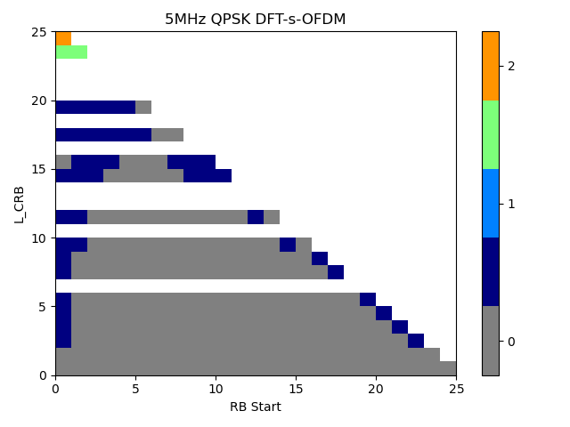{width="6.708333333333333in"
height="1.4861111111111112in"}

Figure 6.1.7-1 General ON/OFF time mask for SL-U PSSCH and PSCCH

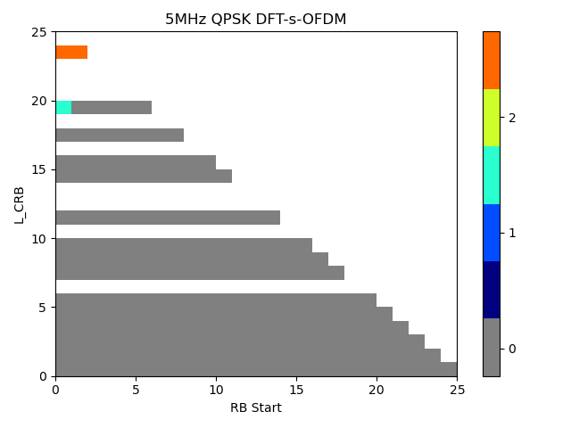{width="6.6875in" height="1.4736111111111112in"}

Figure 6.1.7-2 ON/OFF time mask for SL-U S-SSB

### 6.1.8 Power control for NR SL-U

The power control of NR-U is defined in clause 6.3F.4 of TS 38.101-1 and
the power control of NR V2X is defined in clause 6.3E.4. Since only
absolute power control requirement is defined for NR V2X, it has been
agreed that only absolute power control requirement is defined for NR
SL-U.

During the NR-U discussion it was agreed that absolute requirement
applies at the start of a contiguous transmission or non-contiguous
transmission with a transmission gap larger than 40 ms. Gap duration of
40ms is larger than 20ms, which is defined in generic requirements in
Clause 6.3.4.2. of TS 38.101-1. This extension of gap duration is in
line with eLAA requirement in 36.101 and is defined to maintain power
control accuracy over longer periods of no transmission due to the
uncertainty introduced by LBT. Therefore NR SL-U can reuse NR-U absolute
power control requirement as defined in Clause 6.3F.4.2.

### 6.1.9 Transmit signal quality for NR SL-U

#### 6.1.9.1 Frequency Error

The Frequency error for NR-U is defined in clause 6.4F.1 of TS 38.101-1
and the normal NR requirement in clause 6.4.1 of TS 38.101-1 apply. For
NR V2X, frequency error is defined in clause 6.4E,1 as ±0.1 PPM accuracy
observed over a period of 1 ms against GNSS."

It has been agreed to reuse the NR V2X Frequency error requirements in
38.101-1 clause 6.4E.1 for NR SL-U.

#### 6.1.9.2 EVM

The EVM of NR-U is defined in clause 6.4F.2 of TS 38.101-1 and the
normal NR requirement in clause 6.4.2.1 of TS 38.101-1 apply. For NR
V2X, EVM is defined in clause 6.4E.2.2 with other than the Pi/2-BPSK
modulation, which is not supported for NR V2X.

It has been agreed to reuse the NR V2X EVM requirements in 38.101-1
clause 6.4E.2.2 for NR SL-U.

\- For NR V2X the EVM requirements in clause 6.4.2.1 are valid for
PSCCH, PSSCH and PSBCH physical channels with other than pi/2-BPSK
modulation, which is not supported for NR V2X, and excluding the guard
symbol at the end of transmitted slots

#### 6.1.9.3 Carrier Leakage

The Carrier Leakage of NR-U is defined in clause 6.4.2.2 of TS 38.101-1
and the normal NR requirement apply, which is the same for NR V2X.

It has been agreed to reuse the NR single CC carrier leakage
requirements in 38.101-1 clause 6.4.2.2 for NR SL-U.

#### 6.1.9.4 Equalizer spectrum flatness

The Equalizer spectrum flatness of NR-U is referred to clause 6.4.2.4 of
TS 38.101-1 and the normal NR requirement apply, which is the same for
NR V2X.

It has been agreed to reuse the NR single CC Equalizer spectrum flatness
requirements in 38.101-1 clause 6.4.2.4 for NR SL-U.

#### 6.1.9.5 In-band Emission

The In-band Emission of NR-U is defined in clause 6.4F.2.3 of TS
38.101-1. For NR V2X, In-band Emission is defined in clause 6.4E,2.4
where normal NR requirement of clause 6.4.2.3 apply.

It has been agreed to reuse the NR-U In-band emission requirements in
38.101-1 Table 6.4F.2.3-1 for NR SL-U. Minimum requirements for in-band
emissions for NR SL-U PSCCH, PSSCH and PSBCH transmissions over the
measurement interval that takes into account guard period at the end of
the transmit slot.

### 6.1.10 Spectrum emission mask for NR SL-U

#### 6.1.10.1 Occupied Bandwidth

The Occupied Bandwidth of NR-U is defined in clause 6.5.1 of TS 38.101-1
and the normal NR requirement apply, which is the same for NR V2X.

It has been agreed to reuse the NR single CC Occupied Bandwidth
requirements in 38.101-1 clause 6.5.1 for NR SL-U.

#### 6.1.10.2 SEM

The SEM of NR-U is defined in clause 6.5F.2.2 of TS 38.101-1. For NR
V2X, In-band Emission is defined in clause 6.5E,2.2 where normal NR
requirement of clause 6.5.2.2 apply.

It has been agreed to reuse the NR-U SEM requirements in 38.101-1 Table
6.4F.2.3-1 for NR SL-U.

#### 6.1.10.3 A-SEM

Additional spectrum emission mask requirements are not defined for NR-U.

It is agreed not to define A-SEM requirements for NR SL-U when operating
in bands n46, n96 and n102.

### 6.1.11 ACLR requirements for NR SL-U

The ACLR of NR-U is defined in clause 6.5F.2.4 of TS 38.101-1. For NR
V2X, ACLR is defined in clause 6.5E.2.4 where normal NR requirement of
clause 6.5.2.4 apply. The ACLR requirement was optimized for operation
in un-licensed band during the development of the NR-U requirements.

It has been agreed to reuse the NR-U ACLR requirements in 38.101-1
clause 6.5F.2.4 for NR SL-U.

### 6.1.12 Spurious emissions for NR SL-U

The general spurious emission of NR-U is defined in clause 6.5.3.1 of TS
38.101-1 and the normal NR requirement apply, which is the same for NR
V2X.

It has been agreed to reuse the NR single CC general spurious emission
requirements in 38.101-1 clause 6.5.3.1 for NR SL-U.

The additional spurious emission of NR-U is defined in clause 6.5F.3.3
of TS 38.101-1 with different NS values for different bands.

It has been agreed to reuse the NR-U single CC minimum requirements in
TS 38.101-1 clause 6.5F.3.3 for NR SL-U.

### 6.1.13 Spurious emission band UE co-existence for NR SL-U

UE coexistence requirements are not defined for NR-U.

It has been agreed not to define UE coexistence spurious emission
requirements for NR SL-U when operating in bands n46, n96 and n102 in
case of non-concurrent operation.

### 6.1.14 Transmit intermodulation for NR SL-U

The Transmit intermodulation of NR-U is defined in clause 6.5.4 of TS
38.101-1 and the normal NR requirement apply, which is the same for NR
V2X.

It has been agreed to reuse the NR single CC Transmit intermodulation
requirements in 38.101-1 clause 6.5.4 for NR SL-U.

6.2 Tx requirements for inter-band con-current operation
--------------------------------------------------------

It has been agreed to consider the functionality and requirements of
single carrier SL-U operation as a basis of SL-U and the functionality
and requirements of single carrier Uu operation as a basis of Uu in
con-current operation.

### 6.2.1 Maximum output power for inter-band con-current operation

It has been agreed to target the following power classes.

\- Power class 3 Uu\@Licensed + Power class 5 SL\@Un-licensed

\- Power class 3 Uu\@Licensed + Power class 3 SL\@Un-licensed can be
considered as 2nd priority if Power class 3 SL is agreed in a single
carrier at unlicensed band

For Power class 2 for Uu\@Licensed for inter-band concurrent operation,
it is not considered in Rel-18.

RAN4 agreed to define maximum output power for each operating band and
there is no total power class for SL-U con-current band combination.

Table 6.2.1: NR UE Power Class for inter band SL-U con-current
combination

<table>
<thead>
<tr class="header">
<th>NR SL con-current operating band Configuration</th>
<th>NR band</th>
<th>Class 1 (dBm)</th>
<th>Tolerance (dB)</th>
<th>Class 2 (dBm)</th>
<th>
Tolerance

(dB)
</th>
<th>Class 3 (dBm)</th>
<th>Tolerance (dB)</th>
<th>Class 4 (dBm)</th>
<th>Tolerance (dB)</th>
<th>Class 5(dBm)</th>
<th>Tolerance (dB)</th>
</tr>
</thead>
<tbody>
<tr class="odd">
<td>SL_n78-n46</td>
<td>n78</td>
<td></td>
<td></td>
<td></td>
<td></td>
<td>23</td>
<td>+2/-3</td>
<td></td>
<td></td>
<td></td>
<td></td>
</tr>
<tr class="even">
<td></td>
<td>n46</td>
<td></td>
<td></td>
<td></td>
<td></td>
<td></td>
<td></td>
<td></td>
<td></td>
<td>20</td>
<td>+2/-3</td>
</tr>
<tr class="odd">
<td>
NOTE 1: For the con-current band combinations, the simultaneous transmission and reception of sidelink and Uu interfaces can be supported while operation is agnostic of the service used on each interface.

NOTE 2: PPowerClass is the maximum output power specified without taking into account the tolerance for each operating band.

NOTE 3: For inter-band con-current operation, the aggregation power apply to the total transmitted power over all component carriers (per UE).
</td>
<td></td>
<td></td>
<td></td>
<td></td>
<td></td>
<td></td>
<td></td>
<td></td>
<td></td>
<td></td>
<td></td>
</tr>
</tbody>
</table>

### 6.2.2 UE maximum output power reduction for inter-band con-current operation

It has been agreed to refer to the existing requirement for NR Uu and
refer to the SL-U requirement if specified.

For the inter-band con-current operation, the allowed maximum power
reduction (MPR) for the maximum output power shall be applied per each
component carrier. The MPR requirements in TS 38.101-1 clause 6.2.2
apply for NR Uu operation in licensed band, and the MPR requirements in
clause 6.1.2 apply for NR sidelink operation in unlicensed band.

### 6.2.3 UE additional maximum output power reduction for inter-band con-current operation

It has been agreed to refer to the existing requirement for NR Uu and
refer to the SL-U requirement if specified.

For the inter-band con-current operation, the allowed additional maximum
power reduction (A-MPR) for the maximum output power shall be applied
per each component carrier. The A-MPR requirements in TS 38.101-1 clause
6.2.3 apply for NR Uu operation in licensed band, and the A-MPR
requirements in clause 6.1.2 apply for NR sidelink operation in
unlicensed band.

### 6.2.4 Configured transmitted power for inter-band con-current operation

It has been agreed to

consider the existing requirement for NR V2X con-current operation
(6.2E.4.2 in TS38.101-1) as starting point

reuse the existing delta Tib of CA\_n46-n78 for inter-band concurrent
operation in Rel-18

When a UE is configured for simultaneous NR sidelink and NR uplink
transmissions for inter-band con-current operation, the UE is allowed to
set its configured maximum output power P~CMAX,*c*,*NR*~ and
P~CMAX,*c*,SL~ for the configured NR uplink carrier and the configured
NR SL carrier, respectively, and its total configured maximum output
power P~CMAX,c~.

The configured maximum output power P~CMAX\ *c*,*NR*~*(p)* in slot *p*
for the configured NR uplink carrier shall be set within the bounds:

P~CMAX\_L,*c,NR*~ (*p*) ≤ P~CMAX,*c,NR\ *~(*p*) ≤ P~CMAX\_H,*c,NR*~
(*p*)

where P~CMAX\_L,*c,NR\ *~and P~CMAX\_H,*c,NR*~ are the limit as
specified in TS 38.101-1 clause 6.2E.4.1.

The configured maximum output power P~CMAX\ *c*,SL~ *(q)* in slot *q*
for the configured NR SL carrier shall be set within the bounds:

P~CMAX,*c,SL\ *~(*q*) ≤ P~CMAX\_H,*c,SL*~ (*q*)

where P~CMAX\_H,*c,SL*~ is the limit as specified in TS 38.101-1 clause
6.2E.4.

The total UE configured maximum output power P~CMAX~ (*p,q*) in a slot
*p* of NR uplink carrier and a slot *q* of NR sidelink that overlap in
time shall be set within the following bounds for synchronous and
asynchronous operation unless stated otherwise:

P~CMAX\_L~ (*p,q*) ≤ P~CMAX~ (*p,q*) ≤ P~CMAX\_H~ (*p,q*)

with

P~CMAX\_L~ (*p,q*) = P~CMAX\_L,*c,NR*~ (*p*)

P~CMAX\_H~ (*p,q*) = 10 log~10~ \[p~CMAX\_H,*c,NR*~ (*p*) +
p~CMAX\_H,*c,SL*~ (*q*)\]

where p~CMAX\_H*,c,SL*~ and p~CMAX\_H,*c,NR*~ are the limits
P~CMAX\_H,*c,SL*~ (*q*) and P~CMAX\_H,*c,NR*~ (*p*) expressed in linear
scale.

The measured total maximum output power P~UMAX~ over both the NR uplink
and NR SL carriers is

P~UMAX~ = 10 log~10~ \[p~UMAX,*c,NR*~ + p~UMAX,*c,SL*~\],

where p~UMAX,*c,NR\ *~ denotes the measured output power of serving cell
*c* for the configured NR uplink carrier, and p~UMAX,*c,SL\ *~denotes
the measured output power for the configured NR SL carrier expressed in
linear scale.

When a UE is configured for synchronous NR sidelink and uplink
transmissions,

P~CMAX\_L~(*p, q*) -- T~LOW~ (P~CMAX\_L~(*p, q*)) ≤ P~UMAX~ ≤
P~CMAX\_H~(*p, q*) + T~HIGH~ (P~CMAX\_H~(*p, q*))

where P~CMAX\_L~ (*p,q*) and P~CMAX\_H~ (*p,q*) are the limits for the
pair (*p,q*) and with the tolerances T~LOW~(P~CMAX~) and
T~HIGH~(P~CMAX~) for applicable values of P~CMAX~ specified in Table
6.2E.4.1-1.. P~CMAX\_L~ may be modified for any overlapping portion of
slots *(p, q)* and *(p +1, q+1).*

### 6.2.5 Minimum output power for inter-band con-current operation

It has been agreed to reuse NR uu and SL-U requirements for each band if
an issue is not identified.

For the inter-band con-current operation, the requirements specified in
TS 38.101-1 clause 6.3.1 shall apply for NR Uu operation in licensed
band and the requirements specified in clause 6.1.5 shall apply for NR
sidelink operation in unlicensed band.

### 6.2.6 Transmit OFF power for inter-band con-current operation

It has been agreed to reuse NR uu and SL-U requirements for each band if
an issue is not identified.

For the inter-band con-current operation, the requirements specified in
TS 38.101-1 clause 6.3.2 shall apply for NR Uu operation in licensed
band and the requirements specified in clause 6.1.6 shall apply for NR
sidelink operation in unlicensed band

### 6.2.7 ON/OFF time mask for inter-band con-current operation

It has been agreed to reuse NR uu and SL-U requirements for each band if
an issue is not identified.

### 6.2.8 Power control for inter-band con-current operation

It has been agreed to reuse NR uu and SL-U requirements for each band if
an issue is not identified.

For the inter-band con-current operation, the requirements specified in
TS 38.101-1 clause 6.3.4 shall apply for NR Uu operation in licensed
band and the requirements specified in clause 6.1.8 shall apply for NR
sidelink operation in unlicensed band

### 6.2.9 Transmit signal quality for inter-band con-current operation

It has been agreed to reuse NR uu and SL-U requirements for each band if
an issue is not identified.

### 6.2.10 Spectrum emission mask for inter-band con-current operation

It has been agreed to reuse NR uu and SL-U requirements for each band if
an issue is not identified.

For the inter-band con-current operation, the general/additional SEM
requirements specified in TS 38.101-1 clause 6.5.2 shall apply for NR Uu
operation in licensed band and the general/additional SEM requirements
specified in clause 6.1.10 shall apply for NR sidelink operation in
unlicensed band.

### 6.2.11 ACLR requirements for inter-band con-current operation

It has been agreed to reuse NR uu and SL-U requirements for each band if
an issue is not identified.

For the inter-band con-current operation, the ACLR requirement specified
in clause TS 38.101-1 6.5.2.4 shall apply for NR Uu operation in
licensed band and the ACLR requirement specified in clause 6.1.11 shall
apply for NR sidelink operation in unlicensed band.

### 6.2.12 Spurious emissions for inter-band con-current operation

The general spurious emission is not needed for inter-band con-current
operation as the NR SL only defines spurious emission for non-current
case.

### 6.2.13 Spurious emission band UE co-existence for inter-band con-current operation

It has been agreed to reuse the inter band CA\_n46-n78 co-existence
requirement for con-current operation with Uu\@78 + SL\@n46.

### 6.2.14 Transmit intermodulation for inter-band con-current operation

It has been agreed to reuse NR uu and SL-U requirements for each band if
an issue is not identified.

For the inter-band con-current operation, the requirements specified in
TS 38.101-1 clause 6.5.4 shall apply for NR Uu operation in licensed
band and the requirements specified in clause 6.1.14\` shall apply for
NR sidelink operation in unlicensed band.

6.3 Tx requirements for NR SL CA operation
------------------------------------------

### 6.3.1 Maximum output power for NR SL CA operation

For the intra-band SL CA operation, the following NR SL CA UE Power
Classes define the maximum output power for any transmission bandwidth
within the channel bandwidth. The period of measurement shall be at
least one sub frame (1ms).

Table 6.3.1-1: NR SL CA UE Power Class

+-------+-------+-------+-------+-------+-------+-------+-------+-------+
| NR SL | Class | Tole  | Class | Tole  | Class | Tole  | Class | Tole  |
| CA    | 1     | rance | 2     | rance | 3     | rance | 4     | rance |
| band  | (dBm) | (dB)  | (dBm) | (dB)  | (dBm) | (dB)  | (dBm) | (dB)  |
| Con   |       |       |       |       |       |       |       |       |
| figur |       |       |       |       |       |       |       |       |
| ation |       |       |       |       |       |       |       |       |
+=======+=======+=======+=======+=======+=======+=======+=======+=======+
| SL\   |       |       |       |       | 23    | +2/   |       |       |
| _n47B |       |       |       |       |       | -3^3^ |       |       |
+-------+-------+-------+-------+-------+-------+-------+-------+-------+
| NOTE  |       |       |       |       |       |       |       |       |
| 1:    |       |       |       |       |       |       |       |       |
| P~P   |       |       |       |       |       |       |       |       |
| owerC |       |       |       |       |       |       |       |       |
| lass~ |       |       |       |       |       |       |       |       |
| is    |       |       |       |       |       |       |       |       |
| the   |       |       |       |       |       |       |       |       |
| ma    |       |       |       |       |       |       |       |       |
| ximum |       |       |       |       |       |       |       |       |
| UE    |       |       |       |       |       |       |       |       |
| power |       |       |       |       |       |       |       |       |
| spec  |       |       |       |       |       |       |       |       |
| ified |       |       |       |       |       |       |       |       |
| wi    |       |       |       |       |       |       |       |       |
| thout |       |       |       |       |       |       |       |       |
| t     |       |       |       |       |       |       |       |       |
| aking |       |       |       |       |       |       |       |       |
| into  |       |       |       |       |       |       |       |       |
| ac    |       |       |       |       |       |       |       |       |
| count |       |       |       |       |       |       |       |       |
| the   |       |       |       |       |       |       |       |       |
| tole  |       |       |       |       |       |       |       |       |
| rance |       |       |       |       |       |       |       |       |
|       |       |       |       |       |       |       |       |       |
| NOTE  |       |       |       |       |       |       |       |       |
| 2:    |       |       |       |       |       |       |       |       |
| For   |       |       |       |       |       |       |       |       |
| intra |       |       |       |       |       |       |       |       |
| -band |       |       |       |       |       |       |       |       |
| SL CA |       |       |       |       |       |       |       |       |
| UE,   |       |       |       |       |       |       |       |       |
| the   |       |       |       |       |       |       |       |       |
| ma    |       |       |       |       |       |       |       |       |
| ximum |       |       |       |       |       |       |       |       |
| power |       |       |       |       |       |       |       |       |
| r     |       |       |       |       |       |       |       |       |
| equir |       |       |       |       |       |       |       |       |
| ement |       |       |       |       |       |       |       |       |
| apply |       |       |       |       |       |       |       |       |
| to    |       |       |       |       |       |       |       |       |
| the   |       |       |       |       |       |       |       |       |
| total |       |       |       |       |       |       |       |       |
| t     |       |       |       |       |       |       |       |       |
| ransm |       |       |       |       |       |       |       |       |
| itted |       |       |       |       |       |       |       |       |
| power |       |       |       |       |       |       |       |       |
| over  |       |       |       |       |       |       |       |       |
| all   |       |       |       |       |       |       |       |       |
| comp  |       |       |       |       |       |       |       |       |
| onent |       |       |       |       |       |       |       |       |
| car   |       |       |       |       |       |       |       |       |
| riers |       |       |       |       |       |       |       |       |
| (per  |       |       |       |       |       |       |       |       |
| UE).  |       |       |       |       |       |       |       |       |
|       |       |       |       |       |       |       |       |       |
| NOTE  |       |       |       |       |       |       |       |       |
| 3:    |       |       |       |       |       |       |       |       |
| ^3^   |       |       |       |       |       |       |       |       |
| r     |       |       |       |       |       |       |       |       |
| efers |       |       |       |       |       |       |       |       |
| to    |       |       |       |       |       |       |       |       |
| the   |       |       |       |       |       |       |       |       |
| tr    |       |       |       |       |       |       |       |       |
| ansmi |       |       |       |       |       |       |       |       |
| ssion |       |       |       |       |       |       |       |       |
| bandw |       |       |       |       |       |       |       |       |
| idths |       |       |       |       |       |       |       |       |
| (F    |       |       |       |       |       |       |       |       |
| igure |       |       |       |       |       |       |       |       |
| 5.6-1 |       |       |       |       |       |       |       |       |
| in    |       |       |       |       |       |       |       |       |
| T     |       |       |       |       |       |       |       |       |
| S38.1 |       |       |       |       |       |       |       |       |
| 01-1) |       |       |       |       |       |       |       |       |
| con   |       |       |       |       |       |       |       |       |
| fined |       |       |       |       |       |       |       |       |
| w     |       |       |       |       |       |       |       |       |
| ithin |       |       |       |       |       |       |       |       |
| F~UL\ |       |       |       |       |       |       |       |       |
| _low~ |       |       |       |       |       |       |       |       |
| and   |       |       |       |       |       |       |       |       |
| F~UL\ |       |       |       |       |       |       |       |       |
| _low~ |       |       |       |       |       |       |       |       |
| + 4   |       |       |       |       |       |       |       |       |
| MHz   |       |       |       |       |       |       |       |       |
| or    |       |       |       |       |       |       |       |       |
| F     |       |       |       |       |       |       |       |       |
| ~UL\_ |       |       |       |       |       |       |       |       |
| high~ |       |       |       |       |       |       |       |       |
| -- 4  |       |       |       |       |       |       |       |       |
| MHz   |       |       |       |       |       |       |       |       |
| and   |       |       |       |       |       |       |       |       |
| F~    |       |       |       |       |       |       |       |       |
| UL\_h |       |       |       |       |       |       |       |       |
| igh~, |       |       |       |       |       |       |       |       |
| the   |       |       |       |       |       |       |       |       |
| ma    |       |       |       |       |       |       |       |       |
| ximum |       |       |       |       |       |       |       |       |
| o     |       |       |       |       |       |       |       |       |
| utput |       |       |       |       |       |       |       |       |
| power |       |       |       |       |       |       |       |       |
| r     |       |       |       |       |       |       |       |       |
| equir |       |       |       |       |       |       |       |       |
| ement |       |       |       |       |       |       |       |       |
| is    |       |       |       |       |       |       |       |       |
| re    |       |       |       |       |       |       |       |       |
| laxed |       |       |       |       |       |       |       |       |
| by    |       |       |       |       |       |       |       |       |
| red   |       |       |       |       |       |       |       |       |
| ucing |       |       |       |       |       |       |       |       |
| the   |       |       |       |       |       |       |       |       |
| lower |       |       |       |       |       |       |       |       |
| tole  |       |       |       |       |       |       |       |       |
| rance |       |       |       |       |       |       |       |       |
| limit |       |       |       |       |       |       |       |       |
| by    |       |       |       |       |       |       |       |       |
| 1.5   |       |       |       |       |       |       |       |       |
| dB    |       |       |       |       |       |       |       |       |
+-------+-------+-------+-------+-------+-------+-------+-------+-------+

### 6.3.2 UE maximum output power reduction for NR SL CA operation

For basic parameters, reuse the simulation assumptions in TR38.785
(Rel-17 enhanced NR sidelink). Other constraints for
PSCCH/PSSCH/PSFCH/S-SSB can be assumed based on current RAN1's
agreement.

Table 6.3.2 Simulation assumption for NR SL CA operation

+----------------------------------+----------------------------------+
| Center frequency                 | 5.9GHz                           |
+----------------------------------+----------------------------------+
| Bandwidth                        | per CC: 10/20/30/40MHz           |
|                                  |                                  |
|                                  | Aggregated CBW: Table 5.2.3-1    |
|                                  | (up to 70MHz CBW)                |
+----------------------------------+----------------------------------+
| Maximum output power for         | 23dBm                            |
| aggregated CBW                   |                                  |
+----------------------------------+----------------------------------+
| Numerology                       | 15 kHz/30kHz/60kHz               |
+----------------------------------+----------------------------------+
| Modulation per CC                | QPSK/16QAM/64QAM/256QAM          |
+----------------------------------+----------------------------------+
| Waveform                         | CP-OFDM                          |
+----------------------------------+----------------------------------+
| Carrier leakage                  | 34dBc                            |
+----------------------------------+----------------------------------+
| IQ image                         | 25dBc                            |
+----------------------------------+----------------------------------+
| CIM3                             | 60dBc                            |
+----------------------------------+----------------------------------+
| PA calibration                   | PA calibrated to deliver 30dBc   |
|                                  | ACLR for a fully allocated RBs   |
|                                  | in 20MHz QPSK DFT- S-OFDM        |
|                                  | waveform at 1 dB MPR.            |
|                                  |                                  |
|                                  | This is based to share PA        |
|                                  | between LTE V2X and NR V2X at    |
|                                  | 5.9GHz as worst case.            |
+----------------------------------+----------------------------------+

#### 6.3.2.1 MPR for NR SL CA operation

##### 6.3.2.1.1 MPR for simultaneous PSSCH/PSCCH transmission

For SL intra-band contiguous CA of PSCCH and PSSCH simultaneous
transmission with contiguous RB allocation, specify MPR in Table
6.3.2.1.1-1.

Table 6.3.2.1.1-1: MPR for power class 3 SL CA \[with contiguous RB
allocation\]

  Modulation   MPR for bandwidth class B(dB)               
  ------------ ------------------------------- ----------- -----------
               inner                           outer       
  CP-OFDM      QPSK                            **≤ 3.0**   **≤** 5.0
               16QAM                           **≤** 3.0   **≤** 5.0
               64QAM                           **≤** 4.5   **≤** 5.0
               256QAM                          **≤** 6.5   7.0

The contiguous allocation rule for SL intra-band contiguous CA refers to
that for NR intra-band contiguous CA in 6.2A.2.1 in TS38.101-1.

\[For SL intra-band contiguous CA of PSCCH and PSSCH simultaneous
transmission with non-contiguous RB allocation, specify MPR in Table
6.3.2.1.1-2.

Table 6.3.2.1.1-2: MPR for power class 3 SL CA with non-contiguous RB
allocation

\[TBA\]

The non-contiguous allocation rule for SL intra-band contiguous CA
refers to that for NR intra-band contiguous CA in 6.2A.2.1 in
TS38.101-1.\]

##### 6.3.2.1.1.1 Huawei's simulation results (R4-2315227) {#huaweis-simulation-results-r4-2315227 .H6}

Referring to the updated MPR simulation assumption, we use the following
simulation scenarios in Table 4.

Table 6.3.2.1.1.1-1 SLCA PSSCH/PSCCH MPR simulation scenarios

  **Scenario**   **Aggregated CBW**   **Subcarrier spacing**   **Waveform**   **Modulation**
  -------------- -------------------- ------------------------ -------------- -------------------------
  **1**          10MHz + 10MHz        15kHz+15kHz              CP-OFDM        QPSK/16QAM/64QAM/256QAM
  **2**          10MHz + 10MHz        30kHz+30kHz              CP-OFDM        QPSK/16QAM/64QAM/256QAM
  **3**          30MHz + 40MHz        30kHz+30kHz              CP-OFDM        QPSK/16QAM/64QAM/256QAM
  4              20MHz + 20MHz        30kHz+30kHz              CP-OFDM        QPSK/16QAM/64QAM/256QAM

The simulation results for the scenarios listed in are illustrated
below, and the evaluation figures are shown in the Annex with Figure 1
-- Figure 4.

Table 6.3.2.1.1.1-2 SLCA PSSCH/PSCCH MPR simulation scenarios

+-------+-------+-------+-------+-------+-------+-------+-------+-------+
| Modul | 10MHz | 10MHz | 30MHz | 20MHz |       |       |       |       |
| ation | +     | +     | +     | +     |       |       |       |       |
|       | 1     | 1     | 40MHz | 20MHz |       |       |       |       |
|       | 0MHz/ | 0MHz/ | /     | /     |       |       |       |       |
|       |       |       |       |       |       |       |       |       |
|       | 3     | 1     | 3     | 3     |       |       |       |       |
|       | 0kHz+ | 5kHz+ | 0kHz+ | 0kHz+ |       |       |       |       |
|       | 30kHz | 15kHz | 30kHz | 30kHz |       |       |       |       |
+=======+=======+=======+=======+=======+=======+=======+=======+=======+
|       | inner | outer | inner | outer | inner | outer | inner | outer |
+-------+-------+-------+-------+-------+-------+-------+-------+-------+
| QPSK  | 1.8   | 2.9   | 1.9   | 3.1   | 1.7   | 3.0   | 1.8   | 3.2   |
+-------+-------+-------+-------+-------+-------+-------+-------+-------+
| 16QAM | 2.3   | 2.9   | 2.2   | 3.0   | 2.5   | 3.2   | 2.3   | 3.2   |
+-------+-------+-------+-------+-------+-------+-------+-------+-------+
| 64QAM | 3.3   | 3.9   | 3.3   | 4.0   | 3.4   | 4.0   | 3.4   | 4.0   |
+-------+-------+-------+-------+-------+-------+-------+-------+-------+
| 2     | 5.2   | 6.3   | 5.3   | 6.4   | 5.4   | 6.4   | 5.5   | 5.4   |
| 56QAM |       |       |       |       |       |       |       |       |
+-------+-------+-------+-------+-------+-------+-------+-------+-------+

##### 6.3.2.1.1.2 LGE's simulation results (R4-2315532) {#lges-simulation-results-r4-2315532 .H6}

For Contiguous RB allocation of SL contiguous CA

The following simulation scenarios are considered as Table 6.3.2.1.1.2-1
for Contiguous RB allocations.

Table 6.3.2.1.1.2-1: SLCA PSSCH/PSCCH MPR simulation scenarios
(Contiguous RB allocation)

  Aggregated CBW   Scenario   CC1      CC2      Inner/Outer RB allocation   SCS
  ---------------- ---------- -------- -------- --------------------------- -----
  10MHz + 10MHz    1          10RB42   10RB0    Inner                       15
                   2          10RB42   12RB0    Inner                       15
                   3          10RB42   15RB0    Inner                       15
                   4          10RB42   25RB0    Inner                       15
                   5          10RB42   30RB0    Inner                       15
                   6          10RB42   36RB0    Outer                       15
                   7          10RB42   50RB0    Outer                       15
                   8          12RB40   36RB0    Outer                       15
                   9          25RB27   36RB0    Outer                       15
                   10         40RB12   40RB0    Outer                       15
                   11         50RB2    50RB0    Outer                       15
  20MHz + 30MHz    12         10RB41   10RB0    Inner                       30
                   13         10RB41   12RB0    Inner                       30
                   14         10RB41   25RB0    Inner                       30
                   15         10RB41   30RB0    Inner                       30
                   16         10RB41   48RB0    Inner                       30
                   17         10RB41   50RB0    Outer                       30
                   18         25RB26   36RB0    Outer                       30
                   19         36RB15   36RB0    Outer                       30
                   20         40RB11   40RB0    Outer                       30
                   21         50RB1    75RB0    Outer                       30
  20MHz + 40MHz    22         10RB41   10RB0    Inner                       30
                   23         10RB41   25RB0    Inner                       30
                   24         10RB41   36RB0    Inner                       30
                   25         10RB41   48RB0    Inner                       30
                   26         10RB41   60RB0    Inner                       30
                   27         10RB41   70RB0    Outer                       30
                   28         25RB26   36RB0    Outer                       30
                   29         36RB15   70RB0    Outer                       30
                   30         40RB11   90RB0    Outer                       30
                   31         50RB1    105RB0   Outer                       30
  30MHz + 40MHz    32         10RB68   10RB0    Inner                       30
                   33         10RB68   25RB0    Inner                       30
                   34         10RB68   36RB0    Inner                       30
                   35         10RB68   48RB0    Inner                       30
                   36         10RB68   60RB0    Inner                       30
                   37         10RB68   70RB0    Outer                       30
                   38         10RB68   105RB0   Outer                       30
                   39         25RB53   70RB0    Outer                       30
                   40         36RB42   90RB0    Outer                       30
                   41         40RB38   90RB0    Outer                       30
                   42         75RB3    105RB0   Outer                       30
  20MHz + 20MHz    43         10RB41   10RB0    Inner                       30
                   44         10RB41   12RB0    Inner                       30
                   45         10RB41   15RB0    Inner                       30
                   45         10RB41   25RB0    Inner                       30
                   46         10RB41   30RB0    Inner                       30
                   47         10RB41   36RB0    Outer                       30
                   48         10RB41   50RB0    Outer                       30
                   49         12RB39   36RB0    Outer                       30
                   50         25RB26   36RB0    Outer                       30
                   51         40RB11   40RB0    Outer                       30
                   52         50RB1    50RB0    Outer                       30
  10MHz + 30MHz    53         10RB41   10RB0    Inner                       30
                   54         10RB41   12RB0    Inner                       30
                   55         10RB41   15RB0    Inner                       30
                   56         10RB41   20RB0    Inner                       30
                   57         10RB41   25RB0    Outer                       30
                   58         10RB41   50RB0    Outer                       30
                   59         10RB41   75RB0    Outer                       30
                   60         12RB12   36RB0    Outer                       30
                   61         15RB9    60RB0    Outer                       30
                   62         20RB4    75RB0    Outer                       
                   63         24RB0    75RB0    Outer                       30

Table 6.3.2.1.1.2-1-2 and Figure 6.3.2.1.1.2-1 show PSSCH/PSCCH MPR
simulation results.

Table 6.3.2.1.1.2-2: PSSCH/PSCCH MPR simulation results for SL
Contiguous CA with Contiguous RB allocations

  \'10MHz+10MHz\'   Scenario \#   \#1    \#2    \#3    \#4    \#5    \#6    \#7    \#8    \#9    \#10   \#11                     
  ----------------- ------------- ------ ------ ------ ------ ------ ------ ------ ------ ------ ------ ------ -- -- -- -- -- -- --
                    \'QPSK\'      0.13   0.13   0.14   0.13   0.13   0.95   2.70   1.27   1.60   2.32   3.09                     
                    \'16QAM\'     1.27   0.96   1.27   0.95   0.95   0.96   2.69   1.27   1.60   2.32   3.09                     
                    \'64QAM\'     2.31   2.31   2.31   2.31   2.30   2.31   2.69   2.31   2.31   2.32   3.09                     
                    \'256QAM\'    4.36   3.92   3.93   3.92   3.92   3.92   3.92   3.92   3.92   3.92   3.92                     
  \'20MHz+30MHz\'   Scenario \#   \#12   \#13   \#14   \#15   \#16   \#17   \#18   \#19   \#20   \#21                            
                    \'QPSK\'      0.37   0.65   1.26   0.96   0.67   0.95   0.96   1.95   2.31   3.09                            
                    \'16QAM\'     0.66   0.94   0.95   0.95   1.27   1.27   1.27   1.95   2.31   3.09                            
                    \'64QAM\'     1.93   1.93   2.31   2.31   2.31   2.31   2.31   2.31   2.31   3.09                            
                    \'256QAM\'    3.91   3.91   3.92   3.92   3.92   3.92   3.91   3.92   3.92   3.92                            
  \'20MHz+40MHz\'   Scenario \#   \#22   \#23   \#24   \#25   \#26   \#27   \#28   \#29   \#30   \#31                            
                    \'QPSK\'      0.00   0.00   0.00   0.13   0.13   0.39   0.66   1.95   2.31   3.09                            
                    \'16QAM\'     0.65   0.95   0.96   0.95   0.96   0.96   0.95   1.94   2.31   3.09                            
                    \'64QAM\'     1.93   1.94   2.30   2.31   2.31   2.31   2.30   2.31   2.31   3.09                            
                    \'256QAM\'    3.49   3.91   3.92   3.92   3.92   3.92   3.92   3.92   3.92   3.92                            
  \'30MHz+40MHz\'   Scenario \#   \#32   \#33   \#34   \#35   \#36   \#37   \#38   \#39   \#40   \#41   \#43                     
                    \'QPSK\'      0.00   0.00   0.00   0.12   0.13   0.66   3.09   1.27   2.69   2.69   3.09                     
                    \'16QAM\'     0.64   0.95   0.95   0.95   1.27   1.27   3.09   1.27   2.69   2.69   3.09                     
                    \'64QAM\'     1.93   2.30   2.30   2.30   2.30   2.30   3.09   2.31   2.69   2.69   3.09                     
                    \'256QAM\'    3.49   3.91   3.91   3.91   4.35   3.92   4.36   3.92   4.36   3.92   4.35                     
  \'20MHz+20MHz\'   Scenario \#   \#44   \#45   \#46   \#47   \#48   \#49   \#50   \#51   \#52   \#53   \#54                     
                    \'QPSK\'      0.00   0.00   0.00   0.00   0.13   1.26   3.09   1.59   1.94   2.31   3.09                     
                    \'16QAM\'     0.65   0.95   0.95   0.95   0.95   1.27   3.09   1.59   1.95   2.32   3.09                     
                    \'64QAM\'     1.93   1.93   1.94   2.30   2.31   2.31   3.08   2.31   2.31   2.31   3.09                     
                    \'256QAM\'    3.91   3.91   3.92   3.91   3.92   3.92   3.92   3.92   3.92   3.92   3.92                     
  \'10MHz+30MHz\'   Scenario \#   \#55   \#56   \#57   \#58   \#59   \#60   \#61   \#62   \#63   \#64   \#65                     
                    \'QPSK\'      0.00   0.00   0.00   0.38   0.66   1.60   2.69   1.60   2.31   2.70   3.09                     
                    \'16QAM\'     0.65   0.94   0.65   0.94   0.95   1.60   2.69   1.60   2.31   2.70   3.09                     
                    \'64QAM\'     1.93   1.94   1.95   1.94   2.31   2.30   2.69   2.31   2.31   2.70   3.09                     
                    \'256QAM\'    3.92   3.91   3.91   3.92   3.92   3.92   4.36   3.92   3.92   3.92   3.92                     

Table 6.3.2.1.1.2-3 shows the maximum value of simulation results for SL
Contiguous CA with Contiguous RB allocations considering Inner RB
allocation and Outer RB allocation as NR uplink Contiguous CA.

Table 6.3.2.1.1.2-3: PSSCH/PSCCH MPR simulation results for SL
Contiguous CA with Contiguous RB allocations

+--------------+---------------------------------+-------+------+
| > Modulation | > MPR for bandwidth class B(dB) |       |      |
+==============+=================================+=======+======+
|              | inner                           | outer |      |
+--------------+---------------------------------+-------+------+
| CP-OFDM      | QPSK                            | 0.38  | 3.09 |
+--------------+---------------------------------+-------+------+
|              | 16QAM                           | 1.27  | 3.09 |
+--------------+---------------------------------+-------+------+
|              | 64QAM                           | 2.31  | 3.09 |
+--------------+---------------------------------+-------+------+
|              | 256QAM                          | 4.36  | 4.36 |
+--------------+---------------------------------+-------+------+

The MPR can be proposed as Table 6.3.2.1.1.2-4 based on the simulation
results when considering implementation margin.

Table 6.3.2.1.1.2-4: PSSCH/PSCCH MPR simulation results for SL
Contiguous CA with Contiguous RB allocations

+--------------+---------------------------------+-----------+-----------+
| > Modulation | > MPR for bandwidth class B(dB) |           |           |
+==============+=================================+===========+===========+
|              | inner                           | outer     |           |
+--------------+---------------------------------+-----------+-----------+
| CP-OFDM      | QPSK                            | **≤** 3.0 | **≤** 5.0 |
+--------------+---------------------------------+-----------+-----------+
|              | 16QAM                           | **≤** 3.0 | **≤** 5.0 |
+--------------+---------------------------------+-----------+-----------+
|              | 64QAM                           | **≤** 4.5 | **≤** 5.0 |
+--------------+---------------------------------+-----------+-----------+
|              | 256QAM                          | **≤** 7.0 | **≤** 7.0 |
+--------------+---------------------------------+-----------+-----------+

For Non-contiguous RB allocation of SL contiguous CA

The following test scenarios are considered as Table 6.3.2.1.1.2-5 for
Non-contiguous RB allocations.

Table 6.3.2.1.1.2-5: SL contiguous CA MPR test scenarios (Non-contiguous
RB allocation)

  Aggregated CBW   Scenario   CC1      CC2      Inner/Outer1/Outer2 RB allocation   SCS
  ---------------- ---------- -------- -------- ----------------------------------- -----
  10MHz + 10MHz    1          10RB0    10RB42   Outer2                              15
                   2          10RB18   10RB22   Outer2                              15
                   3          10RB19   10RB22   Outer2                              15
                   4          10RB27   10RB14   Outer2                              15
                   5          10RB33   10RB7    Outer1                              15
                   6          10RB34   10RB7    Outer1                              15
                   7          10RB42   10RB1    Inner                               15
                   8          25RB0    25RB27   Outer2                              15
                   9          25RB19   25RB8    Outer2                              15
                   10         25RB20   25RB8    Outer2                              15
                   11         25RB27   25RB1    Outer1                              15
                   12         30RB0    30RB22   Outer2                              15
                   13         30RB19   30RB3    Outer2                              15
                   14         30RB19   30RB2    Outer2                              15
                   15         30RB22   30RB1    Outer1                              15
                   16         50RB1    50RB0    Outer2                              15
  20MHz + 30MHz    17         10RB0    10RB68   Outer2                              30
                   18         10RB15   10RB32   Outer2                              30
                   19         10RB15   10RB31   Outer2                              30
                   20         10RB32   10RB10   Outer1                              30
                   21         10RB34   10RB9    Outer1                              30
                   22         10RB34   10RB8    Outer1                              30
                   23         10RB41   10RB1    Inner                               30
                   24         25RB0    25RB53   Outer2                              30
                   25         25RB20   25RB25   Outer2                              30
                   26         25RB21   25RB25   Outer2                              30
                   27         25RB26   25RB1    Outer1                              30
                   28         30RB0    30RB48   Outer2                              30
                   29         30RB15   30RB12   Outer2                              30
                   30         30RB15   30RB11   Outer2                              30
                   31         30RB21   30RB1    Outer1                              30
                   32         50RB0    50RB28   Outer2                              30
                   33         50RB0    50RB0    Outer2                              30
                   34         50RB0    78RB0    Outer2                              30
  20MHz + 40MHz    35         10RB0    10RB96   Outer2                              30
                   36         10RB4    10RB30   Outer2                              30
                   37         10RB5    10RB30   Outer2                              30
                   38         10RB37   10RB15   Outer1                              30
                   39         10RB38   10RB15   Inner                               30
                   40         10RB41   10RB1    Inner                               30
                   41         25RB0    25RB81   Outer2                              30
                   42         25RB20   25RB38   Outer2                              30
                   43         25RB20   25RB37   Outer2                              30
                   44         25RB26   25RB1    Outer1                              30
                   45         30RB0    30RB76   Outer2                              30
                   46         30RB15   30RB26   Outer2                              30
                   47         30RB15   30RB25   Outer2                              30
                   48         30RB21   30RB1    Outer1                              30
                   49         50RB0    50RB56   Outer2                              30
                   50         50RB0    50RB0    Outer2                              30
                   51         50RB0    105RB0   Outer2                              30
  30MHz + 40MHz    52         10RB0    10RB96   Outer2                              30
                   53         10RB13   10RB30   Outer2                              30
                   54         10RB14   10RB30   Outer1                              30
                   55         10RB50   10RB15   Outer1                              30
                   56         10RB51   10RB15   Inner                               30
                   57         10RB68   10RB1    Inner                               30
                   58         25RB0    25RB81   Outer2                              30
                   59         25RB28   25RB37   Outer2                              30
                   60         25RB28   25RB36   Outer1                              30
                   61         25RB51   25RB1    Outer1                              30
                   62         25RB52   25RB1    Inner                               30
                   63         30RB0    30RB76   Outer2                              30
                   64         30RB24   30RB26   Outer2                              30
                   65         30RB24   30RB25   Outer1                              30
                   66         30RB48   30RB1    Outer1                              30
                   67         75RB0    50RB56   Outer2                              30
                   68         75RB0    50RB0    Outer2                              30
                   69         75RB0    105RB0   Outer2                              30
  20MHz + 20MHz    70         10RB0    10RB41   Outer2                              30
                   71         10RB17   10RB22   Outer2                              30
                   72         10RB18   10RB22   Outer1                              30
                   73         10RB27   10RB14   Outer1                              30
                   74         10RB33   10RB7    Outer1                              30
                   75         10RB34   10RB7    Inner                               30
                   76         10RB41   10RB1    Inner                               30
                   77         25RB0    25RB26   Outer2                              30
                   78         25RB18   25RB8    Outer2                              30
                   79         25RB19   25RB8    Outer1                              30
                   80         25RB26   25RB1    Outer1                              30
                   81         30RB0    30RB21   Outer2                              30
                   82         30RB18   30RB3    Outer1                              30
                   83         30RB18   30RB2    Outer1                              30
                   84         30RB21   30RB1    Outer2                              30
                   85         50RB0    50RB0    Outer2                              30
  10MHz + 30MHz    86         10RB0    10RB68   Outer2                              30
                   87         10RB6    10RB32   Outer2                              30
                   88         10RB6    10RB31   Outer1                              30
                   89         10RB14   10RB10   Outer1                              30
                   90         10RB14   10RB1    Outer1                              30
                   91         10RB0    12RB53   Outer2                              30
                   92         10RB3    12RB25   Outer2                              30
                   93         25RB4    12RB25   Outer1                              30
                   94         25RB12   12RB1    Outer1                              30
                   95         25RB0    30RB48   Outer2                              30
                   96         25RB3    30RB7    Outer2                              30
                   97         30RB3    30RB6    Outer1                              30
                   98         30RB12   30RB1    Outer1                              30
                   99         30RB0    50RB28   Outer2                              30
                   100        30RB0    50RB1    Outer2                              30
                   101        50RB0    75RB1    Outer2                              30

Table 6.3.2.1.1.2-6 and Figure 6.3.2.1.1.2-2 show PSSCH/PSCCH MPR
simulation results.

Table 6.3.2.1.1.2-6: PSSCH/PSCCH MPR simulation results for SL
Contiguous CA with Non-contiguous RB allocations

  \'10MHz+10MHz\'   Scenario \#   \#1    \#2    \#3    \#4    \#5    \#6    \#7    \#8    \#9    \#10   \#11   \#12   \#13   \#14   \#15    \#16           
  ----------------- ------------- ------ ------ ------ ------ ------ ------ ------ ------ ------ ------ ------ ------ ------ ------ ------- ------- ------ ------
                    \'QPSK\'      6.67   3.09   2.69   2.33   0.00   0.00   0.14   4.81   2.32   2.32   0.14   4.81   1.95   1.95   1.28    3.09           
                    \'16QAM\'     6.67   2.70   3.10   2.70   0.95   0.97   0.96   5.26   2.32   2.32   0.96   4.81   1.95   1.95   1.28    3.09           
                    \'64QAM\'     6.67   2.69   3.09   2.32   1.94   2.31   2.31   5.26   2.31   2.32   2.31   4.81   1.95   1.95   2.32    3.09           
                    \'256QAM\'    7.15   3.92   3.93   3.93   3.92   3.92   3.93   4.81   3.92   3.92   3.92   4.81   3.92   3.92   3.92    3.92           
  \'20MHz+30MHz\'   Scenario \#   \#17   \#18   \#19   \#20   \#21   \#22   \#23   \#24   \#25   \#26   \#27   \#28   \#29   \#30   \#31    \#32    \#33   \#34
                    \'QPSK\'      5.27   2.69   2.69   0.00   0.00   0.00   0.00   3.50   2.69   2.69   0.38   3.10   2.69   2.69   1.27    3.10    3.09   3.09
                    \'16QAM\'     5.27   2.70   2.69   0.66   0.66   0.65   0.66   3.50   2.70   2.69   0.96   3.09   2.69   2.69   1.27    3.09    3.09   3.09
                    \'64QAM\'     5.27   2.69   2.70   1.93   1.94   1.93   1.93   3.51   2.69   2.69   2.31   3.09   2.69   2.69   2.31    3.09    3.09   3.09
                    \'256QAM\'    5.26   3.50   3.49   3.48   3.91   3.49   3.49   3.50   3.50   3.49   3.91   3.92   3.92   3.92   3.92    3.92    3.92   3.92
  \'20MHz+40MHz\'   Scenario \#   \#35   \#36   \#37   \#38   \#39   \#40   \#41   \#42   \#43   \#44   \#45   \#46   \#47   \#48   \#49    \#50    \#51   
                    \'QPSK\'      5.28   3.09   3.08   0.00   0.00   0.00   3.09   2.69   2.69   0.66   3.09   2.69   2.69   1.60   3.10    3.09    3.09   
                    \'16QAM\'     5.26   3.08   3.08   0.65   0.65   0.65   3.09   2.69   2.69   0.95   3.10   2.69   2.69   1.60   3.09    3.09    3.09   
                    \'64QAM\'     5.27   3.09   3.09   1.94   1.94   1.94   3.09   2.69   2.69   1.94   3.09   2.69   2.69   2.31   3.10    3.09    3.09   
                    \'256QAM\'    5.27   3.49   3.49   3.49   3.48   3.49   3.50   3.49   3.49   3.91   3.92   3.50   3.92   3.92   3.92    3.92    3.92   
  \'30MHz+40MHz\'   Scenario \#   \#52   \#53   \#54   \#55   \#56   \#57   \#58   \#59   \#60   \#61   \#62   \#63   \#64   \#65   \#66    \#67    \#68   \#69
                    \'QPSK\'      5.27   2.69   2.69   0.00   0.00   0.00   3.09   2.69   2.69   0.00   0.00   3.09   2.69   2.69   0.00    3.09    3.09   3.09
                    \'16QAM\'     5.26   2.69   2.69   0.65   0.65   0.65   3.10   2.69   2.69   0.95   0.94   3.09   2.69   2.69   0.95    3.09    3.09   3.09
                    \'64QAM\'     5.26   2.69   2.68   1.93   1.93   1.93   3.09   2.69   2.69   1.94   1.94   3.09   2.69   2.69   2.30    3.09    3.09   3.09
                    \'256QAM\'    5.27   3.48   3.49   3.48   3.49   3.49   3.50   3.49   3.49   3.91   3.91   3.92   3.92   3.92   3.91    3.92    3.92   4.36
  \'20MHz+20MHz\'   Scenario \#   \#70   \#71   \#72   \#73   \#74   \#75   \#76   \#77   \#78   \#79   \#80   \#81   \#82   \#84   \#84    \#85           
                    \'QPSK\'      5.27   2.69   2.69   2.68   0.00   0.00   0.00   3.50   2.31   2.31   0.39   3.09   1.95   1.95   1.60    3.09           
                    \'16QAM\'     5.27   2.69   2.69   2.69   0.65   0.65   0.65   3.50   2.31   2.31   0.95   3.09   1.95   1.95   1.60    3.10           
                    \'64QAM\'     5.26   2.69   2.69   2.68   1.93   1.94   1.93   3.50   2.31   2.31   1.94   3.09   1.95   1.95   2.31    3.09           
                    \'256QAM\'    5.27   3.49   3.49   3.49   3.49   3.49   3.49   3.50   3.92   3.92   3.92   3.92   3.92   3.92   3.92    3.92           
  \'10MHz+30MHz\'   Scenario \#   \#86   \#87   \#88   \#89   \#90   \#91   \#92   \#93   \#94   \#95   \#96   \#97   \#98   \#99   \#100   \#101          
                    \'QPSK\'      5.27   2.69   2.69   1.94   0.00   4.81   3.08   3.09   0.66   3.50   2.69   2.69   1.59   3.09   3.09    3.09           
                    \'16QAM\'     5.26   2.69   2.69   1.93   0.66   4.81   3.09   3.09   0.66   3.51   2.69   2.69   1.59   3.09   3.09    3.09           
                    \'64QAM\'     5.27   3.09   2.68   1.94   1.93   4.81   3.08   3.08   1.94   3.51   2.69   2.69   2.30   3.09   3.09    3.09           
                    \'256QAM\'    5.27   3.49   3.49   3.49   3.49   4.81   3.49   3.92   3.92   3.50   3.50   3.92   3.92   3.93   3.93    3.92           

Table 6.3.2.1.1.2-7 shows the maximum value of simulation results for SL
Contiguous CA with Non-contiguous RB allocations considering Inner RB
allocation and Outer RB allocation as NR uplink Contiguous CA.

Table 6.3.2.1.1.2-7 : PSSCH/PSCCH MPR simulation results for SL
Contiguous CA with Non-contiguous RB allocations

+--------------+---------------------------------+--------+--------+------+
| > Modulation | > MPR for bandwidth class B(dB) |        |        |      |
+==============+=================================+========+========+======+
|              | Inner                           | Outer1 | Outer2 |      |
+--------------+---------------------------------+--------+--------+------+
| CP-OFDM      | QPSK                            | 0.13   | 3.09   | 6.68 |
+--------------+---------------------------------+--------+--------+------+
|              | 16QAM                           | 0.96   | 3.09   | 6.67 |
+--------------+---------------------------------+--------+--------+------+
|              | 64QAM                           | 2.31   | 3.10   | 6.67 |
+--------------+---------------------------------+--------+--------+------+
|              | 256QAM                          | 4.35   | 3.93   | 6.67 |
+--------------+---------------------------------+--------+--------+------+

The MPR can be proposed as Table 6.3.2.1.1.2-8 based on the simulation
results when considering implementation margin.

Table 6.3.2.1.1.2-8 PSSCH/PSCCH MPR simulation results for SL Contiguous
CA with Non-contiguous RB allocations

+--------------+---------------------------------+-----------+-----------+-----------+
| > Modulation | > MPR for bandwidth class B(dB) |           |           |           |
+==============+=================================+===========+===========+===========+
|              | Inner                           | Outer1    | Outer2    |           |
+--------------+---------------------------------+-----------+-----------+-----------+
| CP-OFDM      | QPSK                            | **≤** 3.0 | **≤** 5.0 | **≤** 9.5 |
+--------------+---------------------------------+-----------+-----------+-----------+
|              | 16QAM                           | **≤** 3.0 | **≤** 5.0 | **≤** 9.5 |
+--------------+---------------------------------+-----------+-----------+-----------+
|              | 64QAM                           | **≤** 4.5 | **≤** 5.0 | **≤** 9.5 |
+--------------+---------------------------------+-----------+-----------+-----------+
|              | 256QAM                          | **≤** 7.0 | **≤** 7.0 | **≤** 9.5 |
+--------------+---------------------------------+-----------+-----------+-----------+

##### 6.3.2.1.2 MPR for PSFCH transmission

For SL intra-band CA of PSFCH with single RB transmission on each
carrier, the required MPR are specified as follow.

  MPR\_~PSFCH\_SLCA~ = 2.5;   0\< R ≤ 0.3
  --------------------------- ---------------
  = 7.5;                      0.3\< R ≤ 0.5
  = 12;                       0.5\< R ≤ 1

Where,

R is the ratio of the gap bandwidth between the two PSFCH transmitted on
the two intra-band carrier by the total bandwidth of the two carrier.

##### 6.3.2.1.2.1 Huawei's simulation results (R4-2319504) {#huaweis-simulation-results-r4-2319504 .H6}

The evaluation scenarios and MPR results for SL CA PSFCH are illustrated
in the following table.

Table 6.3.2.1.2.1-1: PSFCH MPR simulation results for SL Contiguous CA

  **0\< R ≤ 0. 6**   **0.6 \< R ≤ 1.0**
  ------------------ --------------------
  6.0                11.0

Table 6.3.2.1.2.1-1: Evaluation scenarios and MPR for SL CA PSFCH

+----------+---------------+---------------+---------------+----------+
| **Case** | **Aggregated  | **PSFCH RB on | **Gap         | **MPR**  |
|          | BW/**         | CC1+CC2/**    | Ratio\[2\]**  |          |
|          |               |               |               |          |
|          | **SCS/**      | **RB index/** | ((N~RB1       |          |
|          |               | (N            | ~+N~RB2~)\*SC |          |
|          | **RB number   | ~RB1~+N~RB2~) | S\*12+(GB~1~+ |          |
|          | per BW**      |               | GB~2~))/      |          |
|          |               |               | (BW~1~+BW~2~- |          |
|          |               |               | (GB~1~+       |          |
|          |               |               | GB~2~))       |          |
+==========+===============+===============+===============+==========+
| 1        | 10MHz+10MHz / | 23+0 (1+1)    | 0.11          | **0**    |
|          |               |               |               |          |
|          | 30kHz/        |               |               |          |
|          |               |               |               |          |
|          | 24            |               |               |          |
+----------+---------------+---------------+---------------+----------+
| 2        |               | 23+2 (1+3)    | 0.15          | **0**    |
+----------+---------------+---------------+---------------+----------+
| 3        |               | 23+4          | 0.19          | **0**    |
+----------+---------------+---------------+---------------+----------+
| 4        |               | 23+6          | 0.23          | **0**    |
+----------+---------------+---------------+---------------+----------+
| 5        |               | 23+8          | 0.26          | **0**    |
+----------+---------------+---------------+---------------+----------+
| 6        |               | 23+10         | 0.30          | **0.5**  |
+----------+---------------+---------------+---------------+----------+
| 7        |               | 23+12         | 0.34          | **0.6**  |
+----------+---------------+---------------+---------------+----------+
| 8        |               | 23+14         | 0.38          | **3.5**  |
+----------+---------------+---------------+---------------+----------+
| 9        |               | 23+16         | 0.42          | **3.5**  |
+----------+---------------+---------------+---------------+----------+
| 10       |               | 23+18         | 0.46          | **3.5**  |
+----------+---------------+---------------+---------------+----------+
| 11       |               | 23+20         | 0.5           | **3.6**  |
+----------+---------------+---------------+---------------+----------+
| 12       |               | 23+22         | 0.53          | **3.9**  |
+----------+---------------+---------------+---------------+----------+
| 13       |               | 0+0           | 0.55          | **5.5**  |
+----------+---------------+---------------+---------------+----------+
| 14       |               | 0+2           | 0.59          | **5.6**  |
+----------+---------------+---------------+---------------+----------+
| 15       |               | 0+4           | 0.63          | **5.4**  |
+----------+---------------+---------------+---------------+----------+
| 16       |               | 0+6           | 0.67          | **5.2**  |
+----------+---------------+---------------+---------------+----------+
| 17       |               | 0+8           | 0.7           | **5.7**  |
+----------+---------------+---------------+---------------+----------+
| 18       |               | 0+10          | 0.75          | **5.6**  |
+----------+---------------+---------------+---------------+----------+
| 19       |               | 0+12          | 0.78          | **9.1**  |
+----------+---------------+---------------+---------------+----------+
| 20       |               | 0+14          | 0.82          | **10.2** |
+----------+---------------+---------------+---------------+----------+
| 21       |               | 0+16          | 0.86          | **10.2** |
+----------+---------------+---------------+---------------+----------+
| 22       |               | 0+18          | 0.9           | **10.2** |
+----------+---------------+---------------+---------------+----------+
| 23       |               | 0+20          | 0.93          | **10.2** |
+----------+---------------+---------------+---------------+----------+
| 24       |               | 0+22          | 0.98          | **10.2** |
+----------+---------------+---------------+---------------+----------+
| 25       |               | 0+23          | 1             | **10.3** |
+----------+---------------+---------------+---------------+----------+
| 26       | 20MHz+20MHz/  | 50+0 (1+1)    | 0.06          | **0**    |
|          |               |               |               |          |
|          | 30kHz         |               |               |          |
|          |               |               |               |          |
|          | 51            |               |               |          |
+----------+---------------+---------------+---------------+----------+
| 27       |               | 50+5 (1+6)    | 0.11          | **0**    |
+----------+---------------+---------------+---------------+----------+
| 28       |               | 50+10 (1+11)  | 0.15          | **0**    |
+----------+---------------+---------------+---------------+----------+
| 29       |               | 50+15 (1+16)  | 0.2           | **0**    |
+----------+---------------+---------------+---------------+----------+
| 30       |               | 50+20 (1+21)  | 0.25          | **0.5**  |
+----------+---------------+---------------+---------------+----------+
| 31       |               | 50+25 (1+26)  | 0.3           | **0.8**  |
+----------+---------------+---------------+---------------+----------+
| 32       |               | 50+30 (1+31)  | 0.34          | **3.4**  |
+----------+---------------+---------------+---------------+----------+
| 33       |               | 50+35 (1+36)  | 0.39          | **3.4**  |
+----------+---------------+---------------+---------------+----------+
| 34       |               | 50+40 (1+41)  | 0.44          | **3.4**  |
+----------+---------------+---------------+---------------+----------+
| 35       |               | 50+45 (1+46)  | 0.48          | **4.1**  |
+----------+---------------+---------------+---------------+----------+
| 36       |               | 0+0 (51+1)    | 0.53          | **5.4**  |
+----------+---------------+---------------+---------------+----------+
| 37       |               | 0+5 (51+6)    | 0.58          | **5.7**  |
+----------+---------------+---------------+---------------+----------+
| 38       |               | 0+10 (51+11)  | 0.62          | **5.7**  |
+----------+---------------+---------------+---------------+----------+
| 39       |               | 0+15 (51+16)  | 0.67          | **9.8**  |
+----------+---------------+---------------+---------------+----------+
| 40       |               | 0+20 (51+21)  | 0.72          | **10**   |
+----------+---------------+---------------+---------------+----------+
| 41       |               | 0+25 (51+26)  | 0.76          | **10.2** |
+----------+---------------+---------------+---------------+----------+
| 42       |               | 0+30 (51+31)  | 0.81          | **10.2** |
+----------+---------------+---------------+---------------+----------+
| 43       |               | 0+35 (51+36)  | 0.86          | **10.2** |
+----------+---------------+---------------+---------------+----------+
| 44       |               | 0+40 (51+41)  | 0.9           | **10.3** |
+----------+---------------+---------------+---------------+----------+
| 45       |               | 0+45 (51+46)  | 0.95          | **10.3** |
+----------+---------------+---------------+---------------+----------+
| 46       |               | 0+50 (51+51)  | 1.0           | **10.3** |
+----------+---------------+---------------+---------------+----------+

##### 6.3.2.1.2.2 LGE's simulation results (R4-2315532) {#lges-simulation-results-r4-2315532-1 .H6}

The following simulation scenarios are considered as Table 6.3.2.1.2.2-1
for SL contiguous CA.

Table 6.3.2.1.2.2-1: SL contiguous CA MPR test scenarios

+-------------+----------+-------+--------+-------------+-----+
| Aggregated  | Scenario | CC1   | CC2    | R =         | SCS |
| CBW         |          |       |        | N~Gap~/(N~R |     |
|             |          |       |        | B1~+N~RB2~+ |     |
|             |          |       |        | N~GBcha     |     |
|             |          |       |        | nnel\_CC1~+ |     |
|             |          |       |        | N~GBcha     |     |
|             |          |       |        | nnel\_CC2~) |     |
+=============+==========+=======+========+=============+=====+
| 10MHz +     | 1        | 1RB0  | \-     |             | 15  |
| 10MHz       |          |       |        |             |     |
+-------------+----------+-------+--------+-------------+-----+
|             | 2        | 1RB51 | \-     |             | 15  |
+-------------+----------+-------+--------+-------------+-----+
|             | 3        | 1RB0  | 1RB0   | 0.5255      | 15  |
+-------------+----------+-------+--------+-------------+-----+
|             | 4        | 1RB0  | 1RB10  | 0.6185      | 15  |
+-------------+----------+-------+--------+-------------+-----+
|             | 5        | 1RB0  | 1RB20  | 0.7116      | 15  |
+-------------+----------+-------+--------+-------------+-----+
|             | 6        | 1RB0  | 1RB30  | 0.8046      | 15  |
+-------------+----------+-------+--------+-------------+-----+
|             | 7        | 1RB0  | 1RB40  | 0.8976      | 15  |
+-------------+----------+-------+--------+-------------+-----+
|             | 8        | 1RB0  | 1RB51  | 1.0         | 15  |
+-------------+----------+-------+--------+-------------+-----+
|             | 9        | 1RB10 | 1RB0   | 0.4324      | 15  |
+-------------+----------+-------+--------+-------------+-----+
|             | 10       | 1RB20 | 1RB0   | 0.3394      | 15  |
+-------------+----------+-------+--------+-------------+-----+
|             | 11       | 1RB30 | 1RB0   | 0.2463      | 15  |
+-------------+----------+-------+--------+-------------+-----+
|             | 12       | 1RB40 | 1RB0   | 0.1533      |     |
+-------------+----------+-------+--------+-------------+-----+
|             | 13       | 1RB51 | 1RB0   | 0.0509      | 15  |
+-------------+----------+-------+--------+-------------+-----+
| 20MHz +     | 14       | 1RB0  | \-     |             | 30  |
| 30MHz       |          |       |        |             |     |
+-------------+----------+-------+--------+-------------+-----+
|             | 15       | 1RB50 | \-     |             | 30  |
+-------------+----------+-------+--------+-------------+-----+
|             | 16       | 1RB0  | 1RB0   | 0.4248      | 30  |
+-------------+----------+-------+--------+-------------+-----+
|             | 17       | 1RB0  | 1RB10  | 0.4995      | 30  |
+-------------+----------+-------+--------+-------------+-----+
|             | 18       | 1RB0  | 1RB20  | 0.5742      | 30  |
+-------------+----------+-------+--------+-------------+-----+
|             | 19       | 1RB0  | 1RB30  | 0.6489      | 30  |
+-------------+----------+-------+--------+-------------+-----+
|             | 20       | 1RB0  | 1RB40  | 0.7236      | 30  |
+-------------+----------+-------+--------+-------------+-----+
|             | 21       | 1RB0  | 1RB50  | 0.7983      | 30  |
+-------------+----------+-------+--------+-------------+-----+
|             | 22       | 1RB0  | 1RB60  | 0.8730      | 30  |
+-------------+----------+-------+--------+-------------+-----+
|             | 23       | 1RB0  | 1RB70  | 0.9477      | 30  |
+-------------+----------+-------+--------+-------------+-----+
|             | 24       | 1RB0  | 1RB77  | 1.0         | 30  |
+-------------+----------+-------+--------+-------------+-----+
|             | 25       | 1RB10 | 1RB0   | 0.3501      | 30  |
+-------------+----------+-------+--------+-------------+-----+
|             | 26       | 1RB20 | 1RB0   | 0.2754      | 30  |
+-------------+----------+-------+--------+-------------+-----+
|             | 27       | 1RB30 | 1RB0   | 0.2007      | 30  |
+-------------+----------+-------+--------+-------------+-----+
|             | 28       | 1RB40 | 1RB0   | 0.1260      | 30  |
+-------------+----------+-------+--------+-------------+-----+
|             | 29       | 1RB50 | 1RB0   | 0.0513      | 30  |
+-------------+----------+-------+--------+-------------+-----+
| 20MHz +     | 30       | 1RB0  | \-     |             | 30  |
| 40MHz       |          |       |        |             |     |
+-------------+----------+-------+--------+-------------+-----+
|             | 31       | 1RB50 | \-     |             | 30  |
+-------------+----------+-------+--------+-------------+-----+
|             | 32       | 1RB0  | 1RB0   | 0.3509      | 30  |
+-------------+----------+-------+--------+-------------+-----+
|             | 33       | 1RB0  | 1RB10  | 0.4127      | 30  |
+-------------+----------+-------+--------+-------------+-----+
|             | 34       | 1RB0  | 1RB20  | 0.4745      | 30  |
+-------------+----------+-------+--------+-------------+-----+
|             | 35       | 1RB0  | 1RB30  | 0.5363      | 30  |
+-------------+----------+-------+--------+-------------+-----+
|             | 36       | 1RB0  | 1RB40  | 0.5981      | 30  |
+-------------+----------+-------+--------+-------------+-----+
|             | 37       | 1RB0  | 1RB50  | 0.6600      | 30  |
+-------------+----------+-------+--------+-------------+-----+
|             | 38       | 1RB0  | 1RB60  | 0.7218      | 30  |
+-------------+----------+-------+--------+-------------+-----+
|             | 39       | 1RB0  | 1RB70  | 0.7836      | 30  |
+-------------+----------+-------+--------+-------------+-----+
|             | 40       | 1RB0  | 1RB80  | 0.8454      | 30  |
+-------------+----------+-------+--------+-------------+-----+
|             | 41       | 1RB0  | 1RB90  | 0.9073      | 30  |
+-------------+----------+-------+--------+-------------+-----+
|             | 42       | 1RB0  | 1RB100 | 0.9691      | 30  |
+-------------+----------+-------+--------+-------------+-----+
|             | 43       | 1RB0  | 1RB105 | 1.0         | 30  |
+-------------+----------+-------+--------+-------------+-----+
|             | 44       | 1RB10 | 1RB0   | 0.2890      | 30  |
+-------------+----------+-------+--------+-------------+-----+
|             | 45       | 1RB20 | 1RB0   | 0.2272      | 30  |
+-------------+----------+-------+--------+-------------+-----+
|             | 46       | 1RB30 | 1RB0   | 0.1654      | 30  |
+-------------+----------+-------+--------+-------------+-----+
|             | 47       | 1RB40 | 1RB0   | 0.1036      | 30  |
+-------------+----------+-------+--------+-------------+-----+
|             | 48       | 1RB50 | 1RB0   | 0.0417      | 30  |
+-------------+----------+-------+--------+-------------+-----+
| 30MHz +     | 49       | 1RB0  | \-     |             | 30  |
| 40MHz       |          |       |        |             |     |
+-------------+----------+-------+--------+-------------+-----+
|             | 50       | 1RB77 | \-     |             | 30  |
+-------------+----------+-------+--------+-------------+-----+
|             | 51       | 1RB0  | 1RB0   | 0.4449      | 30  |
+-------------+----------+-------+--------+-------------+-----+
|             | 52       | 1RB0  | 1RB10  | 0.4977      | 30  |
+-------------+----------+-------+--------+-------------+-----+
|             | 53       | 1RB0  | 1RB20  | 0.5506      | 30  |
+-------------+----------+-------+--------+-------------+-----+
|             | 54       | 1RB0  | 1RB30  | 0.6035      | 30  |
+-------------+----------+-------+--------+-------------+-----+
|             | 55       | 1RB0  | 1RB40  | 0.6563      | 30  |
+-------------+----------+-------+--------+-------------+-----+
|             | 56       | 1RB0  | 1RB50  | 0.7092      | 30  |
+-------------+----------+-------+--------+-------------+-----+
|             | 57       | 1RB0  | 1RB60  | 0.7621      | 30  |
+-------------+----------+-------+--------+-------------+-----+
|             | 58       | 1RB0  | 1RB70  | 0.8150      | 30  |
+-------------+----------+-------+--------+-------------+-----+
|             | 59       | 1RB0  | 1RB80  | 0.8678      | 30  |
+-------------+----------+-------+--------+-------------+-----+
|             | 60       | 1RB0  | 1RB90  | 0.9207      | 30  |
+-------------+----------+-------+--------+-------------+-----+
|             | 61       | 1RB0  | 1RB100 | 0.9736      | 30  |
+-------------+----------+-------+--------+-------------+-----+
|             | 62       | 1RB0  | 1RB105 | 1.0000      | 30  |
+-------------+----------+-------+--------+-------------+-----+
|             | 63       | 1RB10 | 1RB0   | 0.3920      | 30  |
+-------------+----------+-------+--------+-------------+-----+
|             | 64       | 1RB20 | 1RB0   | 0.3391      | 30  |
+-------------+----------+-------+--------+-------------+-----+
|             | 65       | 1RB30 | 1RB0   | 0.2862      | 30  |
+-------------+----------+-------+--------+-------------+-----+
|             | 66       | 1RB40 | 1RB0   | 0.2334      | 30  |
+-------------+----------+-------+--------+-------------+-----+
|             | 67       | 1RB50 | 1RB0   | 0.1805      | 30  |
+-------------+----------+-------+--------+-------------+-----+
|             | 68       | 1RB60 | 1RB0   | 0.1276      | 30  |
+-------------+----------+-------+--------+-------------+-----+
|             | 69       | 1RB70 | 1RB0   | 0.0748      | 30  |
+-------------+----------+-------+--------+-------------+-----+
|             | 70       | 1RB77 | 1RB0   | 0.0377      | 30  |
+-------------+----------+-------+--------+-------------+-----+
| 20MHz +     | 71       | 1RB0  | \-     |             | 30  |
| 20MHz       |          |       |        |             |     |
+-------------+----------+-------+--------+-------------+-----+
|             | 72       | 1RB51 | \-     |             | 30  |
+-------------+----------+-------+--------+-------------+-----+
|             | 73       | 1RB0  | 1RB0   | 0.5304      | 30  |
+-------------+----------+-------+--------+-------------+-----+
|             | 74       | 1RB0  | 1RB10  | 0.6243      | 30  |
+-------------+----------+-------+--------+-------------+-----+
|             | 75       | 1RB0  | 1RB20  | 0.7182      | 30  |
+-------------+----------+-------+--------+-------------+-----+
|             | 76       | 1RB0  | 1RB30  | 0.8122      | 30  |
+-------------+----------+-------+--------+-------------+-----+
|             | 77       | 1RB0  | 1RB40  | 0.9061      | 30  |
+-------------+----------+-------+--------+-------------+-----+
|             | 78       | 1RB0  | 1RB50  | 1.0         | 30  |
+-------------+----------+-------+--------+-------------+-----+
|             | 79       | 1RB10 | 1RB0   | 0.4365      | 30  |
+-------------+----------+-------+--------+-------------+-----+
|             | 80       | 1RB20 | 1RB0   | 0.3426      | 30  |
+-------------+----------+-------+--------+-------------+-----+
|             | 81       | 1RB30 | 1RB0   | 0.2486      | 30  |
+-------------+----------+-------+--------+-------------+-----+
|             | 82       | 1RB40 | 1RB0   | 0.1547      | 30  |
+-------------+----------+-------+--------+-------------+-----+
|             | 83       | 1RB50 | 1RB0   | 0.0608      | 30  |
+-------------+----------+-------+--------+-------------+-----+
| > 10MHz +   | 84       | 1RB0  | \-     |             | 30  |
| > 30MHz     |          |       |        |             |     |
+-------------+----------+-------+--------+-------------+-----+
|             | 85       | 1RB23 | \-     |             | 30  |
+-------------+----------+-------+--------+-------------+-----+
|             | 86       | 1RB0  | 1RB0   | 0.2768      | 30  |
+-------------+----------+-------+--------+-------------+-----+
|             | 87       | 1RB0  | 1RB10  | 0.3707      | 30  |
+-------------+----------+-------+--------+-------------+-----+
|             | 88       | 1RB0  | 1RB20  | 0.4646      | 30  |
+-------------+----------+-------+--------+-------------+-----+
|             | 89       | 1RB0  | 1RB30  | 0.5586      | 30  |
+-------------+----------+-------+--------+-------------+-----+
|             | 90       | 1RB0  | 1RB40  | 0.6525      | 30  |
+-------------+----------+-------+--------+-------------+-----+
|             | 91       | 1RB0  | 1RB50  | 0.7464      | 30  |
+-------------+----------+-------+--------+-------------+-----+
|             | 92       | 1RB0  | 1RB60  | 0.8403      | 30  |
+-------------+----------+-------+--------+-------------+-----+
|             | 93       | 1RB0  | 1RB70  | 0.9343      | 30  |
+-------------+----------+-------+--------+-------------+-----+
|             | 94       | 1RB0  | 1RB77  | 1.0         | 30  |
+-------------+----------+-------+--------+-------------+-----+
|             | 95       | 1RB10 | 1RB0   | 0.1829      | 30  |
+-------------+----------+-------+--------+-------------+-----+
|             | 96       | 1RB20 | 1RB0   | 0.0890      | 30  |
+-------------+----------+-------+--------+-------------+-----+
|             | 97       | 1RB23 | 1RB0   | 0.0608      | 30  |
+-------------+----------+-------+--------+-------------+-----+

Here, the aggregated CA bandwidth is CA bandwidth class B which is
composed of 2 CCs (CC1 + CC2). The ratio of N~Gap~/(N~RB1~+N~RB2~+
N~GBchannel\_CC1~+ N~GBchannel\_CC2~) is considered.

R = N~Gap~/(N~RB1~+N~RB2~+ N~GBchannel\_CC1~+ N~GBchannel\_CC2~)

N~Gap~ is the gap RB amount from CC1 RB~start~ to CC2 RB~end~ for SL
contiguous CA when a single PSFCH or contiguous and non-contiguous
allocation simultaneous PSFCHs is transmitted in each CC.

N~GBchannel\_CC1~ and N~GBchannel\_CC2~ is the number of RB which
corresponds to the minimum guardbands for CC1 and CC2, respectively,
which have been calculated using the following equation:

N~GBchannel~ = GB~channel~ / (SCS x 12)

GB~channel~ = (BW~Channel~ - N~RB~ x SCS x 12) / 2 - SCS/2,

where N~RB~ are from Table 5.3.2-1 in TS38.101-1, and BW~Channel~ is the
channel bandwidth for each CC.

Figure 6.3.2.1.2.2-1 shows N~Gap~, N~RB1~, N~RB2~, N~GBchannel\_CC1~,
and N~GBchannel\_CC2~.

Figure 6.3.2.1.2.2-1: Parameters related to Ratio of R

Table 6.3.2.1.2.2-2 and Figure 6.3.2.1.2.2-2 show the PSFCH MPR
simulation results.

Table 6.3.2.1.2.2-2: PSFCH MPR simulation results for SL Contiguous CA

  \'10MHz+10MHz\'   Scenario \#   \#1     \#2     \#3     \#4     \#5     \#6     \#7     \#8     \#9     \#10    \#11    \#12   \#13                           
  ----------------- ------------- ------- ------- ------- ------- ------- ------- ------- ------- ------- ------- ------- ------ ------ ------ ------ ------ -- --
                    R             \-      \-      0.53    0.62    0.71    0.80    0.90    1.00    0.43    0.34    0.25    0.15   0.05                           
                                  2.66    0.00    6.91    6.91    11.14   11.14   10.68   10.70   2.04    0.84    0.00    0.00   0.00                           
  \'20MHz+30MHz\'   Scenario \#   \#14    \#15    \#16    \#17    \#18    \#19    \#20    \#21    \#22    \#23    \#24    \#25   \#26   \#27   \#28   \#29      
                    R             \-      \-      0.42    0.50    0.57    0.65    0.72    0.80    0.87    0.95    1.00    0.35   0.28   0.20   0.13   0.05      
                                  1.59    0.00    6.37    5.88    5.40    10.63   11.08   10.63   10.63   10.17   10.18   2.04   0.84   0.00   0.00   0.00      
  \'20MHz+40MHz\'   Scenario \#   \#30    \#31    \#32    \#33    \#34    \#35    \#36    \#37    \#38    \#39                                                  
                    R             \-      \-      0.35    0.41    0.47    0.54    0.60    0.66    0.72    0.78                                                  
                                  2.58    0.00    1.68    6.39    5.90    5.90    11.10   10.64   10.18   9.71                                                  
                    Scenario \#   \#40    \#41    \#42    \#43    \#44    \#45    \#46    \#47    \#48                                                          
                    R             0.85    0.91    0.97    1.00    0.29    0.23    0.17    0.10    0.04                                                          
                                  10.64   11.10   10.64   10.65   1.22    0.84    0.00    0.00    0.00                                                          
  \'30MHz+40MHz\'   Scenario \#   \#49    \#50    \#51    \#52    \#53    \#54    \#55    \#56    \#57    \#58    \#59                                          
                    R             \-      \-      0.44    0.50    0.55    0.60    0.66    0.71    0.76    0.82    0.87                                          
                                  3.15    0.00    5.45    6.42    5.94    11.14   10.68   9.75    10.68   10.68   11.14                                         
                    Scenario \#   \#60    \#61    \#62    \#63    \#64    \#65    \#66    \#67    \#68    \#69    \#70                                          
                    R             0.92    0.97    1.00    0.39    0.34    0.29    0.23    0.18    0.13    0.07    0.04                                          
                                  10.68   10.22   11.16   2.04    2.04    1.21    1.21    0.00    0.00    0.00    0.00                                          
  \'20MHz+20MHz\'   Scenario \#   \#71    \#72    \#73    \#74    \#75    \#76    \#77    \#78    \#79    \#80    \#81    \#82   \#83                           
                    R             \-      \-      0.53    0.62    0.72    0.81    0.91    1.00    0.44    0.34    0.25    0.15   0.06                           
                                  2.66    0.00    6.43    10.68   10.68   11.14   10.68   10.70   2.48    0.84    0.00    0.00   0.00                           
  \'10MHz+30MHz\'   Scenario \#   \#84    \#85    \#86    \#87    \#88    \#89    \#90    \#91    \#92    \#93    \#94    \#95   \#96   \#97                    
                    R             \-      \-      0.28    0.37    0.46    0.56    0.65    0.75    0.84    0.93    1.00    0.18   0.09   0.06                    
                                  2.66    0.00    1.31    2.14    5.45    5.45    10.22   11.14   10.68   10.22   10.70   0.84   0.00   0.00                    

Table 6.3.2.1.2.2-3 shows the maximum value of simulation results for SL
Contiguous CA considering the ratio of R.

R = N~Gap~/(N~RB1~+N~RB2~+ N~GBchannel\_CC1~+ N~GBchannel\_CC2~)

Table 6.3.2.1.2.2-3 : PSFCH MPR simulation results for SL Contiguous CA

+----------------------+----------------------+---------------------+
| > MPR for ratio (R)  |                      |                     |
| > in bandwidth class |                      |                     |
| > B(dB)              |                      |                     |
+======================+======================+=====================+
| **R ≤ 0. 33**        | **0.33 \< R ≤ 0.     | **0.55 \< R ≤ 1.0** |
|                      | 55**                 |                     |
+----------------------+----------------------+---------------------+
| 1.31                 | 6.91                 | 11.16               |
+----------------------+----------------------+---------------------+

The MPR can be proposed as Table 6.3.2.1.2.2-4 based on the simulation
results when considering implementation margin.

Table 6.3.2.1.2.2-4 PSFCH MPR simulation results for SL Contiguous CA

+----------------------+----------------------+---------------------+
| > MPR for ratio (R)  |                      |                     |
| > in bandwidth class |                      |                     |
| > B(dB)              |                      |                     |
+======================+======================+=====================+
| **R ≤ 0. 33**        | **0.33 \< R ≤ 0.     | **0.55 \< R ≤ 1.0** |
|                      | 55**                 |                     |
+----------------------+----------------------+---------------------+
| 3.5                  | 9.0                  | 13.0                |
+----------------------+----------------------+---------------------+
| Here, R =            |                      |                     |
| N~                   |                      |                     |
| Gap~/(N~RB1~+N~RB2~+ |                      |                     |
| N~GBchannel\_CC1~+   |                      |                     |
| N~GBchannel\_CC2~)   |                      |                     |
+----------------------+----------------------+---------------------+

##### 6.3.2.1.3 MPR for S-SSB transmission

When single S-SSB is transmitted on intra-band contiguous carriers,
required MPR for single cell V2X in Table 6.2E.2.2-2 is reused. For two
S-SSB transmissions on intra-band contiguous carriers, the required MPR
are specified as follow.

Table 6.3.2.1.3-1: MPR for two S-SSB transmissions on intra-band
contiguous carriers for power class 3

+---------------------------------+------------+------------+
| > MPR for bandwidth class B(dB) |            |            |
+=================================+============+============+
| **Inner**                       | **Outer1** | **Outer2** |
+---------------------------------+------------+------------+
| 3.5                             | 9.0        | 13.0       |
+---------------------------------+------------+------------+

##### 6.3.2.1.3.1 LGE's simulation results (R4-2315532) {#lges-simulation-results-r4-2315532-2 .H6}

The following simulation scenarios are considered as Table 6.3.2.1.3.1-1
for SL contiguous CA.

Table 6.3.2.1.3.1-1: SL contiguous CA MPR test scenarios

  Aggregated CBW   Scenario   CC1      CC2      Inner/Outer1/Outer2 RB allocation   SCS
  ---------------- ---------- -------- -------- ----------------------------------- -----
  10MHz + 10MHz    1          11RB0    11RB41   Outer2                              15
                   2          11RB18   11RB22   Outer2                              15
                   3          11RB20   11RB22   Outer1                              15
                   4          11RB33   11RB17   Outer1                              15
                   5          11RB35   11RB7    Inner                               15
                   6          11RB41   11RB0    Inner                               15
  20MHz + 30MHz    7          11RB0    11RB67   Outer2                              30
                   8          11RB15   11RB32   Outer2                              30
                   9          11RB15   11RB30   Outer1                              30
                   10         11RB33   11RB7    Outer1                              30
                   11         11RB34   11RB7    Inner                               30
                   12         11RB40   11RB0    Inner                               30
  20MHz + 40MHz    13         11RB0    11RB95   Outer2                              30
                   14         11RB4    11RB30   Outer2                              30
                   15         11RB15   11RB30   Outer1                              30
                   16         11RB33   11RB7    Outer1                              30
                   17         11RB34   11RB7    Inner                               30
                   18         11RB40   11RB0    Inner                               30
  30MHz + 40MHz    19         11RB0    11RB95   Outer2                              30
                   20         11RB4    11RB30   Outer2                              30
                   21         11RB15   11RB30   Outer1                              30
                   22         11RB47   11RB7    Outer1                              30
                   23         11RB48   11RB7    Inner                               30
                   24         11RB67   11RB0    Inner                               30
  20MHz + 20MHz    25         11RB0    11RB40   Outer2                              30
                   26         11RB4    11RB30   Outer2                              30
                   27         11RB28   11RB7    Outer1                              30
                   28         11RB33   11RB7    Outer1                              30
                   29         11RB34   11RB0    Inner                               30
                   30         11RB40   11RB0    Inner                               30
  10MHz + 30MHz    31         11RB0    11RB67   Outer2                              30
                   32         11RB7    11RB32   Outer2                              30
                   33         11RB7    11RB31   Outer1                              30
                   34         11RB13   11RB1    Outer1                              30
                   35         11RB13   11RB0    Inner                               30

Table 6.3.2.1.3.1-2 and Figure 6.3.2.1.3.1-1 show the S-SSB MPR
simulation results.

Table 6.3.2.1.3.1-2: S-SSB MPR simulation results for SL Contiguous CA

  \'10MHz+10MHz\'   Scenario \#   \#1     \#2    \#3    \#4    \#5    \#6
  ----------------- ------------- ------- ------ ------ ------ ------ ------
                                  10.21   6.30   6.20   1.25   1.08   1.50
  \'20MHz+30MHz\'   Scenario \#   \#7     \#8    \#9    \#10   \#11   \#12
                                  8.20    4.52   4.38   1.14   1.09   1.46
  \'20MHz+40MHz\'   Scenario \#   \#13    \#14   \#15   \#16   \#17   \#18
                                  8.08    4.50   4.62   1.23   1.06   1.25
  \'30MHz+40MHz\'   Scenario \#   \#19    \#20   \#21   \#22   \#23   \#24
                                  8.06    7.84   4.19   1.07   1.10   1.70
  \'20MHz+20MHz\'   Scenario \#   \#25    \#26   \#27   \#28   \#29   \#30
                                  8.20    8.04   4.40   1.25   1.15   1.51
  \'10MHz+30MHz\'   Scenario \#   \#31    \#32   \#33   \#34   \#35   
                                  8.20    4.24   4.50   1.55   1.52   

Table 6.3.2.1.3.1-3 shows the maximum value of simulation results for SL
Contiguous CA considering Inner, Outer1, and Outer 2 RB allocation
ranges.

Table 6.3.2.1.3.1-3: S-SSB MPR simulation results for SL Contiguous CA

+---------------------------------+------------+------------+
| > MPR for bandwidth class B(dB) |            |            |
+=================================+============+============+
| **Inner**                       | **Outer1** | **Outer2** |
+---------------------------------+------------+------------+
| 1.70                            | 6.20       | 10.21      |
+---------------------------------+------------+------------+

The MPR can be proposed as Table 6.3.2.1.3.1-4 based on the simulation
results when considering implementation margin.

Table 6.3.2.1.3.1-4 S-SSB MPR simulation results for SL Contiguous CA

+---------------------------------+------------+------------+
| > MPR for bandwidth class B(dB) |            |            |
+=================================+============+============+
| **Inner**                       | **Outer1** | **Outer2** |
+---------------------------------+------------+------------+
| 3.5                             | 9.0        | 13.0       |
+---------------------------------+------------+------------+

### 6.3.3 UE additional maximum output power reduction for NR SL CA operation

For the additional emission limits in Europe in ITS spectrum, RAN4
already defined the regulatory requirements in TS38.101-1. The ETSI
regulation shall be considered to derive the A-MPR requirements for NR
SL CA UE. For the US related regulatory requirements will be studied
after final FCC announcement for the additional emission limits in US.

To derive A-MPR requirements for SL CA operation in ITS spectrum, RAN4
will assume the basic simulation parameters and assumptions in section
6.3.2 and the additional spectrum emission mask in Table 6.5E.2.3.1-1
and additional spurious emission requirements in Table 6.5E.3.4.2-1 and
Table 6.5E.3.4.2-2 in TS38.101-1 will be considered when NS\_33 is
configured from the pre-configured radio parameters in the geometrical
region or indicated in the cell.

#### 6.3.3.1 A-MPR for NR SL CA operation

##### 6.3.3.1.1 A-MPR for Intra-band contiguous SL CA operation

##### 6.3.3.1.2 LGE's A-MPR simulation results for SLCA\_NS\_52

Table 6.3.3.1.2-0: SLCA\_NS\_52' for SL intra-band C-CA A-MPR

  Sidelink CA operating band                                                                                                     Value of additionalSpectrumEmission                                                          
  ------------------------------------------------------------------------------------------------------------------------------ ------------------------------------- ------- -------------- ------- ------- ------- ------- -------
                                                                                                                                 **0**                                 **1**   **2**          **3**   **4**   **5**   **6**   **7**
  SL\_n47                                                                                                                        SLCA\_NS\_01                                  SLCA\_NS\_52                                   
  NOTE: additionalSpectrumEmission corresponds to an information element of the same name defined in clause 6.3.2 of TS 38.331                                                                                                

For SL intra-band contiguous CA of PSCCH and PSSCH simultaneous
transmission with contiguous RB allocation, the allowed A-MPR for the
maximum output power are specified in Table 6.3.3.1.2-1.

Table 6.3.3.1.2-1: A-MPR for power class 3 SL CA with contiguous RB
allocation

+--------------+---------------------------------+-----------+-----------+
| > Modulation | A-MPR for bandwidth class B(dB) |           |           |
+==============+=================================+===========+===========+
|              | inner                           | outer     |           |
+--------------+---------------------------------+-----------+-----------+
| CP-OFDM      | QPSK                            | **≤** 7.0 | **≤** 8.5 |
+--------------+---------------------------------+-----------+-----------+
|              | 16QAM                           | **≤** 7.0 | **≤** 8.5 |
+--------------+---------------------------------+-----------+-----------+
|              | 64QAM                           | **≤** 7.0 | **≤** 8.5 |
+--------------+---------------------------------+-----------+-----------+
|              | 256QAM                          | **≤** 7.0 | **≤** 8.5 |
+--------------+---------------------------------+-----------+-----------+

The contiguous allocation rule of inner and outer for SL intra-band
contiguous CA refers to that for NR intra-band contiguous CA in 6.2A.2.1
in TS38.101-1.

For SL intra-band contiguous CA of PSCCH and PSSCH simultaneous
transmission with non-contiguous RB allocation, the allowed A-MPR for
the maximum output power are specified in Table 6.3.3.1.2-2.

**Table 6.3.3.1.2-2: A-MPR for power class 3 SL CA with non-contiguous
RB allocation**

+--------------+---------------------------------+-----------+-----------+------------+
| > Modulation | > MPR for bandwidth class B(dB) |           |           |            |
+==============+=================================+===========+===========+============+
|              | Inner                           | Outer1    | Outer2    |            |
+--------------+---------------------------------+-----------+-----------+------------+
| CP-OFDM      | QPSK                            | **≤** 3.0 | **≤** 8.0 | **≤** 13.5 |
+--------------+---------------------------------+-----------+-----------+------------+
|              | 16QAM                           | **≤** 3.0 | **≤** 8.0 | **≤** 13.5 |
+--------------+---------------------------------+-----------+-----------+------------+
|              | 64QAM                           | **≤** 4.5 | **≤** 8.0 | **≤** 13.5 |
+--------------+---------------------------------+-----------+-----------+------------+
|              | 256QAM                          | **≤** 7.0 | **≤** 8.0 | **≤** 13.5 |
+--------------+---------------------------------+-----------+-----------+------------+

The non-contiguous allocation rule of inner, outer1, and outer2 for SL
intra-band contiguous CA refers to that for NR intra-band contiguous CA
in 6.2A.2.1 in TS38.101-1.

For SL intra-band contiguous CA of PSFCH transmission, the allowed A-MPR
for the maximum output power are specified in Table 6.3.3.1.2-3.

**Table 6.3.3.1.2-3: A-MPR for PSFCH transmission for power class 3 SL
CA**

+----------------------+----------------------+---------------------+
| > MPR for ratio (R)  |                      |                     |
| > in bandwidth class |                      |                     |
| > B(dB)              |                      |                     |
+======================+======================+=====================+
| **R ≤0. 1**          | **0.1 \< R ≤ 0. 55** | **0.55 \< R ≤ 1.0** |
+----------------------+----------------------+---------------------+
| **≤**4.0             | **≤**17.0            | **≤**19.0           |
+----------------------+----------------------+---------------------+

In Table 6.3.3.1.2-3, R is defined in 6.3.2.1.2.

For SL intra-band contiguous CA of S-SSB transmission, the allowed A-MPR
for the maximum output power are specified in Table 6.3.3.1.2-4.

Table 6.3.3.1.2-4: A-MPR for S-SSB transmission for power class 3 SL CA

+---------------------------------+------------+------------+
| > MPR for bandwidth class B(dB) |            |            |
+=================================+============+============+
| **Inner**                       | **Outer1** | **Outer2** |
+---------------------------------+------------+------------+
| **≤** 9.0                       | **≤** 13.0 | **≤** 16.5 |
+---------------------------------+------------+------------+

The non-contiguous allocation rule of inner, outer1, and outer2 for SL
intra-band contiguous CA refers to that for NR intra-band contiguous CA
in 6.2A.2.1 in TS38.101-1.

### 6.3.4 Configured transmitted power for NR SL CA operation

For intra-band contiguous SL CA operation, MPR*~c~* = MPR and A-MPR*~c~*
= A-MPR with MPR and A-MPR specified in subclause 6.3.2 and subclause
6.3.3 respectively. There is one power management term for the UE,
denoted P-MPR, and P-MPR *~c~* = P-MPR. P~CMAX,*c*~ is calculated under
the assumption that the transmit power is increased by the same amount
in dB on all component carriers.

The total configured maximum output power P~CMAX~ shall be set within
the following bounds:

P~CMAX\_L~ ≤ P~CMAX,~ ≤ P~CMAX\_H~

For SL transmission of intra-band contiguous CA when same slot pattern
is used in all aggregated component carriers.

P~CMAX\_L~ = MIN{10 log~10~ ∑ p~EMAX,C~ - ∆T~C~, P~PowerClass,\ SL\_CA~
-- MAX(MAX(MPR, A-MPR) + ΔT~IB,c~+∆T~C~, P-MPR ), P~Regulatory~,
P~EMAX,\ CA~}

P~CMAX\_H~ = MIN{10 log~10~ ∑ p~EMAX,C~ , P~PowerClass,\ SL\_CA~,
P~Regulatory~, P~EMAX,\ CA~ }

where

\- For the total transmitted power P~CMAX,PSSCH/PSCCH~, p~EMAX,\ C~ is
the value given by the *IE sl-maxTransPower for each component carrier
and* P~EMAX,CA~ is the value given by the *IE sl-maxTransPower-CA for
maximum transmitted power of SL CA*, defined by TS 38.331;

\- P~PowerClass,\ SL\_CA~ is the maximum UE power specified in Table
6.3.1-1 without taking into account the tolerance;

\- MPR and A-MPR are specified in subclause 6.3.2 and subclause 6.3.3
respectively;

\- ∆*T~IB,c~* and P-MPR are specified in clause 6.2.4 in TS38.101-1;

\- ∆T~C~ is the highest value ∆T~C,c~ among all component carriers *c*
in the subframe over both timeslots. ∆T~C,c~ = 1.5 dB when NOTE 3 in
Table 6.2.1-1 in TS38.101-1 applies, otherwise ∆T~C,c~ = 0 dB;

\- P~Regulatory~ = 10 - G~post\ connector~ dBm when V2X UE is within the
protected zone in ETSI TS 102 792 of CEN DSRC tolling system and
operating in Band n47; P~Regulatory~ = 33 - G~post\ connector~ dBm
otherwise.

The maximum output power P*~CMAX,PSSCH~* and P*~CMAX,PSCCH~* are derived
from P~CMAX,c~ based on 0dB PSD offset between PSSCH and PSCCH.

For intra-band SL CA operation, when at least one different
numerology/slot pattern is used in aggregated cells, the same
requirement as specified in clause 6.2E.4.3 in TS38.101-1 shall be
applied.

The measured configured maximum output power P~UMAX,*c*~ for sidelink CA
operation, when at least one slot has a different transmission
numerology or slot pattern, the same requirement as specified in clause
6.2E.4.3 in TS38.101-1 shall be applied.

### 6.3.5 Minimum output power for NR SL CA operation

For SL intra-band contiguous CA, the minimum output power requirement as
specified in table 6.3.5-1 shall be applied per component carrier.

Table 6.3.5-1: Minimum output power

+-------------------+----------------------+----------------------------------+
| Channel bandwidth | Minimum output power | Measurement bandwidth            |
|                   |                      |                                  |
| (MHz)             | (dBm)                | (MHz)                            |
+===================+======================+==================================+
| 10                | -30                  | MBW=REF\_SCS\*(12\*N~RB~+1)/1000 |
+-------------------+----------------------+----------------------------------+
| 20                | -30                  |                                  |
+-------------------+----------------------+----------------------------------+
| 30                | -28.2                |                                  |
+-------------------+----------------------+----------------------------------+
| 40                | -27                  |                                  |
+-------------------+----------------------+----------------------------------+

### 6.3.6 Transmit OFF power for NR SL CA operation

For SL intra-band contiguous CA, the transmit OFF power requirement as
specified in Table 6.3.6-1 shall be applied per component carrier.

Table 6.3.6-1: Transmit OFF power

+-------------------+--------------------+----------------------------------+
| Channel bandwidth | Transmit OFF power | Measurement bandwidth            |
|                   |                    |                                  |
| (MHz)             | (dBm)              | (MHz)                            |
+===================+====================+==================================+
| 10                | -50                | MBW=REF\_SCS\*(12\*N~RB~+1)/1000 |
+-------------------+--------------------+----------------------------------+
| 20                | -50                |                                  |
+-------------------+--------------------+----------------------------------+
| 30                | -50                |                                  |
+-------------------+--------------------+----------------------------------+
| 40                | -50                |                                  |
+-------------------+--------------------+----------------------------------+

### 6.3.7 ON/OFF time mask for NR SL CA operation

For SL intra-band contiguous CA, the SL ON/OFF time masks specified in
clause 6.3E.3.2, 6.3E.3.3 and 6.3E.3.4 in TS38.101-1 are applicable for
each component carrier during the ON power period and the transient
periods. The OFF period shall only be applicable for each component
carrier when all the component carriers are OFF.

Additionally, RAN4 can define the switching ON/OFF time mask between NR
SL CA and NR SL single carrier operation as like fallback mode. In the
case, the ON/OFF time mask in figure 6.3E.3.4-2 in TS38.101-1 for
different carriers can be reused.

### 6.3.8 Power control for NR SL CA operation

For SL intra-band contiguous CA, the power control requirement as
specified in clause 6.3E.4.2 in TS38.101-1 shall be applied per
component carrier.

### 6.3.9 Transmit signal quality for NR SL CA operation

#### 6.3.9.1 Frequency Error

For SL intra-band contiguous CA, **±0.1 PPM observed over a period of 1
ms will be applied per CC** compared to the absolute frequency in case
of using GNSS synchronization source. The same requirements will be
applied to **all SL synchronous reference sources (**the gNB or V2X
synchronization reference UE**).**

#### 6.3.9.2 EVM

For SL intra-band contiguous CA, the EVM requirement as specified in
clause 6.4E.2.2 in TS38.101-1 shall be applied per component carrier.

#### 6.3.9.3 Carrier Leakage

For SL intra-band contiguous CA, the carrier leakage requirement as
specified in clause 6.4E.2.3 in TS38.101-1 shall be applied per
component carrier when **only one SL transmission carrier is activated
in a time.**

#### 6.3.9.4 In-band Emission

For SL intra-band contiguous CA, the In-band emission requirement as
specified in clause 6.4E.2.4 in TS38.101-1 shall be applied **to the SL
aggregated transmission bandwidth**. This is same as NR intra-band CA
UE.

### 6.3.10 Spectrum emission mask for NR SL CA operation

#### 6.3.10.1 Occupied Bandwidth

For SL intra-band contiguous CA, t**he occupied bandwidth is a measure
of the bandwidth containing 99 % of the total integrated power of the
aggregated CBW. The occupied bandwidth shall be less than the aggregated
channel bandwidth.**

#### 6.3.10.2 SEM

For SL intra-band contiguous CA, the SEM requirement for NR intra-band
contiguous CA as specified in clause 6.5A.2.2.1 in TS38.101-1 shall be
applied to the aggregated channel bandwidth with SL CA bandwidth class
B.

#### 6.3.10.3 A-SEM

For SL intra-band contiguous CA, RAN4 **does not need to consider the
A-SEM in Europe since the A-SEM in Table 6.5E.2.3.1-1 in TS38.101-1 is
only applied for the 10MHz CBW in Europe.**

**For the US region, RAN4 can reuse NS\_52, the details can be further
discussed with the final A-SEM or A-SE requirements from FCC.**

### 6.3.11 ACLR requirements for NR SL CA operation

For SL intra-band contiguous CA, t**he general NR CA ACLR requirements
for CA Bandwidth Class B specified in subclause 6.5A.2.4.1.1 in
TS38.101-1shall be applied to the aggregated channel bandwidth with SL
CA bandwidth class B.**

### 6.3.12 Spurious emissions for NR SL CA operation

For SL intra-band contiguous CA, t**he general NR CA general SE for CA
Bandwidth specified in subclause 6.5A.3.1 in TS38.101-1 shall be applied
to the aggregated channel bandwidth with SL CA bandwidth class B.**

### 6.3.13 Spurious emission band UE co-existence for NR SL CA operation

For SL intra-band contiguous CA**, the protection operating band lists
for n47 transmission was defined in Table 6.5.3.2-1 in TS38.101-1which
shall be applied to NR SL intra-band contiguous CA UE.**

Table 6.3.13-1: Requirements for spurious emissions for UE co-existence

  NR Band   Spurious emission for UE co-existence                                                                                                                    
  --------- ----------------------------------------------------------------------------------- ----------------------- --------------------- ----------- ------ --- --
            Protected band                                                                      Frequency range (MHz)   Maximum Level (dBm)   MBW (MHz)   NOTE       
  n47B      E-UTRA Band 1, 3, 5, 7, 8, 22, 26, 28, 34, 39, 40, 41, 42, 44, 45, 65, 68, 72, 73   FDL\_low                \-                    FDL\_high   -50    1   
            NR Band n71, n77, n78, n79                                                          FDL\_low                \-                    FDL\_high   -50    1   

Also, RAN4 already defined the additional SE requirements as specified
in clause 6.5E.3.4 in TS38.101-1 by the European Regulation which shall
be considered to derive the A-MPR requirements with NS\_33 as follows.

Table 6.3.13-2: Additional requirements for \"NS\_33\"

+------------+------------+------------+-----------+------+---+---+
| Protected  | Frequency  | Maximum    | MBW (MHz) | NOTE |   |   |
| band       | range      | Level      |           |      |   |   |
|            | (MHz)      | (EIRP^2^)  |           |      |   |   |
+------------+------------+------------+-----------+------+---+---+
| Frequency  | 5925       | \-         | 5950      | -30  | 1 | 1 |
| range      |            |            |           |      |   |   |
+------------+------------+------------+-----------+------+---+---+
| Frequency  | 5815       | \-         | 5855      | -30  | 1 | 3 |
| range      |            |            |           |      |   |   |
+------------+------------+------------+-----------+------+---+---+
| NOTE 1: In |            |            |           |      |   |   |
| the        |            |            |           |      |   |   |
| frequency  |            |            |           |      |   |   |
| range      |            |            |           |      |   |   |
| x-5950MHz, |            |            |           |      |   |   |
| SE         |            |            |           |      |   |   |
| r          |            |            |           |      |   |   |
| equirement |            |            |           |      |   |   |
| of         |            |            |           |      |   |   |
| -30dBm/MHz |            |            |           |      |   |   |
| should be  |            |            |           |      |   |   |
| applied;   |            |            |           |      |   |   |
| where x =  |            |            |           |      |   |   |
| max (5925, |            |            |           |      |   |   |
| fc + 15),  |            |            |           |      |   |   |
| where fc   |            |            |           |      |   |   |
| is the     |            |            |           |      |   |   |
| channel    |            |            |           |      |   |   |
| centre     |            |            |           |      |   |   |
| frequency. |            |            |           |      |   |   |
|            |            |            |           |      |   |   |
| NOTE 2:    |            |            |           |      |   |   |
| The EIRP   |            |            |           |      |   |   |
| r          |            |            |           |      |   |   |
| equirement |            |            |           |      |   |   |
| is         |            |            |           |      |   |   |
| converted  |            |            |           |      |   |   |
| to         |            |            |           |      |   |   |
| conducted  |            |            |           |      |   |   |
| r          |            |            |           |      |   |   |
| equirement |            |            |           |      |   |   |
| depend on  |            |            |           |      |   |   |
| the        |            |            |           |      |   |   |
| supported  |            |            |           |      |   |   |
| post       |            |            |           |      |   |   |
| antenna    |            |            |           |      |   |   |
| connector  |            |            |           |      |   |   |
| gain       |            |            |           |      |   |   |
| G~post\    |            |            |           |      |   |   |
| connector~ |            |            |           |      |   |   |
| declared   |            |            |           |      |   |   |
| by the UE  |            |            |           |      |   |   |
| following  |            |            |           |      |   |   |
| the        |            |            |           |      |   |   |
| principle  |            |            |           |      |   |   |
| described  |            |            |           |      |   |   |
| in annex I |            |            |           |      |   |   |
| in \[11\]. |            |            |           |      |   |   |
|            |            |            |           |      |   |   |
| NOTE 3:    |            |            |           |      |   |   |
| Resolution |            |            |           |      |   |   |
| BW is 10%  |            |            |           |      |   |   |
| of the     |            |            |           |      |   |   |
| m          |            |            |           |      |   |   |
| easurement |            |            |           |      |   |   |
| BW and the |            |            |           |      |   |   |
| result     |            |            |           |      |   |   |
| should be  |            |            |           |      |   |   |
| integrated |            |            |           |      |   |   |
| to achieve |            |            |           |      |   |   |
| the        |            |            |           |      |   |   |
| m          |            |            |           |      |   |   |
| easurement |            |            |           |      |   |   |
| bandwidth. |            |            |           |      |   |   |
| The sweep  |            |            |           |      |   |   |
| time shall |            |            |           |      |   |   |
| be set     |            |            |           |      |   |   |
| larger     |            |            |           |      |   |   |
| than       |            |            |           |      |   |   |
| (symbol    |            |            |           |      |   |   |
| length     |            |            |           |      |   |   |
| )\*(number |            |            |           |      |   |   |
| of points  |            |            |           |      |   |   |
| in sweep)  |            |            |           |      |   |   |
| to improve |            |            |           |      |   |   |
| the        |            |            |           |      |   |   |
| m          |            |            |           |      |   |   |
| easurement |            |            |           |      |   |   |
| accuracy.  |            |            |           |      |   |   |
+------------+------------+------------+-----------+------+---+---+

Furthermore, when \"NS\_33\" is configured from pre-configured radio
parameters or the cell, and the indication from upper layers has
indicated that the UE is within the protection zone of CEN DSRC devices
or HDR DSRC devices, the power of any NR V2X UE emission shall fulfil
either one of the two sets of conditions.

Table 6.3.13-3: Requirements for spurious emissions to protect CEN DSRC
for V2X UE

                                                                                                                                                                                                                         Maximum Transmission Power (dBm EIRP^1^)   Emission Limit in Frequency Range 5795-5815 (dBm/MHz EIRP^1^)
  ---------------------------------------------------------------------------------------------------------------------------------------------------------------------------------------------------------------------- ------------------------------------------ ---------------------------------------------------------------
  Condition 1                                                                                                                                                                                                            10                                         -65
  Condition 2                                                                                                                                                                                                            10                                         -45
  NOTE 1: The EIRP requirement is converted to conducted requirement depend on the supported post antenna connector gain G~post\ connector~ declared by the UE following the principle described in annex I in \[11\].                                              

### 6.3.14 Transmit intermodulation for NR SL CA operation

For SL intra-band contiguous CA**, the general NR CA Transmit
Intermodulation requirements for CA Bandwidth Class B specified in
clause 6.5A.4.2.1 in TS38.101-1 shall be applied to the aggregated
channel bandwidth with SL CA bandwidth class B.**

7 Receiver characteristics for NR SL evolution
==============================================

7.1 Rx requirements for NR SL single carrier operation in unlicensed bands
--------------------------------------------------------------------------

### 7.1.1 Reference sensitivity power level for NR SL-U

Background information for NR V2X reference sensitivity requirement has
been captured in the TR 38.886 as captured below and can be reused for
NR SL-U

The reference sensitivity power level REFSENS is the minimum mean power
applied to the UE antenna connector at which the throughput shall meet
or exceed 95% of the maximum throughput of the reference measurement
channels.

The V2X UE REFSENS is defined by the following equation:

REFSENS~V2X~=*kTB* + SNR~V2X~ +10log~10~(L~CRB~\*SCS\*12/RX\_BW) +
NF~V2X~+ IM -- Diversity gain

Where

> *- kTB:* Thermal noise level is \[-174dBm(kT) + 10\*log~10~(RX
> BW)\]dBm.
>
> *-* NF: Noise figure. 13 dB is used for LAA and can be reused for NR
> V2X requirements. Assumed NF is 9dB \< 3GHz, NF is 10dB\>= 3GHz (e.g
> B42, n77, n78, n79...) at licensed bands at FR1.
>
> *-* IM: Implementation Margin 2.5 dB is assumed. When the number of RB
> size equal to or less than 24RBs, 0.5dB additional relaxation is
> allowed.
>
> \- SNR~V2X~:Target SNR for NR V2X is -0.5 dB
>
> \- Diversity gain: 3dB

For NR-U, the following equations in table below are used to calculate
the REFSENS requirement and it can be further re-used in NR SL-U in
bands n46, n96 and n102, while taking account that for NR-U target SNR
of -1dB was used and therefore the REFSENS values in table below are
0.5dB higher than with NR SL-U target SNR of 0.5dB.

Table 7.1.1-1 REFSENS for NR-U

+---------------+-----+---------------+---------------+-------------+
| Operating     |     |               |               |             |
| band / SCS /  |     |               |               |             |
| Channel       |     |               |               |             |
| bandwidth /   |     |               |               |             |
| REFSENS       |     |               |               |             |
+===============+=====+===============+===============+=============+
| Operating     | SCS | Channel       | REFSENS (dBm) | Duplex Mode |
| band          |     | bandwidth     |               |             |
|               | kHz | (MHz)         |               |             |
+---------------+-----+---------------+---------------+-------------+
| n46           | 15  | 20, 40        | -89.7 +       | TDD         |
|               |     |               | 10log~1       |             |
|               |     |               | 0~(N~RB~/106) |             |
+---------------+-----+---------------+---------------+-------------+
|               | 30  | 20, 40, 60,   | -89.9 +       |             |
|               |     | 80, 100       | 10log~        |             |
|               |     |               | 10~(N~RB~/51) |             |
+---------------+-----+---------------+---------------+-------------+
|               | 60  | 20, 40, 60,   | -90.1 +       |             |
|               |     | 80, 100       | 10log~        |             |
|               |     |               | 10~(N~RB~/24) |             |
+---------------+-----+---------------+---------------+-------------+
| n96, n102     | 15  | 20, 40        | -89.2 +       | TDD         |
|               |     |               | 10log~1       |             |
|               |     |               | 0~(N~RB~/106) |             |
+---------------+-----+---------------+---------------+-------------+
|               | 30  | 20, 40, 60,   | -89.4 +       |             |
|               |     | 80, 100       | 10log~        |             |
|               |     |               | 10~(N~RB~/51) |             |
+---------------+-----+---------------+---------------+-------------+
|               | 60  | 20, 40, 60,   | -89.6 +       |             |
|               |     | 80, 100       | 10log~        |             |
|               |     |               | 10~(N~RB~/24) |             |
+---------------+-----+---------------+---------------+-------------+
| NOTE 1: The   |     |               |               |             |
| REFSENS value |     |               |               |             |
| is rounded to |     |               |               |             |
| the nearest   |     |               |               |             |
| number down   |     |               |               |             |
| to one        |     |               |               |             |
| decimal       |     |               |               |             |
| point.        |     |               |               |             |
| "N~RB~" in    |     |               |               |             |
| REFSENS       |     |               |               |             |
| formula is    |     |               |               |             |
| the maximum   |     |               |               |             |
| transmission  |     |               |               |             |
| bandwidth     |     |               |               |             |
| configuration |     |               |               |             |
| as defined in |     |               |               |             |
| Table 5.3.2-1 |     |               |               |             |
| of TS         |     |               |               |             |
| 38.101-1.     |     |               |               |             |
+---------------+-----+---------------+---------------+-------------+

For the NR-U REFESENS requirement, the RB configuration for larger than
20MHz is considered as wideband operation and hence all intra-cell guard
bands between sub-bands should be filled. In this case, the full RB
allocation of NR is used to define the reference sensitivity
requirement. However, for V2X, specific RB allocation using the
sub-channels based on the RAN2 specification TS 38.331 is used as
captured below:

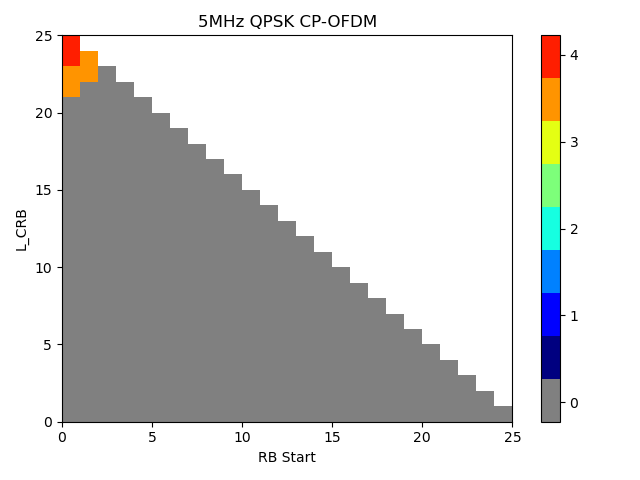{width="6.695138888888889in"
height="0.6118055555555556in"}

Following the TS 38.331 definitions Table 7.1.1-2 shows the RB
configuration for NR SL-U reference sensitivity requirement.

Table 7.1.1-2 NR SL-U RB configurations for REFSENS

                           NR band / SCS / Channel bandwidth / Duplex mode                                    
  -------------- --------- ------------------------------------------------- ------- ------- ------- -------- -------------
  NR SL-U Band   SCS kHz   20MHz                                             40MHz   60MHz   80MHz   100MHz   Duplex Mode
  n46            15        105                                               216                              HD
                 30        50                                                105     160     216     270      
                 60        24                                                50      75      105     135      
  n96            15        105                                               216                              HD
                 30        50                                                105     160     216     270      
                 60        24                                                50      75      105     135      
  n102           15        105                                               216                              HD
                 30        50                                                105     160     216     270      
                 60        24                                                50      75      105     135      

With the agreed SNR and RB configuration as above, the REFSENS
requirement for NR SL-U is shown in Table 7.1.1-3.

Table 7.1.1-3 REFSENS for SL-U

+---------------+-----+---------------+---------------+-------------+
| Operating     |     |               |               |             |
| band / SCS /  |     |               |               |             |
| Channel       |     |               |               |             |
| bandwidth /   |     |               |               |             |
| REFSENS       |     |               |               |             |
+===============+=====+===============+===============+=============+
| Operating     | SCS | Channel       | REFSENS (dBm) | Duplex Mode |
| band          |     | bandwidth     |               |             |
|               | kHz | (MHz)         |               |             |
+---------------+-----+---------------+---------------+-------------+
| n46           | 15  | 20, 40        | -89.2 +       | HD          |
|               |     |               | 10log~1       |             |
|               |     |               | 0~(N~RB~/105) |             |
+---------------+-----+---------------+---------------+-------------+
|               | 30  | 20, 40, 60,   | -89.4 +       |             |
|               |     | 80, 100       | 10log~        |             |
|               |     |               | 10~(N~RB~/50) |             |
+---------------+-----+---------------+---------------+-------------+
|               | 60  | 20, 40, 60,   | -89.6 +       |             |
|               |     | 80, 100       | 10log~        |             |
|               |     |               | 10~(N~RB~/24) |             |
+---------------+-----+---------------+---------------+-------------+
| n96, n102     | 15  | 20, 40        | -88.7 +       | HD          |
|               |     |               | 10log~1       |             |
|               |     |               | 0~(N~RB~/105) |             |
+---------------+-----+---------------+---------------+-------------+
|               | 30  | 20, 40, 60,   | -88.9 +       |             |
|               |     | 80, 100       | 10log~        |             |
|               |     |               | 10~(N~RB~/50) |             |
+---------------+-----+---------------+---------------+-------------+
|               | 60  | 20, 40, 60,   | -89.1 +       |             |
|               |     | 80, 100       | 10log~        |             |
|               |     |               | 10~(N~RB~/24) |             |
+---------------+-----+---------------+---------------+-------------+
| NOTE 1: The   |     |               |               |             |
| REFSENS value |     |               |               |             |
| is rounded to |     |               |               |             |
| the nearest   |     |               |               |             |
| number down   |     |               |               |             |
| to one        |     |               |               |             |
| decimal       |     |               |               |             |
| point.        |     |               |               |             |
| "N~RB~" in    |     |               |               |             |
| REFSENS       |     |               |               |             |
| formula is    |     |               |               |             |
| the RB        |     |               |               |             |
| configuration |     |               |               |             |
| for NR SL-U   |     |               |               |             |
| REFSENS as    |     |               |               |             |
| shown in      |     |               |               |             |
| table 7.1.1-2 |     |               |               |             |
+---------------+-----+---------------+---------------+-------------+

### 7.1.2 Maximum input level for NR SL-U

The Maximum input level for NR-U is defined in clause 7.4 of TS
38.101-1. For NR V2X, Maximum input level is defined in clause 7.4E.1.
The NRV2X Sidelink requirement only covers up to 40MHz and the minimum
requirement is the same as NR-U.

It has been agreed to reuse the NRU Maximum input level requirements in
TS 38.101-1 clause 7.4 for NR SL-U.

### 7.1.3 Adjacent Channel Selectivity for NR SL-U

For the ACS requirement, the ACS for NR-U was defined for bands above
3.3GHz considering the unlicensed bands of n46, n96, n102 are all high
bands. However, the requirement format is different from NR single CC
which can be found below, i.e. the ACS is adjusted according to the CBW
while the NR single CC is fixed as 33dB for bands above 3.3GHz. The ACS
requirement has been extensively discussed in NR-U WI with various views
considering the difference of ACLR, ACIR impacts, and comparison with
WIFI system, and coexistence with LAA, and the final value is a
compromised outcome.

{width="4.460416666666666in"
height="0.9006944444444445in"}

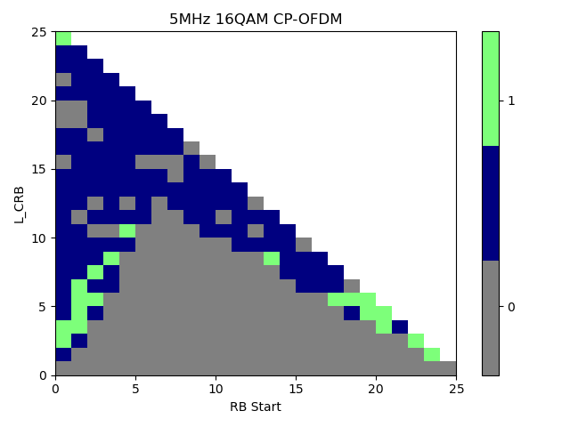{width="6.0in" height="3.1666666666666665in"}

ACS Requirement for NR-U

Furthermore, for NR normal requirement, there are two test cases for ACS
as case 1 and case 2. During the NR-U discussion, the case 2 was
considered not necessary for operation in unlicensed bands. It has been
agreed to reuse NR-U ACS requirement for NR SL-U using the NR SL-U RMC,
as discussed in general part.

### 7.1.4 Blocking characteristics for NR SL-U

#### 7.1.4.1 In Band Blocking

The in band blocking requirement for NR V2X is captured in clause
7.6E.2.1 and for NR-U it is captured in clause 7.F.2.1. The transmission
power is the same for 20 and 40MHz and the difference is the bandwidth
of interferer. The 10MHz as smallest CBW for NR V2X is used as
BW~interferer~ and corresponding offset frequency is decided. In NR
SL-U, 10MHz is not supported and 20MHz is supported as the smallest CBW
for single CC.

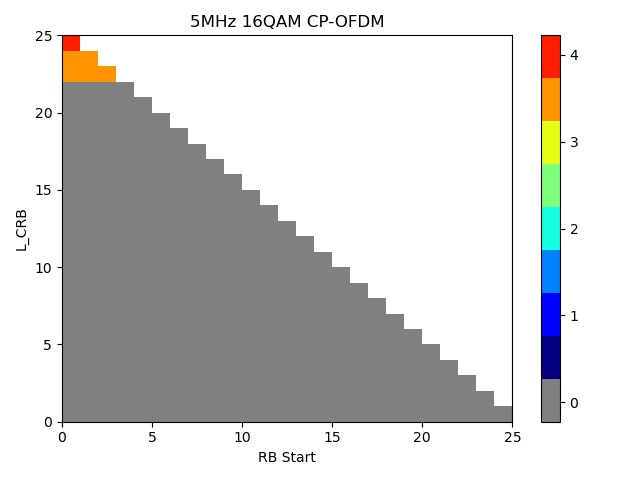{width="5.230555555555555in"
height="1.7159722222222222in"}

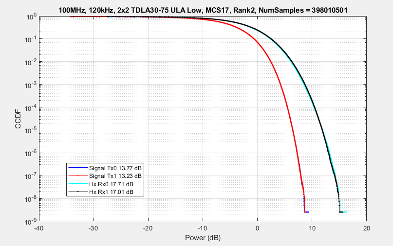{width="4.745833333333334in"
height="1.5326388888888889in"}

In this case, the NR-U IBB can be reused for NR SL-U.

#### 7.1.4.2 Out of Band Blocking

The NR sidelink OBB requirement is reused from LTE sidelink and hence
different power level for the transmission power based on different
bandwidth. For NR-U OBB requirement, it is based on the NR normal
requirement since there is no Wi-Fi corresponding requirement. Further
modification has applied for range 3 considering the shallower frequency
response of the band filter at high frequencies. In this case, the NR-U
requirement can be reused for NR SL-U.

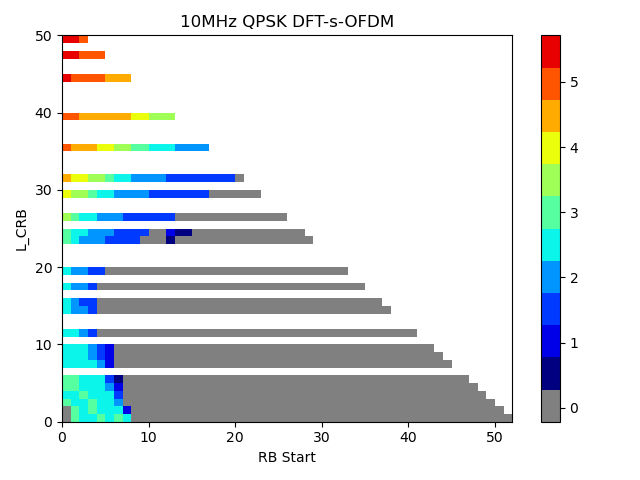{width="6.0in" height="1.3340277777777778in"}

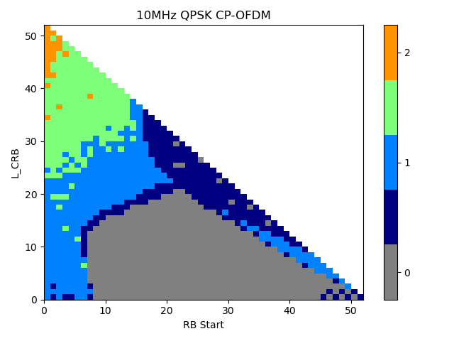{width="6.0in" height="1.875in"}

#### 7.1.4.3 Narrow Band Blocking

Narrow band blocking was introduced in NR single CC to mimic the
potential interference coming from narrow band systems, but such system
is not existing in the targeting unlicensed spectrum and therefore the
Narrow Band Blocking requirements are not defined for NR-U.

It has been agreed not to define Narrow Band Blocking requirements for
NR SL-U.

### 7.1.5 Spurious response for NR SL-U

The NR sidelink spurious response requirement is reused from LTE
sidelink and hence different power level for the transmission power
based on different bandwidth is used.For NR SL-U operation in unlicensed
bands, the NR-U requirement can be reused.

### 7.1.6 Intermodulation characteristics for NR SL-U

The NR sidelink Intermodulation requirement is reused from LTE sidelink
and hence different power level for the transmission power based on
different bandwidth is used.For NR SL-U operation in unlicensed bands,
the NR-U requirement can be reused.

7.2 Rx requirements for inter-band con-current operation
--------------------------------------------------------

### 7.2.1 Reference sensitivity power level for inter-band con-current operation

It has been agreed to

reuse the existing CA\_n46-n78 MSD requirements of the power class 5 in
the aggressor band n46 for MSD of the inter-band concurrent operation.

reuse the existing delta Rib of CA\_n46-n78 for inter-band concurrent
operation in Rel-18

### 7.2.2 Maximum input level for inter-band con-current operation

It has been agreed to reuse NR uu and SL-U requirements for each band if
an issue is not identified.

### 7.2.3 Adjacent Channel Selectivity for inter-band con-current operation

It has been agreed to reuse NR uu and SL-U requirements for each band if
an issue is not identified.

### 7.2.4 Blocking characteristics for inter-band con-current operation

It has been agreed to reuse NR uu and SL-U requirements for each band if
an issue is not identified.

### 7.2.5 Spurious response for inter-band con-current operation

It has been agreed to reuse NR uu and SL-U requirements for each band if
an issue is not identified.

### 7.2.6 Intermodulation characteristics for inter-band con-current operation

It has been agreed to reuse NR uu and SL-U requirements for each band if
an issue is not identified.

7.3 Rx requirements for NR SL CA operation
------------------------------------------

### 7.3.1 Reference sensitivity power level for NR SL CA operation

For intra-band contiguous CA operation, the reference sensitivity
requirement specified in Table 7.3E.2-1 in TS38.101-1shall apply for
each component carrier with all carriers active. The requirement is
applied for each carrier reception when 2 carrier transmissions are
activated at the same time.

### 7.3.2 Maximum input level for NR SL CA operation

For the RX RF requirements of NR SL CA UE, the following maximum input
level requirements shall be applied to the SL CA bandwidth class B.

Table 7.3.2-1 Maximum input levels for NR SL CA UE

+-------------------+-------+-------------------+-------------------+
| Rx Parameter      | Units | SL CA Bandwidth   |                   |
|                   |       | Class             |                   |
+===================+=======+===================+===================+
|                   |       | A                 | B                 |
+-------------------+-------+-------------------+-------------------+
| Power in largest  | dBm   |                   | -25 +             |
| Transmission      |       |                   | 10lo              |
| Bandwidth         |       |                   | g~10~(BW~Channel~ |
| Configuration CC  |       |                   | /20)^Note\ 1^     |
+-------------------+-------+-------------------+-------------------+
|                   |       |                   | -27 +             |
|                   |       |                   | 10lo              |
|                   |       |                   | g~10~(BW~Channel~ |
|                   |       |                   | /20)^Note\ 2^     |
+-------------------+-------+-------------------+-------------------+
| NOTE 1: Reference |       |                   |                   |
| measurement       |       |                   |                   |
| channel is        |       |                   |                   |
| A.7.2.x for 64    |       |                   |                   |
| QAM.              |       |                   |                   |
|                   |       |                   |                   |
| NOTE 2: Reference |       |                   |                   |
| measurement       |       |                   |                   |
| channel is        |       |                   |                   |
| A.7.2.x for 256   |       |                   |                   |
| QAM.              |       |                   |                   |
|                   |       |                   |                   |
| NOTE 3:           |       |                   |                   |
| 10log~10~(x) is   |       |                   |                   |
| rounded to the    |       |                   |                   |
| nearest 0.5dB     |       |                   |                   |
+-------------------+-------+-------------------+-------------------+

### 7.3.3 Adjacent Channel Selectivity for NR SL CA operation

In NR V2X UE, RAN4 follows the NR ACS requirements \< 2700MHz for single
carrier in n47 since to align with LTE V2X UE requirements. So RAN4 can
reuse the principle as follows.

For intra-band contiguous SL CA operation, the UE shall fulfil the
minimum requirement specified in Table 7.3.3-1 to Table 7.3.3-3 where
the throughput shall be ≥ 95% of the maximum throughput of the reference
measurement channels as specified in Annex A.7.2 in TS38.101-1.

Table 7.3.3-1 ACS for NR SL CA UE

                         SL CA bandwidth class
  -------------- ------- -----------------------
  Rx Parameter   Units   B
  ACS            dB      20.0

Table 7.3.3-2 Test parameters for intra-band contiguous SL CA UE, case 1

+-----------------------------+-------+-----------------------------+
| Rx Parameter                | Units | SL CA bandwidth class       |
+=============================+=======+=============================+
|                             |       | B                           |
+-----------------------------+-------+-----------------------------+
| Pw in Transmission          | dBm   | P~REFSENS\_SL~ + 14 dB      |
| Bandwidth Configuration,    |       |                             |
| per CC                      |       |                             |
+-----------------------------+-------+-----------------------------+
| **P~Interferer~**           | dBm   | Aggregated power + 18.5 dB  |
+-----------------------------+-------+-----------------------------+
| **BW~Interferer~**          | MHz   | 10                          |
+-----------------------------+-------+-----------------------------+
| **F~Interferer~ (offset)**  | MHz   | 5+Aggreagted BW~Channel~/2  |
|                             |       |                             |
|                             |       | /                           |
|                             |       |                             |
|                             |       | -(5+Aggregated              |
|                             |       | BW~Channel~/2)              |
+-----------------------------+-------+-----------------------------+
| NOTE 1: The interferer is   |       |                             |
| QPSK modulated PUSCH        |       |                             |
| containing data and         |       |                             |
| reference symbols. Normal   |       |                             |
| cyclic prefix is used.      |       |                             |
|                             |       |                             |
| NOTE 2: The absolute value  |       |                             |
| of the interferer offset    |       |                             |
| F~interferer~ (offset)      |       |                             |
| shall be further adjusted   |       |                             |
| to MHz with SCS the         |       |                             |
| sub-carrier spacing of the  |       |                             |
| carrier closest to the      |       |                             |
| interferer in MHz. The      |       |                             |
| interferer is an NR signal  |       |                             |
| with 15 kHz SCS.            |       |                             |
+-----------------------------+-------+-----------------------------+

Table 7.3.3-3 Test parameters for intra-band contiguous SL CA UE, case 2

+-----------------------------+-------+-----------------------------+
| Rx Parameter                | Units | SL CA Bandwidth Class       |
+=============================+=======+=============================+
|                             |       | B                           |
+-----------------------------+-------+-----------------------------+
| Pw in Transmission          | dBm   | -43.5 +                     |
| Bandwidth Configuration,    |       | 10log(N~RB,c~/N~RB\_agg~)   |
| per CC                      |       |                             |
+-----------------------------+-------+-----------------------------+
| **P~Interferer~**           | dBm   | -25                         |
+-----------------------------+-------+-----------------------------+
| **BW~Interferer~**          | MHz   | 10                          |
+-----------------------------+-------+-----------------------------+
| **F~Interferer~ (offset)**  | MHz   | 5+Aggreagted BW~Channel~/2  |
|                             |       |                             |
|                             |       | /                           |
|                             |       |                             |
|                             |       | -(5+Aggregated              |
|                             |       | BW~Channel~/2)              |
+-----------------------------+-------+-----------------------------+
| NOTE 1: The interferer is   |       |                             |
| QPSK modulated PUSCH        |       |                             |
| containing data and         |       |                             |
| reference symbols. Normal   |       |                             |
| cyclic prefix is used.      |       |                             |
|                             |       |                             |
| NOTE 2: The absolute value  |       |                             |
| of the interferer offset    |       |                             |
| F~interferer~ (offset)      |       |                             |
| shall be further adjusted   |       |                             |
| to MHz with SCS the         |       |                             |
| sub-carrier spacing of the  |       |                             |
| carrier closest to the      |       |                             |
| interferer in MHz. The      |       |                             |
| interferer is an NR signal  |       |                             |
| with 15 kHz SCS.            |       |                             |
+-----------------------------+-------+-----------------------------+

### 7.3.4 Blocking characteristics for NR SL CA operation

#### 7.3.4.1 In-band blocking

For intra-band contiguous SL CA operation, the UE shall fulfil the
minimum requirement specified in Table 7.3.4.1-1 to Table 7.3.4.1-2
where the throughput shall be ≥ 95% of the maximum throughput of the
reference measurement channels as specified in Annex A.7.2 in
TS38.101-1.

Table 7.3.4.1-1 In-band blocking parameters for intra-band contiguous SL
CA UE

  Rx Parameter                                                                                                          Units   SL CA bandwidth class
  --------------------------------------------------------------------------------------------------------------------- ------- ----------------------------------------------------------------
                                                                                                                                B
  Pw in Transmission Bandwidth Configuration, per CC                                                                    dBm     P~REFSENS\_SL~ + NR SL CA bandwidth class specific value below
                                                                                                                        dB      16.0
  **BW~Interferer~**                                                                                                    MHz     10
  **F~Ioffset,\ case\ 1~**                                                                                              MHz     15
  **F~Ioffset,\ case\ 2~**                                                                                              MHz     **25**
  NOTE 1: The interferer is QPSK modulated PUSCH containing data and reference symbols. Normal cyclic prefix is used.           

Table 7.3.4.1-2 In-band blocking for intra-band contiguous SL CA UE

+--------------+--------------+------+--------------+--------------+
| NR SL CA     | Parameter    | Unit | Case 1       | Case 2       |
| band         |              |      |              |              |
+==============+==============+======+==============+==============+
|              | P            | dBm  | -44          | -44          |
|              | ~Interferer~ |      |              |              |
+--------------+--------------+------+--------------+--------------+
| SL\_n47B     | F            | MHz  | \-           | ≤-           |
|              | ~Interferer~ |      | BW~ch        | BW~ch        |
|              |              |      | annel\ CA~/2 | annel\ CA~/2 |
|              | (offset)     |      | --           | --           |
|              |              |      | F~Ioff       | F~Ioff       |
|              |              |      | set,case\ 1~ | set,case\ 2~ |
|              |              |      |              |              |
|              |              |      | &            | &            |
|              |              |      |              |              |
|              |              |      | \+           | ≥+           |
|              |              |      | BW~ch        | BW~ch        |
|              |              |      | annel\ CA~/2 | annel\ CA~/2 |
|              |              |      | +            | +            |
|              |              |      | F~Ioff       | F~Ioff       |
|              |              |      | set,case\ 1~ | set,case\ 2~ |
+--------------+--------------+------+--------------+--------------+
|              | F            | MHz  | NOTE 2       | F~DL\_low~   |
|              | ~Interferer~ |      |              | -- 30        |
|              | (Range)      |      |              |              |
|              |              |      |              | to           |
|              |              |      |              |              |
|              |              |      |              | F~DL\_high~  |
|              |              |      |              | + 30         |
+--------------+--------------+------+--------------+--------------+
| NOTE 1: For  |              |      |              |              |
| certain      |              |      |              |              |
| bands, the   |              |      |              |              |
| unwanted     |              |      |              |              |
| modulated    |              |      |              |              |
| interfering  |              |      |              |              |
| signal may   |              |      |              |              |
| not fall     |              |      |              |              |
| inside the   |              |      |              |              |
| UE receive   |              |      |              |              |
| band, but    |              |      |              |              |
| within the   |              |      |              |              |
| first 30 MHz |              |      |              |              |
| below or     |              |      |              |              |
| above the UE |              |      |              |              |
| receive band |              |      |              |              |
|              |              |      |              |              |
| NOTE 2: For  |              |      |              |              |
| each carrier |              |      |              |              |
| frequency    |              |      |              |              |
| the          |              |      |              |              |
| requirement  |              |      |              |              |
| is valid for |              |      |              |              |
| two          |              |      |              |              |
| frequencies: |              |      |              |              |
|              |              |      |              |              |
| a\. the      |              |      |              |              |
| carrier      |              |      |              |              |
| frequency -  |              |      |              |              |
| BW~ch        |              |      |              |              |
| annel\ CA~/2 |              |      |              |              |
| - FIoffset,  |              |      |              |              |
| case 1 and   |              |      |              |              |
|              |              |      |              |              |
| b\. the      |              |      |              |              |
| carrier      |              |      |              |              |
| frequency +  |              |      |              |              |
| BW~ch        |              |      |              |              |
| annel\ CA~/2 |              |      |              |              |
| + FIoffset,  |              |      |              |              |
| case 1       |              |      |              |              |
|              |              |      |              |              |
| NOTE 3:      |              |      |              |              |
| BW~          |              |      |              |              |
| channel\ CA~ |              |      |              |              |
| denotes the  |              |      |              |              |
| aggregated   |              |      |              |              |
| channel      |              |      |              |              |
| bandwidth of |              |      |              |              |
| the wanted   |              |      |              |              |
| signal       |              |      |              |              |
+--------------+--------------+------+--------------+--------------+

#### 7.3.4.2 Out-of-band blocking

For intra-band contiguous SL CA operation, the UE throughput shall be ≥
95% of the maximum throughput of the reference measurement channels as
specified in Annex A.7.2 with parameters specified in Tables 7.3.4.2-1
and 7.3.4.2-2.

For Table 7.3.4.2-2 in frequency range 1, 2 and 3, up to exceptions are
allowed for spurious response frequencies in each assigned frequency
channel when measured using a 1MHz step size. For these exceptions the
requirements of subclause 7.3.5 spurious response are applicable.

Table 7.3.4.2-1: Out-of-band blocking parameters for intra-band
contiguous SL CA UE

  Rx Parameter                                         Units   SL CA Bandwidth Class                                                  
  ---------------------------------------------------- ------- ------------------------------------------------------------- -- -- -- --
                                                               B                                                                      
  Pw in Transmission Bandwidth Configuration, per CC   dBm     P~REFSENS\_SL~ + SL CA Bandwidth Class specific value below            
                                                               9                                                                      

Table 7.3.4.2-2: Out of band blocking for intra-band contiguous SL CA UE

+----------+----------+-------+----------+----------+----------+
| NR SL    | P        | Units | F        |          |          |
|          | arameter |       | requency |          |          |
| CA band  |          |       |          |          |          |
+==========+==========+=======+==========+==========+==========+
|          |          |       | Range 1  | Range 2  | Range 3  |
+----------+----------+-------+----------+----------+----------+
|          | P~Int    | dBm   | -44      | -30      | -15      |
|          | erferer~ |       |          |          |          |
+----------+----------+-------+----------+----------+----------+
| V2X\_47B | F~Int    | MHz   | -60 \< f | -85 \< f | 1 ≤ f ≤  |
|          | erferer~ |       | --       | --       | F~       |
|          | (CW)     |       | F~       | F~       | DL\_low~ |
|          |          |       | DL\_low~ | DL\_low~ | -- 85    |
|          |          |       | \< -30   | ≤ -60    |          |
|          |          |       |          |          | or       |
|          |          |       | or       | or       |          |
|          |          |       |          |          | F~D      |
|          |          |       | 30 \< f  | 60 ≤ f   | L\_high~ |
|          |          |       | --       | --       | + 85 ≤ f |
|          |          |       | F~D      | F~D      |          |
|          |          |       | L\_high~ | L\_high~ | ≤ 12750  |
|          |          |       | \< 60    | \< 85    |          |
+----------+----------+-------+----------+----------+----------+
| NOTE 1:  |          |       |          |          |          |
| The      |          |       |          |          |          |
| power    |          |       |          |          |          |
| level of |          |       |          |          |          |
| the      |          |       |          |          |          |
| in       |          |       |          |          |          |
| terferer |          |       |          |          |          |
| (P~Inte  |          |       |          |          |          |
| rferer~) |          |       |          |          |          |
| for      |          |       |          |          |          |
| Range 3  |          |       |          |          |          |
| shall be |          |       |          |          |          |
| modified |          |       |          |          |          |
| to -20   |          |       |          |          |          |
| dBm for  |          |       |          |          |          |
| F~Int    |          |       |          |          |          |
| erferer~ |          |       |          |          |          |
| \> 6000  |          |       |          |          |          |
| MHz.     |          |       |          |          |          |
|          |          |       |          |          |          |
| NOTE 2:  |          |       |          |          |          |
| The      |          |       |          |          |          |
| req      |          |       |          |          |          |
| uirement |          |       |          |          |          |
| is       |          |       |          |          |          |
| applied  |          |       |          |          |          |
| for      |          |       |          |          |          |
| multi    |          |       |          |          |          |
| -carrier |          |       |          |          |          |
| in       |          |       |          |          |          |
| tra-band |          |       |          |          |          |
| con      |          |       |          |          |          |
| -current |          |       |          |          |          |
| re       |          |       |          |          |          |
| ceptions |          |       |          |          |          |
| when 2   |          |       |          |          |          |
| carrier  |          |       |          |          |          |
| trans    |          |       |          |          |          |
| missions |          |       |          |          |          |
| are      |          |       |          |          |          |
| a        |          |       |          |          |          |
| ctivated |          |       |          |          |          |
| at the   |          |       |          |          |          |
| same     |          |       |          |          |          |
| time.    |          |       |          |          |          |
+----------+----------+-------+----------+----------+----------+

### 7.3.5 Spurious response for NR SL CA operation

For intra-band contiguous SL CA operation, the UE throughput shall be ≥
95% of the maximum throughput of the reference measurement channels as
specified in Annex A.7.2 with parameters specified in Table 7.3.5-1and
Table 7.3.5-2.

Table 7.3.5-1: Spurious response parameters for intra-band contiguous SL
CA UE

+----------------------+-------+----------------------+---+---+---+---+
| Rx Parameter         | Units | SL CA Bandwidth      |   |   |   |   |
|                      |       | Class                |   |   |   |   |
+======================+=======+======================+===+===+===+===+
|                      |       | B                    |   |   |   |   |
+----------------------+-------+----------------------+---+---+---+---+
| Pw in Transmission   | dBm   | P~REFSENS\_SL~ + SL  |   |   |   |   |
| Bandwidth            |       | CA Bandwidth Class   |   |   |   |   |
| Configuration, per   |       | specific value below |   |   |   |   |
| CC                   |       |                      |   |   |   |   |
+----------------------+-------+----------------------+---+---+---+---+
|                      |       | 9                    |   |   |   |   |
+----------------------+-------+----------------------+---+---+---+---+
| NOTE 1: The          |       |                      |   |   |   |   |
| requirement is       |       |                      |   |   |   |   |
| applied for          |       |                      |   |   |   |   |
| multi-carrier        |       |                      |   |   |   |   |
| intra-band           |       |                      |   |   |   |   |
| con-current          |       |                      |   |   |   |   |
| receptions when 2    |       |                      |   |   |   |   |
| carrier              |       |                      |   |   |   |   |
| transmissions are    |       |                      |   |   |   |   |
| activated at the     |       |                      |   |   |   |   |
| same time.           |       |                      |   |   |   |   |
|                      |       |                      |   |   |   |   |
| NOTE 2: Reference    |       |                      |   |   |   |   |
| measurement channel  |       |                      |   |   |   |   |
| is A.7.2             |       |                      |   |   |   |   |
+----------------------+-------+----------------------+---+---+---+---+

Tables 7.3.5-2: Spurious response for intra-band contiguous SL CA UE

+------------------------------+------+------------------------------+
| Parameter                    | Unit | Level                        |
+------------------------------+------+------------------------------+
| P~Interferer~                | dBm  | -44                          |
|                              |      |                              |
| (CW)                         |      |                              |
+------------------------------+------+------------------------------+
| F~Interferer~                | MHz  | Spurious response            |
|                              |      | frequencies                  |
+------------------------------+------+------------------------------+
| NOTE 1: The requirement is   |      |                              |
| applied for multi-carrier    |      |                              |
| intra-band con-current       |      |                              |
| receptions when 2 carrier    |      |                              |
| transmissions are activated  |      |                              |
| at the same time.            |      |                              |
+------------------------------+------+------------------------------+

### 7.3.6 Intermodulation characteristics for NR SL CA operation

For intra-band contiguous SL CA operation, the UE throughput shall be ≥
95% of the maximum throughput of the reference measurement channels as
specified in Annex A.7.2 with parameters specified in Table 7.3.6-1for
the specified wanted signal mean power in the presence of two
interfering signals.

Table 7.3.6-1: Wide band intermodulation for intra-band contiguous SL CA
UE

+----------------------+-------+----------------------+---+---+---+---+
| Rx parameter         | Units | SL CA Bandwidth      |   |   |   |   |
|                      |       | Class                |   |   |   |   |
+======================+=======+======================+===+===+===+===+
|                      |       | B                    |   |   |   |   |
+----------------------+-------+----------------------+---+---+---+---+
| P~w~ in Transmission | dBm   | P~REFSENS\_SL~ + SL  |   |   |   |   |
| Bandwidth            |       | CA Bandwidth Class   |   |   |   |   |
| Configuration, per   |       | specific value below |   |   |   |   |
| CC                   |       |                      |   |   |   |   |
+----------------------+-------+----------------------+---+---+---+---+
|                      |       | 9                    |   |   |   |   |
+----------------------+-------+----------------------+---+---+---+---+
| P~Interferer\ 1~     | dBm   | -46                  |   |   |   |   |
|                      |       |                      |   |   |   |   |
| (CW)                 |       |                      |   |   |   |   |
+----------------------+-------+----------------------+---+---+---+---+
| P~Interferer\ 2~     | dBm   | -46                  |   |   |   |   |
|                      |       |                      |   |   |   |   |
| (Modulated)          |       |                      |   |   |   |   |
+----------------------+-------+----------------------+---+---+---+---+
| BW~Interferer\ 2~    | MHz   | 10                   |   |   |   |   |
+----------------------+-------+----------------------+---+---+---+---+
| F~Interferer\ 1~     | MHz   | --F~offset~-15       |   |   |   |   |
|                      |       |                      |   |   |   |   |
| (Offset)             |       | /                    |   |   |   |   |
|                      |       |                      |   |   |   |   |
|                      |       | \+ F~offset~+15      |   |   |   |   |
+----------------------+-------+----------------------+---+---+---+---+
| F~Interferer\ 2~     | MHz   | **2                  |   |   |   |   |
|                      |       | \*F~Interferer\ 1~** |   |   |   |   |
| (Offset)             |       |                      |   |   |   |   |
+----------------------+-------+----------------------+---+---+---+---+
| NOTE 1: The          |       |                      |   |   |   |   |
| requirement is       |       |                      |   |   |   |   |
| applied for          |       |                      |   |   |   |   |
| multi-carrier        |       |                      |   |   |   |   |
| intra-band           |       |                      |   |   |   |   |
| con-current          |       |                      |   |   |   |   |
| receptions when 2    |       |                      |   |   |   |   |
| carrier              |       |                      |   |   |   |   |
| transmissions are    |       |                      |   |   |   |   |
| activated at the     |       |                      |   |   |   |   |
| same time.           |       |                      |   |   |   |   |
|                      |       |                      |   |   |   |   |
| NOTE 2: The          |       |                      |   |   |   |   |
| F~interferer\ 1~     |       |                      |   |   |   |   |
| (offset) is the      |       |                      |   |   |   |   |
| frequency separation |       |                      |   |   |   |   |
| of the center        |       |                      |   |   |   |   |
| frequency of the     |       |                      |   |   |   |   |
| carrier closest to   |       |                      |   |   |   |   |
| the interferer and   |       |                      |   |   |   |   |
| the center frequency |       |                      |   |   |   |   |
| of the CW interferer |       |                      |   |   |   |   |
| and F~interferer~    |       |                      |   |   |   |   |
| ~2~ (offset) is the  |       |                      |   |   |   |   |
| frequency separation |       |                      |   |   |   |   |
| of the center        |       |                      |   |   |   |   |
| frequency of the     |       |                      |   |   |   |   |
| carrier closest to   |       |                      |   |   |   |   |
| the interferer and   |       |                      |   |   |   |   |
| the center frequency |       |                      |   |   |   |   |
| of the modulated     |       |                      |   |   |   |   |
| interferer.          |       |                      |   |   |   |   |
+----------------------+-------+----------------------+---+---+---+---+

8 Co-channel coexistence between LTE Sidelink and NR Sidelink
=============================================================

8.1 Configured transmitted power for V2X UE supporting co-channel coexistence with LTE SL
-----------------------------------------------------------------------------------------

For the measured configured maximum output power P~UMAX,*c*~ for NR V2X
sidelink transmissions non-concurrent with NR uplink transmissions, the
same requirement as in clause 6.2.4 shall be applied. When NR V2X UE is
configured to co-channel coexistence operation with LTE V2X and NR SCS
is configured to 30kHz, the evaluation period for P~UMAX,c~ for NR V2X
sidelink is the first slot of NR SL slots overlapping with an LTE SL
subframe.

When NR V2X UE is configured to co-channel coexistence operation with
LTE V2X and NR SCS is configured to 30kHz, the P~CMAX,f,c~ tolerances in
Table 6.2.4-1 are relaxed by 1dB i.e. T(P~CMAX,f,c~) = T(P~CMAX,f,c~) +1
(dB).

8.2 Relative slot power tolerance for V2X UE supporting co-channel coexistence with LTE SL
------------------------------------------------------------------------------------------

Relative slot power tolerance is defined for NR V2X supporting
co-channel coexistence to ensure the RX performance of the LTE V2X UE
operating within the same channel. This requirement applies only to
transmissions with 30kHz SCS.

The relative slot power tolerance for V2X UE supporting co-channel
coexistence with LTE SL is the ability of the NR V2X UE operating with
30kHz SCS to control the output power of transmitted slots during
**PSCCH/PSSCH transmission consisting of two slots overlapping with an
LTE SL subframe (500us). The reference slot is the 1^st^ slot
overlapping with LTE SL subframe and target slot is the subsequent NR SL
slot overlapping with the LTE SL subframe.** The measurement period is
one NR SL slot with guard symbol omitted.

The power of the target slot must not exceed the power of the reference
slot by more than relative slot power tolerance of +1 dB.

######## Annex A: Change history

  -------------------- ---------------- --------------------------------------------------------- -------- --------- --------- -------------------------------------------------------------------------------- -----------------
  **Change history**                                                                                                                                                                                            
  **Date**             **Meeting**      **TDoc**                                                  **CR**   **Rev**   **Cat**   **Subject/Comment**                                                              **New version**
  2023-02              RAN4\#106                                                                                               Initial Skeleton                                                                 0.0.1
  2023-04              RAN4\#106bis-e   R4-2306634                                                                             TP to TR on the SL-e TX requirement                                              0.1.0
  2023-04              RAN4\#106bis-e   R4-2306635                                                                             TP to TR on on the SL-e RX requirement                                           0.1.0
  2023-05              RAN4\#107        R4-2310378                                                                             TP for TR 38.786 on the MPR/A-MPR simulation assumptions                         0.2.0
  2023-05              RAN4\#107        R4-2310307                                                                             TP on system parameters for SL unlicensed operation for single CC                0.2.0
  2023-05              RAN4\#107        R4-2310308                                                                             on the SL-e TX requirement                                                       0.2.0
  2023-05              RAN4\#107        R4-2310309                                                                             on the SL-e RX requirement                                                       0.2.0
  2023-05              RAN4\#107        R4-2310311                                                                             TP to TR on con-current operation on Uu and sidelink                             0.2.0
  2023-05              RAN4\#107        R4-2310312                                                                             TP for TR 38.786 on the updated TR structure for NR SL CA operation              0.2.0
  2023-08              RAN4\#108        R4-2314733                                                                             TP on system parameters for SL unlicensed operation for single CC                0.3.0
  2023-08              RAN4\#108        R4-2311532                                                                             TP for TR 38.786 on the remaining UE RF requirements for SL-U UE                 0.3.0
  2023-08              RAN4\#108        R4-2314734                                                                             TP for TR 38.786 on the SL-U MPR and A-MPR                                       0.3.0
  2023-08              RAN4\#108        R4-2312262                                                                             TP to TR on con-current operation on Uu and sidelink                             0.3.0
  2023-08              RAN4\#108        R4-2314736                                                                             TP for TR 38.786 on the updated RF requirements for NR SL CA operation           0.3.0
  2023-08              RAN4\#108        R4-2314882                                                                             TP for TR 38.786 on the SLCA channel bandwidth and MPR                           0.3.0
  2023-09              RAN\#101         RP-231721                                                                              TR 38.786 v1.0.0 UE radio transmission and reception for NR sidelink evolution   1.0.0
  2023-10              RAN4\#108-bis    R4-2315825                                                                             TP for TR 38.786: Addition of definitions and symbols to Chapter 3               1.1.0
  2023-10              RAN4\#108-bis    R4-2317722                                                                             TP for TR 38.786 on the SL-U MPR and A-MPR                                       1.1.0
  2023-10              RAN4\#108-bis    R4-2317723                                                                             TP to TR 38.786 on concurrent operation                                          1.1.0
  2023-10              RAN4\#108-bis    R4-2317726                                                                             TP for TR 38.786 On Co-channel coexistence for LTE SL and NR SL                  1.1.0
  2023-10              RAN4\#108-bis    R4-2317728                                                                             TP for TR 38.786 on the Remaining RF requirements for NR SL CA operation         1.1.0
  2023-10              RAN4\#108-bis    R4-2317729                                                                             TP to TR38.786 sidelink CA                                                       1.1.0
  2023-11              RAN4\#109        R4-2318995                                                                             Maintenance TP to TR 38.786                                                      1.2.0
  2023-11              RAN4\#109        [R4-2321772](file:///D:\RAN4%23109\Docs\R4-2321772.zip)                                TP to TR38.786 updated MPR simulation assumptions for PSFCH transmission         1.2.0
  2023-11              RAN4\#109        [R4-2321818](file:///D:\RAN4%23109\Docs\R4-2321818.zip)                                TP for TR 38.786 updated PSFCH MPR and A-MPR simulation results                  1.2.0
  2023-11              RAN4\#109        [R4-2319928](file:///D:\RAN4%23109\Docs\R4-2319928.zip)                                TP on LTE NR SL co-existence                                                     1.2.0
  2023-11              RAN4\#109        [R4-2321778](file:///D:\RAN4%23109\Docs\R4-2321778.zip)                                TP for TR 38.786 on SLCA MPR and A-MPR                                           1.2.0
  2023-11              RAN4\#109        [R4-2321779](file:///D:\RAN4%23109\Docs\R4-2321779.zip)                                TP to TR38.786 sidelink CA                                                       1.2.0
  2023-11              RAN4\#109        [R4-2319263](file:///D:\RAN4%23109\Docs\R4-2319263.zip)                                TP for TR 38.786 on NR SL co-channel coexistence with LTE SL                     1.2.0
  2023-11              RAN4\#109        R4-2319898                                                                             TR38.786 v1.2.0 for SL evolution                                                 1.2.0
  2023-12              RAN\#102         [RP-232936](file:///D:\RAN4%23109\Docs\R4-2319263.zip)                                 TR for approval                                                                  2.0.0
  -------------------- ---------------- --------------------------------------------------------- -------- --------- --------- -------------------------------------------------------------------------------- -----------------

  **Change history**                                                                                                                             
  -------------------- ------------- ----------- -------- --------- --------- ------------------------------------------------------------------ -----------------
  **Date**             **Meeting**   **TDoc**    **CR**   **Rev**   **Cat**   **Subject/Comment**                                                **New version**
  2023-12              RAN\#102                                               Approved by plenary -- Rel-18 spec under change control            18.0.0
  2024-03              RAN4\#103     RP-240603   0002               F         (NR\_SL\_enh2-Core) Big CR to TR 38.786 UE NR sidelink evolution   18.1.0
  2024-06              RAN\#104      RP-241467   0004               F         CR to TR 38.786 UE NR sidelink evolution cover RAN4\#110bis        18.2.0
  2024-06              RAN\#104      RP-241467   0005               F         Big CR to TR 38.786 UE NR sidelink evolution after RAN4\#111       18.2.0
