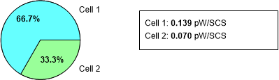
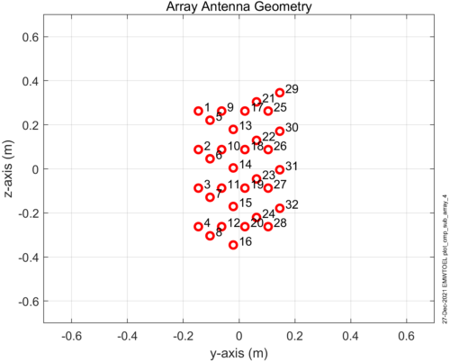
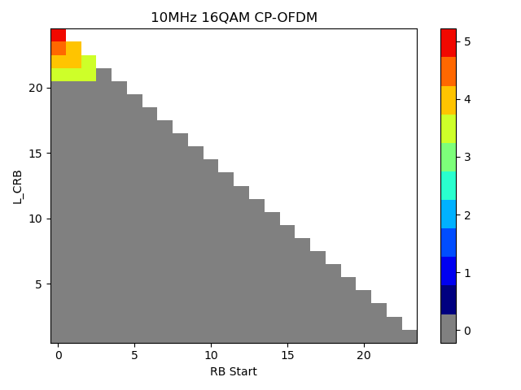
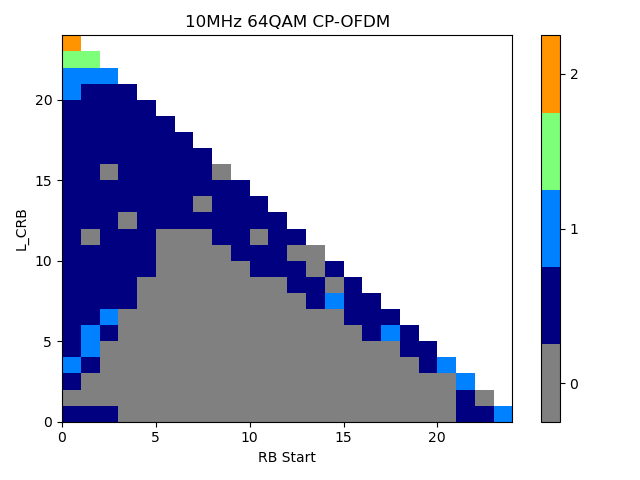
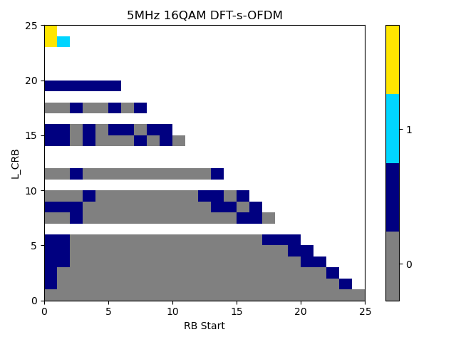
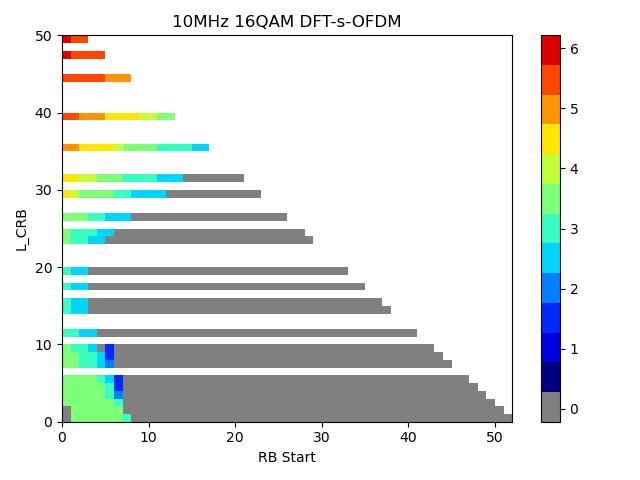

+----------------------------------+----------------------------------+
| 3GPP TR 38.858 V18.2.0 (2024-12) |                                  |
+==================================+==================================+
| Technical Report                 |                                  |
+----------------------------------+----------------------------------+
| 3rd Generation Partnership       |                                  |
| Project;                         |                                  |
|                                  |                                  |
| Technical Specification Group    |                                  |
| Radio Access Network;            |                                  |
|                                  |                                  |
| Study on Evolution of NR Duplex  |                                  |
| Operation                        |                                  |
|                                  |                                  |
| (Release 18)                     |                                  |
+----------------------------------+----------------------------------+
|                                  |                                  |
+----------------------------------+----------------------------------+
| {width="1.40625in" | ng){width="1.7708333333333333in" |
| height="0.8645833333333334in"}   | height="1.0416666666666667in"}   |
+----------------------------------+----------------------------------+
|                                  |                                  |
+----------------------------------+----------------------------------+
| The present document has been    |                                  |
| developed within the 3rd         |                                  |
| Generation Partnership Project   |                                  |
| (3GPP ^TM^) and may be further   |                                  |
| elaborated for the purposes of   |                                  |
| 3GPP.\                           |                                  |
| The present document has not     |                                  |
| been subject to any approval     |                                  |
| process by the 3GPP              |                                  |
| Organizational Partners and      |                                  |
| shall not be implemented.\       |                                  |
| This Specification is provided   |                                  |
| for future development work      |                                  |
| within 3GPP only. The            |                                  |
| Organizational Partners accept   |                                  |
| no liability for any use of this |                                  |
| Specification.\                  |                                  |
| Specifications and Reports for   |                                  |
| implementation of the 3GPP ^TM^  |                                  |
| system should be obtained via    |                                  |
| the 3GPP Organizational          |                                  |
| Partners\' Publications Offices. |                                  |
+----------------------------------+----------------------------------+

+----------------------------------------------------------------------+
|                                                                      |
+======================================================================+
| > ***3GPP***                                                         |
| >                                                                    |
| > Postal address                                                     |
| >                                                                    |
| > 3GPP support office address                                        |
| >                                                                    |
| > 650 Route des Lucioles - Sophia Antipolis                          |
| >                                                                    |
| > Valbonne - FRANCE                                                  |
| >                                                                    |
| > Tel.: +33 4 92 94 42 00 Fax: +33 4 93 65 47 16                     |
| >                                                                    |
| > Internet                                                           |
| >                                                                    |
| > http://www.3gpp.org                                                |
+----------------------------------------------------------------------+
| ***Copyright Notification***                                         |
|                                                                      |
| No part may be reproduced except as authorized by written            |
| permission.\                                                         |
| The copyright and the foregoing restriction extend to reproduction   |
| in all media.                                                        |
|                                                                      |
| © 2024, 3GPP Organizational Partners (ARIB, ATIS, CCSA, ETSI, TSDSI, |
| TTA, TTC).                                                           |
|                                                                      |
| All rights reserved.                                                 |
|                                                                      |
| UMTS™ is a Trade Mark of ETSI registered for the benefit of its      |
| members                                                              |
|                                                                      |
| 3GPP™ is a Trade Mark of ETSI registered for the benefit of its      |
| Members and of the 3GPP Organizational Partners\                     |
| LTE™ is a Trade Mark of ETSI registered for the benefit of its       |
| Members and of the 3GPP Organizational Partners                      |
|                                                                      |
| GSM® and the GSM logo are registered and owned by the GSM            |
| Association                                                          |
+----------------------------------------------------------------------+

 Contents {#contents .TT}
========

Foreword 9

1 Scope 11

3 Definitions of terms, symbols and abbreviations 14

3.1 Terms 14

3.2 Symbols 14

3.3 Abbreviations 14

4 Introduction 15

5 Objectives of study 15

6 Subband non-overlapping full duplex (SBFD) 16

6.1 General aspects of SBFD schemes 16

6.1.1 SBFD Operations 16

6.1.1.1 Semi-static configuration of SBFD subbands 17

6.1.1.2 SBFD operation in symbols configured as DL in
*TDD-UL-DL-ConfigCommon* 18

6.1.1.3 SBFD operation in symbols configured as flexible in
*TDD-UL-DL-ConfigCommon* 18

6.1.1.4 Dynamic SBFD 19

6.1.2 Impact and potential enhancements for transmissions and receptions
19

6.1.3 BS self-interference due to time misalignment 23

6.2 Inter-UE CLI handling schemes specific for SBFD 23

7 Performance evaluation and its feasibility for SBFD 24

7.1 Deployment scenarios 24

7.2 Evaluation methodologies 25

7.2.1 System level simulation 25

7.2.2 Link level evaluation 27

7.3 Performance evaluation results for semi-static SBFD 29

7.3.1 System level simulation results 29

7.3.1.1 SBFD Deployment Case 1 (FR1) 30

7.3.1.1.1 Indoor office (FR1) 30

7.3.1.1.2 Urban Macro (FR1) 35

7.3.1.1.3 Dense Urban Macro layer (FR1) 50

7.3.1.1.4 Dense Urban with 2-layer (FR1) 60

7.3.1.2 SBFD Deployment Case 1 (FR2-1) 61

7.3.1.2.1 Indoor office (FR2-1) 61

7.3.1.2.2 Dense Urban Macro layer (FR2-1) 65

7.3.1.3 SBFD Deployment Case 3-2 (FR1) 78

7.3.1.3.1 2-layer Scenario B (FR1) 78

7.3.1.4 SBFD Deployment Case 4 (FR1) 82

7.3.1.4.1 Urban Macro (0% grid shift) 82

7.3.1.4.2 Urban Macro (100% grid shift) 94

7.3.2 Link level evaluation results 106

7.3.2.1 FR1 106

7.3.2.1.1 Scheme-1 (PUSCH repetition type A without joint channel
estimation) 106

7.3.2.1.2 Scheme-2 (SBFD with TBoMS PUSCH without joint channel
estimation) 107

7.3.2.1.3 Scheme-3 (PUSCH repetition type A with joint channel
estimation) 108

7.3.2.1.4 Scheme-4 (SBFD with TBoMS PUSCH with joint channel estimation)
108

7.3.2.2 FR2-1 109

7.3.2.2.1 Scheme-1 (PUSCH repetition type A without joint channel
estimation) 109

7.3.2.2.2 Scheme-2 (SBFD with TBoMS PUSCH without joint channel
estimation) 109

7.3.2.2.3 Scheme-3 (PUSCH repetition type A with joint channel
estimation) 109

7.3.2.2.4 Scheme-4 (SBFD with TBoMS PUSCH with joint channel estimation)
110

7.4 Performance evaluation results of schemes for SBFD 110

7.4.1 Dynamic SBFD 110

7.4.1.1 Indoor office (FR1) 111

7.4.1.1.1 Dynamic SBFD vs. dynamic TDD 111

7.4.1.1.2 Dynamic SBFD vs. semi-static SBFD 114

7.4.1.2 Urban Macro (FR1) 117

7.4.1.2.1 Dynamic SBFD vs. dynamic TDD 117

7.4.1.2.2 Dynamic SBFD vs. semi-static SBFD 120

7.4.2 Inter-gNB CLI handling schemes 123

7.4.2.1 Inter-gNB CLI handling scheme 1: Spatial Domain Coordination
Scheme for gNB Tx-Beam Nulling 123

7.4.2.1.1 Reference scheme for performance comparison 123

7.4.2.1.2 Proposed scheme 124

7.4.2.1.3 Performance evaluation or analysis 124

7.4.2.1.4 Specification impact of the proposed scheme 126

7.4.2.2 Inter-gNB CLI handling scheme 2: UL Resource Muting-based scheme
for measuring the gNB-to-gNB CLI interference covariance matrix 126

7.4.2.2.1 Reference scheme for performance comparison 126

7.4.2.2.2 Proposed scheme 126

7.4.2.2.3 Performance evaluation or analysis 126

7.4.2.2.4 Specification impact of the proposed scheme 129

7.4.3 Inter-UE CLI handling schemes 129

7.4.3.1 Inter-UE CLI handling scheme 1: Coordinated scheduling 129

7.4.3.1.1 Reference scheme for performance comparison 129

7.4.3.1.2 Proposed scheme 129

7.4.3.1.3 Performance evaluation or analysis 130

7.4.3.1.4 Specification impact of the proposed scheme 132

7.4.4 Inter-gNB and Inter-UE CLI handling schemes 132

7.4.4.1 Inter-gNB and Inter-UE CLI handling scheme 1: Spatial Domain
Coordination Scheme for gNB Tx-Beam Nulling and UL Resource Muting-based
scheme for measuring the gNB-to-gNB CLI interference covariance matrix
132

7.4.4.1.1 Reference scheme for performance comparison 132

7.4.4.1.2 Proposed scheme 132

7.4.4.1.3 Performance evaluation or analysis 133

7.4.4.1.4 Specification impact of the proposed scheme 134

8 Potential enhancements and analysis for dynamic/flexible TDD 134

8.1 Deployment scenarios 134

8.2 Evaluation methodologies 135

8.2.1 System level simulation 135

8.3 Inter-gNB CLI handling schemes 136

8.3.1 gNB-to-gNB co-channel CLI measurement and/or channel measurement
136

8.3.1.1 Description 136

8.3.1.2 Performance evaluation or analysis 137

8.3.1.3 Specification impact 138

8.3.1A Inter-gNB CLI scheme 1A: UL Resource Muting-based scheme for
measuring the gNB-to-gNB CLI interference covariance matrix 138

8.3.1A.1 Reference scheme for performance comparison 138

8.3.1A.2 Proposed Scheme 138

8.3.1A.3 Performance evaluation or analysis 139

8.3.1A.4 Specification impact of the proposed scheme 143

8.3.2 Coordinated scheduling for time/frequency resources between gNBs
143

8.3.2.1 Description 143

8.3.2.2 Performance evaluation or analysis 143

8.3.2.3 Specification impact 143

8.3.2A Inter-gNB CLI scheme 2A: Time domain scheme using UL slot(s)
aligned between gNBs 143

8.3.2A.1 Reference scheme for performance comparison 143

8.3.2A.2 Proposed scheme 144

8.3.2A.3 Performance evaluation or analysis 144

8.3.2A.4 Specification impact of the proposed scheme 145

8.3.2B Inter-gNB CLI scheme 2B: Frequency domain coordination scheme 145

8.3.2B.1 Reference scheme for performance comparison 145

8.3.2B.2 Proposed scheme 145

8.3.2B.3 Performance evaluation or analysis 146

8.3.2B.4 Specification impact of the proposed scheme 147

8.3.3 Spatial domain coordination method 147

8.3.3.1 Description 147

8.3.3.2 Performance evaluation or analysis 148

8.3.3.3 Specification impact 148

8.3.3A Inter-gNB CLI scheme 3A: Spatial domain coordination scheme for
gNB Tx-Beam nulling 148

8.3.3A.1 Reference scheme for performance comparison 148

8.3.3A.2 Proposed Scheme 149

8.3.3A.3 Performance evaluation or analysis 149

8.3.3A.4 Specification impact of the proposed scheme 150

8.3.4 UE and gNB transmission and reception timing 150

8.3.4.1 Description 150

8.3.5 Power control based solution 151

8.3.5.1 Description 151

8.3.5.2 Performance evaluation or analysis 151

8.3.5.3 Specification impact 151

8.3.5A Inter-gNB CLI scheme 5A: Power control scheme based on gNB Tx
power adjustment 151

8.3.5A.1 Reference scheme for performance comparison 151

8.3.5A.2 Proposed scheme 151

8.3.5A.3 Performance evaluation or analysis 151

8.3.5A.4 Specification impact of the proposed scheme 154

8.3.5B Inter-gNB CLI scheme 5B: Power control scheme based on UE Tx
power adjustment 155

8.3.5B.1 Reference scheme for performance comparison 155

8.3.5B.2 Proposed Scheme 155

8.3.5B.3 Performance evaluation or analysis 155

8.3.5B.4 Specification impact of the proposed scheme 158

8.4 Inter-UE CLI handling schemes 158

8.4.1 UE-to-UE co-channel CLI measurement and reporting 159

8.4.1.1 Description 159

8.4.1.2 Performance evaluation or analysis 159

8.4.1.3 Specification impact 160

8.4.2 Coordinated scheduling for time/frequency resources between gNBs
160

8.4.2.1 Description 160

8.4.2.2 Performance evaluation or analysis 160

8.4.2.3 Specification impact 160

8.4.3 Spatial domain coordination method 160

8.4.3.1 Description 160

8.4.3.2 Performance evaluation or analysis 160

8.4.4 UE and gNB transmission and reception timing 161

8.4.4.1 Description 161

8.4.5 Power control based solution 161

8.4.5.1 Description 161

8.4.5.2 Performance evaluation or analysis 161

8.4.5.3 Specification impact 161

9 Implementation feasibility of SBFD 161

9.1 Background for analysis 161

9.2 Feasibility of FR1 wide area BS aspects 164

9.2.1 Self-interference analysis 164

9.2.1.1 Summary table for self-interference analysis 164

9.2.1.2 Feasibility study on self-interference 169

9.2.1.2.1 Samsung 169

9.2.1.2.2 Ericsson 174

9.2.1.2.3 Huawei 178

9.2.1.2.4 Qualcomm 179

9.2.1.2.5 CATT 182

9.2.1.2.6 Nokia 182

9.2.1.3 Conclusion 186

9.2.2 Co-channel inter-sub-band co-site inter-sector interference
analysis 186

9.2.2.1 Summary table for co-channel inter-sub-band co-site inter-sector
interference analysis 186

9.2.2.2 Feasibility study on co-channel inter-sub-band co-site
inter-sector interference 191

9.2.2.2.1 Samsung 191

9.2.2.2.2 Ericsson 193

9.2.2.2.3 Huawei 196

9.2.2.2.4 Nokia 196

9.2.2.3 Conclusion 197

9.2.3 Co-channel inter-sub-band inter-site interference analysis 197

9.2.4 Summary 197

9.3 Feasibility of FR1 medium range BS aspects 198

9.3.1 Self-interference analysis 198

9.3.1.1 Summary table for self-interference analysis 198

9.3.1.2 Feasibility study on self-interference 203

9.3.1.2.1 Nokia 203

9.3.1.2.2 Ericsson 203

9.3.1.2.3 ZTE 204

9.3.1.2.4 Samsung 204

9.3.1.2.5 Huawei 204

9.3.1.3 Conclusion 204

9.3.2 Co-channel inter-sub-band co-site inter-sector interference
analysis 205

9.3.2.1 Summary table for co-channel inter-subband co-site inter-sector
interference analysis 205

9.3.2.2 Feasibility study on co-channel inter-subband co-site
inter-sector interference analysis 207

9.3.2.2.1 Nokia 207

9.3.2.2.2 Ericsson 207

9.3.2.2.3 Samsung 208

9.3.2.3 Conclusion 208

9.3.3 Co-channel inter-sub-band inter-site interference analysis 208

9.3.4 Summary 209

9.4 Feasibility of FR1 local area BS aspects 209

9.4.1 Self-interference analysis 209

9.4.1.1 Summary table for self-interference analysis 209

9.4.1.2 Feasibility study on self-interference 214

9.4.1.2.1 Ericsson 214

9.4.1.2.2 CATT 214

9.4.1.2.3 Nokia 215

9.4.1.2.4 ZTE 215

9.4.1.2.5 Huawei 215

9.4.1.3 Conclusion 215

9.4.2 Co-channel inter-sub-band inter-site interference analysis 215

9.4.3 Summary 215

9.5 Feasibility of FR2-1 BS aspects 216

9.5.1 Self-interference analysis 216

9.5.1.1 Summary table for self-interference analysis 216

9.5.1.2 Feasibility study on self-interference 218

9.5.1.2.1 Samsung 218

9.5.1.2.2 Huawei 220

9.5.1.2.3 Qualcomm 220

9.5.1.2.4 Ericsson 222

9.5.1.2.5 Nokia 224

9.5.1.3 Conclusion 225

9.5.2 Co-channel inter-sub-band co-site inter-sector interference
analysis 225

9.5.2.1 Summary table for co-channel inter-sub-band co-site inter-sector
interference analysis 225

9.5.2.2 Feasibility study on co-channel inter-sub-band co-site
inter-sector interference 226

9.5.2.2.1 Samsung 226

9.5.2.2.2 Huawei 227

9.5.2.2.3 Ericsson 227

9.5.2.3 Conclusion 228

9.5.3 Co-channel inter-sub-band inter-site interference analysis 229

9.5.4 Summary 229

9.6 FR1 Feasibility of UE aspects 229

9.6.1 Interference analysis 229

9.6.1.1 General 229

9.6.1.2 UE-UE co-channel inter-subband CLI modeling 230

9.6.1.2.1 Overview and analysis framework 230

9.6.1.2.2 UE co-channel Tx model 230

9.6.1.2.3 UE co-channel Rx model 231

9.6.1.3 UE-UE adjacent channel CLI modelling 232

9.6.1.3.1 Overview 232

9.6.1.3.2 UE adjacent channel Tx model 232

9.6.1.3.3 UE adjacent channel Rx model 233

9.6.2 Summary 233

9.7 FR2-1 feasibility of UE aspects 233

9.7.1 Interference analysis 233

9.7.1.1 UE-UE co-channel inter-subband CLI modeling 233

9.7.1.1.1 Receiver aspects 233

9.7.1.1.2 Transmitter aspects 234

9.7.1.2 UE-UE adjacent channel CLI modeling 235

9.7.1.2.1 Receiver aspects 235

9.7.1.2.2 Transmitter aspects 235

9.7.2 Summary 235

10 Impact on RF requirements 235

10.1 Impact on BS RF requirements 235

10.1.1 General 235

10.1.2 Impact on BS TX requirements 236

10.1.2.1 Base Station output power and radiated transmit power 236

10.1.2.2 Output power dynamics 236

10.1.2.3 Transmit ON/OFF power 236

10.1.2.4 Transmitted signal quality 236

10.1.2.5 Unwanted emissions 236

10.1.2.6 Transmitter intermodulation 237

10.1.3 Impact on BS RX requirements 237

10.1.3.1 Reference sensitivity level and OTA sensitivity 237

10.1.3.2 Dynamic range 237

10.1.3.3 In-band selectivity and blocking 237

10.1.3.4 Out-of-band blocking 238

10.1.3.5 Receiver spurious emissions 238

10.1.3.6 Receiver intermodulation 238

10.1.3.7 In-channel selectivity 238

10.1.4 Potentially new requirements for SBFD operation 238

10.1.4.1 Transmitter transient period 238

10.1.4.2 In-channel adjacent subband leakage ratio 239

10.1.4.3 In-channel adjacent subband Blocking and adjacent subband
selectivity 239

10.2 Impact on UE RF requirements 239

11 Adjacent channel co-existence evaluation results 239

11.1 Introduction 239

11.2 Summary of all simulation results 241

11.3 Conclusion 242

11.3.1 Case 1: aggressor SBFD DU victim NR TDD DL 242

11.3.2 Case 2: aggressor SBFD DU victim NR TDD UL 242

11.3.3 Case 3: aggressor NR TDD DL victim SBFD DU 243

11.3.4 Case 4: aggressor NR TDD UL victim SBFD DU 244

11.3.5 General remarks on coexistence findings 245

12 Regulatory aspects for deploying the duplex enhancements in TDD
unpaired spectrum 245

12.1 ITU Region 1 245

12.1.1 Europe 245

12.2 ITU Region 2 246

12.2.1 North America 246

12.3 ITU Region 3 246

12.3.1 Australia 246

12.3.2 China 246

12.3.3 India 247

12.3.4 Japan 247

12.3.5 Korea 247

12.3.6 New Zealand 247

12.4 Summary 247

13 Conclusions and recommendations 248

13.1 SBFD 248

13.1.1 RAN1 248

13.1.1.1 UPT performance 248

13.1.1.2 Coverage performance 256

13.1.1.3 SBFD operation scheme 256

13.1.1.4 CLI handling scheme 257

13.1.2 RAN4 257

13.2 Dynamic/flexible TDD 257

Annex \<A\>: Evaluation methodologies 259

Annex \<B\>: System level simulation 259

B.1 System level simulation assumptions 259

B.2 System level simulation results for semi-static SBFD 259

B.3 System level simulation results of schemes for SBFD 259

B.4 System level simulation results for dynamic TDD 259

Annex \<C\>: System level simulation calibration 259

Annex \<D\>: Link level evaluation for coverage performance 259

Annex \<E\>: Adjacent channel co-existence evaluation 259

Annex \<X\>: Change history 260

 Foreword
========

This Technical Report has been produced by the 3rd Generation
Partnership Project (3GPP).

The contents of the present document are subject to continuing work
within the TSG and may change following formal TSG approval. Should the
TSG modify the contents of the present document, it will be re-released
by the TSG with an identifying change of release date and an increase in
version number as follows:

Version x.y.z

where:

x the first digit:

1 presented to TSG for information;

2 presented to TSG for approval;

3 or greater indicates TSG approved document under change control.

y the second digit is incremented for all changes of substance, i.e.
technical enhancements, corrections, updates, etc.

z the third digit is incremented when editorial only changes have been
incorporated in the document.

In the present document, modal verbs have the following meanings:

**shall** indicates a mandatory requirement to do something

**shall not** indicates an interdiction (prohibition) to do something

The constructions \"shall\" and \"shall not\" are confined to the
context of normative provisions, and do not appear in Technical Reports.

The constructions \"must\" and \"must not\" are not used as substitutes
for \"shall\" and \"shall not\". Their use is avoided insofar as
possible, and they are not used in a normative context except in a
direct citation from an external, referenced, non-3GPP document, or so
as to maintain continuity of style when extending or modifying the
provisions of such a referenced document.

**should** indicates a recommendation to do something

**should not** indicates a recommendation not to do something

**may** indicates permission to do something

**need not** indicates permission not to do something

The construction \"may not\" is ambiguous and is not used in normative
elements. The unambiguous constructions \"might not\" or \"shall not\"
are used instead, depending upon the meaning intended.

**can** indicates that something is possible

**cannot** indicates that something is impossible

The constructions \"can\" and \"cannot\" are not substitutes for \"may\"
and \"need not\".

**will** indicates that something is certain or expected to happen as a
result of action taken by an agency the behaviour of which is outside
the scope of the present document

**will not** indicates that something is certain or expected not to
happen as a result of action taken by an agency the behaviour of which
is outside the scope of the present document

**might** indicates a likelihood that something will happen as a result
of action taken by some agency the behaviour of which is outside the
scope of the present document

**might not** indicates a likelihood that something will not happen as a
result of action taken by some agency the behaviour of which is outside
the scope of the present document

In addition:

**is** (or any other verb in the indicative mood) indicates a statement
of fact

**is not** (or any other negative verb in the indicative mood) indicates
a statement of fact

The constructions \"is\" and \"is not\" do not indicate requirements.

 1 Scope
=======

The present document captures the results and findings from the study
item \"Study on Evolution of NR Duplex Operation \" \[2\]. The purpose
of this TR is to document the follows for evolution of NR duplex
operation:

\- applicable and relevant deployment scenarios.

\- evaluation methodology and assumptions.

\- **possible schemes/enhancements, feasibility and performance
evaluation results** of subband non-overlapping full duplex and
**dynamic/flexible TDD.**

\- summary of **the regulatory aspects that have to be considered for
deploying the identified duplex enhancements in TDD unpaired spectrum.**

This activity involves the Radio Access work area of the 3GPP studies
and has potential impacts both on the Mobile Equipment and Access
Network of the 3GPP systems.

2 References

The following documents contain provisions which, through reference in
this text, constitute provisions of the present document.

\- References are either specific (identified by date of publication,
edition number, version number, etc.) or non‑specific.

\- For a specific reference, subsequent revisions do not apply.

\- For a non-specific reference, the latest version applies. In the case
of a reference to a 3GPP document (including a GSM document), a
non-specific reference implicitly refers to the latest version of that
document *in the same Release as the present document*.

\[1\] 3GPP TR 21.905: \"Vocabulary for 3GPP Specifications\".

\[2\] RP-213591, New SI: Study on evolution of NR duplex operation.

\[3\] 3GPP TR 38.901: \"Study on channel model for frequencies from 0.5
to 100 GHz\".

\[4\] 3GPP TR 36.843: \"Study on LTE Device to Device Proximity
Services; Radio Aspects\".

\[5\] 3GPP TR 38.802: \"Study on New Radio Access Technology Physical
Layer Aspects\".

\[6\] 3GPP TR 36.873: \"3D channel model for LTE\".

\[7\] 3GPP ***TR 36.814:*** \"***Further advancements for E-UTRA
physical layer aspects***\"***.***

\[8\] 3GPP TR 36.889: \"Study on Licensed-Assisted Access to Unlicensed
Spectrum\".

\[9\] 3GPP TS 38.101-1: \"NR; User Equipment (UE) radio transmission and
reception; Part 1: Range 1 Standalone\".

\[10\] 3GPP TS 38.101-2: \"NR; User Equipment (UE) radio transmission
and reception; Part 2: Range 2 Standalone\".

\[11\] Report ITU-R M.2412: \"Guidelines for evaluation of radio
interface technologies for IMT-2020\".

\[12\] RP-180524, Summary of calibration results for IMT-2020 self
evaluation.

\[13\] 3GPP TR 38.830: \"Study on NR coverage enhancements\".

\[14\] R1-2304212, Summary on SLS calibration results for NR duplex
evolution

\[15\] R1-2307274, On evaluations for NR duplex evolution, Apple

\[16\] R1-2307083, SBFD evaluation results, CATT

\[17\] R1-2307192, Evaluation on NR duplex evolution, CMCC

\[18\] R1-2307324, Evaluation of NR duplex evolution, Ericsson

\[19\] R1-2308336, Discussion on evaluation and methodologies on
evolution of NR duplex operation, Huawei, HiSilicon

\[20\] R1-2306695, Discussion on evaluations on NR duplex evolution,
InterDigital, Inc.

\[21\] R1-2306885, Study on Evaluation for NR duplex evolution, LG
Electronics

\[22\] R1-2306814, Discussion on evaluation of NR duplex evolution,
MediaTek Inc.

\[23\] R1-2306400, Discussion for Evaluation on NR duplex evolution, New
H3C Technologies Co., Ltd.

\[24\] R1-2306874, On the evaluation methodology for NR duplexing
enhancements, Nokia, Nokia Shanghai Bell

\[25\] R1-2307571, Discussion on evaluation on NR duplex evolution, OPPO

\[26\] R1-2307922, On Deployment scenarios and evaluation Methodology
for NR duplex evolution, Qualcomm Incorporated

\[27\] R1-2306642, Discussion on evaluation on NR duplex evolution,
Spreadtrum Communications, BUPT, New H3C

\[28\] R1-2307674, Discussion on evaluation for NR duplex evolution,
Samsung

\[29\] R1-2307817, Evaluation of NR duplex evolution, Sharp

\[30\] R1-2306906, SBFD System Level Simulation Results, Sony

\[31\] R1-2307381, Discussion on evaluation on NR duplex evolution,
Xiaomi

\[32\] R1-2306981, Prototype and Simulation Results for SBFD, ZTE

\[33\] R1-2306746, Evaluation on NR duplex evolution, vivo

\[34\] R1-2308001, LLS for evaluation of coverage performance in TDD and
SBFD systems, CEWiT

\[35\] R1-2308101, Evaluation on NR duplex operation, China Unicom,
Huawei, HiSilicon

\[36\] R1-2307471, Discussion on evaluation on NR duplex evolution, NTT
DOCOMO, INC.

\[37\] R1-2307330, Discussion on evaluation on NR duplex evolution,
Panasonic

\[38\] R1-2307159, Evaluation on NR duplex evolution, Fujitsu

\[39\] R1-2306835, Evaluations on NR Duplex Evolution, Intel Corporation

\[40\] R1-2307084, Discussion on subband non-overlapping full duplex,
CATT

\[41\] R1-2307325, Subband non-overlapping full duplex, Ericsson

\[42\] R1-2307619, Field test for dynamic/flexible TDD, China Telecom,
ZTE

\[43\] R1-2306983, Discussion of enhancements on dynamic/flexible TDD,
ZTE, China Telecom

\[44\] R1-2307326, Potential enhancements of dynamic TDD, Ericsson

\[45\] R1-2305035, SBFD System Level Simulation Results, Sony

\[46\] R4-2214376, Reply LS on interference modelling for duplex
evolution, Samsung, CMCC, Qualcomm

\[47\] R4-2220244, WF for the feasibility from BS aspect, Samsung

\[48\] R4-2300690, Further considerations on SBFD BS RF aspects, Nokia,
Nokia Shanghai Bell

\[49\] *R4-2305917, WF on implementation feasibility of SBFD: Co-channel
Co-site/inter-site interference, Ericsson*

\[50\] R4-2219633, BS RF feasibility considerations, Ericsson

\[51\] ECC Report 281, Analysis of the suitability of the regulatory
technical conditions for 5G MFCN operation in the 3400-3800 MHz band,
approved 6 July 2018. Online available:
<https://docdb.cept.org/download/3419>

\[52\] ECC Recommendation(20)03, Frame structures to facilitate
cross-border coordination of TDD MFCN in the frequency band 3400-3800
MHz, approved 23 October 2020. Online available:
[[https://docdb.cept.org/download/1738]{.underline}](https://docdb.cept.org/download/1738)

\[53\] ECC Report 331, Efficient usage of the spectrum at the border of
CEPT countries between TDD MFCN in the frequency band 3400- 3800 MHz,
approved 05 November 2021. Online available:
<https://docdb.cept.org/download/3515>

\[54\] ECC Decision(11)06, Harmonised frequency arrangements and least
restrictive technical conditions (LRTC) for mobile/fixed communications
networks (MFCN) operating in the band 3400-3800 MHz, amended 26 October
2018. Online available: <https://docdb.cept.org/download/1531>

\[55\] FCC-21-32, \"FCC Opens 100 Megahertz of Mid-Band Spectrum for
5G,\" March 2021. Online available:
<https://www.fcc.gov/document/fcc-opens-100-megahertz-mid-band-spectrum-5g-0>

\[56\] FCC, \"Part 27 -- Miscellaneous Wireless Communications
Services,\" last amended on August 7, 2023. Online available:
<https://www.ecfr.gov/current/title-47/chapter-I/subchapter-B/part-27>

\[57\] FCC, \"Part 96 -- Citizens Broadband Radio Service,\" last
amended on August 7, 2023. Online available:
<https://www.ecfr.gov/current/title-47/chapter-I/subchapter-D/part-96>

\[58\] FCC-20-22, \"Expanding Flexible Use of the 3.7 to 4.2 GHz Band,\"
March 3, 2020. Online available:
<https://www.fcc.gov/document/fcc-expands-flexible-use-c-band-5g-0>

\[59\] OnGo Alliance, \"CBRS Coexistence Technical Specifications,\"
OnGo-TS-2001 V4.1.0, March 8, 2022. Online available:
<https://ongoalliance.org/wp-content/uploads/2022/03/OnGo-TS-2001_v4.1.0_-Published-March-08-2022.pdf>

\[60\] ISED, \"Decision on the Technical and Policy Framework for the
3650-4200 MHz Band and Changes to the Frequency Allocation of the
3500-3650 MHz Band,\" May 2021. Online available:
<https://ised-isde.canada.ca/site/spectrum-management-telecommunications/en/spectrum-allocation/3650-4200-mhz/decision-technical-and-policy-framework-3650-4200-mhz-band-and-changes-frequency-allocation-3500>

\[61\] MSIT, \"Ministry of Science and ICT Announcement No. 2018-235,\"
May 4, 2018. Online available:
<https://www.msit.go.kr/bbs/view.do?sCode=user&mId=123&mPid=122&bbsSeqNo=96&nttSeqNo=1381869>

\[62\] MSIT, \"Enforcement Decree Of The Radio Waves Act,\" June 7,
2023. Online available:
<https://www.law.go.kr/lsSc.do?section=&menuId=1&subMenuId=15&tabMenuId=81&eventGubun=060101&query=%EC%A0%84%ED%8C%8C%EB%B2%95+%EC%8B%9C%ED%96%89%EB%A0%B9#undefined>

\[63\] Radio Spectrum Management, "Technical Arrangement of the 3.5 GHz
Band," June 2019. Online available:
[https://www.rsm.govt.nz/assets/Uploads/documents/consultations/2019-technical-arrangements-of-the-3-5-ghz-band/2babbb72ec/technical-arrangements-of-the-3-5-ghz-band-discussion-document.pdf](https://protection.greathorn.com/services/v2/lookupUrl/680eef52-d897-4df9-8216-1888197611f2/327/3dc3540cf99d22aa4ee98021955893dd0fe9a96d?domain=www.rsm.govt.nz&path=/assets/Uploads/documents/consultations/2019-technical-arrangements-of-the-3-5-ghz-band/2babbb72ec/technical-arrangements-of-the-3-5-ghz-band-discussion-document.pdf)

\[64\] 3GPP TR 36.942: \"Radio Frequency (RF) system scenarios\".

\[65\] 3GPP TS 38.213: \"NR;Physical layer procedures for control\".

\[66\] 3GPP TR 38.803: \"Study on new radio access technology: Radio
Frequency (RF) and co-existence aspects\".

\[67\] R4-2216404, SBFD gNB Radio and antenna considerations, Ericsson

\[68\] R4-2301885, BS RF feasibility considerations, Ericsson

\[69\] R4-2321079, Simulation results for SBFD coexistence, CMCC

3 Definitions of terms, symbols and abbreviations
=================================================

3.1 Terms
---------

For the purposes of the present document, the terms given in
TR 21.905 \[1\] and the following apply. A term defined in the present
document takes precedence over the definition of the same term, if any,
in TR 21.905 \[1\].

**example:** text used to clarify abstract rules by applying them
literally.

3.2 Symbols
-----------

For the purposes of the present document, the following symbols apply:

\<symbol\> \<Explanation\>

3.3 Abbreviations
-----------------

For the purposes of the present document, the abbreviations given in
TR 21.905 \[1\] and the following apply. An abbreviation defined in the
present document takes precedence over the definition of the same
abbreviation, if any, in TR 21.905 \[1\].

ACIR Adjacent Channel Interference Ratio

ACLR Adjacent Channel Leakage Ratio

ACS Adjacent Channel Selectivity

AOA Azimuth angle Of Arrival

AOD Azimuth angle Of Departure

AS Angular Spread

ASA Azimuth angle Spread of Arrival

ASD Azimuth angle Spread of Departure

CDF Cumulative Distribution Function

CLI Cross link interference

EIRP Effective Isotropic Radiated Power

**IBE In-Band Emission**

ICS In Channel Selectivity

ISD Intersite Distance

LOS Line Of Sight

MIMO Multiple-Input-Multiple-Output

NLOS Non-LOS

O2I Outdoor-to-Indoor

O2O Outdoor-to-Outdoor

OFDM Orthogonal Frequency-Division Multiplexing

PRB Physical Resource Block

RMa Rural Macro

RSI Ratio of self-interference

RSRP Reference Signal Received Power

***RU Resource Utilization***

Rx Receiver

SBFD Subband non-overlapping Full Duplex

SI Self-Interference

SINR Signal-to-Interference-plus-Noise Ratio

SLS System Level Simulation

TBoMS TB processing over multi-slot PUSCH

TRP Transmission Reception Point

Tx Transmitter

TxRU Transceiver Unit

UMa Urban Macro

UMi Urban Micro

***UPT User Perceived Throughput***

ZOA Zenith angle Of Arrival

ZOD Zenith angle Of Departure

ZSA Zenith angle Spread of Arrival

ZSD Zenith angle Spread of Departure

4 Introduction
==============

TDD is widely used in commercial NR deployments. In TDD, the time domain
resource is split between downlink and uplink. Allocation of a limited
time duration for the uplink in TDD would result in reduced coverage,
increased latency and reduced capacity. As a possible enhancement on
this limitation of the conventional TDD operation, it would be worth
studying the feasibility of allowing the simultaneous existence of
downlink and uplink, a.k.a. full duplex, or more specifically, subband
non-overlapping full duplex at the gNB side within a conventional TDD
band.

The NR TDD specifications allow the dynamic/flexible allocation of
downlink and uplink in time and CLI handling and RIM for NR were
introduced in Rel-16. Nevertheless, further study may be required for
CLI handling between the gNBs of the same or different operators to
enable the dynamic/flexible TDD in commercial networks. The inter-gNB
CLI may be due to either adjacent-channel CLI or co-channel-CLI, or
both, depending on the deployment scenario. One of the problems not
addressed in the previous releases is gNB-to-gNB CLI.

This study aims to identify the feasibility and solutions of duplex
evolution in the areas outlined above to provide enhanced UL coverage,
reduced latency, improved system capacity, and improved configuration
flexibility for NR TDD operations in unpaired spectrum. In addition, the
regulatory aspects need to be examined for deploying identified duplex
enhancements in TDD unpaired spectrum considering potential constraints.

5 Objectives of study
=====================

The objective of this study is to identify and evaluate the potential
enhancements to support duplex evolution for NR TDD in unpaired
spectrum.

**In this study, the followings are assumed:**

\- Duplex enhancement at the gNB side

\- Half duplex operation at the UE side

\- No restriction on frequency ranges

**The detailed objectives are as follows:**

\- Identify applicable and relevant deployment scenarios (RAN1).

\- Develop evaluation methodology for duplex enhancement (RAN1).

\- Study the subband non-overlapping full duplex and potential
enhancements on **dynamic/flexible TDD (RAN1, RAN4).**

\- Identify possible schemes and evaluate their feasibility and
performances (RAN1).

\- Study inter-gNB and inter-UE CLI handling and identify solutions to
manage them (RAN1).

\- Consider intra-subband CLI and inter-subband CLI in case of the
subband non-overlapping full duplex.

\- Study the performance of the identified schemes as well as the impact
on legacy operation assuming their co-existence in co-channel and
adjacent channels (RAN1).

\- Study the feasibility of and impact on RF requirements considering
adjacent-channel co-existence with the legacy operation (RAN4).

\- Study the feasibility of and impact on RF requirements considering
the self-interference, the inter-subband CLI, and the inter-operator CLI
at gNB and the inter-subband CLI and inter-operator CLI at UE (RAN4).

\- Note: RAN4 should be involved early to provide necessary information
to RAN1 as needed and to study the feasibility aspects due to high
impact in antenna/RF and algorithm design, which include antenna
isolation, TX IM suppression in the RX part, filtering and digital
interference suppression.

\- Summarize the regulatory aspects that have to be considered for
deploying the identified duplex enhancements in TDD unpaired spectrum
(RAN4).

**Note: For potential enhancements on dynamic/flexible TDD, utilize the
outcome of discussion in Rel-15 and Rel-16 while avoiding the repetition
of the same discussion.**

6 Subband non-overlapping full duplex (SBFD)
============================================

6.1 General aspects of SBFD schemes
-----------------------------------

### 6.1.1 SBFD Operations

For discussion purpose, for SBFD operation within a TDD carrier, a SBFD
subband consists of 1 RB or a set of consecutive RBs for the same
transmission direction. For discussion purpose, SBFD symbol is defined
as symbol with subbands that gNB would use for SBFD operation.

SBFD operation within a TDD carrier is studied and SBFD scheme within a
single configured DL and UL BWP pair with aligned center frequencies is
the baseline.

The maximum number of UL subbands for SBFD operation in an SBFD symbol
(excluding legacy UL symbol) within a TDD carrier is one for the study
in RAN1.The UL subband can be located at one side of the carrier or can
be located at the middle part of the carrier

Whether SBFD operation in SSB symbols is supported or not is studied in
RAN1. RAN1 studied whether UL subband can be configured in SSB symbol
and agreed that an UL subband can be configured in an SSB symbol, where
SSB is from serving cell perspective which can be CD-SSB or NCD-SSB. If
SBFD-aware UEs are not allowed to transmit in the SSB symbol but is
allowed to receive within the DL BWP in the SSB symbol, negative impact
on SSB detection and measurement can be avoided but UL performance may
be degraded due to fewer UL opportunities. If SBFD-aware UE is allowed
to transmit in the SSB symbol, the UE may only transmit UL in an UL
subband depending on gNB scheduling, configuration, UE measurement or
priority rule. There may be negative impact on SSB detection and
measurement if the SBFD-aware UE is requested to transmit in the SSB
symbol.

Whether or not a slot can consist of both SBFD and non-SBFD symbols is
studied in RAN1 including benefits, use cases, scheduling flexibility,
implementation complexity and compatibility with legacy TDD DL/UL
configuration. One motivation for allowing that a slot can consist of
both SBFD and non-SBFD symbols is for compatibility with symbol-level
TDD UL/DL configuration. Frequent transition between SBFD and non-SBFD
symbols may increase the implementation complexity and interruptions of
transmissions/receptions during transition. At least for semi-static
SBFD, in order to avoid frequent transition between SBFD and non-SBFD
symbols, potential limitation on the maximum number of transition points
between SBFD and non-SBFD symbols can be considered from SBFD subband
configuration perspective. Maximum of two transition points including
one transition point from non-SBFD symbols to SBFD symbols and one
transition point from SBFD symbols to non-SBFD symbols within a TDD
UL/DL pattern period can be considered as a starting point where the
transition point can be aligned with slot boundary or within a slot. A
guard period between SBFD and non-SBFD symbols may or may not be
required at gNB and/or UE side depending on gNB/UE implementation and/or
SBFD operation.

The time and frequency location of subbands within a TDD carrier are not
fixed in the specification. Regarding whether to inform the UE of the
time and/or frequency location of subbands that gNB would use for SBFD
operation, the following options are studied with Option 4 prioritized
at least for RRC\_CONNECTED state.

\- SBFD operation Option **1:**

\- Time and frequency locations of subbands for SBFD operation are not
known to UEs.

\- UE behaviors follow existing specifications without introducing new
UE behaviors for SBFD operation at gNB side.

\- SBFD operation Option 2:

\- Time and frequency locations of subbands for SBFD operation are not
known to UEs.

\- UE behaviors for non-SBFD aware UEs follow existing specifications.

\- From RAN1 perspective, new UE behaviors can be introduced for SBFD
aware UEs

\- SBFD operation Option 3:

\- Only time location of subbands for SBFD operation is known to SBFD
aware UEs.

\- UE behaviors for non-SBFD aware UEs follow existing specifications.

\- From RAN1 perspective, new UE behaviors can be introduced for SBFD
aware UEs based on the time location of subbands for SBFD operation

\- SBFD operation Option 4:

\- Both time and frequency locations of subbands for SBFD operation are
known to SBFD aware UEs.

\- UE behaviors for non-SBFD aware UEs follow existing specifications.

\- From RAN1 perspective, new UE behaviors can be introduced for SBFD
aware UEs based on the time and frequency locations of subbands for SBFD
operation.

Among the four options, SBFD operation Option 4 is agreed as the
baseline for SBFD operation at least for RRC\_CONNECTED state.

Random access in SBFD symbols is studied in RAN1. If random access is
allowed in SBFD symbols for SBFD-aware UEs, it may potentially reduce
the random access latency, reduce the PRACH collision probability and/or
improve the coverage of PRACH and Msg3. These aspects were not fully
evaluated in RAN1. PRACH and Msg3 transmissions in UL subband in SBFD
symbols may cause UE-to-UE CLI. The system performance impact is not
evaluated in RAN1. Specification impact is expected to allow random
access in SBFD symbols at least for PRACH and Msg3 transmissions in
symbols configured as DL in *TDD-UL-DL-ConfigCommon*.

#### 6.1.1.1 Semi-static configuration of SBFD subbands

For indication of subband locations for SBFD operation, semi-static
configuration of subband time and frequency location is studied as
baseline.

For semi-static configuration of subband time locations for SBFD
operation, it is agreed that explicit configuration of SBFD subband time
locations within a period is the baseline.

For semi-static configuration of subband frequency locations for SBFD
operation, at least explicit indication of frequency location of UL
subband is required. At least for semi-static SBFD, the following two
options are viable solutions for frequency location configuration of DL
subband(s) and guardband(s) if any.

\- Option 1: Frequency locations of DL subband(s) are explicitly
configured. Guardband(s) if any are implicitly derived as the RBs which
are not within UL subband or DL subband(s).

\- Option 2: The number of RBs for guardband(s), if any, is explicitly
configured. DL subband(s) are implicitly derived as RBs which are not
within UL subband or guardband(s).

For semi-static SBFD, a SBFD aware UE does not transmit UL
channels/signals or receive DL channels/signals on the guardband(s) that
the UE is aware of.

Furthermore, for the purpose of RAN1 study, the understanding is that
for semi-static configuration of subband frequency locations for SBFD
operation, frequency location of UL/DL subband is with reference to CRB
grid. For semi-static configuration of subband location, same subband
frequency resources across different SBFD symbols are considered as
baseline.

#### 6.1.1.2 SBFD operation in symbols configured as DL in *TDD-UL-DL-ConfigCommon*

For a SBFD aware UE semi-statically configured with UL subband in a SBFD
symbol configured as DL in *TDD-UL-DL-ConfigCommon*, the following is
agreed as baseline in the RAN1 study:

\- UL transmissions within UL subband are allowed in the symbol

\- UL transmissions outside UL subband are not allowed in the symbol

\- Frequency locations of DL subband(s) are known to the SBFD aware UE

\- The frequency location of DL subband(s) can be explicitly indicated
or implicitly derived

\- DL receptions within DL subband(s) are allowed in the symbol

\- Note: UL transmissions are within active UL BWP and DL receptions are
within active DL BWP in the symbol

In addition, whether DL receptions outside semi-statically configured DL
subband(s) are allowed or not in a symbol configured as DL in
*TDD-UL-DL-ConfigCommon* for SBFD aware UEs are studied based on the
following options:

\- Option 1 (semi-static SBFD): DL receptions outside semi-statically
configured DL subband(s) are not allowed

\- Option 2: (dynamic SBFD): DL receptions outside semi-statically
configured DL subband(s) are allowed

#### 6.1.1.3 SBFD operation in symbols configured as flexible in *TDD-UL-DL-ConfigCommon*

For SBFD operation in a symbol configured as flexible in
*TDD-UL-DL-ConfigCommon*, the following alternatives are studied for
SBFD aware UEs,

Alt 1:

\- UL transmissions within UL subband are allowed in the symbol

\- UL transmissions outside UL subband are not allowed in the symbol

\- Frequency locations of DL subband(s) are known to the SBFD aware UE

\- DL receptions within DL subband(s) are allowed in the symbol

\- FFS: Whether DL receptions outside DL subband(s) are allowed or not
in the symbol

Alt 2:

\- UL transmissions within UL subband are allowed in the symbol

\- The RBs outside the UL subband can be used as either UL, or DL
excluding guardband(s) if used, in the symbol from gNB's perspective,
and the transmission direction for all those RBs is the same

\- FFS: SBFD aware UE behaviours

\- FFS: Whether or not signalling of guardband(s) is needed

\- FFS: Whether or not the symbol can be converted to a DL-only symbol

\- Frequency locations of DL subband(s) are known to the SBFD aware UE

\- DL receptions within DL subband(s) are allowed in the symbol

Note: UL transmissions are within active UL BWP and DL receptions are
within active DL BWP in the symbol for both options. For all RBs outside
the UL subband, UE cannot use separate RBs for DL and UL simultaneously.

In addition, whether DL receptions outside semi-statically configured DL
subband(s) and UL transmissions outside semi-statically configured UL
subband are allowed or not in a symbol configured as flexible in
*TDD-UL-DL-ConfigCommon* for SBFD aware UEs are studied based on the
following options:

\- Option 1 (semi-static): DL receptions outside semi-statically
configured DL subband(s) are not allowed and UL transmissions outside
semi-statically configured UL subband are not allowed

\- Option 2 (dynamic SBFD): DL receptions outside semi-statically
configured DL subband(s) are allowed

\- UL transmissions outside the semi-statically configured UL subbands
are not allowed

\- Option 3 (dynamic SBFD): DL receptions outside semi-statically
configured DL subband(s) are allowed

\- UL transmissions outside the semi-statically configured UL subbands
are allowed

#### 6.1.1.4 Dynamic SBFD

For dynamic SBFD, the following observations are agreed.

\- Compared to semi-static SBFD, dynamic SBFD can better adapt to the
UL/DL resource requirements based on UL/DL traffic loads.

\- Dynamic SBFD may increase gNB implementation complexity due to
dynamic antenna/panels switching and filters/RF tuning, may incur loss
of resources due to transition time, may increase inter-gNB CLI, may
increase scheduling complexity, and can result in additional
specification impact on top of semi-static SBFD

\- UE implementation complexity may be increased if the UE supports
dynamic SBFD and dynamic SBFD may result in increased UE-to-UE CLI

If dynamic SBFD is supported, the following options can be considered.

\- Option 1: Dynamic SBFD is achieved by scheduling DCI which is used to
schedule DL receptions outside semi-statically configured SBFD DL
subband and/or UL transmission outside semi-statically configured SBFD
UL subband.

\- Option 2: Dynamic SBFD is achieved by non-scheduling DCI which
indicates whether a symbol is SBFD symbol or not.

\- Option 3: Dynamic SBFD is achieved by MAC-CE which indicates whether
a symbol is SBFD symbol or not.

Note 1: Whether or not dynamic SBFD is beneficial from a performance and
complexity perspective is a separate discussion.

Note 2: The possibility of introducing flexible subband type for Option
1 to achieve DL receptions outside semi-statically configured SBFD DL
subband and/or UL transmission outside semi-statically configured SBFD
UL subband is not precluded.

Note 3: None of the above options imply that there is a dynamic change
in the DL/UL subband sizes.

### 6.1.2 Impact and potential enhancements for transmissions and receptions

Impact and potential enhancements for UL transmissions and DL receptions
across SBFD symbols and non-SBFD symbols, including at least the
following, are studied:

\- PDCCH, scheduled/configured PUCCH/PUSCH/PDSCH, without repetition in
SBFD symbols and non-SBFD symbols

\- Scheduled/configured SRS/CSI-RS in SBFD symbols and non-SBFD symbols

\- Scheduled/configured TBoMS across SBFD symbols and non-SBFD symbols
with or without repetition

\- Multi-PUSCH/PDSCH scheduled by a single DCI in SBFD symbols and
non-SBFD symbols

\- Scheduled/configured PDSCH/PUSCH/PUCCH with repetitions across SBFD
symbols and non-SBFD symbols

Note: Inter-slot/intra-slot/inter-repetition/inter-group frequency
hopping with DMRS bundling of PUSCH/PUCCH, if applicable, is considered.

Examples of potential enhancements include:

\- Resource allocation in frequency domain including frequency hopping

\- Resource allocation in time domain

\- Power domain

\- Spatial domain

RAN1 studied the impact and benefits of potential enhancements to
resource allocation in frequency-domain for SBFD operation, considering
unaligned boundaries between resource block group(s)/reporting
subband(s) and SBFD subbands, including at least the following:

\- RBG for PDSCH RA type 0

\- CSI reporting configuration

\- CSI-RS resource configuration

\- PRG of PDSCH

For resource allocation in frequency-domain in case of unaligned
boundaries between RBG and SBFD subbands, RAN1 studied whether or not
the part of the DL RBG inside/outside the DL subband and the part of the
UL RBG inside/outside the UL subband can be used. It is agreed that for
SBFD-aware UEs, the part of the DL RBG inside the DL subband can be used
and the part of the UL RBG inside the UL subband can be used for better
resource utilization. It is agreed that the part of the RBG outside the
DL subband cannot be used for DL reception and the part of the RBG
outside the UL subband cannot be used for UL transmission at least for
semi-static SBFD.

For semi-static SBFD, for a CSI reporting subband which overlaps with
SBFD subband boundaries, it is agreed that CSI report is derived based
on CSI-RS resources excluding CSI-RS resources outside DL subband(s) for
SBFD-aware UE.

For semi-static SBFD, for a CSI-RS resource which overlaps with SBFD
subband boundaries, it is agreed that only CSI-RS resources within DL
subband(s) are valid for SBFD-aware UE.

For SBFD-aware UEs, at least the following issues for PDSCH are studied:

\- PRG(s) with size of 2 and 4 that overlaps with subband boundary

\- Wideband precoder in case of non-contiguous DL subbands

For a PRG that overlaps with subband boundary, if the part of DL PRG
inside the DL subband can be used, better scheduling flexibility and
resource utilization can be achieved, however degraded channel
estimation quality in the partial PRG is expected compared to a PRG due
to limited RBs in the partial PRG. It is noted that UE complexity could
increase if this feature is supported.

If PRG is determined as wideband, the following two options are studied.

\- Option 1: non-contiguous frequency resources across two DL subbands
but contiguous frequency resource within each DL subband can be
allocated

\- Option 2: non-contiguous frequency resources across two DL subbands
cannot be allocated

It is agreed that Option 1 can achieve better scheduling flexibility and
higher DL data rate. Compared with Option 2, Option 1 requires UE to
handle two non-contiguous segments of contiguous RBs that may increase
UE complexity for channel estimation.

Frequency resource allocation for CSI-RS across downlink subbands for
SBFD-aware UEs are studied considering the following options:

\- Option 1: Two contiguous CSI-RS resources that are linked

\- Option 2: One CSI-RS resource

\- Option 2-1: Non-contiguous CSI-RS resource allocation

\- Option 2-2: One contiguous CSI-RS resource allocation with
non-contiguous CSI-RS resource derived by excluding frequency resources
outside DL subband (s)

For all the options, there is no impact on CSI-RS sequence generation.
Option 1 requires additional signalling to link two CSI-RS resources in
two DL subbands. Option 2-1 requires new RRC structure to configure
non-contiguous RBs for one CSI-RS resource, which may require additional
signalling overhead. Option 2-2 can reuse the existing signalling design
for CSI-RS resource configuration. Option 2-2 can be used to resolve the
potential unaligned boundaries between CSI-RS resource configuration and
SBFD subbands. Further discussion is required on the UE complexity due
to UE capability of maximum number of configured CSI-RS resources and/or
processing non-contiguous CSI-RS.

For UL transmissions and DL receptions across SBFD symbols and non-SBFD
symbols in different slots (each transmission/reception within a slot
has either all SBFD or all non-SBFD symbols), the following options are
studied for SBFD-aware UEs:

\- Option 1: The transmissions/receptions are restricted to SBFD symbols
only or non-SBFD symbols only

\- Option 2: The transmissions/receptions can be in SBFD symbols and
non-SBFD symbols

UL transmissions and DL receptions across SBFD symbols and non-SBFD
symbols include the following:

\- PDSCH/PUSCH/PUCCH repetitions

\- SPS PDSCH/CG PUSCH

\- TBoMS

\- Multi-PUSCH/PDSCH scheduled by a single DCI

\- Periodic/semi-persistent SRS/CSI-RS/PUCCH

\- PDCCH

Option 1 can be achieved by gNB configuration or scheduling to ensure
that all transmission/reception occasions are confined to either SBFD
symbols or non-SBFD symbols. Alternatively, Option 1 can be achieved by
additional indication or rules to determine the transmission/reception
occasions are valid within one symbol type and are invalid within the
other symbol type. The frequency resources, power control and
beam/spatial relation for all the transmission/reception occasions can
be the same for Option 1 but may be different for Option 2. If
different, it may require additional specification efforts. Option 1 may
or may not increase the transmission/reception latency if the
transmission/reception in the other symbol type is postponed and may
degrade the performance if the transmission/reception in the other
symbol type is dropped. Option 2 may or may not reduce the
transmission/reception latency and improve coverage.

For UL transmissions and DL receptions across SBFD symbols and non-SBFD
symbols in different slots (each transmission/reception within a slot
has either all SBFD or all non-SBFD symbols), if the
transmissions/receptions can be in SBFD symbols and non-SBFD symbols
with different available resources, at least the following frequency
resource allocation options for PDSCH, CSI-RS, PUSCH, PUCCH, SRS for
SBFD-aware UE are studied.

\- Option 1: Separate FDRA determination for SBFD slots and non-SBFD
slots.

\- Option 1-1: Separate FDRA configurations/indications for SBFD slots
and non-SBFD slots

\- Option 1-2: Separate frequency resources determined for SBFD slots
and non-SBFD slots based on single FDRA configuration/indication

\- Option 1-3: single FDRA configuration/indication and RB offset(s)

\- Option 2: Perform rate matching or puncturing on the RBs outside
DL/UL subbands for DL/UL channels/signals.

\- Option 3: A DL/UL channel/signal overlapping with RBs outside DL/UL
subbands in a SBFD slot is dropped or postponed.

Note: Different options can be studied for different signals/channels.

RAN1 studied whether the transmission/reception occasion of a physical
channel/signal can be mapped to SBFD and non-SBFD symbols within a slot
for a UE, and whether a UE can transmit/receive in the occasion mapped
to SBFD symbols and non-SBFD symbols including:

\- Use-case(s) including the locations and number of transition points
of the SBFD and non-SBFD symbols in the slot.

\- Potential benefits if any

\- Phase continuity

\- Potential interruption of transmissions/receptions during transition

\- Required guard time if any

\- Potential impact on performance

\- Impact on link adaptation, channel estimation, and other procedures

\- UL transmission timing if any

\- Implementation complexity

\- Applicability for SBFD aware UE and non-SBFD aware UEs

\- NOTE: There are more than one scenario where a transmission overlaps
SBFD and non-SBFD symbols and some may or may not face the aspects
listed above

\- NOTE: This study doesn't mean RAN1 agreement on a slot consisting of
SBFD and non-SBFD symbols.

For a physical channel/signal occasion mapped to SBFD and non-SBFD
symbols within a slot if any, the following options for UE
transmission/reception can be considered in the normative stage.

\- Option 1: UE does not transmit or receive the physical channel/signal
within the slot.

\- Option 2: UE can transmit or receive the physical channel/signal
within the slot only under certain conditions.

\- The conditions may depend on at least the following: whether or not
phase continuity can be maintained across SBFD and non-SBFD symbols,
whether or not there are same or different transmission/reception
parameters e.g. power control, spatial/QCL, UL timing etc. applied in
SBFD and non-SBFD symbols, and whether or not there is a guard period
between the SBFD and non-SBFD symbols, etc.

\- Other options are not precluded.

For SBFD-aware UEs, the following options are studied for CSI report
associated with periodic/semi-persistent CSI-RS, in case the periodicity
is such that CSI-RS instances occur in both SBFD symbols and non-SBFD
symbols in different slots (each CSI-RS resource within a slot has
either all SBFD or all non-SBFD symbols):

\- Option 1: two *CSI-ReportConfigs,* where one is associated with SBFD
symbols and the other is associated with non-SBFD symbols

\- Option 1-1: One *CSI-ReportConfig* is associated with a CSI-RS
restricted to SBFD symbols only and the second *CSI-ReportConfig* is
associated with a second CSI-RS restricted to non-SBFD symbols only;

\- Option 1-2: Both *CSI-ReportConfigs* are associated with the same
CSI-RS. The CSI report associated with one *CSI-ReportConfig* is derived
based on CSI-RS instances in SBFD symbols only. The CSI report
associated with the second *CSI-ReportConfig* is derived based on CSI-RS
instances in non-SBFD symbols only.

\- Option 2: one *CSI-ReportConfig* associated with both SBFD symbols
and non-SBFD symbols

\- Option 2-1: One *CSI-ReportConfig* is associated with two CSI-RSs
which are restricted to SBFD symbols and non-SBFD symbols respectively.
Separate CSI measurements are derived based on the first and second
CSI-RSs respectively.

\- Option 2-2: One *CSI-ReportConfig* is associated with one CSI-RS. The
CSI report is derived based on CSI-RS which can be in SBFD symbols or
non-SBFD symbols in different time instances.

Note that whether the CSI-RS resource can be used for SBFD and non-SBFD
symbols may depend on, e.g., gNB implementation of same/different
antenna configuration in both symbols.

Option 1-1 can be supported according to existing specification by gNB
configuration of appropriate periodicities to ensure that the CSI-RS
associated with each *CSI-ReportConfig* is confined to either SBFD
symbols or non-SBFD symbols only. But it may restrict the gNB
configuration flexibility and enhancements can be considered by
additional indication or rules to determine the CSI-RS is valid within
one symbol type and is invalid in the other symbol type.

Option 2-2 can be supported according to existing specification to
configure measurement restriction so that UE would not average CSI
measurements across SBFD and non-SBFD symbols.

For SRS, PUCCH and PUSCH on SBFD symbols and non-SBFD symbols in
different slots, it may be beneficial to have separate resources, FH
parameters, UL power control parameters and/or beam/spatial relation.

gNB can configure a CORESET and a search space in a way such that the
MOs of the search space occur in either SBFD or non-SBFD symbols, or the
MOs of the search space occur in both SBFD and non-SBFD symbols but the
associated CORESET does not overlap the boundary of a DL subband in SBFD
symbols.

If it is agreed to be beneficial that a CORESET and a search space are
configured that the MOs of the search space occur in both SBFD and
non-SBFD symbols and the associated CORESET overlaps the boundary of a
DL subband in SBFD symbols, at least the following options can be
considered for SBFD-aware UE:

\- Option 1: Separate valid resources for the CORESET in SBFD symbols
and in non-SBFD symbols.

\- Option 2: Rate matching or puncturing on the REG(s) of a PDCCH
outside DL subband(s).

\- Option 3: UE does not monitor a PDCCH candidate if it is mapped to
one or more REs that overlap with REs outside DL subband(s).

\- Option 4: Drop search space(s) when the associated CORESET overlaps
with RBs outside DL subband(s)

\- Option 5: Separate search spaces associated with a CORESET in SBFD
and non-SBFD symbols

Note: These options are applicable to at least USS.

### 6.1.3 BS self-interference due to time misalignment

Time misalignment at gNB between UL receptions and DL transmissions due
to configuration of non-zero N~TA,offset~ at UE can lead to increased
interference assuming no gNB transmit chain impairments and no filtering
of DL subband(s) in the gNB Rx chain.

Simulation results from one source \[41\] show that the increase of
self-interference on the UL subband due to misaligned timing between UL
reception and DL transmission at the gNB can be quite small (\~1dB) when
impairments in the gNB transmit chains and filtering of DL subbands in
the gNB Rx chains are considered. Filtering that suppresses
self-interference from DL subbands in the gNB Rx chains could incur some
switching time/delay to bypass the filter in UL symbols and could
introduce some insertion loss.

6.2 Inter-UE CLI handling schemes specific for SBFD
---------------------------------------------------

For inter-UE inter-subband CLI measurement, at least the following
methods are studied:

\- Method\#1: victim UE measures RSSI within DL subband

\- Method\#2: victim UE measures RSRP of aggressor UE within UL subband

\- Method\#3: victim UE measures RSSI within UL subband

\- Note: the restriction in Rel-16 that CLI is only measured within DL
BWP does not forbid UE to measure CLI in UL subband when UL subband is
confined within DL BWP.

For UE-to-UE CLI-RSSI measurement/report across downlink subbands, the
following methods are studied. Note that Alt \#1 and Alt \#2 are
supported in existing specifications.

\- Alt \#1: separate CLI-RSSI measurement resources/reports in each DL
subband

\- Alt \#2: CLI-RSSI measure/report in one DL subband only

\- Alt \#3: CLI-RSSI measurement/report based on non-contiguous CLI-RSSI
resource across downlink subbands

Alt \#1 allows flexible configuration of measurement reporting in one DL
subband or two DL subbands but it consumes multiple CLI-RSSI measurement
resources from the UE capability budget. Alt \#2 restricts gNB
configuration flexibility and does not account for whether or not the
CLI is asymmetric across two DL subbands. This method does not consume
multiple CLI-RSSI measurement resources from UE capability point of
view. Alt \#3 requires additional specification efforts to support
non-contiguous CLI-RSSI resource allocation across downlink subbands.
This method is similar to non-contiguous CSI-RS resource allocation. A
single CLI-RSSI report based on non-contiguous CLI-RSSI resource may be
sufficient. This method does not consume multiple CLI-RSSI measurement
resources from UE capability point of view. Note that it does not imply
whether L1 or L2 based measurement is supported.

Method \#2 and Method \#3 can be used for identifying the aggressor
UE(s) if orthogonal resources are allocated for different aggressor
UE(s). Method \#2 and \#3 can at least provide higher interference
signal strength than inter-subband interference leakage based
measurements in Method \#1. Furthermore, such measurement is not subject
to inter-cell DL interference. It is feasible for UE to measure
RSRP/RSSI within UL subband if within active DL BWP and receive DL in DL
subband(s) simultaneously similar as simultaneous RSRP/RSSI measurement
and DL reception in Rel-16. The existing CLI measurement and report
framework can be reused to support RSRP/RSSI measurements within UL
subband when UL subband is confined within active DL BWP.

7 Performance evaluation and its feasibility for SBFD
=====================================================

7.1 Deployment scenarios
------------------------

The following deployment cases are considered for evaluation:

\- SBFD Deployment Case 1 (Non-coexistence case with single SBFD subband
configuration): One single operator using one single carrier is
considered. All the cells belonging to the operator use SBFD operation
with the same SBFD subband configuration.

\- SBFD Deployment Case 2 (Non-coexistence case with multiple SBFD
subband configurations): One single operator using one single carrier is
considered. All the cells belonging to the operator use SBFD operation,
but different cells may use different SBFD subband configurations.

\- SBFD Deployment Case 3 (Co-channel co-existence case): One single
operator using one single carrier is considered. Among the cells
belonging to the operator, some of them use legacy static TDD operation
while the others use SBFD operation with the same SBFD subband
configuration.

\- Deployment Case 3-1: Only 1-layer is considered

\- Deployment Case 3-2: 2-layer is considered. Layer 1 uses legacy
static TDD operation, Layer 2 uses SBFD operation. All the gNBs in Layer
2 use the same SBFD subband configuration.

\- SBFD Deployment Case 4 (Adjacent-channel co-existence case): Two
operators each using one carrier are considered and the two carriers are
adjacent carriers. One operator uses legacy static TDD operation while
the other operator uses SBFD operation with the same SBFD subband
configuration.

Note that SBFD subband configuration is from gNB perspective.

For SBFD Deployment Case 1, the following scenarios are considered:

\- FR1

\- 1-layer scenario

\- Indoor office

\- Urban Macro

\- (Optional) Dense Urban Macro layer

\- 2-layer scenario

\- (Optional) Dense Urban with 2-layer

\- FR2-1

\- 1-layer scenario

\- Indoor office

\- Dense Urban Macro layer

\- (Optional) Dense Urban Micro layer

***For SBFD Deployment Case 3-2, the following scenarios are
considered:***

\- FR1

\- 2-layer Scenario B

\- Layer 1: Urban Macro

\- Layer 2:

\- Baseline: Indoor office

\- Optional: Indoor factory

***For SBFD Deployment Case 4, the following scenarios are
considered:***

\- FR1

\- 1-layer scenario

\- Urban Macro, considering 0% and 100% grid shift between two networks.

\- FR2-1

\- 1-layer scenario

\- Dense Urban Macro layer, considering 0% and 100% grid shift between
two networks.

The layouts and UE distributions for these scenarios can be found in
Annex A.1.

7.2 Evaluation methodologies
----------------------------

### 7.2.1 System level simulation

**[Interference Modelling]{.underline}**

***T***he modelling methods for the following interference types *can be
found in Annex A.2.*

\- gNB Self-Interference (SI)

\- co-site inter-sector co-channel inter-subband CLI

\- inter-site gNB-gNB co-channel inter-subband CLI

\- UE-UE co-channel inter-subband CLI

\- inter-site gNB-gNB adjacent-channel CLI

\- co-site gNB-gNB adjacent-channel CLI

\- UE-UE adjacent-channel CLI

**[Channel model]{.underline}**

***The details of gNB-UE channel model, gNB-gNB channel model, and UE-UE
channel model can be found in Annex A.3.***

***For gNB-gNB and UE-UE channel model in RAN1 SLS,*** large scale
fading (e.g., path loss, penetration loss, shadowing) should be
modelled, and companies are encouraged to report whether small scale
***fading*** (e.g., fast fading including antenna gain) is also
modelled. Antenna gain is calculated based on the LOS direction instead
on the multi-path directions if small scale fading is not modelled.

**[Performance metrics]{.underline}**

*The following metrics are considered. The detailed definitions can be
found in Annex A.4.*

\- UPT related performance metrics

\- Mean/5%/50%/95% Average-UPT, Average-UPT CDF

\- Mean/5%/50%/95% Tail-UPT, Tail-UPT CDF

\- Mean/5%/50%/95% Median-UPT, Median-UPT CDF

\- Latency related performance metrics

\- Baseline: Mean/5%/50%/95% Packet-Latency, Packet-Latency CDF

\- Optional: Mean/5%/50%/95% UE-Average-Latency, UE-Average-Latency CDF

\- Unfinished/dropped Packet Rate

\- RU

\- Type-1 RU

\- Type-2 RU

**[gNB Antenna configuration]{.underline}**

The detailed gNB antenna configurations for SBFD evaluation can be found
in Annex A.5.

**[Traffic model]{.underline}**

***FTP model 3 is used and the** details can be found* in *Annex A.6.*

**[SBFD subband and slot configurations]{.underline}**

The following SBFD subband configurations are considered for SBFD
evaluation:

\- SBFD Subband configuration\#1 with {DUD} pattern, which means one
SBFD slot consists of one UL subband at the center of the channel
bandwidth and two DL subbands at two sides of the channel bandwidth.

\- SBFD Subband configuration\#2 with {DU} pattern, which means one SBFD
slot consists of one UL subband at one side of the channel bandwidth and
one DL subband at the other side of the channel bandwidth.

***The** detailed* SBFD subband configurations as well as the
SBFD/legacy TDD slot configurations for evaluation *can be found in
Annex A.7.*

**[SLS assumptions]{.underline}**

The SLS assumptions common to SBFD and d***ynamic/flexible TDD can be***
found in Table B.1-1 in Annex B.

The SLS assumptions specific to SBFD Deployment Case 1 ***can be***
found in Table B.1-2 in Annex B.

The SLS assumptions specific to SBFD Deployment Case 3-2 ***can be***
found in Table B.1-3 in Annex B.

The SLS assumptions specific to SBFD Deployment Case 4 ***can be***
found in Table B.1-4 in Annex B.

The SLS assumptions for interference ***modelling can be*** found in
Table B.1-6 in Annex B.

### 7.2.2 Link level evaluation

Link level evaluation is performed to evaluate coverage performance of
SBFD. It is up to companies to use SLS as a tool to evaluate coverage
performance of SBFD, and it is also up to companies to perform link
level evaluation for other purposes.

*For* *link level evaluation of coverage performance, RAN1 focuses on*
Urban Macro scenario for FR1 and Dense Urban Macro Layer scenario for
FR2-1. *Regarding the target uplink channel for coverage evaluation,
RAN1 focuses on PUSCH with 1Mbps target data rate for FR1 and 5Mbps
target data rate for FR2-1.*

*For link level evaluation of coverage performance,* single slot PUSCH
transmission is assumed for baseline legacy TDD, and the following
schemes of coverage enhancement can be assumed for SBFD:

\- Scheme-1: SBFD with PUSCH repetition type A

\- Scheme-2: SBFD with TBoMS PUSCH

\- Scheme-3: SBFD with PUSCH repetition type A and joint channel
estimation

\- Scheme-4: SBFD with TBoMS PUSCH and joint channel estimation

\- For Scheme-3 and Scheme-4, two options are considered:

\- Option 1 (baseline): joint channel estimation is applied only for the
same symbol type

\- Option 2: joint channel estimation is applied across SBFD and
non-SBFD slots

*For link level evaluation of coverage performance,* MPL, MCL and MIL
defined in TR38.830 are used as *the* performance metrics. *Similar
evaluation methodology as defined in TR38.830 (i.e., LLS + Link budget
analysis) can be used, and the performance* metrics are obtained using
link budget *analysis* and TDD/SBFD required SINR for target data rate.

*For link level simulation of coverage performance, RAN1 should consider
self-interference,* *co-site inter-sector interference, inter-site
gNB-gNB co-channel inter-subband CLI and UE-gNB interference in SBFD
system and consider UE-gNB interference in TDD system. The following
modelling methods can be considered.*

***Option-1:***

\- The modelling method is as below**:**

\- For TDD UL slot, additive white Gaussian noise with variance of
$N_{\text{TDD}}$ is generated, where
$N_{\text{TDD}} = I_{UE - gNB} + N_{0}$

\- $I_{UE - gNB}$ is UE-gNB interference and $N_{0}$ is noise (in linear
scale).

\- For SBFD slot, additive white Gaussian noise with variance of
$N_{\text{SBFD}}$ is generated, where
$N_{\text{SBFD}} = I_{\text{SI}} + I_{co - site} + I_{gNB - gNB} + I_{UE - gNB} + N_{0}$

\- $I_{\text{SI}}$, $I_{co - site}$, $I_{gNB - gNB}$, $I_{UE - gNB}$ are
self-interference, co-site inter-sector interference, inter-site gNB-gNB
co-channel inter-subband CLI and UE-gNB interference (in linear scale),
respectively

\- Companies are encouraged to report the details of deriving
$N_{\text{TDD}}$ and $N_{\text{SBFD}}$. Some examples are as below:

\- Example-1: $I_{UE - gNB}$ **and** $I_{gNB - gNB}$ **are derived**
based on a certain assumption of the topology of gNBs and UEs. In this
example, the interference is pre-receiver interference.

\- Note: link budget analysis can be applied in this example

\- Example-2:
$\mathrm{\Delta} = 10*\log_{10}{\left( N_{\text{SBFD}} \right) - 10*\log_{10}\left( N_{\text{TDD}} \right)}$
is **derived** based on statistic in SLS, and then $\mathrm{\Delta}$ is
used in LLS to increase the Gaussian noise power in SBFD symbol compared
to TDD UL symbol. In this example, the interference is post-receiver
interference.

\- Example-3: $N_{\text{TDD}}$ **and** $N_{\text{SBFD}}$ can be
**derived** based on statistic in SLS. In this example, the interference
is post-receiver interference.

\- Companies are encouraged to report the RU assumption for the
interference.

\- Note: For simplicity, the interference is independently
updated/generated in each slot.

\- Note: Companies are encouraged to report whether and how channel
estimation and interference estimation will be impacted by
$I_{UE - gNB}$ and $I_{gNB - gNB}$.

\- Based on the modelling method, the following high-level evaluation
method can be used as an example for coverage performance evaluation:

\- Step 1: For legacy TDD system, assume the SNR in UL only slot is
$\text{SNR}_{\text{TDD}} = \frac{S}{N_{\text{TDD}}}$, perform LLS to get
the required SNR ($\text{SNR}_{\text{TDD}}$) with which UE can achieve a
certain bit rate in UL

\- Step 2: For SBFD system with frame structure XXXXU, assume the SNR in
UL only slot is $\text{SNR}_{SBFD - UL} = \frac{S}{N_{\text{TDD}}}$ and
the SNR in SBFD slot is
$\text{SNR}_{SBFD - X} = \frac{S}{N_{\text{SBFD}}}$. Perform LLS to get
the required SNR ($\text{SNR}_{SBFD - UL}$) with which UE can achieve a
certain bit rate in UL for a given SBFD coverage enhancement scheme
(e.g., SBFD with PUSCH repetition type A, etc.)

\- Step 3: Use Link budget template to obtain MPL, MCL and MIL for
legacy TDD and SBFD.

\- For legacy TDD, the required SNR ($\text{SNR}_{\text{TDD}}$) obtained
in Step 1 is used to calculate MPL, MCL, MIL.

\- For SBFD, the required SNR ($\text{SNR}_{SBFD - UL}$) obtained in
Step 2 is used to calculate MPL, MCL, MIL.

***Option-2:***

\- The UE-gNB interference and inter-site gNB-gNB co-channel
inter-subband CLI in LLS coverage evaluation are explicitly modelled
based on a given topology of aggressor UEs and gNBs. The UE-gNB and
gNB-gNB fast fading channels are explicitly modelled in LLS. The signal
model is as follows

\- $Y = H_{k}S_{k}$ $+ \sum_{n \neq k}^{}{H_{n}S_{n}}$
$+ \sum_{}^{}{H_{g}S_{g}} + \sum_{}^{}{{H_{CLI,m}W}_{m}S}_{m} + I_{\text{self}} + N$

\- $Y$ *is the received signal vector at the victim gNB*

\- $H_{k}$ *is the channel matrix from target UE to gNB,* $S_{k}$ *is
the transmitted signal of the target user*

\- $H_{n},\ S_{n}$*,* $n \neq k$*, are the channel matrix and
transmitted signal of the UE in the same cell as the target user*

\- $H_{g}$ *and* $S_{g}$ *are the channel matrix and transmitted signal
of the UEs in the adjacent cell*

\- $H_{CLI,m}$*,* $W_{m}$ *and* $S_{m}$ *are the channel matrix, the
precoding matrix, and leakage CLI signal from aggressor gNB* $m$ *to the
victim gNB.*

\- *The power of the signal and interference is included in the channel
matrix respectively*

\- $I_{\text{self}}$ *and* $N$ *are the self-interference vector of the
co-site sectors and the thermal noise signal vector on the receiving
antennas*

\- Companies are encouraged to report the topology of gNBs and UEs to
derive the detailed signals and interferences above. One example is as
below

{width="1.9166666666666667in"
height="1.8229166666666667in"}

\- Based on the above modelling, the following high-level evaluation
method can be used as an example for coverage performance evaluation:

\- Step 1: For legacy TDD system, perform LLS to get the required SNR
($\text{SNR}_{\text{TDD}} = \frac{S}{N_{0}}$) with which UE can achieve
a certain bit rate in UL

\- *Step 2: For SBFD system with frame structure XXXXU, perform LLS to
get the required SNR (*$\text{SNR}_{SBFD - UL} = \frac{S}{N_{0}}$*) with
which UE can achieve a certain bit rate in UL for a given SBFD coverage
enhancement scheme (e.g., SBFD with PUSCH repetition type A, etc.)*

\- *Step 3: Use Link budget template to obtain MPL, MCL and MIL for
legacy TDD and SBFD.*

\- For legacy TDD, the required SNR ($\text{SNR}_{\text{TDD}}$) obtained
in Step 1 is used to calculate MPL, MCL, MIL.

\- For SBFD, the required SNR ($\text{SNR}_{SBFD - UL}$) obtained in
Step 2 is used to calculate MPL, MCL, MIL.

***For the two options above,*** self-interference can be modelled as
additive white gaussian noise with fixed INR = - 6 dB targeting 1 dB
desense similar to SLS, and co-site inter-sector interference can be
modelled as additive white gaussian noise with fixed INR = - X dB based
on assumption of co-site isolation $\alpha_{co - site}$.

The link level simulation assumptions *for coverage evaluation* are
provided in Annex D.1. The link budget template *for coverage
evaluation* is provided in Annex D.2.

7.3 Performance evaluation results for semi-static SBFD
-------------------------------------------------------

### 7.3.1 System level simulation results

The detailed evaluation assumptions and results for all sub-cases for
semi-static SBFD is provided in Annex B.2.

For summary of the observations in this section, the following rule is
adopted

\- For each-sub-case, 4 median values of all evaluation results for each
traffic load are derived

\- For mean DL average-UPT gain, a median value (X\_mean\_DL) is derived

\- For 5% DL average-UPT gain, a median value (X\_5%\_DL) is derived

\- For mean UL average-UPT gain, a median value (X\_mean\_UL) is derived

\- For 5% UL average-UPT gain, a median value (X\_5%\_UL) is derived

Note 1: The gain is expressed as X%=SBFD performance/TDD performance --
1. NAN is used in case both the SBFD performance and TDD performance are
equal to zero.

Note 2: To derive a median value, NAN is ignored, i.e., median value is
derived from the numbers excluding NAN.

Note 3: The samples are sorted in ascending order, if the number of
samples are odd, the median value is the middle one, and if the number
of samples are even, the median value is the average value of the two
values in the middle part.

Note 4: The median values of semi-static SBFD evaluation results in the
summary of observation in section 7.3.1 are derived including results
with CLI handling schemes, while the median values of semi-static SBFD
evaluation results in the conclusion in section 13.1.1.1 are derived
excluding results with CLI handling schemes

#### 7.3.1.1 SBFD Deployment Case 1 (FR1)

##### 7.3.1.1.1 Indoor office (FR1)

21 sources provided the SLS evaluation results for Indoor office (FR1)
in SBFD Deployment Case 1. The evaluation results are categorized into
14 sub-cases as in Table 7.3.1.1.1-1\~Table 7.3.1.1.1-2 based on the
different key assumptions. Each sub-case is based on one combination of
key assumptions.

Table 7.3.1.1.1-1: Sub-cases for indoor office (FR1) with twice
area&same TxRUs in SBFD Deployment Case 1.

  　                               **SBFD\#1\_InH\_FR1\_Sub\#1**                                                                                                 **SBFD\#1\_InH\_FR1\_Sub\#2**                                                                                                                 **SBFD\#1\_InH\_FR1\_Sub\#3**                                                                                                         **SBFD\#1\_InH\_FR1\_Sub\#4**                                                                                                                                 **SBFD\#1\_InH\_FR1\_Sub\#9**   **SBFD\#1\_InH\_FR1\_Sub\#10**   **SBFD\#1\_InH\_FR1\_Sub\#11**   **SBFD\#1\_InH\_FR1\_Sub\#12**   
  -------------------------------- ----------------------------------------------------------------------------------------------------------------------------- --------------------------------------------------------------------------------------------------------------------------------------------- ------------------------------------------------------------------------------------------------------------------------------------- ------------------------------------------------------------------------------------------------------------------------------------------------------------- ------------------------------- -------------------------------- -------------------------------- -------------------------------- ----
  **SBFD slot configuration**      **Alt-4: {DDDSU} vs. {XXXXX}**                                                                                                O                                                                                                                                             O                                                                                                                                     　                                                                                                                                                            　                              　                               　                               　                               　
                                   **Alt-2: {DDDSU} vs. {XXXXU}**                                                                                                　                                                                                                                                            　                                                                                                                                    O                                                                                                                                                             O                               　                               　                               　                               　
                                   **Alt-1: {DDDSU} vs. {DXXXU}**                                                                                                　                                                                                                                                            　                                                                                                                                    　                                                                                                                                                            　                              O                                O                                　                               　
                                   **Alt-3: {DDSUU} vs. {XXXXU}**                                                                                                　                                                                                                                                            　                                                                                                                                    　                                                                                                                                                            　                              　                               　                               O                                O
  **SBFD antenna configuration**   **Twice area&same TxRUs (Option 2)**                                                                                          O                                                                                                                                             O                                                                                                                                     O                                                                                                                                                             O                               O                                O                                O                                O
                                   **Same area&same TxRUs (Option 1)**                                                                                           　                                                                                                                                            　                                                                                                                                    　                                                                                                                                                            　                              　                               　                               　                               　
                                   **Same area&half TxRUs (Option 3)**                                                                                           　                                                                                                                                            　                                                                                                                                    　                                                                                                                                                            　                              　                               　                               　                               　
  **Packet Size**                  **Option 1: DL: 4Kbytes, UL: 1Kbytes**                                                                                        O                                                                                                                                             　                                                                                                                                    O                                                                                                                                                             　                              O                                　                               O                                　
                                   **Option 2: DL: 0.5Mbytes, UL: 0.125Mbytes**                                                                                  　                                                                                                                                            O                                                                                                                                     　                                                                                                                                                            O                               　                               O                                　                               O
  **Sources**                      14 sources (\[16\], \[17\], \[18\], \[19\], \[39\], \[24\], \[25\], \[26\], \[27\], \[28\], \[29\], \[31\], \[32\], \[33\])   16 sources (\[16\], \[17\], \[18\], \[19\], \[39\], \[23\], \[24\], \[25\], \[26\], \[27\], \[28\], \[29\], \[45\], \[31\], \[32\], \[33\])   15 sources (\[16\], \[17\], \[18\], \[19\], \[20\], \[21\], \[24\], \[25\], \[26\], \[27\], \[28\], \[29\], \[31\], \[32\], \[33\])   18 sources (\[16\], \[17\], \[18\], \[19\], \[20\], \[21\], \[22\], \[23\], \[24\], \[25\], \[26\], \[27\], \[28\], \[29\], \[45\], \[31\], \[32\], \[33\])   1 source (\[19\])               2 sources (\[19\], \[31\])       1 source (\[18\])                1 source (\[18\])                

Table 7.3.1.1.1-2: Sub-cases for indoor office (FR1) with same area&half
TxRUs in SBFD Deployment Case 1.

  　                               **SBFD\#1\_InH\_FR1\_Sub\#5**                  **SBFD\#1\_InH\_FR1\_Sub\#6**   **SBFD\#1\_InH\_FR1\_Sub\#7**   **SBFD\#1\_InH\_FR1\_Sub\#8**   **SBFD\#1\_InH\_FR1\_Sub\#13**   **SBFD\#1\_InH\_FR1\_Sub\#14**   
  -------------------------------- ---------------------------------------------- ------------------------------- ------------------------------- ------------------------------- -------------------------------- -------------------------------- ----
  **SBFD slot configuration**      **Alt-4: {DDDSU} vs. {XXXXX}**                 O                               O                               　                              　                               　                               　
                                   **Alt-2: {DDDSU} vs. {XXXXU}**                 　                              　                              O                               O                                　                               　
                                   **Alt-1: {DDDSU} vs. {DXXXU}**                 　                              　                              　                              　                               　                               　
                                   **Alt-3: {DDSUU} vs. {XXXXU}**                 　                              　                              　                              　                               O                                O
  **SBFD antenna configuration**   **Twice area&same TxRUs (Option 2)**           　                              　                              　                              　                               　                               　
                                   **Same area&same TxRUs (Option 1)**            　                              　                              　                              　                               　                               　
                                   **Same area&half TxRUs (Option 3)**            O                               O                               O                               O                                O                                O
  **Packet Size**                  **Option 1: DL: 4Kbytes, UL: 1Kbytes**         O                               　                              O                               　                               O                                　
                                   **Option 2: DL: 0.5Mbytes, UL: 0.125Mbytes**   　                              O                               　                              O                                　                               O
  **Sources**                      1 source (\[18\])                              1 source (\[18\])               1 source (\[18\])               1 source (\[18\])               1 source (\[18\])                1 source (\[18\])                

##### 7.3.1.1.1.1 Summary of the observations {#summary-of-the-observations .H6}

**For Indoor office (FR1) in SBFD deployment case 1, assuming SBFD
antenna configuration option-2 (twice area and same TxRUs):**

\- In case of using SBFD Alt 4 and large packet size,
(SBFD\#1\_InH\_FR1\_Sub\#2, 16 sources)

\- Semi-static SBFD provides mean and 5% DL Average-UPT gain of {1.86%,
1.73%} at low load level, mean DL Average-UPT gain of 2.21% and 5% DL
Average-UPT loss of -1.19% at medium load level, mean and 5% DL
Average-UPT gain of {2.73%, 0.54%} at high load level.

\- Semi-static SBFD provides mean and 5% UL Average-UPT gain of {10.78%,
14.13%} at low load level, mean and 5% UL Average-UPT gain of {13.38%,
19.91%} at medium load level, mean and 5% UL Average-UPT gain of
{13.75%, 17.70%} at high load level.

\- All results assumed 24dBm BS transmission power.

\- With piecewise noise figure model assumed by 6 sources,

\- Semi-static SBFD provides mean and 5% DL Average-UPT gain of {2.23%,
2.67%} at low load level, mean DL Average-UPT gain of 3.23% and 5% DL
Average-UPT loss of -1.19% at medium load level, mean and 5% DL
Average-UPT gain of {4.04%, 2.33%} at high load level.

\- Semi-static SBFD provides mean and 5% UL Average-UPT gain of {7.83%,
7.44%} at low load level, mean and 5% UL Average-UPT gain of {7.56%,
5.57%} at medium load level, mean and 5% UL Average-UPT gain of {7.03%,
2.93%} at high load level.

\- With flat noise figure model assumed by 10 sources,

\- Semi-static SBFD provides mean and 5% DL Average-UPT gain of {1.29%,
1.55%} at low load level, mean and 5% DL Average-UPT gain of {1.40%,
0.68%} at medium load level, mean and 5% DL Average-UPT loss of {-1.38%,
-3.27%} at high load level.

\- Semi-static SBFD provides mean and 5% UL Average-UPT gain of {14.37%,
23.18%} at low load level, mean and 5% UL Average-UPT gain of {16.54%,
30.18%} at medium load level, mean and 5% UL Average-UPT gain of
{14.78%, 28.75%} at high load level.

\- In case of using SBFD Alt 4 and small packet size,
(SBFD\#1\_InH\_FR1\_Sub\#1, 15 sources)

\- Semi-static SBFD provides mean and 5% DL Average-UPT gain of {9.56%,
10.50%} at low load level, mean and 5% DL Average-UPT gain of {9.35%,
12.71%} at medium load level, mean and 5% DL Average-UPT gain of {8.58%,
8.79%} at high load level.

\- Semi-static SBFD provides mean and 5% UL Average-UPT gain of
{101.83%, 107.58%} at low load level, mean and 5% UL Average-UPT gain of
{97.42%, 105.44%} at medium load level, mean and 5% UL Average-UPT gain
of {93.85%, 106.52%} at high load level.

\- All results assumed 24dBm BS transmission power.

\- With piecewise noise figure model assumed by 6 sources,

\- Semi-static SBFD provides mean and 5% DL Average-UPT gain of {7.85%,
6.96%} at low load level, mean and 5% DL Average-UPT gain of {8.45%,
10.07%} at medium load level, mean and 5% DL Average-UPT gain of {7.22%,
4.58%} at high load level.

\- Semi-static SBFD provides mean and 5% UL Average-UPT gain of {90.83%,
88.23%} at low load level, mean and 5% UL Average-UPT gain of {85.42%,
78.21%} at medium load level, mean and 5% UL Average-UPT gain of
{92.42%, 77.63%} at high load level.

\- With flat noise figure model assumed by 8 sources,

\- Semi-static SBFD provides mean and 5% DL Average-UPT gain of {11.73%,
14.94%} at low load level, mean and 5% DL Average-UPT gain of {9.96%,
13.96%} at medium load level, mean and 5% DL Average-UPT gain of
{10.01%, 9.45%} at high load level.

\- Semi-static SBFD provides mean and 5% UL Average-UPT gain of
{102.15%, 116.42%} at low load level, mean and 5% UL Average-UPT gain of
{106.09%, 113.81%} at medium load level, mean and 5% UL Average-UPT gain
of {96.00%, 112.13%} at high load level.

\- In case of using SBFD Alt 2 and large packet size,
(SBFD\#1\_InH\_FR1\_Sub\#4, 18 sources)

\- Semi-static SBFD provides mean and 5% DL Average-UPT loss of
{-20.38%, -22.88%} at low load level, mean and 5% DL Average-UPT loss of
{-26.30%, -29.57%} at medium load level, mean and 5% DL Average-UPT loss
of {-33.95%, -53.83%} at high load level.

\- Semi-static SBFD provides mean and 5% UL Average-UPT gain of {78.53%,
81.03%} at low load level, mean and 5% UL Average-UPT gain of {93.92%,
106.39%} at medium load level, mean and 5% UL Average-UPT gain of
{113.75%, 150.17%} at high load level.

\- All results assumed 24dBm BS transmission power.

\- With piecewise noise figure model assumed by 7 sources,

\- Semi-static SBFD provides mean and 5% DL Average-UPT loss of
{-21.90%, -25.03%} at low load level, mean and 5% DL Average-UPT loss of
{-27.62%, -32.51%} at medium load level, mean and 5% DL Average-UPT loss
of {-36.28%, -62.34%} at high load level.

\- Semi-static SBFD provides mean and 5% UL Average-UPT gain of {79.44%,
87.12%} at low load level, mean and 5% UL Average-UPT gain of {100.49%,
119.09%} at medium load level, mean and 5% UL Average-UPT gain of
{112.40%, 164.39%} at high load level.

\- With flat noise figure model assumed by 11 sources,

\- Semi-static SBFD provides mean and 5% DL Average-UPT loss of
{-19.59%, -22.62%} at low load level, mean and 5% DL Average-UPT loss of
{-26.02%, -26.62%} at medium load level, mean and 5% DL Average-UPT loss
of {-31.68%, -51.19%} at high load level.

\- Semi-static SBFD provides mean and 5% UL Average-UPT gain of {77.61%,
78.58%} at low load level, mean and 5% UL Average-UPT gain of {92.49%,
102.96%} at medium load level, mean and 5% UL Average-UPT gain of
{115.09%, 142.11%} at high load level.

\- In case of using SBFD Alt 2 and small packet size,
(SBFD\#1\_InH\_FR1\_Sub\#3, 15 sources)

\- Semi-static SBFD provides mean and 5% DL Average-UPT loss of {-0.52%,
-0.35%} at low load level, mean and 5% DL Average-UPT loss of {-1.19%,
-1.66%} at medium load level, mean and 5% DL Average-UPT loss of
{-6.26%, -17.59%} at high load level.

\- Semi-static SBFD provides mean and 5% UL Average-UPT gain of {99.50%,
116.24%} at low load level, mean and 5% UL Average-UPT gain of {98.83%,
110.00%} at medium load level, mean and 5% UL Average-UPT gain of
{104.00%, 127.81%} at high load level.

\- All results assumed 24dBm BS transmission power.

\- With piecewise noise figure model assumed by 6 sources,

\- Semi-static SBFD provides mean and 5% DL Average-UPT loss of {-0.01%,
-0.49%} at low load level, mean and 5% DL Average-UPT loss of {-1.36%,
-2.19%} at medium load level, mean and 5% DL Average-UPT loss of
{-7.54%, -32.09%} at high load level.

\- Semi-static SBFD provides mean and 5% UL Average-UPT gain of {88.28%,
88.47%} at low load level, mean and 5% UL Average-UPT gain of {89.15%,
83.93%} at medium load level, mean and 5% UL Average-UPT gain of
{96.75%, 110.59%} at high load level.

\- With flat noise figure model assumed by 9 sources,

\- Semi-static SBFD provides mean and 5% DL Average-UPT loss of {-0.55%,
-0.12%} at low load level, mean and 5% DL Average-UPT loss of {-0.71%,
-0.86%} at medium load level, mean and 5% DL Average-UPT loss of
{-4.20%, -14.29%} at high load level.

\- Semi-static SBFD provides mean and 5% UL Average-UPT gain of
{107.99%, 116.73%} at low load level, mean and 5% UL Average-UPT gain of
{108.38%, 119.09%} at medium load level, mean and 5% UL Average-UPT gain
of {108.64%, 150.39%} at high load level.

\- In case of using SBFD Alt 1 and large packet size,
(SBFD\#1\_InH\_FR1\_Sub\#10, 2 sources)

\- Semi-static SBFD provides mean and 5% DL Average-UPT loss of
{-16.56%, -23.77%} at low load level, mean and 5% DL Average-UPT loss of
{-16.83%, -12.87%} at medium load level, mean and 5% DL Average-UPT loss
of {-23.81%, -33.56%} at high load level.

\- Semi-static SBFD provides mean and 5% UL Average-UPT gain of {62.76%,
63.09%} at low load level, mean and 5% UL Average-UPT gain of {83.94%,
104.76%} at medium load level, mean and 5% UL Average-UPT gain of
{121.26%, 158.32%} at high load level.

\- All results assumed 24dBm BS transmission power.

\- All results assumed piecewise linear noise figure model.

\- In case of using SBFD Alt 1 and small packet size,
(SBFD\#1\_InH\_FR1\_Sub\#9, one source)

\- Semi-static SBFD provides mean and 5% DL Average-UPT loss of {-0.56%,
-0.38%} at low load level, mean and 5% DL Average-UPT loss of {-0.56%,
-1.81%} at medium load level, mean and 5% DL Average-UPT loss of
{-3.12%, -16.65%} at high load level.

\- Semi-static SBFD provides mean and 5% UL Average-UPT gain of {73.07%,
74.00%} at low load level, mean and 5% UL Average-UPT gain of {69.25%,
68.49%} at medium load level, mean and 5% UL Average-UPT gain of
{64.83%, 57.21%} at high load level.

\- All results assumed 24dBm BS transmission power.

\- All results assumed piecewise linear noise figure model.

\- In case of using SBFD Alt 3 and large packet size,
(SBFD\#1\_InH\_FR1\_Sub\#12, one source)

\- Semi-static SBFD provides mean and 5% DL Average-UPT loss of {-2.08%,
-3.08%} at low load level, mean and 5% DL Average-UPT loss of {-6.95%,
-11.09%} at medium load level, mean and 5% DL Average-UPT loss of
{-23.62%, -42.40%} at high load level.

\- Semi-static SBFD provides mean and 5% UL Average-UPT gain of {14.64%,
10.72%} at low load level, mean and 5% UL Average-UPT gain of {11.40%,
9.45%} at medium load level, mean UL Average-UPT gain of 5.42% and 5% UL
Average-UPT loss of -22.57% at high load level.

\- All results assumed 24dBm BS transmission power.

\- All results assumed piecewise linear noise figure model.

\- In case of using SBFD Alt 3 and small packet size,
(SBFD\#1\_InH\_FR1\_Sub\#11, one source)

\- Semi-static SBFD provides mean and 5% DL Average-UPT gain of {9.33%,
11.11%} at low load level, mean and 5% DL Average-UPT gain of {7.83%,
4.08%} at medium load level, mean DL Average-UPT gain of 3.96% and 5% DL
Average-UPT loss of -31.24% at high load level.

\- Semi-static SBFD provides mean and 5% UL Average-UPT gain of {77.95%,
79.21%} at low load level, mean and 5% UL Average-UPT gain of {62.90%,
46.41%} at medium load level, mean and 5% UL Average-UPT gain of
{58.34%, 10.03%} at high load level.

\- All results assumed 24dBm BS transmission power.

\- All results assumed piecewise linear noise figure model.

**For Indoor office (FR1) in SBFD deployment case 1, assuming SBFD
antenna configuration option-3 (same area and half TxRUs):**

\- In case of using SBFD Alt 4 and large packet size,
(SBFD\#1\_InH\_FR1\_Sub\#6, one source)

\- Semi-static SBFD provides mean and 5% DL Average-UPT loss of {-6.26%,
-10.28%} at low load level, mean and 5% DL Average-UPT loss of {-31.34%,
-47.92%} at medium load level, mean and 5% DL Average-UPT loss of
{-65.01%, -83.91%} at high load level.

\- Semi-static SBFD provides mean and 5% UL Average-UPT loss of {-0.02%,
-7.06%} at low load level, mean and 5% UL Average-UPT loss of {-27.02%,
-46.02%} at medium load level, mean and 5% UL Average-UPT loss of
{-56.41%, -70.49%} at high load level.

\- All results assumed 24dBm BS transmission power.

\- All results assumed piecewise linear noise figure model.

\- In case of using SBFD Alt 4 and small packet size,
(SBFD\#1\_InH\_FR1\_Sub\#5, one source)

\- Semi-static SBFD provides mean and 5% DL Average-UPT gain of {5.06%,
5.85%} at low load level, mean and 5% DL Average-UPT gain of {3.77%,
2.66%} at medium load level, mean and 5% DL Average-UPT loss of
{-14.55%, -88.16%} at high load level.

\- Semi-static SBFD provides mean and 5% UL Average-UPT gain of
{106.99%, 109.86%} at low load level, mean and 5% UL Average-UPT gain of
{98.38%, 79.28%} at medium load level, mean UL Average-UPT gain of
53.93% and 5% UL Average-UPT loss of -69.72% at high load level.

\- All results assumed 24dBm BS transmission power.

\- All results assumed piecewise linear noise figure model.

\- In case of using SBFD Alt 2 and large packet size,
(SBFD\#1\_InH\_FR1\_Sub\#8, one source)

\- Semi-static SBFD provides mean and 5% DL Average-UPT loss of
{-27.35%, -33.40%} at low load level, mean and 5% DL Average-UPT loss of
{-66.13%, -85.90%} at medium load level, mean and 5% DL Average-UPT loss
of {-83.45%, -91.21%} at high load level.

\- Semi-static SBFD provides mean and 5% UL Average-UPT gain of {75.14%,
73.46%} at low load level, mean and 5% UL Average-UPT gain of {91.91%,
111.93%} at medium load level, mean and 5% UL Average-UPT gain of
{141.73%, 473.00%} at high load level.

\- All results assumed 24dBm BS transmission power.

\- All results assumed piecewise linear noise figure model.

\- In case of using SBFD Alt 2 and small packet size,
(SBFD\#1\_InH\_FR1\_Sub\#7, one source)

\- Semi-static SBFD provides mean DL Average-UPT gain of 0.12% and 5% DL
Average-UPT loss of -0.22% at low load level, mean and 5% DL Average-UPT
loss of {-8.88%, -35.28%} at medium load level, mean and 5% DL
Average-UPT loss of {-34.51%, -98.98%} at high load level.

\- Semi-static SBFD provides mean and 5% UL Average-UPT gain of {99.34%,
101.26%} at low load level, mean and 5% UL Average-UPT gain of {96.82%,
91.88%} at medium load level, mean and 5% UL Average-UPT gain of
{96.58%, 118.43%} at high load level.

\- All results assumed 24dBm BS transmission power.

\- All results assumed piecewise linear noise figure model.

\- In case of using SBFD Alt 3 and large packet size,
(SBFD\#1\_InH\_FR1\_Sub\#14, one source)

\- Semi-static SBFD provides mean and 5% DL Average-UPT loss of {-7.13%,
-10.61%} at low load level, mean and 5% DL Average-UPT loss of {-37.85%,
-56.81%} at medium load level, mean and 5% DL Average-UPT loss of
{-72.59%, -86.25%} at high load level.

\- Semi-static SBFD provides mean UL Average-UPT gain of 4.35% and 5% UL
Average-UPT loss of -1.99% at low load level, mean and 5% UL Average-UPT
loss of {-21.11%, -40.38%} at medium load level, mean and 5% UL
Average-UPT loss of {-58.69%, -80.22%} at high load level.

\- All results assumed 24dBm BS transmission power.

\- All results assumed piecewise linear noise figure model.

\- In case of using SBFD Alt 3 and small packet size,
(SBFD\#1\_InH\_FR1\_Sub\#13, one source)

\- Semi-static SBFD provides mean and 5% DL Average-UPT gain of {9.29%,
11.82%} at low load level, mean and 5% DL Average-UPT loss of {-4.91%,
-50.44%} at medium load level, mean and 5% DL Average-UPT loss of
{-17.52%, -96.07%} at high load level.

\- Semi-static SBFD provides mean and 5% UL Average-UPT gain of {77.87%,
79.14%} at low load level, mean UL Average-UPT gain of 38.01% and 5% UL
Average-UPT loss of -75.99% at medium load level, mean UL Average-UPT
gain of 30.35% and 5% UL Average-UPT loss of -90.42% at high load level.

\- All results assumed 24dBm BS transmission power.

\- All results assumed piecewise linear noise figure model.

##### 7.3.1.1.2 Urban Macro (FR1)

21 sources provided the SLS evaluation results for Urban Macro (FR1) in
SBFD Deployment Case 1. The evaluation results are categorized into 24
sub-cases as in Table 7.3.1.1.2-1\~Table 7.3.1.1.2-6 based on the
different key assumptions. Each sub-case is based on one combination of
key assumptions.

Table 7.3.1.1.2-1: Sub-cases for urban macro (FR1) with no less than
93dB inter-sector isolation and Twice area&same TxRUs in SBFD deployment
Case 1.

                                                       **SBFD\#1\_UMA\_FR1\_Sub\#1**                                                                         **SBFD\#1\_UMA\_FR1\_Sub\#2**                                                                                         **SBFD\#1\_UMA\_FR1\_Sub\#3**                                                                         **SBFD\#1\_UMA\_FR1\_Sub\#4**                                                                                                                 **SBFD\#1\_UMA\_FR1\_Sub\#20**       **SBFD\#1\_UMA\_FR1\_Sub\#21**   
  ---------------------------------------------------- ----------------------------------------------------------------------------------------------------- --------------------------------------------------------------------------------------------------------------------- ----------------------------------------------------------------------------------------------------- --------------------------------------------------------------------------------------------------------------------------------------------- ------------------------------------ -------------------------------- ----
  **Co-site: Spatial isolation + digital isolation**   **Opt 1:\>=93dB**                                                                                     O                                                                                                                     O                                                                                                     O                                                                                                                                             O                                    O                                O
                                                       **Opt 2: \< 93dB**                                                                                    　                                                                                                                    　                                                                                                    　                                                                                                                                            　                                   　                               　
                                                       **Opt 3: 93dB**                                                                                       　                                                                                                                    　                                                                                                    　                                                                                                                                            　                                   　                               　
  **SBFD slot configuration**                          **Alt-4: {DDDSU} vs. {XXXXX}**                                                                        O                                                                                                                     O                                                                                                     　                                                                                                                                            　                                   　                               　
                                                       **Alt-2: {DDDSU} vs. {XXXXU}**                                                                        　                                                                                                                    　                                                                                                    O                                                                                                                                             O                                    　                               　
                                                       **Alt-1: {DDDSU} vs. {DXXXU}**                                                                        　                                                                                                                    　                                                                                                    　                                                                                                                                            　                                   O                                　
                                                       **Alt-3: {DDSUU} vs. {XXXXU}**                                                                        　                                                                                                                    　                                                                                                    　                                                                                                                                            　                                   　                               O
  **SBFD antenna configuration**                       **Twice area&same TxRUs (Option 2)**                                                                  O                                                                                                                     O                                                                                                     O                                                                                                                                             O                                    O                                O
                                                       **Same area&same TxRUs (Option 1)**                                                                   　                                                                                                                    　                                                                                                    　                                                                                                                                            　                                   　                               　
                                                       **Same area&half TxRUs (Option 3)**                                                                   　                                                                                                                    　                                                                                                    　                                                                                                                                            　                                   　                               　
  **Packet Size**                                      **Option 1: DL: 4Kbytes, UL: 1Kbytes**                                                                O                                                                                                                     　                                                                                                    O                                                                                                                                             　                                   　                               　
                                                       **Option 2: DL: 0.5Mbytes, UL: 0.125Mbytes**                                                          　                                                                                                                    O                                                                                                     　                                                                                                                                            O                                    O                                O
  **Sources**                                          11 sources (\[16\], \[17\], \[38\], \[24\], \[37\], \[26\], \[28\], \[29\], \[31\], \[32\], \[33\])   13 sources (\[16\], \[17\], \[18\], \[38\], \[19\], \[24\], \[26\], \[27\], \[28\], \[29\], \[30\], \[31\], \[33\])   11 sources (\[16\], \[17\], \[38\], \[21\], \[37\], \[26\], \[28\], \[29\], \[31\], \[32\], \[33\])   16 sources (\[16\], \[17\], \[36\], \[18\], \[38\], \[19\], \[20\], \[21\], \[24\], \[26\], \[27\], \[28\], \[29\], \[30\], \[31\], \[33\])   3 sources (\[19\], \[31\], \[22\])   1 source (\[18\])                

Table 7.3.1.1.2-2: Sub-cases for urban macro (FR1) with less than 93dB
inter-sector isolation and Twice area&same TxRUs in SBFD deployment Case
1.

                                                       **SBFD\#1\_UMA\_FR1\_Sub\#5**                  **SBFD\#1\_UMA\_FR1\_Sub\#6**        **SBFD\#1\_UMA\_FR1\_Sub\#7**   **SBFD\#1\_UMA\_FR1\_Sub\#8**                
  ---------------------------------------------------- ---------------------------------------------- ------------------------------------ ------------------------------- -------------------------------------------- ----
  **Co-site: Spatial isolation + digital isolation**   **Opt 1:\>=93dB**                              　                                   　                              　                                           　
                                                       **Opt 2: \< 93dB**                             O                                    O                               O                                            O
                                                       **Opt 3: 93dB**                                　                                   　                              　                                           　
  **SBFD slot configuration**                          **Alt-4: {DDDSU} vs. {XXXXX}**                 O                                    O                               　                                           　
                                                       **Alt-2: {DDDSU} vs. {XXXXU}**                 　                                   　                              O                                            O
                                                       **Alt-1: {DDDSU} vs. {DXXXU}**                 　                                   　                              　                                           　
                                                       **Alt-3: {DDSUU} vs. {XXXXU}**                 　                                   　                              　                                           　
  **SBFD antenna configuration**                       **Twice area&same TxRUs (Option 2)**           O                                    O                               O                                            O
                                                       **Same area&same TxRUs (Option 1)**            　                                   　                              　                                           　
                                                       **Same area&half TxRUs (Option 3)**            　                                   　                              　                                           　
  **Packet Size**                                      **Option 1: DL: 4Kbytes, UL: 1Kbytes**         O                                    　                              O                                            　
                                                       **Option 2: DL: 0.5Mbytes, UL: 0.125Mbytes**   　                                   O                               　                                           O
  **Sources**                                          3 sources (\[39\], \[24\], \[26\])             3 sources (\[39\], \[24\], \[26\])   2 sources (\[21\], \[26\])      4 sources (\[20\], \[21\], \[24\], \[26\])   

Table 7.3.1.1.2-3: Sub-cases for urban macro (FR1) with 93dB
inter-sector isolation and Twice area&same TxRUs in SBFD deployment Case
1.

                                                       **SBFD\#1\_UMA\_FR1\_Sub\#9**                  **SBFD\#1\_UMA\_FR1\_Sub\#10**               **SBFD\#1\_UMA\_FR1\_Sub\#11**       **SBFD\#1\_UMA\_FR1\_Sub\#12**                               
  ---------------------------------------------------- ---------------------------------------------- -------------------------------------------- ------------------------------------ ------------------------------------------------------------ ----
  **Co-site: Spatial isolation + digital isolation**   **Opt 1:\>=93dB**                              　                                           　                                   　                                                           　
                                                       **Opt 2: \< 93dB**                             　                                           　                                   　                                                           　
                                                       **Opt 3: 93dB**                                O                                            O                                    O                                                            O
  **SBFD slot configuration**                          **Alt-4: {DDDSU} vs. {XXXXX}**                 O                                            O                                    　                                                           　
                                                       **Alt-2: {DDDSU} vs. {XXXXU}**                 　                                           　                                   O                                                            O
                                                       **Alt-1: {DDDSU} vs. {DXXXU}**                 　                                           　                                   　                                                           　
                                                       **Alt-3: {DDSUU} vs. {XXXXU}**                 　                                           　                                   　                                                           　
  **SBFD antenna configuration**                       **Twice area&same TxRUs (Option 2)**           O                                            O                                    O                                                            O
                                                       **Same area&same TxRUs (Option 1)**            　                                           　                                   　                                                           　
                                                       **Same area&half TxRUs (Option 3)**            　                                           　                                   　                                                           　
  **Packet Size**                                      **Option 1: DL: 4Kbytes, UL: 1Kbytes**         O                                            　                                   O                                                            　
                                                       **Option 2: DL: 0.5Mbytes, UL: 0.125Mbytes**   　                                           O                                    　                                                           O
  **Sources**                                          3 sources (\[24\], \[28\], \[29\])             4 sources (\[18\], \[24\], \[28\], \[29\])   3 sources (\[21\], \[28\], \[29\])   6 sources (\[18\], \[20\], \[21\], \[24\], \[28\], \[29\])   

Table 7.3.1.1.2-4: Sub-cases for urban macro (FR1) with no less than
93dB inter-sector isolation and Same area&same TxRUs in SBFD deployment
Case 1.

                                                       **SBFD\#1\_UMA\_FR1\_Sub\#13**                 **SBFD\#1\_UMA\_FR1\_Sub\#14**   **SBFD\#1\_UMA\_FR1\_Sub\#17**   **SBFD\#1\_UMA\_FR1\_Sub\#18**   
  ---------------------------------------------------- ---------------------------------------------- -------------------------------- -------------------------------- -------------------------------- ----
  **Co-site: Spatial isolation + digital isolation**   **Opt 1:\>=93dB**                              O                                O                                O                                O
                                                       **Opt 2: \< 93dB**                             　                               　                               　                               　
                                                       **Opt 3: 93dB**                                　                               　                               　                               　
  **SBFD slot configuration**                          **Alt-4: {DDDSU} vs. {XXXXX}**                 O                                O                                　                               　
                                                       **Alt-2: {DDDSU} vs. {XXXXU}**                 　                               　                               O                                O
                                                       **Alt-1: {DDDSU} vs. {DXXXU}**                 　                               　                               　                               　
                                                       **Alt-3: {DDSUU} vs. {XXXXU}**                 　                               　                               　                               　
  **SBFD antenna configuration**                       **Twice area&same TxRUs (Option 2)**           　                               　                               　                               　
                                                       **Same area&same TxRUs (Option 1)**            O                                O                                O                                O
                                                       **Same area&half TxRUs (Option 3)**            　                               　                               　                               　
  **Packet Size**                                      **Option 1: DL: 4Kbytes, UL: 1Kbytes**         O                                　                               O                                　
                                                       **Option 2: DL: 0.5Mbytes, UL: 0.125Mbytes**   　                               O                                　                               O
  **Sources**                                          1 source (\[28\])                              1 source (\[28\])                1 source (\[28\])                1 source (\[28\])                

Table 7.3.1.1.2-5: Sub-cases for urban macro (FR1) with no less than
93dB inter-sector isolation and Same area&half TxRUs in SBFD deployment
Case 1.

                                                       **SBFD\#1\_UMA\_FR1\_Sub\#15**                 **SBFD\#1\_UMA\_FR1\_Sub\#16**   **SBFD\#1\_UMA\_FR1\_Sub\#19**   **SBFD\#1\_UMA\_FR1\_Sub\#22**   
  ---------------------------------------------------- ---------------------------------------------- -------------------------------- -------------------------------- -------------------------------- ----
  **Co-site: Spatial isolation + digital isolation**   **Opt 1:\>=93dB**                              O                                O                                O                                O
                                                       **Opt 2: \< 93dB**                             　                               　                               　                               　
                                                       **Opt 3: 93dB**                                　                               　                               　                               　
  **SBFD slot configuration**                          **Alt-4: {DDDSU} vs. {XXXXX}**                 O                                O                                　                               　
                                                       **Alt-2: {DDDSU} vs. {XXXXU}**                 　                               　                               O                                　
                                                       **Alt-1: {DDDSU} vs. {DXXXU}**                 　                               　                               　                               　
                                                       **Alt-3: {DDSUU} vs. {XXXXU}**                 　                               　                               　                               O
  **SBFD antenna configuration**                       **Twice area&same TxRUs (Option 2)**           　                               　                               　                               　
                                                       **Same area&same TxRUs (Option 1)**            　                               　                               　                               　
                                                       **Same area&half TxRUs (Option 3)**            O                                O                                O                                O
  **Packet Size**                                      **Option 1: DL: 4Kbytes, UL: 1Kbytes**         O                                　                               　                               　
                                                       **Option 2: DL: 0.5Mbytes, UL: 0.125Mbytes**   　                               O                                O                                O
  **Sources**                                          1 source (\[24\])                              2 sources (\[18\], \[24\])       1 source (\[18\])                1 source (\[18\])                

Table 7.3.1.1.2-6: Sub-cases for urban macro (FR1) with less than 93dB
inter-sector isolation and Same area&half TxRUs in SBFD deployment Case
1.

                                                       **SBFD\#1\_UMA\_FR1\_Sub\#23**                 **SBFD\#1\_UMA\_FR1\_Sub\#24**   
  ---------------------------------------------------- ---------------------------------------------- -------------------------------- ----
  **Co-site: Spatial isolation + digital isolation**   **Opt 1:\>=93dB**                              　                               　
                                                       **Opt 2: \< 93dB**                             O                                O
                                                       **Opt 3: 93dB**                                　                               　
  **SBFD slot configuration**                          **Alt-4: {DDDSU} vs. {XXXXX}**                 O                                O
                                                       **Alt-2: {DDDSU} vs. {XXXXU}**                 　                               　
                                                       **Alt-1: {DDDSU} vs. {DXXXU}**                 　                               　
                                                       **Alt-3: {DDSUU} vs. {XXXXU}**                 　                               　
  **SBFD antenna configuration**                       **Twice area&same TxRUs (Option 2)**           　                               　
                                                       **Same area&same TxRUs (Option 1)**            　                               　
                                                       **Same area&half TxRUs (Option 3)**            O                                O
  **Packet Size**                                      **Option 1: DL: 4Kbytes, UL: 1Kbytes**         O                                　
                                                       **Option 2: DL: 0.5Mbytes, UL: 0.125Mbytes**   　                               O
  **Sources**                                          1 source (\[24\])                              1 source (\[24\])                

##### 7.3.1.1.2.1 Summary of the observations {#summary-of-the-observations-1 .H6}

**For Urban Macro (FR1) in SBFD deployment case 1, if the total
capability of spatial isolation and digital isolation for co-site
inter-sector CLI is no less than 93 dB, assuming SBFD antenna
configuration option-2 (twice area and same TxRUs):**

\- In case of using SBFD Alt 4 and large packet size,
(SBFD\#1\_UMA\_FR1\_Sub\#2, 13 sources)

\- Semi-static SBFD provides mean and 5% DL Average-UPT loss of {-9.30%,
-21.05%} at low load level, mean and 5% DL Average-UPT loss of {-29.11%,
-73.35%} at medium load level, mean and 5% DL Average-UPT loss of
{-32.70%, -89.16%} at high load level.

\- Semi-static SBFD provides mean and 5% UL Average-UPT gain of {24.91%,
187.62%} at low load level, mean UL Average-UPT gain of 7.50% and 5% UL
Average-UPT loss of -45.51% at medium load level, mean and 5% UL
Average-UPT loss of {-1.49%, -67.13%} at high load level.

\- With 49dBm BS transmission power assumed by 2 sources,

\- Semi-static SBFD provides mean DL Average-UPT gain of 3.68% and 5% DL
Average-UPT loss of -1.71% at low load level, mean DL Average-UPT gain
of 1.34% and 5% DL Average-UPT loss of -6.96% at medium load level, mean
and 5% DL Average-UPT loss of {-6.16%, -9.52%} at high load level.

\- Semi-static SBFD provides mean and 5% UL Average-UPT gain of {19.94%,
187.62%} at low load level, mean and 5% UL Average-UPT gain of {18.27%,
61.62%} at medium load level, mean and 5% UL Average-UPT gain of {3.92%,
25.42%} at high load level.

\- With 53dBm BS transmission power assumed by 11 sources,

\- Semi-static SBFD provides mean and 5% DL Average-UPT loss of
{-13.84%, -29.50%} at low load level, mean and 5% DL Average-UPT loss of
{-30.61%, -83.93%} at medium load level, mean and 5% DL Average-UPT loss
of {-33.20%, -99.25%} at high load level.

\- Semi-static SBFD provides mean and 5% UL Average-UPT gain of {39.19%,
177.16%} at low load level, mean UL Average-UPT gain of 2.99% and 5% UL
Average-UPT loss of -63.84% at medium load level, mean and 5% UL
Average-UPT loss of {-28.58%, -86.80%} at high load level.

\- With piecewise noise figure model assumed by 5 sources,

\- Semi-static SBFD provides mean and 5% DL Average-UPT loss of
{-13.84%, -36.84%} at low load level, mean and 5% DL Average-UPT loss of
{-29.46%, -91.20%} at medium load level, mean and 5% DL Average-UPT loss
of {-32.55%, -99.25%} at high load level.

\- Semi-static SBFD provides mean and 5% UL Average-UPT gain of {43.03%,
205.22%} at low load level, mean and 5% UL Average-UPT gain of {18.27%,
26.39%} at medium load level, mean UL Average-UPT gain of 3.92% and 5%
UL Average-UPT loss of -26.89% at high load level.

\- With flat noise figure model assumed by 8 sources,

\- Semi-static SBFD provides mean and 5% DL Average-UPT loss of {-7.08%,
-9.59%} at low load level, mean and 5% DL Average-UPT loss of {-28.76%,
-55.96%} at medium load level, mean and 5% DL Average-UPT loss of
{-32.86%, -84.60%} at high load level.

\- Semi-static SBFD provides mean and 5% UL Average-UPT gain of {24.20%,
142.32%} at low load level, mean UL Average-UPT gain of 2.99% and 5% UL
Average-UPT loss of -76.26% at medium load level, mean and 5% UL
Average-UPT loss of {-6.71%, -81.94%} at high load level.

\- In case of using SBFD Alt 4 and small packet size,
(SBFD\#1\_UMA\_FR1\_Sub\#1, 11 sources)

\- Semi-static SBFD provides mean DL Average-UPT gain of 6.57% and 5% DL
Average-UPT loss of -5.53% at low load level, mean and 5% DL Average-UPT
loss of {-3.78%, -58.81%} at medium load level, mean and 5% DL
Average-UPT loss of {-18.36%, -79.38%} at high load level.

\- Semi-static SBFD provides mean and 5% UL Average-UPT gain of {82.43%,
110.52%} at low load level, mean and 5% UL Average-UPT gain of {68.52%,
68.75%} at medium load level, mean UL Average-UPT gain of 56.45% and 5%
UL Average-UPT loss of -0.74% at high load level.

\- With 49dBm BS transmission power assumed by 2 sources,

\- Semi-static SBFD provides mean and 5% DL Average-UPT gain of {10.07%,
4.11%} at low load level, mean and 5% DL Average-UPT gain of {8.01%,
2.46%} at medium load level, mean DL Average-UPT gain of 4.67% and 5% DL
Average-UPT loss of -1.56% at high load level.

\- Semi-static SBFD provides mean and 5% UL Average-UPT gain of {60.88%,
172.72%} at low load level, mean and 5% UL Average-UPT gain of {67.73%,
205.77%} at medium load level, mean and 5% UL Average-UPT gain of
{62.22%, 90.00%} at high load level.

\- With 53dBm BS transmission power assumed by 9 sources,

\- Semi-static SBFD provides mean DL Average-UPT gain of 3.72% and 5% DL
Average-UPT loss of -14.71% at low load level, mean and 5% DL
Average-UPT loss of {-6.34%, -82.48%} at medium load level, mean and 5%
DL Average-UPT loss of {-19.93%, -94.86%} at high load level.

\- Semi-static SBFD provides mean and 5% UL Average-UPT gain of {97.24%,
59.02%} at low load level, mean and 5% UL Average-UPT gain of {69.31%,
24.51%} at medium load level, mean UL Average-UPT gain of 45.04% and 5%
UL Average-UPT loss of -53.96% at high load level.

\- With piecewise noise figure model assumed by 4 sources,

\- Semi-static SBFD provides mean DL Average-UPT gain of 1.31% and 5% DL
Average-UPT loss of -27.45% at low load level, mean and 5% DL
Average-UPT loss of {-6.97%, -46.00%} at medium load level, mean and 5%
DL Average-UPT loss of {-17.63%, -79.38%} at high load level.

\- Semi-static SBFD provides mean and 5% UL Average-UPT gain of {56.80%,
63.10%} at low load level, mean and 5% UL Average-UPT gain of {65.28%,
122.21%} at medium load level, mean and 5% UL Average-UPT gain of
{66.48%, 27.66%} at high load level.

\- With flat noise figure model assumed by 7 sources,

\- Semi-static SBFD provides mean DL Average-UPT gain of 6.57% and 5% DL
Average-UPT loss of -5.53% at low load level, mean and 5% DL Average-UPT
loss of {-3.78%, -65.89%} at medium load level, mean and 5% DL
Average-UPT loss of {-18.36%, -80.66%} at high load level.

\- Semi-static SBFD provides mean and 5% UL Average-UPT gain of
{124.33%, 166.36%} at low load level, mean and 5% UL Average-UPT gain of
{80.29%, 61.67%} at medium load level, mean UL Average-UPT gain of
47.86% and 5% UL Average-UPT loss of -27.38% at high load level.

\- In case of using SBFD Alt 2 and large packet size,
(SBFD\#1\_UMA\_FR1\_Sub\#4, 16 sources)

\- Semi-static SBFD provides mean and 5% DL Average-UPT loss of
{-27.19%, -28.35%} at low load level, mean and 5% DL Average-UPT loss of
{-35.32%, -63.90%} at medium load level, mean and 5% DL Average-UPT loss
of {-47.44%, -88.60%} at high load level.

\- Semi-static SBFD provides mean and 5% UL Average-UPT gain of {76.39%,
185.78%} at low load level, mean and 5% UL Average-UPT gain of {61.29%,
84.38%} at medium load level, mean and 5% UL Average-UPT gain of
{40.66%, 45.76%} at high load level.

\- With 49dBm BS transmission power assumed by 3 sources,

\- Semi-static SBFD provides mean and 5% DL Average-UPT loss of
{-24.91%, -22.63%} at low load level, mean and 5% DL Average-UPT loss of
{-26.84%, -25.35%} at medium load level, mean and 5% DL Average-UPT loss
of {-38.93%, -48.20%} at high load level.

\- Semi-static SBFD provides mean and 5% UL Average-UPT gain of {65.03%,
85.69%} at low load level, mean and 5% UL Average-UPT gain of {65.06%,
84.94%} at medium load level, mean and 5% UL Average-UPT gain of
{84.91%, 82.87%} at high load level.

\- With 53dBm BS transmission power assumed by 13 sources,

\- Semi-static SBFD provides mean and 5% DL Average-UPT loss of
{-30.04%, -43.32%} at low load level, mean and 5% DL Average-UPT loss of
{-41.24%, -78.80%} at medium load level, mean and 5% DL Average-UPT loss
of {-51.79%, -96.42%} at high load level.

\- Semi-static SBFD provides mean and 5% UL Average-UPT gain of {79.58%,
201.71%} at low load level, mean and 5% UL Average-UPT gain of {50.99%,
55.93%} at medium load level, mean and 5% UL Average-UPT gain of
{37.53%, 12.23%} at high load level.

\- With piecewise noise figure model assumed by 6 sources,

\- Semi-static SBFD provides mean and 5% DL Average-UPT loss of
{-30.74%, -32.84%} at low load level, mean and 5% DL Average-UPT loss of
{-39.08%, -67.21%} at medium load level, mean and 5% DL Average-UPT loss
of {-49.17%, -87.99%} at high load level.

\- Semi-static SBFD provides mean and 5% UL Average-UPT gain of {78.28%,
203.20%} at low load level, mean and 5% UL Average-UPT gain of {65.06%,
84.38%} at medium load level, mean and 5% UL Average-UPT gain of
{69.84%, 45.76%} at high load level.

\- With flat noise figure model assumed by 10 sources,

\- Semi-static SBFD provides mean and 5% DL Average-UPT loss of
{-24.26%, -28.35%} at low load level, mean and 5% DL Average-UPT loss of
{-28.92%, -63.90%} at medium load level, mean and 5% DL Average-UPT loss
of {-46.90%, -88.60%} at high load level.

\- Semi-static SBFD provides mean and 5% UL Average-UPT gain of {63.70%,
91.38%} at low load level, mean and 5% UL Average-UPT gain of {50.99%,
92.70%} at medium load level, mean and 5% UL Average-UPT gain of
{29.24%, 39.57%} at high load level.

\- In case of using SBFD Alt 2 and small packet size,
(SBFD\#1\_UMA\_FR1\_Sub\#3, 11 sources)

\- Semi-static SBFD provides mean and 5% DL Average-UPT loss of {-2.97%,
-10.48%} at low load level, mean and 5% DL Average-UPT loss of {-12.07%,
-20.27%} at medium load level, mean and 5% DL Average-UPT loss of
{-25.51%, -67.20%} at high load level.

\- Semi-static SBFD provides mean and 5% UL Average-UPT gain of
{124.08%, 217.78%} at low load level, mean and 5% UL Average-UPT gain of
{107.91%, 173.91%} at medium load level, mean and 5% UL Average-UPT gain
of {102.27%, 198.00%} at high load level.

\- With 49dBm BS transmission power assumed by 3 sources,

\- Semi-static SBFD provides mean and 5% DL Average-UPT loss of {-0.45%,
-0.48%} at low load level, mean and 5% DL Average-UPT loss of {-2.92%,
-7.36%} at medium load level, mean and 5% DL Average-UPT loss of
{-8.00%, -14.14%} at high load level.

\- Semi-static SBFD provides mean and 5% UL Average-UPT gain of
{171.01%, 284.55%} at low load level, mean and 5% UL Average-UPT gain of
{191.42%, 294.35%} at medium load level, mean and 5% UL Average-UPT gain
of {273.75%, 449.24%} at high load level.

\- With 53dBm BS transmission power assumed by 8 sources,

\- Semi-static SBFD provides mean and 5% DL Average-UPT loss of {-3.06%,
-21.06%} at low load level, mean and 5% DL Average-UPT loss of {-14.45%,
-63.71%} at medium load level, mean and 5% DL Average-UPT loss of
{-30.84%, -87.41%} at high load level.

\- Semi-static SBFD provides mean and 5% UL Average-UPT gain of
{113.78%, 129.22%} at low load level, mean and 5% UL Average-UPT gain of
{104.04%, 85.71%} at medium load level, mean and 5% UL Average-UPT gain
of {88.93%, 105.88%} at high load level.

\- With piecewise noise figure model assumed by 3 sources,

\- Semi-static SBFD provides mean and 5% DL Average-UPT loss of {-4.92%,
-6.03%} at low load level, mean and 5% DL Average-UPT loss of {-6.40%,
-8.09%} at medium load level, mean and 5% DL Average-UPT loss of
{-8.00%, -14.14%} at high load level.

\- Semi-static SBFD provides mean and 5% UL Average-UPT gain of
{163.16%, 284.55%} at low load level, mean and 5% UL Average-UPT gain of
{194.80%, 294.35%} at medium load level, mean and 5% UL Average-UPT gain
of {273.75%, 449.24%} at high load level.

\- With flat noise figure model assumed by 8 sources,

\- Semi-static SBFD provides mean and 5% DL Average-UPT loss of {-2.97%,
-10.48%} at low load level, mean and 5% DL Average-UPT loss of {-12.07%,
-54.68%} at medium load level, mean and 5% DL Average-UPT loss of
{-30.84%, -87.41%} at high load level.

\- Semi-static SBFD provides mean and 5% UL Average-UPT gain of
{124.08%, 173.71%} at low load level, mean and 5% UL Average-UPT gain of
{104.04%, 85.71%} at medium load level, mean and 5% UL Average-UPT gain
of {82.90%, 112.75%} at high load level.

\- In case of using SBFD Alt 1 and large packet size,
(SBFD\#1\_UMA\_FR1\_Sub\#20, 3 sources)

\- Semi-static SBFD provides mean and 5% DL Average-UPT loss of
{-24.66%, -46.49%} at low load level, mean and 5% DL Average-UPT loss of
{-36.48%, -75.94%} at medium load level, mean and 5% DL Average-UPT loss
of { -49.92%, -89.89%} at high load level.

\- Semi-static SBFD provides mean and 5% UL Average-UPT gain of {73.08%,
126.00%} at low load level, mean and 5% UL Average-UPT gain of {53.84%,
90.91%} at medium load level, mean and 5% UL Average-UPT gain of
{40.29%, 55.81%} at high load level.

\- All results assumed 53dBm BS transmission power.

\- With piecewise linear noise figure model assumed by 2 sources,

\- Semi-static SBFD provides mean and 5% DL Average-UPT loss of{-25.31%,
-47.45%} at low load level, mean and 5% DL Average-UPT loss of{-37.25%,
-79.50%} at medium load level, mean and 5% DL Average-UPT loss
of{-49.59%, -91.49%} at high load level.

\- Semi-static SBFD provides mean and 5% UL Average-UPT gain of{73.88%,
126.00%} at low load level, mean and 5% UL Average-UPT gain of{55.03%,
90.91%} at medium load level, mean and 5% UL Average-UPT gain of{38.17%,
55.81%} at high load level.

\- With flat noise figure model assumed by one source,

\- Semi-static SBFD provides mean and 5% DL Average-UPT loss of{-22.96%,
-26.39%} at low load level, mean and 5% DL Average-UPT loss of{-30.55%,
-33.06%} at medium load level, mean and 5% DL Average-UPT loss
of{-44.26%, -52.49%} at high load level.

\- Semi-static SBFD provides mean UL Average-UPT gain of 89.48% at low
load level, mean UL Average-UPT gain of 83.88% at medium load level,
mean UL Average-UPT gain of 62.00% at high load level.

\- In case of using SBFD Alt 3 and large packet size,
(SBFD\#1\_UMA\_FR1\_Sub\#21, one source)

\- Semi-static SBFD provides mean and 5% DL Average-UPT loss of {-3.04%,
-4.46%} at low load level, mean and 5% DL Average-UPT loss of {-10.52%,
-19.57%} at medium load level, mean and 5% DL Average-UPT loss of
{-28.35%, -50.47%} at high load level.

\- Semi-static SBFD provides mean and 5% UL Average-UPT gain of {6.07%,
50.99%} at low load level, mean and 5% UL Average-UPT loss of {-22.78%,
-40.82%} at medium load level, mean and 5% UL Average-UPT loss of
{-53.08%, -74.52%} at high load level.

\- All results assumed 53dBm BS transmission power.

\- All results assumed piecewise linear noise figure model.

**For Urban Macro (FR1) in SBFD deployment case 1, if the total
capability of spatial isolation and digital isolation for co-site
inter-sector CLI is less than 93 dB, assuming SBFD antenna configuration
option-2 (twice area and same TxRUs):**

\- In case of using SBFD Alt 4 and large packet size,
(SBFD\#1\_UMA\_FR1\_Sub\#6, 3 sources)

\- Semi-static SBFD provides mean and 5% DL Average-UPT loss of
{-25.06%, -75.30%} at low load level, mean and 5% DL Average-UPT loss of
{-40.50%, -94.59%} at medium load level, mean and 5% DL Average-UPT loss
of {-45.29%, -97.64%} at high load level.

\- Semi-static SBFD provides mean and 5% UL Average-UPT loss of
{-30.99%, -100.00%} at low load level, mean and 5% UL Average-UPT loss
of {-74.48%, -100.00%} at medium load level, mean and 5% UL Average-UPT
loss of {-86.16%, -100.00%} at high load level.

\- All results assumed 53dBm BS transmission power.

\- With piecewise noise figure model assumed by 2 sources,

\- Semi-static SBFD provides mean and 5% DL Average-UPT loss of
{-23.55%, -76.41%} at low load level, mean and 5% DL Average-UPT loss of
{-35.15%, -90.70%} at medium load level, mean and 5% DL Average-UPT loss
of {-33.37%, -97.64%} at high load level.

\- Semi-static SBFD provides mean and 5% UL Average-UPT loss of
{-40.23%, -100.00%} at low load level, mean and 5% UL Average-UPT loss
of {-90.54%, -100.00%} at medium load level, mean and 5% UL Average-UPT
loss of {-99.79%, -100.00%} at high load level.

\- With flat noise figure model assumed by 1 source,

\- Semi-static SBFD provides mean and 5% DL Average-UPT loss of
{-26.58%, -54.99%} at low load level, mean and 5% DL Average-UPT loss of
{-45.86%, -99.90%} at medium load level, mean and 5% DL Average-UPT loss
of {-57.21%, -100.00%} at high load level.

\- Semi-static SBFD provides mean UL Average-UPT loss of -21.76% at low
load level, mean UL Average-UPT loss of -58.42% at medium load level,
mean UL Average-UPT loss of -72.53% at high load level.

\- In case of using SBFD Alt 4 and small packet size,
(SBFD\#1\_UMA\_FR1\_Sub\#5, 3 sources))

\- Semi-static SBFD provides mean and 5% DL Average-UPT loss of
{-14.55%, -78.16%} at low load level, mean and 5% DL Average-UPT loss of
{-15.11%, -98.06%} at medium load level, mean and 5% DL Average-UPT loss
of {-20.87%, -99.62%} at high load level.

\- Semi-static SBFD provides mean and 5% UL Average-UPT loss of {-6.50%,
-98.32%} at low load level, mean and 5% UL Average-UPT loss of {-27.59%,
-100.00%} at medium load level, mean and 5% UL Average-UPT loss of
{-43.73%, -100.00%} at high load level.

\- All results assumed 53dBm BS transmission power.

\- With piecewise noise figure model assumed by 2 sources,

\- Semi-static SBFD provides mean and 5% DL Average-UPT loss of
{-14.70%, -78.31%} at low load level, mean and 5% DL Average-UPT loss of
{-15.15%, -98.17%} at medium load level, mean and 5% DL Average-UPT loss
of {-16.41%, -99.62%} at high load level.

\- Semi-static SBFD provides mean and 5% UL Average-UPT loss of
{-97.20%, -100.00%} at low load level, mean and 5% UL Average-UPT loss
of {-99.99%, -100.00%} at medium load level, mean and 5% UL Average-UPT
loss of {-100.00%, -100.00%} at high load level.

\- With flat noise figure model assumed by 1 source,

\- Semi-static SBFD provides mean and 5% DL Average-UPT loss of {-2.22%,
-66.20%} at low load level, mean and 5% DL Average-UPT loss of {-10.77%,
-97.58%} at medium load level, mean and 5% DL Average-UPT loss of
{-25.33%, -99.96%} at high load level.

\- Semi-static SBFD provides mean UL Average-UPT gain of 84.20% and 5%
UL Average-UPT loss of -96.64% at low load level, mean UL Average-UPT
gain of 44.81% and 5% UL Average-UPT loss of -100.00% at medium load
level, mean UL Average-UPT gain of 12.55% and 5% UL Average-UPT loss of
-100.00% at high load level.

\- In case of using SBFD Alt 2 and large packet size,
(SBFD\#1\_UMA\_FR1\_Sub\#8, 4 sources)

\- Semi-static SBFD provides mean and 5% DL Average-UPT loss of
{-32.72%, -73.00%} at low load level, mean and 5% DL Average-UPT loss of
{-50.26%, -96.20%} at medium load level, mean and 5% DL Average-UPT loss
of {-52.78%, -99.73%} at high load level.

\- Semi-static SBFD provides mean UL Average-UPT gain of 1.27% and 5% UL
Average-UPT loss of -31.07% at low load level, mean and 5% UL
Average-UPT loss of {-37.96%, -26.68%} at medium load level, mean UL
Average-UPT loss of -35.17% and 5% UL Average-UPT gain of 14.21% at high
load level.

\- With 49dBm BS transmission power assumed by 1 source,

\- Semi-static SBFD provides mean and 5% DL Average-UPT loss of
{-25.89%, -23.78%} at low load level, mean and 5% DL Average-UPT loss of
{-26.81%, -27.63%} at medium load level, mean and 5% DL Average-UPT loss
of {-44.31%, -68.80%} at high load level.

\- Semi-static SBFD provides mean and 5% UL Average-UPT gain of {61.34%,
74.19%} at low load level, mean and 5% UL Average-UPT gain of {62.78%,
80.04%} at medium load level, mean and 5% UL Average-UPT gain of
{85.69%, 106.93%} at high load level.

\- With 53dBm BS transmission power assumed by 3 sources,

\- Semi-static SBFD provides mean and 5% DL Average-UPT loss of
{-36.30%, -78.08%} at low load level, mean and 5% DL Average-UPT loss of
{-50.30%, -96.31%} at medium load level, mean and 5% DL Average-UPT loss
of {-52.80%, -99.73%} at high load level.

\- Semi-static SBFD provides mean and 5% UL Average-UPT loss of
{-11.46%, -37.51%} at low load level, mean and 5% UL Average-UPT loss of
{-41.90%, -48.04%} at medium load level, mean and 5% UL Average-UPT loss
of {-35.31%, -57.83%} at high load level.

\- With piecewise noise figure model assumed by 2 sources,

\- Semi-static SBFD provides mean and 5% DL Average-UPT loss of
{-39.88%, -83.15%} at low load level, mean and 5% DL Average-UPT loss of
{-50.26%, -96.20%} at medium load level, mean and 5% DL Average-UPT loss
of {-52.78%, -99.73%} at high load level.

\- Semi-static SBFD provides mean and 5% UL Average-UPT loss of
{-24.20%, -37.51%} at low load level, mean and 5% UL Average-UPT loss of
{-45.84%, -48.04%} at medium load level, mean and 5% UL Average-UPT loss
of {-35.17%, -57.83%} at high load level.

\- With flat noise figure model assumed by 2 sources,

\- Semi-static SBFD provides mean and 5% DL Average-UPT loss of
{-24.18%, -65.10%} at low load level, mean and 5% DL Average-UPT loss of
{-41.07%, -95.57%} at medium load level, mean and 5% DL Average-UPT loss
of {-55.20%, -97.15%} at high load level.

\- Semi-static SBFD provides mean UL Average-UPT gain of 8.33% and 5% UL
Average-UPT loss of -24.64% at low load level, mean and 5% UL
Average-UPT loss of {-29.27%, -5.32%} at medium load level, mean UL
Average-UPT loss of -27.64% and 5% UL Average-UPT gain of 86.25% at high
load level.

\- In case of using SBFD Alt 2 and small packet size,
(SBFD\#1\_UMA\_FR1\_Sub\#7, 2 sources)

\- Semi-static SBFD provides mean and 5% DL Average-UPT loss of {-4.92%,
-31.96%} at low load level, mean and 5% DL Average-UPT loss of {-8.73%,
-49.07%} at medium load level, mean and 5% DL Average-UPT loss of
{-16.36%, -51.65%} at high load level.

\- Semi-static SBFD provides mean and 5% UL Average-UPT gain of
{150.16%, 97.81%} at low load level, mean and 5% UL Average-UPT gain of
{150.17%, 109.19%} at medium load level, mean and 5% UL Average-UPT gain
of {225.08%, 261.07%} at high load level.

\- With 49dBm BS transmission power assumed by 1 source,

\- Semi-static SBFD provides mean and 5% DL Average-UPT loss of {-0.16%,
-0.30%} at low load level, mean and 5% DL Average-UPT gain of {0.01%,
0.07%} at medium load level, mean and 5% DL Average-UPT loss of {-0.20%,
-3.34%} at high load level.

\- Semi-static SBFD provides mean and 5% UL Average-UPT gain of
{213.37%, 288.43%} at low load level, mean and 5% UL Average-UPT gain of
{250.61%, 318.39%} at medium load level, mean and 5% UL Average-UPT gain
of {421.95%, 622.15%} at high load level.

\- With 53dBm BS transmission power assumed by 1 source,

\- Semi-static SBFD provides mean and 5% DL Average-UPT loss of {-9.69%,
-63.62%} at low load level, mean and 5% DL Average-UPT loss of {-17.48%,
-98.20%} at medium load level, mean and 5% DL Average-UPT loss of
{-32.51%, -99.96%} at high load level.

\- Semi-static SBFD provides mean UL Average-UPT gain of 86.94% and 5%
UL Average-UPT loss of -92.81% at low load level, mean UL Average-UPT
gain of 49.72% and 5% UL Average-UPT loss of -100.00% at medium load
level, mean UL Average-UPT gain of 28.21% and 5% UL Average-UPT loss of
-100.00% at high load level.

\- With piecewise noise figure model assumed by 1 source,

\- Semi-static SBFD provides mean and 5% DL Average-UPT loss of {-0.16%,
-0.30%} at low load level, mean and 5% DL Average-UPT gain of {0.01%,
0.07%} at medium load level, mean and 5% DL Average-UPT loss of {-0.20%,
-3.34%} at high load level.

\- Semi-static SBFD provides mean and 5% UL Average-UPT gain of
{213.37%, 288.43%} at low load level, mean and 5% UL Average-UPT gain of
{250.61%, 318.39%} at medium load level, mean and 5% UL Average-UPT gain
of {421.95%, 622.15%} at high load level.

\- With flat noise figure model assumed by 1 source,

\- Semi-static SBFD provides mean and 5% DL Average-UPT loss of {-9.69%,
-63.62%} at low load level, mean and 5% DL Average-UPT loss of {-17.48%,
-98.20%} at medium load level, mean and 5% DL Average-UPT loss of
{-32.51%, -99.96%} at high load level.

\- Semi-static SBFD provides mean UL Average-UPT gain of 86.94% and 5%
UL Average-UPT loss of -92.81% at low load level, mean UL Average-UPT
gain of 49.72% and 5% UL Average-UPT loss of -100.00% at medium load
level, mean UL Average-UPT gain of 28.21% and 5% UL Average-UPT loss of
-100.00% at high load level.

**For Urban Macro (FR1) in SBFD deployment case 1, if the total
capability of spatial isolation and digital isolation for co-site
inter-sector CLI is equal to 93 dB, assuming SBFD antenna configuration
option-2 (twice area and same TxRUs):**

\- In case of using SBFD Alt 4 and large packet size,
(SBFD\#1\_UMA\_FR1\_Sub\#10, 4 sources)

\- Semi-static SBFD provides mean and 5% DL Average-UPT loss of {-8.47%,
-4.26%} at low load level, mean and 5% DL Average-UPT loss of {-34.75%,
-88.67%} at medium load level, mean and 5% DL Average-UPT loss of
{-32.86%, -84.60%} at high load level.

\- Semi-static SBFD provides mean and 5% UL Average-UPT gain of {8.54%,
187.62%} at low load level, mean and 5% UL Average-UPT loss of {-23.92%,
-45.51%} at medium load level, mean and 5% UL Average-UPT loss of
{-78.23%, -69.03%} at high load level.

\- With 49dBm BS transmission power assumed by 1 source,

\- Semi-static SBFD provides mean DL Average-UPT gain of 3.68% and 5% DL
Average-UPT loss of -1.71% at low load level, mean DL Average-UPT gain
of 1.34% and 5% DL Average-UPT loss of -6.96% at medium load level, mean
and 5% DL Average-UPT loss of {-6.16%, -9.52%} at high load level.

\- Semi-static SBFD provides mean and 5% UL Average-UPT gain of {19.94%,
187.62%} at low load level, mean and 5% UL Average-UPT gain of {18.27%,
61.62%} at medium load level, mean and 5% UL Average-UPT gain of {3.92%,
15.25%} at high load level.

\- With 53dBm BS transmission power assumed by 3 sources,

\- Semi-static SBFD provides mean and 5% DL Average-UPT loss of
{-12.98%, -36.25%} at low load level, mean and 5% DL Average-UPT loss of
{-35.25%, -89.94%} at medium load level, mean and 5% DL Average-UPT loss
of {-35.43%, -91.92%} at high load level.

\- Semi-static SBFD provides mean and 5% UL Average-UPT gain of {6.79%,
178.37%} at low load level, mean and 5% UL Average-UPT loss of {-33.17%,
-56.47%} at medium load level, mean and 5% UL Average-UPT loss of
{-80.07%, -77.91%} at high load level.

\- With piecewise noise figure model assumed by 3 sources,

\- Semi-static SBFD provides mean and 5% DL Average-UPT loss of {-9.91%,
-34.97%} at low load level, mean and 5% DL Average-UPT loss of {-22.08%,
-56.71%} at medium load level, mean and 5% DL Average-UPT loss of
{-28.96%, -72.54%} at high load level.

\- Semi-static SBFD provides mean and 5% UL Average-UPT gain of {12.95%,
205.22%} at low load level, mean and 5% UL Average-UPT loss of {-33.17%,
-27.17%} at medium load level, mean and 5% UL Average-UPT loss of
{-80.07%, -77.91%} at high load level.

\- With flat noise figure model assumed by 1 source,

\- Semi-static SBFD provides mean and 5% DL Average-UPT loss of {-8.47%,
-4.26%} at low load level, mean and 5% DL Average-UPT loss of {-35.75%,
-88.67%} at medium load level, mean and 5% DL Average-UPT loss of
{-32.86%, -84.60%} at high load level.

\- Semi-static SBFD provides mean and 5% UL Average-UPT loss of {-2.10%,
-3.71%} at low load level, mean and 5% UL Average-UPT loss of {-21.83%,
-76.26%} at medium load level, mean and 5% UL Average-UPT loss of
{-6.71%, -65.23%} at high load level.

\- In case of using SBFD Alt 4 and small packet size,
(SBFD\#1\_UMA\_FR1\_Sub\#9, 3 sources)

\- Semi-static SBFD provides mean and 5% DL Average-UPT loss of {-2.59%,
-37.98%} at low load level, mean and 5% DL Average-UPT loss of {-6.88%,
-48.89%} at medium load level, mean and 5% DL Average-UPT loss of
{-17.55%, -78.27%} at high load level.

\- Semi-static SBFD provides mean and 5% UL Average-UPT gain of {34.65%,
18.12%} at low load level, mean UL Average-UPT gain of 18.85% and 5% UL
Average-UPT loss of -13.03% at medium load level, mean and 5% UL
Average-UPT loss of {-1.33%, -38.49%} at high load level.

\- With 49dBm BS transmission power assumed by 1 source,

\- Semi-static SBFD provides mean and 5% DL Average-UPT gain of {10.07%,
4.11%} at low load level, mean and 5% DL Average-UPT gain of {8.01%,
2.46%} at medium load level, mean DL Average-UPT gain of 4.67% and 5% DL
Average-UPT loss of -1.56% at high load level.

\- Semi-static SBFD provides mean and 5% UL Average-UPT gain of {52.72%,
153.85%} at low load level, mean and 5% UL Average-UPT gain of {62.84%,
205.77%} at medium load level, mean and 5% UL Average-UPT gain of
{62.22%, 56.00%} at high load level.

\- With 53dBm BS transmission power assumed by 2 sources,

\- Semi-static SBFD provides mean and 5% DL Average-UPT loss of
{-13.66%, -80.08%} at low load level, mean and 5% DL Average-UPT loss of
{-21.04%, -99.71%} at medium load level, mean and 5% DL Average-UPT loss
of {-26.19%, -99.82%} at high load level.

\- Semi-static SBFD provides mean and 5% UL Average-UPT gain of {16.58%,
12.69%} at low load level, mean and 5% UL Average-UPT loss of {-25.15%,
-50.57%} at medium load level, mean and 5% UL Average-UPT loss of
{-64.88%, -76.18%} at high load level.

\- With piecewise noise figure model assumed by 2 sources,

\- Semi-static SBFD provides mean and 5% DL Average-UPT loss of
{-13.66%, -80.08%} at low load level, mean and 5% DL Average-UPT loss of
{-21.04%, -99.71%} at medium load level, mean and 5% DL Average-UPT loss
of {-26.19%, -99.82%} at high load level.

\- Semi-static SBFD provides mean and 5% UL Average-UPT gain of {16.58%,
23.55%} at low load level, mean and 5% UL Average-UPT loss of {-25.15%,
-50.57%} at medium load level, mean and 5% UL Average-UPT loss of
{-64.88%, -76.18%} at high load level.

\- With flat noise figure model assumed by 1 source,

\- Semi-static SBFD provides mean and 5% DL Average-UPT gain of {8.48%,
9.73%} at low load level, mean and 5% DL Average-UPT gain of {7.29%,
1.93%} at medium load level, mean and 5% DL Average-UPT loss of {-8.90%,
-56.71%} at high load level.

\- Semi-static SBFD provides mean and 5% UL Average-UPT gain of {58.09%,
12.69%} at low load level, mean and 5% UL Average-UPT gain of {69.31%,
24.51%} at medium load level, mean UL Average-UPT gain of 73.84% and 5%
UL Average-UPT loss of -0.80% at high load level.

\- In case of using SBFD Alt 2 and large packet size,
(SBFD\#1\_UMA\_FR1\_Sub\#12, 6 sources)

\- Semi-static SBFD provides mean and 5% DL Average-UPT loss of
{-25.79%, -25.50%} at low load level, mean and 5% DL Average-UPT loss of
{-35.29%, -57.92%} at medium load level, mean and 5% DL Average-UPT loss
of {-51.62%, -81.73%} at high load level.

\- Semi-static SBFD provides mean and 5% UL Average-UPT gain of {63.70%,
203.20%} at low load level, mean and 5% UL Average-UPT gain of {44.06%,
55.93%} at medium load level, mean and 5% UL Average-UPT gain of
{40.66%, 42.37%} at high load level.

\- With 49dBm BS transmission power assumed by 2 sources,

\- Semi-static SBFD provides mean and 5% DL Average-UPT loss of
{-24.46%, -18.45%} at low load level, mean and 5% DL Average-UPT loss of
{-26.06%, -22.52%} at medium load level, mean and 5% DL Average-UPT loss
of {-36.64%, -46.71%} at high load level.

\- Semi-static SBFD provides mean and 5% UL Average-UPT gain of {70.44%,
168.72%} at low load level, mean and 5% UL Average-UPT gain of {82.75%,
90.72%} at medium load level, mean and 5% UL Average-UPT gain of
{84.72%, 76.60%} at high load level.

\- With 53dBm BS transmission power assumed by 4 sources,

\- Semi-static SBFD provides mean and 5% DL Average-UPT loss of
{-27.81%, -65.65%} at low load level, mean and 5% DL Average-UPT loss of
{-35.32%, -91.02%} at medium load level, mean and 5% DL Average-UPT loss
of {-51.93%, -94.29%} at high load level.

\- Semi-static SBFD provides mean and 5% UL Average-UPT gain of {41.26%,
203.20%} at low load level, mean and 5% UL Average-UPT gain of {22.86%,
29.85%} at medium load level, mean and 5% UL Average-UPT gain of
{28.83%, 12.23%} at high load level.

\- With piecewise noise figure model assumed by 4 sources,

\- Semi-static SBFD provides mean and 5% DL Average-UPT loss of
{-25.79%, -25.50%} at low load level, mean and 5% DL Average-UPT loss of
{-35.32%, -48.29%} at medium load level, mean and 5% DL Average-UPT loss
of {-51.62%, -69.87%} at high load level.

\- Semi-static SBFD provides mean and 5% UL Average-UPT gain of {63.92%,
224.13%} at low load level, mean and 5% UL Average-UPT gain of {44.06%,
55.93%} at medium load level, mean and 5% UL Average-UPT gain of
{40.66%, 12.23%} at high load level.

\- With flat noise figure model assumed by 2 sources,

\- Semi-static SBFD provides mean and 5% DL Average-UPT loss of
{-21.71%, -48.08%} at low load level, mean and 5% DL Average-UPT loss of
{-31.79%, -74.47%} at medium load level, mean and 5% DL Average-UPT loss
of {-46.66%, -88.01%} at high load level.

\- Semi-static SBFD provides mean and 5% UL Average-UPT gain of {34.39%,
23.63%} at low load level, mean and 5% UL Average-UPT gain of {33.60%,
63.75%} at medium load level, mean and 5% UL Average-UPT gain of
{48.45%, 104.08%} at high load level.

\- In case of using SBFD Alt 2 and small packet size,
(SBFD\#1\_UMA\_FR1\_Sub\#11, 3 sources)

\- Semi-static SBFD provides mean and 5% DL Average-UPT loss of {-0.04%,
-0.30%} at low load level, mean and 5% DL Average-UPT loss of {-2.62%,
-5.88%} at medium load level, mean and 5% DL Average-UPT loss of
{-12.55%, -23.21%} at high load level.

\- Semi-static SBFD provides mean and 5% UL Average-UPT gain of {71.55%,
273.08%} at low load level, mean and 5% UL Average-UPT gain of {89.49%,
238.46%} at medium load level, mean and 5% UL Average-UPT gain of
{102.27%, 198.00%} at high load level.

\- With 49dBm BS transmission power assumed by 2 sources,

\- Semi-static SBFD provides mean and 5% DL Average-UPT loss of {-4.85%,
-7.36%} at low load level, mean and 5% DL Average-UPT loss of {-6.44%,
-8.04%} at medium load level, mean and 5% DL Average-UPT loss of
{-8.30%, -13.98%} at high load level.

\- Semi-static SBFD provides mean and 5% UL Average-UPT gain of
{142.50%, 280.75%} at low load level, mean and 5% UL Average-UPT gain of
{169.89%, 278.00%} at medium load level, mean and 5% UL Average-UPT gain
of {261.95%, 410.81%} at high load level.

\- With 53dBm BS transmission power assumed by 1 source,

\- Semi-static SBFD provides mean and 5% DL Average-UPT loss of {-0.04%,
-0.14%} at low load level, mean and 5% DL Average-UPT loss of {-2.62%,
-5.88%} at medium load level, mean and 5% DL Average-UPT loss of
{-12.55%, -47.39%} at high load level.

\- Semi-static SBFD provides mean and 5% UL Average-UPT gain of {53.37%,
35.78%} at low load level, mean and 5% UL Average-UPT gain of {59.74%,
39.45%} at medium load level, mean and 5% UL Average-UPT gain of
{82.90%, 139.75%} at high load level.

\- With piecewise noise figure model assumed by 2 sources,

\- Semi-static SBFD provides mean and 5% DL Average-UPT loss of {-4.85%,
-7.36%} at low load level, mean and 5% DL Average-UPT loss of {-6.44%,
-8.04%} at medium load level, mean and 5% DL Average-UPT loss of
{-8.30%, -13.98%} at high load level.

\- Semi-static SBFD provides mean and 5% UL Average-UPT gain of
{142.50%, 280.75%} at low load level, mean and 5% UL Average-UPT gain of
{169.89%, 278.00%} at medium load level, mean and 5% UL Average-UPT gain
of {261.95%, 410.81%} at high load level.

\- With flat noise figure model assumed by 1 source,

\- Semi-static SBFD provides mean and 5% DL Average-UPT loss of {-0.04%,
-0.14%} at low load level, mean and 5% DL Average-UPT loss of {-2.62%,
-5.88%} at medium load level, mean and 5% DL Average-UPT loss of
{-12.55%, -47.39%} at high load level.

\- Semi-static SBFD provides mean and 5% UL Average-UPT gain of {53.37%,
35.78%} at low load level, mean and 5% UL Average-UPT gain of {59.74%,
39.45%} at medium load level, mean and 5% UL Average-UPT gain of
{82.90%, 139.75%} at high load level.

**For Urban Macro (FR1) in SBFD deployment case 1, if the total
capability of spatial isolation and digital isolation for co-site
inter-sector CLI is no less than 93 dB, assuming SBFD antenna
configuration option-1 (same area and same TxRUs):**

\- In case of using SBFD Alt 4 and large packet size,
(SBFD\#1\_UMA\_FR1\_Sub\#14, one source)

\- Semi-static SBFD provides mean and 5% DL Average-UPT loss of
{-17.12%, -32.56%} at low load level, mean and 5% DL Average-UPT loss of
{-19.99%, -43.09%} at medium load level, mean and 5% DL Average-UPT loss
of {-22.55%, -42.12%} at high load level.

\- Semi-static SBFD provides mean UL Average-UPT gain of 0.66% and 5% UL
Average-UPT loss of -4.76% at low load level, mean UL Average-UPT loss
of -0.34% and 5% UL Average-UPT gain of 11.02% at medium load level,
mean and 5% UL Average-UPT loss of {-22.78%, -7.62%} at high load level.

\- All results assumed 49dBm BS transmission power.

\- All results assumed piecewise linear noise figure model.

\- In case of using SBFD Alt 4 and small packet size,
(SBFD\#1\_UMA\_FR1\_Sub\#13, one source)

\- Semi-static SBFD provides mean DL Average-UPT gain of 3.92% and 5% DL
Average-UPT loss of -5.64% at low load level, mean DL Average-UPT gain
of 3.48% and 5% DL Average-UPT loss of -34.76% at medium load level,
mean and 5% DL Average-UPT loss of {-3.13%, -33.58%} at high load level.

\- Semi-static SBFD provides mean and 5% UL Average-UPT gain of {35.05%,
53.84%} at low load level, mean UL Average-UPT gain of 48.41% and 5% UL
Average-UPT loss of -8.65% at medium load level, mean UL Average-UPT
gain of 58.24% and 5% UL Average-UPT loss of -20.00% at high load level.

\- All results assumed 49dBm BS transmission power.

\- All results assumed piecewise linear noise figure model.

\- In case of using SBFD Alt 2 and large packet size,
(SBFD\#1\_UMA\_FR1\_Sub\#18, one source)

\- Semi-static SBFD provides mean and 5% DL Average-UPT loss of
{-32.67%, -37.79%} at low load level, mean and 5% DL Average-UPT loss of
{-39.98%, -43.31%} at medium load level, mean and 5% DL Average-UPT loss
of {-37.88%, -51.55%} at high load level.

\- Semi-static SBFD provides mean and 5% UL Average-UPT gain of {55.50%,
65.72%} at low load level, mean and 5% UL Average-UPT gain of {78.31%,
57.36%} at medium load level, mean and 5% UL Average-UPT gain of
{44.70%, 36.44%} at high load level.

\- All results assumed 49dBm BS transmission power.

\- All results assumed piecewise linear noise figure model.

\- In case of using SBFD Alt 2 and small packet size,
(SBFD\#1\_UMA\_FR1\_Sub\#17, one source)

\- Semi-static SBFD provides mean and 5% DL Average-UPT loss of
{-19.03%, -23.11%} at low load level, mean and 5% DL Average-UPT loss of
{-22.53%, -30.41%} at medium load level, mean and 5% DL Average-UPT loss
of {-23.93%, -41.33%} at high load level.

\- Semi-static SBFD provides mean and 5% UL Average-UPT gain of {53.77%,
112.50%} at low load level, mean and 5% UL Average-UPT gain of {71.15%,
47.11%} at medium load level, mean and 5% UL Average-UPT gain of
{53.98%, 36.00%} at high load level.

\- All results assumed 49dBm BS transmission power.

\- All results assumed piecewise linear noise figure model.

**For Urban Macro (FR1) in SBFD deployment case 1, if the total
capability of spatial isolation and digital isolation for co-site
inter-sector CLI is no less than 93 dB, assuming SBFD antenna
configuration option-3 (same area and half TxRUs):**

\- In case of using SBFD Alt 4 and large packet size,
(SBFD\#1\_UMA\_FR1\_Sub\#16, 2 sources)

\- Semi-static SBFD provides mean and 5% DL Average-UPT loss of
{-29.41%, -84.37%} at low load level, mean and 5% DL Average-UPT loss of
{-43.59%, -95.99%} at medium load level, mean and 5% DL Average-UPT loss
of {-44.77%, -99.71%} at high load level.

\- Semi-static SBFD provides mean and 5% UL Average-UPT loss of
{-15.22%, -25.96%} at low load level, mean and 5% UL Average-UPT loss of
{-67.43%, -84.89%%} at medium load level, mean and 5% UL Average-UPT
loss of {-89.48%, -98.72%} at high load level.

\- All results assumed 53dBm BS transmission power.

\- All results assumed piecewise linear noise figure model.

\- In case of using SBFD Alt 4 and small packet size,
(SBFD\#1\_UMA\_FR1\_Sub\#15, one source)

\- Semi-static SBFD provides mean and 5% DL Average-UPT loss of
{-21.94%, -95.63%} at low load level, mean and 5% DL Average-UPT loss of
{-26.19%, -99.79%} at medium load level, mean and 5% DL Average-UPT loss
of {-31.79%, -99.87%} at high load level.

\- Semi-static SBFD provides mean and 5% UL Average-UPT loss of
{-25.88%, -64.29%} at low load level, mean and 5% UL Average-UPT loss of
{-64.23%, -90.88%} at medium load level, mean and 5% UL Average-UPT loss
of {-87.56%, -95.32%} at high load level.

\- All results assumed 53dBm BS transmission power.

\- All results assumed piecewise linear noise figure model.

\- In case of using SBFD Alt 2 and large packet size,
(SBFD\#1\_UMA\_FR1\_Sub\#22, one source)

\- Semi-static SBFD provides mean and 5% DL Average-UPT loss of
{-10.90%, -27.44%} at low load level, mean and 5% DL Average-UPT loss of
{-25.51%, -46.79%} at medium load level, mean and 5% DL Average-UPT loss
of {-51.28%, -74.36%} at high load level.

\- Semi-static SBFD provides mean and 5% UL Average-UPT loss of {-7.03%,
-18.27%} at low load level, mean and 5% UL Average-UPT loss of {-39.72%,
-75.03%} at medium load level, mean and 5% UL Average-UPT loss of
{-65.29%, -89.98%} at high load level.

\- All results assumed 53dBm BS transmission power.

\- All results assumed piecewise linear noise figure model.

\- In case of using SBFD Alt 2 and small packet size,
(SBFD\#1\_UMA\_FR1\_Sub\#19, one source)

\- Semi-static SBFD provides mean and 5% DL Average-UPT loss of
{-28.40%, -41.34%} at low load level, mean and 5% DL Average-UPT loss of
{-49.56%, -70.25%} at medium load level, mean and 5% DL Average-UPT loss
of {-71.29%, -85.46%} at high load level.

\- Semi-static SBFD provides mean and 5% UL Average-UPT gain of {52.70%,
57.19%} at low load level, mean UL Average-UPT gain of 18.33% and 5% UL
Average-UPT loss of -44.05% at medium load level, mean UL Average-UPT
gain of 10.80% and 5% UL Average-UPT loss of -48.58% at high load level.

\- All results assumed 53dBm BS transmission power.

\- All results assumed piecewise linear noise figure model.

**For Urban Macro (FR1) in SBFD deployment case 1, if the total
capability of spatial isolation and digital isolation for co-site
inter-sector CLI is less than 93 dB, assuming SBFD antenna configuration
option-3 (same area&half TxRUs):**

\- In case of using SBFD Alt 4 and large packet size,
(SBFD\#1\_UMA\_FR1\_Sub\#24, one source)

\- Semi-static SBFD provides mean and 5% DL Average-UPT loss of
{-34.46%, -86.28%} at low load level, mean and 5% DL Average-UPT loss of
{-41.74%, -95.17%} at medium load level, mean and 5% DL Average-UPT loss
of {-40.02%, -99.15%} at high load level.

\- Semi-static SBFD provides mean and 5% UL Average-UPT loss of
{-65.98%, -100.00%} at low load level, mean and 5% UL Average-UPT loss
of {-96.66%, -100.00%} at medium load level, mean and 5% UL Average-UPT
loss of {-99.92%, -100.00%} at high load level.

\- All results assumed 53dBm BS transmission power.

\- All results assumed piecewise linear noise figure model.

\- In case of using SBFD Alt 4 and small packet size,
(SBFD\#1\_UMA\_FR1\_Sub\#23, one source)

\- Semi-static SBFD provides mean and 5% DL Average-UPT loss of
{-18.09%, -85.84%} at low load level, mean and 5% DL Average-UPT loss of
{-18.70%, -99.58%} at medium load level, mean and 5% DL Average-UPT loss
of {-21.93%, -99.70%} at high load level.

\- Semi-static SBFD provides mean and 5% UL Average-UPT loss of
{-99.38%, -100.00%} at low load level, mean and 5% UL Average-UPT loss
of {-100.00%, -100.00%} at medium load level, mean and 5% UL Average-UPT
loss of {-100.00%, -100.00%} at high load level.

\- All results assumed 53dBm BS transmission power.

\- All results assumed piecewise linear noise figure model.

##### 7.3.1.1.3 Dense Urban Macro layer (FR1)

8 sources provided the SLS evaluation results for Dense Urban Macro
layer (FR1) in SBFD Deployment Case 1. The evaluation results are
categorized into 17 sub-cases as in Table 7.3.1.1.3-1\~Table 7.3.1.1.3-5
based on the different key assumptions. Each sub-case is based on one
combination of key assumptions.

Table 7.3.1.1.3-1: Sub-cases for dense urban macro layer (FR1) with no
less than 93dB inter-sector isolation and Twice area&same TxRUs in SBFD
deployment Case 1.

  **　**                                               **SBFD\#1\_DUMacro\_FR1\_Sub\#1**              **SBFD\#1\_DUMacro\_FR1\_Sub\#2**                            **SBFD\#1\_DUMacro\_FR1\_Sub\#3**   **SBFD\#1\_DUMacro\_FR1\_Sub\#4**                    **SBFD\#1\_DUMacro\_FR1\_Sub\#15**   
  ---------------------------------------------------- ---------------------------------------------- ------------------------------------------------------------ ----------------------------------- ---------------------------------------------------- ------------------------------------ ----
  **Co-site: Spatial isolation + digital isolation**   **Opt 1:\>=93dB**                              O                                                            O                                   O                                                    O                                    O
                                                       **Opt 2: \< 93dB**                             　                                                           　                                  　                                                   　                                   　
                                                       **Opt 3: 93dB**                                　                                                           　                                  　                                                   　                                   　
  **SBFD slot configuration**                          **Alt-4: {DDDSU} vs. {XXXXX}**                 O                                                            O                                   　                                                   　                                   　
                                                       **Alt-2: {DDDSU} vs. {XXXXU}**                 　                                                           　                                  O                                                    O                                    　
                                                       **Alt-1: {DDDSU} vs. {DXXXU}**                 　                                                           　                                  　                                                   　                                   O
                                                       **Alt-3: {DDSUU} vs. {XXXXU}**                 　                                                           　                                  　                                                   　                                   　
  **SBFD antenna configuration**                       **Twice area&same TxRUs (Option 2)**           O                                                            O                                   O                                                    O                                    O
                                                       **Same area&same TxRUs (Option 1)**            　                                                           　                                  　                                                   　                                   　
                                                       **Same area&half TxRUs (Option 3)**            　                                                           　                                  　                                                   　                                   　
  **Packet Size**                                      **Option 1: DL: 4Kbytes, UL: 1Kbytes**         O                                                            　                                  O                                                    　                                   　
                                                       **Option 2: DL: 0.5Mbytes, UL: 0.125Mbytes**   　                                                           O                                   　                                                   O                                    O
  **Sources**                                          4 sources (\[17\], \[24\], \[32\], \[33\])     6 sources (\[17\], \[19\], \[24\], \[28\], \[32\], \[33\])   2 sources (\[17\], \[32\])          5 sources (\[17\], \[19\], \[22\], \[28\], \[32\])   1 source (\[19\])                    

Table 7.3.1.1.3-2: Sub-cases for dense urban macro layer (FR1) with less
than 93dB inter-sector isolation and Twice area&same TxRUs in SBFD
deployment Case 1.

  **　**                                               **SBFD\#1\_DUMacro\_FR1\_Sub\#5**              **SBFD\#1\_DUMacro\_FR1\_Sub\#6**   **SBFD\#1\_DUMacro\_FR1\_Sub\#7**   **SBFD\#1\_DUMacro\_FR1\_Sub\#8**   
  ---------------------------------------------------- ---------------------------------------------- ----------------------------------- ----------------------------------- ----------------------------------- ----
  **Co-site: Spatial isolation + digital isolation**   **Opt 1:\>=93dB**                              　                                  　                                  　                                  　
                                                       **Opt 2: \< 93dB**                             O                                   O                                   O                                   O
                                                       **Opt 3: 93dB**                                　                                  　                                  　                                  　
  **SBFD slot configuration**                          **Alt-4: {DDDSU} vs. {XXXXX}**                 O                                   O                                   　                                  　
                                                       **Alt-2: {DDDSU} vs. {XXXXU}**                 　                                  　                                  O                                   O
                                                       **Alt-1: {DDDSU} vs. {DXXXU}**                 　                                  　                                  　                                  　
                                                       **Alt-3: {DDSUU} vs. {XXXXU}**                 　                                  　                                  　                                  　
  **SBFD antenna configuration**                       **Twice area&same TxRUs (Option 2)**           O                                   O                                   O                                   O
                                                       **Same area&same TxRUs (Option 1)**            　                                  　                                  　                                  　
                                                       **Same area&half TxRUs (Option 3)**            　                                  　                                  　                                  　
  **Packet Size**                                      **Option 1: DL: 4Kbytes, UL: 1Kbytes**         O                                   　                                  O                                   　
                                                       **Option 2: DL: 0.5Mbytes, UL: 0.125Mbytes**   　                                  O                                   　                                  O
  **Sources**                                          2 sources (\[24\], \[25\])                     2 sources (\[24\], \[25\])          1 source (\[25\])                   1 source (\[25\])                   

Table 7.3.1.1.3-3: Sub-cases for dense urban macro layer (FR1) with 93dB
inter-sector isolation and Twice area&same TxRUs in SBFD deployment Case
1.

  **　**                                               **SBFD\#1\_DUMacro\_FR1\_Sub\#9**              **SBFD\#1\_DUMacro\_FR1\_Sub\#10**   **SBFD\#1\_DUMacro\_FR1\_Sub\#11**   **SBFD\#1\_DUMacro\_FR1\_Sub\#12**   
  ---------------------------------------------------- ---------------------------------------------- ------------------------------------ ------------------------------------ ------------------------------------ ----
  **Co-site: Spatial isolation + digital isolation**   **Opt 1:\>=93dB**                              　                                   　                                   　                                   　
                                                       **Opt 2: \< 93dB**                             　                                   　                                   　                                   　
                                                       **Opt 3: 93dB**                                O                                    O                                    O                                    O
  **SBFD slot configuration**                          **Alt-4: {DDDSU} vs. {XXXXX}**                 O                                    O                                    　                                   　
                                                       **Alt-2: {DDDSU} vs. {XXXXU}**                 　                                   　                                   O                                    O
                                                       **Alt-1: {DDDSU} vs. {DXXXU}**                 　                                   　                                   　                                   　
                                                       **Alt-3: {DDSUU} vs. {XXXXU}**                 　                                   　                                   　                                   　
  **SBFD antenna configuration**                       **Twice area&same TxRUs (Option 2)**           O                                    O                                    O                                    O
                                                       **Same area&same TxRUs (Option 1)**            　                                   　                                   　                                   　
                                                       **Same area&half TxRUs (Option 3)**            　                                   　                                   　                                   　
  **Packet Size**                                      **Option 1: DL: 4Kbytes, UL: 1Kbytes**         O                                    　                                   O                                    　
                                                       **Option 2: DL: 0.5Mbytes, UL: 0.125Mbytes**   　                                   O                                    　                                   O
  **Sources**                                          2 sources (\[24\], \[32\])                     3 sources (\[24\], \[28\], \[32\])   1 source (\[32\])                    3 sources (\[22\], \[28\], \[32\])   

Table 7.3.1.1.3-4: Sub-cases for dense urban macro layer (FR1) with no
less than 93dB inter-sector isolation and Same area&half TxRUs in SBFD
deployment Case 1.

  **　**                                               **SBFD\#1\_DUMacro\_FR1\_Sub\#13**             **SBFD\#1\_DUMacro\_FR1\_Sub\#14**   
  ---------------------------------------------------- ---------------------------------------------- ------------------------------------ ----
  **Co-site: Spatial isolation + digital isolation**   **Opt 1:\>=93dB**                              O                                    O
                                                       **Opt 2: \< 93dB**                             　                                   　
                                                       **Opt 3: 93dB**                                　                                   　
  **SBFD slot configuration**                          **Alt-4: {DDDSU} vs. {XXXXX}**                 O                                    O
                                                       **Alt-2: {DDDSU} vs. {XXXXU}**                 　                                   　
                                                       **Alt-1: {DDDSU} vs. {DXXXU}**                 　                                   　
                                                       **Alt-3: {DDSUU} vs. {XXXXU}**                 　                                   　
  **SBFD antenna configuration**                       **Twice area&same TxRUs (Option 2)**           　                                   　
                                                       **Same area&same TxRUs (Option 1)**            　                                   　
                                                       **Same area&half TxRUs (Option 3)**            O                                    O
  **Packet Size**                                      **Option 1: DL: 4Kbytes, UL: 1Kbytes**         O                                    　
                                                       **Option 2: DL: 0.5Mbytes, UL: 0.125Mbytes**   　                                   O
  **Sources**                                          1 source (\[24\])                              1 source (\[24\])                    

Table 7.3.1.1.3-5: Sub-cases for dense urban macro layer (FR1) with less
than 93dB inter-sector isolation and Same area&half TxRUs in SBFD
deployment Case 1.

  **　**                                               **SBFD\#1\_DUMacro\_FR1\_Sub\#16**             **SBFD\#1\_DUMacro\_FR1\_Sub\#17**   
  ---------------------------------------------------- ---------------------------------------------- ------------------------------------ ----
  **Co-site: Spatial isolation + digital isolation**   **Opt 1:\>=93dB**                              　                                   　
                                                       **Opt 2: \< 93dB**                             O                                    O
                                                       **Opt 3: 93dB**                                　                                   　
  **SBFD slot configuration**                          **Alt-4: {DDDSU} vs. {XXXXX}**                 O                                    O
                                                       **Alt-2: {DDDSU} vs. {XXXXU}**                 　                                   　
                                                       **Alt-1: {DDDSU} vs. {DXXXU}**                 　                                   　
                                                       **Alt-3: {DDSUU} vs. {XXXXU}**                 　                                   　
  **SBFD antenna configuration**                       **Twice area&same TxRUs (Option 2)**           　                                   　
                                                       **Same area&same TxRUs (Option 1)**            　                                   　
                                                       **Same area&half TxRUs (Option 3)**            O                                    O
  **Packet Size**                                      **Option 1: DL: 4Kbytes, UL: 1Kbytes**         O                                    　
                                                       **Option 2: DL: 0.5Mbytes, UL: 0.125Mbytes**   　                                   O
  **Sources**                                          1 source (\[24\])                              1 source (\[24\])                    

##### 7.3.1.1.3.1 Summary of the observations {#summary-of-the-observations-2 .H6}

**For Dense Urban Macro (FR1) in SBFD deployment case 1, if the total
capability of spatial isolation and digital isolation for co-site
inter-sector CLI is no less than 93 dB, assuming SBFD antenna
configuration option-2 (twice area and same TxRUs):**

\- In case of using SBFD Alt 4 and large packet size,
(SBFD\#1\_DUMacro\_FR1\_Sub\#2, 6 sources)

\- Semi-static SBFD provides mean and 5% DL Average-UPT loss of {-0.17%,
-5.91%} at low load level, mean and 5% DL Average-UPT loss of {-9.81%,
-19.72%} at medium load level, mean and 5% DL Average-UPT loss of
{-11.35%, -35.57%} at high load level.

\- Semi-static SBFD provides mean and 5% UL Average-UPT gain of {23.43%,
52.17%} at low load level, mean and 5% UL Average-UPT gain of {5.71%,
55.17%} at medium load level, mean and 5% UL Average-UPT loss of
{-41.66%, -65.00%} at high load level.

\- With 44dBm BS transmission power assumed by 6 sources,

\- Semi-static SBFD provides mean DL Average-UPT gain of 0.27% and 5% DL
Average-UPT loss of -2.10% at low load level, mean and 5% DL Average-UPT
loss of {-5.57%, -19.72%} at medium load level, mean and 5% DL
Average-UPT loss of {-15.24%, -23.72%} at high load level.

\- Semi-static SBFD provides mean and 5% UL Average-UPT gain of {23.43%,
52.17%} at low load level, mean and 5% UL Average-UPT gain of {5.71%,
55.17%} at medium load level, mean and 5% UL Average-UPT loss of
{-41.66%, -65.00%} at high load level.

\- With 53dBm BS transmission power assumed by 1 source,

\- Semi-static SBFD provides mean and 5% DL Average-UPT loss of {-3.74%,
-6.69%} at low load level, mean and 5% DL Average-UPT loss of {-10.57%,
-26.55%} at medium load level, mean and 5% DL Average-UPT loss of
{-10.04%, -46.83%} at high load level.

\- Semi-static SBFD provides mean and 5% UL Average-UPT gain of {24.96%,
33.42%} at low load level, mean UL Average-UPT loss of -6.29% and 5% UL
Average-UPT gain of 12.08% at medium load level, mean UL Average-UPT
loss of -22.96% and 5% UL Average-UPT gain of 58.52% at high load level.

\- With piecewise noise figure model assumed by 4 sources,

\- Semi-static SBFD provides mean and 5% DL Average-UPT loss of {-3.74%,
-7.03%} at low load level, mean and 5% DL Average-UPT loss of {-10.57%,
-23.62%} at medium load level, mean and 5% DL Average-UPT loss of
{-13.29%, -46.83%} at high load level.

\- Semi-static SBFD provides mean and 5% UL Average-UPT gain of {31.07%,
55.80%} at low load level, mean and 5% UL Average-UPT gain of {10.25%,
56.03%} at medium load level, mean and 5% UL Average-UPT loss of
{-19.15%, -19.51%} at high load level.

\- With flat noise figure model assumed by 2 sources,

\- Semi-static SBFD provides mean and 5% DL Average-UPT gain of {3.50%,
10.36%} at low load level, mean and 5% DL Average-UPT loss of {-0.59%,
-9.57%} at medium load level, mean and 5% DL Average-UPT loss of
{-4.16%, -15.13%} at high load level.

\- Semi-static SBFD provides mean and 5% UL Average-UPT gain of {14.37%,
15.51%} at low load level, mean and 5% UL Average-UPT loss of {-33.82%,
-86.83%} at medium load level, mean and 5% UL Average-UPT loss of
{-63.77%, -96.97%} at high load level.

\- In case of using SBFD Alt 4 and small packet size,
(SBFD\#1\_DUMacro\_FR1\_Sub\#1, 4 sources)

\- Semi-static SBFD provides mean and 5% DL Average-UPT gain of {2.20%,
0.56%} at low load level, mean and 5% DL Average-UPT loss of {-3.71%,
-19.82%} at medium load level, mean and 5% DL Average-UPT loss of
{-9.15%, -36.87%} at high load level.

\- Semi-static SBFD provides mean and 5% UL Average-UPT gain of {54.57%,
68.20%} at low load level, mean UL Average-UPT gain of 40.00% and 5% UL
Average-UPT loss of -1.49% at medium load level, mean UL Average-UPT
gain of 28.46% and 5% UL Average-UPT loss of -78.76% at high load level.

\- All results assumed 44dBm BS transmission power.

\- With piecewise noise figure model assumed by 2 sources,

\- Semi-static SBFD provides mean and 5% DL Average-UPT gain of {2.26%,
2.00%} at low load level, mean and 5% DL Average-UPT loss of {-1.83%,
-14.84%} at medium load level, mean and 5% DL Average-UPT loss of
{-6.28%, -59.31%} at high load level.

\- Semi-static SBFD provides mean and 5% UL Average-UPT gain of {38.70%,
45.98%} at low load level, mean and 5% UL Average-UPT gain of {23.72%,
5.47%} at medium load level, mean UL Average-UPT gain of 1.43% and 5% UL
Average-UPT loss of -39.68% at high load level.

\- With flat noise figure model assumed by 2 sources,

\- Semi-static SBFD provides mean and 5% DL Average-UPT gain of {2.20%,
0.56%} at low load level, mean and 5% DL Average-UPT loss of {-7.81%,
-19.82%} at medium load level, mean and 5% DL Average-UPT loss of
{-15.98%, -36.87%} at high load level.

\- Semi-static SBFD provides mean and 5% UL Average-UPT gain of
{134.88%, 68.20%} at low load level, mean UL Average-UPT gain of 102.98%
and 5% UL Average-UPT loss of -73.63% at medium load level, mean UL
Average-UPT gain of 37.50% and 5% UL Average-UPT loss of -98.41% at high
load level.

\- In case of using SBFD Alt 2and large packet size,
(SBFD\#1\_DUMacro\_FR1\_Sub\#4, 5 sources)

\- Semi-static SBFD provides mean and 5% DL Average-UPT loss of
{-26.93%, -29.63%} at low load level, mean and 5% DL Average-UPT loss of
{-33.34%, -43.91%} at medium load level, mean and 5% DL Average-UPT loss
of {-38.22%, -65.45%} at high load level.

\- Semi-static SBFD provides mean and 5% UL Average-UPT gain of {76.65%,
104.36%} at low load level, mean and 5% UL Average-UPT gain of {70.38%,
153.45%} at medium load level, mean and 5% UL Average-UPT gain of
{68.10%, 158.13%} at high load level.

\- With 44dBm BS transmission power assumed by 4 sources,

\- Semi-static SBFD provides mean and 5% DL Average-UPT loss of
{-24.43%, -27.42%} at low load level, mean and 5% DL Average-UPT loss of
{-31.50%, -38.80%} at medium load level, mean and 5% DL Average-UPT loss
of {-37.69%, -58.27%} at high load level.

\- Semi-static SBFD provides mean and 5% UL Average-UPT gain of {81.60%,
94.55%} at low load level, mean and 5% UL Average-UPT gain of {79.59%,
146.37%} at medium load level, mean and 5% UL Average-UPT gain of
{62.27%, 84.53%} at high load level.

\- With 53dBm BS transmission power assumed by 2 sources,

\- Semi-static SBFD provides mean and 5% DL Average-UPT loss of
{-28.37%, -29.63%} at low load level, mean and 5% DL Average-UPT loss of
{-33.34%, -43.91%} at medium load level, mean and 5% DL Average-UPT loss
of {-38.22%, -65.48%} at high load level.

\- Semi-static SBFD provides mean and 5% UL Average-UPT gain of {76.65%,
131.60%} at low load level, mean and 5% UL Average-UPT gain of {67.95%,
163.66%} at medium load level, mean and 5% UL Average-UPT gain of
{72.06%, 400.24%} at high load level.

\- With piecewise noise figure model assumed by 4 sources,

\- Semi-static SBFD provides mean and 5% DL Average-UPT loss of
{-27.65%, -30.16%} at low load level, mean and 5% DL Average-UPT loss of
{-35.62%, -43.96%} at medium load level, mean and 5% DL Average-UPT loss
of {-41.30%, -65.47%} at high load level.

\- Semi-static SBFD provides mean and 5% UL Average-UPT gain of {76.42%,
103.47%} at low load level, mean and 5% UL Average-UPT gain of {69.16%,
146.37%} at medium load level, mean and 5% UL Average-UPT gain of
{62.27%, 152.75%} at high load level.

\- With flat noise figure model assumed by 1 source,

\- Semi-static SBFD provides mean and 5% DL Average-UPT loss of
{-21.71%, -24.15%} at low load level, mean and 5% DL Average-UPT loss of
{-25.10%, -33.59%} at medium load level, mean and 5% DL Average-UPT loss
of {-30.98%, -43.57%} at high load level.

\- Semi-static SBFD provides mean and 5% UL Average-UPT gain of {87.02%,
317.73%} at low load level, mean and 5% UL Average-UPT gain of {88.79%,
282.04%} at medium load level, mean and 5% UL Average-UPT gain of
{96.35%, 261.98%} at high load level.

\- In case of using SBFD Alt 2 and small packet size,
(SBFD\#1\_DUMacro\_FR1\_Sub\#3, 2 sources)

\- Semi-static SBFD provides mean and 5% DL Average-UPT loss of {-1.47%,
-1.71%} at low load level, mean and 5% DL Average-UPT loss of {-3.67%,
-8.03%} at medium load level, mean and 5% DL Average-UPT loss of
{-11.54%, -39.66%} at high load level.

\- Semi-static SBFD provides mean and 5% UL Average-UPT gain of {76.56%,
91.88%} at low load level, mean and 5% UL Average-UPT gain of {70.73%,
79.28%} at medium load level, mean and 5% UL Average-UPT gain of
{64.03%, 61.55%} at high load level.

\- All results assumed 44dBm BS transmission power.

\- With piecewise noise figure model assumed by 1 source,

\- Semi-static SBFD provides mean DL Average-UPT gain of 0.02% and 5% DL
Average-UPT loss of -0.31% at low load level, mean and 5% DL Average-UPT
loss of {-2.64%, -8.30%} at medium load level, mean and 5% DL
Average-UPT loss of {-12.52%, -57.22%} at high load level.

\- Semi-static SBFD provides mean and 5% UL Average-UPT gain of
{102.17%, 115.37%} at low load level, mean and 5% UL Average-UPT gain of
{103.30%, 108.38%} at medium load level, mean and 5% UL Average-UPT gain
of {101.51%, 83.27%} at high load level.

\- With flat noise figure model assumed by 1 source,

\- Semi-static SBFD provides mean and 5% DL Average-UPT loss of {-2.96%,
-3.11%} at low load level, mean and 5% DL Average-UPT loss of {-4.71%,
-7.75%} at medium load level, mean and 5% DL Average-UPT loss of
{-10.56%, -22.09%} at high load level.

\- Semi-static SBFD provides mean and 5% UL Average-UPT gain of {50.96%,
68.38%} at low load level, mean and 5% UL Average-UPT gain of {38.17%,
50.18%} at medium load level, mean and 5% UL Average-UPT gain of
{26.54%, 39.84%} at high load level.

\- In case of using SBFD Alt 1 and large packet size,
(SBFD\#1\_DUMacro\_FR1\_Sub\#15, one source)

\- Semi-static SBFD provides mean and 5% DL Average-UPT loss of
{-20.97%, -20.19%} at low load level, mean and 5% DL Average-UPT loss of
{-32.69%, -48.13%} at medium load level, mean and 5% DL Average-UPT loss
of {-39.65%, -68.87%} at high load level.

\- Semi-static SBFD provides mean and 5% UL Average-UPT gain of {59.23%,
74.12%} at low load level, mean and 5% UL Average-UPT gain of {48.89%,
128.38%} at medium load level, mean and 5% UL Average-UPT gain of
{46.80%, 70.45%} at high load level.

\- With 44dBm BS transmission power assumed by 1 source,

\- Semi-static SBFD provides mean and 5% DL Average-UPT loss of
{-26.66%, -20.19%} at low load level, mean and 5% DL Average-UPT loss of
{-37.51%, -49.79%} at medium load level, mean and 5% DL Average-UPT loss
of {-44.97%, -70.69%} at high load level.

\- Semi-static SBFD provides mean and 5% UL Average-UPT gain of {59.23%,
79.17%} at low load level, mean and 5% UL Average-UPT gain of {48.89%,
128.38%} at medium load level, mean UL Average-UPT gain of 30.46% and 5%
UL Average-UPT loss of -100.00% at high load level.

\- With 53dBm BS transmission power assumed by 1 source,

\- Semi-static SBFD provides mean and 5% DL Average-UPT loss of
{-19.41%, -19.03%} at low load level, mean and 5% DL Average-UPT loss of
{-25.48%, -35.82%} at medium load level, mean and 5% DL Average-UPT loss
of {-30.41%, -43.76%} at high load level.

\- Semi-static SBFD provides mean and 5% UL Average-UPT gain of {56.45%,
59.02%} at low load level, mean and 5% UL Average-UPT gain of {50.25%,
94.50%} at medium load level, mean and 5% UL Average-UPT gain of
{54.44%, 308.33%} at high load level.

\- All results assumed piecewise linear noise figure model.

**For Dense Urban Macro (FR1) in SBFD deployment case 1, if the total
capability of spatial isolation and digital isolation for co-site
inter-sector CLI is less than 93 dB, assuming SBFD antenna configuration
option-2 (twice area and same TxRUs):**

\- In case of using SBFD Alt 4 and large packet size,
(SBFD\#1\_DUMacro\_FR1\_Sub\#6, 2 sources)

\- Semi-static SBFD provides mean DL Average-UPT gain of 1.28% and 5% DL
Average-UPT loss of -9.75% at low load level, mean and 5% DL Average-UPT
loss of {-6.55%, -43.78%} at medium load level, mean and 5% DL
Average-UPT loss of {-9.44%, -43.98%} at high load level.

\- Semi-static SBFD provides mean and 5% UL Average-UPT gain of {23.83%,
218.13%} at low load level, mean UL Average-UPT gain of 1.23% and 5% UL
Average-UPT loss of -2.78% at medium load level, mean and 5% UL
Average-UPT loss of {-25.72%, -98.15%} at high load level.

\- With 44dBm BS transmission power assumed by 1 source,

\- Semi-static SBFD provides mean and 5% DL Average-UPT loss of {-0.44%,
-7.67%} at low load level, mean and 5% DL Average-UPT loss of {-9.73%,
-42.45%} at medium load level, mean and 5% DL Average-UPT loss of
{-18.48%, -72.06%} at high load level.

\- Semi-static SBFD provides mean and 5% UL Average-UPT gain of {2.74%,
218.13%} at low load level, mean and 5% UL Average-UPT loss of {-48.72%,
-2.78%} at medium load level, mean and 5% UL Average-UPT loss of
{-92.91%, -98.15%} at high load level.

\- With 53dBm BS transmission power assumed by 1 source,

\- Semi-static SBFD provides mean DL Average-UPT gain of 3.01% and 5% DL
Average-UPT loss of -11.84% at low load level, mean and 5% DL
Average-UPT loss of {-3.38%, -45.10%} at medium load level, mean and 5%
DL Average-UPT loss of {-0.40%, -15.89%} at high load level.

\- Semi-static SBFD provides mean UL Average-UPT gain of 44.92% at low
load level, mean UL Average-UPT gain of 51.18% at medium load level,
mean UL Average-UPT gain of 41.46% at high load level.

\- With piecewise noise figure model assumed by 1 source,

\- Semi-static SBFD provides mean and 5% DL Average-UPT loss of {-0.44%,
-7.67%} at low load level, mean and 5% DL Average-UPT loss of {-9.73%,
-42.45%} at medium load level, mean and 5% DL Average-UPT loss of
{-18.48%, -72.06%} at high load level.

\- Semi-static SBFD provides mean and 5% UL Average-UPT gain of {2.74%,
218.13%} at low load level, mean and 5% UL Average-UPT loss of {-48.72%,
-2.78%} at medium load level, mean and 5% UL Average-UPT loss of
{-92.91%, -98.15%} at high load level.

\- With flat noise figure model assumed by 1 source,

\- Semi-static SBFD provides mean DL Average-UPT gain of 3.01% and 5% DL
Average-UPT loss of -11.84% at low load level, mean and 5% DL
Average-UPT loss of {-3.38%, -45.10%} at medium load level, mean and 5%
DL Average-UPT loss of {-0.40%, -15.89%} at high load level.

\- Semi-static SBFD provides mean UL Average-UPT gain of 44.92% at low
load level, mean UL Average-UPT gain of 51.18% at medium load level,
mean UL Average-UPT gain of 41.46% at high load level.

\- In case of using SBFD Alt 4 and small packet size,
(SBFD\#1\_DUMacro\_FR1\_Sub\#5, 2 sources)

\- Semi-static SBFD provides mean and 5% DL Average-UPT gain of {10.48%,
9.79%} at low load level, mean and 5% DL Average-UPT loss of {-4.97%,
-34.52%} at medium load level, mean and 5% DL Average-UPT loss of
{-8.04%, -98.65%} at high load level.

\- Semi-static SBFD provides mean and 5% UL Average-UPT gain of {61.66%,
52.56%} at low load level, mean and 5% UL Average-UPT loss of {-58.08%,
-98.95%} at medium load level, mean and 5% UL Average-UPT loss of
{-93.98%, -93.67%} at high load level.

\- With 44dBm BS transmission power assumed by 1 source,

\- Semi-static SBFD provides mean and 5% DL Average-UPT gain of {2.34%,
2.61%} at low load level, mean and 5% DL Average-UPT loss of {-4.97%,
-34.52%} at medium load level, mean and 5% DL Average-UPT loss of
{-8.04%, -98.65%} at high load level.

\- Semi-static SBFD provides mean and 5% UL Average-UPT gain of {32.87%,
27.49%} at low load level, mean and 5% UL Average-UPT loss of {-58.08%,
-98.95%} at medium load level, mean and 5% UL Average-UPT loss of
{-93.98%, -93.67%} at high load level.

\- With 53dBm BS transmission power assumed by 1 source,

\- Semi-static SBFD provides mean and 5% DL Average-UPT gain of {18.62%,
16.98%} at low load level.

\- Semi-static SBFD provides mean and 5% UL Average-UPT gain of {90.46%,
77.63%} at low load level.

\- With piecewise noise figure model assumed by 1 source,

\- Semi-static SBFD provides mean and 5% DL Average-UPT gain of {2.34%,
2.61%} at low load level, mean and 5% DL Average-UPT loss of {-4.97%,
-34.52%} at medium load level, mean and 5% DL Average-UPT loss of
{-8.04%, -98.65%} at high load level.

\- Semi-static SBFD provides mean and 5% UL Average-UPT gain of {32.87%,
27.49%} at low load level, mean and 5% UL Average-UPT loss of {-58.08%,
-98.95%} at medium load level, mean and 5% UL Average-UPT loss of
{-93.98%, -93.67%} at high load level.

\- With flat noise figure model assumed by 1 source,

\- Semi-static SBFD provides mean and 5% DL Average-UPT gain of {18.62%,
16.98%} at low load level.

\- Semi-static SBFD provides mean and 5% UL Average-UPT gain of {90.46%,
77.63%} at low load level.

\- In case of using SBFD Alt 2 and large packet size,
(SBFD\#1\_DUMacro\_FR1\_Sub\#8, one source)

\- Semi-static SBFD provides mean and 5% DL Average-UPT loss of
{-17.60%, -31.07%} at low load level, mean and 5% DL Average-UPT loss of
{-27.16%, -59.90%} at medium load level, mean and 5% DL Average-UPT loss
of {-26.08%, -39.40%} at high load level.

\- Semi-static SBFD provides mean UL Average-UPT gain of 103.52% at low
load level, mean UL Average-UPT gain of 114.71% at medium load level,
mean UL Average-UPT gain of 85.64% at high load level.

\- All results assumed 53dBm BS transmission power.

\- All results assumed 5dBs flat noise figure model.

\- In case of using SBFD Alt 2 and small packet size,
(SBFD\#1\_DUMacro\_FR1\_Sub\#7, one source)

\- Semi-static SBFD provides mean and 5% DL Average-UPT gain of {10.06%,
7.52%} at low load level.

\- Semi-static SBFD provides mean and 5% UL Average-UPT gain of {90.66%,
75.51%} at low load level.

\- All results assumed 53dBm BS transmission power.

\- All results assumed 5dBs flat noise figure model.

**For Dense Urban Macro (FR1) in SBFD deployment case 1, if the total
capability of spatial isolation and digital isolation for co-site
inter-sector CLI is equal to 93 dB, assuming SBFD antenna configuration
option-2 (twice area and same TxRUs):**

\- In case of using SBFD Alt 4 and large packet size,
(SBFD\#1\_DUMacro\_FR1\_Sub\#10, 3 sources)

\- Semi-static SBFD provides mean DL Average-UPT gain of 1.18% and 5% DL
Average-UPT loss of -1.49% at low load level, mean and 5% DL Average-UPT
loss of {-1.58%, -5.34%} at medium load level, mean and 5% DL
Average-UPT loss of {-6.07%, -10.59%} at high load level.

\- Semi-static SBFD provides mean and 5% UL Average-UPT gain of {28.96%,
52.17%} at low load level, mean and 5% UL Average-UPT gain of {21.52%,
55.17%} at medium load level, mean and 5% UL Average-UPT gain of
{17.32%, 25.98%} at high load level.

\- All results assumed 44dBm BS transmission power.

\- All results assumed piecewise linear noise figure model.

\- In case of using SBFD Alt 4 and small packet size,
(SBFD\#1\_DUMacro\_FR1\_Sub\#9, 2 sources)

\- Semi-static SBFD provides mean and 5% DL Average-UPT gain of {2.26%,
2.00%} at low load level, mean and 5% DL Average-UPT loss of {-1.83%,
-14.84%} at medium load level, mean and 5% DL Average-UPT loss of
{-6.28%, -59.31%} at high load level.

\- Semi-static SBFD provides mean and 5% UL Average-UPT gain of {38.70%,
45.98%} at low load level, mean and 5% UL Average-UPT gain of {23.72%,
5.47%} at medium load level, mean UL Average-UPT gain of 1.43% and 5% UL
Average-UPT loss of -39.68% at high load level.

\- All results assumed 44dBm BS transmission power.

\- All results assumed piecewise linear noise figure model.

\- In case of using SBFD Alt 2and large packet size,
(SBFD\#1\_DUMacro\_FR1\_Sub\#12, 3 sources)

\- Semi-static SBFD provides mean and 5% DL Average-UPT loss of
{-21.92%, -33.05%} at low load level, mean and 5% DL Average-UPT loss of
{-21.92%, -32.35%} at medium load level, mean and 5% DL Average-UPT loss
of {-28.36%, -51.08%} at high load level.

\- Semi-static SBFD provides mean and 5% UL Average-UPT gain of
{123.47%, 104.36%} at low load level, mean and 5% UL Average-UPT gain of
{112.72%, 139.28%} at medium load level, mean and 5% UL Average-UPT gain
of {123.71%, 147.37%} at high load level.

\- With 44dBm BS transmission power assumed by 2 sources,

\- Semi-static SBFD provides mean and 5% DL Average-UPT loss of
{-20.14%, -28.34%} at low load level, mean and 5% DL Average-UPT loss of
{-17.89%, -26.80%} at medium load level, mean and 5% DL Average-UPT loss
of {-27.30%, -40.43%} at high load level.

\- Semi-static SBFD provides mean and 5% UL Average-UPT gain of
{107.07%, 83.10%} at low load level, mean and 5% UL Average-UPT gain of
{105.22%, 121.37%} at medium load level, mean and 5% UL Average-UPT gain
of {98.10%, 84.53%} at high load level.

\- With 53dBm BS transmission power assumed by 1 source,

\- Semi-static SBFD provides mean and 5% DL Average-UPT loss of
{-28.45%, -45.94%} at low load level, mean and 5% DL Average-UPT loss of
{-44.82%, -72.72%} at medium load level, mean and 5% DL Average-UPT loss
of {-75.97%, -90.92%} at high load level.

\- Semi-static SBFD provides mean and 5% UL Average-UPT gain of
{143.65%, 357.85%} at low load level, mean and 5% UL Average-UPT gain of
{145.40%, 392.89%} at medium load level, mean and 5% UL Average-UPT gain
of {123.71%, 400.24%} at high load level.

\- All results assumed piecewise linear noise figure model.

\- In case of using SBFD Alt 2 and small packet size,
(SBFD\#1\_DUMacro\_FR1\_Sub\#11, one source)

\- Semi-static SBFD provides mean DL Average-UPT gain of 0.02% and 5% DL
Average-UPT loss of -0.31% at low load level, mean and 5% DL Average-UPT
loss of {-2.64%, -8.30%} at medium load level, mean and 5% DL
Average-UPT loss of {-12.52%, -57.22%} at high load level.

\- Semi-static SBFD provides mean and 5% UL Average-UPT gain of
{102.17%, 115.37%} at low load level, mean and 5% UL Average-UPT gain of
{103.30%, 108.38%} at medium load level, mean and 5% UL Average-UPT gain
of {101.51%, 83.27%} at high load level.

\- All results assumed 44dBm BS transmission power.

\- All results assumed piecewise linear noise figure model.

**For Dense Urban Macro (FR1) in SBFD deployment case 1, if the total
capability of spatial isolation and digital isolation for co-site
inter-sector CLI is no less than 93 dB, assuming SBFD antenna
configuration option-3 (same area and half TxRUs):**

\- In case of using SBFD Alt 4 and large packet size,
(SBFD\#1\_DUMacro\_FR1\_Sub\#14, one source)

\- Semi-static SBFD provides mean and 5% DL Average-UPT loss of {-3.58%,
-23.19%} at low load level, mean and 5% DL Average-UPT loss of {-15.02%,
-48.84%} at medium load level, mean and 5% DL Average-UPT loss of
{-29.97%, -87.47%} at high load level.

\- Semi-static SBFD provides mean and 5% UL Average-UPT gain of {6.83%,
235.36%} at low load level, mean UL Average-UPT loss of -25.62% and 5%
UL Average-UPT gain of 92.06% at medium load level, mean and 5% UL
Average-UPT loss of {-71.49%, -92.57%} at high load level.

\- All results assumed 44dBm BS transmission power.

\- All results assumed piecewise linear noise figure model.

\- In case of using SBFD Alt 4 and small packet size,
(SBFD\#1\_DUMacro\_FR1\_Sub\#13, one source)

\- Semi-static SBFD provides mean and 5% DL Average-UPT gain of {2.33%,
3.14%} at low load level, mean and 5% DL Average-UPT loss of {-10.01%,
-62.19%} at medium load level, mean and 5% DL Average-UPT loss of
{-19.95%, -99.32%} at high load level.

\- Semi-static SBFD provides mean and 5% UL Average-UPT gain of {47.30%,
76.21%} at low load level, mean and 5% UL Average-UPT loss of {-4.00%,
-92.35%} at medium load level, mean and 5% UL Average-UPT loss of
{-66.35%, -87.94%} at high load level.

\- All results assumed 44dBm BS transmission power.

\- All results assumed piecewise linear noise figure model.

**For Dense Urban Macro (FR1) in SBFD deployment case 1, if the total
capability of spatial isolation and digital isolation for co-site
inter-sector CLI is less than 93 dB, assuming SBFD antenna configuration
option-3 (same area and half TxRUs):**

\- In case of using SBFD Alt 4 and large packet size,
(SBFD\#1\_DUMacro\_FR1\_Sub\#17, one source)

\- Semi-static SBFD provides mean and 5% DL Average-UPT loss of {-4.31%,
-24.92%} at low load level, mean and 5% DL Average-UPT loss of {-21.39%,
-60.56%} at medium load level, mean and 5% DL Average-UPT loss of
{-30.25%, -88.66%} at high load level.

\- Semi-static SBFD provides mean UL Average-UPT loss of -16.79% and 5%
UL Average-UPT gain of 137.56% at low load level, mean and 5% UL
Average-UPT loss of {-70.48%, -84.13%} at medium load level, mean and 5%
UL Average-UPT loss of {-97.03%, -99.51%} at high load level.

\- All results assumed 44dBm BS transmission power.

\- All results assumed piecewise linear noise figure model.

\- In case of using SBFD Alt 4 and small packet size,
(SBFD\#1\_DUMacro\_FR1\_Sub\#16, one source)

\- Semi-static SBFD provides mean DL Average-UPT gain of 0.10% and 5% DL
Average-UPT loss of -0.02% at low load level, mean and 5% DL Average-UPT
loss of {-9.52%, -52.96%} at medium load level, mean and 5% DL
Average-UPT loss of {-18.78%, -99.23%} at high load level.

\- Semi-static SBFD provides mean UL Average-UPT gain of 20.04% and 5%
UL Average-UPT loss of -10.89% at low load level, mean and 5% UL
Average-UPT loss of {-84.66%, -99.57%} at medium load level, mean and 5%
UL Average-UPT loss of {-96.92%, -94.41%} at high load level.

\- All results assumed 44dBm BS transmission power.

\- All results assumed piecewise linear noise figure model.

##### 7.3.1.1.4 Dense Urban with 2-layer (FR1)

One source provided the SLS evaluation results for Dense Urban with
2-layer (FR1) in SBFD Deployment Case 1. The evaluation results are
categorized into 2 sub-cases as in Table 7.3.1.1.4-1 based on the
different key assumptions. Each sub-case is based on one combination of
key assumptions.

Table 7.3.1.1.4-1: Sub-cases for dense urban with 2-layer (FR1) with
93dB inter-sector isolation value and Twice area&same TxRUs in SBFD
deployment Case 1.

                                                       **SBFD\#1\_DU2Layer\_FR1\_Sub\#1**             **SBFD\#1\_DU2Layer\_FR1\_Sub\#2**   
  ---------------------------------------------------- ---------------------------------------------- ------------------------------------ ----
  **Co-site: Spatial isolation + digital isolation**   **Opt 1:\>=93dB**                              　                                   　
                                                       **Opt 2: \< 93dB**                             　                                   　
                                                       **Opt 3: 93dB**                                O                                    O
  **SBFD slot configuration**                          **Alt-4: {DDDSU} vs. {XXXXX}**                 　                                   　
                                                       **Alt-2: {DDDSU} vs. {XXXXU}**                 O                                    O
                                                       **Alt-1: {DDDSU} vs. {DXXXU}**                 　                                   　
                                                       **Alt-3: {DDSUU} vs. {XXXXU}**                 　                                   　
  **SBFD antenna configuration**                       **Twice area&same TxRUs (Option 2)**           O                                    O
                                                       **Same area&same TxRUs (Option 1)**            　                                   　
                                                       **Same area&half TxRUs (Option 3)**            　                                   　
  **Packet Size**                                      **Option 1: DL: 4Kbytes, UL: 1Kbytes**         O                                    　
                                                       **Option 2: DL: 0.5Mbytes, UL: 0.125Mbytes**   　                                   O
  **Sources**                                          1 source (\[32\])                              1 source (\[32\])                    

##### 7.3.1.1.4.1 Summary of the observations {#summary-of-the-observations-3 .H6}

**For Dense Urban with 2-layer (FR1) in SBFD deployment case 1, if the
total capability of spatial isolation and digital isolation for co-site
inter-sector CLI is equal to 93 dB, assuming SBFD antenna configuration
option-2 (twice area and same TxRUs):**

\- In case of using SBFD Alt 2 and small packet size,
(SBFD\#1\_DU2Layer\_FR1\_Sub\#1, one source)

\- For Layer-1:

\- Semi-static SBFD provides mean and 5% DL Average-UPT gain of {0.95%,
1.94%} at low load level, mean and 5% DL Average-UPT loss of {-4.62%,
-28.72%} at medium load level, mean and 5% DL Average-UPT loss of
{-11.66%, -27.50%} at high load level.

\- Semi-static SBFD provides mean UL Average-UPT gain of 7.23% and no
change on 5% UL Average-UPT at low load level, mean UL Average-UPT gain
of 7.85% and no change on 5% UL Average-UPT at medium load level, mean
and 5% UL Average-UPT gain of {22.27%, 25.00%} at high load level.

\- All results assumed 49dBm BS transmission power.

\- All results assumed piecewise linear noise figure model.

\- For Layer-2:

\- Semi-static SBFD provides mean and 5% DL Average-UPT gain of {0.89%,
1.50%} at low load level, mean and 5% DL Average-UPT loss of {-5.05%,
-71.48%} at medium load level, mean and 5% DL Average-UPT loss of
{-8.19%, -8.70%} at high load level.

\- Semi-static SBFD provides mean UL Average-UPT gain of 11.51% and no
change on 5% UL Average-UPT at low load level, mean UL Average-UPT gain
of 13.00% and no change on 5% UL Average-UPT at medium load level, mean
and 5% UL Average-UPT gain of {27.80%, 152.83%} at high load level.

\- All results assumed 38dBm BS transmission power.

\- All results assumed 5dBs flat noise figure model.

\- In case of using SBFD Alt 2 and large packet size, (
SBFD\#1\_DU2Layer\_FR1\_Sub\#2, one source)

\- For Layer-1:

\- Semi-static SBFD provides mean and 5% DL Average-UPT loss of
{-30.39%, -38.60%} at low load level, mean and 5% DL Average-UPT loss of
{-32.29%, -37.43%} at medium load level, mean and 5% DL Average-UPT loss
of {-38.93%, -56.48%} at high load level.

\- Semi-static SBFD provides mean and 5% UL Average-UPT gain of {10.42%,
18.09%} at low load level, mean and 5% UL Average-UPT gain of {10.74%,
5.24%} at medium load level, mean and 5% UL Average-UPT gain of {10.93%,
6.34%} at high load level.

\- All results assumed 49dBm BS transmission power.

\- All results assumed piecewise linear noise figure model.

\- For Layer-2:

\- Semi-static SBFD provides mean and 5% DL Average-UPT loss of
{-29.87%, -33.60%} at low load level, mean and 5% DL Average-UPT loss of
{-30.82%, -30.19%} at medium load level, mean and 5% DL Average-UPT loss
of {-37.65%, -52.08%} at high load level.

\- Semi-static SBFD provides mean and 5% UL Average-UPT gain of {14.54%,
23.62%} at low load level, mean and 5% UL Average-UPT gain of {13.25%,
10.50%} at medium load level, mean and 5% UL Average-UPT gain of
{13.42%, 3.22%} at high load level.

\- All results assumed 38dBm BS transmission power.

\- All results assumed 5dBs flat noise figure model.

#### 7.3.1.2 SBFD Deployment Case 1 (FR2-1)

##### 7.3.1.2.1 Indoor office (FR2-1)

6 sources provided the SLS evaluation results for Indoor office (FR2-1)
in SBFD Deployment Case 1. The evaluation results are categorized into
12 sub-cases as in Table 7.3.1.2.1-1\~Table 7.3.1.2.1-2 based on the
different key assumptions. Each sub-case is based on one combination of
key assumptions.

Table 7.3.1.2.1-1: Sub-cases for indoor office (FR2-1) with Twice
area&same TxRUs in SBFD deployment Case 1.

  **　**                           **SBFD\#1\_InH\_FR2\_Sub\#1**                        **SBFD\#1\_InH\_FR2\_Sub\#2**                        **SBFD\#1\_InH\_FR2\_Sub\#3**        **SBFD\#1\_InH\_FR2\_Sub\#4**   **SBFD\#1\_InH\_FR2\_Sub\#9**   **SBFD\#1\_InH\_FR2\_Sub\#10**   
  -------------------------------- ---------------------------------------------------- ---------------------------------------------------- ------------------------------------ ------------------------------- ------------------------------- -------------------------------- ----
  **SBFD slot configuration**      **Alt-4: {DDDSU} vs. {XXXXX}**                       O                                                    O                                    　                              　                              　                               　
                                   **Alt-2: {DDDSU} vs. {XXXXU}**                       　                                                   　                                   O                               O                               　                               　
                                   **Alt-1: {DDDSU} vs. {DXXXU}**                       　                                                   　                                   　                              　                              　                               　
                                   **Alt-3: {DDSUU} vs. {XXXXU}**                       　                                                   　                                   　                              　                              O                                O
  **SBFD antenna configuration**   **Twice area&same TxRUs (Option 2)**                 O                                                    O                                    O                               O                               O                                O
                                   **Same area&same TxRUs (Option 1)**                  　                                                   　                                   　                              　                              　                               　
                                   **Same area&half TxRUs (Option 3)**                  　                                                   　                                   　                              　                              　                               　
  **Packet Size**                  **Option 1: DL: 4Kbytes, UL: 1Kbytes**               O                                                    　                                   O                               　                              O                                　
                                   **Option 2: DL: 0.5Mbytes, UL: 0.125Mbytes**         　                                                   O                                    　                              O                               　                               O
  **Sources**                      5 sources (\[18\], \[24\], \[26\], \[32\], \[28\])   5 sources (\[18\], \[39\], \[24\], \[26\], \[28\])   3 sources (\[18\], \[32\], \[28\])   2 sources (\[18\], \[28\])      1 source (\[18\])               1 source (\[18\])                

Table 7.3.1.2.1-2: Sub-cases for indoor office (FR2-1) with Twice
area&half TxRUs in SBFD deployment Case 1.

  **　**                           **SBFD\#1\_InH\_FR2\_Sub\#5**                  **SBFD\#1\_InH\_FR2\_Sub\#6**   **SBFD\#1\_InH\_FR2\_Sub\#7**   **SBFD\#1\_InH\_FR2\_Sub\#8**   **SBFD\#1\_InH\_FR2\_Sub\#11**   **SBFD\#1\_InH\_FR2\_Sub\#12**   
  -------------------------------- ---------------------------------------------- ------------------------------- ------------------------------- ------------------------------- -------------------------------- -------------------------------- ----
  **SBFD slot configuration**      **Alt-4: {DDDSU} vs. {XXXXX}**                 O                               O                               　                              　                               　                               　
                                   **Alt-2: {DDDSU} vs. {XXXXU}**                 　                              　                              O                               O                                　                               　
                                   **Alt-1: {DDDSU} vs. {DXXXU}**                 　                              　                              　                              　                               　                               　
                                   **Alt-3: {DDSUU} vs. {XXXXU}**                 　                              　                              　                              　                               O                                O
  **SBFD antenna configuration**   **Twice area&same TxRUs (Option 2)**           　                              　                              　                              　                               　                               　
                                   **Same area&same TxRUs (Option 1)**            　                              　                              　                              　                               　                               　
                                   **Same area&half TxRUs (Option 3)**            O                               O                               O                               O                                O                                O
  **Packet Size**                  **Option 1: DL: 4Kbytes, UL: 1Kbytes**         O                               　                              O                               　                               O                                　
                                   **Option 2: DL: 0.5Mbytes, UL: 0.125Mbytes**   　                              O                               　                              O                                　                               O
  **Sources**                      1 source (\[18\])                              1 source (\[18\])               1 source (\[18\])               1 source (\[18\])               1 source (\[18\])                1 source (\[18\])                

7.3.1.2.1.1 Summary of the observations

**For Indoor office (FR2-1) in SBFD deployment case 1, assuming SBFD
antenna configuration option-2 (twice area and same TxRUs):**

\- In case of using SBFD Alt 4 and large packet size,
(SBFD\#1\_InH\_FR2\_Sub\#2, 5 sources)

\- Semi-static SBFD provides mean and 5% DL Average-UPT gain of {3.63%,
6.03%} at low load level, mean and 5% DL Average-UPT gain of {3.36%,
6.67%} at medium load level, mean and 5% DL Average-UPT gain of {3.60%,
3.35%} at high load level.

\- Semi-static SBFD provides mean and 5% UL Average-UPT gain of {16.60%,
38.79%} at low load level, mean and 5% UL Average-UPT gain of {22.22%,
71.05%} at medium load level, mean and 5% UL Average-UPT gain of
{20.61%, 86.18%} at high load level.

\- All results assumed 23dBm BS transmission power.

\- With piecewise noise figure model assumed by 4 sources,

\- Semi-static SBFD provides mean and 5% DL Average-UPT gain of {3.67%,
4.39%} at low load level, mean and 5% DL Average-UPT gain of {3.41%,
5.59%} at medium load level, mean and 5% DL Average-UPT gain of {4.12%,
6.12%} at high load level.

\- Semi-static SBFD provides mean and 5% UL Average-UPT gain of {11.29%,
55.28%} at low load level, mean and 5% UL Average-UPT gain of {10.72%,
52.24%} at medium load level, mean and 5% UL Average-UPT gain of {6.56%,
45.48%} at high load level.

\- With flat noise figure model assumed by 1 source,

\- Semi-static SBFD provides mean DL Average-UPT loss of -0.06% and 5%
DL Average-UPT gain of 8.34% at low load level, mean and 5% DL
Average-UPT gain of {3.36%, 10.16%} at medium load level, mean DL
Average-UPT gain of 3.60% and 5% DL Average-UPT loss of -18.35% at high
load level.

\- Semi-static SBFD provides mean and 5% UL Average-UPT gain of {16.60%,
38.79%} at low load level, mean and 5% UL Average-UPT gain of {23.31%,
71.05%} at medium load level, mean and 5% UL Average-UPT gain of
{26.70%, 218.99%} at high load level.

\- In case of using SBFD Alt 4 and small packet size,
(SBFD\#1\_InH\_FR2\_Sub\#1, 5 sources)

\- Semi-static SBFD provides mean and 5% DL Average-UPT gain of {4.84%,
5.18%} at low load level, mean and 5% DL Average-UPT gain of {7.57%,
4.45%} at medium load level, mean DL Average-UPT gain of 5.95% and 5% DL
Average-UPT loss of -10.25% at high load level.

\- Semi-static SBFD provides mean and 5% UL Average-UPT gain of {55.30%,
50.71%} at low load level, mean and 5% UL Average-UPT gain of {54.71%,
46.45%} at medium load level, mean and 5% UL Average-UPT gain of
{72.66%, 59.26%} at high load level.

\- All results assumed 23dBm BS transmission power.

\- With piecewise noise figure model assumed by 4 sources,

\- Semi-static SBFD provides mean and 5% DL Average-UPT gain of {4.82%,
5.26%} at low load level, mean and 5% DL Average-UPT gain of {6.04%,
4.62%} at medium load level, mean DL Average-UPT gain of 3.58% and 5% DL
Average-UPT loss of -2.23% at high load level.

\- Semi-static SBFD provides mean and 5% UL Average-UPT gain of {62.52%,
67.02%} at low load level, mean and 5% UL Average-UPT gain of {78.46%,
67.73%} at medium load level, mean and 5% UL Average-UPT gain of
{89.26%, 61.78%} at high load level.

\- With flat noise figure model assumed by 1 source,

\- Semi-static SBFD provides mean and 5% DL Average-UPT gain of {7.77%,
5.18%} at low load level, mean DL Average-UPT gain of 8.42% and 5% DL
Average-UPT loss of -5.02% at medium load level, mean DL Average-UPT
gain of 8.31% and 5% DL Average-UPT loss of -18.27% at high load level.

\- Semi-static SBFD provides mean and 5% UL Average-UPT gain of {31.68%,
33.23%} at low load level, mean and 5% UL Average-UPT gain of {35.09%,
37.99%} at medium load level, mean and 5% UL Average-UPT gain of
{42.88%, 56.74%} at high load level.

\- In case of using SBFD Alt 2 and large packet size,
(SBFD\#1\_InH\_FR2\_Sub\#4, 2 sources)

\- Semi-static SBFD provides mean and 5% DL Average-UPT loss of
{-20.17%, -17.57%} at low load level, mean and 5% DL Average-UPT loss of
{-22.04%, -24.52%} at medium load level, mean and 5% DL Average-UPT loss
of {-31.45%, -35.47%} at high load level.

\- Semi-static SBFD provides mean and 5% UL Average-UPT gain of {86.16%,
112.95%} at low load level, mean and 5% UL Average-UPT gain of {86.17%,
109.87%} at medium load level, mean and 5% UL Average-UPT gain of
{114.49%, 227.77%} at high load level.

\- All results assumed 23dBm BS transmission power.

\- All results assumed piecewise linear noise figure model.

\- In case of using SBFD Alt 2 and small packet size,
(SBFD\#1\_InH\_FR2\_Sub\#3, 3 sources)

\- Semi-static SBFD provides mean and 5% DL Average-UPT loss of {-4.40%,
-22.33%} at low load level, mean and 5% DL Average-UPT loss of {-6.90%,
-30.02%} at medium load level, mean and 5% DL Average-UPT loss of
{-22.06%, -40.37%} at high load level.

\- Semi-static SBFD provides mean and 5% UL Average-UPT gain of {78.57%,
84.98%} at low load level, mean and 5% UL Average-UPT gain of {91.25%,
102.86%} at medium load level, mean and 5% UL Average-UPT gain of
{149.67%, 201.41%} at high load level.

\- All results assumed 23dBm BS transmission power.

\- All results assumed piecewise linear noise figure model.

\- In case of using SBFD Alt 3 and large packet size,
(SBFD\#1\_InH\_FR2\_Sub\#10, one source)

\- Semi-static SBFD provides mean and 5% DL Average-UPT gain of {2.01%,
2.16%} at low load level, mean and 5% DL Average-UPT gain of {1.08%,
0.21%} at medium load level, mean DL Average-UPT loss of -0.53% and 5%
DL Average-UPT gain of 1.74% at high load level.

\- Semi-static SBFD provides mean and 5% UL Average-UPT gain of {4.91%,
4.03%} at low load level, mean and 5% UL Average-UPT gain of {4.04%,
2.13%} at medium load level, mean UL Average-UPT gain of 1.08% and 5% UL
Average-UPT loss of -15.87% at high load level.

\- All results assumed 23dBm BS transmission power.

\- All results assumed piecewise linear noise figure model.

\- In case of using SBFD Alt 3 and small packet size,
(SBFD\#1\_InH\_FR2\_Sub\#9, one source)

\- Semi-static SBFD provides mean and 5% DL Average-UPT gain of {9.31%,
11.40%} at low load level, mean and 5% DL Average-UPT gain of {8.65%,
9.41%} at medium load level, mean DL Average-UPT gain of 7.22% and 5% DL
Average-UPT loss of -0.02% at high load level.

\- Semi-static SBFD provides mean and 5% UL Average-UPT gain of {75.66%,
77.73%} at low load level, mean and 5% UL Average-UPT gain of {67.85%,
58.91%} at medium load level, mean and 5% UL Average-UPT gain of
{57.04%, 38.33%} at high load level.

\- All results assumed 23dBm BS transmission power.

\- All results assumed piecewise linear noise figure model.

**For Indoor office (FR2-1) in SBFD deployment case 1, assuming SBFD
antenna configuration option-3 (same area&half TxRUs):**

\- In case of using SBFD Alt 4 and large packet size,
(SBFD\#1\_InH\_FR2\_Sub\#6, one source)

\- Semi-static SBFD provides mean and 5% DL Average-UPT gain of {0.37%,
0.26%} at low load level, mean and 5% DL Average-UPT loss of {-1.07%,
-3.62%} at medium load level, mean and 5% DL Average-UPT loss of
{-6.74%, -12.44%} at high load level.

\- Semi-static SBFD provides mean and 5% UL Average-UPT loss of {-1.48%,
-3.12%} at low load level, mean and 5% UL Average-UPT loss of {-4.92%,
-10.40%} at medium load level, mean and 5% UL Average-UPT loss of
{-16.18%, -37.67%} at high load level.

\- All results assumed 23dBm BS transmission power.

\- All results assumed piecewise linear noise figure model.

\- In case of using SBFD Alt 4 and small packet size,
(SBFD\#1\_InH\_FR2\_Sub\#5, one source)

\- Semi-static SBFD provides mean and 5% DL Average-UPT gain of {4.95%,
5.39%} at low load level, mean and 5% DL Average-UPT gain of {4.48%,
4.44%} at medium load level, mean DL Average-UPT gain of 2.68% and 5% DL
Average-UPT loss of -6.85% at high load level.

\- Semi-static SBFD provides mean and 5% UL Average-UPT gain of
{105.27%, 107.80%} at low load level, mean and 5% UL Average-UPT gain of
{100.82%, 94.52%} at medium load level, mean and 5% UL Average-UPT gain
of {81.60%, 24.38%} at high load level.

\- All results assumed 23dBm BS transmission power.

\- All results assumed piecewise linear noise figure model.

\- In case of using SBFD Alt 2 and large packet size,
(SBFD\#1\_InH\_FR2\_Sub\#8, one source)

\- Semi-static SBFD provides mean and 5% DL Average-UPT loss of
{-22.44%, -24.05%} at low load level, mean and 5% DL Average-UPT loss of
{-28.75%, -36.28%} at medium load level, mean and 5% DL Average-UPT loss
of {-46.44%, -56.80%} at high load level.

\- Semi-static SBFD provides mean and 5% UL Average-UPT gain of {75.58%,
75.55%} at low load level, mean and 5% UL Average-UPT gain of {85.55%,
90.43%} at medium load level, mean and 5% UL Average-UPT gain of
{121.09%, 231.26%} at high load level.

\- All results assumed 23dBm BS transmission power.

\- All results assumed piecewise linear noise figure model.

\- In case of using SBFD Alt 2 and small packet size,
(SBFD\#1\_InH\_FR2\_Sub\#7, one source)

\- Semi-static SBFD provides mean and 5% DL Average-UPT loss of
{-22.39%, -23.45%} at low load level, mean and 5% DL Average-UPT loss of
{-28.83%, -35.88%} at medium load level, mean and 5% DL Average-UPT loss
of {-46.61%, -57.00%} at high load level.

\- Semi-static SBFD provides mean and 5% UL Average-UPT gain of {75.49%,
75.30%} at low load level, mean and 5% UL Average-UPT gain of {85.45%,
91.89%} at medium load level, mean and 5% UL Average-UPT gain of
{121.18%, 236.14%} at high load level.

\- All results assumed 23dBm BS transmission power.

\- All results assumed piecewise linear noise figure model.

\- In case of using SBFD Alt 3 and large packet size,
(SBFD\#1\_InH\_FR2\_Sub\#12, one source)

\- Semi-static SBFD provides mean DL Average-UPT gain of 1.14% and 5% DL
Average-UPT loss of -0.21% at low load level, mean and 5% DL Average-UPT
loss of {-2.00%, -4.74%} at medium load level, mean and 5% DL
Average-UPT loss of {-10.19%, -18.04%} at high load level.

\- Semi-static SBFD provides mean UL Average-UPT gain of 2.06% and 5% UL
Average-UPT loss of -0.48% at low load level, mean UL Average-UPT gain
of 0.15% and 5% UL Average-UPT loss of -4.04% at medium load level, mean
and 5% UL Average-UPT loss of {-6.36%, -27.69%} at high load level.

\- All results assumed 23dBm BS transmission power.

\- All results assumed piecewise linear noise figure model.

\- In case of using SBFD Alt 3 and small packet size,
(SBFD\#1\_InH\_FR2\_Sub\#11, one source)

\- Semi-static SBFD provides mean and 5% DL Average-UPT gain of {9.34%,
10.84%} at low load level, mean and 5% DL Average-UPT gain of {8.50%,
9.14%} at medium load level, mean DL Average-UPT gain of 5.43% and 5% DL
Average-UPT loss of -8.55% at high load level.

\- Semi-static SBFD provides mean and 5% UL Average-UPT gain of {75.60%,
77.12%} at low load level, mean and 5% UL Average-UPT gain of {67.59%,
57.57%} at medium load level, mean and 5% UL Average-UPT gain of
{55.14%, 22.73%} at high load level.

\- All results assumed 23dBm BS transmission power.

\- All results assumed piecewise linear noise figure model.

##### 7.3.1.2.2 Dense Urban Macro layer (FR2-1)

7 sources provided the SLS evaluation results for Dense Urban Macro
(FR2-1) in SBFD Deployment Case 1. The evaluation results are
categorized into 21 sub-cases as in Table 7.3.1.2.2-1\~Table 7.3.1.2.2-6
based on the different key assumptions. Each sub-case is based on one
combination of key assumptions.

Table 7.3.1.2.2-1: Sub-cases for dense urban macro (FR2-1) with no less
than 98dB inter-sector isolation and Twice area&same TxRUs in SBFD
deployment Case 1.

  **　**                                               **SBFD\#1\_DUMacro\_FR2\_Sub\#1**              **SBFD\#1\_DUMacro\_FR2\_Sub\#2**            **SBFD\#1\_DUMacro\_FR2\_Sub\#3**   **SBFD\#1\_DUMacro\_FR2\_Sub\#4**     **SBFD\#1\_DUMacro\_FR2\_Sub\#17**   
  ---------------------------------------------------- ---------------------------------------------- -------------------------------------------- ----------------------------------- ------------------------------------- ------------------------------------ ----
  **Co-site: Spatial isolation + digital isolation**   **Opt 1:\>=98dB**                              O                                            O                                   O                                     O                                    O
                                                       **Opt 2: \< 98dB**                             　                                           　                                  　                                    　                                   　
                                                       **Opt 3: 98dB**                                　                                           　                                  　                                    　                                   　
  **SBFD slot configuration**                          **Alt-4: {DDDSU} vs. {XXXXX}**                 O                                            O                                   　                                    　                                   　
                                                       **Alt-2: {DDDSU} vs. {XXXXU}**                 　                                           　                                  O                                     O                                    　
                                                       **Alt-1: {DDDSU} vs. {DXXXU}**                 　                                           　                                  　                                    　                                   　
                                                       **Alt-3: {DDSUU} vs. {XXXXU}**                 　                                           　                                  　                                    　                                   O
  **SBFD antenna configuration**                       **Twice area&same TxRUs (Option 2)**           O                                            O                                   O                                     O                                    O
                                                       **Same area&same TxRUs (Option 1)**            　                                           　                                  　                                    　                                   　
                                                       **Same area&half TxRUs (Option 3)**            　                                           　                                  　                                    　                                   　
  **Packet Size**                                      **Option 1: DL: 4Kbytes, UL: 1Kbytes**         O                                            　                                  O                                     　                                   　
                                                       **Option 2: DL: 0.5Mbytes, UL: 0.125Mbytes**   　                                           O                                   　                                    O                                    O
  **Sources**                                          3 sources (\[24\], \[26\], \[28\])             4 sources (\[18\], \[24\], \[26\], \[28\])   1 source (\[28\])                   3 sources (\[18\], \[28\] , \[36\])   1 source (\[18\])                    

Table 7.3.1.2.2-2: Sub-cases for dense urban macro (FR2-1) with less
than 98dB inter-sector isolation and Twice area&same TxRUs in SBFD
deployment Case 1.

  **　**                                               **SBFD\#1\_DUMacro\_FR2\_Sub\#5**              **SBFD\#1\_DUMacro\_FR2\_Sub\#6**    **SBFD\#1\_DUMacro\_FR2\_Sub\#20**   
  ---------------------------------------------------- ---------------------------------------------- ------------------------------------ ------------------------------------ ----
  **Co-site: Spatial isolation + digital isolation**   **Opt 1:\>=98dB**                              　                                   　                                   　
                                                       **Opt 2: \< 98dB**                             O                                    O                                    O
                                                       **Opt 3: 98dB**                                　                                   　                                   　
  **SBFD slot configuration**                          **Alt-4: {DDDSU} vs. {XXXXX}**                 O                                    O                                    　
                                                       **Alt-2: {DDDSU} vs. {XXXXU}**                 　                                   　                                   　
                                                       **Alt-1: {DDDSU} vs. {DXXXU}**                 　                                   　                                   　
                                                       **Alt-3: {DDSUU} vs. {XXXXU}**                 　                                   　                                   O
  **SBFD antenna configuration**                       **Twice area&same TxRUs (Option 2)**           O                                    O                                    O
                                                       **Same area&same TxRUs (Option 1)**            　                                   　                                   　
                                                       **Same area&half TxRUs (Option 3)**            　                                   　                                   　
  **Packet Size**                                      **Option 1: DL: 4Kbytes, UL: 1Kbytes**         O                                    　                                   　
                                                       **Option 2: DL: 0.5Mbytes, UL: 0.125Mbytes**   　                                   O                                    O
  **Sources**                                          1 source (\[24\])                              3 sources (\[18\], \[39\], \[24\])   1 source (\[18\])                    

Table 7.3.1.2.2-3: Sub-cases for dense urban macro (FR2-1) with 98dB
inter-sector isolation and Twice area&same TxRUs in SBFD deployment Case
1.

  **　**                                               **SBFD\#1\_DUMacro\_FR2\_Sub\#7**              **SBFD\#1\_DUMacro\_FR2\_Sub\#8**            **SBFD\#1\_DUMacro\_FR2\_Sub\#9**   **SBFD\#1\_DUMacro\_FR2\_Sub\#10**   
  ---------------------------------------------------- ---------------------------------------------- -------------------------------------------- ----------------------------------- ------------------------------------ ----
  **Co-site: Spatial isolation + digital isolation**   **Opt 1:\>=98dB**                              　                                           　                                  　                                   　
                                                       **Opt 2: \< 98dB**                             　                                           　                                  　                                   　
                                                       **Opt 3: 98dB**                                O                                            O                                   O                                    O
  **SBFD slot configuration**                          **Alt-4: {DDDSU} vs. {XXXXX}**                 O                                            O                                   　                                   　
                                                       **Alt-2: {DDDSU} vs. {XXXXU}**                 　                                           　                                  O                                    O
                                                       **Alt-1: {DDDSU} vs. {DXXXU}**                 　                                           　                                  　                                   　
                                                       **Alt-3: {DDSUU} vs. {XXXXU}**                 　                                           　                                  　                                   　
  **SBFD antenna configuration**                       **Twice area&same TxRUs (Option 2)**           O                                            O                                   O                                    O
                                                       **Same area&same TxRUs (Option 1)**            　                                           　                                  　                                   　
                                                       **Same area&half TxRUs (Option 3)**            　                                           　                                  　                                   　
  **Packet Size**                                      **Option 1: DL: 4Kbytes, UL: 1Kbytes**         O                                            　                                  O                                    　
                                                       **Option 2: DL: 0.5Mbytes, UL: 0.125Mbytes**   　                                           O                                   　                                   O
  **Sources**                                          2 sources (\[24\], \[26\])                     4 sources (\[18\], \[24\], \[26\], \[28\])   1 source (\[28\])                   2 sources (\[18\], \[28\])           

Table 7.3.1.2.2-4: Sub-cases for dense urban macro (FR2-1) with no less
than 98dB inter-sector isolation and Same area&same TxRUs in SBFD
deployment Case 1.

  **　**                                               **SBFD\#1\_DUMacro\_FR2\_Sub\#11**             **SBFD\#1\_DUMacro\_FR2\_Sub\#12**   **SBFD\#1\_DUMacro\_FR2\_Sub\#14**   **SBFD\#1\_DUMacro\_FR2\_Sub\#15**   
  ---------------------------------------------------- ---------------------------------------------- ------------------------------------ ------------------------------------ ------------------------------------ ----
  **Co-site: Spatial isolation + digital isolation**   **Opt 1:\>=98dB**                              O                                    O                                    O                                    O
                                                       **Opt 2: \< 98dB**                             　                                   　                                   　                                   　
                                                       **Opt 3: 98dB**                                　                                   　                                   　                                   　
  **SBFD slot configuration**                          **Alt-4: {DDDSU} vs. {XXXXX}**                 O                                    O                                    　                                   　
                                                       **Alt-2: {DDDSU} vs. {XXXXU}**                 　                                   　                                   O                                    O
                                                       **Alt-1: {DDDSU} vs. {DXXXU}**                 　                                   　                                   　                                   　
                                                       **Alt-3: {DDSUU} vs. {XXXXU}**                 　                                   　                                   　                                   　
  **SBFD antenna configuration**                       **Twice area&same TxRUs (Option 2)**           　                                   　                                   　                                   　
                                                       **Same area&same TxRUs (Option 1)**            O                                    O                                    O                                    O
                                                       **Same area&half TxRUs (Option 3)**            　                                   　                                   　                                   　
  **Packet Size**                                      **Option 1: DL: 4Kbytes, UL: 1Kbytes**         O                                    　                                   O                                    　
                                                       **Option 2: DL: 0.5Mbytes, UL: 0.125Mbytes**   　                                   O                                    　                                   O
  **Sources**                                          1 source (\[28\])                              1 source (\[28\])                    1 source (\[28\])                    1 source (\[28\])                    

Table 7.3.1.2.2-5: Sub-cases for dense urban macro (FR2-1) with no less
than 98dB inter-sector isolation and Same area&half TxRUs in SBFD
deployment Case 1.

  **　**                                               **SBFD\#1\_DUMacro\_FR2\_Sub\#13**             **SBFD\#1\_DUMacro\_FR2\_Sub\#16**   **SBFD\#1\_DUMacro\_FR2\_Sub\#18**   
  ---------------------------------------------------- ---------------------------------------------- ------------------------------------ ------------------------------------ ----
  **Co-site: Spatial isolation + digital isolation**   **Opt 1:\>=98dB**                              O                                    O                                    O
                                                       **Opt 2: \< 98dB**                             　                                   　                                   　
                                                       **Opt 3: 98dB**                                　                                   　                                   　
  **SBFD slot configuration**                          **Alt-4: {DDDSU} vs. {XXXXX}**                 O                                    　                                   　
                                                       **Alt-2: {DDDSU} vs. {XXXXU}**                 　                                   O                                    　
                                                       **Alt-1: {DDDSU} vs. {DXXXU}**                 　                                   　                                   　
                                                       **Alt-3: {DDSUU} vs. {XXXXU}**                 　                                   　                                   O
  **SBFD antenna configuration**                       **Twice area&same TxRUs (Option 2)**           　                                   　                                   　
                                                       **Same area&same TxRUs (Option 1)**            　                                   　                                   　
                                                       **Same area&half TxRUs (Option 3)**            O                                    O                                    O
  **Packet Size**                                      **Option 1: DL: 4Kbytes, UL: 1Kbytes**         　                                   　                                   　
                                                       **Option 2: DL: 0.5Mbytes, UL: 0.125Mbytes**   O                                    O                                    O
  **Sources**                                          1 source (\[18\])                              1 source (\[18\])                    1 source (\[18\])                    

Table 7.3.1.2.2-6: Sub-cases for Dense Urban Macro (FR2-1) with less
than 98dB inter-sector isolation and Same area&half TxRUs in SBFD
Deployment Case 1.

  **　**                                               **SBFD\#1\_DUMacro\_FR2\_Sub\#19**             **SBFD\#1\_DUMacro\_FR2\_Sub\#21**   
  ---------------------------------------------------- ---------------------------------------------- ------------------------------------ ----
  **Co-site: Spatial isolation + digital isolation**   **Opt 1:\>=98dB**                              　                                   　
                                                       **Opt 2: \< 98dB**                             O                                    O
                                                       **Opt 3: 98dB**                                　                                   　
  **SBFD slot configuration**                          **Alt-4: {DDDSU} vs. {XXXXX}**                 O                                    　
                                                       **Alt-2: {DDDSU} vs. {XXXXU}**                 　                                   　
                                                       **Alt-1: {DDDSU} vs. {DXXXU}**                 　                                   　
                                                       **Alt-3: {DDSUU} vs. {XXXXU}**                 　                                   O
  **SBFD antenna configuration**                       **Twice area&same TxRUs (Option 2)**           　                                   　
                                                       **Same area&same TxRUs (Option 1)**            　                                   　
                                                       **Same area&half TxRUs (Option 3)**            O                                    O
  **Packet Size**                                      **Option 1: DL: 4Kbytes, UL: 1Kbytes**         　                                   　
                                                       **Option 2: DL: 0.5Mbytes, UL: 0.125Mbytes**   O                                    O
  **Sources**                                          1 source (\[18\])                              1 source (\[18\])                    

##### 7.3.1.2.2.1 Summary of the observations {#summary-of-the-observations-4 .H6}

**For Dense Urban Macro (FR2-1) in SBFD deployment case 1, if the total
capability of spatial isolation and digital isolation for co-site
inter-sector CLI is no less than 98 dB, assuming SBFD antenna
configuration option-2 (twice area and same TxRUs):**

\- In case of using SBFD Alt 4 and large packet size,
(SBFD\#1\_DUMacro\_FR2\_Sub\#2, 4 sources)

\- Semi-static SBFD provides mean and 5% DL Average-UPT gain of {2.45%,
2.30%} at low load level, mean and 5% DL Average-UPT gain of {2.18%,
1.17%} at medium load level, mean DL Average-UPT gain of 1.48% and 5% DL
Average-UPT loss of -1.37% at high load level.

\- Semi-static SBFD provides mean and 5% UL Average-UPT gain of {37.31%,
19.44%} at low load level, mean and 5% UL Average-UPT gain of {30.11%,
30.93%} at medium load level, mean and 5% UL Average-UPT gain of {3.11%,
11.76%} at high load level.

\- With 40dBm BS transmission power assumed by 3 sources,

\- Semi-static SBFD provides mean and 5% DL Average-UPT gain of {3.62%,
5.85%} at low load level, mean and 5% DL Average-UPT gain of {2.85%,
4.40%} at medium load level, mean and 5% DL Average-UPT gain of {1.50%,
2.66%} at high load level.

\- Semi-static SBFD provides mean and 5% UL Average-UPT gain of {39.65%,
19.44%} at low load level, mean and 5% UL Average-UPT gain of {30.11%,
30.93%} at medium load level, mean and 5% UL Average-UPT gain of {3.11%,
11.76%} at high load level.

\- With 30dBm BS transmission power assumed by 2 sources,

\- Semi-static SBFD provides mean and 5% DL Average-UPT loss of {-1.62%,
-2.14%} at low load level, mean and 5% DL Average-UPT loss of {-1.64%,
-4.25%} at medium load level, mean and 5% DL Average-UPT loss of
{-2.69%, -5.66%} at high load level.

\- Semi-static SBFD provides mean and 5% UL Average-UPT gain of {18.41%,
147.57%} at low load level, mean and 5% UL Average-UPT gain of {17.05%,
137.24%} at medium load level, mean and 5% UL Average-UPT gain of
{16.99%, 211.48%} at high load level.

\- With piecewise noise figure model assumed by 3 sources,

\- Semi-static SBFD provides mean and 5% DL Average-UPT gain of {3.56%,
2.90%} at low load level, mean and 5% DL Average-UPT gain of {2.75%,
3.60%} at medium load level, mean and 5% DL Average-UPT gain of {1.60%,
2.60%} at high load level.

\- Semi-static SBFD provides mean and 5% UL Average-UPT gain of {36.23%,
18.52%} at low load level, mean and 5% UL Average-UPT gain of {18.49%,
28.87%} at medium load level, mean UL Average-UPT loss of -17.88% and 5%
UL Average-UPT gain of 10.78% at high load level.

\- With flat noise figure model assumed by 1 source,

\- Semi-static SBFD provides mean and 5% DL Average-UPT loss of {-4.58%,
-5.84%} at low load level, mean and 5% DL Average-UPT loss of {-4.87%,
-7.25%} at medium load level, mean and 5% DL Average-UPT loss of
{-6.98%, -5.34%} at high load level.

\- Semi-static SBFD provides mean and 5% UL Average-UPT gain of {38.40%,
297.77%} at low load level, mean and 5% UL Average-UPT gain of {46.15%,
315.00%} at medium load level, mean and 5% UL Average-UPT gain of
{59.95%, 460.29%} at high load level.

\- In case of using SBFD Alt 4 and small packet size,
(SBFD\#1\_DUMacro\_FR2\_Sub\#1, 3 sources)

\- Semi-static SBFD provides mean and 5% DL Average-UPT gain of {4.69%,
4.20%} at low load level, mean and 5% DL Average-UPT gain of {2.57%,
1.27%} at medium load level, mean DL Average-UPT gain of 0.90% and 5% DL
Average-UPT loss of -7.41% at high load level.

\- Semi-static SBFD provides mean and 5% UL Average-UPT gain of {57.78%,
65.51%} at low load level, mean and 5% UL Average-UPT gain of {49.40%,
63.03%} at medium load level, mean and 5% UL Average-UPT gain of
{41.22%, 96.07%} at high load level.

\- With 40dBm BS transmission power assumed by 2 sources,

\- Semi-static SBFD provides mean and 5% DL Average-UPT gain of {7.62%,
4.63%} at low load level, mean and 5% DL Average-UPT gain of {6.88%,
2.70%} at medium load level, mean DL Average-UPT gain of 9.36% and 5% DL
Average-UPT loss of -1.79% at high load level.

\- Semi-static SBFD provides mean and 5% UL Average-UPT gain of {60.57%,
128.85%} at low load level, mean and 5% UL Average-UPT gain of {54.25%,
2110.09%} at medium load level, mean and 5% UL Average-UPT gain of
{44.80%, 73.51%} at high load level.

\- With 30dBm BS transmission power assumed by 1 source,

\- Semi-static SBFD provides mean DL Average-UPT gain of 2.92% and 5% DL
Average-UPT loss of -32.44% at low load level, mean DL Average-UPT gain
of 1.88% and 5% DL Average-UPT loss of -33.97% at medium load level,
mean DL Average-UPT gain of 0.90% and 5% DL Average-UPT loss of -35.11%
at high load level.

\- Semi-static SBFD provides mean and 5% UL Average-UPT gain of {32.58%,
65.51%} at low load level, mean and 5% UL Average-UPT gain of {34.88%,
63.03%} at medium load level, mean and 5% UL Average-UPT gain of
{41.22%, 131.63%} at high load level.

\- With piecewise noise figure model assumed by 2 sources,

\- Semi-static SBFD provides mean and 5% DL Average-UPT gain of {7.62%,
4.63%} at low load level, mean and 5% DL Average-UPT gain of {6.88%,
2.70%} at medium load level, mean DL Average-UPT gain of 9.36% and 5% DL
Average-UPT loss of -1.79% at high load level.

\- Semi-static SBFD provides mean and 5% UL Average-UPT gain of {60.57%,
128.85%} at low load level, mean and 5% UL Average-UPT gain of {54.25%,
2110.09%} at medium load level, mean and 5% UL Average-UPT gain of
{44.80%, 73.51%} at high load level.

\- With flat noise figure model assumed by 1 source,

\- Semi-static SBFD provides mean DL Average-UPT gain of 2.92% and 5% DL
Average-UPT loss of -32.44% at low load level, mean DL Average-UPT gain
of 1.88% and 5% DL Average-UPT loss of -33.97% at medium load level,
mean DL Average-UPT gain of 0.90% and 5% DL Average-UPT loss of -35.11%
at high load level.

\- Semi-static SBFD provides mean and 5% UL Average-UPT gain of {32.58%,
65.51%} at low load level, mean and 5% UL Average-UPT gain of {34.88%,
63.03%} at medium load level, mean and 5% UL Average-UPT gain of
{41.22%, 131.63%} at high load level.

\- In case of using SBFD Alt 2 and large packet size,
(SBFD\#1\_DUMacro\_FR2\_Sub\#4, 3 sources)

\- Semi-static SBFD provides mean and 5% DL Average-UPT loss of
{-20.50%, -22.48%} at low load level, mean and 5% DL Average-UPT loss of
{-28.49%, -47.88%} at medium load level, mean and 5% DL Average-UPT loss
of {-37.91%, -49.87%} at high load level.

\- Semi-static SBFD provides mean and 5% UL Average-UPT gain of {79.47%,
75.86%} at low load level, mean and 5% UL Average-UPT gain of {96.75%,
139.31%} at medium load level, mean and 5% UL Average-UPT gain of
{123.96%, 100.01%} at high load level.

\- With 40dBm BS transmission power assumed by 3 sources,

\- Semi-static SBFD provides mean and 5% DL Average-UPT loss of
{-18.28%, -14.11%} at low load level, mean and 5% DL Average-UPT loss of
{-24.88%, -37.94%} at medium load level, mean and 5% DL Average-UPT loss
of {-34.65%, -43.15%} at high load level.

\- Semi-static SBFD provides mean and 5% UL Average-UPT gain of {92.16%,
73.12%} at low load level, mean and 5% UL Average-UPT gain of {110.62%,
118.62%} at medium load level, mean and 5% UL Average-UPT gain of
{108.92%, 90.69%} at high load level.

\- With 30dBm BS transmission power assumed by 1 source,

\- Semi-static SBFD provides mean and 5% DL Average-UPT loss of
{-21.90%, -22.69%} at low load level, mean and 5% DL Average-UPT loss of
{-29.27%, -47.90%} at medium load level, mean and 5% DL Average-UPT loss
of {-38.75%, -52.11%} at high load level.

\- Semi-static SBFD provides mean and 5% UL Average-UPT gain of {79.47%,
80.11%} at low load level, mean and 5% UL Average-UPT gain of {96.75%,
164.50%} at medium load level, mean and 5% UL Average-UPT gain of
{123.96%, 236.80%} at high load level.

\- With piecewise noise figure model assumed by 2 sources,

\- Semi-static SBFD provides mean and 5% DL Average-UPT loss of
{-18.98%, -14.11%} at low load level, mean and 5% DL Average-UPT loss of
{-24.88%, -37.94%} at medium load level, mean and 5% DL Average-UPT loss
of {-34.65%, -43.15%} at high load level.

\- Semi-static SBFD provides mean and 5% UL Average-UPT gain of {94.10%,
73.12%} at low load level, mean and 5% UL Average-UPT gain of {118.86%,
123.89%} at medium load level, mean and 5% UL Average-UPT gain of
{127.40%, 90.69%} at high load level.

\- With flat noise figure model assumed by 1 source,

\- Semi-static SBFD provides mean and 5% DL Average-UPT loss of
{-20.50%, -22.81%} at low load level, mean and 5% DL Average-UPT loss of
{-30.98%, -48.39%} at medium load level, mean and 5% DL Average-UPT loss
of {-41.43%, -72.28%} at high load level.

\- Semi-static SBFD provides mean and 5% UL Average-UPT gain of {67.69%,
182.20%} at low load level, mean and 5% UL Average-UPT gain of {70.59%,
139.31%} at medium load level, mean and 5% UL Average-UPT gain of
{75.42%, 127.60%} at high load level.

\- In case of using SBFD Alt 2 and small packet size,
(SBFD\#1\_DUMacro\_FR2\_Sub\#3, one source)

\- Semi-static SBFD provides mean and 5% DL Average-UPT loss of {-0.39%,
-6.73%} at low load level, mean and 5% DL Average-UPT loss of {-0.70%,
-11.41%} at medium load level, mean and 5% DL Average-UPT loss of
{-2.52%, -12.91%} at high load level.

\- Semi-static SBFD provides mean and 5% UL Average-UPT gain of {87.97%,
281.48%} at low load level, mean and 5% UL Average-UPT gain of {73.84%,
227.27%} at medium load level, mean and 5% UL Average-UPT gain of
{86.64%, 201.89%} at high load level.

\- All results assumed 40dBm BS transmission power.

\- All results assumed piecewise linear noise figure model.

\- In case of using SBFD Alt 3 and large packet size,
(SBFD\#1\_DUMacro\_FR2\_Sub\#17, one source)

\- Semi-static SBFD provides mean DL Average-UPT gain of 1.79% and 5% DL
Average-UPT loss of -0.21% at low load level, mean DL Average-UPT gain
of 0.40% and 5% DL Average-UPT loss of -3.25% at medium load level, mean
and 5% DL Average-UPT loss of {-1.30%, -6.70%} at high load level.

\- Semi-static SBFD provides mean UL Average-UPT gain of 0.14% and 5% UL
Average-UPT loss of -1.49% at low load level, mean and 5% UL Average-UPT
loss of {-7.88%, -30.04%} at medium load level, mean and 5% UL
Average-UPT loss of {-20.38%, -32.17%} at high load level.

\- With 40dBm BS transmission power assumed by 1 source,

\- Semi-static SBFD provides mean and 5% DL Average-UPT gain of {1.94%,
0.08%} at low load level, mean DL Average-UPT gain of 0.66% and 5% DL
Average-UPT loss of -0.57% at medium load level, mean and 5% DL
Average-UPT loss of {-0.85%, -5.18%} at high load level.

\- Semi-static SBFD provides mean and 5% UL Average-UPT loss of {-0.93%,
-3.12%} at low load level, mean and 5% UL Average-UPT loss of {-12.70%,
-40.85%} at medium load level, mean and 5% UL Average-UPT loss of
{-30.32%, -43.32%} at high load level.

\- With 30dBm BS transmission power assumed by 1 source,

\- Semi-static SBFD provides mean DL Average-UPT gain of 1.64% and 5% DL
Average-UPT loss of -0.51% at low load level, mean DL Average-UPT gain
of 0.13% and 5% DL Average-UPT loss of -5.93% at medium load level, mean
and 5% DL Average-UPT loss of {-1.75%, -8.22%} at high load level.

\- Semi-static SBFD provides mean and 5% UL Average-UPT gain of {1.21%,
0.15%} at low load level, mean and 5% UL Average-UPT loss of {-3.06%,
-19.23%} at medium load level, mean and 5% UL Average-UPT loss of
{-10.43%, -21.02%} at high load level.

\- All results assumed piecewise linear noise figure model.

**For Dense Urban Macro (FR2-1) in SBFD deployment case 1, if the total
capability of spatial isolation and digital isolation for co-site
inter-sector CLI is less than 98 dB, assuming SBFD antenna configuration
option-2 (twice area and same TxRUs):**

\- In case of using SBFD Alt 4 and large packet size,
(SBFD\#1\_DUMacro\_FR2\_Sub\#6, 3 sources)

\- Semi-static SBFD provides mean and 5% DL Average-UPT gain of {1.48%,
2.17%} at low load level, mean and 5% DL Average-UPT gain of {1.65%,
0.70%} at medium load level, mean DL Average-UPT gain of 1.23% and 5% DL
Average-UPT loss of -2.28% at high load level.

\- Semi-static SBFD provides mean and 5% UL Average-UPT gain of {8.88%,
159.27%} at low load level, mean UL Average-UPT loss of -31.13% and 5%
UL Average-UPT gain of 127.28% at medium load level, mean and 5% UL
Average-UPT loss of {-74.61%, -52.69%} at high load level.

\- With 40dBm BS transmission power assumed by 3 sources,

\- Semi-static SBFD provides mean and 5% DL Average-UPT gain of {1.66%,
2.94%} at low load level, mean and 5% DL Average-UPT gain of {2.00%,
2.83%} at medium load level, mean and 5% DL Average-UPT gain of {1.56%,
0.60%} at high load level.

\- Semi-static SBFD provides mean and 5% UL Average-UPT gain of {24.81%,
327.66%} at low load level, mean UL Average-UPT loss of -25.98% and 5%
UL Average-UPT gain of 320.63% at medium load level, mean and 5% UL
Average-UPT loss of {-86.40%, -28.91%} at high load level.

\- With 30dBm BS transmission power assumed by 1 source,

\- Semi-static SBFD provides mean and 5% DL Average-UPT gain of {1.31%,
1.39%} at low load level, mean DL Average-UPT gain of 1.30% and 5% DL
Average-UPT loss of -1.43% at medium load level, mean DL Average-UPT
gain of 0.90% and 5% DL Average-UPT loss of -5.16% at high load level.

\- Semi-static SBFD provides mean and 5% UL Average-UPT loss of {-7.04%,
-9.12%} at low load level, mean and 5% UL Average-UPT loss of {-36.28%,
-66.06%} at medium load level, mean and 5% UL Average-UPT loss of
{-62.81%, -76.47%} at high load level.

\- All results assumed piecewise linear noise figure model.

\- In case of using SBFD Alt 4 and small packet size,
(SBFD\#1\_DUMacro\_FR2\_Sub\#5, one source)

\- Semi-static SBFD provides mean and 5% DL Average-UPT gain of {4.60%,
4.95%} at low load level, mean DL Average-UPT gain of 1.76% and 5% DL
Average-UPT loss of -1.62% at medium load level, mean and 5% DL
Average-UPT loss of {-0.62%, -10.72%} at high load level.

\- Semi-static SBFD provides mean and 5% UL Average-UPT gain of {47.36%,
143.55%} at low load level, mean UL Average-UPT loss of -12.79% and 5%
UL Average-UPT gain of 511.72% at medium load level, mean and 5% UL
Average-UPT loss of {-93.42%, -76.65%} at high load level.

\- All results assumed 40dBm BS transmission power.

\- All results assumed piecewise linear noise figure model.

\- In case of using SBFD Alt 3 and large packet size,
(SBFD\#1\_DUMacro\_FR2\_Sub\#20, one source)

\- Semi-static SBFD provides mean DL Average-UPT gain of 1.75% and 5% DL
Average-UPT loss of -0.11% at low load level, mean DL Average-UPT gain
of 0.33% and 5% DL Average-UPT loss of -3.11% at medium load level, mean
and 5% DL Average-UPT loss of {-1.60%, -6.75%} at high load level.

\- Semi-static SBFD provides mean and 5% UL Average-UPT loss of {-4.19%,
-6.34%} at low load level, mean and 5% UL Average-UPT loss of {-25.45%,
-60.23%} at medium load level, mean and 5% UL Average-UPT loss of
{-48.14%, -64.61%} at high load level.

\- With 40dBm BS transmission power assumed by 1 source,

\- Semi-static SBFD provides mean DL Average-UPT gain of 1.86% and 5% DL
Average-UPT loss of -0.07% at low load level, mean DL Average-UPT gain
of 0.57% and 5% DL Average-UPT loss of -1.19% at medium load level, mean
and 5% DL Average-UPT loss of {-0.94%, -2.48%} at high load level.

\- Semi-static SBFD provides mean and 5% UL Average-UPT loss of {-6.89%,
-9.53%} at low load level, mean and 5% UL Average-UPT loss of {-36.17%,
-73.81%} at medium load level, mean and 5% UL Average-UPT loss of
{-63.58%, -82.79%} at high load level.

\- With 30dBm BS transmission power assumed by 1 source,

\- Semi-static SBFD provides mean DL Average-UPT gain of 1.63% and 5% DL
Average-UPT loss of -0.15% at low load level, mean DL Average-UPT gain
of 0.09% and 5% DL Average-UPT loss of -5.03% at medium load level, mean
and 5% DL Average-UPT loss of {-2.27%, -11.01%} at high load level.

\- Semi-static SBFD provides mean and 5% UL Average-UPT loss of {-1.49%,
-3.16%} at low load level, mean and 5% UL Average-UPT loss of {-14.73%,
-46.66%} at medium load level, mean and 5% UL Average-UPT loss of
{-32.70%, -46.43%} at high load level.

\- All results assumed piecewise linear noise figure model.

**For Dense Urban Macro (FR2-1) in SBFD deployment case 1, if the total
capability of spatial isolation and digital isolation for co-site
inter-sector CLI is equal to 98 dB, assuming SBFD antenna configuration
option-2 (twice area and same TxRUs):**

\- In case of using SBFD Alt 4 and large packet size,
(SBFD\#1\_DUMacro\_FR2\_Sub\#8, 4 sources)

\- Semi-static SBFD provides mean and 5% DL Average-UPT gain of {1.33%,
1.71%} at low load level, mean DL Average-UPT gain of 1.60% and 5% DL
Average-UPT loss of -1.26% at medium load level, mean DL Average-UPT
gain of 1.36% and 5% DL Average-UPT loss of -5.34% at high load level.

\- Semi-static SBFD provides mean and 5% UL Average-UPT gain of {36.23%,
18.52%} at low load level, mean and 5% UL Average-UPT gain of {18.49%,
28.87%} at medium load level, mean UL Average-UPT loss of -17.88% and 5%
UL Average-UPT gain of 10.78% at high load level.

\- With 40dBm BS transmission power assumed by 3 sources,

\- Semi-static SBFD provides mean and 5% DL Average-UPT gain of {3.56%,
2.90%} at low load level, mean and 5% DL Average-UPT gain of {2.75%,
3.60%} at medium load level, mean and 5% DL Average-UPT gain of {1.36%,
2.60%} at high load level.

\- Semi-static SBFD provides mean and 5% UL Average-UPT gain of {36.23%,
18.52%} at low load level, mean and 5% UL Average-UPT gain of {18.49%,
28.87%} at medium load level, mean UL Average-UPT loss of -17.88% and 5%
UL Average-UPT gain of 10.78% at high load level.

\- With 30dBm BS transmission power assumed by 2 sources,

\- Semi-static SBFD provides mean and 5% DL Average-UPT loss of {-1.62%,
-2.14%} at low load level, mean and 5% DL Average-UPT loss of {-1.64%,
-4.25%} at medium load level, mean and 5% DL Average-UPT loss of
{-2.69%, -5.66%} at high load level.

\- Semi-static SBFD provides mean and 5% UL Average-UPT gain of {18.41%,
147.57%} at low load level, mean and 5% UL Average-UPT gain of {17.05%,
136.99%} at medium load level, mean and 5% UL Average-UPT gain of
{16.99%, 211.48%} at high load level.

\- With piecewise noise figure model assumed by 3 sources,

\- Semi-static SBFD provides mean and 5% DL Average-UPT gain of {2.45%,
2.30%} at low load level, mean and 5% DL Average-UPT gain of {2.18%,
1.17%} at medium load level, mean DL Average-UPT gain of 1.48% and 5% DL
Average-UPT loss of -1.69% at high load level.

\- Semi-static SBFD provides mean and 5% UL Average-UPT gain of {17.32%,
7.95%} at low load level, mean UL Average-UPT gain of 3.22% and 5% UL
Average-UPT loss of -5.83% at medium load level, mean and 5% UL
Average-UPT loss of {-21.92%, -13.28%} at high load level.

\- With flat noise figure model assumed by 1 source,

\- Semi-static SBFD provides mean and 5% DL Average-UPT loss of {-4.58%,
-5.84%} at low load level, mean and 5% DL Average-UPT loss of {-4.87%,
-7.25%} at medium load level, mean and 5% DL Average-UPT loss of
{-6.98%, -5.34%} at high load level.

\- Semi-static SBFD provides mean and 5% UL Average-UPT gain of {38.40%,
297.77%} at low load level, mean and 5% UL Average-UPT gain of {46.15%,
314.51%} at medium load level, mean and 5% UL Average-UPT gain of
{59.95%, 460.29%} at high load level.

\- In case of using SBFD Alt 4 and small packet size,
(SBFD\#1\_DUMacro\_FR2\_Sub\#7, 2 sources)

\- Semi-static SBFD provides mean DL Average-UPT gain of 3.81% and 5% DL
Average-UPT loss of -13.68% at low load level, mean DL Average-UPT gain
of 2.22% and 5% DL Average-UPT loss of -16.35% at medium load level,
mean DL Average-UPT gain of 0.60% and 5% DL Average-UPT loss of -21.26%
at high load level.

\- Semi-static SBFD provides mean and 5% UL Average-UPT gain of {45.18%,
133.83%} at low load level, mean and 5% UL Average-UPT gain of {46.98%,
2114.33%} at medium load level, mean and 5% UL Average-UPT gain of
{40.03%, 113.85%} at high load level.

\- With 40dBm BS transmission power assumed by 1 source,

\- Semi-static SBFD provides mean and 5% DL Average-UPT gain of {4.69%,
5.07%} at low load level, mean and 5% DL Average-UPT gain of {2.57%,
1.27%} at medium load level, mean DL Average-UPT gain of 0.31% and 5% DL
Average-UPT loss of -7.41% at high load level.

\- Semi-static SBFD provides mean and 5% UL Average-UPT gain of {57.78%,
202.15%} at low load level, mean and 5% UL Average-UPT gain of {59.09%,
4165.63%} at medium load level, mean and 5% UL Average-UPT gain of
{38.85%, 96.07%} at high load level.

\- With 30dBm BS transmission power assumed by 1 source,

\- Semi-static SBFD provides mean DL Average-UPT gain of 2.92% and 5% DL
Average-UPT loss of -32.44% at low load level, mean DL Average-UPT gain
of 1.88% and 5% DL Average-UPT loss of -33.97% at medium load level,
mean DL Average-UPT gain of 0.90% and 5% DL Average-UPT loss of -35.11%
at high load level.

\- Semi-static SBFD provides mean and 5% UL Average-UPT gain of {32.58%,
65.51%} at low load level, mean and 5% UL Average-UPT gain of {34.88%,
63.03%} at medium load level, mean and 5% UL Average-UPT gain of
{41.22%, 131.63%} at high load level.

\- With piecewise noise figure model assumed by 1 source,

\- Semi-static SBFD provides mean and 5% DL Average-UPT gain of {4.69%,
5.07%} at low load level, mean and 5% DL Average-UPT gain of {2.57%,
1.27%} at medium load level, mean DL Average-UPT gain of 0.31% and 5% DL
Average-UPT loss of -7.41% at high load level.

\- Semi-static SBFD provides mean and 5% UL Average-UPT gain of {57.78%,
202.15%} at low load level, mean and 5% UL Average-UPT gain of {59.09%,
4165.63%} at medium load level, mean and 5% UL Average-UPT gain of
{38.85%, 96.07%} at high load level.

\- With flat noise figure model assumed by 1 source,

\- Semi-static SBFD provides mean DL Average-UPT gain of 2.92% and 5% DL
Average-UPT loss of -32.44% at low load level, mean DL Average-UPT gain
of 1.88% and 5% DL Average-UPT loss of -33.97% at medium load level,
mean DL Average-UPT gain of 0.90% and 5% DL Average-UPT loss of -35.11%
at high load level.

\- Semi-static SBFD provides mean and 5% UL Average-UPT gain of {32.58%,
65.51%} at low load level, mean and 5% UL Average-UPT gain of {34.88%,
63.03%} at medium load level, mean and 5% UL Average-UPT gain of
{41.22%, 131.63%} at high load level.

\- In case of using SBFD Alt 2 and large packet size,
(SBFD\#1\_DUMacro\_FR2\_Sub\#10, 2 sources)

\- Semi-static SBFD provides mean and 5% DL Average-UPT loss of
{-21.90%, -22.48%} at low load level, mean and 5% DL Average-UPT loss of
{-28.49%, -47.88%} at medium load level, mean and 5% DL Average-UPT loss
of {-37.91%, -49.87%} at high load level.

\- Semi-static SBFD provides mean and 5% UL Average-UPT gain of {79.47%,
75.86%} at low load level, mean and 5% UL Average-UPT gain of {96.75%,
149.84%} at medium load level, mean and 5% UL Average-UPT gain of
{123.96%, 100.01%} at high load level.

\- With 40dBm BS transmission power assumed by 2 sources,

\- Semi-static SBFD provides mean and 5% DL Average-UPT loss of
{-18.93%, -14.01%} at low load level, mean and 5% DL Average-UPT loss of
{-24.88%, -37.94%} at medium load level, mean and 5% DL Average-UPT loss
of {-34.65%, -43.15%} at high load level.

\- Semi-static SBFD provides mean and 5% UL Average-UPT gain of {92.16%,
71.27%} at low load level, mean and 5% UL Average-UPT gain of {110.62%,
121.31%} at medium load level, mean and 5% UL Average-UPT gain of
{108.92%, 83.83%} at high load level.

\- With 30dBm BS transmission power assumed by 1 source,

\- Semi-static SBFD provides mean and 5% DL Average-UPT loss of
{-21.90%, -22.69%} at low load level, mean and 5% DL Average-UPT loss of
{-29.27%, -47.90%} at medium load level, mean and 5% DL Average-UPT loss
of {-38.75%, -52.11%} at high load level.

\- Semi-static SBFD provides mean and 5% UL Average-UPT gain of {79.47%,
80.11%} at low load level, mean and 5% UL Average-UPT gain of {96.75%,
164.50%} at medium load level, mean and 5% UL Average-UPT gain of
{123.96%, 236.80%} at high load level.

\- All results assumed piecewise linear noise figure model.

\- In case of using SBFD Alt 2 and small packet size,
(SBFD\#1\_DUMacro\_FR2\_Sub\#9, one source)

\- Semi-static SBFD provides mean and 5% DL Average-UPT loss of {-0.39%,
-6.73%} at low load level, mean and 5% DL Average-UPT loss of {-0.70%,
-11.41%} at medium load level, mean and 5% DL Average-UPT loss of
{-2.52%, -12.91%} at high load level.

\- Semi-static SBFD provides mean and 5% UL Average-UPT gain of {87.97%,
281.48%} at low load level, mean and 5% UL Average-UPT gain of {73.84%,
227.27%} at medium load level, mean and 5% UL Average-UPT gain of
{86.64%, 201.89%} at high load level.

\- All results assumed 40dBm BS transmission power.

\- All results assumed piecewise linear noise figure model.

**For Dense Urban Macro (FR2-1) in SBFD deployment case 1, if the total
capability of spatial isolation and digital isolation for co-site
inter-sector CLI is no less than 98 dB, assuming SBFD antenna
configuration option-1 (same area and same TxRUs):**

\- In case of using SBFD Alt 4 and large packet size,
(SBFD\#1\_DUMacro\_FR2\_Sub\#12, one source)

\- Semi-static SBFD provides mean and 5% DL Average-UPT loss of {-1.81%,
-15.60%} at low load level, mean and 5% DL Average-UPT loss of {-11.70%,
-15.54%} at medium load level, mean and 5% DL Average-UPT loss of
{-17.11%, -13.65%} at high load level.

\- Semi-static SBFD provides mean and 5% UL Average-UPT gain of {23.93%,
13.43%} at low load level, mean and 5% UL Average-UPT gain of {7.54%,
27.84%} at medium load level, mean and 5% UL Average-UPT gain of {3.92%,
3.92%} at high load level.

\- All results assumed 40dBm BS transmission power.

\- All results assumed piecewise linear noise figure model.

**For Dense Urban Macro (FR2-1) in SBFD deployment case 1, if the total
capability of spatial isolation and digital isolation for co-site
inter-sector CLI is no less than 98 dB, assuming SBFD antenna
configuration option-3 (same area and half TxRUs):**

\- In case of using SBFD Alt 4 and large packet size,
(SBFD\#1\_DUMacro\_FR2\_Sub\#13, one source)

\- Semi-static SBFD provides mean and 5% DL Average-UPT loss of {-0.79%,
-12.42%} at low load level, mean and 5% DL Average-UPT loss of {-3.04%,
-15.95%} at medium load level, mean and 5% DL Average-UPT loss of
{-7.85%, -26.62%} at high load level.

\- Semi-static SBFD provides mean and 5% UL Average-UPT loss of {-6.88%,
-8.38%} at low load level, mean and 5% UL Average-UPT loss of {-27.86%,
-53.69%} at medium load level, mean and 5% UL Average-UPT loss of
{-49.83%, -64.22%} at high load level.

\- With 40dBm BS transmission power assumed by 1 source,

\- Semi-static SBFD provides mean and 5% DL Average-UPT loss of {-0.25%,
-9.45%} at low load level, mean and 5% DL Average-UPT loss of {-1.84%,
-6.23%} at medium load level, mean and 5% DL Average-UPT loss of
{-6.36%, -19.62%} at high load level.

\- Semi-static SBFD provides mean and 5% UL Average-UPT loss of {-9.19%,
-10.74%} at low load level, mean and 5% UL Average-UPT loss of {-38.73%,
-63.49%} at medium load level, mean and 5% UL Average-UPT loss of
{-67.05%, -79.95%} at high load level.

\- With 30dBm BS transmission power assumed by 1 source,

\- Semi-static SBFD provides mean and 5% DL Average-UPT loss of {-1.32%,
-15.39%} at low load level, mean and 5% DL Average-UPT loss of {-4.25%,
-25.67%} at medium load level, mean and 5% DL Average-UPT loss of
{-9.33%, -33.61%} at high load level.

\- Semi-static SBFD provides mean and 5% UL Average-UPT loss of {-4.58%,
-6.01%} at low load level, mean and 5% UL Average-UPT loss of {-17.00%,
-43.88%} at medium load level, mean and 5% UL Average-UPT loss of
{-32.60%, -48.50%} at high load level.

\- All results assumed piecewise linear noise figure model.

\- In case of using SBFD Alt 2 and large packet size,
(SBFD\#1\_DUMacro\_FR2\_Sub\#16, one source)

\- Semi-static SBFD provides mean and 5% DL Average-UPT loss of
{-23.55%, -32.38%} at low load level, mean and 5% DL Average-UPT loss of
{-32.80%, -56.47%} at medium load level, mean and 5% DL Average-UPT loss
of {-44.61%, -64.38%} at high load level.

\- Semi-static SBFD provides mean and 5% UL Average-UPT gain of {72.46%,
71.84%} at low load level, mean and 5% UL Average-UPT gain of {80.46%,
139.90%} at medium load level, mean and 5% UL Average-UPT gain of
{94.06%, 135.24%} at high load level.

\- With 40dBm BS transmission power assumed by 1 source,

\- Semi-static SBFD provides mean and 5% DL Average-UPT loss of
{-23.03%, -29.10%} at low load level, mean and 5% DL Average-UPT loss of
{-31.51%, -52.80%} at medium load level, mean and 5% DL Average-UPT loss
of {-43.18%, -62.44%} at high load level.

\- Semi-static SBFD provides mean and 5% UL Average-UPT gain of {70.36%,
70.65%} at low load level, mean and 5% UL Average-UPT gain of {71.61%,
129.90%} at medium load level, mean and 5% UL Average-UPT gain of
{74.83%, 68.91%} at high load level.

\- With 30dBm BS transmission power assumed by 1 source,

\- Semi-static SBFD provides mean and 5% DL Average-UPT loss of
{-24.07%, -35.66%} at low load level, mean and 5% DL Average-UPT loss of
{-34.08%, -60.13%} at medium load level, mean and 5% DL Average-UPT loss
of {-46.05%, -66.31%} at high load level.

\- Semi-static SBFD provides mean and 5% UL Average-UPT gain of {74.56%,
73.03%} at low load level, mean and 5% UL Average-UPT gain of {89.31%,
149.90%} at medium load level, mean and 5% UL Average-UPT gain of
{113.28%, 201.57%} at high load level.

\- All results assumed piecewise linear noise figure model.

\- In case of using SBFD Alt 3 and large packet size,
(SBFD\#1\_DUMacro\_FR2\_Sub\#18, one source)

\- Semi-static SBFD provides mean and 5% DL Average-UPT loss of {-0.37%,
-14.23%} at low load level, mean and 5% DL Average-UPT loss of {-4.47%,
-21.42%} at medium load level, mean and 5% DL Average-UPT loss of
{-10.64%, -29.20%} at high load level.

\- Semi-static SBFD provides mean and 5% UL Average-UPT loss of {-2.77%,
-4.62%} at low load level, mean and 5% UL Average-UPT loss of {-12.73%,
-38.10%} at medium load level, mean and 5% UL Average-UPT loss of
{-27.17%, -38.49%} at high load level.

\- With 40dBm BS transmission power assumed by 1 source,

\- Semi-static SBFD provides mean DL Average-UPT gain of 0.48% and 5% DL
Average-UPT loss of -10.81% at low load level, mean and 5% DL
Average-UPT loss of {-2.92%, -11.51%} at medium load level, mean and 5%
DL Average-UPT loss of {-8.90%, -21.97%} at high load level.

\- Semi-static SBFD provides mean and 5% UL Average-UPT loss of {-3.94%,
-6.46%} at low load level, mean and 5% UL Average-UPT loss of {-17.98%,
-47.31%} at medium load level, mean and 5% UL Average-UPT loss of
{-37.41%, -50.01%} at high load level.

\- With 30dBm BS transmission power assumed by 1 source,

\- Semi-static SBFD provides mean and 5% DL Average-UPT loss of {-1.22%,
-17.64%} at low load level, mean and 5% DL Average-UPT loss of {-6.03%,
-31.33%} at medium load level, mean and 5% DL Average-UPT loss of
{-12.38%, -36.42%} at high load level.

\- Semi-static SBFD provides mean and 5% UL Average-UPT loss of {-1.61%,
-2.77%} at low load level, mean and 5% UL Average-UPT loss of {-7.49%,
-28.89%} at medium load level, mean and 5% UL Average-UPT loss of
{-16.94%, -26.98%} at high load level.

\- All results assumed piecewise linear noise figure model.

**For Dense Urban Macro (FR2-1) in SBFD deployment case 1, if the total
capability of spatial isolation and digital isolation for co-site
inter-sector CLI is less than 98 dB, assuming SBFD antenna configuration
option-3 (same area and half TxRUs):**

\- In case of using SBFD Alt 4 and large packet size,
(SBFD\#1\_DUMacro\_FR2\_Sub\#19, one source)

\- Semi-static SBFD provides mean and 5% DL Average-UPT loss of {-0.81%,
-11.82%} at low load level, mean and 5% DL Average-UPT loss of {-3.47%,
-17.77%} at medium load level, mean and 5% DL Average-UPT loss of
{-8.28%, -27.81%} at high load level.

\- Semi-static SBFD provides mean and 5% UL Average-UPT loss of
{-15.79%, -20.54%} at low load level, mean and 5% UL Average-UPT loss of
{-59.80%, -83.19%} at medium load level, mean and 5% UL Average-UPT loss
of {-81.69%, -89.47%} at high load level.

\- With 40dBm BS transmission power assumed by 1 source,

\- Semi-static SBFD provides mean and 5% DL Average-UPT loss of {-0.29%,
-8.67%} at low load level, mean and 5% DL Average-UPT loss of {-2.21%,
-8.04%} at medium load level, mean and 5% DL Average-UPT loss of
{-6.53%, -20.54%} at high load level.

\- Semi-static SBFD provides mean and 5% UL Average-UPT loss of
{-21.45%, -27.46%} at low load level, mean and 5% UL Average-UPT loss of
{-77.57%, -97.33%} at medium load level, mean and 5% UL Average-UPT loss
of {-95.48%, -99.73%} at high load level.

\- With 30dBm BS transmission power assumed by 1 source,

\- Semi-static SBFD provides mean and 5% DL Average-UPT loss of {-1.33%,
-14.96%} at low load level, mean and 5% DL Average-UPT loss of {-4.73%,
-27.51%} at medium load level, mean and 5% DL Average-UPT loss of
{-10.03%, -35.08%} at high load level.

\- Semi-static SBFD provides mean and 5% UL Average-UPT loss of
{-10.14%, -13.62%} at low load level, mean and 5% UL Average-UPT loss of
{-42.02%, -69.06%} at medium load level, mean and 5% UL Average-UPT loss
of {-67.91%, -79.22%} at high load level.

\- All results assumed piecewise linear noise figure model.

\- In case of using SBFD Alt 2 and large packet size,
(SBFD\#1\_DUMacro\_FR2\_Sub\#21, one source)

\- Semi-static SBFD provides mean and 5% DL Average-UPT loss of {-0.43%,
-13.54%} at low load level, mean and 5% DL Average-UPT loss of {-6.18%,
-31.25%} at medium load level, mean and 5% DL Average-UPT loss of
{-10.96%, -28.15%} at high load level.

\- Semi-static SBFD provides mean and 5% UL Average-UPT loss of {-7.08%,
-9.60%} at low load level, mean and 5% UL Average-UPT loss of {-19.47%,
-51.65%} at medium load level, mean and 5% UL Average-UPT loss of
{-53.26%, -68.67%} at high load level.

\- With 40dBm BS transmission power assumed by 1 source,

\- Semi-static SBFD provides mean DL Average-UPT gain of 0.42% and 5% DL
Average-UPT loss of -10.44% at low load level , mean and 5% DL
Average-UPT loss of {-9.11%, -20.62%} at high load level.

\- Semi-static SBFD provides mean and 5% UL Average-UPT loss of {-9.83%,
-12.97%} at low load level, mean and 5% UL Average-UPT loss of {-68.26%,
-88.15%} at high load level.

\- With 30dBm BS transmission power assumed by 1 source,

\- Semi-static SBFD provides mean and 5% DL Average-UPT loss of {-1.27%,
-16.64%} at low load level, mean and 5% DL Average-UPT loss of {-6.18%,
-31.25%} at medium load level, mean and 5% DL Average-UPT loss of
{-12.80%, -35.67%} at high load level.

\- Semi-static SBFD provides mean and 5% UL Average-UPT loss of {-4.33%,
-6.22%} at low load level, mean and 5% UL Average-UPT loss of {-19.47%,
-51.65%} at medium load level, mean and 5% UL Average-UPT loss of
{-38.26%, -49.19%} at high load level.

\- All results assumed piecewise linear noise figure model.

#### 7.3.1.3 SBFD Deployment Case 3-2 (FR1)

##### 7.3.1.3.1 2-layer Scenario B (FR1)

3 sources provided the SLS evaluation results for 2-layer Scenario B
(FR1) in SBFD Deployment Case 3-2. The evaluation results are
categorized into 12 sub-cases as in Table 7.3.1.3.1-1\~ Table
7.3.1.3.1-2 based on the different key assumptions. Each sub-case is
based on one combination of key assumptions.

Table 7.3.1.3.1-1: Sub-cases for 2-layer scenario B (FR1) with Twice
area&same TxRUs in SBFD deployment Case 3-2.

  **　**                           **SBFD\#3-2\_ScenarioB\_FR1\_Sub\#1**          **SBFD\#3-2\_ScenarioB\_FR1\_Sub\#2**   **SBFD\#3-2\_ScenarioB\_FR1\_Sub\#3**   **SBFD\#3-2\_ScenarioB\_FR1\_Sub\#4**   **SBFD\#3-2\_ScenarioB\_FR1\_Sub\#9**   **SBFD\#3-2\_ScenarioB\_FR1\_Sub\#10**   
  -------------------------------- ---------------------------------------------- --------------------------------------- --------------------------------------- --------------------------------------- --------------------------------------- ---------------------------------------- ----
  **SBFD slot configuration**      **Alt-4: {DDDSU} vs. {XXXXX}**                 O                                       O                                       　                                      　                                      　                                       　
                                   **Alt-2: {DDDSU} vs. {XXXXU}**                 　                                      　                                      O                                       O                                       　                                       　
                                   **Alt-1: {DDDSU} vs. {DXXXU}**                 　                                      　                                      　                                      　                                      　                                       　
                                   **Alt-3: {DDSUU} vs. {XXXXU}**                 　                                      　                                      　                                      　                                      O                                        O
  **SBFD antenna configuration**   **Twice area&same TxRUs (Option 2)**           O                                       O                                       O                                       O                                       O                                        O
                                   **Same area&same TxRUs (Option 1)**            　                                      　                                      　                                      　                                      　                                       　
                                   **Same area&half TxRUs (Option 3)**            　                                      　                                      　                                      　                                      　                                       　
  **Packet Size**                  **Option 1: DL: 4Kbytes, UL: 1Kbytes**         O                                       　                                      O                                       　                                      O                                        　
                                   **Option 2: DL: 0.5Mbytes, UL: 0.125Mbytes**   　                                      O                                       　                                      O                                       　                                       O
  **Sources**                      2 sources (\[18\], \[32\])                     3 sources (\[18\], \[28\], \[32\])      2 sources (\[18\], \[32\])              3 sources (\[18\], \[28\], \[32\])      1 source (\[18\])                       1 source (\[18\])                        

Table 7.3.1.3.1-2: Sub-cases for 2-layer scenario B (FR1) with Same
area&half TxRUs in SBFD deployment Case 3-2.

  **　**                           **SBFD\#3-2\_ScenarioB\_FR1\_Sub\#5**          **SBFD\#3-2\_ScenarioB\_FR1\_Sub\#6**   **SBFD\#3-2\_ScenarioB\_FR1\_Sub\#7**   **SBFD\#3-2\_ScenarioB\_FR1\_Sub\#8**   **SBFD\#3-2\_ScenarioB\_FR1\_Sub\#11**   **SBFD\#3-2\_ScenarioB\_FR1\_Sub\#12**   
  -------------------------------- ---------------------------------------------- --------------------------------------- --------------------------------------- --------------------------------------- ---------------------------------------- ---------------------------------------- ----
  **SBFD slot configuration**      **Alt-4: {DDDSU} vs. {XXXXX}**                 O                                       O                                       　                                      　                                       　                                       　
                                   **Alt-2: {DDDSU} vs. {XXXXU}**                 　                                      　                                      O                                       O                                        　                                       　
                                   **Alt-1: {DDDSU} vs. {DXXXU}**                 　                                      　                                      　                                      　                                       　                                       　
                                   **Alt-3: {DDSUU} vs. {XXXXU}**                 　                                      　                                      　                                      　                                       O                                        O
  **SBFD antenna configuration**   **Twice area&same TxRUs (Option 2)**           　                                      　                                      　                                      　                                       　                                       　
                                   **Same area&same TxRUs (Option 1)**            　                                      　                                      　                                      　                                       　                                       　
                                   **Same area&half TxRUs (Option 3)**            O                                       O                                       O                                       O                                        O                                        O
  **Packet Size**                  **Option 1: DL: 4Kbytes, UL: 1Kbytes**         O                                       　                                      O                                       　                                       O                                        　
                                   **Option 2: DL: 0.5Mbytes, UL: 0.125Mbytes**   　                                      O                                       　                                      O                                        　                                       O
  **Sources**                      1 source (\[18\])                              1 source (\[18\])                       1 source (\[18\])                       1 source (\[18\])                       1 source (\[18\])                        1 source (\[18\])                        

##### 7.3.1.3.1.1 Summary of the observations {#summary-of-the-observations-5 .H6}

**For the indoor layer of 2-layer Scenario B (FR1) in SBFD deployment
case 3-2, assuming SBFD antenna configuration option-2 (twice area and
same TxRUs):**

\- In case of using SBFD Alt 4 and large packet size,
(SBFD\#3-2\_ScenarioB\_FR1\_Sub\#2, 3 sources)

\- Semi-static SBFD provides mean and 5% DL Average-UPT loss of {-5.38%,
-10.49%} at low load level, mean and 5% DL Average-UPT loss of {-7.29%,
-11.87%} at medium load level, mean and 5% DL Average-UPT loss of
{-9.20%, -12.30%} at high load level.

\- Semi-static SBFD provides mean and 5% UL Average-UPT gain of {3.90%,
17.83%} at low load level, mean and 5% UL Average-UPT gain of {3.38%,
68.34%} at medium load level, mean and 5% UL Average-UPT gain of
{14.78%, 71.07%} at high load level.

\- With 49dBm BS transmission power assumed by 1 source,

\- Semi-static SBFD provides mean and 5% DL Average-UPT gain of {1.95%,
3.08%} at low load level, mean and 5% DL Average-UPT gain of {7.70%,
5.04%} at medium load level, mean and 5% DL Average-UPT gain of {6.27%,
5.13%} at high load level.

\- Semi-static SBFD provides mean and 5% UL Average-UPT gain of {3.90%,
33.80%} at low load level, mean and 5% UL Average-UPT gain of {3.38%,
95.10%} at medium load level, mean and 5% UL Average-UPT gain of
{14.78%, 104.80%} at high load level.

\- With 53dBm BS transmission power assumed by 2 sources,

\- Semi-static SBFD provides mean and 5% DL Average-UPT loss of
{-13.83%, -17.76%} at low load level, mean and 5% DL Average-UPT loss of
{-20.93%, -27.00%} at medium load level, mean and 5% DL Average-UPT loss
of {-32.27%, -44.06%} at high load level.

\- Semi-static SBFD provides mean UL Average-UPT gain of 20.99% and 5%
UL Average-UPT loss of -3.91% at low load level, mean UL Average-UPT
gain of 13.68% and 5% UL Average-UPT loss of -7.48% at medium load
level, mean UL Average-UPT gain of 2.02% and 5% UL Average-UPT loss of
-10.77% at high load level.

\- All results assumed piecewise linear noise figure model.

\- In case of using SBFD Alt 4 and small packet size,
(SBFD\#3-2\_ScenarioB\_FR1\_Sub\#1, 2 sources)

\- Semi-static SBFD provides mean and 5% DL Average-UPT gain of {5.69%,
6.87%} at low load level, mean and 5% DL Average-UPT gain of {5.29%,
3.42%} at medium load level, mean and 5% DL Average-UPT loss of {-2.27%,
-50.93%} at high load level.

\- Semi-static SBFD provides mean and 5% UL Average-UPT gain of {91.80%,
93.70%} at low load level, mean and 5% UL Average-UPT gain of {89.00%,
26.42%} at medium load level, mean UL Average-UPT gain of 78.10% and 5%
UL Average-UPT loss of -37.25% at high load level.

\- All results assumed 53dBm BS transmission power.

\- All results assumed piecewise linear noise figure model.

\- In case of using SBFD Alt 2 and large packet size,
(SBFD\#3-2\_ScenarioB\_FR1\_Sub\#4, 3 sources)

\- Semi-static SBFD provides mean and 5% DL Average-UPT loss of
{-24.90%, -28.72%} at low load level, mean and 5% DL Average-UPT loss of
{-28.31%, -32.62%} at medium load level, mean and 5% DL Average-UPT loss
of {-36.34%, -51.41%} at high load level.

\- Semi-static SBFD provides mean and 5% UL Average-UPT gain of {91.29%,
41.77%} at low load level, mean and 5% UL Average-UPT gain of {116.68%,
106.71%} at medium load level, mean and 5% UL Average-UPT gain of
{123.40%, 174.07%} at high load level.

\- With 49dBm BS transmission power assumed by 1 source,

\- Semi-static SBFD provides mean and 5% DL Average-UPT loss of
{-24.90%, -24.40%} at low load level, mean and 5% DL Average-UPT loss of
{-24.30%, -29.50%} at medium load level, mean and 5% DL Average-UPT loss
of {-31.98%, -33.13%} at high load level.

\- Semi-static SBFD provides mean and 5% UL Average-UPT gain of {64.90%,
23.40%} at low load level, mean and 5% UL Average-UPT gain of {69.90%,
63.80%} at medium load level, mean and 5% UL Average-UPT gain of
{123.40%, 134.00%} at high load level.

\- With 53dBm BS transmission power assumed by 2 sources,

\- Semi-static SBFD provides mean and 5% DL Average-UPT loss of
{-24.94%, -29.07%} at low load level, mean and 5% DL Average-UPT loss of
{-32.95%, -38.72%} at medium load level, mean and 5% DL Average-UPT loss
of {-46.67%, -64.24%} at high load level.

\- Semi-static SBFD provides mean and 5% UL Average-UPT gain of {99.22%,
67.37%} at low load level, mean and 5% UL Average-UPT gain of {118.06%,
126.09%} at medium load level, mean and 5% UL Average-UPT gain of
{152.63%, 349.09%} at high load level.

\- All results assumed piecewise linear noise figure model.

\- In case of using SBFD Alt 2 and small packet size,
(SBFD\#3-2\_ScenarioB\_FR1\_Sub\#3, 2 sources)

\- Semi-static SBFD provides mean DL Average-UPT gain of 0.43% and 5% DL
Average-UPT loss of -0.01% at low load level, mean and 5% DL Average-UPT
loss of {-1.58%, -7.82%} at medium load level, mean and 5% DL
Average-UPT loss of {-13.98%, -80.99%} at high load level.

\- Semi-static SBFD provides mean and 5% UL Average-UPT gain of {99.80%,
104.37%} at low load level, mean and 5% UL Average-UPT gain of {102.60%,
91.69%} at medium load level, mean and 5% UL Average-UPT gain of
{110.12%, 218.36%} at high load level.

\- All results assumed 53dBm BS transmission power.

\- All results assumed piecewise linear noise figure model.

\- In case of using SBFD Alt 3 and large packet size,
(SBFD\#3-2\_ScenarioB\_FR1\_Sub\#10, one source)

\- Semi-static SBFD provides mean and 5% DL Average-UPT loss of
{-29.99%, -34.28%} at low load level, mean and 5% DL Average-UPT loss of
{-45.57%, -53.32%} at medium load level, mean and 5% DL Average-UPT loss
of {-66.40%, -82.87%} at high load level.

\- Semi-static SBFD provides mean and 5% UL Average-UPT gain of
{106.57%, 107.83%} at low load level, mean and 5% UL Average-UPT gain of
{136.02%, 121.56%} at medium load level, mean and 5% UL Average-UPT gain
of {214.26%, 595.02%} at high load level.

\- All results assumed 53dBm BS transmission power.

\- All results assumed piecewise linear noise figure model.

\- In case of using SBFD Alt 3 and small packet size,
(SBFD\#3-2\_ScenarioB\_FR1\_Sub\#9, one source)

\- Semi-static SBFD provides mean and 5% DL Average-UPT gain of {0.01%,
0.05%} at low load level, mean and 5% DL Average-UPT loss of {-3.43%,
-12.98%} at medium load level, mean and 5% DL Average-UPT loss of
{-20.55%, -90.02%} at high load level.

\- Semi-static SBFD provides mean and 5% UL Average-UPT gain of {97.92%,
97.44%} at low load level, mean and 5% UL Average-UPT gain of {95.33%,
64.08%} at medium load level, mean and 5% UL Average-UPT gain of
{112.45%, 390.09%} at high load level.

\- All results assumed 53dBm BS transmission power.

\- All results assumed piecewise linear noise figure model.

**For the indoor layer of 2-layer Scenario B (FR1) in SBFD deployment
case 3-2, assuming SBFD antenna configuration option-3 (same area and
half TxRUs):**

\- In case of using SBFD Alt 4 and large packet size,
(SBFD\#3-2\_ScenarioB\_FR1\_Sub\#6, one source)

\- Semi-static SBFD provides mean and 5% DL Average-UPT loss of
{-32.38%, -39.86%} at low load level, mean and 5% DL Average-UPT loss of
{-66.56%, -82.02%} at medium load level, mean and 5% DL Average-UPT loss
of {-83.49%, -93.01%} at high load level.

\- Semi-static SBFD provides mean and 5% UL Average-UPT loss of
{-28.38%, -46.89%} at low load level, mean and 5% UL Average-UPT loss of
{-62.19%, -95.47%} at medium load level, mean and 5% UL Average-UPT loss
of {-75.57%, -96.98%} at high load level.

\- All results assumed 53dBm BS transmission power.

\- All results assumed piecewise linear noise figure model.

\- In case of using SBFD Alt 4 and small packet size,
(SBFD\#3-2\_ScenarioB\_FR1\_Sub\#5, one source)

\- Semi-static SBFD provides mean and 5% DL Average-UPT loss of {-0.01%,
-0.57%} at low load level, mean and 5% DL Average-UPT loss of {-11.38%,
-43.00%} at medium load level, mean and 5% DL Average-UPT loss of
{-31.72%, -98.56%} at high load level.

\- Semi-static SBFD provides mean and 5% UL Average-UPT gain of {80.17%,
68.09%} at low load level, mean UL Average-UPT gain of 57.19% and 5% UL
Average-UPT loss of -81.13% at medium load level, mean UL Average-UPT
gain of 23.14% and 5% UL Average-UPT loss of -99.84% at high load level.

\- All results assumed 53dBm BS transmission power.

\- All results assumed piecewise linear noise figure model.

\- In case of using SBFD Alt 4 and large packet size,
(SBFD\#3-2\_ScenarioB\_FR1\_Sub\#8, one source)

\- Semi-static SBFD provides mean and 5% DL Average-UPT loss of
{-35.08%, -42.90%} at low load level, mean and 5% DL Average-UPT loss of
{-67.59%, -82.61%} at medium load level, mean and 5% DL Average-UPT loss
of {-83.50%, -92.95%} at high load level.

\- Semi-static SBFD provides mean and 5% UL Average-UPT gain of {75.31%,
69.76%} at low load level, mean and 5% UL Average-UPT gain of {82.42%,
50.07%} at medium load level, mean and 5% UL Average-UPT gain of
{108.56%, 249.80%} at high load level.

\- All results assumed 53dBm BS transmission power.

\- All results assumed piecewise linear noise figure model.

\- In case of using SBFD Alt 2 and small packet size,
(SBFD\#3-2\_ScenarioB\_FR1\_Sub\#7, one source)

\- Semi-static SBFD provides no change on mean DL Average-UPT and mean
DL Average-UPT loss of -0.26% at low load level, mean and 5% DL
Average-UPT loss of {-13.54%, -53.24%} at medium load level, mean and 5%
DL Average-UPT loss of {-33.96%, -98.78%} at high load level.

\- Semi-static SBFD provides mean and 5% UL Average-UPT gain of {96.59%,
91.54%} at low load level, mean and 5% UL Average-UPT gain of {91.33%,
60.84%} at medium load level, mean and 5% UL Average-UPT gain of
{100.19%, 361.46%} at high load level.

\- All results assumed 53dBm BS transmission power.

\- All results assumed piecewise linear noise figure model.

\- In case of using SBFD Alt 3 and large packet size,
(SBFD\#3-2\_ScenarioB\_FR1\_Sub\#12, one source)

\- Semi-static SBFD provides mean and 5% DL Average-UPT loss of
{-40.55%, -49.05%} at low load level, mean and 5% DL Average-UPT loss of
{-75.09%, -88.96%} at medium load level, mean and 5% DL Average-UPT loss
of {-86.87%, -94.10%} at high load level.

\- Semi-static SBFD provides mean and 5% UL Average-UPT gain of {90.35%,
84.63%} at low load level, mean and 5% UL Average-UPT gain of {101.55%,
69.72%} at medium load level, mean and 5% UL Average-UPT gain of
{139.85%, 321.99%} at high load level.

\- All results assumed 53dBm BS transmission power.

\- All results assumed piecewise linear noise figure model.

\- In case of using SBFD Alt 3 and small packet size,
(SBFD\#3-2\_ScenarioB\_FR1\_Sub\#11, one source)

\- Semi-static SBFD provides mean and 5% DL Average-UPT loss of {-0.05%,
-0.15%} at low load level, mean and 5% DL Average-UPT loss of {-17.79%,
-64.68%} at medium load level, mean and 5% DL Average-UPT loss of
{-37.35%, -99.25%} at high load level.

\- Semi-static SBFD provides mean and 5% UL Average-UPT gain of {97.31%,
91.21%} at low load level, mean and 5% UL Average-UPT gain of {93.16%,
62.62%} at medium load level, mean and 5% UL Average-UPT gain of
{105.90%, 379.10%} at high load level.

\- All results assumed 53dBm BS transmission power.

\- All results assumed piecewise linear noise figure model.

#### 7.3.1.4 SBFD Deployment Case 4 (FR1)

##### 7.3.1.4.1 Urban Macro (0% grid shift)

4 sources provided the SLS evaluation results for Urban Macro (FR1) with
0% grid shift in SBFD Deployment Case 4. The evaluation results are
categorized into 13 sub-cases as in Table 7.3.1.4.1-1\~Table 7.3.1.4.1-5
based on the different key assumptions. Each sub-case is based on one
combination of key assumptions.

Table 7.3.1.4.1-1: Sub-cases for urban macro (FR1) with 0% grid shift
with no less than 93dB inter-sector isolation, no less than 93dB
adjacent-channel isolation, and Twice area&same TxRUs in SBFD deployment
Case 4.

  **　**                                                          **SBFD\#4\_UMA\_FR1\_0%\_Sub\#1**              **SBFD\#4\_UMA\_FR1\_0%\_Sub\#2**    **SBFD\#4\_UMA\_FR1\_0%\_Sub\#3**    
  --------------------------------------------------------------- ---------------------------------------------- ------------------------------------ ------------------------------------ ----
  **Co-site co-channel: Spatial isolation + digital isolation**   **Opt 1:\>= 93dB**                             O                                    O                                    O
                                                                  **Opt 2: \< 93dB**                             　                                   　                                   　
                                                                  **Opt 3: 93dB**                                　                                   　                                   　
  **Co-site adjacent-channel: Spatial isolation**                 **Opt 1:\>= 93dB**                             O                                    O                                    O
                                                                  **Opt 2: \< 93dB**                             　                                   　                                   　
                                                                  **Opt 3: 93dB**                                　                                   　                                   　
  **SBFD slot configuration**                                     **Alt-4: {DDDSU} vs. {XXXXX}**                 O                                    O                                    　
                                                                  **Alt-2: {DDDSU} vs. {XXXXU}**                 　                                   　                                   O
                                                                  **Alt-1: {DDDSU} vs. {DXXXU}**                 　                                   　                                   　
                                                                  **Alt-3: {DDSUU} vs. {XXXXU}**                 　                                   　                                   　
  **SBFD antenna configuration**                                  **Twice area&same TxRUs (Option 2)**           O                                    O                                    O
                                                                  **Same area&same TxRUs (Option 1)**            　                                   　                                   　
                                                                  **Same area&half TxRUs (Option 3)**            　                                   　                                   　
  **Packet Size**                                                 **Option 1: DL: 4Kbytes, UL: 1Kbytes**         O                                    　                                   　
                                                                  **Option 2: DL: 0.5Mbytes, UL: 0.125Mbytes**   　                                   O                                    O
  **Sources**                                                     1 source (\[26\])                              3 sources (\[18\], \[26\], \[28\])   3 sources (\[18\], \[22\], \[28\])   

Table 7.3.1.4.1-2: Sub-cases for urban macro (FR1) with 0% grid shift
with less than 93dB inter-sector isolation, less than 93dB
adjacent-channel isolation, and Twice area&same TxRUs in SBFD deployment
Case 4.

  **　**                                                          **SBFD\#4\_UMA\_FR1\_0%\_Sub\#4**              **SBFD\#4\_UMA\_FR1\_0%\_Sub\#5**   **SBFD\#4\_UMA\_FR1\_0%\_Sub\#12**   
  --------------------------------------------------------------- ---------------------------------------------- ----------------------------------- ------------------------------------ ----
  **Co-site co-channel: Spatial isolation + digital isolation**   **Opt 1:\>= 93dB**                             　                                  　                                   　
                                                                  **Opt 2: \< 93dB**                             O                                   O                                    O
                                                                  **Opt 3: 93dB**                                　                                  　                                   　
  **Co-site adjacent-channel: Spatial isolation**                 **Opt 1:\>= 93dB**                             　                                  　                                   　
                                                                  **Opt 2: \< 93dB**                             O                                   O                                    O
                                                                  **Opt 3: 93dB**                                　                                  　                                   　
  **SBFD slot configuration**                                     **Alt-4: {DDDSU} vs. {XXXXX}**                 O                                   　                                   　
                                                                  **Alt-2: {DDDSU} vs. {XXXXU}**                 　                                  O                                    　
                                                                  **Alt-1: {DDDSU} vs. {DXXXU}**                 　                                  　                                   　
                                                                  **Alt-3: {DDSUU} vs. {XXXXU}**                 　                                  　                                   O
  **SBFD antenna configuration**                                  **Twice area&same TxRUs (Option 2)**           O                                   O                                    O
                                                                  **Same area&same TxRUs (Option 1)**            　                                  　                                   　
                                                                  **Same area&half TxRUs (Option 3)**            　                                  　                                   　
  **Packet Size**                                                 **Option 1: DL: 4Kbytes, UL: 1Kbytes**         　                                  　                                   　
                                                                  **Option 2: DL: 0.5Mbytes, UL: 0.125Mbytes**   O                                   O                                    O
  **Sources**                                                     1 source (\[18\])                              1 source (\[18\])                   1 source (\[18\])                    

Table 7.3.1.4.1-3: Sub-cases for urban macro (FR1) with 0% grid shift
with 93dB inter-sector isolation, 93dB adjacent-channel isolation, and
Twice area&same TxRUs in SBFD deployment Case 4.

  **　**                                                          **SBFD\#4\_UMA\_FR1\_0%\_Sub\#6**              **SBFD\#4\_UMA\_FR1\_0%\_Sub\#7**   
  --------------------------------------------------------------- ---------------------------------------------- ----------------------------------- ----
  **Co-site co-channel: Spatial isolation + digital isolation**   **Opt 1:\>= 93dB**                             　                                  　
                                                                  **Opt 2: \< 93dB**                             　                                  　
                                                                  **Opt 3: 93dB**                                O                                   O
  **Co-site adjacent-channel: Spatial isolation**                 **Opt 1:\>= 93dB**                             　                                  　
                                                                  **Opt 2: \< 93dB**                             　                                  　
                                                                  **Opt 3: 93dB**                                O                                   O
  **SBFD slot configuration**                                     **Alt-4: {DDDSU} vs. {XXXXX}**                 O                                   　
                                                                  **Alt-2: {DDDSU} vs. {XXXXU}**                 　                                  O
                                                                  **Alt-1: {DDDSU} vs. {DXXXU}**                 　                                  　
                                                                  **Alt-3: {DDSUU} vs. {XXXXU}**                 　                                  　
  **SBFD antenna configuration**                                  **Twice area&same TxRUs (Option 2)**           O                                   O
                                                                  **Same area&same TxRUs (Option 1)**            　                                  　
                                                                  **Same area&half TxRUs (Option 3)**            　                                  　
  **Packet Size**                                                 **Option 1: DL: 4Kbytes, UL: 1Kbytes**         　                                  　
                                                                  **Option 2: DL: 0.5Mbytes, UL: 0.125Mbytes**   O                                   O
  **Sources**                                                     2 sources (\[18\], \[28\])                     2 sources (\[18\], \[28\])          

Table 7.3.1.4.1-4: Sub-cases for urban macro (FR1) with 0% grid shift
with no less than 93dB inter-sector isolation, no less than 93dB
adjacent-channel isolation, and Same area&half TxRUs in SBFD deployment
Case 4.

  **　**                                                          **SBFD\#4\_UMA\_FR1\_0%\_Sub\#8**              **SBFD\#4\_UMA\_FR1\_0%\_Sub\#9**   
  --------------------------------------------------------------- ---------------------------------------------- ----------------------------------- ----
  **Co-site co-channel: Spatial isolation + digital isolation**   **Opt 1:\>= 93dB**                             O                                   O
                                                                  **Opt 2: \< 93dB**                             　                                  　
                                                                  **Opt 3: 93dB**                                　                                  　
  **Co-site adjacent-channel: Spatial isolation**                 **Opt 1:\>= 93dB**                             O                                   O
                                                                  **Opt 2: \< 93dB**                             　                                  　
                                                                  **Opt 3: 93dB**                                　                                  　
  **SBFD slot configuration**                                     **Alt-4: {DDDSU} vs. {XXXXX}**                 O                                   　
                                                                  **Alt-2: {DDDSU} vs. {XXXXU}**                 　                                  O
                                                                  **Alt-1: {DDDSU} vs. {DXXXU}**                 　                                  　
                                                                  **Alt-3: {DDSUU} vs. {XXXXU}**                 　                                  　
  **SBFD antenna configuration**                                  **Twice area&same TxRUs (Option 2)**           　                                  　
                                                                  **Same area&same TxRUs (Option 1)**            　                                  　
                                                                  **Same area&half TxRUs (Option 3)**            O                                   O
  **Packet Size**                                                 **Option 1: DL: 4Kbytes, UL: 1Kbytes**         　                                  　
                                                                  **Option 2: DL: 0.5Mbytes, UL: 0.125Mbytes**   O                                   O
  **Sources**                                                     1 source (\[18\])                              1 source (\[18\])                   

Table 7.3.1.4.1-5: Sub-cases for urban macro (FR1) with 0% grid shift
with less than 93dB inter-sector isolation, less than 93dB
adjacent-channel isolation, and Same area&half TxRUs in SBFD deployment
Case 4.

  **　**                                                          **SBFD\#4\_UMA\_FR1\_0%\_Sub\#10**             **SBFD\#4\_UMA\_FR1\_0%\_Sub\#11**   **SBFD\#4\_UMA\_FR1\_0%\_Sub\#13**   
  --------------------------------------------------------------- ---------------------------------------------- ------------------------------------ ------------------------------------ ----
  **Co-site co-channel: Spatial isolation + digital isolation**   **Opt 1:\>= 93dB**                             　                                   　                                   　
                                                                  **Opt 2: \< 93dB**                             O                                    O                                    O
                                                                  **Opt 3: 93dB**                                　                                   　                                   　
  **Co-site adjacent-channel: Spatial isolation**                 **Opt 1:\>= 93dB**                             　                                   　                                   　
                                                                  **Opt 2: \< 93dB**                             O                                    O                                    O
                                                                  **Opt 3: 93dB**                                　                                   　                                   　
  **SBFD slot configuration**                                     **Alt-4: {DDDSU} vs. {XXXXX}**                 O                                    　                                   　
                                                                  **Alt-2: {DDDSU} vs. {XXXXU}**                 　                                   O                                    　
                                                                  **Alt-1: {DDDSU} vs. {DXXXU}**                 　                                   　                                   　
                                                                  **Alt-3: {DDSUU} vs. {XXXXU}**                 　                                   　                                   O
  **SBFD antenna configuration**                                  **Twice area&same TxRUs (Option 2)**           　                                   　                                   　
                                                                  **Same area&same TxRUs (Option 1)**            　                                   　                                   　
                                                                  **Same area&half TxRUs (Option 3)**            O                                    O                                    O
  **Packet Size**                                                 **Option 1: DL: 4Kbytes, UL: 1Kbytes**         　                                   　                                   　
                                                                  **Option 2: DL: 0.5Mbytes, UL: 0.125Mbytes**   O                                    O                                    O
  **Sources**                                                     1 source (\[18\])                              1 source (\[18\])                    1 source (\[18\])                    

##### 7.3.1.4.1.1 Summary of the observations {#summary-of-the-observations-6 .H6}

**For Urban Macro (FR1) with 0% grid shift in SBFD deployment case 4, if
the total capability of spatial isolation and digital isolation for
co-site inter-sector CLI is no less than 93 dB and spatial isolation for
co-site adjacent-channel CLI is no less than 93dB, assuming SBFD antenna
configuration option-2 (twice area and same TxRUs):**

\- In case of using SBFD Alt 4 and small packet size,
(SBFD\#4\_UMA\_FR1\_0%\_Sub\#1, one source)

\- For operator 1 (Legacy TDD operator):

\- Semi-static SBFD provides mean and 5% DL Average-UPT loss of {-1.41%,
-8.11%} at low load level, mean and 5% DL Average-UPT loss of {-2.80%,
-32.53%} at medium load level, mean and 5% DL Average-UPT loss of
{-4.72%, -57.91%} at high load level.

\- Semi-static SBFD provides mean and 5% UL Average-UPT loss of {-3.96%,
-72.64%} at low load level, mean and 5% UL Average-UPT loss of {-9.29%,
-99.91%} at medium load level, mean and 5% UL Average-UPT loss of
{-12.25%, -100.00%} at high load level.

\- All results assumed 53dBm BS transmission power.

\- All results assumed 5dBs flat noise figure model.

\- For operator 2 (SBFD operator):

\- Semi-static SBFD provides mean DL Average-UPT gain of 6.76% and 5% DL
Average-UPT loss of -12.25% at low load level, mean DL Average-UPT gain
of 4.99% and 5% DL Average-UPT loss of -33.75% at medium load level,
mean DL Average-UPT gain of 3.50% and 5% DL Average-UPT loss of -52.59%
at high load level.

\- Semi-static SBFD provides mean and 5% UL Average-UPT gain of
{154.62%, 24.88%} at low load level, mean UL Average-UPT gain of 136.82%
and 5% UL Average-UPT loss of -51.79% at medium load level, mean UL
Average-UPT gain of 126.52% and 5% UL Average-UPT loss of -99.29% at
high load level.

\- All results assumed 53dBm BS transmission power.

\- All results assumed 5dBs flat noise figure model.

\- In case of using SBFD Alt 4 and large packet size,
(SBFD\#4\_UMA\_FR1\_0%\_Sub\#2, 3 sources)

\- For operator 1 (Legacy TDD operator):

\- Semi-static SBFD provides mean and 5% DL Average-UPT loss of {-6.46%,
-29.43%} at low load level, mean and 5% DL Average-UPT loss of {-6.73%,
-39.73%} at medium load level, mean and 5% DL Average-UPT loss of
{-5.22%, -53.81%} at high load level.

\- Semi-static SBFD provides mean and 5% UL Average-UPT loss of
{-16.16%, -16.18%} at low load level, mean UL Average-UPT loss of
-24.42% and no change on 5% UL Average-UPT at medium load level, mean UL
Average-UPT loss of -27.10% and no change on 5% UL Average-UPT at high
load level.

\- With 49dBm BS transmission power assumed by 1 source,

\- Semi-static SBFD provides mean and 5% DL Average-UPT loss of {-0.28%,
-0.25%} at low load level, mean and 5% DL Average-UPT loss of {-3.27%,
-4.47%} at medium load level, mean and 5% DL Average-UPT loss of
{-4.36%, -7.14%} at high load level.

\- Semi-static SBFD provides no change on mean UL Average-UPT and 5%UL
Average-UPT loss of -0.92% at low load level, mean UL Average-UPT loss
of -0.14% and no change on 5% UL Average-UPT at medium load level, mean
UL Average-UPT loss of -0.27% and no change on 5% UL Average-UPT at high
load level.

\- With 53dBm BS transmission power assumed by 2 sources,

\- Semi-static SBFD provides mean and 5% DL Average-UPT loss of
{-12.31%, -56.62%} at low load level, mean and 5% DL Average-UPT loss of
{-9.95%, -70.08%} at medium load level, mean and 5% DL Average-UPT loss
of {-5.91%, -98.83%} at high load level.

\- Semi-static SBFD provides mean and 5% UL Average-UPT loss of
{-17.45%, -31.44%} at low load level, mean UL Average-UPT loss of
-28.31% and no change on 5% UL Average-UPT at medium load level, mean UL
Average-UPT loss of -31.18% and no change on 5% UL Average-UPT at high
load level.

\- With piecewise noise figure model assumed by 2 sources,

\- Semi-static SBFD provides mean and 5% DL Average-UPT loss of {-0.44%,
-1.25%} at low load level, mean and 5% DL Average-UPT loss of {-3.39%,
-6.93%} at medium load level, mean and 5% DL Average-UPT loss of
{-4.45%, -7.97%} at high load level.

\- Semi-static SBFD provides mean and 5% UL Average-UPT loss of {-7.43%,
-16.18%} at low load level, mean and 5% UL Average-UPT loss of {-30.66%,
-46.23%} at medium load level, mean and 5% UL Average-UPT loss of
{-39.94%, -49.99%} at high load level.

\- With flat noise figure model assumed by 1 source,

\- Semi-static SBFD provides mean and 5% DL Average-UPT loss of
{-14.30%, -59.48%} at low load level, mean and 5% DL Average-UPT loss of
{-12.19%, -72.78%} at medium load level, mean and 5% DL Average-UPT loss
of {-9.88%, -99.28%} at high load level.

\- Semi-static SBFD provides mean and 5% UL Average-UPT loss of
{-24.30%, -50.00%} at low load level, mean UL Average-UPT loss of
-24.42% and no change on 5% UL Average-UPT at medium load level, mean UL
Average-UPT loss of -27.10% and no change on 5% UL Average-UPT at high
load level.

\- For operator 2 (SBFD operator):

\- Semi-static SBFD provides mean and 5% DL Average-UPT loss of
{-11.54%, -39.64%} at low load level, mean and 5% DL Average-UPT loss of
{-13.46%, -50.44%} at medium load level, mean and 5% DL Average-UPT loss
of {-13.37%, -68.58%} at high load level.

\- Semi-static SBFD provides mean and 5% UL Average-UPT gain of {21.09%,
47.60%} at low load level, mean UL Average-UPT gain of 18.52% and no
change on 5% UL Average-UPT at medium load level, mean UL Average-UPT
gain of 3.27% and 5% UL Average-UPT loss of -19.36% at high load level.

\- With 49dBm BS transmission power assumed by 1 source,

\- Semi-static SBFD provides mean and 5% DL Average-UPT gain of {1.73%,
13.28%} at low load level, mean DL Average-UPT loss of -0.59% and 5% DL
Average-UPT gain of 0.70% at medium load level, mean and 5% DL
Average-UPT loss of {-5.89%, -9.82%} at high load level.

\- Semi-static SBFD provides mean and 5% UL Average-UPT gain of {19.86%,
133.94%} at low load level, mean and 5% UL Average-UPT gain of {5.54%,
59.70%} at medium load level, mean and 5% UL Average-UPT loss of
{-18.22%, -38.71%} at high load level.

\- With 53dBm BS transmission power assumed by 2 sources,

\- Semi-static SBFD provides mean and 5% DL Average-UPT loss of
{-20.14%, -72.69%} at low load level, mean and 5% DL Average-UPT loss of
{-16.12%, -78.74%} at medium load level, mean and 5% DL Average-UPT loss
of {-14.72%, -100.00%} at high load level.

\- Semi-static SBFD provides mean UL Average-UPT gain of 22.32% and no
change on 5% UL Average-UPT at low load level, mean UL Average-UPT gain
of 31.50% and no change on 5% UL Average-UPT at medium load level, mean
UL Average-UPT gain of 24.75% and no change on 5% UL Average-UPT at high
load level.

\- With piecewise noise figure model assumed by 2 sources,

\- Semi-static SBFD provides mean DL Average-UPT loss of -0.60% and 5%
DL Average-UPT gain of 3.34% at low load level, mean and 5% DL
Average-UPT loss of {-5.70%, -10.72%} at medium load level, mean and 5%
DL Average-UPT loss of {-12.29%, -23.48%} at high load level.

\- Semi-static SBFD provides mean and 5% UL Average-UPT gain of {3.50%,
114.57%} at low load level, mean and 5% UL Average-UPT loss of {-36.04%,
-18.46%} at medium load level, mean and 5% UL Average-UPT loss of
{-55.59%, -69.36%} at high load level.

\- With flat noise figure model assumed by 1 source,

\- Semi-static SBFD provides mean and 5% DL Average-UPT loss of
{-21.94%, -73.15%} at low load level, mean and 5% DL Average-UPT loss of
{-19.03%, -78.79%} at medium load level, mean and 5% DL Average-UPT loss
of {-13.37%, -100.00%} at high load level.

\- Semi-static SBFD provides mean UL Average-UPT gain of 34.56% and 5%
UL Average-UPT loss of -50.00% at low load level, mean UL Average-UPT
gain of 37.20% and no change on 5% UL Average-UPT at medium load level,
mean UL Average-UPT gain of 34.05% and no change on 5% UL Average-UPT at
high load level.

\- In case of using SBFD Alt 2 and large packet size,
(SBFD\#4\_UMA\_FR1\_0%\_Sub\#3, 3 sources)

\- For operator 1 (Legacy TDD operator):

\- Semi-static SBFD provides mean and 5% DL Average-UPT loss of {-0.45%,
-1.52%} at low load level, mean and 5% DL Average-UPT loss of {-2.12%,
-2.25%} at medium load level, mean and 5% DL Average-UPT loss of
{-3.39%, -4.86%} at high load level.

\- Semi-static SBFD provides mean UL Average-UPT loss of -0.01% and 5%
UL Average-UPT gain of 0.07% at low load level, mean and 5% UL
Average-UPT gain of {0.04%, 0.10%} at medium load level, mean and 5% UL
Average-UPT gain of {0.13%, 2.08%} at high load level.

\- With 49dBm BS transmission power assumed by 1 source,

\- Semi-static SBFD provides mean and 5% DL Average-UPT loss of {-0.46%,
-1.07%} at low load level, mean and 5% DL Average-UPT loss of {-3.27%,
-5.17%} at medium load level, mean and 5% DL Average-UPT loss of
{-5.21%, -5.63%} at high load level.

\- Semi-static SBFD provides no change on mean and 5% UL Average-UPT at
all load levels.

\- With 53dBm BS transmission power assumed by 1 source,

\- Semi-static SBFD provides mean and 5% DL Average-UPT loss of {-0.43%,
-1.98%} at low load level, mean DL Average-UPT loss of -0.97% and 5% DL
Average-UPT gain of 0.67% at medium load level, mean and 5% DL
Average-UPT loss of {-1.57%, -4.09%} at high load level.

\- Semi-static SBFD provides mean UL Average-UPT loss of -0.01% and 5%
UL Average-UPT gain of 0.15% at low load level, mean and 5% UL
Average-UPT gain of {0.09%, 0.19%} at medium load level, mean and 5% UL
Average-UPT gain of {0.26%, 4.16%} at high load level.

\- All results assumed piecewise linear noise figure model.

\- For operator 2 (SBFD operator):

\- Semi-static SBFD provides mean and 5% DL Average-UPT loss of
{-22.97%, -27.07%} at low load level, mean and 5% DL Average-UPT loss of
{-21.22%, -52.53%} at medium load level, mean and 5% DL Average-UPT loss
of {-26.20%, -65.36%} at high load level.

\- Semi-static SBFD provides mean and 5% UL Average-UPT gain of {59.89%,
168.31%} at low load level, mean and 5% UL Average-UPT gain of {26.32%,
37.37%} at medium load level, mean and 5% UL Average-UPT gain of
{23.29%, 24.69%} at high load level.

\- With 49dBm BS transmission power assumed by 1 source,

\- Semi-static SBFD provides mean and 5% DL Average-UPT loss of
{-23.57%, -19.09%} at low load level, mean and 5% DL Average-UPT loss of
{-21.22%, -24.50%} at medium load level, mean and 5% DL Average-UPT loss
of {-26.20%, -30.61%} at high load level.

\- Semi-static SBFD provides mean and 5% UL Average-UPT gain of
{117.84%, 212.84%} at low load level, mean and 5% UL Average-UPT gain of
{110.49%, 71.64%} at medium load level, mean and 5% UL Average-UPT gain
of {45.59%, 45.16%} at high load level.

\- With 53dBm BS transmission power assumed by 2 sources,

\- Semi-static SBFD provides mean and 5% DL Average-UPT loss of
{-18.43%, -46.70%} at low load level, mean and 5% DL Average-UPT loss of
{-25.83%, -59.31%} at medium load level, mean and 5% DL Average-UPT loss
of {-34.38%, -66.73%} at high load level.

\- Semi-static SBFD provides mean and 5% UL Average-UPT gain of {36.33%,
123.77%} at low load level, mean and 5% UL Average-UPT gain of {19.56%,
3.10%} at medium load level, mean and 5% UL Average-UPT gain of {18.03%,
4.23%} at high load level.

\- With piecewise noise figure model assumed by 2 sources,

\- Semi-static SBFD provides mean and 5% DL Average-UPT loss of
{-23.27%, -23.08%} at low load level, mean and 5% DL Average-UPT loss of
{-29.59%, -38.52%} at medium load level, mean and 5% DL Average-UPT loss
of {-40.53%, -49.36%} at high load level.

\- Semi-static SBFD provides mean and 5% UL Average-UPT gain of {88.87%,
168.31%} at low load level, mean and 5% UL Average-UPT gain of {68.41%,
37.37%} at medium load level, mean and 5% UL Average-UPT gain of
{34.44%, 24.69%} at high load level.

\- With flat noise figure model assumed by 1 source,

\- Semi-static SBFD provides mean and 5% DL Average-UPT loss of
{-13.88%, -66.34%} at low load level, mean and 5% DL Average-UPT loss of
{-13.70%, -66.10%} at medium load level, mean and 5% DL Average-UPT loss
of {-13.88%, -65.36%} at high load level.

\- Semi-static SBFD provides mean UL Average-UPT gain of 12.77% at low
load level, mean UL Average-UPT gain of 12.80% at medium load level,
mean UL Average-UPT gain of 12.77% at high load level.

**For Urban Macro (FR1) with 0% grid shift in SBFD deployment case 4, if
the total capability of spatial isolation and digital isolation for
co-site inter-sector CLI is less than 93 dB and spatial isolation for
co-site adjacent-channel CLI is less than 93dB, assuming SBFD antenna
configuration option-2 (twice area and same TxRUs):**

\- In case of using SBFD Alt 4 and large packet size,
(SBFD\#4\_UMA\_FR1\_0%\_Sub\#4, one source)

\- For operator 1 (Legacy TDD operator):

\- Semi-static SBFD provides mean and 5% DL Average-UPT loss of {-0.49%,
-0.92%} at low load level, mean and 5% DL Average-UPT loss of {-0.56%,
-1.58%} at medium load level, mean and 5% DL Average-UPT gain of {0.01%,
1.75%} at high load level.

\- Semi-static SBFD provides mean and 5% UL Average-UPT loss of
{-14.55%, -31.51%} at low load level, mean and 5% UL Average-UPT loss of
{-58.85%, -90.20%} at medium load level, mean and 5% UL Average-UPT loss
of {-78.07%, -99.85%} at high load level.

\- All results assumed 53dBm BS transmission power.

\- All results assumed piecewise linear noise figure model.

\- For operator 2 (SBFD operator):

\- Semi-static SBFD provides mean and 5% DL Average-UPT loss of {-2.23%,
-2.66%} at low load level, mean and 5% DL Average-UPT loss of {-3.85%,
-7.37%} at medium load level, mean and 5% DL Average-UPT loss of
{-3.51%, -9.28%} at high load level.

\- Semi-static SBFD provides mean UL Average-UPT loss of -29.52% and 5%
UL Average-UPT gain of 71.75% at low load level, mean and 5% UL
Average-UPT loss of {-97.10%, -97.98%} at medium load level, mean and 5%
UL Average-UPT loss of {-99.90%, -100.00%} at high load level.

\- All results assumed 53dBm BS transmission power.

\- All results assumed piecewise linear noise figure model.

\- In case of using SBFD Alt 2 and large packet size,
(SBFD\#4\_UMA\_FR1\_0%\_Sub\#5, one source)

\- For operator 1 (Legacy TDD operator):

\- Semi-static SBFD provides mean and 5% DL Average-UPT loss of {-0.28%,
-0.32%} at low load level, mean and 5% DL Average-UPT loss of {-0.35%,
-1.67%} at medium load level, mean DL Average-UPT loss of -0.41% and 5%
DL Average-UPT gain of 3.70% at high load level.

\- Semi-static SBFD provides mean UL Average-UPT gain of 0.05% and 5% UL
Average-UPT loss of -0.63% at low load level, mean UL Average-UPT loss
of -0.10% and 5% UL Average-UPT gain of 0.30% at medium load level, mean
UL Average-UPT gain of 0.10% and 5% UL Average-UPT loss of -1.88% at
high load level.

\- All results assumed 53dBm BS transmission power.

\- All results assumed piecewise linear noise figure model.

\- For operator 2 (SBFD operator):

\- Semi-static SBFD provides mean and 5% DL Average-UPT loss of
{-22.51%, -26.69%} at low load level, mean and 5% DL Average-UPT loss of
{-36.59%, -48.65%} at medium load level, mean and 5% DL Average-UPT loss
of {-52.81%, -65.54%} at high load level.

\- Semi-static SBFD provides mean and 5% UL Average-UPT gain of {45.47%,
113.30%} at low load level, mean UL Average-UPT gain of 7.39% and 5% UL
Average-UPT loss of -0.45% at medium load level, mean and 5% UL
Average-UPT gain of {4.34%, 3.71%} at high load level.

\- All results assumed 53dBm BS transmission power.

\- All results assumed piecewise linear noise figure model.

\- In case of using SBFD Alt 3 and large packet size,
(SBFD\#4\_UMA\_FR1\_0%\_Sub\#12, one source)

\- For operator 1 (Legacy TDD operator):

\- Semi-static SBFD provides mean and 5% DL Average-UPT loss of {-0.27%,
-1.40%} at low load level, mean and 5% DL Average-UPT loss of {-0.50%,
-0.04%} at medium load level, mean DL Average-UPT loss of -0.52% and 5%
DL Average-UPT gain of 3.88% at high load level.

\- Semi-static SBFD provides mean UL Average-UPT gain of 0.07% and 5% UL
Average-UPT loss of -1.07% at low load level, mean and 5% UL Average-UPT
loss of {-0.23%, -0.35%} at medium load level, mean and 5% UL
Average-UPT gain of {0.02%, 2.41%} at high load level.

\- All results assumed 53dBm BS transmission power.

\- All results assumed piecewise linear noise figure model.

\- For operator 2 (SBFD operator):

\- Semi-static SBFD provides mean and 5% DL Average-UPT loss of
{-27.03%, -31.10%} at low load level, mean and 5% DL Average-UPT loss of
{-43.97%, -60.37%} at medium load level, mean and 5% DL Average-UPT loss
of {-60.54%, -72.49%} at high load level.

\- Semi-static SBFD provides mean and 5% UL Average-UPT gain of {51.15%,
109.81%} at low load level, mean and 5% UL Average-UPT gain of {7.13%,
0.59%} at medium load level, mean and 5% UL Average-UPT gain of {4.09%,
3.93%} at high load level.

\- All results assumed 53dBm BS transmission power.

\- All results assumed piecewise linear noise figure model.

**For Urban Macro (FR1) with 0% grid shift in SBFD deployment case 4, if
the total capability of spatial isolation and digital isolation for
co-site inter-sector CLI is equal to 93 dB and spatial isolation for
co-site adjacent-channel CLI is equal to 93dB, assuming SBFD antenna
configuration option-2 (twice area and same TxRUs):**

\- In case of using SBFD Alt 4 and large packet size,
(SBFD\#4\_UMA\_FR1\_0%\_Sub\#6, 2 sources)

\- For operator 1 (Legacy TDD operator):

\- Semi-static SBFD provides mean and 5% DL Average-UPT loss of {-0.44%,
-1.25%} at low load level, mean and 5% DL Average-UPT loss of {-3.39%,
-6.93%} at medium load level, mean and 5% DL Average-UPT loss of
{-4.45%, -7.97%} at high load level.

\- Semi-static SBFD provides mean and 5% UL Average-UPT loss of {-7.43%,
-16.18%} at low load level, mean and 5% UL Average-UPT loss of {-30.66%,
-46.23%} at medium load level, mean and 5% UL Average-UPT loss of
{-39.94%, -49.99%} at high load level.

\- With 49dBm BS transmission power assumed by 1 source,

\- Semi-static SBFD provides mean and 5% DL Average-UPT loss of {-0.28%,
-0.25%} at low load level, mean and 5% DL Average-UPT loss of {-3.27%,
-4.47%} at medium load level, mean and 5% DL Average-UPT loss of
{-4.36%, -7.14%} at high load level.

\- Semi-static SBFD provides no change on mean UL Average-UPT and 5% UL
Average-UPT loss of -0.92% at low load level, mean UL Average-UPT loss
of -0.14% and no change on 5% UL Average-UPT at medium load level, mean
UL Average-UPT loss of -0.27% and no change on 5% UL Average-UPT at high
load level.

\- With 53dBm BS transmission power assumed by 1 source,

\- Semi-static SBFD provides mean and 5% DL Average-UPT loss of {-0.60%,
-2.24%} at low load level, mean and 5% DL Average-UPT loss of {-3.51%,
-9.38%} at medium load level, mean and 5% DL Average-UPT loss of
{-4.53%, -8.80%} at high load level.

\- Semi-static SBFD provides mean and 5% UL Average-UPT loss of
{-14.87%, -31.44%} at low load level, mean and 5% UL Average-UPT loss of
{-61.19%, -92.47%} at medium load level, mean and 5% UL Average-UPT loss
of {-79.61%, -99.98%} at high load level.

\- All results assumed piecewise linear noise figure model.

\- For operator 2 (SBFD operator):

\- Semi-static SBFD provides mean DL Average-UPT loss of -0.60% and 5%
DL Average-UPT gain of 3.34% at low load level, mean and 5% DL
Average-UPT loss of {-5.70%, -10.72%} at medium load level, mean and 5%
DL Average-UPT loss of {-12.29%, -23.48%} at high load level.

\- Semi-static SBFD provides mean and 5% UL Average-UPT gain of {3.50%,
114.57%} at low load level, mean and 5% UL Average-UPT loss of {-36.04%,
-18.46%} at medium load level, mean and 5% UL Average-UPT loss of
{-55.59%, -69.36%} at high load level.

\- With 49dBm BS transmission power assumed by 1 source,

\- Semi-static SBFD provides mean and 5% DL Average-UPT gain of {1.73%,
13.28%} at low load level, mean DL Average-UPT loss of -0.59% and 5% DL
Average-UPT gain of 0.70% at medium load level, mean and 5% DL
Average-UPT loss of {-5.89%, -9.82%} at high load level.

\- Semi-static SBFD provides mean and 5% UL Average-UPT gain of {19.86%,
133.94%} at low load level, mean and 5% UL Average-UPT gain of {5.54%,
59.70%} at medium load level, mean and 5% UL Average-UPT loss of
{-18.22%, -38.71%} at high load level.

\- With 53dBm BS transmission power assumed by 1 source,

\- Semi-static SBFD provides mean and 5% DL Average-UPT loss of {-2.94%,
-6.59%} at low load level, mean and 5% DL Average-UPT loss of {-10.81%,
-22.15%} at medium load level, mean and 5% DL Average-UPT loss of
{-18.70%, -37.15%} at high load level.

\- Semi-static SBFD provides mean UL Average-UPT loss of -12.85% and 5%
UL Average-UPT gain of 95.20% at low load level, mean and 5% UL
Average-UPT loss of {-77.63%, -96.62%} at medium load level, mean and 5%
UL Average-UPT loss of {-92.97%, -100.00%} at high load level.

\- All results assumed piecewise linear noise figure model.

\- In case of using SBFD Alt 2 and large packet size,
(SBFD\#4\_UMA\_FR1\_0%\_Sub\#7, 2 sources)

\- For operator 1 (Legacy TDD operator):

\- Semi-static SBFD provides mean and 5% DL Average-UPT loss of {-0.45%,
-1.52%} at low load level, mean and 5% DL Average-UPT loss of {-2.12%,
-2.25%} at medium load level, mean and 5% DL Average-UPT loss of
{-3.39%, -4.86%} at high load level.

\- Semi-static SBFD provides mean UL Average-UPT loss of -0.01% and 5%
UL Average-UPT gain of 0.07% at low load level, mean and 5% UL
Average-UPT gain of {0.04%, 0.10%} at medium load level, mean and 5% UL
Average-UPT gain of {0.13%, 2.08%} at high load level.

\- With 49dBm BS transmission power assumed by 1 source,

\- Semi-static SBFD provides mean and 5% DL Average-UPT loss of {-0.46%,
-1.07%} at low load level, mean and 5% DL Average-UPT loss of {-3.27%,
-5.17%} at medium load level, mean and 5% DL Average-UPT loss of
{-5.21%, -5.63%} at high load level.

\- Semi-static SBFD provides no change on mean and 5% UL Average-UPT at
all load levels.

\- With 53dBm BS transmission power assumed by 1 source,

\- Semi-static SBFD provides mean and 5% DL Average-UPT loss of {-0.43%,
-1.98%} at low load level, mean DL Average-UPT loss of -0.97% and 5% DL
Average-UPT gain of 0.67% at medium load level, mean and 5% DL
Average-UPT loss of {-1.57%, -4.09%} at high load level.

\- Semi-static SBFD provides mean UL Average-UPT loss of -0.01% and 5%
UL Average-UPT gain of 0.15% at low load level, mean and 5% UL
Average-UPT gain of {0.09%, 0.19%} at medium load level, mean and 5% UL
Average-UPT gain of {0.26%, 4.16%} at high load level.

\- All results assumed piecewise linear noise figure model.

\- For operator 2 (SBFD operator):

\- Semi-static SBFD provides mean and 5% DL Average-UPT loss of
{-23.27%, -23.08%} at low load level, mean and 5% DL Average-UPT loss of
{-29.59%, -38.52%} at medium load level, mean and 5% DL Average-UPT loss
of {-40.53%, -49.36%} at high load level.

\- Semi-static SBFD provides mean and 5% UL Average-UPT gain of {88.87%,
168.31%} at low load level, mean and 5% UL Average-UPT gain of {68.41%,
37.37%} at medium load level, mean and 5% UL Average-UPT gain of
{34.44%, 24.69%} at high load level.

\- With 49dBm BS transmission power assumed by 1 source,

\- Semi-static SBFD provides mean and 5% DL Average-UPT loss of
{-23.57%, -19.09%} at low load level, mean and 5% DL Average-UPT loss of
{-21.22%, -24.50%} at medium load level, mean and 5% DL Average-UPT loss
of {-26.20%, -30.61%} at high load level.

\- Semi-static SBFD provides mean and 5% UL Average-UPT gain of
{117.84%, 212.84%} at low load level, mean and 5% UL Average-UPT gain of
{110.49%, 71.64%} at medium load level, mean and 5% UL Average-UPT gain
of {45.59%, 45.16%} at high load level.

\- With 53dBm BS transmission power assumed by 1 source,

\- Semi-static SBFD provides mean and 5% DL Average-UPT loss of
{-22.97%, -27.07%} at low load level, mean and 5% DL Average-UPT loss of
{-37.96%, -52.53%} at medium load level, mean and 5% DL Average-UPT loss
of {-54.87%, -68.11%} at high load level.

\- Semi-static SBFD provides mean and 5% UL Average-UPT gain of {59.89%,
123.77%} at low load level, mean and 5% UL Average-UPT gain of {26.32%,
3.10%} at medium load level, mean and 5% UL Average-UPT gain of {23.29%,
4.23%} at high load level.

\- All results assumed piecewise linear noise figure model.

**For Urban Macro (FR1) with 0% grid shift in SBFD deployment case 4, if
the total capability of spatial isolation and digital isolation for
co-site inter-sector CLI is no less than 93 dB and spatial isolation for
co-site adjacent-channel CLI is no less than 93dB, assuming SBFD antenna
configuration option-3 (same area and half TxRUs):**

\- In case of using SBFD Alt 4 and large packet size,
(SBFD\#4\_UMA\_FR1\_0%\_Sub\#8, one sources)

\- For operator 1 (Legacy TDD operator):

\- Semi-static SBFD provides mean and 5% DL Average-UPT loss of {-0.69%,
-3.09%} at low load level, mean and 5% DL Average-UPT loss of {-3.06%,
-5.65%} at medium load level, mean and 5% DL Average-UPT loss of
{-3.86%, -10.53%} at high load level.

\- Semi-static SBFD provides mean and 5% UL Average-UPT loss of
{-17.62%, -37.98%} at low load level, mean and 5% UL Average-UPT loss of
{-66.78%, -96.77%} at medium load level, mean and 5% UL Average-UPT loss
of {-81.96%, -100.00%} at high load level.

\- All results assumed 53dBm BS transmission power.

\- All results assumed piecewise linear noise figure model.

\- For operator 2 (SBFD operator):

\- Semi-static SBFD provides mean and 5% DL Average-UPT loss of
{-10.17%, -28.57%} at low load level, mean and 5% DL Average-UPT loss of
{-28.19%, -54.57%} at medium load level, mean and 5% DL Average-UPT loss
of {-46.36%, -70.80%} at high load level.

\- Semi-static SBFD provides mean and 5% UL Average-UPT loss of
{-26.66%, -11.10%} at low load level, mean and 5% UL Average-UPT loss of
{-83.96%, -99.51%} at medium load level, mean and 5% UL Average-UPT loss
of {-95.28%, -100.00%} at high load level.

\- All results assumed 53dBm BS transmission power.

\- All results assumed piecewise linear noise figure model.

\- In case of using SBFD Alt 2 and large packet size,
(SBFD\#4\_UMA\_FR1\_0%\_Sub\#9, one source)

\- For operator 1 (Legacy TDD operator):

\- Semi-static SBFD provides mean and 5% DL Average-UPT loss of {-0.43%,
-1.96%} at low load level, mean DL Average-UPT loss of -0.65% and 5% DL
Average-UPT gain of 1.78% at medium load level, mean and 5% DL
Average-UPT loss of {-1.22%, -5.64%} at high load level.

\- Semi-static SBFD provides mean and 5% UL Average-UPT gain of {0.03%,
0.17%} at low load level, mean and 5% UL Average-UPT gain of {0.08%,
0.69%} at medium load level, mean UL Average-UPT gain of 0.04% and 5% UL
Average-UPT loss of -2.05% at high load level.

\- All results assumed 53dBm BS transmission power.

\- All results assumed piecewise linear noise figure model.

\- For operator 2 (SBFD operator):

\- Semi-static SBFD provides mean and 5% DL Average-UPT loss of
{-29.62%, -46.06%} at low load level, mean and 5% DL Average-UPT loss of
{-54.61%, -78.60%} at medium load level, mean and 5% DL Average-UPT loss
of {-71.00%, -83.92%} at high load level.

\- Semi-static SBFD provides mean and 5% UL Average-UPT gain of {37.55%,
8.07%} at low load level, mean UL Average-UPT gain of 4.32% and 5% UL
Average-UPT loss of -42.63% at medium load level, mean and 5% UL
Average-UPT loss of {-3.31%, -49.99%} at high load level.

\- All results assumed 53dBm BS transmission power.

\- All results assumed piecewise linear noise figure model.

**For Urban Macro (FR1) with 0% grid shift in SBFD deployment case 4, if
the total capability of spatial isolation and digital isolation for
co-site inter-sector CLI is less than 93 dB and spatial isolation for
co-site adjacent-channel CLI is less than 93dB, assuming SBFD antenna
configuration option-3 (same area and half TxRUs):**

\- In case of using SBFD Alt 4 and large packet size,
(SBFD\#4\_UMA\_FR1\_0%\_Sub\#10, one source)

\- For operator 1 (Legacy TDD operator):

\- Semi-static SBFD provides mean and 5% DL Average-UPT loss of {-0.58%,
-1.63%} at low load level, mean DL Average-UPT loss of -0.47% and 5% DL
Average-UPT gain of 0.45% at medium load level, mean DL Average-UPT loss
of -0.14% and 5% DL Average-UPT gain of 3.06% at high load level.

\- Semi-static SBFD provides mean and 5% UL Average-UPT loss of
{-17.39%, -38.18%} at low load level, mean and 5% UL Average-UPT loss of
{-64.89%, -95.56%} at medium load level, mean and 5% UL Average-UPT loss
of {-80.91%, -100.00%} at high load level.

\- All results assumed 53dBm BS transmission power.

\- All results assumed piecewise linear noise figure model.

\- For operator 2 (SBFD operator):

\- Semi-static SBFD provides mean and 5% DL Average-UPT loss of {-9.28%,
-25.68%} at low load level, mean and 5% DL Average-UPT loss of {-21.14%,
-42.57%} at medium load level, mean and 5% DL Average-UPT loss of
{-35.37%, -57.74%} at high load level.

\- Semi-static SBFD provides mean and 5% UL Average-UPT loss of
{-42.07%, -15.62%} at low load level, mean and 5% UL Average-UPT loss of
{-98.64%, -99.60%} at medium load level, mean and 5% UL Average-UPT loss
of {-99.97%, -100.00%} at high load level.

\- All results assumed 53dBm BS transmission power.

\- All results assumed piecewise linear noise figure model.

\- In case of using SBFD Alt 2 and large packet size,
(SBFD\#4\_UMA\_FR1\_0%\_Sub\#11, one source)

\- For operator 1 (Legacy TDD operator):

\- Semi-static SBFD provides mean and 5% DL Average-UPT loss of {-0.59%,
-4.43%} at low load level, mean and 5% DL Average-UPT loss of {-0.27%,
-5.46%} at medium load level, mean DL Average-UPT loss of -0.25% and 5%
DL Average-UPT gain of 5.18% at high load level.

\- Semi-static SBFD provides mean UL Average-UPT loss of -0.24% and 5%
UL Average-UPT gain of 19.56% at low load level, mean UL Average-UPT
loss of -0.54% and 5% UL Average-UPT gain of 4.11% at medium load level,
mean UL Average-UPT loss of -1.30% and 5% UL Average-UPT gain of 3.01%
at high load level.

\- All results assumed 53dBm BS transmission power.

\- All results assumed piecewise linear noise figure model.

\- For operator 2 (SBFD operator):

\- Semi-static SBFD provides mean and 5% DL Average-UPT loss of
{-29.43%, -49.38%} at low load level, mean and 5% DL Average-UPT loss of
{-53.90%, -77.83%} at medium load level, mean and 5% DL Average-UPT loss
of {-70.16%, -81.84%} at high load level.

\- Semi-static SBFD provides mean and 5% UL Average-UPT gain of {25.53%,
5.73%} at low load level, mean and 5% UL Average-UPT loss of {-9.40%,
-48.86%} at medium load level, mean and 5% UL Average-UPT loss of
{-17.01%, -48.94%} at high load level.

\- All results assumed 53dBm BS transmission power.

\- All results assumed piecewise linear noise figure model.

\- In case of using SBFD Alt 3 and large packet size,
(SBFD\#4\_UMA\_FR1\_0%\_Sub\#13, one source)

\- For operator 1 (Legacy TDD operator):

\- Semi-static SBFD provides mean and 5% DL Average-UPT loss of {-0.21%,
-0.42%} at low load level, mean DL Average-UPT loss of -0.27% and 5% DL
Average-UPT gain of 0.64% at medium load level, mean DL Average-UPT loss
of -0.02% and 5% DL Average-UPT gain of 0.73% at high load level.

\- Semi-static SBFD provides mean UL Average-UPT gain of 0.12% and 5% UL
Average-UPT loss of -0.97% at low load level, mean UL Average-UPT loss
of -0.24% and 5% UL Average-UPT gain of 0.57% at medium load level, mean
UL Average-UPT gain of 0.22% and 5% UL Average-UPT loss of -2.55% at
high load level.

\- All results assumed 53dBm BS transmission power.

\- All results assumed piecewise linear noise figure model.

\- For operator 2 (SBFD operator):

\- Semi-static SBFD provides mean and 5% DL Average-UPT loss of
{-33.45%, -49.00%} at low load level, mean and 5% DL Average-UPT loss of
{-60.15%, -82.06%} at medium load level, mean and 5% DL Average-UPT loss
of {-74.54%, -85.64%} at high load level.

\- Semi-static SBFD provides mean UL Average-UPT gain of 28.53% and 5%
UL Average-UPT loss of -0.51% at low load level, mean and 5% UL
Average-UPT loss of {-10.38%, -43.42%} at medium load level, mean and 5%
UL Average-UPT loss of {-18.47%, -49.26%} at high load level.

\- All results assumed 53dBm BS transmission power.

\- All results assumed piecewise linear noise figure model.

##### 7.3.1.4.2 Urban Macro (100% grid shift)

5 sources provided the SLS evaluation results for Urban Macro (FR1) with
100% grid shift in SBFD Deployment Case 4. The evaluation results are
categorized into 13 sub-cases as in Table 7.3.1.4.2-1\~ Table
7.3.1.4.2-5 based on the different key assumptions. Each sub-case is
based on one combination of key assumptions.

Table 7.3.1.4.2-1: Sub-cases for urban macro (FR1) with 100% grid shift,
no less than 93dB inter-sector isolation, Twice area&same TxRUs in SBFD
deployment Case 4.

  **　**                                                          **SBFD\#4\_UMA\_FR1\_100%\_Sub\#1**            **SBFD\#4\_UMA\_FR1\_100%\_Sub\#2**          **SBFD\#4\_UMA\_FR1\_100%\_Sub\#3**          
  --------------------------------------------------------------- ---------------------------------------------- -------------------------------------------- -------------------------------------------- ----
  **Co-site co-channel: Spatial isolation + digital isolation**   **Opt 1:\>= 93dB**                             O                                            O                                            O
                                                                  **Opt 2: \< 93dB**                             　                                           　                                           　
                                                                  **Opt 3: 93dB**                                　                                           　                                           　
  **SBFD slot configuration**                                     **Alt-4: {DDDSU} vs. {XXXXX}**                 O                                            O                                            　
                                                                  **Alt-2: {DDDSU} vs. {XXXXU}**                 　                                           　                                           O
                                                                  **Alt-1: {DDDSU} vs. {DXXXU}**                 　                                           　                                           　
                                                                  **Alt-3: {DDSUU} vs. {XXXXU}**                 　                                           　                                           　
  **SBFD antenna configuration**                                  **Twice area&same TxRUs (Option 2)**           O                                            O                                            O
                                                                  **Same area&same TxRUs (Option 1)**            　                                           　                                           　
                                                                  **Same area&half TxRUs (Option 3)**            　                                           　                                           　
  **Packet Size**                                                 **Option 1: DL: 4Kbytes, UL: 1Kbytes**         O                                            　                                           　
                                                                  **Option 2: DL: 0.5Mbytes, UL: 0.125Mbytes**   　                                           O                                            O
  **Sources**                                                     1 source (\[26\])                              4 sources (\[18\], \[26\], \[28\], \[32\])   4 sources (\[18\], \[22\], \[28\], \[32\])   

Table 7.3.1.4.2-2: Sub-cases for urban macro (FR1) with 100% grid shift,
less than 93dB inter-sector isolation, Twice area&same TxRUs in SBFD
deployment Case 4.

  **　**                                                          **SBFD\#4\_UMA\_FR1\_100%\_Sub\#4**            **SBFD\#4\_UMA\_FR1\_100%\_Sub\#5**   **SBFD\#4\_UMA\_FR1\_100%\_Sub\#12**   
  --------------------------------------------------------------- ---------------------------------------------- ------------------------------------- -------------------------------------- ----
  **Co-site co-channel: Spatial isolation + digital isolation**   **Opt 1:\>= 93dB**                             　                                    　                                     　
                                                                  **Opt 2: \< 93dB**                             O                                     O                                      O
                                                                  **Opt 3: 93dB**                                　                                    　                                     　
  **SBFD slot configuration**                                     **Alt-4: {DDDSU} vs. {XXXXX}**                 O                                     　                                     　
                                                                  **Alt-2: {DDDSU} vs. {XXXXU}**                 　                                    O                                      　
                                                                  **Alt-1: {DDDSU} vs. {DXXXU}**                 　                                    　                                     　
                                                                  **Alt-3: {DDSUU} vs. {XXXXU}**                 　                                    　                                     O
  **SBFD antenna configuration**                                  **Twice area&same TxRUs (Option 2)**           O                                     O                                      O
                                                                  **Same area&same TxRUs (Option 1)**            　                                    　                                     　
                                                                  **Same area&half TxRUs (Option 3)**            　                                    　                                     　
  **Packet Size**                                                 **Option 1: DL: 4Kbytes, UL: 1Kbytes**         　                                    　                                     　
                                                                  **Option 2: DL: 0.5Mbytes, UL: 0.125Mbytes**   O                                     O                                      O
  **Sources**                                                     1 source (\[18\])                              1 source (\[18\])                     1 source (\[18\])                      

Table 7.3.1.4.2-3: Sub-cases for urban macro (FR1) with 100% grid shift,
93dB inter-sector isolation, Twice area&same TxRUs in SBFD deployment
Case 4.

  **　**                                                          **SBFD\#4\_UMA\_FR1\_100%\_Sub\#6**            **SBFD\#4\_UMA\_FR1\_100%\_Sub\#7**   
  --------------------------------------------------------------- ---------------------------------------------- ------------------------------------- ----
  **Co-site co-channel: Spatial isolation + digital isolation**   **Opt 1:\>= 93dB**                             　                                    　
                                                                  **Opt 2: \< 93dB**                             　                                    　
                                                                  **Opt 3: 93dB**                                O                                     O
  **SBFD slot configuration**                                     **Alt-4: {DDDSU} vs. {XXXXX}**                 O                                     　
                                                                  **Alt-2: {DDDSU} vs. {XXXXU}**                 　                                    O
                                                                  **Alt-1: {DDDSU} vs. {DXXXU}**                 　                                    　
                                                                  **Alt-3: {DDSUU} vs. {XXXXU}**                 　                                    　
  **SBFD antenna configuration**                                  **Twice area&same TxRUs (Option 2)**           O                                     O
                                                                  **Same area&same TxRUs (Option 1)**            　                                    　
                                                                  **Same area&half TxRUs (Option 3)**            　                                    　
  **Packet Size**                                                 **Option 1: DL: 4Kbytes, UL: 1Kbytes**         　                                    　
                                                                  **Option 2: DL: 0.5Mbytes, UL: 0.125Mbytes**   O                                     O
  **Sources**                                                     2 sources (\[18\], \[28\])                     2 sources (\[18\], \[28\])            

Table 7.3.1.4.2-4: Sub-cases for urban macro (FR1) with 100% grid shift,
no less than 93dB inter-sector isolation, Same area&half TxRUs in SBFD
deployment Case 4.

  **　**                                                          **SBFD\#4\_UMA\_FR1\_100%\_Sub\#8**            **SBFD\#4\_UMA\_FR1\_100%\_Sub\#9**   
  --------------------------------------------------------------- ---------------------------------------------- ------------------------------------- ----
  **Co-site co-channel: Spatial isolation + digital isolation**   **Opt 1:\>= 93dB**                             O                                     O
                                                                  **Opt 2: \< 93dB**                             　                                    　
                                                                  **Opt 3: 93dB**                                　                                    　
  **SBFD slot configuration**                                     **Alt-4: {DDDSU} vs. {XXXXX}**                 O                                     　
                                                                  **Alt-2: {DDDSU} vs. {XXXXU}**                 　                                    O
                                                                  **Alt-1: {DDDSU} vs. {DXXXU}**                 　                                    　
                                                                  **Alt-3: {DDSUU} vs. {XXXXU}**                 　                                    　
  **SBFD antenna configuration**                                  **Twice area&same TxRUs (Option 2)**           　                                    　
                                                                  **Same area&same TxRUs (Option 1)**            　                                    　
                                                                  **Same area&half TxRUs (Option 3)**            O                                     O
  **Packet Size**                                                 **Option 1: DL: 4Kbytes, UL: 1Kbytes**         　                                    　
                                                                  **Option 2: DL: 0.5Mbytes, UL: 0.125Mbytes**   O                                     O
  **Sources**                                                     1 source (\[18\])                              1 source (\[18\])                     

Table 7.3.1.4.2-5: Sub-cases for urban macro (FR1) with 100% grid shift,
less than 93dB inter-sector isolation, Same area&half TxRUs in SBFD
deployment Case 4.

  **　**                                                          **SBFD\#4\_UMA\_FR1\_100%\_Sub\#10**           **SBFD\#4\_UMA\_FR1\_100%\_Sub\#11**   **SBFD\#4\_UMA\_FR1\_100%\_Sub\#13**   
  --------------------------------------------------------------- ---------------------------------------------- -------------------------------------- -------------------------------------- ----
  **Co-site co-channel: Spatial isolation + digital isolation**   **Opt 1:\>= 93dB**                             　                                     　                                     　
                                                                  **Opt 2: \< 93dB**                             O                                      O                                      O
                                                                  **Opt 3: 93dB**                                　                                     　                                     　
  **SBFD slot configuration**                                     **Alt-4: {DDDSU} vs. {XXXXX}**                 O                                      　                                     　
                                                                  **Alt-2: {DDDSU} vs. {XXXXU}**                 　                                     O                                      　
                                                                  **Alt-1: {DDDSU} vs. {DXXXU}**                 　                                     　                                     　
                                                                  **Alt-3: {DDSUU} vs. {XXXXU}**                 　                                     　                                     O
  **SBFD antenna configuration**                                  **Twice area&same TxRUs (Option 2)**           　                                     　                                     　
                                                                  **Same area&same TxRUs (Option 1)**            　                                     　                                     　
                                                                  **Same area&half TxRUs (Option 3)**            O                                      O                                      O
  **Packet Size**                                                 **Option 1: DL: 4Kbytes, UL: 1Kbytes**         　                                     　                                     　
                                                                  **Option 2: DL: 0.5Mbytes, UL: 0.125Mbytes**   O                                      O                                      O
  **Sources**                                                     1 source (\[18\])                              1 source (\[18\])                      1 source (\[18\])                      

##### 7.3.1.4.2.1 Summary of the observations {#summary-of-the-observations-7 .H6}

**For Urban Macro (FR1) with 100% grid shift in SBFD deployment case 4,
if the total capability of spatial isolation and digital isolation for
co-site inter-sector CLI is no less than 93 dB, assuming SBFD antenna
configuration option-2 (twice area and same TxRUs):**

\- In case of using SBFD Alt 4 and small packet size,
(SBFD\#4\_UMA\_FR1\_100%\_Sub\#1, one source)

\- For operator 1 (Legacy TDD operator):

\- Semi-static SBFD provides mean and 5% DL Average-UPT loss of {-1.64%,
-15.66%} at low load level, mean and 5% DL Average-UPT loss of {-3.03%,
-40.75%} at medium load level, mean and 5% DL Average-UPT loss of
{-4.98%, -67.49%} at high load level.

\- Semi-static SBFD provides mean and 5% UL Average-UPT loss of
{-12.11%, -81.58%} at low load level, mean and 5% UL Average-UPT loss of
{-18.27%, -100.00%} at medium load level, mean and 5% UL Average-UPT
loss of {-23.70%, -50.00%} at high load level.

\- All results assumed 53dBm BS transmission power.

\- All results assumed 5dBs flat noise figure model.

\- For operator 2 (SBFD operator):

\- Semi-static SBFD provides mean DL Average-UPT gain of 8.14% and 5% DL
Average-UPT loss of -14.65% at low load level, mean DL Average-UPT gain
of 6.70% and 5% DL Average-UPT loss of -33.79% at medium load level,
mean DL Average-UPT gain of 5.51% and 5% DL Average-UPT loss of -53.85%
at high load level.

\- Semi-static SBFD provides mean and 5% UL Average-UPT gain of
{150.98%, 31.98%} at low load level, mean UL Average-UPT gain of 131.63%
and 5% UL Average-UPT loss of -62.46% at medium load level, mean UL
Average-UPT gain of 113.16% and 5% UL Average-UPT loss of -49.98% at
high load level.

\- All results assumed 53dBm BS transmission power.

\- All results assumed 5dBs flat noise figure model.

\- In case of using SBFD Alt 4 and large packet size,
(SBFD\#4\_UMA\_FR1\_100%\_Sub\#2, 4 sources)

\- For operator 1 (Legacy TDD operator):

\- Semi-static SBFD provides mean and 5% DL Average-UPT loss of {-0.35%,
-2.64%} at low load level, mean and 5% DL Average-UPT loss of {-3.31%,
-9.41%} at medium load level, mean and 5% DL Average-UPT loss of
{-5.38%, -7.68%} at high load level.

\- Semi-static SBFD provides mean and 5% UL Average-UPT loss of
{-13.50%, -24.39%} at low load level, mean and 5% UL Average-UPT loss of
{-21.26%, -0.53%} at medium load level, mean and 5% UL Average-UPT loss
of {-16.74%, -0.90%} at high load level.

\- With 49dBm BS transmission power assumed by 1 source,

\- Semi-static SBFD provides mean and 5% DL Average-UPT loss of {-0.35%,
-0.16%} at low load level, mean and 5% DL Average-UPT loss of {-2.56%,
-4.62%} at medium load level, mean and 5% DL Average-UPT loss of
{-3.36%, -5.77%} at high load level.

\- Semi-static SBFD provides no change on mean UL Average-UPT and mean
UL Average-UPT loss of -0.79% at low load level, mean and 5% UL
Average-UPT loss of {-0.27%, -0.53%} at medium load level, mean and 5%
UL Average-UPT loss of {-0.60%, -0.90%} at high load level.

\- With 53dBm BS transmission power assumed by 2 sources,

\- Semi-static SBFD provides mean and 5% DL Average-UPT loss of {-7.38%,
-29.61%} at low load level, mean and 5% DL Average-UPT loss of {-8.14%,
-38.48%} at medium load level, mean and 5% DL Average-UPT loss of
{-8.47%, -53.30%} at high load level.

\- Semi-static SBFD provides mean and 5% UL Average-UPT loss of
{-20.43%, -62.20%} at low load level, mean and 5% UL Average-UPT loss of
{-37.37%, -43.95%} at medium load level, mean and 5% UL Average-UPT loss
of {-46.03%, -49.77%} at high load level.

\- With piecewise noise figure model assumed by 2 sources,

\- Semi-static SBFD provides mean and 5% DL Average-UPT loss of {-0.35%,
-1.40%} at low load level, mean and 5% DL Average-UPT loss of {-2.94%,
-7.02%} at medium load level, mean and 5% DL Average-UPT loss of
{-4.37%, -6.72%} at high load level.

\- Semi-static SBFD provides mean and 5% UL Average-UPT loss of {-6.75%,
-12.59%} at low load level, mean and 5% UL Average-UPT loss of {-26.88%,
-44.22%} at medium load level, mean and 5% UL Average-UPT loss of
{-37.96%, -50.22%} at high load level.

\- With flat noise figure model assumed by 1 source,

\- Semi-static SBFD provides mean and 5% DL Average-UPT loss of
{-14.40%, -56.57%} at low load level, mean and 5% DL Average-UPT loss of
{-12.97%, -67.55%} at medium load level, mean and 5% DL Average-UPT loss
of {-11.57%, -98.92%} at high load level.

\- Semi-static SBFD provides mean and 5% UL Average-UPT loss of
{-27.36%, -100.00%} at low load level, mean UL Average-UPT loss of
-21.26% and no change on 5% UL Average-UPT at medium load level, mean UL
Average-UPT loss of -16.74% and no change on 5% UL Average-UPT at high
load level.

\- For operator 2 (SBFD operator):

\- Semi-static SBFD provides mean and 5% DL Average-UPT loss of {-0.85%,
-3.79%} at low load level, mean and 5% DL Average-UPT loss of {-5.76%,
-13.28%} at medium load level, mean and 5% DL Average-UPT loss of
{-10.65%, -22.06%} at high load level.

\- Semi-static SBFD provides mean and 5% UL Average-UPT gain of {21.64%,
32.42%} at low load level, mean and 5% UL Average-UPT gain of {13.37%,
10.67%} at medium load level, mean and 5% UL Average-UPT loss of
{-11.43%, -3.28%} at high load level.

\- With 49dBm BS transmission power assumed by 2 sources,

\- Semi-static SBFD provides mean and 5% DL Average-UPT gain of {4.89%,
2.11%} at low load level, mean and 5% DL Average-UPT loss of {-1.69%,
-4.04%} at medium load level, mean and 5% DL Average-UPT loss of
{-4.00%, -6.91%} at high load level.

\- Semi-static SBFD provides mean and 5% UL Average-UPT gain of {21.64%,
32.42%} at low load level, mean and 5% UL Average-UPT gain of {13.37%,
38.67%} at medium load level, mean UL Average-UPT loss of -11.43% and 5%
UL Average-UPT gain of 11.31% at high load level.

\- With 53dBm BS transmission power assumed by 2 sources,

\- Semi-static SBFD provides mean and 5% DL Average-UPT loss of
{-13.13%, -37.88%} at low load level, mean and 5% DL Average-UPT loss of
{-15.07%, -47.73%} at medium load level, mean and 5% DL Average-UPT loss
of {-16.61%, -67.30%} at high load level.

\- Semi-static SBFD provides mean and 5% UL Average-UPT gain of {18.52%,
14.39%} at low load level, mean and 5% UL Average-UPT loss of {-7.47%,
-45.62%} at medium load level, mean and 5% UL Average-UPT loss of
{-19.90%, -49.98%} at high load level.

\- With piecewise noise figure model assumed by 3 sources,

\- Semi-static SBFD provides mean DL Average-UPT gain of 0.92% and 5% DL
Average-UPT loss of -3.63% at low load level, mean and 5% DL Average-UPT
loss of {-2.78%, -6.96%} at medium load level, mean and 5% DL
Average-UPT loss of {-6.16%, -9.52%} at high load level.

\- Semi-static SBFD provides mean and 5% UL Average-UPT gain of {19.66%,
50.68%} at low load level, mean and 5% UL Average-UPT gain of {6.51%,
21.34%} at medium load level, mean and 5% UL Average-UPT loss of
{-40.50%, -6.56%} at high load level.

\- With flat noise figure model assumed by 1 source,

\- Semi-static SBFD provides mean and 5% DL Average-UPT loss of
{-23.63%, -72.14%} at low load level, mean and 5% DL Average-UPT loss of
{-21.39%, -75.87%} at medium load level, mean and 5% DL Average-UPT loss
of {-18.08%, -100.00%} at high load level.

\- Semi-static SBFD provides mean UL Average-UPT gain of 41.11% and 5%
UL Average-UPT loss of -100.00% at low load level, mean UL Average-UPT
gain of 53.47% and no change on 5% UL Average-UPT at medium load level,
mean UL Average-UPT gain of 50.89% and no change on 5% UL Average-UPT at
high load level.

\- In case of using SBFD Alt 2 and large packet size,
(SBFD\#4\_UMA\_FR1\_100%\_Sub\#3, 4 sources)

\- For operator 1 (Legacy TDD operator):

\- Semi-static SBFD provides mean and 5% DL Average-UPT loss of {-0.30%,
-0.16%} at low load level, mean and 5% DL Average-UPT loss of {-1.61%,
-3.59%} at medium load level, mean and 5% DL Average-UPT loss of
{-3.21%, -3.92%} at high load level.

\- Semi-static SBFD provides no change on mean and 5% UL Average-UPT for
all load levels.

\- With 49dBm BS transmission power assumed by 1 source,

\- Semi-static SBFD provides mean and 5% DL Average-UPT loss of {-0.30%,
-0.16%} at low load level, mean and 5% DL Average-UPT loss of {-2.67%,
-3.59%} at medium load level, mean and 5% DL Average-UPT loss of
{-4.17%, -3.79%} at high load level.

\- Semi-static SBFD provides no change on mean and 5% UL Average-UPT at
all load levels.

\- With 53dBm BS transmission power assumed by 2 sources,

\- Semi-static SBFD provides mean and 5% DL Average-UPT loss of {-0.35%,
-1.87%} at low load level, mean and 5% DL Average-UPT loss of {-1.59%,
-4.64%} at medium load level, mean and 5% DL Average-UPT loss of
{-3.09%, -3.95%} at high load level.

\- Semi-static SBFD provides mean and 5% UL Average-UPT gain of {0.02%,
1.20%} at low load level, mean and 5% UL Average-UPT gain of {0.04%,
0.78%} at medium load level, mean UL Average-UPT gain of 0.01% and 5% UL
Average-UPT loss of -1.50% at high load level.

\- All results assumed piecewise linear noise figure model.

\- For operator 2 (SBFD operator):

\- Semi-static SBFD provides mean and 5% DL Average-UPT loss of
{-22.30%, -21.49%} at low load level, mean and 5% DL Average-UPT loss of
{-24.57%, -31.46%} at medium load level, mean and 5% DL Average-UPT loss
of {-25.84%, -51.80%} at high load level.

\- Semi-static SBFD provides mean and 5% UL Average-UPT gain of {90.01%,
94.35%} at low load level, mean and 5% UL Average-UPT gain of {94.07%,
58.67%} at medium load level, mean and 5% UL Average-UPT gain of
{36.70%, 38.16%} at high load level.

\- With 49dBm BS transmission power assumed by 2 sources,

\- Semi-static SBFD provides mean and 5% DL Average-UPT loss of
{-24.13%, -15.39%} at low load level, mean and 5% DL Average-UPT loss of
{-24.57%, -17.56%} at medium load level, mean and 5% DL Average-UPT loss
of {-25.84%, -33.07%} at high load level.

\- Semi-static SBFD provides mean and 5% UL Average-UPT gain of
{101.42%, 94.35%} at low load level, mean and 5% UL Average-UPT gain of
{95.42%, 66.67%} at medium load level, mean and 5% UL Average-UPT gain
of {46.12%, 52.46%} at high load level.

\- With 53dBm BS transmission power assumed by 2 sources,

\- Semi-static SBFD provides mean and 5% DL Average-UPT loss of
{-18.21%, -45.92%} at low load level, mean and 5% DL Average-UPT loss of
{-23.60%, -47.81%} at medium load level, mean and 5% DL Average-UPT loss
of {-31.85%, -60.56%} at high load level.

\- Semi-static SBFD provides mean and 5% UL Average-UPT gain of {43.40%,
75.77%} at low load level, mean and 5% UL Average-UPT gain of {19.46%,
5.71%} at medium load level, mean and 5% UL Average-UPT gain of {16.70%,
3.15%} at high load level.

\- With piecewise noise figure model assumed by 3 sources,

\- Semi-static SBFD provides mean and 5% DL Average-UPT loss of
{-23.21%, -18.44%} at low load level, mean and 5% DL Average-UPT loss of
{-24.64%, -24.51%} at medium load level, mean and 5% DL Average-UPT loss
of {-26.76%, -47.06%} at high load level.

\- Semi-static SBFD provides mean and 5% UL Average-UPT gain of {95.72%,
107.56%} at low load level, mean and 5% UL Average-UPT gain of {94.75%,
62.67%} at medium load level, mean and 5% UL Average-UPT gain of
{41.41%, 45.31%} at high load level.

\- With flat noise figure model assumed by 1 source,

\- Semi-static SBFD provides mean and 5% DL Average-UPT loss of
{-14.13%, -66.67%} at low load level, mean and 5% DL Average-UPT loss of
{-13.05%, -53.06%} at medium load level, mean and 5% DL Average-UPT loss
of {-13.25%, -51.80%} at high load level.

\- Semi-static SBFD provides mean UL Average-UPT gain of 20.00% and no
change on 5% UL Average-UPT at low load level, mean UL Average-UPT gain
of 5.99% and no change on 5% UL Average-UPT at medium load level, mean
UL Average-UPT gain of 5.99% and no change on 5% UL Average-UPT at high
load level.

**For Urban Macro (FR1) with 100% grid shift in SBFD deployment case 4,
if the total capability of spatial isolation and digital isolation for
co-site inter-sector CLI is less than 93 dB, assuming SBFD antenna
configuration option-2 (twice area and same TxRUs):**

\- In case of using SBFD Alt 4 and large packet size,
(SBFD\#4\_UMA\_FR1\_100%\_Sub\#4, one source)

\- For operator 1 (Legacy TDD operator):

\- Semi-static SBFD provides mean and 5% DL Average-UPT loss of {-0.57%,
-2.36%} at low load level, mean and 5% DL Average-UPT loss of {-1.82%,
-3.83%} at medium load level, mean and 5% DL Average-UPT loss of
{-0.47%, -0.80%} at high load level.

\- Semi-static SBFD provides mean and 5% UL Average-UPT loss of
{-12.52%, -27.69%} at low load level, mean and 5% UL Average-UPT loss of
{-51.61%, -86.04%} at medium load level, mean and 5% UL Average-UPT loss
of {-73.56%, -99.04%} at high load level.

\- All results assumed 53dBm BS transmission power.

\- All results assumed piecewise linear noise figure model.

\- For operator 2 (SBFD operator):

\- Semi-static SBFD provides mean and 5% DL Average-UPT loss of {-2.02%,
-1.86%} at low load level, mean and 5% DL Average-UPT loss of {-4.42%,
-12.07%} at medium load level, mean and 5% DL Average-UPT loss of
{-3.75%, -12.26%} at high load level.

\- Semi-static SBFD provides mean UL Average-UPT loss of -14.91% and 5%
UL Average-UPT gain of 118.16% at low load level, mean and 5% UL
Average-UPT loss of {-89.10%, -94.81%} at medium load level, mean and 5%
UL Average-UPT loss of {-99.26%, -100.00%} at high load level.

\- All results assumed 53dBm BS transmission power.

\- All results assumed piecewise linear noise figure model.

\- In case of using SBFD Alt 2 and large packet size,
(SBFD\#4\_UMA\_FR1\_100%\_Sub\#5, one source)

\- For operator 1 (Legacy TDD operator):

\- Semi-static SBFD provides mean DL Average-UPT loss of -0.27% and 5%
DL Average-UPT gain of 0.10% at low load level, mean and 5% DL
Average-UPT loss of {-1.23%, -3.47%} at medium load level, mean DL
Average-UPT gain of 0.14% and 5% DL Average-UPT loss of -5.10% at high
load level.

\- Semi-static SBFD provides mean UL Average-UPT loss of -0.25% and 5%
UL Average-UPT gain of 12.81% at low load level, mean UL Average-UPT
gain of 0.22% and 5% UL Average-UPT loss of -0.23% at medium load level,
mean UL Average-UPT loss of -1.99% and 5% UL Average-UPT gain of 6.14%
at high load level.

\- All results assumed 53dBm BS transmission power.

\- All results assumed piecewise linear noise figure model.

\- For operator 2 (SBFD operator):

\- Semi-static SBFD provides mean and 5% DL Average-UPT loss of
{-21.93%, -24.74%} at low load level, mean and 5% DL Average-UPT loss of
{-32.89%, -41.14%} at medium load level, mean and 5% DL Average-UPT loss
of {-48.16%, -67.55%} at high load level.

\- Semi-static SBFD provides mean and 5% UL Average-UPT gain of {57.13%,
141.70%} at low load level, mean and 5% UL Average-UPT gain of {14.58%,
10.73%} at medium load level, mean UL Average-UPT gain of 5.58% and 5%
UL Average-UPT loss of -0.43% at high load level.

\- All results assumed 53dBm BS transmission power.

\- All results assumed piecewise linear noise figure model.

\- In case of using SBFD Alt 3 and large packet size,
(SBFD\#4\_UMA\_FR1\_100%\_Sub\#12, one source)

\- For operator 1 (Legacy TDD operator):

\- Semi-static SBFD provides mean DL Average-UPT loss of -0.21% and 5%
DL Average-UPT gain of 1.77% at low load level, mean and 5% DL
Average-UPT loss of {-1.55%, -2.81%} at medium load level, mean and 5%
DL Average-UPT loss of {-0.84%, -5.98%} at high load level.

\- Semi-static SBFD provides mean UL Average-UPT loss of -0.36% and 5%
UL Average-UPT gain of 11.81% at low load level, mean UL Average-UPT
loss of -0.60% and 5% UL Average-UPT gain of 15.27% at medium load
level, mean UL Average-UPT loss of -4.04% and 5% UL Average-UPT gain of
11.05% at high load level.

\- All results assumed 53dBm BS transmission power.

\- All results assumed piecewise linear noise figure model.

\- For operator 2 (SBFD operator):

\- Semi-static SBFD provides mean and 5% DL Average-UPT loss of
{-26.35%, -28.62%} at low load level, mean and 5% DL Average-UPT loss of
{-39.58%, -49.07%} at medium load level, mean and 5% DL Average-UPT loss
of {-56.22%, -72.83%} at high load level.

\- Semi-static SBFD provides mean and 5% UL Average-UPT gain of {64.82%,
134.95%} at low load level, mean and 5% UL Average-UPT gain of {14.42%,
8.36%} at medium load level, mean UL Average-UPT gain of 5.10% and 5% UL
Average-UPT loss of -0.66% at high load level.

\- All results assumed 53dBm BS transmission power.

\- All results assumed piecewise linear noise figure model.

**For Urban Macro (FR1) with 100% grid shift in SBFD deployment case 4,
if the total capability of spatial isolation and digital isolation for
co-site inter-sector CLI is equal to 93 dB, assuming SBFD antenna
configuration option-2 (twice area and same TxRUs):**

\- In case of using SBFD Alt 4 and large packet size,
(SBFD\#4\_UMA\_FR1\_100%\_Sub\#6, 2 sources)

\- For operator 1 (Legacy TDD operator):

\- Semi-static SBFD provides mean and 5% DL Average-UPT loss of {-0.35%,
-1.40%} at low load level, mean and 5% DL Average-UPT loss of {-2.94%,
-7.02%} at medium load level, mean and 5% DL Average-UPT loss of
{-4.37%, -6.72%} at high load level.

\- Semi-static SBFD provides mean and 5% UL Average-UPT loss of {-6.75%,
-12.59%} at low load level, mean and 5% UL Average-UPT loss of {-26.88%,
-44.22%} at medium load level, mean and 5% UL Average-UPT loss of
{-37.96%, -50.22%} at high load level.

\- With 49dBm BS transmission power assumed by 1 source,

\- Semi-static SBFD provides mean and 5% DL Average-UPT loss of {-0.35%,
-0.16%} at low load level, mean and 5% DL Average-UPT loss of {-2.56%,
-4.62%} at medium load level, mean and 5% DL Average-UPT loss of
{-3.36%, -5.77%} at high load level.

\- Semi-static SBFD provides no change on mean UL Average-UPT and mean
UL Average-UPT loss of -0.79% at low load level, mean and 5% UL
Average-UPT loss of {-0.27%, -0.53%} at medium load level, mean and 5%
UL Average-UPT loss of {-0.60%, -0.90%} at high load level.

\- With 53dBm BS transmission power assumed by 1 source,

\- Semi-static SBFD provides mean and 5% DL Average-UPT loss of {-0.35%,
-2.64%} at low load level, mean and 5% DL Average-UPT loss of {-3.31%,
-9.41%} at medium load level, mean and 5% DL Average-UPT loss of
{-5.38%, -7.68%} at high load level.

\- Semi-static SBFD provides mean and 5% UL Average-UPT loss of
{-13.50%, -24.39%} at low load level, mean and 5% UL Average-UPT loss of
{-53.48%, -87.91%} at medium load level, mean and 5% UL Average-UPT loss
of {-75.32%, -99.53%} at high load level.

\- All results assumed piecewise linear noise figure model.

\- For operator 2 (SBFD operator):

\- Semi-static SBFD provides mean and 5% DL Average-UPT gain of {3.11%,
2.27%} at low load level, mean and 5% DL Average-UPT loss of {-5.76%,
-13.28%} at medium load level, mean and 5% DL Average-UPT loss of
{-10.65%, -22.06%} at high load level.

\- Semi-static SBFD provides mean and 5% UL Average-UPT gain of {9.77%,
89.73%} at low load level, mean and 5% UL Average-UPT loss of {-30.95%,
-17.62%} at medium load level, mean and 5% UL Average-UPT loss of
{-65.59%, -53.26%} at high load level.

\- With 49dBm BS transmission power assumed by 1 source,

\- Semi-static SBFD provides mean and 5% DL Average-UPT gain of {8.86%,
8.16%} at low load level, mean and 5% DL Average-UPT loss of {-2.78%,
-6.96%} at medium load level, mean and 5% DL Average-UPT loss of
{-6.16%, -9.52%} at high load level.

\- Semi-static SBFD provides mean and 5% UL Average-UPT gain of {23.63%,
50.68%} at low load level, mean and 5% UL Average-UPT gain of {6.51%,
56.00%} at medium load level, mean and 5% UL Average-UPT loss of
{-40.50%, -6.56%} at high load level.

\- With 53dBm BS transmission power assumed by 1 source,

\- Semi-static SBFD provides mean and 5% DL Average-UPT loss of {-2.63%,
-3.63%} at low load level, mean and 5% DL Average-UPT loss of {-8.74%,
-19.60%} at medium load level, mean and 5% DL Average-UPT loss of
{-15.14%, -34.60%} at high load level.

\- Semi-static SBFD provides mean UL Average-UPT loss of -4.08% and 5%
UL Average-UPT gain of 128.79% at low load level, mean and 5% UL
Average-UPT loss of {-68.40%, -91.25%} at medium load level, mean and 5%
UL Average-UPT loss of {-90.69%, -99.95%} at high load level.

\- All results assumed piecewise linear noise figure model.

\- In case of using SBFD Alt 2 and large packet size,
(SBFD\#4\_UMA\_FR1\_100%\_Sub\#7, 2 sources)

\- For operator 1 (Legacy TDD operator):

\- Semi-static SBFD provides mean and 5% DL Average-UPT loss of {-0.30%,
-0.16%} at low load level, mean and 5% DL Average-UPT loss of {-1.61%,
-3.59%} at medium load level, mean and 5% DL Average-UPT loss of
{-3.21%, -3.92%} at high load level.

\- Semi-static SBFD provides no change on mean and 5% UL Average-UPT for
all load levels.

\- With 49dBm BS transmission power assumed by 1 source,

\- Semi-static SBFD provides mean and 5% DL Average-UPT loss of {-0.30%,
-0.16%} at low load level, mean and 5% DL Average-UPT loss of {-2.67%,
-3.59%} at medium load level, mean and 5% DL Average-UPT loss of
{-4.17%, -3.79%} at high load level.

\- Semi-static SBFD provides no change on mean and 5% UL Average-UPT at
all load levels.

\- With 53dBm BS transmission power assumed by 2 sources,

\- Semi-static SBFD provides mean and 5% DL Average-UPT loss of {-0.35%,
-1.87%} at low load level, mean and 5% DL Average-UPT loss of {-1.59%,
-4.64%} at medium load level, mean and 5% DL Average-UPT loss of
{-3.09%, -3.95%} at high load level.

\- Semi-static SBFD provides mean and 5% UL Average-UPT gain of {0.02%,
1.20%} at low load level, mean and 5% UL Average-UPT gain of {0.04%,
0.78%} at medium load level, mean UL Average-UPT gain of 0.01% and 5% UL
Average-UPT loss of -1.50% at high load level.

\- All results assumed piecewise linear noise figure model.

\- For operator 2 (SBFD operator):

\- Semi-static SBFD provides mean and 5% DL Average-UPT loss of
{-24.13%, -15.39%} at low load level, mean and 5% DL Average-UPT loss of
{-24.72%, -17.56%} at medium load level, mean and 5% DL Average-UPT loss
of {-25.84%, -33.07%} at high load level.

\- Semi-static SBFD provides mean and 5% UL Average-UPT gain of
{101.42%, 120.78%} at low load level, mean and 5% UL Average-UPT gain of
{95.42%, 58.67%} at medium load level, mean and 5% UL Average-UPT gain
of {36.70%, 38.16%} at high load level.

\- With 49dBm BS transmission power assumed by 1 source,

\- Semi-static SBFD provides mean and 5% DL Average-UPT loss of
{-24.13%, -15.07%} at low load level, mean and 5% DL Average-UPT loss of
{-24.64%, -17.54%} at medium load level, mean and 5% DL Average-UPT loss
of {-25.84%, -33.01%} at high load level.

\- Semi-static SBFD provides mean and 5% UL Average-UPT gain of
{127.81%, 85.73%} at low load level, mean and 5% UL Average-UPT gain of
{100.78%, 62.67%} at medium load level, mean and 5% UL Average-UPT gain
of {41.41%, 45.31%} at high load level.

\- With 53dBm BS transmission power assumed by 1 source,

\- Semi-static SBFD provides mean and 5% DL Average-UPT loss of
{-22.30%, -25.18%} at low load level, mean and 5% DL Average-UPT loss of
{-34.16%, -42.56%} at medium load level, mean and 5% DL Average-UPT loss
of {-50.45%, -69.33%} at high load level.

\- Semi-static SBFD provides mean and 5% UL Average-UPT gain of {66.80%,
151.54%} at low load level, mean and 5% UL Average-UPT gain of {32.94%,
11.43%} at medium load level, mean and 5% UL Average-UPT gain of
{27.41%, 6.30%} at high load level.

\- All results assumed piecewise linear noise figure model.

**For Urban Macro (FR1) with 100% grid shift in SBFD deployment case 4,
if the total capability of spatial isolation and digital isolation for
co-site inter-sector CLI is no less than 93 dB, assuming SBFD antenna
configuration option-3 (same area and half TxRUs):**

\- In case of using SBFD Alt 4 and large packet size,
(SBFD\#4\_UMA\_FR1\_100%\_Sub\#8, one source)

\- For operator 1 (Legacy TDD operator):

\- Semi-static SBFD provides mean and 5% DL Average-UPT loss of {-0.85%,
-4.09%} at low load level, mean and 5% DL Average-UPT loss of {-3.86%,
-8.37%} at medium load level, mean and 5% DL Average-UPT loss of
{-5.78%, -10.32%} at high load level.

\- Semi-static SBFD provides mean and 5% UL Average-UPT loss of
{-15.39%, -35.58%} at low load level, mean and 5% UL Average-UPT loss of
{-60.53%, -94.72%} at medium load level, mean and 5% UL Average-UPT loss
of {-80.17%, -100.00%} at high load level.

\- All results assumed 53dBm BS transmission power.

\- All results assumed piecewise linear noise figure model.

\- For operator 2 (SBFD operator):

\- Semi-static SBFD provides mean and 5% DL Average-UPT loss of {-9.17%,
-27.31%} at low load level, mean and 5% DL Average-UPT loss of {-24.55%,
-46.85%} at medium load level, mean and 5% DL Average-UPT loss of
{-41.86%, -71.47%} at high load level.

\- Semi-static SBFD provides mean UL Average-UPT loss of -18.90% and 5%
UL Average-UPT gain of 8.58% at low load level, mean and 5% UL
Average-UPT loss of {-78.70%, -98.48%} at medium load level, mean and 5%
UL Average-UPT loss of {-93.51%, -100.00%} at high load level.

\- All results assumed 53dBm BS transmission power.

\- All results assumed piecewise linear noise figure model.

\- In case of using SBFD Alt 2 and large packet size,
(SBFD\#4\_UMA\_FR1\_100%\_Sub\#9, one source)

\- For operator 1 (Legacy TDD operator):

\- Semi-static SBFD provides mean and 5% DL Average-UPT loss of {-0.68%,
-3.65%} at low load level, mean and 5% DL Average-UPT loss of {-2.41%,
-8.91%} at medium load level, mean and 5% DL Average-UPT loss of
{-4.31%, -9.32%} at high load level.

\- Semi-static SBFD provides mean and 5% UL Average-UPT loss of {-0.11%,
-0.03%} at low load level, mean and 5% UL Average-UPT loss of {-0.25%,
-0.19%} at medium load level, mean and 5% UL Average-UPT loss of
{-0.46%, -2.52%} at high load level.

\- All results assumed 53dBm BS transmission power.

\- All results assumed piecewise linear noise figure model.

\- For operator 2 (SBFD operator):

\- Semi-static SBFD provides mean and 5% DL Average-UPT loss of
{-28.40%, -43.04%} at low load level, mean and 5% DL Average-UPT loss of
{-49.73%, -71.00%} at medium load level, mean and 5% DL Average-UPT loss
of {-68.63%, -84.97%} at high load level.

\- Semi-static SBFD provides mean and 5% UL Average-UPT gain of {44.21%,
20.49%} at low load level, mean UL Average-UPT gain of 9.13% and 5% UL
Average-UPT loss of -44.46% at medium load level, mean and 5% UL
Average-UPT loss of {-0.53%, -51.86%} at high load level.

\- All results assumed 53dBm BS transmission power.

\- All results assumed piecewise linear noise figure model.

**For Urban Macro (FR1) with 100% grid shift in SBFD deployment case 4,
if the total capability of spatial isolation and digital isolation for
co-site inter-sector CLI is less than 93 dB, assuming SBFD antenna
configuration option-3 (same area and half TxRUs):**

\- In case of using SBFD Alt 4 and large packet size,
(SBFD\#4\_UMA\_FR1\_100%\_Sub\#10, one source)

\- For operator 1 (Legacy TDD operator):

\- Semi-static SBFD provides mean and 5% DL Average-UPT loss of {-0.81%,
-3.88%} at low load level, mean and 5% DL Average-UPT loss of {-1.97%,
-6.26%} at medium load level, mean and 5% DL Average-UPT loss of
{-1.44%, -5.50%} at high load level.

\- Semi-static SBFD provides mean and 5% UL Average-UPT loss of
{-15.01%, -34.63%} at low load level, mean and 5% UL Average-UPT loss of
{-58.84%, -93.05%} at medium load level, mean and 5% UL Average-UPT loss
of {-78.87%, -99.99%} at high load level.

\- All results assumed 53dBm BS transmission power.

\- All results assumed piecewise linear noise figure model.

\- For operator 2 (SBFD operator):

\- Semi-static SBFD provides mean and 5% DL Average-UPT loss of {-8.49%,
-23.98%} at low load level, mean and 5% DL Average-UPT loss of {-19.54%,
-41.04%} at medium load level, mean and 5% DL Average-UPT loss of
{-32.15%, -61.01%} at high load level.

\- Semi-static SBFD provides mean and 5% UL Average-UPT loss of
{-29.41%, -0.27%} at low load level, mean and 5% UL Average-UPT loss of
{-94.71%, -98.95%} at medium load level, mean and 5% UL Average-UPT loss
of {-99.78%, -100.00%} at high load level.

\- All results assumed 53dBm BS transmission power.

\- All results assumed piecewise linear noise figure model.

\- In case of using SBFD Alt 2 and large packet size,
(SBFD\#4\_UMA\_FR1\_100%\_Sub\#11, one source)

\- For operator 1 (Legacy TDD operator):

\- Semi-static SBFD provides mean and 5% DL Average-UPT loss of {-0.72%,
-3.26%} at low load level, mean and 5% DL Average-UPT loss of {-2.02%,
-5.91%} at medium load level, mean and 5% DL Average-UPT loss of
{-3.03%, -10.86%} at high load level.

\- Semi-static SBFD provides mean and 5% UL Average-UPT gain of {0.12%,
0.08%} at low load level, mean UL Average-UPT loss of -0.25% and 5% UL
Average-UPT gain of 1.43% at medium load level, mean UL Average-UPT loss
of -0.60% and 5% UL Average-UPT gain of 1.34% at high load level.

\- All results assumed 53dBm BS transmission power.

\- All results assumed piecewise linear noise figure model.

\- For operator 2 (SBFD operator):

\- Semi-static SBFD provides mean and 5% DL Average-UPT loss of
{-27.94%, -41.25%} at low load level, mean and 5% DL Average-UPT loss of
{-48.65%, -69.41%} at medium load level, mean and 5% DL Average-UPT loss
of {-67.26%, -84.37%} at high load level.

\- Semi-static SBFD provides mean and 5% UL Average-UPT gain of {34.62%,
11.73%} at low load level, mean and 5% UL Average-UPT loss of {-6.35%,
-44.50%} at medium load level, mean and 5% UL Average-UPT loss of
{-18.07%, -52.72%} at high load level.

\- All results assumed 53dBm BS transmission power.

\- All results assumed piecewise linear noise figure model.

\- In case of using SBFD Alt 3 and large packet size,
(SBFD\#4\_UMA\_FR1\_100%\_Sub\#13, one source)

\- For operator 1 (Legacy TDD operator):

\- Semi-static SBFD provides mean and 5% DL Average-UPT loss of {-0.68%,
-2.18%} at low load level, mean and 5% DL Average-UPT loss of {-2.12%,
-6.56%} at medium load level, mean and 5% DL Average-UPT loss of
{-3.27%, -12.27%} at high load level.

\- Semi-static SBFD provides mean UL Average-UPT gain of 0.21% and 5% UL
Average-UPT loss of -0.49% at low load level, mean and 5% UL Average-UPT
loss of {-0.22%, -0.14%} at medium load level, mean and 5% UL
Average-UPT loss of {-0.60%, -0.09%} at high load level.

\- All results assumed 53dBm BS transmission power.

\- All results assumed piecewise linear noise figure model.

\- For operator 2 (SBFD operator):

\- Semi-static SBFD provides mean and 5% DL Average-UPT loss of
{-32.32%, -46.51%} at low load level, mean and 5% DL Average-UPT loss of
{-55.11%, -76.17%} at medium load level, mean and 5% DL Average-UPT loss
of {-72.61%, -86.84%} at high load level.

\- Semi-static SBFD provides mean and 5% UL Average-UPT gain of {40.17%,
9.80%} at low load level, mean and 5% UL Average-UPT loss of {-6.72%,
-45.00%} at medium load level, mean and 5% UL Average-UPT loss of
{-18.29%, -52.48%} at high load level.

\- All results assumed 53dBm BS transmission power.

\- All results assumed piecewise linear noise figure model.

### 7.3.2 Link level evaluation results

#### 7.3.2.1 FR1

##### 7.3.2.1.1 Scheme-1 (PUSCH repetition type A without joint channel estimation)

For coverage performance evaluation of SBFD in FR1, 11 sources (\[34\],
\[17\], \[36\], \[18\], \[19\], \[20\], \[25\], \[26\], \[28\], \[31\],
\[32\]) provided 36 samples for evaluation results, assuming PUSCH
repetition type A without joint channel estimation for SBFD(XXXXU), and
single slot PUSCH transmission for legacy TDD (DDDSU). The following is
observed:

\- 6 samples (sample 1, 2, 3, 25, 26, 33) from 3 sources (\[34\],
\[36\], \[28\]) are based on evaluation method option-1 (Example-1)

\- 3 samples (sample 3, 25, 33) from 3 sources (\[34\], \[36\], \[28\])
show a MCL gain of {3.40\~5.82}dB for SBFD, assuming INR of co-site
inter-sector interference as {-5.44\~-10.30}dB, total INR of all
inter-site gNB-gNB CLI as {-3.40\~15.40}dB, total INR of all UE-gNB
interference as {-19.70\~37.76}dB

\- 3 samples (sample 1, 2, 26) from one source (\[36\]) show a MCL gain
of {0.00\~0.90}dB for SBFD, assuming INR of co-site inter-sector
interference as {-5.50\~19.40}dB, total INR of all inter-site gNB-gNB
CLI as {-3.40\~1.40}dB, total INR of all UE-gNB interference as
{-14.90\~-19.70}dB

\- 15 samples (sample 4, 5, 6, 7, 8, 9, 27, 28, 29, 30, 31, 32, 34, 35,
36) from 5 sources (\[17\], \[25\], \[28\], \[31\], \[32\]) are based on
evaluation method option-1 (Example-2)

\- 5 samples (sample 4, 7, 27, 30, 34) from 5 sources (\[17\], \[25\],
\[28\], \[31\], \[32\]) show a MCL gain of {4.91\~6.93}dB for SBFD,
assuming low load with ∆ as {0.14\~1.14}dB

\- 5 samples (sample 5, 8, 28, 31, 35) from 5 sources (\[17\], \[25\],
\[28\], \[31\], \[32\]) show a MCL gain of {4.71\~6.44}dB for SBFD,
assuming medium load with ∆ as {0.28\~1.46}dB

\- 5 samples (sample 6, 9, 29, 32, 36) from 5 sources (\[17\], \[25\],
\[28\], \[31\], \[32\]) show a MCL gain of {3.38\~6.38}dB for SBFD,
assuming high load with ∆ as {1.45\~2.47}dB

\- 9 samples (sample 10, 11, 12, 13, 14, 15, 16, 17, 18) from 2 sources
(\[18\], \[26\]) are based on evaluation method option-1 (Example-3)

\- Two samples (sample 10, 13) from two sources (\[26\], \[18\]) show a
MCL gain of {4.30\~5.30}dB for SBFD, assuming low load

\- Two samples (sample 11, 14) from two sources (\[26\], \[18\]) show a
MCL gain of {1.2\~4.68}dB for SBFD, assuming medium load

\- Two samples (sample 12, 15) from two sources (\[26\], \[18\]) show a
MCL gain of {0.48\~4.74}dB for SBFD, assuming high load

\- One samples (sample 16) from one source (\[18\]) show a MCL gain of
1.9dB for SBFD, assuming low load and randomly draw a new interference
level once per group of 4 SBFD slots based on the interference CDF for
SBFD slots

\- One samples (sample 17) from one source (\[18\]) show a MCL gain of
0.65dB for SBFD, assuming low load and randomly draw a new interference
level once per group of 4 SBFD slots based on the interference CDF for
SBFD slots

\- One samples (sample 18) from one source (\[18\]) show a MCL gain of
0.21dB for SBFD, assuming low load and randomly draw a new interference
level once per group of 4 SBFD slots based on the interference CDF for
SBFD slots

\- Note: RAN1 agreed that interference samples should be *independently
updated/generated in each slot. However, s*amples 16-18 are based on new
interference one per group of 4 slots.

\- 4 samples (sample 21, 22, 23, 24) from one source (\[19\]) are based
on evaluation method option-2

\- One sample (sample 21) from one source (\[19\]) show a MCL gain of
3.20dB for SBFD, assuming 4 aggressor inter-site gNBs with 5dB INR for
each inter-site gNB-gNB CLI, 4 aggressor UEs with 0dB INR for each
UE-gNB interference, without UL resource muting

\- One sample (sample 23) from one source (\[19\]) show a MCL gain of
6.70 dB for SBFD, assuming 4 aggressor inter-site gNBs with 5dB INR for
each inter-site gNB-gNB CLI, 4 aggressor UEs with 0dB INR for each
UE-gNB interference, with UL resource muting

\- One sample (sample 22) from one source (\[19\]) shows a MCL gain of
0.50dB for SBFD, assuming 4 aggressor inter-site gNBs with 20dB INR for
each inter-site gNB-gNB CLI, 4 aggressor UEs with 5dB INR for each
UE-gNB interference, without UL resource muting

\- One sample (sample 24) from one source (\[19\]) shows a MCL gain of
3.70dB for SBFD, assuming 4 aggressor inter-site gNBs with 20dB INR for
each inter-site gNB-gNB CLI, 4 aggressor UEs with 5dB INR for each
UE-gNB interference, with UL resource muting

##### 7.3.2.1.2 Scheme-2 (SBFD with TBoMS PUSCH without joint channel estimation)

For coverage performance evaluation of SBFD in FR1, 4 sources (\[17\],
\[28\], \[31\], \[32\]) provided 13 samples for evaluation results,
assuming SBFD with TBoMS PUSCH without joint channel estimation for
SBFD(XXXXU), and single slot PUSCH transmission for legacy TDD (DDDSU).
The following is observed:

\- One sample (sample 10) from one source (\[28\]) are based on
evaluation method option-1 (Example-1)

\- One sample (sample 10) from one source (\[28\]) show a MCL gain of
5.73dB for SBFD, assuming INR of co-site inter-sector interference as
-5.44dB, total INR of all inter-site gNB-gNB CLI as 15.40dB, total INR
of all UE-gNB interference as 23.30dB

> \- 12 samples (sample 1, 2, 3, 4, 5, 6, 7, 8, 9, 11, 12, 13) from 4
> sources (\[17\], \[28\], \[31\], \[32\]) are based on evaluation
> method option-1 (Example-2)

\- 4 samples (sample 1, 4, 7, 11) from 4 sources (\[17\], \[28\],
\[31\], \[32\]) show a MCL gain of {4.40\~6.12}dB for SBFD, assuming low
load with ∆ as {0.14\~1.14}dB

\- 4 samples (sample 2, 5, 8, 12) from 4 sources (\[17\], \[28\],
\[31\], \[32\]) show a MCL gain of {4.00\~5.79}dB for SBFD, assuming
medium load with ∆ as {0.43\~1.46}dB

\- 3 samples (sample 3, 6, 13) from 3 sources (\[17\], \[28\], \[32\])
show a MCL gain of {3.06\~4.72}dB for SBFD, assuming high load with ∆ as
{1.45\~2.19}dB

\- One sample (sample 9) from one source (\[31\]) show a MCL gain of
2.83dB for SBFD, assuming high load with ∆ as 2.47dB

##### 7.3.2.1.3 Scheme-3 (PUSCH repetition type A with joint channel estimation)

For coverage performance evaluation of SBFD in FR1, 5 sources (\[17\],
\[26\], \[28\], \[31\], \[32\]) provided 16 samples for evaluation
results, assuming PUSCH repetition type A with joint channel estimation
for SBFD(XXXXU), and single slot PUSCH transmission for legacy TDD
(DDDSU). The following is observed:

\- One sample (sample 11) from one source (\[28\]) are based on
evaluation method option-1 (Example-1)

\- One sample (sample 11) from one source (\[28\]) show a MCL gain of
6.26dB for SBFD, assuming INR of co-site inter-sector interference as
-5.44dB, total INR of all inter-site gNB-gNB CLI as 15.40dB, total INR
of all UE-gNB interference as 23.30dB

> \- 12 samples (sample 2, 3, 4, 5, 6, 7, 8, 9, 10, 12, 13, 14) from 4
> sources (\[17\], \[28\], \[31\], \[32\]) are based on evaluation
> method option-1 (Example-2)

\- 4 samples (sample 2, 5, 8, 12) from 4 sources (\[17\], \[28\],
\[31\], \[32\]) show a MCL gain of {5.76\~6.75}dB for SBFD, assuming low
load with ∆ as {0.14\~1.14}dB

\- 4 samples (sample 3, 6, 9, 13) from 4 sources (\[17\], \[28\],
\[31\], \[32\]) show a MCL gain of {5.50\~6.66}dB for SBFD, assuming
medium load with ∆ as {0.28\~1.46}dB

\- 4 samples (sample 4, 7, 10, 14) from 4 sources (\[17\], \[28\],
\[31\], \[32\]) show a MCL gain of {4.23\~5.94}dB for SBFD, assuming
high load with ∆ as {1.45\~2.47}dB

\- 3 samples (sample 15, 16, 17) from one source (\[26\]) are based on
evaluation method option-1 (Example-3)

\- One sample (sample 15) from one source (\[26\]) show a MCL gain of
5.88dB for SBFD, assuming low load

\- One sample (sample 16) from one source (\[26\]) show a MCL gain of
5.50dB for SBFD, assuming medium load

\- One sample (sample 17) from one source (\[26\]) show a MCL gain of
4.77dB for SBFD, assuming high load

##### 7.3.2.1.4 Scheme-4 (SBFD with TBoMS PUSCH with joint channel estimation)

For coverage performance evaluation of SBFD in FR1, 5 sources (\[17\],
\[26\], \[28\], \[31\], \[32\]) provided 16 samples for evaluation
results, assuming SBFD with TBoMS PUSCH with joint channel estimation
for SBFD(XXXXU), and single slot PUSCH transmission for legacy TDD
(DDDSU). The following is observed:

\- One sample (sample 11) from one source (\[28\]) are based on
evaluation method option-1 (Example-1)

\- One sample (sample 11) from one source (\[28\]) show a MCL gain of
5.96dB for SBFD, assuming INR of co-site inter-sector interference as
-5.44dB, total INR of all inter-site gNB-gNB CLI as 15.40dB, total INR
of all UE-gNB interference as 23.30dB

\- 12 samples (sample 2, 3, 4, 5, 6, 7, 8, 9, 10, 12, 13, 14) from 4
sources (\[17\], \[28\], \[31\], \[32\]) are based on evaluation method
option-1 (Example-2)

\- 4 samples (sample 2, 5, 8, 12) from 4 sources (\[17\], \[28\],
\[31\], \[32\]) show a MCL gain of {5.19\~6.35}dB for SBFD, assuming low
load with ∆ as {0.14\~1.14}dB

\- 4 samples (sample 3, 6, 9, 13) from 4 sources (\[17\], \[28\],
\[31\], \[32\]) show a MCL gain of {5.07\~5.99}dB for SBFD, assuming
medium load with ∆ as {0.43\~1.46}dB

\- 4 samples (sample 4, 7, 10, 14) from 4 sources (\[17\], \[28\],
\[31\], \[32\]) show a MCL gain of {4.16\~5.15}dB for SBFD, assuming
high load with ∆ as {1.45\~2.47}dB

\- 3 samples (sample 15, 16, 17) from one source (\[26\]) are based on
evaluation method option-1 (Example-3)

\- One sample (sample 15) from one source (\[26\]) show a MCL gain of
6.88dB for SBFD, assuming low load

\- One sample (sample 16) from one source (\[26\]) show a MCL gain of
6.10dB for SBFD, assuming medium load

\- One sample (sample 17) from one source (\[26\]) show a MCL gain of
5.30dB for SBFD, assuming high load

#### 7.3.2.2 FR2-1

##### 7.3.2.2.1 Scheme-1 (PUSCH repetition type A without joint channel estimation)

For coverage performance evaluation of SBFD in FR2-1, 4 sources (\[36\],
\[20\], \[28\], \[32\]) provided 10 samples for evaluation results,
assuming PUSCH repetition type A without joint channel estimation for
SBFD(XXXXU), and single slot PUSCH transmission for legacy TDD (DDDSU).
The following is observed:

\- 5 samples (sample 1, 2, 5, 6, 10) from 2 sources (\[36\], \[28\]) are
based on evaluation method option-1 (Example-1)

\- 5 samples (sample 1, 2, 5, 6, 10) from 2 sources (\[36\], \[28\])
show a MCL gain of {6.10\~8.46}dB for SBFD, assuming INR of co-site
inter-sector interference as {-0.25\~-22.00}dB, total INR of all
inter-site gNB-gNB CLI as {-16.15\~-42.00}dB, total INR of all UE-gNB
interference as {-3.50\~22.44}dB

\- 3 samples (sample 7, 8, 9) from one source (\[32\]) are based on
evaluation method option-1 (Example-2)

\- One sample (sample 7) from one source (\[32\]) show a MCL gain of
6.92dB for SBFD, assuming low load with ∆ as 0.22dB

\- One sample (sample 8) from one source (\[32\]) show a MCL gain of
6.26dB for SBFD, assuming medium load with ∆ as 1.02dB

\- One sample (sample 9) from one source (\[32\]) show a MCL gain of
5.86dB for SBFD, assuming high load with ∆ as 1.51dB

##### 7.3.2.2.2 Scheme-2 (SBFD with TBoMS PUSCH without joint channel estimation)

For coverage performance evaluation of SBFD in FR2-1, 2 sources (\[28\],
\[32\]) provided 4 samples for evaluation results, assuming SBFD with
TBoMS PUSCH without joint channel estimation for SBFD(XXXXU), and single
slot PUSCH transmission for legacy TDD (DDDSU). The following is
observed:

\- One sample (sample 4) from one source (\[28\]) are based on
evaluation method option-1 (Example-1)

\- One sample (sample 4) from one source (\[28\]) show a MCL gain of
7.66dB for SBFD, assuming INR of co-site inter-sector interference as
-1.17dB, total INR of all inter-site gNB-gNB CLI as -16.15dB, total INR
of all UE-gNB interference as 22.44dB

\- 3 samples (sample 1, 2, 3) from one source (\[32\]) are based on
evaluation method option-1 (Example-2)

\- One sample (sample 1) from one source (\[32\]) show a MCL gain of
5.63dB for SBFD, assuming low load with ∆ as 0.22dB

\- One sample (sample 2) from one source (\[32\]) show a MCL gain of
4.94dB for SBFD, assuming medium load with ∆ as 1.02dB

\- One sample (sample 3) from one source (\[32\]) show a MCL gain of
4.49dB for SBFD, assuming high load with ∆ as 1.51dB

##### 7.3.2.2.3 Scheme-3 (PUSCH repetition type A with joint channel estimation)

For coverage performance evaluation of SBFD in FR2-1, 2 sources (\[28\],
\[32\]) provided 4 samples for evaluation results, assuming PUSCH
repetition type A with joint channel estimation for SBFD(XXXXU), and
single slot PUSCH transmission for legacy TDD (DDDSU). The following is
observed:

\- One sample (sample 4) from one source (\[28\]) are based on
evaluation method option-1 (Example-1)

\- One sample (sample 4) from one source (\[28\]) show a MCL gain of
8.76dB for SBFD, assuming INR of co-site inter-sector interference as
-1.17dB, total INR of all inter-site gNB-gNB CLI as -16.15dB, total INR
of all UE-gNB interference as 22.44dB

\- 3 samples (sample 1, 2, 3) from one source (\[32\]) are based on
evaluation method option-1 (Example-2)

\- One sample (sample 1) from one source (\[32\]) show a MCL gain of
7.01dB for SBFD, assuming low load with ∆ as 0.22dB

\- One sample (sample 2) from one source (\[32\]) show a MCL gain of
6.98dB for SBFD, assuming medium load with ∆ as 1.02dB

\- One sample (sample 3) from one source (\[32\]) show a MCL gain of
6.59dB for SBFD, assuming high load with ∆ as 1.51dB

##### 7.3.2.2.4 Scheme-4 (SBFD with TBoMS PUSCH with joint channel estimation)

For coverage performance evaluation of SBFD in FR2-1, 2 sources (\[28\],
\[32\]) provided 4 samples for evaluation results, assuming SBFD with
TBoMS PUSCH with joint channel estimation for SBFD(XXXXU), and single
slot PUSCH transmission for legacy TDD (DDDSU). The following is
observed:

\- One sample (sample 4) from one source (\[28\]) are based on
evaluation method option-1 (Example-1)

\- One sample (sample 4) from one source (\[28\]) show a MCL gain of
7.82dB for SBFD, assuming INR of co-site inter-sector interference as
-1.17dB, total INR of all inter-site gNB-gNB CLI as -16.15dB, total INR
of all UE-gNB interference as 22.44dB

\- 3 samples (sample 1, 2, 3) from one source (\[32\]) are based on
evaluation method option-1 (Example-2)

\- One sample (sample 1) from one source (\[32\]) show a MCL gain of
6.44dB for SBFD, assuming low load with ∆ as 0.22dB

\- One sample (sample 2) from one source (\[32\]) show a MCL gain of
5.81dB for SBFD, assuming medium load with ∆ as 1.02dB

\- One sample (sample 3) from one source (\[32\]) show a MCL gain of
5.38dB for SBFD, assuming high load with ∆ as 1.51dB

7.4 Performance evaluation results of schemes for SBFD
------------------------------------------------------

### 7.4.1 Dynamic SBFD

The detailed evaluation assumptions and results for dynamic SBFD
compared to semi-static SBFD or dynamic TDD is provided in Annex B.3.1.

UPT and latency gain/increase of dynamic SBFD compared to baseline
(dynamic TDD or semi-static SBFD) for Indoor office (FR1) and Urban
Macro (FR1) are summarized in sub-sections 7.4.1.1 and 7.4.1.2
respectively. For UPT, the gain is calculated as: Gain (%) = dynamic
SBFD UPT / baseline UPT -- 1. For Latency, the increase is calculated
as: Increase (%) = dynamic SBFD latency / baseline latency -- 1.

Evaluation results of dynamic SBFD for Dense Urban Macro layer (FR1)
from one source can be found in Annex B.3.1.3.

For dynamic SBFD Option 2 ("dSBFD Opt 2" in Annex B.3.1), an 'X' symbol
can be used as either an SBFD symbol or a full DL symbol. For dynamic
SBFD Option 3 ("dSBFD Opt 3" in Annex B.3.1), an 'X' symbol can be used
as an SBFD symbol, a full DL symbol or a full UL symbol.

For dynamic SBFD, \[40\] and \[33\] determine whether an 'X' symbol is
used as an SBFD symbol or a non-SBFD symbol (full DL symbol for dynamic
SBFD Option 2 or full DL/UL symbol for dynamic SBFD Option 3) based on
the required resources for DL/UL traffic per 5 slots. \[41\] determines
whether an 'X' symbol is used as an SBFD symbol or a non-SBFD symbol
(full DL symbol for dynamic SBFD Option 2 or full DL/UL symbol for
dynamic SBFD Option 3) based on the DL/UL traffic availability per slot.
\[24\] determines whether an 'X' symbol is used as an SBFD symbol or a
non-SBFD symbol (full DL symbol for dynamic SBFD Option 2 or full DL/UL
symbol for dynamic SBFD Option 3) based on the required resources for
DL/UL traffic per slot. \[21\] determines whether an 'X' symbol is used
as an SBFD symbol or a non-SBFD symbol (full DL symbol for dynamic SBFD
Option 2) based on the required resources for DL/UL traffic and
condition for BS-to-BS/UE-to-UE CLI handling per slot.

For dynamic TDD, \[40\] and \[33\] determine whether an 'F' symbol is
used as a DL symbol or an UL symbol based on the required resources for
DL/UL traffic per 5 slots. \[41\] determines whether an 'F' symbol is
used as a DL symbol or an UL symbol based on the DL/UL traffic
availability per slot.

For dynamic TDD, \[40\] does not assume gNB-gNB co-channel inter-PRB CLI
modelling. \[33\] and \[41\] assume gNB-gNB co-channel inter-PRB CLI
modelling. The power of gNB-gNB co-channel inter-PRB CLI experienced by
the victim gNB on each receiver chain at one UL RB is calculated in the
similar way as for SBFD, refer to Annex A.2.3.

\[21\] assumes inter-cell coordinated scheduling for BS-to-BS/UE-to-UE
CLI handling where switching from an SBFD symbol to non-SBFD symbol is
done only when the expected BS-to-BS/UE-to-UE CLI values are lower than
certain thresholds for both Indoor office (FR1) and Urban Macro (FR1).
\[33\] assumes no CLI handling for Indoor office (FR1), and assumes no
CLI handling and CLI handling for Urban Macro (FR1) and Dense Urban
Macro layer (FR1), where only intra-cell coordinated scheduling for
UE-UE CLI that is only one transmission direction (either DL or UL) is
scheduled within the same cluster and different clusters can have same
or different transmission directions for the evaluations with CLI
handling. \[41\], \[40\] and \[24\] assume no CLI handling in the
evaluations.

#### 7.4.1.1 Indoor office (FR1)

5 sources provided the SLS evaluation results of dynamic SBFD for Indoor
office (FR1).

##### 7.4.1.1.1 Dynamic SBFD vs. dynamic TDD

In this sub-section, UPT and latency gain/increase of dynamic SBFD
compared to dynamic TDD for indoor office (FR1) are provided. Evaluation
results of different slot configurations are summarized in 7.4.1.1.1.1
and 7.4.1.1.1.2 respectively.

Evaluation results of slot configuration {DXXXU} for dynamic SBFD and
{FFFFU} for dynamic TDD from one source can be found in the attached
document \"**B.3.1\_Dynamic SBFD.zip**\".

##### 7.4.1.1.1.1 Slot configuration {XXXXU} vs. {FFFFU}  {#slot-configuration-xxxxu-vs.-ffffu .H6}

In this sub-section, slot configurations {XXXXU} and {FFFFU} are assumed
for dynamic SBFD and dynamic TDD respectively.

Large packet size is assumed for results in Table 7.4.1.1.1.1-1 and
Table 7.4.1.1.1.1-2, and small packet size is assumed for results in
Table 7.4.1.1.1.1-3.

Dynamic SBFD Option 2 is assumed for results in Table 7.4.1.1.1.1-1, and
dynamic SBFD Option 3 is assumed for results in Table 7.4.1.1.1.1-2 and
7.4.1.1.1.1-3.

Table 7.4.1.1.1.1-1: Indoor (FR1) dynamic SBFD vs. dynamic TDD, {XXXXU}
vs. {FFFFU} (dynamic SBFD Option 2, large packet size)

  ***Simple description of key assumptions (RSI based on 1dB desense, Twice area & same TxRUs (Option 2), dynamic SBFD slot configuration {XXXXU}, dynamic TDD slot configuration {FFFFU}, dynamic SBFD Option 2, DL: 0.5Mbytes, UL: 0.125Mbytes)***                                                                                                     
  ---------------------------------------------------------------------------------------------------------------------------------------------------------------------------------------------------------------------------------------------------- -------------- ----------------- --------------- -------------- ----------------- --------------- --------
                                                                                                                                                                                                                                                       **\[41\]**     **\[40\]**                                                                         
                                                                                                                                                                                                                                                       **Low load**   **Medium load**   **High load**   **Low load**   **Medium load**   **High load**   
  **DL average-UPT gain**                                                                                                                                                                                                                              **Mean**       -1.31%            -12.14%         -36.16%        5.94%             4.86%           3.19%
                                                                                                                                                                                                                                                       **5%**         -1.66%            -17.87%         -85.59%        3.19%             2.81%           2.24%
                                                                                                                                                                                                                                                       **50%**        -1.30%            -12.58%         -36.68%        7.51%             5.65%           4.25%
                                                                                                                                                                                                                                                       **95%**        -1.64%            -8.22%          -20.23%        4.07%             7.71%           3.06%
  **UL average-UPT gain**                                                                                                                                                                                                                              **Mean**       -39.65%           -28.86%         -7.17%         5.17%             5.35%           3.79%
                                                                                                                                                                                                                                                       **5%**         -39.85%           -24.59%         1.05%          6.35%             7.43%           3.41%
                                                                                                                                                                                                                                                       **50%**        -39.81%           -28.89%         -4.43%         5.81%             5.09%           3.42%
                                                                                                                                                                                                                                                       **95%**        -39.36%           -31.00%         -16.02%        8.17%             9.19%           4.29%
  **DL packet-Latency increase**                                                                                                                                                                                                                       **Mean**       1.47%             20.31%          245.32%        -6.94%            -5.05%          -4.38%
                                                                                                                                                                                                                                                       **5%**         0.61%             6.64%           23.56%         -3.95%            -3.89%          -4.97%
                                                                                                                                                                                                                                                       **50%**        1.59%             16.49%          76.06%         -5.23%            -5.39%          -4.10%
                                                                                                                                                                                                                                                       **95%**        1.66%             28.59%          440.60%        -9.05%            -4.24%          -4.15%
  **UL packet-Latency increase**                                                                                                                                                                                                                       **Mean**       61.56%            30.97%          -5.58%         -4.16%            -4.64%          -3.00%
                                                                                                                                                                                                                                                       **5%**         56.25%            66.85%          22.50%         22.22%            23.51%          10.33%
                                                                                                                                                                                                                                                       **50%**        79.61%            29.95%          0.67%          -5.30%            -7.89%          -4.87%
                                                                                                                                                                                                                                                       **95%**        36.84%            24.10%          -9.41%         -7.17%            -8.58%          -5.34%

Table 7.4.1.1.1.1-2: Indoor (FR1) dynamic SBFD vs. dynamic TDD, {XXXXU}
vs. {FFFFU} (dynamic SBFD Option 3, large packet size)

  ***Simple description of key assumptions (RSI based on 1dB desense, Twice area & same TxRUs (Option 2), dynamic SBFD slot configuration {XXXXU}, dynamic TDD slot configuration {FFFFU}, dynamic SBFD Option 3, DL: 0.5Mbytes, UL: 0.125Mbytes)***                                                                                                                                                      
  ---------------------------------------------------------------------------------------------------------------------------------------------------------------------------------------------------------------------------------------------------- -------------- ----------------- --------------- -------------- ----------------- --------------- -------------- ----------------- --------------- ---------
                                                                                                                                                                                                                                                       **\[41\]**     **\[40\]**        **\[33\]**                                                                                                        
                                                                                                                                                                                                                                                       **Low load**   **Medium load**   **High load**   **Low load**   **Medium load**   **High load**   **Low load**   **Medium load**   **High load**   
  **DL average-UPT gain**                                                                                                                                                                                                                              **Mean**       -0.87%            -9.72%          -32.33%        -3.37%            -3.69%          -1.10%         17.98%            19.56%          21.95%
                                                                                                                                                                                                                                                       **5%**         -0.63%            -14.56%         -81.86%        -3.87%            -4.46%          -1.45%         15.14%            19.32%          64.10%
                                                                                                                                                                                                                                                       **50%**        -0.99%            -10.09%         -32.90%        -2.88%            -3.34%          -0.23%         20.37%            15.01%          24.03%
                                                                                                                                                                                                                                                       **95%**        -1.31%            -6.70%          -18.02%        -1.40%            -3.92%          -1.77%         18.41%            20.38%          19.01%
  **UL average-UPT gain**                                                                                                                                                                                                                              **Mean**       0.09%             -0.81%          8.10%          6.48%             6.74%           5.02%          2.74%             5.18%           -0.90%
                                                                                                                                                                                                                                                       **5%**         -0.27%            -0.08%          20.52%         9.47%             10.53%          8.02%          9.91%             5.53%           -16.16%
                                                                                                                                                                                                                                                       **50%**        0.31%             -0.65%          10.63%         7.13%             5.55%           5.46%          2.26%             4.92%           0.63%
                                                                                                                                                                                                                                                       **95%**        0.12%             -1.01%          3.38%          11.39%            11.75%          8.45%          0.57%             5.28%           5.27%
  **DL packet-Latency increase**                                                                                                                                                                                                                       **Mean**       1.03%             16.27%          201.71%        1.90%             4.06%           2.03%          -14.70%           -19.94%         -46.50%
                                                                                                                                                                                                                                                       **5%**         0.29%             4.59%           19.71%         5.26%             5.44%           1.25%          -17.03%           -13.59%         -13.12%
                                                                                                                                                                                                                                                       **50%**        1.02%             13.04%          63.14%         3.77%             3.70%           1.99%          -15.76%           -15.75%         -22.29%
                                                                                                                                                                                                                                                       **95%**        1.39%             23.22%          365.92%        -0.47%            4.86%           3.25%          -16.74%           -26.61%         -68.01%
  **UL packet-Latency increase**                                                                                                                                                                                                                       **Mean**       -0.65%            -2.56%          -21.63%        -4.68%            -7.72%          -5.58%         -2.57%            -3.79%          18.08%
                                                                                                                                                                                                                                                       **5%**         0.00%             4.56%           6.49%          21.85%            18.83%          4.80%          -1.54%            -4.90%          -13.08%
                                                                                                                                                                                                                                                       **50%**        0.59%             -0.72%          -12.75%        -7.03%            -11.08%         -5.82%         -2.88%            -7.36%          6.58%
                                                                                                                                                                                                                                                       **95%**        -3.70%            -6.43%          -27.26%        -9.72%            -11.62%         -9.98%         -0.26%            5.66%           61.65%

Evaluation results of dynamic SBFD Option 3 assuming small packet size
are summarized in Table 7.4.1.1.1.1.3.

Table 7.4.1.1.1.1-3: Indoor (FR1) dynamic SBFD vs. dynamic TDD, {XXXXU}
vs. {FFFFU} (dynamic SBFD Option 3, small packet size)

  ***Simple description of key assumptions (RSI based on 1dB desense, Twice area & same TxRUs (Option 2), dynamic SBFD slot configuration {XXXXU}, dynamic TDD slot configuration {FFFFU}, dynamic SBFD Option 3, DL: 4Kbytes, UL: 1Kbytes)***                                                    
  ---------------------------------------------------------------------------------------------------------------------------------------------------------------------------------------------------------------------------------------------- -------------- ----------------- --------------- ---------
                                                                                                                                                                                                                                                 **\[33\]**                                       
                                                                                                                                                                                                                                                 **Low load**   **Medium load**   **High load**   
  **DL average-UPT gain**                                                                                                                                                                                                                        **Mean**       -10.87%           -10.65%         -8.82%
                                                                                                                                                                                                                                                 **5%**         -8.25%            -8.85%          3.45%
                                                                                                                                                                                                                                                 **50%**        -10.73%           -10.84%         -10.90%
                                                                                                                                                                                                                                                 **95%**        -12.77%           -12.61%         -13.99%
  **UL average-UPT gain**                                                                                                                                                                                                                        **Mean**       36.25%            32.65%          35.79%
                                                                                                                                                                                                                                                 **5%**         31.05%            22.41%          20.32%
                                                                                                                                                                                                                                                 **50%**        36.60%            32.62%          36.05%
                                                                                                                                                                                                                                                 **95%**        40.13%            43.42%          46.51%
  **DL packet-Latency increase**                                                                                                                                                                                                                 **Mean**       1.12%             -2.68%          -10.37%
                                                                                                                                                                                                                                                 **5%**         47.14%            44.08%          36.76%
                                                                                                                                                                                                                                                 **50%**        4.33%             4.62%           2.22%
                                                                                                                                                                                                                                                 **95%**        -4.67%            -9.82%          -20.20%
  **UL packet-Latency increase**                                                                                                                                                                                                                 **Mean**       -17.96%           -15.02%         -14.51%
                                                                                                                                                                                                                                                 **5%**         -44.39%           -43.08%         -44.22%
                                                                                                                                                                                                                                                 **50%**        -18.78%           -18.06%         -20.75%
                                                                                                                                                                                                                                                 **95%**        -1.15%            6.91%           25.14%

##### 7.4.1.1.1.2 Slot configuration {XXXXX} vs. {FFFFF}  {#slot-configuration-xxxxx-vs.-fffff .H6}

In this sub-section, slot configurations {XXXXX} and {FFFFF} are assumed
for dynamic SBFD and dynamic TDD respectively.

Table 7.4.1.1.1.2-1: Indoor (FR1) dynamic SBFD vs. dynamic TDD, {XXXXX}
vs. {FFFFF} (dynamic SBFD Option 3, large & small packet size)

  ***Simple description of key assumptions (RSI based on 1dB desense, Twice area & same TxRUs (Option 2), dynamic SBFD slot configuration {XXXXX}, dynamic TDD slot configuration {FFFFF}, dynamic SBFD Option 3)***                                                                                                                                        
  -------------------------------------------------------------------------------------------------------------------------------------------------------------------------------------------------------------------- ------------------------------ ------------------------------------ --------------- -------------- ----------------- --------------- ---------
                                                                                                                                                                                                                       **\[33\]**                                                                                                                           
                                                                                                                                                                                                                       **DL: 4Kbytes, UL: 1Kbytes**   **DL: 0.5Mbytes, UL: 0.125Mbytes**                                                                    
                                                                                                                                                                                                                       **Low load**                   **Medium load**                      **High load**   **Low load**   **Medium load**   **High load**   
  **DL average-UPT gain**                                                                                                                                                                                              **Mean**                       -11.54%                              -10.88%         -11.72%        0.95%             5.48%           12.45%
                                                                                                                                                                                                                       **5%**                         -8.92%                               -7.40%          -7.54%         1.32%             17.72%          20.94%
                                                                                                                                                                                                                       **50%**                        -11.27%                              -10.37%         -11.08%        -0.14%            6.75%           13.26%
                                                                                                                                                                                                                       **95%**                        -14.55%                              -15.23%         -16.60%        0.87%             0.73%           2.94%
  **UL average-UPT gain**                                                                                                                                                                                              **Mean**                       133.75%                              119.72%         97.79%         1.62%             8.01%           18.29%
                                                                                                                                                                                                                       **5%**                         131.64%                              123.78%         119.00%        1.24%             7.95%           31.10%
                                                                                                                                                                                                                       **50%**                        133.85%                              117.77%         93.81%         1.74%             7.29%           17.33%
                                                                                                                                                                                                                       **95%**                        136.94%                              121.71%         91.61%         1.35%             9.02%           18.06%
  **DL packet-Latency increase**                                                                                                                                                                                       **Mean**                       -19.49%                              -23.84%         -20.91%        -2.75%            -8.67%          -18.01%
                                                                                                                                                                                                                       **5%**                         48.80%                               44.41%          38.24%         0.15%             -0.63%          -2.94%
                                                                                                                                                                                                                       **50%**                        8.56%                                8.50%           9.37%          0.41%             -7.83%          -13.51%
                                                                                                                                                                                                                       **95%**                        -58.34%                              -62.36%         -57.60%        -10.32%           -14.08%         -27.30%
  **UL packet-Latency increase**                                                                                                                                                                                       **Mean**                       -54.51%                              -49.12%         -44.38%        -4.33%            -10.80%         -23.71%
                                                                                                                                                                                                                       **5%**                         -57.28%                              -57.31%         -55.37%        -0.17%            -3.21%          -6.28%
                                                                                                                                                                                                                       **50%**                        -61.17%                              -57.24%         -47.15%        0.10%             -10.05%         -20.78%
                                                                                                                                                                                                                       **95%**                        -34.61%                              -28.36%         -41.62%        -15.75%           3.59%           -27.26%

##### 7.4.1.1.1.3 Summary of the Observations {#summary-of-the-observations-8 .H6}

For the following observations, UPT gain in the range of {-5%, 5%} is
considered as similar UPT.

For indoor scenario (FR1), for dynamic SBFD compared to dynamic TDD:

\- For slot configurations {XXXXU} for dynamic SBFD and {FFFFU} for
dynamic TDD,

\- In case of large packet size and dynamic SBFD option 2, based on
results from 2 sources,

\- dynamic SBFD has lower or higher mean and 5% UL Average-UPT for low
and medium load levels and similar or lower mean and 5% UL Average-UPT
for high load level,

\- and dynamic SBFD has similar or higher mean DL Average-UPT for low
load level, similar 5% DL Average-UPT for low load level, and similar or
lower mean and 5% DL Average-UPT for medium and high load levels.

\- In case of large packet size and dynamic SBFD option 3, based on
results from 3 sources,

\- dynamic SBFD has similar or higher mean and 5% UL Average-UPT for low
and medium load levels, and higher, similar or lower mean and 5% UL
Average-UPT for high load level,

\- and dynamic SBFD has similar or higher mean and 5% DL Average-UPT for
low load level, and similar, higher or lower mean and 5% DL Average-UPT
for medium and high load levels.

\- In case of small packet size and dynamic SBFD option 3, based on
results from 1 source,

\- dynamic SBFD has higher mean and 5% UL Average-UPT for all load
levels,

\- and dynamic SBFD has similar or lower mean and 5% DL Average-UPT for
all load levels.

\- For slot configurations {XXXXX} for dynamic SBFD and {FFFFF} for
dynamic TDD,

\- In case of large packet size and dynamic SBFD option 3, based on
results from 1 source,

\- dynamic SBFD has similar mean and 5% UL Average-UPT for low load
level and higher mean and 5% UL Average-UPT for medium and high load
levels,

\- and dynamic SBFD has similar mean and 5% DL Average-UPT for low load
level and higher mean and 5% DL Average-UPT for medium and high load
levels.

\- In case of small packet size and dynamic SBFD option 3, based on
results from 1 source,

\- dynamic SBFD has higher mean and 5% UL Average-UPT for all load
levels,

\- and dynamic SBFD has lower mean and 5% DL Average-UPT for all load
levels.

##### 7.4.1.1.2 Dynamic SBFD vs. semi-static SBFD

In this sub-section, UPT and latency gain/increase of dynamic SBFD
compared to semi-static SBFD for indoor office (FR1) are provided.
Evaluation results of different SBFD slot configurations are summarized
in 7.4.1.1.2.1 and 7.4.1.1.2.2 respectively.

##### 7.4.1.1.2.1 SBFD slot configuration {XXXXU}  {#sbfd-slot-configuration-xxxxu .H6}

In this sub-section, SBFD slot configuration {XXXXU} is assumed.

Large packet size is assumed for results in Table 7.4.1.1.2.1-1 and
Table 7.4.1.1.2.1-2, and small packet size is assumed for results in
Table 7.4.1.1.2.1-3.

Dynamic SBFD Option 2 is assumed for results in Table 7.4.1.1.2.1-1, and
dynamic SBFD Option 3 is assumed for results in Table 7.4.1.1.2.1-2 and
7.4.1.1.2.1-3.

Table 7.4.1.1.2.1-1: Indoor (FR1) dynamic SBFD vs. semi-static SBFD,
{XXXXU} (dynamic SBFD Option 2, large packet size)

  ***Simple description of key assumptions (RSI based on 1dB desense, Twice area & same TxRUs (Option 2), SBFD slot configuration {XXXXU}, dynamic SBFD Option 2, DL: 0.5Mbytes, UL: 0.125Mbytes)***                                                                                                                                                      
  ---------------------------------------------------------------------------------------------------------------------------------------------------------------------------------------------------- -------------- ----------------- --------------- -------------- ----------------- --------------- -------------- ----------------- --------------- ---------
                                                                                                                                                                                                       **\[21\]**     **\[24\]**        **\[41\]**                                                                                                        
                                                                                                                                                                                                       **Low load**   **Medium load**   **High load**   **Low load**   **Medium load**   **High load**   **Low load**   **Medium load**   **High load**   
  **DL average-UPT gain**                                                                                                                                                                              **Mean**       34.80%            35.10%          51.60%         34.85%            44.29%          50.40%         32.31%            45.05%          47.33%
                                                                                                                                                                                                       **5%**         35.40%            37.30%          35.50%         35.32%            67.12%          144.63%        31.98%            65.72%          -40.59%
                                                                                                                                                                                                       **50%**        34.50%            35.60%          53.40%         34.83%            43.50%          58.37%         31.78%            46.97%          70.82%
                                                                                                                                                                                                       **95%**                                                         34.36%            36.27%          28.61%         32.89%            31.93%          39.76%
  **UL average-UPT gain**                                                                                                                                                                              **Mean**       -16.10%           -25.00%         -37.50%        -0.06%            0.12%           0.27%          -4.49%            -29.04%         -43.12%
                                                                                                                                                                                                       **5%**         -16.40%           -27.30%         -45.80%        -0.05%            -0.55%          -0.30%         -7.22%            -37.08%         -58.33%
                                                                                                                                                                                                       **50%**        -15.90%           -25.60%         -38.40%        0.02%             0.49%           0.46%          -4.62%            -30.00%         -44.10%
                                                                                                                                                                                                       **95%**                                                         -0.04%            -0.04%          0.39%          -2.61%            -20.12%         -32.18%
  **DL packet-Latency increase**                                                                                                                                                                       **Mean**       -25.93%           -26.47%         -29.79%        -26.49%           -37.78%         -57.68%        -24.31%           -39.14%         -31.32%
                                                                                                                                                                                                       **5%**         -25.00%           -25.00%         -20.00%        -27.43%           -26.16%         -24.23%        -26.96%           -23.70%         -26.11%
                                                                                                                                                                                                       **50%**        -22.22%           -25.00%         -32.14%        -25.19%           -34.30%         -39.31%        -23.82%           -34.35%         -27.25%
                                                                                                                                                                                                       **95%**                                                         -26.38%           -44.11%         -67.34%        -25.48%           -41.73%         -36.67%
  **UL packet-Latency increase**                                                                                                                                                                       **Mean**       21.21%            35.71%          69.74%         0.31%             0.17%           0.19%          6.03%             50.97%          111.33%
                                                                                                                                                                                                       **5%**         0.00%             25.00%          66.67%         0.00%             0.00%           0.00%          1.17%             23.24%          46.43%
                                                                                                                                                                                                       **50%**        16.67%            42.86%          61.54%         -0.01%            -0.04%          -0.05%         4.19%             46.95%          87.61%
                                                                                                                                                                                                       **95%**                                                         2.37%             0.21%           2.55%          10.70%            68.89%          149.63%

Table 7.4.1.1.2.1-2: Indoor (FR1) dynamic SBFD vs. semi-static SBFD,
{XXXXU} (dynamic SBFD Option 3, large packet size)

  ***Simple description of key assumptions (RSI based on 1dB desense, Twice area & same TxRUs (Option 2), SBFD slot configuration {XXXXU}, dynamic SBFD Option 3, DL: 0.5Mbytes, UL: 0.125Mbytes)***                                                                                                     
  ---------------------------------------------------------------------------------------------------------------------------------------------------------------------------------------------------- -------------- ----------------- --------------- -------------- ----------------- --------------- ---------
                                                                                                                                                                                                       **\[33\]**     **\[41\]**                                                                         
                                                                                                                                                                                                       **Low load**   **Medium load**   **High load**   **Low load**   **Medium load**   **High load**   
  **DL average-UPT gain**                                                                                                                                                                              **Mean**       19.30%            18.43%          18.70%         32.90%            49.05%          56.18%
                                                                                                                                                                                                       **5%**         1.78%             5.96%           38.30%         33.37%            72.40%          -25.17%
                                                                                                                                                                                                       **50%**        20.09%            13.55%          15.33%         32.19%            51.14%          81.01%
                                                                                                                                                                                                       **95%**        26.38%            28.01%          27.96%         33.33%            34.12%          43.62%
  **UL average-UPT gain**                                                                                                                                                                              **Mean**       27.08%            7.86%           -22.54%        58.40%            -1.07%          -33.77%
                                                                                                                                                                                                       **5%**         28.25%            14.21%          -27.26%        53.82%            -16.62%         -50.30%
                                                                                                                                                                                                       **50%**        26.32%            7.47%           -20.45%        58.96%            -2.20%          -35.29%
                                                                                                                                                                                                       **95%**        27.51%            4.14%           -23.16%        60.81%            14.60%          -16.51%
  **DL packet-Latency increase**                                                                                                                                                                       **Mean**       -14.42%           -15.00%         -29.78%        -24.64%           -41.19%         -39.99%
                                                                                                                                                                                                       **5%**         -23.45%           -19.42%         -16.77%        -27.19%           -25.17%         -28.42%
                                                                                                                                                                                                       **50%**        -12.73%           -12.43%         -16.72%        -24.25%           -36.30%         -32.58%
                                                                                                                                                                                                       **95%**        -14.32%           -16.62%         -37.88%        -25.68%           -44.16%         -45.42%
  **UL packet-Latency increase**                                                                                                                                                                       **Mean**       -12.15%           1.80%           55.99%         -34.80%           12.32%          75.39%
                                                                                                                                                                                                       **5%**         -44.60%           -28.43%         -5.42%         -35.25%           -22.76%         27.29%
                                                                                                                                                                                                       **50%**        -11.26%           4.42%           50.65%         -41.65%           12.26%          62.60%
                                                                                                                                                                                                       **95%**        -0.02%            8.73%           99.72%         -22.09%           27.34%          100.45%

Table 7.4.1.1.2.1-3: Indoor (FR1) dynamic SBFD vs. semi-static SBFD,
{XXXXU} (dynamic SBFD Option 3, small packet size)

  ***Simple description of key assumptions (RSI based on 1dB desense, Twice area & same TxRUs (Option 2), SBFD slot configuration {XXXXU}, dynamic SBFD Option 3, DL: 4Kbytes, UL: 1Kbytes)***                                                    
  ---------------------------------------------------------------------------------------------------------------------------------------------------------------------------------------------- -------------- ----------------- --------------- ---------
                                                                                                                                                                                                 **\[33\]**                                       
                                                                                                                                                                                                 **Low load**   **Medium load**   **High load**   
  **DL average-UPT gain**                                                                                                                                                                        **Mean**       1.63%             1.13%           3.80%
                                                                                                                                                                                                 **5%**         1.20%             0.49%           18.12%
                                                                                                                                                                                                 **50%**        1.61%             0.75%           1.07%
                                                                                                                                                                                                 **95%**        2.82%             2.62%           1.75%
  **UL average-UPT gain**                                                                                                                                                                        **Mean**       -36.25%           -30.41%         -21.12%
                                                                                                                                                                                                 **5%**         -38.67%           -34.53%         -30.06%
                                                                                                                                                                                                 **50%**        -36.02%           -30.32%         -20.15%
                                                                                                                                                                                                 **95%**        -35.00%           -26.71%         -17.04%
  **DL packet-Latency increase**                                                                                                                                                                 **Mean**       9.07%             7.30%           -4.54%
                                                                                                                                                                                                 **5%**         -3.56%            -2.24%          -1.85%
                                                                                                                                                                                                 **50%**        -2.15%            -1.88%          -4.07%
                                                                                                                                                                                                 **95%**        69.31%            59.50%          -13.33%
  **UL packet-Latency increase**                                                                                                                                                                 **Mean**       72.03%            51.27%          31.59%
                                                                                                                                                                                                 **5%**         10.17%            11.21%          8.10%
                                                                                                                                                                                                 **50%**        90.00%            65.60%          37.60%
                                                                                                                                                                                                 **95%**        68.33%            37.26%          33.31%

##### 7.4.1.1.2.2 SBFD slot configuration {XXXXX}  {#sbfd-slot-configuration-xxxxx .H6}

In this sub-section, SBFD slot configuration {XXXXX} is assumed.

Large packet size is assumed for results in Table 7.4.1.1.2.2-1 and
small packet size is assumed for results in Table 7.4.1.1.2.2-2.

Table 7.4.1.1.2.2-1: Indoor (FR1) dynamic SBFD vs. semi-static SBFD,
{XXXXX} (dynamic SBFD Option 3, large packet size)

  ***Simple description of key assumptions (RSI based on 1dB desense, Twice area & same TxRUs (Option 2), SBFD slot configuration {XXXXX}, dynamic SBFD Option 3, DL: 0.5Mbytes, UL: 0.125Mbytes)***                                                                                                     
  ---------------------------------------------------------------------------------------------------------------------------------------------------------------------------------------------------- -------------- ----------------- --------------- -------------- ----------------- --------------- ---------
                                                                                                                                                                                                       **\[24\]**     **\[33\]**                                                                         
                                                                                                                                                                                                       **Low load**   **Medium load**   **High load**   **Low load**   **Medium load**   **High load**   
  **DL average-UPT gain**                                                                                                                                                                              **Mean**       32.65%            35.00%          31.96%         10.49%            9.87%           10.60%
                                                                                                                                                                                                       **5%**         33.23%            39.11%          44.69%         6.47%             11.10%          8.71%
                                                                                                                                                                                                       **50%**        32.39%            34.88%          31.75%         8.73%             9.33%           10.31%
                                                                                                                                                                                                       **95%**        32.50%            32.22%          27.02%         16.00%            14.05%          12.84%
  **UL average-UPT gain**                                                                                                                                                                              **Mean**       264.37%           253.52%         201.41%        109.34%           92.93%          77.47%
                                                                                                                                                                                                       **5%**         255.85%           238.76%         161.13%        119.78%           112.31%         96.01%
                                                                                                                                                                                                       **50%**        262.11%           254.31%         204.02%        107.47%           92.85%          82.28%
                                                                                                                                                                                                       **95%**        271.38%           264.72%         230.10%        106.69%           79.87%          62.71%
  **DL packet-Latency increase**                                                                                                                                                                       **Mean**       -24.96%           -27.90%         -25.87%        -8.04%            -9.59%          -12.61%
                                                                                                                                                                                                       **5%**         -25.20%           -25.16%         -23.97%        -17.87%           -15.41%         -10.28%
                                                                                                                                                                                                       **50%**        -24.14%           -23.32%         -27.86%        -8.00%            -6.27%          -8.72%
                                                                                                                                                                                                       **95%**        -29.28%           -29.19%         -28.16%        -11.11%           -16.09%         -14.39%
  **UL packet-Latency increase**                                                                                                                                                                       **Mean**       -72.13%           -68.95%         -54.04%        -48.60%           -45.79%         -40.45%
                                                                                                                                                                                                       **5%**         -73.79%           -73.74%         -73.54%        -66.28%           -56.86%         -48.13%
                                                                                                                                                                                                       **50%**        -72.25%           -71.63%         -57.60%        -43.31%           -45.83%         -41.12%
                                                                                                                                                                                                       **95%**        -72.62%           -60.95%         -48.69%        -40.03%           -37.04%         -27.95%

Table 7.4.1.1.2.2-2: Indoor (FR1) dynamic SBFD vs. semi-static SBFD,
{XXXXX} (dynamic SBFD Option 3, small packet size)

  ***Simple description of key assumptions (RSI based on 1dB desense, Twice area & same TxRUs (Option 2), SBFD slot configuration {XXXXX}, dynamic SBFD Option 3, DL: 4Kbytes, UL: 1Kbytes)***                                                    
  ---------------------------------------------------------------------------------------------------------------------------------------------------------------------------------------------- -------------- ----------------- --------------- ---------
                                                                                                                                                                                                 **\[33\]**                                       
                                                                                                                                                                                                 **Low load**   **Medium load**   **High load**   
  **DL average-UPT gain**                                                                                                                                                                        **Mean**       -1.17%            -2.02%          -5.27%
                                                                                                                                                                                                 **5%**         -1.70%            -2.02%          -9.21%
                                                                                                                                                                                                 **50%**        -0.89%            -1.91%          -4.46%
                                                                                                                                                                                                 **95%**        -1.34%            -2.22%          -3.89%
  **UL average-UPT gain**                                                                                                                                                                        **Mean**       -6.64%            1.32%           17.53%
                                                                                                                                                                                                 **5%**         -6.39%            1.72%           29.42%
                                                                                                                                                                                                 **50%**        -6.49%            0.91%           16.23%
                                                                                                                                                                                                 **95%**        -5.92%            1.61%           9.26%
  **DL packet-Latency increase**                                                                                                                                                                 **Mean**       3.17%             3.58%           8.45%
                                                                                                                                                                                                 **5%**         0.05%             0.19%           0.75%
                                                                                                                                                                                                 **50%**        1.16%             2.03%           5.32%
                                                                                                                                                                                                 **95%**        27.01%            7.44%           11.66%
  **UL packet-Latency increase**                                                                                                                                                                 **Mean**       9.47%             -4.23%          -28.84%
                                                                                                                                                                                                 **5%**         0.91%             0.27%           -1.96%
                                                                                                                                                                                                 **50%**        6.64%             0.00%           -21.09%
                                                                                                                                                                                                 **95%**        11.53%            -7.92%          -45.97%

##### 7.4.1.1.2.3 Summary of the Observations {#summary-of-the-observations-9 .H6}

For the following observations, UPT gain in the range of {-5%, 5%} is
considered as similar UPT.

For indoor scenario (FR1), for dynamic SBFD compared to semi-static
SBFD:

\- For slot configurations {XXXXU} for dynamic SBFD and semi-static
SBFD,

\- In case of large packet size and dynamic SBFD option 2, based on
results from 3 sources,

\- dynamic SBFD has similar or lower mean and 5% UL Average-UPT for all
load levels,

\- and dynamic SBFD has higher mean and 5% DL Average-UPT for all load
levels, except one source reported lower 5% DL Average-UPT for high load
level.

\- In case of large packet size and dynamic SBFD option 3, based on
results from 2 sources,

\- dynamic SBFD has higher mean and 5% UL Average-UPT for low load
level, similar or higher mean UL Average-UPT for medium load level,
higher or lower 5% UL Average-UPT for medium load level, and lower mean
and 5% UL Average-UPT for high load level,

\- and dynamic SBFD has higher mean DL Average-UPT for low load level,
similar or higher 5% DL Average-UPT for low load level, higher mean and
5% DL Average-UPT for medium load level, higher mean DL Average-UPT for
high load level, and higher or lower 5% DL Average-UPT for high load
level.

\- In case of small packet size and dynamic SBFD option 3, based on
results from 1 source,

\- dynamic SBFD has lower mean and 5% UL Average-UPT for all load
levels,

\- and dynamic SBFD has similar mean and 5% DL Average-UPT for all load
levels, except higher 5% DL Average-UPT for high load level.

\- For slot configurations {XXXXX} for dynamic SBFD and semi-static
SBFD,

\- In case of large packet size and dynamic SBFD option 3, based on
results from 2 sources,

\- dynamic SBFD has higher mean and 5% UL Average-UPT for all load
levels,

\- and dynamic SBFD has higher mean and 5% DL Average-UPT for all load
levels.

\- In case of small packet size and dynamic SBFD option 3, based on
results from 1 source,

\- dynamic SBFD has lower mean and 5% UL Average-UPT for low load level,
similar mean and 5% UL Average-UPT for medium load level, and higher
mean and 5% UL Average-UPT for high load level,

\- and dynamic SBFD has similar mean and 5% DL Average-UPT for low and
medium load levels and lower mean and 5% DL Average-UPT for high load
level.

#### 7.4.1.2 Urban Macro (FR1)

3 sources provided the SLS evaluation results of dynamic SBFD for Urban
Macro (FR1).

The co-site spatial isolation + digital isolation assumed by \[41\],
\[21\] and \[33\] are 93dB, 110dB and 100dB respectively.

##### 7.4.1.2.1 Dynamic SBFD vs. dynamic TDD

In this sub-section, UPT and latency gain/increase of dynamic SBFD
compared to dynamic TDD for Urban Macro (FR1) are provided. Evaluation
results of different slot configurations are summarized in 7.4.1.2.1.1
and 7.4.1.2.1.2 respectively.

##### 7.4.1.2.1.1 Slot configuration {XXXXU} vs. {FFFFU}  {#slot-configuration-xxxxu-vs.-ffffu-1 .H6}

In this sub-section, slot configurations {XXXXU} and {FFFFU} are assumed
for dynamic SBFD and dynamic TDD respectively.

Dynamic SBFD Option 2 is assumed for results in Table 7.4.1.2.1.1-1, and
dynamic SBFD Option 3 is assumed for results in Table 7.4.1.2.1.1-2 and
7.4.1.2.1.1-3.

No CLI handling is assumed for results in 7.4.1.2.1.1-1 and
7.4.1.2.1.1-2, and CLI handling is assumed for results in 7.4.1.2.1.1-3.

Table 7.4.1.2.1.1-1: Urban Macro (FR1) dynamic SBFD vs. dynamic TDD,
{XXXXU} vs. {FFFFU} (dynamic SBFD Option 2, w/o CLI handling)

  ***Simple description of key assumptions (RSI based on 1dB desense, Twice area & same TxRUs (Option 2), dynamic SBFD slot configuration {XXXXU}, dynamic TDD slot configuration {FFFFU}, dynamic SBFD Option 2, DL: 0.5Mbytes, UL: 0.125Mbytes)***                                                    
  ---------------------------------------------------------------------------------------------------------------------------------------------------------------------------------------------------------------------------------------------------- -------------- ----------------- --------------- ---------
                                                                                                                                                                                                                                                       **\[41\]**                                       
                                                                                                                                                                                                                                                       **Low load**   **Medium load**   **High load**   
  **DL average-UPT gain**                                                                                                                                                                                                                              **Mean**       -4.42%            -21.32%         -44.09%
                                                                                                                                                                                                                                                       **5%**         -5.17%            -28.32%         -69.51%
                                                                                                                                                                                                                                                       **50%**        -5.03%            -23.03%         -51.10%
                                                                                                                                                                                                                                                       **95%**        -2.60%            -13.71%         -27.91%
  **UL average-UPT gain**                                                                                                                                                                                                                              **Mean**       -28.33%           6.38%           11.01%
                                                                                                                                                                                                                                                       **5%**         17.55%            1.32%           -6.96%
                                                                                                                                                                                                                                                       **50%**        -26.36%           8.25%           12.05%
                                                                                                                                                                                                                                                       **95%**        -33.24%           6.60%           10.53%
  **DL packet-Latency increase**                                                                                                                                                                                                                       **Mean**       6.30%             44.90%          268.14%
                                                                                                                                                                                                                                                       **5%**         1.03%             14.08%          35.97%
                                                                                                                                                                                                                                                       **50%**        6.00%             33.69%          110.47%
                                                                                                                                                                                                                                                       **95%**        10.50%            56.63%          437.25%
  **UL packet-Latency increase**                                                                                                                                                                                                                       **Mean**       1.32%             -4.73%          -9.02%
                                                                                                                                                                                                                                                       **5%**         86.34%            -7.54%          -7.44%
                                                                                                                                                                                                                                                       **50%**        17.64%            -8.07%          -14.67%
                                                                                                                                                                                                                                                       **95%**        -5.70%            -5.07%          -6.33%

Table 7.4.1.2.1.1-2: Urban Macro (FR1) dynamic SBFD vs. dynamic TDD,
{XXXXU} vs. {FFFFU} (dynamic SBFD Option 3, w/o CLI handling)

  ***Simple description of key assumptions (RSI based on 1dB desense, Twice area & same TxRUs (Option 2), dynamic SBFD slot configuration {XXXXU}, dynamic TDD slot configuration {FFFFU}, dynamic SBFD Option 3, DL: 0.5Mbytes, UL: 0.125Mbytes)***                                                                                                     
  ---------------------------------------------------------------------------------------------------------------------------------------------------------------------------------------------------------------------------------------------------- -------------- ----------------- --------------- -------------- ----------------- --------------- ---------
                                                                                                                                                                                                                                                       **\[41\]**     **\[33\]**                                                                         
                                                                                                                                                                                                                                                       **Low load**   **Medium load**   **High load**   **Low load**   **Medium load**   **High load**   
  **DL average-UPT gain**                                                                                                                                                                                                                              **Mean**       -4.49%            -22.00%         -44.17%        4.45%             1.88%           -2.41%
                                                                                                                                                                                                                                                       **5%**         -6.36%            -30.88%         -69.86%        -8.95%            -13.39%         -33.80%
                                                                                                                                                                                                                                                       **50%**        -4.81%            -23.64%         -51.30%        3.25%             2.40%           -6.87%
                                                                                                                                                                                                                                                       **95%**        -2.43%            -14.06%         -28.01%        7.12%             4.23%           6.61%
  **UL average-UPT gain**                                                                                                                                                                                                                              **Mean**       4.14%             2.76%           9.28%          -25.46%           -22.18%         -38.22%
                                                                                                                                                                                                                                                       **5%**         8.47%             -0.31%          -1.13%         54.65%            29.34%          131.48%
                                                                                                                                                                                                                                                       **50%**        3.91%             3.92%           11.87%         -40.14%           -41.40%         -65.05%
                                                                                                                                                                                                                                                       **95%**        4.52%             3.78%           7.73%          -1.92%            -2.54%          -22.35%
  **DL packet-Latency increase**                                                                                                                                                                                                                       **Mean**       6.26%             44.11%          264.61%        18.08%            -30.64%         56.10%
                                                                                                                                                                                                                                                       **5%**         1.08%             15.07%          36.30%         -6.04%            -6.71%          -3.88%
                                                                                                                                                                                                                                                       **50%**        6.16%             35.40%          110.65%        -2.01%            -2.85%          5.42%
                                                                                                                                                                                                                                                       **95%**        10.61%            56.37%          425.64%        50.30%            72.89%          319.31%
  **UL packet-Latency increase**                                                                                                                                                                                                                       **Mean**       -3.71%            -2.93%          -8.07%         96.13%            127.44%         249.35%
                                                                                                                                                                                                                                                       **5%**         -3.47%            -3.01%          -5.22%         9.74%             8.50%           35.38%
                                                                                                                                                                                                                                                       **50%**        -2.90%            -4.45%          -12.64%        59.01%            73.46%          207.83%
                                                                                                                                                                                                                                                       **95%**        -5.82%            -3.52%          -6.25%         213.62%           196.12%         308.43%

Table 7.4.1.2.1.1-3: Urban Macro (FR1) dynamic SBFD vs. dynamic TDD,
{XXXXU} vs. {FFFFU} (dynamic SBFD Option 3, w/ CLI handling)

  ***Simple description of key assumptions (RSI based on 1dB desense, Twice area & same TxRUs (Option 2), dynamic SBFD slot configuration {XXXXU}, dynamic TDD slot configuration {FFFFU}, dynamic SBFD Option 3, DL: 0.5Mbytes, UL: 0.125Mbytes)***                                                    
  ---------------------------------------------------------------------------------------------------------------------------------------------------------------------------------------------------------------------------------------------------- -------------- ----------------- --------------- ---------
                                                                                                                                                                                                                                                       **\[33\]**                                       
                                                                                                                                                                                                                                                       **Low load**   **Medium load**   **High load**   
  **DL average-UPT gain**                                                                                                                                                                                                                              **Mean**       8.39%             2.22%           -10.33%
                                                                                                                                                                                                                                                       **5%**         16.86%            -6.56%          -13.16%
                                                                                                                                                                                                                                                       **50%**        6.83%             6.10%           -9.37%
                                                                                                                                                                                                                                                       **95%**        7.99%             3.82%           -7.28%
  **UL average-UPT gain**                                                                                                                                                                                                                              **Mean**       -25.50%           -22.36%         -23.18%
                                                                                                                                                                                                                                                       **5%**         109.17%           29.37%          108.50%
                                                                                                                                                                                                                                                       **50%**        -38.93%           -40.04%         -59.58%
                                                                                                                                                                                                                                                       **95%**        -3.10%            -0.46%          2.59%
  **DL packet-Latency increase**                                                                                                                                                                                                                       **Mean**       5.09%             -24.33%         -2.37%
                                                                                                                                                                                                                                                       **5%**         -6.17%            -6.84%          3.50%
                                                                                                                                                                                                                                                       **50%**        -6.65%            -1.82%          15.44%
                                                                                                                                                                                                                                                       **95%**        54.92%            14.34%          64.81%
  **UL packet-Latency increase**                                                                                                                                                                                                                       **Mean**       59.05%            118.03%         127.40%
                                                                                                                                                                                                                                                       **5%**         12.96%            8.61%           0.28%
                                                                                                                                                                                                                                                       **50%**        62.32%            65.34%          150.58%
                                                                                                                                                                                                                                                       **95%**        154.39%           184.25%         104.27%

##### 7.4.1.2.1.2 Slot configuration {XXXXX} vs. {FFFFF}  {#slot-configuration-xxxxx-vs.-fffff-1 .H6}

In this sub-section, slot configurations {XXXXX} and {FFFFF} are assumed
for dynamic SBFD and dynamic TDD respectively.

Table 7.4.1.2.1.2-1: Urban Macro (FR1) dynamic SBFD vs. dynamic TDD,
{XXXXX} vs. {FFFFF} (dynamic SBFD Option 3, w/ & w/o CLI handling)

  ***Simple description of key assumptions (RSI based on 1dB desense, Twice area & same TxRUs (Option 2), dynamic SBFD slot configuration {XXXXX}, dynamic TDD slot configuration {FFFFF}, dynamic SBFD Option 3, DL: 0.5Mbytes, UL: 0.125Mbytes)***                                                                                                                 
  ---------------------------------------------------------------------------------------------------------------------------------------------------------------------------------------------------------------------------------------------------- ---------------------- --------------------- --------------- -------------- ----------------- --------------- ---------
                                                                                                                                                                                                                                                       **\[33\]**                                                                                                    
                                                                                                                                                                                                                                                       **w/o CLI handling**   **w/ CLI handling**                                                                    
                                                                                                                                                                                                                                                       **Low load**           **Medium load**       **High load**   **Low load**   **Medium load**   **High load**   
  **DL average-UPT gain**                                                                                                                                                                                                                              **Mean**               0.13%                 -7.34%          -21.55%        3.87%             -2.43%          -16.13%
                                                                                                                                                                                                                                                       **5%**                 -24.40%               -26.88%         -91.68%        -14.31%           -14.02%         -29.74%
                                                                                                                                                                                                                                                       **50%**                -1.31%                -8.67%          -28.97%        3.99%             -2.38%          -19.02%
                                                                                                                                                                                                                                                       **95%**                7.22%                 -1.17%          3.54%          7.56%             5.11%           -6.69%
  **UL average-UPT gain**                                                                                                                                                                                                                              **Mean**               -29.87%               -31.66%         -51.62%        -25.21%           -23.09%         -25.99%
                                                                                                                                                                                                                                                       **5%**                 -36.57%               -14.79%         -92.39%        -10.41%           8.05%           57.91%
                                                                                                                                                                                                                                                       **50%**                -46.89%               -51.81%         -68.51%        -35.55%           -35.74%         -55.15%
                                                                                                                                                                                                                                                       **95%**                -4.09%                -4.24%          -40.53%        -3.65%            -1.66%          -10.72%
  **DL packet-Latency increase**                                                                                                                                                                                                                       **Mean**               28.63%                88.41%          736.77%        18.63%            19.34%          85.39%
                                                                                                                                                                                                                                                       **5%**                 -7.69%                -6.50%          7.86%          -7.79%            -7.18%          14.42%
                                                                                                                                                                                                                                                       **50%**                7.41%                 9.60%           27.00%         -0.74%            4.72%           20.91%
                                                                                                                                                                                                                                                       **95%**                91.81%                358.29%         3270.52%       61.15%            44.66%          246.37%
  **UL packet-Latency increase**                                                                                                                                                                                                                       **Mean**               133.68%               133.39%         579.20%        103.30%           92.62%          97.43%
                                                                                                                                                                                                                                                       **5%**                 11.88%                16.04%          78.16%         10.18%            7.21%           22.06%
                                                                                                                                                                                                                                                       **50%**                98.37%                110.64%         169.36%        61.73%            56.17%          124.49%
                                                                                                                                                                                                                                                       **95%**                188.06%               132.99%         747.40%        187.23%           106.61%         28.04%

##### 7.4.1.2.1.3 Summary of the Observations {#summary-of-the-observations-10 .H6}

For the following observations, UPT gain in the range of {-5%, 5%} is
considered as similar UPT.

For Urban Macro (FR1), for dynamic SBFD compared to dynamic TDD:

\- For slot configurations {XXXXU} for dynamic SBFD and {FFFFU} for
dynamic TDD,

\- In case of large packet size and dynamic SBFD option 2 w/o CLI
handling, based on results from 1 source,

\- dynamic SBFD has higher or lower mean and 5% UL Average-UPT for all
load levels, except similar 5% UL Average-UPT for medium load level,

\- and dynamic SBFD has lower mean and 5% DL Average-UPT for all load
levels, except similar mean DL Average-UPT for low load level.

\- In case of large packet size and dynamic SBFD option 3 w/o CLI
handling, based on results from 2 sources,

\- dynamic SBFD has similar, higher or lower mean and 5% UL Average-UPT
for all load levels,

\- and dynamic SBFD has similar or lower mean and 5% DL Average-UPT for
all load levels.

\- In case of large packet size and dynamic SBFD option 3 w/ CLI
handling, based on results from 1 source,

\- dynamic SBFD has lower mean UL Average-UPT for all load levels, and
higher 5% UL Average-UPT for all load levels,

\- and dynamic SBFD has higher mean and 5% DL Average-UPT for low load
level, similar or lower mean and 5% DL Average-UPT for medium load level
and lower mean and 5% DL Average-UPT for high load level.

\- For slot configurations {XXXXX} for dynamic SBFD and {FFFFF} for
dynamic TDD,

\- In case of large packet size and dynamic SBFD option 3 w/o CLI
handling, based on results from 1 source,

\- dynamic SBFD has lower mean and 5% UL Average-UPT for all load
levels,

\- and dynamic SBFD has lower mean and 5% DL Average-UPT for all load
levels, except similar mean DL Average-UPT for low load level.

\- In case of large packet size and dynamic SBFD option 3 w/ CLI
handling, based on results from 1 source,

\- dynamic SBFD has lower mean UL Average-UPT for all load levels, lower
5% UL Average-UPT for low load level, and higher 5% UL Average-UPT for
medium and high load levels.

\- and dynamic SBFD has lower mean and 5% DL Average-UPT for all load
levels, except similar mean DL Average-UPT for low load level.

##### 7.4.1.2.2 Dynamic SBFD vs. semi-static SBFD

In this sub-section, UPT and latency gain/increase of dynamic SBFD
compared to semi-static SBFD for Urban Macro (FR1) are provided.
Evaluation results of different SBFD slot configurations are summarized
in 7.4.1.2.2.1 and 7.4.1.2.2.2 respectively.

##### 7.4.1.2.2.1 SBFD slot configuration {XXXXU}  {#sbfd-slot-configuration-xxxxu-1 .H6}

In this sub-section, SBFD slot configuration {XXXXU} is assumed.

Dynamic SBFD Option 2 is assumed for results in Table 7.4.1.2.2.1-1, and
dynamic SBFD Option 3 is assumed for results in Table 7.4.1.2.2.1-2 and
7.4.1.2.2.1-3.

For results in Table 7.4.1.2.2.1-1, two sources assume CLI handling and
no CLI handling respectively. No CLI handling is assumed for results in
7.4.1.2.2.1-2, and CLI handling is assumed for results in 7.4.1.2.2.1-3.

Table 7.4.1.2.2.1-1: Urban Macro (FR1) dynamic SBFD vs. semi-static
SBFD, {XXXXU} (dynamic SBFD Option 2, w/ & w/o CLI handling)

  ***Simple description of key assumptions (RSI based on 1dB desense, Twice area & same TxRUs (Option 2), SBFD slot configuration {XXXXU}, dynamic SBFD Option 2, DL: 0.5Mbytes, UL: 0.125Mbytes)***                                                                                                                                   
  ---------------------------------------------------------------------------------------------------------------------------------------------------------------------------------------------------- ------------------------------ ------------------------------- --------------- -------------- ----------------- --------------- ---------
                                                                                                                                                                                                       **\[21\] (w/ CLI handling)**   **\[41\] (w/o CLI handling)**                                                                    
                                                                                                                                                                                                       **Low load**                   **Medium load**                 **High load**   **Low load**   **Medium load**   **High load**   
  **DL average-UPT gain**                                                                                                                                                                              **Mean**                       19.60%                          9.80%           -5.80%         27.59%            21.20%          19.48%
                                                                                                                                                                                                       **5%**                         14.00%                          15.80%          15.00%         29.06%            28.77%          0.71%
                                                                                                                                                                                                       **50%**                        17.40%                          8.90%           -8.30%         25.25%            21.64%          23.31%
                                                                                                                                                                                                       **95%**                        　                              　              　             31.78%            21.84%          17.87%
  **UL average-UPT gain**                                                                                                                                                                              **Mean**                       -9.50%                          -4.10%          -1.20%         -19.52%           -22.38%         -19.99%
                                                                                                                                                                                                       **5%**                         -2.70%                          1.40%           -0.30%         -32.74%           -20.56%         -8.99%
                                                                                                                                                                                                       **50%**                        -16.70%                         -4.60%          -1.00%         -22.00%           -24.09%         -24.23%
                                                                                                                                                                                                       **95%**                        　                              　              　             -15.84%           -19.71%         -17.78%
  **DL packet-Latency increase**                                                                                                                                                                       **Mean**                       -16.95%                         -10.14%         1.24%          -22.49%           -22.81%         -0.54%
                                                                                                                                                                                                       **5%**                         -25.00%                         -25.00%         0.00%          -24.77%           -16.28%         -12.77%
                                                                                                                                                                                                       **50%**                        -11.11%                         -10.00%         5.26%          -18.74%           -18.69%         -16.04%
                                                                                                                                                                                                       **95%**                        　                              　              　             -24.10%           -23.36%         1.99%
  **UL packet-Latency increase**                                                                                                                                                                       **Mean**                       7.58%                           0.00%           -1.71%         25.44%            15.60%          16.78%
                                                                                                                                                                                                       **5%**                         0.00%                           16.67%          0.00%          13.19%            22.01%          16.19%
                                                                                                                                                                                                       **50%**                        20.00%                          0.00%           0.00%          29.37%            37.65%          38.80%
                                                                                                                                                                                                       **95%**                        　                              　              　             30.65%            7.10%           8.82%

Table 7.4.1.2.2.1-2: Urban Macro (FR1) dynamic SBFD vs. semi-static
SBFD, {XXXXU} (dynamic SBFD Option 3, w/o CLI handling)

  ***Simple description of key assumptions (RSI based on 1dB desense, Twice area & same TxRUs (Option 2), SBFD slot configuration {XXXXU}, dynamic SBFD Option 3, DL: 0.5Mbytes, UL: 0.125Mbytes)***                                                                                                     
  ---------------------------------------------------------------------------------------------------------------------------------------------------------------------------------------------------- -------------- ----------------- --------------- -------------- ----------------- --------------- ---------
                                                                                                                                                                                                       **\[33\]**     **\[41\]**                                                                         
                                                                                                                                                                                                       **Low load**   **Medium load**   **High load**   **Low load**   **Medium load**   **High load**   
  **DL average-UPT gain**                                                                                                                                                                              **Mean**       7.76%             -0.70%          31.62%         27.49%            20.14%          19.32%
                                                                                                                                                                                                       **5%**         -4.74%            -12.69%         829.06%        27.45%            24.18%          -0.44%
                                                                                                                                                                                                       **50%**        7.42%             -3.88%          46.53%         25.54%            20.67%          22.81%
                                                                                                                                                                                                       **95%**        15.56%            7.16%           14.71%         32.01%            21.35%          17.70%
  **UL average-UPT gain**                                                                                                                                                                              **Mean**       29.33%            16.36%          8.69%          16.94%            -25.02%         -21.24%
                                                                                                                                                                                                       **5%**         6.84%             4.52%           173.45%        -37.93%           -21.84%         -3.30%
                                                                                                                                                                                                       **50%**        11.08%            -14.71%         57.64%         10.07%            -27.13%         -24.36%
                                                                                                                                                                                                       **95%**        42.70%            39.36%          7.23%          31.76%            -21.84%         -19.87%
  **DL packet-Latency increase**                                                                                                                                                                       **Mean**       -6.41%            -14.66%         -73.36%        -22.52%           -23.23%         -1.49%
                                                                                                                                                                                                       **5%**         -18.17%           -15.90%         -12.23%        -24.73%           -15.56%         -12.56%
                                                                                                                                                                                                       **50%**        -0.45%            8.42%           -32.91%        -18.62%           -17.65%         -15.97%
                                                                                                                                                                                                       **95%**        -10.89%           -13.76%         -78.35%        -24.02%           -23.48%         -0.21%
  **UL packet-Latency increase**                                                                                                                                                                       **Mean**       -2.18%            1.52%           -36.52%        19.21%            17.78%          18.00%
                                                                                                                                                                                                       **5%**         -34.14%           -29.78%         -5.63%         -41.36%           27.99%          18.98%
                                                                                                                                                                                                       **50%**        -15.35%           26.62%          -33.71%        6.78%             43.07%          42.10%
                                                                                                                                                                                                       **95%**        20.45%            15.87%          -37.62%        30.48%            8.84%           8.91%

Table 7.4.1.2.2.1-3: Urban Macro (FR1) dynamic SBFD vs. semi-static
SBFD, {XXXXU} (dynamic SBFD Option 3, w/ CLI handling)

  ***Simple description of key assumptions (RSI based on 1dB desense, Twice area & same TxRUs (Option 2), SBFD slot configuration {XXXXU}, dynamic SBFD Option 3, DL: 0.5Mbytes, UL: 0.125Mbytes)***                                                    
  ---------------------------------------------------------------------------------------------------------------------------------------------------------------------------------------------------- -------------- ----------------- --------------- ---------
                                                                                                                                                                                                       **\[33\]**                                       
                                                                                                                                                                                                       **Low load**   **Medium load**   **High load**   
  **DL average-UPT gain**                                                                                                                                                                              **Mean**       9.97%             -0.11%          -14.03%
                                                                                                                                                                                                       **5%**         3.86%             -18.29%         -32.49%
                                                                                                                                                                                                       **50%**        9.49%             -0.39%          -16.04%
                                                                                                                                                                                                       **95%**        16.27%            6.08%           -6.20%
  **UL average-UPT gain**                                                                                                                                                                              **Mean**       32.11%            42.20%          22.15%
                                                                                                                                                                                                       **5%**         44.65%            19.24%          -4.13%
                                                                                                                                                                                                       **50%**        23.82%            50.97%          0.19%
                                                                                                                                                                                                       **95%**        41.75%            46.53%          33.55%
  **DL packet-Latency increase**                                                                                                                                                                       **Mean**       -16.18%           -20.09%         65.80%
                                                                                                                                                                                                       **5%**         -18.27%           -16.11%         -4.16%
                                                                                                                                                                                                       **50%**        -4.84%            7.67%           26.11%
                                                                                                                                                                                                       **95%**        59.44%            -5.90%          91.48%
  **UL packet-Latency increase**                                                                                                                                                                       **Mean**       -22.88%           -27.94%         -23.03%
                                                                                                                                                                                                       **5%**         -32.30%           -31.33%         -23.67%
                                                                                                                                                                                                       **50%**        -17.68%           -33.45%         -6.63%
                                                                                                                                                                                                       **95%**        -8.29%            0.75%           -8.26%

##### 7.4.1.2.2.2 SBFD slot configuration {XXXXX}  {#sbfd-slot-configuration-xxxxx-1 .H6}

In this sub-section, SBFD slot configuration {XXXXX} is assumed.

Table 7.4.1.2.2.2-1: Urban Macro (FR1) dynamic SBFD vs. semi-static
SBFD, {XXXXX} (dynamic SBFD Option 3, w/ & w/o CLI handling)

  ***Simple description of key assumptions (RSI based on 1dB desense, Twice area & same TxRUs (Option 2), SBFD slot configuration {XXXXX}, dynamic SBFD Option 3, DL: 0.5Mbytes, UL: 0.125Mbytes)***                                                                                                                 
  ---------------------------------------------------------------------------------------------------------------------------------------------------------------------------------------------------- ---------------------- --------------------- --------------- -------------- ----------------- --------------- ---------
                                                                                                                                                                                                       **\[33\]**                                                                                                    
                                                                                                                                                                                                       **w/o CLI handling**   **w/ CLI handling**                                                                    
                                                                                                                                                                                                       **Low load**           **Medium load**       **High load**   **Low load**   **Medium load**   **High load**   
  **DL average-UPT gain**                                                                                                                                                                              **Mean**               5.27%                 4.99%           -1.82%         7.71%             -3.19%          -28.18%
                                                                                                                                                                                                       **5%**                 -5.78%                84.29%          -1.40%         8.43%             12.77%          -29.06%
                                                                                                                                                                                                       **50%**                4.52%                 5.65%           9.59%          7.14%             -4.85%          -30.68%
                                                                                                                                                                                                       **95%**                13.63%                1.26%           -5.92%         13.74%            6.00%           -20.00%
  **UL average-UPT gain**                                                                                                                                                                              **Mean**               52.73%                88.66%          30.04%         60.49%            87.42%          66.19%
                                                                                                                                                                                                       **5%**                 -1.05%                NAN             NAN            79.95%            NAN             NAN
                                                                                                                                                                                                       **50%**                9.58%                 62.54%          55.92%         33.59%            60.88%          90.03%
                                                                                                                                                                                                       **95%**                109.57%               119.17%         41.80%         110.79%           114.88%         90.84%
  **DL packet-Latency increase**                                                                                                                                                                       **Mean**               -4.60%                -69.78%         -29.47%        5.48%             -4.65%          125.91%
                                                                                                                                                                                                       **5%**                 -15.46%               -14.49%         1.12%          -15.54%           -14.75%         8.64%
                                                                                                                                                                                                       **50%**                3.28%                 2.01%           -0.25%         -2.41%            13.15%          53.30%
                                                                                                                                                                                                       **95%**                21.51%                -77.84%         -24.74%        4.75%             10.11%          329.52%
  **UL packet-Latency increase**                                                                                                                                                                       **Mean**               -9.62%                -60.97%         -30.81%        -26.44%           -51.38%         -78.52%
                                                                                                                                                                                                       **5%**                 -54.99%               -51.15%         -24.86%        -55.61%           -54.02%         -40.19%
                                                                                                                                                                                                       **50%**                -16.08%               -23.74%         -12.80%        -27.89%           -40.10%         -46.37%
                                                                                                                                                                                                       **95%**                2.02%                 -74.14%         -22.99%        -1.67%            -59.07%         -85.57%

##### 7.4.1.2.2.3 Summary of the Observations {#summary-of-the-observations-11 .H6}

For the following observations, UPT gain in the range of {-5%, 5%} is
considered as similar UPT.

For Urban Macro (FR1), for dynamic SBFD compared to semi-static SBFD:

\- For slot configurations {XXXXU} for dynamic SBFD and semi-static
SBFD,

\- In case of large packet size and dynamic SBFD option 2 w/ CLI
handling, based on results from 1 source,

\- dynamic SBFD has similar mean and 5% UL Average-UPT for all load
levels, except lower mean UL Average-UPT for low load level,

\- and dynamic SBFD has higher mean and 5% DL Average-UPT for all load
levels, except lower mean DL Average-UPT for high load level.

\- In case of large packet size and dynamic SBFD option 2 w/o CLI
handling, based on results from 1 source,

\- dynamic SBFD has lower mean and 5% UL Average-UPT for all load
levels,

\- and dynamic SBFD has higher mean and 5% DL Average-UPT for all load
levels, except similar 5% DL Average-UPT for high load level.

\- In case of large packet size and dynamic SBFD option 3 w/o CLI
handling, based on results from 2 sources,

\- dynamic SBFD has higher or lower mean and 5% UL Average-UPT for all
load levels,

\- and dynamic SBFD has similar or higher mean and 5% DL Average-UPT for
all load levels, except one source reported lower 5% DL Average-UPT for
medium traffic load.

\- In case of large packet size and dynamic SBFD option 3 w/ CLI
handling, based on results from 1 source,

\- dynamic SBFD has higher mean and 5% UL Average-UPT for all load
levels, except similar 5% UL Average-UPT for high load level,

\- and dynamic SBFD has higher mean DL Average-UPT, similar 5% DL
Average-UPT for low load level, similar mean DL Average-UPT for medium
load level, lower 5% DL Average-UPT for medium load level, and lower
mean and 5% DL Average-UPT for high load level.

\- For slot configurations {XXXXX} for dynamic SBFD and semi-static
SBFD, based on results from 1 source,

\- In case of large packet size and dynamic SBFD option 3 w/ & w/o CLI
handling,

\- dynamic SBFD has higher mean and 5% UL Average-UPT for all load
levels, except a similar 5% UL Average-UPT for low load level without
CLI handling,

\- and dynamic SBFD has similar, higher or lower mean and 5% DL
Average-UPT for low and medium load levels, and similar mean and 5% DL
Average-UPT for high load level without CLI handling, and lower mean and
5% DL Average-UPT for high load level with CLI handling.

### 7.4.2 Inter-gNB CLI handling schemes

The detailed SLS evaluation assumptions and results of semi-static SBFD
with enhanced CLI handling schemes applied compared to semi-static SBFD
without enhanced CLI handling schemes applied is provided in Annex
B.3.2.

#### 7.4.2.1 Inter-gNB CLI handling scheme 1: Spatial Domain Coordination Scheme for gNB Tx-Beam Nulling

##### 7.4.2.1.1 Reference scheme for performance comparison

\- Source 1 (\[19\])

\- Semi-static SBFD without gNB Tx-Beam nulling

\- Source 2 (\[26\])

\- Semi-static SBFD without gNB Tx-Beam nulling

##### 7.4.2.1.2 Proposed scheme

\- Source 1 (\[19\])

\- Scheme\#1: Beam nulling based on steering vector.

\- Scheme\#2: Beam nulling based on gNB-gNB channel measurement.

\- Source 2 (\[26\])

\- Beam nulling based on gNB-gNB channel measurement.

##### 7.4.2.1.3 Performance evaluation or analysis

2 sources (\[19\], \[26\]) provide SLS evaluation results for
performance comparison between SBFD without aggressor gNB Tx beam
nulling and SBFD with aggressor gNB Tx beam nulling.

The summary of DL average-UPT gain and UL average-UPT gain are provided
in Table 7.4.2.1.3-1, 7.4.2.1.3-2 and 7.4.2.1.3-3.

Table 7.4.2.1.3-1: Spatial domain coordination scheme for gNB Tx-Beam
nulling (SBFD Alt-4)

  ***Simple description of key assumptions (FR1 Urban Macro, RSI based on 1dB desense, SBFD slot configuration Alt-4 ({DDDSU} vs. {XXXXX}), Twice area & same TxRUs (Option 2))***                                                                                                                                                                     
  ---------------------------------------------------------------------------------------------------------------------------------------------------------------------------------- ----------------------- ----------------------- --------------- -------------- ----------------- --------------- -------------- ----------------- --------------- -----------
                                                                                                                                                                                     **\[19, Scheme\#1\]**   **\[19, Scheme\#2\]**   **\[26\]**                                                                                                        
                                                                                                                                                                                     **Low load**            **Medium load**         **High load**   **Low load**   **Medium load**   **High load**   **Low load**   **Medium load**   **High load**   
  **DL average-UPT gain**                                                                                                                                                            **Mean**                -2.04%                  2.30%           2.33%          -2.72%            1.54%           -4.72%         -1.80%            -3.65%          -5.49%
                                                                                                                                                                                     **5%**                  -30.04%                 NaN             NaN            -39.90%           NaN             NaN            -15.18%           -54.42%         -81.05%
                                                                                                                                                                                     **50%**                 -2.24%                  9.71%           -3.44%         -4.08%            5.07%           -8.01%         -0.59%            -1.51%          -5.11%
                                                                                                                                                                                     **95%**                 2.76%                   -3.68%          3.63%          1.27%             0.79%           -2.63%         -0.34%            -0.61%          -0.67%
  **UL average-UPT gain**                                                                                                                                                            **Mean**                3.51%                   17.64%          44.17%         6.37%             22.10%          53.27%         0.66%             2.00%           2.78%
                                                                                                                                                                                     **5%**                  NaN                     NaN             NaN            NaN               NaN             NaN            2.49%             129.91%         149.91%
                                                                                                                                                                                     **50%**                 13.19%                  28.40%          172.51%        17.45%            42.31%          209.26%        0.29%             0.51%           1.06%
                                                                                                                                                                                     **95%**                 -7.05%                  -1.09%          13.05%         -3.61%            2.78%           17.45%         0.02%             0.26%           0.14%
  **DL packet-Latency increase**                                                                                                                                                     **Mean**                6.28%                   -36.42%         -12.97%        -12.17%           -28.51%         1.74%          1.09%             -383.45%        -506.56%
                                                                                                                                                                                     **5%**                  0.00%                   0.00%           -5.56%         0.00%             0.00%           0.00%          0.00%             -3.23%          -6.45%
                                                                                                                                                                                     **50%**                 0.00%                   -7.69%          -5.56%         4.55%             -5.13%          1.85%          3.92%             -1.96%          -15.69%
                                                                                                                                                                                     **95%**                 -3.03%                  -18.38%         -14.79%        -5.05%            -15.14%         1.76%          -30.03%           -698.15%        -3953.53%
  **UL packet-Latency increase**                                                                                                                                                     **Mean**                2.61%                   -18.23%         -1.25%         16.75%            -16.91%         8.73%          61.00%            34.14%          49.03%
                                                                                                                                                                                     **5%**                  0.00%                   0.00%           -11.54%        0.00%             0.00%           -11.54%        56.94%            56.28%          56.46%
                                                                                                                                                                                     **50%**                 -5.08%                  14.29%          15.66%         8.47%             20.00%          19.28%         63.23%            61.61%          60.65%
                                                                                                                                                                                     **95%**                 1.34%                   -30.25%         0.00%          10.75%            -25.16%         12.63%         11.63%            11.82%          -5.18%

> Note: In the evaluation of source 1 (\[19\]), 100dB(spatial
> isolation)+10dB(digital isolation) for inter-sector CLI and Packet
> Size with 0.5Mbytes for DL and 0.125Mbyte for UL are assumed. And in
> the evaluation of source 2 (\[26\]), 93dB(spatial
> isolation)+10dB(digital isolation) for inter-sector CLI and Packet
> Size with 4Kbytes for DL and 1Kbyte for UL are assumed.

Table 7.4.2.1.3-2: Spatial domain coordination scheme for gNB Tx-Beam
nulling (SBFD Alt-2)

  ***Simple description of key assumptions (FR1 Urban Macro, RSI based on 1dB desense, SBFD slot configuration Alt-2 ({DDDSU} vs. {XXXXU}), Twice area & same TxRUs (Option 2), 100dB(spatial isolation)+10dB(digital isolation) for inter-sector CLI and Packet Size with 0.5Mbytes for DL and 0.125Mbyte for UL)***                                                                                                                    
  --------------------------------------------------------------------------------------------------------------------------------------------------------------------------------------------------------------------------------------------------------------------------------------------------------------------- ----------------------- ----------------------- --------------- -------------- ----------------- --------------- ---------
                                                                                                                                                                                                                                                                                                                        **\[19, Scheme\#1\]**   **\[19, Scheme\#2\]**                                                                    
                                                                                                                                                                                                                                                                                                                        **Low load**            **Medium load**         **High load**   **Low load**   **Medium load**   **High load**   
  **DL average-UPT gain**                                                                                                                                                                                                                                                                                               **Mean**                -1.52%                  0.23%           2.62%          -8.16%            -1.81%          -0.91%
                                                                                                                                                                                                                                                                                                                        **5%**                  -19.11%                 NaN             NaN            -45.77%           NaN             NaN
                                                                                                                                                                                                                                                                                                                        **50%**                 -5.34%                  0.88%           1.72%          -10.83%           -0.75%          -6.65%
                                                                                                                                                                                                                                                                                                                        **95%**                 4.81%                   7.30%           8.11%          -0.31%            3.83%           8.11%
  **UL average-UPT gain**                                                                                                                                                                                                                                                                                               **Mean**                0.17%                   13.34%          32.67%         2.55%             15.86%          37.52%
                                                                                                                                                                                                                                                                                                                        **5%**                  NaN                     NaN             NaN            NaN               NaN             NaN
                                                                                                                                                                                                                                                                                                                        **50%**                 6.09%                   20.45%          62.44%         12.39%            30.29%          78.36%
                                                                                                                                                                                                                                                                                                                        **95%**                 -0.57%                  2.08%           14.30%         0.72%             4.09%           16.76%
  **DL packet-Latency increase**                                                                                                                                                                                                                                                                                        **Mean**                -40.65%                 -24.34%         6.96%          0.36%             -27.93%         6.74%
                                                                                                                                                                                                                                                                                                                        **5%**                  0.00%                   0.00%           -4.00%         7.14%             0.00%           -8.00%
                                                                                                                                                                                                                                                                                                                        **50%**                 3.70%                   -3.92%          -2.47%         11.11%            -1.96%          0.00%
                                                                                                                                                                                                                                                                                                                        **95%**                 3.13%                   -23.70%         8.49%          44.79%            -24.81%         7.45%
  **UL packet-Latency increase**                                                                                                                                                                                                                                                                                        **Mean**                -28.55%                 -21.91%         -2.88%         -27.00%           -20.67%         -5.27%
                                                                                                                                                                                                                                                                                                                        **5%**                  9.09%                   -7.69%          -7.69%         9.09%             -7.69%          -7.69%
                                                                                                                                                                                                                                                                                                                        **50%**                 17.86%                  1.64%           16.95%         35.71%            31.15%          25.42%
                                                                                                                                                                                                                                                                                                                        **95%**                 -10.07%                 -25.99%         -17.33%        -7.19%            -27.87%         -14.96%

Table 7.4.2.1.3-3: Spatial domain coordination scheme for gNB Tx-Beam
nulling (SBFD Alt-1)

  ***Simple description of key assumptions (FR1 Urban Macro, RSI based on 1dB desense, SBFD slot configuration Alt-1 ({DDDSU} vs. {DXXXU}), Twice area & same TxRUs (Option 2), 100dB(spatial isolation)+10dB(digital isolation) for inter-sector CLI and Packet Size with 0.5Mbytes for DL and 0.125Mbyte for UL)***                                                                                                                    
  --------------------------------------------------------------------------------------------------------------------------------------------------------------------------------------------------------------------------------------------------------------------------------------------------------------------- ----------------------- ----------------------- --------------- -------------- ----------------- --------------- ----------
                                                                                                                                                                                                                                                                                                                        **\[19, Scheme\#1\]**   **\[19, Scheme\#2\]**                                                                    
                                                                                                                                                                                                                                                                                                                        **Low load**            **Medium load**         **High load**   **Low load**   **Medium load**   **High load**   
  **DL average-UPT gain**                                                                                                                                                                                                                                                                                               **Mean**                0.79%                   -1.44%          -4.19%         -1.84%            -5.67%          -4.82%
                                                                                                                                                                                                                                                                                                                        **5%**                  -4.18%                  11.45%          -11.62%        -17.07%           -22.68%         -100.00%
                                                                                                                                                                                                                                                                                                                        **50%**                 2.53%                   -4.66%          -3.97%         2.09%             -1.98%          -9.63%
                                                                                                                                                                                                                                                                                                                        **95%**                 -2.10%                  0.41%           1.21%          -2.68%            -5.62%          -0.35%
  **UL average-UPT gain**                                                                                                                                                                                                                                                                                               **Mean**                2.30%                   6.83%           19.19%         3.32%             9.73%           22.26%
                                                                                                                                                                                                                                                                                                                        **5%**                  NaN                     NaN             NaN            NaN               NaN             NaN
                                                                                                                                                                                                                                                                                                                        **50%**                 2.71%                   20.68%          49.12%         2.58%             29.00%          60.53%
                                                                                                                                                                                                                                                                                                                        **95%**                 3.43%                   3.35%           8.51%          3.90%             3.32%           11.13%
  **DL packet-Latency increase**                                                                                                                                                                                                                                                                                        **Mean**                2.78%                   -5.81%          11.62%         -1.52%            0.52%           20.80%
                                                                                                                                                                                                                                                                                                                        **5%**                  0.00%                   -5.26%          -4.00%         0.00%             0.00%           -4.00%
                                                                                                                                                                                                                                                                                                                        **50%**                 -3.70%                  0.00%           -3.41%         -3.70%            0.00%           -1.14%
                                                                                                                                                                                                                                                                                                                        **95%**                 9.47%                   -1.47%          17.94%         -2.11%            -2.94%          23.98%
  **UL packet-Latency increase**                                                                                                                                                                                                                                                                                        **Mean**                1.06%                   -12.06%         -6.00%         -15.32%           -1.96%          -6.42%
                                                                                                                                                                                                                                                                                                                        **5%**                  0.00%                   0.00%           0.00%          0.00%             0.00%           0.00%
                                                                                                                                                                                                                                                                                                                        **50%**                 33.82%                  1.45%           31.67%         4.41%             14.49%          36.67%
                                                                                                                                                                                                                                                                                                                        **95%**                 -8.16%                  -15.77%         -9.55%         -7.26%            -5.38%          -3.73%

**[Summary of observations]{.underline}**

For the following observations, UPT gain in the range of {-5%, 5%} is
considered as similar UPT.

For SBFD with aggressor gNB Tx beam nulling:

In case of SBFD Alt 4, based on results from 2 sources,

\- Aggressor gNB Tx beam nulling based on steering vector has similar
mean DL Average-UPT and lower or similar 5% DL Average-UPT for all load
levels.

\- Aggressor gNB Tx beam nulling based on gNB-gNB channel measurement
has lower or similar mean and 5% DL Average-UPT for all load levels.

\- Aggressor gNB Tx beam nulling based on steering vector has higher or
similar mean UL Average-UPT and similar 5% UL Average-UPT for all load
levels.

\- Aggressor gNB Tx beam nulling based on gNB-gNB channel measurement
has higher or similar mean and 5% UL Average-UPT for all load levels.

In case of SBFD Alt 2, based on results from 1 source,

\- Aggressor gNB Tx beam nulling based on steering vector has similar
mean DL Average-UPT and lower or similar 5% DL Average-UPT for all load
levels.

\- Aggressor gNB Tx beam nulling based on gNB-gNB channel measurement
has lower or similar mean and 5% DL Average-UPT for all load levels.

\- Aggressor gNB Tx beam nulling based on steering vector has higher or
similar mean UL Average-UPT and similar 5% UL Average-UPT for all load
levels

\- Aggressor gNB Tx beam nulling based on gNB-gNB channel measurement
has higher or similar mean UL Average-UPT and similar 5% UL Average-UPT
for all load levels

In case of SBFD Alt 1, based on results from 1 source,

\- Aggressor gNB Tx beam nulling based on steering vector has similar
mean DL Average-UPT and similar 5% DL Average-UPT for low load level,
higher 5% DL Average-UPT for medium load level and lower 5% DL
Average-UPT for high load level.

\- Aggressor gNB Tx beam nulling based on gNB-gNB channel measurement
has lower or similar mean DL Average-UPT and lower 5% DL Average-UPT for
all load levels.

\- Aggressor gNB Tx beam nulling based on steering vector has higher or
similar mean UL Average-UPT and similar 5% UL Average-UPT for all load
levels.

\- Aggressor gNB Tx beam nulling based on gNB-gNB channel measurement
has higher or similar mean UL Average-UPT and similar 5% UL Average-UPT
for all load levels.

Comparing beam nulling based on steering vector to beam nulling based on
gNB-gNB channel measurement, according to the results from source 1,
beam nulling based on gNB-gNB channel measurement has larger mean UL
Average-UPT for all load levels due to better flexibility to perform
beam nulling.

##### 7.4.2.1.4 Specification impact of the proposed scheme

The potential specification impact is to define reference signals for
gNB-gNB channel measurement and information exchange between gNBs of the
CLI resource configuration and/or CLI measurement reports

#### 7.4.2.2 Inter-gNB CLI handling scheme 2: UL Resource Muting-based scheme for measuring the gNB-to-gNB CLI interference covariance matrix

##### 7.4.2.2.1 Reference scheme for performance comparison

\- Source 1 (\[19\])

\- Semi-static SBFD without inter-gNB CLI handling

##### 7.4.2.2.2 Proposed scheme

\- Source 1 (\[19\])

\- \[19\], Scheme\#1: Non-Transparent UL resource muting based IRC
assuming UL OH: 1 symbol and DL OH: 1 symbol

\- \[19\], Scheme\#2: Transparent UL resource muting based IRC assuming
UL OH: 3 symbols and DL OH: 1 symbol

\- \[19\], Scheme\#3: Transparent UL resource muting based IRC assuming
UL OH: 4 symbols and DL OH: 1 symbol

##### 7.4.2.2.3 Performance evaluation or analysis

One source (\[19\]) provides SLS evaluation results for performance
comparison between Non-transparent UL resource muting based IRC and
Transparent UL resource muting based IRC with different uplink overhead.

The summary of DL average-UPT gain and UL average-UPT gain are provided
in Table 7.4.2.2.3-1, 7.4.2.2.3-2 and 7.4.2.2.3-3.

Table 7.4.2.2.3-1: UL resource muting-based scheme for measuring the
gNB-to-gNB CLI interference covariance matrix (SBFD Alt-4)

  ***Simple description of key assumptions (FR1 Urban Macro, RSI based on 1dB desense, SBFD slot configuration Alt-4 ({DDDSU} vs. {XXXXX}), Twice area & same TxRUs (Option 2), 100dB(spatial isolation)+10dB(digital isolation) for inter-sector CLI and Packet Size with 0.5Mbytes for DL and 0.125Mbyte for UL)***                                                                                                                                                                             
  --------------------------------------------------------------------------------------------------------------------------------------------------------------------------------------------------------------------------------------------------------------------------------------------------------------------- ----------------------- ----------------------- ----------------------- -------------- ----------------- --------------- -------------- ----------------- --------------- ---------
                                                                                                                                                                                                                                                                                                                        **\[19, Scheme\#1\]**   **\[19, Scheme\#2\]**   **\[19, Scheme\#3\]**                                                                                                     
                                                                                                                                                                                                                                                                                                                        **Low load**            **Medium load**         **High load**           **Low load**   **Medium load**   **High load**   **Low load**   **Medium load**   **High load**   
  **DL average-UPT gain**                                                                                                                                                                                                                                                                                               **Mean**                -1.22%                  1.77%                   -14.90%        -3.62%            -4.61%          -16.97%        -5.79%            -5.79%          -14.46%
                                                                                                                                                                                                                                                                                                                        **5%**                  25.25%                  NaN                     NaN            23.38%            NaN             NaN            -0.71%            NaN             NaN
                                                                                                                                                                                                                                                                                                                        **50%**                 -5.98%                  3.91%                   -18.97%        -3.67%            -2.72%          -21.26%        -10.12%           -5.37%          -18.95%
                                                                                                                                                                                                                                                                                                                        **95%**                 0.82%                   -0.58%                  -16.16%        -3.54%            -7.00%          -14.45%        -5.31%            -7.28%          -12.37%
  **UL average-UPT gain**                                                                                                                                                                                                                                                                                               **Mean**                9.94%                   20.43%                  5.02%          -7.02%            6.02%           -6.38%         -15.46%           -10.75%         -12.91%
                                                                                                                                                                                                                                                                                                                        **5%**                  NaN                     NaN                     NaN            NaN               NaN             NaN            NaN               NaN             NaN
                                                                                                                                                                                                                                                                                                                        **50%**                 16.31%                  31.11%                  -3.39%         -2.10%            8.44%           -41.97%        -14.44%           -18.10%         -45.34%
                                                                                                                                                                                                                                                                                                                        **95%**                 -2.80%                  9.39%                   2.75%          -15.63%           -9.29%          -8.37%         -21.31%           -17.35%         -13.03%
  **DL packet-Latency increase**                                                                                                                                                                                                                                                                                        **Mean**                -65.33%                 -12.36%                 32.56%         -54.23%           2.99%           59.29%         -50.29%           -5.86%          36.15%
                                                                                                                                                                                                                                                                                                                        **5%**                  9.09%                   6.67%                   16.67%         9.09%             6.67%           16.67%         9.09%             6.67%           16.67%
                                                                                                                                                                                                                                                                                                                        **50%**                 4.55%                   5.13%                   27.78%         4.55%             10.26%          33.33%         9.09%             10.26%          27.78%
                                                                                                                                                                                                                                                                                                                        **95%**                 -16.16%                 0.00%                   58.80%         -17.17%           13.51%          69.01%         -6.06%            14.59%          41.55%
  **UL packet-Latency increase**                                                                                                                                                                                                                                                                                        **Mean**                12.29%                  -13.68%                 44.60%         19.10%            -2.82%          11.16%         48.79%            10.34%          7.90%
                                                                                                                                                                                                                                                                                                                        **5%**                  0.00%                   -5.00%                  -7.69%         18.75%            10.00%          3.85%          25.00%            20.00%          7.69%
                                                                                                                                                                                                                                                                                                                        **50%**                 -18.64%                 10.00%                  1.20%          33.90%            1.43%           -8.43%         35.59%            34.29%          -6.02%
                                                                                                                                                                                                                                                                                                                        **95%**                 2.11%                   -23.73%                 61.81%         19.39%            -3.26%          20.06%         40.69%            9.39%           9.55%

Table 7.4.2.2.3-2: UL resource muting-based scheme for measuring the
gNB-to-gNB CLI interference covariance matrix (SBFD Alt-2)

  ***Simple description of key assumptions (FR1 Urban Macro, RSI based on 1dB desense, SBFD slot configuration Alt-2 ({DDDSU} vs. {XXXXU}), Twice area & same TxRUs (Option 2), 100dB(spatial isolation)+10dB(digital isolation) for inter-sector CLI and Packet Size with 0.5Mbytes for DL and 0.125Mbyte for UL)***                                                                                                                                                                             
  --------------------------------------------------------------------------------------------------------------------------------------------------------------------------------------------------------------------------------------------------------------------------------------------------------------------- ----------------------- ----------------------- ----------------------- -------------- ----------------- --------------- -------------- ----------------- --------------- ---------
                                                                                                                                                                                                                                                                                                                        **\[19, Scheme\#1\]**   **\[19, Scheme\#2\]**   **\[19, Scheme\#3\]**                                                                                                     
                                                                                                                                                                                                                                                                                                                        **Low load**            **Medium load**         **High load**           **Low load**   **Medium load**   **High load**   **Low load**   **Medium load**   **High load**   
  **DL average-UPT gain**                                                                                                                                                                                                                                                                                               **Mean**                -7.45%                  -12.41%                 -13.96%        -9.64%            -13.26%         -9.37%         -9.17%            -9.59%          -12.14%
                                                                                                                                                                                                                                                                                                                        **5%**                  -19.00%                 NaN                     NaN            -14.12%           NaN             NaN            2.66%             NaN             NaN
                                                                                                                                                                                                                                                                                                                        **50%**                 -9.99%                  -19.19%                 -15.35%        -13.60%           -17.20%         -14.25%        -12.48%           -13.13%         -16.46%
                                                                                                                                                                                                                                                                                                                        **95%**                 -3.26%                  -8.84%                  -10.89%        -3.89%            -13.00%         -1.84%         -7.19%            -8.15%          -4.07%
  **UL average-UPT gain**                                                                                                                                                                                                                                                                                               **Mean**                2.51%                   -0.07%                  -0.01%         -9.34%            -8.72%          -9.53%         -16.00%           -14.38%         -22.43%
                                                                                                                                                                                                                                                                                                                        **5%**                  NaN                     NaN                     NaN            NaN               NaN             NaN            NaN               NaN             NaN
                                                                                                                                                                                                                                                                                                                        **50%**                 8.51%                   5.45%                   12.62%         -11.97%           -3.92%          -5.06%         -22.90%           -12.96%         -33.21%
                                                                                                                                                                                                                                                                                                                        **95%**                 1.52%                   0.48%                   2.10%          -6.83%            -7.55%          -11.74%        -11.96%           -11.20%         -17.40%
  **DL packet-Latency increase**                                                                                                                                                                                                                                                                                        **Mean**                -60.39%                 -16.57%                 42.71%         -35.99%           -16.47%         33.34%         -57.08%           -20.81%         46.97%
                                                                                                                                                                                                                                                                                                                        **5%**                  7.14%                   10.53%                  12.00%         7.14%             21.05%          8.00%          7.14%             15.79%          12.00%
                                                                                                                                                                                                                                                                                                                        **50%**                 14.81%                  17.65%                  25.93%         18.52%            21.57%          18.52%         14.81%            15.69%          28.40%
                                                                                                                                                                                                                                                                                                                        **95%**                 3.13%                   -11.85%                 71.64%         28.13%            -0.74%          51.97%         14.58%            0.74%           75.57%
  **UL packet-Latency increase**                                                                                                                                                                                                                                                                                        **Mean**                5.84%                   0.75%                   10.35%         -7.00%            9.32%           16.80%         14.21%            25.95%          46.06%
                                                                                                                                                                                                                                                                                                                        **5%**                  9.09%                   -7.69%                  0.00%          9.09%             7.69%           15.38%         27.27%            15.38%          15.38%
                                                                                                                                                                                                                                                                                                                        **50%**                 -19.64%                 16.39%                  8.47%          58.93%            13.11%          20.34%         28.57%            21.31%          33.90%
                                                                                                                                                                                                                                                                                                                        **95%**                 -4.80%                  -1.13%                  11.11%         9.35%             2.45%           13.19%         26.38%            31.45%          51.70%

Table 7.4.2.2.3-3: UL resource muting-based scheme for measuring the
gNB-to-gNB CLI interference covariance matrix (SBFD Alt-1)

  ***Simple description of key assumptions (FR1 Urban Macro, RSI based on 1dB desense, SBFD slot configuration Alt-1 ({DDDSU} vs. {DXXXU}), Twice area & same TxRUs (Option 2), 100dB(spatial isolation)+10dB(digital isolation) for inter-sector CLI and Packet Size with 0.5Mbytes for DL and 0.125Mbyte for UL)***                                                                                                                                                                             
  --------------------------------------------------------------------------------------------------------------------------------------------------------------------------------------------------------------------------------------------------------------------------------------------------------------------- ----------------------- ----------------------- ----------------------- -------------- ----------------- --------------- -------------- ----------------- --------------- ---------
                                                                                                                                                                                                                                                                                                                        **\[19, Scheme\#1\]**   **\[19, Scheme\#2\]**   **\[19, Scheme\#3\]**                                                                                                     
                                                                                                                                                                                                                                                                                                                        **Low load**            **Medium load**         **High load**           **Low load**   **Medium load**   **High load**   **Low load**   **Medium load**   **High load**   
  **DL average-UPT gain**                                                                                                                                                                                                                                                                                               **Mean**                -5.80%                  -5.53%                  -12.93%        -7.46%            -8.54%          -9.91%         -7.99%            -7.99%          -14.16%
                                                                                                                                                                                                                                                                                                                        **5%**                  -1.53%                  82.27%                  57.90%         0.83%             39.11%          -6.11%         10.69%            100.61%         9.49%
                                                                                                                                                                                                                                                                                                                        **50%**                 -4.38%                  -6.60%                  -17.41%        -7.55%            -9.29%          -15.48%        -6.74%            -9.63%          -23.92%
                                                                                                                                                                                                                                                                                                                        **95%**                 -10.86%                 -6.05%                  -6.41%         -9.21%            -10.69%         -1.00%         -12.62%           -9.10%          -8.44%
  **UL average-UPT gain**                                                                                                                                                                                                                                                                                               **Mean**                0.28%                   8.15%                   1.16%          -7.32%            -11.23%         -15.97%        -17.21%           -14.43%         -24.81%
                                                                                                                                                                                                                                                                                                                        **5%**                  NaN                     NaN                     NaN            NaN               NaN             NaN            NaN               NaN             NaN
                                                                                                                                                                                                                                                                                                                        **50%**                 1.87%                   17.13%                  6.50%          -10.61%           -4.90%          -16.44%        -21.96%           -12.02%         -26.56%
                                                                                                                                                                                                                                                                                                                        **95%**                 -2.02%                  5.82%                   -0.24%         -2.15%            -11.86%         -16.33%        -9.86%            -16.05%         -22.23%
  **DL packet-Latency increase**                                                                                                                                                                                                                                                                                        **Mean**                2.87%                   -7.72%                  25.41%         13.73%            -6.65%          18.08%         4.60%             8.12%           24.33%
                                                                                                                                                                                                                                                                                                                        **5%**                  7.14%                   0.00%                   8.00%          7.14%             5.26%           8.00%          7.14%             5.26%           8.00%
                                                                                                                                                                                                                                                                                                                        **50%**                 0.00%                   8.16%                   23.86%         7.41%             8.16%           20.45%         7.41%             10.20%          23.86%
                                                                                                                                                                                                                                                                                                                        **95%**                 -1.05%                  -16.54%                 38.83%         3.16%             -11.03%         13.70%         -5.26%            9.19%           26.26%
  **UL packet-Latency increase**                                                                                                                                                                                                                                                                                        **Mean**                36.75%                  -15.61%                 11.18%         61.72%            19.15%          18.15%         64.24%            14.06%          22.80%
                                                                                                                                                                                                                                                                                                                        **5%**                  0.00%                   -7.69%                  0.00%          8.33%             7.69%           15.38%         16.67%            15.38%          23.08%
                                                                                                                                                                                                                                                                                                                        **50%**                 19.12%                  -13.04%                 11.67%         51.47%            4.35%           28.33%         61.76%            2.90%           8.33%
                                                                                                                                                                                                                                                                                                                        **95%**                 10.20%                  -11.69%                 27.61%         29.93%            25.60%          25.82%         48.53%            24.68%          43.43%

**[Summary of observations]{.underline}**

For the following observations, UPT gain in the range of {-5%, 5%} is
considered as similar UPT.

For SBFD with UL resource muting-based scheme for measuring the
gNB-to-gNB CLI interference covariance matrix:

In case of SBFD Alt 4, based on results from 1 source,

\- Non-Transparent UL resource muting based IRC assuming UL OH: 1 symbol
and DL OH: 1 symbol has similar mean DL Average-UPT for low and medium
load level, lower mean DL Average-UPT for high load level and higher or
similar 5% DL Average-UPT for all load levels.

\- Transparent UL resource muting based IRC assuming UL OH: 3 symbols
and DL OH: 1 symbol has lower or similar mean DL Average-UPT and higher
or similar 5% DL Average-UPT for all load levels.

\- Transparent UL resource muting based IRC assuming UL OH: 4 symbols
and DL OH: 1 symbol has lower mean DL Average-UPT and similar 5% DL
Average-UPT for all load levels

\- Non-Transparent UL resource muting based IRC assuming UL OH: 1 symbol
and DL OH: 1 symbol has higher mean UL Average-UPT and similar 5% UL
Average-UPT for all load levels.

\- Transparent UL resource muting based IRC assuming UL OH: 3 symbols
and DL OH: 1 symbol has lower mean UL Average-UPT for low and high load
levels, higher UL Average-UPT for medium load level and similar 5% UL
Average-UPT for all load levels.

\- Transparent UL resource muting based IRC assuming UL OH: 4 symbols
and DL OH: 1 symbol has lower mean UL Average-UPT and similar 5% UL
Average-UPT for all load levels.

In case of SBFD Alt 2, based on results from 1 source,

\- Non-Transparent UL resource muting based IRC assuming UL OH: 1 symbol
and DL OH: 1 symbol has lower mean DL Average-UPT and lower or similar
5% DL Average-UPT for all load levels.

\- Transparent UL resource muting based IRC assuming UL OH: 3 symbols
and DL OH: 1 symbol has lower mean DL Average-UPT and lower or similar
5% DL Average-UPT for all traffic load level.

\- Transparent UL resource muting based IRC assuming UL OH: 4 symbols
and DL OH: 1 symbol has lower mean DL Average-UPT and similar 5% DL
Average-UPT for all traffic load level.

\- Non-Transparent UL resource muting based IRC assuming UL OH: 1 symbol
and DL OH: 1 symbol has similar mean and 5% UL Average-UPT for all load
levels.

\- Transparent UL resource muting based IRC assuming UL OH: 3 symbols
and DL OH: 1 symbol has lower mean UL Average-UPT and similar 5% UL
Average-UPT for all load levels.

\- Transparent UL resource muting based IRC assuming UL OH: 4 symbols
and DL OH: 1 symbol has lower mean UL Average-UPT and similar 5% UL
Average-UPT for all load levels.

In case of SBFD Alt 1, based on results from 1 source,

\- Non-Transparent UL resource muting based IRC assuming UL OH: 1 symbol
and DL OH: 1 symbol has lower mean DL Average-UPT and higher or similar
5% DL Average-UPT for all load levels.

\- Transparent UL resource muting based IRC assuming UL OH: 3 symbols
and DL OH: 1 symbol has lower mean DL Average-UPT for all load levels
and similar 5% DL Average-UPT for low load level, higher 5% DL
Average-UPT for medium load level, and lower 5% DL Average-UPT for high
load level.

\- Transparent UL resource muting based IRC assuming UL OH: 4 symbols
and DL OH: 1 symbol has lower mean DL Average-UPT for and higher 5% DL
Average-UPT for all traffic load level.

\- Non-Transparent UL resource muting based IRC assuming UL OH: 1 symbol
and DL OH: 1 symbol has higher or similar mean UL Average-UPT and
similar 5% UL Average-UPT for all load levels.

\- Transparent UL resource muting based IRC assuming UL OH: 3 symbols
and DL OH: 1 symbol has lower mean UL Average-UPT and similar 5% UL
Average-UPT for all load levels.

\- Transparent UL resource muting based IRC assuming UL OH: 4 symbols
and DL OH: 1 symbol has lower mean UL Average-UPT and similar 5% UL
Average-UPT for all load levels.

Comparing Non-Transparent UL resource muting based IRC (scheme 1) to
Transparent UL resource muting based IRC (scheme 2 and scheme 3), based
on the results from source 1, Non-Transparent UL resource muting based
IRC has higher mean UL Average-UPT for all load levels due to the larger
overhead of muted UL resources assumed for the transparent scheme, i.e.
3 or 4 symbols per slot for the transparent scheme and 1 symbol per slot
for the non-transparent scheme.

Both Transparent and Non-transparent schemes have lower mean DL
Average-UPT for all load levels compared to semi-static SBFD without
inter-gNB CLI handling due to the overhead from DL symbol muting, i.e.
mute 1 symbol per slot.

##### 7.4.2.2.4 Specification impact of the proposed scheme

As described in section 8.3.1A.4, the potential specification impact of
the proposed scheme is to define non-transparent UL muting resource
patterns including its time and frequency location (e.g. symbol-level
and/or RB-level and/or RE-level) with potential impact on PUSCH resource
mapping.

### 7.4.3 Inter-UE CLI handling schemes

The detailed SLS evaluation assumptions and results of semi-static SBFD
with enhanced CLI handling schemes applied compared to semi-static SBFD
without enhanced CLI handling schemes applied is provided in Annex
B.3.2.

#### 7.4.3.1 Inter-UE CLI handling scheme 1: Coordinated scheduling

##### 7.4.3.1.1 Reference scheme for performance comparison

\- Source 1 (\[19\])

\- Semi-static SBFD without inter-UE CLI handling

\- Source 2 (\[33\])

\- For a cell, in a SBFD slot, there is no restriction on the gNB
scheduling for the transmission directions within one cluster, i.e., DL
transmission and UL transmission can be scheduled among different UEs
within the same cluster in the same SBFD slot.

##### 7.4.3.1.2 Proposed scheme

\- Source 1 (\[19\])

\- Scheme\#1: Coordinated scheduling based on L3 UE-UE CLI measurement

\- Scheme\#2: Coordinated scheduling based on L1 UE-UE CLI measurement.

\- Note: simulations assumptions on UE processing/reporting delays was
not provided by the source.

\- Source 2 (\[33\])

\- intra-cell coordinated scheduling

\- For a cell, in a SBFD slot, there is only one transmission direction
that gNB can schedule within one cluster, i.e., the scheduled UEs within
a cluster can only be allocated as the same transmission direction in a
SBFD slot.

\- There is no specification impact

##### 7.4.3.1.3 Performance evaluation or analysis

2 sources (\[19\], \[33\]) provide SLS evaluation results for
performance comparison with coordinated scheduling.

The summary of DL average-UPT gain and UL average-UPT gain are provided
in Table 7.4.3.1.3-1, 7.4.3.1.3-2 and 7.4.3.1.3-3.

Table 7.4.3.1.3-1: Coordinated scheduling (SBFD Alt-4)

  ***Simple description of key assumptions (FR1 Urban Macro, RSI based on 1dB desense, SBFD slot configuration Alt-4 ({DDDSU} vs. {XXXXX}), Twice area & same TxRUs (Option 2), and Packet Size with 0.5Mbytes for DL and 0.125Mbyte for UL)***                                                                                                                                                                     
  ----------------------------------------------------------------------------------------------------------------------------------------------------------------------------------------------------------------------------------------------- ----------------------- ----------------------- --------------- -------------- ----------------- --------------- -------------- ----------------- --------------- ---------
                                                                                                                                                                                                                                                  **\[19, Scheme\#1\]**   **\[19, Scheme\#2\]**   **\[33\]**                                                                                                        
                                                                                                                                                                                                                                                  **Low load**            **Medium load**         **High load**   **Low load**   **Medium load**   **High load**   **Low load**   **Medium load**   **High load**   
  **DL average-UPT gain**                                                                                                                                                                                                                         **Mean**                20.20%                  37.84%          39.73%         18.99%            36.76%          40.89%         3.25%             0.90%           0.79%
                                                                                                                                                                                                                                                  **5%**                  101.99%                 NaN             NaN            93.44%            NaN             NaN            -7.66%            -15.36%         -26.38%
                                                                                                                                                                                                                                                  **50%**                 16.39%                  46.89%          41.32%         18.05%            42.38%          48.63%         2.77%             -1.10%          -0.94%
                                                                                                                                                                                                                                                  **95%**                 7.79%                   9.64%           13.30%         7.88%             12.85%          8.98%          4.05%             4.87%           7.76%
  **UL average-UPT gain**                                                                                                                                                                                                                         **Mean**                1.84%                   0.18%           -12.96%        1.96%             10.17%          -6.50%         25.63%            -8.76%          -28.58%
                                                                                                                                                                                                                                                  **5%**                  NaN                     NaN             NaN            NaN               NaN             NaN            142.32%           -60.24%         -98.65%
                                                                                                                                                                                                                                                  **50%**                 4.61%                   0.76%           -43.17%        4.26%             9.43%           -28.22%        19.29%            -39.95%         -78.11%
                                                                                                                                                                                                                                                  **95%**                 -2.51%                  -0.56%          -2.65%         -2.51%            6.19%           -5.60%         35.82%            29.12%          14.57%
  **DL packet-Latency increase**                                                                                                                                                                                                                  **Mean**                -80.92%                 -50.92%         -21.92%        -80.46%           -50.53%         -24.32%        10.22%            156.82%         64.99%
                                                                                                                                                                                                                                                  **5%**                  0.00%                   -6.67%          -5.56%         0.00%             -6.67%          -5.56%         -0.73%            -1.17%          -2.08%
                                                                                                                                                                                                                                                  **50%**                 -13.64%                 -23.08%         -14.81%        -13.64%           -20.51%         -20.37%        -1.67%            -0.29%          -2.09%
                                                                                                                                                                                                                                                  **95%**                 -45.45%                 -42.70%         -11.62%        -44.44%           -41.62%         -28.17%        89.56%            105.91%         98.23%
  **UL packet-Latency increase**                                                                                                                                                                                                                  **Mean**                33.13%                  -6.43%          40.15%         -1.11%            -0.03%          30.71%         -12.64%           76.76%          311.76%
                                                                                                                                                                                                                                                  **5%**                  0.00%                   0.00%           -11.54%        0.00%             -5.00%          -11.54%        -22.99%           -20.49%         -15.44%
                                                                                                                                                                                                                                                  **50%**                 -5.08%                  8.57%           51.81%         -22.03%           24.29%          38.55%         -13.24%           83.84%          339.72%
                                                                                                                                                                                                                                                  **95%**                 4.03%                   -5.74%          52.07%         1.54%             -10.69%         28.16%         -13.79%           62.69%          198.83%

> Note: In the evaluation of source 1 (\[19\]), 100dB(spatial
> isolation)+10dB(digital isolation) for inter-sector CLI is assumed.
> And in the evaluation of source 2 (\[33\]), 93dB(spatial isolation)
> for inter-sector CLI is assumed.

Table 7.4.3.1.3-2: Coordinated scheduling (SBFD Alt-2)

  ***Simple description of key assumptions (FR1 Urban Macro, RSI based on 1dB desense, SBFD slot configuration Alt-2 ({DDDSU} vs. {XXXXU}), Twice area & same TxRUs (Option 2), and Packet Size with 0.5Mbytes for DL and 0.125Mbyte for UL)***                                                                                                                                                                     
  ----------------------------------------------------------------------------------------------------------------------------------------------------------------------------------------------------------------------------------------------- ----------------------- ----------------------- --------------- -------------- ----------------- --------------- -------------- ----------------- --------------- ---------
                                                                                                                                                                                                                                                  **\[19, Scheme\#1\]**   **\[19, Scheme\#2\]**   **\[33\]**                                                                                                        
                                                                                                                                                                                                                                                  **Low load**            **Medium load**         **High load**   **Low load**   **Medium load**   **High load**   **Low load**   **Medium load**   **High load**   
  **DL average-UPT gain**                                                                                                                                                                                                                         **Mean**                8.73%                   20.81%          28.67%         11.83%            18.18%          29.17%         -16.47%           -20.91%         -25.30%
                                                                                                                                                                                                                                                  **5%**                  35.64%                  NaN             NaN            46.68%            NaN             NaN            -12.24%           -14.83%         -35.40%
                                                                                                                                                                                                                                                  **50%**                 4.94%                   17.97%          33.03%         8.17%             16.11%          31.92%         -17.65%           -23.36%         -28.28%
                                                                                                                                                                                                                                                  **95%**                 5.30%                   10.34%          9.30%          9.69%             17.29%          19.50%         -16.59%           -17.19%         -16.33%
  **UL average-UPT gain**                                                                                                                                                                                                                         **Mean**                2.90%                   -4.18%          -20.36%        5.01%             -6.50%          -19.37%        48.10%            11.36%          -1.11%
                                                                                                                                                                                                                                                  **5%**                  NaN                     NaN             NaN            NaN               NaN             NaN            201.56%           124.54%         178.17%
                                                                                                                                                                                                                                                  **50%**                 11.93%                  -8.10%          -21.12%        11.22%            -14.56%         -15.29%        13.88%            -47.35%         -61.71%
                                                                                                                                                                                                                                                  **95%**                 5.22%                   -3.33%          -15.02%        7.92%             -0.29%          -9.88%         96.90%            88.53%          81.73%
  **DL packet-Latency increase**                                                                                                                                                                                                                  **Mean**                -69.53%                 -48.14%         -1.17%         -71.76%           -46.51%         -8.15%         59.34%            207.79%         87.39%
                                                                                                                                                                                                                                                  **5%**                  0.00%                   0.00%           -4.00%         0.00%             0.00%           -8.00%         22.24%            21.95%          21.23%
                                                                                                                                                                                                                                                  **50%**                 -3.70%                  -9.80%          -4.94%         -7.41%            -7.84%          -6.17%         23.79%            29.79%          38.69%
                                                                                                                                                                                                                                                  **95%**                 -20.83%                 -40.00%         1.86%          -26.04%           -38.15%         -4.14%         66.68%            220.22%         240.50%
  **UL packet-Latency increase**                                                                                                                                                                                                                  **Mean**                12.26%                  45.92%          109.45%        23.43%            53.51%          98.37%         -20.15%           12.74%          -6.81%
                                                                                                                                                                                                                                                  **5%**                  0.00%                   0.00%           7.69%          0.00%             -7.69%          7.69%          -47.61%           -45.24%         -41.81%
                                                                                                                                                                                                                                                  **50%**                 12.50%                  32.79%          167.80%        5.36%             9.84%           138.98%        -14.03%           101.07%         166.02%
                                                                                                                                                                                                                                                  **95%**                 5.76%                   73.07%          112.59%        -4.08%            102.26%         106.37%        -17.61%           -32.30%         -61.40%

> Note: In the evaluation of source 1 (\[19\]), 100dB(spatial
> isolation)+10dB(digital isolation) for inter-sector CLI is assumed.
> And in the evaluation of source 2 (\[33\]), 93dB(spatial isolation)
> for inter-sector CLI is assumed.

Table 7.4.3.1.3-3: Coordinated scheduling (SBFD Alt-1)

  ***Simple description of key assumptions (FR1 Urban Macro, RSI based on 1dB desense, SBFD slot configuration Alt-1 ({DDDSU} vs. {DXXXU}), Twice area & same TxRUs (Option 2), 100dB(spatial isolation)+10dB(digital isolation) for inter-sector CLI and Packet Size with 0.5Mbytes for DL and 0.125Mbyte for UL)***                                                                                                                    
  --------------------------------------------------------------------------------------------------------------------------------------------------------------------------------------------------------------------------------------------------------------------------------------------------------------------- ----------------------- ----------------------- --------------- -------------- ----------------- --------------- ---------
                                                                                                                                                                                                                                                                                                                        **\[19, Scheme\#1\]**   **\[19, Scheme\#2\]**                                                                    
                                                                                                                                                                                                                                                                                                                        **Low load**            **Medium load**         **High load**   **Low load**   **Medium load**   **High load**   
  **DL average-UPT gain**                                                                                                                                                                                                                                                                                               **Mean**                12.29%                  21.72%          25.62%         11.75%            23.80%          32.10%
                                                                                                                                                                                                                                                                                                                        **5%**                  61.12%                  370.50%         722.56%        50.53%            423.01%         937.28%
                                                                                                                                                                                                                                                                                                                        **50%**                 14.72%                  22.34%          28.16%         14.64%            24.64%          38.06%
                                                                                                                                                                                                                                                                                                                        **95%**                 1.96%                   6.48%           9.79%          0.72%             8.59%           16.51%
  **UL average-UPT gain**                                                                                                                                                                                                                                                                                               **Mean**                0.58%                   -1.09%          -8.33%         -1.60%            1.89%           -9.47%
                                                                                                                                                                                                                                                                                                                        **5%**                  NaN                     NaN             NaN            NaN               NaN             NaN
                                                                                                                                                                                                                                                                                                                        **50%**                 -6.11%                  4.86%           -12.23%        -10.33%           5.30%           -8.69%
                                                                                                                                                                                                                                                                                                                        **95%**                 3.94%                   0.05%           -5.57%         3.63%             -1.94%          -8.35%
  **DL packet-Latency increase**                                                                                                                                                                                                                                                                                        **Mean**                -21.76%                 -33.27%         -20.28%        -20.38%           -37.34%         -28.56%
                                                                                                                                                                                                                                                                                                                        **5%**                  -7.14%                  -10.53%         -12.00%        -7.14%            -10.53%         -12.00%
                                                                                                                                                                                                                                                                                                                        **50%**                 -14.81%                 -16.33%         -12.50%        -14.81%           -16.33%         -19.32%
                                                                                                                                                                                                                                                                                                                        **95%**                 -34.74%                 -45.22%         -19.41%        -33.68%           -46.69%         -33.12%
  **UL packet-Latency increase**                                                                                                                                                                                                                                                                                        **Mean**                -5.94%                  -1.01%          17.56%         12.28%            -2.72%          24.56%
                                                                                                                                                                                                                                                                                                                        **5%**                  0.00%                   0.00%           0.00%          -8.33%            0.00%           15.38%
                                                                                                                                                                                                                                                                                                                        **50%**                 0.00%                   14.49%          28.33%         -11.76%           -1.45%          36.67%
                                                                                                                                                                                                                                                                                                                        **95%**                 0.00%                   -0.37%          25.82%         6.80%             -1.30%          43.13%

**[Summary of observations]{.underline}**

For the following observations, UPT gain in the range of {-5%, 5%} is
considered as similar UPT.

For SBFD with coordinated scheduling:

In case of SBFD Alt 4, based on results from 2 sources,

\- Coordinated scheduling based on L3 UE-UE CLI measurement has higher
mean DL Average-UPT and higher or similar 5% DL Average-UPT for all load
levels.

\- Coordinated scheduling based on L1 UE-UE CLI measurement has higher
mean DL Average-UPT and higher or similar 5% DL Average-UPT for all load
levels.

\- Intra-cell coordinated scheduling has similar mean DL Average-UPT and
lower 5% DL Average-UPT for all load levels.

\- Coordinated scheduling based on L3 UE-UE CLI measurement has similar
mean UL Average-UPT for low and medium load levels, lower mean UL
Average-UPT for high load level and similar 5% UL Average-UPT for all
load levels.

\- Coordinated scheduling based on L1 UE-UE CLI measurement has higher
or similar mean UL Average-UPT for low and medium load level, lower mean
UL Average-UPT for high load level, and similar 5% UL Average-UPT for
all load levels.

\- Intra-cell coordinated scheduling has higher mean UL Average-UPT for
low load level, lower mean UL Average-UPT for medium and high load level
and higher 5% UL Average-UPT for low load level, lower 5% UL Average-UPT
for medium and high load level.

In case of SBFD Alt 2, based on results from 2 sources,

\- Coordinated scheduling based on L3 UE-UE CLI measurement has higher
mean DL Average-UPT and higher or similar 5% DL Average-UPT for all load
levels.

\- Coordinated scheduling based on L1 UE-UE CLI measurement has higher
mean DL Average-UPT and higher or similar 5% DL Average-UPT for all load
levels.

\- Intra-cell coordinated scheduling has lower mean and 5% DL
Average-UPT for all load levels.

\- Coordinated scheduling based on L3 UE-UE CLI measurement has lower or
similar mean UL Average-UPT and similar 5% UL Average-UPT for all load
levels.

\- Coordinated scheduling based on L1 UE-UE CLI measurement has higher
mean UL Average-UPT for low load level, lower mean UL Average-UPT for
medium and high load level and similar 5% UL Average-UPT for all load
levels.

\- Intra-cell coordinated scheduling has higher or similar mean UL
Average-UPT and higher 5% UL Average-UPT for all load levels.

In case of SBFD Alt 1, based on results from 1 source,

\- Coordinated scheduling based on L3 UE-UE CLI measurement has higher
mean and 5% DL Average-UPT for all load levels.

\- Coordinated scheduling based on L1 UE-UE CLI measurement has higher
mean and 5% DL Average-UPT for all load levels.

\- Coordinated scheduling based on L3 UE-UE CLI measurement has lower or
similar mean UL Average-UPT and similar 5% UL Average-UPT for all load
levels.

\- Coordinated scheduling based on L1 UE-UE CLI measurement has lower or
similar mean UL Average-UPT and similar 5% UL Average-UPT for all load
levels.

According to source 1, Coordinated scheduling based on L3 UE-UE CLI
measurement (scheme 1) and coordinated scheduling based on L1/L2 UE-UE
CLI measurement (scheme 2) can achieve better mean DL Average-UPT than
semi-static SBFD without inter-UE CLI handling (reference scheme).
However, there is a slight loss in mean UL Average-UPT at low and medium
load levels and moderate loss at high load level since for both scheme 1
and scheme 2, DL scheduling is prioritized over UL in case there is
strong UE-UE CLI. In addition, coordinated scheduling based on L3 UE-UE
CLI measurement has similar DL average-UPT gain compared to coordinated
scheduling based on L1 UE-UE CLI measurement for all load levels.

##### 7.4.3.1.4 Specification impact of the proposed scheme

For L1/L2 based UE-UE CLI measurement, the potential specification
impact is described in section 8.4.1.3. For L3 based UE-UE CLI
measurement, there is no specification impact.

For intra-cell coordinated scheduling, there is no specification impact.

### 7.4.4 Inter-gNB and Inter-UE CLI handling schemes

#### 7.4.4.1 Inter-gNB and Inter-UE CLI handling scheme 1: Spatial Domain Coordination Scheme for gNB Tx-Beam Nulling and UL Resource Muting-based scheme for measuring the gNB-to-gNB CLI interference covariance matrix

##### 7.4.4.1.1 Reference scheme for performance comparison

\- Source 1 (\[19\])

\- Semi-static SBFD without inter-gNB and inter-UE CLI handling

##### 7.4.4.1.2 Proposed scheme

\- Source 1 (\[19\])

\- gNB-gNB CLI: Beam nulling based on gNB-gNB channel + Non-transparent
UL resource muting based IRC

\- UE-UE CLI: Coordinated scheduling based L3 UE-UE CLI measurement

##### 7.4.4.1.3 Performance evaluation or analysis

One source (\[19\]) provides SLS evaluation results for performance
comparison with spatial Domain coordination scheme for gNB Tx-Beam
nulling and UL resource muting-based scheme for measuring the gNB-to-gNB
CLI interference covariance matrix.

The summary of DL average-UPT gain and UL average-UPT gain are provided
in Table 7.4.4.1.3-1.

Table 7.4.4.1.3-1: gNB Tx-Beam nulling and UL resource muting-based
scheme for measuring the gNB-to-gNB CLI interference covariance matrix

  ***Simple description of key assumptions (FR1 Urban Macro, RSI based on 1dB desense, Twice area & same TxRUs (Option 2), 100dB(spatial isolation)+10dB(digital isolation) for inter-sector CLI and Packet Size with 0.5Mbytes for DL and 0.125Mbyte for UL)***                                                                                                                                                                                                           
  ---------------------------------------------------------------------------------------------------------------------------------------------------------------------------------------------------------------------------------------------------------------- --------------------------------- --------------------------------- --------------------------------- -------------- ----------------- --------------- -------------- ----------------- --------------- ---------
                                                                                                                                                                                                                                                                   **\[19\]**                                                                                                                                                                                              
                                                                                                                                                                                                                                                                   **Alt-4 ({DDDSU} vs. {XXXXX})**   **Alt-2 ({DDDSU} vs. {XXXXU})**   **Alt-1 ({DDDSU} vs. {DXXXU})**                                                                                                     
                                                                                                                                                                                                                                                                   **Low load**                      **Medium load**                   **High load**                     **Low load**   **Medium load**   **High load**   **Low load**   **Medium load**   **High load**   
  **DL average-UPT gain**                                                                                                                                                                                                                                          **Mean**                          6.71%                             20.48%                            18.32%         -1.21%            8.62%           15.13%         -3.30%            11.26%          8.66%
                                                                                                                                                                                                                                                                   **5%**                            59.02%                            NaN                               NaN            14.98%            NaN             NaN            22.57%            436.59%         422.46%
                                                                                                                                                                                                                                                                   **50%**                           5.55%                             25.97%                            14.61%         -3.53%            5.74%           15.55%         -3.28%            13.33%          12.06%
                                                                                                                                                                                                                                                                   **95%**                           -1.69%                            1.57%                             0.03%          -3.14%            2.42%           5.56%          -9.33%            -0.99%          -1.63%
  **UL average-UPT gain**                                                                                                                                                                                                                                          **Mean**                          14.76%                            59.96%                            84.53%         8.97%             20.37%          13.12%         7.45%             17.88%          16.05%
                                                                                                                                                                                                                                                                   **5%**                            NaN                               NaN                               NaN            NaN               NaN             NaN            NaN               NaN             NaN
                                                                                                                                                                                                                                                                   **50%**                           23.76%                            81.15%                            274.32%        23.35%            40.69%          50.00%         13.47%            49.02%          52.86%
                                                                                                                                                                                                                                                                   **95%**                           -0.33%                            20.45%                            28.88%         6.03%             7.39%           -0.58%         6.21%             2.92%           -1.99%
  **DL packet-Latency increase**                                                                                                                                                                                                                                   **Mean**                          -77.96%                           -44.47%                           -3.65%         -68.26%           -42.44%         20.64%         -1.14%            -29.96%         2.26%
                                                                                                                                                                                                                                                                   **5%**                            9.09%                             6.67%                             0.00%          7.14%             10.53%          0.00%          7.14%             0.00%           -4.00%
                                                                                                                                                                                                                                                                   **50%**                           -4.55%                            -5.13%                            1.85%          3.70%             1.96%           9.88%          0.00%             -4.08%          0.00%
                                                                                                                                                                                                                                                                   **95%**                           -39.39%                           -30.81%                           7.39%          -10.42%           -31.11%         42.24%         -16.84%           -43.38%         -2.45%
  **UL packet-Latency increase**                                                                                                                                                                                                                                   **Mean**                          15.17%                            -12.46%                           24.58%         15.14%            46.69%          115.45%        9.14%             -3.43%          42.71%
                                                                                                                                                                                                                                                                   **5%**                            0.00%                             -15.00%                           -23.08%        9.09%             -7.69%          0.00%          0.00%             0.00%           15.38%
                                                                                                                                                                                                                                                                   **50%**                           67.80%                            50.00%                            43.37%         48.21%            68.85%          147.46%        48.53%            42.03%          96.67%
                                                                                                                                                                                                                                                                   **95%**                           21.31%                            -27.90%                           18.71%         14.39%            87.19%          134.22%        24.04%            -0.56%          51.19%

**[Summary of observations]{.underline}**

For the following observations, difference between the UPT gain of the
reference scheme and the UPT gain of the proposes scheme in the range of
{-5%, 5%} is considered as similar UPT.

For SBFD with spatial domain coordination scheme for gNB Tx-beam nulling
and UL resource muting-based scheme for measuring the gNB-to-gNB CLI
interference covariance matrix:

In case of SBFD Alt 4, based on results from 1 source,

\- Spatial domain coordination scheme for gNB Tx-beam nulling and UL
resource muting-based scheme for measuring the gNB-to-gNB CLI
interference covariance matrix has higher mean DL Average-UPT and higher
or similar 5% DL Average-UPT for all load levels.

\- Spatial domain coordination scheme for gNB Tx-beam nulling and UL
resource muting-based scheme for measuring the gNB-to-gNB CLI
interference covariance matrix has higher mean UL Average-UPT and
similar 5% UL Average-UPT for all load levels

In case of SBFD Alt 2, based on results from 1 source,

\- Spatial domain coordination scheme for gNB Tx-beam nulling and UL
resource muting-based scheme for measuring the gNB-to-gNB CLI
interference covariance matrix has higher or similar mean and 5% DL
Average-UPT for all load levels.

\- Spatial domain coordination scheme for gNB Tx-beam nulling and UL
resource muting-based scheme for measuring the gNB-to-gNB CLI
interference covariance matrix has higher mean UL Average-UPT and
similar 5% UL Average-UPT for all load levels

In case of SBFD Alt 1, based on results from 1 source,

\- Spatial domain coordination scheme for gNB Tx-beam nulling and UL
resource muting-based scheme for measuring the gNB-to-gNB CLI
interference covariance matrix has higher or similar mean UL Average-UPT
and higher 5% DL Average-UPT for all load levels.

\- Spatial domain coordination scheme for gNB Tx-beam nulling and UL
resource muting-based scheme for measuring the gNB-to-gNB CLI
interference covariance matrix has higher mean UL Average-UPT and
similar 5% UL Average-UPT for all load levels

##### 7.4.4.1.4 Specification impact of the proposed scheme

For beam nulling based on gNB-gNB channel, the potential specification
impact is to define reference signals for gNB-gNB channel measurement
and information exchange between gNBs of the CLI resource configuration
and/or CLI measurement reports.

For Non-transparent UL resource muting based IRC, the potential
specification impact is to define non-transparent UL muting resource
patterns including its time and frequency location (e.g. symbol-level
and/or RB-level and/or RE-level) with potential impact on PUSCH resource
mapping.

For coordinated scheduling based L3 UE-UE CLI measurement, there is no
specification impact.

8 Potential enhancements and analysis for dynamic/flexible TDD
==============================================================

8.1 Deployment scenarios
------------------------

***The following scenarios are considered for dynamic/flexible TDD***
evaluation ***for single operator case***:

\- FR1

\- 1-layer scenario

\- Indoor office

\- (Optional) Urban Macro

\- 2-layer Scenario B

\- Layer 1: Urban Macro

\- Layer 2:

\- ***Baseline: In***door office

\- Optional: Indoor factory

\- FR2-1

\- 1-layer scenario

\- Indoor office

\- (Optional) Dense Urban Macro layer

The layouts and UE distributions for these scenarios can be found in
Annex A.1.

8.2 Evaluation methodologies
----------------------------

### 8.2.1 System level simulation

**[Channel model]{.underline}**

The channel model for dynamic/flexible TDD evaluation is the same as
that for SBFD evaluation which *can be found in Annex A.3.*

**[Performance metrics]{.underline}**

*The following metrics are considered. The detailed definitions can be
found in Annex A.4.*

\- UPT related performance metrics

\- Mean/5%/50%/95% Average-UPT, Average-UPT CDF

\- Mean/5%/50%/95% Tail-UPT, Tail-UPT CDF

\- Mean/5%/50%/95% Median-UPT, Median-UPT CDF

\- Latency related performance metrics

\- Baseline: Mean/5%/50%/95% Packet-Latency, Packet-Latency CDF

\- Optional: Mean/5%/50%/95% UE-Average-Latency, UE-Average-Latency CDF

\- Unfinished/dropped Packet Rate

\- ***RU:*** Type-1 RU

**[Traffic model]{.underline}**

***FTP model 3 is used and the** details can be found in Annex A.6.*

**[Assumption on baseline and target dynamic/flexible TDD operation for
comparison]{.underline}**

+----------------+----------------+----------------+----------------+
|                | **Target       | **Baseline     |                |
|                | dy             | operation for  |                |
|                | namic/flexible | comparison**   |                |
|                | TDD            |                |                |
|                | operation**    |                |                |
+================+================+================+================+
| ***1-layer     | ***Using       | ***Using       |                |
| scenario***    | dynamic TDD    | dynamic TDD    |                |
|                | UL/DL          | UL/DL          |                |
|                | assignment     | assignment***  |                |
|                | based on       | based on       |                |
|                | potential      | Rel-17         |                |
|                | e              | specifications |                |
|                | nhancements*** |                |                |
+----------------+----------------+----------------+----------------+
| ***2-layer     | ***Option 1*** | ***Layer 2     | ***Layer 2     |
| Scenario**     |                | using legacy   | using legacy   |
| (**NOTE 1)***  |                | static TDD***  | static TDD***  |
|                |                | {DSUUU}        | {DDDSU}        |
|                |                | ***based on    | ***based on*** |
|                |                | potential      | Rel-17         |
|                |                | e              | specifications |
|                |                | nhancements*** |                |
+----------------+----------------+----------------+----------------+
|                | ***Option 2*** | ***Layer 2     | ***Layer 2     |
|                |                | using dynamic  | using dynamic  |
|                |                | TDD UL/DL      | TDD UL/DL      |
|                |                | assignment     | assignment     |
|                |                | based on       | based on***    |
|                |                | potential      | Rel-17         |
|                |                | e              | specifications |
|                |                | nhancements*** |                |
+----------------+----------------+----------------+----------------+
| ***NOTE 1: For |                |                |                |
| 2-layer        |                |                |                |
| Scenario,      |                |                |                |
| layer 1 uses   |                |                |                |
| legacy static  |                |                |                |
| TDD {DDDSU}    |                |                |                |
| for both       |                |                |                |
| target and     |                |                |                |
| baseline       |                |                |                |
| operation***   |                |                |                |
|                |                |                |                |
| ***NOTE 2:***  |                |                |                |
|                |                |                |                |
| > \- For       |                |                |                |
| > legacy       |                |                |                |
| > static TDD   |                |                |                |
| > {DDDSU} and  |                |                |                |
| > {DSUUU},     |                |                |                |
| > S            |                |                |                |
| =\[12D:2G:0U\] |                |                |                |
| > is assumed.  |                |                |                |
| >              |                |                |                |
| > \- For       |                |                |                |
| > dynamic TDD  |                |                |                |
| > UL/DL        |                |                |                |
| > assignment,  |                |                |                |
| > {FFFFF} is   |                |                |                |
| > assumed and  |                |                |                |
| > companies    |                |                |                |
| > are          |                |                |                |
| > encouraged   |                |                |                |
| > to report    |                |                |                |
| > the guard    |                |                |                |
| > symbols      |                |                |                |
| > assumed.     |                |                |                |
| > Other        |                |                |                |
| >              |                |                |                |
| configurations |                |                |                |
| > for dynamic  |                |                |                |
| > TDD are not  |                |                |                |
| > precluded    |                |                |                |
| > and can be   |                |                |                |
| > reported by  |                |                |                |
| > companies.   |                |                |                |
+----------------+----------------+----------------+----------------+

**[SLS assumptions]{.underline}**

The SLS assumptions common to SBFD and d***ynamic/flexible TDD can be***
found in Table B.1-1 in Annex B.

The SLS assumptions specific to d***ynamic/flexible TDD can be*** found
in Table B.1-5 in Annex B.

8.3 Inter-gNB CLI handling schemes
----------------------------------

For study of potential enhancement to dynamic/flexible TDD and/or SBFD,
followings are considered as candidates of potential enhancement method
of gNB-to-gNB CLI handling, where further prioritization/down-scoping of
candidate schemes for study can be done:

\- gNB-to-gNB CLI measurement and reporting

\- Coordinated scheduling

\- Spatial domain enhancements

\- Advanced receiver

\- UE and gNB transmission and reception timing

\- Power control based solution

\- Potential enhancements to Rel-16 RIM

\- Sensing based mechanism

\- Note: Whether or not a particular scheme requires OTA or backhaul
information exchange should be identified

\- Note: Any other scheme(s) for inter-gNB CLI handling is/are not
precluded.

\- Note: For potential enhancements to dynamic/flexible TDD and/or SBFD,
utilize the outcome of discussion in Rel-15 and Rel-16 while avoiding
the repetition of the same discussion.

RAN1 deprioritized the discussion on both potential enhancement to
Rel-16 RIM and sensing based mechanism for gNB-to-gNB co-channel CLI
handling which can be specific for dynamic/flexible TDD and/or common
for both SBFD and dynamic/flexible TDD.

### 8.3.1 gNB-to-gNB co-channel CLI measurement and/or channel measurement

#### 8.3.1.1 Description

RAN1 studies the feasibility and potential benefits of gNB-to-gNB
co-channel CLI measurement for gNB-to-gNB CLI handling, which can be
specific for dynamic/flexible TDD and/or common for both SBFD and
dynamic/flexible TDD. In the study, at least followings are included:

\- Measurement resource configuration

\- Measurement details

\- Relevant information exchange

\- Usage of measurement

Also, for gNB-to-gNB co-channel CLI measurement, the potential benefit
of uplink resources muting is studied further.

**[Measurement Resource, Performance Matric and Relevant information
exchange]{.underline}**

In the study for gNB-to-gNB co-channel CLI measurement, it is considered
as baseline to reuse existing DL channel(s)/signal(s)/measurement
resource(s), for example, SSB, NZP/ZP-CSI-RS, DMRS for PDCCH/PDSCH,
CSI-IM, RSSI measurement resource, etc.

*In the study, beam level (i.e., based on measurement result per SSB
resource and/or per CSI-RS resource) CLI measurement can be considered.*

In the study, RAN1 assumed that exchange of configuration for NZP CSI-RS
/SSB can be an enabler for gNB-to-gNB CLI measurement and/or channel
measurement.

**[UL Resource Muting]{.underline}**

For enhancement of gNB-to-gNB co-channel CLI measurement and/or channel
measurement, following options are studied for UL resource muting.

\- Option 1: Transparent UL resource muting method (e.g., avoid the
scheduling on measurement resource)

\- Option 2: Non-transparent UL resource muting method (e.g., define UL
resource muting pattern with one or more RE/RB muting patterns)

**[Issues on reception timing misalignment]{.underline}**

For gNB-to-gNB co-channel CLI measurement and/or channel measurement,
RAN1 studies the impact on system performance because of CLI measurement
inaccuracy at victim gNB due to misalignment between UL timing at victim
gNB and DL reception timing at victim gNB of CLI measurement resource
transmitted from one or more aggressor gNB. In the study, potential
impact on UL performance is included.

#### 8.3.1.2 Performance evaluation or analysis

In the study of gNB-to-gNB co-channel CLI measurement and/or channel
measurement, it is assumed that periodic NZP CSI-RS/SSB is the baseline.
Also, for the study, it is assumed that both CD-SSB and NCD-SSB can be
used for gNB-to-gNB CLI measurement. From the study of gNB-to-gNB
co-channel CLI measurement and/or channel measurement, followings are
observed:

\- gNBs, which measure gNB-to-gNB co-channel CLI using CD-SSBs from
neighbor cells, might require muting/skipping some of the CD-SSBs if the
time/frequency resource of CD-SSBs for the gNBs is overlapping.

\- This approach might at least incur impact on initial access / cell
search / RRM measurement performance

\- In order to address the above issue, NCD-SSBs provided to neighbor
gNBs can be used for CLI measurement at victim gNBs.

\- SSB resources may be useful for coarse tracking of CLI levels

\- NZP CSI-RS resource configurations provided to neighbor gNBs can be
used for the purpose of estimating inter-gNB CLI levels.

\- NZP CSI-RS resource configurations provided to neighbor gNBs also can
be used for the purpose of estimating inter-gNB channel which helps Tx /
Rx gNBs perform beamforming to reduce inter-gNB CLI.

From the study of UL resource muting for gNB-to-gNB co-channel CLI
measurement, channel measurement, the followings are observed:

\- The UL resource muting can be used to measure the gNB-to-gNB CLI
levels with less interference from UL.

\- The UL resource muting can be used to measure the gNB-to-gNB channel
with less interference from UL.

\- The UL resource muting can be used to measure the gNB-to-gNB CLI
interference covariance matrix with less interference from UL.

> Note: Above can be done using current specification which supports
> transparent UL resource muting with gNB scheduling. UL resource muting
> could incur UL performance loss.

For performance evaluation of ***UL Resource Muting-based scheme for
measuring the gNB-to-gNB CLI interference covariance matrix***, three
sources (\[19\], \[24\], \[35\]) provide the evaluation results. The
evaluation results are summarized in section 8.3.1A and the tables for
the evaluation result are shown in Annex B.4.

#### 8.3.1.3 Specification impact

For gNB-to-gNB co-channel CLI measurement, RAN1 discussed potential
exchange of information among gNBs on *Reference Signal/Channel (e.g.,
NZP CSI-RS, NCD-SSB)* configuration.

Specification impact of ***UL Resource Muting-based scheme for measuring
the gNB-to-gNB CLI interference covariance matrix*** is summarized in
section 8.3.1A.4.

### 8.3.1A Inter-gNB CLI scheme 1A: UL Resource Muting-based scheme for measuring the gNB-to-gNB CLI interference covariance matrix

#### 8.3.1A.1 Reference scheme for performance comparison

\- Source 1 (\[19\])

\- Reference scheme 1:

\- UL resource muting is not applied and the gNB-to-gNB CLI interference
covariance matrix is obtained based on UL DMRS.

\- Reference scheme 2:

\- Transparent UL resource muting by not scheduling a number of symbols
in a slot for PUSCH is assumed and the gNB-to-gNB CLI covariance matrix
is estimated on the transparent UL muting resources.

\- DL symbol of aggressor gNB is muted at the corresponding PUSCH DMRS
and UL channel estimation is only interfered by UE-gNB interference.

\- Source 2 (\[24\])

\- E-LMMSE-IRC (Rel-14 NR Study Item phase. TR 38.802, Section 10)
without UL muting.

\- Source 3 (\[35\])

\- Scheme 1 (No UL resource muting):

\- The UL channel estimation is impacted by gNB-to-gNB CLI and the
gNB-to-gNB CLI covariance matrix is not considered at the MMSE-IRC
receiver

\- Scheme 2 (DL symbol muting and Transparent UL resource muting):

\- The UL channel estimation is not impacted by gNB-to-gNB CLI assuming
the DL symbol is muted at aggressor gNB corresponding to the PUSCH DMRS

\- The gNB-to-gNB CLI covariance matrix is obtained based on transparent
UL muting resource

#### 8.3.1A.2 Proposed Scheme

\- Source 1 (\[19\])

\- The gNB-to-gNB CLI interference covariance matrix is obtained by
muting some resources for the UL transmissions, based on a predefined
pattern (in the evaluation, a comb-like muting pattern on one symbol for
a PUSCH occasion is assumed) and the CLI can be suppressed by the
MMSE-IRC receiver.

\- Ideal channel estimation for UL PUSCH of victim gNB is assumed in the
simulation results submitted to RAN1\#113 and realistic channel
estimation for UL PUSCH of victim gNB is assumed in the simulation
results submitted to RAN1\#114. DL symbol of aggressor gNB is muted at
the corresponding PUSCH DMRS and UL channel estimation is only
interfered by UE-gNB interference.

\- Source 2 (\[24\])

\- E-LMMSE-IRC with UL muting (no resources colliding with aggressor
gNBs resources used for interference estimation).

\- Covariance matrix estimation based on assisted information exchange
of the CLI aggressor characteristics over the Xn interface.

\- Source 3 (\[35\])

\- The UL channel estimation is not impacted by gNB-to-gNB CLI assuming
the DL symbol is muted at aggressor gNB corresponding to the PUSCH DMRS

\- The gNB-to-gNB CLI covariance matrix is obtained based on
non-transparent UL muting resource where a comb-like UL resource muting
pattern with 1/2 REs over the frequency is assumed and the UL resource
muting pattern occurs on two PUSCH UL symbols

#### 8.3.1A.3 Performance evaluation or analysis

3 sources (\[19\], \[24\], \[35\]) provided SLS evaluation results for
performance comparison between measuring inter-gNB CLI covariance matrix
based on UL DMRS and muted UL resource. The evaluation results are
captured in Annex B.4.

The summary of DL average-UPT gain and UL average-UPT gain are provided
in Table 8.3.1A.3-1 to 8.3.1A.3-5, where large packet size is assumed.

In the evaluation, the baseline operation and target operation for each
source are as below:

**Source 1 (\[19\]) and Source 3 (\[35\]) choose** Option 1:

\- Baseline operation for comparison: legacy static TDD {DDDSU} based on
Rel-17 specifications

\- Target flexible TDD operation: legacy static TDD {DSUUU} based on
potential enhancements

\- The UPT gains of the reference scheme(s) and proposed scheme over the
baseline operation for comparison are presented in Table 8.3.1A.3-1,
Table 8.3.1A.3-2, Table 8.3.1A.3-3, Table 8.3.1A.3-4 and Table
8.3.1A.3-5.

\- In the tables, (1) is the reference scheme 1 as described in section
8.3.1A. (2) and (3) belong to reference scheme 2 (as described in
section 8.3.1A) which are transparent UL resource muting schemes with 3
and 4 UL symbols muted respectively. (4) is the proposed scheme which is
non-transparent scheme with a comb-2 muting pattern occurring on 2
symbols.

**Source 2 (\[24\]) choose Option 2:**

\- Baseline operation (for computing UPT gain of reference and target
operations): dynamic TDD UL/DL assignment based on Rel-17 specifications
with LMMSE-IRC receiver assuming that the gNB-to-gNB interference
covariance matrix can't be estimated and therefore it is not used as
input for the gNB's receiver.

\- Reference operation (for drawing observations on the difference in
UPT gain of the potential enhancements compared to reference operation):
dynamic TDD UL/DL assignment based on Rel-17 specifications with
E-LMMSE-IRC receiver assuming that the victim gNB is able to estimate
the gNB-to-gNB interference covariance matrix based on UL DMRS.

\- Target flexible TDD operation: dynamic TDD UL/DL assignment based on
potential enhancements including:

\- Transparent UL resource muting: E-LMMSE-IRC receiver assuming that
the gNB-to-gNB interference covariance matrix is estimated based on
transparent UL resource muting. It is assumed that one OFDM symbol is
muted.

\- Non-transparent UL resource muting (upper bound): E-LMMSE-IRC
receiver assuming that the gNB-to-gNB interference covariance matrix is
estimated based on non-transparent UL resource muting. It is assumed
that RE puncturing is not applied on UL resource, resulting in an upper
bound of non-transparent UL resource muting.

In the tables, the UPT gains of reference and target operations over
baseline operation are calculated as X% (=(Reference or Target
UPT)/(Baseline UPT-1).

For the performance comparison between reference scheme (e.g., measuring
inter-gNB CLI covariance matrix based on UL DMRS) and proposed scheme
(e.g., measuring inter-gNB CLI covariance matrix based on muted UL
resource), the UPT gain of proposed scheme is compared with the UPT gain
of reference scheme for drawing observations.

Table 8.3.1A.3-1: **MMSE-IRC** vs. **UL resource muting-based
E-MMSE-IRC** (Large Packet Size (0.5Mbyte for DL and 0.125 Mbytes for
UL))

                            **Medium load**                             **High load**                                                                                                                                                                                                                           
  ------------------------- ------------------------------------------- ---------------------------------------- ------------------------------------------- ---------------------------------------- -------------------------- ------------------------- -------------------------- ------------------------- ----------
                            **Source 1 (\[19\])**                       **Source 1 (\[19\])**                                                                                                                                                                                                                   
                            **[Without]{.underline} joint reception**   **[With]{.underline} joint reception**   **[Without]{.underline} joint reception**   **[With]{.underline} joint reception**                                                                                                             
                            **(1) Reference Scheme**                    **(4) Proposed Scheme**                  **(1) Reference Scheme**                    **(4) Proposed Scheme**                  **(1) Reference Scheme**   **(4) Proposed Scheme**   **(1) Reference Scheme**   **(4) Proposed Scheme**   
  **DL average-UPT gain**   **Mean**                                    **-1%**                                  **1**%                                      **-1**%                                  **1**%                     **-3**%                   **-1**%                    **-3**%                   **-1**%
                            **5%**                                      **49**%                                  **53**%                                     **49**%                                  **53**%                    **53**%                   **40**%                    **53**%                   **40**%
  **UL average-UPT gain**   **Mean**                                    **77**%                                  **174**%                                    **83**%                                  **179**%                   **166**%                  **299**%                   **131**%                  **200%**
                            **5%**                                      **7**%                                   **72**%                                     **14**%                                  **22**%                    **174**%                  **368**%                   **62**%                   **92%**

Note: In the evaluation of source 1 (\[19\]), FR1 2-layer Scenario B is
assumed.

Table 8.3.1A.3-2: **MMSE-IRC** vs. **UL resource muting based E-MMSE-IRC
(Transparent/Non-transparent)** (Symmetric Large Packet Size (0.5Mbytes
for DL/UL), w[ith]{.underline} joint reception)

<table>
<thead>
<tr class="header">
<th></th>
<th><strong>Low Load</strong></th>
<th><strong>Medium Load</strong></th>
<th><strong>High Load</strong></th>
<th></th>
<th></th>
<th></th>
<th></th>
<th></th>
<th></th>
<th></th>
<th></th>
<th></th>
<th></th>
</tr>
</thead>
<tbody>
<tr class="odd">
<td></td>
<td><strong>Source 1 ([19])</strong></td>
<td><strong>Source 1 ([19])</strong></td>
<td><strong>Source 1 ([19])</strong></td>
<td></td>
<td></td>
<td></td>
<td></td>
<td></td>
<td></td>
<td></td>
<td></td>
<td></td>
<td></td>
</tr>
<tr class="even">
<td></td>
<td><strong>(1)</strong></td>
<td><strong>(2)</strong></td>
<td><strong>(3)</strong></td>
<td><strong>(4)</strong></td>
<td><strong>(1)</strong></td>
<td><strong>(2)</strong></td>
<td><strong>(3)</strong></td>
<td><strong>(4)</strong></td>
<td><strong>(1)</strong></td>
<td><strong>(2)</strong></td>
<td><strong>(3)</strong></td>
<td><strong>(4)</strong></td>
<td></td>
</tr>
<tr class="odd">
<td><strong>DL average-UPT gain for layer-1</strong></td>
<td>
<strong>Mean</strong>

<strong>5%</strong>

<strong>50%</strong>
</td>
<td>
<strong>-0.0%</strong>

<strong>28%</strong>

<strong>0%</strong>
</td>
<td>
<strong>-5.2%</strong>

<strong>21.7%</strong>

<strong>-1.2%</strong>
</td>
<td>
<strong>-8.6%</strong>

<strong>-3.0%</strong>

<strong>-6.8%</strong>
</td>
<td>
<strong>-7.8%</strong>

<strong>11.4%</strong>

<strong>-6.8%</strong>
</td>
<td>
<strong>1.5%</strong>

<strong>16.4%</strong>

<strong>4.35%</strong>
</td>
<td>
<strong>-7.2%</strong>

<strong>6.13%</strong>

<strong>-5.1%</strong>
</td>
<td>
<strong>-8.3%</strong>

<strong>4.46%</strong>

<strong>-7.2%</strong>
</td>
<td>
<strong>-7.7%</strong>

<strong>9.84%</strong>

<strong>-6%</strong>
</td>
<td>
<strong>8.57%</strong>

<strong>104%</strong>

<strong>16.2%</strong>
</td>
<td>
<strong>-5.9%</strong>

<strong>74.6%</strong>

<strong>-3.3%</strong>
</td>
<td>
<strong>-9.5%</strong>

<strong>47.5%</strong>

<strong>-4.1%</strong>
</td>
<td>
<strong>-2.4%</strong>

<strong>69.7%</strong>

<strong>1.92%</strong>
</td>
</tr>
<tr class="even">
<td><strong>DL average-UPT gain for layer-2</strong></td>
<td>
<strong>Mean</strong>

<strong>5%</strong>

<strong>50%</strong>
</td>
<td>
<strong>-42%</strong>

<strong>-10%</strong>

<strong>-39%</strong>
</td>
<td>
<strong>-48%</strong>

<strong>-12%</strong>

<strong>-43%</strong>
</td>
<td>
<strong>-44%</strong>

<strong>-12%</strong>

<strong>-43%</strong>
</td>
<td>
<strong>-45%</strong>

<strong>-9%</strong>

<strong>-42%</strong>
</td>
<td>
<strong>-63%</strong>

<strong>-70%</strong>

<strong>-67%</strong>
</td>
<td>
<strong>-64%</strong>

<strong>-69%</strong>

<strong>-66%</strong>
</td>
<td>
<strong>-64%</strong>

<strong>-70%</strong>

<strong>-68%</strong>
</td>
<td>
<strong>-64%</strong>

<strong>-69%</strong>

<strong>-65%</strong>
</td>
<td>
<strong>-70%</strong>

<strong>-67%</strong>

<strong>-76%</strong>
</td>
<td>
<strong>-73%</strong>

<strong>-69%</strong>

<strong>-80%</strong>
</td>
<td>
<strong>-74%</strong>

<strong>-61%</strong>

<strong>-79%</strong>
</td>
<td>
<strong>-73%</strong>

<strong>-75%</strong>

<strong>-79%</strong>
</td>
</tr>
<tr class="odd">
<td><strong>UL average-UPT gain for layer-1</strong></td>
<td>
<strong>Mean</strong>

<strong>5%</strong>

<strong>50%</strong>
</td>
<td>
<strong>-4%</strong>

<strong>16%</strong>

<strong>-3.8%</strong>
</td>
<td>
<strong>6.13%</strong>

<strong>18.5%</strong>

<strong>-0.4%</strong>
</td>
<td>
<strong>4.92%</strong>

<strong>24.1%</strong>

<strong>2.27%</strong>
</td>
<td>
<strong>5.61%</strong>

<strong>18.6%</strong>

<strong>-0.5%</strong>
</td>
<td>
<strong>1.47%</strong>

<strong>8.16%</strong>

<strong>2.79%</strong>
</td>
<td>
<strong>-0.6%</strong>

<strong>2.48%</strong>

<strong>0.08%</strong>
</td>
<td>
<strong>1.59%</strong>

<strong>3.21%</strong>

<strong>-1.9%</strong>
</td>
<td>
<strong>-0.4%</strong>

<strong>11%</strong>

<strong>3.66%</strong>
</td>
<td>
<strong>0.84%</strong>

<strong>-1.1%</strong>

<strong>0.3%</strong>
</td>
<td>
<strong>-0.9%</strong>

<strong>2.0%</strong>

<strong>-6.8%</strong>
</td>
<td>
<strong>-3.5%</strong>

<strong>2.05%</strong>

<strong>-11%</strong>
</td>
<td>
<strong>2.41%</strong>

<strong>-0.7%</strong>

<strong>0.33%</strong>
</td>
</tr>
<tr class="even">
<td><strong>UL average-UPT gain for layer-2</strong></td>
<td>
<strong>Mean</strong>

<strong>5%</strong>

<strong>50%</strong>
</td>
<td>
<strong>159%</strong>

<strong>93%</strong>

<strong>168%</strong>
</td>
<td>
<strong>129%</strong>

<strong>127%</strong>

<strong>129%</strong>
</td>
<td>
<strong>108%</strong>

<strong>109%</strong>

<strong>106%</strong>
</td>
<td>
<strong>168%</strong>

<strong>166%</strong>

<strong>168%</strong>
</td>
<td>
<strong>116%</strong>

<strong>113%</strong>

<strong>97.3%</strong>
</td>
<td>
<strong>161%</strong>

<strong>234%</strong>

<strong>157%</strong>
</td>
<td>
<strong>125%</strong>

<strong>139%</strong>

<strong>125%</strong>
</td>
<td>
<strong>202%</strong>

<strong>252%</strong>

<strong>200%</strong>
</td>
<td>
<strong>95%</strong>

<strong>209%</strong>

<strong>71%</strong>
</td>
<td>
<strong>237%</strong>

<strong>621%</strong>

<strong>247%</strong>
</td>
<td>
<strong>196%</strong>

<strong>457%</strong>

<strong>198%</strong>
</td>
<td>
<strong>335%</strong>

<strong>996%</strong>

<strong>345%</strong>
</td>
</tr>
</tbody>
</table>

Note: In the evaluation of source 1 (\[19\]), FR1 2-layer Scenario B is
assumed.

Table 8.3.1A.3-3: MMSE-IRC vs. UL resource muting based E-MMSE-IRC
(Transparent/Non-transparent) (Large Packet Size (0.5Mbyte for DL and
0.125 Mbytes for UL), w[ithout]{.underline} joint reception)

<table>
<thead>
<tr class="header">
<th></th>
<th><strong>Low Load</strong></th>
<th><strong>Medium Load</strong></th>
<th><strong>High Load</strong></th>
<th></th>
<th></th>
<th></th>
<th></th>
<th></th>
<th></th>
<th></th>
<th></th>
<th></th>
<th></th>
</tr>
</thead>
<tbody>
<tr class="odd">
<td></td>
<td><strong>Source 1 ([19])</strong></td>
<td><strong>Source 1 ([19])</strong></td>
<td><strong>Source 1 ([19])</strong></td>
<td></td>
<td></td>
<td></td>
<td></td>
<td></td>
<td></td>
<td></td>
<td></td>
<td></td>
<td></td>
</tr>
<tr class="even">
<td></td>
<td><strong>(1)</strong></td>
<td><strong>(2)</strong></td>
<td><strong>(3)</strong></td>
<td><strong>(4)</strong></td>
<td><strong>(1)</strong></td>
<td><strong>(2)</strong></td>
<td><strong>(3)</strong></td>
<td><strong>(4)</strong></td>
<td><strong>(1)</strong></td>
<td><strong>(2)</strong></td>
<td><strong>(3)</strong></td>
<td><strong>(4)</strong></td>
<td></td>
</tr>
<tr class="odd">
<td><strong>DL average-UPT gain for layer-1</strong></td>
<td>
<strong>Mean</strong>

<strong>5%</strong>

<strong>50%</strong>
</td>
<td>
<strong>-0.6%</strong>

<strong>90.2%</strong>

<strong>12.6%</strong>
</td>
<td>
<strong>-8.8%</strong>

<strong>40.9%</strong>

<strong>-9.0%</strong>
</td>
<td>
<strong>-9.4%</strong>

<strong>36.8%</strong>

<strong>-9.0%</strong>
</td>
<td>
<strong>-6.9%</strong>

<strong>41.8%</strong>

<strong>-4.7%</strong>
</td>
<td>
<strong>4.99%</strong>

<strong>43.3%</strong>

<strong>5.81%</strong>
</td>
<td>
<strong>-9.6%</strong>

<strong>9.49%</strong>

<strong>-10%</strong>
</td>
<td>
<strong>-9.0%</strong>

<strong>16.5%</strong>

<strong>-9.2%</strong>
</td>
<td>
<strong>-9.2%</strong>

<strong>7.87%</strong>

<strong>-9.2%</strong>
</td>
<td>
<strong>-0.7%</strong>

<strong>39%</strong>

<strong>3.25%</strong>
</td>
<td>
<strong>-9.5%</strong>

<strong>22.7%</strong>

<strong>-10%</strong>
</td>
<td>
<strong>-12%</strong>

<strong>4.39%</strong>

<strong>-14%</strong>
</td>
<td>
<strong>-11%</strong>

<strong>8.6%</strong>

<strong>-10%</strong>
</td>
</tr>
<tr class="even">
<td><strong>DL average-UPT gain for layer-2</strong></td>
<td>
<strong>Mean</strong>

<strong>5%</strong>

<strong>50%</strong>
</td>
<td>
<strong>-46%</strong>

<strong>-16%</strong>

<strong>-40%</strong>
</td>
<td>
<strong>-45%</strong>

<strong>-15%</strong>

<strong>-38%</strong>
</td>
<td>
<strong>-45%</strong>

<strong>-16%</strong>

<strong>-38%</strong>
</td>
<td>
<strong>-46%</strong>

<strong>-15%</strong>

<strong>-39%</strong>
</td>
<td>
<strong>-54%</strong>

<strong>-55%</strong>

<strong>-56%</strong>
</td>
<td>
<strong>-52%</strong>

<strong>-58%</strong>

<strong>-55%</strong>
</td>
<td>
<strong>-53%</strong>

<strong>-58%</strong>

<strong>-55%</strong>
</td>
<td>
<strong>-54%</strong>

<strong>-56%</strong>

<strong>-55%</strong>
</td>
<td>
<strong>-56%</strong>

<strong>-59%</strong>

<strong>-58%</strong>
</td>
<td>
<strong>-62%</strong>

<strong>-48%</strong>

<strong>-67%</strong>
</td>
<td>
<strong>-62%</strong>

<strong>-54%</strong>

<strong>-68%</strong>
</td>
<td>
<strong>-62%</strong>

<strong>-48%</strong>

<strong>-66%</strong>
</td>
</tr>
<tr class="odd">
<td><strong>UL average-UPT gain for layer-1</strong></td>
<td>
<strong>Mean</strong>

<strong>5%</strong>

<strong>50%</strong>
</td>
<td>
<strong>-0.9%</strong>

<strong>6.7%</strong>

<strong>-5.0%</strong>
</td>
<td>
<strong>-1.2%</strong>

<strong>8.9%</strong>

<strong>-0.5%</strong>
</td>
<td>
<strong>-1.8%</strong>

<strong>7.9%</strong>

<strong>-0.2%</strong>
</td>
<td>
<strong>0.86%</strong>

<strong>2.25%</strong>

<strong>0.85%</strong>
</td>
<td>
<strong>0.15%</strong>

<strong>9.76%</strong>

<strong>-2.0%</strong>
</td>
<td>
<strong>4.41%</strong>

<strong>15.4%</strong>

<strong>-2.3%</strong>
</td>
<td>
<strong>8.4%</strong>

<strong>12.1%</strong>

<strong>-3.4%</strong>
</td>
<td>
<strong>6.94%</strong>

<strong>8.26%</strong>

<strong>-0.9%</strong>
</td>
<td>
<strong>-0.4%</strong>

<strong>6.7%</strong>

<strong>0%</strong>
</td>
<td>
<strong>-1.1%</strong>

<strong>9.54%</strong>

<strong>-5.6%</strong>
</td>
<td>
<strong>-1.3%</strong>

<strong>13.6%</strong>

<strong>-6.9%</strong>
</td>
<td>
<strong>2.3%</strong>

<strong>7.71%</strong>

<strong>1.92%</strong>
</td>
</tr>
<tr class="even">
<td><strong>UL average-UPT gain for layer-2</strong></td>
<td>
<strong>Mean</strong>

<strong>5%</strong>

<strong>50%</strong>
</td>
<td>
<strong>225%</strong>

<strong>291%</strong>

<strong>223%</strong>
</td>
<td>
<strong>153%</strong>

<strong>180%</strong>

<strong>150%</strong>
</td>
<td>
<strong>121%</strong>

<strong>105%</strong>

<strong>127%</strong>
</td>
<td>
<strong>204%</strong>

<strong>279%</strong>

<strong>198%</strong>
</td>
<td>
<strong>309%</strong>

<strong>260%</strong>

<strong>295%</strong>
</td>
<td>
<strong>321%</strong>

<strong>302%</strong>

<strong>327%</strong>
</td>
<td>
<strong>231%</strong>

<strong>234%</strong>

<strong>229%</strong>
</td>
<td>
<strong>343%</strong>

<strong>344%</strong>

<strong>341%</strong>
</td>
<td>
<strong>109%</strong>

<strong>22.0%</strong>

<strong>90.6%</strong>
</td>
<td>
<strong>120%</strong>

<strong>31.1%</strong>

<strong>118%</strong>
</td>
<td>
<strong>82.7%</strong>

<strong>47.1%</strong>

<strong>73.4%</strong>
</td>
<td>
<strong>194%</strong>

<strong>120%</strong>

<strong>200%</strong>
</td>
</tr>
</tbody>
</table>

Note: In the evaluation of source 1 (\[19\]), FR1 2-layer Scenario B is
assumed.

Table 8.3.1A.3-4: Inter-gNB CLI covariance matrix estimation based on UL
DMRS vs. Transparent UL muting vs. Non-transparent UL muting (Large
Packet Size (0.5Mbyte for DL and 0.125 Mbytes for UL))

<table>
<thead>
<tr class="header">
<th></th>
<th><strong>Low Load</strong></th>
<th><strong>Medium Load</strong></th>
<th><strong>High Load</strong></th>
<th></th>
<th></th>
<th></th>
<th></th>
<th></th>
<th></th>
<th></th>
</tr>
</thead>
<tbody>
<tr class="odd">
<td></td>
<td><strong>Source 2 ([24])</strong></td>
<td><strong>Source 2 ([24])</strong></td>
<td><strong>Source 2 ([24])</strong></td>
<td></td>
<td></td>
<td></td>
<td></td>
<td></td>
<td></td>
<td></td>
</tr>
<tr class="even">
<td></td>
<td><strong>(1)</strong></td>
<td><strong>(2)</strong></td>
<td><strong>(3)</strong></td>
<td><strong>(1)</strong></td>
<td><strong>(2)</strong></td>
<td><strong>(3)</strong></td>
<td><strong>(1)</strong></td>
<td><strong>(2)</strong></td>
<td><strong>(3)</strong></td>
<td></td>
</tr>
<tr class="odd">
<td><strong>DL average-UPT gain for layer-1</strong></td>
<td>
<strong>Mean</strong>

<strong>5%</strong>

<strong>50%</strong>
</td>
<td>
<strong>0%</strong>

<strong>0%</strong>

<strong>0%</strong>
</td>
<td>
<strong>0%</strong>

<strong>0%</strong>

<strong>0%</strong>
</td>
<td>
<strong>0%</strong>

<strong>0%</strong>

<strong>0%</strong>
</td>
<td>
<strong>0.01%</strong>

<strong>0%</strong>

<strong>-0.01%</strong>
</td>
<td>
<strong>0.01%</strong>

<strong>-0.95%</strong>

<strong>0%</strong>
</td>
<td>
<strong>-0.02%</strong>

<strong>-0.95%</strong>

<strong>-0.01%</strong>
</td>
<td>
<strong>-0.05%</strong>

<strong>1.55%</strong>

<strong>0.33%</strong>
</td>
<td>
<strong>-0.02%</strong>

<strong>1.11%</strong>

<strong>-0.27%</strong>
</td>
<td>
<strong>-0.01%</strong>

<strong>0.67%</strong>

<strong>0.45%</strong>
</td>
</tr>
<tr class="even">
<td><strong>DL average-UPT gain for layer-2</strong></td>
<td>
<strong>Mean</strong>

<strong>5%</strong>

<strong>50%</strong>
</td>
<td>
<strong>0.01%</strong>

<strong>0%</strong>

<strong>0%</strong>
</td>
<td>
<strong>0.02%</strong>

<strong>0%</strong>

<strong>0%</strong>
</td>
<td>
<strong>0.03%</strong>

<strong>0%</strong>

<strong>0%</strong>
</td>
<td>
<strong>-0.22%</strong>

<strong>2.87%</strong>

<strong>-0.43%</strong>
</td>
<td>
<strong>3.24%</strong>

<strong>-2.87%</strong>

<strong>4.69%</strong>
</td>
<td>
<strong>3.33%</strong>

<strong>-2.87%</strong>

<strong>4.93%</strong>
</td>
<td>
<strong>-4.22%</strong>

<strong>0%</strong>

<strong>-14.49%</strong>
</td>
<td>
<strong>9.64%</strong>

<strong>-0.05%</strong>

<strong>21.58%</strong>
</td>
<td>
<strong>12.61%</strong>

<strong>-0.05%</strong>

<strong>31.07%</strong>
</td>
</tr>
<tr class="odd">
<td><strong>UL average-UPT gain for layer-1</strong></td>
<td>
<strong>Mean</strong>

<strong>5%</strong>

<strong>50%</strong>
</td>
<td>
<strong>-14.16%</strong>

<strong>-17.71%</strong>

<strong>-19.2%</strong>
</td>
<td>
<strong>-6.49%</strong>

<strong>-6.82%</strong>

<strong>-9.66%</strong>
</td>
<td>
<strong>0.05%</strong>

<strong>0%</strong>

<strong>-1.69%</strong>
</td>
<td>
<strong>-22.25%</strong>

<strong>-34.48%</strong>

<strong>-25.89%</strong>
</td>
<td>
<strong>-8.95%</strong>

<strong>-10.38%</strong>

<strong>-8.8%</strong>
</td>
<td>
<strong>0.17%</strong>

<strong>3.42%</strong>

<strong>0.64%</strong>
</td>
<td>
<strong>-32.82%</strong>

<strong>-46.69%</strong>

<strong>-38.46%</strong>
</td>
<td>
<strong>-12.08%</strong>

<strong>-20.87%</strong>

<strong>-13.33%</strong>
</td>
<td>
<strong>0.2%</strong>

<strong>1.16%</strong>

<strong>1.75%</strong>
</td>
</tr>
<tr class="even">
<td><strong>UL average-UPT gain for layer-2</strong></td>
<td>
<strong>Mean</strong>

<strong>5%</strong>

<strong>50%</strong>
</td>
<td>
<strong>15.93%</strong>

<strong>-17.46%</strong>

<strong>30.45%</strong>
</td>
<td>
<strong>54.66%</strong>

<strong>-17.1%</strong>

<strong>113.29%</strong>
</td>
<td>
<strong>69.09%</strong>

<strong>0.54%</strong>

<strong>129.66%</strong>
</td>
<td>
<strong>8.28%</strong>

<strong>-19.21%</strong>

<strong>3.16%</strong>
</td>
<td>
<strong>99.83%</strong>

<strong>-28.17%</strong>

<strong>100.94%</strong>
</td>
<td>
<strong>119.63%</strong>

<strong>-6.04%</strong>

<strong>122.65%</strong>
</td>
<td>
<strong>-11.11%</strong>

<strong>-0.28%</strong>

<strong>-44.03%</strong>
</td>
<td>
<strong>61.55%</strong>

<strong>-9.25%</strong>

<strong>73.13%</strong>
</td>
<td>
<strong>86.41%</strong>

<strong>2%</strong>

<strong>111.19%</strong>
</td>
</tr>
</tbody>
</table>

Note 1: (1) reference scheme is Inter-gNB CLI Covariance Matrix
Estimation based on UL DMRS. And (2) and (3) proposes schemes are
Inter-gNB CLI Covariance Matrix Estimation based on Transparent UL
muting and upper bound of Non-transparent UL muting, respectively.

Note 2: In the evaluation of source 2 (\[24\]), FR1 2-layer Scenario B
is assumed.

Table 8.3.1A.3-5: Inter-gNB CLI covariance matrix estimation based on UL
DMRS vs. Transparent/ Non-transparent UL muting (Symmetric Large Packet
Size (0.5Mbytes for DL/UL))

<table>
<thead>
<tr class="header">
<th></th>
<th><strong>Low Load</strong></th>
<th><strong>Medium Load</strong></th>
<th><strong>High Load</strong></th>
<th></th>
<th></th>
<th></th>
<th></th>
<th></th>
<th></th>
<th></th>
</tr>
</thead>
<tbody>
<tr class="odd">
<td></td>
<td><strong>Source 3 ([35])</strong></td>
<td><strong>Source 3 ([35])</strong></td>
<td><strong>Source 3 ([35])</strong></td>
<td></td>
<td></td>
<td></td>
<td></td>
<td></td>
<td></td>
<td></td>
</tr>
<tr class="even">
<td></td>
<td><strong>(1)</strong></td>
<td><strong>(2)</strong></td>
<td><strong>(4)</strong></td>
<td><strong>(1)</strong></td>
<td><strong>(2)</strong></td>
<td><strong>(4)</strong></td>
<td><strong>(1)</strong></td>
<td><strong>(2)</strong></td>
<td><strong>(4)</strong></td>
<td></td>
</tr>
<tr class="odd">
<td><strong>DL average-UPT gain for layer-1</strong></td>
<td>
<strong>Mean</strong>

<strong>5%</strong>

<strong>50%</strong>
</td>
<td>
<strong>-3%</strong>

<strong>15.65%</strong>

<strong>19.4%</strong>
</td>
<td>
<strong>-12.88%</strong>

<strong>-19.43%</strong>

<strong>-9.09%</strong>
</td>
<td>
<strong>-14.15%</strong>

<strong>4.94%</strong>

<strong>-9.09%</strong>
</td>
<td>
<strong>3.74%</strong>

<strong>51.84%</strong>

<strong>3.37%</strong>
</td>
<td>
<strong>-5.86%</strong>

<strong>48.85%</strong>

<strong>-7.07%</strong>
</td>
<td>
<strong>-10.16%</strong>

<strong>22.7%</strong>

<strong>-10.68%</strong>
</td>
<td>
<strong>-4.79%</strong>

<strong>29.63%</strong>

<strong>-2.03%</strong>
</td>
<td>
<strong>-17.99%</strong>

<strong>-2.98%</strong>

<strong>-20.46%</strong>
</td>
<td>
<strong>-17.85%</strong>

<strong>-0.89%</strong>

<strong>-19.62%</strong>
</td>
</tr>
<tr class="even">
<td><strong>DL average-UPT gain for layer-2</strong></td>
<td>
<strong>Mean</strong>

<strong>5%</strong>

<strong>50%</strong>
</td>
<td>
<strong>-40.47%</strong>

<strong>-51.74%</strong>

<strong>-37.23%</strong>
</td>
<td>
<strong>-41.97%</strong>

<strong>-53.04%</strong>

<strong>-36.5%</strong>
</td>
<td>
<strong>-40.01%</strong>

<strong>-50.76%</strong>

<strong>-35.64%</strong>
</td>
<td>
<strong>-47.54%</strong>

<strong>-46.91%</strong>

<strong>-45.18%</strong>
</td>
<td>
<strong>-49.82%</strong>

<strong>-47.83%</strong>

<strong>-48.79%</strong>
</td>
<td>
<strong>-50.87%</strong>

<strong>-49.6%</strong>

<strong>-47.95%</strong>
</td>
<td>
<strong>-73.11%</strong>

<strong>-63.78%</strong>

<strong>-78.77%</strong>
</td>
<td>
<strong>-73.29%</strong>

<strong>-68.63%</strong>

<strong>-80.58%</strong>
</td>
<td>
<strong>-73.71%</strong>

<strong>-66.93%</strong>

<strong>-80.08%</strong>
</td>
</tr>
<tr class="odd">
<td><strong>UL average-UPT gain for layer-1</strong></td>
<td>
<strong>Mean</strong>

<strong>5%</strong>

<strong>50%</strong>
</td>
<td>
<strong>-2.06%</strong>

<strong>0.22%</strong>

<strong>-9.23%</strong>
</td>
<td>
<strong>5%</strong>

<strong>3.29%</strong>

<strong>-5.75%</strong>
</td>
<td>
<strong>-3.78%</strong>

<strong>3.9%</strong>

<strong>-4.81%</strong>
</td>
<td>
<strong>1.5%</strong>

<strong>-2.99%</strong>

<strong>3.32%</strong>
</td>
<td>
<strong>4.43%</strong>

<strong>2.9%</strong>

<strong>4.2%</strong>
</td>
<td>
<strong>5.75%</strong>

<strong>3.14%</strong>

<strong>4.29%</strong>
</td>
<td>
<strong>0.84%</strong>

<strong>3.81%</strong>

<strong>1.41%</strong>
</td>
<td>
<strong>-5.23%</strong>

<strong>9.56%</strong>

<strong>-6.08%</strong>
</td>
<td>
<strong>2.48%</strong>

<strong>9.42%</strong>

<strong>0.5%</strong>
</td>
</tr>
<tr class="even">
<td><strong>UL average-UPT gain for layer-2</strong></td>
<td>
<strong>Mean</strong>

<strong>5%</strong>

<strong>50%</strong>
</td>
<td>
<strong>167.28%</strong>

<strong>118.37%</strong>

<strong>182.09%</strong>
</td>
<td>
<strong>130.34%</strong>

<strong>130.11%</strong>

<strong>130.49%</strong>
</td>
<td>
<strong>169.7%</strong>

<strong>177.92%</strong>

<strong>166.2%</strong>
</td>
<td>
<strong>115.56%</strong>

<strong>75%</strong>

<strong>106.12%</strong>
</td>
<td>
<strong>133.87%</strong>

<strong>129.69%</strong>

<strong>137.65%</strong>
</td>
<td>
<strong>180.59%</strong>

<strong>203.09%</strong>

<strong>180.56%</strong>
</td>
<td>
<strong>63.72%</strong>

<strong>111.76%</strong>

<strong>44.96%</strong>
</td>
<td>
<strong>210.32%</strong>

<strong>534.73%</strong>

<strong>201.61%</strong>
</td>
<td>
<strong>312.98%</strong>

<strong>904.56%</strong>

<strong>310.99%</strong>
</td>
</tr>
</tbody>
</table>

Note: In the evaluation of Source 3 (\[35\]), FR1 2-layer Scenario B is
assumed.

**[Summary of observations]{.underline}**

For the following observations, difference between the UPT gain of the
reference scheme and the UPT gain of the proposes scheme in the range of
{-5%, 5%} is considered as similar UPT.

For measuring CLI covariance matrix based on Transparent/
Non-transparent muted UL resource compared to measuring CLI covariance
matrix based on UL DMRS:

\(1\) FR1 2-layer Scenario B scenario

In case of symmetric large packet size, based on results from 2 sources,

\- Measuring CLI covariance matrix based on Transparent/ Non-transparent
muted UL resource has lower or similar mean and 5% DL Average-UPT for
layer-1 for all load levels due to overhead from DL symbol muting.

\- Measuring CLI covariance matrix based on Transparent/ Non-transparent
muted UL resource has similar mean and 5% DL Average-UPT for layer-2 for
all load levels.

\- Measuring CLI covariance matrix based on Transparent/ Non-transparent
muted UL resource has higher or similar mean and 5% UL Average-UPT for
layer-1 for all load levels.

\- Measuring CLI covariance matrix based on Transparent/ Non-transparent
muted UL resource has lower mean and 5% UL Average-UPT for layer-2 for
low load level when joint reception is not applied; measuring CLI
covariance matrix based on Transparent/ Non-transparent muted UL
resource has lower mean UL Average-UPT and higher 5% UL Average-UPT for
layer-2 for low load level when joint reception is applied; measuring
CLI covariance matrix based on Transparent muted UL resource has higher
or lower mean and 5% UL Average-UPT for layer-2 for medium and high load
levels depending on the overhead of muted UL resources; measuring CLI
covariance matrix based on Non-transparent muted UL resource has higher
mean and 5% UL Average-UPT for layer-2 for medium and high load levels.

In case of large packet size, based on results from 1 source,

\- Measuring CLI covariance matrix based on Transparent/ Non-transparent
muted UL resource has similar mean and 5% DL Average-UPT for layer-1 for
all load levels.

\- Measuring CLI covariance matrix based on Transparent/ Non-transparent
UL muted resource has similar mean and 5% DL Average-UPT for layer-2 for
low and medium load levels, and higher or similar mean and 5% DL
Average-UPT for layer-2 for high load level.

\- Measuring CLI covariance matrix based on Transparent/ Non-transparent
muted UL resource has higher mean and 5% UL Average-UPT for layer-1 for
all load levels.

\- Measuring CLI covariance matrix based on Transparent/ Non-transparent
muted UL resource has higher or similar mean and 5% UL Average-UPT for
layer-2 for all load levels.

For measuring CLI covariance matrix based on non-transparent muted UL
resource compared to measuring CLI covariance matrix based on
transparent muted UL resource:

\(1\) FR1 2-layer Scenario B scenario

In case of symmetric large packet size, based on results from 2 sources
and in case of large packet size,

\- Measuring CLI covariance matrix based on non-transparent muted UL
resource has higher mean and 5% UL Average-UPT for layer-2 for all load
levels due to the larger overhead of muted UL resources assumed for the
transparent scheme, i.e., up to 4 symbols per slot for the transparent
scheme and 1 symbol per slot for the non-transparent scheme

\- Measuring CLI covariance matrix based on non-transparent muted UL
resource has similar mean and 5% DL Average-UPT for layer-2 for all load
levels. Both Transparent and Non-transparentschemes have lower mean and
5% DL Average-UPT for layer-1 for all load levels compared to measuring
CLI covariance matrix based on UL DMRS due to the overhead from DL
symbol muting, i.e., mute 1 symbol per slot.

In case of large packet size, based on results from 1 source

\- The upper bound of measuring CLI covariance matrix based on
non-transparent muted UL resource (as no RE puncturing applied on UL
resource and also with ideal inter-gNB CLI covariance matrix) has higher
mean and 5% UL Average-UPT for layer-2 compared to measuring CLI
covariance matrix based on transparent muted UL resource, for all load
levels.

\- The upper bound of measuring CLI covariance matrix based on
non-transparent muted UL resource (as no RE puncturing applied on UL
resource and also with ideal inter-gNB CLI covariance matrix) has
similar mean and 5% DL Average-UPT for both layer-1 and layer-2 compared
to measuring CLI covariance matrix based on transparent muted UL
resource, for all load levels. This source does not assume DL resource
muting in their evaluation.

#### 8.3.1A.4 Specification impact of the proposed scheme

\- Source 1 (\[19\])

\- Non-transparent UL muting resource patterns (e.g. predefined)
including its time and frequency location (e.g. symbol-level and/or
RB-level and/or RE-level) with potential impact on PUSCH resource
mapping.

\- Source 2 (\[24\])

\- Signaling of assistance information for interference/channel
estimation over Xn interface. Potential signaling of UL muting pattern.

\- Source 3 (\[35\])

\- Same as proposed scheme from Source 1

### 8.3.2 Coordinated scheduling for time/frequency resources between gNBs

#### 8.3.2.1 Description

The feasibility and potential benefits of coordinated scheduling for
time/frequency resources between gNBs for gNB-to-gNB co-channel CLI
handling, which can be specific for dynamic/flexible TDD and/or common
for both SBFD and dynamic/flexible TDD, are studied. The study at least
includes:

\- Details of coordinated scheduling for time/frequency resources

\- Relevant information exchange

#### 8.3.2.2 Performance evaluation or analysis

From the study of the benefit of knowledge among gNBs of semi-static
SBFD time and frequency configuration, followings are observed:

\- The knowledge among gNBs of semi-static SBFD time and frequency
configuration can be beneficial depending on gNB implementation

For performance evaluation of ***Time Domain Scheme using UL slot(s)
aligned between gNBs,*** two sources (\[44\], \[32\]) provide the
evaluation results. The evaluation results are summarized in section
8.3.2A and the tables for the evaluation result are shown in Annex B.4.

For performance evaluation of ***Frequency Domain Coordination
Scheme,*** two sources (\[26\], \[24\]) provide the evaluation results.
The evaluation results are summarized in section 8.3.2B and the tables
for the evaluation result are shown in Annex B.4.

#### 8.3.2.3 Specification impact

For CLI handling based on coordinated scheduling for time/frequency
resource, RAN1 discussed potential exchange of information among gNBs on
intended TDD UL-DL configuration, SBFD time/frequency configuration.

Specification impact of ***Time Domain Scheme using UL slot(s) aligned
between gNBs*** and ***Frequency Domain Coordination Scheme*** are
summarized in section 8.3.2A.4 and 8.3.2B.4, respectively.

### 8.3.2A Inter-gNB CLI scheme 2A: Time domain scheme using UL slot(s) aligned between gNBs

#### 8.3.2A.1 Reference scheme for performance comparison

\- Source 1 (\[44\])

\- Dynamic TDD (dTDD) has TDD UL/DL configuration FFFFF, as per RAN1
agreement.

\- Source 2 (\[32\])

\- For 2-layer Scenario B (HetNet with Urban Macro and Indoor),
semi-static TDD pattern {DDDSU} is used for both Urban Macro cell (layer
1) and Indoor office cell (layer 2) and there is no time domain
coordinated scheduling.

#### 8.3.2A.2 Proposed scheme

\- Source 1 (\[44\])

\- Dynamic TDD with "protected" UL-only slot (p-dTDD) has TDD UL/DL
configuration FFFFU. All gNBs coordinate to configure the same UL-only
slot such that it is free of CLI. For example, the UL-only slot can be
used by gNBs for reliable reception of UL control channels to support
HARQ for the downlink.

\- Source 1 shows SLS results at low, medium, and high load comparing
dynamic TDD with protected UL-only slot (p-dTDD) to baseline dynamic TDD
(dTDD).

\- Source 2 (\[32\])

\- For 2-layer Scenario B (HetNet with Urban Macro and Indoor),
semi-static TDD pattern {DDDSU} and {DSUUU} are used for Urban Macro
cell (layer 1) and Indoor office cell (layer 2), respectively.

\- The gNB schedules the UE suffering severe gNB-to-gNB interference on
the UL slots without CLI (i.e., the last UL slot in each TDD period) to
avoid the impact of gNB-to-gNB CLI.

#### 8.3.2A.3 Performance evaluation or analysis

2 sources (\[44\], \[32\]) provided SLS evaluation results for
performance comparison between dynamic/flexible TDD with aligned UL
slot(s) between gNBs and the reference scheme (i.e., dynamic TDD with
full flexible slots for source 1(\[44\]), static TDD for source 2
(\[32\])). The evaluation results are captured in Annex B.4.

The summary of DL average-UPT gain and UL average-UPT gain are provided
in Table 8.3.2A.3-1, where large packet size is assumed.

Table 8.3.2A.3-1: Time domain scheme using UL slot(s) aligned between
gNBs vs. Reference scheme (*Large Packet Size (0.5Mbyte for DL and 0.125
Mbytes for UL)*)

+-------+-------+-------+-------+-------+-------+-------+-------+
|       | **Low | **M   | *     |       |       |       |       |
|       | l     | edium | *High |       |       |       |       |
|       | oad** | l     | l     |       |       |       |       |
|       |       | oad** | oad** |       |       |       |       |
+=======+=======+=======+=======+=======+=======+=======+=======+
|       | **S   | **S   | **S   | **S   | **S   | **S   |       |
|       | ource | ource | ource | ource | ource | ource |       |
|       | 1     | 2     | 1     | 2     | 1     | 2     |       |
|       | (\[44 | (\[32 | (\[44 | (\[32 | (\[44 | (\[32 |       |
|       | \])** | \])** | \])** | \])** | \])** | \])** |       |
+-------+-------+-------+-------+-------+-------+-------+-------+
| **DL  | **M   | *     | **-2. | *     | **-6. | **    | **-9  |
| a     | ean** | *-17. | 43%** | *-23. | 16%** | NaN** | .9%** |
| verag |       | 05%** |       | 83%** |       |       |       |
| e-UPT | *     |       | **-3. |       | *     | **    | *     |
| gain  | *5%** | *     | 71%** | **    | *-12. | NaN** | *-24. |
| for   |       | *-18. |       | NaN** | 36%** |       | 33%** |
| laye  | **    | 23%** | **-4. |       |       | **    |       |
| r-1** | 50%** |       | 33%** | *     | **-6. | NaN** | *     |
|       |       | *     |       | *-25. | 79%** |       | *-16. |
|       |       | *-17. |       | 21%** |       |       | 28%** |
|       |       | 34%** |       |       |       |       |       |
+-------+-------+-------+-------+-------+-------+-------+-------+
| **DL  | **M   |       | *     |       | *     |       | *     |
| a     | ean** |       | *-77. |       | *-85. |       | *-87. |
| verag |       |       | 47%** |       | 28%** |       | 47%** |
| e-UPT | *     |       |       |       |       |       |       |
| gain  | *5%** |       | *     |       | *     |       | *     |
| for   |       |       | *-82. |       | *-94. |       | *-93. |
| laye  | **    |       | 06%** |       | 66%** |       | 03%** |
| r-2** | 50%** |       |       |       |       |       |       |
|       |       |       | *     |       | *     |       | *     |
|       |       |       | *-80. |       | *-88. |       | *-91. |
|       |       |       | 18%** |       | 13%** |       | 71%** |
+-------+-------+-------+-------+-------+-------+-------+-------+
| **UL  | **M   | **10. | **0.  | **    | **0.  | **    | **0.  |
| a     | ean** | 18%** | 34%** | 1630. | 17%** | NaN** | 61%** |
| verag |       |       |       | 98%** |       |       |       |
| e-UPT | *     | **97. | **    |       | **1.  | **    | **13. |
| gain  | *5%** | 08%** | 0%,** | **    | 77%** | NaN** | 09%** |
| for   |       |       |       | NaN** |       |       |       |
| laye  | **    | **15. | **-0. |       | **0.  | **    | **0   |
| r-1** | 50%** | 28%** | 12%** | **    | 34%** | NaN** | .6%** |
|       |       |       |       | 5770. |       |       |       |
|       |       |       |       | 71%** |       |       |       |
+-------+-------+-------+-------+-------+-------+-------+-------+
| **UL  | **M   |       | *     |       | *     |       | *     |
| a     | ean** |       | *189. |       | *214. |       | *253. |
| verag |       |       | 71%** |       | 49%** |       | 72%** |
| e-UPT | *     |       |       |       |       |       |       |
| gain  | *5%** |       | **99. |       | *     |       | *     |
| for   |       |       | 97%** |       | *240. |       | *452. |
| laye  | **    |       |       |       | 18%** |       | 05%** |
| r-2** | 50%** |       | *     |       |       |       |       |
|       |       |       | *197. |       | *     |       | *     |
|       |       |       | 68%** |       | *211. |       | *242. |
|       |       |       |       |       | 98%** |       | 67%** |
+-------+-------+-------+-------+-------+-------+-------+-------+

Note: In the evaluation of source 1 (\[44\]), FR1 Urban macro (i.e.,
1-layer) is assumed. And in the evaluation of source 2 (\[32\]), *FR1
2-layer Scenario B* is assumed.

Note 2: If the gain for DL/UL Average-UPT is quoted as NaN, it means
that the throughput for the reference scheme (baseline) is zero.

**[Summary of observations]{.underline}**

For the following observations, UPT gain in the range of {-5%, 5%} is
considered as similar UPT.

For dynamic/flexible TDD with aligned UL slot(s) between gNBs compared
to reference scheme (i.e., dynamic TDD with full flexible slots for
source 1(\[44\]), static TDD for source 2 (\[32\])):

\(1\) FR1 Urban Macro scenario

In case of large packet size, based on results from 1 source,

**- Time Domain Scheme using UL slot(s) aligned between gNBs** has lower
mean DL Average-UPT for low and medium load levels, higher mean DL
Average DL Average-UPT for high load level, lower 5% DL Average-UPT for
low load level, and higher 5% DL Average-UPT for medium and high load
levels.

**- Time Domain Scheme using UL slot(s) aligned between gNBs** has
higher mean and 5% UL Average-UPT for all load levels.

\(2\) *FR1 2-layer Scenario B*

In case of large packet size, based on results from 1 source,

**- Time Domain Scheme using UL slot(s) aligned between gNBs** has lower
or similar mean and 5% DL Average-UPT for all load levels.

**- Time Domain Scheme using UL slot(s) aligned between gNBs** has
higher or similar mean and 5% UL Average-UPT for all load levels.

#### 8.3.2A.4 Specification impact of the proposed scheme

\- Source 1 (\[44\])

\- No specification impacts

\- Source 2 (\[32\])

\- No specification impacts

### 8.3.2B Inter-gNB CLI scheme 2B: Frequency domain coordination scheme

#### 8.3.2B.1 Reference scheme for performance comparison

\- Source 1 (\[26\])

\- Deployment scenario \#1: Indoor office (InH) with dynamic TDD
assignment (FFFFF).

\- Deployment scenario \#2: Urban Macro (UMa) with dynamic TDD
assignment (DFFFU) of either DL-heavy (DDDSU) or UL-heavy (DSUUU) TDD
pattern.

\- Source 2 (\[24\])

\- Two-layer scenario with Rel-17 dynamic TDD.

#### 8.3.2B.2 Proposed scheme

\- Source 1 (\[26\])

\- The frequency resources within a carrier are split into a DL-only
resource (i.e., DL subband) and UL-only resources (UL-subband) \[in
asynchronous/CLI slots\].

\- This subband split provides frequency isolation between aggressor and
victim gNBs which helps mitigate inter-gNB co-channel CLI.

\- Each gNB can either transmit in the downlink resource or receive in
the uplink resource

\- Source 2 (\[24\])

\- Layer-1 gNBs assume static TDD \[DDDSU\] while the Layer-2 gNBs use
\[DDFFU\]. During "F" slots, Layer 2 gNBs prioritizes UL scheduling in
case that DL and UL traffic is available for transmission at gNB and UEs
buffers. In case that a traffic from a single direction is available,
gNBs will use the corresponding resource in the given "F" slot. The
Layer-1 gNBs will ensure that there is no DL transmission scheduled on
the legacy TDD DL slots that overlaps with the UL resource of the "F"
slots of the Layer-2 gNBs.

#### 8.3.2B.3 Performance evaluation or analysis

2 sources (\[26\], \[24\]) provided SLS evaluation results for
performance comparison between dynamic TDD without frequency domain
resource coordination and dynamic TDD with frequency domain resource
coordination. The evaluation results are captured in Annex B.4.

The summary of DL average-UPT gain and UL average-UPT gain are provided
in Table 8.3.2B.3-1 and 8.3.2B.3-2, where large packet size and small
packet size are assumed respectively.

Table 8.3.2B.3-1: **Frequency Domain Coordination Scheme** vs. No
Coordination (*Large Packet Size (0.5Mbyte for DL and 0.125 Mbytes for
UL)*)

<table>
<thead>
<tr class="header">
<th></th>
<th><strong>Low load</strong></th>
<th><strong>Medium load</strong></th>
<th><strong>High load</strong></th>
<th></th>
<th></th>
<th></th>
<th></th>
<th></th>
<th></th>
<th></th>
</tr>
</thead>
<tbody>
<tr class="odd">
<td></td>
<td>
<strong>Source 1 ([26])</strong>

<strong>Indoor</strong>
</td>
<td>
<strong>Source 1 ([26])</strong>

<strong>Urban Macro</strong>
</td>
<td><strong>Source 2 ([24])</strong></td>
<td>
<strong>Source 1 ([26])</strong>

<strong>Indoor</strong>
</td>
<td>
<strong>Source 1 ([26])</strong>

<strong>Urban Macro</strong>
</td>
<td><strong>Source 2 ([24])</strong></td>
<td>
<strong>Source 1 ([26])</strong>

<strong>Indoor</strong>
</td>
<td>
<strong>Source 1 ([26])</strong>

<strong>Urban Macro</strong>
</td>
<td><strong>Source 2 ([24])</strong></td>
<td></td>
</tr>
<tr class="even">
<td><strong>DL average-UPT gain for layer-1</strong></td>
<td>
<strong>Mean</strong>

<strong>5%</strong>

<strong>50%</strong>
</td>
<td>
<strong>-23.81%</strong>

<strong>-25.71%</strong>

<strong>-22.97%</strong>
</td>
<td>
<strong>-13.90%</strong>

<strong>-23.01%</strong>

<strong>-15.08%</strong>
</td>
<td>
<strong>-21.87%</strong>

<strong>-36.01%</strong>

<strong>-16.83%</strong>
</td>
<td>
<strong>-19.9%</strong>

<strong>-20.6%</strong>

<strong>-18.88%</strong>
</td>
<td>
<strong>-20.05%</strong>

<strong>-74.00%</strong>

<strong>-26.67%</strong>
</td>
<td>
<strong>-24.29%</strong>

<strong>-43.44%</strong>

<strong>-24.4%</strong>
</td>
<td>
<strong>-17.99%</strong>

<strong>-21.17%</strong>

<strong>-15.46%</strong>
</td>
<td>
<strong>-31.80%</strong>

<strong>-100.00%</strong>

<strong>-48.17%</strong>
</td>
<td>
<strong>-28.3%</strong>

<strong>-55.13%</strong>

<strong>-30.02%</strong>
</td>
</tr>
<tr class="odd">
<td><strong>DL average-UPT gain for layer-2</strong></td>
<td>
<strong>Mean</strong>

<strong>5%</strong>

<strong>50%</strong>
</td>
<td></td>
<td></td>
<td>
<strong>-29.7%</strong>

<strong>-53.39%</strong>

<strong>-33.92%</strong>
</td>
<td></td>
<td></td>
<td>
<strong>-44.17%</strong>

<strong>-60.52%</strong>

<strong>-51.9%</strong>
</td>
<td></td>
<td></td>
<td>
<strong>-53.65%</strong>

<strong>-44.41%</strong>

<strong>-80.45%</strong>
</td>
</tr>
<tr class="even">
<td><strong>UL average-UPT gain for layer-1</strong></td>
<td>
<strong>Mean</strong>

<strong>5%</strong>

<strong>50%</strong>
</td>
<td>
<strong>-56.89%</strong>

<strong>-53.93%</strong>

<strong>-56.18%</strong>
</td>
<td>
<strong>-34.87%</strong>

<strong>NAN</strong>

<strong>-25.98%</strong>
</td>
<td>
<strong>19.27%</strong>

<strong>123.91%</strong>

<strong>3.56%</strong>
</td>
<td>
<strong>-31.07%</strong>

<strong>-8.67%</strong>

<strong>-30.66%</strong>
</td>
<td>
<strong>-22.68%</strong>

<strong>NAN</strong>

<strong>54.94%</strong>
</td>
<td>
<strong>-0.45%</strong>

<strong>33.28%</strong>

<strong>-21.57%</strong>
</td>
<td>
<strong>-25.18%</strong>

<strong>32.45%</strong>

<strong>-23.72%</strong>
</td>
<td>
<strong>-7.40%</strong>

<strong>NAN</strong>

<strong>NAN</strong>
</td>
<td>
<strong>-6.89%</strong>

<strong>-4.93%</strong>

<strong>-34.32%</strong>
</td>
</tr>
<tr class="odd">
<td><strong>UL average-UPT gain for layer-2</strong></td>
<td>
<strong>Mean</strong>

<strong>5%</strong>

<strong>50%</strong>
</td>
<td></td>
<td></td>
<td>
<strong>-47.14%</strong>

<strong>-18.33%</strong>

<strong>-46.91%</strong>
</td>
<td></td>
<td></td>
<td>
<strong>-31.01%</strong>

<strong>-22.29%</strong>

<strong>-25.59%</strong>
</td>
<td></td>
<td></td>
<td>
<strong>4.62%</strong>

<strong>-12.24%</strong>

<strong>32.86%</strong>
</td>
</tr>
</tbody>
</table>

Note: In the evaluation of source 1 (\[26\]), Indoor office and FR1
Urban Macro are assumed, respectively. And in the evaluation of source 2
(\[24\]), *FR1 2-layer Scenario B* is assumed.

Note 2: If the gain for DL/UL Average-UPT is quoted as NaN, it means
that the throughput for the reference scheme (baseline) is zero.

Table 8.3.2B.3-2: **Frequency domain coordination scheme** vs. no
coordination (*Small Packet Size (4Kbytes for DL and 1Kbyte for UL)*)

+-------+-------+-------+-------+-------+-------+-------+-------+
|       | **Low | **M   | *     |       |       |       |       |
|       | l     | edium | *High |       |       |       |       |
|       | oad** | l     | l     |       |       |       |       |
|       |       | oad** | oad** |       |       |       |       |
+=======+=======+=======+=======+=======+=======+=======+=======+
|       | **S   | **S   | **S   | **S   | **S   | **S   |       |
|       | ource | ource | ource | ource | ource | ource |       |
|       | 1     | 1     | 1     | 1     | 1     | 1     |       |
|       | (\[26 | (\[26 | (\[26 | (\[26 | (\[26 | (\[26 |       |
|       | \])** | \])** | \])** | \])** | \])** | \])** |       |
|       |       |       |       |       |       |       |       |
|       | **Ind | **    | **Ind | **    | **Ind | **    |       |
|       | oor** | Urban | oor** | Urban | oor** | Urban |       |
|       |       | Ma    |       | Ma    |       | Ma    |       |
|       |       | cro** |       | cro** |       | cro** |       |
+-------+-------+-------+-------+-------+-------+-------+-------+
| **DL  | **M   | **-1. | **4.  | **-0. | *     | **-0. | **-8. |
| a     | ean** | 13%** | 27%** | 76%** | *0%** | 36%** | 56%** |
| verag |       |       |       |       |       |       |       |
| e-UPT | *     | **-1. | *     | **-0. | *     | **-0. | *     |
| g     | *5%** | 47%** | *-21. | 48%** | *-60. | 94%** | *-98. |
| ain** |       |       | 03%** |       | 33%** |       | 78%** |
|       | **    | **-1. |       | **-0. |       | **-0. |       |
|       | 50%** | 23%** | **6.  | 65%** | **5.  | 16%** | **2.  |
|       |       |       | 26%** |       | 35%** |       | 01%** |
+-------+-------+-------+-------+-------+-------+-------+-------+
| **UL  | **M   | **0.  | **34. | **0.  | **54. | **6.  | *     |
| a     | ean** | 52%** | 24%** | 65%** | 77%** | 59%** | *103. |
| verag |       |       |       |       |       |       | 83%** |
| e-UPT | *     | **0.  | *     | **0.  | **9   | **58. |       |
| g     | *5%** | 37%** | *265. | 35%** | 5803. | 13%** | **N   |
| ain** |       |       | 84%** |       | 92%** |       | /A%** |
|       | **    | **0   |       | **0.  |       | **0.  |       |
|       | 50%** | .4%** | **32  | 58%** | **51. | 72%** | *     |
|       |       |       | .7%** |       | 75%** |       | *185. |
|       |       |       |       |       |       |       | 86%** |
+-------+-------+-------+-------+-------+-------+-------+-------+

Note: In the evaluation of source 1 (\[26\]), Indoor office and FR1
Urban Macro are assumed, respectively.

**[Summary of observations]{.underline}**

For the following observations, UPT gain in the range of {-5%, 5%} is
considered as similar UPT.

For Frequency Domain Coordination Scheme compared to No Coordination:

\(1\) FR1 Urban Macro scenario

In case of large packet size, based on results from 1 source,

\- Frequency Domain Coordination Scheme has lower mean and 5% DL
Average-UPT for all load levels.

\- Frequency Domain Coordination Scheme has lower UL Average-UPT mean
and higher 5% UL Average-UPT for all load levels.

In case of small packet size, based on results from 1 source,

\- Frequency Domain Coordination Scheme has lower or similar mean and 5%
DL Average-UPT for all load levels.

\- Frequency Domain Coordination Scheme has higher mean and 5% UL
Average-UPT for all load levels.

\(2\) Indoor office scenario

In case of large packet size, based on results from 1 source,

\- Frequency Domain Coordination Scheme has lower mean and 5% DL
Average-UPT for all load levels.

\- Frequency Domain Coordination Scheme has lower mean UL Average-UPT
for all load levels, lower 5% UL Average-UPT for low and medium load
levels and higher 5% UL Average-UPT for high load.

In case of small packet size, based on results from 1 source,

\- Frequency Domain Coordination Scheme has similar mean and 5% DL
Average-UPT for all load levels.

\- Frequency Domain Coordination Scheme has similar mean and 5% UL
Average-UPT for low and medium load levels, and higher mean and 5% UL
Average-UPT for high load level

\(3\) *FR1 2-layer Scenario B*

In case of large packet size, based on results from 1 source,

\- Frequency Domain Coordination Scheme has lower or similar mean and 5%
DL Average-UPT for all load levels.

\- Frequency Domain Coordination Scheme has higher or similar mean and
5% UL Average-UPT for layer-1 for low and medium load levels, and lower
or similar mean and 5% UL Average-UPT for layer-1 for high load levels

\- Frequency Domain Coordination Scheme has lower or similar mean and 5%
UL Average-UPT for layer-2 for all load levels.

#### 8.3.2B.4 Specification impact of the proposed scheme

\- Source 1 (\[26\])

\- Information exchange between gNBs of the locations of the frequency
domain resources reserved for DL-only transmission or UL-only reception.

\- Source 2 (\[24\])

\- Information exchange between gNBs.

### 8.3.3 Spatial domain coordination method

#### 8.3.3.1 Description

RAN1 studies the feasibility and potential benefits of spatial domain
coordination method for gNB-to-gNB co-channel CLI handling, which can be
specific for dynamic/flexible TDD and/or common for both SBFD and
dynamic/flexible TDD. In the study, at least followings are included:

\- Details for spatial domain coordination

\- Relevant information exchange

> Note1: Study can include method for FR1 and FR2

For details of spatial domain coordination method for gNB-to-gNB
co-channel CLI handling, at least followings can be studied.

\- Recommended/restricted Beams between gNBs

*- Beam nulling between gNBs*

*- Beam pairing between gNBs*

*- Other schemes are not precluded.*

For spatial domain coordination, the exchange of beam related
information among gNB(s) (e.g., victim gNB(s) and aggressor gNB(s)) can
be an enabler for inter-gNB co-channel CLI management.

\- For example 1 (from aggressor gNB to victim gNB), DL beam indication
from aggressor gNB(s)

\- For example 2 (from victim gNB to aggressor gNB),
preferred/restricted DL beam and associated resource configuration, beam
based inter-gNB co-channel CLI measurement result from victim gNB

Note: The above examples are only provided as starting point for further
discussions

For spatial domain enhancement of gNB-to-gNB co-channel CLI handling,
RAN1 has discussed the exchange of DL Tx beam information of the gNB
between gNBs.

Reference signal resource ID (e.g., NZP-CSI-RS resource ID, SSB index)
RAN1 has discussed the exchange of beam information between gNBs.

For spatial domain enhancement of gNB-to-gNB CLI handling, RAN1 studies
the benefit and the procedure of the information exchange of at least
the preferred/non-preferred DL beams of the aggressor gNBs, based on the
beam information exchanged between gNBs.

#### 8.3.3.2 Performance evaluation or analysis

For performance evaluation of ***Spatial Domain Coordination Scheme for
gNB Tx-Beam Nulling,*** three sources (\[43\], \[26\], \[42\]) provide
the evaluation results. The evaluation results are summarized in section
8.3.3A and the tables for the evaluation result are shown in Annex B.4.

#### 8.3.3.3 Specification impact

For CLI handling based on spatial domain coordination, RAN1 discussed
potential exchange of information among gNBs on DL Tx beam information
of the gNB, Reference signal resource ID such as NZP-CSI-RS resource ID,
SSB index, preferred/non-preferred DL beam and associated resource
configuration.

Specification impact of ***Spatial Domain Coordination Scheme for gNB
Tx-Beam Nulling*** is summarized in section 8.3.3A.4.

### 8.3.3A Inter-gNB CLI scheme 3A: Spatial domain coordination scheme for gNB Tx-Beam nulling

#### 8.3.3A.1 Reference scheme for performance comparison

\- Source 1 (\[43\])

\- No Tx beam nulling since the aggressor gNB does not know the channel
information between the aggressor gNB and victim gNB.

\- Source 2 (\[26\])

\- Deployment scenario \#1: Indoor office (InH) with Dynamic TDD without
aggressor (Tx) gNB nulling due to lack of inter-gNB channel information
and lack of inter-gNB CLI measurements.

\- Deployment scenario \#2: Urban Macro (UMa) with Semi-static SBFD
without aggressor (Tx) gNB nulling due to lack of inter-gNB channel
information and lack of inter-gNB CLI measurement.

\- Source 3 (\[42\])

\- No Tx beam nulling since the aggressor gNB does not know the channel
information between the aggressor gNB and victim gNB.

#### 8.3.3A.2 Proposed Scheme

\- Source 1 (\[43\])

\- Tx beam nulling is performed by the aggressor gNB.

\- The victim gNB measures the channel information based on the NZP
CSI-RS transmitted from the aggressor gNB to the victim gNB and then
delivers the measured channel information to the aggressor gNB.

\- The aggressor gNB determines the DL precoder for its serving UEs by
considering the channel information between aggressor gNB and victim gNB
so that the DL transmission beam has the least interference to the
victim gNB.

\- Source 2 (\[26\])

\- Aggressor gNB Tx nulling towards victim gNB(s) based on knowledge of
the channel between the aggressor and victim gNB(s).

\- Victim gNB(s) are identified based on inter-gNB CLI measurements.

\- Source 3 (\[42\])

\- Same as the proposed scheme of source 1

#### 8.3.3A.3 Performance evaluation or analysis

3 sources (\[42\], \[26\], \[43\]) provided SLS evaluation results for
performance comparison between dynamic TDD without aggressor gNB Tx beam
nulling and dynamic TDD with aggressor gNB Tx beam nulling. The
evaluation results are captured in Annex B.4.

The summary of DL average-UPT gain and UL average-UPT gain are provided
in Table 8.3.3A.3-1 and 8.3.3A.3-2, where large packet size and small
packet size are assumed respectively.

Table 8.3.3A.3-1: **gNB Tx-Beam nulling** vs. **no aggressor** **gNB
Tx-Beam nulling** (*Large Packet Size (0.5Mbyte for DL and 0.125 Mbytes
for UL)*)

<table>
<thead>
<tr class="header">
<th></th>
<th><strong>Low load</strong></th>
<th><strong>Medium load</strong></th>
<th><strong>High load</strong></th>
<th></th>
<th></th>
<th></th>
<th></th>
<th></th>
<th></th>
<th></th>
</tr>
</thead>
<tbody>
<tr class="odd">
<td></td>
<td><strong>Source 1 ([43])</strong></td>
<td><strong>Source 2 ([26])</strong></td>
<td><strong>Source 3 ([42])</strong></td>
<td><strong>Source 1 ([43])</strong></td>
<td><strong>Source 2 ([26])</strong></td>
<td><strong>Source 3 ([42])</strong></td>
<td><strong>Source 1 ([43])</strong></td>
<td><strong>Source 2 ([26])</strong></td>
<td><strong>Source 3 ([42])</strong></td>
<td></td>
</tr>
<tr class="even">
<td><strong>DL average-UPT gain for layer-1</strong></td>
<td>
<strong>Mean</strong>

<strong>5%</strong>

<strong>50%</strong>
</td>
<td>
<strong>1.99%</strong>

<strong>-2.7%</strong>

<strong>3.85%</strong>
</td>
<td>
<strong>-9.84%</strong>

<strong>-23.54%</strong>

<strong>-6.71%</strong>
</td>
<td></td>
<td>
<strong>1.94%</strong>

<strong>1.12%</strong>

<strong>2.61%</strong>
</td>
<td>
<strong>-12.76%</strong>

<strong>-29.12%</strong>

<strong>-11.09%</strong>
</td>
<td></td>
<td>
<strong>1.68%</strong>

<strong>-27.65%</strong>

<strong>1.03%</strong>
</td>
<td>
<strong>-13.25%</strong>

<strong>-30.24%</strong>

<strong>-10.76%</strong>
</td>
<td>-4.9% ~ -5.7%</td>
</tr>
<tr class="odd">
<td><strong>DL average-UPT gain for layer-2</strong></td>
<td>
<strong>Mean</strong>

<strong>5%</strong>

<strong>50%</strong>
</td>
<td></td>
<td></td>
<td></td>
<td></td>
<td></td>
<td></td>
<td></td>
<td></td>
<td></td>
</tr>
<tr class="even">
<td><strong>UL average-UPT gain for layer-1</strong></td>
<td>
<strong>Mean</strong>

<strong>5%</strong>

<strong>50%</strong>
</td>
<td>
<strong>0.47%</strong>

<strong>24.34%</strong>

<strong>2.16%</strong>
</td>
<td>
<strong>9.59%</strong>

<strong>16.77%</strong>

<strong>11.04%</strong>
</td>
<td></td>
<td>
<strong>6.36%</strong>

<strong>32.04%</strong>

<strong>0.33%</strong>
</td>
<td>
<strong>73.07%</strong>

<strong>97.95%</strong>

<strong>74.05%</strong>
</td>
<td></td>
<td>
<strong>20.67%</strong>

<strong>360.03%</strong>

<strong>16.4%</strong>
</td>
<td>
<strong>114.8%</strong>

<strong>311.7%</strong>

<strong>123.5%</strong>
</td>
<td></td>
</tr>
<tr class="odd">
<td><strong>UL average-UPT gain for layer-2</strong></td>
<td>
<strong>Mean</strong>

<strong>5%</strong>

<strong>50%</strong>
</td>
<td></td>
<td></td>
<td></td>
<td></td>
<td></td>
<td></td>
<td></td>
<td></td>
<td>21% ~ 28%</td>
</tr>
</tbody>
</table>

Note: In the evaluation of source 1 (\[43\]), FR1 Urban Macro is
assumed. In the evaluation of source 2 (\[26\]), FR1 Indoor office is
assumed. In the evaluation of source 3 (\[42\]), FR1 field test under
2-layer Scenario B is assumed

Table 8.3.3A.3-2: **gNB Tx-Beam nulling** vs. n**o aggressor** **gNB
Tx-Beam nulling** (*Small Packet Size (4Kbytes for DL and 1Kbyte for
UL)*)

+-------------+-------------+-------------+-------------+------------+
|             | **Low       | **Medium    | **High      |            |
|             | load**      | load**      | load**      |            |
+=============+=============+=============+=============+============+
|             | **Source 2  | **Source 2  | **Source 2  |            |
|             | (\[26\])**  | (\[26\])**  | (\[26\])**  |            |
+-------------+-------------+-------------+-------------+------------+
| **DL        | **Mean**    | **-0.36%**  | **-0.85%**  | **-1.51%** |
| average-UPT |             |             |             |            |
| gain**      | **5%**      | **-0.96%**  | **-0.31%**  | **-5.48%** |
|             |             |             |             |            |
|             | **50%**     | **-0.26%**  | **-0.68%**  | **-0.5%**  |
+-------------+-------------+-------------+-------------+------------+
| **UL        | **Mean**    | **0.28%**   | **0.37%**   | **7.5%**   |
| average-UPT |             |             |             |            |
| gain**      | **5%**      | **0.47%**   | **0.41%**   | **65.99%** |
|             |             |             |             |            |
|             | **50%**     | **0.25%**   | **0.29%**   | **0.75%**  |
+-------------+-------------+-------------+-------------+------------+

Note: In the evaluation of source 2 (\[26\]), FR1 Indoor office is
assumed.

**[Summary of observations]{.underline}**

For the following observations, UPT gain in the range of {-5%, 5%} is
considered as similar UPT.

For gNB Tx-Beam Nulling compared to no gNB Tx-Beam Nulling:

In case of large packet size, based on results from 3 sources,

\- gNB Tx-Beam Nulling has lower or similar mean and 5% DL Average-UPT
for all load levels.

\- gNB Tx-Beam Nulling has higher or similar mean and 5% UL Average-UPT
for all load levels.

In case of small packet size, based on results from 1 source,

\- gNB Tx-Beam Nulling has lower or similar mean and 5% DL Average-UPT
for all load levels.

\- gNB Tx-Beam Nulling has higher or similar mean and 5% UL Average-UPT
for all load levels.

#### 8.3.3A.4 Specification impact of the proposed scheme

\- Source 1 (\[43\])

\- The information exchange between the aggressor gNB and victim gNB,
including the measurement resource and the measurement results.

\- Source 2 (\[26\])

\- Co-channel CLI/channel measurements based on information exchange
between gNBs of the CLI resource configuration and CLI measurement
reports.

\- Note: CLI measurement reports are needed to identify victim gNB(s)
and CLI resource configuration (e.g. CSI-RS resource) is needed to
estimate the channel between the aggressor and victim gNBs.

\- Source 3 (\[42\])

\- Same as the specification impact of the proposed scheme of source 1

### 8.3.4 UE and gNB transmission and reception timing

#### 8.3.4.1 Description

For gNB-gNB co-channel CLI measurement and channel measurement, RAN1
studies the impact on system performance because of CLI measurement
inaccuracy at victim gNB due to misalignment between UL timing at victim
gNB and DL reception timing at victim gNB of CLI measurement resource
transmitted from one or more aggressor gNB.

\- Including potential impact on UL performance

### 8.3.5 Power control based solution

#### 8.3.5.1 Description

RAN1 studies the effect on DL performance and the UL performance of DL
Tx power adjustment to evaluate the feasibility of such scheme to
overcome the gNB-to-gNB co-channel CLI.

RAN1 studies the effect on DL/UL performance and specification impact of
applying separate open-loop/closed-loop power control parameters with
cochannel CLI and without cochannel CLI for the uplink power control of
a UE

#### 8.3.5.2 Performance evaluation or analysis

For performance evaluation of ***Power Control scheme based on gNB Tx
Power Adjustment,*** two sources (\[24\], \[26\]) provide the evaluation
results. The evaluation results are summarized in section 8.3.5A and the
tables for the evaluation result are shown in Annex B.4.

For performance evaluation of ***Power Control scheme based on UE Tx
Power Adjustment,*** two sources (\[24\], \[26\]) provide the evaluation
results. The evaluation results are summarized in section 8.3.5B and the
tables for the evaluation result are shown in Annex B.4.

#### 8.3.5.3 Specification impact

Specification impact of ***Power Control scheme based on gNB Tx Power
Adjustment*** and ***Power Control scheme based on UE Tx Power
Adjustment*** are summarized in section 8.3.5A.4 and 8.3.5B.4,
respectively.

### 8.3.5A Inter-gNB CLI scheme 5A: Power control scheme based on gNB Tx power adjustment

#### 8.3.5A.1 Reference scheme for performance comparison

\- Source 1 (\[24\])

\- Dynamic TDD baseline operation.

\- Source 2 (\[26\])

\- No DL power adjustment by the aggressor gNB with dynamic TDD
assignment.

#### 8.3.5A.2 Proposed scheme

\- Source 1 (\[24\])

\- Aggressor gNB decreases the transmit power in agreed intervals with
the victim gNB to ensure that the gNB-gNB CLI is kept within the
tolerable limits at the victim gNB.

\- Source 2 (\[26\])

\- DL power adjustment (e.g., power back-off) by the aggressor gNB at
slots with inter-gNB CLI.

#### 8.3.5A.3 Performance evaluation or analysis

2 sources (\[24\], \[26\]) provided SLS evaluation results for
performance comparison between No DL power adjustment and DL power
adjustment (e.g., power back-off) by the aggressor gNB. The evaluation
results are captured in Annex B.4.

In case of large packet size, the summary of DL average-UPT gain and UL
average-UPT gain are provided in Table 8.3.5A.3-1 to 8.3.5A.3-3, where
3, 6 and 10 dB power back off are assumed, respectively.

In case of small packet size, the summary of DL average-UPT gain and UL
average-UPT gain are provided in Table 8.3.5A.3-4 to 8.3.5A.3-6, where
3, 6 and 10 dB power back off are assumed, respectively.

Table 8.3.5A.3-1: DL power adjustment (e.g., power back-off) by the
aggressor gNB vs. No DL power adjustment (*Large Packet Size (0.5Mbyte
for DL and 0.125 Mbytes for UL), 3 dB Power back off*)

<table>
<thead>
<tr class="header">
<th></th>
<th><strong>Low load</strong></th>
<th><strong>Medium load</strong></th>
<th><strong>High load</strong></th>
<th></th>
<th></th>
<th></th>
<th></th>
<th></th>
<th></th>
<th></th>
</tr>
</thead>
<tbody>
<tr class="odd">
<td></td>
<td><strong>Source 1 ([24])</strong></td>
<td>
<strong>Source 2 ([26])</strong>

<strong>Indoor</strong>
</td>
<td>
<strong>Source 2 ([26])</strong>

<strong>2-layer</strong>
</td>
<td><strong>Source 1 ([24])</strong></td>
<td>
<strong>Source 2 ([26])</strong>

<strong>Indoor</strong>
</td>
<td>
<strong>Source 2 ([26])</strong>

<strong>2-layer</strong>
</td>
<td><strong>Source 1 ([24])</strong></td>
<td>
<strong>Source 2 ([26])</strong>

<strong>Indoor</strong>
</td>
<td>
<strong>Source 2 ([26])</strong>

<strong>2-layer</strong>
</td>
<td></td>
</tr>
<tr class="even">
<td><strong>DL average-UPT gain for layer-1</strong></td>
<td>
<strong>Mean</strong>

<strong>5%</strong>

<strong>50%</strong>
</td>
<td>
<strong>-0.05%</strong>

<strong>0%</strong>

<strong>0%</strong>
</td>
<td>
<strong>-2.65%</strong>

<strong>-6.38%</strong>

<strong>-2.24%</strong>
</td>
<td>
<strong>4.21%</strong>

<strong>6.87%</strong>

<strong>3.09%</strong>
</td>
<td>
<strong>-0.06%</strong>

<strong>0%</strong>

<strong>-0.07%</strong>
</td>
<td>
<strong>-3.78%</strong>

<strong>-4.46%</strong>

<strong>-4.35%</strong>
</td>
<td>
<strong>6.26%</strong>

<strong>96.65%</strong>

<strong>5.85%</strong>
</td>
<td>
<strong>-0.17%</strong>

<strong>11.2%</strong>

<strong>-0.49%</strong>
</td>
<td>
<strong>-4.98%</strong>

<strong>-7.17%</strong>

<strong>-4.67%</strong>
</td>
<td>
<strong>8.57%</strong>

<strong>1166%</strong>

<strong>8.11%</strong>
</td>
</tr>
<tr class="odd">
<td><strong>DL average-UPT gain for layer-2</strong></td>
<td>
<strong>Mean</strong>

<strong>5%</strong>

<strong>50%</strong>
</td>
<td>
<strong>-0.01%</strong>

<strong>0%</strong>

<strong>0%</strong>
</td>
<td></td>
<td>
<strong>7.55%</strong>

<strong>12.58%</strong>

<strong>6.32%</strong>
</td>
<td>
<strong>0.1%</strong>

<strong>6.83%</strong>

<strong>0.54%</strong>
</td>
<td></td>
<td>
<strong>32.39%</strong>

<strong>46.6%</strong>

<strong>33.31%</strong>
</td>
<td>
<strong>1.02%</strong>

<strong>0.05%</strong>

<strong>4.79%</strong>
</td>
<td></td>
<td>
<strong>59.96%</strong>

<strong>238.9%</strong>

<strong>56.05%</strong>
</td>
</tr>
<tr class="even">
<td><strong>UL average-UPT gain for layer-1</strong></td>
<td>
<strong>Mean</strong>

<strong>5%</strong>

<strong>50%</strong>
</td>
<td>
<strong>0%</strong>

<strong>0%</strong>

<strong>0%</strong>
</td>
<td>
<strong>2.76%</strong>

<strong>3.19%</strong>

<strong>4.35%</strong>
</td>
<td>
<strong>2.09%</strong>

<strong>6.45%</strong>

<strong>0.64%</strong>
</td>
<td>
<strong>-0.06%</strong>

<strong>-0.08%</strong>

<strong>-0.45%</strong>
</td>
<td>
<strong>16.06%</strong>

<strong>19.37%</strong>

<strong>17.02%</strong>
</td>
<td>
<strong>5.68%</strong>

<strong>271.2%</strong>

<strong>2.82%</strong>
</td>
<td>
<strong>-0.27%</strong>

<strong>-5.23%</strong>

<strong>0.46%</strong>
</td>
<td>
<strong>24.11%</strong>

<strong>50.71%</strong>

<strong>26%</strong>
</td>
<td>
<strong>7.43%</strong>

<strong>290%</strong>

<strong>4.34%</strong>
</td>
</tr>
<tr class="odd">
<td><strong>UL average-UPT gain for layer-2</strong></td>
<td>
<strong>Mean</strong>

<strong>5%</strong>

<strong>50%</strong>
</td>
<td>
<strong>0.47%</strong>

<strong>0%</strong>

<strong>0.62%</strong>
</td>
<td></td>
<td>
<strong>2.15%</strong>

<strong>3.49%</strong>

<strong>2.03%</strong>
</td>
<td>
<strong>5.29%</strong>

<strong>3.21%</strong>

<strong>4.86%</strong>
</td>
<td></td>
<td>
<strong>11.83%</strong>

<strong>51.49%</strong>

<strong>13.13%</strong>
</td>
<td>
<strong>7.9%</strong>

<strong>-0.06%</strong>

<strong>8.75%</strong>
</td>
<td></td>
<td>
<strong>16.86%</strong>

<strong>5635%</strong>

<strong>16.02%</strong>
</td>
</tr>
</tbody>
</table>

Note: In the evaluation of Source 1 (\[24\]), FR1 2-layer Scenario B is
assumed. Also, in the evaluation of Source 2 (\[26\]), FR1 Indoor office
and FR1 2-layer Scenario B are assumed, respectively.

Table 8.3.5A.3-2: DL power adjustment (e.g., power back-off) by the
aggressor gNB vs. No DL power adjustment (*Large Packet Size (0.5Mbyte
for DL and 0.125 Mbytes for UL), 6 dB Power back off*)

<table>
<thead>
<tr class="header">
<th></th>
<th><strong>Low load</strong></th>
<th><strong>Medium load</strong></th>
<th><strong>High load</strong></th>
<th></th>
<th></th>
<th></th>
<th></th>
<th></th>
<th></th>
<th></th>
</tr>
</thead>
<tbody>
<tr class="odd">
<td></td>
<td><strong>Source 1 ([24])</strong></td>
<td>
<strong>Source 2 ([26])</strong>

<strong>Indoor</strong>
</td>
<td>
<strong>Source 2 ([26])</strong>

<strong>2-layer</strong>
</td>
<td><strong>Source 1 ([24])</strong></td>
<td>
<strong>Source 2 ([26])</strong>

<strong>Indoor</strong>
</td>
<td>
<strong>Source 2 ([26])</strong>

<strong>2-layer</strong>
</td>
<td><strong>Source 1 ([24])</strong></td>
<td>
<strong>Source 2 ([26])</strong>

<strong>Indoor</strong>
</td>
<td>
<strong>Source 2 ([26])</strong>

<strong>2-layer</strong>
</td>
<td></td>
</tr>
<tr class="even">
<td><strong>DL average-UPT gain for layer-1</strong></td>
<td>
<strong>Mean</strong>

<strong>5%</strong>

<strong>50%</strong>
</td>
<td>
<strong>-0.14%</strong>

<strong>0%</strong>

<strong>0%</strong>
</td>
<td>
<strong>-5.87%</strong>

<strong>-11.43%</strong>

<strong>-5.09%</strong>
</td>
<td>
<strong>6.9%</strong>

<strong>13.62%</strong>

<strong>5.37%</strong>
</td>
<td>
<strong>-0.42%</strong>

<strong>-2.62%</strong>

<strong>-0.18%</strong>
</td>
<td>
<strong>-7.89%</strong>

<strong>-9.4%</strong>

<strong>-7.91%</strong>
</td>
<td>
<strong>11.22%</strong>

<strong>221.0%</strong>

<strong>9.68%</strong>
</td>
<td>
<strong>-0.4%</strong>

<strong>-4.63%</strong>

<strong>-0.67%</strong>
</td>
<td>
<strong>-10.99%</strong>

<strong>-13.77%</strong>

<strong>-12.16%</strong>
</td>
<td>
<strong>16.38%</strong>

<strong>586923%</strong>

<strong>14.7%</strong>
</td>
</tr>
<tr class="odd">
<td><strong>DL average-UPT gain for layer-2</strong></td>
<td>
<strong>Mean</strong>

<strong>5%</strong>

<strong>50%</strong>
</td>
<td>
<strong>-0.03%</strong>

<strong>0%</strong>

<strong>0%</strong>
</td>
<td></td>
<td>
<strong>13.45%</strong>

<strong>16.24%</strong>

<strong>12.53%</strong>
</td>
<td>
<strong>-0.37%</strong>

<strong>-2.77%</strong>

<strong>0.09%</strong>
</td>
<td></td>
<td>
<strong>68.37%</strong>

<strong>126.5%</strong>

<strong>69.27%</strong>
</td>
<td>
<strong>1.27%</strong>

<strong>-0.14%</strong>

<strong>6.16%</strong>
</td>
<td></td>
<td>
<strong>221.7%</strong>

<strong>7672%</strong>

<strong>307.6%</strong>
</td>
</tr>
<tr class="even">
<td><strong>UL average-UPT gain for layer-1</strong></td>
<td>
<strong>Mean</strong>

<strong>5%</strong>

<strong>50%</strong>
</td>
<td>
<strong>0%</strong>

<strong>0%</strong>

<strong>0%</strong>
</td>
<td>
<strong>6.15%</strong>

<strong>7.61%</strong>

<strong>8.29%</strong>
</td>
<td>
<strong>3.81%</strong>

<strong>10.85%</strong>

<strong>1.16%</strong>
</td>
<td>
<strong>-0.01%</strong>

<strong>3.25%</strong>

<strong>0.23%</strong>
</td>
<td>
<strong>33.45%</strong>

<strong>44.55%</strong>

<strong>32.69%</strong>
</td>
<td>
<strong>11.22%</strong>

<strong>380.7%</strong>

<strong>5.11%</strong>
</td>
<td>
<strong>-0.33%</strong>

<strong>-0.72%</strong>

<strong>-2.69%</strong>
</td>
<td>
<strong>48.7%</strong>

<strong>101.4%</strong>

<strong>53.4%</strong>
</td>
<td>
<strong>14.15%</strong>

<strong>23344%</strong>

<strong>6.74%</strong>
</td>
</tr>
<tr class="odd">
<td><strong>UL average-UPT gain for layer-2</strong></td>
<td>
<strong>Mean</strong>

<strong>5%</strong>

<strong>50%</strong>
</td>
<td>
<strong>0.94%</strong>

<strong>0%</strong>

<strong>0.63%</strong>
</td>
<td></td>
<td>
<strong>4.42%</strong>

<strong>13.85%</strong>

<strong>4.06%</strong>
</td>
<td>
<strong>10.01%</strong>

<strong>-4.86%</strong>

<strong>11.16%</strong>
</td>
<td></td>
<td>
<strong>23.43%</strong>

<strong>91.28%</strong>

<strong>25.19%</strong>
</td>
<td>
<strong>15.96%</strong>

<strong>0.75%</strong>

<strong>18.02%</strong>
</td>
<td></td>
<td>
<strong>35.82%</strong>

<strong>16230%</strong>

<strong>35.31%</strong>
</td>
</tr>
</tbody>
</table>

Note: In the evaluation of Source 1 (\[24\]), FR1 2-layer Scenario B is
assumed. Also, in the evaluation of Source 2 (\[26\]), FR1 Indoor office
and FR1 2-layer Scenario B are assumed, respectively.

Table 8.3.5A.3-3: DL power adjustment (e.g., power back-off) by the
aggressor gNB vs. No DL power adjustment (*Large Packet Size (0.5Mbyte
for DL and 0.125 Mbytes for UL), 10 dB Power back off*)

<table>
<thead>
<tr class="header">
<th></th>
<th><strong>Low load</strong></th>
<th><strong>Medium load</strong></th>
<th><strong>High load</strong></th>
<th></th>
<th></th>
<th></th>
<th></th>
<th></th>
<th></th>
<th></th>
</tr>
</thead>
<tbody>
<tr class="odd">
<td></td>
<td><strong>Source 1 ([24])</strong></td>
<td>
<strong>Source 2 ([26])</strong>

<strong>Indoor</strong>
</td>
<td>
<strong>Source 2 ([26])</strong>

<strong>2-layer</strong>
</td>
<td><strong>Source 1 ([24])</strong></td>
<td>
<strong>Source 2 ([26])</strong>

<strong>Indoor</strong>
</td>
<td>
<strong>Source 2 ([26])</strong>

<strong>2-layer</strong>
</td>
<td><strong>Source 1 ([24])</strong></td>
<td>
<strong>Source 2 ([26])</strong>

<strong>Indoor</strong>
</td>
<td>
<strong>Source 2 ([26])</strong>

<strong>2-layer</strong>
</td>
<td></td>
</tr>
<tr class="even">
<td><strong>DL average-UPT gain for layer-1</strong></td>
<td>
<strong>Mean</strong>

<strong>5%</strong>

<strong>50%</strong>
</td>
<td>
<strong>-0.47%</strong>

<strong>-0.85%</strong>

<strong>-0.01%</strong>
</td>
<td>
<strong>-10.99%</strong>

<strong>-18.82%</strong>

<strong>-11.24%</strong>
</td>
<td>
<strong>11.62%</strong>

<strong>87.21%</strong>

<strong>10.01%</strong>
</td>
<td>
<strong>-1.08%</strong>

<strong>-2%</strong>

<strong>-0.62%</strong>
</td>
<td>
<strong>-14.3%</strong>

<strong>-16.64%</strong>

<strong>-15.46%</strong>
</td>
<td>
<strong>17.75%</strong>

<strong>289.7%</strong>

<strong>16.28%</strong>
</td>
<td>
<strong>-1.63%</strong>

<strong>-7.94%</strong>

<strong>-2.44%</strong>
</td>
<td>
<strong>-20.21%</strong>

<strong>-27.89%</strong>

<strong>-23.34%</strong>
</td>
<td>
<strong>25.81%</strong>

<strong>6712198%</strong>

<strong>24.76%</strong>
</td>
</tr>
<tr class="odd">
<td><strong>DL average-UPT gain for layer-2</strong></td>
<td>
<strong>Mean</strong>

<strong>5%</strong>

<strong>50%</strong>
</td>
<td>
<strong>-0.06%</strong>

<strong>0%</strong>

<strong>0%</strong>
</td>
<td></td>
<td>
<strong>17.04%</strong>

<strong>14.03%</strong>

<strong>14.75%</strong>
</td>
<td>
<strong>-0.65%</strong>

<strong>0%</strong>

<strong>-0.6%</strong>
</td>
<td></td>
<td>
<strong>93.14%</strong>

<strong>146.6%</strong>

<strong>92.38%</strong>
</td>
<td>
<strong>1.17%</strong>

<strong>-0.33%</strong>

<strong>6.13%</strong>
</td>
<td></td>
<td>
<strong>368.8%</strong>

<strong>27726%</strong>

<strong>465.4%</strong>
</td>
</tr>
<tr class="even">
<td><strong>UL average-UPT gain for layer-1</strong></td>
<td>
<strong>Mean</strong>

<strong>5%</strong>

<strong>50%</strong>
</td>
<td>
<strong>0%</strong>

<strong>0%</strong>

<strong>0%</strong>
</td>
<td>
<strong>9.81%</strong>

<strong>16.42%</strong>

<strong>11.93%</strong>
</td>
<td>
<strong>6.22%</strong>

<strong>39.32%</strong>

<strong>1.96%</strong>
</td>
<td>
<strong>0.12%</strong>

<strong>3.25%</strong>

<strong>-0.9%</strong>
</td>
<td>
<strong>56.24%</strong>

<strong>71.8%</strong>

<strong>57.29%</strong>
</td>
<td>
<strong>16.38%</strong>

<strong>451.0%</strong>

<strong>9.46%</strong>
</td>
<td>
<strong>-0.03%</strong>

<strong>-2.05%</strong>

<strong>-0.86%</strong>
</td>
<td>
<strong>82.33%</strong>

<strong>177.1%</strong>

<strong>93.13%</strong>
</td>
<td>
<strong>24.51%</strong>

<strong>52460%</strong>

<strong>13.69%</strong>
</td>
</tr>
<tr class="odd">
<td><strong>UL average-UPT gain for layer-2</strong></td>
<td>
<strong>Mean</strong>

<strong>5%</strong>

<strong>50%</strong>
</td>
<td>
<strong>1.51%</strong>

<strong>0%</strong>

<strong>1.84%</strong>
</td>
<td></td>
<td>
<strong>8.31%</strong>

<strong>30.33%</strong>

<strong>5.6%</strong>
</td>
<td>
<strong>16.75%</strong>

<strong>1.21%</strong>

<strong>19.33%</strong>
</td>
<td></td>
<td>
<strong>42.61%</strong>

<strong>188.1%</strong>

<strong>43.85%</strong>
</td>
<td>
<strong>26.68%</strong>

<strong>-1.47%</strong>

<strong>30.51%</strong>
</td>
<td></td>
<td>
<strong>70.35%</strong>

<strong>38236%</strong>

<strong>66.23%</strong>
</td>
</tr>
</tbody>
</table>

Note: In the evaluation of Source 1 (\[24\]), FR1 2-layer Scenario B is
assumed. Also, in the evaluation of Source 2 (\[26\]), FR1 Indoor office
and FR1 2-layer Scenario B are assumed, respectively.

Table 8.3.5A.3-4: DL power adjustment (e.g., power back-off) by the
aggressor gNB vs. No DL power adjustment (*Small Packet Size (4Kbytes
for DL and 1Kbyte for UL), 3 dB Power back off*)

+-------+-------+-------+-------+-------+-------+-------+-------+
|       | **Low | **M   | *     |       |       |       |       |
|       | l     | edium | *High |       |       |       |       |
|       | oad** | l     | l     |       |       |       |       |
|       |       | oad** | oad** |       |       |       |       |
+=======+=======+=======+=======+=======+=======+=======+=======+
|       | **S   | **S   | **S   | **S   | **S   | **S   |       |
|       | ource | ource | ource | ource | ource | ource |       |
|       | 2     | 2     | 2     | 2     | 2     | 2     |       |
|       | (\[26 | (\[26 | (\[26 | (\[26 | (\[26 | (\[26 |       |
|       | \])** | \])** | \])** | \])** | \])** | \])** |       |
|       |       |       |       |       |       |       |       |
|       | **Ind | *     | **Ind | *     | **Ind | *     |       |
|       | oor** | *2-la | oor** | *2-la | oor** | *2-la |       |
|       |       | yer** |       | yer** |       | yer** |       |
+-------+-------+-------+-------+-------+-------+-------+-------+
| **DL  | **M   | **0.  | **0   | **0.  | **1.  | **-0. | **3.  |
| a     | ean** | 01%** | .1%** | 09%** | 16%** | 09%** | 39%** |
| verag |       |       |       |       |       |       |       |
| e-UPT | *     | **0.  | **0.  | **-0. | **3.  | **-0. | **    |
| gain  | *5%** | 02%** | 15%** | 09%** | 97%** | 11%** | 6096. |
| for   |       |       |       |       |       |       | 27%** |
| laye  | **    | **-0. | **0.  | **0.  | **0.  | **-0. |       |
| r-1** | 50%** | 12%** | 04%** | 05%** | 12%** | 07%** | **0.  |
|       |       |       |       |       |       |       | 25%** |
+-------+-------+-------+-------+-------+-------+-------+-------+
| **DL  | **M   |       | **0.  |       | **2.  |       | **-1. |
| a     | ean** |       | 22%** |       | 05%** |       | 19%** |
| verag |       |       |       |       |       |       |       |
| e-UPT | *     |       | **-0. |       | **3.  |       | *     |
| gain  | *5%** |       | 13%** |       | 58%** |       | *-16. |
| for   |       |       |       |       |       |       | 29%** |
| laye  | **    |       | **0   |       | **1.  |       |       |
| r-2** | 50%** |       | .4%** |       | 47%** |       | **0.  |
|       |       |       |       |       |       |       | 84%** |
+-------+-------+-------+-------+-------+-------+-------+-------+
| **UL  | **M   | **0.  | **0.  | **0.  | **2.  | **5.  | **5.  |
| a     | ean** | 11%** | 07%** | 16%** | 26%** | 05%** | 69%** |
| verag |       |       |       |       |       |       |       |
| e-UPT | *     | **0.  | **-0. | **0.  | **16. | **50. | **    |
| gain  | *5%** | 26%** | 19%** | 11%** | 54%** | 87%** | 1330. |
| for   |       |       |       |       |       |       | 07%** |
| laye  | **    | **0.  | **-0. | **0.  | **0.  | **0.  |       |
| r-1** | 50%** | 05%** | 06%** | 07%** | 11%** | 23%** | **0.  |
|       |       |       |       |       |       |       | 31%** |
+-------+-------+-------+-------+-------+-------+-------+-------+
| **UL  | **M   |       | **-0. |       | **4.  |       | **7.  |
| a     | ean** |       | 21%** |       | 62%** |       | 98%** |
| verag |       |       |       |       |       |       |       |
| e-UPT | *     |       | **-6. |       | **11. |       | **    |
| gain  | *5%** |       | 42%** |       | 75%** |       | 2991. |
| for   |       |       |       |       |       |       | 93%** |
| laye  | **    |       | **-0. |       | **2.  |       |       |
| r-2** | 50%** |       | 34%** |       | 42%** |       | **8   |
|       |       |       |       |       |       |       | .8%** |
+-------+-------+-------+-------+-------+-------+-------+-------+

Note: In evaluation of Source 2 (\[26\]), FR1 Indoor office and FR1
2-layer Scenario B are assumed, respectively.

Table 8.3.5A.3-5: DL power adjustment (e.g., power back-off) by the
aggressor gNB vs. No DL power adjustment (*Small Packet Size (4Kbytes
for DL and 1Kbyte for UL), 6 dB Power back off*)

+-------+-------+-------+-------+-------+-------+-------+-------+
|       | **Low | **M   | *     |       |       |       |       |
|       | l     | edium | *High |       |       |       |       |
|       | oad** | l     | l     |       |       |       |       |
|       |       | oad** | oad** |       |       |       |       |
+=======+=======+=======+=======+=======+=======+=======+=======+
|       | **S   | **S   | **S   | **S   | **S   | **S   |       |
|       | ource | ource | ource | ource | ource | ource |       |
|       | 2     | 2     | 2     | 2     | 2     | 2     |       |
|       | (\[26 | (\[26 | (\[26 | (\[26 | (\[26 | (\[26 |       |
|       | \])** | \])** | \])** | \])** | \])** | \])** |       |
|       |       |       |       |       |       |       |       |
|       | **Ind | *     | **Ind | *     | **Ind | *     |       |
|       | oor** | *2-la | oor** | *2-la | oor** | *2-la |       |
|       |       | yer** |       | yer** |       | yer** |       |
+-------+-------+-------+-------+-------+-------+-------+-------+
| **DL  | **M   | **-0. | **0.  | **0.  | **1.  | **-0. | **5.  |
| a     | ean** | 03%** | 14%** | 17%** | 58%** | 04%** | 71%** |
| verag |       |       |       |       |       |       |       |
| e-UPT | *     | **0.  | **0.  | **0.  | **7.  | **-0. | **1   |
| gain  | *5%** | 01%** | 32%** | 07%** | 63%** | 26%** | 4728. |
| for   |       |       |       |       |       |       | 28%** |
| laye  | **    | **0.  | **0.  | **0.  | **0.  | **-0. |       |
| r-1** | 50%** | 04%** | 16%** | 34%** | 26%** | 02%** | **0.  |
|       |       |       |       |       |       |       | 41%** |
+-------+-------+-------+-------+-------+-------+-------+-------+
| **DL  | **M   |       | **0.  |       | **4.  |       | **1.  |
| a     | ean** |       | 28%** |       | 11%** |       | 94%** |
| verag |       |       |       |       |       |       |       |
| e-UPT | *     |       | **0.  |       | **9.  |       | **-0. |
| gain  | *5%** |       | 13%** |       | 69%** |       | 85%** |
| for   |       |       |       |       |       |       |       |
| laye  | **    |       | **0   |       | **3   |       | **3.  |
| r-2** | 50%** |       | .2%** |       | .1%** |       | 43%** |
+-------+-------+-------+-------+-------+-------+-------+-------+
| **UL  | **M   | **0.  | **0.  | **0   | **3.  | **6.  | **10. |
| a     | ean** | 21%** | 13%** | .3%** | 59%** | 91%** | 51%** |
| verag |       |       |       |       |       |       |       |
| e-UPT | *     | **0.  | **-0. | **0   | **18. | **62  | **    |
| gain  | *5%** | 34%** | 05%** | .2%** | 67%** | .5%** | 2875. |
| for   |       |       |       |       |       |       | 02%** |
| laye  | **    | **0.  | **-0. | **0.  | **0   | **0.  |       |
| r-1** | 50%** | 15%** | 02%** | 17%** | .3%** | 49%** | **0.  |
|       |       |       |       |       |       |       | 47%** |
+-------+-------+-------+-------+-------+-------+-------+-------+
| **UL  | **M   |       | **-0. |       | **8.  |       | **13. |
| a     | ean** |       | 47%** |       | 05%** |       | 11%** |
| verag |       |       |       |       |       |       |       |
| e-UPT | *     |       | **-6. |       | **53. |       | **1   |
| gain  | *5%** |       | 69%** |       | 81%** |       | 4512. |
| for   |       |       |       |       |       |       | 05%** |
| laye  | **    |       | **-0. |       | **2.  |       |       |
| r-2** | 50%** |       | 58%** |       | 91%** |       | **10. |
|       |       |       |       |       |       |       | 33%** |
+-------+-------+-------+-------+-------+-------+-------+-------+

Note: In evaluation of Source 2 (\[26\]), FR1 Indoor office and FR1
2-layer Scenario B are assumed, respectively.

Table 8.3.5A.3-6: DL power adjustment (e.g., power back-off) by the
aggressor gNB vs. No DL power adjustment (*Small Packet Size (4Kbytes
for DL and 1Kbyte for UL), 10 dB Power back off*)

+-------+-------+-------+-------+-------+-------+-------+-------+
|       | **Low | **M   | *     |       |       |       |       |
|       | l     | edium | *High |       |       |       |       |
|       | oad** | l     | l     |       |       |       |       |
|       |       | oad** | oad** |       |       |       |       |
+=======+=======+=======+=======+=======+=======+=======+=======+
|       | **S   | **S   | **S   | **S   | **S   | **S   |       |
|       | ource | ource | ource | ource | ource | ource |       |
|       | 2     | 2     | 2     | 2     | 2     | 2     |       |
|       | (\[26 | (\[26 | (\[26 | (\[26 | (\[26 | (\[26 |       |
|       | \])** | \])** | \])** | \])** | \])** | \])** |       |
|       |       |       |       |       |       |       |       |
|       | **Ind | *     | **Ind | *     | **Ind | *     |       |
|       | oor** | *2-la | oor** | *2-la | oor** | *2-la |       |
|       |       | yer** |       | yer** |       | yer** |       |
+-------+-------+-------+-------+-------+-------+-------+-------+
| **DL  | **M   | **-0. | **0.  | **0.  | **2.  | **0.  | **9.  |
| a     | ean** | 28%** | 22%** | 32%** | 92%** | 08%** | 76%** |
| verag |       |       |       |       |       |       |       |
| e-UPT | *     | **-0. | **0.  | **0.  | **9   | **-0. | **2   |
| gain  | *5%** | 21%** | 12%** | 04%** | .2%** | 07%** | 0686. |
| for   |       |       |       |       |       |       | 98%** |
| laye  | **    | **-0. | **0.  | **0.  | **0   | **0.  |       |
| r-1** | 50%** | 26%** | 19%** | 41%** | .4%** | 14%** | **0.  |
|       |       |       |       |       |       |       | 65%** |
+-------+-------+-------+-------+-------+-------+-------+-------+
| **DL  | **M   |       | **0.  |       | **5.  |       | **5   |
| a     | ean** |       | 42%** |       | 39%** |       | .6%** |
| verag |       |       |       |       |       |       |       |
| e-UPT | *     |       | **-0. |       | **14. |       | **21. |
| gain  | *5%** |       | 04%** |       | 26%** |       | 94%** |
| for   |       |       |       |       |       |       |       |
| laye  | **    |       | **0.  |       | **3.  |       | **4.  |
| r-2** | 50%** |       | 54%** |       | 79%** |       | 39%** |
+-------+-------+-------+-------+-------+-------+-------+-------+
| **UL  | **M   | **0.  | **0.  | **0.  | **3.  | **7.  | **12. |
| a     | ean** | 29%** | 18%** | 42%** | 77%** | 44%** | 23%** |
| verag |       |       |       |       |       |       |       |
| e-UPT | *     | **0.  | **0.  | **0.  | **18. | **65. | **    |
| gain  | *5%** | 45%** | 27%** | 36%** | 98%** | 43%** | 2964. |
| for   |       |       |       |       |       |       | 35%** |
| laye  | **    | **0.  | **0.  | **0.  | **0.  | **0.  |       |
| r-1** | 50%** | 22%** | 01%** | 29%** | 57%** | 74%** | **0.  |
|       |       |       |       |       |       |       | 73%** |
+-------+-------+-------+-------+-------+-------+-------+-------+
| **UL  | **M   |       | **-0. |       | **11. |       | **20. |
| a     | ean** |       | 49%** |       | 39%** |       | 42%** |
| verag |       |       |       |       |       |       |       |
| e-UPT | *     |       | **-5. |       | *     |       | **3   |
| gain  | *5%** |       | 61%** |       | *107. |       | 1118. |
| for   |       |       |       |       | 64%** |       | 67%** |
| laye  | **    |       | **-0. |       |       |       |       |
| r-2** | 50%** |       | 66%** |       | **3.  |       | **11. |
|       |       |       |       |       | 36%** |       | 01%** |
+-------+-------+-------+-------+-------+-------+-------+-------+

Note: In evaluation of Source 2 (\[26\]), FR1 Indoor office and FR1
2-layer Scenario B are assumed, respectively.

**[Summary of observations]{.underline}**

For the following observations, UPT gain in the range of {-5%, 5%} is
considered as similar UPT.

For DL power adjustment (e.g., power back-off) by the aggressor gNB
compared to no DL power adjustment:

\(1\) FR1 2-layer Scenario B scenario

In case of large packet size, based on results from 2 sources,

\- DL power adjustment (e.g., power back-off) by the aggressor gNB has
higher or similar mean and 5% DL Average-UPT for all load levels.

\- DL power adjustment (e.g., power back-off) by the aggressor gNB has
higher or similar mean and 5% UL Average-UPT for all load levels.

In case of small packet size, based on results from 1 source,

\- DL power adjustment (e.g., power back-off) by the aggressor gNB has
higher or similar mean and 5% DL Average-UPT for all load levels.

\- DL power adjustment (e.g., power back-off) by the aggressor gNB has
higher or similar mean and 5% UL Average-UPT for all load levels.

\(2\) FR1 Indoor office scenario

In case of large packet size, based on results from 1 source,

\- DL power adjustment (e.g., power back-off) by the aggressor gNB has
lower mean and 5% DL Average-UPT for all load levels.

\- DL power adjustment (e.g., power back-off) by the aggressor gNB has
higher mean and 5% UL Average-UPT for all load levels.

In case of small packet size, based on results from 1 source,

\- DL power adjustment (e.g., power back-off) by the aggressor gNB has
similar mean and 5% DL Average-UPT for all load levels.

\- DL power adjustment (e.g., power back-off) by the aggressor gNB has
similar mean and 5% UL Average-UPT for all low and medium load levels
and higher mean and 5% UL Average-UPT for high load.

#### 8.3.5A.4 Specification impact of the proposed scheme

\- Source 1 (\[24\])

\- Xn signaling enhancements to support the handshake agreement between
victim and aggressor gNB for the DL transmit power reduction, for
example:

\- Step 0: Measurements and identification of aggressor(s).

\- Step 1: Indication of DL Tx power reduction by the victim gNB.

\- Step 2: Confirmation by the aggressor gNB on whether it can accept
the new DL Tx power conditions.

\- Source 2 (\[26\])

\- Information exchange between gNBs of recommended DL power adjustment
of aggressor gNB based on CLI measurements.

### 8.3.5B Inter-gNB CLI scheme 5B: Power control scheme based on UE Tx power adjustment

#### 8.3.5B.1 Reference scheme for performance comparison

\- Source 1 (\[24\])

\- Dynamic TDD baseline operation.

\- Source 2 (\[26\])

\- Dynamic TDD with same UL power control parameters for slots with CLI
(asynchronous slots) and slots without CLI (synchronous slots).

#### 8.3.5B.2 Proposed Scheme

\- Source 1 (\[24\])

\- UE Tx power optimization to improve the UL SINR condition on the
victim gNBs

\- Source 2 (\[26\])

\- Different UL power control parameters for slots with CLI and slots
without CLI.

#### 8.3.5B.3 Performance evaluation or analysis

2 sources (\[24\], \[26\]) provided SLS evaluation results for
performance of UE Tx power adjustment. The evaluation results are
captured in Annex B.4.

For the 1^st^ proposed scheme (i.e., UE Tx power optimization of source
1 (\[24\])), the summary of DL average-UPT gain and UL average-UPT gain
are provided in Table 8.3.5B.3-1, where large packet size is assumed.

For the 2^nd^ proposed scheme (i.e., different UL power control
parameters of source 2 (\[26\])), the summary of DL average-UPT gain and
UL average-UPT gain are provided in Table 8.3.5B.3-2 to Table
8.3.5B.3-5, where large packet size and small packet size are assumed.

Table 8.3.5B.3-1: UE Tx power optimization vs. Dynamic TDD baseline
operation (Large Packet Size (0.5Mbyte for DL and 0.125 Mbytes for UL),
5/10/15 dB P0 offset)

<table>
<thead>
<tr class="header">
<th></th>
<th><strong>Low load</strong></th>
<th><strong>Medium load</strong></th>
<th><strong>High load</strong></th>
<th></th>
<th></th>
<th></th>
<th></th>
<th></th>
<th></th>
<th></th>
</tr>
</thead>
<tbody>
<tr class="odd">
<td></td>
<td><strong>Source 1 ([24])</strong></td>
<td><strong>Source 1 ([24])</strong></td>
<td><strong>Source 1 ([24])</strong></td>
<td></td>
<td></td>
<td></td>
<td></td>
<td></td>
<td></td>
<td></td>
</tr>
<tr class="even">
<td></td>
<td><strong>5 dB <em>P0 offset</em></strong></td>
<td><strong>10 dB <em>P0 offset</em></strong></td>
<td><strong>15 dB <em>P0 offset</em></strong></td>
<td><strong>5 dB <em>P0 offset</em></strong></td>
<td><strong>10 dB <em>P0 offset</em></strong></td>
<td><strong>15 dB <em>P0 offset</em></strong></td>
<td><strong>5 dB <em>P0 offset</em></strong></td>
<td><strong>10 dB <em>P0 offset</em></strong></td>
<td><strong>15 dB <em>P0 offset</em></strong></td>
<td></td>
</tr>
<tr class="odd">
<td><strong>DL average-UPT gain for layer-1</strong></td>
<td>
<strong>Mean</strong>

<strong>5%</strong>

<strong>50%</strong>
</td>
<td>
<strong>-0.02%</strong>

<strong>-0.22%</strong>

<strong>0.00%</strong>
</td>
<td>
<strong>-0.20%</strong>

<strong>-6.59%</strong>

<strong>-0.15%</strong>
</td>
<td>
<strong>-0.17%</strong>

<strong>-1.97%</strong>

<strong>-0.37%</strong>
</td>
<td>
<strong>-0.03%</strong>

<strong>-0.22%</strong>

<strong>0.00%</strong>
</td>
<td>
<strong>-0.29%</strong>

<strong>-5.85%</strong>

<strong>-0.15%</strong>
</td>
<td>
<strong>-0.23%</strong>

<strong>-4.68%</strong>

<strong>-0.47%</strong>
</td>
<td>
<strong>-0.03%</strong>

<strong>-0.22%</strong>

<strong>0.00%</strong>
</td>
<td>
<strong>-0.31%</strong>

<strong>-4.36%</strong>

<strong>-0.15%</strong>
</td>
<td>
<strong>-0.22%</strong>

<strong>-6.16%</strong>

<strong>-0.32%</strong>
</td>
</tr>
<tr class="even">
<td><strong>DL average-UPT gain for layer-2</strong></td>
<td>
<strong>Mean</strong>

<strong>5%</strong>

<strong>50%</strong>
</td>
<td>
<strong>-0.03%</strong>

<strong>0.00%</strong>

<strong>-0.01%</strong>
</td>
<td>
<strong>-2.11%</strong>

<strong>-1.92%</strong>

<strong>-3.55%</strong>
</td>
<td>
<strong>-2.97%</strong>

<strong>-3.91%</strong>

<strong>-2.69%</strong>
</td>
<td>
<strong>-0.04%</strong>

<strong>0.00%</strong>

<strong>-0.01%</strong>
</td>
<td>
<strong>-2.78%</strong>

<strong>-5.85%</strong>

<strong>-4.36%</strong>
</td>
<td>
<strong>-4.14%</strong>

<strong>-10.18%</strong>

<strong>-2.20%</strong>
</td>
<td>
<strong>-0.04%</strong>

<strong>0.00%</strong>

<strong>-0.01%</strong>
</td>
<td>
<strong>-2.71%</strong>

<strong>-3.83%</strong>

<strong>-4.02%</strong>
</td>
<td>
<strong>-5.10%</strong>

<strong>-8.61%</strong>

<strong>-4.41%</strong>
</td>
</tr>
<tr class="odd">
<td><strong>UL average-UPT gain for layer-1</strong></td>
<td>
<strong>Mean</strong>

<strong>5%</strong>

<strong>50%</strong>
</td>
<td>
<strong>0.06%</strong>

<strong>0.00%</strong>

<strong>0.00%</strong>
</td>
<td>
<strong>-0.04%</strong>

<strong>-7.43%</strong>

<strong>-0.94%</strong>
</td>
<td>
<strong>0.26%</strong>

<strong>3.82%</strong>

<strong>1.07%</strong>
</td>
<td>
<strong>0.06%</strong>

<strong>0.00%</strong>

<strong>0.00%</strong>
</td>
<td>
<strong>-0.18%</strong>

<strong>-0.13%</strong>

<strong>-2.15%</strong>
</td>
<td>
<strong>-0.18%</strong>

<strong>6.26%</strong>

<strong>0.63%</strong>
</td>
<td>
<strong>0.06%</strong>

<strong>0.00%</strong>

<strong>0.00%</strong>
</td>
<td>
<strong>0.19%</strong>

<strong>-1.58%</strong>

<strong>-0.71%</strong>
</td>
<td>
<strong>-0.17%</strong>

<strong>6.70%</strong>

<strong>1.99%</strong>
</td>
</tr>
<tr class="even">
<td><strong>UL average-UPT gain for layer-2</strong></td>
<td>
<strong>Mean</strong>

<strong>5%</strong>

<strong>50%</strong>
</td>
<td>
<strong>33.96%</strong>

<strong>34.43%</strong>

<strong>44.95%</strong>
</td>
<td>
<strong>56.07%</strong>

<strong>40.59%</strong>

<strong>54.11%</strong>
</td>
<td>
<strong>40.24%</strong>

<strong>15.13%</strong>

<strong>35.94%</strong>
</td>
<td>
<strong>34.68%</strong>

<strong>34.50%</strong>

<strong>44.97%</strong>
</td>
<td>
<strong>58.98%</strong>

<strong>40.83%</strong>

<strong>58.44%</strong>
</td>
<td>
<strong>39.28%</strong>

<strong>17.91%</strong>

<strong>37.75%</strong>
</td>
<td>
<strong>34.68%</strong>

<strong>34.50%</strong>

<strong>44.97%</strong>
</td>
<td>
<strong>58.33%</strong>

<strong>40.59%</strong>

<strong>55.93%</strong>
</td>
<td>
<strong>38.74%</strong>

<strong>12.16%</strong>

<strong>35.94%</strong>
</td>
</tr>
</tbody>
</table>

Note: In evaluation of Source 1 (\[24\]), FR1 2-layer Scenario B is
assumed.

Table 8.3.5B.3-2: **Different UL power control parameters** vs. **Same
UL power control parameters** (*Large Packet Size (0.5Mbyte for DL and
0.125 Mbytes for UL), -33/-83dBm P0*)

+-------+-------+-------+-------+-------+-------+-------+-------+
|       | **Low | **M   | *     |       |       |       |       |
|       | l     | edium | *High |       |       |       |       |
|       | oad** | l     | l     |       |       |       |       |
|       |       | oad** | oad** |       |       |       |       |
+=======+=======+=======+=======+=======+=======+=======+=======+
|       | **S   | **S   | **S   |       |       |       |       |
|       | ource | ource | ource |       |       |       |       |
|       | 2     | 2     | 2     |       |       |       |       |
|       | (\[26 | (\[26 | (\[26 |       |       |       |       |
|       | \])** | \])** | \])** |       |       |       |       |
+-------+-------+-------+-------+-------+-------+-------+-------+
|       | **-33 | **-83 | **-33 | **-83 | **-33 | **-83 |       |
|       | dBm   | dBm   | dBm   | dBm   | dBm   | dBm   |       |
|       | P0**  | P0**  | P0**  | P0**  | P0**  | P0**  |       |
+-------+-------+-------+-------+-------+-------+-------+-------+
| **DL  | **M   | **    | **8.  | *     | **2.  | *     | **6.  |
| a     | ean** | -6%** | 08%** | *-25. | 22%** | *-36. | 95%** |
| verag |       |       |       | 05%** |       | 17%** |       |
| e-UPT | *     | **-4. | **11  |       | **-2. |       | **7.  |
| g     | *5%** | 18%** | .2%** | *     | 04%** | *     | 28%** |
| ain** |       |       |       | *-25. |       | *-45. |       |
|       | **    | **-5. | **6.  | 45%** | **4.  | 26%** | **10. |
|       | 50%** | 22%** | 53%** |       | 53%** |       | 94%** |
|       |       |       |       | *     |       | *     |       |
|       |       |       |       | *-26. |       | *-40. |       |
|       |       |       |       | 14%** |       | 75%** |       |
+-------+-------+-------+-------+-------+-------+-------+-------+
| **UL  | **M   | **15. | *     | **93  | **-95 | *     | **-99 |
| a     | ean** | 76%** | *-44. | .4%** | .7%** | *145. | .7%** |
| verag |       |       | 82%** |       |       | 68%** |       |
| e-UPT | *     | **27. |       | *     | **-1  |       | **-1  |
| g     | *5%** | 38%** | *     | *116. | 00%** | *     | 00%** |
| ain** |       |       | *-48. | 18%** |       | *310. |       |
|       | **    | **16. | 39%** |       | **-1  | 56%** | **-1  |
|       | 50%** | 96%** |       | **99. | 00%** |       | 00%** |
|       |       |       | *     | 16%** |       | *     |       |
|       |       |       | *-47. |       |       | *157. |       |
|       |       |       | 09%** |       |       | 68%** |       |
+-------+-------+-------+-------+-------+-------+-------+-------+

Note: In evaluation of Source 2 (\[26\]), FR1 Indoor office is assumed.

Table 8.3.5B.3-3: **Different UL power control parameters** vs. **Same
UL power control parameters** (*Small Packet Size (4Kbytes for DL and
1Kbyte for UL), -33/-83dBm P0*)

+-------+-------+-------+-------+-------+-------+-------+-------+
|       | **Low | **M   | *     |       |       |       |       |
|       | l     | edium | *High |       |       |       |       |
|       | oad** | l     | l     |       |       |       |       |
|       |       | oad** | oad** |       |       |       |       |
+=======+=======+=======+=======+=======+=======+=======+=======+
|       | **S   | **S   | **S   |       |       |       |       |
|       | ource | ource | ource |       |       |       |       |
|       | 2     | 2     | 2     |       |       |       |       |
|       | (\[26 | (\[26 | (\[26 |       |       |       |       |
|       | \])** | \])** | \])** |       |       |       |       |
+-------+-------+-------+-------+-------+-------+-------+-------+
|       | **-33 | **-83 | **-33 | **-83 | **-33 | **-83 |       |
|       | dBm   | dBm   | dBm   | dBm   | dBm   | dBm   |       |
|       | P0**  | P0**  | P0**  | P0**  | P0**  | P0**  |       |
+-------+-------+-------+-------+-------+-------+-------+-------+
| **DL  | **M   | **-0. | **0.  | **0.  | **-0. | **-1. | **0.  |
| a     | ean** | 28%** | 53%** | 47%** | 02%** | 02%** | 52%** |
| verag |       |       |       |       |       |       |       |
| e-UPT | *     | **-0. | **0.  | **0   | **-0. | **-4. | **0.  |
| g     | *5%** | 14%** | 44%** | .2%** | 03%** | 41%** | 31%** |
| ain** |       |       |       |       |       |       |       |
|       | **    | **-0. | **0   | **0.  | **0.  | **-0. | **0.  |
|       | 50%** | 33%** | .5%** | 89%** | 02%** | 48%** | 32%** |
+-------+-------+-------+-------+-------+-------+-------+-------+
| **UL  | **M   | **-2. | **-0. | **0.  | *     | **7   | **-1  |
| a     | ean** | 29%** | 29%** | 56%** | *-96. | .8%** | 00%** |
| verag |       |       |       |       | 87%** |       |       |
| e-UPT | *     | **-4. | **-0. | **0   |       | **65. | **-1  |
| g     | *5%** | 57%** | 56%** | .4%** | **-1  | 91%** | 00%** |
| ain** |       |       |       |       | 00%** |       |       |
|       | **    | **-2. | **-0. | **0.  |       | **1.  | **-1  |
|       | 50%** | 64%** | 07%** | 39%** | **-1  | 02%** | 00%** |
|       |       |       |       |       | 00%** |       |       |
+-------+-------+-------+-------+-------+-------+-------+-------+

Note: In evaluation of Source 2 (\[26\]), FR1 Indoor office is assumed.

Table 8.3.5B.3-4: **Different UL power control parameters** vs. **Same
UL power control parameters** (*Large Packet Size (0.5Mbyte for DL and
0.125 Mbytes for UL), -40/-70dBm P0*)

+-------+-------+-------+-------+-------+-------+-------+-------+
|       | **Low | **M   | *     |       |       |       |       |
|       | l     | edium | *High |       |       |       |       |
|       | oad** | l     | l     |       |       |       |       |
|       |       | oad** | oad** |       |       |       |       |
+=======+=======+=======+=======+=======+=======+=======+=======+
|       | **S   | **S   | **S   |       |       |       |       |
|       | ource | ource | ource |       |       |       |       |
|       | 2     | 2     | 2     |       |       |       |       |
|       | (\[26 | (\[26 | (\[26 |       |       |       |       |
|       | \])** | \])** | \])** |       |       |       |       |
+-------+-------+-------+-------+-------+-------+-------+-------+
|       | **-40 | **-70 | **-40 | **-70 | **-40 | **-70 |       |
|       | dBm   | dBm   | dBm   | dBm   | dBm   | dBm   |       |
|       | P0**  | P0**  | P0**  | P0**  | P0**  | P0**  |       |
+-------+-------+-------+-------+-------+-------+-------+-------+
| **DL  | **M   | **-0. | **0.  | **-5. | **0.  | **-7. | **-0. |
| a     | ean** | 98%** | 11%** | 94%** | 56%** | 65%** | 26%** |
| verag |       |       |       |       |       |       |       |
| e-UPT | *     | **-6. | **1.  | **-1  | **20. | **-1  | **    |
| gain  | *5%** | 89%** | 14%** | 00%** | 29%** | 00%** | 8560. |
| for   |       |       |       |       |       |       | 78%** |
| laye  | **    | **-1. | **-0. | **-4. | **-0. | **-7. |       |
| r-1** | 50%** | 01%** | 08%** | 99%** | 17%** | 34%** | **-1. |
|       |       |       |       |       |       |       | 23%** |
+-------+-------+-------+-------+-------+-------+-------+-------+
| **DL  | **M   | **-0. | **0.  | *     | **1.  | **-41 | **11. |
| a     | ean** | 85%** | 17%** | *-50. | 45%** | .4%** | 49%** |
| verag |       |       |       | 27%** |       |       |       |
| e-UPT | *     | **-1  | **-0. |       | **5.  | *     | **39. |
| gain  | *5%** | .8%** | 47%** | *     | 45%** | *-72. | 26%** |
| for   |       |       |       | *-98. |       | 49%** |       |
| laye  | **    | **-0. | **0.  | 62%** | **-0. |       | **11  |
| r-2** | 50%** | 28%** | 61%** |       | 11%** | *     | .7%** |
|       |       |       |       | *     |       | *-79. |       |
|       |       |       |       | *-52. |       | 13%** |       |
|       |       |       |       | 41%** |       |       |       |
+-------+-------+-------+-------+-------+-------+-------+-------+
| **UL  | **M   | **-1. | **0.  | **-3. | **0.  | **-4. | **0.  |
| a     | ean** | 06%** | 07%** | 45%** | 15%** | 43%** | 32%** |
| verag |       |       |       |       |       |       |       |
| e-UPT | *     | **-0. | **0.  | *     | *     | **30. | **-1  |
| gain  | *5%** | 68%** | 18%** | *-45. | *6%** | 79%** | .6%** |
| for   |       |       |       | 26%** |       |       |       |
| laye  | **    | **-0. | **0.  |       | **-0. | **-4. | **0.  |
| r-1** | 50%** | 38%** | 14%** | **-1. | 04%** | 85%** | 29%** |
|       |       |       |       | 62%** |       |       |       |
+-------+-------+-------+-------+-------+-------+-------+-------+
| **UL  | **M   | **14. | *     | **69. | *     | *     | *     |
| a     | ean** | 78%** | *-24. | 69%** | *-62. | *108. | *-79. |
| verag |       |       | 77%** |       | 81%** | 34%** | 75%** |
| e-UPT | *     | **51. |       | *     |       |       |       |
| gain  | *5%** | 86%** | *     | *367. | **-1  | **6   | **-1  |
| for   |       |       | *-40. | 86%** | 00%** | 9134. | 00%** |
| laye  | **    | **10. | 62%** |       |       | 24%** |       |
| r-2** | 50%** | 25%** |       | **75. | *     |       | *     |
|       |       |       | *     | 29%** | *-65. | *     | *-89. |
|       |       |       | *-27. |       | 55%** | *106. | 91%** |
|       |       |       | 62%** |       |       | 92%** |       |
+-------+-------+-------+-------+-------+-------+-------+-------+

Note: In evaluation of Source 2 (\[26\]), FR1 2-layer Scenario B is
assumed.

Table 8.3.5B.3-5: **Different UL power control parameters** vs. **Same
UL power control parameters** (*Small Packet Size (4Kbytes for DL and
1Kbyte for UL), -40/-70dBm P0*)

+-------+-------+-------+-------+-------+-------+-------+-------+
|       | **Low | **M   | *     |       |       |       |       |
|       | l     | edium | *High |       |       |       |       |
|       | oad** | l     | l     |       |       |       |       |
|       |       | oad** | oad** |       |       |       |       |
+=======+=======+=======+=======+=======+=======+=======+=======+
|       | **S   | **S   | **S   |       |       |       |       |
|       | ource | ource | ource |       |       |       |       |
|       | 2     | 2     | 2     |       |       |       |       |
|       | (\[26 | (\[26 | (\[26 |       |       |       |       |
|       | \])** | \])** | \])** |       |       |       |       |
+-------+-------+-------+-------+-------+-------+-------+-------+
|       | **-40 | **-70 | **-40 | **-70 | **-40 | **-70 |       |
|       | dBm   | dBm   | dBm   | dBm   | dBm   | dBm   |       |
|       | P0**  | P0**  | P0**  | P0**  | P0**  | P0**  |       |
+-------+-------+-------+-------+-------+-------+-------+-------+
| **DL  | **M   | **-0. | **0.  | **-3. | **-0. | **-5. | **0.  |
| a     | ean** | 06%** | 04%** | 72%** | 53%** | 41%** | 28%** |
| verag |       |       |       |       |       |       |       |
| e-UPT | *     | **-0. | *     | *     | **-1. | **-1  | **48. |
| gain  | *5%** | 01%** | *0%** | *-83. | 13%** | 00%** | 24%** |
| for   |       |       |       | 63%** |       |       |       |
| laye  | **    | **-0. | **-0. |       | **0.  | **-0. | **0.  |
| r-1** | 50%** | 03%** | 02%** | **-0. | 01%** | 14%** | 09%** |
|       |       |       |       | 22%** |       |       |       |
+-------+-------+-------+-------+-------+-------+-------+-------+
| **DL  | **M   | **0.  | **-0. | **-0. | **0.  | **-0. | **0.  |
| a     | ean** | 05%** | 02%** | 93%** | 01%** | 88%** | 07%** |
| verag |       |       |       |       |       |       |       |
| e-UPT | *     | **0   | **0   | **-3. | **-2. | **-5. | **3.  |
| gain  | *5%** | .2%** | .3%** | 81%** | 82%** | 06%** | 22%** |
| for   |       |       |       |       |       |       |       |
| laye  | **    | **0.  | **0.  | **-0  | **0.  | **-0. | **-0. |
| r-2** | 50%** | 13%** | 09%** | .6%** | 16%** | 77%** | 08%** |
+-------+-------+-------+-------+-------+-------+-------+-------+
| **UL  | **M   | **-0. | **-0. | **-0  | **-0. | **-1. | **-0. |
| a     | ean** | 21%** | 14%** | .7%** | 18%** | 77%** | 11%** |
| verag |       |       |       |       |       |       |       |
| e-UPT | *     | **-0. | **-0. | **-9  | **-4. | **-61 | **-1. |
| gain  | *5%** | 33%** | 19%** | .6%** | 69%** | .5%** | 72%** |
| for   |       |       |       |       |       |       |       |
| laye  | **    | **-0. | **-0. | **-0. | **-0. | **-0. | **0.  |
| r-1** | 50%** | 31%** | 28%** | 31%** | 01%** | 35%** | 05%** |
+-------+-------+-------+-------+-------+-------+-------+-------+
| **UL  | **M   | **0.  | **-5. | **9.  | **-   | **14. | *     |
| a     | ean** | 83%** | 39%** | 13%** | 61%** | 62%** | *-70. |
| verag |       |       |       |       |       |       | 12%** |
| e-UPT | *     | **0.  | *     | **56. | **-1  | **2   |       |
| gain  | *5%** | 43%** | *-45. | 67%** | 00%** | 2136. | **-1  |
| for   |       |       | 45%** |       |       | 34%** | 00%** |
| laye  | **    | **-0. |       | **2.  | *     |       |       |
| r-2** | 50%** | 15%** | **-1. | 51%** | *-76. | **8.  | *     |
|       |       |       | 02%** |       | 48%** | 34%** | *-99. |
|       |       |       |       |       |       |       | 92%** |
+-------+-------+-------+-------+-------+-------+-------+-------+

Note: In evaluation of Source 2 (\[26\]), FR1 2-layer Scenario B is
assumed.

**[Summary of observations]{.underline}**

For the following observations, UPT gain in the range of {-5%, 5%} is
considered as similar UPT.

For the 1^st^ proposed scheme (i.e., UE Tx power optimization) compared
to dynamic TDD baseline operation:

\(1\) FR1 2-layer Scenario B scenario

In case of large packet size, based on results from 1 source,

\- UE Tx power optimization has similar or lower mean and 5% DL
Average-UPT for all load levels, except higher 5% DL Average-UPT for
high load level

\- UE Tx power optimization has higher mean and 5% UL Average-UPT for
all load levels.

For the 2^nd^ proposed scheme (i.e., Different UL power control
parameters) to same UL power control parameters:

\(1\) FR1 Indoor office scenario

In case of large packet size, based on results from 1 source,

\- Different UL power control parameters has lower or similar mean and
5% DL Average-UPT for all load levels in case of higher UE Tx power.

\- Different UL power control parameters has higher mean and 5% UL
Average-UPT for all load levels in case of higher UE Tx power.

\- But,

\- Different UL power control parameters has higher or similar mean and
5% DL Average-UPT for all load levels in case of lower UE Tx power.

\- Different UL power control parameters has lower or similar mean and
5% UL Average-UPT for all load levels in case of lower UE Tx power.

In case of small packet size, based on results from 1 source,

\- Different UL power control parameters has similar mean and 5% DL
Average-UPT for all load levels in case of higher UE Tx power.

\- Different UL power control parameters has similar mean and 5% UL
Average-UPT for low and medium load levels, higher mean and 5% UL
Average-UPT for high load level in case of higher UE Tx power.

\- But,

\- Different UL power control parameters has similar mean and 5% DL
Average-UPT for all load levels in case of lower UE Tx power.

\- Different UL power control parameters has similar mean and 5% UL
Average-UPT for low load level, and lower mean and 5% UL Average-UPT for
medium and high load levels in case of lower UE Tx power.

\(2\) FR1 2-layer Scenario B scenario

In case of large packet size, based on results from 1 source,

\- Different UL power control parameters has lower or similar mean and
5% DL Average-UPT for all load levels in case of higher UE Tx power.

\- Different UL power control parameters has higher or similar mean and
5% UL Average-UPT for all load levels in case of higher UE Tx power.

\- But,

\- Different UL power control parameters has higher or similar mean and
5% DL Average-UPT for all load levels in case of lower UE Tx power.

\- Different UL power control parameters has lower or similar mean and
5% UL Average-UPT for all load levels in case of lower UE Tx power.

In case of small packet size, based on results from 1 source,

\- Different UL power control parameters has lower and similar mean and
5% DL Average-UPT for all load levels in case of higher UE Tx power.

\- Different UL power control parameters has higher and similar mean and
5% UL Average-UPT for all load levels in case of higher UE Tx power.

\- But,

\- Different UL power control parameters has similar mean and 5% DL
Average-UPT for all load levels in case of lower UE Tx power.

\- Different UL power control parameters has lower and similar mean and
5% UL Average-UPT for all load levels in case of lower UE Tx power.

#### 8.3.5B.4 Specification impact of the proposed scheme

\- Source 1 (\[24\])

\- Indication of specific open loop power control parameters is
supported since URLLC studies for dynamic grant scheduling.

\- Other UL signals do not support such flexibility and specifications
changes can be discussed

\- Source 2 (\[26\])

\- Different UL power control mechanisms (both closed-loop and
open-loop) for slots with CLI and without CLI.

8.4 Inter-UE CLI handling schemes
---------------------------------

For study of potential enhancement to dynamic/flexible TDD and/or SBFD,
followings are considered as candidates of potential enhancement method
of UE-to-UE CLI handling, where further prioritization/down-scoping of
candidate schemes for study can be done:

\- Potential enhancements to UE-to-UE CLI measurement/reporting

\- Coordinated scheduling

\- Spatial domain enhancements,

\- Advanced Receiver

\- UE and gNB transmission and reception timing

\- Power control based solution

\- Sensing based mechanism

\- Note: Whether or not a particular scheme requires OTA or backhaul
information exchange should be identified

\- Note: Any other scheme(s) for UE-to-UE CLI handling is/are not
precluded.

\- Note: For potential enhancements to dynamic/flexible TDD and/or SBFD,
utilize the outcome of discussion in Rel-15 and Rel-16 while avoiding
the repetition of the same discussion.

RAN1 deprioritized the discussion on **sensing-based mechanism (i.e.
LBT) and UE side advanced receiver for UE-to-UE co-channel CLI
handling** which can be specific for dynamic/flexible TDD and/or common
for both SBFD and dynamic/flexible TDD.

### 8.4.1 UE-to-UE co-channel CLI measurement and reporting

#### 8.4.1.1 Description

RAN1 studies the feasibility and potential benefit of UE-to-UE
co-channel CLI measurement and reporting, which can be specific for
dynamic/flexible TDD and/or common for both SBFD and dynamic/flexible
TDD. At least followings are included:

\- Measurement resource/reporting configuration

\- Measurement/reporting details (including UE processing delay)

\- Relevant information exchange (between gNBs) if needed

\- Usage of measurement at gNB

For UE-to-UE co-channel CLI measurement, reusing existing
channel(s)/signal(s)/measurement resource(s) is considered as baseline.
For example, SRS resources defined in Rel-16 for SRS-RSRP measurement,
CLI-RSSI resources defined in Rel-16 for CLI-RSSI measurement can be
considered.

For UE-to-UE co-channel CLI handling, L1/L2 based UE-to-UE CLI
measurement and reporting is studied:

\- Note: Accounting for UE processing/reporting delay -- companies are
encouraged to share their assumptions

\- Note: Proponents are encouraged to provide the mechanism of L1/L2
based CLI measurement and reporting, and to provide the benefits of
L1/L2 based CLI measurement and reporting compared with existing L3
CLI/CSI measurement and report with evaluation result

\- Note: Accounting for information exchange delay between gNBs (if
applicable)

For the purpose of UE-to-UE CLI mitigation, the following potential
enhancements are considered:

\- For L1/L2 UE-to-UE CLI reporting, periodic, semi-persistent,
aperiodic or event triggered reporting.

\- For L1/L2 UE-to-UE CLI measurement, periodic, semi-persistent, or
aperiodic measurement resource.

For L1/L2 based UE-to-UE CLI measurement, SRS-RSRP and CLI-RSSI are to
be further studied as baseline metrics.

For the study of L1/L2 based UE-to-UE co-channel CLI measurement,
measurement resource for CLI-RSSI measurement as defined in Rel-16 and
SRS resource for SRS-RSRP measurement as defined in Rel-16 can be
considered. Enhancement of measurement resource can be studied.

For L1/L2 based UE-to-UE co-channel CLI measurement and reporting
mechanism, the following measurement and report framework are studied.

\- Use existing CSI framework as the baseline.

\- Others are not precluded.

#### 8.4.1.2 Performance evaluation or analysis

From the study of UE-to-UE co-channel CLI measurement and reporting,
followings are observed:

\- The L1/L2 based UE-to-UE CLI measurement can be optimized for short
term interference measurement

\- The L1/L2 based UE-to-UE CLI measurement can be optimized for low
latency

\- The L1/L2 based UE-to-UE CLI measurement and reporting can facilitate
gNB adjusting UE scheduling for inter-UE CLI reduction

Above does not imply that L3 based measurement and reporting cannot be
used for similar purposes.

#### 8.4.1.3 Specification impact

The potential specification impact to support enhancements to inter-UE
CLI measurement resources and reporting:

\- For L1/L2 UE-to-UE CLI reporting, periodic and/or semi-persistent
and/or aperiodic reporting.

\- For L1/L2 UE-to-UE CLI measurement, periodic and/or semi-persistent
and/or aperiodic measurement resource.

### 8.4.2 Coordinated scheduling for time/frequency resources between gNBs

#### 8.4.2.1 Description

RAN1 studies the feasibility and potential benefits of coordinated
scheduling for time/frequency resources between gNBs (if needed) for
UE-to-UE co-channel CLI handling, which can be specific for
dynamic/flexible TDD and/or common for both SBFD and dynamic/flexible
TDD. In the study, at least followings are included:

\- Details of coordinated scheduling for time/frequency resources

\- Relevant information exchange (if needed)

#### 8.4.2.2 Performance evaluation or analysis

The knowledge among gNBs of semi-static SBFD time and frequency
configuration can be beneficial depending on gNB implementation.

#### 8.4.2.3 Specification impact

For CLI handling based on coordinated scheduling for time/frequency
resource, RAN1 discussed potential exchange of information among gNBs on
intended TDD UL-DL configuration, SBFD time/frequency configuration.

### 8.4.3 Spatial domain coordination method

#### 8.4.3.1 Description

RAN1 studies the feasibility and potential benefit of UE-to-UE
co-channel CLI handling based on spatial domain coordination method,
which can be specific for dynamic/flexible TDD and/or common for both
SBFD and dynamic /flexible TDD. In the study, at least followings are
included:

\- Details for spatial domain coordination by gNB

\- Relevant information exchange (if needed)

Note: Study can include method for FR1 and FR2.

#### 8.4.3.2 Performance evaluation or analysis

RAN1 studied coordinating the transmissions of aggressor UEs and the
reception of victim UEs in the spatial domain.

This may require victim UE to measure CLI with different Rx beams for
different Tx beams from aggressor UE. The performance impact is not
evaluated in RAN1.

Implementing spatial domain coordination for UE-to-UE CLI may increase
measurement complexity. The effectiveness of the coordination method can
vary based on user mobility and channel variation.

### 8.4.4 UE and gNB transmission and reception timing

#### 8.4.4.1 Description

For UE-to-UE co-channel CLI measurement, RAN1 studies the impact on
system performance because of CLI measurement inaccuracy at victim UE
due to misalignment between DL reception timing at victim UE of DL
channel/signal transmitted from serving gNB and DL reception timing at
victim UE of CLI measurement resource transmitted from aggressor UE(s).

### 8.4.5 Power control based solution

#### 8.4.5.1 Description

For UE-to-UE co-channel CLI handling, it is studied whether/how to
enhance UL power control mechanism. In the study, existing UL power
control mechanism is assumed as baseline.

#### 8.4.5.2 Performance evaluation or analysis

UE Tx power adjustment based UE-to-UE CLI handing was studied. The
performance evaluation for UE Tx power adjustment is provided in section
8.3.5B.3.

#### 8.4.5.3 Specification impact

The specification impact of UE Tx power adjustment is summarized in
section 8.3.5B.4.

9 Implementation feasibility of SBFD
====================================

9.1 Background for analysis
---------------------------

In an SBFD-capable BS, the receiver in the uplink sub-band potentially
experiences interference from multiple sources. In the study these
sources include:

\- The base stations own transmitter transmitting in the downlink
sub-bands;

\- Other sectors transmitting in the downlink sub-bands;

\- Other base stations of the same operator transmitting in the downlink
sub-bands;

\- Other operators base stations transmitting on other carriers within
the same band.

Throughout the study, it is assumed that all other sectors and other
base stations belonging to the same operator do not transmit in the
uplink sub-band during SBFD slots, that is, that SBFD is deployed in all
sectors and sites and the SBFD configuration is the same in all sectors
and sites. The case where SBFD is not deployed at all sites or SBFD
configurations could differ has not been examined as part of the study.

Self-interference has been assessed using a framework named as "Residual
Self Interference Calculation", RSIC in a table. It is important to take
into account that although the table is a useful and convenient means to
break down the analysis of self-interference mitigation steps for the
purposes of proposing an overall self-interference mitigation solution,
the table should be interpreted with care. The individual components in
the table are not independent of one another and are not independent of
the total TX power level and RX parameters. Although the table expresses
the interference suppression as a dB value, the dB interference
suppression would change for other TX power or RX parameters. Thus, the
values in the table should not be seen as a generic approach to scaling
interference, but rather as a breakdown of how the SBFD may operate
under a certain set of assumptions that is used to visualize how the
analysis of feasibility has been worked out.

Furthermore, the overall impact of analogue components is considered
rather than the behavior of each individual transmitter/receiver. Due to
production variations between radios and deviations in the exact level
of isolation between TX and RX some transceivers may perform better and
others worse in reality. The RSIC table should be seen as an overall
example of the distribution of interference mitigation performances, but
not an exact calculation based on individual transmitter/receivers.

An obvious baseline for assessing the radio performance is a transmitter
/ receiver performance that just meets RAN4 minimum requirements.
However, it is to be expected that to a reasonable extent the
performance could be extended beyond the minimum needed for meeting for
3GPP requirements and thus examples are provided considering both the
baseline and some improvement. The associated complexity of improvement
should be considered.

It is important to note that the antenna isolation can vary depending on
the beam direction although this variation with beam direction may
reduce after beam nulling is applied. In some companies' input, worst
case is considered. Meanwhile some figures presented in the tables from
other companies are "typical". For "good" beam directions, the residual
interference may be reduced. However, there may be other beam steering
directions for which the power may greater than used in these estimates.
Individual RSIC descriptions capture the extent of expected variation
with beam direction.

The impact of and ability to suppress inter-sector interference is
captured in a similar manner to the self-interference cancellation with
a table termed the co-channel co-site inter-sector interference table.
The same considerations apply to the table for inter-sector interference
as for the self-interference table.

The impact of interference between different gNBs on the same SBFD
carrier at other sites is not considered as part of the RAN4 study on
feasibility, because the relevant analysis highly depends on the
practical network deployment. However, RAN4 have advised RAN1 on how to
consider inter-subband leakage and the receiver blocking model and RAN1
then consider the impact of such interference as a performance issue, on
which the relevant conclusion has been captured.

The impact of interference from other operators may be considered by
RAN1 in the performance assessment and is considered by RAN4 as part of
the co-existence study.

The downlink sub-band transmissions can impact the performance in the
uplink sub-bands by two basic mechanisms:

\- Unwanted emissions from the downlink sub-bands occur at frequencies
corresponding to the uplink sub-band and cause interference. The impacts
of such effects are described qualitatively below and assessed
quantitatively in subsequent sections.

\- A high downlink power from the downlink sub-bands passing through the
uplink receiver can induce interference in the uplink sub-band due to
non-linearities in the RF. The impacts of such effects are described
qualitatively below and assessed quantitatively in subsequent sections.

When considering the RSIC for self-interference and inter-sector
interference, the following aspects and self-interference mitigation
techniques have been considered:

**[Antenna isolation]{.underline}**

For self-interference suppression, isolation between the transmitter and
receiver antennas can be used to reduce both the transmitter leakage
power transferred to the uplink sub-band and the power level of the TX
sub-band signals that must be handled by the receiver. The antenna
isolation may be impacted by the beamforming applied at both the
transmitter and receiver.

Physical distance between the transmitter and receiver sub-arrays
produces isolation. The isolation can be significantly increased by
means of isolation structures, isolating materials and/or RF chokes.

The antenna isolation needs to be achieved over at least a bandwidth
covering all of the carriers that the basestation transmits. Since BS
hardware is generally built with the ability to configure or
re-configure carriers within the 3GPP band(s) or sub-band(s) covered by
the BS, and only applies analogue filtering to suppress the transmitter
outside of the band(s) then the isolation may need to be achieved
between a TX carrier or sub-band anywhere within the 3GPP (sub-)band(s)
transmitted by the BS and the UL sub-band.

Inter-sector interference occurs due to propagation of side/grating
lobes and backlobes between sectors. The positioning of sectors is
likely to be limited by site constraints. Potentially inter-sector
isolation may be increased by increasing physical distance between
sectors or by means of adding isolation materials (which may depend on
factors such as weight, wind-load, weather resistance etc.).

**[TX beam nulling]{.underline}**

SBFD assumes an AAS array at the BS with a large antenna array. The
degrees of freedom available from the array can be used for steering
transmitter nulls towards the receive sub-panel, such that the
transmitter leakage to the receiver is reduced. A possible cost of
applying TX beam nulling is that the EIRP towards downlink users is
reduced, and that downlink MIMO performance may be impacted. The RSIC
analysis provides details of additional isolation achieved and the
downlink impact of the TX beam nulling.

**[Suppression of transmitter leakage (frequency
isolation)]{.underline}**

The unwanted emissions from the transmitter that fall into the receiver
sub-band arise from the spectral widening of the OFDM signal and from
intermodulation products in the transmitter RF. Spectrum widening of the
OFDM signal can be managed by means of digital filtering. Non-linearity
in the transmitter RF chain is typically mitigated by techniques
including Crest Factor Reduction (CFR) and Digital Pre-Distortion (DPD).
Using these techniques, the interference in the UL sub-band due to
transmitter leakage can be suppressed. The amount of suppression is
captured in the RSIC tables.

**[Analogue interference cancellation]{.underline}**

Analogue interference cancellation refers to techniques that involve
capture of the transmitted signal in the downlink (including both the DL
sub-bands and potentially also the leakage signal to the UL sub-band at
the transmitter) and feedback to and removal from the received signal.
This can involve both cancellation of the leakage signal in the UL
sub-band and removal of the signal in the downlink sub-band in order to
reduce the total power entering the analogue receive chain.

The analogue cancellation theoretically requires feedback from every
transmitter to every receiver, although techniques have been proposed
that reduce the number of TX-RX paths that need to be implemented. The
feedback needs to take into account the coupling between the TX and RX
(S parameters), any filtering or other processing that take place in
between the TX capture and RX cancellation points and any impact of
scattering or reflections from the environment around the base station.

**[Digital interference cancellation]{.underline}**

Digital interference cancellation refers to the use of digital
processing to remove interference in the uplink sub-bands. Digital
processing can refer to several different techniques. One technique is
to capture and sample the leakage from the transmitter in order to
subtract the leakage signal in the digital domain at the receiver. In
this case, the impact of coupling within the array, receiver RF and
scattering / reflection needs to be modelled in the cancellation signal.
The complexity of such cancellation depends on the number of
transmitters and number of receivers. Digital cancellation of this type
can attenuate transmitter interference but cannot reduce the magnitude
of the TX signal entering the receiver RF analogue front end.

Another type of digital processing is the use of the receiver
equalization and combining to mitigate interference due to the
transmitter, potentially including the leakage signal and
non-linearities created within the receiver. A channel estimate is
needed for the wanted received signal. For the interference components,
it may be possible to estimate the characteristics of the coupling and
distortions between transmitter and receiver. Alternatively, co-variance
estimations of the interference can be used in the receiver equalization
processing. The receiver algorithm should aim to maximize SINR at the
receiver.

**[Receive beamforming]{.underline}**

The receiver beamforming can be used to steer nulls towards sources of
interference, such as the transmitter or other sectors. The process of
receiver beamforming is implicitly captured in the receiver MMSE
combining as described above. The receiver combining will aim to
maximize RX SINR by means of optimizing the beamforming gain towards the
wanted signal and rejection towards interferers.

**[Receiver linearity performance]{.underline}**

The receiver analogue chain contains RF imperfections. For a large input
signal, the receive chain may be driven towards compression and create
intermodulation products. The self-interference signal from the
transmitter (and other nearby sectors) is a high-power signal that
enters the receiver and can cause such effects.

Several approaches may be considered to mitigate the impact of receiver
non-linearity, each of which will have trade-offs. One possibility is to
use components, in particular LNAs with an increased linearity. This
will mitigate receiver non-linearity behaviors at a cost of some
increase in energy consumption and potentially size. A second
possibility is to use automatic gain control to reduce the receiver gain
and hence the magnitude of the received signals. Reduction of gain will
increase the receiver noise figure, and so careful consideration is
needed on the balance between mitigating RX interference and increasing
the noise figure (which decreases coverage).

A further possibility is the use of filtering before or within the RF
front end. Filtering prior to the LNA or in the first stages of the
receiver chain that filters out the downlink power from the transmitter
can reduce interference. There may be drawbacks from filtering such as
filter insertion loss, which can increase noise figure. The need to be
specifically tuned to the RF frequency of the UL sub-band and impacts to
size and integration. More analysis of filtering solutions is provided
in the feasibility sub-sections. Filtering further down the chain, such
as between LNA stages has less impact on noise figure but requires early
stages of the RX chain to have high linearity.

The RSIC tables present estimates of linearity performance considering
the advantages and disadvantages of mitigation approaches.

**[Phase noise]{.underline}**

Phase noise in the receiver can lead to interference. Reciprocal mixing
of receiver phase noise on a high-power signal in the DL sub-band can
cause interference into an UL sub-band. In general, phase noise is not a
significant contributor to cause interference into an UL sub-band unless
phase noise is high and the DL signal is received at very high power

**[Other considerations]{.underline}**

Another factor that can impact the self- and inter-sector interference
suppression can be the dynamic range of the ADC in the receiver. The
dynamic range of the ADC needs to be sufficient to accommodate both the
TX signal in the DL sub-band and the lower power RX signal in the UL
sub-band. It is generally straightforward to reduce the signal power in
the TX sub-band by means of filtering at an intermediate frequency
immediately prior to the ADC and so ADC dynamic range is not seen as a
problem. (A more advanced solution could be needed for direct conversion
receiver architectures).

9.2 Feasibility of FR1 wide area BS aspects
-------------------------------------------

### 9.2.1 Self-interference analysis

#### 9.2.1.1 Summary table for self-interference analysis

*Based upon RAN4 agreements, the RSIC capability is broken down into
four aspects: (1) spatial isolation; (2) frequency isolation; (3) beam
nulling/isolation and (4) digital IC. Accordingly, based upon the inputs
from companies, the ranges for values of (1)-(4) are summarized in reply
LS \[*46*\]; however, the detailed ranges are the supersets of results
provided from source companies which require further feasibility
analysis. Therefore, RAN4 further carried out the study based on a more
detailed self-interference analysis framework \[*47*\], which is used to
capture inputs from companies.*

Table 9.2.1.1-1: FR1 WA BS Self-interference Analysis Summary

<table>
<thead>
<tr class="header">
<th><strong>FR1</strong></th>
<th><strong>Samsung</strong></th>
<th><strong>Samsung</strong></th>
<th><strong>Ericsson</strong></th>
<th><strong>Huawei</strong></th>
<th><strong>Huawei</strong></th>
<th><strong>Qualcomm</strong></th>
<th><strong>CATT</strong></th>
<th><strong>Nokia</strong></th>
<th></th>
<th></th>
<th></th>
</tr>
</thead>
<tbody>
<tr class="odd">
<td><strong>BS class</strong></td>
<td>
<strong>Wide 
Area BS</strong>

<strong>(subband filter-1)</strong>
</td>
<td><strong>Wide 
Area BS 
(subband filter-2)</strong></td>
<td><strong>Wide 
Area BS</strong></td>
<td><strong>Wide Area BS example 1</strong></td>
<td><strong>Wide Area BS example 2</strong></td>
<td><strong>Wide Area BS</strong></td>
<td><strong>Wide Area BS</strong></td>
<td><strong>Wide Area BS</strong></td>
<td></td>
<td></td>
<td></td>
</tr>
<tr class="even">
<td>BS TX Power dB(<em>P</em>TX) <em>=</em> ① dBm</td>
<td>49 dBm</td>
<td>49 dBm</td>
<td>53 dBm</td>
<td>47</td>
<td>53</td>
<td>49 dBm</td>
<td>49</td>
<td>54</td>
<td></td>
<td></td>
<td></td>
</tr>
<tr class="odd">
<td>Component 
capability and parameters</td>
<td>Frequency isolation at TX</td>
<td>Frequency isolation capability dB(<em>α</em><em>S</em><em>I</em> − <em>f</em><em>r</em><em>e</em><em>q</em><em>u</em><em>e</em><em>n</em><em>c</em><em>y</em>, <em>T</em><em>X</em>) = ② dBc</td>
<td>45 dBc</td>
<td>45 dBc</td>
<td>45 dBc</td>
<td>45</td>
<td>45</td>
<td>45 dBc</td>
<td>45</td>
<td>45 dBc</td>
<td></td>
</tr>
<tr class="even">
<td></td>
<td></td>
<td>Frequency isolation 
techniques used</td>
<td>DPD utilized</td>
<td>DPD utilized</td>
<td>Digital filtering, CFR, DPD</td>
<td>DPD</td>
<td>DPD</td>
<td>DPD</td>
<td>CFR、DPD</td>
<td>Digital filtering or windowing to clean UL sub-band; DPD to suppress PA distortion</td>
<td></td>
</tr>
<tr class="odd">
<td></td>
<td>Spatial isolation</td>
<td>Spatial isolation capability 
dB(<em>α</em><em>S</em><em>I</em> − <em>s</em><em>p</em><em>a</em><em>t</em><em>i</em><em>a</em><em>l</em>) <em>=</em> ③ dBc</td>
<td>80 dBc</td>
<td>80 dBc</td>
<td>70 dB</td>
<td>80</td>
<td>80</td>
<td>80 dBc</td>
<td>70</td>
<td>65 dBc</td>
<td></td>
</tr>
<tr class="even">
<td></td>
<td></td>
<td>
Spatial isolation

techniques used
</td>
<td>TX/RX panel separation and RF barrier structure</td>
<td>TX/RX panel separation and RF barrier structure</td>
<td>
A combination of spatial isolation, chokes, absorption, mushroom EBG.

70dB is indicative average; isolation varies from around 55dB to more than 80dB depending on beam direction.
</td>
<td>Spatial separation between TX/RX panel with absorbing material and choke structure.</td>
<td>Spatial separation between TX panel with absorbing material and choke structure.</td>
<td>Two separate panels with added electro-magnetic spatial duplexer for additional cancellation</td>
<td>TX/RX panel separation、 
isolation structures, isolation material, cross polarization</td>
<td>
Spatial separation between TX/RX panels; EM shielding structures between TX/RX panels

65dB is indicative average; isolation varies from around 53 dB to 73dB depending on beam direction..
</td>
<td></td>
</tr>
<tr class="odd">
<td></td>
<td>
TX Beam nulling /isolation in TX sub-band

dB(<em>α</em><em>S</em><em>I</em> − <em>b</em><em>e</em><em>a</em><em>m</em>) = ④ dBc
</td>
<td>10 dBc</td>
<td>10 dBc</td>
<td>
10 dBc

TX beam nulling reduces the variation with beam direction, and hence spatial isolation + TX nulling can be around 80dB for most directions.
</td>
<td>10</td>
<td>10</td>
<td>15 dBc</td>
<td>10</td>
<td>12 dBc</td>
<td></td>
<td></td>
</tr>
<tr class="even">
<td></td>
<td>DL EIRP impact due to beam nulling in TX sub-band</td>
<td>Limited, ~0dB</td>
<td>Limited, ~0dB</td>
<td>Up to 1-5dB EIRP loss, depending on beam direction</td>
<td>Less than 0.5 dB loss</td>
<td>Less than 0.5 dB loss</td>
<td></td>
<td></td>
<td>0.8 dB maximum</td>
<td></td>
<td></td>
</tr>
<tr class="odd">
<td></td>
<td>Self-interference leakage in gNB RX subband due to non-ideal TX, measured at RX ant. dB(<em>P</em><em>S</em><em>I</em>_<em>l</em><em>e</em><em>a</em><em>k</em><em>a</em><em>g</em><em>e</em>) (Note 1)</td>
<td>
-86 dBm

Note: provided by 
①-②-③-⑨ dBm
</td>
<td>
-86 dBm

Note: provided by 
①-②-③-⑨ dBm
</td>
<td>-72 dBm</td>
<td>-94</td>
<td>-88</td>
<td>
-91 dBm

(=①-②-③-④)
</td>
<td>
-89.01

①-②- ③- ⑨-⑦-10*log10(40/20)
</td>
<td>-62 dBm/20 MHz</td>
<td></td>
<td></td>
</tr>
<tr class="even">
<td></td>
<td>RF IC and other tech. (before LNA)</td>
<td>RF IC capability and other tech. in TX sub-band dB(<em>α</em><em>S</em><em>I</em> − <em>R</em><em>F</em><em>I</em><em>C</em>) <em>=</em> ⑤ dBc</td>
<td>15 dBc</td>
<td>11.8 dBc</td>
<td>0 dBc</td>
<td>N/A</td>
<td>10</td>
<td></td>
<td>0</td>
<td>0 dBc</td>
<td></td>
</tr>
<tr class="odd">
<td></td>
<td></td>
<td>RF IC capability and other tech. in RX sub-band dB(<em>α</em><em>S</em><em>I</em> − <em>R</em><em>F</em><em>I</em><em>C</em>) <em>=</em> ⑧ dBc</td>
<td>0dBc</td>
<td>0dBc</td>
<td>0 dBc</td>
<td>N/A</td>
<td>N/A</td>
<td></td>
<td>0</td>
<td>0 dBc</td>
<td></td>
</tr>
<tr class="even">
<td></td>
<td></td>
<td>RF IC techniques and other tech. 
(before LNA)</td>
<td>subband filtering 
(20MHz passband, 2* 5PRB transition band used for roll-off between passband/stopband)</td>
<td>subband filtering 
(24.8MHz passband, 2*3.8MHz transition band used for roll-off between passband/stopband)</td>
<td>None; see section 9.2.1.2.2 for analysis.</td>
<td>N/A</td>
<td>Analog filter is put after LNA</td>
<td></td>
<td></td>
<td>None apply due to feasibility concerns</td>
<td></td>
</tr>
<tr class="odd">
<td></td>
<td></td>
<td>Impacts to RX sensitivity (due to e.g. insertion losses) due to RF IC or other techniques before LNA</td>
<td>Limited</td>
<td>Limited</td>
<td>N/A</td>
<td>N/A</td>
<td></td>
<td></td>
<td>0</td>
<td>N/A dBc</td>
<td></td>
</tr>
<tr class="even">
<td></td>
<td>Self-Interference signal in gNB TX subband, measured at the input of LNA dB(<em>P</em><em>S</em><em>I</em>_<em>T</em><em>X</em><em>S</em><em>B</em>) <em>(Note 1)</em></td>
<td>-56 dBm 
Note: provided by 
①-③-④-⑤dBm</td>
<td>-52.8 dBm 
Note: provided by 
①-③-④-⑤dBm</td>
<td>-27 dBm</td>
<td>-43</td>
<td>-37</td>
<td></td>
<td>
-31

Rx is blocked

①-③-④-⑤
</td>
<td>-23 dBm with some variations depending on TX beam</td>
<td></td>
<td></td>
</tr>
<tr class="odd">
<td></td>
<td>Blocker Suppression at RX</td>
<td>
Frequency isolation capability

dB(<em>α</em><em>S</em><em>I</em> − <em>f</em><em>r</em><em>e</em><em>q</em><em>u</em><em>e</em><em>n</em><em>c</em><em>y</em>, <em>R</em><em>X</em>)= ⑥ dBc
</td>
<td>40 dBc</td>
<td>40 dBc</td>
<td>0 dBc</td>
<td>digital filter: 60-80 dB</td>
<td>
sub-band analog filter: 10 dB

digital filter: 60-80 dB
</td>
<td>15 dBc</td>
<td>65</td>
<td>0 dBc</td>
<td></td>
</tr>
<tr class="even">
<td></td>
<td></td>
<td>Frequency isolation techniques</td>
<td>Filtering</td>
<td>Filtering</td>
<td>
The receiver is in high non-linearity; no possibility for interference mitigation as part of the digital receive combining algorithms.

.
</td>
<td>digital filtering</td>
<td>sub-band analog filter and digital filtering</td>
<td>Filtering (does not protect most of the receiver. Right in front of the ADC, by the time blocker is there, damage already has been done).</td>
<td>Digital filter for ACS</td>
<td>None apply due to feasibility concerns</td>
<td></td>
</tr>
<tr class="odd">
<td></td>
<td></td>
<td>RX IMD</td>
<td>Rx IIP3 capability (dBm)</td>
<td>With subband filtering, RX non-linearity impact is neglectable</td>
<td>With subband filtering, RX non-linearity impact is neglectable</td>
<td>
-32dBm (Minimum for RAN4 requirement)

-22dBm (Realistic for AAS)

-10dBm (optimistic for AAS)
</td>
<td>-10</td>
<td>0</td>
<td>Not a significant contributor on the gNB Rx capability.</td>
<td>-10</td>
<td>
-10 dBm at maximum sensitivity;

+10 dBm at maximum linearity (at NF penalty)
</td>
</tr>
<tr class="even">
<td></td>
<td></td>
<td></td>
<td>Rx IM3 contribution (dBm)</td>
<td></td>
<td></td>
<td>
Even without ADC overload:

-17 dBm (RAN4 minimum receiver)

-37 dBm (Realistic)

-61 dBm (Optimistic)
</td>
<td>-109</td>
<td>-121</td>
<td></td>
<td>
-73

(①-③-④-⑤)-2*(IIP3-(①-③-④-⑤))
</td>
<td>Negligible (at NF penalty)</td>
</tr>
<tr class="odd">
<td></td>
<td></td>
<td>Other RX</td>
<td>Any other RX impacts if significant (e.g. ADC noise, phase noise etc.)</td>
<td>N/A</td>
<td>N/A</td>
<td>ADC overload can be mitigated with filtering prior to ADC except for direct conversion architectures.</td>
<td>
ADC noise: -109

reciprocal phase noise mixing:-112
</td>
<td>
ADC noise: -113

reciprocal phase noise mixing:-116
</td>
<td>Noise figure can be modeled as a function of total input power (signal + jammer) with a piecewise linear model.</td>
<td>-116</td>
<td>Negligible</td>
</tr>
<tr class="even">
<td></td>
<td>Self-Interference signal in gNB RX subband caused by non-ideal RX selectivity, gain-normalized 
dB(<em>P</em><em>S</em><em>I</em>_<em>S</em><em>e</em><em>l</em><em>e</em><em>c</em><em>t</em><em>i</em><em>v</em><em>i</em><em>t</em><em>y</em>)(Note 1, 2)</td>
<td>-96 dBm 
Note: provided by 
①-③-④-⑤-⑥dBm</td>
<td>-92.8 dBm 
Note: provided by 
①-③-④-⑤-⑥dBm</td>
<td>Receiver in high non-linearity</td>
<td>-105</td>
<td>-111</td>
<td></td>
<td>
-96

①-③-④-⑤-⑥
</td>
<td>-73 dBm/20MHz (at 50 dBc ACS)</td>
<td></td>
<td></td>
</tr>
<tr class="odd">
<td></td>
<td>
RX Beam nulling /isolation in RX sub-band

dB(<em>α</em><em>S</em><em>I</em> − <em>b</em><em>e</em><em>a</em><em>m</em>) = ⑨ dBc
</td>
<td>10 dBc</td>
<td>10 dBc</td>
<td>RX processing does not mitigate analogue non-linearity</td>
<td>10</td>
<td>10</td>
<td></td>
<td>10</td>
<td>0 dBc</td>
<td></td>
<td></td>
</tr>
<tr class="even">
<td></td>
<td>RX sensitivity degradation caused by RX beam nulling</td>
<td>Limited, ~0dB</td>
<td>Limited, ~0dB</td>
<td>Receiver saturated</td>
<td>Less than 0.5 dB loss</td>
<td>Less than 0.5 dB loss</td>
<td></td>
<td></td>
<td>0 dBc; should not assume further UL beamforming loss to maintain any UL gains</td>
<td></td>
<td></td>
</tr>
<tr class="odd">
<td></td>
<td>Digital IC dB(<em>α</em>SI − digtial) = ⑦ dBc</td>
<td>20 dBc</td>
<td>20 dBc</td>
<td>Digital IC not possible due to receiver non-linearity and would anyhow be highly complex due to large number of TX/RX for wide area.</td>
<td>15</td>
<td>15</td>
<td>15 dB</td>
<td>10</td>
<td>0 dBc</td>
<td></td>
<td></td>
</tr>
<tr class="even">
<td>Overall RSIC capability dB(RSIC) (Note 1)</td>
<td>154.6 dBc</td>
<td>154.2 dBc</td>
<td>
Transmitter: 125 dB

Receiver: N/A due to receiver saturation
</td>
<td>-150.6</td>
<td>-155.3</td>
<td>
155 dB

(②+③+④+⑦)
</td>
<td>121.86</td>
<td>122 dBc </td>
<td></td>
<td></td>
<td></td>
</tr>
<tr class="odd">
<td>Noise floor ⑩dBm</td>
<td>-96dBm/20MHz</td>
<td>-96dBm/20MHz</td>
<td>-96 dBm/CBW</td>
<td>-96 dBm/20 MHz</td>
<td>-96 dBm/20 MHz</td>
<td>-96 dBm/20 MHz @ 5dB noise figure</td>
<td>-95.99</td>
<td>-96 dBm/CBW (20 MHz)</td>
<td></td>
<td></td>
<td></td>
</tr>
<tr class="even">
<td>Residual Interference budget with 1 dB desens target (⑪dBm=⑩dBm-6dB)</td>
<td>-102 dBm</td>
<td>-102 dBm</td>
<td>-102 dBm</td>
<td>-102 dBm</td>
<td>-102 dBm</td>
<td>-102 dBm</td>
<td>-101.99</td>
<td>-102 dBm</td>
<td></td>
<td></td>
<td></td>
</tr>
<tr class="odd">
<td>Required RSIC budget (①-⑪dBc)</td>
<td>151 dBc</td>
<td>151 dBc</td>
<td>155 dBc</td>
<td>149</td>
<td>155</td>
<td>151 dBc</td>
<td>150.99</td>
<td>156 dBc</td>
<td></td>
<td></td>
<td></td>
</tr>
<tr class="even">
<td>SBFD configuration</td>
<td>DUD(40-20-40MHz)</td>
<td>DUD(40-20-40MHz)</td>
<td>40-20-40 MHz</td>
<td>DUD [40, 20, 40]</td>
<td>DUD [40, 20, 40]</td>
<td>DUD</td>
<td>40-20-40</td>
<td>DUD (40/20/40 MHz)</td>
<td></td>
<td></td>
<td></td>
</tr>
<tr class="odd">
<td>Guardband assumption (if exist)</td>
<td>5 PRB</td>
<td>5 PRB</td>
<td>5 PRB.</td>
<td>Existing SU</td>
<td>Existing SU</td>
<td>5 PRBs</td>
<td></td>
<td>5 RB (1.8 MHz)</td>
<td></td>
<td></td>
<td></td>
</tr>
<tr class="even">
<td>bandwidth over which suppression is achieved</td>
<td>100MHz</td>
<td>100MHz</td>
<td>&gt;300 MHz</td>
<td>Several hundred MHz</td>
<td>Several hundred MHz</td>
<td>100MHz</td>
<td></td>
<td></td>
<td></td>
<td></td>
<td></td>
</tr>
<tr class="odd">
<td>Others</td>
<td></td>
<td></td>
<td></td>
<td></td>
<td></td>
<td></td>
<td></td>
<td></td>
<td></td>
<td></td>
<td></td>
</tr>
</tbody>
</table>

#### 9.2.1.2 Feasibility study on self-interference

##### 9.2.1.2.1 Samsung

When SBFD is implemented at the gNB, the received UL signal at the gNB
is subject to co-channel self-interference from the gNB side
transmitter. Methods to cancel the self-interference include passive
methods which rely on the antenna isolation between Tx and Rx antennas,
active methods which utilize RF or digital signal processing, hybrid
methods using a combination of these, and filtering.

Achieving a sufficient level of residual self-interference suppression
and cancellation is the most critical part when implementing SBFD at the
gNB. Without adequate SIC capability, the interference from the
transmitted DL signal would corrupt the received UL signal as
illustrated in Figure 9.2.1.2.1-1 (a). To solve this problem, various
SIC schemes can be used. Using the example of Figure 9.2.1.2.1-1 (b),
SIC capability can be provided through the antenna or panel design (A),
can be applied in RF domain to the RF signal (B) or in digital signal
domain (C), or a combination of these.

{width="4.895833333333333in"
height="1.9166666666666667in"}

Figure 9.2.1.2.1-1: gNB transceiver architecture with self-interference
cancellation capability

For example, antenna SIC can be used to minimize the leakage power from
the Tx ports to the Rx ports of the panel, and digital SIC is then used
to handle any residual interference after antenna SIC. DL out-band
signal power flowing into the UL Rx path can be effectively suppressed
below the noise floor level to guarantee the UL receiver performance.
Also, by combining digital pre-distortion (DPD) at the Tx path and
digital SIC at the Rx path, the out-band interference from the DL signal
to the UL signal can be effectively mitigated by the gNB such that the
need for a guard band between the UL and DL signals is minimized.

**[Spatial Isolation by Antenna Design]{.underline}**

In the analysis it's assumed separate panels for simultaneous downlink
transmission and uplink reception as separate-TX/RX antenna array for
evaluation of SBFD operation. The basic spatial isolation between RX and
TX antenna panels can be achieved by directional isolation.

Firstly, Tx/Rx isolation can be increased by increasing the spatial
distance. Furthermore, an additional RF barrier structure could be
useful to further improve Tx/Rx isolation performance, and using the RF
barrier between the Tx and Rx panels could also affect the required
spatial distance separating the Tx and Rx panels. A well-designed RF
barrier can minimize the need for large spatial separation and mostly
preserve the existing antenna form factor and enclosed volume comparable
to legacy TDD. To design an efficient RF barrier, various
electromagnetic resonator structures can be incorporated into the
antenna design, e.g., wall(s), gap(s), or a combination of them. These
result in surface wave nulling and can further block the undesired
leakage signals from the Tx panel to the Rx panel.

Figure 9.2.1.2.1-2 demonstrates the S21 measurement results with respect
to the distance between upper and lower antenna panels in our FR1 3.5
GHz SBFD testbed.

{width="1.4791666666666667in" height="1.96875in"}
{width="1.0625in" height="1.9791666666666667in"}
{width="2.5520833333333335in"
height="1.9791666666666667in"}

Figure 9.2.1.2.1-2: FR1 testbed and SIC performance when varying
distance between upper and lower panel

While it can be expected that spatial isolation numbers vary depending
on the form and particular layout configuration of antenna elements in
the upper and lower panels, we have shown that \>80 dB antenna isolation
is possible between the Tx and Rx panels in FR1, with reasonable
separation distance between upper and lower panel.

An important design consideration for increased spatial isolation
provided by the RF barrier is whether such stopband performance is
stable over a wide enough frequency range. Electromagnetic (EM)
isolators and resonant structures are designed around a specific center
frequency, e.g., 3.5 GHz. Therefore, design of the resonant structure
must account properly for the channel bandwidth and NR operating band
under consideration to provide a sufficiently large stopband between Tx
and Rx panel. Another consideration is that undesired Tx/Rx interference
is created by multiple EM sources, e.g., antenna elements in the Tx
panel. Therefore, diffusion of the corresponding surface waves is more
challenging when isolating the Tx and Rx panel. Despite these
challenges, our FR1 3.5 GHz testbed have achieved isolation performance
that show almost uniform antenna and panel isolation performance with
respect to frequency for the 100 MHz channel BW of the NR carrier in 3.5
GHz.

According to the applied mechanisms and measurement results, the
achievable level for TX and RX spatial isolation without impact on
radiation pattern based on compact antenna size is around 80dB for FR1.

**[TX and RX beam nulling/isolation]{.underline}**

The effect of beam nulling for isolation depends on implementation and
antenna array size. For both TX and RX panels, the large number of
antenna elements for TX/RX beamforming can provide the ability to
provide nulling to mitigate the self-interference by increasing the
isolation. For FR1 up to 10dB isolation by beam nulling can be
contributed to residual interference suppression.

**[Frequency isolation at TX]{.underline}**

For SBFD, in which the Tx signal and the Rx signal are respectively
allocated to non-overlapping frequency-domain resources on the same
time-domain symbol for simultaneous transmission and reception, at least
the waveform roll-off therefore reduces the magnitude of the Tx-Rx
interference to which the Rx signal is subjected. Additionally, BB
filtering can be applied to further increase the achievable isolation.
The use of frequency-domain isolation between the Tx and Rx signal
allocations is primarily an approach that serves the purpose of reducing
the amount of self-interference which must be further cancelled by a
digital cancellation stage.

In the case of gNB-side SBFD operation, the SBFD UL subband can be
considered as out-of-channel with respect to the 1 or 2 SBFD DL
subband(s). Undesired spectral leakage from the DL Tx signal in the gNB
into the Rx path are reduced similar to the case of out-of-channel
leakage, e.g., comparable to the gNB Tx-side Adjacent Channel Leakage
Ratio (ACLR) for coexistence between two operators on adjacent channels
in the same NR band. Note that ACLR is determined by the non-linear
characteristics of the PA and corresponding RF requirements are set by
RAN4, e.g., 45 dBc for the gNB Tx.

While it can be assumed that the achievable Tx-to-Rx interference from
the SBFD DL subband to the UL subband can only guarantee performance
according to the less stringent in-channel RF requirements, our FR1 3.5
GHz testbed implementation shows that the use of digital pre-distortion
(DPD) techniques to improve upon the non-linearity characteristics of
the PA can achieve 45 dBc isolation between the SBFD DL and UL subbands.
Figure **9.2.1.2.1-3** shows the achievable isolation in frequency
domain for FR1 SFBD when Tx-to-Rx leakage is also compensated for by DPD
based on the FR1 3.5 GHz testbed.

{width="3.4479166666666665in"
height="2.1458333333333335in"}

Figure 9.2.1.2.1-3: FR1 testbed and PSD for SBFD DL and UL SBs after
antenna isolation and digital pre-distortion

**[Frequency isolation at RX and RF SIC]{.underline}**

Note that TDD gNB radio unit design must also account for ADC and LNA in
the receiver path, e.g., to prevent Rx saturation or blocking by the
spectral leakage created from the undesired Tx signal. To prevent ADC
saturation in the Rx path of the gNB radio unit supporting SBFD, Rx
filtering can be used to suppress the leakage from the Tx side
interfering signal. Additional Rx filters can provide protection to
avoid potential dynamic range and saturation issues for ADC or LNA when
demodulating the UL subband in the Rx path of the gNB. Note that for RF
filters with sharp roll-off's, the order of the filter must increase,
and so must then the size of the filter. Additional insertion losses are
incurred which negatively affect the link budget.

High-Q value RF filter can provide enough attenuation towards high power
level interference in the DL subband(s), not only for the
self-interference but also other co-channel interference sources from
co-site inter-sector and inter-site gNBs. As illustrated in the below
figure, for RF direct-sampling receiver (which shall be regarded as the
receiver architecture more difficult to implement subband filter
compared to super heterodyne and homodyne/zero-IF receivers) to have the
RF subband filter be located between the two-stage cascaded LNAs, the
normal design is to have the UL subband as passband and reserve a few
number of PRBs (e.g., 5PRB assumed) for transition band(s) to allow a
certain suppression to filter out interference signals over DL
subband(s).

{width="6.6875in" height="2.6666666666666665in"}

Figure 9.2.1.2.1-4: Improved direct-RF sampling receiver with subband
filtering between the two-stage cascaded LNAs

The key difficult is to design a high Q-value RF subband filter, which
should also be restricted by the limited space in the integrated base
station design. The RF filter performance for Q-values of 1500 and 5000
has been studied by using RF simulation tool as provided as below, by
providing the transmission S21 and reflection S11 goal for the targeted
20MHz passband, 20dB return loss, stopband and 25dB attenuation.

{width="3.2083333333333335in"
height="2.859027777777778in"}     {width="3.1819444444444445in"
height="2.7756944444444445in"}

Figure 9.2.1.2.1-5: Analog filter performance for Q=1500 (left) and 5000
(right), for 3.5GHz operating freq. and 20MHz passband

The feasibility of high Q-value RF subband filter with reasonable
size/weight to be integrated into current gNB implementation has been
challenged by some companies in previous RAN4 meetings. On the other
hand, it should be noted that some novel designs are recently proposed,
which could be based on some new structure for ceramic dielectric filter
to have very good RF filtering performance as requested, and there are
some preliminary results simulated by HFSS, which are based on the
ceramic dielectric filter with the cascaded quardruplet structure
dimensioned by 19.5mm\*19.5mm\*6mm illustrated in the below figure, that
shall be regarded as reasonable small size/weight and feasible to be
integrated in current gNB design.

{width="3.7125in"
height="2.9319444444444445in"}

Figure 9.2.1.2.1-6: New cascaded quardruplet structure for ceramic
dielectric filter

Furthermore, one alternative solution with relaxed Q-value subband
filter but with more flexibility for subband configuration is also
studied. As illustrated by the below figure, subband filter can still be
implemented between the two-stage cascaded LNAs, and what different is
the designed filter shall have a passband wider than the configured UL
subband and the transition band could be much relaxed from 5PRB. For
example, to support 20MHz UL subband, we can implement a subband filter
easier to be implemented, e.g., {larger passband than 20MHz, more PRB
for transition band} being considered.

{width="6.6875in" height="2.7083333333333335in"}

Figure 9.2.1.2.1-7: Alternative solution with relaxed Q-value subband
filtering

With the above design, the motivation of introducing UL subband filter
is to reduce DL interference level to avoid RX blocking, rather than to
remove all DL interference signals, thus making the filtering passband
to be equal to UL subband unnecessary. If the subband filter with larger
passband could prevent RX blocking, the residual interference not
filtered by the subband filter can be further handled by the operation
in the digital domain, including digital filtering and digital
interference cancellation.

For instance, we designed the filter with \<25MHz passband and \<4MHz
used for roll-off transition band between passband/stopband and 25dB
suppression (better suppression performance, but still easier to be
implemented because of larger transition bands). We would also like to
use HFSS-based RF simulation to demonstrate the feasibility of this
design. There are some numerical results of the well-designed advanced
RF filter for which we evaluate the performance by HFSS-based RF
simulation. The filter is also based on the ceramic dielectric filter
with the cascaded quardruplet structure with the same dimension as
previous filter design (i.e., 19.5mm\*19.5mm\*6mm) but different
structure illustrated as the below figure, that shall also be regarded
as reasonable small size/weight and feasible to be integrated in current
gNB design.

{width="2.7708333333333335in"
height="2.6354166666666665in"}

Figure 9.2.1.2.1-8: New cascaded quardruplet structure for ceramic
dielectric filter for filter design with 24.8MHz passband (intentionally
larger than 20MHz UL subband)

{width="5.4375in" height="2.7395833333333335in"}

Figure 9.2.1.2.1-9: RF simulation results for filter design with 24.8MHz
passband (intentionally larger than 20MHz UL subband)

As demonstrated in the above figure, for this RF filter design, the
passband (the point m2 to m3 in the above figure) is 24.8MHz, which is
intentionally larger 20MHz as UL subband bandwidth. Even by considering
25dB suppression, the transmission bands are less than 3.8MHz for both
lower and higher frequency sides.

We can assume the worst case that 4.8MHz DL interference signals
(24.8MHz passband -- 20MHz UL subband BW) are not filtered out at all,
and the DL interference at 2x 3.8MHz transition bands is filtered out by
-14dB (for the worst case estimation by separating 3.8MHz into several
parts). Therefore, we can derive the residual self-Interference signal
in gNB RX subband (caused by non-ideal RX selectivity) gain-normalized
$\text{dB}\left( P_{\text{SI}\_\text{Selectivity}} \right)$ = as 49dBm -
80dB - 5dB - 11.8dB (subband filtering) - 40dB = -87.8dB, which is still
6.8dB smaller than the residual self-interference leakage in UL subband
due to non-ideal TX. It should be noted that the equivalent suppression
provided by subband filtering can be calculated as
10\*log\_10((4.8MHz/80MHz)\*10\^(0dB/10) +
(2\*3.8MHz/80MHz)\*10\^(-14dB/10) + (67.6MHz/80MHz)\*10\^(-25dB/10)) =
-11.8dB. Therefore, with the alternative solution with the subband
filtering having a larger passband than the configured UL subband and
larger transition bands for roll-off, the RF filter will be easier to be
design.

Additionally, analog filters such as IF and BB filters can be employed.
For example, when the receiver is designed to use zero IF architecture,
the receiver can use the lowpass filter to further remove the leakage
signal after applying the mixer. By combining multiple LNAs, filter loss
can be compensated more easily.

**[Digital IC]{.underline}**

As aforementioned theoretically, the digital IC should be with the
capability to remove all remaining self-interference if the total level
to be handled by ADC input is within its dynamic range. For 12bit ADC
with assumption of 12dB PRPA signal, the dynamic range is \>50dB.

The desired received signal is mixed with the undesired DL leakage
signal in the Rx path of the gNB radio, e.g., after ADC. The unwanted DL
leakage signal must be removed by receiver processing using digital SIC.
It is necessary to estimate the interference channel between the Tx
panel and the Rx panel. Digital SIC performance is helped when
synchronization to accurately remove the Tx signal from the Rx signal
can be obtained. In principle, two methods exist to estimate the
interference channel. One approach is to store information on a Tx
signal that has passed through the PA with a feedback link and then
estimate the interference channel over-the-air to remove the
interference from the Rx signal. Another approach is to use only
over-the-air estimation. Without a feedback link, the whole combined
channel can still be estimated through the Rx panel. We used the first
approach in the FR1 3.5 GHz testbed.

##### 9.2.1.2.2 Ericsson

*The corresponding technique input in the summary Table 9.2.1.1-1
presents an overview of the self-interference mitigation potential for a
wide area BS with 53 dBm transmit power.*

*When considering the transmitter sub-band emissions that leak into the
RX sub-band, the emissions are suppressed to a level of around -72dBm
using transmitter and analog suppression techniques, which is around
24dB above the noise floor. In principle, digital techniques could to
some extent be used to further suppress the TX interference, however the
receiver is blocked. From the receiver perspective, the input power is
too high and the receiver is blocked. A detailed description is provided
in the summary table.*

The following are more detailed considerations of modelling and
techniques captured in table 9.2.1.1-1.

**[TX -- RX isolation]{.underline}**

Transmitter to receiver isolation is achieved by means of separating the
transmit and receive panels. Spatial separation alone achieves in the
order of 30-40 dB isolation. However, a number of techniques exist to
significantly improve the TX-RX panel isolation including chokes,
absorption, mushroom EBG etc. A detailed electromagnetic simulation of
these techniques is presented in \[67\], which demonstrates that the
isolation between a TX panel and RX sub-array varies depending on beam
direction between 55 to 80dB. An example of the electromagnetic
simulations is depicted in figure 9.2.1.2.2-1 and 9.2.1.2.2-2. The first
figure visualizes the EM propagation between the sub-arrays, whereas the
second figure indicates the TX panel to RX sub-array isolation for
several TX beam steering directions. The simulations take into account
an advanced suppression structure between the sub-arrays.

{width="3.7604166666666665in" height="1.75in"}

Figure 9.2.1.2.2-1: Full-wave averaged E-field magnitude on an XZ plane
cut based on EM simulation

+----------------------+----------------------+----------------------+
| {width="2 | mage18.png){width="2 | mage19.png){width="2 |
| .1666666666666665in" | .1666666666666665in" | .1666666666666665in" |
| height="1.           | height="1.           | height="1.           |
| 4166666666666667in"} | 4166666666666667in"} | 4166666666666667in"} |
|                      |                      |                      |
| \(a\) 0 degree       | \(b\) 15 degrees (TX | (c)-15 degrees (TX   |
| (boresight)          | steers main beam     | steers main beam     |
|                      | toward RX)           | away from RX)        |
+======================+======================+======================+
| {width="2 | mage21.png){width="2 | mage22.png){width="2 |
| .1666666666666665in" | .1666666666666665in" | .1666666666666665in" |
| height="1.416        | height="1.416        | height="1.416        |
| 6666666666667in"}(d) | 6666666666667in"}(e) | 6666666666667in"}(f) |
| 0 degree (boresight) | 15 degrees (TX       | -15 degrees (TX      |
|                      | steers main beam     | steers main beam     |
|                      | toward RX)           | away from RX)        |
+----------------------+----------------------+----------------------+

Figure 9.2.1.2.2-2: TX panel to RX sub-array coupling magnitude curves
considering *co-polarized (top) and cross polarized (bottom) ports*.
Each curve represents the coupling magnitude of the TX panel to a single
RX sub-array. Each sub-figure corresponds to a specific elevation angle.

The specific value depends on the scheduled users, and 70dB has been
taken as a representative value. With TX beam nulling, as described in
the subsequent section the variation can be reduced and the achievable
isolation becomes around 80dB.

**[TX beam nulling]{.underline}**

The transmit panel has a large number of transmit elements and hence a
high number of degrees of freedom to perform beamforming. Beam Nulling
can be used in the transmit panel to reduce the power at the receive
panel. It is not clear that beam nulling has the same impact on both the
transmitted signal and the transmitter leakage, however for simplicity
this has been assumed. A simulation investigation has been presented in
\[50\], which demonstrated the possibility to increase the spatial
isolation to around 80dB using beam nulling. Furthermore, beam nulling
reduces the variation of the spatial isolation due to beam direction.
Thus, 80dB of spatial isolation is assumed.

The beam nulling has an impact on DL EIRP depending on the beam
direction. The impact to DL MIMO performance was not investigated.

**[Analogue interference cancellation]{.underline}**

Analogue interference cancellation could be considered as a means for
suppressing both interference in the RX sub-band and power in the TX
sub-band entering the receiver. Analogue IC requires and
inter-connections/routing paths to detect the signal at each transmitter
as well as remove the interference in the receiver. In order to ensure
that the removed signal is not impacted by receiver processing, the
interference subtraction must take place in the first stage of the
receiver chain, before the LNA and thus insertion losses caused by the
coupling will degrade the noise figure.

Analogue interference cancellation is a promising technology for some
smaller BS types and simulations demonstrate potential for mitigating
interference for larger arrays. However, the complexity of
interconnections between all TX and RX elements in a large commercial BS
and the losses associated with the combining and subtracting would lead
to a performance decrease and size and weight increase for an AAS to the
level of a doubtful feasibility. Thus, analogue interference
cancellation has not been considered for a high power, large array AAS.

**[Receiver analogue filtering]{.underline}**

For the wide area BS, the main performance issue is the large power in
the TX sub-bands entering the receiver, -27dBm. The minimum RAN4
requirement for a receiver is to produce a 6dB desensitization when a
carrier of -43dBm is applied in a 2^nd^ adjacent channel, and thus the
application of -27dBm directly next to the RX sub-band is very
challenging. Although the linearity performance can be improved, the LNA
linearity cannot be directly improved to become sufficient.

A possible solution is to use analogue filters before the LNA to remove
the DL sub-band power. Investigations in \[50\] demonstrate that it is
not possible to build analogue filters with an achievable Q-factor
without a large insertion loss.

{width="5.604166666666667in"
height="2.1979166666666665in"}{width="5.572916666666667in"
height="2.1979166666666665in"}

{width="5.583333333333333in"
height="2.2083333333333335in"}

Figure 9.2.1.2.2-3: Analogue filter performance for Q=1500

Table 9.2.1.2.2-1: Insertion losses for Q=1500 filters

  **Filter type**      **Edge insertion loss**   **Average insertion loss**
  -------------------- ------------------------- ----------------------------
  10 MHz UL sub-band   7.6 dB                    4.4 dB
  20 MHz UL sub-band   7.4 dB                    3.1 dB
  30 MHz UL sub-band   7.8 dB                    2.6 dB

Another alternative is to place analogue filters between a first stage
and a second stage LNA. Using this approach, the linearity of the
receiver chain could in principle be improved with a much-reduced impact
to the noise floor. However, there are a number of significant problems
with such an approach:

\- The first LNA stage needs high linearity and becomes very power
consuming.

\- The tight integration needed to achieve power and weight efficient
AAS BS is no longer feasible due to the filter size. Hence there will be
further increases in power consumption due to reduced integration and
thermal management issues.

\- The filters would need to be tuned specifically to the UL sub-band if
implemented in RF. Hence, non-reconfigurable, operator specific hardware
would be needed for every BS. The alternative is to use a mixer to bring
the signal down to IF or baseband, but then the mixer linearity would
compromise the receiver performance and the blocking performance would
not be achieved.

\- There would need to be a number of filters for every branch due to
e.g. 2 polarizations, support for DL slots, UL slots and SBFD slots with
different filtering requirements (even more filters if there would be
multi-carrier support). Also switches would be needed, which would
compromise linearity and add further space. It is doubtful all of the
filters could be accommodated without further losses.

Due to the above reasons, analogue filtering is not considered to be a
realistic approach for a commercially relevant BS and so is not
considered the feasibility analysis.

**[Digital interference cancellation and digital
processing]{.underline}**

Digital TX interference cancellation and subtraction, and RX combining
taking into account interference covariance have the potential to
mitigate interference in the receiver. Digital processing has not been
considered because the power level in the analogue front end of the
receiver is high enough to saturate the receiver. Digital interference
subtraction would required a very high computational complexity for a
wide area AAS due to the large number of TX-RX combinations.

##### 9.2.1.2.3 Huawei

For FR1 our analysis and evaluation are provided in the summary table,
we show two examples for Wide Area BS to consider different max TX
power. One is 47 dBm max TX power and the other is 53 dBm. The major
difference for WA example 2 is the adoption of analog filter to
counteract the higher RX blocking from TX sub-band.

Analogue filter prior to the LNA would introduce also insertion loss
which will cause sensitivity loss. Hence it is not suitable. Meanwhile
putting analogue filter after LNA could tolerance the high insertion
loss. The filter can be RF analog filter in the front-end or base-band
analogue filter before the ADC. In the example we use RF analog filter
which is put after LNA. The filter performance can be found in Figure
below. A Q-value of 1500 and 5 poles are assumed in the simulator. It
can be found that the insertion loss is less than 5 dB and \~15 dB
suppression is achievable, with some margin to address the manufacturing
accuracy and temperature drift.

{width="3.0416666666666665in"
height="2.6145833333333335in"}

Figure 9.2.1.2.3-1: Performance of an example sub-band filter

As shown in the example below, putting analogue filter after LNA, since
the front-end LNA can provide substantial gain on the wanted signal, the
impact to overall noise figure is negligible (2.21dB vs 2.24 dB), and
the RX IIP3 prior to the filter is high enough to cope with high
blocking level, such as \~ -30 dBm. The OIP3 of gain block in LNA might
need to be increases a bit, which results the addition of power
consumption. However the addition is quite limited, which is less than
0.5% of overall power consumption.

Table 9.2.1.2.3-1: Cascaded NF and IIP3

  **Receiver**    **Band Filter**   **LNA**   **ATT**   **subband Filter**
  --------------- ----------------- --------- --------- --------------------
  GAIN(dB)        -1.20             25.00     -2.00     -5.00
  NF(dB)          1.20              1.00      2.00      5.00
  OIP3(dBm)       100.00            34.00     100.00    100.00
  C\_gain(dB)     -1.20             23.80     21.80     16.80
  C\_NF(dB)       1.20              2.20      2.21      2.24
  C\_OIP3(dBm)    100.00            34.00     32.00     27.00
  C\_IIP3(dBm）   101.20            10.20     10.20     10.20

Analogue sub-band filter after LNA can provide the needed suppression
for the receiver parts after the filter, and the impacts to RX
sensitivity due to insertion loss is negligible. If analogue sub-band
filter is adopted in the solution, the blocking performance can be
improved at least 10 dB.

##### 9.2.1.2.4 Qualcomm

To enable proper reception of the uplink signal at the gNB receiver with
simultaneously transmission DL signal, gNB should mitigate the direct
self-interference 'leakage' and any significant clutter reflections. The
self-interference could be mitigated by different techniques such as
spatial isolation, analog subband filter, analog interference
cancellation, beamforming and digital interference cancellation. In the
following, we discuss in detail the knobs for gNB transceiver that
enable the mitigation of both component of self-interference, namely
direct leakage and clutter reflections.

**[Antenna techniques and spatial isolation]{.underline}**

For SBFD deployments, gNB antenna configurations should be based on two
panels configuration with split of the antenna elements for simultaneous
downlink transmission and uplink reception as shown in Figure
9.2.1.2.4-1 on the other hand, for legacy TDD deployments, gNB antenna
configuration is based on single panel for downlink transmission or
uplink reception. With the split panel architecture, the gNB can enable
larger spatial isolation is an essential component to mitigate
self-interference. In addition, the physical separation between the two
panels could be used to add electro-magnetic spatial duplexer that
enhances the spatial isolation between the panels.

Figure 9.2.1.2.4-1**:** gNB antenna/panels configuration in TDD and SBFD
modes

RF measurements for the Tx-Rx spatial has been conducted and results are
shown in Figure 9.2.1.2.4-2. Each curve represents the spatial isolation
measured between all transmit chains of one array to one receiver chain
of the other array. This includes the near field transmit and receive
antenna gains. The results show more than 80 dB of isolation is achieved
at the band of interest.

Figure 9.2.1.2.4-2: RF measurements of Tx-Rx spatial isolation between
for FR1

**[Frequency isolation]{.underline}**

DL and UL transmissions can be separated in the frequency domain via
multiplexing of the DL and UL using non-overlapping DL and UL sub-bands.
As a result, large frequency isolation for the UL signal reception is
attained as shown in Figure 9.2.1.2.4-3. For RAN4 further
considerations, the frequency isolation represents the ratio of the
power of non-linear leakage into the UL subband to the power of the DL
signal at the DL subband, which can be approximated by the ACLR
requirements specified by RAN4. RAN1 has requested RAN4 to provide value
range for the frequency isolation capability of the gNB as well as the
accompanying assumptions to those values.

Figure 9.2.1.2.4-3: Frequency isolation

A guardband may be needed at the gNB to protect UL reception within the
UL subband and reduce the impact of self-interference. In some
scenarios, depending on the gNB implementation, a very small guardband
or even no guardband may be needed at all. However, from UE perspective,
given that there is no UE selectivity, a guardband may be needed to
protect the DL reception from the inter-UE CLI. To further analyse this,
80 MHz system bandwidth, the 60 MHz DL subband is allocated with 161 RBs
(starting from first RBs at band edge) and the 20 MHz UL subband is
allocated with 51 RBs. A guard band of 5RBs in between UL and DL
subband. The Tx waveform is pushed to the PA to derive max Tx power of
47 dBm. The subband frequency isolation is defined at the ratio between
the power leakage within the 20 MHz UL subband as compared to the
transmit signal power within the 60 MHz DL subband as shown in Figure
9.2.1.2.4-4.

{width="4.0in" height="1.4791666666666667in"}

{width="4.03125in" height="3.03125in"}

Figure 9.2.1.2.4-4: PSD of DL waveform and frequency isolation

**[Beam isolation and beamforming/nulling]{.underline}**

In FR1, the DL precoder and UL combiner weights could be optimized to
provide some beamform nulling for the clutter and/or self-interference.
The massive MIMO antenna has large number of degrees of freedom in both
digital and analog (i.e., hybrid beamforming) that provide the ability
to create some spatial nulls. Beamforming nulling is an efficient
technique for clutter mitigation.

**[Digital self-interference mitigation]{.underline}**

The nonlinearities introduced within the gNB front's end due to
non-ideal components of the Tx chain will lead to residual non-linear
self-interference that cannot be fully captured in the RF or analog
domain due to the associated high complexity, high sensitivity of the
canceler and the system's stability. In this regard, **leveraging
adaptive filtering and non-linear modeling of the residual
self-interference to accurately model and cancel the residual
self-interference is performed to provide additional mitigation in the
digital domain and enable higher MCS.** With the knowledge of the DL
samples and the non-linear model, an adaptive filter can be used to
synthesize the non-linear leakage and cancel it out from the Rx signal
as shown in Figure 9.2.1.2.4-5. This technique can be used for
cancellation of both self-interference and clutter echo by having
multiple taps cancellation.

Figure 9.2.1.2.4-5: Digital self-interference cancellation

##### 9.2.1.2.5 CATT

For FR1 Wide Area BS SI analysis, the following assumptions are used.

Table 9.2.1.2.5-1: SI analysis assumptions for Wide area BS

  **Parameters**                                      **Wide Area BS**
  --------------------------------------------------- ------------------
  Reference sensitivity level degradation due to SI   1dB
  Channel bandwidth                                   100MHz
  Subband configuration                               {DUD}
  DL subband width                                    40MHz\*2
  UL subband width                                    20MHz
  Tx output power over whole channel                  49dBm
  Adjacent subband Leakage Power Ratio                45dB
  Noise Figure                                        5dB

In SI capability analysis, the following techniques are used,

\- CFR is used to improve component efficiency, DPD is used for high
power equipment to optimize ACLR.

\- Tx antennas panel and Rx antennas panel are separate, there are also
some isolation materials between them, and cross polarization is also
used.

\- RF subband RF filter is assumed for Tx and Rx path.

\- Digital filter is used to resolve the adjacent subband (i.e. Tx
subband) interference issue.

\- Beam nulling is used to improve isolation between Tx and Rx.

\- Digital IC is used to reduce interference in the UL sub-bands. The
interference is leakage from the transmitter, similar as DPD, digital
domain needs to capture and sample the interference signals, then
subtract the interference at receiver.

From the analysis provided in the summary table, the receiver may be
blocked. Some specific techniques need to be used to improve the spatial
ISO. Requirement of IIP3 is relatively high and the ACS requirement is
improved largely compared with the legacy BS. It seems wide area SBFD BS
design may need much improvement from several aspects to make it
feasible.

##### 9.2.1.2.6 Nokia 

The Nokia input in the summary table presents the company's view on the
self-interference mitigation analysis for a wide area base station with
54 dBm total output power. The RSIC capability corresponds to 110 dBc
for the Rx subband and between 122 dBc for TX sub-band which are
achieved using a combination of spatial isolation (65 dBc), frequency
separation (45 dBc), and Tx beam nulling (5-10 dBc, only applicable to
the Tx subband isolation). Under such considerations, the
self-interference observed in the UL subband is -62 dBm/20 MHz
(dominated by ACLR from the transmitter) which is 34 dB above the noise
floor. Such level of interference would result in high desensitization
of the receiver which makes it unpractical for wide-area deployments
where coverage is one of the main KPIs. A detailed description of the
assumed techniques and other assumptions is provided in the summary
table.

**[BS TX Power]{.underline}**

To study the feasibility for wide area base stations, including powerful
mMIMO base stations, an output power of 55 dBm (as e.g. in the case of
64 TX paths with 5 W each) is assumed. Considering 80%/20% DL/UL
frequency resource split in an SBFD configuration, this amounts to 54
dBm.

If lower power is assumed for wide area base stations, correspondingly
the deployment scenario would require a denser ISD.

**[Frequency isolation at TX]{.underline}**

We think 45 dB frequency isolation is feasible. This is in line with the
45 dB ACLR requirement that is typical for base stations, albeit for
D-U-D sub-band configuration, slightly more difficult to achieve.

The techniques to achieve sufficient frequency isolation may include:

\- Transmitter digital filtering or windowing to clean the UL sub-band.
This is required to clean the IFFT output of the linear leakage of the
signal, otherwise the sinc spectrum of the IFFT will dominate the
emissions on the UL sub-band. Requires new filter design with
potentially tighter suppression requirements compared to the channel
filter, due to the desire to minimize guard bands between DL and UL
sub-bands.

\- Tighter filter suppression requirements may mean longer filter
impulse response and lead to signal EVM degradation.

\- Transmitter digital pre-distortion to linearize the transmit chain
and suppress PA distortion components. Achieving the same performance
for sub-band leakage ratio as for ACLR will be more challenging, as the
UL sub-band is closer to the DL sub-band(s) than the adjacent channel.
The ACLR is averaged over the same bandwidth as the DL channel, with
emissions likely decaying somewhat with offset. For inter-sub-band
leakage, the offset is generally small, indicating tighter DPD
requirements for the same absolute level of emissions. Moreover, the DUD
frequency configuration will be challenging due to spectral regrowth
from both sides of the UL sub-band, compared to DU configuration or the
ACLR case.

\- Higher DPD complexity translates to higher energy consumption.

\- Higher energy consumption leads to increased heating, worse PA
performance and thermal management issues. This may require larger and
heavier cooling solutions.

**[Spatial isolation]{.underline}**

For the achievable spatial isolation for separate TX and RX antenna
arrays, we find that 65 dB may be a reasonable assumption for a
well-designed antenna in an average case, if assuming EM shielding
structures between the arrays.

The techniques to achieve sufficient spatial isolation may include:

\- Separate TX and RX antennas or antenna arrays. Increased separation
from TX to RX will improve isolation.

\- To maintain the same or similar physical size of the antenna, the
number of elements per array need to be halved. This reduces the
achievable array gain by at least 3 dB in both link directions and has
been demonstrated by simulations to degrade the system performance.

\- To maintain baseline system performance, the number of antenna
elements per array must be maintained, leading to an increased antenna
size by at least 2x. This in turn means higher weight and wind load,
increased complexity, increased trace losses which may need to be
compensated, and in general higher cost.

\- Separate TX and RX antenna arrays requires separate PWBs for the TX
and RX, leading to a higher cost.

\- Separate TX and RX antenna arrays leads to loss of reciprocity in the
DL and UL channels and makes reliable channel state measurements more
difficult and complicated. The extent of this loss has not been studied.

\- EM shielding techniques such as wave traps or chokes between the TX
and RX arrays.

**[TX Beam nulling /isolation in TX sub-band]{.underline}**

The beamforming coefficients of the transmit beamforming may be modified
so that the energy coupled to the receive antenna elements is minimized.
We have conducted EM simulations that measure the TX-RX isolation based
on the most exposed RX antenna element/subarray, where this
element/subarray is determined separately, with and without beam
nulling. Those findings are found in contribution \[48\]. We observe
that the level of self-interference depends on the beam direction. We
have measured a minimum of 8 dB of beam nulling gain for all the Tx
beams and up to 14 dB of gain for the beam with lowest isolation to the
receive antenna elements as illustrated in Figure 9.2.1.2.6-1. The
observed DL EIRP impact was between 0dB - 0.8 dB depending on beam
direction, although 90% of the transmit beams experienced a DL EIRP loss
below 0.3 dB. Note also that:

\- The modification of TX beamforming coefficients reduces the
transmitted EIRP toward the intended UE, leading to further reduced DL
performance unless compensated by increased conducted power.

\- Based on simulations, some TX beams may be affected more than others,
leading to potential scheduler restrictions in which UEs may be
scheduled during the SBFD time slots.

\- The transmit beam nulling is most effective on the DL sub-band, for
which the transmit signal is known and can be beamformed. It is not
assumed that transmit beam nulling is effective on the UL sub-band,
which contains only unwanted emission components from the transmitter.

{width="3.8125in" height="2.8958333333333335in"}

Figure 9.2.1.2.6-1: Empirical CDF of isolation between each Tx beam
towards worst-affected Rx port. Tx beams are generated within ±45°
azimuth and elevation angles.

**[RF IC and other tech. (before LNA)]{.underline}**

The following techniques have been evaluated, but have significant
challenges in FR1 wide area base station implementations:

\- Analog cancellation in the RF domain. This method may be used to
subtract the unwanted coupled TX signal components from the RX signal
path, before the LNA. With proper phase shift and amplitude scaling, the
TX component may be cancelled.

\- There has been a proposal of an AFIR type of canceler solution in
which the canceler unit is made of M+N individual cancelers, where M is
the number of TXs and N the number of RXs. The canceler unit is
connected to TX and RX antenna panels. If M=N=64 there will be 64 RF
connections from TX panel to the canceler unit and 64 RF connections
from canceler unit to RX panel. That might be doable in a common
mechanics but in the case that all three units are separate, it is not
feasible anymore. Since the distance of the TX and RX antenna panels
need to be quite high (due to needed spatial isolation) and receiver and
transmitter chains need to be located close to antenna filters (to avoid
excessive insertion losses that cannot be compensated), separate TX and
RX PWBs are needed.

\- Valid mathematics have been presented that M+N cancelers are
sufficient for RF IC but that it is true only when one set of
beamforming coefficients are valid at a time e.g. in the mmW arrays. For
MU MIMO there is a need for (M+N)xUxL cancelers where M and N are as
above and U is the number or users and L is the average number of layers
per use. For a typical 5G case that would be starting from 5120
cancelers. On top of that, all of them have to be updated every time
when the beamforming coefficients are updated. That leads to an
intolerable complexity and processing burden when solving mathematics
for each of those individually.

**[Frequency isolation at RX]{.underline}**

Sub-band filtering techniques before or after the LNA may improve
frequency isolation, but have significant challenges in FR1 wide area
base station implementations and therefore are not assumed to be
feasible:

\- High insertion loss before the LNA will increase the receiver noise
figure and negate any system gains of SBFD. 

\- If a sub-band filter would be used between the two LNAs, i.e. as an
inter-stage filter:

\- Very high linearity is required from the first stage LNA, which will
lead to increased cost, power consumption and thermal management issues.

\- Inter-stage filter does not help to protect the first LNA from direct
ACLR from the aggressor. If the first stage LNA is saturated, the
receiver would not work.

\- High insertion loss placed after the LNA does not reduce LNA
linearity requirements. Improved linearity LNAs are needed that add to
cost and power consumption, which leads to thermal management issues.
Other challenges include: 

\- Significant insertion loss → NF increase that can hardly be
accommodated in the 1 dB desensitization budget. 

\- Considerable transition band and temperature dependency of the
passband position → larger guard band between the sub-bands needed and
less BW is usable for UL 

\- Group delay distortion close to the cut-off frequencies  

\- Incompatibility with a typical multi-carrier gNB design 

\- Increased complexity as switches are needed for by-pass in UL slots
for full BW 

\- Additional space needed in RX chain that is not available in typical
gNB design 

\- Overall additional power consumption which leads to thermal
management issues 

\- Frequency drift over temperature that will impact filter insertion
loss and rejection performance, hence impacts the RX lineup performance 

\- The new sub-band specific filters would be operator's spectrum
specific and locking the spectrum configuration for any further changes
or tuning. The existing bandpass filters for the operating band would
anyway be required, suggesting that the new filters would double the
filter size for the UL antenna panel. This all means higher cost and
complexity. 

\- Besides, some preliminary analyses with simulations of filters with
Q-values of 1500 and even up to 5000 have been presented by companies.
In one of the analyses, it has been shown that the guard bands would
become very wide or excessive losses would be obtained otherwise. Also,
it is important to note that these simulations have not taken the
manufacturing tolerances into consideration nor the temperature drift,
which have an effect of paramount importance when implementing a working
filtering solution. Last but not least, these filtering solutions would
be too large to be suited for mMIMO BS, and they add large amount of
cost to the BOM of a BS.

**[RX Beam nulling / isolation in RX sub-band]{.underline}**

We assume 0 dB for RX beam nulling; as the SBFD feature is about
enhancing uplink performance, we do not think the UL beamforming can be
compromised further than the loss of channel reciprocity (due to
separate TX and RX arrays) brings.

RX beamforming operates in the digital domain in a mMIMO system. The
digital signal streams of the relevant receivers are combined using
suitable amplitude and phase coefficients. Hence RX beam nulling will
not relax the receiver dynamic range and linearity requirements.

**[Digital IC]{.underline}**

The following techniques have been evaluated, but have significant
challenges in FR1 wide area base station implementations:

\- Digital cancellation. With knowledge of the TX signal, a properly
scaled and phase shifted TX component may be subtracted from the RX
signal to improve cancellation performance.

\- The TX signal may be available from observation receiver that is used
in the DPD processing. For a mMIMO implementation, the DPD system may
utilize only a few observation receivers, that sample the TX chains
sequentially. It may be necessary to multiply the number of observation
receivers to be able to sample each TX chain, leading to increased cost
and energy consumption.

\- Each RX chain contains signals that are coupled from every TX chain.
This means that the cancellation signal for each RX chain must be formed
of every TX chains. The complexity can easily become extreme in a mMIMO
implementation, with 32 or 64 TRXs. The complexity of the cancellation
results in high energy consumption.

\- The cancellation may work with different performance for the DL
signal fundamental components (i.e. the DL PRBs) than for the unwanted
emission components (i.e. leakage on UL sub-band). The DL signal may be
easier to cancel than the unwanted emissions. For the unwanted
emissions, it is more efficient to cancel them at the TX DPD.

#### 9.2.1.3 Conclusion

*Based on the self-interference analysis provided in Section 9.2.1 for
FR1 wide area BS, it can be observed that the implementation feasibility
of controlling the residual interference to meet the 1dB receiver*
desensitization *target depends on the implementation aspects
including:*

\- Maximum BS transmit power

\- Spatial isolation capability

\- beam nulling/ isolation capability

\- Blocker suppression at the RX

\- Frequency isolation at the TX and RX

\- The digital interference suppression/cancellation capabilities

Based on the different assumptions and/or technique adoption for the
above-mentioned implementations aspects, and based on 6 companies'
technical inputs, companies have come to the following conclusions:

\- 1dB receiver desensitization target is achievable by
self-interference cancellation capability according to 3 companies.

1dB receiver desensitization target is not achievable or is challenging
based on existing technology and technology roadmaps that are viewed as
viable in the current time or foreseeable future according to 3
companies.

### 9.2.2 Co-channel inter-sub-band co-site inter-sector interference analysis

#### 9.2.2.1 Summary table for co-channel inter-sub-band co-site inter-sector interference analysis

*RAN4 has carried out the study based on an analysis framework as
provided in the following table to capture co-site inter-sector
co-channel interference impact \[49\], which is used to capture inputs
from companies.*

Table 9.2.2.1-1: FR1 WA BS Co-site Inter-sector Co-channel Interference
Analysis Summary

<table>
<thead>
<tr class="header">
<th><strong>FR1</strong></th>
<th><strong>Samsung</strong></th>
<th><strong>Samsung</strong></th>
<th><strong>Ericsson</strong></th>
<th><strong>Huawei</strong></th>
<th><strong>Nokia</strong></th>
<th></th>
<th></th>
<th></th>
<th></th>
</tr>
</thead>
<tbody>
<tr class="odd">
<td><strong>BS class</strong></td>
<td>
<strong>Wide 
Area BS</strong>

<strong>(subband filter-1)</strong>
</td>
<td><strong>Wide 
Area BS 
(subband filter-2 and EM conjugated structure)</strong></td>
<td><strong>Wide 
Area BS</strong></td>
<td><strong>Wide 
Area BS</strong></td>
<td><strong>Wide   
Area BS </strong></td>
<td></td>
<td></td>
<td></td>
<td></td>
</tr>
<tr class="even">
<td>BS TX Power dB(<em>P</em>TX) <em>=</em> ① dBm</td>
<td>49 dBm</td>
<td>49 dBm</td>
<td>53 dBm</td>
<td>53 dBm</td>
<td>54 dBm </td>
<td></td>
<td></td>
<td></td>
<td></td>
</tr>
<tr class="odd">
<td>Number of co-site co-channel sectors considered</td>
<td>1</td>
<td>1</td>
<td>2</td>
<td>2</td>
<td>2 (plus 1 sector for self-interference) </td>
<td></td>
<td></td>
<td></td>
<td></td>
</tr>
<tr class="even">
<td>Component 
capability and parameters</td>
<td>Frequency isolation at TX</td>
<td>Frequency isolation capability dB(<em>α</em><em>C</em><em>S</em><em>S</em><em>I</em> − <em>f</em><em>r</em><em>e</em><em>q</em><em>u</em><em>e</em><em>n</em><em>c</em><em>y</em>, <em>T</em><em>X</em>) = ② dBc</td>
<td>45 dBc</td>
<td>45 dBc</td>
<td>45 dBc</td>
<td>45 dBc</td>
<td>45 dBc </td>
<td></td>
<td></td>
</tr>
<tr class="odd">
<td></td>
<td></td>
<td>Frequency isolation 
techniques used</td>
<td>DPD utilized</td>
<td>DPD utilized</td>
<td>DPD, CFR</td>
<td>DPD</td>
<td>DPD, digital filtering</td>
<td></td>
<td></td>
</tr>
<tr class="even">
<td></td>
<td>Spatial isolation</td>
<td>Co-channel Co-site Inter-sector 
Spatial isolation capability 
dB(<em>α</em><em>C</em><em>S</em><em>S</em><em>I</em> − <em>s</em><em>p</em><em>a</em><em>t</em><em>i</em><em>a</em><em>l</em>) <em>=</em> ③ dBc</td>
<td>75 dBc</td>
<td>100 dBc</td>
<td>75-90 dBc (Varies depending on scheduled beam directions)</td>
<td>85 dBc</td>
<td>60-80 dBc </td>
<td></td>
<td></td>
</tr>
<tr class="odd">
<td></td>
<td></td>
<td>
Co-channel Co-site Inter-sector 
Spatial isolation

techniques used
</td>
<td>Based on 75dB for typical spatial isolation</td>
<td>Based on 75dB for typical spatial isolation and additional 25dB by installing EM conjugated structure between sectors</td>
<td>Typical site layout with around 400mm between sectors</td>
<td>Spatial separation between TX panel with absorbing material and choke structure.</td>
<td>Spatial separation between TX/RX panel; cross polarization  </td>
<td></td>
<td></td>
</tr>
<tr class="even">
<td></td>
<td>
TX Beam nulling /isolation of inter-sector interference in TX sub-band

dB(<em>α</em>CSSI − beam) = ④ dBc
</td>
<td>10 dBc</td>
<td>10 dBc</td>
<td>0 dBc</td>
<td>10 dB</td>
<td>0 dBc </td>
<td></td>
<td></td>
<td></td>
</tr>
<tr class="odd">
<td></td>
<td>DL EIRP impact due to beam nulling in TX sub-band (considering all nulling for self- and inter-sector interference)</td>
<td>Neglectable</td>
<td>Neglectable</td>
<td>0 dB</td>
<td>Less than 0.5 dB loss</td>
<td>n.a </td>
<td></td>
<td></td>
<td></td>
</tr>
<tr class="even">
<td></td>
<td>Interference leakage in gNB RX subband due to non-ideal TX, measured at RX ant. dB(<em>P</em><em>C</em><em>S</em><em>S</em><em>I</em>_<em>l</em><em>e</em><em>a</em><em>k</em><em>a</em><em>g</em><em>e</em>) <em>due to inter-sector interference</em> (Note 1)</td>
<td>-81dBm</td>
<td>-106dBm</td>
<td>-79 to -64 dBm (Varies depending on scheduled beam directions)</td>
<td>-74 dBm</td>
<td>-74…-54 dBm </td>
<td></td>
<td></td>
<td></td>
</tr>
<tr class="odd">
<td></td>
<td>Interference signal in gNB TX subband, measured at the input of LNA <em>(Note 1) due to inter-sector interference</em></td>
<td>-51dBm 
(-36dBm and further suppressed by 15dB subband filter)</td>
<td>-72.8dBm 
(-61dBm and further suppressed by 11.8dB subband filter)</td>
<td>-34 to -19 dBm (Varies depending on scheduled beam directions)</td>
<td>-39 dBm</td>
<td>-23…-3 dBm  
(receiver will be blocked) </td>
<td></td>
<td></td>
<td></td>
</tr>
<tr class="even">
<td></td>
<td>Blocker Suppression at RX</td>
<td>
Frequency isolation capability

dB(<em>α</em><em>C</em><em>S</em><em>S</em><em>I</em> − <em>f</em><em>r</em><em>e</em><em>q</em><em>u</em><em>e</em><em>n</em><em>c</em><em>y</em>, <em>R</em><em>X</em>)= ⑥ dBc
</td>
<td>40 dBc</td>
<td>40 dBc</td>
<td>0 dBc</td>
<td>
sub-band analog filter: 10 dB

digital filter: 60-80 dB
</td>
<td>46 dBc </td>
<td></td>
<td></td>
</tr>
<tr class="odd">
<td></td>
<td></td>
<td>Frequency isolation techniques</td>
<td>Filtering</td>
<td>Filtering</td>
<td>None; see section 9.2.1.2.2 for analysis..</td>
<td>
sub-band analog filter put after LNA;

digitla filter
</td>
<td>Digital filtering, FFT frequency selectivity </td>
<td></td>
<td></td>
</tr>
<tr class="even">
<td></td>
<td></td>
<td>RX IMD</td>
<td>Rx IIP3 capability (dBm)</td>
<td>With subband filtering, RX non-linearity impact is neglectable</td>
<td>With subband filtering, RX non-linearity impact is neglectable</td>
<td>
-32dBm (Minimum for RAN4 requirement)

-22dBm (Realistic for AAS)

-10dBm (optimistic for AAS)
</td>
<td>0 dBm</td>
<td>Included in the NF model </td>
<td></td>
</tr>
<tr class="odd">
<td></td>
<td></td>
<td></td>
<td>Rx IM3 contribution (dBm)</td>
<td></td>
<td></td>
<td>
-18 to +9 dBm (Minimum RAN4 receiver)

-38 to -12dBm (Realistic for AAS)

-62 to -35 dBm (optimistic for AAS)

(Varies depending on scheduled beam directions)
</td>
<td>-127</td>
<td></td>
<td></td>
</tr>
<tr class="even">
<td></td>
<td></td>
<td>Other RX</td>
<td>Any other RX impacts if significant (e.g. ADC noise, phase noise etc.)</td>
<td>N/A</td>
<td>N/A</td>
<td>(IM3 due to inter-sector interference only, assuming the presence of both self- and inter-sector interference in the receiver)</td>
<td>Negligible</td>
<td></td>
<td></td>
</tr>
<tr class="odd">
<td></td>
<td>Interference signal in gNB RX subband caused by non-ideal RX selectivity, gain-normalized due to co-site inter-sector co-channel interference only 
dB(<em>P</em><em>C</em><em>S</em><em>S</em><em>I</em>_<em>S</em><em>e</em><em>l</em><em>e</em><em>c</em><em>t</em><em>i</em><em>v</em><em>i</em><em>t</em><em>y</em>)(Note 1, 2)</td>
<td>-91dBm</td>
<td>-112.8dBm</td>
<td>
-18 to +9 dBm (Minimum RAN4 receiver)

-38 to -12dBm (Realistic for AAS)

-62 to -35 dBm (optimistic for AAS)

(Varies depending on scheduled beam directions)
</td>
<td>Note: Each company to explain if/how they have separated CSSI and SI when considering IM3</td>
<td>Inf dBm (receiver will be blocked above -25 dBm input level) </td>
<td></td>
<td></td>
<td></td>
</tr>
<tr class="even">
<td></td>
<td>
RX Beam nulling /isolation in RX sub-band

dB(<em>α</em><em>C</em><em>S</em><em>S</em><em>I</em> − <em>b</em><em>e</em><em>a</em><em>m</em>) = ⑨ dBc
</td>
<td>10 dB</td>
<td>10 dB</td>
<td>0 dB</td>
<td>10 dB</td>
<td>0 dB </td>
<td></td>
<td></td>
<td></td>
</tr>
<tr class="odd">
<td></td>
<td>RX sensitivity degradation caused by RX beam nulling</td>
<td>Neglectable</td>
<td>Neglectable</td>
<td>Receiver saturated; RX processing not feasible</td>
<td>Less than 0.5 dB loss</td>
<td>n.a. </td>
<td></td>
<td></td>
<td></td>
</tr>
<tr class="even">
<td></td>
<td>Digital processing interference supression capability</td>
<td>20dB</td>
<td>20dB</td>
<td>No digital cancellation between sectors. RX Saturated</td>
<td>12</td>
<td>0 dB </td>
<td></td>
<td></td>
<td></td>
</tr>
<tr class="odd">
<td>Total interference in RX SB (dBm) (Note 2)</td>
<td>-100.6 dBm</td>
<td>-125.2 dBm</td>
<td>
-18 to +9 dBm (Minimum RAN4 receiver)

-38 to -12dBm (Realistic for AAS)

-62 to -35 dBm (optimistic for AAS)

(Additional interference due to inter-sector interference only)

(Varies depending on scheduled beam directions)
</td>
<td>-102 dBm/20 MHz</td>
<td>Inf dBc </td>
<td></td>
<td></td>
<td></td>
<td></td>
</tr>
<tr class="even">
<td>Noise floor ⑩dBm</td>
<td>-96 dBm/CBW</td>
<td>-96 dBm/CBW</td>
<td>-96 dBm/CBW</td>
<td>-96 dBm/CBW</td>
<td>Inf dBm/CBW </td>
<td></td>
<td></td>
<td></td>
<td></td>
</tr>
<tr class="odd">
<td>Calculated Desensitization (dB)</td>
<td>1.29 dB relative to normal RX REFSENS 
(1.05 dB relative to normal RX REFSENS)</td>
<td>Neglectable</td>
<td>Receiver saturated (&gt;&gt; 30dB)</td>
<td>1 dB</td>
<td>Inf dB </td>
<td></td>
<td></td>
<td></td>
<td></td>
</tr>
<tr class="even">
<td>SBFD configuration</td>
<td>DUD(40-20-40MHz)</td>
<td>DUD(40-20-40MHz)</td>
<td>40-20-40 MHz</td>
<td>DUD [40, 20, 40]</td>
<td>DUD (40-20-40 MHz)</td>
<td></td>
<td></td>
<td></td>
<td></td>
</tr>
<tr class="odd">
<td>Guardband assumption (if exist)</td>
<td>5 PRB</td>
<td>5 PRB</td>
<td>5 PRB.</td>
<td>Existing SU</td>
<td>5 PRB</td>
<td></td>
<td></td>
<td></td>
<td></td>
</tr>
<tr class="even">
<td>bandwidth over which suppression is achieved</td>
<td>20MHz</td>
<td>20MHz</td>
<td>&gt;300 MHz</td>
<td>Several hundred MHz</td>
<td></td>
<td></td>
<td></td>
<td></td>
<td></td>
</tr>
<tr class="odd">
<td>Others</td>
<td>subband filtering 
(20MHz passband, 2* 5PRB transition band used for roll-off between passband/stopband)</td>
<td>subband filtering 
(24.8MHz passband, 2*3.8MHz transition band used for roll-off between passband/stopband)</td>
<td></td>
<td></td>
<td></td>
<td></td>
<td></td>
<td></td>
<td></td>
</tr>
</tbody>
</table>

#### 9.2.2.2 Feasibility study on co-channel inter-sub-band co-site inter-sector interference

##### 9.2.2.2.1 Samsung

The achievable antenna isolation is key factor to analyze the co-site
inter-sector co-channel gNB-gNB CLI. For the below interested scenario,
antenna isolation (with the achievable coupling loss) is to be
evaluated:

\- 3 sector scenario is under consideration:

\- The angle between every two sectors' boresight directions is 120
degrees;

\- Sector antenna panel's width is 180mm;

\- Between two sectors' antenna panel:

\- The center-to-center distance is: 150mm;

\- The nearest distance between edge to edge is: 60mm;

\- Three antenna elements are used to form the antenna port.

\- 3.5GHz operating frequency with 100MHz bandwidth.

The above simulation scenario can be illustrated in Figure 9.2.2.2.1-1.
In the right part of below figure, the top view is presented with the
concerned panels of sector 1 and sector 2.

{width="0.8125in" height="2.5208333333333335in"}
{width="2.3333333333333335in"
height="2.3645833333333335in"}

Figure 9.2.2.2.1-1: (Left figure) 3-sector scenario for co-channel
co-site inter-sector antenna isolation study;\
(Right figure) top view for the 2-sector scenario.

Accordingly, we have performed HFSS-based RF simulation for the above
3-sector scenario, by evaluating the isolation from sector 2 to sector
1. Specifically, S-parameters between two antenna ports from two sectors
are evaluated, by considering each pair of antenna ports with
co/cross-polarization relationships, which is illustrated in Figure
9.2.2.2.1-2. The RF evaluation results have been provided in the Table
9.2.2.2.1-1.

{width="2.5208333333333335in"
height="2.1770833333333335in"}

Figure 9.2.2.2.1-2: Illustration of S-parameters for antenna port pair.

Table 9.2.2.2.1-1: S-parameter evaluation results.

{width="5.395833333333333in"
height="3.326388888888889in"}

Based on the numerical results, the variance of spatial isolation for
different antenna port pairs and different co-/cross-polarization
relationships can be demonstrated. Moreover, the edge effect (the wave
traversing the surface of antenna panel is condensed and reflected
arbitrary at the edge of the antenna panel or any obstacles) further
complicates the results.

By comparing the same pair of antenna ports but with co-polarization and
cross-polarization, it is hard to have a simple observation for which
one is higher, but different observations depend on the designated
antenna pair. The results could be explainable by the +45degree and
-45degree placement for two polarizations. Within a panel, the co-pol
and cross-pol can be guaranteed, while 3-sector case may make the
alignment disappear.

The RF simulation has shown the antennal isolation for co-channel
co-site inter-sector gNB-gNB CLI is in the range of 62-93dB, depending
on different antenna pair and co/cross-polarization, and 75dB can be
regarded as typical value as RAN4 agreement.

It is worth noting that the above spatial isolation values (typical
value for 75dB) based on HFSS simulation have not yet reflected EM
conjugated structure as used in the testbed for two panels within a
sector. In the testbed to evaluate self-interference within a sector,
the EM conjugated structure can improve around 20\~30dB additionally. It
is anticipated that the similar improvement if the EM conjugated
structure is installed between two-sector antennas. Hence, with the EM
conjugated structure, it is expected that the achievable antenna
isolation shall be improved by around 25dB.

##### 9.2.2.2.2 Ericsson

*The input provided in* Table 9.2.2.1-1 *presents an analysis of the
inter-sector interference effects for wide area FR1 BS. It should be
noted that, as demonstrated in section 9.2.1.2.2, the receiver is
already driven into saturation due to self-interference. In addition to
the self-interference, the inter-sector interference in the TX sub-bands
is also very high power and would drive the receiver into saturation.*

**[Inter-sector isolation]{.underline}**

Due to capacity optimization and site costs, outdoor sites will
typically host several sectors, as well as potentially co-located base
stations. Some examples of different types of deployment are depicted in
figure 9.2.2.2.2-1. Site space constraints (considering zoning, rental,
weight, wind-load and other factors) typically mean that the potential
to increase distance between sectors or to mount additional structures
between sectors and base stations can be very limited.

To avoid direct interference to the SBFD receive resources, all sectors
using the same carrier must apply SBFD simultaneously in the same slots.
If this is the case, then the SBFD receiver will still experience
significant power from the TX sub-band of the other sectors, and from
other base stations. The isolation between the TX sub-band of other
sectors and the RX panel can potentially be less than the TX sub-band
within the own base station since the possibilities for building an
efficient isolating structure between sectors is less than within a BS.

{width="1.1979166666666667in" height="2.625in"}
{width="2.0in" height="2.6666666666666665in"}

{width="2.3854166666666665in"
height="3.1770833333333335in"}{width="2.375in"
height="3.1666666666666665in"}

{width="3.7395833333333335in"
height="2.4583333333333335in"}{width="1.6875in"
height="2.4583333333333335in"}

Figure 9.2.2.2.2-1: Examples of outdoor BS deployments

Isolation between sectors has been simulated using electromagnetic
simulations in \[68\] with an assumption of 400mm sector separation. The
isolation varies to some degree with separation, but not to an extent
that would change the overall results. For most practical site
deployments, addition of materials between sectors is not likely to be
feasible (and may reduce network performance). The simulation set-up is
depicted in figure 9.2.2.2.2-2. In additional to a horizontal
separation, a height separation between TX and RX panels is assumed.

  ------- -------
  \(a\)   \(b\)
  ------- -------

Figure 9.2.2.2.2-2: EM simulation setup for 3-sector site

Figure 9.2.2.2.2-3 depicts the EM simulation results. The left hand plot
shows the isolation with azimuth steering and elevation in boresight and
the right hand plot with elevation steering and azimuth on boresight.
The insolation between sectors is highly dependent on the beam
direction. Although an "average" isolation can be given, this would mask
the fact that for certain beam directions isolation is good and for
others it is not good. Since the beam direction depends on the physical
positions of users, advanced co-ordination of beam directions may not be
possible if other constraints such as capacity and latency are to be
optimized. Even with an optimization, the isolation would be less than
80dB.

+----------------------------------+----------------------------------+
| {width="2.9166666666666665in" | ng){width="2.9166666666666665in" |
| height="1.96875in"}              | height="1.96875in"}              |
|                                  |                                  |
| (a)Azimuth beam steering with    | (b)Downtilt elevation beam       |
| elevation at boresight           | steering with azimuth at         |
|                                  | boresight                        |
+----------------------------------+----------------------------------+

Figure 9.2.2.2.2-3: Inter-sector isolation (between two sectors) results
from EM modelling.

It should also be considered that there are likely to be two interfering
sectors, as well as potentially other co-located BS (for example, from
other operators).

**[Beam nulling]{.underline}**

There may be some potential for beam nulling to mitigate interference
between sectors. However, it is not sufficient to avoid that the power
into the receiver drives the receiver into saturation for the wide area
scenario.

**[Receiver filtering]{.underline}**

Analogue filtering in the receiver is not assumed for reasons described
in section 9.2.1.2.2.

##### 9.2.2.2.3 Huawei

On digital IC aspect, in our view, since the information of non-linear
product is already got in the digital domain, and it can be exchanged
between sectors within a BBU, hence digital IC can be applied for this
case.

On the achievable coupling loss in the case of co-site inter-sector
gNB-gNB, RF measurements for the spatial isolation has been conducted.
Figure 9.2.2.2.3-2 shows measurements results for two 120° sectors which
is 2.5 m distance in horizontal. The curve represents the spatial
isolation between a TX full power transmission of one sector to one
receiver chain of the other sector. Form the measurements it can be
found that the larger angle beam steering, the isolation becomes
smaller. The isolation at worst case is \~76 dB. It is a test on legacy
AAS BS. There are some methods can be adopted to improve the isolation
for a BS capable of SBFD operation, e.g. mounting EM absorber materials
next to the antenna array in the base station. \~10 dB improvement is
foreseen based on our evaluations. For co-site inter-sector case better
spatial isolation than RSI case is achievable.

{width="2.8229166666666665in"
height="1.90625in"}

Figure 9.2.2.2.3-1: Spatial isolation measurements

{width="4.020833333333333in"
height="2.8645833333333335in"}

Figure 9.2.2.2.3-2: Measurements results at different beam directions

##### 9.2.2.2.4 Nokia

The co-site inter-sector interference analysis of values for FR1 Wide
Area BS is provided in the summary table.

**[Spatial isolation techniques]{.underline}**

The spatial isolation mechanisms for co-site inter-sector case are in
principle similar to the self-interference case. In addition, these
aspects need to be considered:

\- Element-to-element isolation is easier to manage within a single
antenna enclosure, where all parameters and physical dimensions can be
controlled. Isolation between sectors occurs due to unwanted radiation
towards the back of the antenna, which is more difficult to control. The
geometry between the antennas of different sectors can be difficult to
adjust precisely, meaning that the element coupling can be difficult to
predict.

\- It has been suggested that EM shielding material between sectors may
be used. This is not possible in all installations but may possibly be
an option in some installations. The effectiveness of the EM shielding
has not been studied.

\- Transmit beam nulling across different sectors is theoretically
possible, but the practical implementation may be too costly since it
may be necessary to calculate the beamforming vector for each
subcarrier.

#### 9.2.2.3 Conclusion

*Based on the analysis on co-site inter-sector co-channel inter-subband
interference provided in Section 9.2.2 for FR1 wide area BS, it can be
observed that the implementation feasibility of controlling the co-site
inter-sector co-channel inter-subband interference to meet the target
(i.e., being less than certain level of receiver* desensitization*)
depends on the implementation aspects including:*

\- Maximum BS transmit power

\- Number of co-site, co-channel sectors and the separation between them
and other site constraints

\- The achievable spatial isolation and use of absorbing material and
choke structure depending on site constraints

\- Beam nulling/isolation capability

\- Frequency isolation at the TX and RX

\- The digital interference suppression/cancellation capability.

*Based on the different assumptions and/or technique adoption for the
above-mentioned implementations aspects, and based on 4 companies'
technical inputs, companies have come to the following conclusions:*

\- the implementations can achieve reasonable residual level for co-site
inter-sector co-channel inter-subband interference, up to 1dB
desensitization, according to 2 companies.

\- the implementations are not able to achieve that because the receiver
is saturated, and the RX processing is not feasible, based on co-site
deployment limitation, existing technology and technology roadmaps that
are viewed as viable in the current time or foreseeable future according
to 2 companies.

*It should be noted that gNB-to-gNB co-channel CLI handling schemes
provided in Section 8.3 have not yet been considered in concluding the
implementation feasibility study for controlling the co-site
inter-sector co-channel inter-subband interference.*

### 9.2.3 Co-channel inter-sub-band inter-site interference analysis

**On the feasibility and how to model inter-site gNB-gNB CLI modelling
considering unwanted emission and receiver selectivity, RAN4 agree
that**

\- The same transmitter leakage and receiver impairment model as used
for investigating gNB self-interference, but antenna isolation is
replaced with inter-site isolation.

\- TX leakage baseline: gNB ACLR

\- Receiver impairment can be studied with gNB ACS as baseline for
system level simulation and feasibility study, and further study on the
possibility of improved receiver impairment performance compared to gNB
ACS shall not be precluded in future RAN4 works.

### 9.2.4 Summary

Based on RAN4 feasibility study on FR1 wide area BS, specifically the
analysis on self-interference, co-site inter-sector co-channel
inter-subband interference and inter-site inter-subband interference,
RAN4 concluded that:

\- For self-interference analysis, the implementation feasibility of
controlling the residual interference to meet the 1dB receiver
desensitization target depends on the implementation aspects mentioned
in clause 9.2.1. Based on the different assumptions and/or technique
adoption for the above-mentioned implementations aspects, and based on 6
companies' technical inputs, 3 companies have come to the conclusion
that 1dB receiver desensitization target is achievable by
self-interference cancellation capability, while other 3 companies have
come to the conclusion that 1dB receiver desensitization target is not
achievable or is challenging based on technology roadmaps that are
viewed by the 3 companies as viable in the current time or foreseeable
future.

\- For co-site inter-sector co-channel inter-subband interference, that
the implementation feasibility of controlling the co-site inter-sector
co-channel inter-subband interference to meet the target (i.e., being
less than certain level of receiver desensitization) depends on the
implementation aspects mentioned in clause 9.2.2. Based on the different
assumptions and/or technique adoption for the above-mentioned
implementations aspects, and based on 4 companies' technical inputs, 2
companies have come to the conclusion that the implementations can
achieve reasonable residual level for co-site inter-sector co-channel
inter-subband interference, up to 1dB desensitization, while other 2
companies have come to the conclusion that the implementations are not
able to achieve that because the receiver is saturated, and the RX
processing is not feasible, based on co-site deployment limitation and
technology roadmaps that are viewed by the 2 companies as viable in the
current time or foreseeable future. It should be noted that gNB-to-gNB
co-channel CLI handling schemes provided in Section 8.3 have not yet
been considered in concluding the implementation feasibility study for
controlling the co-site inter-sector co-channel inter-subband
interference.

\- For inter-site co-channel inter-subband interference, since the
feasibility is deployment-dependent, RAN4 has provided the inter-site
gNB-gNB CLI modelling used for coexistence study by considering unwanted
emission and receiver selectivity modelling.

9.3 Feasibility of FR1 medium range BS aspects
----------------------------------------------

### 9.3.1 Self-interference analysis

#### 9.3.1.1 Summary table for self-interference analysis

*Table 9.3.1.1-1 summarizes the analysis from different companies on the
FR1 MR base station. This section is based on the self-interference
analysis framework.*

Table 9.3.1.1-1: Summary of FR1 medium range BS self-interference
analysis

<table>
<thead>
<tr class="header">
<th><strong>FR1</strong></th>
<th><strong>Nokia</strong></th>
<th><strong>Ericsson</strong></th>
<th><strong>ZTE</strong></th>
<th><strong>Huawei</strong></th>
<th><strong>Samsung</strong></th>
<th></th>
<th></th>
<th></th>
<th></th>
<th></th>
<th></th>
</tr>
</thead>
<tbody>
<tr class="odd">
<td><strong>BS class</strong></td>
<td>
<strong>Medium</strong>

<strong>Range BS</strong>
</td>
<td><strong>Medium Range (3GPP minimum requirements)</strong></td>
<td><strong>Medium range (Realistic)</strong></td>
<td><strong>Medium Range (Optimistic RX)</strong></td>
<td><strong>Medium Range (Realistic, lower power)</strong></td>
<td><strong>MR</strong></td>
<td><strong>Medium 
Range BS</strong></td>
<td>
<strong>Medium</strong>

<strong>Range BS</strong>
</td>
<td></td>
<td></td>
<td></td>
</tr>
<tr class="even">
<td>BS TX Power dB(<em>P</em>TX) <em>=</em> ① dBm</td>
<td>36 dBm</td>
<td>38 dBm</td>
<td>38 dBm</td>
<td>38 dBm</td>
<td>35 dBm</td>
<td>30</td>
<td>38 dBm</td>
<td>38 dBm</td>
<td></td>
<td></td>
<td></td>
</tr>
<tr class="odd">
<td>Component 
capability and parameters</td>
<td>Frequency isolation at TX</td>
<td>Frequency isolation capability dB(<em>α</em><em>S</em><em>I</em> − <em>f</em><em>r</em><em>e</em><em>q</em><em>u</em><em>e</em><em>n</em><em>c</em><em>y</em>, <em>T</em><em>X</em>) = ② dBc</td>
<td>45 dBc</td>
<td>45 dBc</td>
<td>45 dBc</td>
<td>45 dBc</td>
<td>45 dBc</td>
<td>51</td>
<td>45</td>
<td>45 dBc</td>
<td></td>
</tr>
<tr class="even">
<td></td>
<td></td>
<td>Frequency isolation 
techniques used</td>
<td>Digital filtering or windowing to clean UL sub-band; DPD to suppress PA distortion</td>
<td>Digital filtering, CFR, DPD</td>
<td>DPD utilized</td>
<td>DPD</td>
<td>DPD utilized</td>
<td></td>
<td></td>
<td></td>
<td></td>
</tr>
<tr class="odd">
<td></td>
<td>Spatial isolation</td>
<td>Spatial isolation capability 
dB(<em>α</em><em>S</em><em>I</em> − <em>s</em><em>p</em><em>a</em><em>t</em><em>i</em><em>a</em><em>l</em>) <em>=</em> ③ dBc</td>
<td>60 dBc (if omnidirectional antennas are used, this would be less)</td>
<td>65-70 dBc</td>
<td> 65-70 dBc</td>
<td> 65-70 dBc</td>
<td>65-70 dBc</td>
<td>60</td>
<td>80</td>
<td>80 dBc</td>
<td></td>
</tr>
<tr class="even">
<td></td>
<td></td>
<td>
Spatial isolation

techniques used
</td>
<td>Spatial separation between TX/RX panels; EM shielding structures between TX/RX panels</td>
<td>
A combination of spatial isolation, chokes, absorption, mushroom EBG.

70dB is indicative average; isolation varies from around 55dB to more than 80dB
</td>
<td>TX/RX panel separation</td>
<td> spatial separation between TX/RX panel</td>
<td>TX/RX panel separation and RF barrier structure</td>
<td></td>
<td></td>
<td></td>
<td></td>
</tr>
<tr class="odd">
<td></td>
<td>
TX Beam nulling /isolation in TX sub-band

dB(<em>α</em><em>S</em><em>I</em> − <em>b</em><em>e</em><em>a</em><em>m</em>) = ④ dBc
</td>
<td>0-5 dBc</td>
<td>
10 dBc

Note that the TX beam nulling reduces the variation due to beam direction, and hence spatial isolation + TX nulling can be assumed to be 80dB for most directions.
</td>
<td>0</td>
<td>5</td>
<td>5 dBc</td>
<td></td>
<td></td>
<td></td>
<td></td>
<td></td>
</tr>
<tr class="even">
<td></td>
<td>DL EIRP impact due to beam nulling in TX sub-band</td>
<td>1 dB maximum</td>
<td>Up to 5dB EIRP loss, depending on beam direction</td>
<td>N/A</td>
<td>Limited</td>
<td>Limited, ~0dB</td>
<td></td>
<td></td>
<td></td>
<td></td>
<td></td>
</tr>
<tr class="odd">
<td></td>
<td>Self-interference leakage in gNB RX subband due to non-ideal TX, measured at RX ant. dB(<em>P</em><em>S</em><em>I</em>_<em>l</em><em>e</em><em>a</em><em>k</em><em>a</em><em>g</em><em>e</em>) (Note 1)</td>
<td>-75 dBm/20 MHz</td>
<td>-87 dBm</td>
<td>-87 dBm</td>
<td>- 87 dBm</td>
<td>-90 dBm</td>
<td>-101</td>
<td>-98</td>
<td>
-92 dBm

Note: provided by

①-②-③-⑨ dBm
</td>
<td></td>
<td></td>
</tr>
<tr class="even">
<td></td>
<td>RF IC and other tech. (before LNA)</td>
<td>RF IC capability and other tech. in TX sub-band dB(<em>α</em><em>S</em><em>I</em> − <em>R</em><em>F</em><em>I</em><em>C</em>) <em>=</em> ⑤ dBc</td>
<td>0 dBc</td>
<td>0 dBc</td>
<td>0 dBc</td>
<td>0 dBc</td>
<td>0 dBc</td>
<td>20</td>
<td>N/A</td>
<td>0 dBc</td>
<td></td>
</tr>
<tr class="odd">
<td></td>
<td></td>
<td>RF IC capability and other tech. in RX sub-band dB(<em>α</em><em>S</em><em>I</em> − <em>R</em><em>F</em><em>I</em><em>C</em>) <em>=</em> ⑧ dBc</td>
<td>0 dBc</td>
<td>0 dBc</td>
<td>0 dBc</td>
<td>0 dBc</td>
<td>0 dBc</td>
<td>0</td>
<td>N/A</td>
<td>0 dBc</td>
<td></td>
</tr>
<tr class="even">
<td></td>
<td></td>
<td>RF IC techniques and other tech. 
(before LNA)</td>
<td>None apply due to feasibility concerns (depends on the number of TRX)</td>
<td>None; see section 9.3.1.2.2 for analysis.</td>
<td>Subband filtering</td>
<td>N/A</td>
<td>N/A</td>
<td></td>
<td></td>
<td></td>
<td></td>
</tr>
<tr class="odd">
<td></td>
<td></td>
<td>Impacts to RX sensitivity (due to e.g. insertion losses) due to RF IC or other techniques before LNA</td>
<td>N/A dBc</td>
<td>&gt;=5dBc if e.g. filtering or analogue IC would be applied.</td>
<td></td>
<td>N/A</td>
<td>N/A</td>
<td></td>
<td></td>
<td></td>
<td></td>
</tr>
<tr class="even">
<td></td>
<td>Self-Interference signal in gNB TX subband, measured at the input of LNA dB(<em>P</em><em>S</em><em>I</em>_<em>T</em><em>X</em><em>S</em><em>B</em>) <em>(Note 1)</em></td>
<td>-24 dBm to -29 dBm depending on TX beam</td>
<td>-42 dBm</td>
<td> -42 dBm</td>
<td> -42 dBm</td>
<td>-45 dBm</td>
<td>-50</td>
<td>-47</td>
<td>-47 dBm 
Note: provided by 
①-③-④-⑤dBm</td>
<td></td>
<td></td>
</tr>
<tr class="odd">
<td></td>
<td>Blocker Suppression at RX</td>
<td>
Frequency isolation capability

dB(<em>α</em><em>S</em><em>I</em> − <em>f</em><em>r</em><em>e</em><em>q</em><em>u</em><em>e</em><em>n</em><em>c</em><em>y</em>, <em>R</em><em>X</em>)= ⑥ dBc
</td>
<td>0 dBc</td>
<td>0 dBc</td>
<td>60</td>
<td>digital filtering</td>
<td>40 dBc</td>
<td></td>
<td></td>
<td></td>
<td></td>
</tr>
<tr class="even">
<td></td>
<td></td>
<td>Frequency isolation techniques</td>
<td>None apply due to feasibility concerns</td>
<td>
Digital IC of TX. The impact of scattering / reflection in the environment has not been considered.

Digital baseband combining may improve self-interference suppression, at the cost of suppression of other interferers and RX beamforming gain. Reference scenarios are needed to assess the overall potential from RX baseband combining.
</td>
<td>Digital Filtering</td>
<td>digital filtering</td>
<td>Filtering</td>
<td></td>
<td></td>
<td></td>
<td></td>
</tr>
<tr class="odd">
<td></td>
<td></td>
<td>RX IMD</td>
<td>Rx IIP3 capability (dBm)</td>
<td>
-10 dBm at maximum sensitivity;

+10 dBm at maximum linearity (at NF penalty)
</td>
<td>-27.6 dBm</td>
<td>-17.6 dBm</td>
<td>-13 dBm</td>
<td>-17.6 dBm</td>
<td>-5</td>
<td>-5</td>
<td>-20</td>
</tr>
<tr class="even">
<td></td>
<td></td>
<td></td>
<td>Rx IM3 contribution (dBm)</td>
<td>Negligible</td>
<td>-70.8 dBm</td>
<td>-90.8 dBm</td>
<td>-100 dBm</td>
<td>-100 dBm</td>
<td>-140</td>
<td>-131</td>
<td>-101dBm</td>
</tr>
<tr class="odd">
<td></td>
<td></td>
<td>Other RX</td>
<td>Any other RX impacts if significant (e.g. ADC noise, phase noise etc.)</td>
<td>Negligible</td>
<td>No significant issues for medium range BS power level other than mentioned above</td>
<td>Marginal</td>
<td>negligible</td>
<td>N/A</td>
<td></td>
<td></td>
<td></td>
</tr>
<tr class="even">
<td></td>
<td>Self-Interference signal in gNB RX subband caused by non-ideal RX selectivity, gain-normalized 
dB(<em>P</em><em>S</em><em>I</em>_<em>S</em><em>e</em><em>l</em><em>e</em><em>c</em><em>t</em><em>i</em><em>v</em><em>i</em><em>t</em><em>y</em>)(Note 1, 2)</td>
<td>-74 to -79 dBm/20MHz (at 50 dBc ACS)</td>
<td>-70.8 dBm</td>
<td>-90.8 dBm</td>
<td>-100 dBm</td>
<td>-100 dBm</td>
<td>-110</td>
<td>negligible</td>
<td>-87 dBm 
Note: provided by 
①-③-④-⑤-⑥dBm</td>
<td></td>
<td></td>
</tr>
<tr class="odd">
<td></td>
<td>
RX Beam nulling /isolation in RX sub-band

dB(<em>α</em><em>S</em><em>I</em> − <em>b</em><em>e</em><em>a</em><em>m</em>) = ⑨ dBc
</td>
<td>0 dBc</td>
<td>
0-10 dBc

RX beam nulling is in effect part of the digital baseband combining. See “frequency isolation techniques”
</td>
<td>0</td>
<td>5</td>
<td>5 dBc</td>
<td></td>
<td></td>
<td></td>
<td></td>
<td></td>
</tr>
<tr class="even">
<td></td>
<td>RX sensitivity degradation caused by RX beam nulling</td>
<td>0 dBc; should not assume further UL beamforming loss to maintain any UL gains</td>
<td></td>
<td>N/A</td>
<td>Limited</td>
<td>Limited, ~0dB</td>
<td></td>
<td></td>
<td></td>
<td></td>
<td></td>
</tr>
<tr class="odd">
<td></td>
<td>Digital IC dB(<em>α</em>SI − digtial) = ⑦ dBc</td>
<td> 5-10 dBc (Improved linearization could provide here additional 5dB. Digital IC depends on the implementation)</td>
<td>
10-15 dBc (Transmitter)

 

 
</td>
<td>20</td>
<td>10</td>
<td>10</td>
<td></td>
<td></td>
<td></td>
<td></td>
<td></td>
</tr>
<tr class="even">
<td>Overall RSIC capability dB(RSIC) (Note 1)</td>
<td>110 dBc to 120 dBc</td>
<td>109 dBc</td>
<td>128-138 dBc</td>
<td>135 dBc</td>
<td>134 dBc</td>
<td>130.5</td>
<td>146</td>
<td>134 dBc</td>
<td></td>
<td></td>
<td></td>
</tr>
<tr class="odd">
<td>Noise floor ⑩dBm</td>
<td>-92 dBm/CBW (20 MHz)</td>
<td>-90 dBm/CBW</td>
<td>-90 dBm/CBW</td>
<td>-90 dBm/CBW</td>
<td>-90 dBm/CBW</td>
<td>-91.0</td>
<td>-90 dBm/20 MHz</td>
<td>-90 dBm/CBW</td>
<td></td>
<td></td>
<td></td>
</tr>
<tr class="even">
<td>Residual Interference budget with 1 dB desens target (⑪dBm=⑩dBm-6dB)</td>
<td>-98 dBm</td>
<td>-96 dBm</td>
<td>-96 dBm</td>
<td>-96 dBm</td>
<td>-96 dBm</td>
<td>-97.0</td>
<td>-96 dBm</td>
<td>-96dBm</td>
<td></td>
<td></td>
<td></td>
</tr>
<tr class="odd">
<td>Required RSIC budget (①-⑪dBc)</td>
<td>134 dBc</td>
<td>134 dBc</td>
<td>134 dBc</td>
<td>134 dBc</td>
<td>131 dBc</td>
<td>127.0</td>
<td>134</td>
<td>134 dBc</td>
<td></td>
<td></td>
<td></td>
</tr>
<tr class="even">
<td>SBFD configuration</td>
<td>DUD (40/20/40 MHz)</td>
<td>40-20-40</td>
<td></td>
<td>40-20-40</td>
<td>DUD(40-20-40MHz)</td>
<td></td>
<td></td>
<td></td>
<td></td>
<td></td>
<td></td>
</tr>
<tr class="odd">
<td>Guardband assumption (if exist)</td>
<td>5 RB (1.8 MHz)</td>
<td>5 PRB</td>
<td></td>
<td>Existing SU</td>
<td>5 PRB</td>
<td></td>
<td></td>
<td></td>
<td></td>
<td></td>
<td></td>
</tr>
<tr class="even">
<td>bandwidth over which suppression is achieved</td>
<td></td>
<td>&lt;300MHz</td>
<td></td>
<td></td>
<td>100MHz</td>
<td></td>
<td></td>
<td></td>
<td></td>
<td></td>
<td></td>
</tr>
<tr class="odd">
<td>Others</td>
<td></td>
<td></td>
<td></td>
<td></td>
<td></td>
<td></td>
<td></td>
<td></td>
<td></td>
<td></td>
<td></td>
</tr>
<tr class="even">
<td>
Note 1: Relevant metrics are derived from other parameters for checking purpose.

Note 2: The relevant metric is gain-normalized, with reference point assumed to be at RX antenna.

Note 3: The notations ①②③④⑤⑥⑦⑧⑨⑩⑪ are used to indicate the decimal values of the corresponding metrics.
</td>
<td></td>
<td></td>
<td></td>
<td></td>
<td></td>
<td></td>
<td></td>
<td></td>
<td></td>
<td></td>
<td></td>
</tr>
</tbody>
</table>

#### 9.3.1.2 Feasibility study on self-interference

##### 9.3.1.2.1 Nokia

Table 9.3.1.1-1 presents the company's view on the self-interference
mitigation analysis for a medium range base station with 36 dBm total
output power. The RSIC capability corresponds to 110 to 120 dBc which is
achieved using a combination of spatial isolation (60 dBc), Tx beam
nulling (0-5 dB, only applicable in the Tx subband), frequency
separation (45 dBc), and digital IC techniques (5-10 dBc). Under such
considerations, the self-interference observed in the 20 MHz UL subband
is dominated by transmitter ACLR and receiver selectivity with a
magnitude of approximately -74 dBm prior to digital IC and up to -84 dBm
after digital IC, while the noise floor is -91.0 dBm. This results in a
non-negligible desensitization of the receiver which would degrade more
or less the system performance depending on the deployment ISD, UL link
budget, etc.

The assumptions and corresponding justification are presented below with
focus on the main differences with respect to the wide-area analysis in
Section 9.2.1.2.6.

**[Spatial isolation]{.underline}**

The same techniques to achieve spatial isolation in FR1 wide-area base
stations can be applied to medium-range base stations as well.
Nevertheless, the following differences should be noted:

\- Medium range BS have typically smaller form-factor than the wide-area
BS, e.g. down to 30x30x10 cm. The absolute physical separation between
Tx and Rx panels needs to be smaller than for wide-area BS to keep the
relative increase of the BS enclosure to a reasonable level.

\- Medium range base stations may have a lower number of TRXs as
compared to wide-area base stations. This could result in higher
coupling per Rx chain.

Considering these two aspects, 60 dBc of spatial isolation is
considered.

**[TX Beam nulling / isolation in TX sub-band]{.underline}**

With only a relatively low number of TRXs, the potential of Tx beam
nulling techniques is reduced. Only 0-5 dBc is considered, under the
assumption of at most 1 dB of EIRP loss.

**[RF IC and other tech. (before LNA)]{.underline}**

If the number of TRX is significantly lowered compared to massive MIMO,
there is a possibility for RF IC to be feasible. However, this all
depends on the implementation. With a low number of TRXs, the spatial
isolation to a single RX port would likely be lower than for an
implementation with a large number of TRXs -- possibility necessitating
RF cancellation paths to compensate. The overall SIC capability would be
similar in both cases.

**[Frequency isolation at RX]{.underline}**

This all depends on the implementation.

**[Digital IC]{.underline}**

If the number of TRX is significantly lowered compared to massive MIMO,
there is a possibility for digital IC to be feasible. However, this all
depends on the implementation. Digital IC can be achieved by improving
the DPD in the transmitter side to reduce the unwanted transmitter
leakage components that fall in the UL subband, while receiver-side
digital IC techniques are also required to supress the self-interference
signal in gNB RX subband caused by non-ideal RX selectivity.

##### 9.3.1.2.2 Ericsson

For the medium range BS, four implementation scenarios are presented in
Table 9.3.1.1-1. In the first scenario, the RF is assumed to perform at
the absolute minimum needed to meet the 3GPP requirements. In the second
scenario, an improved RF performance that is still likely to be a
reasonable commercial implementation is considered (called realistic).
Two further scenarios are considered; one in which the receiver
linearity is assumed to exceed the realistic scenario, which could lead
to more significant compromises in power consumption, size etc. The
other scenario is one in which realistic RF performance is assumed, but
the transmitter is assumed to be 3dB lower than the maximum transmitter
limit in power.

It can be observed that for a BS only built to meet 3GPP minimum
requirements, the receiver performance is not sufficient to operate SBFD
without significant desensitization. To operate SBFD, either receiver
digital processing is needed with the realistic assumptions (the
feasibility of achieving sufficient gain with such processing depends on
the wider deployment scenario), or somewhat better receiver performance,
or lower transmit power than the 3GPP maximum limit.

An explanation for the assumptions in the table are provided below.

**[Spatial isolation and beam nulling]{.underline}**

For a medium range size AAS array, simulations show a spatial isolation
of around 65-70dB, depending on the beam direction. With beam nulling,
the isolation can be lifted to around 80dB, with in general less than
1dB cost in the downlink.

**[Analogue interference cancellation]{.underline}**

With a smaller array size, analogue interference cancelation may be more
feasible for a MR BS than for a WA BS. However, the number of
interconnections is still significant. Furthermore, analogue IC requires
that the same beam steering is applied on all RBs and all carriers,
preventing sub-band precoding and multi-carrier operation. Also, in
general analogue IC is not needed to avoid receiver saturation. Analogue
IC has not been taken into account.

**[Analogue filtering]{.underline}**

Analogue filtering is not realistic in an implementation for the same
reasons described for the WA BS in section 9.2.1.2.2. Furthermore,
analogue filtering is not really needed as the input power level to the
MR receiver is generally manageable.

**[Digital interference cancellation and receiver
processing]{.underline}**

Digital sampling of the TX leakage interference and subtraction at RX is
more feasible for a MR BS than for a WA BS. An alternative to digital
cancellation of TX leakage could be an improved PA linearization at the
transmitter side. The possibility of either improved PA linearization or
digital IC is captured as 15dB digital IC.

At the receiver, the interference co-variance matrix can be estimated
and the receiver MMSE-IRC algorithm can mitigate interference. The
extent to which the receiver can mitigate interference depends on the
overall interference structure, which depends on the profile of
interfering UEs, other sectors and other base stations as well as the
fading channel profiles in the environment. The study has not considered
the deployment environment when considering feasibility of
self-interference suppression, and hence a specific number for the
suppression by means of receiver processing is not provided. However, it
is noted that for the MR to operate with the "realistic" receiver and
the maximum allowed transmit power, several dB of suppression would need
to be achieved by digital processing.

##### 9.3.1.2.3 ZTE

Table 9.3.1.1-1 presents the company's view on the self-interference
mitigation analysis for a medium range base station.

##### 9.3.1.2.4 Samsung

Table 9.3.1.1-1 presents the company's view on the self-interference
mitigation analysis for a medium range base station.

##### 9.3.1.2.5 Huawei

Table 9.3.1.1-1 presents the company's view on the self-interference
mitigation analysis for a medium range base station.

#### 9.3.1.3 Conclusion 

Based on the self-interference analysis provided in Section 9.3.1 for
FR1 medium range BS, it can be observed that the implementation
feasibility of controlling the residual interference to meet the 1dB
receiver desensitization target depends on the implementation aspects,
including:

\- Maximum BS transmit power

\- Spatial isolation capability

\- Beam nulling/ isolation capability 

\- Blocker suppression at the RX 

\- Frequency isolation at the TX and RX 

\- The digital interference suppression/ cancellation capabilities 

Based on the different assumptions and/ or techniques adopted for the
above-mentioned implementation aspects, based on 5 companies' technical
inputs, companies have come to the following conclusions:

\- It is feasible to achieve the 1 dB desensitization target according
to 4 companies.

\- It is not feasible to achieve the 1 dB desensitization target for a
base station that strictly meets the RAN4 minimum requirements and/or
operates with the maximum BS transmit power according to 2 companies.

\- Note: Among 5 companies, 1 company shows different feasibility
results based on different assumptions.

### 9.3.2 Co-channel inter-sub-band co-site inter-sector interference analysis

#### 9.3.2.1 Summary table for co-channel inter-subband co-site inter-sector interference analysis

*Table 9.3.2.1-1 summarizes the analysis on the co-channel inter-subband
co-site inter-sector interference for FR1 MR base station. This section
is based on the co-channel inter-subband co-site interference analysis
framework.*

Table 9.3.2.1-1: Summary of FR1 medium range BS co-channel inter-subband
co-site inter-sector interference analysis

+---------+---------+---------+---------+---------+---------+---------+
| **FR1** | **Eri   | **      | **Sa    |         |         |         |
|         | csson** | Nokia** | msung** |         |         |         |
+=========+=========+=========+=========+=========+=========+=========+
| **BS    | *       | *       | *       |         |         |         |
| class** | *Medium | *Medium | *Medium |         |         |         |
|         | Range   | Range   | Range   |         |         |         |
|         | BS**    | BS**    | BS**    |         |         |         |
+---------+---------+---------+---------+---------+---------+---------+
| BS TX   | 38 dBm  | 36 dBm  | 38 dBm  |         |         |         |
| Power   |         |         |         |         |         |         |
| $\te    |         |         |         |         |         |         |
| xt{dB}\ |         |         |         |         |         |         |
| left( P |         |         |         |         |         |         |
| _{\text |         |         |         |         |         |         |
| {TX}} \ |         |         |         |         |         |         |
| right)$ |         |         |         |         |         |         |
| *=* ①   |         |         |         |         |         |         |
| dBm     |         |         |         |         |         |         |
+---------+---------+---------+---------+---------+---------+---------+
| Number  | 2       | 2       | 1       |         |         |         |
| of      |         |         |         |         |         |         |
| co-site |         |         |         |         |         |         |
| co-     |         |         |         |         |         |         |
| channel |         |         |         |         |         |         |
| sectors |         |         |         |         |         |         |
| con     |         |         |         |         |         |         |
| sidered |         |         |         |         |         |         |
+---------+---------+---------+---------+---------+---------+---------+
| Com     | Fr      | Fr      | 45 dBc  | 45 dBc  | 45 dBc  |         |
| ponent\ | equency | equency |         |         |         |         |
| cap     | is      | is      |         |         |         |         |
| ability | olation | olation |         |         |         |         |
| and     | at TX   | cap     |         |         |         |         |
| par     |         | ability |         |         |         |         |
| ameters |         | $\text{ |         |         |         |         |
|         |         | dB}\lef |         |         |         |         |
|         |         | t( \alp |         |         |         |         |
|         |         | ha_{CSS |         |         |         |         |
|         |         | I - fre |         |         |         |         |
|         |         | quency, |         |         |         |         |
|         |         | \ TX} \ |         |         |         |         |
|         |         | right)$ |         |         |         |         |
|         |         | = ② dBc |         |         |         |         |
+---------+---------+---------+---------+---------+---------+---------+
|         |         | Fr      | DPD,    | DPD,    | DPD     |         |
|         |         | equency | CFR     | digital | u       |         |
|         |         | iso     |         | fi      | tilized |         |
|         |         | lation\ |         | ltering |         |         |
|         |         | tec     |         |         |         |         |
|         |         | hniques |         |         |         |         |
|         |         | used    |         |         |         |         |
+---------+---------+---------+---------+---------+---------+---------+
|         | Spatial | Co-     | 75-90   | 60-80   | 90dBc   |         |
|         | is      | channel | dBc     | dBc     |         |         |
|         | olation | Co-site | (Varies |         |         |         |
|         |         | Inter-  | de      |         |         |         |
|         |         | sector\ | pending |         |         |         |
|         |         | Spatial | on      |         |         |         |
|         |         | is      | sc      |         |         |         |
|         |         | olation | heduled |         |         |         |
|         |         | capa    | beam    |         |         |         |
|         |         | bility\ | dire    |         |         |         |
|         |         | $\text{ | ctions) |         |         |         |
|         |         | dB}\lef |         |         |         |         |
|         |         | t( \alp |         |         |         |         |
|         |         | ha_{CSS |         |         |         |         |
|         |         | I - spa |         |         |         |         |
|         |         | tial} \ |         |         |         |         |
|         |         | right)$ |         |         |         |         |
|         |         | *=* ③   |         |         |         |         |
|         |         | dBc     |         |         |         |         |
+---------+---------+---------+---------+---------+---------+---------+
|         |         | Co-     | Typical | Spatial | Depends |         |
|         |         | channel | site    | sep     | on      |         |
|         |         | Co-site | layout  | aration | pr      |         |
|         |         | Inter-  | with    | between | actical |         |
|         |         | sector\ | around  | TX/RX   | depl    |         |
|         |         | Spatial | 400mm   | panel;  | oyment, |         |
|         |         | is      | between | cross   | and     |         |
|         |         | olation | sectors | polar   | add     |         |
|         |         |         |         | ization | itional |         |
|         |         | tec     |         |         | is      |         |
|         |         | hniques |         |         | olation |         |
|         |         | used    |         |         | d       |         |
|         |         |         |         |         | istance |         |
|         |         |         |         |         | for     |         |
|         |         |         |         |         | dep     |         |
|         |         |         |         |         | loyment |         |
|         |         |         |         |         | can     |         |
|         |         |         |         |         | provide |         |
|         |         |         |         |         | extra   |         |
|         |         |         |         |         | spatial |         |
|         |         |         |         |         | is      |         |
|         |         |         |         |         | olation |         |
|         |         |         |         |         | re      |         |
|         |         |         |         |         | quired. |         |
+---------+---------+---------+---------+---------+---------+---------+
|         | TX Beam | 0 dBc   | 0 dBc   | 5 dBc   |         |         |
|         | nulling |         |         |         |         |         |
|         | /is     |         |         |         |         |         |
|         | olation |         |         |         |         |         |
|         | of      |         |         |         |         |         |
|         | inter   |         |         |         |         |         |
|         | -sector |         |         |         |         |         |
|         | inter   |         |         |         |         |         |
|         | ference |         |         |         |         |         |
|         | in TX   |         |         |         |         |         |
|         | s       |         |         |         |         |         |
|         | ub-band |         |         |         |         |         |
|         |         |         |         |         |         |         |
|         | $\text{ |         |         |         |         |         |
|         | dB}\lef |         |         |         |         |         |
|         | t( \alp |         |         |         |         |         |
|         | ha_{\te |         |         |         |         |         |
|         | xt{CSSI |         |         |         |         |         |
|         | } - \te |         |         |         |         |         |
|         | xt{beam |         |         |         |         |         |
|         | }} \rig |         |         |         |         |         |
|         | ht)\ $= |         |         |         |         |         |
|         | ④ dBc   |         |         |         |         |         |
+---------+---------+---------+---------+---------+---------+---------+
|         | DL EIRP | 0 dB    | N/A     | Negl    |         |         |
|         | impact  |         |         | ectable |         |         |
|         | due to  |         |         |         |         |         |
|         | beam    |         |         |         |         |         |
|         | nulling |         |         |         |         |         |
|         | in TX   |         |         |         |         |         |
|         | s       |         |         |         |         |         |
|         | ub-band |         |         |         |         |         |
|         | (cons   |         |         |         |         |         |
|         | idering |         |         |         |         |         |
|         | all     |         |         |         |         |         |
|         | nulling |         |         |         |         |         |
|         | for     |         |         |         |         |         |
|         | self-   |         |         |         |         |         |
|         | and     |         |         |         |         |         |
|         | inter   |         |         |         |         |         |
|         | -sector |         |         |         |         |         |
|         | interf  |         |         |         |         |         |
|         | erence) |         |         |         |         |         |
+---------+---------+---------+---------+---------+---------+---------+
|         | Inter   | -94 to  | -92 dBm | -102    |         |         |
|         | ference | -79 dBm | to -72  | dBm     |         |         |
|         | leakage | (Varies | dBm     |         |         |         |
|         | in gNB  | de      |         |         |         |         |
|         | RX      | pending |         |         |         |         |
|         | subband | on      |         |         |         |         |
|         | due to  | sc      |         |         |         |         |
|         | no      | heduled |         |         |         |         |
|         | n-ideal | beam    |         |         |         |         |
|         | TX,     | dire    |         |         |         |         |
|         | m       | ctions) |         |         |         |         |
|         | easured |         |         |         |         |         |
|         | at RX   |         |         |         |         |         |
|         | ant.    |         |         |         |         |         |
|         | $\      |         |         |         |         |         |
|         | text{dB |         |         |         |         |         |
|         | }\left( |         |         |         |         |         |
|         |  P_{CSS |         |         |         |         |         |
|         | I\_ lea |         |         |         |         |         |
|         | kage} \ |         |         |         |         |         |
|         | right)$ |         |         |         |         |         |
|         | *due to |         |         |         |         |         |
|         | inter   |         |         |         |         |         |
|         | -sector |         |         |         |         |         |
|         | interf  |         |         |         |         |         |
|         | erence* |         |         |         |         |         |
|         | (Note   |         |         |         |         |         |
|         | 1)      |         |         |         |         |         |
+---------+---------+---------+---------+---------+---------+---------+
|         | Inter   | -49 to  | -44 dBm | -52dBm  |         |         |
|         | ference | -34 dBm | to -24  |         |         |         |
|         | signal  | (Varies | dBm     |         |         |         |
|         | in gNB  | de      |         |         |         |         |
|         | TX      | pending |         |         |         |         |
|         | s       | on      |         |         |         |         |
|         | ubband, | sc      |         |         |         |         |
|         | m       | heduled |         |         |         |         |
|         | easured | beam    |         |         |         |         |
|         | at the  | dire    |         |         |         |         |
|         | input   | ctions) |         |         |         |         |
|         | of LNA  |         |         |         |         |         |
|         | *(Note  |         |         |         |         |         |
|         | 1) due  |         |         |         |         |         |
|         | to      |         |         |         |         |         |
|         | inter   |         |         |         |         |         |
|         | -sector |         |         |         |         |         |
|         | interf  |         |         |         |         |         |
|         | erence* |         |         |         |         |         |
+---------+---------+---------+---------+---------+---------+---------+
|         | Blocker | Fr      | 0 dBc   | 0 dBc   | 40 dBc  |         |
|         | Supp    | equency |         |         |         |         |
|         | ression | is      |         |         |         |         |
|         | at RX   | olation |         |         |         |         |
|         |         | cap     |         |         |         |         |
|         |         | ability |         |         |         |         |
|         |         |         |         |         |         |         |
|         |         | $\text  |         |         |         |         |
|         |         | {dB}\le |         |         |         |         |
|         |         | ft( \al |         |         |         |         |
|         |         | pha_{CS |         |         |         |         |
|         |         | SI - fr |         |         |         |         |
|         |         | equency |         |         |         |         |
|         |         | ,\ RX}  |         |         |         |         |
|         |         | \right) |         |         |         |         |
|         |         |  = \ $⑥ |         |         |         |         |
|         |         | dBc     |         |         |         |         |
+---------+---------+---------+---------+---------+---------+---------+
|         |         | Fr      | Fi      | Digital | Digital |         |
|         |         | equency | ltering | fil     | fi      |         |
|         |         | is      | prior   | tering, | ltering |         |
|         |         | olation | to the  | FFT     | can     |         |
|         |         | tec     | LNA     | fr      | provide |         |
|         |         | hniques | would   | equency | fr      |         |
|         |         |         | imply   | sele    | equency |         |
|         |         |         | the     | ctivity | is      |         |
|         |         |         | need    |         | olation |         |
|         |         |         | for the |         | cap     |         |
|         |         |         | BS      |         | ability |         |
|         |         |         | h       |         | re      |         |
|         |         |         | ardware |         | quired. |         |
|         |         |         | to be   |         |         |         |
|         |         |         | speci   |         |         |         |
|         |         |         | fically |         |         |         |
|         |         |         | tuned   |         |         |         |
|         |         |         | to the  |         |         |         |
|         |         |         | SBFD    |         |         |         |
|         |         |         | carrier |         |         |         |
|         |         |         | and no  |         |         |         |
|         |         |         | multi-  |         |         |         |
|         |         |         | carrier |         |         |         |
|         |         |         | possibi |         |         |         |
|         |         |         | lities. |         |         |         |
|         |         |         | Filter  |         |         |         |
|         |         |         | would   |         |         |         |
|         |         |         | be      |         |         |         |
|         |         |         | bulky   |         |         |         |
|         |         |         | to      |         |         |         |
|         |         |         | in      |         |         |         |
|         |         |         | tegrate |         |         |         |
|         |         |         | into an |         |         |         |
|         |         |         | AAS.    |         |         |         |
|         |         |         | In      |         |         |         |
|         |         |         | sertion |         |         |         |
|         |         |         | loss    |         |         |         |
|         |         |         | would   |         |         |         |
|         |         |         | degrade |         |         |         |
|         |         |         | sensi   |         |         |         |
|         |         |         | tivity. |         |         |         |
|         |         |         |         |         |         |         |
|         |         |         | Fi      |         |         |         |
|         |         |         | ltering |         |         |         |
|         |         |         | in-     |         |         |         |
|         |         |         | between |         |         |         |
|         |         |         | LNA     |         |         |         |
|         |         |         | stages  |         |         |         |
|         |         |         | could   |         |         |         |
|         |         |         | i       |         |         |         |
|         |         |         | ncrease |         |         |         |
|         |         |         | lin     |         |         |         |
|         |         |         | earity, |         |         |         |
|         |         |         | but     |         |         |         |
|         |         |         | still a |         |         |         |
|         |         |         | large   |         |         |         |
|         |         |         | number  |         |         |         |
|         |         |         | of      |         |         |         |
|         |         |         | filters |         |         |         |
|         |         |         | to      |         |         |         |
|         |         |         | inco    |         |         |         |
|         |         |         | rporate |         |         |         |
|         |         |         | multi-  |         |         |         |
|         |         |         | carrier |         |         |         |
|         |         |         | configu |         |         |         |
|         |         |         | rations |         |         |         |
|         |         |         | would   |         |         |         |
|         |         |         | not be  |         |         |         |
|         |         |         | fe      |         |         |         |
|         |         |         | asible. |         |         |         |
|         |         |         | Loss of |         |         |         |
|         |         |         | inte    |         |         |         |
|         |         |         | gration |         |         |         |
|         |         |         | would   |         |         |         |
|         |         |         | cause   |         |         |         |
|         |         |         | in      |         |         |         |
|         |         |         | creases |         |         |         |
|         |         |         | in      |         |         |         |
|         |         |         | size,   |         |         |         |
|         |         |         | energy  |         |         |         |
|         |         |         | etc.    |         |         |         |
+---------+---------+---------+---------+---------+---------+---------+
|         |         | RX IMD  | Rx IIP3 | -13 dBm | I       | -20dBm  |
|         |         |         | cap     | ("Opti  | ncluded |         |
|         |         |         | ability | mistic" | in the  |         |
|         |         |         | (dBm)   | value)  | NF      |         |
|         |         |         |         |         | model   |         |
+---------+---------+---------+---------+---------+---------+---------+
|         |         |         | Rx IM3  | -101    |         | Not a   |
|         |         |         | contr   | dBm to  |         | sign    |
|         |         |         | ibution | -74 dBm |         | ificant |
|         |         |         | (dBm)   |         |         | cont    |
|         |         |         |         |         |         | ributor |
|         |         |         |         |         |         | on the  |
|         |         |         |         |         |         | gNB Rx  |
|         |         |         |         |         |         | cap     |
|         |         |         |         |         |         | ability |
+---------+---------+---------+---------+---------+---------+---------+
|         |         | Other   | Any     | (IM3    |         | N/A     |
|         |         | RX      | other   | due to  |         |         |
|         |         |         | RX      | inter   |         |         |
|         |         |         | impacts | -sector |         |         |
|         |         |         | if      | inter   |         |         |
|         |         |         | sign    | ference |         |         |
|         |         |         | ificant | only,   |         |         |
|         |         |         | (e.g.   | a       |         |         |
|         |         |         | ADC     | ssuming |         |         |
|         |         |         | noise,  | the     |         |         |
|         |         |         | phase   | p       |         |         |
|         |         |         | noise   | resence |         |         |
|         |         |         | etc.)   | of both |         |         |
|         |         |         |         | self-   |         |         |
|         |         |         |         | and     |         |         |
|         |         |         |         | inter   |         |         |
|         |         |         |         | -sector |         |         |
|         |         |         |         | inter   |         |         |
|         |         |         |         | ference |         |         |
|         |         |         |         | in the  |         |         |
|         |         |         |         | re      |         |         |
|         |         |         |         | ceiver) |         |         |
+---------+---------+---------+---------+---------+---------+---------+
|         | Inter   | -101    | -90 dBm | -97 dBm |         |         |
|         | ference | dBm to  | to -70  |         |         |         |
|         | signal  | -74 dBm | dBm     |         |         |         |
|         | in gNB  |         |         |         |         |         |
|         | RX      | (Add    |         |         |         |         |
|         | subband | itional |         |         |         |         |
|         | caused  | inter   |         |         |         |         |
|         | by      | ference |         |         |         |         |
|         | no      | due to  |         |         |         |         |
|         | n-ideal | inter   |         |         |         |         |
|         | RX      | -sector |         |         |         |         |
|         | selec   | inter   |         |         |         |         |
|         | tivity, | ference |         |         |         |         |
|         | g       | only)   |         |         |         |         |
|         | ain-nor |         |         |         |         |         |
|         | malized | (De     |         |         |         |         |
|         | due to  | pending |         |         |         |         |
|         | co-site | on beam |         |         |         |         |
|         | inter   | dir     |         |         |         |         |
|         | -sector | ection) |         |         |         |         |
|         | co-     |         |         |         |         |         |
|         | channel |         |         |         |         |         |
|         | inter   |         |         |         |         |         |
|         | ference |         |         |         |         |         |
|         | only\   |         |         |         |         |         |
|         | $\te    |         |         |         |         |         |
|         | xt{dB}\ |         |         |         |         |         |
|         | left( P |         |         |         |         |         |
|         | _{CSSI\ |         |         |         |         |         |
|         | _ Selec |         |         |         |         |         |
|         | tivity} |         |         |         |         |         |
|         |  \right |         |         |         |         |         |
|         | )$(Note |         |         |         |         |         |
|         | 1, 2)   |         |         |         |         |         |
+---------+---------+---------+---------+---------+---------+---------+
|         | RX Beam | 0 dB    | 0 dB    | 5 dB    |         |         |
|         | nulling |         |         |         |         |         |
|         | /is     |         |         |         |         |         |
|         | olation |         |         |         |         |         |
|         | in RX   |         |         |         |         |         |
|         | s       |         |         |         |         |         |
|         | ub-band |         |         |         |         |         |
|         |         |         |         |         |         |         |
|         | $\text{ |         |         |         |         |         |
|         | dB}\lef |         |         |         |         |         |
|         | t( \alp |         |         |         |         |         |
|         | ha_{CSS |         |         |         |         |         |
|         | I - bea |         |         |         |         |         |
|         | m} \rig |         |         |         |         |         |
|         | ht)\ $= |         |         |         |         |         |
|         | ⑨ dBc   |         |         |         |         |         |
+---------+---------+---------+---------+---------+---------+---------+
|         | RX      | 0 dB    | N/A     | Negl    |         |         |
|         | sens    |         |         | ectable |         |         |
|         | itivity |         |         |         |         |         |
|         | degr    |         |         |         |         |         |
|         | adation |         |         |         |         |         |
|         | caused  |         |         |         |         |         |
|         | by RX   |         |         |         |         |         |
|         | beam    |         |         |         |         |         |
|         | nulling |         |         |         |         |         |
+---------+---------+---------+---------+---------+---------+---------+
|         | Digital | No      | 0 dB    | 0 --    |         |         |
|         | pro     | digital |         | 10dB    |         |         |
|         | cessing | cance   |         | depends |         |         |
|         | inter   | llation |         | on      |         |         |
|         | ference | between |         | a       |         |         |
|         | sup     | s       |         | doption |         |         |
|         | ression | ectors. |         | of      |         |         |
|         | cap     |         |         | digital |         |         |
|         | ability |         |         | cance   |         |         |
|         |         |         |         | llation |         |         |
|         |         |         |         | between |         |         |
|         |         |         |         | sectors |         |         |
+---------+---------+---------+---------+---------+---------+---------+
| Total   | -94 To  | -90 dBm | -96dBm  |         |         |         |
| inter   | -74 dBm | to -70  | to      |         |         |         |
| ference |         | dBm     | -106dBm |         |         |         |
| in RX   | (Add    |         |         |         |         |         |
| SB      | itional | (Sel    |         |         |         |         |
| (dBm)   | inter   | f-inter |         |         |         |         |
| (Note   | ference | ference |         |         |         |         |
| 2)      | due to  | not     |         |         |         |         |
|         | inter   | con     |         |         |         |         |
|         | -sector | sidered |         |         |         |         |
|         | inter   | here)   |         |         |         |         |
|         | ference |         |         |         |         |         |
|         | only)   |         |         |         |         |         |
|         |         |         |         |         |         |         |
|         | (De     |         |         |         |         |         |
|         | pending |         |         |         |         |         |
|         | on beam |         |         |         |         |         |
|         | dir     |         |         |         |         |         |
|         | ection) |         |         |         |         |         |
+---------+---------+---------+---------+---------+---------+---------+
| Noise   | -96     | -96     | -90     |         |         |         |
| floor   | dBm/CBW | dBm/ 20 | dBm/CBW |         |         |         |
| ⑩dBm    |         | MHz     |         |         |         |         |
+---------+---------+---------+---------+---------+---------+---------+
| Cal     | 4 to 22 | 6 to 26 | 1dB or  |         |         |         |
| culated | dB      | dB      | negle   |         |         |         |
| D       | (De     |         | ctable\ |         |         |         |
| esensit | pending |         | (de     |         |         |         |
| ization | on beam |         | pending |         |         |         |
| (dB)    | dir     |         | on the  |         |         |         |
|         | ection. |         | a       |         |         |         |
|         | Add     |         | doption |         |         |         |
|         | itional |         | of      |         |         |         |
|         | degr    |         | digital |         |         |         |
|         | adation |         | cancel  |         |         |         |
|         | due to  |         | lation) |         |         |         |
|         | inter   |         |         |         |         |         |
|         | -sector |         |         |         |         |         |
|         | inter   |         |         |         |         |         |
|         | ference |         |         |         |         |         |
|         | only)   |         |         |         |         |         |
+---------+---------+---------+---------+---------+---------+---------+
| SBFD    | 4       | 40 --   | 4       |         |         |         |
| config  | 0-20-40 | 20 --   | 0-20-40 |         |         |         |
| uration | MHz     | 40 MHz  | MHz     |         |         |         |
+---------+---------+---------+---------+---------+---------+---------+
| Gu      | 5 PRB.  | 5 PRB   | 5 PRB.  |         |         |         |
| ardband |         |         |         |         |         |         |
| ass     |         |         |         |         |         |         |
| umption |         |         |         |         |         |         |
| (if     |         |         |         |         |         |         |
| exist)  |         |         |         |         |         |         |
+---------+---------+---------+---------+---------+---------+---------+
| ba      | \>300   |         | 20MHz   |         |         |         |
| ndwidth | MHz     |         |         |         |         |         |
| over    |         |         |         |         |         |         |
| which   |         |         |         |         |         |         |
| supp    |         |         |         |         |         |         |
| ression |         |         |         |         |         |         |
| is      |         |         |         |         |         |         |
| a       |         |         |         |         |         |         |
| chieved |         |         |         |         |         |         |
+---------+---------+---------+---------+---------+---------+---------+
| Others  |         |         |         |         |         |         |
+---------+---------+---------+---------+---------+---------+---------+
| Note 1: |         |         |         |         |         |         |
| R       |         |         |         |         |         |         |
| elevant |         |         |         |         |         |         |
| metrics |         |         |         |         |         |         |
| are     |         |         |         |         |         |         |
| derived |         |         |         |         |         |         |
| from    |         |         |         |         |         |         |
| other   |         |         |         |         |         |         |
| par     |         |         |         |         |         |         |
| ameters |         |         |         |         |         |         |
| for     |         |         |         |         |         |         |
| c       |         |         |         |         |         |         |
| hecking |         |         |         |         |         |         |
| p       |         |         |         |         |         |         |
| urpose. |         |         |         |         |         |         |
|         |         |         |         |         |         |         |
| Note 2: |         |         |         |         |         |         |
| The     |         |         |         |         |         |         |
| r       |         |         |         |         |         |         |
| elevant |         |         |         |         |         |         |
| metric  |         |         |         |         |         |         |
| is      |         |         |         |         |         |         |
| ga      |         |         |         |         |         |         |
| in-norm |         |         |         |         |         |         |
| alized, |         |         |         |         |         |         |
| with    |         |         |         |         |         |         |
| re      |         |         |         |         |         |         |
| ference |         |         |         |         |         |         |
| point   |         |         |         |         |         |         |
| assumed |         |         |         |         |         |         |
| to be   |         |         |         |         |         |         |
| at RX   |         |         |         |         |         |         |
| a       |         |         |         |         |         |         |
| ntenna. |         |         |         |         |         |         |
|         |         |         |         |         |         |         |
| Note 3: |         |         |         |         |         |         |
| The     |         |         |         |         |         |         |
| no      |         |         |         |         |         |         |
| tations |         |         |         |         |         |         |
| ①②③④    |         |         |         |         |         |         |
| ⑤⑥⑦⑧⑨⑩⑪ |         |         |         |         |         |         |
| are     |         |         |         |         |         |         |
| used to |         |         |         |         |         |         |
| i       |         |         |         |         |         |         |
| ndicate |         |         |         |         |         |         |
| the     |         |         |         |         |         |         |
| decimal |         |         |         |         |         |         |
| values  |         |         |         |         |         |         |
| of the  |         |         |         |         |         |         |
| corres  |         |         |         |         |         |         |
| ponding |         |         |         |         |         |         |
| m       |         |         |         |         |         |         |
| etrics. |         |         |         |         |         |         |
|         |         |         |         |         |         |         |
| Note 4: |         |         |         |         |         |         |
| The     |         |         |         |         |         |         |
| abbre   |         |         |         |         |         |         |
| viation |         |         |         |         |         |         |
| CSSI    |         |         |         |         |         |         |
| refers  |         |         |         |         |         |         |
| to      |         |         |         |         |         |         |
| co-site |         |         |         |         |         |         |
| co-     |         |         |         |         |         |         |
| channel |         |         |         |         |         |         |
| inter   |         |         |         |         |         |         |
| -sector |         |         |         |         |         |         |
| inter   |         |         |         |         |         |         |
| ference |         |         |         |         |         |         |
| in this |         |         |         |         |         |         |
| table   |         |         |         |         |         |         |
+---------+---------+---------+---------+---------+---------+---------+

#### 9.3.2.2 Feasibility study on co-channel inter-subband co-site inter-sector interference analysis

##### 9.3.2.2.1 Nokia

Medium range base stations are commonly deployed with omnidirectional
antennas, but some deployments use directional antennas also with the
target to boost coverage or capacity. In case of 3-sector site
deployment with directional antennas, the techniques described in
Section 9.2.2.2.4 apply here as well, although it is important to note
that it may be more difficult to add large horizontal separation between
sectors if the site footprint is small.

In a case a 3-sector site deployment are considered, our analysis is
presented in table 9.3.2.1-1 above. We considered the same spatial
isolation as considered in the urban macro cell case. As our input to
the table shows, the total interference in RX subband is between -90 dBm
and -70 dBm, which is already above the noise floor and would cause
desensitization of the receiver. It is also important to note that this
analysis does not consider the self-interference, so in reality the
desensitization would be greater.

##### 9.3.2.2.2 Ericsson

*Table 9.3.2.1-1 presents an analysis of the inter-sector interference
effects for medium range FR1 BS. The table considers the "optimistic"
receiver considered in section 9.3.2.1.2; i.e., a receiver that is more
capable than in a current BS. If the "realistic" receiver would be
considered, then the indicated desensitizations would be greater.*

*The level of inter-sector interference only varies depending on the
beam direction from around 4dB to 22dB. The total desensitization would
include self-interference and would be around 1dB greater. There may be
some potential to increase inter-sector isolation using TX beam nulling
(not shown in the table), however clearly mitigating inter-sector
interference will be a challenge also for MR BS.*

**[Inter-sector isolation]{.underline}**

Isolation between sectors has been simulated using electromagnetic
simulations in \[68\] with an assumption of 400mm sector separation. The
isolation varies to some degree with separation, but not to an extent
that would change the overall results. For most practical site
deployments, addition of materials between sectors is not likely to be
feasible (and may reduce network performance).

The insolation between sectors is highly dependent on the beam
direction. Although an "average" isolation can be given, this would mask
the fact that for certain beam directions isolation is good and for
others it is not good.

**[Beam nulling]{.underline}**

There may be some potential for beam nulling to mitigate interference
between sectors. To achieve complete isolation between sectors, more
than 20dB beam nulling would be needed.

**[Receiver filtering]{.underline}**

Analogue filtering in the receiver is not assumed for reasons described
in section *9.3.2.1.2*.

##### 9.3.2.2.3 Samsung

For FR1 medium range BS, it is not necessarily to require co-site
multi-sector deployment while omni-directional antenna could also be the
deployment option. And the co-site inter-sector interference is only
present for the case where directional antennas are used.

For the case of 3-sector site deployment with directional antenna, Table
9.3.2.1-1 presents the company's view on the co-site inter-sector
interference analysis for a medium range base station. Similar to FR1
wide area BS counterpart, the achievable antenna isolation is key factor
to analyze the co-site inter-sector co-channel gNB-gNB CLI. It has been
demonstrated that even without analog subband filter implemented, the
residual co-site inter-sector interference can be well controlled with
proper implementation of spatial isolation, frequency isolation, beam
nulling, and optional digital cancellation for FR1 medium range BS.

#### 9.3.2.3 Conclusion

*Sectorized deployments of medium range BS are by no means universal.
Dependent on the deployment needs, single sector MR BS are often
deployed at least in some locations.* In case a three sector deployment
is used, based on the co-site inter-sector co-channel inter-sub-band
interference analysis in Section 9.3.2*, it can be observed that the
implementation feasibility of controlling the co-site inter-sector
co-channel inter-subband interference to meet the target (i.e., being
less than certain level of receiver* desensitization*) depends on the
implementation aspects including:*

\- Number of co-site, co-channel sectors and the separation between them
and other site constraints

*- The achievable spatial isolation and use of absorbing material and
choke structure depending on site constraints*

\- Beam nulling/isolation capability

*- Frequency isolation at the TX and RX*

*- The digital interference suppression/cancellation capability.*

*For the case with multiple co-site sectors, based on the different
assumptions and/or technique adoption for the above-mentioned
implementations aspects, and based on 3 companies' technical inputs:*

\- The total interference caused by two co-site sectors would be above
the noise floor, causing a desensitization of the receiver, according to
2 companies. 

\- The residual co-site inter-sector interference can be controlled,
causing reasonable residual self-interference, causing up to 1 dB
desensitization of the receiver, according to 1 company.

*It should be noted that gNB-to-gNB co-channel CLI handling schemes
provided in Section 8.3 have not yet been considered in concluding the
implementation feasibility study for controlling the co-site
inter-sector co-channel inter-subband interference.*

### 9.3.3 Co-channel inter-sub-band inter-site interference analysis

**On the feasibility and how to model inter-site gNB-gNB CLI modelling
considering unwanted emission and receiver selectivity, RAN4 agree
that**

\- The same transmitter leakage and receiver impairment model as used
for investigating gNB self-interference, but antenna isolation is
replaced with inter-site isolation.

\- TX leakage baseline: gNB ACLR

\- Receiver impairment can be studied with gNB ACS as baseline for
system level simulation and feasibility study, and further study on the
possibility of improved receiver impairment performance compared to gNB
ACS shall not be precluded in future RAN4 works.

### 9.3.4 Summary

*Based on RAN4 feasibility study on FR1 medium range BS, specifically
the analysis on self-interference, co-site inter-sector co-channel
inter-subband interference and inter-site inter-subband interference,
RAN4 concluded that:*

\- For self-interference analysis, the implementation feasibility of
controlling the residual interference to meet the 1dB receiver
desensitization target depends on the implementation aspects mentioned
in clause 9.3.1. ***Based on the different assumptions and/or technique
adoption for the above-mentioned implementation aspects, based on 5
companies' technical inputs, companies have come to the following
conclusions:***

\- 1dB receiver desensitization target is achievable according to 4
companies.

\- 1dB receiver desensitization target is not achievable for a base
station that strictly meets the RAN4 minimum requirements and/or
operates with the maximum BS transmit power according to 2 companies.

\- Note: Among 5 companies, 1 company shows different feasibility
results based on different assumptions.

\- Sectorized deployments of medium range BS are by no means universal.
Dependent on the deployment needs, single sector MR BS are often
deployed at least in some locations. In case a three sector deployment
is used, for co-site inter-sector co-channel inter-subband interference,
it can be observed that the implementation feasibility of controlling
the co-site inter-sector co-channel inter-subband interference to meet
the target (i.e., being less than certain level of receiver
desensitization) depends on the implementation aspects mentioned in
clause 9.3.2. Based on the different assumptions and/or technique
adoption for the above-mentioned implementations aspects, and based on 3
companies' technical inputs companies concluded that:

\- The total interference caused by two co-site sectors would be above
the noise floor, causing a desensitization of the receiver, according to
2 companies. 

\- The residual co-site inter-sector interference can be controlled,
causing reasonable residual self-interference, causing up to 1 dB
desensitization of the receiver, according to 1 company.

\- It should be noted that gNB-to-gNB co-channel CLI handling schemes
provided in Section 8.3 have not yet been considered in concluding the
implementation feasibility study for controlling the co-site
inter-sector co-channel inter-subband interference.

\- For inter-site co-channel inter-subband interference, since the
feasibility is deployment-dependent, RAN4 has provided the inter-site
gNB-gNB CLI modelling used for coexistence study by considering unwanted
emission and receiver selectivity modelling.

9.4 Feasibility of FR1 local area BS aspects
--------------------------------------------

### 9.4.1 Self-interference analysis

#### 9.4.1.1 Summary table for self-interference analysis

Table 9.4.1.1-1 summarizes the self-interference analysis results from
companies.

Table 9.4.1.1-1: SI feasibility study for FR1 Local Area BS

<table>
<thead>
<tr class="header">
<th><strong>FR1</strong></th>
<th><strong>Ericsson (preliminary)</strong></th>
<th><strong>ZTE</strong></th>
<th><strong>CATT</strong></th>
<th><strong>Huawei</strong></th>
<th><strong>Nokia</strong></th>
<th><strong>Samsung</strong></th>
<th></th>
<th></th>
<th></th>
<th></th>
</tr>
</thead>
<tbody>
<tr class="odd">
<td><strong>BS class</strong></td>
<td><strong>Local Area BS (3GPP minimum)</strong></td>
<td><strong>Local Area BS (Realistic RX)</strong></td>
<td><strong>LA</strong></td>
<td><strong>LA</strong></td>
<td><strong>LA</strong></td>
<td><strong>Local Area BS</strong></td>
<td><strong>Local Area BS</strong></td>
<td></td>
<td></td>
<td></td>
</tr>
<tr class="even">
<td>BS TX Power dB(<em>P</em>TX) <em>=</em> ① dBm</td>
<td>24</td>
<td>24</td>
<td>23</td>
<td><strong>24</strong></td>
<td><strong>24</strong></td>
<td><strong>23</strong></td>
<td><strong>24</strong></td>
<td></td>
<td></td>
<td></td>
</tr>
<tr class="odd">
<td>Component 
capability and parameters</td>
<td>Frequency isolation at TX</td>
<td>Frequency isolation capability dB(<em>α</em><em>S</em><em>I</em> − <em>f</em><em>r</em><em>e</em><em>q</em><em>u</em><em>e</em><em>n</em><em>c</em><em>y</em>, <em>T</em><em>X</em>) = ② dBc</td>
<td><strong>45</strong></td>
<td><strong>45</strong></td>
<td><strong>45</strong></td>
<td><strong>45</strong></td>
<td><strong>45</strong></td>
<td><strong>45</strong></td>
<td><strong>45</strong></td>
<td></td>
</tr>
<tr class="even">
<td></td>
<td></td>
<td>Frequency isolation 
techniques used</td>
<td>Digital filtering, CFR, DPD</td>
<td>DPD utilized</td>
<td>CFR</td>
<td>DPD</td>
<td>Digital filtering or windowing to clean UL sub-band; DPD to suppress PA distortion</td>
<td>DPD utilized</td>
<td></td>
<td></td>
</tr>
<tr class="odd">
<td></td>
<td>Spatial isolation</td>
<td>Spatial isolation capability 
dB(<em>α</em><em>S</em><em>I</em> − <em>s</em><em>p</em><em>a</em><em>t</em><em>i</em><em>a</em><em>l</em>) <em>=</em> ③ dBc</td>
<td>70</td>
<td>70</td>
<td>60</td>
<td>70</td>
<td>70</td>
<td>60 (if omnidirectional antennas are used, this would be less)</td>
<td>80</td>
<td></td>
</tr>
<tr class="even">
<td></td>
<td></td>
<td>
Spatial isolation

techniques used
</td>
<td>
Physical distance, isolation structures

 
</td>
<td>TX/RX panel separation</td>
<td>TX/RX panel separation, isolation structures, isolation material, cross polarization</td>
<td>Spatial separation between TX panel to single RX</td>
<td>Spatial separation between TX/RX panels; EM shielding structures between TX/RX panels</td>
<td>TX/RX panel separation and RF barrier structure</td>
<td></td>
<td></td>
</tr>
<tr class="odd">
<td></td>
<td>
TX Beam nulling /isolation in TX sub-band

dB(<em>α</em><em>S</em><em>I</em> − <em>b</em><em>e</em><em>a</em><em>m</em>) = ④ dBc
</td>
<td>0</td>
<td>0</td>
<td>0</td>
<td>0</td>
<td>0</td>
<td>0</td>
<td>0</td>
<td></td>
<td></td>
</tr>
<tr class="even">
<td></td>
<td>DL EIRP impact due to beam nulling in TX sub-band</td>
<td>TX beam nulling not assumed due to array size</td>
<td>N/A</td>
<td>TX Beam nulling is not assumed 
due to the array size</td>
<td>N/A</td>
<td>TX Beam nulling is not assumed due to the array size</td>
<td>N/A</td>
<td></td>
<td></td>
<td></td>
</tr>
<tr class="odd">
<td></td>
<td>Self-interference leakage in gNB RX subband due to non-ideal TX, measured at RX ant. dB(<em>P</em><em>S</em><em>I</em>_<em>l</em><em>e</em><em>a</em><em>k</em><em>a</em><em>g</em><em>e</em>) (Note 1)</td>
<td>-91</td>
<td>-91</td>
<td>-101</td>
<td>-104.01</td>
<td>-97</td>
<td>
-88

(①-②-③-④-

10*log10(80/20))
</td>
<td>
-101

Note: provided by ①-②-③-⑨
</td>
<td></td>
<td></td>
</tr>
<tr class="even">
<td></td>
<td>RF IC and other tech. (before LNA)</td>
<td>RF IC capability and other tech. in TX sub-band dB(<em>α</em><em>S</em><em>I</em> − <em>R</em><em>F</em><em>I</em><em>C</em>) <em>=</em> ⑤ dBc</td>
<td>0</td>
<td>0</td>
<td>0</td>
<td>0</td>
<td>N/A</td>
<td>0</td>
<td>0</td>
<td></td>
</tr>
<tr class="odd">
<td></td>
<td></td>
<td>RF IC capability and other tech. in RX sub-band dB(<em>α</em><em>S</em><em>I</em> − <em>R</em><em>F</em><em>I</em><em>C</em>) <em>=</em> ⑧ dBc</td>
<td>0</td>
<td>0</td>
<td>0</td>
<td>0</td>
<td>N/A</td>
<td>0</td>
<td>0</td>
<td></td>
</tr>
<tr class="even">
<td></td>
<td></td>
<td>RF IC techniques and other tech. 
(before LNA)</td>
<td>
Analogue IC could be considered for this case, but is restrictive on pre-coding and multi-carrier. Digital IC has instead been assumed.

 
</td>
<td>subband filtering</td>
<td>0</td>
<td>N/A</td>
<td>0</td>
<td>N/A</td>
<td></td>
<td></td>
</tr>
<tr class="odd">
<td></td>
<td></td>
<td>Impacts to RX sensitivity (due to e.g. insertion losses) due to RF IC or other techniques before LNA</td>
<td>0</td>
<td>0</td>
<td>0</td>
<td>0</td>
<td>N/A</td>
<td>0</td>
<td>N/A</td>
<td></td>
</tr>
<tr class="even">
<td></td>
<td>Self-Interference signal in gNB TX subband, measured at the input of LNA dB(<em>P</em><em>S</em><em>I</em>_<em>T</em><em>X</em><em>S</em><em>B</em>) <em>(Note 1)</em></td>
<td>-46</td>
<td>-46</td>
<td>-50</td>
<td>-46</td>
<td>-46</td>
<td>-37</td>
<td>-56 
Note: provided by 
①-③-④-⑤</td>
<td></td>
<td></td>
</tr>
<tr class="odd">
<td></td>
<td>Blocker Suppression at RX</td>
<td>
Frequency isolation capability

dB(<em>α</em><em>S</em><em>I</em> − <em>f</em><em>r</em><em>e</em><em>q</em><em>u</em><em>e</em><em>n</em><em>c</em><em>y</em>, <em>R</em><em>X</em>)= ⑥ dBc
</td>
<td>xxx dBc</td>
<td>60</td>
<td>55</td>
<td>60-80</td>
<td></td>
<td>40</td>
<td></td>
<td></td>
</tr>
<tr class="even">
<td></td>
<td></td>
<td>Frequency isolation techniques</td>
<td>
Digital IC of TX. The impact of scattering / reflection in the environment has not been considered.

 It is assumed that RX ACS is very large due to time alignment and achieving orthogonality between the TX and RX signals in the digital domain.
</td>
<td>Digital Filtering</td>
<td>Digital filter for ACS</td>
<td>Digital filtering</td>
<td></td>
<td>Digital filtering</td>
<td></td>
<td></td>
</tr>
<tr class="odd">
<td></td>
<td></td>
<td>RX IMD</td>
<td>Rx IIP3 capability (dBm)</td>
<td>-24.6</td>
<td>-10</td>
<td>-5</td>
<td>-16</td>
<td>-5</td>
<td>-10</td>
<td>-20</td>
</tr>
<tr class="even">
<td></td>
<td></td>
<td></td>
<td>Rx IM3 contribution (dBm)</td>
<td>-88.8</td>
<td>Negligible</td>
<td>-140</td>
<td>-106</td>
<td>-128</td>
<td>Negligible</td>
<td>-128</td>
</tr>
<tr class="odd">
<td></td>
<td></td>
<td>Other RX</td>
<td>Any other RX impacts if significant (e.g. ADC noise, phase noise etc.)</td>
<td>No other significant impacts other than those mentioned above</td>
<td>Marginal</td>
<td>No other significant impacts</td>
<td>negligible</td>
<td>No other significant impacts</td>
<td>N/A</td>
<td></td>
</tr>
<tr class="even">
<td></td>
<td>Self-Interference signal in gNB RX subband caused by non-ideal RX selectivity, gain-normalized 
dB(<em>P</em><em>S</em><em>I</em>_<em>S</em><em>e</em><em>l</em><em>e</em><em>c</em><em>t</em><em>i</em><em>v</em><em>i</em><em>t</em><em>y</em>)(Note 1, 2) (dBm)</td>
<td>-88.8</td>
<td>-110</td>
<td>-110</td>
<td>-101</td>
<td>negligible</td>
<td>-87 (at 50 dB ACS)</td>
<td>-96 
Note: provided by 
①-③-④-⑤-⑥</td>
<td></td>
<td></td>
</tr>
<tr class="odd">
<td></td>
<td>
RX Beam nulling /isolation in RX sub-band

dB(<em>α</em><em>S</em><em>I</em> − <em>b</em><em>e</em><em>a</em><em>m</em>) = ⑨ dBc
</td>
<td>
0-3 dBc

RX beam nulling is in effect part of the digital baseband combining. Digital baseband combining may improve self-interference suppression, effectively at the cost of suppression of other interferers and RX beamforming gain. Reference scenarios are needed to assess the overall potential from RX baseband combining.
</td>
<td>0</td>
<td>0</td>
<td>N/A</td>
<td>0</td>
<td>0</td>
<td></td>
<td></td>
<td></td>
</tr>
<tr class="even">
<td></td>
<td>RX sensitivity degradation caused by RX beam nulling</td>
<td></td>
<td>N/A</td>
<td></td>
<td>N/A</td>
<td></td>
<td>N/A</td>
<td></td>
<td></td>
<td></td>
</tr>
<tr class="odd">
<td></td>
<td>Digital IC dB(<em>α</em>SI − digtial) = ⑦ dBc</td>
<td>15 dBc on transmitter </td>
<td>20</td>
<td>10</td>
<td>N/A</td>
<td>5 to 10</td>
<td>10</td>
<td></td>
<td></td>
<td></td>
</tr>
<tr class="even">
<td>Overall RSIC capability dB(RSIC) (Note 1)</td>
<td>112 dBc</td>
<td>128 dBc</td>
<td>130.5</td>
<td>122.33</td>
<td>121</td>
<td>110 to 115</td>
<td>129</td>
<td></td>
<td></td>
<td></td>
</tr>
<tr class="odd">
<td>Noise floor ⑩dBm</td>
<td>-87 dBm/CBW</td>
<td>-87 dBm/CBW</td>
<td>-91.0</td>
<td>-87.99</td>
<td>-87 dBm/20 MHz</td>
<td>-91.0</td>
<td>-87</td>
<td></td>
<td></td>
<td></td>
</tr>
<tr class="even">
<td>Residual Interference budget with 1 dB desens target (⑪dBm=⑩dBm-6dB)</td>
<td>-93 dBm</td>
<td>-93 dBm</td>
<td>-97.0</td>
<td>-93.99</td>
<td>-93 dBm</td>
<td>-97.00</td>
<td>-93</td>
<td></td>
<td></td>
<td></td>
</tr>
<tr class="odd">
<td>Required RSIC budget (①-⑪dBc)</td>
<td>117 dBc</td>
<td>117 dBc</td>
<td>127.0</td>
<td>117.99</td>
<td>117</td>
<td>120.0</td>
<td>117</td>
<td></td>
<td></td>
<td></td>
</tr>
<tr class="even">
<td>SBFD configuration</td>
<td>40-20-40</td>
<td>40-20-40</td>
<td>40-20-40</td>
<td>40-20-40</td>
<td>40-20-40</td>
<td>DUD(40-20-40MHz)</td>
<td></td>
<td></td>
<td></td>
<td></td>
</tr>
<tr class="odd">
<td>Guardband assumption (if exist)</td>
<td>5 PRB</td>
<td></td>
<td></td>
<td>Existing SU</td>
<td>5 PRB</td>
<td>5 PRB</td>
<td></td>
<td></td>
<td></td>
<td></td>
</tr>
<tr class="even">
<td>bandwidth over which suppression is achieved</td>
<td>&lt;300MHz</td>
<td></td>
<td></td>
<td></td>
<td></td>
<td>20MHz</td>
<td></td>
<td></td>
<td></td>
<td></td>
</tr>
<tr class="odd">
<td>Others</td>
<td>The conclusion does not take into account interference increase due to scattering effects, or the possibility for receiver algorihms to mitigate scattering, inter-sector and inter-site and self-interference (reference scenarios needed).</td>
<td></td>
<td></td>
<td></td>
<td></td>
<td></td>
<td></td>
<td></td>
<td></td>
<td></td>
</tr>
<tr class="even">
<td>
Note 1: Relevant metrics are derived from other parameters for checking purpose.

Note 2: The relevant metric is gain-normalized, with reference point assumed to be at RX antenna.

Note 3: The notations ①②③④⑤⑥⑦⑧⑨⑩⑪ are used to indicate the decimal values of the corresponding metrics.
</td>
<td></td>
<td></td>
<td></td>
<td></td>
<td></td>
<td></td>
<td></td>
<td></td>
<td></td>
<td></td>
</tr>
</tbody>
</table>

#### 9.4.1.2 Feasibility study on self-interference

##### 9.4.1.2.1 Ericsson

The self-interference suppression expectations for the LA BS class are
provided in table 9.4.1.1-1. Two examples are provided. The first is an
LA BS with RF performance just enough to meet 3GPP minimum requirements.
The second is an LS BS with improved receiver performance, but still
likely sufficient for a commercially viable solution.

The table suggests that, depending on variation in the achievable
spatial isolation, some degree of improved receiver and/or digital
cancellation may be needed for LA SBFD. However, in general
self-interference suppression appears feasible.

**[Spatial isolation and beam nulling]{.underline}**

The spatial isolation for LA is more difficult to quantify, as the array
size and form-factor for a LA BS may vary significantly. LA SBFD could
even be operated by placing TX and RX LA base stations at some distance.
70dB isolation has been assumed, and obviously the conclusions may vary
if a smaller isolation is achieved. Beam nulling is not assumed, since a
small array size is assumed.

**[Analogue interference cancellation]{.underline}**

Analogue interference cancellation is more feasible for a LA BS with a
smaller array size. The drawback would be the need to beamform on the
same way on all RB and all carriers for a LA BS. Potentially analogue IC
could be considered if the isolation for a particular design would be
substantially less than 70dB.

**[Analogue filtering]{.underline}**

Analogue filtering is not really needed for a LA BS due to the lower
power in the TX sub-bands.

**[Digital interference cancellation and receiver
processing]{.underline}**

Digital sampling of the TX leakage interference and subtraction at RX is
feasible for a LA BS. An alternative to digital cancellation of TX
leakage could be an improved PA linearization at the transmitter side.
The possibility of either improved PA linearization or digital IC is
captured as 15dB digital IC.

Receiver combining could also potentially mitigate some interference
although with a smaller array size, the degrees of freedom with which to
do so would be lower than other BS classes.

##### 9.4.1.2.2 CATT

In SI capability analysis, the following techniques are used,

\- CFR is used to improve equipment efficiency, DPD is used for high
power equipment to optimize ACLR.

\- Tx antennas panel and Rx antennas panel are separate, there are some
isolation material between them, and cross polarization is also used.

\- Digital filter is used to resolve the adjacent sub-band (i.e. TX
subband) interference issue.

\- Digital IC is used to reduce interference in the UL sub-bands.

From the analysis in Table 9.4.1.1-1, the following capabilities are
needed,

\- Frequency isolation capability of frequency isolation at TX is 45dB

\- Spatial isolation is 70dB

\- ACS is 55dBc

\- IIP3 is -16dBm

\- Digital IC is 10dB

The above capabilities except frequency isolation are improved compared
with legacy LA BS, but it's feasible from implementation point of view.

##### 9.4.1.2.3 Nokia

The Nokia input in the Table 9.4.1.1-1 presents the company's view on
the self-interference mitigation analysis for a local area base station
with 24 dBm total output power. The RSIC capability corresponds to 110
to 115 dBc for the Rx which is achieved using a combination of spatial
isolation (60 dBc), frequency separation (45 dBc), and digital IC
techniques (5-10 dBc). Under such considerations, the self-interference
observed in the 20 MHz UL subband is dominated by transmitter ACLR and
receiver selectivity with a combined magnitude of approximately -85 dBm
prior to digital IC and -90 dBm to -95 dBm after digital IC, while the
noise floor is -91.0 dBm. Even though there is a small desensitization
of the receiver, it is feasible to operate the base station with
acceptable performance as the coverage is not the primary target of
local area deployments where the UL link budget and received UL power is
generally very high.

A detailed description of some of the key assumptions is provided below.

**[Spatial isolation and beam nulling]{.underline}**

Approximately 60 dB of spatial isolation can be achieved for ceiling- or
wall-mounted base stations with directive antenna radiation patterns
although at the expense of larger form-factor to reach sufficient
physical separation between Tx and Rx. For typical LA base stations with
omni-directional antennas, the spatial isolation would be significantly
lower, e.g., 30 dB or less, thus SBFD operation would be much more
challenging or potentially unfeasible.

Tx beam nulling is not assumed due to relatively low number of TRXs.

**[Digital Interference cancellation techniques]{.underline}**

Since the number of TRX is significantly lowered compared to mMIMO,
there is a possibility for digital IC to be feasible. Digital IC can be
achieved by improving the DPD in the transmitter side to reduce the
unwanted transmitter leakage components that fall in the UL subband,
while receiver-side digital IC techniques are also required to supress
the self-interference signal in gNB RX subband caused by non-ideal RX
selectivity.

##### 9.4.1.2.4 ZTE

Table 9.4.1.1-1 presents the company's view on the self-interference
mitigation analysis for a local area base station.

##### 9.4.1.2.5 Huawei

Table 9.4.1.1-1 presents the company's view on the self-interference
mitigation analysis for a local area base station.

#### 9.4.1.3 Conclusion

*Based on the feasibility study on self-interference in Section 9.4.1.2
and the summary table provided in Section 9.4.1.1, it can be concluded
that with the proper implementation of component techniques including
spatial isolation, frequency isolation, beam nulling, digital IC or* a
combination of these, the SBFD residual self-interference for FR1 LA BS
can be controlled to the level of 6dB below the noise floor, which
results in 1dB sensitivity degradation.

### 9.4.2 Co-channel inter-sub-band inter-site interference analysis

**On the feasibility and how to model inter-site gNB-gNB CLI modelling
considering unwanted emission and receiver selectivity, RAN4 agree
that**

\- The same transmitter leakage and receiver impairment model as used
for investigating gNB self-interference, but antenna isolation is
replaced with inter-site isolation.

\- TX leakage baseline: gNB ACLR

\- Receiver impairment can be studied with gNB ACS as baseline for
system level simulation and feasibility study, and further study on the
possibility of improved receiver impairment performance compared to gNB
ACS shall not be precluded in future RAN4 works.

### 9.4.3 Summary

For self-interference of FR1 LA BS, it can be concluded that the SBFD
self-interference 1dB sensitivity degradation is achievable. It is
assumed that LA scenarios are not sectorized deployments.

*For inter-site co-channel inter-subband interference, since the
feasibility is deployment-dependent, RAN4 has provided the inter-site
gNB-gNB CLI modelling used for coexistence study by considering unwanted
emission and receiver selectivity modelling.*

In summary, from implementation point of view, it is feasible for FR1 LA
SBFD BS.

9.5 Feasibility of FR2-1 BS aspects
-----------------------------------

### 9.5.1 Self-interference analysis

#### 9.5.1.1 Summary table for self-interference analysis

The self-interference analysis from companies' inputs for FR2-1
SBFD-capable gNB are summarized in Table 9.5.1.1-1. Both
self-interference leakage in gNB RX sub-band due to non-ideal TX and
Self-Interference signal in gNB RX sub-band caused by non-ideal RX
selectivity are studied in the analysis framework. The self-interference
cancellation techniques including spatial isolation, frequency
isolation, beam nulling and digital are considered.

Table 9.5.1.1-1: self-interference analysis

<table>
<thead>
<tr class="header">
<th><strong>FR2-1</strong></th>
<th><strong>Samsung</strong></th>
<th><strong>Huawei</strong></th>
<th><strong>Qualcomm</strong></th>
<th><strong>Ericsson</strong></th>
<th><strong>Nokia</strong></th>
<th></th>
<th></th>
<th></th>
<th></th>
<th></th>
</tr>
</thead>
<tbody>
<tr class="odd">
<td><strong>BS class</strong></td>
<td><strong>FR2-1 BS</strong></td>
<td><strong>FR2-1 BS</strong></td>
<td><strong>FR2-1 BS</strong></td>
<td><strong>FR2-1 BS</strong></td>
<td><strong>FR2-1 BS (preliminary)</strong></td>
<td></td>
<td></td>
<td></td>
<td></td>
<td></td>
</tr>
<tr class="even">
<td>BS TX Power dB(<em>P</em>TX) <em>=</em> ① dBm</td>
<td>30 dBm</td>
<td>35 dBm</td>
<td>30 dBm</td>
<td>40 dBm</td>
<td>35 dBm</td>
<td>30 dBm</td>
<td>37 dBm</td>
<td></td>
<td></td>
<td></td>
</tr>
<tr class="odd">
<td>Component 
capability and parameters</td>
<td>Frequency isolation at TX</td>
<td>Frequency isolation capability dB(<em>α</em><em>S</em><em>I</em> − <em>f</em><em>r</em><em>e</em><em>q</em><em>u</em><em>e</em><em>n</em><em>c</em><em>y</em>, <em>T</em><em>X</em>) = ② dBc</td>
<td>28 dBc</td>
<td>28 dBc</td>
<td>28 dBc</td>
<td>28 dBc</td>
<td>28 dBc</td>
<td>28 dBc</td>
<td>28 dBc</td>
<td></td>
</tr>
<tr class="even">
<td></td>
<td></td>
<td>Frequency isolation 
techniques used</td>
<td>Without DPD</td>
<td>DPD</td>
<td>DPD</td>
<td>Digital Filtering, CFR</td>
<td>Without DPD</td>
<td></td>
<td></td>
<td></td>
</tr>
<tr class="odd">
<td></td>
<td>Spatial isolation</td>
<td>Spatial isolation capability 
dB(<em>α</em><em>S</em><em>I</em> − <em>s</em><em>p</em><em>a</em><em>t</em><em>i</em><em>a</em><em>l</em>) <em>=</em> ③ dBc</td>
<td>87 dBc</td>
<td>85-95 dBc</td>
<td>85-95 dBc</td>
<td>80 dBc</td>
<td> 80 dBc</td>
<td> 80 dBc</td>
<td>80 dBc</td>
<td></td>
</tr>
<tr class="even">
<td></td>
<td></td>
<td>
Spatial isolation

techniques used
</td>
<td>TX/RX panel separation and RF barrier structure</td>
<td>Spatial separation between TX/RX panel, with absorbing material and choke structure.</td>
<td>Two separate panels with added electro-magnetic spatial duplexer for additional cancellation</td>
<td>A combination of spatial isolation, chokes, absorption, mushroom EBG.</td>
<td>Separate TX and RX panels with absorptive RF barriers, physical walls and chokes</td>
<td></td>
<td></td>
<td></td>
</tr>
<tr class="odd">
<td></td>
<td>
TX Beam nulling /isolation in TX sub-band

dB(<em>α</em><em>S</em><em>I</em> − <em>b</em><em>e</em><em>a</em><em>m</em>) = ④ dBc
</td>
<td>10 dB</td>
<td>10 dBc</td>
<td>5-10 dBc</td>
<td>10 dBc</td>
<td>10 dBc</td>
<td>10 dBc</td>
<td>10 dBc</td>
<td></td>
<td></td>
</tr>
<tr class="even">
<td></td>
<td>DL EIRP impact due to beam nulling in TX sub-band</td>
<td>Limited, ~0dB</td>
<td>Less than 0.5 dB loss</td>
<td></td>
<td>Up to 5dB EIRP loss, depending on beam direction</td>
<td></td>
<td></td>
<td>&lt; 0.5 dB</td>
<td></td>
<td></td>
</tr>
<tr class="odd">
<td></td>
<td>Self-interference leakage in gNB RX subband due to non-ideal TX, measured at RX ant. dB(<em>P</em><em>S</em><em>I</em>_<em>l</em><em>e</em><em>a</em><em>k</em><em>a</em><em>g</em><em>e</em>) (Note 1)</td>
<td>
-95 dBm

Note: provided by 
①-②-③-⑨ dBm
</td>
<td>-94~-104 dBm</td>
<td>-88 dBm</td>
<td>-78 dBm</td>
<td>-83 dBm</td>
<td>-88 dBm</td>
<td>
-87 dBm

Note: provided by 
①-②-③-④-10*log10(160/40) dBm
</td>
<td></td>
<td></td>
</tr>
<tr class="even">
<td></td>
<td>RF IC and other tech. (before LNA)</td>
<td>RF IC capability and other tech. in TX sub-band dB(<em>α</em><em>S</em><em>I</em> − <em>R</em><em>F</em><em>I</em><em>C</em>) <em>=</em> ⑤ dBc</td>
<td>0 dBc</td>
<td> N/A</td>
<td></td>
<td>0 dBc</td>
<td>0 dBc</td>
<td>0 dBc</td>
<td>Not applicable</td>
<td></td>
</tr>
<tr class="odd">
<td></td>
<td></td>
<td>RF IC capability and other tech. in RX sub-band dB(<em>α</em><em>S</em><em>I</em> − <em>R</em><em>F</em><em>I</em><em>C</em>) <em>=</em> ⑧ dBc</td>
<td>0 dBc</td>
<td> N/A</td>
<td></td>
<td>0 dBc</td>
<td>0 dBc</td>
<td>0 dBc</td>
<td>Not applicable</td>
<td></td>
</tr>
<tr class="even">
<td></td>
<td></td>
<td>RF IC techniques and other tech. 
(before LNA)</td>
<td>Not applicable</td>
<td> N/A</td>
<td></td>
<td></td>
<td></td>
<td></td>
<td>Not applicable</td>
<td></td>
</tr>
<tr class="odd">
<td></td>
<td></td>
<td>Impacts to RX sensitivity (due to e.g. insertion losses) due to RF IC or other techniques before LNA</td>
<td>No impact</td>
<td> N/A</td>
<td></td>
<td>0 dBc</td>
<td>0 dBc</td>
<td>0 dBc</td>
<td>Not applicable</td>
<td></td>
</tr>
<tr class="even">
<td></td>
<td>Self-Interference signal in gNB TX subband, measured at the input of LNA dB(<em>P</em><em>S</em><em>I</em>_<em>T</em><em>X</em><em>S</em><em>B</em>) <em>(Note 1)</em></td>
<td>-67 dBm 
Note: provided by 
①-③-④-⑤dBm</td>
<td> -60 ~ -70</td>
<td></td>
<td>-50 dBm</td>
<td> -55 dBm</td>
<td> -60 dBm</td>
<td>-53 dBm</td>
<td></td>
<td></td>
</tr>
<tr class="odd">
<td></td>
<td>Blocker Suppression at RX</td>
<td>
Frequency isolation capability

dB(<em>α</em><em>S</em><em>I</em> − <em>f</em><em>r</em><em>e</em><em>q</em><em>u</em><em>e</em><em>n</em><em>c</em><em>y</em>, <em>R</em><em>X</em>)= ⑥ dBc
</td>
<td>24 dBc</td>
<td>N/A</td>
<td>15 dBc</td>
<td></td>
<td></td>
<td></td>
<td>Not applicable</td>
<td></td>
</tr>
<tr class="even">
<td></td>
<td></td>
<td>Frequency isolation techniques</td>
<td>Filtering</td>
<td>-</td>
<td>Filtering (does not protect most of the receiver. Right in front of the ADC, by the time blocker is there, damage already has been done).</td>
<td></td>
<td></td>
<td></td>
<td>Not Applicable 
 
Filtering would not prevent in-band blocking in any case</td>
<td></td>
</tr>
<tr class="odd">
<td></td>
<td></td>
<td>RX IMD</td>
<td>Rx IIP3 capability (dBm)</td>
<td>
IM3 contribution is

Neglectable
</td>
<td>negligible</td>
<td>Similar conclusion as FR1 (i.e., IIP3 and IM3 are not dominant).</td>
<td>-35 dBm</td>
<td>-35 dBm</td>
<td>-35 dBm</td>
<td>-35 dBm</td>
</tr>
<tr class="even">
<td></td>
<td></td>
<td></td>
<td>Rx IM3 contribution (dBm)</td>
<td></td>
<td>negligible</td>
<td></td>
<td>-80 dBm</td>
<td>-95 dBm</td>
<td>-110 dBm</td>
<td>Negligible</td>
</tr>
<tr class="odd">
<td></td>
<td></td>
<td>Other RX</td>
<td>Any other RX impacts if significant (e.g. ADC noise, phase noise etc.)</td>
<td>N/A</td>
<td>negligible</td>
<td>Noise figure can be modeled as a function of total input power (signal + jammer) with a piecewise linear model.</td>
<td>Reciprocal phase noise mixing will add noise at around -95dBm.</td>
<td>Reciprocal phase noise mixing will add noise at around -100dBm</td>
<td>Reciprocal phase noise mixing will add noise at around -105dBm</td>
<td></td>
</tr>
<tr class="even">
<td></td>
<td>Self-Interference signal in gNB RX subband caused by non-ideal RX selectivity, gain-normalized 
dB(<em>P</em><em>S</em><em>I</em>_<em>S</em><em>e</em><em>l</em><em>e</em><em>c</em><em>t</em><em>i</em><em>v</em><em>i</em><em>t</em><em>y</em>)(Note 1, 2)</td>
<td>-91 dBm 
Note: provided by 
①-③-④-⑤-⑥dBm</td>
<td>negligible</td>
<td></td>
<td>-80 dBm</td>
<td>-94 dBm</td>
<td>-104 dBm</td>
<td>-77 dBm</td>
<td></td>
<td></td>
</tr>
<tr class="odd">
<td></td>
<td>
RX Beam nulling /isolation in RX sub-band

dB(<em>α</em><em>S</em><em>I</em> − <em>b</em><em>e</em><em>a</em><em>m</em>) = ⑨ dBc
</td>
<td>10 dBc</td>
<td>10</td>
<td>5-10 dBc</td>
<td>TBC dBc</td>
<td></td>
<td></td>
<td>TBC</td>
<td></td>
<td></td>
</tr>
<tr class="even">
<td></td>
<td>RX sensitivity degradation caused by RX beam nulling</td>
<td>Limited, ~0dB</td>
<td>Less than 0.5 dB loss</td>
<td></td>
<td></td>
<td></td>
<td></td>
<td>-</td>
<td></td>
<td></td>
</tr>
<tr class="odd">
<td></td>
<td>Digital IC dB(<em>α</em>SI − digtial) = ⑦ dBc</td>
<td>10 dBc</td>
<td> -</td>
<td>10 dB</td>
<td>10 dBc</td>
<td> 10 dBc</td>
<td>10 dBc</td>
<td>5dBc</td>
<td></td>
<td></td>
</tr>
<tr class="even">
<td>Overall RSIC capability dB(RSIC) (Note 1)</td>
<td>129.5 dBc</td>
<td>129 ~ 139</td>
<td>128 dB</td>
<td>119 dBc</td>
<td>125,5dBc</td>
<td>127 dBc</td>
<td>119 dBc</td>
<td></td>
<td></td>
<td></td>
</tr>
<tr class="odd">
<td>Noise floor ⑩dBm</td>
<td>-83 dBm/100MHz</td>
<td>-88 dBm/40 MHz</td>
<td>-88 dBm/40 MHz</td>
<td>-87 dBm/CBW</td>
<td>-87 dBm/CBW</td>
<td>-87 dBm/CBW</td>
<td>-87 dBm/40 MHz</td>
<td></td>
<td></td>
<td></td>
</tr>
<tr class="even">
<td>Residual Interference budget with 1 dB desens target (⑪dBm=⑩dBm-6dB)</td>
<td>-89 dBm</td>
<td>-94 dBm</td>
<td>-94 dBm</td>
<td>-93 dBm</td>
<td>-93 dBm</td>
<td>-93 dBm</td>
<td>-93 dBm</td>
<td></td>
<td></td>
<td></td>
</tr>
<tr class="odd">
<td>Required RSIC budget (①-⑪dBc)</td>
<td>119 dBc</td>
<td>129</td>
<td>124 dBc</td>
<td>133 dBc</td>
<td>128 dBc</td>
<td>123 dBc</td>
<td>130 dBc</td>
<td></td>
<td></td>
<td></td>
</tr>
<tr class="even">
<td>SBFD configuration</td>
<td>DU (100MHz-100MHz)</td>
<td>DUD [80,40,80]</td>
<td>DUD</td>
<td>75-50-75</td>
<td></td>
<td></td>
<td>DUD [80,40,80]</td>
<td></td>
<td></td>
<td></td>
</tr>
<tr class="odd">
<td>Guardband assumption (if exist)</td>
<td>5PRB</td>
<td>Existing SU</td>
<td>5 PRBs</td>
<td>3 RB</td>
<td></td>
<td></td>
<td></td>
<td></td>
<td></td>
<td></td>
</tr>
<tr class="even">
<td>bandwidth over which suppression is achieved</td>
<td>100MHz</td>
<td>Several GHz</td>
<td>200MHz</td>
<td>Several GHz</td>
<td></td>
<td></td>
<td></td>
<td></td>
<td></td>
<td></td>
</tr>
</tbody>
</table>

#### 9.5.1.2 Feasibility study on self-interference

##### 9.5.1.2.1 Samsung

Different from FR1 counterpart, the difference of feasibility analysis
on self-interference for FR2 BS will be provided here for different
factors.

**[Spatial Isolation by Antenna Design]{.underline}**

It's observed that similar and even better antenna isolation performance
with the FR2-1 26 GHz testbed where panel separation can be exploited.

Figure 9.5.1.2.1-1 shows the FR2-1 testbed using 2 Tx panels and 2 Rx
panels. Like described in the case of the FR1 3.5 GHz testbed, the Tx
panel and the Rx panel in the FR2-1 26 GHz testbed are separated by a
separation distance. Additional Tx/Rx isolation performance is then
enabled by using an RF barrier, e.g., an additional EM resonant between
the panels. In the case of FR2-1 26 GHz, since each panel can perform
more directive beam in analog domain than possible in FR1 using mMIMO
panels, the FR2-1 antenna isolation performance is better than what is
achievable in FR1.

{width="2.6458333333333335in"
height="1.6666666666666667in"} {width="2.8645833333333335in"
height="1.6145833333333333in"}

{width="3.2291666666666665in"
height="1.4375in"}

Figure 9.5.1.2.1-1: FR2-1 testbed and SIC performance when varying the
operating frequency

Similar as FR1, an important design consideration for increased spatial
isolation provided by the RF barrier is whether such stopband
performance is stable over a wide enough frequency range. Our FR2-1 26
GHz testbeds have achieved isolation performance that show almost
uniform antenna/ panel isolation performance with respect to frequency
for 100 MHz CC BW in 26 GHz. Figure 9.5.1.2.1-1 shows measurement
results from the FR2-1 testbed with respect to achievable antenna
isolation as a function of the operating frequency.

According to the applied mechanisms and measurement results, the
achievable level for TX and RX spatial isolation without impact on
radiation pattern based on compact antenna size is around 87dB for FR2.

**[Frequency isolation at TX]{.underline}**

In the case of FR2-1, frequency-domain isolation for SBFD is of
particular importance. Non-linear characteristics of mmWave PAs are
worse than those of FR1 mid-band PAs. RAN4 ACLR requirements are more
relaxed in FR2-1 when compared to FR1. This is due to beamforming
providing isolation in FR2-1, implying that the probability of a blocker
coming from the same direction is much lower than in FR1. Another
consideration is that in FR1, the difference between the out-of-channel
requirements like the ACLR and in-channel requirements like EVM is
large. The PA linearity requirement is therefore dominated by
out-of-channel emission requirements, e.g., ACLR. In FR2-1, these are at
comparable levels. Spectral regrowth due to IM3 is dominant for
in-channel requirements and as such, PA linearity requirements are
rather driven by EVM and possibly in-band emissions. Another design
challenge for DPD in FR2-1 is that PA characteristics must be carried
through a feedback link from the output of the PA. In the case of
mmWave, it is more difficult than in FR1 to create such a feedback link
due to signal attenuation. Therefore, it is significantly more
challenging to exploit DPD in FR2-1 such as done for FR1.

Despite these design challenges for gNB-side SBFD operation, our FR2-1
26 GHz testbed measurement results in Figure 9.5.1.2.1-2 show that 28
dBc leakage ratio between DL and UL subband (or component carriers) are
still possible, e.g., similar to ACLR as existing out-of-channel
requirement for FR2-1.

{width="3.2291666666666665in"
height="1.6354166666666667in"}

Figure 9.5.1.2.1-2: FR2-1 testbed and PSD for SBFD DL and UL subbands
after antenna isolation and filtering

**[Frequency isolation at RX and RF SIC]{.underline}**

Considering the input power at LNA for FR2 BS could be much less than
FR1 WA BS, because of the better spatial isolation and lower BS output
power, there is no necessity to have subband filtering to improve the
linearity of LNA.

**[Digital IC]{.underline}**

Similar as FR1, the digital SIC performance is helped when
synchronization is achieved between Tx and Rx to accurately remove the
Tx signal from the Rx signal can be obtained. As described in our
analysis for FR1 WA BS, two methods exist to estimate the interference
channel. One approach is to store information on a Tx signal that has
passed through the PA with a feedback link and then estimate the
interference channel over-the-air to remove the interference from the Rx
signal. Another approach is to use only over-the-air estimation. Without
a feedback link, the whole combined channel can still be estimated
through the Rx panel. We used the second approach in the FR2-1 26 GHz
testbed.

##### 9.5.1.2.2 Huawei

As shown in the 9.5.1.1, it can be found that the blocking level to RX
panel is weak and should be even lower at each LNA input. Hence the IM3
is not a limited factor. Due to the same reason that the blocking level
is relatively weak, the other RX impacts due to blocker in Tx sub-band
can also be negligible. Hence, we think that the evaluation on
Self-Interference leakage in gNB RX subband would be sufficient for
FR2-1.

##### 9.5.1.2.3 Qualcomm

In the following, we discuss in detail the knobs for FR2 gNB transceiver
that enable the mitigation of both component of self-interference,
namely direct leakage and clutter reflections.

**[Antenna techniques and spatial isolation]{.underline}**

Similar to FR1, FR2 gNB Radio unit architecture with two physically
separated panels for simultaneous transmission and reception enable
large spatial isolation. To highlight this more, RF measurements for the
Tx-Rx spatial has been conducted at 28 GHz frequency with two separate
panels. The Tx and Rx measurement setup of the full duplex antenna array
is shown in Figure 9.5.1.2.3-1. This measurement setup is on top of the
building roof with antenna pointing to the sky, in which case could be
without clutter impact or with negligible clutter impact. In this setup,
the Tx and Rx beam sweeping is synchronized which is the worst-case
scenario - without including clutter. The measurement results, presented
in Figure 9.5.1.2.3-2, show at least 80-90 dB spatial isolation can be
achieved between the two Tx and Rx panels. If the antenna array
center-to-center distance is 65 cm, the spatial isolation could be
achieved at -86.9 dB or better.

{width="3.9791666666666665in"
height="2.3645833333333335in"}

Figure 9.5.1.2.3-1: Measurement setup for Tx-Rx spatial isolation of the
full duplex antenna array at 28 GHz

{width="3.96875in" height="3.28125in"}Figure
9.5.1.2.3-2: RF measurements of Tx-Rx spatial isolation between two
subarrays for FR2

**[Beam isolation and beamforming/nulling]{.underline}**

In FR2, spatially isolated and narrow Tx and Rx beam could be selected
to provide extra 'beam' isolation, which is a combined factor with the
antenna isolation. For direct leaked self-interference, it is less
related to the beam direction although there is still some dependency.
However, for clutter, the signal transmitted from the Tx panel goes
through the wireless medium, scattered by the reflectors and then gets
back to the Rx panel, which generally has longer delay compared with
direct leaked self-interference. The clutter is direction specific, in
which case proper selection of Tx and Rx beam pair can alleviate such
clutter impact. For FR2, clutter measurements have been conducted for a
typical conference room. The measurement setup and results are shown in
Figure 9.5.1.2.3-3. In the measurement setup, the Tx and Rx beam
sweeping is synchronized, which is the worst-case scenario.

{width="6.916666666666667in"
height="2.8333333333333335in"}

Figure 9.5.1.2.3-3: Clutter measurements for FR2 indoor deployments

**[Digital self-interference mitigation]{.underline}**

In FR2, non-linear interference cancellation (NLIC) measurements have
been conducted at 60 GHz for a typical conference room setup. For FR2,
the measurement results are shown in for both low MCS and high MCS
showing that NLIC could provide \~10 dB improvement on SNR performance.

##### 9.5.1.2.4 Ericsson

An overview of the self-interference mitigation potential for FR2-1
(28GHz) for three output power levels can be found in Table 9.5.1.1-1.
It can be seen that mitigation of self-interference with less than 1dB
receiver desensitization appears feasible for 30dBm. With 35dBm, the
desensitization is around 1.5dB from self-interference. There may be
some potential to further refine the performance. For 40dBm output
power, mitigation of self-interference becomes significantly more
challenging.

**[TX -- RX isolation]{.underline}**

A number of techniques exist to improve the TX-RX panel isolation
including chokes, absorption, mushroom EBG etc. A detailed
electromagnetic simulation of these techniques is presented in \[50\],
which demonstrates that the isolation between a TX panel and RX
sub-array is around 80dB. Unlike for FR1, the self-isolation does not
seem to vary significantly with beam direction. Figure 9.5.1.2.4-1 shows
EM simulation results and a visualization of the EM isolation.

+----------------------+----------------------+----------------------+
| {width="2 | mage66.png){width="2 | mage67.png){width="2 |
| .0833333333333335in" | .0833333333333335in" | .0833333333333335in" |
| height="1.3          | height="1.3          | height="1.3          |
| 854166666666667in"}  | 854166666666667in"}  | 854166666666667in"}  |
|                      |                      |                      |
| (a)boresight         | (b)+15 deg. toward   | (c)-15 deg. away     |
|                      | RX                   | from RX              |
+----------------------+----------------------+----------------------+

+----------------------+----------------------+----------------------+
| {width="2 | mage69.png){width="2 | mage70.png){width="2 |
| .0833333333333335in" | .0833333333333335in" | .0833333333333335in" |
| height="1.3          | height="1.3          | height="1.3          |
| 854166666666667in"}  | 854166666666667in"}  | 854166666666667in"}  |
|                      |                      |                      |
| (d)boresight         | (e)+15 deg. toward   | (f)-15 deg. away     |
|                      | RX                   | from RX              |
+======================+======================+======================+
|                      |                      |                      |
+----------------------+----------------------+----------------------+

{width="1.71875in"
height="1.2291666666666667in"}
{width="1.7708333333333333in"
height="1.2708333333333333in"}
{width="1.7083333333333333in"
height="1.28125in"}

Figure 9.5.1.2.4-1: EM simulation results for FR2 self-isolaiton (top)
co-polarized (middle) cross polarized elements (bottom) visualization of
the EM propagation

**[TX beam nulling]{.underline}**

The transmit panel has a large number of transmit elements and hence a
high number of degrees of freedom to perform beamforming. Beam Nulling
can be used in the transmit panel to reduce the power at the receive
panel. It is not clear that beam nulling has the same impact on both the
transmitted signal and the transmitter leakage, however for simplicity
this has been assumed.

**[Interference cancellation]{.underline}**

Analogue and digital interference cancellation have not been considered
due to the complexity and losses of building interconnectors for FR2,
the high bandwidth and large amount of digital processing required.

**[Digital processing]{.underline}**

Digital RX combining taking into account interference convariance have
the potential to mitigate interference in the receiver. The gains from
digital combining depend on the BS environment considering other
interference sources such as other sectors, gNB and UEs.

**[Phase noise reciprocal mixing]{.underline}**

Reciprocal mixing of phase noise causes a more significant amount of
noise in the receiver in FR2-1 compared to FR1. However, the analysis
suggests that also for FR2-1, reciprocal mixing of phase noise will not
cause a significant degradation.

##### 9.5.1.2.5 Nokia

Nokia's views on the self-interference analysis for FR2-1 base stations
are presented in Table 9.5.1.1-1. Our analysis shows that considering an
BS TX power equal to 37 dBm, it is not possible to achieve the required
residual self-interference. In our analysis, the required RSIC budget is
130 dBc, while the overall RSIC capability is 119 dB, which would result
in a residual self-interference that would cause more than 1 dB
desensitization of the receiver. Below, we discuss the key aspects
considered in this analysis.

**[Spatial isolation and Tx Beam nulling]{.underline}**

For the achievable spatial isolation, we find that 80 dB may be a
reasonable assumption considering the increased isolation from using
higher frequencies and narrow Tx and Rx analog beams. Similar as
discussed in our FR1 analysis in clause 9.2.1.2.6, separate Tx and Rx
panels with EM shielding structures between the arrays are assumed,
which in turn leads to an increase in antenna size and weight if
baseline system performance needs to be maintained.

In FR2-1, TX beam nulling can be used to reduce self-interference, at
least in the TX subband. It can be used with digital and analog
beamforming. Our simulations show that in the latter case, beam nulling
works well as illustrated in Figure 9.5.1.2.5-1 where at most 10 dB of
additional isolation is obtained over a relatively large frequency range
(500 MHz). However, in case multiple Tx panels are used for MU-MIMO or
higher-rank transmissions, the gains of beam nulling are reduced since
analog beamforming does not allow the use of beam nulling to suppress
interference from more than one TX panel.

{width="4.21875in" height="3.15625in"}

Figure 9.5.1.2.5-1: Empirical CDF of isolation between each Tx beam
towards worst-affected Rx port. Tx beams are generated within ±45°
azimuth and elevation angles.

We assume 0 dB for RX beam nulling; as the SBFD feature is about
enhancing uplink performance, we do not think the UL beamforming can be
compromised further than the loss of channel reciprocity (due to
separate TX and RX arrays) brings.

**[Digital IC]{.underline}**

We consider \~5dBc possibility for digital IC with maximum ratio
combining of RX. Self-interference cancellation might be achieved since
the direction of wanted signal and interference signal are not the same.

#### 9.5.1.3 Conclusion

Based on the provided studies in clause 9.5.1.1, it can be concluded
that it is feasible to meet the 1 dB desensitization target considering
self-interference suppression for FR2-1 BS with TX output power levels
up to around 33dBm.

### 9.5.2 Co-channel inter-sub-band co-site inter-sector interference analysis

#### 9.5.2.1 Summary table for co-channel inter-sub-band co-site inter-sector interference analysis 

The Co-channel inter-sub-band co-site inter-sector interference analysis
from companies' input for FR2 SBFD-capable gNB is summarized in Table
9.5.2.1-1. Both self-interference leakage in gNB RX subband due to
non-ideal TX and Self-Interference signal in gNB RX subband caused by
non-ideal RX selectivity are studied in the analysis framework. The
interference cancellation techniques including spatial isolation,
frequency isolation, beam nulling and digital/RF cancellation are
considered in the analysis framework.

Table 9.5.2.1-1: Co-channel inter-sub-band co-site inter-sector
interference analysis

+-------+-------+-------+-------+-------+-------+-------+-------+-------+
| **FR1 | *     | **Hua | **    |       |       |       |       |       |
| (or   | *Sams | wei** | Erics |       |       |       |       |       |
| FR2   | ung** |       | son** |       |       |       |       |       |
| -1)** |       |       |       |       |       |       |       |       |
+=======+=======+=======+=======+=======+=======+=======+=======+=======+
| **BS  | **    |       |       |       |       |       |       |       |
| cl    | FR2-1 |       |       |       |       |       |       |       |
| ass** | BS**  |       |       |       |       |       |       |       |
+-------+-------+-------+-------+-------+-------+-------+-------+-------+
| BS TX | 30    | 35    | 30    | 35    | 40    |       |       |       |
| Power | dBm   | dBm   | dBm   | dBm   | dBm   |       |       |       |
| $\te  |       |       |       |       |       |       |       |       |
| xt{dB |       |       |       |       |       |       |       |       |
| }\lef |       |       |       |       |       |       |       |       |
| t( P_ |       |       |       |       |       |       |       |       |
| {\tex |       |       |       |       |       |       |       |       |
| t{TX} |       |       |       |       |       |       |       |       |
| } \ri |       |       |       |       |       |       |       |       |
| ght)$ |       |       |       |       |       |       |       |       |
| *=* ① |       |       |       |       |       |       |       |       |
| dBm   |       |       |       |       |       |       |       |       |
+-------+-------+-------+-------+-------+-------+-------+-------+-------+
| N     | 1     | 2     | 2     | 2     | 2     |       |       |       |
| umber |       |       |       |       |       |       |       |       |
| of    |       |       |       |       |       |       |       |       |
| co    |       |       |       |       |       |       |       |       |
| -site |       |       |       |       |       |       |       |       |
| co-ch |       |       |       |       |       |       |       |       |
| annel |       |       |       |       |       |       |       |       |
| se    |       |       |       |       |       |       |       |       |
| ctors |       |       |       |       |       |       |       |       |
| consi |       |       |       |       |       |       |       |       |
| dered |       |       |       |       |       |       |       |       |
+-------+-------+-------+-------+-------+-------+-------+-------+-------+
| Compo | Freq  | Freq  | 28    | 28 dB | 28    | 28    | 28    |       |
| nent\ | uency | uency | dBc   |       | dBc   | dBc   | dBc   |       |
| capab | isol  | isol  |       |       |       |       |       |       |
| ility | ation | ation |       |       |       |       |       |       |
| and   | at TX | capab |       |       |       |       |       |       |
| param |       | ility |       |       |       |       |       |       |
| eters |       | $     |       |       |       |       |       |       |
|       |       | \text |       |       |       |       |       |       |
|       |       | {dB}\ |       |       |       |       |       |       |
|       |       | left( |       |       |       |       |       |       |
|       |       |  \alp |       |       |       |       |       |       |
|       |       | ha_{C |       |       |       |       |       |       |
|       |       | SSI - |       |       |       |       |       |       |
|       |       |  freq |       |       |       |       |       |       |
|       |       | uency |       |       |       |       |       |       |
|       |       | ,\ TX |       |       |       |       |       |       |
|       |       | } \ri |       |       |       |       |       |       |
|       |       | ght)$ |       |       |       |       |       |       |
|       |       | = ②   |       |       |       |       |       |       |
|       |       | dBc   |       |       |       |       |       |       |
+-------+-------+-------+-------+-------+-------+-------+-------+-------+
|       |       | Freq  | Wi    | DPD   | Di    | Di    | Di    |       |
|       |       | uency | thout |       | gital | gital | gital |       |
|       |       | isola | DPD   |       | Filte | Filte | Filte |       |
|       |       | tion\ |       |       | ring, | ring, | ring, |       |
|       |       | techn |       |       | CFR   | CFR   | CFR   |       |
|       |       | iques |       |       |       |       |       |       |
|       |       | used  |       |       |       |       |       |       |
+-------+-------+-------+-------+-------+-------+-------+-------+-------+
|       | Sp    | Co-ch | 87    | 100   | 75-98 |       |       |       |
|       | atial | annel | dBc   | dB    | dBc   |       |       |       |
|       | isol  | Co    |       |       | (depe |       |       |       |
|       | ation | -site |       |       | nding |       |       |       |
|       |       | Int   |       |       | on    |       |       |       |
|       |       | er-se |       |       | beam  |       |       |       |
|       |       | ctor\ |       |       | ste   |       |       |       |
|       |       | Sp    |       |       | ering |       |       |       |
|       |       | atial |       |       | d     |       |       |       |
|       |       | isol  |       |       | irect |       |       |       |
|       |       | ation |       |       | ions) |       |       |       |
|       |       | c     |       |       |       |       |       |       |
|       |       | apabi |       |       |       |       |       |       |
|       |       | lity\ |       |       |       |       |       |       |
|       |       | $\te  |       |       |       |       |       |       |
|       |       | xt{dB |       |       |       |       |       |       |
|       |       | }\lef |       |       |       |       |       |       |
|       |       | t( \a |       |       |       |       |       |       |
|       |       | lpha_ |       |       |       |       |       |       |
|       |       | {CSSI |       |       |       |       |       |       |
|       |       |  - sp |       |       |       |       |       |       |
|       |       | atial |       |       |       |       |       |       |
|       |       | } \ri |       |       |       |       |       |       |
|       |       | ght)$ |       |       |       |       |       |       |
|       |       | *=* ③ |       |       |       |       |       |       |
|       |       | dBc   |       |       |       |       |       |       |
+-------+-------+-------+-------+-------+-------+-------+-------+-------+
|       |       | Co-ch | Based | Sp    | Ty    |       |       |       |
|       |       | annel | on    | atial | pical |       |       |       |
|       |       | Co    | 87dB  | separ | site  |       |       |       |
|       |       | -site | for   | ation | deplo |       |       |       |
|       |       | Int   | ty    | be    | yment |       |       |       |
|       |       | er-se | pical | tween | with  |       |       |       |
|       |       | ctor\ | sp    | TX/RX | 400mm |       |       |       |
|       |       | Sp    | atial | panel | be    |       |       |       |
|       |       | atial | isol  | and   | tween |       |       |       |
|       |       | isol  | ation | su    | se    |       |       |       |
|       |       | ation |       | rface | ctors |       |       |       |
|       |       |       |       | wave  |       |       |       |       |
|       |       | techn |       | s     |       |       |       |       |
|       |       | iques |       | uppre |       |       |       |       |
|       |       | used  |       | ssion |       |       |       |       |
|       |       |       |       | techn |       |       |       |       |
|       |       |       |       | iques |       |       |       |       |
+-------+-------+-------+-------+-------+-------+-------+-------+-------+
|       | TX    | 20    | \-    | 0 dB  | 0 dB  | 0 dB  |       |       |
|       | Beam  | dBc   |       |       |       |       |       |       |
|       | nu    |       |       |       |       |       |       |       |
|       | lling |       |       |       |       |       |       |       |
|       | /isol |       |       |       |       |       |       |       |
|       | ation |       |       |       |       |       |       |       |
|       | of    |       |       |       |       |       |       |       |
|       | in    |       |       |       |       |       |       |       |
|       | ter-s |       |       |       |       |       |       |       |
|       | ector |       |       |       |       |       |       |       |
|       | in    |       |       |       |       |       |       |       |
|       | terfe |       |       |       |       |       |       |       |
|       | rence |       |       |       |       |       |       |       |
|       | in TX |       |       |       |       |       |       |       |
|       | sub   |       |       |       |       |       |       |       |
|       | -band |       |       |       |       |       |       |       |
|       |       |       |       |       |       |       |       |       |
|       | $\t   |       |       |       |       |       |       |       |
|       | ext{d |       |       |       |       |       |       |       |
|       | B}\le |       |       |       |       |       |       |       |
|       | ft( \ |       |       |       |       |       |       |       |
|       | alpha |       |       |       |       |       |       |       |
|       | _{\te |       |       |       |       |       |       |       |
|       | xt{CS |       |       |       |       |       |       |       |
|       | SI} - |       |       |       |       |       |       |       |
|       |  \tex |       |       |       |       |       |       |       |
|       | t{bea |       |       |       |       |       |       |       |
|       | m}} \ |       |       |       |       |       |       |       |
|       | right |       |       |       |       |       |       |       |
|       | )\ $= |       |       |       |       |       |       |       |
|       | ④ dBc |       |       |       |       |       |       |       |
+-------+-------+-------+-------+-------+-------+-------+-------+-------+
|       | DL    | N     | \-    | 0 dB  | 0 dB  | 0 dB  |       |       |
|       | EIRP  | eglec |       |       |       |       |       |       |
|       | i     | table |       |       |       |       |       |       |
|       | mpact |       |       |       |       |       |       |       |
|       | due   |       |       |       |       |       |       |       |
|       | to    |       |       |       |       |       |       |       |
|       | beam  |       |       |       |       |       |       |       |
|       | nu    |       |       |       |       |       |       |       |
|       | lling |       |       |       |       |       |       |       |
|       | in TX |       |       |       |       |       |       |       |
|       | sub   |       |       |       |       |       |       |       |
|       | -band |       |       |       |       |       |       |       |
|       | (c    |       |       |       |       |       |       |       |
|       | onsid |       |       |       |       |       |       |       |
|       | ering |       |       |       |       |       |       |       |
|       | all   |       |       |       |       |       |       |       |
|       | nu    |       |       |       |       |       |       |       |
|       | lling |       |       |       |       |       |       |       |
|       | for   |       |       |       |       |       |       |       |
|       | self- |       |       |       |       |       |       |       |
|       | and   |       |       |       |       |       |       |       |
|       | in    |       |       |       |       |       |       |       |
|       | ter-s |       |       |       |       |       |       |       |
|       | ector |       |       |       |       |       |       |       |
|       | int   |       |       |       |       |       |       |       |
|       | erfer |       |       |       |       |       |       |       |
|       | ence) |       |       |       |       |       |       |       |
+-------+-------+-------+-------+-------+-------+-------+-------+-------+
|       | In    | -105  | -96   | -93   | -88   | -83   |       |       |
|       | terfe | dBm   |       | dBm   | to    | to    |       |       |
|       | rence |       |       | to    | -65   | -     |       |       |
|       | le    |       |       | -70   | dBm   | 60dBm |       |       |
|       | akage |       |       | dBm   | (depe | (depe |       |       |
|       | in    |       |       | (depe | nding | nding |       |       |
|       | gNB   |       |       | nding | on    | on    |       |       |
|       | RX    |       |       | on    | beam  | beam  |       |       |
|       | su    |       |       | beam  | ste   | ste   |       |       |
|       | bband |       |       | ste   | ering | ering |       |       |
|       | due   |       |       | ering | d     | d     |       |       |
|       | to    |       |       | d     | irect | irect |       |       |
|       | non-  |       |       | irect | ions) | ions) |       |       |
|       | ideal |       |       | ions) |       |       |       |       |
|       | TX,   |       |       |       |       |       |       |       |
|       | mea   |       |       |       |       |       |       |       |
|       | sured |       |       |       |       |       |       |       |
|       | at RX |       |       |       |       |       |       |       |
|       | ant.  |       |       |       |       |       |       |       |
|       | $\te  |       |       |       |       |       |       |       |
|       | xt{dB |       |       |       |       |       |       |       |
|       | }\lef |       |       |       |       |       |       |       |
|       | t( P_ |       |       |       |       |       |       |       |
|       | {CSSI |       |       |       |       |       |       |       |
|       | \_ le |       |       |       |       |       |       |       |
|       | akage |       |       |       |       |       |       |       |
|       | } \ri |       |       |       |       |       |       |       |
|       | ght)$ |       |       |       |       |       |       |       |
|       | *due  |       |       |       |       |       |       |       |
|       | to    |       |       |       |       |       |       |       |
|       | in    |       |       |       |       |       |       |       |
|       | ter-s |       |       |       |       |       |       |       |
|       | ector |       |       |       |       |       |       |       |
|       | int   |       |       |       |       |       |       |       |
|       | erfer |       |       |       |       |       |       |       |
|       | ence* |       |       |       |       |       |       |       |
|       | (Note |       |       |       |       |       |       |       |
|       | 1)    |       |       |       |       |       |       |       |
+-------+-------+-------+-------+-------+-------+-------+-------+-------+
|       | In    | -77   | -62   | -65   | -60   | -55   |       |       |
|       | terfe | dBm   |       | dBm   | to    | to    |       |       |
|       | rence |       |       | to    | -37   | -     |       |       |
|       | s     |       |       | -42   | dBm   | 32dBm |       |       |
|       | ignal |       |       | dBm   | (depe | (depe |       |       |
|       | in    |       |       | (depe | nding | nding |       |       |
|       | gNB   |       |       | nding | on    | on    |       |       |
|       | TX    |       |       | on    | beam  | beam  |       |       |
|       | sub   |       |       | beam  | ste   | ste   |       |       |
|       | band, |       |       | ste   | ering | ering |       |       |
|       | mea   |       |       | ering | d     | d     |       |       |
|       | sured |       |       | d     | irect | irect |       |       |
|       | at    |       |       | irect | ions) | ions) |       |       |
|       | the   |       |       | ions) |       |       |       |       |
|       | input |       |       |       |       |       |       |       |
|       | of    |       |       |       |       |       |       |       |
|       | LNA   |       |       |       |       |       |       |       |
|       | *     |       |       |       |       |       |       |       |
|       | (Note |       |       |       |       |       |       |       |
|       | 1)    |       |       |       |       |       |       |       |
|       | due   |       |       |       |       |       |       |       |
|       | to    |       |       |       |       |       |       |       |
|       | in    |       |       |       |       |       |       |       |
|       | ter-s |       |       |       |       |       |       |       |
|       | ector |       |       |       |       |       |       |       |
|       | int   |       |       |       |       |       |       |       |
|       | erfer |       |       |       |       |       |       |       |
|       | ence* |       |       |       |       |       |       |       |
+-------+-------+-------+-------+-------+-------+-------+-------+-------+
|       | Bl    | Freq  | 24    | \-    | 0 dB  | 0 dB  | 0 dB  |       |
|       | ocker | uency | dBc   |       |       |       |       |       |
|       | S     | isol  |       |       |       |       |       |       |
|       | uppre | ation |       |       |       |       |       |       |
|       | ssion | capab |       |       |       |       |       |       |
|       | at RX | ility |       |       |       |       |       |       |
|       |       |       |       |       |       |       |       |       |
|       |       | $\    |       |       |       |       |       |       |
|       |       | text{ |       |       |       |       |       |       |
|       |       | dB}\l |       |       |       |       |       |       |
|       |       | eft(  |       |       |       |       |       |       |
|       |       | \alph |       |       |       |       |       |       |
|       |       | a_{CS |       |       |       |       |       |       |
|       |       | SI -  |       |       |       |       |       |       |
|       |       | frequ |       |       |       |       |       |       |
|       |       | ency, |       |       |       |       |       |       |
|       |       | \ RX} |       |       |       |       |       |       |
|       |       |  \rig |       |       |       |       |       |       |
|       |       | ht) = |       |       |       |       |       |       |
|       |       |  \ $⑥ |       |       |       |       |       |       |
|       |       | dBc   |       |       |       |       |       |       |
+-------+-------+-------+-------+-------+-------+-------+-------+-------+
|       |       | Freq  | Filt  | \-    | 0 dB  | 0 dB  | 0 dB  |       |
|       |       | uency | ering |       |       |       |       |       |
|       |       | isol  |       |       |       |       |       |       |
|       |       | ation |       |       |       |       |       |       |
|       |       | techn |       |       |       |       |       |       |
|       |       | iques |       |       |       |       |       |       |
+-------+-------+-------+-------+-------+-------+-------+-------+-------+
|       |       | RX    | Rx    | IM3   | \-    | -35   | -35   | -35   |
|       |       | IMD   | IIP3  | co    |       | dBm   | dBm   | dBm   |
|       |       |       | capab | ntrib |       |       |       |       |
|       |       |       | ility | ution |       |       |       |       |
|       |       |       | (dBm) | is    |       |       |       |       |
|       |       |       |       |       |       |       |       |       |
|       |       |       |       | N     |       |       |       |       |
|       |       |       |       | eglec |       |       |       |       |
|       |       |       |       | table |       |       |       |       |
+-------+-------+-------+-------+-------+-------+-------+-------+-------+
|       |       |       | Rx    |       | \-    | -109  | -     | -91   |
|       |       |       | IM3   |       |       | to    | 101.5 | to    |
|       |       |       | co    |       |       | -56   | to    | -26   |
|       |       |       | ntrib |       |       | dBm   | -41   | dBm   |
|       |       |       | ution |       |       |       | dBm   |       |
|       |       |       | (dBm) |       |       |       |       |       |
+-------+-------+-------+-------+-------+-------+-------+-------+-------+
|       |       | Other | Any   | N/A   | \-    | RX    | RX    | RX    |
|       |       | RX    | other |       |       | phase | phase | phase |
|       |       |       | RX    |       |       | noise | noise | noise |
|       |       |       | im    |       |       | is    | is    | is    |
|       |       |       | pacts |       |       | -105  | -100  | -95   |
|       |       |       | if    |       |       | dBm   | dBm   | dBm   |
|       |       |       | s     |       |       |       |       |       |
|       |       |       | ignif |       |       |       |       |       |
|       |       |       | icant |       |       |       |       |       |
|       |       |       | (e.g. |       |       |       |       |       |
|       |       |       | ADC   |       |       |       |       |       |
|       |       |       | n     |       |       |       |       |       |
|       |       |       | oise, |       |       |       |       |       |
|       |       |       | phase |       |       |       |       |       |
|       |       |       | noise |       |       |       |       |       |
|       |       |       | etc.) |       |       |       |       |       |
+-------+-------+-------+-------+-------+-------+-------+-------+-------+
|       | In    | -101  | \-    | -     | -97.5 | -89.5 |       |       |
|       | terfe | dBm   |       | 103.5 | to    | to    |       |       |
|       | rence |       |       | to    | -41   | -26   |       |       |
|       | s     |       |       | -56   | dBm   | dBm   |       |       |
|       | ignal |       |       | dBm   |       |       |       |       |
|       | in    |       |       |       |       |       |       |       |
|       | gNB   |       |       |       |       |       |       |       |
|       | RX    |       |       |       |       |       |       |       |
|       | su    |       |       |       |       |       |       |       |
|       | bband |       |       |       |       |       |       |       |
|       | c     |       |       |       |       |       |       |       |
|       | aused |       |       |       |       |       |       |       |
|       | by    |       |       |       |       |       |       |       |
|       | non-  |       |       |       |       |       |       |       |
|       | ideal |       |       |       |       |       |       |       |
|       | RX    |       |       |       |       |       |       |       |
|       | se    |       |       |       |       |       |       |       |
|       | lecti |       |       |       |       |       |       |       |
|       | vity, |       |       |       |       |       |       |       |
|       | gain- |       |       |       |       |       |       |       |
|       | norma |       |       |       |       |       |       |       |
|       | lized |       |       |       |       |       |       |       |
|       | due   |       |       |       |       |       |       |       |
|       | to    |       |       |       |       |       |       |       |
|       | co    |       |       |       |       |       |       |       |
|       | -site |       |       |       |       |       |       |       |
|       | in    |       |       |       |       |       |       |       |
|       | ter-s |       |       |       |       |       |       |       |
|       | ector |       |       |       |       |       |       |       |
|       | co-ch |       |       |       |       |       |       |       |
|       | annel |       |       |       |       |       |       |       |
|       | in    |       |       |       |       |       |       |       |
|       | terfe |       |       |       |       |       |       |       |
|       | rence |       |       |       |       |       |       |       |
|       | only\ |       |       |       |       |       |       |       |
|       | $\t   |       |       |       |       |       |       |       |
|       | ext{d |       |       |       |       |       |       |       |
|       | B}\le |       |       |       |       |       |       |       |
|       | ft( P |       |       |       |       |       |       |       |
|       | _{CSS |       |       |       |       |       |       |       |
|       | I\_ S |       |       |       |       |       |       |       |
|       | elect |       |       |       |       |       |       |       |
|       | ivity |       |       |       |       |       |       |       |
|       | } \ri |       |       |       |       |       |       |       |
|       | ght)$ |       |       |       |       |       |       |       |
|       | (Note |       |       |       |       |       |       |       |
|       | 1, 2) |       |       |       |       |       |       |       |
+-------+-------+-------+-------+-------+-------+-------+-------+-------+
|       | RX    | 20 dB | \-    | 0 dB  | 0 dB  | 0 dB  |       |       |
|       | Beam  |       |       |       |       |       |       |       |
|       | nu    |       |       |       |       |       |       |       |
|       | lling |       |       |       |       |       |       |       |
|       | /isol |       |       |       |       |       |       |       |
|       | ation |       |       |       |       |       |       |       |
|       | in RX |       |       |       |       |       |       |       |
|       | sub   |       |       |       |       |       |       |       |
|       | -band |       |       |       |       |       |       |       |
|       |       |       |       |       |       |       |       |       |
|       | $\te  |       |       |       |       |       |       |       |
|       | xt{dB |       |       |       |       |       |       |       |
|       | }\lef |       |       |       |       |       |       |       |
|       | t( \a |       |       |       |       |       |       |       |
|       | lpha_ |       |       |       |       |       |       |       |
|       | {CSSI |       |       |       |       |       |       |       |
|       |  - be |       |       |       |       |       |       |       |
|       | am} \ |       |       |       |       |       |       |       |
|       | right |       |       |       |       |       |       |       |
|       | )\ $= |       |       |       |       |       |       |       |
|       | ⑨ dBc |       |       |       |       |       |       |       |
+-------+-------+-------+-------+-------+-------+-------+-------+-------+
|       | RX    | N     | \-    | 0 dB  | 0 dB  | 0 dB  |       |       |
|       | s     | eglec |       |       |       |       |       |       |
|       | ensit | table |       |       |       |       |       |       |
|       | ivity |       |       |       |       |       |       |       |
|       | d     |       |       |       |       |       |       |       |
|       | egrad |       |       |       |       |       |       |       |
|       | ation |       |       |       |       |       |       |       |
|       | c     |       |       |       |       |       |       |       |
|       | aused |       |       |       |       |       |       |       |
|       | by RX |       |       |       |       |       |       |       |
|       | beam  |       |       |       |       |       |       |       |
|       | nu    |       |       |       |       |       |       |       |
|       | lling |       |       |       |       |       |       |       |
+-------+-------+-------+-------+-------+-------+-------+-------+-------+
|       | Di    | 0 dB  | \-    | 0 dB  | 0 dB  | 0 dB  |       |       |
|       | gital |       |       |       |       |       |       |       |
|       | proce |       |       |       |       |       |       |       |
|       | ssing |       |       |       |       |       |       |       |
|       | in    |       |       |       |       |       |       |       |
|       | terfe |       |       |       |       |       |       |       |
|       | rence |       |       |       |       |       |       |       |
|       | supre |       |       |       |       |       |       |       |
|       | ssion |       |       |       |       |       |       |       |
|       | capab |       |       |       |       |       |       |       |
|       | ility |       |       |       |       |       |       |       |
+-------+-------+-------+-------+-------+-------+-------+-------+-------+
| Total | -99.5 | -96   | -93   | -87.5 | -82   |       |       |       |
| in    | dBm   | dBm   | to    | to    | to    |       |       |       |
| terfe |       |       | -56   | -41   | -26   |       |       |       |
| rence |       |       | dBm   | dBm   | dBm   |       |       |       |
| in RX |       |       |       |       |       |       |       |       |
| SB    |       |       |       |       |       |       |       |       |
| (dBm) |       |       |       |       |       |       |       |       |
| (Note |       |       |       |       |       |       |       |       |
| 2)    |       |       |       |       |       |       |       |       |
+-------+-------+-------+-------+-------+-------+-------+-------+-------+
| Noise | -83   | -88   | -87   | -87   | -87   |       |       |       |
| floor | dBm/1 | d     | dBm   | dBm   | dBm   |       |       |       |
| ⑩dBm  | 00MHz | Bm/40 |       |       |       |       |       |       |
|       |       | MHz   |       |       |       |       |       |       |
+-------+-------+-------+-------+-------+-------+-------+-------+-------+
| Calcu | 0.1dB | 0.6   | 1 to  | 2.8   | 6 to  |       |       |       |
| lated |       | dB    | 31 dB | to 46 | 61 dB |       |       |       |
| Desen |       |       | (depe | dBm   | (Depe |       |       |       |
| sitiz |       |       | nding | (Depe | nding |       |       |       |
| ation |       |       | on    | nding | on    |       |       |       |
| (dB)  |       |       | beam  | on    | beam  |       |       |       |
|       |       |       | direc | beam  | direc |       |       |       |
|       |       |       | tion) | direc | tion) |       |       |       |
|       |       |       |       | tion) |       |       |       |       |
+-------+-------+-------+-------+-------+-------+-------+-------+-------+
| SBFD  | DU    | DUD   | 75-   |       |       |       |       |       |
| con   | (100M |       | 50-75 |       |       |       |       |       |
| figur | Hz-10 |       |       |       |       |       |       |       |
| ation | 0MHz) |       |       |       |       |       |       |       |
+-------+-------+-------+-------+-------+-------+-------+-------+-------+
| Guar  | 5PRB  | Exi   | 3 RB  |       |       |       |       |       |
| dband |       | sting |       |       |       |       |       |       |
| assum |       | SU    |       |       |       |       |       |       |
| ption |       |       |       |       |       |       |       |       |
| (if   |       |       |       |       |       |       |       |       |
| e     |       |       |       |       |       |       |       |       |
| xist) |       |       |       |       |       |       |       |       |
+-------+-------+-------+-------+-------+-------+-------+-------+-------+
| band  | 1     | Se    | Se    |       |       |       |       |       |
| width | 00MHz | veral | veral |       |       |       |       |       |
| over  |       | GHz   | GHz   |       |       |       |       |       |
| which |       |       |       |       |       |       |       |       |
| s     |       |       |       |       |       |       |       |       |
| uppre |       |       |       |       |       |       |       |       |
| ssion |       |       |       |       |       |       |       |       |
| is    |       |       |       |       |       |       |       |       |
| ach   |       |       |       |       |       |       |       |       |
| ieved |       |       |       |       |       |       |       |       |
+-------+-------+-------+-------+-------+-------+-------+-------+-------+
| O     |       |       |       |       |       |       |       |       |
| thers |       |       |       |       |       |       |       |       |
+-------+-------+-------+-------+-------+-------+-------+-------+-------+
| Note  |       |       |       |       |       |       |       |       |
| 1:    |       |       |       |       |       |       |       |       |
| Rel   |       |       |       |       |       |       |       |       |
| evant |       |       |       |       |       |       |       |       |
| me    |       |       |       |       |       |       |       |       |
| trics |       |       |       |       |       |       |       |       |
| are   |       |       |       |       |       |       |       |       |
| de    |       |       |       |       |       |       |       |       |
| rived |       |       |       |       |       |       |       |       |
| from  |       |       |       |       |       |       |       |       |
| other |       |       |       |       |       |       |       |       |
| param |       |       |       |       |       |       |       |       |
| eters |       |       |       |       |       |       |       |       |
| for   |       |       |       |       |       |       |       |       |
| che   |       |       |       |       |       |       |       |       |
| cking |       |       |       |       |       |       |       |       |
| pur   |       |       |       |       |       |       |       |       |
| pose. |       |       |       |       |       |       |       |       |
|       |       |       |       |       |       |       |       |       |
| Note  |       |       |       |       |       |       |       |       |
| 2:    |       |       |       |       |       |       |       |       |
| The   |       |       |       |       |       |       |       |       |
| rel   |       |       |       |       |       |       |       |       |
| evant |       |       |       |       |       |       |       |       |
| m     |       |       |       |       |       |       |       |       |
| etric |       |       |       |       |       |       |       |       |
| is    |       |       |       |       |       |       |       |       |
| g     |       |       |       |       |       |       |       |       |
| ain-n |       |       |       |       |       |       |       |       |
| ormal |       |       |       |       |       |       |       |       |
| ized, |       |       |       |       |       |       |       |       |
| with  |       |       |       |       |       |       |       |       |
| refe  |       |       |       |       |       |       |       |       |
| rence |       |       |       |       |       |       |       |       |
| point |       |       |       |       |       |       |       |       |
| as    |       |       |       |       |       |       |       |       |
| sumed |       |       |       |       |       |       |       |       |
| to be |       |       |       |       |       |       |       |       |
| at RX |       |       |       |       |       |       |       |       |
| ant   |       |       |       |       |       |       |       |       |
| enna. |       |       |       |       |       |       |       |       |
|       |       |       |       |       |       |       |       |       |
| Note  |       |       |       |       |       |       |       |       |
| 3:    |       |       |       |       |       |       |       |       |
| The   |       |       |       |       |       |       |       |       |
| nota  |       |       |       |       |       |       |       |       |
| tions |       |       |       |       |       |       |       |       |
| ①     |       |       |       |       |       |       |       |       |
| ②③④⑤⑥ |       |       |       |       |       |       |       |       |
| ⑦⑧⑨⑩⑪ |       |       |       |       |       |       |       |       |
| are   |       |       |       |       |       |       |       |       |
| used  |       |       |       |       |       |       |       |       |
| to    |       |       |       |       |       |       |       |       |
| ind   |       |       |       |       |       |       |       |       |
| icate |       |       |       |       |       |       |       |       |
| the   |       |       |       |       |       |       |       |       |
| de    |       |       |       |       |       |       |       |       |
| cimal |       |       |       |       |       |       |       |       |
| v     |       |       |       |       |       |       |       |       |
| alues |       |       |       |       |       |       |       |       |
| of    |       |       |       |       |       |       |       |       |
| the   |       |       |       |       |       |       |       |       |
| cor   |       |       |       |       |       |       |       |       |
| respo |       |       |       |       |       |       |       |       |
| nding |       |       |       |       |       |       |       |       |
| met   |       |       |       |       |       |       |       |       |
| rics. |       |       |       |       |       |       |       |       |
|       |       |       |       |       |       |       |       |       |
| Note  |       |       |       |       |       |       |       |       |
| 4:    |       |       |       |       |       |       |       |       |
| The   |       |       |       |       |       |       |       |       |
| ab    |       |       |       |       |       |       |       |       |
| brevi |       |       |       |       |       |       |       |       |
| ation |       |       |       |       |       |       |       |       |
| CSSI  |       |       |       |       |       |       |       |       |
| r     |       |       |       |       |       |       |       |       |
| efers |       |       |       |       |       |       |       |       |
| to    |       |       |       |       |       |       |       |       |
| co    |       |       |       |       |       |       |       |       |
| -site |       |       |       |       |       |       |       |       |
| co-ch |       |       |       |       |       |       |       |       |
| annel |       |       |       |       |       |       |       |       |
| in    |       |       |       |       |       |       |       |       |
| ter-s |       |       |       |       |       |       |       |       |
| ector |       |       |       |       |       |       |       |       |
| in    |       |       |       |       |       |       |       |       |
| terfe |       |       |       |       |       |       |       |       |
| rence |       |       |       |       |       |       |       |       |
| in    |       |       |       |       |       |       |       |       |
| this  |       |       |       |       |       |       |       |       |
| table |       |       |       |       |       |       |       |       |
+-------+-------+-------+-------+-------+-------+-------+-------+-------+

#### 9.5.2.2 Feasibility study on co-channel inter-sub-band co-site inter-sector interference

##### 9.5.2.2.1 Samsung

Different from the self-interference, the digital IC is not of necessity
for the co-channel interference from co-site inter-sector BS.
Furthermore, the isolation achieved by TX and RX beamforming nulling
will be larger due to the different beamforming directions from
different sectors.

##### 9.5.2.2.2 Huawei

For FR2 inter-sector isolation, some measurements based on existing
modules are proceed as below. The AAS mounting in the same mast would be
worse cases for radiated isolation. The following two cases are the
typical site deployments for the worse cases. The left one (Case 1) is
up-down installation and the right one (case 2) is 120° installation.

{width="2.0520833333333335in"
height="2.09375in"}
{width="2.3958333333333335in"
height="2.0729166666666665in"}

Figure 9.5.2.2.2-1: Measurements of inter-sector isolation

For each case, 60\*60=3600 beam combinations are measured. The results
are shown in Table 9.5.2.2.2-1 for existing modules and Table
9.5.2.2.2-2 for improved modules. Some surface wave suppression measures
can be used to improve the isolation, e.g. reflection and absorption
structure. Using these measures, more than 10 dB improvement can be
achieved for the case with poor isolation. As shown in in the
measurements, 100 dB inter-sector isolation is achieveable for FR2

Table 9.5.2.2.2-1: Inter-sector isolation for existing modules

  **Test cases**   **Existing modules**   **95% CDF**   **90% CDF**   **50% CDF**
  ---------------- ---------------------- ------------- ------------- -------------
  Case 1           up-down installation   96            99            103
  Case 2           120°installation       85            90            100

Table 9.5.2.2.2-2: Inter-sector isolation for improved modules

  **Test cases**   **Improved modules**   **95% CDF**   **90% CDF**   **50% CDF**
  ---------------- ---------------------- ------------- ------------- -------------
  Case 1           up-down installation   101           103           104
  Case 2           120°installation       100           101           102

##### 9.5.2.2.3 Ericsson

*An analysis of the inter-sector interference effects for FR2-1 BS can
be found in Table 9.5.2.1-1. The analysis suggests that inter-sector
interference can lead to substantial degradations. Apart from with the
most optimal beam directions settings and 30dBm TRP, degradations due to
inter-sector interference are substantial. Although TX beam nulling may
be considered to reduce inter-sector interference, in excess of
30dB-60dB suppression (depending on output power) would be needed to
mitigate interference for all beam directions.*

*For 30dBm TRP, RX processing or improvements in the TX interference
suppression may improve the inter-sector performance. However, the
degradation will not be reduced to well below 1dB (taking into account
also degradation from self-interference will occur) for all beam
directions.*

*Thus co-sectorization is likely to pose technical challenges for SBFD
deployments in FR2.*

**[Inter-sector isolation]{.underline}**

Isolation between sectors has been simulated using electromagnetic
simulations in \[68\] with an assumption of 400mm sector separation. The
isolation varies to some degree with separation, but not to an extent
that would change the overall results. For most practical site
deployments, addition of materials between sectors is not likely to be
feasible (and may reduce network performance). Figure 9.5.2.2.3-1
depicts the EM simulation setup.

  -- --
     
  -- --

Figure 9.5.2.2.3-1: Simulation setup for FR2 multi-sector EM modelling

Figure 9.5.2.2.3-2 depicts the achievable isolation. The left hand plot
shows the isolation with azimuth steering and elevation in boresight and
the right hand plot with elevation steering and azimuth on boresight.
The insolation between sectors is highly dependent on the beam
direction. Although an "average" isolation can be given, this would mask
the fact that for certain beam directions isolation is good and for
others it is not good. Since the beam direction depends on the physical
positions of users, advanced co-ordination of beam directions may not be
possible if other constraints such as capacity and latency are to be
optimized.

+----------------------------------+----------------------------------+
| {width="2.6041666666666665in" | ng){width="2.6041666666666665in" |
| height="1.96875in"}              | height="1.96875in"}              |
|                                  |                                  |
| (a)Azimuth beam steering with    | (b)Downtilt elevation beam       |
| elevation at boresight           | steering with azimuth at         |
|                                  | boresight                        |
+----------------------------------+----------------------------------+

Figure 9.5.2.2.3-2: FR2 antenna with 400 mm edge to edge coupling
magnitude

**[Beam nulling]{.underline}**

There may be some potential for beam nulling to mitigate interference
between sectors. To achieve complete isolation between sectors, more
than 30dB beam nulling would be needed.

#### 9.5.2.3 Conclusion

Based on the provided studies in clause 9.5.2.1, two companies conclude
that it is feasible to supress inter-sector interference to a level that
it meets 1 dB desensitization target, whereas one company concludes that
it is not feasible for a proportion of beam directions. The difference
between the conclusions is mainly due to differences in assumption on
whether it is possible to build isolation materials within sites and
whether sufficient beam nulling is possible in all directions.

### 9.5.3 Co-channel inter-sub-band inter-site interference analysis

**On the feasibility and how to model inter-site gNB-gNB CLI modelling
considering unwanted emission and receiver selectivity, RAN4 agree
that**

\- The same transmitter leakage and receiver impairment model as used
for investigating gNB self-interference, but antenna isolation is
replaced with inter-site isolation.

\- TX leakage baseline: gNB ACLR

\- Receiver impairment can be studied with gNB ACS as baseline for
system level simulation and feasibility study, and further study on the
possibility of improved receiver impairment performance compared to gNB
ACS shall not be precluded in future RAN4 works.

### 9.5.4 Summary

Based on RAN4 feasibility study on FR2-1 wide area BS, specifically the
analysis on self-interference, co-site inter-sector co-channel
inter-subband interference and inter-site inter-subband interference,
RAN4 concluded that:

\- For self-interference analysis, the implementation feasibility of
controlling the residual interference to meet the 1dB receiver
desensitization target depends on the implementation aspects mentioned
in clause 9.5.1. Based on the companies' technical inputs, it can be
concluded that it is feasible to meet the 1 dB desensitization target
considering self-interference suppression for FR2-1 BS with TX output
power levels up to around 33dBm.

\- For co-site inter-sector co-channel inter-subband interference, the
implementation feasibility of controlling the co-site inter-sector
co-channel inter-subband interference to meet the target (i.e., being
less than certain level of receiver desensitization) depends on the
implementation aspects mentioned in clause 9.5.2. Based on the different
assumptions and/or technique adoption for the above-mentioned
implementations aspects, and based on 3 companies' technical inputs, two
companies conclude that it is feasible to supress inter-sector
interference to a level that it meets 1 dB desensitization target,
whereas one company concludes that it is not feasible for a proportion
of beam directions. The difference between the conclusions is mainly due
to differences in assumption on whether it is possible to build
isolation materials within sites and whether sufficient beam nulling is
possible in all directions.

\- For inter-site co-channel inter-subband interference, since the
feasibility is deployment-dependent, RAN4 has provided the inter-site
gNB-gNB CLI modelling used for coexistence study by considering unwanted
emission and receiver selectivity modelling.

9.6 FR1 Feasibility of UE aspects
---------------------------------

### 9.6.1 Interference analysis

#### 9.6.1.1 General

In the objective of this study item, half duplex operation at UE side is
assumed. In this part of feasibility of UE aspects, FR1 is considered.

In the UE feasibility study in FR1, the co-channel inter-subband UE-UE
CLI model and adjacent channel UE-UE CLI model are mainly discussed.
Co-channel/adjacent channel interference models at the UE side are
summarized in Table 9.6.1.1-1. For co-channel interference models, the
UE IBE requirement can be used for the interference modelling at Tx
side; for receiver in-channel adjacent subband selectivity performance,
no rejection/attenuation due to RF/BB filtering is assumed and the
selectivity and performance of the FFT is included in the study. For
adjacent channel models, UE ACLR and adjacent channel selectivity
requirements can be used for the interference modeling at Tx and Rx
side, respectively.

Table 9.6.1.1-1. Existing UE interference models based on RF
requirements in RAN4

  **Co-channel RF interference models**                                                                                                                                                                                                                          **Adjacent channel RF interference models**                                                                 
  -------------------------------------------------------------------------------------------------------------------------------------------------------------------------------------------------------------------------------------------------------------- -------------------------------------------------- -------------------------------------------------------- ------------------------------
  **Tx side**                                                                                                                                                                                                                                                    **Rx side**                                        **Tx side**                                              **Rx side**
  UE IBE for Tx                                                                                                                                                                                                                                                  In-channel adjacent subband selectivity (Note 1)   Power dependent ACLR as described in Section 9.6.1.3.2   Adjacent channel selectivity
  Note 1: For legacy UE, there is no existing UE RF requirement for *in-channel adjacent subband selectivity*. It is only used in SBFD feasibility study purpose and no indication that this requirement shall or shall not be defined in the normative phase.                                                                                                               

#### 9.6.1.2 UE-UE co-channel inter-subband CLI modeling

##### 9.6.1.2.1 Overview and analysis framework

The objectives of UE-UE co-channel inter sub-band CLI modeling is to
analyze the impact of interference that occurs between two UEs in close
proximity, operating on adjacent sub-bands within the same channel. This
interference occurs when UL transmission of an aggressor UE in the
channel interferes with the DL reception of a victim UE in the same
channel.

For this SI RAN4 has decided to use typical UE parameters in the
analysis, as different from worst-case parameters that are commonly used
to define minimum performance requirements. The evaluation of gNB
performance improvements is underway in RAN1, taking into account a
population of typical UEs rather than worst-case UEs.

In-channel adjacent subband selectivity is a measure of a receiver's
ability to receive an NR signal on its assigned downlink subband in the
presence of an interference power on the adjacent uplink subband. The
value of in-channel adjacent subband selectivity is the ratio of the
receiver attenuation on the assigned downlink subband to the receiver
attenuation on the adjacent uplink subband. In an ideal scenario, the UL
transmission of the aggressor UE should not impact the DL reception of
the victim UE due to the OFDM wave orthogonality. However, non-ideal FFT
suppression can cause interference to the victim UE, particularly when
the UL sub-band has frequency errors and is not perfectly
time-synchronized with the DL sub-band. The analysis indicates that the
IBE interference could be more significant than the in-channel adjacent
subband selectivity, and frequency and time offset are not significant
factors influencing UE-UE interference. It is worth noting that the RF
degradations can cause inter-subband interference as well and the impact
will depend on the targeted Rx IM and EVM performance. The measurement
data submitted by one company shows the achievable in-channel adjacent
subband selectivity of FR1 UE can be 33 dB. Nonetheless, the typical
interference will normally not be any worse than this value. For this
reason, the 33 dB was agreed for modeling the in-channel adjacent
subband selectivity.

For legacy UE, no sub-band filtering is considered.

To model the NF for co-channel CLI in a system level simulation, a fixed
value noise figure of 9 dB is used. AGC is not modeled if a fixed NF
model is used.

Apart from the in-channel adjacent subband selectivity, it is important
to mention that degradation can also be caused by transmitter leakage
from the UL sub-band into the DL sub-band. For co-channel cases, the
leakage was agreed to be modelled based on IBE based model with details
provided in clause 9.6.1.2.2.

##### 9.6.1.2.2 UE co-channel Tx model

**[In-Band Emissions]{.underline}**

For UE co-channel Tx model, RAN4 has decided to use the IBE minimum
requirements from 38.101-1 clause 6.4.2.3 as shown in Table 9.6.1.2.2-1
in the feasibility study. This IBE-based model consists of three parts:
General, IQ image, and Carrier leakage. In the system level simulation,
the general and IQ image parts shall be considered, while the carrier
leakage part can be ignored. For DUD configuration, the IQ image from
the uplink is fully contained in the UL sub-band and does not land in
the DL subband, thus the IQ image can also be ignored in the simulation.
The granularity of this model is 1RB and it is not pursued to simplify
this model to a frequency flat model. It is understood that these
requirements are minimum performance requirements as opposed to typical
requirements. RAN4 has agreed to use typical requirements for the UE
parameters. Since typical values for the UE parameters were not
determined, the formulation from the current specification is being
used.

Table 9.6.1.2.2-1: Requirements for in-band emissions in TS 38.101-1

  **Parameter description**   **Unit**   **Limit (NOTE 1)**   **Applicable Frequencies**                      
  --------------------------- ---------- -------------------- ----------------------------------------------- ----------------------------------------
  General                     dB                              Any non-allocated (NOTE 2)                      
  IQ Image                    dB         -28                  Image frequencies when output power \> 10 dBm   Image frequencies (NOTES 2, 3)
                                         -25                  Image frequencies when output power ≤ 10 dBm    
  Carrier leakage             dBc        -28                  Output power \> 10 dBm                          Carrier leakage frequency (NOTES 4, 5)
                                         -25                  0 dBm ≤ Output power ≤ 10 dBm                   
                                         -20                  -30 dBm ≤ Output power \< 0 dBm                 
                                         -10                  -40 dBm ≤ Output power \< -30 dBm               

It should also be assumed the LO location is in the center of the
channel for the purposes of system studies in RAN4. The LO location is
important as it allows placement of the image.

##### 9.6.1.2.3 UE co-channel Rx model

For UE co-channel Rx model, currently there is no corresponding RF
requirement for this model. In the feasibility of UE co-channel Rx
model, the definition of in-channel adjacent subband selectivity is
introduced for SBFD feasibility study purpose:

\- In-channel adjacent subband selectivity is a measure of a receiver's
ability to receive an NR signal on its assigned downlink subband in the
presence of an interference power on the adjacent uplink subband. The
value of in-channel adjacent subband selectivity is the ratio of the
receiver attenuation on the assigned downlink subband to the receiver
attenuation on the adjacent uplink subband.

For legacy UE, no sub-band filtering is assumed in the feasibility
study, and accordingly no rejection/attenuation due to RF/BB filtering
is assumed and only the selectivity performance of the FFT operation is
studied. 33 dB was agreed for FR1 in RAN4 for in-channel adjacent
subband selectivity considering FFT operation.

**[Thermal self-noise performance]{.underline}**

RAN4 decided on using a simplified fixed-value noise figure model for
the UE receiver. Generally, the receiver noise figure will vary with the
input power level, however the single value noise figure model was
regarded to be sufficient for the purpose of system studies for SBFD
operation. RAN4 decided on a noise figure value of 9 dB for FR1 UE.

**[Effect of jammer -- non-thermal self-noise aspect]{.underline}**

There are a few factors to consider in determining the in- channel
subband interference in the presence of a co-channel jammer. With an
in-channel adjacent-subband interferer the 3rd order distortion,
reciprocal mixing, residual sideband, quantization noise, phase noise,
ADC distortion, and analog filtering should be considered.

In RAN4 study, measurements were made of a UE receiver for various
signal levels, interferer levels, interferer offsets, sub-band
bandwidths, and interferer bandwidths. The measurements have included
the impact of the entire receiver, which includes everything through the
FFT operation, in which 120 various conditions were measured.

**[FFT leakage and selectivity]{.underline}**

In the SBFD system an aggressor UE (UE2) operating in the UL sub-band
may interfere with a UE (UE1) receiving in the adjacent DL sub-band. The
UL signal from UE2 may arrive at UE1 misaligned in time or frequency,
which can potentially cause UE1 DL SINR degradation in the FFT
operation.

The simulation involved the conversion of the OFDM waveform to a
spectrum by using FFT, along with the introduction of timing and
frequency errors. A 5 RB guard band was assumed. The analysis revealed
that time-misalignment was the main cause of the spectral leakage, and
even minor timing errors resulted in leakage.

It appears reasonable to consider the leakage as a single average value,
and the data shows about 33 dB down from the jammer level would be
appropriate. The leakage effect should be taken into consideration and
compared to the interference caused by the aggressor IBE. It has been
observed that the interference in the victim sub-band can be modelled as
33 dB below the input jammer power level, and the interference is
approximately frequency flat across the victim subband.

{width="5.833333333333333in" height="4.375in"}

Figure 9.6.1.2.3-1: FFT leakage with time and frequency misaligned
blocker (5 RB guard band)

#### 9.6.1.3 UE-UE adjacent channel CLI modelling

##### 9.6.1.3.1 Overview

The UE-UE adjacent channel CLI occurs when the UL transmission of the
aggressor UE in a channel interferes with the DL reception of the victim
UE in an adjacent channel. Unlike the case of co-channel interference,
there is no need to consider any FFT selectivity in the adjacent channel
scenario. Apart from the selectivity, it is necessary to account for the
leakage from the UL sub-band into the DL sub-band caused by the
transmitter. It was decided to assume the power-dependent ACLR of the
aggressor UE and selectivity of the victim UE when modeling adjacent
channel interference.

To model the NF for adjacent channel CLI in a system-level simulation, a
fixed value noise figure of 9dB is used. The effect of AGC is not
modeled when a fixed noise figure model is used. Additionally, UE ACLR
should be modeled as 30 dB at max power, improving 1 dB/dB with back-off
up to a maximum of 10 dB of improvement. Therefore, when the back-off is
10 dB, the ACLR is 40 dB. When the victim and aggressor UEs are close,
between 1 and 50m, and close to the cell edge, with low desired signal
level, and potentially high interference level, it cannot be guaranteed
that the UE receiver will operate in the linear region.

##### 9.6.1.3.2 UE adjacent channel Tx model

UE adjacent channel leakage ratio is used in the feasibility study for
adjacent channel UE-UE CLI Tx model. Only ACLR in 1st adjacent channel
was considered in the study item and ACLR in 2nd adjacent channel was
precluded. In the UE Tx model, only power class 3 was assumed. UE ACLR
is modelled as 30 dB at max power that improves 1dB/dB with backoff up
to a maximum 10 dB of improvement. This means at 10 dB backoff the ACLR
is 40 dB. Partially allocated UL subband was not considered in the
system simulation. This ACLR model can be seen as frequency flat model,
and the distortion is modelled as a flat power spectral density across
the frequency range of the distortion.

##### 9.6.1.3.3 UE adjacent channel Rx model

UE adjacent channel selectivity (33dB for FR1) is used as adjacent
channel UE-UE CLI model under the assumption that the blocker from
adjacent channel does not exceed the maximum input level (-25 dBm) for
UE. If the blocker is higher than -25dBm, it is assumed that it will
result large receiver degradation and hence the RX will not correctly
decode the data (100% packet loss).

### 9.6.2 Summary

For co-channel interference case, RAN4 concluded that the RF effect
could be dominant, and the frequency offset and time offset are not
significant factors influencing UE-UE interference. Furthermore, the
leakage can be modelled by using the in-band emission (IBE) requirement
based model.

As for the adjacent channel case, RAN4 concluded to assume
power-dependent ACLR of the aggressor UE and adjacent channel
selectivity of the victim UE when modeling adjacent channel
interference.

For legacy UE, no sub-band filtering is considered.

A fixed value noise figure of 9 dB has been used to model the AGC and NF
modeling for co-channel and adjacent channel CLI in a system level
simulation.

Based on the study, reusing existing UE RF requirements is the
conclusion of the study phase, since no issues related to existing UE RF
requirements has been identified in the co-existence study.

9.7 FR2-1 feasibility of UE aspects
-----------------------------------

### 9.7.1 Interference analysis

#### 9.7.1.1 UE-UE co-channel inter-subband CLI modeling

##### 9.7.1.1.1 Receiver aspects

**[Existing co-channel UE RX performance requirements]{.underline}**

For legacy UEs, the current UE RF architecture can be assumed without
any RF architecture modification. Currently there are no RF requirements
for UE co-channel Rx performance.

**[Sub-band filtering and legacy UEs]{.underline}**

For legacy UEs, no sub-band filtering is implemented, and therefore RAN4
has not assumed any subband filtering.

**[Thermal self-noise aspects (both adjacent channel and
co-channel)]{.underline}**

RAN4 decided on a simple fixed-value noise figure model for the UE
receiver. Generally, the receiver noise figure will vary with the input
power level, however the single value noise figure model was considered
sufficient for the purpose of system studies for SBFD, therefore AGC
effect on self-noise is not modelled. RAN4 decided on a NF of 10dB.

**[In-channel adjacent subband selectivity]{.underline}**

It is worth noting that the RF degradations can cause inter-subband
interference. An analysis of the FR2-1 receiver's design was conducted.
Various factors, such as residual sideband, reciprocal mixing,
integrated phase noise, IM3 distortion, and ADC distortions, were
considered. The effect of all these distortions is lumped into a single
parameter referred to as selectivity. Based on the discussion and
analysis from the meeting, contributions suggested possible in-channel
adjacent subband selectivity values from 20 dB to 34 dB. The receiver
performance is simply modelled as being 23 dB below the jammer power
level. The definition of in-channel adjacent subband selectivity is
introduced for clarity in the SBFD feasibility study

\- In-channel adjacent subband selectivity is a measure of a receiver's
ability to receive an NR signal on its assigned downlink subband in the
presence of an interference power on the adjacent uplink subband. The
value of in-channel adjacent subband selectivity is the ratio of the
receiver attenuation on the assigned downlink subband to the receiver
attenuation on the adjacent uplink subband. 

**[FFT leakage and selectivity]{.underline}**

In an ideal scenario, the UL transmission of the aggressor UE should not
impact the DL reception of the victim UE due to the OFDM wave
orthogonality. However, non-ideal FFT suppression can cause interference
to the victim UE, particularly when the UL sub-band has frequency errors
and is not time-synchronized with the DL sub-band. The analysis
indicates that the IBE interference is higher and dominates the
in-channel adjacent subband selectivity, and frequency and time offset
are not significant factors influencing UE-UE interference. It is worth
noting that the RF degradation can cause inter-subband interference as
well and the impact will depend on the targeted Rx IM and EVM
performance. Nonetheless, this interference will not be any worse than
the selectivity value. For this reason, the 23 dB was agreed upon for
modeling the in-channel adjacent subband selectivity.

##### 9.7.1.1.2 Transmitter aspects

**[In-band emissions (co-channel)]{.underline}**

RAN4 has decided to use the IBE requirements from TS 38.101-2 clause
6.4.2.3.4 (power class 3 UE). It is understood these requirements are
minimum performance requirements as opposed to typical requirements.
RAN4 has agreed to use typical requirements for the UE parameters,
however, no final conclusion has been made regarding typical values.
Consequently, the formulation from the current specification is being
utilized.

It should also be assumed the LO location is in the center of the
channel for the purposes of system studies in RAN4. The LO location is
important as it allows placement of the image.

Analysis indicates that the IBE interference is higher and dominates the
in-channel adjacent subband selectivity.

Apart from the selectivity, the degradation can be caused by transmitter
leakage from the UL sub-band into the DL sub-band. For co-channel case,
the leakage was agreed to be modelled using IBE based model.
Additionally, the IQ image contribution for the IBE model for co-channel
CLI can be ignored for the DUD configuration.

For UE co-channel Tx model, UE IBE in TS 38.101-2 can be used in the
feasibility study as shown in Table 9.7.1.1.2-1. This model consists of
three parts, General, IQ image, Carrier leakage. In the system level
simulation, the general and IQ image parts shall be considered, while
the carrier leakage part can be ignored in the feasibility study. For
DUD configuration, the IQ image from the uplink is fully contained in
the UL sub-band and does not land in the DL subband, thus the IQ image
can also be ignored in the simulation.

Table 9.7.1.1.2-1: Requirements for in-band emissions in TS 38.101-2
(For Power class 3)

  **Parameter description**   **Unit**   **Limit (NOTE 1)**                                                                                                                  **Applicable Frequencies**                                             
  --------------------------- ---------- ----------------------------------------------------------------------------------------------------------------------------------- -------------------------------- ------------------------------------- --------------------------------
  **General**                 dB         $$\max\begin{bmatrix}                                                                                                               Any non-allocated (NOTE 2)                                             
                                          - 25\  - 10.\log_{10}\left( \frac{N_{\text{RB}}}{L_{\text{CRB}}} \right),\ \  \\                                                                                                                          
                                         20.\log_{10}\left( \text{EVM} \right) - \ 5.\frac{\left( {|\mathrm{\Delta}}_{\text{RB}} \middle| - 1 \right)}{L_{\text{CRB}}}, \\                                                                          
                                         \  - 55.1dBm - \overline{P_{\text{RB}}} \\                                                                                                                                                                 
                                         \end{bmatrix}$$                                                                                                                                                                                            
                                                                                                                                                                             Output power for FR2-1           Output Power for FR2-2                
  **IQ Image**                dB         -25                                                                                                                                 \> 10 dBm                        \> 8.1 dBm                            Image frequencies (NOTES 2, 3)
                                         -20                                                                                                                                 ≤ 10 dBm                         ≤ 8.1 dBm                             
  **Carrier leakage**         dBc        -25                                                                                                                                 \> 0 dBm                         \> -1.9dBm                            Carrier frequency (NOTES 4, 5)
                                         -20                                                                                                                                 -13 dBm ≤ Output power ≤ 0 dBm   -14.9 dBm ≤ Output power ≤ -1.9 dBm   

#### 9.7.1.2 UE-UE adjacent channel CLI modeling

##### 9.7.1.2.1 Receiver aspects

**[Effect of adjacent channel aggressor UE jammer]{.underline}**

An analysis of the FR2-1 receiver's design was conducted. Various
factors, such as residual sideband, reciprocal mixing, integrated phase
noise, IM3 distortion, and ADC distortions, were considered. The
receiver's performance is simply represented as 34 dB lower than the
jammer power level.

##### 9.7.1.2.2 Transmitter aspects

**[ACLR (adjacent channel)]{.underline}**

ACLR is one aspect modelled as an interference aspect from a nearby
aggressor UE transmitting in an adjacent UL subband. When the victim and
aggressor UEs are close, between 1 and 50m, and close to the cell edge,
with low desired signal level, and high interference level, it might be
the case that the victim UE will not always operate in the linear
region, resulting in dominance of the ACLR from the aggressor UE. UE
ACLR is modeled as 24 dB at max power, improving 1 dB/dB with backoff up
to a maximum of 10 dB of improvement. Therefore, when the backoff is 10
dB, the ACLR is 34 dB. This model is an approximation of the performance
of a typical UE.

### 9.7.2 Summary

*For co-channel interference case, RAN4 concluded that the RF effect
could be dominant, and the frequency offset and time offset are not
significant factors influencing UE-UE interference. Furthermore, the
leakage can be modelled by using the in-band emission (IBE) requirement
based model.*

*As for the adjacent channel case, RAN4 concluded to assume
power-dependent ACLR of the aggressor UE and adjacent channel
selectivity of the victim UE when modeling adjacent channel
interference.*

*For legacy UE, no sub-band filtering is considered.*

*A fixed value noise figure of 10 dB has been used to model the AGC and
NF modeling for co-channel and adjacent channel CLI in a system level
simulation.*

Based on the study, reusing existing UE RF requirements is the
conclusion of the study phase, since no issues related to existing UE RF
requirements has been identified in the co-existence study.

10 Impact on RF requirements
============================

10.1 Impact on BS RF requirements
---------------------------------

### 10.1.1 General

During Rel-18 SI, for SBFD-capable BS, RF requirement was only studied
based on the semi-static configuration of subband time and frequency
location, which is supported by SBFD-capable BS. RAN4 mainly focused on
the following multi-carrier configuration for SBFD-capable BS:

\- SBFD operates in only one BS carrier, and legacy TDD operates in
other intra-band BS carrier(s) contiguous or non-contiguous to the SBFD
carrier.

During Rel-18 SI, RAN4 didn't study the following multi-carrier
configuration for SBFD-capable BS:

\- SBFD operates in more than one BS carriers, and legacy TDD operates
in the other intra-band BS carrier(s) (if any), which is contiguous or
non-contiguous to the SBFD carriers.

Regarding the baseline assumption for the maximum number of UL sub-bands
of SBFD capable BS, RAN4 agreed to restrict the maximum number to be one
in an SBFD symbol/slot within a TDD carrier. In addition, RAN4 agreed
that RF requirement impacts for SBFD operation in symbols/slots
configured as UL in *TDD-UL-DL-ConfigCommon* is treated as 2nd priority.

For SBFD-capable BS, the existing RF requirements shall be applied in
the OFDM symbols/slots others than SBFD symbols/slots and RF requirement
impacts in the SBFD symbols/slots will be further clarified in details
in the following sections.

Some requirements might need to be tested in both SBFD and non-SBFD
slots even when the requirement is the same. The reason would be if it
could be expected that the BS operating condition may differ between
SBFD and non-SBFD slots. Whether to apply a test in both SBFD and
non-SBFD slots should be discussed on a requirement by requirement basis
in the conformance part of a WI.

### 10.1.2 Impact on BS TX requirements

#### 10.1.2.1 Base Station output power and radiated transmit power

Since configuration (e.g. antenna, power configuration etc) between SBFD
and non-SBFD symbols/slots might be different, RAN4 reached the
following consensus for the BS RF requirement of BS output power for
both conducted and OTA output power:

\- It is allowed to have the different conducted declaration for normal
DL symbols/slots and SBFD DL symbols/slots.

\- It is allowed to have different EIRP/TRP declaration (for level and
direction) for normal DL symbols/slots and SBFD DL symbols/slots.

\- Accuracy requirement for TRP/EIRP and conducted power shall be the
same for normal DL symbols/slots and SBFD DL symbols/slots.

#### 10.1.2.2 Output power dynamics

Regarding the output power dynamic requirement, which mainly consists of
RE power control dynamic range requirement and total dynamic range
requirement, RAN4 reached the following consensus:

\- To reuse the existing RE power control dynamic range requirement for
SBFD BS;

\- The total dynamic range requirement is applicable for SBFD-capable BS
during normal DL symbols/slots, it is agreed to define the output power
dynamic range requirement for SBFD as the ratio of the declared rated
output power with all DL RBs active for SBFD (maximum) and the same
single RB power as non-SBFD (minimum).

#### 10.1.2.3 Transmit ON/OFF power

Regarding the transmitter ON/OFF power requirement, RAN4 mainly focus on
the ON-OFF time mask and concluded that transmit ON/OFF power
requirement is not applicable within SBFD time slot.

#### 10.1.2.4 Transmitted signal quality

Regarding the transmitter signal quality, RAN4 agreed that all the
existing requirement for frequency error, modulation quality (EVM) and
time alignment error (TAE) shall also be applied to BS in SBFD
symbols/slots.

\- Further discuss the joint measurement for normal DL symbols/slots and
SBFD DL symbols/slots during WI phase.

#### 10.1.2.5 Unwanted emissions

Regarding the unwanted emission requirement, it mainly consist of OBW
requirement, ACLR requirement, OBUE requirement, transmitter spurious
emission requirement and co-location and coexistence requirement, RAN4
reached the following consensus for SBFD-capable BS respectively:

\- For BS OBW requirement, the existing OBW requirement shall be applied
for the whole BS channel bandwidth in SBFD symbols/slots instead of DL
sub-band.

\- For ACLR requirement, it shall be defined outside of the whole
carrier instead of sub-band for SBFD DL symbols/slots and ACLR
requirement is still defined as the ratio of sum of TX power within the
whole carrier to the adjacent carrier.

\- For OBUE requirement, the RF bandwidth edge from which OBUE is
defined is the edge of the carrier (same for both SBFD and non-SBFD
symbols/slots).

\- For transmitter spurious emission requirement, all the existing
requirements shall also be applied to SBFD-capable BS in SBFD
symbols/slots. The requirement of protection of the BS receiver of own
or different BS is not applicable for TDD operation.

\- For inter-band co-location and co-existence requirement or
SBFD-capable BS, it was agreed not to update on existing inter-band
co-location requirements and manufacturer will declare whether support
co-location requirements in SBFD symbols/slots.

#### 10.1.2.6 Transmitter intermodulation

For transmitter intermodulation requirement for SBFD-capable BS, it was
concluded that further study is needed on the following aspects in the
normative phase:

\- whether the transmitter intermodulation requirement is applicable in
SBFD slots/symbols.

\- the applicable co-location coupling loss assumption and the
applicable receiver degradation for the transmitter intermodulation
requirement, if transmitter intermodulation requirement is applicable in
SBFD slots/symbols

### 10.1.3 Impact on BS RX requirements

#### 10.1.3.1 Reference sensitivity level and OTA sensitivity

Regarding Reference sensitivity requirement for SBFD-capable BS, due to
the self interference caused internally to receiver side, RAN4 reached
the following consensus:

\- For BS type 1-H if supported: The existing requirement for conducted
reference sensitivity level shall also be applied to BS in SBFD symbols,
i.e, no sensitivity degradation is allowed.

\- Otherwise, OTA sensitivity requirement could be derived based on the
following equation:

${P_{\text{REFSENS}}\left( \text{dBm} \right) = - 174dBm + 10 \times}{log10}(BW) + N_{F} + I_{M} + SNR + \lbrack\ desens\ target\rbrack$*-G*

\- The candidate value \[0.5\~1.0\]dB degradation and final value will
be specified in the WI phase.

\- The following aspects need more discussion during a WI phase

\- The declaration of maximum TRP for the requirement of OTA sensitivity
within SBFD time slot

\- If OTA sensitivity should be defined considering all of the scenarios
including self-interference, inter-site interference and inter-sector
interference.

#### 10.1.3.2 Dynamic range

Regarding the dynamic range requirement, this requirement is still
applicable for SBFD-capable BS. The IoT level and wanted signal power
level could be further discussed in the WI phase.

#### 10.1.3.3 In-band selectivity and blocking

Regarding ACS requirement and in-band blocking requirement, RAN4 reached
the following consensus:

\- ACS requirement and the interference level shall be determined by
RAN4 co-existence study, and for the definition of ACS requirement:

\- Conducted ACS: Take the existing wanted signal of ACS requirement by
using the existing reference sensitivity level.

\- OTA ACS: The OTA sensitivity degradation shall be taken into account
to determine the level of wanted signal and interference signal mean
power.

> \- In-band blocking requirement and the interference level shall be
> determined by RAN4 co-existence study, and for the definition of
> In-band blocking requirement:

\- Conducted In-band blocking: Take the existing wanted signal of
In-band blocking requirement by using the existing reference sensitivity
level.

\- OTA In-band blocking: The OTA sensitivity degradation shall be taken
into account to determine the level of wanted signal and interference
signal mean power.

\- For in-band selectivity and blocking, the requirements shall be
defined out of the BS channel bandwidth instead of uplink subband
bandwidth.

#### 10.1.3.4 Out-of-band blocking

Regarding Out-of-band blocking requirement, the existing OOBB
requirement is still applicable for SBFD-capable BS except for OTA
sensitivity degradation with the power level of wanted signal taken into
account.

#### 10.1.3.5 Receiver spurious emissions

Regarding the receiver spurious emission requirement, apart from
existing requirements for normal reception on UL symbols/slots, it's not
necessary to specify additional receiver spurious emissions requirement
for SBFD operation in SBFD symbols/slots.

#### 10.1.3.6 Receiver intermodulation

Regarding the receiver intermodulation requirement, in general, RX
intermodulation requirement and the interference levels shall be
determined by RAN4 co-existence study, and for the definition of RX
intermodulation requirement RAN4 reached the following consensus:

\- Conducted RX intermodulation: Adopt the existing wanted signal of RX
intermodulation requirement by using the existing reference sensitivity
level.

\- OTA RX intermodulation: The OTA sensitivity degradation shall be
taken into account to determine the level of wanted signal and
interference signal mean power.

#### 10.1.3.7 In-channel selectivity

Regarding the receiver in-channel selectivity requirement, the
requirement shall be studied based on that the wanted signal and UL
interfering signal shall be located in the configured UL subband, and
the wanted signal and interfering signal levels could be further studied
in the WI phase.

### 10.1.4 Potentially new requirements for SBFD operation

#### 10.1.4.1 Transmitter transient period 

For transmitter transient period between SBFD and non-SBFD or SBFD
reconfigurations if needed, the requirement shall be introduced to BS in
SBFD symbols/slots, by defining the transient period as the time period
which the transmitter is changing from the SBFD operation to non-SBFD
operation or vice versa, or during SBFD reconfigurations.

Regarding the transition period requirement, RAN4 mainly focus on the
transition period related with SBFD. Based on the RAN4 study, between
the non-SBFD slot and SBFD slot and vice versa, a transition period is
needed. If the SBFD configuration between adjacent SBFD slots is the
same, then no transition period is needed.

#### 10.1.4.2 In-channel adjacent subband leakage ratio

For the potential new requirement of in-channel adjacent subband leakage
ratio, it is concluded that further study is needed on the necessity of
this requirement in normative phase.

#### 10.1.4.3 In-channel adjacent subband Blocking and adjacent subband selectivity 

For the potential new requirements of in-channel adjacent subband
blocking and selectivity, it is concluded that further study is needed
on the necessity of this requirement in normative phase.

10.2 Impact on UE RF requirements
---------------------------------

RAN4 has analyzed inter-UE co-channel inter-subband CLI modeling and
adjacent channel CLI modelling. In Table 10.2-1, in-channel RF
assumptions (e.g., IBE and in-channel adjacent subband selectivity) and
adjacent channel RF assumptions (e.g., ACLR and ACS) for the coexistence
study are presented for UE Tx/Rx interference modelling.

Table 10.2-1: UE RF assumptions for interference modelling

  **In-channel RF assumptions**                       **FR1**                                                                                                               **FR2-1**
  --------------------------------------------------- --------------------------------------------------------------------------------------------------------------------- ---------------------------------------------------------------------------------------------------------------------
  Tx Model: IBE                                       Existing UE IBE requirement in TS38.101-1                                                                             Existing UE IBE requirement in TS38.101-2
  Rx Model: in-channel adjacent subband selectivity   33dB for simulation usage purpose                                                                                     23 dB for simulation usage purpose
  **Adjacent channel RF assumptions**                 **FR1**                                                                                                               **FR2-1**
  Tx Model: ACLR                                      30 dB at max power that improves 1dB/dB with backoff up to a maximum 10 dB of improvement                             24 dB at max power that improves 1dB/dB with backoff up to a maximum 10 dB of improvement
  Rx Model: ACS                                       33 dB under the assumption that the blocker from adjacent channel does not exceed the maximum input level (-25 dBm)   23 dB under the assumption that the blocker from adjacent channel does not exceed the maximum input level (-25 dBm)

For UE in-channel RF assumptions, existing UE IBE requirements in TS
38.101-1/2 were assumed for the Tx model; for the Rx model, RAN4 defined
in-channel adjacent subband selectivity for co-existence simulation
purpose, and the value of 33dB for FR1 and 23dB for FR2-1 are derived
from the performance of typical UE. In the existing 3GPP specification,
in-channel adjacent subband selectivity is not specified as UE RF
requirement and it is proposed for the co-existence study usage only in
this study item.

For UE adjacent channel RF assumptions, the values of ACLR/ACS for
FR1/FR2 are based on the existing UE RF requirements. The existing ACLR
requirement was defined with the assumption of the maximum output power.
In order to model typical UE performance, this model was revised
considering the cases in which UE transmit power is less than the
maximum power.

Based on the study, reusing e**xisting UE RF requirements is the
conclusion of the study phase, since no issues related to existing UE RF
requirements has been identified in the co-existence study.**

11 Adjacent channel co-existence evaluation results
===================================================

11.1 Introduction
-----------------

The adjacent channel co-existence studies were performed to the
deployment scenarios described in Table 11.1-1 below. The co-existence
cases are described in the Table 11.1-2 below, and they were performed
for each scenario listed in Table 11.1-1. The detailed assumptions
associated with these scenarios and cases can be found in Annex E.

Table 11.1-1: Adjacent channel co-existence scenarios

  **Scenario**                                    **FR**   **Aggressor**   **Victim**
  ----------------------------------------------- -------- --------------- ---------------
  1                                               FR1      Urban Macro     Urban Macro
  2                                               FR1      Urban Hotspot   Urban Hotspot
  3                                               FR1      Indoor          Indoor
  4                                               FR1      Urban Macro     Micro
  5                                               FR1      Micro           Micro
  6                                               FR2-1    Urban Macro     Urban Macro
  7^1^                                            FR2-1    Urban Hotspot   Urban Hotspot
  8                                               FR2-1    Urban Dense     Urban Dense
  9                                               FR2-1    Indoor          Indoor
  Note 1: This scenario has been down-selected.                            

Table 11.1-2: Adjacent channel co-existence cases

+-------------+-------------+-------------+------------+-------------+
| **Case**    | **          | **Aggressor | **Victim** | **Slot      |
|             | Aggressor** | baseline**  |            | a           |
|             |             |             |            | llocation** |
|             |             |             |            |             |
|             |             |             |            | **Aggressor |
|             |             |             |            | Victim**    |
+=============+=============+=============+============+=============+
| 1           | SBFD        | TDD DL      | TDD DL     | {width= |
|             |             |             |            | "1.59375in" |
|             |             |             |            | height="    |
|             |             |             |            | 0.291666666 |
|             |             |             |            | 6666667in"} |
|             |             |             |            | {width= |
|             |             |             |            | "1.58333333 |
|             |             |             |            | 33333333in" |
|             |             |             |            | height="    |
|             |             |             |            | 0.302083333 |
|             |             |             |            | 3333333in"} |
+-------------+-------------+-------------+------------+-------------+
| 2           | SBFD        | TDD UL      | TDD UL     | {width= |
|             |             |             |            | "1.59375in" |
|             |             |             |            | height="    |
|             |             |             |            | 0.291666666 |
|             |             |             |            | 6666667in"} |
|             |             |             |            | {width= |
|             |             |             |            | "1.59375in" |
|             |             |             |            | height="    |
|             |             |             |            | 0.302083333 |
|             |             |             |            | 3333333in"} |
+-------------+-------------+-------------+------------+-------------+
| 3           | TDD DL      | No          | SBFD       | {width= |
|             |             |             |            | "1.58333333 |
|             |             |             |            | 33333333in" |
|             |             |             |            | height="    |
|             |             |             |            | 0.302083333 |
|             |             |             |            | 3333333in"} |
|             |             |             |            | {width= |
|             |             |             |            | "1.59375in" |
|             |             |             |            | height="    |
|             |             |             |            | 0.291666666 |
|             |             |             |            | 6666667in"} |
+-------------+-------------+-------------+------------+-------------+
| 4           | TDD UL      | No          | SBFD       | {width= |
|             |             |             |            | "1.59375in" |
|             |             |             |            | height="    |
|             |             |             |            | 0.302083333 |
|             |             |             |            | 3333333in"} |
|             |             |             |            | {width= |
|             |             |             |            | "1.59375in" |
|             |             |             |            | height="    |
|             |             |             |            | 0.291666666 |
|             |             |             |            | 6666667in"} |
+-------------+-------------+-------------+------------+-------------+
| Note: Case  |             |             |            |             |
| 3 and Case  |             |             |            |             |
| 4 are       |             |             |            |             |
| do          |             |             |            |             |
| wn-selected |             |             |            |             |
| for         |             |             |            |             |
| Scenario 4. |             |             |            |             |
+-------------+-------------+-------------+------------+-------------+

The Urban Hotspot reuses most parameter assumptions as Urban Macro,
except that Urban Macro adopts random dropping method for UE while Urban
Hotspot adopts cluster-based dropping method for UE. Other differences
are described in Annex E, in Table E.2.1-1, Table E.2.1-2, and Table
E.2.1-3.

The co-existence evaluation captures cases where TDD and SBFD are both
victim and aggressor networks. This to evaluate impact on legacy TDD
networks if SBFD is introduced in an adjacent channel as well as to
understand the impact of legacy TDD network on SBFD network, as
described in Annex E, Table E.1-2. It is worth noting that RAN4 has only
considered the case of {D, U} as an SBFD configuration as it is
comparable to the {D, U, D} SBFD configuration in terms of performance
(based on the agreed RAN4 models and parameters related to leakage).

Additionally, it should be noted that the RAN4 co-existence studies have
special assumptions due to the adopted simulation methodologies such as:

\- Power control scheme is only used to compensate path loss. That's the
reason why final SINR for UL is less than assumed target SINR. But
commercial UE UL SINR could meet target SINR value according to the
power control scheme in TS 38.213.

\- It is assumed that all the slots configurations are the same with the
time-invariant ACLR modelling assumption. Compared with the average
throughput over all time slots with different configuration, this is the
worst case with largest degradation value.

Moreover, in the following sections, all the throughput degradation data
are given in percentage \[%\] and in a range, where these data are
defined as follows:

\- The {positive number} means the co-existence evaluation shows
throughput loss;

\- The {negative number} means the co-existence evaluation shows
throughput gain;

\- The {n/a} means the co-existence evaluation finds the performance
baseline have no throughput, thus throughput degradation percentage
cannot be mathematically calculated from such baseline.

The throughput degradation is calculated following the methodology
described in Annex E, Section E.3.1.

11.2 Summary of all simulation results
--------------------------------------

The simulation results submitted for the adjacent channel co-existence
study from all contributing companies in RAN4 were summarized into three
attached files in \[69\] to this report.

The basic structure and outline of these summary documents are described
below for better readability.

\- The word document "Summary of all simulation results" provides the
summary results for all 8 scenarios and 4 cases defined in Table 11.1-1
and Table 11.1-2. And this file summarizes the results with the
following format:

\- For scenario \[num\], Case \[num\], Victim \[link type\],
\[assumption 1, 2, 3...\], \[num\] companies show simulation results:

\- Average and 5^th^ percentile (at cell-edge) SINR/throughput
degradation.

\- For ACIR is \[Relative ACIR / +2 / +4 / +6 / +8 dB\], throughput loss
is in the range \[lowest loss, highest loss\], and Median is \[median
loss\]. Besides, \[num\] companies provides N/A.

\- Results with four optional assumptions: BS antenna configuration, BS
Tx power level, grid shift, and noise figure enhancement.

\- The excel document "Summary of all simulation results" provides the
summary results for all 8 scenarios and 4 cases defined in Table 11.1-1
and Table 11.1-2. And this file summarizes the results with the
following format:

\- One sheet covers one scenario with all 4 cases, and in each sheet the
table is shown as below:

  ------ -------- ---------------- ------------ -------------- ------------- ------------------- ------------ -------------------- ----- ----- -------- ------------
  Case   Victim   Antenna config   Grid shift   gNB Tx power   Enhanced NF   Number of company   ACIR value   Performance metric   Max   Min   Median   Nan number
  ------ -------- ---------------- ------------ -------------- ------------- ------------------- ------------ -------------------- ----- ----- -------- ------------

\- The excel document "Collection of simulation results from all
companies" provides the break-down of detailed results for all 8
scenarios and 4 cases defined in Table 11.1-1 and Table 11.1-2.

Additionally, the simulation results carried out for the co-existence
cases/scenarios are provided for the baseline ACIR as well as enhanced
ACIR. The former (i.e., baseline ACIR, termed Relative ACIR in the
simulation compilation file) is equivalent to the ACIR when considering
the baseline ACLR and ACS as provided in Annex E, following the below
formulation with all parameters in linear scale:

$\text{ACI}R_{\text{baseline}} = \frac{1}{\frac{1}{\text{ACL}R_{\text{baseline}}} + \frac{1}{\text{AC}S_{\text{baseline}}}}$

The baseline ACIR is derived from the ACLR and ACS values listed in
Annex E, in Tables E.2.3-1, E.2.3-2, and E.2.4-1. On the other hand, the
enhanced ACIR that RAN4 has considered in the coexistence study
represents the case where the baseline ACIR is enhanced with x dB,
ranging from 2dB till 8dB, while some numbers can't be met because ACIR
enhancement can be limited by the ACLR/ACS of the legacy TDD network or
UE operating in the adjacent channel as highlighted below for the
different cases:

\- Case 1 (Legacy UE as a victim and SBFD network as an aggressor): ACIR
enhancements can be done. Legacy UE ACS is assumed to be fixed (33 dB in
FR1 and 23 dB in FR2-1). However, the BS-to-UE ACIR enhancement cannot
exceed 0.3 dB in FR1 and 1.2 dB in FR2-1 based on the limitation of the
UE ACS simulation assumption.

\- Case 2 (Legacy BS as a victim and SBFD network as aggressor): ACIR
enhancements can be done. Legacy BS ACS is assumed to be fixed (50 dB in
FR1 and 24 dB in FR2-1). However, the BS-to-BS ACIR enhancement cannot
exceed 6.2 dB in FR1 and 1.5 dB in FR2-1 based on the limitation of the
legacy BS ACS simulation assumption.

\- Case 3 (SBFD-capable BS as a victim and legacy BS as aggressor): ACIR
enhancements can be done. Legacy BS ACLR is assumed to be fixed (50 dB
in FR1 and 24 dB in FR2-1). However, the BS-to-BS ACIR enhancement
cannot exceed 1.2 dB in FR1 and 5.5 dB in FR2-1 based on the limitation
of the legacy BS ACLR simulation assumption.

\- Case 4 (SBFD-aware UE as a victim and legacy UE as aggressor): ACIR
enhancements can be done. Legacy TDD UE ACLR is assumed to be fixed (30
dB in FR1 and 24 dB in FR2-1). However, the UE-to-BS ACIR enhancement is
0 dB in FR1 and cannot exceed 3.0 dB in FR2-1 based on the limitation of
the legacy UE ACS.

Furthermore, the above mentioned ACIR enhancement limitations were only
derived from the simulation assumptions of legacy TDD BS and UE devices
adopted in RAN4 co-existence study, which limitations can be further
studied for new frequency bands or band-specific assumptions. It is
possible to have the ACIR enhancement to exceed those limitations under
certain conditions, if we consider the SBFD deployment in certain
frequency bands where the TDD legacy network devices have better
performance.

It should be noted that the "baseline assumptions" mentioned Section 11
are defined in Annex E.

11.3 Conclusion
---------------

This section will capture adjacent channel co-existence simulation
results categorized by cases and scenarios. The conclusions below are
derived from the coexistence results with baseline ACIR.

### 11.3.1 Case 1: aggressor SBFD DU victim NR TDD DL

Case 1 considers legacy TDD in DL slot as a victim while SBFD is
operating in the adjacent channel for both FR1 and FR2-1. The
conclusions are listed per scenario in Table 11.3.1-1.

Table 11.3.1-1: Case 1 co-existence conclusions

+----------------------+---------------------+----------------------+
| **Deployment         | **Frequency range** | **Co-existence       |
| Scenario**           |                     | conclusion**         |
|                      |                     |                      |
| **(Aggressor -\>     |                     |                      |
| Victim)**            |                     |                      |
+======================+=====================+======================+
| Urban Macro -\>      | FR1 and FR2-1       | No DL throughput     |
| Urban Macro          |                     | degradation on the   |
|                      |                     | victim legacy TDD DL |
| Scenario 1 and\      |                     | network for both     |
| Scenario 6           |                     | average throughput   |
|                      |                     | and cell edge        |
|                      |                     | throughput is        |
|                      |                     | observed for         |
|                      |                     | different BS Tx      |
|                      |                     | powers (46 dBm to 53 |
|                      |                     | dBm for FR1 and 30   |
|                      |                     | dBm for FR2-1),      |
|                      |                     | grid-shifts (5% to   |
|                      |                     | 100%), and different |
|                      |                     | SBFD BS antenna      |
|                      |                     | configurations.      |
+----------------------+---------------------+----------------------+
| Urban Hotspot -\>    | FR1                 | DL throughput        |
| Urban Hotspot        |                     | degradation is       |
|                      |                     | observed only at     |
| Scenario 2           |                     | cell edge due to     |
|                      |                     | inter-UE CLI for     |
|                      |                     | different            |
|                      |                     | grid-shifts (5% to   |
|                      |                     | 100%) and BS Tx      |
|                      |                     | powers (46 dBm to 53 |
|                      |                     | dBm).                |
+----------------------+---------------------+----------------------+
| Urban Macro -\>      | FR1                 | No DL throughput     |
| Urban Micro          |                     | degradation for both |
|                      |                     | average throughput   |
| Scenario 4           |                     | and cell edge        |
|                      |                     | throughput is        |
|                      |                     | observed.            |
+----------------------+---------------------+----------------------+
| Indoor -\> Indoor    | FR1 and FR2-1       |                      |
|                      |                     |                      |
| Scenario 3 and\      |                     |                      |
| Scenario 9           |                     |                      |
+----------------------+---------------------+----------------------+
| Urban Micro/Dense    | FR1 and FR2-1       |                      |
| -\> Urban            |                     |                      |
| Micro/Dense          |                     |                      |
|                      |                     |                      |
| Scenario 5 and\      |                     |                      |
| Scenario 8           |                     |                      |
+----------------------+---------------------+----------------------+

### 11.3.2 Case 2: aggressor SBFD DU victim NR TDD UL

Case 2 considers legacy TDD in UL slot as a victim while SBFD is
operating in the UL slot in the adjacent channel for both FR1 and FR2-1.
The conclusions are listed per scenario in Table 11.3.2-1.

Table 11.3.2-1: Case 2 co-existence conclusions

+----------------------+---------------------+----------------------+
| **Deployment         | **Frequency range** | **Co-existence       |
| Scenario**           |                     | conclusion**         |
|                      |                     |                      |
| **(Aggressor -\>     |                     |                      |
| Victim)**            |                     |                      |
+======================+=====================+======================+
| Urban Macro -\>      | FR1                 | The TDD UL has       |
| Urban Macro          |                     | significant          |
|                      |                     | throughput           |
| Scenario 1           |                     | degradation for      |
|                      |                     | different SBFD BS    |
|                      |                     | antenna              |
|                      |                     | configuration and    |
|                      |                     | different BS Tx      |
|                      |                     | powers.              |
|                      |                     |                      |
|                      |                     | > \- The cell edge   |
|                      |                     | > throughput         |
|                      |                     | > degradation is     |
|                      |                     | > worse than the     |
|                      |                     | > average throughput |
|                      |                     | > degradation.       |
|                      |                     | >                    |
|                      |                     | > \- The throughput  |
|                      |                     | > degradation is due |
|                      |                     | > to the inter-BS    |
|                      |                     | > ACI introduced by  |
|                      |                     | > SBFD, which        |
|                      |                     | > increases as       |
|                      |                     | > grid-shift         |
|                      |                     | > (BS-to-BS          |
|                      |                     | > distance)          |
|                      |                     | > decreases in       |
|                      |                     | > scenario 1, 2 and  |
|                      |                     | > 5. In scenario 4   |
|                      |                     | > (UMa-to-UMi        |
|                      |                     | > scenario), the     |
|                      |                     | > degradation        |
|                      |                     | > increases and then |
|                      |                     | > decreases due to   |
|                      |                     | > the relative       |
|                      |                     | > distance and       |
|                      |                     | > elevation angle    |
|                      |                     | > between UMa and    |
|                      |                     | > UMi base stations. |
|                      |                     | > This is a result   |
|                      |                     | > of the grid-shift  |
|                      |                     | > reduction and      |
|                      |                     | > consequent changes |
|                      |                     | > in antenna         |
|                      |                     | > discrimination.    |
|                      |                     | >                    |
|                      |                     | > \- The throughput  |
|                      |                     | > degradation        |
|                      |                     | > increases with     |
|                      |                     | > SBFD BS Tx power.  |
|                      |                     | >                    |
|                      |                     | > \- SBFD BS antenna |
|                      |                     | > configuration      |
|                      |                     | > slightly impacts   |
|                      |                     | > the throughput     |
|                      |                     | > degradation.       |
+----------------------+---------------------+----------------------+
| Urban Hotspot -\>    |                     |                      |
| Urban Hotspot        |                     |                      |
|                      |                     |                      |
| Scenario 2           |                     |                      |
+----------------------+---------------------+----------------------+
| Urban Macro -\>Urban |                     |                      |
| Micro                |                     |                      |
|                      |                     |                      |
| Scenario 4           |                     |                      |
+----------------------+---------------------+----------------------+
| Urban Micro -\>      |                     |                      |
| Urban Micro          |                     |                      |
|                      |                     |                      |
| Scenario 5           |                     |                      |
+----------------------+---------------------+----------------------+
| Indoor -\> Indoor    | FR1 and FR2-1       | No TDD UL throughput |
|                      |                     | degradation is       |
| Scenario 3 and\      |                     | observed.            |
| Scenario 9           |                     |                      |
+----------------------+---------------------+----------------------+
| Urban Macro -\>      | FR2-1               | TDD UL throughput    |
| Urban Macro          |                     | degradation is       |
|                      |                     | observed at cell     |
| Scenario 6           |                     | edge, no strong      |
|                      |                     | degradation is       |
|                      |                     | observed for the     |
|                      |                     | average throughput.  |
+----------------------+---------------------+----------------------+
| Urban Dense -\>      |                     |                      |
| Urban Dense          |                     |                      |
|                      |                     |                      |
| Scenario 8           |                     |                      |
+----------------------+---------------------+----------------------+

### 11.3.3 Case 3: aggressor NR TDD DL victim SBFD DU

Case 3 considers SBFD as a victim while NR TDD is operating DL in the
adjacent channel for both FR1 and FR2-1. The conclusions are listed per
scenario for SBFD DL in Table 11.3.3-1 and for SBFD UL in Table
11.3.3-2.

Table 11.3.3-1: Case 3 SBFD DL co-existence conclusions

+----------------------+---------------------+----------------------+
| **Deployment         | **Frequency range** | **Co-existence       |
| Scenario**           |                     | conclusion**         |
|                      |                     |                      |
| **(Aggressor -\>     |                     |                      |
| Victim)**            |                     |                      |
+======================+=====================+======================+
| Urban Macro -\>      | FR1 and FR2-1       | No observed          |
| Urban Macro          |                     | throughput           |
|                      |                     | degradation on the   |
| Scenario 1 and\      |                     | SBFD DL for both     |
| Scenario 6           |                     | average throughput   |
|                      |                     | and cell edge        |
|                      |                     | throughput for       |
|                      |                     | different BS Tx      |
|                      |                     | powers, ranging (46  |
|                      |                     | dBm to 53 dBm for    |
|                      |                     | FR1 and 30 dBm for   |
|                      |                     | FR2-1), grid-shifts  |
|                      |                     | (5% to 100%), and    |
|                      |                     | different SBFD BS    |
|                      |                     | antenna              |
|                      |                     | configurations.      |
+----------------------+---------------------+----------------------+
| Urban Hotspot -\>    |                     |                      |
| Urban Hotspot (N/A   |                     |                      |
| for FR2-1)           |                     |                      |
|                      |                     |                      |
| Scenario 2           |                     |                      |
+----------------------+---------------------+----------------------+
| Indoor -\> Indoor    |                     |                      |
|                      |                     |                      |
| Scenario 3 and\      |                     |                      |
| Scenario 9           |                     |                      |
+----------------------+---------------------+----------------------+
| Urban Micro/Dense    |                     |                      |
| -\> Urban            |                     |                      |
| Micro/Dense          |                     |                      |
|                      |                     |                      |
| Scenario 5 and\      |                     |                      |
| Scenario 8           |                     |                      |
+----------------------+---------------------+----------------------+

Table 11.3.3-2: Case 3 SBFD UL co-existence conclusions

+----------------------+---------------------+----------------------+
| **Deployment         | **Frequency range** | **Co-existence       |
| Scenario**           |                     | conclusion**         |
|                      |                     |                      |
| **(Aggressor -\>     |                     |                      |
| Victim)**            |                     |                      |
+======================+=====================+======================+
| Urban Macro -\>      | FR1                 | Under baseline       |
| Urban Macro          |                     | assumptions, SBFD UL |
|                      |                     | throughput           |
| Scenario 1 and\      |                     | degradation is       |
| Scenario 6           |                     | observed only for    |
|                      |                     | cell edge            |
|                      |                     | throughput, and      |
|                      |                     | minor degradation    |
|                      |                     | but acceptable to    |
|                      |                     | some companies for   |
|                      |                     | average throughput.  |
|                      |                     | With other           |
|                      |                     | assumptions (higher  |
|                      |                     | BS Tx power and      |
|                      |                     | lower grid-shifts),  |
|                      |                     | the degradation is   |
|                      |                     | increased for cell   |
|                      |                     | edge throughput and  |
|                      |                     | average throughput.  |
+----------------------+---------------------+----------------------+
|                      | FR2-1               | Under baseline       |
|                      |                     | assumptions, no      |
|                      |                     | degradation on the   |
|                      |                     | SBFD UL is observed  |
|                      |                     | for both cell edge   |
|                      |                     | throughput and       |
|                      |                     | average throughput.  |
|                      |                     | Throughput loss is   |
|                      |                     | observed with higher |
|                      |                     | BS Tx power and      |
|                      |                     | lower grid-shifts.   |
+----------------------+---------------------+----------------------+
| Urban Hotspot -\>    | FR1                 | Under baseline       |
| Urban Hotspot        |                     | assumptions, SBFD UL |
|                      |                     | throughput           |
| Scenario 2           |                     | degradation is       |
|                      |                     | observed at cell     |
|                      |                     | edge throughput and  |
|                      |                     | average throughput.  |
|                      |                     | With higher BS Tx    |
|                      |                     | power and lower      |
|                      |                     | grid-shifts, the     |
|                      |                     | degradation is       |
|                      |                     | increased.           |
+----------------------+---------------------+----------------------+
| Indoor -\> Indoor    | FR1 and FR2-1       | No SBFD UL           |
|                      |                     | throughput           |
| Scenario 3 and\      |                     | degradation for both |
| Scenario 9           |                     | average throughput   |
|                      |                     | and cell edge        |
|                      |                     | throughput is        |
|                      |                     | observed.            |
+----------------------+---------------------+----------------------+
| Urban Micro/Dense    | FR1                 | Under FR1 Urban      |
| -\> Urban            |                     | micro 38dBm Tx power |
| Micro/Dense          |                     | assumption, no       |
|                      |                     | degradation on the   |
| Scenario 5 and\      |                     | SBFD UL is observed  |
| Scenario 8           |                     | for both cell edge   |
|                      |                     | throughput and       |
|                      |                     | average throughput.  |
|                      |                     | Throughput loss is   |
|                      |                     | observed with higher |
|                      |                     | BS Tx power (46 dBm) |
|                      |                     | and lower grid       |
|                      |                     | shifts.              |
+----------------------+---------------------+----------------------+
|                      | FR2-1               | Under baseline       |
|                      |                     | assumptions, SBFD UL |
|                      |                     | throughput           |
|                      |                     | degradation is       |
|                      |                     | observed only for    |
|                      |                     | cell edge throughput |
|                      |                     | and no degradation   |
|                      |                     | is observed for      |
|                      |                     | average throughput.  |
+----------------------+---------------------+----------------------+

### 11.3.4 Case 4: aggressor NR TDD UL victim SBFD DU

Case 4 considers SBFD as a victim while NR TDD is operating UL in the
adjacent channel for both FR1 and FR2-1. The conclusions are listed per
scenario for SBFD DL in Table 11.3.4-1 and for SBFD UL in Table
11.3.4-2.

Table 11.3.4-1: Case 4 SBFD DL co-existence conclusions

+----------------------+---------------------+----------------------+
| **Deployment         | **Frequency range** | **Co-existence       |
| Scenario**           |                     | conclusion**         |
|                      |                     |                      |
| **(Aggressor -\>     |                     |                      |
| Victim)**            |                     |                      |
+======================+=====================+======================+
| Urban Macro -\>      | FR1 and FR2-1       | No observed          |
| Urban Macro          |                     | throughput           |
|                      |                     | degradation on the   |
| Scenario 1 and\      |                     | SBFD DL for both     |
| Scenario 6           |                     | average throughput   |
|                      |                     | and cell edge        |
|                      |                     | throughput           |
|                      |                     | respectively for     |
|                      |                     | different BS Tx      |
|                      |                     | powers (ranging from |
|                      |                     | 46 dBm to 53 dBm for |
|                      |                     | FR1 and 30 dBm for   |
|                      |                     | FR2-1), grid-shifts  |
|                      |                     | (5% to 100%), and    |
|                      |                     | SBFD BS antenna      |
|                      |                     | configurations.      |
+----------------------+---------------------+----------------------+
| Indoor -\> Indoor    |                     |                      |
|                      |                     |                      |
| Scenario 3 and\      |                     |                      |
| Scenario 9           |                     |                      |
+----------------------+---------------------+----------------------+
| Urban Micro/Dense    |                     |                      |
| -\> Urban            |                     |                      |
| Micro/Dense          |                     |                      |
|                      |                     |                      |
| Scenario 5 and\      |                     |                      |
| Scenario 8           |                     |                      |
+----------------------+---------------------+----------------------+
| Urban Hotspot -\>    | FR1                 | Some companies'      |
| Urban Hotspot        |                     | results show SBFD DL |
|                      |                     | throughput           |
| Scenario 2           |                     | degradation is       |
|                      |                     | observed only for    |
|                      |                     | cell edge throughput |
|                      |                     | due to inter-UE CLI  |
|                      |                     | for different        |
|                      |                     | grid-shifts (5% to   |
|                      |                     | 100%), BS Tx powers  |
|                      |                     | (46 dBm to 53 dBm)   |
|                      |                     | and for all antenna  |
|                      |                     | configurations.      |
|                      |                     | However more         |
|                      |                     | companies show that  |
|                      |                     | there is no observed |
|                      |                     | degradation for cell |
|                      |                     | edge throughput and  |
|                      |                     | cell average         |
|                      |                     | throughput for 100%  |
|                      |                     | grid-shift, 49 dBm   |
|                      |                     | BS Tx power and SBFD |
|                      |                     | BS antenna           |
|                      |                     | configuration 2.     |
+----------------------+---------------------+----------------------+

Table 11.3.4-2: Case 4 SBFD UL co-existence conclusions

+----------------------+---------------------+----------------------+
| **Deployment         | **Frequency range** | **Co-existence       |
| Scenario**           |                     | conclusion**         |
|                      |                     |                      |
| **(Aggressor -\>     |                     |                      |
| Victim)**            |                     |                      |
+======================+=====================+======================+
| Urban Macro -\>      | FR1 and FR2-1       | No observed          |
| Urban Macro          |                     | throughput           |
|                      |                     | degradation on the   |
| Scenario 1 and\      |                     | SBFD UL for both     |
| Scenario 6           |                     | average throughput   |
|                      |                     | and cell edge        |
|                      |                     | throughput for       |
|                      |                     | different BS Tx      |
|                      |                     | powers (ranging from |
|                      |                     | 46 dBm to 53 dBm for |
|                      |                     | FR1 and 30 dBm for   |
|                      |                     | FR2-1), grid-shifts  |
|                      |                     | (5% to 100%), and    |
|                      |                     | SBFD BS antenna      |
|                      |                     | configurations.      |
+----------------------+---------------------+----------------------+
| Indoor -\> Indoor    |                     |                      |
|                      |                     |                      |
| Scenario 3 and\      |                     |                      |
| Scenario 9           |                     |                      |
+----------------------+---------------------+----------------------+
| Urban Micro/Dense    |                     |                      |
| -\> Urban            |                     |                      |
| Micro/Dense          |                     |                      |
|                      |                     |                      |
| Scenario 5 and\      |                     |                      |
| Scenario 8           |                     |                      |
+----------------------+---------------------+----------------------+
| Urban Hotspot -\>    |                     |                      |
| Urban Hotspot        |                     |                      |
|                      |                     |                      |
| Scenario 2           |                     |                      |
+----------------------+---------------------+----------------------+

### 11.3.5 General remarks on coexistence findings

For the cases where no throughput degradation has been observed assuming
SBFD-capable BS and SBFD-aware UE having same ACLR or ACS as legacy TDD
BS and UE, no additional coexistence measures are required for SBFD
deployment. On the other hand, for other cases where throughput
degradation has been observed, interference mitigation techniques will
need to be considered.

12 Regulatory aspects for deploying the duplex enhancements in TDD unpaired spectrum
====================================================================================

12.1 ITU Region 1
-----------------

### 12.1.1 Europe

The European Conference of Postal and Telecommunications Administrations
(CEPT) made coexistence studies with adjacent services assuming a
certain DL/UL ratio for International Mobile Telecommunications (IMT)
TDD bands, e.g., 3.4 -- 3.8 GHz band in Europe \[51\]. The evolution of
NR duplex operation would bring changes to the frame structures of
legacy TDD operation and consequently may affect the outcomes of the
coexistence studies and, consequently, the regulated license conditions.

To address the cross-border issue and facilitate coordination, the
Electronics Communications Committee (ECC) recommended the usage of two
frame structures in the 3.4 -- 3.8 GHz frequency band \[52\].
Additionally, a technique for cross-border interference mitigation was
studied in \[53\] based on DL symbol blanking on overlapping UL/DL
resources between two geographically adjacent networks.

However, enabling operation with various TDD patterns and removing the
need of synchronized networks, CEPT has specified additional baselines
for unsynchronized or semi-unsynchronized networks. Nevertheless, those
baselines are more stringent, making the BS design more challenging,
impacting final cost and possibly product's volume and weight. As an
example, for the 3.4 -- 3.8 GHz band, inside the band, ECC specified
below and above the block edge a restricted baseline of -34 dBm/5MHz
EIRP for non AAS BS or -43 dBm/MHz TRP for AAS BS \[54\] operators, the
situation may be reported to the competent authority for resolution.

12.2 ITU Region 2
-----------------

### 12.2.1 North America

In the United States, TDD network operators operating in proximal
geographic areas in adjacent bands are encouraged and sometimes required
to synchronize their networks and coordinate their TDD configurations to
avoid mutual interference. Unsynchronized operation is allowed, more
stringent regulation parameters have not been specified for such case
but, again, operators would have to work their differences to avoid any
claim to Federal Communications Commission (FCC) and Innovation, Science
and Economic Development Canada (ISED). FCC requires 3450 -- 3550 MHz
service (AMBIT band) licensees to negotiate with 3550 -- 3700 MHz (CBRS
band) licensees to enable TDD synchronization across these services
\[55\]-\[56\]. Notice that the term TDD synchronization refers to
aligning TDD uplink and downlink slots. FCC recognizes the potential for
harmful interference from a high-power AMBIT band downlink transmission
to a CBRS band uplink. Licensees in the 3700 -- 3980 MHz band (C-Band)
are encouraged to explore synchronization of TDD operations to minimize
interference between adjacent band services \[57\].

The shared band 48/n48 (3550 -- 3700 MHz), also known as the CBRS band,
requires spectrum sharing among three tiers of users controlled by one
or multiple spectrum access systems (SASs) \[58\]. Coexistence,
including TDD synchronization, among cellular users within the band is
supported by OnGo Alliance coexistence requirements set forth in
OnGo-TS-2001 \[59\].

The ISED Canada is reallocating portions of the 3500 to 4200 MHz band as
TDD bands for cellular use. The ISED is considering TDD synchronization
as a means of facilitating sharing and co-existence with adjacent band
services \[60\].

Currently there are no specific regulatory requirements for SBFD
operation in North America. Some SBFD operations result in similar
interference scenarios as found in unsynchronized TDD systems. The
potential coexistence risk introduced by SBFD may break the standard
body agreement on TDD synchronization by OnGo Alliance coexistence
requirements set forth in OnGo-TS-2001 \[59\].

Therefore, it is expected that new SBFD operators in AMBIT band or in
C-Band will seek a fair coexistence with legacy TDD operating in CBRS
band.

12.3 ITU Region 3
-----------------

### 12.3.1 Australia

In Australia there are frame structure requirements which only apply
when interference occurs between licences and there is no agreement
between licensees on how to resolve it. Operators can use different
frame structures if there are no issues.

### 12.3.2 China

In China, spectrum is allocated with clearly stating it for TDD or FDD
operation. Besides, spectrum is allocated to operators with specified RF
requirements.

For the same TDD operation band, now only synchronization operation is
allowed between operators owning adjacent carriers among one TDD
operation band. The Ministry of Industry and Information Technology
(MIIT) has specified RF requirements assuming the synchronization
operation. There are no regulatory requirements about the TDD pattern
choice, instead, operators will determine final TDD pattern provided
adjacent channel network are synchronized operation.

For adjacent TDD operation band and FDD operation band, inter-operator
gNB-gNB CLI occurs. To avoid such interference, MIIT specify some
interference mitigation scheme, e.g., frequency guard band and minimum
spatial isolation requirement. One example is the interference between
band 39 and band 1/band 3. To avoid severe gNB-to-gNB interference, a
5MHz frequency guard band is reserved between two adjacent operation
bands. Besides, 50dB MCL is required between different operators' gNB.

There are no SBFD regulatory requirements in China until now. MIIT
mainly cares interference between different operators. Necessary
interference coordination mechanism and solutions may be proposed by
MIIT to avoid interference before any SBFD deployment*.*

### 12.3.3 India

In India no frame structure is mandated. In case operators have
incompatible frame structures resulting in interference then the
responsibility of mitigating interference falls amongst the operators.

### 12.3.4 Japan

No TDD pattern has been mandated in Japan, but operators are required to
coordinate their TDD patterns. Operators are allowed to use
unsynchronized operation if operators can get necessary agreements with
the stakeholders.

### 12.3.5 Korea

> In Korea, there is no frame structure that is mandated. The principle
> is that the operators should confer among themselves to solve any
> coexistence problems, if such problems exist, and implement an
> interference protection and avoidance plan in the "Frequency Use
> Plan".
>
> According to "Ministry of Science and ICT Announcement No. 2018-235,"
> frequency allocation notice for mobile communications (3.5GHz), it was
> an official requirement in Korea that operators have to present a
> "Frequency Use Plan", in which the solution or network construction
> plan to avoid interference must be officially listed \[61\].

Based on Article 11 of Enforcement Decree Of The Radio Waves Act in
Korea, "Matters related to frequency use and technology methods," a new
regulatory requirement has been adopted whenever a new spectrum is
introduced regardless the band is licensed or unlicensed. Additionally,
the regulatory requirement clearly describes what multiplexing
technology, modulation technology, frequency band, occupied bandwidth,
etc. are used. MSIT in Korea could review the SBFD as a new multiplexing
technology, in which new regulatory requirement might be introduced
\[62\].

### 12.3.6 New Zealand

In New Zealand a TDD pattern has been mandated and in addition the
networks must be time synchronised. Operator deployments that do not
conform to the synchronisation requirement must not interfere with
deployments that are conforming with the described synchronisation
requirements, and therefore cannot claim protection from interference
\[63\]. Therefore, it will be difficult to introduce SBFD without a
regulatory rule change.

12.4 Summary
------------

At present, many bands are issued by regulators with clearly defined
duplex modes, i.e., FDD or TDD, and probably SDL or SUL. The evolution
of NR duplex operation, as a new technology, may require regulators to
consider the new regulatory requirements and/or update the ruling.

At least for regions studied so far, there is no regulation rule
directly related to SBFD operation. The evolution of NR duplex operation
would bring changes to the frame structures of legacy TDD operation,
which has been assumed in many regions for coexistence. As a result,
rules related to TDD synchronization and interference to incumbent
services may be impacted.

Regulators try to harmonize spectrum usage and pay attention to the use
of new technologies that might create interference to incumbent services
operating in or adjacent to the considered spectrum. When allocating
spectrum to IMT TDD operation, many regulators made coexistence studies
with incumbent services assuming a certain TDD configuration. Based on
the conclusions of those studies, regulators have then specified the
corresponding parameters to enable such deployment. Existing 3GPP
specifications e.g., TS 38.104, assume the TDD base stations deployed in
the same geographical area and using the same or adjacent operating
bands are synchronized. Unsynchronized operations have not been
considered and so, no specific RF requirements are defined for the
unsynchronized operations.

Some regulators and regional organizations (e.g., CEPT ECC in Europe)
have recommended specific TDD frame structure usage to facilitate
coordination, addressing the cross-border issues between countries. In
most studied regions, to avoid cross-link interference situations,
regulatory conditions at the national/regional level define the common
TDD frame structures for multiple operators' operations in or adjacent
to the considered spectrum, or administrations ask MNOs to agree on a
common frame structure for Macro cellular deployments.

To enable unsynchronized TDD deployments without creating interference
in the network(s) deployed in the same geographic areas, some regulators
have specified more stringent parameters (e.g., CEPT specified below and
above the block edge a restricted baseline of -34dBm/5 MHz EIRP for
non-AAS BS or -43dBm/MHz TRP for AAS BS), which usually increases BS
design's complexity. For adjacent TDD operation band and FDD operation
band, some regulators (e.g., MIIT in China) specify interference
mitigation scheme such as guard band and minimum spatial isolation
requirement.

Nevertheless, when deployed in environments that guarantee and prevent
any interference in the adjacent spectrum (e.g., isolated indoor
deployment), neither specific condition nor recommendation has been
specified by the Regulators, allowing any TDD deployment in such
environments as long as no interference disturbs adjacent services. For
example, in a single operator's TDD network, there may be no limitation
on the frame structure and it is up to the operator's choice. It is
already possible today to use different TDD frame structures for
isolated deployment, e.g., isolated indoor factory, as long as the
obligation to avoid interference is guaranteed. For such types of
deployments, existing regulation rules should not be impacted when
operating SBFD.

SBFD operation would allow simultaneous transmission and reception in
different sub-bands within the same carrier. New regulatory requirements
or changes to current regulations may be needed to allow SBFD operation
for multiple operators' deployment.

13 Conclusions and recommendations
==================================

13.1 SBFD
---------

### 13.1.1 RAN1

#### 13.1.1.1 UPT performance

All conclusions are based on SLS evaluation results with no less than 3
sources for single operator scenarios (SBFD deployment case 1) and no
less than 2 sources for 2-Layer scenarios (SBFD deployment case 3-2) and
two operator scenarios (SBFD deployment case 4), respectively.

RAN1 did not draw any conclusion on the performance of SBFD operation
with "same total number of antenna elements and half the total number of
TxRUs" and "same total number of antenna elements and same total number
of TxRUs" with respect to semi-static TDD due to fewer than 3 sources
for SBFD deployment case 1 and 2 sources for SBFD deployment case 3-2
and SBFD deployment case 4. The summary of observations for the above
cases are included in Section 7.3.1.

All conclusions are drawn with assumption of 1dB desense for
self-interference suppression and "twice the total number of antenna
elements and same total number of TxRUs".

In the Urban Macro or Dense Urban Macro layer, the co-site inter-sector
spatial isolation value is categorized into three cases.

\- Less than 93dB for FR1 (98dB for FR2-1) includes spatial isolation
values of no lower than 75dB (88dB for FR2-1), which is a typical
spatial isolation value from RAN4.

\- Equal to 93dB for FR1 (98dB for FR2-1) is the best spatial isolation
value from RAN4.

\- No less than 93dB for FR1 (98dB for FR2-1) includes spatial isolation
values of up to 110dB (115dB for FR2-1) including 10dB digital
cancelation value.

In this section, {X%,Y%,Z%} notation represents X% UPT gain or loss for
low load level, Y% UPT gain or loss for medium load level, and Z% UPT
gain or loss for high load level, respectively. The values X, Y, Z are
median values of all evaluation result for a given evaluation
assumption.

**[SBFD deployment case 1 (Non-coexistence case with same SBFD
configuration amongst gNBs)]{.underline}**

For SBFD deployment case 1, SBFD with XXXXX slot format (X is SBFD slot
with UL/DL subband) are assumed as compared to semi-static TDD (DDDSU)

\- For FR1 indoor scenario, semi-static SBFD provides performance
improvement for both DL and UL for all load levels and small/large
packet size except for limited 5% DL UPT loss at medium load level and
large packet sizes

\- In case of small packet size,

\- {9.56%, 9.35%, 8.58%} / {10.50%, 12.71%, 8.79%} for mean/5% DL UPT
gain

\- {101.83%, 97.42%, 93.85%} / {107.58%, 105.44%, 106.52%} for mean/5%
UL UPT gain

\- In case of large packet size,

\- {1.86%, 2.21%, 2.73%} / {1.73%, -1.19%, 0.54%} for mean/5% DL UPT
gain/loss

\- {10.78%, 13.38%, 13.75%} / {14.13%, 19.91%, 17.70%} for mean/5% UL
UPT gain

\- For FR2-1 indoor scenario, semi-static SBFD provides performance
improvement for both DL and UL for all load levels and both small/large
packet sizes, except 5% DL UPT loss at high load level and small packet
sizes

\- In case of small packet size,

\- {4.84%, 7.57%, 5.95%} / {5.18%, 4.45%, -10.25%} for mean/5% DL UPT
gain/loss

\- {55.30%, 54.71%, 72.66%} / {50.71%, 46.45%, 59.26%} for mean/5% UL
UPT gain

\- In case of large packet size,

\- {3.63%, 3.36%, 3.60%} / {6.03%, 6.67%, 3.35%} for mean/5% DL UPT gain

\- {16.60%, 22.22%, 20.61%} / {38.79%, 71.05%, 86.18%} for mean/5% UL
UPT gain

\- For Urban Macro (FR1), if the total capability of spatial isolation
and digital isolation for co-site inter-sector CLI is no less than 93
dB,

\- In case of small packet size, semi-static SBFD provides performance
improvement for DL for low load level and for UL for all load levels
(for at least one of mean and 5% UPT)

\- {6.53%, -1.96%, -19.87%} / {-0.51%, -68.33%, -85.70%} for mean/5% DL
UPT gain/loss

\- {97.24%, 69.31%, 62.22%} / {67.19%, 38.66%, -0.67%} for mean/5% UL
UPT gain/loss

\- In case of large packet size, semi-static SBFD provides performance
improvement for UL for low load level

\- {-8.17%, -30.29%, -33.03%} / {-9.59%, -73.35%, -89.16%} for mean/5%
DL UPT loss

\- {24.00%, -2.88%, -17.64%} / {164.97%, -52.87%, -69.03%} for mean/5%
UL UPT gain/loss

\- For Urban Macro (FR1), if the total capability of spatial isolation
and digital isolation for co-site inter-sector CLI is equal to 93 dB,

\- In case of small packet size, semi-static SBFD provides performance
improvement for UL for low load level and medium load levels (for at
least one of mean and 5% UPT)

\- {-2.59%, -6.88%, -17.55%} / {-37.98%, -48.89%, -78.27%} for mean/5%
DL UPT loss

\- {34.65%, 18.85%, -1.33%} / {18.12%, -13.03%, -38.49%} for mean/5% UL
UPT gain/loss

\- In case of large packet size, semi-static SBFD provides performance
improvement for UL for low load level

\- {-8.47%, -34.75%, -32.86%} / {-4.26%, -88.67%, -84.60%} for mean/5%
DL UPT loss

\- {8.54%, -23.92%, -78.23%} / {187.62%, -45.51%, -69.03%} for mean/5%
UL UPT gain/loss

\- For Urban Macro (FR1), if the total capability of spatial isolation
and digital isolation for co-site inter-sector CLI is less than 93 dB,

\- In case of small packet size, semi-static SBFD provides no
performance improvement

\- {-14.55%, -15.11%, -20.87%} / {-78.16%, -98.06%, -99.62%} for mean/5%
DL UPT loss

\- {-6.50%, -27.59%, -43.73%} / {-98.32%, -100%, -100%} for mean/5% UL
UPT loss

\- In case of large packet size, semi-static SBFD provides no
performance improvement

\- {-25.70%, -40.50%, -45.29%} / {-75.30%, -94.59%, -97.64%} for mean/5%
DL UPT loss

\- {-31.00%, -74.48%, -86.16%} / {-100%, -100%, -100%} for mean/5% UL
UPT loss

\- For Dense Urban Macro (FR1), if the total capability of spatial
isolation and digital isolation for co-site inter-sector CLI is no less
than 93 dB,

\- In case of small packet size, semi-static SBFD provides performance
improvement for UL for all load levels (for at least one of mean and 5%
UPT)

\- {1.90%, -5.76%, -12.57%} / {0.01%, -24.09%, -67.74%} for mean/5% DL
UPT gain/loss,

\- {94.73%, 63.40%, 32.12%} / {36.17%, -37.56%, -88.59%} for mean/5% UL
UPT gain/loss

\- In case of large packet size, semi-static SBFD provides performance
improvement for DL and UL for low load level (for at least one of mean
and 5% UPT)

\- {1.18%, -5.57%, -11.35%} / {-1.49%, -27.51%, -58.09%} for mean/5% DL
UPT gain/loss

\- {20.54%, -12.87%, -49.27%} / {15.51%, -59.62%, -96.97%} for mean/5%
UL UPT gain/loss

\- For Dense Urban Macro (FR1), if the total capability of spatial
isolation and digital isolation for co-site inter-sector CLI is equal to
93 dB,

\- In case of large packet size, semi-static SBFD provides performance
improvement for UL for all load levels

\- {1.18%, -1.58%, -6.07%} / {-1.49%, -5.34%, -10.59%} for mean/5% DL
UPT gain/loss,

\- {28.96%, 21.52%, 17.32%} / {52.17%, 55.17%, 25.98%} for mean/5% UL
UPT gain

\- For Dense Urban Macro layer (FR2-1), if the total capability of
spatial isolation and digital isolation for co-site inter-sector CLI is
no less than 98 dB,

\- In case of small packet size, semi-static SBFD provides performance
improvement for both DL and UL for all load levels except 5% DL UPT loss
at high load level

\- {4.69%, 2.57%, 0.90%} / {4.20%, 1.27%, -7.41%} for mean/5% DL UPT
gain/loss

\- {57.78%, 49.40%, 41.22%} / {65.51%, 63.03%, 96.07%} for mean/5% UL
UPT gain

\- In case of large packet size, semi-static SBFD provides performance
improvement for DL for low load level and performance improvement for UL
for all load levels

\- {2.45%, 2.18%, 1.48%} / {2.30%, 1.17%, -1.37%} for mean/5% DL UPT
gain/loss

\- {37.31%, 30.11%, 3.11%} / {19.44%, 30.93%, 11.76%} for mean/5% UL UPT
gain

\- For Dense Urban Macro layer (FR2-1), if the total capability of
spatial isolation and digital isolation for co-site inter-sector CLI is
less than 98 dB,

\- In case of large packet size, semi-static SBFD provides limited
performance improvement for DL for low and medium load levels and
significant performance improvement for 5% UL UPT for low and medium
load levels (for at least one of mean and 5% UPT)

\- {1.48%, 1.65%, 1.23%} / {2.17%, 0.70%, -2.28%} for mean/5% DL UPT
gain/loss

\- {8.88%, -31.13%, -74.61%} / {159.27%, 127.28%, -52.69%} for mean/5%
UL UPT gain/loss

\- For Dense Urban Macro layer (FR2-1), if the total capability of
spatial isolation and digital isolation for co-site inter-sector CLI is
equal to 98 dB,

\- In case of large packet size, semi-static SBFD provides limited
performance improvement for DL for low and medium load levels (for at
least one of mean and 5% UPT) and performance improvement for UL for all
load levels (for at least one of mean and 5% UPT)

\- {1.33%, 1.60%, 1.36%} / {1.71%, -1.26%, -5.34%} for mean/5% DL UPT
gain/loss,

\- {36.23%, 18.49%, -17.88%} / {18.52%, 28.87%, 10.78%} for mean/5% UL
UPT gain/loss

For SBFD deployment case 1, SBFD with XXXXU slot format is assumed,

\- For FR1 indoor scenario, semi-static SBFD provides performance
improvement for UL but may suffer from degradation for DL

\- In case of small packet size,

\- {-0.52%, -1.19%, -6.26%} / {-0.35%, -1.66%, -17.59%} for mean/5% DL
UPT loss

\- {99.50%, 98.83%, 104.00%} / {116.24%, 110.00%, 127.81%} for mean/5%
UL UPT gain

\- In case of large packet size,

\- {-20.38%, -26.30%, -33.95%} / {-22.88%, -29.57%, -53.83%} for mean/5%
DL UPT loss

\- {78.53%, 93.92%, 113.75%} / {81.03%, 106.39%, 150.17%} for mean/5% UL
UPT gain

\- For FR2-1 indoor scenario, semi-static SBFD provides performance
improvement for UL but may suffer from degradation for DL

\- In case of small packet size,

\- {-4.40%, -6.90%, -22.06%} / {-22.33%, -30.02%, -40.36%} for mean/5%
DL UPT loss

\- {78.57%, 91.25%, 149.67%} / {84.98%, 102.86%, 201.41%} for mean/5% UL
UPT gain

\- For Urban Macro (FR1), if the total capability of spatial isolation
and digital isolation for co-site inter-sector CLI is no less than 93
dB,

\- In case of small packet, semi-static SBFD provides significant
performance improvement for UL but suffers from degradation for DL

\- {-2.92%, -10.59%, -20.61%} / {-7.18%, -18.66%, -57.30%} for mean/5%
DL UPT loss

\- {126.08%, 120.22%, 107.06%} / {199.31%, 206.18%, 205.37%} for mean/5%
UL UPT gain

\- In case of large packet, semi-static SBFD provides performance
improvement for UL but suffers from degradation for DL

\- {-25.62%, -28.92%, -47.44%} / {-25.50%, -57.92%, -85.67%} for mean/5%
DL UPT loss

\- {66.15%, 53.69%, 40.66%} / {170.00%, 82.67%, 50.34%} for mean/5% UL
UPT gain

\- For Urban Macro (FR1), if the total capability of spatial isolation
and digital isolation for co-site inter-sector CLI is less than 93 dB,

\- In case of large packet, semi-static SBFD provides no performance
improvement, except limited mean UL UPT gain for low load level and 5%
UL UPT gain for high load

\- {-32.72%, -50.26%, -52.78%} / {-73.00%, -96.20%, -99.73%} for mean/5%
DL UPT loss

\- {1.27%, -37.96%, -35.17%} / {-31.70%, -26.68%, 14.21%} for mean/5% UL
UPT gain/loss

\- For Urban Macro (FR1), if the total capability of spatial isolation
and digital isolation for co-site inter-sector CLI is equal to 93 dB,

\- In case of small packet, semi-static SBFD provides significant
performance improvement for UL but suffers from degradation for DL

\- {-0.04%, -2.62%, -12.55%} / {-0.30%, -5.88%, -23.21%} for mean/5% DL
UPT loss

\- {71.55%, 89.49%, 102.27%} / {273.08%, 238.46%, 198.00%} for mean/5%
UL UPT gain

\- In case of large packet, semi-static SBFD provides performance
improvement for UL but suffers from degradation for DL

\- {-25.79%, -35.29%, -51.62%} / {-25.50%, -57.92%, -81.73%} for mean/5%
DL UPT loss

\- {63.70%, 44.06%, 40.66%} / {203.20%, 55.93%, 42.37%} for mean/5% UL
UPT gain

\- For Dense Urban Macro (FR1), if the total capability of spatial
isolation and digital isolation for co-site inter-sector CLI is no less
than 93 dB,

\- In case of large packet size, semi-static SBFD provides significant
performance improvement for UL for all load levels.

\- {-26.93%, -31.81%, -38.12%} / {-27.97%, -42.92%, -64.49%} for mean/5%
DL UPT loss

\- {90.67%, 97.71%, 68.10%} / {102.57%, 103.45%, 147.37%} for mean/5% UL
UPT gain

\- For Dense Urban Macro (FR1), if the total capability of spatial
isolation and digital isolation for co-site inter-sector CLI is equal to
93 dB,

\- In case of large packet, semi-static SBFD provides significant
performance improvement for UL but suffers from degradation for DL

\- {-21.92%, -21.92%, -28.36%} / {-33.05%, -32.32%, -51.08%} for mean/5%
DL UPT loss

\- {123.47%, 112.72%, 123.71%} / {104.36%, 139.28%, 147.37%} for mean/5%
UL UPT gain

\- For Dense Urban Macro layer (FR2-1), if the total capability of
spatial isolation and digital isolation for co-site inter-sector CLI is
no less than 98 dB,

\- In case of large packet size, semi-static SBFD provides performance
improvement for UL but suffers from degradation for DL

\- {-20.50%, -28.49%, -37.91%} / {-22.48%, -47.88%, -49.87%} for mean/5%
DL UPT loss

\- {79.47%, 96.75%, 123.96%} / {75.86%, 139.31%, 100.01%} for mean/5% UL
UPT gain

For SBFD deployment case 1, SBFD with DXXXU slot format is assumed,

\- For Urban Macro (FR1), if the total capability of spatial isolation
and digital isolation for co-site inter-sector CLI is no less than 93
dB,

\- In case of large packet size, semi-static SBFD provides performance
improvement for UL but suffers from degradation for DL

\- {-23.21%, -35.27%, -50.23%} / {-46.49%, -78.32%, -79.73%} for mean/5%
DL UPT loss

\- {72.55%, 47.69%, 33.76%} / {126.00%, 90.91%, 55.81%} for mean/5% UL
UPT gain

**[SBFD deployment case 3-2 (Co-channel co-existence
case)]{.underline}**

For the indoor layer of 2-layer scenario (FR1) in SBFD deployment case
3-2, when SBFD with XXXXX slot format for indoor layer and TDD with
DDDSU for Macro layer are assumed,

\- In case of small packet, semi-static SBFD provides performance
improvement for DL at low and medium load levels and UL for all load
levels (for at least one of mean and 5% UPT)

\- {5.69%, 5.29%, -2.27%} / {6.87%, 3.42%, -50.93%} for mean/5% DL UPT
gain/loss

\- {91.80%, 89.00%, 78.10%} / {93.70%, 26.42%, -37.25%} for mean/5% UL
UPT gain/loss

\- In case of large packet, semi-static SBFD provides performance
improvement for UL but suffers from degradation for DL

\- {-5.38%, -7.29%, -9.20%} / {-10.49%, -11.87%, -12.30%} for mean/5% DL
UPT loss

\- {3.90%, 3.38%, 14.78%} / {17.83%, 68.34%, 71.07%} for mean/5% UL UPT
gain

For the indoor layer of 2-layer scenario (FR1) in SBFD deployment case
3-2, when SBFD with XXXXU slot format for indoor layer and DDDSU slot
format for Macro layer are assumed,

\- In case of small packet size, semi-static SBFD provides significant
performance improvement for UL but may suffer from degradation for DL
for all load levels (for at least one of mean and 5% UPT for DL at low
load)

\- {0.43%, -1.58%, -13.98%} / {-0.01%, -7.82%, -80.99%} for mean/5% DL
UPT gain/loss

\- {99.80%, 102.60%, 110.12%} / {104.37%, 91.69%, 218.36%} for mean/5%
UL UPT gain

\- In case of large packet, semi-static SBFD provides significant
performance improvement for UL but may suffer from degradation for DL
for all load levels

\- {-24.90%, -28.31%, -36.34%} / {-28.72%, -32.62%, -51.41%} for mean/5%
DL UPT loss

\- {91.29%, 116.68%, 123.40%} / {41.77%, 106.71%, 174.07%} for mean/5%
UL UPT gain

**[SBFD deployment case 4 (Adjacent channel co-existence)]{.underline}**

For SBFD deployment case 4 (FR1) with 0% grid shift, and the total
capability of spatial isolation and digital isolation for co-site
inter-sector CLI is no less than 93 dB, spatial isolation for co-site
adjacent-channel CLI is no less than 93dB, and SBFD with XXXXX slot
format and large packet size are assumed,

\- For the SBFD operator, semi-static SBFD provides performance
improvement for UL at all load levels (for at least one of mean and 5%
UPT for UL at high load) but suffers from degradation for DL for all
load levels

\- {-11.54%, -13.46%, -13.37%} / {-39.64%, -50.44%, -68.58%} for mean/5%
DL UPT loss of SBFD operator

\- {21.09%, 18.52%, 3.26%} / {47.60%, 0%, -19.36%} for mean/5% UL UPT
gain/loss of SBFD operator

\- For the legacy TDD operator, regarding the performance impact of
semi-static SBFD to legacy TDD of another operator, there may be limited
or large degradation for UL and DL performance

\- {-6.46%, -6.73%, -5.22%} / {-29.43%, -39.73%, -53.81%} for mean/5% DL
UPT loss of legacy TDD operator

\- {-16.16%, -24.42%, -27.10%} / {-16.18%, 0%, 0%} for mean/5% UL UPT
loss of legacy TDD operator

For SBFD deployment case 4 (FR1) with 0% grid shift, and the total
capability of spatial isolation and digital isolation for co-site
inter-sector CLI is no less than 93 dB, spatial isolation for co-site
adjacent-channel CLI is no less than 93dB, and SBFD with XXXXU slot
format and large packet size are assumed,

\- For the SBFD operator, semi-static SBFD provides performance
improvement for UL but suffer from degradation for DL for all load
levels

\- {-22.97%, -21.22%, -26.20%} / {-27.07%, -52.53%, -65.36%} for mean/5%
DL UPT loss of SBFD operator

\- {59.89%, 26.32%, 23.29%} / {168.31%, 37.37%, 24.69%} for mean/5% UL
UPT gain of SBFD operator

\- For the legacy TDD operator, regarding the performance impact of
semi-static SBFD to legacy TDD of another operator, there may be limited
improvement and degradation for UL and DL performance

\- {-0.45%, -2.12%, -3.39%} / {-1.52%, -2.25%, -4.86%} for mean/5% DL
UPT loss of legacy TDD operator

\- {-0.01%, 0.04%, 0.13%} / {0.07%, 0.10%, 2.08%} for mean/5% UL UPT
gain/loss of legacy TDD operator

For SBFD deployment case 4 (FR1) with 0% grid shift, and the total
capability of spatial isolation and digital isolation for co-site
inter-sector CLI is equal to 93 dB, spatial isolation for co-site
adjacent-channel CLI is equal to 93 dB, and SBFD with XXXXX slot format
and large packet size are assumed,

\- For the SBFD operator, semi-static SBFD provides performance
improvement for UL at low load level but suffers from degradation for DL
for all load levels

\- {-0.6%, -5.70%, -12.29%} / {3.34%, -10.72%, -23.48%} for mean/5% DL
UPT gain/loss of SBFD operator

\- {3.50%, -36.04%, -55.59%} / {114.57%, -18.46%, -69.36%} for mean/5%
UL UPT gain/loss of SBFD operator

\- For the legacy TDD operator, regarding the performance impact of
semi-static SBFD to legacy TDD of another operator, there may be limited
or large degradation for UL and DL performance

\- {-0.44, -3.39%, -4.45%} / {-1.25%, -6.93%, -7.97%} for mean/5% DL UPT
loss of legacy TDD operator

\- {-7.43%, -30.66%, -39.94%} / {-16.18%, -46.23%, -49.99%} for mean/5%
UL UPT loss of legacy TDD operator

For SBFD deployment case 4 (FR1) with 0% grid shift, and the total
capability of spatial isolation and digital isolation for co-site
inter-sector CLI is equal to 93 dB, spatial isolation for co-site
adjacent-channel CLI is equal to 93dB, and SBFD with XXXXU slot format
and large packet size are assumed,

\- For the SBFD operator, semi-static SBFD provides performance
improvement for UL but suffers from degradation for DL for all load
levels

\- {-23.27%, -29.59%, -40.53%} / {-23.08%, -38.52%, -49.36%} for mean/5%
DL UPT loss of SBFD operator

\- {88.87%, 68.41%, 34.44%} / {168.31%, 37.37%, 24.69%} for mean/5% UL
UPT gain of SBFD operator

\- For the legacy TDD operator, regarding the performance impact of
semi-static SBFD to legacy TDD of another operator, there may be limited
improvement or degradation for UL and DL performance

\- {-0.45%, -2.12%, -3.39%} / {-1.52%, -2.25%, -4.86%} for mean/5% DL
UPT loss of legacy TDD operator

\- {-0.01%, 0.04%, 0.13%} / {0.07%, 0.10%, 2.08%} for mean/5% UL UPT
gain/loss of legacy TDD operator

For SBFD deployment case 4 (FR1) with 100% grid shift, and the total
capability of spatial isolation and digital isolation for co-site
inter-sector CLI is no less than 93 dB, and SBFD with XXXXX slot format
and large packet size are assumed,

\- For the SBFD operator, semi-static SBFD provides performance
improvement for UL for low and medium load levels but suffers from
degradation for DL for all load levels

\- {-0.85%, -5.76%, -10.65%} / {-3.79%, -13.28%, -22.06%} for mean/5% DL
UPT loss of SBFD operator

\- {21.64%, 13.37%, -11.43%} / {32.42%, 10.67%, -3.28%} for mean/5% UL
UPT gain/loss of SBFD operator

\- For the legacy TDD operator, regarding the performance impact of
semi-static SBFD to legacy TDD of another operator, there may be limited
or large degradation for UL and DL performance

\- {-0.35%, -3.31%, -5.38%} / {-2.64%, -9.41%, -7.68%} for mean/5% DL
UPT loss of legacy TDD operator

\- {-13.50%, -21.26%, -16.74%} / {-24.39%, -0.53%, -0.90%} for mean/5%
UL UPT loss of legacy TDD operator

For SBFD deployment case 4 (FR1) with 100% grid shift, and the total
capability of spatial isolation and digital isolation for co-site
inter-sector CLI is no less than 93 dB, and SBFD with XXXXU slot format
and large packet size are assumed,

\- For the SBFD operator, semi-static SBFD provides performance
improvement for UL but suffers from degradation for DL for all load
levels

\- {-22.30%, -24.57%, -25.84%} / {-21.49%, -31.46%, -51.80%} for mean/5%
DL UPT loss of SBFD operator

\- {90.01%, 94.07%, 36.70%} / {94.35%, 58.67%, 38.16%} for mean/5% UL
UPT gain of SBFD operator

\- For the legacy TDD operator, regarding the performance impact of
semi-static SBFD to legacy TDD of another operator, there may be limited
degradation for DL performance and no change for UL performance

\- {-0.30%, -1.61%, -3.21%} / {-0.16%, -3.59%, -3.92%} for mean/5% DL
UPT loss of legacy TDD operator

\- {0%, 0%, 0%} / {0%, 0%, 0%} for mean/5% UL UPT gain/loss of legacy
TDD operator

For SBFD deployment case 4 (FR1) with 100% grid shift, and the total
capability of spatial isolation and digital isolation for co-site
inter-sector CLI is equal to 93 dB, and SBFD with XXXXX slot format and
large packet size are assumed,

\- For the SBFD operator, semi-static SBFD provides performance
improvement for both UL and DL for low load levels but suffers from
degradation for both UL and DL for medium and high load levels

\- {3.11%, -5.76%, -10.65%} / {2.27%, -13.28%, -22.06%} for mean/5% DL
UPT gain/loss of SBFD operator

\- {9.77%, -30.95%, -65.59%} / {89.73%, -17.62%, -53.26%} for mean/5% UL
UPT gain/loss of SBFD operator

\- For the legacy TDD operator, regarding the performance impact of
semi-static SBFD to legacy TDD of another operator, there may be limited
or large degradation for UL and DL performance

\- {-0.35%, -2.94%, -4.37%} / {-1.40%, -7.02%, -6.72%} for mean/5% DL
UPT loss of legacy TDD operator

\- {-6.75%, -26.88%, -37.96%} / {-12.59%, -44.22%, -50.22%} for mean/5%
UL UPT loss of legacy TDD operator

For SBFD deployment case 4 (FR1) with 100% grid shift, and the total
capability of spatial isolation and digital isolation for co-site
inter-sector CLI is equal to 93 dB, and SBFD with XXXXU slot format and
large packet size are assumed,

\- For the SBFD operator, semi-static SBFD provides performance
improvement for UL for all load levels but suffers from degradation for
DL for all load levels

\- {-24.13%, -24.72%, -25.84%} / {-15.39%, -17.56%, -33.07%} for mean/5%
DL UPT loss of SBFD operator

\- {101.42%, 95.42%, 36.70%} / {120.78, 58.67%, 38.16%} for mean/5% UL
UPT gain of SBFD operator

\- For the legacy TDD operator, regarding the performance impact of
semi-static SBFD to legacy TDD of another operator, there may be limited
degradation for DL performance and no change for UL performance

\- {-0.30%, -1.61%, -3.21%} / {-0.16%. -3.59%, -3.92%} for mean/5% DL
UPT loss of legacy TDD operator

\- {0%, 0%, 0%} / {0%, 0%, 0%} for mean/5% UL UPT gain/loss of legacy
TDD operator

RAN1 concluded that DL/UL UPT gain and loss at least come from the
following reasons

\- In case of using SBFD with XXXXX slot format, the UL UPT gain at
least comes from more UL transmission opportunities for semi-static SBFD
compared to legacy TDD, and the DL UPT gain at least comes from the more
DL transmission opportunities for semi-static SBFD compared to legacy
TDD.

\- In case of using SBFD with XXXXU or DXXXU slot format, the UL UPT
gain at least comes from more UL resources and more UL transmission
opportunities for semi-static SBFD compared to legacy TDD, and the DL
UPT loss for SBFD at least comes from less DL resources for semi-static
SBFD compared to legacy TDD.

\- The UL UPT loss at least comes from inter-site gNB-gNB CLI and
co-site inter-sector gNB-gNB CLI for Urban Macro and Dense Urban Macro
layer. The impact of co-site inter-sector gNB-gNB CLI depends on co-site
inter-sector CLI suppression capability. Also, the UL UPT loss at least
comes from noise figure increase due to higher blocker power.

\- For SBFD deployment case 4, for the SBFD operator, the UL UPT loss at
least comes from inter-site adjacent-channel gNB-gNB CLI and co-site
adjacent-channel gNB-gNB CLI for Urban Macro and Dense Urban Macro
layer. The impact of co-site adjacent-channel gNB-gNB CLI depends on
co-site adjacent-channel CLI suppression capability. Also, the UL UPT
loss at least comes from noise figure increase due to higher blocker
power by adjacent-channel CLI.

\- For SBFD deployment case 4, for the legacy TDD operator in the case
of XXXXX slot format, adjacent channel gNB-gNB CLI causes loss.

\- The DL UPT loss at least comes from UE-to-UE CLI.

#### 13.1.1.2 Coverage performance

Based on link level simulation, comparing SBFD with XXXXU slot format
and legacy TDD with DDDSU slot format, RAN1 observed, with assumption of
1dB desense for self-interference suppression and different co-site
inter-sector isolation values,

\- semi-static SBFD with PUSCH repetition type A without/with joint
channel estimation provides the UL coverage gain in range of
{0.00\~6.75}dB and median value of 5.41dB from 13 sources in FR1 UMa and
in range of {5.86\~8.76}dB and median value of 6.92dB from 4 sources in
FR2-1 Dense UMa, respectively.

\- semi-static SBFD with TBoMS with/without joint channel estimation
provides the UL coverage gain in range of {2.83\~6.88}dB and median
value of 5.09dB from 4 sources in FR1 UMa and in range of {4.49\~7.82}dB
and median value of 5.72dB from 2 sources in FR2-1 Dense UMa,
respectively.

#### 13.1.1.3 SBFD operation scheme

SBFD operation at gNB for UEs was studied under the following
assumptions,

\- SBFD operation within a TDD carrier.

\- SBFD scheme within a single configured DL and UL BWP pair with
aligned center frequencies, and

\- Up to one UL subband for SBFD operation in an SBFD symbol (excluding
legacy UL symbol) within a TDD carrier.

RAN1 concluded SBFD operation Option 4 is feasible for RRC\_CONNECTED
state from the RAN1 specification perspective, where SBFD operation
Option 4 assumes

\- Both time and frequency locations of subbands for SBFD operation are
known to SBFD aware UEs.

\- UE behaviors for non-SBFD aware UEs follow existing specifications.

\- From RAN1 perspective, new UE behaviors can be introduced for SBFD
aware UEs based on the time and frequency locations of subbands for SBFD
operation.

Non-SBFD aware UEs, including legacy UEs, and SBFD aware UEs can coexist
in cells with SBFD operation at gNB side from RAN1 specification point
of view.

To support SBFD operation Option 4 for RRC\_CONNECTED state, RAN1
identified the following potential specification impact for SBFD-aware
UE:

\- Indication of time and frequency domain locations of SBFD subbands to
UEs.

\- UE transmission, reception and measurement behavior and procedures in
SBFD symbols and/or non-SBFD symbols.

#### 13.1.1.4 CLI handling scheme

For semi-static SBFD, the gNB-to-gNB co-channel CLI handling schemes and
UE-to-UE co-channel CLI handling schemes were studied, including
performance and specification impact, which are included in Section
7.4.2, Section 7.4.3 and Section 7.4.4. The summary of observations for
co-channel CLI handling schemes are included in Section 7.4.

### 13.1.2 RAN4

RAN4 has studied the implementation feasibility of SBFD-capable BS
considering self-interference, co-channel inter-sub-band co-site
inter-sector interference and co-channel inter-sub-band inter-site
interference. Both FR1 and FR2 BS classes are studied, including FR1
wide area BS, FR1 medium range BS, FR1 local area BS and FR2-1 wide area
BS. When considering the RSIC for self-interference and inter-sector
interference, the following aspects and self-interference mitigation
techniques have been considered: spatial antenna isolation, Tx beam
nulling, suppression of transmitter leakage (i.e., frequency isolation),
analogue interference cancellation, digital interference cancellation,
receive beam-forming, receiver linearity performance, phase noise and
other considerations.

RAN4 has also studied the implementation feasibility of UE considering
modeling of UE-UE co-channel inter-sub-band CLI and UE-UE adjacent
channel CLI. Both FR1 and FR2-1 UE are studied and CLI modeling combines
both Tx and Rx parts. It's worth noting that half duplex operation at UE
side is assumed according to the objective of this study item.

Besides, the impact on both BS and UE RF requirements are studied. For
the BS aspects, impact on Tx requirements, impact on Rx requirements and
potentially new requirements for SBFD operation are analyzed. For the UE
aspects, reusing existing UE RF requirements is the conclusion of the
study phase, since no issues related to existing UE RF requirements has
been identified in the co-existence study.

Moreover, the adjacent channel co-existence studies were performed under
a total of 8 deployment scenarios as described in Table 11.1-1. For each
deployment scenario, a total of 4 cases were performed as described in
Table 11.1-2. The performance metrics were throughput loss at the cell
edge and cell average.

In the summary sub-section, value ranges and median values are collected
from all companies\' simulation results with respect to the different
scenarios, cases, victims, and the four kinds of simulation parameters.
The final conclusion is derived for the four \"victim/ aggressor\"
network combinations.

Finally, regulatory considerations for deploying the duplex enhancements
in TDD unpaired spectrum are summarized with respect to three ITU
Regions, namely ITU Region 1, ITU Region 2 and ITU Region 3.

Regarding detailed conclusions, Table 13.1.2-1 below summarizes the
different study conclusions and their respective section.

Table 13.1.2-1: RAN4 conclusions reference

  **Study conclusion**                         **Section**
  -------------------------------------------- -------------
  Feasibility of FR1 wide area BS aspects      9.2.4
  Feasibility of FR1 medium range BS aspects   9.3.4
  Feasibility of FR1 local area BS aspects     9.4.3
  Feasibility of FR2-1 BS aspects              9.5.4
  Feasibility of FR1 UE aspects                9.6.2
  Feasibility of FR2-1 UE aspects              9.7.2
  Impact on RF requirements (BS and UE)        10
  Adjacent channel co-existence evaluation     11.3
  Regulatory aspects                           12.4

13.2 Dynamic/flexible TDD
-------------------------

For dynamic/flexible TDD, the gNB-to-gNB co-channel CLI handling schemes
and UE-to-UE co-channel CLI handling schemes, which can be specific for
dynamic/flexible TDD and/or common for both SBFD and dynamic/flexible
TDD, were studied, including analysis, performance and specification
impact, which are included in Section 8.3 and Section 8.4. The summary
of observations for gNB-to-gNB CLI handling schemes are included in
Section 8.3.

> RAN4 did not conduct any adjacent channel co-existence studies with
> dynamic TDD in Rel-18 SI as similar discussions took place under
> Rel-16 and were captured in TR 38.828. The following recommendations
> were made in section 6.3.1.1 of TR 38.828  

\- Concerning Urban Macro to Urban Macro scenario in FR1, "Performance
degradation was observed from the BS-to-BS interference for macro-macro
scenario, which suggests that dynamic TDD should not be operated in such
scenarios."

\- Concerning indoor network and a macro network scenario in FR1 and
vice versa, "Performance degradations were not observed from operating
dynamic TDD between an indoor network and a macro network and vice versa
if there is sufficient isolation between them. No significant impact
from operating dynamic TDD for the indoor scenario was observed as long
as the BS and UE powers are similar and the operator's co-ordinate so
that base station positions are offset. If higher BS power is assumed,
some throughput degradation in the indoor scenario was observed due to
BS-to-BS interference. The observations imply that dynamic TDD can be
used in indoors as long as care is taken."

The recommendations for dynamic TDD in TR38.828 are still valid and
should be taken into consideration. Any mitigation techniques of dynamic
TDD to address adjacent channel interference can apply to SBFD operation
in symbols configured as flexible.

########  Annex \<A\>: Evaluation methodologies

Please see separate MS Word file for Annex A.

######## Annex \<B\>: System level simulation 

B.1 System level simulation assumptions
=======================================

Please see separate MS Word file for Annexes B.1 and B.2.

B.2 System level simulation results for semi-static SBFD
========================================================

Please see separate MS Word file for Annexes B.1 and B.2.

B.3 System level simulation results of schemes for SBFD
=======================================================

Please see separate MS Word file for Annex B.3.

B.4 System level simulation results for dynamic TDD
===================================================

Please see separate MS Word file for Annex B.4.

######## Annex \<C\>: System level simulation calibration

Please see separate MS Word file for Annexes C and D.

######## Annex \<D\>: Link level evaluation for coverage performance

Please see separate MS Word file for Annexes C and D.

######## Annex \<E\>: Adjacent channel co-existence evaluation

Please see separate MS Word file for Annex E.

######## Annex \<X\>: Change history

  -------------------- -------------- ------------ -------- --------- --------- ------------------------------------------------------------------------------------------------------------------------------------------- -----------------
  **Change history**                                                                                                                                                                                                        
  **Date**             **Meeting**    **TDoc**     **CR**   **Rev**   **Cat**   **Subject/Comment**                                                                                                                         **New version**
  2022-05              RAN1\#109-e    R1-2205399                                Skeleton                                                                                                                                    0.0.1
  2022-05              RAN1\#109-e    R1-2205692                                Endorsed skeleton                                                                                                                           0.0.2
  2022-11              RAN1\#111      R1-2212374                                Capture evaluation methodology agreements until RAN1\#110-b meeting                                                                         0.1.0
  2023-02              RAN1\#112      R1-2300997                                Capture evaluation methodology agreements until RAN1\#111 meeting                                                                           0.2.0
  2023-04              RAN1\#112b-e   R1-2303230                                Version not formally endorsed by RAN1. Capture evaluation methodology agreements until RAN1\#112 meeting; Update TR skeleton of RAN4 part   0.3.0
  2023-05              RAN1\#113      R1-2305091                                Capture agreements and TP until RAN1\#112b-e meeting                                                                                        0.4.0
  2023-06              RAN1\#113      R1-2306344                                MCC clean-up - no changes compare to v0.4.0                                                                                                 0.4.1
  2023-08              RAN1\#114      R1-2308675                                Capture endorsed TPs made in RAN1\#114 meeting                                                                                              0.5.0
  2023-09              RAN\#101       RP-232421                                 Submitted to RAN for information                                                                                                            1.0.0
  2023-11              RAN1\#115      R1-2312309                                MCC clean-up                                                                                                                                1.0.1
  2023-11              RAN1\#115      R1-2312778                                Capture the TP (R1-2312429) endorsed in RAN1\#115 and the TP (R4-2318925) endorsed in RAN4\#109                                             1.1.0
  2023-12              RAN\#102       RP-232763                                 Submitted to RAN for approval                                                                                                               2.0.0
  2023-12              RAN\#102                                                 Rel-18 TR under change control further to RAN approval                                                                                      18.0.0
  2024-03              RAN\#103       RP-240781    0001     1         F         Big CR for 38.858 on SBFD                                                                                                                   18.1.0
  2024-03              RAN\#103       RP-240512    0002     \-        D         CR for 38.858 update to Technical Report - editorial                                                                                        18.1.0
  2024-03              RAN\#103       RP-240513    0003     \-        F         CR for TR 38.858 update to Technical Report                                                                                                 18.1.0
  2024-12              RAN\#106       RP-242933    0004     \-        F         CR for TR 38.858 on regulatory aspects for deploying SBFD in TDD unpaired spectrum                                                          18.2.0
  -------------------- -------------- ------------ -------- --------- --------- ------------------------------------------------------------------------------------------------------------------------------------------- -----------------
