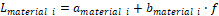

+----------------------------------+----------------------------------+
| 3GPP TR 38.858 V18.1.0 (2024-03) |                                  |
+==================================+==================================+
| Technical Report                 |                                  |
+----------------------------------+----------------------------------+
| 3rd Generation Partnership       |                                  |
| Project;                         |                                  |
|                                  |                                  |
| Technical Specification Group    |                                  |
| Radio Access Network;            |                                  |
|                                  |                                  |
| *Study on Evolution of NR Duplex |                                  |
| Operation*                       |                                  |
|                                  |                                  |
| (Release 18)                     |                                  |
+----------------------------------+----------------------------------+
|                                  |                                  |
+----------------------------------+----------------------------------+
| {width="1.4152777777777779in" | ng){width="1.7673611111111112in" |
| height="0.8631944444444445in"}   | height="1.0409722222222222in"}   |
+----------------------------------+----------------------------------+
|                                  |                                  |
+----------------------------------+----------------------------------+
| The present document has been    |                                  |
| developed within the 3rd         |                                  |
| Generation Partnership Project   |                                  |
| (3GPP ^TM^) and may be further   |                                  |
| elaborated for the purposes of   |                                  |
| 3GPP.\                           |                                  |
| The present document has not     |                                  |
| been subject to any approval     |                                  |
| process by the 3GPP              |                                  |
| Organizational Partners and      |                                  |
| shall not be implemented.\       |                                  |
| This Specification is provided   |                                  |
| for future development work      |                                  |
| within 3GPP only. The            |                                  |
| Organizational Partners accept   |                                  |
| no liability for any use of this |                                  |
| Specification.\                  |                                  |
| Specifications and Reports for   |                                  |
| implementation of the 3GPP ^TM^  |                                  |
| system should be obtained via    |                                  |
| the 3GPP Organizational          |                                  |
| Partners\' Publications Offices. |                                  |
+----------------------------------+----------------------------------+

+----------------------------------------------------------------------+
|                                                                      |
+======================================================================+
| > ***3GPP***                                                         |
| >                                                                    |
| > Postal address                                                     |
| >                                                                    |
| > 3GPP support office address                                        |
| >                                                                    |
| > 650 Route des Lucioles - Sophia Antipolis                          |
| >                                                                    |
| > Valbonne - FRANCE                                                  |
| >                                                                    |
| > Tel.: +33 4 92 94 42 00 Fax: +33 4 93 65 47 16                     |
| >                                                                    |
| > Internet                                                           |
| >                                                                    |
| > http://www.3gpp.org                                                |
+----------------------------------------------------------------------+
| ***Copyright Notification***                                         |
|                                                                      |
| No part may be reproduced except as authorized by written            |
| permission.\                                                         |
| The copyright and the foregoing restriction extend to reproduction   |
| in all media.                                                        |
|                                                                      |
| © 2024, 3GPP Organizational Partners (ARIB, ATIS, CCSA, ETSI, TSDSI, |
| TTA, TTC).                                                           |
|                                                                      |
| All rights reserved.                                                 |
|                                                                      |
| UMTS™ is a Trade Mark of ETSI registered for the benefit of its      |
| members                                                              |
|                                                                      |
| 3GPP™ is a Trade Mark of ETSI registered for the benefit of its      |
| Members and of the 3GPP Organizational Partners\                     |
| LTE™ is a Trade Mark of ETSI registered for the benefit of its       |
| Members and of the 3GPP Organizational Partners                      |
|                                                                      |
| GSM® and the GSM logo are registered and owned by the GSM            |
| Association                                                          |
+----------------------------------------------------------------------+

#########  Annex \<A\>: Evaluation methodologies

A.1 Layout and UE distribution
==============================

A.1.1 Layout
------------

Table A.1.1-1: Layout for SBFD and dynamic/flexible TDD evaluation

+----------+----------+----------+----------+----------+----------+
|          | **       | **       | *        | *        | **BS     |
|          | Layout** | Inter-BS | *Minimum | *Minimum | antenna  |
|          |          | (2D)     | BS-UE    | UE-UE    | height** |
|          |          | di       | (2D)     | (2D)     |          |
|          |          | stance** | di       | di       |          |
|          |          |          | stance** | stance** |          |
+==========+==========+==========+==========+==========+==========+
| **Indoor | *        | **20m**  | **0m**   | **1m**   | 3 m      |
| office** | *[Single |          |          |          |          |
|          | la       |          |          |          |          |
|          | yer]{.un |          |          |          |          |
|          | derline} |          |          |          |          |
|          | (see     |          |          |          |          |
|          | Figure   |          |          |          |          |
|          | A.       |          |          |          |          |
|          | 1.1-1)** |          |          |          |          |
|          |          |          |          |          |          |
|          | \-       |          |          |          |          |
|          | Indoor   |          |          |          |          |
|          | floor:   |          |          |          |          |
|          | (12BSs   |          |          |          |          |
|          | per 120m |          |          |          |          |
|          | x 50m)   |          |          |          |          |
+----------+----------+----------+----------+----------+----------+
| **Urban  | [Single  | **500m   | **35m**  | **1m**   | 25 m     |
| Macro/   | lay      | for      |          |          |          |
| Dense    | er]{.und | Urban    |          |          |          |
| Urban    | erline}\ | Macro,** |          |          |          |
| Macro    | Macro    |          |          |          |          |
| layer**  | layer:   | **200m   |          |          |          |
|          |          | for      |          |          |          |
|          | \-       | Dense    |          |          |          |
|          | B        | Urban    |          |          |          |
|          | aseline: | Macro    |          |          |          |
|          | *He      | layer**  |          |          |          |
|          | xagonal* |          |          |          |          |
|          | grid     |          |          |          |          |
|          | with 7   |          |          |          |          |
|          | macro    |          |          |          |          |
|          | sites    |          |          |          |          |
|          | and 3    |          |          |          |          |
|          | sectors  |          |          |          |          |
|          | per site |          |          |          |          |
|          | with     |          |          |          |          |
|          | wrap     |          |          |          |          |
|          | around   |          |          |          |          |
|          | (see     |          |          |          |          |
|          | Figure   |          |          |          |          |
|          | A.1.1-2) |          |          |          |          |
|          |          |          |          |          |          |
|          | O        |          |          |          |          |
|          | ptional: |          |          |          |          |
|          | H        |          |          |          |          |
|          | exagonal |          |          |          |          |
|          | grid     |          |          |          |          |
|          | with 19  |          |          |          |          |
|          | *macro*  |          |          |          |          |
|          | sites    |          |          |          |          |
|          | and 3    |          |          |          |          |
|          | sectors  |          |          |          |          |
|          | per site |          |          |          |          |
|          | with     |          |          |          |          |
|          | wrap     |          |          |          |          |
|          | around.  |          |          |          |          |
+----------+----------+----------+----------+----------+----------+
| **Dense  | **[Two   | *        | **Macr   | **1m**   | 25m for  |
| Urban    | laye     | *Macro-t | o-to-UE: |          | Macro    |
| with     | r]{.unde | o-Macro: | 35m\     |          | cells    |
| 2        | rline}** | 200m**   | Micr     |          | and 10m  |
| -layer** |          |          | o-to-UE: |          | for      |
|          | **Macro  | *        | 10m**    |          | Micro    |
|          | layer:** | *Minimum |          |          | cells    |
|          |          | Macro    |          |          |          |
|          | \-       | -to-micr |          |          |          |
|          | B        | o-center |          |          |          |
|          | aseline: | d        |          |          |          |
|          | *He      | istance: |          |          |          |
|          | xagonal* | 42m**    |          |          |          |
|          | grid     |          |          |          |          |
|          | with 7   | *        |          |          |          |
|          | macro    | *Minimum |          |          |          |
|          | sites    | Micr     |          |          |          |
|          | and 3    | o-center |          |          |          |
|          | sectors  | -to-micr |          |          |          |
|          | per site | o-center |          |          |          |
|          | with     | d        |          |          |          |
|          | wrap     | istance: |          |          |          |
|          | around   | 40m**    |          |          |          |
|          | (see     |          |          |          |          |
|          | Figure   |          |          |          |          |
|          | A.1.1-2) |          |          |          |          |
|          |          |          |          |          |          |
|          | \-       |          |          |          |          |
|          | O        |          |          |          |          |
|          | ptional: |          |          |          |          |
|          | H        |          |          |          |          |
|          | exagonal |          |          |          |          |
|          | grid     |          |          |          |          |
|          | with 19  |          |          |          |          |
|          | macro    |          |          |          |          |
|          | sites    |          |          |          |          |
|          | and 3    |          |          |          |          |
|          | sectors  |          |          |          |          |
|          | per site |          |          |          |          |
|          | with     |          |          |          |          |
|          | wrap     |          |          |          |          |
|          | around.  |          |          |          |          |
|          |          |          |          |          |          |
|          | **Micro  |          |          |          |          |
|          | layer    |          |          |          |          |
|          | (see     |          |          |          |          |
|          | Figure   |          |          |          |          |
|          | A.1      |          |          |          |          |
|          | .1-3):** |          |          |          |          |
|          |          |          |          |          |          |
|          | \- Step  |          |          |          |          |
|          | 1:       |          |          |          |          |
|          | Randomly |          |          |          |          |
|          | drop *X* |          |          |          |          |
|          | micro    |          |          |          |          |
|          | TRP      |          |          |          |          |
|          | centers  |          |          |          |          |
|          | within   |          |          |          |          |
|          | one      |          |          |          |          |
|          | macro    |          |          |          |          |
|          | cell     |          |          |          |          |
|          | geog     |          |          |          |          |
|          | raphical |          |          |          |          |
|          | area     |          |          |          |          |
|          | con      |          |          |          |          |
|          | sidering |          |          |          |          |
|          | the      |          |          |          |          |
|          | minimum  |          |          |          |          |
|          | distance |          |          |          |          |
|          | between  |          |          |          |          |
|          | micro    |          |          |          |          |
|          | TRP      |          |          |          |          |
|          | centers  |          |          |          |          |
|          | (D~inte  |          |          |          |          |
|          | r-micro- |          |          |          |          |
|          | center~) |          |          |          |          |
|          | and the  |          |          |          |          |
|          | minimum  |          |          |          |          |
|          | distance |          |          |          |          |
|          | between  |          |          |          |          |
|          | macro    |          |          |          |          |
|          | TRP and  |          |          |          |          |
|          | micro    |          |          |          |          |
|          | TRP      |          |          |          |          |
|          | center   |          |          |          |          |
|          | (D~      |          |          |          |          |
|          | macro-to |          |          |          |          |
|          | -micro-c |          |          |          |          |
|          | enter~). |          |          |          |          |
|          |          |          |          |          |          |
|          | *- X*=1, |          |          |          |          |
|          | 3, 6 or  |          |          |          |          |
|          | 9        |          |          |          |          |
|          |          |          |          |          |          |
|          | \- Step  |          |          |          |          |
|          | 2:       |          |          |          |          |
|          | Randomly |          |          |          |          |
|          | deploy   |          |          |          |          |
|          | one      |          |          |          |          |
|          | micro    |          |          |          |          |
|          | TRP on   |          |          |          |          |
|          | the area |          |          |          |          |
|          | circle   |          |          |          |          |
|          | around   |          |          |          |          |
|          | each     |          |          |          |          |
|          | micro    |          |          |          |          |
|          | TRP      |          |          |          |          |
|          | center   |          |          |          |          |
|          | with the |          |          |          |          |
|          | radius   |          |          |          |          |
|          | of half  |          |          |          |          |
|          | of       |          |          |          |          |
|          | D~int    |          |          |          |          |
|          | er-micro |          |          |          |          |
|          | -center~ |          |          |          |          |
|          |          |          |          |          |          |
|          | \- Step  |          |          |          |          |
|          | 3:       |          |          |          |          |
|          | D        |          |          |          |          |
|          | etermine |          |          |          |          |
|          | the      |          |          |          |          |
|          | ho       |          |          |          |          |
|          | rizontal |          |          |          |          |
|          | angle of |          |          |          |          |
|          | the      |          |          |          |          |
|          | micro    |          |          |          |          |
|          | TRPs     |          |          |          |          |
|          | with the |          |          |          |          |
|          | planer   |          |          |          |          |
|          | facing   |          |          |          |          |
|          | to the   |          |          |          |          |
|          | micro    |          |          |          |          |
|          | TRP      |          |          |          |          |
|          | center.  |          |          |          |          |
+----------+----------+----------+----------+----------+----------+
| **Dense  | [Single  |          |          |          |          |
| Urban    | lay      |          |          |          |          |
| Micro    | er]{.und |          |          |          |          |
| layer**  | erline}\ |          |          |          |          |
|          | **Only   |          |          |          |          |
|          | consider |          |          |          |          |
|          | the      |          |          |          |          |
|          | Micro    |          |          |          |          |
|          | TRPs of  |          |          |          |          |
|          | Dense    |          |          |          |          |
|          | Urban    |          |          |          |          |
|          | with     |          |          |          |          |
|          | 2-layer  |          |          |          |          |
|          | network. |          |          |          |          |
|          | All      |          |          |          |          |
|          | users    |          |          |          |          |
|          | com      |          |          |          |          |
|          | municate |          |          |          |          |
|          | with     |          |          |          |          |
|          | micro    |          |          |          |          |
|          | TRPs,    |          |          |          |          |
|          | i.e.     |          |          |          |          |
|          | macro    |          |          |          |          |
|          | cell is  |          |          |          |          |
|          | only     |          |          |          |          |
|          | used for |          |          |          |          |
|          | det      |          |          |          |          |
|          | ermining |          |          |          |          |
|          | position |          |          |          |          |
|          | of micro |          |          |          |          |
|          | TRP.**   |          |          |          |          |
+----------+----------+----------+----------+----------+----------+
| *        | **[Two   | *        | **Macr   | **1m**   | 25m for  |
| *2-layer | la       | *Macro-t | o-to-UE: |          | Macro    |
| Scenario | yer]{.un | o-Macro: | 35m\     |          | cells    |
| B**      | derline} | 500m**   | Indoor   |          | and 3m   |
|          | (see     |          | TR       |          | for      |
|          | Figure   | *        | P-to-UE: |          | Indoor   |
|          | A.       | *Minimum | 0m**     |          | TRP      |
|          | 1.1-4)** | Mac      |          |          |          |
|          |          | ro-to-** |          |          |          |
|          | \- Layer | **indoor |          |          |          |
|          | 1: Urban | office   |          |          |          |
|          | Macro    | center   |          |          |          |
|          |          | d        |          |          |          |
|          | \-       | istance: |          |          |          |
|          | H        | 100m**   |          |          |          |
|          | exagonal |          |          |          |          |
|          | grid     | **Indoor |          |          |          |
|          | with 7   | TRP      |          |          |          |
|          | macro    | -to-**   |          |          |          |
|          | sites    | **Indoor |          |          |          |
|          | and 3    | TRP:**   |          |          |          |
|          | sectors  |          |          |          |          |
|          | per site | 20m for  |          |          |          |
|          | with     | 12 TRPs, |          |          |          |
|          | wrap     | 40m for  |          |          |          |
|          | around,  | 3 TRPs   |          |          |          |
|          | ISD=500m |          |          |          |          |
|          | (see     |          |          |          |          |
|          | Figure   |          |          |          |          |
|          | A.1.1-2) |          |          |          |          |
|          |          |          |          |          |          |
|          | \- Layer |          |          |          |          |
|          | 2:       |          |          |          |          |
|          | Indoor   |          |          |          |          |
|          | office   |          |          |          |          |
|          | (b       |          |          |          |          |
|          | aseline) |          |          |          |          |
|          | or       |          |          |          |          |
|          | indoor   |          |          |          |          |
|          | factory  |          |          |          |          |
|          | (o       |          |          |          |          |
|          | ptional) |          |          |          |          |
|          |          |          |          |          |          |
|          | \- Only  |          |          |          |          |
|          | one      |          |          |          |          |
|          | building |          |          |          |          |
|          | randomly |          |          |          |          |
|          | dropped  |          |          |          |          |
|          | in the   |          |          |          |          |
|          | whole    |          |          |          |          |
|          | network  |          |          |          |          |
|          | as in    |          |          |          |          |
|          | figure   |          |          |          |          |
|          | A.1.1-4. |          |          |          |          |
|          | The      |          |          |          |          |
|          | building |          |          |          |          |
|          | has to   |          |          |          |          |
|          | be       |          |          |          |          |
|          | confined |          |          |          |          |
|          | within   |          |          |          |          |
|          | one      |          |          |          |          |
|          | macro    |          |          |          |          |
|          | cell     |          |          |          |          |
|          | area.    |          |          |          |          |
|          |          |          |          |          |          |
|          | \- For   |          |          |          |          |
|          | Indoor   |          |          |          |          |
|          | office:  |          |          |          |          |
|          | 12       |          |          |          |          |
|          | (b       |          |          |          |          |
|          | aseline) |          |          |          |          |
|          | or 3     |          |          |          |          |
|          | (o       |          |          |          |          |
|          | ptional) |          |          |          |          |
|          | TRPs per |          |          |          |          |
|          | 120m x   |          |          |          |          |
|          | 50m x 3m |          |          |          |          |
|          |          |          |          |          |          |
|          | \- For   |          |          |          |          |
|          | indoor   |          |          |          |          |
|          | factory: |          |          |          |          |
|          | 12 TRPs  |          |          |          |          |
|          | per 120m |          |          |          |          |
|          | x 50m x  |          |          |          |          |
|          | 3m.      |          |          |          |          |
|          | Other    |          |          |          |          |
|          | si       |          |          |          |          |
|          | mulation |          |          |          |          |
|          | ass      |          |          |          |          |
|          | umptions |          |          |          |          |
|          | follow   |          |          |          |          |
|          | InF-SL   |          |          |          |          |
|          | in Table |          |          |          |          |
|          | 7.8-7    |          |          |          |          |
|          | (Si      |          |          |          |          |
|          | mulation |          |          |          |          |
|          | ass      |          |          |          |          |
|          | umptions |          |          |          |          |
|          | for      |          |          |          |          |
|          | large    |          |          |          |          |
|          | scale    |          |          |          |          |
|          | cal      |          |          |          |          |
|          | ibration |          |          |          |          |
|          | for the  |          |          |          |          |
|          | indoor   |          |          |          |          |
|          | factory  |          |          |          |          |
|          | s        |          |          |          |          |
|          | cenario) |          |          |          |          |
|          | in TR    |          |          |          |          |
|          | 38.901   |          |          |          |          |
|          |          |          |          |          |          |
|          | \- The   |          |          |          |          |
|          | ori      |          |          |          |          |
|          | entation |          |          |          |          |
|          | of the   |          |          |          |          |
|          | building |          |          |          |          |
|          | is fixed |          |          |          |          |
|          | as in    |          |          |          |          |
|          | Figure   |          |          |          |          |
|          | A.1.1-4  |          |          |          |          |
|          | (i.e.,   |          |          |          |          |
|          | the long |          |          |          |          |
|          | side of  |          |          |          |          |
|          | the      |          |          |          |          |
|          | rec      |          |          |          |          |
|          | tangular |          |          |          |          |
|          | is along |          |          |          |          |
|          | the      |          |          |          |          |
|          | x-axis)  |          |          |          |          |
+----------+----------+----------+----------+----------+----------+
| ***NOTE  |          |          |          |          |          |
| 1:***    |          |          |          |          |          |
| Distan   |          |          |          |          |          |
| ce-based |          |          |          |          |          |
| wr       |          |          |          |          |          |
| ap-round |          |          |          |          |          |
| is used. |          |          |          |          |          |
+----------+----------+----------+----------+----------+----------+

{width="2.556900699912511in"
height="1.5895953630796151in"}

Figure A.1.1-1: Layout for indoor

Figure A.1.1-2: Layout for hexagonal grid with 7 macro sites and 3
sectors per site

Figure A.1.1-3: Layout for dense urban (3 Micro TRPs per Macro TRP)

{width="4.916666666666667in"
height="1.976388888888889in"}

\(a\) 12 TRPs in one building

{width="2.432235345581802in"
height="1.976388888888889in"}

\(b\) 3 TRPs in one building

Figure A.1.1-4: Layout for 2-layer Scenario B

For SBFD Deployment Case 4, consider 0% and 100% grid shift between two
networks for Urban Macro and Dense Urban Macro layer scenarios as shown
in Figure A.1.1-5.

Figure A.1.1-5: 0% and 100% grid shifts between two networks

For SLS in RAN1, use the following BS antenna layout (**see Figure
A.1.1-6**) for indoor office scenario (referring to Table 1 in
RP-180524), wherein,

\- X-axis is pointing down to the floor

\- The antenna array is mounted in the Y-Z plane with boresight along
the X-axis (ceiling mounted with boresight towards the floor)

\- The X-axis/Y-axis/Z-axis refer to LCS

{width="5.00625in" height="1.7659722222222223in"}

{width="5.0256944444444445in"
height="1.7340277777777777in"}

Figure A.1.1-6: Top view of the BS antenna layout for indoor office
scenario

A.1.2 UE distribution
---------------------

Table A.1.2-1: UE distribution for SBFD and dynamic/flexible TDD
evaluation

+----------------------+----------------------+----------------------+
|                      |                      | **UE distribution**  |
+======================+======================+======================+
|                      | **Indoor office**    | \- 10 users per TRP  |
|                      |                      | per direction, and   |
|                      |                      | all users are        |
|                      |                      | randomly and         |
|                      |                      | uniformly dropped    |
|                      |                      | within the building. |
|                      |                      |                      |
|                      |                      | \- UE speed is       |
|                      |                      | 3km/h, UE height is  |
|                      |                      | 1.5m                 |
+----------------------+----------------------+----------------------+
|                      | **Urban Macro /      | -   Baseline: UE     |
|                      | Dense Urban Macro    |     clustering       |
|                      | layer**              |     distribution     |
|                      |                      |     **(*NOTE 1)***   |
|                      |                      |                      |
|                      |                      |     -   Baseline:    |
|                      |                      |         *M*=20*,     |
|                      |                      |         X*=2*;*      |
|                      |                      |         Optional:    |
|                      |                      |         *M*=10*,     |
|                      |                      |         X*=1.        |
|                      |                      |                      |
|                      |                      |     -   *R'* = 25 m. |
|                      |                      |         Evaluation   |
|                      |                      |         results for  |
|                      |                      |         other values |
|                      |                      |         of *R'* can  |
|                      |                      |         be           |
|                      |                      |         submitted.   |
|                      |                      |                      |
|                      |                      |     -                |
|                      |                      |  D~macro-to-cluster~ |
|                      |                      |         = 35m+ *R'*, |
|                      |                      |                      |
|                      |                      |     D~inter-cluster~ |
|                      |                      |         = 2*R'* m    |
|                      |                      |                      |
|                      |                      |     -   UEs dropped  |
|                      |                      |         within the   |
|                      |                      |         UE           |
|                      |                      |         cluster(s)   |
|                      |                      |         are indoor   |
|                      |                      |         with 3km/h.  |
|                      |                      |         UEs dropped  |
|                      |                      |         outside the  |
|                      |                      |         UE           |
|                      |                      |         cluster(s)   |
|                      |                      |         are outdoor  |
|                      |                      |         in car with  |
|                      |                      |         30km/h.      |
|                      |                      |                      |
|                      |                      |     -   UE height is |
|                      |                      |         1.5m for all |
|                      |                      |         UEs.         |
|                      |                      |                      |
|                      |                      | -   Optional:        |
|                      |                      |     Uniform UE       |
|                      |                      |     distribution     |
|                      |                      |                      |
|                      |                      |     -   10 users per |
|                      |                      |         macro TRP    |
|                      |                      |         per          |
|                      |                      |         direction,   |
|                      |                      |         and all      |
|                      |                      |         users are    |
|                      |                      |         randomly and |
|                      |                      |         uniformly    |
|                      |                      |         dropped      |
|                      |                      |         within the   |
|                      |                      |         macro cell   |
|                      |                      |                      |
|                      |                      |     -   20% outdoor  |
|                      |                      |         in cars with |
|                      |                      |         30km/h, 80%  |
|                      |                      |         indoor in    |
|                      |                      |         houses with  |
|                      |                      |         3km/h.       |
|                      |                      |                      |
|                      |                      |         -   Outdoor  |
|                      |                      |             UE       |
|                      |                      |             height:  |
|                      |                      |             1.5 m    |
|                      |                      |                      |
|                      |                      |         -   Indoor   |
|                      |                      |             UE       |
|                      |                      |             height:  |
|                      |                      |             3(n~fl~  |
|                      |                      |             -- 1) +  |
|                      |                      |             1.5;     |
|                      |                      |             n~fl~ \~ |
|                      |                      |                      |
|                      |                      |           uniform(1, |
|                      |                      |             N~fl~)   |
|                      |                      |             where    |
|                      |                      |             N~fl~ \~ |
|                      |                      |                      |
|                      |                      |         uniform(4,8) |
+----------------------+----------------------+----------------------+
|                      | **Dense Urban with   | \- 2/3 users         |
|                      | 2-layer**            | randomly and         |
|                      |                      | uniformly dropped    |
|                      |                      | around micro TRP     |
|                      |                      | centers with radius  |
|                      |                      | of R (R =            |
|                      |                      | \[28.9m\]), 1/3      |
|                      |                      | users randomly and   |
|                      |                      | uniformly dropped    |
|                      |                      | throughout the macro |
|                      |                      | geographical area,   |
|                      |                      | and 60 users per     |
|                      |                      | macro geographical   |
|                      |                      | area.                |
|                      |                      |                      |
|                      |                      | \- 20% outdoor in    |
|                      |                      | cars with 30km/h,    |
|                      |                      | 80% indoor in houses |
|                      |                      | with 3km/h.          |
|                      |                      |                      |
|                      |                      | \- Outdoor UE        |
|                      |                      | height: 1.5 m        |
|                      |                      |                      |
|                      |                      | \- Indoor UE height: |
|                      |                      | 3(n~fl~ -- 1) + 1.5; |
|                      |                      | n~fl~ \~ uniform(1,  |
|                      |                      | N~fl~) where N~fl~   |
|                      |                      | \~ uniform(4,8)      |
+----------------------+----------------------+----------------------+
|                      | **2-layer Scenario   | -   Layer 1: Urban   |
|                      | B**                  |     Macro            |
|                      |                      |                      |
|                      |                      |     -   10 users per |
|                      |                      |         macro TRP    |
|                      |                      |         per          |
|                      |                      |         direction,   |
|                      |                      |         and all      |
|                      |                      |         users are    |
|                      |                      |         randomly and |
|                      |                      |         uniformly    |
|                      |                      |         dropped      |
|                      |                      |         within the   |
|                      |                      |         macro cell   |
|                      |                      |         outside the  |
|                      |                      |         Indoor       |
|                      |                      |         office /     |
|                      |                      |         ***Indoor    |
|                      |                      |         factory***   |
|                      |                      |                      |
|                      |                      |     -   100% outdoor |
|                      |                      |         without car  |
|                      |                      |         penetration  |
|                      |                      |         loss         |
|                      |                      |         (3km/h), UE  |
|                      |                      |         height is    |
|                      |                      |         1.5m         |
|                      |                      |                      |
|                      |                      | -   Layer 2: Indoor  |
|                      |                      |     office           |
|                      |                      |     ***(baseline)*** |
|                      |                      |                      |
|                      |                      |     -   10 users per |
|                      |                      |         indoor TRP   |
|                      |                      |         per          |
|                      |                      |         direction,   |
|                      |                      |         and all      |
|                      |                      |         users are    |
|                      |                      |         randomly and |
|                      |                      |         uniformly    |
|                      |                      |         dropped      |
|                      |                      |         within the   |
|                      |                      |         building.    |
|                      |                      |                      |
|                      |                      |     -   UE speed is  |
|                      |                      |         3km/h, UE    |
|                      |                      |         height is    |
|                      |                      |         1.5m         |
+----------------------+----------------------+----------------------+
| **FR2-1**            | **Indoor office**    | -   10 users per TRP |
|                      |                      |     per direction,   |
|                      |                      |     and all users    |
|                      |                      |     are randomly and |
|                      |                      |     uniformly        |
|                      |                      |     dropped within   |
|                      |                      |     the building.    |
|                      |                      |                      |
|                      |                      | -   UE speed is      |
|                      |                      |     3km/h, UE height |
|                      |                      |     is 1.5m          |
+----------------------+----------------------+----------------------+
|                      | **Dense Urban Macro  | -   Baseline: UE     |
|                      | layer**              |     clustering       |
|                      |                      |     distribution     |
|                      |                      |     **(*NOTE 1)***   |
|                      |                      |                      |
|                      |                      |     -   Baseline:    |
|                      |                      |         *M*=10*,     |
|                      |                      |         X*=1*;*      |
|                      |                      |         Optional:    |
|                      |                      |         *M*=20*,     |
|                      |                      |         X*=2.        |
|                      |                      |                      |
|                      |                      |     -   *R'* =20m.   |
|                      |                      |         Lower values |
|                      |                      |         of *R'* are  |
|                      |                      |         not          |
|                      |                      |         excluded.    |
|                      |                      |                      |
|                      |                      |     -                |
|                      |                      |  D~macro-to-cluster~ |
|                      |                      |         = 35m+*R'*.  |
|                      |                      |                      |
|                      |                      |     -   For *X*=2,   |
|                      |                      |                      |
|                      |                      |     D~inter-cluster~ |
|                      |                      |         = 2*R'* m.   |
|                      |                      |                      |
|                      |                      |     -   All the UEs  |
|                      |                      |         (including   |
|                      |                      |         UEs in the   |
|                      |                      |         clusters and |
|                      |                      |         out of the   |
|                      |                      |         clusters)    |
|                      |                      |         are outdoor  |
|                      |                      |         UEs without  |
|                      |                      |         car          |
|                      |                      |         penetration  |
|                      |                      |         loss         |
|                      |                      |         (3km/h).     |
|                      |                      |                      |
|                      |                      |     -   UE height is |
|                      |                      |         1.5m.        |
|                      |                      |                      |
|                      |                      | -   Optional:        |
|                      |                      |     Uniform UE       |
|                      |                      |     distribution     |
|                      |                      |                      |
|                      |                      |     -   10 users per |
|                      |                      |         macro TRP    |
|                      |                      |         per          |
|                      |                      |         direction,   |
|                      |                      |         and all      |
|                      |                      |         users are    |
|                      |                      |         randomly and |
|                      |                      |         uniformly    |
|                      |                      |         dropped      |
|                      |                      |         within the   |
|                      |                      |         macro cell.  |
|                      |                      |                      |
|                      |                      |                      |
|                      |                      |    -   Baseline**:** |
|                      |                      |         100% outdoor |
|                      |                      |         without car  |
|                      |                      |         penetration  |
|                      |                      |         loss         |
|                      |                      |         (3km/h).     |
|                      |                      |         Outdoor UE   |
|                      |                      |         *height is*  |
|                      |                      |         1.5 m.       |
|                      |                      |                      |
|                      |                      |                      |
|                      |                      |    -   Optional**:** |
|                      |                      |         20% outdoor  |
|                      |                      |         in cars with |
|                      |                      |         30km/h, 80%  |
|                      |                      |         indoor in    |
|                      |                      |         houses with  |
|                      |                      |         3km/h.       |
|                      |                      |                      |
|                      |                      |         -   Outdoor  |
|                      |                      |             *UE      |
|                      |                      |             height*: |
|                      |                      |             1.5 m;   |
|                      |                      |                      |
|                      |                      |         -   Indoor   |
|                      |                      |             UE       |
|                      |                      |                      |
|                      |                      |            *height*: |
|                      |                      |             3(n~fl~  |
|                      |                      |             -- 1) +  |
|                      |                      |             1.5;     |
|                      |                      |             n~fl~ \~ |
|                      |                      |                      |
|                      |                      |           uniform(1, |
|                      |                      |             N~fl~)   |
|                      |                      |             where    |
|                      |                      |             N~fl~ \~ |
|                      |                      |                      |
|                      |                      |         uniform(4,8) |
+----------------------+----------------------+----------------------+
|                      | **Dense Urban Micro  | -   All users are    |
|                      | layer**              |     randomly and     |
|                      |                      |     uniformly        |
|                      |                      |     dropped around   |
|                      |                      |     Micro TRP center |
|                      |                      |     with the radius  |
|                      |                      |     of R (R =        |
|                      |                      |     \[28.9m\])       |
+----------------------+----------------------+----------------------+
| NOTE 1: The UE       |                      |                      |
| clustering           |                      |                      |
| distribution is      |                      |                      |
| assumed as below:    |                      |                      |
|                      |                      |                      |
| \- Randomly drop *X* |                      |                      |
| (*X* =1 or 2) UE     |                      |                      |
| cluster centers      |                      |                      |
| within one macro     |                      |                      |
| cell geographical    |                      |                      |
| area considering the |                      |                      |
| minimum distance     |                      |                      |
| between macro TRP to |                      |                      |
| UE cluster center as |                      |                      |
| D~macro-to-cluster~  |                      |                      |
| and for *X*=2, the   |                      |                      |
| minimum distance     |                      |                      |
| between two UE       |                      |                      |
| cluster centers as   |                      |                      |
| D~inter-cluster~     |                      |                      |
|                      |                      |                      |
| \- Assuming *M*      |                      |                      |
| (*M*=10 or 20) users |                      |                      |
| per macro TRP per    |                      |                      |
| direction, 80% UEs   |                      |                      |
| are randomly and     |                      |                      |
| uniformly dropped    |                      |                      |
| within the UE        |                      |                      |
| clusters with the    |                      |                      |
| radius of *R'*, 20%  |                      |                      |
| users randomly and   |                      |                      |
| uniformly dropped in |                      |                      |
| the macro            |                      |                      |
| geographical area    |                      |                      |
| outside the          |                      |                      |
| clusters. If each UE |                      |                      |
| is assigned both UL  |                      |                      |
| traffic and DL       |                      |                      |
| traffic, there are 8 |                      |                      |
| UEs in one UE        |                      |                      |
| cluster. If each UE  |                      |                      |
| is either assigned   |                      |                      |
| UL traffic or DL     |                      |                      |
| traffic, there are 8 |                      |                      |
| UEs with DL traffic  |                      |                      |
| and 8 UEs with UL    |                      |                      |
| traffic in one UE    |                      |                      |
| cluster.             |                      |                      |
|                      |                      |                      |
| \- The UEs in the    |                      |                      |
| same cluster are in  |                      |                      |
| the same building    |                      |                      |
| for FR1. For the     |                      |                      |
| case with *M*=20 and |                      |                      |
| *X*=2, the UEs in    |                      |                      |
| different clusters   |                      |                      |
| are in different     |                      |                      |
| buildings for FR1.   |                      |                      |
|                      |                      |                      |
| \- Note that the UE  |                      |                      |
| cluster is totally   |                      |                      |
| confined within the  |                      |                      |
| macro cell           |                      |                      |
| geographical area    |                      |                      |
| (i.e. a cluster      |                      |                      |
| cannot be partially  |                      |                      |
| overlap with         |                      |                      |
| adjacent cell area). |                      |                      |
|                      |                      |                      |
| NOTE 2: UE           |                      |                      |
| clustering           |                      |                      |
| distribution for     |                      |                      |
| SBFD Deployment Case |                      |                      |
| 4 with 0% or 100%    |                      |                      |
| grid shift is        |                      |                      |
| assumed as below:    |                      |                      |
|                      |                      |                      |
| \- The UE cluster    |                      |                      |
| centers of the first |                      |                      |
| operator are the     |                      |                      |
| same as that of the  |                      |                      |
| second operator.     |                      |                      |
|                      |                      |                      |
| \- For 100% grid     |                      |                      |
| shift, the minimum   |                      |                      |
| distance requirement |                      |                      |
| between the UE       |                      |                      |
| cluster center and   |                      |                      |
| macro TRP should be  |                      |                      |
| satisfied for both   |                      |                      |
| operators.           |                      |                      |
|                      |                      |                      |
| \- Minimum UE-UE 2D  |                      |                      |
| distance is 1m       |                      |                      |
| regardless the       |                      |                      |
| serving operator.    |                      |                      |
|                      |                      |                      |
| \- For each          |                      |                      |
| operator, the UE     |                      |                      |
| cluster distribution |                      |                      |
| method for SBFD      |                      |                      |
| deployment Case 1 is |                      |                      |
| reused.              |                      |                      |
+----------------------+----------------------+----------------------+

A.2 Interference modelling
==========================

Consider the following definitions of interference types for ***duplex
evolution study***.

Table A.2-1: Definition of interference types

  **Interference types**                                                                                                                                                                                                                                                **Definition**                                                                                                                                                                                                                     
  --------------------------------------------------------------------------------------------------------------------------------------------------------------------------------------------------------------------------------------------------------------------- --------------------------------------------- ------------------------------------------------------------------------------------------------------------------------------------------------------------------------------------ ---------------------------------------------------------------------------------------------------------------------------------------------------------------------------------------------------------------------------------------------------------------------------------------------------------
  ***Co-channel interference***                                                                                                                                                                                                                                         ***Co-channel intra-subband interference***   **gNB-UE co-channel intra-subband interference**                                                                                                                                     This is the same as the legacy DL interference type in legacy TDD network with static TDD UL/DL configuration.
                                                                                                                                                                                                                                                                                                                      **UE-gNB co-channel intra-subband interference**                                                                                                                                     This is the same as the legacy UL interference type in legacy TDD network with static TDD UL/DL configuration.
                                                                                                                                                                                                                                                                                                                      **(inter-cell) inter-site gNB-gNB co-channel intra-subband CLI**                                                                                                                     CLI caused by DL transmission of the aggressor gNB on a set of RBs in one carrier to UL reception of the victim gNB in a different site on the same set of RBs in the same carrier.
                                                                                                                                                                                                                                                                                                                      **(inter-cell) co-site inter-sector co-channel intra-subband CLI**                                                                                                                   CLI caused by DL transmission of the aggressor gNB on a set of RBs in one carrier to UL reception of the victim gNB in another sector of the same site on the same set of RBs in the same carrier.
                                                                                                                                                                                                                                                                                                                      **(inter-cell) UE-UE co-channel intra-subband CLI**                                                                                                                                  CLI caused by UL transmission of the aggressor UE on a set of RBs in one carrier to DL reception of the victim UE on the same set of RBs in the same carrier.
                                                                                                                                                                                                                                                                        ***Co-channel inter-subband interference***   **gNB self-interference (SI)**                                                                                                                                                       Interference caused by DL transmission on a set of DL RBs in a carrier to UL reception on a set of UL RBs in the same carrier at the gNB side, where the two RB sets are non-overlapping in frequency (see Annex A.2.1 for detailed modelling).
                                                                                                                                                                                                                                                                                                                      **(inter-cell) co-site inter-sector co-channel inter-subband CLI**                                                                                                                   CLI caused by DL transmission of the aggressor gNB on a first set of RBs in a carrier to UL reception of the victim gNB in another sector of the same site on a second set of RBs in the same carrier, where the two RB sets are non-overlapping in frequency (see Annex A.2.2 for detailed modelling).
                                                                                                                                                                                                                                                                                                                      **(inter-cell) inter-site gNB-gNB co-channel inter-subband CLI**                                                                                                                     CLI caused by DL transmission of the aggressor gNB on a first set of RBs in a carrier to UL reception of the victim gNB in a different site on a second set of RBs in the same carrier, where the two RB sets are non-overlapping in frequency (see Annex A.2.3 for detailed modelling).
                                                                                                                                                                                                                                                                                                                      **(intra-cell/inter-cell) UE-UE co-channel inter-subband CLI**                                                                                                                       CLI caused by UL transmission of the aggressor UE on a first set of RBs in a carrier to DL reception of the victim UE on a second set of RBs in the same cell or neighboring cell in the same carrier, where the two RB sets are non-overlapping in frequency (see Annex A.2.4 for detailed modelling).
  ***Adjacent channel interference***                                                                                                                                                                                                                                   **Co-site gNB-gNB adjacent-channel CLI**      CLI caused by DL transmission of the aggressor co-site gNB in a carrier to UL reception of the victim gNB in another adjacent carrier(see Annex A.2.5 for detailed modelling).       
                                                                                                                                                                                                                                                                        **Inter-site gNB-gNB adjacent-channel CLI**   CLI caused by DL transmission of the aggressor inter-site gNB in a carrier to UL reception of the victim gNB in another adjacent carrier (see Annex A.2.6 for detailed modelling).   
                                                                                                                                                                                                                                                                        **UE-UE adjacent-channel CLI**                CLI caused by UL transmission of the aggressor UE in a carrier to DL reception of the victim UE in another adjacent carrier (see Annex A.2.7 for detailed modelling).                
  NOTE: This does not imply all the above interference types are needed in evaluation for SBFD. Some of the interferences may not be used according to the deployment scenarios, e.g., whether the SBFD subband configurations are the same or different across gNBs.                                                                                                                                                                                                                                      

A.2.1 gNB self-interference modelling
-------------------------------------

For gNB self-interference modelling in SLS of SBFD in RAN1, consider
introducing ratio of self-interference (RSI) to represent the overall
self-interference suppression capability of gNB by means of spatial
isolation, subband frequency isolation, digital interference
cancellation and beamform nulling/isolation, etc. RSI also takes into
account the impact of Tx/Rx antenna element gain on self-interference.

For SLS of SBFD in RAN1, the RSI is modelled as frequency flat within
the UL subband. The residual self-interference *power* on the UL subband
when all the DL RBs in the DL subbands are allocated with maximum gNB DL
Tx Power *is computed by*

$$\begin{matrix}
I_{\text{SI}}^{\max} = \frac{P_{\text{tx}}^{\max}}{\alpha_{\text{SI}}}*\frac{N_{\text{ULRB}}}{N_{\text{DLRB}}}\#\left( A - 1 \right) \\
\end{matrix}$$

where

\- $I_{\text{SI}}^{\max}$ is the residual self-interference *power* on
the UL subband when all the DL RBs in the DL subbands are allocated with
maximum gNB DL Tx Power (in linear scale).

\- $P_{\text{tx}}^{\max}$ is the **maximum gNB** DL Tx Power on the two
DL subbands (in linear scale).

**-** $N_{\text{DLRB}}$ is the total number of DL RBs in the DL
subbands.

**-** $N_{\text{ULRB}}$ is the total number of UL RBs in the UL subband.

\- $\alpha_{\text{SI}}$ *is the overall RSI value* provided by RAN4 *in
linear scale.* RAN1 assumes frequency isolation value in the overall RSI
value ranges provided by RAN4 is based on the assumption of SBFD subband
configuration with {DUD=40MHz:20MHz:40MHz} at least for FR1 and all the
DL RBs in the DL subbands are allocated with maximum gNB DL Tx Power.
Candidate values for $\alpha_{\text{SI}}$ at least can be determined
based on the assumption that UL receiver sensitivity degradation due to
self-interference is 1dB. *Companies shall report what values of the
individual components are assumed in order to achieve the*
$\alpha_{\text{SI}}$ *value corresponding to 1 dB desense. Other
approaches of determining values for* $\alpha_{\text{SI}}$ *are not
precluded and can be used and reported by companies.*

Assuming $\alpha_{\text{SI}}$ doesn't change when DL RBs are not fully
allocated for DL transmission, the residual self-interference power on
one UL RB when DL RBs are not fully allocated for DL transmission is
computed by

$$\begin{matrix}
I_{\text{SI}}^{per - RB} = \frac{P_{\text{tx}}^{per - RB}}{\alpha_{\text{SI}}}*\frac{N_{used - DL - RB}}{N_{\text{DLRB}}}\#\left( A - 2 \right) \\
\end{matrix}$$

where

\- $I_{\text{SI}}^{per - RB}$ is the residual self-interference *power*
on one UL PRB when all the DL RBs in the DL subbands are not fully
allocated for DL transmission (in linear scale).

\- $P_{\text{tx}}^{per - RB}$ is DL transmission power of gNB per RB,
$P_{\text{tx}}^{per - RB} = P_{\text{tx}}^{\max}/N_{\text{DLRB}}.$

**-** $N_{used - DL - RB}$ is the number of DL RBs allocated for DL
transmission.

A.2.2 Co-site inter-sector co-channel inter-subband CLI
-------------------------------------------------------

**For SLS in RAN1, for co-site inter-sector co-channel inter-subband CLI
modelling, reuse similar method as gNB self-interference modelling as
follows.**

$$\begin{matrix}
I_{co - site}^{per - RB} = I_{co - site - sector - 1}^{per - RB} + I_{co - site - sector - 2}^{per - RB}\#\left( A - 3 \right) \\
\end{matrix}$$

$$\begin{matrix}
I_{co - site - sector - x}^{per - RB} = \frac{P_{\text{tx}}^{sector - x,\ per - RB}}{\alpha_{co - site}}*\frac{N_{used - DL - RB}^{sector - x}}{N_{\text{DLRB}}}\#\left( A - 4 \right) \\
\end{matrix}$$

where

\- $P_{\text{tx}}^{sector - x,\ per - RB}$ is DL Tx power of sector *x*
per RB (in linear scale),
$P_{\text{tx}}^{sector - x,\ per - RB} = P_{\text{tx}}^{sector - x,\ \max}/N_{\text{DLRB}}.$

\- $P_{\text{tx}}^{sector - x,\ \max}$ is the **maximum** DL Tx Power of
sector *x* on the two DL subbands (in linear scale).

\- $N_{\text{DLRB}}$ is the total number of DL RBs in the DL subbands.

\- $N_{used - DL - RB}^{sector - x}$ is the number of DL RBs allocated
for DL transmission of sector *x*.

\- $\alpha_{co - site}$ **is the interference suppression capability of
co-site inter-sector co-channel inter-subband CLI.**

\-
$10*\log_{10}\left( \alpha_{co - site} \right) = \text{spatial\ isolation}_{\text{dB}} + 10*\log_{10}\left( \frac{1}{\frac{1}{\text{ACLR}_{\text{BS}}} + \frac{1}{\text{ACS}_{\text{BS}}}} \right) + \ldots\ $

\- Note: $\text{ACLR}_{\text{BS}}$ and $\text{ACS}_{\text{BS}}$ are in
linear scale. gNB ACLR (i.e.,$\text{ACLR}_{\text{BS}}$) is provided as
the candidate for Tx leakage, and gNB ACS
(i.e.,$\text{ACS}_{\text{BS}}$) is provided as the candidate for
Receiver impairment.

\- Companies shall report the **value of** $\alpha_{co - site}$ assumed
in the simulations with feasibility of how these values were derived.

A.2.3 Inter-site gNB-gNB co-channel inter-subband CLI
-----------------------------------------------------

For discussion of gNB-gNB co-channel inter-subband CLI modelling in
system level simulation, RAN1 understands at least the following two
aspects need to be considered:

\- **Aspect 1:** The unwanted emissions due to Tx non-linearity at the
transmitter of the aggressor from the allocated RBs to the non-allocated
RBs in the same carrier.

\- **Aspect 2:** The receiver selectivity at the victim to receive the
desired signal in the allocated RBs in the presence of the unwanted
signals at the non-allocated RBs. (e.g. receiver blocking at the victim,
overload of the receiver dynamic range, etc)

**For SLS in RAN1, if only large scale fading is modelled and small
scale fading is not modelled for gNB-gNB co-channel channel model, the
power of inter-site gNB-gNB co-channel inter-subband CLI experienced by
the victim gNB on each receiver chain at one UL RB can be modelled as**

$\begin{matrix}
I_{Inter - Site - CLI}^{A^{'} \rightarrow A,per - RB} = P_{\text{tx}}^{\text{BS\ }A^{'},per - RB}*N_{used - DL - RB}^{\text{BS\ }A^{'}}*\text{CL}^{\text{BS\ }A^{'} \rightarrow BS\ A}*\left( \frac{1}{\text{ACLR}_{\text{BS}}} + \frac{1}{\text{ACS}_{\text{BS}}} \right)*\frac{1}{N_{\text{DLRB}}}\#\left( A - 5 \right) \\
\end{matrix}$

where

\- $I_{Inter - Site - CLI}^{A^{'} \rightarrow A,per - RB}$ is the power
of inter-site gNB-gNB co-channel inter-subband CLI from aggressor gNB
$A^{'}$ to victim gNB $A$ on each receiver chain at one UL RB (linear
value).

\- $P_{\text{tx}}^{\text{BS\ }A^{'},per - RB}$ is DL transmission power
of gNB $A^{'}$ across all transmit chains per RB (linear value).
$P_{\text{tx}}^{\text{BS\ }A^{'},per - RB} = P_{\text{tx}}^{\max}/N_{\text{DLRB}}$*.*

\- $N_{used - DL - RB}^{\text{BS\ }A^{'}}$ is the number of DL RBs
allocated for DL transmission by gNB $A^{'}$*.*

\- $\text{CL}^{\text{BS\ }A^{'} \rightarrow BS\ A}\ $is the coupling
loss between gNB $A^{'}$ and gNB $A$ (linear value), accounting for
beamforming at the aggressor gNB and victim gNB.

\-
$\text{CL}^{\text{BS\ }A^{'} \rightarrow BS\ A} = \frac{1}{S_{T}} \bullet \sum_{p = 0}^{S_{T} - 1}\left( \frac{1}{S_{R}} \bullet \sum_{u = 0}^{S_{R} - 1}{\text{CL}_{p,u}^{A^{'},A}\left( \mathbf{w}_{A^{'}},\mathbf{g}_{A} \right)} \right)$*,*
wherein, $S_{T}$ is the number of Tx antenna ports of gNB $A^{'}$, and
$S_{R}$ is the number of Rx antenna ports of gNB $A$.
$\text{CL}_{p,u}^{A^{'},A}\left( \mathbf{w}_{A^{'}},\mathbf{g}_{A} \right)$
is coupling loss from Tx antenna port *p* of transmitter BS *A'* to Rx
antenna port *u* of BS *A* and is given by equation (A-16) in Annex A.8.

\- $N_{\text{DLRB}}$ **is the** total number of DL RBs in the DL
subbands.

\- **Note:** $\text{ACLR}_{\text{BS}}$ ***and***
$\text{ACS}_{\text{BS}}$ ***are in linear scale.* gNB ACLR (i.e.,**
$\text{ACLR}_{\text{BS}}$**) is provided as the candidate for Tx
leakage, and gNB ACS (i.e.,** $\text{ACS}_{\text{BS}}$**) is provided as
the candidate for Receiver impairment.**

\- **Note: the model is based on the assumption that the same
transmission power across different DL RBs is used in SLS. This does not
prevent companies to use other DL power allocation schemes in SLS.**

\- **Note: This model is not applicable to the RBs in the guardband.**

\- **Note: This model is not applicable for some candidate gNB-gNB CLI
handling schemes (for example, spatial digital beam coordination,
advanced receivers).**

**For SLS in RAN1, if both large scale fading and small scale fading are
modelled for gNB-gNB co-channel channel model, the inter-site gNB-gNB
co-channel inter-subband CLI signal across all Rx chains at UL RB** $n$
**at victim gNB** $A$ **can be modelled as**

$$\begin{matrix}
\mathbf{I}_{Inter - Site - CLI}^{\left( n \right)} = \mathbf{I}_{\text{leakage}}^{\left( n \right)} + \mathbf{I}_{\text{selectivity}}\#\left( A - 6 \right) \\
\end{matrix}$$

**where**

\-
$\mathbf{I}_{\text{leakage}}^{\left( n \right)} = \mathbf{H}_{\text{CLI}}^{\left( n \right)}\mathbf{W}\mathbf{y}^{\left( n \right)}$
is the first part of inter-site gNB-gNB co-channel inter-subband CLI
across all Rx chains at UL RB $n$, caused by power leakage at aggressor
gNB $A^{'}$.

\- $\mathbf{H}_{\text{CLI}}^{\left( n \right)}$ is the
$N_{R} \times N_{T}$ channel matrix between aggressor gNB and victim gNB
at UL RB $n$, the beamforming of the aggressor gNB and the victim gNB
can be taken into account by
$\mathbf{H}_{\text{CLI}}^{\left( n \right)}$.

\- $N_{T}$ is the number of Tx chains at aggressor gNB.

\- $N_{R}$ is the number of Rx chains at victim gNB.

\- $\mathbf{y}^{\left( n \right)} = \begin{bmatrix}
y_{0}^{\left( n \right)}, & y_{1}^{\left( n \right)}, & \begin{matrix}
\ldots, & y_{N_{T} - 1}^{\left( n \right)} \\
\end{matrix} \\
\end{bmatrix}^{T}$ is the unwanted emission across all Tx chains at UL
RB $n$ at aggressor gNB.

\- $N_{T}$ is the number of Tx chains at aggressor gNB.

\- $y_{k}^{\left( n \right)}\sim N\left( 0,\sigma_{y,n}^{2} \right)$,
$k = 0,1,\ldots,N_{T} - 1$, is modelled as white Gaussian noise.

\-
$\sigma_{y,n}^{2} = \frac{P_{\text{tx}}^{per - RB}*N_{used - DL - RB}}{\text{ACLR}_{\text{BS}}}*$
$\frac{1}{N_{\text{DLRB}}}$ is the total leakage power at UL RB $n$ at
aggressor gNB.

\- $P_{\text{tx}}^{per - RB}$ is the DL power transmitted across all Tx
chains at one DL RB at aggressor gNB,
$P_{\text{tx}}^{per - RB} = P_{\text{tx}}^{\max}/N_{\text{DLRB}}$.

\- $N_{used - DL - RB}$ is the number of DL RBs scheduled for DL
transmission by aggressor gNB.

\- $N_{\text{DLRB}}$ is the total number of DL RBs in the DL subbands.

\- $\mathbf{W}$ **i**s the $N_{T} \times N_{T}$ normalized identity
matrix with unit norm, $\left\| \mathbf{W} \right\|_{F}\mathbf{=}1$**.**

\- ***I***t is up to companies to report other values of $\mathbf{W}$
and the corresponding applicable conditions**.**

\- $\mathbf{I}_{\text{selectivity}}$ *is the* second part of inter-site
gNB-gNB co-channel inter-subband CLI across all Rx chains at one UL RB,
caused by receiver selectivity at victim gNB $A$. It can be modelled as

$\begin{matrix}
\mathbf{I}_{\text{selectivity}} = \begin{bmatrix}
z_{0}^{\left( n \right)}, & z_{1}^{\left( n \right)}, & \begin{matrix}
\ldots, & z_{N_{R} - 1}^{\left( n \right)} \\
\end{matrix} \\
\end{bmatrix}^{T}\#\left( A - 7 \right) \\
\end{matrix}$

\- $z_{k}^{\left( n \right)}\sim N\left( 0,\sigma_{z,n}^{2} \right)$,
$k = 0,1,\ldots,N_{R} - 1$, is modelled as white Gaussian noise.

\-
$\sigma_{z,n}^{2} = \frac{1}{\text{ICS}_{\text{BS}} \times N_{\text{DLRB}}}\mathbf{*}\frac{\mathbf{1}}{N_{R}}\mathbf{*}\sum_{m \in Used\ DL\ RBs}^{}\left( \left| \mathbf{H}_{\text{CLI}}^{\left( m \right)}\mathbf{W}^{\left( m \right)}\mathbf{s}^{\left( m \right)} \right|^{2} \right)$

\- $\mathbf{H}_{\text{CLI}}^{\left( m \right)}$ is the
$N_{R} \times N_{T}$ channel matrix between aggressor gNB and victim gNB
at DL RB $m$, the analog beams of the aggressor gNB and the victim gNB
can be taken into account by
$\mathbf{H}_{\text{CLI}}^{\left( m \right)}$.

\- $\mathbf{W}^{\left( m \right)}$ is the digital precoder at DL RB $m$
at aggressor gNB,
$\left\| \mathbf{W}^{\left( m \right)} \right\|_{F}\mathbf{=}1$.

\- $\mathbf{s}^{\left( m \right)}$ is the symbol transmitted at DL RB
$m$ at aggressor gNB with transmission power for each layer as
$P_{\text{tx}}^{per - RB} = P_{\text{tx}}^{\max}/N_{\text{DLRB}}$.

\- $N_{\text{DLRB}}$ is the total number of DL RBs in the DL subbands.

\- For FR1, the value range of $10*log10(\text{ICS}_{\text{BS}})$ (in
channel selectivity) recommended from RAN4 is {46dB, \[62\]dB}. The
following two options are recommended to be used in RAN1 simulation.
Companies to report the value of $\text{ICS}_{\text{BS}}$ used in their
simulations.

\- **Option-1:** $10*log10(\text{ICS}_{\text{BS}}) = 46\text{dB}$

\- **Option-2:** $10*log10(\text{ICS}_{\text{BS}}) = 62\text{dB}$

\- For FR2-1, RAN1 can assume $\text{ICS}_{\text{BS}}$ (in channel
selectivity) is given by gNB ACS until further input is received from
RAN4.

\- Note: $\text{ICS}_{\text{BS}}$ is in linear scale.

\- Note: The piece wise BS noise figure model can be used for FR1 and
FR2-1.

\- Note: $\text{ACLR}_{\text{BS}}$ *and* $\text{ACS}_{\text{BS}}$ *are
in linear scale.* gNB ACLR (i.e., $\text{ACLR}_{\text{BS}}$) is provided
as the candidate for TX leakage, and gNB ACS (i.e.,
$\text{ACS}_{\text{BS}}$) is provided as the candidate for Receiver
impairment.

\- Note: the model is based on the assumption that the same transmission
power across different DL RBs are used in SLS. This does not prevent
companies to use other DL power allocation schemes in SLS.

\- Note: This model is not applicable to the RBs in the guardband.

A.2.4 UE-UE co-channel inter-subband CLI
----------------------------------------

For discussion of UE-UE co-channel inter-subband CLI modelling in system
level simulation, RAN1 understands at least the following two aspects
need to be considered:

\- **Aspect 1:** The unwanted emissions due to Tx non-linearity at the
transmitter of the aggressor from the allocated RBs to the non-allocated
RBs in the same carrier.

\- **Aspect 2:** The receiver selectivity at the victim to receive the
desired signal in the allocated RBs in the presence of the unwanted
signals at the non-allocated RBs. (e.g., receiver blocking at the
victim, overload of the receiver dynamic range, etc)

**For SLS in RAN1, regarding Tx** leakage **model of UE-UE co-channel
inter-subband CLI modelling, RAN1 to take in-band emission (IBE) defined
in TS38.101-1 and TS38.101-2 as starting point.**

**For SLS in RAN1, if only large scale fading is modelled and small
scale fading is not modelled for UE-UE co-channel channel model, the
power of UE-UE co-channel inter-subband CLI experienced by the victim UE
on each receiver chain at DL RB *n* can be modelled as**

$\begin{matrix}
I_{UE - UE - CLI}^{B^{'} \rightarrow B,per - RB}\left( n \right) = I_{UE - UE,IBE}\left( n \right)*\text{CL}^{\text{UE\ }B^{'} \rightarrow UE\ B} + P_{\text{tx}}^{\text{UE\ }B^{'}}*\text{CL}^{\text{UE\ }B^{'} \rightarrow UE\ B}*\frac{1}{\text{ICS}_{\text{UE}}}*\frac{1}{N_{\text{ULRB}}}\#\left( A - 8 \right) \\
\end{matrix}$

where

\- $I_{UE - UE - CLI}^{B^{'} \rightarrow B,per - RB}\left( n \right)$ is
the power of UE-UE co-channel inter-subband CLI from aggressor UE
$B^{'}$ to victim UE $B$ on each receiver chain at one DL RB *n* (linear
value).

\- $P_{\text{tx}}^{\text{UE\ }B^{'}}$ *is UL transmission power of UE*
$B^{'}$ *across all transmit chains over the allocated UL RBs (linear
value)*

\- $\text{CL}^{\text{UE\ }B^{'} \rightarrow UE\ B}$ is the coupling loss
between UE $B^{'}$ and UE $B$ (linear value), accounting for analog
beamforming at the aggressor UE and victim UE

\- $N_{\text{ULRB}}$ is the total number of UL RBs in the UL subband

\- $\text{ICS}_{\text{UE}}$ *is in linear scale. For the value of*
$\text{ICS}_{\text{UE}}$*, it is up to RAN4. Companies can report the
value used in their simulation* before receiving RAN4's further input.

\-
$10*\log_{10}\left( I_{UE - UE,IBE}\left( n \right) \right) = \left\{ \begin{matrix}
\max\left\{ 10*\log_{10}\left( P_{\text{tx}}^{\text{UE}\ B^{'},per - RB} \right) - 30dB,10*\log_{10}\left( I_{\text{General}} + I_{\text{IQ}} \right) \right\} & for\ FR1 \\
\max\left\{ 10*\log_{10}\left( P_{\text{tx}}^{\text{UE}\ B^{'},per - RB} \right) - 25dB,10*\log_{10}\left( I_{\text{General}} + I_{\text{IQ}} \right) \right\} & for\ FR2 - 1 \\
\end{matrix} \right.\ $

wherein,

\- For SBFD Subband configuration with {DUD} pattern, $I_{\text{IQ}}$
can be ignored

\-
$10*\log_{10}\left( I_{\text{General}} \right) = \left\{ \begin{matrix}
10*\log_{10}\left( P_{\text{tx}}^{\text{UE}\ B^{'},per - RB} \right) + max\begin{bmatrix}
 - 25 - 10 \cdot \log_{10}(N_{\text{RB}}/L_{\text{CRB}}), \\
20 \cdot \log_{10}EVM - 3 - 5 \cdot \frac{\left| \Delta_{\text{RB}} \right| - 1}{L_{\text{CRB}}}, \\
 - 57dBm + 10\log_{10}\left( SCS/15kHz \right) - 10*\log_{10}\left( P_{\text{tx}}^{\text{UE}\ B^{'},per - RB} \right) \\
\end{bmatrix} & for\ FR1 \\
10*\log_{10}\left( P_{\text{tx}}^{\text{UE}\ B^{'},per - RB} \right) + max\begin{bmatrix}
 - 25 - 10 \cdot \log_{10}(N_{\text{RB}}/L_{\text{CRB}}), \\
20 \cdot \log_{10}EVM - 5 \cdot \frac{\left| \Delta_{\text{RB}} \right| - 1}{L_{\text{CRB}}}, \\
 - 55.1dBm - 10*\log_{10}\left( P_{\text{tx}}^{\text{UE}\ B^{'},per - RB} \right) \\
\end{bmatrix} & for\ FR2 - 1 \\
\end{matrix} \right.\ $

\- $P_{\text{tx}}^{\text{UE\ }B^{'},per - RB}$ **is UL transmission
power of UE** $B^{'}$ **across all transmit chains per RB (linear
value).**
$P_{\text{tx}}^{\text{UE\ }B^{'},per - RB} = P_{\text{tx}}^{\text{UE\ }B^{'}}/\ L_{\text{CRB}}$***,
and*** $L_{\text{CRB}}$ is the number of **UL RBs allocated for UL
transmission of UE** $B^{'}$***.***

\- $N_{\text{RB}}$ is the Transmission Bandwidth Configuration,
referring to Table 5.3.2-1 in TS 38.101-1 for FR1 and in TS 38.101-2 for
FR2-1.

\- $N_{\text{RB}} = 273$ for FR1 with 100MHz transmission bandwidth and
30kHz SCS

\- $N_{\text{RB}} = 132$ for FR2-1 with 200MHz transmission bandwidth
and 120kHz SCS

\- $\Delta_{\text{RB}}$ is the starting frequency offset between the
allocated UL RBs and the measured non-allocated RB (e.g. *∆~RB~* = 1 or
*∆~RB~* = -1 for the first adjacent RB outside of the allocated UL RBs)

\- EVM is the limit specified in Table 6.4.2.1-1 in TS 38.101-1 for FR1
and in TS 38.101-2 **for** FR2-1 for the modulation format used in the
allocated RBs.

**For SLS in RAN1, if both large-scale and small-scale fading are
modelled for UE-UE co-channel channel model, the UE-UE** co-channel
inter-subband CLI signal across all Rx chains at DL RB $n$ at victim UE
can be modeled as:

$$\begin{matrix}
\mathbf{I}_{Inter - UE - CLI}^{\left( n \right)} = \mathbf{I}_{\text{leakage}}^{\left( n \right)} + \mathbf{I}_{\text{selectivity}}\#\left( A - 9 \right) \\
\end{matrix}$$

where

\-
$\mathbf{I}_{\text{leakage}}^{\left( n \right)} = \mathbf{H}_{\text{CLI}}^{\left( n \right)}\mathbf{\text{\ W\ }}\mathbf{y}^{\left( n \right)}$
is the first part of UE-UE co-channel inter-subband CLI across all Rx
chains at DL RB $n$, caused by power leakage at aggressor UE,

\- $\mathbf{H}_{\text{CLI}}^{\left( n \right)}$ is the
$N_{R} \times N_{T}$ channel matrix between aggressor UE and victim UE
at DL RB $n$, the beamforming of the aggressor UE and the victim UE can
be taken into account by $\mathbf{H}_{\text{CLI}}^{\left( n \right)}$

\- $N_{R}$ *is the number of Rx chains and* $N_{T}$ *is the number of Tx
chains*

\- $\mathbf{W}$ is the $N_{T} \times R$ ***normalized*** wideband UL
digital precoder of the aggressor UE,
$\left\| \mathbf{W} \right\|_{F}\mathbf{=}1$.

\- $\mathbf{y}^{\left( n \right)} = \begin{bmatrix}
y_{0}^{\left( n \right)}, & y_{1}^{\left( n \right)}, & \begin{matrix}
\ldots, & y_{R}^{\left( n \right)} \\
\end{matrix} \\
\end{bmatrix}^{T}$***,***

\-
$y_{k}^{\left( n \right)}\sim N\left( 0,I_{UE - UE,IBE}\left( n \right) \right)$,
$k = 0,1,\ldots,R - 1$, is modelled as white Gaussian noise

\- $I_{UE - UE,IBE}\left( n \right)$ has the same meaning as in the
agreement for the case only large-scale fading is modelled

\- $\mathbf{I}_{\text{selectivity}}$ is modelled as frequency flat

$$\mathbf{I}_{\text{selectivity}} = \begin{bmatrix}
z_{0}^{\left( n \right)}, & z_{1}^{\left( n \right)}, & \begin{matrix}
\ldots, & z_{N_{R} - 1}^{\left( n \right)} \\
\end{matrix} \\
\end{bmatrix}^{T}$$

\- $z_{k}^{\left( n \right)}\sim N\left( 0,\sigma_{z,n}^{2} \right)$,
$k = 0,1,\ldots,N_{R} - 1$, is modelled as white Gaussian noise

\-
$\sigma_{z,n}^{2} = \frac{1}{\text{ICS}_{\text{UE}} \times N_{\text{ULRB}}}*\frac{\mathbf{1}}{N_{R}}*\sum_{m \in Used\ UL\ RBs}^{}\left( \left| \mathbf{H}_{\text{CLI}}^{\left( m \right)}\mathbf{W}\mathbf{s}^{\left( m \right)} \right|^{2} \right)$

\- $\mathbf{H}_{\text{CLI}}^{\left( m \right)}$ is the
$N_{R} \times N_{T}$ channel matrix between aggressor UE and victim UE
at UL RB $m$, the analog beams of the aggressor UE and the victim gNB
can be taken into account by
$\mathbf{H}_{\text{CLI}}^{\left( m \right)}$,

\- $\mathbf{W}$ is the $N_{T} \times R$ ***normalized*** wideband UL
digital precoder of the aggressor UE,
$\left\| \mathbf{W} \right\|_{F}\mathbf{=}1$

\- $\mathbf{s}^{\left( m \right)}$ is the symbol transmitted at UL RB
$m$ at aggressor UE with transmission power for each layer as
$P_{\text{tx}}^{\text{UE\ }B^{'},per - RB}$.

\- $P_{\text{tx}}^{\text{UE\ }B^{'},per - RB}$ has the same meaning as
in the agreement for the case only large-scale fading is modelled

\- $N_{\text{ULRB}}$ is the total number of UL RBs in the UL subbands,

\- $\text{ICS}_{\text{UE}}$ is in linear scale. For the value of
$\text{ICS}_{\text{UE}}$, it is up to RAN4. Companies can report the
value used in their simulation before receiving RAN4's further input.

A.2.5 Co-site gNB-gNB adjacent-channel CLI
------------------------------------------

**For SLS in RAN1, for co-site gNB-gNB adjacent-channel CLI modelling,
reuse similar method as** co-site inter-sector co-channel inter-subband
CLI modeling **as follows.**

$$\begin{matrix}
I_{adj,\ co - site}^{per - RB} = I_{adj,\ co - site - sector - 1}^{per - RB} + I_{adj,\ co - site - sector - 2}^{per - RB} + I_{adj,\ co - site - sector - 3}^{per - RB}\#\left( A - 10 \right) \\
\end{matrix}$$

$$\begin{matrix}
I_{adj,co - site - sector - x}^{per - RB} = \frac{P_{\text{tx}}^{adj,sector - x,\ per - RB}}{\alpha_{adj,co - site - x}}*\frac{N_{used - DL - RB}^{adj,\ sector - x}}{N_{\text{DLRB}}^{\text{adj}}}\#\left( A - 11 \right) \\
\end{matrix}$$

where

\- $P_{\text{tx}}^{adj,\ sector - x,\ per - RB}$ is DL Tx power of
sector *x* per RB (in linear scale),
$P_{\text{tx}}^{adj,sector - x,\ per - RB} = P_{\text{tx}}^{adj,sector - x,\ \max}/N_{\text{DLRB}}^{\text{adj}}.$

\- $P_{\text{tx}}^{adj,sector - x,\ \max}$ is the **maximum** DL Tx
Power of sector *x* *in* adjacent channel (in linear scale).

\- $N_{\text{DLRB}}^{\text{adj}}$ is the total number of DL RBs in
adjacent channel.

\- $N_{used - DL - RB}^{adj,sector - x}$ is the number of DL RBs
allocated for DL transmission of sector *x in* adjacent channel.

\- $\alpha_{adj,co - site - x}$ **is the interference suppression
capability of co-site gNB-gNB adjacent-channel CLI between the aggressor
sector *x* and the victim sector.**

\-
$10*\log_{10}\left( \alpha_{adj,co - site - x} \right) = \text{spatial\ isolation}_{\text{dB}} + 10*\log_{10}\left( \frac{1}{\frac{1}{\text{ACLR}_{\text{BS}}} + \frac{1}{\text{ACS}_{\text{BS}}}} \right) + \ldots\ $

\- FFS the concrete value of $\alpha_{adj,co - site - x}$

\- $\text{ACLR}_{\text{BS}}$ and $\text{ACS}_{\text{BS}}$ are in linear
scale.

A.2.6 Inter-site gNB-gNB adjacent-channel CLI
---------------------------------------------

Regarding gNB-gNB adjacent-channel CLI modelling for system level
simulation, RAN1 understands at least the following aspects need to be
considered:

\- **Aspect 1:** The unwanted emissions **due** to Tx non-linearity at
the transmitter of the aggressor from the allocated RBs in one carrier
to the non-allocated RBs in the adjacent carrier.

\- **Aspect 2:** The receiver selectivity at the victim to receive the
desired signal in the allocated RBs in one carrier in the presence of
the unwanted signals at the non-allocated RBs in the adjacent carrier.
(e.g., receiver blocking at the victim, overload of the receiver dynamic
range, etc).

**For inter-site gNB-gNB adjacent-channel CLI modelling, reuse similar
method as inter-site gNB-gNB co-channel inter-subband CLI modelling with
gNB ACLR for TX leakage and gNB ACS for Receiver impairment.**

**For SLS in RAN1, if only large scale fading is modelled and small
scale fading is not modelled for inter-site gNB-gNB adjacent-channel
channel model, the power of inter-site gNB-gNB adjacent-channel CLI
experienced by the victim gNB on each receiver chain at one UL RB can be
modelled as**

$\begin{matrix}
I_{gNB - gNB - adjacent - channel - CLI}^{A^{'} \rightarrow A,per - RB} = P_{\text{tx}}^{\text{BS\ }A^{'}}*\text{CL}^{\text{BS\ }A^{'} \rightarrow \text{BS\ }A}*\left( \frac{1}{\text{ACLR}_{\text{BS}}} + \frac{1}{\text{ACS}_{\text{BS}}} \right)*\frac{1}{N_{\text{RB}}^{\text{total}}}\#\left( A - 12 \right) \\
\end{matrix}$

***where***

\-
$I_{gNB - gNB - adjacent - channel - CLI}^{A^{'} \rightarrow A,per - RB}$
is the power of inter-site gNB-gNB adjacent-channel CLI from gNB $A^{'}$
to gNB $A$ on each receiver chain at one UL RB (linear value).

\- $P_{\text{tx}}^{\text{BS\ }A^{'}}$ is DL transmission power of gNB
$A^{'}$ across all transmit chains over the scheduled DL RBs (linear
value).

\- $\text{CL}^{\text{BS\ }A^{'} \rightarrow \text{BS\ }A}\ $is the
coupling loss between gNB $A^{'}$ and gNB $A$ (linear value), accounting
for beamforming at the aggressor gNB and victim gNB.

\- $N_{\text{RB}}^{\text{total}}$ is the total number of RBs of the
channel bandwidth (e.g., 100MHz for FR1) of the aggressor gNB.

\- Note: $\text{ACLR}_{\text{BS}}$ *(i.e.,* gNB ACLR*) and*
$\text{ACS}_{\text{BS}}$ *(i.e.,* gNB ACS*) are in linear scale.* With
this assumption, in absence of further RAN4 inputs, gNB ACLR and gNB ACS
in current specification are used for both inter-site gNB-gNB co-channel
inter-subband CLI modelling and inter-site gNB-gNB adjacent-channel CLI
modelling. The values of $\text{ACLR}_{\text{BS}}$ *and*
$\text{ACS}_{\text{BS}}$ *used in* inter-site gNB-gNB co-channel and
adjacent-channel CLI modelling can be revisited based on further RAN4
inputs.

\- Note: This model is not applicable to the RBs in the guard band
between the two adjacent channels.

A.2.7 UE-UE adjacent-channel CLI
--------------------------------

Regarding UE-UE adjacent-channel CLI modelling for system level
simulation, RAN1 understands at least the following aspects need to be
considered:

**- Aspect 1**: The unwanted emissions **due** to Tx non-linearity at
the transmitter of the aggressor from the allocated RBs in one carrier
to the non-allocated RBs in the adjacent carrier.

**-** **Aspect 2**: The receiver selectivity at the victim to receive
the desired signal in the allocated RBs in one carrier in the presence
of the unwanted signals at the non-allocated RBs in the adjacent
carrier. (e.g. receiver blocking at the victim, overload of the receiver
dynamic range, etc)

**For UE-UE** adjacent**-channel CLI modelling,** reuse similar method
as inter-site gNB-gNB co-channel inter-subband CLI modelling with UE
**ACIR used in Rel-16 CLI study.**

For SLS in RAN1, if only large scale fading is modelled and small scale
fading is not modelled for UE-UE adjacent-channel channel model, the
power of UE-UE adjacent-channel CLI experienced by the victim UE on each
receiver chain at one DL RB can be modelled as

$\begin{matrix}
I_{UE - UE - adjacent - channel - CLI}^{B^{'} \rightarrow B,per - RB} = P_{\text{tx}}^{\text{UE\ }B^{'}}*\text{CL}^{\text{UE\ }B^{'} \rightarrow UE\ B}*\frac{1}{\text{ACIR}_{\text{UE}}}*\frac{1}{N_{\text{RB}}^{\text{total}}}\#\left( A - 13 \right) \\
\end{matrix}$

***where***

\-
$I_{UE - UE - adjacent - channel - CLI}^{B^{'} \rightarrow B,per - RB}$
is the power of UE-UE adjacent-channel CLI from UE $B^{'}$ to UE $B$ on
each receiver chain at one DL RB (linear value).

\- $P_{\text{tx}}^{\text{UE\ }B^{'}}$ is UL transmission power of UE
$B^{'}$ across all transmit chains over all UL RBs (linear value).

\- $\text{CL}^{\text{UE\ }B^{'} \rightarrow UE\ B}\ $is the coupling
loss between UE $B^{'}$ and UE $B$ (linear value), accounting for analog
beamforming at the aggressor UE and victim UE.

\- $N_{\text{RB}}^{\text{total}}$ is the total number of RBs of the
channel bandwidth (e.g., 100MHz for FR1) of the aggressor UE.

\- Note: $\text{ACIR}_{\text{UE}}$ *are in linear scale.* In RAN4 reply
LS, RAN4 agree on UE ACLR based model on Tx and UE ACS based model on Rx
which is the same ACIR model as Rel-16 CLI study as starting point.

\- Note: This ACIR-based model is not applicable to the guard band
between the two adjacent channels.

A.2.8 BS noise figure model
---------------------------

For SLS of duplex evaluation in RAN1, the BS noise figure can be
modelled **as piece wise linear based on the total received power (P)
as**

$$\begin{matrix}
\text{NF\ }\left( \text{dB} \right) = \ \left\{ \begin{matrix}
C\ ,\ \ P < A \\
\frac{\ (D - \ C)}{(B - A)}\left( P - A \right) + C,\ \ A \leq P < B \\
\end{matrix} \right.\ \#\left( A - 14 \right) \\
\end{matrix}$$

\- ***P* is in dB scale. The linear value of total received power is the
linear sum of all received power, including** wanted signal, co-channel
and adjacent-channel UE-gNB interference, self-interference, co-channel
and adjacent-channel *co-site* inter-sector interference *and*
co-channel and adjacent-channel *inter-site gNB-gNB* interference.

\- adjacent-channel interference is only used for SBFD deployment case 4

\- If *P* is larger than *B*, the receiver will be blocked.

\- If the piece wise BS NF model is used, the following can be used
regarding the values of A/B/C/D,

> \- FR1 WA BS (i.e., Urban Macro, Dense Urban Macro Layer) without
> sub-band filter: A = -43dBm, B = -25dBm, C = 5dB, D = 14dB
>
> \- (Low priority) FR1 WA BS (i.e., Urban Macro, Dense Urban Macro
> Layer) with sub-band filter: A = -35dBm, B = -17dBm, C = 5dB, D = 14dB
>
> \- FR1 MR BS (i.e., Dense Urban Micro Layer): A = -38dBm, B = -20dBm,
> C = 10dB, D = 19dB
>
> \- FR1 LA BS (i.e., Indoor): A = -35dBm, B = -17dBm, C = 13dB, D =
> 22dB
>
> \- FR2-1 BS: A = -58dBm, B = -40dBm, C = 10dB, D = 19dB

\- If fixed BS NF values are used, the following values are recommended,

> \- Urban Macro, Dense Urban Macro layer: 5dB for FR1, 10dB for FR2-1
>
> \- Dense Urban Micro layer: 5dB for FR1, 10dB for FR2-1
>
> \- Indoor: 5dB for FR1, 10dB for FR2-1

A.3 Channel modelling
=====================

Table A.3-1: gNB-UE channel model

+----------------+----------------+----------------+----------------+
|                | **Urban Macro, | **Indoor       | **2-layer      |
|                | Dense Urban**  | office**       | Scenario B**   |
+================+================+================+================+
| **Large-scale  | FR1:           | FR1:           | FR1:           |
| channel        |                |                |                |
| parameters**   | -              | -   TRP-to-UE: | -   **Macro    |
|                |   Macro-to-UE: |     InH-Office |     TRP to     |
|                |     UMa in TR  |     in TR      |     Outdoor    |
|                |     38.901     |     38.901     |     UE**: UMa  |
|                |                |                |     in TR      |
|                | -              | -              |     38.901     |
|                |   Micro-to-UE: |    Penetration |                |
|                |     UMi-Street |     loss is    |     -   Car    |
|                |     canyon in  |     not        |                |
|                |     TR 38.901  |     modelled.  |    penetration |
|                |                |                |         loss   |
|                | -   O2I        | FR2-1:         |         **is   |
|                |                |                |                |
|                |    penetration | -   TRP-to-UE: |     modelled** |
|                |     loss       |     InH-Office |                |
|                |     follows    |     in TR      | -   **Indoor   |
|                |     **TR       |     38.901     |     TRP to     |
|                |     38.901     |                |     Indoor UE: |
|                |     (*NOTE 1,  | -              |     the        |
|                |     NOTE 2)*** |    Penetration |     channel    |
|                |                |     loss is    |     model is   |
|                | FR2-1:         |     not        |     considered |
|                |                |     modelled.  |     only when  |
|                | -              |                |     the Indoor |
|                |   Macro-to-UE: |                |     TRP and    |
|                |     UMa in TR  |                |     Indoor UE  |
|                |     38.901     |                |     are in the |
|                |                |                |     same       |
|                | -              |                |     building** |
|                |   Micro-to-UE: |                |                |
|                |     UMi-Street |                |     -   ***For |
|                |     canyon in  |                |         Indoor |
|                |     TR 38.901  |                |         office |
|                |                |                |         layer: |
|                | -   O2I        |                |                |
|                |                |                |     InH-Office |
|                |    penetration |                |         in TR  |
|                |     loss       |                |                |
|                |     follows    |                |      38.901*** |
|                |     **TR       |                |                |
|                |     38.901     |                |     -   ***For |
|                |                |                |         Indoor |
|                |   (*NOTE 1)*** |                |                |
|                |                |                |        factory |
|                |                |                |         layer: |
|                |                |                |         InF in |
|                |                |                |         TR     |
|                |                |                |                |
|                |                |                |      38.901*** |
|                |                |                |                |
|                |                |                |     -          |
|                |                |                |    Penetration |
|                |                |                |         loss   |
|                |                |                |         is not |
|                |                |                |                |
|                |                |                |      modelled. |
|                |                |                |                |
|                |                |                | -   **Macro    |
|                |                |                |     TRP to     |
|                |                |                |     Indoor UE: |
|                |                |                |     UMa in TR  |
|                |                |                |     38.901**   |
|                |                |                |                |
|                |                |                |     -   O2I    |
|                |                |                |                |
|                |                |                |    penetration |
|                |                |                |         loss   |
|                |                |                |                |
|                |                |                |        follows |
|                |                |                |         **TR   |
|                |                |                |         38.901 |
|                |                |                |         (*NOTE |
|                |                |                |         1,     |
|                |                |                |                |
|                |                |                |     NOTE 2)*** |
|                |                |                |                |
|                |                |                | -   **Indoor   |
|                |                |                |     TRP to     |
|                |                |                |     Outdoor    |
|                |                |                |     UE:**      |
|                |                |                |                |
|                |                |                |                |
|                |                |                |   -   **Option |
|                |                |                |         1:**   |
|                |                |                |                |
|                |                |                |                |
|                |                |                | -   UMi-Street |
|                |                |                |                |
|                |                |                |         canyon |
|                |                |                |             in |
|                |                |                |             TR |
|                |                |                |                |
|                |                |                |         38.901 |
|                |                |                |                |
|                |                |                |           (hBS |
|                |                |                |                |
|                |                |                |          =3 m) |
|                |                |                |                |
|                |                |                |                |
|                |                |                |   -   **Option |
|                |                |                |         2:**   |
|                |                |                |                |
|                |                |                |                |
|                |                |                |     -   ***For |
|                |                |                |                |
|                |                |                |         Indoor |
|                |                |                |                |
|                |                |                |         office |
|                |                |                |                |
|                |                |                |         layer: |
|                |                |                |                |
|                |                |                |     InH-Office |
|                |                |                |             in |
|                |                |                |             TR |
|                |                |                |                |
|                |                |                |      38.901*** |
|                |                |                |                |
|                |                |                |                |
|                |                |                |     -   ***For |
|                |                |                |                |
|                |                |                |         Indoor |
|                |                |                |                |
|                |                |                |        factory |
|                |                |                |                |
|                |                |                |         layer: |
|                |                |                |                |
|                |                |                |            InF |
|                |                |                |             in |
|                |                |                |             TR |
|                |                |                |                |
|                |                |                |      38.901*** |
|                |                |                |                |
|                |                |                |     -   For    |
|                |                |                |         both   |
|                |                |                |                |
|                |                |                |       options, |
|                |                |                |         O2I    |
|                |                |                |                |
|                |                |                |    penetration |
|                |                |                |         loss   |
|                |                |                |                |
|                |                |                |        between |
|                |                |                |         indoor |
|                |                |                |         TRP    |
|                |                |                |         and    |
|                |                |                |                |
|                |                |                |        outdoor |
|                |                |                |         UE     |
|                |                |                |                |
|                |                |                |        follows |
|                |                |                |         Table  |
|                |                |                |                |
|                |                |                |       A.2.1-12 |
|                |                |                |         in TR  |
|                |                |                |         38.802 |
|                |                |                |                |
|                |                |                | ($d_{2D - in}$ |
|                |                |                |         is the |
|                |                |                |                |
|                |                |                |       distance |
|                |                |                |                |
|                |                |                |        between |
|                |                |                |         the    |
|                |                |                |         indoor |
|                |                |                |         TRP    |
|                |                |                |         and    |
|                |                |                |         the    |
|                |                |                |                |
|                |                |                |       building |
|                |                |                |                |
|                |                |                |       boundary |
|                |                |                |         along  |
|                |                |                |         the    |
|                |                |                |                |
|                |                |                |      direction |
|                |                |                |         from   |
|                |                |                |         Indoor |
|                |                |                |         TRP to |
|                |                |                |                |
|                |                |                |        outdoor |
|                |                |                |         UE.    |
|                |                |                |         The    |
|                |                |                |                |
|                |                |                |  $d_{2D - in}$ |
|                |                |                |         may be |
|                |                |                |                |
|                |                |                |      different |
|                |                |                |         for    |
|                |                |                |                |
|                |                |                |      different |
|                |                |                |                |
|                |                |                |        indoor- |
|                |                |                | TRP-outdoor-UE |
|                |                |                |         links  |
|                |                |                |                |
|                |                |                |     associated |
|                |                |                |         with   |
|                |                |                |         the    |
|                |                |                |         same   |
|                |                |                |         indoor |
|                |                |                |         TRP)   |
|                |                |                |                |
|                |                |                |       **(*NOTE |
|                |                |                |         1,     |
|                |                |                |                |
|                |                |                |     NOTE 2)*** |
+----------------+----------------+----------------+----------------+
| **Fast fading  | FR1:           | FR1:           | FR1:           |
| parameters**   |                |                |                |
|                | -              | -   TRP-to-UE: | -   **Macro    |
|                |   Macro-to-UE: |     InH-Office |     TRP to     |
|                |     UMa in TR  |     in TR      |     Outdoor    |
|                |     38.901     |     38.901     |     UE**: UMa  |
|                |                |                |     in TR      |
|                | -              | FR2-1:         |     38.901     |
|                |   Micro-to-UE: |                |                |
|                |     UMi-Street | -   TRP-to-UE: | -   **Indoor   |
|                |     canyon in  |     InH-Office |     TRP to     |
|                |     TR 38.901  |     in TR      |     Indoor UE: |
|                |                |     38.901     |     the        |
|                | FR2-1:         |                |     channel    |
|                |                |                |     model is   |
|                | -              |                |     considered |
|                |   Macro-to-UE: |                |     only when  |
|                |     UMa in TR  |                |     the Indoor |
|                |     38.901     |                |     TRP and    |
|                |                |                |     Indoor UE  |
|                | -              |                |     are in the |
|                |   Micro-to-UE: |                |     same       |
|                |     UMi-Street |                |     building** |
|                |     canyon in  |                |                |
|                |     TR 38.901  |                |     -   ***For |
|                |                |                |         Indoor |
|                |                |                |         office |
|                |                |                |         layer: |
|                |                |                |                |
|                |                |                |     InH-Office |
|                |                |                |         in TR  |
|                |                |                |                |
|                |                |                |      38.901*** |
|                |                |                |                |
|                |                |                |     -   ***For |
|                |                |                |         Indoor |
|                |                |                |                |
|                |                |                |        factory |
|                |                |                |         layer: |
|                |                |                |         InF in |
|                |                |                |         TR     |
|                |                |                |                |
|                |                |                |      38.901*** |
|                |                |                |                |
|                |                |                | -   **Macro    |
|                |                |                |     TRP to     |
|                |                |                |     Indoor UE: |
|                |                |                |     UMa in TR  |
|                |                |                |     38.901**   |
|                |                |                |                |
|                |                |                | -   **Indoor   |
|                |                |                |     TRP to     |
|                |                |                |     Outdoor    |
|                |                |                |     UE:**      |
|                |                |                |                |
|                |                |                |     -   Option |
|                |                |                |         1:     |
|                |                |                |                |
|                |                |                |                |
|                |                |                | -   UMi-Street |
|                |                |                |                |
|                |                |                |         canyon |
|                |                |                |             in |
|                |                |                |             TR |
|                |                |                |                |
|                |                |                |        38.901. |
|                |                |                |                |
|                |                |                |            ASD |
|                |                |                |                |
|                |                |                |            and |
|                |                |                |                |
|                |                |                |            ZSD |
|                |                |                |                |
|                |                |                |     statistics |
|                |                |                |                |
|                |                |                |        updated |
|                |                |                |             to |
|                |                |                |             be |
|                |                |                |                |
|                |                |                |            the |
|                |                |                |                |
|                |                |                |           same |
|                |                |                |             as |
|                |                |                |                |
|                |                |                |            ASA |
|                |                |                |                |
|                |                |                |            and |
|                |                |                |                |
|                |                |                |            ZSA |
|                |                |                |                |
|                |                |                |                |
|                |                |                |   -   **Option |
|                |                |                |         2:**   |
|                |                |                |                |
|                |                |                |                |
|                |                |                |     -   ***For |
|                |                |                |                |
|                |                |                |         Indoor |
|                |                |                |                |
|                |                |                |         office |
|                |                |                |                |
|                |                |                |         layer: |
|                |                |                |                |
|                |                |                |     InH-Office |
|                |                |                |                |
|                |                |                |         (NLOS) |
|                |                |                |             in |
|                |                |                |             TR |
|                |                |                |                |
|                |                |                |      38.901*** |
|                |                |                |                |
|                |                |                |                |
|                |                |                |     -   ***For |
|                |                |                |                |
|                |                |                |         Indoor |
|                |                |                |                |
|                |                |                |        factory |
|                |                |                |                |
|                |                |                |         layer: |
|                |                |                |                |
|                |                |                |            InF |
|                |                |                |                |
|                |                |                |         (NLOS) |
|                |                |                |             in |
|                |                |                |             TR |
|                |                |                |                |
|                |                |                |      38.901*** |
+----------------+----------------+----------------+----------------+
| ***NOTE 1:*    |                |                |                |
| For the        |                |                |                |
| percentage of  |                |                |                |
| high loss and  |                |                |                |
| low loss       |                |                |                |
| building type, |                |                |                |
| 80% low-loss   |                |                |                |
| model and      |                |                |                |
| 20%**          |                |                |                |
| high**-loss    |                |                |                |
| model is       |                |                |                |
| considered.**  |                |                |                |
|                |                |                |                |
| \- The         |                |                |                |
| building type  |                |                |                |
| is determined  |                |                |                |
| by comparing   |                |                |                |
| the random     |                |                |                |
| variable with  |                |                |                |
| P1, where P1   |                |                |                |
| is the         |                |                |                |
| probability of |                |                |                |
| the building   |                |                |                |
| type with low  |                |                |                |
| loss           |                |                |                |
| penetration.   |                |                |                |
| If the         |                |                |                |
| realization of |                |                |                |
| the random     |                |                |                |
| variable is    |                |                |                |
| less than P1,  |                |                |                |
| the building   |                |                |                |
| type is low    |                |                |                |
| loss;          |                |                |                |
| Otherwise the  |                |                |                |
| building type  |                |                |                |
| is high loss.  |                |                |                |
|                |                |                |                |
| ***NOTE 2: The |                |                |                |
| O2I car        |                |                |                |
| penetration    |                |                |                |
| loss is        |                |                |                |
| modelled with  |                |                |                |
| μ = 9, and     |                |                |                |
| σ~P~ = 5.***   |                |                |                |
+----------------+----------------+----------------+----------------+

Table A.3-2: gNB-gNB channel model

+----------------+----------------+----------------+----------------+
|                | **Urban Macro, | **Indoor       | **2-layer      |
|                | Dense Urban**  | office**       | Scenario B**   |
+================+================+================+================+
| **Large-scale  | FR1:           | FR1:           | FR1:           |
| channel        |                |                |                |
| parameters     | -   M          | -              | -   **Macro    |
| (*NOTE 2, NOTE | acro-to-Macro: |    TRP-to-TRP: |     TRP to     |
| 3)***          |     UMa in TR  |     InH-Office |     Macro TRP: |
|                |     38.901     |     in TR      |     not        |
|                |     (h~UE~     |     38.901     |     needed.**  |
|                |     =25m),     |     (h~UE~     |                |
|                |                |     =3m)       | -   **Indoor   |
|                | -   M          |                |     TRP to     |
|                | acro-to-Micro: | -              |     Indoor     |
|                |     UMa in TR  |    Penetration |     TRP: Only  |
|                |     38.901     |     loss is    |     the        |
|                |     (h~UE~     |     not        |     channel    |
|                |     =10m)      |     modelled.  |     model      |
|                |                |                |     between    |
|                | -   M          | FR2-1:         |     Indoor     |
|                | icro-to-Micro: |                |     TRPs       |
|                |     UMi-Street | -              |     within the |
|                |     canyon in  |    TRP-to-TRP: |     same       |
|                |     TR 38.901  |     InH-Office |     building   |
|                |     (h~UE~     |     in TR      |     is         |
|                |     =10m)      |     38.901     |                |
|                |                |     (h~UE~     |   considered** |
|                | FR2-1:         |     =3m)       |                |
|                |                |                |     -   ***For |
|                | -   M          | -              |         Indoor |
|                | acro-to-Macro: |    Penetration |         office |
|                |     UMa in TR  |     loss is    |                |
|                |     38.901     |     not        |        layer:* |
|                |     (h~UE~     |     modelled.  |                |
|                |     =25m)      |                |     InH-Office |
|                |                |                |         in TR  |
|                | -   M          |                |         38.901 |
|                | acro-to-Micro: |                |         (h~UE~ |
|                |     UMa in TR  |                |                |
|                |     38.901     |                |        =3m).** |
|                |     (h~UE~     |                |                |
|                |     =10m)      |                |     -   ***For |
|                |                |                |         Indoor |
|                | -   M          |                |                |
|                | icro-to-Micro: |                |        factory |
|                |     UMi-Street |                |         layer: |
|                |     canyon in  |                |         InF in |
|                |     TR 38.901  |                |         TR     |
|                |     (h~UE~     |                |         38.901 |
|                |     =10m)      |                |         (h~UE~ |
|                |                |                |                |
|                |                |                |       =3m).*** |
|                |                |                |                |
|                |                |                |     -          |
|                |                |                |    Penetration |
|                |                |                |         loss   |
|                |                |                |         is not |
|                |                |                |                |
|                |                |                |      modelled. |
|                |                |                |                |
|                |                |                | -   **Macro    |
|                |                |                |     TRP to     |
|                |                |                |     Indoor     |
|                |                |                |     TRP: UMa   |
|                |                |                |     in TR      |
|                |                |                |     38.901     |
|                |                |                |     (h~UE~     |
|                |                |                |     =*3m*)**   |
|                |                |                |                |
|                |                |                |     -   O2I    |
|                |                |                |                |
|                |                |                |    penetration |
|                |                |                |         loss   |
|                |                |                |                |
|                |                |                |        follows |
|                |                |                |         **TR   |
|                |                |                |         38.901 |
|                |                |                |                |
|                |                |                |   (*NOTE 1)*** |
|                |                |                |                |
|                |                |                | -   **Indoor   |
|                |                |                |     TRP to     |
|                |                |                |     Macro TRP: |
|                |                |                |     same as    |
|                |                |                |     Macro TRP  |
|                |                |                |     to Indoor  |
|                |                |                |     TRP**      |
+----------------+----------------+----------------+----------------+
| **Fast fading  | FR1:           | FR1:           | FR1:           |
| parameters**   |                |                |                |
|                | -   M          | -              | -   **Macro    |
|                | acro-to-Macro: |    TRP-to-TRP: |     TRP to     |
|                |     UMa O2O in |     InH-Office |     Macro TRP: |
|                |     TR 38.901  |     in TR      |     not        |
|                |     (h~UE~     |     38.901     |     needed.**  |
|                |     =25m); ASA |                |                |
|                |     and ZSA    |    (h~UE~=3m), | -   **Indoor   |
|                |     statistics |     ASA and    |     TRP to     |
|                |     updated to |     ZSA        |     Indoor     |
|                |     be the     |     statistics |     TRP: Only  |
|                |     same as    |     updated to |     the        |
|                |     ASD and    |     be the     |     channel    |
|                |     ZSD; ZoD   |     same as    |     model      |
|                |     offset = 0 |     ASD and    |     between    |
|                |                |     ZSD        |     Indoor     |
|                | -   M          |                |     TRPs       |
|                | acro-to-Micro: | FR2-1:         |     within the |
|                |     UMa O2O in |                |     same       |
|                |     TR 38.901  | -              |     building   |
|                |                |    TRP-to-TRP: |     is         |
|                | -   M          |     InH-Office |                |
|                | icro-to-Micro: |     in TR      |  considered.** |
|                |     UMi-Street |     38.901     |                |
|                |     canyon O2O |     (h~UE~     |     -   ***For |
|                |     in TR      |     =3m), ASA  |         Indoor |
|                |     38.901     |     and ZSA    |         office |
|                |                |     statistics |                |
|                |   (h~UE~=10m); |     updated to |        layer:* |
|                |     ASA and    |     be the     |                |
|                |     ZSA        |     same as    |     InH-Office |
|                |     statistics |     ASD and    |         in TR  |
|                |     updated to |     ZSD        |         38.901 |
|                |     be the     |                |         (h~UE~ |
|                |     same as    |                |         =3m).  |
|                |     ASD and    |                |         ASA    |
|                |     ZSD; ZoD   |                |         and    |
|                |     offset = 0 |                |         ZSA    |
|                |                |                |                |
|                | FR2-1:         |                |     statistics |
|                |                |                |                |
|                | -   M          |                |        updated |
|                | acro-to-Macro: |                |         to be  |
|                |     UMa O2O in |                |         the    |
|                |     TR 38.901  |                |         same   |
|                |                |                |         as ASD |
|                |   (h~UE~=25m); |                |         and    |
|                |     ASA and    |                |         ZSD.** |
|                |     ZSA        |                |                |
|                |     statistics |                |     -   ***For |
|                |     updated to |                |         Indoor |
|                |     be the     |                |                |
|                |     same as    |                |        factory |
|                |     ASD and    |                |         layer: |
|                |     ZSD; ZoD   |                |         InF in |
|                |     offset = 0 |                |         TR     |
|                |                |                |         38.901 |
|                | -   M          |                |         (h~UE~ |
|                | acro-to-Micro: |                |         =3m).  |
|                |     UMa O2O in |                |         ASA    |
|                |     TR 38.901  |                |         and    |
|                |                |                |         ZSA    |
|                | -   M          |                |                |
|                | icro-to-Micro: |                |     statistics |
|                |     UMi-Street |                |                |
|                |     canyon O2O |                |        updated |
|                |     in TR      |                |         to be  |
|                |     38.901     |                |         the    |
|                |                |                |         same   |
|                |   (h~UE~=10m); |                |         as ASD |
|                |     ASA and    |                |         and    |
|                |     ZSA        |                |         ZSD*** |
|                |     statistics |                |                |
|                |     updated to |                | -   **Macro    |
|                |     be the     |                |     TRP to     |
|                |     same as    |                |     Indoor     |
|                |     ASD and    |                |     TRP: UMa   |
|                |     ZSD; ZoD   |                |     O2I in TR  |
|                |     offset = 0 |                |     38.901**   |
|                |                |                |                |
|                |                |                | -   **Indoor   |
|                |                |                |     TRP to     |
|                |                |                |     Macro TRP: |
|                |                |                |     same as    |
|                |                |                |     Macro TRP  |
|                |                |                |     to Indoor  |
|                |                |                |     TRP**      |
+----------------+----------------+----------------+----------------+
| ***NOTE 1: For |                |                |                |
| Macro-         |                |                |                |
| gNB-indoor-gNB |                |                |                |
| O2I building   |                |                |                |
| penetration    |                |                |                |
| loss, adopt    |                |                |                |
| the high loss  |                |                |                |
| and low loss   |                |                |                |
| O2I building   |                |                |                |
| penetration    |                |                |                |
| loss model in  |                |                |                |
| Table 7.4.3-2  |                |                |                |
| in TR          |                |                |                |
| 38.901:***     |                |                |                |
|                |                |                |                |
| \- If InF is   |                |                |                |
| used as        |                |                |                |
| Layer-2 for    |                |                |                |
| 2-layer        |                |                |                |
| Scenario B,    |                |                |                |
| 100% high-loss |                |                |                |
| model is       |                |                |                |
| considered.    |                |                |                |
|                |                |                |                |
| \-             |                |                |                |
| Otherwise,80%  |                |                |                |
| low-loss model |                |                |                |
| and 20%        |                |                |                |
| high-loss      |                |                |                |
| model is       |                |                |                |
| considered.    |                |                |                |
|                |                |                |                |
| \- The         |                |                |                |
| building type  |                |                |                |
| is determined  |                |                |                |
| by comparing   |                |                |                |
| the random     |                |                |                |
| variable with  |                |                |                |
| P1, where P1   |                |                |                |
| is the         |                |                |                |
| probability of |                |                |                |
| the building   |                |                |                |
| type with low  |                |                |                |
| loss           |                |                |                |
| penetration.   |                |                |                |
| If the         |                |                |                |
| realization of |                |                |                |
| the random     |                |                |                |
| variable is    |                |                |                |
| less than P1,  |                |                |                |
| the building   |                |                |                |
| type is low    |                |                |                |
| loss;          |                |                |                |
| Otherwise the  |                |                |                |
| building type  |                |                |                |
| is high loss.  |                |                |                |
|                |                |                |                |
| ***NOTE 2:***  |                |                |                |
| LOS            |                |                |                |
| probability of |                |                |                |
| gNB-gNB        |                |                |                |
| channel:       |                |                |                |
|                |                |                |                |
| \- For         |                |                |                |
| M              |                |                |                |
| acro-to-Macro, |                |                |                |
| if the 2D      |                |                |                |
| distance       |                |                |                |
| between two    |                |                |                |
| Macro gNBs are |                |                |                |
| less than or   |                |                |                |
| equal to the   |                |                |                |
| ISD (200m for  |                |                |                |
| Dense Urban,   |                |                |                |
| and 500m for   |                |                |                |
| Urban Macro),  |                |                |                |
| set the LOS    |                |                |                |
| probability to |                |                |                |
| 75%;           |                |                |                |
| Otherwise,     |                |                |                |
| reuse          |                |                |                |
| *gNB-to-UE*    |                |                |                |
| *LOS           |                |                |                |
| probability    |                |                |                |
| equation in TR |                |                |                |
| 38.901*.       |                |                |                |
|                |                |                |                |
| \- For other   |                |                |                |
| cases, reuse   |                |                |                |
| *gNB-to-UE*    |                |                |                |
| *LOS           |                |                |                |
| probability    |                |                |                |
| equation in TR |                |                |                |
| 38.901*.       |                |                |                |
|                |                |                |                |
| ***NOTE 3:***  |                |                |                |
| Regarding      |                |                |                |
| gNB-gNB        |                |                |                |
| channel model  |                |                |                |
| with UMa,      |                |                |                |
| extend the     |                |                |                |
| applicability  |                |                |                |
| range of h~UT~ |                |                |                |
| from           |                |                |                |
| 13m            |                |                |                |
| =\<h~UT~\<=23m |                |                |                |
| to             |                |                |                |
| 13m            |                |                |                |
| =\<h~UT~\<=25m |                |                |                |
| in the formula |                |                |                |
| to get         |                |                |                |
| C(d~2D~,       |                |                |                |
| h~UT~) in      |                |                |                |
| Table 7.4.1-1  |                |                |                |
| (Pathloss      |                |                |                |
| models) in TR  |                |                |                |
| 38.901.        |                |                |                |
+----------------+----------------+----------------+----------------+

Table A.3-3: UE-UE channel model

+----------------+----------------+----------------+----------------+
|                | **Urban Macro, | **Indoor       | **2-layer      |
|                | Dense Urban**  | office**       | Scenario B**   |
+================+================+================+================+
| **Large-scale  | FR1:           | FR1:           | FR1:           |
| channel        |                |                |                |
| parameters     | -   Option 1:  | -   Option1:   | -   **Outdoor  |
| (NOTE 1, NOTE  |     UE-to-UE:  |     UE-to-UE:  |     UE to      |
| 2, NOTE 3,     |     A.2.1.2 in |     A.2.1.2 in |     Outdoor    |
| NOTE 4, NOTE   |     TR 36.843  |     TR 36.843  |     UE:**      |
| 5)**           |                |                |                |
|                | **(*NOTE 6)*** | **(*NOTE 1)*** |     -   Option |
|                |                |                |         1:     |
|                | -   Option 2   | -   Option 2   |                |
|                |                |                |        A.2.1.2 |
|                |    (baseline): |    (baseline): |         in TR  |
|                |     UE-to-UE:  |     UE-to-UE:  |         36.843 |
|                |     UMi-Street |     InH-Office |                |
|                |     canyon in  |     in TR      | **(*NOTE 6)*** |
|                |     TR 38.901  |     38.901     |                |
|                |     (h~BS~     |     (h~BS~     |     -   Option |
|                |     =1.5m \~   |     =1.5m)     |         2      |
|                |     22.5m)     |                |                |
|                |     (NOTE 7)   | FR2-1:         |    (baseline): |
|                |                |                |                |
|                | FR2-1:         | -   UE-to-UE:  |     UMi-Street |
|                |                |     InH-Office |         canyon |
|                | -   UE-to-UE:  |     in TR      |         in TR  |
|                |     UMi-Street |     38.901     |         38.901 |
|                |     canyon in  |     (h~BS~     |         (h~BS~ |
|                |     TR 38.901  |     =1.5m)     |         =1.5m) |
|                |     (h~BS~     |                |                |
|                |     =1.5m \~   |                |       (NOTE 7) |
|                |     22.5m)     |                |                |
|                |     (NOTE 7)   |                | -   **Indoor   |
|                |                |                |     UE to      |
|                |                |                |     Indoor UE: |
|                |                |                |     Only the   |
|                |                |                |     channel    |
|                |                |                |     model      |
|                |                |                |     between    |
|                |                |                |     Indoor UEs |
|                |                |                |     within the |
|                |                |                |     same       |
|                |                |                |     building   |
|                |                |                |     is         |
|                |                |                |                |
|                |                |                |   considered** |
|                |                |                |                |
|                |                |                |     -   Option |
|                |                |                |         1:     |
|                |                |                |                |
|                |                |                |        A.2.1.2 |
|                |                |                |         in TR  |
|                |                |                |         36.843 |
|                |                |                |         *      |
|                |                |                | *(*NOTE 6)***. |
|                |                |                |                |
|                |                |                |     -   Option |
|                |                |                |         2      |
|                |                |                |                |
|                |                |                |    (baseline): |
|                |                |                |                |
|                |                |                |                |
|                |                |                |     -   ***For |
|                |                |                |                |
|                |                |                |         Indoor |
|                |                |                |                |
|                |                |                |         office |
|                |                |                |                |
|                |                |                |      layer:*** |
|                |                |                |                |
|                |                |                |     InH-Office |
|                |                |                |             in |
|                |                |                |             TR |
|                |                |                |                |
|                |                |                |         38.901 |
|                |                |                |                |
|                |                |                |         (h~BS~ |
|                |                |                |                |
|                |                |                |        =1.5m). |
|                |                |                |                |
|                |                |                |                |
|                |                |                |     -   ***For |
|                |                |                |                |
|                |                |                |         Indoor |
|                |                |                |                |
|                |                |                |        factory |
|                |                |                |                |
|                |                |                |      layer:*** |
|                |                |                |                |
|                |                |                |            InF |
|                |                |                |             in |
|                |                |                |             TR |
|                |                |                |                |
|                |                |                |         38.901 |
|                |                |                |                |
|                |                |                |         (h~BS~ |
|                |                |                |                |
|                |                |                |        =1.5m). |
|                |                |                |                |
|                |                |                |     -          |
|                |                |                |    Penetration |
|                |                |                |         loss   |
|                |                |                |         is not |
|                |                |                |                |
|                |                |                |      modelled. |
|                |                |                |                |
|                |                |                | -   **Outdoor  |
|                |                |                |     UE to      |
|                |                |                |     Indoor     |
|                |                |                |     UE:**      |
|                |                |                |                |
|                |                |                |     -   Option |
|                |                |                |         1:     |
|                |                |                |                |
|                |                |                |        A.2.1.2 |
|                |                |                |         in TR  |
|                |                |                |         36.843 |
|                |                |                |         *      |
|                |                |                | *(*NOTE 6)***. |
|                |                |                |                |
|                |                |                |     -   Option |
|                |                |                |         2      |
|                |                |                |                |
|                |                |                |    (baseline): |
|                |                |                |                |
|                |                |                |     UMi-Street |
|                |                |                |         canyon |
|                |                |                |         in TR  |
|                |                |                |         38.901 |
|                |                |                |         (h~BS~ |
|                |                |                |         =1.5m) |
|                |                |                |         (NOTE  |
|                |                |                |         7).    |
+----------------+----------------+----------------+----------------+
| **Fast fading  | FR1:           | FR1:           | FR1:           |
| parameters**   |                |                |                |
|                | -   Option 1:  | -   Option 1:  | -   **Outdoor  |
|                |     UE-to-UE:  |     UE-to-UE:  |     UE to      |
|                |     A.2.1.2 in |     A.2.1.2 in |     Outdoor    |
|                |     TR 36.843  |     TR 36.843  |     UE:**      |
|                |     (ITU InH)  |     (ITU InH), |                |
|                |     for indoor |     ASD        |     -   Option |
|                |     to indoor, |     statistics |         1: 3D  |
|                |     and 3D UMi |     updated to |         UMi,   |
|                |     for other  |     be the     |         ASD    |
|                |     cases. ASD |     same as    |         and    |
|                |     and ZSD    |     ASA.       |         ZSD    |
|                |     statistics |                |                |
|                |     updated to | -   Option2    |     statistics |
|                |     be the     |                |                |
|                |     same as    |    (baseline): |        updated |
|                |     ASA and    |     UE-to-UE:  |         to be  |
|                |     ZSA.       |     InH-Office |         the    |
|                |                |     in TR      |         same   |
|                | -   Option 2   |     38.901     |         as ASA |
|                |                |     (h~BS~     |         and    |
|                |    (baseline): |     =1.5m),    |         ZSA.   |
|                |     UE-to-UE:  |     ASD and    |                |
|                |     UMi-Street |     ZSD        |     -   Option |
|                |     canyon in  |     statistics |         2      |
|                |     TR 38.901; |     updated to |                |
|                |     ASD and    |     be the     |    (baseline): |
|                |     ZSD        |     same as    |                |
|                |     statistics |     ASA and    |     UMi-Street |
|                |     updated to |     ZSA.       |         canyon |
|                |     be the     |                |         in TR  |
|                |     same as    | FR2-1:         |                |
|                |     ASA and    |                |        38.901, |
|                |     ZSA.       | -   UE-to-UE:  |         ASD    |
|                |                |     InH-Office |         and    |
|                | FR2-1:         |     in TR      |         ZSD    |
|                |                |     38.901     |                |
|                | -   UE-to-UE:  |     (h~BS~     |     statistics |
|                |     UMi-Street |     =1.5m),    |                |
|                |     canyon in  |     ASD and    |        updated |
|                |     TR 38.901; |     ZSD        |         to be  |
|                |     ASD and    |     statistics |         the    |
|                |     ZSD        |     updated to |         same   |
|                |     statistics |     be the     |         as ASA |
|                |     updated to |     same as    |         and    |
|                |     be the     |     ASA and    |         ZSA.   |
|                |     same as    |     ZSA.       |                |
|                |     ASA and    |                | -   **Indoor   |
|                |     ZSA.       |                |     UE to      |
|                |                |                |     Indoor UE: |
|                |                |                |     Only the   |
|                |                |                |     channel    |
|                |                |                |     model      |
|                |                |                |     between    |
|                |                |                |     Indoor UEs |
|                |                |                |     within the |
|                |                |                |     same       |
|                |                |                |     building   |
|                |                |                |     is         |
|                |                |                |                |
|                |                |                |   considered** |
|                |                |                |                |
|                |                |                |     -   Option |
|                |                |                |         1:     |
|                |                |                |                |
|                |                |                |        A.2.1.2 |
|                |                |                |         in TR  |
|                |                |                |         36.843 |
|                |                |                |         (ITU   |
|                |                |                |         InH),  |
|                |                |                |         ASD    |
|                |                |                |                |
|                |                |                |     statistics |
|                |                |                |                |
|                |                |                |        updated |
|                |                |                |         to be  |
|                |                |                |         the    |
|                |                |                |         same   |
|                |                |                |         as     |
|                |                |                |         ASA.   |
|                |                |                |                |
|                |                |                |     -   Option |
|                |                |                |         2:     |
|                |                |                |                |
|                |                |                |                |
|                |                |                |     -   ***For |
|                |                |                |                |
|                |                |                |         Indoor |
|                |                |                |                |
|                |                |                |         office |
|                |                |                |                |
|                |                |                |      layer:*** |
|                |                |                |                |
|                |                |                |     InH-Office |
|                |                |                |             in |
|                |                |                |             TR |
|                |                |                |                |
|                |                |                |        38.901. |
|                |                |                |                |
|                |                |                |            ASD |
|                |                |                |                |
|                |                |                |            and |
|                |                |                |                |
|                |                |                |            ZSD |
|                |                |                |                |
|                |                |                |     statistics |
|                |                |                |                |
|                |                |                |        updated |
|                |                |                |             to |
|                |                |                |             be |
|                |                |                |                |
|                |                |                |            the |
|                |                |                |                |
|                |                |                |           same |
|                |                |                |             as |
|                |                |                |                |
|                |                |                |            ASA |
|                |                |                |                |
|                |                |                |            and |
|                |                |                |                |
|                |                |                |           ZSA. |
|                |                |                |                |
|                |                |                |                |
|                |                |                |     -   ***For |
|                |                |                |                |
|                |                |                |         Indoor |
|                |                |                |                |
|                |                |                |        factory |
|                |                |                |                |
|                |                |                |      layer:*** |
|                |                |                |                |
|                |                |                |            InF |
|                |                |                |             in |
|                |                |                |             TR |
|                |                |                |                |
|                |                |                |        38.901. |
|                |                |                |                |
|                |                |                |            ASD |
|                |                |                |                |
|                |                |                |            and |
|                |                |                |                |
|                |                |                |            ZSD |
|                |                |                |                |
|                |                |                |     statistics |
|                |                |                |                |
|                |                |                |        updated |
|                |                |                |             to |
|                |                |                |             be |
|                |                |                |                |
|                |                |                |            the |
|                |                |                |                |
|                |                |                |           same |
|                |                |                |             as |
|                |                |                |                |
|                |                |                |            ASA |
|                |                |                |                |
|                |                |                |            and |
|                |                |                |                |
|                |                |                |           ZSA. |
|                |                |                |                |
|                |                |                | -   **Outdoor  |
|                |                |                |     UE to      |
|                |                |                |     Indoor     |
|                |                |                |     UE:**      |
|                |                |                |                |
|                |                |                |     -   Option |
|                |                |                |         1: 3D  |
|                |                |                |         UMi,   |
|                |                |                |         ASD    |
|                |                |                |         and    |
|                |                |                |         ZSD    |
|                |                |                |                |
|                |                |                |     statistics |
|                |                |                |                |
|                |                |                |        updated |
|                |                |                |         to be  |
|                |                |                |         the    |
|                |                |                |         same   |
|                |                |                |         as ASA |
|                |                |                |         and    |
|                |                |                |         ZSA.   |
|                |                |                |                |
|                |                |                |     -   Option |
|                |                |                |         2:     |
|                |                |                |                |
|                |                |                |     UMi-Street |
|                |                |                |         canyon |
|                |                |                |         in TR  |
|                |                |                |                |
|                |                |                |        38.901. |
|                |                |                |         ASD    |
|                |                |                |         and    |
|                |                |                |         ZSD    |
|                |                |                |                |
|                |                |                |     statistics |
|                |                |                |                |
|                |                |                |        updated |
|                |                |                |         to be  |
|                |                |                |         the    |
|                |                |                |         same   |
|                |                |                |         as ASA |
|                |                |                |         and    |
|                |                |                |         ZSA.   |
+----------------+----------------+----------------+----------------+
| ***NOTE 1: For |                |                |                |
| UE-UE          |                |                |                |
| penetration    |                |                |                |
| loss, Table    |                |                |                |
| A.2.1-12 in TR |                |                |                |
| 38.802 is used |                |                |                |
| with           |                |                |                |
| modification   |                |                |                |
| on the         |                |                |                |
| criterion used |                |                |                |
| to determine   |                |                |                |
| whether two    |                |                |                |
| indoor UEs are |                |                |                |
| in the same    |                |                |                |
| building or    |                |                |                |
| not as         |                |                |                |
| below:***      |                |                |                |
|                |                |                |                |
| \- ***For      |                |                |                |
| indoor office  |                |                |                |
| scenario in    |                |                |                |
| FR1/FR2-1, all |                |                |                |
| the UEs are in |                |                |                |
| the same       |                |                |                |
| building.***   |                |                |                |
|                |                |                |                |
| \- ***For      |                |                |                |
| Urban Macro or |                |                |                |
| Dense Urban    |                |                |                |
| Macro layer    |                |                |                |
| scenario in    |                |                |                |
| FR1,***        |                |                |                |
|                |                |                |                |
| > \-           |                |                |                |
| >              |                |                |                |
|  ***(baseline) |                |                |                |
| > if UE        |                |                |                |
| > clustering   |                |                |                |
| > distribution |                |                |                |
| > is used, two |                |                |                |
| > indoor UEs   |                |                |                |
| > are          |                |                |                |
| > considered   |                |                |                |
| > in the same  |                |                |                |
| > buildings if |                |                |                |
| > they are in  |                |                |                |
| > the same UE  |                |                |                |
| > cluster; two |                |                |                |
| > indoor UEs   |                |                |                |
| > are          |                |                |                |
| > considered   |                |                |                |
| > in different |                |                |                |
| > buildings if |                |                |                |
| > they are in  |                |                |                |
| > different UE |                |                |                |
| > clusters.*** |                |                |                |
| >              |                |                |                |
| > \-           |                |                |                |
| >              |                |                |                |
|  ***(optional) |                |                |                |
| > if uniform   |                |                |                |
| > UE           |                |                |                |
| > distribution |                |                |                |
| > is used, two |                |                |                |
| > indoor UEs   |                |                |                |
| > are          |                |                |                |
| > considered   |                |                |                |
| > in the same  |                |                |                |
| > building if  |                |                |                |
| > the          |                |                |                |
| > inter-user   |                |                |                |
| > 2D distance  |                |                |                |
| > ≤ 50m; two   |                |                |                |
| > indoor UEs   |                |                |                |
| > are          |                |                |                |
| > considered   |                |                |                |
| > in different |                |                |                |
| > buildings if |                |                |                |
| > the          |                |                |                |
| > inter-user   |                |                |                |
| > 2D distance  |                |                |                |
| > \> 50m.***   |                |                |                |
|                |                |                |                |
| \- ***For      |                |                |                |
| Dense Urban    |                |                |                |
| with 2-layer   |                |                |                |
| scenario in    |                |                |                |
| FR1, two       |                |                |                |
| indoor UEs are |                |                |                |
| considered in  |                |                |                |
| the same       |                |                |                |
| building if    |                |                |                |
| the inter-user |                |                |                |
| 2D distance ≤  |                |                |                |
| 50m; two       |                |                |                |
| indoor UEs are |                |                |                |
| considered in  |                |                |                |
| different      |                |                |                |
| buildings if   |                |                |                |
| the inter-user |                |                |                |
| 2D distance \> |                |                |                |
| 50m.***        |                |                |                |
|                |                |                |                |
| \- ***For      |                |                |                |
| Dense Urban    |                |                |                |
| Macro layer    |                |                |                |
| scenario in    |                |                |                |
| FR2, baseline  |                |                |                |
| is that all    |                |                |                |
| the UEs are    |                |                |                |
| outdoor        |                |                |                |
| UEs.***        |                |                |                |
|                |                |                |                |
| > \- ***For    |                |                |                |
| > the optional |                |                |                |
| > case that    |                |                |                |
| > 20% UEs are  |                |                |                |
| > outdoor UEs  |                |                |                |
| > and 80% UEs  |                |                |                |
| > are indoor   |                |                |                |
| > UEs, two     |                |                |                |
| > indoor UEs   |                |                |                |
| > are          |                |                |                |
| > considered   |                |                |                |
| > in the same  |                |                |                |
| > building if  |                |                |                |
| > the          |                |                |                |
| > inter-user   |                |                |                |
| > 2D distance  |                |                |                |
| > ≤ 50m; two   |                |                |                |
| > indoor UEs   |                |                |                |
| > are          |                |                |                |
| > considered   |                |                |                |
| > in different |                |                |                |
| > buildings if |                |                |                |
| > the          |                |                |                |
| > inter-user   |                |                |                |
| > 2D distance  |                |                |                |
| > \> 50m.***   |                |                |                |
|                |                |                |                |
| \- ***For      |                |                |                |
| Dense Urban    |                |                |                |
| Micro layer    |                |                |                |
| scenario in    |                |                |                |
| FR2, all the   |                |                |                |
| UEs are        |                |                |                |
| outdoor        |                |                |                |
| UEs.***        |                |                |                |
|                |                |                |                |
| \- ***For      |                |                |                |
| 2-layer        |                |                |                |
| Scenario B in  |                |                |                |
| FR1, all the   |                |                |                |
| indoor UEs are |                |                |                |
| in the same    |                |                |                |
| building.***   |                |                |                |
|                |                |                |                |
| ***NOTE 2: For |                |                |                |
| UE-UE O2I      |                |                |                |
| building       |                |                |                |
| penetration    |                |                |                |
| loss, the      |                |                |                |
| following is   |                |                |                |
| used to        |                |                |                |
| generate***    |                |                |                |
| $d_{2D - in}$  |                |                |                |
| ***for a UE-UE |                |                |                |
| link           |                |                |                |
| associated     |                |                |                |
| with an indoor |                |                |                |
| UE (the other  |                |                |                |
| UE could be an |                |                |                |
| outdoor UE or  |                |                |                |
| an indoor UE   |                |                |                |
| in a different |                |                |                |
| building) in   |                |                |                |
| order to       |                |                |                |
| calculate the  |                |                |                |
| inside loss    |                |                |                |
| component      |                |                |                |
| (***$\text     |                |                |                |
| {P}\text{L}_{\ |                |                |                |
| text{in}}$***) |                |                |                |
| of the UE-UE   |                |                |                |
| O2I building   |                |                |                |
| penetration    |                |                |                |
| loss.***       |                |                |                |
|                |                |                |                |
| \-             |                |                |                |
| $d_{2D -       |                |                |                |
|  in}\  = \text |                |                |                |
| {Uniform}(0,mi |                |                |                |
| n\{ 25m,\frac{ |                |                |                |
| d_{2D}}{2}\})$ |                |                |                |
|                |                |                |                |
| ***NOTE 3: For |                |                |                |
| UE-UE O2I      |                |                |                |
| building       |                |                |                |
| penetration    |                |                |                |
| loss, adopt    |                |                |                |
| the high loss  |                |                |                |
| and low loss   |                |                |                |
| O2I building   |                |                |                |
| penetration    |                |                |                |
| loss model in  |                |                |                |
| Table 7.4.3-2  |                |                |                |
| in TR          |                |                |                |
| 38.901.***     |                |                |                |
|                |                |                |                |
| \- If InF is   |                |                |                |
| used as        |                |                |                |
| Layer-2 for    |                |                |                |
| 2-layer        |                |                |                |
| Scenario B,    |                |                |                |
| 100% high-loss |                |                |                |
| model is       |                |                |                |
| considered.    |                |                |                |
|                |                |                |                |
| \-             |                |                |                |
| ***Otherwise,* |                |                |                |
| 80% low-loss   |                |                |                |
| model and      |                |                |                |
| 20%**          |                |                |                |
| high**-loss    |                |                |                |
| model is       |                |                |                |
| considered.**  |                |                |                |
|                |                |                |                |
| \- The         |                |                |                |
| building type  |                |                |                |
| is determined  |                |                |                |
| by comparing   |                |                |                |
| the random     |                |                |                |
| variable with  |                |                |                |
| P1, where P1   |                |                |                |
| is the         |                |                |                |
| probability of |                |                |                |
| the building   |                |                |                |
| type with low  |                |                |                |
| loss           |                |                |                |
| penetration.   |                |                |                |
| If the         |                |                |                |
| realization of |                |                |                |
| the random     |                |                |                |
| variable is    |                |                |                |
| less than P1,  |                |                |                |
| the building   |                |                |                |
| type is low    |                |                |                |
| loss;          |                |                |                |
| Otherwise, the |                |                |                |
| building type  |                |                |                |
| is high loss.  |                |                |                |
|                |                |                |                |
| \- ***For UEs  |                |                |                |
| determined in  |                |                |                |
| the same       |                |                |                |
| building, each |                |                |                |
| UE selects     |                |                |                |
| high loss/low  |                |                |                |
| loss building  |                |                |                |
| type           |                |                |                |
| ind            |                |                |                |
| ependently.*** |                |                |                |
|                |                |                |                |
| ***NOTE 4: For |                |                |                |
| UE-UE LOS      |                |                |                |
| probability,   |                |                |                |
| when channel   |                |                |                |
| model of       |                |                |                |
| UMi-Street     |                |                |                |
| canyon in TR   |                |                |                |
| 38.901 is used |                |                |                |
| for UE-to-UE   |                |                |                |
| link,***       |                |                |                |
| $d_{2D         |                |                |                |
| - \text{out}}$ |                |                |                |
| ***in LOS      |                |                |                |
| probability    |                |                |                |
| formula can be |                |                |                |
| interpreted as |                |                |                |
| follow:***     |                |                |                |
|                |                |                |                |
| \- ***For      |                |                |                |
| outdoor UE to  |                |                |                |
| outdoor UE,*** |                |                |                |
| $d             |                |                |                |
| _{2D - \text{o |                |                |                |
| ut}} = d_{2D}$ |                |                |                |
|                |                |                |                |
| \- ***For      |                |                |                |
| indoor UE to   |                |                |                |
| outdoor UE and |                |                |                |
| outdoor UE to  |                |                |                |
| indoor UE,***  |                |                |                |
| $d_{2D -       |                |                |                |
| \text{out}} =  |                |                |                |
| d_{2D} - d_{2D |                |                |                |
|  - \text{in}}$ |                |                |                |
|                |                |                |                |
| \- ***For      |                |                |                |
| indoor UE to   |                |                |                |
| indoor UE in   |                |                |                |
| different      |                |                |                |
| buildings, it  |                |                |                |
| is always      |                |                |                |
| NLOS.***       |                |                |                |
|                |                |                |                |
| \- $d_{2D}$    |                |                |                |
| ***is the      |                |                |                |
| UE-UE 2D       |                |                |                |
| distance***    |                |                |                |
|                |                |                |                |
| ***NOTE 5:***  |                |                |                |
| When two       |                |                |                |
| indoor UEs are |                |                |                |
| in different   |                |                |                |
| buildings, the |                |                |                |
| ***LOS         |                |                |                |
| probability is |                |                |                |
| always NLOS,   |                |                |                |
| and the        |                |                |                |
| standard       |                |                |                |
| deviation of   |                |                |                |
| shadow fading  |                |                |                |
| for NLOS in TR |                |                |                |
| 38.901 is      |                |                |                |
| used.***       |                |                |                |
|                |                |                |                |
| ***NOTE 6:     |                |                |                |
| Regarding      |                |                |                |
| Option 1 of    |                |                |                |
| UE-UE channel  |                |                |                |
| model for      |                |                |                |
| FR1,***        |                |                |                |
|                |                |                |                |
| \- *For        |                |                |                |
| outdoor to     |                |                |                |
| indoor case,   |                |                |                |
| and indoor to  |                |                |                |
| indoor case,   |                |                |                |
| use "Remaining |                |                |                |
| Layout         |                |                |                |
| Options" in    |                |                |                |
| A.2.1.2 of TR  |                |                |                |
| 36.843 for     |                |                |                |
| pathloss       |                |                |                |
| calculation,   |                |                |                |
| and "ITU-R IMT |                |                |                |
| UMi" for LOS   |                |                |                |
| Probability    |                |                |                |
| derivation.    |                |                |                |
| For outdoor to |                |                |                |
| indoor case,   |                |                |                |
| the            |                |                |                |
| penetration    |                |                |                |
| loss term      |                |                |                |
| "20.0+0.5\*    |                |                |                |
| din" is        |                |                |                |
| excluded in    |                |                |                |
| pathloss       |                |                |                |
| formula given  |                |                |                |
| in A.2.1.2 of  |                |                |                |
| TR 36.843, and |                |                |                |
| the            |                |                |                |
| penetration    |                |                |                |
| loss is        |                |                |                |
| derived        |                |                |                |
| according to   |                |                |                |
| Table A.2.1-12 |                |                |                |
| in TR 38.802.* |                |                |                |
|                |                |                |                |
| \- ***F**or    |                |                |                |
| Indoor to      |                |                |                |
| Indoor case,   |                |                |                |
| additional 6dB |                |                |                |
| should be      |                |                |                |
| added in       |                |                |                |
| pathloss to    |                |                |                |
| support 4GHz   |                |                |                |
| carrier        |                |                |                |
| frequency.*    |                |                |                |
|                |                |                |                |
| ***NOTE 7: For |                |                |                |
| UE-UE path     |                |                |                |
| loss           |                |                |                |
| computation    |                |                |                |
| based on TR    |                |                |                |
| 38.901         |                |                |                |
| (***Option     |                |                |                |
| 2***), extend  |                |                |                |
| the            |                |                |                |
| applicability  |                |                |                |
| range of the   |                |                |                |
| equations down |                |                |                |
| to 1m (minimum |                |                |                |
| distance       |                |                |                |
| between        |                |                |                |
| UEs).***       |                |                |                |
|                |                |                |                |
| \-             |                |                |                |
| $PL_{\text{U   |                |                |                |
| Mi} - \text{LO |                |                |                |
| S}} = \left\{  |                |                |                |
| \begin{matrix} |                |                |                |
| PL             |                |                |                |
| _{1} & 1m\  \l |                |                |                |
| eq d_{\text{2D |                |                |                |
| }} \leq d_{\te |                |                |                |
| xt{BP}}^{'} \\ |                |                |                |
| PL_{2} &       |                |                |                |
|  d_{\text{BP}} |                |                |                |
| ^{'} \leq d_{\ |                |                |                |
| text{2D}} \leq |                |                |                |
|  5\text{km} \\ |                |                |                |
| \end{matr      |                |                |                |
| ix} \right.\ $ |                |                |                |
+----------------+----------------+----------------+----------------+

A.4 Performance metrics
=======================

A.4.1 UPT related performance metrics
-------------------------------------

UPT is defined as the size of an FTP packet divided by the time which
starts when the packet is received in the transmit buffer and ends when
the last bit of the packet is correctly delivered to the receiver
\[Refer to TR36.814\]. Unfinished FTP packets should be incorporated in
the UPT calculation. The number of served bits (possibly zero) of an
unfinished FTP packet by the end of the simulation is divided by the
served time (simulation end time -- file arrival time) \[Refer to
TR36.889\]. Consider zero bit for dropped FTP packets.

***[Mean/5%/50%/95% Average-UPT, Average-UPT CDF]{.underline}:***

\- Average-UPT of a user: defined as the average from all UPTs for all
FTP packets intended for this user \[Refer to TR36.814\].

\- Average-UPT CDF: the CDF of the Average-UPTs for all users.

\- Mean/5%/50%/95% Average-UPT: the mean/5%/50%/95% value of
Average-UPTs for all users.

***[Mean/5%/50%/95% Tail-UPT, Tail-UPT CDF]{.underline}:***

\- ***Tail-UPT of a user: defined as the worst 5% UPT among all FTP
packets intended for this user \[Refer to TR36.814\].***

\- ***Tail-UPT CDF: the CDF of the Tail-UPTs for all users.***

\- ***Mean/5%/50%/95% Tail-UPT: the mean/5%/50%/95% value of Tail-UPTs
for all users.***

***[Mean/5%/50%/95% Median-UPT, Median-UPT CDF]{.underline}:***

\- ***Median-UPT of a user: defined as the 50% UPT among all FTP packets
intended for this user.***

\- ***Median-UPT CDF: the CDF of the Median-UPTs for all users.***

\- ***Mean/5%/50%/95% Median-UPT: the mean/5%/50%/95% value of
Median-UPTs for all users.***

A.4.2 Latency related performance metrics
-----------------------------------------

***Packet latency is defined as the time which starts when the packet is
received in the transmit buffer and ends when the last bit of the packet
is correctly delivered to the receiver. HARQ re-transmission should be
considered for latency evaluation. Unfinished/dropped FTP packets are
not incorporated in the packet latency calculation.***

***[Mean/5%/50%/95% Packet-Latency, Packet-Latency CDF:]{.underline}***

\- Calculate the latency for each packet for each UE, and then generate
CDF of latency for all these packets from all the UEs.

\- Packet-Latency CDF is the CDF of the packet latencies of all the
packets from all the UEs.

\- Mean/5%/50%/95% Packet-Latency is the mean/5%/50%/95% value of
Packet-Latency of all the packets from all the UEs.

***[Mean/5%/50%/95% UE-Average-Latency, UE-Average-Latency
CDF:]{.underline}***

\- Calculate the latency for each packet for each UE, and then calculate
the average latency for each UE, then generate the CDF for these average
latency for each UE

\- UE-Average-Latency CDF is the CDF of the UE-Average-Latency for all
users.

\- Mean/5%/50%/95% UE-Average-Latency is the mean/5%/50%/95% value of
UE-Average-Latency for all users.

A.4.3 RU and Unfinished/dropped FTP packets rate
------------------------------------------------

***[Type-1 RU:]{.underline}***

\- ***DL/UL Type-1 RU = Number of RBs per cell used by traffic for the
given link direction during observation time / Total number of all the
RBs per cell including DL, UL and guard bands over observation time.***

***[Type-2 RU:]{.underline}***

\- ***DL/UL Type-2 RU = Number of RBs per cell used by traffic for the
given link direction during observation time / Total number of RBs per
cell available for traffic for the given link direction over observation
time.***

***For both type-1 RU and type-2 RU, in case of MU-MIMO, one RB
allocated to N users within a cell is only counted as used once.***

***[Unfinished/dropped Packet Rate:]{.underline}***

\- *Unfinished/dropped Packet Rate is defined as the number of the
unfinished packets for all users divided by the total number of
generated packets for all users*

A.5 gNB antenna configuration and transmit power for SBFD
=========================================================

For evaluation of legacy TDD operation, BS uses the same antenna array
for downlink transmission and uplink reception, we can call it
shared-Tx/Rx antenna array for description of evaluation assumption. For
evaluation of SBFD operation, BS uses separate panels for simultaneous
downlink transmission and uplink reception, we can call it
separate-Tx/Rx antenna array for description of evaluation assumption.

The separate-Tx/Rx antenna array for description of evaluation
assumption ***can be modelled by two panel groups as in Figure A.5-1.***

\- Legacy parameters $\left( M,N,P,M_{g},N_{g} \right)$,
$\left( d_{H},d_{V} \right)$ and $\left( d_{g,H},d_{g,V} \right)$ are
used for description of each panel group:

\- ***M: Number of vertical antenna elements within a panel, on one
polarization***

\- ***N: Number of horizontal antenna elements within a panel, on one
polarization***

\- ***P: Number of polarizations***

\- $M_{g}$***: Number of panels in a column within a panel group.***

\- $N_{g}$***: Number of panels in a row within a panel group.***

\- $d_{g,H}$***: Antenna panel spacing in horizontal direction within a
panel group.***

\- $d_{g,V}$***: Antenna panel spacing in vertical direction within a
panel group.***

\- Companies are to report the separation of the two panel groups.
Introduce new parameters $\left( d_{a,H},d_{a,V} \right)$ ***as
illustrated in the following Figure A.5-1.***

\- $d_{a,H}$: Panel group spacing in the horizontal direction.
Typically, $d_{a,H}$ = 0.

\- $d_{a,V}$: Panel group spacing in the vertical direction.

{width="1.9534722222222223in"
height="3.2777777777777777in"}

Figure A.5-1: Separate-Tx/Rx antenna array model

For evaluation and comparison between SBFD and legacy TDD, three options
can be used.

\- **SBFD antenna configuration option-1**: The total number of antenna
elements of the antenna array for SBFD is the same as the total number
of antenna elements of the antenna array for legacy TDD. The total
number of TxRUs of the antenna array for SBFD is the same as the total
number of TxRUs of the antenna array for legacy TDD.

\- **SBFD antenna configuration option-2**: The total number of antenna
elements of the antenna array for SBFD is two times of the total number
of antenna elements of the antenna array for legacy TDD. The total
number of TxRUs of the antenna array for SBFD is the same as the total
number of TxRUs of the antenna array for legacy TDD.

\- **SBFD antenna configuration option-3**: The total number of antenna
elements of the antenna array for SBFD is the same as the total number
of antenna elements of the antenna array for legacy TDD. The total
number of TxRUs of the antenna array for SBFD is half of the total
number of TxRUs of the antenna array for legacy TDD.

These options are further clarified with examples in the following:

As shown in Figure A.5-2 (a), for legacy TDD with shared-Tx/Rx antenna
array, assume the antenna configuration is
$\left( M,N,P,M_{g},N_{g};M_{p},N_{p} \right)$. The total number of
TxRUs is $K = \text{PM}_{p}N_{p}M_{g}N_{g}$, and the total number of
antenna elements is $L = PMNM_{g}N_{g}$.

For SBFD antenna configuration option-1, the separate-Tx/Rx antenna
array has two panel groups, and the antenna configuration for each panel
group is $\left( M,N,P,M_{g}/2,N_{g} \right)$. The total number of TXRUs
is $K = \text{PM}_{p}N_{p}M_{g}N_{g}$ (same as legacy TDD), and the
total number of antenna elements is $L = PMNM_{g}N_{g}$(same as legacy
TDD). One method on the usage of TXRUs and antenna elements in
DL/UL/SBFD slots/symbols is illustrated as below. Other methods are not
precluded and can be reported by companies.

\- Method 1 (see Figure A.5-2 (b)):

\- In DL slots, L⁄2 antenna elements on panel group\#1 are connected to
K⁄2 Tx chains in TxRU group\#1, and L⁄2 antenna elements on panel
group\#2 are connected to K⁄2 Tx chains in TxRU group\#2.

\- In UL slots, L⁄2 antenna elements on panel group\#1 are connected to
K⁄2 Rx chains in TxRU group\#1, and L⁄2 antenna elements on panel
group\#2 are connected to K⁄2 Rx chains in TxRU group\#2.

\- In SBFD slots, L⁄2 antenna elements on panel group\#1 are connected
to K⁄2 Tx chains in TxRU group\#1, and L⁄2 antenna elements on panel
group\#2 are connected to K⁄2 Rx chains in TxRU group\#2.

**For SBFD antenna configuration option-2, the separate-Tx/Rx antenna
array has two panel groups, and the antenna configuration for each panel
group is** $\left( M,N,P,M_{g},N_{g} \right)$**. T**he total number of
TXRUs is $K = \text{PM}_{p}N_{p}M_{g}N_{g}$ (same as legacy TDD), and
the total number of antenna elements is $2L = 2PMNM_{g}N_{g}$(two times
of that for legacy TDD). Two methods on the usage of TXRUs and antenna
elements in DL/UL/SBFD slots/symbols are illustrated as below. Other
methods are not precluded and can be reported by companies.

\- Method 2-1 (see Figure A.5-2 (c)):

\- In DL slots, L antenna elements on panel group\#1 are connected to K
Tx chains.

\- In UL slots, L antenna elements on panel group\#2 are connected to K
Rx chains.

\- In SBFD slots, L antenna elements on panel group\#1 are connected to
K Tx chains, and L antenna elements on panel group\#2 are connected to K
Rx chains.

\- Method 2-2 (see Figure A.5-2 (d)):

\- In DL slots, L antenna elements on panel group\#1 are connected to K
Tx chains.

\- In UL slots, L antenna elements on panel group\#1 are connected to K
Rx chains.

\- In SBFD slots, L antenna elements on panel group\#1 are connected to
K Tx chains, and L antenna elements on panel group\#2 are connected to K
Rx chains.

**For SBFD antenna configuration option-3**, the separate-Tx/Rx antenna
array has two panel groups, and the antenna configuration for each panel
group is $\left( M,N,P,M_{g}/2,N_{g} \right)$. The total number of TXRUs
is $K/2 = \text{PM}_{p}N_{p}M_{g}N_{g}/2$ (half of that for legacy TDD),
and the total number of antenna elements is $L = PMNM_{g}N_{g}$(same as
legacy TDD). The method on the usage of TXRUs and antenna elements in
DL/UL/SBFD slots/symbols are illustrated as below. Other methods are not
precluded and can be reported by companies.

\- Method 3-1 (see Figure A.5-2 (e)):

\- In DL slots, L⁄2 antenna elements on panel group\#1 are connected to
K⁄2 Tx chains.

\- In UL slots, L⁄2 antenna elements on panel group\#2 are connected to
K⁄2 Rx chains.

\- In SBFD slots, L⁄2 antenna elements on panel group\#1 are connected
to K⁄2 Tx chains, and L⁄2 antenna elements on panel group\#2 are
connected to K⁄2 Rx chains.

\- Method 3-2 (see Figure A.5-2 (f)):

\- In DL slots, L⁄2 antenna elements on panel group\#1 are connected to
K⁄2 Tx chains in TxRU group\#1.

\- In UL slots, L⁄2 antenna elements on panel group\#1 are connected to
K⁄2 Rx chains in TxRU group\#1.

\- In SBFD slots, L⁄2 antenna elements on panel group\#1 are connected
to K⁄2 Tx chains in TxRU group\#1, and L⁄2 antenna elements on panel
group\#2 are connected to K⁄2 Rx chains in TxRU group\#1.

{width="6.225694444444445in" height="1.23125in"}

**(a)** Legacy TDD with shared-Tx/Rx antenna array

{width="6.30625in"
height="1.2368055555555555in"}

**(b)** SBFD antenna configuration Option-1 (Method 1)

{width="6.295138888888889in"
height="1.2430555555555556in"}

**(c)** SBFD antenna configuration Option-2 (Method 2-1)

{width="6.260416666666667in"
height="1.2604166666666667in"}

\(d\) SBFD antenna configuration Option-2 (Method 2-2)

{width="6.283333333333333in"
height="1.2368055555555555in"}

**(e)** SBFD antenna configuration Option-3 (Method 3-1)

{width="6.219444444444444in"
height="1.2194444444444446in"}

**(f)** SBFD antenna configuration Option-3 (Method 3-2)

Figure A.5-2: Illustration of antenna configuration of legacy TDD and
SBFD

For SBFD evaluation, assume the maximum BS transmit power is
proportional to the number of Tx chains used for transmission

\- For SBFD antenna configuration Option-1,

\- in DL-only symbols, the maximum BS transmit power for SBFD is the
same as that for legacy TDD

\- in SBFD symbols, the maximum BS transmit power for SBFD is half of
that for legacy TDD

\- For SBFD antenna configuration Option-2, in both DL-only symbols and
SBFD symbols, the maximum BS transmit power for SBFD is always the same
as that for legacy TDD

\- For SBFD antenna configuration Option-3, in both DL-only symbols and
SBFD symbols, the maximum BS transmit power for SBFD is always half of
that for legacy TDD

For BS transmit power for SBFD, take Option-1 as baseline. Option-2 can
also be evaluated.

\- Option-1: Power boosting is not assumed for SBFD symbols compared to
DL-only symbols (as in legacy systems), i.e., BS transmit power spectrum
density per Tx chain is kept the same for SBFD symbols and DL-only
symbols

\- Option-2: Power boosting is assumed for SBFD symbols compared to
DL-only symbols, i.e.,

\- DL symbols in SBFD operation have the same PSD as used in TDD DL
symbols

\- For SBFD symbols, its PSD is scaled according to the number of RBs in
DL subband(s), e.g.,

$$\text{PSD}_{\text{SBFD}}^{Per\ Tx - chain} = \text{PSD}_{DL - only}^{Per\ Tx - chain} \bullet \frac{\text{BW}_{\text{carrier}}}{\text{BW}_{\text{DL\ subbands}}}$$

\- $\text{PSD}_{\text{SBFD}}^{Per\ Tx - chain}$ is the BS transmit power
spectrum density per Tx chain in SBFD symbols

\- $\text{PSD}_{DL - only}^{Per\ Tx - chain}$ is the BS transmit power
spectrum density per Tx chain in DL-only symbols

\- $\text{BW}_{\text{carrier}}$ is the system bandwidth and
$\text{BW}_{\text{DL\ subbands}}$ is the total bandwidth of DL subbands

A.6 Traffic model
=================

Table A.6-1: Traffic model of FTP model 3 for SBFD evaluation

+----------------+----------------+----------------+----------------+
|                | ***1-layer     | ***2-layer     | ***SBFD        |
|                | scenario for   | scenario for   | Deployment     |
|                | SBFD           | SBFD           | Case 4***      |
|                | Deployment     | Deployment     |                |
|                | Case 1***      | Case 1 and     |                |
|                |                | Case 3-2***    |                |
+================+================+================+================+
| ***General***  | *UL and DL are |                |                |
|                | simulated      |                |                |
|                | s              |                |                |
|                | imultaneously. |                |                |
|                | Companies to   |                |                |
|                | report which   |                |                |
|                | option is used |                |                |
|                | (**NOTE 1**).* |                |                |
|                |                |                |                |
|                | -   *Option 1: |                |                |
|                |     Each UE is |                |                |
|                |     either     |                |                |
|                |     assigned   |                |                |
|                |     UL traffic |                |                |
|                |     or DL      |                |                |
|                |     traffic.*  |                |                |
|                |                |                |                |
|                |                |                |                |
|                |    -   *assume |                |                |
|                |         the    |                |                |
|                |         same   |                |                |
|                |         number |                |                |
|                |         of UEs |                |                |
|                |         for UL |                |                |
|                |         and    |                |                |
|                |         DL*    |                |                |
|                |                |                |                |
|                | -   *Option 2: |                |                |
|                |     Each UE is |                |                |
|                |     assigned   |                |                |
|                |     both UL    |                |                |
|                |     traffic    |                |                |
|                |     and DL     |                |                |
|                |     traffic.*  |                |                |
+----------------+----------------+----------------+----------------+
| ***FTP packet  | *Both          |                |                |
| size***        | symmetric and  |                |                |
|                | asymmetric     |                |                |
|                | packet size    |                |                |
|                | for UL and DL  |                |                |
|                | can be         |                |                |
|                | considered.    |                |                |
|                | Companies to   |                |                |
|                | report which   |                |                |
|                | option is      |                |                |
|                | used.*         |                |                |
|                |                |                |                |
|                | -   *Option 1: |                |                |
|                |     Symmetric  |                |                |
|                |     packet     |                |                |
|                |     size:*     |                |                |
|                |                |                |                |
|                |                |                |                |
|                |    -   *1Kbyte |                |                |
|                |         for    |                |                |
|                |         DL/UL, |                |                |
|                |                |                |                |
|                |      0.1Mbytes |                |                |
|                |         for    |                |                |
|                |         DL/UL, |                |                |
|                |                |                |                |
|                |      0.5Mbytes |                |                |
|                |         for    |                |                |
|                |         DL/UL, |                |                |
|                |                |                |                |
|                |        2Mbytes |                |                |
|                |         for    |                |                |
|                |         DL/UL* |                |                |
|                |                |                |                |
|                | -   *Option 2: |                |                |
|                |     Asymmetric |                |                |
|                |     packet     |                |                |
|                |     size:*     |                |                |
|                |                |                |                |
|                |                |                |                |
|                |   -   *4Kbytes |                |                |
|                |         for DL |                |                |
|                |         and    |                |                |
|                |         1Kbyte |                |                |
|                |         for    |                |                |
|                |         UL,    |                |                |
|                |                |                |                |
|                |       0.5Mbyte |                |                |
|                |         for DL |                |                |
|                |         and    |                |                |
|                |         0.125  |                |                |
|                |         Mbytes |                |                |
|                |         for    |                |                |
|                |         UL*    |                |                |
+----------------+----------------+----------------+----------------+
| ***UL/DL       | *The UL/DL     | *The UL/DL     | *The UL/DL     |
| arrival rate   | packet arrival | packet arrival | packet arrival |
| for baseline   | rates are      | rates are      | rates are      |
| legacy TDD     | selected so    | selected for   | selected for   |
| case***        | that baseline  | each layer     | each* operator |
|                | legacy TDD     | independently  | *independently |
|                | case achieves  | so that each   | so that each*  |
|                | a certain      | layer of       | operator of    |
|                | level of       | baseline       | *baseline      |
|                | Type-2 RU      | legacy TDD     | legacy TDD     |
|                | (i.e., \<10%,  | case achieves  | case achieves  |
|                | 20%-40% and*   | a certain      | a certain      |
|                | ≥*50% for low, | level of       | level of       |
|                | medium and     | Type-2 RU      | Type-2 RU      |
|                | high load).*   | (i.e., \<10%,  | (i.e., \<10%,  |
|                |                | 20%-40% and*   | 20%-40% and*   |
|                |                | ≥*50% for low, | ≥*50% for low, |
|                |                | medium and     | medium and     |
|                |                | high load).*   | high load).*   |
+----------------+----------------+----------------+----------------+
| ***UL/DL       | *The packet    | *The packet    | *The packet    |
| arrival rate   | arrival rates  | arrival rates  | arrival rates  |
| for SBFD       | for SBFD case  | are kept the   | are kept the   |
| case***        | are the same   | same for each  | same for each  |
|                | as that for    | corresponding  | corresponding  |
|                | baseline       | layer in       | operator in    |
|                | legacy TDD     | baseline       | baseline       |
|                | case.*         | legacy TDD     | legacy TDD     |
|                |                | case (i.e.,    | case (i.e.,    |
|                |                | legacy TDD for | legacy TDD for |
|                |                | both layer-1   | both           |
|                |                | and layer-2)   | Operator\#1    |
|                |                | and SBFD       | and            |
|                |                | deployment     | Operator\#2)   |
|                |                | case (i.e.,    | and SBFD       |
|                |                | SBFD for both  | deployment     |
|                |                | layer-1 and    | case 4 (i.e.,  |
|                |                | layer-2 for    | legacy TDD for |
|                |                | SBFD           | Operator\#1    |
|                |                | Deployment     | and SBFD for   |
|                |                | Case 1, or     | Operator\#2)   |
|                |                | layer-1 with   | respectively.* |
|                |                | legacy TDD and |                |
|                |                | layer-2 with   |                |
|                |                | SBFD for SBFD  |                |
|                |                | Deployment     |                |
|                |                | Case 3-2)      |                |
|                |                | respectively.* |                |
+----------------+----------------+----------------+----------------+
| ***NOTE 1:***  |                |                |                |
| For *M* UEs    |                |                |                |
| distributed    |                |                |                |
| per direction, |                |                |                |
|                |                |                |                |
| \- **If each   |                |                |                |
| UE is either   |                |                |                |
| assigned UL    |                |                |                |
| traffic or DL  |                |                |                |
| traffic (i.e., |                |                |                |
| option 1 of    |                |                |                |
| traffic        |                |                |                |
| model)**,      |                |                |                |
| there are 2*M* |                |                |                |
| UEs, wherein,  |                |                |                |
| *M* UEs **are  |                |                |                |
| assigned with  |                |                |                |
| UL traffic,    |                |                |                |
| and the        |                |                |                |
| other** *M*    |                |                |                |
| UEs **are      |                |                |                |
| assigned with  |                |                |                |
| DL traffic.**  |                |                |                |
|                |                |                |                |
| \- **If each   |                |                |                |
| UE is assigned |                |                |                |
| both UL        |                |                |                |
| traffic and DL |                |                |                |
| traffic (i.e., |                |                |                |
| option 2 of    |                |                |                |
| traffic        |                |                |                |
| model)**,      |                |                |                |
| there are *M*  |                |                |                |
| UEs.           |                |                |                |
+----------------+----------------+----------------+----------------+

Table A.6-2: Traffic model of FTP model 3 for dynamic/flexible TDD
evaluation

+----------------------+----------------------+----------------------+
|                      | ***1-layer           | ***2-layer           |
|                      | scenario***          | scenario***          |
+======================+======================+======================+
| ***General***        | *UL and DL are       |                      |
|                      | simulated            |                      |
|                      | simultaneously.      |                      |
|                      | Companies to report  |                      |
|                      | which option is used |                      |
|                      | (**NOTE 1**).*       |                      |
|                      |                      |                      |
|                      | -   *Option 1: Each  |                      |
|                      |     UE is either     |                      |
|                      |     assigned UL      |                      |
|                      |     traffic or DL    |                      |
|                      |     traffic.*        |                      |
|                      |                      |                      |
|                      |     -   *assume the  |                      |
|                      |         same number  |                      |
|                      |         of UEs for   |                      |
|                      |         UL and DL*   |                      |
|                      |                      |                      |
|                      | *Option 2: Each UE   |                      |
|                      | is assigned both UL  |                      |
|                      | traffic and DL       |                      |
|                      | traffic.*            |                      |
+----------------------+----------------------+----------------------+
| ***FTP packet        | *Both symmetric and  |                      |
| size***              | asymmetric packet    |                      |
|                      | size for UL and DL   |                      |
|                      | can be considered.   |                      |
|                      | Companies to report  |                      |
|                      | which option is      |                      |
|                      | used.*               |                      |
|                      |                      |                      |
|                      | -   *Option 1:       |                      |
|                      |     Symmetric packet |                      |
|                      |     size:*           |                      |
|                      |                      |                      |
|                      |     -   *1Kbyte for  |                      |
|                      |         DL/UL,       |                      |
|                      |         0.1Mbytes    |                      |
|                      |         for DL/UL,   |                      |
|                      |         0.5Mbytes    |                      |
|                      |         for DL/UL,   |                      |
|                      |         2Mbytes for  |                      |
|                      |         DL/UL*       |                      |
|                      |                      |                      |
|                      | -   *Option 2:       |                      |
|                      |     Asymmetric       |                      |
|                      |     packet size:*    |                      |
|                      |                      |                      |
|                      |     -   *4Kbytes for |                      |
|                      |         DL and       |                      |
|                      |         1Kbyte for   |                      |
|                      |         UL, 0.5Mbyte |                      |
|                      |         for DL and   |                      |
|                      |         0.125 Mbytes |                      |
|                      |         for UL*      |                      |
+----------------------+----------------------+----------------------+
| ***UL/DL arrival     | *The UL/DL arrival   | *The UL/DL arrival   |
| rate determination   | rates are selected   | rates are* selected  |
| method***            | so that network      | for each layer       |
|                      | using legacy static  | independently so     |
|                      | TDD {DDDSU} achieves | that each layer      |
|                      | a certain level of   | using ***legacy***   |
|                      | Type-2 RU (i.e.,     | static ***TDD***     |
|                      | \<10%, 20%-40% and*  | {DDDSU} achieves a   |
|                      | ≥*50% for low,       | certain level of     |
|                      | medium and high      | Type-2 RU (i.e.,     |
|                      | load).*              | \<10%, 20%-40% and   |
|                      |                      | ≥50% for low, medium |
|                      |                      | and high load).      |
+----------------------+----------------------+----------------------+
| ***NOTE 1:*** For    |                      |                      |
| *M* UEs distributed  |                      |                      |
| per direction,       |                      |                      |
|                      |                      |                      |
| \- **If each UE is   |                      |                      |
| either assigned UL   |                      |                      |
| traffic or DL        |                      |                      |
| traffic (i.e.,       |                      |                      |
| option 1 of traffic  |                      |                      |
| model)**, there are  |                      |                      |
| 2*M* UEs, wherein,   |                      |                      |
| *M* UEs **are        |                      |                      |
| assigned with UL     |                      |                      |
| traffic, and the     |                      |                      |
| other** *M* UEs      |                      |                      |
| **are assigned with  |                      |                      |
| DL traffic.**        |                      |                      |
|                      |                      |                      |
| \- If each UE is     |                      |                      |
| assigned both UL     |                      |                      |
| traffic and DL       |                      |                      |
| traffic (i.e.,       |                      |                      |
| option 2 of traffic  |                      |                      |
| model), there are M  |                      |                      |
| UEs.                 |                      |                      |
+----------------------+----------------------+----------------------+

A.7 SBFD subband and slot configurations
========================================

For performance evaluation and comparison between baseline legacy TDD
operation and SBFD operation, one or more of the following alternatives
can be considered:

\- Alt 1 (No SBFD DL subband in the slots/symbols that correspond to UL
slots/symbols in legacy TDD):

\- Legacy TDD: Static TDD UL/DL configuration with {DDDSU}, where
S=\[12D:2G:0U\]

\- SBFD: Frame structure\#1 (DXXXU), where X denotes a SBFD slot. In
time domain, SBFD UL subband spans all the symbols in a SBFD slot. In
frequency domain, SBFD UL subband is about 20% of the channel bandwidth.

\- Alt 2 (No SBFD DL subband in the slots/symbols that correspond to UL
slots/symbols in legacy TDD):

\- Legacy TDD: Static TDD UL/DL configuration with {DDDSU}, where
S=\[12D:2G:0U\]

\- SBFD: Frame structure\#2 (XXXXU), where X denotes a SBFD slot. In
time domain, SBFD UL subband spans all the symbols in a SBFD slot. In
frequency domain, SBFD UL subband is about 20% of the channel bandwidth.

\- Alt 3 (strive for the same UL/DL resource ratio between Legacy TDD
and SBFD):

\- Legacy TDD: Static TDD UL/DL configuration with {DDSUU}, where
S=\[12D:2G:0U\]

\- SBFD: Frame structure\#2 (XXXXU), where X denotes a SBFD slot. In
time domain, SBFD UL subband spans all the symbols in a SBFD slot. In
frequency domain, SBFD UL subband is about 25% of the channel bandwidth.

\- Note: Alt 3 is deprioritized.

\- Alt 4 (strive for the same UL/DL resource ratio between Legacy TDD
and SBFD):

\- Legacy TDD: Static TDD UL/DL configuration with {DDDSU}, where
S=\[12D:2G:0U\]

\- SBFD: Frame structure\#3 (XXXXX), where X denotes a SBFD slot. In
time domain, SBFD UL subband spans all the symbols in a SBFD slot. In
frequency domain, SBFD UL subband is about 20% of the channel bandwidth.

Regarding the SBFD subband configuration for Alt 1/2/4, SBFD Subband
configuration\#1 with {DUD} pattern as following is assumed.

\- For FR1

\- Baseline: 100MHz channel bandwidth and 30kHz SCS (273 PRB): \< N~D~,
N~U~, N~G~ \> = \<104, 55, 5\>

\- Optional: 100MHz channel bandwidth and 30kHz SCS (273 PRB): \< N~D~,
N~U~, N~G~ \> = \<106, 51, 5\>

\- For FR2-1

\- Optional: 100MHz channel bandwidth and 120kHz SCS (66 PRB) \< N~D~,
N~U~, N~G~ \> = \<25, 14, 1\>

\- Baseline: 200MHz channel bandwidth and 120kHz SCS (132 PRB): \< N~D~,
N~U~, N~G~ \> = \<52, 26, 1\>

wherein,

\- N~D~ is the number of RBs in one DL subband.

\- N~U~ is the number of RBs in one UL subband.

\- N~G~ is the number of RBs in one guard band between one UL subband
and one DL subband.

\- Other values of \< N~D~, N~U~, N~G~ \> are not precluded and can be
reported by companies.

Regarding the SBFD slot configurations, companies should report the
guard symbols assumed in the SBFD operation.

The UL/DL resource ratio difference between legacy TDD and semi-static
SBFD is summarized as the following:

Table A.7-1: UL/DL resource ratio per TDD period for legacy TDD and
semi-static SBFD

  **SBFD/Legacy TDD Comparison Alternative**   **UL Resource Ratio per TDD period**   **DL Resource Ratio per TDD period**                                             
  -------------------------------------------- -------------------------------------- -------------------------------------- ---------------------- ------------------ --------
                                               **Semi-static SBFD**                   **Legacy TDD**                         **Semi-static SBFD**   **Legacy TDD**     
  **Alt-1 (DXXXU vs. DDDSU)**                  FR1                                    31.51% -- 32.09%                       20%                    60.68% -- 62.86%   77.14%
                                               FR2-1                                  31.26% -- 32.82%                                              62.16% -- 64.42%   
  **Alt-2 (XXXXU vs. DDDSU)**                  FR1                                    35.54% -- 36.12%                       20%                    58.78% -- 60.95%   77.14%
                                               FR2-1                                  35.19% -- 35.76%                                              60.78% -- 63.03%   
  **Alt-3 (XXXXU vs. DDSUU)**                  FR1                                    38.93% -- 39.63%                       40%                    55.38% -- 57.44%   57.14%
                                               FR2-1                                  38.70% -- 39.39%                                              57.27% -- 59.39%   
  **Alt-4 (XXXXX vs. DDDSU)**                  FR1                                    20.15%                                 20%                    76.19%             77.14%
                                               FR2-1                                  19.70%                                                        78.79%             

Note1: For Alt1/2/4, baseline configuration of \< N~D~, N~U~, N~G~ \> is
used for evaluation purpose

Note2: For Alt-3, \< N~D~, N~U~, N~G~ \> = \<98, 67, 5\> is assumed for
FR1 and \< N~D~, N~U~, N~G~ \> = \<49, 32, 1\> for FR2-1 as an example
for evaluation purpose.

Note3: This table does not apply for evaluations of dynamic SBFD and
dynamic TDD

Note4: The range for the resource ratio per TDD period for SBFD, from
lower to upper, assumes the use of 2 and 0 guard symbols, respectively
for the transition between X and U slot (within last X slot with TDD
period).

A.8 Coupling loss definition
============================

Consider following for the definition of coupling loss
$\text{CL}_{p,u}^{A,B}\left( \mathbf{w}_{A},\mathbf{g}_{B} \right)$ from
Tx antenna port *p* of transmitter *A* to Rx antenna port *u* of
receiver *B:*

If both large scale fading and small scale fading are modelled, the
coupling loss from Tx antenna port p of transmitter *A* to Rx antenna
port u of receiver *B* is defined in formula (1) which is based on
formula (B.1-2) in TR 37.910*.*

$$\begin{matrix}
\text{CL}_{p,u}^{A,B}\left( \mathbf{w}_{A},\mathbf{g}_{B} \right) = PL \bullet \text{SF} \bullet \left( \left| \alpha_{0,u,p} \right|^{2} + \sum_{n = 1}^{N}{\sum_{m = 1}^{M}\left| \alpha_{n,m,u,p} \right|^{2}} \right)\#\left( A - 15 \right) \\
\end{matrix}$$

If only large scale fading is modelled, the coupling loss from Tx
antenna port *p* of transmitter *A* to Rx antenna port *u* of receiver
*B* is defined in formula (2).

$$\begin{matrix}
\text{CL}_{p,u}^{A,B}\left( \mathbf{w}_{A},\mathbf{g}_{B} \right) = PL \bullet \text{SF} \bullet \left( \left| {\alpha'}_{0,u,p} \right|^{2} \right)\#\left( A - 16 \right) \\
\end{matrix}$$

$$\begin{matrix}
{\alpha^{'}}_{0,u,p} = \begin{bmatrix}
{\overline{F}}_{\text{rx},u,\theta}\left( \theta_{\text{LOS},\text{ZOA}},\phi_{\text{LOS},\text{AOA}} \right) \\
{\overline{F}}_{\text{rx},u,\phi}\left( \theta_{\text{LOS},\text{ZOA}},\phi_{\text{LOS},\text{AOA}} \right) \\
\end{bmatrix}^{\text{T}} \bullet \begin{bmatrix}
1 & 0 \\
0 & - 1 \\
\end{bmatrix} \bullet \begin{bmatrix}
{\overline{F}}_{\text{tx},p,\theta}\left( \theta_{\text{LOS},\text{ZOD}},\phi_{\text{LOS},\text{AOD}} \right) \\
{\overline{F}}_{\text{tx},p,\phi}\left( \theta_{\text{LOS},\text{ZOD}},\phi_{\text{LOS},\text{AOD}} \right) \\
\end{bmatrix}\#\left( A - 17 \right) \\
\end{matrix}$$

where

\- $\mathbf{w}_{A}$
($\mathbf{w}_{A} = \left\lbrack w_{1}^{A},w_{2}^{A},\cdots,w_{N_{T}}^{A} \right\rbrack$)
represents a complex weight vector used for virtualization of Tx antenna
port *p* of transmitter $A$, and $\mathbf{g}_{B}$
($\mathbf{g}_{B} = \left\lbrack g_{1}^{B},g_{2}^{B},\cdots,g_{N_{R}}^{B} \right\rbrack$)
represents a complex weight vector used for virtualization of Rx antenna
port *u* of receiver $B$.

\- Formula (A-17) can be understood according to equation (7.5-29) in
TR38.901.
