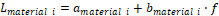
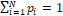

+----------------------------------+----------------------------------+
| 3GPP TR 38.859 V18.1.0 (2024-06) |                                  |
+==================================+==================================+
| Technical Report                 |                                  |
+----------------------------------+----------------------------------+
| 3rd Generation Partnership       |                                  |
| Project;                         |                                  |
|                                  |                                  |
| Technical Specification Group    |                                  |
| Radio Access Network;            |                                  |
|                                  |                                  |
| Study on Expanded and Improved   |                                  |
| NR Positioning;                  |                                  |
|                                  |                                  |
| (Release 18)                     |                                  |
+----------------------------------+----------------------------------+
|                                  |                                  |
+----------------------------------+----------------------------------+
| {width="1.4104166666666667in" | png){width="1.773611111111111in" |
| height="0.86875in"}              | height="1.0416666666666667in"}   |
+----------------------------------+----------------------------------+
|                                  |                                  |
+----------------------------------+----------------------------------+
| The present document has been    |                                  |
| developed within the 3rd         |                                  |
| Generation Partnership Project   |                                  |
| (3GPP ^TM^) and may be further   |                                  |
| elaborated for the purposes of   |                                  |
| 3GPP.\                           |                                  |
| The present document has not     |                                  |
| been subject to any approval     |                                  |
| process by the 3GPP              |                                  |
| Organizational Partners and      |                                  |
| shall not be implemented.\       |                                  |
| This Specification is provided   |                                  |
| for future development work      |                                  |
| within 3GPP only. The            |                                  |
| Organizational Partners accept   |                                  |
| no liability for any use of this |                                  |
| Specification.\                  |                                  |
| Specifications and Reports for   |                                  |
| implementation of the 3GPP ^TM^  |                                  |
| system should be obtained via    |                                  |
| the 3GPP Organizational          |                                  |
| Partners\' Publications Offices. |                                  |
+----------------------------------+----------------------------------+

+----------------------------------------------------------------------+
|                                                                      |
+======================================================================+
| > ***3GPP***                                                         |
| >                                                                    |
| > Postal address                                                     |
| >                                                                    |
| > 3GPP support office address                                        |
| >                                                                    |
| > 650 Route des Lucioles - Sophia Antipolis                          |
| >                                                                    |
| > Valbonne - FRANCE                                                  |
| >                                                                    |
| > Tel.: +33 4 92 94 42 00 Fax: +33 4 93 65 47 16                     |
| >                                                                    |
| > Internet                                                           |
| >                                                                    |
| > http://www.3gpp.org                                                |
+----------------------------------------------------------------------+
| ***Copyright Notification***                                         |
|                                                                      |
| No part may be reproduced except as authorized by written            |
| permission.\                                                         |
| The copyright and the foregoing restriction extend to reproduction   |
| in all media.                                                        |
|                                                                      |
| © 2024, 3GPP Organizational Partners (ARIB, ATIS, CCSA, ETSI, TSDSI, |
| TTA, TTC).                                                           |
|                                                                      |
| All rights reserved.                                                 |
|                                                                      |
| UMTS™ is a Trade Mark of ETSI registered for the benefit of its      |
| members                                                              |
|                                                                      |
| 3GPP™ is a Trade Mark of ETSI registered for the benefit of its      |
| Members and of the 3GPP Organizational Partners\                     |
| LTE™ is a Trade Mark of ETSI registered for the benefit of its       |
| Members and of the 3GPP Organizational Partners                      |
|                                                                      |
| GSM® and the GSM logo are registered and owned by the GSM            |
| Association                                                          |
+----------------------------------------------------------------------+

B.4 Evaluation results for NR carrier phase positioning 
=======================================================

B.4.1 Results from source \[81\]
--------------------------------

### B.4.1.1 Description of evaluation scenarios

Evaluation scenarios, key technologies, and assumptions for performance
analysis of NR carrier phase positioning in perfect scenarios are
provided in Table B.4.1.1-1.

Evaluation scenarios, key technologies, and assumptions for performance
analysis of NR carrier phase positioning with the TRP ARP error are
provided in Table B.4.1.1-2.

Evaluation scenarios, key technologies, and assumptions for performance
analysis of NR carrier phase positioning with the CFO and
Oscillator-drift are provided in Table B.4.1.1-3.

Evaluation scenarios, key technologies, and assumptions for performance
analysis of NR carrier phase positioning with the PCO are provided in
Table B.4.1.1-4.

Evaluation scenarios, key technologies, and assumptions for performance
analysis of NR carrier phase positioning with the initial phase offset
are provided in Table B.4.1.1-5.

Evaluation scenarios, key technologies, and assumptions for performance
analysis of NR carrier phase positioning with the TRP ARP error,
frequency error, PCO, and initial phase offset are provided in Table
B.4.1.1-6.

Figure B.4.1.1 presents the PRU setting in all double differential
evaluation cases in Section B.4.1 (Note: For the positioning of a target
UE, only a single PRU with LOS to TRPs was selected for double
differential operation). The value of D, W and L in InF-SH and InF-DH
scenarios are given by TR 38.901.

Figure B.4.1.1*:* PRU setting for double differential operation

Table B.4.1.1-1: NR carrier phase positioning enhancements - evaluation
scenarios and parameters in perfect scenarios from \[81\]

<table>
<thead>
<tr class="header">
<th>Parameter</th>
<th>[Case 1], [InF-SH]</th>
<th>[Case 2], [InF-SH]</th>
<th>[Case 3], [InF-SH]</th>
<th>[Case 4], [InF-SH]</th>
<th>[Case 5], [InF-SH]</th>
<th>[Case 6], [InF-DH]</th>
<th>[Case 7], [InF-DH]</th>
<th>[Case 8], [InF-DH]</th>
<th>[Case 9], [InF-DH]</th>
</tr>
</thead>
<tbody>
<tr class="odd">
<td>
Scenario

[TR 38.855, TR 38.857]
</td>
<td>38.857</td>
<td>38.857</td>
<td>38.857</td>
<td>38.857</td>
<td>38.857</td>
<td>38.857</td>
<td>38.857</td>
<td>38.857</td>
<td>38.857</td>
</tr>
<tr class="even">
<td>Single carrier frequency, or multiple carrier frequencies, GHz</td>
<td>
Single

3.5 GHz
</td>
<td>
Single

3.5 GHz
</td>
<td>
Single

3.5 GHz
</td>
<td>
Single

2.6 GHz
</td>
<td>Multiple, 3.45/3.55 GHz</td>
<td>
Single

3.5 GHz
</td>
<td>
Single

3.5 GHz
</td>
<td>
Single

3.5 GHz
</td>
<td>Multiple, 3.45/3.55 GHz</td>
</tr>
<tr class="odd">
<td>Bandwidth, MHz</td>
<td>100</td>
<td>100</td>
<td>100</td>
<td>100</td>
<td>100</td>
<td>100</td>
<td>100</td>
<td>100</td>
<td>100</td>
</tr>
<tr class="even">
<td>Subcarrier spacing, kHz</td>
<td>30</td>
<td>30</td>
<td>30</td>
<td>30</td>
<td>30</td>
<td>30</td>
<td>30</td>
<td>30</td>
<td>30</td>
</tr>
<tr class="odd">
<td>
RS signal descriptions

(PRS or posSRS, Number of OFDM symbols, Comb size)
</td>
<td>
PRS

Comb-6
</td>
<td>
PRS

Comb-6
</td>
<td>
PRS

Comb-6
</td>
<td>
PRS

Comb-6
</td>
<td>
PRS

Comb-6
</td>
<td>
PRS

Comb-6
</td>
<td>
PRS

Comb-6
</td>
<td>
PRS

Comb-6
</td>
<td>
PRS

Comb-6
</td>
</tr>
<tr class="even">
<td>
NR Carrier phase positioning method

(DL, UL, or DL+UL(RTT))
</td>
<td>None</td>
<td>DL-CPP</td>
<td>DL-CPP</td>
<td>DL-CPP</td>
<td>DL-CPP</td>
<td>DL-CPP</td>
<td>DL-CPP</td>
<td>DL-CPP</td>
<td>DL-CPP</td>
</tr>
<tr class="odd">
<td>
R16/R17 positioning method

(if it is used together with CPP)
</td>
<td>DL-TDOA</td>
<td>DL-TDOA</td>
<td>DL-TDOA</td>
<td>DL-TDOA</td>
<td>DL-TDOA</td>
<td>DL-TDOA</td>
<td>DL-TDOA</td>
<td>DL-TDOA</td>
<td>DL-TDOA</td>
</tr>
<tr class="even">
<td>
Carrier phase estimation techniques

(time-domain, freq-domain, references)
</td>
<td>None</td>
<td>freq-domain</td>
<td>freq-domain</td>
<td>freq-domain</td>
<td>freq-domain</td>
<td>freq-domain</td>
<td>freq-domain</td>
<td>freq-domain</td>
<td>freq-domain</td>
</tr>
<tr class="odd">
<td>
Differential positioning techniques if used

(e.g., single differential, double differential, etc.)
</td>
<td>double differential</td>
<td>None</td>
<td>double differential</td>
<td>double differential</td>
<td>double differential</td>
<td>double differential</td>
<td>None</td>
<td>double differential</td>
<td>double differential</td>
</tr>
<tr class="even">
<td>
Integer ambiguity resolution techniques

(e.g., virtual Integer ambiguity, LAMBDA, cost functions, Least squares, …)
</td>
<td>None</td>
<td>Integer least squares and cost functions</td>
<td>Integer least squares and cost functions</td>
<td>virtual Integer ambiguity</td>
<td>virtual Integer ambiguity</td>
<td>None</td>
<td>Integer least squares and cost functions</td>
<td>Integer least squares and cost functions</td>
<td>virtual Integer ambiguity</td>
</tr>
<tr class="odd">
<td>
Multipath mitigation techniques

(e.g., first path detection, ...)
</td>
<td>first path detection</td>
<td>first path detection</td>
<td>first path detection</td>
<td>first path detection</td>
<td>first path detection</td>
<td>first path detection</td>
<td>first path detection</td>
<td>first path detection</td>
<td>first path detection</td>
</tr>
<tr class="even">
<td>Single-measurement instance CPP, or multiple measurement instances CPP</td>
<td>Single-measurement</td>
<td>Single-measurement</td>
<td>Single-measurement</td>
<td>Single-measurement</td>
<td>Single-measurement</td>
<td>Single-measurement</td>
<td>Single-measurement</td>
<td>Single-measurement</td>
<td>Single-measurement</td>
</tr>
<tr class="odd">
<td>UE position calculation algorithm (e.g. Least squares, Taylor series, …)</td>
<td>Chan and Least squares</td>
<td>Chan and Least squares</td>
<td>Chan and Least squares</td>
<td>Chan and Least squares</td>
<td>Chan and Least squares</td>
<td>Chan and Least squares</td>
<td>Chan and Least squares</td>
<td>Chan and Least squares</td>
<td>Chan and Least squares</td>
</tr>
<tr class="even">
<td>Network synchronization assumption (e.g., 0ns, 10ns, ..)</td>
<td>0ns</td>
<td>0ns</td>
<td>0ns</td>
<td>0ns</td>
<td>0ns</td>
<td>0ns</td>
<td>0ns</td>
<td>0ns</td>
<td>0ns</td>
</tr>
<tr class="odd">
<td>UE/TRP Initial phase offset</td>
<td>0</td>
<td>0</td>
<td>0</td>
<td>0</td>
<td>0</td>
<td>0</td>
<td>0</td>
<td>0</td>
<td>0</td>
</tr>
<tr class="even">
<td>CFO/Doppler</td>
<td>0</td>
<td>0</td>
<td>0</td>
<td>0</td>
<td>0</td>
<td>0</td>
<td>0</td>
<td>0</td>
<td>0</td>
</tr>
<tr class="odd">
<td>Oscillator-drifts</td>
<td>0</td>
<td>0</td>
<td>0</td>
<td>0</td>
<td>0</td>
<td>0</td>
<td>0</td>
<td>0</td>
<td>0</td>
</tr>
<tr class="even">
<td>ARP errors</td>
<td>0</td>
<td>0</td>
<td>0</td>
<td>0</td>
<td>0</td>
<td>0</td>
<td>0</td>
<td>0</td>
<td>0</td>
</tr>
<tr class="odd">
<td>Phase Center Offsets</td>
<td>0</td>
<td>0</td>
<td>0</td>
<td>0</td>
<td>0</td>
<td>0</td>
<td>0</td>
<td>0</td>
<td>0</td>
</tr>
<tr class="even">
<td>Phase noise (FR2)</td>
<td>None</td>
<td>None</td>
<td>None</td>
<td>None</td>
<td>None</td>
<td>None</td>
<td>None</td>
<td>None</td>
<td>None</td>
</tr>
<tr class="odd">
<td><em>PRU assumptions</em> and additional notes, if any</td>
<td>Four PRUs with LOS channel</td>
<td>None</td>
<td>Four PRUs with LOS channel</td>
<td>Four PRUs with LOS channel</td>
<td>Four PRUs with LOS channel</td>
<td>Four PRUs with LOS channel</td>
<td>None</td>
<td>Four PRUs with LOS channel</td>
<td>Four PRUs with LOS channel</td>
</tr>
</tbody>
</table>

Table B.4.1.1-2: NR carrier phase positioning enhancements - evaluation
scenarios and parameters with the TRP ARP error from \[81\]

+-------+-------+-------+-------+-------+-------+-------+-------+-------+
| Para  | \     | \     | \     | \     | \     | \     | \     | \     |
| meter | [Case | [Case | [Case | [Case | [Case | [Case | [Case | [Case |
|       | 10\], | 11\], | 12\], | 13\], | 14\], | 15\], | 16\], | 17\], |
|       | \[InF | \[InF | \[InF | \[InF | \[InF | \[InF | \[InF | \[InF |
|       | -SH\] | -SH\] | -SH\] | -SH\] | -SH\] | -SH\] | -DH\] | -DH\] |
+=======+=======+=======+=======+=======+=======+=======+=======+=======+
| Sce   | 3     | 3     | 3     | 3     | 3     | 3     | 3     | 3     |
| nario | 8.857 | 8.857 | 8.857 | 8.857 | 8.857 | 8.857 | 8.857 | 8.857 |
|       |       |       |       |       |       |       |       |       |
| \[TS  |       |       |       |       |       |       |       |       |
| 38    |       |       |       |       |       |       |       |       |
| .855, |       |       |       |       |       |       |       |       |
| TS    |       |       |       |       |       |       |       |       |
| 38.   |       |       |       |       |       |       |       |       |
| 857\] |       |       |       |       |       |       |       |       |
+-------+-------+-------+-------+-------+-------+-------+-------+-------+
| S     | S     | S     | S     | Mult  | S     | Mult  | S     | Mult  |
| ingle | ingle | ingle | ingle | iple, | ingle | iple, | ingle | iple, |
| ca    |       |       |       | 3.45  |       | 3.45  |       | 3.45  |
| rrier | 3.5   | 3.5   | 2.6   | /3.55 | 3.5   | /3.55 | 3.5   | /3.55 |
| frequ | GHz   | GHz   | GHz   | GHz   | GHz   | GHz   | GHz   | GHz   |
| ency, |       |       |       |       |       |       |       |       |
| or    |       |       |       |       |       |       |       |       |
| mul   |       |       |       |       |       |       |       |       |
| tiple |       |       |       |       |       |       |       |       |
| ca    |       |       |       |       |       |       |       |       |
| rrier |       |       |       |       |       |       |       |       |
| fr    |       |       |       |       |       |       |       |       |
| equen |       |       |       |       |       |       |       |       |
| cies, |       |       |       |       |       |       |       |       |
| GHz   |       |       |       |       |       |       |       |       |
+-------+-------+-------+-------+-------+-------+-------+-------+-------+
| Bandw | 100   | 100   | 100   | 100   | 100   | 100   | 100   | 100   |
| idth, |       |       |       |       |       |       |       |       |
| MHz   |       |       |       |       |       |       |       |       |
+-------+-------+-------+-------+-------+-------+-------+-------+-------+
| Subca | 30    | 30    | 30    | 30    | 30    | 30    | 30    | 30    |
| rrier |       |       |       |       |       |       |       |       |
| spa   |       |       |       |       |       |       |       |       |
| cing, |       |       |       |       |       |       |       |       |
| kHz   |       |       |       |       |       |       |       |       |
+-------+-------+-------+-------+-------+-------+-------+-------+-------+
| RS    | PRS   | PRS   | PRS   | PRS   | PRS   | PRS   | PRS   | PRS   |
| s     |       |       |       |       |       |       |       |       |
| ignal | C     | C     | C     | C     | C     | C     | C     | C     |
| de    | omb-6 | omb-6 | omb-6 | omb-6 | omb-6 | omb-6 | omb-6 | omb-6 |
| scrip |       |       |       |       |       |       |       |       |
| tions |       |       |       |       |       |       |       |       |
|       |       |       |       |       |       |       |       |       |
| (PRS  |       |       |       |       |       |       |       |       |
| or    |       |       |       |       |       |       |       |       |
| po    |       |       |       |       |       |       |       |       |
| sSRS, |       |       |       |       |       |       |       |       |
| N     |       |       |       |       |       |       |       |       |
| umber |       |       |       |       |       |       |       |       |
| of    |       |       |       |       |       |       |       |       |
| OFDM  |       |       |       |       |       |       |       |       |
| sym   |       |       |       |       |       |       |       |       |
| bols, |       |       |       |       |       |       |       |       |
| Comb  |       |       |       |       |       |       |       |       |
| size) |       |       |       |       |       |       |       |       |
+-------+-------+-------+-------+-------+-------+-------+-------+-------+
| NR    | None  | D     | D     | D     | None  | D     | None  | D     |
| Ca    |       | L-CPP | L-CPP | L-CPP |       | L-CPP |       | L-CPP |
| rrier |       |       |       |       |       |       |       |       |
| phase |       |       |       |       |       |       |       |       |
| p     |       |       |       |       |       |       |       |       |
| ositi |       |       |       |       |       |       |       |       |
| oning |       |       |       |       |       |       |       |       |
| m     |       |       |       |       |       |       |       |       |
| ethod |       |       |       |       |       |       |       |       |
|       |       |       |       |       |       |       |       |       |
| (DL,  |       |       |       |       |       |       |       |       |
| UL,   |       |       |       |       |       |       |       |       |
| or    |       |       |       |       |       |       |       |       |
| D     |       |       |       |       |       |       |       |       |
| L+UL( |       |       |       |       |       |       |       |       |
| RTT)) |       |       |       |       |       |       |       |       |
+-------+-------+-------+-------+-------+-------+-------+-------+-------+
| R1    | DL    | DL    | DL    | DL    | DL    | DL    | DL    | DL    |
| 6/R17 | -TDOA | -TDOA | -TDOA | -TDOA | -TDOA | -TDOA | -TDOA | -TDOA |
| p     |       |       |       |       |       |       |       |       |
| ositi |       |       |       |       |       |       |       |       |
| oning |       |       |       |       |       |       |       |       |
| m     |       |       |       |       |       |       |       |       |
| ethod |       |       |       |       |       |       |       |       |
|       |       |       |       |       |       |       |       |       |
| (if   |       |       |       |       |       |       |       |       |
| it is |       |       |       |       |       |       |       |       |
| used  |       |       |       |       |       |       |       |       |
| tog   |       |       |       |       |       |       |       |       |
| ether |       |       |       |       |       |       |       |       |
| with  |       |       |       |       |       |       |       |       |
| CPP)  |       |       |       |       |       |       |       |       |
+-------+-------+-------+-------+-------+-------+-------+-------+-------+
| Ca    | None  | f     | f     | f     | None  | f     | None  | f     |
| rrier |       | req-d | req-d | req-d |       | req-d |       | req-d |
| phase |       | omain | omain | omain |       | omain |       | omain |
| estim |       |       |       |       |       |       |       |       |
| ation |       |       |       |       |       |       |       |       |
| techn |       |       |       |       |       |       |       |       |
| iques |       |       |       |       |       |       |       |       |
|       |       |       |       |       |       |       |       |       |
| (ti   |       |       |       |       |       |       |       |       |
| me-do |       |       |       |       |       |       |       |       |
| main, |       |       |       |       |       |       |       |       |
| fr    |       |       |       |       |       |       |       |       |
| eq-do |       |       |       |       |       |       |       |       |
| main, |       |       |       |       |       |       |       |       |
| r     |       |       |       |       |       |       |       |       |
| efere |       |       |       |       |       |       |       |       |
| nces) |       |       |       |       |       |       |       |       |
+-------+-------+-------+-------+-------+-------+-------+-------+-------+
| Di    | d     | d     | d     | d     | d     | d     | d     | d     |
| ffere | ouble | ouble | ouble | ouble | ouble | ouble | ouble | ouble |
| ntial | di    | di    | di    | di    | di    | di    | di    | di    |
| p     | ffere | ffere | ffere | ffere | ffere | ffere | ffere | ffere |
| ositi | ntial | ntial | ntial | ntial | ntial | ntial | ntial | ntial |
| oning |       |       |       |       |       |       |       |       |
| techn |       |       |       |       |       |       |       |       |
| iques |       |       |       |       |       |       |       |       |
| if    |       |       |       |       |       |       |       |       |
| used  |       |       |       |       |       |       |       |       |
|       |       |       |       |       |       |       |       |       |
| (     |       |       |       |       |       |       |       |       |
| e.g., |       |       |       |       |       |       |       |       |
| s     |       |       |       |       |       |       |       |       |
| ingle |       |       |       |       |       |       |       |       |
| dif   |       |       |       |       |       |       |       |       |
| feren |       |       |       |       |       |       |       |       |
| tial, |       |       |       |       |       |       |       |       |
| d     |       |       |       |       |       |       |       |       |
| ouble |       |       |       |       |       |       |       |       |
| dif   |       |       |       |       |       |       |       |       |
| feren |       |       |       |       |       |       |       |       |
| tial, |       |       |       |       |       |       |       |       |
| etc.) |       |       |       |       |       |       |       |       |
+-------+-------+-------+-------+-------+-------+-------+-------+-------+
| In    | None  | In    | vi    | vi    | None  | vi    | None  | vi    |
| teger |       | teger | rtual | rtual |       | rtual |       | rtual |
| ambi  |       | least | In    | In    |       | In    |       | In    |
| guity |       | sq    | teger | teger |       | teger |       | teger |
| resol |       | uares | ambi  | ambi  |       | ambi  |       | ambi  |
| ution |       | and   | guity | guity |       | guity |       | guity |
| techn |       | cost  |       |       |       |       |       |       |
| iques |       | func  |       |       |       |       |       |       |
|       |       | tions |       |       |       |       |       |       |
| (     |       |       |       |       |       |       |       |       |
| e.g., |       |       |       |       |       |       |       |       |
| vi    |       |       |       |       |       |       |       |       |
| rtual |       |       |       |       |       |       |       |       |
| In    |       |       |       |       |       |       |       |       |
| teger |       |       |       |       |       |       |       |       |
| ambig |       |       |       |       |       |       |       |       |
| uity, |       |       |       |       |       |       |       |       |
| LA    |       |       |       |       |       |       |       |       |
| MBDA, |       |       |       |       |       |       |       |       |
| cost  |       |       |       |       |       |       |       |       |
| funct |       |       |       |       |       |       |       |       |
| ions, |       |       |       |       |       |       |       |       |
| Least |       |       |       |       |       |       |       |       |
| squ   |       |       |       |       |       |       |       |       |
| ares, |       |       |       |       |       |       |       |       |
| ...)  |       |       |       |       |       |       |       |       |
+-------+-------+-------+-------+-------+-------+-------+-------+-------+
| Mult  | first | first | first | first | first | first | first | first |
| ipath | path  | path  | path  | path  | path  | path  | path  | path  |
| mitig | dete  | dete  | dete  | dete  | dete  | dete  | dete  | dete  |
| ation | ction | ction | ction | ction | ction | ction | ction | ction |
| techn |       |       |       |       |       |       |       |       |
| iques |       |       |       |       |       |       |       |       |
|       |       |       |       |       |       |       |       |       |
| (     |       |       |       |       |       |       |       |       |
| e.g., |       |       |       |       |       |       |       |       |
| first |       |       |       |       |       |       |       |       |
| path  |       |       |       |       |       |       |       |       |
| detec |       |       |       |       |       |       |       |       |
| tion, |       |       |       |       |       |       |       |       |
| \...) |       |       |       |       |       |       |       |       |
+-------+-------+-------+-------+-------+-------+-------+-------+-------+
| Sin   | Sin   | Sin   | Sin   | Sin   | Sin   | Sin   | Sin   | Sin   |
| gle-m | gle-m | gle-m | gle-m | gle-m | gle-m | gle-m | gle-m | gle-m |
| easur | easur | easur | easur | easur | easur | easur | easur | easur |
| ement | ement | ement | ement | ement | ement | ement | ement | ement |
| ins   |       |       |       |       |       |       |       |       |
| tance |       |       |       |       |       |       |       |       |
| CPP,  |       |       |       |       |       |       |       |       |
| or    |       |       |       |       |       |       |       |       |
| mul   |       |       |       |       |       |       |       |       |
| tiple |       |       |       |       |       |       |       |       |
| m     |       |       |       |       |       |       |       |       |
| easur |       |       |       |       |       |       |       |       |
| ement |       |       |       |       |       |       |       |       |
| inst  |       |       |       |       |       |       |       |       |
| ances |       |       |       |       |       |       |       |       |
| CPP   |       |       |       |       |       |       |       |       |
+-------+-------+-------+-------+-------+-------+-------+-------+-------+
| UE    | Chan  | Chan  | Chan  | Chan  | Chan  | Chan  | Chan  | Chan  |
| pos   | and   | and   | and   | and   | and   | and   | and   | and   |
| ition | Least | Least | Least | Least | Least | Least | Least | Least |
| c     | sq    | sq    | sq    | sq    | sq    | sq    | sq    | sq    |
| alcul | uares | uares | uares | uares | uares | uares | uares | uares |
| ation |       |       |       |       |       |       |       |       |
| algo  |       |       |       |       |       |       |       |       |
| rithm |       |       |       |       |       |       |       |       |
| (e.g. |       |       |       |       |       |       |       |       |
| Least |       |       |       |       |       |       |       |       |
| squ   |       |       |       |       |       |       |       |       |
| ares, |       |       |       |       |       |       |       |       |
| T     |       |       |       |       |       |       |       |       |
| aylor |       |       |       |       |       |       |       |       |
| se    |       |       |       |       |       |       |       |       |
| ries, |       |       |       |       |       |       |       |       |
| ...)  |       |       |       |       |       |       |       |       |
+-------+-------+-------+-------+-------+-------+-------+-------+-------+
| Ne    | 0ns   | 0ns   | 0ns   | 0ns   | 0ns   | 0ns   | 0ns   | 0ns   |
| twork |       |       |       |       |       |       |       |       |
| synch |       |       |       |       |       |       |       |       |
| roniz |       |       |       |       |       |       |       |       |
| ation |       |       |       |       |       |       |       |       |
| assum |       |       |       |       |       |       |       |       |
| ption |       |       |       |       |       |       |       |       |
| (     |       |       |       |       |       |       |       |       |
| e.g., |       |       |       |       |       |       |       |       |
| 0ns,  |       |       |       |       |       |       |       |       |
| 10ns, |       |       |       |       |       |       |       |       |
| ..)   |       |       |       |       |       |       |       |       |
+-------+-------+-------+-------+-------+-------+-------+-------+-------+
| U     | 0     | 0     | 0     | 0     | 0     | 0     | 0     | 0     |
| E/TRP |       |       |       |       |       |       |       |       |
| In    |       |       |       |       |       |       |       |       |
| itial |       |       |       |       |       |       |       |       |
| phase |       |       |       |       |       |       |       |       |
| o     |       |       |       |       |       |       |       |       |
| ffset |       |       |       |       |       |       |       |       |
+-------+-------+-------+-------+-------+-------+-------+-------+-------+
| C     | 0     | 0     | 0     | 0     | 0     | 0     | 0     | 0     |
| FO/Do |       |       |       |       |       |       |       |       |
| ppler |       |       |       |       |       |       |       |       |
+-------+-------+-------+-------+-------+-------+-------+-------+-------+
| *O*   | 0     | 0     | 0     | 0     | 0     | 0     | 0     | 0     |
| *scil |       |       |       |       |       |       |       |       |
| lator |       |       |       |       |       |       |       |       |
| -drif |       |       |       |       |       |       |       |       |
| ts*** |       |       |       |       |       |       |       |       |
+-------+-------+-------+-------+-------+-------+-------+-------+-------+
| ARP   | 1cm   | 1cm   | 1cm   | 1cm   | 5cm   | 5cm   | 1cm   | 1cm   |
| e     |       |       |       |       |       |       |       |       |
| rrors |       |       |       |       |       |       |       |       |
+-------+-------+-------+-------+-------+-------+-------+-------+-------+
| Phase | 0     | 0     | 0     | 0     | 0     | 0     | 0     | 0     |
| C     |       |       |       |       |       |       |       |       |
| enter |       |       |       |       |       |       |       |       |
| Of    |       |       |       |       |       |       |       |       |
| fsets |       |       |       |       |       |       |       |       |
+-------+-------+-------+-------+-------+-------+-------+-------+-------+
| Phase | None  | None  | None  | None  | None  | None  | None  | None  |
| noise |       |       |       |       |       |       |       |       |
| (FR2) |       |       |       |       |       |       |       |       |
+-------+-------+-------+-------+-------+-------+-------+-------+-------+
| Addit | Four  | Four  | Four  | Four  | Four  | Four  | Four  | Four  |
| ional | PRUs  | PRUs  | PRUs  | PRUs  | PRUs  | PRUs  | PRUs  | PRUs  |
| n     | with  | with  | with  | with  | with  | with  | with  | with  |
| otes, | LOS   | LOS   | LOS   | LOS   | LOS   | LOS   | LOS   | LOS   |
| if    | ch    | ch    | ch    | ch    | ch    | ch    | ch    | ch    |
| any   | annel | annel | annel | annel | annel | annel | annel | annel |
+-------+-------+-------+-------+-------+-------+-------+-------+-------+

Table B.4.1.1-3: NR carrier phase positioning enhancements - evaluation
scenarios and parameters with the CFO and Oscillator-drift from \[81\]

+----------------------+----------------------+----------------------+
| **Parameter**        | **\[Case 18\],       | **\[Case 19\],       |
|                      | \[InF-SH\]**         | \[InF-DH\]**         |
+======================+======================+======================+
| Scenario             | 38.857               | 38.857               |
|                      |                      |                      |
| \[TS 38.855, TS      |                      |                      |
| 38.857\]             |                      |                      |
+----------------------+----------------------+----------------------+
| Single carrier       | Single               | Single               |
| frequency, or        |                      |                      |
| multiple carrier     | 3.5 GHz              | 3.5 GHz              |
| frequencies, GHz     |                      |                      |
+----------------------+----------------------+----------------------+
| Bandwidth, MHz       | 100                  | 100                  |
+----------------------+----------------------+----------------------+
| Subcarrier spacing,  | 30                   | 30                   |
| kHz                  |                      |                      |
+----------------------+----------------------+----------------------+
| RS signal            | PRS                  | PRS                  |
| descriptions         |                      |                      |
|                      | Comb-6               | Comb-6               |
| (PRS or posSRS,      |                      |                      |
| Number of OFDM       |                      |                      |
| symbols, Comb size)  |                      |                      |
+----------------------+----------------------+----------------------+
| NR Carrier phase     | DL-CPP               | DL-CPP               |
| positioning method   |                      |                      |
|                      |                      |                      |
| (DL, UL, or          |                      |                      |
| DL+UL(RTT))          |                      |                      |
+----------------------+----------------------+----------------------+
| R16/R17 positioning  | DL-TDOA              | DL-TDOA              |
| method               |                      |                      |
|                      |                      |                      |
| (if it is used       |                      |                      |
| together with CPP)   |                      |                      |
+----------------------+----------------------+----------------------+
| Carrier phase        | freq-domain          | freq-domain          |
| estimation           |                      |                      |
| techniques           |                      |                      |
|                      |                      |                      |
| (time-domain,        |                      |                      |
| freq-domain,         |                      |                      |
| references)          |                      |                      |
+----------------------+----------------------+----------------------+
| Differential         | double differential  | double differential  |
| positioning          |                      |                      |
| techniques if used   |                      |                      |
|                      |                      |                      |
| (e.g., single        |                      |                      |
| differential, double |                      |                      |
| differential, etc.)  |                      |                      |
+----------------------+----------------------+----------------------+
| Integer ambiguity    | Integer least        | Integer least        |
| resolution           | squares and cost     | squares and cost     |
| techniques           | functions            | functions            |
|                      |                      |                      |
| (e.g., virtual       |                      |                      |
| Integer ambiguity,   |                      |                      |
| LAMBDA, cost         |                      |                      |
| functions, Least     |                      |                      |
| squares, ...)        |                      |                      |
+----------------------+----------------------+----------------------+
| Multipath mitigation | first path detection | first path detection |
| techniques           |                      |                      |
|                      |                      |                      |
| (e.g., first path    |                      |                      |
| detection, \...)     |                      |                      |
+----------------------+----------------------+----------------------+
| Single-measurement   | Single-measurement   | Single-measurement   |
| instance CPP, or     |                      |                      |
| multiple measurement |                      |                      |
| instances CPP        |                      |                      |
+----------------------+----------------------+----------------------+
| UE position          | Chan and Least       | Chan and Least       |
| calculation          | squares              | squares              |
| algorithm (e.g.      |                      |                      |
| Least squares,       |                      |                      |
| Taylor series, ...)  |                      |                      |
+----------------------+----------------------+----------------------+
| Network              | 0ns                  | 0ns                  |
| synchronization      |                      |                      |
| assumption (e.g.,    |                      |                      |
| 0ns, 10ns, ..)       |                      |                      |
+----------------------+----------------------+----------------------+
| UE/TRP Initial phase | 0                    | 0                    |
| offset               |                      |                      |
+----------------------+----------------------+----------------------+
| CFO/Doppler          | **\[-100, +100\] Hz  | **\[-100, +100\] Hz  |
|                      | for UE;**            | for UE;**            |
|                      |                      |                      |
|                      | **\[-10, +10\] Hz    | **\[-10, +10\] Hz    |
|                      | for TRP**            | for TRP**            |
+----------------------+----------------------+----------------------+
| *O*                  | \[-0.1, 0.1\] ppm    | \[-0.1, 0.1\] ppm    |
| *scillator-drifts*** | for UE, \[-0.02,     | for UE, \[-0.02,     |
|                      | +0.02\] ppm for TRP  | +0.02\] ppm for TRP  |
+----------------------+----------------------+----------------------+
| ARP errors           | 0                    | 0                    |
+----------------------+----------------------+----------------------+
| Phase Center Offsets | 0                    | 0                    |
+----------------------+----------------------+----------------------+
| Phase noise (FR2)    | None                 | None                 |
+----------------------+----------------------+----------------------+
| Additional notes, if | Four PRUs with LOS   | Four PRUs with LOS   |
| any                  | channel              | channel              |
+----------------------+----------------------+----------------------+

Table B.4.1.1-4: NR carrier phase positioning enhancements - evaluation
scenarios and parameters with the PCO from \[81\]

+-------------+-------------+-------------+-------------+-------------+
| **          | **\[Case    | **\[Case    | **\[Case    | **\[Case    |
| Parameter** | 20\],       | 21\],       | 22\],       | 23\],       |
|             | \           | \           | \           | \           |
|             | [InF-SH\]** | [InF-SH\]** | [InF-DH\]** | [InF-DH\]** |
+=============+=============+=============+=============+=============+
| Scenario    | 38.857      | 38.857      | 38.857      | 38.857      |
|             |             |             |             |             |
| \[TS        |             |             |             |             |
| 38.855, TS  |             |             |             |             |
| 38.857\]    |             |             |             |             |
+-------------+-------------+-------------+-------------+-------------+
| Single      | Multiple,   | Multiple,   | Multiple,   | Multiple,   |
| carrier     | 3.45/3.55   | 3.45/3.55   | 3.45/3.55   | 3.45/3.55   |
| frequency,  | GHz         | GHz         | GHz         | GHz         |
| or multiple |             |             |             |             |
| carrier     |             |             |             |             |
| f           |             |             |             |             |
| requencies, |             |             |             |             |
| GHz         |             |             |             |             |
+-------------+-------------+-------------+-------------+-------------+
| Bandwidth,  | 100         | 100         | 100         | 100         |
| MHz         |             |             |             |             |
+-------------+-------------+-------------+-------------+-------------+
| Subcarrier  | 30          | 30          | 30          | 30          |
| spacing,    |             |             |             |             |
| kHz         |             |             |             |             |
+-------------+-------------+-------------+-------------+-------------+
| RS signal   | PRS         | PRS         | PRS         | PRS         |
| d           |             |             |             |             |
| escriptions | Comb-6      | Comb-6      | Comb-6      | Comb-6      |
|             |             |             |             |             |
| (PRS or     |             |             |             |             |
| posSRS,     |             |             |             |             |
| Number of   |             |             |             |             |
| OFDM        |             |             |             |             |
| symbols,    |             |             |             |             |
| Comb size)  |             |             |             |             |
+-------------+-------------+-------------+-------------+-------------+
| NR Carrier  | DL-CPP      | DL-CPP      | DL-CPP      | DL-CPP      |
| phase       |             |             |             |             |
| positioning |             |             |             |             |
| method      |             |             |             |             |
|             |             |             |             |             |
| (DL, UL, or |             |             |             |             |
| DL+UL(RTT)) |             |             |             |             |
+-------------+-------------+-------------+-------------+-------------+
| R16/R17     | DL-TDOA     | DL-TDOA     | DL-TDOA     | DL-TDOA     |
| positioning |             |             |             |             |
| method      |             |             |             |             |
|             |             |             |             |             |
| (if it is   |             |             |             |             |
| used        |             |             |             |             |
| together    |             |             |             |             |
| with CPP)   |             |             |             |             |
+-------------+-------------+-------------+-------------+-------------+
| Carrier     | freq-domain | freq-domain | freq-domain | freq-domain |
| phase       |             |             |             |             |
| estimation  |             |             |             |             |
| techniques  |             |             |             |             |
|             |             |             |             |             |
| (t          |             |             |             |             |
| ime-domain, |             |             |             |             |
| f           |             |             |             |             |
| req-domain, |             |             |             |             |
| references) |             |             |             |             |
+-------------+-------------+-------------+-------------+-------------+
| D           | double      | double      | double      | double      |
| ifferential | d           | d           | d           | d           |
| positioning | ifferential | ifferential | ifferential | ifferential |
| techniques  |             |             |             |             |
| if used     |             |             |             |             |
|             |             |             |             |             |
| (e.g.,      |             |             |             |             |
| single      |             |             |             |             |
| di          |             |             |             |             |
| fferential, |             |             |             |             |
| double      |             |             |             |             |
| di          |             |             |             |             |
| fferential, |             |             |             |             |
| etc.)       |             |             |             |             |
+-------------+-------------+-------------+-------------+-------------+
| Integer     | virtual     | virtual     | virtual     | virtual     |
| ambiguity   | Integer     | Integer     | Integer     | Integer     |
| resolution  | ambiguity   | ambiguity   | ambiguity   | ambiguity   |
| techniques  |             |             |             |             |
|             |             |             |             |             |
| (e.g.,      |             |             |             |             |
| virtual     |             |             |             |             |
| Integer     |             |             |             |             |
| ambiguity,  |             |             |             |             |
| LAMBDA,     |             |             |             |             |
| cost        |             |             |             |             |
| functions,  |             |             |             |             |
| Least       |             |             |             |             |
| squares,    |             |             |             |             |
| ...)        |             |             |             |             |
+-------------+-------------+-------------+-------------+-------------+
| Multipath   | first path  | first path  | first path  | first path  |
| mitigation  | detection   | detection   | detection   | detection   |
| techniques  |             |             |             |             |
|             |             |             |             |             |
| (e.g.,      |             |             |             |             |
| first path  |             |             |             |             |
| detection,  |             |             |             |             |
| \...)       |             |             |             |             |
+-------------+-------------+-------------+-------------+-------------+
| Single-     | Single-     | Single-     | Single-     | Single-     |
| measurement | measurement | measurement | measurement | measurement |
| instance    |             |             |             |             |
| CPP, or     |             |             |             |             |
| multiple    |             |             |             |             |
| measurement |             |             |             |             |
| instances   |             |             |             |             |
| CPP         |             |             |             |             |
+-------------+-------------+-------------+-------------+-------------+
| UE position | Chan and    | Chan and    | Chan and    | Chan and    |
| calculation | Least       | Least       | Least       | Least       |
| algorithm   | squares     | squares     | squares     | squares     |
| (e.g. Least |             |             |             |             |
| squares,    |             |             |             |             |
| Taylor      |             |             |             |             |
| series,     |             |             |             |             |
| ...)        |             |             |             |             |
+-------------+-------------+-------------+-------------+-------------+
| Network     | 0ns         | 0ns         | 0ns         | 0ns         |
| sync        |             |             |             |             |
| hronization |             |             |             |             |
| assumption  |             |             |             |             |
| (e.g., 0ns, |             |             |             |             |
| 10ns, ..)   |             |             |             |             |
+-------------+-------------+-------------+-------------+-------------+
| UE/TRP      | 0           | 0           | 0           | 0           |
| Initial     |             |             |             |             |
| phase       |             |             |             |             |
| offset      |             |             |             |             |
+-------------+-------------+-------------+-------------+-------------+
| CFO/Doppler | 0           | 0           | 0           | 0           |
+-------------+-------------+-------------+-------------+-------------+
| *           | 0           | 0           | 0           | 0           |
| O**scillato |             |             |             |             |
| r-drifts*** |             |             |             |             |
+-------------+-------------+-------------+-------------+-------------+
| ARP errors  | 0           | 0           | 0           | 0           |
+-------------+-------------+-------------+-------------+-------------+
| Phase       | dPhi in     | dPhi in     | dPhi in     | dPhi in     |
| Center      | example 1   | example 1   | example 1   | example 1   |
| Offsets     |             |             |             |             |
|             | a=3,        | a=3,        | a=3,        | a=3,        |
|             | w=\[-5deg,  | w=\[-10deg, | w=\[-5deg,  | w=\[-10deg, |
|             | 5deg\]      | 10deg\]     | 5deg\]      | 10deg\]     |
+-------------+-------------+-------------+-------------+-------------+
| Phase noise | None        | None        | None        | None        |
| (FR2)       |             |             |             |             |
+-------------+-------------+-------------+-------------+-------------+
| Additional  | Four PRUs   | Four PRUs   | Four PRUs   | Four PRUs   |
| notes, if   | with LOS    | with LOS    | with LOS    | with LOS    |
| any         | channel     | channel     | channel     | channel     |
+-------------+-------------+-------------+-------------+-------------+

Table B.4.1.1-5: NR carrier phase positioning enhancements - evaluation
scenarios and parameters with the initial phase offset from \[81\]

+----------------+----------------+----------------+----------------+
| **Parameter**  | **\[Case 24\], | **\[Case 25\], | **\[Case 26\], |
|                | \[InF-SH\]**   | \[InF-SH\]**   | \[InF-DH\]**   |
+================+================+================+================+
| Scenario       | 38.857         | 38.857         | 38.857         |
|                |                |                |                |
| \[TS 38.855,   |                |                |                |
| TS 38.857\]    |                |                |                |
+----------------+----------------+----------------+----------------+
| Single carrier | Single         | Single         | Single         |
| frequency, or  |                |                |                |
| multiple       | 3.5 GHz        | 3.5 GHz        | 3.5 GHz        |
| carrier        |                |                |                |
| frequencies,   |                |                |                |
| GHz            |                |                |                |
+----------------+----------------+----------------+----------------+
| Bandwidth, MHz | 100            | 100            | 100            |
+----------------+----------------+----------------+----------------+
| Subcarrier     | 30             | 30             | 30             |
| spacing, kHz   |                |                |                |
+----------------+----------------+----------------+----------------+
| RS signal      | PRS            | PRS            | PRS            |
| descriptions   |                |                |                |
|                | Comb-6         | Comb-6         | Comb-6         |
| (PRS or        |                |                |                |
| posSRS, Number |                |                |                |
| of OFDM        |                |                |                |
| symbols, Comb  |                |                |                |
| size)          |                |                |                |
+----------------+----------------+----------------+----------------+
| NR Carrier     | DL-CPP         | DL-CPP         | DL-CPP         |
| phase          |                |                |                |
| positioning    |                |                |                |
| method         |                |                |                |
|                |                |                |                |
| (DL, UL, or    |                |                |                |
| DL+UL(RTT))    |                |                |                |
+----------------+----------------+----------------+----------------+
| R16/R17        | DL-TDOA        | DL-TDOA        | DL-TDOA        |
| positioning    |                |                |                |
| method         |                |                |                |
|                |                |                |                |
| (if it is used |                |                |                |
| together with  |                |                |                |
| CPP)           |                |                |                |
+----------------+----------------+----------------+----------------+
| Carrier phase  | freq-domain    | freq-domain    | freq-domain    |
| estimation     |                |                |                |
| techniques     |                |                |                |
|                |                |                |                |
| (time-domain,  |                |                |                |
| freq-domain,   |                |                |                |
| references)    |                |                |                |
+----------------+----------------+----------------+----------------+
| Differential   | single         | double         | double         |
| positioning    | differential   | differential   | differential   |
| techniques if  |                |                |                |
| used           |                |                |                |
|                |                |                |                |
| (e.g., single  |                |                |                |
| differential,  |                |                |                |
| double         |                |                |                |
| differential,  |                |                |                |
| etc.)          |                |                |                |
+----------------+----------------+----------------+----------------+
| Integer        | Integer least  | Integer least  | Integer least  |
| ambiguity      | squares and    | squares and    | squares and    |
| resolution     | cost functions | cost functions | cost functions |
| techniques     |                |                |                |
|                |                |                |                |
| (e.g., virtual |                |                |                |
| Integer        |                |                |                |
| ambiguity,     |                |                |                |
| LAMBDA, cost   |                |                |                |
| functions,     |                |                |                |
| Least squares, |                |                |                |
| ...)           |                |                |                |
+----------------+----------------+----------------+----------------+
| Multipath      | first path     | first path     | first path     |
| mitigation     | detection      | detection      | detection      |
| techniques     |                |                |                |
|                |                |                |                |
| (e.g., first   |                |                |                |
| path           |                |                |                |
| detection,     |                |                |                |
| \...)          |                |                |                |
+----------------+----------------+----------------+----------------+
| Sing           | Sing           | Sing           | Sing           |
| le-measurement | le-measurement | le-measurement | le-measurement |
| instance CPP,  |                |                |                |
| or multiple    |                |                |                |
| measurement    |                |                |                |
| instances CPP  |                |                |                |
+----------------+----------------+----------------+----------------+
| UE position    | Chan and Least | Chan and Least | Chan and Least |
| calculation    | squares        | squares        | squares        |
| algorithm      |                |                |                |
| (e.g. Least    |                |                |                |
| squares,       |                |                |                |
| Taylor series, |                |                |                |
| ...)           |                |                |                |
+----------------+----------------+----------------+----------------+
| Network        | 0ns            | 0ns            | 0ns            |
| s              |                |                |                |
| ynchronization |                |                |                |
| assumption     |                |                |                |
| (e.g., 0ns,    |                |                |                |
| 10ns, ..)      |                |                |                |
+----------------+----------------+----------------+----------------+
| UE/TRP Initial | UE and TRP     | UE and TRP     | UE and TRP     |
| phase offset   | Initial phase  | Initial phase  | Initial phase  |
|                | offset         | offset         | offset         |
+----------------+----------------+----------------+----------------+
| CFO/Doppler    | 0              | 0              | 0              |
+----------------+----------------+----------------+----------------+
| *O**scill      | 0              | 0              | 0              |
| ator-drifts*** |                |                |                |
+----------------+----------------+----------------+----------------+
| ARP errors     | 0              | 0              | 0              |
+----------------+----------------+----------------+----------------+
| Phase Center   | 0              | 0              | 0              |
| Offsets        |                |                |                |
+----------------+----------------+----------------+----------------+
| Phase noise    | None           | None           | None           |
| (FR2)          |                |                |                |
+----------------+----------------+----------------+----------------+
| Additional     | Four PRUs with | Four PRUs with | Four PRUs with |
| notes, if any  | LOS channel    | LOS channel    | LOS channel    |
+----------------+----------------+----------------+----------------+

Table B.4.1.1-6: NR carrier phase positioning enhancements - evaluation
scenarios and parameters with TRP ARP error, frequency error, PCO, and
initial phase offset from \[81\]

+----------------+----------------+----------------+----------------+
| **Parameter**  | **\[Case 27\], | **\[Case 28\], | **\[Case 29\], |
|                | \[InF-SH\]**   | \[InF-SH\]**   | \[InF-DH\]**   |
+================+================+================+================+
| Scenario       | 38.857         | 38.857         | 38.857         |
|                |                |                |                |
| \[TS 38.855,   |                |                |                |
| TS 38.857\]    |                |                |                |
+----------------+----------------+----------------+----------------+
| Single carrier | Single, 2.6    | Multiple,      | Multiple,      |
| frequency, or  | GHz            | 3.45/3.55 GHz  | 3.45/3.55 GHz  |
| multiple       |                |                |                |
| carrier        |                |                |                |
| frequencies,   |                |                |                |
| GHz            |                |                |                |
+----------------+----------------+----------------+----------------+
| Bandwidth, MHz | 100            | 100            | 100            |
+----------------+----------------+----------------+----------------+
| Subcarrier     | 30             | 30             | 30             |
| spacing, kHz   |                |                |                |
+----------------+----------------+----------------+----------------+
| RS signal      | PRS            | PRS            | PRS            |
| descriptions   |                |                |                |
|                | Comb-6         | Comb-6         | Comb-6         |
| (PRS or        |                |                |                |
| posSRS, Number |                |                |                |
| of OFDM        |                |                |                |
| symbols, Comb  |                |                |                |
| size)          |                |                |                |
+----------------+----------------+----------------+----------------+
| NR Carrier     | DL-CPP         | DL-CPP         | DL-CPP         |
| phase          |                |                |                |
| positioning    |                |                |                |
| method         |                |                |                |
|                |                |                |                |
| (DL, UL, or    |                |                |                |
| DL+UL(RTT))    |                |                |                |
+----------------+----------------+----------------+----------------+
| R16/R17        | DL-TDOA        | DL-TDOA        | DL-TDOA        |
| positioning    |                |                |                |
| method         |                |                |                |
|                |                |                |                |
| (if it is used |                |                |                |
| together with  |                |                |                |
| CPP)           |                |                |                |
+----------------+----------------+----------------+----------------+
| Carrier phase  | freq-domain    | freq-domain    | freq-domain    |
| estimation     |                |                |                |
| techniques     |                |                |                |
|                |                |                |                |
| (time-domain,  |                |                |                |
| freq-domain,   |                |                |                |
| references)    |                |                |                |
+----------------+----------------+----------------+----------------+
| Differential   | double         | double         | double         |
| positioning    | differential   | differential   | differential   |
| techniques if  |                |                |                |
| used           |                |                |                |
|                |                |                |                |
| (e.g., single  |                |                |                |
| differential,  |                |                |                |
| double         |                |                |                |
| differential,  |                |                |                |
| etc.)          |                |                |                |
+----------------+----------------+----------------+----------------+
| Integer        | virtual        | virtual        | virtual        |
| ambiguity      | Integer        | Integer        | Integer        |
| resolution     | ambiguity      | ambiguity      | ambiguity      |
| techniques     |                |                |                |
|                |                |                |                |
| (e.g., virtual |                |                |                |
| Integer        |                |                |                |
| ambiguity,     |                |                |                |
| LAMBDA, cost   |                |                |                |
| functions,     |                |                |                |
| Least squares, |                |                |                |
| ...)           |                |                |                |
+----------------+----------------+----------------+----------------+
| Multipath      | first path     | first path     | first path     |
| mitigation     | detection      | detection      | detection      |
| techniques     |                |                |                |
|                |                |                |                |
| (e.g., first   |                |                |                |
| path           |                |                |                |
| detection,     |                |                |                |
| \...)          |                |                |                |
+----------------+----------------+----------------+----------------+
| Sing           | Sing           | Sing           | Sing           |
| le-measurement | le-measurement | le-measurement | le-measurement |
| instance CPP,  |                |                |                |
| or multiple    |                |                |                |
| measurement    |                |                |                |
| instances CPP  |                |                |                |
+----------------+----------------+----------------+----------------+
| UE position    | Chan and Least | Chan and Least | Chan and Least |
| calculation    | squares        | squares        | squares        |
| algorithm      |                |                |                |
| (e.g. Least    |                |                |                |
| squares,       |                |                |                |
| Taylor series, |                |                |                |
| ...)           |                |                |                |
+----------------+----------------+----------------+----------------+
| Network        | 0ns            | 0ns            | 0ns            |
| s              |                |                |                |
| ynchronization |                |                |                |
| assumption     |                |                |                |
| (e.g., 0ns,    |                |                |                |
| 10ns, ..)      |                |                |                |
+----------------+----------------+----------------+----------------+
| UE/TRP Initial | UE and TRP     | UE and TRP     | UE and TRP     |
| phase offset   | Initial phase  | Initial phase  | Initial phase  |
|                | offset         | offset         | offset         |
+----------------+----------------+----------------+----------------+
| CFO/Doppler    | **\[-100,      | **\[-100,      | **\[-100,      |
|                | +100\] Hz for  | +100\] Hz for  | +100\] Hz for  |
|                | UE;**          | UE;**          | UE;**          |
|                |                |                |                |
|                | **\[-10, +10\] | **\[-10, +10\] | **\[-10, +10\] |
|                | Hz for TRP**   | Hz for TRP**   | Hz for TRP**   |
+----------------+----------------+----------------+----------------+
| *O**scill      | \[-0.1, 0.1\]  | \[-0.1, 0.1\]  | \[-0.1, 0.1\]  |
| ator-drifts*** | ppm for UE,    | ppm for UE,    | ppm for UE,    |
|                | \[-0.02,       | \[-0.02,       | \[-0.02,       |
|                | +0.02\] ppm    | +0.02\] ppm    | +0.02\] ppm    |
|                | for TRP        | for TRP        | for TRP        |
+----------------+----------------+----------------+----------------+
| ARP errors     | 1cm            | 1cm            | 1cm            |
+----------------+----------------+----------------+----------------+
| Phase Center   | dPhi in        | dPhi in        | dPhi in        |
| Offsets        | example 1      | example 1      | example 1      |
|                |                |                |                |
|                | a=3,           | a=3,           | a=3,           |
|                | w=\[-5deg,     | w=\[-5deg,     | w=\[-5deg,     |
|                | 5deg\]         | 5deg\]         | 5deg\]         |
+----------------+----------------+----------------+----------------+
| Phase noise    | None           | None           | None           |
| (FR2)          |                |                |                |
+----------------+----------------+----------------+----------------+
| Additional     | Four PRUs with | Four PRUs with | Four PRUs with |
| notes, if any  | LOS channel    | LOS channel    | LOS channel    |
+----------------+----------------+----------------+----------------+

### B.4.1.2 Positioning accuracy evaluation results for NR Carrier Phase Positioning

Table B.4.1.2-1 provides horizontal positioning accuracy results using
NR carrier phase positioning in perfect scenarios.

Table B.4.1.2-2 provides horizontal positioning accuracy results using
NR carrier phase positioning with the TRP ARP error.

Table B.4.1.2-3 provides horizontal positioning accuracy results using
NR carrier phase positioning with the CFO and Oscillator-drift.

Table B.4.1.2-4 provides horizontal positioning accuracy results using
NR carrier phase positioning with the PCO.

Table B.4.1.2-5 provides horizontal positioning accuracy results using
NR carrier phase positioning with the initial phase offset.

Table B.4.1.2-6 provides horizontal positioning accuracy results using
NR carrier phase positioning with the TRP ARP error, frequency error,
PCO, and initial phase offset.

Table B.4.1.2-1: NR carrier phase positioning - horizontal accuracy in
perfect scenarios from \[81\]

+-------+-------+-------+-------+-------+-------+-------+---+
| **\   | **    | **    | **    | **    | **Met | **    |   |
| [Case | 50%** | 67%** | 80%** | 90%** | 1cm   | Addit |   |
| ID\], |       |       |       |       | acc   | ional |   |
| \[    |       |       |       |       | uracy | comme |   |
| Scena |       |       |       |       | @     | nts** |   |
| rio\] |       |       |       |       | 50    |       |   |
| \[    |       |       |       |       | %-ile |       |   |
| addit |       |       |       |       | or    |       |   |
| ional |       |       |       |       | 80    |       |   |
| d     |       |       |       |       | %-ile |       |   |
| escri |       |       |       |       | of    |       |   |
| ption |       |       |       |       | the   |       |   |
| s\]** |       |       |       |       | U     |       |   |
|       |       |       |       |       | Es?** |       |   |
|       |       |       |       |       |       |       |   |
|       |       |       |       |       | **    |       |   |
|       |       |       |       |       | (Yes/ |       |   |
|       |       |       |       |       | No)** |       |   |
+=======+=======+=======+=======+=======+=======+=======+===+
|       |       |       |       |       | **\[  | **\[  |   |
|       |       |       |       |       | X=1\] | Y=1\] |   |
|       |       |       |       |       | cm**  | cm**  |   |
|       |       |       |       |       |       |       |   |
|       |       |       |       |       | **\@  | **\@  |   |
|       |       |       |       |       | 50%** | 80%** |   |
+-------+-------+-------+-------+-------+-------+-------+---+
| Case  | 0.072 | 0.102 | 0.117 | 0.127 | No    | No    |   |
| 1,    |       |       |       |       |       |       |   |
| In    |       |       |       |       |       |       |   |
| F-SH, |       |       |       |       |       |       |   |
|       |       |       |       |       |       |       |   |
| Singl |       |       |       |       |       |       |   |
| e-car |       |       |       |       |       |       |   |
| rier, |       |       |       |       |       |       |   |
| 10    |       |       |       |       |       |       |   |
| 0MHz, |       |       |       |       |       |       |   |
| DD    |       |       |       |       |       |       |   |
| DL    |       |       |       |       |       |       |   |
| -TDOA |       |       |       |       |       |       |   |
+-------+-------+-------+-------+-------+-------+-------+---+
| Case  | 0.002 | 0.003 | 0.004 | 0.012 | Yes   | Yes   |   |
| 2,    |       |       |       |       |       |       |   |
| In    |       |       |       |       |       |       |   |
| F-SH, |       |       |       |       |       |       |   |
|       |       |       |       |       |       |       |   |
| Si    |       |       |       |       |       |       |   |
| ngle- |       |       |       |       |       |       |   |
| freq, |       |       |       |       |       |       |   |
| 10    |       |       |       |       |       |       |   |
| 0MHz, |       |       |       |       |       |       |   |
| D     |       |       |       |       |       |       |   |
| L-CPP |       |       |       |       |       |       |   |
+-------+-------+-------+-------+-------+-------+-------+---+
| Case  | 0.003 | 0.004 | 0.007 | 0.090 | Yes   | Yes   |   |
| 3,    |       |       |       |       |       |       |   |
| In    |       |       |       |       |       |       |   |
| F-SH, |       |       |       |       |       |       |   |
|       |       |       |       |       |       |       |   |
| Si    |       |       |       |       |       |       |   |
| ngle- |       |       |       |       |       |       |   |
| freq, |       |       |       |       |       |       |   |
| 10    |       |       |       |       |       |       |   |
| 0MHz, |       |       |       |       |       |       |   |
| D     |       |       |       |       |       |       |   |
| ouble |       |       |       |       |       |       |   |
| di    |       |       |       |       |       |       |   |
| ffere |       |       |       |       |       |       |   |
| ntial |       |       |       |       |       |       |   |
| (DD)  |       |       |       |       |       |       |   |
| D     |       |       |       |       |       |       |   |
| L-CPP |       |       |       |       |       |       |   |
+-------+-------+-------+-------+-------+-------+-------+---+
| Case  | 0.004 | 0.005 | 0.008 | 0.012 | Yes   | No    |   |
| 4,    |       |       |       |       |       |       |   |
| In    |       |       |       |       |       |       |   |
| F-SH, |       |       |       |       |       |       |   |
|       |       |       |       |       |       |       |   |
| S     |       |       |       |       |       |       |   |
| ingle |       |       |       |       |       |       |   |
| -freq |       |       |       |       |       |       |   |
| (ca   |       |       |       |       |       |       |   |
| rrier |       |       |       |       |       |       |   |
| p     |       |       |       |       |       |       |   |
| hases |       |       |       |       |       |       |   |
| of 2  |       |       |       |       |       |       |   |
| s     |       |       |       |       |       |       |   |
| ubcar |       |       |       |       |       |       |   |
| riers |       |       |       |       |       |       |   |
| w     |       |       |       |       |       |       |   |
| ithin |       |       |       |       |       |       |   |
| one   |       |       |       |       |       |       |   |
| PFL), |       |       |       |       |       |       |   |
| 10    |       |       |       |       |       |       |   |
| 0MHz, |       |       |       |       |       |       |   |
| DD    |       |       |       |       |       |       |   |
| D     |       |       |       |       |       |       |   |
| L-CPP |       |       |       |       |       |       |   |
+-------+-------+-------+-------+-------+-------+-------+---+
| Case  | 0.003 | 0.004 | 0.005 | 0.007 | Yes   | Yes   |   |
| 5,    |       |       |       |       |       |       |   |
| I     |       |       |       |       |       |       |   |
| nF-SH |       |       |       |       |       |       |   |
|       |       |       |       |       |       |       |   |
| Two-  |       |       |       |       |       |       |   |
| freq, |       |       |       |       |       |       |   |
| 10    |       |       |       |       |       |       |   |
| 0MHz, |       |       |       |       |       |       |   |
| DD    |       |       |       |       |       |       |   |
| DL    |       |       |       |       |       |       |   |
| -CPP. |       |       |       |       |       |       |   |
+-------+-------+-------+-------+-------+-------+-------+---+
| Case  | 0.083 | 0.113 | 0.123 | 0.192 | No    | No    |   |
| 6,    |       |       |       |       |       |       |   |
| In    |       |       |       |       |       |       |   |
| F-DH, |       |       |       |       |       |       |   |
|       |       |       |       |       |       |       |   |
| Singl |       |       |       |       |       |       |   |
| e-car |       |       |       |       |       |       |   |
| rier, |       |       |       |       |       |       |   |
| 10    |       |       |       |       |       |       |   |
| 0MHz, |       |       |       |       |       |       |   |
| DD    |       |       |       |       |       |       |   |
| DL    |       |       |       |       |       |       |   |
| -TDOA |       |       |       |       |       |       |   |
+-------+-------+-------+-------+-------+-------+-------+---+
| Case  | 0.006 | 0.020 | 0.030 | 0.096 | Yes   | No    |   |
| 7,    |       |       |       |       |       |       |   |
| In    |       |       |       |       |       |       |   |
| F-DH, |       |       |       |       |       |       |   |
|       |       |       |       |       |       |       |   |
| Si    |       |       |       |       |       |       |   |
| ngle- |       |       |       |       |       |       |   |
| freq, |       |       |       |       |       |       |   |
| 10    |       |       |       |       |       |       |   |
| 0MHz, |       |       |       |       |       |       |   |
| D     |       |       |       |       |       |       |   |
| L-CPP |       |       |       |       |       |       |   |
+-------+-------+-------+-------+-------+-------+-------+---+
| Case  | 0.046 | 0.095 | 0.148 | 0.217 | No    | No    |   |
| 8,    |       |       |       |       |       |       |   |
| In    |       |       |       |       |       |       |   |
| F-DH, |       |       |       |       |       |       |   |
|       |       |       |       |       |       |       |   |
| Si    |       |       |       |       |       |       |   |
| ngle- |       |       |       |       |       |       |   |
| freq, |       |       |       |       |       |       |   |
| 10    |       |       |       |       |       |       |   |
| 0MHz, |       |       |       |       |       |       |   |
| DD    |       |       |       |       |       |       |   |
| D     |       |       |       |       |       |       |   |
| L-CPP |       |       |       |       |       |       |   |
+-------+-------+-------+-------+-------+-------+-------+---+
| Case  | 0.010 | 0.019 | 0.027 | 0.034 | Yes   | No    |   |
| 9,    |       |       |       |       |       |       |   |
| I     |       |       |       |       |       |       |   |
| nF-DH |       |       |       |       |       |       |   |
|       |       |       |       |       |       |       |   |
| Two-  |       |       |       |       |       |       |   |
| freq, |       |       |       |       |       |       |   |
| 10    |       |       |       |       |       |       |   |
| 0MHz, |       |       |       |       |       |       |   |
| DD    |       |       |       |       |       |       |   |
| D     |       |       |       |       |       |       |   |
| L-CPP |       |       |       |       |       |       |   |
+-------+-------+-------+-------+-------+-------+-------+---+

Table B.4.1.2-2: NR carrier phase positioning - horizontal accuracy with
the TRP ARP error from \[81\]

+-------+-------+-------+-------+-------+-------+-------+---+
| **\   | **    | **    | **    | **    | **Met | **    |   |
| [Case | 50%** | 67%** | 80%** | 90%** | 1cm   | Addit |   |
| ID\], |       |       |       |       | acc   | ional |   |
| \[    |       |       |       |       | uracy | comme |   |
| Scena |       |       |       |       | @     | nts** |   |
| rio\] |       |       |       |       | 50    |       |   |
| \[    |       |       |       |       | %-ile |       |   |
| addit |       |       |       |       | or    |       |   |
| ional |       |       |       |       | 80    |       |   |
| d     |       |       |       |       | %-ile |       |   |
| escri |       |       |       |       | of    |       |   |
| ption |       |       |       |       | the   |       |   |
| s\]** |       |       |       |       | U     |       |   |
|       |       |       |       |       | Es?** |       |   |
|       |       |       |       |       |       |       |   |
|       |       |       |       |       | **    |       |   |
|       |       |       |       |       | (Yes/ |       |   |
|       |       |       |       |       | No)** |       |   |
+=======+=======+=======+=======+=======+=======+=======+===+
|       |       |       |       |       | **\   | **\   |   |
|       |       |       |       |       | [X=1c | [Y=1c |   |
|       |       |       |       |       | m\]** | m\]** |   |
|       |       |       |       |       |       |       |   |
|       |       |       |       |       | **\@  | **\@  |   |
|       |       |       |       |       | 50%** | 80%** |   |
+-------+-------+-------+-------+-------+-------+-------+---+
| Case  | 0.085 | 0.105 | 0.121 | 0.154 | No    | No    |   |
| 10,   |       |       |       |       |       |       |   |
| I     |       |       |       |       |       |       |   |
| nF-SH |       |       |       |       |       |       |   |
|       |       |       |       |       |       |       |   |
| Singl |       |       |       |       |       |       |   |
| e-car |       |       |       |       |       |       |   |
| rier, |       |       |       |       |       |       |   |
| 10    |       |       |       |       |       |       |   |
| 0MHz, |       |       |       |       |       |       |   |
| *ARP  |       |       |       |       |       |       |   |
| error |       |       |       |       |       |       |   |
| 1cm*, |       |       |       |       |       |       |   |
| DD    |       |       |       |       |       |       |   |
| DL    |       |       |       |       |       |       |   |
| -TDOA |       |       |       |       |       |       |   |
+-------+-------+-------+-------+-------+-------+-------+---+
| Case  | 0.009 | 0.091 | 0.112 | 0.182 | Yes   | No    |   |
| 11,   |       |       |       |       |       |       |   |
| I     |       |       |       |       |       |       |   |
| nF-SH |       |       |       |       |       |       |   |
|       |       |       |       |       |       |       |   |
| Si    |       |       |       |       |       |       |   |
| ngle- |       |       |       |       |       |       |   |
| freq, |       |       |       |       |       |       |   |
| 10    |       |       |       |       |       |       |   |
| 0MHz, |       |       |       |       |       |       |   |
| *ARP  |       |       |       |       |       |       |   |
| error |       |       |       |       |       |       |   |
| 1cm*, |       |       |       |       |       |       |   |
| DD    |       |       |       |       |       |       |   |
| D     |       |       |       |       |       |       |   |
| L-CPP |       |       |       |       |       |       |   |
+-------+-------+-------+-------+-------+-------+-------+---+
| Case  | 0.008 | 0.015 | 0.019 | 0.026 | Yes   | No    |   |
| 12,   |       |       |       |       |       |       |   |
| I     |       |       |       |       |       |       |   |
| nF-SH |       |       |       |       |       |       |   |
|       |       |       |       |       |       |       |   |
| S     |       |       |       |       |       |       |   |
| ingle |       |       |       |       |       |       |   |
| -freq |       |       |       |       |       |       |   |
| (ca   |       |       |       |       |       |       |   |
| rrier |       |       |       |       |       |       |   |
| p     |       |       |       |       |       |       |   |
| hases |       |       |       |       |       |       |   |
| of 2  |       |       |       |       |       |       |   |
| s     |       |       |       |       |       |       |   |
| ubcar |       |       |       |       |       |       |   |
| riers |       |       |       |       |       |       |   |
| w     |       |       |       |       |       |       |   |
| ithin |       |       |       |       |       |       |   |
| a     |       |       |       |       |       |       |   |
| s     |       |       |       |       |       |       |   |
| ingle |       |       |       |       |       |       |   |
| PFL), |       |       |       |       |       |       |   |
| 10    |       |       |       |       |       |       |   |
| 0MHz, |       |       |       |       |       |       |   |
| *ARP  |       |       |       |       |       |       |   |
| error |       |       |       |       |       |       |   |
| 1     |       |       |       |       |       |       |   |
| cm*,  |       |       |       |       |       |       |   |
| DD    |       |       |       |       |       |       |   |
| D     |       |       |       |       |       |       |   |
| L-CPP |       |       |       |       |       |       |   |
+-------+-------+-------+-------+-------+-------+-------+---+
| Case  | 0.007 | 0.010 | 0.013 | 0.018 | Yes   | No    |   |
| 13,   |       |       |       |       |       |       |   |
| I     |       |       |       |       |       |       |   |
| nF-SH |       |       |       |       |       |       |   |
|       |       |       |       |       |       |       |   |
| Two-  |       |       |       |       |       |       |   |
| freq, |       |       |       |       |       |       |   |
| 10    |       |       |       |       |       |       |   |
| 0MHz, |       |       |       |       |       |       |   |
| *ARP  |       |       |       |       |       |       |   |
| error |       |       |       |       |       |       |   |
| 1     |       |       |       |       |       |       |   |
| cm*,  |       |       |       |       |       |       |   |
| DD    |       |       |       |       |       |       |   |
| D     |       |       |       |       |       |       |   |
| L-CPP |       |       |       |       |       |       |   |
+-------+-------+-------+-------+-------+-------+-------+---+
| Case  | 0.088 | 0.105 | 0.139 | 0.163 | No    | No    |   |
| 14,   |       |       |       |       |       |       |   |
| I     |       |       |       |       |       |       |   |
| nF-SH |       |       |       |       |       |       |   |
|       |       |       |       |       |       |       |   |
| Si    |       |       |       |       |       |       |   |
| ngle- |       |       |       |       |       |       |   |
| car   |       |       |       |       |       |       |   |
| rier, |       |       |       |       |       |       |   |
| 10    |       |       |       |       |       |       |   |
| 0MHz, |       |       |       |       |       |       |   |
| *ARP  |       |       |       |       |       |       |   |
| error |       |       |       |       |       |       |   |
| 5     |       |       |       |       |       |       |   |
| cm*,  |       |       |       |       |       |       |   |
| DD    |       |       |       |       |       |       |   |
| DL    |       |       |       |       |       |       |   |
| -TDOA |       |       |       |       |       |       |   |
+-------+-------+-------+-------+-------+-------+-------+---+
| Case  | 0.033 | 0.046 | 0.056 | 0.069 | No    | No    |   |
| 15,   |       |       |       |       |       |       |   |
| I     |       |       |       |       |       |       |   |
| nF-SH |       |       |       |       |       |       |   |
|       |       |       |       |       |       |       |   |
| Two-  |       |       |       |       |       |       |   |
| freq, |       |       |       |       |       |       |   |
| 10    |       |       |       |       |       |       |   |
| 0MHz, |       |       |       |       |       |       |   |
| *ARP  |       |       |       |       |       |       |   |
| error |       |       |       |       |       |       |   |
| 5     |       |       |       |       |       |       |   |
| cm*,  |       |       |       |       |       |       |   |
| DD    |       |       |       |       |       |       |   |
| D     |       |       |       |       |       |       |   |
| L-CPP |       |       |       |       |       |       |   |
+-------+-------+-------+-------+-------+-------+-------+---+
| Case  | 0.091 | 0.116 | 0.143 | 0.189 | No    | No    |   |
| 16,   |       |       |       |       |       |       |   |
| I     |       |       |       |       |       |       |   |
| nF-DH |       |       |       |       |       |       |   |
|       |       |       |       |       |       |       |   |
| Si    |       |       |       |       |       |       |   |
| ngle- |       |       |       |       |       |       |   |
| car   |       |       |       |       |       |       |   |
| rier, |       |       |       |       |       |       |   |
| 10    |       |       |       |       |       |       |   |
| 0MHz, |       |       |       |       |       |       |   |
| ARP   |       |       |       |       |       |       |   |
| error |       |       |       |       |       |       |   |
| 1cm,  |       |       |       |       |       |       |   |
| DD    |       |       |       |       |       |       |   |
| DL    |       |       |       |       |       |       |   |
| -TDOA |       |       |       |       |       |       |   |
+-------+-------+-------+-------+-------+-------+-------+---+
| Case  | 0.015 | 0.022 | 0.033 | 0.053 | No    | No    |   |
| 17,   |       |       |       |       |       |       |   |
| I     |       |       |       |       |       |       |   |
| nF-DH |       |       |       |       |       |       |   |
|       |       |       |       |       |       |       |   |
| Two-  |       |       |       |       |       |       |   |
| freq, |       |       |       |       |       |       |   |
| 10    |       |       |       |       |       |       |   |
| 0MHz, |       |       |       |       |       |       |   |
| *ARP  |       |       |       |       |       |       |   |
| error |       |       |       |       |       |       |   |
| 1     |       |       |       |       |       |       |   |
| cm*,  |       |       |       |       |       |       |   |
| DD    |       |       |       |       |       |       |   |
| D     |       |       |       |       |       |       |   |
| L-CPP |       |       |       |       |       |       |   |
+-------+-------+-------+-------+-------+-------+-------+---+

Table B.4.1.2-3: NR carrier phase positioning - horizontal accuracy with
the CFO and Oscillator-drift from \[81\]

+-------+-------+-------+-------+-------+-------+-------+---+
| **\   | **    | **    | **    | **    | **Met | **    |   |
| [Case | 50%** | 67%** | 80%** | 90%** | 1cm   | Addit |   |
| ID\], |       |       |       |       | acc   | ional |   |
| \[    |       |       |       |       | uracy | comme |   |
| Scena |       |       |       |       | @     | nts** |   |
| rio\] |       |       |       |       | 50    |       |   |
| \[    |       |       |       |       | %-ile |       |   |
| addit |       |       |       |       | or    |       |   |
| ional |       |       |       |       | 80    |       |   |
| d     |       |       |       |       | %-ile |       |   |
| escri |       |       |       |       | of    |       |   |
| ption |       |       |       |       | the   |       |   |
| s\]** |       |       |       |       | U     |       |   |
|       |       |       |       |       | Es?** |       |   |
|       |       |       |       |       |       |       |   |
|       |       |       |       |       | **    |       |   |
|       |       |       |       |       | (Yes/ |       |   |
|       |       |       |       |       | No)** |       |   |
+=======+=======+=======+=======+=======+=======+=======+===+
|       |       |       |       |       | **\   | **\   |   |
|       |       |       |       |       | [X=1c | [Y=1c |   |
|       |       |       |       |       | m\]** | m\]** |   |
|       |       |       |       |       |       |       |   |
|       |       |       |       |       | **\@  | **\@  |   |
|       |       |       |       |       | 50%** | 80%** |   |
+-------+-------+-------+-------+-------+-------+-------+---+
| Case  | 0.003 | 0.004 | 0.007 | 0.090 | Yes   | Yes   |   |
| 18,   |       |       |       |       |       |       |   |
| I     |       |       |       |       |       |       |   |
| nF-SH |       |       |       |       |       |       |   |
|       |       |       |       |       |       |       |   |
| Si    |       |       |       |       |       |       |   |
| ngle- |       |       |       |       |       |       |   |
| freq, |       |       |       |       |       |       |   |
| 10    |       |       |       |       |       |       |   |
| 0MHz, |       |       |       |       |       |       |   |
| DD    |       |       |       |       |       |       |   |
| DL    |       |       |       |       |       |       |   |
| -CPP; |       |       |       |       |       |       |   |
|       |       |       |       |       |       |       |   |
| CFO   |       |       |       |       |       |       |   |
| TR    |       |       |       |       |       |       |   |
| P10Hz |       |       |       |       |       |       |   |
| and   |       |       |       |       |       |       |   |
| UE1   |       |       |       |       |       |       |   |
| 00Hz, |       |       |       |       |       |       |   |
| O     |       |       |       |       |       |       |   |
| scill |       |       |       |       |       |       |   |
| ator- |       |       |       |       |       |       |   |
| drift |       |       |       |       |       |       |   |
| TRP   |       |       |       |       |       |       |   |
| 0.0   |       |       |       |       |       |       |   |
| 2ppm, |       |       |       |       |       |       |   |
| UE    |       |       |       |       |       |       |   |
| 0.    |       |       |       |       |       |       |   |
| 1ppm, |       |       |       |       |       |       |   |
| 6     |       |       |       |       |       |       |   |
| OFDM  |       |       |       |       |       |       |   |
| s     |       |       |       |       |       |       |   |
| ymbol |       |       |       |       |       |       |   |
| of a  |       |       |       |       |       |       |   |
| D     |       |       |       |       |       |       |   |
| L-PRS |       |       |       |       |       |       |   |
| res   |       |       |       |       |       |       |   |
| ource |       |       |       |       |       |       |   |
+-------+-------+-------+-------+-------+-------+-------+---+
| Case  | 0.046 | 0.095 | 0.148 | 0.217 | No    | No    |   |
| 19,   |       |       |       |       |       |       |   |
| In    |       |       |       |       |       |       |   |
| F-DH, |       |       |       |       |       |       |   |
|       |       |       |       |       |       |       |   |
| Si    |       |       |       |       |       |       |   |
| ngle- |       |       |       |       |       |       |   |
| freq, |       |       |       |       |       |       |   |
| 10    |       |       |       |       |       |       |   |
| 0MHz, |       |       |       |       |       |       |   |
| DD    |       |       |       |       |       |       |   |
| DL    |       |       |       |       |       |       |   |
| -CPP; |       |       |       |       |       |       |   |
|       |       |       |       |       |       |       |   |
| CFO   |       |       |       |       |       |       |   |
| TR    |       |       |       |       |       |       |   |
| P10Hz |       |       |       |       |       |       |   |
| and   |       |       |       |       |       |       |   |
| UE1   |       |       |       |       |       |       |   |
| 00Hz, |       |       |       |       |       |       |   |
| O     |       |       |       |       |       |       |   |
| scill |       |       |       |       |       |       |   |
| ator- |       |       |       |       |       |       |   |
| drift |       |       |       |       |       |       |   |
| TRP   |       |       |       |       |       |       |   |
| 0.0   |       |       |       |       |       |       |   |
| 2ppm, |       |       |       |       |       |       |   |
| UE    |       |       |       |       |       |       |   |
| 0.    |       |       |       |       |       |       |   |
| 1ppm, |       |       |       |       |       |       |   |
| 6     |       |       |       |       |       |       |   |
| OFDM  |       |       |       |       |       |       |   |
| s     |       |       |       |       |       |       |   |
| ymbol |       |       |       |       |       |       |   |
| of a  |       |       |       |       |       |       |   |
| D     |       |       |       |       |       |       |   |
| L-PRS |       |       |       |       |       |       |   |
| res   |       |       |       |       |       |       |   |
| ource |       |       |       |       |       |       |   |
+-------+-------+-------+-------+-------+-------+-------+---+

Table B.4.1.2-4: NR carrier phase positioning - horizontal accuracy with
the PCO from \[81\]

+-------+-------+-------+-------+-------+-------+-------+---+
| **\   | **    | **    | **    | **    | **Met | **    |   |
| [Case | 50%** | 67%** | 80%** | 90%** | 1cm   | Addit |   |
| ID\], |       |       |       |       | acc   | ional |   |
| \[    |       |       |       |       | uracy | comme |   |
| Scena |       |       |       |       | @     | nts** |   |
| rio\] |       |       |       |       | 50    |       |   |
| \[    |       |       |       |       | %-ile |       |   |
| addit |       |       |       |       | or    |       |   |
| ional |       |       |       |       | 80    |       |   |
| d     |       |       |       |       | %-ile |       |   |
| escri |       |       |       |       | of    |       |   |
| ption |       |       |       |       | the   |       |   |
| s\]** |       |       |       |       | U     |       |   |
|       |       |       |       |       | Es?** |       |   |
|       |       |       |       |       |       |       |   |
|       |       |       |       |       | **    |       |   |
|       |       |       |       |       | (Yes/ |       |   |
|       |       |       |       |       | No)** |       |   |
+=======+=======+=======+=======+=======+=======+=======+===+
|       |       |       |       |       | **\   | **\   |   |
|       |       |       |       |       | [X=1c | [Y=1c |   |
|       |       |       |       |       | m\]** | m\]** |   |
|       |       |       |       |       |       |       |   |
|       |       |       |       |       | **\@  | **\@  |   |
|       |       |       |       |       | 50%** | 80%** |   |
+-------+-------+-------+-------+-------+-------+-------+---+
| Case  | 0.004 | 0.005 | 0.006 | 0.009 | Yes   | Yes   |   |
| 20,   |       |       |       |       |       |       |   |
| In    |       |       |       |       |       |       |   |
| F-SH, |       |       |       |       |       |       |   |
|       |       |       |       |       |       |       |   |
| Two-  |       |       |       |       |       |       |   |
| freq, |       |       |       |       |       |       |   |
| 10    |       |       |       |       |       |       |   |
| 0MHz, |       |       |       |       |       |       |   |
| DD    |       |       |       |       |       |       |   |
| DL    |       |       |       |       |       |       |   |
| -CPP; |       |       |       |       |       |       |   |
| PCO,  |       |       |       |       |       |       |   |
| dPhi  |       |       |       |       |       |       |   |
| in    |       |       |       |       |       |       |   |
| Ex    |       |       |       |       |       |       |   |
| ample |       |       |       |       |       |       |   |
| 1;    |       |       |       |       |       |       |   |
| a=3,  |       |       |       |       |       |       |   |
| w=\[- |       |       |       |       |       |       |   |
| 5deg, |       |       |       |       |       |       |   |
| 5     |       |       |       |       |       |       |   |
| deg\] |       |       |       |       |       |       |   |
+-------+-------+-------+-------+-------+-------+-------+---+
| Case  | 0.004 | 0.005 | 0.007 | 0.010 | Yes   | Yes   |   |
| 21,   |       |       |       |       |       |       |   |
| In    |       |       |       |       |       |       |   |
| F-SH, |       |       |       |       |       |       |   |
|       |       |       |       |       |       |       |   |
| Two-  |       |       |       |       |       |       |   |
| freq, |       |       |       |       |       |       |   |
| 10    |       |       |       |       |       |       |   |
| 0MHz, |       |       |       |       |       |       |   |
| DD    |       |       |       |       |       |       |   |
| DL    |       |       |       |       |       |       |   |
| -CPP; |       |       |       |       |       |       |   |
| PCO,  |       |       |       |       |       |       |   |
| dPhi  |       |       |       |       |       |       |   |
| in    |       |       |       |       |       |       |   |
| Ex    |       |       |       |       |       |       |   |
| ample |       |       |       |       |       |       |   |
| 1;    |       |       |       |       |       |       |   |
| a=3,  |       |       |       |       |       |       |   |
| w     |       |       |       |       |       |       |   |
| =\[-1 |       |       |       |       |       |       |   |
| 0deg, |       |       |       |       |       |       |   |
| 10    |       |       |       |       |       |       |   |
| deg\] |       |       |       |       |       |       |   |
+-------+-------+-------+-------+-------+-------+-------+---+
| Case  | 0.010 | 0.020 | 0.027 | 0.035 | Yes   | No    |   |
| 22,   |       |       |       |       |       |       |   |
| In    |       |       |       |       |       |       |   |
| F-DH, |       |       |       |       |       |       |   |
|       |       |       |       |       |       |       |   |
| Two-  |       |       |       |       |       |       |   |
| freq, |       |       |       |       |       |       |   |
| 10    |       |       |       |       |       |       |   |
| 0MHz, |       |       |       |       |       |       |   |
| DD    |       |       |       |       |       |       |   |
| DL    |       |       |       |       |       |       |   |
| -CPP; |       |       |       |       |       |       |   |
| PCO,  |       |       |       |       |       |       |   |
| dPhi  |       |       |       |       |       |       |   |
| in    |       |       |       |       |       |       |   |
| Ex    |       |       |       |       |       |       |   |
| ample |       |       |       |       |       |       |   |
| 1;    |       |       |       |       |       |       |   |
| a=3,  |       |       |       |       |       |       |   |
| w=\[- |       |       |       |       |       |       |   |
| 5deg, |       |       |       |       |       |       |   |
| 5     |       |       |       |       |       |       |   |
| deg\] |       |       |       |       |       |       |   |
+-------+-------+-------+-------+-------+-------+-------+---+
| Case  | 0.013 | 0.020 | 0.028 | 0.044 | No    | No    |   |
| 23,   |       |       |       |       |       |       |   |
| In    |       |       |       |       |       |       |   |
| F-DH, |       |       |       |       |       |       |   |
|       |       |       |       |       |       |       |   |
| Two-  |       |       |       |       |       |       |   |
| freq, |       |       |       |       |       |       |   |
| 10    |       |       |       |       |       |       |   |
| 0MHz, |       |       |       |       |       |       |   |
| DD    |       |       |       |       |       |       |   |
| DL    |       |       |       |       |       |       |   |
| -CPP; |       |       |       |       |       |       |   |
| PCO,  |       |       |       |       |       |       |   |
| dPhi  |       |       |       |       |       |       |   |
| in    |       |       |       |       |       |       |   |
| Ex    |       |       |       |       |       |       |   |
| ample |       |       |       |       |       |       |   |
| 1;    |       |       |       |       |       |       |   |
| a=3,  |       |       |       |       |       |       |   |
| w     |       |       |       |       |       |       |   |
| =\[-1 |       |       |       |       |       |       |   |
| 0deg, |       |       |       |       |       |       |   |
| 10    |       |       |       |       |       |       |   |
| deg\] |       |       |       |       |       |       |   |
+-------+-------+-------+-------+-------+-------+-------+---+

Table B.4.1.2-5: NR carrier phase positioning - horizontal accuracy with
the initial phase offset from \[81\]

+-------+-------+-------+-------+-------+-------+-------+---+
| **\   | **    | **    | **    | **    | **Met | **    |   |
| [Case | 50%** | 67%** | 80%** | 90%** | 1cm   | Addit |   |
| ID\], |       |       |       |       | acc   | ional |   |
| \[    |       |       |       |       | uracy | comme |   |
| Scena |       |       |       |       | @     | nts** |   |
| rio\] |       |       |       |       | 50    |       |   |
| \[    |       |       |       |       | %-ile |       |   |
| addit |       |       |       |       | or    |       |   |
| ional |       |       |       |       | 80    |       |   |
| d     |       |       |       |       | %-ile |       |   |
| escri |       |       |       |       | of    |       |   |
| ption |       |       |       |       | the   |       |   |
| s\]** |       |       |       |       | U     |       |   |
|       |       |       |       |       | Es?** |       |   |
|       |       |       |       |       |       |       |   |
|       |       |       |       |       | **    |       |   |
|       |       |       |       |       | (Yes/ |       |   |
|       |       |       |       |       | No)** |       |   |
+=======+=======+=======+=======+=======+=======+=======+===+
|       |       |       |       |       | **\   | **\   |   |
|       |       |       |       |       | [X=1c | [Y=1\ |   |
|       |       |       |       |       | m\]** | ]cm** |   |
|       |       |       |       |       |       |       |   |
|       |       |       |       |       | **\@  | **\@  |   |
|       |       |       |       |       | 50%** | 80%** |   |
+-------+-------+-------+-------+-------+-------+-------+---+
| Case  | 0.068 | 0.100 | 0.128 | 0.151 | No    | No    |   |
| 24,   |       |       |       |       |       |       |   |
| I     |       |       |       |       |       |       |   |
| nF-SH |       |       |       |       |       |       |   |
|       |       |       |       |       |       |       |   |
| Si    |       |       |       |       |       |       |   |
| ngle- |       |       |       |       |       |       |   |
| freq, |       |       |       |       |       |       |   |
| 10    |       |       |       |       |       |       |   |
| 0MHz, |       |       |       |       |       |       |   |
| SD    |       |       |       |       |       |       |   |
| D     |       |       |       |       |       |       |   |
| L-CPP |       |       |       |       |       |       |   |
+-------+-------+-------+-------+-------+-------+-------+---+
| Case  | 0.002 | 0.003 | 0.004 | 0.012 | Yes   | Yes   |   |
| 25,   |       |       |       |       |       |       |   |
| I     |       |       |       |       |       |       |   |
| nF-SH |       |       |       |       |       |       |   |
|       |       |       |       |       |       |       |   |
| Si    |       |       |       |       |       |       |   |
| ngle- |       |       |       |       |       |       |   |
| freq, |       |       |       |       |       |       |   |
| 10    |       |       |       |       |       |       |   |
| 0MHz, |       |       |       |       |       |       |   |
| DD    |       |       |       |       |       |       |   |
| D     |       |       |       |       |       |       |   |
| L-CPP |       |       |       |       |       |       |   |
+-------+-------+-------+-------+-------+-------+-------+---+
| Case  | 0.046 | 0.095 | 0.148 | 0.217 | No    | No    |   |
| 26,   |       |       |       |       |       |       |   |
| I     |       |       |       |       |       |       |   |
| nF-DH |       |       |       |       |       |       |   |
|       |       |       |       |       |       |       |   |
| Si    |       |       |       |       |       |       |   |
| ngle- |       |       |       |       |       |       |   |
| freq, |       |       |       |       |       |       |   |
| 10    |       |       |       |       |       |       |   |
| 0MHz, |       |       |       |       |       |       |   |
| DD    |       |       |       |       |       |       |   |
| D     |       |       |       |       |       |       |   |
| L-CPP |       |       |       |       |       |       |   |
+-------+-------+-------+-------+-------+-------+-------+---+

Table B.4.1.2-6: NR carrier phase positioning - horizontal accuracy with
the TRP ARP error, frequency error, PCO, and initial phase offset from
\[81\]

+-------+-------+-------+-------+-------+-------+-------+---+
| **\   | **    | **    | **    | **    | **Met | **    |   |
| [Case | 50%** | 67%** | 80%** | 90%** | 1cm   | Addit |   |
| ID\], |       |       |       |       | acc   | ional |   |
| \[S   |       |       |       |       | uracy | comme |   |
| cenar |       |       |       |       | @     | nts** |   |
| io\], |       |       |       |       | 50    |       |   |
| \[    |       |       |       |       | %-ile |       |   |
| addit |       |       |       |       | or    |       |   |
| ional |       |       |       |       | 80    |       |   |
| d     |       |       |       |       | %-ile |       |   |
| escri |       |       |       |       | of    |       |   |
| ption |       |       |       |       | the   |       |   |
| s\]** |       |       |       |       | U     |       |   |
|       |       |       |       |       | Es?** |       |   |
|       |       |       |       |       |       |       |   |
|       |       |       |       |       | **    |       |   |
|       |       |       |       |       | (Yes/ |       |   |
|       |       |       |       |       | No)** |       |   |
+=======+=======+=======+=======+=======+=======+=======+===+
|       |       |       |       |       | **\   | **\   |   |
|       |       |       |       |       | [X=1c | [Y=1\ |   |
|       |       |       |       |       | m\]** | ]cm** |   |
|       |       |       |       |       |       |       |   |
|       |       |       |       |       | **\@  | **\@  |   |
|       |       |       |       |       | 50%** | 80%** |   |
+-------+-------+-------+-------+-------+-------+-------+---+
| Case  | 0.009 | 0.019 | 0.020 | 0.029 | Yes   | No    |   |
| 27,   |       |       |       |       |       |       |   |
| In    |       |       |       |       |       |       |   |
| F-SH, |       |       |       |       |       |       |   |
| S     |       |       |       |       |       |       |   |
| ingle |       |       |       |       |       |       |   |
| -freq |       |       |       |       |       |       |   |
| (ca   |       |       |       |       |       |       |   |
| rrier |       |       |       |       |       |       |   |
| p     |       |       |       |       |       |       |   |
| hases |       |       |       |       |       |       |   |
| of 2  |       |       |       |       |       |       |   |
| s     |       |       |       |       |       |       |   |
| ubcar |       |       |       |       |       |       |   |
| riers |       |       |       |       |       |       |   |
| w     |       |       |       |       |       |       |   |
| ithin |       |       |       |       |       |       |   |
| a     |       |       |       |       |       |       |   |
| s     |       |       |       |       |       |       |   |
| ingle |       |       |       |       |       |       |   |
| PFL), |       |       |       |       |       |       |   |
| 10    |       |       |       |       |       |       |   |
| 0MHz, |       |       |       |       |       |       |   |
| DD    |       |       |       |       |       |       |   |
| DL    |       |       |       |       |       |       |   |
| -CPP, |       |       |       |       |       |       |   |
|       |       |       |       |       |       |       |   |
| ARP   |       |       |       |       |       |       |   |
| error |       |       |       |       |       |       |   |
| 1cm;  |       |       |       |       |       |       |   |
| CFO   |       |       |       |       |       |       |   |
| TR    |       |       |       |       |       |       |   |
| P10Hz |       |       |       |       |       |       |   |
| and   |       |       |       |       |       |       |   |
| UE1   |       |       |       |       |       |       |   |
| 00Hz, |       |       |       |       |       |       |   |
| O     |       |       |       |       |       |       |   |
| scill |       |       |       |       |       |       |   |
| ator- |       |       |       |       |       |       |   |
| drift |       |       |       |       |       |       |   |
| TRP   |       |       |       |       |       |       |   |
| 0.    |       |       |       |       |       |       |   |
| 02ppm |       |       |       |       |       |       |   |
| and   |       |       |       |       |       |       |   |
| UE    |       |       |       |       |       |       |   |
| 0.1   |       |       |       |       |       |       |   |
| ppm,6 |       |       |       |       |       |       |   |
| OFDM  |       |       |       |       |       |       |   |
| sy    |       |       |       |       |       |       |   |
| mbol; |       |       |       |       |       |       |   |
|       |       |       |       |       |       |       |   |
| PCO,  |       |       |       |       |       |       |   |
| dPhi  |       |       |       |       |       |       |   |
| in    |       |       |       |       |       |       |   |
| ex    |       |       |       |       |       |       |   |
| ample |       |       |       |       |       |       |   |
| 1,    |       |       |       |       |       |       |   |
| a=3,  |       |       |       |       |       |       |   |
| w=\[- |       |       |       |       |       |       |   |
| 5deg, |       |       |       |       |       |       |   |
| 5d    |       |       |       |       |       |       |   |
| eg\]; |       |       |       |       |       |       |   |
|       |       |       |       |       |       |       |   |
| R     |       |       |       |       |       |       |   |
| andom |       |       |       |       |       |       |   |
| in    |       |       |       |       |       |       |   |
| itial |       |       |       |       |       |       |   |
| phase |       |       |       |       |       |       |   |
+-------+-------+-------+-------+-------+-------+-------+---+
| Case  | 0.008 | 0.012 | 0.017 | 0.023 | Yes   | No    |   |
| 28,   |       |       |       |       |       |       |   |
| In    |       |       |       |       |       |       |   |
| F-SH, |       |       |       |       |       |       |   |
| Two-  |       |       |       |       |       |       |   |
| freq, |       |       |       |       |       |       |   |
| 10    |       |       |       |       |       |       |   |
| 0MHz, |       |       |       |       |       |       |   |
| DD    |       |       |       |       |       |       |   |
| DL    |       |       |       |       |       |       |   |
| -CPP, |       |       |       |       |       |       |   |
|       |       |       |       |       |       |       |   |
| ARP   |       |       |       |       |       |       |   |
| error |       |       |       |       |       |       |   |
| 1cm;  |       |       |       |       |       |       |   |
| CFO   |       |       |       |       |       |       |   |
| TR    |       |       |       |       |       |       |   |
| P10Hz |       |       |       |       |       |       |   |
| and   |       |       |       |       |       |       |   |
| UE1   |       |       |       |       |       |       |   |
| 00Hz, |       |       |       |       |       |       |   |
| O     |       |       |       |       |       |       |   |
| scill |       |       |       |       |       |       |   |
| ator- |       |       |       |       |       |       |   |
| drift |       |       |       |       |       |       |   |
| TRP   |       |       |       |       |       |       |   |
| 0.    |       |       |       |       |       |       |   |
| 02ppm |       |       |       |       |       |       |   |
| and   |       |       |       |       |       |       |   |
| UE    |       |       |       |       |       |       |   |
| 0.1   |       |       |       |       |       |       |   |
| ppm,6 |       |       |       |       |       |       |   |
| OFDM  |       |       |       |       |       |       |   |
| sy    |       |       |       |       |       |       |   |
| mbol; |       |       |       |       |       |       |   |
|       |       |       |       |       |       |       |   |
| PCO,  |       |       |       |       |       |       |   |
| dPhi  |       |       |       |       |       |       |   |
| in    |       |       |       |       |       |       |   |
| ex    |       |       |       |       |       |       |   |
| ample |       |       |       |       |       |       |   |
| 1,    |       |       |       |       |       |       |   |
| a=3,  |       |       |       |       |       |       |   |
| w=\[- |       |       |       |       |       |       |   |
| 5deg, |       |       |       |       |       |       |   |
| 5d    |       |       |       |       |       |       |   |
| eg\]; |       |       |       |       |       |       |   |
|       |       |       |       |       |       |       |   |
| R     |       |       |       |       |       |       |   |
| andom |       |       |       |       |       |       |   |
| in    |       |       |       |       |       |       |   |
| itial |       |       |       |       |       |       |   |
| phase |       |       |       |       |       |       |   |
+-------+-------+-------+-------+-------+-------+-------+---+
| Case  | 0.016 | 0.024 | 0.035 | 0.058 | No    | No    |   |
| 29,   |       |       |       |       |       |       |   |
| In    |       |       |       |       |       |       |   |
| F-DH, |       |       |       |       |       |       |   |
| Two-  |       |       |       |       |       |       |   |
| freq, |       |       |       |       |       |       |   |
| 10    |       |       |       |       |       |       |   |
| 0MHz, |       |       |       |       |       |       |   |
| DD    |       |       |       |       |       |       |   |
| DL    |       |       |       |       |       |       |   |
| -CPP, |       |       |       |       |       |       |   |
|       |       |       |       |       |       |       |   |
| ARP   |       |       |       |       |       |       |   |
| error |       |       |       |       |       |       |   |
| 1cm;  |       |       |       |       |       |       |   |
| CFO   |       |       |       |       |       |       |   |
| TRP   |       |       |       |       |       |       |   |
| 10Hz  |       |       |       |       |       |       |   |
| and   |       |       |       |       |       |       |   |
| UE    |       |       |       |       |       |       |   |
| 1     |       |       |       |       |       |       |   |
| 00Hz, |       |       |       |       |       |       |   |
| O     |       |       |       |       |       |       |   |
| scill |       |       |       |       |       |       |   |
| ator- |       |       |       |       |       |       |   |
| drift |       |       |       |       |       |       |   |
| TRP   |       |       |       |       |       |       |   |
| 0.    |       |       |       |       |       |       |   |
| 02ppm |       |       |       |       |       |       |   |
| and   |       |       |       |       |       |       |   |
| UE    |       |       |       |       |       |       |   |
| 0.1   |       |       |       |       |       |       |   |
| ppm,6 |       |       |       |       |       |       |   |
| OFDM  |       |       |       |       |       |       |   |
| sy    |       |       |       |       |       |       |   |
| mbol; |       |       |       |       |       |       |   |
|       |       |       |       |       |       |       |   |
| PCO,  |       |       |       |       |       |       |   |
| dPhi  |       |       |       |       |       |       |   |
| in    |       |       |       |       |       |       |   |
| ex    |       |       |       |       |       |       |   |
| ample |       |       |       |       |       |       |   |
| 1,    |       |       |       |       |       |       |   |
| a=3,  |       |       |       |       |       |       |   |
| w=\[- |       |       |       |       |       |       |   |
| 5deg, |       |       |       |       |       |       |   |
| 5d    |       |       |       |       |       |       |   |
| eg\]; |       |       |       |       |       |       |   |
|       |       |       |       |       |       |       |   |
| R     |       |       |       |       |       |       |   |
| andom |       |       |       |       |       |       |   |
| in    |       |       |       |       |       |       |   |
| itial |       |       |       |       |       |       |   |
| phase |       |       |       |       |       |       |   |
+-------+-------+-------+-------+-------+-------+-------+---+

B.4.2 Results from source \[80\]
--------------------------------

### B.4.2.1 Description of evaluation scenarios

Evaluation scenarios, key techniques, and assumptions for performance
analysis of NR carrier phase measurement are provided in Table B.4.2.1-1

Evaluation scenarios, key techniques, and assumptions for performance
analysis of NR carrier phase positioning without error modeling are
provided in Table B.4.2.1-2

Evaluation scenarios, key techniques, and assumptions for performance
analysis of NR carrier phase positioning with different error modeling
are provided in Table B.4.2.1-3\~ B.4.2.1-4

Evaluation scenarios, key techniques, and assumptions for performance
analysis of NR carrier phase positioning with multiple carriers
measurement are provided in Table B.4.2.1-5

Table B.4.2.1-1: NR carrier phase measurement - evaluation scenarios and
parameters from \[80\]

+---------+---------+---------+---------+---------+---------+---------+
| **Para  | *       | *       | *       | *       | *       | *       |
| meter** | *\[Case | *\[Case | *\[Case | *\[Case | *\[Case | *\[Case |
|         | 001\],  | 002\],  | 003\],  | 004\],  | 005\],  | 006\],  |
|         | \[InF   | \[InF   | \[InF   | \[InF   | \[InF   | \[InF   |
|         | -SH\]** | -DH\]** | -SH\]** | -DH\]** | -SH\]** | -DH\]** |
+=========+=========+=========+=========+=========+=========+=========+
| Channel | TS      | TS      | TS      | TS      | TS      | TS      |
| model   | 38.857  | 38.857  | 38.857  | 38.857  | 38.857  | 38.857  |
|         |         |         |         |         |         |         |
| \[TS    |         |         |         |         |         |         |
| 38.855, |         |         |         |         |         |         |
| TS      |         |         |         |         |         |         |
| 3       |         |         |         |         |         |         |
| 8.857\] |         |         |         |         |         |         |
+---------+---------+---------+---------+---------+---------+---------+
| Carrier | 3.5G    | 3.5G    | 3.5G    | 3.5G    | 3.5G    | 3.5G    |
| fre     |         |         |         |         |         |         |
| quency, |         |         |         |         |         |         |
| or      |         |         |         |         |         |         |
| M       |         |         |         |         |         |         |
| ultiple |         |         |         |         |         |         |
| carrier |         |         |         |         |         |         |
| frequ   |         |         |         |         |         |         |
| encies, |         |         |         |         |         |         |
| GHz     |         |         |         |         |         |         |
+---------+---------+---------+---------+---------+---------+---------+
| Ban     | 100M    | 100M    | 100M    | 100M    | 100M    | 100M    |
| dwidth, |         |         |         |         |         |         |
| MHz     |         |         |         |         |         |         |
+---------+---------+---------+---------+---------+---------+---------+
| Sub     | 30KHZ   | 30KHZ   | 30KHZ   | 30KHZ   | 30KHZ   | 30KHZ   |
| carrier |         |         |         |         |         |         |
| s       |         |         |         |         |         |         |
| pacing, |         |         |         |         |         |         |
| kHz     |         |         |         |         |         |         |
+---------+---------+---------+---------+---------+---------+---------+
| RS      | PRS     | PRS     | PRS     | PRS     | PRS     | PRS     |
| signal  |         |         |         |         |         |         |
| descr   | 1       | 1       | 1       | 1       | 1       | 1       |
| iptions | Sample  | Sample  | Sample  | Sample  | Sample  | Sample  |
|         |         |         |         |         |         |         |
| (PRS or | (comb-6 | (comb-6 | (comb-6 | (comb-6 | (comb-6 | (comb-6 |
| posSRS, | fr      | fr      | fr      | fr      | fr      | fr      |
| Number  | equency | equency | equency | equency | equency | equency |
| of OFDM | str     | str     | str     | str     | str     | str     |
| s       | ucture, | ucture, | ucture, | ucture, | ucture, | ucture, |
| ymbols, | 6       | 6       | 6       | 6       | 6       | 6       |
| Comb    | symbols | symbols | symbols | symbols | symbols | symbols |
| size)   | within  | within  | within  | within  | within  | within  |
|         | a slot  | a slot  | a slot  | a slot  | a slot  | a slot  |
+---------+---------+---------+---------+---------+---------+---------+
| NR      | DL      | DL      | DL      | DL      | DL      | DL      |
| Carrier |         |         |         |         |         |         |
| phase   |         |         |         |         |         |         |
| posi    |         |         |         |         |         |         |
| tioning |         |         |         |         |         |         |
| method  |         |         |         |         |         |         |
|         |         |         |         |         |         |         |
| (DL,    |         |         |         |         |         |         |
| UL, or  |         |         |         |         |         |         |
| DL+U    |         |         |         |         |         |         |
| L(RTT)) |         |         |         |         |         |         |
+---------+---------+---------+---------+---------+---------+---------+
| R16/R17 | DL-TDOA | DL-TDOA | DL-TDOA | DL-TDOA | DL-TDOA | DL-TDOA |
| posi    |         |         |         |         |         |         |
| tioning |         |         |         |         |         |         |
| method  |         |         |         |         |         |         |
|         |         |         |         |         |         |         |
| (if it  |         |         |         |         |         |         |
| is used |         |         |         |         |         |         |
| t       |         |         |         |         |         |         |
| ogether |         |         |         |         |         |         |
| with    |         |         |         |         |         |         |
| CPP)    |         |         |         |         |         |         |
+---------+---------+---------+---------+---------+---------+---------+
| Carrier | freq    | freq    | time    | time    | freq    | freq    |
| phase   | -domain | -domain | -domain | -domain | -domain | -domain |
| est     |         |         |         |         |         |         |
| imation |         |         |         |         |         |         |
| tec     |         |         |         |         |         |         |
| hniques |         |         |         |         |         |         |
|         |         |         |         |         |         |         |
| (time-  |         |         |         |         |         |         |
| domain, |         |         |         |         |         |         |
| freq-   |         |         |         |         |         |         |
| domain, |         |         |         |         |         |         |
| refe    |         |         |         |         |         |         |
| rences) |         |         |         |         |         |         |
+---------+---------+---------+---------+---------+---------+---------+
| Diffe   | single  | single  | single  | single  | single  | single  |
| rential | diffe   | diffe   | diffe   | diffe   | diffe   | diffe   |
| posi    | rential | rential | rential | rential | rential | rential |
| tioning |         |         |         |         |         |         |
| tec     |         |         |         |         |         |         |
| hniques |         |         |         |         |         |         |
| if used |         |         |         |         |         |         |
|         |         |         |         |         |         |         |
| (e.g.,  |         |         |         |         |         |         |
| single  |         |         |         |         |         |         |
| differ  |         |         |         |         |         |         |
| ential, |         |         |         |         |         |         |
| double  |         |         |         |         |         |         |
| differ  |         |         |         |         |         |         |
| ential, |         |         |         |         |         |         |
| etc.)   |         |         |         |         |         |         |
+---------+---------+---------+---------+---------+---------+---------+
| Integer | /       | /       | /       | /       | /       | /       |
| am      |         |         |         |         |         |         |
| biguity |         |         |         |         |         |         |
| res     |         |         |         |         |         |         |
| olution |         |         |         |         |         |         |
| tec     |         |         |         |         |         |         |
| hniques |         |         |         |         |         |         |
|         |         |         |         |         |         |         |
| (e.g.,  |         |         |         |         |         |         |
| virtual |         |         |         |         |         |         |
| Integer |         |         |         |         |         |         |
| amb     |         |         |         |         |         |         |
| iguity, |         |         |         |         |         |         |
| LAMBDA, |         |         |         |         |         |         |
| cost    |         |         |         |         |         |         |
| functio |         |         |         |         |         |         |
| ns,...) |         |         |         |         |         |         |
+---------+---------+---------+---------+---------+---------+---------+
| Mu      | /       | /       | first   | first   | first   | first   |
| ltipath |         |         | path    | path    | path    | path    |
| mit     |         |         | de      | de      | de      | de      |
| igation |         |         | tection | tection | tection | tection |
| tec     |         |         |         |         |         |         |
| hniques |         |         |         |         |         |         |
|         |         |         |         |         |         |         |
| (e.g.,  |         |         |         |         |         |         |
| first   |         |         |         |         |         |         |
| path    |         |         |         |         |         |         |
| det     |         |         |         |         |         |         |
| ection, |         |         |         |         |         |         |
| \...)   |         |         |         |         |         |         |
+---------+---------+---------+---------+---------+---------+---------+
| Sing    | Sing    | Sing    | Sing    | Sing    | Sing    | Sing    |
| le-meas | le-meas | le-meas | le-meas | le-meas | le-meas | le-meas |
| urement | urement | urement | urement | urement | urement | urement |
| i       | i       | i       | i       | i       | i       | i       |
| nstance | nstance | nstance | nstance | nstance | nstance | nstance |
| CPP, or |         |         |         |         |         |         |
| m       |         |         |         |         |         |         |
| ultiple |         |         |         |         |         |         |
| meas    |         |         |         |         |         |         |
| urement |         |         |         |         |         |         |
| in      |         |         |         |         |         |         |
| stances |         |         |         |         |         |         |
| CPP     |         |         |         |         |         |         |
+---------+---------+---------+---------+---------+---------+---------+
| UE      | /       | /       | /       | /       | /       | /       |
| p       |         |         |         |         |         |         |
| osition |         |         |         |         |         |         |
| calc    |         |         |         |         |         |         |
| ulation |         |         |         |         |         |         |
| al      |         |         |         |         |         |         |
| gorithm |         |         |         |         |         |         |
| (e.g.   |         |         |         |         |         |         |
| Least   |         |         |         |         |         |         |
| s       |         |         |         |         |         |         |
| quares, |         |         |         |         |         |         |
| Taylor  |         |         |         |         |         |         |
| series, |         |         |         |         |         |         |
| ...)    |         |         |         |         |         |         |
+---------+---------+---------+---------+---------+---------+---------+
| Network | 0ns     | 0ns     | 0ns     | 0ns     | 0ns     | 0ns     |
| s       |         |         |         |         |         |         |
| ynchron |         |         |         |         |         |         |
| ization |         |         |         |         |         |         |
| ass     |         |         |         |         |         |         |
| umption |         |         |         |         |         |         |
| (e.g.,  |         |         |         |         |         |         |
| 0ns,    |         |         |         |         |         |         |
| 10ns,   |         |         |         |         |         |         |
| ..)     |         |         |         |         |         |         |
+---------+---------+---------+---------+---------+---------+---------+
| UE/TRP  | /       | /       | /       | /       | /       | /       |
| Initial |         |         |         |         |         |         |
| phase   |         |         |         |         |         |         |
| offset  |         |         |         |         |         |         |
+---------+---------+---------+---------+---------+---------+---------+
| CFO/    | /       | /       | /       | /       | /       | /       |
| Doppler |         |         |         |         |         |         |
+---------+---------+---------+---------+---------+---------+---------+
| Osc     | /       | /       | /       | /       | /       | /       |
| illator |         |         |         |         |         |         |
| -drifts |         |         |         |         |         |         |
+---------+---------+---------+---------+---------+---------+---------+
| ARP     | /       | /       | /       | /       | /       | /       |
| errors  |         |         |         |         |         |         |
+---------+---------+---------+---------+---------+---------+---------+
| Phase   | /       | /       | /       | /       | /       | /       |
| Center  |         |         |         |         |         |         |
| Offsets |         |         |         |         |         |         |
+---------+---------+---------+---------+---------+---------+---------+
| Phase   | /       | /       | /       | /       | /       | /       |
| noise   |         |         |         |         |         |         |
| (FR2)   |         |         |         |         |         |         |
+---------+---------+---------+---------+---------+---------+---------+
| Add     | /       | /       | /       | /       | /       | /       |
| itional |         |         |         |         |         |         |
| notes,  |         |         |         |         |         |         |
| if any  |         |         |         |         |         |         |
+---------+---------+---------+---------+---------+---------+---------+

Table B.4.2.1-2: NR carrier phase positioning enhancements without error
modeling- evaluation scenarios and parameters from \[80\]

+-------------+-------------+-------------+-------------+-------------+
| **          | **\[Case    | **\[Case    | **\[Case    | **\[Case    |
| Parameter** | 101\],      | 102\],      | 201\],      | 202\],      |
|             | \           | \           | \           | \           |
|             | [InF-SH\]** | [InF-SH\]** | [InF-DH\]** | [InF-DH\]** |
+=============+=============+=============+=============+=============+
| Channel     | TS 38.857   | TS 38.857   | TS 38.857   | TS 38.857   |
| model       |             |             |             |             |
|             |             |             |             |             |
| \[TS        |             |             |             |             |
| 38.855, TS  |             |             |             |             |
| 38.857\]    |             |             |             |             |
+-------------+-------------+-------------+-------------+-------------+
| Carrier     | 3.5G        | 3.5G        | 3.5G        | 3.5G        |
| frequency,  |             |             |             |             |
| or Multiple |             |             |             |             |
| carrier     |             |             |             |             |
| f           |             |             |             |             |
| requencies, |             |             |             |             |
| GHz         |             |             |             |             |
+-------------+-------------+-------------+-------------+-------------+
| Bandwidth,  | 100M        | 100M        | 100M        | 100M        |
| MHz         |             |             |             |             |
+-------------+-------------+-------------+-------------+-------------+
| Subcarrier  | 30KHZ       | 30KHZ       | 30KHZ       | 30KHZ       |
| spacing,    |             |             |             |             |
| kHz         |             |             |             |             |
+-------------+-------------+-------------+-------------+-------------+
| RS signal   | PRS         | PRS         | PRS         | PRS         |
| d           |             |             |             |             |
| escriptions | 1 Sample    | 1 Sample    | 1 Sample    | 1 Sample    |
|             |             |             |             |             |
| (PRS or     | (comb-6     | (comb-6     | (comb-6     | (comb-6     |
| posSRS,     | frequency   | frequency   | frequency   | frequency   |
| Number of   | structure,  | structure,  | structure,  | structure,  |
| OFDM        | 6 symbols   | 6 symbols   | 6 symbols   | 6 symbols   |
| symbols,    | within a    | within a    | within a    | within a    |
| Comb size)  | slot        | slot        | slot        | slot        |
+-------------+-------------+-------------+-------------+-------------+
| NR Carrier  | DL          | DL          | DL          | DL          |
| phase       |             |             |             |             |
| positioning |             |             |             |             |
| method      |             |             |             |             |
|             |             |             |             |             |
| (DL, UL, or |             |             |             |             |
| DL+UL(RTT)) |             |             |             |             |
+-------------+-------------+-------------+-------------+-------------+
| R16/R17     | DL-TDOA     | DL-TDOA     | DL-TDOA     | DL-TDOA     |
| positioning |             |             |             |             |
| method      |             |             |             |             |
|             |             |             |             |             |
| (if it is   |             |             |             |             |
| used        |             |             |             |             |
| together    |             |             |             |             |
| with CPP)   |             |             |             |             |
+-------------+-------------+-------------+-------------+-------------+
| Carrier     | freq-domain | freq-domain | freq-domain | freq-domain |
| phase       |             |             |             |             |
| estimation  |             |             |             |             |
| techniques  |             |             |             |             |
|             |             |             |             |             |
| (t          |             |             |             |             |
| ime-domain, |             |             |             |             |
| f           |             |             |             |             |
| req-domain, |             |             |             |             |
| references) |             |             |             |             |
+-------------+-------------+-------------+-------------+-------------+
| D           | single      | single      | single      | single      |
| ifferential | d           | d           | d           | d           |
| positioning | ifferential | ifferential | ifferential | ifferential |
| techniques  |             |             |             |             |
| if used     |             |             |             |             |
|             |             |             |             |             |
| (e.g.,      |             |             |             |             |
| single      |             |             |             |             |
| di          |             |             |             |             |
| fferential, |             |             |             |             |
| double      |             |             |             |             |
| di          |             |             |             |             |
| fferential, |             |             |             |             |
| etc.)       |             |             |             |             |
+-------------+-------------+-------------+-------------+-------------+
| Integer     | Ideal       | cost        | Ideal       | cost        |
| ambiguity   | integer     | functions   | integer     | functions   |
| resolution  | cycle       |             | cycle       |             |
| techniques  |             |             |             |             |
|             |             |             |             |             |
| (e.g.,      |             |             |             |             |
| virtual     |             |             |             |             |
| Integer     |             |             |             |             |
| ambiguity,  |             |             |             |             |
| LAMBDA,     |             |             |             |             |
| cost        |             |             |             |             |
| fun         |             |             |             |             |
| ctions,...) |             |             |             |             |
+-------------+-------------+-------------+-------------+-------------+
| Multipath   | first path  | first path  | first path  | first path  |
| mitigation  | detection   | detection   | detection   | detection   |
| techniques  |             |             |             |             |
|             |             |             |             |             |
| (e.g.,      |             |             |             |             |
| first path  |             |             |             |             |
| detection,  |             |             |             |             |
| \...)       |             |             |             |             |
+-------------+-------------+-------------+-------------+-------------+
| Single-     | Single-     | Single-     | Single-     | Single-     |
| measurement | measurement | measurement | measurement | measurement |
| instance    | instance    | instance    | instance    | instance    |
| CPP, or     |             |             |             |             |
| multiple    |             |             |             |             |
| measurement |             |             |             |             |
| instances   |             |             |             |             |
| CPP         |             |             |             |             |
+-------------+-------------+-------------+-------------+-------------+
| UE position | Taylor      | Taylor      | Taylor      | Taylor      |
| calculation | series      | series      | series      | series      |
| algorithm   |             |             |             |             |
| (e.g. Least |             |             |             |             |
| squares,    |             |             |             |             |
| Taylor      |             |             |             |             |
| series,     |             |             |             |             |
| ...)        |             |             |             |             |
+-------------+-------------+-------------+-------------+-------------+
| Network     | 0ns         | 0ns         | 0ns         | 0ns         |
| sync        |             |             |             |             |
| hronization |             |             |             |             |
| assumption  |             |             |             |             |
| (e.g., 0ns, |             |             |             |             |
| 10ns, ..)   |             |             |             |             |
+-------------+-------------+-------------+-------------+-------------+
| UE/TRP      | /           | /           | /           | /           |
| Initial     |             |             |             |             |
| phase       |             |             |             |             |
| offset      |             |             |             |             |
+-------------+-------------+-------------+-------------+-------------+
| CFO/Doppler | /           | /           | /           | /           |
+-------------+-------------+-------------+-------------+-------------+
| Oscill      | /           | /           | /           | /           |
| ator-drifts |             |             |             |             |
+-------------+-------------+-------------+-------------+-------------+
| ARP errors  | /           | /           | /           | /           |
+-------------+-------------+-------------+-------------+-------------+
| Phase       | /           | /           | /           | /           |
| Center      |             |             |             |             |
| Offsets     |             |             |             |             |
+-------------+-------------+-------------+-------------+-------------+
| Phase noise | /           | /           | /           | /           |
| (FR2)       |             |             |             |             |
+-------------+-------------+-------------+-------------+-------------+
| Additional  | /           | /           | /           | /           |
| notes, if   |             |             |             |             |
| any         |             |             |             |             |
+-------------+-------------+-------------+-------------+-------------+

Table B.4.2.1-3: NR carrier phase positioning enhancements with error
modeling - evaluation scenarios and parameters from \[80\]

+-------------+-------------+-------------+-------------+-------------+
| **          | **\[Case    | **\[Case    | **\[Case    | **\[Case    |
| Parameter** | 301\],      | 302\],      | 401\],      | 402\],      |
|             | \           | \           | \           | \           |
|             | [InF-SH\]** | [InF-SH\]** | [InF-SH\]** | [InF-SH\]** |
+=============+=============+=============+=============+=============+
| Channel     | TS 38.857   | TS 38.857   | TS 38.857   | TS 38.857   |
| model       |             |             |             |             |
|             |             |             |             |             |
| \[TS        |             |             |             |             |
| 38.855, TS  |             |             |             |             |
| 38.857\]    |             |             |             |             |
+-------------+-------------+-------------+-------------+-------------+
| Carrier     | 3.5G        | 3.5G        | 3.5G        | 3.5G        |
| frequency,  |             |             |             |             |
| or Multiple |             |             |             |             |
| carrier     |             |             |             |             |
| f           |             |             |             |             |
| requencies, |             |             |             |             |
| GHz         |             |             |             |             |
+-------------+-------------+-------------+-------------+-------------+
| Bandwidth,  | 100M        | 100M        | 100M        | 100M        |
| MHz         |             |             |             |             |
+-------------+-------------+-------------+-------------+-------------+
| Subcarrier  | 30KHZ       | 30KHZ       | 30KHZ       | 30KHZ       |
| spacing,    |             |             |             |             |
| kHz         |             |             |             |             |
+-------------+-------------+-------------+-------------+-------------+
| RS signal   | PRS         | PRS         | PRS         | PRS         |
| d           |             |             |             |             |
| escriptions | 1 Sample    | 1 Sample    | 1 Sample    | 1 Sample    |
|             |             |             |             |             |
| (PRS or     | (comb-6     | (comb-6     | (comb-6     | (comb-6     |
| posSRS,     | frequency   | frequency   | frequency   | frequency   |
| Number of   | structure,  | structure,  | structure,  | structure,  |
| OFDM        | 6 symbols   | 6 symbols   | 6 symbols   | 6 symbols   |
| symbols,    | within a    | within a    | within a    | within a    |
| Comb size)  | slot        | slot        | slot        | slot        |
+-------------+-------------+-------------+-------------+-------------+
| NR Carrier  | DL          | DL          | DL          | DL          |
| phase       |             |             |             |             |
| positioning |             |             |             |             |
| method      |             |             |             |             |
|             |             |             |             |             |
| (DL, UL, or |             |             |             |             |
| DL+UL(RTT)) |             |             |             |             |
+-------------+-------------+-------------+-------------+-------------+
| R16/R17     | DL-TDOA     | DL-TDOA     | DL-TDOA     | DL-TDOA     |
| positioning |             |             |             |             |
| method      |             |             |             |             |
|             |             |             |             |             |
| (if it is   |             |             |             |             |
| used        |             |             |             |             |
| together    |             |             |             |             |
| with CPP)   |             |             |             |             |
+-------------+-------------+-------------+-------------+-------------+
| Carrier     | freq-domain | freq-domain | freq-domain | freq-domain |
| phase       |             |             |             |             |
| estimation  |             |             |             |             |
| techniques  |             |             |             |             |
|             |             |             |             |             |
| (t          |             |             |             |             |
| ime-domain, |             |             |             |             |
| f           |             |             |             |             |
| req-domain, |             |             |             |             |
| references) |             |             |             |             |
+-------------+-------------+-------------+-------------+-------------+
| D           | single      | single      | single      | single      |
| ifferential | d           | d           | d           | d           |
| positioning | ifferential | ifferential | ifferential | ifferential |
| techniques  |             |             |             |             |
| if used     |             |             |             |             |
|             |             |             |             |             |
| (e.g.,      |             |             |             |             |
| single      |             |             |             |             |
| di          |             |             |             |             |
| fferential, |             |             |             |             |
| double      |             |             |             |             |
| di          |             |             |             |             |
| fferential, |             |             |             |             |
| etc.)       |             |             |             |             |
+-------------+-------------+-------------+-------------+-------------+
| Integer     | cost        | cost        | cost        | cost        |
| ambiguity   | functions   | functions   | functions   | functions   |
| resolution  |             |             |             |             |
| techniques  |             |             |             |             |
|             |             |             |             |             |
| (e.g.,      |             |             |             |             |
| virtual     |             |             |             |             |
| Integer     |             |             |             |             |
| ambiguity,  |             |             |             |             |
| LAMBDA,     |             |             |             |             |
| cost        |             |             |             |             |
| fun         |             |             |             |             |
| ctions,...) |             |             |             |             |
+-------------+-------------+-------------+-------------+-------------+
| Multipath   | first path  | first path  | first path  | first path  |
| mitigation  | detection   | detection   | detection   | detection   |
| techniques  |             |             |             |             |
|             |             |             |             |             |
| (e.g.,      |             |             |             |             |
| first path  |             |             |             |             |
| detection,  |             |             |             |             |
| \...)       |             |             |             |             |
+-------------+-------------+-------------+-------------+-------------+
| Single-     | Single-     | Single-     | Single-     | Single-     |
| measurement | measurement | measurement | measurement | measurement |
| instance    | instance    | instance    | instance    | instance    |
| CPP, or     |             |             |             |             |
| multiple    |             |             |             |             |
| measurement |             |             |             |             |
| instances   |             |             |             |             |
| CPP         |             |             |             |             |
+-------------+-------------+-------------+-------------+-------------+
| UE position | Taylor      | Taylor      | Taylor      | Taylor      |
| calculation | series      | series      | series      | series      |
| algorithm   |             |             |             |             |
| (e.g. Least |             |             |             |             |
| squares,    |             |             |             |             |
| Taylor      |             |             |             |             |
| series,     |             |             |             |             |
| ...)        |             |             |             |             |
+-------------+-------------+-------------+-------------+-------------+
| Network     | 0ns         | 0ns         | 0ns         | 0ns         |
| sync        |             |             |             |             |
| hronization |             |             |             |             |
| assumption  |             |             |             |             |
| (e.g., 0ns, |             |             |             |             |
| 10ns, ..)   |             |             |             |             |
+-------------+-------------+-------------+-------------+-------------+
| UE/TRP      | /           | /           | /           | \[0，2pi\]  |
| Initial     |             |             |             |             |
| phase       |             |             |             |             |
| offset      |             |             |             |             |
+-------------+-------------+-------------+-------------+-------------+
| CFO/Doppler | UE residual | UE residual | /           | /           |
|             | CFO 30 HZ   | CFO 100 HZ  |             |             |
|             |             |             |             |             |
|             | TRP         | TRP         |             |             |
|             | residual    | residual    |             |             |
|             | CFO 10 HZ   | CFO 10 HZ   |             |             |
+-------------+-------------+-------------+-------------+-------------+
| Oscill      | /           | /           | /           | /           |
| ator-drifts |             |             |             |             |
+-------------+-------------+-------------+-------------+-------------+
| ARP errors  | /           | /           | T1=1cm      | T1=5cm      |
+-------------+-------------+-------------+-------------+-------------+
| Phase       | /           | /           | /           | /           |
| Center      |             |             |             |             |
| Offsets     |             |             |             |             |
+-------------+-------------+-------------+-------------+-------------+
| Phase noise | /           | /           | /           | /           |
| (FR2)       |             |             |             |             |
+-------------+-------------+-------------+-------------+-------------+
| Additional  | /           | /           | /           | /           |
| notes, if   |             |             |             |             |
| any         |             |             |             |             |
+-------------+-------------+-------------+-------------+-------------+

Table B.4.2.1-4: NR carrier phase positioning enhancements with error
modeling - evaluation scenarios and parameters from \[80\]

+-------------+-------------+-------------+-------------+-------------+
| **          | **\[Case    | **\[Case    | **\[Case    | **\[Case    |
| Parameter** | 501\],      | 502\],      | 503\],      | 601\],      |
|             | \           | \           | \           | \           |
|             | [InF-SH\]** | [InF-SH\]** | [InF-SH\]** | [InF-SH\]** |
+=============+=============+=============+=============+=============+
| Channel     | TS 38.857   | TS 38.857   | TS 38.857   | TS 38.857   |
| model       |             |             |             |             |
|             |             |             |             |             |
| \[TS        |             |             |             |             |
| 38.855, TS  |             |             |             |             |
| 38.857\]    |             |             |             |             |
+-------------+-------------+-------------+-------------+-------------+
| Carrier     | 3.5G        | 3.5G        | 3.5G        | 3.5G        |
| frequency,  |             |             |             |             |
| or Multiple |             |             |             |             |
| carrier     |             |             |             |             |
| f           |             |             |             |             |
| requencies, |             |             |             |             |
| GHz         |             |             |             |             |
+-------------+-------------+-------------+-------------+-------------+
| Bandwidth,  | 100M        | 100M        | 100M        | 100M        |
| MHz         |             |             |             |             |
+-------------+-------------+-------------+-------------+-------------+
| Subcarrier  | 30KHZ       | 30KHZ       | 30KHZ       | 30KHZ       |
| spacing,    |             |             |             |             |
| kHz         |             |             |             |             |
+-------------+-------------+-------------+-------------+-------------+
| RS signal   | PRS         | PRS         | PRS         | PRS         |
| d           |             |             |             |             |
| escriptions | 1 Sample    | 1 Sample    | 1 Sample    | 1 Sample    |
|             |             |             |             |             |
| (PRS or     | (comb-6     | (comb-6     | (comb-6     | (comb-6     |
| posSRS,     | frequency   | frequency   | frequency   | frequency   |
| Number of   | structure,  | structure,  | structure,  | structure,  |
| OFDM        | 6 symbols   | 6 symbols   | 6 symbols   | 6 symbols   |
| symbols,    | within a    | within a    | within a    | within a    |
| Comb size)  | slot        | slot        | slot        | slot        |
+-------------+-------------+-------------+-------------+-------------+
| NR Carrier  | DL          | DL          | DL          | DL          |
| phase       |             |             |             |             |
| positioning |             |             |             |             |
| method      |             |             |             |             |
|             |             |             |             |             |
| (DL, UL, or |             |             |             |             |
| DL+UL(RTT)) |             |             |             |             |
+-------------+-------------+-------------+-------------+-------------+
| R16/R17     | DL-TDOA     | DL-TDOA     | DL-TDOA     | DL-TDOA     |
| positioning |             |             |             |             |
| method      |             |             |             |             |
|             |             |             |             |             |
| (if it is   |             |             |             |             |
| used        |             |             |             |             |
| together    |             |             |             |             |
| with CPP)   |             |             |             |             |
+-------------+-------------+-------------+-------------+-------------+
| Carrier     | freq-domain | freq-domain | freq-domain | freq-domain |
| phase       |             |             |             |             |
| estimation  |             |             |             |             |
| techniques  |             |             |             |             |
|             |             |             |             |             |
| (t          |             |             |             |             |
| ime-domain, |             |             |             |             |
| f           |             |             |             |             |
| req-domain, |             |             |             |             |
| references) |             |             |             |             |
+-------------+-------------+-------------+-------------+-------------+
| D           | single      | single      | single      | single      |
| ifferential | d           | d           | d           | d           |
| positioning | ifferential | ifferential | ifferential | ifferential |
| techniques  |             |             |             |             |
| if used     |             |             |             |             |
|             |             |             |             |             |
| (e.g.,      |             |             |             |             |
| single      |             |             |             |             |
| di          |             |             |             |             |
| fferential, |             |             |             |             |
| double      |             |             |             |             |
| di          |             |             |             |             |
| fferential, |             |             |             |             |
| etc.)       |             |             |             |             |
+-------------+-------------+-------------+-------------+-------------+
| Integer     | cost        | cost        | cost        | cost        |
| ambiguity   | functions   | functions   | functions   | functions   |
| resolution  |             |             |             |             |
| techniques  |             |             |             |             |
|             |             |             |             |             |
| (e.g.,      |             |             |             |             |
| virtual     |             |             |             |             |
| Integer     |             |             |             |             |
| ambiguity,  |             |             |             |             |
| LAMBDA,     |             |             |             |             |
| cost        |             |             |             |             |
| fun         |             |             |             |             |
| ctions,...) |             |             |             |             |
+-------------+-------------+-------------+-------------+-------------+
| Multipath   | first path  | first path  | first path  | first path  |
| mitigation  | detection   | detection   | detection   | detection   |
| techniques  |             |             |             |             |
|             |             |             |             |             |
| (e.g.,      |             |             |             |             |
| first path  |             |             |             |             |
| detection,  |             |             |             |             |
| \...)       |             |             |             |             |
+-------------+-------------+-------------+-------------+-------------+
| Single-     | Single-     | Single-     | Single-     | Single-     |
| measurement | measurement | measurement | measurement | measurement |
| instance    | instance    | instance    | instance    | instance    |
| CPP, or     |             |             |             |             |
| multiple    |             |             |             |             |
| measurement |             |             |             |             |
| instances   |             |             |             |             |
| CPP         |             |             |             |             |
+-------------+-------------+-------------+-------------+-------------+
| UE position | Taylor      | Taylor      | Taylor      | Taylor      |
| calculation | series      | series      | series      | series      |
| algorithm   |             |             |             |             |
| (e.g. Least |             |             |             |             |
| squares,    |             |             |             |             |
| Taylor      |             |             |             |             |
| series,     |             |             |             |             |
| ...)        |             |             |             |             |
+-------------+-------------+-------------+-------------+-------------+
| Network     | 0ns         | 0ns         | 0ns         | 0ns         |
| sync        |             |             |             |             |
| hronization |             |             |             |             |
| assumption  |             |             |             |             |
| (e.g., 0ns, |             |             |             |             |
| 10ns, ..)   |             |             |             |             |
+-------------+-------------+-------------+-------------+-------------+
| UE/TRP      | /           | /           | /           | /           |
| Initial     |             |             |             |             |
| phase       |             |             |             |             |
| offset      |             |             |             |             |
+-------------+-------------+-------------+-------------+-------------+
| CFO/Doppler | /           | /           | /           |             |
+-------------+-------------+-------------+-------------+-------------+
| Oscill      | /           | /           | /           | /           |
| ator-drifts |             |             |             |             |
+-------------+-------------+-------------+-------------+-------------+
| ARP errors  | /           | /           | /           | /           |
+-------------+-------------+-------------+-------------+-------------+
| Phase       | a=1         | a=3         | a=3         | /           |
| Center      |             |             |             |             |
| Offsets     | w=\[-2,     | w=\[-5,     | w=\[-5,     |             |
|             | +2\]        | +5\]        | +5\]        |             |
|             |             |             |             |             |
|             | dPhi= \[0,  | dPhi= \[0,  | dPhi= \[0,  |             |
|             | 5\]         | 5\]         | 20\]        |             |
+-------------+-------------+-------------+-------------+-------------+
| Phase noise | /           | /           | /           | \[0,2pi\]   |
| (FR2)       |             |             |             |             |
+-------------+-------------+-------------+-------------+-------------+
| Additional  | /           | /           | /           | /           |
| notes, if   |             |             |             |             |
| any         |             |             |             |             |
+-------------+-------------+-------------+-------------+-------------+

Table B.4.2.1.5: NR carrier phase positioning enhancements with multiple
carriers phase measurement- evaluation scenarios and parameters from
\[80\]

+-------------+-------------+-------------+-------------+-------------+
| **          | **\[Case    | **\[Case    | **\[Case    | **\[Case    |
| Parameter** | 702\],      | 703\],      | 704\],      | 705\],      |
|             | \           | \           | \           | \           |
|             | [InF-SH\]** | [InF-SH\]** | [InF-SH\]** | [InF-SH\]** |
+=============+=============+=============+=============+=============+
| Channel     | TS 38.857   | TS 38.857   | TS 38.857   | TS 38.857   |
| model       |             |             |             |             |
|             |             |             |             |             |
| \[TS        |             |             |             |             |
| 38.855, TS  |             |             |             |             |
| 38.857\]    |             |             |             |             |
+-------------+-------------+-------------+-------------+-------------+
| Carrier     | 3.5G and 4G | 3.5G and 4G | 3.5G and 4G | 3.5G and 4G |
| frequency,  |             |             |             |             |
| or Multiple |             |             |             |             |
| carrier     |             |             |             |             |
| f           |             |             |             |             |
| requencies, |             |             |             |             |
| GHz         |             |             |             |             |
+-------------+-------------+-------------+-------------+-------------+
| Bandwidth,  | 100M+100M   | 100M+100M   | 100M+100M   | 100M+100M   |
| MHz         |             |             |             |             |
+-------------+-------------+-------------+-------------+-------------+
| Subcarrier  | 30KHZ       | 30KHZ       | 30KHZ       | 30KHZ       |
| spacing,    |             |             |             |             |
| kHz         |             |             |             |             |
+-------------+-------------+-------------+-------------+-------------+
| RS signal   | PRS         | PRS         | PRS         | PRS         |
| d           |             |             |             |             |
| escriptions | 1 Sample    | 1 Sample    | 1 Sample    | 1 Sample    |
|             |             |             |             |             |
| (PRS or     | (comb-6     | (comb-6     | (comb-6     | (comb-6     |
| posSRS,     | frequency   | frequency   | frequency   | frequency   |
| Number of   | structure,  | structure,  | structure,  | structure,  |
| OFDM        | 6 symbols   | 6 symbols   | 6 symbols   | 6 symbols   |
| symbols,    | within a    | within a    | within a    | within a    |
| Comb size)  | slot        | slot        | slot        | slot        |
+-------------+-------------+-------------+-------------+-------------+
| NR Carrier  | DL          | DL          | DL          | DL          |
| phase       |             |             |             |             |
| positioning |             |             |             |             |
| method      |             |             |             |             |
|             |             |             |             |             |
| (DL, UL, or |             |             |             |             |
| DL+UL(RTT)) |             |             |             |             |
+-------------+-------------+-------------+-------------+-------------+
| R16/R17     | DL-TDOA     | DL-TDOA     | DL-TDOA     | DL-TDOA     |
| positioning |             |             |             |             |
| method      |             |             |             |             |
|             |             |             |             |             |
| (if it is   |             |             |             |             |
| used        |             |             |             |             |
| together    |             |             |             |             |
| with CPP)   |             |             |             |             |
+-------------+-------------+-------------+-------------+-------------+
| Carrier     | freq-domain | freq-domain | freq-domain | freq-domain |
| phase       |             |             |             |             |
| estimation  |             |             |             |             |
| techniques  |             |             |             |             |
|             |             |             |             |             |
| (t          |             |             |             |             |
| ime-domain, |             |             |             |             |
| f           |             |             |             |             |
| req-domain, |             |             |             |             |
| references) |             |             |             |             |
+-------------+-------------+-------------+-------------+-------------+
| D           | single      | single      | single      | single      |
| ifferential | d           | d           | d           | d           |
| positioning | ifferential | ifferential | ifferential | ifferential |
| techniques  |             |             |             |             |
| if used     |             |             |             |             |
|             |             |             |             |             |
| (e.g.,      |             |             |             |             |
| single      |             |             |             |             |
| di          |             |             |             |             |
| fferential, |             |             |             |             |
| double      |             |             |             |             |
| di          |             |             |             |             |
| fferential, |             |             |             |             |
| etc.)       |             |             |             |             |
+-------------+-------------+-------------+-------------+-------------+
| Integer     | cost        | cost        | cost        | cost        |
| ambiguity   | functions   | functions   | functions   | functions   |
| resolution  |             |             |             |             |
| techniques  |             |             |             |             |
|             |             |             |             |             |
| (e.g.,      |             |             |             |             |
| virtual     |             |             |             |             |
| Integer     |             |             |             |             |
| ambiguity,  |             |             |             |             |
| LAMBDA,     |             |             |             |             |
| cost        |             |             |             |             |
| fun         |             |             |             |             |
| ctions,...) |             |             |             |             |
+-------------+-------------+-------------+-------------+-------------+
| Multipath   | first path  | first path  | first path  | first path  |
| mitigation  | detection   | detection   | detection   | detection   |
| techniques  |             |             |             |             |
|             |             |             |             |             |
| (e.g.,      |             |             |             |             |
| first path  |             |             |             |             |
| detection,  |             |             |             |             |
| \...)       |             |             |             |             |
+-------------+-------------+-------------+-------------+-------------+
| Single-     | Single-     | Single-     | Single-     | Single-     |
| measurement | measurement | measurement | measurement | measurement |
| instance    | instance    | instance    | instance    | instance    |
| CPP, or     |             |             |             |             |
| multiple    |             |             |             |             |
| measurement |             |             |             |             |
| instances   |             |             |             |             |
| CPP         |             |             |             |             |
+-------------+-------------+-------------+-------------+-------------+
| UE position | Taylor      | Taylor      | Taylor      | Taylor      |
| calculation | series      | series      | series      | series      |
| algorithm   |             |             |             |             |
| (e.g. Least |             |             |             |             |
| squares,    |             |             |             |             |
| Taylor      |             |             |             |             |
| series,     |             |             |             |             |
| ...)        |             |             |             |             |
+-------------+-------------+-------------+-------------+-------------+
| Network     | 0ns         | 0ns         | 0ns         | 0ns         |
| sync        |             |             |             |             |
| hronization |             |             |             |             |
| assumption  |             |             |             |             |
| (e.g., 0ns, |             |             |             |             |
| 10ns, ..)   |             |             |             |             |
+-------------+-------------+-------------+-------------+-------------+
| UE/TRP      | /           | /           | /           | /           |
| Initial     |             |             |             |             |
| phase       |             |             |             |             |
| offset      |             |             |             |             |
+-------------+-------------+-------------+-------------+-------------+
| CFO/Doppler | /           | /           | /           | a=3         |
|             |             |             |             |             |
|             |             |             |             | w=\[-5,     |
|             |             |             |             | +5\]        |
|             |             |             |             |             |
|             |             |             |             | dPhi= \[0,  |
|             |             |             |             | 5\]         |
+-------------+-------------+-------------+-------------+-------------+
| Oscill      | /           | /           | /           | /           |
| ator-drifts |             |             |             |             |
+-------------+-------------+-------------+-------------+-------------+
| ARP errors  | /           | T1=1cm      | /           | /           |
+-------------+-------------+-------------+-------------+-------------+
| Phase       | /           | /           | /           | /           |
| Center      |             |             |             |             |
| Offsets     |             |             |             |             |
+-------------+-------------+-------------+-------------+-------------+
| Phase noise | /           | /           | \[0,2pi\]   | /           |
| (FR2)       |             |             |             |             |
+-------------+-------------+-------------+-------------+-------------+
| Additional  | /           | /           | /           | /           |
| notes, if   |             |             |             |             |
| any         |             |             |             |             |
+-------------+-------------+-------------+-------------+-------------+

### B.4.2.2 Positioning accuracy evaluation results for NR Carrier Phase Positioning

Table B.4.2.2-1 provides carrier phase measurement accuracy results for
InF-SH and InF-DH.

Table B.4.2.2-2 provides horizontal positioning accuracy results using
NR carrier phase positioning without error modeling for InF-SH and
InF-DH.

Table B.4.2.2-3 provides horizontal positioning accuracy results using
NR carrier phase positioning with different errors for InF-SH.

Table B.4.2.2-4 provides horizontal positioning accuracy results using
NR carrier phase positioning with multiple carriers for InF-SH.

Table B.4.2.2-1: NR carrier phase measurement accuracy (radian) for
InF-SH and InF-DH from\[80\]

+----------------------------------------+-------+------+------+------+
| Assumptions                            | 50%   | 67%  | 80%  | 90%  |
+========================================+=======+======+======+======+
| \[Case 001\], \[carrier phase          | 0.16  | 0.24 | 0.31 | 0.43 |
| measurement\], \[SH\]                  |       |      |      |      |
|                                        |       |      |      |      |
| \[Option B (frequency domain) in       |       |      |      |      |
| 2.1.2\]                                |       |      |      |      |
|                                        |       |      |      |      |
| (radian)                               |       |      |      |      |
+----------------------------------------+-------+------+------+------+
| \[Case 002\], \[carrier phase          | 0.19  | 0.29 | 0.44 | 1.36 |
| measurement\], \[DH\]                  |       |      |      |      |
|                                        |       |      |      |      |
| \[Option B (frequency domain) in       |       |      |      |      |
| 2.1.2\]                                |       |      |      |      |
|                                        |       |      |      |      |
| (radian)                               |       |      |      |      |
+----------------------------------------+-------+------+------+------+
| \[Case 003\], \[carrier phase          | 0.026 | 0.03 | 0.13 | 1.47 |
| measurement\], \[SH\]                  |       |      |      |      |
|                                        |       |      |      |      |
| \[Option C (time domain) in 2.1.1\]    |       |      |      |      |
+----------------------------------------+-------+------+------+------+
| \[Case 004\], \[carrier phase          | 1.83  | 2.59 | 3.36 | 4.41 |
| measurement\], \[DH\]                  |       |      |      |      |
|                                        |       |      |      |      |
| \[Option C (time domain) in 2.1.1\]    |       |      |      |      |
+----------------------------------------+-------+------+------+------+
| \[Case 005\], \[carrier phase          | 0.14  | 0.17 | 0.20 | 0.23 |
| measurement\], \[SH\]                  |       |      |      |      |
|                                        |       |      |      |      |
| \[Option D (frequency domain with      |       |      |      |      |
| multipath mitigation) in 2.1.2\]       |       |      |      |      |
+----------------------------------------+-------+------+------+------+
| \[Case 006\], \[ carrier phase         | 0.15  | 0.18 | 0.25 | 0.64 |
| measurement\], \[DH\]                  |       |      |      |      |
|                                        |       |      |      |      |
| \[Option D (frequency domain with      |       |      |      |      |
| multipath mitigation) in 2.1.2\]       |       |      |      |      |
+----------------------------------------+-------+------+------+------+

Table B.4.2.2-2: NR carrier phase positioning - horizontal accuracy
without error modeling for InF-SH and InF-DH from \[80\]

  Assumptions                                   50%      67%      80%      90%
  --------------------------------------------- -------- -------- -------- -------
  \[case 000\] \[SH\] \[TDOA only\]             0.039    0.049    0.072    0.099
  \[case 101\] \[SH\] \[ideal integer cycle\]   0.0012   0.0017   0.0033   0.019
  \[case 102\] \[SH\] \[cost function\]         0.0014   0.002    0.0044   0.09
  \[case 200\] \[DH\] \[TDOA only\]             0.056    0.075    0.11     0.17
  \[case 201\] \[DH\] \[ideal integer cycle\]   0.003    0.005    0.01     0.023
  \[case 202\] \[DH\] \[cost function\]         0.007    0.14     0.33     0.82

Table B.4.2.2-3: NR carrier phase positioning - horizontal accuracy with
different error modeling for InF-SH from \[80\]

  Assumptions                                                                                                           50%      67%      80%     90%
  --------------------------------------------------------------------------------------------------------------------- -------- -------- ------- ------
  \[case 301\] \[SH\] \[cost function\] \[UE residual CFO 30 Hz\] \[TRP residual CFO 10 Hz\] \[single differential\]    0.0017   0.01     0.20    0.38
  \[case 302\] \[SH\] \[cost function\] \[UE residual CFO 100 Hz\] \[TRP residual CFO 10 Hz\] \[single differential\]   0.0024   0.13     0.27    0.42
  \[case 401\] \[SH\] \[cost function\] \[ ARP error with T1 =1cm\]                                                     0.09     0.14     0.20    0.28
  \[case 402\] \[SH\] \[cost function\] \[ ARP error with T1 =5cm\]                                                     0.18     0.22     0.28    0.41
  \[case 501\] \[SH\] \[cost function\] \[ PCO 1 \]                                                                     0.0014   0.002    0.006   0.16
  \[case 501\] \[SH\] \[cost function\] \[ PCO 2 \]                                                                     0.0023   0.0036   0.006   0.15
  \[case 503\] \[SH\] \[cost function\] \[ PCO 3\]                                                                      0.046    0.11     0.19    0.31
  \[case 601\] \[SH\] \[cost function\] \[initial phase error \[0,2𝜋\]\] \[single differential\]                        0.17     0.22     0.27    0.38

Table B.4.2.2-4: NR carrier phase positioning - horizontal accuracy with
multiple carriers for InF-SH from \[80\]

+-----------------------------------+--------+--------+--------+------+
| Assumptions                       | 50%    | 67%    | 80%    | 90%  |
+===================================+========+========+========+======+
| \[case 102\] \[SH\] \[cost        | 0.0014 | 0.002  | 0.0044 | 0.09 |
| function\]                        |        |        |        |      |
+-----------------------------------+--------+--------+--------+------+
| \[Case 702\] \[SH\] \[cost        | 0.0014 | 0.0016 | 0.003  | 0.10 |
| carrier\] \[multiple carriers\]   |        |        |        |      |
+-----------------------------------+--------+--------+--------+------+
| \[Case 703\] \[SH\] \[cost        | 0.089  | 0.14   | 0.18   | 0.27 |
| carrier\] \[multiple carriers\]   |        |        |        |      |
| \[ARP error=0.01 m\]              |        |        |        |      |
+-----------------------------------+--------+--------+--------+------+
| \[case 704\] \[SH\] \[cost        | 0.18   | 0.25   | 0.34   | 0.52 |
| function\] \[multiple carriers\]  |        |        |        |      |
| \[initial phase error             |        |        |        |      |
| $\lbrack 0,2\pi\rbrack$\]         |        |        |        |      |
+-----------------------------------+--------+--------+--------+------+
| \[Case 705\] \[SH\] \[cost        | 0.01   | 0.05   | 0.13   | 0.26 |
| carrier\] \[multiple carriers\]   |        |        |        |      |
|                                   |        |        |        |      |
| \[ PCO 3 NOTE2\]                  |        |        |        |      |
+-----------------------------------+--------+--------+--------+------+

B.4.3 Results from source \[79\]
--------------------------------

### B.4.3.1 Description of evaluation scenarios

Evaluation scenarios, key techniques, and assumptions for performance
analysis of NR carrier phase positioning in perfect scenarios are
provided in Table B.4.3.1-1.

Evaluation scenarios, key techniques, and assumptions for performance
analysis of NR carrier phase positioning with the CFO are provided in
Table B.4.3.1-2.

Evaluation scenarios, key techniques, and assumptions for performance
analysis of NR carrier phase positioning with the random initial phase
are provided in Table B.4.3.1-3.

Evaluation scenarios, key techniques, and assumptions for performance
analysis of NR carrier phase positioning with the gNB ARP error are
provided in Table B.4.3.1-4.

Evaluation scenarios, key techniques, and assumptions for performance
analysis of NR carrier phase positioning with the gNB PCO are provided
in Table B.4.3.1-5.

Evaluation scenarios, key techniques, and assumptions for performance
analysis of NR carrier phase positioning with both the random initial
phase and the gNB ARP error are provided in Table B.4.3.1-6.

Table B.4.3.1-1: NR carrier phase positioning enhancements - evaluation
scenarios and parameters in perfect scenarios from \[79\]

+---------+---------+---------+---------+---------+---------+---------+
| **Para  | **Case  | **Case  | **Case  | **Case  | **Case  | **Case  |
| meter** | 1,      | 2,      | 3,      | 4,      | 5,      | 6,      |
|         | I       | I       | I       | I       | I       | I       |
|         | nF-SH** | nF-DH** | nF-SH** | nF-DH** | nF-SH** | nF-DH** |
+=========+=========+=========+=========+=========+=========+=========+
| S       | 38.855  | 38.855  | 38.855  | 38.855  | 38.855  | 38.855  |
| cenario |         |         |         |         |         |         |
|         |         |         |         |         |         |         |
| \[TS    |         |         |         |         |         |         |
| 38.855, |         |         |         |         |         |         |
| TS      |         |         |         |         |         |         |
| 3       |         |         |         |         |         |         |
| 8.857\] |         |         |         |         |         |         |
+---------+---------+---------+---------+---------+---------+---------+
| Single  | Single  | Single  | Single  | Single  | Single  | Single  |
| carrier |         |         |         |         |         |         |
| fre     | 3.5 GHz | 3.5 GHz | 3.5 GHz | 3.5 GHz | 3.5 GHz | 3.5 GHz |
| quency, |         |         |         |         |         |         |
| or      |         |         |         |         |         |         |
| m       |         |         |         |         |         |         |
| ultiple |         |         |         |         |         |         |
| carrier |         |         |         |         |         |         |
| frequ   |         |         |         |         |         |         |
| encies, |         |         |         |         |         |         |
| GHz     |         |         |         |         |         |         |
+---------+---------+---------+---------+---------+---------+---------+
| Ban     | 100     | 100     | 20      | 20      | 100     | 100     |
| dwidth, |         |         |         |         |         |         |
| MHz     |         |         |         |         |         |         |
+---------+---------+---------+---------+---------+---------+---------+
| Sub     | 30      | 30      | 30      | 30      | 30      | 30      |
| carrier |         |         |         |         |         |         |
| s       |         |         |         |         |         |         |
| pacing, |         |         |         |         |         |         |
| kHz     |         |         |         |         |         |         |
+---------+---------+---------+---------+---------+---------+---------+
| RS      | posSRS  | posSRS  | posSRS  | posSRS  | posSRS  | posSRS  |
| signal  |         |         |         |         |         |         |
| descr   | Comb-4  | Comb-4  | Comb-4  | Comb-4  | Comb-4  | Comb-4  |
| iptions |         |         |         |         |         |         |
|         |         |         |         |         |         |         |
| (PRS or |         |         |         |         |         |         |
| posSRS, |         |         |         |         |         |         |
| Number  |         |         |         |         |         |         |
| of OFDM |         |         |         |         |         |         |
| s       |         |         |         |         |         |         |
| ymbols, |         |         |         |         |         |         |
| Comb    |         |         |         |         |         |         |
| size)   |         |         |         |         |         |         |
+---------+---------+---------+---------+---------+---------+---------+
| NR      | UL      | UL      | UL      | UL      | UL      | UL      |
| Carrier |         |         |         |         |         |         |
| phase   |         |         |         |         |         |         |
| posi    |         |         |         |         |         |         |
| tioning |         |         |         |         |         |         |
| method  |         |         |         |         |         |         |
|         |         |         |         |         |         |         |
| (DL,    |         |         |         |         |         |         |
| UL, or  |         |         |         |         |         |         |
| DL+U    |         |         |         |         |         |         |
| L(RTT)) |         |         |         |         |         |         |
+---------+---------+---------+---------+---------+---------+---------+
| R16/R17 | UL-TDOA | UL-TDOA | UL-TDOA | UL-TDOA | UL-TDOA | UL-TDOA |
| posi    |         |         |         |         |         |         |
| tioning |         |         |         |         |         |         |
| method  |         |         |         |         |         |         |
|         |         |         |         |         |         |         |
| (if it  |         |         |         |         |         |         |
| is used |         |         |         |         |         |         |
| t       |         |         |         |         |         |         |
| ogether |         |         |         |         |         |         |
| with    |         |         |         |         |         |         |
| CPP)    |         |         |         |         |         |         |
+---------+---------+---------+---------+---------+---------+---------+
| Carrier | time    | time    | time    | time    | time    | time    |
| phase   | -domain | -domain | -domain | -domain | -domain | -domain |
| est     |         |         |         |         |         |         |
| imation |         |         |         |         |         |         |
| tec     |         |         |         |         |         |         |
| hniques |         |         |         |         |         |         |
|         |         |         |         |         |         |         |
| (time-  |         |         |         |         |         |         |
| domain, |         |         |         |         |         |         |
| freq-   |         |         |         |         |         |         |
| domain, |         |         |         |         |         |         |
| refe    |         |         |         |         |         |         |
| rences) |         |         |         |         |         |         |
+---------+---------+---------+---------+---------+---------+---------+
| Diffe   | None    | None    | None    | None    | single  | single  |
| rential |         |         |         |         | diffe   | diffe   |
| posi    |         |         |         |         | rential | rential |
| tioning |         |         |         |         |         |         |
| tec     |         |         |         |         |         |         |
| hniques |         |         |         |         |         |         |
| if used |         |         |         |         |         |         |
|         |         |         |         |         |         |         |
| (e.g.,  |         |         |         |         |         |         |
| single  |         |         |         |         |         |         |
| differ  |         |         |         |         |         |         |
| ential, |         |         |         |         |         |         |
| double  |         |         |         |         |         |         |
| differ  |         |         |         |         |         |         |
| ential, |         |         |         |         |         |         |
| etc.)   |         |         |         |         |         |         |
+---------+---------+---------+---------+---------+---------+---------+
| Integer | Integer | Integer | Integer | Integer | Integer | Integer |
| am      | least   | least   | least   | least   | least   | least   |
| biguity | squares | squares | squares | squares | squares | squares |
| res     | and     | and     | and     | and     | and     | and     |
| olution | cost    | cost    | cost    | cost    | cost    | cost    |
| tec     | fu      | fu      | fu      | fu      | fu      | fu      |
| hniques | nctions | nctions | nctions | nctions | nctions | nctions |
|         |         |         |         |         |         |         |
| (e.g.,  |         |         |         |         |         |         |
| virtual |         |         |         |         |         |         |
| Integer |         |         |         |         |         |         |
| amb     |         |         |         |         |         |         |
| iguity, |         |         |         |         |         |         |
| LAMBDA, |         |         |         |         |         |         |
| cost    |         |         |         |         |         |         |
| fun     |         |         |         |         |         |         |
| ctions, |         |         |         |         |         |         |
| Least   |         |         |         |         |         |         |
| s       |         |         |         |         |         |         |
| quares, |         |         |         |         |         |         |
| ...)    |         |         |         |         |         |         |
+---------+---------+---------+---------+---------+---------+---------+
| Mu      | first   | first   | first   | first   | first   | first   |
| ltipath | path    | path    | path    | path    | path    | path    |
| mit     | de      | de      | de      | de      | de      | de      |
| igation | tection | tection | tection | tection | tection | tection |
| tec     |         |         |         |         |         |         |
| hniques |         |         |         |         |         |         |
|         |         |         |         |         |         |         |
| (e.g.,  |         |         |         |         |         |         |
| first   |         |         |         |         |         |         |
| path    |         |         |         |         |         |         |
| det     |         |         |         |         |         |         |
| ection, |         |         |         |         |         |         |
| \...)   |         |         |         |         |         |         |
+---------+---------+---------+---------+---------+---------+---------+
| Sing    | Sing    | Sing    | Sing    | Sing    | Sing    | Sing    |
| le-meas | le-meas | le-meas | le-meas | le-meas | le-meas | le-meas |
| urement | urement | urement | urement | urement | urement | urement |
| i       |         |         |         |         |         |         |
| nstance |         |         |         |         |         |         |
| CPP, or |         |         |         |         |         |         |
| m       |         |         |         |         |         |         |
| ultiple |         |         |         |         |         |         |
| meas    |         |         |         |         |         |         |
| urement |         |         |         |         |         |         |
| in      |         |         |         |         |         |         |
| stances |         |         |         |         |         |         |
| CPP     |         |         |         |         |         |         |
+---------+---------+---------+---------+---------+---------+---------+
| UE      | Taylor  | Taylor  | Taylor  | Taylor  | Taylor  | Taylor  |
| p       | series  | series  | series  | series  | series  | series  |
| osition | and     | and     | and     | and     | and     | and     |
| calc    | Least   | Least   | Least   | Least   | Least   | Least   |
| ulation | squares | squares | squares | squares | squares | squares |
| al      |         |         |         |         |         |         |
| gorithm |         |         |         |         |         |         |
| (e.g.   |         |         |         |         |         |         |
| Least   |         |         |         |         |         |         |
| s       |         |         |         |         |         |         |
| quares, |         |         |         |         |         |         |
| Taylor  |         |         |         |         |         |         |
| series, |         |         |         |         |         |         |
| ...)    |         |         |         |         |         |         |
+---------+---------+---------+---------+---------+---------+---------+
| Network | 0ns     | 0ns     | 0ns     | 0ns     | 0ns     | 0ns     |
| s       |         |         |         |         |         |         |
| ynchron |         |         |         |         |         |         |
| ization |         |         |         |         |         |         |
| ass     |         |         |         |         |         |         |
| umption |         |         |         |         |         |         |
| (e.g.,  |         |         |         |         |         |         |
| 0ns,    |         |         |         |         |         |         |
| 10ns,   |         |         |         |         |         |         |
| ..)     |         |         |         |         |         |         |
+---------+---------+---------+---------+---------+---------+---------+
| UE/TRP  | 0       | 0       | 0       | 0       | 0       | 0       |
| Initial |         |         |         |         |         |         |
| phase   |         |         |         |         |         |         |
| offset  |         |         |         |         |         |         |
+---------+---------+---------+---------+---------+---------+---------+
| CFO/    | 0       | 0       | 0       | 0       | 0       | 0       |
| Doppler |         |         |         |         |         |         |
+---------+---------+---------+---------+---------+---------+---------+
| O*      | 0       | 0       | 0       | 0       | 0       | 0       |
| **scill |         |         |         |         |         |         |
| ator-dr |         |         |         |         |         |         |
| ifts*** |         |         |         |         |         |         |
+---------+---------+---------+---------+---------+---------+---------+
| ARP     | 0       | 0       | 0       | 0       | 0       | 0       |
| errors  |         |         |         |         |         |         |
+---------+---------+---------+---------+---------+---------+---------+
| Phase   | 0       | 0       | 0       | 0       | 0       | 0       |
| Center  |         |         |         |         |         |         |
| Offsets |         |         |         |         |         |         |
+---------+---------+---------+---------+---------+---------+---------+
| Phase   | None    | None    | None    | None    | None    | None    |
| noise   |         |         |         |         |         |         |
| (FR2)   |         |         |         |         |         |         |
+---------+---------+---------+---------+---------+---------+---------+
| Add     |         |         |         |         |         |         |
| itional |         |         |         |         |         |         |
| notes,  |         |         |         |         |         |         |
| if any  |         |         |         |         |         |         |
+---------+---------+---------+---------+---------+---------+---------+
| PRU     |         |         |         |         |         |         |
| assu    |         |         |         |         |         |         |
| mptions |         |         |         |         |         |         |
| (Note   |         |         |         |         |         |         |
| 1)      |         |         |         |         |         |         |
+---------+---------+---------+---------+---------+---------+---------+
| Note 1: |         |         |         |         |         |         |
| PRU     |         |         |         |         |         |         |
| dep     |         |         |         |         |         |         |
| loyment |         |         |         |         |         |         |
| assu    |         |         |         |         |         |         |
| mptions |         |         |         |         |         |         |
| may     |         |         |         |         |         |         |
| include |         |         |         |         |         |         |
| the     |         |         |         |         |         |         |
| assu    |         |         |         |         |         |         |
| mptions |         |         |         |         |         |         |
| on the  |         |         |         |         |         |         |
| number  |         |         |         |         |         |         |
| of      |         |         |         |         |         |         |
| PRUs,   |         |         |         |         |         |         |
| PRU     |         |         |         |         |         |         |
| loc     |         |         |         |         |         |         |
| ations, |         |         |         |         |         |         |
| l       |         |         |         |         |         |         |
| ocation |         |         |         |         |         |         |
| errors, |         |         |         |         |         |         |
| etc.    |         |         |         |         |         |         |
+---------+---------+---------+---------+---------+---------+---------+

+---------+---------+---------+---------+---------+---------+---------+
| **Para  | **Case  | **Case  | **Case  | **Case  | **Case  | **Case  |
| meter** | 7,      | 8,      | 9,      | 10,     | 11,     | 12,     |
|         | I       | I       | I       | I       | I       | I       |
|         | nF-SH** | nF-DH** | nF-SH** | nF-DH** | nF-SH** | nF-DH** |
+=========+=========+=========+=========+=========+=========+=========+
| S       | 38.855  | 38.855  | 38.855  | 38.855  | 38.855  | 38.855  |
| cenario |         |         |         |         |         |         |
|         |         |         |         |         |         |         |
| \[TS    |         |         |         |         |         |         |
| 38.855, |         |         |         |         |         |         |
| TS      |         |         |         |         |         |         |
| 3       |         |         |         |         |         |         |
| 8.857\] |         |         |         |         |         |         |
+---------+---------+---------+---------+---------+---------+---------+
| Single  | Single  | Single  | Single  | Single  | Single  | Single  |
| carrier |         |         |         |         |         |         |
| fre     | 3.5 GHz | 3.5 GHz | 3.5 GHz | 3.5 GHz | 3.5 GHz | 3.5 GHz |
| quency, |         |         |         |         |         |         |
| or      |         |         |         |         |         |         |
| m       |         |         |         |         |         |         |
| ultiple |         |         |         |         |         |         |
| carrier |         |         |         |         |         |         |
| frequ   |         |         |         |         |         |         |
| encies, |         |         |         |         |         |         |
| GHz     |         |         |         |         |         |         |
+---------+---------+---------+---------+---------+---------+---------+
| Ban     | 20      | 20      | 100     | 100     | 20      | 20      |
| dwidth, |         |         |         |         |         |         |
| MHz     |         |         |         |         |         |         |
+---------+---------+---------+---------+---------+---------+---------+
| Sub     | 30      | 30      | 30      | 30      | 30      | 30      |
| carrier |         |         |         |         |         |         |
| s       |         |         |         |         |         |         |
| pacing, |         |         |         |         |         |         |
| kHz     |         |         |         |         |         |         |
+---------+---------+---------+---------+---------+---------+---------+
| RS      | posSRS  | posSRS  | posSRS  | posSRS  | posSRS  | posSRS  |
| signal  |         |         |         |         |         |         |
| descr   | Comb-4  | Comb-4  | Comb-4  | Comb-4  | Comb-4  | Comb-4  |
| iptions |         |         |         |         |         |         |
|         |         |         |         |         |         |         |
| (PRS or |         |         |         |         |         |         |
| posSRS, |         |         |         |         |         |         |
| Number  |         |         |         |         |         |         |
| of OFDM |         |         |         |         |         |         |
| s       |         |         |         |         |         |         |
| ymbols, |         |         |         |         |         |         |
| Comb    |         |         |         |         |         |         |
| size)   |         |         |         |         |         |         |
+---------+---------+---------+---------+---------+---------+---------+
| NR      | UL      | UL      | UL      | UL      | UL      | UL      |
| Carrier |         |         |         |         |         |         |
| phase   |         |         |         |         |         |         |
| posi    |         |         |         |         |         |         |
| tioning |         |         |         |         |         |         |
| method  |         |         |         |         |         |         |
|         |         |         |         |         |         |         |
| (DL,    |         |         |         |         |         |         |
| UL, or  |         |         |         |         |         |         |
| DL+U    |         |         |         |         |         |         |
| L(RTT)) |         |         |         |         |         |         |
+---------+---------+---------+---------+---------+---------+---------+
| R16/R17 | UL-TDOA | UL-TDOA | UL-TDOA | UL-TDOA | UL-TDOA | UL-TDOA |
| posi    |         |         |         |         |         |         |
| tioning |         |         |         |         |         |         |
| method  |         |         |         |         |         |         |
|         |         |         |         |         |         |         |
| (if it  |         |         |         |         |         |         |
| is used |         |         |         |         |         |         |
| t       |         |         |         |         |         |         |
| ogether |         |         |         |         |         |         |
| with    |         |         |         |         |         |         |
| CPP)    |         |         |         |         |         |         |
+---------+---------+---------+---------+---------+---------+---------+
| Carrier | time    | time    | time    | time    | time    | time    |
| phase   | -domain | -domain | -domain | -domain | -domain | -domain |
| est     |         |         |         |         |         |         |
| imation |         |         |         |         |         |         |
| tec     |         |         |         |         |         |         |
| hniques |         |         |         |         |         |         |
|         |         |         |         |         |         |         |
| (time-  |         |         |         |         |         |         |
| domain, |         |         |         |         |         |         |
| freq-   |         |         |         |         |         |         |
| domain, |         |         |         |         |         |         |
| refe    |         |         |         |         |         |         |
| rences) |         |         |         |         |         |         |
+---------+---------+---------+---------+---------+---------+---------+
| Diffe   | single  | single  | double  | double  | double  | double  |
| rential | diffe   | diffe   | diffe   | diffe   | diffe   | diffe   |
| posi    | rential | rential | rential | rential | rential | rential |
| tioning |         |         |         |         |         |         |
| tec     |         |         |         |         |         |         |
| hniques |         |         |         |         |         |         |
| if used |         |         |         |         |         |         |
|         |         |         |         |         |         |         |
| (e.g.,  |         |         |         |         |         |         |
| single  |         |         |         |         |         |         |
| differ  |         |         |         |         |         |         |
| ential, |         |         |         |         |         |         |
| double  |         |         |         |         |         |         |
| differ  |         |         |         |         |         |         |
| ential, |         |         |         |         |         |         |
| etc.)   |         |         |         |         |         |         |
+---------+---------+---------+---------+---------+---------+---------+
| Integer | Integer | Integer | Integer | Integer | Integer | Integer |
| am      | least   | least   | least   | least   | least   | least   |
| biguity | squares | squares | squares | squares | squares | squares |
| res     | and     | and     | and     | and     | and     | and     |
| olution | cost    | cost    | cost    | cost    | cost    | cost    |
| tec     | fu      | fu      | fu      | fu      | fu      | fu      |
| hniques | nctions | nctions | nctions | nctions | nctions | nctions |
|         |         |         |         |         |         |         |
| (e.g.,  |         |         |         |         |         |         |
| virtual |         |         |         |         |         |         |
| Integer |         |         |         |         |         |         |
| amb     |         |         |         |         |         |         |
| iguity, |         |         |         |         |         |         |
| LAMBDA, |         |         |         |         |         |         |
| cost    |         |         |         |         |         |         |
| fun     |         |         |         |         |         |         |
| ctions, |         |         |         |         |         |         |
| Least   |         |         |         |         |         |         |
| s       |         |         |         |         |         |         |
| quares, |         |         |         |         |         |         |
| ...)    |         |         |         |         |         |         |
+---------+---------+---------+---------+---------+---------+---------+
| Mu      | first   | first   | first   | first   | first   | first   |
| ltipath | path    | path    | path    | path    | path    | path    |
| mit     | de      | de      | de      | de      | de      | de      |
| igation | tection | tection | tection | tection | tection | tection |
| tec     |         |         |         |         |         |         |
| hniques |         |         |         |         |         |         |
|         |         |         |         |         |         |         |
| (e.g.,  |         |         |         |         |         |         |
| first   |         |         |         |         |         |         |
| path    |         |         |         |         |         |         |
| det     |         |         |         |         |         |         |
| ection, |         |         |         |         |         |         |
| \...)   |         |         |         |         |         |         |
+---------+---------+---------+---------+---------+---------+---------+
| Sing    | Sing    | Sing    | Sing    | Sing    | Sing    | Sing    |
| le-meas | le-meas | le-meas | le-meas | le-meas | le-meas | le-meas |
| urement | urement | urement | urement | urement | urement | urement |
| i       |         |         |         |         |         |         |
| nstance |         |         |         |         |         |         |
| CPP, or |         |         |         |         |         |         |
| m       |         |         |         |         |         |         |
| ultiple |         |         |         |         |         |         |
| meas    |         |         |         |         |         |         |
| urement |         |         |         |         |         |         |
| in      |         |         |         |         |         |         |
| stances |         |         |         |         |         |         |
| CPP     |         |         |         |         |         |         |
+---------+---------+---------+---------+---------+---------+---------+
| UE      | Taylor  | Taylor  | Taylor  | Taylor  | Taylor  | Taylor  |
| p       | series  | series  | series  | series  | series  | series  |
| osition | and     | and     | and     | and     | and     | and     |
| calc    | Least   | Least   | Least   | Least   | Least   | Least   |
| ulation | squares | squares | squares | squares | squares | squares |
| al      |         |         |         |         |         |         |
| gorithm |         |         |         |         |         |         |
| (e.g.   |         |         |         |         |         |         |
| Least   |         |         |         |         |         |         |
| s       |         |         |         |         |         |         |
| quares, |         |         |         |         |         |         |
| Taylor  |         |         |         |         |         |         |
| series, |         |         |         |         |         |         |
| ...)    |         |         |         |         |         |         |
+---------+---------+---------+---------+---------+---------+---------+
| Network | 0ns     | 0ns     | 0ns     | 0ns     | 0ns     | 0ns     |
| s       |         |         |         |         |         |         |
| ynchron |         |         |         |         |         |         |
| ization |         |         |         |         |         |         |
| ass     |         |         |         |         |         |         |
| umption |         |         |         |         |         |         |
| (e.g.,  |         |         |         |         |         |         |
| 0ns,    |         |         |         |         |         |         |
| 10ns,   |         |         |         |         |         |         |
| ..)     |         |         |         |         |         |         |
+---------+---------+---------+---------+---------+---------+---------+
| UE/TRP  | 0       | 0       | 0       | 0       | 0       | 0       |
| Initial |         |         |         |         |         |         |
| phase   |         |         |         |         |         |         |
| offset  |         |         |         |         |         |         |
+---------+---------+---------+---------+---------+---------+---------+
| CFO/    | 0       | 0       | 0       | 0       | 0       | 0       |
| Doppler |         |         |         |         |         |         |
+---------+---------+---------+---------+---------+---------+---------+
| O*      | 0       | 0       | 0       | 0       | 0       | 0       |
| **scill |         |         |         |         |         |         |
| ator-dr |         |         |         |         |         |         |
| ifts*** |         |         |         |         |         |         |
+---------+---------+---------+---------+---------+---------+---------+
| ARP     | 0       | 0       | 0       | 0       | 0       | 0       |
| errors  |         |         |         |         |         |         |
+---------+---------+---------+---------+---------+---------+---------+
| Phase   | 0       | 0       | 0       | 0       | 0       | 0       |
| Center  |         |         |         |         |         |         |
| Offsets |         |         |         |         |         |         |
+---------+---------+---------+---------+---------+---------+---------+
| Phase   | None    | None    | None    | None    | None    | None    |
| noise   |         |         |         |         |         |         |
| (FR2)   |         |         |         |         |         |         |
+---------+---------+---------+---------+---------+---------+---------+
| Add     |         |         |         |         |         |         |
| itional |         |         |         |         |         |         |
| notes,  |         |         |         |         |         |         |
| if any  |         |         |         |         |         |         |
+---------+---------+---------+---------+---------+---------+---------+
| PRU     |         |         | PRU is  | PRU is  | PRU is  | PRU is  |
| assu    |         |         | 5m away | 5m away | 5m away | 5m away |
| mptions |         |         | from UE | from UE | from UE | from UE |
| (Note   |         |         |         |         |         |         |
| 1)      |         |         |         |         |         |         |
+---------+---------+---------+---------+---------+---------+---------+
| Note 1: |         |         |         |         |         |         |
| PRU     |         |         |         |         |         |         |
| dep     |         |         |         |         |         |         |
| loyment |         |         |         |         |         |         |
| assu    |         |         |         |         |         |         |
| mptions |         |         |         |         |         |         |
| may     |         |         |         |         |         |         |
| include |         |         |         |         |         |         |
| the     |         |         |         |         |         |         |
| assu    |         |         |         |         |         |         |
| mptions |         |         |         |         |         |         |
| on the  |         |         |         |         |         |         |
| number  |         |         |         |         |         |         |
| of      |         |         |         |         |         |         |
| PRUs,   |         |         |         |         |         |         |
| PRU     |         |         |         |         |         |         |
| loc     |         |         |         |         |         |         |
| ations, |         |         |         |         |         |         |
| l       |         |         |         |         |         |         |
| ocation |         |         |         |         |         |         |
| errors, |         |         |         |         |         |         |
| etc.    |         |         |         |         |         |         |
+---------+---------+---------+---------+---------+---------+---------+

Table B.4.3.1-2: NR carrier phase positioning enhancements - evaluation
scenarios and parameters with the CFO from \[79\]

+-------------+-------------+-------------+-------------+-------------+
| **          | **Case 13,  | **Case 14,  | **Case 15,  | **Case 16,  |
| Parameter** | InF-SH**    | InF-DH**    | InF-SH**    | InF-DH**    |
+=============+=============+=============+=============+=============+
| Scenario    | 38.855      | 38.855      | 38.855      | 38.855      |
|             |             |             |             |             |
| \[TS        |             |             |             |             |
| 38.855, TS  |             |             |             |             |
| 38.857\]    |             |             |             |             |
+-------------+-------------+-------------+-------------+-------------+
| Single      | Single      | Single      | Single      | Single      |
| carrier     |             |             |             |             |
| frequency,  | 3.5 GHz     | 3.5 GHz     | 3.5 GHz     | 3.5 GHz     |
| or multiple |             |             |             |             |
| carrier     |             |             |             |             |
| f           |             |             |             |             |
| requencies, |             |             |             |             |
| GHz         |             |             |             |             |
+-------------+-------------+-------------+-------------+-------------+
| Bandwidth,  | 100         | 100         | 100         | 100         |
| MHz         |             |             |             |             |
+-------------+-------------+-------------+-------------+-------------+
| Subcarrier  | 30          | 30          | 30          | 30          |
| spacing,    |             |             |             |             |
| kHz         |             |             |             |             |
+-------------+-------------+-------------+-------------+-------------+
| RS signal   | posSRS      | posSRS      | posSRS      | posSRS      |
| d           |             |             |             |             |
| escriptions | Comb-4      | Comb-4      | Comb-4      | Comb-4      |
|             |             |             |             |             |
| (PRS or     |             |             |             |             |
| posSRS,     |             |             |             |             |
| Number of   |             |             |             |             |
| OFDM        |             |             |             |             |
| symbols,    |             |             |             |             |
| Comb size)  |             |             |             |             |
+-------------+-------------+-------------+-------------+-------------+
| NR Carrier  | UL          | UL          | UL          | UL          |
| phase       |             |             |             |             |
| positioning |             |             |             |             |
| method      |             |             |             |             |
|             |             |             |             |             |
| (DL, UL, or |             |             |             |             |
| DL+UL(RTT)) |             |             |             |             |
+-------------+-------------+-------------+-------------+-------------+
| R16/R17     | UL-TDOA     | UL-TDOA     | UL-TDOA     | UL-TDOA     |
| positioning |             |             |             |             |
| method      |             |             |             |             |
|             |             |             |             |             |
| (if it is   |             |             |             |             |
| used        |             |             |             |             |
| together    |             |             |             |             |
| with CPP)   |             |             |             |             |
+-------------+-------------+-------------+-------------+-------------+
| Carrier     | time-domain | time-domain | time-domain | time-domain |
| phase       |             |             |             |             |
| estimation  |             |             |             |             |
| techniques  |             |             |             |             |
|             |             |             |             |             |
| (t          |             |             |             |             |
| ime-domain, |             |             |             |             |
| f           |             |             |             |             |
| req-domain, |             |             |             |             |
| references) |             |             |             |             |
+-------------+-------------+-------------+-------------+-------------+
| D           | None        | None        | None        | None        |
| ifferential |             |             |             |             |
| positioning |             |             |             |             |
| techniques  |             |             |             |             |
| if used     |             |             |             |             |
|             |             |             |             |             |
| (e.g.,      |             |             |             |             |
| single      |             |             |             |             |
| di          |             |             |             |             |
| fferential, |             |             |             |             |
| double      |             |             |             |             |
| di          |             |             |             |             |
| fferential, |             |             |             |             |
| etc.)       |             |             |             |             |
+-------------+-------------+-------------+-------------+-------------+
| Integer     | Integer     | Integer     | Integer     | Integer     |
| ambiguity   | least       | least       | least       | least       |
| resolution  | squares and | squares and | squares and | squares and |
| techniques  | cost        | cost        | cost        | cost        |
|             | functions   | functions   | functions   | functions   |
| (e.g.,      |             |             |             |             |
| virtual     |             |             |             |             |
| Integer     |             |             |             |             |
| ambiguity,  |             |             |             |             |
| LAMBDA,     |             |             |             |             |
| cost        |             |             |             |             |
| functions,  |             |             |             |             |
| Least       |             |             |             |             |
| squares,    |             |             |             |             |
| ...)        |             |             |             |             |
+-------------+-------------+-------------+-------------+-------------+
| Multipath   | first path  | first path  | first path  | first path  |
| mitigation  | detection   | detection   | detection   | detection   |
| techniques  |             |             |             |             |
|             |             |             |             |             |
| (e.g.,      |             |             |             |             |
| first path  |             |             |             |             |
| detection,  |             |             |             |             |
| \...)       |             |             |             |             |
+-------------+-------------+-------------+-------------+-------------+
| Single-     | Single-     | Single-     | Single-     | Single-     |
| measurement | measurement | measurement | measurement | measurement |
| instance    |             |             |             |             |
| CPP, or     |             |             |             |             |
| multiple    |             |             |             |             |
| measurement |             |             |             |             |
| instances   |             |             |             |             |
| CPP         |             |             |             |             |
+-------------+-------------+-------------+-------------+-------------+
| UE position | Taylor      | Taylor      | Taylor      | Taylor      |
| calculation | series and  | series and  | series and  | series and  |
| algorithm   | Least       | Least       | Least       | Least       |
| (e.g. Least | squares     | squares     | squares     | squares     |
| squares,    |             |             |             |             |
| Taylor      |             |             |             |             |
| series,     |             |             |             |             |
| ...)        |             |             |             |             |
+-------------+-------------+-------------+-------------+-------------+
| Network     | 0ns         | 0ns         | 0ns         | 0ns         |
| sync        |             |             |             |             |
| hronization |             |             |             |             |
| assumption  |             |             |             |             |
| (e.g., 0ns, |             |             |             |             |
| 10ns, ..)   |             |             |             |             |
+-------------+-------------+-------------+-------------+-------------+
| UE/TRP      | 0           | 0           | 0           | 0           |
| Initial     |             |             |             |             |
| phase       |             |             |             |             |
| offset      |             |             |             |             |
+-------------+-------------+-------------+-------------+-------------+
| CFO/Doppler | **\[-30,    | **\[-30,    | **\[-100,   | **\[-100,   |
|             | +30\] Hz**  | +30\] Hz**  | +100\] Hz** | +100\] Hz** |
+-------------+-------------+-------------+-------------+-------------+
| O           | 0           | 0           | 0           | 0           |
| ***scillato |             |             |             |             |
| r-drifts*** |             |             |             |             |
+-------------+-------------+-------------+-------------+-------------+
| ARP errors  | 0           | 0           | 0           | 0           |
+-------------+-------------+-------------+-------------+-------------+
| Phase       | 0           | 0           | 0           | 0           |
| Center      |             |             |             |             |
| Offsets     |             |             |             |             |
+-------------+-------------+-------------+-------------+-------------+
| Phase noise | 0           | 0           | 0           | 0           |
| (FR2)       |             |             |             |             |
+-------------+-------------+-------------+-------------+-------------+
| Additional  |             |             |             |             |
| notes, if   |             |             |             |             |
| any         |             |             |             |             |
+-------------+-------------+-------------+-------------+-------------+
| PRU         |             |             |             |             |
| assumptions |             |             |             |             |
| (Note 1)    |             |             |             |             |
+-------------+-------------+-------------+-------------+-------------+
| Note 1: PRU |             |             |             |             |
| deployment  |             |             |             |             |
| assumptions |             |             |             |             |
| may include |             |             |             |             |
| the         |             |             |             |             |
| assumptions |             |             |             |             |
| on the      |             |             |             |             |
| number of   |             |             |             |             |
| PRUs, PRU   |             |             |             |             |
| locations,  |             |             |             |             |
| location    |             |             |             |             |
| errors,     |             |             |             |             |
| etc.        |             |             |             |             |
+-------------+-------------+-------------+-------------+-------------+

Table B.4.3.1-3: NR carrier phase positioning enhancements - evaluation
scenarios and parameters with the random initial phase from \[79\]

+---------+---------+---------+---------+---------+---------+---------+
| **Para  | **Case  | **Case  | **Case  | **Case  | **Case  | **Case  |
| meter** | 17,     | 18,     | 19,     | 20,     | 21,     | 22,     |
|         | I       | I       | I       | I       | I       | I       |
|         | nF-SH** | nF-DH** | nF-SH** | nF-DH** | nF-SH** | nF-DH** |
+=========+=========+=========+=========+=========+=========+=========+
| S       | 38.855  | 38.855  | 38.855  | 38.855  | 38.855  | 38.855  |
| cenario |         |         |         |         |         |         |
|         |         |         |         |         |         |         |
| \[TS    |         |         |         |         |         |         |
| 38.855, |         |         |         |         |         |         |
| TS      |         |         |         |         |         |         |
| 3       |         |         |         |         |         |         |
| 8.857\] |         |         |         |         |         |         |
+---------+---------+---------+---------+---------+---------+---------+
| Single  | Single  | Single  | Single  | Single  | Single  | Single  |
| carrier |         |         |         |         |         |         |
| fre     | 3.5 GHz | 3.5 GHz | 3.5 GHz | 3.5 GHz | 3.5 GHz | 3.5 GHz |
| quency, |         |         |         |         |         |         |
| or      |         |         |         |         |         |         |
| m       |         |         |         |         |         |         |
| ultiple |         |         |         |         |         |         |
| carrier |         |         |         |         |         |         |
| frequ   |         |         |         |         |         |         |
| encies, |         |         |         |         |         |         |
| GHz     |         |         |         |         |         |         |
+---------+---------+---------+---------+---------+---------+---------+
| Ban     | 100     | 100     | 100     | 100     | 100     | 100     |
| dwidth, |         |         |         |         |         |         |
| MHz     |         |         |         |         |         |         |
+---------+---------+---------+---------+---------+---------+---------+
| Sub     | 30      | 30      | 30      | 30      | 30      | 30      |
| carrier |         |         |         |         |         |         |
| s       |         |         |         |         |         |         |
| pacing, |         |         |         |         |         |         |
| kHz     |         |         |         |         |         |         |
+---------+---------+---------+---------+---------+---------+---------+
| RS      | posSRS  | posSRS  | posSRS  | posSRS  | posSRS  | posSRS  |
| signal  |         |         |         |         |         |         |
| descr   | Comb-4  | Comb-4  | Comb-4  | Comb-4  | Comb-4  | Comb-4  |
| iptions |         |         |         |         |         |         |
|         |         |         |         |         |         |         |
| (PRS or |         |         |         |         |         |         |
| posSRS, |         |         |         |         |         |         |
| Number  |         |         |         |         |         |         |
| of OFDM |         |         |         |         |         |         |
| s       |         |         |         |         |         |         |
| ymbols, |         |         |         |         |         |         |
| Comb    |         |         |         |         |         |         |
| size)   |         |         |         |         |         |         |
+---------+---------+---------+---------+---------+---------+---------+
| NR      | UL      | UL      | UL      | UL      | UL      | UL      |
| Carrier |         |         |         |         |         |         |
| phase   |         |         |         |         |         |         |
| posi    |         |         |         |         |         |         |
| tioning |         |         |         |         |         |         |
| method  |         |         |         |         |         |         |
|         |         |         |         |         |         |         |
| (DL,    |         |         |         |         |         |         |
| UL, or  |         |         |         |         |         |         |
| DL+U    |         |         |         |         |         |         |
| L(RTT)) |         |         |         |         |         |         |
+---------+---------+---------+---------+---------+---------+---------+
| R16/R17 | UL-TDOA | UL-TDOA | UL-TDOA | UL-TDOA | UL-TDOA | UL-TDOA |
| posi    |         |         |         |         |         |         |
| tioning |         |         |         |         |         |         |
| method  |         |         |         |         |         |         |
|         |         |         |         |         |         |         |
| (if it  |         |         |         |         |         |         |
| is used |         |         |         |         |         |         |
| t       |         |         |         |         |         |         |
| ogether |         |         |         |         |         |         |
| with    |         |         |         |         |         |         |
| CPP)    |         |         |         |         |         |         |
+---------+---------+---------+---------+---------+---------+---------+
| Carrier | time    | time    | time    | time    | time    | time    |
| phase   | -domain | -domain | -domain | -domain | -domain | -domain |
| est     |         |         |         |         |         |         |
| imation |         |         |         |         |         |         |
| tec     |         |         |         |         |         |         |
| hniques |         |         |         |         |         |         |
|         |         |         |         |         |         |         |
| (time-  |         |         |         |         |         |         |
| domain, |         |         |         |         |         |         |
| freq-   |         |         |         |         |         |         |
| domain, |         |         |         |         |         |         |
| refe    |         |         |         |         |         |         |
| rences) |         |         |         |         |         |         |
+---------+---------+---------+---------+---------+---------+---------+
| Diffe   | single  | single  | single  | single  | double  | double  |
| rential | diffe   | diffe   | diffe   | diffe   | diffe   | diffe   |
| posi    | rential | rential | rential | rential | rential | rential |
| tioning |         |         |         |         |         |         |
| tec     |         |         |         |         |         |         |
| hniques |         |         |         |         |         |         |
| if used |         |         |         |         |         |         |
|         |         |         |         |         |         |         |
| (e.g.,  |         |         |         |         |         |         |
| single  |         |         |         |         |         |         |
| differ  |         |         |         |         |         |         |
| ential, |         |         |         |         |         |         |
| double  |         |         |         |         |         |         |
| differ  |         |         |         |         |         |         |
| ential, |         |         |         |         |         |         |
| etc.)   |         |         |         |         |         |         |
+---------+---------+---------+---------+---------+---------+---------+
| Integer | Integer | Integer | Integer | Integer | Integer | Integer |
| am      | least   | least   | least   | least   | least   | least   |
| biguity | squares | squares | squares | squares | squares | squares |
| res     | and     | and     | and     | and     | and     | and     |
| olution | cost    | cost    | cost    | cost    | cost    | cost    |
| tec     | fu      | fu      | fu      | fu      | fu      | fu      |
| hniques | nctions | nctions | nctions | nctions | nctions | nctions |
|         |         |         |         |         |         |         |
| (e.g.,  |         |         |         |         |         |         |
| virtual |         |         |         |         |         |         |
| Integer |         |         |         |         |         |         |
| amb     |         |         |         |         |         |         |
| iguity, |         |         |         |         |         |         |
| LAMBDA, |         |         |         |         |         |         |
| cost    |         |         |         |         |         |         |
| fun     |         |         |         |         |         |         |
| ctions, |         |         |         |         |         |         |
| Least   |         |         |         |         |         |         |
| s       |         |         |         |         |         |         |
| quares, |         |         |         |         |         |         |
| ...)    |         |         |         |         |         |         |
+---------+---------+---------+---------+---------+---------+---------+
| Mu      | first   | first   | first   | first   | first   | first   |
| ltipath | path    | path    | path    | path    | path    | path    |
| mit     | de      | de      | de      | de      | de      | de      |
| igation | tection | tection | tection | tection | tection | tection |
| tec     |         |         |         |         |         |         |
| hniques |         |         |         |         |         |         |
|         |         |         |         |         |         |         |
| (e.g.,  |         |         |         |         |         |         |
| first   |         |         |         |         |         |         |
| path    |         |         |         |         |         |         |
| det     |         |         |         |         |         |         |
| ection, |         |         |         |         |         |         |
| \...)   |         |         |         |         |         |         |
+---------+---------+---------+---------+---------+---------+---------+
| Sing    | Sing    | Sing    | Sing    | Sing    | Sing    | Sing    |
| le-meas | le-meas | le-meas | le-meas | le-meas | le-meas | le-meas |
| urement | urement | urement | urement | urement | urement | urement |
| i       |         |         |         |         |         |         |
| nstance |         |         |         |         |         |         |
| CPP, or |         |         |         |         |         |         |
| m       |         |         |         |         |         |         |
| ultiple |         |         |         |         |         |         |
| meas    |         |         |         |         |         |         |
| urement |         |         |         |         |         |         |
| in      |         |         |         |         |         |         |
| stances |         |         |         |         |         |         |
| CPP     |         |         |         |         |         |         |
+---------+---------+---------+---------+---------+---------+---------+
| UE      | Taylor  | Taylor  | Taylor  | Taylor  | Taylor  | Taylor  |
| p       | series  | series  | series  | series  | series  | series  |
| osition | and     | and     | and     | and     | and     | and     |
| calc    | Least   | Least   | Least   | Least   | Least   | Least   |
| ulation | squares | squares | squares | squares | squares | squares |
| al      |         |         |         |         |         |         |
| gorithm |         |         |         |         |         |         |
| (e.g.   |         |         |         |         |         |         |
| Least   |         |         |         |         |         |         |
| s       |         |         |         |         |         |         |
| quares, |         |         |         |         |         |         |
| Taylor  |         |         |         |         |         |         |
| series, |         |         |         |         |         |         |
| ...)    |         |         |         |         |         |         |
+---------+---------+---------+---------+---------+---------+---------+
| Network | 0ns     | 0ns     | 0ns     | 0ns     | 0ns     | 0ns     |
| s       |         |         |         |         |         |         |
| ynchron |         |         |         |         |         |         |
| ization |         |         |         |         |         |         |
| ass     |         |         |         |         |         |         |
| umption |         |         |         |         |         |         |
| (e.g.,  |         |         |         |         |         |         |
| 0ns,    |         |         |         |         |         |         |
| 10ns,   |         |         |         |         |         |         |
| ..)     |         |         |         |         |         |         |
+---------+---------+---------+---------+---------+---------+---------+
| UE/TRP  | UE      | UE      | UE and  | UE and  | UE and  | UE and  |
| Initial | Initial | Initial | TRP     | TRP     | TRP     | TRP     |
| phase   | phase   | phase   | Initial | Initial | Initial | Initial |
| offset  | offset  | offset  | phase   | phase   | phase   | phase   |
|         |         |         | offset  | offset  | offset  | offset  |
+---------+---------+---------+---------+---------+---------+---------+
| CFO/    | 0       | 0       | 0       | 0       | 0       | 0       |
| Doppler |         |         |         |         |         |         |
+---------+---------+---------+---------+---------+---------+---------+
| O*      | 0       | 0       | 0       | 0       | 0       | 0       |
| **scill |         |         |         |         |         |         |
| ator-dr |         |         |         |         |         |         |
| ifts*** |         |         |         |         |         |         |
+---------+---------+---------+---------+---------+---------+---------+
| ARP     | 0       | 0       | 0       | 0       | 0       | 0       |
| errors  |         |         |         |         |         |         |
+---------+---------+---------+---------+---------+---------+---------+
| Phase   | 0       | 0       | 0       | 0       | 0       | 0       |
| Center  |         |         |         |         |         |         |
| Offsets |         |         |         |         |         |         |
+---------+---------+---------+---------+---------+---------+---------+
| Phase   | None    | None    | None    | None    | None    | None    |
| noise   |         |         |         |         |         |         |
| (FR2)   |         |         |         |         |         |         |
+---------+---------+---------+---------+---------+---------+---------+
| Add     |         |         |         |         |         |         |
| itional |         |         |         |         |         |         |
| notes,  |         |         |         |         |         |         |
| if any  |         |         |         |         |         |         |
+---------+---------+---------+---------+---------+---------+---------+
| PRU     |         |         |         |         | PRU is  | PRU is  |
| assu    |         |         |         |         | 5m away | 5m away |
| mptions |         |         |         |         | from UE | from UE |
| (Note   |         |         |         |         |         |         |
| 1)      |         |         |         |         |         |         |
+---------+---------+---------+---------+---------+---------+---------+
| Note 1: |         |         |         |         |         |         |
| PRU     |         |         |         |         |         |         |
| dep     |         |         |         |         |         |         |
| loyment |         |         |         |         |         |         |
| assu    |         |         |         |         |         |         |
| mptions |         |         |         |         |         |         |
| may     |         |         |         |         |         |         |
| include |         |         |         |         |         |         |
| the     |         |         |         |         |         |         |
| assu    |         |         |         |         |         |         |
| mptions |         |         |         |         |         |         |
| on the  |         |         |         |         |         |         |
| number  |         |         |         |         |         |         |
| of      |         |         |         |         |         |         |
| PRUs,   |         |         |         |         |         |         |
| PRU     |         |         |         |         |         |         |
| loc     |         |         |         |         |         |         |
| ations, |         |         |         |         |         |         |
| l       |         |         |         |         |         |         |
| ocation |         |         |         |         |         |         |
| errors, |         |         |         |         |         |         |
| etc.    |         |         |         |         |         |         |
+---------+---------+---------+---------+---------+---------+---------+

Table B.4.3.1-4: NR carrier phase positioning enhancements - evaluation
scenarios and parameters with the gNB ARP error from \[79\]

+---------+---------+---------+---------+---------+---------+---------+
| **Para  | **Case  | **Case  | **Case  | **Case  | **Case  | **Case  |
| meter** | 23,     | 24,     | 25,     | 26,     | 27,     | 28,     |
|         | I       | I       | I       | I       | I       | I       |
|         | nF-SH** | nF-DH** | nF-SH** | nF-DH** | nF-SH** | nF-DH** |
+=========+=========+=========+=========+=========+=========+=========+
| S       | 38.855  | 38.855  | 38.855  | 38.855  | 38.855  | 38.855  |
| cenario |         |         |         |         |         |         |
|         |         |         |         |         |         |         |
| \[TS    |         |         |         |         |         |         |
| 38.855, |         |         |         |         |         |         |
| TS      |         |         |         |         |         |         |
| 3       |         |         |         |         |         |         |
| 8.857\] |         |         |         |         |         |         |
+---------+---------+---------+---------+---------+---------+---------+
| Single  | Single  | Single  | Single  | Single  | Single  | Single  |
| carrier |         |         |         |         |         |         |
| fre     | 3.5 GHz | 3.5 GHz | 3.5 GHz | 3.5 GHz | 3.5 GHz | 3.5 GHz |
| quency, |         |         |         |         |         |         |
| or      |         |         |         |         |         |         |
| m       |         |         |         |         |         |         |
| ultiple |         |         |         |         |         |         |
| carrier |         |         |         |         |         |         |
| frequ   |         |         |         |         |         |         |
| encies, |         |         |         |         |         |         |
| GHz     |         |         |         |         |         |         |
+---------+---------+---------+---------+---------+---------+---------+
| Ban     | 100     | 100     | 100     | 100     | 100     | 100     |
| dwidth, |         |         |         |         |         |         |
| MHz     |         |         |         |         |         |         |
+---------+---------+---------+---------+---------+---------+---------+
| Sub     | 30      | 30      | 30      | 30      | 30      | 30      |
| carrier |         |         |         |         |         |         |
| s       |         |         |         |         |         |         |
| pacing, |         |         |         |         |         |         |
| kHz     |         |         |         |         |         |         |
+---------+---------+---------+---------+---------+---------+---------+
| RS      | posSRS  | posSRS  | posSRS  | posSRS  | posSRS  | posSRS  |
| signal  |         |         |         |         |         |         |
| descr   | Comb-4  | Comb-4  | Comb-4  | Comb-4  | Comb-4  | Comb-4  |
| iptions |         |         |         |         |         |         |
|         |         |         |         |         |         |         |
| (PRS or |         |         |         |         |         |         |
| posSRS, |         |         |         |         |         |         |
| Number  |         |         |         |         |         |         |
| of OFDM |         |         |         |         |         |         |
| s       |         |         |         |         |         |         |
| ymbols, |         |         |         |         |         |         |
| Comb    |         |         |         |         |         |         |
| size)   |         |         |         |         |         |         |
+---------+---------+---------+---------+---------+---------+---------+
| NR      | UL      | UL      | UL      | UL      | UL      | UL      |
| Carrier |         |         |         |         |         |         |
| phase   |         |         |         |         |         |         |
| posi    |         |         |         |         |         |         |
| tioning |         |         |         |         |         |         |
| method  |         |         |         |         |         |         |
|         |         |         |         |         |         |         |
| (DL,    |         |         |         |         |         |         |
| UL, or  |         |         |         |         |         |         |
| DL+U    |         |         |         |         |         |         |
| L(RTT)) |         |         |         |         |         |         |
+---------+---------+---------+---------+---------+---------+---------+
| R16/R17 | UL-TDOA | UL-TDOA | UL-TDOA | UL-TDOA | UL-TDOA | UL-TDOA |
| posi    |         |         |         |         |         |         |
| tioning |         |         |         |         |         |         |
| method  |         |         |         |         |         |         |
|         |         |         |         |         |         |         |
| (if it  |         |         |         |         |         |         |
| is used |         |         |         |         |         |         |
| t       |         |         |         |         |         |         |
| ogether |         |         |         |         |         |         |
| with    |         |         |         |         |         |         |
| CPP)    |         |         |         |         |         |         |
+---------+---------+---------+---------+---------+---------+---------+
| Carrier | time    | time    | time    | time    | time    | time    |
| phase   | -domain | -domain | -domain | -domain | -domain | -domain |
| est     |         |         |         |         |         |         |
| imation |         |         |         |         |         |         |
| tec     |         |         |         |         |         |         |
| hniques |         |         |         |         |         |         |
|         |         |         |         |         |         |         |
| (time-  |         |         |         |         |         |         |
| domain, |         |         |         |         |         |         |
| freq-   |         |         |         |         |         |         |
| domain, |         |         |         |         |         |         |
| refe    |         |         |         |         |         |         |
| rences) |         |         |         |         |         |         |
+---------+---------+---------+---------+---------+---------+---------+
| Diffe   | none    | none    | none    | none    | double  | double  |
| rential |         |         |         |         | diffe   | diffe   |
| posi    |         |         |         |         | rential | rential |
| tioning |         |         |         |         |         |         |
| tec     |         |         |         |         |         |         |
| hniques |         |         |         |         |         |         |
| if used |         |         |         |         |         |         |
|         |         |         |         |         |         |         |
| (e.g.,  |         |         |         |         |         |         |
| single  |         |         |         |         |         |         |
| differ  |         |         |         |         |         |         |
| ential, |         |         |         |         |         |         |
| double  |         |         |         |         |         |         |
| differ  |         |         |         |         |         |         |
| ential, |         |         |         |         |         |         |
| etc.)   |         |         |         |         |         |         |
+---------+---------+---------+---------+---------+---------+---------+
| Integer | Integer | Integer | Integer | Integer | Integer | Integer |
| am      | least   | least   | least   | least   | least   | least   |
| biguity | squares | squares | squares | squares | squares | squares |
| res     | and     | and     | and     | and     | and     | and     |
| olution | cost    | cost    | cost    | cost    | cost    | cost    |
| tec     | fu      | fu      | fu      | fu      | fu      | fu      |
| hniques | nctions | nctions | nctions | nctions | nctions | nctions |
|         |         |         |         |         |         |         |
| (e.g.,  |         |         |         |         |         |         |
| virtual |         |         |         |         |         |         |
| Integer |         |         |         |         |         |         |
| amb     |         |         |         |         |         |         |
| iguity, |         |         |         |         |         |         |
| LAMBDA, |         |         |         |         |         |         |
| cost    |         |         |         |         |         |         |
| fun     |         |         |         |         |         |         |
| ctions, |         |         |         |         |         |         |
| Least   |         |         |         |         |         |         |
| s       |         |         |         |         |         |         |
| quares, |         |         |         |         |         |         |
| ...)    |         |         |         |         |         |         |
+---------+---------+---------+---------+---------+---------+---------+
| Mu      | first   | first   | first   | first   | first   | first   |
| ltipath | path    | path    | path    | path    | path    | path    |
| mit     | de      | de      | de      | de      | de      | de      |
| igation | tection | tection | tection | tection | tection | tection |
| tec     |         |         |         |         |         |         |
| hniques |         |         |         |         |         |         |
|         |         |         |         |         |         |         |
| (e.g.,  |         |         |         |         |         |         |
| first   |         |         |         |         |         |         |
| path    |         |         |         |         |         |         |
| det     |         |         |         |         |         |         |
| ection, |         |         |         |         |         |         |
| \...)   |         |         |         |         |         |         |
+---------+---------+---------+---------+---------+---------+---------+
| Sing    | Sing    | Sing    | Sing    | Sing    | Sing    | Sing    |
| le-meas | le-meas | le-meas | le-meas | le-meas | le-meas | le-meas |
| urement | urement | urement | urement | urement | urement | urement |
| i       |         |         |         |         |         |         |
| nstance |         |         |         |         |         |         |
| CPP, or |         |         |         |         |         |         |
| m       |         |         |         |         |         |         |
| ultiple |         |         |         |         |         |         |
| meas    |         |         |         |         |         |         |
| urement |         |         |         |         |         |         |
| in      |         |         |         |         |         |         |
| stances |         |         |         |         |         |         |
| CPP     |         |         |         |         |         |         |
+---------+---------+---------+---------+---------+---------+---------+
| UE      | Taylor  | Taylor  | Taylor  | Taylor  | Taylor  | Taylor  |
| p       | series  | series  | series  | series  | series  | series  |
| osition | and     | and     | and     | and     | and     | and     |
| calc    | Least   | Least   | Least   | Least   | Least   | Least   |
| ulation | squares | squares | squares | squares | squares | squares |
| al      |         |         |         |         |         |         |
| gorithm |         |         |         |         |         |         |
| (e.g.   |         |         |         |         |         |         |
| Least   |         |         |         |         |         |         |
| s       |         |         |         |         |         |         |
| quares, |         |         |         |         |         |         |
| Taylor  |         |         |         |         |         |         |
| series, |         |         |         |         |         |         |
| ...)    |         |         |         |         |         |         |
+---------+---------+---------+---------+---------+---------+---------+
| Network | 0       | 0       | 0       | 0       | 0       | 0       |
| s       |         |         |         |         |         |         |
| ynchron |         |         |         |         |         |         |
| ization |         |         |         |         |         |         |
| ass     |         |         |         |         |         |         |
| umption |         |         |         |         |         |         |
| (e.g.,  |         |         |         |         |         |         |
| 0ns,    |         |         |         |         |         |         |
| 10ns,   |         |         |         |         |         |         |
| ..)     |         |         |         |         |         |         |
+---------+---------+---------+---------+---------+---------+---------+
| UE/TRP  | 0       | 0       | 0       | 0       | 0       | 0       |
| Initial |         |         |         |         |         |         |
| phase   |         |         |         |         |         |         |
| offset  |         |         |         |         |         |         |
+---------+---------+---------+---------+---------+---------+---------+
| CFO/    | 0       | 0       | 0       | 0       | 0       | 0       |
| Doppler |         |         |         |         |         |         |
+---------+---------+---------+---------+---------+---------+---------+
| O*      | 0       | 0       | 0       | 0       | 0       | 0       |
| **scill |         |         |         |         |         |         |
| ator-dr |         |         |         |         |         |         |
| ifts*** |         |         |         |         |         |         |
+---------+---------+---------+---------+---------+---------+---------+
| ARP     | 1cm     | 1cm     | 5cm     | 5cm     | 1cm     | 1cm     |
| errors  |         |         |         |         |         |         |
+---------+---------+---------+---------+---------+---------+---------+
| Phase   | 0       | 0       | 0       | 0       | 0       | 0       |
| Center  |         |         |         |         |         |         |
| Offsets |         |         |         |         |         |         |
+---------+---------+---------+---------+---------+---------+---------+
| Phase   | 0       | 0       | 0       | 0       | 0       | 0       |
| noise   |         |         |         |         |         |         |
| (FR2)   |         |         |         |         |         |         |
+---------+---------+---------+---------+---------+---------+---------+
| Add     |         |         |         |         |         |         |
| itional |         |         |         |         |         |         |
| notes,  |         |         |         |         |         |         |
| if any  |         |         |         |         |         |         |
+---------+---------+---------+---------+---------+---------+---------+
| PRU     |         |         |         |         | PRU is  | PRU is  |
| assu    |         |         |         |         | 5m away | 5m away |
| mptions |         |         |         |         | from UE | from UE |
| (Note   |         |         |         |         |         |         |
| 1)      |         |         |         |         |         |         |
+---------+---------+---------+---------+---------+---------+---------+
| Note 1: |         |         |         |         |         |         |
| PRU     |         |         |         |         |         |         |
| dep     |         |         |         |         |         |         |
| loyment |         |         |         |         |         |         |
| assu    |         |         |         |         |         |         |
| mptions |         |         |         |         |         |         |
| may     |         |         |         |         |         |         |
| include |         |         |         |         |         |         |
| the     |         |         |         |         |         |         |
| assu    |         |         |         |         |         |         |
| mptions |         |         |         |         |         |         |
| on the  |         |         |         |         |         |         |
| number  |         |         |         |         |         |         |
| of      |         |         |         |         |         |         |
| PRUs,   |         |         |         |         |         |         |
| PRU     |         |         |         |         |         |         |
| loc     |         |         |         |         |         |         |
| ations, |         |         |         |         |         |         |
| l       |         |         |         |         |         |         |
| ocation |         |         |         |         |         |         |
| errors, |         |         |         |         |         |         |
| etc     |         |         |         |         |         |         |
+---------+---------+---------+---------+---------+---------+---------+

+---------+---------+---------+---------+---------+---------+---------+
| **Para  | **Case  | **Case  | **Case  | **Case  | **      | **Case  |
| meter** | 29,     | 30,     | 31,     | 32,     | Case33, | 34,     |
|         | I       | I       | I       | I       | I       | I       |
|         | nF-SH** | nF-DH** | nF-SH** | nF-DH** | nF-SH** | nF-DH** |
+=========+=========+=========+=========+=========+=========+=========+
| S       | 38.855  | 38.855  | 38.855  | 38.855  | 38.855  | 38.855  |
| cenario |         |         |         |         |         |         |
|         |         |         |         |         |         |         |
| \[TS    |         |         |         |         |         |         |
| 38.855, |         |         |         |         |         |         |
| TS      |         |         |         |         |         |         |
| 3       |         |         |         |         |         |         |
| 8.857\] |         |         |         |         |         |         |
+---------+---------+---------+---------+---------+---------+---------+
| Single  | Single  | Single  | Single  | Single  | Single  | Single  |
| carrier |         |         |         |         |         |         |
| fre     | 3.5 GHz | 3.5 GHz | 3.5 GHz | 3.5 GHz | 3.5 GHz | 3.5 GHz |
| quency, |         |         |         |         |         |         |
| or      |         |         |         |         |         |         |
| m       |         |         |         |         |         |         |
| ultiple |         |         |         |         |         |         |
| carrier |         |         |         |         |         |         |
| frequ   |         |         |         |         |         |         |
| encies, |         |         |         |         |         |         |
| GHz     |         |         |         |         |         |         |
+---------+---------+---------+---------+---------+---------+---------+
| Ban     | 100     | 20      | 100     | 20      | 100     | 20      |
| dwidth, |         |         |         |         |         |         |
| MHz     |         |         |         |         |         |         |
+---------+---------+---------+---------+---------+---------+---------+
| Sub     | 30      | 30      | 30      | 30      | 30      | 30      |
| carrier |         |         |         |         |         |         |
| s       |         |         |         |         |         |         |
| pacing, |         |         |         |         |         |         |
| kHz     |         |         |         |         |         |         |
+---------+---------+---------+---------+---------+---------+---------+
| RS      | posSRS  | posSRS  | posSRS  | posSRS  | posSRS  | posSRS  |
| signal  |         |         |         |         |         |         |
| descr   | Comb-4  | Comb-4  | Comb-4  | Comb-4  | Comb-4  | Comb-4  |
| iptions |         |         |         |         |         |         |
|         |         |         |         |         |         |         |
| (PRS or |         |         |         |         |         |         |
| posSRS, |         |         |         |         |         |         |
| Number  |         |         |         |         |         |         |
| of OFDM |         |         |         |         |         |         |
| s       |         |         |         |         |         |         |
| ymbols, |         |         |         |         |         |         |
| Comb    |         |         |         |         |         |         |
| size)   |         |         |         |         |         |         |
+---------+---------+---------+---------+---------+---------+---------+
| NR      | UL      | UL      | UL      | UL      | UL      | UL      |
| Carrier |         |         |         |         |         |         |
| phase   |         |         |         |         |         |         |
| posi    |         |         |         |         |         |         |
| tioning |         |         |         |         |         |         |
| method  |         |         |         |         |         |         |
|         |         |         |         |         |         |         |
| (DL,    |         |         |         |         |         |         |
| UL, or  |         |         |         |         |         |         |
| DL+U    |         |         |         |         |         |         |
| L(RTT)) |         |         |         |         |         |         |
+---------+---------+---------+---------+---------+---------+---------+
| R16/R17 | UL-TDOA | UL-TDOA | UL-TDOA | UL-TDOA | UL-TDOA | UL-TDOA |
| posi    |         |         |         |         |         |         |
| tioning |         |         |         |         |         |         |
| method  |         |         |         |         |         |         |
|         |         |         |         |         |         |         |
| (if it  |         |         |         |         |         |         |
| is used |         |         |         |         |         |         |
| t       |         |         |         |         |         |         |
| ogether |         |         |         |         |         |         |
| with    |         |         |         |         |         |         |
| CPP)    |         |         |         |         |         |         |
+---------+---------+---------+---------+---------+---------+---------+
| Carrier | time    | time    | time    | time    | time    | time    |
| phase   | -domain | -domain | -domain | -domain | -domain | -domain |
| est     |         |         |         |         |         |         |
| imation |         |         |         |         |         |         |
| tec     |         |         |         |         |         |         |
| hniques |         |         |         |         |         |         |
|         |         |         |         |         |         |         |
| (time-  |         |         |         |         |         |         |
| domain, |         |         |         |         |         |         |
| freq-   |         |         |         |         |         |         |
| domain, |         |         |         |         |         |         |
| refe    |         |         |         |         |         |         |
| rences) |         |         |         |         |         |         |
+---------+---------+---------+---------+---------+---------+---------+
| Diffe   | double  | double  | double  | double  | double  | double  |
| rential | diffe   | diffe   | diffe   | diffe   | diffe   | diffe   |
| posi    | rential | rential | rential | rential | rential | rential |
| tioning |         |         |         |         |         |         |
| tec     |         |         |         |         |         |         |
| hniques |         |         |         |         |         |         |
| if used |         |         |         |         |         |         |
|         |         |         |         |         |         |         |
| (e.g.,  |         |         |         |         |         |         |
| single  |         |         |         |         |         |         |
| differ  |         |         |         |         |         |         |
| ential, |         |         |         |         |         |         |
| double  |         |         |         |         |         |         |
| differ  |         |         |         |         |         |         |
| ential, |         |         |         |         |         |         |
| etc.)   |         |         |         |         |         |         |
+---------+---------+---------+---------+---------+---------+---------+
| Integer | Integer | Integer | Integer | Integer | Integer | Integer |
| am      | least   | least   | least   | least   | least   | least   |
| biguity | squares | squares | squares | squares | squares | squares |
| res     | and     | and     | and     | and     | and     | and     |
| olution | cost    | cost    | cost    | cost    | cost    | cost    |
| tec     | fu      | fu      | fu      | fu      | fu      | fu      |
| hniques | nctions | nctions | nctions | nctions | nctions | nctions |
|         |         |         |         |         |         |         |
| (e.g.,  |         |         |         |         |         |         |
| virtual |         |         |         |         |         |         |
| Integer |         |         |         |         |         |         |
| amb     |         |         |         |         |         |         |
| iguity, |         |         |         |         |         |         |
| LAMBDA, |         |         |         |         |         |         |
| cost    |         |         |         |         |         |         |
| fun     |         |         |         |         |         |         |
| ctions, |         |         |         |         |         |         |
| Least   |         |         |         |         |         |         |
| s       |         |         |         |         |         |         |
| quares, |         |         |         |         |         |         |
| ...)    |         |         |         |         |         |         |
+---------+---------+---------+---------+---------+---------+---------+
| Mu      | first   | first   | first   | first   | first   | first   |
| ltipath | path    | path    | path    | path    | path    | path    |
| mit     | de      | de      | de      | de      | de      | de      |
| igation | tection | tection | tection | tection | tection | tection |
| tec     |         |         |         |         |         |         |
| hniques |         |         |         |         |         |         |
|         |         |         |         |         |         |         |
| (e.g.,  |         |         |         |         |         |         |
| first   |         |         |         |         |         |         |
| path    |         |         |         |         |         |         |
| det     |         |         |         |         |         |         |
| ection, |         |         |         |         |         |         |
| \...)   |         |         |         |         |         |         |
+---------+---------+---------+---------+---------+---------+---------+
| Sing    | Sing    | Sing    | Sing    | Sing    | Sing    | Sing    |
| le-meas | le-meas | le-meas | le-meas | le-meas | le-meas | le-meas |
| urement | urement | urement | urement | urement | urement | urement |
| i       |         |         |         |         |         |         |
| nstance |         |         |         |         |         |         |
| CPP, or |         |         |         |         |         |         |
| m       |         |         |         |         |         |         |
| ultiple |         |         |         |         |         |         |
| meas    |         |         |         |         |         |         |
| urement |         |         |         |         |         |         |
| in      |         |         |         |         |         |         |
| stances |         |         |         |         |         |         |
| CPP     |         |         |         |         |         |         |
+---------+---------+---------+---------+---------+---------+---------+
| UE      | Taylor  | Taylor  | Taylor  | Taylor  | Taylor  | Taylor  |
| p       | series  | series  | series  | series  | series  | series  |
| osition | and     | and     | and     | and     | and     | and     |
| calc    | Least   | Least   | Least   | Least   | Least   | Least   |
| ulation | squares | squares | squares | squares | squares | squares |
| al      |         |         |         |         |         |         |
| gorithm |         |         |         |         |         |         |
| (e.g.   |         |         |         |         |         |         |
| Least   |         |         |         |         |         |         |
| s       |         |         |         |         |         |         |
| quares, |         |         |         |         |         |         |
| Taylor  |         |         |         |         |         |         |
| series, |         |         |         |         |         |         |
| ...)    |         |         |         |         |         |         |
+---------+---------+---------+---------+---------+---------+---------+
| Network | 0       | 0       | 0       | 0       | 0       | 0       |
| s       |         |         |         |         |         |         |
| ynchron |         |         |         |         |         |         |
| ization |         |         |         |         |         |         |
| ass     |         |         |         |         |         |         |
| umption |         |         |         |         |         |         |
| (e.g.,  |         |         |         |         |         |         |
| 0ns,    |         |         |         |         |         |         |
| 10ns,   |         |         |         |         |         |         |
| ..)     |         |         |         |         |         |         |
+---------+---------+---------+---------+---------+---------+---------+
| UE/TRP  | 0       | 0       | 0       | 0       | 0       | 0       |
| Initial |         |         |         |         |         |         |
| phase   |         |         |         |         |         |         |
| offset  |         |         |         |         |         |         |
+---------+---------+---------+---------+---------+---------+---------+
| CFO/    | 0       | 0       | 0       | 0       | 0       | 0       |
| Doppler |         |         |         |         |         |         |
+---------+---------+---------+---------+---------+---------+---------+
| O*      | 0       | 0       | 0       | 0       | 0       | 0       |
| **scill |         |         |         |         |         |         |
| ator-dr |         |         |         |         |         |         |
| ifts*** |         |         |         |         |         |         |
+---------+---------+---------+---------+---------+---------+---------+
| ARP     | 5cm     | 5cm     | 1cm     | 1cm     | 5cm     | 5cm     |
| errors  |         |         |         |         |         |         |
+---------+---------+---------+---------+---------+---------+---------+
| Phase   | 0       | 0       | 0       | 0       | 0       | 0       |
| Center  |         |         |         |         |         |         |
| Offsets |         |         |         |         |         |         |
+---------+---------+---------+---------+---------+---------+---------+
| Phase   | 0       | 0       | 0       | 0       | 0       | 0       |
| noise   |         |         |         |         |         |         |
| (FR2)   |         |         |         |         |         |         |
+---------+---------+---------+---------+---------+---------+---------+
| Add     |         |         |         |         |         |         |
| itional |         |         |         |         |         |         |
| notes,  |         |         |         |         |         |         |
| if any  |         |         |         |         |         |         |
+---------+---------+---------+---------+---------+---------+---------+
| PRU     | PRU is  | PRU is  | PRU is  | PRU is  | PRU is  | PRU is  |
| assu    | 5m away | 5m away | 2m away | 2m away | 2m away | 2m away |
| mptions | from UE | from UE | from UE | from UE | from UE | from UE |
| (Note   |         |         |         |         |         |         |
| 1)      |         |         |         |         |         |         |
+---------+---------+---------+---------+---------+---------+---------+
| Note 1: |         |         |         |         |         |         |
| PRU     |         |         |         |         |         |         |
| dep     |         |         |         |         |         |         |
| loyment |         |         |         |         |         |         |
| assu    |         |         |         |         |         |         |
| mptions |         |         |         |         |         |         |
| may     |         |         |         |         |         |         |
| include |         |         |         |         |         |         |
| the     |         |         |         |         |         |         |
| assu    |         |         |         |         |         |         |
| mptions |         |         |         |         |         |         |
| on the  |         |         |         |         |         |         |
| number  |         |         |         |         |         |         |
| of      |         |         |         |         |         |         |
| PRUs,   |         |         |         |         |         |         |
| PRU     |         |         |         |         |         |         |
| loc     |         |         |         |         |         |         |
| ations, |         |         |         |         |         |         |
| l       |         |         |         |         |         |         |
| ocation |         |         |         |         |         |         |
| errors, |         |         |         |         |         |         |
| etc.    |         |         |         |         |         |         |
+---------+---------+---------+---------+---------+---------+---------+

Table B.4.3.1-5: NR carrier phase positioning enhancements - evaluation
scenarios and parameters with the gNB PCO from \[79\]

+-------+-------+-------+-------+-------+-------+-------+-------+-------+
| **P   | *     | *     | *     | *     | *     | *     | *     | *     |
| arame | *Case | *Case | *Case | *Case | *Case | *Case | *Case | *Case |
| ter** | 35,   | 36,   | 37,   | 38,   | 39,   | 40,   | 41,   | 42,   |
|       | InF   | InF   | InF   | InF   | InF   | InF   | InF   | InF   |
|       | -SH** | -DH** | -SH** | -DH** | -SH** | -DH** | -SH** | -DH** |
+=======+=======+=======+=======+=======+=======+=======+=======+=======+
| Sce   | 3     | 3     | 3     | 3     | 3     | 3     | 3     | 3     |
| nario | 8.855 | 8.855 | 8.855 | 8.855 | 8.855 | 8.855 | 8.855 | 8.855 |
|       |       |       |       |       |       |       |       |       |
| \[TS  |       |       |       |       |       |       |       |       |
| 38    |       |       |       |       |       |       |       |       |
| .855, |       |       |       |       |       |       |       |       |
| TS    |       |       |       |       |       |       |       |       |
| 38.   |       |       |       |       |       |       |       |       |
| 857\] |       |       |       |       |       |       |       |       |
+-------+-------+-------+-------+-------+-------+-------+-------+-------+
| S     | S     | S     | S     | S     | S     | S     | S     | S     |
| ingle | ingle | ingle | ingle | ingle | ingle | ingle | ingle | ingle |
| ca    |       |       |       |       |       |       |       |       |
| rrier | 3.5   | 3.5   | 3.5   | 3.5   | 3.5   | 3.5   | 3.5   | 3.5   |
| frequ | GHz   | GHz   | GHz   | GHz   | GHz   | GHz   | GHz   | GHz   |
| ency, |       |       |       |       |       |       |       |       |
| or    |       |       |       |       |       |       |       |       |
| mul   |       |       |       |       |       |       |       |       |
| tiple |       |       |       |       |       |       |       |       |
| ca    |       |       |       |       |       |       |       |       |
| rrier |       |       |       |       |       |       |       |       |
| fr    |       |       |       |       |       |       |       |       |
| equen |       |       |       |       |       |       |       |       |
| cies, |       |       |       |       |       |       |       |       |
| GHz   |       |       |       |       |       |       |       |       |
+-------+-------+-------+-------+-------+-------+-------+-------+-------+
| Bandw | 100   | 100   | 100   | 100   | 100   | 100   | 100   | 100   |
| idth, |       |       |       |       |       |       |       |       |
| MHz   |       |       |       |       |       |       |       |       |
+-------+-------+-------+-------+-------+-------+-------+-------+-------+
| Subca | 30    | 30    | 30    | 30    | 30    | 30    | 30    | 30    |
| rrier |       |       |       |       |       |       |       |       |
| spa   |       |       |       |       |       |       |       |       |
| cing, |       |       |       |       |       |       |       |       |
| kHz   |       |       |       |       |       |       |       |       |
+-------+-------+-------+-------+-------+-------+-------+-------+-------+
| RS    | p     | p     | p     | p     | p     | p     | p     | p     |
| s     | osSRS | osSRS | osSRS | osSRS | osSRS | osSRS | osSRS | osSRS |
| ignal |       |       |       |       |       |       |       |       |
| de    | C     | C     | C     | C     | C     | C     | C     | C     |
| scrip | omb-4 | omb-4 | omb-4 | omb-4 | omb-4 | omb-4 | omb-4 | omb-4 |
| tions |       |       |       |       |       |       |       |       |
|       |       |       |       |       |       |       |       |       |
| (PRS  |       |       |       |       |       |       |       |       |
| or    |       |       |       |       |       |       |       |       |
| po    |       |       |       |       |       |       |       |       |
| sSRS, |       |       |       |       |       |       |       |       |
| N     |       |       |       |       |       |       |       |       |
| umber |       |       |       |       |       |       |       |       |
| of    |       |       |       |       |       |       |       |       |
| OFDM  |       |       |       |       |       |       |       |       |
| sym   |       |       |       |       |       |       |       |       |
| bols, |       |       |       |       |       |       |       |       |
| Comb  |       |       |       |       |       |       |       |       |
| size) |       |       |       |       |       |       |       |       |
+-------+-------+-------+-------+-------+-------+-------+-------+-------+
| NR    | UL    | UL    | UL    | UL    | UL    | UL    | UL    | UL    |
| Ca    |       |       |       |       |       |       |       |       |
| rrier |       |       |       |       |       |       |       |       |
| phase |       |       |       |       |       |       |       |       |
| p     |       |       |       |       |       |       |       |       |
| ositi |       |       |       |       |       |       |       |       |
| oning |       |       |       |       |       |       |       |       |
| m     |       |       |       |       |       |       |       |       |
| ethod |       |       |       |       |       |       |       |       |
|       |       |       |       |       |       |       |       |       |
| (DL,  |       |       |       |       |       |       |       |       |
| UL,   |       |       |       |       |       |       |       |       |
| or    |       |       |       |       |       |       |       |       |
| D     |       |       |       |       |       |       |       |       |
| L+UL( |       |       |       |       |       |       |       |       |
| RTT)) |       |       |       |       |       |       |       |       |
+-------+-------+-------+-------+-------+-------+-------+-------+-------+
| R1    | UL    | UL    | UL    | UL    | UL    | UL    | UL    | UL    |
| 6/R17 | -TDOA | -TDOA | -TDOA | -TDOA | -TDOA | -TDOA | -TDOA | -TDOA |
| p     |       |       |       |       |       |       |       |       |
| ositi |       |       |       |       |       |       |       |       |
| oning |       |       |       |       |       |       |       |       |
| m     |       |       |       |       |       |       |       |       |
| ethod |       |       |       |       |       |       |       |       |
|       |       |       |       |       |       |       |       |       |
| (if   |       |       |       |       |       |       |       |       |
| it is |       |       |       |       |       |       |       |       |
| used  |       |       |       |       |       |       |       |       |
| tog   |       |       |       |       |       |       |       |       |
| ether |       |       |       |       |       |       |       |       |
| with  |       |       |       |       |       |       |       |       |
| CPP)  |       |       |       |       |       |       |       |       |
+-------+-------+-------+-------+-------+-------+-------+-------+-------+
| Ca    | t     | t     | t     | t     | t     | t     | t     | t     |
| rrier | ime-d | ime-d | ime-d | ime-d | ime-d | ime-d | ime-d | ime-d |
| phase | omain | omain | omain | omain | omain | omain | omain | omain |
| estim |       |       |       |       |       |       |       |       |
| ation |       |       |       |       |       |       |       |       |
| techn |       |       |       |       |       |       |       |       |
| iques |       |       |       |       |       |       |       |       |
|       |       |       |       |       |       |       |       |       |
| (ti   |       |       |       |       |       |       |       |       |
| me-do |       |       |       |       |       |       |       |       |
| main, |       |       |       |       |       |       |       |       |
| fr    |       |       |       |       |       |       |       |       |
| eq-do |       |       |       |       |       |       |       |       |
| main, |       |       |       |       |       |       |       |       |
| r     |       |       |       |       |       |       |       |       |
| efere |       |       |       |       |       |       |       |       |
| nces) |       |       |       |       |       |       |       |       |
+-------+-------+-------+-------+-------+-------+-------+-------+-------+
| Di    | s     | s     | s     | s     | d     | d     | d     | d     |
| ffere | ingle | ingle | ingle | ingle | ouble | ouble | ouble | ouble |
| ntial | di    | di    | di    | di    | di    | di    | di    | di    |
| p     | ffere | ffere | ffere | ffere | ffere | ffere | ffere | ffere |
| ositi | ntial | ntial | ntial | ntial | ntial | ntial | ntial | ntial |
| oning |       |       |       |       |       |       |       |       |
| techn |       |       |       |       |       |       |       |       |
| iques |       |       |       |       |       |       |       |       |
| if    |       |       |       |       |       |       |       |       |
| used  |       |       |       |       |       |       |       |       |
|       |       |       |       |       |       |       |       |       |
| (     |       |       |       |       |       |       |       |       |
| e.g., |       |       |       |       |       |       |       |       |
| s     |       |       |       |       |       |       |       |       |
| ingle |       |       |       |       |       |       |       |       |
| dif   |       |       |       |       |       |       |       |       |
| feren |       |       |       |       |       |       |       |       |
| tial, |       |       |       |       |       |       |       |       |
| d     |       |       |       |       |       |       |       |       |
| ouble |       |       |       |       |       |       |       |       |
| dif   |       |       |       |       |       |       |       |       |
| feren |       |       |       |       |       |       |       |       |
| tial, |       |       |       |       |       |       |       |       |
| etc.) |       |       |       |       |       |       |       |       |
+-------+-------+-------+-------+-------+-------+-------+-------+-------+
| In    | In    | In    | In    | In    | In    | In    | In    | In    |
| teger | teger | teger | teger | teger | teger | teger | teger | teger |
| ambi  | least | least | least | least | least | least | least | least |
| guity | sq    | sq    | sq    | sq    | sq    | sq    | sq    | sq    |
| resol | uares | uares | uares | uares | uares | uares | uares | uares |
| ution | and   | and   | and   | and   | and   | and   | and   | and   |
| techn | cost  | cost  | cost  | cost  | cost  | cost  | cost  | cost  |
| iques | func  | func  | func  | func  | func  | func  | func  | func  |
|       | tions | tions | tions | tions | tions | tions | tions | tions |
| (     |       |       |       |       |       |       |       |       |
| e.g., |       |       |       |       |       |       |       |       |
| vi    |       |       |       |       |       |       |       |       |
| rtual |       |       |       |       |       |       |       |       |
| In    |       |       |       |       |       |       |       |       |
| teger |       |       |       |       |       |       |       |       |
| ambig |       |       |       |       |       |       |       |       |
| uity, |       |       |       |       |       |       |       |       |
| LA    |       |       |       |       |       |       |       |       |
| MBDA, |       |       |       |       |       |       |       |       |
| cost  |       |       |       |       |       |       |       |       |
| funct |       |       |       |       |       |       |       |       |
| ions, |       |       |       |       |       |       |       |       |
| Least |       |       |       |       |       |       |       |       |
| squ   |       |       |       |       |       |       |       |       |
| ares, |       |       |       |       |       |       |       |       |
| ...)  |       |       |       |       |       |       |       |       |
+-------+-------+-------+-------+-------+-------+-------+-------+-------+
| Mult  | first | first | first | first | first | first | first | first |
| ipath | path  | path  | path  | path  | path  | path  | path  | path  |
| mitig | dete  | dete  | dete  | dete  | dete  | dete  | dete  | dete  |
| ation | ction | ction | ction | ction | ction | ction | ction | ction |
| techn |       |       |       |       |       |       |       |       |
| iques |       |       |       |       |       |       |       |       |
|       |       |       |       |       |       |       |       |       |
| (     |       |       |       |       |       |       |       |       |
| e.g., |       |       |       |       |       |       |       |       |
| first |       |       |       |       |       |       |       |       |
| path  |       |       |       |       |       |       |       |       |
| detec |       |       |       |       |       |       |       |       |
| tion, |       |       |       |       |       |       |       |       |
| \...) |       |       |       |       |       |       |       |       |
+-------+-------+-------+-------+-------+-------+-------+-------+-------+
| Sin   | Sin   | Sin   | Sin   | Sin   | Sin   | Sin   | Sin   | Sin   |
| gle-m | gle-m | gle-m | gle-m | gle-m | gle-m | gle-m | gle-m | gle-m |
| easur | easur | easur | easur | easur | easur | easur | easur | easur |
| ement | ement | ement | ement | ement | ement | ement | ement | ement |
| ins   |       |       |       |       |       |       |       |       |
| tance |       |       |       |       |       |       |       |       |
| CPP,  |       |       |       |       |       |       |       |       |
| or    |       |       |       |       |       |       |       |       |
| mul   |       |       |       |       |       |       |       |       |
| tiple |       |       |       |       |       |       |       |       |
| m     |       |       |       |       |       |       |       |       |
| easur |       |       |       |       |       |       |       |       |
| ement |       |       |       |       |       |       |       |       |
| inst  |       |       |       |       |       |       |       |       |
| ances |       |       |       |       |       |       |       |       |
| CPP   |       |       |       |       |       |       |       |       |
+-------+-------+-------+-------+-------+-------+-------+-------+-------+
| UE    | T     | T     | T     | T     | T     | T     | T     | T     |
| pos   | aylor | aylor | aylor | aylor | aylor | aylor | aylor | aylor |
| ition | s     | s     | s     | s     | s     | s     | s     | s     |
| c     | eries | eries | eries | eries | eries | eries | eries | eries |
| alcul | and   | and   | and   | and   | and   | and   | and   | and   |
| ation | Least | Least | Least | Least | Least | Least | Least | Least |
| algo  | sq    | sq    | sq    | sq    | sq    | sq    | sq    | sq    |
| rithm | uares | uares | uares | uares | uares | uares | uares | uares |
| (e.g. |       |       |       |       |       |       |       |       |
| Least |       |       |       |       |       |       |       |       |
| squ   |       |       |       |       |       |       |       |       |
| ares, |       |       |       |       |       |       |       |       |
| T     |       |       |       |       |       |       |       |       |
| aylor |       |       |       |       |       |       |       |       |
| se    |       |       |       |       |       |       |       |       |
| ries, |       |       |       |       |       |       |       |       |
| ...)  |       |       |       |       |       |       |       |       |
+-------+-------+-------+-------+-------+-------+-------+-------+-------+
| Ne    | 0     | 0     | 0     | 0     | 0     | 0     | 0     | 0     |
| twork |       |       |       |       |       |       |       |       |
| synch |       |       |       |       |       |       |       |       |
| roniz |       |       |       |       |       |       |       |       |
| ation |       |       |       |       |       |       |       |       |
| assum |       |       |       |       |       |       |       |       |
| ption |       |       |       |       |       |       |       |       |
| (     |       |       |       |       |       |       |       |       |
| e.g., |       |       |       |       |       |       |       |       |
| 0ns,  |       |       |       |       |       |       |       |       |
| 10ns, |       |       |       |       |       |       |       |       |
| ..)   |       |       |       |       |       |       |       |       |
+-------+-------+-------+-------+-------+-------+-------+-------+-------+
| U     | 0     | 0     | 0     | 0     | 0     | 0     | 0     | 0     |
| E/TRP |       |       |       |       |       |       |       |       |
| In    |       |       |       |       |       |       |       |       |
| itial |       |       |       |       |       |       |       |       |
| phase |       |       |       |       |       |       |       |       |
| o     |       |       |       |       |       |       |       |       |
| ffset |       |       |       |       |       |       |       |       |
+-------+-------+-------+-------+-------+-------+-------+-------+-------+
| C     | 0     | 0     | 0     | 0     | 0     | 0     | 0     | 0     |
| FO/Do |       |       |       |       |       |       |       |       |
| ppler |       |       |       |       |       |       |       |       |
+-------+-------+-------+-------+-------+-------+-------+-------+-------+
| O**   | 0     | 0     | 0     | 0     | 0     | 0     | 0     | 0     |
| *scil |       |       |       |       |       |       |       |       |
| lator |       |       |       |       |       |       |       |       |
| -drif |       |       |       |       |       |       |       |       |
| ts*** |       |       |       |       |       |       |       |       |
+-------+-------+-------+-------+-------+-------+-------+-------+-------+
| ARP   | 0     | 0     | 0     | 0     | 0     | 0     | 0     | 0     |
| e     |       |       |       |       |       |       |       |       |
| rrors |       |       |       |       |       |       |       |       |
+-------+-------+-------+-------+-------+-------+-------+-------+-------+
| Phase | a=1   | a=1   | a=3   | a=3   | a=1   | a=1   | a=3   | a=3   |
| C     |       |       |       |       |       |       |       |       |
| enter | w=0   | w=0   | w=0   | w=0   | w=0   | w=0   | w=0   | w=0   |
| Of    |       |       |       |       |       |       |       |       |
| fsets |       |       |       |       |       |       |       |       |
+-------+-------+-------+-------+-------+-------+-------+-------+-------+
| Phase | 0     | 0     | 0     | 0     | 0     | 0     | 0     | 0     |
| noise |       |       |       |       |       |       |       |       |
| (FR2) |       |       |       |       |       |       |       |       |
+-------+-------+-------+-------+-------+-------+-------+-------+-------+
| Addit |       |       |       |       |       |       |       |       |
| ional |       |       |       |       |       |       |       |       |
| n     |       |       |       |       |       |       |       |       |
| otes, |       |       |       |       |       |       |       |       |
| if    |       |       |       |       |       |       |       |       |
| any   |       |       |       |       |       |       |       |       |
+-------+-------+-------+-------+-------+-------+-------+-------+-------+
| PRU   |       |       |       |       | PRU   | PRU   | PRU   | PRU   |
| a     |       |       |       |       | is 5m | is 5m | is 5m | is 5m |
| ssump |       |       |       |       | away  | away  | away  | away  |
| tions |       |       |       |       | from  | from  | from  | from  |
| (Note |       |       |       |       | UE    | UE    | UE    | UE    |
| 1)    |       |       |       |       |       |       |       |       |
+-------+-------+-------+-------+-------+-------+-------+-------+-------+
| Note  |       |       |       |       |       |       |       |       |
| 1:    |       |       |       |       |       |       |       |       |
| PRU   |       |       |       |       |       |       |       |       |
| deplo |       |       |       |       |       |       |       |       |
| yment |       |       |       |       |       |       |       |       |
| a     |       |       |       |       |       |       |       |       |
| ssump |       |       |       |       |       |       |       |       |
| tions |       |       |       |       |       |       |       |       |
| may   |       |       |       |       |       |       |       |       |
| in    |       |       |       |       |       |       |       |       |
| clude |       |       |       |       |       |       |       |       |
| the   |       |       |       |       |       |       |       |       |
| a     |       |       |       |       |       |       |       |       |
| ssump |       |       |       |       |       |       |       |       |
| tions |       |       |       |       |       |       |       |       |
| on    |       |       |       |       |       |       |       |       |
| the   |       |       |       |       |       |       |       |       |
| n     |       |       |       |       |       |       |       |       |
| umber |       |       |       |       |       |       |       |       |
| of    |       |       |       |       |       |       |       |       |
| PRUs, |       |       |       |       |       |       |       |       |
| PRU   |       |       |       |       |       |       |       |       |
| locat |       |       |       |       |       |       |       |       |
| ions, |       |       |       |       |       |       |       |       |
| loc   |       |       |       |       |       |       |       |       |
| ation |       |       |       |       |       |       |       |       |
| er    |       |       |       |       |       |       |       |       |
| rors, |       |       |       |       |       |       |       |       |
| etc.  |       |       |       |       |       |       |       |       |
+-------+-------+-------+-------+-------+-------+-------+-------+-------+

Table B.4.3.1-6: NR carrier phase positioning enhancements - evaluation
scenarios and parameters with both the random initial phase and the gNB
ARP error from \[79\]

+---------+---------+---------+---------+---------+---------+---------+
| **Para  | **Case  | **Case  | **Case  | **Case  | **Case  | **Case  |
| meter** | 43,     | 44,     | 45,     | 46,     | 47,     | 48,     |
|         | I       | I       | I       | I       | I       | I       |
|         | nF-SH** | nF-DH** | nF-SH** | nF-DH** | nF-SH** | nF-SH** |
+=========+=========+=========+=========+=========+=========+=========+
| S       | 38.855  | 38.855  | 38.855  | 38.855  | 38.855  | 38.855  |
| cenario |         |         |         |         |         |         |
|         |         |         |         |         |         |         |
| \[TS    |         |         |         |         |         |         |
| 38.855, |         |         |         |         |         |         |
| TS      |         |         |         |         |         |         |
| 3       |         |         |         |         |         |         |
| 8.857\] |         |         |         |         |         |         |
+---------+---------+---------+---------+---------+---------+---------+
| Single  | Single  | Single  | Single  | Single  | Single  | Single  |
| carrier |         |         |         |         |         |         |
| fre     | 3.5 GHz | 3.5 GHz | 3.5 GHz | 3.5 GHz | 2.6 GHz | 2.6 GHz |
| quency, |         |         |         |         |         |         |
| or      |         |         |         |         |         |         |
| m       |         |         |         |         |         |         |
| ultiple |         |         |         |         |         |         |
| carrier |         |         |         |         |         |         |
| frequ   |         |         |         |         |         |         |
| encies, |         |         |         |         |         |         |
| GHz     |         |         |         |         |         |         |
+---------+---------+---------+---------+---------+---------+---------+
| Ban     | 100     | 100     | 100     | 100     | 160     | 160     |
| dwidth, |         |         |         |         |         |         |
| MHz     |         |         |         |         |         |         |
+---------+---------+---------+---------+---------+---------+---------+
| Sub     | 30      | 30      | 30      | 30      | 30      | 30      |
| carrier |         |         |         |         |         |         |
| s       |         |         |         |         |         |         |
| pacing, |         |         |         |         |         |         |
| kHz     |         |         |         |         |         |         |
+---------+---------+---------+---------+---------+---------+---------+
| RS      | posSRS  | posSRS  | posSRS  | posSRS  | posSRS  | posSRS  |
| signal  |         |         |         |         |         |         |
| descr   | Comb-4  | Comb-4  | Comb-4  | Comb-4  | Comb-4  | Comb-4  |
| iptions |         |         |         |         |         |         |
|         |         |         |         |         |         |         |
| (PRS or |         |         |         |         |         |         |
| posSRS, |         |         |         |         |         |         |
| Number  |         |         |         |         |         |         |
| of OFDM |         |         |         |         |         |         |
| s       |         |         |         |         |         |         |
| ymbols, |         |         |         |         |         |         |
| Comb    |         |         |         |         |         |         |
| size)   |         |         |         |         |         |         |
+---------+---------+---------+---------+---------+---------+---------+
| NR      | UL      | UL      | UL      | UL      | UL      | UL      |
| Carrier |         |         |         |         |         |         |
| phase   |         |         |         |         |         |         |
| posi    |         |         |         |         |         |         |
| tioning |         |         |         |         |         |         |
| method  |         |         |         |         |         |         |
|         |         |         |         |         |         |         |
| (DL,    |         |         |         |         |         |         |
| UL, or  |         |         |         |         |         |         |
| DL+U    |         |         |         |         |         |         |
| L(RTT)) |         |         |         |         |         |         |
+---------+---------+---------+---------+---------+---------+---------+
| R16/R17 | UL-TDOA | UL-TDOA | UL-TDOA | UL-TDOA | UL-TDOA | UL-TDOA |
| posi    |         |         |         |         |         |         |
| tioning |         |         |         |         |         |         |
| method  |         |         |         |         |         |         |
|         |         |         |         |         |         |         |
| (if it  |         |         |         |         |         |         |
| is used |         |         |         |         |         |         |
| t       |         |         |         |         |         |         |
| ogether |         |         |         |         |         |         |
| with    |         |         |         |         |         |         |
| CPP)    |         |         |         |         |         |         |
+---------+---------+---------+---------+---------+---------+---------+
| Carrier | time    | time    | time    | time    | time    | time    |
| phase   | -domain | -domain | -domain | -domain | -domain | -domain |
| est     |         |         |         |         |         |         |
| imation |         |         |         |         |         |         |
| tec     |         |         |         |         |         |         |
| hniques |         |         |         |         |         |         |
|         |         |         |         |         |         |         |
| (time-  |         |         |         |         |         |         |
| domain, |         |         |         |         |         |         |
| freq-   |         |         |         |         |         |         |
| domain, |         |         |         |         |         |         |
| refe    |         |         |         |         |         |         |
| rences) |         |         |         |         |         |         |
+---------+---------+---------+---------+---------+---------+---------+
| Diffe   | double  | double  | double  | double  | double  | double  |
| rential | diffe   | diffe   | diffe   | diffe   | diffe   | diffe   |
| posi    | rential | rential | rential | rential | rential | rential |
| tioning |         |         |         |         |         |         |
| tec     |         |         |         |         |         |         |
| hniques |         |         |         |         |         |         |
| if used |         |         |         |         |         |         |
|         |         |         |         |         |         |         |
| (e.g.,  |         |         |         |         |         |         |
| single  |         |         |         |         |         |         |
| differ  |         |         |         |         |         |         |
| ential, |         |         |         |         |         |         |
| double  |         |         |         |         |         |         |
| differ  |         |         |         |         |         |         |
| ential, |         |         |         |         |         |         |
| etc.)   |         |         |         |         |         |         |
+---------+---------+---------+---------+---------+---------+---------+
| Integer | Integer | Integer | Integer | Integer | virtual | virtual |
| am      | least   | least   | least   | least   | Integer | Integer |
| biguity | squares | squares | squares | squares | am      | am      |
| res     | and     | and     | and     | and     | biguity | biguity |
| olution | cost    | cost    | cost    | cost    |         |         |
| tec     | fu      | fu      | fu      | fu      |         |         |
| hniques | nctions | nctions | nctions | nctions |         |         |
|         |         |         |         |         |         |         |
| (e.g.,  |         |         |         |         |         |         |
| virtual |         |         |         |         |         |         |
| Integer |         |         |         |         |         |         |
| amb     |         |         |         |         |         |         |
| iguity, |         |         |         |         |         |         |
| LAMBDA, |         |         |         |         |         |         |
| cost    |         |         |         |         |         |         |
| fun     |         |         |         |         |         |         |
| ctions, |         |         |         |         |         |         |
| Least   |         |         |         |         |         |         |
| s       |         |         |         |         |         |         |
| quares, |         |         |         |         |         |         |
| ...)    |         |         |         |         |         |         |
+---------+---------+---------+---------+---------+---------+---------+
| Mu      | first   | first   | first   | first   | first   | first   |
| ltipath | path    | path    | path    | path    | path    | path    |
| mit     | de      | de      | de      | de      | de      | de      |
| igation | tection | tection | tection | tection | tection | tection |
| tec     |         |         |         |         |         |         |
| hniques |         |         |         |         |         |         |
|         |         |         |         |         |         |         |
| (e.g.,  |         |         |         |         |         |         |
| first   |         |         |         |         |         |         |
| path    |         |         |         |         |         |         |
| det     |         |         |         |         |         |         |
| ection, |         |         |         |         |         |         |
| \...)   |         |         |         |         |         |         |
+---------+---------+---------+---------+---------+---------+---------+
| Sing    | Sing    | Sing    | Sing    | Sing    | Sing    | Sing    |
| le-meas | le-meas | le-meas | le-meas | le-meas | le-meas | le-meas |
| urement | urement | urement | urement | urement | urement | urement |
| i       |         |         |         |         |         |         |
| nstance |         |         |         |         |         |         |
| CPP, or |         |         |         |         |         |         |
| m       |         |         |         |         |         |         |
| ultiple |         |         |         |         |         |         |
| meas    |         |         |         |         |         |         |
| urement |         |         |         |         |         |         |
| in      |         |         |         |         |         |         |
| stances |         |         |         |         |         |         |
| CPP     |         |         |         |         |         |         |
+---------+---------+---------+---------+---------+---------+---------+
| UE      | Taylor  | Taylor  | Taylor  | Taylor  | Taylor  | Taylor  |
| p       | series  | series  | series  | series  | series  | series  |
| osition | and     | and     | and     | and     | and     | and     |
| calc    | Least   | Least   | Least   | Least   | Least   | Least   |
| ulation | squares | squares | squares | squares | squares | squares |
| al      |         |         |         |         |         |         |
| gorithm |         |         |         |         |         |         |
| (e.g.   |         |         |         |         |         |         |
| Least   |         |         |         |         |         |         |
| s       |         |         |         |         |         |         |
| quares, |         |         |         |         |         |         |
| Taylor  |         |         |         |         |         |         |
| series, |         |         |         |         |         |         |
| ...)    |         |         |         |         |         |         |
+---------+---------+---------+---------+---------+---------+---------+
| Network | 0       | 0       | 0       | 0       | 0       | 0       |
| s       |         |         |         |         |         |         |
| ynchron |         |         |         |         |         |         |
| ization |         |         |         |         |         |         |
| ass     |         |         |         |         |         |         |
| umption |         |         |         |         |         |         |
| (e.g.,  |         |         |         |         |         |         |
| 0ns,    |         |         |         |         |         |         |
| 10ns,   |         |         |         |         |         |         |
| ..)     |         |         |         |         |         |         |
+---------+---------+---------+---------+---------+---------+---------+
| UE/TRP  | UE and  | UE and  | UE and  | UE and  | UE and  | UE and  |
| Initial | TRP     | TRP     | TRP     | TRP     | TRP     | TRP     |
| phase   | Initial | Initial | Initial | Initial | Initial | Initial |
| offset  | phase   | phase   | phase   | phase   | phase   | phase   |
|         | offset  | offset  | offset  | offset  | offset  | offset  |
+---------+---------+---------+---------+---------+---------+---------+
| CFO/    | 0       | 0       | 0       | 0       | 0       | 0       |
| Doppler |         |         |         |         |         |         |
+---------+---------+---------+---------+---------+---------+---------+
| O*      | 0       | 0       | 0       | 0       | 0       | 0       |
| **scill |         |         |         |         |         |         |
| ator-dr |         |         |         |         |         |         |
| ifts*** |         |         |         |         |         |         |
+---------+---------+---------+---------+---------+---------+---------+
| ARP     | 1cm     | 1cm     | 5cm     | 5cm     | 1cm     | 5cm     |
| errors  |         |         |         |         |         |         |
+---------+---------+---------+---------+---------+---------+---------+
| Phase   | 0       | 0       | 0       | 0       | 0       | 0       |
| Center  |         |         |         |         |         |         |
| Offsets |         |         |         |         |         |         |
+---------+---------+---------+---------+---------+---------+---------+
| Phase   | 0       | 0       | 0       | 0       | 0       | 0       |
| noise   |         |         |         |         |         |         |
| (FR2)   |         |         |         |         |         |         |
+---------+---------+---------+---------+---------+---------+---------+
| Add     |         |         |         |         |         |         |
| itional |         |         |         |         |         |         |
| notes,  |         |         |         |         |         |         |
| if any  |         |         |         |         |         |         |
+---------+---------+---------+---------+---------+---------+---------+
| PRU     | PRU is  | PRU is  | PRU is  | PRU is  | PRU is  | PRU is  |
| assu    | 5m away | 5m away | 5m away | 5m away | 5m away | 5m away |
| mptions | from UE | from UE | from UE | from UE | from UE | from UE |
| (Note   |         |         |         |         |         |         |
| 1)      |         |         |         |         |         |         |
+---------+---------+---------+---------+---------+---------+---------+
| Note 1: |         |         |         |         |         |         |
| PRU     |         |         |         |         |         |         |
| dep     |         |         |         |         |         |         |
| loyment |         |         |         |         |         |         |
| assu    |         |         |         |         |         |         |
| mptions |         |         |         |         |         |         |
| may     |         |         |         |         |         |         |
| include |         |         |         |         |         |         |
| the     |         |         |         |         |         |         |
| assu    |         |         |         |         |         |         |
| mptions |         |         |         |         |         |         |
| on the  |         |         |         |         |         |         |
| number  |         |         |         |         |         |         |
| of      |         |         |         |         |         |         |
| PRUs,   |         |         |         |         |         |         |
| PRU     |         |         |         |         |         |         |
| loc     |         |         |         |         |         |         |
| ations, |         |         |         |         |         |         |
| l       |         |         |         |         |         |         |
| ocation |         |         |         |         |         |         |
| errors, |         |         |         |         |         |         |
| etc.    |         |         |         |         |         |         |
+---------+---------+---------+---------+---------+---------+---------+

### B.4.3.2 Positioning accuracy evaluation results for NR Carrier Phase Positioning

Table B.4.3.2-1 provides horizontal positioning accuracy results using
NR carrier phase positioning in perfect scenarios.

Table B.4.3.2-2 provides horizontal positioning accuracy results using
NR carrier phase positioning with the CFO.

Table B.4.3.2-3 provides horizontal positioning accuracy results using
NR carrier phase positioning with the random initial phase.

Table B.4.3.2-4 provides horizontal positioning accuracy results using
NR carrier phase positioning with the gNB ARP error.

Table B.4.3.2-5 provides horizontal positioning accuracy results using
NR carrier phase positioning with the gNB PCO.

Table B.4.3.2-6 provides horizontal positioning accuracy results using
NR carrier phase positioning with both the random initial phase and the
gNB ARP error.

Table B.4.3.2-1: NR carrier phase positioning - horizontal accuracy in
perfect scenarios from \[79\]

+---------+---------+---------+---------+---------+---------+---------+
| *       | **50%** | **67%** | **80%** | **90%** | **Met   | **Add   |
| *\[Case |         |         |         |         | 1cm     | itional |
| ID\],   |         |         |         |         | a       | com     |
| \[Scen  |         |         |         |         | ccuracy | ments** |
| ario\], |         |         |         |         | @       |         |
| \[add   |         |         |         |         | 50%-ile |         |
| itional |         |         |         |         | of the  |         |
| de      |         |         |         |         | UEs?**  |         |
| scripti |         |         |         |         |         |         |
| ons\]** |         |         |         |         | **(Ye   |         |
|         |         |         |         |         | s/No)** |         |
+=========+=========+=========+=========+=========+=========+=========+
| Case 1, | 0.00018 | 0.00036 | 0.00074 | 0.00184 | Y       |         |
| InF-SH, |         |         |         |         |         |         |
| 100M,   |         |         |         |         |         |         |
| UL-POA  |         |         |         |         |         |         |
+---------+---------+---------+---------+---------+---------+---------+
| Case 2, | 0.00024 | 0.00058 | 0.00234 | 1.0541  | Y       |         |
| InF-DH, |         |         |         |         |         |         |
| 100M,   |         |         |         |         |         |         |
| UL-POA  |         |         |         |         |         |         |
+---------+---------+---------+---------+---------+---------+---------+
| Case 3, | 0.00086 | 0.00208 | 0.15945 | 2.3373  | Y       |         |
| InF-SH, |         |         |         |         |         |         |
| 20M,    |         |         |         |         |         |         |
| UL-POA  |         |         |         |         |         |         |
+---------+---------+---------+---------+---------+---------+---------+
| Case 4, | 0.54928 | 1.8733  | 3.3055  | 7.4243  | N       |         |
| InF-DH, |         |         |         |         |         |         |
| 20M,    |         |         |         |         |         |         |
| UL-POA  |         |         |         |         |         |         |
+---------+---------+---------+---------+---------+---------+---------+
| Case 5, | 0.00023 | 0.00054 | 0.00122 | 0.00434 | Y       |         |
| InF-SH, |         |         |         |         |         |         |
| 100M,   |         |         |         |         |         |         |
| single  |         |         |         |         |         |         |
| diffe   |         |         |         |         |         |         |
| rential |         |         |         |         |         |         |
| UL-POA  |         |         |         |         |         |         |
+---------+---------+---------+---------+---------+---------+---------+
| Case 6, | 0.00111 | 0.57064 | 0.97391 | 1.3698  | Y       |         |
| InF-DH, |         |         |         |         |         |         |
| 100M,   |         |         |         |         |         |         |
| single  |         |         |         |         |         |         |
| diffe   |         |         |         |         |         |         |
| rential |         |         |         |         |         |         |
| UL-POA  |         |         |         |         |         |         |
+---------+---------+---------+---------+---------+---------+---------+
| Case 7, | 0.00124 | 0.00350 | 0.84404 | 1.7309  | Y       |         |
| InF-SH, |         |         |         |         |         |         |
| 20M,    |         |         |         |         |         |         |
| single  |         |         |         |         |         |         |
| diffe   |         |         |         |         |         |         |
| rential |         |         |         |         |         |         |
| UL-POA  |         |         |         |         |         |         |
+---------+---------+---------+---------+---------+---------+---------+
| Case 8, | 0.91584 | 1.4492  | 2.101   | 3.5818  | N       |         |
| InF-DH, |         |         |         |         |         |         |
| 20M,    |         |         |         |         |         |         |
| single  |         |         |         |         |         |         |
| diffe   |         |         |         |         |         |         |
| rential |         |         |         |         |         |         |
| UL-POA  |         |         |         |         |         |         |
+---------+---------+---------+---------+---------+---------+---------+
| Case 9, | 0.00058 | 0.00125 | 0.00255 | 0.01901 | Y       |         |
| InF-SH, |         |         |         |         |         |         |
| 100M,   |         |         |         |         |         |         |
| double  |         |         |         |         |         |         |
| diffe   |         |         |         |         |         |         |
| rential |         |         |         |         |         |         |
| UL-POA  |         |         |         |         |         |         |
| (PRU    |         |         |         |         |         |         |
| 5m)     |         |         |         |         |         |         |
+---------+---------+---------+---------+---------+---------+---------+
| Case    | 0.00278 | 0.62379 | 1.0138  | 1.3716  | Y       |         |
| 10,     |         |         |         |         |         |         |
| InF-DH, |         |         |         |         |         |         |
| 100M,   |         |         |         |         |         |         |
| double  |         |         |         |         |         |         |
| diffe   |         |         |         |         |         |         |
| rential |         |         |         |         |         |         |
| UL-POA  |         |         |         |         |         |         |
| (PRU    |         |         |         |         |         |         |
| 5m)     |         |         |         |         |         |         |
+---------+---------+---------+---------+---------+---------+---------+
| Case    | 0.00237 | 0.00961 | 1.0986  | 2.005   | Y       |         |
| 11,     |         |         |         |         |         |         |
| InF-SH, |         |         |         |         |         |         |
| 20M,    |         |         |         |         |         |         |
| double  |         |         |         |         |         |         |
| diffe   |         |         |         |         |         |         |
| rential |         |         |         |         |         |         |
| UL-POA  |         |         |         |         |         |         |
| (PRU    |         |         |         |         |         |         |
| 5m)     |         |         |         |         |         |         |
+---------+---------+---------+---------+---------+---------+---------+
| Case    | 0.96012 | 1.483   | 2.1519  | 4.0226  | N       |         |
| 12,     |         |         |         |         |         |         |
| InF-DH, |         |         |         |         |         |         |
| 20M,    |         |         |         |         |         |         |
| double  |         |         |         |         |         |         |
| diffe   |         |         |         |         |         |         |
| rential |         |         |         |         |         |         |
| UL-POA  |         |         |         |         |         |         |
| (PRU    |         |         |         |         |         |         |
| 5m)     |         |         |         |         |         |         |
+---------+---------+---------+---------+---------+---------+---------+

Table B.4.3.2-2: NR carrier phase positioning - horizontal accuracy with
the CFO from \[79\]

+---------+---------+---------+---------+---------+---------+---------+
| *       | **50%** | **67%** | **80%** | **90%** | **Met   | **Add   |
| *\[Case |         |         |         |         | 1cm     | itional |
| ID\],   |         |         |         |         | a       | com     |
| \[Scen  |         |         |         |         | ccuracy | ments** |
| ario\], |         |         |         |         | @       |         |
| \[add   |         |         |         |         | 50%-ile |         |
| itional |         |         |         |         | of the  |         |
| de      |         |         |         |         | UEs?**  |         |
| scripti |         |         |         |         |         |         |
| ons\]** |         |         |         |         | **(Ye   |         |
|         |         |         |         |         | s/No)** |         |
+=========+=========+=========+=========+=========+=========+=========+
| Case    | 0.00013 | 0.00028 | 0.00059 | 0.00135 | Y       |         |
| 13,     |         |         |         |         |         |         |
| InF-SH, |         |         |         |         |         |         |
| CFO     |         |         |         |         |         |         |
| TRP10Hz |         |         |         |         |         |         |
| and     |         |         |         |         |         |         |
| UE30Hz  |         |         |         |         |         |         |
+---------+---------+---------+---------+---------+---------+---------+
| Case    | 0.00031 | 0.00086 | 0.1895  | 1.3262  | Y       |         |
| 14,     |         |         |         |         |         |         |
| InF-DH, |         |         |         |         |         |         |
| CFO     |         |         |         |         |         |         |
| TRP10Hz |         |         |         |         |         |         |
| and     |         |         |         |         |         |         |
| UE30Hz  |         |         |         |         |         |         |
+---------+---------+---------+---------+---------+---------+---------+
| Case    | 0.00016 | 0.00035 | 0.00065 | 0.0016  | Y       |         |
| 15,     |         |         |         |         |         |         |
| InF-SH, |         |         |         |         |         |         |
| CFO     |         |         |         |         |         |         |
| TRP10Hz |         |         |         |         |         |         |
| and     |         |         |         |         |         |         |
| UE100Hz |         |         |         |         |         |         |
+---------+---------+---------+---------+---------+---------+---------+
| Case    | 0.00031 | 0.00092 | 0.2615  | 1.2725  | Y       |         |
| 16,     |         |         |         |         |         |         |
| InF-DH, |         |         |         |         |         |         |
| CFO     |         |         |         |         |         |         |
| TRP10Hz |         |         |         |         |         |         |
| and     |         |         |         |         |         |         |
| UE100Hz |         |         |         |         |         |         |
+---------+---------+---------+---------+---------+---------+---------+

Table B.4.3.2-3: NR carrier phase positioning - horizontal accuracy with
the random initial phase from \[79\]

+---------+---------+---------+---------+---------+---------+---------+
| *       | **50%** | **67%** | **80%** | **90%** | **Met   | **Add   |
| *\[Case |         |         |         |         | 1cm     | itional |
| ID\],   |         |         |         |         | a       | com     |
| \[Scen  |         |         |         |         | ccuracy | ments** |
| ario\], |         |         |         |         | @       |         |
| \[add   |         |         |         |         | 50%-ile |         |
| itional |         |         |         |         | of the  |         |
| de      |         |         |         |         | UEs?**  |         |
| scripti |         |         |         |         |         |         |
| ons\]** |         |         |         |         | **(Ye   |         |
|         |         |         |         |         | s/No)** |         |
+=========+=========+=========+=========+=========+=========+=========+
| Case    | 0.00025 | 0.00051 | 0.00101 | 0.00316 | Y       |         |
| 17,     |         |         |         |         |         |         |
| InF-SH, |         |         |         |         |         |         |
| random  |         |         |         |         |         |         |
| initial |         |         |         |         |         |         |
| phase   |         |         |         |         |         |         |
| (       |         |         |         |         |         |         |
| trans), |         |         |         |         |         |         |
| single  |         |         |         |         |         |         |
| diffe   |         |         |         |         |         |         |
| rential |         |         |         |         |         |         |
| UL-POA  |         |         |         |         |         |         |
+---------+---------+---------+---------+---------+---------+---------+
| Case    | 0.00120 | 0.60019 | 1.0193  | 1.387   | Y       |         |
| 18,     |         |         |         |         |         |         |
| InF-DH, |         |         |         |         |         |         |
| random  |         |         |         |         |         |         |
| initial |         |         |         |         |         |         |
| phase   |         |         |         |         |         |         |
| (       |         |         |         |         |         |         |
| trans), |         |         |         |         |         |         |
| single  |         |         |         |         |         |         |
| diffe   |         |         |         |         |         |         |
| rential |         |         |         |         |         |         |
| UL-POA  |         |         |         |         |         |         |
+---------+---------+---------+---------+---------+---------+---------+
| Case    | 1.0251  | 1.2896  | 1.5892  | 2.0754  | N       |         |
| 19,     |         |         |         |         |         |         |
| InF-SH, |         |         |         |         |         |         |
| random  |         |         |         |         |         |         |
| initial |         |         |         |         |         |         |
| phase   |         |         |         |         |         |         |
| (rec/   |         |         |         |         |         |         |
| trans), |         |         |         |         |         |         |
| single  |         |         |         |         |         |         |
| diffe   |         |         |         |         |         |         |
| rential |         |         |         |         |         |         |
| UL-POA  |         |         |         |         |         |         |
+---------+---------+---------+---------+---------+---------+---------+
| Case    | 0.95185 | 1.1896  | 1.4667  | 1.8026  | N       |         |
| 20,     |         |         |         |         |         |         |
| InF-DH, |         |         |         |         |         |         |
| random  |         |         |         |         |         |         |
| initial |         |         |         |         |         |         |
| phase   |         |         |         |         |         |         |
| (rec/   |         |         |         |         |         |         |
| trans), |         |         |         |         |         |         |
| single  |         |         |         |         |         |         |
| diffe   |         |         |         |         |         |         |
| rential |         |         |         |         |         |         |
| UL-POA  |         |         |         |         |         |         |
+---------+---------+---------+---------+---------+---------+---------+
| Case    | 0.00050 | 0.00103 | 0.00241 | 0.01369 | Y       |         |
| 21,     |         |         |         |         |         |         |
| InF-SH, |         |         |         |         |         |         |
| random  |         |         |         |         |         |         |
| initial |         |         |         |         |         |         |
| phase   |         |         |         |         |         |         |
| (rec/   |         |         |         |         |         |         |
| trans), |         |         |         |         |         |         |
| double  |         |         |         |         |         |         |
| diffe   |         |         |         |         |         |         |
| rential |         |         |         |         |         |         |
| UL-POA  |         |         |         |         |         |         |
| (PRU    |         |         |         |         |         |         |
| 5m)     |         |         |         |         |         |         |
+---------+---------+---------+---------+---------+---------+---------+
| Case    | 0.00236 | 0.64968 | 1.0402  | 1.3857  | Y       |         |
| 22,     |         |         |         |         |         |         |
| InF-DH, |         |         |         |         |         |         |
| random  |         |         |         |         |         |         |
| initial |         |         |         |         |         |         |
| phase   |         |         |         |         |         |         |
| (rec/   |         |         |         |         |         |         |
| trans), |         |         |         |         |         |         |
| double  |         |         |         |         |         |         |
| diffe   |         |         |         |         |         |         |
| rential |         |         |         |         |         |         |
| UL-POA  |         |         |         |         |         |         |
| (PRU    |         |         |         |         |         |         |
| 5m)     |         |         |         |         |         |         |
+---------+---------+---------+---------+---------+---------+---------+

Table B.4.3.2-4: NR carrier phase positioning - horizontal accuracy with
the gNB ARP error from \[79\]

+---------+---------+---------+---------+---------+---------+---------+
| *       | **50%** | **67%** | **80%** | **90%** | **Met   | **Add   |
| *\[Case |         |         |         |         | 1cm     | itional |
| ID\],   |         |         |         |         | a       | com     |
| \[Scen  |         |         |         |         | ccuracy | ments** |
| ario\], |         |         |         |         | @       |         |
| \[add   |         |         |         |         | 50%-ile |         |
| itional |         |         |         |         | of the  |         |
| de      |         |         |         |         | UEs?**  |         |
| scripti |         |         |         |         |         |         |
| ons\]** |         |         |         |         | **(Ye   |         |
|         |         |         |         |         | s/No)** |         |
+=========+=========+=========+=========+=========+=========+=========+
| Case    | 1.3368  | 1.746   | 2.121   | 2.5781  | N       |         |
| 23,     |         |         |         |         |         |         |
| InF-SH, |         |         |         |         |         |         |
| ARP     |         |         |         |         |         |         |
| error   |         |         |         |         |         |         |
| 1cm,    |         |         |         |         |         |         |
| UL-POA  |         |         |         |         |         |         |
+---------+---------+---------+---------+---------+---------+---------+
| Case    | 1.2329  | 1.579   | 1.9317  | 2.4507  | N       |         |
| 24,     |         |         |         |         |         |         |
| InF-DH, |         |         |         |         |         |         |
| ARP     |         |         |         |         |         |         |
| error   |         |         |         |         |         |         |
| 1cm,    |         |         |         |         |         |         |
| UL-POA  |         |         |         |         |         |         |
+---------+---------+---------+---------+---------+---------+---------+
| Case    | 1.4595  | 1.8272  | 2.2436  | 2.6966  | N       |         |
| 25,     |         |         |         |         |         |         |
| InF-SH, |         |         |         |         |         |         |
| ARP     |         |         |         |         |         |         |
| error   |         |         |         |         |         |         |
| 5cm,    |         |         |         |         |         |         |
| UL-POA  |         |         |         |         |         |         |
+---------+---------+---------+---------+---------+---------+---------+
| Case    | 1.2318  | 1.5742  | 1.9392  | 2.387   | N       |         |
| 26,     |         |         |         |         |         |         |
| InF-DH, |         |         |         |         |         |         |
| ARP     |         |         |         |         |         |         |
| error   |         |         |         |         |         |         |
| 5cm,    |         |         |         |         |         |         |
| UL-POA  |         |         |         |         |         |         |
+---------+---------+---------+---------+---------+---------+---------+
| Case    | 0.00283 | 0.00701 | 0.57269 | 1.2051  | Y       |         |
| 27,     |         |         |         |         |         |         |
| InF-SH, |         |         |         |         |         |         |
| ARP     |         |         |         |         |         |         |
| error   |         |         |         |         |         |         |
| 1cm,    |         |         |         |         |         |         |
| double  |         |         |         |         |         |         |
| diffe   |         |         |         |         |         |         |
| rential |         |         |         |         |         |         |
| UL-POA  |         |         |         |         |         |         |
| (PRU    |         |         |         |         |         |         |
| 5m)     |         |         |         |         |         |         |
+---------+---------+---------+---------+---------+---------+---------+
| Case    | 0.75118 | 1.0593  | 1.3217  | 1.6719  | N       |         |
| 28,     |         |         |         |         |         |         |
| InF-DH, |         |         |         |         |         |         |
| ARP     |         |         |         |         |         |         |
| error   |         |         |         |         |         |         |
| 1cm,    |         |         |         |         |         |         |
| double  |         |         |         |         |         |         |
| diffe   |         |         |         |         |         |         |
| rential |         |         |         |         |         |         |
| UL-POA  |         |         |         |         |         |         |
| (PRU    |         |         |         |         |         |         |
| 5m)     |         |         |         |         |         |         |
+---------+---------+---------+---------+---------+---------+---------+
| Case    | 0.74247 | 1.0553  | 1.3606  | 1.8066  | N       |         |
| 29,     |         |         |         |         |         |         |
| InF-SH, |         |         |         |         |         |         |
| ARP     |         |         |         |         |         |         |
| error   |         |         |         |         |         |         |
| 5cm,    |         |         |         |         |         |         |
| double  |         |         |         |         |         |         |
| diffe   |         |         |         |         |         |         |
| rential |         |         |         |         |         |         |
| UL-POA  |         |         |         |         |         |         |
| (PRU    |         |         |         |         |         |         |
| 5m)     |         |         |         |         |         |         |
+---------+---------+---------+---------+---------+---------+---------+
| Case    | 0.92375 | 1.1703  | 1.3996  | 1.7605  | N       |         |
| 30,     |         |         |         |         |         |         |
| InF-DH, |         |         |         |         |         |         |
| ARP     |         |         |         |         |         |         |
| error   |         |         |         |         |         |         |
| 5cm,    |         |         |         |         |         |         |
| double  |         |         |         |         |         |         |
| diffe   |         |         |         |         |         |         |
| rential |         |         |         |         |         |         |
| UL-POA  |         |         |         |         |         |         |
| (PRU    |         |         |         |         |         |         |
| 5m)     |         |         |         |         |         |         |
+---------+---------+---------+---------+---------+---------+---------+
| Case    | 0.00149 | 0.00298 | 0.00936 | 0.89098 | Y       |         |
| 31,     |         |         |         |         |         |         |
| InF-SH, |         |         |         |         |         |         |
| ARP     |         |         |         |         |         |         |
| error   |         |         |         |         |         |         |
| 1cm,    |         |         |         |         |         |         |
| double  |         |         |         |         |         |         |
| diffe   |         |         |         |         |         |         |
| rential |         |         |         |         |         |         |
| UL-POA  |         |         |         |         |         |         |
| (PRU    |         |         |         |         |         |         |
| 2m)     |         |         |         |         |         |         |
+---------+---------+---------+---------+---------+---------+---------+
| Case    | 0.56419 | 0.94121 | 1.1915  | 1.4847  | N       |         |
| 32,     |         |         |         |         |         |         |
| InF-DH, |         |         |         |         |         |         |
| ARP     |         |         |         |         |         |         |
| error   |         |         |         |         |         |         |
| 1cm,    |         |         |         |         |         |         |
| double  |         |         |         |         |         |         |
| diffe   |         |         |         |         |         |         |
| rential |         |         |         |         |         |         |
| UL-POA  |         |         |         |         |         |         |
| (PRU    |         |         |         |         |         |         |
| 2m)     |         |         |         |         |         |         |
+---------+---------+---------+---------+---------+---------+---------+
| Case    | 0.01052 | 0.65011 | 1.0335  | 1.5082  | N       |         |
| 33,     |         |         |         |         |         |         |
| InF-SH, |         |         |         |         |         |         |
| ARP     |         |         |         |         |         |         |
| error   |         |         |         |         |         |         |
| 5cm,    |         |         |         |         |         |         |
| double  |         |         |         |         |         |         |
| diffe   |         |         |         |         |         |         |
| rential |         |         |         |         |         |         |
| UL-POA  |         |         |         |         |         |         |
| (PRU    |         |         |         |         |         |         |
| 2m)     |         |         |         |         |         |         |
+---------+---------+---------+---------+---------+---------+---------+
| Case    | 0.85975 | 1.0953  | 1.361   | 1.7484  | N       |         |
| 34,     |         |         |         |         |         |         |
| InF-DH, |         |         |         |         |         |         |
| ARP     |         |         |         |         |         |         |
| error   |         |         |         |         |         |         |
| 5cm,    |         |         |         |         |         |         |
| double  |         |         |         |         |         |         |
| diffe   |         |         |         |         |         |         |
| rential |         |         |         |         |         |         |
| UL-POA  |         |         |         |         |         |         |
| (PRU    |         |         |         |         |         |         |
| 2m)     |         |         |         |         |         |         |
+---------+---------+---------+---------+---------+---------+---------+

Table B.4.3.2-5: NR carrier phase positioning - horizontal accuracy with
the gNB PCO from \[79\]

+---------+---------+---------+---------+---------+---------+---------+
| *       | **50%** | **67%** | **80%** | **90%** | **Met   | **Add   |
| *\[Case |         |         |         |         | 1cm     | itional |
| ID\],   |         |         |         |         | a       | com     |
| \[Scen  |         |         |         |         | ccuracy | ments** |
| ario\], |         |         |         |         | @       |         |
| \[add   |         |         |         |         | 50%-ile |         |
| itional |         |         |         |         | of the  |         |
| de      |         |         |         |         | UEs?**  |         |
| scripti |         |         |         |         |         |         |
| ons\]** |         |         |         |         | **(Ye   |         |
|         |         |         |         |         | s/No)** |         |
+=========+=========+=========+=========+=========+=========+=========+
| Case    | 0.5936  | 0.9333  | 1.2081  | 1.5331  | N       |         |
| 35,     |         |         |         |         |         |         |
| InF-SH, |         |         |         |         |         |         |
| PCO     |         |         |         |         |         |         |
| a=1,    |         |         |         |         |         |         |
| single  |         |         |         |         |         |         |
| diffe   |         |         |         |         |         |         |
| rential |         |         |         |         |         |         |
| UL-POA  |         |         |         |         |         |         |
+---------+---------+---------+---------+---------+---------+---------+
| Case    | 0.8349  | 1.1274  | 1.3985  | 1.8244  | N       |         |
| 36,     |         |         |         |         |         |         |
| InF-DH, |         |         |         |         |         |         |
| PCO     |         |         |         |         |         |         |
| a=1,    |         |         |         |         |         |         |
| single  |         |         |         |         |         |         |
| diffe   |         |         |         |         |         |         |
| rential |         |         |         |         |         |         |
| UL-POA  |         |         |         |         |         |         |
+---------+---------+---------+---------+---------+---------+---------+
| Case    | 0.8469  | 1.1156  | 1.3922  | 1.7844  | N       |         |
| 37,     |         |         |         |         |         |         |
| InF-SH, |         |         |         |         |         |         |
| PCO     |         |         |         |         |         |         |
| a=3,    |         |         |         |         |         |         |
| single  |         |         |         |         |         |         |
| diffe   |         |         |         |         |         |         |
| rential |         |         |         |         |         |         |
| UL-POA  |         |         |         |         |         |         |
+---------+---------+---------+---------+---------+---------+---------+
| Case    | 0.9192  | 1.1661  | 1.4393  | 1.8515  | N       |         |
| 38,     |         |         |         |         |         |         |
| InF-DH, |         |         |         |         |         |         |
| PCO     |         |         |         |         |         |         |
| a=3,    |         |         |         |         |         |         |
| single  |         |         |         |         |         |         |
| diffe   |         |         |         |         |         |         |
| rential |         |         |         |         |         |         |
| UL-POA  |         |         |         |         |         |         |
+---------+---------+---------+---------+---------+---------+---------+
| Case    | 0.0006  | 0.0015  | 0.0041  | 0.6446  | Y       |         |
| 39,     |         |         |         |         |         |         |
| InF-SH, |         |         |         |         |         |         |
| PCO     |         |         |         |         |         |         |
| a=1,    |         |         |         |         |         |         |
| double  |         |         |         |         |         |         |
| diffe   |         |         |         |         |         |         |
| rential |         |         |         |         |         |         |
| UL-POA  |         |         |         |         |         |         |
| (PRU    |         |         |         |         |         |         |
| 5m)     |         |         |         |         |         |         |
+---------+---------+---------+---------+---------+---------+---------+
| Case    | 0.3676  | 0.8621  | 1.1561  | 1.6252  | N       |         |
| 40,     |         |         |         |         |         |         |
| InF-DH, |         |         |         |         |         |         |
| PCO     |         |         |         |         |         |         |
| a=1,    |         |         |         |         |         |         |
| double  |         |         |         |         |         |         |
| diffe   |         |         |         |         |         |         |
| rential |         |         |         |         |         |         |
| UL-POA  |         |         |         |         |         |         |
| (PRU    |         |         |         |         |         |         |
| 5m)     |         |         |         |         |         |         |
+---------+---------+---------+---------+---------+---------+---------+
| Case    | 0.0007  | 0.0017  | 0.0075  | 0.9076  | Y       |         |
| 41,     |         |         |         |         |         |         |
| InF-SH, |         |         |         |         |         |         |
| PCO     |         |         |         |         |         |         |
| a=3,    |         |         |         |         |         |         |
| double  |         |         |         |         |         |         |
| diffe   |         |         |         |         |         |         |
| rential |         |         |         |         |         |         |
| UL-POA  |         |         |         |         |         |         |
| (PRU    |         |         |         |         |         |         |
| 5m)     |         |         |         |         |         |         |
+---------+---------+---------+---------+---------+---------+---------+
| Case    | 0.4896  | 0.8937  | 1.2148  | 1.644   | N       |         |
| 42,     |         |         |         |         |         |         |
| InF-DH, |         |         |         |         |         |         |
| PCO     |         |         |         |         |         |         |
| a=3,    |         |         |         |         |         |         |
| double  |         |         |         |         |         |         |
| diffe   |         |         |         |         |         |         |
| rential |         |         |         |         |         |         |
| UL-POA  |         |         |         |         |         |         |
| (PRU    |         |         |         |         |         |         |
| 5m)     |         |         |         |         |         |         |
+---------+---------+---------+---------+---------+---------+---------+

Table B.4.3.2-6: NR carrier phase positioning - horizontal accuracy with
both the random initial phase and the gNB ARP error from \[79\]

+---------+---------+---------+---------+---------+---------+---------+
| *       | **50%** | **67%** | **80%** | **90%** | **Met   | **Add   |
| *\[Case |         |         |         |         | 1cm     | itional |
| ID\],   |         |         |         |         | a       | com     |
| \[Scen  |         |         |         |         | ccuracy | ments** |
| ario\], |         |         |         |         | @       |         |
| \[add   |         |         |         |         | 50%-ile |         |
| itional |         |         |         |         | of the  |         |
| de      |         |         |         |         | UEs?**  |         |
| scripti |         |         |         |         |         |         |
| ons\]** |         |         |         |         | **(Ye   |         |
|         |         |         |         |         | s/No)** |         |
+=========+=========+=========+=========+=========+=========+=========+
| Case    | 0.00306 | 0.00848 | 0.65333 | 1.2305  | Y       |         |
| 43,     |         |         |         |         |         |         |
| InF-SH, |         |         |         |         |         |         |
| ARP     |         |         |         |         |         |         |
| error   |         |         |         |         |         |         |
| 1cm,    |         |         |         |         |         |         |
| double  |         |         |         |         |         |         |
| diffe   |         |         |         |         |         |         |
| rential |         |         |         |         |         |         |
| UL-POA  |         |         |         |         |         |         |
| (PRU    |         |         |         |         |         |         |
| 5m),    |         |         |         |         |         |         |
| random  |         |         |         |         |         |         |
| initial |         |         |         |         |         |         |
| phase   |         |         |         |         |         |         |
| (rec    |         |         |         |         |         |         |
| /trans) |         |         |         |         |         |         |
+---------+---------+---------+---------+---------+---------+---------+
| Case    | 0.71086 | 1.0234  | 1.2683  | 1.6288  | N       |         |
| 44,     |         |         |         |         |         |         |
| InF-DH, |         |         |         |         |         |         |
| ARP     |         |         |         |         |         |         |
| error   |         |         |         |         |         |         |
| 1cm,    |         |         |         |         |         |         |
| double  |         |         |         |         |         |         |
| diffe   |         |         |         |         |         |         |
| rential |         |         |         |         |         |         |
| UL-POA  |         |         |         |         |         |         |
| (PRU    |         |         |         |         |         |         |
| 5m),    |         |         |         |         |         |         |
| random  |         |         |         |         |         |         |
| initial |         |         |         |         |         |         |
| phase   |         |         |         |         |         |         |
| (rec    |         |         |         |         |         |         |
| /trans) |         |         |         |         |         |         |
+---------+---------+---------+---------+---------+---------+---------+
| Case    | 0.73594 | 1.0428  | 1.3812  | 1.779   | N       |         |
| 45,     |         |         |         |         |         |         |
| InF-SH, |         |         |         |         |         |         |
| ARP     |         |         |         |         |         |         |
| error   |         |         |         |         |         |         |
| 5cm,    |         |         |         |         |         |         |
| double  |         |         |         |         |         |         |
| diffe   |         |         |         |         |         |         |
| rential |         |         |         |         |         |         |
| UL-POA  |         |         |         |         |         |         |
| (PRU    |         |         |         |         |         |         |
| 5m),    |         |         |         |         |         |         |
| random  |         |         |         |         |         |         |
| initial |         |         |         |         |         |         |
| phase   |         |         |         |         |         |         |
| (rec    |         |         |         |         |         |         |
| /trans) |         |         |         |         |         |         |
+---------+---------+---------+---------+---------+---------+---------+
| Case    | 0.88533 | 1.1479  | 1.3841  | 1.7463  | N       |         |
| 46,     |         |         |         |         |         |         |
| InF-DH, |         |         |         |         |         |         |
| ARP     |         |         |         |         |         |         |
| error   |         |         |         |         |         |         |
| 5cm,    |         |         |         |         |         |         |
| double  |         |         |         |         |         |         |
| diffe   |         |         |         |         |         |         |
| rential |         |         |         |         |         |         |
| UL-POA  |         |         |         |         |         |         |
| (PRU    |         |         |         |         |         |         |
| 5m),    |         |         |         |         |         |         |
| random  |         |         |         |         |         |         |
| initial |         |         |         |         |         |         |
| phase   |         |         |         |         |         |         |
| (rec    |         |         |         |         |         |         |
| /trans) |         |         |         |         |         |         |
+---------+---------+---------+---------+---------+---------+---------+
| Case    | 0.01252 | 0.01766 | 0.02765 | 0.04860 | N       |         |
| 47,     |         |         |         |         |         |         |
| InF-SH, |         |         |         |         |         |         |
| ARP     |         |         |         |         |         |         |
| error   |         |         |         |         |         |         |
| 1cm,    |         |         |         |         |         |         |
| double  |         |         |         |         |         |         |
| di      |         |         |         |         |         |         |
| fferent |         |         |         |         |         |         |
| ial/mul |         |         |         |         |         |         |
| ti-freq |         |         |         |         |         |         |
| UL-POA  |         |         |         |         |         |         |
| (PRU    |         |         |         |         |         |         |
| 5m),    |         |         |         |         |         |         |
| random  |         |         |         |         |         |         |
| initial |         |         |         |         |         |         |
| phase   |         |         |         |         |         |         |
| (rec    |         |         |         |         |         |         |
| /trans) |         |         |         |         |         |         |
+---------+---------+---------+---------+---------+---------+---------+
| Case    | 0.05986 | 0.08327 | 0.11879 | 0.19365 | N       |         |
| 48,     |         |         |         |         |         |         |
| InF-SH, |         |         |         |         |         |         |
| ARP     |         |         |         |         |         |         |
| error   |         |         |         |         |         |         |
| 5cm,    |         |         |         |         |         |         |
| double  |         |         |         |         |         |         |
| di      |         |         |         |         |         |         |
| fferent |         |         |         |         |         |         |
| ial/mul |         |         |         |         |         |         |
| ti-freq |         |         |         |         |         |         |
| UL-POA  |         |         |         |         |         |         |
| (PRU    |         |         |         |         |         |         |
| 5m),    |         |         |         |         |         |         |
| random  |         |         |         |         |         |         |
| initial |         |         |         |         |         |         |
| phase   |         |         |         |         |         |         |
| (rec    |         |         |         |         |         |         |
| /trans) |         |         |         |         |         |         |
+---------+---------+---------+---------+---------+---------+---------+

Figure B.4.3.2-1 provides horizontal positioning accuracy results using
NR carrier phase positioning in perfect scenarios.

Figure B.4.3.2-2 provides horizontal positioning accuracy results using
NR single differential carrier phase positioning in perfect scenarios.

Figure B.4.3.2-3 provides horizontal positioning accuracy results using
NR double differential carrier phase positioning in perfect scenarios.

Figure B.4.3.2-4 provides horizontal positioning accuracy results using
NR carrier phase positioning with the CFO.

Figure B.4.3.2-5 provides horizontal positioning accuracy results using
NR carrier phase positioning with the random initial phase of the
transmitter.

Figure B.4.3.2-6 provides horizontal positioning accuracy results using
NR carrier phase positioning with the random initial phase of the
transmitter and the receiver.

Figure B.4.3.2-7 provides horizontal positioning accuracy results using
NR single differential carrier phase positioning with the gNB ARP error.

Figure B.4.3.2-8 provides horizontal positioning accuracy results using
NR double differential carrier phase positioning with PRU 5m away from
UE with the gNB ARP error.

Figure B.4.3.2-9 provides horizontal positioning accuracy results using
NR double differential carrier phase positioning with PRU 5m away from
UE with the gNB ARP error.

Figure B.4.3.2-10 provides horizontal positioning accuracy results using
NR single differential carrier phase positioning with the gNB PCO.

Figure B.4.3.2-11 provides horizontal positioning accuracy results using
NR double differential carrier phase positioning with the gNB PCO.

Figure B.4.3.2-12 provides horizontal positioning accuracy results using
NR double differential carrier phase positioning with both the random
initial phase and the gNB ARP error.

Figure B.4.3.2-13 provides horizontal positioning accuracy results using
NR double differential and multi-frequency carrier phase positioning
with both the random initial phase and the gNB ARP error.

{width="3.1902777777777778in"
height="2.5368055555555555in"}

Figure B.4.3.2-1: NR carrier phase positioning - horizontal accuracy in
perfect scenarios from \[79\]

{width="3.1215277777777777in"
height="2.5340277777777778in"}

Figure B.4.3.2-2: NR single differential carrier phase positioning -
horizontal accuracy in perfect scenarios from \[79\]

{width="3.127083333333333in"
height="2.560416666666667in"}

Figure B.4.3.2-3: NR double differential carrier phase positioning -
horizontal accuracy in perfect scenarios from \[79\]

{width="3.2847222222222223in"
height="2.5145833333333334in"}

Figure B.4.3.2-4: NR carrier phase positioning - horizontal accuracy
with the CFO from \[79\]

{width="3.0729166666666665in"
height="2.4930555555555554in"}

Figure B.4.3.2-5: NR carrier phase positioning - horizontal accuracy
with the random initial phase of the transmitter from \[79\]

{width="3.2270833333333333in"
height="2.567361111111111in"}

Figure B.4.3.2-6: NR carrier phase positioning - horizontal accuracy
with the random initial phase of the transmitter and the receiver from
\[79\]

{width="3.1979166666666665in"
height="2.548611111111111in"}

Figure B.4.3.2-7: NR single differential carrier phase positioning -
horizontal accuracy with the gNB ARP error from \[79\]

{width="3.172222222222222in"
height="2.5625in"}

Figure B.4.3.2-8: NR double differential carrier phase positioning with
PRU 5m away from UE - horizontal accuracy with the gNB ARP error from
\[79\]

{width="3.2916666666666665in"
height="2.6430555555555557in"}

Figure B.4.3.2-9: NR double differential carrier phase positioning with
PRU 2m away from UE - horizontal accuracy with the gNB ARP error from
\[79\]

{width="3.1875in"
height="2.470138888888889in"}

Figure B.4.3.2-10: NR single differential carrier phase positioning -
horizontal accuracy with the gNB PCO from \[79\]

{width="3.2395833333333335in"
height="2.595138888888889in"}

Figure B.4.3.2-11: NR double differential carrier phase positioning -
horizontal accuracy with the gNB PCO from \[79\]

{width="3.71875in"
height="2.2555555555555555in"}

Figure B.4.3.2-12: NR double differential carrier phase positioning -
horizontal accuracy with both the random initial phase and the gNB ARP
error from \[79\]

{width="2.6354166666666665in"
height="2.078472222222222in"}

Figure B.4.3.2-13: NR double differential and multi-frequency carrier
phase positioning - horizontal accuracy with both the random initial
phase and the gNB ARP error from \[79\]

B.4.4 Results from source \[82\]
--------------------------------

### B.4.4.1 Description of evaluation scenarios

Table B.4.4-1: NR positioning enhancements - evaluation scenarios and
parameters \[82\]

+----------+----------+----------+----------+----------+----------+
| **Par    | **\[Case | **\[Case | **\[Case | **\[Case | **\[Case |
| ameter** | 1\],**   | 2\],**   | 3\],**   | 4\],**   | 5\],**   |
|          |          |          |          |          |          |
|          | **\[In   | **\[In   | **\[In   | **\[In   | **\[In   |
|          | F-SH\]** | F-SH\]** | F-SH\]** | F-SH\]** | F-SH\]** |
+==========+==========+==========+==========+==========+==========+
| Scenario | 38.855   | 38.855   | 38.855   | 38.855   | 38.855   |
|          |          |          |          |          |          |
| \[TS     |          |          |          |          |          |
| 38.855,  |          |          |          |          |          |
| TS       |          |          |          |          |          |
| 38.857\] |          |          |          |          |          |
+----------+----------+----------+----------+----------+----------+
| Single   | Single   | Single   | Single   | Single   | Single   |
| carrier  |          |          |          |          |          |
| fr       | 3.5 GHz  | 3.5 GHz  | 3.5 GHz  | 3.5 GHz  | 3.5 GHz  |
| equency, |          |          |          |          |          |
| or       |          |          |          |          |          |
| multiple |          |          |          |          |          |
| carrier  |          |          |          |          |          |
| freq     |          |          |          |          |          |
| uencies, |          |          |          |          |          |
| GHz      |          |          |          |          |          |
+----------+----------+----------+----------+----------+----------+
| Ba       | 100      | 100      | 100      | 100      | 100      |
| ndwidth, |          |          |          |          |          |
| MHz      |          |          |          |          |          |
+----------+----------+----------+----------+----------+----------+
| Su       | 30       | 30       | 30       | 30       | 30       |
| bcarrier |          |          |          |          |          |
| spacing, |          |          |          |          |          |
| kHz      |          |          |          |          |          |
+----------+----------+----------+----------+----------+----------+
| RS       | DL PRS,  | DL PRS,  | DL PRS,  | DL PRS,  | DL PRS,  |
| signal   |          |          |          |          |          |
| desc     | 6        | 6        | 6        | 6        | 6        |
| riptions | symbols  | symbols  | symbols  | symbols  | symbols  |
|          | with     | with     | with     | with     | with     |
| (PRS or  | Comb-6   | Comb-6   | Comb-6   | Comb-6   | Comb-6   |
| posSRS,  |          |          |          |          |          |
| Number   |          |          |          |          |          |
| of OFDM  |          |          |          |          |          |
| symbols, |          |          |          |          |          |
| Comb     |          |          |          |          |          |
| size)    |          |          |          |          |          |
+----------+----------+----------+----------+----------+----------+
| NR       | DL       | DL       | DL       | DL       | DL       |
| Carrier  |          |          |          |          |          |
| phase    |          |          |          |          |          |
| pos      |          |          |          |          |          |
| itioning |          |          |          |          |          |
| method   |          |          |          |          |          |
|          |          |          |          |          |          |
| (DL, UL, |          |          |          |          |          |
| or       |          |          |          |          |          |
| DL+      |          |          |          |          |          |
| UL(RTT)) |          |          |          |          |          |
+----------+----------+----------+----------+----------+----------+
| R16/R17  | n/a      | n/a      | n/a      | n/a      | n/a      |
| pos      |          |          |          |          |          |
| itioning |          |          |          |          |          |
| method   |          |          |          |          |          |
|          |          |          |          |          |          |
| (if it   |          |          |          |          |          |
| is used  |          |          |          |          |          |
| together |          |          |          |          |          |
| with     |          |          |          |          |          |
| CPP)     |          |          |          |          |          |
+----------+----------+----------+----------+----------+----------+
| Carrier  | Tim      | Tim      | Tim      | Tim      | Tim      |
| phase    | e-domain | e-domain | e-domain | e-domain | e-domain |
| es       |          |          |          |          |          |
| timation |          |          |          |          |          |
| te       |          |          |          |          |          |
| chniques |          |          |          |          |          |
|          |          |          |          |          |          |
| (time    |          |          |          |          |          |
| -domain, |          |          |          |          |          |
| freq     |          |          |          |          |          |
| -domain, |          |          |          |          |          |
| ref      |          |          |          |          |          |
| erences) |          |          |          |          |          |
+----------+----------+----------+----------+----------+----------+
| Diff     | None     | None     | None     | Double   | Double   |
| erential |          |          |          | diff     | diff     |
| pos      |          |          |          | erential | erential |
| itioning |          |          |          |          |          |
| te       |          |          |          |          |          |
| chniques |          |          |          |          |          |
| if used  |          |          |          |          |          |
|          |          |          |          |          |          |
| (e.g.,   |          |          |          |          |          |
| single   |          |          |          |          |          |
| diffe    |          |          |          |          |          |
| rential, |          |          |          |          |          |
| double   |          |          |          |          |          |
| diffe    |          |          |          |          |          |
| rential, |          |          |          |          |          |
| etc.)    |          |          |          |          |          |
+----------+----------+----------+----------+----------+----------+
| Integer  | Ideal IR | Ideal IR | Ideal IR | Ideal IR | Ideal IR |
| a        | re       | re       | re       | re       | re       |
| mbiguity | solution | solution | solution | solution | solution |
| re       |          |          |          |          |          |
| solution |          |          |          |          |          |
| te       |          |          |          |          |          |
| chniques |          |          |          |          |          |
|          |          |          |          |          |          |
| (e.g.,   |          |          |          |          |          |
| virtual  |          |          |          |          |          |
| Integer  |          |          |          |          |          |
| am       |          |          |          |          |          |
| biguity, |          |          |          |          |          |
| LAMBDA,  |          |          |          |          |          |
| cost     |          |          |          |          |          |
| fu       |          |          |          |          |          |
| nctions, |          |          |          |          |          |
| Least    |          |          |          |          |          |
| squares, |          |          |          |          |          |
| ...)     |          |          |          |          |          |
+----------+----------+----------+----------+----------+----------+
| M        | First    | First    | First    | First    | First    |
| ultipath | path     | path     | path     | path     | path     |
| mi       | d        | d        | d        | d        | d        |
| tigation | etection | etection | etection | etection | etection |
| te       |          |          |          |          |          |
| chniques |          |          |          |          |          |
|          |          |          |          |          |          |
| (e.g.,   |          |          |          |          |          |
| first    |          |          |          |          |          |
| path     |          |          |          |          |          |
| de       |          |          |          |          |          |
| tection, |          |          |          |          |          |
| \...)    |          |          |          |          |          |
+----------+----------+----------+----------+----------+----------+
| Si       | Single   | Single   | Single   | Single   | Single   |
| ngle-mea | mea      | mea      | mea      | mea      | mea      |
| surement | surement | surement | surement | surement | surement |
| instance |          |          |          |          |          |
| CPP, or  |          |          |          |          |          |
| multiple |          |          |          |          |          |
| mea      |          |          |          |          |          |
| surement |          |          |          |          |          |
| i        |          |          |          |          |          |
| nstances |          |          |          |          |          |
| CPP      |          |          |          |          |          |
+----------+----------+----------+----------+----------+----------+
| UE       | Least    | Least    | Least    | Least    | Least    |
| position | square   | square   | square   | square   | square   |
| cal      | based on | based on | based on | based on | based on |
| culation | Taylor   | Taylor   | Taylor   | Taylor   | Taylor   |
| a        | seires   | seires   | seires   | seires   | seires   |
| lgorithm |          |          |          |          |          |
| (e.g.    |          |          |          |          |          |
| Least    |          |          |          |          |          |
| squares, |          |          |          |          |          |
| Taylor   |          |          |          |          |          |
| series,  |          |          |          |          |          |
| ...)     |          |          |          |          |          |
+----------+----------+----------+----------+----------+----------+
| Network  | 0ns      | 0ns      | 0ns      | 0ns      | 0ns      |
| synchro  |          |          |          |          |          |
| nization |          |          |          |          |          |
| as       |          |          |          |          |          |
| sumption |          |          |          |          |          |
| (e.g.,   |          |          |          |          |          |
| 0ns,     |          |          |          |          |          |
| 10ns,    |          |          |          |          |          |
| ..)      |          |          |          |          |          |
+----------+----------+----------+----------+----------+----------+
| UE/TRP   | none     | UE       | UE and   | none     | UE and   |
| Initial  |          | initial  | TRP      |          | TRP      |
| phase    |          | phase    | initial  |          | initial  |
| offset   |          | offset   | phase    |          | phase    |
|          |          |          | offset   |          | offset   |
+----------+----------+----------+----------+----------+----------+
| CFO      | none     | none     | none     | none     | none     |
| /Doppler |          |          |          |          |          |
+----------+----------+----------+----------+----------+----------+
| *O**sci  | none     | none     | none     | none     | none     |
| llator-d |          |          |          |          |          |
| rifts*** |          |          |          |          |          |
+----------+----------+----------+----------+----------+----------+
| ARP      | none     | none     | none     | none     | none     |
| errors   |          |          |          |          |          |
+----------+----------+----------+----------+----------+----------+
| Phase    | none     | none     | none     | none     | none     |
| Center   |          |          |          |          |          |
| Offsets  |          |          |          |          |          |
+----------+----------+----------+----------+----------+----------+
| Phase    | none     | none     | none     | none     | none     |
| noise    |          |          |          |          |          |
| (FR2)    |          |          |          |          |          |
+----------+----------+----------+----------+----------+----------+
| PRU      | 4 PRUs   | 4 PRUs   | 4 PRUs   | 4 PRUs   | 4 PRUs   |
| Ass      | modeled  | modeled  | modeled  | modeled  | modeled  |
| umptions | in       | in       | in       | in       | in       |
|          | factory, | factory, | factory, | factory, | factory, |
|          | closest  | closest  | closest  | closest  | closest  |
|          | in       | in       | in       | in       | in       |
|          | distance | distance | distance | distance | distance |
|          | used for | used for | used for | used for | used for |
|          | a given  | a given  | a given  | a given  | a given  |
|          | target   | target   | target   | target   | target   |
|          | UE       | UE       | UE       | UE       | UE       |
+----------+----------+----------+----------+----------+----------+
| Ad       |          |          |          |          |          |
| ditional |          |          |          |          |          |
| notes,   |          |          |          |          |          |
| if any   |          |          |          |          |          |
+----------+----------+----------+----------+----------+----------+

### B.4.4.2 Positioning accuracy evaluation results for NR carrier phase positioning

Table B.4.4-1: NR carrier phase positioning - horizontal accuracy \[82\]

+----------+----------+----------+----------+----------+----------+
| \[Case   | 50%      | 67%      | 80%      | 90%      | Ad       |
| ID\],    |          |          |          |          | ditional |
| \[Sc     |          |          |          |          | comments |
| enario\] |          |          |          |          |          |
|          |          |          |          |          |          |
| \[ad     |          |          |          |          |          |
| ditional |          |          |          |          |          |
| descri   |          |          |          |          |          |
| ptions\] |          |          |          |          |          |
+==========+==========+==========+==========+==========+==========+
| Case 1,  | 0.000195 | 0.001438 | 0.003124 | 0.005876 |          |
| DL-PoA,  |          |          |          |          |          |
| without  |          |          |          |          |          |
| initial  |          |          |          |          |          |
| phase    |          |          |          |          |          |
| offset   |          |          |          |          |          |
+----------+----------+----------+----------+----------+----------+
| Case 2,  | 0.1143   | 0.1187   | 0.2324   | 0.301    |          |
| DL-PoA   |          |          |          |          |          |
| with UE  |          |          |          |          |          |
| Rx       |          |          |          |          |          |
| initial  |          |          |          |          |          |
| phase    |          |          |          |          |          |
| offset   |          |          |          |          |          |
+----------+----------+----------+----------+----------+----------+
| Case 3,  | 0.4995   | 1.25     | 1.482    | 1.796    |          |
| DL-PoA   |          |          |          |          |          |
| with     |          |          |          |          |          |
| initial  |          |          |          |          |          |
| phase    |          |          |          |          |          |
| offset   |          |          |          |          |          |
| for both |          |          |          |          |          |
| TRP and  |          |          |          |          |          |
| UE       |          |          |          |          |          |
+----------+----------+----------+----------+----------+----------+
| Case 4,  | 0        | 0.004913 | 0.007357 | 0.009230 |          |
| DL-CP    | .0001401 |          |          |          |          |
| double   |          |          |          |          |          |
| diff     |          |          |          |          |          |
| erencing |          |          |          |          |          |
| without  |          |          |          |          |          |
| initial  |          |          |          |          |          |
| phase    |          |          |          |          |          |
| offset   |          |          |          |          |          |
| for both |          |          |          |          |          |
| TRP and  |          |          |          |          |          |
| UE       |          |          |          |          |          |
+----------+----------+----------+----------+----------+----------+
| Case 5,  | 0        | 0.005002 | 0.007372 | 0.009237 |          |
| DL-CP    | .0001401 |          |          |          |          |
| double   |          |          |          |          |          |
| diff     |          |          |          |          |          |
| erencing |          |          |          |          |          |
| with     |          |          |          |          |          |
| initial  |          |          |          |          |          |
| phase    |          |          |          |          |          |
| offset   |          |          |          |          |          |
| for both |          |          |          |          |          |
| TRP and  |          |          |          |          |          |
| UE       |          |          |          |          |          |
+----------+----------+----------+----------+----------+----------+

B.4.5 Results from source \[87\]
--------------------------------

### B.4.5.1 Description of evaluation scenarios

Evaluation scenarios, key techniques, and assumptions for performance
analysis of NR carrier phase positioning are provided in Table
B.4.5.1-1.

Evaluation scenarios, key techniques, and assumptions for performance
analysis of NR carrier phase positioning are provided in Table
B.4.5.1-2.

Evaluation scenarios, key techniques, and assumptions for performance
analysis of NR carrier phase positioning are provided in Table
B.4.5.1-3.

Table B.4.5.1-1: NR carrier phase positioning enhancements - evaluation
scenarios and parameters from \[87\]

+----------------+----------------+----------------+----------------+
| **Parameter**  | **\[Case 01\], | **\[Case 02\], | **\[Case 03\], |
|                | \[InF-SH\]**   | \[InF-SH\]**   | \[InF-SCH\]**  |
+================+================+================+================+
| Scenario       | TR 38.357      | TR 38.357      | TR 38.357      |
|                |                |                |                |
| \[TS 38.855,   |                |                |                |
| TS 38.857\]    |                |                |                |
+----------------+----------------+----------------+----------------+
| Single carrier | Single,        | Single,        | Single,        |
| frequency, or  |                |                |                |
| multiple       | 3 GHz          | 3 GHz          | 3 GHz          |
| carrier        |                |                |                |
| frequencies,   |                |                |                |
| GHz            |                |                |                |
+----------------+----------------+----------------+----------------+
| Bandwidth, MHz | 10 MHz         | 10 MHz         | 10 MHz         |
+----------------+----------------+----------------+----------------+
| Subcarrier     | 30 kHz         | 30 kHz         | 30 kHz         |
| spacing, kHz   |                |                |                |
+----------------+----------------+----------------+----------------+
| RS signal      | DL PRS + Pos   | DL PRS + Pos   | DL PRS + Pos   |
| descriptions   | SRS            | SRS            | SRS            |
|                |                |                |                |
| (PRS or        | Comb = 1       | Comb = 4       | Comb = 4       |
| posSRS, Number |                |                |                |
| of OFDM        |                | Same           | Sub-carrier    |
| symbols, Comb  |                | sub-carrier in | offset between |
| size)          |                | symbols of     | symbols of     |
|                |                | slot           | slot           |
+----------------+----------------+----------------+----------------+
| NR Carrier     | DL + UL        | DL + UL        | DL + UL        |
| phase          | round-trip     | round-trip     | round-trip     |
| positioning    | carrier phase  | carrier phase  | carrier phase  |
| method         | + slope        | + slope        |                |
|                | estimate       | estimate       | Ranging        |
| (DL, UL, or    |                |                |                |
| DL+UL(RTT))    | Ranging        | Ranging        |                |
+----------------+----------------+----------------+----------------+
| R16/R17        | N/A            | N/A            | N/A            |
| positioning    |                |                |                |
| method         |                |                |                |
|                |                |                |                |
| (if it is used |                |                |                |
| together with  |                |                |                |
| CPP)           |                |                |                |
+----------------+----------------+----------------+----------------+
| Carrier phase  | Frequency      | Frequency      | Frequency      |
| estimation     | Domain         | Domain         | Domain         |
| techniques     |                |                |                |
|                |                |                |                |
| (time-domain,  |                |                |                |
| freq-domain,   |                |                |                |
| references)    |                |                |                |
+----------------+----------------+----------------+----------------+
| Differential   | Round trip     | Round trip     | Round trip     |
| positioning    | carrier phase  | carrier phase  | carrier phase  |
| techniques if  |                |                |                |
| used           |                |                |                |
|                |                |                |                |
| (e.g., single  |                |                |                |
| differential,  |                |                |                |
| double         |                |                |                |
| differential,  |                |                |                |
| etc.)          |                |                |                |
+----------------+----------------+----------------+----------------+
| Integer        | Slope of       | Round trip     | Round trip     |
| ambiguity      | carrier phase  | carrier phase  | carrier phase  |
| resolution     |                |                |                |
| techniques     |                |                |                |
|                |                |                |                |
| (e.g., virtual |                |                |                |
| Integer        |                |                |                |
| ambiguity,     |                |                |                |
| LAMBDA, cost   |                |                |                |
| functions,     |                |                |                |
| Least squares, |                |                |                |
| ...)           |                |                |                |
+----------------+----------------+----------------+----------------+
| Multipath      | First path     | First path     | First path     |
| mitigation     | detection      | detection      | detection      |
| techniques     |                |                |                |
|                |                |                |                |
| (e.g., first   |                |                |                |
| path           |                |                |                |
| detection,     |                |                |                |
| \...)          |                |                |                |
+----------------+----------------+----------------+----------------+
| Sing           | Single         | Single         | Single         |
| le-measurement | measurement in | measurement in | measurement in |
| instance CPP,  | DL + Single    | DL + Single    | DL + Single    |
| or multiple    | measurement in | measurement in | measurement in |
| measurement    | UL             | UL             | UL             |
| instances CPP  |                |                |                |
+----------------+----------------+----------------+----------------+
| UE position    | Least squares  | Least squares  | Least squares  |
| calculation    | for slope      | for slope      | for slope      |
| algorithm      |                |                |                |
| (e.g. Least    |                |                |                |
| squares,       |                |                |                |
| Taylor series, |                |                |                |
| ...)           |                |                |                |
+----------------+----------------+----------------+----------------+
| Network        | N/A (single    | N/A (single    | N/A (single    |
| s              | TRP)           | TRP)           | TRP)           |
| ynchronization |                |                |                |
| assumption     |                |                |                |
| (e.g., 0ns,    |                |                |                |
| 10ns, ..)      |                |                |                |
+----------------+----------------+----------------+----------------+
| UE/TRP Initial | $$\left\l      | $$\left\l      | $$\left\l      |
| phase offset   | brack 0,2\pi \ | brack 0,2\pi \ | brack 0,2\pi \ |
|                | right\rbrack$$ | right\rbrack$$ | right\rbrack$$ |
+----------------+----------------+----------------+----------------+
| CFO/Doppler    | 0              | 0              | 0              |
+----------------+----------------+----------------+----------------+
| *O**scill      | 0              | 0              | 0              |
| ator-drifts*** |                |                |                |
+----------------+----------------+----------------+----------------+
| ARP errors     | 0              | 0              | 0              |
+----------------+----------------+----------------+----------------+
| Phase Center   | 0              | 0              | 0              |
| Offsets        |                |                |                |
+----------------+----------------+----------------+----------------+
| Phase noise    | N/A            | N/A            | N/A            |
| (FR2)          |                |                |                |
+----------------+----------------+----------------+----------------+
| Additional     |                |                |                |
| notes, if any  |                |                |                |
+----------------+----------------+----------------+----------------+
| PRU            | No PRUs        | No PRUIs       | No PRUs        |
| assumptions    |                |                |                |
| (Note 1)       |                |                |                |
+----------------+----------------+----------------+----------------+
| Note 1: PRU    |                |                |                |
| deployment     |                |                |                |
| assumptions    |                |                |                |
| may include    |                |                |                |
| the            |                |                |                |
| assumptions on |                |                |                |
| the number of  |                |                |                |
| PRUs, PRU      |                |                |                |
| locations,     |                |                |                |
| location       |                |                |                |
| errors, etc.   |                |                |                |
+----------------+----------------+----------------+----------------+

Table B.4.A.1-2: NR carrier phase positioning enhancements - evaluation
scenarios and parameters from \[87\]

+-------+-------+-------+-------+-------+-------+-------+-------+
| **P   | **\   | **\   | **\   | **\   | **\   | **\   | **\   |
| arame | [Case | [Case | [Case | [Case | [Case | [Case | [Case |
| ter** | 04\], | 05\], | 06\], | 07\], | 08\], | 09\], | 10\], |
|       | \[    | \[    | \[    | \[    | \[    | \[    | \[    |
|       | InF-S | InF-S | InF-S | InF-S | InF-S | InF-S | InF-S |
|       | H\]** | H\]** | H\]** | H\]** | H\]** | H\]** | H\]** |
+=======+=======+=======+=======+=======+=======+=======+=======+
| Sce   | TR    | TR    | TR    | TR    | TR    | TR    | TR    |
| nario | 3     | 3     | 3     | 3     | 3     | 3     | 3     |
|       | 8.857 | 8.857 | 8.857 | 8.857 | 8.857 | 8.857 | 8.857 |
| \[TS  |       |       |       |       |       |       |       |
| 38    |       |       |       |       |       |       |       |
| .855, |       |       |       |       |       |       |       |
| TS    |       |       |       |       |       |       |       |
| 38.   |       |       |       |       |       |       |       |
| 857\] |       |       |       |       |       |       |       |
+-------+-------+-------+-------+-------+-------+-------+-------+
| S     | Si    | Si    | Si    | Si    | Si    | Si    | Si    |
| ingle | ngle, | ngle, | ngle, | ngle, | ngle, | ngle, | ngle, |
| ca    |       |       |       |       |       |       |       |
| rrier | 3.5   | 3.5   | 3.5   | 3.5   | 3.5   | 3.5   | 3.5   |
| frequ | GHz   | GHz   | GHz   | GHz   | GHz   | GHz   | GHz   |
| ency, |       |       |       |       |       |       |       |
| or    |       |       |       |       |       |       |       |
| mul   |       |       |       |       |       |       |       |
| tiple |       |       |       |       |       |       |       |
| ca    |       |       |       |       |       |       |       |
| rrier |       |       |       |       |       |       |       |
| fr    |       |       |       |       |       |       |       |
| equen |       |       |       |       |       |       |       |
| cies, |       |       |       |       |       |       |       |
| GHz   |       |       |       |       |       |       |       |
+-------+-------+-------+-------+-------+-------+-------+-------+
| Bandw | 100   | 100   | 100   | 100   | 100   | 20    | 20    |
| idth, | MHz   | MHz   | MHz   | MHz   | MHz   | MHz   | MHz   |
| MHz   |       |       |       |       |       |       |       |
+-------+-------+-------+-------+-------+-------+-------+-------+
| Subca | 30    | 30    | 30    | 30    | 30    | 30    | 30    |
| rrier | kHz   | kHz   | kHz   | kHz   | kHz   | kHz   | kHz   |
| spa   |       |       |       |       |       |       |       |
| cing, |       |       |       |       |       |       |       |
| kHz   |       |       |       |       |       |       |       |
+-------+-------+-------+-------+-------+-------+-------+-------+
| RS    | DL    | DL    | DL    | DL    | DL    | DL    | DL    |
| s     | PRS   | PRS   | PRS   | PRS   | PRS   | PRS   | PRS   |
| ignal |       |       |       |       |       |       |       |
| de    | Comb  | Comb  | Comb  | Comb  | Comb  | Comb  | Comb  |
| scrip | = 4,  | = 4,  | = 4,  | = 4,  | = 4,  | = 4,  | = 4,  |
| tions | N     | N     | N     | N     | N     | N     | N     |
|       | umber | umber | umber | umber | umber | umber | umber |
| (PRS  | of    | of    | of    | of    | of    | of    | of    |
| or    | OFDM  | OFDM  | OFDM  | OFDM  | OFDM  | OFDM  | OFDM  |
| po    | symb  | symb  | symb  | symb  | symb  | symb  | symb  |
| sSRS, | ols=4 | ols=4 | ols=4 | ols=4 | ols=4 | ols=4 | ols=4 |
| N     |       |       |       |       |       |       |       |
| umber |       |       |       |       |       |       |       |
| of    |       |       |       |       |       |       |       |
| OFDM  |       |       |       |       |       |       |       |
| sym   |       |       |       |       |       |       |       |
| bols, |       |       |       |       |       |       |       |
| Comb  |       |       |       |       |       |       |       |
| size) |       |       |       |       |       |       |       |
+-------+-------+-------+-------+-------+-------+-------+-------+
| NR    | DL    | DL    | DL    | DL    | DL    | DL    | DL    |
| Ca    |       |       |       |       |       |       |       |
| rrier |       |       |       |       |       |       |       |
| phase |       |       |       |       |       |       |       |
| p     |       |       |       |       |       |       |       |
| ositi |       |       |       |       |       |       |       |
| oning |       |       |       |       |       |       |       |
| m     |       |       |       |       |       |       |       |
| ethod |       |       |       |       |       |       |       |
|       |       |       |       |       |       |       |       |
| (DL,  |       |       |       |       |       |       |       |
| UL,   |       |       |       |       |       |       |       |
| or    |       |       |       |       |       |       |       |
| D     |       |       |       |       |       |       |       |
| L+UL( |       |       |       |       |       |       |       |
| RTT)) |       |       |       |       |       |       |       |
+-------+-------+-------+-------+-------+-------+-------+-------+
| R1    | DL    | DL    | DL    | DL    | DL    | DL    | DL    |
| 6/R17 | -TDOA | -TDOA | -TDOA | -TDOA | -TDOA | -TDOA | -TDOA |
| p     |       |       |       |       |       |       |       |
| ositi |       |       |       |       |       |       |       |
| oning |       |       |       |       |       |       |       |
| m     |       |       |       |       |       |       |       |
| ethod |       |       |       |       |       |       |       |
|       |       |       |       |       |       |       |       |
| (if   |       |       |       |       |       |       |       |
| it is |       |       |       |       |       |       |       |
| used  |       |       |       |       |       |       |       |
| tog   |       |       |       |       |       |       |       |
| ether |       |       |       |       |       |       |       |
| with  |       |       |       |       |       |       |       |
| CPP)  |       |       |       |       |       |       |       |
+-------+-------+-------+-------+-------+-------+-------+-------+
| Ca    | ideal | time  | Ide   | Idea  | time  | ideal | time  |
| rrier |       | d     | al+1% | l+10% | d     |       | d     |
| phase |       | omain | error | error | omain |       | omain |
| estim |       |       |       |       |       |       |       |
| ation |       |       |       |       |       |       |       |
| techn |       |       |       |       |       |       |       |
| iques |       |       |       |       |       |       |       |
|       |       |       |       |       |       |       |       |
| (ti   |       |       |       |       |       |       |       |
| me-do |       |       |       |       |       |       |       |
| main, |       |       |       |       |       |       |       |
| fr    |       |       |       |       |       |       |       |
| eq-do |       |       |       |       |       |       |       |
| main, |       |       |       |       |       |       |       |
| r     |       |       |       |       |       |       |       |
| efere |       |       |       |       |       |       |       |
| nces) |       |       |       |       |       |       |       |
+-------+-------+-------+-------+-------+-------+-------+-------+
| Di    | NA    | NA    | NA    | NA    | NA    | NA    | NA    |
| ffere |       |       |       |       |       |       |       |
| ntial |       |       |       |       |       |       |       |
| p     |       |       |       |       |       |       |       |
| ositi |       |       |       |       |       |       |       |
| oning |       |       |       |       |       |       |       |
| techn |       |       |       |       |       |       |       |
| iques |       |       |       |       |       |       |       |
| if    |       |       |       |       |       |       |       |
| used  |       |       |       |       |       |       |       |
|       |       |       |       |       |       |       |       |
| (     |       |       |       |       |       |       |       |
| e.g., |       |       |       |       |       |       |       |
| s     |       |       |       |       |       |       |       |
| ingle |       |       |       |       |       |       |       |
| dif   |       |       |       |       |       |       |       |
| feren |       |       |       |       |       |       |       |
| tial, |       |       |       |       |       |       |       |
| d     |       |       |       |       |       |       |       |
| ouble |       |       |       |       |       |       |       |
| dif   |       |       |       |       |       |       |       |
| feren |       |       |       |       |       |       |       |
| tial, |       |       |       |       |       |       |       |
| etc.) |       |       |       |       |       |       |       |
+-------+-------+-------+-------+-------+-------+-------+-------+
| In    | Cost  | Cost  | Cost  | Cost  | Cost  | Cost  | Cost  |
| teger | func  | func  | func  | func  | func  | func  | func  |
| ambi  | tions | tions | tions | tions | tions | tions | tions |
| guity |       |       |       |       |       |       |       |
| resol |       |       |       |       |       |       |       |
| ution |       |       |       |       |       |       |       |
| techn |       |       |       |       |       |       |       |
| iques |       |       |       |       |       |       |       |
|       |       |       |       |       |       |       |       |
| (     |       |       |       |       |       |       |       |
| e.g., |       |       |       |       |       |       |       |
| vi    |       |       |       |       |       |       |       |
| rtual |       |       |       |       |       |       |       |
| In    |       |       |       |       |       |       |       |
| teger |       |       |       |       |       |       |       |
| ambig |       |       |       |       |       |       |       |
| uity, |       |       |       |       |       |       |       |
| LA    |       |       |       |       |       |       |       |
| MBDA, |       |       |       |       |       |       |       |
| cost  |       |       |       |       |       |       |       |
| funct |       |       |       |       |       |       |       |
| ions, |       |       |       |       |       |       |       |
| Least |       |       |       |       |       |       |       |
| squ   |       |       |       |       |       |       |       |
| ares, |       |       |       |       |       |       |       |
| ...)  |       |       |       |       |       |       |       |
+-------+-------+-------+-------+-------+-------+-------+-------+
| Mult  | NA    | NA    | NA    | NA    | NA    | NA    | NA    |
| ipath |       |       |       |       |       |       |       |
| mitig |       |       |       |       |       |       |       |
| ation |       |       |       |       |       |       |       |
| techn |       |       |       |       |       |       |       |
| iques |       |       |       |       |       |       |       |
|       |       |       |       |       |       |       |       |
| (     |       |       |       |       |       |       |       |
| e.g., |       |       |       |       |       |       |       |
| first |       |       |       |       |       |       |       |
| path  |       |       |       |       |       |       |       |
| detec |       |       |       |       |       |       |       |
| tion, |       |       |       |       |       |       |       |
| \...) |       |       |       |       |       |       |       |
+-------+-------+-------+-------+-------+-------+-------+-------+
| Sin   | S     | S     | S     | S     | S     | S     | S     |
| gle-m | ingle | ingle | ingle | ingle | ingle | ingle | ingle |
| easur | m     | m     | m     | m     | m     | m     | m     |
| ement | easur | easur | easur | easur | easur | easur | easur |
| ins   | ement | ement | ement | ement | ement | ement | ement |
| tance | in DL | in DL | in DL | in DL | in DL | in DL | in DL |
| CPP,  |       |       |       |       |       |       |       |
| or    |       |       |       |       |       |       |       |
| mul   |       |       |       |       |       |       |       |
| tiple |       |       |       |       |       |       |       |
| m     |       |       |       |       |       |       |       |
| easur |       |       |       |       |       |       |       |
| ement |       |       |       |       |       |       |       |
| inst  |       |       |       |       |       |       |       |
| ances |       |       |       |       |       |       |       |
| CPP   |       |       |       |       |       |       |       |
+-------+-------+-------+-------+-------+-------+-------+-------+
| UE    | T     | T     | T     | T     | T     | T     | T     |
| pos   | aylor | aylor | aylor | aylor | aylor | aylor | aylor |
| ition | s     | s     | s     | s     | s     | s     | s     |
| c     | eries | eries | eries | eries | eries | eries | eries |
| alcul |       |       |       |       |       |       |       |
| ation |       |       |       |       |       |       |       |
| algo  |       |       |       |       |       |       |       |
| rithm |       |       |       |       |       |       |       |
| (e.g. |       |       |       |       |       |       |       |
| Least |       |       |       |       |       |       |       |
| squ   |       |       |       |       |       |       |       |
| ares, |       |       |       |       |       |       |       |
| T     |       |       |       |       |       |       |       |
| aylor |       |       |       |       |       |       |       |
| se    |       |       |       |       |       |       |       |
| ries, |       |       |       |       |       |       |       |
| ...)  |       |       |       |       |       |       |       |
+-------+-------+-------+-------+-------+-------+-------+-------+
| Ne    | 0ns   | 0ns   | 0ns   | 0ns   | 0ns   | 0ns   | 0ns   |
| twork |       |       |       |       |       |       |       |
| synch |       |       |       |       |       |       |       |
| roniz |       |       |       |       |       |       |       |
| ation |       |       |       |       |       |       |       |
| assum |       |       |       |       |       |       |       |
| ption |       |       |       |       |       |       |       |
| (     |       |       |       |       |       |       |       |
| e.g., |       |       |       |       |       |       |       |
| 0ns,  |       |       |       |       |       |       |       |
| 10ns, |       |       |       |       |       |       |       |
| ..)   |       |       |       |       |       |       |       |
+-------+-------+-------+-------+-------+-------+-------+-------+
| U     | $$    | $$    | $$    | $$    | $$    | $$    | $$    |
| E/TRP | \left | \left | \left | \left | \left | \left | \left |
| In    | \lbra | \lbra | \lbra | \lbra | \lbra | \lbra | \lbra |
| itial | ck 0, | ck 0, | ck 0, | ck 0, | ck 0, | ck 0, | ck 0, |
| phase | 2\pi  | 2\pi  | 2\pi  | 2\pi  | 2\pi  | 2\pi  | 2\pi  |
| o     | \righ | \righ | \righ | \righ | \righ | \righ | \righ |
| ffset | t\rbr | t\rbr | t\rbr | t\rbr | t\rbr | t\rbr | t\rbr |
|       | ack$$ | ack$$ | ack$$ | ack$$ | ack$$ | ack$$ | ack$$ |
+-------+-------+-------+-------+-------+-------+-------+-------+
| C     | 0     | 0     | 0     | 0     | 0     | 0     | 0     |
| FO/Do |       |       |       |       |       |       |       |
| ppler |       |       |       |       |       |       |       |
+-------+-------+-------+-------+-------+-------+-------+-------+
| *O*   | 0     | 0     | 0     | 0     | 0     | 0     | 0     |
| *scil |       |       |       |       |       |       |       |
| lator |       |       |       |       |       |       |       |
| -drif |       |       |       |       |       |       |       |
| ts*** |       |       |       |       |       |       |       |
+-------+-------+-------+-------+-------+-------+-------+-------+
| ARP   | 0     | 0     | 0     | 0     | \[-2  | 0     | 0     |
| e     |       |       |       |       | ,+2\] |       |       |
| rrors |       |       |       |       |       |       |       |
+-------+-------+-------+-------+-------+-------+-------+-------+
| Phase | 0     | 0     | 0     | 0     | 0     | 0     | 0     |
| C     |       |       |       |       |       |       |       |
| enter |       |       |       |       |       |       |       |
| Of    |       |       |       |       |       |       |       |
| fsets |       |       |       |       |       |       |       |
+-------+-------+-------+-------+-------+-------+-------+-------+
| Phase | N/A   | N/A   | N/A   | N/A   | N/A   | N/A   | N/A   |
| noise |       |       |       |       |       |       |       |
| (FR2) |       |       |       |       |       |       |       |
+-------+-------+-------+-------+-------+-------+-------+-------+
| Addit |       |       |       |       |       |       |       |
| ional |       |       |       |       |       |       |       |
| n     |       |       |       |       |       |       |       |
| otes, |       |       |       |       |       |       |       |
| if    |       |       |       |       |       |       |       |
| any   |       |       |       |       |       |       |       |
+-------+-------+-------+-------+-------+-------+-------+-------+
| PRU   | No    | No    | No    | No    | No    | No    | No    |
| a     | PRUs  | PRUIs | PRUs  | PRUs  | PRUs  | PRUs  | PRUs  |
| ssump |       |       |       |       |       |       |       |
| tions |       |       |       |       |       |       |       |
| (Note |       |       |       |       |       |       |       |
| 1)    |       |       |       |       |       |       |       |
+-------+-------+-------+-------+-------+-------+-------+-------+
| Note  |       |       |       |       |       |       |       |
| 1:    |       |       |       |       |       |       |       |
| PRU   |       |       |       |       |       |       |       |
| deplo |       |       |       |       |       |       |       |
| yment |       |       |       |       |       |       |       |
| a     |       |       |       |       |       |       |       |
| ssump |       |       |       |       |       |       |       |
| tions |       |       |       |       |       |       |       |
| may   |       |       |       |       |       |       |       |
| in    |       |       |       |       |       |       |       |
| clude |       |       |       |       |       |       |       |
| the   |       |       |       |       |       |       |       |
| a     |       |       |       |       |       |       |       |
| ssump |       |       |       |       |       |       |       |
| tions |       |       |       |       |       |       |       |
| on    |       |       |       |       |       |       |       |
| the   |       |       |       |       |       |       |       |
| n     |       |       |       |       |       |       |       |
| umber |       |       |       |       |       |       |       |
| of    |       |       |       |       |       |       |       |
| PRUs, |       |       |       |       |       |       |       |
| PRU   |       |       |       |       |       |       |       |
| locat |       |       |       |       |       |       |       |
| ions, |       |       |       |       |       |       |       |
| loc   |       |       |       |       |       |       |       |
| ation |       |       |       |       |       |       |       |
| er    |       |       |       |       |       |       |       |
| rors, |       |       |       |       |       |       |       |
| etc.  |       |       |       |       |       |       |       |
+-------+-------+-------+-------+-------+-------+-------+-------+

Table B.4.A.1-3: NR carrier phase positioning enhancements - evaluation
scenarios and parameters from \[87\]

+----------------+----------------+----------------+----------------+
| **Parameter**  | **\[Case 11\], | **\[Case 22\], | **\[Case 23\], |
|                | \[InF-SH\]**   | \[InF-SH\]**   | \[InF-SCH\]**  |
+================+================+================+================+
| Scenario       | TR 38.357      | TR 38.357      | TR 38.357      |
|                |                |                |                |
| \[TS 38.855,   |                |                |                |
| TS 38.857\]    |                |                |                |
+----------------+----------------+----------------+----------------+
| Single carrier | Single,        | Single,        | Single,        |
| frequency, or  |                |                |                |
| multiple       | 3 GHz          | 3 GHz          | 3 GHz          |
| carrier        |                |                |                |
| frequencies,   |                |                |                |
| GHz            |                |                |                |
+----------------+----------------+----------------+----------------+
| Bandwidth, MHz | 10 MHz         | 10 MHz         | 10 MHz         |
+----------------+----------------+----------------+----------------+
| Subcarrier     | 30 kHz         | 30 kHz         | 30 kHz         |
| spacing, kHz   |                |                |                |
+----------------+----------------+----------------+----------------+
| RS signal      | DL PRS + Pos   | DL PRS + Pos   | DL PRS + Pos   |
| descriptions   | SRS            | SRS            | SRS            |
|                |                |                |                |
| (PRS or        | Comb = 1       | Comb = 4       | Comb = 4       |
| posSRS, Number |                |                |                |
| of OFDM        |                | Same           | Sub-carrier    |
| symbols, Comb  |                | sub-carrier in | offset between |
| size)          |                | symbols of     | symbols of     |
|                |                | slot           | slot           |
+----------------+----------------+----------------+----------------+
| NR Carrier     | DL + UL        | DL + UL        | DL + UL        |
| phase          | round-trip     | round-trip     | round-trip     |
| positioning    | carrier phase  | carrier phase  | carrier phase  |
| method         | + slope        | + slope        |                |
|                | estimate       | estimate       | Trilateration  |
| (DL, UL, or    |                |                |                |
| DL+UL(RTT))    | Trilateration  | Trilateration  |                |
+----------------+----------------+----------------+----------------+
| R16/R17        | N/A            | N/A            | N/A            |
| positioning    |                |                |                |
| method         |                |                |                |
|                |                |                |                |
| (if it is used |                |                |                |
| together with  |                |                |                |
| CPP)           |                |                |                |
+----------------+----------------+----------------+----------------+
| Carrier phase  | Frequency      | Frequency      | Frequency      |
| estimation     | Domain         | Domain         | Domain         |
| techniques     |                |                |                |
|                |                |                |                |
| (time-domain,  |                |                |                |
| freq-domain,   |                |                |                |
| references)    |                |                |                |
+----------------+----------------+----------------+----------------+
| Differential   | Round trip     | Round trip     | Round trip     |
| positioning    | carrier phase  | carrier phase  | carrier phase  |
| techniques if  |                |                |                |
| used           |                |                |                |
|                |                |                |                |
| (e.g., single  |                |                |                |
| differential,  |                |                |                |
| double         |                |                |                |
| differential,  |                |                |                |
| etc.)          |                |                |                |
+----------------+----------------+----------------+----------------+
| Integer        | Slope of       | Round trip     | Round trip     |
| ambiguity      | carrier phase  | carrier phase  | carrier phase  |
| resolution     |                |                |                |
| techniques     |                |                |                |
|                |                |                |                |
| (e.g., virtual |                |                |                |
| Integer        |                |                |                |
| ambiguity,     |                |                |                |
| LAMBDA, cost   |                |                |                |
| functions,     |                |                |                |
| Least squares, |                |                |                |
| ...)           |                |                |                |
+----------------+----------------+----------------+----------------+
| Multipath      | First path     | First path     | First path     |
| mitigation     | detection      | detection      | detection      |
| techniques     |                |                |                |
|                |                |                |                |
| (e.g., first   |                |                |                |
| path           |                |                |                |
| detection,     |                |                |                |
| \...)          |                |                |                |
+----------------+----------------+----------------+----------------+
| Sing           | Single         | Single         | Single         |
| le-measurement | measurement in | measurement in | measurement in |
| instance CPP,  | DL + Single    | DL + Single    | DL + Single    |
| or multiple    | measurement in | measurement in | measurement in |
| measurement    | UL             | UL             | UL             |
| instances CPP  |                |                |                |
+----------------+----------------+----------------+----------------+
| UE position    | Least squares  | Least squares  | Least squares  |
| calculation    | for slope      | for slope      | for slope      |
| algorithm      |                |                |                |
| (e.g. Least    |                |                |                |
| squares,       |                |                |                |
| Taylor series, |                |                |                |
| ...)           |                |                |                |
+----------------+----------------+----------------+----------------+
| Network        | N/A (single    | N/A (single    | N/A (single    |
| s              | TRP)           | TRP)           | TRP)           |
| ynchronization |                |                |                |
| assumption     |                |                |                |
| (e.g., 0ns,    |                |                |                |
| 10ns, ..)      |                |                |                |
+----------------+----------------+----------------+----------------+
| UE/TRP Initial | $$\left\l      | $$\left\l      | $$\left\l      |
| phase offset   | brack 0,2\pi \ | brack 0,2\pi \ | brack 0,2\pi \ |
|                | right\rbrack$$ | right\rbrack$$ | right\rbrack$$ |
+----------------+----------------+----------------+----------------+
| CFO/Doppler    | 0              | 0              | 0              |
+----------------+----------------+----------------+----------------+
| *O**scill      | 0              | 0              | 0              |
| ator-drifts*** |                |                |                |
+----------------+----------------+----------------+----------------+
| ARP errors     | 0              | 0              | 0              |
+----------------+----------------+----------------+----------------+
| Phase Center   | 0              | 0              | 0              |
| Offsets        |                |                |                |
+----------------+----------------+----------------+----------------+
| Phase noise    | N/A            | N/A            | N/A            |
| (FR2)          |                |                |                |
+----------------+----------------+----------------+----------------+
| Additional     |                |                |                |
| notes, if any  |                |                |                |
+----------------+----------------+----------------+----------------+
| PRU            | No PRUs        | No PRUIs       | No PRUs        |
| assumptions    |                |                |                |
| (Note 1)       |                |                |                |
+----------------+----------------+----------------+----------------+
| Note 1: PRU    |                |                |                |
| deployment     |                |                |                |
| assumptions    |                |                |                |
| may include    |                |                |                |
| the            |                |                |                |
| assumptions on |                |                |                |
| the number of  |                |                |                |
| PRUs, PRU      |                |                |                |
| locations,     |                |                |                |
| location       |                |                |                |
| errors, etc.   |                |                |                |
+----------------+----------------+----------------+----------------+

### B.4.5.2 Positioning accuracy evaluation results for NR Carrier Phase Positioning

Table B.4.5.2-1 provides horizontal positioning accuracy results using
NR carrier phase positioning for scenarios described in Table B.4.A.1-1.

Table B.4.5.2-2 provides horizontal positioning accuracy results using
NR carrier phase positioning for scenarios described in Table B.4.A.1-2.

Table B.4.5.2-3 provides horizontal positioning accuracy results using
NR carrier phase positioning for scenarios described in Table B.4.A.1-3.

Table B.4.5.2-1: NR carrier phase positioning - horizontal accuracy from
\[87\].

+---------+---------+---------+---------+---------+---------+---------+
| *       | **50%** | **67%** | **80%** | **90%** | **Met   | **Add   |
| *\[Case |         |         |         |         | 1cm     | itional |
| ID\],   |         |         |         |         | a       | com     |
| \[Scena |         |         |         |         | ccuracy | ments** |
| rio\]** |         |         |         |         | @       |         |
|         |         |         |         |         | 80%-ile |         |
| **\[add |         |         |         |         | of      |         |
| itional |         |         |         |         | UEs?**  |         |
| de      |         |         |         |         |         |         |
| scripti |         |         |         |         | **(Ye   |         |
| ons\]** |         |         |         |         | s/No)** |         |
+=========+=========+=========+=========+=========+=========+=========+
| \[Case  | 0.0010  | 0.0017  | 0.0023  | 0.003 @ | Y @ 5m  | 5m/     |
| 01\],   | @ 5m    | @ 5m    | @ 5m    | 5m      |         | 20m/50m |
| \[In    |         |         |         |         | Y @ 20m | is      |
| F-SH\], | 0.0023  | 0.0038  | 0.0054  | 0.008 @ |         | d       |
| \[Rou   | @ 20m   | @ 20m   | @ 20m   | 20m     | Y \@50m | istance |
| nd-trip |         |         |         |         |         | between |
| carrier | 0.0044  | 0.0065  | 0.008 @ | 0.012 @ |         | UE &    |
| phase   | @ 50m   | @ 50m   | 50m     | 50m     |         | TRP     |
| with    |         |         |         |         |         |         |
| C       |         |         |         |         |         |         |
| omb-1\] |         |         |         |         |         |         |
+---------+---------+---------+---------+---------+---------+---------+
| \[Case  | 0.0018  | 0.0027  | 0.0041  | 0.006 @ | Y @ 5m  | 5m/     |
| 02\],   | @ 5m    | @ 5m    | @ 5m    | 5m      |         | 20m/50m |
| \[In    |         |         |         |         | N @ 20m | is      |
| F-SH\], | 0.0052  | 0.0086  | 0.0111  | 0.014 @ |         | d       |
| \[Rou   | @ 20m   | @ 20m   | @ 20m   | 20m     | N \@50m | istance |
| nd-trip |         |         |         |         |         | between |
| carrier | 0.0095  | 0.0131  | 0.0166  | 0.025 @ |         | UE &    |
| phase   | @ 50m   | @ 50m   | @ 50m   | 50m     |         | TRP     |
| with    |         |         |         |         |         |         |
| Comb-4  |         |         |         |         |         |         |
| no      |         |         |         |         |         |         |
| offset  |         |         |         |         |         |         |
| hoping  |         |         |         |         |         |         |
| between |         |         |         |         |         |         |
| sy      |         |         |         |         |         |         |
| mbols\] |         |         |         |         |         |         |
+---------+---------+---------+---------+---------+---------+---------+
| \[Case  | 0.0030  | 0.0047  | 0.0063  | 0.012 @ | Y @ 5m  | 5m/     |
| 03\],   | @ 5m    | @ 5m    | @ 5m    | 5m      |         | 20m/50m |
| \[In    |         |         |         |         | N @ 20m | is      |
| F-SH\], | 0.0095  | 0.0131@ | 0.016@  | 0.025@  |         | d       |
| \[Rou   | @ 20m   | 20m     | 20m     | 20m     | N \@50m | istance |
| nd-trip |         |         |         |         |         | between |
| carrier | 0.013 @ | 0.020 @ | 0.027 @ | 0.040 @ |         | UE &    |
| phase   | 50m     | 50m     | 50m     | 50m     |         | TRP     |
| with    |         |         |         |         |         |         |
| Comb-4  |         |         |         |         |         |         |
| with    |         |         |         |         |         |         |
| offset  |         |         |         |         |         |         |
| hoping  |         |         |         |         |         |         |
| between |         |         |         |         |         |         |
| sy      |         |         |         |         |         |         |
| mbols\] |         |         |         |         |         |         |
+---------+---------+---------+---------+---------+---------+---------+

Table B.4.5.2-2: NR carrier phase positioning - horizontal accuracy from
\[87\].

+-------+-------+-------+-------+-------+-------+-------+-------+
| **\   | **    | **    | **    | **    | **Met | **    |       |
| [Case | 50%** | 67%** | 80%** | 90%** | 1cm   | Addit |       |
| ID\], |       |       |       |       | acc   | ional |       |
| \[    |       |       |       |       | uracy | comme |       |
| Scena |       |       |       |       | @     | nts** |       |
| rio\] |       |       |       |       | 50    |       |       |
| \[    |       |       |       |       | %-ile |       |       |
| addit |       |       |       |       | or    |       |       |
| ional |       |       |       |       | 80    |       |       |
| d     |       |       |       |       | %-ile |       |       |
| escri |       |       |       |       | of    |       |       |
| ption |       |       |       |       | the   |       |       |
| s\]** |       |       |       |       | U     |       |       |
|       |       |       |       |       | Es?** |       |       |
|       |       |       |       |       |       |       |       |
|       |       |       |       |       | **    |       |       |
|       |       |       |       |       | (Yes/ |       |       |
|       |       |       |       |       | No)** |       |       |
+=======+=======+=======+=======+=======+=======+=======+=======+
|       |       |       |       |       | **\[  | **\[  |       |
|       |       |       |       |       | X=1\] | Y=1\] |       |
|       |       |       |       |       | cm**  | cm**  |       |
|       |       |       |       |       |       |       |       |
|       |       |       |       |       | **\@  | **\@  |       |
|       |       |       |       |       | 50%** | 80%** |       |
+-------+-------+-------+-------+-------+-------+-------+-------+
| Case  | 0.001 | 0.002 | 0.003 | 0.7   | Yes   | Yes   |       |
| 04,   |       |       |       |       |       |       |       |
| In    |       |       |       |       |       |       |       |
| F-SH, |       |       |       |       |       |       |       |
|       |       |       |       |       |       |       |       |
| 10    |       |       |       |       |       |       |       |
| 0MHz, |       |       |       |       |       |       |       |
| pe    |       |       |       |       |       |       |       |
| rfect |       |       |       |       |       |       |       |
| phase |       |       |       |       |       |       |       |
+-------+-------+-------+-------+-------+-------+-------+-------+
| Case  | 0.001 | 0.35  | 1.06  | 1.68  | Yes   | No    |       |
| 05,   |       |       |       |       |       |       |       |
| In    |       |       |       |       |       |       |       |
| F-SH, |       |       |       |       |       |       |       |
|       |       |       |       |       |       |       |       |
| 10    |       |       |       |       |       |       |       |
| 0MHz, |       |       |       |       |       |       |       |
| time  |       |       |       |       |       |       |       |
| d     |       |       |       |       |       |       |       |
| omain |       |       |       |       |       |       |       |
| esti  |       |       |       |       |       |       |       |
| mated |       |       |       |       |       |       |       |
| phase |       |       |       |       |       |       |       |
+-------+-------+-------+-------+-------+-------+-------+-------+
| Case  | 0.001 | 0.003 | 0.87  | 1.51  | Yes   | No    |       |
| 06,   |       |       |       |       |       |       |       |
| In    |       |       |       |       |       |       |       |
| F-SH, |       |       |       |       |       |       |       |
|       |       |       |       |       |       |       |       |
| 10    |       |       |       |       |       |       |       |
| 0MHz, |       |       |       |       |       |       |       |
| pe    |       |       |       |       |       |       |       |
| rfect |       |       |       |       |       |       |       |
| phase |       |       |       |       |       |       |       |
| +1%   |       |       |       |       |       |       |       |
| error |       |       |       |       |       |       |       |
+-------+-------+-------+-------+-------+-------+-------+-------+
| Case  | 0.98  | 1.21  | 1.47  | 1.92  | No    | No    |       |
| 07,   |       |       |       |       |       |       |       |
| In    |       |       |       |       |       |       |       |
| F-SH, |       |       |       |       |       |       |       |
|       |       |       |       |       |       |       |       |
| 10    |       |       |       |       |       |       |       |
| 0MHz, |       |       |       |       |       |       |       |
| pe    |       |       |       |       |       |       |       |
| rfect |       |       |       |       |       |       |       |
| phase |       |       |       |       |       |       |       |
| +10%  |       |       |       |       |       |       |       |
| error |       |       |       |       |       |       |       |
+-------+-------+-------+-------+-------+-------+-------+-------+
| Case  | 1.06  | 1.28  | 1.54  | 2.02  | No    | No    |       |
| 08,   |       |       |       |       |       |       |       |
| In    |       |       |       |       |       |       |       |
| F-SH, |       |       |       |       |       |       |       |
|       |       |       |       |       |       |       |       |
| 10    |       |       |       |       |       |       |       |
| 0MHz, |       |       |       |       |       |       |       |
| time  |       |       |       |       |       |       |       |
| d     |       |       |       |       |       |       |       |
| omain |       |       |       |       |       |       |       |
| esti  |       |       |       |       |       |       |       |
| mated |       |       |       |       |       |       |       |
| p     |       |       |       |       |       |       |       |
| hase, |       |       |       |       |       |       |       |
| TRP   |       |       |       |       |       |       |       |
| error |       |       |       |       |       |       |       |
| \[-2, |       |       |       |       |       |       |       |
| 2\]cm |       |       |       |       |       |       |       |
+-------+-------+-------+-------+-------+-------+-------+-------+
| Case  | 0.001 | 0.002 | 1.34  | 2.47  | Yes   | No    |       |
| 09,   |       |       |       |       |       |       |       |
| In    |       |       |       |       |       |       |       |
| F-SH, |       |       |       |       |       |       |       |
|       |       |       |       |       |       |       |       |
| 2     |       |       |       |       |       |       |       |
| 0MHz, |       |       |       |       |       |       |       |
| pe    |       |       |       |       |       |       |       |
| rfect |       |       |       |       |       |       |       |
| phase |       |       |       |       |       |       |       |
+-------+-------+-------+-------+-------+-------+-------+-------+
| Case  | 0.03  | 0.04  | 0.05  | 0.06  | No    | No    | Ass   |
| 10,   |       |       |       |       |       |       | uming |
| In    |       |       |       |       |       |       | ideal |
| F-SH, |       |       |       |       |       |       | in    |
|       |       |       |       |       |       |       | teger |
| 2     |       |       |       |       |       |       | n     |
| 0MHz, |       |       |       |       |       |       | umber |
| time  |       |       |       |       |       |       |       |
| d     |       |       |       |       |       |       |       |
| omain |       |       |       |       |       |       |       |
| esti  |       |       |       |       |       |       |       |
| mated |       |       |       |       |       |       |       |
| p     |       |       |       |       |       |       |       |
| hase, |       |       |       |       |       |       |       |
| no    |       |       |       |       |       |       |       |
| in    |       |       |       |       |       |       |       |
| teger |       |       |       |       |       |       |       |
| ambi  |       |       |       |       |       |       |       |
| guity |       |       |       |       |       |       |       |
+-------+-------+-------+-------+-------+-------+-------+-------+

Table B.4.5.2-3: NR carrier phase positioning - horizontal accuracy from
\[87\].

+---------+---------+---------+---------+---------+---------+---------+
| *       | **50%** | **67%** | **80%** | **90%** | **Met   | **Add   |
| *\[Case |         |         |         |         | 1cm @   | itional |
| ID\],   |         |         |         |         | 80%?**  | com     |
| \[Scena |         |         |         |         |         | ments** |
| rio\]** |         |         |         |         | **(Ye   |         |
|         |         |         |         |         | s/No)** |         |
| **\[add |         |         |         |         |         |         |
| itional |         |         |         |         |         |         |
| de      |         |         |         |         |         |         |
| scripti |         |         |         |         |         |         |
| ons\]** |         |         |         |         |         |         |
+=========+=========+=========+=========+=========+=========+=========+
| \[Case  | 0.2     | 0.34    | 0.5     | 0.7     | Yes     |         |
| 11\],   |         |         |         |         |         |         |
| \[In    |         |         |         |         |         |         |
| F-SH\], |         |         |         |         |         |         |
| \[Rou   |         |         |         |         |         |         |
| nd-trip |         |         |         |         |         |         |
| carrier |         |         |         |         |         |         |
| phase   |         |         |         |         |         |         |
| with    |         |         |         |         |         |         |
| C       |         |         |         |         |         |         |
| omb-1\] |         |         |         |         |         |         |
+---------+---------+---------+---------+---------+---------+---------+
| \[Case  | 0.52    | 0.79    | 1.04    | 1.45    | M       |         |
| 12\],   |         |         |         |         | arginal |         |
| \[In    |         |         |         |         |         |         |
| F-SH\], |         |         |         |         |         |         |
| \[Rou   |         |         |         |         |         |         |
| nd-trip |         |         |         |         |         |         |
| carrier |         |         |         |         |         |         |
| phase   |         |         |         |         |         |         |
| with    |         |         |         |         |         |         |
| Comb-4  |         |         |         |         |         |         |
| no      |         |         |         |         |         |         |
| offset  |         |         |         |         |         |         |
| hoping  |         |         |         |         |         |         |
| between |         |         |         |         |         |         |
| sy      |         |         |         |         |         |         |
| mbols\] |         |         |         |         |         |         |
+---------+---------+---------+---------+---------+---------+---------+
| \[Case  | 0.68    | 0,98    | 1.51    | 2.02    | No      |         |
| 13\],   |         |         |         |         |         |         |
| \[In    |         |         |         |         |         |         |
| F-SH\], |         |         |         |         |         |         |
| \[Rou   |         |         |         |         |         |         |
| nd-trip |         |         |         |         |         |         |
| carrier |         |         |         |         |         |         |
| phase   |         |         |         |         |         |         |
| with    |         |         |         |         |         |         |
| Comb-4  |         |         |         |         |         |         |
| with    |         |         |         |         |         |         |
| offset  |         |         |         |         |         |         |
| hoping  |         |         |         |         |         |         |
| between |         |         |         |         |         |         |
| sy      |         |         |         |         |         |         |
| mbols\] |         |         |         |         |         |         |
+---------+---------+---------+---------+---------+---------+---------+

Figure B.4.5.2-1 provides horizontal positioning accuracy CDF using NR
carrier phase positioning for scenarios described in Table B.4.5.1-3.

{width="5.6077985564304464in"
height="4.205994094488189in"}

Figure B.4.5.2-1: NR carrier phase positioning - horizontal CDF from
\[87\] for scenarios described in Table B.4.5.1-3.

B.4.6 Results from source \[85\]
--------------------------------

### B.4.6.1 Description of evaluation scenarios

Evaluation scenarios, key technologies, and assumptions for performance
analysis of NR carrier phase positioning with the initial phase offset
are provided in Table B.4.6.1-1.

Evaluation scenarios, key technologies, and assumptions for performance
analysis of NR carrier phase positioning with the CFO and
Oscillator-drift are provided in Table B.4.6.1-2.

Evaluation scenarios, key technologies, and assumptions for performance
analysis of NR carrier phase positioning with the TRP ARP error are
provided in Table B.4.6.1-3.

Evaluation scenarios, key technologies, and assumptions for performance
analysis of NR carrier phase positioning in perfect scenarios are
provided in Table B.4.6.1-4.

Table B.4.6.1-1: NR carrier phase positioning enhancements - evaluation
scenarios and parameters with the initial phase offset from \[85\]

+-------+-------+-------+-------+-------+-------+-------+-------+-------+
| **P   | **\   | **\   | **\   | **\   | **\   | **\   | **\   | **\   |
| arame | [Case | [Case | [Case | [Case | [Case | [Case | [Case | [Case |
| ter** | 1-1   | 1-1   | 1-1   | 1-1   | 1-1   | 1-1   | 1-1   | 1-1   |
|       | -1\], | -2\], | -3\], | -4\], | -5\], | -6\], | -7\], | -8\], |
|       | \[    | \[    | \[    | \[    | \[    | \[    | \[    | \[    |
|       | InF-S | InF-S | InF-S | InF-S | InF-S | InF-S | InF-S | InF-S |
|       | H\]** | H\]** | H\]** | H\]** | H\]** | H\]** | H\]** | H\]** |
+=======+=======+=======+=======+=======+=======+=======+=======+=======+
| Sce   | 3     | 3     | 3     | 3     | 3     | 3     | 3     | 3     |
| nario | 8.857 | 8.857 | 8.857 | 8.857 | 8.857 | 8.857 | 8.857 | 8.857 |
|       |       |       |       |       |       |       |       |       |
| \[TR  |       |       |       |       |       |       |       |       |
| 38    |       |       |       |       |       |       |       |       |
| .855, |       |       |       |       |       |       |       |       |
| TR    |       |       |       |       |       |       |       |       |
| 38.   |       |       |       |       |       |       |       |       |
| 857\] |       |       |       |       |       |       |       |       |
+-------+-------+-------+-------+-------+-------+-------+-------+-------+
| S     | S     | S     | S     | S     | S     | S     | S     | S     |
| ingle | ingle | ingle | ingle | ingle | ingle | ingle | ingle | ingle |
| ca    |       |       |       |       |       |       |       |       |
| rrier | 3.5   | 3.5   | 3.5   | 3.5   | 3.5   | 3.5   | 3.5   | 3.5   |
| frequ | GHz   | GHz   | GHz   | GHz   | GHz   | GHz   | GHz   | GHz   |
| ency, |       |       |       |       |       |       |       |       |
| or    |       |       |       |       |       |       |       |       |
| mul   |       |       |       |       |       |       |       |       |
| tiple |       |       |       |       |       |       |       |       |
| ca    |       |       |       |       |       |       |       |       |
| rrier |       |       |       |       |       |       |       |       |
| fr    |       |       |       |       |       |       |       |       |
| equen |       |       |       |       |       |       |       |       |
| cies, |       |       |       |       |       |       |       |       |
| GHz   |       |       |       |       |       |       |       |       |
+-------+-------+-------+-------+-------+-------+-------+-------+-------+
| Bandw | 100   | 100   | 100   | 100   | 100   | 100   | 100   | 100   |
| idth, |       |       |       |       |       |       |       |       |
| MHz   |       |       |       |       |       |       |       |       |
+-------+-------+-------+-------+-------+-------+-------+-------+-------+
| Subca | 30    | 30    | 30    | 30    | 30    | 30    | 30    | 30    |
| rrier |       |       |       |       |       |       |       |       |
| spa   |       |       |       |       |       |       |       |       |
| cing, |       |       |       |       |       |       |       |       |
| kHz   |       |       |       |       |       |       |       |       |
+-------+-------+-------+-------+-------+-------+-------+-------+-------+
| RS    | PRS   | PRS   | PRS   | PRS   | PRS   | PRS   | PRS   | PRS   |
| s     | (2    | (2    | (2    | (2    | (2    | (2    | (2    | (2    |
| ignal | sym   | sym   | sym   | sym   | sym   | sym   | sym   | sym   |
| de    | bols, | bols, | bols, | bols, | bols, | bols, | bols, | bols, |
| scrip |       |       |       |       |       |       |       |       |
| tions | Co    | Co    | Co    | Co    | Co    | Co    | Co    | Co    |
|       | mb-2) | mb-2) | mb-2) | mb-2) | mb-2) | mb-2) | mb-2) | mb-2) |
| (PRS  |       |       |       |       |       |       |       |       |
| or    |       |       |       |       |       |       |       |       |
| po    |       |       |       |       |       |       |       |       |
| sSRS, |       |       |       |       |       |       |       |       |
| N     |       |       |       |       |       |       |       |       |
| umber |       |       |       |       |       |       |       |       |
| of    |       |       |       |       |       |       |       |       |
| OFDM  |       |       |       |       |       |       |       |       |
| sym   |       |       |       |       |       |       |       |       |
| bols, |       |       |       |       |       |       |       |       |
| Comb  |       |       |       |       |       |       |       |       |
| size) |       |       |       |       |       |       |       |       |
+-------+-------+-------+-------+-------+-------+-------+-------+-------+
| NR    | DL    | DL    | DL    | DL    | DL    | DL    | DL    | DL    |
| Ca    |       |       |       |       |       |       |       |       |
| rrier |       |       |       |       |       |       |       |       |
| phase |       |       |       |       |       |       |       |       |
| p     |       |       |       |       |       |       |       |       |
| ositi |       |       |       |       |       |       |       |       |
| oning |       |       |       |       |       |       |       |       |
| m     |       |       |       |       |       |       |       |       |
| ethod |       |       |       |       |       |       |       |       |
|       |       |       |       |       |       |       |       |       |
| (DL,  |       |       |       |       |       |       |       |       |
| UL,   |       |       |       |       |       |       |       |       |
| or    |       |       |       |       |       |       |       |       |
| D     |       |       |       |       |       |       |       |       |
| L+UL( |       |       |       |       |       |       |       |       |
| RTT)) |       |       |       |       |       |       |       |       |
+-------+-------+-------+-------+-------+-------+-------+-------+-------+
| R1    | TDOA  | TDOA  | TDOA  | TDOA  | TDOA  | TDOA  | TDOA  | TDOA  |
| 6/R17 |       |       |       |       |       |       |       |       |
| p     |       |       |       |       |       |       |       |       |
| ositi |       |       |       |       |       |       |       |       |
| oning |       |       |       |       |       |       |       |       |
| m     |       |       |       |       |       |       |       |       |
| ethod |       |       |       |       |       |       |       |       |
|       |       |       |       |       |       |       |       |       |
| (if   |       |       |       |       |       |       |       |       |
| it is |       |       |       |       |       |       |       |       |
| used  |       |       |       |       |       |       |       |       |
| tog   |       |       |       |       |       |       |       |       |
| ether |       |       |       |       |       |       |       |       |
| with  |       |       |       |       |       |       |       |       |
| CPP)  |       |       |       |       |       |       |       |       |
+-------+-------+-------+-------+-------+-------+-------+-------+-------+
| Ca    | Fr    | Fr    | Fr    | Fr    | Fr    | Fr    | Fr    | Fr    |
| rrier | eq-do | eq-do | eq-do | eq-do | eq-do | eq-do | eq-do | eq-do |
| phase | main, | main, | main, | main, | main, | main, | main, | main, |
| estim | with  | with  | with  | with  | with  | with  | with  | with  |
| ation | aver  | aver  | aver  | aver  | aver  | aver  | aver  | aver  |
| techn | aging | aging | aging | aging | aging | aging | aging | aging |
| iques |       |       |       |       |       |       |       |       |
|       |       |       |       |       |       |       |       |       |
| (ti   |       |       |       |       |       |       |       |       |
| me-do |       |       |       |       |       |       |       |       |
| main, |       |       |       |       |       |       |       |       |
| fr    |       |       |       |       |       |       |       |       |
| eq-do |       |       |       |       |       |       |       |       |
| main, |       |       |       |       |       |       |       |       |
| r     |       |       |       |       |       |       |       |       |
| efere |       |       |       |       |       |       |       |       |
| nces) |       |       |       |       |       |       |       |       |
+-------+-------+-------+-------+-------+-------+-------+-------+-------+
| Di    | S     | S     | S     | S     | S     | S     | S     | S     |
| ffere | ingle | ingle | ingle | ingle | ingle | ingle | ingle | ingle |
| ntial | di    | di    | di    | di    | di    | di    | di    | di    |
| p     | ffere | ffere | ffere | ffere | ffere | ffere | ffere | ffere |
| ositi | ntial | ntial | ntial | ntial | ntial | ntial | ntial | ntial |
| oning |       |       |       |       |       |       |       |       |
| techn |       |       |       |       |       |       |       |       |
| iques |       |       |       |       |       |       |       |       |
| if    |       |       |       |       |       |       |       |       |
| used  |       |       |       |       |       |       |       |       |
|       |       |       |       |       |       |       |       |       |
| (     |       |       |       |       |       |       |       |       |
| e.g., |       |       |       |       |       |       |       |       |
| s     |       |       |       |       |       |       |       |       |
| ingle |       |       |       |       |       |       |       |       |
| dif   |       |       |       |       |       |       |       |       |
| feren |       |       |       |       |       |       |       |       |
| tial, |       |       |       |       |       |       |       |       |
| d     |       |       |       |       |       |       |       |       |
| ouble |       |       |       |       |       |       |       |       |
| dif   |       |       |       |       |       |       |       |       |
| feren |       |       |       |       |       |       |       |       |
| tial, |       |       |       |       |       |       |       |       |
| etc.) |       |       |       |       |       |       |       |       |
+-------+-------+-------+-------+-------+-------+-------+-------+-------+
| In    | Cost  | Cost  | Cost  | Cost  | Cost  | Cost  | Cost  | Cost  |
| teger | func  | func  | func  | func  | func  | func  | func  | func  |
| ambi  | tion, | tion, | tion, | tion, | tion, | tion, | tion, | tion, |
| guity | with  | with  | with  | with  | with  | with  | with  | with  |
| resol | least | least | least | least | least | least | least | least |
| ution | dis   | dis   | dis   | dis   | dis   | dis   | dis   | dis   |
| techn | tance | tance | tance | tance | tance | tance | tance | tance |
| iques | error | error | error | error | error | error | error | error |
|       |       |       |       |       |       |       |       |       |
| (     |       |       |       |       |       |       |       |       |
| e.g., |       |       |       |       |       |       |       |       |
| vi    |       |       |       |       |       |       |       |       |
| rtual |       |       |       |       |       |       |       |       |
| In    |       |       |       |       |       |       |       |       |
| teger |       |       |       |       |       |       |       |       |
| ambig |       |       |       |       |       |       |       |       |
| uity, |       |       |       |       |       |       |       |       |
| LA    |       |       |       |       |       |       |       |       |
| MBDA, |       |       |       |       |       |       |       |       |
| cost  |       |       |       |       |       |       |       |       |
| funct |       |       |       |       |       |       |       |       |
| ions, |       |       |       |       |       |       |       |       |
| Least |       |       |       |       |       |       |       |       |
| squ   |       |       |       |       |       |       |       |       |
| ares, |       |       |       |       |       |       |       |       |
| ...)  |       |       |       |       |       |       |       |       |
+-------+-------+-------+-------+-------+-------+-------+-------+-------+
| Mult  | first | first | first | first | first | first | first | first |
| ipath | path  | path  | path  | path  | path  | path  | path  | path  |
| mitig | dete  | dete  | dete  | dete  | dete  | dete  | dete  | dete  |
| ation | ction | ction | ction | ction | ction | ction | ction | ction |
| techn |       |       |       |       |       |       |       |       |
| iques |       |       |       |       |       |       |       |       |
|       |       |       |       |       |       |       |       |       |
| (     |       |       |       |       |       |       |       |       |
| e.g., |       |       |       |       |       |       |       |       |
| first |       |       |       |       |       |       |       |       |
| path  |       |       |       |       |       |       |       |       |
| detec |       |       |       |       |       |       |       |       |
| tion, |       |       |       |       |       |       |       |       |
| \...) |       |       |       |       |       |       |       |       |
+-------+-------+-------+-------+-------+-------+-------+-------+-------+
| Sin   | Sin   | Sin   | Sin   | Sin   | Sin   | Sin   | Sin   | Sin   |
| gle-m | gle-m | gle-m | gle-m | gle-m | gle-m | gle-m | gle-m | gle-m |
| easur | easur | easur | easur | easur | easur | easur | easur | easur |
| ement | ement | ement | ement | ement | ement | ement | ement | ement |
| ins   | ins   | ins   | ins   | ins   | ins   | ins   | ins   | ins   |
| tance | tance | tance | tance | tance | tance | tance | tance | tance |
| CPP,  | CPP   | CPP   | CPP   | CPP   | CPP   | CPP   | CPP   | CPP   |
| or    |       |       |       |       |       |       |       |       |
| mul   |       |       |       |       |       |       |       |       |
| tiple |       |       |       |       |       |       |       |       |
| m     |       |       |       |       |       |       |       |       |
| easur |       |       |       |       |       |       |       |       |
| ement |       |       |       |       |       |       |       |       |
| inst  |       |       |       |       |       |       |       |       |
| ances |       |       |       |       |       |       |       |       |
| CPP   |       |       |       |       |       |       |       |       |
+-------+-------+-------+-------+-------+-------+-------+-------+-------+
| UE    | Least | Least | Least | Least | Least | Least | Least | Least |
| pos   | sq    | sq    | sq    | sq    | sq    | sq    | sq    | sq    |
| ition | uares | uares | uares | uares | uares | uares | uares | uares |
| c     |       |       |       |       |       |       |       |       |
| alcul |       |       |       |       |       |       |       |       |
| ation |       |       |       |       |       |       |       |       |
| algo  |       |       |       |       |       |       |       |       |
| rithm |       |       |       |       |       |       |       |       |
| (e.g. |       |       |       |       |       |       |       |       |
| Least |       |       |       |       |       |       |       |       |
| squ   |       |       |       |       |       |       |       |       |
| ares, |       |       |       |       |       |       |       |       |
| T     |       |       |       |       |       |       |       |       |
| aylor |       |       |       |       |       |       |       |       |
| se    |       |       |       |       |       |       |       |       |
| ries, |       |       |       |       |       |       |       |       |
| ...)  |       |       |       |       |       |       |       |       |
+-------+-------+-------+-------+-------+-------+-------+-------+-------+
| Ne    | 0ns   | 0ns   | 0ns   | 0ns   | 0ns   | 0ns   | 0ns   | 0ns   |
| twork |       |       |       |       |       |       |       |       |
| synch |       |       |       |       |       |       |       |       |
| roniz |       |       |       |       |       |       |       |       |
| ation |       |       |       |       |       |       |       |       |
| assum |       |       |       |       |       |       |       |       |
| ption |       |       |       |       |       |       |       |       |
| (     |       |       |       |       |       |       |       |       |
| e.g., |       |       |       |       |       |       |       |       |
| 0ns,  |       |       |       |       |       |       |       |       |
| 10ns, |       |       |       |       |       |       |       |       |
| ..)   |       |       |       |       |       |       |       |       |
+-------+-------+-------+-------+-------+-------+-------+-------+-------+
| U     | \[0   | \[0   | \[    | \[    | \[    | \[    | \[    | \     |
| E/TRP | ,0.00 | ,0.00 | 0,0.0 | 0,0.0 | 0,0.0 | 0,0.0 | 0,0.0 | [0,0. |
| In    | 1\]\* | 5\]\* | 1\]\* | 2\]\* | 4\]\* | 6\]\* | 8\]\* | 1\]\* |
| itial | 2π    | 2π    | 2π    | 2π    | 2π    | 2π    | 2π    | 2π    |
| phase |       |       |       |       |       |       |       |       |
| o     |       |       |       |       |       |       |       |       |
| ffset |       |       |       |       |       |       |       |       |
+-------+-------+-------+-------+-------+-------+-------+-------+-------+
| C     | 0     | 0     | 0     | 0     | 0     | 0     | 0     | 0     |
| FO/Do |       |       |       |       |       |       |       |       |
| ppler |       |       |       |       |       |       |       |       |
+-------+-------+-------+-------+-------+-------+-------+-------+-------+
| Os    | 0     | 0     | 0     | 0     | 0     | 0     | 0     | 0     |
| cilla |       |       |       |       |       |       |       |       |
| tor-d |       |       |       |       |       |       |       |       |
| rifts |       |       |       |       |       |       |       |       |
+-------+-------+-------+-------+-------+-------+-------+-------+-------+
| ARP   | 0     | 0     | 0     | 0     | 0     | 0     | 0     | 0     |
| e     |       |       |       |       |       |       |       |       |
| rrors |       |       |       |       |       |       |       |       |
+-------+-------+-------+-------+-------+-------+-------+-------+-------+
| Phase | 0     | 0     | 0     | 0     | 0     | 0     | 0     | 0     |
| C     |       |       |       |       |       |       |       |       |
| enter |       |       |       |       |       |       |       |       |
| Of    |       |       |       |       |       |       |       |       |
| fsets |       |       |       |       |       |       |       |       |
+-------+-------+-------+-------+-------+-------+-------+-------+-------+
| Phase | None  | None  | None  | None  | None  | None  | None  | None  |
| noise |       |       |       |       |       |       |       |       |
| (FR2) |       |       |       |       |       |       |       |       |
+-------+-------+-------+-------+-------+-------+-------+-------+-------+
| *PRU  | Wi    |       |       |       |       |       |       |       |
| as    | thout |       |       |       |       |       |       |       |
| sumpt | PRU   |       |       |       |       |       |       |       |
| ions* |       |       |       |       |       |       |       |       |
| and   |       |       |       |       |       |       |       |       |
| addit |       |       |       |       |       |       |       |       |
| ional |       |       |       |       |       |       |       |       |
| n     |       |       |       |       |       |       |       |       |
| otes, |       |       |       |       |       |       |       |       |
| if    |       |       |       |       |       |       |       |       |
| any   |       |       |       |       |       |       |       |       |
+-------+-------+-------+-------+-------+-------+-------+-------+-------+

+-------+-------+-------+-------+-------+-------+-------+-------+-------+
| **P   | **\   | **\   | **\   | **\   | **\   | **\   | **\   | **\   |
| arame | [Case | [Case | [Case | [Case | [Case | [Case | [Case | [Case |
| ter** | 1-1   | 1-1-  | 1-1-  | 1-2   | 1-2   | 1-2   | 1-2   | 1-2   |
|       | -9\], | 10\], | 11\], | -1\], | -2\], | -3\], | -4\], | -5\], |
|       | \[    | \[    | \[    | \[    | \[    | \[    | \[    | \[    |
|       | InF-S | InF-S | InF-S | InF-D | InF-S | InF-S | InF-S | InF-D |
|       | H\]** | H\]** | H\]** | H\]** | H\]** | H\]** | H\]** | H\]** |
+=======+=======+=======+=======+=======+=======+=======+=======+=======+
| Sce   | 3     | 3     | 3     | 3     | 3     | 3     | 3     | 3     |
| nario | 8.857 | 8.857 | 8.857 | 8.857 | 8.857 | 8.857 | 8.857 | 8.857 |
|       |       |       |       |       |       |       |       |       |
| \[TR  |       |       |       |       |       |       |       |       |
| 38    |       |       |       |       |       |       |       |       |
| .855, |       |       |       |       |       |       |       |       |
| TR    |       |       |       |       |       |       |       |       |
| 38.   |       |       |       |       |       |       |       |       |
| 857\] |       |       |       |       |       |       |       |       |
+-------+-------+-------+-------+-------+-------+-------+-------+-------+
| S     | S     | S     | S     | S     | S     | S     | S     | S     |
| ingle | ingle | ingle | ingle | ingle | ingle | ingle | ingle | ingle |
| ca    |       |       |       |       |       |       |       |       |
| rrier | 3.5   | 3.5   | 3.5   | 3.5   | 3.5   | 3.5   | 3.5   | 3.5   |
| frequ | GHz   | GHz   | GHz   | GHz   | GHz   | GHz   | GHz   | GHz   |
| ency, |       |       |       |       |       |       |       |       |
| or    |       |       |       |       |       |       |       |       |
| mul   |       |       |       |       |       |       |       |       |
| tiple |       |       |       |       |       |       |       |       |
| ca    |       |       |       |       |       |       |       |       |
| rrier |       |       |       |       |       |       |       |       |
| fr    |       |       |       |       |       |       |       |       |
| equen |       |       |       |       |       |       |       |       |
| cies, |       |       |       |       |       |       |       |       |
| GHz   |       |       |       |       |       |       |       |       |
+-------+-------+-------+-------+-------+-------+-------+-------+-------+
| Bandw | 100   | 100   | 100   | 100   | 100   | 100   | 100   | 100   |
| idth, |       |       |       |       |       |       |       |       |
| MHz   |       |       |       |       |       |       |       |       |
+-------+-------+-------+-------+-------+-------+-------+-------+-------+
| Subca | 30    | 30    | 30    | 30    | 30    | 30    | 30    | 30    |
| rrier |       |       |       |       |       |       |       |       |
| spa   |       |       |       |       |       |       |       |       |
| cing, |       |       |       |       |       |       |       |       |
| kHz   |       |       |       |       |       |       |       |       |
+-------+-------+-------+-------+-------+-------+-------+-------+-------+
| RS    | PRS   | PRS   | PRS   | PRS   | PRS   | PRS   | PRS   | PRS   |
| s     | (2    | (2    | (2    | (2    | (2    | (2    | (2    | (2    |
| ignal | sym   | sym   | sym   | sym   | sym   | sym   | sym   | sym   |
| de    | bols, | bols, | bols, | bols, | bols, | bols, | bols, | bols, |
| scrip |       |       |       |       |       |       |       |       |
| tions | Co    | Co    | Co    | Co    | Co    | Co    | Co    | Co    |
|       | mb-2) | mb-2) | mb-2) | mb-2) | mb-2) | mb-2) | mb-2) | mb-2) |
| (PRS  |       |       |       |       |       |       |       |       |
| or    |       |       |       |       |       |       |       |       |
| po    |       |       |       |       |       |       |       |       |
| sSRS, |       |       |       |       |       |       |       |       |
| N     |       |       |       |       |       |       |       |       |
| umber |       |       |       |       |       |       |       |       |
| of    |       |       |       |       |       |       |       |       |
| OFDM  |       |       |       |       |       |       |       |       |
| sym   |       |       |       |       |       |       |       |       |
| bols, |       |       |       |       |       |       |       |       |
| Comb  |       |       |       |       |       |       |       |       |
| size) |       |       |       |       |       |       |       |       |
+-------+-------+-------+-------+-------+-------+-------+-------+-------+
| NR    | DL    | DL    | DL    | DL    | DL    | DL    | DL    | DL    |
| Ca    |       |       |       |       |       |       |       |       |
| rrier |       |       |       |       |       |       |       |       |
| phase |       |       |       |       |       |       |       |       |
| p     |       |       |       |       |       |       |       |       |
| ositi |       |       |       |       |       |       |       |       |
| oning |       |       |       |       |       |       |       |       |
| m     |       |       |       |       |       |       |       |       |
| ethod |       |       |       |       |       |       |       |       |
|       |       |       |       |       |       |       |       |       |
| (DL,  |       |       |       |       |       |       |       |       |
| UL,   |       |       |       |       |       |       |       |       |
| or    |       |       |       |       |       |       |       |       |
| D     |       |       |       |       |       |       |       |       |
| L+UL( |       |       |       |       |       |       |       |       |
| RTT)) |       |       |       |       |       |       |       |       |
+-------+-------+-------+-------+-------+-------+-------+-------+-------+
| R1    | TDOA  | TDOA  | TDOA  | TDOA  | TDOA  | TDOA  | TDOA  | TDOA  |
| 6/R17 |       |       |       |       |       |       |       |       |
| p     |       |       |       |       |       |       |       |       |
| ositi |       |       |       |       |       |       |       |       |
| oning |       |       |       |       |       |       |       |       |
| m     |       |       |       |       |       |       |       |       |
| ethod |       |       |       |       |       |       |       |       |
|       |       |       |       |       |       |       |       |       |
| (if   |       |       |       |       |       |       |       |       |
| it is |       |       |       |       |       |       |       |       |
| used  |       |       |       |       |       |       |       |       |
| tog   |       |       |       |       |       |       |       |       |
| ether |       |       |       |       |       |       |       |       |
| with  |       |       |       |       |       |       |       |       |
| CPP)  |       |       |       |       |       |       |       |       |
+-------+-------+-------+-------+-------+-------+-------+-------+-------+
| Ca    | Fr    | Fr    | Fr    | Fr    | Fr    | Fr    | Fr    | Fr    |
| rrier | eq-do | eq-do | eq-do | eq-do | eq-do | eq-do | eq-do | eq-do |
| phase | main, | main, | main, | main, | main, | main, | main, | main, |
| estim | with  | with  | with  | with  | with  | with  | with  | with  |
| ation | aver  | aver  | aver  | aver  | aver  | aver  | aver  | aver  |
| techn | aging | aging | aging | aging | aging | aging | aging | aging |
| iques |       |       |       |       |       |       |       |       |
|       |       |       |       |       |       |       |       |       |
| (ti   |       |       |       |       |       |       |       |       |
| me-do |       |       |       |       |       |       |       |       |
| main, |       |       |       |       |       |       |       |       |
| fr    |       |       |       |       |       |       |       |       |
| eq-do |       |       |       |       |       |       |       |       |
| main, |       |       |       |       |       |       |       |       |
| r     |       |       |       |       |       |       |       |       |
| efere |       |       |       |       |       |       |       |       |
| nces) |       |       |       |       |       |       |       |       |
+-------+-------+-------+-------+-------+-------+-------+-------+-------+
| Di    | S     | S     | Dual  | Dual  | Dual  | Dual  | Dual  | Dual  |
| ffere | ingle | ingle | di    | di    | di    | di    | di    | di    |
| ntial | di    | di    | ffere | ffere | ffere | ffere | ffere | ffere |
| p     | ffere | ffere | ntial | ntial | ntial | ntial | ntial | ntial |
| ositi | ntial | ntial |       |       |       |       |       |       |
| oning |       |       |       |       |       |       |       |       |
| techn |       |       |       |       |       |       |       |       |
| iques |       |       |       |       |       |       |       |       |
| if    |       |       |       |       |       |       |       |       |
| used  |       |       |       |       |       |       |       |       |
|       |       |       |       |       |       |       |       |       |
| (     |       |       |       |       |       |       |       |       |
| e.g., |       |       |       |       |       |       |       |       |
| s     |       |       |       |       |       |       |       |       |
| ingle |       |       |       |       |       |       |       |       |
| dif   |       |       |       |       |       |       |       |       |
| feren |       |       |       |       |       |       |       |       |
| tial, |       |       |       |       |       |       |       |       |
| d     |       |       |       |       |       |       |       |       |
| ouble |       |       |       |       |       |       |       |       |
| dif   |       |       |       |       |       |       |       |       |
| feren |       |       |       |       |       |       |       |       |
| tial, |       |       |       |       |       |       |       |       |
| etc.) |       |       |       |       |       |       |       |       |
+-------+-------+-------+-------+-------+-------+-------+-------+-------+
| In    | Cost  | Cost  | Cost  | Cost  | Cost  | Cost  | Cost  | Cost  |
| teger | func  | func  | func  | func  | func  | func  | func  | func  |
| ambi  | tion, | tion, | tion, | tion, | tion, | tion, | tion, | tion, |
| guity | with  | with  | with  | with  | with  | with  | with  | with  |
| resol | least | least | least | least | least | least | least | least |
| ution | dis   | dis   | dis   | dis   | dis   | dis   | dis   | dis   |
| techn | tance | tance | tance | tance | tance | tance | tance | tance |
| iques | error | error | error | error | error | error | error | error |
|       |       |       |       |       |       |       |       |       |
| (     |       |       |       |       |       | in    | in    |       |
| e.g., |       |       |       |       |       | teger | teger |       |
| vi    |       |       |       |       |       | ambi  | ambi  |       |
| rtual |       |       |       |       |       | guity | guity |       |
| In    |       |       |       |       |       | li    | li    |       |
| teger |       |       |       |       |       | mited | mited |       |
| ambig |       |       |       |       |       | to ±1 | to ±2 |       |
| uity, |       |       |       |       |       |       |       |       |
| LA    |       |       |       |       |       |       |       |       |
| MBDA, |       |       |       |       |       |       |       |       |
| cost  |       |       |       |       |       |       |       |       |
| funct |       |       |       |       |       |       |       |       |
| ions, |       |       |       |       |       |       |       |       |
| Least |       |       |       |       |       |       |       |       |
| squ   |       |       |       |       |       |       |       |       |
| ares, |       |       |       |       |       |       |       |       |
| ...)  |       |       |       |       |       |       |       |       |
+-------+-------+-------+-------+-------+-------+-------+-------+-------+
| Mult  | first | first | first | first | first | first | first | first |
| ipath | path  | path  | path  | path  | path  | path  | path  | path  |
| mitig | dete  | dete  | dete  | dete  | dete  | dete  | dete  | dete  |
| ation | ction | ction | ction | ction | ction | ction | ction | ction |
| techn |       |       |       |       |       |       |       |       |
| iques |       |       |       |       |       |       |       |       |
|       |       |       |       |       |       |       |       |       |
| (     |       |       |       |       |       |       |       |       |
| e.g., |       |       |       |       |       |       |       |       |
| first |       |       |       |       |       |       |       |       |
| path  |       |       |       |       |       |       |       |       |
| detec |       |       |       |       |       |       |       |       |
| tion, |       |       |       |       |       |       |       |       |
| \...) |       |       |       |       |       |       |       |       |
+-------+-------+-------+-------+-------+-------+-------+-------+-------+
| Sin   | Sin   | Sin   | Sin   | Sin   | Sin   | Sin   | Sin   | Sin   |
| gle-m | gle-m | gle-m | gle-m | gle-m | gle-m | gle-m | gle-m | gle-m |
| easur | easur | easur | easur | easur | easur | easur | easur | easur |
| ement | ement | ement | ement | ement | ement | ement | ement | ement |
| ins   | ins   | ins   | ins   | ins   | ins   | ins   | ins   | ins   |
| tance | tance | tance | tance | tance | tance | tance | tance | tance |
| CPP,  | CPP   | CPP   | CPP   | CPP   | CPP   | CPP   | CPP   | CPP   |
| or    |       |       |       |       |       |       |       |       |
| mul   |       |       |       |       |       |       |       |       |
| tiple |       |       |       |       |       |       |       |       |
| m     |       |       |       |       |       |       |       |       |
| easur |       |       |       |       |       |       |       |       |
| ement |       |       |       |       |       |       |       |       |
| inst  |       |       |       |       |       |       |       |       |
| ances |       |       |       |       |       |       |       |       |
| CPP   |       |       |       |       |       |       |       |       |
+-------+-------+-------+-------+-------+-------+-------+-------+-------+
| UE    | Least | Least | Least | Least | Least | Least | Least | Least |
| pos   | sq    | sq    | sq    | sq    | sq    | sq    | sq    | sq    |
| ition | uares | uares | uares | uares | uares | uares | uares | uares |
| c     |       |       |       |       |       |       |       |       |
| alcul |       |       |       |       |       |       |       |       |
| ation |       |       |       |       |       |       |       |       |
| algo  |       |       |       |       |       |       |       |       |
| rithm |       |       |       |       |       |       |       |       |
| (e.g. |       |       |       |       |       |       |       |       |
| Least |       |       |       |       |       |       |       |       |
| squ   |       |       |       |       |       |       |       |       |
| ares, |       |       |       |       |       |       |       |       |
| T     |       |       |       |       |       |       |       |       |
| aylor |       |       |       |       |       |       |       |       |
| se    |       |       |       |       |       |       |       |       |
| ries, |       |       |       |       |       |       |       |       |
| ...)  |       |       |       |       |       |       |       |       |
+-------+-------+-------+-------+-------+-------+-------+-------+-------+
| Ne    | 0ns   | 0ns   | 0ns   | 0ns   | 0ns   | 0ns   | 0ns   | 0ns   |
| twork |       |       |       |       |       |       |       |       |
| synch |       |       |       |       |       |       |       |       |
| roniz |       |       |       |       |       |       |       |       |
| ation |       |       |       |       |       |       |       |       |
| assum |       |       |       |       |       |       |       |       |
| ption |       |       |       |       |       |       |       |       |
| (     |       |       |       |       |       |       |       |       |
| e.g., |       |       |       |       |       |       |       |       |
| 0ns,  |       |       |       |       |       |       |       |       |
| 10ns, |       |       |       |       |       |       |       |       |
| ..)   |       |       |       |       |       |       |       |       |
+-------+-------+-------+-------+-------+-------+-------+-------+-------+
| U     | \     | \[0,  | \[0,  | 0     | 0     | 0     | 0     | \     |
| E/TRP | [0,0. | 1\]\* | 1\]\* |       |       |       |       | [0,1\ |
| In    | 2\]\* | 2π    | 2π    |       |       |       |       | ]\*2π |
| itial | 2π    |       |       |       |       |       |       |       |
| phase |       |       |       |       |       |       |       |       |
| o     |       |       |       |       |       |       |       |       |
| ffset |       |       |       |       |       |       |       |       |
+-------+-------+-------+-------+-------+-------+-------+-------+-------+
| C     | 0     | 0     | 0     | 0     | 0     | 0     | 0     | 0     |
| FO/Do |       |       |       |       |       |       |       |       |
| ppler |       |       |       |       |       |       |       |       |
+-------+-------+-------+-------+-------+-------+-------+-------+-------+
| Os    | 0     | 0     | 0     | 0     | 0     | 0     | 0     | 0     |
| cilla |       |       |       |       |       |       |       |       |
| tor-d |       |       |       |       |       |       |       |       |
| rifts |       |       |       |       |       |       |       |       |
+-------+-------+-------+-------+-------+-------+-------+-------+-------+
| ARP   | 0     | 0     | 0     | 0     | 0     | 0     | 0     | 0     |
| e     |       |       |       |       |       |       |       |       |
| rrors |       |       |       |       |       |       |       |       |
+-------+-------+-------+-------+-------+-------+-------+-------+-------+
| Phase | 0     | 0     | 0     | 0     | 0     | 0     | 0     | 0     |
| C     |       |       |       |       |       |       |       |       |
| enter |       |       |       |       |       |       |       |       |
| Of    |       |       |       |       |       |       |       |       |
| fsets |       |       |       |       |       |       |       |       |
+-------+-------+-------+-------+-------+-------+-------+-------+-------+
| Phase | None  | None  | None  | None  | None  | None  | None  | None  |
| noise |       |       |       |       |       |       |       |       |
| (FR2) |       |       |       |       |       |       |       |       |
+-------+-------+-------+-------+-------+-------+-------+-------+-------+
| *PRU  | Wi    | Wi    | With  | With  | With  | With  | With  | With  |
| as    | thout | thout | PRU   | PRU   | PRU   | PRU   | PRU   | PRU   |
| sumpt | PRU   | PRU   |       |       |       |       |       |       |
| ions* |       |       |       |       |       |       |       |       |
| and   |       |       |       |       |       |       |       |       |
| addit |       |       |       |       |       |       |       |       |
| ional |       |       |       |       |       |       |       |       |
| n     |       |       |       |       |       |       |       |       |
| otes, |       |       |       |       |       |       |       |       |
| if    |       |       |       |       |       |       |       |       |
| any   |       |       |       |       |       |       |       |       |
+-------+-------+-------+-------+-------+-------+-------+-------+-------+

+-------+-------+-------+-------+-------+-------+-------+-------+-------+
| **P   | **\   | **\   | **\   | **\   | **\   | **\   | **\   | **\   |
| arame | [Case | [Case | [Case | [Case | [Case | [Case | [Case | [Case |
| ter** | 1-2   | 1-2   | 1-2   | 1-2   | 1-3   | 1-3   | 1-3   | 1-3   |
|       | -6\], | -7\], | -8\], | -9\], | -1\], | -2\], | -3\], | -4\], |
|       | \[    | \[    | \[    | \[    | \[    | \[    | \[    | \[    |
|       | InF-S | InF-S | InF-S | InF-s | InF-S | InF-S | InF-S | InF-S |
|       | H\]** | H\]** | H\]** | H\]** | H\]** | H\]** | H\]** | H\]** |
+=======+=======+=======+=======+=======+=======+=======+=======+=======+
| Sce   | 3     | 3     | 3     | 3     | 3     | 3     | 3     | 3     |
| nario | 8.857 | 8.857 | 8.857 | 8.857 | 8.857 | 8.857 | 8.857 | 8.857 |
|       |       |       |       |       |       |       |       |       |
| \[TR  |       |       |       |       |       |       |       |       |
| 38    |       |       |       |       |       |       |       |       |
| .855, |       |       |       |       |       |       |       |       |
| TR    |       |       |       |       |       |       |       |       |
| 38.   |       |       |       |       |       |       |       |       |
| 857\] |       |       |       |       |       |       |       |       |
+-------+-------+-------+-------+-------+-------+-------+-------+-------+
| S     | S     | S     | S     | Mul   | Mul   | Mul   | Mul   | Mul   |
| ingle | ingle | ingle | ingle | tiple | tiple | tiple | tiple | tiple |
| ca    |       |       |       | s     | s     | s     | s     | s     |
| rrier | 3.5   | 3.5   | 3.5   | ubcar | ubcar | ubcar | ubcar | ubcar |
| frequ | GHz   | GHz   | GHz   | riers | riers | riers | riers | riers |
| ency, |       |       |       | in    | in    | in    | in    | in    |
| or    |       |       |       | one   | diff  | diff  | diff  | diff  |
| mul   |       |       |       | PFL   | erent | erent | erent | erent |
| tiple |       |       |       |       | PFL   | PFL   | PFL   | PFL   |
| ca    |       |       |       | 3     |       |       |       |       |
| rrier |       |       |       | .5GHz | 3     | 3     | 3     | 3     |
| fr    |       |       |       |       | .5GHz | .5GHz | .5GHz | .5GHz |
| equen |       |       |       |       |       |       |       |       |
| cies, |       |       |       |       |       |       |       |       |
| GHz   |       |       |       |       |       |       |       |       |
+-------+-------+-------+-------+-------+-------+-------+-------+-------+
| Bandw | 100   | 100   | 100   | 100   | 100   | 100   | 100   | 100   |
| idth, |       |       |       |       |       |       |       |       |
| MHz   |       |       |       |       |       |       |       |       |
+-------+-------+-------+-------+-------+-------+-------+-------+-------+
| Subca | 30    | 30    | 30    | 30    | 30    | 30    | 30    | 30    |
| rrier |       |       |       |       |       |       |       |       |
| spa   |       |       |       |       |       |       |       |       |
| cing, |       |       |       |       |       |       |       |       |
| kHz   |       |       |       |       |       |       |       |       |
+-------+-------+-------+-------+-------+-------+-------+-------+-------+
| RS    | PRS   | PRS   | PRS   | PRS   | PRS   | PRS   | PRS   | PRS   |
| s     | (2    | (2    | (2    | (2    | (2    | (2    | (2    | (2    |
| ignal | sym   | sym   | sym   | sym   | sym   | sym   | sym   | sym   |
| de    | bols, | bols, | bols, | bols, | bols, | bols, | bols, | bols, |
| scrip |       |       |       |       |       |       |       |       |
| tions | Co    | Co    | Co    | Co    | Co    | Co    | Co    | Co    |
|       | mb-2) | mb-2) | mb-2) | mb-2) | mb-2) | mb-2) | mb-2) | mb-2) |
| (PRS  |       |       |       |       |       |       |       |       |
| or    |       |       |       |       |       |       |       |       |
| po    |       |       |       |       |       |       |       |       |
| sSRS, |       |       |       |       |       |       |       |       |
| N     |       |       |       |       |       |       |       |       |
| umber |       |       |       |       |       |       |       |       |
| of    |       |       |       |       |       |       |       |       |
| OFDM  |       |       |       |       |       |       |       |       |
| sym   |       |       |       |       |       |       |       |       |
| bols, |       |       |       |       |       |       |       |       |
| Comb  |       |       |       |       |       |       |       |       |
| size) |       |       |       |       |       |       |       |       |
+-------+-------+-------+-------+-------+-------+-------+-------+-------+
| NR    | DL    | DL    | DL    | DL    | DL    | DL    | DL    | DL    |
| Ca    |       |       |       |       |       |       |       |       |
| rrier |       |       |       |       |       |       |       |       |
| phase |       |       |       |       |       |       |       |       |
| p     |       |       |       |       |       |       |       |       |
| ositi |       |       |       |       |       |       |       |       |
| oning |       |       |       |       |       |       |       |       |
| m     |       |       |       |       |       |       |       |       |
| ethod |       |       |       |       |       |       |       |       |
|       |       |       |       |       |       |       |       |       |
| (DL,  |       |       |       |       |       |       |       |       |
| UL,   |       |       |       |       |       |       |       |       |
| or    |       |       |       |       |       |       |       |       |
| D     |       |       |       |       |       |       |       |       |
| L+UL( |       |       |       |       |       |       |       |       |
| RTT)) |       |       |       |       |       |       |       |       |
+-------+-------+-------+-------+-------+-------+-------+-------+-------+
| R1    | TDOA  | TDOA  | TDOA  | TDOA  | TDOA  | TDOA  | TDOA  | TDOA  |
| 6/R17 |       |       |       |       |       |       |       |       |
| p     |       |       |       |       |       |       |       |       |
| ositi |       |       |       |       |       |       |       |       |
| oning |       |       |       |       |       |       |       |       |
| m     |       |       |       |       |       |       |       |       |
| ethod |       |       |       |       |       |       |       |       |
|       |       |       |       |       |       |       |       |       |
| (if   |       |       |       |       |       |       |       |       |
| it is |       |       |       |       |       |       |       |       |
| used  |       |       |       |       |       |       |       |       |
| tog   |       |       |       |       |       |       |       |       |
| ether |       |       |       |       |       |       |       |       |
| with  |       |       |       |       |       |       |       |       |
| CPP)  |       |       |       |       |       |       |       |       |
+-------+-------+-------+-------+-------+-------+-------+-------+-------+
| Ca    | Fr    | Fr    | Fr    | Fr    | Fr    | Fr    | Fr    | Fr    |
| rrier | eq-do | eq-do | eq-do | eq-do | eq-do | eq-do | eq-do | eq-do |
| phase | main, | main, | main, | main, | main, | main, | main, | main, |
| estim | with  | with  | with  | with  | with  | with  | with  | with  |
| ation | aver  | aver  | aver  | aver  | aver  | aver  | aver  | aver  |
| techn | aging | aging | aging | aging | aging | aging | aging | aging |
| iques |       |       |       |       |       |       |       |       |
|       |       |       |       |       |       |       |       |       |
| (ti   |       |       |       |       |       |       |       |       |
| me-do |       |       |       |       |       |       |       |       |
| main, |       |       |       |       |       |       |       |       |
| fr    |       |       |       |       |       |       |       |       |
| eq-do |       |       |       |       |       |       |       |       |
| main, |       |       |       |       |       |       |       |       |
| r     |       |       |       |       |       |       |       |       |
| efere |       |       |       |       |       |       |       |       |
| nces) |       |       |       |       |       |       |       |       |
+-------+-------+-------+-------+-------+-------+-------+-------+-------+
| Di    | Dual  | Dual  | Dual  | S     | S     | S     | S     | S     |
| ffere | di    | di    | di    | ingle | ingle | ingle | ingle | ingle |
| ntial | ffere | ffere | ffere | di    | di    | di    | di    | di    |
| p     | ntial | ntial | ntial | ffere | ffere | ffere | ffere | ffere |
| ositi |       |       |       | ntial | ntial | ntial | ntial | ntial |
| oning |       |       |       |       |       |       |       |       |
| techn |       |       |       |       |       |       |       |       |
| iques |       |       |       |       |       |       |       |       |
| if    |       |       |       |       |       |       |       |       |
| used  |       |       |       |       |       |       |       |       |
|       |       |       |       |       |       |       |       |       |
| (     |       |       |       |       |       |       |       |       |
| e.g., |       |       |       |       |       |       |       |       |
| s     |       |       |       |       |       |       |       |       |
| ingle |       |       |       |       |       |       |       |       |
| dif   |       |       |       |       |       |       |       |       |
| feren |       |       |       |       |       |       |       |       |
| tial, |       |       |       |       |       |       |       |       |
| d     |       |       |       |       |       |       |       |       |
| ouble |       |       |       |       |       |       |       |       |
| dif   |       |       |       |       |       |       |       |       |
| feren |       |       |       |       |       |       |       |       |
| tial, |       |       |       |       |       |       |       |       |
| etc.) |       |       |       |       |       |       |       |       |
+-------+-------+-------+-------+-------+-------+-------+-------+-------+
| In    | Cost  | Cost  | Cost  | Cost  | Cost  | Cost  | Cost  | Cost  |
| teger | func  | func  | func  | func  | func  | func  | func  | func  |
| ambi  | tion, | tion, | tion, | tion, | tion, | tion, | tion, | tion, |
| guity | with  | with  | with  | with  | with  | with  | with  | with  |
| resol | least | least | least | least | least | least | least | least |
| ution | dis   | dis   | dis   | dis   | dis   | dis   | dis   | dis   |
| techn | tance | tance | tance | tance | tance | tance | tance | tance |
| iques | error | error | error | error | error | error | error | error |
|       |       |       |       |       |       |       |       |       |
| (     |       | in    | in    |       |       |       |       |       |
| e.g., |       | teger | teger |       |       |       |       |       |
| vi    |       | ambi  | ambi  |       |       |       |       |       |
| rtual |       | guity | guity |       |       |       |       |       |
| In    |       | li    | li    |       |       |       |       |       |
| teger |       | mited | mited |       |       |       |       |       |
| ambig |       | to ±1 | to ±2 |       |       |       |       |       |
| uity, |       |       |       |       |       |       |       |       |
| LA    |       |       |       |       |       |       |       |       |
| MBDA, |       |       |       |       |       |       |       |       |
| cost  |       |       |       |       |       |       |       |       |
| funct |       |       |       |       |       |       |       |       |
| ions, |       |       |       |       |       |       |       |       |
| Least |       |       |       |       |       |       |       |       |
| squ   |       |       |       |       |       |       |       |       |
| ares, |       |       |       |       |       |       |       |       |
| ...)  |       |       |       |       |       |       |       |       |
+-------+-------+-------+-------+-------+-------+-------+-------+-------+
| Mult  | first | first | first | first | first | first | first | first |
| ipath | path  | path  | path  | path  | path  | path  | path  | path  |
| mitig | dete  | dete  | dete  | dete  | dete  | dete  | dete  | dete  |
| ation | ction | ction | ction | ction | ction | ction | ction | ction |
| techn |       |       |       |       |       |       |       |       |
| iques |       |       |       |       |       |       |       |       |
|       |       |       |       |       |       |       |       |       |
| (     |       |       |       |       |       |       |       |       |
| e.g., |       |       |       |       |       |       |       |       |
| first |       |       |       |       |       |       |       |       |
| path  |       |       |       |       |       |       |       |       |
| detec |       |       |       |       |       |       |       |       |
| tion, |       |       |       |       |       |       |       |       |
| \...) |       |       |       |       |       |       |       |       |
+-------+-------+-------+-------+-------+-------+-------+-------+-------+
| Sin   | Sin   | Sin   | Sin   | Sin   | Sin   | Sin   | Sin   | Sin   |
| gle-m | gle-m | gle-m | gle-m | gle-m | gle-m | gle-m | gle-m | gle-m |
| easur | easur | easur | easur | easur | easur | easur | easur | easur |
| ement | ement | ement | ement | ement | ement | ement | ement | ement |
| ins   | ins   | ins   | ins   | ins   | ins   | ins   | ins   | ins   |
| tance | tance | tance | tance | tance | tance | tance | tance | tance |
| CPP,  | CPP   | CPP   | CPP   | CPP   | CPP   | CPP   | CPP   | CPP   |
| or    |       |       |       |       |       |       |       |       |
| mul   |       |       |       |       |       |       |       |       |
| tiple |       |       |       |       |       |       |       |       |
| m     |       |       |       |       |       |       |       |       |
| easur |       |       |       |       |       |       |       |       |
| ement |       |       |       |       |       |       |       |       |
| inst  |       |       |       |       |       |       |       |       |
| ances |       |       |       |       |       |       |       |       |
| CPP   |       |       |       |       |       |       |       |       |
+-------+-------+-------+-------+-------+-------+-------+-------+-------+
| UE    | Least | Least | Least | Least | Least | Least | Least | Least |
| pos   | sq    | sq    | sq    | sq    | sq    | sq    | sq    | sq    |
| ition | uares | uares | uares | uares | uares | uares | uares | uares |
| c     |       |       |       |       |       |       |       |       |
| alcul |       |       |       |       |       |       |       |       |
| ation |       |       |       |       |       |       |       |       |
| algo  |       |       |       |       |       |       |       |       |
| rithm |       |       |       |       |       |       |       |       |
| (e.g. |       |       |       |       |       |       |       |       |
| Least |       |       |       |       |       |       |       |       |
| squ   |       |       |       |       |       |       |       |       |
| ares, |       |       |       |       |       |       |       |       |
| T     |       |       |       |       |       |       |       |       |
| aylor |       |       |       |       |       |       |       |       |
| se    |       |       |       |       |       |       |       |       |
| ries, |       |       |       |       |       |       |       |       |
| ...)  |       |       |       |       |       |       |       |       |
+-------+-------+-------+-------+-------+-------+-------+-------+-------+
| Ne    | 0ns   | 0ns   | 0ns   | 0ns   | 0ns   | 0ns   | 0ns   | 0ns   |
| twork |       |       |       |       |       |       |       |       |
| synch |       |       |       |       |       |       |       |       |
| roniz |       |       |       |       |       |       |       |       |
| ation |       |       |       |       |       |       |       |       |
| assum |       |       |       |       |       |       |       |       |
| ption |       |       |       |       |       |       |       |       |
| (     |       |       |       |       |       |       |       |       |
| e.g., |       |       |       |       |       |       |       |       |
| 0ns,  |       |       |       |       |       |       |       |       |
| 10ns, |       |       |       |       |       |       |       |       |
| ..)   |       |       |       |       |       |       |       |       |
+-------+-------+-------+-------+-------+-------+-------+-------+-------+
| U     | \     | \[0,  | \[0,  | \     | Time  | Time  | Time  | Time  |
| E/TRP | [0,1\ | 1\]\* | 1\]\* | [0,1\ | o     | o     | o     | o     |
| In    | ]\*2π | 2π    | 2π    | ]\*2π | ffset | ffset | ffset | ffset |
| itial |       |       |       |       | 0ns   | 0.5ns | 1ns   | 2ns   |
| phase |       |       |       |       |       |       |       |       |
| o     |       |       |       |       |       |       |       |       |
| ffset |       |       |       |       |       |       |       |       |
+-------+-------+-------+-------+-------+-------+-------+-------+-------+
| C     | 0     | 0     | 0     | 0     | 0     | 0     | 0     | 0     |
| FO/Do |       |       |       |       |       |       |       |       |
| ppler |       |       |       |       |       |       |       |       |
+-------+-------+-------+-------+-------+-------+-------+-------+-------+
| Os    | 0     | 0     | 0     | 0     | 0     | 0     | 0     | 0     |
| cilla |       |       |       |       |       |       |       |       |
| tor-d |       |       |       |       |       |       |       |       |
| rifts |       |       |       |       |       |       |       |       |
+-------+-------+-------+-------+-------+-------+-------+-------+-------+
| ARP   | 0     | 0     | 0     | 0     | 0     | 0     | 0     | 0     |
| e     |       |       |       |       |       |       |       |       |
| rrors |       |       |       |       |       |       |       |       |
+-------+-------+-------+-------+-------+-------+-------+-------+-------+
| Phase | 0     | 0     | 0     | 0     | 0     | 0     | 0     | 0     |
| C     |       |       |       |       |       |       |       |       |
| enter |       |       |       |       |       |       |       |       |
| Of    |       |       |       |       |       |       |       |       |
| fsets |       |       |       |       |       |       |       |       |
+-------+-------+-------+-------+-------+-------+-------+-------+-------+
| Phase | None  | None  | None  | None  | None  | None  | None  | None  |
| noise |       |       |       |       |       |       |       |       |
| (FR2) |       |       |       |       |       |       |       |       |
+-------+-------+-------+-------+-------+-------+-------+-------+-------+
| *PRU  | With  | With  | With  | Wi    | Wi    |       |       |       |
| as    | PRU   | PRU   | PRU   | thout | thout |       |       |       |
| sumpt |       |       |       | PRU   | PRU   |       |       |       |
| ions* |       |       |       |       |       |       |       |       |
| and   |       |       |       |       | The   |       |       |       |
| addit |       |       |       |       | time  |       |       |       |
| ional |       |       |       |       | o     |       |       |       |
| n     |       |       |       |       | ffset |       |       |       |
| otes, |       |       |       |       | of    |       |       |       |
| if    |       |       |       |       | diff  |       |       |       |
| any   |       |       |       |       | erent |       |       |       |
|       |       |       |       |       | PFLs  |       |       |       |
|       |       |       |       |       | may   |       |       |       |
|       |       |       |       |       | exert |       |       |       |
|       |       |       |       |       | in    |       |       |       |
|       |       |       |       |       | itial |       |       |       |
|       |       |       |       |       | phase |       |       |       |
|       |       |       |       |       | o     |       |       |       |
|       |       |       |       |       | ffset |       |       |       |
|       |       |       |       |       | to    |       |       |       |
|       |       |       |       |       | U     |       |       |       |
|       |       |       |       |       | E/TRP |       |       |       |
|       |       |       |       |       | side. |       |       |       |
+-------+-------+-------+-------+-------+-------+-------+-------+-------+

Table B.4.6.1-2: NR carrier phase positioning enhancements - evaluation
scenarios and parameters with the CFO and Oscillator-drift from \[85\]

+-------+-------+-------+-------+-------+-------+-------+-------+
| **P   | **\   | **\   | **\   | **\   | **\   | **\   | **\   |
| arame | [Case | [Case | [Case | [Case | [Case | [Case | [Case |
| ter** | 2-1   | 2-1   | 2-1   | 2-1   | 2-2   | 2-2   | 2-2   |
|       | -1\], | -2\], | -3\], | -4\], | -1\], | -2\], | -3\], |
|       | \[    | \[    | \[    | \[    | \[    | \[    | \[    |
|       | InF-S | InF-S | InF-S | InF-S | InF-S | InF-S | InF-S |
|       | H\]** | H\]** | H\]** | H\]** | H\]** | H\]** | H\]** |
+=======+=======+=======+=======+=======+=======+=======+=======+
| Sce   | 3     | 3     | 3     | 3     | 3     | 3     | 3     |
| nario | 8.857 | 8.857 | 8.857 | 8.857 | 8.857 | 8.857 | 8.857 |
|       |       |       |       |       |       |       |       |
| \[TR  |       |       |       |       |       |       |       |
| 38    |       |       |       |       |       |       |       |
| .855, |       |       |       |       |       |       |       |
| TR    |       |       |       |       |       |       |       |
| 38.   |       |       |       |       |       |       |       |
| 857\] |       |       |       |       |       |       |       |
+-------+-------+-------+-------+-------+-------+-------+-------+
| S     | S     | S     | S     | S     | S     | S     | S     |
| ingle | ingle | ingle | ingle | ingle | ingle | ingle | ingle |
| ca    |       |       |       |       |       |       |       |
| rrier | 3.5   | 3.5   | 3.5   | 3.5   | 3.5   | 3.5   | 3.5   |
| frequ | GHz   | GHz   | GHz   | GHz   | GHz   | GHz   | GHz   |
| ency, |       |       |       |       |       |       |       |
| or    |       |       |       |       |       |       |       |
| mul   |       |       |       |       |       |       |       |
| tiple |       |       |       |       |       |       |       |
| ca    |       |       |       |       |       |       |       |
| rrier |       |       |       |       |       |       |       |
| fr    |       |       |       |       |       |       |       |
| equen |       |       |       |       |       |       |       |
| cies, |       |       |       |       |       |       |       |
| GHz   |       |       |       |       |       |       |       |
+-------+-------+-------+-------+-------+-------+-------+-------+
| Bandw | 100   | 100   | 100   | 100   | 100   | 100   | 100   |
| idth, |       |       |       |       |       |       |       |
| MHz   |       |       |       |       |       |       |       |
+-------+-------+-------+-------+-------+-------+-------+-------+
| Subca | 30    | 30    | 30    | 30    | 30    | 30    | 30    |
| rrier |       |       |       |       |       |       |       |
| spa   |       |       |       |       |       |       |       |
| cing, |       |       |       |       |       |       |       |
| kHz   |       |       |       |       |       |       |       |
+-------+-------+-------+-------+-------+-------+-------+-------+
| RS    | PRS   | PRS   | PRS   | PRS   | PRS   | PRS   | PRS   |
| s     | (2    | (2    | (2    | (2    | (2    | (2    | (2    |
| ignal | sym   | sym   | sym   | sym   | sym   | sym   | sym   |
| de    | bols, | bols, | bols, | bols, | bols, | bols, | bols, |
| scrip |       |       |       |       |       |       |       |
| tions | Co    | Co    | Co    | Co    | Co    | Co    | Co    |
|       | mb-2) | mb-2) | mb-2) | mb-2) | mb-2) | mb-2) | mb-2) |
| (PRS  |       |       |       |       |       |       |       |
| or    |       |       |       |       |       |       |       |
| po    |       |       |       |       |       |       |       |
| sSRS, |       |       |       |       |       |       |       |
| N     |       |       |       |       |       |       |       |
| umber |       |       |       |       |       |       |       |
| of    |       |       |       |       |       |       |       |
| OFDM  |       |       |       |       |       |       |       |
| sym   |       |       |       |       |       |       |       |
| bols, |       |       |       |       |       |       |       |
| Comb  |       |       |       |       |       |       |       |
| size) |       |       |       |       |       |       |       |
+-------+-------+-------+-------+-------+-------+-------+-------+
| NR    | DL    | DL    | DL    | DL    | DL    | DL    | DL    |
| Ca    |       |       |       |       |       |       |       |
| rrier |       |       |       |       |       |       |       |
| phase |       |       |       |       |       |       |       |
| p     |       |       |       |       |       |       |       |
| ositi |       |       |       |       |       |       |       |
| oning |       |       |       |       |       |       |       |
| m     |       |       |       |       |       |       |       |
| ethod |       |       |       |       |       |       |       |
|       |       |       |       |       |       |       |       |
| (DL,  |       |       |       |       |       |       |       |
| UL,   |       |       |       |       |       |       |       |
| or    |       |       |       |       |       |       |       |
| D     |       |       |       |       |       |       |       |
| L+UL( |       |       |       |       |       |       |       |
| RTT)) |       |       |       |       |       |       |       |
+-------+-------+-------+-------+-------+-------+-------+-------+
| R1    | TDOA  | TDOA  | TDOA  | TDOA  | TDOA  | TDOA  | TDOA  |
| 6/R17 |       |       |       |       |       |       |       |
| p     |       |       |       |       |       |       |       |
| ositi |       |       |       |       |       |       |       |
| oning |       |       |       |       |       |       |       |
| m     |       |       |       |       |       |       |       |
| ethod |       |       |       |       |       |       |       |
|       |       |       |       |       |       |       |       |
| (if   |       |       |       |       |       |       |       |
| it is |       |       |       |       |       |       |       |
| used  |       |       |       |       |       |       |       |
| tog   |       |       |       |       |       |       |       |
| ether |       |       |       |       |       |       |       |
| with  |       |       |       |       |       |       |       |
| CPP)  |       |       |       |       |       |       |       |
+-------+-------+-------+-------+-------+-------+-------+-------+
| Ca    | Fr    | Fr    | Fr    | Fr    | Fr    | Fr    | Fr    |
| rrier | eq-do | eq-do | eq-do | eq-do | eq-do | eq-do | eq-do |
| phase | main, | main, | main, | main, | main, | main, | main, |
| estim | with  | with  | with  | with  | with  | with  | with  |
| ation | aver  | aver  | aver  | aver  | aver  | aver  | aver  |
| techn | aging | aging | aging | aging | aging | aging | aging |
| iques |       |       |       |       |       |       |       |
|       |       |       |       |       |       |       |       |
| (ti   |       |       |       |       |       |       |       |
| me-do |       |       |       |       |       |       |       |
| main, |       |       |       |       |       |       |       |
| fr    |       |       |       |       |       |       |       |
| eq-do |       |       |       |       |       |       |       |
| main, |       |       |       |       |       |       |       |
| r     |       |       |       |       |       |       |       |
| efere |       |       |       |       |       |       |       |
| nces) |       |       |       |       |       |       |       |
+-------+-------+-------+-------+-------+-------+-------+-------+
| Di    | S     | S     | S     | S     | S     | S     | S     |
| ffere | ingle | ingle | ingle | ingle | ingle | ingle | ingle |
| ntial | di    | di    | di    | di    | di    | di    | di    |
| p     | ffere | ffere | ffere | ffere | ffere | ffere | ffere |
| ositi | ntial | ntial | ntial | ntial | ntial | ntial | ntial |
| oning |       |       |       |       |       |       |       |
| techn |       |       |       |       |       |       |       |
| iques |       |       |       |       |       |       |       |
| if    |       |       |       |       |       |       |       |
| used  |       |       |       |       |       |       |       |
|       |       |       |       |       |       |       |       |
| (     |       |       |       |       |       |       |       |
| e.g., |       |       |       |       |       |       |       |
| s     |       |       |       |       |       |       |       |
| ingle |       |       |       |       |       |       |       |
| dif   |       |       |       |       |       |       |       |
| feren |       |       |       |       |       |       |       |
| tial, |       |       |       |       |       |       |       |
| d     |       |       |       |       |       |       |       |
| ouble |       |       |       |       |       |       |       |
| dif   |       |       |       |       |       |       |       |
| feren |       |       |       |       |       |       |       |
| tial, |       |       |       |       |       |       |       |
| etc.) |       |       |       |       |       |       |       |
+-------+-------+-------+-------+-------+-------+-------+-------+
| In    | Cost  | Cost  | Cost  | Cost  | Cost  | Cost  | Cost  |
| teger | func  | func  | func  | func  | func  | func  | func  |
| ambi  | tion, | tion, | tion, | tion, | tion, | tion, | tion, |
| guity | with  | with  | with  | with  | with  | with  | with  |
| resol | least | least | least | least | least | least | least |
| ution | dis   | dis   | dis   | dis   | dis   | dis   | dis   |
| techn | tance | tance | tance | tance | tance | tance | tance |
| iques | error | error | error | error | error | error | error |
|       |       |       |       |       |       |       |       |
| (     |       |       |       |       |       |       |       |
| e.g., |       |       |       |       |       |       |       |
| vi    |       |       |       |       |       |       |       |
| rtual |       |       |       |       |       |       |       |
| In    |       |       |       |       |       |       |       |
| teger |       |       |       |       |       |       |       |
| ambig |       |       |       |       |       |       |       |
| uity, |       |       |       |       |       |       |       |
| LA    |       |       |       |       |       |       |       |
| MBDA, |       |       |       |       |       |       |       |
| cost  |       |       |       |       |       |       |       |
| funct |       |       |       |       |       |       |       |
| ions, |       |       |       |       |       |       |       |
| Least |       |       |       |       |       |       |       |
| squ   |       |       |       |       |       |       |       |
| ares, |       |       |       |       |       |       |       |
| ...)  |       |       |       |       |       |       |       |
+-------+-------+-------+-------+-------+-------+-------+-------+
| Mult  | first | first | first | first | first | first | first |
| ipath | path  | path  | path  | path  | path  | path  | path  |
| mitig | dete  | dete  | dete  | dete  | dete  | dete  | dete  |
| ation | ction | ction | ction | ction | ction | ction | ction |
| techn |       |       |       |       |       |       |       |
| iques |       |       |       |       |       |       |       |
|       |       |       |       |       |       |       |       |
| (     |       |       |       |       |       |       |       |
| e.g., |       |       |       |       |       |       |       |
| first |       |       |       |       |       |       |       |
| path  |       |       |       |       |       |       |       |
| detec |       |       |       |       |       |       |       |
| tion, |       |       |       |       |       |       |       |
| \...) |       |       |       |       |       |       |       |
+-------+-------+-------+-------+-------+-------+-------+-------+
| Sin   | Sin   | Sin   | Sin   | Sin   | Sin   | Sin   | Sin   |
| gle-m | gle-m | gle-m | gle-m | gle-m | gle-m | gle-m | gle-m |
| easur | easur | easur | easur | easur | easur | easur | easur |
| ement | ement | ement | ement | ement | ement | ement | ement |
| ins   | ins   | ins   | ins   | ins   | ins   | ins   | ins   |
| tance | tance | tance | tance | tance | tance | tance | tance |
| CPP,  | CPP   | CPP   | CPP   | CPP   | CPP   | CPP   | CPP   |
| or    |       |       |       |       |       |       |       |
| mul   |       |       |       |       |       |       |       |
| tiple |       |       |       |       |       |       |       |
| m     |       |       |       |       |       |       |       |
| easur |       |       |       |       |       |       |       |
| ement |       |       |       |       |       |       |       |
| inst  |       |       |       |       |       |       |       |
| ances |       |       |       |       |       |       |       |
| CPP   |       |       |       |       |       |       |       |
+-------+-------+-------+-------+-------+-------+-------+-------+
| UE    | Least | Least | Least | Least | Least | Least | Least |
| pos   | sq    | sq    | sq    | sq    | sq    | sq    | sq    |
| ition | uares | uares | uares | uares | uares | uares | uares |
| c     |       |       |       |       |       |       |       |
| alcul |       |       |       |       |       |       |       |
| ation |       |       |       |       |       |       |       |
| algo  |       |       |       |       |       |       |       |
| rithm |       |       |       |       |       |       |       |
| (e.g. |       |       |       |       |       |       |       |
| Least |       |       |       |       |       |       |       |
| squ   |       |       |       |       |       |       |       |
| ares, |       |       |       |       |       |       |       |
| T     |       |       |       |       |       |       |       |
| aylor |       |       |       |       |       |       |       |
| se    |       |       |       |       |       |       |       |
| ries, |       |       |       |       |       |       |       |
| ...)  |       |       |       |       |       |       |       |
+-------+-------+-------+-------+-------+-------+-------+-------+
| Ne    | 0ns   | 0ns   | 0ns   | 0ns   | 0ns   | 0ns   | 0ns   |
| twork |       |       |       |       |       |       |       |
| synch |       |       |       |       |       |       |       |
| roniz |       |       |       |       |       |       |       |
| ation |       |       |       |       |       |       |       |
| assum |       |       |       |       |       |       |       |
| ption |       |       |       |       |       |       |       |
| (     |       |       |       |       |       |       |       |
| e.g., |       |       |       |       |       |       |       |
| 0ns,  |       |       |       |       |       |       |       |
| 10ns, |       |       |       |       |       |       |       |
| ..)   |       |       |       |       |       |       |       |
+-------+-------+-------+-------+-------+-------+-------+-------+
| U     | 0     | 0     | 0     | 0     | 0     | 0     | 0     |
| E/TRP |       |       |       |       |       |       |       |
| In    |       |       |       |       |       |       |       |
| itial |       |       |       |       |       |       |       |
| phase |       |       |       |       |       |       |       |
| o     |       |       |       |       |       |       |       |
| ffset |       |       |       |       |       |       |       |
+-------+-------+-------+-------+-------+-------+-------+-------+
| C     | \[    | \[-   | \[-   | \[-   | \     | \[    | \[-   |
| FO/Do | -100, | 1000, | 4000, | 8000, | [-50, | -100, | 1000, |
| ppler | +     | +1    | +4    | +8    | +50\] | +     | +1    |
|       | 100\] | 000\] | 000\] | 000\] | Hz    | 100\] | 000\] |
|       | Hz    | Hz    | Hz    | Hz    |       | Hz    | Hz    |
+-------+-------+-------+-------+-------+-------+-------+-------+
| Os    | 0     | 0     | 0     | 0     | 0     | 0     | 0     |
| cilla |       |       |       |       |       |       |       |
| tor-d |       |       |       |       |       |       |       |
| rifts |       |       |       |       |       |       |       |
+-------+-------+-------+-------+-------+-------+-------+-------+
| ARP   | 0     | 0     | 0     | 0     | 0     | 0     | 0     |
| e     |       |       |       |       |       |       |       |
| rrors |       |       |       |       |       |       |       |
+-------+-------+-------+-------+-------+-------+-------+-------+
| Phase | 0     | 0     | 0     | 0     | 0     | 0     | 0     |
| C     |       |       |       |       |       |       |       |
| enter |       |       |       |       |       |       |       |
| Of    |       |       |       |       |       |       |       |
| fsets |       |       |       |       |       |       |       |
+-------+-------+-------+-------+-------+-------+-------+-------+
| Phase | None  | None  | None  | None  | None  | None  | None  |
| noise |       |       |       |       |       |       |       |
| (FR2) |       |       |       |       |       |       |       |
+-------+-------+-------+-------+-------+-------+-------+-------+
| *PRU  | Pe    | Prac  |       |       |       |       |       |
| as    | rfect | tical |       |       |       |       |       |
| sumpt | CP    | CP    |       |       |       |       |       |
| ions* | estim | estim |       |       |       |       |       |
| and   | ation | ation |       |       |       |       |       |
| addit |       |       |       |       |       |       |       |
| ional |       |       |       |       |       |       |       |
| n     |       |       |       |       |       |       |       |
| otes, |       |       |       |       |       |       |       |
| if    |       |       |       |       |       |       |       |
| any   |       |       |       |       |       |       |       |
+-------+-------+-------+-------+-------+-------+-------+-------+

Table B.4.6.1-3: NR carrier phase positioning enhancements - evaluation
scenarios and parameters with the TRP ARP error from \[85\]

+---------+---------+---------+---------+---------+---------+---------+
| **Para  | *       | *       | *       | *       | *       | *       |
| meter** | *\[Case | *\[Case | *\[Case | *\[Case | *\[Case | *\[Case |
|         | 3       | 3       | 3       | 3       | 3       | 3       |
|         | -1-1\], | -1-2\], | -1-3\], | -1-4\], | -1-5\], | -1-6\], |
|         | \[InF   | \[InF   | \[InF   | \[InF   | \[InF   | \[InF   |
|         | -SH\]** | -SH\]** | -SH\]** | -SH\]** | -SH\]** | -SH\]** |
+=========+=========+=========+=========+=========+=========+=========+
| S       | 38.857  | 38.857  | 38.857  | 38.857  | 38.857  | 38.857  |
| cenario |         |         |         |         |         |         |
|         |         |         |         |         |         |         |
| \[TR    |         |         |         |         |         |         |
| 38.855, |         |         |         |         |         |         |
| TR      |         |         |         |         |         |         |
| 3       |         |         |         |         |         |         |
| 8.857\] |         |         |         |         |         |         |
+---------+---------+---------+---------+---------+---------+---------+
| Single  | Single  | Single  | Single  | M       | M       | M       |
| carrier |         |         |         | ultiple | ultiple | ultiple |
| fre     | 3.5 GHz | 3.5 GHz | 3.5 GHz | subc    | subc    | subc    |
| quency, |         |         |         | arriers | arriers | arriers |
| or      |         |         |         | in one  | in one  | in one  |
| m       |         |         |         | PFL     | PFL     | PFL     |
| ultiple |         |         |         |         |         |         |
| carrier |         |         |         | 3.5GHz  | 3.5GHz  | 3.5GHz  |
| frequ   |         |         |         |         |         |         |
| encies, |         |         |         |         |         |         |
| GHz     |         |         |         |         |         |         |
+---------+---------+---------+---------+---------+---------+---------+
| Ban     | 100     | 100     | 100     | 100     | 100     | 100     |
| dwidth, |         |         |         |         |         |         |
| MHz     |         |         |         |         |         |         |
+---------+---------+---------+---------+---------+---------+---------+
| Sub     | 30      | 30      | 30      | 30      | 30      | 30      |
| carrier |         |         |         |         |         |         |
| s       |         |         |         |         |         |         |
| pacing, |         |         |         |         |         |         |
| kHz     |         |         |         |         |         |         |
+---------+---------+---------+---------+---------+---------+---------+
| RS      | PRS (2  | PRS (2  | PRS (2  | PRS (2  | PRS (2  | PRS (2  |
| signal  | s       | s       | s       | s       | s       | s       |
| descr   | ymbols, | ymbols, | ymbols, | ymbols, | ymbols, | ymbols, |
| iptions |         |         |         |         |         |         |
|         | Comb-2) | Comb-2) | Comb-2) | Comb-2) | Comb-2) | Comb-2) |
| (PRS or |         |         |         |         |         |         |
| posSRS, |         |         |         |         |         |         |
| Number  |         |         |         |         |         |         |
| of OFDM |         |         |         |         |         |         |
| s       |         |         |         |         |         |         |
| ymbols, |         |         |         |         |         |         |
| Comb    |         |         |         |         |         |         |
| size)   |         |         |         |         |         |         |
+---------+---------+---------+---------+---------+---------+---------+
| NR      | DL      | DL      | DL      | DL      | DL      | DL      |
| Carrier |         |         |         |         |         |         |
| phase   |         |         |         |         |         |         |
| posi    |         |         |         |         |         |         |
| tioning |         |         |         |         |         |         |
| method  |         |         |         |         |         |         |
|         |         |         |         |         |         |         |
| (DL,    |         |         |         |         |         |         |
| UL, or  |         |         |         |         |         |         |
| DL+U    |         |         |         |         |         |         |
| L(RTT)) |         |         |         |         |         |         |
+---------+---------+---------+---------+---------+---------+---------+
| R16/R17 | TDOA    | TDOA    | TDOA    | TDOA    | TDOA    | TDOA    |
| posi    |         |         |         |         |         |         |
| tioning |         |         |         |         |         |         |
| method  |         |         |         |         |         |         |
|         |         |         |         |         |         |         |
| (if it  |         |         |         |         |         |         |
| is used |         |         |         |         |         |         |
| t       |         |         |         |         |         |         |
| ogether |         |         |         |         |         |         |
| with    |         |         |         |         |         |         |
| CPP)    |         |         |         |         |         |         |
+---------+---------+---------+---------+---------+---------+---------+
| Carrier | Freq-   | Freq-   | Freq-   | Freq-   | Freq-   | Freq-   |
| phase   | domain, | domain, | domain, | domain, | domain, | domain, |
| est     | with    | with    | with    | with    | with    | with    |
| imation | av      | av      | av      | av      | av      | av      |
| tec     | eraging | eraging | eraging | eraging | eraging | eraging |
| hniques |         |         |         |         |         |         |
|         |         |         |         |         |         |         |
| (time-  |         |         |         |         |         |         |
| domain, |         |         |         |         |         |         |
| freq-   |         |         |         |         |         |         |
| domain, |         |         |         |         |         |         |
| refe    |         |         |         |         |         |         |
| rences) |         |         |         |         |         |         |
+---------+---------+---------+---------+---------+---------+---------+
| Diffe   | Single  | Single  | Single  | Dual    | Dual    | Dual    |
| rential | diffe   | diffe   | diffe   | diffe   | diffe   | diffe   |
| posi    | rential | rential | rential | rential | rential | rential |
| tioning |         |         |         |         |         |         |
| tec     |         |         |         |         |         |         |
| hniques |         |         |         |         |         |         |
| if used |         |         |         |         |         |         |
|         |         |         |         |         |         |         |
| (e.g.,  |         |         |         |         |         |         |
| single  |         |         |         |         |         |         |
| differ  |         |         |         |         |         |         |
| ential, |         |         |         |         |         |         |
| double  |         |         |         |         |         |         |
| differ  |         |         |         |         |         |         |
| ential, |         |         |         |         |         |         |
| etc.)   |         |         |         |         |         |         |
+---------+---------+---------+---------+---------+---------+---------+
| Integer | Cost    | Cost    | Cost    | Cost    | Cost    | Cost    |
| am      | fu      | fu      | fu      | fu      | fu      | fu      |
| biguity | nction, | nction, | nction, | nction, | nction, | nction, |
| res     | with    | with    | with    | with    | with    | with    |
| olution | least   | least   | least   | least   | least   | least   |
| tec     | d       | d       | d       | d       | d       | d       |
| hniques | istance | istance | istance | istance | istance | istance |
|         | error   | error   | error   | error   | error   | error   |
| (e.g.,  |         |         |         |         |         |         |
| virtual |         |         |         |         |         |         |
| Integer |         |         |         |         |         |         |
| amb     |         |         |         |         |         |         |
| iguity, |         |         |         |         |         |         |
| LAMBDA, |         |         |         |         |         |         |
| cost    |         |         |         |         |         |         |
| fun     |         |         |         |         |         |         |
| ctions, |         |         |         |         |         |         |
| Least   |         |         |         |         |         |         |
| s       |         |         |         |         |         |         |
| quares, |         |         |         |         |         |         |
| ...)    |         |         |         |         |         |         |
+---------+---------+---------+---------+---------+---------+---------+
| Mu      | first   | first   | first   | first   | first   | first   |
| ltipath | path    | path    | path    | path    | path    | path    |
| mit     | de      | de      | de      | de      | de      | de      |
| igation | tection | tection | tection | tection | tection | tection |
| tec     |         |         |         |         |         |         |
| hniques |         |         |         |         |         |         |
|         |         |         |         |         |         |         |
| (e.g.,  |         |         |         |         |         |         |
| first   |         |         |         |         |         |         |
| path    |         |         |         |         |         |         |
| det     |         |         |         |         |         |         |
| ection, |         |         |         |         |         |         |
| \...)   |         |         |         |         |         |         |
+---------+---------+---------+---------+---------+---------+---------+
| Sing    | Sing    | Sing    | Sing    | Sing    | Sing    | Sing    |
| le-meas | le-meas | le-meas | le-meas | le-meas | le-meas | le-meas |
| urement | urement | urement | urement | urement | urement | urement |
| i       | i       | i       | i       | i       | i       | i       |
| nstance | nstance | nstance | nstance | nstance | nstance | nstance |
| CPP, or | CPP     | CPP     | CPP     | CPP     | CPP     | CPP     |
| m       |         |         |         |         |         |         |
| ultiple |         |         |         |         |         |         |
| meas    |         |         |         |         |         |         |
| urement |         |         |         |         |         |         |
| in      |         |         |         |         |         |         |
| stances |         |         |         |         |         |         |
| CPP     |         |         |         |         |         |         |
+---------+---------+---------+---------+---------+---------+---------+
| UE      | Least   | Least   | Least   | Least   | Least   | Least   |
| p       | squares | squares | squares | squares | squares | squares |
| osition |         |         |         |         |         |         |
| calc    |         |         |         |         |         |         |
| ulation |         |         |         |         |         |         |
| al      |         |         |         |         |         |         |
| gorithm |         |         |         |         |         |         |
| (e.g.   |         |         |         |         |         |         |
| Least   |         |         |         |         |         |         |
| s       |         |         |         |         |         |         |
| quares, |         |         |         |         |         |         |
| Taylor  |         |         |         |         |         |         |
| series, |         |         |         |         |         |         |
| ...)    |         |         |         |         |         |         |
+---------+---------+---------+---------+---------+---------+---------+
| Network | 0ns     | 0ns     | 0ns     | 0ns     | 0ns     | 0ns     |
| s       |         |         |         |         |         |         |
| ynchron |         |         |         |         |         |         |
| ization |         |         |         |         |         |         |
| ass     |         |         |         |         |         |         |
| umption |         |         |         |         |         |         |
| (e.g.,  |         |         |         |         |         |         |
| 0ns,    |         |         |         |         |         |         |
| 10ns,   |         |         |         |         |         |         |
| ..)     |         |         |         |         |         |         |
+---------+---------+---------+---------+---------+---------+---------+
| UE/TRP  | 0       | 0       | 0       | 0       | 0       | 0       |
| Initial |         |         |         |         |         |         |
| phase   |         |         |         |         |         |         |
| offset  |         |         |         |         |         |         |
+---------+---------+---------+---------+---------+---------+---------+
| CFO/    | 0       | 0       | 0       | 0       | 0       | 0       |
| Doppler |         |         |         |         |         |         |
+---------+---------+---------+---------+---------+---------+---------+
| Osc     | 0       | 0       | 0       | 0       | 0       | 0       |
| illator |         |         |         |         |         |         |
| -drifts |         |         |         |         |         |         |
+---------+---------+---------+---------+---------+---------+---------+
| ARP     | T=1     | T=2     | T=5     | T=1     | T=2     | T=5     |
| errors  |         |         |         |         |         |         |
+---------+---------+---------+---------+---------+---------+---------+
| Phase   | 0       | 0       | 0       | 0       | 0       | 0       |
| Center  |         |         |         |         |         |         |
| Offsets |         |         |         |         |         |         |
+---------+---------+---------+---------+---------+---------+---------+
| Phase   | None    | None    | None    | None    | None    | None    |
| noise   |         |         |         |         |         |         |
| (FR2)   |         |         |         |         |         |         |
+---------+---------+---------+---------+---------+---------+---------+
| *PRU    | Perfect |         |         |         |         |         |
| assum   | CP      |         |         |         |         |         |
| ptions* | est     |         |         |         |         |         |
| and     | imation |         |         |         |         |         |
| add     |         |         |         |         |         |         |
| itional | Note    |         |         |         |         |         |
| notes,  | for ARP |         |         |         |         |         |
| if any  | error:  |         |         |         |         |         |
|         | a       |         |         |         |         |         |
|         | zer     |         |         |         |         |         |
|         | o-mean, |         |         |         |         |         |
|         | tr      |         |         |         |         |         |
|         | uncated |         |         |         |         |         |
|         | G       |         |         |         |         |         |
|         | aussian |         |         |         |         |         |
|         | distr   |         |         |         |         |         |
|         | ibution |         |         |         |         |         |
|         | with    |         |         |         |         |         |
|         | zero    |         |         |         |         |         |
|         | mean    |         |         |         |         |         |
|         | and     |         |         |         |         |         |
|         | s       |         |         |         |         |         |
|         | tandard |         |         |         |         |         |
|         | de      |         |         |         |         |         |
|         | viation |         |         |         |         |         |
|         | of      |         |         |         |         |         |
|         | T=\[1,  |         |         |         |         |         |
|         | 5\] cm  |         |         |         |         |         |
|         | tr      |         |         |         |         |         |
|         | uncated |         |         |         |         |         |
|         | to 2T   |         |         |         |         |         |
+---------+---------+---------+---------+---------+---------+---------+
| **Para  | *       | *       | *       | *       | *       | *       |
| meter** | *\[Case | *\[Case | *\[Case | *\[Case | *\[Case | *\[Case |
|         | 3       | 3       | 3       | 3       | 3       | 3       |
|         | -2-1\], | -2-2\], | -2-3\], | -2-4\], | -2-5\], | -2-6\], |
|         | \[InF   | \[InF   | \[InF   | \[InF   | \[InF   | \[InF   |
|         | -SH\]** | -SH\]** | -SH\]** | -SH\]** | -SH\]** | -SH\]** |
+---------+---------+---------+---------+---------+---------+---------+
| S       | 38.857  | 38.857  | 38.857  | 38.857  | 38.857  | 38.857  |
| cenario |         |         |         |         |         |         |
|         |         |         |         |         |         |         |
| \[TR    |         |         |         |         |         |         |
| 38.855, |         |         |         |         |         |         |
| TR      |         |         |         |         |         |         |
| 3       |         |         |         |         |         |         |
| 8.857\] |         |         |         |         |         |         |
+---------+---------+---------+---------+---------+---------+---------+
| Single  | Single  | Single  | Single  | M       | M       | M       |
| carrier |         |         |         | ultiple | ultiple | ultiple |
| fre     | 3.5 GHz | 3.5 GHz | 3.5 GHz | subc    | subc    | subc    |
| quency, |         |         |         | arriers | arriers | arriers |
| or      |         |         |         | in one  | in one  | in one  |
| m       |         |         |         | PFL     | PFL     | PFL     |
| ultiple |         |         |         |         |         |         |
| carrier |         |         |         | 3.5GHz  | 3.5GHz  | 3.5GHz  |
| frequ   |         |         |         |         |         |         |
| encies, |         |         |         |         |         |         |
| GHz     |         |         |         |         |         |         |
+---------+---------+---------+---------+---------+---------+---------+
| Ban     | 100     | 100     | 100     | 100     | 100     | 100     |
| dwidth, |         |         |         |         |         |         |
| MHz     |         |         |         |         |         |         |
+---------+---------+---------+---------+---------+---------+---------+
| Sub     | 30      | 30      | 30      | 30      | 30      | 30      |
| carrier |         |         |         |         |         |         |
| s       |         |         |         |         |         |         |
| pacing, |         |         |         |         |         |         |
| kHz     |         |         |         |         |         |         |
+---------+---------+---------+---------+---------+---------+---------+
| RS      | PRS (2  | PRS (2  | PRS (2  | PRS (2  | PRS (2  | PRS (2  |
| signal  | s       | s       | s       | s       | s       | s       |
| descr   | ymbols, | ymbols, | ymbols, | ymbols, | ymbols, | ymbols, |
| iptions |         |         |         |         |         |         |
|         | Comb-2) | Comb-2) | Comb-2) | Comb-2) | Comb-2) | Comb-2) |
| (PRS or |         |         |         |         |         |         |
| posSRS, |         |         |         |         |         |         |
| Number  |         |         |         |         |         |         |
| of OFDM |         |         |         |         |         |         |
| s       |         |         |         |         |         |         |
| ymbols, |         |         |         |         |         |         |
| Comb    |         |         |         |         |         |         |
| size)   |         |         |         |         |         |         |
+---------+---------+---------+---------+---------+---------+---------+
| NR      | DL      | DL      | DL      | DL      | DL      | DL      |
| Carrier |         |         |         |         |         |         |
| phase   |         |         |         |         |         |         |
| posi    |         |         |         |         |         |         |
| tioning |         |         |         |         |         |         |
| method  |         |         |         |         |         |         |
|         |         |         |         |         |         |         |
| (DL,    |         |         |         |         |         |         |
| UL, or  |         |         |         |         |         |         |
| DL+U    |         |         |         |         |         |         |
| L(RTT)) |         |         |         |         |         |         |
+---------+---------+---------+---------+---------+---------+---------+
| R16/R17 | TDOA    | TDOA    | TDOA    | TDOA    | TDOA    | TDOA    |
| posi    |         |         |         |         |         |         |
| tioning |         |         |         |         |         |         |
| method  |         |         |         |         |         |         |
|         |         |         |         |         |         |         |
| (if it  |         |         |         |         |         |         |
| is used |         |         |         |         |         |         |
| t       |         |         |         |         |         |         |
| ogether |         |         |         |         |         |         |
| with    |         |         |         |         |         |         |
| CPP)    |         |         |         |         |         |         |
+---------+---------+---------+---------+---------+---------+---------+
| Carrier | Freq-   | Freq-   | Freq-   | Freq-   | Freq-   | Freq-   |
| phase   | domain, | domain, | domain, | domain, | domain, | domain, |
| est     | with    | with    | with    | with    | with    | with    |
| imation | av      | av      | av      | av      | av      | av      |
| tec     | eraging | eraging | eraging | eraging | eraging | eraging |
| hniques |         |         |         |         |         |         |
|         |         |         |         |         |         |         |
| (time-  |         |         |         |         |         |         |
| domain, |         |         |         |         |         |         |
| freq-   |         |         |         |         |         |         |
| domain, |         |         |         |         |         |         |
| refe    |         |         |         |         |         |         |
| rences) |         |         |         |         |         |         |
+---------+---------+---------+---------+---------+---------+---------+
| Diffe   | Single  | Single  | Single  | Dual    | Dual    | Dual    |
| rential | diffe   | diffe   | diffe   | diffe   | diffe   | diffe   |
| posi    | rential | rential | rential | rential | rential | rential |
| tioning |         |         |         |         |         |         |
| tec     |         |         |         |         |         |         |
| hniques |         |         |         |         |         |         |
| if used |         |         |         |         |         |         |
|         |         |         |         |         |         |         |
| (e.g.,  |         |         |         |         |         |         |
| single  |         |         |         |         |         |         |
| differ  |         |         |         |         |         |         |
| ential, |         |         |         |         |         |         |
| double  |         |         |         |         |         |         |
| differ  |         |         |         |         |         |         |
| ential, |         |         |         |         |         |         |
| etc.)   |         |         |         |         |         |         |
+---------+---------+---------+---------+---------+---------+---------+
| Integer | Cost    | Cost    | Cost    | Cost    | Cost    | Cost    |
| am      | fu      | fu      | fu      | fu      | fu      | fu      |
| biguity | nction, | nction, | nction, | nction, | nction, | nction, |
| res     | with    | with    | with    | with    | with    | with    |
| olution | least   | least   | least   | least   | least   | least   |
| tec     | d       | d       | d       | d       | d       | d       |
| hniques | istance | istance | istance | istance | istance | istance |
|         | error   | error   | error   | error   | error   | error   |
| (e.g.,  |         |         |         |         |         |         |
| virtual |         |         |         |         |         |         |
| Integer |         |         |         |         |         |         |
| amb     |         |         |         |         |         |         |
| iguity, |         |         |         |         |         |         |
| LAMBDA, |         |         |         |         |         |         |
| cost    |         |         |         |         |         |         |
| fun     |         |         |         |         |         |         |
| ctions, |         |         |         |         |         |         |
| Least   |         |         |         |         |         |         |
| s       |         |         |         |         |         |         |
| quares, |         |         |         |         |         |         |
| ...)    |         |         |         |         |         |         |
+---------+---------+---------+---------+---------+---------+---------+
| Mu      | first   | first   | first   | first   | first   | first   |
| ltipath | path    | path    | path    | path    | path    | path    |
| mit     | de      | de      | de      | de      | de      | de      |
| igation | tection | tection | tection | tection | tection | tection |
| tec     |         |         |         |         |         |         |
| hniques |         |         |         |         |         |         |
|         |         |         |         |         |         |         |
| (e.g.,  |         |         |         |         |         |         |
| first   |         |         |         |         |         |         |
| path    |         |         |         |         |         |         |
| det     |         |         |         |         |         |         |
| ection, |         |         |         |         |         |         |
| \...)   |         |         |         |         |         |         |
+---------+---------+---------+---------+---------+---------+---------+
| Sing    | Sing    | Sing    | Sing    | Sing    | Sing    | Sing    |
| le-meas | le-meas | le-meas | le-meas | le-meas | le-meas | le-meas |
| urement | urement | urement | urement | urement | urement | urement |
| i       | i       | i       | i       | i       | i       | i       |
| nstance | nstance | nstance | nstance | nstance | nstance | nstance |
| CPP, or | CPP     | CPP     | CPP     | CPP     | CPP     | CPP     |
| m       |         |         |         |         |         |         |
| ultiple |         |         |         |         |         |         |
| meas    |         |         |         |         |         |         |
| urement |         |         |         |         |         |         |
| in      |         |         |         |         |         |         |
| stances |         |         |         |         |         |         |
| CPP     |         |         |         |         |         |         |
+---------+---------+---------+---------+---------+---------+---------+
| UE      | Least   | Least   | Least   | Least   | Least   | Least   |
| p       | squares | squares | squares | squares | squares | squares |
| osition |         |         |         |         |         |         |
| calc    |         |         |         |         |         |         |
| ulation |         |         |         |         |         |         |
| al      |         |         |         |         |         |         |
| gorithm |         |         |         |         |         |         |
| (e.g.   |         |         |         |         |         |         |
| Least   |         |         |         |         |         |         |
| s       |         |         |         |         |         |         |
| quares, |         |         |         |         |         |         |
| Taylor  |         |         |         |         |         |         |
| series, |         |         |         |         |         |         |
| ...)    |         |         |         |         |         |         |
+---------+---------+---------+---------+---------+---------+---------+
| Network | 0ns     | 0ns     | 0ns     | 0ns     | 0ns     | 0ns     |
| s       |         |         |         |         |         |         |
| ynchron |         |         |         |         |         |         |
| ization |         |         |         |         |         |         |
| ass     |         |         |         |         |         |         |
| umption |         |         |         |         |         |         |
| (e.g.,  |         |         |         |         |         |         |
| 0ns,    |         |         |         |         |         |         |
| 10ns,   |         |         |         |         |         |         |
| ..)     |         |         |         |         |         |         |
+---------+---------+---------+---------+---------+---------+---------+
| UE/TRP  | 0       | 0       | 0       | 0       | 0       | 0       |
| Initial |         |         |         |         |         |         |
| phase   |         |         |         |         |         |         |
| offset  |         |         |         |         |         |         |
+---------+---------+---------+---------+---------+---------+---------+
| CFO/    | 0       | 0       | 0       | 0       | 0       | 0       |
| Doppler |         |         |         |         |         |         |
+---------+---------+---------+---------+---------+---------+---------+
| Osc     | 0       | 0       | 0       | 0       | 0       | 0       |
| illator |         |         |         |         |         |         |
| -drifts |         |         |         |         |         |         |
+---------+---------+---------+---------+---------+---------+---------+
| ARP     | T=1     | T=2     | T=5     | T=1     | T=2     | T=5     |
| errors  |         |         |         |         |         |         |
+---------+---------+---------+---------+---------+---------+---------+
| Phase   | 0       | 0       | 0       | 0       | 0       | 0       |
| Center  |         |         |         |         |         |         |
| Offsets |         |         |         |         |         |         |
+---------+---------+---------+---------+---------+---------+---------+
| Phase   | None    | None    | None    | None    | None    | None    |
| noise   |         |         |         |         |         |         |
| (FR2)   |         |         |         |         |         |         |
+---------+---------+---------+---------+---------+---------+---------+
| *PRU    | Pr      |         |         |         |         |         |
| assum   | actical |         |         |         |         |         |
| ptions* | CP      |         |         |         |         |         |
| and     | est     |         |         |         |         |         |
| add     | imation |         |         |         |         |         |
| itional |         |         |         |         |         |         |
| notes,  | Note    |         |         |         |         |         |
| if any  | for ARP |         |         |         |         |         |
|         | error:  |         |         |         |         |         |
|         | a       |         |         |         |         |         |
|         | zer     |         |         |         |         |         |
|         | o-mean, |         |         |         |         |         |
|         | tr      |         |         |         |         |         |
|         | uncated |         |         |         |         |         |
|         | G       |         |         |         |         |         |
|         | aussian |         |         |         |         |         |
|         | distr   |         |         |         |         |         |
|         | ibution |         |         |         |         |         |
|         | with    |         |         |         |         |         |
|         | zero    |         |         |         |         |         |
|         | mean    |         |         |         |         |         |
|         | and     |         |         |         |         |         |
|         | s       |         |         |         |         |         |
|         | tandard |         |         |         |         |         |
|         | de      |         |         |         |         |         |
|         | viation |         |         |         |         |         |
|         | of      |         |         |         |         |         |
|         | T=\[1,  |         |         |         |         |         |
|         | 5\] cm  |         |         |         |         |         |
|         | tr      |         |         |         |         |         |
|         | uncated |         |         |         |         |         |
|         | to 2T   |         |         |         |         |         |
+---------+---------+---------+---------+---------+---------+---------+

Table B.4.6.1-4: NR carrier phase positioning enhancements - evaluation
scenarios and parameters in perfect scenarios from \[85\]

+----------------+----------------+----------------+----------------+
| **Parameter**  | **\[Case       | **\[Case       | **\[Case       |
|                | 4-1-1\],       | 4-1-2\],       | 4-2-1\],       |
|                | \[InF-SH\]**   | \[InF-SH\]**   | \[InF-DH\]**   |
+================+================+================+================+
| Scenario       | 38.857         | 38.857         | 38.857         |
|                |                |                |                |
| \[TR 38.855,   |                |                |                |
| TR 38.857\]    |                |                |                |
+----------------+----------------+----------------+----------------+
| Single carrier | Multiple       | Single         | Single         |
| frequency, or  | subcarriers in |                |                |
| multiple       | one PFL        | 3.5 GHz        | 3.5 GHz        |
| carrier        |                |                |                |
| frequencies,   | 3.5GHz         |                |                |
| GHz            |                |                |                |
+----------------+----------------+----------------+----------------+
| Bandwidth, MHz | 100            | 100            | 100            |
+----------------+----------------+----------------+----------------+
| Subcarrier     | 30             | 30             | 30             |
| spacing, kHz   |                |                |                |
+----------------+----------------+----------------+----------------+
| RS signal      | PRS (2         | PRS (2         | PRS (2         |
| descriptions   | symbols,       | symbols,       | symbols,       |
|                |                |                |                |
| (PRS or        | Comb-2)        | Comb-2)        | Comb-2)        |
| posSRS, Number |                |                |                |
| of OFDM        |                |                |                |
| symbols, Comb  |                |                |                |
| size)          |                |                |                |
+----------------+----------------+----------------+----------------+
| NR Carrier     | DL             | DL             | DL             |
| phase          |                |                |                |
| positioning    |                |                |                |
| method         |                |                |                |
|                |                |                |                |
| (DL, UL, or    |                |                |                |
| DL+UL(RTT))    |                |                |                |
+----------------+----------------+----------------+----------------+
| R16/R17        | TDOA           | TDOA           | TDOA           |
| positioning    |                |                |                |
| method         |                |                |                |
|                |                |                |                |
| (if it is used |                |                |                |
| together with  |                |                |                |
| CPP)           |                |                |                |
+----------------+----------------+----------------+----------------+
| Carrier phase  | Freq-domain,   | Freq-domain,   | Freq-domain,   |
| estimation     | with averaging | with averaging | with averaging |
| techniques     |                |                |                |
|                |                |                |                |
| (time-domain,  |                |                |                |
| freq-domain,   |                |                |                |
| references)    |                |                |                |
+----------------+----------------+----------------+----------------+
| Differential   | Dual           | Single         | Single         |
| positioning    | differential   | differential   | differential   |
| techniques if  |                |                |                |
| used           |                |                |                |
|                |                |                |                |
| (e.g., single  |                |                |                |
| differential,  |                |                |                |
| double         |                |                |                |
| differential,  |                |                |                |
| etc.)          |                |                |                |
+----------------+----------------+----------------+----------------+
| Integer        | Cost function, | Cost function, | Cost function, |
| ambiguity      | with least     | with least     | with least     |
| resolution     | distance error | distance error | distance error |
| techniques     |                |                |                |
|                |                |                |                |
| (e.g., virtual |                |                |                |
| Integer        |                |                |                |
| ambiguity,     |                |                |                |
| LAMBDA, cost   |                |                |                |
| functions,     |                |                |                |
| Least squares, |                |                |                |
| ...)           |                |                |                |
+----------------+----------------+----------------+----------------+
| Multipath      | first path     | first path     | first path     |
| mitigation     | detection      | detection      | detection      |
| techniques     |                |                |                |
|                |                |                |                |
| (e.g., first   |                |                |                |
| path           |                |                |                |
| detection,     |                |                |                |
| \...)          |                |                |                |
+----------------+----------------+----------------+----------------+
| Sing           | Sing           | Sing           | Sing           |
| le-measurement | le-measurement | le-measurement | le-measurement |
| instance CPP,  | instance CPP   | instance CPP   | instance CPP   |
| or multiple    |                |                |                |
| measurement    |                |                |                |
| instances CPP  |                |                |                |
+----------------+----------------+----------------+----------------+
| UE position    | Least squares  | Least squares  | Least squares  |
| calculation    |                |                |                |
| algorithm      |                |                |                |
| (e.g. Least    |                |                |                |
| squares,       |                |                |                |
| Taylor series, |                |                |                |
| ...)           |                |                |                |
+----------------+----------------+----------------+----------------+
| Network        | 0ns            | 0ns            | 0ns            |
| s              |                |                |                |
| ynchronization |                |                |                |
| assumption     |                |                |                |
| (e.g., 0ns,    |                |                |                |
| 10ns, ..)      |                |                |                |
+----------------+----------------+----------------+----------------+
| UE/TRP Initial | 0              | 0              | 0              |
| phase offset   |                |                |                |
+----------------+----------------+----------------+----------------+
| CFO/Doppler    | 0              | 0              | 0              |
+----------------+----------------+----------------+----------------+
| Osc            | 0              | 0              | 0              |
| illator-drifts |                |                |                |
+----------------+----------------+----------------+----------------+
| ARP errors     | 0              | 0              | 0              |
+----------------+----------------+----------------+----------------+
| Phase Center   | 0              | 0              | 0              |
| Offsets        |                |                |                |
+----------------+----------------+----------------+----------------+
| Phase noise    | None           | None           | None           |
| (FR2)          |                |                |                |
+----------------+----------------+----------------+----------------+
| *PRU           | None           | None           | None           |
| assumptions*   |                |                |                |
| and additional |                |                |                |
| notes, if any  |                |                |                |
+----------------+----------------+----------------+----------------+

### B.4.6.2 Positioning accuracy evaluation results for NR Carrier Phase Positioning

Table B.4.6.2-1 provides horizontal positioning accuracy results using
NR carrier phase positioning with the initial phase offset.

Table B.4.6.2-2 provides horizontal positioning accuracy results using
NR carrier phase positioning with the CFO and Oscillator-drift.

Table B.4.6.2-3 provides horizontal positioning accuracy results using
NR carrier phase positioning with the TRP ARP error.

Table B.4.6.2-4 provides horizontal positioning accuracy results using
NR carrier phase positioning in perfect scenarios.

Table B.4.6.2-1: NR carrier phase positioning - horizontal accuracy with
the initial phase offset from \[85\]

+---------+---------+---------+---------+---------+---------+---------+
| *       | **50%** | **67%** | **80%** | **90%** | **Met   |         |
| *\[Case |         |         |         |         | 1cm     |         |
| ID\],   |         |         |         |         | a       |         |
| \[Sce   |         |         |         |         | ccuracy |         |
| nario\] |         |         |         |         | @       |         |
| \[add   |         |         |         |         | 50%-ile |         |
| itional |         |         |         |         | or      |         |
| de      |         |         |         |         | 80%-ile |         |
| scripti |         |         |         |         | of the  |         |
| ons\]** |         |         |         |         | UEs?**  |         |
|         |         |         |         |         |         |         |
|         |         |         |         |         | **(Ye   |         |
|         |         |         |         |         | s/No)** |         |
+=========+=========+=========+=========+=========+=========+=========+
|         |         |         |         |         | **      | **      |
|         |         |         |         |         | \[X=1\] | \[Y=1\] |
|         |         |         |         |         | cm**    | cm**    |
|         |         |         |         |         |         |         |
|         |         |         |         |         | **      | **      |
|         |         |         |         |         | \@50%** | \@80%** |
+---------+---------+---------+---------+---------+---------+---------+
| Case    | 0       | 0       | 0.105   | 0.205   | Yes     | No      |
| ID      |         |         |         |         |         |         |
| =1-1-1, |         |         |         |         |         |         |
| \[In    |         |         |         |         |         |         |
| F-SH\], |         |         |         |         |         |         |
| \[Phase |         |         |         |         |         |         |
| offset  |         |         |         |         |         |         |
| \[0,0.  |         |         |         |         |         |         |
| 001\]\* |         |         |         |         |         |         |
| 2π\]    |         |         |         |         |         |         |
+---------+---------+---------+---------+---------+---------+---------+
| Case    | 0       | 0       | 0.105   | 0.211   | Yes     | No      |
| ID      |         |         |         |         |         |         |
| =1-1-2, |         |         |         |         |         |         |
| \[In    |         |         |         |         |         |         |
| F-SH\], |         |         |         |         |         |         |
| \[Phase |         |         |         |         |         |         |
| offset  |         |         |         |         |         |         |
| \[0,0.  |         |         |         |         |         |         |
| 005\]\* |         |         |         |         |         |         |
| 2π\]    |         |         |         |         |         |         |
+---------+---------+---------+---------+---------+---------+---------+
| Case    | 0       | 0.002   | 0.158   | 0.243   | Yes     | No      |
| ID      |         |         |         |         |         |         |
| =1-1-3, |         |         |         |         |         |         |
| \[In    |         |         |         |         |         |         |
| F-SH\], |         |         |         |         |         |         |
| \[Phase |         |         |         |         |         |         |
| offset  |         |         |         |         |         |         |
| \[0,0   |         |         |         |         |         |         |
| .01\]\* |         |         |         |         |         |         |
| 2π\]    |         |         |         |         |         |         |
+---------+---------+---------+---------+---------+---------+---------+
| Case    | 0.002   | 0.048   | 0.201   | 0.338   | Yes     | No      |
| ID      |         |         |         |         |         |         |
| =1-1-4, |         |         |         |         |         |         |
| \[In    |         |         |         |         |         |         |
| F-SH\], |         |         |         |         |         |         |
| \[Phase |         |         |         |         |         |         |
| offset  |         |         |         |         |         |         |
| \[0,0   |         |         |         |         |         |         |
| .02\]\* |         |         |         |         |         |         |
| 2π\]    |         |         |         |         |         |         |
+---------+---------+---------+---------+---------+---------+---------+
| Case    | 0.092   | 0.241   | 0.556   | 0.782   | No      | No      |
| ID      |         |         |         |         |         |         |
| =1-1-5, |         |         |         |         |         |         |
| \[In    |         |         |         |         |         |         |
| F-SH\], |         |         |         |         |         |         |
| \[Phase |         |         |         |         |         |         |
| offset  |         |         |         |         |         |         |
| \[0,0   |         |         |         |         |         |         |
| .04\]\* |         |         |         |         |         |         |
| 2π\]    |         |         |         |         |         |         |
+---------+---------+---------+---------+---------+---------+---------+
| Case    | 0.224   | 0.392   | 0.685   | 0.837   | No      | No      |
| ID      |         |         |         |         |         |         |
| =1-1-6, |         |         |         |         |         |         |
| \[In    |         |         |         |         |         |         |
| F-SH\], |         |         |         |         |         |         |
| \[Phase |         |         |         |         |         |         |
| offset  |         |         |         |         |         |         |
| \[0,0   |         |         |         |         |         |         |
| .06\]\* |         |         |         |         |         |         |
| 2π\]    |         |         |         |         |         |         |
+---------+---------+---------+---------+---------+---------+---------+
| Case    | 0.317   | 0.598   | 0.767   | 0.895   | No      | No      |
| ID      |         |         |         |         |         |         |
| =1-1-7, |         |         |         |         |         |         |
| \[In    |         |         |         |         |         |         |
| F-SH\], |         |         |         |         |         |         |
| \[Phase |         |         |         |         |         |         |
| offset  |         |         |         |         |         |         |
| \[0,0   |         |         |         |         |         |         |
| .08\]\* |         |         |         |         |         |         |
| 2π\]    |         |         |         |         |         |         |
+---------+---------+---------+---------+---------+---------+---------+
| Case    | 0.424   | 0.609   | 0.778   | 0.944   | No      | No      |
| ID      |         |         |         |         |         |         |
| =1-1-8, |         |         |         |         |         |         |
| \[In    |         |         |         |         |         |         |
| F-SH\], |         |         |         |         |         |         |
| \[Phase |         |         |         |         |         |         |
| offset  |         |         |         |         |         |         |
| \[0,    |         |         |         |         |         |         |
| 0.1\]\* |         |         |         |         |         |         |
| 2π\]    |         |         |         |         |         |         |
+---------+---------+---------+---------+---------+---------+---------+
| Case    | 0.530   | 0.704   | 0.843   | 0.931   | No      | No      |
| ID      |         |         |         |         |         |         |
| =1-1-9, |         |         |         |         |         |         |
| \[In    |         |         |         |         |         |         |
| F-SH\], |         |         |         |         |         |         |
| \[Phase |         |         |         |         |         |         |
| offset  |         |         |         |         |         |         |
| \[0,    |         |         |         |         |         |         |
| 0.2\]\* |         |         |         |         |         |         |
| 2π\]    |         |         |         |         |         |         |
+---------+---------+---------+---------+---------+---------+---------+
| Case    | 0.306   | 0.379   | 0.444   | 0.520   | No      | No      |
| ID=     |         |         |         |         |         |         |
| 1-1-10, |         |         |         |         |         |         |
| \[In    |         |         |         |         |         |         |
| F-SH\], |         |         |         |         |         |         |
| \[Phase |         |         |         |         |         |         |
| offset  |         |         |         |         |         |         |
| \[      |         |         |         |         |         |         |
| 0,1\]\* |         |         |         |         |         |         |
| 2π      |         |         |         |         |         |         |
| without |         |         |         |         |         |         |
| PRU     |         |         |         |         |         |         |
| Phase   |         |         |         |         |         |         |
| error   |         |         |         |         |         |         |
| is at   |         |         |         |         |         |         |
| gNB.\]  |         |         |         |         |         |         |
+---------+---------+---------+---------+---------+---------+---------+
| Case    | 0.065   | 0.174   | 0.275   | 0.471   | No      | No      |
| ID=     |         |         |         |         |         |         |
| 1-1-11, |         |         |         |         |         |         |
| \[In    |         |         |         |         |         |         |
| F-SH\], |         |         |         |         |         |         |
| \[Phase |         |         |         |         |         |         |
| offset  |         |         |         |         |         |         |
| \[      |         |         |         |         |         |         |
| 0,1\]\* |         |         |         |         |         |         |
| 2π with |         |         |         |         |         |         |
| PRU     |         |         |         |         |         |         |
| Phase   |         |         |         |         |         |         |
| error   |         |         |         |         |         |         |
| is at   |         |         |         |         |         |         |
| gNB.\]  |         |         |         |         |         |         |
+---------+---------+---------+---------+---------+---------+---------+
| Case    | 0.513   | 0.611   | 0.821   | 1.036   | No      | No      |
| ID      |         |         |         |         |         |         |
| =1-2-1, |         |         |         |         |         |         |
| \[In    |         |         |         |         |         |         |
| F-DH\], |         |         |         |         |         |         |
| \[Phase |         |         |         |         |         |         |
| offset  |         |         |         |         |         |         |
| 0 with  |         |         |         |         |         |         |
| PRU\]   |         |         |         |         |         |         |
| without |         |         |         |         |         |         |
| integer |         |         |         |         |         |         |
| am      |         |         |         |         |         |         |
| biguity |         |         |         |         |         |         |
| lim     |         |         |         |         |         |         |
| itation |         |         |         |         |         |         |
+---------+---------+---------+---------+---------+---------+---------+
| Case    | 0.100   | 0.219   | 0.347   | 0.494   | No      | No      |
| ID      |         |         |         |         |         |         |
| =1-2-2, |         |         |         |         |         |         |
| \[In    |         |         |         |         |         |         |
| F-SH\], |         |         |         |         |         |         |
| \[Phase |         |         |         |         |         |         |
| offset  |         |         |         |         |         |         |
| 0 with  |         |         |         |         |         |         |
| PRU\]   |         |         |         |         |         |         |
| without |         |         |         |         |         |         |
| integer |         |         |         |         |         |         |
| am      |         |         |         |         |         |         |
| biguity |         |         |         |         |         |         |
| lim     |         |         |         |         |         |         |
| itation |         |         |         |         |         |         |
+---------+---------+---------+---------+---------+---------+---------+
| Case    | 0.003   | 0.008   | 0.043   | 0.090   | Yes     | No      |
| ID      |         |         |         |         |         |         |
| =1-2-3, |         |         |         |         |         |         |
| \[In    |         |         |         |         |         |         |
| F-SH\], |         |         |         |         |         |         |
| \[Phase |         |         |         |         |         |         |
| offset  |         |         |         |         |         |         |
| 0 with  |         |         |         |         |         |         |
| integer |         |         |         |         |         |         |
| am      |         |         |         |         |         |         |
| biguity |         |         |         |         |         |         |
| limited |         |         |         |         |         |         |
| to ±1\] |         |         |         |         |         |         |
+---------+---------+---------+---------+---------+---------+---------+
| Case    | 0.015   | 0.193   | 0.294   | 0.396   | No      | No      |
| ID      |         |         |         |         |         |         |
| =1-2-4, |         |         |         |         |         |         |
| \[In    |         |         |         |         |         |         |
| F-SH\], |         |         |         |         |         |         |
| \[Phase |         |         |         |         |         |         |
| offset  |         |         |         |         |         |         |
| 0 with  |         |         |         |         |         |         |
| integer |         |         |         |         |         |         |
| am      |         |         |         |         |         |         |
| biguity |         |         |         |         |         |         |
| limited |         |         |         |         |         |         |
| to ±2\] |         |         |         |         |         |         |
+---------+---------+---------+---------+---------+---------+---------+
| Case    | 0.552   | 0.694   | 0.903   | 1.250   | No      | No      |
| ID      |         |         |         |         |         |         |
| =1-2-5, |         |         |         |         |         |         |
| \[In    |         |         |         |         |         |         |
| F-DH\], |         |         |         |         |         |         |
| \[Phase |         |         |         |         |         |         |
| offset  |         |         |         |         |         |         |
| \[0,    |         |         |         |         |         |         |
| 1\]\*2π |         |         |         |         |         |         |
| with    |         |         |         |         |         |         |
| PRU\]   |         |         |         |         |         |         |
| without |         |         |         |         |         |         |
| integer |         |         |         |         |         |         |
| am      |         |         |         |         |         |         |
| biguity |         |         |         |         |         |         |
| lim     |         |         |         |         |         |         |
| itation |         |         |         |         |         |         |
+---------+---------+---------+---------+---------+---------+---------+
| Case    | 0.136   | 0.273   | 0.462   | 0.595   | No      | No      |
| ID      |         |         |         |         |         |         |
| =1-2-6, |         |         |         |         |         |         |
| \[In    |         |         |         |         |         |         |
| F-SH\], |         |         |         |         |         |         |
| \[Phase |         |         |         |         |         |         |
| offset  |         |         |         |         |         |         |
| \[0,    |         |         |         |         |         |         |
| 1\]\*2π |         |         |         |         |         |         |
| with    |         |         |         |         |         |         |
| PRU\]   |         |         |         |         |         |         |
| without |         |         |         |         |         |         |
| integer |         |         |         |         |         |         |
| am      |         |         |         |         |         |         |
| biguity |         |         |         |         |         |         |
| lim     |         |         |         |         |         |         |
| itation |         |         |         |         |         |         |
+---------+---------+---------+---------+---------+---------+---------+
| Case    | 0.008   | 0.036   | 0.067   | 0.105   | Yes     | No      |
| ID      |         |         |         |         |         |         |
| =1-2-7, |         |         |         |         |         |         |
| \[In    |         |         |         |         |         |         |
| F-SH\], |         |         |         |         |         |         |
| \[Phase |         |         |         |         |         |         |
| offset  |         |         |         |         |         |         |
| \[0,    |         |         |         |         |         |         |
| 1\]\*2π |         |         |         |         |         |         |
| with    |         |         |         |         |         |         |
| integer |         |         |         |         |         |         |
| am      |         |         |         |         |         |         |
| biguity |         |         |         |         |         |         |
| limited |         |         |         |         |         |         |
| to ±1\] |         |         |         |         |         |         |
+---------+---------+---------+---------+---------+---------+---------+
| Case    | 0.129   | 0.261   | 0.327   | 0.388   | No      | No      |
| ID      |         |         |         |         |         |         |
| =1-2-8, |         |         |         |         |         |         |
| \[In    |         |         |         |         |         |         |
| F-SH\], |         |         |         |         |         |         |
| \[Phase |         |         |         |         |         |         |
| offset  |         |         |         |         |         |         |
| \[0,    |         |         |         |         |         |         |
| 1\]\*2π |         |         |         |         |         |         |
| with    |         |         |         |         |         |         |
| integer |         |         |         |         |         |         |
| am      |         |         |         |         |         |         |
| biguity |         |         |         |         |         |         |
| limited |         |         |         |         |         |         |
| to ±2\] |         |         |         |         |         |         |
+---------+---------+---------+---------+---------+---------+---------+
| Case    | 0.120   | 0.161   | 0.253   | 0.411   | No      | No      |
| ID      |         |         |         |         |         |         |
| =1-2-9, |         |         |         |         |         |         |
| \[In    |         |         |         |         |         |         |
| F-SH\], |         |         |         |         |         |         |
| \[Phase |         |         |         |         |         |         |
| offset  |         |         |         |         |         |         |
| \[0,    |         |         |         |         |         |         |
| 1\]\*2π |         |         |         |         |         |         |
| with    |         |         |         |         |         |         |
| m       |         |         |         |         |         |         |
| ultiple |         |         |         |         |         |         |
| subc    |         |         |         |         |         |         |
| arriers |         |         |         |         |         |         |
| within  |         |         |         |         |         |         |
| one     |         |         |         |         |         |         |
| PFL\]   |         |         |         |         |         |         |
+---------+---------+---------+---------+---------+---------+---------+
| Case    | 0.135   | 0.239   | 0.966   | 3.468   | No      | No      |
| ID      |         |         |         |         |         |         |
| =1-3-1, |         |         |         |         |         |         |
| \[In    |         |         |         |         |         |         |
| F-SH\], |         |         |         |         |         |         |
| \[Time  |         |         |         |         |         |         |
| offset  |         |         |         |         |         |         |
| 0ns     |         |         |         |         |         |         |
| with    |         |         |         |         |         |         |
| m       |         |         |         |         |         |         |
| ultiple |         |         |         |         |         |         |
| subc    |         |         |         |         |         |         |
| arriers |         |         |         |         |         |         |
| within  |         |         |         |         |         |         |
| di      |         |         |         |         |         |         |
| fferent |         |         |         |         |         |         |
| PFL\]   |         |         |         |         |         |         |
+---------+---------+---------+---------+---------+---------+---------+
| Case    | 0.129   | 0.231   | 2.797   | 3.515   | No      | No      |
| ID      |         |         |         |         |         |         |
| =1-3-2, |         |         |         |         |         |         |
| \[In    |         |         |         |         |         |         |
| F-SH\], |         |         |         |         |         |         |
| \[Time  |         |         |         |         |         |         |
| offset  |         |         |         |         |         |         |
| 0.5ns   |         |         |         |         |         |         |
| with    |         |         |         |         |         |         |
| m       |         |         |         |         |         |         |
| ultiple |         |         |         |         |         |         |
| subc    |         |         |         |         |         |         |
| arriers |         |         |         |         |         |         |
| within  |         |         |         |         |         |         |
| di      |         |         |         |         |         |         |
| fferent |         |         |         |         |         |         |
| PFL\]   |         |         |         |         |         |         |
+---------+---------+---------+---------+---------+---------+---------+
| Case    | 0.105   | 0.177   | 0.460   | 3.174   | No      | No      |
| ID      |         |         |         |         |         |         |
| =1-3-3, |         |         |         |         |         |         |
| \[In    |         |         |         |         |         |         |
| F-SH\], |         |         |         |         |         |         |
| \[Time  |         |         |         |         |         |         |
| offset  |         |         |         |         |         |         |
| 1ns     |         |         |         |         |         |         |
| with    |         |         |         |         |         |         |
| m       |         |         |         |         |         |         |
| ultiple |         |         |         |         |         |         |
| subc    |         |         |         |         |         |         |
| arriers |         |         |         |         |         |         |
| within  |         |         |         |         |         |         |
| di      |         |         |         |         |         |         |
| fferent |         |         |         |         |         |         |
| PFL\]   |         |         |         |         |         |         |
+---------+---------+---------+---------+---------+---------+---------+
| Case    | 0.127   | 0.249   | 1.604   | 3.294   | No      | No      |
| ID      |         |         |         |         |         |         |
| =1-3-4, |         |         |         |         |         |         |
| \[In    |         |         |         |         |         |         |
| F-SH\], |         |         |         |         |         |         |
| \[Time  |         |         |         |         |         |         |
| offset  |         |         |         |         |         |         |
| 2ns     |         |         |         |         |         |         |
| with    |         |         |         |         |         |         |
| m       |         |         |         |         |         |         |
| ultiple |         |         |         |         |         |         |
| subc    |         |         |         |         |         |         |
| arriers |         |         |         |         |         |         |
| within  |         |         |         |         |         |         |
| di      |         |         |         |         |         |         |
| fferent |         |         |         |         |         |         |
| PFL\]   |         |         |         |         |         |         |
+---------+---------+---------+---------+---------+---------+---------+

Table B.4.6.2-2: NR carrier phase positioning - horizontal accuracy with
with the CFO and Oscillator-drift from \[85\]

+---------+---------+---------+---------+---------+---------+---------+
| *       | **50%** | **67%** | **80%** | **90%** | **Met   |         |
| *\[Case |         |         |         |         | 1cm     |         |
| ID\],   |         |         |         |         | a       |         |
| \[Sce   |         |         |         |         | ccuracy |         |
| nario\] |         |         |         |         | @       |         |
| \[add   |         |         |         |         | 50%-ile |         |
| itional |         |         |         |         | or      |         |
| de      |         |         |         |         | 80%-ile |         |
| scripti |         |         |         |         | of the  |         |
| ons\]** |         |         |         |         | UEs?**  |         |
|         |         |         |         |         |         |         |
|         |         |         |         |         | **(Ye   |         |
|         |         |         |         |         | s/No)** |         |
+=========+=========+=========+=========+=========+=========+=========+
|         |         |         |         |         | **      | **      |
|         |         |         |         |         | \[X=1\] | \[Y=1\] |
|         |         |         |         |         | cm**    | cm**    |
|         |         |         |         |         |         |         |
|         |         |         |         |         | **      | **      |
|         |         |         |         |         | \@50%** | \@80%** |
+---------+---------+---------+---------+---------+---------+---------+
| Case    | 0       | 0       | 0.116   | 0.205   | Yes     | No      |
| ID      |         |         |         |         |         |         |
| =2-1-1, |         |         |         |         |         |         |
| \[In    |         |         |         |         |         |         |
| F-SH\], |         |         |         |         |         |         |
| \[for   |         |         |         |         |         |         |
| CFO/    |         |         |         |         |         |         |
| Doppler |         |         |         |         |         |         |
| \[-100, |         |         |         |         |         |         |
| +100\]  |         |         |         |         |         |         |
| Hz with |         |         |         |         |         |         |
| perfect |         |         |         |         |         |         |
| CP\]    |         |         |         |         |         |         |
+---------+---------+---------+---------+---------+---------+---------+
| Case    | 0       | 0       | 0.123   | 0.210   | Yes     | No      |
| ID      |         |         |         |         |         |         |
| =2-1-2, |         |         |         |         |         |         |
| \[In    |         |         |         |         |         |         |
| F-SH\], |         |         |         |         |         |         |
| \[for   |         |         |         |         |         |         |
| CFO/D   |         |         |         |         |         |         |
| oppler\ |         |         |         |         |         |         |
| [-1000, |         |         |         |         |         |         |
| +1000\] |         |         |         |         |         |         |
| Hz with |         |         |         |         |         |         |
| perfect |         |         |         |         |         |         |
| CP\]    |         |         |         |         |         |         |
+---------+---------+---------+---------+---------+---------+---------+
| Case    | 0       | 0       | 0.049   | 0.192   | Yes     | No      |
| ID      |         |         |         |         |         |         |
| =2-1-3, |         |         |         |         |         |         |
| \[In    |         |         |         |         |         |         |
| F-SH\], |         |         |         |         |         |         |
| \[for   |         |         |         |         |         |         |
| CFO/D   |         |         |         |         |         |         |
| oppler\ |         |         |         |         |         |         |
| [-4000, |         |         |         |         |         |         |
| +4000\] |         |         |         |         |         |         |
| Hz with |         |         |         |         |         |         |
| perfect |         |         |         |         |         |         |
| CP\]    |         |         |         |         |         |         |
+---------+---------+---------+---------+---------+---------+---------+
| Case    | 0       | 0       | 0       | 0.144   | Yes     | Yes     |
| ID      |         |         |         |         |         |         |
| =2-1-4, |         |         |         |         |         |         |
| \[In    |         |         |         |         |         |         |
| F-SH\], |         |         |         |         |         |         |
| \[for   |         |         |         |         |         |         |
| CFO/D   |         |         |         |         |         |         |
| oppler\ |         |         |         |         |         |         |
| [-8000, |         |         |         |         |         |         |
| +8000\] |         |         |         |         |         |         |
| Hz with |         |         |         |         |         |         |
| perfect |         |         |         |         |         |         |
| CP\]    |         |         |         |         |         |         |
+---------+---------+---------+---------+---------+---------+---------+
| Case    | 0.003   | 0.148   | 0.244   | 0.376   | Yes     | No      |
| ID      |         |         |         |         |         |         |
| =2-2-1, |         |         |         |         |         |         |
| \[In    |         |         |         |         |         |         |
| F-SH\], |         |         |         |         |         |         |
| \[for   |         |         |         |         |         |         |
| CFO     |         |         |         |         |         |         |
| /Dopple |         |         |         |         |         |         |
| r\[-50, |         |         |         |         |         |         |
| +50\]   |         |         |         |         |         |         |
| Hz with |         |         |         |         |         |         |
| pr      |         |         |         |         |         |         |
| actical |         |         |         |         |         |         |
| CP\]    |         |         |         |         |         |         |
+---------+---------+---------+---------+---------+---------+---------+
| Case    | 0.003   | 0.148   | 0.244   | 0.376   | Yes     | No      |
| ID      |         |         |         |         |         |         |
| =2-2-2, |         |         |         |         |         |         |
| \[In    |         |         |         |         |         |         |
| F-SH\], |         |         |         |         |         |         |
| \[for   |         |         |         |         |         |         |
| CFO/    |         |         |         |         |         |         |
| Doppler |         |         |         |         |         |         |
| \[-100, |         |         |         |         |         |         |
| +100\]  |         |         |         |         |         |         |
| Hz with |         |         |         |         |         |         |
| pr      |         |         |         |         |         |         |
| actical |         |         |         |         |         |         |
| CP\]    |         |         |         |         |         |         |
+---------+---------+---------+---------+---------+---------+---------+
| Case    | 0.003   | 0.148   | 0.244   | 0.376   | Yes     | No      |
| ID      |         |         |         |         |         |         |
| =2-2-3, |         |         |         |         |         |         |
| \[In    |         |         |         |         |         |         |
| F-SH\], |         |         |         |         |         |         |
| \[for   |         |         |         |         |         |         |
| CFO/D   |         |         |         |         |         |         |
| oppler\ |         |         |         |         |         |         |
| [-1000, |         |         |         |         |         |         |
| +1000\] |         |         |         |         |         |         |
| Hz with |         |         |         |         |         |         |
| pr      |         |         |         |         |         |         |
| actical |         |         |         |         |         |         |
| CP\]    |         |         |         |         |         |         |
+---------+---------+---------+---------+---------+---------+---------+

Table B.4.6.2-3: NR carrier phase positioning - horizontal accuracy with
with the ARP error from \[85\]

+---------+---------+---------+---------+---------+---------+---------+
| *       | **50%** | **67%** | **80%** | **90%** | **Met   |         |
| *\[Case |         |         |         |         | 1cm     |         |
| ID\],   |         |         |         |         | a       |         |
| \[Sce   |         |         |         |         | ccuracy |         |
| nario\] |         |         |         |         | @       |         |
| \[add   |         |         |         |         | 50%-ile |         |
| itional |         |         |         |         | or      |         |
| de      |         |         |         |         | 80%-ile |         |
| scripti |         |         |         |         | of the  |         |
| ons\]** |         |         |         |         | UEs?**  |         |
|         |         |         |         |         |         |         |
|         |         |         |         |         | **(Ye   |         |
|         |         |         |         |         | s/No)** |         |
+=========+=========+=========+=========+=========+=========+=========+
|         |         |         |         |         | **      | **      |
|         |         |         |         |         | \[X=1\] | \[Y=1\] |
|         |         |         |         |         | cm**    | cm**    |
|         |         |         |         |         |         |         |
|         |         |         |         |         | **      | **      |
|         |         |         |         |         | \@50%** | \@80%** |
+---------+---------+---------+---------+---------+---------+---------+
| Case    | 0.512   | 0.694   | 0.854   | 0.922   | No      | No      |
| ID      |         |         |         |         |         |         |
| =3-1-1, |         |         |         |         |         |         |
| \[In    |         |         |         |         |         |         |
| F-SH\], |         |         |         |         |         |         |
| \[for   |         |         |         |         |         |         |
| ARP     |         |         |         |         |         |         |
| error   |         |         |         |         |         |         |
| T=1     |         |         |         |         |         |         |
| with    |         |         |         |         |         |         |
| perfect |         |         |         |         |         |         |
| single  |         |         |         |         |         |         |
| CP\]    |         |         |         |         |         |         |
+---------+---------+---------+---------+---------+---------+---------+
| Case    | 0.532   | 0.726   | 0.867   | 0.991   | No      | No      |
| ID      |         |         |         |         |         |         |
| =3-1-2, |         |         |         |         |         |         |
| \[In    |         |         |         |         |         |         |
| F-SH\], |         |         |         |         |         |         |
| \[for   |         |         |         |         |         |         |
| ARP     |         |         |         |         |         |         |
| error   |         |         |         |         |         |         |
| T=2     |         |         |         |         |         |         |
| with    |         |         |         |         |         |         |
| perfect |         |         |         |         |         |         |
| single  |         |         |         |         |         |         |
| CP\]    |         |         |         |         |         |         |
+---------+---------+---------+---------+---------+---------+---------+
| Case    | 0.669   | 0.838   | 0.959   | 1.071   | No      | No      |
| ID      |         |         |         |         |         |         |
| =3-1-3, |         |         |         |         |         |         |
| \[In    |         |         |         |         |         |         |
| F-SH\], |         |         |         |         |         |         |
| \[for   |         |         |         |         |         |         |
| ARP     |         |         |         |         |         |         |
| error   |         |         |         |         |         |         |
| T=5     |         |         |         |         |         |         |
| with    |         |         |         |         |         |         |
| perfect |         |         |         |         |         |         |
| single  |         |         |         |         |         |         |
| CP\]    |         |         |         |         |         |         |
+---------+---------+---------+---------+---------+---------+---------+
| Case    | 0.015   | 0.026   | 0.133   | 0.214   | No      | No      |
| ID      |         |         |         |         |         |         |
| =3-1-4, |         |         |         |         |         |         |
| \[In    |         |         |         |         |         |         |
| F-SH\], |         |         |         |         |         |         |
| \[for   |         |         |         |         |         |         |
| ARP     |         |         |         |         |         |         |
| error   |         |         |         |         |         |         |
| T=1     |         |         |         |         |         |         |
| with    |         |         |         |         |         |         |
| perfect |         |         |         |         |         |         |
| dual    |         |         |         |         |         |         |
| CP\]    |         |         |         |         |         |         |
+---------+---------+---------+---------+---------+---------+---------+
| Case    | 0.030   | 0.051   | 0.140   | 0.216   | No      | No      |
| ID      |         |         |         |         |         |         |
| =3-1-5, |         |         |         |         |         |         |
| \[In    |         |         |         |         |         |         |
| F-SH\], |         |         |         |         |         |         |
| \[for   |         |         |         |         |         |         |
| ARP     |         |         |         |         |         |         |
| error   |         |         |         |         |         |         |
| T=2     |         |         |         |         |         |         |
| with    |         |         |         |         |         |         |
| perfect |         |         |         |         |         |         |
| dual    |         |         |         |         |         |         |
| CP\]    |         |         |         |         |         |         |
+---------+---------+---------+---------+---------+---------+---------+
| Case    | 0.076   | 0.122   | 0.158   | 0.235   | No      | No      |
| ID      |         |         |         |         |         |         |
| =3-1-6, |         |         |         |         |         |         |
| \[In    |         |         |         |         |         |         |
| F-SH\], |         |         |         |         |         |         |
| \[for   |         |         |         |         |         |         |
| ARP     |         |         |         |         |         |         |
| error   |         |         |         |         |         |         |
| T=5     |         |         |         |         |         |         |
| with    |         |         |         |         |         |         |
| perfect |         |         |         |         |         |         |
| dual    |         |         |         |         |         |         |
| CP\]    |         |         |         |         |         |         |
+---------+---------+---------+---------+---------+---------+---------+
| Case    | 0.243   | 0.354   | 0.440   | 0.526   | No      | No      |
| ID      |         |         |         |         |         |         |
| =3-2-1, |         |         |         |         |         |         |
| \[In    |         |         |         |         |         |         |
| F-SH\], |         |         |         |         |         |         |
| \[for   |         |         |         |         |         |         |
| ARP     |         |         |         |         |         |         |
| error   |         |         |         |         |         |         |
| T=1     |         |         |         |         |         |         |
| with    |         |         |         |         |         |         |
| pr      |         |         |         |         |         |         |
| actical |         |         |         |         |         |         |
| single  |         |         |         |         |         |         |
| CP\]    |         |         |         |         |         |         |
+---------+---------+---------+---------+---------+---------+---------+
| Case    | 0.303   | 0.376   | 0.477   | 0.598   | No      | No      |
| ID      |         |         |         |         |         |         |
| =3-2-2, |         |         |         |         |         |         |
| \[In    |         |         |         |         |         |         |
| F-SH\], |         |         |         |         |         |         |
| \[for   |         |         |         |         |         |         |
| ARP     |         |         |         |         |         |         |
| error   |         |         |         |         |         |         |
| T=2     |         |         |         |         |         |         |
| with    |         |         |         |         |         |         |
| pr      |         |         |         |         |         |         |
| actical |         |         |         |         |         |         |
| single  |         |         |         |         |         |         |
| CP\]    |         |         |         |         |         |         |
+---------+---------+---------+---------+---------+---------+---------+
| Case    | 0.280   | 0.378   | 0.443   | 0.515   | No      | No      |
| ID      |         |         |         |         |         |         |
| =3-2-3, |         |         |         |         |         |         |
| \[In    |         |         |         |         |         |         |
| F-SH\], |         |         |         |         |         |         |
| \[for   |         |         |         |         |         |         |
| ARP     |         |         |         |         |         |         |
| error   |         |         |         |         |         |         |
| T=5     |         |         |         |         |         |         |
| with    |         |         |         |         |         |         |
| pr      |         |         |         |         |         |         |
| actical |         |         |         |         |         |         |
| single  |         |         |         |         |         |         |
| CP\]    |         |         |         |         |         |         |
+---------+---------+---------+---------+---------+---------+---------+
| Case    | 0.116   | 0.171   | 0.251   | 0.403   | No      | No      |
| ID      |         |         |         |         |         |         |
| =3-2-4, |         |         |         |         |         |         |
| \[In    |         |         |         |         |         |         |
| F-SH\], |         |         |         |         |         |         |
| \[for   |         |         |         |         |         |         |
| ARP     |         |         |         |         |         |         |
| error   |         |         |         |         |         |         |
| T=1     |         |         |         |         |         |         |
| with    |         |         |         |         |         |         |
| pr      |         |         |         |         |         |         |
| actical |         |         |         |         |         |         |
| dual    |         |         |         |         |         |         |
| CP\]    |         |         |         |         |         |         |
+---------+---------+---------+---------+---------+---------+---------+
| Case    | 0.118   | 0.174   | 0.245   | 0.394   | No      | No      |
| ID      |         |         |         |         |         |         |
| =3-2-5, |         |         |         |         |         |         |
| \[In    |         |         |         |         |         |         |
| F-SH\], |         |         |         |         |         |         |
| \[for   |         |         |         |         |         |         |
| ARP     |         |         |         |         |         |         |
| error   |         |         |         |         |         |         |
| T=2     |         |         |         |         |         |         |
| with    |         |         |         |         |         |         |
| pr      |         |         |         |         |         |         |
| actical |         |         |         |         |         |         |
| dual    |         |         |         |         |         |         |
| CP\]    |         |         |         |         |         |         |
+---------+---------+---------+---------+---------+---------+---------+
| Case    | 0.153   | 0.214   | 0.297   | 0.496   | No      | No      |
| ID      |         |         |         |         |         |         |
| =3-2-6, |         |         |         |         |         |         |
| \[In    |         |         |         |         |         |         |
| F-SH\], |         |         |         |         |         |         |
| \[for   |         |         |         |         |         |         |
| ARP     |         |         |         |         |         |         |
| error   |         |         |         |         |         |         |
| T=5     |         |         |         |         |         |         |
| with    |         |         |         |         |         |         |
| pr      |         |         |         |         |         |         |
| actical |         |         |         |         |         |         |
| dual    |         |         |         |         |         |         |
| CP\]    |         |         |         |         |         |         |
+---------+---------+---------+---------+---------+---------+---------+

Table B.4.6.2-4: NR carrier phase positioning - horizontal accuracy in
perfect scenarios from \[85\]

+---------+---------+---------+---------+---------+---------+---------+
| *       | **50%** | **67%** | **80%** | **90%** | **Met   |         |
| *\[Case |         |         |         |         | 1cm     |         |
| ID\],   |         |         |         |         | a       |         |
| \[Sce   |         |         |         |         | ccuracy |         |
| nario\] |         |         |         |         | @       |         |
| \[add   |         |         |         |         | 50%-ile |         |
| itional |         |         |         |         | or      |         |
| de      |         |         |         |         | 80%-ile |         |
| scripti |         |         |         |         | of the  |         |
| ons\]** |         |         |         |         | UEs?**  |         |
|         |         |         |         |         |         |         |
|         |         |         |         |         | **(Ye   |         |
|         |         |         |         |         | s/No)** |         |
+=========+=========+=========+=========+=========+=========+=========+
|         |         |         |         |         | **      | **      |
|         |         |         |         |         | \[X=1\] | \[Y=1\] |
|         |         |         |         |         | cm**    | cm**    |
|         |         |         |         |         |         |         |
|         |         |         |         |         | **      | **      |
|         |         |         |         |         | \@50%** | \@80%** |
+---------+---------+---------+---------+---------+---------+---------+
| Case    | 0.110   | 0.185   | 0.513   | 3.174   | No      | No      |
| ID      |         |         |         |         |         |         |
| =4-1-1, |         |         |         |         |         |         |
| \[InF-S |         |         |         |         |         |         |
| H\],\[M |         |         |         |         |         |         |
| ultiple |         |         |         |         |         |         |
| subc    |         |         |         |         |         |         |
| arriers |         |         |         |         |         |         |
| in one  |         |         |         |         |         |         |
| PFL\]   |         |         |         |         |         |         |
+---------+---------+---------+---------+---------+---------+---------+
| Case    | 0.003   | 0.116   | 0.211   | 0.346   | Yes     | No      |
| ID      |         |         |         |         |         |         |
| =4-1-2, |         |         |         |         |         |         |
| \[InF   |         |         |         |         |         |         |
| -SH\],\ |         |         |         |         |         |         |
| [Single |         |         |         |         |         |         |
| car     |         |         |         |         |         |         |
| riers\] |         |         |         |         |         |         |
+---------+---------+---------+---------+---------+---------+---------+
| Case    | 0.332   | 0.438   | 0.656   | 0.778   | No      | No      |
| ID      |         |         |         |         |         |         |
| =4-2-1, |         |         |         |         |         |         |
| \[InF   |         |         |         |         |         |         |
| -DH\],\ |         |         |         |         |         |         |
| [Single |         |         |         |         |         |         |
| car     |         |         |         |         |         |         |
| riers\] |         |         |         |         |         |         |
+---------+---------+---------+---------+---------+---------+---------+

Figure B.4.6.2-1 to Figure B.4.6.2-4 provide horizontal positioning
accuracy results using NR carrier phase positioning with different
initial phase errors.

Figure B.4.6.2-5 provides horizontal positioning accuracy results using
NR carrier phase positioning with different CFO errors.

Figure B.4.6.2-6 and Figure B.4.6.2-7 provide horizontal positioning
accuracy results using NR carrier phase positioning with different ARP
errors.

{width="3.5875in" height="2.6909722222222223in"}

Figure B.4.6.2-1: Positioning accuracy with different phase errors
\[without PRU\] (cases 1-1-1 to 1-1-9)

{width="3.2194444444444446in"
height="2.3381944444444445in"}{width="3.136111111111111in"
height="2.35in"}

Figure B.4.6.2-2: Positioning accuracy with different phase errors
\[with PRU & without integer ambiguity limitation\] (cases 1-2-1, 1-2-2,
1-2-5, 1-2-6)

{width="3.189583333333333in"
height="2.3159722222222223in"}{width="3.25in"
height="2.298611111111111in"}

Figure B.4.6.2-3: Positioning accuracy with different phase errors
\[with PRU & with integer ambiguity limitation (left: N is limited to
±1, right: N is limited to ±2)\] (cases 1-2-3, 1-2-4, 1-2-7, 1-2-8)

{width="3.1194444444444445in"
height="2.1243055555555554in"}

Figure B.4.6.2-4: Positioning accuracy with different phase errors
\[with PRU & with multiple subcarriers in different PFL\] (cases 1-3-1
to 1-3-4)

{width="3.3618055555555557in"
height="2.5180555555555557in"}

Figure B.4.6.2-5: Positioning accuracy with different CFO (cases 2-2-1
to 2-2-3)

{width="2.890277777777778in"
height="2.160416666666667in"}
{width="2.9340277777777777in"
height="2.1666666666666665in"}

Figure B.4.6.2-6: Positioning accuracy with different ARP errors
\[Perfect CP\] (cases 3-1-1 to 3-1-6)

{width="3.0854166666666667in"
height="2.3118055555555554in"}
{width="3.176388888888889in"
height="2.2743055555555554in"}

Figure B.4.6.2-7: Positioning accuracy with different ARP errors
\[Practical CP\] (cases 3-2-1 to 3-2-6)

B.4.7 Results from source \[88\]
--------------------------------

### B.4.7.1 Description of evaluation scenarios

Evaluation scenarios, key techniques, and assumptions for performance
analysis of NR carrier phase positioning are provided in Table
B.4.7.1-1.

Table B.4.7.1-1: NR carrier phase positioning - evaluation scenarios and
parameters \[88\]

<table>
<thead>
<tr class="header">
<th><strong>Parameter</strong></th>
<th><strong>Case 1 (InF-SH, FR2, 28 GHz, 400 MHz)</strong></th>
<th><strong>Case 2 (InF-SH, FR2, 28 GHz, 400 MHz)</strong></th>
<th><strong>Case 3 (InF-SH, FR2, 28 GHz, 400 MHz)</strong></th>
<th><strong>Case 4 (InF-SH, FR2, 28 GHz, 400 MHz)</strong></th>
<th><strong>Case 5 (InF-SH, FR2, 28 GHz, 400 MHz)</strong></th>
<th><strong>Case 6 (InF-SH, FR2, 28 GHz, 400 MHz)</strong></th>
<th><strong>Case 7 (InF-SH, FR2, 28 GHz, 400 MHz)</strong></th>
<th><strong>Case 8 (InF-SH, FR2, 28 GHz, 400 MHz)</strong></th>
<th><strong>Case 9 (InF-SH, FR2, 28 GHz, 400 MHz)</strong></th>
</tr>
</thead>
<tbody>
<tr class="odd">
<td>Channel model (baseline, otherwise state any modifications)</td>
<td>InF-SH</td>
<td>InF-SH</td>
<td>InF-SH</td>
<td>InF-SH</td>
<td>InF-SH</td>
<td>InF-SH</td>
<td>InF-SH</td>
<td>InF-SH</td>
<td>InF-SH</td>
</tr>
<tr class="even">
<td>Carrier frequency</td>
<td>28 GHz</td>
<td>28 GHz</td>
<td>28 GHz</td>
<td>28 GHz</td>
<td>28 GHz</td>
<td>28 GHz</td>
<td>28 GHz</td>
<td>28 GHz</td>
<td>28 GHz</td>
</tr>
<tr class="odd">
<td>Subcarrier spacing</td>
<td>120 KHz</td>
<td>120 KHz</td>
<td>120 KHz</td>
<td>120 KHz</td>
<td>120 KHz</td>
<td>120 KHz</td>
<td>120 KHz</td>
<td>120 KHz</td>
<td>120 KHz</td>
</tr>
<tr class="even">
<td>Reference Signal Transmission Bandwidth</td>
<td>400 MHz</td>
<td>400 MHz</td>
<td>400 MHz</td>
<td>400 MHz</td>
<td>400 MHz</td>
<td>400 MHz</td>
<td>400 MHz</td>
<td>400 MHz</td>
<td>400 MHz</td>
</tr>
<tr class="odd">
<td>Reference Signal Physical Structure and Resource Allocation (RE pattern) (reference to figure in contribution)</td>
<td>Comb-2/2 symbols</td>
<td>Comb-2/2 symbols</td>
<td>Comb-2/2 symbols</td>
<td>Comb-2/2 symbols</td>
<td>Comb-2/2 symbols</td>
<td>Comb-2/2 symbols</td>
<td>Comb-2/2 symbols</td>
<td>Comb-2/2 symbols</td>
<td>Comb-2/2 symbols</td>
</tr>
<tr class="even">
<td>Number of sites</td>
<td>18</td>
<td>18</td>
<td>18</td>
<td>18</td>
<td>18</td>
<td>18</td>
<td>18</td>
<td>18</td>
<td>18</td>
</tr>
<tr class="odd">
<td>Number of symbols used per occasion</td>
<td>2</td>
<td>2</td>
<td>2</td>
<td>2</td>
<td>2</td>
<td>2</td>
<td>2</td>
<td>2</td>
<td>2</td>
</tr>
<tr class="even">
<td>number of occasions used per positioning estimate</td>
<td>1</td>
<td>1</td>
<td>1</td>
<td>1</td>
<td>1</td>
<td>1</td>
<td>1</td>
<td>1</td>
<td>1</td>
</tr>
<tr class="odd">
<td>Power-boosting level</td>
<td>0 dB</td>
<td>0 dB</td>
<td>0 dB</td>
<td>0 dB</td>
<td>0 dB</td>
<td>0 dB</td>
<td>0 dB</td>
<td>0 dB</td>
<td>0 dB</td>
</tr>
<tr class="even">
<td>interference modelling (ideal muting, or other)</td>
<td>Ideal muting</td>
<td>Ideal muting</td>
<td>Ideal muting</td>
<td>Ideal muting</td>
<td>Ideal muting</td>
<td>Ideal muting</td>
<td>Ideal muting</td>
<td>Ideal muting</td>
<td>Ideal muting</td>
</tr>
<tr class="odd">
<td>Description of Measurement Algorithm (e.g. super resolution, interference cancellation, ….)</td>
<td>IFFT-based Thresholding , Phase estimation of the first path in CIR</td>
<td>IFFT-based Thresholding , Phase estimation of the first path in CIR</td>
<td>IFFT-based Thresholding , Phase estimation of the first path in CIR</td>
<td>IFFT-based Thresholding , Phase estimation of the first path in CIR</td>
<td>IFFT-based Thresholding , Phase estimation of the first path in CIR</td>
<td>IFFT-based Thresholding , Phase estimation of the first path in CIR</td>
<td>IFFT-based Thresholding , Phase estimation of the first path in CIR</td>
<td>IFFT-based Thresholding , Phase estimation of the first path in CIR</td>
<td>IFFT-based Thresholding , Phase estimation of the first path in CIR</td>
</tr>
<tr class="even">
<td>Description of positioning technique / applied positioning algorithm (e.g. Least square, Taylor series, etc)</td>
<td>TDoA, RANSAC, Brute-force based IAR</td>
<td>TDoA, RANSAC, Brute-force based IAR</td>
<td>TDoA, RANSAC, Brute-force based IAR</td>
<td>TDoA, RANSAC, Brute-force based IAR</td>
<td>TDoA, RANSAC, Brute-force based IAR</td>
<td>TDoA, RANSAC, Brute-force based IAR</td>
<td>TDoA, RANSAC, Brute-force based IAR</td>
<td>TDoA, RANSAC, Brute-force based IAR</td>
<td>TDoA, RANSAC, Brute-force based IAR</td>
</tr>
<tr class="odd">
<td>UE antenna configuration</td>
<td>Rel-17 InF-SH</td>
<td>Rel-17 InF-SH</td>
<td>Rel-17 InF-SH</td>
<td>Rel-17 InF-SH</td>
<td>Rel-17 InF-SH</td>
<td>Rel-17 InF-SH</td>
<td>Rel-17 InF-SH</td>
<td>Rel-17 InF-SH</td>
<td>Rel-17 InF-SH</td>
</tr>
<tr class="even">
<td>UE antenna phase response</td>
<td>Ideal (Uniform on the sphere)</td>
<td>Ideal (Uniform on the sphere)</td>
<td>Ideal (Uniform on the sphere)</td>
<td>Ideal (Uniform on the sphere)</td>
<td>Ideal (Uniform on the sphere)</td>
<td>Ideal (Uniform on the sphere)</td>
<td>Ideal (Uniform on the sphere)</td>
<td>Ideal (Uniform on the sphere)</td>
<td>Ideal (Uniform on the sphere)</td>
</tr>
<tr class="odd">
<td>gNB antenna configuration</td>
<td>Rel-17 InF-SH</td>
<td>Rel-17 InF-SH</td>
<td>Rel-17 InF-SH</td>
<td>Rel-17 InF-SH</td>
<td>Rel-17 InF-SH</td>
<td>Rel-17 InF-SH</td>
<td>Rel-17 InF-SH</td>
<td>Rel-17 InF-SH</td>
<td>Rel-17 InF-SH</td>
</tr>
<tr class="even">
<td>gNB antenna phase response</td>
<td>Ideal (Uniform on the sphere)</td>
<td>Ideal (Uniform on the sphere)</td>
<td>Ideal (Uniform on the sphere)</td>
<td>Ideal (Uniform on the sphere)</td>
<td>Ideal (Uniform on the sphere)</td>
<td>Ideal (Uniform on the sphere)</td>
<td>Ideal (Uniform on the sphere)</td>
<td>Ideal (Uniform on the sphere)</td>
<td>Ideal (Uniform on the sphere)</td>
</tr>
<tr class="odd">
<td>PRU Drop and selection</td>
<td>#Common LOS links</td>
<td>#Common LOS links</td>
<td>#Common LOS links</td>
<td>#Common LOS links</td>
<td>#Common LOS links</td>
<td>Randomly dropped within UE proximity</td>
<td>#Common LOS links</td>
<td>#Common LOS links</td>
<td>#Common LOS links</td>
</tr>
<tr class="even">
<td>Potential enhancements</td>
<td>None</td>
<td>None</td>
<td>None</td>
<td>None</td>
<td>None</td>
<td>None</td>
<td>None</td>
<td>Wide lane combination using 2 100 MHz sub-bands within one compoment carrier</td>
<td>Wide lane combination using 2X [100 200] MHz sub-bands within one compoment carrier</td>
</tr>
<tr class="odd">
<td>Error modeled</td>
<td>None</td>
<td>
Residual Doppler:

D = [2 4 8 16] Hz
</td>
<td>
Residual CFO:

UE = [120 400] Hz, TRP = 40 Hz
</td>
<td>Phase center offset: a = [0 1 3], w = [2 5]</td>
<td>
PRU location error:

T = [0.01 0.05]m
</td>
<td>
TRP location error:

T = [0.01] m

PRU-UE range:

R = [0 0.0001 0001 0.01 0.1 1] m
</td>
<td>Residual Doppler D = 2Hz, Residual TRP CFO 40Hz, 
Residual UE CFO 120Hz, Phase center offset Modeling with a = 1, and X in U{-2,2], 
PRU &amp; TRP location error modeling with T = 1cm</td>
<td>None</td>
<td>None</td>
</tr>
</tbody>
</table>

+---------+---------+---------+---------+---------+---------+---------+
| **Para  | **Case  | **Case  | **Case  | **Case  | **Case  | **Case  |
| meter** | 10      | 11      | 12      | 13      | 14      | 15      |
|         | (       | (       | (       | (       | (       | (       |
|         | InF-SH, | InF-SH, | InF-SH, | InF-SH, | InF-SH, | InF-SH, |
|         | FR1, 4  | FR1, 4  | FR1, 4  | FR1, 4  | FR1, 4  | FR1, 4  |
|         | GHz,    | GHz,    | GHz,    | GHz,    | GHz,    | GHz,    |
|         | 100     | 100     | 100     | 100     | 100     | 100     |
|         | MHz)**  | MHz,    | MHz,    | MHz,    | MHz,    | MHz,    |
|         |         | CFO     | CPO     | PRU     | TRP     | C       |
|         |         | E       | Model   | L       | L       | ombined |
|         |         | rror)** | ling)** | ocation | ocation | Er      |
|         |         |         |         | E       | E       | rors)** |
|         |         |         |         | rror)** | rror)** |         |
+=========+=========+=========+=========+=========+=========+=========+
| Channel | InF-SH  | InF-SH  | InF-SH  | InF-SH  | InF-SH  | InF-SH  |
| model   |         |         |         |         |         |         |
| (ba     |         |         |         |         |         |         |
| seline, |         |         |         |         |         |         |
| ot      |         |         |         |         |         |         |
| herwise |         |         |         |         |         |         |
| state   |         |         |         |         |         |         |
| any     |         |         |         |         |         |         |
| modific |         |         |         |         |         |         |
| ations) |         |         |         |         |         |         |
+---------+---------+---------+---------+---------+---------+---------+
| Carrier | 4 GHz   | 4 GHz   | 4 GHz   | 4 GHz   | 4 GHz   | 4 GHz   |
| fr      |         |         |         |         |         |         |
| equency |         |         |         |         |         |         |
+---------+---------+---------+---------+---------+---------+---------+
| Sub     | 30 KHz  | 30 KHz  | 30 KHz  | 30 KHz  | 30 KHz  | 30 KHz  |
| carrier |         |         |         |         |         |         |
| spacing |         |         |         |         |         |         |
+---------+---------+---------+---------+---------+---------+---------+
| Re      | 100 MHz | 100 MHz | 100 MHz | 100 MHz | 100 MHz | 100 MHz |
| ference |         |         |         |         |         |         |
| Signal  |         |         |         |         |         |         |
| Trans   |         |         |         |         |         |         |
| mission |         |         |         |         |         |         |
| Ba      |         |         |         |         |         |         |
| ndwidth |         |         |         |         |         |         |
+---------+---------+---------+---------+---------+---------+---------+
| Re      | C       | C       | C       | C       | C       | C       |
| ference | omb-2/2 | omb-2/2 | omb-2/2 | omb-2/2 | omb-2/2 | omb-2/2 |
| Signal  | symbols | symbols | symbols | symbols | symbols | symbols |
| P       |         |         |         |         |         |         |
| hysical |         |         |         |         |         |         |
| St      |         |         |         |         |         |         |
| ructure |         |         |         |         |         |         |
| and     |         |         |         |         |         |         |
| R       |         |         |         |         |         |         |
| esource |         |         |         |         |         |         |
| All     |         |         |         |         |         |         |
| ocation |         |         |         |         |         |         |
| (RE     |         |         |         |         |         |         |
| p       |         |         |         |         |         |         |
| attern) |         |         |         |         |         |         |
| (re     |         |         |         |         |         |         |
| ference |         |         |         |         |         |         |
| to      |         |         |         |         |         |         |
| figure  |         |         |         |         |         |         |
| in      |         |         |         |         |         |         |
| contri  |         |         |         |         |         |         |
| bution) |         |         |         |         |         |         |
+---------+---------+---------+---------+---------+---------+---------+
| Number  | 18      | 18      | 18      | 18      | 18      | 18      |
| of      |         |         |         |         |         |         |
| sites   |         |         |         |         |         |         |
+---------+---------+---------+---------+---------+---------+---------+
| Number  | 2       | 2       | 2       | 2       | 2       | 2       |
| of      |         |         |         |         |         |         |
| symbols |         |         |         |         |         |         |
| used    |         |         |         |         |         |         |
| per     |         |         |         |         |         |         |
| o       |         |         |         |         |         |         |
| ccasion |         |         |         |         |         |         |
+---------+---------+---------+---------+---------+---------+---------+
| number  | 1       | 1       | 1       | 1       | 1       | 1       |
| of      |         |         |         |         |         |         |
| oc      |         |         |         |         |         |         |
| casions |         |         |         |         |         |         |
| used    |         |         |         |         |         |         |
| per     |         |         |         |         |         |         |
| posi    |         |         |         |         |         |         |
| tioning |         |         |         |         |         |         |
| e       |         |         |         |         |         |         |
| stimate |         |         |         |         |         |         |
+---------+---------+---------+---------+---------+---------+---------+
| Power-b | 0 dB    | 0 dB    | 0 dB    | 0 dB    | 0 dB    | 0 dB    |
| oosting |         |         |         |         |         |         |
| level   |         |         |         |         |         |         |
+---------+---------+---------+---------+---------+---------+---------+
| inter   | Ideal   | Ideal   | Ideal   | Ideal   | Ideal   | Ideal   |
| ference | muting  | muting  | muting  | muting  | muting  | muting  |
| mo      |         |         |         |         |         |         |
| delling |         |         |         |         |         |         |
| (ideal  |         |         |         |         |         |         |
| muting, |         |         |         |         |         |         |
| or      |         |         |         |         |         |         |
| other)  |         |         |         |         |         |         |
+---------+---------+---------+---------+---------+---------+---------+
| Desc    | IFF     | IFF     | IFF     | IFF     | IFF     | IFF     |
| ription | T-based | T-based | T-based | T-based | T-based | T-based |
| of      | Thres   | Thres   | Thres   | Thres   | Thres   | Thres   |
| Meas    | holding | holding | holding | holding | holding | holding |
| urement | , Phase | , Phase | , Phase | , Phase | , Phase | , Phase |
| Al      | est     | est     | est     | est     | est     | est     |
| gorithm | imation | imation | imation | imation | imation | imation |
| (e.g.   | of the  | of the  | of the  | of the  | of the  | of the  |
| super   | first   | first   | first   | first   | first   | first   |
| reso    | path in | path in | path in | path in | path in | path in |
| lution, | CIR     | CIR     | CIR     | CIR     | CIR     | CIR     |
| inter   |         |         |         |         |         |         |
| ference |         |         |         |         |         |         |
| cancel  |         |         |         |         |         |         |
| lation, |         |         |         |         |         |         |
| ....)   |         |         |         |         |         |         |
+---------+---------+---------+---------+---------+---------+---------+
| Desc    | TDoA,   | TDoA,   | TDoA,   | TDoA,   | TDoA,   | TDoA,   |
| ription | RANSAC, | RANSAC, | RANSAC, | RANSAC, | RANSAC, | RANSAC, |
| of      | Brut    | Brut    | Brut    | Brut    | Brut    | Brut    |
| posi    | e-force | e-force | e-force | e-force | e-force | e-force |
| tioning | based   | based   | based   | based   | based   | based   |
| te      | IAR     | IAR     | IAR     | IAR     | IAR     | IAR     |
| chnique |         |         |         |         |         |         |
| /       |         |         |         |         |         |         |
| applied |         |         |         |         |         |         |
| posi    |         |         |         |         |         |         |
| tioning |         |         |         |         |         |         |
| al      |         |         |         |         |         |         |
| gorithm |         |         |         |         |         |         |
| (e.g.   |         |         |         |         |         |         |
| Least   |         |         |         |         |         |         |
| square, |         |         |         |         |         |         |
| Taylor  |         |         |         |         |         |         |
| series, |         |         |         |         |         |         |
| etc)    |         |         |         |         |         |         |
+---------+---------+---------+---------+---------+---------+---------+
| Pr      | Unp     | Unp     | Unp     | Unp     | Unp     | Unp     |
| ecoding | recoded | recoded | recoded | recoded | recoded | recoded |
| assu    | Trans   | Trans   | Trans   | Trans   | Trans   | Trans   |
| mptions | mission | mission | mission | mission | mission | mission |
| (co     |         |         |         |         |         |         |
| debook, |         |         |         |         |         |         |
| nrof    |         |         |         |         |         |         |
| antenna |         |         |         |         |         |         |
| e       |         |         |         |         |         |         |
| lements |         |         |         |         |         |         |
| used,   |         |         |         |         |         |         |
| etc)    |         |         |         |         |         |         |
+---------+---------+---------+---------+---------+---------+---------+
| UE      | Rel-17  | Rel-17  | Rel-17  | Rel-17  | Rel-17  | Rel-17  |
| antenna | InF-SH  | InF-SH  | InF-SH  | InF-SH  | InF-SH  | InF-SH  |
| config  |         |         |         |         |         |         |
| uration |         |         |         |         |         |         |
+---------+---------+---------+---------+---------+---------+---------+
| UE      | Ideal   | Ideal   | CPO     | Ideal   | Ideal   | Ideal   |
| antenna | (       | (       | a=1,    | (       | (       | (       |
| phase   | Uniform | Uniform | X=2     | Uniform | Uniform | Uniform |
| r       | on the  | on the  |         | on the  | on the  | on the  |
| esponse | sphere) | sphere) | CPO     | sphere) | sphere) | sphere) |
|         |         |         | a=3,    |         |         |         |
|         |         |         | X=2     |         |         |         |
|         |         |         |         |         |         |         |
|         |         |         | CPO     |         |         |         |
|         |         |         | a=1,    |         |         |         |
|         |         |         | X=5     |         |         |         |
|         |         |         |         |         |         |         |
|         |         |         | CPO     |         |         |         |
|         |         |         | a=3,    |         |         |         |
|         |         |         | X=5     |         |         |         |
+---------+---------+---------+---------+---------+---------+---------+
| gNB     | Rel-17  | Rel-17  | Rel-17  | Rel-17  | Rel-17  | Rel-17  |
| antenna | InF-SH  | InF-SH  | InF-SH  | InF-SH  | InF-SH  | InF-SH  |
| config  |         |         |         |         |         |         |
| uration |         |         |         |         |         |         |
+---------+---------+---------+---------+---------+---------+---------+
| gNB     | Ideal   | Ideal   | CPO     | Ideal   | Ideal   | Ideal   |
| antenna | (       | (       | a=1,    | (       | (       | (       |
| phase   | Uniform | Uniform | X=2     | Uniform | Uniform | Uniform |
| r       | on the  | on the  |         | on the  | on the  | on the  |
| esponse | sphere) | sphere) | CPO     | sphere) | sphere) | sphere) |
|         |         |         | a=3,    |         |         |         |
|         |         |         | X=2     |         |         |         |
|         |         |         |         |         |         |         |
|         |         |         | CPO     |         |         |         |
|         |         |         | a=1,    |         |         |         |
|         |         |         | X=5     |         |         |         |
|         |         |         |         |         |         |         |
|         |         |         | CPO     |         |         |         |
|         |         |         | a=3,    |         |         |         |
|         |         |         | X=5     |         |         |         |
+---------+---------+---------+---------+---------+---------+---------+
| PRU     | Nearest | Nearest | Nearest | Nearest | Nearest | Nearest |
| Drop    |         |         |         |         |         |         |
| and     |         |         |         |         |         |         |
| se      |         |         |         |         |         |         |
| lection |         |         |         |         |         |         |
+---------+---------+---------+---------+---------+---------+---------+
| Po      | None    | None    | None    | None    | None    | None    |
| tential |         |         |         |         |         |         |
| enhan   |         |         |         |         |         |         |
| cements |         |         |         |         |         |         |
+---------+---------+---------+---------+---------+---------+---------+
| Modeled | None    | UE      | None    | PRU     | TRP     | CFO,    |
| error   |         | r       |         | l       | l       | PCO,    |
|         |         | esidual |         | ocation | ocation | PRU Loc |
|         |         | CFO     |         | error:  | error:  | Error   |
|         |         | \[-     |         | T = {1, | T = 1   |         |
|         |         | 30,30\] |         | } cm    | cm      |         |
|         |         | Hz,     |         |         |         |         |
|         |         | \[-10   |         |         |         |         |
|         |         | 0,100\] |         |         |         |         |
|         |         | Hz      |         |         |         |         |
+---------+---------+---------+---------+---------+---------+---------+

### B.4.7.2 Positioning accuracy evaluation results for NR Carrier Phase Positioning

Table B.4.7.2-1 provides accuracy results using NR carrier phase
positioning.

Table B.4.7.2-1: Carrier phase evaluation results (horizontal
positioning accuracy in meters)

+----------------+----------------+-----------+-----------+-----------+
| Case           | Other modeling | 50% \[m\] | 80% \[m\] | 90% \[m\] |
|                | details        |           |           |           |
+================+================+===========+===========+===========+
| Case 1 Ideal   | Ideal          | 0.00002   | 0.00005   | 0.00087   |
+----------------+----------------+-----------+-----------+-----------+
| Case 2 Doppler | D =2           | 0.00002   | 0.00010   | 0.00052   |
+----------------+----------------+-----------+-----------+-----------+
|                | D=4            | 0.00002   | 0.00008   | 0.00125   |
+----------------+----------------+-----------+-----------+-----------+
|                | D = 8          | 0.00004   | 0.00015   | 0.00128   |
+----------------+----------------+-----------+-----------+-----------+
|                | D= 16          | 0.00007   | 0.00029   | 0.00130   |
+----------------+----------------+-----------+-----------+-----------+
| Case 3 CFO     | TRP CFO =      | 0.00026   | 0.00075   | 0.02207   |
|                | 40Hz,          |           |           |           |
|                |                |           |           |           |
|                | UE CFO = 120Hz |           |           |           |
+----------------+----------------+-----------+-----------+-----------+
|                | TRP CFO =      | 0.00071   | 0.00204   | 0.02778   |
|                | 40Hz,          |           |           |           |
|                |                |           |           |           |
|                | UE CFO = 400Hz |           |           |           |
+----------------+----------------+-----------+-----------+-----------+
| Case 4 PCV     | a = 0, w = 2   | 0.00006   | 0.00030   | 0.00131   |
+----------------+----------------+-----------+-----------+-----------+
|                | a = 0, w = 5   | 0.00014   | 0.00063   | 0.02106   |
+----------------+----------------+-----------+-----------+-----------+
|                | a = 1, w = 2   | 0.00006   | 0.00019   | 0.00089   |
+----------------+----------------+-----------+-----------+-----------+
|                | a = 1, w = 5   | 0.00015   | 0.00076   | 0.02231   |
+----------------+----------------+-----------+-----------+-----------+
|                | a = 3, w = 2   | 0.00006   | 0.00032   | 0.02089   |
+----------------+----------------+-----------+-----------+-----------+
|                | a = 3, w = 5   | 0.00014   | 0.00064   | 0.00270   |
+----------------+----------------+-----------+-----------+-----------+
| Case 5 PRU     | T = 0.01       | 0.04228   | 0.07777   | 0.11134   |
| location error |                |           |           |           |
+----------------+----------------+-----------+-----------+-----------+
|                | T= 0.05        | 0.07749   | 0.14225   | 0.21780   |
+----------------+----------------+-----------+-----------+-----------+
| Case 6 TRP     | R = 0.0001     | 0.00004   | 0.00055   | 0.01432   |
| location error |                |           |           |           |
+----------------+----------------+-----------+-----------+-----------+
|                | R = 0.001      | 0.01067   | 0.05380   | 0.10185   |
+----------------+----------------+-----------+-----------+-----------+
|                | R = 0.01       | 0.03436   | 0.08498   | 0.13299   |
+----------------+----------------+-----------+-----------+-----------+
|                | R = 0.1        | 0.03474   | 0.07303   | 0.12629   |
+----------------+----------------+-----------+-----------+-----------+
|                | R = 1          | 0.03487   | 0.07907   | 0.12454   |
+----------------+----------------+-----------+-----------+-----------+
| Case 7 All     |                | 0.10837   | 0.17721   | 0.27778   |
| combined       |                |           |           |           |
+----------------+----------------+-----------+-----------+-----------+
| Case 8         | 2 X 100MHz     | 0.05526   | 1.42119   | 3.25750   |
| wide-lane      |                |           |           |           |
+----------------+----------------+-----------+-----------+-----------+
| Case 9         | 2 X 100MHz     | 0.00003   | 0.00027   | 0.01181   |
| narrow-lane    |                |           |           |           |
+----------------+----------------+-----------+-----------+-----------+
|                | 2 X 200MHz     | 0.00003   | 0.00013   | 0.00093   |
+----------------+----------------+-----------+-----------+-----------+
| Case 10        | Ideal          | 0.012     | 0.065     | 0.13      |
| (InF-SH, FR1,  |                |           |           |           |
| 4 GHz, 100     |                |           |           |           |
| MHz)           |                |           |           |           |
+----------------+----------------+-----------+-----------+-----------+
| Case 11        | UE residual    | 0.012     | 0.067     | 0.13      |
| (InF-SH, FR1,  | CFO \[-30,30\] |           |           |           |
| 4 GHz, 100     | Hz             |           |           |           |
| MHz, CFO       |                |           |           |           |
| Error)         |                |           |           |           |
+----------------+----------------+-----------+-----------+-----------+
|                | UE residual    | 0.016     | 0.069     | 0.13      |
|                | CFO            |           |           |           |
|                | \[-100,100\]   |           |           |           |
|                | Hz             |           |           |           |
+----------------+----------------+-----------+-----------+-----------+
| Case 12        | CPO a=1, X=2   | 0.02      | 0.07      | 0.13      |
| (InF-SH, FR1,  |                |           |           |           |
| 4 GHz, 100     |                |           |           |           |
| MHz, CPO       |                |           |           |           |
| Modelling)     |                |           |           |           |
+----------------+----------------+-----------+-----------+-----------+
|                | CPO a=3, X=2   | 0.022     | 0.07      | 0.13      |
+----------------+----------------+-----------+-----------+-----------+
|                | CPO a=1, X=5   | 0.04      | 0.08      | 0.13      |
+----------------+----------------+-----------+-----------+-----------+
|                | CPO a=3, X=5   | 0.04      | 0.08      | 0.13      |
+----------------+----------------+-----------+-----------+-----------+
| Case 13        | PRU location   | 0.02      | 0.07      | 0.13      |
| (InF-SH, FR1,  | error: T = 1   |           |           |           |
| 4 GHz, 100     | cm             |           |           |           |
| MHz, PRU       |                |           |           |           |
| Location       |                |           |           |           |
| Error)         |                |           |           |           |
+----------------+----------------+-----------+-----------+-----------+
|                | PRU location   | 0.05      | 0.08      | 0.13      |
|                | error: T = 5   |           |           |           |
|                | cm             |           |           |           |
+----------------+----------------+-----------+-----------+-----------+
| Case 14        | TRP location   | 0.05      | 0.12      | 0.18      |
| (InF-SH, FR1,  | error: T = 1   |           |           |           |
| 4 GHz, 100     | cm             |           |           |           |
| MHz, TRP       |                |           |           |           |
| Location       |                |           |           |           |
| Error)         |                |           |           |           |
+----------------+----------------+-----------+-----------+-----------+
| Case 15        | UE residual    | 0.04      | 0.07      | 0.15      |
| (InF-SH, FR1,  | CFO \[-30,30\] |           |           |           |
| 4 GHz, 100     | Hz             |           |           |           |
| MHz, Combined  |                |           |           |           |
| Errors)        | CPO a=1, X=2   |           |           |           |
|                |                |           |           |           |
|                | PRU location   |           |           |           |
|                | error: T = 1   |           |           |           |
|                | cm             |           |           |           |
+----------------+----------------+-----------+-----------+-----------+

B.4.8 Results from source \[89\]
--------------------------------

### B.4.8.1 Description of evaluation scenarios

The case 1 and case 2 in the evaluation results capture the effects of
multi-path, and initial phase offset, respectively, on the carrier phase
measurement under the assumption of ideal integer ambiguity resolution
for the InF-DH scenario for FR1 operations.

The case 3 in the evaluation results captures the gains of using the
carrier phase measured over multiple subcarriers for distance estimation
over the carrier phase measured over a single carrier/subcarrier for
distance estimation in the InF-DH scenario for FR1 operation.

Evaluation scenarios, key techniques, and assumptions for performance
analysis of NR carrier phase positioning are provided in Table
B.4.8.1-1.

Table B.4.8.1-1: NR positioning enhancements - evaluation scenarios and
parameters

+----------------+----------------+----------------+----------------+
| **Parameter**  | **             | **Case2,       | **Case 3,      |
|                | Case1,InF-DH** | InF-DH**       | InF-DH**       |
+================+================+================+================+
| Scenario       | InF-DH         | InF-DH         | InF-DH         |
|                |                |                |                |
| \[TS 38.855,   |                |                |                |
| TS 38.857\]    |                |                |                |
+----------------+----------------+----------------+----------------+
| Single carrier | 3.5GHz         | 3.5GHz         | 3.5GHz         |
| frequency, or  |                |                |                |
| multiple       |                |                |                |
| carrier        |                |                |                |
| frequencies,   |                |                |                |
| GHz            |                |                |                |
+----------------+----------------+----------------+----------------+
| Bandwidth, MHz | 100MHz         | 100MHz         | 100MHz         |
+----------------+----------------+----------------+----------------+
| Subcarrier     | 30KHz          | 30KHz          | 30KHz          |
| spacing, kHz   |                |                |                |
+----------------+----------------+----------------+----------------+
| RS signal      | PRS            | PRS            | PRS            |
| descriptions   |                |                |                |
|                |                |                |                |
| (PRS or        |                |                |                |
| posSRS, Number |                |                |                |
| of OFDM        |                |                |                |
| symbols, Comb  |                |                |                |
| size)          |                |                |                |
+----------------+----------------+----------------+----------------+
| NR Carrier     | DL             | DL             | DL             |
| phase          |                |                |                |
| positioning    |                |                |                |
| method         |                |                |                |
|                |                |                |                |
| (DL, UL, or    |                |                |                |
| DL+UL(RTT))    |                |                |                |
+----------------+----------------+----------------+----------------+
| R16/R17        | \-             | \-             | \-             |
| positioning    |                |                |                |
| method         |                |                |                |
|                |                |                |                |
| (if it is used |                |                |                |
| together with  |                |                |                |
| CPP)           |                |                |                |
+----------------+----------------+----------------+----------------+
| Carrier phase  | Frequency      | Frequency      | Frequency      |
| estimation     | Domain         | Domain         | Domain         |
| techniques     |                |                |                |
|                | Single carrier | Single carrier | Multiple       |
| (time-domain,  | frequency      | frequency      | subcarrier     |
| freq-domain,   |                |                | frequencies    |
| references)    |                |                |                |
+----------------+----------------+----------------+----------------+
| Differential   | NA             | NA             | NA             |
| positioning    |                |                |                |
| techniques if  |                |                |                |
| used           |                |                |                |
|                |                |                |                |
| (e.g., single  |                |                |                |
| differential,  |                |                |                |
| double         |                |                |                |
| differential,  |                |                |                |
| etc.)          |                |                |                |
+----------------+----------------+----------------+----------------+
| Integer        | Ideal          | Ideal          | Ideal          |
| ambiguity      | (accurate IAR) | (accurate IAR) | (accurate IAR) |
| resolution     |                |                |                |
| techniques     |                |                |                |
|                |                |                |                |
| (e.g., virtual |                |                |                |
| Integer        |                |                |                |
| ambiguity,     |                |                |                |
| LAMBDA, cost   |                |                |                |
| functions,     |                |                |                |
| Least squares, |                |                |                |
| ...)           |                |                |                |
+----------------+----------------+----------------+----------------+
| Multipath      | First path     | First path     | First path     |
| mitigation     | detection      | detection      | detection      |
| techniques     |                |                |                |
|                |                |                |                |
| (e.g., first   |                |                |                |
| path           |                |                |                |
| detection,     |                |                |                |
| \...)          |                |                |                |
+----------------+----------------+----------------+----------------+
| Sing           | Sing           | Sing           | Sing           |
| le-measurement | le-measurement | le-measurement | le-measurement |
| instance CPP,  | instance CPP   | instance CPP   | instance CPP   |
| or multiple    |                |                |                |
| measurement    |                |                |                |
| instances CPP  |                |                |                |
+----------------+----------------+----------------+----------------+
| UE position    | NA             | NA             | NA             |
| calculation    |                |                |                |
| algorithm      |                |                |                |
| (e.g. Least    |                |                |                |
| squares,       |                |                |                |
| Taylor series, |                |                |                |
| ...)           |                |                |                |
+----------------+----------------+----------------+----------------+
| Network        | Perfect        | Perfect        | Perfect        |
| s              |                |                |                |
| ynchronization |                |                |                |
| assumption     |                |                |                |
| (e.g., 0ns,    |                |                |                |
| 10ns, ..)      |                |                |                |
+----------------+----------------+----------------+----------------+
| UE/TRP Initial | Not considered | Assumed to be  | Not considered |
| phase offset   |                | uniformly      |                |
|                |                | distributed    |                |
|                |                | between        |                |
|                |                | \[0,2pi\]      |                |
+----------------+----------------+----------------+----------------+
| CFO/Doppler    | Not considered | Not considered | Not considered |
+----------------+----------------+----------------+----------------+
| *O**scill      | Not considered | Not considered | Not considered |
| ator-drifts*** |                |                |                |
+----------------+----------------+----------------+----------------+
| ARP errors     | Not considered | Not considered | Not considered |
+----------------+----------------+----------------+----------------+
| Phase Center   | Not considered | Not considered | Not considered |
| Offsets        |                |                |                |
+----------------+----------------+----------------+----------------+
| Phase noise    | Not considered | Not considered | Not considered |
| (FR2)          |                |                |                |
+----------------+----------------+----------------+----------------+
| Additional     |                |                |                |
| notes, if any  |                |                |                |
+----------------+----------------+----------------+----------------+

### B.4.8.2 Positioning accuracy evaluation results for NR Carrier Phase Positioning

Table B.4.8.2-1 provides distance accuracy results using NR carrier
phase positioning for scenarios described in table B.4.8.1-1.

Table B.4.8.2-1 NR carrier phase positioning - distance accuracy

+-------+-------+-------+-------+-------+-------+-------+-------+
| **\   | **    | **    | **    | **    | **Met | **    |       |
| [Case | 50%** | 67%** | 80%** | 90%** | 1cm   | Addit |       |
| ID\], |       |       |       |       | acc   | ional |       |
| \[Sc  |       |       |       |       | uracy | comme |       |
| enari |       |       |       |       | @     | nts** |       |
| o\]** |       |       |       |       | 50    |       |       |
|       |       |       |       |       | %-ile |       |       |
| **\[  |       |       |       |       | or    |       |       |
| addit |       |       |       |       | 80    |       |       |
| ional |       |       |       |       | %-ile |       |       |
| d     |       |       |       |       | of    |       |       |
| escri |       |       |       |       | the   |       |       |
| ption |       |       |       |       | U     |       |       |
| s\]** |       |       |       |       | Es?** |       |       |
|       |       |       |       |       |       |       |       |
|       |       |       |       |       | **(Y  |       |       |
|       |       |       |       |       | /N)** |       |       |
+=======+=======+=======+=======+=======+=======+=======+=======+
|       |       |       |       |       | **\[X | **\[X |       |
|       |       |       |       |       | = 1   | = 1   |       |
|       |       |       |       |       | cm,   | cm,   |       |
|       |       |       |       |       | 50    | 80    |       |
|       |       |       |       |       | %\]** | %\]** |       |
+-------+-------+-------+-------+-------+-------+-------+-------+
| Case  | 0.8cm | 2 cm  | 5.2cm | 6.8cm | Yes   | No    | Re    |
| 1,    |       |       |       |       |       |       | sults |
| InF   |       |       |       |       |       |       | wi    |
| \_DH, |       |       |       |       |       |       | thout |
| mult  |       |       |       |       |       |       | c     |
| ipath |       |       |       |       |       |       | onsid |
| e     |       |       |       |       |       |       | ering |
| ffect |       |       |       |       |       |       | the   |
|       |       |       |       |       |       |       | in    |
|       |       |       |       |       |       |       | itial |
|       |       |       |       |       |       |       | phase |
|       |       |       |       |       |       |       | o     |
|       |       |       |       |       |       |       | ffset |
+-------+-------+-------+-------+-------+-------+-------+-------+
| Case  | 3.3cm | 4.8cm | 5.9cm | 6.8cm | No    | No    | Re    |
| 2,    |       |       |       |       |       |       | sults |
| InF   |       |       |       |       |       |       | after |
| \_DH, |       |       |       |       |       |       | c     |
|       |       |       |       |       |       |       | onsid |
| In    |       |       |       |       |       |       | ering |
| itial |       |       |       |       |       |       | the   |
| phase |       |       |       |       |       |       | in    |
| o     |       |       |       |       |       |       | itial |
| ffset |       |       |       |       |       |       | phase |
|       |       |       |       |       |       |       | o     |
|       |       |       |       |       |       |       | ffset |
+-------+-------+-------+-------+-------+-------+-------+-------+
| Case  | 0     | .50cm | 0     | 0     | Yes   | Yes   | S     |
| 3,    | .44cm |       | .55cm | .63cm |       |       | ingle |
| InF   |       |       |       |       |       |       | and   |
| \_DH, |       |       |       |       |       |       | multi |
|       |       |       |       |       |       |       | subca |
| S     |       |       |       |       |       |       | rrier |
| ingle |       |       |       |       |       |       | based |
| mu    |       |       |       |       |       |       | me    |
| ltica |       |       |       |       |       |       | thods |
| rrier |       |       |       |       |       |       |       |
| m     |       |       |       |       |       |       |       |
| ethod |       |       |       |       |       |       |       |
+-------+-------+-------+-------+-------+-------+-------+-------+

Figure B.4.8.2-1 provides distance accuracy CDF using NR carrier phase
positioning for scenarios described in Table B.4.8.1-1 case 1.

Figure B.4.8.2-2 provides distance accuracy CDF using NR carrier phase
positioning for scenarios described in Table B.4.8.1-1 case 2.

Figure B.4.8.2-3 provides distance accuracy CDF using NR carrier phase
positioning for scenarios described in Table B.4.8.1-1 case 3.

{width="3.3875962379702536in"
height="2.891001749781277in"}

Figure B.4.8.2-1: Results show the effect of the LOS-NLOS condition of
the link between gNB and UE on carrier phase measurement in the InF-DH
scenario.

{width="3.1931517935258094in"
height="2.5472058180227473in"}

Figure B.4.8.2-2: Results show the effect of initial phase offset
between gNB and UE on carrier phase measurement in the InF-DH scenario.

{width="3.0096270778652667in"
height="2.395446194225722in"}

Figure B.4.8.2-3: Results show the effect of single and multiple
subcarrier based carrier phase measurement in InF-DH scenario.

B.4.9 Results from source \[86\]
--------------------------------

### B.4.9.1 Description of evaluation scenarios

Evaluation scenarios, key techniques, and assumptions for performance
analysis of NR carrier phase positioning are provided in Table
B.4.9.1-1.

Table B.4.9.1-1: NR positioning enhancements - evaluation scenarios and
parameters

+-------+-------+-------+-------+-------+-------+-------+-------+
| **P   | **\   | **\   | **\   | **\   | **\   | **\   | **\   |
| arame | [Case | [Case | [Case | [Case | [Case | [Case | [Case |
| ter** | 1     | 2     | 3     | 4     | 5     | 6     | 7     |
|       | \],** | \],** | \],** | \],** | \],** | \],** | \],** |
|       |       |       |       |       |       |       |       |
|       | **\[  | **\[  | **\[  | **\[  | **\[  | **\[  | **\[  |
|       | InF-S | InF-S | InF-S | InF-S | InF-S | InF-S | InF-S |
|       | H\]** | H\]** | H\]** | H\]** | H\]** | H\]** | H\]** |
+=======+=======+=======+=======+=======+=======+=======+=======+
| Sce   | 3     | 3     | 3     | 3     | 3     | 3     | 3     |
| nario | 8.855 | 8.855 | 8.855 | 8.855 | 8.855 | 8.855 | 8.855 |
|       |       |       |       |       |       |       |       |
| \[TS  |       |       |       |       |       |       |       |
| 38    |       |       |       |       |       |       |       |
| .855, |       |       |       |       |       |       |       |
| TS    |       |       |       |       |       |       |       |
| 38.   |       |       |       |       |       |       |       |
| 857\] |       |       |       |       |       |       |       |
+-------+-------+-------+-------+-------+-------+-------+-------+
| S     | S     | S     | S     | S     | S     | S     | S     |
| ingle | ingle | ingle | ingle | ingle | ingle | ingle | ingle |
| ca    |       |       |       |       |       |       |       |
| rrier | 3.5   | 3.5   | 3.5   | 3.5   | 3.5   | 3.5   | 3.5   |
| frequ | GHz   | GHz   | GHz   | GHz   | GHz   | GHz   | GHz   |
| ency, |       |       |       |       |       |       |       |
| or    |       |       |       |       |       |       |       |
| mul   |       |       |       |       |       |       |       |
| tiple |       |       |       |       |       |       |       |
| ca    |       |       |       |       |       |       |       |
| rrier |       |       |       |       |       |       |       |
| fr    |       |       |       |       |       |       |       |
| equen |       |       |       |       |       |       |       |
| cies, |       |       |       |       |       |       |       |
| GHz   |       |       |       |       |       |       |       |
+-------+-------+-------+-------+-------+-------+-------+-------+
| Bandw | 20    | 50    | 100   | 100   | 100   | 100   | 100   |
| idth, |       |       |       |       |       |       |       |
| MHz   |       |       |       |       |       |       |       |
+-------+-------+-------+-------+-------+-------+-------+-------+
| Subca | 30    | 30    | 30    | 30    | 30    | 30    | 30    |
| rrier |       |       |       |       |       |       |       |
| spa   |       |       |       |       |       |       |       |
| cing, |       |       |       |       |       |       |       |
| kHz   |       |       |       |       |       |       |       |
+-------+-------+-------+-------+-------+-------+-------+-------+
| RS    | DL    | DL    | DL    | DL    | DL    | DL    | DL    |
| s     | PRS,  | PRS,  | PRS,  | PRS,  | PRS,  | PRS,  | PRS,  |
| ignal |       |       |       |       |       |       |       |
| de    | 2     | 2     | 2     | 2     | 2     | 2     | 2     |
| scrip | sy    | sy    | sy    | sy    | sy    | sy    | sy    |
| tions | mbols | mbols | mbols | mbols | mbols | mbols | mbols |
|       | with  | with  | with  | with  | with  | with  | with  |
| (PRS  | C     | C     | C     | C     | C     | C     | C     |
| or    | omb-2 | omb-2 | omb-2 | omb-2 | omb-2 | omb-2 | omb-2 |
| po    |       |       |       |       |       |       |       |
| sSRS, |       |       |       |       |       |       |       |
| N     |       |       |       |       |       |       |       |
| umber |       |       |       |       |       |       |       |
| of    |       |       |       |       |       |       |       |
| OFDM  |       |       |       |       |       |       |       |
| sym   |       |       |       |       |       |       |       |
| bols, |       |       |       |       |       |       |       |
| Comb  |       |       |       |       |       |       |       |
| size) |       |       |       |       |       |       |       |
+-------+-------+-------+-------+-------+-------+-------+-------+
| NR    | DL    | DL    | DL    | None  | DL    | DL    | DL    |
| Ca    |       |       |       |       |       |       |       |
| rrier |       |       |       |       |       |       |       |
| phase |       |       |       |       |       |       |       |
| p     |       |       |       |       |       |       |       |
| ositi |       |       |       |       |       |       |       |
| oning |       |       |       |       |       |       |       |
| m     |       |       |       |       |       |       |       |
| ethod |       |       |       |       |       |       |       |
|       |       |       |       |       |       |       |       |
| (DL,  |       |       |       |       |       |       |       |
| UL,   |       |       |       |       |       |       |       |
| or    |       |       |       |       |       |       |       |
| D     |       |       |       |       |       |       |       |
| L+UL( |       |       |       |       |       |       |       |
| RTT)) |       |       |       |       |       |       |       |
+-------+-------+-------+-------+-------+-------+-------+-------+
| R1    | ToA^  | ToA^  | ToA^  | TDoA  | TDoA  | TDoA  | TDoA  |
| 6/R17 | (Note | (Note | (Note |       |       |       |       |
| p     | \ 1)^ | \ 1)^ | \ 1)^ |       |       |       |       |
| ositi |       |       |       |       |       |       |       |
| oning |       |       |       |       |       |       |       |
| m     |       |       |       |       |       |       |       |
| ethod |       |       |       |       |       |       |       |
|       |       |       |       |       |       |       |       |
| (if   |       |       |       |       |       |       |       |
| it is |       |       |       |       |       |       |       |
| used  |       |       |       |       |       |       |       |
| tog   |       |       |       |       |       |       |       |
| ether |       |       |       |       |       |       |       |
| with  |       |       |       |       |       |       |       |
| CPP)  |       |       |       |       |       |       |       |
+-------+-------+-------+-------+-------+-------+-------+-------+
| Ca    | F     | F     | F     | F     | F     | F     | F     |
| rrier | req-d | req-d | req-d | req-d | req-d | req-d | req-d |
| phase | omain | omain | omain | omain | omain | omain | omain |
| estim |       |       |       |       |       |       |       |
| ation |       |       |       |       |       |       |       |
| techn |       |       |       |       |       |       |       |
| iques |       |       |       |       |       |       |       |
|       |       |       |       |       |       |       |       |
| (ti   |       |       |       |       |       |       |       |
| me-do |       |       |       |       |       |       |       |
| main, |       |       |       |       |       |       |       |
| fr    |       |       |       |       |       |       |       |
| eq-do |       |       |       |       |       |       |       |
| main, |       |       |       |       |       |       |       |
| r     |       |       |       |       |       |       |       |
| efere |       |       |       |       |       |       |       |
| nces) |       |       |       |       |       |       |       |
+-------+-------+-------+-------+-------+-------+-------+-------+
| Di    | S     | S     | S     | D     | D     | D     | D     |
| ffere | ingle | ingle | ingle | ouble | ouble | ouble | ouble |
| ntial | Di    | Di    | Di    | Di    | Di    | Di    | Di    |
| p     | ffere | ffere | ffere | ffere | ffere | ffere | ffere |
| ositi | ntial | ntial | ntial | ntial | ntial | ntial | ntial |
| oning |       |       |       |       |       |       |       |
| techn |       |       |       |       |       |       |       |
| iques |       |       |       |       |       |       |       |
| if    |       |       |       |       |       |       |       |
| used  |       |       |       |       |       |       |       |
|       |       |       |       |       |       |       |       |
| (     |       |       |       |       |       |       |       |
| e.g., |       |       |       |       |       |       |       |
| s     |       |       |       |       |       |       |       |
| ingle |       |       |       |       |       |       |       |
| dif   |       |       |       |       |       |       |       |
| feren |       |       |       |       |       |       |       |
| tial, |       |       |       |       |       |       |       |
| d     |       |       |       |       |       |       |       |
| ouble |       |       |       |       |       |       |       |
| dif   |       |       |       |       |       |       |       |
| feren |       |       |       |       |       |       |       |
| tial, |       |       |       |       |       |       |       |
| etc.) |       |       |       |       |       |       |       |
+-------+-------+-------+-------+-------+-------+-------+-------+
| In    | Cost  | Cost  | Cost  | B     | B     | B     | B     |
| teger | fun   | fun   | fun   | rute- | rute- | rute- | rute- |
| ambi  | ction | ction | ction | force | force | force | force |
| guity |       |       |       | based | based | based | based |
| resol |       |       |       | IAR   | IAR   | IAR   | IAR   |
| ution |       |       |       |       |       |       |       |
| techn |       |       |       |       |       |       |       |
| iques |       |       |       |       |       |       |       |
|       |       |       |       |       |       |       |       |
| (     |       |       |       |       |       |       |       |
| e.g., |       |       |       |       |       |       |       |
| vi    |       |       |       |       |       |       |       |
| rtual |       |       |       |       |       |       |       |
| In    |       |       |       |       |       |       |       |
| teger |       |       |       |       |       |       |       |
| ambig |       |       |       |       |       |       |       |
| uity, |       |       |       |       |       |       |       |
| LA    |       |       |       |       |       |       |       |
| MBDA, |       |       |       |       |       |       |       |
| cost  |       |       |       |       |       |       |       |
| funct |       |       |       |       |       |       |       |
| ions, |       |       |       |       |       |       |       |
| Least |       |       |       |       |       |       |       |
| squ   |       |       |       |       |       |       |       |
| ares, |       |       |       |       |       |       |       |
| ...)  |       |       |       |       |       |       |       |
+-------+-------+-------+-------+-------+-------+-------+-------+
| Mult  | First | First | First | First | First | First | First |
| ipath | path  | path  | path  | path  | path  | path  | path  |
| mitig | dete  | dete  | dete  | dete  | dete  | dete  | dete  |
| ation | ction | ction | ction | ction | ction | ction | ction |
| techn |       |       |       |       |       |       |       |
| iques |       |       |       |       |       |       |       |
|       |       |       |       |       |       |       |       |
| (     |       |       |       |       |       |       |       |
| e.g., |       |       |       |       |       |       |       |
| first |       |       |       |       |       |       |       |
| path  |       |       |       |       |       |       |       |
| detec |       |       |       |       |       |       |       |
| tion, |       |       |       |       |       |       |       |
| \...) |       |       |       |       |       |       |       |
+-------+-------+-------+-------+-------+-------+-------+-------+
| Sin   | S     | S     | S     | S     | S     | S     | S     |
| gle-m | ingle | ingle | ingle | ingle | ingle | ingle | ingle |
| easur | m     | m     | m     | m     | m     | m     | m     |
| ement | easur | easur | easur | easur | easur | easur | easur |
| ins   | ement | ement | ement | ement | ement | ement | ement |
| tance |       |       |       |       |       |       |       |
| CPP,  |       |       |       |       |       |       |       |
| or    |       |       |       |       |       |       |       |
| mul   |       |       |       |       |       |       |       |
| tiple |       |       |       |       |       |       |       |
| m     |       |       |       |       |       |       |       |
| easur |       |       |       |       |       |       |       |
| ement |       |       |       |       |       |       |       |
| inst  |       |       |       |       |       |       |       |
| ances |       |       |       |       |       |       |       |
| CPP   |       |       |       |       |       |       |       |
+-------+-------+-------+-------+-------+-------+-------+-------+
| UE    | Least | Least | Least | Least | Least | Least | Least |
| pos   | s     | s     | s     | s     | s     | s     | s     |
| ition | quare | quare | quare | quare | quare | quare | quare |
| c     |       |       |       |       |       |       |       |
| alcul |       |       |       |       |       |       |       |
| ation |       |       |       |       |       |       |       |
| algo  |       |       |       |       |       |       |       |
| rithm |       |       |       |       |       |       |       |
| (e.g. |       |       |       |       |       |       |       |
| Least |       |       |       |       |       |       |       |
| squ   |       |       |       |       |       |       |       |
| ares, |       |       |       |       |       |       |       |
| T     |       |       |       |       |       |       |       |
| aylor |       |       |       |       |       |       |       |
| se    |       |       |       |       |       |       |       |
| ries, |       |       |       |       |       |       |       |
| ...)  |       |       |       |       |       |       |       |
+-------+-------+-------+-------+-------+-------+-------+-------+
| Ne    | 0ns   | 0ns   | 0ns   | 0ns   | 0ns   | 0ns   | 0ns   |
| twork |       |       |       |       |       |       |       |
| synch |       |       |       |       |       |       |       |
| roniz |       |       |       |       |       |       |       |
| ation |       |       |       |       |       |       |       |
| assum |       |       |       |       |       |       |       |
| ption |       |       |       |       |       |       |       |
| (     |       |       |       |       |       |       |       |
| e.g., |       |       |       |       |       |       |       |
| 0ns,  |       |       |       |       |       |       |       |
| 10ns, |       |       |       |       |       |       |       |
| ..)   |       |       |       |       |       |       |       |
+-------+-------+-------+-------+-------+-------+-------+-------+
| U     | none  | none  | none  | none  | none  | none  | none  |
| E/TRP |       |       |       |       |       |       |       |
| In    |       |       |       |       |       |       |       |
| itial |       |       |       |       |       |       |       |
| phase |       |       |       |       |       |       |       |
| o     |       |       |       |       |       |       |       |
| ffset |       |       |       |       |       |       |       |
+-------+-------+-------+-------+-------+-------+-------+-------+
| C     | none  | none  | none  | none  | 30Hz  | 100Hz | none  |
| FO/Do |       |       |       |       |       |       |       |
| ppler |       |       |       |       |       |       |       |
+-------+-------+-------+-------+-------+-------+-------+-------+
| *O*   | none  | none  | none  | none  | none  | None  | none  |
| *scil |       |       |       |       |       |       |       |
| lator |       |       |       |       |       |       |       |
| -drif |       |       |       |       |       |       |       |
| ts*** |       |       |       |       |       |       |       |
+-------+-------+-------+-------+-------+-------+-------+-------+
| ARP   | none  | none  | none  | none  | none  | none  | 1cm   |
| e     |       |       |       |       |       |       |       |
| rrors |       |       |       |       |       |       |       |
+-------+-------+-------+-------+-------+-------+-------+-------+
| Phase | none  | none  | none  | none  | none  | none  | none  |
| C     |       |       |       |       |       |       |       |
| enter |       |       |       |       |       |       |       |
| Of    |       |       |       |       |       |       |       |
| fsets |       |       |       |       |       |       |       |
+-------+-------+-------+-------+-------+-------+-------+-------+
| Phase | none  | none  | none  | none  | none  | none  | none  |
| noise |       |       |       |       |       |       |       |
| (FR2) |       |       |       |       |       |       |       |
+-------+-------+-------+-------+-------+-------+-------+-------+
| PRU   | None  | None  | None  | PRU   | PRU   | PRU   | PRU   |
| A     |       |       |       | with  | with  | with  | with  |
| ssump |       |       |       | LOS   | LOS   | LOS   | LOS   |
| tions |       |       |       | cond  | cond  | cond  | cond  |
|       |       |       |       | ition | ition | ition | ition |
|       |       |       |       | is    | is    | is    | is    |
|       |       |       |       | avai  | avai  | avai  | avai  |
|       |       |       |       | lable | lable | lable | lable |
+-------+-------+-------+-------+-------+-------+-------+-------+
| Addit | Note  | Note  | Note  |       |       |       |       |
| ional | 1:To  | 1:To  | 1:To  |       |       |       |       |
| n     | est   | est   | est   |       |       |       |       |
| otes, | imate | imate | imate |       |       |       |       |
| if    | DL    | DL    | DL    |       |       |       |       |
| any   | ToA   | ToA   | ToA   |       |       |       |       |
|       | based | based | based |       |       |       |       |
|       | on    | on    | on    |       |       |       |       |
|       | ca    | ca    | ca    |       |       |       |       |
|       | rrier | rrier | rrier |       |       |       |       |
|       | phase | phase | phase |       |       |       |       |
|       | dif   | dif   | dif   |       |       |       |       |
|       | feren | feren | feren |       |       |       |       |
|       | tials | tials | tials |       |       |       |       |
|       | a     | a     | a     |       |       |       |       |
|       | cross | cross | cross |       |       |       |       |
|       | mul   | mul   | mul   |       |       |       |       |
|       | tiple | tiple | tiple |       |       |       |       |
|       | s     | s     | s     |       |       |       |       |
|       | ubcar | ubcar | ubcar |       |       |       |       |
|       | riers | riers | riers |       |       |       |       |
|       | w     | w     | w     |       |       |       |       |
|       | ithin | ithin | ithin |       |       |       |       |
|       | a     | a     | a     |       |       |       |       |
|       | ca    | ca    | ca    |       |       |       |       |
|       | rrier | rrier | rrier |       |       |       |       |
|       | is    | is    | is    |       |       |       |       |
|       | used  | used  | used  |       |       |       |       |
+-------+-------+-------+-------+-------+-------+-------+-------+

### B.4.9.2 Positioning accuracy evaluation results for NR Carrier Phase Positioning

Table B.4.9.2-1 provides horizontal / vertical positioning accuracy
results using NR carrier phase.

Table B.4.9.2-1: NR carrier phase positioning -- horizontal/vertical
accuracy

+------------+---------+---------+---------+---------+------------+
| **\[Case   | **50%** | **67%** | **80%** | **90%** | **         |
| ID\],      |         |         |         |         | Additional |
| \[         |         |         |         |         | comments** |
| Scenario\] |         |         |         |         |            |
| \[         |         |         |         |         |            |
| additional |         |         |         |         |            |
| descri     |         |         |         |         |            |
| ptions\]** |         |         |         |         |            |
+============+=========+=========+=========+=========+============+
|            |         |         |         |         |            |
+------------+---------+---------+---------+---------+------------+
| Case 1,    | 0.003m  | 0.780m  | \-      | \-      |            |
| InF-SH,    |         |         |         |         |            |
|            |         |         |         |         |            |
| 20MHz, SD  |         |         |         |         |            |
| CPP,       |         |         |         |         |            |
| Horizontal |         |         |         |         |            |
+------------+---------+---------+---------+---------+------------+
| Case 1,    | 0.019m  | 0.645m  | \-      | \-      |            |
| InF-SH,    |         |         |         |         |            |
|            |         |         |         |         |            |
| 20MHz, SD  |         |         |         |         |            |
| CPP,       |         |         |         |         |            |
| Vertical   |         |         |         |         |            |
+------------+---------+---------+---------+---------+------------+
| Case 2,    | 0.001m  | 0.001m  | 0.003m  | 0.170m  |            |
| InF-SH,    |         |         |         |         |            |
|            |         |         |         |         |            |
| 50MHz, SD  |         |         |         |         |            |
| CPP,       |         |         |         |         |            |
| Horizontal |         |         |         |         |            |
+------------+---------+---------+---------+---------+------------+
| Case 2,    | 0.003m  | 0.007m  | 0.016m  | 0.529m  |            |
| InF-SH,    |         |         |         |         |            |
|            |         |         |         |         |            |
| 50MHz, SD  |         |         |         |         |            |
| CPP,       |         |         |         |         |            |
| Vertical   |         |         |         |         |            |
+------------+---------+---------+---------+---------+------------+
| Case 3,    | 0.001m  | 0.001m  | 0.002m  | 0.003m  |            |
| InF-SH,    |         |         |         |         |            |
|            |         |         |         |         |            |
| 100MHz, SD |         |         |         |         |            |
| CPP,       |         |         |         |         |            |
| Horizontal |         |         |         |         |            |
+------------+---------+---------+---------+---------+------------+
| Case 3,    | 0.003m  | 0.005m  | 0.009m  | 0.016m  |            |
| InF-SH,    |         |         |         |         |            |
|            |         |         |         |         |            |
| 100MHz, SD |         |         |         |         |            |
| CPP,       |         |         |         |         |            |
| Vertical   |         |         |         |         |            |
+------------+---------+---------+---------+---------+------------+
| Case 4,    | 0.0449m | 0.0704m | 0.1065m | 0.1775m |            |
| InF-SH,    |         |         |         |         |            |
|            |         |         |         |         |            |
| 100MHz,    |         |         |         |         |            |
| Baseline   |         |         |         |         |            |
| TDoA,      |         |         |         |         |            |
| Vertical   |         |         |         |         |            |
+------------+---------+---------+---------+---------+------------+
| Case 5,    | 0.0010m | 0.0021m | 0.0046m | 0.0226m |            |
| InF-SH,    |         |         |         |         |            |
|            |         |         |         |         |            |
| 100MHz, DD |         |         |         |         |            |
| CPP, Ideal |         |         |         |         |            |
+------------+---------+---------+---------+---------+------------+
| Case 6,    | 0.0018m | 0.0051m | 0.0208m | 0.1736m |            |
| InF-SH,    |         |         |         |         |            |
|            |         |         |         |         |            |
| 100MHz, DD |         |         |         |         |            |
| CPP, CFO   |         |         |         |         |            |
| 30Hz       |         |         |         |         |            |
+------------+---------+---------+---------+---------+------------+
| Case 7,    | 0.0027m | 0.0067m | 0.0440m | 0.2168m |            |
| InF-SH,    |         |         |         |         |            |
|            |         |         |         |         |            |
| 100MHz, DD |         |         |         |         |            |
| CPP, CFO   |         |         |         |         |            |
| 100Hz      |         |         |         |         |            |
+------------+---------+---------+---------+---------+------------+
| Case 8,    | 0.1880m | 0.2737m | 0.3860m | 0.5538m |            |
| InF-SH,    |         |         |         |         |            |
|            |         |         |         |         |            |
| 100MHz, DD |         |         |         |         |            |
| CPP, ARP   |         |         |         |         |            |
| 1cm        |         |         |         |         |            |
+------------+---------+---------+---------+---------+------------+

B.4.10 Results from source \[90\]
---------------------------------

### B.4.10.1 Description of evaluation scenarios

The simulation results presented here focus on the impact of PRU density
and ARP errors. Evaluation scenarios, key techniques, and assumptions
for performance analysis of NR carrier phase positioning are provided in
Table B.4.10.1-1. Notice that the evaluations are performed with Hybrid
UL-TDOA and CPP based positioning, where in a first step, UL-TDOA is
used to estimate a rough UE position which is later refined by carrier
phase-based methodology.

Table B.4.10.1-1 NR positioning enhancements - evaluation scenarios and
parameters

+----------------+----------------+----------------+----------------+
| **Parameter**  | **Case 1**     | **Case 2**     | **Case 3**     |
+================+================+================+================+
| Scenario       | InF-SH         | InF-SH         | InF-SH         |
|                |                |                |                |
| \[TS 38.855,   |                |                |                |
| TS 38.857\]    |                |                |                |
+----------------+----------------+----------------+----------------+
| Single carrier | Single carrier | Single carrier | Single carrier |
| frequency, or  | frequency      | frequency      | frequency      |
| multiple       |                |                |                |
| carrier        |                |                |                |
| frequencies,   |                |                |                |
| GHz            |                |                |                |
+----------------+----------------+----------------+----------------+
| Bandwidth, MHz | 100 MHz        | 100 MHz        | 100 MHz        |
+----------------+----------------+----------------+----------------+
| Subcarrier     | 30 kHz         | 30 kHz         | 30 kHz         |
| spacing, kHz   |                |                |                |
+----------------+----------------+----------------+----------------+
| RS signal      | UL-SRS for     | UL-SRS for     | UL-SRS for     |
| descriptions   | positioning, 4 | positioning, 4 | positioning, 4 |
|                | OFDM symbols,  | OFDM symbols,  | OFDM symbols,  |
| (PRS or        | Comb 4, Tx     | Comb 4, Tx     | Comb 4, Tx     |
| posSRS, Number | Power boosting | Power boosting | Power boosting |
| of OFDM        | (23 dBm)       | (23 dBm)       | (23 dBm)       |
| symbols, Comb  |                |                |                |
| size)          |                |                |                |
+----------------+----------------+----------------+----------------+
| NR Carrier     | UL             | UL             | UL             |
| phase          |                |                |                |
| positioning    |                |                |                |
| method         |                |                |                |
|                |                |                |                |
| (DL, UL, or    |                |                |                |
| DL+UL(RTT))    |                |                |                |
+----------------+----------------+----------------+----------------+
| R16/R17        | Hybrid         | Hybrid         | Hybrid         |
| positioning    | positioning    | positioning    | positioning    |
| method         | with UL-TDOA   | with UL-TDOA   | with UL-TDOA   |
|                | providing      | providing      | providing      |
| (if it is used | initial coarse | initial coarse | initial coarse |
| together with  | UE position    | UE position    | UE position    |
| CPP)           | estimate       | estimate       | estimate       |
+----------------+----------------+----------------+----------------+
| Carrier phase  | Time domain    | Time domain    | Time domain    |
| estimation     | \*\*           | \*\*           | \*\*           |
| techniques     |                |                |                |
|                |                |                |                |
| (time-domain,  |                |                |                |
| freq-domain,   |                |                |                |
| references)    |                |                |                |
+----------------+----------------+----------------+----------------+
| Differential   | Double-d       | Double-d       | Double-d       |
| positioning    | ifferentiation | ifferentiation | ifferentiation |
| techniques if  | using PRU. PRU | using PRU. PRU | using PRU. PRU |
| used           | deployment     | deployment     | deployment     |
|                | density is     | density is     | density is     |
| (e.g., single  | configurable.  | configurable.  | configurable.  |
| differential,  |                |                |                |
| double         |                |                |                |
| differential,  |                |                |                |
| etc.)          |                |                |                |
+----------------+----------------+----------------+----------------+
| Integer        | Mu             | Mu             | Mu             |
| ambiguity      | lti-hypothesis | lti-hypothesis | lti-hypothesis |
| resolution     | IAR\*          | IAR\*          | IAR\*          |
| techniques     |                |                |                |
|                |                |                |                |
| (e.g., virtual |                |                |                |
| Integer        |                |                |                |
| ambiguity,     |                |                |                |
| LAMBDA, cost   |                |                |                |
| functions,     |                |                |                |
| Least squares, |                |                |                |
| ...)           |                |                |                |
+----------------+----------------+----------------+----------------+
| Multipath      | First path     | First path     | First path     |
| mitigation     | detection      | detection      | detection      |
| techniques     |                |                |                |
|                |                |                |                |
| (e.g., first   |                |                |                |
| path           |                |                |                |
| detection,     |                |                |                |
| \...)          |                |                |                |
+----------------+----------------+----------------+----------------+
| Sing           | Sing           | Sing           | Sing           |
| le-measurement | le-measurement | le-measurement | le-measurement |
| instance CPP,  | instance CPP   | instance CPP   | instance CPP   |
| or multiple    |                |                |                |
| measurement    |                |                |                |
| instances CPP  |                |                |                |
+----------------+----------------+----------------+----------------+
| UE position    | Robust (to     | Robust (to     | Robust (to     |
| calculation    | outliers)      | outliers)      | outliers)      |
| algorithm      | least squares  | least squares  | least squares  |
| (e.g. Least    |                |                |                |
| squares,       |                |                |                |
| Taylor series, |                |                |                |
| ...)           |                |                |                |
+----------------+----------------+----------------+----------------+
| Network        | For UL-TDOA we | For UL-TDOA we | For UL-TDOA we |
| s              | assume no      | assume no      | assume no      |
| ynchronization | sync. errors   | sync. errors   | sync. errors   |
| assumption     | (for coarse UE | (for coarse UE | (for coarse UE |
| (e.g., 0ns,    | position).     | position).     | position).     |
| 10ns, ..)      |                |                |                |
+----------------+----------------+----------------+----------------+
| UE/TRP Initial | Random uniform | Random uniform | Random uniform |
| phase offset   | \[0 2pi\]      | \[0 2pi\]      | \[0 2pi\]      |
+----------------+----------------+----------------+----------------+
| CFO/Doppler    | No             | No             | No             |
+----------------+----------------+----------------+----------------+
| *O**scill      | No             | No             | No             |
| ator-drifts*** |                |                |                |
+----------------+----------------+----------------+----------------+
| ARP errors     | No             | No             | No             |
+----------------+----------------+----------------+----------------+
| Phase Center   | No             | No             | No             |
| Offsets        |                |                |                |
+----------------+----------------+----------------+----------------+
| Phase noise    | No             | No             | No             |
| (FR2)          |                |                |                |
+----------------+----------------+----------------+----------------+
| Additional     | Distance from  | Distance from  | Distance from  |
| notes, if any  | target UE to   | target UE to   | target UE to   |
|                | PRU is 1m      | PRU is 3m      | PRU is 5m      |
+----------------+----------------+----------------+----------------+
| (\*) The       |                |                |                |
| Mu             |                |                |                |
| lti-hypothesis |                |                |                |
| IAR we use is  |                |                |                |
| described in   |                |                |                |
| \[90\].        |                |                |                |
|                |                |                |                |
| (\*\*) The     |                |                |                |
| carrier phase  |                |                |                |
| is estimated   |                |                |                |
| from the       |                |                |                |
| complex        |                |                |                |
| argument of    |                |                |                |
| the estimated  |                |                |                |
| channel        |                |                |                |
| impulse        |                |                |                |
| response at    |                |                |                |
| the time delay |                |                |                |
| of the first   |                |                |                |
| peak. See      |                |                |                |
| \[90\] for     |                |                |                |
| details.       |                |                |                |
+----------------+----------------+----------------+----------------+

Table B.4.10.1-2 NR positioning enhancements - evaluation scenarios and
parameters

+----------------+----------------+----------------+----------------+
| **Parameter**  | **Case 4**     | **Case 5**     | **Case 6**     |
+================+================+================+================+
| Scenario       | InF-SH         | InF-SH         | InF-SH         |
|                |                |                |                |
| \[TS 38.855,   |                |                |                |
| TS 38.857\]    |                |                |                |
+----------------+----------------+----------------+----------------+
| Single carrier | Single carrier | Single carrier | Single carrier |
| frequency, or  | frequency      | frequency      | frequency      |
| multiple       |                |                |                |
| carrier        |                |                |                |
| frequencies,   |                |                |                |
| GHz            |                |                |                |
+----------------+----------------+----------------+----------------+
| Bandwidth, MHz | 100 MHz        | 100 MHz        | 100 MHz        |
+----------------+----------------+----------------+----------------+
| Subcarrier     | 30 kHz         | 30 kHz         | 30 kHz         |
| spacing, kHz   |                |                |                |
+----------------+----------------+----------------+----------------+
| RS signal      | UL-SRS for     | UL-SRS for     | UL-SRS for     |
| descriptions   | positioning, 4 | positioning, 4 | positioning, 4 |
|                | OFDM symbols,  | OFDM symbols,  | OFDM symbols,  |
| (PRS or        | Comb 4, Tx     | Comb 4, Tx     | Comb 4, Tx     |
| posSRS, Number | Power boosting | Power boosting | Power boosting |
| of OFDM        | (23 dBm)       | (23 dBm)       | (23 dBm)       |
| symbols, Comb  |                |                |                |
| size)          |                |                |                |
+----------------+----------------+----------------+----------------+
| NR Carrier     | UL             | UL             | UL             |
| phase          |                |                |                |
| positioning    |                |                |                |
| method         |                |                |                |
|                |                |                |                |
| (DL, UL, or    |                |                |                |
| DL+UL(RTT))    |                |                |                |
+----------------+----------------+----------------+----------------+
| R16/R17        | Hybrid         | Hybrid         | Hybrid         |
| positioning    | positioning    | positioning    | positioning    |
| method         | with UL-TDOA   | with UL-TDOA   | with UL-TDOA   |
|                | providing      | providing      | providing      |
| (if it is used | initial coarse | initial coarse | initial coarse |
| together with  | UE position    | UE position    | UE position    |
| CPP)           | estimate       | estimate       | estimate       |
+----------------+----------------+----------------+----------------+
| Carrier phase  | Time domain    | Time domain    | Time domain    |
| estimation     | \*\*           | \*\*           | \*\*           |
| techniques     |                |                |                |
|                |                |                |                |
| (time-domain,  |                |                |                |
| freq-domain,   |                |                |                |
| references)    |                |                |                |
+----------------+----------------+----------------+----------------+
| Differential   | Double-d       | Double-d       | Double-d       |
| positioning    | ifferentiation | ifferentiation | ifferentiation |
| techniques if  | using PRU. PRU | using PRU. PRU | using PRU. PRU |
| used           | deployment     | deployment     | deployment     |
|                | density is     | density is     | density is     |
| (e.g., single  | configurable.  | configurable.  | configurable.  |
| differential,  |                |                |                |
| double         |                |                |                |
| differential,  |                |                |                |
| etc.)          |                |                |                |
+----------------+----------------+----------------+----------------+
| Integer        | Mu             | Mu             | Mu             |
| ambiguity      | lti-hypothesis | lti-hypothesis | lti-hypothesis |
| resolution     | IAR\*          | IAR\*          | IAR\*          |
| techniques     |                |                |                |
|                |                |                |                |
| (e.g., virtual |                |                |                |
| Integer        |                |                |                |
| ambiguity,     |                |                |                |
| LAMBDA, cost   |                |                |                |
| functions,     |                |                |                |
| Least squares, |                |                |                |
| ...)           |                |                |                |
+----------------+----------------+----------------+----------------+
| Multipath      | First path     | First path     | First path     |
| mitigation     | detection      | detection      | detection      |
| techniques     |                |                |                |
|                |                |                |                |
| (e.g., first   |                |                |                |
| path           |                |                |                |
| detection,     |                |                |                |
| \...)          |                |                |                |
+----------------+----------------+----------------+----------------+
| Sing           | Sing           | Sing           | Sing           |
| le-measurement | le-measurement | le-measurement | le-measurement |
| instance CPP,  | instance CPP   | instance CPP   | instance CPP   |
| or multiple    |                |                |                |
| measurement    |                |                |                |
| instances CPP  |                |                |                |
+----------------+----------------+----------------+----------------+
| UE position    | Robust (to     | Robust (to     | Robust (to     |
| calculation    | outliers)      | outliers)      | outliers)      |
| algorithm      | least squares  | least squares  | least squares  |
| (e.g. Least    |                |                |                |
| squares,       |                |                |                |
| Taylor series, |                |                |                |
| ...)           |                |                |                |
+----------------+----------------+----------------+----------------+
| Network        | For UL-TDOA we | For UL-TDOA we | For UL-TDOA we |
| s              | assume no      | assume no      | assume no      |
| ynchronization | sync. errors   | sync. errors   | sync. errors   |
| assumption     | (for coarse UE | (for coarse UE | (for coarse UE |
| (e.g., 0ns,    | position).     | position).     | position).     |
| 10ns, ..)      |                |                |                |
+----------------+----------------+----------------+----------------+
| UE/TRP Initial | Random uniform | Random uniform | Random uniform |
| phase offset   | \[0 2pi\]      | \[0 2pi\]      | \[0 2pi\]      |
+----------------+----------------+----------------+----------------+
| CFO/Doppler    | No             | No             | No             |
+----------------+----------------+----------------+----------------+
| *O**scill      | No             | No             | No             |
| ator-drifts*** |                |                |                |
+----------------+----------------+----------------+----------------+
| ARP errors     | Yes, 1 cm      | Yes, 2 cm      | Yes, 5 cm      |
+----------------+----------------+----------------+----------------+
| Phase Center   | No             | No             | No             |
| Offsets        |                |                |                |
+----------------+----------------+----------------+----------------+
| Phase noise    | No             | No             | No             |
| (FR2)          |                |                |                |
+----------------+----------------+----------------+----------------+
| Additional     | Distance from  | Distance from  | Distance from  |
| notes, if any  | target UE to   | target UE to   | target UE to   |
|                | PRU is 1m      | PRU is 1m      | PRU is 1m      |
+----------------+----------------+----------------+----------------+

### B.4.10.2 Positioning accuracy evaluation results for NR Carrier Phase Positioning

Table B.4.10.2-1 provides accuracy results using NR carrier phase
positioning

Table B.4.10.2-1 NR carrier phase positioning - distance accuracy in
meters.

+-------+-------+-------+-------+-------+-------+-------+---+
| \     | 50%   | 67%   | 80%   | 90%   | **Met | Addit |   |
| [Case |       |       |       |       | 1cm   | ional |   |
| ID\], |       |       |       |       | acc   | com   |   |
| \[    |       |       |       |       | uracy | ments |   |
| Scena |       |       |       |       | @     |       |   |
| rio\] |       |       |       |       | 50    |       |   |
|       |       |       |       |       | %-ile |       |   |
| \[    |       |       |       |       | or    |       |   |
| addit |       |       |       |       | 80    |       |   |
| ional |       |       |       |       | %-ile |       |   |
| desc  |       |       |       |       | of    |       |   |
| ripti |       |       |       |       | the   |       |   |
| ons\] |       |       |       |       | U     |       |   |
|       |       |       |       |       | Es?** |       |   |
+=======+=======+=======+=======+=======+=======+=======+===+
|       |       |       |       |       | **    | **    |   |
|       |       |       |       |       | 50%** | 80%** |   |
+-------+-------+-------+-------+-------+-------+-------+---+
| Case  | 0.007 | 0.011 | 0.018 | 0.105 | Yes   | No    |   |
| 1,    |       |       |       |       |       |       |   |
| PRU   |       |       |       |       |       |       |   |
| to UE |       |       |       |       |       |       |   |
| dis   |       |       |       |       |       |       |   |
| tance |       |       |       |       |       |       |   |
| 1m    |       |       |       |       |       |       |   |
+-------+-------+-------+-------+-------+-------+-------+---+
| Case  | 0.114 | 0.382 | 0.529 | 0.675 | No    | No    |   |
| 2,    |       |       |       |       |       |       |   |
| PRU   |       |       |       |       |       |       |   |
| to UE |       |       |       |       |       |       |   |
| dis   |       |       |       |       |       |       |   |
| tance |       |       |       |       |       |       |   |
| 3m    |       |       |       |       |       |       |   |
+-------+-------+-------+-------+-------+-------+-------+---+
| Case  | 0.442 | 0.571 | 0.686 | 0.821 | No    | No    |   |
| 3,    |       |       |       |       |       |       |   |
| PRU   |       |       |       |       |       |       |   |
| to UE |       |       |       |       |       |       |   |
| dis   |       |       |       |       |       |       |   |
| tance |       |       |       |       |       |       |   |
| 5m    |       |       |       |       |       |       |   |
+-------+-------+-------+-------+-------+-------+-------+---+
| Case  | 0.018 | 0.023 | 0.030 | 0.167 | No    | No    |   |
| 4,    |       |       |       |       |       |       |   |
| ARP   |       |       |       |       |       |       |   |
| Error |       |       |       |       |       |       |   |
| 1cm   |       |       |       |       |       |       |   |
+-------+-------+-------+-------+-------+-------+-------+---+
| Case  | 0.038 | 0.045 | 0.066 | 0.402 | No    | No    |   |
| 5,    |       |       |       |       |       |       |   |
| ARP   |       |       |       |       |       |       |   |
| Error |       |       |       |       |       |       |   |
| 2cm   |       |       |       |       |       |       |   |
+-------+-------+-------+-------+-------+-------+-------+---+
| Case  | 0.100 | 0.164 | 0.438 | 0.662 | No    | No    |   |
| 6,    |       |       |       |       |       |       |   |
| ARP   |       |       |       |       |       |       |   |
| Error |       |       |       |       |       |       |   |
| 5cm   |       |       |       |       |       |       |   |
+-------+-------+-------+-------+-------+-------+-------+---+

Figures B.4.10.2-1 and B.4.10.2-2 provide distance accuracy CDF using NR
carrier phase positioning for case 1-3 and case 4-6, respectively.

{width="5.566175634295713in"
height="3.1422725284339457in"}

Figure B.4.10.2-1: Positioning accuracy, Hybrid UL-TDOA and UL CPP based
positioning. Due to spatial channel variations the positioning
performance is better if the PRU is nearby.

{width="5.595587270341207in"
height="3.158876859142607in"}

Figure B.4.10.2-2: Positioning error CDFs, Hybrid UL-TDOA and UL CPP
based positioning with ARP errors.
